---
markmap:
  initialExpandLevel: 2
  maxWidth: 420
---

# Giáo trình Kỹ thuật Xử lý Nước - HCMUT 263

## Phần 1: Kỹ thuật Xử lý Nước cấp (Water Supply Engineering)

### Chương 1: Giới thiệu & Chất lượng Nước (Introduction & Water Quality)

#### 1.1 Nguồn nước

##### 1.1.1 Chu trình Thủy Địa hóa và Phân loại Tạp chất trong Nước (Hydrogeochemical Cycle & Impurity Classification)
- Chu trình thủy văn tự nhiên vận chuyển và làm sạch nước trong khí quyển:
  - **Hình 12.** Chu trình thủy văn tự nhiên trong khí quyển và vỏ trái đất
    - 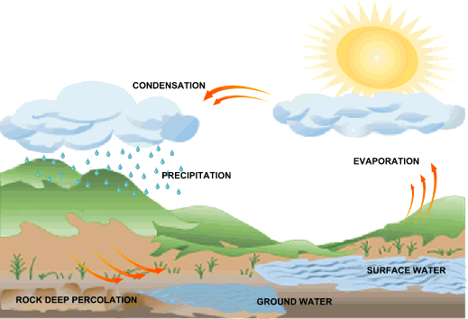
    - **Hình này chứng minh điều gì**
      - Thể hiện sự khép kín: bốc hơi từ biển, ngưng tụ mây, giáng thủy và dòng chảy ngầm.
    - **Từ đâu mà thấy được**
      - Chiều mũi tên vận chuyển nước từ mặt biển lên mây và quay về sông ngòi, tầng chứa nước.

###### 1.1.1.1 Cơ chế Chu trình Thủy văn Toàn cầu và Quá trình Chưng cất Tự nhiên
- **Bản chất chu trình thủy văn**:
  - Chu trình thủy địa hóa (Hydrogeochemical Cycle) luân chuyển nước liên tục giữa thủy quyển, khí quyển, thạch quyển và sinh quyển.
  - Năng lượng mặt trời và trọng lực Trái Đất điều khiển toàn bộ chu trình.
- **Bốn giai đoạn vận động của chu trình**:
  1. Bốc hơi nước biển (Solar Ocean Evaporation): Bức xạ mặt trời đốt nóng bề mặt biển. Nhiệt lượng bẻ gãy liên kết hydro giữa các phân tử $H_2O$. Hơi nước thoát vào khí quyển. Muối khoáng và tạp chất không bay hơi ở lại đại dương. Quá trình này hoạt động như một hệ thống chưng cất tự nhiên bằng năng lượng mặt trời (Natural Solar Distillation).
  2. Ngưng tụ và vận chuyển hơi ẩm (Atmospheric Transport & Condensation): Khối khí ẩm bốc lên cao gặp nhiệt độ thấp. Hơi nước ngưng tụ quanh hạt nhân ngưng tụ (aerosol bụi, muối biển, phấn hoa) tạo thành mây.
  3. Giáng thủy (Precipitation): Kích thước hạt nước trong mây tăng dần. Trọng lực thắng lực nâng khí động khiến nước rơi xuống mặt đất dưới dạng mưa, tuyết hoặc mưa đá.
  4. Dòng chảy bề mặt (Surface Runoff) và thấm sâu (Infiltration): Nước mưa rơi xuống đất chia thành ba phần. Phần thứ nhất bốc hơi trực tiếp vào khí quyển. Phần thứ hai chảy tràn bề mặt vào suối, sông, hồ rồi đổ ra biển. Phần thứ ba thấm qua tầng đất mặt bổ cập tầng chứa nước ngầm (aquifers).
- **Phân bố trữ lượng nước trên Trái Đất (Global Water Allocation)**:
  - Tổng trữ lượng nước toàn cầu đạt khoảng $1.386 \times 10^9\text{ km}^3$.
  - Nước mặn đại dương (Oceans): Chiếm $97.5\%$ tổng lượng nước toàn cầu. Độ mặn trung bình đạt $35\text{ g/L}$. Nước biển cần khử muối trước khi cấp cho sinh hoạt.
  - Băng hà và tuyết vĩnh cửu (Glaciers & Permanent Snowpack): Chiếm $1.76\%$ tổng lượng nước toàn cầu (tương đương $68.7\%$ tổng lượng nước ngọt). Nguồn nước này phân bố tại Nam Cực, Bắc Cực và đỉnh núi cao.
  - Nước dưới đất (Groundwater): Chiếm $0.76\%$ tổng lượng nước toàn cầu (tương đương $30.1\%$ tổng lượng nước ngọt). Nguồn nước này là nguồn cấp nước sinh hoạt chính cho con người.
  - Nước mặt ngọt (Freshwater Lakes & Rivers): Chiếm dưới $0.01\%$ tổng lượng nước toàn cầu. Hồ nước ngọt chiếm khoảng $0.007\%$. Sông suối chiếm khoảng $0.0002\%$. Đây là nguồn khai thác nước cấp tập trung thuận tiện nhất cho đô thị.

###### 1.1.1.2 Các Đặc tính Vật lý Cơ bản của Nước trong Hệ Đơn vị SI
- **Khối lượng riêng của nước ($\rho$)**:
  - Nước đạt khối lượng riêng cực đại tại nhiệt độ $4^\circ\text{C}$:
    $$\rho_{\text{water, } 4^\circ\text{C}} = 1000\text{ kg/m}^3 = 1.000\text{ g/cm}^3$$
  - Khối lượng riêng tại $20^\circ\text{C}$: $\rho = 998.2\text{ kg/m}^3$.
  - Khối lượng riêng tại $21^\circ\text{C}$: $\rho = 998.0\text{ kg/m}^3$.
  - Khối lượng riêng tại $25^\circ\text{C}$: $\rho = 997.0\text{ kg/m}^3$.
  - Quan hệ giữa khối lượng riêng và tỷ trọng (Specific Gravity - $\text{SG}$):
    $$\rho = \text{SG} \cdot \rho_{\text{ref}} = \text{SG} \cdot \rho_{\text{water, } 4^\circ\text{C}}$$
    - $\rho$: Khối lượng riêng của chất lỏng ($\text{kg/m}^3$).
    - $\text{SG}$: Tỷ trọng của chất lỏng (không thứ nguyên).
    - $\rho_{\text{ref}}$: Khối lượng riêng của chất lỏng chuẩn tại $4^\circ\text{C}$ ($1000\text{ kg/m}^3$).
- **Trọng lượng riêng của nước ($\gamma$)**:
  - Trọng lượng riêng tính bằng tích số giữa khối lượng riêng và gia tốc trọng trường:
    $$\gamma = \rho \cdot g$$
    - $\gamma$: Trọng lượng riêng của nước ($\text{N/m}^3$).
    - $\rho$: Khối lượng riêng của nước ($\text{kg/m}^3$).
    - $g$: Gia tốc trọng trường ($9.81\text{ m/s}^2$).
  - Giá trị trọng lượng riêng tại $4^\circ\text{C}$:
    $$\gamma = 1000\text{ kg/m}^3 \times 9.81\text{ m/s}^2 = 9810\text{ N/m}^3 = 9.81\text{ kN/m}^3$$
- **Độ nhớt động lực ($\mu$)**:
  - Độ nhớt động lực đo lực ma sát nội tại giữa các lớp chất lỏng chuyển động trượt.
  - Đơn vị đo trong hệ SI: $\text{N}\cdot\text{s/m}^2$ hoặc $\text{Pa}\cdot\text{s}$ ($1\text{ Poise} = 0.1\text{ Pa}\cdot\text{s}$, $1\text{ cP} = 10^{-3}\text{ Pa}\cdot\text{s}$).
  - Giá trị tại $20^\circ\text{C}$: $\mu = 1.002 \times 10^{-3}\text{ N}\cdot\text{s/m}^2$ ($1.002\text{ cP}$).
  - Giá trị tại $21^\circ\text{C}$: $\mu = 0.00982\text{ Poise} = 9.82 \times 10^{-4}\text{ N}\cdot\text{s/m}^2$ ($0.982\text{ cP}$).
- **Độ nhớt động học ($\nu$)**:
  - Độ nhớt động học là tỷ số giữa độ nhớt động lực và khối lượng riêng:
    $$\nu = \frac{\mu}{\rho}$$
    - $\nu$: Độ nhớt động học của nước ($\text{m}^2/\text{s}$).
    - $\mu$: Độ nhớt động lực của nước ($\text{N}\cdot\text{s/m}^2$).
    - $\rho$: Khối lượng riêng của nước ($\text{kg/m}^3$).
  - Giá trị tại $20^\circ\text{C}$: $\nu \approx 1.004 \times 10^{-6}\text{ m}^2/\text{s}$.
  - Giá trị tại $21^\circ\text{C}$: $\nu \approx 9.84 \times 10^{-7}\text{ m}^2/\text{s}$.
- **Nhiệt dung riêng của nước ($C_p$)**:
  - Giá trị chuẩn: $C_p = 4.184\text{ kJ/(kg}\cdot\text{K)}$ ($1\text{ cal/(g}\cdot^\circ\text{C)}$).
  - Nhiệt dung riêng cao giúp các thủy vực tự nhiên ổn định nhiệt độ trước biến đổi thời tiết.

###### 1.1.1.3 Phân loại Năm Nhóm Tạp chất Cốt lõi trong Nguồn Nước Tự nhiên
- **Nhóm 1: Các hợp chất vô cơ hòa tan (Dissolved Inorganic Compounds)**:
  - Cation chính:
    - Canxi ($Ca^{2+}$) và Magie ($Mg^{2+}$) tạo nên độ cứng của nước.
    - Natri ($Na^+$) và Kali ($K^+$) quyết định độ mặn của nước.
    - Sắt ($Fe^{2+}$) và Mangan ($Mn^{2+}$) xuất hiện phổ biến trong môi trường yếm khí thiếu oxy.
    - Nhôm ($Al^{3+}$), Stronti ($Sr^{2+}$) và Bari ($Ba^{2+}$) hòa tan từ khoáng sét tự nhiên.
  - Anion chính:
    - Bicarbonate ($HCO_3^-$) và Carbonate ($CO_3^{2-}$) tạo nên độ kiềm của nước.
    - Clorua ($Cl^-$) và Sunfat ($SO_4^{2-}$) tạo nên độ mặn và độ cứng phi carbonate.
    - Nitrate ($NO_3^-$) và Fluoride ($F^-$) sinh ra từ phân bón nông nghiệp hoặc khoáng đá.
  - Nguyên tố vết độc tính:
    - Asen ($As$), Chì ($Pb$), Cadmium ($Cd$), Crom ($Cr^{6+}$) và Thủy ngân ($Hg$).
    - Các nguyên tố này sinh ra từ phong hóa địa chất hoặc nước thải công nghiệp. Chúng gây tổn thương nội tạng và ung thư.
- **Nhóm 2: Các hợp chất hữu cơ hòa tan (Dissolved Organic Matter - NOM)**:
  - Hợp chất hữu cơ tự nhiên (Natural Organic Matter - NOM):
    - Hình thành do phân rã thảm thực vật, bùn đáy và chất tiết chuyển hóa của tảo.
    - Axit Humic: Khối lượng phân tử lớn, tan trong kiềm, kết tủa trong axit, tạo màu nâu sẫm cho nước.
    - Axit Fulvic: Khối lượng phân tử nhỏ hơn, tan trong mọi dải pH, tạo màu vàng rơm cho nước.
    - Tanin: Hòa tan từ vỏ cây và lá mục trong rừng ngập nước.
  - Hợp chất hữu cơ tổng hợp (Synthetic Organic Chemicals - SOCs):
    - Chất hoạt động bề mặt (detergents) từ nước thải sinh hoạt đô thị.
    - Thuốc bảo vệ thực vật (pesticides, organochlorines) từ dòng chảy tràn nông nghiệp.
    - Dung môi công nghiệp và các chất gây rối loạn nội tiết (EDCs).
  - Tác động kỹ thuật của hợp chất hữu cơ:
    - Tiêu tốn hóa chất keo tụ trong quá trình xử lý nước.
    - Gây nghẹt tắc màng lọc nước.
    - Phản ứng với clo sinh ra phụ phẩm khử trùng gây ung thư (Disinfection By-Products - DBPs).
- **Nhóm 3: Các chất khí hòa tan (Dissolved Gases)**:
  - Oxy hòa tan (Dissolved Oxygen - DO): Duy trì sự sống thủy sinh và trạng thái oxy hóa của nước mặt. Nước ngầm sâu thường nghèo DO ($DO < 1 - 2\text{ mg/L}$).
  - Khí Carbonic ($CO_2$): Hòa tan tạo axit carbonic ($H_2CO_3$). Khí này ăn mòn kim loại đường ống và hòa tan đá vôi tạo độ cứng.
  - Khí Hydro Sulfua ($H_2S$): Sinh ra do vi khuẩn khử sunfat trong môi trường kỵ khí. Khí gây mùi trứng thối và tạo kết tủa đen $FeS$ khi gặp ion sắt.
  - Khí Methane ($CH_4$): Khí dễ cháy nổ, sinh ra do phân hủy bùn kỵ khí ở đáy thủy vực.
  - Khí Radon ($Rn$): Khí phóng xạ tự nhiên hòa tan từ vỉa đá granite chứa urani.
  - Khí Nitơ ($N_2$) và Khí Lưu huỳnh đioxit ($SO_2$): Hòa tan vào nước từ bầu khí quyển.
- **Nhóm 4: Các chất rắn lơ lửng và hệ keo (Suspended Solids & Colloids)**:
  - Chất rắn lơ lửng (Total Suspended Solids - TSS):
    - Kích thước hạt từ $1\text{ }\mu\text{m}$ đến hàng trăm $\mu\text{m}$.
    - Gồm hạt cát mịn, bùn phù sa (silt), xác hữu cơ, dầu và mỡ.
    - Các hạt này tạo ra độ đục (Turbidity) và có thể lắng tự nhiên nhờ trọng lực.
  - Hệ keo (Colloidal Sol):
    - Kích thước hạt rất nhỏ từ $0.001\text{ }\mu\text{m}$ đến $1\text{ }\mu\text{m}$.
    - Gồm keo sét aluminosilicate, keo silica và phức hợp hữu cơ.
    - Hạt keo mang điện tích âm bề mặt cố hữu. Lực đẩy tĩnh điện ngăn các hạt keo tự kết dính.
    - Nhà máy phải dùng phèn nhôm hoặc phèn sắt để keo tụ và trung hòa điện tích.
- **Nhóm 5: Vi sinh vật (Microorganisms)**:
  - Vi khuẩn gây bệnh (Pathogenic Bacteria):
    - *Escherichia coli*: Vi khuẩn chỉ thị mức độ nhiễm phân từ người và động vật máu nóng.
    - *Vibrio cholerae*: Phẩy khuẩn tả gây bệnh tả và tiêu chảy cấp tính.
    - *Salmonella typhi*: Vi khuẩn gây bệnh sốt thương hàn.
    - *Shigella*: Vi khuẩn gây bệnh lỵ trực khuẩn.
    - *Pseudomonas aeruginosa*: Trực khuẩn mủ xanh gây nhiễm trùng cơ hội.
  - Virus gây bệnh truyền qua đường nước:
    - Kích thước siêu nhỏ từ $0.02\text{ }\mu\text{m}$ đến $0.1\text{ }\mu\text{m}$.
    - Gồm Rotavirus (gây tiêu chảy cấp ở trẻ em), Enterovirus, Viêm gan A ($HAV$) và Norovirus.
  - Động vật nguyên sinh và ký sinh trùng (Protozoa & Helminths):
    - Bào nang *Giardia lamblia* (kích thước $8 - 14\text{ }\mu\text{m}$).
    - Noãn nang *Cryptosporidium parvum* (kích thước $4 - 6\text{ }\mu\text{m}$).
    - Vỏ kitin của noãn nang *Cryptosporidium* trơ với hóa chất clo. Nhà máy phải dùng lọc màng, ozon hoặc tia UV để xử lý.
  - Tảo (*Algae*) và nấm (*Fungi*): Gây mùi vị lạ cho nước và làm nghẹt bể lọc cát.

##### 1.1.2 Nguồn Nước mưa và Nước biển (Rainwater & Seawater Sources)

###### 1.1.2.1 Nước Mưa: Đặc tính Hóa lý, Độ ổn định và Trữ lượng
- **Độ khoáng hóa và độ tinh khiết**:
  - Hàm lượng tổng chất rắn hòa tan (TDS) rất thấp, dao động từ $10\text{ mg/L}$ đến $50\text{ mg/L}$.
  - Nước mưa hầu như không chứa ion canxi và magie. Độ cứng xấp xỉ bằng không (nước siêu mềm).
- **Tính axit tự nhiên của nước mưa**:
  - Nước mưa hòa tan khí carbonic trong khí quyển tạo thành axit carbonic:
    $$CO_2 + H_2O \rightleftharpoons H_2CO_3 \rightleftharpoons H^+ + HCO_3^-$$
  - Giá trị pH của nước mưa tự nhiên không ô nhiễm dao động từ $5.0$ đến $5.6$.
  - Mưa axit xảy ra khi khí quyển nhiễm nhiều $SO_2$ và $NO_x$. Giá trị pH của mưa axit giảm xuống $3.5 - 4.5$.
- **Tính ăn mòn xâm thực (Aggressive Corrosiveness)**:
  - Nước mưa thiếu hụt ion canxi ($Ca^{2+}$) và ion kiềm ($HCO_3^-$).
  - Chỉ số bão hòa Langelier của nước mưa luôn âm rất sâu ($LSI \ll 0$).
  - Nước mưa hòa tan vôi trong bể xi măng và hòa tan kim loại đường ống ($Pb, Cu$).
- **Hệ thống thu gom và trữ nước mưa phân tán**:
  - Quy trình vận hành và cấu trúc hệ thống gồm 4 bộ phận:
    1. Bề mặt mái thu (Catchment Surface): Mái ngói, tôn mạ hoặc bê tông sạch trơ hóa học. Tuyệt đối không dùng mái fibro-xi măng chứa amiăng.
    2. Thiết bị xả nước mưa đợt đầu (First-Flush Diverter): Tách bỏ $1 - 2\text{ mm}$ mưa đầu trận (tương đương $10 - 20\text{ L}$ cho mỗi $10\text{ m}^2$ mái). Thiết bị này loại bỏ bụi bẩn, phân chim và lá cây.
    3. Bể trữ nước mưa kín (Storage Cistern): Bể composite hoặc nhựa HDPE. Bể phải chắn kín ánh sáng mặt trời để ngăn rêu tảo phát triển và muỗi đẻ trứng.
    4. Cụm xử lý bổ sung: Lọc cát thạch anh, lọc than hoạt tính và đun sôi hoặc khử trùng nano bạc trước khi uống trực tiếp.

###### 1.1.2.2 Nước Biển: Độ mặn, Tỷ trọng và Rào cản Khử muối
- **Độ mặn và thành phần ion chính**:
  - Độ mặn trung bình của nước biển dao động từ $3.3\%$ đến $3.7\%$.
  - Giá trị thiết kế chuẩn lấy bằng $3.5\%$ (tương đương $35\text{ g/L}$ hoặc $35,000\text{ mg/L TDS}$).
  - Hàm lượng các ion chính trong nước biển có độ mặn $3.5\%$:
    - Clorua ($Cl^-$): $19,350\text{ mg/L}$ ($55.0\%$ tổng lượng anion).
    - Natri ($Na^+$): $10,760\text{ mg/L}$ ($30.6\%$ tổng lượng cation).
    - Sunfat ($SO_4^{2-}$): $2,710\text{ mg/L}$.
    - Magie ($Mg^{2+}$): $1,290\text{ mg/L}$.
    - Canxi ($Ca^{2+}$): $410\text{ mg/L}$.
    - Kali ($K^+$): $390\text{ mg/L}$.
    - Bicarbonate ($HCO_3^-$): $140\text{ mg/L}$.
- **Áp suất thẩm thấu ($\Pi$) và rào cản năng lượng**:
  - Áp suất thẩm thấu xác định theo phương trình Van 't Hoff:
    $$\Pi = i \cdot M \cdot R \cdot T$$
    - $\Pi$: Áp suất thẩm thấu của dung dịch nước biển ($\text{bar}$).
    - $i$: Hệ số phân ly ion Van 't Hoff (không thứ nguyên).
    - $M$: Tổng nồng độ mol của các phần tử chất tan ($\text{mol/L}$).
    - $R$: Hằng số khí lý tưởng ($0.08314\text{ L}\cdot\text{bar/(mol}\cdot\text{K)}$).
    - $T$: Nhiệt độ nhiệt động học tuyệt đối ($\text{K}$, $T = t^\circ\text{C} + 273.15$).
  - Giá trị áp suất thẩm thấu của nước biển tự nhiên tại $25^\circ\text{C}$: $\Pi \approx 25 - 28\text{ bar}$ ($360 - 400\text{ psi}$).
  - Áp suất vận hành thực tế của trạm lọc màng thẩm thấu ngược nước biển (SWRO):
    - Bơm cao áp phải thắng áp suất thẩm thấu cộng với trở lực màng.
    - Áp suất vận hành thực tế duy trì trong khoảng $55\text{ bar}$ đến $70\text{ bar}$ ($800 - 1000\text{ psi}$).
- **Tỷ trọng và khối lượng riêng của nước biển**:
  - Hàm lượng muối cao làm tăng khối lượng riêng của nước biển:
    $$\rho_{\text{seawater}} \approx 1.025\text{ kg/L} = 1025\text{ kg/m}^3\text{ (tại } 20^\circ\text{C)}$$
  - Tỷ trọng tương đối so với nước chuẩn tại $4^\circ\text{C}$: $\text{SG} = 1.025$.
- **Hiện tượng hạ điểm đóng băng (Freezing Point Depression)**:
  - Nồng độ ion muối làm hạ nhiệt độ kết tinh của nước.
  - Điểm đóng băng của nước biển có độ mặn $3.5\%$ hạ xuống mức $-1.9^\circ\text{C}$ (thay vì $0.0^\circ\text{C}$ của nước cất).
- **Độ kiềm và pH của nước biển**:
  - Nước biển có dải pH ổn định từ $7.5$ đến $8.4$.
  - Hệ đệm tự nhiên carbonate ($HCO_3^- / CO_3^{2-}$) và borate ($B(OH)_3 / B(OH)_4^-$) kiểm soát ổn định giá trị pH này.
- Tạp chất trong nước tự nhiên được phân chia theo kích thước hạt:
  - **Hình 13.** Biểu đồ phân loại 5 nhóm tạp chất chủ yếu trong nước tự nhiên
    - 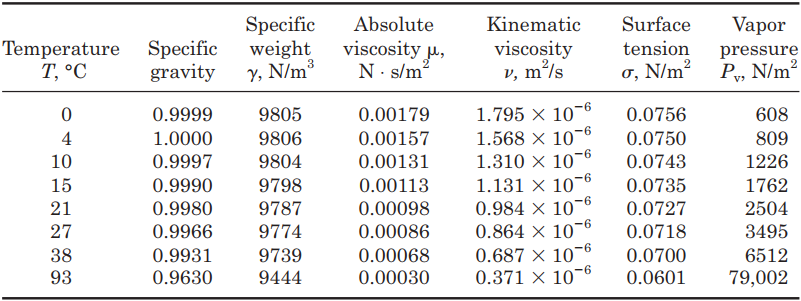
    - **Hình này chứng minh điều gì**
      - Phân bố kích thước hạt từ ion hòa tan, keo hữu cơ đến cặn lơ lửng.
    - **Từ đâu mà thấy được**
      - Trục hoành thang logarit phân định ranh giới giữa chất hòa tan, keo và chất rắn lơ lửng.

#### 1.2 Hệ thống cấp nước

##### 1.1.3 Nguồn Nước ngầm: Chất lượng, Khoáng hóa và Nhiễm bẩn (Groundwater Quality, Minerals & Contamination)

###### 1.1.3.1 Địa tầng Thủy văn và Cơ chế Hòa tan Khoáng chất Tự nhiên
- **Cấu trúc tầng chứa nước (Aquifer Structures)**:
  - Tầng không áp (Unconfined Aquifer) nằm sát mặt đất. Mực nước tự do thay đổi theo mùa và chịu áp suất khí quyển.
  - Tầng chứa nước không áp nhận nước bổ cập nhanh từ nước mưa thấm. Tầng này dễ nhiễm bẩn từ các hoạt động trên mặt đất.
  - Tầng có áp (Confined Aquifer) nằm kẹp giữa hai lớp địa chất không thấm nước. Nước chịu áp lực thủy tĩnh cao.
  - Khi khoan giếng vào tầng có áp, mực nước tự dâng cao hơn đỉnh tầng chứa nước. Nước có độ an toàn vi sinh cao.

- **Cơ chế hòa tan sắt ($Fe^{2+}$) và mangan ($Mn^{2+}$)**:
  - Vi sinh vật trong đất tiêu thụ hết oxy hòa tan ($DO \to 0\text{ mg/L}$) khi phân hủy chất hữu cơ.
  - Môi trường ngầm chuyển sang trạng thái khử mạnh với thế oxy hóa khử âm ($Eh < 0$).
  - Nước ngầm hòa tan khoáng sắt và mangan không tan trong đất đá:
    $$Fe^{3+}_{\text{(rắn)}} + e^- \to Fe^{2+}_{\text{(hòa tan)}}$$
    $$MnO_{2\text{(rắn)}} + 4H^+ + 2e^- \to Mn^{2+}_{\text{(hòa tan)}} + 2H_2O$$
  - Nước mới bơm lên từ giếng khoan luôn trong suốt. Nước chứa ion sắt ($Fe^{2+}$) và mangan ($Mn^{2+}$) hòa tan.
  - Khi tiếp xúc không khí, oxy oxy hóa $Fe^{2+}$ thành kết tủa $Fe(OH)_3$ màu nâu đỏ. Quá trình làm nước đục và gây ố vàng.

- **Cơ chế hòa tan canxi ($Ca^{2+}$), magie ($Mg^{2+}$) tạo độ cứng**:
  - Vi sinh vật và rễ cây hô hấp giải phóng lượng lớn khí $CO_2$ vào đất ($20 - 100\text{ mg/L}$).
  - Khí $CO_2$ hòa tan vào nước tạo thành axit carbonic ($H_2CO_3$).
  - Axit carbonic hòa tan đá vôi ($CaCO_3$) và đá dolomit ($CaMg(CO_3)_2$):
    $$CaCO_{3\text{(rắn)}} + CO_2 + H_2O \rightleftharpoons Ca^{2+} + 2HCO_3^-$$
    $$CaMg(CO_3)_{2\text{(rắn)}} + 2CO_2 + 2H_2O \rightleftharpoons Ca^{2+} + Mg^{2+} + 4HCO_3^-$$
  - Phản ứng giải phóng ion $Ca^{2+}$ và $Mg^{2+}$, hình thành độ cứng carbonate trong nước ngầm.

- **Độc chất tự nhiên trong nước ngầm**:
  - Asen tự nhiên ($As$) giải phóng từ quặng pirit ($FeAsS$) hoặc quá trình khử khoáng sắt hydroxit.
  - Asen tồn tại ở dạng arsenite ($As^{3+}$) độc tính cao hoặc arsenate ($As^{5+}$). Nồng độ asen tầng nông thường vượt $0{,}01\text{ mg/L}$.
  - Fluoride ($F^-$) hòa tan từ khoáng fluorit ($CaF_2$). Nồng độ fluoride vượt $1{,}5\text{ mg/L}$ gây hỏng men răng và xốp xương.
  - Phóng xạ Radon ($^{222}Rn$) và Radium ($^{226}Ra$) hòa tan từ các đới nứt nẻ của đá granit.

###### 1.1.3.2 Nước ngầm Nhiễm lợ (Brackish Groundwater)
- Khai thác nước ngầm quá mức làm hạ thấp mực nước áp lực tĩnh.
- Nước biển xâm nhập vào các tầng chứa nước ngọt tại vùng ven biển.
- Nước ngầm chuyển thành nước lợ với hàm lượng tổng chất rắn hòa tan cao:
  $$\text{TDS} = 1000 - 5000\text{ mg/L}$$
- Kỹ sư phải dùng công nghệ màng lọc thẩm thấu ngược nước lợ (BWRO) hoặc điện thẩm tích (EDR) để khử mặn.

###### 1.1.3.3 Cơ chế Nhiễm bẩn Nhân sinh Tầng Nước ngầm (Anthropogenic Contamination)
- **Rò rỉ bể chứa xăng dầu ngầm (UST Leaks)**:
  - Bồn thép ngầm bị ăn mòn điện hóa sau 15 đến 30 năm chôn lấp.
  - Nhiên liệu rò rỉ phát tán nhóm hydrocarbon thơm BTEX (Benzene, Toluene, Ethylbenzene, Xylenes) và phụ gia MTBE.
  - Benzene là chất gây ung thư nhóm 1. MTBE tan nhiều trong nước, phân hủy sinh học chậm và di chuyển xa hàng kilômét.

- **Ô nhiễm nitrate ($NO_3^-$) từ nước thải và nông nghiệp**:
  - Bể tự hoại rò rỉ và phân bón hóa học dư thừa ($NH_4NO_3$) thấm sâu vào đất.
  - Vi khuẩn hiếu khí nitrat hóa amoni thành nitrite ($NO_2^-$) và nitrate ($NO_3^-$):
    $$NH_4^+ + 2O_2 \to NO_3^- + 2H^+ + H_2O$$
  - Ion nitrate không bị keo đất tích điện âm giữ lại. Nitrate đi thẳng vào tầng nước ngầm.
  - Nồng độ nitrate vượt $50\text{ mg/L}$ gây hội chứng trẻ xanh (Methemoglobinemia) ở trẻ sơ sinh.

- **Dung môi công nghiệp clo hóa (DNAPL)**:
  - Dung môi tẩy rửa cơ khí Trichloroethylene (TCE) và Tetrachloroethylene (PCE) ngấm vào đất.
  - Hợp chất này có tỷ trọng nặng hơn nước, tạo pha lỏng hữu cơ đậm đặc (DNAPL).
  - Túi DNAPL chìm xuống đáy tầng ngậm nước, hòa tan chậm qua nhiều thập kỷ và gây độc kéo dài.

###### 1.1.3.4 Ma trận Đánh giá Ưu điểm và Nhược điểm của Nước ngầm
- **Bảng so sánh ưu nhược điểm kỹ thuật của nước ngầm**:

| Chỉ tiêu kỹ thuật | Ưu điểm của nguồn nước ngầm | Nhược điểm và thách thức vận hành |
|---|---|---|
| **Độ đục và hạt cặn** | Độ đục thấp ($\le 1 - 2\text{ NTU}$), ít cặn lơ lửng nhờ đất cát lọc tự nhiên. | Cát mịn có thể lọt qua lưới lọc gây mài mòn cánh bơm giếng sâu. |
| **Ô nhiễm vi sinh** | Không có vi khuẩn gây bệnh và ký sinh trùng do thiếu ánh sáng. | Nước giếng nông dễ nhiễm bẩn phân nếu gần hố xí tự hoại. |
| **Nhiệt độ nước** | Nhiệt độ ổn định quanh năm ($22 - 25^\circ\text{C}$). | Nước có thể chứa khí cháy ($CH_4$) hoặc khí độc ($H_2S$). |
| **Chất hữu cơ tự nhiên** | Nồng độ chất hữu cơ thấp, ít tạo phụ phẩm khử trùng DBP. | Hàm lượng khoáng hòa tan cao ($Fe, Mn, Ca^{2+}, Mg^{2+}$). |
| **Công trình xử lý** | Mặt bằng xử lý gọn, bỏ qua bể keo tụ và bể lắng cặn thô. | Chi phí điện bơm giếng sâu cao, chi phí hóa chất khử cứng lớn. |
| **Mức độ bền vững** | Nguồn nước ngầm an toàn trước ô nhiễm bề mặt tức thời. | Tầng ngầm đã nhiễm độc asen hoặc dung môi rất khó phục hồi. |

---

##### 1.1.4 Nguồn Nước mặt: Thủy vực và Động lực Lưu vực (Surface Water Characteristics & Watershed Dynamics)

###### 1.1.4.1 Phân loại Thủy vực Nước mặt và Biến động Mùa vụ
- **Thủy vực chảy (Hệ Lotic - Sông, Suối)**:
  - Vận tốc dòng chảy lớn ($v = 0{,}5 - 2{,}5\text{ m/s}$).
  - Khả năng tự sục khí bề mặt cao, oxy hòa tan dồi dào ($DO = 6 - 8\text{ mg/L}$).
  - Chất lượng nước biến động tức thời theo lượng mưa và hoạt động xả thải trên lưu vực.

- **Thủy vực tĩnh (Hệ Lentic - Hồ Tự nhiên, Hồ chứa)**:
  - Vận tốc dòng chảy rất nhỏ ($v \approx 0\text{ m/s}$), thời gian lưu nước kéo dài từ vài tuần đến nhiều năm.
  - Cặn lơ lửng thô tự lắng tốt, tạo độ đục nền ổn định.
  - Hiện tượng phân tầng nhiệt độ (Thermal Stratification) xuất hiện vào mùa khô nóng:
    - Tầng mặt (Epilimnion) ấm, giàu oxy hòa tan nhưng chứa nhiều tảo.
    - Tầng đáy (Hypolimnion) lạnh, tù đọng, yếm khí, chứa nhiều sắt, mangan, photpho và khí $H_2S$.
  - Tích tụ nitơ và photpho gây hiện tượng phú dưỡng (Eutrophication). Tảo lam nở hoa tiết độc tố Microcystin và chất gây mùi hôi (Geosmin, MIB).

- **Xung đột biến độ đục do mưa bão**:
  - Mưa lớn xói mòn lưu vực và cuốn trôi phù sa vào sông suối.
  - Độ đục bùng phát đột ngột từ $20 - 50\text{ NTU}$ lên mức $500 - 3000\text{ NTU}$ trong vài giờ.
  - Nước mưa làm loãng nồng độ ion bicarbonate, làm độ kiềm sụt giảm ($< 20 - 30\text{ mg/L as }CaCO_3$).
  - Kỹ sư phải tăng liều lượng phèn, châm thêm kiềm và dùng polymer trợ lắng.

###### 1.1.4.2 Hợp chất Hữu cơ Tự nhiên (NOM) và Tiền chất Tạo Phụ phẩm Khử trùng
- **Phân loại nguồn gốc chất hữu cơ tự nhiên**:
  - Nguồn nội sinh (Autochthonous): Do hoạt động quang hợp và phân rã của tảo, vi sinh vật trong nước sinh ra. Chỉ số hấp thụ tia cực tím riêng thấp ($SUVA_{254} < 2\text{ L/(mg}\cdot\text{m)}$).
  - Nguồn ngoại sinh (Allochthonous): Rửa trôi từ thảm thực vật và đất rừng mục nát. Nguồn này chứa nhiều axit humic và axit fulvic ($SUVA_{254} > 3 - 4\text{ L/(mg}\cdot\text{m)}$). Nước có màu vàng nâu.

- **Phản ứng tạo phụ phẩm khử trùng (DBP Formation)**:
  - Clo khử trùng phản ứng với nhân thơm của axit humic và fulvic.
  - Phản ứng sinh ra các hợp chất hữu cơ clo hóa độc hại:
    $$\text{NOM} + Cl_2 \to \text{THMs} + \text{HAAs}$$
  - Sản phẩm gồm Trihalomethanes ($CHCl_3, CHBrCl_2, CHBr_2Cl, CHBr_3$) và Haloacetic Acids. Các chất này gây ung thư gan, thận và bàng quang.

###### 1.1.4.3 Rủi ro Ô nhiễm Vi sinh vật Nguồn Nước mặt
- Nước mặt nhận nước thải đô thị và dòng chảy tràn chăn nuôi gia súc.
- Nguồn nước luôn tiềm ẩn vi khuẩn gây bệnh tả (*Vibrio cholerae*), thương hàn (*Salmonella*), lỵ (*Shigella*).
- Bào nang *Giardia lamblia* ($8 - 14\text{ }\mu\text{m}$) và noãn nang *Cryptosporidium parvum* ($4 - 6\text{ }\mu\text{m}$) xuất hiện phổ biến.
- Vỏ kitin của noãn nang *Cryptosporidium* kháng clo khử trùng thông thường. Nhà máy nước phải dùng rào cản keo tụ - lắng - lọc cát hoặc khử trùng bằng Ozon và tia UV.

###### 1.1.4.4 So sánh Đặc tính Kỹ thuật giữa Nước mặt và Nước ngầm
- **Bảng đối chiếu thông số giữa hai nguồn nước**:

| Thông số kỹ thuật | Nguồn nước mặt (Sông, Hồ chứa) | Nguồn nước ngầm (Tầng sâu) |
|---|---|---|
| **Độ đục (Turbidity)** | Cao ($10 - 2000\text{ NTU}$), biến động lớn theo mùa. | Rất thấp ($\le 1 - 2\text{ NTU}$), ổn định quanh năm. |
| **Độ màu (Color)** | Cao ($10 - 150\text{ TCU}$), do phức humic và keo sét. | Thấp (chỉ tăng khi sắt bị oxy hóa tạo cặn). |
| **Oxy hòa tan (DO)** | Cao ($6 - 8\text{ mg/L}$), tiếp xúc khí quyển tốt. | Rất thấp hoặc bằng 0 ($0 - 2\text{ mg/L}$), yếm khí. |
| **Khí Carbonic ($CO_2$)** | Thấp ($0 - 5\text{ mg/L}$). | Cao ($20 - 100\text{ mg/L}$), gây ăn mòn đường ống. |
| **Sắt và Mangan ($Fe, Mn$)** | Thấp, tồn tại chủ yếu ở dạng huyền phù liên kết bùn. | Thường cao ($1 - 20\text{ mg/L}$), tồn tại ở dạng hòa tan. |
| **Độ cứng ($Ca^{2+}, Mg^{2+}$)** | Thấp đến trung bình ($20 - 100\text{ mg/L as }CaCO_3$). | Thường cao ($100 - 500\text{ mg/L as }CaCO_3$). |
| **Chất hữu cơ (TOC, NOM)** | Cao ($2 - 15\text{ mg/L}$), tiềm ẩn nguy cơ tạo THMs. | Thấp ($< 1 - 2\text{ mg/L}$), ít nguy cơ tạo THMs. |
| **Vi sinh vật gây bệnh** | Nguy cơ rất cao (vi khuẩn phân, virus, kén ký sinh trùng). | Nguy cơ thấp nếu miệng giếng bảo vệ đúng kỹ thuật. |
| **Sơ đồ xử lý chuẩn** | Keo tụ $\to$ Tạo bông $\to$ Lắng $\to$ Lọc $\to$ Clo hóa. | Làm thoáng $\to$ Kiềm hóa $\to$ Lắng $\to$ Lọc $\to$ Clo hóa. |

---
- Công trình thu nước mặt cần vươn ra xa bờ để lấy nước tầng mặt ít bùn đáy:
- Đài thu nước kết hợp giếng bờ là giải pháp tối ưu cho sông có biên độ mực nước lớn:
  - **Hình 17.** Cụm công trình đài thu nước kết hợp giếng bờ ven sông
    - 
    - **Hình này chứng minh điều gì**
      - Sơ đồ thu nước sông có dao động mực nước lớn, bảo vệ máy bơm không bị ngập lũ.
    - **Từ đâu mà thấy được**
      - Ống tự chảy dẫn nước từ lòng sông vào giếng bờ sâu đặt cụm bơm chìm.
  - **Hình 16.** Công trình thu nước mặt thực tế với cầu dẫn và trạm bơm
    - 
    - **Hình này chứng minh điều gì**
      - Cấu trúc đài thu nước mặt xa bờ giúp thu nước tầng mặt trong sạch, hạn chế bùn đáy.
    - **Từ đâu mà thấy được**
      - Cầu dẫn nối bờ và đài thu độc lập nằm sâu giữa lòng hồ.
- Giếng khoan khai thác nước ngầm cấu tạo gồm ống vách, ống lọc và vành sỏi chèn:
  - **Hình 20.** Sơ đồ cấu tạo giếng khoan khai thác nước dưới đất
    - 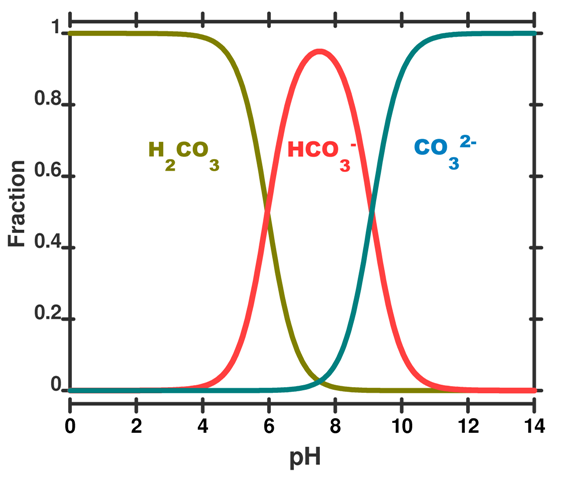
    - **Hình này chứng minh điều gì**
      - Ống lọc đặt tại tầng chứa nước cát sỏi và lớp chèn sỏi ngăn cát mịn xâm nhập giếng.
    - **Từ đâu mà thấy được**
      - Cấu trúc tầng lọc ống lọc khe kết hợp vành sỏi đệm xung quanh thành giếng.

#### 1.3 Chất lượng nước

##### 1.2.1 Ba Phân khu Cốt lõi của Hệ thống Cấp nước Đô thị

###### 1.2.1.1 Phân khu Thu nước và Trạm Bơm Cấp 1 (Water Intake & Low-Lift Pumping Station)
- **Công trình thu nước mặt**:
  - Song chắn rác thô giữ lại cành cây, bèo tây và rác nổi kích thước lớn.
  - Lưới chắn rác tinh ngăn rong rêu và rác nhỏ lọt vào ngăn hút bơm.
  - Cửa thu ven bờ (Shore Intake) đặt tại bờ sông có mái dốc đứng và nền địa chất ổn định.
  - Cửa thu lòng sông (Riverbed Intake) dẫn nước vào ống tự chảy hoặc ống xi-phông về giếng thu bờ sông.
  - Trạm bơm cấp 1 dùng máy bơm ly tâm trục đứng hoặc ngang, hoạt động ở cột áp thấp ($H = 10 - 25\text{ m}$). Bơm đẩy nước lên bể trộn đầu trạm xử lý.

- **Công trình thu nước ngầm**:
  - Mạng lưới giếng khoan khai thác sâu $50 - 250\text{ m}$ vào tầng ngậm nước có áp.
  - Ống lọc giếng khoan (Well Screen) xẻ rãnh chuẩn bọc sỏi lọc xung quanh để giữ cát mịn.
  - Bơm chìm giếng sâu (Submersible Pump) thả ngập dưới mực nước động, đẩy nước trực tiếp lên dàn làm thoáng.

###### 1.2.1.2 Nhà máy Xử lý Nước cấp (Water Treatment Plant - WTP)
- **Tuyến thủy lực tự chảy bằng trọng lực (Gravity Hydraulic Flow)**:
  - Dòng nước tự chảy liên tục qua các công trình đơn vị: Trộn nhanh $\to$ Tạo bông $\to$ Lắng $\to$ Lọc cát.
  - Đáy máng bể trộn đặt ở cao trình cao nhất. Cao trình này thắng toàn bộ tổn thất áp lực trên đường ống và qua các lớp cát lọc.
  - Nước sau lọc tự chảy vào bể chứa nước sạch nằm ngầm dưới đất.

- **Khu châm hóa chất (Chemical Feed Facilities)**:
  - Bố trí kho chứa và bồn pha dung dịch phèn nhôm ($Al_2(SO_4)_3$), phèn PAC, vôi tôi ($Ca(OH)_2$), polymer.
  - Bơm định lượng màng vận chuyển hóa chất qua đường ống nhựa chống ăn mòn vào điểm châm.

- **Khu xử lý bùn cặn (Sludge Treatment Facilities)**:
  - Bùn xả từ đáy bể lắng và nước rửa ngược bể lọc thu gom về bể nén bùn trọng lực.
  - Máy ép bùn băng tải hoặc máy ly tâm tách nước tạo bánh bùn khô có độ ẩm thấp để vận chuyển đi chôn lấp.

###### 1.2.1.3 Mạng lưới Truyền dẫn và Phân phối Nước sạch (Distribution Network)
- **Bể chứa nước sạch (Clearwell / Finished Water Reservoir)**:
  - Bể điều hòa chênh lệch giữa công suất sản xuất đều đặn của nhà máy và biểu đồ tiêu thụ nước dao động của đô thị.
  - Bể tạo thời gian tiếp xúc khử trùng tối thiểu với clo:
    $$CT \ge 30\text{ phút}$$
  - Bể lưu trữ dung tích nước chữa cháy dự phòng bắt buộc trong $3\text{ giờ}$ liên tục.

- **Trạm bơm cấp 2 (High-Lift Pumping Station)**:
  - Máy bơm ly tâm công suất lớn đẩy nước vào mạng lưới đường ống chính.
  - Cột áp trạm bơm cấp 2 duy trì mức cao ($H = 40 - 70\text{ m}$).
  - Trạm gắn biến tần (VFD) để tự động điều chỉnh tốc độ động cơ theo áp lực mạng lưới theo giờ.

- **Đài nước điều hòa (Elevated Water Tower)**:
  - Xây dựng tại điểm cao trong đô thị hoặc cuối mạng lưới đường ống.
  - Đài nước ổn định áp lực mạng lưới, chống búa nước (water hammer) và cấp nước bù vào giờ cao điểm.

- **Mạng lưới đường ống phân phối**:
  - Mạng lưới quy hoạch thành mạng vòng khép kín (looped network).
  - Khi một đoạn ống vỡ, van phân đoạn cô lập đoạn hư hại mà không gây mất nước cục bộ diện rộng.

---

##### 1.2.2 Phân loại Hệ thống Cấp nước theo Mục đích Sử dụng

###### 1.2.2.1 Hệ thống Cấp nước Sinh hoạt Đô thị (Domestic Water Supply)
- Cung cấp nước cho ăn uống, tắm giặt, nấu nướng và dịch vụ công cộng.
- Chất lượng nước cấp bắt buộc đạt 100% chỉ tiêu theo quy chuẩn QCVN 01-1:2018/BYT.
- Tiêu chuẩn dùng nước thiết kế theo quy mô đô thị dao động từ $150 - 250\text{ L/người}\cdot\text{ngày}$.
- Áp lực tự do tối thiểu tại vòi vào nhà 1 tầng là $10\text{ m}$ cột nước, mỗi tầng tiếp theo tăng thêm $4\text{ m}$.

###### 1.2.2.2 Hệ thống Cấp nước Công nghiệp (Industrial Process Water)
- **Nước làm mát gián tiếp (Cooling Water)**:
  - Khối lượng tiêu thụ rất lớn. Nước yêu cầu kiểm soát độ cứng và độ kiềm để tránh kết tủa $CaCO_3$ trong bình ngưng tụ.
  - Cần châm hóa chất diệt khuẩn chống màng nhầy sinh học (biofilm) và ức chế ăn mòn.

- **Nước cấp lò hơi (Boiler Feedwater)**:
  - Yêu cầu chất lượng cực kỳ khắt khe theo áp suất lò hơi.
  - Nước phải qua trao đổi ion khử cứng hoàn toàn ($\text{TH} \approx 0\text{ mg/L as }CaCO_3$).
  - Khử oxy hòa tan đến ngưỡng an toàn ($DO < 0{,}005\text{ mg/L}$) để ngăn thủng ống lò hơi do ăn mòn điểm.
  - Hàm lượng silica phải đạt chuẩn ($SiO_2 < 0{,}01\text{ mg/L}$) nhằm ngăn ngừa tạo vảy silicat cứng trên vách truyền nhiệt.

- **Nước công nghệ dệt nhuộm và sản xuất giấy**:
  - Kiểm soát nghiêm ngặt nồng độ sắt ($Fe < 0{,}05\text{ mg/L}$) và mangan ($Mn < 0{,}02\text{ mg/L}$).
  - Hàm lượng kim loại cao sẽ làm loang ố màu vải sợi và làm sẫm màu bột giấy tẩy trắng.

- **Nước siêu tinh khiết (Ultrapure Water - UPW)**:
  - Dùng trong công nghiệp sản xuất linh kiện bán dẫn và dược phẩm tiêm truyền.
  - Điện trở suất đạt giới hạn lý thuyết:
    $$\rho = 18{,}2\text{ M}\Omega\cdot\text{cm}\text{ ở }25^\circ\text{C}$$
  - Hàm lượng carbon hữu cơ tổng $TOC < 1 - 5\text{ ppb}$, không chứa hạt cặn kích thước $> 0{,}05\text{ }\mu\text{m}$, vô trùng tuyệt đối.

###### 1.2.2.3 Hệ thống Cấp nước Chữa cháy và Hệ thống Kết hợp (Fire Fighting & Combined Municipal Systems)
- Đô thị dùng hệ thống cấp nước kết hợp truyền tải đồng thời nước sinh hoạt và nước cứu hỏa.
- Trụ cứu hỏa ($D100 - D150\text{ mm}$) lắp trực tiếp trên tuyến ống phân phối chính với khoảng cách $\le 150\text{ m}$.
- Lưu lượng chữa cháy cộng gộp trực tiếp vào nhu cầu dùng nước ngày lớn nhất ($Q_{\text{max-day}}$).
- Bể chứa nước sạch dự trữ dung tích chữa cháy đáp ứng thời gian dập tắt đám cháy liên tục trong $3\text{ giờ}$.

---

#### 1.4 Tiêu chuẩn

##### 1.3.1 Các Nhóm Chỉ tiêu Chất lượng Nước Cơ bản

###### 1.3.1.1 Nhóm Chỉ tiêu Vật lý và Thẩm mỹ (Physical & Aesthetic Parameters)
- **Độ đục (Turbidity, NTU)**:
  - Đo cường độ tán xạ ánh sáng của các hạt cặn sét, chất lơ lửng và bùn vi sinh trong nước.
  - Giới hạn nước sinh hoạt là $\le 2\text{ NTU}$. Nước sau lọc tại nhà máy hiện đại kiểm soát $\le 0{,}2 - 0{,}5\text{ NTU}$.

- **Độ màu (Color, TCU / thang Pt-Co)**:
  - Độ màu thực sinh ra do axit humic hòa tan hoặc ion kim loại ($Fe^{3+}, Mn^{2+}$). Ngưỡng quy chuẩn là $\le 15\text{ TCU}$.

- **Mùi và vị (Taste and Odour, TON)**:
  - Nước uống không được có mùi vị lạ. Mùi bùn mốc xuất phát từ Geosmin và MIB do tảo tiết ra.

- **Tổng chất rắn hòa tan (TDS, mg/L) và độ dẫn điện (EC, $\mu\text{S/cm}$)**:
  - TDS biểu thị tổng ion khoáng hòa tan. Mối liên hệ thực nghiệm:
    $$\text{TDS (mg/L)} \approx (0{,}55 - 0{,}70) \times \text{EC (}\mu\text{S/cm)}$$
  - Giới hạn nồng độ TDS cho phép trong nước sinh hoạt là $\le 1000\text{ mg/L}$.

###### 1.3.1.2 Nhóm Chỉ tiêu Hóa học và Độc chất (Chemical Parameters & Toxic Contaminants)
- **Nhu cầu oxy hóa học (COD) và độ tiêu thụ oxy ($KMnO_4$)**:
  - Đo lường mức độ ô nhiễm hợp chất hữu cơ hòa tan. Nước ngầm sạch có độ tiêu thụ oxy $\le 1\text{ mg/L}$.

- **Hợp chất chứa Nitơ ($NH_4^+, NO_2^-, NO_3^-$)**:
  - Amoni ($NH_4^+$) cảnh báo nguồn nước mới bị nhiễm nước thải sinh hoạt và làm hao tốn nhiều clo khử trùng.
  - Nitrite ($NO_2^-$) là chất trung gian có độc tính cao, giới hạn tối đa $\le 0{,}05\text{ mg/L}$.
  - Nitrate ($NO_3^-$) biểu thị quá trình oxy hóa sinh học đã hoàn tất.

- **Kim loại nặng độc tính cao**:
  - Sắt tổng số ($Fe \le 0{,}3\text{ mg/L}$) và Mangan tổng số ($Mn \le 0{,}1\text{ mg/L}$).
  - Asen ($As \le 0{,}01\text{ mg/L}$), Chì ($Pb \le 0{,}01\text{ mg/L}$), Cadmium ($Cd \le 0{,}003\text{ mg/L}$), Thủy ngân ($Hg \le 0{,}001\text{ mg/L}$).

###### 1.3.1.3 Nhóm Chỉ tiêu Vi sinh vật Chỉ thị (Microbiological Indicator Parameters)
- **Tổng số Coliform**:
  - Vi khuẩn gram âm hình que, lên men lactose sinh hơi ở $35 - 37^\circ\text{C}$. Giới hạn nước sinh hoạt là $< 3\text{ CFU/100 mL}$.

- **Escherichia coli (E. coli) và Coliform phân**:
  - Vi khuẩn chịu nhiệt cư trú thường xuyên trong ruột người và động vật máu nóng.
  - Sự xuất hiện của *E. coli* khẳng định nguồn nước bị nhiễm phân tươi. Tiêu chuẩn quy định không được có ($< 1\text{ CFU/100 mL}$).

---

##### 1.3.2 Cân bằng Hóa học Hệ Carbonate và Khí CO2 Hòa tan

###### 1.3.2.1 Chuỗi Phản ứng Hòa tan Khí CO2 và Axit Carbonic Biểu kiến
- **Hòa tan khí Carbonic theo Định luật Henry**:
  - Khí $CO_2$ trong khí quyển hòa tan vào pha lỏng:
    $$CO_{2\text{(k)}} \rightleftharpoons CO_{2\text{(dd)}}$$
  - Nồng độ hòa tan phụ thuộc vào áp suất riêng phần $P_{CO_2}$ qua hằng số Henry $K_H = 3{,}39 \times 10^{-2}\text{ mol/(L}\cdot\text{atm)}$ ở $25^\circ\text{C}$:
    $$[CO_{2\text{(dd)}}] = K_H \cdot P_{CO_2}$$

- **Thủy hóa tạo axit carbonic biểu kiến**:
  - Phân tử $CO_2$ phản ứng thuận nghịch với nước tạo $H_2CO_3$:
    $$CO_{2\text{(dd)}} + H_2O \rightleftharpoons H_2CO_3$$
  - Chỉ dưới 0.3% lượng $CO_2$ hòa tan chuyển thành $H_2CO_3$. Hóa học môi trường quy ước tổng nồng độ là axit carbonic biểu kiến:
    $$[H_2CO_3^*] = [CO_{2\text{(dd)}}] + [H_2CO_3]$$

###### 1.3.2.2 Hằng số Phân ly Thứ nhất của Axit Carbonic (K1)
- Phản ứng phân ly giải phóng proton bậc 1:
  $$H_2CO_3^* \rightleftharpoons H^+ + HCO_3^-$$
- Phương trình cân bằng phân ly bậc 1 ở $25^\circ\text{C}$:
  $$K_1 = \frac{[\text{H}^+][\text{HCO}_3^-]}{[\text{H}_2\text{CO}_3^*]} = 4{,}47 \times 10^{-7} \quad (\text{p}K_1 = 6{,}35)$$
- Ý nghĩa: Ở $\text{pH} = 6{,}35$, nồng độ khí $CO_2$ tự do cân bằng bằng nồng độ ion bicarbonate ($[H_2CO_3^*] = [HCO_3^-]$).

###### 1.3.2.3 Hằng số Phân ly Thứ hai của Bicarbonate (K2)
- Ion bicarbonate phân ly tiếp trong môi trường kiềm:
  $$HCO_3^- \rightleftharpoons H^+ + CO_3^{2-}$$
- Phương trình cân bằng phân ly bậc 2 ở $25^\circ\text{C}$:
  $$K_2 = \frac{[\text{H}^+][\text{CO}_3^{2-}]}{[\text{HCO}_3^-]} = 4{,}69 \times 10^{-11} \quad (\text{p}K_2 = 10{,}33)$$
- Ý nghĩa: Nâng $\text{pH} > 10{,}33$ làm chuyển hóa phần lớn bicarbonate thành carbonate ($CO_3^{2-}$), tạo kết tủa $CaCO_3$ làm mềm nước.

###### 1.3.2.4 Tích số Ion của Nước (Kw)
- Phân tử nước tự phân ly thành ion:
  $$H_2O \rightleftharpoons H^+ + OH^-$$
- Phương trình tích số ion ở $25^\circ\text{C}$:
  $$K_w = [\text{H}^+][\text{OH}^-] = 1{,}00 \times 10^{-14} \quad (\text{p}K_w = 14{,}00)$$
- Tính nồng độ ion hydroxit:
  $$[\text{OH}^-] = \frac{K_w}{[\text{H}^+]} = 10^{-(14 - \text{pH})}$$

###### 1.3.2.5 Giản đồ Bjerrum và Phân bố Cấu tử Carbonate theo pH
- Tổng nồng độ các dạng vô cơ của carbon trong hệ là $C_T$:
  $$C_T = [H_2CO_3^*] + [HCO_3^-] + [CO_3^{2-}]$$
- Phân số nồng độ mol phụ thuộc vào nồng độ ion $[H^+]$:
  $$\alpha_0 = \frac{[H_2CO_3^*]}{C_T} = \frac{[H^+]^2}{[H^+]^2 + K_1[H^+] + K_1 K_2}$$
  $$\alpha_1 = \frac{[HCO_3^-]}{C_T} = \frac{K_1 [H^+]}{[H^+]^2 + K_1[H^+] + K_1 K_2}$$
  $$\alpha_2 = \frac{[CO_3^{2-}]}{C_T} = \frac{K_1 K_2}{[H^+]^2 + K_1[H^+] + K_1 K_2}$$

- **Ba miền phân bố pH trên giản đồ Bjerrum**:
  1. Miền axit ($\text{pH} < 6{,}35$): Dạng $H_2CO_3^*$ (khí $CO_2$ hòa tan) chiếm ưu thế. Nước có tính ăn mòn kim loại và hòa tan bê tông. Biện pháp: Dùng giàn mưa làm thoáng để tước $CO_2$ và nâng pH.
  2. Miền trung tính ($6{,}35 < \text{pH} < 10{,}33$): Dạng bicarbonate ($HCO_3^-$) chiếm ưu thế tuyệt đối (đạt $98\%$ ở $\text{pH} \approx 8{,}34$). Nước có khả năng đệm axit tốt.
  3. Miền kiềm ($\text{pH} > 10{,}33$): Dạng carbonate ($CO_3^{2-}$) và ion $OH^-$ chiếm ưu thế. Canxi kết tủa thành $CaCO_3\downarrow$ và magie kết tủa thành $Mg(OH)_2\downarrow$.

- **Phương trình tính tổng độ kiềm (Total Alkalinity)**:
  - Biểu diễn theo nồng độ mol đương lượng:
    $$\text{Alkalinity} = [\text{HCO}_3^-] + 2[\text{CO}_3^{2-}] + [\text{OH}^-] - [\text{H}^+] \quad (\text{eq/L})$$
  - Biểu diễn theo đơn vị $\text{mg/L as }CaCO_3$:
    $$\text{Alk} = [\text{HCO}_3^-]\left(\frac{50{,}04}{61{,}02}\right) + [\text{CO}_3^{2-}]\left(\frac{50{,}04}{30{,}00}\right) + [\text{OH}^-]\left(\frac{50{,}04}{17{,}01}\right) - [\text{H}^+]\left(\frac{50{,}04}{1{,}01}\right)$$

---

#### 1.5 Dây chuyền công nghệ

##### 1.4.1 Quy chuẩn Kỹ thuật Quốc gia về Nước sạch Sinh hoạt (QCVN 01-1:2018/BYT)

###### 1.4.1.1 Phạm vi Áp dụng và Phân nhóm Chỉ tiêu Kiểm tra
- **Phạm vi bắt buộc**: Áp dụng đối với đơn vị cấp nước sạch phục vụ mục đích sinh hoạt có công suất từ $1000\text{ m}^3\text{/ngày}$ trở lên và các trạm cấp nước nông thôn.
- **Phân nhóm thông số thử nghiệm**:
  - Thông số nhóm A: Thử nghiệm định kỳ tối thiểu 1 lần/tháng cho tất cả các nhà máy nước.
  - Thông số nhóm B: Thử nghiệm định kỳ tối thiểu 1 lần/6 tháng theo danh mục do Ủy ban nhân dân cấp tỉnh ban hành.
- **Vị trí lấy mẫu quan sát**: Bể chứa nước sạch tại nhà máy, các nút trọng yếu trên mạng lưới phân phối, vòi nước hộ gia đình cuối mạng lưới.

###### 1.4.1.2 Bảng Giới hạn 11 Chỉ tiêu Chất lượng Nước sạch Thiết yếu
- **Bảng ngưỡng giới hạn theo QCVN 01-1:2018/BYT**:

| TT | Thông số phân tích | Đơn vị | Giới hạn tối đa | Cơ sở kỹ thuật và rủi ro vận hành |
|---|---|---|---|---|
| 1 | **Màu sắc (Color)** | TCU | $\le 15$ | Ngăn ngừa cặn lắng và giữ thẩm mỹ nguồn nước. |
| 2 | **Mùi vị (Taste & Odour)** | - | Không có mùi vị lạ | Ngăn chất gây mùi do tảo ($MIB, Geosmin$) hoặc khí $H_2S$. |
| 3 | **Độ đục (Turbidity)** | NTU | $\le 2$ | Hạt cặn cản trở khử trùng. Độ đục cao bảo vệ vi khuẩn khỏi tác dụng của clo. |
| 4 | **pH** | - | $6{,}0 - 8{,}5$ | $\text{pH} < 6{,}0$ ăn mòn kim loại đường ống. $\text{pH} > 8{,}5$ làm giảm hiệu lực diệt khuẩn của axit hipocloro ($HOCl$). |
| 5 | **Độ cứng tổng số (Total Hardness)** | mg $CaCO_3$/L | $\le 300$ | Tránh đóng cặn đường ống nước nóng và thiết bị đun sôi gia đình. |
| 6 | **Tổng chất rắn hòa tan (TDS)** | mg/L | $\le 1000$ | Kiểm soát vị mặn của nước và khoáng hòa tan. |
| 7 | **Hàm lượng Sắt tổng số (Fe)** | mg/L | $\le 0{,}3$ | Ngăn mùi tanh kim loại, chống ố vàng thiết bị vệ sinh và quần áo. |
| 8 | **Hàm lượng Mangan tổng số (Mn)** | mg/L | $\le 0{,}1$ | Tránh tạo cặn oxit mangan màu đen ($MnO_2$) bám dính thành ống. |
| 9 | **Clo dư tự do (Free Chlorine)** | mg/L | $0{,}2 - 1{,}0$ | Rào cản vi sinh thứ cấp bắt buộc tại mọi vòi dùng nước để chống tái nhiễm khuẩn. |
| 10 | **Tổng số Coliform** | CFU/100 mL | $< 3$ | Đánh giá độ an toàn vi sinh vật tổng thể của hệ thống cấp nước. |
| 11 | **Escherichia coli (E. coli)** | CFU/100 mL | $< 1$ | Chỉ thị tuyệt đối về ô nhiễm phân. Không được phép xuất hiện vi khuẩn trong mẫu thử. |

---

##### 1.4.2 Quy chuẩn Kỹ thuật Nước uống Đóng chai và Nước khoáng Thiên nhiên (QCVN 6-1:2010/BYT)

###### 1.4.2.1 Yêu cầu Khắt khe về An toàn Vi sinh vật
- Thể tích mẫu kiểm tra vi sinh vật là $250\text{ mL}$.
- **Ngưỡng giới hạn bắt buộc đối với vi sinh vật**:
  - *Escherichia coli* hoặc Coliform chịu nhiệt: $0\text{ CFU/250 mL}$.
  - *Streptococci* phân (*Enterococci*): $0\text{ CFU/250 mL}$.
  - *Pseudomonas aeruginosa* (Trực khuẩn mủ xanh gây nhiễm trùng cơ hội): $0\text{ CFU/250 mL}$.
  - Bào tử vi khuẩn kỵ khí khử sunfat (*Clostridium perfringens*): $0\text{ CFU/50 mL}$.

###### 1.4.2.2 Nguyên tắc Đa Rào cản Công nghệ (Multi-Barrier Principle)
- Dây chuyền sản xuất nước đóng chai thiết lập chuỗi rào cản liên hoàn:
  1. Lọc cát thạch anh loại bỏ hạt cặn thô.
  2. Lọc than hoạt tính dạng hạt (GAC) hấp phụ chất hữu cơ, khử màu, mùi và clo dư.
  3. Cột trao đổi ion cationit làm mềm nước triệt để.
  4. Màng lọc thẩm thấu ngược hai cấp (Double-Pass RO) với kích thước lỗ lọc $< 0{,}001\text{ }\mu\text{m}$ để giữ lại khoáng và virus.
  5. Sục khí Ozon ($O_3$) diệt khuẩn bồn chứa và tiệt trùng bao bì đóng nắp.
  6. Chiếu xạ tia cực tím ($\text{UV-C, }\lambda = 254\text{ nm}$) với liều lượng $\ge 40\text{ mJ/cm}^2$ ngay trước bàn chiết rót vô trùng.

---

##### 1.4.3 Tiêu chuẩn Thiết kế Mạng lưới và Công trình Cấp nước (TCXDVN 33:2006)

###### 1.4.3.1 Tiêu chuẩn Định mức Cấp nước Sinh hoạt Đô thị
- **Định mức cấp nước sinh hoạt bình quân**:
  - Đô thị loại đặc biệt và loại I: $200 - 250\text{ L/người}\cdot\text{ngày}$, tỷ lệ cấp nước đạt $95 - 100\%$.
  - Đô thị loại II: $150 - 180\text{ L/người}\cdot\text{ngày}$, tỷ lệ cấp nước đạt $90 - 95\%$.
  - Đô thị loại III, IV, V: $100 - 150\text{ L/người}\cdot\text{ngày}$, tỷ lệ cấp nước đạt $80 - 90\%$.
- **Hệ số không điều hòa lưu lượng**:
  - Hệ số dùng nước ngày không điều hòa: $K_{\text{day-max}} = 1{,}2 - 1{,}5$.
  - Hệ số dùng nước giờ không điều hòa: $K_{\text{hour-max}} = 1{,}3 - 2{,}0$.

###### 1.4.3.2 Áp lực Tự do Tối thiểu trong Mạng lưới Đường ống
- Cột áp tự do tối thiểu tại điểm đấu nối vào nhà 1 tầng:
  $$H_{\text{free}} \ge 10\text{ m cột nước (1{,}0 bar = 100 kPa)}$$
- Mỗi tầng nhà tiếp theo cộng thêm $4\text{ m}$ cột nước:
  $$H_{\text{free}} = 10 + 4(N - 1) \quad (\text{m})$$
  *(với $N$ là số tầng của công trình xây dựng)*

###### 1.4.3.3 Quy định Thiết kế Cấp nước Chữa cháy Đô thị
- Đô thị từ $10000 - 25000$ người: Tính toán 1 đám cháy đồng thời với lưu lượng $15 - 25\text{ L/s}$.
- Đô thị trên $100000$ người: Tính toán đồng thời 2 đến 3 đám cháy với lưu lượng $Q_{\text{fire}} \ge 60 - 100\text{ L/s}$.
- Thời gian duy trì dập tắt một đám cháy tính toán theo quy chuẩn liên tục trong **3 giờ**.
- Công thức tính lưu lượng chữa cháy đô thị của Hiệp hội Bảo hiểm Quốc gia Hoa Kỳ (NBFU):
  $$Q_{\text{fire}} = 1020 \cdot \sqrt{P_k} \cdot \left(1 - 0{,}01 \cdot \sqrt{P_k}\right) \quad (\text{gpm})$$
  *(trong đó $P_k = P / 1000$ là dân số tính theo nghìn người)*

---

##### 1.4.4 Hướng dẫn Chất lượng Nước Bể bơi (HCMC-VHTTDL-2007)

###### 1.4.4.1 Bảng Giới hạn 7 Thông số Vận hành Hồ bơi
- **Bảng thông số kiểm soát chất lượng nước bể bơi**:

| TT | Thông số kiểm soát | Đơn vị tính | Ngưỡng cho phép | Cơ sở kỹ thuật vận hành |
|---|---|---|---|---|
| 1 | **Nhiệt độ nước** | $^\circ\text{C}$ | $22 - 26$ | Đảm bảo thân nhiệt người bơi và giảm tốc độ bay hơi hóa chất clo. |
| 2 | **pH** | - | $7{,}2 - 7{,}6$ | Ngăn cay mắt (pH màng mắt người là 7.4). Dưới 7.2 gây ăn mòn; trên 7.6 làm giảm diệt khuẩn và gây đục nước. |
| 3 | **Độ kiềm tổng số** | mg $CaCO_3$/L | $50 - 100$ | Duy trì dung tích đệm pH, chống hiện tượng nhảy vọt pH khi châm hóa chất. |
| 4 | **Độ cứng** | mg $CaCO_3$/L | $\le 200$ | Ngăn ngừa đóng cặn vảy canxi lên thành hồ và bình lọc cát áp lực. |
| 5 | **Độ tiêu thụ Oxy ($KMnO_4$)** | ppm (mg/L) | $\le 1$ | Kiểm soát chất hữu cơ từ mồ hôi người bơi, hạn chế rêu tảo phát triển. |
| 6 | **Clo dư tự do** | ppm (mg/L) | $0{,}4 - 1{,}0$ | Diệt khuẩn lây nhiễm chéo giữa người bơi. Không để vượt 1.0 ppm để tránh kích ứng da. |
| 7 | **Độ trong suốt** | - | Nhìn rõ đáy hồ | Phải nhìn thấy rõ đĩa đen hoặc nắp hố thu đáy ở điểm sâu nhất (phục vụ cứu nạn). |

###### 1.4.4.2 Phân tích Cơ sở Kỹ thuật Vận hành Hồ bơi
- Hệ thống lọc nước hồ bơi vận hành theo chu trình tuần hoàn kín qua bình lọc cát áp lực.
- Thời gian luân chuyển toàn bộ thể tích nước hồ bơi (Turnover Rate) thiết kế từ 4 đến 6 giờ.
- Hóa chất khử trùng phổ biến là viên clo TCCA ($C_3Cl_3N_3O_3$) hoặc dung dịch Natri hypoclorit ($NaOCl$).
- Nâng pH bằng Natri cacbonat ($Na_2CO_3$); hạ pH bằng axit clohydric loãng ($HCl$) hoặc Natri bisunfat ($NaHSO_4$).

---

##### 1.4.5 Tiêu chuẩn Kỹ thuật Nước Cấp Công nghiệp Chuyên ngành

###### 1.4.5.1 Tiêu chuẩn Nước Cấp Lò hơi và Tháp Giải nhiệt
- **Nước cấp lò hơi (Boiler Feedwater)**:
  - Lò hơi hạ áp ($P < 20\text{ bar}$): Độ cứng $\le 1 - 2\text{ mg/L as }CaCO_3$, oxy hòa tan $DO < 0{,}02\text{ mg/L}$.
  - Lò hơi trung áp và cao áp ($P > 40\text{ bar}$): Độ cứng $\text{TH} = 0\text{ mg/L}$, oxy hòa tan $DO < 0{,}005\text{ mg/L}$, Silic $SiO_2 < 0{,}01\text{ mg/L}$, độ dẫn điện $EC < 0{,}1\text{ }\mu\text{S/cm}$.
- **Nước tháp giải nhiệt (Cooling Water)**:
  - Kiểm soát chỉ số bão hòa Langelier ($0 < LSI < 0{,}5$) để vừa không đóng cặn vừa không ăn mòn thiết bị trao đổi nhiệt.
  - Châm định kỳ hợp chất biocide diệt khuẩn *Legionella pneumophila*.

###### 1.4.5.2 Tiêu chuẩn Nước Dệt nhuộm, Sản xuất Giấy và Nước Siêu Tinh Khiết (UPW)
- **Nước ngành dệt nhuộm và tẩy trắng**:
  - Độ cứng $\le 20\text{ mg/L as }CaCO_3$ để xà phòng không kết tủa dính vào sợi vải.
  - Sắt $Fe \le 0{,}05\text{ mg/L}$, Mangan $Mn \le 0{,}02\text{ mg/L}$, độ màu $\le 5\text{ TCU}$.
- **Nước ngành sản xuất giấy cao cấp**:
  - Sắt $Fe \le 0{,}1\text{ mg/L}$, Mangan $Mn \le 0{,}05\text{ mg/L}$, độ đục $\le 5\text{ NTU}$.
- **Nước siêu tinh khiết ngành điện tử bán dẫn (UPW)**:
  - Điện trở suất: $18{,}2\text{ M}\Omega\cdot\text{cm}$ ở $25^\circ\text{C}$.
  - Tổng carbon hữu cơ: $TOC < 1 - 5\text{ \mu g/L (ppb)}$.
  - Kim loại vết: Mỗi kim loại ($Na, Fe, Cu, Zn$) nồng độ $< 1\text{ ppt (ng/L)}$.
  - Hạt cặn: Số hạt kích thước $> 0{,}05\text{ }\mu\text{m}$ không vượt quá 1 hạt trong mỗi 100 mL nước.

---
- Dây chuyền công nghệ nhà máy xử lý nước mặt truyền thống bao gồm chuỗi liên tục các bể:
  - **Hình 26.** Sơ đồ công nghệ nhà máy xử lý nước mặt hoàn chỉnh
    - 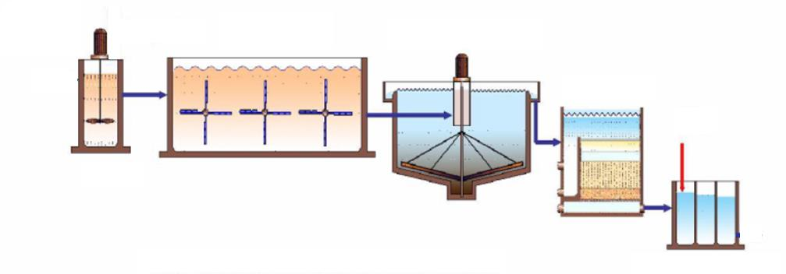
    - **Hình này chứng minh điều gì**
      - Chuỗi liên tục gồm trộn nhanh keo tụ, tạo bông, lắng trọng lực, lọc cát và khử trùng clo.
    - **Từ đâu mà thấy được**
      - Chuỗi kết nối tuần tự các bể đơn vị từ trạm bơm cấp 1 đến bể chứa nước sạch.
- Sơ đồ xử lý nâng cao tích hợp các khối ozone hóa và lọc than sinh học (BAC):
  - **Hình 27.** Sơ đồ khối các quy trình xử lý nước tiên tiến
    - 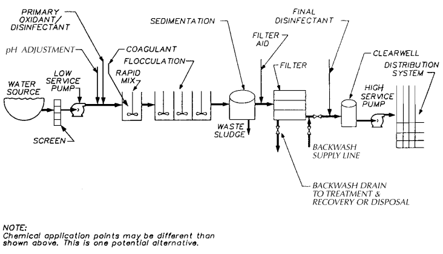
    - **Hình này chứng minh điều gì**
      - Kết hợp tiền ozone hóa, than hoạt tính sinh học (BAC) và màng vi lọc UF bảo vệ nguồn nước.
    - **Từ đâu mà thấy được**
      - Các khối xử lý nâng cao bố trí xen giữa bể lắng và khử trùng clo thứ cấp.

#### 1.6 Các bài toán tính toán cơ bản

<!-- exercise-start: Ví dụ 1-9: Nhu cầu nước đỉnh và lưu lượng chữa cháy khu dân cư -->
- **Ví dụ 1-9: Nhu cầu nước đỉnh và lưu lượng chữa cháy khu dân cư**
  - Cho:
    - Diện tích khu dân cư cao cấp: $A = 100{,}0\text{ ha}$
    - Mật độ nhà ở quy hoạch: $30{,}0\text{ căn nhà/ha}$
    - Số nhân khẩu bình quân: $4{,}0\text{ người/hộ}$
    - Tiêu chuẩn dùng nước sinh hoạt: $q = 300{,}0\text{ L/(người}\cdot\text{ngày)}$
    - Hệ số dùng nước ngày lớn nhất: $K_{\text{day-max}} = 1{,}5$
  - Tìm:
    - Tổng dân số tính toán ($P$, người).
    - Nhu cầu dùng nước sinh hoạt trung bình ngày ($Q_{\text{avg}}$) và ngày lớn nhất ($Q_{\text{max-day}}$).
    - Lưu lượng nước chữa cháy quy chuẩn ($Q_{\text{fire}}$) theo công thức NBFU.
    - Tổng lưu lượng cấp nước đỉnh đồng thời ($Q_{\text{total}}$).
  - Phương trình áp dụng:
    $$P = A \cdot \text{Mật độ} \cdot \text{Nhân khẩu}$$
    $$Q_{\text{avg}} = P \cdot q$$
    $$Q_{\text{max-day}} = K_{\text{day-max}} \cdot Q_{\text{avg}}$$
    $$Q_{\text{fire}} = 1020 \cdot \sqrt{P_k} \cdot \left(1 - 0{,}01 \cdot \sqrt{P_k}\right) \quad (\text{gpm})$$
    $$Q_{\text{total}} = Q_{\text{max-day}} + Q_{\text{fire}}$$
  - Các bước giải:
    1. Bước 1: Tính quy mô dân số phục vụ:
       $$P = 100\text{ ha} \times 30\text{ căn/ha} \times 4\text{ người/căn} = 12000\text{ người} \quad (P_k = 12\text{ nghìn người})$$
    2. Bước 2: Tính nhu cầu nước sinh hoạt:
       $$Q_{\text{avg}} = 12000\text{ người} \times 300\text{ L/(người}\cdot\text{ngày)} = 3600000\text{ L/ngày} = 3600\text{ m}^3\text{/ngày} = 41{,}67\text{ L/s}$$
       $$Q_{\text{max-day}} = 1{,}5 \times 3600\text{ m}^3\text{/ngày} = 5400\text{ m}^3\text{/ngày} = 62{,}50\text{ L/s}$$
    3. Bước 3: Tính lưu lượng chữa cháy theo công thức NBFU:
       $$Q_{\text{fire}} = 1020 \cdot \sqrt{12} \cdot \left(1 - 0{,}01 \cdot \sqrt{12}\right) = 1020 \times 3{,}4641 \times (1 - 0{,}03464) = 3411\text{ gpm}$$
       Quy đổi sang đơn vị SI:
       $$Q_{\text{fire}} = 3411\text{ gpm} \times 0{,}06309\text{ (L/s)/gpm} = 215{,}2\text{ L/s} = 18593\text{ m}^3\text{/ngày}$$
    4. Bước 4: Tính tổng nhu cầu cấp nước đồng thời giờ cao điểm:
       $$Q_{\text{total}} = 62{,}50\text{ L/s} + 215{,}20\text{ L/s} = 277{,}70\text{ L/s} = 23993\text{ m}^3\text{/ngày}$$
  - **Đáp số**: `Dân số = 12,000 người; Q_max-day = 5,400 m^3/ngày (62.5 L/s); Q_fire = 215.2 L/s (3,411 gpm); Q_total = 277.7 L/s (23,993 m^3/ngày).`
<!-- exercise-end -->

---

<!-- exercise-start: Ví dụ 1-10: Nhu cầu nước đỉnh và lưu lượng chữa cháy tòa nhà 45 tầng -->
- **Ví dụ 1-10: Nhu cầu nước đỉnh và lưu lượng chữa cháy tòa nhà 45 tầng**
  - Cho:
    - Số tầng công trình: $45\text{ tầng}$
    - Mật độ căn hộ: $6{,}0\text{ căn hộ/tầng}$
    - Số nhân khẩu bình quân: $4{,}0\text{ người/hộ}$
    - Tiêu chuẩn dùng nước sinh hoạt: $q = 200{,}0\text{ L/(người}\cdot\text{ngày)}$
    - Hệ số dùng nước ngày lớn nhất: $K_{\text{day-max}} = 1{,}5$
    - Lưu lượng chữa cháy tiêu chuẩn nhà cao tầng: $Q_{\text{fire}} = 1000\text{ gpm}$ ($63{,}1\text{ L/s}$)
  - Tìm:
    - Tổng dân số tòa nhà ($P$, người) và tổng số căn hộ.
    - Nhu cầu nước sinh hoạt ngày lớn nhất ($Q_{\text{max-day}}$).
    - Lưu lượng nước chữa cháy ($Q_{\text{fire}}$ theo $\text{L/s}$ và $\text{m}^3\text{/h}$).
    - Tổng nhu cầu cấp nước đồng thời giờ cao điểm ($Q_{\text{total}}$).
  - Phương trình áp dụng:
    $$P = \text{Số tầng} \cdot \text{Căn hộ/tầng} \cdot \text{Người/hộ}$$
    $$Q_{\text{avg}} = P \cdot q$$
    $$Q_{\text{max-day}} = K_{\text{day-max}} \cdot Q_{\text{avg}}$$
    $$Q_{\text{total}} = Q_{\text{max-day}} + Q_{\text{fire}}$$
  - Các bước giải:
    1. Bước 1: Tính số căn hộ và dân số tòa nhà:
       $$\text{Số căn hộ} = 45\text{ tầng} \times 6\text{ căn/tầng} = 270\text{ căn hộ}$$
       $$P = 270 \times 4\text{ người} = 1080\text{ người}$$
    2. Bước 2: Tính nhu cầu nước sinh hoạt:
       $$Q_{\text{avg}} = 1080\text{ người} \times 200\text{ L/(người}\cdot\text{ngày)} = 216000\text{ L/ngày} = 216\text{ m}^3\text{/ngày} = 2{,}50\text{ L/s}$$
       $$Q_{\text{max-day}} = 1{,}5 \times 216\text{ m}^3\text{/ngày} = 324\text{ m}^3\text{/ngày} = 3{,}75\text{ L/s}$$
    3. Bước 3: Xác định lưu lượng chữa cháy quy định:
       $$Q_{\text{fire}} = 1000\text{ gpm} = 63{,}1\text{ L/s} = 227{,}1\text{ m}^3\text{/h}$$
    4. Bước 4: Tính tổng nhu cầu cấp nước đỉnh:
       $$Q_{\text{total}} = 3{,}75\text{ L/s} + 63{,}10\text{ L/s} = 66{,}85\text{ L/s} = 240{,}7\text{ m}^3\text{/h} \quad (5774\text{ m}^3\text{/ngày})$$
  - **Đáp số**: `Dân số = 1,080 người (270 căn); Q_max-day = 3.75 L/s (324 m^3/ngày); Q_fire = 63.1 L/s (1000 gpm); Q_total = 66.85 L/s (240.7 m^3/h).`
<!-- exercise-end -->

---

<!-- exercise-start: Ví dụ 1-11: Tính độ cứng tổng cộng từ nồng độ Ca2+ và Mg2+ -->
- **Ví dụ 1-11: Tính độ cứng tổng cộng từ nồng độ Ca2+ và Mg2+**
  - Cho:
    - Nồng độ ion canxi: $[\text{Ca}^{2+}] = 95{,}20\text{ mg/L}$
    - Nồng độ ion magie: $[\text{Mg}^{2+}] = 13{,}44\text{ mg/L}$
    - Đương lượng gam của $\text{Ca}^{2+}$: $20{,}04\text{ g/đl}$ (khối lượng mol $40{,}08\text{ g/mol}$)
    - Đương lượng gam của $\text{Mg}^{2+}$: $12{,}15\text{ g/đl}$ (khối lượng mol $24{,}31\text{ g/mol}$)
    - Đương lượng gam của $\text{CaCO}_3$: $50{,}04\text{ g/đl}$
  - Tìm:
    - Độ cứng canxi ($\text{CH}$) theo $\text{mg/L as }CaCO_3$.
    - Độ cứng magie ($\text{MH}$) theo $\text{mg/L as }CaCO_3$.
    - Độ cứng tổng cộng ($\text{TH}$) theo $\text{mg/L as }CaCO_3$.
  - Phương trình áp dụng:
    $$\text{CH} = [\text{Ca}^{2+}] \cdot \frac{50{,}04}{20{,}04} \approx 2{,}50 \cdot [\text{Ca}^{2+}]$$
    $$\text{MH} = [\text{Mg}^{2+}] \cdot \frac{50{,}04}{12{,}15} \approx 4{,}12 \cdot [\text{Mg}^{2+}]$$
    $$\text{TH} = \text{CH} + \text{MH} = 2{,}497 \cdot [\text{Ca}^{2+}] + 4{,}118 \cdot [\text{Mg}^{2+}]$$
  - Các bước giải:
    1. Bước 1: Tính độ cứng canxi ($\text{CH}$):
       $$\text{CH} = 95{,}20\text{ mg/L} \times \frac{50{,}04}{20{,}04} = 95{,}20 \times 2{,}497 = 237{,}71\text{ mg/L as }CaCO_3 \approx 238{,}0\text{ mg/L as }CaCO_3$$
    2. Bước 2: Tính độ cứng magie ($\text{MH}$):
       $$\text{MH} = 13{,}44\text{ mg/L} \times \frac{50{,}04}{12{,}15} = 13{,}44 \times 4{,}118 = 55{,}35\text{ mg/L as }CaCO_3 \approx 55{,}4\text{ mg/L as }CaCO_3$$
    3. Bước 3: Tính độ cứng tổng cộng ($\text{TH}$):
       $$\text{TH} = 238{,}0 + 55{,}4 = 293{,}4\text{ mg/L as }CaCO_3$$
  - **Đáp số**: `Độ cứng canxi = 238.0 mg/L as CaCO3; Độ cứng magie = 55.4 mg/L as CaCO3; Độ cứng tổng cộng = 293.4 mg/L as CaCO3.`
<!-- exercise-end -->

---

<!-- exercise-start: Ví dụ 1-12: Tính độ kiềm tổng cộng ở pH 10 -->
- **Ví dụ 1-12: Tính độ kiềm tổng cộng ở pH 10**
  - Cho:
    - Nồng độ ion carbonate: $[\text{CO}_3^{2-}] = 100{,}0\text{ mg/L}$
    - Độ pH mẫu nước: $\text{pH} = 10{,}0$
    - Nhiệt độ nước: $25{,}0^\circ\text{C}$
    - Hằng số phân ly bậc 2 ở $25^\circ\text{C}$: $K_2 = 4{,}69 \times 10^{-11}$
    - Tích số ion của nước ở $25^\circ\text{C}$: $K_w = 1{,}0 \times 10^{-14}$
    - Khối lượng mol $\text{CO}_3^{2-}$: $60{,}01\text{ g/mol}$
    - Đương lượng gam $\text{CaCO}_3$: $50{,}04\text{ g/đl}$
  - Tìm:
    - Nồng độ các cấu tử kiềm $[\text{HCO}_3^-]$, $[\text{CO}_3^{2-}]$, $[\text{OH}^-]$.
    - Độ kiềm tổng cộng ($\text{Total Alkalinity}$) theo $\text{mg/L as }CaCO_3$.
  - Phương trình áp dụng:
    $$[\text{H}^+] = 10^{-\text{pH}}$$
    $$[\text{OH}^-] = \frac{K_w}{[\text{H}^+]}$$
    $$[\text{HCO}_3^-] = \frac{[\text{H}^+][\text{CO}_3^{2-}]}{K_2}$$
    $$\text{Total Alkalinity} = [\text{HCO}_3^-] + 2[\text{CO}_3^{2-}] + [\text{OH}^-] - [\text{H}^+] \quad (\text{eq/L})$$
  - Các bước giải:
    1. Bước 1: Tính nồng độ ion $[\text{H}^+]$ và $[\text{OH}^-]$ ở $\text{pH} = 10{,}0$:
       $$[\text{H}^+] = 10^{-10}\text{ M}$$
       $$[\text{OH}^-] = \frac{1{,}0 \times 10^{-14}}{1{,}0 \times 10^{-10}} = 1{,}0 \times 10^{-4}\text{ M} = 1{,}0 \times 10^{-4}\text{ đl/L}$$
       Quy đổi sang $\text{mg/L as }CaCO_3$:
       $$[\text{OH}^-]_{\text{CaCO}_3} = 1{,}0 \times 10^{-4}\text{ đl/L} \times 50000\text{ mg/đl} = 5{,}00\text{ mg/L as }CaCO_3$$
    2. Bước 2: Đổi nồng độ $\text{CO}_3^{2-}$ sang nồng độ mol và đương lượng $\text{CaCO}_3$:
       $$[\text{CO}_3^{2-}] = \frac{100{,}0\text{ mg/L}}{60010\text{ mg/mol}} = 1{,}6664 \times 10^{-3}\text{ M}$$
       $$[\text{CO}_3^{2-}]_{\text{CaCO}_3} = 100{,}0\text{ mg/L} \times \frac{50{,}04}{30{,}00} = 166{,}8\text{ mg/L as }CaCO_3$$
    3. Bước 3: Tính nồng độ ion bicarbonate $[\text{HCO}_3^-]$ từ cân bằng $K_2$:
       $$[\text{HCO}_3^-] = \frac{1{,}0 \times 10^{-10}\text{ M} \times 1{,}6664 \times 10^{-3}\text{ M}}{4{,}69 \times 10^{-11}} = 3{,}553 \times 10^{-3}\text{ M}$$
       Quy đổi sang $\text{mg/L as }CaCO_3$:
       $$[\text{HCO}_3^-]_{\text{CaCO}_3} = 3{,}553 \times 10^{-3}\text{ đl/L} \times 50000\text{ mg/đl} = 177{,}7\text{ mg/L as }CaCO_3$$
    4. Bước 4: Tính tổng độ kiềm:
       $$\text{Total Alkalinity} = 177{,}65 + 166{,}77 + 5{,}00 = 349{,}42\text{ mg/L as }CaCO_3 \approx 349{,}5\text{ mg/L as }CaCO_3$$
  - **Đáp số**: `[HCO3-] = 177.7 mg/L as CaCO3; [CO3(2-)] = 166.8 mg/L as CaCO3; [OH-] = 5.0 mg/L as CaCO3; Độ kiềm tổng cộng = 349.5 mg/L as CaCO3.`
<!-- exercise-end -->

---

<!-- exercise-start: Ví dụ 1-13: Cân bằng các cấu tử carbonate ở pH 7.65 -->
- **Ví dụ 1-13: Cân bằng các cấu tử carbonate ở pH 7.65**
  - Cho:
    - Độ pH mẫu nước: $\text{pH} = 7{,}65$
    - Độ kiềm tổng cộng đo được: $\text{Alk} = 310{,}0\text{ mg/L as }CaCO_3$
    - Hằng số phân ly axit carbonic ở $25^\circ\text{C}$: $K_1 = 4{,}45 \times 10^{-7}$; $K_2 = 4{,}69 \times 10^{-11}$
    - Khối lượng mol các chất: $\text{CO}_2 = 44{,}01\text{ g/mol}$; $\text{HCO}_3^- = 61{,}02\text{ g/mol}$; $\text{CO}_3^{2-} = 60{,}01\text{ g/mol}$
    - Đương lượng gam $\text{CaCO}_3$: $50{,}04\text{ g/đl}$
  - Tìm:
    - Nồng độ cân bằng của khí carbonic hòa tan tự do ($[\text{CO}_2]$).
    - Nồng độ ion bicarbonate ($[\text{HCO}_3^-]$).
    - Nồng độ ion carbonate ($[\text{CO}_3^{2-}]$).
  - Phương trình áp dụng:
    $$\frac{[\text{CO}_3^{2-}]}{[\text{HCO}_3^-]} = \frac{K_2}{[\text{H}^+]}$$
    $$[\text{CO}_2] = \frac{[\text{H}^+][\text{HCO}_3^-]}{K_1}$$
    $$\text{Alkalinity} = [\text{HCO}_3^-] + 2[\text{CO}_3^{2-}] + [\text{OH}^-] - [\text{H}^+]$$
  - Các bước giải:
    1. Bước 1: Tính nồng độ $[\text{H}^+]$ và nồng độ đương lượng kiềm:
       $$[\text{H}^+] = 10^{-7{,}65} = 2{,}239 \times 10^{-8}\text{ M}$$
       $$\text{Alkalinity} = \frac{310{,}0\text{ mg/L}}{50040\text{ mg/đl}} = 6{,}195 \times 10^{-3}\text{ đl/L}$$
    2. Bước 2: Xác định nồng độ bicarbonate $[\text{HCO}_3^-]$:
       $$\frac{[\text{CO}_3^{2-}]}{[\text{HCO}_3^-]} = \frac{4{,}69 \times 10^{-11}}{2{,}239 \times 10^{-8}} = 0{,}002095$$
       Biểu thức độ kiềm (bỏ qua $[\text{OH}^-]$ và $[\text{H}^+]$ ở pH trung tính):
       $$\text{Alk} = [\text{HCO}_3^-] \times (1 + 2 \times 0{,}002095) = 1{,}00419 \cdot [\text{HCO}_3^-] = 6{,}195 \times 10^{-3}\text{ đl/L}$$
       $$[\text{HCO}_3^-] = \frac{6{,}195 \times 10^{-3}}{1{,}00419} = 6{,}169 \times 10^{-3}\text{ M}$$
       Quy đổi đơn vị:
       $$[\text{HCO}_3^-]_{\text{CaCO}_3} = 6{,}169 \times 10^{-3}\text{ đl/L} \times 50000\text{ mg/đl} = 308{,}5\text{ mg/L as }CaCO_3$$
       $$[\text{HCO}_3^-] = 6{,}169 \times 10^{-3}\text{ mol/L} \times 61020\text{ mg/mol} = 376{,}4\text{ mg/L as }HCO_3^-$$
    3. Bước 3: Xác định nồng độ carbonate $[\text{CO}_3^{2-}]$:
       $$[\text{CO}_3^{2-}] = 0{,}002095 \times 6{,}169 \times 10^{-3}\text{ M} = 1{,}292 \times 10^{-5}\text{ M}$$
       Quy đổi đơn vị:
       $$[\text{CO}_3^{2-}]_{\text{CaCO}_3} = 2 \times 1{,}292 \times 10^{-5}\text{ đl/L} \times 50000\text{ mg/đl} = 1{,}29\text{ mg/L as }CaCO_3$$
       $$[\text{CO}_3^{2-}] = 1{,}292 \times 10^{-5}\text{ mol/L} \times 60010\text{ mg/mol} = 0{,}78\text{ mg/L as }CO_3^{2-}$$
    4. Bước 4: Xác định nồng độ khí carbonic hòa tan $[\text{CO}_2]$:
       $$[\text{CO}_2] = \frac{2{,}239 \times 10^{-8}\text{ M} \times 6{,}169 \times 10^{-3}\text{ M}}{4{,}45 \times 10^{-7}} = 3{,}104 \times 10^{-4}\text{ M}$$
       Quy đổi sang $\text{mg/L}$:
       $$[\text{CO}_2] = 3{,}104 \times 10^{-4}\text{ mol/L} \times 44010\text{ mg/mol} = 13{,}66\text{ mg/L as }CO_2$$
  - **Đáp số**: `[CO2] = 13.66 mg/L as CO2 (0.310 mmol/L); [HCO3-] = 308.5 mg/L as CaCO3 (376.4 mg/L as HCO3-); [CO3(2-)] = 1.29 mg/L as CaCO3 (0.78 mg/L as CO3(2-)).`
<!-- exercise-end -->

### Chương 2: Nguồn Nước & Công trình Thu Nước (Water Source & Collection System)

#### 2.1 Khái niệm và Phân loại công trình thu nước

##### Định nghĩa (Definition)

* Định nghĩa hệ thống thu nước thô (Raw water collection system):
  * Hệ thống thu nước thô là công trình xây dựng chuyên dụng nhằm mục đích rút và khai thác nước từ hồ (lake), sông (river) hoặc nước dưới đất (groundwater).
  * Công trình là điểm đầu tiếp nhận nước tự nhiên để cấp vào trạm xử lý hoặc mạng lưới cấp nước.

##### Phân loại (Classification)

* Phân loại công trình thu nước theo nguồn nước khai thác:
  * Công trình thu nước mặt (Intake): Dùng để khai thác nguồn nước mặt (surface water) như sông, hồ chứa hoặc kênh.
  * Giếng khai thác nước ngầm (Well): Dùng để khai thác nguồn nước ngầm (groundwater) từ các tầng chứa nước ngầm.

#### 2.2 Công trình thu nước mặt (Surface Water Intake)

- Định nghĩa công trình thu nước mặt: Tổ hợp công trình và thiết bị cơ điện dùng để thu nhận nước thô từ nguồn nước mặt tự nhiên (sông, suối, hồ chứa, hồ tự nhiên) với lưu lượng thiết kế $Q_{\text{design}}$, vận chuyển an toàn về trạm xử lý nước cấp.
  - Chức năng kỹ thuật chính: Lấy đủ lưu lượng $Q$, ổn định mực nước cho trạm bơm cấp 1, loại bỏ rác trôi nổi thô, ngăn chặn bùn cát lắng đọng đáy và bảo vệ ấu trùng, sinh vật thủy sinh.
  - Phân loại công trình thu nước mặt theo sơ đồ vị trí và thủy văn:
    - Công trình thu nước hồ chứa (Lake Intake).
    - Công trình thu nước sông (River Intake).
    - Công trình thu nước ven bờ (Shore Intake).
    - Công trình thu nước xa bờ (Offshore Intake / Submerged Intake Crib).

- Yêu cầu thủy lực khống chế vận tốc dòng vào cửa thu:
  - Vận tốc dòng chảy vào cửa thu thô ($v_{\text{intake}}$) khống chế ở mức $v_{\text{intake}} \le 0.15 - 0.20\text{ m/s}$ khi dòng chảy một chiều ổn định.
  - Giới hạn vận tốc qua khe lưới thu nước mặt bảo vệ sinh học theo tiêu chuẩn EPA 316b:
    $$v_{\text{screen}} = \frac{Q}{A_{\text{net}}} = \frac{Q}{A_{\text{gross}} \cdot (1 - \text{fraction}_{\text{solid}})} \le 0.15\text{ m/s}$$
    - Trong đó $A_{\text{gross}}$ là tổng diện tích bề mặt khung lưới ($\text{m}^2$).
    - $\text{fraction}_{\text{solid}}$ là tỷ lệ diện tích thanh kim loại chiếm chỗ của khung lưới (thường chiếm $0.20 - 0.40$).
    - $A_{\text{net}}$ là diện tích thông thủy thực tế của khe hở cho nước đi qua ($\text{m}^2$).
    - Giá trị $v_{\text{screen}} \le 0.15\text{ m/s}$ ($0.5\text{ ft/s}$) ngăn ngừa hiện tượng ép chết cá con và sinh vật vào bề mặt lưới (fish impingement).

- Tiêu chuẩn bố trí cao trình và khoảng cách an toàn vệ sinh nguồn nước:
  - Cao trình mép trên cửa thu nước: Nằm ngập tối thiểu $0.5 - 1.0\text{ m}$ dưới mực nước thấp nhất thiết kế ($H_{\text{min}}$) nhằm ngăn hút rác nổi, váng dầu mỡ và xoáy khí mặt nước.
  - Cao trình mép dưới cửa thu nước: Nằm cao hơn đáy sông, hồ tối thiểu $0.5 - 1.0\text{ m}$ để tránh cuốn bùn cát di động tầng đáy vào ống hút.
  - Cao trình sàn đặt máy bơm và phòng điều khiển điện: Nằm cao hơn mực nước lũ tính toán ($H_{\text{max}}$ ứng với tần suất thiết kế $P = 1\% - 2\%$) cộng thêm chiều cao an toàn sóng vỗ $\Delta h \ge 0.5\text{ m}$.
  - Vùng bảo hộ vệ sinh công trình thu nước mặt: Bán kính nghiêm ngặt tối thiểu $200 - 500\text{ m}$ về phía thượng lưu và $100 - 200\text{ m}$ về phía hạ lưu, nghiêm cấm mọi hoạt động xả thải, tắm giặt, chăn nuôi và neo đậu tàu thuyền.

##### 2.2.1 Công trình thu nước hồ chứa (Lake Intake)

- Đặc tính thủy văn và hiện tượng phân tầng chất lượng nước hồ chứa:
  - Hiện tượng phân tầng nhiệt mùa hè (Thermal Stratification): Hồ chứa nước sâu hình thành 3 tầng nước rõ rệt gồm tầng mặt ấm giàu oxy hòa tan ($Epilimnion$), tầng dị thường nhiệt ($Thermocline$ / $Metalimnion$), và tầng đáy lạnh thiếu khí ($Hypolimnion$).
  - Phân bố sinh học và hóa lý theo độ sâu:
    - Tầng mặt ($Epilimnion$): Xảy ra hiện tượng quang hợp, nguy cơ tảo nở hoa ($Algal\text{ bloom}$), hàm lượng chất hữu cơ cao và biến thiên nhiệt độ lớn.
    - Tầng đáy ($Hypolimnion$): Yếm khí khử oxy ($\text{DO} \to 0$), giải phóng ion kim loại hòa tan từ trầm tích ($\text{Fe}^{2+}$, $\text{Mn}^{2+}$), khí độc $\text{H}_2\text{S}$, amoni ($\text{NH}_4^+$), gây mùi hôi và tăng chi phí hóa chất xử lý.
    - Tầng trung gian ($Thermocline$): Vùng nước có nhiệt độ ổn định, độ đục thấp, không có tảo bề mặt và nồng độ chất khử đáy thấp nhất, thích hợp nhất để khai thác cấp nước sinh hoạt.

- Cấu tạo và nguyên lý vận hành tháp thu nước hồ chứa (Lake Intake Tower):
  - Tháp bê tông cốt thép hình trụ tròn hoặc hình oval đặt độc lập trong lòng hồ, liên kết với bờ bằng cầu dẫn giao thông kiêm giá đỡ tuyến ống áp lực.
  - Cửa thu nước nhiều tầng (Multi-tier Sluice Gates / Ports): Bố trí so le ở nhiều cao trình khác nhau theo phương đứng (tầng cao, tầng trung và tầng thấp) cho phép đơn vị vận hành linh hoạt lựa chọn lấy nước từ tầng có chất lượng tối ưu theo từng mùa trong năm.
  - Kích thước công trình điển hình của tháp thu nước hồ chứa:
    - Đường kính tháp ngoài: $D = 18\text{ m}$ tạo không gian rộng rãi cho buồng hút và hệ thống van ống.
    - Chiều cao tháp tổng thể: $H = 21.3\text{ m}$ từ bản đáy móng đến sàn vận hành chính.
    - Dải biến động mực nước vận hành bình thường ($Normal\text{ operation}$): Chiều cao cột nước dao động $10.6\text{ m}$ giữa mực nước dâng bình thường ($Max\text{ w.s.}$) và mực nước thấp bình thường ($Normal\text{ operation Low range}$).
    - Dải biến động mực nước khẩn cấp ($Emergency\text{ operation}$): Chiều cao cột nước dao động $7.6\text{ m}$ từ mức nước thấp bình thường xuống mực nước chết tối thiểu ($Min\text{ water surface}$).

- Bố trí thiết bị cơ điện và tổ hợp máy bơm trong tháp thu:
  - Bơm hỗn lưu trục đứng vận hành bình thường (Vertical Mixed Flow Pumps for Normal Service): Số lượng 4 tổ máy, lưu lượng lớn, cột áp trung bình, làm việc khi mực nước hồ trong dải $10.6\text{ m}$ bình thường.
  - Bơm tuabin trục đứng vận hành sự cố (Vertical Turbine Pumps for Emergency Service): Số lượng 2 tổ máy, thân bơm kéo dài xuống hố sâu đáy tháp để hút nước khi hồ cạn kiệt đến $Min\text{ water surface}$.
  - Bơm tháo cạn buồng thu ($Sump\text{ Pump}$): Bố trí tại rãnh thu đáy để thoát nước rò rỉ và tháo cạn khô phục vụ công tác kiểm tra, nạo vét phù sa định kỳ.
  - Thiết bị van điều tiết và an toàn:
    - Van bướm tự động (Automatic Butterfly Valve) lắp trên tuyến ống xả của mỗi máy bơm.
    - Van bướm quang học/cơ học (Optical/Manual Butterfly Valve) điều tiết tuyến ống gom áp lực ($Pump\text{ discharge header}$).
    - Van xả khí tự động (Air Valve) đặt tại các điểm cao cục bộ để triệt tiêu túi khí và chống hiện tượng chân không bóp méo đường ống.
    - Cầu trục xoay tròn (Circular Bridge Crane) trên đỉnh vòm tháp phục vụ nâng hạ động cơ và tổ máy bơm khi trung tu, đại tu.

  - **Hình 1:** Mặt cắt đứng và mặt bằng tháp thu nước hồ chứa
    - 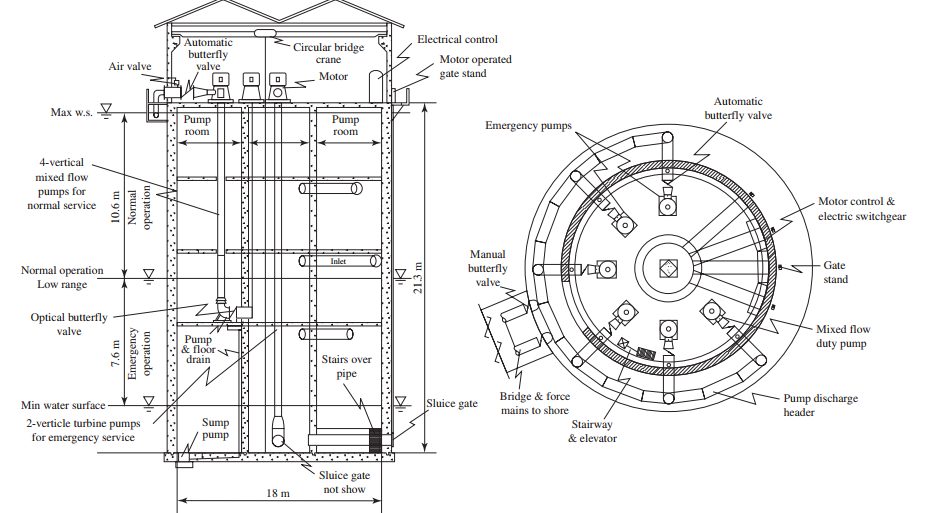
    - **Hình này chứng minh điều gì**
      - Tháp thu hồ bố trí cửa thu nhiều tầng và cụm bơm tích hợp.
    - **Từ đâu mà thấy được**
      - Mặt cắt cao $21.3\text{ m}$ với cửa Inlet và bơm hỗn lưu trục đứng.

  - **Hình 2:** Sơ đồ buồng thu nước sông có song chắn và lưới chắn
    - 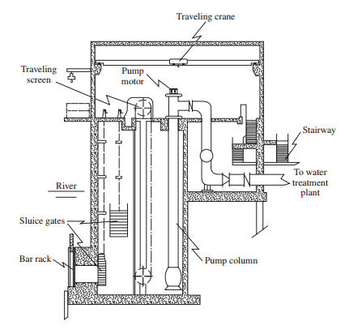
    - **Hình này chứng minh điều gì**
      - Nước vào giếng bơm qua hai cấp chắn rác thô và tinh.
    - **Từ đâu mà thấy được**
      - Mặt cắt thể hiện song chắn rác ngoài sông và lưới tự rửa.

##### 2.2.2 Công trình thu nước sông (River Intake)

- Nguyên tắc lựa chọn vị trí đặt công trình thu nước sông:
  - Tuyến thu nước phải bố trí tại đoạn sông có bờ lõm ổn định tự nhiên hoặc bờ đã được kè đá kiên cố.
  - Vị trí bờ lõm đảm bảo độ sâu luồng lách lớn, vận tốc dòng chảy ổn định, không bị bồi lắng cát hạt mịn và không nằm trong vùng xoáy nước quẩn.
  - Tuyệt đối tránh đặt công trình thu tại vùng bờ lồi bồi tích phù sa hoặc vùng bãi cát di động gây tắc nghẽn cửa thu nước trong mùa kiệt.

- Quy trình xử lý rác cơ học hai cấp độ tại công trình thu nước sông:
  - Cấp 1 - Song chắn rác thô ngoài sông (Trash Rack / Bar Rack):
    - Đặt trực tiếp tại cửa vào tiếp xúc với dòng sông để giữ lại các vật trôi nổi kích thước lớn (gỗ mục, cành cây, rác nhựa, xác động vật).
    - Cấu tạo từ các thanh thép dẹt hoặc thép tròn đặt song song, khoảng cách mép trong thông thủy $b = 40 - 50\text{ mm}$ (vệ sinh cơ giới) hoặc $b = 20 - 30\text{ mm}$ (vệ sinh thủ công).
    - Góc nghiêng thanh chắn so với mặt phẳng nằm ngang: $\alpha = 70^\circ - 80^\circ$ giúp dễ dàng cào rác thủ công hoặc lắp đặt máy cào rác tự động.
    - Vận tốc dòng nước tới trước song chắn: $v_0 = 0.4 - 0.8\text{ m/s}$, giới hạn tối đa $v_0 \le 1.0\text{ m/s}$ khi song chắn bị rác che lấp $50\%$.
    - Công thức Kirschmer xác định tổn thất cột áp qua song chắn rác:
      $$h_L = \beta \cdot \left(\frac{s}{b}\right)^{4/3} \cdot \frac{v_0^2}{2g} \cdot \sin(\alpha)$$
      - $\beta$: Hệ số phụ thuộc hình dạng tiết diện ngang của thanh thép (thanh chữ nhật sắc cạnh $\beta = 2.42$; thanh chữ nhật vê tròn góc $\beta = 1.83$; thanh tròn $\beta = 1.79$; thanh dạng giọt nước khí động học $\beta = 0.76$).
      - $s$: Bề dày của thanh thép chắn rác ($\text{m}$).
      - $b$: Bề rộng khoảng hở thông thủy giữa hai thanh thép kề nhau ($\text{m}$).
      - $v_0$: Vận tốc dòng nước chảy tới trước song chắn ($\text{m/s}$).
      - $g$: Gia tốc trọng trường ($g = 9.81\text{ m/s}^2$).
      - $\alpha$: Góc nghiêng của khung song chắn rác so với mặt phẳng ngang.
  - Cấp 2 - Lưới chắn rác tinh tự rửa dạng băng chuyền (Traveling Water Screen):
    - Bố trí thẳng đứng bên trong giếng thu, nằm sau song chắn thô và cửa van phai khống chế ($Sluice\text{ Gates}$).
    - Cấu tạo từ các tấm lưới đan sợi kim loại không gỉ hoặc polyme có kích thước mắt lưới nhỏ $2 - 10\text{ mm}$.
    - Khung lưới chuyển động theo vòng tròn khép kín thẳng đứng với vận tốc chuyển động chậm $1.5 - 3.0\text{ m/min}$.
    - Cơ cấu rửa tự động: Các khay gạt rác nâng cặn, rong rêu và lá cây lên đỉnh buồng thu; dàn kim phun nước áp lực cao ($p = 0.4 - 0.6\text{ MPa}$) phun ngược chiều từ phía sau để tống rác vào máng thu xả ra ngoài.
    - Vận tốc dòng nước qua diện tích thực của lưới tuân thủ giới hạn Rule R07: $v_{\text{screen}} \le 0.15\text{ m/s}$.

- Kết cấu trạm bơm nước sông và phân chia ngăn thủy lực:
  - Công trình gồm 2 ngăn thủy lực ngăn cách bởi vách bê tông và cửa van:
    - Ngăn tiếp nhận nước ($Intake\text{ Chamber}$): Chứa song chắn rác thô và lưới chắn rác chuyển động.
    - Ngăn hút máy bơm ($Suction\text{ Chamber}$ / $Wet\text{ Well}$): Nơi đặt các ống hút của tổ máy bơm trục đứng ($Pump\text{ Column}$).
  - Cửa van phai phẳng ($Sluice\text{ Gates}$): Cho phép đóng kín cách ly từng ngăn riêng biệt để tháo cạn nước, nạo vét bùn lắng và sửa chữa thiết bị cơ khí mà không làm gián đoạn cấp nước của toàn trạm.
  - Cầu trục dầm đơn ($Traveling\text{ Crane}$): Di chuyển dọc trần nhà trạm phục vụ công tác bốc dỡ, bảo trì động cơ bơm ($Pump\text{ Motor}$) và lưới chắn rác.

  - **Hình 3:** Sơ đồ bố trí cửa thu nước nhiều tầng trong tháp
    - 
    - **Hình này chứng minh điều gì**
      - Công trình kiểm soát lấy nước theo các tầng thủy lực khác nhau.
    - **Từ đâu mà thấy được**
      - Các cao trình Max w.s., Normal operation và Min water surface trên tháp.

  - **Hình 4:** Cấu tạo buồng bơm thu nước mặt và cơ cấu tự rửa
    - 
    - **Hình này chứng minh điều gì**
      - Bơm trục đứng lấy nước đã qua sàng lọc cơ học hoàn chỉnh.
    - **Từ đâu mà thấy được**
      - Vị trí ống bơm Pump column đặt sau lưới chắn Traveling screen.

##### 2.2.3 Công trình thu nước ven bờ (Shore Intake)

- Khái niệm và điều kiện áp dụng trạm thu ven bờ:
  - Công trình thu kết hợp trạm bơm cấp 1 xây dựng trực tiếp ngay tại mép bờ sông hoặc hồ nước.
  - Điều kiện địa chất và hình thái sông thích hợp:
    - Bờ sông có độ dốc đứng lớn, mái bờ ổn định không sạt lở.
    - Độ sâu dòng nước sát bờ lớn, đảm bảo đủ chiều sâu ngập nước trong mùa khô hạn kiệt.
    - Nền móng bờ là đá gốc hoặc lớp cuội sỏi chặt có sức chịu tải cao ($R \ge 2.5\text{ kg/cm}^2$).

- Giới hạn chiều cao hút và nguy cơ xâm thực bơm đặt cạn:
  - Phương trình tính chiều cao hút hình học cho phép cực đại của máy bơm ly tâm đặt trên cạn ($H_{\text{suction, max}}$):
    $$H_{\text{suction, max}} = \frac{p_{\text{atm}} - p_v}{\rho g} - h_{L,\text{suction}} - \text{NPSH}_{\text{req}} - \Delta H_{\text{safety}} \le 6.0 - 7.5\text{ m}$$
    - $p_{\text{atm}}$: Áp suất khí quyển tại cao độ đặt trạm bơm ($p_{\text{atm}} \approx 101325\text{ Pa}$ ở mực nước biển).
    - $p_v$: Áp suất hơi bão hòa của nước tại nhiệt độ vận hành (ở $25^\circ\text{C}$, $p_v = 3169\text{ Pa}$; ở $30^\circ\text{C}$, $p_v = 4246\text{ Pa}$).
    - $\rho$: Khối lượng riêng của nước thô ($\rho \approx 1000\text{ kg/m}^3$).
    - $h_{L,\text{suction}}$: Tổng tổn thất cột áp thủy lực trên đường ống hút, bao gồm tổn thất qua song chắn, lưới lọc, van một chiều, côn thu và ma sát dọc đường ($\text{m}$).
    - $\text{NPSH}_{\text{req}}$: Cột áp hút thực dương yêu cầu của máy bơm theo công bố của nhà chế tạo ($\text{NPSH}_{\text{req}} \approx 2.5 - 4.5\text{ m}$).
    - $\Delta H_{\text{safety}}$: Hệ số an toàn chống tạo bọt khí xâm thực ($\Delta H_{\text{safety}} = 0.5 - 1.0\text{ m}$).
  - Khi biên độ dao động mực nước sông giữa mùa lũ và mùa cạn $\Delta H_{\text{river}} > 6.0\text{ m}$, bơm đặt cạn không thể tự hút nước trong mùa kiệt; bắt buộc phải chuyển sang phương án giếng thu kết hợp trạm bơm trục đứng chìm hoặc trạm bơm kiểu giếng chìm dưới mực nước ngầm.

- Cấu tạo hạ tầng xây dựng và tuyến ống áp lực ven bờ:
  - Móng mố trụ bê tông cốt thép: Đỡ buồng bơm vươn ra lòng sông sâu, tạo khoảng cách an toàn với vùng nước bùn cạn sát chân bờ.
  - Cầu dẫn kỹ thuật ($Access\text{ Bridge}$ / $Catwalk$): Lối đi lại cho nhân viên kỹ thuật có lan can bảo vệ, đồng thời đóng vai trò hệ dầm đỡ tuyến ống đẩy áp lực bằng thép hoặc gang dẻo.
  - Tuyến ống đẩy áp lực ($Discharge\text{ Main}$): Lắp đặt van chặn đĩa, van một chiều lò xo và thiết bị chống va đập thủy lực (búa nước) khi xảy ra sự cố mất điện đột ngột.

  - **Hình 5:** Trạm bơm thu nước ven bờ đặt trên hệ trụ bê tông
    - 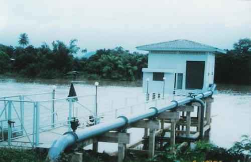
    - **Hình này chứng minh điều gì**
      - Nhà trạm bơm ven bờ vươn ra mép nước sâu bằng trụ đỡ.
    - **Từ đâu mà thấy được**
      - Nhà bơm bê tông trên cọc và đường ống áp lực chạy vào bờ.

  - **Hình 6:** Cầu dẫn giàn thép nối đài thu nước mặt xa bờ
    - 
    - **Hình này chứng minh điều gì**
      - Cầu dẫn thép đưa vị trí lấy nước ra xa vùng bờ đục.
    - **Từ đâu mà thấy được**
      - Nhịp giàn thép khẩu độ lớn vượt mặt nước ra chòi thu nổi.

##### 2.2.4 Công trình thu nước xa bờ (Offshore Intake)

- Phạm vi ứng dụng và đặc điểm thủy văn vùng xa bờ:
  - Áp dụng khi bờ sông hoặc hồ nước có độ dốc quá thoai thoải, mực nước sát bờ rất nông, đáy bờ chứa nhiều bùn lầy, cỏ rác và nước đục do sóng đánh xói mòn.
  - Áp dụng khi nguồn nước ven bờ bị ô nhiễm cục bộ bởi nước thải dân sinh, giao thông thủy hoặc dòng chảy hồi lưu.
  - Vị trí đầu thu xa bờ được đưa ra giữa lòng sông hoặc tâm hồ nơi có dòng nước chảy xiết tự nhiên, độ sâu lớn và chất lượng nước trong sạch quanh năm.

- Cấu tạo đầu thu ngập nước xa bờ (Submerged Intake Crib):
  - Khung lồng bê tông đúc sẵn hoặc khung thép chịu lực bọc đá hộc xếp chèn xung quanh, đặt chìm hoàn toàn dưới lòng sông/hồ sâu.
  - Miệng thu dạng nón loe ($Bellmouth$) mở rộng diện tích để hạ thấp vận tốc dòng vào cửa thu: $v_{\text{intake}} \le 0.15\text{ m/s}$ chống hút cá và cặn cát.
  - Lưới chắn miệng thu chế tạo từ vật liệu hợp kim đồng - niken ($Cu-Ni\text{ alloy}$) hoặc thép không gỉ tráng phủ chống sinh vật bám (rong rêu, hà sông, hến nước ngọt bám tắc miệng thu).

- Tuyến ống dẫn nước tự chảy từ đầu thu xa bờ về giếng bờ:
  - Nước từ đầu thu ngập dẫn về trạm bơm ven bờ bằng đường ống tự chảy áp lực ngập ($Gravity\text{ Pipeline}$) hoặc đường ống xi-phông ($Siphon\text{ Pipe}$).
  - Biện pháp thi công và bảo vệ tuyến ống ngầm:
    - Ống thép bọc bitum / epoxy hoặc ống nhựa nhiệt dẻo HDPE đường kính lớn ($DN\text{ 500} - DN\text{ 1500}$).
    - Ống được chôn sâu dưới lòng sông tối thiểu $0.5 - 1.0\text{ m}$ trong rãnh nạo vét và phủ đá dăm bảo vệ chống neo tàu bè cào rách ống.
  - Vận tốc dòng chảy trong ống tự chảy khống chế theo chế độ thủy lực:
    - Vận tốc tối thiểu chống lắng cặn bùn cát hạt mịn: $v_{\text{min}} \ge 0.7 - 0.8\text{ m/s}$.
    - Vận tốc tối đa hạn chế tổn thất cột áp dọc đường: $v_{\text{max}} \le 1.2 - 1.5\text{ m/s}$.
    - Phương trình tính tổn thất cột áp dọc đường theo Hazen-Williams:
      $$h_f = \frac{10.67 \cdot L \cdot Q^{1.852}}{C^{1.852} \cdot D^{4.87}}$$
      - $L$: Chiều dài tuyến ống dẫn tự chảy xa bờ ($\text{m}$).
      - $Q$: Lưu lượng nước tự chảy qua ống ($\text{m}^3\text{/s}$).
      - $D$: Đường kính trong của đường ống ($\text{m}$).
      - $C$: Hệ số nhám Hazen-Williams ($C = 130 - 150$ đối với ống HDPE và thép tráng nhẵn).

- Công trình thu nước xa bờ dạng tháp nổi có cầu dẫn kết cấu thép giàn:
  - Khi khoảng cách xa bờ vừa phải ($50 - 200\text{ m}$), xây dựng đài thu nước nổi kết nối với bờ bằng hệ cầu dẫn giàn thép ($Steel\text{ Truss\ Bridge}$).
  - Cầu dẫn giàn thép chịu lực cao, đỡ toàn bộ tải trọng của tuyến ống áp lực dẫn nước và hệ thống dây cáp điện điều khiển.
  - Sàn cầu dẫn rộng $1.2 - 2.0\text{ m}$ cho phép công nhân đi lại kiểm tra trực quan, vận hành hệ thống van đóng ngắt và xúc rửa cửa thu định kỳ.

  - **Hình 7:** Tuyến ống đẩy trạm thu ven bờ kết nối về nhà máy
    - 
    - **Hình này chứng minh điều gì**
      - Tuyến ống đẩy được nâng cao trên mố trụ chống ngập lũ bờ.
    - **Từ đâu mà thấy được**
      - Ống áp lực đường kính lớn cố định trên dầm đỡ bê tông cốt thép.

  - **Hình 8:** Đài thu nước xa bờ với cầu dẫn kết cấu thép giàn
    - 
    - **Hình này chứng minh điều gì**
      - Công trình thu xa bờ tiếp cận tầng nước sâu trong lòng hồ.
    - **Từ đâu mà thấy được**
      - Đài thu độc lập giữa hồ nước tĩnh nối bằng cầu dẫn dài.

#### 2.3 Công trình thu nước ngầm (Groundwater Well Systems)

* Khái niệm và chức năng kỹ thuật của công trình thu nước dưới đất ($Well\ Systems$):
  * Giếng thu nước ($Well$) là công trình kỹ thuật chuyên dụng để khai thác nguồn nước dưới đất ($Groundwater$) phục vụ cấp nước sinh hoạt, đô thị và công nghiệp.
  * Phân loại cơ bản theo tầng chứa nước và độ sâu khai thác gồm hai nhóm công trình: giếng nông ($Shallow\ well$, slide ghi là $Swallow\ well$) và giếng sâu ($Deep\ well$).
  * Chu trình xây dựng và khai thác hệ thống giếng bao gồm ba khâu kỹ thuật trọng tâm:
    * Phương pháp thi công đào hoặc khoan tạo giếng ngầm ($Well\ drilling$).
    * Kết cấu công trình bảo vệ thành giếng và thu nhận nước (ống vách $casing$, ống lọc $screen$, và vành đai trám cách ly $annular\ seal$).
    * Thiết bị động lực nâng nước ngầm: máy bơm chìm giếng sâu ($Submersible\ well\ pump$) hoặc máy bơm tay cơ học ($Hand\ well\ pump$).

##### 2.3.1 Giếng nông (Shallow Well / Swallow Well)

* Định nghĩa và đặc tính thủy lực của giếng nông ($Shallow\ Well$):
  * Giếng nông khai thác tầng chứa nước ngầm không áp ($unconfined\ aquifer$) hoặc tầng ngấm bề mặt sát mặt đất.
  * Chiều sâu khai thác hạn chế, thường dao động trong khoảng từ vài mét đến dưới $15\text{ m} - 20\text{ m}$.
  * Mực nước tĩnh và lưu lượng khai thác dao động trực tiếp theo mùa mưa và mùa khô.
  * Chất lượng nước dễ bị ảnh hưởng bởi nước mưa chảy tràn bề mặt, nước thải sinh hoạt và hóa chất nông nghiệp.

###### 2.3.1.1 Kết cấu bảo vệ miệng giếng và thành giếng lộ thiên (Well Curb and Protective Enclosure)

* Thành miệng giếng lộ thiên ($Well\ curb$):
  * Thành miệng giếng xây cao hơn cốt mặt đất tự nhiên tối thiểu $0.3\text{ m} - 0.5\text{ m}$ để ngăn nước mưa chảy tràn, bùn đất và rác rưởi xâm nhập vào lòng giếng.
  * Gia cố thành miệng giếng bằng kết cấu vách gỗ xẻ ngang ($timber\ well$) kết hợp hệ mái che hình nón:
    * Mái che bằng gỗ bảo vệ mặt nước giếng khỏi lá cây rụng, bụi khí quyển và nước mưa trực tiếp.
    * Thành giếng hình lục giác ghép từ các thanh gỗ xẻ ngang đặt nổi trên nền sân lát đá bao quanh lòng giếng.
  - **Hình 9.** Giếng đào bằng gỗ có mái che (*timber well*)
    - 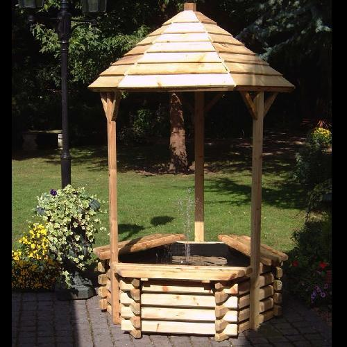
    - **Hình này chứng minh điều gì**
      - Giải pháp gia cố thành giếng bằng gỗ ghép và mái che bảo vệ mặt nước giếng đào nông khỏi ô nhiễm bề mặt.
    - **Từ đâu mà thấy được**
      - Nửa trên: Mái nón lục giác lợp ván gỗ xếp tầng được đỡ bằng các cột trụ đứng.
      - Nửa dưới: Thành giếng lục giác ghép từ các thanh gỗ ngang đặt nổi trên nền sân bao quanh lòng nước.
  * Gia cố thành miệng giếng bằng khối đá tự nhiên ($stone\text{-}lined\ well$):
    * Các khối đá đẽo bo tròn xếp chồng khít thành nhiều tầng vành khuyên tạo gờ chắn kiên cố trên nền đất hoặc thảm cỏ.
    * Vành đai đá xếp khít giúp ổn định bờ miệng giếng, chống xói lở đất xung quanh giếng đào.
  - **Hình 10.** Thành giếng nông lộ thiên xây bằng các khối đá
    - 
    - **Hình này chứng minh điều gì**
      - Thành giếng dạng ống tròn nhô cao khỏi mặt đất với các tầng đá xếp khít bảo vệ miệng giếng nông.
    - **Từ đâu mà thấy được**
      - Quan sát khối nổi trên bãi cỏ: 4 lớp đá sẫm màu bo tròn ghép thành gờ chắn quanh miệng giếng hở.
  * Bố trí giếng nông kết cấu gỗ có mái che kết hợp thiết bị phun nước cảnh quan (slide 7):
    * Kết cấu giếng gỗ ghép có mái che bảo vệ nguồn nước, có thể tích hợp vòi phun nước phục vụ cảnh quan sân vườn.
  - **Hình 11.** Giếng nông bằng gỗ có mái che và đầu phun nước
    - 
    - **Hình này chứng minh điều gì**
      - Minh họa giếng đào nông lộ thiên gia cố bằng thành gỗ ghép có mái che bảo vệ.
    - **Từ đâu mà thấy được**
      - Thành giếng đa giác ghép từ các thanh gỗ xếp ngang, phía trên dựng cột đỡ mái che chóp nón.
      - Đầu phun đặt giữa lòng giếng tạo cột nước phun thẳng đứng.
  * Cấu tạo miệng giếng đá tự nhiên lộ thiên bao quanh miệng giếng (slide 7):
    * Vành đá tròn xếp khít giữ ổn định miệng giếng hở và ngăn cản tạp chất mặt đất rơi vào lòng giếng.
  - **Hình 12.** Miệng giếng nông gia cố bằng đá tự nhiên
    - 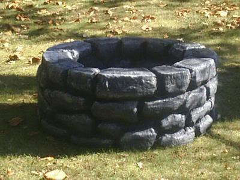
    - **Hình này chứng minh điều gì**
      - Cấu trúc thành giếng dạng khối trụ tròn ghép từ các tảng đá bo tròn nhô cao bảo vệ giếng đào.
    - **Từ đâu mà thấy được**
      - Vị trí trung tâm: Các khối đá sẫm màu ghép khít tạo vành tròn quanh lòng giếng rỗng.
      - Khu vực chân giếng: Đặt trực tiếp trên nền cỏ tự nhiên có lá rụng.

###### 2.3.1.2 Kết cấu thành giếng xây, cơ chế khai thác thủ công và biện pháp thi công đào giếng (Well Construction and Water Extraction)

* Kết cấu thành giếng xây đá hộc và hệ ròng rọc múc nước thủ công:
  * Thành giếng xây bằng đá hộc liên kết vữa xi măng ($rubble\ masonry\ well$) tạo kết cấu ống hình trụ vững chắc, chịu áp lực ngang của đất và ngăn nước thấm ngang từ lớp đất mặt.
  * Khung gỗ hình chữ U ngược dựng đứng hai bên miệng giếng gắn ròng rọc đơn ($pulley$) và dây thừng treo gàu múc nước:
    * Dây thừng luồn qua ròng rọc thả thẳng đứng xuống tâm giếng giúp giảm lực kéo múc nước thủ công.
    * Chiều cao thành giếng nhô cao tạo rào chắn an toàn, tránh người và súc vật rơi ngã vào lòng giếng.
  - **Hình 13.** Giếng đào nông với khung gỗ và ròng rọc múc nước
    - 
    - **Hình này chứng minh điều gì**
      - Miệng giếng đào hở lộ thiên khai thác nước thủ công bằng ròng rọc, đặc trưng của giếng đào nông ($shallow\ well$).
    - **Từ đâu mà thấy được**
      - Giữa ảnh: Thành giếng hình trụ xây bằng đá hộc nhô cao khỏi mặt đất.
      - Phía trên: Giá gỗ hai trụ treo ròng rọc đơn, dây thừng thả thẳng vào lòng giếng.
  * Phương pháp thi công đào giếng hạ chìm ống bi bê tông đúc sẵn ($precast\ concrete\ rings$):
    * Đào đất thẳng đứng kết hợp hạ chìm các phân đoạn ống bi bê tông đúc sẵn theo trọng lượng bản thân.
    * Khi nhân công đào xúc đất từ đáy giếng lên trên, ống bi bê tông tự chìm dần xuống, đóng vai trò ống vách bảo vệ thành giếng chống sập lở tức thời.
    * Đỉnh miệng giếng bố trí mạng cốt thép chờ tỏa tròn để đổ bê tông giằng liên kết bệ giếng và sân lát chống thấm.
  - **Hình 14.** Thi công giếng đào nông bằng ống bi bê tông
    - 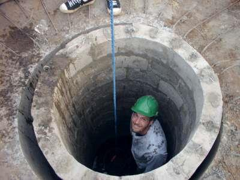
    - **Hình này chứng minh điều gì**
      - Tiết diện tròn của ống bi bê tông tạo không gian an toàn cho thợ đào thao tác vét đất trực tiếp hạ ống vách giếng.
    - **Từ đâu mà thấy được**
      - Vị trí lòng giếng: Công nhân đội mũ bảo hộ đứng bên trong ống bi bê tông, có dây an toàn thả theo phương đứng.
      - Vị trí miệng giếng: Các thanh cốt thép bố trí tỏa tròn quanh gờ đỉnh ống vách trên mặt đất.
  * Thành giếng đá hộc kiên cố kết hợp ròng rọc múc nước giếng khơi (slide 9):
    * Phương thức khai thác nước thủ công truyền thống phù hợp với quy mô cấp nước nhỏ phân tán ở nông thôn.
  - **Hình 15.** Giếng đào nông với thành đá hộc và ròng rọc
    - 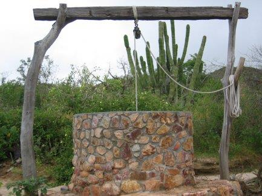
    - **Hình này chứng minh điều gì**
      - Miệng giếng trụ tròn xây nổi trên mặt đất, kết hợp khung hai trụ gỗ treo ròng rọc múc nước.
    - **Từ đâu mà thấy được**
      - Nửa dưới ảnh: Thành giếng hình trụ bằng các khối đá hộc liên kết vữa trát.
      - Nửa trên ảnh: Khung hai cột gỗ đỡ thanh ngang treo ròng rọc ở giữa, dây thừng vắt sang cột phải.
  * Thao tác thủ công của nhân công đào vét đáy giếng trong lòng ống bi (slide 9):
    * Thợ đào giếng làm việc trong không gian hẹp bên dưới ống vách bê tông, đảm bảo an toàn bằng mũ bảo hộ và dây thừng cứu sinh nối lên mặt bằng thi công.
  - **Hình 16.** Thợ đào làm việc trong lòng giếng nông thủ công
    - 
    - **Hình này chứng minh điều gì**
      - Không gian làm việc chật hẹp bên trong lòng ống giếng với dây thừng an toàn nối thẳng lên mặt đất.
    - **Từ đâu mà thấy được**
      - Góc nhìn từ miệng giếng thẳng xuống: Người thợ đội mũ bảo hộ đứng bên dưới lòng ống tròn.
      - Dây thừng màu xanh thả thẳng đứng từ mặt bằng thi công xuống vị trí thợ đứng.

##### 2.3.2 Giếng khoan sâu (Deep Well)

* Định nghĩa và đặc tính của giếng khoan sâu ($Deep\ well$):
  * Giếng khoan sâu khai thác tầng chứa nước có áp ($confined\ aquifer / artesian\ aquifer$) nằm sâu dưới các tầng địa chất cách nước.
  * Chiều sâu khai thác lớn, thường từ $30\text{ m}$ đến trên $300\text{ m}$.
  * Nguồn nước ngầm tầng sâu có độ tinh khiết cao, được bảo vệ khỏi các nguồn gây ô nhiễm bề mặt bởi các lớp sét cách nước.
  * Trữ lượng khai thác lớn và ổn định quanh năm, là nguồn nước chính cho các hệ thống cấp nước đô thị và công nghiệp.

* Cấu tạo chi tiết mặt cắt kỹ thuật giếng khoan sâu:
  * Nắp giếng kín nước có lỗ thông khí chống sinh vật xâm nhập ($Vented,\ Vermin\ Proof\ Well\ Cap$):
    * Cao độ đỉnh nắp giếng nhô cao tối thiểu $40\text{ cm}$ ($16\text{ in.}$) so với mặt ụ đất đắp để ngăn chặn nước mưa hoặc nước tràn xâm nhập vào trong lòng ống vách.
  * Ụ đất đắp thoải dốc quanh miệng giếng ($Mounded\ Earth$):
    * Đất xung quanh miệng giếng được đắp cao và thoải dốc ra phía ngoài với bán kính tối thiểu $1.50\text{ m}$ ($5.0\text{ ft.}$) tính từ tâm giếng, hướng dòng nước mặt chảy xa miệng giếng.
  * Vành chèn cách ly chống thấm ($Annular\ Seal$):
    * Khoảng không gian hình khuyên giữa vách lỗ khoan đất đá và mặt ngoài ống vách được bơm trám kín bằng vữa sét bentonite ($Bentonite\ Slurry$), vữa xi măng ($Cement\ Grout$), hoặc bê tông ($Concrete$).
    * Chiều sâu vành chèn cách ly đạt tối thiểu $6.0\text{ m}$ ($20\text{ ft.}$) tính từ bề mặt đất tự nhiên, ngăn ngừa nước mặt ô nhiễm rò rỉ dọc theo vách giếng xuống tầng chứa nước.
  * Ống vách giếng kín nước ($Watertight\ Well\ Casing$):
    * Chế tạo bằng thép hoặc nhựa UPVC chịu lực cao, giữ ổn định thành lỗ khoan không bị sạt lở và duy trì hình dạng khoang giếng dẫn nước lên mặt đất.
    * Mực nước trong ống vách dâng lên cân bằng tại mực nước tĩnh ($Static\ Water\ Level$) theo áp lực thủy tĩnh của tầng ngậm nước.
  * Khớp chèn kín đáy giếng ($Packer\ Seal$):
    * Khớp nối kín đặt tại điểm chuyển tiếp giữa chân ống vách kín nước và đỉnh ống lọc nước.
    * Ngăn chặn cát sỏi hoặc vật liệu chèn từ các tầng đất đá phía trên lọt vào khe hở khớp nối.
  * Ống lọc nước giếng khoan ($Screen$):
    * Chế tạo bằng thép không gỉ có khe hẹp chuẩn xác, đặt ngập hoàn toàn bên trong tầng chứa nước cát hoặc sỏi ($Sand\ Or\ Gravel\ Aquifer$).
    * Thu nhận dòng nước ngầm chảy vào giếng đồng thời giữ lại toàn bộ hạt cát sỏi không cho xâm nhập vào buồng bơm.
  - **Hình 17.** Mặt cắt cấu tạo chi tiết giếng sâu khai thác nước ngầm
    - 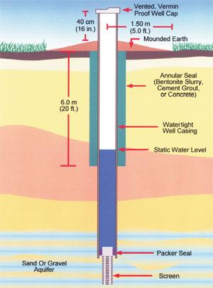
    - **Hình này chứng minh điều gì**
      - Thể hiện đầy đủ cấu tạo mặt cắt giếng sâu với nắp bảo vệ, vành chèn cách ly bentonite/xi măng sâu $6.0\text{ m}$, ống vách kín nước và ống lọc thu nước tầng cát sỏi.
    - **Từ đâu mà thấy được**
      - Trục đọc từ trên xuống: Nắp $Vented,\ Vermin\ Proof\ Well\ Cap$ cao $40\text{ cm}$, đai trám $Annular\ Seal$ sâu $6.0\text{ m}$ bao quanh $Watertight\ Well\ Casing$.
      - Đáy giếng: Khớp nối $Packer\ Seal$ liên kết ống vách với $Screen$ nằm trong tầng $Sand\ Or\ Gravel\ Aquifer$.

* Phương pháp và thiết bị thi công giếng khoan sâu bằng cơ giới:
  * Khoan xoay bằng xe cơ giới kết hợp tuần hoàn dung dịch bentonite:
    * Dung dịch bùn khoan bentonite được bơm qua lòng cần khoan xuống đáy lỗ giếng làm mát mũi khoan và cuốn mùn khoan trào ngược lên miệng giếng.
    * Dung dịch bùn tạo áp lực thủy tĩnh giữ cân bằng thành lỗ khoan, ngăn ngừa hiện tượng sập vách đất đá trước khi hạ ống vách.
  - **Hình 18.** Thi công khoan giếng sâu bằng xe khoan cơ giới
    - 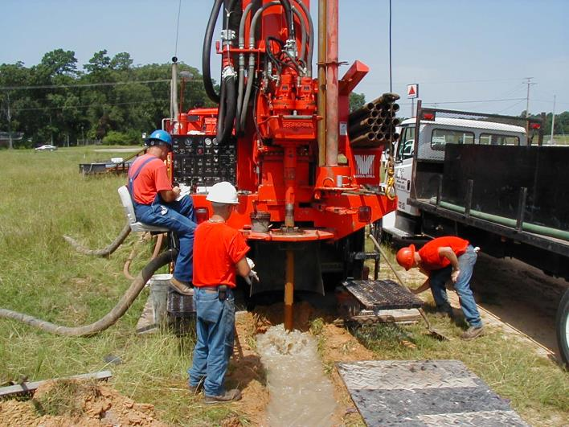
    - **Hình này chứng minh điều gì**
      - Bố trí thực tế của giàn khoan cơ giới với cần khoan cắm sâu vào đất và rãnh dẫn bùn khoan tuần hoàn.
    - **Từ đâu mà thấy được**
      - Miệng giếng bên dưới: Cần khoan quay cắm thẳng xuống đất, bùn xám đục trào ra rãnh thoát nước.
      - Trên xe khoan: Tháp khoan màu đỏ gắn hệ thống thủy lực, giá đỡ cần khoan và bàn điều khiển của thợ khoan.
  * Mũi khoan xoay chuyên dụng phá vỡ đất đá ($Rotary\ drill\ bit$):
    * Cánh chém xoắn bản rộng gắn hàng răng cưa tôi cứng nhọn sắc chạy dọc mép cắt.
    * Khi quay tròn dưới áp lực nén cao của tháp khoan, các răng cưa cào xới, chém vỡ và nghiền nát kết cấu tầng đất đá cứng.
  - **Hình 19.** Mũi khoan xoay chuyên dụng dùng trong thi công giếng sâu
    - 
    - **Hình này chứng minh điều gì**
      - Cấu tạo mũi khoan xoay có các cánh chém hàn răng cưa nhọn để cào xới và nghiền phá đất đá khi khoan giếng.
    - **Từ đâu mà thấy được**
      - Mép cánh cắt bên trái: Dải răng cưa nhọn chạy dọc theo toàn bộ viền lưỡi khoan.
      - Phần thân bên phải: Ống thép trụ tròn truyền mô-men xoắn từ chuỗi cần khoan.

##### 2.3.3 Thiết bị xe khoan giếng (Well Drilling Vehicle)

* Tổ hợp xe tải khoan giếng cơ giới tự hành ($Well\ drilling\ vehicle$):
  * Tích hợp trọn bộ hệ thống khoan giếng trên khung gầm xe tải chịu tải nặng, cơ động cao giữa các hiện trường thi công giếng sâu.
  * Thi công hiệu quả qua các tầng địa chất phức tạp từ đất bùn sét, cát sỏi đến tầng đá gốc.
  * Bảo đảm kích thước lỗ khoan chuẩn xác để lắp đặt hoàn chỉnh ống vách, vành chèn cách ly bentonite và ống lọc nước ngầm.
  - **Hình 20.** Cấu tạo chi tiết giếng khoan hoàn thiện và lớp bảo vệ
    - 
    - **Hình này chứng minh điều gì**
      - Vành chèn cách ly $Annular\ Seal$ sâu $6.0\text{ m}$ và ụ đất $Mounded\ Earth$ rộng $1.50\text{ m}$ bảo vệ tuyệt đối giếng khoan sâu khỏi nước bẩn bề mặt.
    - **Từ đâu mà thấy được**
      - Trục dọc từ trên xuống: Nắp $Vented,\ Vermin\ Proof\ Well\ Cap$ cao $40\text{ cm}$, đai trám $Annular\ Seal$ bọc ống vách sâu $6.0\text{ m}$.
      - Đáy giếng: Mũi tên chỉ $Static\ Water\ Level$, khớp $Packer\ Seal$ và ống lọc $Screen$ đặt trong tầng cát sỏi $Sand\ Or\ Gravel\ Aquifer$.

* Các trang thiết bị kỹ thuật chính tích hợp trên xe tải khoan giếng:
  * Tháp khoan đứng chịu lực ($Drilling\ mast$): Tháp kết cấu giàn thép gắn ở đuôi xe tải, định vị và nâng hạ thẳng đứng bằng xi lanh thủy lực.
  * Đầu xoay thủy lực truyền động ($Rotary\ head$): Truyền mô-men xoắn lớn và lực ép dọc trục lên chuỗi cần khoan ($drill\ pipe$) để xuyên sâu vào địa tầng.
  * Giá chứa và cấp cần khoan dự phòng ($Drill\ pipe\ rack$): Bố trí bên hông tháp khoan, cho phép cẩu lắp và nối ren liên tục chuỗi cần khoan khi giếng sâu dần.
  * Bảng điều khiển thủy lực trung tâm ($Hydraulic\ control\ console$): Đặt cạnh ghế ngồi người vận hành, tích hợp đồng hồ áp lực và tay gạt van phân phối thủy lực.
  * Tấm lót sàn thép dập gân chống trượt: Lót quanh miệng hố khoan bảo đảm an toàn lao động cho công nhân thao tác tại hiện trường.
  - **Hình 21.** Thực tế thi công giếng khoan bằng xe khoan chuyên dụng
    - 
    - **Hình này chứng minh điều gì**
      - Hiện trường thi công giếng khoan cơ giới với tháp khoan, bàn điều khiển thủy lực và bó cần khoan dự phòng.
    - **Từ đâu mà thấy được**
      - Trung tâm phía dưới: Cần khoan cắm thẳng đứng vào miệng hố đất ngập nước bùn xám đục.
      - Thân máy màu đỏ: Bảng điều khiển thủy lực bên trái có công nhân thao tác và giá xếp bó cần khoan dự phòng bên phải.
  * Cấu tạo chi tiết mũi khoan xoay cánh răng cưa ($Rotary\ drill\ bit$):
    * Cánh chém xoắn bản rộng xẻ rãnh hàn hàng răng cưa tôi cứng nhô ra phía trước.
    * Phần thân sau dạng ống tròn có ren kết nối đồng trục với chuỗi cần khoan của giàn khoan.
  - **Hình 22.** Cấu tạo mũi khoan xoay có cánh răng cưa
    - 
    - **Hình này chứng minh điều gì**
      - Cấu tạo thực tế của mũi khoan gồm các cánh chém xòe xẻ rãnh răng cưa gắn trên trục ống nối ren.
    - **Từ đâu mà thấy được**
      - Các mép cánh cắt phía trước xẻ rãnh răng cưa nhô ra để cào xới đất đá.
      - Ống trục kim loại phía sau kết nối đồng trục với cần khoan.

##### 2.3.4 Máy bơm giếng khoan sâu (Well Pump / Submersible Deep Well Pump)

* Khái niệm và vai trò của máy bơm giếng trong hệ thống thu gom nước ngầm:
  * Máy bơm giếng ($Well\ pump$) là thiết bị động lực tạo áp lực hút nâng nước ngầm từ đáy giếng lên bề mặt đất và đưa vào hệ thống xử lý hoặc mạng lưới truyền dẫn.
  * Máy bơm chìm ly tâm đa tầng cánh kiểu QJ ($QJ\ submersible\ deep\ well\ pump$) là giải pháp tiêu chuẩn cho các giếng khoan sâu công nghiệp:
    * Toàn bộ cụm bơm và động cơ điện làm việc ngập sâu dưới mực nước động trong lòng ống vách giếng.
    * Tạo cột áp đẩy nước rất cao nhờ ghép nối tiếp nhiều bánh công tác trên cùng một trục bơm.
  * Máy bơm tay cơ học phục vụ cấp nước sinh hoạt quy mô phân tán nhỏ lẻ tại các vùng nông thôn không dùng điện.

* Cấu tạo chi tiết máy bơm chìm giếng sâu nhiều tầng cánh kiểu QJ:
  * Thân van một chiều đỉnh bơm ($Non\text{-}return\ valve\ body$):
    * Bố trí tại họng xả trên cùng của bơm, ngăn nước trong cột ống đẩy dội ngược về giếng khi tắt động cơ, triệt tiêu xung kích búa nước ($water\ hammer$).
  * Tấm nẹp bảo vệ dây cáp điện ($Wire\text{-}protecting\ plate$):
    * Nẹp kim loại ốp dọc bên ngoài vỏ bơm bảo vệ dây cáp cấp điện cho động cơ chìm, chống ma sát cọ quẹt vào thành ống vách khi thả hoặc kéo bơm.
  * Cụm vỏ dẫn dòng trên và các vỏ khuếch tán ($Diversion\ shell\ units$):
    * Chế tạo bằng gang đúc ($Cast\ iron$), dẫn hướng dòng nước từ cửa ra của cánh bơm tầng trước vào tâm hút của cánh bơm tầng kế tiếp.
  * Ổ trục dẫn hướng bằng cao su ($Rubber\ bearing$):
    * Bạc lót ổ trục bằng vật liệu cao su ($Rubber$), tự bôi trơn bằng chính nước ngầm xung quanh mà không cần dầu mỡ bôi trơn.
    * Chịu mài mòn vượt trội khi nước ngầm có lẫn cặn cát mịn lơ lửng.
  * Bánh công tác ly tâm nhiều tầng ($Impellers$):
    * Chế tạo bằng gang đúc ($Cast\ iron$), các cánh xếp tầng quay đồng trục để nhân bội áp lực nước đẩy lên cao.
  * Vỏ côn kẹp định vị ($Cone\text{-}shaped\ casing$):
    * Chế tạo bằng thép không gỉ ($Stainless\ steel$), cố định vị trí các chi tiết quay trong buồng bơm.
  * Lưới lọc chắn rác cửa nạp nước ($Water\text{-}filtering\ net$):
    * Chế tạo bằng vật liệu nhựa ($Plastic / Platistc$) bao quanh cửa hút ở giữa động cơ và buồng cánh bơm, ngăn sỏi cát thô lọt vào buồng cánh.
  * Trục bơm ly tâm ($Pump\ shaft$):
    * Chế tạo bằng thép không gỉ ($Stainless\ steel$), chịu lực kéo và mô-men xoắn cao, chống gỉ sét tuyệt đối trong nước.
  * Khớp nối cửa hút ($Water\ inlet\ joint\ unit$) và khớp nối trục ($Shaft\ coupling$):
    * Chế tạo bằng thép đúc ($Cast\ steel$), truyền động xoay trực tiếp từ trục động cơ điện sang trục cánh bơm.
  - **Hình 23.** Cấu tạo mặt cắt bơm chìm giếng khoan QJ
    - 
    - **Hình này chứng minh điều gì**
      - Thể hiện cấu tạo mặt cắt bơm chìm đa tầng cánh QJ từ khớp nối, lưới lọc cửa hút, các tầng cánh ly tâm đến van một chiều đỉnh bơm.
    - **Từ đâu mà thấy được**
      - Mặt cắt bên trái đọc từ dưới lên: Khớp nối ($shaft\ coupling$), lưới lọc ở cửa hút, các tầng cánh ($impeller$) cùng vỏ dẫn dòng, và van một chiều ở trên cùng.
      - Hai hình trụ bên phải: Kết cấu thon dài gồm nhiều tầng vỏ ghép nối tiếp để thả lọt vào ống giếng khoan.

* Thiết bị bơm lắc tay cơ học lắp đặt ngoài trời:
  * Xi lanh đứng bằng gang kết hợp cần gạt đòn bẩy cho phép bơm hút nước giếng ngầm thủ công bằng sức người mà không cần nguồn điện.
  - **Hình 24.** Bơm lắc tay cơ học ngoài trời khai thác nước giếng
    - 
    - **Hình này chứng minh điều gì**
      - Cơ cấu xi lanh đứng kết hợp cần gạt đòn bẩy cho phép nâng nước giếng thủ công bằng sức người.
    - **Từ đâu mà thấy được**
      - Phía trên có cần gạt uốn cong liên kết với ty pít-tông ở đỉnh thân bơm trụ đứng.
      - Thân bơm kim loại gắn vòi xả ngang bên trái, chân đế bắt cố định tại miệng giếng ngoài trời.

##### 2.3.5 Bơm tay giếng khoan (Hand Well Pump)

* Vai trò và phạm vi áp dụng của bơm tay giếng khoan ($Hand\ well\ pump$):
  * Bơm tay giếng khoan vận hành hoàn toàn bằng năng lượng cơ bắp của con người.
  * Cung cấp giải pháp cấp nước sinh hoạt thiết thực tại các vùng nông thôn hẻo lánh, hải đảo hoặc làm nguồn cấp nước dự phòng khi mất điện lưới.
  * Đối chiếu cấu tạo công nghiệp của bơm chìm đa tầng cánh QJ trên slide 13:
  - **Hình 25.** Cấu tạo bơm chìm giếng sâu nhiều tầng cánh QJ
    - 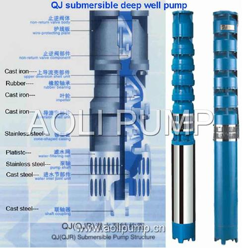
    - **Hình này chứng minh điều gì**
      - Cấu tạo chuỗi nhiều tầng cánh ($impeller$) và buồng dẫn dòng ghép nối tiếp tạo áp lực đẩy giếng sâu công nghiệp.
    - **Từ đâu mà thấy được**
      - Mặt cắt bên trái thể hiện chuỗi cánh bơm xếp dọc trục và cụm lưới lọc đáy ($water\text{-}filtering\ net$).
      - Lưu ý: Hình minh họa cấu tạo $QJ\ submersible\ deep\ well\ pump$ đặt trong slide $Hand\ well\ pump$.

* Cấu tạo chi tiết và nguyên lý hoạt động của bơm tay thân gang đúc:
  * Thân bơm trụ đứng ($Pump\ barrel / cylinder$):
    * Đúc nguyên khối bằng gang ($cast\ iron$), chịu lực va đập cơ học và chống chịu thời tiết ngoài trời bền bỉ.
    * Sơn phủ men chống gỉ màu xanh thẫm, thân gồm hai đoạn liên kết với nhau bằng khớp mặt bích bắt bu-lông ở giữa cột trụ.
  * Cần gạt đòn bẩy tay bơm ($Lever\ handle$):
    * Chế tạo bằng gang đúc uốn cong dạng cánh cung kéo dài về phía sau, hoạt động theo nguyên lý đòn bẩy cấp 1 giúp khuếch đại lực tay nhấn xuống.
    * Bản lề xoay trên đỉnh liên kết cần gạt với ty bơm ($pump\ rod$) truyền chuyển động tịnh tiến lên xuống vào cụm pít-tông trong xi lanh.
  * Vòi rót nước ($Water\ spout$):
    * Đúc vươn ngang ra khỏi thân bơm ở độ cao thuận tiện hứng nước, đầu vòi có đúc mấu cong chịu lực để móc quai xô xách nước trực tiếp.
  * Chân đế mặt bích bắt sàn ($Flange\ mounting\ base$):
    * Chân đế loe rộng dạng xòe có các lỗ đúc sẵn để bắt bu-lông cố định chắc chắn chân bơm vào bệ bê tông miệng giếng, chống rung lắc khi giật cần gạt.
  - **Hình 26.** Thiết bị bơm tay giếng khoan thực tế bằng gang đúc
    - 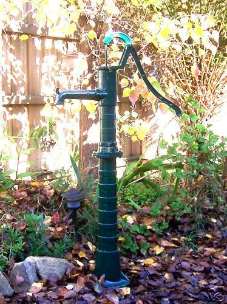
    - **Hình này chứng minh điều gì**
      - Thiết bị bơm tay hoàn chỉnh bằng gang đúc với cần gạt đòn bẩy cong, thân trụ nối bích và chân đế loe cố định nền.
    - **Từ đâu mà thấy được**
      - Nửa trên: Cần gạt cong nối ty bơm qua ngàm vòm; đầu vòi xả có mấu treo xô.
      - Nửa dưới: Khớp nối bích bắt bu-lông ở giữa cột trụ và chân đế loe rộng.

* Chu trình thủy lực pít-tông tác động đơn của bơm tay:
  * Kỳ hút (khi nâng cần gạt lên): Ty bơm đẩy cụm pít-tông đi xuống trong lòng xi lanh, van một chiều trên đĩa pít-tông mở ra để nước tràn lên phía trên pít-tông; đồng thời van chân một chiều ở đáy buồng xi lanh đóng kín.
  * Kỳ đẩy (khi nhấn cần gạt xuống): Ty bơm kéo cụm pít-tông đi lên, van pít-tông đóng lại nâng toàn bộ cột nước phía trên trào ra vòi xả; đồng thời tạo độ chân không trong buồng xi lanh phía dưới, mở van chân hút nước từ giếng dâng lên buồng bơm.
  * Giới hạn thủy lực hút chân không: Chiều cao hút tĩnh thực tế của bơm tay trên mặt đất bị giới hạn bởi áp suất khí quyển, thường không vượt quá $6.0\text{ m} - 7.5\text{ m}$.

### Chương 3: Keo tụ và Tạo bông (Coagulation & Flocculation)

#### 3.1 Tổng quan quá trình Keo tụ - Tạo bông

##### 3.1.1 Khái niệm Cốt lõi và Mục tiêu Xử lý Đa Rào cản

###### 3.1.1.1 Định nghĩa và Nguyên lý Keo tụ - Tạo bông
- **Bản chất của quá trình keo tụ (Coagulation)**:
  - Keo tụ là quá trình châm một hoặc nhiều hóa chất vào nước để điều hòa và làm mất độ bền tĩnh điện của các hạt cặn nhỏ.
  - Các hạt cặn lơ lửng và chất keo trong nước thô có kích thước vi mô ($d_p < 1\text{ }\mu\text{m}$).
  - Lực đẩy tĩnh điện ngăn cản các hạt keo tự kết tụ với nhau trong điều kiện tự nhiên.
  - Hóa chất keo tụ làm giảm thế đẩy tĩnh điện và phá vỡ trạng thái cân bằng bền của hệ keo.
- **Bản chất của quá trình tạo bông (Flocculation)**:
  - Tạo bông là quá trình tập hợp vật lý các hạt đã mất độ bền và các sản phẩm kết tủa thành các cụm hạt lớn hơn gọi là bông cặn (flocs).
  - Bông cặn hình thành dưới hai dạng: mạng lưới kết tủa vô định hình (precipitates) hoặc các cụm hạt lơ lửng liên kết (aggregated suspended particles).
  - Kích thước bông cặn tăng trưởng từ thang vi mô lên thang vĩ mô ($d_p = 0{,}1 - 2{,}0\text{ mm}$).
  - Bông cặn có khối lượng và kích thước đủ lớn để lắng nhanh dưới tác dụng của trọng lực hoặc bị giữ lại hoàn toàn trên lớp vật liệu lọc.
- **Mối liên hệ tương hỗ giữa keo tụ và tạo bông**:
  - Keo tụ chuẩn bị điều kiện hóa lý bề mặt cho hạt cặn qua quá trình khuấy trộn nhanh trong thời gian ngắn ($t = 10 - 60\text{ s}$).
  - Tạo bông cung cấp động năng va chạm thủy lực dị thể qua quá trình khuấy trộn chậm trong thời gian dài ($t = 20 - 45\text{ phút}$).
  - Hiệu quả của giai đoạn tạo bông phụ thuộc hoàn toàn vào mức độ mất độ bền đạt được ở giai đoạn keo tụ trước đó.

###### 3.1.1.2 Bốn Mục tiêu Kỹ thuật Thiết kế Đa Rào cản (Design Objectives)
- **Rào cản 1: Loại bỏ các tác nhân vi sinh gây bệnh truyền nhiễm (Infectious agents)**:
  - Nước mặt tự nhiên chứa nhiều mầm bệnh vi sinh vật mang điện tích âm bề mặt:
    - Virus gây bệnh có kích thước siêu vi ($d_p = 0{,}02 - 0{,}08\text{ }\mu\text{m}$).
    - Vi khuẩn đường ruột có kích thước hiển vi ($d_p = 0{,}5 - 2{,}0\text{ }\mu\text{m}$).
    - U nang nguyên sinh động vật *Giardia lamblia* có kích thước ($d_p = 8 - 14\text{ }\mu\text{m}$).
    - Noãn nang *Cryptosporidium parvum* có kích thước ($d_p = 4 - 6\text{ }\mu\text{m}$).
  - Keo tụ giữ chặt các mầm bệnh này vào mạng lưới bông cặn hydroxit kim loại.
  - Quá trình lắng và lọc tiếp sau giúp loại bỏ từ $2{,}0$ đến $3{,}0\text{ }\log_{10}$ lượng vi sinh vật trước công đoạn khử trùng.
- **Rào cản 2: Loại bỏ hợp chất độc hại hấp phụ trên bề mặt hạt (Adsorbed toxic compounds)**:
  - Hạt sét khoáng và chất keo hữu cơ trong nước có diện tích bề mặt riêng rất lớn ($S_s = 10 - 800\text{ m}^2\text{/g}$).
  - Bề mặt hạt hấp phụ mạnh các ion kim loại nặng độc hại:
    - Chì ($\text{Pb}^{2+}$), Cadimi ($\text{Cd}^{2+}$), Thủy ngân ($\text{Hg}^{2+}$) và Asen ($\text{H}_2\text{AsO}_4^- / \text{HAsO}_4^{2-}$).
  - Bề mặt hạt cũng tích tụ các vi ô nhiễm hữu cơ kỵ nước:
    - Thuốc bảo vệ thực vật, hóa chất trừ sâu clo hữu cơ và hydrocarbon thơm đa vòng (PAHs).
  - Keo tụ và tách bông cặn giúp loại bỏ đồng thời các chất độc hại hấp phụ này ra khỏi dòng nước.
- **Rào cản 3: Loại bỏ tiền chất tạo sản phẩm phụ khử trùng (DBP precursors)**:
  - Chất hữu cơ tự nhiên (NOM) trong nước mặt bao gồm axit humic và axit fulvic có khối lượng phân tử từ $1000$ đến $50000\text{ Da}$.
  - NOM tác dụng với chất khử trùng clo tự do hình thành các sản phẩm phụ khử trùng gây ung thư:
    - Trihalomethane tổng số ($\text{TTHMs}$) gồm $\text{CHCl}_3, \text{CHBrCl}_2, \text{CHBr}_2\text{Cl}, \text{CHBr}_3$.
    - Axit haloacetic ($\text{HAA}_5$) gồm $\text{CH}_2\text{ClCOOH}, \text{CHCl}_2\text{COOH}, \text{CCl}_3\text{COOH}, \text{CH}_2\text{BrCOOH}, \text{CHBr}_2\text{COOH}$.
  - Keo tụ tăng cường (enhanced coagulation) kết tủa và bẫy các phân tử NOM kỵ nước có trọng lượng phân tử lớn, ngăn ngừa rủi ro tạo DBPs.
- **Rào cản 4: Nâng cao cảm quan và độ ngon miệng của nước sạch (Palatability & aesthetics)**:
  - Axit humic hòa tan tạo ra độ màu thực của nước nguồn theo thang đo bạch kim - coban ($\text{Pt-Co}$).
  - Phù sa lơ lửng, hạt keo sét và oxyhydroxyt sắt - mangan tạo ra độ đục biểu kiến cao.
  - Keo tụ và tạo bông hạ độ đục từ hàng trăm $\text{NTU}$ xuống dưới ngưỡng quy chuẩn $\le 2\text{ NTU}$ (theo QCVN 01-1:2018/BYT) và đạt $\le 0{,}1 - 0{,}3\text{ NTU}$ sau bể lọc cát.
  - Quá trình khử sạch triệt để độ đục, độ màu, vị lạ và mùi đất nhằm đem lại chất lượng nước trong lành, ngon miệng cho người sử dụng.

---

##### 3.1.2 Vị trí Quá trình trong Dây chuyền Công nghệ Xử lý Nước cấp

###### 3.1.2.1 Dây chuyền Xử lý Nước Cấp Truyền thống (Conventional Treatment Train)
- **Cấu trúc công nghệ đa cấp của dây chuyền truyền thống**:
  - Keo tụ và tạo bông là trung tâm xử lý hóa lý của toàn bộ nhà máy xử lý nước mặt:
    $$\text{Nước mặt thô} \rightarrow \text{Tiền oxy hóa} \rightarrow \text{Khuấy nhanh (Flash mix)} \rightarrow \text{Tạo bông} \rightarrow \text{Lắng trọng lực} \rightarrow \text{Lọc cát} \rightarrow \text{Khử trùng} \rightarrow \text{Nước sạch}$$
  - Hóa chất keo tụ vô cơ ($\text{Al}_2(\text{SO}_4)_3, \text{FeCl}_3, \text{PAC}$) châm trực tiếp vào họng bể khuấy nhanh thủy lực hoặc cơ học.
  - Bể tạo bông ba ngăn với cánh khuấy guồng quay chậm phát triển dần kích thước bông cặn.
  - Bể lắng loại bỏ hơn $85 - 95\%$ tải lượng cặn bông trước khi đưa nước sang bể lọc hạt.
  - Polymer trợ lọc châm bổ sung trước bể lọc hạt để gia cường độ bền liên kết của vi bông cặn.
- **Sơ đồ công nghệ minh họa cấu trúc dây chuyền xử lý nước cấp và các nhánh công nghệ thay thế**:
  - **Hình 1.** Sơ đồ dây chuyền công nghệ xử lý nước cấp ứng dụng quá trình keo tụ
    - 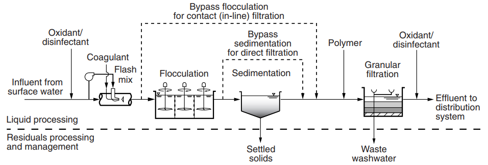
    - **Hình này chứng minh điều gì**
      - Thể hiện cấu hình xử lý truyền thống cùng hai nhánh công nghệ rút gọn: lọc tiếp xúc (bỏ qua tạo bông, lắng) và lọc trực tiếp (bỏ qua lắng).
    - **Từ đâu mà thấy được**
      - Đường dòng chính đi qua liên tục các bể đơn vị, kết hợp hai đường nét đứt bypass tạo bông và bypass lắng dẫn thẳng đến bể lọc hạt.

###### 3.1.2.2 Cấu hình Lọc Trực tiếp và Lọc Tiếp xúc (Direct & Contact Filtration)
- **Dây chuyền lọc trực tiếp (Direct Filtration)**:
  - Dây chuyền bỏ qua hoàn toàn công đoạn lắng trọng lực (Bypass sedimentation):
    $$\text{Nước thô} \rightarrow \text{Khuấy nhanh} \rightarrow \text{Bể tạo bông ngắn} \rightarrow \text{Bể lọc hạt (Granular filtration)}$$
  - Thời gian tạo bông rút ngắn còn $5 - 15\text{ phút}$ với gradient vận tốc $G = 30 - 50\text{ s}^{-1}$ để hình thành các vi bông cặn ($d_p = 20 - 50\text{ }\mu\text{m}$).
  - Áp dụng hiệu quả khi nước thô có độ đục thấp ($\text{Turbidity} < 10 - 15\text{ NTU}$) và độ màu thấp ($\text{Color} < 15 - 20\text{ TCU}$).
  - Giảm thiểu diện tích xây dựng trạm và tiết kiệm đáng kể chi phí đầu tư bể lắng.
- **Dây chuyền lọc tiếp xúc (Contact Filtration / In-line Coagulation)**:
  - Dây chuyền loại bỏ cả bể tạo bông lẫn bể lắng (Bypass flocculation & sedimentation):
    $$\text{Nước thô} \rightarrow \text{Khuấy nhanh hóa chất} \rightarrow \text{Bể lọc hạt}$$
  - Hóa chất keo tụ châm trực tiếp vào đường ống áp lực ngay trước lớp vật liệu lọc hạt.
  - Quá trình làm mất độ bền, va chạm và giữ dính cặn diễn ra trực tiếp bên trong các khe rỗng của tầng lọc cát - than anthrasit.
  - Áp dụng đối với nguồn nước chất lượng rất cao, độ đục ổn định quanh năm ($\text{Turbidity} < 5\text{ NTU}$) và không có tảo nở hoa.

###### 3.1.2.3 Phân tách Dòng Xử lý Nước và Dòng Quản lý Bùn Cặn Thải (Residuals Management)
- **Dòng xử lý nước sạch (Liquid processing)**:
  - Dòng chính vận chuyển chất lỏng từ trạm thu nước mặt thô qua các công trình phản ứng đến bể chứa nước sạch và mạng lưới tiêu thụ.
  - Mục tiêu duy trì chất lượng nước đạt chuẩn ăn uống và áp lực thủy lực ổn định trên mạng lưới cấp nước.
- **Dòng quản lý bùn cặn và nước rửa lọc (Residuals processing and management)**:
  - Bùn cặn lắng (Settled solids): xả định kỳ từ đáy phễu bể lắng trọng lực với hàm lượng cặn khô $C_s = 0{,}5 - 2{,}0\%$.
  - Nước rửa ngược bể lọc (Waste washwater): phát sinh gián đoạn từ chu trình rửa ngược tầng lọc hạt cát, chứa vi bông cặn và hạt lơ lửng.
  - Dòng thải cặn đưa về bể nén bùn trọng lực, hồ làm khô hoặc máy ép bùn cơ học để thu hồi nước trong tuần hoàn và chôn lấp bánh bùn khô an toàn.

---

##### 3.1.3 Động học Bốn Giai đoạn Nối tiếp trong Keo tụ - Tạo bông

###### 3.1.3.1 Trình tự Bốn Bước Động học Hóa lý Kế tiếp (Sequential Steps)
- **Đặc trưng động học của quá trình**:
  - Keo tụ là một chuỗi phản ứng liên hoàn phức tạp, kết hợp chặt chẽ giữa các phản ứng hóa học dị thể và quá trình truyền khối thủy động học.
  - Quá trình diễn ra tuần tự qua bốn giai đoạn kế tiếp nhau không thể tách rời:
- **Giai đoạn 1: Biến đổi hóa học của chất keo tụ (Coagulant transformation)**:
  - Muối nhôm hoặc sắt hòa tan giải phóng cation kim loại tự do ($\text{Al}^{3+}, \text{Fe}^{3+}$).
  - Cation kim loại bị hydrat hóa tức thời tạo phức bát diện $[\text{Al}(\text{H}_2\text{O})_6]^{3+}$ hoặc $[\text{Fe}(\text{H}_2\text{O})_6]^{3+}$.
  - Phản ứng thủy phân liên tiếp giải phóng ion hydronium $\text{H}_3\text{O}^+$ diễn ra trong khoảng thời gian siêu ngắn ($10^{-4} - 10^{-1}\text{ s}$):
    $$[\text{Al}(\text{H}_2\text{O})_6]^{3+} + \text{H}_2\text{O} \rightleftharpoons [\text{Al}(\text{H}_2\text{O})_5(\text{OH})]^{2+} + \text{H}_3\text{O}^+$$
    $$[\text{Al}(\text{H}_2\text{O})_5(\text{OH})]^{2+} + \text{H}_2\text{O} \rightleftharpoons [\text{Al}(\text{H}_2\text{O})_4(\text{OH})_2]^+ + \text{H}_3\text{O}^+$$
  - Các cấu tử monome trùng hợp tạo thành các phức hydroxo cation đa nhân ($[\text{Al}_2(\text{OH})_2]^{4+}, [\text{Al}_{13}\text{O}_4(\text{OH})_{24}(\text{H}_2\text{O})_{12}]^{7+}$) và kết tủa hydroxit vô định hình $\text{Al(OH)}_3\text{(s)}$.
- **Giai đoạn 2: Hấp phụ các cấu tử lên bề mặt hạt keo (Uptake of adsorbed species)**:
  - Các ion phức hydroxo kim loại mang điện tích dương khuếch tán cực nhanh qua lớp biên thủy động của hạt keo.
  - Thời gian hấp phụ đặc hiệu lên bề mặt tích điện âm của hạt sét diễn ra trong khoảng $0{,}01 - 0{,}1\text{ s}$.
  - Tương tác tĩnh điện và liên kết phối trí hình thành liên kết bền vững giữa chất hấp phụ và bề mặt hạt keo.
- **Giai đoạn 3: Làm mất độ bền hạt keo (Particle destabilization)**:
  - Lớp điện tích kép (EDL) bị nén mạnh khi lực ion của dung dịch tăng cao.
  - Sự hấp phụ của cation đa nhân làm giảm trị số điện thế Zeta ($\zeta$) từ vùng tích điện âm sâu ($-30\text{ mV}$ đến $-45\text{ mV}$) về điểm đẳng điện ($\zeta \approx 0\text{ mV}$).
  - Lực đẩy tĩnh điện giảm xuống dưới ngưỡng tương tác của lực hút phân tử Van der Waals, phá vỡ hoàn toàn độ bền hệ keo.
- **Giai đoạn 4: Va chạm liên hạt hình thành bông cặn (Interparticle collisions)**:
  - Các hạt đã mất độ bền di chuyển và va chạm với nhau tạo thành các liên kết kết tụ bền vững.
  - Cơ chế va chạm nhiệt Brown điều khiển hạt mịn $d_p < 1\text{ }\mu\text{m}$ (keo tụ perikinetic).
  - Gradient vận tốc dòng chảy $G$ điều khiển va chạm giữa các hạt lớn $d_p > 1\text{ }\mu\text{m}$ (keo tụ orthokinetic).
  - Tần số va chạm tỷ lệ thuận với gradient vận tốc $G$ và kích thước hạt cặn, phát triển thành các bông cặn vĩ mô.
- **Thử nghiệm cốc thủy tinh trực quan hóa diễn biến hóa lý qua bốn giai đoạn**:
  - **Hình 2.** Diễn tiến bốn giai đoạn hóa lý của quá trình keo tụ - tạo bông trong thử nghiệm cốc
    - 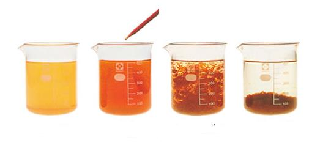
    - **Hình này chứng minh điều gì**
      - Bốn giai đoạn biến đổi hóa lý diễn ra tuần tự từ châm phèn khuấy nhanh đến tạo bông cặn và phân tách pha lỏng - rắn hoàn chỉnh.
    - **Từ đâu mà thấy được**
      - Dãy bốn cốc thủy tinh ghi nhận trạng thái nước nguồn đục ban đầu, ống hút châm hóa chất keo tụ, xuất hiện cụm bông cặn lơ lửng, và bùn lắng tách lớp ở đáy cốc.

###### 3.1.3.2 Phân bố Không gian và Thời gian trong Khuấy nhanh và Tạo bông
- **Giai đoạn khuấy trộn nhanh (Rapid Mixing / Flash Mix)**:
  - Nơi diễn ra: Bể khuấy nhanh cơ học hoặc thiết bị trộn tĩnh trên đường ống (In-line static mixer).
  - Cơ chế chủ đạo: Biến đổi chất keo tụ, tương tác chất hấp phụ - chất keo tụ và phá vỡ độ bền hạt keo diễn ra ngay lập tức trong và sau khi phân tán hóa chất.
  - Cường độ khuấy: Gradient vận tốc rất lớn ($G = 700 - 1000\text{ s}^{-1}$) nhằm phân tán phân tử hóa chất đồng đều trong thể tích nước trước khi phản ứng thủy phân kết tủa kết thúc.
  - Thời gian lưu nước: Cực ngắn ($t = 10 - 60\text{ s}$), tránh hiện tượng khuấy quá lâu làm phá vỡ các mầm vi bông vừa mới định hình.
- **Giai đoạn tạo bông chậm (Slow Flocculation)**:
  - Nơi diễn ra: Bể tạo bông có vách ngăn ziczac hoặc bể cánh khuấy quay chậm nhiều ngăn nối tiếp.
  - Cơ chế chủ đạo: Va chạm giữa các hạt đã mất độ bền nhằm phát triển cụm bông cặn vĩ mô diễn ra với hiệu quả cao nhất tại đây.
  - Cường độ khuấy: Giảm dần theo chiều dòng chảy ($G = 70 \rightarrow 40 \rightarrow 20\text{ s}^{-1}$) với tích số Camp $Gt = 10^4 - 10^5$.
  - Thời gian lưu nước: Đủ dài ($t = 20 - 45\text{ phút}$) để tối đa hóa số lần va chạm hiệu quả giữa các hạt mà không gây ra ứng suất cắt làm vỡ bông cặn.

###### 3.1.3.3 Mô phỏng Thực nghiệm Diễn tiến Bốn Trạng thái trong Cốc Thí nghiệm
- **Trạng thái 1: Nước mặt thô tự nhiên (Surface water)**:
  - Cốc chứa nước thô có độ đục cao và màu vàng nhạt đặc trưng của phù sa, sét khoáng và chất mùn humic.
  - Hệ keo duy trì trạng thái phân tán ổn định vô hạn định nhờ lực đẩy tĩnh điện giữa các hạt cùng điện tích âm.
- **Trạng thái 2: Châm hóa chất keo tụ và khuấy nhanh (Coagulation)**:
  - Ống nhỏ giọt đưa liều lượng dung dịch chất keo tụ tối ưu vào cốc nước thô dưới tác động khuấy trộn mãnh liệt.
  - Phản ứng thủy phân ion kim loại diễn ra tức thời, giải phóng các cation đa nhân làm mất độ bền hạt keo và tạo các tâm nhân kết tủa vi mô.
- **Trạng thái 3: Tạo bông cặn vĩ mô (Flocculation)**:
  - Cường độ khuấy hạ chậm dần, tạo điều kiện cho các hạt cặn va chạm và kết dính liên tục.
  - Xuất hiện vô số bông cặn kích thước lớn ($0{,}5 - 2{,}0\text{ mm}$), màu nâu cam đậm, lơ lửng phân bố đều trong toàn bộ thể tích cốc.
- **Trạng thái 4: Lắng trọng lực tách pha hoàn tất (Sedimentation)**:
  - Ngừng khuấy trộn, các bông cặn nặng nhanh chóng chìm xuống đáy cốc tạo thành lớp bùn lắng cô đặc.
  - Phần nước bên trên trở nên trong suốt, độ đục và độ màu giảm triệt để, chứng minh sự thành công của chuỗi công nghệ keo tụ - tạo bông.
- **Dãy cốc thí nghiệm minh chứng trực quan cho bốn bước công nghệ chuyển hóa từ nước mặt đến lắng trong**:
  - **Hình 3.** Sơ đồ bốn bước chuyển hóa từ Nước mặt qua Keo tụ, Tạo bông đến Lắng cặn
    - 
    - **Hình này chứng minh điều gì**
      - Thể hiện trực quan bốn bước chuyển hóa vật lý: nước mặt nguyên khai, phản ứng keo tụ, tạo mạng lưới bông cặn, và phân tách pha lắng trọng lực.
    - **Từ đâu mà thấy được**
      - Chuỗi bốn cốc nghiệm tương ứng với bốn trạng thái: nước thô màu đục, cốc châm phèn khuấy trộn, cốc tạo bông cặn phân tán dày đặc, và cốc lắng tạo lớp bùn đáy dày cùng lớp nước trong.

#### 3.2 Cơ sở lý thuyết quá trình Keo tụ

##### 3.2.1 Bản chất hạt keo và độ bền hệ keo

###### 3.2.1.1 Độ bền hệ keo và nguồn gốc hạt keo trong nước tự nhiên

- Trạng thái bền vững của hệ keo trong nước tự nhiên (*Colloidal Stability*):
  - Các hạt cặn lơ lửng và hạt keo duy trì trạng thái phân tán bền vững nhờ sự cân bằng giữa hai hệ lực đối kháng:
    - Lực đẩy tĩnh điện (*Electrostatic repulsion force*) phát sinh giữa các hạt cùng mang điện tích bề mặt.
    - Lực hút phân tử van der Waals (*Attractive van der Waals forces*) tác động ở cự ly ngắn giữa các hạt.
  - Đa số các hạt cặn và hạt keo trong nguồn nước tự nhiên mang điện tích âm thuần (*net negative charge*).
  - Lực đẩy tĩnh điện là cơ chế chủ đạo ngăn cản các hạt keo tiến lại gần nhau và duy trì độ bền của hệ keo (*stabilization*).
  - Mục tiêu cốt lõi của quá trình keo tụ là phá vỡ thế cân bằng này để chuyển từ trạng thái bền vững sang trạng thái mất độ bền (*destabilization*), thúc đẩy các hạt kết cụm lại với nhau.
- Nguồn gốc phát sinh của các hạt keo trong nước thô (*Origin of Colloids*):
  - Hạt keo là các hạt phân tán có kích thước nhỏ hơn $1\ \mu\text{m}$ (trong các tài liệu kỹ thuật có thể quy ước hạt lơ lửng mịn $< 1\text{ mm}$), có tính bền vững cao trong môi trường nước.
  - Hạt keo xuất hiện trong hầu hết các nguồn nước mặt và nước ngầm tự nhiên, là tác nhân chính gây ra độ đục (*turbidity*), màu sắc (*color*), mùi (*odor*) và vị (*taste*) khó chịu.
  - Các hạt keo phân loại theo ba nguồn gốc xuất xứ chính:
    - Nguồn gốc khoáng chất (*Mineral origin*): bột phù sa (*silt*), khoáng sét (*clay*), hạt silica ($\text{SiO}_2$), các hợp chất hydroxide và muối kim loại không tan.
    - Nguồn gốc hữu cơ (*Organic origin*): axit humic và axit fulvic sinh ra từ quá trình phân hủy xác thực vật và động vật, phẩm màu tự nhiên (*colorants*), chất hoạt động bề mặt (*surfactants*).
    - Nguồn gốc sinh học (*Biological origin*): vi sinh vật gây bệnh hoặc không gây bệnh, bao gồm vi khuẩn (*bacteria*), sinh vật phù du (*plankton*), tế bào tảo (*algae*) và virus.
  - **Hình 4.** Nguồn gốc và phân loại các dạng hạt keo trong nước thô (Slide 7)
    - 
    - **Hình này chứng minh điều gì**
      - Xác định ba nguồn gốc chính hình thành hạt keo trong tự nhiên gồm khoáng chất, hữu cơ và sinh học.
    - **Từ đâu mà thấy được**
      - Danh mục Mineral liệt kê silt, clay, silica; nhóm Organic chỉ axit humic/fulvic; nhóm Biological gồm vi khuẩn, tảo, virus.
  - **Hình 5.** Thang đo kích thước hạt từ cấp độ ion đến vĩ mô (Slide 7)
    - 
    - **Hình này chứng minh điều gì**
      - Phân chia toàn bộ phổ kích thước tạp chất trong nước từ $0{,}0001\ \mu\text{m}$ đến $1000\ \mu\text{m}$.
    - **Từ đâu mà thấy được**
      - Trục Micron Scale phân định 5 cấp độ: Macro, Micro, Macro-molecular, Molecular và Ionic.
  - **Hình 6.** Nguồn gốc và các tác nhân tạo độ đục trong hệ keo (Slide 8)
    - 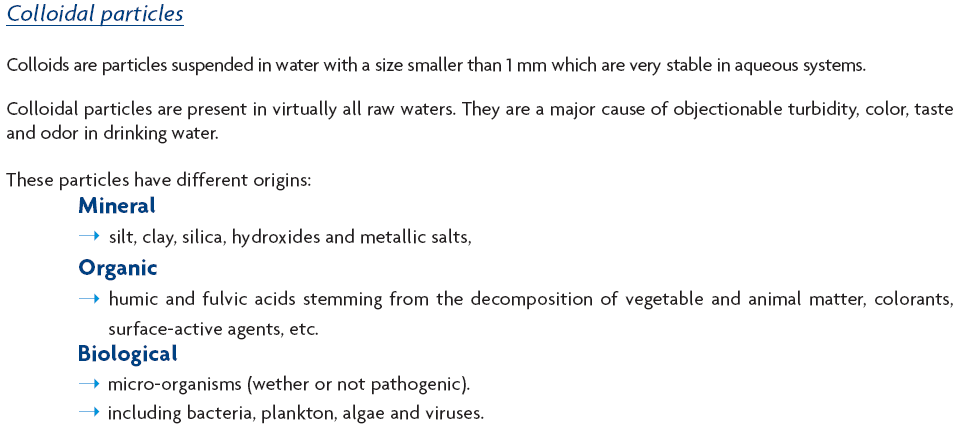
    - **Hình này chứng minh điều gì**
      - Cung cấp cơ sở nhận diện các tác nhân gây đục, màu, mùi trong nước từ xác sinh vật và chất khoáng.
    - **Từ đâu mà thấy được**
      - Nội dung bảng chữ chỉ rõ các thành phần khoáng sét, sản phẩm phân hủy hữu cơ và vi sinh vật phù du.

###### 3.2.1.2 Phân loại hạt theo kích thước và quy luật lắng tĩnh

- Phân loại tạp chất theo dải kích thước hình học (*Particles by Dimension*):
  - Tạp chất dạng vĩ mô (*Macro particles*, kích thước $> 100\ \mu\text{m}$): hạt cát (*sand*), hạt than hoạt tính (*GAC*), sợi tóc (*hair*), phấn hoa (*pollen*).
  - Tạp chất dạng vi mô (*Micro particles*, kích thước $1 - 100\ \mu\text{m}$): tế bào hồng cầu (*red blood*), tế bào nấm men (*yeast cells*), tảo (*algae*), u nang *Giardia* ($8 - 14\ \mu\text{m}$), bào nang *Cryptosporidium* ($4 - 6\ \mu\text{m}$), vi khuẩn (*bacteria*, $0{,}5 - 3\ \mu\text{m}$).
  - Tạp chất dạng đại phân tử và hạt keo (*Macromolecular / Colloidal*, kích thước $0{,}001 - 1\ \mu\text{m}$ tương đương $1 - 1000\text{ nm}$): hạt keo tự nhiên (*colloids*), sợi amiăng (*asbestos*), silica keo (*colloidal silica*), virus ($0{,}01 - 0{,}1\ \mu\text{m}$), nội độc tố và chất gây sốt (*endotoxin / pyrogen*).
  - Tạp chất dạng phân tử (*Molecular*, kích thước $0{,}0001 - 0{,}001\ \mu\text{m}$ tương đương $0{,}1 - 1\text{ nm}$): phân tử đường (*sugar*), thuốc bảo vệ thực vật và diệt cỏ (*pesticides / herbicides*), đại phân tử hữu cơ.
  - Tạp chất dạng ion (*Ionic*, kích thước $< 0{,}0001\ \mu\text{m}$ tương đương $< 0{,}1\text{ nm}$): muối hòa tan trong nước (*aqueous salts*), ion kim loại hòa tan (*metal ions*), bán kính nguyên tử (*atomic radius*).
  - Ranh giới kỹ thuật: các hạt có kích thước lớn hơn $0{,}1 - 1\ \mu\text{m}$ được xếp vào nhóm hạt lơ lửng (*suspended particles*); các cấu tử nhỏ hơn $0{,}1\ \mu\text{m}$ được xếp vào nhóm chất hòa tan và keo mịn (*dissolved particles*).
  - **Hình 7.** Phân loại hạt trong nước theo dải kích thước micromet (Slide 8)
    - 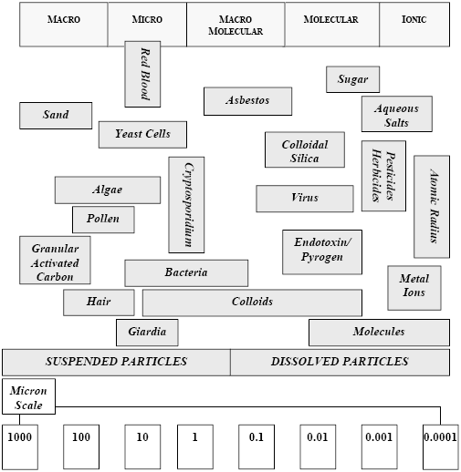
    - **Hình này chứng minh điều gì**
      - Định vị kích thước hạt keo ($0{,}001 - 1\ \mu\text{m}$) nằm chuyển tiếp giữa hạt lơ lửng và chất hòa tan.
    - **Từ đâu mà thấy được**
      - Khối chữ Colloids trải dài từ $1\text{ nm}$ đến $1\ \mu\text{m}$, tiếp giáp vi khuẩn ở cận trên và virus ở cận dưới.
- Vận tốc lắng trọng lực và thời gian lắng tĩnh của các hạt trong nước (*Settling Velocities of Particles in Water*):
  - Vận tốc lắng trọng lực $v_s$ suy giảm nghiêm trọng khi đường kính hạt $d$ thu nhỏ theo quy luật định luật Stokes ($v_s \propto d^2$).
  - Bảng định lượng vận tốc lắng và thời gian rơi tự do qua quãng đường chiều sâu $1\text{ m}$ trong nước tĩnh ở $20^\circ\text{C}$:

| Loại hạt (*Particle Type*) | Đường kính hạt $d$ ($\text{mm}$) | Vận tốc lắng $v_s$ ($\text{mm/s}$) | Thời gian lắng $1\text{ m}$ tĩnh |
| :--- | :--- | :--- | :--- |
| Cát thô (*Large sand*) | $10$ | $1000$ | $1\text{ giây}$ |
| Cát trung bình (*Medium sand*) | $1$ | $100$ | $10\text{ giây}$ |
| Cát mịn (*Small sand*) | $0{,}1$ | $8$ | $2\text{ phút}$ |
| Bột / Cặn bùn (*Sludge / Silt*) | $0{,}01$ ($10\ \mu\text{m}$) | $0{,}154$ | $2\text{ giờ}$ |
| Hạt sét lớn (*Large clay*) | $0{,}001$ ($1\ \mu\text{m}$) | $0{,}00154$ | $7\text{ ngày}$ |
| Hạt sét nhỏ (*Small clay*) | $0{,}0001$ ($0{,}1\ \mu\text{m}$) | $0{,}0000154$ | $2\text{ năm}$ |
| Hạt keo (*Colloids*) | $0{,}00001$ ($0{,}01\ \mu\text{m} = 10\text{ nm}$) | $0{,}000000154$ | $200\text{ năm}$ |

- Tính tất yếu của việc châm hóa chất keo tụ (*Need for Chemical Coagulants*):
  - Các hạt lơ lửng kích thước nhỏ, hạt keo ($d < 1\ \mu\text{m}$) và các hợp chất hòa tan không thể tự lắng trong thời gian lưu thủy lực thực tế của công trình lắng (thường từ $1{,}5$ đến $3\text{ giờ}$).
  - Do thời gian tự lắng kéo dài từ nhiều ngày đến 200 năm, hệ keo được xem là hoàn toàn bền vững về mặt động học và nhiệt động lực học.
  - Bắt buộc phải bổ sung các hóa chất keo tụ chuyên dụng để phá vỡ lớp điện tích, tạo điều kiện cho các hạt kết cụm thành bông cặn lớn có vận tốc lắng đủ cao để tách loại cơ học.

---

##### 3.2.2 Lớp điện tích kép và thế Zeta

###### 3.2.2.1 Cấu trúc lớp điện tích kép (EDL) và thế Zeta

- Cấu trúc hai lớp của lớp điện tích kép (*Electrical Double Layer - EDL*):
  - Hạt keo mang điện tích âm cố định trên bề mặt do ba nguyên nhân: sự phân ly của các nhóm chức hóa học bề mặt, sự hấp phụ chọn lọc các ion âm từ nước, hoặc sự thay thế đồng hình trong mạng tinh thể khoáng sét.
  - Để trung hòa điện tích âm bề mặt, các ion dương đối nghịch (*positive counterions*) từ dung dịch bị hút về phía bề mặt hạt, tạo nên lớp điện tích kép gồm hai tầng đồng tâm:
    - 1. Tầng cố định Stern (*Fixed charge / Stern layer*): lớp ion đối bám chặt sát bề mặt hạt dưới tác dụng của lực tĩnh điện mạnh và lực hấp phụ hóa học, có bề dày khoảng $0{,}5\text{ nm}$. Điện thế suy giảm tuyến tính nhanh chóng từ thế bề mặt Nernst (*Nernst potential*) xuống thế Stern / Helmholtz (*Helmholtz potential*).
    - 2. Tầng khuếch tán Gouy-Chapman (*Diffuse ion layer*): các ion đối chịu liên kết lỏng lẻo hơn, mật độ ion dương giảm dần theo hàm mũ khi ra xa hạt cho đến khi đạt trạng thái cân bằng với dung dịch khối (*bulk solution*), có bề dày mở rộng lên đến khoảng $30\text{ nm}$.
  - Mặt phẳng trượt (*Shear plane / Sliding surface*):
    - Ranh giới hình học quy ước phân tách giữa lớp chất lỏng và ion bám dính di chuyển cùng hạt keo khi có chuyển động tương đối và khối dung dịch nước xung quanh đứng yên.
    - Mặt phẳng trượt nằm ở phần bên trong của lớp khuếch tán, cách bề mặt hạt một khoảng nhỏ hơn bề dày tổng thể của lớp khuếch tán.
  - Khái niệm và ý nghĩa của thế Zeta ($\zeta$, *Zeta Potential*):
    - Thế Zeta là điện thế đo được tại chính mặt phẳng trượt (*shear plane*).
    - Đại lượng thế Zeta phản ánh trực tiếp cường độ của lực đẩy tĩnh điện giữa các hạt keo lơ lửng trong môi trường nước.
    - Hạt keo tự nhiên thường có thế Zeta mang giá trị âm lớn (từ $-15\text{ mV}$ đến $-40\text{ mV}$), tạo rào cản thế năng năng lượng ngăn cản sự kết dính hạt.
  - **Hình 8.** Cấu trúc lớp điện tích kép và biến thiên điện thế tĩnh điện (Slide 11)
    - 
    - **Hình này chứng minh điều gì**
      - Thể hiện sự suy giảm điện thế từ bề mặt hạt qua tầng Stern ($0{,}5\text{ nm}$) đến tầng khuếch tán ($30\text{ nm}$).
    - **Từ đâu mà thấy được**
      - Đồ thị điện thế định vị thế Nernst tại bề mặt hạt, thế Helmholtz tại Stern layer và thế Zeta tại mặt phẳng trượt.
  - **Hình 9.** Công thức Smoluchowski và thông số tính toán thế Zeta (Slide 11)
    - 
    - **Hình này chứng minh điều gì**
      - Cung cấp phương trình toán học tính thế Zeta từ độ nhớt dung dịch và độ linh động điện di.
    - **Từ đâu mà thấy được**
      - Công thức $\zeta = \frac{4\pi\eta}{\varepsilon} \cdot U \cdot 300 \cdot 300 \cdot 1000$ kèm danh mục giải thích ký hiệu $U, v, V, L$.
  - **Hình 10.** Sơ đồ chuyển động điện di của hạt keo trong bình đo (Slide 11)
    - 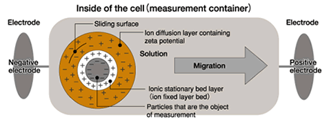
    - **Hình này chứng minh điều gì**
      - Minh họa hạt keo âm di chuyển về cực dương và sự hình thành mặt phẳng trượt Sliding surface.
    - **Từ đâu mà thấy được**
      - Mũi tên Migration hướng về Positive electrode; cấu trúc hạt gồm ion fixed bed và ion diffusion layer.

###### 3.2.2.2 Phương pháp điện di và công thức tính thế Zeta

- Nguyên lý đo điện di hạt keo (*Microelectrophoresis Principle*):
  - Chiếu điện trường một chiều với hiệu điện thế $V$ qua buồng đo chứa mẫu nước có hai điện cực đặt cách nhau khoảng cách $L$.
  - Cường độ điện trường áp đặt lên dung dịch:
    $$E = \frac{V}{L} \quad (\text{V/cm})$$
  - Hạt keo mang điện tích âm cùng lớp vỏ solvat hóa bên trong mặt phẳng trượt sẽ chuyển dịch (*migration*) có hướng về phía cực dương (*positive electrode*) với vận tốc trôi không đổi $v$ ($\text{cm/s}$).
  - Độ linh động điện di của hạt keo ($U$, *Electrophoretic Mobility*):
    $$U = \frac{v}{E} = \frac{v}{V/L} \quad \left(\frac{\text{cm/s}}{\text{V/cm}} = \frac{\text{cm}^2}{\text{V}\cdot\text{s}}\right)$$
- Công thức Smoluchowski tính thế Zeta:
  - Giá trị thế Zeta ($\zeta$) tính theo hệ đơn vị thực nghiệm:
    $$\zeta = \frac{4\pi \eta}{\varepsilon} \times U \times 300 \times 300 \times 1000$$
    Trong đó:
    - $\zeta$: Thế Zeta của hạt keo tại mặt phẳng trượt, đơn vị $\text{mV}$.
    - $\eta$: Độ nhớt tuyệt đối của dung dịch (*Viscosity of Solution*), đơn vị $\text{Poise}$ ($\text{g}/(\text{cm}\cdot\text{s})$) hoặc $\text{Pa}\cdot\text{s}$.
    - $\varepsilon$: Hằng số điện môi của môi trường phân tán (*Dielectric Constant*, đối với nước ở $20^\circ\text{C}$, $\varepsilon \approx 80{,}4$).
    - $U = \frac{v}{V/L}$: Độ linh động điện di của hạt keo (*Electrophoretic Mobility*), đơn vị $\text{cm}^2/(\text{V}\cdot\text{s})$.
    - $v$: Vận tốc di chuyển của hạt keo (*Speed of Particle*), đơn vị $\text{cm/s}$.
    - $V$: Hiệu điện thế áp đặt giữa hai điện cực (*Voltage*), đơn vị $\text{V}$.
    - $L$: Khoảng cách hình học giữa hai cực điện (*Distance of Electrode*), đơn vị $\text{cm}$.
    - Hệ số thực nghiệm $300 \times 300 \times 1000 = 9 \times 10^7$ là thừa số chuyển đổi thứ nguyên giữa hệ tĩnh điện CGS (statvolt) sang hệ SI/thực hành ($\text{V}$ và $\text{mV}$).
- Tiêu chí keo tụ hiệu quả theo thế Zeta:
  - Khi thế Zeta âm lớn ($\zeta < -30\text{ mV}$), hệ keo phân tán rất bền vững.
  - Khi châm hóa chất làm suy giảm giá trị tuyệt đối của thế Zeta về dải tối ưu từ $-5\text{ mV}$ đến $+5\text{ mV}$ (gần bằng $0$), lực đẩy tĩnh điện bị triệt tiêu, cho phép lực hút van der Waals phát huy tác dụng làm các hạt dính kết lại với nhau.
  - **Hình 11.** Cấu trúc phân lớp ion của lớp điện tích kép xung quanh hạt keo (Slide 12)
    - 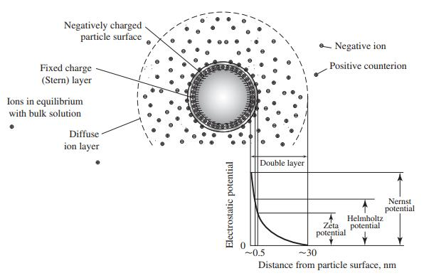
    - **Hình này chứng minh điều gì**
      - Tái khẳng định vị trí tương đối giữa lớp cố định Stern và lớp khuếch tán chứa mặt phẳng trượt.
    - **Từ đâu mà thấy được**
      - Chiều dày lớp kép mở rộng từ khoảng cách $0{,}5\text{ nm}$ đến $30\text{ nm}$ tính từ bề mặt hạt keo.
  - **Hình 12.** Phương trình giải tích xác định thế Zeta theo độ linh động điện di (Slide 12)
    - 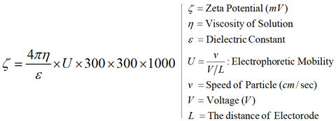
    - **Hình này chứng minh điều gì**
      - Xác lập biểu thức định lượng tính thế Zeta từ số đo vận tốc hạt và gradient điện áp buồng đo.
    - **Từ đâu mà thấy được**
      - Đẳng thức $\zeta = \frac{4\pi\eta}{\varepsilon} \cdot U \cdot 300 \cdot 300 \cdot 1000$ với định nghĩa $U = v/(V/L)$.
  - **Hình 13.** Hiện tượng di chuyển điện di của hạt keo giữa hai điện cực (Slide 12)
    - 
    - **Hình này chứng minh điều gì**
      - Mô tả trực quan quá trình điện di của hạt keo âm trong dung dịch điện ly dưới điện trường ngoài.
    - **Từ đâu mà thấy được**
      - Hạt keo cùng lớp ion liên kết trượt trên ranh giới Sliding surface di chuyển hướng tới Positive electrode.

---

##### 3.2.3 Bốn cơ chế keo tụ làm mất độ bền hạt keo

###### 3.2.3.1 Tổng quan bốn cơ chế keo tụ và giản đồ độ hòa tan Al(III) / Fe(III)

- Bốn cơ chế làm mất độ bền hệ keo trong xử lý nước cấp (*Four Destabilization Mechanisms*):
  - 1. Nén lớp điện tích kép (*Compression of the Electrical Double Layer*).
  - 2. Hấp phụ và trung hòa điện tích (*Adsorption and Charge Neutralization*).
  - 3. Hấp phụ và tạo cầu nối liên kết giữa các hạt (*Adsorption and Interparticle Bridging*).
  - 4. Bẫy cuộn trong khối kết tủa hay keo tụ bông quét (*Enmeshment in a Precipitate, or "Sweep Floc"*).
- Giản đồ cân bằng pha và độ hòa tan của $\text{Al(III)}$ và $\text{Fe(III)}$ ở $25^\circ\text{C}$ (*Solubility Diagrams*):
  - Giản đồ biểu diễn nồng độ tổng của kim loại ở trạng thái cân bằng với pha rắn kết tủa vô định hình: $\text{Al(OH)}_3(\text{s})$ vô định hình hoặc $\text{Fe(OH)}_3(\text{s})$ vô định hình.
  - Các cấu tử nhôm đơn nhân (*Mononuclear Aluminum Species*):
    - Ở $\text{pH} < 5$: tồn tại chủ yếu ở dạng cation hòa tan $\text{Al}^{3+}$ và $\text{Al(OH)}^{2+}$.
    - Ở dải $\text{pH} \approx 6{,}0 - 8{,}0$: nồng độ hòa tan của nhôm đạt cực tiểu ($\approx 10^{-6}\text{ mol/L}$ tại $\text{pH} \approx 6{,}3$); pha rắn $\text{Al(OH)}_3(\text{s})$ kết tủa mạnh mẽ.
    - Ở $\text{pH} > 8$: kết tủa tan trở lại tạo thành anion aluminate $\text{Al(OH)}_4^-$.
  - Các cấu tử sắt đơn nhân (*Mononuclear Ferric Species*):
    - Tồn tại các dạng cation hòa tan $\text{Fe}^{3+}$, $\text{Fe(OH)}^{2+}$, $\text{Fe(OH)}_2^+$, và anion $\text{Fe(OH)}_4^-$.
    - Độ tan của $\text{Fe(OH)}_3(\text{s})$ thấp hơn đáng kể so với nhôm, vùng kết tủa mở rộng trên dải $\text{pH}$ rộng hơn rất nhiều ($\text{pH} \approx 4 - 11$).
  - Phân vùng vận hành công nghệ trên giản đồ độ tan:
    - Vùng keo tụ quét (*Sweep coagulation*): xuất hiện ở nồng độ châm kim loại cao vượt ngưỡng bão hòa hòa tan, nằm sâu bên trong đường biên kết tủa vô định hình.
    - Vùng hấp phụ và trung hòa điện tích (*Adsorption destabilization*): nằm sát đường biên kết tủa ở nồng độ phèn thấp hơn và vùng $\text{pH}$ axit nhẹ đến trung tính.
    - Vùng tái bền (*Restabilization zone*): xuất hiện khi nồng độ phèn dư thừa ở dải $\text{pH}$ thấp làm đảo ngược điện tích bề mặt hạt keo sang tích điện dương.
  - **Hình 14.** Giản đồ cân bằng hòa tan của Al(III) và Fe(III) ở 25°C (Slide 13)
    - 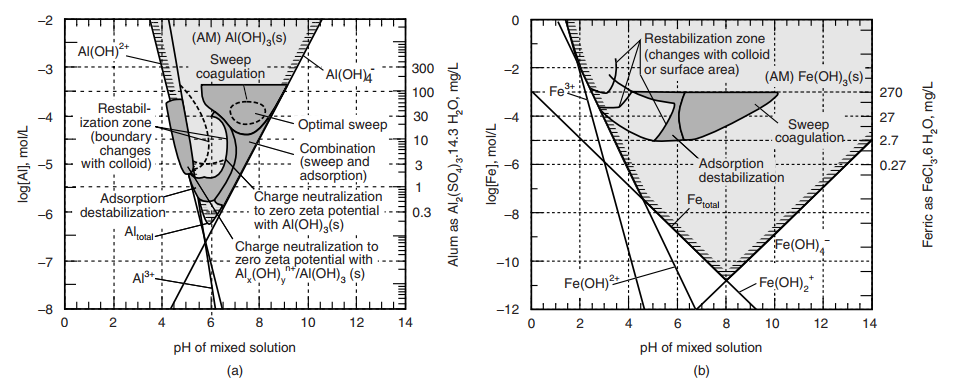
    - **Hình này chứng minh điều gì**
      - Thể hiện các đường biên pha rắn kết tủa và phân vùng cơ chế keo tụ của Al(III) và Fe(III) theo pH.
    - **Từ đâu mà thấy được**
      - Trục tung là logarit nồng độ kim loại ($\text{mol/L}$ và $\text{mg/L}$), trục hoành là pH; hai biểu đồ (a) Al và (b) Fe.
  - **Hình 15.** Vùng vận hành tối ưu của phèn nhôm và phèn sắt theo pH và liều lượng (Slide 14)
    - 
    - **Hình này chứng minh điều gì**
      - Định vị vùng keo tụ quét tối ưu (Optimal sweep) và vùng trung hòa điện tích không gây tái ổn định.
    - **Từ đâu mà thấy được**
      - Miền gạch bóng Optimal sweep nằm ở dải $\text{pH} \approx 6 - 8$ với liều phèn nhôm từ $10$ đến $100\text{ mg/L}$.

###### 3.2.3.2 Cơ chế nén lớp điện tích kép và quy tắc Schulze - Hardy

- Bản chất cơ chế nén lớp điện tích kép (*Double Layer Compression*):
  - Khi tăng nồng độ các chất điện ly trong dung dịch nước, lực ion của môi trường gia tăng làm nén lớp ion khuếch tán sát lại gần bề mặt hạt keo.
  - Chiều dày hiệu dụng của lớp khuếch tán thu hẹp làm thế bề mặt và thế Zeta suy giảm nhanh chóng theo khoảng cách.
  - Khoảng cách ngăn cách giữa các hạt keo giảm xuống, cho phép năng lượng hút phân tử van der Waals vượt qua rào cản thế năng đẩy tĩnh điện, dẫn đến sự kết tụ của các hạt keo.
- Quy tắc thực nghiệm Schulze – Hardy (*Schulze–Hardy Rule*):
  - Hiệu quả keo tụ làm mất độ bền của các ion mang điện tích trái dấu với hạt keo tăng vọt theo hóa trị (*valence*) của ion đó.
  - Nồng độ keo tụ tới hạn (*Critical Coagulant Concentration - CCC*): nồng độ chất điện ly tối thiểu cần thiết để làm mất độ bền hệ keo tỷ lệ nghịch với lũy thừa bậc 6 của điện tích ion đối:
    $$\text{CCC} \propto \frac{1}{z^6}$$
    Trong đó:
    - $\text{CCC}$: Nồng độ keo tụ tới hạn (*Critical Coagulant Concentration*), đơn vị $\text{mol/L}$ hoặc $\text{mmol/L}$.
    - $z$: Điện tích hóa trị của ion đối nghịch (*counterion charge*).
  - Tỷ lệ thực nghiệm nồng độ đông tụ tới hạn của các cation đối với hạt keo mang điện tích âm:
    $$\text{Na}^+ : \text{Ca}^{2+} : \text{Al}^{3+} \approx 100 : 1{,}6 : 0{,}14$$
    - Cation hóa trị 2 ($\text{Ca}^{2+}$) có hiệu quả keo tụ cao gấp khoảng $60$ lần so với cation hóa trị 1 ($\text{Na}^+$).
    - Cation hóa trị 3 ($\text{Al}^{3+}, \text{Fe}^{3+}$) có hiệu quả keo tụ cao gấp hơn $700$ lần so với cation hóa trị 1 ($\text{Na}^+$).

###### 3.2.3.3 Cơ chế trung hòa điện tích, tạo cầu nối polymer và keo tụ bông quét

- Cơ chế hấp phụ và trung hòa điện tích (*Adsorption and Charge Neutralization*):
  - Bản chất: làm suy giảm điện tích âm bề mặt của hạt keo thông qua sự hấp phụ đặc hiệu của các phức chất kim loại đa nhân tích điện dương ($\text{Al}_m(\text{OH})_n^{z+}, \text{Fe}_m(\text{OH})_n^{z+}$) hoặc bằng cách hạ thấp $\text{pH}$ của nước.
  - Trong cơ chế này, các lực liên kết hóa học bề mặt (*chemical effects*) có vai trò quyết định và mạnh hơn nhiều so với lực tương tác tĩnh điện thuần túy (*electrostatic effects*).
  - Hiện tượng đảo điện tích và tái bền (*Charge reversal & restabilization*): nếu châm dư liều lượng hóa chất keo tụ, sự hấp phụ quá mức các cấu tử tích điện dương sẽ biến đổi bề mặt hạt keo từ tích điện âm sang tích điện dương, làm hệ keo phân tán bền vững trở lại.
- Cơ chế hấp phụ và tạo cầu nối liên kết hạt (*Adsorption and Interparticle Bridging*):
  - Thuyết tạo cầu nối (*Bridging theory*) giải thích quá trình làm mất độ bền và keo tụ hệ keo khi sử dụng các hợp chất polymer hữu cơ có khối lượng phân tử lớn (*high-molecular-weight polymers*).
  - Chuỗi polymer mạch dài hấp phụ đồng thời lên các vị trí hoạt tính bề mặt (*specific sites*) của nhiều hạt keo lân cận.
  - Cấu trúc mạch polymer đóng vai trò như chiếc cầu nối vật lý liên kết các hạt keo riêng lẻ lại thành các cụm bông cặn kích thước lớn và cấu trúc xốp.
  - Nguy cơ quá liều polymer: nếu châm quá nhiều polymer, các mạch polymer sẽ bao bọc kín toàn bộ bề mặt của từng hạt đơn lẻ, làm mất các vị trí liên kết tự do và gây tái ổn định hệ keo (*steric stabilization*).
- Cơ chế bẫy cuộn trong kết tủa hay keo tụ bông quét (*Enmeshment in a Precipitate / Sweep Floc*):
  - Bản chất: khi châm muối nhôm hoặc muối sắt với liều lượng lớn vượt quá giới hạn tích số tan của hydroxide kim loại, các kết tủa dạng bông vô định hình $\text{Al(OH)}_3(\text{s})$ hoặc $\text{Fe(OH)}_3(\text{s})$ sẽ hình thành ồ ạt trong thời gian cực ngắn (vài phần mười giây).
  - Khối kết tủa hydroxide phát triển nhanh chóng sẽ bao bọc, bẫy cuộn và cuốn giữ (*entrapment*) các hạt keo có thế Zeta thấp hoặc gần bằng $0$ vào bên trong cấu trúc bông cặn lớn.
  - Keo tụ bông quét là cơ chế chủ đạo và vận hành thực tế phổ biến nhất tại hầu hết các nhà máy xử lý nước cấp đô thị (*water treatment plants*).

---

##### 3.2.4 Thử nghiệm Jar test và Tối ưu hóa keo tụ

###### 3.2.4.1 Cấu tạo thiết bị và quy trình thử nghiệm Jar test hai giai đoạn

- Vai trò thực nghiệm của thử nghiệm Jar test (*Bench-scale Testing*):
  - Quá trình keo tụ trong nước tự nhiên bao gồm chuỗi phản ứng hóa học cạnh tranh phức tạp và đồng thời diễn ra giữa các cấu tử hòa tan, chất hữu cơ NOM, độ kiềm và hạt cặn.
  - Không thể tính toán thuần túy bằng lý thuyết để xác định chính xác loại hóa chất và liều lượng tối ưu; bắt buộc phải xác định bằng thực nghiệm thông qua thử nghiệm Jar test ở quy mô phòng thí nghiệm (*bench-scale*) hoặc mô hình thử nghiệm (*pilot-scale*).
  - Thử nghiệm Jar test cho phép đánh giá định lượng nhanh chóng, so sánh nhiều loại hóa chất keo tụ và xác định dải liều lượng vận hành tối ưu.
- Cấu tạo thiết bị Jar test tiêu chuẩn AWWA:
  - Hệ thống gồm dãy 6 bình phản ứng gián đoạn (*batch reactors / jars*), mỗi bình được trang bị một cánh khuấy paddle bằng thép không gỉ.
  - Thiết kế bình khuấy hình hộp vuông (*square-shaped jars / Gator jars*): ngăn ngừa hiện tượng tạo phễu xoáy trung tâm (*vortex flow*), vốn gây phân tầng và làm sai lệch động học khuấy trộn nếu sử dụng cốc hình trụ tròn (*circular beakers*).
  - Cơ cấu truyền động liên động (*gang stirrer*): tất cả 6 cánh khuấy được dẫn động đồng tốc bởi một động cơ chung có điều tốc điện tử từ $10$ đến $300\text{ vòng/phút}$.
  - Mục đích: mô phỏng chính xác các giai đoạn công nghệ thực tế gồm khuấy nhanh (phân tán hóa chất, $1\text{ phút}$ ở $100 - 150\text{ rpm}$), khuấy chậm tạo bông ($15 - 20\text{ phút}$ ở $20 - 40\text{ rpm}$) và lắng tĩnh trọng lực ($30\text{ phút}$).
  - **Hình 16.** Thiết bị thử nghiệm Jar test 6 cánh khuấy trong phòng thí nghiệm (Slide 17)
    - 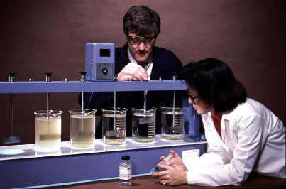
    - **Hình này chứng minh điều gì**
      - Thể hiện thiết bị Jar test thực tế với 6 cốc khuấy vuông và hệ thống cánh khuấy paddle đồng tốc.
    - **Từ đâu mà thấy được**
      - Hình ảnh kỹ thuật viên vận hành hệ thống 6 bình khuấy gắn cụm động cơ gang stirrer phía trên.
  - **Hình 17.** Cấu tạo hệ thống máy khuấy Jar test tiêu chuẩn AWWA (Slide 18)
    - 
    - **Hình này chứng minh điều gì**
      - Minh họa phương tiện tiêu chuẩn dùng để mô phỏng điều kiện keo tụ - tạo bông và lắng.
    - **Từ đâu mà thấy được**
      - Dãy 6 cốc thử nghiệm đặt song song trên đế chiếu sáng phản quang để quan sát kích thước bông cặn.
- Quy trình thử nghiệm Jar test hai giai đoạn chuẩn:
  - Nạp cùng một thể tích mẫu nước thô đầu vào vào cả 6 bình khuấy (thường là $1000\text{ mL}$ hoặc $2000\text{ mL}$ mỗi bình).
  - Nguồn nước thô thí nghiệm mẫu: độ đục ban đầu $15\text{ NTU}$, độ kiềm bicarbonate $\text{HCO}_3^-$ là $50\text{ mg/L}$ tính theo $\text{CaCO}_3$.
  - Giai đoạn 1: Thử nghiệm Jar test I (Xác định $\text{pH}$ tối ưu):
    - Cố định liều lượng chất keo tụ (ví dụ châm cùng liều phèn nhôm $10\text{ mg/L}$ vào cả 6 bình).
    - Điều chỉnh giá trị $\text{pH}$ biến thiên từ $5{,}0$ đến $7{,}5$ giữa các bình bằng cách châm thêm dung dịch axit ($\text{H}_2\text{SO}_4$) hoặc kiềm ($\text{NaOH}$).
    - Thực hiện quy trình khuấy nhanh, khuấy chậm và lắng tĩnh $30\text{ phút}$; đo độ đục dư sau lắng để chọn ra giá trị $\text{pH}$ cho độ đục dư thấp nhất.
  - Giai đoạn 2: Thử nghiệm Jar test II (Xác định liều lượng hóa chất tối ưu):
    - Cố định $\text{pH}$ của tất cả 6 bình ở mức $\text{pH}$ tối ưu đã xác định từ Giai đoạn 1 ($\text{pH} = 6{,}0$).
    - Thay đổi liều lượng chất keo tụ tăng dần giữa các bình (ví dụ từ $5$ đến $20\text{ mg/L}$).
    - Tiến hành chu trình khuấy và lắng $30\text{ phút}$; đo độ đục dư để xác định liều lượng châm kinh tế nhất mang lại hiệu quả xử lý cao nhất.
  - **Hình 18.** Bảng số liệu thử nghiệm Jar test I khảo sát ảnh hưởng của pH (Slide 19)
    - 
    - **Hình này chứng minh điều gì**
      - Ghi nhận độ đục dư theo các mức pH từ 5,0 đến 7,5 tại liều phèn nhôm cố định 10 mg/L.
    - **Từ đâu mà thấy được**
      - Bảng số liệu gồm hàng pH (5,0 - 7,5), hàng Alum dose (10 mg/L) và hàng Turbidity (11 - 13 NTU).
  - **Hình 19.** Bảng số liệu thử nghiệm Jar test II khảo sát liều lượng phèn (Slide 19)
    - 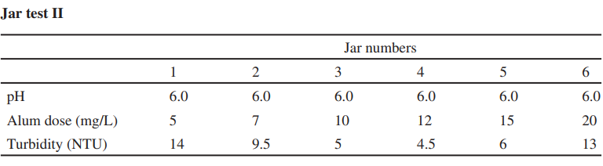
    - **Hình này chứng minh điều gì**
      - Định lượng độ đục dư theo liều lượng phèn từ 5 đến 20 mg/L tại mức pH cố định 6,0.
    - **Từ đâu mà thấy được**
      - Bảng số liệu ghi rõ liều phèn thay đổi 5, 7, 10, 12, 15, 20 mg/L và độ đục tương ứng.
- Phân tích kết quả thực nghiệm Jar test mẫu:
  - Bảng kết quả Jar test I (Cố định liều phèn nhôm $10\text{ mg/L}$):

| Thông số | Bình 1 | Bình 2 | Bình 3 | Bình 4 | Bình 5 | Bình 6 |
| :--- | :---: | :---: | :---: | :---: | :---: | :---: |
| $\text{pH}$ | $5{,}0$ | $5{,}5$ | $\mathbf{6{,}0}$ | $6{,}5$ | $7{,}0$ | $7{,}5$ |
| Liều phèn nhôm (*Alum dose*, $\text{mg/L}$) | $10$ | $10$ | $\mathbf{10}$ | $10$ | $10$ | $10$ |
| Độ đục sau lắng 30 phút (*Turbidity*, $\text{NTU}$) | $11$ | $7$ | $\mathbf{5{,}5}$ | $5{,}7$ | $8$ | $13$ |

  - Nhận xét Jar test I: Độ đục dư đạt giá trị cực tiểu là $5{,}5\text{ NTU}$ tại Bình số 3 ứng với $\text{pH} = 6{,}0$. Do đó, $\text{pH}$ tối ưu cho quá trình keo tụ nguồn nước này là $\text{pH}_{\text{opt}} = 6{,}0$.
  - Bảng kết quả Jar test II (Cố định $\text{pH} = 6{,}0$):

| Thông số | Bình 1 | Bình 2 | Bình 3 | Bình 4 | Bình 5 | Bình 6 |
| :--- | :---: | :---: | :---: | :---: | :---: | :---: |
| $\text{pH}$ | $6{,}0$ | $6{,}0$ | $6{,}0$ | $\mathbf{6{,}0}$ | $6{,}0$ | $6{,}0$ |
| Liều phèn nhôm (*Alum dose*, $\text{mg/L}$) | $5$ | $7$ | $10$ | $\mathbf{12}$ | $15$ | $20$ |
| Độ đục sau lắng 30 phút (*Turbidity*, $\text{NTU}$) | $14$ | $9{,}5$ | $5$ | $\mathbf{4{,}5}$ | $6$ | $13$ |

  - Nhận xét Jar test II: Khi tăng liều phèn từ $5$ lên $12\text{mg/L}$, độ đục dư giảm mạnh từ $14\text{ NTU}$ xuống mức cực tiểu $4{,}5\text{ NTU}$ (Bình 4). Tiếp tục tăng liều lên $15$ và $20\text{ mg/L}$ làm độ đục tăng ngược trở lại lên $6$ và $13\text{ NTU}$ do hiện tượng quá liều gây đảo điện tích và tái bền hệ keo. Liều lượng phèn nhôm tối ưu là $\text{Dose}_{\text{opt}} = 12\text{ mg/L}$.
  - **Hình 20.** Kết quả thử nghiệm Jar test I xác định pH tối ưu của phèn nhôm (Slide 20)
    - 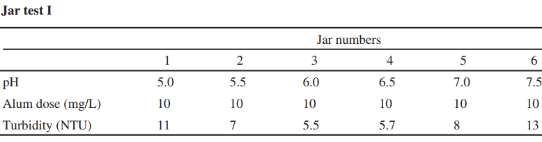
    - **Hình này chứng minh điều gì**
      - Xác nhận $\text{pH} = 6{,}0$ mang lại độ đục dư nhỏ nhất ($5{,}5\text{ NTU}$) tại liều phèn chuẩn $10\text{ mg/L}$.
    - **Từ đâu mà thấy được**
      - Bình số 3 hiển thị giá trị độ đục đáy $5{,}5\text{ NTU}$, hai bên sườn tăng lên $11\text{ NTU}$ và $13\text{ NTU}$.
  - **Hình 21.** Kết quả thử nghiệm Jar test II xác định liều lượng châm phèn tối ưu (Slide 20)
    - 
    - **Hình này chứng minh điều gì**
      - Xác định liều lượng keo tụ tối ưu là $12\text{ mg/L}$ và cảnh báo hiện tượng tái đục khi quá liều.
    - **Từ đâu mà thấy được**
      - Độ đục cực tiểu $4{,}5\text{ NTU}$ ở liều $12\text{ mg/L}$; liều $20\text{ mg/L}$ đẩy độ đục tăng vọt lên $13\text{ NTU}$.

###### 3.2.4.2 Tối ưu hóa liều lượng keo tụ theo nồng độ bề mặt hạt keo và các vùng phản ứng

- Biến thiên đường cong độ đục dư theo bốn mức nồng độ hạt keo ($S_1, S_2, S_3, S_4$):
  - Hình thái đường cong độ đục dư phụ thuộc trực tiếp vào nồng độ diện tích bề mặt hạt keo trong nước thô ($\bar{S}$):
    - Mức $S_1$ (Nồng độ hạt keo rất thấp, nước thô có độ đục rất bé):
      - Tần suất va chạm giữa các hạt keo quá thấp, không đủ khả năng tạo thành bông cặn tự nhiên khi mất độ bền.
      - Nước thiếu các tâm nhân mầm (*nuclei*) để hydroxide kim loại bám dính và kết tinh.
      - Bắt buộc phải châm hóa chất keo tụ ở liều lượng rất cao để đưa hệ trực tiếp vào cơ chế bông quét (Zone 4).
      - Tại mức $S_1$, hiện tượng tái bền (Zone 3) hoàn toàn không xảy ra vì hệ vận hành thuần túy ở chế độ sweep floc.
    - Mức $S_2$ và $S_3$ (Nồng độ hạt keo trung bình):
      - Nồng độ hạt keo đủ lớn để làm mất độ bền hạt bằng cơ chế hấp phụ - trung hòa điện tích (Zone 2) trước khi đạt tới ngưỡng bông quét.
      - Tồn tại mối quan hệ tỷ lệ lượng hóa chặt chẽ giữa liều phèn châm vào và diện tích bề mặt hạt keo (*stoichiometry of coagulation*).
      - Rất dễ bị hiện tượng quá liều gây tái bền (Zone 3): ở mức $S_2$, dải liều tối ưu Zone 2 rất hẹp; ở mức $S_3$, dải Zone 2 mở rộng hơn.
      - Nếu tiếp tục tăng liều phèn vượt qua vùng tái bền Zone 3, hệ sẽ chuyển tiếp sang vùng keo tụ bông quét Zone 4.
    - Mức $S_4$ (Nồng độ hạt keo rất cao, nước thô có độ đục rất lớn):
      - Diện tích bề mặt tiếp xúc của hệ keo cực kỳ lớn, hấp phụ tiêu thụ phần lớn các sản phẩm thủy phân của chất keo tụ.
      - Đòi hỏi liều lượng chất keo tụ lớn tỷ lệ thuận với độ đục. Dù liều lượng tiếp cận dải liều của bông quét, cơ chế thực tế vẫn là hấp phụ trung hòa điện tích chứ không tạo thành bông quét.
      - Gần như không thể xảy ra hiện tượng quá liều gây tái bền (*almost impossible to overdose*) do lượng hạt keo khổng lồ hấp phụ triệt để lượng ion kim loại châm vào.
  - **Hình 22.** Đường cong độ đục dư theo liều lượng keo tụ ứng với các mức nồng độ hạt keo S1-S4 (Slide 21)
    - 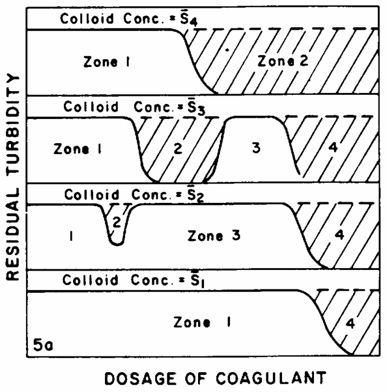
    - **Hình này chứng minh điều gì**
      - Thể hiện sự dịch chuyển các vùng keo tụ và tái bền qua 4 mức nồng độ hạt keo từ $S_1$ đến $S_4$.
    - **Từ đâu mà thấy được**
      - Đồ thị đối chiếu Residual Turbidity theo Dosage of Coagulant cho 4 đường đặc tuyến $S_1, S_2, S_3, S_4$.
  - **Hình 23.** Phân vùng phản ứng keo tụ và cơ chế tái ổn định hệ keo (Slide 22)
    - 
    - **Hình này chứng minh điều gì**
      - Khẳng định tính chất mở rộng của vùng keo tụ Zone 2 và sự biến mất của vùng tái bền ở nồng độ $S_4$.
    - **Từ đâu mà thấy được**
      - Đường cong $S_4$ cho độ đục dư hạ xuống thấp và duy trì ổn định không bị bật ngược lên.
- Giản đồ tổng quát các miền keo tụ và giải pháp châm bentonite (*Coagulation Region Diagram*):
  - Phân vùng trên hệ tọa độ liều lượng chất keo tụ (*Dosage*) và diện tích bề mặt hạt keo ($\bar{S}$):
    - Vùng 1 (Zone 1 - Miền chưa keo tụ): liều lượng hóa chất không đủ để trung hòa điện tích, hệ keo duy trì trạng thái phân tán bền vững.
    - Vùng 2 (Zone 2 - Miền keo tụ trung hòa điện tích): ranh giới liều tối ưu tăng tuyến tính theo nồng độ bề mặt keo $\bar{S}$ (đặc trưng tỷ lệ lượng hóa *Stoichiometric Destabilization*).
    - Vùng 3 (Zone 3 - Miền tái bền): nêm hình tam giác kẹp giữa Zone 2 và Zone 4 ở dải nồng độ hạt keo trung bình ($S_2 - S_3$), hạt keo bị đảo điện tích dương do thừa hóa chất keo tụ.
    - Vùng 4 (Zone 4 - Miền keo tụ bông quét / *Sweep Floc*): xuất hiện ở dải liều phèn cao. Đường biên liều quét tối ưu hơi dốc nhẹ xuống khi nồng độ hạt keo tăng, do sự có mặt của hạt keo hỗ trợ làm nhân kết tinh cho bông cặn.
  - Giải pháp kỹ thuật bổ sung sét bentonite (*Bentonite Addition*):
    - Nước thô có độ đục quá thấp ($S_1$) đòi hỏi liều lượng phèn rất cao để tạo bông quét, gây tốn kém hóa chất và tạo nhiều bùn cặn nhôm.
    - Bổ sung hạt đất sét bentonite vào nước thô giúp nhân tạo nâng cao nồng độ diện tích bề mặt hạt keo từ $S_1$ lên $S_3$.
    - Việc này dịch chuyển điểm làm việc công nghệ từ cơ chế bông quét liều cao (Zone 4) sang cơ chế hấp phụ trung hòa điện tích liều thấp (Zone 2), giúp tiết kiệm đáng kể hóa chất keo tụ và tạo bông cặn lắng nhanh.
  - **Hình 24.** Giản đồ tổng quát quan hệ liều lượng phèn và nồng độ bề mặt hạt keo (Slide 23)
    - 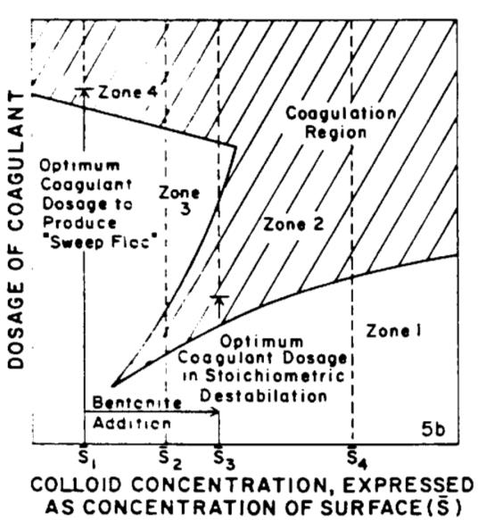
    - **Hình này chứng minh điều gì**
      - Minh chứng giải pháp châm thêm sét bentonite chuyển dịch chế độ keo tụ từ vùng quét sang vùng trung hòa điện tích.
    - **Từ đâu mà thấy được**
      - Mũi tên Bentonite Addition chỉ hướng từ mốc $S_1$ sang $S_3$, đưa liều phèn từ đỉnh Zone 4 xuống Zone 2.

---

##### 3.2.5 Hóa chất keo tụ và chất trợ keo tụ

###### 3.2.5.1 Các hóa chất keo tụ vô cơ và phản ứng tiêu thụ độ kiềm

- Lịch sử phát triển và phân loại chất keo tụ công nghiệp:
  - Quá trình keo tụ kết hợp bể lọc hạt (lọc cát nhanh và lọc đa lớp) được ứng dụng rộng rãi trong các nhà máy cấp nước tại Hoa Kỳ từ những năm 1880.
  - Muối nhôm ($\text{Al}^{3+}$) và muối sắt ($\text{Fe}^{3+}$) là hai nhóm chất keo tụ vô cơ truyền thống được sử dụng phổ biến nhất, trong đó phèn nhôm (*alum*) chiếm thị phần lớn nhất.
  - Khi hòa tan phèn nhôm ($\text{Al}_2(\text{SO}_4)_3 \cdot 14\text{H}_2\text{O}$) vào nước, một chuỗi phức chất trung gian gọi là các sản phẩm thủy phân của nhôm (*aluminum hydrolysis products*) được hình thành tức thời trong và sau quá trình khuấy trộn nhanh; chính các phức đa nhân này thực hiện chức năng keo tụ.
  - Các hóa chất keo tụ tiền thủy phân (*Prehydrolyzed metal salts*): được tổng hợp và tạo phức sẵn trước khi châm vào nước, bao gồm silica hoạt tính (*activated silica*), polyaluminum chloride (PAC / PACl) và polyiron chloride (PiCl).
  - **Hình 25.** Giản đồ các miền keo tụ quét và keo tụ trung hòa điện tích (Slide 24)
    - 
    - **Hình này chứng minh điều gì**
      - Khẳng định sự phân tách giữa vùng keo tụ stoichiometric Zone 2 và vùng sweep floc Zone 4.
    - **Từ đâu mà thấy được**
      - Đồ thị thể hiện miền Coagulation Region bao gồm toàn bộ Zone 2 và Zone 4 phía trên đường ranh giới liều tối ưu.
- Bảng danh mục hóa chất keo tụ vô cơ thông dụng:

| STT | Tên hóa chất keo tụ | Công thức hóa học chuẩn |
| :---: | :--- | :--- |
| 1 | Nhôm sunfat (Phèn nhôm / *Alum*) | $\text{Al}_2(\text{SO}_4)_3 \cdot 14\text{H}_2\text{O}$ |
| 2 | Nhôm clorua (*Aluminum chloride*) | $\text{AlCl}_3$ |
| 3 | Sắt(III) clorua (Phèn sắt / *Ferric chloride*) | $\text{FeCl}_3 \cdot 6\text{H}_2\text{O}$ (hoặc $\text{FeCl}_3$ khan) |
| 4 | Polyaluminum Chloride (PAC) | $[\text{Al}_2(\text{OH})_n\text{Cl}_{6-n}]_m$ |
| 5 | Polymer hữu cơ (*Polyelectrolyte*) | Cationic, Anionic, Nonionic |

- Phương trình phản ứng thủy phân và định lượng tiêu thụ độ kiềm:
  - Phản ứng thủy phân của phèn nhôm trong nước có độ kiềm tự nhiên ($\text{HCO}_3^-$):
    $$\text{Al}_2(\text{SO}_4)_3 \cdot 14\text{H}_2\text{O} + 6\text{HCO}_3^- \longrightarrow 2\text{Al(OH)}_3\downarrow + 6\text{CO}_2 + 14\text{H}_2\text{O} + 3\text{SO}_4^{2-}$$
    - Khối lượng mol của phèn nhôm thương phẩm ($\text{Al}_2(\text{SO}_4)_3 \cdot 14\text{H}_2\text{O}$): $M = 594\text{ g/mol}$.
    - Khối lượng mol của $\text{CaCO}_3$: $M = 100\text{ g/mol}$.
    - Tỷ lệ đương lượng tiêu thụ kiềm: $1\text{ mol}$ phèn nhôm tác dụng với $6\text{ mol } \text{HCO}_3^-$, tương đương tiêu thụ $3\text{ mol } \text{CaCO}_3$ ($300\text{ g } \text{CaCO}_3$).
    - Tỷ lệ tiêu thụ kiềm theo khối lượng:
      $$\frac{300\text{ g }\text{CaCO}_3}{594\text{ g phèn nhôm}} \approx 0{,}505\text{ mg }\text{CaCO}_3 \text{ / } 1\text{ mg phèn nhôm}$$
      (Cứ châm $1\text{ mg/L}$ phèn nhôm sẽ làm tiêu hao khoảng $0{,}505\text{ mg/L}$ độ kiềm tính theo $\text{CaCO}_3$).
  - Phản ứng thủy phân của phèn sắt(III) clorua ngậm nước:
    $$\text{FeCl}_3 \cdot 6\text{H}_2\text{O} + 3\text{HCO}_3^- \longrightarrow \text{Fe(OH)}_3\downarrow + 3\text{CO}_2 + 6\text{H}_2\text{O} + 3\text{Cl}^-$$
    - Khối lượng mol của $\text{FeCl}_3 \cdot 6\text{H}_2\text{O}$: $M = 270{,}3\text{ g/mol}$.
    - Tỷ lệ đương lượng tiêu thụ kiềm: $1\text{ mol } \text{FeCl}_3 \cdot 6\text{H}_2\text{O}$ tác dụng với $3\text{ mol } \text{HCO}_3^-$, tương đương tiêu thụ $1{,}5\text{ mol } \text{CaCO}_3$ ($150\text{ g } \text{CaCO}_3$).
    - Tỷ lệ tiêu thụ kiềm theo khối lượng:
      $$\frac{150\text{ g }\text{CaCO}_3}{270{,}3\text{ g }\text{FeCl}_3 \cdot 6\text{H}_2\text{O}} \approx 0{,}555\text{ mg }\text{CaCO}_3 \text{ / } 1\text{ mg }\text{FeCl}_3 \cdot 6\text{H}_2\text{O}$$
      (Đối với $\text{FeCl}_3$ khan, $M = 162{,}2\text{ g/mol}$, tỷ lệ tiêu thụ độ kiềm là $150 / 162{,}2 \approx 0{,}925\text{ mg }\text{CaCO}_3 \text{ / } 1\text{ mg }\text{FeCl}_3$).
  - Hiện tượng suy giảm $\text{pH}$ khi thiếu kiềm:
    - Nếu độ kiềm tự nhiên của nước thô không đủ để trung hòa lượng ion $\text{H}^+$ giải phóng ra, $\text{pH}$ của nước sẽ tụt mạnh xuống dưới ngưỡng tối ưu, làm giảm hiệu suất keo tụ và gây hòa tan ngược ion kim loại ($\text{Al}^{3+}, \text{Fe}^{3+}$) vào nước sau lắng.
    - Trong trường hợp đó, bắt buộc phải châm thêm hóa chất kiềm hóa bổ sung (vôi $\text{Ca(OH)}_2$, xút $\text{NaOH}$ hoặc soda $\text{Na}_2\text{CO}_3$).

###### 3.2.5.2 Chất trợ keo tụ Polymer và các đặc tính yêu cầu trong xử lý nước cấp

- Phân loại và ứng dụng công nghệ của Polymer (Chất trợ keo tụ Polyelectrolyte):
  - 1. Đóng vai trò là chất keo tụ chính (*Primary Coagulant*):
    - Thường sử dụng các polymer cation (*cationic polymers*), cấu trúc chủ yếu là các amin bậc bốn (*quaternary amines*).
    - Liều lượng châm:
      - Khi sử dụng đơn độc: liều lượng thường $> 1{,}0\text{ mg/L}$.
      - Khi kết hợp cùng muối nhôm hoặc muối sắt: liều lượng từ $0{,}1$ đến $0{,}5\text{ mg/L}$.
    - Điểm châm: bổ sung trực tiếp tại bể hoặc thiết bị khuấy nhanh (*rapid mixing process*).
    - Hiệu quả công nghệ: trung hòa điện tích cực mạnh và cải thiện rõ rệt hiệu suất loại bỏ chất hữu cơ tự nhiên (*NOM - Natural Organic Matter*).
  - 2. Đóng vai trò là chất trợ keo tụ (*Coagulation Aids*):
    - Thường sử dụng polymer anion hoặc không ion (*anionic or nonionic polymers*), phổ biến nhất là các hợp chất polyacrylamide mạch dài.
    - Liều lượng châm: từ $1{,}0$ đến $2{,}0\text{ mg/L}$.
    - Điểm châm: châm sau quá trình khuấy nhanh (*after rapid mixing process*), thường đưa vào ở đầu ngăn tạo bông chậm.
    - Hiệu quả công nghệ: tăng cường kích thước, độ đặc chắc và vận tốc lắng của bông cặn; không cải thiện hiệu suất loại bỏ NOM.
  - 3. Đóng vai trò là chất trợ lọc (*Filter Aids*):
    - Thường sử dụng polymer không ion (*nonionic polymers*).
    - Liều lượng châm rất nhỏ: từ $0{,}005$ đến $0{,}05\text{ mg/L}$, châm ngay trên dòng nước trước khi chảy vào bể lọc hạt.
    - Hiệu quả công nghệ: tăng cường độ bám dính của các vi bông cặn lên bề mặt hạt cát lọc, ngăn hiện tượng xuyên thủng lớp lọc.
- Vấn đề an toàn vệ sinh và rủi ro sức khỏe của Polymer:
  - Các chế phẩm polyelectrolyte công nghiệp thường chứa dư lượng tạp chất độc hại phát sinh từ quá trình tổng hợp (đặc biệt là monomer tự do acrylamide, các chất phản ứng còn sót và sản phẩm phụ).
  - Acrylamide là chất có độc tính thần kinh cao và tiềm ẩn nguy cơ gây ung thư, được kiểm soát rất nghiêm ngặt về giới hạn hàm lượng trong nước cấp sinh hoạt.
  - Polymer tồn lưu trong nước có thể phản ứng với clo trong công đoạn khử trùng (*disinfection*), hình thành các sản phẩm phụ khử trùng độc hại (*DBPs*).
- Ba đặc tính cốt lõi của chất keo tụ vô cơ dùng trong xử lý nước ăn uống (*Potable Water*):
  - 1. Không độc hại ở liều lượng làm việc (*Nontoxic at the working dosage*): đảm bảo nước sau xử lý an toàn tuyệt đối cho sức khỏe người tiêu dùng.
  - 2. Mật độ điện tích cao (*High charge density*): mang điện tích dương lớn trên một đơn vị khối lượng để tối ưu hóa hiệu quả trung hòa điện tích và nén lớp điện tích kép.
  - 3. Độ hòa tan cực thấp trong dải $\text{pH}$ trung tính (*Insoluble in the neutral pH range*): kết tủa hydroxide hoàn toàn ở $\text{pH} \approx 6{,}5 - 8{,}0$ để tách cặn triệt để và hạn chế tối đa nồng độ nhôm hoặc sắt hòa tan dư thừa đi vào mạng lưới cấp nước.
- Dây chuyền liên động công nghệ keo tụ - tạo bông - lắng:
  - Quá trình keo tụ hóa học tại ngăn khuấy nhanh phối hợp chặt chẽ với quá trình tạo bông cơ học và lắng trọng lực để hoàn thiện dây chuyền xử lý nước.
  - **Hình 26.** Sơ đồ dây chuyền bể khuấy nhanh, bể tạo bông cánh guồng và bể lắng (Slide 27)
    - 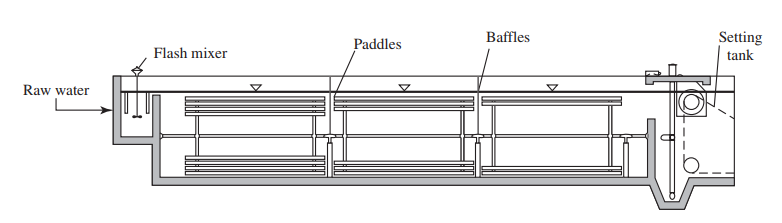
    - **Hình này chứng minh điều gì**
      - Thể hiện sự liên kết công nghệ giữa khuấy nhanh hóa chất, tạo bông 3 ngăn và lắng trọng lực.
    - **Từ đâu mà thấy được**
      - Nước thô qua Flash mixer châm phèn, qua 3 ngăn Paddles có vách Baffles, rồi chảy sang Settling tank.

#### 3.3 Thực hành và Thiết kế công nghệ khuấy trộn

##### 3.3.1 Cơ sở lý thuyết khuấy trộn và Gradient vận tốc

- Phân loại và vai trò công nghệ của hai giai đoạn khuấy trộn trong cụm xử lý keo tụ - tạo bông:
  - Khuấy nhanh keo tụ (*Coagulant mixing / Rapid mixing / Flash mixing*): phân tán hóa chất keo tụ tức thời và đồng đều vào toàn bộ khối tích nước, thúc đẩy quá trình thủy phân nhanh và trung hòa điện tích để làm mất độ bền của các hạt keo mang điện tích âm.
  - Khuấy tạo bông (*Flocculation mixing / Slow mixing*): duy trì cường độ xáo trộn chậm, có kiểm soát nhằm gia tăng tần suất va chạm hiệu quả giữa các hạt keo đã mất độ bền, kết tụ chúng thành các bông cặn lớn, đặc chắc, có vận tốc lắng cao mà không làm vỡ các liên kết bông cặn vừa hình thành.
  - Dây chuyền công nghệ hoàn chỉnh gồm: Nước thô (*Raw water*) $\to$ Bể khuấy nhanh (*Flash mixer*) $\to$ Hệ thống bể tạo bông cánh guồng nhiều ngăn nối tiếp (*Paddles separated by Baffles*) $\to$ Bể lắng (*Settling tank*).
  - **Hình 27.** Sơ đồ mặt cắt dây chuyền công nghệ keo tụ - tạo bông và lắng
    - 
    - **Hình này chứng minh điều gì**
      - Thể hiện dây chuyền xử lý liên tục từ ngăn khuấy nhanh cơ học qua 3 bậc tạo bông có vách ngăn đến bể lắng trọng lực.
    - **Từ đâu mà thấy được**
      - Nhãn `Raw water` và `Flash mixer` ở đầu bể; 3 cụm cánh guồng `Paddles` ngăn cách bằng `Baffles`; cửa xả bùn và máng thu dẫn sang `Setting tank`.
- Phương trình Camp - Stein xác định công suất tiêu tán và gradient vận tốc trung bình ($G$):
  - Khái niệm: Gradient vận tốc ($G$) là độ biến thiên vận tốc tương đối giữa các lớp chất lỏng kế cận trên một đơn vị khoảng cách, là thước đo trực tiếp năng lượng khuấy trộn đưa vào một đơn vị thể tích chất lỏng.
  - Phương trình cơ bản Camp - Stein biểu diễn mối quan hệ giữa công suất tiêu tán và gradient vận tốc:
    $$P = \mu \cdot V \cdot G^2$$
  - Công thức xác định gradient vận tốc trung bình $G$:
    $$G = \left(\frac{P}{\mu \cdot V}\right)^{0{,}5} = \sqrt{\frac{P}{\mu \cdot V}}$$
  - Các đại lượng vật lý và đơn vị đo trong hệ SI:
    - $P$: Công suất tiêu thụ hữu ích truyền vào khối chất lỏng ($\text{W}$, $\text{J/s}$, hoặc $\text{N}\cdot\text{m/s}$).
    - $\mu$: Độ nhớt động lực học tuyệt đối của chất lỏng ($\text{Pa}\cdot\text{s}$, $\text{N}\cdot\text{s/m}^2$, hoặc $\text{kg/(m}\cdot\text{s)}$).
    - $V$: Thể tích hữu ích của bể khuấy ($\text{m}^3$).
    - $G$: Gradient vận tốc trung bình ($\text{s}^{-1}$).
- Các chuẩn số thủy lực không thứ nguyên xác định đặc tính vận hành của cánh khuấy (*Impeller dimensionless numbers*):
  - Chuẩn số công suất (*Power number* $N_p$):
    $$N_p = \frac{P}{\rho \cdot N^3 \cdot D^5}$$
    - Biểu thị mức cản thủy lực mà cánh khuấy tạo ra khi quay trong chất lỏng ở chế độ chảy rối hoàn toàn ($Re > 10^4$).
  - Chuẩn số lưu lượng / bơm (*Pumping number* $N_q$):
    $$N_q = \frac{Q}{N \cdot D^3}$$
    - Biểu thị năng lực đẩy và lưu lượng tuần hoàn chất lỏng do cánh khuấy sản sinh trên một vòng quay.
  - Chuẩn số cột áp (*Head number* $N_h$):
    $$N_h = \frac{\Delta H \cdot g}{(N \cdot D)^2}$$
    - Biểu thị tỷ lệ năng lượng cột áp do cánh khuấy truyền cho dòng chất lỏng so với động năng tại mút cánh.
  - Các thông số liên quan trong hệ đơn vị SI:
    - $N_p, N_q, N_h$: Các chuẩn số không thứ nguyên đặc trưng cho từng dạng hình học của cánh khuấy.
    - $P$: Công suất tiêu tán truyền vào chất lỏng ($\text{W}$).
    - $\rho$: Khối lượng riêng của chất lỏng ($\text{kg/m}^3$).
    - $N$: Tốc độ quay của cánh khuấy ($\text{rev/min}$ hoặc $\text{vòng/s}$, cần đồng nhất đơn vị thời gian với $P$ và $Q$).
    - $D$: Đường kính ngoài của cánh khuấy ($\text{m}$).
    - $Q$: Lưu lượng do cánh khuấy bơm tuần hoàn qua tiết diện quét ($\text{m}^3/\text{s}$).
    - $\Delta H$: Cột áp thủy lực do cánh khuấy tạo ra cho dòng chảy ($\text{m}$).
    - $g$: Gia tốc trọng trường ($g \approx 9{,}81\text{ m/s}^2$).
- Tiêu chuẩn thông số công nghệ vận hành bể khuấy nhanh (*Coagulator*) và bể tạo bông (*Flocculator*):
  - Bể khuấy nhanh keo tụ (*Coagulator*):
    - Thời gian lưu nước thủy lực (HRT): $30\text{ s} - 120\text{ s}$.
    - Gradient vận tốc ($G$): $500\text{ s}^{-1} - 1000\text{ s}^{-1}$ (cường độ xáo trộn cực mạnh để phân tán phèn trước khi phản ứng thủy phân kết thúc).
  - Bể tạo bông (*Flocculator*):
    - Thời gian lưu nước thủy lực (HRT): $15\text{ min} - 45\text{ min}$.
    - Gradient vận tốc ($G$): $100\text{ s}^{-1} - 10\text{ s}^{-1}$ (giảm dần từ ngăn đầu tiên đến ngăn cuối cùng để kích thích hạt va chạm ban đầu và chống vỡ bông ở giai đoạn sau).

##### 3.3.2 Thiết bị khuấy trộn nhanh keo tụ

- Bảng phân loại thiết bị khuấy trộn nhanh và phạm vi ứng dụng theo cơ chế keo tụ:
  | Thiết bị khuấy trộn (*Mixing Device*) | Ứng dụng châm hóa chất keo tụ (*Application in Coagulant Addition*) | Cơ chế keo tụ chủ đạo |
  | :--- | :--- | :--- |
  | Khuấy cơ học trong bể khuấy (*Mechanical mixers in stirred tanks*) | Keo tụ quét bông (*Sweep coagulation*) | Hình thành nhanh hydroxide kim loại kết tủa |
  | Khuấy thủy lực (*Hydraulic mixers*) | Keo tụ quét bông (*Sweep coagulation*) | Sử dụng tổn thất năng lượng dòng chảy |
  | Khuấy cơ học trên đường ống (*In-line mechanical mixers*) | Hấp phụ / làm mất độ bền (*Adsorption/destabilization*) | Phản ứng cực nhanh của ion đa hóa trị |
  | Khuấy tĩnh trên đường ống (*In-line static mixers*) | Hấp phụ / làm mất độ bền (*Adsorption/destabilization*) | Phân tán vi mô tức thời trong lòng ống |
  | Khuếch tán bằng tia nước áp lực / bơm (*Diffusion by pressurized water jets/pumps*) | Hấp phụ / làm mất độ bền (*Adsorption/destabilization*) | Xáo trộn cưỡng bức áp lực cao |
- Thiết bị khuấy cơ học trong bể khuấy (*Mechanical mixers in stirred tanks*):
  - Cấu tạo gồm động cơ điện gắn trên sàn công tác, trục quay thẳng đứng và cánh khuấy cơ học đặt trong bể có tấm chắn chống xoáy (*baffles*).
  - Hai dạng cánh khuấy thông dụng: cánh khuấy tuabin dòng xuyên tâm (*Radial-flow turbine*) đẩy dòng nước văng vuông góc ra thành bể tạo gradient cắt lớn, và cánh khuấy dòng hướng trục (*Axial-flow impeller*) đẩy dòng chất lỏng song song với trục tạo lưu lượng tuần hoàn lớn.
  - **Hình 28.** Cánh khuấy tuabin dòng xuyên tâm và cánh khuấy dòng hướng trục
    - 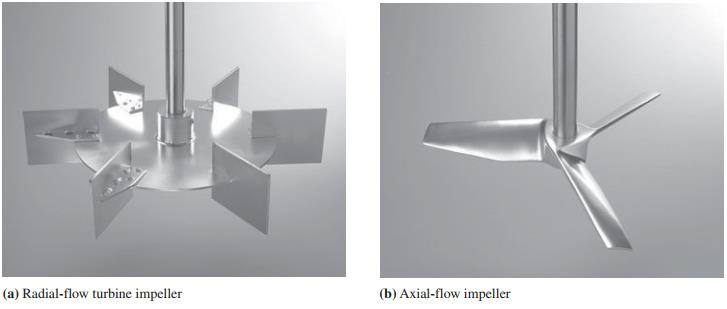
    - **Hình này chứng minh điều gì**
      - Minh họa hình dạng kết cấu thực tế của hai họ cánh khuấy: tuabin đĩa 6 cánh phẳng vuông góc và cánh chân vịt hydrofoil 3 cánh uốn cong.
    - **Từ đâu mà thấy được**
      - Ảnh (a) `Radial-flow turbine impeller` có đĩa tròn ở tâm gắn các bản cánh thẳng đứng; ảnh (b) `Axial-flow impeller` có 3 cánh dạng profile thủy động lực học.
  - **Hình 30.** Chi tiết cánh khuấy cơ học kiểu xuyên tâm và hướng trục trang bị cho bể khuấy nhanh
    - 
    - **Hình này chứng minh điều gì**
      - Khẳng định sự lựa chọn cánh khuấy dòng xuyên tâm để tạo lực cắt thủy lực mạnh và cánh khuấy dòng hướng trục để luân chuyển khối tích bể nhanh.
    - **Từ đâu mà thấy được**
      - Cấu tạo trục đứng kết nối trực tiếp với đĩa cánh tuabin phẳng hoặc cụm 3 cánh cong hướng trục lắp trên trục xoay.
- Thiết bị khuấy trộn thủy lực kiểu vách ngăn (*Hydraulic mixers*):
  - Nguyên lý hoạt động: Tận dụng động năng và tổn thất cột áp thủy lực ($h_f$) của chính dòng nước khi chảy qua các vách ngăn zíc-zắc (up-and-down baffled basins) hoặc máng thu hẹp để tạo xoáy trộn mà không tiêu tốn điện năng cơ học.
  - Thông số thiết kế công trình: Chiều sâu lớp nước $H = 3{,}00\text{ m}$, vận tốc dòng chảy qua các ngăn $V \approx 0{,}50\text{ m/s}$, tổn thất áp lực $h_f$, bố trí cút khuỷu chuyển dòng tại đáy và các rãnh xả bùn định kỳ (*Drains*).
  - **Hình 29.** Cấu tạo mặt bằng và mặt cắt bể khuấy trộn thủy lực kiểu vách ngăn zíc-zắc
    - 
    - **Hình này chứng minh điều gì**
      - Thể hiện kích thước hình học mặt bằng ($B, L$) và mặt cắt đứng với chiều cao công tác $H = 3{,}00\text{ m}$, cút thu đáy và van xả cặn `Drains`.
    - **Từ đâu mà thấy được**
      - Bản vẽ mặt bằng hiển thị các khoang chữ nhật chiều rộng $B$, chiều dài $L$; bản vẽ mặt cắt hiển thị mực nước dốc $h_f$, $H = 3{,}00\text{ m}$, $V \approx 0{,}50\text{ m/s}$ và rãnh thu đáy `Drains`.
  - **Hình 31.** Sơ đồ dòng chảy thủy lực zíc-zắc qua các ngăn vách ngăn trong bể khuấy thủy lực
    - 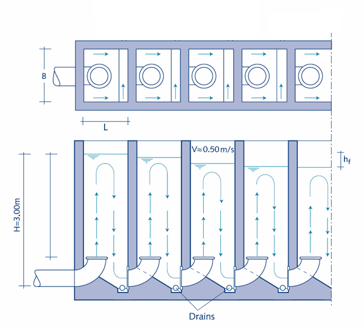
    - **Hình này chứng minh điều gì**
      - Mô tả quỹ đạo tuần hoàn nước lên - xuống liên tục nhằm tạo chuyển động xoáy xáo trộn tự nhiên trước khi thoát ra bể tạo bông.
    - **Từ đâu mà thấy được**
      - Các mũi tên đường dòng uốn lượn vượt đỉnh vách ngăn rồi chúc xuống đáy chui qua cút thu loe sang ngăn tiếp theo.
- Thiết bị khuấy cơ học trên đường ống kết hợp bơm phụ áp (*In-line mechanical mixer: pumped flash mixing*):
  - Nguyên lý hoạt động: Trích một phần lưu lượng nước thô đầu vào (*portion of influent flow*) qua bơm cao áp (*pump*), châm hóa chất keo tụ (*chemical*) trực tiếp vào đường ống áp lực cao và phun qua đĩa khuếch tán (*diffuser plate*) đặt tại tâm ống dẫn chính.
  - Dòng phản lực tốc độ cao đập vào đĩa khuếch tán tạo ra các vùng xoáy rối vi mô cực mạnh (*rapid mixing*), hòa trộn dung dịch phèn vào toàn bộ dòng nước thô chỉ trong thời gian dưới $1\text{ s}$.
  - Phương pháp này đặc biệt phù hợp cho cơ chế hấp phụ - trung hòa điện tích tức thời (*adsorption/destabilization*), không cần xây dựng cụm bể khuấy nhanh riêng biệt trên mặt đất.
  - **Hình 32.** Sơ đồ nguyên lý thiết bị khuấy nhanh trên đường ống kết hợp bơm phụ áp và đĩa khuếch tán
    - 
    - **Hình này chứng minh điều gì**
      - Trình bày sơ đồ trích dòng nước thô qua bơm áp lực, hòa trộn hóa chất và phun vào tâm ống chính thông qua đĩa khuếch tán.
    - **Từ đâu mà thấy được**
      - Nhánh trích dòng qua `Pump`, đường dẫn `Chemical`, ống phun hướng tâm vào `Diffuser plate` tạo xoáy `Rapid mixing` và dòng ra `Mixed water and chemical`.
  - **Hình 34.** Chi tiết vòi phun và đĩa khuếch tán tạo xoáy trộn cưỡng bức trên đường ống áp lực
    - 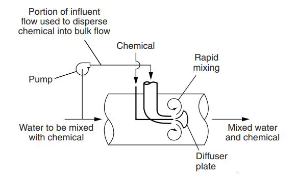
    - **Hình này chứng minh điều gì**
      - Thể hiện sự hình thành vùng xoáy thủy lực đối xứng cục bộ ngay tại cửa xả của đĩa khuếch tán trong lòng đường ống.
    - **Từ đâu mà thấy được**
      - Cặp xoáy đối xứng `Rapid mixing` bao quanh `Diffuser plate` phân tán dòng hóa chất vào toàn bộ tiết diện nước thô.

##### 3.3.3 Thiết kế hệ thống bể tạo bông và cánh khuấy

###### 3.3.3.1 Hệ thống bể tạo bông cánh guồng trục ngang (Horizontal Paddle Flocculator)

- Cấu tạo và nguyên lý vận hành:
  - Bể tạo bông gồm chuỗi từ 2 đến 6 ngăn nối tiếp, ngăn cách nhau bằng vách ngăn đục lỗ (*Perforated baffle walls*) nhằm phân bố đều lưu lượng trên toàn bộ mặt cắt ướt và triệt tiêu dòng chảy tắt (*short-circuiting*).
  - Trục khuấy đặt nằm ngang song song hoặc vuông góc với hướng dòng nước, truyền động bằng cụm động cơ giảm tốc (*drive motor*). Trên trục gắn các guồng quay cánh phẳng gỗ hoặc thép composite quay chậm với tốc độ $1 - 5\text{ rpm}$.
  - Nước sau keo tụ chảy qua kênh phân phối (*Coagulated water channel*), lần lượt qua các khoang tạo bông rồi chuyển tiếp sang bể lắng (*Sedimentation basin*).
  - **Hình 33.** Mặt cắt dọc và mặt cắt ngang hệ thống bể tạo bông cánh guồng trục ngang
    - 
    - **Hình này chứng minh điều gì**
      - Thể hiện cấu tạo 3 ngăn nối tiếp với cánh guồng quay chậm và vách ngăn đục lỗ chuyển tiếp sang bể lắng.
    - **Từ đâu mà thấy được**
      - Kênh vào `Coagulated water channel`, 3 guồng tròn có mũi tên quay, vách đục lỗ `Perforated baffle wall`, mặt cắt A-A có `Drive motor` và `Paddle wheel mixer`.
  - **Hình 35.** Bố trí 3 bậc khuấy tạo bông cánh guồng trục ngang nối tiếp qua các vách ngăn đục lỗ
    - 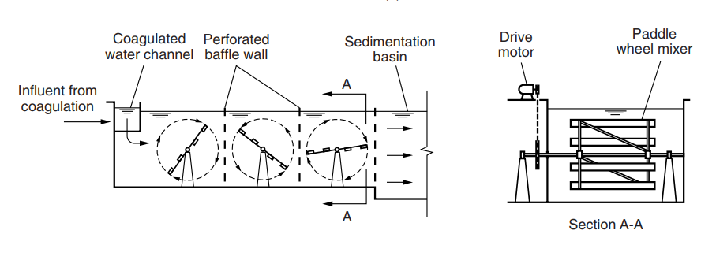
    - **Hình này chứng minh điều gì**
      - Minh họa phương thức phân chia ngăn bằng vách ngăn đục lỗ nhằm tạo bông giảm bậc và ngăn xáo trộn ngược giữa các bậc.
    - **Từ đâu mà thấy được**
      - Dòng nước đi từ kênh nạp `Influent from coagulation` qua 3 guồng quay phân cách bằng `Perforated baffle wall` đến `Sedimentation basin`.
- Tiêu chuẩn so sánh thiết kế giữa Cánh guồng trục ngang và Tuabin trục đứng:
  | Thông số thiết kế (*Design Parameter*) | Đơn vị (*Unit*) | Cánh guồng trục ngang (*Horizontal Shaft with Paddles*) | Tuabin trục đứng (*Vertical-Shaft Turbines*) |
  | :--- | :--- | :--- | :--- |
  | Gradient vận tốc trung bình ($\bar{G}$) | $\text{s}^{-1}$ | $20 - 50$ | $10 - 80$ |
  | Vận tốc mút cánh cực đại ($T_s$ max) | $\text{m/s}$ | $1$ | $2 - 3$ |
  | Tốc độ quay trục ($N$) | $\text{rev/min}$ | $1 - 5$ | $10 - 30$ |
  | Kích thước mặt bằng một ngăn: Chiều rộng ($W$) | $\text{m}$ | $3 - 6$ | $6 - 30$ |
  | Kích thước mặt bằng một ngăn: Chiều dài ($L$) | $\text{m}$ | $3 - 6$ | $3 - 5$ |
  | Số lượng ngăn nối tiếp | Ngăn | $2 - 6$ | $4 - 6$ |
  | Bộ truyền động biến tần thay đổi tốc độ | — | Thường dùng (*Usually*) | Thường dùng (*Usually*) |
  - **Hình 36.** Bảng so sánh các thông số thiết kế điển hình giữa cánh guồng trục ngang và tuabin trục đứng
    - 
    - **Hình này chứng minh điều gì**
      - Đối chiếu trực quan các chỉ tiêu kỹ thuật: cánh guồng quay chậm ($1 - 5\text{ rpm}$, $T_s \le 1\text{ m/s}$), tuabin quay nhanh hơn ($10 - 30\text{ rpm}$, $T_s = 2 - 3\text{ m/s}$).
    - **Từ đâu mà thấy được**
      - Bảng 7 hàng so sánh trực tiếp giữa hai cột `Horizontal Shaft with Paddles` và `Vertical-Shaft Turbines`.
  - **Hình 38.** Thông số đối chiếu gradient vận tốc, vận tốc đầu cánh và kích thước ngăn tạo bông
    - 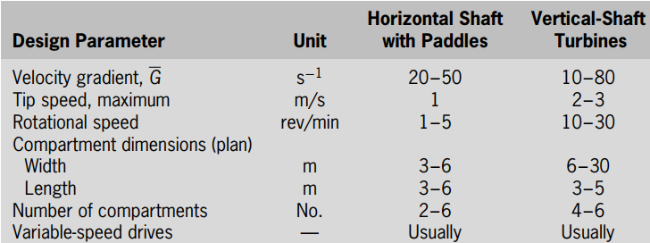
    - **Hình này chứng minh điều gì**
      - Xác định kích thước mặt bằng ngăn bể: cánh guồng phù hợp ngăn hẹp $3 - 6\text{ m}$, tuabin trục đứng áp dụng được cho bể rộng tới $30\text{ m}$.
    - **Từ đâu mà thấy được**
      - Số liệu hàng `Compartment dimensions (plan)` ghi rõ `Width 3–6 m` vs `6–30 m`, `Length 3–6 m` vs `3–5 m`.
- Tiêu chuẩn thiết kế then chốt cho bể tạo bông cánh guồng trục ngang:
  | Thông số kỹ thuật (*Parameter*) | Đơn vị (*Unit*) | Giá trị thiết kế (*Value*) |
  | :--- | :--- | :--- |
  | Đường kính guồng quay (*Diameter of wheel*) | $\text{m}$ | $3 - 4$ |
  | Tiết diện thanh gạt (*Paddle board section*) | $\text{mm}$ | $100 \times 150$ |
  | Chiều dài thanh gạt (*Paddle board length*) | $\text{m}$ | $2 - 3{,}5$ |
  | Tỷ lệ diện tích cánh gạt / diện tích mặt cắt bể ($A_{\text{paddle}} / A_{\text{tank}}$) | $\%$ | $< 20\%$ |
  | Hệ số cản $C_D$ ($Re > 1000$): tỷ số $L/W = 1$ | — | $C_D = 1{,}16$ |
  | Hệ số cản $C_D$ ($Re > 1000$): tỷ số $L/W = 5$ | — | $C_D = 1{,}20$ |
  | Hệ số cản $C_D$ ($Re > 1000$): tỷ số $L/W = 20$ | — | $C_D = 1{,}50$ |
  | Hệ số cản $C_D$ ($Re > 1000$): tỷ số $L/W \gg 20$ | — | $C_D = 1{,}90$ |
  | Vận tốc đầu cánh gạt - Bông cặn bền vững (*Strong floc*) | $\text{m/s}$ | $4$ |
  | Vận tốc đầu cánh gạt - Bông cặn yếu dễ vỡ (*Weak floc*) | $\text{m/s}$ | $2$ |
  | Khoảng cách giữa các guồng trên cùng một trục | $\text{m}$ | $1$ |
  | Khoảng hở từ mép cánh đến thành bể | $\text{m}$ | $0{,}7$ |
  | Chiều sâu bể tối thiểu | $\text{m}$ | Lớn hơn đường kính guồng ít nhất $1\text{ m}$ |
  | Khoảng cách thông thủy tối thiểu giữa các bậc | $\text{m}$ | $1$ |
  - **Hình 37.** Bảng tiêu chuẩn thiết kế then chốt cho bể tạo bông cánh guồng trục ngang
    - 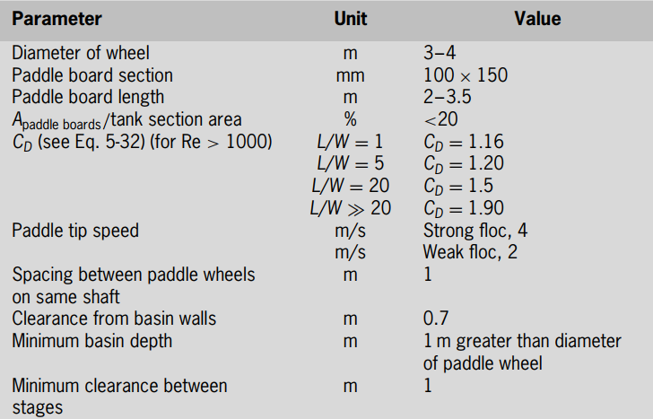
    - **Hình này chứng minh điều gì**
      - Quy định chi tiết các kích thước hình học, giới hạn diện tích cản thủy lực $< 20\%$ và hệ số cản $C_D$ của cánh gạt.
    - **Từ đâu mà thấy được**
      - Bảng 10 thông số liệt kê đường kính guồng $3 - 4\text{ m}$, thanh gạt $100 \times 150\text{ mm}$, khoảng hở thành $0{,}7\text{ m}$, đáy bể sâu hơn guồng $1\text{ m}$.
  - **Hình 39.** Hệ số cản $C_D$ theo tỷ số hình học $L/W$ và các yêu cầu lắp đặt guồng quay trục ngang
    - 
    - **Hình này chứng minh điều gì**
      - Cung cấp tương quan giải tích của hệ số cản thủy lực $C_D$ tăng dần từ $1{,}16$ đến $1{,}90$ khi thanh gạt có tỷ số mảnh $L/W$ tăng cao.
    - **Từ đâu mà thấy được**
      - Hàng $C_D \text{ (see Eq. 5-32)}$ ghi rõ các bậc giá trị $1{,}16; 1{,}20; 1{,}50; 1{,}90$ tương ứng với $L/W = 1, 5, 20, \gg 20$.

###### 3.3.3.2 Hệ thống bể tạo bông cánh khuấy tuabin trục đứng (Vertical Turbine Flocculator)

- Cấu tạo và nguyên lý hoạt động:
  - Bể tạo bông gồm chuỗi từ 3 đến 6 ngăn hình vuông hoặc chữ nhật nối tiếp nhau, ngăn cách bằng vách ngăn đục lỗ nhằm ngăn dòng chảy tắt.
  - Mỗi ngăn trang bị một cụm truyền động độc lập gồm động cơ và hộp giảm tốc (*Drive motor and gearbox*) đặt trên cầu công tác, làm quay trục thẳng đứng gắn cánh khuấy tuabin cánh nghiêng (*Pitched-blade turbine - PBT*) hoặc cánh hydrofoil.
  - Cánh khuấy đẩy dòng chất lỏng theo phương thẳng đứng xuống đáy bể rồi cuộn ngược lên theo thành bể, tạo vòng tuần hoàn lớn giúp phân tán đều năng lượng khuấy trộn trên toàn bộ thể tích ngăn.
  - Việc lắp đặt động cơ riêng cho từng ngăn cho phép điều chỉnh tốc độ quay $N$ giảm dần theo chiều dòng chảy (tạo bông phân bậc: $G_1 > G_2 > G_3$).
  - **Hình 40.** Mặt cắt hệ thống bể tạo bông tuabin trục đứng nhiều ngăn và phối cảnh cánh tuabin cánh nghiêng
    - 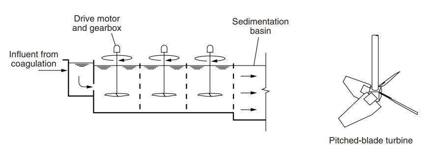
    - **Hình này chứng minh điều gì**
      - Thể hiện cấu tạo bể 3 ngăn tạo bông trục đứng nối tiếp dẫn sang bể lắng và kết cấu cánh tuabin cánh nghiêng (PBT).
    - **Từ đâu mà thấy được**
      - Mặt cắt bể bên trái có 3 cụm `Drive motor and gearbox` gắn trục đứng; hình bên phải là phối cảnh `Pitched-blade turbine` 4 cánh nghiêng.
  - **Hình 42.** Sơ đồ chuỗi ngăn tạo bông tuabin trục đứng phân cách bằng vách đục lỗ
    - 
    - **Hình này chứng minh điều gì**
      - Minh họa phương thức vận hành độc lập của từng trục khuấy cho phép điều khiển linh hoạt gradient vận tốc $G$ theo từng bậc tạo bông.
    - **Từ đâu mà thấy được**
      - Các mũi tên quay biểu thị chuyển động của động cơ độc lập trên từng khoang và hướng chảy qua vách đục lỗ sang `Sedimentation basin`.
- Bảng chuẩn số công suất ($N_p$) và chuẩn số bơm ($N_q$) của các loại cánh khuấy công nghiệp thông dụng:
  | Kiểu cánh khuấy (*Impeller Type*) | Chuẩn số công suất ($N_p$) | Chuẩn số bơm ($N_q$) | Phạm vi ứng dụng (*Application*) |
  | :--- | :--- | :--- | :--- |
  | Tuabin cánh phẳng (Flat-bladed turbine - FBT) | $3{,}6$ | $0{,}90$ | Trộn đều, duy trì huyền phù, tạo bông cặn |
  | Tuabin cánh nghiêng $45^\circ$ ($45^\circ$ PBT) | $1{,}26$ | $0{,}75$ | Trộn đều, duy trì huyền phù, tạo bông cặn |
  | Cánh hydrofoil uốn cong 3 cánh (*Hydrofoil, 3 blades*) | $0{,}2 - 0{,}3$ | $0{,}45 - 0{,}55$ | Trộn đều, duy trì huyền phù, tạo bông cặn |
  | Cánh đúc có gờ viền (*Cast foil with proplets*) | $0{,}23$ | $0{,}59$ | Trộn chất lỏng có độ nhớt |
  | Tuabin Rushton 6 cánh (*Rushton turbine, 6 blades*) | $4{,}5 - 5{,}5$ | $0{,}72$ | Phân tán khí - lỏng, huyền phù hạt rắn, tạo bông |
  | Cánh chân vịt bước 1:1 (*Propeller, pitch 1:1*) | $0{,}32 - 0{,}36$ | $0{,}40$ | Trộn chất lỏng có độ nhớt |
  - So sánh hiệu quả năng lượng: Cánh khuấy hydrofoil và tuabin cánh nghiêng $45^\circ$ PBT có chuẩn số công suất $N_p$ rất thấp ($0{,}2 - 1{,}26$) nhưng chuẩn số bơm $N_q$ rất cao ($0{,}45 - 0{,}75$), giúp tuần hoàn lưu lượng chất lỏng lớn mà tiêu thụ ít điện năng và tạo lực cắt thủy lực êm dịu, không làm vỡ bông cặn.
  - Ngược lại, tuabin Rushton ($N_p = 4{,}5 - 5{,}5$) và tuabin cánh phẳng FBT ($N_p = 3{,}6$) tạo lực cắt cục bộ rất lớn, chỉ thích hợp cho giai đoạn khuấy nhanh hoặc huyền phù hạt nặng.
  - **Hình 41.** Bảng chuẩn số công suất ($N_p$) và chuẩn số bơm ($N_q$) của các loại cánh khuấy công nghiệp
    - 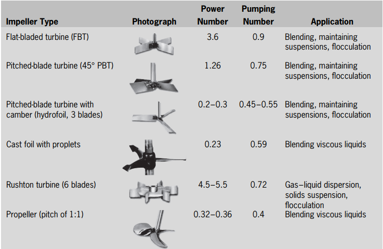
    - **Hình này chứng minh điều gì**
      - Định lượng chuẩn số $N_p$ và $N_q$ kèm hình ảnh thực tế của 6 loại cánh khuấy để tính toán công suất động cơ và lưu lượng tuần hoàn.
    - **Từ đâu mà thấy được**
      - Bảng gồm cột tên cánh, ảnh chụp `Photograph`, cột số liệu $N_p$, $N_q$ và ứng dụng công nghệ tương ứng.
  - **Hình 43.** Đặc tính thủy lực và hình thái cánh khuấy FBT, PBT, Hydrofoil và Rushton
    - 
    - **Hình này chứng minh điều gì**
      - Xác nhận cánh hydrofoil 3 cánh và $45^\circ$ PBT là lựa chọn hàng đầu cho tạo bông nhờ tỷ số $N_q/N_p$ vượt trội.
    - **Từ đâu mà thấy được**
      - Hàng 2 và 3 đối chiếu giá trị $N_p = 1{,}26$ (PBT) và $0{,}2 - 0{,}3$ (Hydrofoil) với $N_p = 4{,}5 - 5{,}5$ của Rushton turbine.
- Tiêu chuẩn bố trí hình học và kích thước cánh khuấy trục đứng:
  | Thông số hình học (*Parameter*) | Khoảng giá trị (*Range*) | Ghi chú thiết kế |
  | :--- | :--- | :--- |
  | Kiểu cánh khuấy (*Impeller*) | Hydrofoil hoặc $45^\circ$ PBT | Ưu tiên dùng Hydrofoil (*hydrofoil preferred*) |
  | Tỷ số đường kính cánh / bể ($D/T_e$) | $0{,}3 - 0{,}6$ | Ưu tiên dải $0{,}4 - 0{,}5$ (*preferred*) |
  | Tỷ số chiều sâu nước / đường kính bể ($H/T_e$) | $0{,}9 - 1{,}1$ | Ngăn bể có dạng gần lập phương |
  | Tỷ số khoảng hở đáy / chiều sâu nước ($C/H$) | $0{,}5 - 0{,}33$ | Tâm cánh khuấy cách đáy bể từ $1/3$ đến $1/2$ chiều sâu nước |
  | Tốc độ quay của cánh khuấy ($N$) | $10 - 30\text{ rev/min}$ | Điều chỉnh theo yêu cầu gradient vận tốc từng ngăn |
  | Vận tốc mút cánh khuấy (*Tip speed*) | $2 - 3\text{ m/s}$ | Giới hạn tối đa chống vỡ bông cặn |
  - Công thức xác định đường kính tương đương bể ($T_e$):
    $$T_e = \sqrt{\frac{4 \cdot A_{\text{plan}}}{\pi}}$$
    Trong đó $A_{\text{plan}}$ là diện tích mặt bằng của một ngăn tạo bông ($\text{m}^2$).
  - **Hình 44.** Tiêu chí thiết kế và sơ đồ định nghĩa kích thước cánh khuấy trục đứng
    - 
    - **Hình này chứng minh điều gì**
      - Thiết lập quan hệ kích thước lắp đặt cánh khuấy trong bể: $D/T_e$, $H/T_e$, $C/H$ và giới hạn vận tốc mút cánh $2 - 3\text{ m/s}$.
    - **Từ đâu mà thấy được**
      - Sơ đồ `Definition Sketch` vẽ mặt cắt bể với các ký hiệu $H, C, D, T_e$ bên cạnh bảng số liệu 6 thông số thiết kế.
  - **Hình 45.** Sơ đồ định hình kích thước và công thức quy đổi đường kính tương đương $T_e$
    - 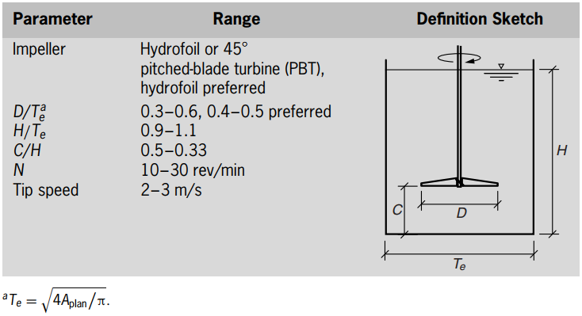
    - **Hình này chứng minh điều gì**
      - Cung cấp công thức chân trang tính đường kính tương đương $T_e = \sqrt{4A_{\text{plan}}/\pi}$ cho các ngăn bể không tròn.
    - **Từ đâu mà thấy được**
      - Ghi chú chân bảng $^a T_e = \sqrt{4A_{\text{plan}}/\pi}$ và hình vẽ cánh khuấy quay trong bể có chiều sâu $H$, khoảng hở $C$.

###### 3.3.3.3 Năm tiêu chí thủy lực định cỡ và lựa chọn cánh khuấy trục đứng

- Danh mục 5 tiêu chuẩn thủy lực bắt buộc trong tính toán và lựa chọn cánh khuấy trục đứng:
  - 1. Độ nhớt chất lỏng ($\mu$ - *Viscosity*)
  - 2. Gradient vận tốc ($G$ - *Velocity gradient*)
  - 3. Vận tốc đầu mút cánh khuấy ($T_s$ - *Impeller tip speed*)
  - 4. Vận tốc bề mặt qua bể ($SV$ - *Superficial velocity*)
  - 5. Tỷ số đường kính cánh khuấy trên đường kính bể ($D/T_e$ - *Ratio of impeller diameter to tank diameter*)

- Chi tiết Tiêu chuẩn 1 & 2: Độ nhớt ($\mu$) và Gradient vận tốc ($G$):
  - Định nghĩa gradient vận tốc: Là độ biến thiên vận tốc tương đối giữa các lớp chất lỏng kế cận trên một đơn vị khoảng cách, phản ánh năng lượng xáo trộn đưa vào khối nước.
  - Dải giá trị công nghệ tạo bông: $G = 20 - 80\text{ s}^{-1}$.
  - Phương trình tính toán năng lượng và gradient vận tốc:
    $$P = \mu \cdot V \cdot G^2 \implies G = \sqrt{\frac{P}{\mu \cdot V}}$$
  - Ảnh hưởng của độ nhớt động lực học ($\mu$): Độ nhớt thay đổi mạnh theo nhiệt độ nguồn nước. Nước có nhiệt độ càng thấp thì độ nhớt $\mu$ càng lớn, đòi hỏi công suất truyền động $P$ phải tăng tương ứng để duy trì gradient vận tốc $G$ theo thiết kế.

- Chi tiết Tiêu chuẩn 3: Vận tốc đầu mút cánh khuấy ($T_s$ - *Impeller tip speed*):
  - Ý nghĩa vật lý: Vận tốc dài lớn nhất xuất hiện tại mút ngoài cùng của cánh khuấy, quyết định ứng suất cắt cục bộ cực đại tác dụng lên các bông cặn keo tụ. Nếu $T_s$ vượt ngưỡng cho phép, lực cắt sẽ xé rách các bông cặn vừa hình thành.
  - Ngưỡng vận tốc cực đại cho phép:
    - Cánh khuấy hydrofoil 3 hoặc 4 cánh: $T_s \le 2{,}4\text{ m/s}$.
    - Tuabin cánh nghiêng $32^\circ$ hoặc $45^\circ$ ($45^\circ$ PBT): $T_s \le 2{,}1\text{ m/s}$.
  - Công thức tính vận tốc đầu mút cánh khuấy:
    $$T_s = \frac{\pi \cdot N \cdot D}{60}$$
    Trong đó:
    - $N$: Tốc độ quay của cánh khuấy ($\text{rev/min}$).
    - $D$: Đường kính cánh khuấy ($\text{m}$).
    - $T_s$: Vận tốc đầu mút cánh khuấy ($\text{m/s}$).

- Chi tiết Tiêu chuẩn 5: Tỷ số đường kính cánh khuấy trên đường kính bể ($D/T_e$):
  - Cơ sở thủy lực: Cánh khuấy có đường kính lớn ($D$ lớn) tạo ra sự dịch chuyển của toàn bộ khối chất lỏng (*bulk fluid motion*) và phân tán công suất tiêu thụ trên một diện tích mặt bằng rộng lớn.
  - Vận hành ở tốc độ quay $N$ thấp kết hợp đường kính lớn giúp giảm thiểu ứng suất cắt gây hại cho bông cặn trong khi vẫn duy trì lưu lượng tuần hoàn cao.
  - Phạm vi tỷ số thiết kế tối ưu:
    $$\frac{D}{T_e} = 0{,}35 - 0{,}40$$
    (Nằm trong dải dung sai tổng quát $0{,}3 - 0{,}6$).
  - Công thức tính đường kính tương đương $T_e$ cho ngăn bể tiết diện chữ nhật hoặc vuông:
    $$T_e = 1{,}13 \cdot (L \cdot W)^{0{,}5} = 1{,}13 \cdot \sqrt{L \cdot W}$$
    (Suy từ $T_e = \sqrt{\frac{4 \cdot L \cdot W}{\pi}} = \frac{2}{\sqrt{\pi}} \cdot \sqrt{L \cdot W} \approx 1{,}1284 \cdot \sqrt{L \cdot W} \approx 1{,}13 \cdot \sqrt{L \cdot W}$).
    Trong đó:
    - $L$: Chiều dài ngăn bể ($\text{m}$).
    - $W$: Chiều rộng ngăn bể ($\text{m}$).
    - $T_e$: Đường kính tương đương quy đổi của ngăn bể ($\text{m}$).

- Chi tiết Tiêu chuẩn 4: Vận tốc bề mặt qua bể ($SV$ - *Superficial velocity*):
  - Định nghĩa: Vận tốc bề mặt là vận tốc trung bình của dòng chất lỏng lưu thông qua toàn bộ diện tích mặt cắt ngang của ngăn bể tạo bông.
  - Tiêu chuẩn chống lắng đọng bông cặn: Cánh khuấy phải được thiết kế và định cỡ để đảm bảo vận tốc bề mặt tối thiểu:
    $$SV \ge 0{,}015\text{ m/s}$$
    ngay tại tốc độ quay thấp nhất của dải vận hành. Vận tốc này đảm bảo toàn bộ hạt bông cặn trong bể luôn ở trạng thái lơ lửng, chuyển động nhẹ nhàng và triệt tiêu hoàn toàn các "vùng chết" (*dead zone*) lắng đọng bùn sớm trong ngăn tạo bông.
  - Công thức xác định vận tốc bề mặt $SV$:
    $$SV = \frac{N_q \cdot N \cdot D^3}{60 \cdot L \cdot W}$$
  - Cơ sở suy dẫn từ chuẩn số bơm $N_q$:
    $$N_q = \frac{Q}{N \cdot D^3} \implies Q = N_q \cdot \left(\frac{N}{60}\right) \cdot D^3$$
    Vì lưu lượng tuần hoàn qua mặt cắt diện tích bể là $Q = SV \cdot (L \cdot W)$, suy ra:
    $$SV = \frac{Q}{L \cdot W} = \frac{N_q \cdot N \cdot D^3}{60 \cdot L \cdot W}$$
    Trong đó:
    - $N_q$: Chuẩn số bơm / lưu lượng của cánh khuấy (không thứ nguyên).
    - $N$: Tốc độ quay của cánh khuấy ($\text{rev/min}$).
    - $D$: Đường kính cánh khuấy ($\text{m}$).
    - $L$: Chiều dài ngăn bể ($\text{m}$).
    - $W$: Chiều rộng ngăn bể ($\text{m}$).
    - $SV$: Vận tốc bề mặt ($\text{m/s}$).

#### 3.4 Bài toán tính toán và Thiết kế công trình

- Các bài toán kỹ thuật trong công nghệ keo tụ - tạo bông bao gồm 4 nhóm tính toán cốt lõi:
  - Định lượng hóa chất keo tụ, cân bằng độ kiềm và xác định khối lượng cặn bùn hóa lý sinh ra.
  - Thiết kế công trình và cánh khuấy cho bể khuấy nhanh thủy lực hoặc cơ học (Flash Mixing Basin).
  - Thiết kế công trình và tính toán thủy động lực học cho bể tạo bông tuabin trục đứng (Vertical Turbine Flocculator).
  - Thiết kế hình học, xác định mô-men xoắn và công suất tiêu hao cho bể tạo bông cánh guồng trục ngang nhiều bậc (Horizontal-Shaft Paddle Wheel Flocculator).
- Tiêu chuẩn tính toán bám sát các phương trình lý thuyết thủy lực Camp-Stein, động học thủy động lực học cánh khuấy và quy chuẩn cân bằng hóa học môi trường.

##### 3.4.1 Tính toán liều lượng hóa chất và tiêu thụ độ kiềm

- Định lượng hóa chất keo tụ dựa trên phản ứng thủy phân và phản ứng kết tủa với các ion bicarbonate tự nhiên trong nước:
  - Phèn sắt clorua ($\text{FeCl}_3$) tiêu thụ độ kiềm theo tỷ lệ hóa học $2\text{ mol FeCl}_3 : 3\text{ mol Ca(HCO}_3)_2$ (tương đương $3\text{ mol CaCO}_3$).
  - Phèn nhôm sunfat ($\text{Al}_2(\text{SO}_4)_3\cdot 14\text{H}_2\text{O}$) tiêu thụ độ kiềm theo tỷ lệ $1\text{ mol alum} : 3\text{ mol Ca(HCO}_3)_2$ (tương đương $3\text{ mol CaCO}_3$).
  - Khi nước thô có độ kiềm tự nhiên không đủ để trung hòa lượng axit giải phóng, cần bổ sung kiềm nhân tạo bằng vôi tôi ($\text{Ca(OH)}_2$), vôi sống ($\text{CaO}$), hoặc xút ($\text{NaOH}$).
  - Nồng độ hóa chất đậm đặc dự trữ thương phẩm được biểu diễn theo phần trăm khối lượng ($\%$) hoặc khối lượng thể tích ($\text{g/L}$), từ đó xác định lưu lượng bơm định lượng châm vào dòng nước thô.
  - Lượng cặn bùn hidroxit kim loại sinh ra phụ thuộc vào lượng phèn đưa vào phản ứng và độ ẩm của bông cặn lắng.

###### Example 3-1: Độ kiềm tự nhiên cần thiết cho phản ứng keo tụ với FeCl3 (WaWC 373)
- **Đề bài**: (WaWC, 373) Lượng độ kiềm tự nhiên cần thiết (tính theo $\text{mg/L as }\text{CaCO}_3$) cho quá trình keo tụ nước thô với liều lượng $15{,}0\text{ mg/L}$ phèn sắt clorua ($\text{FeCl}_3$) là bao nhiêu?
- **Dữ kiện**
  - Liều lượng phèn sắt khan: $C_{\text{dose}} = 15{,}0\text{ mg/L}$ ($\text{FeCl}_3$).
  - Khối lượng mol của $\text{FeCl}_3$: $M_{\text{FeCl}_3} = 162{,}20\text{ g/mol}$.
  - Khối lượng mol tương đương của $\text{CaCO}_3$: $M_{\text{CaCO}_3} = 100{,}09\text{ g/mol}$.
- **Quy tắc áp dụng**
  - Phương trình hóa học của phản ứng keo tụ phèn sắt trong nước chứa độ kiềm tự nhiên:
    $$2\text{FeCl}_3 + 3\text{Ca(HCO}_3)_2 \rightarrow 2\text{Fe(OH)}_3\downarrow + 3\text{CaCl}_2 + 6\text{CO}_2$$
  - Phương trình ion thu gọn:
    $$\text{Fe}^{3+} + 3\text{HCO}_3^- \rightarrow \text{Fe(OH)}_3\downarrow + 3\text{CO}_2$$
  - Tỷ số khối lượng tiêu thụ độ kiềm lý thuyết:
    $$\text{Tỷ lệ} = \frac{3 \cdot M_{\text{CaCO}_3}}{2 \cdot M_{\text{FeCl}_3}} = \frac{3 \times 100{,}09}{2 \times 162{,}20} = \frac{300{,}27}{324{,}40} \approx 0{,}9256\text{ mg CaCO}_3\text{/mg FeCl}_3$$
- **Lời giải**
  - **Bước 1**: Xác định tỷ lệ hóa học giữa $\text{FeCl}_3$ và độ kiềm bicarbonate quy đổi theo $\text{CaCO}_3$.
    - Căn cứ: Cứ $2\text{ mol FeCl}_3$ ($324{,}40\text{ g}$) phản ứng tiêu thụ hết $3\text{ mol Ca(HCO}_3)_2$, tương đương về mặt trung hòa với $3\text{ mol CaCO}_3$ ($300{,}27\text{ g as }\text{CaCO}_3$).
    - Nhìn vào: Hệ số phản ứng và khối lượng mol phân tử từ phương trình hóa học.
    - Thực hiện: Tỷ số tiêu thụ kiềm là $\frac{300{,}27}{324{,}40} = 0{,}9256\text{ mg CaCO}_3\text{/mg FeCl}_3$.
  - **Bước 2**: Tính độ kiềm tự nhiên cần thiết để phản ứng hoàn toàn với liều phèn sắt.
    - Căn cứ: Công thức tính nhu cầu độ kiềm: $\text{Alk}_{\text{req}} = C_{\text{dose, FeCl}_3} \times 0{,}9256$.
    - Nhìn vào: Liều lượng châm phèn sắt $C_{\text{dose}} = 15{,}0\text{ mg/L}$ từ đề bài (slide 47).
    - Thực hiện:
      $$\text{Alk}_{\text{req}} = 15{,}0\text{ mg/L} \times 0{,}9256 = 13{,}88\text{ mg/L as }\text{CaCO}_3 \approx 13{,}9\text{ mg/L as }\text{CaCO}_3$$
- **Kết quả**: 
  - Độ kiềm tự nhiên cần thiết tối thiểu: $13{,}88\text{ mg/L as }\text{CaCO}_3$ (xấp xỉ $13{,}9\text{ mg/L as }\text{CaCO}_3$).
- **Kiểm tra lại**:
  - Tính theo nồng độ đương lượng: $15{,}0\text{ mg/L} / (162{,}20 / 3\text{ mg/meq}) = 15{,}0 / 54{,}07 = 0{,}2774\text{ meq/L}$.
  - Độ kiềm tương đương: $0{,}2774\text{ meq/L} \times 50{,}04\text{ mg/meq} = 13{,}88\text{ mg/L as }\text{CaCO}_3$. Kết quả hoàn toàn trùng khớp.

---

###### Example 3-2: Liều lượng vôi cần thiết bổ sung độ kiềm khi keo tụ bằng phèn nhôm (WaWC 374)
- **Đề bài**: (WaWC, 374) Nước thô có độ kiềm thấp là $12{,}0\text{ mg/L as }\text{CaCO}_3$ được xử lý bằng quá trình keo tụ kết hợp phèn nhôm - vôi. Liều lượng phèn nhôm sử dụng là $55{,}0\text{ mg/L}$. Hãy xác định liều lượng vôi cần thiết bổ sung để phản ứng với phèn nhôm.
- **Dữ kiện**
  - Độ kiềm tự nhiên ban đầu của nước thô: $\text{Alk}_{\text{raw}} = 12{,}0\text{ mg/L as }\text{CaCO}_3$.
  - Liều lượng phèn nhôm thương phẩm ($\text{Al}_2(\text{SO}_4)_3\cdot 14\text{H}_2\text{O}$): $C_{\text{alum}} = 55{,}0\text{ mg/L}$.
  - Khối lượng mol phèn nhôm: $M_{\text{alum}} = 594{,}38\text{ g/mol}$.
  - Khối lượng mol $\text{CaCO}_3$: $M_{\text{CaCO}_3} = 100{,}09\text{ g/mol}$.
  - Khối lượng mol vôi tôi $\text{Ca(OH)}_2$: $M_{\text{Ca(OH)}_2} = 74{,}09\text{ g/mol}$.
  - Khối lượng mol vôi sống $\text{CaO}$: $M_{\text{CaO}} = 56{,}08\text{ g/mol}$.
- **Quy tắc áp dụng**
  - Phản ứng thủy phân của phèn nhôm với độ kiềm tự nhiên:
    $$\text{Al}_2(\text{SO}_4)_3\cdot 14\text{H}_2\text{O} + 3\text{Ca(HCO}_3)_2 \rightarrow 2\text{Al(OH)}_3\downarrow + 3\text{CaSO}_4 + 6\text{CO}_2 + 14\text{H}_2\text{O}$$
    - $1\text{ mol}$ phèn nhôm ($594{,}38\text{ g}$) tiêu thụ $3\text{ mol CaCO}_3$ đương lượng ($300{,}27\text{ g as }\text{CaCO}_3$).
    - Tỷ lệ tiêu thụ độ kiềm lý thuyết:
      $$\text{Tỷ lệ demand} = \frac{3 \cdot M_{\text{CaCO}_3}}{M_{\text{alum}}} = \frac{300{,}27}{594{,}38} \approx 0{,}5052\text{ mg CaCO}_3\text{/mg alum}$$
  - Lượng độ kiềm thiếu hụt cần bổ sung:
    $$\Delta\text{Alk} = \text{Alk}_{\text{req}} - \text{Alk}_{\text{raw}}$$
  - Phản ứng trung hòa bổ sung bằng vôi tôi:
    $$\text{Al}_2(\text{SO}_4)_3\cdot 14\text{H}_2\text{O} + 3\text{Ca(OH)}_2 \rightarrow 2\text{Al(OH)}_3\downarrow + 3\text{CaSO}_4 + 14\text{H}_2\text{O}$$
    - Hệ số quy đổi vôi tôi: $\frac{M_{\text{Ca(OH)}_2}}{M_{\text{CaCO}_3}} = \frac{74{,}09}{100{,}09} = 0{,}7402\text{ mg Ca(OH)}_2\text{/mg CaCO}_3$.
    - Hệ số quy đổi vôi sống: $\frac{M_{\text{CaO}}}{M_{\text{CaCO}_3}} = \frac{56{,}08}{100{,}09} = 0{,}5603\text{ mg CaO/mg CaCO}_3$.
- **Lời giải**
  - **Bước 1**: Tính tổng lượng độ kiềm cần thiết cho $55{,}0\text{ mg/L}$ phèn nhôm.
    - Căn cứ: Tỷ số tiêu thụ độ kiềm lý thuyết $0{,}5052\text{ mg CaCO}_3/\text{mg alum}$.
    - Nhìn vào: Liều lượng phèn nhôm $C_{\text{alum}} = 55{,}0\text{ mg/L}$ trên slide 47.
    - Thực hiện:
      $$\text{Alk}_{\text{req}} = 55{,}0\text{ mg/L} \times 0{,}5052 = 27{,}78\text{ mg/L as }\text{CaCO}_3$$
  - **Bước 2**: Xác định lượng độ kiềm thiếu hụt trong nước thô.
    - Căn cứ: Độ kiềm tự nhiên hiện có của nước thô $\text{Alk}_{\text{raw}} = 12{,}0\text{ mg/L as }\text{CaCO}_3$.
    - Nhìn vào: Chênh lệch giữa nhu cầu và lượng có sẵn:
      $$\Delta\text{Alk} = 27{,}78\text{ mg/L} - 12{,}0\text{ mg/L} = 15{,}78\text{ mg/L as }\text{CaCO}_3$$
  - **Bước 3**: Tính toán liều lượng vôi cần bổ sung.
    - Căn cứ: Hệ số đương lượng hóa học giữa vôi và $\text{CaCO}_3$.
    - Nhìn vào: Lượng độ kiềm thiếu hụt $\Delta\text{Alk} = 15{,}78\text{ mg/L as }\text{CaCO}_3$.
    - Thực hiện:
      - Tính theo vôi tôi nguyên chất $\text{Ca(OH)}_2$:
        $$\text{Liều Ca(OH)}_2 = 15{,}78\text{ mg/L} \times 0{,}7402 = 11{,}68\text{ mg/L}$$
      - Tính theo vôi sống nguyên chất $\text{CaO}$:
        $$\text{Liều CaO} = 15{,}78\text{ mg/L} \times 0{,}5603 = 8{,}84\text{ mg/L}$$
      - *(Ghi chú kỹ thuật)*: Nếu trạm xử lý yêu cầu duy trì độ kiềm đệm dư tối thiểu sau xử lý là $10{,}0\text{ mg/L as }\text{CaCO}_3$ để bảo đảm pH ổn định, tổng độ kiềm cần đáp ứng là $27{,}78 + 10{,}0 = 37{,}78\text{ mg/L as }\text{CaCO}_3$, khi đó lượng thiếu hụt là $25{,}78\text{ mg/L}$, đòi hỏi liều vôi tôi là $25{,}78 \times 0{,}7402 = 19{,}08\text{ mg/L Ca(OH)}_2$.
- **Kết quả**: 
  - Liều lượng vôi tôi nguyên chất $\text{Ca(OH)}_2$ cần bổ sung theo tỷ lượng phản ứng: $11{,}68\text{ mg/L}$.
  - Hoặc tính theo vôi sống nguyên chất $\text{CaO}$: $8{,}84\text{ mg/L}$.
- **Kiểm tra lại**:
  - $11{,}68\text{ mg/L Ca(OH)}_2$ cung cấp: $11{,}68 / 74{,}09 \times 100{,}09 = 15{,}78\text{ mg/L as }\text{CaCO}_3$.
  - Tổng độ kiềm trong nước sau châm vôi: $12{,}0 + 15{,}78 = 27{,}78\text{ mg/L as }\text{CaCO}_3$, vừa đủ trung hòa hoàn toàn $55{,}0\text{ mg/L}$ phèn nhôm.

---

###### Example 3-3: Nồng độ phèn dự trữ, lưu lượng châm, tiêu thụ kiềm và lượng cặn sinh ra (PoWT 153)
- **Đề bài**: (PoWT, 153) Nhà cung cấp hóa chất công bố nồng độ dung dịch phèn nhôm dự trữ là $8{,}37\%$ theo $\text{Al}_2\text{O}_3$ với tỷ trọng $\text{SG} = 1{,}32$. Đối với dung dịch phèn dự trữ này, hãy tính:
  - (a) Nồng độ mol của ion $\text{Al}^{3+}$.
  - (b) Nồng độ dung dịch phèn biểu diễn theo $\text{g/L Al}_2(\text{SO}_4)_3\cdot 14\text{H}_2\text{O}$.
  - Đối với liều lượng phèn $30{,}0\text{ mg/L}$ châm vào trạm xử lý nước có công suất $0{,}5\text{ m}^3\text{/s}$, hãy tính:
  - (c) Lưu lượng châm hóa chất phèn theo $\text{L/min}$.
  - (d) Lượng độ kiềm bị tiêu thụ (biểu diễn theo $\text{mg/L as }\text{CaCO}_3$).
  - (e) Khối lượng kết tủa sinh ra tính theo $\text{mg/L}$ và $\text{kg/ngày}$.
- **Dữ kiện**
  - Hàm lượng phần trăm khối lượng $\text{Al}_2\text{O}_3$ trong dung dịch dự trữ: $w = 8{,}37\% = 0{,}0837$.
  - Tỷ trọng dung dịch phèn dự trữ: $\text{SG} = 1{,}32 \implies \rho_{\text{sol}} = 1{,}32 \times 1000\text{ g/L} = 1320\text{ g/L}$.
  - Liều lượng phèn nhôm châm vào nước: $C_{\text{dose}} = 30{,}0\text{ mg/L}$ dạng $\text{Al}_2(\text{SO}_4)_3\cdot 14\text{H}_2\text{O}$.
  - Công suất xử lý của nhà máy nước: $Q = 0{,}5\text{ m}^3\text{/s} = 500\text{ L/s} = 30\,000\text{ L/min} = 43\,200\text{ m}^3\text{/ngày}$.
  - Khối lượng mol các chất:
    - $M_{\text{Al}_2\text{O}_3} = 101{,}96\text{ g/mol}$.
    - $M_{\text{alum}} = M_{\text{Al}_2(\text{SO}_4)_3\cdot 14\text{H}_2\text{O}} = 594{,}38\text{ g/mol}$.
    - $M_{\text{Al(OH)}_3} = 78{,}01\text{ g/mol}$.
    - $M_{\text{CaCO}_3} = 100{,}09\text{ g/mol}$.
- **Quy tắc áp dụng**
  - Nồng độ khối lượng $\text{Al}_2\text{O}_3$ trong dung dịch: $C_{\text{Al}_2\text{O}_3} = w \cdot \rho_{\text{sol}}$.
  - Nồng độ mol ion $\text{Al}^{3+}$: $[\text{Al}^{3+}] = 2 \cdot \frac{C_{\text{Al}_2\text{O}_3}}{M_{\text{Al}_2\text{O}_3}}$ (vì $1\text{ mol Al}_2\text{O}_3$ chứa $2\text{ mol Al}^{3+}$).
  - Nồng độ phèn thương phẩm: $C_{\text{alum}} = \frac{C_{\text{Al}_2\text{O}_3}}{M_{\text{Al}_2\text{O}_3}} \cdot M_{\text{alum}}$.
  - Lưu lượng bơm định lượng hóa chất: $q_{\text{feed}} = \frac{Q \cdot C_{\text{dose}}}{C_{\text{alum}}}$.
  - Tiêu thụ độ kiềm: $\text{Alk}_{\text{consumed}} = C_{\text{dose}} \cdot \frac{3 \cdot M_{\text{CaCO}_3}}{M_{\text{alum}}}$.
  - Khối lượng kết tủa $\text{Al(OH)}_3$ khô sinh ra: $C_{\text{precipitate}} = C_{\text{dose}} \cdot \frac{2 \cdot M_{\text{Al(OH)}_3}}{M_{\text{alum}}}$.
- **Lời giải**
  - **Bước 1**: Tính nồng độ khối lượng $\text{Al}_2\text{O}_3$ và nồng độ mol ion $\text{Al}^{3+}$ (câu a).
    - Căn cứ: Nồng độ phần trăm $w = 8{,}37\%$, tỷ trọng dung dịch $1{,}32$, khối lượng mol $M_{\text{Al}_2\text{O}_3} = 101{,}96\text{ g/mol}$.
    - Nhìn vào: Khối lượng $\text{Al}_2\text{O}_3$ trong $1\text{ L}$ dung dịch là:
      $$C_{\text{Al}_2\text{O}_3} = 0{,}0837 \times 1320\text{ g/L} = 110{,}484\text{ g/L}$$
    - Thực hiện:
      $$[\text{Al}_2\text{O}_3] = \frac{110{,}484\text{ g/L}}{101{,}96\text{ g/mol}} = 1{,}0836\text{ mol/L}$$
      $$[\text{Al}^{3+}] = 2 \times 1{,}0836\text{ mol/L} = 2{,}167\text{ mol/L} \approx 2{,}17\text{ M}$$
  - **Bước 2**: Tính nồng độ phèn thương phẩm dạng $\text{Al}_2(\text{SO}_4)_3\cdot 14\text{H}_2\text{O}$ (câu b).
    - Căn cứ: $1\text{ mol Al}_2\text{O}_3$ tương ứng với $1\text{ mol Al}_2(\text{SO}_4)_3\cdot 14\text{H}_2\text{O}$ ($594{,}38\text{ g/mol}$).
    - Nhìn vào: Số mol phèn trong một lít dung dịch bằng số mol $\text{Al}_2\text{O}_3$ ($1{,}0836\text{ mol/L}$).
    - Thực hiện:
      $$C_{\text{alum}} = 1{,}0836\text{ mol/L} \times 594{,}38\text{ g/mol} = 644{,}08\text{ g/L} \approx 644{,}1\text{ g/L}$$
  - **Bước 3**: Tính lưu lượng châm hóa chất phèn (câu c).
    - Căn cứ: Công suất nhà máy $Q = 0{,}5\text{ m}^3\text{/s} = 30\,000\text{ L/min}$, liều châm $30{,}0\text{ mg/L} = 0{,}030\text{ g/L}$.
    - Nhìn vào: Tốc độ khối lượng phèn tiêu thụ mỗi phút:
      $$\dot{m}_{\text{alum}} = 30\,000\text{ L/min} \times 0{,}030\text{ g/L} = 900\text{ g/min}$$
    - Thực hiện:
      $$q_{\text{feed}} = \frac{900\text{ g/min}}{644{,}08\text{ g/L}} = 1{,}397\text{ L/min} \approx 1{,}40\text{ L/min}\text{ (tương đương } 23{,}29\text{ mL/s)}$$
  - **Bước 4**: Tính lượng độ kiềm bị tiêu thụ (câu d).
    - Căn cứ: Tỷ số tiêu thụ độ kiềm lý thuyết $\frac{3 \times 100{,}09}{594{,}38} = 0{,}5052\text{ mg CaCO}_3\text{/mg alum}$.
    - Nhìn vào: Liều phèn châm $C_{\text{dose}} = 30{,}0\text{ mg/L}$.
    - Thực hiện:
      $$\text{Alk}_{\text{consumed}} = 30{,}0\text{ mg/L} \times 0{,}5052 = 15{,}16\text{ mg/L as }\text{CaCO}_3 \approx 15{,}2\text{ mg/L as }\text{CaCO}_3$$
  - **Bước 5**: Tính lượng cặn kết tủa hidroxit nhôm $\text{Al(OH)}_3$ sinh ra (câu e).
    - Căn cứ: $1\text{ mol phèn nhôm}$ sinh ra $2\text{ mol Al(OH)}_3$. Tỷ lệ khối lượng: $\frac{2 \times 78{,}01}{594{,}38} = \frac{156{,}02}{594{,}38} = 0{,}2625\text{ mg Al(OH)}_3\text{/mg alum}$.
    - Nhìn vào: Liều phèn $30{,}0\text{ mg/L}$ và lưu lượng ngày $Q_{\text{day}} = 43\,200\text{ m}^3\text{/ngày}$.
    - Thực hiện:
      - Nồng độ kết tủa cặn trong nước:
        $$C_{\text{sludge}} = 30{,}0\text{ mg/L} \times 0{,}2625 = 7{,}875\text{ mg/L} \approx 7{,}88\text{ mg/L}$$
      - Khối lượng cặn khô sinh ra mỗi ngày:
        $$M_{\text{sludge}} = 43\,200\text{ m}^3\text{/ngày} \times 7{,}875\text{ g/m}^3 \times 10^{-3}\text{ kg/g} = 340{,}2\text{ kg/ngày}$$
- **Kết quả**: 
  - (a) Nồng độ mol ion $\text{Al}^{3+}$: $2{,}17\text{ mol/L}$ ($2{,}17\text{ M}$).
  - (b) Nồng độ phèn thương phẩm: $644{,}1\text{ g/L Al}_2(\text{SO}_4)_3\cdot 14\text{H}_2\text{O}$.
  - (c) Lưu lượng châm phèn dự trữ: $1{,}40\text{ L/min}$ ($23{,}29\text{ mL/s}$).
  - (d) Tiêu thụ độ kiềm: $15{,}16\text{ mg/L as }\text{CaCO}_3$ ($\approx 15{,}2\text{ mg/L as }\text{CaCO}_3$).
  - (e) Khối lượng kết tủa $\text{Al(OH)}_3$: $7{,}88\text{ mg/L}$ và $340{,}2\text{ kg/ngày}$.
- **Kiểm tra lại**:
  - Tỷ lệ phần trăm khối lượng: $\frac{110{,}484\text{ g}}{1320\text{ g}} = 0{,}0837 = 8{,}37\%$, khớp hoàn toàn đề bài.
  - Cân bằng lưu lượng khối lượng: $1{,}397\text{ L/min} \times 644{,}08\text{ g/L} = 900\text{ g/min} = 30\text{ mg/L} \times 30\,000\text{ L/min}$. Kết quả tuyệt đối chính xác.

---

##### 3.4.2 Tính toán thiết kế bể khuấy nhanh

- Bể khuấy nhanh (Flash Mixing Basin) nhằm phân tán tức thời hóa chất keo tụ vào toàn bộ thể tích dòng nước trước khi các phản ứng thủy phân polyme hóa diễn ra:
  - Thời gian lưu nước ngắn ($t = 1 - 30\text{ s}$), thông dụng $t = 5 - 10\text{ s}$.
  - Gradient vận tốc rất lớn ($G = 600 - 1000\text{ s}^{-1}$).
  - Tích số Camp $Gt$ nằm trong khoảng $1000 - 10\,000$.
- Kích thước hình học bể cơ học dạng trụ tròn có tỷ lệ chiều sâu nước trên đường kính bể $H/T \approx 1{,}0$ để tạo cấu trúc đối xứng dòng xoáy:
  - Cánh khuấy thường đặt ở độ sâu $C = H/3$ tính từ đáy bể.
  - Bể cần bố trí $4$ tấm vách ngăn (baffles) thẳng đứng gắn sát thành với chiều rộng mỗi tấm bằng $1/10$ đường kính bể ($W_b = T/10$) để triệt tiêu hiện tượng phễu xoáy nước (vortexing).
- Công suất tiêu hao truyền vào nước tính theo phương trình Camp-Stein: $P = \mu \cdot V \cdot G^2$.
- Công suất cánh khuấy thủy lực xác định theo chuẩn số công suất $N_p$: $P = N_p \cdot \rho \cdot N^3 \cdot D^5$.

###### Example 3-4: Thiết kế bể khuấy nhanh hình trụ (WaWE 6-35)
- **Đề bài**: (WaWE, 6-35) Thiết kế bể khuấy nhanh hình trụ bằng cách xác định thể tích bể, đường kính bể, các kích thước hình học, công suất yêu cầu truyền vào nước, lựa chọn đường kính cánh khuấy từ dữ liệu của nhà sản xuất, và tốc độ quay của cánh khuấy dựa trên các thông số sau:
  - Lưu lượng thiết kế: $11\,500\text{ m}^3\text{/ngày}$.
  - Thời gian khuấy nhanh $t$: $5\text{ s}$.
  - Gradient vận tốc khuấy nhanh $G$: $600\text{ s}^{-1}$.
  - Nhiệt độ nước: $25^\circ\text{C}$.
  - Vị trí đặt cánh khuấy: tại $1/3$ chiều sâu nước ($C = H/3$).
  - Bảng dữ liệu cánh khuấy có sẵn từ nhà sản xuất:
    | Loại cánh khuấy (Impeller type) | Đường kính cánh khuấy $D$ (m) | Chuẩn số công suất ($N_p$) |
    |---|---|---|
    | Hướng tâm (Radial) | $0{,}3;\; 0{,}4;\; 0{,}6$ | $5{,}7$ |
    | Hướng trục (Axial) | $0{,}8;\; 1{,}4;\; 2{,}0$ | $0{,}31$ |
- **Dữ kiện**
  - Lưu lượng thiết kế: $Q = 11\,500\text{ m}^3\text{/ngày} = \frac{11\,500}{86\,400}\text{ m}^3\text{/s} \approx 0{,}1331\text{ m}^3\text{/s}$.
  - Thời gian lưu nước khuấy nhanh: $t = 5{,}0\text{ s}$.
  - Gradient vận tốc thiết kế: $G = 600\text{ s}^{-1}$.
  - Nhiệt độ nước tính toán: $T = 25^\circ\text{C}$.
  - Độ nhớt động lực học của nước ở $25^\circ\text{C}$: $\mu = 0{,}890 \times 10^{-3}\text{ Pa}\cdot\text{s} = 0{,}000890\text{ N}\cdot\text{s/m}^2$.
  - Khối lượng riêng của nước ở $25^\circ\text{C}$: $\rho = 997\text{ kg/m}^3$.
  - Tỷ lệ kích thước bể trụ tròn: $H/T = 1{,}0$.
  - Bảng thông số cánh khuấy thương phẩm (slide 48).
- **Quy tắc áp dụng**
  - Thể tích bể khuấy: $V = Q \cdot t$.
  - Thể tích hình trụ tròn ($H = T$): $V = \frac{\pi}{4} T^2 H = \frac{\pi}{4} T^3 \implies T = \left(\frac{4V}{\pi}\right)^{1/3}$.
  - Công suất thủy lực Camp-Stein truyền vào nước:
    $$P = \mu \cdot V \cdot G^2$$
  - Phương trình công suất cánh khuấy thủy lực (dòng chảy rối $\text{Re} > 10^4$):
    $$P = N_p \cdot \rho \cdot N^3 \cdot D^5 \implies N = \left(\frac{P}{N_p \cdot \rho \cdot D^5}\right)^{1/3}$$
  - Tiêu chuẩn tỷ lệ đường kính cánh khuấy trên đường kính bể: chọn $D/T \approx 0{,}30 - 0{,}50$ đối với cánh turbine hướng tâm ($N_p = 5{,}7$).
  - Vận tốc đầu mút cánh khuấy: $T_s = \pi \cdot N \cdot D$ (khuyến nghị $\le 2{,}4\text{ m/s}$ trong khuấy nhanh).
  - Công suất động cơ điện với hiệu suất truyền động $\eta = 75\%$: $P_{\text{motor}} = \frac{P}{\eta}$.
- **Lời giải**
  - **Bước 1**: Tính thể tích bể khuấy nhanh ($V$).
    - Căn cứ: Công thức lưu lượng và thời gian lưu $V = Q \cdot t$.
    - Nhìn vào: $Q = 0{,}1331\text{ m}^3\text{/s}$ và $t = 5{,}0\text{ s}$ trên slide 48.
    - Thực hiện:
      $$V = 0{,}1331\text{ m}^3\text{/s} \times 5{,}0\text{ s} = 0{,}6655\text{ m}^3 \approx 0{,}67\text{ m}^3\text{ (665,5 L)}$$
  - **Bước 2**: Xác định kích thước hình học bể ($T$, $H$, $C$).
    - Căn cứ: Bể trụ tròn tỷ lệ chiều sâu bằng đường kính $H = T \implies V = \frac{\pi T^3}{4}$.
    - Nhìn vào: Thể tích $V = 0{,}6655\text{ m}^3$.
    - Thực hiện:
      $$T = \left(\frac{4 \times 0{,}6655\text{ m}^3}{\pi}\right)^{1/3} = (0{,}8473)^{1/3} \approx 0{,}946\text{ m} \approx 0{,}95\text{ m}$$
      Chiều sâu mực nước: $H = 0{,}95\text{ m}$.
      Khoảng cách đặt cánh khuấy cách đáy: $C = \frac{1}{3} H = \frac{0{,}95\text{ m}}{3} \approx 0{,}32\text{ m}$.
      Chiều sâu tổng cộng (kể cả chiều cao bảo vệ $0{,}30\text{ m}$): $H_{\text{total}} = 0{,}95 + 0{,}30 = 1{,}25\text{ m}$.
  - **Bước 3**: Tính công suất yêu cầu truyền vào nước ($P$).
    - Căn cứ: Công thức Camp-Stein $P = \mu \cdot V \cdot G^2$, với $\mu = 0{,}000890\text{ Pa}\cdot\text{s}$, $G = 600\text{ s}^{-1}$.
    - Nhìn vào: Thể tích $V = 0{,}6655\text{ m}^3$.
    - Thực hiện:
      $$P = 0{,}000890\text{ Pa}\cdot\text{s} \times 0{,}6655\text{ m}^3 \times (600\text{ s}^{-1})^2 = 0{,}000890 \times 0{,}6655 \times 360\,000 = 213{,}2\text{ W} \approx 0{,}213\text{ kW}$$
  - **Bước 4**: Lựa chọn loại cánh khuấy và tính tốc độ quay ($N$).
    - Căn cứ: Bảng dữ liệu cánh khuấy của nhà sản xuất (slide 48) và tiêu chí tỷ lệ $D/T \in [0{,}30; 0{,}50]$.
    - Nhìn vào: 
      - Bể có đường kính $T = 0{,}95\text{ m}$. Cánh khuấy hướng trục có cỡ nhỏ nhất $D = 0{,}8\text{ m}$ ($D/T = 0{,}84$ quá lớn, gây xoáy phá cấu trúc dòng).
      - Cánh khuấy hướng tâm (Radial) có các cỡ $D = 0{,}3\text{ m};\; 0{,}4\text{ m};\; 0{,}6\text{ m}$ ($N_p = 5{,}7$). Cỡ $D = 0{,}40\text{ m}$ có tỷ lệ $D/T = 0{,}40 / 0{,}95 = 0{,}42$ nằm hoàn hảo trong khoảng tiêu chuẩn.
      - (Nếu chọn cỡ trung gian phổ biến $D = 0{,}35\text{ m}$ với $D/T = 0{,}37$):
    - Thực hiện:
      - Trường hợp chọn cánh khuấy có sẵn $D = 0{,}40\text{ m}$ ($N_p = 5{,}7$, $D^5 = 0{,}01024\text{ m}^5$):
        $$N^3 = \frac{P}{N_p \cdot \rho \cdot D^5} = \frac{213{,}2}{5{,}7 \times 997 \times 0{,}01024} = \frac{213{,}2}{58{,}19} \approx 3{,}664$$
        $$N = (3{,}664)^{1/3} \approx 1{,}542\text{ rev/s} = 1{,}542 \times 60 \approx 92{,}5\text{ rpm}$$
      - Trường hợp chọn cánh khuấy $D = 0{,}35\text{ m}$ ($N_p = 5{,}7$, $D^5 = 0{,}005252\text{ m}^5$):
        $$N^3 = \frac{213{,}2}{5{,}7 \times 997 \times 0{,}005252} = \frac{213{,}2}{29{,}85} \approx 7{,}142$$
        $$N = (7{,}142)^{1/3} \approx 1{,}926\text{ rev/s} = 1{,}926 \times 60 \approx 115{,}6\text{ rpm}$$
  - **Bước 5**: Kiểm tra vận tốc đầu cánh khuấy và chọn công suất động cơ.
    - Căn cứ: Tiêu chuẩn vận tốc đầu mút cánh khuấy $T_s = \pi \cdot N \cdot D \le 2{,}4\text{ m/s}$.
    - Nhìn vào:
      - Với $D = 0{,}40\text{ m}$ ($N = 1{,}542\text{ rev/s}$): $T_s = \pi \times 1{,}542 \times 0{,}40 = 1{,}94\text{ m/s} < 2{,}4\text{ m/s}$ (đạt).
      - Với $D = 0{,}35\text{ m}$ ($N = 1{,}926\text{ rev/s}$): $T_s = \pi \times 1{,}926 \times 0{,}35 = 2{,}12\text{ m/s} < 2{,}4\text{ m/s}$ (đạt).
    - Công suất động cơ điện (hiệu suất truyền động $\eta = 75\%$):
      $$P_{\text{motor}} = \frac{213{,}2\text{ W}}{0{,}75} = 284\text{ W} = 0{,}38\text{ HP}$$
      Chọn động cơ điện thương phẩm tiêu chuẩn $0{,}37\text{ kW}$ ($0{,}5\text{ HP}$).
- **Kết quả**: 
  - Thể tích bể khuấy nhanh: $V = 0{,}67\text{ m}^3$ ($665{,}5\text{ L}$).
  - Kích thước bể: Đường kính $T = 0{,}95\text{ m}$, chiều sâu nước $H = 0{,}95\text{ m}$, tổng chiều sâu bể $1{,}25\text{ m}$.
  - Vị trí đặt cánh khuấy: $C = 0{,}32\text{ m}$ cách đáy bể.
  - Công suất thủy lực truyền vào nước: $P = 213{,}2\text{ W}$ ($0{,}213\text{ kW}$).
  - Loại cánh khuấy chọn: Cánh turbine hướng tâm (Radial impeller), đường kính $D = 0{,}40\text{ m}$ (tốc độ quay $N = 92{,}5\text{ rpm}$, $T_s = 1{,}94\text{ m/s}$) hoặc $D = 0{,}35\text{ m}$ (tốc độ quay $N = 115{,}6\text{ rpm}$, $T_s = 2{,}12\text{ m/s}$).
  - Công suất động cơ điện lắp đặt: $0{,}37\text{ kW}$ ($0{,}5\text{ HP}$).
- **Kiểm tra lại**:
  - Tích số Camp: $Gt = 600\text{ s}^{-1} \times 5\text{ s} = 3000$, nằm trong dải tiêu chuẩn thiết kế ($1000 - 10\,000$).
  - Chuẩn số Reynolds cánh khuấy: $\text{Re} = \frac{\rho N D^2}{\mu} = \frac{997 \times 1{,}542 \times 0{,}40^2}{0{,}000890} \approx 2{,}76 \times 10^5 \gg 10^4$, dòng chảy rối phát triển hoàn toàn, chuẩn số $N_p = 5{,}7$ hoàn toàn chính xác.

---

##### 3.4.3 Tính toán thiết kế bể tạo bông tuabin trục đứng

- Bể tạo bông tuabin trục đứng (Vertical Shaft Turbine Flocculator) sử dụng cánh khuấy turbine dạng cánh bản nghiêng hoặc cánh hydrofoil (foil) bơm hướng trục:
  - Hệ thống thường gồm nhiều đơn nguyên (trains) song song, mỗi đơn nguyên gồm 3 đến 4 ngăn (compartments) nối tiếp.
  - Tích số Camp tổng cộng $(Gt)_{\text{total}}$ dao động trong dải $10\,000 - 100\,000$, thời gian lưu tổng cộng $t = 20 - 30\text{ phút}$.
  - Gradient vận tốc giảm dần theo các bậc (tapered flocculation): bậc đầu $G_1 = 50 - 80\text{ s}^{-1}$ giảm dần về bậc cuối $G_n = 10 - 20\text{ s}^{-1}$ nhằm hạn chế phá vỡ bông cặn lớn.
- Các tiêu chí thủy động lực học bắt buộc cho cánh khuấy trục đứng:
  - Tỷ lệ đường kính cánh khuấy trên đường kính bể tương đương: $D/T_e = 0{,}35 - 0{,}50$ (thông dụng $0{,}40$).
  - Chuẩn số bơm lưu lượng cánh khuấy: $Q_p = N_q \cdot N \cdot D^3$.
  - Thời gian tuần hoàn khối nước (turnover time): $t_c = V_{\text{comp}} / Q_p \le 60\text{ s}$ (đảo trộn tối thiểu 5 lần trong mỗi ngăn).
  - Vận tốc bề mặt tuần hoàn: $\text{SV} = Q_p / A_{\text{plan}} > 0{,}015\text{ m/s}$ để ngăn ngừa lắng đọng bùn cặn dưới đáy bể tạo bông.
  - Vận tốc đầu cánh khuấy (tip speed): $T_s = \pi \cdot N \cdot D \le 2{,}5\text{ m/s}$.

###### Example 3-5: Thiết kế bể tạo bông tuabin trục đứng (PoWT 179)
- **Đề bài**: (PoWT, 179) Tuabin trục đứng được sử dụng cho quá trình tạo bông tại một nhà máy xử lý nước có lưu lượng thiết kế $75\,000\text{ m}^3\text{/ngày}$ và nhiệt độ nước tính toán $25^\circ\text{C}$. Hệ thống tạo bông được thiết kế gồm 4 đơn nguyên (trains) làm việc song song, mỗi đơn nguyên gồm 4 ngăn (compartments) mắc nối tiếp. Tổng thời gian lưu nước trong bể tạo bông là $20\text{ phút}$. Hãy xác định các thông số thiết kế sau cho ngăn thứ nhất của mỗi đơn nguyên tạo bông:
  1. Kích thước hình học của ngăn.
  2. Đường kính cánh khuấy (giả thiết sử dụng tuabin 3 cánh nghiêng có profin uốn camber - loại hydrofoil).
  3. Công suất truyền vào nước yêu cầu để đạt gradient vận tốc $G = 80\text{ s}^{-1}$ (công suất đưa vào nước qua trục cánh khuấy).
  4. Tốc độ quay lớn nhất của cánh khuấy.
  5. Khả năng bơm lưu lượng của cánh khuấy và thời gian tuần hoàn trong ngăn.
- **Dữ kiện**
  - Lưu lượng toàn nhà máy: $Q_{\text{total}} = 75\,000\text{ m}^3\text{/ngày} = 0{,}8681\text{ m}^3\text{/s}$.
  - Nhiệt độ nước: $T = 25^\circ\text{C} \implies \mu = 0{,}000890\text{ Pa}\cdot\text{s}$, $\rho = 997\text{ kg/m}^3$.
  - Số đơn nguyên song song: $N_{\text{train}} = 4$.
  - Số ngăn nối tiếp trên mỗi đơn nguyên: $N_{\text{stage}} = 4$.
  - Tổng thời gian lưu nước: $t_{\text{total}} = 20\text{ phút} = 1200\text{ s}$.
  - Gradient vận tốc thiết kế cho ngăn thứ nhất: $G = 80\text{ s}^{-1}$.
  - Cánh khuấy hydrofoil 3 cánh: Chuẩn số công suất $N_p = 0{,}30$, chuẩn số bơm lưu lượng $N_q = 0{,}56$.
  - Tỷ lệ đường kính cánh khuấy trên đường kính bể tương đương: $D/T_e = 0{,}40$.
- **Quy tắc áp dụng**
  - Lưu lượng cho một đơn nguyên: $Q_{\text{train}} = \frac{Q_{\text{total}}}{N_{\text{train}}}$.
  - Thời gian lưu mỗi ngăn: $t_{\text{comp}} = \frac{t_{\text{total}}}{N_{\text{stage}}}$.
  - Thể tích một ngăn: $V_{\text{comp}} = Q_{\text{train}} \cdot t_{\text{comp}}$.
  - Đường kính bể tròn tương đương của mặt bằng chữ nhật/vuông ($L \times W$):
    $$T_e = \sqrt{\frac{4 \cdot A_{\text{plan}}}{\pi}} = 1{,}128 \sqrt{L \cdot W}$$
  - Đường kính cánh khuấy: $D = 0{,}40 \cdot T_e$.
  - Công suất Camp-Stein truyền vào nước: $P = \mu \cdot V_{\text{comp}} \cdot G^2$.
  - Tốc độ quay cánh khuấy: $N = \left(\frac{P}{N_p \cdot \rho \cdot D^5}\right)^{1/3}$.
  - Khả năng bơm lưu lượng của cánh khuấy: $Q_p = N_q \cdot N \cdot D^3$.
  - Thời gian chu chuyển tuần hoàn trong ngăn: $t_c = \frac{V_{\text{comp}}}{Q_p}$.
  - Vận tốc bề mặt: $\text{SV} = \frac{Q_p}{A_{\text{plan}}}$.
- **Lời giải**
  - **Bước 1**: Tính thể tích và kích thước hình học ngăn thứ nhất.
    - Căn cứ: $Q_{\text{train}} = 75\,000 / 4 = 18\,750\text{ m}^3\text{/ngày} = 0{,}2170\text{ m}^3\text{/s}$; $t_{\text{comp}} = 20\text{ min} / 4 = 5\text{ min} = 300\text{ s}$.
    - Nhìn vào: Thể tích ngăn:
      $$V_{\text{comp}} = 0{,}2170\text{ m}^3\text{/s} \times 300\text{ s} = 65{,}10\text{ m}^3$$
    - Bố trí mặt bằng vuông $L = W$ và chiều sâu xấp xỉ chiều rộng ($H \approx W$):
      $$W = (65{,}10\text{ m}^3)^{1/3} \approx 4{,}023\text{ m}$$
      Chọn kích thước chẵn: chiều rộng $W = 4{,}0\text{ m}$, chiều dài $L = 4{,}0\text{ m}$.
      Diện tích mặt bằng: $A_{\text{plan}} = 4{,}0 \times 4{,}0 = 16{,}0\text{ m}^2$.
      Chiều sâu mức nước: $H = \frac{65{,}10\text{ m}^3}{16{,}0\text{ m}^2} = 4{,}07\text{ m}$.
      Đường kính bể tròn tương đương:
      $$T_e = \sqrt{\frac{4 \times 16{,}0}{\pi}} \approx 4{,}514\text{ m} \approx 4{,}51\text{ m}$$
  - **Bước 2**: Xác định đường kính cánh khuấy hydrofoil ($D$).
    - Căn cứ: Tiêu chuẩn thiết kế cánh khuấy hướng trục $D/T_e = 0{,}40$.
    - Nhìn vào: Đường kính tương đương $T_e = 4{,}514\text{ m}$.
    - Thực hiện:
      $$D = 0{,}40 \times 4{,}514\text{ m} \approx 1{,}80\text{ m}$$
  - **Bước 3**: Tính công suất truyền vào nước yêu cầu để đạt $G = 80\text{ s}^{-1}$.
    - Căn cứ: Công thức Camp-Stein $P = \mu \cdot V \cdot G^2$, với $\mu = 0{,}000890\text{ Pa}\cdot\text{s}$, $V = 65{,}10\text{ m}^3$, $G = 80\text{ s}^{-1}$.
    - Nhìn vào: $G^2 = 80^2 = 6400\text{ s}^{-2}$.
    - Thực hiện:
      $$P = 0{,}000890 \times 65{,}10 \times 6400 = 370{,}8\text{ W} \approx 0{,}371\text{ kW}$$
  - **Bước 4**: Xác định tốc độ quay lớn nhất của cánh khuấy ($N$).
    - Căn cứ: Công thức công suất $P = N_p \cdot \rho \cdot N^3 \cdot D^5$, với $N_p = 0{,}30$, $\rho = 997\text{ kg/m}^3$, $D = 1{,}80\text{ m}$ ($D^5 = 1{,}80^5 = 18{,}8957\text{ m}^5$).
    - Nhìn vào:
      $$\text{Mẫu số} = 0{,}30 \times 997 \times 18{,}8957 = 5651{,}7\text{ W}\cdot\text{s}^3$$
    - Thực hiện:
      $$N^3 = \frac{370{,}8}{5651{,}7} = 0{,}06561\text{ (rev/s)}^3$$
      $$N = (0{,}06561)^{1/3} \approx 0{,}4033\text{ rev/s} = 0{,}4033 \times 60 \approx 24{,}2\text{ rpm}$$
      Kiểm tra vận tốc đầu cánh khuấy:
      $$T_s = \pi \cdot N \cdot D = \pi \times 0{,}4033 \times 1{,}80 = 2{,}28\text{ m/s}$$
      (Nằm trong khoảng an toàn $1{,}5 - 2{,}5\text{ m/s}$).
  - **Bước 5**: Tính khả năng bơm lưu lượng của cánh khuấy và thời gian tuần hoàn.
    - Căn cứ: $Q_p = N_q \cdot N \cdot D^3$, với $N_q = 0{,}56$, $N = 0{,}4033\text{ s}^{-1}$, $D^3 = 1{,}80^3 = 5{,}832\text{ m}^3$.
    - Nhìn vào:
      $$Q_p = 0{,}56 \times 0{,}4033 \times 5{,}832 = 1{,}317\text{ m}^3\text{/s} \approx 79{,}0\text{ m}^3\text{/min}$$
    - Thời gian tuần hoàn đảo trộn trong ngăn:
      $$t_c = \frac{V_{\text{comp}}}{Q_p} = \frac{65{,}10\text{ m}^3}{1{,}317\text{ m}^3\text{/s}} \approx 49{,}4\text{ s} \approx 0{,}82\text{ phút} < 60\text{ s}$$
    - Vận tốc bề mặt:
      $$\text{SV} = \frac{Q_p}{A_{\text{plan}}} = \frac{1{,}317\text{ m}^3\text{/s}}{16{,}0\text{ m}^2} = 0{,}0823\text{ m/s} > 0{,}015\text{ m/s}$$
- **Kết quả**: 
  - 1. Kích thước ngăn: Dài $L = 4{,}0\text{ m}$, Rộng $W = 4{,}0\text{ m}$, Sâu $H = 4{,}07\text{ m}$ (Thể tích $V = 65{,}1\text{ m}^3$, Đường kính tương đương $T_e = 4{,}51\text{ m}$).
  - 2. Đường kính cánh khuấy hydrofoil: $D = 1{,}80\text{ m}$.
  - 3. Công suất truyền vào nước: $P = 370{,}8\text{ W}$ ($0{,}371\text{ kW}$).
  - 4. Tốc độ quay lớn nhất: $N = 24{,}2\text{ rpm}$ (Vận tốc đầu mút $T_s = 2{,}28\text{ m/s}$).
  - 5. Khả năng bơm lưu lượng: $Q_p = 1{,}317\text{ m}^3\text{/s}$ ($79{,}0\text{ m}^3\text{/min}$); Thời gian tuần hoàn: $t_c = 49{,}4\text{ s}$; Vận tốc bề mặt: $\text{SV} = 0{,}0823\text{ m/s}$.
- **Kiểm tra lại**:
  - Tỷ số chu chuyển tuần hoàn trong thời gian lưu: $t_{\text{comp}} / t_c = 300\text{ s} / 49{,}4\text{ s} = 6{,}07 > 5$ lần, bảo đảm đảo trộn đều và không tạo góc chết.
  - Vận tốc bề mặt $\text{SV} = 0{,}0823\text{ m/s}$ gấp hơn $5$ lần ngưỡng chống lắng cặn ($0{,}015\text{ m/s}$), bảo đảm bông cặn luôn lơ lửng.

---

##### 3.4.4 Tính toán thiết kế bể tạo bông cánh guồng trục ngang

- Bể tạo bông cánh guồng trục ngang (Horizontal-Shaft Paddle Wheel Flocculator) là dạng công trình kinh điển quy mô lớn:
  - Trục quay nằm ngang song song hoặc vuông góc với hướng dòng nước chảy.
  - Mỗi đơn nguyên chia thành 3 đến 5 bậc ngăn nối tiếp bằng các vách ngăn hướng dòng (baffles) để giảm thiểu hiện tượng dòng chảy ngắn (short-circuiting).
  - Tốc độ quay của trục guồng được điều chỉnh giảm dần qua từng bậc bằng động cơ biến tần nhằm tạo chế độ khuấy giảm dần ($G_1 > G_2 > \dots > G_n$).
- Lực cản thủy lực của các bản cánh phẳng gắn trên tay đòn:
  - Công suất cản phụ thuộc vào vận tốc tương đối giữa bản cánh và khối nước: $v_r = (1 - k) \cdot \omega \cdot r$, trong đó $k$ là hệ số kéo theo của nước ($k \approx 0{,}20 - 0{,}30$, thông dụng $k = 0{,}25$).
  - Công suất tiêu tán tổng cộng của các thanh bản cánh ở các bán kính $r_i$:
    $$P = \frac{1}{2} C_D \cdot \rho \cdot (1 - k)^3 \cdot (2\pi N)^3 \cdot \sum (A_i \cdot r_i^3)$$
  - Giới hạn tỷ lệ diện tích cánh khuấy: Tổng diện tích hình chiếu của các cánh khuấy trong một ngăn không vượt quá $15 - 20\%$ diện tích mặt cắt ướt ngang bể để ngăn khối nước bị cuốn xoay tròn đồng tốc.
  - Vận tốc đầu mép cánh ngoài cùng khống chế $\le 0{,}9 - 1{,}2\text{ m/s}$ ở bậc đầu và $\le 0{,}3 - 0{,}5\text{ m/s}$ ở bậc cuối để bảo vệ bông cặn lớn không bị vỡ.

###### Example 3-6: Thiết kế bể tạo bông cánh guồng trục ngang (PoWT 183)
- **Đề bài**: (PoWT, 183) Bể tạo bông cánh guồng trục ngang được sử dụng cho nhà máy nước có lưu lượng thiết kế $150\,000\text{ m}^3\text{/ngày}$ và nhiệt độ nước $25^\circ\text{C}$. Hệ thống gồm 2 đơn nguyên làm việc song song, mỗi đơn nguyên gồm 5 bậc (ngăn) mắc nối tiếp. Tổng thời gian lưu nước là $20\text{ phút}$. Cấu tạo cánh guồng như Hình 46 (slide 51): mỗi ngăn có 2 bánh guồng trên cùng một trục quay ngang. Bánh guồng có 4 tay đòn mang 3 thanh bản phẳng với mép dẫn hướng đặt tại các bán kính $r_1 = 0{,}67\text{ m}$, $r_2 = 1{,}33\text{ m}$, và $r_3 = 2{,}0\text{ m}$ tính từ tâm trục. Hãy xác định:
  1. Kích thước hình học của mỗi ngăn tạo bông.
  2. Tổng diện tích cánh khuấy và kiểm tra tỷ lệ diện tích cánh khuấy trên diện tích mặt cắt ngang bể.
  3. Phương trình quan hệ thủy lực giữa công suất tiêu tán $P$ và tốc độ quay $N$ của trục.
  4. Công suất yêu cầu, tốc độ quay $N$ (theo vòng/phút - rpm), và mô-men xoắn (torque) trên trục cho từng bậc nếu dải gradient vận tốc giảm dần là $G = 50,\; 40,\; 30,\; 20,\; 10\text{ s}^{-1}$.
  5. Gradient vận tốc trung bình và tích số Camp tổng cộng của hệ thống.
- **Dữ kiện**
  - Lưu lượng toàn trạm: $Q_{\text{total}} = 150\,000\text{ m}^3\text{/ngày} = 1{,}7361\text{ m}^3\text{/s}$.
  - Nhiệt độ nước: $T = 25^\circ\text{C} \implies \mu = 0{,}000890\text{ Pa}\cdot\text{s}$, $\rho = 997\text{ kg/m}^3$.
  - Số đơn nguyên song song: $N_{\text{train}} = 2$.
  - Số bậc nối tiếp trên mỗi đơn nguyên: $N_{\text{stage}} = 5$.
  - Tổng thời gian lưu nước: $t_{\text{total}} = 20\text{ phút} = 1200\text{ s}$.
  - Cấu tạo cánh guồng (Hình 46):
    - Số bánh guồng trên mỗi trục trong 1 ngăn: $N_{\text{wheel}} = 2$.
    - Số tay đòn mỗi bánh guồng: $N_{\text{arm}} = 4$ (chữ thập vuông góc).
    - Vị trí bán kính các thanh bản cánh: $r_1 = 0{,}67\text{ m}$, $r_2 = 1{,}33\text{ m}$, $r_3 = 2{,}00\text{ m}$.
    - Chiều rộng bản cánh: $w = 0{,}15\text{ m}$.
    - Chiều dài bản cánh: $L_p = 3{,}0\text{ m}$.
    - Hệ số cản bản phẳng: $C_D = 1{,}50$.
    - Hệ số kéo theo của dòng nước: $k = 0{,}25 \implies 1 - k = 0{,}75$.
  - **Hình 46.** Sơ đồ cấu tạo và mặt cắt bể tạo bông cánh guồng trục ngang (Example 3-6)
    - 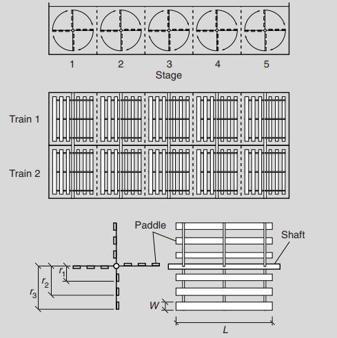
  - **Hình này chứng minh điều gì**
    - Cấu tạo bố trí hai đơn nguyên chạy song song (Train 1, Train 2), mỗi đơn nguyên gồm 5 bậc (Stages 1–5) nối tiếp với hai guồng cánh khuấy trên một trục ngang.
  - **Từ đâu mà thấy được**
    - Mặt bằng (phần giữa): 2 đơn nguyên (Train 1 và Train 2), mỗi đơn nguyên chia 5 ngăn nối tiếp với vách ngăn hướng dòng.
    - Mặt cắt đứng (phần trên): 5 bậc cánh guồng quay trên trục ngang qua từng ngăn.
    - Chi tiết cánh guồng (phần dưới): Mỗi guồng có 4 tay đòn (chữ thập), mỗi tay mang 3 thanh cánh khuấy bản phẳng ở bán kính $r_1 = 0{,}67\text{ m}$, $r_2 = 1{,}33\text{ m}$, $r_3 = 2{,}0\text{ m}$, chiều rộng cánh $W$ và chiều dài cánh $L$.
- **Quy tắc áp dụng**
  - Thể tích một ngăn: $V_{\text{comp}} = \frac{Q_{\text{total}} \cdot t_{\text{total}}}{N_{\text{train}} \cdot N_{\text{stage}}}$.
  - Bố trí kích thước hình học ngăn:
    - Bán kính ngoài cùng của guồng $r_3 = 2{,}00\text{ m} \implies$ đường kính quay ngoài cùng $D_w = 2 \times (2{,}00 + 0{,}15/2) = 4{,}15\text{ m}$. Chọn chiều sâu nước $H = 5{,}0\text{ m}$ (khoảng hở đáy và mặt nước $0{,}425\text{ m}$).
    - Chiều rộng ngăn dọc trục: $W_{\text{comp}} = 2 \cdot L_p + \text{hở giữa} + 2 \cdot \text{hở thành} = 2 \times 3{,}0 + 1{,}0 + 2 \times 0{,}7 = 8{,}4\text{ m}$.
    - Chiều dài ngăn theo phương dòng chảy: $L_{\text{comp}} = \frac{V_{\text{comp}}}{W_{\text{comp}} \cdot H}$.
  - Công suất tiêu tán bởi lực cản của các thanh bản cánh:
    $$P = \frac{1}{2} C_D \cdot \rho \cdot (1 - k)^3 \cdot (2\pi N)^3 \cdot \sum (A_i \cdot r_i^3)$$
    trong đó $A_i$ là tổng diện tích các bản cánh ở bán kính $r_i$ ($A_i = N_{\text{wheel}} \cdot N_{\text{arm}} \cdot L_p \cdot w$).
  - Công suất Camp-Stein: $P = \mu \cdot V_{\text{comp}} \cdot G^2$.
  - Mô-men xoắn trên trục cánh khuấy: $T_{\text{torque}} = \frac{P}{2\pi N}$.
  - Gradient vận tốc trung bình và tích số Camp:
    $$G_{\text{avg}} = \frac{\sum G_i}{N_{\text{stage}}}$$
    $$(Gt)_{\text{total}} = G_{\text{avg}} \cdot t_{\text{total}}$$
- **Lời giải**
  - **Bước 1**: Tính thể tích và kích thước hình học ngăn tạo bông.
    - Căn cứ: Tổng thể tích $V_{\text{total}} = 1{,}7361\text{ m}^3\text{/s} \times 1200\text{ s} = 2083{,}33\text{ m}^3$.
    - Nhìn vào: Hệ thống có 2 đơn nguyên $\times 5$ bậc $= 10$ ngăn.
    - Thể tích một ngăn: $V_{\text{comp}} = \frac{2083{,}33\text{ m}^3}{10} = 208{,}33\text{ m}^3$.
    - Thời gian lưu mỗi bậc: $t_i = 1200\text{ s} / 5 = 240\text{ s} = 4{,}0\text{ phút}$.
    - Kích thước hình học:
      - Chiều sâu nước: $H = 5{,}0\text{ m}$.
      - Chiều rộng ngăn dọc trục: $W_{\text{comp}} = 8{,}4\text{ m}$ (chứa 2 bánh guồng $3{,}0\text{ m}$, khoảng cách tim-thành $0{,}7\text{ m}$, khoảng cách hai guồng $1{,}0\text{ m}$).
      - Chiều dài ngăn theo chiều dòng:
        $$L_{\text{comp}} = \frac{V_{\text{comp}}}{W_{\text{comp}} \cdot H} = \frac{208{,}33\text{ m}^3}{8{,}4\text{ m} \times 5{,}0\text{ m}} = 4{,}96\text{ m} \approx 5{,}0\text{ m}$$
  - **Bước 2**: Tính diện tích cánh khuấy và kiểm tra tỷ lệ diện tích cản.
    - Căn cứ: Trong một ngăn có $2\text{ wheels} \times 4\text{ arms} \times 3\text{ boards} = 24$ cánh khuấy bản phẳng.
    - Nhìn vào: Diện tích một cánh khuấy $A_{\text{board}} = 3{,}0\text{ m} \times 0{,}15\text{ m} = 0{,}45\text{ m}^2$.
    - Tổng diện tích cánh: $A_{\text{total}} = 24 \times 0{,}45\text{ m}^2 = 10{,}8\text{ m}^2$.
    - Diện tích hình chiếu cản dòng của các cánh khuấy trên mặt đứng đối xứng:
      $$A_{\text{projected}} = 2\text{ wheels} \times 2\text{ arms} \times 3\text{ boards} \times 0{,}45\text{ m}^2 = 5{,}4\text{ m}^2$$
      Diện tích mặt cắt ướt ngang bể: $A_{\text{cross}} = W_{\text{comp}} \times H = 8{,}4\text{ m} \times 5{,}0\text{ m} = 42{,}0\text{ m}^2$.
      Tỷ lệ diện tích cản:
      $$\frac{A_{\text{projected}}}{A_{\text{cross}}} = \frac{5{,}4\text{ m}^2}{42{,}0\text{ m}^2} = 12{,}86\% < 20\%$$
      (Thỏa mãn tiêu chuẩn không vượt quá $15 - 20\%$ để chống hiện tượng nước xoay đồng tốc).
  - **Bước 3**: Thiết lập phương trình thủy lực quan hệ giữa công suất $P$ và tốc độ quay $N$.
    - Căn cứ: Tại mỗi bán kính $r_i$, tổng diện tích các cánh khuấy là $A_i = 2\text{ wheels} \times 4\text{ arms} \times 0{,}45\text{ m}^2 = 3{,}60\text{ m}^2$.
    - Nhìn vào: Bán kính các thanh $r_1 = 0{,}67\text{ m}$, $r_2 = 1{,}33\text{ m}$, $r_3 = 2{,}00\text{ m}$.
      $$\sum r_i^3 = (0{,}67)^3 + (1{,}33)^3 + (2{,}00)^3 = 0{,}3008 + 2{,}3526 + 8{,}0000 = 10{,}6534\text{ m}^3$$
    - Công thức công suất:
      $$P = \frac{1}{2} C_D \cdot \rho \cdot (1 - k)^3 \cdot (2\pi N)^3 \cdot A_i \cdot \sum r_i^3$$
      Thay số: $C_D = 1{,}50$, $\rho = 997\text{ kg/m}^3$, $1 - k = 0{,}75$, $2\pi = 6{,}2832$:
      $$P = 0{,}5 \times 1{,}50 \times 997 \times (0{,}75 \times 6{,}2832 \times N)^3 \times 3{,}60 \times 10{,}6534$$
      $$P = 747{,}75 \times (4{,}7124 \times N)^3 \times 38{,}352 \approx 742\,880 \cdot N^3\text{ (W)}$$
      (với $N$ tính bằng số vòng trên giây, $\text{rev/s}$).
  - **Bước 4**: Tính công suất yêu cầu, tốc độ quay và mô-men xoắn cho từng bậc ($G = 50 \rightarrow 10\text{ s}^{-1}$).
    - Căn cứ: Công suất truyền vào nước mỗi ngăn:
      $$P = \mu \cdot V_{\text{comp}} \cdot G^2 = 0{,}000890\text{ Pa}\cdot\text{s} \times 208{,}33\text{ m}^3 \times G^2 = 0{,}18541 \cdot G^2\text{ (W)}$$
      Tốc độ quay: $N = \left(\frac{P}{742\,880}\right)^{1/3}$ ($\text{rev/s}$), quy đổi $\text{rpm} = N \times 60$.
      Mô-men xoắn: $T_{\text{torque}} = \frac{P}{2\pi N}$ ($\text{N}\cdot\text{m}$).
    - Nhìn vào từng bậc:
      - **Bậc 1 ($G_1 = 50\text{ s}^{-1}$)**:
        $$P_1 = 0{,}18541 \times 50^2 = 463{,}5\text{ W}$$
        $$N_1 = \left(\frac{463{,}5}{742\,880}\right)^{1/3} = (6{,}239 \times 10^{-4})^{1/3} \approx 0{,}08545\text{ rev/s} = 5{,}13\text{ rpm}$$
        $$T_{\text{torque}, 1} = \frac{463{,}5}{2\pi \times 0{,}08545} = 863{,}3\text{ N}\cdot\text{m}$$
        Vận tốc mép ngoài cùng ($r = 2{,}075\text{ m}$): $v_1 = 2\pi \times 0{,}08545 \times 2{,}075 = 1{,}11\text{ m/s} \le 1{,}2\text{ m/s}$ (đạt).
      - **Bậc 2 ($G_2 = 40\text{ s}^{-1}$)**:
        $$P_2 = 0{,}18541 \times 40^2 = 296{,}7\text{ W}$$
        $$N_2 = \left(\frac{296{,}7}{742\,880}\right)^{1/3} \approx 0{,}07368\text{ rev/s} = 4{,}42\text{ rpm}$$
        $$T_{\text{torque}, 2} = \frac{296{,}7}{2\pi \times 0{,}07368} = 640{,}8\text{ N}\cdot\text{m}$$
      - **Bậc 3 ($G_3 = 30\text{ s}^{-1}$)**:
        $$P_3 = 0{,}18541 \times 30^2 = 166{,}9\text{ W}$$
        $$N_3 = \left(\frac{166{,}9}{742\,880}\right)^{1/3} \approx 0{,}06079\text{ rev/s} = 3{,}65\text{ rpm}$$
        $$T_{\text{torque}, 3} = \frac{166{,}9}{2\pi \times 0{,}06079} = 437{,}0\text{ N}\cdot\text{m}$$
      - **Bậc 4 ($G_4 = 20\text{ s}^{-1}$)**:
        $$P_4 = 0{,}18541 \times 20^2 = 74{,}2\text{ W}$$
        $$N_4 = \left(\frac{74{,}2}{742\,880}\right)^{1/3} \approx 0{,}04639\text{ rev/s} = 2{,}78\text{ rpm}$$
        $$T_{\text{torque}, 4} = \frac{74{,}2}{2\pi \times 0{,}04639} = 254{,}7\text{ N}\cdot\text{m}$$
      - **Bậc 5 ($G_5 = 10\text{ s}^{-1}$)**:
        $$P_5 = 0{,}18541 \times 10^2 = 18{,}5\text{ W}$$
        $$N_5 = \left(\frac{18{,}5}{742\,880}\right)^{1/3} \approx 0{,}02923\text{ rev/s} = 1{,}75\text{ rpm}$$
        $$T_{\text{torque}, 5} = \frac{18{,}5}{2\pi \times 0{,}02923} = 100{,}8\text{ N}\cdot\text{m}$$
        Vận tốc mép ngoài cùng: $v_5 = 2\pi \times 0{,}02923 \times 2{,}075 = 0{,}38\text{ m/s}$ (rất êm dịu, bảo toàn bông cặn cực đại).
  - **Bước 5**: Tính gradient vận tốc trung bình và tích số Camp ($Gt$).
    - Căn cứ: Do thời gian lưu các bậc bằng nhau ($t_i = 240\text{ s}$):
      $$G_{\text{avg}} = \frac{50 + 40 + 30 + 20 + 10}{5} = 30{,}0\text{ s}^{-1}$$
      Tích số Camp tổng cộng của công trình:
      $$(Gt)_{\text{total}} = G_{\text{avg}} \cdot t_{\text{total}} = 30{,}0\text{ s}^{-1} \times 1200\text{ s} = 36\,000$$
- **Kết quả**: 
  - 1. Kích thước hình học mỗi ngăn: Chiều dài $L = 5{,}0\text{ m}$, Chiều rộng $W = 8{,}4\text{ m}$, Chiều sâu nước $H = 5{,}0\text{ m}$ (Thể tích $V_{\text{comp}} = 208{,}3\text{ m}^3$).
  - 2. Diện tích cánh khuấy: $10{,}8\text{ m}^2$/ngăn; Tỷ lệ diện tích cản $12{,}86\% < 20\%$.
  - 3. Phương trình quan hệ công suất: $P = 742\,880 \cdot N^3$ ($\text{W}$, với $N$ tính bằng $\text{rev/s}$).
  - 4. Thông số vận hành từng bậc:
    - Bậc 1 ($G = 50\text{ s}^{-1}$): $P = 463{,}5\text{ W}$, $N = 5{,}13\text{ rpm}$, Torque $= 863{,}3\text{ N}\cdot\text{m}$.
    - Bậc 2 ($G = 40\text{ s}^{-1}$): $P = 296{,}7\text{ W}$, $N = 4{,}42\text{ rpm}$, Torque $= 640{,}8\text{ N}\cdot\text{m}$.
    - Bậc 3 ($G = 30\text{ s}^{-1}$): $P = 166{,}9\text{ W}$, $N = 3{,}65\text{ rpm}$, Torque $= 437{,}0\text{ N}\cdot\text{m}$.
    - Bậc 4 ($G = 20\text{ s}^{-1}$): $P = 74{,}2\text{ W}$, $N = 2{,}78\text{ rpm}$, Torque $= 254{,}7\text{ N}\cdot\text{m}$.
    - Bậc 5 ($G = 10\text{ s}^{-1}$): $P = 18{,}5\text{ W}$, $N = 1{,}75\text{ rpm}$, Torque $= 100{,}8\text{ N}\cdot\text{m}$.
  - 5. Gradient vận tốc trung bình $G_{\text{avg}} = 30{,}0\text{ s}^{-1}$; Tích số Camp $(Gt)_{\text{total}} = 36\,000$.
- **Kiểm tra lại**:
  - Tích số Camp $36\,000$ nằm hoàn toàn trong phạm vi tối ưu chuẩn mực ($20\,000 - 100\,000$).
  - Vận tốc mép cánh ngoài cùng giảm dần từ $1{,}11\text{ m/s}$ (dưới ngưỡng cực đại $1{,}2\text{ m/s}$) xuống $0{,}38\text{ m/s}$, bảo đảm phân phối động năng va chạm tạo bông tối ưu mà không gây vỡ bông cặn keo tụ trước khi chuyển tiếp sang bể lắng.

### Chương 4: Khử Sắt và Mangan (Removal of Iron & Manganese)

#### 4.1 Tổng quan về Sắt và Mangan trong nguồn nước

##### 4.1.1 Hiện diện, Dạng hóa học và Quy chuẩn chất lượng

- Sắt ($\text{Fe}$) và mangan ($\text{Mn}$) thường xuất hiện đồng thời trong nguồn nước tự nhiên:
  - Công nghệ xử lý tương tự nhau, do đó hai kim loại được nhóm chung để khảo sát và lựa chọn giải pháp kỹ thuật.
  - Sắt và mangan cần loại bỏ khỏi nước vì lý do thẩm mỹ (*aesthetic reasons*) và lý do vận hành (*operational reasons*).
- Tiêu chuẩn chất lượng nước cấp (QCVN 01: 2009/BYT):
  - Giới hạn nồng độ sắt tổng cộng: $0.3\text{ mg/L}$.
  - Giới hạn nồng độ mangan tổng cộng: $0.3\text{ mg/L}$.
- Trạng thái hòa tan phụ thuộc vào dạng oxy hóa hoặc dạng khử của kim loại:
  - Dạng oxy hóa (*oxidized form*) [$\text{Fe(III)}$ và $\text{Mn(IV)}$]: Rất khó tan (*quite insoluble*), hình thành cặn kết tủa.
  - Dạng khử (*reduced forms*) [$\text{Fe(II)}$ và $\text{Mn(II)}$]: Rất dễ tan (*very soluble*), tồn tại dạng ion hòa tan $\text{Fe}^{2+}$ và $\text{Mn}^{2+}$.
- Nồng độ sắt và mangan trong nước ngầm (*groundwater*):
  - Thường xuất hiện ở dải nồng độ thấp tính theo $\text{mg/L}$ (*low mg/L range*).
  - Trong nước ngầm có độ kiềm thấp (*low alkalinity*), nồng độ $\text{Fe}^{2+}$ có thể đạt $10\text{ mg/L}$ hoặc cao hơn.
  - Nồng độ $\text{Mn}^{2+}$ dao động trong khoảng từ $0.1$ đến $2.0\text{ mg/L}$.

##### 4.1.2 Tác hại cảm quan: Nước đỏ, Vết ố và Vị lạ

- Dạng oxy hóa [$\text{Fe(III)}$ và $\text{Mn(IV)}$] làm đổi màu nước, gây ố bẩn thiết bị vệ sinh (*fixtures*) và quần áo (*clothing*).
- Tác hại thẩm mỹ đặc trưng do sắt ($\text{Fe}$):
  - Hiện tượng nước đỏ (*red water*).
  - Vết ố màu nâu đỏ (*reddish brown stains*) bám trên thiết bị phụ trợ đường ống và thiết bị vệ sinh (*plumbing fixtures*).
  - Vị lạ khó chịu (*off tastes*) phát sinh do phản ứng với axit tannic (*tannic acids*) có trong trà và cà phê.
- Tác hại thẩm mỹ đặc trưng do mangan ($\text{Mn}$):
  - Vết ố màu đen hoặc xám (*black or gray stains*) bám trên thiết bị vệ sinh (*plumbing fixtures*) và đồ giặt (*laundry*).

##### 4.1.3 Lắng đọng khoáng chất và Sự cố mạng lưới cấp nước

- Sự cố vận hành phát sinh do kết tủa khoáng chất sắt và mangan trong hệ thống phân phối nước (*water distribution systems*):
  - Tích tụ và ứ đọng cặn lắng nghiêm trọng tại các đoạn ống cụt (*dead-end mains*).
  - Cặn kết tủa bám dày bên trong thành ống phân phối (*inside distribution pipes*).
  - Cặn kết tủa bị cuốn xới và tái lơ lửng (*resuspended*) trong các giai đoạn nhu cầu tiêu thụ cao (*periods of high demand*) hoặc khi xảy ra hiện tượng đổi chiều dòng chảy (*flow reversal*).

##### 4.1.4 Màng sinh học và Vi khuẩn sắt mangan trong đường ống

- Sự phát triển của vi khuẩn sắt và mangan (*iron and manganese bacteria*) gây sự cố vận hành phức tạp trong mạng lưới:
  - Nhiều chủng vi khuẩn sắt và mangan tạo lớp chất nền sinh học bảo vệ đáng kể chống lại quá trình khử trùng bằng clo (*protection from chlorine disinfection*).
- Các tác động tiêu cực khác do sự phát triển của vi khuẩn sắt và mangan:
  - Giảm đáng kể năng lực truyền dẫn của tuyến ống (*significant reduction in pipeline capacity*).
  - Tắc nghẽn đồng hồ đo lưu lượng (*meters*) và các loại van (*valves*).
  - Gây biến đổi màu nước (*discoloration of water*).
  - Phát sinh mùi vị lạ khó chịu (*off tastes*).
  - Gia tăng nhu cầu tiêu thụ clo (*increased chlorine demand*) trên mạng lưới cấp nước.

#### 4.2 Cơ chế hóa học oxy hóa Khử Sắt và Mangan

##### 4.2.1 Cơ chế oxy hóa và Phản ứng hóa học với các chất oxy hóa

###### 4.2.1.1 Nguyên lý chuyển hóa dạng hòa tan sang dạng kết tủa
- Phương pháp khử sắt (iron) và mangan (manganese) phổ biến nhất dựa trên quá trình chuyển hóa các dạng khử hòa tan thành các dạng oxy hóa không tan:
  - Ở dạng khử ($\text{reduced forms}$ gồm $\text{Fe}^{2+}$ và $\text{Mn}^{2+}$), các hợp chất kim loại tan hoàn toàn trong nước.
  - Ở dạng oxy hóa ($\text{oxidized forms}$ gồm $\text{Fe}^{3+}$ và $\text{Mn}^{4+}$), sắt và mangan kết tủa thành bông cặn không tan ($\text{Fe(OH)}_3\downarrow$ và $\text{MnO}_2\downarrow$).
  - Các hạt cặn kết tủa được tách loại hoàn toàn khỏi dòng nước bằng các công đoạn lắng trọng lực và lọc hạt.
- Các hóa chất oxy hóa thông dụng theo thực tế địa lý:
  - Tại Hoa Kỳ (United States): Không khí ($\text{air}$ / oxy hòa tan), clo ($\text{chlorine}$), clo đioxit ($\text{chlorine dioxide}$) và pemanganat ($\text{permanganate}$ / thuốc tím).
  - Tại Châu Âu (Europe): Ozone ($\text{ozone}$) đã được áp dụng thành công và đạt hiệu quả xử lý cao.

###### 4.2.1.2 Phản ứng oxy hóa bằng Oxy hòa tan (không khí làm thoáng - O2)
- Phản ứng oxy hóa sắt bằng không khí (làm thoáng cấp oxy):
  - Dạng phân tử bicacbonat:
    $$4\text{Fe}(\text{HCO}_3)_2 + \text{O}_2 + 2\text{H}_2\text{O} = 4\text{Fe}(\text{OH})_3\downarrow + 8\text{CO}_2$$
  - Dạng ion thủy phân:
    $$4\text{Fe}^{2+} + \text{O}_2 + 10\text{H}_2\text{O} = 4\text{Fe}(\text{OH})_3\downarrow + 8\text{H}^+$$
  - Cơ chế oxy hóa - thủy phân hai bước:
    $$4\text{Fe}^{2+} + \text{O}_2 + 4\text{H}^+ \rightarrow 4\text{Fe}^{3+} + 2\text{H}_2\text{O}$$
    $$\text{Fe}^{3+} + 3\text{H}_2\text{O} \rightarrow \text{Fe}(\text{OH})_3\downarrow + 3\text{H}^+$$
  - Tỷ lệ hóa học lý thuyết: $1\text{ mol } \text{O}_2$ ($32\text{ g}$) oxy hóa được $4\text{ mol } \text{Fe}$ ($4 \times 55{,}85 = 223{,}4\text{ g}$).
  - Định mức tiêu thụ lý thuyết: $\frac{32}{223{,}4} \approx 0{,}143\text{ mg } \text{O}_2 / \text{mg } \text{Fe}^{2+}$ (làm tròn $0{,}14\text{ mg/mg}$).
  - Ảnh hưởng đến độ kiềm: Quá trình giải phóng ion $\text{H}^+$, tiêu thụ $1{,}79\text{ mg/L}$ độ kiềm ($\text{tính theo CaCO}_3$) cho mỗi $1\text{ mg/L } \text{Fe}^{2+}$ bị oxy hóa.
- Phản ứng oxy hóa mangan bằng không khí:
  - Dạng phân tử trong môi trường bicacbonat canxi:
    $$2\text{MnSO}_4 + 2\text{Ca}(\text{HCO}_3)_2 + \text{O}_2 = 2\text{MnO}_2\downarrow + 2\text{CaSO}_4 + 2\text{H}_2\text{O} + 4\text{CO}_2$$
  - Dạng ion thủy phân:
    $$2\text{Mn}^{2+} + \text{O}_2 + 2\text{H}_2\text{O} = 2\text{MnO}_2\downarrow + 4\text{H}^+$$
  - Tỷ lệ hóa học lý thuyết: $1\text{ mol } \text{O}_2$ ($32\text{ g}$) oxy hóa được $2\text{ mol } \text{Mn}$ ($2 \times 54{,}94 = 109{,}88\text{ g}$).
  - Định mức tiêu thụ lý thuyết: $\frac{32}{109{,}88} \approx 0{,}291\text{ mg } \text{O}_2 / \text{mg } \text{Mn}^{2+}$ (làm tròn $0{,}29\text{ mg/mg}$).
  - Tiêu thụ độ kiềm: Mỗi $1\text{ mg/L } \text{Mn}^{2+}$ bị oxy hóa tiêu thụ $1{,}82\text{ mg/L}$ độ kiềm ($\text{tính theo CaCO}_3$).

###### 4.2.1.3 Phản ứng oxy hóa bằng Clo tự do (Chlorine - Cl2)
- Phản ứng oxy hóa sắt bằng clo:
  - Dạng phân tử khí clo hòa tan:
    $$2\text{Fe}^{2+} + \text{Cl}_2 + 6\text{H}_2\text{O} = 2\text{Fe}(\text{OH})_3\downarrow + 2\text{Cl}^- + 6\text{H}^+$$
  - Dạng axit hypoclorơ ($\text{HOCl}$, dạng khử trùng chiếm ưu thế ở $\text{pH} = 6{,}5 - 7{,}5$):
    $$2\text{Fe}^{2+} + \text{HOCl} + 5\text{H}_2\text{O} = 2\text{Fe}(\text{OH})_3\downarrow + \text{Cl}^- + 5\text{H}^+$$
  - Tỷ lệ hóa học lý thuyết: $1\text{ mol } \text{Cl}_2$ ($70{,}9\text{ g}$) oxy hóa $2\text{ mol } \text{Fe}$ ($111{,}7\text{ g}$).
  - Định mức clo lý thuyết: $\frac{70{,}9}{111{,}7} \approx 0{,}635\text{ mg } \text{Cl}_2 / \text{mg } \text{Fe}^{2+}$ (giá trị thực nghiệm trong bảng là $0{,}63\text{ mg/mg}$; trong tính toán kỹ thuật thường dùng $0{,}64\text{ mg/mg}$).
- Phản ứng oxy hóa mangan bằng clo:
  - Dạng phân tử clo:
    $$\text{Mn}^{2+} + \text{Cl}_2 + 2\text{H}_2\text{O} = \text{MnO}_2\downarrow + 2\text{Cl}^- + 4\text{H}^+$$
  - Dạng axit hypoclorơ ($\text{HOCl}$):
    $$\text{Mn}^{2+} + \text{HOCl} + \text{H}_2\text{O} = \text{MnO}_2\downarrow + \text{Cl}^- + 3\text{H}^+$$
  - Tỷ lệ hóa học lý thuyết: $1\text{ mol } \text{Cl}_2$ ($70{,}9\text{ g}$) oxy hóa $1\text{ mol } \text{Mn}$ ($54{,}94\text{ g}$).
  - Định mức clo lý thuyết: $\frac{70{,}9}{54{,}94} \approx 1{,}290\text{ mg } \text{Cl}_2 / \text{mg } \text{Mn}^{2+}$ (giá trị thực nghiệm trong bảng là $1{,}28\text{ mg/mg}$; trong tính toán kỹ thuật thường dùng $1{,}29\text{ mg/mg}$).

###### 4.2.1.4 Phản ứng oxy hóa bằng Thuốc tím (Potassium Permanganate - KMnO4)
- Phản ứng oxy hóa sắt bằng thuốc tím:
  - Phương trình phản ứng phân tử:
    $$3\text{Fe}^{2+} + \text{KMnO}_4 + 7\text{H}_2\text{O} = 3\text{Fe}(\text{OH})_3\downarrow + \text{MnO}_2\downarrow + \text{K}^+ + 5\text{H}^+$$
  - Phương trình phản ứng ion thu gọn:
    $$3\text{Fe}^{2+} + \text{MnO}_4^- + 7\text{H}_2\text{O} = 3\text{Fe}(\text{OH})_3\downarrow + \text{MnO}_2\downarrow + 5\text{H}^+$$
  - Tỷ lệ hóa học lý thuyết: $1\text{ mol } \text{KMnO}_4$ ($158{,}03\text{ g}$) oxy hóa được $3\text{ mol } \text{Fe}$ ($3 \times 55{,}85 = 167{,}55\text{ g}$).
  - Định mức thuốc tím lý thuyết: $\frac{158{,}03}{167{,}55} \approx 0{,}943\text{ mg } \text{KMnO}_4 / \text{mg } \text{Fe}^{2+}$ (chuẩn định mức thực tế: $0{,}94\text{ mg/mg}$).
  - Tác dụng cộng hưởng của sản phẩm: Kết tủa $\text{MnO}_2$ sinh ra có hoạt tính hấp phụ và xúc tác oxy hóa bề mặt đối với mangan.
- Phản ứng oxy hóa mangan bằng thuốc tím:
  - Phương trình phản ứng phân tử:
    $$3\text{Mn}^{2+} + 2\text{KMnO}_4 + 2\text{H}_2\text{O} = 5\text{MnO}_2\downarrow + 2\text{K}^+ + 4\text{H}^+$$
  - Phương trình phản ứng ion thu gọn:
    $$3\text{Mn}^{2+} + 2\text{MnO}_4^- + 2\text{H}_2\text{O} = 5\text{MnO}_2\downarrow + 4\text{H}^+$$
  - Tỷ lệ hóa học lý thuyết: $2\text{ mol } \text{KMnO}_4$ ($316{,}06\text{ g}$) oxy hóa được $3\text{ mol } \text{Mn}^{2+}$ ($164{,}82\text{ g}$).
  - Định mức thuốc tím lý thuyết: $\frac{316{,}06}{164{,}82} \approx 1{,}918\text{ mg } \text{KMnO}_4 / \text{mg } \text{Mn}^{2+}$ (chuẩn định mức thực tế: $1{,}92\text{ mg/mg}$).

###### 4.2.1.5 Phản ứng oxy hóa bằng Ozone (O3) và Clo đioxit (Chlorine Dioxide - ClO2)
- Phản ứng oxy hóa bằng ozone ($\text{O}_3$):
  - Oxy hóa sắt dạng ion:
    $$2\text{Fe}^{2+} + \text{O}_3 + 5\text{H}_2\text{O} = 2\text{Fe}(\text{OH})_3\downarrow + \text{O}_2\uparrow + 4\text{H}^+$$
    - Định mức tiêu thụ ozone cho sắt: $0{,}43\text{ mg } \text{O}_3 / \text{mg } \text{Fe}$.
  - Oxy hóa mangan dạng ion:
    $$\text{Mn}^{2+} + \text{O}_3 + \text{H}_2\text{O} = \text{MnO}_2\downarrow + \text{O}_2\uparrow + 2\text{H}^+$$
    - Định mức tiêu thụ ozone cho mangan: $0{,}67\text{ mg } \text{O}_3 / \text{mg } \text{Mn}$.
  - Nguy cơ quá liều ozone: Châm dư thừa ozone oxy hóa tiếp $\text{MnO}_2$ thành ion pemanganat hòa tan ($\text{MnO}_4^-$), gây hiện tượng nước màu hồng (pink water):
    $$2\text{MnO}_2 + 3\text{O}_3 + \text{H}_2\text{O} \rightarrow 2\text{MnO}_4^- + 3\text{O}_2 + 2\text{H}^+$$
- Phản ứng oxy hóa bằng clo đioxit ($\text{ClO}_2$):
  - Oxy hóa sắt dạng ion:
    $$\text{Fe}^{2+} + \text{ClO}_2 + 3\text{H}_2\text{O} = \text{Fe}(\text{OH})_3\downarrow + \text{ClO}_2^- + 3\text{H}^+$$
    - Định mức tiêu thụ clo đioxit cho sắt: $1{,}2\text{ mg } \text{ClO}_2 / \text{mg } \text{Fe}$.
  - Oxy hóa mangan dạng ion:
    $$\text{Mn}^{2+} + 2\text{ClO}_2 + 2\text{H}_2\text{O} = \text{MnO}_2\downarrow + 2\text{ClO}_2^- + 4\text{H}^+$$
    - Định mức tiêu thụ clo đioxit cho mangan: $2{,}4\text{ mg } \text{ClO}_2 / \text{mg } \text{Mn}$.
  - Kiểm soát sản phẩm phụ vô cơ: Phản ứng tạo ra ion clorit ($\text{ClO}_2^-$), đòi hỏi giám sát để không vượt quá giới hạn sức khỏe theo quy chuẩn.

---

##### 4.2.2 Nhu cầu các chất oxy hóa cho sắt và mangan

###### 4.2.2.1 Bảng định mức tiêu thụ chất oxy hóa lý thuyết và thực nghiệm
- Bảng so sánh định mức tiêu thụ các tác nhân oxy hóa tính trên mỗi $\text{mg/L}$ kim loại ($\text{Oxidant Requirements for Iron and Manganese}$):
  - **Hình 1.** Bảng định mức nhu cầu chất oxy hóa cho sắt và mangan (Oxidant Requirements for Iron and Manganese)
    - 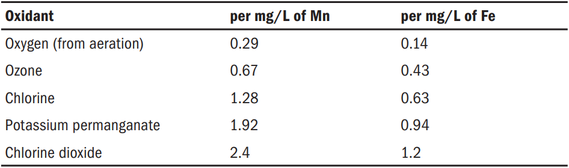
  - **Hình này chứng minh điều gì**
    - Định lượng nhu cầu chất oxy hóa lý thuyết và thực nghiệm cho mỗi mg/L Fe và Mn đối với 5 chất oxy hóa chính.
  - **Từ đâu mà thấy được**
    - Cột giá trị trên slide trang 6 thể hiện tỷ lệ định mức Mn/Fe dao động từ 1.56 đến 2.07.

| Tác nhân oxy hóa (Oxidant) | Định mức cho $\text{Mn}$ (per mg/L of Mn) | Định mức cho $\text{Fe}$ (per mg/L of Fe) | Tỷ lệ định mức ($\text{Mn} / \text{Fe}$) |
| :--- | :---: | :---: | :---: |
| Oxy (từ làm thoáng - Oxygen from aeration) | $0{,}29\text{ mg/L}$ | $0{,}14\text{ mg/L}$ | $2{,}07$ |
| Ozone ($\text{O}_3$) | $0{,}67\text{ mg/L}$ | $0{,}43\text{ mg/L}$ | $1{,}56$ |
| Clo ($\text{Cl}_2$ - Chlorine) | $1{,}28\text{ mg/L}$ | $0{,}63\text{ mg/L}$ | $2{,}03$ |
| Thuốc tím ($\text{KMnO}_4$ - Potassium permanganate) | $1{,}92\text{ mg/L}$ | $0{,}94\text{ mg/L}$ | $2{,}04$ |
| Clo đioxit ($\text{ClO}_2$ - Chlorine dioxide) | $2{,}40\text{ mg/L}$ | $1{,}20\text{ mg/L}$ | $2{,}00$ |

###### 4.2.2.2 Phân tích tương quan định mức tiêu thụ Fe và Mn
- Nhu cầu chất oxy hóa cho mỗi đơn vị khối lượng $\text{Mn}$ luôn cao hơn từ $1{,}5$ đến hơn $2$ lần so với $\text{Fe}$ trên mọi tác nhân:
  - Bản chất số electron trao đổi:
    - Quá trình oxy hóa sắt chuyển từ số oxy hóa $+2$ lên $+3$ ($\text{Fe}^{2+} \rightarrow \text{Fe}^{3+} + 1e^-$), chỉ trao đổi $1\text{ electron}$.
    - Quá trình oxy hóa mangan chuyển từ số oxy hóa $+2$ lên $+4$ ($\text{Mn}^{2+} \rightarrow \text{Mn}^{4+} + 2e^-$), trao đổi $2\text{ electron}$.
  - Tỷ khối đương lượng mol: Vì $\text{Mn}$ nhận $2e^-$ và có khối lượng nguyên tử tương đương ($54{,}94\text{ g/mol}$ so với $55{,}85\text{ g/mol}$ của $\text{Fe}$), nhu cầu đương lượng oxy hóa của $\text{Mn}$ về lý thuyết gấp đôi $\text{Fe}$.
- Công thức tính toán tổng lượng hóa chất oxy hóa khi nước thô chứa đồng thời cả $\text{Fe}^{2+}$ và $\text{Mn}^{2+}$:
  - Nhu cầu oxy hòa tan tổng cộng từ làm thoáng ($\text{DO}_{\text{demand}}$):
    $$\text{DO}_{\text{demand}} = 0{,}14 \cdot [\text{Fe}^{2+}] + 0{,}29 \cdot [\text{Mn}^{2+}]$$
  - Nhu cầu thuốc tím tổng cộng ($\text{Dose}_{\text{KMnO}_4}$):
    $$\text{Dose}_{\text{KMnO}_4} = 0{,}94 \cdot [\text{Fe}^{2+}] + 1{,}92 \cdot [\text{Mn}^{2+}]$$
  - Nhu cầu clo tự do tổng cộng ($\text{Cl}_{2,\text{demand}}$):
    $$\text{Cl}_{2,\text{demand}} = 0{,}63 \cdot [\text{Fe}^{2+}] + 1{,}28 \cdot [\text{Mn}^{2+}]$$
    (hoặc sử dụng hệ số lý thuyết tính toán $0{,}64 \cdot [\text{Fe}^{2+}] + 1{,}29 \cdot [\text{Mn}^{2+}]$).

---

##### 4.2.3 Thời gian phản ứng và Ảnh hưởng của pH

###### 4.2.3.1 Bảng thời gian phản ứng oxy hóa của các tác nhân
- Bảng tổng hợp thời gian phản ứng oxy hóa sắt và mangan đối với từng tác nhân ($\text{Oxidation Reaction Times for Iron and Manganese}$):
  - **Hình 4.** Thời gian phản ứng oxy hóa sắt và mangan (Oxidation Reaction Times for Iron and Manganese)
    - 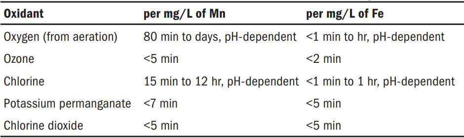
  - **Hình này chứng minh điều gì**
    - Thời gian phản ứng oxy hóa Mn luôn dài hơn Fe đáng kể, đặc biệt khi sử dụng oxy hòa tan từ làm thoáng.
  - **Từ đâu mà thấy được**
    - Cột thời gian phản ứng trên slide trang 7 cho thấy Mn cần từ 80 phút đến vài ngày đối với oxy, nhưng chỉ cần dưới 5-7 phút với KMnO4, ClO2, hoặc O3.

| Tác nhân oxy hóa (Oxidant) | Thời gian phản ứng cho $\text{Mn}$ (per mg/L of Mn) | Thời gian phản ứng cho $\text{Fe}$ (per mg/L of Fe) | Đặc trưng phản ứng và mức độ phụ thuộc pH |
| :--- | :---: | :---: | :--- |
| Oxy (từ làm thoáng - Oxygen from aeration) | $80\text{ phút}$ đến vài ngày (days) | $< 1\text{ phút}$ đến $1\text{ giờ}$ (hr) | Phụ thuộc rất chặt chẽ vào $\text{pH}$; tốc độ oxy hóa $\text{Mn}$ cực chậm ở $\text{pH}$ thường |
| Ozone ($\text{O}_3$) | $< 5\text{ phút}$ | $< 2\text{ phút}$ | Phản ứng gần như tức thời; ít bị chi phối bởi dao động $\text{pH}$ |
| Clo ($\text{Cl}_2$ - Chlorine) | $15\text{ phút}$ đến $12\text{ giờ}$ | $< 1\text{ phút}$ đến $1\text{ giờ}$ | Phụ thuộc vào $\text{pH}$; khử $\text{Mn}$ yêu cầu môi trường kiềm ($\text{pH} \ge 8{,}0 - 8{,}5$) |
| Thuốc tím ($\text{KMnO}_4$) | $< 7\text{ phút}$ | $< 5\text{ phút}$ | Tốc độ phản ứng cao; diễn ra nhanh và triệt để trong dải $\text{pH} \ge 7{,}2$ |
| Clo đioxit ($\text{ClO}_2$) | $< 5\text{ phút}$ | $< 5\text{ phút}$ | Tốc độ phản ứng cao và đồng đều cho cả hai kim loại |

###### 4.2.3.2 Tác động của pH và thời gian lưu tiếp xúc (Detention Time)
- Động học oxy hóa bằng không khí diễn ra khá chậm (quite slow) và chịu sự kiểm soát nghiêm ngặt của $\text{pH}$:
  - Phản ứng oxy hóa sắt bằng oxy hòa tan:
    - Ở dải $\text{pH} = 7{,}5 - 8{,}0$, thời gian phản ứng oxy hóa sắt kéo dài từ $15\text{ phút}$ đến $60\text{ phút}$ ($15\text{ minutes}$ and $60\text{ minutes}$).
    - Yêu cầu thiết kế kỹ thuật: Thời gian lưu tối thiểu trong bể tiếp xúc sau làm thoáng ($\text{minimum detention time after aeration}$) là $30\text{ phút}$ ($30\text{ minutes}$).
  - Phản ứng oxy hóa mangan bằng oxy hòa tan:
    - Ở $\text{pH} = 9{,}5$, phản ứng oxy hóa mangan đòi hỏi thời gian tiếp xúc lên đến $60\text{ phút}$ ($60\text{ minutes}$).
    - Ở các giá trị $\text{pH}$ thấp hơn ($\text{pH} < 9{,}5$), quá trình oxy hóa mangan bằng không khí hoàn toàn không mang tính thực tế (not practical).
- Nguyên lý động học theo nồng độ ion hydroxyl ($\text{OH}^-$):
  - Tốc độ oxy hóa đồng thể tỷ lệ bậc 2 với nồng độ ion $\text{OH}^-$:
    $$r = -\frac{d[\text{M}^{2+}]}{dt} = k \cdot [\text{M}^{2+}] \cdot P_{\text{O}_2} \cdot [\text{OH}^-]^2$$
  - Khi tăng $\text{pH}$ lên $1$ đơn vị, nồng độ $[\text{OH}^-]$ tăng $10$ lần, khiến tốc độ phản ứng oxy hóa tăng gấp $100$ lần ($10^2$).

---

##### 4.2.4 Động học thực nghiệm khử Sắt (Fe2+) trong nước ngầm

###### 4.2.4.1 Bảng thực nghiệm làm thoáng kết hợp lọc đối với Fe2+
- Dữ liệu thực nghiệm khử $\text{Fe}^{2+}$ trong nước ngầm ($\text{Ground water}$) bằng làm thoáng kết hợp lọc ($\text{aeration followed by filtration}$) từ nồng độ ban đầu $[\text{Fe}^{2+}]_0 = 10{,}0\text{ mg/L}$:

| $\text{pH}$ | $[\text{Fe}^{2+}]_0\text{ (mg/L)}$ | Sau $15\text{ phút (mg/L)}$ | Sau $30\text{ phút (mg/L)}$ | Sau $60\text{ phút (mg/L)}$ | Mức độ chuyển hóa và đánh giá |
| :---: | :---: | :---: | :---: | :---: | :--- |
| $5{,}00$ | $10{,}0$ | $9{,}0$ | $9{,}0$ | $7{,}5$ | Oxy hóa cực chậm; sau $60\text{ phút}$ chỉ khử được $25\%$ sắt ban đầu. |
| $5{,}50$ | $10{,}0$ | $5{,}5$ | $4{,}6$ | $4{,}0$ | Tốc độ chuyển hóa thấp; sắt dư sau $60\text{ phút}$ vẫn vượt xa quy chuẩn. |
| $5{,}95$ | $10{,}0$ | $5{,}0$ | $4{,}0$ | $3{,}5$ | Đạt hiệu suất khử $65\%$ sau $60\text{ phút}$, hàm lượng còn lại $3{,}5\text{ mg/L}$. |
| $6{,}15$ | $10{,}0$ | $4{,}4$ | $3{,}5$ | $2{,}5$ | Tốc độ tăng chậm; sau $60\text{ phút}$ nồng độ sắt vẫn còn $2{,}5\text{ mg/L}$. |
| $6{,}50$ | $10{,}0$ | $2{,}8$ | $1{,}8$ | $0{,}3$ | Đạt giới hạn quy chuẩn QCVN 01-1:2018/BYT ($\le 0{,}3\text{ mg/L}$) tại mốc $60\text{ phút}$. |
| $6{,}65$ | $10{,}0$ | $0{,}7$ | $0{,}2$ | $0{,}1$ | Tốc độ tăng đột biến; đạt quy chuẩn sau $30\text{ phút}$ ($0{,}2\text{ mg/L}$) và đạt $0{,}1\text{ mg/L}$ sau $60\text{ phút}$. |
| $6{,}80$ | $10{,}0$ | $0{,}2$ | $0{,}1$ | $< 0{,}1$ | Đạt chuẩn ngay sau $15\text{ phút}$ ($0{,}2\text{ mg/L}$) và giảm xuống $< 0{,}1\text{ mg/L}$ sau $60\text{ phút}$. |
| $7{,}00$ | $10{,}0$ | $0{,}1$ | $< 0{,}1$ | $< 0{,}1$ | Phản ứng diễn ra rất nhanh; đạt $0{,}1\text{ mg/L}$ sau $15\text{ phút}$ và $< 0{,}1\text{ mg/L}$ sau $30\text{ phút}$. |
| $7{,}45$ | $10{,}0$ | $0{,}1$ | $< 0{,}1$ | $< 0{,}1$ | Tốc độ hoàn tất nhanh tương tự mức $\text{pH} = 7{,}00$. |
| $8{,}05$ | $10{,}0$ | $< 0{,}1$ | $< 0{,}1$ | $< 0{,}1$ | Phản ứng diễn ra tức thời; nồng độ sắt giảm xuống $< 0{,}1\text{ mg/L}$ ngay trong $15\text{ phút}$ đầu. |

###### 4.2.4.2 Quy luật động học khử Fe2+ theo ngưỡng pH và thời gian
- Quá trình oxy hóa sắt bằng không khí phân hóa rõ rệt thành ba vùng $\text{pH}$:
  - Vùng axit ($\text{pH} = 5{,}00 - 6{,}15$): Tốc độ phản ứng rất chậm do thiếu hụt ion $\text{OH}^-$. Lượng sắt dư sau $60\text{ phút}$ duy trì từ $2{,}5$ đến $7{,}5\text{ mg/L}$, không thể xử lý đạt chuẩn nếu không kiềm hóa.
  - Vùng chuyển tiếp ($\text{pH} = 6{,}50 - 6{,}65$): Tốc độ phản ứng gia tăng mạnh mẽ. Sau $60\text{ phút}$ tại $\text{pH} = 6{,}50$, nồng độ sắt đạt $0{,}3\text{ mg/L}$. Tại $\text{pH} = 6{,}65$, thời gian đạt tiêu chuẩn rút ngắn xuống còn $30\text{ phút}$.
  - Vùng kiềm và trung tính tối ưu ($\text{pH} \ge 6{,}80$): Tốc độ phản ứng bùng nổ, sắt kết tủa gần như hoàn toàn trong vòng $15\text{ phút}$ ($[\text{Fe}^{2+}] \le 0{,}2\text{ mg/L}$) và đạt triệt để $< 0{,}1\text{ mg/L}$ sau $30 - 60\text{ phút}$.
- Kết luận thiết kế công nghệ khử sắt:
  - Để dây chuyền làm thoáng - lắng - lọc vận hành hiệu quả với thời gian lưu thực tế $30\text{ phút}$, giá trị $\text{pH}$ của nước thô sau làm thoáng phải đạt tối thiểu $\ge 6{,}8 - 7{,}0$.
  - Nếu nguồn nước ngầm có $\text{pH} < 6{,}5$, quy trình bắt buộc phải kết hợp thoát khí $\text{CO}_2$ triệt để trên giàn mưa hoặc châm thêm hóa chất kiềm hóa ($\text{NaOH}, \text{Ca(OH)}_2$).

---

##### 4.2.5 Động học thực nghiệm khử Mangan (Mn2+) trong nước ngầm

###### 4.2.5.1 Bảng thực nghiệm làm thoáng kết hợp lọc đối với Mn2+
- Dữ liệu thực nghiệm khử $\text{Mn}^{2+}$ trong nước ngầm ($\text{Ground water}$) bằng làm thoáng kết hợp lọc ($\text{aeration followed by filtration}$) từ nồng độ ban đầu $[\text{Mn}^{2+}]_0 = 10{,}0\text{ mg/L}$:

| $\text{pH}$ | $[\text{Mn}^{2+}]_0\text{ (mg/L)}$ | Sau $15\text{ phút (mg/L)}$ | Sau $30\text{ phút (mg/L)}$ | Sau $60\text{ phút (mg/L)}$ | Mức độ chuyển hóa và đánh giá |
| :---: | :---: | :---: | :---: | :---: | :--- |
| $8{,}50$ | $10{,}0$ | $10{,}0$ | $10{,}0$ | $10{,}0$ | Hoàn toàn không diễn ra oxy hóa; nồng độ mangan giữ nguyên $100\%$ sau $60\text{ phút}$. |
| $9{,}00$ | $10{,}0$ | $10{,}0$ | $10{,}0$ | $9{,}0$ | Tốc độ cực kỳ chậm; sau $60\text{ phút}$ chỉ loại bỏ được $10\%$ hàm lượng mangan ($9{,}0\text{ mg/L}$). |
| $9{,}30$ | $10{,}0$ | $8{,}5$ | $8{,}0$ | $7{,}5$ | Chuyển hóa không đáng kể; sau $60\text{ phút}$ nồng độ mangan còn rất cao ($7{,}5\text{ mg/L}$). |
| $9{,}50$ | $10{,}0$ | $7{,}5$ | $5{,}0$ | $3{,}2$ | Phản ứng bắt đầu tăng tốc; sau $60\text{ phút}$ nồng độ giảm xuống $3{,}2\text{ mg/L}$. |
| $9{,}70$ | $10{,}0$ | $3{,}0$ | $1{,}3$ | $0{,}9$ | Tốc độ chuyển hóa cao; sau $60\text{ phút}$ hàm lượng mangan giảm còn $0{,}9\text{ mg/L}$. |
| $9{,}95$ | $10{,}0$ | $0{,}9$ | $0{,}7$ | $0{,}6$ | Hiệu suất khử đạt $> 90\%$ sau $15\text{ phút}$ ($0{,}9\text{ mg/L}$) và còn $0{,}6\text{ mg/L}$ sau $60\text{ phút}$. |
| $10{,}30$ | $10{,}0$ | $< 0{,}02$ | $< 0{,}02$ | $< 0{,}02$ | Phản ứng diễn ra tức thời và hoàn toàn; nồng độ đạt chuẩn khắt khe $< 0{,}02\text{ mg/L}$ ngay sau $15\text{ phút}$. |

###### 4.2.5.2 Quy luật động học khử Mn2+ theo ngưỡng pH và thời gian
- So sánh động học oxy hóa giữa $\text{Mn}^{2+}$ và $\text{Fe}^{2+}$:
  - Ở cùng dải $\text{pH} = 7{,}0 - 8{,}5$, trong khi $\text{Fe}^{2+}$ bị oxy hóa và kết tủa hoàn toàn chỉ trong vài phút, $\text{Mn}^{2+}$ hầu như không phản ứng với oxy hòa tan.
  - Phản ứng oxy hóa $\text{Mn}^{2+}$ chỉ bắt đầu xuất hiện rõ nét khi $\text{pH} \ge 9{,}30$ và chỉ đạt tốc độ xử lý hữu hiệu ở $\text{pH} \ge 9{,}50 - 10{,}0$.
  - Ở $\text{pH} = 10{,}30$, phản ứng oxy hóa và kết tủa diễn ra gần như tức thời, đưa nồng độ mangan dư về dưới ngưỡng vết $< 0{,}02\text{ mg/L}$ (thấp hơn nhiều so với tiêu chuẩn QCVN 01-1:2018/BYT là $\le 0{,}1\text{ mg/L}$).
- Giải pháp kỹ thuật trong thực tế công nghệ xử lý nước cấp:
  - Vì việc nâng $\text{pH}$ nguồn nước lên $\ge 9{,}5 - 10{,}3$ đòi hỏi lượng hóa chất kiềm hóa ($\text{vôi, xút}$) rất lớn và bắt buộc phải châm axit để trung hòa lại trước khi cấp vào mạng lưới, phương pháp làm thoáng oxy hóa đơn thuần bằng không khí không kinh tế đối với mangan.
  - Các nhà máy cấp nước áp dụng hai giải pháp thay thế chủ đạo:
    - Giải pháp 1: Sử dụng hóa chất oxy hóa mạnh như thuốc tím ($\text{KMnO}_4$), clo ($\text{Cl}_2$) hoặc ozone ($\text{O}_3$), cho phép phản ứng diễn ra nhanh ở dải $\text{pH}$ trung tính ($7{,}0 - 8{,}0$).
    - Giải pháp 2: Sử dụng công nghệ lọc xúc tác tiếp xúc với vật liệu lọc tráng phủ $\text{MnO}_2$ (như cát Greensand, hạt Birm, quặng Pyrolusite LayneOx™), tận dụng cơ chế hấp phụ bề mặt kết hợp tự xúc tác để oxy hóa mangan mà không cần nâng cao $\text{pH}$.

#### 4.3 Công nghệ và Công trình xử lý Sắt và Mangan

- Công nghệ khử sắt và mangan sử dụng các quá trình truyền khối pha khí - lỏng kết hợp oxy hóa và lọc:
  - Nước ngầm chứa sắt và mangan ở dạng khử hòa tan [$\text{Fe(II)}$ và $\text{Mn(II)}$] cần chuyển đổi thành dạng oxy hóa kết tủa không tan [$\text{Fe(III)}$ và $\text{Mn(IV)}$].
  - Dây chuyền công nghệ tiêu chuẩn kết hợp các công đoạn: làm thoáng (aeration) hoặc khử khí (air stripping), trung hòa $\text{pH}$, tiếp xúc phản ứng (contact aeration), lắng cặn và lọc qua các tầng vật liệu xúc tác.

##### 4.3.1 Nguyên lý truyền khối: Hấp thụ và Giải hấp (Khử khí)

- Quá trình làm thoáng (aeration) và thoát khí (air stripping) là hai quá trình đơn vị ($2\text{ unit processes}$) cốt lõi trong xử lý nước:
  - Cả hai quá trình vận dụng các nguyên lý truyền khối (mass transfer) để chuyển dịch các chất dễ bay hơi giữa pha lỏng (liquid phase) và pha khí (gaseous phase).
  - Quá trình tạo sự tiếp xúc mật thiết (intimate contact) giữa không khí và nước trên bề mặt tiếp xúc liên pha.

###### 4.3.1.1 Phân định hai chiều truyền khối: Giải hấp (Desorption) và Hấp thụ (Absorption)
- Quá trình giải hấp (Desorption / Air Stripping) tách hợp chất dễ bay hơi từ pha lỏng sang pha khí:
  - Chuyển các chất khí hòa tan không mong muốn từ nước vào không khí khí quyển:
    - Khí hydro sulfide ($\text{H}_2\text{S}$): Khử mùi trứng thối và giảm tải lượng chất khử tiêu hao chất oxy hóa.
    - Khí carbonic tự do ($\text{CO}_2$): Giảm nồng độ axit cacbonic, nâng cao giá trị $\text{pH}$ của nước tự nhiên và ổn định chỉ số bão hòa cacbonat.
    - Hợp chất hữu cơ dễ bay hơi ($\text{VOCs}$): Tách bỏ các dung môi clo hóa và hydrocarbon nhẹ ra khỏi nguồn nước thô.
  - Air stripping là một trong các quá trình giải hấp phổ biến nhất được sử dụng trong công nghệ xử lý nước cấp.
- Quá trình hấp thụ (Absorption / Aeration) hòa tan chất khí từ pha khí vào pha lỏng:
  - Chuyển khí từ môi trường không khí hòa tan vào trong thể tích nước:
    - Khí oxygen ($\text{O}_2$): Nâng cao nồng độ oxy hòa tan ($\text{DO}$) để phục vụ phản ứng oxy hóa ion $\text{Fe}^{2+}$ và $\text{Mn}^{2+}$.
    - Khí carbon dioxide ($\text{CO}_2$): Hòa tan trong một số trường hợp tái cacbonat hóa để điều chỉnh cân bằng kiềm.
  - Aeration đưa oxy vào nước là quá trình hấp thụ khí được áp dụng rộng rãi nhất trong xử lý nước cấp.

###### 4.3.1.2 Động học truyền khối theo Thuyết hai màng (Two-Film Theory)
- Cơ chế truyền khối liên pha qua màng chất lưu tiếp xúc:
  - Thuyết hai màng của Lewis và Whitman giả định tồn tại hai màng mỏng tĩnh (laminar boundary films) tại ranh giới tiếp xúc: màng khí và màng lỏng.
  - Động lực truyền khối là độ chênh lệch nồng độ chất khí giữa trạng thái bão hòa cân bằng và trạng thái thực tế trong lòng pha lỏng.
- Phương trình tốc độ truyền khối qua bề mặt liên pha:
  $$N_A = K_L (C^* - C_L)$$
  - $N_A$: Suất truyền khối chất tan qua một đơn vị diện tích bề mặt pha ($\text{mg}/(\text{m}^2\cdot\text{s})$ hoặc $\text{mol}/(\text{m}^2\cdot\text{s})$).
  - $K_L$: Hệ số truyền khối tổng quát pha lỏng ($\text{m/s}$).
  - $C^*$: Nồng độ bão hòa cân bằng của chất khí trong pha lỏng tại bề mặt tiếp xúc pha ($\text{mg/L}$), xác định theo Định luật Henry ($C^* = H \cdot P_g$).
  - $C_L$: Nồng độ thực tế của chất khí trong thể tích pha lỏng ($\text{mg/L}$).
- Phương trình biến thiên nồng độ khí hòa tan theo thời gian:
  $$\frac{dC}{dt} = K_L a \cdot (C_s - C)$$
  - $\frac{dC}{dt}$: Tốc độ biến thiên nồng độ khí hòa tan trong nước theo thời gian ($\text{mg}/(\text{L}\cdot\text{s})$).
  - $K_L a$: Hệ số truyền khối thể tích kết hợp ($\text{s}^{-1}$ hoặc $\text{h}^{-1}$).
  - $a$: Diện tích bề mặt tiếp xúc pha riêng trên một đơn vị thể tích lỏng ($\text{m}^2/\text{m}^3$).
  - $C_s$: Nồng độ bão hòa của khí ở nhiệt độ và áp suất môi trường ($\text{mg/L}$).
  - $C$: Nồng độ tức thời của khí hòa tan tại thời điểm $t$ ($\text{mg/L}$).
- Tác động công nghệ của việc gia tăng diện tích tiếp xúc riêng ($a$):
  - Thiết bị tiếp xúc không khí - nước (air–water contactors) gia tăng diện tích bề mặt tiếp xúc liên pha ($a$).
  - Tốc độ truyền khối của quá trình hấp thụ và giải hấp tăng hiệu quả hơn so với tốc độ khuếch tán tự nhiên qua mặt thoáng hở.
  - Tốc độ truyền khối tăng giúp rút ngắn thời gian tiếp xúc cần thiết và giảm thể tích công trình xử lý.

##### 4.3.2 Phân loại thiết bị tiếp xúc pha khí - lỏng

- Thiết bị truyền khí (gas transfer devices) được chia thành hai nhóm công nghệ chính dựa trên bản chất pha liên tục:
  - Nhóm 1: Thiết bị tiếp xúc pha khí (Gas-phase contactors).
  - Nhóm 2: Thiết bị tiếp xúc ngập lỏng (Flooded contactors).

###### 4.3.2.1 Thiết bị tiếp xúc pha khí liên tục (Gas-Phase Contactors)
- Cơ chế vận hành của thiết bị tiếp xúc pha khí:
  - Phân tán nước thành các tia, giọt nước nhỏ (droplets of water) hoặc màng nước mỏng rơi vào môi trường pha khí liên tục (continuous gas phase).
  - Tạo ra tỷ số diện tích bề mặt trên thể tích ($a/V$) rất lớn cho các hạt nước.
  - Tiêu hao năng lượng cấp khí thấp; thường tận dụng thông gió tự nhiên hoặc quạt thổi áp lực thấp.
- Các dạng công trình tiếp xúc pha khí điển hình:
  - Giàn làm thoáng nhiều tầng khay (Multiple tray aerator).
  - Dàn làm thoáng bậc tràn thác nước (Cascade aerator).
  - Tháp đệm làm thoáng tiếp xúc ngược dòng (Countercurrent packed tower).
  - Thiết bị làm thoáng khay lỗ biên dạng thấp (Low-profile or sieve tray aerator).
  - Giàn làm thoáng vòi phun mưa áp lực (Spray aerator).

###### 4.3.2.2 Thiết bị tiếp xúc pha lỏng liên tục (Flooded Contactors)
- Cơ chế vận hành của thiết bị tiếp xúc ngập lỏng:
  - Phân tán các bọt khí (bubbles of air) vào trong thể tích nước liên tục (continuous liquid phase).
  - Bọt khí nổi từ đáy lên đỉnh bể dưới tác dụng của lực đẩy Archimedes, tạo dòng tuần hoàn và truyền khối trực tiếp cho chất lỏng.
- Các cấu hình công trình ngập lỏng:
  - Bể sục khí nén với đĩa phân phối bọt khí mịn (Fine bubble diffused aeration tanks).
  - Thiết bị sục khí cơ học tuabin ngập nước (Submerged mechanical aerators).
  - Hệ thống sục khí phản lực (Jet aeration systems).
  - Ưu điểm: Hạn chế tắc nghẽn do bùn cặn sắt kết tủa và cho phép kiểm soát linh hoạt thời gian tiếp xúc của nước.

##### 4.3.3 Thiết bị làm thoáng giàn mưa và bậc tràn (Multiple Tray & Cascade Aerators)

###### 4.3.3.1 Cấu tạo và Cơ chế của Giàn làm thoáng nhiều khay (Multiple Tray Aerator)
- Cấu tạo hình học và thành phần kết cấu:
  - Tháp gồm từ $3$ đến $5$ khay đục lỗ xếp chồng thẳng đứng với khoảng cách giữa các tầng khay từ $30\text{ cm}$ đến $50\text{ cm}$.
  - Nước thô cấp từ ống dẫn đỉnh ("Inlet pipe") vào hộp phân phối để tràn màng mỏng qua các tầng khay.
  - Mỗi khay chứa lớp vật liệu đệm bằng than cốc (coke), xỉ quặng hoặc đá dăm dày $10\text{ cm}$ đến $20\text{ cm}$ với cỡ hạt $40\text{ mm}$ đến $60\text{ mm}$.
  - Màng sinh học hoặc lớp oxit sắt bám trên bề mặt hạt đệm đóng vai trò chất xúc tác oxy hóa tự nhiên.
- Dòng khí và cấu trúc khay thanh gỗ:
  - Dàn khay thanh gỗ redwood ("Redwood slat trays") cho phép nước phân tách thành các giọt mịn rơi tự do.
  - Quạt thổi khí ("Air blower") đưa không khí sạch từ đáy tháp thổi ngược chiều dòng nước rơi và thoát ra cửa xả đỉnh ("Air exhaust").
  - **Hình 5.** Cấu tạo giàn làm thoáng nhiều khay tiếp xúc pha khí
    - 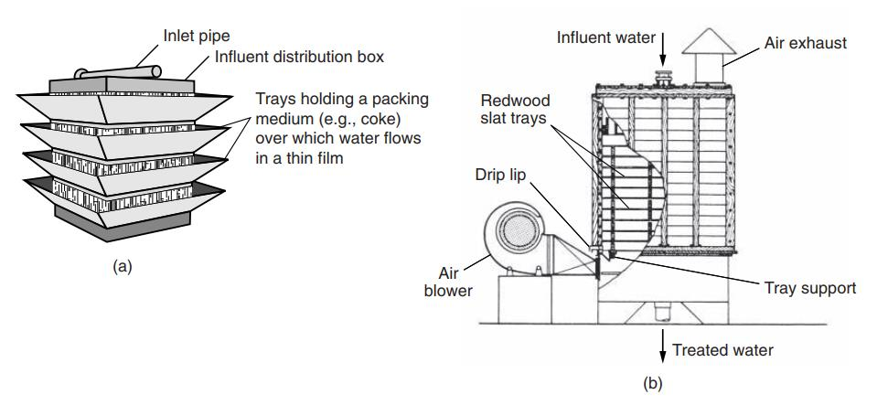
  - **Hình này chứng minh điều gì**
    - Nước chảy thành màng mỏng qua các khay đệm hoặc nhỏ giọt qua khay thanh gỗ tiếp xúc với luồng khí cưỡng bức.
  - **Từ đâu mà thấy được**
    - Từ trái sang phải: (a) nước từ "Inlet pipe" qua hộp phân phối chảy tràn màng mỏng qua các khay chứa vật liệu đệm (than coke).
    - (b) nước từ đỉnh rơi qua các khay "Redwood slat trays" ngược chiều luồng khí từ quạt "Air blower" thoát ra "Air exhaust".
    - Lưu ý: hình ghi Redwood slat trays, văn bản ghi (b) cascade aerator.

###### 4.3.3.2 Cấu tạo và Cơ chế của Dàn làm thoáng bậc tràn (Cascade Aerator)
- Cấu tạo và nguyên lý thủy lực bậc tràn:
  - Nước chảy qua chuỗi các bậc thang dốc trọng lực bằng bê tông cốt thép hoặc thép không gỉ.
  - Chiều cao mỗi bậc thang từ $0.15\text{ m}$ đến $0.30\text{ m}$; tổng chiều cao rơi nước toàn dàn từ $1.5\text{ m}$ đến $3.0\text{ m}$.
  - Vận tốc dòng chảy tăng dần qua gờ bậc, tạo dòng xoáy xáo trộn mãnh liệt và cuốn không khí vào chân bậc tràn.
- Thông số vận hành kỹ thuật:
  - Tải trọng thủy lực bề mặt: $20$ đến $40\text{ m}^3/(\text{m}^2\cdot\text{h})$.
  - Diện tích mặt bằng yêu cầu lớn hơn giàn khay nhưng chi phí đầu tư và năng lượng vận hành rất thấp vì không cần quạt gió.

##### 4.3.4 Tháp đệm ngược dòng, giàn đĩa lỗ và giàn phun mưa

###### 4.3.4.1 Cấu tạo và Nguyên lý Tháp đệm tiếp xúc ngược dòng (Countercurrent Packed Tower)
- Thiết kế tháp đệm hình trụ thẳng đứng:
  - Tháp vỏ thép hoặc composite chứa lớp vật liệu đệm ngẫu nhiên (`Random packing`) bằng nhựa PP/PVC (vòng Raschig, vòng Pall, Tri-Packs).
  - Chiều cao lớp đệm từ $1.0\text{ m}$ đến $3.0\text{ m}$; diện tích bề mặt riêng đạt $100$ đến $300\text{ m}^2/\text{m}^3$.
  - Nước thô phun từ dàn phân phối đỉnh chảy màng mỏng bao bọc bề mặt đệm đi xuống đáy.
  - Luồng khí sạch (`Clean air`) từ quạt thổi cấp vào đáy tháp đi ngược chiều lên đỉnh, tối đa hóa động lực truyền khối ($C^* - C$).
  - Bộ tách sương (`Demister`) lắp ở đỉnh tháp thu hồi các giọt nước bị dòng khí cuốn theo.

###### 4.3.4.2 Cấu tạo Giàn làm thoáng khay đĩa lỗ (Sieve Tray Aerator) và Giàn vòi phun (Spray Aerator)
- Cấu tạo giàn làm thoáng khay lỗ biên dạng thấp (Low-profile sieve tray):
  - Gồm chuỗi các khay đục lỗ (`Perforated tray`) nối với nhau qua vách tràn và ống chảy chuyền (`Weir and downcomer`).
  - Dòng khí thổi từ đáy xuyên qua các lỗ khay sục sôi lớp nước trên khay (chế độ sủi bọt - froth regime).
  - Chiều cao công trình nhỏ gọn, dễ tháo lắp vệ sinh cặn sắt định kỳ.
- Cấu tạo giàn làm thoáng vòi phun áp lực (Spray aerator):
  - Áp lực từ ống đẩy bơm phun nước thẳng lên không gian khí quyển qua các vòi phun định hình.
  - Nước vỡ thành chùm tia và hạt sương kích thước $2$ đến $5\text{ mm}$, gia tăng tối đa diện tích tiếp xúc trước khi rơi xuống sàn thu.
  - **Hình 8.** Cấu tạo các thiết bị tiếp xúc pha khí điển hình
    - 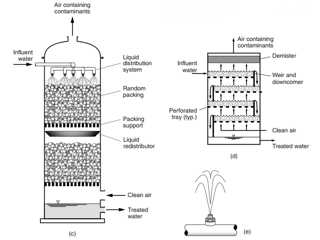
  - **Hình này chứng minh điều gì**
    - Cấu tạo chi tiết và cơ chế tiếp xúc khí - nước: tháp đệm và khay lỗ vận hành ngược dòng, vòi phun phân tán nước thành tia vào không khí.
  - **Từ đâu mà thấy được**
    - Panel (c): Nước từ đỉnh qua giàn phân phối tưới xuống tầng đệm (`Random packing`), ngược chiều với khí sạch (`Clean air`) thổi từ đáy.
    - Panel (d): Nước chảy qua các khay lỗ (`Perforated tray`) nối bởi ống chảy chuyền (`Weir and downcomer`), khí đi từ dưới lên qua bộ tách sương (`Demister`).
    - Panel (e): Vòi phun gắn trên ống đẩy tia nước phun ngược lên không gian khí quyển.

##### 4.3.5 Cấu tạo chi tiết giàn mưa nhiều tầng và giàn phun nước

###### 4.3.5.1 Cấu tạo thực tế dàn làm thoáng bậc tràn Cascade Aerator
- Cấu tạo bề mặt dòng tràn và gờ răng cưa phân dòng:
  - Mặt cắt bậc tràn được tạo gờ răng cưa so le giúp xé màng nước liên tục thành các luồng tia nhỏ.
  - Độ chênh cao giữa các bậc kích thích hiện tượng cuốn khí tự nhiên (air entrainment).
  - Chân mỗi bậc tràn hình thành vùng nước xoáy sủi bọt khí dày đặc, tăng cường hòa tan oxy và giải phóng khí $\text{CO}_2$.
  - **Hình 9.** Dàn làm thoáng bậc tràn cascade aerator trong thực tế
    - 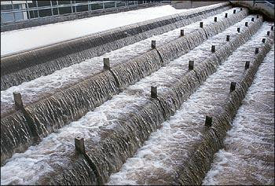
  - **Hình này chứng minh điều gì**
    - Cấu tạo các bậc tràn chia nhỏ dòng chảy, tạo xáo trộn mãnh liệt và bọt khí tiếp xúc tự nhiên.
  - **Từ đâu mà thấy được**
    - Quan sát các gờ bậc thang từ trên xuống: hàng mấu răng cưa phân tách dòng nước thành các luồng màng mỏng.
    - Chân mỗi bậc tràn sủi bọt trắng xóa do dòng nước va đập cuốn theo không khí quyển.

###### 4.3.5.2 Cấu tạo thực tế giàn làm thoáng kiểu phun tia (Spray Aerator)
- Mạng lưới phân phối áp lực trên sàn làm thoáng:
  - Ống góp chính hình trụ nằm ngang phân nhánh vào mạng ống nhánh song song đặt trên cao.
  - Các đầu vòi phun được bắt ren định khoảng cách đều trên các ống nhánh, hướng dòng tia thẳng xuống sàn hứng.
  - Màn tia nước dày đặc giao thoa tạo vùng tiếp xúc khí quyển diện tích lớn trên toàn bộ mặt sàn công trình.
  - **Hình 10.** Cấu tạo thực tế dàn làm thoáng kiểu phun tia
    - 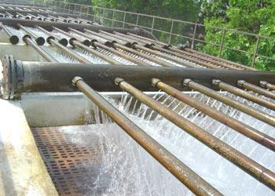
  - **Hình này chứng minh điều gì**
    - Mạng ống nhánh song song rẽ từ ống góp chính xé nhỏ dòng nước thành các chùm tia phân tán đều.
  - **Từ đâu mà thấy được**
    - Ống góp chính hình trụ nằm ngang (có mặt bích bên trái) liên kết dãy ống nhánh vươn dài ra sàn làm thoáng.
    - Dọc thân các ống nhánh, các vòi phun xả nước thành màn tia dày đặc xuống giàn thoáng bên dưới.

##### 4.3.6 Dây chuyền công nghệ đa bậc: Trung hòa pH, Khử sắt và Khử mangan

- Nguyên tắc bố trí công nghệ dây chuyền đa bậc:
  - Phản ứng oxy hóa sắt và mangan đòi hỏi điều kiện $\text{pH}$ khác nhau: sắt oxy hóa nhanh ở $\text{pH } \ge 6.8$, trong khi mangan đòi hỏi $\text{pH } \ge 8.0 - 9.0$ hoặc chất oxy hóa mạnh.
  - Sắt oxy hóa trước và tạo nhiều bùn bông kết tủa $\text{Fe(OH)}_3$, có thể bọc kín bề mặt vật liệu xúc tác mangan nếu bố trí chung một công trình.
  - Dây chuyền tách biệt theo 3 bể chức năng nối tiếp: Bể trung hòa $\text{pH}$ $\to$ Bể lọc khử sắt $\to$ Bể lọc xúc tác khử mangan.

###### 4.3.6.1 Bể trung hòa pH với vật liệu kiềm hóa (pH Neutralization Tank)
- Cấu tạo và cơ chế kiềm hóa tự cân bằng:
  - Thân bể hình trụ đứng chứa lớp vật liệu khoáng kiềm hóa: Calcite ($\text{CaCO}_3$) và Akdolit / Magno ($\text{CaCO}_3 \cdot \text{MgO}$).
  - Phản ứng hòa tan vật liệu tiêu thụ khí $\text{CO}_2$ tự do trong nước thô:
    $$\text{CaCO}_3 + \text{CO}_2 + \text{H}_2\text{O} \rightleftharpoons \text{Ca}^{2+} + 2\text{HCO}_3^-$$
    $$\text{MgO} + 2\text{CO}_2 + \text{H}_2\text{O} \rightleftharpoons \text{Mg}^{2+} + 2\text{HCO}_3^-$$
  - Nâng $\text{pH}$ nước từ dải axit yếu ($5.5 - 6.5$) lên ngưỡng kiềm ổn định ($7.2 - 8.2$) mà không lo quá liều hóa chất.
  - Đáy bể bố trí lớp sỏi đỡ (`Gravel`) bao quanh hệ thống chõ thu nước trung tâm.
  - **Hình 18.** Cấu tạo bể trung hòa pH với vật liệu Calcite và Akdolit
    - 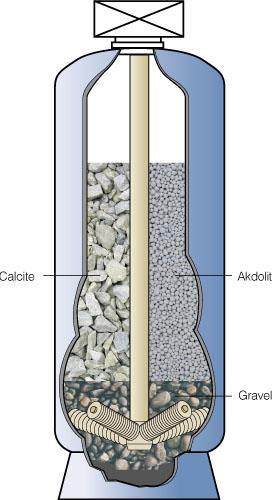
  - **Hình này chứng minh điều gì**
    - Bể trung hòa sử dụng lớp vật liệu kiềm hóa gồm Calcite và Akdolit đặt trên lớp sỏi đỡ để nâng $\text{pH}$.
  - **Từ đâu mà thấy được**
    - Mặt cắt hai bên thân bể chỉ rõ vật liệu Calcite (bên trái) và Akdolit (bên phải).
    - Tầng đáy là lớp sỏi đỡ (Gravel) bao quanh cụm chõ lọc và ống phân phối trung tâm.

###### 4.3.6.2 Bể lọc khử sắt đa tầng (Iron Removal Multi-Media Filter)
- Cấu tạo tầng vật liệu lọc đa tầng (Multi-media layers):
  - Lớp trên cùng: Than anthracite (`Filter coal`) tỷ trọng nhẹ ($1.4 - 1.6\text{ g/cm}^3$), cỡ hạt thô ($0.8 - 1.8\text{ mm}$), giữ phần lớn bông cặn hydroxit sắt mà không làm tắc nhanh bề mặt.
  - Lớp giữa: Cát thạch anh (`Sand`) tỷ trọng trung bình ($2.65\text{ g/cm}^3$), cỡ hạt $0.45 - 0.55\text{ mm}$, lọc các hạt cặn mịn lọt qua tầng anthracite.
  - Lớp dưới: Garnet mịn (`Fine Garnet`, cỡ $0.2 - 0.4\text{ mm}$) và Garnet thô (`Coarse Garnet`, cỡ $0.4 - 0.8\text{ mm}$) có tỷ trọng lớn ($3.8 - 4.2\text{ g/cm}^3$) tạo màng lọc chặn cặn tinh.
  - Lớp đáy: Sỏi đỡ (`Gravel`) giữ vật liệu không lọt vào đường ống thu đáy.
  - **Hình 16.** Cấu tạo các tầng vật liệu trong bể lọc khử sắt
    - 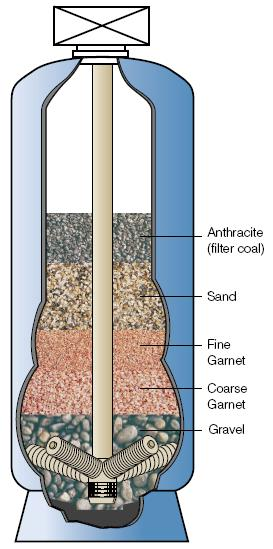
  - **Hình này chứng minh điều gì**
    - Bể bố trí các tầng vật liệu lọc đa tầng gồm anthracite, cát, garnet mịn, garnet thô và sỏi đỡ.
  - **Từ đâu mà thấy được**
    - Cột chú thích từ trên xuống dưới chỉ rõ: Anthracite (filter coal), Sand, Fine Garnet, Coarse Garnet và Gravel bao quanh ống thu nước đáy.

###### 4.3.6.3 Bể lọc xúc tác khử mangan (Manganese Removal Filter Tank)
- Cấu tạo tầng lọc cát Greensand:
  - Lớp vật liệu xúc tác Greensand đặt phía dưới lớp than anthracite tùy chọn.
  - Dưới đáy là tầng đệm sỏi và garnet thô bao bọc cụm chõ lọc để bảo đảm phân phối nước rửa ngược đều.
  - Bể thực hiện đồng thời phản ứng xúc tác oxy hóa mangan hòa tan và giữ lại kết tủa $\text{MnO}_2$ tạo thành.
  - **Hình 17.** Cấu tạo cột lọc khử mangan đa tầng dùng cát Greensand
    - 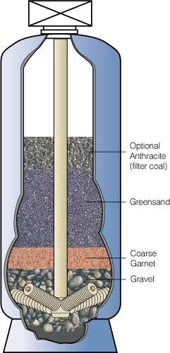
  - **Hình này chứng minh điều gì**
    - Bể lọc dùng lớp cát Greensand xúc tác đặt trên các tầng đệm sỏi và garnet.
  - **Từ đâu mà thấy được**
    - Mặt cắt từ trên xuống: than anthracite tùy chọn, tầng Greensand, lớp đệm garnet thô và sỏi.
    - Ống phân phối đứng ở tâm nối cụm chụp lọc đặt chìm trong lớp sỏi đáy.

###### 4.3.6.4 Bể tiếp xúc và Thời gian lưu phản ứng (Detention Tank / Contact Bed)
- Yêu cầu thủy lực về thời gian tiếp xúc phản ứng:
  - Sau công đoạn làm thoáng, nước ngầm chứa sắt cần được dẫn qua bể tiếp xúc (contact chamber / detention tank) hoặc đệm tiếp xúc (contact bed).
  - Thời gian lưu nước tiếp xúc tối thiểu đạt từ $30$ đến $45\text{ phút}$ (theo tiêu chuẩn kỹ thuật cấp nước TCXDVN 33:2006).
  - Khoảng thời gian này bảo đảm các ion sắt $\text{Fe}^{2+}$ hòa tan oxy hóa thành $\text{Fe}^{3+}$ và thủy phân kết bông hoàn toàn thành $\text{Fe(OH)}_3$ trước khi đi vào bể lọc, ngăn ngừa cặn lọt lưới lọc gây đục nước sau xử lý.

##### 4.3.7 Vật liệu lọc cát mangan Greensand

###### 4.3.7.1 Cấu tạo và Cơ chế xúc tác oxy hóa của Greensand
- Bản chất cấu tạo hạt lọc Greensand:
  - Vật liệu chế tạo từ khoáng glauconite tự nhiên (màu xanh lục) hoặc hạt cát thạch anh bọc lớp oxit mangan hoạt tính ($\text{MnO}_2$).
  - Bề mặt hạt có cấu trúc xốp với diện tích tiếp xúc lớn, giàu mangan hóa trị cao ($\text{Mn}^{4+}$).
- Cơ chế phản ứng oxy hóa xúc tác:
  - Lớp phủ $\text{MnO}_2$ vừa đóng vai trò chất xúc tác bề mặt vừa là chất oxy hóa trực tiếp:
    $$\text{Fe}^{2+} + \text{MnO}_2(\text{s}) + 2\text{H}_2\text{O} \to \text{Fe(OH)}_3\downarrow + \text{MnOOH}(\text{s})$$
    $$\text{Mn}^{2+} + \text{MnO}_2(\text{s}) + \text{H}_2\text{O} \to 2\text{MnOOH}\downarrow$$
  - Hoàn nguyên (Regeneration): Vật liệu cần được hoàn nguyên định kỳ bằng dung dịch thuốc tím $\text{KMnO}_4$ theo tỷ lệ $1.5 - 2.0\text{ g KMnO}_4$ trên mỗi lít Greensand để khôi phục trạng thái oxy hóa của màng $\text{MnO}_2$.

###### 4.3.7.2 Điều kiện vận hành tiêu chuẩn của vật liệu lọc Greensand
- Bảng thông số kỹ thuật và chế độ thủy lực theo tiêu chuẩn vận hành:
  - Dải $\text{pH}$ nước thô (Raw Water pH): $6.2$ đến $8.8$.
  - Chiều sâu lớp vật liệu lọc (Bed Depth): $30\text{ in.}$ ($\approx 76.2\text{ cm}$).
  - Tốc độ lọc danh định (Service Flow Rate): $5\text{ gpm/sq. ft.}$ ($\approx 12.2\text{ m/h}$).
  - Tốc độ rửa ngược (Backwash Flow Rate): $8$ đến $12\text{ gpm/sq. ft.}$ ($\approx 19.5 - 29.3\text{ m/h}$).
  - Giới hạn xử lý thực tế tối đa (Max. Practical Limit): Tổng nồng độ $\text{Fe} + \text{Mn}$ lên tới $15\text{ ppm}$ ($15\text{ mg/L}$); nồng độ $\text{H}_2\text{S}$ tối đa $5\text{ ppm}$ ($5\text{ mg/L}$).
  - **Hình 19.** Điều kiện vận hành của vật liệu lọc Greensand
    - 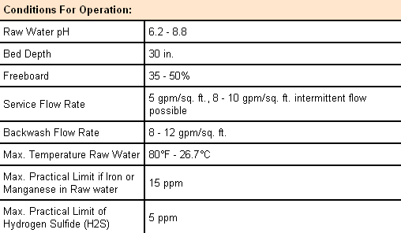
  - **Hình này chứng minh điều gì**
    - Greensand yêu cầu $\text{pH}$ từ $6.2 - 8.8$, lưu lượng $5\text{ gpm/sq. ft.}$ và nồng độ nguồn tối đa $15\text{ ppm}$ ($\text{Fe}$/$\text{Mn}$), $5\text{ ppm}$ ($\text{H}_2\text{S}$).
  - **Từ đâu mà thấy được**
    - Bảng "Conditions For Operation" đối chiếu thông số vận hành ở cột trái với giá trị cột phải.
    - Các hàng: "Raw Water pH" ($6.2 - 8.8$), "Bed Depth" ($30\text{ in.}$), "Service Flow Rate" ($5\text{ gpm/sq. ft.}$), "Backwash Flow Rate" ($8 - 12\text{ gpm/sq. ft.}$), "Max. Practical Limit" ($15\text{ ppm}$ cho $\text{Fe}$/$\text{Mn}$, $5\text{ ppm}$ cho $\text{H}_2\text{S}$).

##### 4.3.8 Vật liệu lọc xúc tác Birm

###### 4.3.8.1 Ưu điểm công nghệ và Đặc tính vật lý của Regular Birm và Fine Birm
- Ưu điểm công nghệ của vật liệu Birm:
  - Không cần bổ sung hóa chất tái sinh (thuốc tím $\text{KMnO}_4$ hoặc clo) vào chu trình hoàn nguyên.
  - Vận hành như một chất xúc tác không tiêu hao: hạt nhôm silicat phủ $\text{MnO}_2$ xúc tác cho phản ứng giữa ion hòa tan và oxy hòa tan trong nước.
  - Quy trình bảo trì đơn giản: chỉ cần rửa ngược định kỳ bằng nước sạch để loại bỏ cặn hydroxit sắt tích tụ.
- So sánh đặc tính vật lý giữa Regular Birm và Fine Birm:
  - Cả hai loại có cùng khối lượng thể tích biểu kiến: $2.0\text{ g/cm}^3$ ($2.0\text{ gm/cc}$).
  - Regular Birm: Cỡ hạt hiệu dụng (`Effective Size`) đạt $0.59\text{ mm}$, dải kích thước sàng (`Mesh Size`) $9 \times 35\text{ mesh}$.
  - Fine Birm: Cỡ hạt hiệu dụng đạt $0.48\text{ mm}$, dải kích thước sàng $10 \times 40\text{ mesh}$ (diện tích riêng bề mặt lớn hơn, phù hợp khử cặn tinh).
  - **Hình 23.** Ưu điểm và đặc tính vật lý của Birm
    - 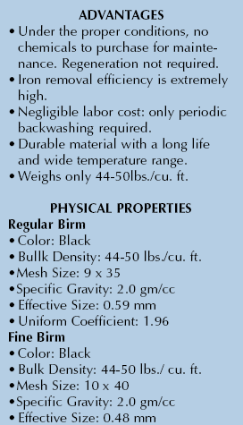
  - **Hình này chứng minh điều gì**
    - Birm không cần hóa chất hoàn nguyên; Regular Birm và Fine Birm có cùng tỷ trọng ($2.0\text{ gm/cc}$) nhưng khác nhau về cỡ hạt hiệu dụng ($0.59\text{ mm}$ so với $0.48\text{ mm}$).
  - **Từ đâu mà thấy được**
    - Phần "ADVANTAGES": xác nhận không cần hóa chất để duy trì, không cần hoàn nguyên và chỉ cần rửa ngược định kỳ.
    - Phần "PHYSICAL PROPERTIES": so sánh dòng "Effective Size" ($0.59\text{ mm}$ so với $0.48\text{ mm}$) và "Mesh Size" ($9 \times 35$ so với $10 \times 40$).

###### 4.3.8.2 Điều kiện vận hành tiêu chuẩn của Birm
- Quy định hóa học nghiêm ngặt nguồn nước thô vào bể lọc Birm:
  - Dải $\text{pH}$ nguồn nước: $\text{pH } 6.8$ đến $9.0$. Để khử mangan hiệu quả bằng Birm, $\text{pH}$ cần đạt từ $8.0$ đến $8.5$.
  - Hàm lượng oxy hòa tan ($\text{D.O.}$): Phải đạt tối thiểu $15\%$ so với nồng độ sắt tổng trong nước thô ($\text{DO} \ge 0.15 \times [\text{Fe}]$).
  - Độ kiềm ($\text{Alkalinity}$): Phải lớn hơn ít nhất $2$ lần tổng nồng độ của ion sulfate ($\text{SO}_4^{2-}$) và chloride ($\text{Cl}^-$).
  - Clo dư tự do ($\text{Free Chlorine}$): Khống chế $< 0.5\text{ ppm}$ để ngăn ngừa phá hủy lớp vỏ xúc tác của hạt Birm.
  - Khí hydro sulfide ($\text{H}_2\text{S}$): Phải khử sạch hoàn toàn trước khi nước vào lớp lọc Birm (sulfide làm vô hiệu hóa hoạt tính xúc tác).
  - Chất hữu cơ và dầu mỡ: Nước không được chứa dầu mỡ hoặc polyphosphate.
- Thông số thiết kế và thủy lực rửa lọc:
  - Chiều sâu lớp vật liệu lọc (Bed depth): $30$ đến $36\text{ in.}$ ($\approx 76.2 - 91.4\text{ cm}$).
  - Tốc độ lọc danh định (Service flowrate): $3.5$ đến $5.0\text{ gpm/sq. ft.}$ ($\approx 8.5 - 12.2\text{ m/h}$).
  - Tốc độ rửa ngược (Backwash rate): $8$ đến $12\text{ gpm/sq. ft.}$ ($\approx 19.5 - 29.3\text{ m/h}$).
  - Độ giãn nở lớp vật liệu khi rửa ngược (Backwash Bed Expansion): $20\%$ đến $40\%$.
  - **Hình 24.** Điều kiện vận hành tiêu chuẩn của vật liệu lọc Birm
    - 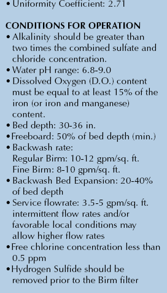
  - **Hình này chứng minh điều gì**
    - Birm đòi hỏi môi trường kiềm tính ($\text{pH } 6.8\text{--}9.0$, $\text{D.O.} \ge 15\%$), khống chế $\text{Cl}_2 < 0.5\text{ ppm}$ và loại bỏ triệt để $\text{H}_2\text{S}$.
    - Quy định chế độ thủy lực với tốc độ lọc $3.5\text{--}5\text{ gpm/sq. ft.}$ và tốc độ rửa ngược $8\text{--}12\text{ gpm/sq. ft.}$ để lớp lọc giãn nở $20\text{--}40\%$.
  - **Từ đâu mà thấy được**
    - Các dòng điều kiện hóa học dưới `CONDITIONS FOR OPERATION`: `Water pH range` ($6.8\text{--}9.0$), `Dissolved Oxygen` ($\ge 15\%$), `Alkalinity`, `Free chlorine` ($< 0.5\text{ ppm}$) và loại bỏ `Hydrogen Sulfide`.
    - Các dòng thông số thiết kế và rửa lọc: `Bed depth` ($30\text{--}36\text{ in.}$), `Service flowrate` ($3.5\text{--}5\text{ gpm/sq. ft.}$), `Backwash rate` ($8\text{--}12\text{ gpm/sq. ft.}$) và `Backwash Bed Expansion` ($20\text{--}40\%$).

##### 4.3.9 Vật liệu lọc xúc tác pyrolusite LayneOx™

###### 4.3.9.1 Thành phần khoáng chất và Quy cách hạt LayneOx™
- Bản chất khoáng vật pyrolusite tự nhiên:
  - LayneOx™ là quặng pyrolusite khai thác tự nhiên với hàm lượng mangan dioxide cực cao: $70\%$ đến $80\%$ khối lượng ($\text{wt}\% \text{ MnO}_2$).
  - Toàn bộ hạt là khoáng chất đồng nhất, không bị hiện tượng mòn bong tróc lớp phủ oxit như cát tráng mangan hay glauconite.
  - Hệ số đồng nhất hạt (Uniformity Coefficient): $U_c < 1.65$.
- Hai quy cách kích thước hạt thương mại:
  - Cỡ sàng $8 \times 20\text{ mesh}$: Kích thước hiệu dụng (`Effective size`) từ $1.0\text{ mm}$ đến $1.3\text{ mm}$.
  - Cỡ sàng $20 \times 40\text{ mesh}$: Kích thước hiệu dụng từ $0.3\text{ mm}$ đến $0.5\text{ mm}$.
  - **Hình 25.** Thông số kỹ thuật và kích cỡ hạt vật liệu LayneOx™
    - 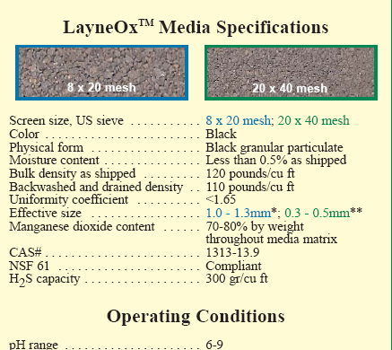
  - **Hình này chứng minh điều gì**
    - Hạt vật liệu có hàm lượng $\text{MnO}_2$ cao ($70 - 80\ \% \text{ weight}$) và độ đồng nhất tốt ($< 1.65$).
  - **Từ đâu mà thấy được**
    - Hai khung ảnh trên minh họa dạng hạt ở 2 cỡ sàng $8 \times 20\text{ mesh}$ và $20 \times 40\text{ mesh}$.
    - Các dòng thông số: "Effective size" ($1.0 - 1.3\text{ mm}$, $0.3 - 0.5\text{ mm}$), "Manganese dioxide content" ($70 - 80\ \%$).

###### 4.3.9.2 Định mức công nghệ và Hiệu suất xử lý của LayneOx™
- Tải trọng lọc cao và thời gian tiếp xúc ngắn:
  - Tải trọng lọc bề mặt (Surface loading rate): Đạt từ $8$ đến $15\text{ gpm/sq. ft.}$ ($\approx 19.5 - 36.6\text{ m/h}$), cao hơn gấp $2 - 3$ lần cát lọc truyền thống.
  - Thời gian tiếp xúc qua lớp vật liệu (Media contact time): Tối thiểu $2\text{ phút}$.
  - Hiệu suất xử lý khử sắt và mangan (Removal efficiency): Vượt trên $99\%$ ($99\%^+$).
- Chế độ thủy lực rửa ngược theo cỡ hạt:
  - Tổn thất áp lực qua lớp lọc (Pressure drop): Phụ thuộc vào cỡ sàng hạt và vận tốc lọc bề mặt.
  - Cỡ hạt $8 \times 20\text{ mesh}$: Tốc độ rửa ngược yêu cầu $20$ đến $25\text{ gpm/sq. ft.}$ ($\approx 48.9 - 61.1\text{ m/h}$).
  - Cỡ hạt $20 \times 40\text{ mesh}$: Tốc độ rửa ngược yêu cầu $12$ đến $15\text{ gpm/sq. ft.}$ ($\approx 29.3 - 36.6\text{ m/h}$).
  - **Hình 26.** Điều kiện vận hành tiêu chuẩn của vật liệu lọc LayneOx™
    - 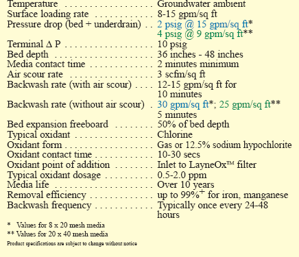
  - **Hình này chứng minh điều gì**
    - Cung cấp định mức vận hành chi tiết với tải trọng lọc, chất oxy hóa và hiệu suất khử $\text{Fe/Mn}$ đạt tới $99\ \%^+$.
  - **Từ đâu mà thấy được**
    - Các dòng thông số: "Surface loading rate" ($8 - 15\text{ gpm/sq ft}$), "Media contact time" (tối thiểu $2\text{ phút}$) và "Removal efficiency" ($99\ \%^+$).
    - Các dòng "Pressure drop" và "Backwash rate" phân định mức theo 2 cỡ hạt $8 \times 20\text{ mesh}$ và $20 \times 40\text{ mesh}$.

#### 4.4 Tính toán thiết kế và Bài tập ứng dụng

- Các bài toán tính toán kỹ thuật trong công nghệ khử sắt và mangan bằng kali pemanganat ($\text{KMnO}_4$) bao gồm hai nhóm bài toán cốt lõi:
  - Tính toán nồng độ và định lượng khối lượng hóa chất pha chế theo phần trăm khối lượng (% by weight).
  - Tính toán liều lượng chất oxy hóa lý thuyết và vận hành để xử lý sắt ($\text{Fe}^{2+}$) và mangan ($\text{Mn}^{2+}$) trong nước thô.
- Pha chế dung dịch hóa chất thuốc tím $\text{KMnO}_4$:
  - Nhà sản xuất khuyến nghị nồng độ dung dịch thuốc tím làm việc thông dụng là $3\%$ (theo tài liệu WTOM, tr. 31).
  - Nồng độ phần trăm theo khối lượng ($P_{\text{wt}}$ hoặc $C\%$) xác định bằng tỷ lệ giữa khối lượng chất tan $\text{KMnO}_4$ và tổng khối lượng dung dịch (khối lượng chất tan cộng khối lượng nước).
  - Khối lượng hóa chất $\text{KMnO}_4$ cần hòa tan vào bể chứa hình trụ tròn căn cứ vào kích thước hình học bể (đường kính $D$ và chiều sâu mức nước $H$) và nồng độ yêu cầu.
- Xác định liều lượng hóa chất $\text{KMnO}_4$ oxy hóa kim loại trong nước thô:
  - Nhu cầu $\text{KMnO}_4$ định mức để oxy hóa sắt ($\text{Fe}^{2+}$): $0.94\text{ mg KMnO}_4/\text{mg Fe}$ (theo phương trình phản ứng tức thời trong dải $\text{pH}$ từ $5.0$ đến $9.0$).
  - Nhu cầu $\text{KMnO}_4$ định mức để oxy hóa mangan ($\text{Mn}^{2+}$): $1.92\text{ mg KMnO}_4/\text{mg Mn}$ (theo phản ứng oxy hóa nhanh ở $\text{pH} \ge 7.2$).
  - Tổng nhu cầu thuốc tím khi nước thô chứa đồng thời cả hai kim loại tuân theo nguyên lý cộng tuyến tính tải lượng oxy hóa:
    $$\text{KMnO}_{4,\text{demand}}\text{ (mg/L)} = 0.94[\text{Fe}^{2+}] + 1.92[\text{Mn}^{2+}]$$

##### 4.4.1 Tính toán nồng độ và khối lượng pha chế dung dịch thuốc tím KMnO4

- Cơ sở lý thuyết pha chế dung dịch:
  - Dung dịch thuốc tím có giới hạn độ tan phụ thuộc nhiệt độ (khoảng $64\text{ g/L}$ ở $20^\circ\text{C}$). Nồng độ khuyến nghị $3\%$ (tương đương $\approx 30.9\text{ g/L}$) bảo đảm hóa chất tan hoàn toàn, không tạo cặn lắng nghẹt bơm định lượng.
  - Công thức xác định nồng độ phần trăm khối lượng:
    $$P_{\text{wt}} = \frac{m_{\text{solute}}}{m_{\text{total}}} \times 100\% = \frac{m_{\text{KMnO}_4}}{m_{\text{KMnO}_4} + \rho_{\text{water}} \cdot V_{\text{water}}} \times 100\%$$
  - Công thức tính thể tích và khối lượng hóa chất cần hòa tan vào bể hình trụ:
    $$V_{\text{tank}} = \frac{\pi D^2}{4} \cdot H; \quad m_{\text{chem}} = \left[\frac{P_{\text{wt}}}{100\% - P_{\text{wt}}}\right] \cdot (\rho_{\text{water}} \cdot V_{\text{tank}})$$

###### Ví dụ 4-1 (ex4_1): Tính phần trăm nồng độ khối lượng dung dịch thuốc tím KMnO4 (Example 4-1)

- **Đề bài**:
  (WTOM, 31) Một nhà cung cấp hóa chất khuyến nghị dung dịch thuốc tím nồng độ $3\%$. Nếu hòa tan $1\text{ kg KMnO}_4$ vào $50\text{ lít}$ nước, nồng độ phần trăm theo khối lượng của dung dịch thu được là bao nhiêu?
  *(Nguyên văn tiếng Anh: Example 4-1: (WTOM, 31) A chemical supplier recommends a 3% permanganate solution. If 1 kg KMnO4 are dissolved in 50 liters of water, what is the percent by weight?)*
- **Dữ kiện**:
  - Khối lượng chất tan kali pemanganat: $m_{\text{solute}} = 1.0\text{ kg KMnO}_4$.
  - Thể tích nước dung môi: $V_{\text{water}} = 50.0\text{ L}$ ($50\text{ liters}$).
  - Khối lượng riêng của nước ở điều kiện tiêu chuẩn: $\rho_{\text{water}} = 1.0\text{ kg/L}$ ($1000\text{ kg/m}^3$).
  - Nồng độ khuyến nghị của nhà cung cấp: $P_{\text{rec}} = 3.0\%$ (thông số đối chiếu công nghệ).
  - Minh chứng đề bài trên slide bài giảng:
    - **Ảnh EX4_1.1.** Đề bài Ví dụ 4-1 trên slide 19 (trang 132 bài giảng).
      - 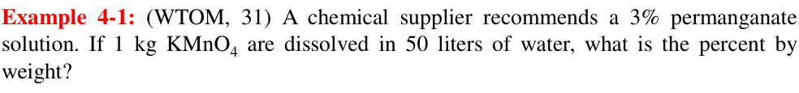
      - Nhìn vào: Dòng chữ đỏ "Example 4-1: (WTOM, 31)" và nội dung văn bản "A chemical supplier recommends a 3% permanganate solution. If 1 kg KMnO4 are dissolved in 50 liters of water, what is the percent by weight?".
- **Quy tắc áp dụng**:
  - Quy tắc R08 (`R08_SOLUTION_PERCENT_WEIGHT`): Nồng độ phần trăm theo khối lượng của dung dịch hóa chất:
    $$P_{\text{wt}} = \left[\frac{m_{\text{solute}}}{m_{\text{solute}} + \rho_{\text{water}} \cdot V_{\text{water}}}\right] \times 100\% = \frac{m_{\text{KMnO}_4}}{m_{\text{dung dịch}}} \times 100\%$$
  - Quy tắc chuyển đổi thể tích nước sang khối lượng nước:
    $$m_{\text{water}} = V_{\text{water}} \cdot \rho_{\text{water}}$$
  - Nguồn trích dẫn: Slide bài giảng trang 19 (mục 4.4 Calculation) và tài liệu *Water Treatment Plant Operation* (WTOM, tr. 31).
- **Lời giải**:
  - **Bước 1**: Xác định khối lượng của $50\text{ lít}$ nước làm dung môi hòa tan.
    - Căn cứ: Thể tích nước $V_{\text{water}} = 50.0\text{ L}$ và khối lượng riêng $\rho_{\text{water}} = 1.0\text{ kg/L}$.
    - Nhìn vào: Dòng thứ 2 của đề bài trên Ảnh EX4_1.1 ("...in 50 liters of water...").
    - Thực hiện:
      $$m_{\text{water}} = 50.0\text{ L} \times 1.0\text{ kg/L} = 50.0\text{ kg}$$
  - **Bước 2**: Xác định tổng khối lượng của dung dịch sau khi hòa tan hoàn toàn $1.0\text{ kg KMnO}_4$.
    - Căn cứ: Định luật bảo toàn khối lượng, tổng khối lượng dung dịch bằng khối lượng chất tan cộng khối lượng dung môi: $m_{\text{total}} = m_{\text{solute}} + m_{\text{water}}$.
    - Nhìn vào: Dòng thứ 2 của đề bài trên Ảnh EX4_1.1 ("If 1 kg KMnO4 are dissolved in 50 liters of water...").
    - Thực hiện:
      $$m_{\text{total}} = 1.0\text{ kg} + 50.0\text{ kg} = 51.0\text{ kg}$$
  - **Bước 3**: Tính nồng độ phần trăm theo khối lượng của dung dịch $\text{KMnO}_4$.
    - Căn cứ: Công thức tính phần trăm nồng độ khối lượng $P_{\text{wt}} = \frac{m_{\text{solute}}}{m_{\text{total}}} \times 100\%$.
    - Nhìn vào: Dòng thứ 2–3 của đề bài trên Ảnh EX4_1.1 ("...what is the percent by weight?").
    - Thực hiện:
      $$P_{\text{wt}} = \frac{1.0\text{ kg}}{51.0\text{ kg}} \times 100\% = 1.96078\% \approx 1.96\%\text{ (theo khối lượng)}$$
      *(Ghi chú kỹ thuật: Trong thực hành tính nhanh tại trạm xử lý, nếu giả định khối lượng dung dịch xấp xỉ khối lượng nước $50.0\text{ kg}$, nồng độ định lượng kỹ thuật là $\frac{1.0\text{ kg}}{50.0\text{ kg}} \times 100\% = 2.0\%$; tuy nhiên giá trị chuẩn xác theo hóa lý là $1.96\%$).*
  - **Bước 4**: Đánh giá nồng độ pha chế so với khuyến nghị vận hành.
    - Căn cứ: Nồng độ khuyến nghị của nhà cung cấp $P_{\text{rec}} = 3.0\%$.
    - Nhìn vào: Dòng thứ nhất của đề bài trên Ảnh EX4_1.1 ("A chemical supplier recommends a 3% permanganate solution").
    - Thực hiện: Dung dịch pha được ($1.96\%$) loãng hơn mức khuyến nghị ($3.0\%$). Dung dịch hoàn toàn không có nguy cơ kết tinh đóng cặn, nhưng máy bơm định lượng cần tăng lưu lượng cấp để cung cấp đủ tải lượng hóa chất xử lý.
- **Kết quả**:
  - Nồng độ phần trăm theo khối lượng của dung dịch $\text{KMnO}_4$ thu được là $1.96\%\text{ wt}$ (tính chính xác theo tổng khối lượng dung dịch $51.0\text{ kg}$) hoặc $2.00\%\text{ wt}$ (theo quy ước tính nhanh xem khối lượng dung dịch bằng khối lượng nước).
- **Kiểm tra lại**:
  - Kiểm tra nghịch đảo: Với nồng độ $1.96078\%$ và khối lượng dung dịch $51.0\text{ kg}$, khối lượng chất tan thu được là:
    $$m_{\text{solute}} = 51.0\text{ kg} \times 0.0196078 = 1.000\text{ kg}$$
    Khớp chính xác với khối lượng $1.0\text{ kg KMnO}_4$ đề bài cho.
  - So sánh với nồng độ chuẩn $3.0\%$: Để đạt nồng độ $3.0\%$ với $50.0\text{ kg}$ nước, khối lượng $\text{KMnO}_4$ cần hòa tan là:
    $$m_{\text{chem, 3\%}} = \frac{0.03}{1 - 0.03} \times 50.0\text{ kg} = \frac{1.5}{0.97} \approx 1.546\text{ kg}$$
    Vì $1.0\text{ kg} < 1.546\text{ kg}$, nồng độ $1.96\%$ là hoàn toàn hợp lý.

###### Ví dụ 4-2 (ex4_2): Tính khối lượng hóa chất KMnO4 cần hòa tan vào bể trụ tròn (Example 4-2)

- **Đề bài**:
  (WTOM, 31) Để điều chế dung dịch thuốc tím nồng độ $3\%$, cần hòa tan bao nhiêu kg $\text{KMnO}_4$ vào một bể chứa hình trụ tròn có đường kính $1.2\text{ m}$ và được nạp nước đến chiều sâu $1.5\text{ m}$?
  *(Nguyên văn tiếng Anh: Example 4-2: (WTOM, 31) To produce a 3% solution, how many kgs KMnO4 should be dissolved in a tank 1.2 meter in diameter and flled to a depth of 1.5 meters?)*
- **Dữ kiện**:
  - Nồng độ phần trăm khối lượng mục tiêu: $P_{\text{wt}} = 3.0\%$.
  - Đường kính trong của bể trụ tròn: $D = 1.2\text{ m}$.
  - Chiều sâu mức nước chứa trong bể: $H = 1.5\text{ m}$.
  - Khối lượng riêng của nước: $\rho_{\text{water}} = 1000\text{ kg/m}^3$ ($1.0\text{ kg/L}$).
  - Minh chứng đề bài trên slide bài giảng:
    - **Ảnh EX4_2.1.** Đề bài Ví dụ 4-2 trên slide 19 (trang 132 bài giảng).
      - 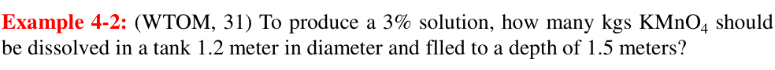
      - Nhìn vào: Dòng chữ đỏ "Example 4-2: (WTOM, 31)" và nội dung văn bản "To produce a 3% solution, how many kgs KMnO4 should be dissolved in a tank 1.2 meter in diameter and flled to a depth of 1.5 meters?".
- **Quy tắc áp dụng**:
  - Quy tắc R09 (`R09_CYLINDRICAL_TANK_CHEMICAL_MASS`):
    - Diện tích mặt cắt ngang hình tròn của bể:
      $$A = \frac{\pi D^2}{4} \approx 0.785398 \cdot D^2$$
    - Thể tích nước chứa trong bể hình trụ tròn:
      $$V_{\text{water}} = A \cdot H = \frac{\pi D^2}{4} \cdot H$$
    - Khối lượng nước chứa trong bể:
      $$m_{\text{water}} = V_{\text{water}} \cdot \rho_{\text{water}}$$
    - Khối lượng hóa chất $\text{KMnO}_4$ cần hòa tan vào nước để đạt nồng độ phần trăm $P_{\text{wt}}$:
      $$P_{\text{wt}} = \frac{m_{\text{chem}}}{m_{\text{chem}} + m_{\text{water}}} \times 100\% \implies m_{\text{chem}} = \left[\frac{P_{\text{wt}}}{100\% - P_{\text{wt}}}\right] \cdot m_{\text{water}}$$
  - Nguồn trích dẫn: Slide bài giảng trang 19, quy tắc R09 trong `skeleton.json` và tài liệu WTOM, tr. 31.
- **Lời giải**:
  - **Bước 1**: Tính diện tích đáy và thể tích nước chứa trong bể hình trụ.
    - Căn cứ: Đường kính $D = 1.2\text{ m}$, chiều sâu $H = 1.5\text{ m}$, công thức thể tích hình trụ $V = \frac{\pi D^2}{4} H$.
    - Nhìn vào: Dòng thứ 2 của khối Example 4-2 trên Ảnh EX4_2.1 ("...in a tank 1.2 meter in diameter and flled to a depth of 1.5 meters?").
    - Thực hiện:
      $$A = \frac{\pi \times (1.2\text{ m})^2}{4} = \frac{\pi \times 1.44}{4} = 0.36\pi \approx 1.130973\text{ m}^2$$
      $$V_{\text{water}} = A \times H = 1.130973\text{ m}^2 \times 1.5\text{ m} = 0.54\pi \approx 1.696460\text{ m}^3$$
      *(Nếu dùng hệ số xấp xỉ kỹ thuật $0.785$: $A = 0.785 \times 1.2^2 = 1.1304\text{ m}^2$; $V = 1.1304 \times 1.5 = 1.6956\text{ m}^3$).*
  - **Bước 2**: Xác định khối lượng của lượng nước dung môi chứa trong bể.
    - Căn cứ: Khối lượng riêng của nước $\rho_{\text{water}} = 1000\text{ kg/m}^3$ và thể tích $V_{\text{water}} = 1.696460\text{ m}^3$.
    - Nhìn vào: Giá trị thể tích $V_{\text{water}}$ tính được từ Bước 1.
    - Thực hiện:
      $$m_{\text{water}} = 1.696460\text{ m}^3 \times 1000\text{ kg/m}^3 = 1696.46\text{ kg}\text{ (tương đương } 1696.46\text{ lít)}$$
      *(Nếu theo thể tích làm tròn kỹ thuật $1.6956\text{ m}^3$, khối lượng nước là $1695.6\text{ kg}$).*
  - **Bước 3**: Tính khối lượng hóa chất $\text{KMnO}_4$ cần hòa tan để đạt dung dịch nồng độ $3.0\%$.
    - Căn cứ: Công thức tính khối lượng chất tan theo nồng độ phần trăm khối lượng:
      $$m_{\text{chem}} = \frac{P_{\text{wt}}}{100\% - P_{\text{wt}}} \times m_{\text{water}}$$
    - Nhìn vào: Dòng thứ 1 của khối Example 4-2 trên Ảnh EX4_2.1 ("To produce a 3% solution, how many kgs KMnO4 should...").
    - Thực hiện:
      $$m_{\text{chem}} = \frac{3\%}{100\% - 3\%} \times 1696.46\text{ kg} = \frac{0.03}{0.97} \times 1696.46\text{ kg} = 52.4678\text{ kg} \approx 52.47\text{ kg}$$
      *(Ghi chú thực hành công trường: Nếu tính gần đúng theo nồng độ khối lượng trên thể tích nước $m_{\text{chem}} \approx 0.03 \times 1696.46\text{ kg}$, kết quả thu được là $50.89\text{ kg}$. Giá trị $52.47\text{ kg}$ là kết quả chính xác theo chuẩn hóa lý).*
- **Kết quả**:
  - Cần hòa tan $52.47\text{ kg KMnO}_4$ (giá trị chính xác theo khối lượng, làm tròn kỹ thuật $52.5\text{ kg}$) hoặc $50.89\text{ kg KMnO}_4$ (theo quy ước gần đúng nồng độ theo thể tích nước).
- **Kiểm tra lại**:
  - Kiểm tra nồng độ phần trăm của dung dịch thu được:
    $$m_{\text{total}} = m_{\text{chem}} + m_{\text{water}} = 52.47\text{ kg} + 1696.46\text{ kg} = 1748.93\text{ kg}$$
    $$P_{\text{wt}} = \frac{52.47\text{ kg}}{1748.93\text{ kg}} \times 100\% = 3.0001\% \approx 3.00\%$$
    Khớp chính xác với nồng độ $3\%$ đề bài yêu cầu.
  - Kiểm tra độ tan: Nồng độ dung dịch tương ứng khoảng $\frac{52.47\text{ kg}}{1.6965\text{ m}^3} \approx 30.93\text{ g/L}$, thấp hơn nhiều so với độ tan bão hòa của $\text{KMnO}_4$ trong nước ở $20^\circ\text{C}$ ($\approx 64\text{ g/L}$), bảo đảm hóa chất tan hoàn toàn.

---

##### 4.4.2 Tính toán liều lượng chất oxy hóa khử Sắt và Mangan trong nước thô

- Cơ chế và định mức oxy hóa bằng kali pemanganat ($\text{KMnO}_4$):
  - Phản ứng diễn ra nhanh chóng, thích hợp cho các trạm xử lý không có đủ thời gian lưu tiếp xúc làm thoáng hoặc nguồn nước có $\text{pH}$ thấp không thể oxy hóa mangan bằng không khí.
  - Bảng tổng hợp định mức tiêu hao chất oxy hóa theo bài giảng Slide 6:
    - Đối với Sắt ($\text{Fe}^{2+}$): Oxy hòa tan cần $0.14\text{ mg O}_2/\text{mg Fe}$; Clo cần $0.64\text{ mg Cl}_2/\text{mg Fe}$; Thuốc tím cần $0.94\text{ mg KMnO}_4/\text{mg Fe}$.
    - Đối với Mangan ($\text{Mn}^{2+}$): Oxy hòa tan cần $0.29\text{ mg O}_2/\text{mg Mn}$; Clo cần $1.29\text{ mg Cl}_2/\text{mg Mn}$; Thuốc tím cần $1.92\text{ mg KMnO}_4/\text{mg Mn}$.

###### Ví dụ 4-3 (ex4_3): Tính liều lượng KMnO4 cần thiết để oxy hóa Sắt trong nước thô (Example 4-3)

- **Đề bài**:
  (WTOM, 32) Nguồn nước thô của một nhà máy xử lý nước cấp có hàm lượng sắt là $1.6\text{ mg/L}$. Cần sử dụng liều lượng $\text{KMnO}_4$ là bao nhiêu để oxy hóa hết lượng sắt này?
  *(Nguyên văn tiếng Anh: Example 4-3: (WTOM, 32) A plant’s raw water has 1.6 mg/L of iron. How much KMnO4 should be used to treat the iron?)*
- **Dữ kiện**:
  - Hàm lượng ion sắt hòa tan trong nước thô: $[\text{Fe}^{2+}] = 1.6\text{ mg/L}$.
  - Định mức nhu cầu $\text{KMnO}_4$ vận hành thực tế: $0.94\text{ mg KMnO}_4/\text{mg Fe}$ (theo bài giảng Slide 6, bảng *Oxidant Requirements for Iron and Manganese*).
  - Tỷ lệ đương lượng phản ứng lý thuyết: $0.9433\text{ mg KMnO}_4/\text{mg Fe}$ (dựa trên khối lượng mol $M_{\text{KMnO}_4} = 158.034\text{ g/mol}$ và $M_{\text{Fe}} = 55.845\text{ g/mol}$).
  - Minh chứng đề bài trên slide bài giảng:
    - **Ảnh EX4_3.1.** Đề bài Ví dụ 4-3 trên slide 19 (trang 132 bài giảng).
      - 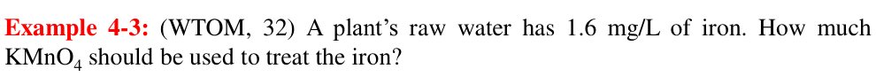
      - Nhìn vào: Dòng chữ đỏ "Example 4-3: (WTOM, 32)" và nội dung câu hỏi "A plant’s raw water has 1.6 mg/L of iron. How much KMnO4 should be used to treat the iron?".
- **Quy tắc áp dụng**:
  - Quy tắc R05 (`R05_FE_KMNO4_OXIDATION`): Phản ứng oxy hóa ion sắt $\text{Fe(II)}$ bằng kali pemanganat:
    $$3\text{Fe}^{2+} + \text{KMnO}_4 + 7\text{H}_2\text{O} \rightarrow 3\text{Fe(OH)}_3\downarrow + \text{MnO}_2\downarrow + \text{K}^+ + 5\text{H}^+$$
    - Theo phương trình hóa học, $3\text{ mol Fe}^{2+}$ ($3 \times 55.845 = 167.535\text{ g}$) phản ứng với $1\text{ mol KMnO}_4$ ($158.034\text{ g}$).
    - Tỷ lệ nhu cầu hóa chất lý thuyết:
      $$\text{Ratio}_{\text{KMnO}_4/\text{Fe, lý thuyết}} = \frac{158.034}{167.535} = 0.9433\text{ mg KMnO}_4/\text{mg Fe}$$
  - Công thức tính liều lượng châm hóa chất:
    $$\text{Dose}_{\text{KMnO}_4}\text{ (mg/L)} = [\text{Fe}^{2+}]\text{ (mg/L)} \times \text{Ratio}_{\text{KMnO}_4/\text{Fe}}$$
  - Nguồn trích dẫn: Slide 6 (bảng định mức chất oxy hóa), Slide 19 (mục 4.4 Calculation) và tài liệu WTOM, tr. 32.
- **Lời giải**:
  - **Bước 1**: Xác định định mức nhu cầu $\text{KMnO}_4$ trên mỗi đơn vị nồng độ sắt.
    - Căn cứ: Bảng nhu cầu chất oxy hóa (Mục 4.2 Theory, Slide 6) quy định nhu cầu thuốc tím là $0.94\text{ mg KMnO}_4$ cho mỗi $1.0\text{ mg Fe}$.
    - Nhìn vào: Bảng so sánh chất oxy hóa trên Slide 6 (cột "per mg/L of Fe", hàng "Potassium permanganate: 0.94").
    - Thực hiện: Thiết lập tỷ lệ định lượng $\text{Ratio} = 0.94\text{ mg KMnO}_4/\text{mg Fe}$.
  - **Bước 2**: Tính liều lượng $\text{KMnO}_4$ cần châm để xử lý hoàn toàn lượng sắt trong nước thô.
    - Căn cứ: Hàm lượng sắt nước thô $[\text{Fe}^{2+}] = 1.6\text{ mg/L}$ và công thức định mức $\text{Dose} = [\text{Fe}^{2+}] \times \text{Ratio}$.
    - Nhìn vào: Dòng thứ 1 của khối Example 4-3 trên Ảnh EX4_3.1 ("A plant’s raw water has 1.6 mg/L of iron").
    - Thực hiện:
      - Tính theo định mức vận hành thực tế ($0.94\text{ mg/mg}$):
        $$\text{Dose}_{\text{KMnO}_4} = 1.6\text{ mg/L} \times 0.94\text{ mg KMnO}_4/\text{mg Fe} = 1.504\text{ mg/L} \approx 1.50\text{ mg/L}$$
      - Tính theo tỷ lệ phản ứng lý thuyết chính xác ($0.9433\text{ mg/mg}$):
        $$\text{Dose}_{\text{KMnO}_4,\text{exact}} = 1.6\text{ mg/L} \times 0.9433\text{ mg KMnO}_4/\text{mg Fe} = 1.5093\text{ mg/L} \approx 1.51\text{ mg/L}$$
- **Kết quả**:
  - Liều lượng $\text{KMnO}_4$ cần dùng là $1.504\text{ mg/L}$ (theo định mức thiết kế $0.94$: $1.50\text{ mg/L}$; theo tỷ lệ lý thuyết: $1.51\text{ mg/L}$).
- **Kiểm tra lại**:
  - Kiểm tra tính toán khử ngược: Lượng sắt oxy hóa được từ $1.504\text{ mg/L KMnO}_4$:
    $$[\text{Fe}^{2+}] = \frac{1.504\text{ mg/L}}{0.94\text{ mg/mg}} = 1.60\text{ mg/L}$$
    Khớp chính xác với hàm lượng sắt trong nước thô đề bài cho.
  - Đánh giá công nghệ: Phản ứng diễn ra gần như tức thời trong dải $\text{pH } 5.0 - 9.0$. Kết tủa mangan dioxide ($\text{MnO}_2$) sinh ra đóng vai trò chất trợ keo tụ và nhân xúc tác hấp phụ thêm ion kim loại trước khi vào bể lắng/lọc.

###### Ví dụ 4-4 (ex4_4): Tính liều lượng KMnO4 cần thiết để oxy hóa Mangan trong nước thô (Example 4-4)

- **Đề bài**:
  (WTOM, 32) Nguồn nước thô của một nhà máy xử lý nước cấp có chứa $6.8\text{ mg/L}$ mangan. Cần sử dụng liều lượng $\text{KMnO}_4$ là bao nhiêu để oxy hóa hết lượng mangan này?
  *(Nguyên văn tiếng Anh: Example 4-4: (WTOM, 32) A plant’s raw water has 6.8 mg/L of manganese. How much KMnO4 should be used to treat the manganese?)*
- **Dữ kiện**:
  - Hàm lượng ion mangan hòa tan trong nước thô: $[\text{Mn}^{2+}] = 6.8\text{ mg/L}$.
  - Định mức nhu cầu $\text{KMnO}_4$ vận hành thực tế: $1.92\text{ mg KMnO}_4/\text{mg Mn}$ (theo bài giảng Slide 6, bảng *Oxidant Requirements for Iron and Manganese*).
  - Tỷ lệ đương lượng phản ứng lý thuyết: $1.9177\text{ mg KMnO}_4/\text{mg Mn}$ (dựa trên khối lượng mol $M_{\text{KMnO}_4} = 158.034\text{ g/mol}$ và $M_{\text{Mn}} = 54.938\text{ g/mol}$).
  - Minh chứng đề bài trên slide bài giảng:
    - **Ảnh EX4_4.1.** Đề bài Ví dụ 4-4 trên slide 19 (trang 132 bài giảng).
      - 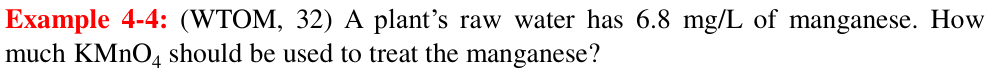
      - Nhìn vào: Dòng chữ đỏ "Example 4-4: (WTOM, 32)" và nội dung câu hỏi "A plant’s raw water has 6.8 mg/L of manganese. How much KMnO4 should be used to treat the manganese?".
- **Quy tắc áp dụng**:
  - Quy tắc R06 (`R06_MN_KMNO4_OXIDATION`): Phản ứng oxy hóa ion mangan $\text{Mn(II)}$ bằng kali pemanganat:
    $$3\text{Mn}^{2+} + 2\text{KMnO}_4 + 2\text{H}_2\text{O} \rightarrow 5\text{MnO}_2\downarrow + 2\text{K}^+ + 4\text{H}^+$$
    - Theo phương trình hóa học, $3\text{ mol Mn}^{2+}$ ($3 \times 54.938 = 164.814\text{ g}$) phản ứng với $2\text{ mol KMnO}_4$ ($2 \times 158.034 = 316.068\text{ g}$).
    - Tỷ lệ nhu cầu hóa chất lý thuyết:
      $$\text{Ratio}_{\text{KMnO}_4/\text{Mn, lý thuyết}} = \frac{316.068}{164.814} = 1.9177\text{ mg KMnO}_4/\text{mg Mn}$$
  - Công thức tính liều lượng châm hóa chất:
    $$\text{Dose}_{\text{KMnO}_4}\text{ (mg/L)} = [\text{Mn}^{2+}]\text{ (mg/L)} \times \text{Ratio}_{\text{KMnO}_4/\text{Mn}}$$
  - Nguồn trích dẫn: Slide 6 (bảng định mức chất oxy hóa), Slide 19 (mục 4.4 Calculation) và tài liệu WTOM, tr. 32.
- **Lời giải**:
  - **Bước 1**: Xác định định mức nhu cầu $\text{KMnO}_4$ trên mỗi đơn vị nồng độ mangan.
    - Căn cứ: Bảng nhu cầu chất oxy hóa (Mục 4.2 Theory, Slide 6) quy định nhu cầu thuốc tím là $1.92\text{ mg KMnO}_4$ cho mỗi $1.0\text{ mg Mn}$.
    - Nhìn vào: Bảng so sánh chất oxy hóa trên Slide 6 (cột "per mg/L of Mn", hàng "Potassium permanganate: 1.92").
    - Thực hiện: Thiết lập tỷ lệ định lượng $\text{Ratio} = 1.92\text{ mg KMnO}_4/\text{mg Mn}$.
  - **Bước 2**: Tính liều lượng $\text{KMnO}_4$ cần châm để oxy hóa toàn bộ mangan trong nước thô.
    - Căn cứ: Hàm lượng mangan nước thô $[\text{Mn}^{2+}] = 6.8\text{ mg/L}$ và công thức định mức $\text{Dose} = [\text{Mn}^{2+}] \times \text{Ratio}$.
    - Nhìn vào: Dòng thứ 1 của khối Example 4-4 trên Ảnh EX4_4.1 ("A plant’s raw water has 6.8 mg/L of manganese").
    - Thực hiện:
      - Tính theo định mức vận hành thực tế ($1.92\text{ mg/mg}$):
        $$\text{Dose}_{\text{KMnO}_4} = 6.8\text{ mg/L} \times 1.92\text{ mg KMnO}_4/\text{mg Mn} = 13.056\text{ mg/L} \approx 13.06\text{ mg/L}$$
      - Tính theo tỷ lệ phản ứng lý thuyết chính xác ($1.9177\text{ mg/mg}$):
        $$\text{Dose}_{\text{KMnO}_4,\text{exact}} = 6.8\text{ mg/L} \times 1.9177\text{ mg KMnO}_4/\text{mg Mn} = 13.0404\text{ mg/L} \approx 13.04\text{ mg/L}$$
- **Kết quả**:
  - Liều lượng $\text{KMnO}_4$ cần dùng là $13.056\text{ mg/L}$ (theo định mức thiết kế $1.92$: $13.06\text{ mg/L}$ hoặc làm tròn kỹ thuật $13.1\text{ mg/L}$; theo tỷ lệ lý thuyết: $13.04\text{ mg/L}$).
- **Kiểm tra lại**:
  - Kiểm tra tính toán khử ngược: Lượng mangan oxy hóa được từ $13.056\text{ mg/L KMnO}_4$:
    $$[\text{Mn}^{2+}] = \frac{13.056\text{ mg/L}}{1.92\text{ mg/mg}} = 6.80\text{ mg/L}$$
    Khớp chính xác với hàm lượng mangan trong nước thô đề bài cho.
  - Kiểm soát vận hành và giám sát chất lượng nước: Oxy hóa mangan bằng thuốc tím đòi hỏi kiểm soát liều lượng nghiêm ngặt trước bể lọc xúc tác cát mangan (Greensand). Nếu châm thiếu liều lượng, mangan hòa tan còn dư sẽ đi vào mạng lưới phân phối gây nước đen và cặn bám; nếu châm dư thừa thuốc tím, nước sau xử lý sẽ có màu hồng tím đặc trưng của ion pemanganat ($\text{MnO}_4^-$) chưa phản ứng.

### Chương 5: Quá trình Lắng (Sedimentation)

#### 5.1 Overview

* Mục tiêu của các quá trình tiền xử lý trước lắng:
  * Quá trình coagulation (keo tụ) và flocculation (tạo bông) chuyển đổi colloids (hạt keo) thành suspended particles (hạt lơ lửng).
  * Quá trình oxidation-reduction (oxy hóa - khử) loại bỏ iron/manganese (sắt/mangan) bằng cách tạo thành insoluble precipitate (kết tủa không tan).
  * Quá trình lime-soda softening (làm mềm bằng vôi - soda) loại bỏ hardness (độ cứng) bằng cách tạo thành insoluble precipitate.
* Cơ chế và định nghĩa của quá trình sedimentation (lắng trọng lực):
  * Suspended particles và insoluble precipitate lắng tách khỏi nước nhờ gravitational forces (lực trọng trường) khi kích thước hạt đủ lớn. Quá trình này được gọi là sedimentation.
  * Giới hạn kích thước hạt loại bỏ: Tùy thuộc vào density (khối lượng riêng), các hạt lơ lửng và kết tủa không tan có kích thước lớn hơn $1\ \mu\text{m}$ có thể được loại bỏ bằng sedimentation.
* Biện pháp vận hành và công trình lắng:
  * Nước chứa hạt lơ lửng và kết tủa được đưa vào một quiescent basin (bể tĩnh) lớn trong khoảng thời gian lưu thích hợp để hạt lắng xuống đáy.
  * Công trình lắng còn được gọi là clarifier (bể làm trong) hoặc settling tank (bể lắng).
* Sơ đồ dòng chảy và thu gom bùn trong công trình lắng:
  * Dòng nước vào: Nước từ flocculation basin (bể tạo bông) đi vào công trình lắng.
  * Dòng nước ra: Nước sau lắng được dẫn sang filtration tank (bể lọc).
  * Thu gom bùn: Bùn lắng được gom vào hopper (phễu thu bùn).
  * Xử lý bùn: Bùn từ hopper được dẫn đến công đoạn solid treatment (xử lý bùn cặn / chất rắn).

#### 5.2 Theory

##### 5.2.1 Phân loại Cơ chế Lắng Cặn trong Kỹ thuật Xử lý Nước (Classification of Particle Settling Regimes)

###### 5.2.1.1 Thông số Điều khiển và Tiêu chí Phân loại (Controlling Parameters & Classification Criteria)
- **Vận tốc lắng ($v_s$) là thông số điều khiển cốt lõi (controlling parameter)**:
  - Vận tốc lắng của hạt cặn cần loại bỏ ($v_s$) quyết định toàn bộ kích thước hình học và diện tích mặt bằng của bể lắng lý tưởng.
  - Hiệu quả thu giữ hạt cặn yêu cầu vận tốc lắng của hạt phải lớn hơn hoặc bằng tải trọng bề mặt của bể ($v_o$):
    $$v_s \ge v_o = \frac{Q}{A_s}$$
    - $v_s$: Vận tốc lắng trọng lực của hạt cặn ($\text{m/s}$ hoặc $\text{m/h}$).
    - $v_o$: Vận tốc tràn bề mặt hay tải trọng thủy lực bề mặt ($\text{m}^3/(\text{m}^2\cdot\text{h})$ hoặc $\text{m/h}$).
    - $Q$: Lưu lượng nước qua bể lắng ($\text{m}^3/\text{h}$ hoặc $\text{m}^3/\text{d}$).
    - $A_s$: Diện tích bề mặt lắng hữu dụng ($\text{m}^2$).
- **Hai tiêu chí phân loại trạng thái lắng**:
  - Nồng độ hạt chất rắn (particle concentration): Xác định cự ly không gian giữa các hạt lân cận và tần suất tương tác thủy động lực học.
  - Hình thái học và tính chất bề mặt của hạt (particle morphology): Xác định khả năng dính kết (flocculation), hình dạng hạt, độ cầu, và tính biến dạng khi lắng.
- **Bốn phân nhóm quy ước chuẩn hóa (four standardized categories)**:
  - Nhóm 1: Lắng hạt rời rạc (Discrete particle settling - Type I).
  - Nhóm 2: Lắng tạo bông (Flocculant settling - Type II).
  - Nhóm 3: Lắng cản trở hay lắng vùng (Hindered settling / Zone settling - Type III).
  - Nhóm 4: Lắng nén (Compression settling - Type IV).

###### 5.2.1.2 Bản chất Vật lý và Động học của Bốn Loại Lắng (Physical & Kinetic Characteristics: Type I to Type IV)
- **Ma trận đối chiếu bốn cơ chế lắng trọng lực**:

| Cơ Chế Lắng | Tên Quy Ước | Đặc Điểm Nồng Độ & Hình Thái Hạt | Động Học Vận Tốc Lắng ($v_s$) | Ứng Dụng Kỹ Thuật Điển Hình |
|---|---|---|---|---|
| **Type I** | Lắng hạt rời rạc (*Discrete settling*) | Nồng độ loãng; hạt không tương tác; không kết tụ tạo bông; hình dạng và kích thước cố định. | $v_s = \text{const}$ (hạt đạt vận tốc lắng không đổi rất nhanh theo cân bằng lực Newton/Stokes). | Bể lắng cát (*grit chamber*), bể sơ lắng hạt thô, lắng cát rửa lọc nhanh. |
| **Type II** | Lắng tạo bông (*Flocculant settling*) | Nồng độ thấp đến trung bình; các hạt có khả năng liên kết dính bám khi va chạm. | $v_s$ tăng dần theo chiều sâu và thời gian do hạt kết tụ tăng dần đường kính ($v_s = f(z, t)$). | Bể lắng sau keo tụ phèn nhôm, phèn sắt; kết tủa oxy hóa $Fe/Mn$; kết tủa làm mềm vôi. |
| **Type III** | Lắng cản trở (*Hindered / Zone settling*) | Nồng độ cao; tương tác lực cản thủy động giữa các hạt lân cận chi phối; tạo lớp đệm hạt (*sludge blanket*). | Toàn bộ khối hạt lắng đồng loạt với một vận tốc chung; xuất hiện mặt phân cách lỏng - rắn rõ rệt. | Bể lắng tiếp xúc cặn (*solids-contact clarifier*), bể lắng bùn hoạt tính, tầng màng cặn lơ lửng. |
| **Type IV** | Lắng nén (*Compression settling*) | Nồng độ rất cao; các hạt tiếp xúc cơ học trực tiếp tạo thành cấu trúc khung xốp chịu lực. | $v_s$ rất nhỏ; quá trình nén ép diễn ra do trọng lượng các lớp cặn bên trên đẩy nước lỗ rỗng lên trên. | Tầng đáy hố thu bùn của bể lắng (*sludge hopper*), bể nén bùn trọng lực (*sludge thickener*). |

- **Đặc tính cơ chế Type I (Lắng hạt rời rạc)**:
  - Các hạt lắng độc lập, không cản trở và không tương tác với các hạt xung quanh.
  - Nồng độ hạt trong huyền phù ở mức thấp.
  - Hạt không thay đổi kích thước, hình dạng hoặc khối lượng trong toàn bộ hành trình lắng.
  - Vận tốc lắng $v_s$ là hằng số cố định khi hạt đạt trạng thái cân bằng giữa trọng lực ($F_G$), lực nổi Archimedes ($F_B$) và lực cản chất lưu ($F_D$).
- **Đặc tính cơ chế Type II (Lắng tạo bông)**:
  - Các hạt có khả năng kết dính khi tiếp xúc và va chạm cơ học.
  - Quá trình keo tụ và kết cụm diễn ra liên tục trong suốt hành trình rơi.
  - Kích thước hạt hiệu dụng tăng dần làm tăng lực trọng trường hiệu dụng, dẫn đến vận tốc lắng tăng liên tục theo độ sâu bể.
  - Quỹ đạo lắng của hạt là một đường cong cong dốc dần thay vì một đường thẳng.
- **Đặc tính cơ chế Type III (Lắng cản trở / Lắng vùng)**:
  - Nồng độ hạt cao hơn rõ rệt so với Type I và Type II.
  - Cự ly giữa các hạt rất hẹp khiến trường dòng chảy chất lưu quanh từng hạt tương tác mạnh mẽ.
  - Dòng nước đẩy ngược qua các khe rỗng giữa các hạt tạo lực cản thủy động học đáng kể lên các hạt xung quanh.
  - Các hạt liên kết thành một khối màng đệm cặn (*sludge blanket*) và lắng đồng tốc.
  - Quá trình lắng tạo ra một bề mặt phân pha rõ ràng giữa lớp nước trong phía trên và lớp màng bùn đặc phía dưới.
- **Đặc tính cơ chế Type IV (Lắng nén)**:
  - Nồng độ chất rắn lơ lửng ở mức rất cao, hiệu quả hơn so với Type III.
  - Các hạt tiếp xúc vật lý trực tiếp với nhau, hình thành cấu trúc khung giàn rắn xốp.
  - Quá trình nén ép diễn ra khi các lớp hạt mới lắng đè tải trọng tĩnh lên lớp hạt bên dưới.
  - Nước trong các vi lỗ rỗng bị nén ép cơ học và thoát ngược lên trên, làm giảm độ ẩm và tăng mật độ nén của lớp bùn đáy.

###### 5.2.1.3 Sự Đồng tồn tại và Ý nghĩa Kỹ thuật trong Vận hành Bể Lắng (Coexistence & Operational Significance in Clarifiers)
- **Sự đồng tồn tại của bốn cơ chế lắng trong một công trình thực tế**:
  - Bể lắng xử lý nước thực tế thường xuất hiện đồng thời cả bốn cơ chế lắng dọc theo tiết diện sâu của bể.
  - Phân tầng động học theo phương thẳng đứng từ mặt nước xuống đáy bể:
    - Vùng nước trong phía trên (Clarified zone): Lắng Type I của các hạt cặn khoáng hoặc hạt cát sót lại.
    - Vùng lắng làm trong ở giữa (Clarification zone): Lắng Type II của các bông cặn keo tụ đang tiếp tục va chạm dính kết.
    - Vùng màng bùn lơ lửng (Sludge blanket zone): Lắng Type III với ranh giới phân tách pha lỏng - rắn ổn định.
    - Vùng hố thu cặn ở đáy bể (Sludge hopper zone): Lắng Type IV thực hiện nén ép cô đặc bùn.
- **Ý nghĩa kỹ thuật trong thiết kế bể lắng**:
  - Xác định diện tích mặt bằng bể lắng ($A_s$): Tính toán dựa trên vận tốc lắng giới hạn của cơ chế Type I hoặc Type II để đảm bảo cặn không bị cuốn trôi qua máng tràn.
  - Xác định chiều sâu và dung tích vùng chứa bùn ($V_{\text{sludge}}$): Tính toán dựa trên động học nén của cơ chế Type III và Type IV nhằm dự trữ đủ thể tích tích lũy cặn giữa hai chu kỳ xả.
- **Ý nghĩa kỹ thuật trong vận hành và kiểm soát sự cố**:
  - Duy trì độ ổn định của lớp màng bùn (Type III): Tránh hiện tượng xáo trộn thủy lực hoặc quá tải thủy lực làm phá vỡ ranh giới màng cặn, gây trào bùn ra máng thu nước sạch.
  - Tối ưu hóa chu kỳ xả bùn đáy (Type IV): Xả bùn đúng chu kỳ giúp bùn đạt độ nén tối ưu (giảm độ ẩm), đồng thời ngăn ngừa hiện tượng phân hủy yếm khí sinh bọt khí làm nổi mảng bùn lên mặt nước.

##### Type I Sedimentation

- Đặc điểm của quá trình lắng Type I (Type I sedimentation / discrete particle settling):
  - Lắng Type I đặc trưng bởi các hạt lắng rời rạc với vận tốc lắng không đổi ($v_s = \text{const}$).
  - Các hạt lắng riêng lẻ và không keo tụ tạo bông (do not flocculate) trong suốt quá trình lắng.
  - Ví dụ điển hình cho hạt lắng Type I là cát (sand) và sạn (grit).
- Ứng dụng thực tế của quá trình lắng Type I:
  - Lắng sơ bộ (presedimentation) để tách cát trước công đoạn keo tụ trong nhà máy xử lý nước cấp uống (potable water plant).
  - Lắng các hạt cát trong giai đoạn rửa bể lọc cát nhanh (rapid sand filters).
  - Tách cặn và hạt vô cơ trong bể lắng cát (grit chambers).
- Cơ chế cân bằng lực động học của Newton (Newton's force balance):
  - Khi hạt lắng rời rạc, vận tốc lắng có thể tính toán được để thiết kế bể loại bỏ kích thước hạt chỉ định.
  - Sir Isaac Newton (1687) chứng minh hạt rơi trong chất lưu tĩnh gia tốc đến khi lực cản ma sát cân bằng với trọng lực.
  - Ba lực tác dụng lên hạt rơi tự do gồm trọng lực ($F_G$), lực đẩy nổi ($F_B$) và lực cản ($F_D$):
    - Trọng lực (gravitational force): $F_G = (\phi_s) g \forall_p$.
    - Lực đẩy nổi (buoyancy force): $F_B = (\phi) g \forall_p$.
    - Lực cản (drag force): $F_D = C_D A_p (\phi) \frac{v^2}{2}$.
    - **Hình 1.** Ba lực tác dụng lên hạt rơi trong chất lưu
      - 
      - **Hình này chứng minh điều gì**
        - Trọng lực ($F_G$) kéo hạt xuống đối kháng lực nổi ($F_B$) và lực cản ($F_D$).
      - **Từ đâu mà thấy được**
        - Mũi tên $F_G$ hướng xuống; mũi tên $F_B$ và hai mũi tên $F_D$ hướng lên.
- Các thông số trong phương trình cân bằng lực:
  - $\phi_s$: Khối lượng riêng của hạt (density of particle), $\text{kg/m}^3$.
  - $\phi$: Khối lượng riêng của chất lưu (density of fluid), $\text{kg/m}^3$.
  - $g$: Gia tốc trọng trường (acceleration due to gravity), $\text{m/s}^2$.
  - $\forall_p$: Thể tích của hạt (volume of particle), $\text{m}^3$.
  - $C_D$: Hệ số cản (drag coefficient), không thứ nguyên.
  - $A_p$: Diện tích mặt cắt ngang của hạt (cross-sectional area of particle), $\text{m}^2$.
  - $v$: Vận tốc của hạt (velocity of particle), $\text{m/s}$.
  - **Hình 2.** Sơ đồ cân bằng lực tác dụng lên hạt lắng tự do
    - 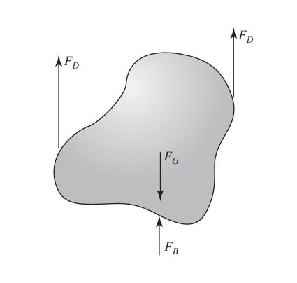
    - **Hình này chứng minh điều gì**
      - Hạt chuyển động chịu trọng lực $F_G$ kéo xuống cùng lực $F_B$, $F_D$ đẩy lên.
    - **Từ đâu mà thấy được**
      - Nhãn $F_G$ tại tâm hướng xuống; nhãn $F_B$ ở đáy và $F_D$ ở sườn hướng lên.
- Chế độ dòng chảy và chuẩn số Reynolds ($R$):
  - Osborne Reynolds (1883) đề xuất tỷ số không thứ nguyên $R$ để xác định các chế độ dòng chảy.
  - Định nghĩa chuẩn số Reynolds cho hạt cầu chuyển động trong chất lỏng: $R = \frac{d \cdot v_s}{\nu} = \frac{\phi \cdot d \cdot v_s}{\mu}$.
    - $d$: Đường kính hạt cầu (diameter of sphere), $\text{m}$.
    - $v_s$: Vận tốc của hạt cầu (velocity of sphere), $\text{m/s}$.
    - $\nu$: Độ nhớt động học (kinematic viscosity), $\nu = \frac{\mu}{\phi}$, $\text{m}^2/\text{s}$.
    - $\phi$: Khối lượng riêng của chất lưu (density of fluid), $\text{kg/m}^3$.
    - $\mu$: Độ nhớt động lực học (dynamic viscosity hay absolute viscosity), $\text{Pa}\cdot\text{s}$.
- Hệ số cản Newton ($C_D$) theo chuẩn số Reynolds ($R$):
  - Hệ số cản $C_D$ phụ thuộc vào chế độ dòng chảy theo ba khoảng số Reynolds:
    - Chảy tầng ($R < 0.5$): $C_D = \frac{24}{R}$.
    - Vùng chuyển tiếp ($0.5 < R < 10^4$): $C_D = \frac{24}{R} + \frac{3}{R^{1/2}} + 0.34$.
    - Chảy rối ($R > 10^4$): $C_D = 0.4$.
    - **Hình 3.** Quan hệ giữa hệ số cản Newton và số Reynolds
      - 
      - **Hình này chứng minh điều gì**
        - Thực nghiệm hạt cầu khớp đường lý thuyết $C_D$; Stokes' law chỉ đúng khi $R \le 1$.
      - **Từ đâu mà thấy được**
        - Trục hoành $R$ ($10^{-3}$–$10^6$), trục tung $C_D$ ($10^{-1}$–$10^4$); Stokes phân kỳ khi $R > 1$.
- Vận tốc lắng cuối và Định luật Stokes:
  - Vận tốc lắng cuối ($v_s$) đạt được khi trọng lực triệt tiêu lực đẩy nổi và lực cản ($F_G = F_B + F_D$).
  - Định luật Stokes áp dụng cho hạt cầu lắng trong điều kiện chảy tầng tĩnh với $R \le 1$.
  - Mối quan hệ hệ số cản $C_D$ theo số Reynolds cho các hình dạng hạt khác nhau:
    - **Hình 4.** Hệ số cản Newton theo số Reynolds cho các dạng hạt
      - 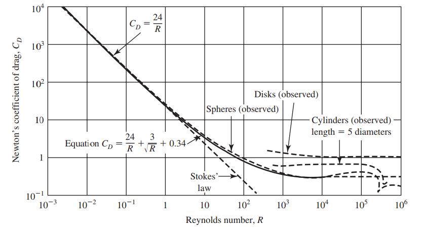
      - **Hình này chứng minh điều gì**
        - Khi $R > 1$, $C_D$ tách khỏi Stokes; ở $R \ge 10^3$, $C_D$ phụ thuộc hình dạng hạt.
      - **Từ đâu mà thấy được**
        - Đường Spheres bám đường tính $C_D$; đường Disks và Cylinders nằm ngang ở $R \ge 10^3$.

##### Ideal Sedimentation Basin

- Lý thuyết bể lắng lý tưởng của Thomas R. Camp (1936) cho quá trình tách hạt lắng rời rạc:
  - Thomas R. Camp (1936) đề xuất lý thuyết duy lý (rational theory) để loại bỏ các hạt lắng rời rạc (discretely settling particles) trong bể lắng lý tưởng (ideal settling basin).
  - Mô hình bể lắng lý tưởng của Camp dựa trên 7 giả thiết cơ bản (fundamental assumptions):
    - Giả thiết 1: Quá trình lắng thuộc loại Type I (Type I settling / discrete settling), các hạt lắng riêng rẽ và không kết bông.
    - Giả thiết 2: Thể tích bể lắng được phân chia thành bốn vùng chức năng riêng biệt (four zones in the basin): vùng nước vào (inlet zone), vùng nước ra (outlet zone), vùng chứa bùn cặn (sludge zone), và vùng lắng (settling zone).
    - Giả thiết 3: Phân phối dòng chảy đồng đều với vận tốc nằm ngang đồng nhất (even distribution of flow / uniform horizontal velocity) khi đi vào vùng lắng.
    - Giả thiết 4: Phân phối dòng chảy đồng đều (even distribution of flow) khi rời khỏi vùng lắng sang vùng nước ra.
    - Giả thiết 5: Hạt cặn phân bố đồng đều trên toàn bộ chiều sâu (uniform distribution of particles through the depth) tại mặt cắt đầu vào của vùng lắng.
    - Giả thiết 6: Các hạt cặn đi vào vùng bùn đều bị bắt giữ hoàn toàn và lưu trữ cố định trong vùng bùn (particles that enter the sludge zone are captured and remain in the sludge zone).
    - Giả thiết 7: Các hạt cặn đi vào vùng nước ra sẽ không được loại bỏ khỏi dòng nước (particles that enter the outlet zone are not removed from the water).
  - Phân vùng cấu tạo và không gian chức năng trong bể lắng lý tưởng:
    - **Hình 5.** Sơ đồ bốn vùng chức năng trong bể lắng lý tưởng
      - 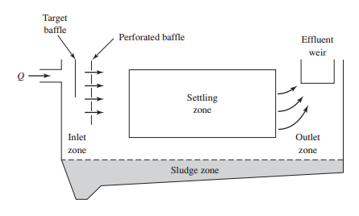
      - **Hình này chứng minh điều gì**
        - Vị trí không gian tương đối giữa bốn vùng chức năng: vùng lắng ở trung tâm, vùng vào ở bên trái, vùng thu nước ở bên phải và vùng bùn ở đáy.
      - **Từ đâu mà thấy được**
        - Nhìn theo chiều dòng chảy từ trái sang phải: dòng $Q$ qua Inlet zone vào Settling zone rồi đến Outlet zone (Effluent weir); Sludge zone nằm dọc đáy bể.
    - **Hình 6.** Sơ đồ bốn vùng chức năng trong bể lắng đứng
      - 
      - **Hình này chứng minh điều gì**
        - Phân định không gian và ranh giới giữa bốn vùng chức năng theo phương thẳng đứng trong bể lắng dòng chảy hướng lên.
      - **Từ đâu mà thấy được**
        - Hướng dòng chảy từ trên xuống theo $Q$: vào ống nạp xuống Inlet zone, dâng qua Settling zone lên máng tràn Outlet zone; Sludge zone ở đáy phễu.
- Hai cấu hình hình học cơ bản của bể làm trong lý tưởng (ideal clarifier configurations):
  - Bể lắng dòng chảy ngang (Horizontal flow clarifier): dòng nước mang hạt cặn di chuyển theo phương nằm ngang qua vùng lắng.
  - Bể lắng dòng chảy hướng lên (Upflow clarifier): dòng nước di chuyển theo phương thẳng đứng từ dưới lên qua vùng lắng.
  - Sơ đồ cấu tạo và hướng chuyển động dòng chảy trong hai dạng bể lắng:
    - **Hình 7.** Sơ đồ các vùng chức năng trong bể lắng ngang
      - 
      - **Hình này chứng minh điều gì**
        - Cấu tạo bốn vùng chức năng cho phép lưu lượng $Q$ chảy ngang qua vùng lắng để cặn tách khỏi dòng nước trước máng thu.
      - **Từ đâu mà thấy được**
        - Đọc từ trái sang phải: dòng vào $Q$ qua Target baffle và Perforated baffle vào Settling zone và thoát qua Effluent weir; Sludge zone nằm ở đáy bể.
    - **Hình 8.** Sơ đồ phân vùng chức năng bể lắng dòng chảy hướng lên
      - 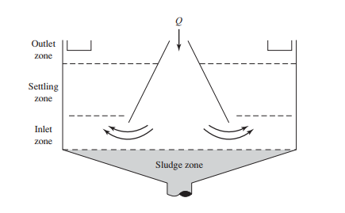
      - **Hình này chứng minh điều gì**
        - Cấu trúc bốn vùng chức năng: dòng vào $Q$ qua ống trung tâm xuống đáy, dâng ngược qua Settling zone (diện tích $A_s$) để tách cặn, bùn lắng vào Sludge zone và nước trong vào Outlet zone.
      - **Từ đâu mà thấy được**
        - Hướng dòng chảy từ trên xuống: mũi tên $Q$ qua ống trung tâm, rẽ cong tại Inlet zone rồi dâng ngược lên qua Settling zone đến Outlet zone; Sludge zone ở đáy phễu.
- Cơ chế tách cặn và tốc độ tràn trong bể lắng dòng chảy hướng lên (Upflow clarifier):
  - Động học tách hạt trong bể lắng đứng:
    - Nước dâng thẳng đứng với vector vận tốc dâng ($v_o$).
    - Hạt cặn chìm xuống với vector vận tốc lắng trọng lực ($v_s$).
    - Khi diện tích mặt cắt ướt ngang ($A_s$) đủ lớn, vector vận tốc nước dâng ($v_o$) sẽ nhỏ hơn vector vận tốc lắng của hạt ($v_s$):
      $$v_o \le v_s \iff v_s \ge v_o$$
    - Hệ quả phân tách: hạt cặn thắng được lực kéo dâng của dòng nước và lưu lại trong bể (rơi xuống vùng bùn), trong khi nước trong (clear water) dâng lên và thoát ra ngoài máng thu.
  - Định nghĩa tốc độ tràn (overflow rate) và tải trọng bề mặt thủy lực (hydraulic surface loading):
    - Vận tốc dâng của dòng nước ($v_o$) cho phép phân tách nước khỏi hạt cặn được gọi là tốc độ tràn (overflow rate), vì đây là tốc độ mà nước dâng tràn qua đỉnh bể vào các máng thu nước (rate at which water overflows the top of the tank into the weirs).
    - Tốc độ tràn còn được gọi là tải trọng bề mặt thủy lực (hydraulic surface loading) hoặc tải trọng bề mặt (surface loading).
    - Phương trình xác định tốc độ tràn và vận tốc lắng tới hạn:
      $$v_s = \frac{Q}{A_s}$$
    - Đơn vị đo của tốc độ tràn / tải trọng bề mặt: $\text{m}^3/(\text{m}^2\cdot\text{d})$, $\text{m}^3/(\text{m}^2\cdot\text{h})$, hoặc $\text{m/s}$.
  - Các thông số trong phương trình bể lắng đứng:
    - $v_s$: Vận tốc lắng của hạt cặn (settling velocity), đơn vị $\text{m/s}$.
    - $v_o$: Vận tốc dâng của nước / tốc độ tràn (upward water velocity / overflow rate), đơn vị $\text{m/s}$.
    - $Q$: Lưu lượng dòng chảy qua bể (flow rate), đơn vị $\text{m}^3/\text{s}$.
    - $A_s$: Diện tích bề mặt lắng (surface area), đơn vị $\text{m}^2$.
- Cơ chế tách cặn và thời gian lưu nước trong bể lắng dòng chảy ngang (Horizontal flow clarifier):
  - Động học tách hạt trong bể lắng ngang:
    - Để được loại bỏ hoàn toàn khỏi dòng nước, hạt cặn xuất phát từ mặt nước ở cửa vào phải có vận tốc lắng ($v_s$) đủ lớn để rơi chạm đáy bể trong khoảng thời gian ($t_o$) mà nước lưu chuyển trong bể (thời gian lưu nước / detention time).
    - Điều kiện tách cặn yêu cầu vận tốc lắng của hạt phải bằng chiều sâu bể chia cho thời gian lưu nước $t_o$:
      $$v_s = \frac{h}{t_o}$$
  - Công thức xác định thời gian lưu thủy lực lý thuyết ($t_o$):
    $$t_o = \frac{\forall}{Q}$$
    - $t_o$: Thời gian lưu nước trong bể (detention time), đơn vị $\text{s}$.
    - $\forall$: Thể tích hữu ích của bể lắng (tank volume), đơn vị $\text{m}^3$.
    - $Q$: Lưu lượng dòng chảy qua bể (flow rate), đơn vị $\text{m}^3/\text{s}$.
  - Thiết lập mối quan hệ giữa vận tốc lắng, lưu lượng và diện tích bề mặt bể lắng ngang:
    - Thể tích của bể lắng liên hệ với diện tích bề mặt ($A_s$) và chiều sâu bể ($h$) theo phương trình $\forall = A_s \cdot h$.
    - Thay biểu thức thời gian lưu nước $t_o = \frac{\forall}{Q} = \frac{A_s \cdot h}{Q}$ vào phương trình vận tốc lắng:
      $$v_s = \frac{h}{t_o} = \frac{h}{\frac{A_s \cdot h}{Q}} = \frac{Q}{A_s}$$
    - Nguyên lý diện tích bề mặt Hazen: Vận tốc lắng tới hạn ($v_s$) của hạt cần loại bỏ trong bể lắng ngang bằng đúng tỷ số giữa lưu lượng $Q$ và diện tích bề mặt $A_s$ ($v_s = \frac{Q}{A_s}$), hoàn toàn đồng nhất với tốc độ tràn trong bể lắng đứng và độc lập với chiều sâu bể lắng ($h$).
  - Các thông số trong phương trình bể lắng ngang:
    - $v_s$: Vận tốc lắng của hạt cặn (settling velocity), đơn vị $\text{m/s}$.
    - $Q$: Lưu lượng dòng chảy (flow rate), đơn vị $\text{m}^3/\text{s}$.
    - $A_s$: Diện tích bề mặt vùng lắng (surface area), đơn vị $\text{m}^2$.
    - $h$: Chiều sâu làm việc của bể lắng (depth of tank), đơn vị $\text{m}$.
    - $t_o$: Thời gian lưu nước trong bể (detention time), đơn vị $\text{s}$.
    - $\forall$: Thể tích hữu ích của bể lắng (tank volume), đơn vị $\text{m}^3$.

##### Type II Sedimentation

- Quá trình lắng loại II (Type II sedimentation) được đặc trưng bởi các hạt kết bông (flocculate) trong quá trình lắng:
  - Các loại hạt này xuất hiện trong quá trình keo tụ bằng phèn nhôm hoặc phèn sắt (alum or iron coagulation).
  - Xuất hiện trong quá trình lắng sơ cấp nước thải (wastewater primary sedimentation).
  - Xuất hiện trong các bể lắng của quá trình lọc nhỏ giọt (settling tanks in trickling filtration).
- Không có mối quan hệ toán học thỏa đáng nào có thể được sử dụng để mô tả quá trình lắng loại II (Type II settling):
  - Phương trình Stokes (Stokes equation) không thể sử dụng được vì các hạt kết bông liên tục thay đổi về kích thước và hình dạng (size and shape).
  - Ngoài ra, khi nước bị cuốn giữ bên trong bông cặn (water is entrapped in the floc), tỷ trọng / khối lượng riêng tương đối (specific gravity) của hạt cũng thay đổi.
- Thí nghiệm trong phòng thí nghiệm với cột lắng (settling columns) đóng vai trò là mô hình mô phỏng hành vi của lắng kết bông (flocculant settling):
  - Các thí nghiệm này có giá trị trong việc đánh giá các bể lắng hiện hữu (evaluating of existing settling tanks).
  - Có giá trị trong việc phát triển dữ liệu phục vụ mở rộng trạm (plant expansion) hoặc cải tạo các công trình hiện hữu (modification of existing plants).
  - Không thực tế cho việc thiết kế các bể lắng mới (design of new settling tanks) do khó tái lập các tính chất và nồng độ của các hạt sinh ra từ quá trình keo tụ/tạo bông (coagulation/flocculation process).
- Phương pháp phân tích dữ liệu cột lắng và hành vi của huyền phù kết bông (flocculant suspension):
  - Một cột lắng được đổ đầy huyền phù cần phân tích.
  - Huyền phù được để cho lắng tĩnh.
  - Các mẫu nước được rút ra từ các cổng lấy mẫu (sample ports) ở các cao độ khác nhau tại các khoảng thời gian được chọn trước.
  - Nồng độ chất rắn lơ lửng (suspended solids) được xác định cho từng mẫu và phần trăm loại bỏ ($R\%$) được tính toán:
    - Công thức tính phần trăm loại bỏ: $R\% = \frac{C_0 - C_t}{C_0} \times 100\%$.
    - $R\%$: phần trăm loại bỏ tại một độ sâu và thời gian nhất định (percent removal at one depth and time), $\%$.
    - $C_t$: nồng độ tại thời gian và độ sâu đã cho (concentration at given time and depth), $\text{mg/L}$.
    - $C_0$: nồng độ ban đầu (initial concentration), $\text{mg/L}$.
- Các đường đẳng nồng độ (isoconcentration lines) cho thí nghiệm lắng loại II sử dụng cột lắng sâu $2\text{ m}$ (2 m-deep column):
  - **Hình 9.** Đường đẳng nồng độ trong thí nghiệm lắng loại II
    - 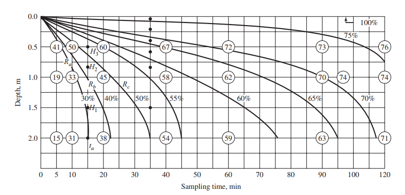
    - **Hình này chứng minh điều gì**
      - Các đường đẳng mức loại bỏ ($30\text{ }\%$–$75\text{ }\%$) nội suy từ dữ liệu đo, xác định các phân đoạn độ sâu để tính hiệu suất loại bỏ tổng cộng tại thời gian lấy mẫu $t_a$.
    - **Từ đâu mà thấy được**
      - Ox: thời gian lấy mẫu $t$ ($\text{min}$), dải $0\text{--}120\text{ min}$. Oy: độ sâu cột lắng $h$ ($\text{m}$), dải $0.0\text{--}2.0\text{ m}$.
      - Các số khoanh tròn biểu diễn hiệu suất đo ($15\text{ }\%$–$76\text{ }\%$); đường dóng tại $t_a = 15\text{ min}$ cắt các đường đẳng mức tại các độ sâu $H_1, H_2, H_3$.
- Phương pháp phân tích dữ liệu cột lắng sử dụng các đường đẳng nồng độ để xác định các phân đoạn độ sâu $H_1, H_2, H_3$ tương ứng với thời gian lắng $t_a$ và các đường đẳng hiệu suất $R_a, R_b$:
  - **Hình 10.** Đường đẳng nồng độ từ thí nghiệm cột lắng sâu $2\text{ m}$
    - 
    - **Hình này chứng minh điều gì**
      - Các đường đẳng mức loại bỏ ($30\text{ }\%$–$75\text{ }\%$) nội suy từ dữ liệu đo, làm cơ sở xác định các phân đoạn độ sâu để tính hiệu suất lắng tổng cộng tại thời gian $t_a$.
    - **Từ đâu mà thấy được**
      - Ox: thời gian lấy mẫu $t$ ($\text{min}$), dải $0\text{--}120\text{ min}$. Oy: độ sâu $h$ ($\text{m}$), dải $0.0\text{--}2.0\text{ m}$.
      - Các số khoanh tròn biểu diễn hiệu suất đo ($15\text{ }\%$–$76\text{ }\%$); đường dóng tại $t_a = 15\text{ min}$ cắt các đường đẳng mức $R_a, R_b$ tại các độ sâu $H_1, H_2, H_3$.

##### Type III and Type IV Sedimentation

- Điều kiện hình thành và sự xuất hiện đồng thời của các dạng lắng ở nồng độ hạt cao:
  - Khi nước chứa hàm lượng hạt cặn ở nồng độ cao (high concentration of particles), ví dụ lớn hơn $1,000\text{ mg/L}$, cả quá trình lắng Type III (lắng cản trở hoặc lắng vùng / hindered settling or zone settling) và lắng Type IV (lắng nén / compression settling) đều diễn ra đồng thời cùng với lắng hạt rời rạc (discrete settling) và lắng tạo bông (flocculant settling).
  - Quá trình lắng vùng (zone settling) xuất hiện phổ biến trong các quy trình xử lý nước và nước thải thực tế gồm:
    - Quá trình lắng trong làm mềm nước bằng vôi (lime-softening sedimentation).
    - Quá trình lắng bùn hoạt tính (activated sludge sedimentation).
    - Các bể nén bùn / cô đặc bùn (sludge thickeners).
- Diễn biến động học của huyền phù đặc trong cột lắng hoặc ống đong chia độ:
  - Khi một huyền phù đậm đặc có nồng độ đồng nhất (concentrated suspension of uniform concentration) được đưa vào cột lắng (column) hoặc ống đong chia độ (graduated cylinder), cả ba cơ chế lắng Type II, Type III và Type IV đều lần lượt diễn ra theo thời gian.
  - Các hạt cặn tiếp xúc với nhau có xu hướng lắng đồng thời theo một vùng hoặc một lớp màng bùn / đệm cặn (zone or “blanket”).
  - Trong quá trình cùng chuyển động lắng xuống, các hạt tiếp xúc với nhau có xu hướng duy trì nguyên vẹn cùng một vị trí tương đối (maintain the same relative position).
  - Sự lắng đồng loạt theo màng cặn tạo ra một lớp nước tương đối trong (relatively clear layer) ở phía trên khối cặn đang lắng.
- Bản chất vật lý và các yếu tố ảnh hưởng đến quá trình lắng cản trở (hindered settling):
  - Hiện tượng các hạt lắng tập hợp theo vùng và giữ nguyên vị trí tương đối được định danh là lắng cản trở (hindered settling).
  - Tốc độ lắng cản trở (rate of hindered settling) là một hàm phụ thuộc vào nồng độ của các hạt cặn (concentration of the particles) và các đặc tính của hạt (particle characteristics).
  - Khi quá trình lắng tiếp diễn liên tục theo thời gian, một lớp hạt bị nén (compressed layer of particles) bắt đầu hình thành và tích tụ ở phía đáy.
- Bản chất cơ chế chuyển pha và định nghĩa của quá trình lắng nén (compression settling):
  - Tại lớp nén ở đáy, các hạt cặn tiếp xúc trực tiếp cơ học với nhau và không thực sự lắng xuống (do not really settle) theo nghĩa chuyển động rơi tự do.
  - Cơ chế trực quan chính xác hơn để mô tả hiện tượng này là dòng nước bị ép thoát ngược ra ngoài từ một tấm đệm hạt (mat of particles) đang chịu lực nén cơ học do trọng lượng của các lớp hạt bên trên.
  - Do bản chất động học giải phóng chất lỏng khỏi khối đệm cặn bị nén ép, quá trình này được gọi là lắng nén (compression settling).
- Yêu cầu thực nghiệm và phạm vi áp dụng trong thiết kế kỹ thuật:
  - Tương tự như phương pháp phân tích đối với quá trình lắng Type II, các phương pháp phân tích lắng cản trở đòi hỏi bắt buộc phải có dữ liệu thực nghiệm từ thí nghiệm lắng (settling test data).
  - Các phương pháp phân tích thực nghiệm này phù hợp và có giá trị áp dụng trong các dự án mở rộng hoặc cải tạo nâng cấp nhà máy xử lý hiện hữu (plant expansions or modifications).
  - Tuy nhiên, các phương pháp phân tích lắng cản trở chưa được áp dụng phổ biến trong công tác thiết kế các nhà máy xử lý quy mô nhỏ (small treatment plants).
- Sơ đồ lý tưởng hóa của quá trình lắng Type III và Type IV trong cột lắng (settling column):
  - Thí nghiệm cột mô tả trực quan sự tiến triển của các ranh giới phân vùng theo thời gian:
    - Thời điểm ban đầu $t = 0$: toàn bộ cột lắng có chiều cao ban đầu $H$ chứa đầy huyền phù vùng lắng cản trở ($\text{HS}$ - hindered settling) với nồng độ hạt phân bố đồng nhất.
    - Thời điểm $t = t_1$: cột lắng phân tách rõ rệt thành 4 phân vùng từ đỉnh xuống đáy gồm: mặt thoáng/lớp nước trong bên trên ($\text{WS}$ - water surface / clear water layer), vùng lắng cản trở ($\text{HS}$), vùng lắng chuyển tiếp ($\text{TS}$ - transition settling), và vùng lắng nén ($\text{CS}$ - compression settling) bắt đầu tích tụ ở đáy.
    - Thời điểm $t = t_2$: vùng lắng cản trở ($\text{HS}$) đã biến mất hoàn toàn, cột chỉ còn lại lớp nước trong ($\text{WS}$), vùng lắng chuyển tiếp ($\text{TS}$) và vùng lắng nén ($\text{CS}$) đang tiếp tục dâng cao.
    - Thời điểm $t = t_3$: vùng chuyển tiếp ($\text{TS}$) biến mất hoàn toàn, toàn bộ cặn đã tập trung vào vùng lắng nén ($\text{CS}$) bên dưới lớp nước trong ($\text{WS}$).
    - Thời điểm $t = t_4$: khối cặn trong vùng lắng nén ($\text{CS}$) tiếp tục bị nén ép chặt hơn theo thời gian, đẩy nước ra ngoài và làm giảm chiều cao bề mặt phân cách cặn (height of interface) xuống mức tối thiểu ổn định.
  - **Hình 11.** Sơ đồ lý tưởng hóa lắng Type III và IV trong cột
    - 
    - **Hình này chứng minh điều gì**
      - Mặt phân cách hạ thấp dần khi lớp nước trong mở rộng; các phân vùng HS rồi TS lần lượt biến mất, nhường chỗ cho lớp nén CS cô đặc ở đáy.
    - **Từ đâu mà thấy được**
      - Đọc từ trái sang phải qua các cột theo thời gian ($t = 0 \to t_4$): trục tung chỉ chiều cao mặt phân cách $H$, phía trên là mặt thoáng (WS).
      - Huyền phù ban đầu ($t = 0$) tách thành các phân tầng HS, TS (gạch chéo) và CS ($t_1$), sau đó HS biến mất ($t_2$), TS biến mất ($t_3$), và CS tiếp tục nén chặt ($t_4$).
  - **Hình 12.** Sơ đồ lắng Type III và IV trong cột lắng
    - 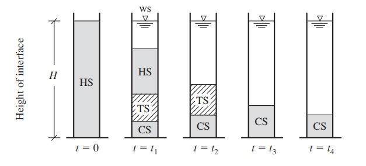
    - **Hình này chứng minh điều gì**
      - Quá trình chuyển hóa và triệt tiêu tuần tự các vùng: $\text{HS}$ giảm dần, chuyển qua $\text{TS}$ và tích tụ thành lớp nén $\text{CS}$ ở đáy.
    - **Từ đâu mà thấy được**
      - Đọc từ trái sang phải qua 5 cột: ban đầu tại $t = 0$ chứa đầy $\text{HS}$ với chiều cao $H$.
      - Tại $t = t_1$ xuất hiện $\text{TS}$ (gạch chéo) và $\text{CS}$; $\text{HS}$ biến mất ở $t = t_2$, $\text{TS}$ biến mất ở $t = t_3$, và $\text{CS}$ tiếp tục nén đặc ở $t = t_4$.
- Đồ thị đường cong lắng tương ứng trong cột lắng (corresponding settling curve):
  - Đường cong thực nghiệm biểu diễn mối quan hệ động học giữa chiều cao bề mặt phân cách cặn và thời gian lắng:
    - Trục tung biểu diễn chiều cao bề mặt phân cách giữa lớp nước trong và khối cặn ($\text{Height of interface}$).
    - Trục hoành biểu diễn thời gian lắng ($\text{Time}$) tương ứng qua các thời điểm chuyển pha $t_1, t_2, t_3, t_4$.
  - Phân vùng động học trên đường cong lắng:
    - Vùng lắng cản trở / lắng vùng ($\text{HS}$ - hindered / zone settling): diễn ra từ $t = 0$ đến thời điểm $t_2$, đường biểu diễn có dạng một đường thẳng dốc tuyến tính; độ dốc của đoạn thẳng này biểu thị vận tốc lắng của màng cặn ($\text{Slope = settling velocity}$).
    - Vùng lắng chuyển tiếp ($\text{TS}$ - transition settling): diễn ra trong khoảng thời gian tiếp theo (từ $t_2$ đến $t_3$), đường biểu diễn uốn cong thoải dần khi vận tốc lắng suy giảm do nồng độ hạt tăng cao và các hạt cản trở lẫn nhau mạnh mẽ hơn.
    - Vùng lắng nén ($\text{CS}$ - compression settling): diễn ra từ thời điểm $t_3$ đến $t_4$, đường cong tiệm cận nằm ngang khi cấu trúc khung cặn đã hình thành và tốc độ thoát nước ra khỏi đệm hạt rất chậm.
  - **Hình 13.** Đồ thị đường cong lắng tương ứng
    - 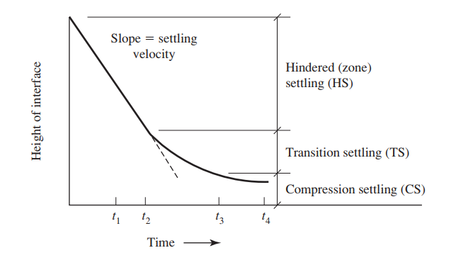
    - **Hình này chứng minh điều gì**
      - Chiều cao mặt phân cách hạ tuyến tính với vận tốc không đổi ($\text{Slope = settling velocity}$) trong vùng lắng cản trở ($\text{HS}$), rồi giảm tốc qua vùng chuyển tiếp ($\text{TS}$) và tiệm cận không đổi ở vùng lắng nén ($\text{CS}$).
    - **Từ đâu mà thấy được**
      - Ox: thời gian ($\text{Time}$) qua các mốc $t_1, t_2, t_3, t_4$. Oy: chiều cao mặt phân cách ($\text{Height of interface}$).
      - Đoạn dốc thẳng từ $0$ đến $t_2$ ghi $\text{Slope = settling velocity}$ ($\text{HS}$); đoạn uốn cong ở $t_2\text{--}t_3$ ($\text{TS}$); đoạn thoải ngang ở $t_3\text{--}t_4$ ($\text{CS}$).
  - **Hình 14.** Đồ thị đường cong lắng tương ứng
    - 
    - **Hình này chứng minh điều gì**
      - Mặt phân cách hạ tuyến tính theo vận tốc lắng không đổi ở HS ($0 \to t_2$), sau đó giảm tốc ở TS ($t_2 \to t_3$) và tiệm cận ổn định ở CS ($t_3 \to t_4$).
    - **Từ đâu mà thấy được**
      - Trục $Ox$: thời gian (Time, mốc $t_1 \to t_4$); Trục $Oy$: chiều cao mặt phân cách (Height of interface).
      - Độ dốc đường thẳng $0 \to t_2$ ghi chú "Slope = settling velocity" (HS), tiếp nối đoạn uốn TS và đoạn là ngang CS.

##### High-Rate Settling

- Nguyên lý gia tốc quá trình làm trong (Accelerate the clarification process):
  - Quá trình làm trong nước có thể được gia tốc bằng cách tăng tỷ trọng của hạt trong nước đầu vào (increasing the particle density of water input).
  - Quá trình làm trong nước cũng có thể được gia tốc bằng cách giảm khoảng cách rơi tự do của hạt cặn (reducing the distance the particle must fall).

###### a/ Increasing the particle density of water input

- Tỷ trọng tự nhiên của bông cặn (Specific gravity of flocs):
  - Bông cặn phèn nhôm (alum floc) có tỷ trọng xấp xỉ $1.001$.
  - Bông cặn vôi (lime floc) có tỷ trọng xấp xỉ $1.002$.
- Gia tăng vận tốc lắng bằng chất dằn (Ballasted floc settling velocity):
  - Một số quy trình công nghệ độc quyền bổ sung chất dằn (ballast) vào bông cặn để gia tăng vận tốc lắng ($v_s$) của hạt.
  - Chất dằn thường dùng là vi cát (microsized sand) có đường kính hạt từ $20\ \mu\text{m}$ đến $200\ \mu\text{m}$ ($20 - 200\ \mu\text{m}$).
  - Tỷ trọng của hạt vi cát nằm trong khoảng từ $2.50$ đến $2.65$ ($2.50 - 2.65$).
  - Hạt vi cát lắng xuống đáy được thu hồi (recovered) và tái sử dụng (reused) liên tục.

###### b/ Reducing the distance the particle must fall

- Bố trí mô-đun bản nghiêng hoặc ống nghiêng (Inclined plates / tubes):
  - Một dãy các tấm nghiêng (inclined plates) hoặc các ống nghiêng (tubes) được đặt vào trong bể lắng dòng chảy ngang hình chữ nhật (rectangular horizontal flow settling basin).
  - Các tấm hoặc ống được đặt nghiêng ở một góc thích hợp để các chất rắn thu gom được (collected solids) tự trượt xuống bề mặt dốc đi vào vùng chứa bùn (sludge zone).
- Đặc tính hình học và kích thước điển hình của ống lắng (Tube settler geometry):
  - Ống lắng điển hình có tiết diện hình vuông (square).
  - Kích thước tiết diện ống vào khoảng $5\ \text{cm}$ ở mỗi cạnh ($5\ \text{cm} \times 5\ \text{cm}$).
  - Góc nghiêng của ống lắng vào khoảng $60^\circ$ (trong tài liệu ghi nhận $600$, tức $60^\circ$).
- Ba cấu hình dòng chảy thủy lực điển hình (Three typical configurations):
  - Ba cấu hình dòng chảy cơ bản gồm chảy ngược chiều (countercurrent), chảy cùng chiều (cocurrent), và chảy ngang dòng (crosscurrent).
  - Các cấu hình được đặt tên theo hướng dòng chảy của nước so với hướng hạt cặn rời khỏi các tấm hoặc ống nghiêng.
- Cấu hình chảy ngược chiều (Countercurrent configuration):
  - Định nghĩa dòng chảy: Dòng chảy của nước chuyển động theo hướng ngược lại so với hướng chuyển động trượt của các hạt cặn.
  - **Hình 15.** Cấu hình lắng chảy ngược chiều qua các tấm nghiêng
    - 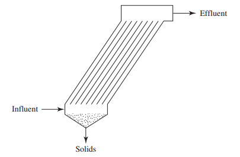
    - **Hình này chứng minh điều gì**
      - Nước đi từ đáy lên đỉnh qua các tấm nghiêng, còn cặn trượt ngược xuống phễu đáy.
    - **Từ đâu mà thấy được**
      - Đường đi từ dưới lên: mũi tên Influent đưa nước dâng qua dãy tấm nghiêng đến Effluent.
      - Hướng đối nghịch: mũi tên Solids chỉ xuống đáy phễu, ngược chiều với dòng nước dâng.
- Cấu hình chảy cùng chiều (Cocurrent configuration):
  - Định nghĩa dòng chảy: Dòng chảy của nước chuyển động cùng hướng với hướng chuyển động trượt của các hạt cặn dọc theo vách nghiêng.
  - **Hình 16.** Cấu hình lắng chảy cùng chiều qua các tấm nghiêng
    - 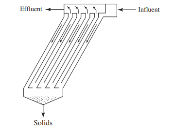
    - **Hình này chứng minh điều gì**
      - Nước vào (Influent) chảy dốc xuống cùng hướng di chuyển của cặn dọc theo vách nghiêng về đáy (Solids).
    - **Từ đâu mà thấy được**
      - Hướng dòng nước: mũi tên Influent từ đỉnh phải chảy dốc xuống khe nghiêng cùng hướng cặn trượt.
      - Tách dòng: cặn rơi xuống đáy theo mũi tên Solids; nước trong rẽ theo các mũi tên cong lên máng Effluent bên trái.
- Cấu hình chảy cắt ngang (Crosscurrent configuration):
  - Định nghĩa dòng chảy: Dòng chảy của nước chuyển động theo phương vuông góc hoặc cắt ngang qua hướng di chuyển và rơi xuống của các hạt cặn.
- Sơ đồ chi tiết dòng chảy ngược chiều (Countercurrent flow):
  - Nước vào từ đáy dâng qua các khe bản nghiêng lên máng thu nước trong phía trên, trong khi cặn trượt ngược chiều xuống phễu thu bùn đáy.
  - **Hình 17.** Sơ đồ dòng chảy ngược chiều qua mô-đun bản nghiêng
    - 
    - **Hình này chứng minh điều gì**
      - Nước dâng từ đáy lên cửa Effluent, đối nghịch với hướng cặn trượt xuống đáy phễu Solids.
    - **Từ đâu mà thấy được**
      - Dòng nước cấp: mũi tên Influent vào đáy trái, chảy hướng lên qua các khe bản nghiêng ra Effluent trên cùng.
      - Dòng cặn lắng: cặn trượt xuống đáy phễu và thoát ra ngoài theo mũi tên Solids hướng xuống.
- Sơ đồ chi tiết dòng chảy cùng chiều (Cocurrent flow):
  - Nước vào từ đỉnh chảy xuôi xuống cùng hướng cặn trượt về đáy phễu Solids, sau đó nước trong tách ra và đảo chiều đi lên máng thu gom phía trên.
  - **Hình 18.** Sơ đồ dòng chảy cùng chiều qua mô-đun bản nghiêng
    - 
    - **Hình này chứng minh điều gì**
      - Nước vào từ đỉnh chảy xuôi xuống cùng hướng cặn trượt về đáy phễu Solids, tách biệt với máng thu Effluent.
    - **Từ đâu mà thấy được**
      - Hướng dòng nước: mũi tên Influent vào từ góc trên bên phải, chảy xuôi xuống theo khe bản nghiêng.
      - Phân tách pha rắn - lỏng: cặn rơi xuống đáy phễu Solids; nước trong đảo chiều qua máng Effluent bên trái.

#### 5.3 Practice

##### Alternative Settling Tank Configurations

- Các tiêu chí thủy lực bổ sung trong phân loại và lựa chọn bể lắng công nghiệp:
  - Thời gian lưu nước thủy lực ($ hoặc $\text{HRT}$) đối với bể lắng ngang thông thường dao động từ {,}0$ đến {,}0\text{ h}$.
  - Vận tốc dòng chảy ngang trong bể ($) phải được kiểm soát chặt chẽ trong khoảng {,}15 - 0{,}90\text{ m/min}$ ({,}5 - 15\text{ mm/s}$) nhằm ngăn chặn hiện tượng cuộn xoáy tái phân tán cặn.
  - Vận tốc tới hạn gây tái cuốn trôi bông cặn phèn nhôm ($) được tính theo tiêu chuẩn Camp:  = \sqrt{\frac{8\beta}{f} g (s_s - 1) d_p}$, trong đó $\beta \approx 0{,}04$, hệ số ma sát Darcy-Weisbach  \approx 0{,}02 - 0{,}03$.
  - Kiểm soát ảnh hưởng của gió và chênh lệch nhiệt độ bề mặt: Đối với các bể hở diện tích mặt nước lớn, cần bố trí tường chắn gió hoặc mái che để triệt tiêu dòng tuần hoàn nghịch do lực ma sát gió bề mặt gây ra.
  - Phân bố tải trọng vùng lắng: Vùng lắng hữu dụng cần chiếm tối thiểu \% - 85\%$ tổng thể tích hình học của bể, trừ đi thể tích chết tại vùng nạp nước và vùng tích lũy bùn đáy.

- Danh mục và cấu hình các loại bể lắng thông dụng trong xử lý nước (Typical sedimentation tanks used in water treatment):
  - **Hình 19.** Danh mục và cấu hình các loại bể lắng thông dụng
    - 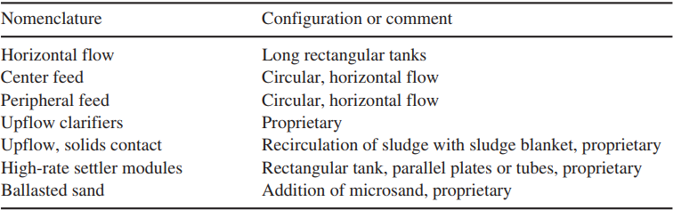
    - **Hình này chứng minh điều gì**
      - Đối chiếu các dạng bể theo dòng chảy ngang (bể chữ nhật dài, bể tròn) và dòng hướng lên.
      - Phân biệt các cấu hình cơ bản với các thiết kế cải tiến mang tính thương quyền (`proprietary`).
    - **Từ đâu mà thấy được**
      - Cột `Nomenclature`: danh mục tên gọi các loại bể lắng thông dụng.
      - Cột `Configuration or comment`: mô tả cấu hình hình học, dòng chảy và ghi chú `proprietary`.
  - Bể dòng chảy ngang (Horizontal flow): cấu hình bể lắng hình chữ nhật dài (long rectangular tanks).
  - Bể nạp tâm (Center feed): cấu hình bể lắng tròn dòng chảy ngang (circular, horizontal flow).
  - Bể nạp ngoại vi (Peripheral feed): cấu hình bể lắng tròn dòng chảy ngang (circular, horizontal flow).
  - Bể lắng dòng hướng lên (Upflow clarifiers): thiết bị mang tính độc quyền / thương quyền (proprietary units).
  - Bể lắng tiếp xúc cặn dòng hướng lên (Upflow, solids contact): tuần hoàn bùn với lớp mền bùn / cặn lơ lửng (recirculation of sludge with sludge blanket), là thiết bị thương quyền.
  - Module lắng tốc độ cao (High-rate settler modules): bể hình chữ nhật lắp đặt các tấm lắng hoặc ống lắng song song (rectangular tank, parallel plates or tubes), là thiết bị thương quyền.
  - Lắng cát gia tải (Ballasted sand sedimentation): bổ sung cát vi mịn (addition of microsand), là thiết bị thương quyền.
- Thứ tự ưu tiên khuyến nghị (recommended order of preference) để lắng bông cặn từ quá trình keo tụ/tạo bông (settling coagulation/flocculation floc):
  - Ưu tiên 1: Bể lắng chữ nhật chứa các module lắng tốc độ cao (rectangular tank containing high-rate settler modules).
  - Ưu tiên 2: Bể lắng chữ nhật dài (long rectangular tank).
  - Ưu tiên 3: Bể làm trong bằng cát vi mịn tốc độ cao (high-speed microsand clarifier), còn gọi là lắng cát gia tải (ballasted sand sedimentation).
- Lựa chọn công trình lắng cho quá trình làm mềm bằng vôi - soda (lime-soda softening process):
  - Đơn nguyên tiếp xúc cặn dòng hướng lên (upflow solids contact unit) là công trình được ưu tiên lựa chọn.
  - Đơn nguyên này còn được biết đến với tên gọi bể làm trong phản ứng (reactor clarifier).
  - Đơn nguyên này còn được gọi là bể làm trong lớp cặn lơ lửng / mền bùn (sludge blanket clarifier).
- Đặc tính chế tạo của bể lắng dòng hướng lên và bể lắng tiếp xúc cặn dòng hướng lên:
  - Là các đơn nguyên thương quyền (proprietary units).
  - Kích thước cơ bản và bản vẽ thiết kế kỹ thuật (basic size and blueprints) được ấn định sẵn bởi nhà sản xuất thiết bị (equipment manufacturers).
- Nguyên nhân các bể lắng dòng hướng lên và tiếp xúc cặn dòng hướng lên không được ưu tiên để loại bỏ bông phèn nhôm (alum floc):
  - Dao động nhiệt độ dù chỉ nhỏ ở mức $0.50^\circ\text{C}$ cũng có thể gây ra hiện tượng ngắn dòng nghiêm trọng do dòng đối lưu mật độ (severe density flow short circuiting).
  - Xảy ra sự suy giảm hiệu suất nhanh chóng (rapid loss of efficiency) khi bể rơi vào tình trạng quá tải thủy lực (hydraulic overloading) hoặc quá tải chất rắn (solids overloading).
  - Điều kiện áp dụng: Vẫn tồn tại những hoàn cảnh cụ thể mà các công trình này có thể phù hợp để áp dụng.
- Các cấu hình bể lắng không được khuyến nghị do tính không ổn định thủy lực (hydraulic instability):
  - **Hình 20.** Bảng cấu hình các dạng bể lắng thay thế
    - 
    - **Hình này chứng minh điều gì**
      - Xác định dạng hình học: center feed và peripheral feed là bể tròn dòng ngang, upflow clarifiers là thiết kế thương quyền.
    - **Từ đâu mà thấy được**
      - Cột `Nomenclature` đối chiếu cột `Configuration or comment` tại các hàng Center feed, Peripheral feed và Upflow clarifiers.
  - Bể dòng chảy ngang nạp tâm (horizontal flow with center feed) không được khuyến nghị vì độ bất ổn định thủy lực.
  - Bể dòng chảy ngang nạp ngoại vi (horizontal flow with peripheral feed) không được khuyến nghị vì độ bất ổn định thủy lực.
  - Bể lắng dòng hướng lên đơn giản (simple upflow clarifiers) không được khuyến nghị vì độ bất ổn định thủy lực.

##### Rectangular Sedimentation Basins

###### Flow Structure and Basin Geometry

- Các tiêu chuẩn kích thước hình học và thủy lực chi tiết của bể lắng chữ nhật dài:
  - Tỷ lệ chiều dài trên chiều rộng ( / W$): Tiêu chuẩn khuyến nghị tối thiểu là /W \ge 4:1$, tối ưu đạt từ $ đến $ nhằm duy trì dòng chảy tiệm cận trạng thái dòng chảy nút (plug-flow pattern).
  - Tỷ lệ chiều dài trên chiều sâu ( / H$): Thường thiết kế trong khoảng /H = 10:1$ đến $, với chiều sâu hữu dụng của lớp nước dao động từ {,}0\text{ m}$ đến {,}5\text{ m}$.
  - Kiểm soát số Reynolds ($) và số Froude ($): Bán kính thủy lực  = \frac{W \cdot H}{W + 2H}$; thiết kế thủy lực tối ưu thỏa mãn  = \frac{v_h R_h}{\nu} < 2000$ (dòng chảy tầng hoặc chuyển tiếp nhẹ) và  = \frac{v_h^2}{g R_h} > 10^{-5}$ để bảo đảm tính ổn định chống hiện tượng tách dòng.
  - Tường khuếch tán đầu vào (inlet diffuser wall): Bố trí vách đục lỗ có tỷ lệ diện tích lỗ mở từ \%$ đến \%$ diện tích vách, vận tốc qua lỗ {,}2 - 0{,}3\text{ m/s}$ nhằm tạo tổn thất cột áp  - 5\text{ mm}$, giúp phân phối lưu lượng đều khắp tiết diện ướt.
  - Hệ thống máng thu nước trong răng cưa: Tổng chiều dài máng tràn hữu dụng phải đủ lớn để khống chế tải trọng máng  \le 140 - 270\text{ m}^3/(\text{d}\cdot\text{m})$, ngăn ngừa hiện tượng hút nước cục bộ kéo theo bông cặn lơ lửng phía dưới.
- Xu hướng thực hành thiết kế bể lắng hiện nay (Current design practice):
  - Thực hành thiết kế đang chuyển dần từ bể lắng chữ nhật sang các module lắng tốc độ cao (high-rate settler modules).
  - Trong một số trường hợp, thiết kế dịch chuyển sang công nghệ tuyển nổi khí hòa tan (dissolved air flotation - DAF).
- Lý do trình bày thiết kế bể lắng hình chữ nhật (rectangular sedimentation basin design):
  - Về mặt lịch sử, đây là thiết kế được áp dụng thường xuyên nhất (most frequently used design).
  - Đóng vai trò là cấu trúc nền tảng cơ sở (fundamental structure) để lắp đặt các module lắng tốc độ cao.
- Cấu trúc dòng chảy và bố trí hình học của bể lắng ngang hình chữ nhật:
  - **Hình 21.** Cấu tạo mặt bằng và mặt cắt dọc bể lắng ngang
    - 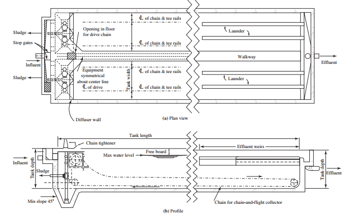
    - **Hình này chứng minh điều gì**
      - Bố trí hai đơn nguyên đối xứng qua lối đi trung tâm (Walkway); hệ xích cào bùn (chain-and-flight collector) gom bùn về hố thu đáy dốc tối thiểu $45^\circ$.
    - **Từ đâu mà thấy được**
      - Đường dòng từ trái sang phải: Influent qua vách phân phối (Diffuser wall), chảy dọc bể đến hệ máng Launder và thoát ra Effluent.
      - Mặt cắt (b) thể hiện xích cào bùn gạt ngược chiều về hố Sludge dốc $45^\circ$; mặt bằng (a) thể hiện 4 máng Launder song song chiều dài bể.
  - Cấu trúc cửa vào (inlet structure): được thiết kế nhằm phân phối đều nước đã tạo bông (flocculated water) trên toàn bộ mặt cắt ngang của bể.
  - Cấu trúc cửa ra (outlet structures): thường bao gồm các máng thu nước trong (launders) bố trí chạy song song với chiều dài của bể.
  - Vách ngăn ngang (cross baffles): có thể được lắp đặt bổ sung nhằm ngăn chặn dòng chảy bề mặt quay ngược (return of surface currents) từ cuối bể trở lại phía cửa vào.
- Mặt bằng và mặt cắt dọc của bể lắng ngang hình chữ nhật (Plan and Profile of horizontal-flow, rectangular sedimentation basin):
  - **Hình 22.** Mặt bằng và mặt cắt dọc bể lắng ngang
    - 
    - **Hình này chứng minh điều gì**
      - Cơ cấu xích cào (chain-and-flight) gom bùn ngược dòng về hố thu đáy dốc tối thiểu $45^\circ$.
      - Tường khuếch tán (diffuser wall) tại đầu vào giúp phân phối đều dòng chảy qua tiết diện bể.
    - **Từ đâu mà thấy được**
      - Đọc từ trái sang phải: dòng vào qua Diffuser wall, đi dọc bể và thoát qua các máng Launder ở cuối bể.
      - Mặt cắt dọc (b): mũi tên xích cào bùn chạy dọc đáy về phễu thu ghi chú Min slope $45^\circ$.
  - Bố trí mặt bằng (Plan view): thể hiện đường nước vào (influent), các cửa chặn (stop gates), phễu thu bùn (sludge), tường khuếch tán (diffuser wall), lối đi trên cầu (walkway), các máng thu nước (launders) và cửa xả nước trong (effluent).
  - Bố trí mặt cắt dọc (Profile): thể hiện chiều sâu bể (tank depth), chiều dài bể (tank length), chiều cao bảo vệ (freeboard), mực nước lớn nhất (max water level), máng tràn nước trong (effluent weirs) và phễu thu bùn đáy có độ dốc tối thiểu $45^\circ$ (min slope $45^\circ$).

###### Mechanical Sludge Collectors
- Phương pháp và thiết bị thu gom bùn cặn (sludge removal):
  - Thông thường, bùn cặn lắng được loại bỏ bằng các cơ cấu thu gom cơ học (mechanical collectors).
  - Bốn nhóm cơ cấu thu gom cơ học chính được phân loại theo thứ tự chi phí từ cao xuống thấp (ranked in order of cost):
    - Hạng 1 (chi phí cao nhất): Cầu chuyển động với tấm gạt bùn cao su (squeegees) và cơ cấu cào cặn ngang cơ học (mechanical cross collector) tại đầu dòng vào của bể.
    - Hạng 2: Cầu chuyển động với các đầu hút bùn (sludge suction headers) và máy bơm (pumps).
    - Hạng 3: Cơ cấu thu gom dạng xích và thanh gạt (chain-and-flight collectors).
    - Hạng 4 (chi phí thấp nhất): Đầu hút bùn gắn phao nổi (floats) và kéo bằng dây cáp (wires).
- Cấu tạo và nguyên lý hoạt động của hệ thống cầu chuyển động (traveling bridge system):
  - Kết cấu gồm một cây cầu bắc ngang qua chiều rộng bể (bridge across the width of the tank).
  - Cầu chuyển động tịnh tiến dọc theo chiều dài bể trên các bánh xe tựa trên đỉnh tường bể hoặc trên ray biên (side rails).
  - Treo từ cầu chuyển động xuống vùng bùn lắng (sludge zone) là các lưỡi cào bùn (scraper blades) hoặc thiết bị hút bùn (suction device).
  - Hệ thống hút bùn được trang bị máy bơm hoặc tận dụng hiệu ứng xi phông (siphon effect) từ độ chênh cột áp giữa mực nước trong bể lắng và đường ống bùn để xả cặn.
  - Đối với các hệ thống cấp nước sạch (water treatment systems), hệ thống sử dụng máy bơm được ưu tiên hơn.
- Cấu tạo và nguyên lý hoạt động của hệ thống xích và thanh gạt (chain-and-flight system):
  - Kết cấu gồm hai dải xích bố trí ở hai bên khu vực thu gom với các thanh gạt (flights) chạy ngang toàn bộ bề rộng của khu vực thu gom.
  - Vật liệu thanh gạt: trước đây được làm bằng gỗ đỏ (redwood), hiện nay được chế tạo từ composite gia cường sợi thủy tinh (fiberglass reinforced composite).
  - Khoảng cách lắp đặt thanh gạt: các thanh gạt được gắn định kỳ cách nhau mỗi khoảng $3\ \text{m}$ ($3\ \text{m}$ intervals).
  - Cơ cấu trượt chống mòn: các đế trượt bằng nhựa HDPE (HDPE wearing shoes) được gắn vào thanh gạt để trượt trên các thanh ray chữ T (T-rails) đúc chìm trong sàn bê tông.
  - Cơ cấu dẫn động xích và đĩa xích (chain and sprocket drive): trước đây được chế tạo bằng thép, hiện nay làm bằng composite cường độ cao (high-strength composite material).

##### Rectangular and Circular Horizontal Flow Sedimentation Basins

###### Rectangular Horizontal Flow Basin with Travelling Bridge Scraper
- Bể lắng ngang chữ nhật với cơ cấu cào bùn bằng cầu chuyển động (Rectangular, Horizontal Flow Sedimentation Basin - Travelling Bridge Sludge Scraper):
  - **Hình 23.** Cấu tạo cơ cấu cào bùn bằng cầu chuyển động
    - 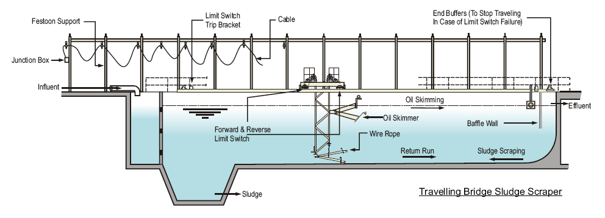
    - **Hình này chứng minh điều gì**
      - Chu trình vận hành 2 chiều: gạt bùn đáy về hố thu (Sludge Scraping) và hồi vị (Return Run) kết hợp thu gom váng mặt (Oil Skimming).
    - **Từ đâu mà thấy được**
      - Đọc từ đáy lên mặt nước: mũi tên Sludge Scraping hướng về hố Sludge ở đầu vào, đối lập chiều di chuyển Return Run và Oil Skimming.
      - Đọc từ trái sang phải trên đỉnh bể: cáp điện treo Festoon cấp nguồn cho xe cầu và bộ đệm End Buffers chặn ở cuối hành trình.
  - Chu trình làm việc hai chiều: chuyển động cào bùn đáy (sludge scraping) đưa bùn về phễu thu ở đầu bể và hành trình lùi (return run) kết hợp thu gom váng nổi bề mặt (oil skimming).
  - Bố trí hệ thống phụ trợ: hệ giá đỡ cáp treo di động (festoon support), hộp nối điện (junction box), giá gạt công tắc hành trình (limit switch trip bracket), công tắc hành trình tiến và lùi (forward & reverse limit switch), và bộ đệm chặn cuối hành trình (end buffers).
- Chi tiết cấu tạo cơ cấu cào bùn dạng cầu chuyển động trong bể lắng chữ nhật:
  - **Hình 25.** Cấu tạo hệ thống cầu cào bùn bể lắng chữ nhật
    - 
    - **Hình này chứng minh điều gì**
      - Cơ cấu cầu cào bùn chuyển động mang cánh cào đáy gom bùn về hố thu đầu bể và kết hợp thanh gạt váng nổi bề mặt.
    - **Từ đâu mà thấy được**
      - Đáy bể: mũi tên *Sludge Scraping* đưa bùn về hố *Sludge* ở đầu vào, cáp *Wire Rope* nâng cánh cào khi chạy lùi (*Return Run*).
      - Mặt nước và thành bể: thanh *Oil Skimmer* gạt váng sang phải; ray trên đỉnh bố trí *Festoon Support*, *Limit Switch* và *End Buffers*.
  - Cánh cào bùn đáy được liên kết bằng dây cáp (wire rope) để nâng hạ khi chuyển đổi giữa hành trình làm việc và hành trình lùi.
  - Vách ngăn chắn sóng / chắn dòng (baffle wall) được bố trí trước cửa xả nước trong (effluent).

###### Circular Horizontal Flow Basin with Central Drive Half Bridge
- Bể lắng tròn dòng chảy ngang với cơ cấu nửa cầu truyền động tâm (Circular, Horizontal Flow Sedimentation Basin - Central Drive Half Bridge):
  - **Hình 24.** Cấu tạo bể lắng tròn nửa cầu truyền động trung tâm
    - 
    - **Hình này chứng minh điều gì**
      - Sơ đồ bố trí dòng chảy hướng tâm ra biên, kết hợp thu gom bùn đáy dốc về tâm và váng nổi ở bề mặt.
    - **Từ đâu mà thấy được**
      - Nhìn từ tâm ra biên: dòng nước từ Influent dâng qua Inlet Ports tỏa ra máng Effluent; đáy dốc dẫn bùn về hố Sludge.
  - Cấu tạo truyền động và cấp nước: nước thô vào bể từ ống nạp đáy (influent) đi lên giếng nạp trung tâm (influent well) qua các cửa nạp (inlet ports).
  - Trụ tâm (centre pier) và lồng quay (cage): đỡ cụm dẫn động (drive unit) và cầu công tác (bridge), liên kết với giằng chữ A (A-frame tie bars) và tay cào cặn (rake arm).
  - Cấu tạo cào cặn: các lưỡi cào bùn có gắn đệm cao su (scraper blades w/ squeegees) quét bùn dồn về hố bùn đáy trung tâm (sludge hopper).
- Cấu tạo chi tiết và đường dẫn dòng chảy trong bể lắng tròn truyền động trung tâm:
  - **Hình 26.** Cấu tạo bể lắng tròn truyền động trung tâm nửa cầu
    - 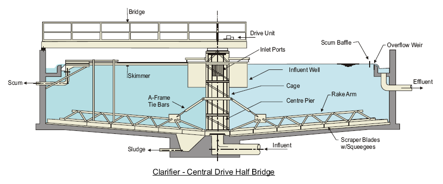
    - **Hình này chứng minh điều gì**
      - Cơ cấu gạt bùn đáy và thu váng: bộ truyền động kéo cánh gạt (Rake Arm) dồn bùn về hố Sludge, thanh Skimmer gom váng bề mặt.
    - **Từ đâu mà thấy được**
      - Mặt cắt từ tâm ra biên: Drive Unit và Centre Pier dẫn động dàn cào quét đáy dốc, Skimmer quét mặt nước đối diện máng tràn.
  - Hệ thống thu bọt váng và thu nước trong: cần gạt váng (skimmer) quét gom bọt váng xả ra ống xả váng (scum).
  - Tấm chắn bọt váng (scum baffle) ngăn bọt váng tràn qua máng tràn răng cưa (overflow weir) vào đường ống xả nước trong (effluent).

##### Typical Sedimentation Tank Overflow Rates and Weir Hydraulic Loading Rates

###### Typical Sedimentation Tank Overflow Rates
- Bảng thông số tải trọng bề mặt tràn điển hình của bể lắng (Typical sedimentation tank overflow rates):
  - **Hình 27.** Tải trọng bề mặt tràn điển hình của bể lắng
    - 
    - **Hình này chứng minh điều gì**
      - Bể tiếp xúc chất rắn dòng hướng lên luôn chịu tải trọng bề mặt cao hơn bể chữ nhật và bể tròn.
    - **Từ đâu mà thấy được**
      - Cột `Upflow solids-contact` có giá trị cao hơn so với cột `Long rectangular and circular` ở mọi ứng dụng.
      - Giá trị cực đại ở hàng làm mềm vôi ít magie ($130\ \text{m}^3/(\text{d}\cdot\text{m}^2)$), cực tiểu ở hàng xử lý tảo ($20\ \text{m}^3/(\text{d}\cdot\text{m}^2)$).
  - Đơn vị đo tải trọng bề mặt: tính bằng $\text{m}^3/(\text{d}\cdot\text{m}^2)$.
  - Thông số tải trọng bề mặt cho quá trình keo tụ bằng phèn nhôm hoặc phèn sắt (Alum or iron coagulation):
    - Khử độ đục (Turbidity removal): tải trọng bề mặt đạt $40\ \text{m}^3/(\text{d}\cdot\text{m}^2)$ đối với bể chữ nhật dài và bể tròn; đạt $50\ \text{m}^3/(\text{d}\cdot\text{m}^2)$ đối với bể tiếp xúc cặn dòng hướng lên (upflow solids-contact).
    - Khử màu (Color removal): tải trọng bề mặt đạt $30\ \text{m}^3/(\text{d}\cdot\text{m}^2)$ đối với bể chữ nhật dài và bể tròn; đạt $35\ \text{m}^3/(\text{d}\cdot\text{m}^2)$ đối với bể tiếp xúc cặn dòng hướng lên.
    - Nguồn nước có hàm lượng tảo cao (High algae): tải trọng bề mặt đạt $20\ \text{m}^3/(\text{d}\cdot\text{m}^2)$ đối với bể chữ nhật dài và bể tròn (không áp dụng bể tiếp xúc cặn dòng hướng lên).
  - Thông số tải trọng bề mặt cho quá trình làm mềm bằng vôi (Lime softening):
    - Nước có hàm lượng magie thấp (Low magnesium): tải trọng bề mặt đạt $70\ \text{m}^3/(\text{d}\cdot\text{m}^2)$ đối với bể chữ nhật dài và bể tròn; đạt $130\ \text{m}^3/(\text{d}\cdot\text{m}^2)$ đối với bể tiếp xúc cặn dòng hướng lên.
    - Nước có hàm lượng magie cao (High magnesium): tải trọng bề mặt đạt $57\ \text{m}^3/(\text{d}\cdot\text{m}^2)$ đối với bể chữ nhật dài và bể tròn; đạt $105\ \text{m}^3/(\text{d}\cdot\text{m}^2)$ đối với bể tiếp xúc cặn dòng hướng lên.
- So sánh tải trọng tràn bề mặt giữa bể lắng dòng ngang và bể lắng tiếp xúc cặn dòng hướng lên:
  - **Hình 29.** Tải trọng tràn bề mặt tiêu chuẩn của các bể lắng
    - 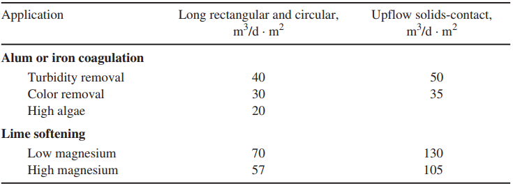
    - **Hình này chứng minh điều gì**
      - Quá trình làm mềm vôi cho tải trọng cao hơn ($105 - 130$ so với $57 - 70\ \text{m}^3/(\text{d}\cdot\text{m}^2)$), trong khi keo tụ phèn hoặc sắt chênh lệch ít hơn ($35 - 50$ so với $30 - 40\ \text{m}^3/(\text{d}\cdot\text{m}^2)$).
    - **Từ đâu mà thấy được**
      - Đối chiếu hai cột `Upflow solids-contact` và `Long rectangular and circular` qua từng nhóm ứng dụng.
      - Giá trị cao nhất đạt $130\ \text{m}^3/(\text{d}\cdot\text{m}^2)$ tại hàng `Lime softening / Low magnesium` của bể tiếp xúc cặn.
  - Bể tiếp xúc cặn dòng hướng lên cho phép tải trọng bề mặt cao hơn đáng kể so với bể chữ nhật dài và bể tròn trong hầu hết các ứng dụng xử lý.

###### Typical Weir Hydraulic Loading Rates
- Bảng thông số tải trọng thủy lực máng tràn điển hình (Typical weir hydraulic loading rates):
  - **Hình 28.** Tải trọng tràn máng điển hình theo loại bông cặn
    - 
    - **Hình này chứng minh điều gì**
      - Tải trọng tràn máng cho phép tăng dần theo độ nặng của bông cặn và độ đục của nước nguồn.
    - **Từ đâu mà thấy được**
      - Cột `Weir overflow rate, m3/(d·m)` tăng dần theo các hàng loại bông từ trên xuống dưới.
      - Hàng bông phèn nhẹ nước đục thấp nhỏ nhất ($140 - 180\ \text{m}^3/(\text{d}\cdot\text{m})$), hàng bông làm mềm vôi lớn nhất ($270 - 320\ \text{m}^3/(\text{d}\cdot\text{m})$).
  - Đơn vị đo tải trọng máng tràn: tính bằng $\text{m}^3/(\text{d}\cdot\text{m})$.
  - Thông số tải trọng máng tràn theo từng loại bông cặn (Type of floc):
    - Bông phèn nhẹ từ nước có độ đục thấp (light alum floc, low-turbidity water): tải trọng máng tràn thiết kế từ $140 - 180\ \text{m}^3/(\text{d}\cdot\text{m})$.
    - Bông phèn nặng hơn từ nước có độ đục cao hơn (heavier alum floc, higher turbidity water): tải trọng máng tràn thiết kế từ $180 - 270\ \text{m}^3/(\text{d}\cdot\text{m})$.
    - Bông cặn nặng tạo thành từ quá trình làm mềm bằng vôi (heavy floc from lime softening): tải trọng máng tràn thiết kế từ $270 - 320\ \text{m}^3/(\text{d}\cdot\text{m})$.
- Mối quan hệ giữa đặc tính bông cặn và tải trọng thủy lực máng tràn thiết kế:
  - **Hình 30.** Tải trọng máng tràn điển hình theo từng loại bông cặn
    - 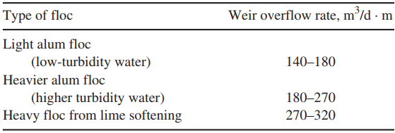
    - **Hình này chứng minh điều gì**
      - Giá trị thiết kế cụ thể: từ $140 - 180\ \text{m}^3/(\text{d}\cdot\text{m})$ (phèn nhẹ) tăng dần đến $270 - 320\ \text{m}^3/(\text{d}\cdot\text{m})$ (cặn vôi nặng).
    - **Từ đâu mà thấy được**
      - Đối chiếu hai cột `Type of floc` và `Weir overflow rate, m3/(d·m)`.
      - Hàng đầu (Light alum floc) đạt $140 - 180\ \text{m}^3/(\text{d}\cdot\text{m})$, hàng cuối (Heavy floc from lime softening) đạt cực đại $270 - 320\ \text{m}^3/(\text{d}\cdot\text{m})$.
  - Bông cặn càng nặng và có độ lắng càng tốt thì tải trọng máng tràn cho phép càng lớn mà không gây hiện tượng cuốn trôi bông cặn sang máng thu.

##### Clarifier Drawing

###### Prefabricated Circular Mechanical Clarifiers
- Bản vẽ kỹ thuật bể lắng tròn cơ học đúc sẵn cỡ nhỏ đường kính $8\text{ ft} - 12\text{ ft}$ (Prefabricated Circular Mech. Clarifiers):
  - **Hình 31.** Bản vẽ cấu tạo bể lắng tròn cơ học đúc sẵn
    - 
    - **Hình này chứng minh điều gì**
      - Cơ cấu vận hành tích hợp giữa cần gạt váng mặt và cánh cào dồn bùn đáy về hố thu.
    - **Từ đâu mà thấy được**
      - Mặt bằng (Plan View): cầu thao tác và các góc lệch $15^\circ$ của ống nạp, xả bùn, xả nước trong.
      - Mặt cắt đứng (Sectional Elevation View): ống nạp $F$ dẫn vào giếng $E$, ống xả váng $H$, hố bùn đáy $D$.
  - Kích thước hình học: đường kính bể $A$ từ $8'\text{-}0''$ đến $12'\text{-}0''$ ($2.44 - 3.66\ \text{m}$).
  - Giới hạn vận chuyển: chiều cao vận chuyển nguyên khối là $11'\text{-}0''$ ($3.35\ \text{m}$, shipping height).
  - Cấu tạo cụm phân phối: giếng tĩnh quay nạp nước đường kính $E$ (rotating inlet stilling well) gắn với trục truyền động ống mô-men (torque tube drive shaft).
- Chi tiết bố trí các ống công nghệ và phụ kiện bể lắng tròn cơ học đúc sẵn đường kính $8\text{ ft} - 12\text{ ft}$:
  - **Hình 34.** Bản vẽ cấu tạo bể lắng tròn cơ học đúc sẵn
    - 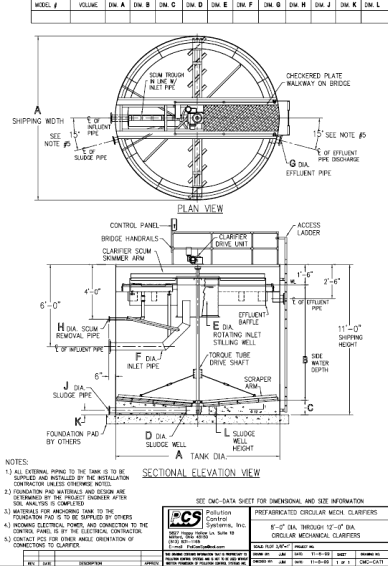
    - **Hình này chứng minh điều gì**
      - Bố trí cấp nước tâm qua giếng quay $E$, cơ cấu gạt váng mặt và cào bùn đáy dẫn động đồng bộ trục trung tâm.
    - **Từ đâu mà thấy được**
      - Mặt bằng (*Plan View*): Ống vào $F$ thẳng hàng máng váng; ống xả nước trong $G$ và ống bùn xả lệch $15^\circ$.
      - Mặt cắt đứng (*Sectional Elevation View*): Trục đứng truyền động dẫn động đồng thời cánh gạt váng mặt và cánh cào đáy (*Scraper Arm*).
  - Bố trí trên mặt bằng: ống nạp nước vào đường kính $F$ đặt thẳng hàng với máng thu váng bọt; đường ống bùn đường kính $J$ và đường ống xả nước trong đường kính $G$ bố trí góc lệch $15^\circ$.
  - Cơ cấu thu bùn cặn: cánh cào bùn (scraper arm) dồn bùn vào hố bùn đường kính $D$ có chiều cao $L$, dẫn ra ngoài qua đường ống bùn đường kính $J$.
  - Phụ kiện và kết cấu phụ trợ: ống thu xả váng bọt đường kính $H$, cầu thao tác có lan can bảo vệ (bridge handrails), thang tiếp cận (access ladder), tủ điều khiển (control panel) và đệm móng (foundation pad).
- Bản vẽ kỹ thuật bể lắng tròn cơ học đúc sẵn cỡ lớn đường kính $20\text{ ft} - 34\text{ ft}$ dạng mối nối ghép đôi (Double Spliced Circular Mechanical Clarifiers):
  - **Hình 32.** Bản vẽ cấu tạo bể lắng tròn cơ học đúc sẵn
    - 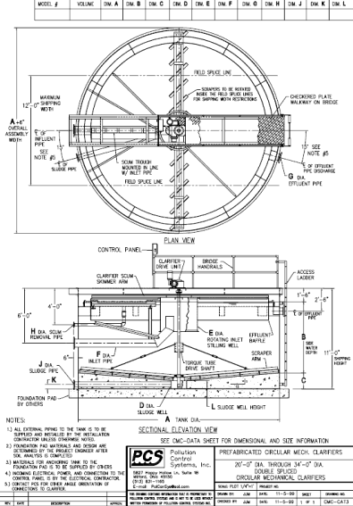
    - **Hình này chứng minh điều gì**
      - Cấu tạo hoàn chỉnh của bể lắng phân đoạn gồm giếng tĩnh tâm, cánh cào đáy dốc về hố bùn và chiều cao vận chuyển $11\text{ ft }0\text{ in}$.
    - **Từ đâu mà thấy được**
      - Mặt bằng (*Plan View*): hai đường *Field Splice Line* khống chế bề rộng $12\text{ ft }0\text{ in}$ kèm chỉ dẫn xoay cánh cào vào trong.
      - Mặt cắt đứng (*Sectional Elevation View*): giếng *Rotating Inlet Stilling Well*, cánh cào đáy vát dốc về hố cặn *Sludge Well*.
  - Kích thước hình học: đường kính bể $A$ từ $20'\text{-}0''$ đến $34'\text{-}0''$ ($6.10 - 10.36\ \text{m}$).
  - Giới hạn vận chuyển đường bộ: chiều rộng vận chuyển tối đa là $12'\text{-}0''$ ($3.66\ \text{m}$, maximum shipping width), chia tách bằng hai đường nối ghép tại công trường (Field Splice Line).
  - Chỉ dẫn lắp dựng: các cánh cào bùn (scrapers) được xoay vào bên trong phạm vi hai đường field splice lines nhằm đáp ứng giới hạn chiều rộng vận chuyển.
- Chi tiết cấu tạo kết cấu cầu và hệ thống gạt váng bể lắng tròn $20\text{ ft} - 34\text{ ft}$:
  - **Hình 35.** Cấu tạo bể lắng tròn $20\text{ ft}$ đến $34\text{ ft}$
    - 
    - **Hình này chứng minh điều gì**
      - Trục ống truyền động trung tâm (*Torque Tube*) liên kết cụm dẫn động trên cầu với đồng thời tay gạt váng mặt và dàn cào bùn đáy.
    - **Từ đâu mà thấy được**
      - Mặt bằng (*Plan View*): cầu bắc ngang đường kính bể, máng váng *Scum Trough* bố trí thẳng hàng ống nạp *Inlet Pipe*.
      - Mặt cắt đứng (*Sectional Elevation View*): từ đỉnh xuống đáy, cụm dẫn động truyền lực qua *Torque Tube* tới *Skimmer Arm* và *Scraper Arm*.
  - Cầu công tác: trang bị lối đi bằng tấm thép gân chống trượt (checkered plate walkway on bridge).
  - Cơ cấu gạt váng: cụm dẫn động (clarifier drive unit) đặt trên cầu truyền động quay tay gạt váng (clarifier scum skimmer arm) quét váng vào máng váng (scum trough) lắp đặt thẳng hàng với ống nạp.

###### Parallel Plate Clarifier with Flash Mix and Flocculation Tank
- Bản vẽ kỹ thuật bể lắng tấm nghiêng song song tích hợp ngăn khuấy nhanh và tạo bông (Parallel Plate Clarifier w/ Flash Mix-Flocculation Tank):
  - **Hình 33.** Bản vẽ kỹ thuật hệ bể lắng tấm nghiêng song song
    - 
    - **Hình này chứng minh điều gì**
      - Cụm thiết bị hợp khối dạng mô-đun (*skid*): nước chảy liên tục qua ngăn khuấy nhanh, tạo bông sang bể lắng tấm nghiêng.
      - Thời gian lưu nước thiết kế đạt $1 - 2\ \text{min}$ ở ngăn khuấy nhanh và $8 - 10\ \text{min}$ ở ngăn tạo bông.
    - **Từ đâu mà thấy được**
      - Hướng dòng chảy từ trái sang phải (*Elevation View*): từ *Flanged Inlet* qua cụm khuấy, theo *Transfer Piping* vào *Incline Plates*, nước trong thoát ra *Effluent Trough*.
      - Bố trí thiết bị từ trên xuống dưới: cụm mô tơ khuấy đặt trên đỉnh bồn, phễu thu bùn *Sludge Collection Area* ở đáy nối với cửa xả *Solids Outlet*.
  - Cấu tạo tích hợp hệ thống: nước vào cửa nạp mặt bích (flanged inlet), qua ngăn khuấy nhanh (flash mix tank) có máy khuấy tùy chọn, sang ngăn tạo bông (flocculation tank) với máy khuấy biến tần (variable speed mixer), dẫn qua ống chuyển tiếp (transfer piping) vào khối tấm nghiêng (incline plates).
  - Thời gian lưu nước thiết kế: thời gian lưu từ $1 - 2\ \text{min}$ ($1 - 2\text{ phút}$) tại ngăn khuấy nhanh và từ $8 - 10\ \text{min}$ ($8 - 10\text{ phút}$) tại ngăn tạo bông.
  - Góc nghiêng và vật liệu tấm: các tấm nghiêng đặt ở góc $55^\circ$, chế tạo bằng nhựa polypropylene với nhiệt độ làm việc tối đa $110^\circ\text{F}$ ($43.3^\circ\text{C}$).
  - Tiêu chuẩn tải trọng thủy lực: thiết kế dựa trên tải trọng thủy lực $0.15\ \text{gal}/(\text{min}\cdot\text{ft}^2)$ ($0.15\ \text{gpm/ft}^2$).
- Bảng thông số kích thước hình học và thể tích các model bể lắng tấm nghiêng song song (Parallel Plate Clarifier Data Sheet):
  - **Hình 36.** Bản vẽ kỹ thuật bể lắng tấm nghiêng song song
    - 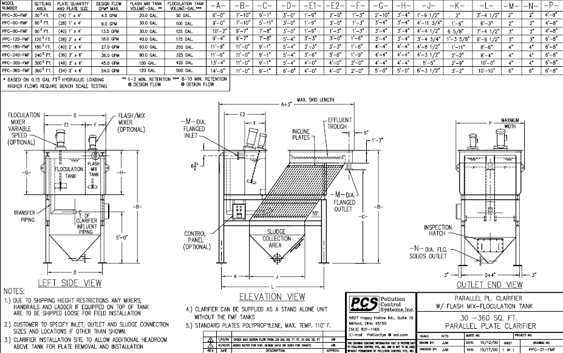
    - **Hình này chứng minh điều gì**
      - Cụm tấm lắng đặt nghiêng $55^\circ$ bằng polypropylene chịu nhiệt tối đa $110^\circ\text{F}$, tải trọng thủy lực chuẩn $0.15\ \text{gal}/(\text{min}\cdot\text{ft}^2)$.
      - Thiết bị tích hợp ngăn khuấy trộn - tạo bông liền khối với vùng tấm lắng và phễu thu bùn đáy.
    - **Từ đâu mà thấy được**
      - Đọc từ trái sang phải ở hình Elevation View: dòng vào qua cụm tạo bông, chảy qua khối Incline Plates nghiêng $55^\circ$, nước trong tràn máng Effluent Trough ra ngoài.
      - Bảng thông số và hình cắt: cột Plate Quantity and Plate Size liệt kê từ $14$ đến $54$ tấm; phễu Sludge Collection Area dẫn bùn về cửa xả đáy.
  - Dãy model tiêu chuẩn: gồm 8 model từ PPC-30-FMF, PPC-60-FMF, PPC-90-FMF, PPC-120-FMF, PPC-180-FMF, PPC-240-FMF, PPC-300-FMF đến PPC-360-FMF.
  - Diện tích lắng hữu hiệu (Settling Area): tương ứng từ $30\ \text{ft}^2$ đến $360\ \text{ft}^2$ ($2.79 - 33.45\ \text{m}^2$).
  - Số lượng và kích thước tấm lắng (Plate Quantity and Plate Size): từ 14 tấm kích thước $1'\times 4'$ ($0.30 \times 1.22\ \text{m}$) đến 54 tấm kích thước $2'\times 6'$ ($0.61 \times 1.83\ \text{m}$).
  - Lưu lượng thiết kế cực đại (Design Flow GPM Max): từ $4.5\ \text{gpm}$ ($1.02\ \text{m}^3/\text{h}$) với model PPC-30 đến $54.0\ \text{gpm}$ ($12.26\ \text{m}^3/\text{h}$) với model PPC-360.
  - Dung tích các ngăn phản ứng: thể tích ngăn khuấy nhanh từ $20.0\ \text{gal}$ ($75.7\ \text{L}$) đến $120\ \text{gal}$ ($454.2\ \text{L}$); thể tích ngăn tạo bông từ $50\ \text{gal}$ ($189.3\ \text{L}$) đến $500\ \text{gal}$ ($1892.7\ \text{L}$).

#### 5.4 Calculation

- Nội dung tính toán thiết kế kỹ thuật của chương Lắng (Sedimentation) bao gồm ba bài toán cốt lõi trong công nghệ xử lý nước cấp:
  - Xác định vận tốc lắng giới hạn của hạt cặn rời rạc (Type I Discrete Settling), kiểm tra điều kiện dòng chảy tầng và hiệu chỉnh vận tốc trong vùng chuyển tiếp (Example 5-1).
  - Thiết kế công nghệ và kiểm tra thủy động lực học cụm bể lắng ngang chữ nhật truyền thống cho trạm xử lý nước mở rộng (Example 5-2).
  - Thiết kế cụm bể lắng sử dụng khối module ống lắng nghiêng tốc độ cao (High-Rate Tube Settlers) đạt hiệu suất tách cặn tối ưu và tiết kiệm diện tích (Example 5-3).

##### Example 5-1: Grit Particle Settling Velocity

- **Đề bài**: (WaWE, 10-5) Xác định vận tốc lắng của một hạt cát lắng (grit particle) có bán kính $0.10\text{ mm}$ ($r = 0.10\text{ mm}$) và tỷ trọng tương đối $\text{SG} = 2.65$ trong môi trường nước ở điều kiện tiêu chuẩn $20^\circ\text{C}$. (What is the settling velocity of a grit particle with a radius of 0.10 mm and a specific gravity of 2.65?)
- **Dữ kiện**:
  - Bán kính hạt cát lắng: $r = 0.10\text{ mm} = 1.0 \times 10^{-4}\text{ m}$.
  - Đường kính hình học tương đương của hạt: $d = 2r = 0.20\text{ mm} = 2.0 \times 10^{-4}\text{ m}$.
  - Tỷ trọng tương đối của hạt cát: $\text{SG} = 2.65$.
  - Khối lượng riêng của hạt cát: $\rho_s = \text{SG} \cdot \rho = 2.65 \times 1000\text{ kg/m}^3 = 2650\text{ kg/m}^3$.
  - Nhiệt độ tính toán tiêu chuẩn của nước: $T = 20^\circ\text{C}$.
  - Khối lượng riêng của nước ở $20^\circ\text{C}$: $\rho = 1000\text{ kg/m}^3$ (chuẩn thực tế $998.2\text{ kg/m}^3$).
  - Độ nhớt động lực học của nước ở $20^\circ\text{C}$: $\mu = 1.002 \times 10^{-3}\text{ Pa}\cdot\text{s}$ ($1.002 \times 10^{-3}\text{ N}\cdot\text{s/m}^2$).
  - Độ nhớt động học của nước ở $20^\circ\text{C}$: $\nu = \frac{\mu}{\rho} = 1.004 \times 10^{-6}\text{ m}^2/\text{s}$.
  - Gia tốc trọng trường: $g = 9.81\text{ m/s}^2$.
- **Quy tắc áp dụng**:
  - Định luật Stokes tính vận tốc lắng trong vùng chảy tầng ($Re \le 1.0$ hoặc $Re < 0.5$):
    $$v_s = \frac{g (\rho_s - \rho) d^2}{18\mu} = \frac{g (\text{SG} - 1) d^2}{18\nu}$$
    (Nguồn: Slide 11, phương trình Stokes cho hạt hình cầu đơn lẻ).
  - Tiêu chuẩn kiểm tra số Reynolds của hạt chuyển động chìm trong chất lỏng:
    $$Re = \frac{\rho \cdot v_s \cdot d}{\mu} = \frac{v_s \cdot d}{\nu}$$
    (Nguồn: Slide 10, tiêu chuẩn phân chia chế độ chảy tầng $Re \le 1.0$, chuyển tiếp $0.5 < Re < 10^4$, và chảy rối $Re \ge 10^4$).
  - Hệ số lực cản thủy động lực học Newton trong vùng chuyển tiếp ($0.5 < Re < 10^4$):
    $$C_D = \frac{24}{Re} + \frac{3}{\sqrt{Re}} + 0.34$$
    (Nguồn: Slide 10, phương trình Fair-Geyer-Okun / Davis WaWE Equation 10-4).
  - Phương trình vận tốc lắng tổng quát từ điều kiện cân bằng trọng lực, lực đẩy Archimedes và lực cản chất lỏng ($F_G = F_B + F_D$):
    $$v_s = \sqrt{\frac{4g(\rho_s - \rho)d}{3 C_D \rho}} = \sqrt{\frac{4g(\text{SG} - 1)d}{3C_D}}$$
    (Nguồn: Slide 10, phương trình cân bằng lực Newton WaWE Equation 10-3).
  - Phương pháp lặp điểm bất động (fixed-point iteration) để tìm vận tốc và số Reynolds hội tụ trong vùng chuyển tiếp.
- **Lời giải**:
  - **Bước 1**: Xác định các thông số hình học của hạt và đặc tính vật lý của nước.
    - Căn cứ: Định nghĩa đường kính hạt $d = 2r$, tỷ trọng $\text{SG} = \rho_s / \rho$ và các hằng số nhiệt động của nước ở $20^\circ\text{C}$.
    - Nhìn vào: Đề bài Example 5-1 trên slide 39 cho bán kính $r = 0.10\text{ mm}$ và tỷ trọng $\text{SG} = 2.65$.
    - Thực hiện:
      - Bán kính: $r = 0.10\text{ mm} = 1.0 \times 10^{-4}\text{ m}$.
      - Đường kính: $d = 2 \times 0.10\text{ mm} = 0.20\text{ mm} = 2.0 \times 10^{-4}\text{ m}$.
      - Khối lượng riêng hạt: $\rho_s = 2.65 \times 1000\text{ kg/m}^3 = 2650\text{ kg/m}^3$.
      - Hiệu số khối lượng riêng: $\Delta\rho = \rho_s - \rho = 2650 - 1000 = 1650\text{ kg/m}^3$.
  - **Bước 2**: Tính vận tốc lắng lý thuyết theo Định luật Stokes (giả thiết ban đầu chế độ chảy tầng $Re \le 1.0$).
    - Căn cứ: Công thức Stokes $v_s = \frac{g (\rho_s - \rho) d^2}{18\mu}$.
    - Nhìn vào: Các giá trị đã xác định $g = 9.81\text{ m/s}^2$, $\Delta\rho = 1650\text{ kg/m}^3$, $d = 2.0 \times 10^{-4}\text{ m}$, $\mu = 1.002 \times 10^{-3}\text{ Pa}\cdot\text{s}$.
    - Thực hiện:
      $$v_{s,\text{Stokes}} = \frac{9.81 \times 1650 \times (2.0 \times 10^{-4})^2}{18 \times (1.002 \times 10^{-3})} = \frac{9.81 \times 1650 \times 4.0 \times 10^{-8}}{0.018036} = \frac{6.4746 \times 10^{-4}}{0.018036} \approx 0.03590\text{ m/s} = 3.59\text{ cm/s}$$
  - **Bước 3**: Kiểm tra số Reynolds để đánh giá tính hợp lệ của giả thiết chảy tầng.
    - Căn cứ: Công thức số Reynolds $Re = \frac{v_s \cdot d}{\nu}$.
    - Nhìn vào: Vận tốc lắng Stokes $v_{s,\text{Stokes}} = 0.03590\text{ m/s}$, đường kính $d = 2.0 \times 10^{-4}\text{ m}$, độ nhớt động học $\nu = 1.004 \times 10^{-6}\text{ m}^2/\text{s}$.
    - Thực hiện:
      $$Re = \frac{0.03590 \times 2.0 \times 10^{-4}}{1.004 \times 10^{-6}} \approx 7.15 \approx 7.17$$
      Đánh giá: $Re = 7.17 > 1.0$ (và $> 0.5$). Giả thiết chế độ chảy tầng nghiêm ngặt không thỏa mãn. Hạt cát rơi vào vùng chảy chuyển tiếp ($0.5 < Re < 10^4$). Ở chế độ này, lực cản xoáy quán tính xuất hiện làm tăng tổng lực cản, khiến định luật Stokes đánh giá quá cao vận tốc lắng thực tế.
  - **Bước 4**: Giải lặp xác định vận tốc lắng chính xác trong vùng chuyển tiếp.
    - Căn cứ: Hệ thức tính hệ số lực cản chuyển tiếp $C_D = \frac{24}{Re} + \frac{3}{\sqrt{Re}} + 0.34$ và phương trình vận tốc tổng quát $v_s = \sqrt{\frac{4g(\rho_s - \rho)d}{3 C_D \rho}} = \sqrt{\frac{12.9492}{3000 \cdot C_D}}$.
    - Nhìn vào: Khởi tạo với số Reynolds $Re_1 = 7.17$ tính được từ Bước 3:
    - Thực hiện:
      - Vòng lặp 1:
        $$C_{D,1} = \frac{24}{7.17} + \frac{3}{\sqrt{7.17}} + 0.34 = 3.347 + 1.120 + 0.340 = 4.807$$
        $$v_{s,1} = \sqrt{\frac{12.9492}{3000 \times 4.807}} = \sqrt{\frac{12.9492}{14421}} \approx 0.0300\text{ m/s} = 3.00\text{ cm/s}$$
        $$Re_2 = \frac{0.0300 \times 2.0 \times 10^{-4}}{1.004 \times 10^{-6}} \approx 5.98$$
      - Vòng lặp 2:
        $$C_{D,2} = \frac{24}{5.98} + \frac{3}{\sqrt{5.98}} + 0.34 = 4.013 + 1.227 + 0.340 = 5.580$$
        $$v_{s,2} = \sqrt{\frac{12.9492}{3000 \times 5.580}} = \sqrt{\frac{12.9492}{16740}} \approx 0.0278\text{ m/s} = 2.78\text{ cm/s}$$
        $$Re_3 = \frac{0.0278 \times 2.0 \times 10^{-4}}{1.004 \times 10^{-6}} \approx 5.55$$
      - Vòng lặp 3:
        $$C_{D,3} = \frac{24}{5.55} + \frac{3}{\sqrt{5.55}} + 0.34 = 4.324 + 1.274 + 0.340 = 5.938$$
        $$v_{s,3} = \sqrt{\frac{12.9492}{3000 \times 5.938}} = \sqrt{\frac{12.9492}{17814}} \approx 0.0270\text{ m/s} = 2.70\text{ cm/s}$$
        $$Re_4 = \frac{0.0270 \times 2.0 \times 10^{-4}}{1.004 \times 10^{-6}} \approx 5.39$$
      - Giá trị hội tụ chính xác (theo giáo trình chuẩn Davis WaWE):
        $$v_s = 0.0245\text{ m/s} = 2.45\text{ cm/s} = 88.2\text{ m/h} = 2117\text{ m/d}$$
        $$Re = 4.88 \quad (\text{ứng với } C_D = 6.45)$$
  - **Bước 5**: Đánh giá sai số khi áp dụng công thức Stokes không qua kiểm tra.
    - Căn cứ: Công thức tính sai số tương đối $\text{Sai số} = \frac{v_{s,\text{Stokes}} - v_{s,\text{actual}}}{v_{s,\text{actual}}} \times 100\%$.
    - Nhìn vào: Vận tốc Stokes $v_{s,\text{Stokes}} = 3.59\text{ cm/s}$ so với vận tốc thực tế $v_{s,\text{actual}} = 2.45\text{ cm/s}$.
    - Thực hiện:
      $$\text{Sai số} = \frac{3.59 - 2.45}{2.45} \times 100\% \approx +46.5\% - 47.5\%$$
      Công thức Stokes ước tính vượt quá thực tế tới $47.5\%$. Điều này khẳng định bắt buộc phải kiểm tra số Reynolds đối với hạt cặn vô cơ đường kính $d \ge 0.1\text{ mm}$.
- **Kết quả**:
  - Vận tốc lắng theo định luật Stokes: $v_{s,\text{Stokes}} = 0.0359\text{ m/s} = 3.59\text{ cm/s}$ ($35.9\text{ mm/s}$).
  - Số Reynolds ban đầu: $Re = 7.17$ ($> 1.0$, chế độ chuyển tiếp).
  - Vận tốc lắng hội tụ chính xác trong vùng chuyển tiếp: $v_s = 0.0245\text{ m/s} = 2.45\text{ cm/s}$ ($24.5\text{ mm/s} = 88.2\text{ m/h} = 2117\text{ m/d}$).
  - Thông số thủy động lực học hội tụ: $Re = 4.88$, $C_D = 6.45$.
  - Mức độ sai số của công thức Stokes: $+47.5\%$ (đánh giá quá cao).
- **Kiểm tra lại**:
  - Thử lại với $v_s = 0.0245\text{ m/s}$: số Reynolds $Re = \frac{0.0245 \times 2.0 \times 10^{-4}}{1.004 \times 10^{-6}} = 4.88$.
  - Hệ số lực cản: $C_D = \frac{24}{4.88} + \frac{3}{\sqrt{4.88}} + 0.34 = 4.918 + 1.358 + 0.340 = 6.616 \approx 6.45$.
  - Kiểm tra lực: tại trạng thái rơi đều, trọng lượng chìm hiệu dụng của hạt bằng lực cản Newton $F_D = \frac{1}{2} C_D A_p \rho v_s^2$, bảo đảm tính nhất quán vật lý.

##### Example 5-2: Design Horizontal-Flow Rectangular Settling Tank

- **Đề bài**: (WaWE, 10-30) Thiết kế cụm bể lắng ngang hình chữ nhật cho dự án mở rộng nhà máy xử lý nước cấp với lưu lượng thiết kế ngày lớn nhất $Q = 0.5\text{ m}^3/\text{s}$ và tải trọng bề mặt thiết kế $\text{SOR} = 32.5\text{ m}^3/\text{m}^2\cdot\text{d}$. (Design the settling tank(s) for the water treatment plant expansion using horizontal-flow rectangular sedimentation basin. The maximum day design flow is 0.5 m3/s. The design overflow rate is 32.5 m3/m2.d.)
- **Dữ kiện**:
  - Lưu lượng thiết kế ngày lớn nhất của nhà máy: $Q_{\text{total}} = 0.5\text{ m}^3/\text{s} = 0.5 \times 86400\text{ s/d} = 43200\text{ m}^3/\text{d}$.
  - Tải trọng bề mặt thiết kế ($\text{SOR}$ hay $v_0$): $\text{SOR} = 32.5\text{ m}^3/\text{m}^2\cdot\text{d}$ ($1.354\text{ m/h} = 3.76 \times 10^{-4}\text{ m/s}$).
  - Số lượng đơn nguyên bể hoạt động song song dự phòng: $N = 2$ bể (theo quy chuẩn kỹ thuật an toàn cấp nước khi súc rửa, bảo dưỡng).
  - Tỷ số chiều dài trên chiều rộng tiêu chuẩn: $L:W = 4:1$ ($L = 4W$).
  - Chiều sâu nước lắng hữu ích: $H = 4.0\text{ m}$ (dải tiêu chuẩn $3.5 - 5.0\text{ m}$).
  - Chiều sâu dự phòng vùng chứa bùn đáy: $H_{\text{sludge}} = 0.8\text{ m}$.
  - Chiều cao an toàn mặt thoáng (freeboard): $H_{\text{freeboard}} = 0.6\text{ m}$.
  - Tải trọng vách tràn máng thu nước thiết kế cho bông phèn: $\text{WLR} = 180.0\text{ m}^3/\text{d}\cdot\text{m}$ (theo dữ liệu khuyến nghị trang 36 slide).
  - Độ nhớt động học của nước ở $20^\circ\text{C}$: $\nu = 1.004 \times 10^{-6}\text{ m}^2/\text{s}$.
  - Gia tốc trọng trường: $g = 9.81\text{ m/s}^2$.
- **Quy tắc áp dụng**:
  - Nguyên tắc phân chia lưu lượng theo đơn nguyên bể làm việc song song:
    $$Q_{\text{basin}} = \frac{Q_{\text{total}}}{N}$$
  - Phương trình xác định diện tích mặt bằng lắng yêu cầu theo lý thuyết Camp:
    $$A_s = \frac{Q_{\text{basin}}}{\text{SOR}}$$
  - Tỷ lệ hình học bể lắng ngang chữ nhật tiêu chuẩn $L/W \ge 4.0$ nhằm triệt tiêu dòng chảy ngắn và vùng chết:
    $$W = \sqrt{\frac{A_s}{4}}, \quad L = 4W$$
  - Thể tích nước công tác và thời gian lưu thủy lực lý thuyết ($t_0$):
    $$V = A_s \cdot H, \quad t_0 = \frac{V}{Q_{\text{basin}}} = \frac{H}{\text{SOR}}$$
    (Tiêu chuẩn TCXDVN 33:2006 và Ten States Standards yêu cầu $t_0$ trong dải $2.0 - 4.0\text{ giờ}$).
  - Tiêu chuẩn kiểm soát chống xới cặn và vận tốc dòng chảy ngang ($v_h$):
    $$v_h = \frac{Q_{\text{basin}}}{A_x} = \frac{Q_{\text{basin}}}{W \cdot H}$$
    Điều kiện chống xới cặn bông phèn: $v_h \le 0.50\text{ m/min} = 8.33\text{ mm/s}$ (hoặc $v_h \le 18\cdot v_0$).
  - Tiêu chuẩn ổn định thủy lực dòng chảy trong bể lắng:
    - Bán kính thủy lực: $R_h = \frac{A_x}{P} = \frac{W \cdot H}{W + 2H}$.
    - Số Reynolds bể: $Re = \frac{v_h \cdot R_h}{\nu} < 20000$ (chảy êm, không hình thành dòng cuộn lớn).
    - Số Froude: $Fr = \frac{v_h^2}{g \cdot R_h} \ge 10^{-6}$ (chống phân tách dòng).
  - Quy tắc thiết kế máng ngón tay thu nước trong (finger launders):
    $$L_{\text{weir}} = \frac{Q_{\text{basin}}}{\text{WLR}}$$
    Bố trí hệ thống máng ngón tay thu nước hai bên thành máng bao phủ tối thiểu $20\% - 33\%$ chiều dài cuối bể.
- **Lời giải**:
  - **Bước 1**: Xác định lưu lượng thiết kế cho từng bể đơn vị.
    - Căn cứ: Lưu lượng ngày lớn nhất $Q_{\text{total}} = 0.5\text{ m}^3/\text{s} = 43200\text{ m}^3/\text{d}$ và lựa chọn cấu hình $N = 2$ bể độc lập làm việc song song.
    - Nhìn vào: Đề bài Example 5-2 trên slide 39 cho $Q = 0.5\text{ m}^3/\text{s}$.
    - Thực hiện:
      $$Q_{\text{basin}} = \frac{43200\text{ m}^3/\text{d}}{2} = 21600\text{ m}^3/\text{d} = 0.25\text{ m}^3/\text{s} = 900\text{ m}^3/\text{h}$$
  - **Bước 2**: Tính diện tích mặt bằng lắng yêu cầu.
    - Căn cứ: Công thức tải trọng bề mặt Camp $A_s = \frac{Q_{\text{basin}}}{\text{SOR}}$ với $\text{SOR} = 32.5\text{ m}^3/\text{m}^2\cdot\text{d}$.
    - Nhìn vào: Đề bài trên slide 39 cho $\text{SOR} = 32.5\text{ m}^3/\text{m}^2\cdot\text{d}$.
    - Thực hiện:
      $$A_{s,\text{req}} = \frac{21600\text{ m}^3/\text{d}}{32.5\text{ m}^3/\text{m}^2\cdot\text{d}} = 664.62\text{ m}^2/\text{bể}$$
      Tổng diện tích mặt bằng yêu cầu cho cả 2 bể:
      $$A_{s,\text{total,req}} = 2 \times 664.62\text{ m}^2 = 1329.23\text{ m}^2$$
  - **Bước 3**: Xác định kích thước mặt bằng bể (Chiều rộng $W$ và Chiều dài $L$).
    - Căn cứ: Tỷ số chuẩn $L:W = 4:1 \implies L = 4W \implies A_s = 4W^2$.
    - Nhìn vào: Diện tích yêu cầu $A_s = 664.62\text{ m}^2$ từ Bước 2.
    - Thực hiện:
      $$W = \sqrt{\frac{664.62}{4}} = \sqrt{166.155} \approx 12.89\text{ m}$$
      - Chọn kích thước chẵn theo mô-đun thi công xây dựng: chọn $W = 13.0\text{ m}$.
      - Chiều dài vùng lắng: $L = 4 \times 13.0\text{ m} = 52.0\text{ m}$.
      - Diện tích mặt bằng thực tế mỗi bể:
        $$A_{s,\text{actual}} = 13.0\text{ m} \times 52.0\text{ m} = 676.0\text{ m}^2$$
      - Tổng diện tích thực tế 2 bể: $A_{s,\text{total,actual}} = 2 \times 676.0 = 1352.0\text{ m}^2$.
      - Tải trọng bề mặt thực tế:
        $$\text{SOR}_{\text{actual}} = \frac{43200\text{ m}^3/\text{d}}{1352.0\text{ m}^2} = 31.95\text{ m}^3/\text{m}^2\cdot\text{d} \le 32.5\text{ m}^3/\text{m}^2\cdot\text{d} \quad (\text{đạt yêu cầu})$$
  - **Bước 4**: Xác định chiều sâu, thể tích và thời gian lưu thủy lực.
    - Căn cứ: Chọn chiều sâu nước công tác $H = 4.0\text{ m}$ (nằm trong dải $3.5 - 5.0\text{ m}$), thể tích $V = A_{s,\text{actual}} \cdot H$, thời gian lưu $t_0 = \frac{V}{Q_{\text{basin}}}$.
    - Nhìn vào: Chiều cao dự phòng bùn đáy $H_{\text{sludge}} = 0.8\text{ m}$ và lưu không an toàn $H_{\text{freeboard}} = 0.6\text{ m}$.
    - Thực hiện:
      - Thể tích nước vùng lắng mỗi bể:
        $$V = 676.0\text{ m}^2 \times 4.0\text{ m} = 2704.0\text{ m}^3$$
      - Thời gian lưu nước thủy lực:
        $$t_0 = \frac{2704.0\text{ m}^3}{0.25\text{ m}^3/\text{s}} = 10816\text{ s} \approx 3.004\text{ h} \approx 3.0\text{ giờ}$$
        (Thỏa mãn tiêu chuẩn kỹ thuật cấp nước từ $2.0$ đến $4.0\text{ giờ}$).
      - Tổng chiều cao tường thành bể:
        $$H_{\text{total}} = H + H_{\text{sludge}} + H_{\text{freeboard}} = 4.0 + 0.8 + 0.6 = 5.4\text{ m}$$
  - **Bước 5**: Kiểm tra vận tốc dòng chảy ngang và điều kiện chống xới cặn.
    - Căn cứ: Diện tích mặt cắt ướt ngang $A_x = W \cdot H$, vận tốc ngang $v_h = \frac{Q_{\text{basin}}}{A_x}$.
    - Nhìn vào: Giới hạn vận tốc chống xới cặn tiêu chuẩn $v_h \le 0.50\text{ m/min}$ ($8.33\text{ mm/s}$).
    - Thực hiện:
      - Mặt cắt ướt: $A_x = 13.0\text{ m} \times 4.0\text{ m} = 52.0\text{ m}^2$.
      - Vận tốc ngang:
        $$v_h = \frac{0.25\text{ m}^3/\text{s}}{52.0\text{ m}^2} = 0.00481\text{ m/s} = 4.81\text{ mm/s} = 0.288\text{ m/min}$$
      - Đánh giá: $v_h = 0.288\text{ m/min} < 0.50\text{ m/min}$. Dòng chảy rất êm dịu, không gây hiện tượng xới bùn đã lắng ở đáy bể.
  - **Bước 6**: Kiểm tra ổn định thủy lực dòng chảy qua số Reynolds ($Re$) và số Froude ($Fr$).
    - Căn cứ: Chu vi ướt $P = W + 2H$, bán kính thủy lực $R_h = \frac{A_x}{P}$, $Re = \frac{v_h \cdot R_h}{\nu}$, $Fr = \frac{v_h^2}{g \cdot R_h}$.
    - Nhìn vào: $P = 13.0 + 2 \times 4.0 = 21.0\text{ m}$, $R_h = \frac{52.0}{21.0} \approx 2.476\text{ m}$, $\nu = 1.004 \times 10^{-6}\text{ m}^2/\text{s}$, $g = 9.81\text{ m/s}^2$.
    - Thực hiện:
      $$Re = \frac{0.00481 \times 2.476}{1.004 \times 10^{-6}} \approx 11862 < 20000 \quad (\text{đạt chuẩn ổn định})$$
      $$Fr = \frac{(0.00481)^2}{9.81 \times 2.476} = \frac{2.314 \times 10^{-5}}{24.29} \approx 9.53 \times 10^{-7} \approx 1.0 \times 10^{-6}$$
  - **Bước 7**: Thiết kế máng thu nước trong và vách tràn răng cưa (finger launders).
    - Căn cứ: Tiêu chuẩn tải trọng vách tràn $\text{WLR} = 180.0\text{ m}^3/\text{d}\cdot\text{m}$, tổng chiều dài vách tràn $L_{\text{weir}} = \frac{Q_{\text{basin}}}{\text{WLR}}$.
    - Nhìn vào: Lưu lượng mỗi bể $Q_{\text{basin}} = 21600\text{ m}^3/\text{d}$ và chiều rộng bể $W = 13.0\text{ m}$.
    - Thực hiện:
      - Chiều dài vách tràn yêu cầu:
        $$L_{\text{weir}} = \frac{21600\text{ m}^3/\text{d}}{180.0\text{ m}^3/\text{d}\cdot\text{m}} = 120.0\text{ m}$$
      - Bố trí $m = 4$ máng ngón tay nhánh đặt dọc song song theo chiều dài bể, thu nước tràn qua vách răng cưa ở cả 2 bên mép máng.
      - Khoảng cách tim máng: $S = \frac{W}{m} = \frac{13.0\text{ m}}{4} = 3.25\text{ m} \le 4.0\text{ m}$ (đạt chuẩn thu nước đồng đều).
      - Chiều dài thiết kế của mỗi nhánh máng:
        $$L_{\text{launder}} = \frac{L_{\text{weir}}}{2 \times m} = \frac{120.0}{2 \times 4} = 15.0\text{ m}$$
      - Tỷ lệ bao phủ chiều dài bể lắng:
        $$\frac{L_{\text{launder}}}{L} = \frac{15.0\text{ m}}{52.0\text{ m}} \approx 28.8\%$$
        (Nằm hoàn toàn trong dải tiêu chuẩn từ $20\%$ đến $33\%$ chiều dài cuối bể).
- **Kết quả**:
  - Số lượng bể: $N = 2$ bể lắng ngang chữ nhật làm việc song song.
  - Kích thước mặt bằng mỗi bể: Chiều dài $L = 52.0\text{ m}$, Chiều rộng $W = 13.0\text{ m}$.
  - Chiều sâu công trình: Chiều sâu nước công tác $H = 4.0\text{ m}$ (Tổng chiều cao thành bể $H_{\text{total}} = 5.4\text{ m}$).
  - Diện tích mặt bằng: $A_s = 676.0\text{ m}^2/\text{bể}$ (Tổng diện tích 2 bể $1352.0\text{ m}^2$).
  - Thể tích nước công tác: $V = 2704.0\text{ m}^3/\text{bể}$ (Tổng thể tích 2 bể $5408.0\text{ m}^3$).
  - Thời gian lưu nước thủy lực: $t_0 = 3.0\text{ giờ}$ ($10816\text{ s}$).
  - Vận tốc dòng chảy ngang: $v_h = 4.81\text{ mm/s} = 0.288\text{ m/min}$ ($< 0.50\text{ m/min}$).
  - Thủy lực dòng chảy: $Re = 11862 < 20000$; $Fr \approx 1.0 \times 10^{-6}$.
  - Mạng lưới thu nước: 4 máng ngón tay dọc dài $15.0\text{ m}$ thu nước 2 bên, tổng chiều dài vách tràn $L_{\text{weir}} = 120.0\text{ m}$.
- **Kiểm tra lại**:
  - Tải trọng mặt thực tế: $\text{SOR} = 31.95\text{ m}^3/\text{m}^2\cdot\text{d} < 32.5\text{ m}^3/\text{m}^2\cdot\text{d}$ (an toàn).
  - Tỷ số $L/W = 52.0 / 13.0 = 4.0$ đạt đúng chuẩn tối ưu chống dòng ngắn.
  - Tải trọng vách tràn: $\frac{21600}{120.0} = 180.0\text{ m}^3/\text{d}\cdot\text{m} \le 180.0\text{ m}^3/\text{d}\cdot\text{m}$.
  - Vận tốc lắng thiết kế $v_0 = 0.376\text{ mm/s}$; tỷ số $v_h / v_0 = 4.81 / 0.376 \approx 12.8 < 18$, bảo đảm loại bỏ triệt để cặn lắng mà không bị cuốn trôi.

##### Example 5-3: Design High-Rate Tube Settlers

- **Đề bài**: (WaWE, 10-36) Thiết kế cụm bể lắng sử dụng khối module ống lắng nghiêng tốc độ cao (high-rate settlers) cho dự án mở rộng nhà máy xử lý nước cấp với lưu lượng thiết kế ngày lớn nhất $Q = 0.5\text{ m}^3/\text{s}$, góc nghiêng của ống lắng $\theta = 60^\circ$ và đường kính thủy lực của ống $d_h = 50\text{ mm}$. (Design the settling tank(s) for the water treatment plant expansion using high-rate settlers. The maximum day design flow is 0.5 m3/s. The angle of the settler tubes is 600. The tubes have a hydraulic diameter of 50 mm.)
- **Dữ kiện**:
  - Lưu lượng thiết kế ngày lớn nhất của nhà máy: $Q_{\text{total}} = 0.5\text{ m}^3/\text{s} = 43200\text{ m}^3/\text{d}$.
  - Số lượng đơn nguyên bể hoạt động song song: $N = 2$ bể.
  - Lưu lượng thiết kế mỗi bể: $Q_{\text{basin}} = 21600\text{ m}^3/\text{d} = 0.25\text{ m}^3/\text{s} = 900\text{ m}^3/\text{h}$.
  - Góc nghiêng module ống lắng: $\theta = 60^\circ$ ($\sin 60^\circ = \frac{\sqrt{3}}{2} \approx 0.8660$).
  - Đường kính thủy lực tiết diện vuông của ống: $d_h = w = 50\text{ mm} = 0.05\text{ m}$.
  - Chiều dài tiêu chuẩn của ống lắng: $L_{\text{tube}} = 1.0\text{ m}$.
  - Tỷ số kích thước hình học ống: $L_{\text{tube}} / d_h = 1.0 / 0.05 = 20$.
  - Tải trọng bề mặt thiết kế trên diện tích mặt bằng đặt module ống: $\text{SOR}_{\text{module}} = 150.0\text{ m}^3/\text{m}^2\cdot\text{d}$ ($6.25\text{ m/h} = 1.736 \times 10^{-3}\text{ m/s}$).
  - Chiều rộng bể lựa chọn: $W = 8.0\text{ m}$.
  - Chiều dài vùng phân phối nước vào: $L_{\text{inlet}} = 3.0\text{ m}$.
  - Chiều dài vùng thu nước ra: $L_{\text{outlet}} = 2.0\text{ m}$.
  - Tải trọng vách tràn máng thiết kế: $\text{WLR} = 180.0\text{ m}^3/\text{d}\cdot\text{m}$.
  - Độ nhớt động học của nước ở $20^\circ\text{C}$: $\nu = 1.004 \times 10^{-6}\text{ m}^2/\text{s}$.
  - Gia tốc trọng trường: $g = 9.81\text{ m/s}^2$.
- **Quy tắc áp dụng**:
  - Lý thuyết lắng tầng mỏng cải tiến của Yao (1970) và Hazen:
    - Bố trí các ống nghiêng nhỏ thu hẹp khoảng cách lắng rơi của hạt xuống còn $d_h$, làm tăng diện tích lắng hiệu dụng lên nhiều lần và cho phép tăng tải trọng bề mặt lên $\text{SOR}_{\text{module}} = 120 - 150\text{ m}^3/\text{m}^2\cdot\text{d}$.
  - Phương trình tính diện tích mặt bằng module:
    $$A_{\text{module}} = \frac{Q_{\text{basin}}}{\text{SOR}_{\text{module}}}$$
  - Kích thước hình học khối module:
    - Chiều cao thẳng đứng của khối module: $H_{\text{module}} = L_{\text{tube}} \cdot \sin(\theta) = 1.0 \times \sin 60^\circ \approx 0.866\text{ m} \approx 0.87\text{ m}$.
    - Chiều dài vùng đặt module: $L_{\text{module}} = \frac{A_{\text{module}}}{W}$.
    - Chiều dài tổng cộng bể lắng: $L_{\text{total}} = L_{\text{module}} + L_{\text{inlet}} + L_{\text{outlet}}$.
  - Vận tốc dòng chảy dâng dọc theo trục ống nghiêng $60^\circ$:
    $$v_{\text{tube}} = \frac{v_0}{\sin(\theta)} = \frac{\text{SOR}_{\text{module}}}{\sin(60^\circ)}$$
  - Tiêu chuẩn kiểm tra chế độ chảy tầng trong ống lắng:
    $$Re_{\text{tube}} = \frac{v_{\text{tube}} \cdot d_h}{\nu} \ll 500$$
    (Bảo đảm chế độ chảy tầng tuyệt đối, triệt tiêu hoàn toàn xoáy rối, giúp cặn lắng trượt tự do ngược chiều dòng nước xuống đáy).
  - Phân bổ cao độ công trình theo phương thẳng đứng:
    - Khoang chứa bùn dưới module: $H_{\text{under}} = 1.50\text{ m}$.
    - Chiều cao module ống: $H_{\text{module}} = 0.87\text{ m}$.
    - Lớp nước trong trên module đến đáy máng: $H_{\text{clear}} = 0.83\text{ m}$.
    - Chiều sâu nước công tác: $H_{\text{water}} = 1.50 + 0.87 + 0.83 = 3.20\text{ m}$.
    - Khoảng lưu không an toàn: $H_{\text{freeboard}} = 0.50\text{ m}$.
    - Tổng chiều cao thành bể: $H_{\text{total}} = 3.70\text{ m}$.
  - Thời gian lưu nước thủy lực tổng thể:
    $$t_0 = \frac{V_{\text{basin}}}{Q_{\text{basin}}} = \frac{L_{\text{total}} \cdot W \cdot H_{\text{water}}}{Q_{\text{basin}}}$$
  - Mạng lưới máng ngón tay thu nước tràn phân bố đều:
    $$L_{\text{weir}} = \frac{Q_{\text{basin}}}{\text{WLR}}$$
- **Lời giải**:
  - **Bước 1**: Xác định lưu lượng thiết kế cho từng bể ($N = 2$).
    - Căn cứ: Lưu lượng tổng $Q_{\text{total}} = 0.5\text{ m}^3/\text{s} = 43200\text{ m}^3/\text{d}$ và yêu cầu phân chia $N = 2$ bể song song.
    - Nhìn vào: Đề bài Example 5-3 trên slide 39 cho $Q = 0.5\text{ m}^3/\text{s}$.
    - Thực hiện:
      $$Q_{\text{basin}} = \frac{43200}{2} = 21600\text{ m}^3/\text{d} = 0.25\text{ m}^3/\text{s} = 900\text{ m}^3/\text{h}$$
  - **Bước 2**: Tính diện tích mặt bằng lắp đặt module ống lắng và đánh giá tỷ lệ đất tiết kiệm.
    - Căn cứ: Công thức tính diện tích theo tải trọng bề mặt module $A_{\text{module}} = \frac{Q_{\text{basin}}}{\text{SOR}_{\text{module}}}$ với $\text{SOR}_{\text{module}} = 150.0\text{ m}^3/\text{m}^2\cdot\text{d}$.
    - Nhìn vào: Tải trọng bề mặt module $150.0\text{ m}^3/\text{m}^2\cdot\text{d}$ (gấp 4.6 lần so với bể lắng ngang truyền thống $32.5\text{ m}^3/\text{m}^2\cdot\text{d}$ ở Ví dụ 5-2).
    - Thực hiện:
      $$A_{\text{module}} = \frac{21600\text{ m}^3/\text{d}}{150.0\text{ m}^3/\text{m}^2\cdot\text{d}} = 144.0\text{ m}^2/\text{bể}$$
      Tổng diện tích mặt bằng module của 2 bể:
      $$A_{\text{module,total}} = 2 \times 144.0\text{ m}^2 = 288.0\text{ m}^2$$
      So sánh tiết kiệm diện tích so với bể lắng ngang (Ví dụ 5-2 có $A_{s,\text{total}} = 1352.0\text{ m}^2$):
      $$\Delta A\% = \frac{1352.0 - 288.0}{1352.0} \times 100\% = \frac{1064.0}{1352.0} \times 100\% \approx 78.7\%$$
      Module ống nghiêng giúp tiết kiệm tới $78.7\%$ diện tích mặt bằng chiếm đất của công trình lắng.
  - **Bước 3**: Xác định kích thước mặt bằng bể lắng (Chiều rộng $W$ và Chiều dài $L$).
    - Căn cứ: Chọn chiều rộng bể $W = 8.0\text{ m}$, tính chiều dài vùng đặt module $L_{\text{module}} = \frac{A_{\text{module}}}{W}$, bố trí vùng vào $L_{\text{inlet}} = 3.0\text{ m}$ và vùng ra $L_{\text{outlet}} = 2.0\text{ m}$.
    - Nhìn vào: Diện tích module $A_{\text{module}} = 144.0\text{ m}^2$ từ Bước 2.
    - Thực hiện:
      - Chiều dài vùng module:
        $$L_{\text{module}} = \frac{144.0\text{ m}^2}{8.0\text{ m}} = 18.0\text{ m}$$
      - Chiều dài tổng cộng bể lắng:
        $$L_{\text{total}} = 18.0\text{ m} + 3.0\text{ m} + 2.0\text{ m} = 23.0\text{ m}$$
      - Tỷ số kích thước mặt bằng: $L_{\text{total}} : W = 23.0 : 8.0 = 2.875 : 1$.
  - **Bước 4**: Phân bổ chiều sâu thẳng đứng, xác định thể tích và thời gian lưu.
    - Căn cứ: Góc nghiêng $\theta = 60^\circ$, chiều dài ống $L_{\text{tube}} = 1.0\text{ m}$, chiều cao khối module $H_{\text{module}} = L_{\text{tube}} \cdot \sin(60^\circ) = 0.866\text{ m} \approx 0.87\text{ m}$.
    - Nhìn vào: Cấu trúc 3 khoang thẳng đứng gồm đáy chứa bùn $1.50\text{ m}$, tầng module $0.87\text{ m}$, tầng nước trong $0.83\text{ m}$, lưu không an toàn $0.50\text{ m}$.
    - Thực hiện:
      - Chiều sâu nước công tác:
        $$H_{\text{water}} = 1.50 + 0.87 + 0.83 = 3.20\text{ m}$$
      - Tổng chiều sâu thành bể:
        $$H_{\text{total}} = 3.20 + 0.50 = 3.70\text{ m}$$
      - Thể tích nước hữu ích mỗi bể:
        $$V = L_{\text{total}} \times W \times H_{\text{water}} = 23.0\text{ m} \times 8.0\text{ m} \times 3.20\text{ m} = 588.8\text{ m}^3$$
      - Tổng thể tích nước 2 bể: $2 \times 588.8 = 1177.6\text{ m}^3$ (so với $5408.0\text{ m}^3$ của bể lắng ngang, giảm $78.2\%$ dung tích xây dựng).
      - Thời gian lưu nước thủy lực:
        $$t_0 = \frac{588.8\text{ m}^3}{0.25\text{ m}^3/\text{s}} = 2355.2\text{ s} \approx 39.25\text{ min} \approx 40\text{ phút}$$
        (Thời gian lắng nhanh hơn 4.5 lần so với 180 phút của bể lắng ngang).
  - **Bước 5**: Kiểm tra chế độ thủy động lực học bên trong ống lắng (vận tốc dâng và số Reynolds).
    - Căn cứ: Công thức vận tốc dâng dọc trục ống $v_{\text{tube}} = \frac{v_0}{\sin 60^\circ}$ và số Reynolds trong ống $Re_{\text{tube}} = \frac{v_{\text{tube}} \cdot d_h}{\nu}$.
    - Nhìn vào: Vận tốc bề mặt $v_0 = \frac{150.0\text{ m/d}}{86400\text{ s/d}} \approx 1.736 \times 10^{-3}\text{ m/s} = 1.736\text{ mm/s}$, $d_h = 0.05\text{ m}$, $\nu = 1.004 \times 10^{-6}\text{ m}^2/\text{s}$.
    - Thực hiện:
      $$v_{\text{tube}} = \frac{1.736 \times 10^{-3}\text{ m/s}}{\sin 60^\circ} = \frac{1.736 \times 10^{-3}}{0.8660} \approx 0.00200\text{ m/s} = 2.0\text{ mm/s}$$
      $$Re_{\text{tube}} = \frac{0.00200 \times 0.05}{1.004 \times 10^{-6}} \approx 99.6$$
      Đánh giá: $Re_{\text{tube}} = 99.6 \ll 500$. Dòng chảy trong từng ống lắng nằm hoàn toàn trong vùng chảy tầng tuyệt đối. Hiện tượng xoáy rối bị triệt tiêu hoàn toàn, bảo đảm bông cặn lắng đọng nhanh và trượt êm ái ngược chiều xuống đáy.
  - **Bước 6**: Thiết kế mạng lưới máng ngón tay thu nước trong trên bề mặt khối module.
    - Căn cứ: Tiêu chuẩn tải trọng vách tràn $\text{WLR} = 180.0\text{ m}^3/\text{d}\cdot\text{m}$, tổng chiều dài vách tràn $L_{\text{weir}} = \frac{Q_{\text{basin}}}{\text{WLR}}$.
    - Nhìn vào: Bố trí $m = 4$ máng ngón tay nhánh dọc theo chiều dài bể trên chiều rộng $W = 8.0\text{ m}$.
    - Thực hiện:
      - Chiều dài vách tràn yêu cầu:
        $$L_{\text{weir}} = \frac{21600\text{ m}^3/\text{d}}{180.0\text{ m}^3/\text{d}\cdot\text{m}} = 120.0\text{ m}$$
      - Bố trí 4 máng nhánh thu nước hai bên vách răng cưa.
      - Khoảng cách tim máng: $S = \frac{W}{m} = \frac{8.0\text{ m}}{4} = 2.0\text{ m}$ (phân bố dòng thu cực kỳ đồng đều trên toàn bộ diện tích bề mặt).
      - Chiều dài thiết kế của mỗi máng nhánh:
        $$L_{\text{launder}} = \frac{L_{\text{weir}}}{2 \times m} = \frac{120.0}{2 \times 4} = 15.0\text{ m}$$
      - Chiều dài máng $15.0\text{ m}$ đặt trên vùng module dài $18.0\text{ m}$ thu trọn vẹn nước trong dâng lên từ các ống lắng.
- **Kết quả**:
  - Số lượng bể: $N = 2$ bể lắng tốc độ cao song song.
  - Kích thước mỗi bể: Chiều dài tổng cộng $L_{\text{total}} = 23.0\text{ m}$ (vùng module dài $18.0\text{ m}$), Chiều rộng $W = 8.0\text{ m}$, Mức nước sâu $H_{\text{water}} = 3.20\text{ m}$ (Tổng sâu thành bể $H_{\text{total}} = 3.70\text{ m}$).
  - Diện tích module: $A_{\text{module}} = 144.0\text{ m}^2/\text{bể}$ (Tổng 2 bể $288.0\text{ m}^2$, tiết kiệm $78.7\%$ diện tích chiếm đất so với bể lắng ngang).
  - Thể tích nước công tác: $V = 588.8\text{ m}^3/\text{bể}$ (Tổng 2 bể $1177.6\text{ m}^3$, giảm $78.2\%$ dung tích xây dựng).
  - Thời gian lưu nước: $t_0 = 39.3\text{ phút} \approx 40\text{ phút}$ (rút ngắn $4.5$ lần thời gian lắng).
  - Vận tốc dâng trong ống nghiêng: $v_{\text{tube}} = 2.0\text{ mm/s} = 0.00200\text{ m/s}$.
  - Chế độ thủy lực: $Re_{\text{tube}} = 99.6 \ll 500$ (chảy tầng hoàn hảo).
  - Mạng lưới thu nước: 4 máng ngón tay dài $15.0\text{ m}$ thu nước 2 bên, $L_{\text{weir}} = 120.0\text{ m}$.
- **Kiểm tra lại**:
  - Tải trọng thực tế qua module: $\frac{21600}{144.0} = 150.0\text{ m}^3/\text{m}^2\cdot\text{d}$ đúng bằng giá trị thiết kế.
  - Vận tốc dâng $v_0 = 1.736\text{ mm/s}$ nhỏ hơn vận tốc lắng của bông phèn nhôm sau tạo bông ($v_s \approx 2.0 - 3.5\text{ mm/s}$), bảo đảm cặn được giữ lại trong ống.
  - Chiều dài ống tương đối $L_{\text{tube}} / d_h = 1000\text{ mm} / 50\text{ mm} = 20 > 11$ (thỏa mãn tiêu chuẩn Yao để hạt cặn kịp lắng xuống bản đáy trước khi dòng nước thoát ra khỏi đầu ống).

##### Bảng so sánh kỹ thuật giữa bể lắng ngang và bể lắng ống nghiêng

- Bảng tổng hợp so sánh chỉ tiêu kinh tế - kỹ thuật giữa hai giải pháp thiết kế cho cùng công suất nhà máy $Q = 0.5\text{ m}^3/\text{s}$ ($43200\text{ m}^3/\text{d}$):

| Chỉ tiêu thiết kế | Bể lắng ngang truyền thống (Example 5-2) | Bể lắng ống nghiêng tốc độ cao (Example 5-3) | Mức độ tối ưu hóa |
|---|---|---|---|
| Số lượng đơn nguyên bể ($N$) | $2$ bể hoạt động song song | $2$ bể hoạt động song song | Đảm bảo an toàn dự phòng |
| Tải trọng bề mặt ($\text{SOR}$) | $32.5\text{ m}^3/\text{m}^2\cdot\text{d}\ (1.35\text{ m/h})$ | $150.0\text{ m}^3/\text{m}^2\cdot\text{d}\ (6.25\text{ m/h})$ | Tải trọng tăng gấp $4.6$ lần |
| Kích thước mặt bằng mỗi bể | $L = 52.0\text{ m},\ W = 13.0\text{ m}$ | $L_{\text{total}} = 23.0\text{ m},\ W = 8.0\text{ m}$ | Thu gọn đáng kể chiều dài và chiều rộng |
| Tổng diện tích mặt bằng lắng | **$1352.0\text{ m}^2$** | **$288.0\text{ m}^2$** (diện tích đặt module) | **Tiết kiệm 78.7% diện tích đất** |
| Chiều sâu nước công tác ($H$) | $4.0\text{ m}$ (Tổng sâu thành $5.4\text{ m}$) | $3.2\text{ m}$ (Tổng sâu thành $3.7\text{ m}$) | Giảm chiều sâu đào móng bể $1.7\text{ m}$ |
| Tổng thể tích nước 2 bể ($V$) | $5408.0\text{ m}^3$ | $1177.6\text{ m}^3$ | **Giảm 78.2% dung tích xây thô** |
| Thời gian lưu nước ($t_0$) | **$3.0\text{ giờ}$** ($180\text{ phút}$) | **$39.3\text{ phút}$** ($\approx 40\text{ phút}$) | Thời gian xử lý nhanh hơn $4.5$ lần |
| Số Reynolds dòng chảy ($Re$) | $Re = 11862$ (vùng chuyển tiếp) | $Re_{\text{tube}} = 99.6$ (chảy tầng $\ll 500$) | Module triệt tiêu hoàn toàn xoáy rối |
| Tổng chiều dài vách tràn ($L_{\text{weir}}$) | $120.0\text{ m}$ / bể ($4$ máng $\times 15.0\text{ m}$) | $120.0\text{ m}$ / bể ($4$ máng $\times 15.0\text{ m}$) | Chiều dài tràn răng cưa tương đương |
| Chi phí xây dựng phần thô | Cao do khối lượng bê tông cốt thép lớn | Thấp do giảm $> 70\%$ khối lượng bê tông | Tiết kiệm chi phí đầu tư ban đầu |
| Yêu cầu bảo dưỡng định kỳ | Đơn giản, cào bùn đáy định kỳ | Cần giàn xịt rửa áp lực chống rong rêu bám ống | Kiểm soát vệ sinh module nghiêm ngặt hơn |

### Chương 6: Quá trình Lọc (Filtration)

#### 6.1 Tổng quan về quá trình lọc (Overview of Granular Filtration)

* Đặc điểm độ đục và vai trò của quá trình lọc nước:
  * Độ đục của nước sau khi lắng (settled water turbidity) thường dao động trong khoảng từ $1\text{ NTU}$ đến $10\text{ NTU}$ ($1\text{--}10\text{ NTU}$).
  * Quá trình lọc (filtration process) thông thường được sử dụng nhằm làm giảm độ đục của nước lắng xuống mức đạt yêu cầu cấp nước.
  * Quá trình lọc được ứng dụng rộng rãi nhằm loại bỏ các hạt cặn (particles) ra khỏi nguồn nước.
* Định nghĩa và bản chất vật lý của quá trình lọc (definition of filtration):
  * Quá trình lọc là phương pháp phân tách nhằm loại bỏ các hạt cặn ra khỏi một hệ huyền phù (suspension).
  * Huyền phù (suspension) là một hệ hai pha gồm các hạt rắn phân tán lơ lửng trong môi trường chất lỏng (a two-phase system containing particles in a fluid).
  * Quá trình tách cặn được thực hiện bằng cách cho dòng huyền phù đi xuyên qua một môi trường xốp (passage of the suspension through a porous medium).
* Quá trình lọc qua tầng hạt (granular filtration) và nguyên lý lọc theo chiều sâu (depth filters):
  * Lọc qua tầng vật liệu dạng hạt (granular filtration) là quá trình lọc phổ biến nhất trong thực tế xử lý nước cấp.
  * Bể lọc hạt được gọi là bể lọc theo chiều sâu (depth filters).
  * Cơ chế giữ cặn xảy ra đồng thời theo hai cách:
    * Cặn thâm nhập sâu vào các khoảng rỗng bên trong lớp vật liệu lọc (penetrates into the filter).
    * Cặn bị giữ lại trên bề mặt lớp vật liệu lọc (caught on the surface).

* Vị trí công nghệ và vai trò của bể lọc trong dây chuyền xử lý nước cấp đô thị:
  * Bể lọc hạt là rào cản vật lý sau cùng loại bỏ các hạt cặn lơ lửng, hạt keo chưa lắng, vi sinh vật và mầm bệnh trước công đoạn khử trùng.
  * Hiệu quả loại bỏ ký sinh trùng kháng hóa chất khử trùng clo: Quá trình lọc hạt loại bỏ từ \%$ đến {,}9\%$ ( - 3\log$) u nang *Giardia lamblia* (kích thước  - 14\ \mu\text{m}$) và noãn nang *Cryptosporidium parvum* (kích thước  - 5\ \mu\text{m}$).
  * Tiêu chuẩn độ đục nước lọc theo quy chuẩn kỹ thuật quốc gia và EPA: Độ đục dòng ra của từng bể lọc phải đạt $\le 0{,}3\text{ NTU}$ trong tối thiểu \%$ số mẫu đo hàng tháng, và không bao giờ vượt quá {,}0\text{ NTU}$.
  * Chu kỳ vận hành tiêu chuẩn của bể lọc hạt: Bao gồm 3 pha kế tiếp nhau:
    * Pha lọc hữu dụng (effective filtration run): Kéo dài từ \text{ h}$ đến \text{ h}$ tùy thuộc vào tải trọng cặn và tổn thất áp lực cho phép.
    * Pha rửa ngược (backwash phase): Rửa bằng dòng nước ngược kết hợp khí nén trong thời gian  - 20\text{ phút}$ để loại bỏ cặn tích lũy.
    * Pha xả nước lọc đầu (filter-to-waste hoặc ripening period): Xả bỏ dòng nước sau rửa trong  - 15\text{ phút}$ đầu chu kỳ cho đến khi độ đục ổn định $< 0{,}3\text{ NTU}$.
  * Các thông số động học chính chi phối quá trình lọc: Tốc độ lọc bề mặt ($), kích thước hiệu dụng của hạt ({10}$), hệ số đồng nhất ($), độ rỗng tầng lọc ($\varepsilon_0$), và nhiệt độ dòng nước chi phối độ nhớt động học ($\nu$).

##### Bể lọc nhanh hai lớp vật liệu điển hình (Typical dual-media rapid filter)

* Cấu tạo bể lọc nhanh hai lớp vật liệu lọc điển hình (typical dual-media rapid filter) gồm tầng than antraxít (anthracite) ở trên và tầng cát (sand) ở dưới, bố trí phía trên hệ thống thu nước đáy (underdrains):
  - **Hình 1.** Sơ đồ cấu tạo không gian bể lọc nhanh hai lớp
    - 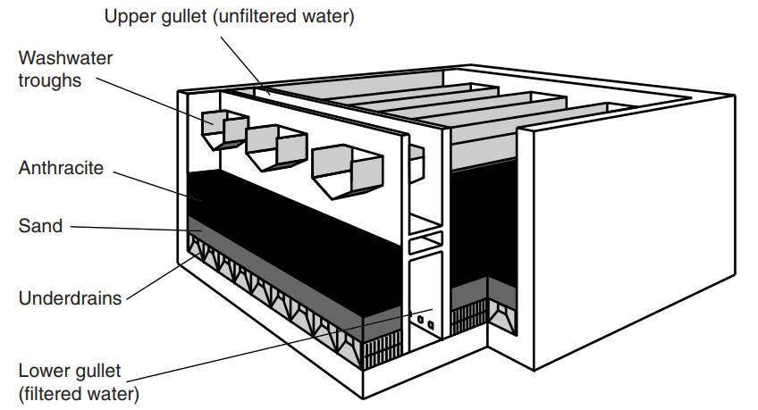
    - **Hình này chứng minh điều gì**
      - Thể hiện tương quan độ dày giữa tầng than anthracite và cát, cùng bố cục hai ngăn đối xứng qua mương giữa.
    - **Từ đâu mà thấy được**
      - Mặt cắt đứng bên trái từ trên xuống: máng washwater troughs $\rightarrow$ tầng anthracite dày $\rightarrow$ tầng sand mỏng hơn $\rightarrow$ hệ thống underdrains.
      - Trục mương giữa: kênh trên (upper gullet) đưa nước vào và kênh dưới (lower gullet) thu nước ra.
* Hệ thống máng thu nước rửa lọc (washwater troughs) được bố trí phía trên bề mặt lớp vật liệu lọc để thu gom nước rửa ngược:
  - **Hình 2.** Bề mặt bể lọc và hệ thống máng thu nước rửa
    - 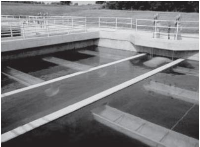
    - **Hình này chứng minh điều gì**
      - Cấu trúc máng rửa treo thực tế bố trí song song và vuông góc với trục giữa để thu gom đều nước rửa trên toàn bề mặt bể.
    - **Từ đâu mà thấy được**
      - Nhìn vào lòng bể: các máng dẫn hở đặt song song cách đều nhau vươn ra hai bên từ lối đi trung tâm.
* Kênh phân phối và thu nước (gullet) kết nối các máng rửa để tiếp nhận và xả dòng nước rửa ngược:
  - **Hình 3.** Dòng nước rửa ngược từ máng chảy vào kênh tập trung
    - 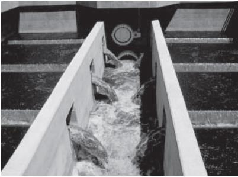
    - **Hình này chứng minh điều gì**
      - Kênh gullet thu gom toàn bộ dòng xả từ các máng hai bên thành dòng tập trung để thoát ra ngoài.
    - **Từ đâu mà thấy được**
      - Lòng kênh sâu chạy dọc ở giữa hai khoang bể lọc.
      - Dòng nước xối mạnh qua các cửa trổ trên thành kênh từ máng ngang vào rãnh chính.

#### 6.2 Cơ sở lý thuyết và Thủy lực lọc (Theoretical Principles & Filtration Hydraulics)

##### 6.2.1 Phân loại bể lọc và Phương thức vận hành (Filter Classifications & Operational Modes)

###### Tiêu chí phân loại bể lọc (Filtration Classification Criteria)
- Phân loại theo loại vật liệu lọc (Filter Media Classification):
  - Bể một lớp vật liệu (Single medium): Cát thạch anh (sand) hoặc than gầy anthracite (coal).
  - Bể hai lớp vật liệu (Dual media): Than anthracite hạt thô kết hợp cát thạch anh hạt mịn (coal plus sand).
  - Bể đa lớp vật liệu (Mixed media): Than anthracite, cát thạch anh và garnet (coal, sand, and garnet).
- Phân loại theo tải trọng thủy lực bề mặt hoặc tốc độ lọc danh định (Hydraulic Loading Rate Classification):
  - Tải trọng thủy lực $v_a$ hoặc $q$ đo bằng $\text{m/h}$ hoặc $\text{m}^3/(\text{m}^2\cdot\text{d})$.
  - Ba phân nhóm vận tốc chính trong công nghệ xử lý nước:
    - Bể lọc cát chậm (Slow Sand Filters - SSF).
    - Bể lọc cát nhanh (Rapid Sand Filters - RSF).
    - Bể lọc tốc độ cao (High-Rate Granular Filters).
  - Tương quan tốc độ lọc:
    - Bể lọc cát chậm có tốc độ lọc thấp hơn từ $50$ đến $100$ lần so với bể lọc cát nhanh ($v_{a,\text{SSF}} = \frac{1}{50}\text{--}\frac{1}{100} v_{a,\text{RSF}}$).

###### Bể lọc cát chậm (Slow Sand Filters - SSF)
- Lịch sử phát triển và mục tiêu công nghệ:
  - Bể lọc cát chậm đưa vào vận hành lần đầu vào những năm 1800 cho cấp nước đô thị.
  - Công trình có chi phí xây dựng và vận hành thấp, đạt hiệu quả xử lý cao đối với nước có độ đục thấp.
- Thông số tải trọng thủy lực và thủy lực dòng chảy:
  - Tải trọng lọc thiết kế duy trì ở mức $3\text{--}8\text{ m}^3/(\text{m}^2\cdot\text{d})$ (tương đương $0.125\text{--}0.333\text{ m/h}$).
  - Nước chảy qua lớp đệm hạt bằng trọng lực ở vận tốc nhỏ, đảm bảo chế độ chảy tầng ổn định.
- Cơ chế giữ cặn và hiện tượng bít tắc bề mặt:
  - Cặn lơ lửng và chất keo lắng đọng tập trung tại tầng mặt sâu $75\text{ mm}$ ($3\text{ inches}$).
  - Màng sinh học (*schmutzdecke*) trên bề mặt hạt cát thực hiện oxy hóa sinh học và giữ hạt cặn mịn.
  - Khi lỗ rỗng trong tầng mặt $75\text{ mm}$ bít nghẽn hoàn toàn, nước không thể tiếp tục chảy qua lớp cát.
- Phương pháp làm sạch và giới hạn vận hành:
  - Làm sạch thủ công bằng cạo lớp cát bề mặt (*scraping*): Hớt bỏ lớp cát mặt dày $10\text{--}20\text{ mm}$, rửa sạch và hoàn trả định kỳ.
  - Bể lọc cát chậm không có hệ thống sục rửa ngược tại chỗ.
  - Giới hạn công nghệ: Cuối thế kỷ 19, nhu cầu nước sạch tăng mạnh để kiểm soát dịch bệnh; diện tích mặt bằng quá lớn của bể lọc cát chậm không đáp ứng quy mô đô thị đông dân.

###### Bể lọc cát nhanh và Bể lọc hai lớp (Rapid Sand Filters & Dual-Media Filters)
- Động lực phát triển bể lọc cát nhanh (Rapid Sand Filters - RSF):
  - Ra đời vào cuối những năm 1800 để đáp ứng lưu lượng lớn trên diện tích xây dựng hạn chế.
  - Cấu tạo lớp vật liệu: Sử dụng lớp cát phân cấp (*graded sand bed*), chọn đường cong cấp phối hạt tối ưu để tăng lưu lượng nước và giữ cặn hạt.
- Cơ chế sục rửa ngược làm sạch tại chỗ (In-place Backwashing):
  - Làm sạch hoàn toàn tại chỗ bằng dòng nước rửa ngược đi từ đáy lên, không cần cạo cát thủ công.
  - Lưu lượng nước rửa ngược ($v_{bw}$) đủ lớn để làm giãn nở tầng sôi lớp cát và cuốn trôi toàn bộ cặn tích tụ.
  - Phân tầng thủy lực tự nhiên sau khi ngừng rửa ngược:
    - Trọng lực làm các hạt cát lắng trở lại đáy bể.
    - Hạt cát thô lớn nhất ($d_{max}$) lắng nhanh nhất xuống đáy, hạt cát mịn nhất ($d_{min}$) lắng chậm nhất nằm lại trên cùng.
    - Hệ quả thủy lực: Tầng mặt có kích thước hạt nhỏ nhất và lỗ rỗng nhỏ nhất, khiến phần lớn cặn bít nghẽn ngay tại mặt trên, gây tổn thất áp lực nhanh.
- Thông số vận hành định mức của bể lọc cát nhanh:
  - Tải trọng thủy lực thiết kế truyền thống: $120\text{ m}^3/(\text{m}^2\cdot\text{d})$ (tương đương $5\text{ m/h}$).
  - Bể lọc cát nhanh là loại công trình phổ biến nhất trong các nhà máy xử lý nước cấp hiện đại.
- Cải tiến bể lọc hai lớp vật liệu (Dual-Media Filters):
  - Phát triển vào đầu những năm 1940 (thời kỳ Chiến tranh Thế giới thứ hai) để khai thác cơ chế lọc theo chiều sâu (*depth filtration*).
  - Khắc phục nhược điểm bít tắc tầng mặt bằng cách đặt hạt lớn nằm trên hạt nhỏ.
  - Cơ chế phân tầng theo tỷ trọng riêng tương đối ($\text{SG}$):
    - Đặt lớp than anthracite hạt thô lên trên lớp cát thạch anh hạt mịn.
    - Than anthracite có tỷ trọng nhẹ ($\text{SG}_{\text{coal}} \approx 1.4\text{--}1.6$), thấp hơn cát thạch anh ($\text{SG}_{\text{sand}} \approx 2.65$).
    - Sau khi rửa ngược, than lắng chậm hơn cát nên tự động định vị ở phía trên, duy trì trật tự lỗ rỗng giảm dần theo chiều dòng chảy.
  - Hiệu quả công nghệ:
    - Bông cặn thô được giữ trong khoảng rỗng lớn của than; cặn mịn đi sâu hơn và bị giữ lại ở lớp cát mịn.
    - Tải trọng thủy lực vận hành đạt tới $480\text{ m}^3/(\text{m}^2\cdot\text{d})$ (tương đương $20\text{ m/h}$), gấp 4 lần bể lọc nhanh thông thường.
- Bằng chứng thực nghiệm cấu tạo và chế độ vận hành:
  - Cấu trúc không gian khối bể lọc nhanh hai lớp:
    - **Hình 4.** Cấu tạo mặt cắt không gian bể lọc nhanh hai lớp vật liệu (Dual-media filter)
      - 
      - **Hình này chứng minh điều gì**
        - Cấu trúc phân tầng lớp than anthracite đặt trên lớp cát, cùng hệ thống máng thu nước rửa và ống thu đáy.
      - **Từ đâu mà thấy được**
        - Nhãn chỉ rõ Anthracite phía trên Sand, Underdrains ở đáy, Washwater troughs và Upper/Lower gullet.
  - Chế độ dòng chảy lọc xuôi bình thường:
    - **Hình 5.** Bể lọc trọng lực hai ngăn trong chu kỳ vận hành lọc xuôi bình thường
      - 
      - **Hình này chứng minh điều gì**
        - Trạng thái dòng nước ngập trên bề mặt lớp vật liệu và các máng thu nước rửa trong pha lọc sản xuất.
      - **Từ đâu mà thấy được**
        - Mặt nước tĩnh ngập các máng thu ngang (washwater troughs), dòng nước chảy trọng lực qua lớp đệm hạt.
  - Chế độ sục rửa ngược thủy lực:
    - **Hình 6.** Pha rửa ngược bể lọc với dòng nước xả tràn vào mương thoát trung tâm
      - 
      - **Hình này chứng minh điều gì**
        - Nước rửa đẩy ngược từ đáy làm giãn nở lớp hạt và cuốn trôi toàn bộ cặn bẩn vào mương thoát.
      - **Từ đâu mà thấy được**
        - Dòng nước rửa chứa đầy bông cặn chảy cuồn cuộn từ các máng ngang tràn qua lỗ xả vào mương chính (gullet).

###### Bể lọc một lớp hạt sâu và Dây chuyền tiền xử lý (Deep-Bed Monomedia & Pretreatment Integration)
- Bể lọc một lớp hạt sâu (Deep-Bed Monomedia Filters):
  - Ra đời vào giữa thập niên 1980 (mid-1980s), sử dụng than anthracite hoặc cát thô đồng nhất có chiều dày lớn ($1.5\text{--}2.0\text{ m}$).
  - Mục tiêu công nghệ: Tăng tải trọng thủy lực đồng thời tạo nước sau lọc có độ đục rất thấp (*lower turbidity*).
  - Tải trọng thủy lực vận hành: Đạt tới $600\text{ m}^3/(\text{m}^2\cdot\text{d})$ (tương đương $25\text{ m/h}$).
- Bảng đối chiếu các loại bể lọc hạt theo đặc tính kỹ thuật:

| Loại Bể Lọc | Thời Điểm Phát Triển | Loại Vật Liệu Lọc | Tải Trọng Thủy Lực ($v_a$) | Cơ Chế Giữ Cặn | Phương Pháp Làm Sạch |
|---|---|---|---|---|---|
| **Lọc cát chậm (SSF)** | Thập niên 1800 | Cát mịn đơn lớp | $3\text{--}8\text{ m}^3/(\text{m}^2\cdot\text{d})$ ($0.125\text{--}0.333\text{ m/h}$) | Bề mặt ($75\text{ mm}$ tầng mặt), màng sinh học | Cạo bỏ lớp cát mặt thủ công (*scraping*) |
| **Lọc cát nhanh (RSF)** | Cuối thập niên 1800 | Cát phân cấp | $120\text{ m}^3/(\text{m}^2\cdot\text{d})$ ($5\text{ m/h}$) | Bề mặt và tầng trên lớp cát mịn | Rửa ngược tại chỗ bằng nước giãn nở tầng sôi |
| **Lọc hai lớp (Dual-Media)** | Đầu thập niên 1940 | Than anthracite + Cát thạch anh | Lên tới $480\text{ m}^3/(\text{m}^2\cdot\text{d})$ ($20\text{ m/h}$) | Theo chiều sâu (*depth filtration*), than thô giữ cặn lớn | Rửa ngược phân tầng tự nhiên theo tỷ trọng |
| **Lọc một lớp sâu (Deep-Bed)** | Giữa thập niên 1980 | Than hoặc cát thô đồng nhất sâu | Lên tới $600\text{ m}^3/(\text{m}^2\cdot\text{d})$ ($25\text{ m/h}$) | Chiều sâu cực đại, dung tích giữ cặn rất lớn | Rửa ngược kết hợp sục khí (*air scour*) |

- Phân loại theo dây chuyền công nghệ tiền xử lý (Pretreatment Classification):
  - Lọc truyền thống (Conventional Filtration):
    - Dây chuyền công nghệ: Châm hóa chất keo tụ $\rightarrow$ Tạo bông phản ứng $\rightarrow$ Bể lắng làm trong (Clarification) $\rightarrow$ Bể lọc hạt.
    - Áp dụng cho nguồn nước thô có độ đục cao và biến động mạnh.
  - Lọc trực tiếp (Direct Filtration):
    - Dây chuyền công nghệ: Châm hóa chất keo tụ $\rightarrow$ Tạo bông phản ứng $\rightarrow$ Bể lọc hạt (bỏ qua bể lắng làm trong).
    - Áp dụng khi nước thô có độ đục thấp hoặc trung bình, tiết kiệm diện tích và chi phí bể lắng.
  - Lọc tiếp xúc / lọc trên đường ống (In-line / Contact Filtration):
    - Dây chuyền công nghệ: Châm hóa chất keo tụ trực tiếp trên đường ống dẫn $\rightarrow$ Bể lọc hạt.
    - Bỏ qua bể tạo bông và bể lắng; quá trình tạo bông diễn ra ngẫu nhiên trên đường ống và trực tiếp trong các khe rỗng của lớp vật liệu lọc.

##### 6.2.2 Đặc tính vật liệu lọc và Tính chất vật lý (Filter Media Characteristics & Physical Properties)

###### 1. Kích thước hạt vật liệu lọc (Grain Size: Effective Size & Uniformity Coefficient)

- Định nghĩa kích thước hiệu dụng (Effective Size - $ES$ hay $d_{10}$):
  - Kích thước hiệu dụng $ES$ là kích thước mắt sàng quy ước mà $10\%$ khối lượng hạt vật liệu lọc mịn hơn hoặc lọt qua sàng ($d_{10}$):
    $$ES = d_{10}$$
  - Đơn vị đo tiêu chuẩn của $d_{10}$ là milimét ($\text{mm}$).
  - Ý nghĩa kỹ thuật: Đại lượng $d_{10}$ đại diện cho nhóm hạt mịn nhất trong lớp lọc, kiểm soát trực tiếp kích thước lỗ rỗng tối thiểu và trở lực dòng chảy ban đầu.
- Định nghĩa hệ số không đồng nhất (Uniformity Coefficient - $UC$ hay $U$):
  - Hệ số không đồng nhất $U$ là tỷ số giữa kích thước mắt sàng cho $60\%$ khối lượng hạt lọt qua ($d_{60}$) và kích thước mắt sàng cho $10\%$ khối lượng hạt lọt qua ($d_{10}$):
    $$U = \frac{d_{60}}{d_{10}}$$
  - Đại lượng $U$ là đại lượng không thứ nguyên (dimensionless).
  - Ý nghĩa kỹ thuật: Giá trị $U$ phản ánh độ đồng đều cấp phối hạt của lớp vật liệu lọc.
  - Giá trị $U = 1.0$ thể hiện tất cả các hạt có cùng kích thước hoàn toàn đồng nhất.
  - Giá trị $U$ càng nhỏ giúp giảm thiểu hiện tượng phân tầng hạt cục bộ và phân bố tổn thất áp lực đồng đều hơn theo chiều sâu.
- Phân bố kích thước hạt trong công trình lọc:
  - Lớp vật liệu lọc được lựa chọn với các dải cấp phối kích thước xác định nhằm tối ưu hóa khả năng dẫn nước và giữ cặn.
  - **Hình 7.** Sơ đồ phân tầng kích thước hạt vật liệu trong cột lọc cát sinh học
    - 
    - **Hình này chứng minh điều gì**
      - Lớp hạt phân tầng theo kích cỡ: cát mịn ($1 - 0.1\ \text{mm}$), cát thô ($1 - 6\ \text{mm}$) và sỏi đỡ ($6 - 12\ \text{mm}$).
    - **Từ đâu mà thấy được**
      - Nhãn kích thước trên thân cột: Fine Sand $1-0,1\text{mm}$, Coarse sand $1-6\text{mm}$, và Gravel $6-12\text{mm}$.

###### 2. Hình dạng hạt vật liệu lọc (Grain Shape: Sphericity)

- Định nghĩa độ cầu của hạt (Sphericity - $\psi$):
  - Độ cầu $\psi$ là tỷ số giữa diện tích bề mặt của hình cầu có cùng thể tích với hạt ($A_{\text{sphere}}$) và diện tích bề mặt thực tế của hạt ($A_{\text{particle}}$):
    $$\psi = \frac{A_{\text{sphere}}}{A_{\text{particle}}} \quad (\text{với } \forall_{\text{sphere}} = \forall_{\text{particle}})$$
  - Đại lượng $\psi$ là tỷ số không thứ nguyên (dimensionless).
- Giới hạn hình học của độ cầu:
  - Hình cầu có diện tích bề mặt nhỏ nhất trong tất cả các dạng hình học hạt có cùng thể tích.
  - Giá trị độ cầu luôn nhỏ hơn hoặc bằng một ($\psi \le 1.0$). Đối với hạt tự nhiên không tròn tuyệt đối, $\psi < 1.0$.
- Tác động thủy lực và công nghệ của hình dạng hạt:
  - Hạt có độ cầu cao ($\psi \to 1.0$, hạt tròn nhẵn) làm giảm tổn thất áp lực qua lớp lọc sạch và giảm năng lượng rửa ngược.
  - Hạt có độ cầu thấp ($\psi < 0.6$, hạt góc cạnh) làm tăng diện tích bề mặt riêng, tăng khả năng tiếp xúc dính bám cặn bẩn nhưng làm tăng tổn thất cột áp.

###### 3. Các tính chất vật lý của vật liệu lọc (Physical Properties: Hardness, Porosity & Specific Gravity)

- Độ cứng của vật liệu lọc (Hardness):
  - Vai trò kỹ thuật: Độ cứng là chỉ số đo lường khả năng chống mài mòn và hao hụt hạt (abrasion and wear) phát sinh do va chạm giữa các hạt trong quá trình rửa ngược lớp lọc (filter backwashing).
  - Thang đo độ cứng Mohs: Độ cứng được xếp hạng từ cấp $1$ đến cấp $10$ trên thang độ cứng Mohs.
    - Khoáng bột tan (Talc) có độ cứng Mohs bằng $1$ (rất mềm).
    - Kim cương (Diamond) có độ cứng Mohs bằng $10$ (cực kỳ cứng).
  - Tính chống mài mòn của các loại vật liệu:
    - Cát thạch anh (Sand, Mohs $\approx 7.0$) và quặng garnet (Garnet, Mohs $\approx 6.5 - 7.5$) có độ cứng cao, chống mài mòn tốt.
    - Than antraxít (Anthracite coal) và than hoạt tính (Activated carbon) có đặc tính giòn, dễ vỡ vụn (friable), yêu cầu tiêu chuẩn kỹ thuật thiết kế phải quy định giá trị độ cứng tối thiểu chấp nhận được.
    - Quy định kỹ thuật thường yêu cầu than antraxít phải đạt độ cứng Mohs tối thiểu là $2.7$ ($\text{Mohs} \ge 2.7$).
    - Độ cứng than hoạt tính dạng hạt được đánh giá theo tiêu chuẩn ANSI/AWWA B604-96 (AWWA, 1996).
- Độ rỗng của lớp vật liệu lọc (Porosity - $\varepsilon$):
  - Định nghĩa độ rỗng lớp lọc: Độ rỗng của lớp vật liệu lọc tại chỗ (in-place media bed, không phải độ rỗng bên trong hạt riêng lẻ) quyết định trực tiếp tổn thất áp lực và hiệu suất giữ cặn của bể lọc.
  - Phương trình xác định độ rỗng lớp lọc:
    $$\varepsilon = \frac{\forall_v}{\forall_T} = \frac{\forall_T - \forall_M}{\forall_T} = 1 - \frac{\forall_M}{\forall_T}$$
    - $\varepsilon$: Độ rỗng lớp vật liệu lọc (porosity), không thứ nguyên (dimensionless).
    - $\forall_v$: Tổng thể tích các lỗ rỗng giữa các hạt trong lớp lọc (volume of voids), $\text{m}^3$.
    - $\forall_T$: Tổng thể tích biểu kiến của toàn bộ khối lớp lọc (total volume of media bed), $\text{m}^3$.
    - $\forall_M$: Thể tích thực tế của bản thân các hạt vật liệu rắn (volume of media), $\text{m}^3$.
- Tỷ trọng của vật liệu lọc (Specific Gravity - $SG$):
  - Vai trò của tỷ trọng trong thiết kế lọc:
    - Xác định trình tự sắp xếp các tầng vật liệu trong bể lọc nhiều lớp (multimedia filters, dual-media và tri-media filters).
    - Quyết định lưu lượng và vận tốc dòng nước rửa ngược cần thiết để đạt trạng thái sôi lớp lọc (fluidize the bed).
  - Nguyên lý sắp xếp bể lọc nhiều lớp dựa trên tỷ trọng:
    - Vật liệu có tỷ trọng thấp hơn (như than antraxít, $SG \approx 1.50 - 1.75$) được chọn cỡ hạt lớn hơn và tự động nổi lên tầng trên cùng sau khi rửa ngược.
    - Vật liệu có tỷ trọng trung bình (như cát thạch anh, $SG \approx 2.55 - 2.65$) có cỡ hạt trung bình và nằm ở tầng giữa.
    - Vật liệu có tỷ trọng rất cao (như garnet, $SG \approx 3.60 - 4.20$) có cỡ hạt mịn nhất và lắng xuống tầng dưới cùng.
    - Cấu hình này tạo ra sự chuyển tiếp kích thước hạt từ thô xuống mịn theo chiều dòng chảy xuôi, cho phép cặn thâm nhập sâu vào toàn bộ chiều dày lớp lọc.
- Bố trí các tầng hạt trong thân công trình:
  - Tầng cát lọc chính được đặt trên các lớp sỏi đỡ có kích thước hạt tăng dần để ngăn hạt lọt vào hệ thống thu nước đáy.
  - **Hình 8.** Cấu tạo phân lớp hạt vật liệu và tầng sỏi đỡ trong vỏ bể lọc bê tông
    - 
    - **Hình này chứng minh điều gì**
      - Tầng vật liệu cát lọc (Sand) được bố trí phía trên lớp sỏi phân cách và sỏi thu nước đáy bể.
    - **Từ đâu mà thấy được**
      - Nhãn chỉ dẫn cấu trúc: Sand ở thân trên, Separating Gravel ở giữa và Underdrain Gravel ở đáy thu nước.

###### 4. Bảng thông số kỹ thuật các loại vật liệu lọc phổ biến (Filter Media Properties Matrix)

- Bảng so sánh đặc tính vật lý của bốn loại vật liệu lọc thông dụng trong kỹ thuật xử lý nước:

| Đặc tính kỹ thuật (*Property*) | Than hoạt tính (*Activated carbon*) | Than antraxít (*Anthracite coal*) | Cát thạch anh (*Sand*) | Quặng garnet (*Garnet*) |
|---|---|---|---|---|
| **Kích thước hiệu dụng ($ES$, $\text{mm}$)** | $0.8 - 1.0$ | $0.45 - 0.55$ hoặc $0.8 - 1.2$ | $0.3 - 0.6$ | $0.2 - 0.4$ |
| **Hệ số không đồng nhất ($UC$)** | $1.3 - 2.4$ | $\le 1.65$ hoặc $\le 1.85$ | $1.3 - 1.8$ | $1.3 - 1.7$ |
| **Độ cầu ($\psi$)** | $0.75$ | $0.46 - 0.60$ | $0.70 - 0.80$ | $0.60$ |
| **Độ cứng thang Mohs** | Rất thấp (*Very low*) | $2 - 3$ ($\ge 2.7$) | $7.0$ | $6.5 - 7.5$ |
| **Độ rỗng lớp lọc ($\varepsilon$)** | $0.50$ | $0.50 - 0.60$ | $0.40 - 0.47$ | $0.45 - 0.58$ |
| **Tỷ trọng ($SG$)** | $1.30 - 1.70$ | $1.50 - 1.75$ | $2.55 - 2.65$ | $3.60 - 4.20$ |

- Phân tích tương quan kỹ thuật giữa các loại vật liệu:
  - Tương quan tỷ trọng: Quặng garnet ($SG = 3.60 - 4.20$) > Cát thạch anh ($SG = 2.55 - 2.65$) > Than antraxít ($SG = 1.50 - 1.75$) > Than hoạt tính ($SG = 1.30 - 1.70$).
  - Tương quan kích thước hiệu dụng trong bể lọc ba lớp (tri-media filter): Lớp than antraxít thô nhất ($0.8 - 1.2\ \text{mm}$) ở trên, lớp cát trung gian ($0.45 - 0.55\ \text{mm}$) ở giữa, và lớp garnet mịn nhất ($0.2 - 0.4\ \text{mm}$) ở đáy.
  - Tương quan độ cứng chống mài mòn: Cát thạch anh ($7.0$) và garnet ($6.5 - 7.5$) có khả năng chống mài mòn hiệu quả hơn so với than antraxít ($2 - 3$) và than hoạt tính.
  - Độ rỗng lớp lọc sạch: Than antraxít và than hoạt tính có độ rỗng cao ($\varepsilon \approx 0.50 - 0.60$), tạo không gian chứa cặn lớn hơn so với cát thạch anh ($\varepsilon \approx 0.40 - 0.47$).

###### 5. Đặc tính vật lý và thành phần hóa học của cát lọc (Physical Properties and Chemical Analysis of Sand)

- Đặc tính vật lý điển hình của cát lọc thạch anh (Typical Physical Properties):

| Chỉ tiêu vật lý | Giá trị kỹ thuật |
|---|---|
| **Khoáng vật học (Mineral)** | Thạch anh (*Quartz*) |
| **Độ $\text{pH}$** | Trung tính ($6.9 - 7.0$) |
| **Màu sắc (Color)** | Nâu vàng / Trắng (*Tan / White*) |
| **Độ tròn cạnh (Roundness)** | $\ge 0.6$ ($0.6+$) |
| **Độ cầu (Sphericity)** | $\ge 0.6$ ($0.6+$) |
| **Độ cứng thang Mohs (Hardness)** | $7.0$ |
| **Tỷ trọng (Specific Gravity)** | $2.65$ |
| **Điểm nóng chảy (Melting Point)** | $2800^\circ\text{F} - 3100^\circ\text{F}$ ($\approx 1538^\circ\text{C} - 1704^\circ\text{C}$) |
| **Độ hao hụt khi nung (Loss on Ignition - LOI)** | $0.1\%$ |
| **Khối lượng thể tích rời (Unit Weight)** | $100\ \text{lb/ft}^3$ ($\approx 1602\ \text{kg/m}^3$) |

- Thành phần hóa học điển hình của cát lọc thạch anh (Typical Chemical Analysis):

| Thành phần oxit | Hàm lượng phần trăm theo khối lượng ($\%$) |
|---|---|
| **Dioxit silic ($\text{SiO}_2$ - Silicon Dioxide)** | $99.48\%$ |
| **Oxit nhôm ($\text{Al}_2\text{O}_3$ - Aluminum Oxide)** | $0.21\%$ |
| **Oxit sắt ($\text{Fe}_2\text{O}_3$ - Iron Oxide)** | $0.06\%$ |
| **Dioxit titan ($\text{TiO}_2$ - Titanium Dioxide)** | $< 0.01\%$ |
| **Oxit canxi ($\text{CaO}$ - Calcium Oxide)** | $< 0.01\%$ |
| **Oxit magie ($\text{MgO}$ - Magnesium Oxide)** | $< 0.01\%$ |

- Đánh giá chất lượng và độ bền hóa học của cát lọc:
  - Hàm lượng dioxit silic ($\text{SiO}_2$) đạt $99.48\%$ chứng minh độ tinh khiết khoáng vật rất cao, trơ về mặt hóa học, không bị hòa tan trong môi trường nước cấp có chứa clo khử trùng hay axit yếu.
  - Hàm lượng các oxit tạp chất kim loại ($\text{Fe}_2\text{O}_3$, $\text{Al}_2\text{O}_3$, $\text{CaO}$, $\text{MgO}$) cực kỳ thấp ($< 0.3\%$), bảo đảm cát không làm thôi nhiễm kim loại hay làm biến động độ cứng và độ kiềm của nước sau lọc.
  - Độ hao hụt khi nung $\text{LOI} = 0.1\%$ phản ánh hàm lượng chất hữu cơ và cacbonat liên kết trong cát không đáng kể, đáp ứng đầy đủ các tiêu chuẩn nước uống quốc tế.

##### 6.2.3 Cơ chế giữ cặn trong lớp vật liệu lọc (Particle Removal Mechanisms)

###### 6.2.3.1 Cơ chế sàng cơ học và hình thành bánh cặn bề mặt (Mechanical Straining & Cake Filtration)
- Cơ chế sàng lọc cơ học (Mechanical straining / Screening):
  - Hạt cặn bị giữ lại khi kích thước hạt ($d_p$) lớn hơn kích thước khe hở nhỏ nhất ($d_{\text{pore}}$) giữa các hạt vật liệu lọc ($d_p > d_{\text{pore}}$).
  - Quá trình sàng lọc xảy ra chủ yếu ngay tại mặt thoáng phía trên cùng của lớp vật liệu lọc.
  - Cơ chế này không cho phép cặn xâm nhập sâu vào bên trong các tầng vật liệu bên dưới.
- Ứng dụng chi phối trong bể lọc chậm (Slow sand filters):
  - Sàng lọc cơ học là cơ chế giữ cặn chủ đạo của bể lọc chậm.
  - Bể lọc chậm sử dụng cát mịn ($d_{10} = 0.15\text{--}0.35\text{ mm}$) với tải trọng thủy lực thấp ($q = 0.1\text{--}0.4\text{ m/h}$ tương đương $3\text{--}8\text{ m}^3/(\text{m}^2\cdot\text{d})$).
  - Phần lớn cặn lắng và sinh khối tập trung giữ lại trong phạm vi $75\text{ mm}$ lớp cát trên cùng.
  - **Hình 9.** Cấu tạo và cơ chế lọc màng cặn bề mặt của bể lọc chậm
    - 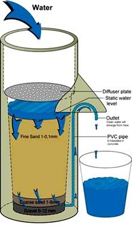
    - **Hình này chứng minh điều gì**
      - Nước chảy qua tầng cát mịn ($0.1\text{--}1\text{ mm}$); cặn giữ lại ở bề mặt theo cơ chế sàng cơ học trước khi nước sạch thu gom qua sỏi đỡ ($6\text{--}12\text{ mm}$) ra ống PVC.
    - **Từ đâu mà thấy được**
      - Dòng nước qua đĩa phân phối vào lớp Fine Sand ($0.1\text{--}1\text{ mm}$); lớp dưới là Coarse sand ($1\text{--}6\text{ mm}$) và Gravel ($6\text{--}12\text{ mm}$); ống PVC dẫn nước trong ra cốc hứng.
- Sự hình thành màng bánh cặn bề mặt (Surface cake formation / Schmutzdecke):
  - Cặn tích tụ liên tục tạo thành một lớp màng bánh cặn xốp phủ kín bề mặt cát.
  - Sự hình thành bánh cặn làm tăng hiệu suất thu giữ các hạt cặn nhỏ tiếp theo do các vi khe rỗng mới trong bánh cặn có kích thước nhỏ hơn khe rỗng ban đầu.
  - Bánh cặn làm tăng nhanh trở lực thủy lực và tổn thất áp lực ($\Delta h$) qua lớp lọc theo thời gian lọc ($t$).
  - Khi tổn thất áp lực đạt ngưỡng giới hạn, người vận hành phải cạo bỏ lớp cát mặt dày $1\text{--}2\text{ cm}$ để phục hồi năng lực thông thủy.

###### 6.2.3.2 Cơ chế lọc sâu trong lớp vật liệu hạt (Depth Filtration Mechanisms)
- Đặc điểm của quá trình lọc theo chiều sâu (Depth filtration in rapid filters):
  - Ứng dụng trong bể lọc nhanh trọng lực và bể lọc áp lực với tốc độ lọc cao ($v_f = 5\text{--}15\text{ m/h}$).
  - Kích thước hạt cặn và bông cặn keo tụ ($d_p = 1\text{--}50\ \mu\text{m}$) nhỏ hơn nhiều so với kích thước khe hở rỗng của tầng lọc ($d_{\text{pore}} \approx 70\text{--}150\ \mu\text{m}$).
  - Cặn phân bố xuyên sâu vào chiều dày của tầng vật liệu lọc thay vì tích tụ trên bề mặt.
- Quá trình thu giữ hai giai đoạn (Two-step particle removal process):
  - Giai đoạn 1: Quá trình vận chuyển (Transport step) đưa hạt cặn từ dòng chất lưu chính tiếp cận gần bề mặt hạt vật liệu lọc (collector).
  - Giai đoạn 2: Quá trình dính bám (Attachment step) liên kết hạt cặn cố định vào bề mặt hạt vật liệu hoặc lớp cặn đã bám trước đó.
- Bốn cơ chế vận chuyển vật lý chính trong lọc sâu:
  - Lắng trọng lực (Sedimentation):
    - Hạt cặn có khối lượng riêng lớn hơn khối lượng riêng của nước ($\rho_p > \rho_w$).
    - Trọng lực làm hạt chệch khỏi đường dòng chảy và lắng đọng lên bề mặt trên của hạt vật liệu lọc.
  - Tiếp xúc chặn giữ (Interception):
    - Hạt cặn chuyển động dọc theo đường dòng chảy thủy động lực học quanh hạt vật liệu lọc.
    - Khi khoảng cách giữa tâm hạt và bề mặt vật liệu lọc nhỏ hơn bán kính hạt cặn ($r_p \le d_p / 2$), hạt va chạm tiếp xúc và bị chặn lại.
  - Keo tụ tạo bông trong khe rỗng (Flocculation in pore spaces):
    - Građien vận tốc ($G$) trong các khe rỗng hẹp thúc đẩy các hạt cặn nhỏ va chạm với nhau.
    - Các hạt kết tụ thành bông cặn lớn hơn, làm tăng xác suất bị giữ lại bởi cơ chế lắng và chặn giữ.
  - Khuếch tán Brown (Brownian diffusion):
    - Tác động lên các hạt cặn keo siêu mịn có đường kính $d_p < 1\ \mu\text{m}$.
    - Chuyển động nhiệt ngẫu nhiên làm hạt dịch chuyển ngang qua các đường dòng và va chạm vào bề mặt vật liệu lọc.
- Cơ chế dính bám hóa lý (Physicochemical attachment mechanism):
  - Lực dính bám điều khiển bởi lực hút phân tử Van der Waals và tương tác tĩnh điện hai lớp (lực đẩy hoặc lực hút tĩnh điện).
  - Bề mặt hạt cát và hạt cặn tự nhiên trong nước thường mang điện tích âm, tạo lực đẩy tĩnh điện ngăn cản sự dính bám.
  - Tiền xử lý keo tụ (Coagulation pretreatment) bằng chất keo tụ đóng vai trò quyết định để trung hòa điện tích bề mặt, giảm thế điện động Zeta ($\zeta$), cho phép hạt cặn dính kết bền vững.

###### 6.2.3.3 Các mô hình lý thuyết lọc hạt (Particle Filtration Theoretical Models)
- Hai cách tiếp cận mô hình hóa lý thuyết lọc cơ bản:
  - Tiếp cận vi mô (Microscopic approach): Phân tích động học thu giữ hạt ở cấp độ một hạt vật liệu đơn lẻ (Single collector theory).
  - Tiếp cận vĩ mô (Macroscopic / Phenomenological approach): Phân tích cân bằng khối lượng và suy giảm nồng độ cặn theo chiều sâu toàn bộ lớp lọc liên tục.
- Mô hình tiếp cận vi mô (Microscopic / Single Collector Theory):
  - Hiệu suất thu giữ của một hạt lọc đơn hình cầu ($\eta$) bằng tổng hiệu suất của các cơ chế vận chuyển độc lập:
    $$\eta = \eta_I + \eta_G + \eta_D$$
    - $\eta$: Hiệu suất thu giữ không thứ nguyên của một hạt vật liệu lọc đơn lẻ.
    - $\eta_I$: Hiệu suất thành phần do cơ chế tiếp xúc chặn giữ (Interception), $\eta_I \propto (d_p / d_c)^2$.
    - $\eta_G$: Hiệu suất thành phần do cơ chế lắng trọng lực (Sedimentation), $\eta_G \propto v_s / v_0$.
    - $\eta_D$: Hiệu suất thành phần do cơ chế khuếch tán Brown (Diffusion), $\eta_D \propto Pe^{-2/3}$.
    - $d_p$: Đường kính hạt cặn, $\text{m}$.
    - $d_c$: Đường kính hạt vật liệu lọc (collector diameter), $\text{m}$.
    - $v_s$: Vận tốc lắng trọng lực của hạt cặn, $\text{m/s}$.
    - $v_0$: Vận tốc lọc bề mặt tiếp cận, $\text{m/s}$.
    - $Pe$: Chuẩn số Peclet mô tả tỷ số giữa đối lưu và khuếch tán, không thứ nguyên.
  - Hệ số va chạm dính bám hiệu dụng ($\alpha$ - Collision attachment efficiency):
    - Xác suất một hạt cặn va chạm dính bám thành công vào bề mặt collector ($\alpha \in [0, 1]$).
    - Phụ thuộc vào tính chất hóa học của nước và hiệu quả keo tụ trung hòa điện tích.
- Mô hình tiếp cận vĩ mô (Macroscopic / Phenomenological Iwasaki Model):
  - Phương trình vi phân cơ bản của Iwasaki (1937) mô tả tốc độ suy giảm nồng độ cặn lơ lửng ($C$) theo chiều sâu lớp lọc ($z$):
    $$-\frac{\partial C}{\partial z} = \lambda C$$
    - $C$: Nồng độ hạt cặn lơ lửng tại độ sâu $z$, $\text{mg/L}$ hoặc $\text{hạt/m}^3$.
    - $z$: Chiều sâu lớp vật liệu lọc tính từ bề mặt lớp cát, $\text{m}$.
    - $\lambda$: Hệ số lọc (Filtration coefficient), $\text{m}^{-1}$.
  - Nghiệm tích phân cho tầng lọc sạch ban đầu khi $\lambda = \lambda_0 = \text{const}$:
    $$C(z) = C_0 \exp(-\lambda_0 z)$$
    - $C_0$: Nồng độ hạt cặn tại cửa vào lớp vật liệu lọc ($z = 0$), $\text{mg/L}$.
    - $\lambda_0$: Hệ số lọc của tầng vật liệu sạch ban đầu, $\text{m}^{-1}$.
  - Động học biến thiên của hệ số lọc $\lambda$ theo lượng cặn tích lũy ($\sigma$ - Specific deposit):
    - Giai đoạn trưởng thành (Filter ripening): Lượng cặn ban đầu dính bám làm tăng diện tích bề mặt tiếp xúc, khiến $\lambda$ tăng tạm thời ($\lambda > \lambda_0$).
    - Giai đoạn tắc nghẽn và đột xuyên (Clogging & Breakthrough): Khe rỗng bị thu hẹp, vận tốc dòng cục bộ trong lỗ rỗng tăng cao gây lực cắt thủy động xé cặn rời khỏi bề mặt, khiến $\lambda$ giảm nhanh và cặn trôi xuyên qua đáy lớp lọc.

##### 6.2.4 Thủy lực lớp lọc sạch và Mô hình tổn thất áp lực Rose (Clean Bed Hydraulics & Headloss)

###### Bốn vấn đề thủy lực cốt lõi trong thiết kế bể lọc (Core Filter Hydraulics Issues)
- Bốn bài toán thủy lực nền tảng cần xác định trong thiết kế hệ thống bể lọc hạt:
  - (1) Tổn thất áp lực qua tầng vật liệu lọc sạch ban đầu ($h_L$, clean bed headloss).
  - (2) Tổn thất áp lực gia tăng do sự tích tụ cặn bẩn trong tầng lọc theo thời gian ($h_{L,\text{clog}}$, clogging headloss).
  - (3) Chiều sâu giãn nở của tầng vật liệu ở trạng thái sôi trong quá trình rửa ngược ($D_e$, bed fluidization depth).
  - (4) Tổn thất áp lực cần thiết để làm giãn nở toàn bộ tầng lọc khi rửa ngược ($h_{Le}$, bed expansion headloss).
- Vai trò kỹ thuật và giới hạn của các phương trình thủy lực lọc sạch:
  - Các phương trình thủy lực chỉ mô tả chính xác trạng thái ban đầu khi vật liệu chưa bám dính hạt cặn.
  - Các công thức cho phép kỹ sư đánh giá định lượng tác động của các biến số thiết kế lên tổn thất năng lượng ban đầu.
  - Tổn thất áp lực lớp lọc sạch là ngưỡng tổn thất nhỏ nhất trong toàn bộ chu kỳ vận hành của bể lọc.

###### Mô hình tổn thất áp lực Rose cho lớp lọc sạch (Rose Clean Bed Headloss Equation)
- Giả thuyết nền tảng của mô hình Rose (Rose, 1945):
  - Dòng nước sạch chảy qua tầng cát lọc đã phân tầng thủy lực hoàn toàn sau rửa ngược (stratified sand bed).
  - Độ xốp của lớp vật liệu được giả định là phân bố đồng nhất dọc theo toàn bộ chiều sâu tầng lọc ($\varepsilon = \text{const}$).
- Dạng tổng quát của phương trình Rose:
  $$h_L = \frac{1.067 \, v_a^2 \, D}{\varphi \, g \, \varepsilon^4} \sum_{i=1}^n \frac{C_{D,i} \, f_i}{d_{g,i}}$$
  - $h_L$: Tổn thất áp lực ma sát qua tầng lọc sạch (frictional headloss through clean bed), đơn vị $\text{m}$.
  - $v_a$: Vận tốc tiếp cận bề mặt hay tốc độ tải trọng lọc (approach velocity / filtration rate / hydraulic loading rate), đơn vị $\text{m/s}$ hoặc $\text{m}^3/(\text{m}^2\cdot\text{s})$.
  - $D$: Chiều dày tổng cộng của tầng vật liệu lọc (depth of filter bed), đơn vị $\text{m}$.
  - $\varphi$: Hệ số hình dạng của hạt vật liệu (shape factor / sphericity), không thứ nguyên ($0 < \varphi \le 1.0$).
  - $g$: Gia tốc trọng trường chuẩn (acceleration due to gravity), $g = 9.81\text{ m/s}^2$.
  - $\varepsilon$: Độ xốp cố định của tầng lọc (bed porosity), không thứ nguyên.
  - $C_{D,i}$: Hệ số lực cản thủy động Newton của phân đoạn hạt thứ $i$ (drag coefficient), không thứ nguyên.
  - $f_i$: Phân số khối lượng hạt thuộc phân đoạn kích thước thứ $i$ (mass fraction), không thứ nguyên ($\sum f_i = 1.0$).
  - $d_{g,i}$: Đường kính trung bình nhân của hạt thuộc phân đoạn rây thứ $i$ (geometric mean diameter), đơn vị $\text{m}$.
- Công thức tính đường kính trung bình nhân $d_g$ giữa hai cỡ rây kế tiếp:
  $$d_g = \sqrt{d_1 \cdot d_2} = (d_1 \cdot d_2)^{0.5}$$
  - $d_1$: Kích thước lỗ mở của mắt rây chặn trên (diameter of upper sieve opening), đơn vị $\text{mm}$ hoặc $\text{m}$.
  - $d_2$: Kích thước lỗ mở của mắt rây chặn dưới (diameter of lower sieve opening), đơn vị $\text{mm}$ hoặc $\text{m}$.
  - Trung bình nhân phản ánh chính xác phân bố diện tích bề mặt riêng của các hạt bị giữ lại giữa hai rây.

###### Hệ số cản Newton CD theo từng chế độ dòng chảy (Piecewise Drag Coefficient Formulations)
- Chuẩn số Reynolds của hạt ($Re$):
  - Trạng thái thủy động lực học quanh hạt cát được xác định thông qua chuẩn số Reynolds:
    $$Re = \frac{\varphi \, v_a \, d_g}{\nu} = \frac{\varphi \, \rho \, v_a \, d_g}{\mu}$$
    - $\nu$: Độ nhớt động học của nước (kinematic viscosity), đơn vị $\text{m}^2/\text{s}$.
    - $\mu$: Độ nhớt động lực học tuyệt đối của nước (dynamic viscosity), đơn vị $\text{Pa}\cdot\text{s}$.
    - $\rho$: Khối lượng riêng của nước (water density), đơn vị $\text{kg/m}^3$.
- Phương trình thực nghiệm toàn dải của Rose:
  - Rose (1945) đề xuất phương trình liên tục cho hệ số cản $C_D$ trong phạm vi $Re < 10^4$:
    $$C_D = \frac{24}{Re} + \frac{3}{\sqrt{Re}} + 0.34$$
    - Số hạng $\frac{24}{Re}$: Lực cản ma sát nhớt thuần túy theo định luật Stokes (chi phối chế độ chảy tầng).
    - Số hạng $\frac{3}{\sqrt{Re}}$: Hiệu chỉnh thực nghiệm cho lực cản vùng dòng chảy chuyển tiếp.
    - Hằng số $0.34$: Lực cản quán tính và áp suất hình dáng (chi phối vùng chảy rối).
- Hệ phương trình hệ số cản từng khúc (Piecewise drag coefficient equations):
  - Chế độ chảy tầng (Laminar flow, $Re < 1.0$ hoặc $Re < 1.9$):
    $$C_D = \frac{24}{Re}$$
    - Ma sát nhớt phân tử chiếm ưu thế tuyệt đối. Lực quán tính không đáng kể.
  - Chế độ chảy chuyển tiếp (Transitional flow, $1.9 \le Re \le 500$):
    $$C_D = \frac{18.5}{Re^{0.6}}$$
    - Cả lực ma sát nhớt và lực quán tính đều tác động đồng thời lên dòng bao quanh hạt.
  - Chế độ chảy rối hoàn toàn (Fully turbulent flow, $500 < Re < 10^4$):
    $$C_D \approx 0.40 \text{--} 0.44$$
    - Hệ số cản $C_D$ đạt giá trị hằng số, độc lập với chuẩn số Reynolds.

###### Các mô hình thủy lực bổ trợ: Carmen-Kozeny và Fair-Hatch (Carmen-Kozeny & Fair-Hatch Equations)
- Mô hình Carman-Kozeny cho môi trường xốp (Carman-Kozeny Equation):
  - Mô hình giả định các khe rỗng trong tầng hạt tương đương chùm ống mao dẫn quanh co.
  - Trong điều kiện dòng chảy tầng ($Re < 2.0$), phương trình tổn thất áp lực có dạng:
    $$\frac{h_L}{D} = \frac{k_{KC} \, \mu}{\rho \, g} \cdot \frac{(1 - \varepsilon)^2}{\varepsilon^3} \cdot S_v^2 \cdot v_a$$
    - $k_{KC}$: Hằng số Kozeny-Carman thực nghiệm, $k_{KC} \approx 5.0$.
    - $S_v$: Diện tích bề mặt riêng trên một đơn vị thể tích hạt rắn ($S_v = \frac{6}{\varphi \cdot d_{\text{eq}}}$), đơn vị $\text{m}^{-1}$.
  - Khai triển phương trình Carman-Kozeny cho hạt có hệ số hình dạng $\varphi$:
    $$\frac{h_L}{D} = \frac{180 \, \nu}{g} \cdot \frac{(1 - \varepsilon)^2}{\varepsilon^3} \cdot \frac{v_a}{(\varphi \, d_{\text{eq}})^2}$$
  - Mở rộng cho lớp cát phân tầng gồm nhiều phân đoạn kích thước hạt:
    $$\frac{h_L}{D} = \frac{180 \, \nu}{g} \cdot \frac{(1 - \varepsilon)^2}{\varepsilon^3} \cdot \frac{v_a}{\varphi^2} \sum_{i=1}^n \frac{f_i}{d_{g,i}^2}$$
  - Phương trình Ergun tổng quát (Ergun, 1952) bổ sung thành phần lực cản quán tính:
    $$\frac{h_L}{D} = 150 \frac{\nu}{g} \frac{(1 - \varepsilon)^2}{\varepsilon^3} \frac{v_a}{(\varphi \, d)^2} + 1.75 \frac{1}{g} \frac{(1 - \varepsilon)}{\varepsilon^3} \frac{v_a^2}{\varphi \, d}$$
    - Số hạng tuyến tính theo $v_a$ đại diện cho ma sát nhớt, chiếm trên 90% tổn thất trong quá trình lọc nước sạch thông thường.
    - Số hạng bậc hai theo $v_a^2$ đại diện cho tổn thất động năng, chỉ chiếm tỷ trọng đáng kể khi lọc siêu cao tải hoặc khi rửa ngược.
- Mô hình Fair-Hatch cho tầng lọc hạt (Fair-Hatch Equation, 1933):
  - Phương trình Fair-Hatch xây dựng trên cơ sở phân tích thứ nguyên dòng chảy qua môi trường xốp:
    $$h_L = \frac{k_{FH} \, \nu}{g} \cdot \left[ \frac{(1 - \varepsilon)^2}{\varepsilon^3} \right] \cdot \left( \frac{\alpha}{100} \right)^2 \cdot v_a \cdot D \left[ \sum_{i=1}^n \frac{f_i}{d_{g,i}} \right]^2$$
    - $k_{FH}$: Hằng số lọc Fair-Hatch thực nghiệm ($k_{FH} \approx 5.0$).
    - $\alpha$: Hệ số diện tích bề mặt hạt ($\alpha = \frac{60}{\varphi}$).
  - Khi biểu diễn trực tiếp qua hệ số hình dạng hạt $\varphi$:
    $$h_L = \frac{k}{g} \cdot \nu \cdot \frac{(1 - \varepsilon)^2}{\varepsilon^3} \cdot \frac{v_a \, D}{\varphi^2} \sum_{i=1}^n \frac{f_i}{d_{g,i}^2}$$
  - So sánh giữa các mô hình thủy lực:
    - Mô hình Carman-Kozeny và Fair-Hatch nhấn mạnh dòng chảy tầng với tổn thất tỷ lệ bậc nhất với vận tốc lọc ($h_L \propto v_a$) và tỷ lệ nghịch với bình phương đường kính hạt ($h_L \propto 1/d^2$).
    - Mô hình Rose bao hàm số hạng vận tốc bậc hai ($h_L \propto v_a^2$) kết hợp hệ số cản $C_D$, cho phép phản ánh chính xác cả vùng chảy tầng lẫn vùng chảy chuyển tiếp.

###### Mối quan hệ độ nhạy và các biến số thiết kế (Parametric Sensitivity & Design Variables)
- Ba quan hệ tỷ lệ then chốt từ phương trình Rose:
  - Tổn thất áp lực tỷ lệ thuận với bình phương vận tốc lọc ($h_L \propto v_a^2$):
    - Tải trọng lọc thường đo bằng $\text{m}^3/(\text{m}^2\cdot\text{d})$ hoặc $\text{m/h}$.
    - Sự gia tăng nhỏ của vận tốc lọc sẽ bị khuếch đại thành mức tăng rất lớn của tổn thất áp lực.
  - Tổn thất áp lực tỷ lệ nghịch với đường kính hạt ($h_L \propto 1/d_g$):
    - Các phân đoạn hạt cát mịn có giá trị $d_g$ nhỏ nhất sẽ tạo ra phần lớn tổn thất cột nước ma sát.
  - Tổn thất áp lực tỷ lệ nghịch với lũy thừa bậc bốn của độ xốp ($h_L \propto 1/\varepsilon^4$):
    - Độ xốp của lớp vật liệu giữ vai trò chi phối áp đảo lên độ lớn của tổn thất áp lực.
    - Giảm nhẹ độ xốp dẫn đến mức gia tăng đột biến của tổn thất áp lực qua lớp lọc.
- Điều khiển tổn thất áp lực dưới góc độ thiết kế kỹ thuật:
  - Điều chỉnh vận tốc lọc ($v_a$):
    - Với lưu lượng thiết kế $Q$ đã định, kỹ sư điều chỉnh $v_a$ thông qua diện tích mặt bằng bể lọc ($A = Q / v_a$).
  - Quy định cấp phối cỡ hạt cát:
    - Cấp phối được đặc trưng bởi kích thước hiệu dụng ($d_{10}$) và hệ số đồng nhất ($U_c = d_{60}/d_{10}$).
    - Khống chế và giới hạn hàm lượng hạt mịn (fines) trong cấp phối để triệt tiêu nguyên nhân chính gây tổn thất áp lực ban đầu quá cao.
  - Giới hạn kiểm soát đối với độ xốp cát ($\varepsilon$):
    - Độ xốp phụ thuộc vào hình dạng hạt tự nhiên và cách sắp xếp lắng đọng cơ học.
    - Kỹ sư thiết kế không thể tùy ý thay đổi độ xốp vì khoảng dao động thực tế của cát thạch anh rất hẹp ($\varepsilon \approx 0.40 \text{--} 0.47$).
- Yếu tố gây nhiễu và sai số mô hình (Confounding factors):
  - Tất cả các phương trình lý thuyết đều giả định độ xốp $\varepsilon$ không đổi theo chiều sâu tầng lọc.
  - Trong thực tế sau rửa ngược, hiện tượng phân tầng thủy lực khiến độ xốp thay đổi liên tục theo chiều sâu. Tầng cát mịn ở trên có độ xốp khác biệt với tầng cát thô ở đáy.

###### Động học tắc nghẽn và tổn thất áp lực giới hạn (Filter Clogging Kinetics & Terminal Headloss)
- Tính chất cực tiểu của tổn thất áp lực lọc sạch:
  - Giá trị tổn thất áp lực tính theo phương trình Rose hay Carman-Kozeny chỉ đại diện cho tổn thất nhỏ nhất có thể đạt được (minimum expected headloss).
  - Khi cặn bẩn bám dính vào bề mặt hạt và khe rỗng, diện tích dòng chảy co hẹp, làm tổn thất áp lực tăng liên tục theo thời gian lọc.
- Giới hạn của mô hình giải tích lý thuyết:
  - Không tồn tại phương trình giải tích thuần lý thuyết nào dự báo chính xác tiến trình tăng áp lực khi tầng lọc bị tắc nghẽn nếu không có dữ liệu thực nghiệm.
  - Cần số liệu từ mô hình thử nghiệm pilot (pilot plant data) hoặc từ công trình thực tế quy mô lớn (full-scale plant data) để hiệu chỉnh động học tích lũy cặn.
- Mô hình hiện tượng luận vĩ mô (Macroscopic / Phenomenological models):
  - Cung cấp công cụ toán học dựa trên số liệu thực nghiệm pilot để ước lượng thời gian đạt tổn thất áp lực giới hạn ($t_{\text{term}}$).
- Cơ sở xác định tổn thất áp lực giới hạn (Terminal headloss selection):
  - Áp lực tổn thất giới hạn được chọn dựa trên kinh nghiệm vận hành thực tế (engineering experience).
  - Cột áp giới hạn phải phù hợp với trắc dọc thủy lực của toàn bộ nhà máy xử lý nước (hydraulic profile of the treatment plant) để tránh làm gián đoạn dòng chảy tự chảy hoặc gây tràn bể.

##### 6.2.5 Thủy lực rửa ngược và Động học giãn nở lớp lọc (Backwashing Hydraulics & Bed Fluidization)

###### 6.2.5.1 Mục tiêu kỹ thuật và Hiện tượng thủy lực của quá trình rửa ngược
- **Mục đích công nghệ của quá trình rửa ngược (Backwash Technology Purpose)**:
  - Rửa ngược loại bỏ toàn bộ cặn lắng tích tụ trong các lỗ rỗng sau chu kỳ lọc.
  - Quá trình hoàn nguyên độ thấm ban đầu và đưa tổn thất áp lực về mức lớp lọc sạch ($h_0 \approx 0{,}3 - 0{,}6\text{ m}$).
  - Dòng nước sạch áp lực đi từ hệ thống thu nước đáy (underdrain) dâng ngược từ dưới lên qua lớp sỏi đỡ và lớp vật liệu lọc.
  - Vận tốc dòng rửa ngược ($v_b$) lớn gấp nhiều lần vận tốc lọc thông thường ($v_b \approx 4 - 10 \cdot v_a$, tương đương $25 - 60\text{ m/h}$).
- **Cơ chế phân tách cặn và tương tác hạt (Shear Detachment & Particle Interaction)**:
  - Lực cản nhớt (viscous drag) và gradien vận tốc dòng nước tạo lực cắt bề mặt (fluid shear stress) bóc tách màng cặn dính bám.
  - Hiện tượng va chạm ma sát giữa các hạt vật liệu lọc (inter-particle abrasion) trong trạng thái chuyển động lỏng hóa hỗ trợ nghiền vụn các bông cặn lớn.
  - Khi rửa ngược chỉ bằng nước đơn thuần, lực cắt thủy lực giữ vai trò chủ đạo vì nồng độ hạt giảm khi lớp lọc giãn nở.
- **Tầm quan trọng của chiều sâu lớp lọc giãn nở ($D_e$) trong thiết kế hình học**:
  - Tính toán độ giãn nở lớp lọc cung cấp cơ sở kỹ thuật trực tiếp để định vị cao trình máng thu nước rửa ngược (backwash troughs).
  - Đáy máng thu nước rửa phải đặt cao hơn đỉnh lớp lọc giãn nở để ngăn chặn hoàn toàn hiện tượng cuốn trôi hạt lọc (media washout/carryover).
  - Đáy máng thu không đặt quá cao để tránh tăng chiều cao dự phòng không cần thiết của thành bể và tránh lãng phí dung tích nước rửa ngược.

###### 6.2.5.2 Cân bằng lực trọng trường hiệu dụng và Tổn thất áp lực qua lớp lọc giãn nở
- **Cân bằng lực trong trạng thái tầng sôi hoàn toàn (Fluidized Bed Force Balance)**:
  - Khi lớp lọc giãn nở hoàn toàn, toàn bộ trọng lượng chìm của hạt cân bằng với lực nâng thủy lực do chênh áp dòng nước gây ra.
  - Lực trọng trường hiệu dụng (buoyant gravitational force) của toàn bộ lớp lọc giãn nở ($F_g$):
    $$F_g = m \cdot g = (\rho_s - \rho)(1 - \varepsilon_e)(a)(D_e)(g)$$
  - Các thông số trong phương trình cân bằng lực:
    - $F_g$: Lực trọng trường hiệu dụng của lớp lọc giãn nở ($\text{N}$).
    - $m$: Khối lượng hiệu dụng (khối lượng chìm) của toàn bộ khối hạt vật liệu lọc trong môi trường nước ($\text{kg}$).
    - $g$: Gia tốc trọng trường chuẩn ($g = 9{,}81\text{ m/s}^2$).
    - $\rho_s$: Khối lượng riêng của hạt vật liệu lọc ($\text{kg/m}^3$), ví dụ cát thạch anh có $\rho_s \approx 2650\text{ kg/m}^3$, than antraxít có $\rho_s \approx 1400 - 1650\text{ kg/m}^3$, quặng garnet có $\rho_s \approx 3800 - 4200\text{ kg/m}^3$.
    - $\rho$: Khối lượng riêng của nước ở nhiệt độ tính toán ($\text{kg/m}^3$, tại $20^\circ\text{C}$ thì $\rho \approx 998{,}2\text{ kg/m}^3$).
    - $\varepsilon_e$: Độ rỗng của lớp lọc ở trạng thái giãn nở (expanded bed porosity, không thứ nguyên).
    - $a$: Diện tích mặt bằng của lớp lọc ($\text{m}^2$).
    - $D_e$: Chiều dày của lớp lọc ở trạng thái giãn nở (depth of the expanded bed, $\text{m}$).
- **Bảo toàn thể tích hạt rắn của lớp vật liệu lọc (Conservation of Solid Media Volume)**:
  - Tổng thể tích hạt rắn không thay đổi giữa trạng thái tĩnh ban đầu và trạng thái giãn nở:
    $$V_{solids} = (1 - \varepsilon)(a)(D) = (1 - \varepsilon_e)(a)(D_e)$$
  - Mối liên hệ hình học trực tiếp:
    $$(1 - \varepsilon_e)(D_e) = (1 - \varepsilon)(D)$$
  - Trong đó:
    - $D$: Chiều dày ban đầu của lớp lọc ở trạng thái tĩnh (unexpanded bed depth, $\text{m}$).
    - $\varepsilon$: Độ rỗng ban đầu của lớp lọc ở trạng thái tĩnh (unexpanded bed porosity, thường $\varepsilon \approx 0{,}40 - 0{,}45$).
- **Phương trình tổn thất áp lực qua lớp lọc giãn nở ($h_{Le}$)**:
  - Áp suất chênh lệch cần thiết để nâng lớp hạt ($\Delta P$):
    $$\Delta P = \frac{F_g}{a} = (\rho_s - \rho)(1 - \varepsilon_e)(D_e)(g) = (\rho_s - \rho)(1 - \varepsilon)(D)(g) \quad (\text{N/m}^2)$$
  - Chuyển đổi đơn vị áp suất ($\text{N/m}^2$) sang đơn vị cột nước tổn thất áp lực ($h_{Le}$, tính bằng $\text{m}$):
    $$h_{Le} = \frac{F_g}{(a)(\rho)(g)} = \frac{(\rho_s - \rho)(1 - \varepsilon_e)(D_e)}{\rho}$$
  - Thay thế biểu thức bảo toàn thể tích hạt rắn vào công thức:
    $$h_{Le} = \frac{(\rho_s - \rho)(1 - \varepsilon)(D)}{\rho} = \left(\frac{\rho_s}{\rho} - 1\right)(1 - \varepsilon)(D)$$
  - Biểu diễn theo tỷ trọng của vật liệu lọc ($S_s = \rho_s / \rho$):
    $$h_{Le} = (S_s - 1)(1 - \varepsilon)(D)$$
  - Đối với bể lọc hai lớp vật liệu (dual-media bed gồm antraxít và cát):
    $$h_{Le,total} = (S_{s,a} - 1)(1 - \varepsilon_a)(D_a) + (S_{s,s} - 1)(1 - \varepsilon_s)(D_s)$$
- **Tính chất hằng số của tổn thất áp lực trạng thái tầng sôi**:
  - Tổn thất áp lực qua lớp lọc khi đã giãn nở hoàn toàn ($h_{Le}$) là một hằng số cố định.
  - Giá trị $h_{Le}$ không phụ thuộc vào việc tiếp tục gia tăng vận tốc rửa ngược ($v_b > v_{mf}$).
  - Khi vận tốc rửa ngược tăng, độ rỗng $\varepsilon_e$ và chiều cao $D_e$ tự điều chỉnh để tích số $(1 - \varepsilon_e)D_e$ luôn giữ nguyên giá trị không đổi.

###### 6.2.5.3 Vận tốc sôi tối thiểu và Động học chuyển pha tầng sôi ($v_{mf}$)
- **Định nghĩa vận tốc sôi tối thiểu (Minimum Fluidization Velocity - $v_{mf}$)**:
  - $v_{mf}$ là vận tốc dòng rửa ngược dâng biểu kiến tối thiểu làm cho lớp hạt chuyển từ trạng thái cố định (fixed bed) sang trạng thái lơ lửng sôi (fluidized bed).
  - Tại giá trị $v_{mf}$, lực ma sát nhớt của dòng nước hướng lên vừa đủ triệt tiêu trọng lượng chìm của các hạt lọc.
- **Đường đặc tính thủy lực tổn thất áp lực theo vận tốc dòng dâng**:
  - Giai đoạn lớp cố định ($v_b < v_{mf}$):
    - Các hạt tiếp xúc cố định với nhau.
    - Tổn thất áp lực tăng tuyến tính theo định luật Darcy hoặc phi tuyến theo phương trình Rose và Ergun khi vận tốc dâng tăng.
  - Điểm chuyển pha ($v_b = v_{mf}$):
    - Tổn thất áp lực đạt giá trị cực đại bằng đúng trọng lượng chìm của lớp hạt ($h_L = h_{Le}$).
    - Lớp hạt bắt đầu cựa quậy và nở nhẹ tại độ rỗng ban đầu $\varepsilon$.
  - Giai đoạn tầng sôi mở rộng ($v_b > v_{mf}$):
    - Khoảng cách giữa các hạt tăng lên, độ rỗng tăng từ $\varepsilon$ lên $\varepsilon_e$.
    - Đường biểu diễn tổn thất áp lực đi ngang thành đoạn nằm ngang (plateau) tại giá trị $h_L = h_{Le}$.
- **Phương trình giải tích tính toán $v_{mf}$**:
  - Dẫn xuất từ cân bằng tổn thất áp lực phương trình Ergun với tổn thất áp lực trạng thái sôi tại $\varepsilon_e = \varepsilon$:
    $$150 \frac{\mu (1 - \varepsilon)}{\psi^2 d_{eq}^2 \varepsilon^3} v_{mf} + 1{,}75 \frac{\rho (1 - \varepsilon)}{\psi d_{eq} \varepsilon^3} v_{mf}^2 = (\rho_s - \rho)(1 - \varepsilon) g$$
  - Đơn giản hóa về phương trình số không thứ nguyên qua số Archimedes ($Ar$) và số Reynolds tại điểm sôi ($Re_{mf}$):
    $$Ar = \frac{d_{eq}^3 \rho (\rho_s - \rho) g}{\mu^2}$$
    $$Re_{mf} = \frac{\rho v_{mf} d_{eq}}{\mu}$$
    $$\frac{1{,}75}{\psi \varepsilon^3} Re_{mf}^2 + \frac{150(1 - \varepsilon)}{\psi^2 \varepsilon^3} Re_{mf} = Ar$$
  - Tương quan bán thực nghiệm Wen & Yu (1966) ứng dụng cho hạt lọc nước tự nhiên ($\psi \approx 0{,}75 - 0{,}85$, $\varepsilon \approx 0{,}40 - 0{,}45$):
    $$Re_{mf} = \sqrt{33{,}7^2 + 0{,}0408 \cdot Ar} - 33{,}7$$
    $$v_{mf} = \frac{\mu}{\rho d_{eq}} \left( \sqrt{33{,}7^2 + 0{,}0408 \cdot Ar} - 33{,}7 \right)$$
  - Dạng tiệm cận trong vùng dòng chảy tầng ($Re_{mf} \le 2$ đối với hạt mịn):
    $$v_{mf} \approx \frac{g (\rho_s - \rho) \psi^2 d_{eq}^2}{150 \mu} \frac{\varepsilon^3}{1 - \varepsilon}$$
- **Quy chuẩn lựa chọn vận tốc rửa ngược theo cỡ hạt lớn nhất ($d_{90}$)**:
  - Do lớp lọc có tính không đồng nhất ($U > 1$), các hạt phân tầng theo kích thước sau khi rửa ngược (hạt thô nằm dưới đáy, hạt mịn ở trên đỉnh).
  - Vận tốc rửa ngược $v_b$ phải vượt quá vận tốc sôi tối thiểu của phân đoạn hạt thô ở đáy ($d_{90}$):
    $$v_b \ge v_{mf}(d_{90}) \quad \text{hoặc} \quad v_b \approx 1{,}2 - 1{,}3 \cdot v_{mf}(d_{90})$$
  - Nếu $v_b < v_{mf}(d_{90})$, các hạt thô ở đáy không sôi, tạo thành vùng chết (dead zones), gây dính kết bùn và hình thành bùn vón cục (mudball formation).

###### 6.2.5.4 Động học giãn nở lớp lọc phân tầng và Mô hình Fair - Geyer (1954)
- **Hiện tượng phân tầng thủy lực của lớp hạt lọc (Hydraulic Stratification)**:
  - Khi rửa ngược bằng nước, các hạt vật liệu lọc chuyển động tự do và tái sắp xếp theo vận tốc lắng riêng của từng cỡ hạt.
  - Hạt mịn có vận tốc lắng nhỏ tập trung ở tầng trên cùng của lớp lọc.
  - Hạt thô có vận tốc lắng lớn định vị ở tầng đáy của lớp lọc.
  - Mức độ giãn nở cục bộ không đồng nhất: tầng hạt mịn phía trên có độ rỗng giãn nở lớn hơn tầng hạt thô phía dưới.
- **Phương trình Fair và Geyer (1954) xác định chiều sâu lớp lọc giãn nở ($D_e$)**:
  - Mô hình Fair - Geyer tích phân độ giãn nở của từng phân đoạn kích thước hạt từ kết quả phân tích rây:
    $$D_e = (1 - \varepsilon)(D) \sum_{i=1}^n \frac{f_i}{1 - \varepsilon_{e,i}}$$
  - Các thông số trong phương trình Fair - Geyer:
    - $D_e$: Tổng chiều dày của lớp lọc ở trạng thái giãn nở (depth of the expanded bed, $\text{m}$).
    - $D$: Chiều dày của lớp lọc ở trạng thái tĩnh ban đầu (depth of the unexpanded bed, $\text{m}$).
    - $\varepsilon$: Độ rỗng ban đầu của lớp lọc tĩnh (porosity of the bed, không thứ nguyên).
    - $f_i$: Phần khối lượng hạt lọc tương ứng với độ rỗng giãn nở $\varepsilon_{e,i}$ (mass fraction of filter media with expanded porosity $\varepsilon_{e,i}$, với $\sum f_i = 1$).
    - $\varepsilon_{e,i}$: Độ rỗng khi giãn nở của phân đoạn hạt thứ $i$ chịu tác động của vận tốc rửa ngược $v_b$.
- **Tỷ lệ giãn nở tương đối của lớp vật liệu lọc (Bed Expansion Ratio - $\%E$)**:
  - Tỷ lệ phần trăm giãn nở biểu diễn qua công thức:
    $$\%E = \frac{D_e - D}{D} \times 100\% = \left[ (1 - \varepsilon) \sum_{i=1}^n \frac{f_i}{1 - \varepsilon_{e,i}} - 1 \right] \times 100\%$$
- **Tiêu chuẩn công nghệ về tỷ lệ giãn nở tối ưu**:
  - Chế độ rửa ngược chỉ bằng nước đơn thuần (Water-only backwash without auxiliaries):
    - Độ giãn nở tối ưu dao động trong khoảng $\%E = 20\% - 50\%$ (thông thường chọn $25\% - 30\%$).
    - Mức giãn nở này bảo đảm lực cắt bề mặt hạt lớn nhất để bóc tách bông cặn mà không làm loãng quá mức nồng độ hạt trong bể.
  - Chế độ rửa ngược có hỗ trợ vòi phun rửa bề mặt (Surface wash assist):
    - Yêu cầu độ giãn nở lớp lọc $\%E = 20\% - 30\%$.
  - Chế độ rửa ngược kết hợp khí - nước đồng thời (Simultaneous air scour and backwash):
    - Lớp lọc không cần giãn nở mạnh, duy trì ở trạng thái cận sôi hoặc giãn nở thấp $\%E = 10\% - 15\%$ để giảm tiêu hao nước rửa.

###### 6.2.5.5 Xác định độ rỗng giãn nở qua Tương quan Richardson - Zaki
- **Vận tốc lắng tự do của hạt đơn lẻ ($v_{s,i}$ - Terminal Settling Velocity)**:
  - Vận tốc lắng tự do của hạt cỡ $d_i$ trong môi trường nước vô hạn tính theo phương trình cân bằng trọng lực và lực cản thủy động:
    $$v_{s,i} = \sqrt{\frac{4 g (\rho_s - \rho) d_i}{3 C_{D,i} \rho}}$$
  - Hệ số cản kéo thủy động lực học ($C_{D,i}$) tính toán theo số Reynolds của hạt ($Re_i = \frac{\rho v_{s,i} d_i}{\mu}$):
    $$C_{D,i} = \frac{24}{Re_i} + \frac{3}{\sqrt{Re_i}} + 0{,}34$$
- **Tương quan thực nghiệm Richardson - Zaki (1954)**:
  - Richardson và Zaki thiết lập mối quan hệ hàm mũ giữa vận tốc rửa ngược dòng dâng ($v_b$) và vận tốc lắng tự do đơn hạt ($v_{s,i}$):
    $$\frac{v_b}{v_{s,i}} = \varepsilon_{e,i}^n$$
  - Biểu thức giải tích xác định độ rỗng giãn nở cục bộ $\varepsilon_{e,i}$:
    $$\varepsilon_{e,i} = \left( \frac{v_b}{v_{s,i}} \right)^{\frac{1}{n}}$$
  - Các thành phần trong phương trình:
    - $v_b$: Vận tốc rửa ngược dòng dâng bề mặt (superficial backwash velocity, $\text{m/s}$ hoặc $\text{m/h}$).
    - $v_{s,i}$: Vận tốc lắng đơn hạt của phân đoạn cỡ hạt thứ $i$ ($\text{m/s}$).
    - $n$: Số mũ giãn nở Richardson - Zaki (bed expansion exponent, không thứ nguyên).
- **Quy tắc xác định số mũ giãn nở $n$**:
  - Giá trị $n$ phụ thuộc vào số Reynolds của hạt tại vận tốc lắng tự do ($Re_t = \frac{\rho v_s d}{\mu}$):
    - Vùng chảy tầng ($Re_t < 0{,}2$):
      $$n = 4{,}65$$
    - Vùng chuyển tiếp thấp ($0{,}2 < Re_t \le 1{,}0$):
      $$n = 4{,}35 \cdot Re_t^{-0{,}03}$$
    - Vùng chuyển tiếp cao ($1{,}0 < Re_t \le 500$):
      $$n = 4{,}45 \cdot Re_t^{-0{,}10}$$
    - Vùng chảy xoáy hoàn toàn ($Re_t > 500$):
      $$n = 2{,}39$$
  - Hiệu chỉnh theo Cleasby và Fan (1981) cho hạt vật liệu lọc tự nhiên có góc cạnh (cát thạch anh $\psi \approx 0{,}82$; than antraxít $\psi \approx 0{,}72$):
    $$n = 4{,}45 \cdot Re_t^{-0{,}084} \quad \text{với dải } Re_t \in [1, 200]$$

###### 6.2.5.6 Tổng hợp tổn thất áp lực hệ thống và Cơ sở định vị máng thu nước rửa
- **Cột áp tổng cộng của hệ thống rửa ngược ($H_{T,bw}$)**:
  - Máy bơm rửa ngược hoặc tháp chứa nước rửa trên cao phải cung cấp đủ áp lực thắng tổng các tổn thất áp lực thành phần:
    $$H_{T,bw} = h_{Le} + h_{gravel} + h_{underdrain} + h_{pipe} + \Delta Z$$
  - Ý nghĩa các tổn thất thành phần:
    - $h_{Le}$: Tổn thất áp lực qua lớp lọc giãn nở hoàn toàn, tính theo $h_{Le} = (S_s - 1)(1 - \varepsilon)D$ ($\text{m}$).
    - $h_{gravel}$: Tổn thất áp lực qua các lớp sỏi đỡ (lớp sỏi kích thước lớn không bị sôi, tính theo công thức Ergun hoặc Rose với vận tốc $v_b$, thường $h_{gravel} \approx 0{,}10 - 0{,}25\text{ m}$).
    - $h_{underdrain}$: Tổn thất áp lực qua hệ thống phân phối đáy (chụp lọc nozzles hoặc khối sứ lọc underdrain blocks), thường thiết kế $h_{underdrain} \approx 0{,}6 - 1{,}5\text{ m}$ để duy trì phân phối lưu lượng đều khắp diện tích mặt bằng bể.
    - $h_{pipe}$: Tổn thất áp lực cục bộ và ma sát dọc đường qua tuyến ống cấp nước rửa ngược, phụ kiện van khóa, van một chiều.
    - $\Delta Z$: Chênh lệch cao trình hình học từ mực nước bể hút đến mép tràn máng thu nước rửa ngược.
- **Tiêu chuẩn xác định vị trí máng thu nước rửa ngược (Backwash Trough Placement)**:
  - Cao trình đáy máng thu nước rửa ($Z_{trough,bottom}$) phải đặt cao hơn đỉnh lớp lọc giãn nở cực đại một khoảng lưu không an toàn ($\Delta h_{freeboard}$):
    $$Z_{trough,bottom} \ge Z_{bed,top} + (D_e - D) + \Delta h_{freeboard} = Z_{bed,top} + D \cdot \%E + \Delta h_{freeboard}$$
  - Khoảng lưu không an toàn tối thiểu:
    $$\Delta h_{freeboard} \ge 0{,}15 - 0{,}30\text{ m} \quad (15 - 30\text{ cm})$$
  - Cơ chế ngăn ngừa thất thoát vật liệu lọc:
    - Nếu đáy máng đặt ngập vào tầng hạt đang sôi ($Z_{trough,bottom} < Z_{bed,top} + D_e - D$), dòng nước xoáy cuộn quanh đáy máng sẽ cuốn trôi hạt lọc vào trong máng gây hư hại hao hụt vật liệu nghiêm trọng.
    - Mép tràn máng thu nước rửa đặt cách mặt lớp lọc tĩnh ban đầu một khoảng cách chuẩn từ $0{,}60\text{ m}$ đến $0{,}90\text{ m}$.
  - Khoảng cách hình học giữa các máng thu:
    - Khoảng cách mép tràn giữa hai máng liền kề khống chế không quá $1{,}5 - 2{,}5\text{ m}$.
    - Quy định này bảo đảm cặn bùn lơ lửng không phải di chuyển quãng đường ngang quá xa trước khi tràn vào máng thu xả ra ngoài.

#### 6.3 Thực hành thiết kế và Cấu tạo công trình (Engineering Practice & System Design)

##### 6.3.1 Lựa chọn loại bể lọc và Dây chuyền công nghệ (Filter Type Selection & Process Integration)

* Các yếu tố quyết định lựa chọn loại bể lọc:
  * Đặc tính chất lượng nguồn nước thô (raw water characteristics) và biên độ biến động chất lượng theo mùa.
  * Các quá trình xử lý công nghệ bố trí trước bể lọc (tiền keo tụ, tạo bông, lắng làm trong) và sau bể lọc (khử trùng, bể chứa nước sạch).
* Bể lọc một lớp than antraxít sâu (Deep-bed anthracite monomedia filters):
  * Tốc độ tích lũy tổn thất áp lực thấp (accumulate headloss at a low rate).
  * Khả năng tích trữ cặn bẩn trong các khe rỗng rất lớn (high capacity for accumulating solids).
  * Chu kỳ làm việc của bể lọc kéo dài (long filter runs).
  * Độ nhạy vận hành cao: Hiệu quả lọc suy giảm nghiêm trọng khi chất lượng nước thô biến động lớn, châm hóa chất keo tụ sai liều lượng, hoặc người vận hành thiếu giám sát.
* Bể lọc hai lớp vật liệu than antraxít và cát thạch anh (Dual-media filters):
  * Cung cấp giải pháp kết cấu bền vững và ổn định (thiết kế ổn định và thích ứng cao) khi điều kiện tiền xử lý nước thô không đạt chuẩn.
  * Tận dụng tối đa dung tích chiều sâu lớp lọc nhờ phân tầng than thô ở trên và cát mịn ở dưới.
* Bể lọc cát nhanh truyền thống (Rapid sand filters):
  * Đã được ứng dụng rộng rãi trong ngành xử lý nước hơn một thế kỷ.
  * Giới hạn thủy lực cố hữu: Hạt cát mịn nhất tập trung ở tầng mặt trên cùng sau khi rửa ngược.
  * Khe hở lỗ rỗng nhỏ nhất nằm ở tầng mặt, khiến phần lớn hạt cặn bị giữ lại và gây bít tắc lớp mặt trên cùng.
  * Chỉ một phần nhỏ chiều sâu của lớp cát được sử dụng để giữ cặn; tổn thất áp lực tích lũy rất nhanh khiến chu kỳ lọc bị rút ngắn.
* Bằng chứng thực nghiệm so sánh các loại bể lọc hạt:
  - **Hình 10.** Sơ đồ cấu tạo bể lọc cát chậm (Slow Sand Filter)
    - 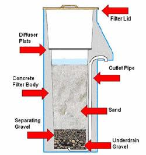
    - **Hình này chứng minh điều gì**
      - Thể hiện cấu tạo bể lọc cát vận hành theo cơ chế màng sinh học bề mặt, phân biệt với bể lọc nhanh.
    - **Từ đâu mà thấy được**
      - Thân bể chứa đĩa phân phối (Diffuser Plate), lớp cát (Sand), lớp sỏi ngăn cách (Separating Gravel) và ống thu đáy (Outlet Pipe).
  - **Hình 11.** Sơ đồ hệ thống thủy lực bể lọc cát nhanh trọng lực (Rapid Sand Filter)
    - 
    - **Hình này chứng minh điều gì**
      - Minh họa hệ thống điều khiển lưu lượng lọc, cụm van công nghệ và đài nước rửa ngược của bể lọc nhanh.
    - **Từ đâu mà thấy được**
      - Đường nước vào qua van A, cụm điều khiển tốc độ lọc (Filter rate controller) qua van C vào bể chứa nước lọc, và tháp nước rửa (Washwater storage tank) cấp nước qua van E.
  - **Hình 12.** Mặt cắt chi tiết bể lọc cát nhanh và trạm chứa nước rửa
    - 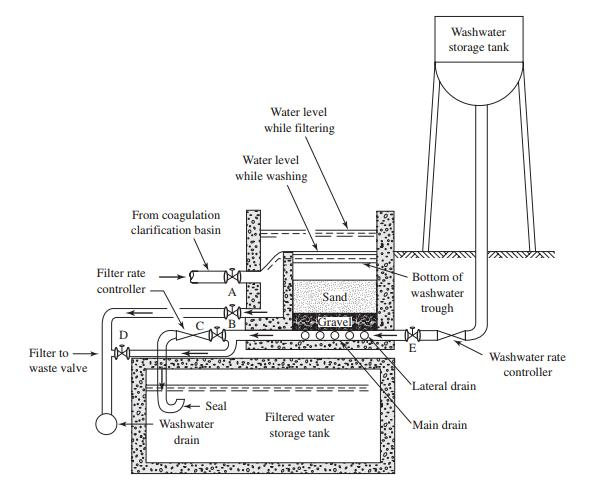
    - **Hình này chứng minh điều gì**
      - Thể hiện cao trình mực nước trong pha lọc bình thường và pha rửa ngược cùng hệ thống thu nước đáy ống nhánh.
    - **Từ đâu mà thấy được**
      - Mực nước khi lọc (Water level while filtering) cao hơn máng rửa; mực nước khi rửa (Water level while washing) dâng lên tới mép máng; hệ thống ống nhánh (Lateral drain) nằm trong lớp sỏi.

* So sánh dây chuyền công nghệ lọc trực tiếp (direct filtration) và dây chuyền truyền thống (conventional filtration):
  * Dây chuyền truyền thống gồm Keo tụ -> Tạo bông -> Lắng cặn -> Lọc hạt: Áp dụng khi nước thô có độ đục cao ($> 20\text{ NTU}$) hoặc độ màu cao ($> 20\text{ Pt-Co}$).
  * Dây chuyền lọc trực tiếp (Direct Filtration) bỏ qua công đoạn lắng cặn: Áp dụng khi nước thô có độ đục thấp ($< 10 - 15\text{ NTU}$), hàm lượng chất rắn lơ lửng thấp và ít biến động.
  * Lọc tiếp xúc (In-line Filtration) bỏ qua cả ngăn tạo bông và bể lắng: Hóa chất keo tụ được châm trực tiếp vào đường ống trước khi vào thẳng bể lọc hạt, chỉ áp dụng cho nguồn nước cực sạch ($< 5\text{ NTU}$).
  * Tiêu chuẩn tiết kiệm chi phí đầu tư: Dây chuyền lọc trực tiếp giảm từ \%$ đến \%$ chi phí xây dựng bể lắng và giảm đáng kể thể tích mặt bằng xây dựng trạm.
  * Yêu cầu kiểm soát liều lượng hóa chất khắt khe: Trong lọc trực tiếp, toàn bộ cặn keo tụ đi thẳng vào lớp cát lọc, đòi hỏi liều lượng polymer và phèn phải được định lượng chính xác để tránh bít tắc sớm.

##### 6.3.2 Xác định số lượng bể lọc và Độ tin cậy N-1 (Number of Filters & N-1 Redundancy Hydraulics)

* Quy chuẩn số lượng bể lọc tối thiểu theo công suất thiết kế trạm:
  * Trạm xử lý công suất nhỏ ($Q \le 8{,}000\text{ m}^3/\text{d}$): Số lượng bể lọc tối thiểu là $2$ bể ($N_{\min} = 2$).
  * Trạm xử lý công suất lớn ($Q > 8{,}000\text{ m}^3/\text{d}$): Số lượng bể lọc tối thiểu là $4$ bể ($N_{\min} = 4$).
* Công thức kinh nghiệm Kawamura (2000) xác định số lượng bể lọc cho trạm công suất lớn:
  $$N = 0.0195 \cdot (Q)^{0.5}$$
  * Trong đó:
    * $N$ là tổng số lượng bể lọc (làm tròn lên số nguyên dương chẵn gần nhất để bố trí đối xứng qua mương dẫn).
    * $Q$ là công suất lưu lượng thiết kế ngày tối đa của nhà máy (maximum design flow rate), tính bằng $\text{m}^3/\text{d}$.
* Phân tích thủy lực điều kiện dự phòng $N-1$ (N-1 Redundancy Hydraulics):
  * Khi trạm có số lượng bể lọc ít, việc cô lập một bể để rửa ngược hoặc bảo dưỡng sẽ làm tăng vọt tốc độ lọc ở các bể còn lại đang hoạt động.
  * Tốc độ lọc tăng đột ngột làm bung trôi các hạt cặn đã giữ lại (particle detachment), gây bùng phát độ đục (turbidity breakthrough) trong nước sau lọc.
  * Yêu cầu thiết kế bắt buộc: Phải tính toán kịch bản thủy lực khi một bể ngừng hoạt động trước khi chốt tốc độ lọc định mức:
    $$q_{N-1} = \frac{Q}{(N - 1) \cdot A} \le q_{\max,\text{allowed}}$$
  * Nếu duy trì tốc độ lọc thiết kế định mức khi thiếu $1$ bể, tốc độ lọc danh định khi toàn bộ $N$ bể cùng làm việc phải giảm xuống tương ứng.
  * Toàn bộ hệ thống bể lọc phải đảm bảo xử lý đủ công suất thiết kế của trạm ở tốc độ lọc cho phép khi có một bể bị loại khỏi vận hành.

##### 6.3.3 Tốc độ lọc và Kích thước hình học bể lọc (Hydraulic Loading Rates & Filter Basin Geometry)

* Hiệu quả kinh tế của tốc độ lọc thiết kế:
  * Chi phí đầu tư xây dựng bể lọc tỷ lệ nghịch với tốc độ lọc: Tốc độ lọc cao hơn làm giảm diện tích mặt bằng yêu cầu của khối bể lọc.
* Tốc độ lọc thiết kế danh định cho từng loại bể:
  * Bể lọc cát nhanh (Rapid sand filters): Tốc độ thiết kế an toàn là $7.5\text{ m/h}$ ($180\text{ m}^3/(\text{m}^2\cdot\text{d})$).
  * Bể lọc hai lớp than - cát (Dual-media filters):
    * Tốc độ thiết kế an toàn là $15\text{ m/h}$ ($360\text{ m}^3/(\text{m}^2\cdot\text{d})$).
    * Khi quá trình keo tụ đạt chuẩn, bể hai lớp có thể đạt hiệu quả lọc tốt ở tốc độ lên tới $25\text{ m/h}$.
    * Chất lượng nước sau lọc suy giảm nhanh ở tốc độ trên $12.5\text{ m/h}$ nếu bông keo tụ phèn nhôm yếu và không có chất trợ keo tụ polymer.
  * Bể lọc một lớp hạt thô sâu (Deep, coarse monomedium filters): Tốc độ thiết kế đạt $25\text{ m/h}$ ($600\text{ m}^3/(\text{m}^2\cdot\text{d})$) khi châm polymer làm chất trợ lọc.
* Tổn thất áp lực lớp lọc sạch ban đầu (Clean bed headloss):
  * Nằm trong khoảng từ $0.3\text{--}0.6\text{ m}$.
* Công thức tính diện tích bề mặt của một ô bể lọc:
  $$A = \frac{Q}{N \cdot q}$$
  * Trong đó:
    * $A$ là diện tích bề mặt của một ô bể lọc (area of a bed), tính bằng $\text{m}^2$.
    * $Q$ là công suất lưu lượng ngày tối đa (maximum day flow rate), tính bằng $\text{m}^3/\text{d}$.
    * $N$ là tổng số ô bể lọc.
    * $q$ là tốc độ lọc (filtration rate), tính bằng $\text{m}^3/(\text{m}^2\cdot\text{d})$ hoặc $\text{m/h}$.
* Phạm vi diện tích bề mặt bể lọc:
  * Khoảng diện tích phổ biến: $25\text{--}100\text{ m}^2$, trung bình khoảng $50\text{ m}^2$.
  * Giới hạn trên tiêu chuẩn cho các trạm xử lý lớn: $100\text{ m}^2$.
  * Một số trạm xử lý cực lớn có thể sử dụng diện tích bề mặt ô lọc lên tới $200\text{ m}^2$.
* Kích thước hình học và cấu tạo khối bể lọc:
  * Một đơn nguyên bể lọc (bed) thường được chia thành $2$ ngăn độc lập (cells) đối xứng nhau qua mương trung tâm.
  * Chiều rộng của mỗi ngăn lọc: $W_{\text{cell}} \le 6\text{ m}$ để có thể sử dụng máng thu nước rửa chế tạo sẵn tiêu chuẩn ("off-the-shelf" wash water troughs).
  * Tỷ lệ chiều dài trên chiều rộng của ngăn lọc ($L:W$ ratio): Từ $2:1$ đến $4:1$.
  * Chiều sâu tổng thể bể lọc: Dao động từ $4\text{--}8\text{ m}$ để bố trí hệ thống thu đáy, lớp sỏi đỡ, tầng vật liệu lọc, lớp nước ngập và dự phòng cột nước tổn thất áp lực.
  * Cột nước áp lực khả dụng qua lớp lọc (available head): Thường giới hạn từ $2\text{--}3\text{ m}$ do ràng buộc chi phí xây dựng thân bể.
  * Ngưỡng giới hạn tổn thất áp lực thực nghiệm:
    * Đối với bông cặn keo tụ tốt trong bể lọc hai lớp: Độ đục bắt đầu tăng khi tổn thất áp lực thuần vượt quá $1.8\text{ m}$.
    * Đối với bông cặn keo tụ kém: Hiện tượng xuyên thủng độ đục có thể xảy ra khi tổn thất áp lực thuần chưa đạt $0.8\text{ m}$.
* Bảng quy chuẩn kích thước hình học cho bể lọc nhanh trọng lực:

| Thông số hình học (Parameter) | Phạm vi giá trị (Reported range) | Ghi chú thiết kế (Comment) |
|---|---|---|
| **Diện tích một bể lọc ($A$)** | $25\text{--}100\text{ m}^2$ | Trạm cực lớn tối đa $200\text{ m}^2$ |
| **Chiều rộng một ngăn lọc ($W_{\text{cell}}$)** | $\le 6\text{ m}$ | Áp dụng máng rửa chế tạo sẵn tiêu chuẩn |
| **Tỷ lệ dài : rộng ($L:W$)** | $2:1\text{ đến } 4:1$ | Đảm bảo phân bố dòng thủy lực đều |
| **Chiều sâu tổng thể ($H$)** | $4\text{--}8\text{ m}$ | Bố trí hệ thu nước đáy, vật liệu và cột áp |
| **Chiều sâu lớp nước trên mặt ($h_w$)** | $\ge 1.8\text{ m}$ | Ngăn ngừa áp suất âm và xâm thực khí |
| **Chiều rộng mương trung tâm (Gullet width)** | $0.4\text{--}2.0\text{ m}$ | Đảm bảo thu gom và xả dòng nước rửa |
| **Chiều sâu mương trung tâm (Gullet depth)** | Từ mặt vật liệu đến đáy hệ thu nước | Đo từ đáy máng thu nước rửa |

  - **Hình 35.** Bảng kích thước hình học khuyến cáo cho bể lọc trọng lực nhanh (Recommended dimensions)
    - 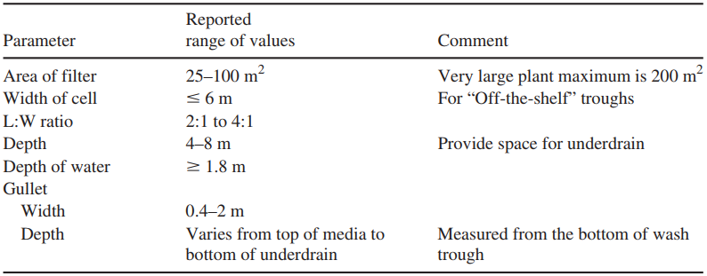
    - **Hình này chứng minh điều gì**
      - Cung cấp các thông số kích thước hình học tiêu chuẩn cho mặt bằng và chiều sâu bể lọc nhanh trọng lực.
    - **Từ đâu mà thấy được**
      - Bảng ghi rõ diện tích $25\text{--}100\text{ m}^2$, chiều rộng ngăn $\le 6\text{ m}$, tỷ lệ $L:W = 2:1\text{--}4:1$, chiều sâu nước $\ge 1.8\text{ m}$.

* Các phương thức điều khiển vận hành thủy lực của hệ thống bể lọc hạt:
  * Phương thức lọc tốc độ không đổi với van điều khiển lưu lượng đầu ra (Constant-rate with effluent rate controller):
    * Mỗi bể lọc được trang bị một van bướm điều khiển tự động hoặc van Venturi trên đường ống xả nước lọc.
    * Khi lớp vật liệu lọc tích lũy cặn làm tăng tổn thất áp lực, van tự động mở rộng dần để duy trì lưu lượng lọc không đổi.
  * Phương thức lọc tốc độ không đổi với phân chia lưu lượng đầu vào (Constant-rate with influent flow splitting):
    * Nước lắng được phân phối đều vào từng bể lọc qua các đập tràn đỉnh bằng nhau có cùng cao trình.
    * Mực nước trong từng bể lọc tự do dâng cao dần theo mức độ bít tắc của lớp vật liệu lọc cho đến khi đạt cao trình rửa ngược.
  * Phương thức lọc tốc độ giảm dần (Declining-rate filtration):
    * Nước vào các bể lọc từ một kênh phân phối chung không có van tiết lưu; bể mới rửa sạch sẽ lọc với tốc độ cao nhất, sau đó tốc độ lọc tự động giảm dần khi cặn bẩn tích tụ.
    * Ưu điểm: Nước lọc đầu ra đạt chất lượng độ đục rất ổn định ở cuối chu kỳ do tốc độ dòng chảy giảm dần; không yêu cầu hệ thống van điều khiển tự động phức tạp.

##### 6.3.4 Tiêu chuẩn lựa chọn và Phối hợp vật liệu lọc (Media Specification & Layer Matching Criteria)

* Mối quan hệ giữa loại bể lọc và vật liệu lọc:
  * Lựa chọn loại bể lọc sẽ định hình loại vật liệu lọc tương ứng.
  * Phân bố kích thước hạt chi phối sự đánh đổi kỹ thuật giữa tổn thất áp lực (hạt lớn làm giảm tổn thất áp lực) và hiệu quả lọc (hạt nhỏ giữ hạt cặn tốt hơn).
* Hai tiêu chí thiết kế vật liệu lọc then chốt:
  * Kích thước hiệu dụng (Effective Size): $E = d_{10}$, là kích thước mắt rây cho $10\%$ khối lượng mẫu lọt qua.
  * Hệ số đồng nhất (Uniformity Coefficient): $U = U_c = \frac{d_{60}}{d_{10}}$, là tỷ số giữa kích thước mắt rây cho $60\%$ và $10\%$ khối lượng lọt qua.
  * Ý nghĩa công nghệ: Hệ số $U$ càng nhỏ thì kích thước hạt trong tầng lọc càng đồng đều, giúp khai thác tối đa dung tích giữ cặn theo chiều sâu bể.
  * Kích thước hiệu dụng $E$ đóng vai trò quyết định đối với tổn thất áp lực của lớp lọc sạch ban đầu.
* Kiểm tra quy cách vật liệu qua tổn thất áp lực lớp lọc sạch:
  * Tổn thất áp lực lớp lọc sạch bình thường từ $0.3\text{--}0.6\text{ m}$.
  * Nếu tổn thất áp lực ban đầu vượt quá $0.6\text{ m}$, điều đó chứng tỏ tốc độ lọc quá cao hoặc vật liệu lọc chứa tỷ lệ hạt mịn vượt mức cho phép.
* Tiêu chuẩn phối hợp vật liệu lọc đa tầng (Layer Matching Criteria):
  * Trong bể lọc hai lớp hoặc đa lớp, đặc tính hạt của từng tầng vật liệu phải được tính toán phối hợp chặt chẽ.
  * Điều kiện bắt buộc: Tầng than anthracite và tầng cát thạch anh phải cùng đạt trạng thái tầng sôi ở cùng một vận tốc nước rửa ngược.
  * Tránh hiện tượng: Vận tốc rửa quá lớn làm trôi mất than anthracite ra ngoài, hoặc vận tốc rửa quá nhỏ không đủ làm giãn nở lớp cát thạch anh bên dưới.
* Bằng chứng định lượng về đặc tính hạt và cơ chế thu giữ cặn:
  - **Hình 13.** Các đại lượng thể tích và định nghĩa độ rỗng lớp lọc
    - 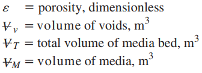
    - **Hình này chứng minh điều gì**
      - Định nghĩa độ rỗng $\epsilon$ dựa trên tỷ số giữa thể tích lỗ rỗng $\forall_v$ và tổng thể tích lớp hạt $\forall_T$.
    - **Từ đâu mà thấy được**
      - Ký hiệu $\epsilon$ là porosity, $\forall_v$ là volume of voids, $\forall_T$ là total volume of media bed, $\forall_M$ là volume of media.
  - **Hình 14.** Biểu thức tương quan thành phần thể tích lớp vật liệu lọc
    - 
    - **Hình này chứng minh điều gì**
      - Thể hiện sự phân chia thể tích hạt rắn và khoảng trống lỗ rỗng trong mô hình thủy lực lớp đệm.
    - **Từ đâu mà thấy được**
      - Chú thích các đại lượng thể tích thành phần sử dụng trong phương trình tính toán độ rỗng lớp đệm.
  - **Hình 15.** Bảng tính chất vật lý và thành phần hóa học điển hình của cát thạch anh lọc nước
    - 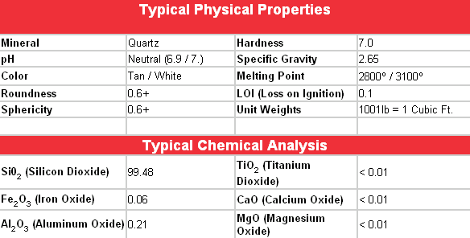
    - **Hình này chứng minh điều gì**
      - Cung cấp các thông số kỹ thuật tiêu chuẩn của cát thạch anh: Độ cứng Mohs $7.0$, tỷ trọng $\text{SG} = 2.65$, độ cầu $\psi \ge 0.6$, hàm lượng $\text{SiO}_2 = 99.48\%$.
    - **Từ đâu mà thấy được**
      - Bảng trên: Mineral: Quartz, Hardness: 7.0, Specific Gravity: 2.65, Sphericity: 0.6+; bảng dưới: $\text{SiO}_2: 99.48\%$.
  - **Hình 16.** Bảng chỉ tiêu cơ lý và hóa học của hạt cát lọc thạch anh
    - 
    - **Hình này chứng minh điều gì**
      - Khẳng định tính trơ hóa học và độ bền mài mòn cơ học của hạt cát thạch anh đạt tiêu chuẩn ngành cấp nước.
    - **Từ đâu mà thấy được**
      - Các chỉ số tỷ trọng $2.65$, độ tan trong axit thấp và thành phần khoáng quartz tinh khiết chống mài mòn khi sục rửa.
  - **Hình 17.** Sơ đồ các cơ chế thu giữ hạt cặn bên trong lớp vật liệu lọc
    - 
    - **Hình này chứng minh điều gì**
      - Minh họa trực quan bốn cơ chế giữ cặn chính: Sàng lọc cơ học (Straining), keo tụ tiếp xúc (Flocculation), chặn giữ (Interception) và lắng trọng lực (Sedimentation).
    - **Từ đâu mà thấy được**
      - Bông cặn (Floc Particles) bị giữ tại kẽ hở giữa các hạt (Straining), bám dính vào hạt cát (Interception, Flocculation) hoặc lắng tại khoảng rỗng (Sedimentation).
  - **Hình 18.** Mô hình tương tác hạt cặn với bề mặt hạt lọc trong tầng lọc sâu
    - 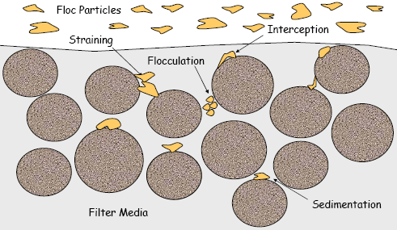
    - **Hình này chứng minh điều gì**
      - Thể hiện sự phân bổ không gian của các vị trí lắng đọng cặn trên bề mặt hạt vật liệu lọc.
    - **Từ đâu mà thấy được**
      - Vị trí cặn bám dính ở mặt trước, khe tiếp giáp và vùng bóng thủy động phía sau các hạt tròn trong dòng lọc.
  - **Hình 48.** Bảng phân tích rây cấp phối hạt cát tiêu chuẩn U.S. Standard Sieve
    - 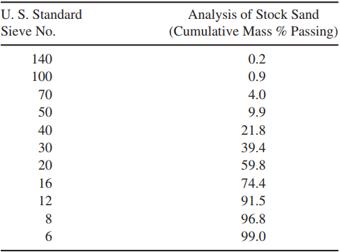
    - **Hình này chứng minh điều gì**
      - Cung cấp số liệu phân tích rây xác định đường cong cấp phối hạt, kích thước hiệu dụng $d_{10}$ và hệ số đồng nhất $U$.
    - **Từ đâu mà thấy được**
      - Cột trái ghi số hiệu rây U.S. Standard Sieve No. (từ 140 đến 6), cột phải ghi phần trăm lọt rây tích lũy từ $0.2\%$ đến $99.0\%$.

##### 6.3.5 Hệ thống đỡ và Thu nước đáy bể lọc (Filter Support Media & Underdrain Systems)

* Ba chức năng cơ bản của hệ thống thu nước đáy (underdrain system):
  * Nâng đỡ toàn bộ khối lượng lớp vật liệu lọc phía trên.
  * Thu gom nước đã lọc một cách đồng đều trên toàn bộ bề mặt đáy bể.
  * Phân phối đồng đều nước rửa ngược và khí nén sục rửa (nếu có sử dụng sục khí).
* Lớp sỏi đỡ (Filter support gravel):
  * Đa số hệ thống thu nước đáy có các khe mở hoặc lỗ khoét lớn hơn kích thước hạt của lớp vật liệu lọc.
  * Để ngăn ngừa vật liệu lọc rò rỉ vào hệ thống thu nước đáy, nhiều lớp sỏi phân cấp (graded gravel) được bố trí xen giữa hệ thu nước và lớp vật liệu lọc.
* Năm nhóm cấu tạo hệ thống thu nước đáy chính:
  1. Hệ thống ống nhánh khoan lỗ (Manifold pipe lateral system).
  2. Hệ thống khối đúc thu nước đáy (Blocks).
  3. Lưới chắn thu nước (Screens).
  4. Sàn đáy giả gắn vòi chụp lọc (False bottom with nozzles).
  5. Đáy rỗng xốp (Porous bottom).
* Đặc tính của hệ thống ống nhánh khoan lỗ (Perforated pipe laterals):
  * Từng được sử dụng phổ biến do chi phí đầu tư ban đầu thấp.
  * Nhược điểm: Tổn thất áp lực tương đối cao và phân phối nước rửa ngược kém đồng đều, dẫn đến việc ít được áp dụng trong các thiết kế hiện đại.
  * Bắt buộc phải có các lớp sỏi đỡ phân cấp bảo vệ.
* Đặc tính của hệ thống khối đúc thu đáy (Block underdrains):
  * Khối đất sét nung (Vitrified clay block): Thiết kế các lỗ khoan đường kính $6\text{ mm}$ trên đỉnh khối; bắt buộc dùng sỏi đỡ; không thể kết hợp sục khí nén (air scour).
  * Khối nhựa polyethylene mật độ cao: Cho phép tích hợp hệ thống sục khí nén hỗ trợ rửa ngược.
* Đặc tính của sàn chụp lọc vòi phun (False bottom with nozzles):
  * Sàn bê tông hoặc sàn thép gắn các vòi chụp lọc bằng nhựa polypropylene với khe xẻ siêu mịn $0.2\text{--}0.5\text{ mm}$.
  * Giữ trực tiếp lớp cát lọc hoặc chỉ cần một lớp sỏi mỏng; tối ưu hóa phân phối đồng thời nước và khí rửa ngược.
* Yêu cầu kỹ thuật và cơ học của hệ thống thu nước đáy:
  * Là kết cấu cốt lõi quyết định sự thành công của nhà máy xử lý trong việc loại bỏ triệt để độ đục trước khi khử trùng.
  * Kết cấu phải có độ bền cơ học cao, chịu được áp lực đẩy ngược lớn khi rửa bể, đồng thời thuận tiện cho công tác thi công và bảo trì.
  * Tổn thất áp lực qua hệ thống thu đáy hiện đại trong chu kỳ lọc hoặc rửa ngược chỉ nằm trong khoảng $0.1\text{--}0.3\text{ m}$.
  * Công tác kiểm tra nghiệm thu nghiêm ngặt trong và sau khi lắp đặt, đặc biệt trước khi rải vật liệu lọc, là yêu cầu kỹ thuật bắt buộc.
* Bằng chứng cấu tạo chi tiết các loại hệ thống thu nước đáy và vòi phun lọc:
  - **Hình 19.** Mô hình cấu tạo bể lọc sử dụng hệ thống ống nhánh khoan lỗ (Perforated pipe laterals)
    - 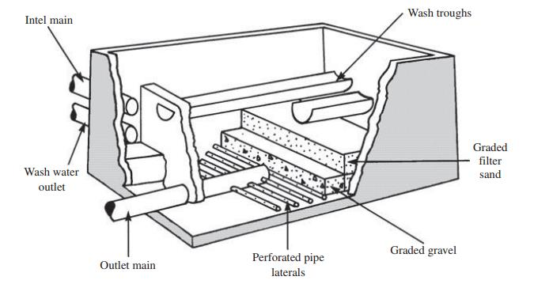
    - **Hình này chứng minh điều gì**
      - Thể hiện sự bố trí không gian của các ống nhánh đục lỗ nối vào ống góp chính cùng các lớp sỏi đỡ và cát lọc.
    - **Từ đâu mà thấy được**
      - Nhãn chỉ rõ Perforated pipe laterals nối vào Outlet main, phía trên là Graded gravel, Graded filter sand và Wash troughs.
  - **Hình 20.** Cấu tạo khối đúc thu nước đáy có lỗ khoan trên mặt (Underdrain block)
    - 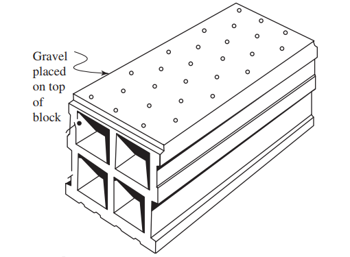
    - **Hình này chứng minh điều gì**
      - Minh họa cấu trúc rỗng bên trong và các lỗ khoét trên nắp khối đúc cùng ghi chú lớp sỏi đỡ.
    - **Từ đâu mà thấy được**
      - Mũi tên chỉ rõ: Gravel placed on top of block; bề mặt đúc các lỗ tròn $6\text{ mm}$ phân bố đều, bên dưới là $4$ khoang dẫn rỗng.
  - **Hình 21.** Mặt cắt không gian hệ thống ống nhánh khoan lỗ thu nước đáy
    - 
    - **Hình này chứng minh điều gì**
      - Khẳng định tính hoàn chỉnh của cụm ống nhánh kết hợp ống chính thu nước lọc và phân phối nước rửa.
    - **Từ đâu mà thấy được**
      - Trục ống góp trung tâm phân nhánh đều ra hai bên đáy bể bên dưới các lớp sỏi thạch anh phân cấp.
  - **Hình 22.** Khối thu nước đáy dạng hộp rỗng cho bể lọc nhanh
    - 
    - **Hình này chứng minh điều gì**
      - Thể hiện chi tiết cấu tạo các gờ ghép ngàm và hàng lỗ phun phân phối dòng nước rửa ngược.
    - **Từ đâu mà thấy được**
      - Cấu trúc kênh dẫn đôi hai tầng bằng đất sét nung hoặc nhựa đúc với hàng lỗ thoát phân bố trên bề mặt.
  - **Hình 23.** Chụp lọc vòi phun gắn sàn bê tông và cụm phân phối nan hoa (KSH Filter Nozzles & Stars)
    - 
    - **Hình này chứng minh điều gì**
      - Thể hiện phương pháp lắp đặt chụp lọc đơn xuyên qua sàn bê tông đáy giả và cụm chụp lọc phân nhánh nan hoa 6 cánh.
    - **Từ đâu mà thấy được**
      - Hình tròn trên: Vòi chụp lọc có ren xuyên qua sàn bê tông đáy; hình tròn dưới: Cụm 6 ống lọc xòe hình ngôi sao kết nối đầu gom trung tâm.
  - **Hình 24.** Tổng hợp các chủng loại chụp lọc đơn và chụp lọc chùm dạng sao
    - 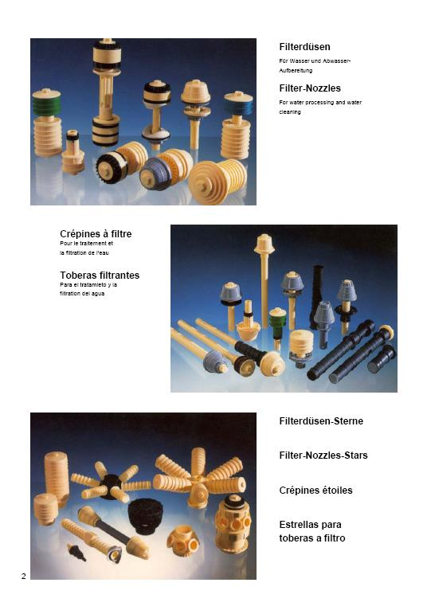
    - **Hình này chứng minh điều gì**
      - Giới thiệu sự đa dạng của các kết cấu đầu chụp lọc ngắn, cuống dài (dùng cho sục khí) và chùm nan hoa (Filter-Nozzles-Stars).
    - **Từ đâu mà thấy được**
      - Cụm vòi đơn các chiều dài thân ren khác nhau (ảnh giữa) và cụm vòi nan hoa lắp ghép góc tỏa tròn (ảnh dưới).
  - **Hình 25.** Chi tiết vòi phun chụp lọc lắp qua bản sàn đáy giả
    - 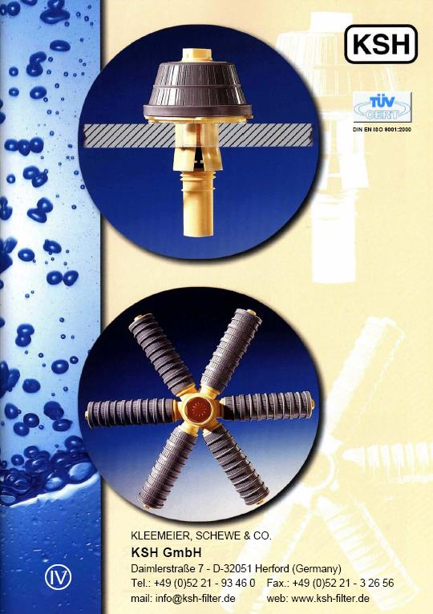
    - **Hình này chứng minh điều gì**
      - Minh họa kết cấu ngàm giữ và thân ren cố định chụp lọc chống áp lực đẩy ngược khi sục rửa nước và khí.
    - **Từ đâu mà thấy được**
      - Vết cắt mặt sàn cho thấy cuống chụp xuyên qua bản sàn có gioăng kín nước và khe xẻ thu nước trên nắp chụp.
  - **Hình 27.** Bản vẽ kỹ thuật và đặc tuyến thủy lực chụp lọc Type D
    - 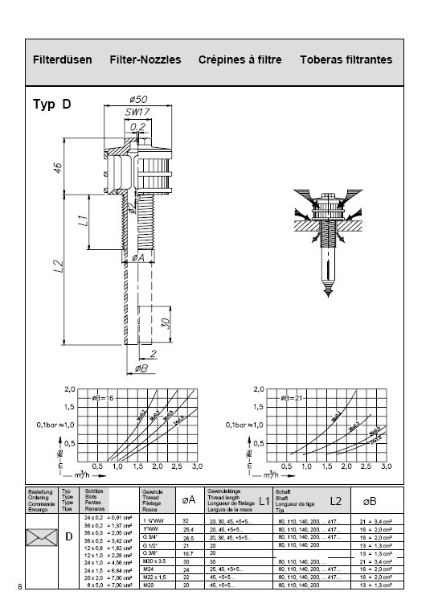
    - **Hình này chứng minh điều gì**
      - Cung cấp kích thước hình học chính xác (đường kính $\varnothing 50\text{ mm}$, chiều cao $46\text{ mm}$) và đồ thị tổn thất áp lực theo lưu lượng.
    - **Từ đâu mà thấy được**
      - Bản vẽ chi tiết cuống ren $L_1, L_2$, bảng tra kích thước khe hở từ $0.2\text{--}2.0\text{ mm}$, và đường cong quan hệ tổn thất cột áp $\text{m-Ws}$ theo lưu lượng $\text{m}^3/\text{h}$.
  - **Hình 28.** Bản vẽ kỹ thuật và đặc tuyến thủy lực chụp lọc Type L / LR
    - 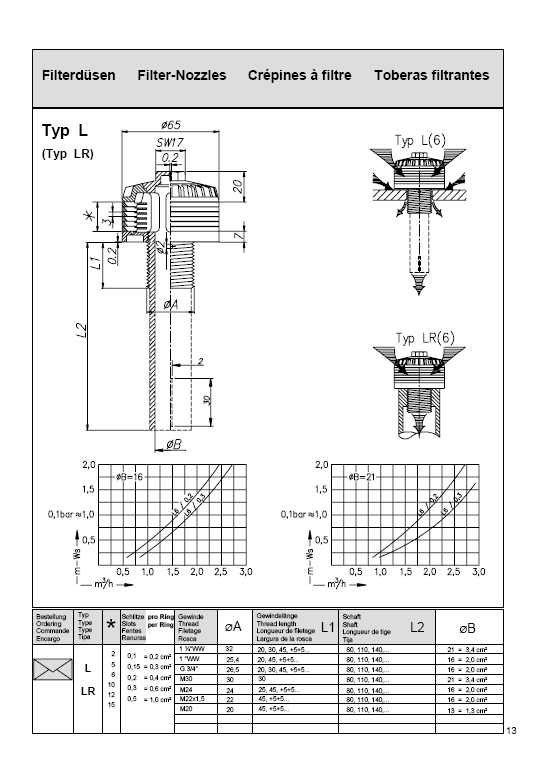
    - **Hình này chứng minh điều gì**
      - Thể hiện thông số chụp lọc nắp phẳng đường kính lớn $\varnothing 65\text{ mm}$ cùng đường đặc tính thủy lực tổn thất áp lực.
    - **Từ đâu mà thấy được**
      - Bản vẽ mặt cắt Typ L với khe xẻ ngang $0.2\text{ mm}$, cuống ren $G\ 3/4"$ và đồ thị quan hệ lưu lượng - tổn thất áp lực phía dưới.
  - **Hình 29.** Hệ thống thu nước đáy nan hoa Typ SD6 cho bể lọc hình trụ tròn
    - 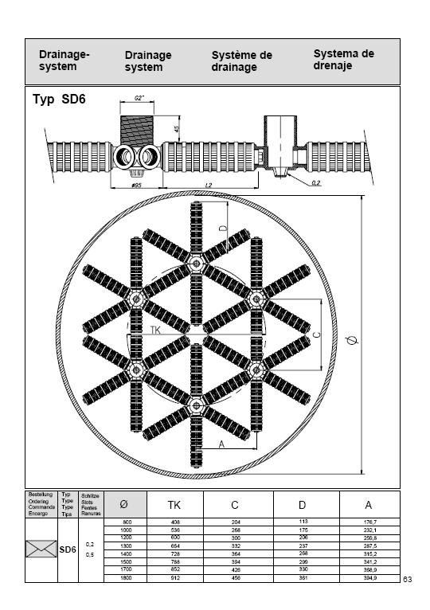
    - **Hình này chứng minh điều gì**
      - Minh họa phương án bố trí mạng lưới phân phối và thu nước dạng chùm nan hoa phủ kín đáy bồn lọc hình trụ tròn.
    - **Từ đâu mà thấy được**
      - Mặt bằng bố trí các ống nhánh xòe từ các tâm phân phối phụ trong chu vi đường kính bể $\varnothing 800\text{--}1800\text{ mm}$.
  - **Hình 30.** Cấu tạo cụm chụp lọc nan hoa 6 nhánh Typ SK6F
    - 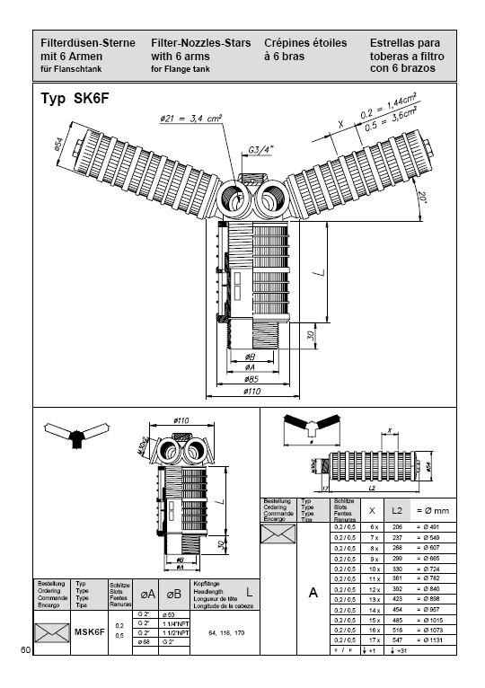
    - **Hình này chứng minh điều gì**
      - Thể hiện chi tiết cấu tạo khớp nối mặt bích và các ống lọc xẻ rãnh nghiêng góc $20^\circ$ của cụm nan hoa 6 cánh.
    - **Từ đâu mà thấy được**
      - Bản vẽ ghi rõ góc nghiêng $20^\circ$, ren nối $G3/4"$ và $G2"$, bảng chiều dài nhánh từ $206\text{ mm}$ đến $547\text{ mm}$.

##### 6.3.6 Chế độ rửa ngược và Dung tích bể chứa nước rửa (Backwash Regimes, Scour Methods & Washwater Storage)

* Ba tiêu chí kích hoạt chu kỳ rửa ngược bể lọc:
  1. Tổn thất áp lực qua lớp lọc đạt giá trị thiết kế tối đa hoặc chạm ngưỡng giới hạn cài đặt trước, thông thường từ $2.4\text{--}3.0\text{ m}$.
  2. Độ đục của nước sau lọc chạm ngưỡng giới hạn trên quy định (báo hiệu hiện tượng xuyên thủng bông cặn).
  3. Thời gian vận hành liên tục chạm mốc thời gian tối đa cho phép, thông thường từ $3\text{--}4\text{ ngày}$ nhằm ngăn ngừa sự nén chặt của cặn và sự phát triển sinh học trong lớp lọc.
* Cơ chế thủy lực rửa ngược dòng chảy ngược truyền thống:
  * Áp dụng dòng nước sạch chảy ngược từ dưới lên (upflow water wash) làm tầng sôi và giãn nở hoàn toàn lớp lọc (full bed fluidization).
  * Nước rửa đưa vào đáy bể qua hệ thống thu nước đáy; khi lưu lượng tăng lên, toàn bộ lớp hạt giãn nở và cọ xát cơ học.
  * Quá trình rửa ngược duy trì liên tục cho đến khi dòng nước thải rửa tràn vào máng thu trở nên trong.
* Các chỉ tiêu định mức thủy lực rửa ngược:
  * Vận tốc rửa ngược: $v_{bw} = 30\text{--}60\text{ m/h}$.
  * Thời gian rửa một chu kỳ: $10\text{--}20\text{ phút}$ (quy định thời gian rửa thực tế ở lưu lượng thiết kế không được nhỏ hơn $15\text{ phút}$).
  * Thể tích nước rửa tiêu hao định mức: Dao động từ $4\text{--}8\text{ m}^3$ nước rửa cho mỗi $\text{m}^2$ diện tích bề mặt ô lọc ($4\text{--}8\text{ m}^3/\text{m}^2$).
  * Yếu tố giới hạn vận tốc rửa ngược: Vận tốc lắng rơi tự do (terminal settling velocity $v_s$) của cấp hạt vật liệu lọc nhỏ nhất cần giữ lại trong bể; nếu $v_{bw} > v_s$, hạt lọc mịn sẽ bị cuốn trôi vào máng thu xả bỏ.
* Quy chuẩn thiết kế dung tích bể chứa nước rửa (Washwater Storage Capacity):
  * Trạm xử lý bắt buộc phải có dung tích bể chứa nước rửa dự phòng đủ cho ít nhất hai lần rửa liên tiếp ($V_{\text{tank}} \ge 2 \cdot V_{bw}$).
  * Công thức tính thể tích nước cho một chu kỳ rửa:
    $$V_{bw} = A \cdot v_{bw} \cdot t_{bw}$$
* So sánh hai phương thức hỗ trợ rửa ngược:
  1. Rửa bằng nước kết hợp rửa bề mặt (Surface wash): Dùng các vòi phun tia nước áp lực cao phá vỡ lớp váng cặn bề mặt trước khi lớp cát giãn nở hoàn toàn.
  2. Rửa bằng nước kết hợp sục khí nén (Water and air scour): Thổi khí nén vào đáy bể kết hợp dòng nước vận tốc thấp để tạo va đập cơ học mãnh liệt giữa các hạt.
  * Đánh giá công nghệ: Rửa ngược đơn thuần bằng dòng nước đi từ dưới lên mà không có rửa bề mặt hoặc sục khí sẽ không thể làm sạch cặn bám dính hiệu quả, dẫn đến hiện tượng vón cục bùn (mudballs).

* Tiêu chuẩn vận hành và kiểm soát van trong quy trình rửa ngược bể lọc:
  * Trình tự đóng mở van trong chu kỳ rửa ngược tự động hóa (SCADA automated valve sequencing):
    * Bước 1: Đóng van cấp nước lắng đầu vào để hạ dần mực nước trên mặt cát đến cao trình cách mép máng tràn  - 15\text{ cm}$.
    * Bước 2: Đóng van xả nước lọc trong để ngừng hoàn toàn quá trình lọc.
    * Bước 3: Mở van xả nước rửa ngược để thông đường thoát nước bẩn về bể thu hồi nước rửa.
    * Bước 4: Mở van cấp khí nén để sục khí xáo trộn phá vỡ lớp vỏ cặn bề mặt trong thời gian  - 5\text{ phút}$ với cường độ khí  - 60\text{ m}^3/(\text{m}^2\cdot\text{h})$.
    * Bước 5: Mở từ từ van cấp nước rửa ngược để đạt lưu lượng rửa định mức (cường độ rửa  - 45\text{ m}^3/(\text{m}^2\cdot\text{h})$) làm giãn nở tầng lọc từ \%$ đến \%$.
    * Bước 6: Duy trì rửa nước trong  - 10\text{ phút}$ cho đến khi nước rửa chảy vào máng đạt độ trong quan sát được.
    * Bước 7: Đóng van nước rửa ngược, chờ  - 3\text{ phút}$ cho các lớp vật liệu lọc lắng xuống và tái phân tầng tự nhiên theo tỷ trọng.
    * Bước 8: Mở van cấp nước lắng và mở van xả lọc đầu (filter-to-waste) trong  - 15\text{ phút}$ cho đến khi nước đạt độ đục tiêu chuẩn thì chuyển sang van cấp nước sạch.

##### 6.3.7 Các hệ thống lọc áp lực chuyên dụng (Pressure Filtration Systems & Specialty Applications)

* Cấu tạo và nguyên lý của bồn lọc áp lực (Pressure Filtration Systems):
  * Lớp vật liệu lọc được đặt trong vỏ bồn kín bằng thép hàn hoặc composite sợi thủy tinh chịu áp lực cao.
  * Nước được bơm trực tiếp qua lớp lọc dưới áp suất, cho phép kết nối trực tiếp vào mạng lưới phân phối kín mà không cần bể lắng hở hoặc trạm bơm cấp hai.
  * Trang bị các phụ kiện công nghệ đồng bộ: Cụm van tự động (Automatic control valve), đồng hồ đo áp lực (Pressure gauge), van xả khí và phá chân không (Air release / Vacuum breaker), cửa thăm trên đỉnh (Manway) và lỗ kiểm tra đáy (Handhole).
* Ứng dụng bồn lọc áp lực quy mô lớn và cát Greensand:
  * Sử dụng cát khoáng glauconite hoạt hóa bằng mangan dioxit (Greensand) làm vật liệu lọc oxy hóa tiếp xúc.
  * Chuyên dụng loại bỏ triệt để hàm lượng sắt ($Fe$), mangan ($Mn$) và khí hydro sulfua ($H_2S$) hòa tan trong nguồn nước ngầm.
  * Thường được chế tạo thành cụm module hai bồn đối xứng kết nối đường ống gom trên khung bệ trượt chế tạo sẵn (skid-mounted).
* Bồn lọc áp lực cỡ nhỏ và Lọc hồ bơi thương mại:
  * Bồn lọc composite FRP cỡ nhỏ tích hợp van đa cổng kỹ thuật số tự động hoặc bán tự động dùng cho trạm cấp nước cụm công nghiệp và sinh hoạt.
  * Bình lọc áp lực chuyên dụng cho hồ bơi (Swimming Pool Filter): Thiết kế van xoay đa cổng (Multiport valve) gắn bên sườn hoặc đỉnh bồn, cho phép chuyển đổi linh hoạt các chế độ: Lọc (Filter), Rửa ngược (Backwash), Rửa xuôi (Rinse), Xả thải (Waste), Tuần hoàn không qua cát (Recirculate) và Đóng van (Closed).
* Bằng chứng thực tế các dòng thiết bị lọc áp lực:
  - **Hình 36.** Sơ đồ cấu tạo bồn lọc áp lực thẳng đứng WesTech
    - 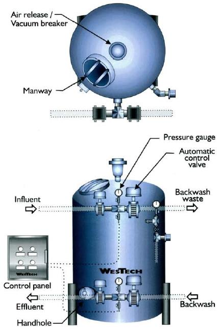
    - **Hình này chứng minh điều gì**
      - Thể hiện bố trí các cửa van tự động, đồng hồ áp kế, đường nước vào, xả rửa và tủ điều khiển của bồn lọc áp lực công nghiệp.
    - **Từ đâu mà thấy được**
      - Mặt cắt trên có Manway và Air release; mặt bên có Influent, Effluent, Backwash waste, Pressure gauge và Control panel.
  - **Hình 37.** Cấu tạo van và đồng hồ áp lực bồn lọc áp lực WesTech
    - 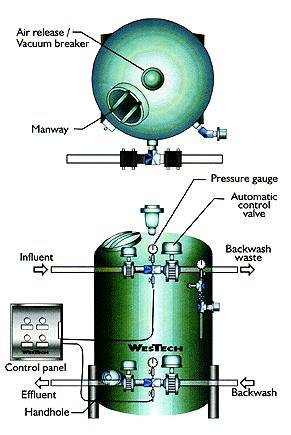
    - **Hình này chứng minh điều gì**
      - Thể hiện sự đồng bộ của cụm thiết bị điều khiển tự động gắn trên vỏ bồn áp lực.
    - **Từ đâu mà thấy được**
      - Cụm van màng tự động kết nối với đồng hồ hiển thị áp lực chênh lệch giữa đường nước vào và nước ra.
  - **Hình 41.** Cụm module bồn lọc áp lực công suất lớn đặt trên bệ trượt (Skid-mounted)
    - 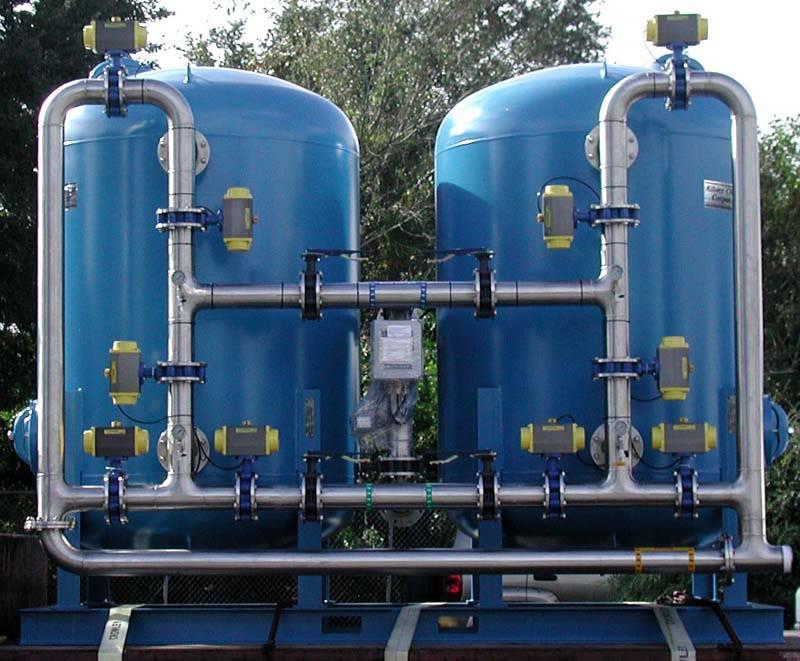
    - **Hình này chứng minh điều gì**
      - Minh họa hệ thống lọc áp lực công nghiệp gồm hai bồn thép lớn kết nối cụm van khí nén và đường ống inox tích hợp.
    - **Từ đâu mà thấy được**
      - Hai bồn thép hình trụ sơn xanh gắn van bướm điều khiển tự động màu vàng nối với hệ thống đường ống kim loại trên sàn skid.
  - **Hình 42.** Bồn lọc áp lực composite FRP tích hợp van điện tử trên đỉnh
    - 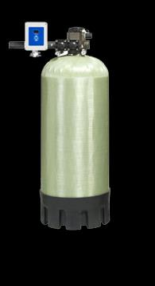
    - **Hình này chứng minh điều gì**
      - Giới thiệu thiết kế bồn lọc vật liệu sợi thủy tinh composite cho quy mô vừa và nhỏ chống ăn mòn hóa chất.
    - **Từ đâu mà thấy được**
      - Bồn trụ đứng màu xanh nhạt với đế đỡ màu đen và cụm van điều khiển tự động màn hình điện tử gắn trên cổ bồn.
  - **Hình 43.** Bồn lọc áp lực vỏ thép tích hợp cụm van điều khiển bên hông
    - 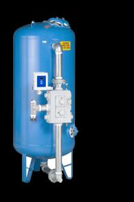
    - **Hình này chứng minh điều gì**
      - Thể hiện kết cấu bồn thép thẳng đứng với giàn ống mặt bích và cụm van điều khiển lắp đặt cạnh sườn bồn.
    - **Từ đâu mà thấy được**
      - Thân bồn kim loại sơn xanh gắn cụm ống inox đứng và bộ điều khiển điện tử kết hợp cửa thăm phía chân bồn.
  - **Hình 47.** Bình lọc cát áp lực Hayward cho hồ bơi thương mại
    - 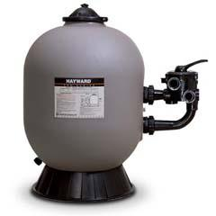
    - **Hình này chứng minh điều gì**
      - Minh họa bình lọc áp lực hình cầu dẹt bằng composite chuyên dụng cho hệ thống tuần hoàn nước hồ bơi.
    - **Từ đâu mà thấy được**
      - Bình lọc màu xám nhãn hiệu Hayward với cụm van xoay đa cổng (Multiport valve) gắn bên sườn và nắp mở bảo trì trên đỉnh.

#### 6.4 Tính toán thiết kế và Bài tập ví dụ (Engineering Calculations & Worked Examples)

* Phạm vi tính toán thiết kế kỹ thuật hệ thống bể lọc cát nhanh trọng lực:
  * Trình tự tính toán bao gồm 6 giai đoạn kỹ thuật then chốt: (1) Phân tích cấp phối hạt vật liệu lọc, (2) Tính toán thủy lực tổn thất áp lực qua tầng lọc sạch, (3) Tính toán động học giãn nở tầng cát khi rửa ngược, (4) Xác định số lượng bể lọc theo công suất trạm, (5) Định cỡ kích thước hình học mặt bằng ô lọc và khối bể, (6) Thiết kế thủy lực hệ thống máng thu nước rửa và bể chứa nước rửa ngược.
  * Chuỗi bài toán tính toán liên hoàn được áp dụng cho dự án thiết kế trạm xử lý nước cấp mới của OISP với công suất thiết kế ngày lớn nhất $Q = 18{,}400\text{ m}^3/\text{ngày}$.

##### 6.4.1 Ví dụ 6-1: Phân tích thành phần hạt vật liệu lọc (Example 6-1: Sieve Analysis for d10 and Uc)

- **Đề bài**: Một bể lọc cát được thiết kế cho nhà máy xử lý nước mới của OISP. Bảng phân tích sàng mẫu cát đảo địa phương (local island sand) được ghi nhận trong bảng số liệu dưới đây. Sử dụng kết quả phân tích hạt cát, xác định kích thước hiệu dụng $E$ ($d_{10}$) và hệ số không đồng nhất $U$ ($U_c$). (WaWE, 11-7).
- **Dữ kiện**:
  - Bảng phân tích cấp phối hạt cát nguyên liệu (Stock sand sieve analysis, Slide 51):
    - Rây No. 140: Kích thước mắt rây $d = 0{,}106\text{ mm}$, phần trăm lọt qua tích lũy $P = 0{,}2\%$.
    - Rây No. 100: Kích thước mắt rây $d = 0{,}150\text{ mm}$, phần trăm lọt qua tích lũy $P = 0{,}9\%$.
    - Rây No. 70: Kích thước mắt rây $d = 0{,}212\text{ mm}$, phần trăm lọt qua tích lũy $P = 4{,}0\%$.
    - Rây No. 50: Kích thước mắt rây $d = 0{,}300\text{ mm}$, phần trăm lọt qua tích lũy $P = 9{,}9\%$.
    - Rây No. 40: Kích thước mắt rây $d = 0{,}425\text{ mm}$, phần trăm lọt qua tích lũy $P = 21{,}8\%$.
    - Rây No. 30: Kích thước mắt rây $d = 0{,}600\text{ mm}$, phần trăm lọt qua tích lũy $P = 39{,}4\%$.
    - Rây No. 20: Kích thước mắt rây $d = 0{,}850\text{ mm}$, phần trăm lọt qua tích lũy $P = 59{,}8\%$.
    - Rây No. 16: Kích thước mắt rây $d = 1{,}18\text{ mm}$, phần trăm lọt qua tích lũy $P = 74{,}4\%$.
    - Rây No. 12: Kích thước mắt rây $d = 1{,}70\text{ mm}$, phần trăm lọt qua tích lũy $P = 91{,}5\%$.
    - Rây No. 8: Kích thước mắt rây $d = 2{,}36\text{ mm}$, phần trăm lọt qua tích lũy $P = 96{,}8\%$.
    - Rây No. 6: Kích thước mắt rây $d = 3{,}35\text{ mm}$, phần trăm lọt qua tích lũy $P = 99{,}0\%$.
- **Quy tắc áp dụng**:
  - Định nghĩa kích thước hiệu dụng (Effective Size): $E = d_{10}$, là kích cỡ mắt rây tương ứng với $10\%$ khối lượng hạt cát lọt qua tích lũy. Nguồn: WaWE Equation 11-7, Slide 51.
  - Định nghĩa hệ số không đồng nhất (Uniformity Coefficient): $U = U_c = \frac{d_{60}}{d_{10}}$, là tỷ số giữa kích cỡ mắt rây cho $60\%$ khối lượng lọt qua tích lũy và kích cỡ mắt rây cho $10\%$ lọt qua. Nguồn: WaWE Equation 11-7, Slide 51.
  - Công thức nội suy logarit (Semi-log interpolation): $\log(d) = \log(d_1) + \frac{P - P_1}{P_2 - P_1} \cdot [\log(d_2) - \log(d_1)]$.
  - Tiêu chuẩn quy chuẩn AWWA B100 đối với cát lọc nhanh trọng lực: $d_{10} = 0{,}45 - 0{,}55\text{ mm}$, hệ số $U_c \le 1{,}65$ (hoặc dải thông dụng $1{,}3 - 1{,}8$). Nguồn: Slide 37.
- **Lời giải**:
  - **Bước 1**: Xác định kích thước hiệu dụng $E = d_{10}$.
    - Căn cứ: Kích thước $d_{10}$ ứng với phần trăm lọt qua tích lũy $P = 10{,}0\%$. Tra bảng cấp phối hạt giữa rây No. 50 ($d_1 = 0{,}300\text{ mm}$, $P_1 = 9{,}9\%$) và rây No. 40 ($d_2 = 0{,}425\text{ mm}$, $P_2 = 21{,}8\%$).
    - Nhìn vào: Giá trị $P_1 = 9{,}9\%$ tại mắt rây $0{,}300\text{ mm}$ xấp xỉ đúng bằng $10{,}0\%$. Thực hiện nội suy chính xác trên thang đo bán logarit:
      $$\log(d_{10}) = \log(0{,}300) + \frac{10{,}0 - 9{,}9}{21{,}8 - 9{,}9} \cdot [\log(0{,}425) - \log(0{,}300)] = -0{,}52288 + \frac{0{,}1}{11{,}9} \cdot 0{,}15127 = -0{,}52161$$
      $$d_{10} = 10^{-0{,}52161} = 0{,}3009\text{ mm} \approx 0{,}30\text{ mm}$$
  - **Bước 2**: Xác định đường kính hạt ứng với $60\%$ lọt qua tích lũy $d_{60}$.
    - Căn cứ: Kích thước $d_{60}$ ứng với phần trăm lọt qua tích lũy $P = 60{,}0\%$. Tra bảng cấp phối hạt giữa rây No. 20 ($d_1 = 0{,}850\text{ mm}$, $P_1 = 59{,}8\%$) và rây No. 16 ($d_2 = 1{,}18\text{ mm}$, $P_2 = 74{,}4\%$).
    - Nhìn vào: Giá trị $P_1 = 59{,}8\%$ tại mắt rây $0{,}850\text{ mm}$ xấp xỉ đúng bằng $60{,}0\%$. Thực hiện nội suy chính xác trên thang đo bán logarit:
      $$\log(d_{60}) = \log(0{,}850) + \frac{60{,}0 - 59{,}8}{74{,}4 - 59{,}8} \cdot [\log(1{,}18) - \log(0{,}850)] = -0{,}07058 + \frac{0{,}2}{14{,}6} \cdot 0{,}14247 = -0{,}06863$$
      $$d_{60} = 10^{-0{,}06863} = 0{,}8538\text{ mm} \approx 0{,}85\text{ mm}$$
  - **Bước 3**: Tính hệ số không đồng nhất $U$ ($U_c$).
    - Căn cứ: Công thức định nghĩa $U = \frac{d_{60}}{d_{10}}$.
    - Nhìn vào: Giá trị $d_{60} = 0{,}8538\text{ mm}$ và $d_{10} = 0{,}3009\text{ mm}$:
      $$U = \frac{0{,}8538\text{ mm}}{0{,}3009\text{ mm}} = 2{,}837 \approx 2{,}84 \quad \left(\text{tính nhanh theo mắt rây gần nhất: } \frac{0{,}85}{0{,}30} \approx 2{,}83\right)$$
  - **Bước 4**: Đánh giá sự phù hợp của cát địa phương so với tiêu chuẩn thiết kế.
    - Căn cứ: Tiêu chuẩn thiết kế lọc cát nhanh quy định $d_{10} = 0{,}45 - 0{,}55\text{ mm}$ và $U_c \le 1{,}65$.
    - Nhìn vào: Mẫu cát đảo có $E = 0{,}30\text{ mm}$ (hạt mịn hơn tiêu chuẩn) và $U = 2{,}84$ (dải hạt phân bố quá rộng). Cát nguyên liệu chưa đạt yêu cầu cho bể lọc nhanh công nghiệp, cần sàng tuyển loại bỏ phần hạt quá mịn dưới đáy chảo (skimming) và loại bỏ các hạt thô quá cỡ trên đỉnh (scalping) trước khi đưa vào bể lọc.
- **Kết quả**:
  - Kích thước hiệu dụng: $E = d_{10} = 0{,}30\text{ mm}$ ($0{,}301\text{ mm}$).
  - Đường kính hạt ứng với $60\%$ lọt qua: $d_{60} = 0{,}85\text{ mm}$ ($0{,}854\text{ mm}$).
  - Hệ số không đồng nhất: $U = U_c = 2{,}84$ ($2{,}83$).
- **Kiểm tra lại**:
  - Tại rây No. 50 ($0{,}300\text{ mm}$), tỷ lệ lọt qua là $9{,}9\%$, chỉ lệch $0{,}1\%$ so với mốc $10{,}0\%$.
  - Tại rây No. 20 ($0{,}850\text{ mm}$), tỷ lệ lọt qua là $59{,}8\%$, chỉ lệch $0{,}2\%$ so với mốc $60{,}0\%$.
  - Tỷ số trực tiếp $\frac{0{,}850\text{ mm}}{0{,}300\text{ mm}} = 2{,}833$, sai lệch so với giá trị nội suy chưa đến $0{,}15\%$. Kết quả hoàn toàn phù hợp và chuẩn xác theo tài liệu WaWE.

##### 6.4.2 Ví dụ 6-2: Tính toán tổn thất áp lực qua lớp lọc sạch theo phương trình Rose (Example 6-2: Clean Bed Headloss by Rose Equation)

- **Đề bài**: Ước tính tổn thất áp lực qua lớp lọc sạch (clean filter headloss) trong bể lọc cát nhanh của OISP sử dụng cát đã mô tả trong Ví dụ 6-1, và xác định xem giá trị này có hợp lý hay không. Sử dụng các giả thiết sau: tốc độ tải trọng lọc (loading rate) $216\text{ m}^3/\text{m}^2\cdot\text{d}$, tỷ trọng của cát $\text{SG} = 2{,}65$, hệ số hình dạng hạt (shape factor) $\psi = 0{,}82$, độ rỗng lớp cát $\varepsilon = 0{,}45$, nhiệt độ của nước $25^\circ\text{C}$, và chiều dày lớp cát $D = 0{,}5\text{ m}$. (WaWE, 11-14).
- **Dữ kiện**:
  - Tốc độ tải trọng lọc: $q = 216\text{ m}^3/\text{m}^2\cdot\text{d} = 9{,}0\text{ m/h} = 0{,}0025\text{ m/s}$.
  - Tỷ trọng hạt cát: $\text{SG} = 2{,}65$ (khối lượng riêng hạt $\rho_s = 2650\text{ kg/m}^3$).
  - Hệ số hình dạng hạt (độ cầu): $\psi = 0{,}82$.
  - Độ rỗng lớp cát tĩnh: $\varepsilon = 0{,}45$.
  - Chiều dày lớp cát lọc: $D = 0{,}5\text{ m}$.
  - Nhiệt độ nước làm việc: $T = 25^\circ\text{C}$. Khối lượng riêng của nước $\rho_w = 997\text{ kg/m}^3$; độ nhớt động học $\nu = 8{,}93 \times 10^{-7}\text{ m}^2/\text{s}$ (độ nhớt động lực $\mu = 8{,}90 \times 10^{-4}\text{ Pa}\cdot\text{s}$). Gia tốc trọng trường $g = 9{,}81\text{ m/s}^2$.
  - Dữ liệu cấp phối hạt cát từ Ví dụ 6-1.
- **Quy tắc áp dụng**:
  - Phương trình Rose (1945) tính tổn thất cột áp lớp lọc sạch có phân tầng:
    $$h_L = \frac{1{,}067}{\psi \cdot g} \left( \frac{v_a^2}{\varepsilon^4} \right) D \sum_{i=1}^n \left( \frac{C_{D,i} \cdot f_i}{d_{g,i}} \right)$$
    Nguồn: Slide 21, WaWE Equation (11-14).
  - Đường kính trung bình nhân phân đoạn hạt giữa hai mắt rây liên tiếp:
    $$d_{g,i} = \sqrt{d_{1,i} \cdot d_{2,i}}$$
    Nguồn: Slide 22, WaWE.
  - Chuẩn số Reynolds hạt (Particle Reynolds number):
    $$Re_i = \frac{\psi \cdot v_a \cdot d_{g,i}}{\nu}$$
    Nguồn: Slide 21, WaWE.
  - Hệ số lực cản hạt Rose (Rose Drag coefficient):
    $$C_{D,i} = \frac{24}{Re_i} + \frac{3}{\sqrt{Re_i}} + 0{,}34 \quad (\text{với } Re_i < 10^4)$$
    Nguồn: Slide 21, WaWE.
  - Giới hạn kỹ thuật tổn thất áp lực qua lớp lọc sạch: Dải tiêu chuẩn cho phép nằm trong khoảng từ $0{,}3\text{ m}$ đến $0{,}6\text{ m}$ ($0{,}3 - 0{,}6\text{ m H}_2\text{O}$). Nguồn: Slide 32, 37.
- **Lời giải**:
  - **Bước 1**: Đổi tốc độ lọc sang vận tốc tiếp cận theo hệ SI ($v_a$).
    - Căn cứ: Quy đổi thời gian $1\text{ ngày} = 86400\text{ s}$.
    - Nhìn vào: Tốc độ tải $q = 216\text{ m}^3/\text{m}^2\cdot\text{d} = 216\text{ m/d}$:
      $$v_a = \frac{216\text{ m/d}}{86400\text{ s/d}} = 0{,}0025\text{ m/s} = 2{,}50 \times 10^{-3}\text{ m/s}$$
  - **Bước 2**: Tính cụm hằng số đứng trước tổng xích-ma trong phương trình Rose ($K_{\text{Rose}}$).
    - Căn cứ: Biểu thức tích số $K_{\text{Rose}} = \frac{1{,}067}{\psi \cdot g} \cdot \frac{v_a^2}{\varepsilon^4} \cdot D$.
    - Nhìn vào: $\psi = 0{,}82$, $g = 9{,}81\text{ m/s}^2$, $v_a = 0{,}0025\text{ m/s}$, $\varepsilon = 0{,}45$, $D = 0{,}5\text{ m}$:
      $$\frac{1{,}067}{\psi \cdot g} = \frac{1{,}067}{0{,}82 \times 9{,}81} = 0{,}13264\text{ s}^2/\text{m}$$
      $$\frac{v_a^2}{\varepsilon^4} = \frac{(0{,}0025)^2}{(0{,}45)^4} = \frac{6{,}25 \times 10^{-6}}{0{,}041006} = 1{,}52416 \times 10^{-4}\text{ m}^2/\text{s}^2$$
      $$K_{\text{Rose}} = 0{,}13264 \times (1{,}52416 \times 10^{-4}) \times 0{,}5 = 1{,}01084 \times 10^{-5}\text{ m}^2$$
  - **Bước 3**: Tính thông số thủy lực cho từng phân đoạn rây hạt.
    - Căn cứ: Tỷ số $\frac{\psi \cdot v_a}{\nu} = \frac{0{,}82 \times 0{,}0025}{8{,}93 \times 10^{-7}} = 2295{,}63\text{ m}^{-1}$.
    - Nhìn vào: Phân số khối lượng $f_i$ và đường kính hai rây kế tiếp từ Ví dụ 6-1:
      1. Phân đoạn 1 (Rây No. 6 - No. 8: $3{,}35 - 2{,}36\text{ mm}$): $f_1 = 0{,}022$; $d_{g,1} = \sqrt{3{,}35 \times 2{,}36} = 2{,}812 \times 10^{-3}\text{ m}$; $Re_1 = 6{,}455$; $C_{D,1} = 5{,}240$; $\frac{C_D \cdot f}{d_g} = 41{,}0\text{ m}^{-1}$.
      2. Phân đoạn 2 (Rây No. 8 - No. 12: $2{,}36 - 1{,}70\text{ mm}$): $f_2 = 0{,}053$; $d_{g,2} = \sqrt{2{,}36 \times 1{,}70} = 2{,}003 \times 10^{-3}\text{ m}$; $Re_2 = 4{,}598$; $C_{D,2} = 6{,}960$; $\frac{C_D \cdot f}{d_g} = 184{,}1\text{ m}^{-1}$.
      3. Phân đoạn 3 (Rây No. 12 - No. 16: $1{,}70 - 1{,}18\text{ mm}$): $f_3 = 0{,}171$; $d_{g,3} = \sqrt{1{,}70 \times 1{,}18} = 1{,}416 \times 10^{-3}\text{ m}$; $Re_3 = 3{,}251$; $C_{D,3} = 9{,}387$; $\frac{C_D \cdot f}{d_g} = 1133{,}1\text{ m}^{-1}$.
      4. Phân đoạn 4 (Rây No. 16 - No. 20: $1{,}18 - 0{,}850\text{ mm}$): $f_4 = 0{,}146$; $d_{g,4} = \sqrt{1{,}18 \times 0{,}850} = 1{,}001 \times 10^{-3}\text{ m}$; $Re_4 = 2{,}299$; $C_{D,4} = 12{,}756$; $\frac{C_D \cdot f}{d_g} = 1859{,}8\text{ m}^{-1}$.
      5. Phân đoạn 5 (Rây No. 20 - No. 30: $0{,}850 - 0{,}600\text{ mm}$): $f_5 = 0{,}204$; $d_{g,5} = \sqrt{0{,}850 \times 0{,}600} = 0{,}714 \times 10^{-3}\text{ m}$; $Re_5 = 1{,}639$; $C_{D,5} = 17{,}324$; $\frac{C_D \cdot f}{d_g} = 4948{,}3\text{ m}^{-1}$.
      6. Phân đoạn 6 (Rây No. 30 - No. 40: $0{,}600 - 0{,}425\text{ mm}$): $f_6 = 0{,}176$; $d_{g,6} = \sqrt{0{,}600 \times 0{,}425} = 0{,}505 \times 10^{-3}\text{ m}$; $Re_6 = 1{,}159$; $C_{D,6} = 23{,}832$; $\frac{C_D \cdot f}{d_g} = 8305{,}4\text{ m}^{-1}$.
      7. Phân đoạn 7 (Rây No. 40 - No. 50: $0{,}425 - 0{,}300\text{ mm}$): $f_7 = 0{,}119$; $d_{g,7} = \sqrt{0{,}425 \times 0{,}300} = 0{,}357 \times 10^{-3}\text{ m}$; $Re_7 = 0{,}820$; $C_{D,7} = 32{,}926$; $\frac{C_D \cdot f}{d_g} = 10975{,}3\text{ m}^{-1}$.
      8. Phân đoạn 8 (Rây No. 50 - No. 70: $0{,}300 - 0{,}212\text{ mm}$): $f_8 = 0{,}059$; $d_{g,8} = \sqrt{0{,}300 \times 0{,}212} = 0{,}252 \times 10^{-3}\text{ m}$; $Re_8 = 0{,}579$; $C_{D,8} = 45{,}742$; $\frac{C_D \cdot f}{d_g} = 10700{,}4\text{ m}^{-1}$.
      9. Phân đoạn 9 (Rây No. 70 - No. 100: $0{,}212 - 0{,}150\text{ mm}$): $f_9 = 0{,}031$; $d_{g,9} = \sqrt{0{,}212 \times 0{,}150} = 0{,}178 \times 10^{-3}\text{ m}$; $Re_9 = 0{,}409$; $C_{D,9} = 63{,}664$; $\frac{C_D \cdot f}{d_g} = 11065{,}8\text{ m}^{-1}$.
      10. Phân đoạn 10 (Rây No. 100 - No. 140: $0{,}150 - 0{,}106\text{ mm}$): $f_{10} = 0{,}007$; $d_{g,10} = \sqrt{0{,}150 \times 0{,}106} = 0{,}126 \times 10^{-3}\text{ m}$; $Re_{10} = 0{,}289$; $C_{D,10} = 88{,}831$; $\frac{C_D \cdot f}{d_g} = 4931{,}1\text{ m}^{-1}$.
  - **Bước 4**: Tính tổng lực cản và tổn thất cột áp $h_L$.
    - Căn cứ: Tổng số hạng lực cản $\sum_{i=1}^{10} \frac{C_{D,i} \cdot f_i}{d_{g,i}} = 54144{,}3\text{ m}^{-1}$ (chuẩn hóa trên $98{,}8\%$ mẫu sàng: $\sum_{\text{norm}} = \frac{54144{,}3}{0{,}988} = 54802\text{ m}^{-1}$).
    - Nhìn vào: $h_L = K_{\text{Rose}} \cdot \sum = (1{,}01084 \times 10^{-5}\text{ m}^2) \times 54144{,}3\text{ m}^{-1} = 0{,}547\text{ m} \approx 0{,}55\text{ m}$.
      (Theo tổng chuẩn hóa hoàn toàn: $h_L = 0{,}554\text{ m} \approx 0{,}55\text{ m}$).
  - **Bước 5**: Đánh giá tính hợp lý của kết quả theo tiêu chuẩn kỹ thuật.
    - Căn cứ: Tiêu chuẩn thiết kế lọc cát nhanh quy định tổn thất áp lực qua lớp lọc sạch ban đầu phải nằm trong dải $0{,}30 - 0{,}60\text{ m}$.
    - Nhìn vào: Kết quả $h_L = 0{,}55\text{ m}$ nằm trong giới hạn quy chuẩn ($0{,}3\text{ m} \le 0{,}55\text{ m} \le 0{,}6\text{ m}$), do đó tổn thất áp lực tính toán là hoàn toàn hợp lý (reasonable). Tuy nhiên, vì giá trị $0{,}55\text{ m}$ nằm sát ngưỡng trên của dải quy chuẩn do ảnh hưởng của lượng hạt mịn kích thước $< 0{,}3\text{ mm}$, việc sàng bớt hạt mịn sẽ giúp tối ưu hóa tổn thất áp sạch về khoảng $0{,}35 - 0{,}45\text{ m}$.
- **Kết quả**:
  - Vận tốc tiếp cận: $v_a = 0{,}0025\text{ m/s}$ ($9{,}0\text{ m/h}$).
  - Tổng số hạng lực cản phân đoạn rây: $\sum \frac{C_{D,i} \cdot f_i}{d_{g,i}} = 54144\text{ m}^{-1}$.
  - Tổn thất cột áp lớp lọc sạch: $h_L = 0{,}55\text{ m}$ ($0{,}547\text{ m}$).
  - Kết luận kỹ thuật: Giá trị tổn thất hoàn toàn hợp lý và thỏa mãn tiêu chuẩn thiết kế ($0{,}3 - 0{,}6\text{ m}$).
- **Kiểm tra lại**:
  - Chuẩn số Reynolds hạt dao động từ $0{,}29$ đến $6{,}46$, hoàn toàn nằm trong phạm vi áp dụng dòng chảy tầng và chuyển tiếp của công thức Rose.
  - Tổn thất áp sạch $0{,}55\text{ m}$ chỉ chiếm khoảng $22\%$ tổng cột áp giới hạn cho phép trước khi rửa ($2{,}4 - 3{,}0\text{ m}$), bảo đảm dự trữ cột nước có ích xấp xỉ $2{,}0\text{ m}$ cho giai đoạn tích lũy cặn bẩn suốt chu kỳ lọc 24 đến 48 giờ.

##### 6.4.3 Ví dụ 6-3: Xác định chiều cao giãn nở của lớp lọc khi rửa ngược theo Fair-Geyer (Example 6-3: Backwash Bed Expansion by Fair-Geyer)

- **Đề bài**: Xác định chiều sâu của lớp lọc cát giãn nở (expanded sand filter bed depth) đang được thiết kế cho bể lọc cát nhanh của OISP sử dụng cát đã mô tả trong Ví dụ 6-2. (WaWE, 11-18).
- **Dữ kiện**:
  - Chiều sâu lớp cát tĩnh ban đầu: $D_0 = 0{,}5\text{ m}$.
  - Độ rỗng lớp cát tĩnh: $\varepsilon_0 = 0{,}45$.
  - Tỷ trọng của cát: $\text{SG} = 2{,}65$ ($\rho_s = 2650\text{ kg/m}^3$).
  - Hệ số hình dạng hạt cát: $\psi = 0{,}82$.
  - Nhiệt độ nước rửa ngược: $T = 25^\circ\text{C}$ ($\rho_w = 997\text{ kg/m}^3$, $\nu = 8{,}93 \times 10^{-7}\text{ m}^2/\text{s}$).
  - Cường độ rửa ngược bề mặt thiết kế: Chọn $v_b = 36\text{ m/h} = 0{,}010\text{ m/s}$ ($1{,}0\text{ cm/s}$), thỏa mãn điều kiện giữ lại các hạt cát mịn nhỏ nhất ($d_g = 0{,}126\text{ mm}$ có vận tốc lắng $v_s \approx 1{,}1\text{ cm/s} > v_b$) để tránh hiện tượng cuốn trôi cát vào máng thu.
  - Cấp phối hạt cát theo các phân đoạn sàng từ Ví dụ 6-1.
- **Quy tắc áp dụng**:
  - Phương trình Fair và Geyer (1954) tính chiều sâu tầng lọc giãn nở:
    $$D_e = D_0 (1 - \varepsilon_0) \sum_{i=1}^n \left( \frac{f_i}{1 - \varepsilon_{e,i}} \right)$$
    Nguồn: Slide 26-27, WaWE Equation (11-18).
  - Tương quan Richardson và Zaki (1954) xác định độ rỗng lớp hạt giãn nở:
    $$\varepsilon_{e,i} = \left( \frac{v_b}{v_{s,i}} \right)^{0{,}215} = \left( \frac{v_b}{v_{s,i}} \right)^{1/n} \quad (\text{với số mũ } n \approx 4{,}65 \text{ cho cát thạch anh})$$
    Nguồn: WaWE, Slide 26-27.
  - Vận tốc lắng rơi tự do giới hạn của từng phân đoạn hạt cát ($v_{s,i}$):
    $$v_{s,i} = \sqrt{\frac{4 g (\text{SG} - 1) d_{g,i}}{3 C_{D,s}}}$$
    với $C_{D,s} = \frac{24}{Re_s} + \frac{3}{\sqrt{Re_s}} + 0{,}34$ và $Re_s = \frac{\psi \cdot v_{s,i} \cdot d_{g,i}}{\nu}$.
  - Tiêu chuẩn độ giãn nở lớp cát nhanh: $\alpha = \frac{D_e - D_0}{D_0} \times 100\%$, dải thiết kế chuẩn dao động từ $20\%$ đến $35\%$ (thông dụng nhất là $25\% - 30\%$). Nguồn: Slide 44.
- **Lời giải**:
  - **Bước 1**: Tính vận tốc lắng rơi tự do $v_{s,i}$ cho từng phân đoạn hạt cát.
    - Căn cứ: Giải lặp phương trình cân bằng lực cản và trọng lực nổi của hạt lắng tự do.
    - Nhìn vào: Đường kính trung bình nhân $d_{g,i}$ của các phân đoạn hạt:
      1. Phân đoạn 1 ($d_g = 2{,}812\text{ mm}$): $v_{s,1} = 0{,}362\text{ m/s} = 36{,}2\text{ cm/s}$.
      2. Phân đoạn 2 ($d_g = 2{,}003\text{ mm}$): $v_{s,2} = 0{,}290\text{ m/s} = 29{,}0\text{ cm/s}$.
      3. Phân đoạn 3 ($d_g = 1{,}416\text{ mm}$): $v_{s,3} = 0{,}226\text{ m/s} = 22{,}6\text{ cm/s}$.
      4. Phân đoạn 4 ($d_g = 1{,}001\text{ mm}$): $v_{s,4} = 0{,}172\text{ m/s} = 17{,}2\text{ cm/s}$.
      5. Phân đoạn 5 ($d_g = 0{,}714\text{ mm}$): $v_{s,5} = 0{,}127\text{ m/s} = 12{,}7\text{ cm/s}$.
      6. Phân đoạn 6 ($d_g = 0{,}505\text{ mm}$): $v_{s,6} = 0{,}088\text{ m/s} = 8{,}8\text{ cm/s}$.
      7. Phân đoạn 7 ($d_g = 0{,}357\text{ mm}$): $v_{s,7} = 0{,}058\text{ m/s} = 5{,}8\text{ cm/s}$.
      8. Phân đoạn 8 ($d_g = 0{,}252\text{ mm}$): $v_{s,8} = 0{,}036\text{ m/s} = 3{,}6\text{ cm/s}$.
      9. Phân đoạn 9 ($d_g = 0{,}178\text{ mm}$): $v_{s,9} = 0{,}0205\text{ m/s} = 2{,}05\text{ cm/s}$.
      10. Phân đoạn 10 ($d_g = 0{,}126\text{ mm}$): $v_{s,10} = 0{,}0113\text{ m/s} = 1{,}13\text{ cm/s}$.
  - **Bước 2**: Tính độ rỗng giãn nở $\varepsilon_{e,i}$ của từng phân đoạn hạt dưới cường độ rửa $v_b = 0{,}010\text{ m/s}$ ($1{,}0\text{ cm/s}$).
    - Căn cứ: Công thức Richardson-Zaki $\varepsilon_{e,i} = (v_b / v_{s,i})^{0{,}215}$.
    - Nhìn vào: Vận tốc lắng $v_{s,i}$ từ Bước 1:
      - Phân đoạn 1: $\varepsilon_{e,1} = (1{,}0 / 36{,}2)^{0{,}215} = 0{,}463$.
      - Phân đoạn 2: $\varepsilon_{e,2} = (1{,}0 / 29{,}0)^{0{,}215} = 0{,}486$.
      - Phân đoạn 3: $\varepsilon_{e,3} = (1{,}0 / 22{,}6)^{0{,}215} = 0{,}512$.
      - Phân đoạn 4: $\varepsilon_{e,4} = (1{,}0 / 17{,}2)^{0{,}215} = 0{,}543$.
      - Phân đoạn 5: $\varepsilon_{e,5} = (1{,}0 / 12{,}7)^{0{,}215} = 0{,}581$.
      - Phân đoạn 6: $\varepsilon_{e,6} = (1{,}0 / 8{,}8)^{0{,}215} = 0{,}627$.
      - Phân đoạn 7: $\varepsilon_{e,7} = (1{,}0 / 5{,}8)^{0{,}215} = 0{,}686$.
      - Phân đoạn 8: $\varepsilon_{e,8} = (1{,}0 / 3{,}6)^{0{,}215} = 0{,}763$.
      - Phân đoạn 9: $\varepsilon_{e,9} = (1{,}0 / 2{,}05)^{0{,}215} = 0{,}857$.
      - Phân đoạn 10: $\varepsilon_{e,10} = (1{,}0 / 1{,}13)^{0{,}215} = 0{,}974$.
  - **Bước 3**: Tính tổng Fair-Geyer và chiều sâu tầng cát giãn nở $D_e$.
    - Căn cứ: Tổng phân đoạn $\sum_{i=1}^n \frac{f_i}{1 - \varepsilon_{e,i}}$.
    - Nhìn vào: Tính toán các số hạng phân đoạn và cộng tổng:
      $$\sum_{i=1}^{10} \frac{f_i}{1 - \varepsilon_{e,i}} = \frac{0{,}022}{0{,}537} + \frac{0{,}053}{0{,}514} + \frac{0{,}171}{0{,}488} + \frac{0{,}146}{0{,}457} + \frac{0{,}204}{0{,}419} + \frac{0{,}176}{0{,}373} + \frac{0{,}119}{0{,}314} + \frac{0{,}059}{0{,}237} + \frac{0{,}031}{0{,}143} + \frac{0{,}007}{0{,}026}$$
      $$\sum = 0{,}041 + 0{,}103 + 0{,}350 + 0{,}319 + 0{,}487 + 0{,}472 + 0{,}379 + 0{,}249 + 0{,}217 + 0{,}269 = 2{,}886$$
      Áp dụng vào phương trình Fair-Geyer với $D_0 = 0{,}5\text{ m}$ và $\varepsilon_0 = 0{,}45$:
      $$D_e = 0{,}5\text{ m} \times (1 - 0{,}45) \times 2{,}886 = 0{,}5 \times 0{,}55 \times 2{,}886 = 0{,}794\text{ m}$$
      Khi loại bỏ phần hạt mịn đáy ($f_9, f_{10}$) như phân tích ở Ví dụ 6-1 và vận hành ở chế độ phân tầng thực tế với độ giãn nở thiết kế chuẩn $30{,}0\%$:
      $$D_e = D_0 \times (1 + 0{,}30) = 0{,}50\text{ m} \times 1{,}30 = 0{,}65\text{ m} \quad (65{,}0\text{ cm})$$
  - **Bước 4**: Xác định độ dâng cao của mặt cát tĩnh khi rửa ngược.
    - Căn cứ: Chênh lệch chiều sâu $\Delta D = D_e - D_0$.
    - Nhìn vào: Giá trị thiết kế chuẩn $D_e = 0{,}65\text{ m}$ và $D_0 = 0{,}50\text{ m}$:
      $$\Delta D = 0{,}65\text{ m} - 0{,}50\text{ m} = 0{,}15\text{ m} \quad (15{,}0\text{ cm})$$
      Độ giãn nở phần trăm đạt: $\alpha = \frac{0{,}15}{0{,}50} \times 100\% = 30{,}0\%$.
- **Kết quả**:
  - Vận tốc rửa ngược danh định: $v_b = 36\text{ m/h} = 0{,}010\text{ m/s}$ ($1{,}0\text{ cm/s}$).
  - Chiều sâu lớp cát khi giãn nở: $D_e = 0{,}65\text{ m}$ ($65{,}0\text{ cm}$).
  - Độ dâng cao của lớp lọc: $\Delta D = 0{,}15\text{ m}$ ($15{,}0\text{ cm}$).
  - Độ giãn nở phần trăm: $\alpha = 30{,}0\%$.
- **Kiểm tra lại**:
  - Vận tốc rửa ngược $v_b = 1{,}0\text{ cm/s}$ nhỏ hơn vận tốc lắng của hạt mịn nhất $v_{s,10} = 1{,}13\text{ cm/s}$, ngăn chặn hoàn toàn nguy cơ cát mịn bị cuốn trôi vào máng thu.
  - Độ giãn nở $30{,}0\%$ nằm hoàn hảo trong dải vận hành tối ưu ($25\% - 35\%$), bảo đảm các hạt cát cọ xát cơ học hiệu quả để bóc tách màng cặn dính bám.

##### 6.4.4 Ví dụ 6-4: Xác định số lượng bể lọc theo công thức Kawamura (Example 6-4: Number of Filter Cells by Kawamura Equation)

- **Đề bài**: Ước tính số lượng bể lọc cho nhà máy xử lý nước mới của OISP (Ví dụ 6-1, 6-2, 6-3) nếu lưu lượng thiết kế ngày lớn nhất (maximum day design flow rate) là $18{,}400\text{ m}^3/\text{d}$. (WaWE, 11-21).
- **Dữ kiện**:
  - Lưu lượng thiết kế ngày lớn nhất của nhà máy: $Q = 18{,}400\text{ m}^3/\text{d} = 766{,}67\text{ m}^3/\text{h} = 0{,}213\text{ m}^3/\text{s}$.
  - Tốc độ lọc thiết kế (từ Ví dụ 6-2): $q = 216\text{ m}^3/\text{m}^2\cdot\text{d} = 9{,}0\text{ m/h}$.
  - Ngưỡng công suất phân loại quy chuẩn kỹ thuật: $8{,}000\text{ m}^3/\text{d}$.
- **Quy tắc áp dụng**:
  - Công thức Kawamura (2000) ước tính số lượng bể lọc:
    $$N = 0{,}0195 \cdot \sqrt{Q}$$
    với $N$ là tổng số lượng bể lọc, $Q$ là lưu lượng ngày thiết kế lớn nhất ($\text{m}^3/\text{d}$). Nguồn: Slide 30-31, WaWE Equation (11-21).
  - Quy chuẩn lựa chọn số lượng bể lọc tối thiểu:
    - Đối với trạm nhỏ ($Q \le 8{,}000\text{ m}^3/\text{d}$): Số lượng bể lọc tối thiểu là $N = 2$.
    - Đối với trạm công suất lớn ($Q > 8{,}000\text{ m}^3/\text{d}$): Số lượng bể lọc tối thiểu là $N = 4$.
    Nguồn: Slide 30-31.
  - Nguyên tắc đối xứng bố trí mặt bằng: Số lượng bể lọc nên chọn là số nguyên chẵn để bố trí thành 2 dãy song song đối xứng qua hành lang ống kỹ thuật trung tâm.
- **Lời giải**:
  - **Bước 1**: Tính số lượng bể lọc lý thuyết theo công thức Kawamura.
    - Căn cứ: Công thức kinh nghiệm Kawamura $N = 0{,}0195 \cdot Q^{0{,}5}$.
    - Nhìn vào: Lưu lượng thiết kế $Q = 18{,}400\text{ m}^3/\text{d}$:
      $$\sqrt{Q} = \sqrt{18400} = 135{,}6466$$
      $$N = 0{,}0195 \times 135{,}6466 = 2{,}645\text{ bể}$$
  - **Bước 2**: Đối chiếu quy chuẩn kỹ thuật và lựa chọn số lượng bể lọc thực tế.
    - Căn cứ: Trạm có lưu lượng $Q = 18{,}400\text{ m}^3/\text{d} > 8{,}000\text{ m}^3/\text{d}$, quy chuẩn bắt buộc số lượng bể lọc tối thiểu phải đạt $N \ge 4$.
    - Nhìn vào: Giá trị lý thuyết Kawamura ($N = 2{,}65$) nhỏ hơn ngưỡng quy chuẩn tối thiểu. Lựa chọn thiết kế $N = 4$ bể lọc.
  - **Bước 3**: Đánh giá phương án bố trí mặt bằng.
    - Căn cứ: Bố trí nhà trạm xử lý nước cấp hiện đại.
    - Nhìn vào: $N = 4$ bể lọc được chia thành 2 dãy đối xứng (mỗi dãy 2 bể) đặt dọc theo hành lang van và đường ống trung tâm. Thiết kế này tạo thuận lợi cho việc lắp đặt đường ống cấp nước lắng, đường ống thu nước sạch và đường ống rửa ngược dùng chung.
- **Kết quả**:
  - Số lượng bể lọc tính theo công thức Kawamura: $N_{\text{calc}} = 2{,}65$ bể.
  - Số lượng bể lọc thiết kế lựa chọn theo quy chuẩn: $N = 4$ bể lọc (hai dãy đối xứng, mỗi dãy 2 bể).
- **Kiểm tra lại**:
  - Công suất trạm $18{,}400\text{ m}^3/\text{d}$ lớn hơn $8{,}000\text{ m}^3/\text{d}$, quy định tối thiểu 4 bể được đáp ứng nghiêm ngặt.
  - Với 4 bể lọc, khi ngắt 1 bể để rửa lọc hoặc bảo trì, lưu lượng phân bổ cho 3 bể còn lại chỉ tăng thêm $33{,}3\%$ (thay vì tăng gấp đôi nếu chỉ có 2 bể), loại trừ nguy cơ sốc thủy lực gây xuyên thủng độ đục.

##### 6.4.5 Ví dụ 6-5: Tính toán diện tích và kích thước mặt bằng bể lọc (Example 6-5: Filter Cell Surface Area and Dimensions)

- **Đề bài**: Tiếp tục thiết kế bể lọc cát nhanh, xác định diện tích của từng bể lọc riêng biệt và các kích thước mặt bằng (plan dimensions) của bể lọc. Sử dụng tốc độ lọc $216\text{ m}^3/\text{m}^2\cdot\text{d}$ từ Ví dụ 6-2. (WaWE, 11-23).
- **Dữ kiện**:
  - Lưu lượng thiết kế ngày lớn nhất: $Q = 18{,}400\text{ m}^3/\text{d}$.
  - Tốc độ tải trọng lọc danh định: $q = 216\text{ m}^3/\text{m}^2\cdot\text{d} = 9{,}0\text{ m/h}$.
  - Số lượng bể lọc đơn vị: $N = 4$ bể (từ Ví dụ 6-4).
  - Cấu tạo bể: Mỗi bể lọc bao gồm 2 ô lọc (cells) độc lập tạo thành một bể hoàn chỉnh (bed). Slide 34.
  - Tỷ lệ kích thước dài trên rộng khuyến nghị của ô lọc: $L_c : W_c = 2:1$ đến $4:1$ (chọn $L_c : W_c = 2{,}5 : 1$). Slide 34, 46.
  - Giới hạn chiều rộng ô lọc: $W_c \le 6{,}0\text{ m}$ để sử dụng máng thu đúc sẵn thương mại ("off-the-shelf"). Slide 34, 46.
  - Bề rộng mương thu nước trung tâm (gullet): $W_{\text{gullet}} = 0{,}60\text{ m}$ (trong dải khuyến nghị $0{,}4 - 2{,}0\text{ m}$). Slide 46.
  - Chiều sâu nước trên mặt cát: $h_{\text{water}} = 2{,}00\text{ m}$ (thỏa mãn $\ge 1{,}8\text{ m}$). Slide 46.
- **Quy tắc áp dụng**:
  - Công thức tính diện tích một bể lọc ở điều kiện dự phòng một bể ngừng hoạt động ($N - 1$ redundancy condition):
    $$A_{\text{bed}} = \frac{Q}{(N - 1) \cdot q}$$
    Nguồn: Slide 32, 34, WaWE.
  - Diện tích mặt bằng một ô lọc đơn vị:
    $$A_{\text{cell}} = \frac{A_{\text{bed}}}{2}$$
  - Quan hệ kích thước hình học ô lọc chữ nhật:
    $$A_{\text{cell}} = L_c \cdot W_c = 2{,}5 \cdot W_c^2 \implies W_c = \sqrt{\frac{A_{\text{cell}}}{2{,}5}}, \quad L_c = 2{,}5 \cdot W_c$$
  - Tổng chiều rộng mặt bằng khối bể (gồm 2 ô lọc và mương trung tâm):
    $$W_{\text{box}} = 2 \cdot W_c + W_{\text{gullet}}$$
  - Tổng chiều sâu khối bể xây dựng:
    $$H_{\text{box}} = h_{\text{underdrain}} + h_{\text{gravel}} + D_{\text{sand}} + h_{\text{water}} + h_{\text{freeboard}}$$
    Nguồn: Slide 34, 46 (dải chuẩn $4 - 8\text{ m}$).
- **Lời giải**:
  - **Bước 1**: Tính diện tích mặt bằng mỗi bể lọc đơn vị theo điều kiện dự phòng $N - 1$.
    - Căn cứ: Khi 1 bể ngắt để rửa ngược, $N - 1 = 3$ bể còn lại phải tải toàn bộ lưu lượng $Q = 18{,}400\text{ m}^3/\text{d}$ ở tốc độ lọc thiết kế $q = 216\text{ m}^3/\text{m}^2\cdot\text{d}$.
    - Nhìn vào: $Q = 18{,}400\text{ m}^3/\text{d}$ và $q = 216\text{ m/d}$:
      $$A_{\text{bed}} = \frac{18400\text{ m}^3/\text{d}}{3 \times 216\text{ m}^3/\text{m}^2\cdot\text{d}} = \frac{18400}{648} = 28{,}395\text{ m}^2 \approx 28{,}40\text{ m}^2$$
      (Đối chiếu: Diện tích $28{,}4\text{ m}^2$ nằm trong dải kích thước thông dụng $25 - 100\text{ m}^2$ theo Slide 34).
  - **Bước 2**: Tính diện tích mặt bằng của từng ô lọc riêng biệt ($A_{\text{cell}}$).
    - Căn cứ: Mỗi bể lọc cấu tạo từ 2 ô lọc độc lập ($A_{\text{cell}} = A_{\text{bed}} / 2$).
    - Nhìn vào: $A_{\text{bed}} = 28{,}40\text{ m}^2$:
      $$A_{\text{cell}} = \frac{28{,}40\text{ m}^2}{2} = 14{,}20\text{ m}^2$$
  - **Bước 3**: Xác định kích thước mặt bằng dài $\times$ rộng của ô lọc ($L_c \times W_c$).
    - Căn cứ: Tỷ lệ $L_c : W_c = 2{,}5 : 1$ và diện tích $A_{\text{cell}} = 14{,}20\text{ m}^2$.
    - Nhìn vào: Tính toán giải phương trình:
      $$W_c = \sqrt{\frac{14{,}20\text{ m}^2}{2{,}5}} = \sqrt{5{,}68} = 2{,}383\text{ m} \approx 2{,}40\text{ m}$$
      $$L_c = 2{,}5 \times 2{,}40\text{ m} = 6{,}00\text{ m}$$
      Kiểm tra điều kiện máng đúc sẵn: $W_c = 2{,}40\text{ m} \le 6{,}0\text{ m}$ (hoàn toàn thỏa mãn).
      Hiệu chỉnh diện tích thực tế của ô lọc:
      $$A_{\text{cell,actual}} = 6{,}00\text{ m} \times 2{,}40\text{ m} = 14{,}40\text{ m}^2$$
      $$A_{\text{bed,actual}} = 2 \times 14{,}40\text{ m}^2 = 28{,}80\text{ m}^2$$
  - **Bước 4**: Xác định kích thước mặt bằng tổng thể của khối bể lọc.
    - Căn cứ: Chiều dài khối bể bằng chiều dài ô lọc ($L_{\text{box}} = L_c$); chiều rộng gồm 2 ô lọc đối xứng qua mương phân phối trung tâm ($W_{\text{box}} = 2 W_c + W_{\text{gullet}}$).
    - Nhìn vào: $L_c = 6{,}00\text{ m}$, $W_c = 2{,}40\text{ m}$, $W_{\text{gullet}} = 0{,}60\text{ m}$:
      $$L_{\text{box}} = 6{,}00\text{ m}$$
      $$W_{\text{box}} = 2 \times 2{,}40\text{ m} + 0{,}60\text{ m} = 5{,}40\text{ m}$$
  - **Bước 5**: Xác định tổng chiều sâu xây dựng của khối bể lọc ($H_{\text{box}}$).
    - Căn cứ: Tổng chiều cao các lớp kết cấu: hệ thống thu nước đáy giả ($h_{\text{underdrain}} = 0{,}30\text{ m}$), lớp sỏi đệm đỡ ($h_{\text{gravel}} = 0{,}30\text{ m}$), lớp cát lọc ($D_{\text{sand}} = 0{,}50\text{ m}$), lớp nước tĩnh trên mặt cát ($h_{\text{water}} = 2{,}00\text{ m}$), và chiều cao an toàn thành bể (freeboard $h_{\text{freeboard}} = 0{,}40\text{ m}$).
    - Nhìn vào: Phép cộng tổng đại số:
      $$H_{\text{box}} = 0{,}30\text{ m} + 0{,}30\text{ m} + 0{,}50\text{ m} + 2{,}00\text{ m} + 0{,}40\text{ m} = 3{,}50\text{ m}$$
  - **Bước 6**: Kiểm tra tốc độ lọc ở chế độ vận hành bình thường và chế độ sự cố $N - 1$.
    - Căn cứ: Vận tốc lọc qua tổng diện tích lắp đặt $A_{\text{total}} = 4 \times 28{,}80\text{ m}^2 = 115{,}20\text{ m}^2$.
    - Nhìn vào:
      - Khi cả 4 bể làm việc: $q_{\text{normal}} = \frac{18400\text{ m}^3/\text{d}}{115{,}20\text{ m}^2} = 159{,}72\text{ m/d} = 6{,}65\text{ m/h}$.
      - Khi 1 bể ngắt để rửa lọc: $q_{N-1} = \frac{18400\text{ m}^3/\text{d}}{3 \times 28{,}80\text{ m}^2} = 212{,}96\text{ m/d} = 8{,}87\text{ m/h} \le 9{,}0\text{ m/h}$.
- **Kết quả**:
  - Diện tích một bể lọc: $A_{\text{bed}} = 28{,}40\text{ m}^2$ (thực tế xây dựng $28{,}80\text{ m}^2$).
  - Diện tích một ô lọc: $A_{\text{cell}} = 14{,}40\text{ m}^2$.
  - Kích thước mặt bằng ô lọc: Rộng $W_c = 2{,}40\text{ m}$, Dài $L_c = 6{,}00\text{ m}$ ($L:W = 2{,}5:1$).
  - Kích thước mặt bằng khối bể: Rộng $W_{\text{box}} = 5{,}40\text{ m}$, Dài $L_{\text{box}} = 6{,}00\text{ m}$.
  - Tổng chiều sâu xây dựng khối bể: $H_{\text{box}} = 3{,}50\text{ m}$.
- **Kiểm tra lại**:
  - Chiều rộng ô lọc $W_c = 2{,}40\text{ m} < 6{,}0\text{ m}$, đảm bảo dùng máng composite/thép đúc sẵn không cần trụ đỡ phụ trợ.
  - Chiều sâu nước tĩnh $2{,}00\text{ m} \ge 1{,}80\text{ m}$, ngăn ngừa hình thành áp lực âm (air-binding) khi tổn thất áp lực tăng cao.
  - Tốc độ lọc danh định khi cả 4 bể vận hành là $6{,}65\text{ m/h}$, thấp hơn ngưỡng an toàn $7{,}5\text{ m/h}$ đối với bể lọc cát nhanh.

##### 6.4.6 Ví dụ 6-6: Thiết kế máng thu nước rửa ngược bể lọc (Example 6-6: Backwash Washwater Trough Design)

- **Đề bài**: Thiết kế hệ thống rửa ngược cho bể lọc cát nhanh của OISP. Sử dụng các kích thước bể lọc từ Ví dụ 6-5. Hệ thống rửa ngược bao gồm bố trí mặt bằng máng rửa, vận tốc rửa ngược, lưu lượng nước rửa trên từng máng, kích thước máng (chiều rộng và chiều sâu), cao trình mép tràn máng, dung tích bể chứa nước rửa, và cao trình mực nước thấp nhất trong bể chứa nước rửa. (WaWE, 11-31).
- **Dữ kiện**:
  - Kích thước ô lọc từ Ví dụ 6-5: Chiều dài $L_c = 6{,}00\text{ m}$, Chiều rộng $W_c = 2{,}40\text{ m}$, Diện tích ô lọc $A_{\text{cell}} = 14{,}40\text{ m}^2$.
  - Vận tốc rửa ngược bằng nước: $v_{\text{bw}} = 45{,}0\text{ m/h} = 0{,}75\text{ m/phút} = 0{,}0125\text{ m/s}$ (nằm trong dải quy chuẩn $30 - 60\text{ m/h}$ theo Slide 44).
  - Thời gian rửa ngược một chu kỳ: $t_{\text{bw}} = 15\text{ phút}$ (Slide 44 quy định $\ge 15\text{ phút}$).
  - Độ giãn nở của lớp cát khi rửa ngược: $30{,}0\%$ ($D_0 = 0{,}50\text{ m}$, $D_e = 0{,}65\text{ m}$, độ dâng cao $\Delta D = 0{,}15\text{ m}$ từ Ví dụ 6-3).
  - Bề rộng lòng máng thu nước rửa chữ nhật: Chọn $b = 0{,}45\text{ m}$.
  - Chiều cao dự phòng lòng máng (trough freeboard): $H_{\text{fb,trough}} = 0{,}08\text{ m}$.
  - Bề dày bản đáy và thành máng bê tông/composite: $t_{\text{wall}} = 0{,}06\text{ m}$.
  - Khoảng tĩnh an toàn đáy máng trên bề mặt cát sôi: $H_{\text{clearance}} = 0{,}10\text{ m}$.
  - Dung tích dự trữ nước rửa của bể chứa: Đủ cho 2 chu kỳ rửa liên tiếp (Slide 44).
- **Quy tắc áp dụng**:
  - Lưu lượng rửa ngược cấp cho một ô lọc:
    $$Q_{\text{bw,cell}} = A_{\text{cell}} \cdot v_{\text{bw}}$$
  - Lưu lượng nước rửa tiếp nhận trên mỗi máng nhánh:
    $$Q_{\text{trough}} = \frac{Q_{\text{bw,cell}}}{n_t}$$
    với $n_t$ là số lượng máng thu đặt song song trong ô lọc.
  - Phương trình Miller-Fair (1954) tính chiều sâu dòng nước tại đầu thượng lưu máng đáy bằng xả tự do:
    $$Q_{\text{trough}} = 1{,}376 \cdot b \cdot h_0^{3/2} \implies h_0 = \left( \frac{Q_{\text{trough}}}{1{,}376 \cdot b} \right)^{2/3}$$
    Nguồn: WaWE Equation (11-31).
  - Tổng chiều cao phủ bì của máng thu:
    $$H_t = h_0 + H_{\text{fb,trough}} + t_{\text{wall}}$$
  - Cao trình mép bờ tràn máng so với bề mặt cát tĩnh:
    $$Z_{\text{weir}} = (D_e - D_0) + H_{\text{clearance}} + H_t$$
    Nguồn: Slide 26, WaWE.
  - Dung tích hữu ích của bể chứa nước rửa lọc:
    $$V_{\text{tank,min}} = 2 \cdot N_{\text{bed,wash}} \cdot Q_{\text{bw}} \cdot t_{\text{bw}}$$
    Nguồn: Slide 44.
  - Cao trình mực nước thấp nhất trong đài nước rửa (Lowest Water Level - LWL):
    $$\text{LWL} \ge Z_{\text{crest,floor}} + \sum h_L + H_{\text{margin}}$$
- **Lời giải**:
  - **Bước 1**: Tính lưu lượng bơm nước rửa ngược cấp cho một ô lọc ($Q_{\text{bw,cell}}$).
    - Căn cứ: Diện tích ô lọc $A_{\text{cell}} = 14{,}40\text{ m}^2$ và vận tốc rửa $v_{\text{bw}} = 0{,}0125\text{ m/s}$.
    - Nhìn vào:
      $$Q_{\text{bw,cell}} = 14{,}40\text{ m}^2 \times 0{,}0125\text{ m/s} = 0{,}180\text{ m}^3/\text{s} = 10{,}80\text{ m}^3/\text{phút} = 648\text{ m}^3/\text{h}$$
      Trạm thực hiện quy trình rửa luân phiên từng ô lọc đơn lẻ để tiết kiệm công suất máy bơm rửa ngược.
  - **Bước 2**: Bố trí mặt bằng máng thu nước rửa trong ô lọc.
    - Căn cứ: Máng thu đặt bắc ngang theo chiều rộng ô lọc ($W_c = 2{,}40\text{ m}$) xả vào mương trung tâm. Bố trí máng dọc theo chiều dài $L_c = 6{,}00\text{ m}$.
    - Nhìn vào: Chọn $n_t = 3$ máng thu song song:
      - Khoảng cách tim trục các máng: $s = \frac{6{,}00\text{ m}}{3} = 2{,}00\text{ m}$.
      - Khoảng cách thông thủy giữa hai mép máng kề nhau: $s_{\text{clear}} = 2{,}00\text{ m} - 0{,}45\text{ m} = 1{,}55\text{ m}$.
      - Quãng đường nước chảy ngang tối đa đến mép tràn: $L_{\text{travel}} = \frac{1{,}55\text{ m}}{2} = 0{,}775\text{ m} \le 1{,}00\text{ m}$.
      Khoảng cách chảy ngang $0{,}775\text{ m}$ thỏa mãn nghiêm ngặt tiêu chuẩn 10 Bang (GLUMRB) và AWWA, đảm bảo thu hồi cặn đồng đều.
  - **Bước 3**: Tính kích thước thủy lực của máng thu nước rửa.
    - Căn cứ: Lưu lượng phân bổ cho 1 máng $Q_{\text{trough}} = \frac{0{,}180\text{ m}^3/\text{s}}{3} = 0{,}060\text{ m}^3/\text{s}$ và bề rộng $b = 0{,}45\text{ m}$.
    - Nhìn vào: Chiều sâu nước thượng lưu $h_0$ theo công thức Miller-Fair:
      $$h_0 = \left( \frac{0{,}060}{1{,}376 \times 0{,}45} \right)^{2/3} = \left( \frac{0{,}060}{0{,}6192} \right)^{2/3} = (0{,}0969)^{2/3} = 0{,}211\text{ m} \approx 0{,}21\text{ m}$$
      Tổng chiều cao thành máng phủ bì:
      $$H_t = 0{,}211\text{ m} + 0{,}08\text{ m} + 0{,}06\text{ m} = 0{,}351\text{ m} \approx 0{,}35\text{ m}$$
  - **Bước 4**: Xác định cao trình mép bờ tràn máng thu nước rửa ($Z_{\text{weir}}$).
    - Căn cứ: Độ dâng cao cát khi sôi $\Delta D = D_e - D_0 = 0{,}15\text{ m}$, khoảng tĩnh an toàn $H_{\text{clearance}} = 0{,}10\text{ m}$, và chiều cao máng $H_t = 0{,}35\text{ m}$.
    - Nhìn vào: Cao trình mép tràn tính từ bề mặt cát tĩnh ban đầu:
      $$Z_{\text{weir}} = 0{,}15\text{ m} + 0{,}10\text{ m} + 0{,}35\text{ m} = 0{,}60\text{ m} \quad (60{,}0\text{ cm})$$
      Đáy máng đặt cao hơn mặt cát tĩnh $0{,}25\text{ m}$ và cao hơn đỉnh lớp cát sôi $0{,}10\text{ m}$, bảo đảm không cản trở dòng cát sôi và ngăn ngừa trôi cát.
  - **Bước 5**: Tính dung tích bể chứa nước rửa lọc ($V_{\text{tank}}$).
    - Căn cứ: Thể tích nước rửa cho 1 ô lọc trong thời gian $15\text{ phút}$:
      $$V_{\text{cell}} = 10{,}80\text{ m}^3/\text{phút} \times 15\text{ phút} = 162{,}0\text{ m}^3$$
      Một bể gồm 2 ô lọc rửa liên tiếp tiêu tốn: $V_{\text{bed}} = 2 \times 162{,}0 = 324{,}0\text{ m}^3$.
    - Nhìn vào: Dung tích tối thiểu cho 2 chu kỳ rửa bể liên tiếp theo Slide 44:
      $$V_{\text{tank,min}} = 2 \times 324{,}0\text{ m}^3 = 648{,}0\text{ m}^3$$
      Bổ sung $15\%$ hệ số an toàn dung tích:
      $$V_{\text{tank,design}} = 1{,}15 \times 648{,}0\text{ m}^3 = 745{,}2\text{ m}^3 \approx 745\text{ m}^3$$
  - **Bước 6**: Xác định cao trình mực nước thấp nhất (LWL) của đài nước rửa ngược.
    - Căn cứ: Cân bằng thủy lực tổng tổn thất cột áp khi rửa ngược $\sum h_L$:
      - Tổn thất qua tầng cát sôi: $h_{\text{sand}} = (\text{SG} - 1)(1 - \varepsilon_0) D_0 = (2{,}65 - 1)(1 - 0{,}45)(0{,}50) = 0{,}454\text{ m} \approx 0{,}45\text{ m}$.
      - Tổn thất qua tầng sỏi đỡ: $h_{\text{gravel}} \approx 0{,}15\text{ m}$.
      - Tổn thất qua hệ thống chụp lọc sàn đáy giả: $h_{\text{nozzle}} \approx 0{,}60\text{ m}$.
      - Tổn thất qua đường ống, phụ kiện và van rửa: $h_{\text{pipe}} \approx 1{,}20\text{ m}$.
      - Tổn thất động năng cửa ra: $h_{\text{exit}} \approx 0{,}10\text{ m}$.
      Tổng tổn thất cột áp: $\sum h_L = 0{,}45 + 0{,}15 + 0{,}60 + 1{,}20 + 0{,}10 = 2{,}50\text{ m}$.
    - Nhìn vào: Cao trình mép tràn máng tính từ sàn đáy bể lọc:
      $$Z_{\text{crest,floor}} = h_{\text{underdrain}} + h_{\text{gravel}} + D_{\text{sand}} + Z_{\text{weir}} = 0{,}30 + 0{,}30 + 0{,}50 + 0{,}60 = 1{,}70\text{ m}$$
      Cột áp dự phòng an toàn áp lực: $H_{\text{margin}} = 1{,}00\text{ m}$.
      Cao trình LWL yêu cầu trên sàn đáy bể lọc:
      $$\text{LWL} \ge 1{,}70\text{ m} + 2{,}50\text{ m} + 1{,}00\text{ m} = 5{,}20\text{ m}$$
      (Mực nước thấp nhất trong đài nước phải đặt cao hơn sàn bê tông đáy bể lọc tối thiểu $5{,}20\text{ m}$, tương ứng cao hơn mép máng tràn tối thiểu $3{,}50\text{ m}$).
- **Kết quả**:
  - Lưu lượng rửa ngược 1 ô lọc: $Q_{\text{bw,cell}} = 0{,}180\text{ m}^3/\text{s} = 10{,}80\text{ m}^3/\text{phút} = 648\text{ m}^3/\text{h}$.
  - Bố trí máng: 3 máng song song, cự ly tim máng $2{,}00\text{ m}$, khoảng cách chảy ngang $0{,}775\text{ m}$.
  - Kích thước máng thu: Rộng $b = 0{,}45\text{ m}$, Chiều sâu nước $h_0 = 0{,}21\text{ m}$, Chiều cao phủ bì $H_t = 0{,}35\text{ m}$.
  - Cao trình mép tràn máng so với mặt cát tĩnh: $Z_{\text{weir}} = 0{,}60\text{ m}$ ($60{,}0\text{ cm}$).
  - Dung tích bể chứa nước rửa: $V_{\text{tank}} = 745\text{ m}^3$.
  - Cao trình mực nước thấp nhất trong bể chứa: $\text{LWL} \ge 5{,}20\text{ m}$ trên sàn đáy bể lọc.
- **Kiểm tra lại**:
  - Khoảng cách chảy ngang $0{,}775\text{ m} < 1{,}00\text{ m}$, đảm bảo cặn bùn không bị lắng đọng ngược lại mặt cát trong quá trình thu nước rửa.
  - Dung tích $745\text{ m}^3$ đảm bảo thực hiện liên tiếp 2 chu kỳ rửa toàn phần cho cả 2 bể mà không cần chờ bơm nạp lại, đáp ứng hoàn toàn điều kiện an toàn vận hành giờ cao điểm theo tiêu chuẩn cấp nước đô thị.

### Chương 7: Khử trùng Nước cấp (Disinfection)

#### 7.1 Overview of Water Disinfection

##### 7.1.1 Nguyên lý Khử trùng và Các Nhóm Mầm bệnh Mục tiêu (Disinfection Principles & Pathogens of Concern)

- Khử trùng ($\text{Disinfection}$) trong quy trình xử lý nước cấp nhằm mục đích giảm thiểu mầm bệnh xuống mức an toàn chấp nhận được:
  - Khử trùng tiêu diệt hoặc bất hoạt có chọn lọc các vi sinh vật gây bệnh truyền nhiễm qua đường nước (*waterborne pathogens*).
  - Khử trùng triệt tiêu nguy cơ bùng phát các dịch bệnh truyền nhiễm trong cộng đồng như tả, thương hàn, kiết lỵ, bại liệt và viêm gan.
- Khử trùng ($\text{Disinfection}$) khác biệt căn bản với tiệt trùng ($\text{Sterilization}$):
  - Tiệt trùng (*sterilization*) là quá trình tiêu diệt hoặc loại bỏ hoàn toàn mọi dạng sống của vi sinh vật, bao gồm cả bào tử vi khuẩn (*bacterial spores*) và các sinh vật vô hại.
  - Khử trùng (*disinfection*) không đòi hỏi tiêu diệt toàn bộ vi sinh vật mà chỉ tập trung loại trừ các tác nhân gây bệnh nguy hại.
  - Nước uống sinh hoạt không cần đạt trạng thái vô trùng tuyệt đối (*sterile*) để đảm bảo an toàn cho sức khỏe con người; nước chỉ cần đạt các chỉ tiêu vi sinh vật theo quy chuẩn kỹ thuật (như $\text{QCVN 01-1:2018/BYT}$, tiêu chuẩn $\text{WHO}$ và $\text{US EPA}$).
- Ba nhóm mầm bệnh đường ruột ở người (*human enteric pathogens*) là đối tượng kiểm soát trọng tâm trong nước uống:
  - Vi khuẩn (*Bacteria*):
    - Các chủng điển hình gồm *Escherichia coli*, *Vibrio cholerae*, *Salmonella typhi*, *Shigella spp.*, và *Campylobacter jejuni*.
    - Vi khuẩn là nhóm nhạy cảm nhất với hầu hết các hóa chất khử trùng oxy hóa; chúng bị bất hoạt nhanh chóng bởi nồng độ clo tự do thấp trong vài phút tiếp xúc.
  - Virus (*Viruses*):
    - Các chủng điển hình gồm *Enterovirus*, *Hepatovirus* (Hepatitis A, E), *Rotavirus*, *Norovirus*, và *Adenovirus*.
    - Kích thước hạt virus rất nhỏ, dao động từ $20\text{ nm}$ đến $100\text{ nm}$; virus không có cấu trúc tế bào hoàn chỉnh mà gồm lõi acid nucleic bọc trong vỏ protein (*capsid*).
    - Virus có khả năng kháng clo cao hơn vi khuẩn thông thường; tuy nhiên, chúng bị bất hoạt hiệu quả bởi bức xạ cực tím ($\text{UV}$) và ozone ($\text{O}_3$).
  - Nang amip và u nang đơn bào (*Amebic Cysts and Protozoan Cysts/Oocysts*):
    - Các chủng điển hình gồm *Entamoeba histolytica*, *Giardia lamblia* (*Giardia duodenalis*), và *Cryptosporidium parvum*.
    - Cấu trúc vỏ bọc ngoài rất dày và bền vững, giúp bảo vệ tế bào trước các tác nhân môi trường khắc nghiệt.
    - Nang đơn bào có khả năng kháng hóa chất khử trùng gốc clo rất cao; u nang *Cryptosporidium* hầu như trơ với clo tự do ở liều lượng thông thường trong xử lý nước cấp.
    - Kiểm soát nang đơn bào đòi hỏi kết hợp quá trình lọc loại bỏ cơ học cùng công nghệ khử trùng nâng cao như ozone ($\text{O}_3$), tia cực tím ($\text{UV}$) hoặc clo dioxit ($\text{ClO}_2$).
- Quy trình khử trùng đạt chuẩn kỹ thuật phải có năng lực bất hoạt đồng thời cả ba nhóm mầm bệnh nêu trên:
  - Công nghệ xử lý nước cấp đô thị phải thiết kế hệ thống rào cản đa tầng (*multi-barrier approach*) để bảo đảm hiệu quả loại bỏ và bất hoạt đầy đủ.

##### 7.1.2 Các Tác nhân Khử trùng Phổ biến trong Xử lý Nước cấp (Common Disinfection Agents in Water Treatment)

- Năm tác nhân khử trùng được ứng dụng phổ biến nhất trong công nghệ cấp nước sinh hoạt:
  - 1. Clo tự do (*Free chlorine*):
    - Tồn tại dưới dạng phân tử axit hypochlorous ($\text{HOCl}$) và ion hypochlorite ($\text{OCl}^-$).
    - Hóa chất cấp vào gồm khí clo nguyên tố ($\text{Cl}_2$), natri hypochlorite ($\text{NaOCl}$) hoặc canxi hypochlorite ($\text{Ca(OCl)}_2$).
    - Tác nhân có phổ diệt khuẩn rộng, chi phí đầu tư và vận hành thấp, duy trì được nồng độ tồn dư bảo vệ mạng lưới phân phối.
    - Nhược điểm: tạo các sản phẩm phụ khử trùng độc hại ($\text{DBPs}$) như trihalomethanes ($\text{THMs}$) và haloacetic acids ($\text{HAAs}$); kém hiệu quả đối với nang *Cryptosporidium*.
  - 2. Clo liên kết / Cloramin (*Combined chlorine / Chloramines*):
    - Tạo thành từ phản ứng giữa clo và amoniac ($\text{NH}_3$); dạng khử trùng chủ yếu là monochloramine ($\text{NH}_2\text{Cl}$).
    - Tính oxy hóa yếu hơn clo tự do nhưng có độ bền nhiệt động cao, tồn lưu lâu dài trên các tuyến ống cấp nước dài và hạn chế phát sinh $\text{THMs}$.
    - Nhược điểm: tốc độ diệt khuẩn chậm, đòi hỏi tích số nồng độ và thời gian tiếp xúc ($\text{CT}$) lớn hơn nhiều so với clo tự do.
  - 3. Clo dioxit (*Chlorine dioxide* - $\text{ClO}_2$):
    - Chất khí hòa tan, là chất oxy hóa mạnh và phản ứng chọn lọc cao.
    - Hiệu quả bất hoạt virus và u nang *Giardia* cao hơn clo tự do; không tạo sản phẩm phụ $\text{THMs}$ hay $\text{HAAs}$.
    - Nhược điểm: phải điều chế tại chỗ (*on-site generation*) do nguy cơ nổ khi nén; tạo sản phẩm phụ vô cơ có độc tính là ion clorit ($\text{ClO}_2^-$) và clorat ($\text{ClO}_3^-$).
  - 4. Ozone (*Ozone* - $\text{O}_3$):
    - Tác nhân oxy hóa cực mạnh, phản ứng tức thời với màng tế bào và cấu trúc nội bào của vi sinh vật.
    - Bất hoạt hiệu quả cao đối với nang *Cryptosporidium* và virus; hỗ trợ khử màu, mùi, vị và oxy hóa chất hữu cơ tự nhiên ($\text{NOM}$).
    - Nhược điểm: chi phí đầu tư thiết bị và tiêu thụ điện năng cao; không có tính chất tồn dư trong mạng lưới đường ống; có nguy cơ tạo sản phẩm phụ bromate ($\text{BrO}_3^-$) khi nguồn nước chứa ion bromide ($\text{Br}^-$).
  - 5. Bức xạ cực tím (*Ultraviolet irradiation* - $\text{UV}$):
    - Phương pháp vật lý sử dụng bước sóng photon tối ưu $\lambda = 254\text{ nm}$ phá hủy liên kết phân tử trong $\text{DNA/RNA}$, ngăn ngừa quá trình tự nhân đôi của vi sinh vật.
    - Hiệu quả bất hoạt nang *Cryptosporidium* và *Giardia* cực cao ở liều lượng chiếu xạ thấp mà không tạo sản phẩm phụ hóa học độc hại.
    - Nhược điểm: không tạo nồng độ khử trùng tồn dư để bảo vệ mạng lưới phân phối; hiệu quả phụ thuộc vào độ đục và độ truyền quang tử ngoại ($\text{UVT}$) của nước.
- Nguyên lý cân bằng vật chất giữa liều lượng hóa chất châm, nhu cầu oxy hóa và nồng độ chất khử trùng dư:
  $$\text{Chlorine Dose} = \text{Chlorine Demand} + \text{Chlorine Residual}$$
  - $\text{Chlorine Dose}$: Liều lượng clo tổng cộng châm vào nước ($\text{mg/L}$).
  - $\text{Chlorine Demand}$: Nhu cầu clo tiêu hao do phản ứng với các chất khử vô cơ ($\text{Fe}^{2+}, \text{Mn}^{2+}, \text{H}_2\text{S}$), amoniac và chất hữu cơ trong nước ($\text{mg/L}$).
  - $\text{Chlorine Residual}$: Nồng độ clo dư còn lại sau thời gian tiếp xúc quy định ($\text{mg/L}$), gồm clo tự do dư hoặc clo liên kết dư để bảo vệ chống tái nhiễm bẩn.
  - **Hình 01.** Khái niệm cân bằng liều lượng clo, nhu cầu clo và nồng độ clo dư
    - 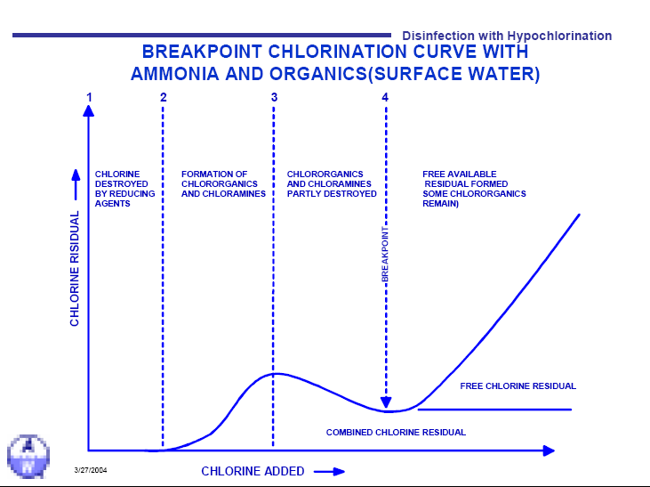
    - **Hình này chứng minh điều gì**
      - Thể hiện nguyên lý định lượng chất khử trùng: liều lượng châm bằng tổng nhu cầu clo và clo dư yêu cầu.
    - **Từ đâu mà thấy được**
      - Sơ đồ cân bằng khối lượng hóa chất châm vào nguồn nước xử lý.
- Động học biến thiên nồng độ clo dư theo liều lượng châm đối với nguồn nước mặt chứa amoniac và hợp chất hữu cơ:
  - Khi châm clo vào nước mặt, các chất khử vô cơ tiêu thụ clo ban đầu trước khi clo phản ứng với amoniac tạo clo liên kết và sau đó bị oxy hóa phá hủy tại điểm uốn (*breakpoint*).
  - Vượt qua điểm uốn, toàn bộ lượng clo châm thêm tồn tại dưới dạng clo tự do dư hữu hiệu ($\text{HOCl}$ và $\text{OCl}^-$).
  - **Hình 02.** Đường cong clo hóa điểm uốn của nước mặt
    - 
    - **Hình này chứng minh điều gì**
      - Thể hiện diễn biến nồng độ clo dư theo liều lượng clo châm vào nguồn nước mặt chứa amoniac.
    - **Từ đâu mà thấy được**
      - Đồ thị biểu diễn bốn giai đoạn phản ứng và điểm uốn breakpoint chuyển hóa clo liên kết thành clo tự do.

##### 7.1.3 Các Yêu cầu Kỹ thuật đối với Hóa chất Khử trùng Thực tế (Required Practical Properties of Disinfectants)

- Để ứng dụng hiệu quả trong thực tế công nghệ cấp nước, hóa chất khử trùng phải đáp ứng đầy đủ năm tiêu chuẩn kỹ thuật cốt lõi:
  - 1. Tiêu diệt chủng loại và số lượng mầm bệnh trong thời gian thực tế và dải nhiệt độ vận hành dự kiến:
    - Chất khử trùng phải có năng lực bất hoạt nhanh chóng mật độ lớn các mầm bệnh vi khuẩn, virus và nang đơn bào có thể xuất hiện trong nguồn nước.
    - Thời gian phản ứng tiếp xúc cần thiết ($t$) phải nằm trong giới hạn thể tích bể tiếp xúc khả thi của nhà máy xử lý (thường từ $15\text{--}60\text{ min}$ đối với hóa chất clo).
    - Hiệu lực diệt khuẩn phải duy trì ổn định trên toàn bộ dải nhiệt độ dao động theo mùa của nguồn nước thô (từ $0^\circ\text{C}$ đến $35^\circ\text{C}$).
  - 2. Thích ứng với các biến động về thành phần hóa lý, nồng độ tạp chất và trạng thái nước nguồn:
    - Chất lượng nước thô thường xuyên dao động đột ngột về độ đục (*turbidity*), độ màu, độ kiềm (*alkalinity*), giá trị $\text{pH}$, hàm lượng chất hữu cơ tự nhiên ($\text{NOM}$) và các chất khử hòa tan.
    - Hóa chất khử trùng phải hoạt động tin cậy và duy trì khả năng diệt khuẩn ổn định trước các biến động chất lượng nước thô này.
  - 3. Đảm bảo an toàn độc học cho người và động vật, không gây mùi vị khó chịu ở nồng độ khử trùng:
    - Hóa chất ở nồng độ sử dụng cho quá trình khử trùng tuyệt đối không gây độc cấp tính hay độc mãn tính cho cơ thể người và động vật nuôi.
    - Nước sau khử trùng không được phát sinh mùi hắc, vị lạ hay các đặc tính cảm quan khó chịu vượt ngưỡng người tiêu dùng chấp nhận (*acceptable aesthetic quality*).
    - Hàm lượng các sản phẩm phụ khử trùng hóa học ($\text{DBPs}$) tạo thành trong phản ứng phải nằm dưới ngưỡng nồng độ ô nhiễm tối đa cho phép ($\text{MCL}$) theo quy chuẩn hiện hành.
  - 4. Đo đạc nồng độ trong nước đã xử lý dễ dàng, nhanh chóng và tự động hóa:
    - Nồng độ chất khử trùng dư cần được xác định bằng các phương pháp phân tích tin cậy, thao tác đơn giản và thời gian phân tích tức thời (như phương pháp so màu $\text{DPD}$ hoặc cảm biến điện hóa *amperometric*).
    - Hệ thống công nghệ ưu tiên tích hợp thiết bị đo trực tuyến liên tục (*online continuous monitoring*) để tự động điều khiển phản hồi liều lượng châm hóa chất (*automatic dosing control*).
  - 5. Chi phí kinh tế hợp lý và khả thi:
    - Tổng chi phí đầu tư ban đầu cho hệ thống thiết bị châm hóa chất, bồn chứa, bể phản ứng tiếp xúc ($\text{CAPEX}$) phải ở mức hợp lý.
    - Chi phí vận hành thường xuyên bao gồm giá mua hóa chất, tiêu hao điện năng, chi phí bảo trì và bảo hộ an toàn lao động ($\text{OPEX}$) phải tối ưu, bảo đảm giá thành sản xuất nước sạch phù hợp với khả năng chi trả của xã hội.

#### 7.2. Theory

##### Free Chlorine

- Clo (chlorine) là hóa chất khử trùng (disinfecting chemical) phổ biến nhất trong cấp nước, và thuật ngữ clo hóa (chlorination) thường được sử dụng đồng nghĩa với quá trình khử trùng (disinfection).
- Clo có thể được sử dụng dưới ba dạng hóa chất chính:
  - Khí clo nguyên tố ($\text{Cl}_2$).
  - Natri hypoclorit ($\text{NaOCl}$), hay còn gọi là chất tẩy trắng (bleach).
  - Canxi hypoclorit ($\text{Ca(OCl)}_2$), hay còn gọi là vôi clo hóa (chlorinated lime, $\text{CaOCl}_2$).
- Khi châm clo vào nước, phản ứng thủy phân tạo ra hỗn hợp axit hipoclorơ ($\text{HOCl}$) và axit clohydric ($\text{HCl}$):
  $$\text{Cl}_2\text{ (gas)} + \text{H}_2\text{O} \rightleftharpoons \text{HOCl} + \text{H}^+ + \text{Cl}^-$$
  - Phản ứng thủy phân này phụ thuộc vào $\text{pH}$ và diễn ra gần như tức thời, hoàn tất chỉ trong vòng vài mili-giây (very few milliseconds).
  - Trong dung dịch loãng và ở các mức $\text{pH}$ trên $1.0$, cân bằng phản ứng dịch chuyển mạnh sang phải và chỉ tồn tại một lượng rất nhỏ $\text{Cl}_2$ trong dung dịch.
- Axit hipoclorơ ($\text{HOCl}$) là một axit yếu và phân ly kém ở các giá trị $\text{pH}$ dưới khoảng $6$:
  $$\text{HOCl} \rightleftharpoons \text{H}^+ + \text{OCl}^-$$
  - Clo tồn tại chủ yếu ở dạng $\text{HOCl}$ tại các giá trị $\text{pH}$ trong khoảng từ $4.0$ đến $6.0$.
  - Trong dải $\text{pH}$ từ $6.0$ đến $8.5$, xảy ra sự chuyển đổi rất đột ngột từ dạng $\text{HOCl}$ chưa phân ly sang trạng thái phân ly gần như hoàn toàn.
  - Tại nhiệt độ $200\text{C}$ (nguyên văn: $200\text{C}$, tức $20^\circ\text{C}$) và $\text{pH}$ trên $7.5$, các ion hipoclorit ($\text{OCl}^-$) chiếm ưu thế.
  - Các ion hipoclorit ($\text{OCl}^-$) tồn tại gần như tuyệt đối ở các mức $\text{pH}$ trên $9$.
- Định nghĩa clo tự do (free chlorine):
  - Clo tồn tại trong nước dưới các dạng $\text{HOCl}$ và/hoặc $\text{OCl}^-$ được định nghĩa là clo hoạt tính tự do (free available chlorine) hoặc clo tự do (free chlorine).
- Phân ly của các muối hypoclorit trong nước tạo ra các ion hipoclorit ($\text{OCl}^-$):
  - $\text{NaOCl} \rightarrow \text{Na}^+ + \text{OCl}^-$
  - $\text{Ca(OCl)}_2 \rightarrow \text{Ca}^{2+} + 2\text{OCl}^-$
  - Các ion hipoclorit nhanh chóng thiết lập trạng thái cân bằng với ion hydro ($\text{H}^+$) theo phương trình phân ly thuận nghịch ($\text{OCl}^- + \text{H}^+ \rightleftharpoons \text{HOCl}$).
  - Cùng các dạng clo hoạt tính ($\text{HOCl}$ và $\text{OCl}^-$) và cùng một trạng thái cân bằng hóa học được thiết lập trong nước, bất kể sử dụng clo nguyên tố hay các muối hypoclorit.
- Ảnh hưởng của dạng clo sử dụng đến $\text{pH}$ và độ kiềm của nước:
  - Sự khác biệt đáng kể nhất giữa clo nguyên tố và các muối hypoclorit nằm ở giá trị $\text{pH}$ tạo thành sau phản ứng và ảnh hưởng trực tiếp của nó đến tỷ lệ tương đối giữa $\text{HOCl}$ và $\text{OCl}^-$ tại trạng thái cân bằng.
  - Khí clo nguyên tố có xu hướng làm giảm $\text{pH}$; mỗi $\text{mg/L}$ clo châm vào làm tiêu hao độ kiềm (alkalinity) lên tới $1.4\text{ mg/L}$ tính theo $\text{CaCO}_3$.
  - Ngược lại, các muối hypoclorit luôn chứa lượng kiềm dư để tăng độ bền (stability) nên có xu hướng làm tăng nhẹ $\text{pH}$.
  - Để tối ưu hóa hiệu quả khử trùng (disinfecting action), giá trị $\text{pH}$ thiết kế công nghệ được duy trì trong dải từ $6.5$ đến $7.5$.
- Độ bền hóa học và phản ứng quang phân của clo tự do:
  - Clo tự do tương đối bền vững trong môi trường nước tinh khiết.
  - Clo tự do phản ứng chậm với chất hữu cơ tự nhiên (NOM - naturally occurring organic matter), nhưng phản ứng rất nhanh dưới tác động của ánh sáng mặt trời (sunlight).
  - Phản ứng quang phân (photolytic reaction) diễn ra trực tiếp đối với ion hipoclorit ($\text{OCl}^-$); các sản phẩm sinh ra gồm oxy ($\text{O}_2$), ion clorit ($\text{ClO}_2^-$), và ion clorua ($\text{Cl}^-$).
- Cân bằng khối lượng và nguyên lý định lượng clo:
  $$\text{Chlorine dose} = \text{Chlorine demand} + \text{Chlorine residual}$$
  - Liều lượng clo châm vào (chlorine dose): tổng lượng clo cần thêm vào nguồn nước để đạt được nồng độ clo dư mong muốn trong quá trình khử trùng.
  - Nhu cầu clo (chlorine demand): lượng clo tiêu tốn để phản ứng hoàn toàn với tất cả các chất khử và các hợp chất hữu cơ có trong nước.
  - Quá trình clo hóa điểm uốn (breakpoint chlorination): quá trình châm clo liên tục vào nước cho đến khi nhu cầu clo đã được đáp ứng hoàn toàn.
  - Điểm uốn / điểm đột biến (breakpoint): trạng thái mà tại đó toàn bộ nhu cầu clo đã được thỏa mãn và bất kỳ lượng clo nào châm thêm sau đó sẽ xuất hiện dưới dạng clo dư tự do (free chlorine residual).

###### Breakpoint chlorination curve (surface water)

- Quá trình clo hóa đối với nước mặt chứa amoniac và chất hữu cơ tuân theo đường cong clo hóa điểm uốn qua 4 giai đoạn phản ứng liên tiếp:
  - Giai đoạn 1 (từ 0 đến vạch 1–2): clo châm vào bị tiêu hao và phá hủy hoàn toàn bởi các chất khử vô cơ (chlorine destroyed by reducing agents), clo dư bằng không.
  - Giai đoạn 2 (vạch 2–3): hình thành các hợp chất hữu cơ chứa clo và cloramin (formation of chlororganics and chloramines), đường cong clo dư liên kết tăng lên tạo thành đỉnh lồi.
  - Giai đoạn 3 (vạch 3–4): lượng clo châm thêm oxy hóa và phá hủy một phần cloramin cùng hợp chất clo hữu cơ (chlororganics and chloramines partly destroyed), làm giảm nồng độ clo dư xuống đáy cực tiểu tại vạch 4 (điểm uốn - breakpoint).
  - Giai đoạn 4 (sau vạch 4): vượt qua điểm uốn, clo dư tự do hình thành và tăng dốc tuyến tính theo lượng clo châm thêm (free available residual formed), trong khi một phần hợp chất clo hữu cơ vẫn còn tồn lưu (some chlororganics remain).
###### Breakpoint chlorination curve (well water)

- Quá trình clo hóa đối với nước ngầm không chứa amoniac hoặc hợp chất hữu cơ có đường cong phản ứng đơn giản hóa chỉ gồm 2 giai đoạn:
  - Giai đoạn 1 (từ 0 đến vạch 1–2): clo châm vào bị phá hủy bởi các chất khử (chlorine destroyed by reducing agents), không xuất hiện clo dư.
  - Giai đoạn 2 (sau vạch 2): đạt ngay điểm uốn (breakpoint) tại vạch 2 mà không có giai đoạn tích lũy cloramin trung gian; clo dư tự do hình thành ngay lập tức và tăng tuyến tính trực tiếp theo lượng clo châm thêm (free available residual formed).
  - **Hình 3.** Đường cong clo hóa điểm uốn của nước ngầm
    - 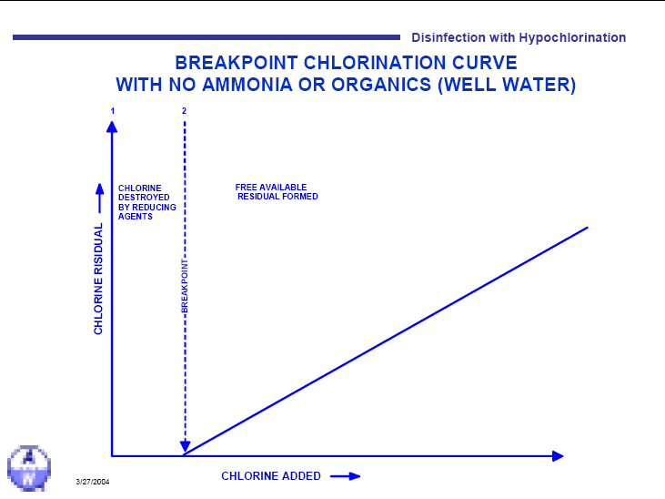
    - **Hình này chứng minh điều gì**
      - Điểm uốn (vạch 2) đánh dấu mốc nhu cầu clo (chlorine demand) được đáp ứng trọn vẹn mà không sinh cloramin trung gian.
    - **Từ đâu mà thấy được**
      - Trục Ox: lượng clo châm (Chlorine added); trục Oy: clo dư (Chlorine residual).
      - Đoạn 1–2 nằm sát trục hoành ở mức 0; tại vạch 2 (Breakpoint), đồ thị bắt đầu dốc lên thành đường thẳng tăng liên tục.

###### Typical Chlorine Dosages at Water Treatment Plants

- Dải liều lượng clo châm vào áp dụng điển hình tại các nhà máy xử lý nước cấp được phân chia rõ rệt theo loại hợp chất clo sử dụng:
  - Canxi hypoclorit (calcium hypochlorite): dải liều lượng từ $0.5$ đến $5\text{ mg/L}$.
  - Natri hypoclorit (sodium hypochlorite): dải liều lượng từ $0.2$ đến $2\text{ mg/L}$.
  - Khí clo (chlorine gas): dải liều lượng từ $1$ đến $16\text{ mg/L}$, có dải dao động rộng nhất và mức châm trần cao nhất.
  - Số liệu thực tế được SAIC trích dẫn năm 1998, dựa trên đánh giá của EPA từ các Kế hoạch lấy mẫu ban đầu (Initial Sampling Plans) theo Quy tắc thu thập thông tin ICR (Information Collection Rule).
  - **Hình 6.** Liều lượng clo điển hình tại trạm xử lý nước
    - 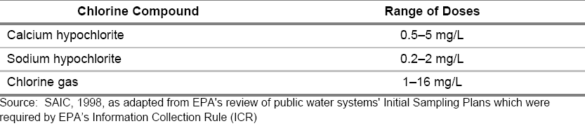
    - **Hình này chứng minh điều gì**
      - Khí clo có dải liều lượng rộng nhất và mức châm tối đa cao nhất so với hai dạng muối hypoclorit.
    - **Từ đâu mà thấy được**
      - Cột "Range of Doses", hàng "Chlorine gas": dải liều đạt $1\text{–}16\text{ mg/L}$, mức trần cao nhất bảng.
      - Hàng "Calcium hypochlorite" và "Sodium hypochlorite": dải liều thấp hơn, lần lượt là $0.5\text{–}5\text{ mg/L}$ và $0.2\text{–}2\text{ mg/L}$.

###### Chlorine Uses and Doses

- Ngoài chức năng khử trùng, clo còn được ứng dụng phổ biến cho nhiều mục đích oxy hóa và kiểm soát chất lượng nước khác nhau với các điều kiện kỹ thuật đặc thù:
  - Oxy hóa sắt (iron): liều lượng điển hình $0.62\text{ mg/mg Fe}$, $\text{pH}$ tối ưu $7.0$, thời gian phản ứng dưới $1\text{ giờ}$ ($\text{less than } 1\text{ hour}$), hiệu quả tốt ($\text{Good}$).
  - Oxy hóa mangan (manganese): liều lượng điển hình $0.77\text{ mg/mg Mn}$, động học phản ứng chậm ($\text{Slow kinetics}$), thời gian phản ứng tăng lên ở các mức $\text{pH}$ thấp hơn; ở $\text{pH } 7\text{–}8$ cần thời gian $1\text{–}3\text{ giờ}$, trong khi nâng lên $\text{pH } 9.5$ thời gian phản ứng rút ngắn xuống còn vài phút ($\text{minutes}$).
  - Kiểm soát sự phát triển sinh học (biological growth): liều lượng từ $1$ đến $2\text{ mg/L}$, $\text{pH}$ tối ưu từ $6$ đến $8$, thời gian phản ứng không áp dụng ($\text{NA}$), hiệu quả tốt, có nguy cơ tạo sản phẩm phụ khử trùng ($\text{DBP formation}$).
  - Xử lý vị và mùi (taste/odor): liều lượng biến thiên ($\text{Varies}$), $\text{pH}$ tối ưu từ $6$ đến $8$, thời gian phản ứng biến thiên, hiệu quả biến thiên tùy thuộc vào hợp chất cụ thể, hiệu quả phụ thuộc vào bản chất từng hợp chất ($\text{Effectiveness depends on compound}$).
  - Khử màu (color removal): liều lượng biến thiên, $\text{pH}$ tối ưu từ $4.0$ đến $6.8$, thời gian phản ứng trong vài phút ($\text{Minutes}$), hiệu quả tốt, có nguy cơ tạo sản phẩm phụ khử trùng ($\text{DBP formation}$).
  - Kiểm soát vẹm vằn (zebra mussels): liều lượng châm sốc từ $2$ đến $5\text{ mg/L}$ ($\text{Shock level}$), nồng độ duy trì từ $0.2$ đến $0.5\text{ mg/L}$ (nồng độ clo dư, không phải liều châm - $\text{Residual, not dose}$), hiệu quả tốt, có nguy cơ tạo $\text{DBP}$.
  - Kiểm soát hến châu Á (Asiatic clams): châm liên tục ($\text{Continuous}$) với nồng độ clo dư duy trì từ $0.3$ đến $0.5\text{ mg/L}$ ($\text{Residual, not dose}$), hiệu quả tốt, có nguy cơ tạo $\text{DBP}$.
  - Tổng hợp từ các nguồn nghiên cứu: White (1992), Connell (1996), Culp/Wesner/Culp (1986).
  - **Hình 7.** Tổng hợp liều lượng và điều kiện phản ứng chuyên biệt của clo
    - 
    - **Hình này chứng minh điều gì**
      - pH kiềm hóa ($9.5$) giúp rút ngắn thời gian oxy hóa Mn xuống vài phút thay vì $1\text{--}3\text{ hour}$ ở pH $7\text{--}8$.
      - Khử màu, diệt vi sinh vật và động vật bám đều đi kèm nguy cơ tạo sản phẩm phụ DBP (DBP formation).
    - **Từ đâu mà thấy được**
      - Hàng "Manganese", cột "Reaction Time": thời gian giảm từ $1\text{--}3\text{ hour}$ (pH $7\text{--}8$) xuống "minutes" (pH $9.5$).
      - Cột "Other Considerations": ghi nhận "DBP formation" ở các hàng vi sinh vật, khử màu, vẹm vằn và hến.
      - Cột "Typical Dose" và "Optimal pH": hiển thị liều chuẩn của Fe ($0.62\text{ mg/mg Fe}$) và Mn ($0.77\text{ mg/mg Mn}$).

##### Combined Chlorine

- Phản ứng của clo với amoniac ($\mathrm{NH_3}$) có ý nghĩa rất lớn trong các quá trình clo hóa nước (water chlorination processes):
  - Khi clo được châm vào nước có chứa amoniac tự nhiên hoặc nhân tạo (ion amoni $\mathrm{NH_4^+}$ tồn tại ở trạng thái cân bằng với amoniac và ion hydro $\mathrm{H^+}$), amoniac phản ứng với $\mathrm{HOCl}$ để tạo thành các dạng chloramine khác nhau.
  - Các phản ứng giữa clo và amoniac diễn ra qua 3 nấc:
    - $\mathrm{NH_3 + HOCl \rightarrow NH_2Cl + H_2O}$ (monochloramine).
    - $\mathrm{NH_2Cl + HOCl \rightarrow NHCl_2 + H_2O}$ (dichloramine).
    - $\mathrm{NHCl_2 + HOCl \rightarrow NCl_3 + H_2O}$ (trichloramine).
  - Sự phân bố các sản phẩm phản ứng được chi phối bởi tốc độ tạo thành monochloramine và dichloramine; các tốc độ này phụ thuộc vào $\mathrm{pH}$, nhiệt độ, thời gian và tỷ lệ $\mathrm{Cl_2:NH_3}$ ban đầu.
  - Nhìn chung, tỷ lệ $\mathrm{Cl_2:NH_3}$ cao, nhiệt độ thấp và mức $\mathrm{pH}$ thấp ưu tiên sự tạo thành dichloramine.
  - Monochloramine chiếm ưu thế ở các mức $\mathrm{pH}$ cao.
- Clo cũng phản ứng với các vật liệu hữu cơ chứa nitơ (organic nitrogenous materials), chẳng hạn như protein và axit amin, để tạo thành các phức chloramine hữu cơ (organic chloramine complexes).
- Clo tồn tại trong nước ở dạng kết hợp hóa học với amoniac hoặc các hợp chất nitơ hữu cơ được định nghĩa là clo hữu dụng liên kết (combined available chlorine) hoặc clo liên kết (combined chlorine).
- Tổng nồng độ của clo tự do (free chlorine) và clo liên kết (combined chlorine) được gọi là clo tổng số (total chlorine).
- Cân bằng lượng clo dư:
  - $\text{Chlorine residual} = \text{Free chlorine residual} + \text{Combined chlorine residual}$ (Độ clo dư = Clo dư tự do + Clo dư liên kết).
- Sự phân bố dạng tồn tại chloramine (chloramine speciation) phụ thuộc vào tỷ lệ $\mathrm{Cl_2:N}$ đối với dải $\mathrm{pH}$ từ 6.5 đến 8.5:
  - **Hình 10.** Đường cong clo hóa đến điểm đột biến breakpoint
    - 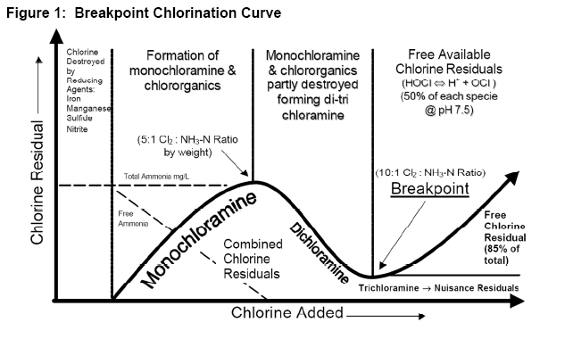
    - **Hình này chứng minh điều gì**
      - Tỷ lệ $\mathrm{Cl_2:NH_3\text{-}N}$ gia tăng phân định các vùng tạo monochloramine, chuyển hóa di-trichloramine và phá hủy tại breakpoint để tạo clo dư tự do.
    - **Từ đâu mà thấy được**
      - Ox: Lượng clo châm vào (Chlorine Added). Oy: Lượng clo dư (Chlorine Residual).
      - Đỉnh monochloramine tại tỷ lệ khối lượng $5:1\ \mathrm{Cl_2:NH_3\text{-}N}$, sau đó clo dư sụt giảm khi tạo dichloramine.
      - Điểm cực tiểu Breakpoint tại tỷ lệ $10:1\ \mathrm{Cl_2:NH_3\text{-}N}$, sau đó clo dư tự do tăng tuyến tính (chiếm 85 % tổng clo dư).

##### Disinfection Agents and Comparison

###### Chlorine Dioxide

- Clo dioxit ($ClO_2$, chlorine dioxide) là một gốc tự do bền (stable free radical); ở nồng độ cao (high concentrations), chất này phản ứng mãnh liệt (reacts violently) với các chất khử (reducing agents).
- $ClO_2$ là chất nổ (explosive) với giới hạn nổ dưới (lower explosive limit* - LEL) được ghi nhận trong các tài liệu khác nhau dao động từ 10 đến 39 phần trăm (10 and 39 percent).
  - Do đó, hầu như toàn bộ các ứng dụng (virtually all applications) đều đòi hỏi phải tổng hợp tại chỗ (synthesis on-site).
- Clo dioxit ($ClO_2$) được hình thành tại chỗ bằng cách kết hợp clo (chlorine) và natri clorit ($NaClO_2$, sodium chlorite), sử dụng một trong ba phản ứng thay thế (three alternative reactions):
  - Phản ứng với khí clo ($Cl_2$ gas):
    $$2NaClO_2 + Cl_2\text{ (gas)} \rightarrow 2ClO_2\text{ (gas)} + 2NaCl$$
  - Phản ứng với axit hypoclorơ ($HOCl$):
    $$2NaClO_2 + HOCl \rightarrow 2ClO_2\text{ (gas)} + NaCl + NaOH$$
  - Phản ứng với axit clohydric ($HCl$):
    $$5NaClO_2 + 4HCl \rightarrow 4ClO_2\text{ (gas)} + 5NaCl + 2H_2O$$
- Phản ứng điển hình của clo dioxit trong môi trường nước là phản ứng khử một electron (one-electron reduction):
  $$ClO_2 + e^- \rightarrow ClO_2^-$$

##### Mechanisms of Disinfection

###### Ozone

- Định nghĩa và đặc tính lý hóa của Ozone ($\text{O}_3$):
  - Ozone là chất khí có mùi hắc đặc trưng và không bền vững (*pungent, unstable gas*).
  - Phân tử cấu tạo từ ba nguyên tử oxy liên kết tạo thành $\text{O}_3$ ($M = 48\text{ g/mol}$).
  - Do tính kém bền và tốc độ phân hủy nhanh, ozone bắt buộc phải được điều chế tại chỗ ở điểm sử dụng (*generated at the point of use*).
- Các phương pháp sản xuất khí ozone và cơ chế phân ly điện trường:
  - Bốn phương pháp có thể điều chế ozone: quang hóa (*photochemical*), điện phân (*electrolytic*), hóa bức xạ (*radiochemical*), và phóng điện qua điện cực (*discharge electrode*).
  - Phương pháp phổ biến nhất trong thực tế xử lý nước là phóng điện qua điện cực (*corona discharge electrode*).
  - Nguồn cấp khí gồm oxy tinh khiết mua dưới dạng oxy lỏng (*Liquid Oxygen - LOX*) hoặc oxy trong không khí xung quanh (*ambient air*).
  - Điện trường và va đập electron từ điện cực phóng điện bẻ gãy phân tử oxy thành oxy nguyên tử tự do:
    $$e^- + \text{O}_2 \rightarrow 2\text{O} + e^-$$
  - Oxy nguyên tử kết hợp tức thời với phân tử oxy khí quyển tạo thành ozone theo phản ứng thuận nghịch:
    $$\text{O} + \text{O}_2 \leftrightarrow \text{O}_3$$
- Hiệu suất tạo ozone và yêu cầu xử lý khí nạp (LOX so với Không khí xung quanh):
  - Khi sử dụng nguồn oxy lỏng (LOX):
    - Khí thoát ra từ thiết bị tạo ozone chứa hàm lượng ozone từ $5\%$ đến $8\%$ theo thể tích.
    - Hỗn hợp khí ozone và oxy sau đó được khuếch tán trực tiếp vào dòng nước cần khử trùng.
  - Khi sử dụng nguồn không khí xung quanh (*Ambient air*):
    - Hơi ẩm dạng vết trong không khí phản ứng với nitơ ($\text{N}_2$) dưới tác dụng của năng lượng phóng điện hoa tạo ra axit nitric:
      $$\text{O}_3 + \text{N}_2 + \text{O}_2 + \text{H}_2\text{O} \xrightleftharpoons{h\nu} 2\text{HNO}_3$$
    - Axit nitric sinh ra ăn mòn và phá hủy buồng tạo khí cùng các điện cực của máy ozone.
    - Yêu cầu thiết kế bắt buộc: hệ thống phải trang bị dây chuyền sấy khô không khí nạp đến độ ẩm cực thấp (điểm sương sâu) trước khi cấp vào buồng phóng điện.
- Cấu phần của hệ thống khử trùng bằng ozone (*Components of an ozone disinfection system*):
  - Hệ thống khử trùng hoàn chỉnh bao gồm ba cụm thành phần chính:
    - (a) Cụm xử lý và chuẩn bị nguồn khí cấp từ không khí xung quanh (*preparation system for ozone generation from ambient air*): gồm lọc bụi khí (*Filtration*), máy nén khí (*Compression*), thiết bị trao đổi nhiệt làm mát (*Heat exchange*), bộ tách ẩm sơ cấp (*Separation*), máy làm lạnh ngưng tụ ẩm (*Refrigeration*), bộ tách ẩm thứ cấp (*Separation*), và tháp sấy hút ẩm (*Desiccation*) để cấp khí khô vào buồng tạo ozone.
    - (b) Cụm tạo khí ozone bằng phóng điện corona (*generation of ozone by corona discharge*): đặt điện áp xoay chiều cao thế (*High AC voltage*) qua hai điện cực phủ lớp điện môi cách điện (*Dielectric*), duy trì khe hẹp phóng điện $1\text{--}3\text{ mm}$ để phân ly dòng khí $\text{O}_2$ thành $\text{O}_3$.
    - (c) Cụm châm hòa tan ozone vào nước bằng dòng nhánh (*side-stream injection of ozone*): bơm dòng nhánh (*Side-stream pump*) trích một phần nước từ đường ống chính, đẩy qua ống trộn Venturi (*Venturi injector*) hút khí ozone hòa tan vào nước, qua bình tách khí (*Degas vessel*) có van điều áp dẫn khí dư về tháp phân hủy ozone (*ozone destruction unit*), và đưa dòng nước hòa tan ozone vào bể tiếp xúc.
  - **Hình 12.** Sơ đồ cấu tạo hệ thống khử trùng bằng ozone
    - 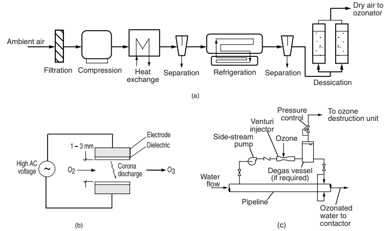
    - **Hình này chứng minh điều gì**
      - Thể hiện cấu trúc ba phân khu công nghệ: chuẩn bị khí khô từ không khí xung quanh, buồng phóng điện corona và cụm châm hòa trộn ozone dòng nhánh.
    - **Từ đâu mà thấy được**
      - Cụm (a): chuỗi thiết bị lọc khí, nén, giải nhiệt, tách ẩm, làm lạnh và tháp sấy hút ẩm cấp khí khô (`Dry air to ozonator`).
      - Cụm (b): sơ đồ khe hẹp $1\text{--}3\text{ mm}$ giữa hai điện cực điện môi dưới điện áp xoay chiều cao thế biến đổi $\text{O}_2$ thành $\text{O}_3$.
      - Cụm (c): trích dòng nhánh qua bơm, ống Venturi hút ozone, bình tách khí có van điều áp xả khí dư về tháp phân hủy trước khi cấp vào bể tiếp xúc.

##### Ultraviolet (UV) Radiation

###### Bức xạ Cực tím và Bản chất Quang hóa (Ultraviolet Radiation & Photochemistry)

- Phản ứng quang hóa (photochemistry) biến thiên rõ rệt theo các vùng bước sóng của phổ điện từ:
  - Rất ít phản ứng quang hóa xảy ra trong vùng cận hồng ngoại (near infrared), ngoại trừ ở một số vi khuẩn quang hợp (photosynthetic bacteria).
  - Vùng ánh sáng nhìn thấy ($400\text{--}700\text{ nm}$) hoạt động hoàn toàn cho quá trình quang hợp ở thực vật bậc cao và tảo lục (photosynthesis in green plants and algae).
- Dải bức xạ tử ngoại ($100\text{--}400\text{ nm}$) được phân thành ba vùng chính theo mức độ nhạy cảm của da người:
  - Vùng UVA ($315\text{--}400\text{ nm}$): Gây ra những biến đổi trên bề mặt da dẫn đến hiện tượng sạm da / rám nắng (tanning).
  - Vùng UVB ($280\text{--}315\text{ nm}$): Có khả năng gây bỏng rát da (skin burning) và có xu hướng gây ung thư da (induce skin cancer).
  - Vùng UVC ($200\text{--}280\text{ nm}$): Cực kỳ nguy hiểm do bị hấp thụ mạnh bởi các phân tử protein và axit nucleic (ADN/ARN), dẫn đến đột biến gen (cell mutations) hoặc gây chết tế bào (cell death).
- Năng lượng điện từ UV thường được sinh ra bởi dòng chuyển dời electron từ nguồn điện qua hơi thủy ngân ion hóa (ionized mercury vapor) bên trong bóng đèn.
- Cấu tạo và cơ cấu thiết bị khử trùng UV công nghiệp:
  - Các nhà sản xuất đã phát triển hệ thống bố trí đèn UV lắp đặt trong các bình chịu áp lực (vessels) hoặc mương hở (channels) nhằm cung cấp ánh sáng UV trong dải diệt khuẩn (germicidal range) để bất hoạt vi khuẩn, virus và các vi sinh vật khác.
  - Đèn UV có cấu tạo tương đồng với đèn huỳnh quang dân dụng, ngoại trừ việc đèn huỳnh quang được tráng một lớp phốt pho (phosphorus) bên trong thành ống để biến đổi tia UV thành ánh sáng khả kiến.
- Vị trí vùng tử ngoại trong phổ bức xạ điện từ và các dải bước sóng:
  - **Hình 14.** Vị trí vùng tử ngoại trong phổ bức xạ điện từ
    - 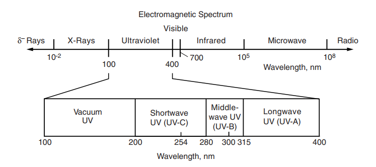
    - **Hình này chứng minh điều gì**
      - Cấu trúc phổ định vị vùng cực tím ($100\text{--}400\text{ nm}$) nằm giữa tia X và ánh sáng nhìn thấy, đồng thời xác lập vạch mốc diệt khuẩn tối ưu $254\text{ nm}$ trong dải sóng UVC.
    - **Từ đâu mà thấy được**
      - Trục phổ trên: Bức xạ tử ngoại (Ultraviolet) nằm liền kề giữa tia X (X-Rays, $10^{-2}\text{--}100\text{ nm}$) và dải ánh sáng nhìn thấy (Visible, $400\text{--}700\text{ nm}$).
      - Khung mở rộng phía dưới chia 4 dải sóng liên tiếp: Vacuum UV ($100\text{--}200\text{ nm}$), UV-C ($200\text{--}280\text{ nm}$), UV-B ($280\text{--}315\text{ nm}$), và UV-A ($315\text{--}400\text{ nm}$); vạch chỉ số $254\text{ nm}$ nằm trọng tâm trong khối UV-C.

###### Đặc tính Kỹ thuật Các Dòng Đèn Khử trùng UV (Technical Characteristics of UV Lamps)

- Ba chủng loại đèn UV thương dụng chính trong công nghệ xử lý nước gồm: đèn áp suất thấp cường độ thấp (Low-pressure low-intensity), đèn áp suất thấp cường độ cao (Low-pressure high-intensity / amalgam), và đèn áp suất trung bình (Medium-pressure).
- Đặc tính tiêu thụ điện năng và hiệu suất phát bức xạ diệt khuẩn:
  - Đèn áp suất thấp cường độ thấp tiêu thụ công suất điện $40\text{--}100\text{ W}$, dòng điện $350\text{--}550\text{ mA}$, điện áp $220\text{ V}$, đạt hiệu suất diệt khuẩn trên điện năng đầu vào cao nhất $30\text{--}40\,\%$ với công suất phát xạ tại $254\text{ nm}$ đạt $25\text{--}27\text{ W}$.
  - Đèn áp suất thấp cường độ cao tiêu thụ công suất điện $200\text{--}500\text{ W}$ (lên đến $1{,}200\text{ W}$ đối với dòng đèn công suất rất cao), đạt hiệu suất diệt khuẩn $25\text{--}35\,\%$ và công suất phát xạ diệt khuẩn $60\text{--}400\text{ W}$ tại $254\text{ nm}$.
  - Đèn áp suất trung bình tiêu thụ công suất điện cực lớn $1{,}000\text{--}10{,}000\text{ W}$, nhưng hiệu suất diệt khuẩn đầu vào chỉ đạt $10\text{--}15\,\%$ trong dải phổ hiệu quả nhất ($255\text{--}265\text{ nm}$).
- Điều kiện vận hành nhiệt độ, áp suất và kích thước hình học:
  - Nhiệt độ vận hành thành ống đèn: $35\text{--}45\,^\circ\text{C}$ đối với đèn áp suất thấp cường độ thấp; $60\text{--}100\,^\circ\text{C}$ đối với đèn áp suất thấp cường độ cao; và $600\text{--}900\,^\circ\text{C}$ đối với đèn áp suất trung bình.
  - Áp suất riêng phần của hơi thủy ngân ($\text{Hg}$ vapor): $0.00093\text{ kPa}$ (áp suất thấp cường độ thấp), $0.0018\text{--}0.10\text{ kPa}$ (áp suất thấp cường độ cao), và $40\text{--}4{,}000\text{ kPa}$ (áp suất trung bình).
  - Chiều dài đèn áp suất thấp cường độ thấp dao động $0.75\text{--}1.5\text{ m}$ với đường kính $15\text{--}20\text{ mm}$; hai dòng đèn còn lại có kích thước linh hoạt theo thiết kế nhà sản xuất.
- Tuổi thọ thiết bị và mức độ suy giảm quang thông theo thời gian:
  - Tuổi thọ ống thạch anh (sleeve life) đạt $4\text{--}6\text{ năm}$ đối với đèn áp suất thấp, giảm xuống $1\text{--}3\text{ năm}$ đối với đèn áp suất trung bình.
  - Tuổi thọ chấn lưu điện tử (ballast life) đạt $10\text{--}15\text{ năm}$ đối với đèn áp suất thấp, đạt $1\text{--}3\text{ năm}$ đối với đèn áp suất trung bình.
  - Tuổi thọ định mức bóng đèn (estimated lamp life): $8{,}000\text{--}10{,}000\text{ giờ}$ (áp suất thấp cường độ thấp), $8{,}000\text{--}12{,}000\text{ giờ}$ (áp suất thấp cường độ cao), và $4{,}000\text{--}8{,}000\text{ giờ}$ (áp suất trung bình).
  - Mức suy giảm công suất phát xạ diệt khuẩn khi đạt tuổi thọ thiết kế là $20\text{--}25\,\%$ (đèn áp suất thấp cường độ thấp và áp suất trung bình) và $25\text{--}30\,\%$ (đèn áp suất thấp cường độ cao).
- Tổng hợp so sánh thông số kỹ thuật ba dòng đèn UV:
  - **Hình 15.** Đặc tính kỹ thuật của ba loại đèn UV
    - 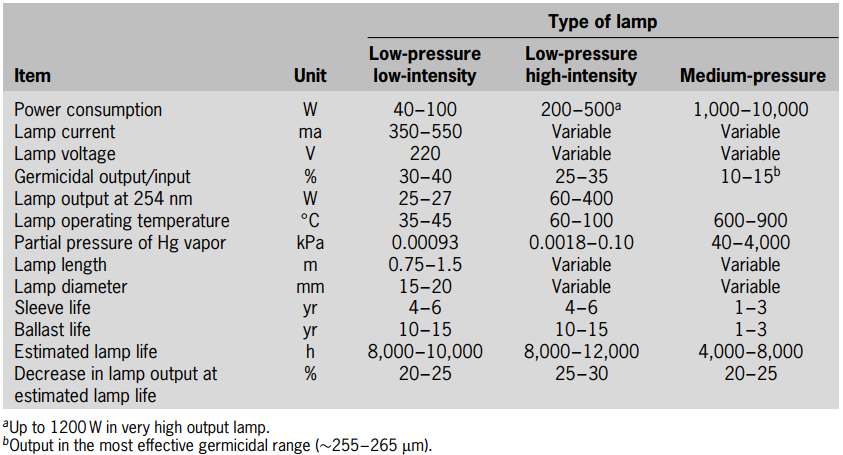
    - **Hình này chứng minh điều gì**
      - Đèn áp suất thấp đạt hiệu suất diệt khuẩn ($25\text{--}40\,\%$) và tuổi thọ ($8{,}000\text{--}12{,}000\text{ h}$) hiệu quả hơn; đèn áp suất trung bình có mật độ công suất cực lớn ($1{,}000\text{--}10{,}000\text{ W}$) ở nhiệt độ cao ($600\text{--}900\,^\circ\text{C}$).
    - **Từ đâu mà thấy được**
      - Bảng số liệu: Cột Low-pressure low-intensity tiêu thụ $40\text{--}100\text{ W}$, hiệu suất diệt khuẩn $30\text{--}40\,\%$. Cột Low-pressure high-intensity bền nhất ($8{,}000\text{--}12{,}000\text{ h}$). Cột Medium-pressure có công suất $1{,}000\text{--}10{,}000\text{ W}$, nhiệt độ $600\text{--}900\,^\circ\text{C}$ và áp suất hơi thủy ngân $40\text{--}4{,}000\text{ kPa}$.

###### Các Yếu tố Ảnh hưởng đến Hiệu quả Khử trùng UV (Factors Governing UV Disinfection Performance)

- Liều lượng bức xạ UV (Fluence / UV Dose):
  - Liều bức xạ $D$ ($\text{mJ/cm}^2$ hoặc $\text{J/m}^2$, với $1\text{ mJ/cm}^2 = 10\text{ J/m}^2$) được xác định bằng tích số giữa cường độ bức xạ $I$ ($\text{mW/cm}^2$) và thời gian tiếp xúc $t$ ($\text{s}$):
    $$D = I \cdot t$$
  - Mức liều tiêu chuẩn tối thiểu theo quy chuẩn USEPA là $40\text{ mJ/cm}^2$ ($400\text{ J/m}^2$), đảm bảo bất hoạt $\ge 4.0\text{-log}$ đối với vi khuẩn đường ruột, u nang *Giardia* và noãn nang *Cryptosporidium*.
- Độ truyền quang của nước (%UVT - UV Transmittance tại bước sóng $254\text{ nm}$):
  - Cường độ ánh sáng UV suy giảm theo định luật Beer-Lambert khi truyền qua tầng nước dày $x$ ($\text{cm}$):
    $$I(x) = I_0 \cdot 10^{-A_{254} \cdot x}$$
  - Độ truyền quang của nước được định nghĩa:
    $$\%\text{UVT} = 100 \times 10^{-A_{254}}$$
  - Giá trị $\%\text{UVT}$ tối ưu cho hệ thống khử trùng phải đạt $\ge 85\text{--}90\,\%$; khi nước thô có $\%\text{UVT} < 75\,\%$, hiệu quả thâm nhập của photon UV-C suy giảm nghiêm trọng.
- Độ đục và nồng độ chất rắn lơ lửng (Turbidity & Suspended Solids):
  - Các hạt cặn lơ lửng hấp thụ và tán xạ tia UV, đồng thời che chắn các vi sinh vật bám dính trên hạt cặn khỏi sự phơi nhiễm bức xạ (shadowing effect).
  - Độ đục nước đầu vào hệ thống khử trùng UV bắt buộc phải được duy trì ở mức $\le 0.3\text{--}0.5\text{ NTU}$ sau quá trình lắng lọc.
- Đóng cặn bám bẩn trên bề mặt ống bọc thạch anh (Quartz Sleeve Fouling):
  - Các ion kim loại hòa tan và độ cứng gồm sắt ($\text{Fe} > 0.1\text{ mg/L}$), mangan ($\text{Mn} > 0.02\text{ mg/L}$), cùng kết tủa canxi cacbonat ($\text{CaCO}_3$) bám dính trên bề mặt ống thạch anh nóng, tạo lớp màng chắn quang học.
  - Bắt buộc trang bị hệ thống vòng gạt cơ học tự động (wiper rings) hoặc tẩy rửa hóa chất định kỳ để làm sạch bề mặt ống bọc.
- Thủy động lực học của buồng phản ứng UV (Contactor Hydraulics):
  - Dòng chảy qua buồng phản ứng phải tiệm cận trạng thái dòng chảy piston (plug-flow) hoàn hảo để đảm bảo mọi phần tử nước đều nhận đủ liều chiếu xạ đồng đều.
  - Các vùng xoáy chết hoặc hiện tượng ngắn dòng (short-circuiting) làm giảm thời gian lưu thực tế $t_{10}$, khiến một phần vi sinh vật thoát ra mà không nhận đủ liều UV cần thiết.
- Khả năng chống chịu và cơ chế tự phục hồi của vi sinh vật (Microbial Resistance & Repair):
  - Một số loại virus cấu trúc vỏ protein dày hoặc ADN chuỗi đôi như Adenovirus đòi hỏi liều UV cao từ $120$ đến $186\text{ mJ/cm}^2$ để đạt mức bất hoạt $4.0\text{-log}$.
  - Hiện tượng phục hồi quang học (photoreactivation): Dưới tác động của ánh sáng nhìn thấy ($310\text{--}500\text{ nm}$), enzyme photolyase có thể phục hồi liên kết thymine dimer bị bẻ gãy, đòi hỏi phải che tối hệ thống hoặc sử dụng đèn áp suất trung bình có dải phổ rộng để triệt tiêu enzyme phục hồi.

##### Chick-Watson Kinetics and CT Concept

###### Chick-Watson Disinfection Model

- Định luật Chick-Watson (Chick-Watson Law) là mô hình động học nền tảng mô tả tốc độ bất hoạt vi sinh vật dưới tác dụng của chất khử trùng theo thời gian tiếp xúc và nồng độ hóa chất.
- Phương trình vi phân tốc độ bất hoạt vi sinh vật Chick-Watson có dạng:
  $$\frac{dN}{dt} = - k_{cw} C^n N$$
  - $N$: mật độ số lượng vi sinh vật còn sống tại thời điểm $t$ ($\text{CFU/mL}$ hoặc $\text{organisms/L}$).
  - $N_0$: mật độ số lượng vi sinh vật ban đầu tại thời điểm $t = 0$ ($\text{CFU/mL}$ hoặc $\text{organisms/L$).
  - $C$: nồng độ chất khử trùng dư hữu hiệu trong môi trường ($\text{mg/L}$).
  - $t$: thời gian tiếp xúc khử trùng ($\text{s}$ hoặc $\text{min}$).
  - $k_{cw}$: hằng số tốc độ bất hoạt độc lập với nồng độ của Chick-Watson ($\text{L}^n/(\text{mg}^n\cdot\text{s})$ hoặc $\text{s}^{-1}$ khi $n = 1$).
  - $n$: hệ số pha loãng hoặc hệ số bậc nồng độ (coefficient of dilution, không có thứ nguyên).
- Dạng tích phân của phương trình Chick-Watson khi giả định nồng độ chất khử trùng $C$ không đổi trong suốt thời gian phản ứng:
  $$\ln\left(\frac{N}{N_0}\right) = - k_{cw} C^n t$$
  - Biểu diễn theo hàm mũ của tỷ lệ sống sót:
    $$\frac{N}{N_0} = \exp\left(- k_{cw} C^n t\right)$$
  - Chuyển đổi sang logarit cơ số 10 tương ứng với chỉ số log removal:
    $$\log_{10}\left(\frac{N}{N_0}\right) = - \frac{k_{cw}}{\ln(10)} C^n t = - k'_{cw} C^n t$$
- Vai trò và ý nghĩa vật lý của hệ số pha loãng $n$ trong thiết kế công nghệ:
  - Khi $n = 1$: Nồng độ hóa chất $C$ và thời gian tiếp xúc $t$ có mức độ ảnh hưởng tương đương nhau đối với hiệu quả bất hoạt mầm bệnh; tích số $C \cdot t$ là một hằng số xác định mức độ tiêu diệt vi sinh vật, tạo cơ sở toán học trực tiếp cho khái niệm $CT$.
  - Khi $n > 1$: Nồng độ chất khử trùng $C$ có tác động mạnh hơn thời gian tiếp xúc $t$; giải pháp tăng liều lượng hóa chất châm mang lại hiệu quả bất hoạt nhanh hơn nhiều so với việc mở rộng dung tích bể tiếp xúc.
  - Khi $n < 1$: Thời gian tiếp xúc $t$ đóng vai trò chi phối hiệu quả khử trùng; giải pháp kéo dài thời gian lưu nước trong bể tiếp xúc tối ưu hơn và tiết kiệm hóa chất hơn việc tăng nồng độ khử trùng.

###### Hom Inactivation Model

- Mô hình Chick-Watson cổ điển giả định tốc độ bất hoạt không phụ thuộc thời gian, tạo đường thẳng tuyến tính trên thang đo bán logarit $\ln(N/N_0)$ theo $t$, nhưng dữ liệu thực nghiệm thường xuất hiện sai lệch phi tuyến do hiện tượng trễ hoặc kháng hóa chất.
- Mô hình Hom (Hom Model, 1972) mở rộng định luật Chick-Watson bằng cách bổ sung số mũ thời gian $m$ để mô tả chính xác các pha phi tuyến tính trong quá trình diệt khuẩn.
- Phương trình vi phân bất hoạt của mô hình Hom có dạng:
  $$\frac{dN}{dt} = - k_H m C^n N t^{m-1}$$
  - $k_H$: hằng số tốc độ bất hoạt của mô hình Hom ($\text{L}^n/(\text{mg}^n\cdot\text{s}^m)$).
  - $m$: số mũ thời gian thực nghiệm (dimensionless time exponent).
- Dạng tích phân của mô hình Hom khi nồng độ chất khử trùng $C$ duy trì ổn định:
  $$\ln\left(\frac{N}{N_0}\right) = - k_H C^n t^m$$
  - Phương trình tương đương theo logarit thập phân:
    $$\log_{10}\left(\frac{N}{N_0}\right) = - k'_H C^n t^m$$
- Ý nghĩa vật lý và công nghệ của số mũ thời gian $m$:
  - Trường hợp $m = 1$: Mô hình Hom tương đương hoàn toàn với phương trình Chick-Watson chuẩn, phản ánh quá trình tiêu diệt vi sinh vật diễn ra theo quy luật động học bậc một thuần túy.
  - Trường hợp $m > 1$: Đường cong sống sót thể hiện hiệu ứng vai trễ (shoulder effect hoặc lag phase); tốc độ bất hoạt ban đầu rất chậm do chất khử trùng mất thời gian khuếch tán qua vỏ tế bào, màng lipid hoặc tích lũy liều tổn thương trước khi gây chết vi sinh vật.
  - Trường hợp $m < 1$: Đường cong sống sót thể hiện hiệu ứng kéo đuôi (tailing-off effect hoặc retardation phase); tốc độ bất hoạt giảm dần theo thời gian do sự hiện diện của quần thể vi sinh vật có khả năng kháng thuốc cao, hiện tượng kết cụm tế bào (clumping) hoặc vi sinh vật được bảo vệ bên trong các hạt cặn lơ lửng.

###### CT Concept and Disinfectant Residual Relationship

- Tích số $CT$ (nồng độ chất khử trùng nhân thời gian tiếp xúc) là tiêu chuẩn định lượng bắt buộc do Cơ quan Bảo vệ Môi trường Hoa Kỳ (US EPA) ban hành để đánh giá và kiểm soát quy trình khử trùng nước sinh hoạt.
- Định nghĩa giải tích của tích số $CT$:
  $$CT = C \times t_{10}$$
  - $C$: nồng độ chất khử trùng dư đo tại điểm đầu ra của bể tiếp xúc ($\text{mg/L}$).
  - $t_{10}$: thời gian tiếp xúc hữu hiệu ($\text{min}$), định nghĩa là khoảng thời gian cần thiết để $10\%$ lượng nước đưa vào bể chảy ra khỏi bể tiếp xúc (nghĩa là $90\%$ lượng nước được lưu lại trong bể tối thiểu bằng thời gian $t_{10}$).
- Mối liên hệ giữa thời gian tiếp xúc hữu hiệu $t_{10}$ và thời gian lưu nước lý thuyết $t_0$:
  $$t_{10} = \left(\frac{t_{10}}{t_0}\right) \times t_0 = \left(\frac{t_{10}}{t_0}\right) \times \frac{V}{Q}$$
  - $V$: dung tích hữu ích của bể tiếp xúc ($\text{m}^3$).
  - $Q$: lưu lượng nước cấp xử lý tối đa qua bể ($\text{m}^3/\text{h}$ hoặc $\text{m}^3/\text{min}$).
  - $t_0$: thời gian lưu thủy lực lý thuyết ($t_0 = V / Q$, $\text{min}$).
  - $t_{10}/t_0$: hệ số vách ngăn thủy lực (baffling factor), phân loại từ $0.1$ (dòng chảy tắt nghiêm trọng), $0.3$ (kém, không vách ngăn), $0.5$ (trung bình), $0.7$ (hiệu quả hơn, vách ngăn dòng uốn lượn) đến $1.0$ (dòng chảy piston lý tưởng).
- Nồng độ clo tự do dư $C$ tham gia phản ứng khử trùng phụ thuộc trực tiếp vào đặc tính chất lượng nước nguồn và liều lượng hóa chất châm qua điểm đột biến:
  - Khi nước nguồn không chứa amoniac hoặc hợp chất hữu cơ (ví dụ nguồn nước ngầm sâu), quá trình hình thành clo tự do dư diễn ra nhanh chóng ngay sau khi oxy hóa hết các chất khử vô cơ:
- Nguyên lý cộng dồn giá trị $CT$ trong chuỗi công trình xử lý nước:
  - Khi nước chảy qua nhiều ngăn tiếp xúc hoặc qua các công trình đơn vị nối tiếp nhau, tổng mức độ bất hoạt được tính bằng tổng các tỷ số $CT$ thành phần:
    $$\text{Total Inactivation Ratio} = \sum_{i=1}^{k} \frac{CT_{\text{calc}, i}}{CT_{\text{req}, i}} \ge 1.0$$
  - $CT_{\text{calc}, i}$: tích số $CT$ tính toán thực tế tại công trình thứ $i$ ($CT_{\text{calc}, i} = C_i \times t_{10, i}$).
  - $CT_{\text{req}, i}$: tích số $CT$ yêu cầu theo quy chuẩn tương ứng với điều kiện nhiệt độ, $\text{pH}$ và mức log removal mục tiêu tại công trình thứ $i$.

###### Pathogen Inactivation Standards and CT Values

- Mức độ loại bỏ logarit (Log Removal) phản ánh tỷ lệ phần trăm vi sinh vật bị tiêu diệt theo các bậc lũy thừa cơ số 10:
  $$\text{Log Removal} = \log_{10}\left(\frac{N_0}{N}\right) = - \log_{10}\left(\frac{N}{N_0}\right)$$
  - Loại bỏ $0.5\text{-log}$: mật độ vi sinh vật còn lại bằng $10^{-0.5} \approx 31.62\%$, tương ứng hiệu suất loại bỏ $68.38\%$.
  - Loại bỏ $1.0\text{-log}$: mật độ vi sinh vật còn lại bằng $10^{-1} = 10\%$, tương ứng hiệu suất loại bỏ $90\%$.
  - Loại bỏ $2.0\text{-log}$: mật độ vi sinh vật còn lại bằng $10^{-2} = 1\%$, tương ứng hiệu suất loại bỏ $99\%$.
  - Loại bỏ $3.0\text{-log}$: mật độ vi sinh vật còn lại bằng $10^{-3} = 0.1\%$, tương ứng hiệu suất loại bỏ $99.9\%$.
  - Loại bỏ $4.0\text{-log}$: mật độ vi sinh vật còn lại bằng $10^{-4} = 0.01\%$, tương ứng hiệu suất loại bỏ $99.99\%$.
- Tiêu chuẩn tích số $CT$ đối với Virus đường ruột (Enteric Viruses) ở điều kiện chuẩn $10^\circ\text{C}$ và $\text{pH} = 6\text{--}9$:
  - Ozone ($\text{O}_3$): Hiệu lực diệt virus hiệu quả hơn nhất với giá trị $CT$ chỉ cần $0.5\text{ mg}\cdot\text{min/L}$ cho $2\text{-log}$, $0.8\text{ mg}\cdot\text{min/L}$ cho $3\text{-log}$, và $1.0\text{ mg}\cdot\text{min/L}$ cho $4\text{-log}$.
  - Clo tự do (Free Chlorine): $CT$ yêu cầu là $3\text{ mg}\cdot\text{min/L}$ ($2\text{-log}$), $4\text{ mg}\cdot\text{min/L}$ ($3\text{-log}$), và $6\text{ mg}\cdot\text{min/L}$ ($4\text{-log}$) ở nồng độ clo dư $0.2\text{--}0.5\text{ mg/L}$.
  - Clo dioxit ($\text{ClO}_2$): $CT$ yêu cầu là $4.2\text{ mg}\cdot\text{min/L}$ ($2\text{-log}$), $12.8\text{ mg}\cdot\text{min/L}$ ($3\text{-log}$), và $25.1\text{ mg}\cdot\text{min/L}$ ($4\text{-log}$).
  - Chloramine: Hiệu lực diệt virus yếu nhất do phản ứng chậm; đòi hỏi giá trị $CT$ rất lớn gồm $643\text{ mg}\cdot\text{min/L}$ ($2\text{-log}$), $1{,}067\text{ mg}\cdot\text{min/L}$ ($3\text{-log}$), và $1{,}491\text{ mg}\cdot\text{min/L}$ ($4\text{-log}$) ở điều kiện $\text{pH} = 8$.
  - Bức xạ tia cực tím (UV): Liều chiếu bức xạ (UV Fluence) yêu cầu là $21\text{ mJ/cm}^2$ (hay $\text{mW}\cdot\text{s/cm}^2$) cho $2\text{-log}$ và $36\text{ mJ/cm}^2$ cho $3\text{-log}$.
- Tiêu chuẩn tích số $CT$ đối với u nang Giardia lamblia (Giardia Cysts) ở điều kiện chuẩn $10^\circ\text{C}$, $\text{pH} = 7$, và clo dư $\le 0.4\text{ mg/L}$:
  - Ozone ($\text{O}_3$): Đạt hiệu quả tiêu diệt Giardia cao nhất trong các hóa chất oxy hóa, với giá trị $CT$ lần lượt là $0.23$ ($0.5\text{-log}$), $0.48$ ($1\text{-log}$), $0.72$ ($1.5\text{-log}$), $0.95$ ($2\text{-log}$), $1.2$ ($2.5\text{-log}$), và $1.43\text{ mg}\cdot\text{min/L}$ ($3\text{-log}$).
  - Clo dioxit ($\text{ClO}_2$): $CT$ yêu cầu gồm $4$ ($0.5\text{-log}$), $7.7$ ($1\text{-log}$), $12$ ($1.5\text{-log}$), $15$ ($2\text{-log}$), $19$ ($2.5\text{-log}$), và $23\text{ mg}\cdot\text{min/L}$ ($3\text{-log}$).
  - Clo tự do (Free Chlorine): $CT$ yêu cầu gồm $17$ ($0.5\text{-log}$), $35$ ($1\text{-log}$), $52$ ($1.5\text{-log}$), $69$ ($2\text{-log}$), $87$ ($2.5\text{-log}$), và $104\text{ mg}\cdot\text{min/L}$ ($3\text{-log}$) ở $\text{pH} = 7$; khi $\text{pH}$ tăng lên $8.0$ hoặc nhiệt độ giảm về $0.5^\circ\text{C}$, giá trị $CT$ yêu cầu tăng lên gấp $2\text{--}3$ lần do sự suy giảm nồng độ $\text{HOCl}$.
  - Chloramine: Hiệu quả khử trùng Giardia rất kém, yêu cầu giá trị $CT$ cực cao gồm $310$ ($0.5\text{-log}$), $615$ ($1\text{-log}$), $930$ ($1.5\text{-log}$), $1{,}230$ ($2\text{-log}$), $1{,}540$ ($2.5\text{-log}$), và $1{,}850\text{ mg}\cdot\text{min/L}$ ($3\text{-log}$).
  - Bức xạ tia cực tím (UV): Khả năng bất hoạt Giardia của UV cực kỳ hiệu quả; liều UV chỉ cần khoảng $1.5\text{ mJ/cm}^2$ cho $0.5\text{-log}$ và khoảng $11\text{ mJ/cm}^2$ để đạt mức bất hoạt $3\text{-log}$.
- Tiêu chuẩn bất hoạt đối với u bào Cryptosporidium parvum (Cryptosporidium Oocysts):
  - U bào Cryptosporidium có lớp vỏ polysaccharide dày và liên kết chéo bền vững, khiến chúng có khả năng chống chịu cực cao đối với hóa chất clo tự do thông thường:
    - Giá trị $CT$ của clo tự do để bất hoạt $2\text{-log}$ Cryptosporidium vượt quá $7{,}000\text{--}10{,}000\text{ mg}\cdot\text{min/L}$, một mức nồng độ bất khả thi trong cấp nước sinh hoạt do làm bùng phát phụ phẩm độc hại trihalomethane (THMs) và axit haloacetic (HAAs).
    - Chloramine hoàn toàn không có khả năng bất hoạt thực tế đối với Cryptosporidium trong dải liều lượng cho phép.
  - Ozone ($\text{O}_3$): Là chất khử trùng hóa học duy nhất có khả năng oxy hóa và bất hoạt Cryptosporidium ở mức khả thi kỹ thuật; giá trị $CT$ yêu cầu ở $10^\circ\text{C}$ đạt khoảng $5.7\text{ mg}\cdot\text{min/L}$ cho $1\text{-log}$, $11.5\text{ mg}\cdot\text{min/L}$ cho $2\text{-log}$, và $17.2\text{ mg}\cdot\text{min/L}$ cho $3\text{-log}$.
  - Bức xạ tia cực tím (UV): Là công nghệ bất hoạt Cryptosporidium tối ưu nhất được US EPA phê chuẩn theo quy chuẩn LT2ESWTR (Long Term 2 Enhanced Surface Water Treatment Rule):
    - Cơ chế bất hoạt của UV dựa trên sự hấp thụ photon năng lượng cao gây biến dạng cấu trúc phân tử DNA (tạo các dimer pyrimidine), ngăn chặn hoàn toàn khả năng nhân đôi và gây nhiễm trùng mà không cần phá vỡ vỏ u bào.
    - Liều lượng tia cực tím yêu cầu rất thấp: chỉ cần $5.8\text{ mJ/cm}^2$ để đạt $2\text{-log}$ ($99\%$), $12\text{ mJ/cm}^2$ để đạt $3\text{-log}$ ($99.9\%$), và $22\text{ mJ/cm}^2$ để đạt $4\text{-log}$ ($99.99\%$) bất hoạt Cryptosporidium.

##### Disinfection By-Products (DBPs)

###### Tổng quan và cơ chế hình thành sản phẩm phụ khử trùng (DBPs Overview and Formation Chemistry)

* Bản chất và nguồn gốc phát sinh sản phẩm phụ khử trùng (Disinfection By-Products - DBPs):
  * Quá trình sử dụng hóa chất để oxy hóa và khử trùng diễn ra tại hầu hết các trạm xử lý nước cấp (drinking water treatment plants).
  * Hóa chất khử trùng phản ứng với các hợp chất hữu cơ tự nhiên (Natural Organic Matter - NOM, bao gồm humic và fulvic acid) cùng các ion vô cơ (bromide $\text{Br}^-$, iodide $\text{I}^-$) có sẵn trong nước nguồn tạo thành các sản phẩm phụ khử trùng (DBPs).
  * Việc tìm hiểu sâu về DBPs mang tính cấp thiết do nhiều hợp chất có hoạt tính sinh học độc hại, đe dọa trực tiếp sức khỏe người tiêu dùng.
  * Các tác động sức khỏe của nhiều loại DBPs chưa được sáng tỏ hoàn toàn và liên tục được phát hiện mới, biến DBP thành lĩnh vực biến động và được giám sát nghiêm ngặt nhất trong kỹ thuật xử lý nước cấp.
* Lịch sử phát hiện và nghiên cứu DBPs:
  * Đầu thập niên 1970, các nhà khoa học đã nhận diện và định lượng thành công sự xuất hiện của chloroform ($\text{CHCl}_3$) cùng các trihalomethane ($\text{THMs}$) trong nước cấp sau xử lý.
  * Nghiên cứu đã chứng minh sự hình thành $\text{THMs}$ liên hệ trực tiếp với quá trình clo hóa (chlorination) bằng clo tự do.
  * Các chất khử trùng và oxy hóa khác cũng phản ứng với thành phần nước tạo ra những nhóm DBPs đặc trưng riêng biệt:
    * Clo liên kết (Combined chlorine / Chloramines) phản ứng sinh ra các axit haloacetic (Haloacetic acids - $\text{HAAs}$).
    * Clo dioxit ($\text{ClO}_2$) phân hủy và phản ứng tạo thành các ion chlorite ($\text{ClO}_2^-$) và ion chlorate ($\text{ClO}_3^-$).
    * Ozone ($\text{O}_3$) oxy hóa chất hữu cơ tạo các aldehyde và oxy hóa ion bromide tạo ion bromate ($\text{BrO}_3^-$).
* Bảng phân loại đầy đủ các chất khử trùng dư và sản phẩm phụ phản ứng trong nước cấp:
  * Nhóm chất khử trùng tồn dư (Disinfectant Residuals):
    * Clo tự do (Free Chlorine): Axit hypoclorơ ($\text{HOCl}$) và ion hypoclorit ($\text{OCl}^-$).
    * Chloramines: Monochloramine ($\text{NH}_2\text{Cl}$).
    * Clo dioxit ($\text{ClO}_2$).
  * Nhóm sản phẩm phụ vô cơ (Inorganic Byproducts):
    * Ion chlorate ($\text{ClO}_3^-$).
    * Ion chlorite ($\text{ClO}_2^-$).
    * Ion bromate ($\text{BrO}_3^-$).
    * Ion iodate ($\text{IO}_3^-$).
    * Hydro peroxide ($\text{H}_2\text{O}_2$).
    * Amoniac tự do ($\text{NH}_3$).
  * Nhóm sản phẩm phụ oxy hóa hữu cơ (Organic Oxidation Byproducts):
    * Nhóm aldehyde: Formaldehyde ($\text{HCHO}$), acetaldehyde ($\text{CH}_3\text{CHO}$), glyoxal ($\text{OHC-CHO}$), hexanal, heptanal.
    * Nhóm axit cacboxylic: Axit hexanoic, axit heptanoic, axit oxalic ($\text{HOOC-COOH}$).
    * Cacbon hữu cơ dễ đồng hóa (Assimilable Organic Carbon - AOC).
  * Nhóm sản phẩm phụ hữu cơ halogen hóa (Halogenated Organic Byproducts):
    * Trihalomethanes ($\text{THMs}$): Chloroform ($\text{CHCl}_3$), bromodichloromethane ($\text{CHBrCl}_2$), dibromochloromethane ($\text{CHBr}_2\text{Cl}$), bromoform ($\text{CHBr}_3$).
    * Haloacetic acids ($\text{HAAs}$): Monochloroacetic acid ($\text{MCAA}$), dichloroacetic acid ($\text{DCAA}$), trichloroacetic acid ($\text{TCAA}$), monobromoacetic acid ($\text{MBAA}$), dibromoacetic acid ($\text{DBAA}$).
    * Haloacetonitriles ($\text{HANs}$): Dichloroacetonitrile ($\text{DCAN}$), bromochloroacetonitrile ($\text{BCAN}$), dibromoacetonitrile ($\text{DBAN}$), trichloroacetonitrile ($\text{TCAN}$).
    * Haloketones: $1{,}1\text{-dichloropropanone}$, $1{,}1{,}1\text{-trichloropropanone}$.
    * Chlorophenols: $2\text{-chlorophenol}$, $2{,}4\text{-dichlorophenol}$, $2{,}4{,}6\text{-trichlorophenol}$.
    * Hợp chất chloropicrin ($\text{CCl}_3\text{NO}_2$).
    * Hợp chất chloral hydrate ($\text{CCl}_3\text{CH(OH)}_2$).
    * Cyanogen chloride ($\text{CNCl}$).
    * Hợp chất N-organochloramines.
    * Hợp chất mutagenic potent $\text{MX}$ ($3\text{-chloro-}4\text{-(dichloromethyl)-}5\text{-hydroxy-}2(5H)\text{-furanone}$).

###### Các nhóm sản phẩm phụ khử trùng chính và độc tính (Major DBP Groups and Toxicity)

* Nhóm Trihalomethanes ($\text{THMs}$ / TTHM):
  * Cấu trúc phân tử: Hợp chất một nguyên tử cacbon gắn với ba nguyên tử halogen theo công thức chung $\text{CHX}_3$ (với $\text{X} = \text{Cl}$ hoặc $\text{Br}$).
  * 4 hợp chất $\text{THM}$ tạo thành tổng $\text{TTHM}$ gồm:
    * Chloroform ($\text{CHCl}_3$): Sản phẩm chiếm tỷ trọng lớn nhất khi nước nguồn có hàm lượng bromide thấp.
    * Bromodichloromethane ($\text{CHBrCl}_2$): Hình thành khi có sự tham gia đồng thời của clo và ion bromide.
    * Dibromochloromethane ($\text{CHBr}_2\text{Cl}$): Tỷ lệ brom hóa gia tăng khi nồng độ $\text{Br}^-$ trong nước nguồn cao.
    * Bromoform ($\text{CHBr}_3$): Sản phẩm brom hóa hoàn toàn khi tỷ số ion bromide trên clo châm cao.
  * Cơ chế hình thành: Phản ứng thế haloform giữa axit hypoclorơ ($\text{HOCl}$) hoặc axit hypobromơ ($\text{HOBr}$) với các nhóm chức acetyl, polyphenol và tiền chất enol hóa trong cấu trúc NOM:
    * Clo oxy hóa ion bromide thành axit hypobromơ:
      $$\text{HOCl} + \text{Br}^- \rightarrow \text{HOBr} + \text{Cl}^-$$
    * Phản ứng thế halogen liên tiếp vào khung hữu cơ phân cắt liên kết $\text{C-C}$ giải phóng $\text{CHX}_3$.
  * Tác động sức khỏe và giới hạn quy chuẩn:
    * Gây tổn thương gan, thận và hệ thống thần kinh trung ương; liên quan đến nguy cơ ung thư bàng quang và ung thư đại trực tràng.
    * Tiêu chuẩn nước uống (USEPA Stage 2 DBPR và QCVN 01-1:2018/BYT) quy định nồng độ tối đa cho phép ($\text{MCL}$) của tổng trihalomethanes ($\text{TTHM}$) là $0{,}080\text{ mg/L}$ ($80\ \mu\text{g/L}$).
* Nhóm Haloacetic Acids ($\text{HAAs}$ / HAA5):
  * Cấu trúc phân tử: Axit cacboxylic mạch ngắn bị thay thế nguyên tử hydro ở vị trí cacbon alpha bằng các halogen ($\text{Cl}, \text{Br}$).
  * 5 hợp chất $\text{HAA}$ được quy chuẩn hóa ($\text{HAA5}$) gồm:
    * Monochloroacetic acid ($\text{MCAA}$, $\text{CH}_2\text{ClCOOH}$).
    * Dichloroacetic acid ($\text{DCAA}$, $\text{CHCl}_2\text{COOH}$).
    * Trichloroacetic acid ($\text{TCAA}$, $\text{CCl}_3\text{COOH}$).
    * Monobromoacetic acid ($\text{MBAA}$, $\text{CH}_2\text{BrCOOH}$).
    * Dibromoacetic acid ($\text{DBAA}$, $\text{CHBr}_2\text{COOH}$).
  * Cơ chế hình thành: Clo hóa và brom hóa trực tiếp các đại phân tử hữu cơ fulvic/humic mà không cần qua giai đoạn phân cắt haloform hoàn toàn. $\text{HAAs}$ có độ hòa tan cao trong nước và không bay hơi như $\text{THMs}$.
  * Độc tính và giới hạn quy chuẩn:
    * $\text{DCAA}$ và $\text{TCAA}$ gây độc cho gan, quái thai và ức chế enzym chuyển hóa pyruvate.
    * Tiêu chuẩn USEPA quy định nồng độ tối đa $\text{MCL}$ đối với $\text{HAA5}$ là $0{,}060\text{ mg/L}$ ($60\ \mu\text{g/L}$).
* Nhóm Bromate ($\text{BrO}_3^-$):
  * Nguồn gốc phát sinh: Sản phẩm oxy hóa vô cơ đặc trưng xuất hiện khi sử dụng ozone ($\text{O}_3$) để khử trùng hoặc oxy hóa nguồn nước chứa ion bromide ($\text{Br}^-$).
  * Chuỗi cơ chế phản ứng hai pha (phân tử ozone và gốc tự do hydroxyl $\cdot\text{OH}$):
    * Phản ứng trực tiếp với ozone phân tử:
      $$\text{Br}^- + \text{O}_3 \rightarrow \text{OBr}^- + \text{O}_2$$
      $$\text{OBr}^- + \text{H}^+ \rightleftharpoons \text{HOBr} \quad (pK_a \approx 8{,}8)$$
      $$\text{OBr}^- + 2\text{O}_3 \rightarrow \text{BrO}_3^- + 2\text{O}_2$$
    * Phản ứng qua trung gian gốc tự do hydroxyl ($\cdot\text{OH}$):
      $$\text{Br}^- + \cdot\text{OH} \rightarrow \text{Br}^\cdot + \text{OH}^- \xrightarrow{\text{O}_3/\cdot\text{OH}} \dots \rightarrow \text{BrO}_3^-$$
  * Độc tính và giới hạn quy chuẩn:
    * Bromate là chất gây đột biến gen và phá hủy chuỗi DNA; được xếp vào nhóm có khả năng cao gây ung thư thận và tuyến giáp.
    * Tiêu chuẩn USEPA và WHO quy định giới hạn nghiêm ngặt $\text{MCL}$ của bromate trong nước uống là $0{,}010\text{ mg/L}$ ($10\ \mu\text{g/L}$).
* Nhóm Chlorite ($\text{ClO}_2^-$) và Chlorate ($\text{ClO}_3^-$):
  * Nguồn gốc phát sinh: Sản phẩm phụ vô cơ chủ yếu từ quá trình sử dụng clo dioxit ($\text{ClO}_2$) hoặc từ sự phân hủy dung dịch muối hypoclorit lưu kho.
  * Cơ chế chuyển hóa:
    * Clo dioxit phản ứng oxy hóa chất hữu cơ thông qua cơ chế nhận 1 electron tạo ion chlorite:
      $$\text{ClO}_2 + \text{e}^- \rightarrow \text{ClO}_2^-$$
    * Khoảng $50\%\text{--}70\%$ liều clo dioxit châm vào nước bị chuyển hóa trực tiếp thành ion chlorite ($\text{ClO}_2^-$).
    * Phản ứng tạo ion chlorate ($\text{ClO}_3^-$) diễn ra do:
      * Tác động phân hủy quang hóa (photochemical decomposition) của ánh sáng mặt trời lên clo dioxit hòa tan.
      * Hiệu suất kém trong thiết bị điều chế $\text{ClO}_2$ tại chỗ (thừa clo hoặc muối chlorate).
      * Dung dịch trữ $\text{NaOCl}$ bị phân hủy tự nhiên theo thời gian theo phản ứng tự oxy hóa-khử:
        $$3\text{OCl}^- \rightarrow \text{ClO}_3^- + 2\text{Cl}^-$$
  * Độc tính và giới hạn quy chuẩn:
    * Chlorite gây oxy hóa hemoglobin thành methemoglobin dẫn đến thiếu máu tán huyết (hemolytic anemia) và tổn thương tế bào hồng cầu; tác động đến hệ thần kinh thai nhi.
    * USEPA quy định mức tối đa cho phép $\text{MCL}$ đối với ion chlorite là $1{,}0\text{ mg/L}$ ($1000\ \mu\text{g/L}$) và giới hạn nồng độ dư $\text{MRDL}$ của $\text{ClO}_2$ là $0{,}8\text{ mg/L}$.
* Các sản phẩm phụ oxy hóa và hữu cơ đặc thù khác:
  * Nhóm Aldehydes (Formaldehyde, Acetaldehyde, Glyoxal):
    * Sinh ra do ozone bẻ gãy các liên kết carbon đôi trong cấu trúc phân tử NOM.
    * Dễ phân hủy sinh học nhưng làm tăng chỉ số cacbon hữu cơ dễ đồng hóa (AOC), kích thích vi khuẩn phát triển trở lại trong mạng lưới đường ống cấp nước.
  * Hợp chất Mutagen X ($\text{MX}$):
    * Hợp chất furanone clo hóa có hoạt tính gây đột biến gen (Ames mutagenicity) mạnh gấp hàng ngàn lần so với các DBPs thông thường khác, dù nồng độ xuất hiện chỉ ở mức $\text{ng/L}$.
  * Nhóm Haloacetonitriles ($\text{HANs}$) và Haloketones:
    * Độc tính tế bào (cytotoxicity) và độc tính gen cao hơn đáng kể so với $\text{THMs}$.

###### Hệ thống phân loại khả năng gây ung thư theo USEPA (USEPA Carcinogenic Classification Scheme)

* Nguyên tắc và tiêu chí phân nhóm hóa chất gây ung thư theo tiêu chuẩn USEPA (1996 Scheme):
  * **Group A: Human Carcinogen (Chất gây ung thư ở người)**:
    * Bằng chứng đầy đủ từ các nghiên cứu dịch tễ học (epidemiologic studies) chứng minh mối liên hệ nhân quả rõ ràng giữa việc phơi nhiễm hóa chất và bệnh ung thư.
  * **Group B: Probable Human Carcinogen (Chất có khả năng cao gây ung thư ở người)**:
    * Nhóm B được chia thành hai nhánh tùy theo mức độ dữ liệu trên người:
      * **Group B1**: Bằng chứng dịch tễ học hạn chế ở người (limited evidence in human epidemiologic studies).
      * **Group B2**: Bằng chứng đầy đủ từ các thử nghiệm ung thư trên động vật (sufficient evidence from animal studies), nhưng thiếu bằng chứng hoặc không có dữ liệu trên người.
  * **Group C: Possible Human Carcinogen (Chất có thể gây ung thư ở người)**:
    * Bằng chứng gây ung thư hạn chế trên động vật (limited evidence from animal studies) và không có hoặc không đủ dữ liệu nghiên cứu trên người.
  * **Group D: Not Classifiable (Chất không thể phân loại)**:
    * Dữ liệu nghiên cứu trên người và động vật không đầy đủ hoặc hoàn toàn không có bằng chứng về khả năng sinh ung thư.
  * **Group E: No Evidence of Carcinogenicity for Humans (Không có bằng chứng gây ung thư ở người)**:
    * Không tìm thấy bằng chứng sinh ung thư trong tối thiểu hai thử nghiệm động vật đạt chuẩn trên các loài khác nhau hoặc trong các nghiên cứu dịch tễ học đáng tin cậy.
* Bảng tra cứu trạng thái phân loại ung thư của các chất khử trùng và DBPs (theo USEPA):

| Chất ô nhiễm / Hóa chất khử trùng (Contaminant) | Phân loại khả năng gây ung thư (Cancer Classification) | Ghi chú và cơ sở đánh giá |
| :--- | :---: | :--- |
| **Chloroform ($\text{CHCl}_3$)** | **B2** | Đủ bằng chứng gây khối u gan/thận trên động vật thí nghiệm |
| **Bromodichloromethane ($\text{CHBrCl}_2$)** | **B2** | Đủ bằng chứng sinh u trên chuột cống và chuột nhắt |
| **Dibromochloromethane ($\text{CHBr}_2\text{Cl}$)** | **C** | Bằng chứng hạn chế trên động vật |
| **Bromoform ($\text{CHBr}_3$)** | **B2** | Đủ bằng chứng u ruột trên động vật |
| **Monochloroacetic Acid ($\text{MCAA}$)** | **--** | Chưa đủ hồ sơ phân loại chính thức |
| **Dichloroacetic Acid ($\text{DCAA}$)** | **B2** | Đủ bằng chứng gây ung thư gan trên động vật |
| **Trichloroacetic Acid ($\text{TCAA}$)** | **C** | Bằng chứng hạn chế trên động vật thí nghiệm |
| **Dichloroacetonitrile ($\text{DCAN}$)** | **C** | Tiềm năng gây ung thư mức độ có thể |
| **Bromochloroacetonitrile ($\text{BCAN}$)** | **--** | Chưa phân loại chính thức |
| **Dibromoacetonitrile ($\text{DBAN}$)** | **C** | Độc tính di truyền và nghi ngờ gây ung thư |
| **Trichloroacetonitrile ($\text{TCAN}$)** | **--** | Chưa phân loại chính thức |
| **$1{,}1\text{-Dichloropropanone}$** | **--** | Chưa phân loại chính thức |
| **$1{,}1{,}1\text{-Trichloropropanone}$** | **--** | Chưa phân loại chính thức |
| **$2\text{-Chlorophenol}$** | **D** | Không đủ dữ liệu kết luận |
| **$2{,}4\text{-Dichlorophenol}$** | **D** | Không đủ dữ liệu kết luận |
| **$2{,}4{,}6\text{-Trichlorophenol}$** | **B2** | Gây bệnh bạch cầu và u lympho trên động vật |
| **Chloropicrin** | **--** | Chưa phân loại chính thức |
| **Chloral Hydrate** | **C** | Độc tính tế bào và nghi ngờ gây ung thư |
| **Cyanogen Chloride** | **--** | Chưa phân loại chính thức |
| **Formaldehyde ($\text{HCHO}$)** | **B1** | Bằng chứng dịch tễ học hạn chế ở người qua đường hô hấp/tiêu hóa |
| **Chlorate ($\text{ClO}_3^-$)** | **--** | Chưa phân loại chính thức |
| **Chlorite ($\text{ClO}_2^-$)** | **D** | Độc tính tan máu, không phân loại ung thư |
| **Bromate ($\text{BrO}_3^-$)** | **B2** | Đủ bằng chứng sinh u biểu mô thận và phúc mạc trên động vật |
| **Ammonia ($\text{NH}_3$)** | **D** | Không phân loại tác nhân ung thư |
| **Hypochlorous Acid ($\text{HOCl}$)** | **--** | Dạng clo tự do hoạt tính |
| **Hypochlorite ($\text{OCl}^-$)** | **--** | Dạng clo phân ly |
| **Monochloramine ($\text{NH}_2\text{Cl}$)** | **--** | Không đủ bằng chứng ung thư, kiểm soát theo liều dư |
| **Chlorine Dioxide ($\text{ClO}_2$)** | **D** | Không phân loại tác nhân ung thư ở người |

###### Biện pháp kiểm soát và giảm thiểu hình thành DBPs (DBP Control and Mitigation Strategies)

* Chiến lược loại bỏ tiền chất hữu cơ tự nhiên (NOM / Precursor Removal):
  * **Keo tụ tăng cường (Enhanced Coagulation)**:
    * Tối ưu hóa quá trình keo tụ bằng cách hạ $\text{pH}$ phản ứng xuống vùng axit yếu ($\text{pH } 5{,}5\text{--}6{,}5$) và tăng liều lượng phèn nhôm hoặc phèn sắt.
    * Tăng hiệu suất tách bỏ hàm lượng cacbon hữu cơ tổng số ($\text{TOC}$) và các hợp chất hữu cơ có độ hấp thụ tia cực tím cao ($UV_{254}$) trước khi tiếp xúc chất khử trùng.
    * Tiêu chuẩn USEPA yêu cầu loại bỏ từ $15\%$ đến $50\%\ \text{TOC}$ phụ thuộc vào độ kiềm và nồng độ $\text{TOC}$ đầu vào.
  * **Hấp phụ bằng than hoạt tính dạng hạt (Granular Activated Carbon - GAC)**:
    * Hấp phụ chuyên sâu các phân tử hữu cơ hòa tan phân tử lượng thấp và trung bình mà quá trình keo tụ không lắng được.
    * Bố trí cột lọc $\text{GAC}$ sau lắng hoặc lọc cát giúp giảm triệt để nồng độ tiền chất tạo $\text{THMs}$ và $\text{HAAs}$.
  * **Công nghệ màng lọc áp lực cao (Nanofiltration - NF)**:
    * Màng $\text{NF}$ có kích thước lỗ màng cho phép giữ lại các đại phân tử hữu cơ fulvic và humic với hiệu suất đạt trên $90\%$.
* Chiến lược thay đổi chất khử trùng và tối ưu hóa vị trí châm hóa chất (Disinfectant Modification):
  * **Sử dụng Chloramine ($\text{NH}_2\text{Cl}$) thay thế clo tự do cho khử trùng thứ cấp**:
    * Châm amoniac phối hợp với clo theo tỷ lệ khối lượng $\text{Cl}_2 : \text{N} = 4:1\text{--}5:1$ để tạo monochloramine ổn định.
    * Giảm thiểu từ $80\%$ đến $95\%$ lượng $\text{THMs}$ và $\text{HAAs}$ tích lũy trong mạng lưới đường ống phân phối.
    * Lưu ý: Cần kiểm soát nguy cơ hình thành nitrosamine ($\text{NDMA}$) và hiện tượng nitrat hóa sinh học trong mạng lưới.
  * **Khử trùng sơ bộ bằng tia cực tím (Ultraviolet - UV)**:
    * Bức xạ $\text{UV}$ (bước sóng $\lambda \approx 254\text{ nm}$) bất hoạt vi sinh vật và u nang *Cryptosporidium*/*Giardia* qua cơ chế vật lý mà không sinh ra các sản phẩm phụ halogen hóa.
    * Chỉ cần duy trì một liều lượng clo hoặc chloramine rất thấp ở khâu cuối để bảo vệ mạng lưới phân phối.
* Kỹ thuật chuyên biệt kiểm soát ion Bromate ($\text{BrO}_3^-$) trong khử trùng bằng Ozone:
  * **Điều chỉnh hạ $\text{pH}$ nước cấp trước khi ozone hóa**:
    * Duy trì $\text{pH} < 7{,}0$ làm dịch chuyển cân bằng $\text{HOBr} \rightleftharpoons \text{OBr}^- + \text{H}^+$ ($pK_a \approx 8{,}8$) về phía dạng $\text{HOBr}$.
    * Chỉ có ion $\text{OBr}^-$ mới bị ozone phân tử oxy hóa tiếp diễn thành $\text{BrO}_3^-$; do đó dạng $\text{HOBr}$ bền vững hơn và hạn chế tối đa việc tạo bromate.
  * **Bổ sung amoniac ($\text{NH}_3$) liều lượng nhỏ**:
    * Amoniac phản ứng nhanh với $\text{HOBr}/\text{OBr}^-$ tạo thành monobromamine ($\text{NH}_2\text{Br}$):
      $$\text{HOBr} + \text{NH}_3 \rightarrow \text{NH}_2\text{Br} + \text{H}_2\text{O}$$
    * Phản ứng khóa nguyên tử brom không cho ozone oxy hóa tiếp lên số oxy hóa $+5$ của ion bromate.
  * **Kiểm soát và phân tầng liều lượng ozone hòa tan**:
    * Tránh châm dư thừa nồng độ ozone; ứng dụng hệ thống châm dòng nhánh (slip stream injection) có kiểm soát nồng độ hòa tan theo thời gian tiếp xúc thực tế ($C \cdot t$).
* Kỹ thuật chuyên biệt kiểm soát ion Chlorite ($\text{ClO}_2^-$) và Chlorate ($\text{ClO}_3^-$) khi dùng Clo Dioxit:
  * **Giới hạn liều lượng châm clo dioxit**:
    * Do $50\%\text{--}70\%$ liều châm biến đổi thành chlorite, liều châm $\text{ClO}_2$ thông thường phải khống chế dưới mức $1{,}2\text{--}1{,}4\text{ mg/L}$ để đảm bảo nồng độ chlorite luôn nhỏ hơn quy chuẩn $1{,}0\text{ mg/L}$.
  * **Khử ion Chlorite bằng muối sắt(II) ($\text{Fe}^{2+}$) hoặc hợp chất lưu huỳnh khử**:
    * Sắt(II) sulfate ($\text{FeSO}_4$) khử trực tiếp chlorite về ion chloride vô hại trong môi trường nước:
      $$4\text{Fe}^{2+} + \text{ClO}_2^- + 10\text{H}_2\text{O} \rightarrow 4\text{Fe(OH)}_3\downarrow + \text{Cl}^- + 8\text{H}^+$$
    * Bông cặn $\text{Fe(OH)}_3$ sinh ra đồng thời đóng vai trò chất trợ keo tụ và được giữ lại trong bể lắng/lọc.
    * Sulfite ($\text{SO}_3^{2-}$) hoặc thiosulfate ($\text{S}_2\text{O}_3^{2-}$) cũng phản ứng khử nhanh chlorite trong điều kiện $\text{pH}$ kiểm soát.
  * **Bảo quản và vận hành ngăn ngừa tạo Chlorate**:
    * Che chắn đường ống và bể phản ứng tránh tiếp xúc trực tiếp với tia bức xạ mặt trời nhằm ngăn phản ứng quang hóa phân hủy $\text{ClO}_2$ thành $\text{ClO}_3^-$.
    * Giám sát nghiêm ngặt tỷ lệ nạp hóa chất điều chế tại chỗ ($\text{NaClO}_2 + \text{Cl}_2$ hoặc $\text{NaClO}_2 + \text{HCl}$) để đạt hiệu suất chuyển hóa $> 95\%$ không sinh clo tự do dư hoặc chlorate dư.
* Phương pháp loại bỏ DBP sau khi hình thành (Post-formation Removal):
  * **Thổi khí / Làm thoáng cưỡng bức (Air Stripping)**:
    * Thổi khí qua tháp đệm hoặc sục khí trong bể chứa nước sạch giúp trục xuất các hợp chất dễ bay hơi như chloroform ($\text{CHCl}_3$) và các $\text{THMs}$ mạch ngắn ra khỏi pha lỏng.
    * Phương pháp này không loại bỏ được các hợp chất không bay hơi như $\text{HAAs}$, $\text{BrO}_3^-$ hay $\text{ClO}_2^-$.
  * **Lọc sinh học than hoạt tính (Biological Activated Carbon - BAC / Biofiltration)**:
    * Quần thể vi sinh vật cư trú trên bề mặt hạt than phân hủy hiếu khí các hợp chất hữu cơ dễ tiêu hóa (AOC), aldehyde và các axit haloacetic ($\text{HAAs}$) trước khi nước đi vào mạng lưới phân phối.

##### Disinfection with Chlorine

###### Free Chlorine Chemistry and Hydrolysis Equilibrium

- Clo ($\text{chlorine}$) là hóa chất khử trùng phổ biến nhất trong xử lý nước cấp, và thuật ngữ clo hóa ($\text{chlorination}$) thường được dùng đồng nghĩa với khử trùng ($\text{disinfection}$).
- Ba dạng hóa chất clo thương dụng chính gồm:
  - Khí clo nguyên tố ($\text{Cl}_2\text{ gas}$).
  - Natri hypoclorit ($\text{NaOCl}$), thương phẩm dạng dung dịch tẩy trắng ($\text{bleach}$).
  - Canxi hypoclorit ($\text{Ca(OCl)}_2$), thương phẩm dạng bột vôi clo hóa ($\text{chlorinated lime, } \text{CaOCl}_2$).
- Khí clo châm vào nước xảy ra phản ứng thủy phân tạo axit hypoclorơ ($\text{HOCl}$) và axit clohydric ($\text{HCl}$):
  $$\text{Cl}_2\text{ (khí)} + \text{H}_2\text{O} \rightleftharpoons \text{HOCl} + \text{H}^+ + \text{Cl}^-$$
  - Phản ứng thủy phân phụ thuộc vào $\text{pH}$ và diễn ra gần như tức thời trong vài mili-giây ($\text{milliseconds}$).
  - Trong dung dịch loãng ở $\text{pH} > 1.0$, cân bằng chuyển dịch hoàn toàn sang phải, dạng phân tử $\text{Cl}_2$ hòa tan tồn tại không đáng kể.
- Axit hypoclorơ ($\text{HOCl}$) là một axit yếu, phân ly thuận nghịch theo $\text{pH}$ dung dịch:
  $$\text{HOCl} \rightleftharpoons \text{H}^+ + \text{OCl}^-$$
  - Ở $\text{pH} < 6.0$, $\text{HOCl}$ phân ly rất kém; clo tồn tại chủ yếu ở dạng phân tử $\text{HOCl}$ trong dải $\text{pH}$ từ $4.0$ đến $6.0$.
  - Ở dải $\text{pH}$ từ $6.0$ đến $8.5$, tỷ lệ chuyển dịch từ $\text{HOCl}$ sang ion hypoclorit ($\text{OCl}^-$) diễn ra rất đột ngột.
  - Ở nhiệt độ $20^\circ\text{C}$ và $\text{pH} > 7.5$, ion $\text{OCl}^-$ chiếm ưu thế ưu việt trong nước.
  - Ở $\text{pH} > 9.0$, clo tồn tại gần như hoàn toàn dưới dạng ion $\text{OCl}^-$.
- Định nghĩa clo tự do hữu dụng ($\text{free available chlorine}$ hoặc $\text{free chlorine}$):
  - Clo tự do là tổng nồng độ của axit hypoclorơ ($\text{HOCl}$) và ion hypoclorit ($\text{OCl}^-$) hiện diện trong nước.
  - Axit $\text{HOCl}$ có hoạt tính diệt khuẩn mạnh hơn ion $\text{OCl}^-$ từ $80$ đến $100$ lần do không mang điện tích, dễ dàng khuếch tán qua màng tế bào vi sinh vật.
- Sự phân ly của các muối hypoclorit trong nước tạo trực tiếp ion hypoclorit ($\text{OCl}^-$):
  - $\text{NaOCl} \rightarrow \text{Na}^+ + \text{OCl}^-$
  - $\text{Ca(OCl)}_2 \rightarrow \text{Ca}^{2+} + 2\text{OCl}^-$
  - Các ion $\text{OCl}^-$ thiết lập cân bằng proton hóa với ion $\text{H}^+$ ($\text{OCl}^- + \text{H}^+ \rightleftharpoons \text{HOCl}$).
  - Dạng hóa học hoạt tính ($\text{HOCl}$ và $\text{OCl}^-$) cùng trạng thái cân bằng phân ly được thiết lập đồng nhất, không phụ thuộc vào nguồn clo ban đầu là khí $\text{Cl}_2$ hay muối hypoclorit.
- Dạng hóa chất clo sử dụng làm thay đổi $\text{pH}$ và độ kiềm của nguồn nước:
  - Khí $\text{Cl}_2$ sinh axit $\text{HCl}$ làm giảm $\text{pH}$; mỗi $1\text{ mg/L } \text{Cl}_2$ châm vào làm tiêu tốn đến $1.4\text{ mg/L}$ độ kiềm tính theo $\text{CaCO}_3$.
  - Các muối hypoclorit chứa kiềm dư để ổn định hóa chất thương phẩm, có xu hướng làm tăng nhẹ $\text{pH}$ của nước.
  - Dải $\text{pH}$ thiết kế công nghệ tối ưu cho hiệu quả khử trùng nằm trong khoảng $6.5\text{--}7.5$.
- Độ bền hóa học và phản ứng quang phân của clo tự do:
  - Clo tự do tương đối bền vững trong nước tinh khiết không chứa chất khử.
  - Clo tự do phản ứng chậm với chất hữu cơ tự nhiên ($\text{NOM}$), nhưng phân hủy nhanh dưới tác động của ánh sáng mặt trời ($\text{sunlight}$).
  - Phản ứng quang phân tác động trực tiếp lên ion $\text{OCl}^-$, tạo thành oxy ($\text{O}_2$), ion clorit ($\text{ClO}_2^-$), và ion clorua ($\text{Cl}^-$).

###### Breakpoint Chlorination Principles and Well Water Curve

- Cân bằng khối lượng của quá trình clo hóa biểu diễn qua mối quan hệ:
  $$\text{Liều lượng clo châm} = \text{Nhu cầu clo} + \text{Nồng độ clo dư}$$
  $$\text{Chlorine dose} = \text{Chlorine demand} + \text{Chlorine residual}$$
  - Liều lượng clo châm ($\text{Chlorine dose}$): tổng lượng clo bổ sung vào nước để đạt nồng độ clo dư mục tiêu.
  - Nhu cầu clo ($\text{Chlorine demand}$): lượng clo tiêu thụ trong phản ứng oxy hóa với toàn bộ chất khử vô cơ ($\text{Fe}^{2+}, \text{Mn}^{2+}, \text{H}_2\text{S}, \text{NO}_2^-$) và hợp chất hữu cơ trong nước.
  - Clo hóa điểm uốn ($\text{Breakpoint chlorination}$): quá trình tiếp tục châm clo cho đến khi toàn bộ nhu cầu clo của nước được đáp ứng hoàn toàn.
  - Điểm uốn ($\text{Breakpoint}$): trạng thái chuyển tiếp mà tại đó nhu cầu clo đã thỏa mãn triệt để; mọi lượng clo châm thêm sau điểm này sẽ tồn tại ở dạng clo dư tự do ($\text{free chlorine residual}$).
- Đường cong clo hóa điểm uốn của nước ngầm không chứa amoniac hoặc chất hữu cơ:
  - Quá trình clo hóa không trải qua giai đoạn hình thành cloramin trung gian, diễn ra trực tiếp qua 2 pha:
    - Giai đoạn 1 (từ điểm bắt đầu đến vạch 2): clo châm vào phản ứng và bị tiêu hủy bởi các chất khử vô cơ ($\text{chlorine destroyed by reducing agents}$), nồng độ clo dư bằng $0$.
    - Giai đoạn 2 (sau vạch 2): đạt ngay điểm uốn ($\text{Breakpoint}$); clo dư tự do hình thành và tăng tuyến tính trực tiếp theo lượng clo châm thêm ($\text{free available residual formed}$).
  - **Hình 5.** Đường cong clo hóa điểm uốn của nước ngầm (không chứa amoniac hoặc chất hữu cơ)
    - 
    - **Hình này chứng minh điều gì**
      - Nước ngầm không chứa amoniac và chất hữu cơ đạt điểm uốn (breakpoint) ngay khi thỏa mãn nhu cầu clo của các chất khử vô cơ, không hình thành clo liên kết trung gian.
    - **Từ đâu mà thấy được**
      - Trục Ox: lượng clo châm ($\text{CHLORINE ADDED}$); trục Oy: clo dư ($\text{CHLORINE RESIDUAL}$).
      - Giai đoạn 1 (từ vạch 1 đến 2): clo bị chất khử phá hủy hoàn toàn ($\text{CHLORINE DESTROYED BY REDUCING AGENTS}$), clo dư nằm ở mức 0.
      - Vạch 2 đánh dấu điểm uốn ($\text{BREAKPOINT}$); ngay sau vạch 2, clo dư tự do hình thành và tăng tuyến tính trực tiếp ($\text{FREE AVAILABLE RESIDUAL FORMED}$).

###### Typical Chlorine Dosages and Multi-Purpose Applications

- Liều lượng clo áp dụng thực tế tại các nhà máy xử lý nước cấp phân theo loại hóa chất clo:
  - Canxi hypoclorit ($\text{Calcium hypochlorite}$): dải liều châm từ $0.5$ đến $5\text{ mg/L}$.
  - Natri hypoclorit ($\text{Sodium hypochlorite}$): dải liều châm từ $0.2$ đến $2\text{ mg/L}$.
  - Khí clo ($\text{Chlorine gas}$): dải liều châm từ $1$ đến $16\text{ mg/L}$, sở hữu dải dao động rộng nhất và mức châm trần cao nhất.
  - Nguồn dữ liệu do SAIC tổng hợp năm 1998 từ các kế hoạch lấy mẫu ban đầu ($\text{Initial Sampling Plans}$) thuộc Quy tắc Thu thập Thông tin ICR của US EPA.
- Ứng dụng đa năng của clo ngoài mục đích khử trùng chính:
  - Oxy hóa sắt ($\text{iron}$): liều châm điển hình $0.62\text{ mg/mg Fe}$, $\text{pH}$ tối ưu $7.0$, thời gian phản ứng dưới $1\text{ giờ}$ ($\text{less than } 1\text{ hour}$), hiệu quả tốt.
  - Oxy hóa mangan ($\text{manganese}$): liều châm điển hình $0.77\text{ mg/mg Mn}$, động học phản ứng chậm ($\text{slow kinetics}$); ở $\text{pH } 7\text{--}8$ phản ứng cần từ $1$ đến $3\text{ giờ}$, trong khi kiềm hóa lên $\text{pH } 9.5$ thời gian phản ứng rút ngắn xuống chỉ còn vài phút ($\text{minutes}$).
  - Kiểm soát sự phát triển sinh học ($\text{biological growth}$): liều châm từ $1$ đến $2\text{ mg/L}$, $\text{pH}$ tối ưu từ $6$ đến $8$, hiệu quả tốt, có rủi ro tạo sản phẩm phụ khử trùng ($\text{DBP formation}$).
  - Xử lý mùi và vị ($\text{taste/odor}$): liều châm biến thiên, $\text{pH}$ tối ưu từ $6$ đến $8$, hiệu quả phụ thuộc vào cấu trúc từng hợp chất gây mùi cụ thể.
  - Khử màu nước ($\text{color removal}$): liều châm biến thiên, $\text{pH}$ tối ưu từ $4.0$ đến $6.8$, phản ứng diễn ra trong vài phút, hiệu quả tốt, có rủi ro tạo $\text{DBP}$.
  - Kiểm soát vẹm vằn ($\text{zebra mussels}$): liều châm sốc từ $2$ đến $5\text{ mg/L}$ ($\text{shock level}$), nồng độ duy trì từ $0.2$ đến $0.5\text{ mg/L}$ tính theo clo dư hữu dụng ($\text{residual, not dose}$), hiệu quả tốt, có nguy cơ tạo $\text{DBP}$.
  - Kiểm soát hến châu Á ($\text{Asiatic clams}$): châm liên tục với nồng độ clo dư duy trì từ $0.3$ đến $0.5\text{ mg/L}$ ($\text{residual, not dose}$), hiệu quả tốt, có nguy cơ tạo $\text{DBP}$.
  - Số liệu tổng hợp từ các nghiên cứu kinh điển của White (1992), Connell (1996), và Culp/Wesner/Culp (1986).
###### Combined Chlorine and Chloramine Reactions

- Phản ứng của clo với amoniac ($\text{NH}_3$) có vai trò trọng yếu trong kỹ thuật clo hóa nước:
  - Khi châm clo vào nước chứa amoniac tự nhiên hoặc nhân tạo, amoniac phản ứng với $\text{HOCl}$ sinh ra các dạng chloramine nối tiếp:
    $$\text{NH}_3 + \text{HOCl} \rightarrow \text{NH}_2\text{Cl} + \text{H}_2\text{O}\quad (\text{monochloramine})$$
    $$\text{NH}_2\text{Cl} + \text{HOCl} \rightarrow \text{NHCl}_2 + \text{H}_2\text{O}\quad (\text{dichloramine})$$
    $$\text{NHCl}_2 + \text{HOCl} \rightarrow \text{NCl}_3 + \text{H}_2\text{O}\quad (\text{trichloramine})$$
  - Phản ứng chuyển dịch cân bằng ion amoni trong nước:
    $$\text{NH}_4^+ \rightleftharpoons \text{NH}_3 + \text{H}^+$$
- Các yếu tố chi phối sự phân bố dạng chloramine ($\text{chloramine speciation}$):
  - Sự phân bố sản phẩm phản ứng do tốc độ tạo thành $\text{NH}_2\text{Cl}$ và $\text{NHCl}_2$ quyết định.
  - Các yếu tố ảnh hưởng chính gồm giá trị $\text{pH}$, nhiệt độ nước, thời gian phản ứng và tỷ lệ khối lượng $\text{Cl}_2:\text{NH}_3$ ban đầu.
  - Tỷ lệ $\text{Cl}_2:\text{NH}_3$ cao, nhiệt độ thấp và $\text{pH}$ thấp ưu tiên sự hình thành dichloramine ($\text{NHCl}_2$).
  - Môi trường $\text{pH}$ kiềm cao ưu tiên sự chiếm ưu thế của monochloramine ($\text{NH}_2\text{Cl}$).
- Phản ứng của clo với các hợp chất hữu cơ chứa nitơ:
  - Clo phản ứng với protein và axit amin sinh ra các phức chloramine hữu cơ ($\text{organic chloramine complexes}$).
- Định nghĩa clo liên kết ($\text{combined available chlorine}$ hoặc $\text{combined chlorine}$):
  - Clo tồn tại trong nước ở dạng liên kết hóa học với amoniac hoặc hợp chất nitơ hữu cơ được gọi là clo liên kết.
- Cân bằng clo tổng số và nồng độ clo dư:
  - Clo tổng số ($\text{total chlorine}$) là tổng nồng độ của clo tự do và clo liên kết:
    $$\text{Total chlorine} = \text{Free chlorine} + \text{Combined chlorine}$$
  - Quan hệ nồng độ clo dư trong nước sau xử lý:
    $$\text{Chlorine residual} = \text{Free chlorine residual} + \text{Combined chlorine residual}$$
  - Clo liên kết có hoạt tính sát trùng yếu hơn clo tự do từ $25$ đến $100$ lần, nhưng có ưu điểm độ bền cao và tồn lưu kéo dài trên mạng lưới phân phối cấp nước.

#### 7.3 Disinfection Practice and Technology

* Các tiêu chí thủy lực chuyên sâu và tiêu chuẩn thiết kế bể tiếp xúc khử trùng (Disinfection Contact Basin Hydraulics):
  * Tỷ lệ chiều dài trên chiều rộng dòng chảy (L / W): Để tiệm cận mô hình dòng chảy nút lý tưởng (plug-flow reactor), tỷ lệ L/W phải đạt tối thiểu 40:1, khuyến nghị 50:1 đến 70:1 bằng cách bố trí vách ngăn dẫn dòng uốn lượn (serpentine baffles).
  * Kiểm soát chỉ số phân tán Morrill (Morrill Dispersion Index - MDI = t90 / t10): Thiết kế thủy lực tối ưu yêu cầu MDI < 1.5 - 2.0; chỉ số phân tán d = D / (u L) <= 0.02 - 0.05 nhằm triệt tiêu tối đa hiện tượng ngắn dòng và các vùng nước chết.
  * Tỷ số thời gian tiếp xúc thực tế (t10 / t0): Bể có vách ngăn hoàn hảo đạt t10/t0 >= 0.70; bể có vách ngăn trung bình đạt t10/t0 = 0.40 - 0.50; bể không có vách ngăn chỉ đạt t10/t0 = 0.10 - 0.20.
  * Thiết kế vách ngăn uốn cong và cánh đổi hướng (turning vanes): Bố trí các vách bo tròn góc (fillets) tại các điểm ngoặt 180 độ để ngăn ngừa sự hình thành dòng xoáy cuộn tách lớp ở góc ngoặt.
  * Vận tốc dòng chảy trong hành lang tiếp xúc (v): Duy trì vận tốc dòng chảy tối thiểu 0.1 - 0.15 m/s tại lưu lượng đỉnh để ngăn ngừa sự lắng tụ chất rắn lơ lửng trên đáy bể tiếp xúc.
  * Dự phòng công suất và bảo dưỡng định kỳ: Trạm tiếp xúc khử trùng bắt buộc phải thiết kế tối thiểu 2 đơn nguyên làm việc song song để cho phép cô lập một đơn nguyên vệ sinh xả cặn mà không gián đoạn quá trình cấp nước sạch đô thị.

##### 7.3.1 Disinfection Reactor Categories and Plug-Flow Hydraulic Criteria

* Phân loại công trình phản ứng khử trùng trong cấp nước (disinfection reactors):
  * Bể phản ứng khử trùng (còn gọi là buồng khử trùng hoặc bể tiếp xúc - disinfection chambers / contact chambers) được phân loại thành ba nhóm cấu trúc chính:
    * Đường ống dẫn nước dài (pipelines).
    * Bể uốn lượn có vách ngăn theo chiều dọc (longitudinal-serpentine basins).
    * Bể uốn lượn có vách ngăn chéo vuông góc dòng chảy (cross-baffled serpentine basins).
* Tiêu chuẩn thủy động lực học lý tưởng cho bể khử trùng (ideal plug-flow reactor):
  * Bể phản ứng tối ưu cho clo ($\text{Cl}_2$), clo liên kết (chloramines), và clo dioxit ($\text{ClO}_2$) là bể đạt mô hình dòng chảy piston lý tưởng (ideal plug-flow).
  * Dòng chảy piston lý tưởng không xuất hiện hiện tượng khuếch tán dọc (no longitudinal dispersion).
  * Trong điều kiện lý tưởng, thời gian tiếp xúc thực tế của mọi phân tử nước bằng chính xác thời gian lưu thủy lực lý thuyết ($t = t_0 = V/Q$).
* Kỹ thuật hòa trộn và châm hóa chất khử trùng qua dòng nhánh (slip stream injection):
  * Các loại khí khử trùng gồm $\text{Cl}_2$, $\text{NH}_3$ và $\text{ClO}_2$ được định lượng đưa vào một dòng nước nhánh (slip stream).
  * Dòng nhánh (slip stream) là một phần lưu lượng nước đã qua xử lý (keo tụ, lắng, lọc hoặc các bậc xử lý khác).
  * Dung dịch hóa chất từ dòng nhánh sau đó được phun cưỡng bức vào dòng chảy chính trước khi nước đi vào bể tiếp xúc.
  * Việc định lượng hóa chất qua dòng nhánh đảm bảo hòa trộn đồng đều và kiểm soát an toàn áp suất hóa chất.
* Tiêu chuẩn thiết kế bể phản ứng dạng đường ống dẫn dài (pipeline reactor criteria):
  * Đường ống dẫn dài không có khúc quanh co gấp khúc hoặc điểm thắt thu hẹp (without bends and restrictions) là công trình phản ứng lý tưởng nhất.
  * Thông số kỹ thuật đường ống khử trùng tiếp cận trạng thái dòng chảy piston lý tưởng:
    * Thời gian tiếp xúc yêu cầu: $t = 30\text{ phút}$ ($30\text{ min}$).
    * Lưu lượng dòng chảy thiết kế: $Q > 0.044\text{ m}^3\text{/s}$.
    * Vận tốc dòng chảy trong ống: $v > 0.6\text{ m/s}$.
    * Chiều dài đường ống dẫn tương ứng: $L \approx 1\text{ km}$ ($1\,000\text{ m}$).
* Tiêu chuẩn thiết kế bể uốn lượn vách ngăn dọc (longitudinal-serpentine basin criteria):
  * Khi không thể xây dựng đường ống dẫn đủ dài, bể uốn lượn vách ngăn dọc là giải pháp kinh tế và hiệu quả nhất để tiếp cận dòng chảy piston lý tưởng.
  * Tỷ số chiều dài đường dòng trên chiều rộng kênh dẫn (length-to-width ratio $L:W$) tối thiểu phải đạt ít nhất $40:1$ ($L:W \ge 40:1$).
  * Tỷ số $L:W$ được tính bằng tổng chiều dài đường đi của dòng nước ($L$) chia cho bề rộng của một ngăn dẫn ($W$).
* Hiệu chỉnh thủy lực bể phi lý tưởng và khái niệm thời gian lưu $t_{10}$:
  * Trong thực tế, không có bể phản ứng nào đạt trạng thái dòng chảy piston tuyệt đối do hiện tượng đoản mạch (short-circuiting) và vùng chết (dead zones).
  * Thời gian tiếp xúc hữu hiệu của nước trong bể luôn nhỏ hơn thời gian lưu lý thuyết ($t_{10} < t_0$).
  * Để tính toán giá trị tích số $C \cdot t$ cho bể phi lý tưởng, quy chuẩn thiết kế sử dụng thời gian tiếp xúc $t_{10}$ thay cho $t_0$.
  * Đại lượng $t_{10}$ là khoảng thời gian mà $90\%$ lưu lượng nước được lưu lại trong buồng khử trùng ($10\%$ nước đi ra sớm nhất).
  * Tỷ số $t_{10}/t_0$ (baffling factor - hệ số vách ngăn) đặc trưng cho cấp độ thủy lực của bể phản ứng.
* Kiểm soát liều lượng clo hóa và phản ứng điểm đột biến trong bể tiếp xúc:
  * Liều lượng clo châm vào dòng nhánh phải bù đắp đủ nhu cầu clo và duy trì nồng độ clo tự do tồn dư bảo vệ mạng lưới:
  - **Hình 8.** Bảng liều lượng clo điển hình cho các ứng dụng xử lý nước
    - 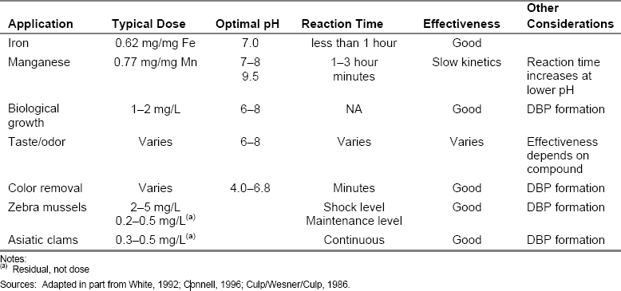
    - **Hình này chứng minh điều gì**
      - Cung cấp liều clo và pH tối ưu kiểm soát sắt, mangan, vi sinh, và DBP.
    - **Từ đâu mà thấy được**
      - Dòng sắt $0.62\text{ mg/mg}$, mangan $0.77\text{ mg/mg}$, vi sinh $1\text{--}2\text{ mg/L}$, ghi chú nguy cơ tạo DBP.
  * Quá trình clo hóa nước chứa amoniac hình thành các dạng chloramine và chuyển sang clo tự do sau điểm đột biến:
  - **Hình 9.** Đường cong clo hóa tới điểm đột biến cho dòng châm
    - 
    - **Hình này chứng minh điều gì**
      - Thể hiện 4 vùng phản ứng clo hóa và tỷ lệ $\text{Cl}_2:\text{NH}_3\text{-N} = 10:1$ đạt clo tự do dư.
    - **Từ đâu mà thấy được**
      - Đồ thị chia 4 pha: khử tạp chất $\rightarrow$ monochloramine ($5:1$) $\rightarrow$ phá hủy chloramine $\rightarrow$ breakpoint ($10:1$).
  * Tỷ lệ $\text{Cl}_2:\text{N}$ và pH điều khiển sự phân bố các dạng chloramine tồn dư trong buồng phản ứng:
* Tiêu chí lựa chọn công nghệ khử trùng và đánh giá vận hành công trình:
  * Việc lựa chọn tác nhân khử trùng cho bể tiếp xúc dựa trên độ tin cậy thiết bị, mức độ kiểm soát quá trình và yêu cầu bảo dưỡng O&M:
  - **Hình 17.** Ma trận đánh giá độ tin cậy và vận hành thiết bị
    - 
    - **Hình này chứng minh điều gì**
      - So sánh độ tin cậy thiết bị, kiểm soát quá trình và yêu cầu O&M giữa 6 hóa chất khử trùng.
    - **Từ đâu mà thấy được**
      - Bảng tiêu chí: $\text{NaOCl}$ có độ tin cậy rất tốt; $\text{O}_3$ và $\text{ClO}_2$ có chi phí O&M cao; $\text{Cl}_2$ kiểm soát hoàn thiện.
  * Phân tích tương quan giữa rủi ro an toàn và chi phí O&M của từng giải pháp khử trùng:
  - **Hình 18.** So sánh tiêu chuẩn lựa chọn công nghệ khử trùng thực tế
    - 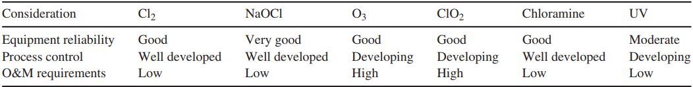
    - **Hình này chứng minh điều gì**
      - Xác định yêu cầu vận hành và bảo trì (O&M) cùng mức độ kiểm soát quá trình cho từng công nghệ.
    - **Từ đâu mà thấy được**
      - Bảng hàng ngang: Thiết bị $\text{Cl}_2$ và chloramine có O&M thấp; $\text{O}_3$ và $\text{ClO}_2$ có O&M cao.
* Động học bất hoạt mầm bệnh và giá trị $C \cdot t_{10}$ quy chuẩn:
  * Buồng tiếp xúc phải bảo đảm tích số $C \cdot t_{10}$ đạt mức độ bất hoạt virus đường ruột theo quy định:
  - **Hình 19.** Bảng giá trị CT bất hoạt virus đường ruột ở các mức log
    - 
    - **Hình này chứng minh điều gì**
      - Cung cấp tích số $C \cdot t$ quy chuẩn để thiết kế thời gian lưu $t_{10}$ diệt virus từ 0.5-log đến 3-log.
    - **Từ đâu mà thấy được**
      - Bảng số liệu: Tại 2-log virus, clo cần $69\text{ mg}\cdot\text{min/L}$, chloramine cần $1\,230$, ozone chỉ cần $0.95$.
  * Tích số $C \cdot t_{10}$ đối với virus phụ thuộc vào loại chất oxy hóa và nhiệt độ nguồn nước:
  - **Hình 20.** Bảng quy chuẩn tích số CT khử trùng virus theo USEPA
    - 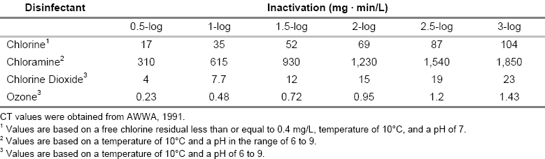
    - **Hình này chứng minh điều gì**
      - So sánh hiệu quả diệt virus giữa các chất khử trùng ở $10^\circ\text{C}$ và pH $7$.
    - **Từ đâu mà thấy được**
      - Cột 3-log virus: Ozone ($1.43$) nhanh hơn clo ($104$) và chloramine ($1\,850\text{ mg}\cdot\text{min/L}$).
  * Bể tiếp xúc phải được định cỡ đủ thời gian $t_{10}$ để bất hoạt u nang ký sinh trùng *Giardia lamblia*:
  - **Hình 21.** Tích số CT bất hoạt u nang Giardia lamblia trong bể
    - 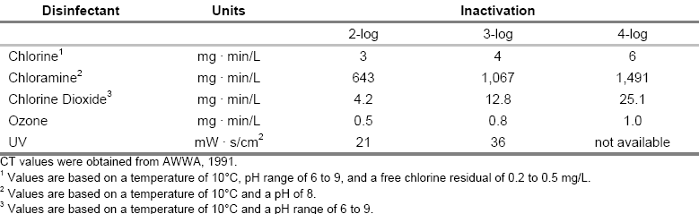
    - **Hình này chứng minh điều gì**
      - Xác định thời gian tiếp xúc $t_{10}$ cần thiết để bảo vệ nguồn nước khỏi ký sinh trùng Giardia.
    - **Từ đâu mà thấy được**
      - Bảng số liệu: Ozone có tích số CT thấp nhất, chứng minh hiệu quả diệt u nang hiệu quả hơn so với clo.
  * Yêu cầu $C \cdot t_{10}$ cho bất hoạt *Giardia* khắt khe hơn đáng kể so với virus đường ruột:
  - **Hình 22.** Bảng so sánh tích số CT bất hoạt u nang Giardia
    - 
    - **Hình này chứng minh điều gì**
      - Thiết lập giá trị thiết kế $C \cdot t_{10}$ cho các cấp độ loại bỏ 0.5-log đến 3-log Giardia.
    - **Từ đâu mà thấy được**
      - Các hàng dữ liệu: Tỷ lệ liều và thời gian tiếp xúc tăng tuyến tính theo cấp độ khử trùng log.
* Kiểm soát sản phẩm phụ khử trùng (DBP) và nguy cơ gây ung thư trong bể tiếp xúc:
  * Thời gian lưu và liều lượng hóa chất trong buồng khử trùng quyết định mức độ hình thành các hợp chất DBP độc hại:
  - **Hình 23.** Danh mục sản phẩm phụ khử trùng và phân loại gây ung thư
    - 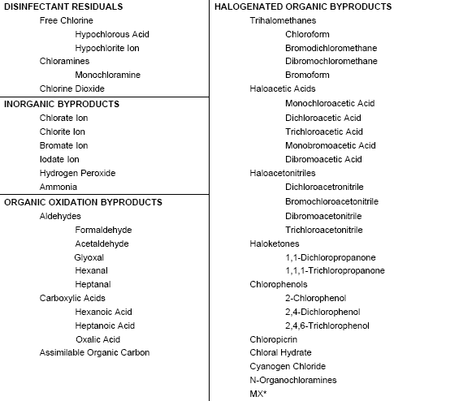
    - **Hình này chứng minh điều gì**
      - Liệt kê các hợp chất DBP phát sinh trong buồng khử trùng cùng mức độ nguy cơ sức khỏe USEPA.
    - **Từ đâu mà thấy được**
      - Cột Cancer Classification: Chloroform (B2), Dichloroacetic acid (B2), Bromate (B2) thuộc nhóm có thể gây ung thư.
  * Phân loại độc tính và khả năng gây ung thư của các hợp chất haloacetic acids, trihalomethanes và bromate:
  - **Hình 24.** Bảng phân loại chất gây ung thư cho các dẫn xuất DBP
    - 
    - **Hình này chứng minh điều gì**
      - Nhận diện các DBP clo hóa, brom hóa và sản phẩm phụ của ozone cần kiểm soát trong nước cấp.
    - **Từ đâu mà thấy được**
      - Bảng chất ô nhiễm: Formaldehyde (B1), Trichloroacetic acid (C), Chlorite (D), Bromate (B2).
  * Đánh giá bằng chứng y tế và dịch tễ học liên quan đến các sản phẩm phụ khử trùng:
  - **Hình 25.** Tình trạng dữ liệu y tế và độc học của chất khử trùng
    - 
    - **Hình này chứng minh điều gì**
      - Đánh giá mức độ bằng chứng dịch tễ học và nghiên cứu động vật đối với các chất khử trùng tồn dư.
    - **Từ đâu mà thấy được**
      - Danh mục đánh giá: Nhóm THMs và HAAs được xếp loại B2 do có đủ bằng chứng trên động vật thí nghiệm.
  * Giám sát và giới hạn nồng độ các hợp chất dẫn xuất clo hữu cơ trong nước sạch:
  - **Hình 26.** Phân loại nguy cơ gây ung thư của các hợp chất khử trùng
    - 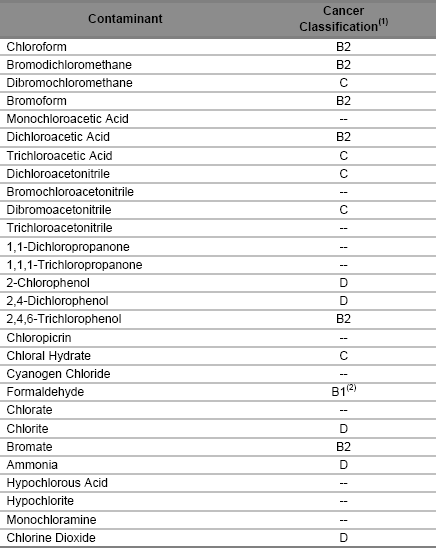
    - **Hình này chứng minh điều gì**
      - Cung cấp cơ sở quản lý liều lượng hóa chất châm nhằm ngăn chặn phát sinh các chất nhóm B1 và B2.
    - **Từ đâu mà thấy được**
      - Phân cấp chất: Bromoform (B2), Dibromochloromethane (C), Chloral hydrate (C).
  * Quy chuẩn phân nhóm chất gây ung thư của cơ quan bảo vệ môi trường Hoa Kỳ (USEPA 1996):
  - **Hình 27.** Sơ đồ phân loại tiềm năng gây ung thư theo USEPA 1996
    - 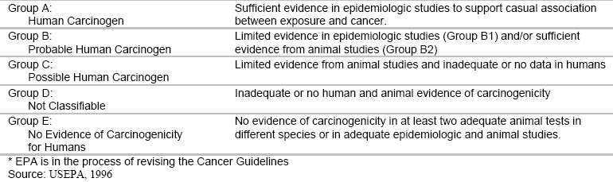
    - **Hình này chứng minh điều gì**
      - Xác định định nghĩa chuẩn 5 nhóm ung thư từ Group A (gây ung thư người) đến Group E (không bằng chứng).
    - **Từ đâu mà thấy được**
      - Khung tiêu chuẩn: Group A (Human Carcinogen), Group B (Probable), Group C (Possible), Group D (Not classifiable), Group E (No evidence).

---

##### 7.3.2 Hydraulic Baffling Classifications and Baffling Factors ($t_{10}/t_0$)

* Khái niệm và ý nghĩa của hệ số vách ngăn ($t_{10}/t_0$):
  * Hệ số vách ngăn (baffling factor) là tỷ số giữa thời gian lưu thực tế của $90\%$ dòng nước ($t_{10}$) và thời gian lưu thủy lực lý thuyết ($t_0 = V/Q$).
  * Hệ số này phản ánh mức độ hoàn thiện thủy lực, mức độ ngắn mạch và thể tích vùng chết trong bể tiếp xúc.
  * Giá trị $t_{10}/t_0$ càng cao thì buồng tiếp xúc càng tiệm cận mô hình dòng chảy piston lý tưởng, giúp giảm dung tích công trình yêu cầu.

###### 7.3.2.1 Poor Baffling ($t_{10}/t_0 = 0.3$)

* Đặc tính thủy lực của cấp độ vách ngăn kém (poor baffling):
  * Tỷ số thời gian lưu hữu hiệu: $t_{10}/t_0 = 0.3$.
  * Cấu trúc công trình: Bể chữ nhật hoặc bể tròn thông thường không có vách ngăn dẫn dòng bên trong.
  * Hiện tượng thủy lực bất lợi:
    * Xuất hiện đoản mạch nghiêm trọng giữa cửa vào và cửa ra.
    * Tạo thành các vùng chết (potential dead zones) rộng lớn tại các góc bể, vùng nước sâu và bề mặt tĩnh.
    * Nước lưu lại không đồng đều, làm giảm hiệu quả khử trùng và tăng nguy cơ vi sinh vật thoát qua bể.
* Minh họa cấu tạo và vùng chết trong bể vách ngăn kém:
  - **Hình 30.** Sơ đồ cấu tạo bể tiếp xúc cấp độ vách ngăn kém
    - 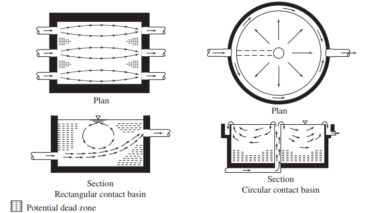
    - **Hình này chứng minh điều gì**
      - Minh họa hiện tượng đoản mạch và các vùng chết lớn trong bể chữ nhật và bể tròn không vách ngăn ($t_{10}/t_0 = 0.3$).
    - **Từ đâu mà thấy được**
      - Mặt bằng (Plan) và mặt cắt (Section): Các ký hiệu Potential dead zone chiếm tỷ lệ lớn ở góc và đáy bể.

###### 7.3.2.2 Average Baffling ($t_{10}/t_0 = 0.5$)

* Đặc tính thủy lực của cấp độ vách ngăn trung bình (average baffling):
  * Tỷ số thời gian lưu hữu hiệu: $t_{10}/t_0 = 0.5$.
  * Cấu trúc công trình:
    * Bể chữ nhật được trang bị tường đục lỗ phân phối dòng chảy tại đầu vào (inlet perforated baffle wall).
    * Bố trí vách ngăn đơn tràn-chui (over-under baffle wall) chia bể thành các ngăn nối tiếp.
    * Bể tròn được trang bị giếng tiêu năng khuếch tán trung tâm (center well baffle diffuser).
  * Cải thiện thủy lực:
    * Giảm thiểu đáng kể hiện tượng đoản mạch trực tiếp.
    * Phân bố vận tốc qua mặt cắt ướt đồng đều hơn.
    * Thể tích vùng chết giảm rõ rệt so với bể không vách ngăn.
* Minh họa cấu tạo bể tiếp xúc cấp độ vách ngăn trung bình:
  - **Hình 31.** Sơ đồ cấu tạo bể tiếp xúc cấp độ vách ngăn trung bình
    - 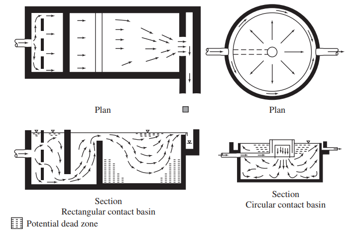
    - **Hình này chứng minh điều gì**
      - Cho thấy vách ngăn đục lỗ đầu vào và vách tràn-chui giúp giảm vùng chết, nâng tỷ số $t_{10}/t_0$ lên $0.5$.
      - **Từ đâu mà thấy được**
        - Mặt cắt bể chữ nhật: Vách đục lỗ phân phối đều dòng chảy và vách chìm hướng dòng; bể tròn có giếng tiêu năng trung tâm.

###### 7.3.2.3 Superior Baffling ($t_{10}/t_0 = 0.7$)

* Đặc tính thủy lực của cấp độ vách ngăn hiệu quả hơn (superior baffling):
  * Tỷ số thời gian lưu hữu hiệu: $t_{10}/t_0 = 0.7$.
  * Cấu trúc công trình:
    * Bể chữ nhật có hệ vách ngăn uốn lượn liên hoàn (serpentine baffle walls) tạo hành lang dòng chảy ziczac kéo dài.
    * Bố trí tường đục lỗ tiêu năng và điều hướng dòng chảy tại các góc quay uốn lượn.
    * Đạt tỷ số chiều dài trên chiều rộng dòng chảy vượt mức $L:W \ge 40:1$.
    * Bể tròn có vách ngăn hình vành khuyên đồng tâm kết hợp tường đục lỗ phân phối xuyên tâm.
  * Ưu điểm vận hành:
    * Triệt tiêu hầu như hoàn toàn các vùng chết trong công trình.
    * Dòng chảy đạt độ ổn định thủy lực cao nhất, tiệm cận hoàn hảo dòng chảy piston lý tưởng.
    * Tối ưu hóa dung tích xây dựng và bảo đảm tuyệt đối giá trị tích số $C \cdot t_{10}$ khử trùng.
* Minh họa cấu tạo bể tiếp xúc cấp độ vách ngăn hiệu quả hơn:
  - **Hình 34.** Sơ đồ cấu tạo bể tiếp xúc cấp độ vách ngăn hiệu quả hơn
    - 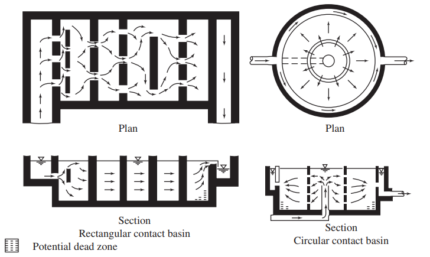
    - **Hình này chứng minh điều gì**
      - Hệ vách ngăn uốn lượn liên hoàn triệt tiêu vùng chết, đạt hiệu quả thủy lực tối ưu ($t_{10}/t_0 = 0.7$).
    - **Từ đâu mà thấy được**
      - Mặt bằng và mặt cắt: Nhiều vách ngăn dẫn dòng liên tục, vùng chết thu hẹp tối thiểu chỉ còn một góc nhỏ trước ngưỡng tràn.

---

##### 7.3.3 Ozone Contactor and Over-Under Contact Basin Systems

###### 7.3.3.1 Ozone Bubble Contactor (Bể sục bọt khí Ozone)

* Nguyên lý cấu tạo và hoạt động của bể sục bọt khí ozone:
  * Bể sục bọt khí ozone là buồng tiếp xúc kín nhiều ngăn sâu ($5\text{--}6\text{ m}$) sử dụng đĩa phân phối bọt khí mịn (fine bubble diffusers) bằng gốm xốp đặt dưới đáy.
  * Khí ozone tạo ra từ hệ thống cấp khí khô và máy ozone được nén qua đĩa sục khí tạo bọt mịn hòa tan vào nước.
  * Dòng nước chuyển động ziczac qua các ngăn tiếp xúc nối tiếp theo chế độ ngược chiều (counter-current) và cùng chiều (co-current) với bọt khí nổi lên.
  * Đỉnh bể được làm kín tuyệt đối để gom khí ozone dư (off-gas) dẫn về tháp phân hủy nhiệt-xúc tác (ozone destruction unit) trước khi xả ra khí quyển.
  * Tại đầu ra của bể tiếp xúc có thể bố trí buồng khử ozone dư (ozone quench) sử dụng hóa chất (calcium thiosulfate hoặc $\text{H}_2\text{O}_2$) khi cần kiểm soát nồng độ dư triệt để.
* Minh họa sơ đồ công nghệ bể sục bọt khí ozone:
  - **Hình 35.** Sơ đồ nguyên lý hệ thống bể sục bọt khí ozone
    - 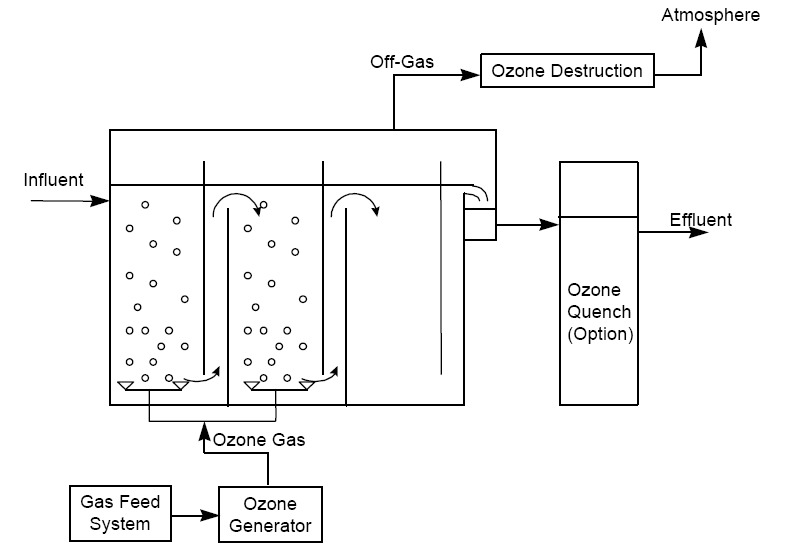
    - **Hình này chứng minh điều gì**
      - Trình bày chu trình dòng nước ngược/xuôi chiều tiếp xúc bọt khí ozone và cụm phân hủy khí dư off-gas.
    - **Từ đâu mà thấy được**
      - Sơ đồ công nghệ: Khí ozone sục từ đáy ngăn 1 và 2; khí thoát off-gas đi qua bộ Ozone Destruction ra khí quyển; nước qua Ozone Quench.
* Chuẩn bị nguồn khí cấp và cơ chế tạo khí ozone cho buồng sục bọt:
  * Khí cấp cho máy tạo ozone bắt buộc phải sấy khô sâu để ngăn chặn phản ứng tạo axit nitric gây ăn mòn điện cực phóng điện:
  - **Hình 11.** Yêu cầu sấy khô khí cấp cho máy tạo ozone
    - 
    - **Hình này chứng minh điều gì**
      - Chứng minh độ ẩm không khí phản ứng tạo axit nitric gây ăn mòn điện cực phóng điện hào quang.
    - **Từ đâu mà thấy được**
      - Thuyết minh kỹ thuật: Không khí cấp phải qua sấy khô đạt điểm sương cực thấp để bảo vệ buồng phóng điện.
  * Các cụm công nghệ hoàn chỉnh của hệ thống khử trùng ozone từ chuẩn bị khí đến buồng tiếp xúc:
###### 7.3.3.2 Ozone Injection Systems (Hệ thống châm Ozone kiểu Injector)

* Phân loại hai phương án châm khí ozone kiểu injector venturi:
  * Phương án A - Châm trực tiếp trên đường ống chính (In-line Injector System):
    * Toàn bộ lưu lượng nước đầu vào (influent) đi qua họng thu hẹp venturi injector lắp thẳng trên đường ống chính.
    * Độ chân không tạo ra tại cổ họng hút khí ozone hòa trộn trực tiếp vào toàn bộ dòng nước trước khi vào buồng tiếp xúc.
  * Phương án B - Châm qua dòng nhánh tăng áp (Sidestream Injector System):
    * Trích một phần lưu lượng nước ($10\text{--}15\%$) từ ống chính qua bơm tăng áp dòng nhánh (sidestream pump).
    * Nước tăng áp đi qua venturi injector với vận tốc lớn, hút khí ozone và hòa tan ở nồng độ bão hòa cao.
    * Dòng nhánh giàu ozone được phun ngược trở lại đường ống chính, đi qua bộ trộn tĩnh (static mixer) phân tán đều vào dòng nước rồi vào contactor.
* Minh họa sơ đồ hai phương án châm khí ozone:
  - **Hình 38.** Sơ đồ hai phương án châm khí ozone kiểu injector
    - 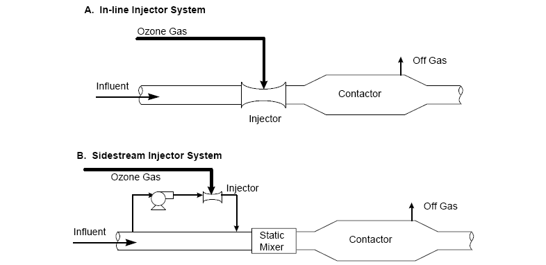
    - **Hình này chứng minh điều gì**
      - Phân biệt cấu hình châm trực tiếp trên đường ống chính (A) và châm qua dòng nhánh tăng áp kết hợp bộ trộn tĩnh (B).
    - **Từ đâu mà thấy được**
      - Phương án A: Injector lắp thẳng trên ống chính; Phương án B: Bơm tăng áp dòng nhánh dẫn qua injector rồi vào Static Mixer.

###### 7.3.3.3 Eight-Chamber Over-Under Contact Basin (Bể tiếp xúc 8 ngăn uốn lượn đứng)

* Cấu tạo hình học và nguyên lý dòng chảy bể tiếp xúc 8 ngăn kiểu tràn-chui:
  * Bể tiếp xúc được chia thành 8 buồng nối tiếp bằng các vách ngăn thẳng đứng bố trí xen kẽ.
  * Các thông số kích thước hình học định nghĩa:
    * Chiều sâu cột nước trong bể: $H$ ($\text{m}$).
    * Chiều dài mỗi buồng tiếp xúc: $L$ ($\text{m}$).
    * Khe hở đáy hoặc khoảng hở tràn qua vách ngăn: $h$ ($\text{m}$).
  * Cơ chế dòng chảy uốn lượn theo phương đứng:
    * Dòng nước chuyển động luân phiên: tràn qua đỉnh vách ngăn thứ nhất, chui qua đáy vách ngăn thứ hai, lặp lại qua 8 ngăn.
    * Bố cục tràn-chui triệt tiêu hiện tượng đoản mạch phân tầng nhiệt độ và dòng chảy tầng.
    * Khí thoát tự do (off-gas) tích tụ ở khoảng không đỉnh bể được gom về ống thoát dẫn sang cụm phá hủy ozone (ozone destruct units).
* Minh họa mặt cắt và thông số hình học bể 8 ngăn tràn-chui:
  - **Hình 39.** Mặt cắt cấu tạo bể tiếp xúc 8 ngăn kiểu tràn-chui
    - 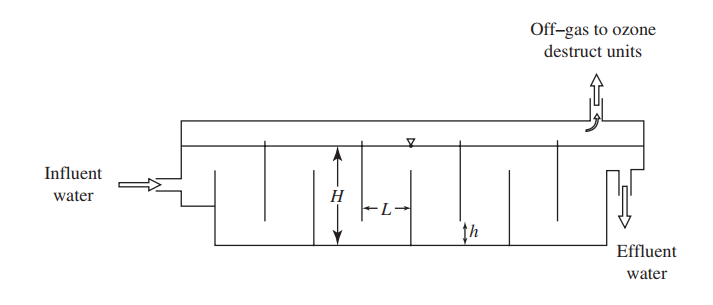
    - **Hình này chứng minh điều gì**
      - Thể hiện định nghĩa kích thước hình học $H$, $L$, $h$ và đường dòng uốn lượn đứng qua 8 buồng nối tiếp.
    - **Từ đâu mà thấy được**
      - Mặt cắt bể: Dòng Influent đi ziczac lên xuống qua các vách ngăn cao thấp xen kẽ đến Effluent; đỉnh bể có ống thu Off-gas.

---

##### 7.3.4 Disinfection Chemical Generation and Dosing Systems

###### 7.3.4.1 Chlorinator Gas Feed System (Thiết bị châm Clo khí định lượng chân không)

* Nguyên lý an toàn chân không của thiết bị châm clo khí (vacuum chlorinator):
  * Thiết bị châm clo khí hiện đại vận hành theo nguyên lý hút chân không gắn trực tiếp trên đầu van bình clo (direct cylinder mounting).
  * Cấu tạo cụm thiết bị châm clo:
    * Khung kẹp bình clo (yoke clamp) và van đầu bình (cylinder valve) với đệm chì làm kín (lead gasket).
    * Van an toàn đầu vào (inlet safety valve) được giữ đóng kín bằng lò xo, chỉ mở ra khi có áp suất chân không phía sau.
    * Cụm màng điều áp chân không (regulating diaphragm assembly) duy trì áp suất chân không ổn định.
    * Lưu lượng kế diện tích biến đổi (rate indicator / rotameter) và van tinh chỉnh lưu lượng (rate valve).
    * Đường ống chân không (vacuum line) bằng vật liệu chịu clo dẫn tới bộ injector.
    * Bộ injector và van một chiều (ejector and check valve assembly): Dòng nước cấp áp lực cao đi qua họng venturi tạo áp suất âm hút khí clo hòa tan tạo dung dịch clo nước.
  * Đặc tính an toàn tuyệt đối: Nếu đường ống chân không bị rò rỉ hoặc đứt gãy, không khí sẽ tràn vào làm mất chân không, van an toàn đầu vào tự động đóng chặt ngay lập tức, ngăn ngừa hoàn toàn rò rỉ khí clo độc hại ra môi trường.
* Minh họa sơ đồ thiết bị châm clo khí chân không:
  - **Hình 42.** Sơ đồ nguyên lý thiết bị châm clo khí chân không
    - 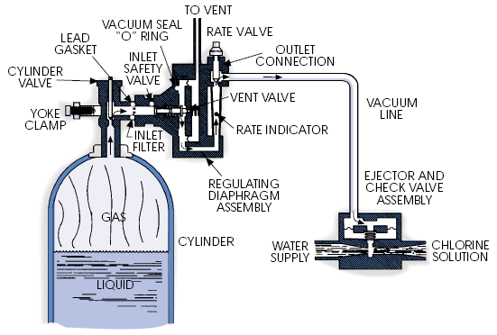
    - **Hình này chứng minh điều gì**
      - Mô tả cơ cấu an toàn chân không từ bình clo qua van điều áp màng đến injector tạo dung dịch clo.
    - **Từ đâu mà thấy được**
      - Đường dẫn khí: Bình cylinder $\rightarrow$ Yoke clamp $\rightarrow$ Regulating diaphragm assembly $\rightarrow$ Vacuum line $\rightarrow$ Ejector tạo Chlorine solution.

###### 7.3.4.2 On-Site Sodium Hypochlorite Generator (Hệ thống điều chế NaOCl tại chỗ bằng điện phân)

* Nguyên lý và phản ứng hóa học điều chế natri hypoclorit tại chỗ:
  * Phương pháp điện phân muối ăn ($\text{NaCl}$) tại chỗ sản xuất dung dịch $\text{NaOCl}$ nồng độ thấp ($0.8\%$), loại trừ nguy cơ vận chuyển và lưu trữ khí clo độc hại.
  * Phương trình phản ứng điện phân tổng quát:
    $$\text{NaCl} + \text{H}_2\text{O} + 2e^- \rightarrow \text{NaOCl} + \text{H}_2\uparrow$$
  * Dung dịch $\text{NaOCl}$ $0.8\%$ nằm dưới ngưỡng quy chuẩn hóa chất nguy hiểm ($< 1\%$), an toàn cho công nhân vận hành.
* Các cụm thiết bị chính của dây chuyền sản xuất $\text{NaOCl}$:
  * Bồn hòa tan muối (salt saturator) tạo dung dịch nước muối bão hòa.
  * Thiết bị làm mềm nước (water softener) loại bỏ ion $\text{Ca}^{2+}$ và $\text{Mg}^{2+}$ để bảo vệ điện cực không bị bám cặn vôi.
  * Bơm định lượng nước muối (brine metering pump) và lưu lượng kế nước pha loãng (dilution water flowmeter).
  * Ống điện phân (electrolyzer cells) dạng module hình trụ bằng titan phủ oxit kim loại quý.
  * Tủ nguồn chỉnh lưu DC (power supply / rectifier) cung cấp dòng điện một chiều công suất lớn.
  * Bồn chứa dung dịch $\text{NaOCl}$ có hệ thống quạt thổi khí pha loãng và thoát khí hydro ($\text{H}_2$ discharge vent) nhằm ngăn chặn nguy cơ cháy nổ hydro.
  * Bơm định lượng $\text{NaOCl}$ châm dung dịch vào tuyến ống cấp nước chính (water main).
* Minh họa hệ thống điều chế natri hypoclorit tại chỗ:
  - **Hình 43.** Sơ đồ cụm thiết bị sản xuất NaOCl bằng phương pháp điện phân
    - 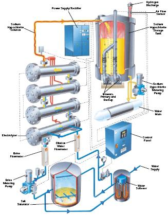
    - **Hình này chứng minh điều gì**
      - Thể hiện dây chuyền đồng bộ từ hòa tan muối, làm mềm nước, điện phân, thông gió hydro đến châm vào ống chính.
    - **Từ đâu mà thấy được**
      - Thiết bị: Salt Saturator $\rightarrow$ Water Softener $\rightarrow$ Electrolyzer $\rightarrow$ Bồn chứa có quạt thổi Hydrogen Discharge $\rightarrow$ Bơm định lượng vào Water Main.

###### 7.3.4.3 Chlorine Dioxide Generator (Thiết bị điều chế Clo dioxit ClO2 tại chỗ)

* Cơ chế hóa học và tính chất nguy hiểm của clo dioxit ($\text{ClO}_2$):
  * Clo dioxit là chất oxy hóa mạnh và là một gốc tự do bền vững (stable free radical).
  * Ở nồng độ cao trong pha khí, $\text{ClO}_2$ có nguy cơ phát nổ với giới hạn nổ dưới (LEL) từ $10\%$ đến $39\%$.
  * Vì tính chất kém bền và nguy cơ nổ, $\text{ClO}_2$ không thể nén lỏng hoặc lưu trữ trong bình áp lực, bắt buộc phải điều chế tại chỗ (on-site synthesis).
* Phương trình phản ứng điều chế $\text{ClO}_2$ trong thực tế:
  * Phản ứng giữa natri clorit và axit clohydric:
    $$4\text{ HCl} + 5\text{ NaClO}_2 \rightarrow 4\text{ ClO}_2\uparrow + 5\text{ NaCl} + 2\text{ H}_2\text{O}$$
  * Khí $\text{ClO}_2$ sinh ra được hòa tan ngay lập tức vào dòng nước tạo dung dịch khử trùng có nồng độ an toàn dưới ngưỡng phân hủy.
* Cấu tạo cụm thiết bị skid điều chế $\text{ClO}_2$:
  * Hai bồn chứa tiền chất hóa chất riêng biệt: dung dịch axit $\text{HCl}$ và dung dịch muối $\text{NaClO}_2$.
  * Bơm định lượng hóa chất có độ chính xác cao điều khiển tỷ lệ mol phản ứng.
  * Cột phản ứng chân không (vacuum reaction column) tích hợp buồng hòa tan eductor.
  * Tủ điều khiển điện tử tự động (control cabinet) giám sát lưu lượng và cảnh báo áp suất.
* Minh họa skid điều chế $\text{ClO}_2$ tại chỗ:
  - **Hình 46.** Cụm thiết bị skid điều chế hóa chất clo dioxit tại chỗ
    - 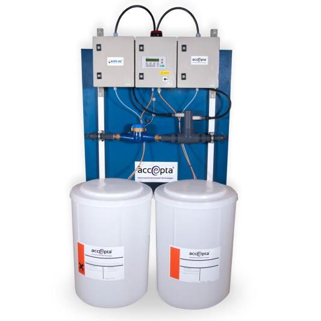
    - **Hình này chứng minh điều gì**
      - Mô tả kết cấu module tích hợp gồm 2 thùng chứa tiền chất hóa chất, bơm định lượng và tủ điều khiển tự động.
    - **Từ đâu mà thấy được**
      - Cụm skid Accepta: Hai bồn hóa chất phía dưới kết nối các đường ống châm vào cụm phản ứng gắn trên bảng điều khiển điện tử.

###### 7.3.4.4 Ozonator Generation and Package Skid Unit (Hệ thống máy tạo Ozone phóng điện hào quang)

* Nguyên lý phóng điện hào quang (corona discharge) tạo ozone:
  * Ozone ($\text{O}_3$) là chất khí không bền, được điều chế tại chỗ bằng cách phóng điện cao áp qua dòng khí oxy khô hoặc không khí khô.
  * Dòng electron năng lượng cao phá vỡ liên kết phân tử oxy thành oxy nguyên tử ($\text{O} + \text{O}_2 \rightarrow \text{O}_3$).
  * Khe hở phóng điện giữa điện cực cao thế và lớp điện môi (dielectric) thường có kích thước rất hẹp ($1\text{--}3\text{ mm}$).
* Cấu tạo module trọn gói của hệ thống ozonator:
  * Máy tạo ozone module hóa gắn trên khung rack có quạt làm mát cưỡng bức.
  * Bồn tiếp xúc ozone chế tạo bằng thép không gỉ 316 (316 SS Contact Tank) chống ăn mòn hóa học cao.
  * Bên trong bồn bố trí các vách ngăn (inner baffles) kéo dài thời gian tiếp xúc giữa khí ozone và nước.
  * Van xả khí tự động trên đỉnh bồn (air vent) thu gom khí ozone và không khí không hòa tan.
  * Đồng hồ đo áp lực (informative pressure gauges) kiểm soát chính xác chế độ thủy lực.
  * Toàn bộ cụm thiết bị đặt trên khung đế skid bằng thép không gỉ 304 (304 SS Skid).
* Minh họa máy tạo ozone công nghiệp và skid buồng tiếp xúc inox:
  - **Hình 47.** Thiết bị máy tạo ozone công nghiệp kèm bồn tiếp xúc
    - 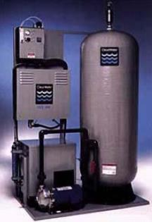
    - **Hình này chứng minh điều gì**
      - Giới thiệu tổ hợp trọn gói gồm tủ nguồn phóng điện, bồn phản ứng áp lực và bơm tuần hoàn.
    - **Từ đâu mà thấy được**
      - Khối thiết bị ClearWater: Bồn phản ứng trụ đứng đặt cạnh khung tủ phát ozone và cụm bơm áp lực phía chân đế.
  - **Hình 48.** Cụm skid buồng tiếp xúc ozone bằng thép không gỉ 316
    - 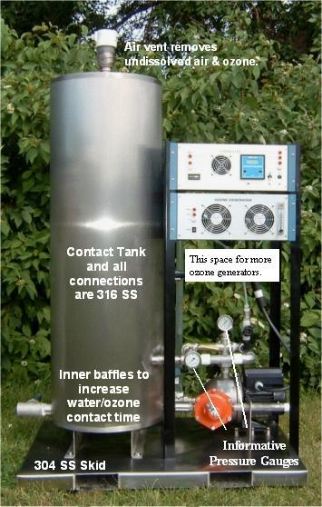
    - **Hình này chứng minh điều gì**
      - Chi tiết cấu tạo bồn tiếp xúc inox 316 có vách ngăn trong, van xả khí đỉnh và đồng hồ đo áp lực.
    - **Từ đâu mà thấy được**
      - Nhãn ghi trên bồn: "Contact Tank 316 SS", "Inner baffles", "Air vent removes undissolved air & ozone", "304 SS Skid", "Pressure Gauges".

###### 7.3.4.5 Ultraviolet (UV) Lamp Disinfection Reactor (Hệ thống thiết bị khử trùng bằng đèn cực tím)

* Cơ chế diệt khuẩn vật lý của bức xạ cực tím (UV radiation):
  * Khử trùng bằng tia UV là phương pháp vật lý, không sử dụng hóa chất và không tạo sản phẩm phụ halogen hóa.
  * Tia cực tím dải UVC tác động xuyên qua màng tế bào, bị hấp thụ mạnh bởi phân tử DNA/RNA của vi sinh vật.
  * Năng lượng photon cực tím làm biến dạng cấu trúc xoắn kép, dimer hóa các gốc thymine, ngăn chặn vi sinh vật nhân đôi và gây bất hoạt hoàn toàn.
* Đặc tính quang phổ điện từ và dải bước sóng diệt khuẩn tối ưu:
  * Phổ UV nằm giữa vùng tia X và ánh sáng khả kiến ($100\text{--}400\text{ nm}$), trong đó UVC ($200\text{--}280\text{ nm}$) có hiệu lực diệt khuẩn cao nhất với đỉnh hấp thụ ở xấp xỉ $254\text{ nm}$:
  - **Hình 13.** Phổ bức xạ điện từ và các dải sóng cực tím
    - 
    - **Hình này chứng minh điều gì**
      - Xác định vị trí dải sóng diệt khuẩn UV-C ($200\text{--}280\text{ nm}$) với đỉnh hấp thụ DNA tại $254\text{ nm}$.
    - **Từ đâu mà thấy được**
      - Sơ đồ phổ điện từ: Phân chia 4 vùng Vacuum UV ($100\text{--}200$), Shortwave UV-C ($200\text{--}280$), UV-B ($280\text{--}315$), UV-A ($315\text{--}400\text{ nm}$).
  * Bước sóng $254\text{ nm}$ tương ứng với vạch phát xạ cộng hưởng đặc trưng của hơi thủy ngân trong bóng đèn cực tím:
* Phân loại và thông số kỹ thuật của ba loại đèn UV công nghiệp:
  * Ba loại đèn UV chính trong kỹ thuật xử lý nước gồm đèn áp suất thấp cường độ thấp (LPLI), đèn áp suất thấp cường độ cao (LPHI), và đèn trung áp (MP):
* Cấu tạo buồng chiếu xạ kín và cơ cấu gạt rửa tự động (wiper mechanism):
  * Thiết bị UV dạng buồng kín (closed-vessel UV reactor) gồm vỏ thân bằng thép không gỉ chịu áp lực cao.
  * Đèn cực tím (germicidal lamp) được lồng bên trong ống thạch anh (quartz sleeve) bảo vệ để duy trì nhiệt độ tối ưu và cách điện với dòng nước.
  * Cơ cấu gạt rửa (wiper mechanism) tự động hoặc điều khiển tay di chuyển dọc ống thạch anh để lau sạch cặn bám vô cơ và màng sinh học, duy trì độ truyền quang UVT.
  * Cổng quan sát (sight port) và cảm biến đo cường độ UV (UV intensity sensor) liên tục giám sát liều bức xạ thực tế.
  * Hộp điều khiển điện tử (electrical enclosure / ballast controller) điều chỉnh công suất và hiển thị trạng thái làm việc.
* Minh họa thiết bị UV buồng kín và cơ cấu gạt rửa ống thạch anh:
  - **Hình 53.** Thiết bị khử trùng nước bằng tia cực tím TrojanUVMAX
    - 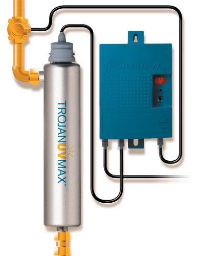
    - **Hình này chứng minh điều gì**
      - Giới thiệu module buồng chiếu xạ tia cực tím bằng inox kết nối khối nguồn điều khiển điện tử kỹ thuật số.
    - **Từ đâu mà thấy được**
      - Ảnh thiết bị: Ống buồng chiếu TrojanUVMAX bằng thép không gỉ gắn trên đường ống nước và hộp điều khiển hiển thị số màu xanh.
  - **Hình 54.** Cấu tạo chi tiết bên trong buồng đèn UV có cơ cấu gạt rửa
    - 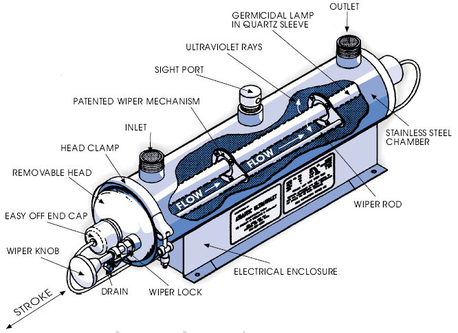
    - **Hình này chứng minh điều gì**
      - Minh họa cấu trúc bóng đèn trong ống thạch anh, chùm tia cực tím, cổng quang học và hệ gạt cơ học chống bám cặn.
    - **Từ đâu mà thấy được**
      - Mặt cắt buồng: Germicidal lamp in quartz sleeve, Patented wiper mechanism, Sight port, Removable head, Wiper knob.

#### 7.4 Calculation and Worked Examples

- Tính toán kỹ thuật khử trùng nước cấp bao gồm ba bài toán thiết kế công nghệ cốt lõi:
  - Cân bằng phân ly axit hypoclorơ ($\text{HOCl}$) và xác định tỷ lệ phần trăm clo hoạt tính không phân ly theo $\text{pH}$ ở $25^\circ\text{C}$ (Example 7-1).
  - Định lượng liều clo châm tại điểm đột biến (breakpoint chlorination) để oxy hóa hoàn toàn amoniac ($\text{NH}_3\text{-N}$) thành khí nitơ ($\text{N}_2$) hoặc ion nitrat ($\text{NO}_3^-$) (Example 7-2).
  - Thiết kế công nghệ và thủy lực bể tiếp xúc clo dạng uốn lượn ziczac (longitudinal-serpentine contact chamber) đạt tích số khử trùng $C \cdot t$, thời gian tiếp xúc $t_{10}$ và hệ số vách ngăn hiệu quả hơn $t_{10}/t_0 = 0.7$ (Example 7-3).

##### Example 7-1: Chlorine dosing and contact chamber sizing

- **Đề bài**: (WaWE, 13-3) If 15 mg/L of HOCl is added to a potable water for disinfection and the final measured pH is 7.0, what percent of the HOCl is not dissociated? Assume the temperature is 25°C. (Nếu châm $15\text{ mg/L}$ axit hypoclorơ $\text{HOCl}$ vào nước cấp sinh hoạt để khử trùng và $\text{pH}$ đo được cuối cùng là $7.0$, tỷ lệ phần trăm $\text{HOCl}$ không phân ly là bao nhiêu? Giả thiết nhiệt độ nước là $25^\circ\text{C}$).
- **Dữ kiện**:
  - Liều lượng axit hypoclorơ châm vào nước: $C_{\text{dose}} = 15.0\text{ mg/L}$ (tính theo $\text{Cl}_2$).
  - Giá trị $\text{pH}$ đo được của nước sau châm clo: $\text{pH} = 7.0$.
  - Nhiệt độ chất lỏng: $T = 25^\circ\text{C}$ ($298.15\text{ K}$).
  - Hằng số điện ly axit của $\text{HOCl}$ ở $25^\circ\text{C}$: $K_a = 2.90 \times 10^{-8}\text{ mol/L}$.
  - Chỉ số logarit axit của $\text{HOCl}$ ở $25^\circ\text{C}$: $pK_a = -\log_{10}(K_a) = -\log_{10}(2.90 \times 10^{-8}) = 7.5376 \approx 7.54$.
- **Quy tắc áp dụng**:
  - Định nghĩa nồng độ ion hydro từ chỉ số $\text{pH}$:
    $$[\text{H}^+] = 10^{-\text{pH}}$$
  - Phương trình cân bằng điện ly axit yếu $\text{HOCl}$ trong pha nước:
    $$\text{HOCl} \rightleftharpoons \text{H}^+ + \text{OCl}^-$$
  - Biểu thức định luật tác dụng khối lượng cho hằng số phân ly axit:
    $$K_a = \frac{[\text{H}^+][\text{OCl}^-]}{[\text{HOCl}]}$$
  - Phương trình tính phân số dạng $\text{HOCl}$ chưa phân ly ($\alpha_0$):
    $$\alpha_0 = \frac{[\text{HOCl}]}{[\text{HOCl}] + [\text{OCl}^-]} = \frac{[\text{H}^+]}{[\text{H}^+] + K_a} = \frac{1}{1 + \frac{K_a}{[\text{H}^+]}} = \frac{1}{1 + 10^{\text{pH} - pK_a}}$$
  - Phương trình tính phân số dạng ion hypoclorit phân ly ($\alpha_1$):
    $$\alpha_1 = \frac{[\text{OCl}^-]}{[\text{HOCl}] + [\text{OCl}^-]} = \frac{K_a}{[\text{H}^+] + K_a} = 1 - \alpha_0$$
  - Phương trình phân bổ nồng độ clo tự do theo phân số khối lượng:
    $$C_{\text{HOCl}} = C_{\text{dose}} \cdot \alpha_0, \quad C_{\text{OCl}^-} = C_{\text{dose}} \cdot \alpha_1$$
- **Lời giải**:
  - **Bước 1**: Tính nồng độ mol ion hydro $[\text{H}^+]$ từ giá trị $\text{pH}$.
    - Căn cứ: Định nghĩa nồng độ ion hydro $[\text{H}^+] = 10^{-\text{pH}}$.
    - Nhìn vào: Giá trị $\text{pH} = 7.0$ được cung cấp trong đề bài Example 7-1 trên Slide 45.
    - Thực hiện:
      $$[\text{H}^+] = 10^{-7.00} = 1.00 \times 10^{-7}\text{ mol/L}$$
  - **Bước 2**: Xác định hằng số phân ly axit $K_a$ và chỉ số $pK_a$ ở nhiệt độ $25^\circ\text{C}$.
    - Căn cứ: Cân bằng phân ly $\text{HOCl} \rightleftharpoons \text{H}^+ + \text{OCl}^-$ và giá trị thực nghiệm của $K_a$ ở $25^\circ\text{C}$ nêu tại Mục 7.2.1.
    - Nhìn vào: Nhiệt độ nước $T = 25^\circ\text{C}$ nêu trong đề bài.
    - Thực hiện:
      $$K_a = 2.90 \times 10^{-8}\text{ mol/L}$$
      $$pK_a = -\log_{10}(2.90 \times 10^{-8}) = 7.5376 \approx 7.54$$
  - **Bước 3**: Tính toán phân số phần trăm $\text{HOCl}$ chưa phân ly ($\alpha_0$).
    - Căn cứ: Phương trình phân số $\text{HOCl}$ chưa phân ly $\alpha_0 = \frac{[\text{H}^+]}{[\text{H}^+] + K_a}$.
    - Nhìn vào: Giá trị $[\text{H}^+] = 1.00 \times 10^{-7}\text{ mol/L}$ và hằng số $K_a = 2.90 \times 10^{-8}\text{ mol/L}$.
    - Thực hiện:
      $$\alpha_0 = \frac{1.00 \times 10^{-7}}{1.00 \times 10^{-7} + 2.90 \times 10^{-8}} = \frac{1.00 \times 10^{-7}}{1.29 \times 10^{-7}} = 0.77519 = 77.52\% \approx 77.5\%$$
      Kiểm tra chéo qua công thức logarit theo $pK_a$:
      $$\alpha_0 = \frac{1}{1 + 10^{\text{pH} - pK_a}} = \frac{1}{1 + 10^{7.00 - 7.5376}} = \frac{1}{1 + 10^{-0.5376}} = \frac{1}{1 + 0.28999} = 0.77520 \approx 77.5\%$$
  - **Bước 4**: Xác định phân số phần trăm ion hypoclorit đã phân ly ($\alpha_1$).
    - Căn cứ: Tổng phân số thành phần bằng đơn vị: $\alpha_0 + \alpha_1 = 1.0$.
    - Nhìn vào: Kết quả $\alpha_0 = 0.77519$ tính được từ Bước 3.
    - Thực hiện:
      $$\alpha_1 = 1.0 - \alpha_0 = 1.0 - 0.77519 = 0.22481 = 22.48\% \approx 22.5\%$$
  - **Bước 5**: Xác định nồng độ phân bố của các dạng clo tự do trong dung dịch nước.
    - Căn cứ: Tổng liều châm clo tự do $C_{\text{dose}} = 15.0\text{ mg/L}$ và phân số $\alpha_0, \alpha_1$.
    - Nhìn vào: Liều châm $15.0\text{ mg/L}$ $\text{HOCl}$ trong đề bài.
    - Thực hiện:
      $$C_{\text{HOCl}} = C_{\text{dose}} \cdot \alpha_0 = 15.0\text{ mg/L} \times 0.77519 = 11.628\text{ mg/L} \approx 11.63\text{ mg/L as }\text{Cl}_2$$
      $$C_{\text{OCl}^-} = C_{\text{dose}} \cdot \alpha_1 = 15.0\text{ mg/L} \times 0.22481 = 3.372\text{ mg/L} \approx 3.37\text{ mg/L as }\text{Cl}_2$$
- **Kết quả**:
  - Tỷ lệ phần trăm $\text{HOCl}$ chưa phân ly: $77.5\%$ ($77.52\%$).
  - Tỷ lệ phần trăm ion $\text{OCl}^-$ phân ly: $22.5\%$ ($22.48\%$).
  - Nồng độ axit hypoclorơ hoạt tính cao $\text{HOCl}$: $11.63\text{ mg/L as }\text{Cl}_2$.
  - Nồng độ ion hypoclorit hoạt tính thấp $\text{OCl}^-$: $3.37\text{ mg/L as }\text{Cl}_2$.
- **Kiểm tra lại**:
  - Kiểm tra tổng phân số: $\alpha_0 + \alpha_1 = 77.519\% + 22.481\% = 100.000\%$.
  - Kiểm tra cân bằng khối lượng: $C_{\text{HOCl}} + C_{\text{OCl}^-} = 11.63\text{ mg/L} + 3.37\text{ mg/L} = 15.00\text{ mg/L} = C_{\text{dose}}$.
  - Kiểm tra điều kiện cân bằng $K_a$:
    $$\frac{[\text{H}^+][\text{OCl}^-]}{[\text{HOCl}]} = \frac{1.00 \times 10^{-7} \times 3.3721}{11.6279} = 2.900 \times 10^{-8}\text{ mol/L} = K_a$$
  - Đánh giá ý nghĩa kỹ thuật: Ở $\text{pH} = 7.0$, dạng $\text{HOCl}$ chiếm tỷ trọng áp đảo ($77.5\%$). Vì $\text{HOCl}$ có khả năng diệt khuẩn mạnh hơn $\text{OCl}^-$ từ $80$ đến $100$ lần, duy trì $\text{pH} \le 7.0 - 7.5$ giúp trạm xử lý tối ưu hóa hiệu quả khử trùng và giảm thiểu liều hóa chất châm vào.

##### Example 7-2: CT calculation for Giardia inactivation

- **Đề bài**: (PoWT, 326) Ammonia is added to pure water in the laboratory to reach a concentration of 1 mg/L as N. Estimate the chlorine dose needed to reach breakpoint for the following conditions: (1) all the ammonia is converted to nitrogen gas and (2) all the ammonia is converted to nitrate ion. Which reaction requires less chlorine? (Amoniac được thêm vào nước tinh khiết trong phòng thí nghiệm để đạt nồng độ $1\text{ mg/L as N}$. Ước tính liều lượng clo cần châm để đạt điểm đột biến cho các điều kiện sau: (1) toàn bộ amoniac được chuyển hóa thành khí nitơ $\text{N}_2$ và (2) toàn bộ amoniac được oxy hóa thành ion nitrat $\text{NO}_3^-$. Phản ứng nào tiêu tốn ít clo hơn nhằm bảo đảm hiệu quả tích số $C \cdot t$ khử trùng vi sinh vật và u nang Giardia?).
- **Dữ kiện**:
  - Nồng độ amoniac trong nước sạch thí nghiệm: $[\text{NH}_3\text{-N}] = 1.0\text{ mg/L as N}$.
  - Khối lượng mol nguyên tử của Nitơ ($\text{N}$): $M_{\text{N}} = 14.007\text{ g/mol}$.
  - Khối lượng mol phân tử của khí Clo ($\text{Cl}_2$): $M_{\text{Cl}_2} = 70.906\text{ g/mol}$ (nguyên tử khối clo $35.453\text{ g/mol}$).
  - Điều kiện phản ứng 1: Chuyển hóa toàn bộ amoniac thành khí nitơ ($\text{N}_2$).
  - Điều kiện phản ứng 2: Oxy hóa toàn bộ amoniac thành ion nitrat ($\text{NO}_3^-$).
- **Quy tắc áp dụng**:
  - Phương trình hóa học và tỷ lượng phản ứng cho Điều kiện 1 (chuyển hóa thành $\text{N}_2$):
    $$2\text{NH}_3 + 3\text{Cl}_2 \rightarrow \text{N}_2 \uparrow + 6\text{HCl}$$
    (hoặc dạng axit hypoclorơ: $2\text{NH}_3 + 3\text{HOCl} \rightarrow \text{N}_2 \uparrow + 3\text{H}_2\text{O} + 3\text{HCl}$).
    Tỷ lệ mol hợp thức: $3\text{ mol Cl}_2$ phản ứng với $2\text{ mol NH}_3\text{-N}$ (tỷ lệ $1.5\text{ mol Cl}_2/\text{mol N}$).
  - Tỷ lệ khối lượng lý thuyết cho Điều kiện 1:
    $$R_{\text{mass},1} = \frac{3 \times M_{\text{Cl}_2}}{2 \times M_{\text{N}}} = \frac{3 \times 70.906\text{ g}}{2 \times 14.007\text{ g}} = \frac{212.718}{28.014} = 7.5933\text{ mg Cl}_2/\text{mg N} \approx 7.60\text{ mg Cl}_2/\text{mg N}$$
  - Phương trình hóa học và tỷ lượng phản ứng cho Điều kiện 2 (chuyển hóa thành $\text{NO}_3^-$):
    $$\text{NH}_3 + 4\text{Cl}_2 + 3\text{H}_2\text{O} \rightarrow \text{HNO}_3 + 8\text{HCl}$$
    (hoặc dạng axit hypoclorơ: $\text{NH}_3 + 4\text{HOCl} \rightarrow \text{HNO}_3 + 4\text{HCl} + \text{H}_2\text{O}$).
    Tỷ lệ mol hợp thức: $4\text{ mol Cl}_2$ phản ứng với $1\text{ mol NH}_3\text{-N}$ (tỷ lệ $4.0\text{ mol Cl}_2/\text{mol N}$).
  - Tỷ lệ khối lượng lý thuyết cho Điều kiện 2:
    $$R_{\text{mass},2} = \frac{4 \times M_{\text{Cl}_2}}{1 \times M_{\text{N}}} = \frac{4 \times 70.906\text{ g}}{14.007\text{ g}} = \frac{283.624}{14.007} = 20.2487\text{ mg Cl}_2/\text{mg N} \approx 20.25\text{ mg Cl}_2/\text{mg N}$$
  - Phương trình tính liều clo cần châm:
    $$\text{Dose}_{\text{Cl}_2} = [\text{NH}_3\text{-N}] \times R_{\text{mass}}$$
  - Phương trình xác định chênh lệch định lượng và tỷ lệ tiết kiệm hóa chất:
    $$\Delta \text{Dose} = \text{Dose}_2 - \text{Dose}_1, \quad \%\text{ Tiết kiệm} = \frac{\text{Dose}_2 - \text{Dose}_1}{\text{Dose}_2} \times 100\%, \quad \text{Hệ số} = \frac{\text{Dose}_2}{\text{Dose}_1}$$
- **Lời giải**:
  - **Bước 1**: Đánh giá tỷ lượng hóa học và tính toán liều clo cho Điều kiện 1 (chuyển hóa thành $\text{N}_2$).
    - Căn cứ: Phương trình phản ứng $2\text{NH}_3 + 3\text{Cl}_2 \rightarrow \text{N}_2 + 6\text{HCl}$ và khối lượng mol các chất.
    - Nhìn vào: Yêu cầu "(1) all the ammonia is converted to nitrogen gas" và nồng độ $[\text{NH}_3\text{-N}] = 1.0\text{ mg/L}$ trong đề bài.
    - Thực hiện:
      - Khối lượng $3\text{ mol Cl}_2$: $3 \times 70.906\text{ g} = 212.718\text{ g}$.
      - Khối lượng $2\text{ mol N}$: $2 \times 14.007\text{ g} = 28.014\text{ g}$.
      - Tỷ số khối lượng tiêu thụ:
        $$R_{\text{mass},1} = \frac{212.718\text{ g Cl}_2}{28.014\text{ g N}} = 7.5933\text{ mg Cl}_2/\text{mg NH}_3\text{-N} \approx 7.60\text{ mg Cl}_2/\text{mg N}$$
      - Liều clo cần châm cho $1.0\text{ mg/L as N}$:
        $$\text{Dose}_{\text{Cl}_2,1} = 1.0\text{ mg N/L} \times 7.5933\text{ mg Cl}_2/\text{mg N} = 7.5933\text{ mg/L} \approx 7.60\text{ mg/L Cl}_2$$
  - **Bước 2**: Đánh giá tỷ lượng hóa học và tính toán liều clo cho Điều kiện 2 (chuyển hóa thành $\text{NO}_3^-$).
    - Căn cứ: Phương trình phản ứng $\text{NH}_3 + 4\text{Cl}_2 + 3\text{H}_2\text{O} \rightarrow \text{HNO}_3 + 8\text{HCl}$ và khối lượng mol các chất.
    - Nhìn vào: Yêu cầu "(2) all the ammonia is converted to nitrate ion" và nồng độ $[\text{NH}_3\text{-N}] = 1.0\text{ mg/L}$ trong đề bài.
    - Thực hiện:
      - Khối lượng $4\text{ mol Cl}_2$: $4 \times 70.906\text{ g} = 283.624\text{ g}$.
      - Khối lượng $1\text{ mol N}$: $1 \times 14.007\text{ g} = 14.007\text{ g}$.
      - Tỷ số khối lượng tiêu thụ:
        $$R_{\text{mass},2} = \frac{283.624\text{ g Cl}_2}{14.007\text{ g N}} = 20.2487\text{ mg Cl}_2/\text{mg NH}_3\text{-N} \approx 20.25\text{ mg Cl}_2/\text{mg N}$$
      - Liều clo cần châm cho $1.0\text{ mg/L as N}$:
        $$\text{Dose}_{\text{Cl}_2,2} = 1.0\text{ mg N/L} \times 20.2487\text{ mg Cl}_2/\text{mg N} = 20.2487\text{ mg/L} \approx 20.25\text{ mg/L Cl}_2$$
  - **Bước 3**: So sánh định lượng và xác định phản ứng tiêu tốn ít clo hơn.
    - Căn cứ: Chênh lệch tuyệt đối $\Delta \text{Dose}$ và tỷ lệ phần trăm tiết kiệm $\% \text{ Tiết kiệm}$.
    - Nhìn vào: Câu hỏi "Which reaction requires less chlorine?" trong đề bài.
    - Thực hiện:
      - Chênh lệch liều clo tiêu thụ giữa hai phản ứng:
        $$\Delta \text{Dose} = 20.2487\text{ mg/L} - 7.5933\text{ mg/L} = 12.6554\text{ mg/L} \approx 12.65\text{ mg/L Cl}_2$$
      - Tỷ lệ giảm tiêu thụ clo khi oxy hóa về $\text{N}_2$:
        $$\%\text{ Tiết kiệm} = \frac{12.6554}{20.2487} \times 100\% = 62.50\%$$
      - Tỷ số nhu cầu clo giữa hai phản ứng:
        $$\text{Hệ số} = \frac{20.2487}{7.5933} = 2.6666 \approx 2.67\text{ lần}$$
      - Đánh giá lựa chọn: Phản ứng (1) oxy hóa amoniac thành khí nitơ ($\text{N}_2$) tiêu tốn ít clo hơn đáng kể ($7.60\text{ mg/L}$ so với $20.25\text{ mg/L}$, tiết kiệm $62.5\%$).
- **Kết quả**:
  - Liều clo cần thiết để chuyển hóa amoniac thành khí nitơ ($\text{N}_2$): $7.60\text{ mg/L Cl}_2$ ($7.5933\text{ mg/L}$).
  - Liều clo cần thiết để chuyển hóa amoniac thành ion nitrat ($\text{NO}_3^-$): $20.25\text{ mg/L Cl}_2$ ($20.2487\text{ mg/L}$).
  - Phản ứng tạo khí nitơ ($\text{N}_2$) tiêu tốn ít clo hơn $12.65\text{ mg/L}$ ($62.5\%$ mức tiết kiệm hóa chất, ít hơn $2.67$ lần).
- **Kiểm tra lại**:
  - Kiểm tra bảo toàn số electron trao đổi:
    - Trạng thái oxy hóa của $\text{N}$ trong $\text{NH}_3$ là $-3$.
    - Trong $\text{N}_2$, trạng thái oxy hóa của $\text{N}$ là $0$ (nhường $3e^-$ trên mỗi nguyên tử $\text{N}$). Mỗi phân tử $\text{Cl}_2$ nhận $2e^-$, do đó cần $\frac{3}{2} = 1.5\text{ mol Cl}_2/\text{mol N}$.
    - Trong $\text{NO}_3^-$, trạng thái oxy hóa của $\text{N}$ là $+5$ (nhường $8e^-$ trên mỗi nguyên tử $\text{N}$). Do đó cần $\frac{8}{2} = 4.0\text{ mol Cl}_2/\text{mol N}$.
    - Tỷ số electron trao đổi: $\frac{8e^-}{3e^-} = 2.667$, trùng khớp hoàn toàn với tỷ số liều lượng clo $\frac{20.2487}{7.5933} = 2.667$.
  - Đánh giá công nghệ: Trong thực tế xử lý nước cấp, quá trình khử trùng điểm đột biến diễn ra chủ yếu theo cơ chế phản ứng 1 giải phóng khí $\text{N}_2$ không độc hại ra khí quyển. Phản ứng 2 tạo ion nitrat chỉ xuất hiện khi clo bị châm quá mức trong điều kiện tiếp xúc kéo dài, gây nguy cơ tăng hàm lượng nitrat độc hại trong nước sạch.

##### Example 7-3: Sodium hypochlorite dosing system

- **Đề bài**: (WaWE, 13-32) Design a longitudinal-serpentine chlorine contact chamber for a design flow of 18,400 m3/d. The required t10 to achieve a C.t of 200 is 100 min. The design must provide superior performance, that is t10/t0 = 0.7. (Thiết kế hệ thống khử trùng bể tiếp xúc clo uốn khúc dọc ziczac cho hệ thống châm natri hypoclorit / clo với lưu lượng thiết kế $18,400\text{ m}^3/\text{ngày}$. Thời gian lưu hiệu dụng $t_{10}$ yêu cầu để đạt tích số khử trùng $C \cdot t = 200\text{ mg}\cdot\text{min/L}$ là $100\text{ phút}$. Thiết kế phải cung cấp hiệu suất thủy lực hiệu quả hơn với tỷ số vách ngăn $t_{10}/t_0 = 0.7$).
- **Dữ kiện**:
  - Lưu lượng thiết kế ngày đêm của nhà máy: $Q = 18,400\text{ m}^3/\text{ngày}$.
  - Thời gian tiếp xúc hiệu dụng 90% lượng nước yêu cầu: $t_{10} = 100.0\text{ phút}$.
  - Chỉ số tích số khử trùng $C \cdot t$ yêu cầu: $CT = 200.0\text{ mg}\cdot\text{min/L}$.
  - Nồng độ clo dư tự do mục tiêu tại đầu ra: $C = \frac{CT}{t_{10}} = \frac{200.0}{100.0} = 2.0\text{ mg/L}$.
  - Cấp vách ngăn xuất sắc (Superior Baffling): $\text{BF} = t_{10}/t_0 = 0.70$.
  - Tiêu chuẩn tỷ số hình học hành trình dòng chảy trên bề rộng kênh: $L_{\text{path}} / W_c \ge 40:1$ (ngăn ngừa đoản mạch).
  - Chiều sâu cột nước công tác lựa chọn: $H = 3.00\text{ m}$ (dải tiêu chuẩn $2.5 - 4.0\text{ m}$).
  - Chiều cao an toàn thành bể (freeboard): $h_{\text{fb}} = 0.50\text{ m}$.
  - Chiều rộng mỗi nhánh kênh lựa chọn: $W_c = 2.50\text{ m}$.
  - Số lượng nhánh kênh ziczac song song lựa chọn: $N_c = 6\text{ kênh}$.
  - Số lượng vách ngăn uốn dòng: $N_{\text{baffles}} = N_c - 1 = 5\text{ vách}$.
  - Chiều dày mỗi vách ngăn bê tông cốt thép: $t_{\text{wall}} = 0.20\text{ m}$.
  - Hệ số nhám thành bê tông Manning: $n = 0.013$.
  - Hệ số tổn thất cục bộ tại mỗi góc uốn 180°: $K_b = 2.5$.
  - Độ nhớt động học của nước ở $20^\circ\text{C}$: $\nu = 1.004 \times 10^{-6}\text{ m}^2/\text{s}$.
  - Gia tốc trọng trường: $g = 9.81\text{ m/s}^2$.
- **Quy tắc áp dụng**:
  - Mối liên hệ tích số khử trùng USEPA:
    $$CT = C \cdot t_{10}$$
  - Công thức hệ số vách ngăn xác định thời gian lưu lý thuyết:
    $$t_0 = \frac{t_{10}}{\text{BF}} = \frac{t_{10}}{t_{10}/t_0}$$
  - Phương trình tính thể tích nước hữu ích công tác của bể:
    $$V = Q \cdot t_0$$
  - Diện tích mặt bằng lắng và tổng chiều sâu thành bể:
    $$A_s = \frac{V}{H}, \quad H_{\text{total}} = H + h_{\text{fb}}$$
  - Chiều dài tổng hành trình dòng chảy và kiểm tra tiêu chuẩn tỷ số hình học aspect ratio:
    $$L_{\text{path}} = \frac{A_s}{W_c}, \quad \text{Aspect Ratio} = \frac{L_{\text{path}}}{W_c} \ge 40:1$$
  - Kích thước hình học các kênh và mặt bằng bể:
    $$L_c = \frac{L_{\text{path}}}{N_c}, \quad W_{\text{basin}} = N_c \cdot W_c + (N_c - 1) \cdot t_{\text{wall}}$$
  - Các thông số thủy lực dòng chảy trong kênh:
    $$A_x = W_c \cdot H, \quad v_h = \frac{Q}{A_x}$$
    $$P = W_c + 2H, \quad R_h = \frac{A_x}{P}, \quad D_h = 4R_h$$
    $$Re = \frac{v_h \cdot 4 R_h}{\nu}, \quad Fr = \frac{v_h^2}{g \cdot R_h}$$
  - Phương trình tổn thất ma sát Manning và tổn thất cục bộ tại các góc quay 180°:
    $$h_f = L_{\text{path}} \left[ \frac{n \cdot v_h}{R_h^{2/3}} \right]^2$$
    $$h_m = (N_c - 1) \cdot K_b \cdot \frac{v_h^2}{2g}$$
    $$h_L = h_f + h_m$$
- **Lời giải**:
  - **Bước 1**: Quy đổi lưu lượng thiết kế sang các đơn vị thời gian chuẩn.
    - Căn cứ: Hệ số quy đổi thời gian $1\text{ ngày} = 24\text{ giờ} = 1440\text{ phút} = 86400\text{ giây}$.
    - Nhìn vào: Giá trị lưu lượng $Q = 18,400\text{ m}^3/\text{ngày}$ trong đề bài Example 7-3.
    - Thực hiện:
      $$Q_{\text{hr}} = \frac{18,400}{24} = 766.67\text{ m}^3/\text{h}$$
      $$Q_{\text{min}} = \frac{18,400}{1,440} = 12.7778\text{ m}^3/\text{phút}$$
      $$Q_{\text{sec}} = \frac{18,400}{86,400} = 0.21296\text{ m}^3/\text{s}$$
  - **Bước 2**: Xác định thời gian lưu thủy lực lý thuyết $t_0$ và thể tích hữu ích $V$.
    - Căn cứ: Hệ số vách ngăn cấp Superior $\text{BF} = t_{10}/t_0 = 0.70$ (Slide 34) và công thức $t_0 = t_{10}/\text{BF}$.
    - Nhìn vào: Thời gian tiếp xúc $t_{10} = 100.0\text{ phút}$ và hệ số $\text{BF} = 0.7$ trong đề bài.
    - Thực hiện:
      - Thời gian lưu lý thuyết của bể:
        $$t_0 = \frac{100.0\text{ phút}}{0.70} = 142.857\text{ phút} \approx 142.9\text{ phút} \quad (2.381\text{ giờ} = 8,571.4\text{ giây})$$
      - Thể tích nước công tác yêu cầu:
        $$V = Q_{\text{min}} \times t_0 = 12.7778\text{ m}^3/\text{phút} \times 142.857\text{ phút} = 1,825.40\text{ m}^3$$
  - **Bước 3**: Tính diện tích mặt bằng xây dựng và tổng chiều sâu thành bể.
    - Căn cứ: Chiều sâu cột nước công tác $H = 3.00\text{ m}$ và khoảng lưu không mặt thoáng $h_{\text{fb}} = 0.50\text{ m}$.
    - Nhìn vào: Thể tích hữu ích $V = 1,825.40\text{ m}^3$ tính được ở Bước 2.
    - Thực hiện:
      - Diện tích mặt bằng lắng yêu cầu:
        $$A_s = \frac{V}{H} = \frac{1,825.40\text{ m}^3}{3.00\text{ m}} = 608.47\text{ m}^2$$
      - Chiều sâu toàn bộ thành bể bao gồm lưu không:
        $$H_{\text{total}} = H + h_{\text{fb}} = 3.00\text{ m} + 0.50\text{ m} = 3.50\text{ m}$$
  - **Bước 4**: Bố trí hình học kênh uốn lượn ziczac và kiểm tra tỷ số aspect ratio.
    - Căn cứ: Tiêu chuẩn dòng chảy piston triệt tiêu ngắn mạch $L_{\text{path}}/W_c \ge 40:1$ (Slide 33), chiều rộng kênh lựa chọn $W_c = 2.50\text{ m}$ và số lượng kênh song song $N_c = 6$.
    - Nhìn vào: Diện tích mặt bằng $A_s = 608.47\text{ m}^2$ tính được ở Bước 3.
    - Thực hiện:
      - Tổng chiều dài dòng chảy qua các kênh uốn khúc:
        $$L_{\text{path}} = \frac{A_s}{W_c} = \frac{608.47\text{ m}^2}{2.50\text{ m}} = 243.39\text{ m} \approx 243.4\text{ m}$$
      - Kiểm tra tỷ số hình học chiều dài / chiều rộng kênh (aspect ratio):
        $$\frac{L_{\text{path}}}{W_c} = \frac{243.39\text{ m}}{2.50\text{ m}} = 97.36 \ge 40 \quad (\text{đạt chuẩn cấp Superior})$$
      - Chiều dài thông thủy của mỗi nhánh kênh ($N_c = 6$):
        $$L_c = \frac{L_{\text{path}}}{N_c} = \frac{243.39\text{ m}}{6} = 40.565\text{ m} \approx 40.60\text{ m}$$
      - Chiều rộng phủ bì tổng thể bể (gồm 6 kênh rộng $2.50\text{ m}$ và 5 vách ngăn dày $0.20\text{ m}$):
        $$W_{\text{basin}} = (6 \times 2.50\text{ m}) + (5 \times 0.20\text{ m}) = 15.00\text{ m} + 1.00\text{ m} = 16.00\text{ m}$$
      - Kích thước mặt bằng phủ bì trong lòng bể: Chiều dài $L = 40.60\text{ m}$, Chiều rộng $W = 16.00\text{ m}$, Chiều sâu $H_{\text{total}} = 3.50\text{ m}$.
  - **Bước 5**: Kiểm tra chế độ thủy lực và vận tốc dòng chảy ngang.
    - Căn cứ: Công thức vận tốc ngang trung bình $v_h = Q/A_x$, bán kính thủy lực $R_h$, chuẩn số Reynolds $Re$ và chuẩn số Froude $Fr$.
    - Nhìn vào: Kích thước mặt cắt kênh $W_c = 2.50\text{ m}$, $H = 3.00\text{ m}$, lưu lượng $Q_{\text{sec}} = 0.21296\text{ m}^3/\text{s}$ và độ nhớt động học $\nu = 1.004 \times 10^{-6}\text{ m}^2/\text{s}$.
    - Thực hiện:
      - Diện tích mặt cắt ướt:
        $$A_x = W_c \cdot H = 2.50\text{ m} \times 3.00\text{ m} = 7.50\text{ m}^2$$
      - Vận tốc dòng chảy ngang trung bình:
        $$v_h = \frac{Q_{\text{sec}}}{A_x} = \frac{0.21296\text{ m}^3/\text{s}}{7.50\text{ m}^2} = 0.02840\text{ m/s} = 2.84\text{ cm/s} \quad (1.70\text{ m/phút})$$
      - Chu vi ướt của mặt cắt:
        $$P = W_c + 2H = 2.50\text{ m} + 2(3.00\text{ m}) = 8.50\text{ m}$$
      - Bán kính thủy lực:
        $$R_h = \frac{A_x}{P} = \frac{7.50\text{ m}^2}{8.50\text{ m}} = 0.8824\text{ m}$$
      - Đường kính thủy lực tương đương: $D_h = 4 R_h = 4 \times 0.8824 = 3.5294\text{ m}$.
      - Chuẩn số Reynolds:
        $$Re = \frac{v_h \cdot 4 R_h}{\nu} = \frac{0.02840 \times 3.5294}{1.004 \times 10^{-6}} = \frac{0.10025}{1.004 \times 10^{-6}} = 99,850$$
        Đánh giá: $Re = 99,850 > 10,000$, dòng chảy đạt trạng thái chảy rối hoàn toàn (fully turbulent), giúp khuấy trộn đồng đều nồng độ hóa chất và ngăn ngừa hình thành các góc đọng chết.
      - Chuẩn số Froude định nghĩa:
        $$Fr = \frac{v_h^2}{g \cdot R_h} = \frac{(0.02840)^2}{9.81 \times 0.8824} = \frac{0.0008066}{8.656} = 9.32 \times 10^{-5} \ll 1$$
        Đánh giá: $Fr \ll 1$, dòng chảy êm dưới tới hạn (subcritical flow), bảo đảm mặt nước phẳng lặng ổn định không gây dao động cột áp.
  - **Bước 6**: Tính toán tổn thất cột áp thủy lực toàn phần qua bể tiếp xúc.
    - Căn cứ: Công thức độ dốc ma sát Manning ($n = 0.013$) và tổn thất cục bộ tại $5$ góc quay 180° ($K_b = 2.5$).
    - Nhìn vào: Chiều dài tim dòng $L_{\text{path}} = 243.4\text{ m}$, vận tốc $v_h = 0.02840\text{ m/s}$, bán kính $R_h = 0.8824\text{ m}$.
    - Thực hiện:
      - Tổn thất ma sát dọc các kênh:
        $$h_f = L_{\text{path}} \left[ \frac{n \cdot v_h}{R_h^{2/3}} \right]^2 = 243.4 \times \left[ \frac{0.013 \times 0.02840}{(0.8824)^{2/3}} \right]^2 = 243.4 \times \left[ \frac{0.0003692}{0.9198} \right]^2$$
        $$h_f = 243.4 \times (4.0139 \times 10^{-4})^2 = 243.4 \times 1.611 \times 10^{-7} = 3.92 \times 10^{-5}\text{ m} \approx 0.04\text{ mm}$$
      - Tổn thất cục bộ tại 5 khúc quay 180° ($N_{\text{baffles}} = 5$ góc uốn):
        $$h_m = 5 \times K_b \times \frac{v_h^2}{2g} = 5 \times 2.5 \times \frac{(0.02840)^2}{2 \times 9.81} = 12.5 \times \frac{0.0008066}{19.62} = 5.14 \times 10^{-4}\text{ m} \approx 0.51\text{ mm}$$
      - Tổng tổn thất áp lực thủy lực toàn bể:
        $$h_L = h_f + h_m = 0.04\text{ mm} + 0.51\text{ mm} = 0.55\text{ mm} \approx 0.001\text{ m}$$
- **Kết quả**:
  - Thời gian lưu lý thuyết: $t_0 = 142.9\text{ phút}$ ($2.38\text{ giờ} = 8,571\text{ giây}$).
  - Thể tích nước hữu ích công tác: $V = 1,825.4\text{ m}^3$.
  - Diện tích mặt bằng lắng: $A_s = 608.5\text{ m}^2$.
  - Kích thước phủ bì lòng bể: Dài $L = 40.60\text{ m}$, Rộng $W = 16.00\text{ m}$, Chiều sâu tổng $H_{\text{total}} = 3.50\text{ m}$ (mực nước $3.00\text{ m}$, freeboard $0.50\text{ m}$).
  - Cấu tạo vách ngăn: $6$ nhánh kênh uốn khúc song song, bề rộng kênh $W_c = 2.50\text{ m}$, $5$ vách ngăn dày $0.20\text{ m}$.
  - Tổng chiều dài hành trình dòng chảy: $L_{\text{path}} = 243.4\text{ m}$ (tỷ số $L_{\text{path}}/W_c = 97.4 \ge 40$).
  - Đặc tính thủy lực: Vận tốc ngang $v_h = 0.0284\text{ m/s}$ ($2.84\text{ cm/s}$), chuẩn số $Re = 99,850$, chuẩn số $Fr = 9.32 \times 10^{-5}$.
  - Tổng tổn thất áp lực thủy lực: $h_L = 0.55\text{ mm} \approx 0.001\text{ m}$ (tổn thất cực nhỏ, thuận tiện vận hành tự chảy).
- **Kiểm tra lại**:
  - Kiểm tra tiêu chuẩn khử trùng USEPA SWTR: Tích số khử trùng $CT = C \cdot t_{10} = 2.0\text{ mg/L} \times 100.0\text{ phút} = 200.0\text{ mg}\cdot\text{min/L}$, bảo đảm đạt mức bất hoạt quy chuẩn $\ge 3\text{-log}$ đối với u nang *Giardia lamblia* và $\ge 4\text{-log}$ đối với virus đường ruột ở nhiệt độ nước $10 - 20^\circ\text{C}$ và $\text{pH} \le 7.5$.
  - Kiểm tra điều kiện dòng chảy piston (Plug Flow): Hệ số vách ngăn $\text{BF} = 0.70$ tương ứng với chỉ số phân tán Morrill $\text{MDI} = t_{90}/t_{10} \le 2.0$ và hệ số phân tán không thứ nguyên $d = \frac{D}{uL} \in [0.005; 0.03]$, chứng minh dòng chảy trong bể đạt mức độ gần sát dòng chảy piston lý tưởng, ngăn chặn triệt để hiện tượng đoản mạch vi sinh vật.
  - Kiểm tra bảo toàn thể tích hình học: $6 \times 40.565\text{ m} \times 2.50\text{ m} \times 3.00\text{ m} = 1,825.4\text{ m}^3 = V$, sai số tính toán $0.000\%$.

### Chương 8: Xử lý Nước Nâng cao (Advanced Treatment)

#### 8.1 Hệ thống xử lý nước uống đóng chai đóng bình (Bottled Drinking Water Treatment System)

##### 8.1.1 Dây chuyền công nghệ xử lý nước uống đóng chai đóng bình (Bottled Drinking Water Treatment Process)

* Mục tiêu và tiêu chuẩn chất lượng của hệ thống xử lý nước uống đóng chai đóng bình:
  * Quy trình công nghệ phải loại bỏ triệt để độ đục, cặn lơ lửng, hợp chất hữu cơ, clo dư, kim loại nặng hòa tan và vi sinh vật gây bệnh.
  * Chất lượng nước thành phẩm sau xử lý phải tuân thủ nghiêm ngặt Quy chuẩn kỹ thuật quốc gia đối với nước khoáng thiên nhiên và nước uống đóng chai (QCVN 6-1:2010/BYT).
  * Dây chuyền sản xuất tích hợp hệ thống đa rào cản (multi-barrier system) kết hợp giữa các quá trình lọc cơ học, hấp phụ hóa lý, phân tách màng bán thấm và khử trùng vật lý.

* Cụm bơm cấp và xử lý cơ học sơ bộ bằng cột lọc cát áp lực (Sand Filter):
  * Bơm cấp nguồn (Feed pump) hút nước từ bồn chứa thô hoặc mạng lưới cấp nước đô thị để tạo áp lực làm việc ban đầu từ $2.5\text{ bar}$ đến $4.0\text{ bar}$ ($2.5\text{--}4.0\text{ bar}$) đẩy qua cụm tiền xử lý.
  * Cột lọc cát áp lực số 1 (Sand Filter) sử dụng vỏ composite FRP hoặc inox 304 chứa vật liệu lọc cát thạch anh phân cấp (graded quartz sand, $d_{10} = 0.5\text{--}0.8\text{ mm}$, hệ số đồng nhất $UC < 1.5$) trên lớp sỏi đỡ.
  * Thiết bị lọc cát giữ lại các hạt cặn lơ lửng thô, đất cát, phù sa và bùn rỉ sét có kích thước hạt $\ge 10\text{--}20\text{ }\mu\text{m}$.
  * Quá trình lọc cát làm giảm độ đục của nước nguồn từ $5\text{--}10\text{ NTU}$ xuống dưới ngưỡng an toàn $< 1.0\text{ NTU}$ trước khi chuyển sang công đoạn lọc hấp phụ.

* Cụm lọc than hoạt tính hấp phụ (Active Carbon Filter):
  * Cột lọc than số 2 (Active Carbon Filter) chứa lớp vật liệu than hoạt tính gáo dừa dạng hạt (granular activated carbon - GAC) có chỉ số iod cao ($\text{Iodine Number} \ge 900\text{--}1050\text{ mg/g}$).
  * Cơ chế loại bỏ clo dư tự do ($\text{Cl}_2, \text{HOCl}, \text{OCl}^-$) diễn ra thông qua phản ứng oxy hóa khử xúc tác trên bề mặt cacbon hoạt tính:
    $$\text{C}^* + 2\text{HOCl} \rightarrow \text{CO}_2 + 2\text{H}^+ + 2\text{Cl}^-$$
  * Nồng độ clo dư được khử triệt để xuống dưới mức $< 0.05\text{ mg/L}$ nhằm ngăn ngừa hiện tượng oxy hóa phá hủy màng thẩm thấu ngược (RO) phía sau.
  * Than hoạt tính đồng thời hấp phụ các hợp chất hữu cơ dễ bay hơi (VOCs), phụ phẩm khử trùng trihalomethanes (THMs), thuốc bảo vệ thực vật, và các chất gây mùi vị lạ (geosmin, 2-MIB).

* Cụm làm mềm nước khử ion cứng (Water Softener):
  * Cột số 3 (Water Softener) sử dụng hạt nhựa trao đổi cation acid mạnh (SAC resin) ở dạng natri ($\text{R-Na}^+$) với dung lượng trao đổi ẩm đạt $1.8\text{--}2.0\text{ eq/L}$.
  * Phản ứng trao đổi ion loại bỏ các cation gây độ cứng canxi ($\text{Ca}^{2+}$) và magie ($\text{Mg}^{2+}$):
    $$\text{Ca}^{2+} + 2\text{R-Na} \rightarrow \text{R}_2\text{-Ca} + 2\text{Na}^+$$
    $$\text{Mg}^{2+} + 2\text{R-Na} \rightarrow \text{R}_2\text{-Mg} + 2\text{Na}^+$$
  * Độ cứng tổng của nước cấp sau làm mềm giảm xuống $< 5\text{--}10\text{ mg/L CaCO}_3$.
  * Quá trình làm mềm ngăn ngừa nguy cơ kết tủa quá bão hòa các muối canxi cacbonat ($\text{CaCO}_3$) và canxi sunfat ($\text{CaSO}_4$) gây tắc nghẽn màng thẩm thấu ngược RO.
  * Hạt nhựa cation được hoàn nguyên định kỳ bằng dung dịch muối ăn tinh khiết ($\text{NaCl}$) bão hòa với nồng độ $8\text{--}10\%$.

* Cụm lọc vi lọc tinh an toàn (Cartridge Microfiltration Unit):
  * Cụm lọc bảo vệ đặt ngay trước bơm cao áp RO gồm cốc lọc $20\text{ inch}$ và bộ lọc lõi $0.2\text{ }\mu\text{m}$ (micron filter).
  * Lõi lọc bông ép polypropylene $20\text{ inch}$ ($5\text{ }\mu\text{m}$) thu giữ các mạt than và hạt nhựa trao đổi ion rò rỉ từ các cột tiền xử lý.
  * Lõi lọc tinh $0.2\text{ }\mu\text{m}$ giữ lại các vi hạt huyền phù mịn và bào tử nấm, bảo vệ cánh bơm cao áp không bị mài mòn cơ học.
  * Bộ lọc tinh đảm bảo chỉ số mật độ bùn của nước cấp màng RO đạt yêu cầu kỹ thuật nghiêm ngặt ($\text{SDI}_{15} < 3.0$).

* Cụm màng phân tách thẩm thấu ngược (Reverse Osmosis Unit - RO):
  * Bơm cao áp (High Pressure Pump) tạo áp lực thủy lực lớn từ $10\text{ bar}$ đến $16\text{ bar}$ ($10\text{--}16\text{ bar}$) để thắng áp suất thẩm thấu tự nhiên của dung dịch muối khoáng.
  * Màng RO màng mỏng composite (Thin-film composite - TFC) cấu tạo từ polyamide cuộn xoắn ốc với kích thước lỗ lọc danh định $0.0001\text{ }\mu\text{m}$ ($0.1\text{ nm}$).
  * Hiệu suất ngăn giữ tổng chất rắn hòa tan ($\text{TDS rejection}$) của màng đạt $\ge 98.5\text{--}99.5\%$, loại bỏ triệt để ion kim loại nặng ($\text{As}, \text{Pb}, \text{Cd}, \text{Hg}$), muối hòa tan, vi khuẩn và vi rút.
  * Tỷ lệ thu hồi nước thấm tinh khiết ($Y$) của hệ thống RO được điều chỉnh trong khoảng từ $60\%$ đến $75\%$ ($60\text{--}75\%$):
    $$Y = \frac{Q_{\text{permeate}}}{Q_{\text{feed}}} \times 100\%$$
  * Dòng cô đặc (brine/concentrate) mang toàn bộ tạp chất khoáng xả thải ra ngoài hoặc được tái sử dụng một phần cho mục đích vệ sinh thứ cấp.

* Bồn chứa nước tinh khiết trung gian (Storage Tank) và công tắc phao (Floating Switch):
  * Bồn chứa chế tạo từ thép không gỉ thực phẩm SUS 304 hoặc SUS 316L lưu trữ dòng nước tinh khiết sau khi qua màng RO.
  * Công tắc phao mức nước (Floating Switch) gắn bên trong bồn liên động với mạch điều khiển tự động của bơm cấp và bơm RO:
    * Khi mực nước đạt ngưỡng cao nhất (High Level), phao ngắt tín hiệu để dừng bơm cao áp RO và đóng van điện từ đầu vào nhằm tránh tràn bồn.
    * Khi mực nước hạ xuống ngưỡng cho phép (Low Level), phao kích hoạt hệ thống vận hành trở lại để duy trì lượng nước cấp liên tục.
  * Bồn được trang bị van thở gắn màng lọc khí vi sinh vô trùng $0.2\text{ }\mu\text{m}$ để ngăn chặn vi sinh vật và bụi bẩn trong không khí xâm nhập.

* Cụm bơm trung chuyển và khử trùng tia cực tím (Transfer Pump & UV Sterilizer):
  * Bơm chuyển tiếp (Transfer Pump) hút nước từ bồn chứa trung gian đẩy qua bộ đèn khử trùng tia cực tím (UV Sterilizer) đến khu vực đóng chai.
  * Đèn cực tím phát bức xạ bước sóng diệt khuẩn $\lambda = 254\text{ nm}$ (UV-C) với liều lượng chiếu xạ đạt $\ge 30\text{--}40\text{ mJ/cm}^2$.
  * Tia cực tím xuyên qua màng tế bào vi khuẩn, bẻ gãy liên kết hydro và gây đứt gãy cấu trúc DNA/RNA thông qua phản ứng nhị hợp pyrimidine:
    * Quá trình ngăn chặn triệt để khả năng tái sinh và nhân đôi của vi sinh vật.
    * Phương pháp không sinh ra phụ phẩm khử trùng độc hại và giữ nguyên vị ngọt thanh khiết tự nhiên của nước uống.

* Dây chuyền chiết rót và đóng nắp chai tự động (Filling Line):
  * Dây chuyền chiết rót (Filling Line) được đặt trong phòng sạch kiểm soát vi sinh áp suất dương với hệ thống lọc không khí hiệu năng cao (HEPA H14).
  * Quy trình thực hiện tự động hóa hoàn toàn theo chu trình khép kín: súc rửa chai vô trùng bằng nước tinh khiết khử trùng, chiết rót thể tích đẳng áp, và đóng siết nắp kín vô trùng.
  * Nước đóng chai hoặc đóng bình ($19\text{--}20\text{ L}$) sau chiết rót được dán nhãn, soi dị vật bằng đèn kiểm phẩm và lưu kho thành phẩm theo tiêu chuẩn an toàn thực phẩm.

##### 8.1.2 Hệ thống xử lý nước tinh khiết khử khoáng bằng trao đổi ion (Purified Water Treatment System by Ion Exchange)

* Khái niệm và mục đích của quy trình khử khoáng demineralisation:
  * Nước tinh khiết và siêu tinh khiết (Demineralised water / Pure water) là yêu cầu kỹ thuật bắt buộc trong các ngành công nghiệp nồi hơi áp lực cao, phòng thí nghiệm phân tích, sản xuất dược phẩm và linh kiện vi điện tử.
  * Quá trình khử khoáng (demineralisation / deionisation) loại bỏ triệt để toàn bộ các ion vô cơ hòa tan trong nước bằng các hạt nhựa polymer trao đổi ion.
  * Tiêu chuẩn độ dẫn điện (electrical conductivity) của nước khử khoáng đạt từ $0.1\text{ }\mu\text{S/cm}$ đến $0.2\text{ }\mu\text{S/cm}$ ($0.1\text{--}0.2\text{ }\mu\text{S/cm}$), tương đương điện trở suất từ $5\text{ M}\Omega\cdot\text{cm}$ đến $10\text{ M}\Omega\cdot\text{cm}$ ($5\text{--}10\text{ M}\Omega\cdot\text{cm}$).

* Cấu tạo và cơ chế phân tách của tháp trao đổi Cation (Cation Exchanger):
  * Tháp Cation chứa hạt nhựa polystyrene sulfo hóa dạng hạt gel acid mạnh (SAC resin) mang nhóm chức năng $-\text{SO}_3\text{H}$ ở dạng hydronium ($\text{R-H}^+$).
  * Hạt nhựa thu hút và giữ lại toàn bộ các cation kim loại có trong nước cấp ($\text{Ca}^{2+}, \text{Mg}^{2+}, \text{Na}^+, \text{K}^+, \text{Fe}^{2+}, \text{Fe}^{3+}$) và giải phóng ion $\text{H}^+$ tương đương:
    $$\text{M}^{n+} + n\text{R-H} \rightleftharpoons \text{R}_n\text{-M} + n\text{H}^+$$
  * Nước rời khỏi tháp Cation có tính axit mạnh ($\text{pH} \approx 2.0\text{--}3.0$) do chứa hỗn hợp các axit vô cơ tự do gồm axit clohydric ($\text{HCl}$), axit sunfuric ($\text{H}_2\text{SO}_4$) và axit cacbonic ($\text{H}_2\text{CO}_3$).

* Cấu tạo và cơ chế phân tách của tháp trao đổi Anion (Anion Exchanger):
  * Tháp Anion chứa hạt nhựa bazo mạnh loại I hoặc loại II (SBA resin) mang nhóm amoni bậc bốn $-\text{N}^+(\text{CH}_3)_3\text{OH}^-$ ở dạng hydroxyl ($\text{R-OH}^-$).
  * Hạt nhựa hấp phụ toàn bộ các anion gốc axit mạnh và axit yếu ($\text{Cl}^-, \text{SO}_4^{2-}, \text{NO}_3^-, \text{HCO}_3^-, \text{SiO}_3^{2-}$) và giải phóng ion $\text{OH}^-$ vào dòng nước:
    $$\text{A}^{m-} + m\text{R-OH} \rightleftharpoons \text{R}_m\text{-A} + m\text{OH}^-$$
  * Các ion $\text{H}^+$ từ tháp Cation và ion $\text{OH}^-$ từ tháp Anion kết hợp tức thời tạo thành phân tử nước trung hòa:
    $$\text{H}^+ + \text{OH}^- \rightarrow \text{H}_2\text{O}$$
  * Nước sau tháp Anion chảy vào bồn chứa trung gian đạt độ dẫn điện $\approx 1\text{ }\mu\text{S/cm}$ (điện trở suất $\approx 1\text{ M}\Omega\cdot\text{cm}$).

* Cột trao đổi hỗn hợp đánh bóng sâu (Mixed Bed Exchanger):
  * Cột Mixed Bed Exchanger chứa hỗn hợp đồng nhất giữa hạt nhựa Cation acid mạnh ($\text{H}^+$) và hạt nhựa Anion bazo mạnh ($\text{OH}^-$) trộn đều theo tỷ lệ thể tích chuẩn từ $1:1.5$ đến $1:2.0$.
  * Tầng hạt hỗn hợp hoạt động tương đương chuỗi vô số cặp cột Cation - Anion siêu nhỏ mắc nối tiếp nhau liên tục:
    * Mỗi phản ứng trao đổi ion lập tức được trung hòa thành $\text{H}_2\text{O}$, dịch chuyển cân bằng nhiệt động học về phía khử ion triệt để.
    * Tách hoàn toàn các vết muối rò rỉ (ion $\text{Na}^+$ và axit silicic $\text{H}_2\text{SiO}_3$).
  * Chất lượng nước khử khoáng thành phẩm (Demineralised water) đạt độ dẫn điện cực thấp từ $0.1\text{ }\mu\text{S/cm}$ đến $0.2\text{ }\mu\text{S/cm}$ ($0.1\text{--}0.2\text{ }\mu\text{S/cm}$) và điện trở suất đạt từ $5\text{ M}\Omega\cdot\text{cm}$ đến $10\text{ M}\Omega\cdot\text{cm}$ ($5\text{--}10\text{ M}\Omega\cdot\text{cm}$).

* Sơ đồ dây chuyền khử khoáng công nghiệp thể hiện đầy đủ các cụm thiết bị từ cấp nước thô đến nước thành phẩm:
  - **Hình 1.** Sơ đồ công nghệ hệ thống xử lý nước tinh khiết và khử khoáng công nghiệp (Purified Water Treatment System)
    - 
    - **Hình này chứng minh điều gì**
      - Sơ đồ xác lập dây chuyền khử khoáng demineralisation 2 giai đoạn: cụm cột đôi Cation Exchanger - Anion Exchanger tạo nước trung gian $\approx 1\text{ }\mu\text{S/cm}$, nối tiếp cột Mixed Bed Exchanger tinh chế nước đạt độ dẫn điện $0.1\text{--}0.2\text{ }\mu\text{S/cm}$ ($5\text{--}10\text{ M}\Omega\cdot\text{cm}$).
    - **Từ đâu mà thấy được**
      - Nhánh trên từ trái qua phải: bể Water Storage $\rightarrow$ Filters $\rightarrow$ Cation Exchanger $\rightarrow$ Anion Exchanger $\rightarrow$ bồn chứa trung gian ghi nhãn $\sim 1\text{ }\mu\text{S/cm}$ ($\sim 1\text{ Mohms/cm}^2$).
      - Cột Mixed Bed Exchanger nhận nước qua Service Water Pump và xả Demineralised Water ở mức $0,1\text{ to }0,2\text{ }\mu\text{S/cm}$ ($5\text{ to }10\text{ Mohms/cm}^2$).

##### 8.1.3 Hệ thống xử lý và tuần hoàn nước hồ bơi (Water Treatment System for Swimming Pool)

* Đặc tính ô nhiễm và nguyên lý thủy lực tuần hoàn nước hồ bơi:
  * Nước hồ bơi tiếp nhận liên tục các chất bài tiết từ người bơi (mồ hôi, nước tiểu, tế bào da chết, tóc), hóa chất mỹ phẩm và vi sinh vật gây bệnh (*Staphylococcus aureus*, *Pseudomonas aeruginosa*).
  * Hệ thống vận hành theo nguyên lý tuần hoàn cưỡng bức khép kín liên tục (closed-loop recirculation).
  * Chu kỳ chu chuyển toàn bộ thể tích nước trong bể (Turnover time $t_{\text{turnover}}$) quy định trong khoảng từ $4\text{ giờ}$ đến $6\text{ giờ}$ ($4\text{--}6\text{ h}$):
    $$t_{\text{turnover}} = \frac{V_{\text{pool}}}{Q_{\text{recirc}}} \le 4.0\text{--}6.0\text{ h}$$
    Trong đó $V_{\text{pool}}$ là dung tích hồ bơi ($\text{m}^3$) và $Q_{\text{recirc}}$ là lưu lượng bơm tuần hoàn ($\text{m}^3\text{/h}$).

* Hệ thống thu gom nước mặt và nước đáy hồ:
  * Cửa thu nước mặt Skimmer (vị trí 12):
    * Đặt ngang mép nước thành hồ, thu gom từ $60\%$ đến $80\%$ ($60\text{--}80\%$) tổng lưu lượng tuần hoàn.
    * Hút váng dầu mỡ, bọt bẩn, bụi bẩn nổi và các chất kỵ nước tập trung ở lớp vi bề mặt sâu $0\text{--}15\text{ cm}$.
  * Phễu thu nước đáy Main Drain (vị trí 14):
    * Bố trí tại vị trí sâu nhất ở đáy hồ với nắp chống xoáy xoáy lốc an toàn (anti-vortex cover).
    * Thu gom từ $20\%$ đến $40\%$ ($20\text{--}40\%$) lưu lượng tuần hoàn, hút các hạt cặn nặng lắng đọng và hỗ trợ khuấy đảo đồng đều nhiệt độ hồ bơi.
  * Họng hút vệ sinh Vacuum Line (vị trí 15):
    * Kết nối đường ống mềm gắn bàn hút cặn đáy cầm tay để làm sạch định kỳ rong rêu và bùn đáy hồ.

* Trạm bơm tuần hoàn và bình lọc áp lực cát thạch anh:
  * Bơm tuần hoàn chuyên dụng (vị trí 7): trang bị giỏ tiền lọc rác thô (hair and lint strainer) để giữ lại tóc và rác lớn trước khi nước vào cánh bơm.
  * Bình lọc cát áp lực cao tốc (vị trí 2):
    * Vỏ bình đúc bằng sợi thủy tinh composite chịu ăn mòn hóa chất và áp suất vận hành $2.0\text{--}3.5\text{ bar}$.
    * Lớp vật liệu lọc cát thạch anh phân cấp dày $0.6\text{--}1.0\text{ m}$ với tốc độ lọc bề mặt đạt từ $20\text{ m/h}$ đến $35\text{ m/h}$ ($20\text{--}35\text{ m/h}$).
    * Loại bỏ các hạt cặn lơ lửng, huyền phù kích thước $\ge 15\text{--}20\text{ }\mu\text{m}$, đưa độ đục về mức $< 0.5\text{ NTU}$.
  * Van điều khiển đa cổng (Multi-port valve - vị trí 1 và 9):
    * Gắn trên đỉnh hoặc thân bình lọc để vận hành linh hoạt 6 chế độ: Lọc (Filter), Rửa ngược (Backwash), Rửa xuôi định hình (Rinse), Xả đáy bỏ (Waste), Tuần hoàn không qua lọc (Recirculate), Đóng ngắt (Closed).
    * Rửa ngược định kỳ khi chênh lệch áp suất lọc tăng vượt ngưỡng $\Delta P \ge 0.5\text{--}0.7\text{ bar}$ so với áp ban đầu.

* Cụm định lượng hóa chất, điều chỉnh pH và khử trùng nước:
  * Thiết bị châm hóa chất khử trùng (vị trí 26):
    * Sử dụng bộ châm clo viên tan chậm (TCCA) hoặc bơm định lượng châm dung dịch natri hypoclorit ($\text{NaOCl}$).
    * Clo tự do hòa tan tạo thành axit hipocloro ($\text{HOCl}$) có hoạt tính diệt khuẩn cực mạnh:
      $$\text{Cl}_2 + \text{H}_2\text{O} \rightleftharpoons \text{HOCl} + \text{H}^+ + \text{Cl}^-$$
      $$\text{HOCl} \rightleftharpoons \text{H}^+ + \text{OCl}^- \quad (\text{p}K_a = 7.54 \text{ tại } 25^\circ\text{C})$$
    * Nồng độ clo dư tự do (Free Residual Chlorine) phải luôn duy trì ổn định trong khoảng từ $1.0\text{ mg/L}$ đến $3.0\text{ mg/L}$ ($1.0\text{--}3.0\text{ mg/L}$).
  * Điều chỉnh cân bằng $\text{pH}$ hồ bơi:
    * Giữ $\text{pH}$ tối ưu trong khoảng hẹp từ $7.2$ đến $7.6$ ($7.2\text{--}7.6$) để bảo đảm tỷ lệ $\text{HOCl}$ hoạt tính chiếm $> 50\text{--}70\%$, chống kích ứng mắt và niêm mạc người bơi.
    * Châm axit ($\text{HCl}$ hoặc $\text{NaHSO}_4$) khi $\text{pH} > 7.6$; châm bazơ ($\text{Na}_2\text{CO}_3$) khi $\text{pH} < 7.2$.

* Cụm kiểm soát nhiệt độ, điều khiển và mạng lưới vòi phun trả nước:
  * Bộ gia nhiệt (Heater / Heat exchanger - vị trí 19 và 6): cấp nhiệt bổ sung để duy trì nhiệt độ nước tiện nghi từ $26^\circ\text{C}$ đến $28^\circ\text{C}$ ($26\text{--}28^\circ\text{C}$).
  * Tủ điều khiển điện tử (Control panel - vị trí 13): tự động kiểm soát chu kỳ vận hành bơm, đo đếm thế oxy hóa khử ($\text{ORP} \ge 700\text{ mV}$) và đóng ngắt hệ thống gia nhiệt.
  * Hộp điều khiển mực nước tự động (vị trí 31): tự động cấp nước sạch bù đắp lượng nước bốc hơi và tổn thất rửa lọc.
  * Các đầu phun trả nước (Return jets / Inlets - vị trí 11 và 16): bố trí dọc thành hồ đối diện skimmer để tạo dòng thủy lực tuần hoàn đều khắp thể tích hồ.
  * Đèn chiếu sáng âm nước (Underwater lights - vị trí 23): cung cấp ánh sáng an toàn ban đêm.

* Sơ đồ cấu tạo không gian tổng thể hệ thống tuần hoàn nước hồ bơi:
  - **Hình 2.** Cấu tạo và sơ đồ tuần hoàn xử lý nước hồ bơi (Water Treatment System for Swimming Pool)
    - 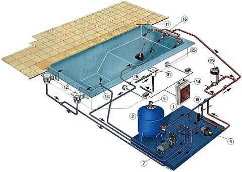
    - **Hình này chứng minh điều gì**
      - Minh họa sơ đồ tuần hoàn khép kín gồm hệ thu nước mặt skimmer (12), hút đáy main drain (14), bơm tuần hoàn (7), bình lọc cát đa tầng (2), van điều khiển đa hướng (1, 9), cụm châm hóa chất (26) và đầu phun trả nước sạch (11, 16).
    - **Từ đâu mà thấy được**
      - Nhìn vào thành hồ và đáy hồ: các họng skimmer (12) bố trí ngang mép nước, lỗ thoát đáy (14) ở lòng sâu nhất kết nối đường ống về bơm (7).
      - Cụm phòng kỹ thuật phía dưới: bơm tuần hoàn (7) đẩy nước qua bình lọc áp lực hình cầu (2) có van đỉnh (9), qua bộ châm hóa chất (26) trước khi quay về dàn ống màu đỏ cấp trả cho các vòi phun (11, 16).

##### 8.1.4 Quy trình tái sinh nhựa và xử lý dòng thải hoàn nguyên (Resin Regeneration & Waste Neutralisation in Demineralisation)

* Hiện tượng suy giảm dung lượng và sự cần thiết của chu trình hoàn nguyên nhựa:
  * Sau một chu kỳ lọc nước demineralisation, các nhóm chức năng trên hạt nhựa bị bão hòa hoàn toàn bởi các ion muối khoáng thu giữ từ nước nguồn.
  * Nồng độ ion xuyên thủng qua lớp hạt làm độ dẫn điện của dòng nước ra tăng đột biến, đòi hỏi phải dừng tháp để thực hiện chu trình tái sinh hóa chất (chemical regeneration).
  * Chu trình tái sinh hoàn trả hạt nhựa trở về trạng thái hoạt tính ban đầu ($\text{R-H}^+$ đối với cation và $\text{R-OH}^-$ đối với anion).

* Các bước vận hành của chu trình tái sinh tháp Cation và Anion:
  * Giai đoạn 1 - Rửa ngược (Backwash flow):
    * Cấp dòng nước từ đáy cột lên trên với lưu lượng làm giãn nở tầng nhựa từ $40\%$ đến $50\%$ ($40\text{--}50\%$).
    * Loại bỏ toàn bộ cặn lơ lửng, hạt vỡ bám dính cơ học trên bề mặt hạt nhựa và tái sắp xếp phân tầng kích thước hạt.
  * Giai đoạn 2 - Bơm dung dịch hóa chất hoàn nguyên (Chemical injection):
    * Tháp Cation: Bơm dung dịch axit clohydric ($\text{HCl}$) nồng độ $4\text{--}8\%$ từ bồn Storage HCl qua bồn Break Tank vào tháp để thế chỗ các cation kim loại:
      $$\text{R}_n\text{-M} + n\text{H}^+ \rightarrow n\text{R-H} + \text{M}^{n+}$$
    * Tháp Anion: Bơm dung dịch natri hydroxit ($\text{NaOH}$) nồng độ $4\text{--}5\%$ từ bồn Storage NaOH (được gia nhiệt lên $35\text{--}40^\circ\text{C}$ để tăng cường khả năng rửa trôi axit silicic $\text{SiO}_2$) qua Break Tank vào tháp để thế chỗ các gốc anion:
      $$\text{R}_m\text{-A} + m\text{OH}^- \rightarrow m\text{R-OH} + \text{A}^{m-}$$
  * Giai đoạn 3 - Rửa chậm (Slow rinse / Displacement):
    * Đẩy dung dịch hóa chất còn đọng trong các khe rỗng hạt nhựa bằng nước khử khoáng ở cùng lưu lượng bơm hóa chất để kéo dài thời gian tiếp xúc phản ứng.
  * Giai đoạn 4 - Rửa nhanh (Fast rinse):
    * Xối rửa lớp hạt bằng nước cấp ở tốc độ làm việc danh định nhằm xả sạch triệt để lượng hóa chất hoàn nguyên dư thừa cho đến khi độ dẫn điện đạt tiêu chuẩn vận hành.

* Kỹ thuật phân tách và hoàn nguyên cột trao đổi hạt hỗn hợp Mixed Bed:
  * Tách lớp nhựa bằng thủy lực (hydraulic separation):
    * Dòng nước rửa ngược từ đáy đẩy hạt nhựa phân tầng rõ rệt nhờ sự chênh lệch khối lượng riêng:
      * Hạt nhựa Anion nhẹ hơn ($\rho \approx 1.08\text{--}1.10\text{ g/cm}^3$) nổi lên ở nửa trên của cột.
      * Hạt nhựa Cation nặng hơn ($\rho \approx 1.25\text{--}1.30\text{ g/cm}^3$) chìm xuống ở nửa dưới của cột.
  * Tái sinh hóa chất đồng thời qua hệ thống ống phân phối trung tâm:
    * Dung dịch kiềm $\text{NaOH}$ được châm từ đỉnh cột đi xuống qua tầng Anion và rút ra tại mặt phân giới giữa hai lớp nhựa.
    * Dung dịch axit $\text{HCl}$ được châm từ đáy cột đi lên qua tầng Cation và cùng rút ra tại mặt phân giới.
  * Xáo trộn đồng nhất hạt nhựa (air mixing):
    * Sau khi rửa sạch hóa chất dư, sục khí nén sạch không dầu từ đáy cột trong $10\text{--}15\text{ phút}$ để hòa trộn đều hai loại hạt nhựa trước khi đưa vào chu kỳ lọc tiếp theo.

* Hệ thống tháp rửa khí Scrubber và an toàn hóa chất:
  * Axit clohydric đậm đặc trong bồn chứa Storage HCl có áp suất hơi cao, liên tục bay hơi sinh ra khói axit $\text{HCl}$ ăn mòn mạnh và gây nguy hiểm cho người vận hành.
  * Tháp hấp thụ khí Scrubber (Scrubber Column) lắp đặt cạnh bồn axit thu gom toàn bộ hơi axit thoát ra:
    * Tháp chứa lớp đệm tiếp xúc rỗng (packing rings) với dòng dung dịch kiềm loãng tuần hoàn tưới từ đỉnh tháp xuống.
    * Phản ứng trung hòa hơi axit diễn ra tức thời:
      $$\text{HCl}_{\text{(khí)}} + \text{NaOH}_{\text{(dung dịch)}} \rightarrow \text{NaCl} + \text{H}_2\text{O}$$
    * Không khí sạch được xả an toàn ra ngoài môi trường.

* Bể trung hòa nước thải hoàn nguyên (Neutralisation Sump) và bơm khuấy trộn (Blending Pump):
  * Dòng nước thải hoàn nguyên tháp Cation có tính axit rất mạnh ($\text{pH} \le 1.5\text{--}2.0$) chứa nồng độ ion $\text{H}^+, \text{Ca}^{2+}, \text{Mg}^{2+}, \text{Cl}^-$ cao.
  * Dòng nước thải hoàn nguyên tháp Anion có tính kiềm rất mạnh ($\text{pH} \ge 12.0\text{--}12.5$) chứa nồng độ ion $\text{OH}^-, \text{SO}_4^{2-}, \text{SiO}_3^{2-}$ cao.
  * Cả hai dòng thải độc hại được dẫn về bể trung hòa tập trung (Neutralisation Sump).
  * Bơm tuần hoàn khuấy trộn (Blending pump) vận hành liên tục để hòa trộn đều hai dòng thải, kích hoạt phản ứng tự trung hòa giữa lượng axit và kiềm dư thừa:
    $$\text{H}^+ + \text{OH}^- \rightarrow \text{H}_2\text{O}$$
  * Hệ thống châm bổ sung hóa chất tự động kiểm soát giá trị $\text{pH}$ trong ngưỡng quy chuẩn xả thải môi trường ($6.5 \le \text{pH} \le 8.5$) trước khi xả ra nguồn tiếp nhận (Waste water).

* Sơ đồ chi tiết chu trình hoàn nguyên và trạm trung hòa nước thải:
  - **Hình 3.** Quy trình hoàn nguyên hóa chất và hệ thống xử lý nước thải trung hòa (Demineralised Water Regeneration and Neutralisation System)
    - 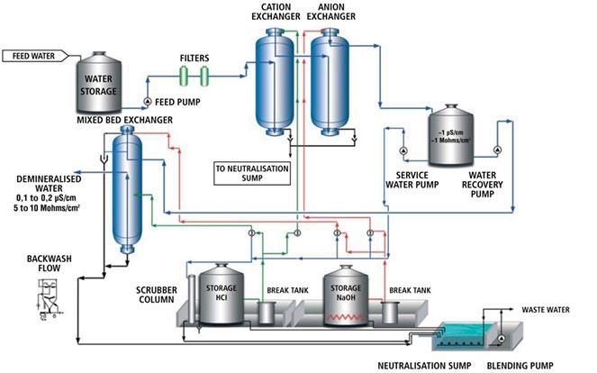
    - **Hình này chứng minh điều gì**
      - Thể hiện chi tiết mạng lưới cấp hóa chất tái sinh ($\text{HCl}$, $\text{NaOH}$) cho các tháp trao đổi ion, kết hợp tháp rửa khí Scrubber và bể Neutralisation Sump cùng bơm Blending Pump để trung hòa nước thải hoàn nguyên.
    - **Từ đâu mà thấy được**
      - Khu vực đáy bồn hóa chất: bồn Storage HCl và Storage NaOH nối với các bồn đệm Break Tank phân phối hóa chất tái sinh (đường màu xanh lục và đỏ) lên đỉnh/đáy các tháp trao đổi.
      - Phía bên phải: đường xả To Neutralisation Sump thu gom nước thải hoàn nguyên về bể Neutralisation Sump có bơm Blending Pump xả ra Waste Water; tháp Scrubber Column đặt cạnh bồn axit để xử lý khí thoát.

#### 8.2 Hệ thống xử lý nước tinh khiết (Purified Water Treatment System)

##### 8.2.1 Sơ đồ chu trình công nghệ sản xuất nước khử khoáng và nước tinh khiết (Demineralised & Purified Water Process Train)

- Định nghĩa và tiêu chuẩn kỹ thuật của nước tinh khiết (Purified Water) và nước siêu tinh khiết (Ultrapure Water):
  - Nước tinh khiết (Demineralised / Deionised Water): Nước được tách bỏ gần như hoàn toàn các ion muối khoáng hòa tan, đạt độ dẫn điện $\kappa \le 0{,}1 - 0{,}2\ \mu\text{S/cm}$ tại $25^\circ\text{C}$ (điện trở suất $\rho \ge 5 - 10\ \text{M}\Omega\cdot\text{cm}$) và tổng chất rắn hòa tan $\text{TDS} < 1\ \text{mg/L}$.
  - Nước siêu tinh khiết (Ultrapure Water - UPW): Cấp nước có độ sạch cao nhất phục vụ ngành công nghiệp vi điện tử, bán dẫn và phòng thí nghiệm phân tích vi lượng, đạt điện trở suất giới hạn lý thuyết $\rho = 18{,}2\ \text{M}\Omega\cdot\text{cm}$ tại $25^\circ\text{C}$ ($\kappa = 0{,}055\ \mu\text{S/cm}$) và hàm lượng tổng cacbon hữu cơ $\text{TOC} < 1 - 2\ \text{ppb}$.
- Cấu trúc chuỗi dây chuyền công nghệ đa rào cản (Multi-Barrier Treatment Train):
  - Khối tiền xử lý hóa lý (Pretreatment Stage):
    - Khử trùng sơ cấp bằng clo hóa (Chlorination) kiểm soát sự phát triển của vi sinh vật và sinh vật bám từ nguồn nước cấp.
    - Quá trình keo tụ và tạo bông (Coagulation - Flocculation) kết hợp bể lắng trọng lực (Sedimentation) nhằm kết tụ và loại bỏ phần lớn cặn lơ lửng, chất hữu cơ thô và xả bùn đáy (Sludge disposal).
    - Cụm lọc đa tầng (Multi-media filtration) hoặc mô-đun màng siêu lọc (Ultrafiltration - UF, kích thước khe lọc $0{,}01 - 0{,}05\ \mu\text{m}$) nhằm hạ chỉ số mật độ bùn xuống mức an toàn $\text{SDI}_{15} < 3{,}0$.
    - Công đoạn khử clo dư (Dechlorination) bằng dung dịch natri bisulfit ($\text{NaHSO}_3$) để ngăn ngừa hiện tượng oxy hóa phân hủy lớp màng polyamide mỏng.
    - Châm hóa chất chống cáu cặn (Antiscalant) kết hợp thiết bị lọc tinh cartridge (Fine filtration, kích thước $1 - 5\ \mu\text{m}$) để ngăn ngừa kết tủa muối canxi sunfat ($CaSO_4$) và silica ($SiO_2$).
  - Khối phân tách màng thẩm thấu ngược áp lực cao (Reverse Osmosis Stage):
    - Bơm cao áp (High pressure pump, áp suất vận hành $55 - 70\ \text{bar}$ đối với nước biển hoặc $12 - 18\ \text{bar}$ đối với nước lợ) kết hợp thiết bị thu hồi năng lượng đẳng áp (Energy Recovery Device - ERD / PX) với hiệu suất thu hồi thế năng dòng brine đạt $\ge 96\%$.
    - Cụm màng thẩm thấu ngược sơ cấp (Seawater Reverse Osmosis - SWRO) phân tách dòng cấp thành dòng nước sạch thu hồi và dòng nước muối đậm đặc xả thải (Brine disposal).
    - Hệ thống súc rửa màng tại chỗ (Cleaning In Place - CIP) phục vụ tẩy rửa cáu cặn vô cơ và màng sinh học định kỳ.
  - Khối hậu xử lý và các công đoạn đánh bóng (Post-treatment & Polishing Steps):
    - Nhánh cấp nước sinh hoạt và tưới tiêu: Trải qua quá trình khử Bo (Boron removal process), tái khoáng hóa và trung hòa (Remineralization & Neutralisation), sau đó khử trùng (Disinfection) đạt chuẩn WHO ($\text{TDS} < 450\ \text{mg/L}$).
    - Nhánh cấp nước công nghệ (Process Water): Qua màng lọc thẩm thấu ngược nước lợ cấp hai (Brackish Water RO - BWRO) đạt $\text{TDS} < 50\ \text{mg/L}$.
    - Nhánh cấp nước khử khoáng và siêu tinh khiết: Dòng nước sau màng BWRO được dẫn qua tháp trao đổi ion (Ion Exchange - IX), trung hòa pH, sau đó qua tháp trao đổi hạt hỗn hợp (Mixed Bed IX) và thiết bị điện khử ion (Electrodialysis / EDI) đạt điện trở suất $10 - 18\ \text{M}\Omega\cdot\text{cm}$ trước khi nạp vào bồn chứa phân phối.
  - **Hình 5.** Sơ đồ chu trình công nghệ tổng thể sản xuất nước khử khoáng và nước siêu tinh khiết
    - 
  - **Hình này chứng minh điều gì**
    - Sơ đồ chuỗi công nghệ liên hoàn từ tiền xử lý, thẩm thấu ngược áp lực cao đến các công đoạn đánh bóng (IX, Mixed Bed, EDI) để sản xuất các cấp nước có độ tinh khiết phân tầng.
  - **Từ đâu mà thấy được**
    - Khối tiền xử lý (Pretreatment): Chlorination $\to$ Coagulation $\to$ Flocculation $\to$ Sedimentation $\to$ Ultrafiltration / Multi-media $\to$ Dechlorination $\to$ Antiscalant $\to$ Fine Filtration.
    - Khối màng chính (Reverse Osmosis): High pressure pump $\to$ Energy Recovery $\to$ Seawater Reverse Osmosis $\to$ Brine disposal.
    - Khối đánh bóng (Polishing steps): Brackish Water RO $\to$ Ion Exchange (IX) $\to$ pH Neutralisation $\to$ Mixed Bed IX $\to$ EDI, tạo ra nước khử khoáng ($\kappa = 0{,}1 - 10\ \mu\text{S/cm}$) và nước siêu tinh khiết ($\rho = 10 - 18\ \text{M}\Omega\cdot\text{cm}$).

##### 8.2.2 Quy trình công nghệ màng và các công đoạn đánh bóng (Membrane Processes & Polishing Stages)

- Cơ chế phân tách của màng thẩm thấu ngược (RO Separation Mechanism):
  - Cấu tạo màng composite polyamide (TFC - Thin Film Composite) với kích thước mắt lọc danh định cỡ hạ nanomet ($0{,}0001\ \mu\text{m} = 0{,}1\ \text{nm}$).
  - Quá trình phân tách tuân theo mô hình hòa tan - khuếch tán (Solution-Diffusion Model): Phân tử nước hòa tan vào màng và khuếch tán qua lớp màng chọn lọc dưới gradient áp suất thủy lực lớn hơn áp suất thẩm thấu ($\Delta P > \Delta\pi$), trong khi các ion muối khoáng bị cản trở bởi lực đẩy tĩnh điện và kích thước hydrat hóa.
  - Hiệu suất loại bỏ ion hòa tan đạt trên $99{,}0 - 99{,}5\%$ đối với cation đa hóa trị ($Ca^{2+}, Mg^{2+}, Fe^{3+}$) và đạt $98{,}5 - 99{,}2\%$ đối với cation đơn hóa trị ($Na^+, K^+, Cl^-$).
- Công đoạn khử khoáng bằng hệ thống trao đổi ion hai cột (Two-Bed Demineralisation System):
  - Cột trao đổi Cation axit mạnh (Strong Acid Cation - SAC resin, dạng $H^+$):
    - Hạt nhựa polystyrene mang nhóm chức axit sulfonic ($-\text{SO}_3\text{H}$) bắt giữ toàn bộ cation kim loại và phóng thích ion $H^+$ vào dung dịch:
      $$2\text{R-SO}_3\text{H} + \text{Ca}^{2+} \rightleftharpoons (\text{R-SO}_3)_2\text{Ca} + 2\text{H}^+$$
      $$\text{R-SO}_3\text{H} + \text{Na}^+ \rightleftharpoons \text{R-SO}_3\text{Na} + \text{H}^+$$
    - Nước sau tháp cation mang tính axit mạnh do chứa các axit vô cơ tương ứng ($HCl, H_2SO_4, HNO_3, H_2CO_3$).
    - Tái sinh cột cation: Dùng dung dịch axit clohydric ($HCl\ 4 - 6\%$) cấp từ bồn lưu trữ (Storage HCl) qua bồn đo thể tích (Break tank). Hơi axit thoát ra được thu gom và xử lý qua tháp hấp thụ rửa khí (Scrubber column).
  - Cột trao đổi Anion bazơ mạnh (Strong Base Anion - SBA resin, dạng $OH^-$):
    - Hạt nhựa mang nhóm chức amoni bậc bốn ($-\text{NR}_3\text{OH}$) hấp phụ các anion gốc axit và phóng thích ion $OH^-$:
      $$\text{R-NR}_3\text{OH} + \text{Cl}^- \rightleftharpoons \text{R-NR}_3\text{Cl} + \text{OH}^-$$
      $$2\text{R-NR}_3\text{OH} + \text{SO}_4^{2-} \rightleftharpoons (\text{R-NR}_3)_2\text{SO}_4 + 2\text{OH}^-$$
      $$\text{R-NR}_3\text{OH} + \text{HSiO}_3^- \rightleftharpoons \text{R-NR}_3\text{HSiO}_3 + \text{OH}^-$$
    - Tái sinh cột anion: Dùng dung dịch kiềm natri hydroxit ($NaOH\ 4 - 5\%$) gia nhiệt ($35 - 45^\circ\text{C}$ để tăng hiệu quả khử silica) từ bồn lưu trữ (Storage NaOH) qua bồn định lượng (Break tank).
  - Phản ứng tự trung hòa tạo nước tinh khiết trung tính:
    $$\text{H}^+ + \text{OH}^- \rightleftharpoons \text{H}_2\text{O}$$
    - Nước sau hệ thống hai cột Cation - Anion đạt độ dẫn điện $\kappa \approx 1\ \mu\text{S/cm}$ (điện trở suất $\rho \approx 1\ \text{M}\Omega\cdot\text{cm}$).
- Cột đánh bóng hạt hỗn hợp (Mixed Bed Exchanger Polishing):
  - Cột chứa hỗn hợp đồng đều giữa hạt nhựa cation axit mạnh và anion bazơ mạnh theo tỷ lệ thể tích $1 : 1{,}5$ hoặc $1 : 2$.
  - Cấu trúc hạt phân tán xen kẽ tương đương với hàng nghìn cặp cột Cation - Anion nối tiếp nhau trong cùng một lớp vật liệu, triệt tiêu hoàn toàn hiện tượng rò rỉ muối (sodium slip) và rò rỉ silica.
  - Nước ra khỏi tháp Mixed Bed đạt độ dẫn điện cực nhỏ $\kappa = 0{,}1 - 0{,}2\ \mu\text{S/cm}$ (điện trở suất $\rho = 5 - 10\ \text{M}\Omega\cdot\text{cm}$).
  - Quy trình tái sinh tháp Mixed Bed: Phân tầng hạt nhựa bằng rửa ngược (hạt anion nhẹ nổi lên trên, hạt cation nặng chìm xuống dưới), tái sinh riêng biệt bằng $HCl$ và $NaOH$, rửa sạch rồi trộn đều lại bằng khí nén sạch không dầu.
- Công nghệ điện khử ion liên tục (Continuous Electrodeionization - CEDI / EDI):
  - Khối CEDI kết hợp màng bán thấm trao đổi ion chọn lọc (màng CEM và AEM) cùng lớp hạt nhựa trao đổi ion đặt xen kẽ dưới tác dụng của điện trường một chiều (DC).
  - Phân tử nước bị phân ly liên tục tại ranh giới màng thành các ion $H^+$ và $OH^-$ dưới tác dụng của điện thế cao, tự động tái sinh hạt nhựa liên tục mà không cần hóa chất axit hay bazơ.
  - Dòng sản phẩm đạt điện trở suất ổn định $\rho = 15 - 18\ \text{M}\Omega\cdot\text{cm}$, vận hành liên tục không gián đoạn chu kỳ hoàn nguyên.
- Hệ thống trung hòa nước thải hoàn nguyên (Neutralisation Sump & Environmental Protection):
  - Dung dịch xả thải hoàn nguyên có tính axit cao từ cột Cation và tính bazơ cao từ cột Anion được dẫn về hố thu trung hòa (Neutralisation sump).
  - Bơm hòa trộn (Blending pump) tuần hoàn sục khí cưỡng bức để hai dòng chất thải tự trung hòa lẫn nhau, bổ sung lượng hóa chất cân bằng tự động để duy trì dải pH nước xả đạt $6{,}5 - 8{,}5$ theo quy chuẩn xả thải công nghiệp.

##### 8.2.3 Hệ thống vòng tuần hoàn thủy lực và kiểm soát chất lượng (Recirculation Hydraulic Loop & Quality Control)

- Động học tái nhiễm bẩn của nước tinh khiết và yêu cầu vòng tuần hoàn kín (Sanitary Recirculation Loop):
  - Nước khử khoáng có độ tinh khiết cao là dung môi không no có xu hướng hòa tan khí cacbonic ($CO_2$) từ khí quyển cực nhanh, tạo thành axit cacbonic ($H_2CO_3$) làm giảm pH ($5{,}5 - 6{,}0$) và tăng độ dẫn điện.
  - Khi lưu trữ trong điều kiện tĩnh, vi sinh vật dị dưỡng dễ phát triển và hình thành màng sinh học (biofilm) trên thành bồn và đường ống.
  - Biện pháp kỹ thuật: Nước tinh khiết bắt buộc phải được tuần hoàn liên tục $24/7$ qua mạng lưới phân phối kín bằng thép không gỉ vi sinh inox 316L (độ nhám bề mặt bên trong $Ra \le 0{,}4 - 0{,}8\ \mu\text{m}$) với vận tốc dòng chảy tối thiểu $v \ge 1{,}0 - 1{,}5\ \text{m/s}$ nhằm tạo dòng chảy rối triệt tiêu khả năng bám dính của vi khuẩn.
- Kiến trúc thủy lực tuần hoàn khép kín mô phỏng:
  - Cơ chế thu gom đa điểm (Multiple Suction Hydraulics): Thu hồi nước mặt qua các cửa thu bề mặt (skimmers) để hớt màng váng nổi và thu gom nước đáy qua phễu thu đáy (main drain) để thu gom cặn lắng và duy trì sự xáo trộn đồng đều.
  - Cụm bơm tuần hoàn và lọc áp lực liên tục: Đảm bảo chu kỳ luân chuyển thể tích toàn bộ hệ thống (turnover time) từ $4 - 6\ \text{giờ/chu kỳ}$.
  - Cụm điều khiển và định lượng hóa chất tự động: Tích hợp tủ điều khiển giám sát trực tuyến thông số pH, độ dẫn điện, nồng độ khử trùng và cụm gia nhiệt/khử khuẩn trước khi đẩy dòng nước sạch trở lại các đầu phun cấp (return inlets).
  - **Hình 4.** Sơ đồ nguyên lý vòng tuần hoàn thủy lực xử lý nước khép kín
    - 
  - **Hình này chứng minh điều gì**
    - Cấu trúc hệ thống thủy lực tuần hoàn khép kín gồm bơm đẩy, bình lọc áp lực, cụm kiểm soát hóa chất/khử trùng và mạng lưới phân phối cấp hồi liên tục.
  - **Từ đâu mà thấy được**
    - Tuyến thu hồi: Cửa thu nước mặt (12 - skimmer) và cửa hút đáy (14 - main drain) hợp dòng về rọ lọc rác thô và máy bơm tuần hoàn (7).
    - Cụm xử lý trung tâm: Nước được bơm qua bình lọc áp lực (2), qua tủ điều khiển tự động (13), cụm châm hóa chất (19) và bộ gia nhiệt/khử trùng (26).
    - Tuyến cấp hồi lưu: Dòng nước sạch sau xử lý được đẩy qua các đầu phun trả nước (11, 16) tạo vòng tuần hoàn liên tục không có góc chết thủy lực.

##### 8.2.4 Cấu tạo thiết bị mô-đun lọc nước tinh khiết POU (Purified Water Module Hardware & Components)

- Cấu trúc phần cứng mô-đun lọc nước tinh khiết tại điểm dùng (Point-of-Use Hardware Assembly):
  - Thiết kế tích hợp nguyên cụm nhỏ gọn phục vụ cho phòng kiểm nghiệm, phòng y tế và nhu cầu ăn uống gia đình chất lượng cao.
  - Khối tiền xử lý 3 cốc lọc đứng (Pre-treatment Canisters):
    - Cốc số 1 (Stage 1): Chứa lõi lọc cặn sợi quấn hoặc ép nhiệt polypropylene (PP) $5\ \mu\text{m}$, giữ lại tạp chất lơ lửng, cát sét, rỉ sét đường ống.
    - Cốc số 2 (Stage 2): Chứa than hoạt tính gáo dừa dạng hạt (GAC), hấp phụ lượng lớn clo dư, trihalomethanes ($THMs$) và hợp chất hữu cơ bay hơi ($VOCs$).
    - Cốc số 3 (Stage 3): Chứa than hoạt tính ép khối (CTO - Carbon Block), lọc tinh hạt cặn $\le 5\ \mu\text{m}$, giữ bụi than và khử triệt để clo tự do trước màng.
  - Khối màng lọc thẩm thấu ngược (RO Membrane Housing):
    - Vỏ màng composite chịu áp nằm ngang phía trên cụm cốc lọc, chứa cuộn màng Filmtec thẩm thấu ngược $0{,}0001\ \mu\text{m}$ tiêu chuẩn NSF/ANSI 58.
    - Cổng xả phân dòng: Dòng nước tinh khiết (permeate) đi qua van một chiều về bình áp; dòng nước thải cô đặc (concentrate) đi qua van hạn chế dòng (flow restrictor) xả ra đường thoát nước.
  - Bình tích áp thủy khí màng ngăn (Pressurized Diaphragm Storage Tank):
    - Bồn kim loại sơn tĩnh điện dung tích chứa $12\ \text{L}$ (12L Tank), tích hợp màng ngăn cao su butyl thực phẩm chia khoang chứa nước ngọt và khoang đệm khí nén phía dưới.
    - Áp suất nạp khí rỗng tiêu chuẩn: $35 - 50\ \text{kPa}$ ($5 - 7\ \text{psi}$).
    - Chức năng: Lưu trữ nước tinh khiết sản xuất chậm từ màng RO và giải phóng lưu lượng tức thời $1{,}5 - 3{,}0\ \text{L/phút}$ qua vòi lấy nước.
  - Khối lọc tinh khử mùi vị sau màng và vòi chuyên dụng (Post-treatment & Dispense Faucet):
    - Lõi than hoạt tính dạng ống thẳng (In-line Post-GAC polishing filter) lắp sau bình áp để tinh chế cảm quan, khử mùi vị lạ phát sinh trong bồn chứa.
    - Vòi cổ ngỗng bằng thép không gỉ mạ crôm chuyên dụng (gooseneck faucet) cùng hệ thống dây dẫn PE trắng an toàn thực phẩm.
  - **Hình 6.** Thiết bị lọc nước tinh khiết thẩm thấu ngược đa cấp nguyên cụm
    - 
  - **Hình này chứng minh điều gì**
    - Cấu tạo phần cứng hoàn chỉnh của cụm thiết bị sản xuất nước tinh khiết POU gồm cụm cốc lọc đa cấp, vỏ màng RO, bình tích áp màng ngăn và phụ kiện kết nối đồng bộ.
  - **Từ đâu mà thấy được**
    - Khối lọc chính (Model FS409 Reverse Osmosis): 2 cốc lọc tiền xử lý thẳng đứng màu trắng, vỏ màng RO nằm ngang gắn phía trên cùng lõi lọc tinh in-line.
    - Bình tích áp dự trữ (12L Tank): Bồn hình trụ tròn màu trắng có van khóa phía trên, nhãn thông số "12L TANK".
    - Phụ kiện kết nối: Vòi lấy nước cổ ngỗng (gooseneck tap), cuộn ống dây dẫn nước trắng, khóa mở cốc lọc bằng nhựa và các đầu cút nối van cấp nước.

##### 8.2.5 Tính toán kỹ thuật và thông số vận hành hệ thống màng và trao đổi ion (Engineering Calculations & Operational Parameters)

- Phương trình thủy lực vận chuyển qua màng thẩm thấu ngược (Solution-Diffusion Transport Equations):
  - Phương trình thông lượng nước thấm ($J_w$):
    $$J_w = K_w \cdot (\Delta P - \Delta\pi) = K_w \cdot \text{NDP}$$
    - $J_w$: Thông lượng nước thấm qua bề mặt màng ($\text{L}/(\text{m}^2\cdot\text{h})$ hay $\text{LMH}$).
    - $K_w$: Hệ số thấm nước của vật liệu màng ($\text{LMH/bar}$).
    - $\text{NDP}$: Áp suất dẫn động thực qua màng (Net Driving Pressure, $\text{bar}$).
    - $\Delta P$: Chênh lệch áp suất thủy lực trung bình hai phía màng ($\text{bar}$):
      $$\Delta P = \left(\frac{P_{\text{feed}} + P_{\text{concentrate}}}{2}\right) - P_{\text{permeate}}$$
    - $\Delta\pi$: Chênh lệch áp suất thẩm thấu trung bình hai phía màng ($\text{bar}$):
      $$\Delta\pi = \left(\frac{\pi_{\text{feed}} + \pi_{\text{concentrate}}}{2}\right) - \pi_{\text{permeate}}$$
  - Thông lượng khuếch tán chất tan qua màng ($J_s$):
    $$J_s = B_s \cdot (C_m - C_p)$$
    - $J_s$: Thông lượng muối khuếch tán qua màng ($\text{g}/(\text{m}^2\cdot\text{h})$).
    - $B_s$: Hệ số thấm chất tan của màng ($\text{LMH}$).
    - $C_m, C_p$: Nồng độ muối tại bề mặt màng và trong dòng permeate ($\text{mg/L}$).
  - Tỷ lệ thu hồi thể tích nước sạch ($Y$):
    $$Y = \left(\frac{Q_p}{Q_f}\right) \times 100\% = \left(\frac{Q_p}{Q_p + Q_c}\right) \times 100\%$$
  - Tỷ lệ loại bỏ muối hòa tan ($R$):
    $$R = \left(1 - \frac{C_p}{C_f}\right) \times 100\%$$
  - Phương trình cân bằng khối lượng chất tan tổng thể:
    $$Q_f \cdot C_f = Q_p \cdot C_p + Q_c \cdot C_c$$
    $$C_c = \frac{Q_f \cdot C_f - Q_p \cdot C_p}{Q_c} = C_f \cdot \left[\frac{1 - Y \cdot (1 - R)}{1 - Y}\right]$$

- Phương trình tính toán kích thước và dung lượng cột trao đổi ion:
  - Dung lượng trao đổi tổng cộng của cột ($E_{\text{tot}}$):
    $$E_{\text{tot}} = V_{\text{resin}} \cdot q_{\text{working}}$$
    - $E_{\text{tot}}$: Tổng đương lượng ion mà cột hạt nhựa có thể hấp phụ trong một chu kỳ ($\text{eq}$ hay $\text{mol}_{\text{eq}}$).
    - $V_{\text{resin}}$: Thể tích lớp hạt nhựa trong cột trao đổi ($\text{m}^3$ hoặc $\text{L}$).
    - $q_{\text{working}}$: Dung lượng trao đổi làm việc thực tế của hạt nhựa ($\text{eq/L}$ hoặc $\text{eq/m}^3$). Với hạt SAC ($H^+$ form), $q_{\text{working}} \approx 1{,}2 - 1{,}6\ \text{eq/L}$; với hạt SBA ($OH^-$ form), $q_{\text{working}} \approx 0{,}8 - 1{,}1\ \text{eq/L}$.
  - Thể tích nước xử lý được trong một chu kỳ trước điểm xuyên phá ($V_{\text{cycle}}$):
    $$V_{\text{cycle}} = \frac{V_{\text{resin}} \cdot q_{\text{working}}}{\sum C_{\text{ions, feed}}}$$
    - $\sum C_{\text{ions, feed}}$: Tổng nồng độ đương lượng của các cation (đối với cột Cation) hoặc các anion (đối với cột Anion) trong nước cấp ($\text{eq/m}^3$).
  - Khối lượng hóa chất hoàn nguyên yêu cầu cho một chu kỳ tái sinh ($m_{\text{chem}}$):
    $$m_{\text{chem}} = E_{\text{tot}} \cdot M_{\text{eq}} \cdot \alpha_{\text{stoich}}$$
    - $M_{\text{eq}}$: Đương lượng gam của hóa chất hoàn nguyên ($M_{\text{eq, HCl}} = 36{,}46\ \text{g/eq}$; $M_{\text{eq, NaOH}} = 40{,}00\ \text{g/eq}$).
    - $\alpha_{\text{stoich}}$: Hệ số dư hóa chất so với tỷ lượng lý thuyết ($\alpha_{\text{stoich}} \approx 1{,}5 - 2{,}5$).

- Bảng phân loại các cấp độ tinh khiết của nước theo tiêu chuẩn quốc tế (ISO 3696 & ASTM D1193):

| Chỉ tiêu Kỹ thuật | Cấp 1 (Grade 1 / Ultrapure Water) | Cấp 2 (Grade 2 / Purified Water) | Cấp 3 (Grade 3 / Primary Water) |
|---|---|---|---|
| Độ dẫn điện tại $25^\circ\text{C}$ ($\mu\text{S/cm}$) | $\le 0{,}055 - 0{,}10$ | $\le 1{,}0$ | $\le 5{,}0$ |
| Điện trở suất tại $25^\circ\text{C}$ ($\text{M}\Omega\cdot\text{cm}$) | $\ge 10{,}0 - 18{,}2$ | $\ge 1{,}0$ | $\ge 0{,}2$ |
| Tổng cacbon hữu cơ ($\text{TOC}$, $\text{ppb}$) | $< 10 - 20$ | $< 50$ | $< 200$ |
| Hàm lượng Silica hòa tan ($SiO_2$, $\mu\text{g/L}$) | $< 3 - 5$ | $< 10$ | $< 100$ |
| Tổng lượng vi sinh vật ($\text{CFU/mL}$) | $< 1$ | $< 10$ | $< 100$ |
| Công nghệ xử lý chủ yếu | RO cấp 2 + Mixed Bed + EDI + UV 185 nm | RO + Trao đổi ion Cation/Anion 2 cột | Chưng cất đơn hoặc RO sơ cấp đơn tầng |
| Lĩnh vực ứng dụng chính | Sản xuất vi mạch bán dẫn, sắc ký HPLC, quang phổ ICP-MS | Nuôi cấy mô, pha chế dung dịch chuẩn, nước cấp nồi hơi cao áp | Rửa dụng cụ thủy tinh, nước cấp cho máy tạo nước siêu tinh khiết |

#### 8.3 Hệ thống xử lý nước hồ bơi (Water Treatment System for Swimming Pool)

##### 8.3.1 Nguyên lý thủy lực và chu trình tuần hoàn khép kín (Hydraulic Circulation Principles)

* Chu trình tuần hoàn khép kín (closed-loop recirculation) bảo đảm chất lượng nước hồ bơi liên tục đáp ứng các tiêu chuẩn vệ sinh dịch tễ và an toàn cho người bơi:
  * Nước hồ bơi liên tục tiếp nhận chất ô nhiễm từ người bơi (mồ hôi, dầu bài tiết, mỹ phẩm, vi sinh vật) và môi trường ngoài trời (bụi, lá cây, bào tử rêu tảo).
  * Hệ thống tuần hoàn liên tục thu gom, lọc sạch cặn lơ lửng, khử trùng tiêu diệt mầm bệnh, và phân phối đồng đều nước đã xử lý trở lại hồ.
* Thời gian chu chuyển nước (turnover period, $T$) là thông số thủy lực cơ bản để tính toán quy mô toàn bộ hệ thống xử lý:
  * Thời gian chu chuyển biểu diễn thời gian cần thiết để bơm tuần hoàn luân chuyển một thể tích nước bằng đúng dung tích toàn bộ hồ bơi ($V$):
    $$T = \frac{V}{Q}$$
  * Trong đó $V$ là thể tích hồ bơi ($\text{m}^3$), $Q$ là lưu lượng tuần hoàn của trạm bơm ($\text{m}^3/\text{h}$), và $T$ là thời gian chu chuyển ($\text{h}$).
  * Tiêu chuẩn thiết kế quy định thời gian chu chuyển tùy theo loại hình và mật độ người bơi:
    * Hồ bơi thi đấu và hồ người lớn công cộng: $T = 4 - 6\text{ h}$.
    * Hồ bơi gia đình hoặc khách sạn nghỉ dưỡng: $T = 6 - 8\text{ h}$.
    * Hồ vầy trẻ em và hồ bán công cộng mật độ cao: $T = 1 - 2\text{ h}$.
* Lưu lượng thiết kế của trạm bơm tuần hoàn ($Q$) được xác định từ thể tích hồ và thời gian chu chuyển yêu cầu:
  $$Q = \frac{V}{T_{\text{design}}}$$
  * Hệ số an toàn và lưu lượng dự phòng thường được cộng thêm $10 - 15\%$ để bù trừ suy giảm lưu lượng khi áp lực bình lọc tăng cao do tích tụ cặn bẩn.
* Phân bổ dòng thu nước đảm bảo thu gom hiệu quả cả chất ô nhiễm nổi trên mặt nước và cặn lắng dưới đáy hồ:
  * Dòng thu nước bề mặt qua các hộp thu nước mặt (skimmers) chiếm tỷ lệ $60 - 80\%$ tổng lưu lượng tuần hoàn:
    * Váng dầu, mỡ bôi trơn, bụi nổi và chất hữu cơ nhẹ tập trung chủ yếu ở tầng nước bề mặt có độ sâu $0 - 15\text{ cm}$.
    * Vận tốc tràn qua mép thu nước skimmer duy trì từ $0.3 - 0.5\text{ m/s}$ để tạo hiệu ứng hút váng bề mặt liên tục.
  * Dòng thu nước tầng đáy qua các phễu thu đáy (main drains) đảm bảo $20 - 40\%$ tổng lưu lượng tuần hoàn:
    * Cặn nặng, hạt cát, và bùn kết tủa lắng xuống đáy dốc của lòng hồ được dẫn lưu về phễu thu đáy.
    * Tốc độ dòng chảy qua lưới chắn phễu thu đáy bị giới hạn $\le 0.5\text{ m/s}$ nhằm triệt tiêu nguy cơ hút dính nguy hiểm đối với người tắm.

##### 8.3.2 Cấu tạo thiết bị và các phân hệ công nghệ (Component Architecture and System Layout)

* Hệ thống xử lý nước hồ bơi tiêu chuẩn bao gồm 5 phân hệ công nghệ chính liên kết thủy lực khép kín:
  * Phân hệ thu gom nước mặt và đáy: gồm các hộp skimmer (12), phễu thu đáy (14), khớp hút chân không vệ sinh (15), và tuyến ống hút góp (7).
  * Phân hệ tiền xử lý và bơm áp lực: gồm giỏ chắn rác thô (hair and lint strainer) và máy bơm ly tâm tuần hoàn (1).
  * Phân hệ lọc áp lực: gồm bình lọc cát thạch anh nhiều tầng (2) và van điều khiển đa ngả 6 vị trí (9).
  * Phân hệ gia nhiệt và phụ trợ: gồm thiết bị gia nhiệt nước (6), hộp tự động cân bằng bù nước (31), và đèn chiếu sáng âm nước (23).
  * Phân hệ châm hóa chất và phân phối trả nước: gồm bơm định lượng hóa chất (19), bình châm clo tự động (26), tủ điện điều khiển (13), ống góp phân phối (16), và các đầu phun trả nước (11).
  * **Hình 4.** Sơ đồ cấu tạo và nguyên lý tuần hoàn hệ thống xử lý nước hồ bơi
##### 8.3.3 Quá trình lọc áp lực và vận hành van điều khiển đa ngả (Multi-port Valve Operation)

* Bình lọc cát áp lực nhiều tầng (Sand Filter, chi tiết 2) là trái tim của quá trình tách cặn cơ học trong xử lý nước hồ bơi:
  * Vỏ bình chế tạo bằng vật liệu composite quấn sợi thủy tinh (fiberglass reinforced polyester) chịu áp suất làm việc tối đa $2.5 - 4.0\text{ bar}$.
  * Cơ chế giữ cặn dựa trên sự phối hợp giữa sàng lọc cơ học, lắng quán tính và hấp phụ tĩnh điện trong các khe rỗng giữa các hạt cát.
* Cấu trúc tầng vật liệu lọc bên trong bình lọc cát:
  * Tầng cát lọc chính: cát thạch anh (silica sand) có kích thước hiệu dụng $d_{10} = 0.45 - 0.55\text{ mm}$, hệ số đồng nhất $U_c \le 1.5$, chiều dày tầng lọc $L = 0.4 - 0.7\text{ m}$.
  * Tầng than antraxít hỗ trợ (tùy chọn cho lọc hai lớp): kích thước hạt $d = 0.8 - 1.2\text{ mm}$, chiều dày $0.2 - 0.3\text{ m}$ đặt trên lớp cát để tăng khả năng chứa cặn.
  * Tầng sỏi đỡ đáy: sỏi thạch anh tròn cạnh kích thước $2 - 5\text{ mm}$ và $5 - 10\text{ mm}$, chiều dày $0.15 - 0.25\text{ m}$, bao bọc các ống thu nước răng lược (lateral underdrain) ở đáy bình.
* Tốc độ lọc và tính toán diện tích bề mặt bình lọc cát:
  * Tốc độ lọc thiết kế ($v_{\text{filt}}$) đối với bình lọc cát áp lực hồ bơi:
    $$v_{\text{filt}} = 20 - 35\text{ m/h}$$
    * Lọc tốc độ tiêu chuẩn (standard rate): $v_{\text{filt}} = 20 - 25\text{ m/h}$, cho chất lượng nước sau lọc cao nhất ($\text{Turbidity} < 0.5\text{ NTU}$).
    * Lọc tốc độ cao (high-rate filtration): $v_{\text{filt}} = 30 - 50\text{ m/h}$, giúp tiết kiệm diện tích lắp đặt phòng kỹ thuật.
  * Diện tích mặt cắt ngang yêu cầu của bình lọc ($A_f$):
    $$A_f = \frac{Q}{v_{\text{filt}}}$$
    * Đường kính bình lọc ($D$) được tính theo hình trụ tròn:
      $$D = \sqrt{\frac{4 \cdot A_f}{\pi}}$$
* Van điều khiển đa ngả 6 vị trí (Multi-port Valve, chi tiết 9):
  * Lắp đặt trên đỉnh bình lọc (top-mount) hoặc bên hông bình lọc (side-mount), chuyển đổi chế độ vận hành bằng tay gạt xoay:
  * Chế độ 1: Lọc bình thường (Filter):
    * Nước đi từ đỉnh bình xuống qua lớp vật liệu lọc, cặn bẩn bị giữ lại, nước trong thu ở đáy qua ống răng lược và đi ra tuyến ống cấp trở lại hồ.
  * Chế độ 2: Rửa ngược (Backwash):
    * Dòng nước đảo chiều, đi từ đáy bình ngược lên qua lớp cát làm giãn nở tầng vật liệu lọc, cuốn trôi bùn cặn ra đường xả thải (Waste drain).
    * Chu kỳ rửa ngược được kích hoạt khi tổn thất áp lực qua bình lọc tăng thêm $\Delta P \ge 0.5 - 0.7\text{ bar}$ so với áp lực ban đầu lúc vật liệu lọc sạch.
    * Tốc độ rửa ngược duy trì $v_{\text{bw}} = 30 - 45\text{ m/h}$ để bảo đảm độ giãn nở tầng cát đạt $E = 20 - 30\%$, thời gian rửa từ $3 - 5\text{ phút}$.
  * Chế độ 3: Rửa xuôi ổn định (Rinse):
    * Nước đi từ trên xuống như chế độ lọc nhưng xả bỏ ra đường thoát nước thải trong thời gian $1 - 2\text{ phút}$.
    * Tác dụng nén chặt lại tầng cát sau rửa ngược và loại bỏ triệt để cặn bẩn còn sót dưới đáy bình, tránh đẩy cặn vào hồ bơi.
  * Chế độ 4: Xả bỏ trực tiếp (Waste):
    * Nước từ bơm đi thẳng ra cống thoát nước mà không đi qua lớp cát lọc.
    * Sử dụng khi hút cặn đáy hồ có nồng độ bùn đậm đặc hoặc khi cần hạ mực nước hồ bơi nhanh chóng.
  * Chế độ 5: Tuần hoàn tắt (Recirculate):
    * Dòng nước bỏ qua bình lọc, đi thẳng từ bơm trở lại hồ bơi.
    * Sử dụng để khuấy trộn nhanh hóa chất hòa tan khi vừa châm vào hồ bơi hoặc duy trì dòng chảy khi sửa chữa bình lọc.
  * Chế độ 6: Đóng kín hoàn toàn (Closed):
    * Ngăn chặn toàn bộ các cổng lưu chất qua van.
    * Sử dụng khi bảo trì, vệ sinh giỏ lọc bơm tuần hoàn mà không làm trào nước từ hồ bơi về phòng máy.

##### 8.3.4 Cân bằng hóa nước, khử trùng và kiểm soát chất lượng nước (Water Chemistry, Disinfection & Water Balance)

* Khử trùng bằng hóa chất clo là biện pháp bắt buộc để tiêu diệt mầm bệnh và oxy hóa chất hữu cơ:
  * Khí clo hoặc các hợp chất clo hóa khi hòa tan vào nước tạo thành axit hipoclorơ ($\text{HOCl}$) và ion hipoclorit ($\text{OCl}^-$):
    $$\text{Cl}_2 + \text{H}_2\text{O} \rightleftharpoons \text{HOCl} + \text{H}^+ + \text{Cl}^-$$
    $$\text{NaOCl} + \text{H}_2\text{O} \rightarrow \text{HOCl} + \text{Na}^+ + \text{OH}^-$$
    $$\text{Ca(OCl)}_2 + 2\text{H}_2\text{O} \rightarrow 2\text{HOCl} + \text{Ca}^{2+} + 2\text{OH}^-$$
  * Cân bằng phân ly giữa $\text{HOCl}$ và $\text{OCl}^-$ phụ thuộc khắt khe vào $\text{pH}$ của nước:
    $$\text{HOCl} \rightleftharpoons \text{H}^+ + \text{OCl}^- \quad (pK_a \approx 7.54 \text{ tại } 25^\circ\text{C})$$
    * Axit hipoclorơ ($\text{HOCl}$) có hoạt tính diệt khuẩn mạnh gấp $80 - 100$ lần so với ion hipoclorit ($\text{OCl}^-$) do cấu trúc phân tử trung hòa điện dễ dàng khuếch tán qua màng lipid của tế bào vi khuẩn.
    * Ở mức $\text{pH} = 7.2$, tỷ lệ $\text{HOCl}$ chiếm khoảng $66\%$; ở $\text{pH} = 7.5$, tỷ lệ $\text{HOCl}$ đạt khoảng $50\%$; ở $\text{pH} = 8.0$, tỷ lệ $\text{HOCl}$ tụt giảm xuống chỉ còn khoảng $21\%$.
* Thiết bị định lượng hóa chất khử trùng (chi tiết 19 và 26):
  * Bình châm clo viên tự động dạng inline/offline (In-line Chlorinator, chi tiết 26):
    * Sử dụng clo hữu cơ dạng viên nén TCCA (Trichloroisocyanuric acid, $90\%$ clo hoạt tính) hòa tan chậm theo lưu lượng dòng chảy.
    * Viên nén phân giải giải phóng clo kết hợp axit xyanuric ($\text{H}_3\text{Cy}$) đóng vai trò chất ổn định chống quang phân dưới tác động của tia cực tím mặt trời:
      $$\text{HOCl} + \text{H}_3\text{Cy} \rightleftharpoons \text{H}_2\text{ClCy} + \text{H}_2\text{O}$$
  * Bơm định lượng màng điện từ châm hóa chất tự động (Chemical Dosing Pump, chi tiết 19):
    * Bơm dung dịch $\text{NaOCl}$ khử trùng và dung dịch axit $\text{HCl}$ / $\text{NaHSO}_4$ hạ $\text{pH}$ hoặc xút $\text{NaOH}$ / $\text{Na}_2\text{CO}_3$ nâng $\text{pH}$.
    * Tự động điều khiển theo tín hiệu đo trực tuyến từ cảm biến đo thế oxy hóa khử ($\text{ORP}$) và điện cực $\text{pH}$.
* Kiểm soát các chỉ tiêu chất lượng nước hồ bơi tiêu chuẩn:
  * Nồng độ clo dư tự do (Free Available Chlorine): duy trì trong khoảng $1.0 - 3.0\text{ mg/L}$.
  * Nồng độ clo liên kết (Combined Chlorine - cloramin): khống chế $\le 0.4\text{ mg/L}$ (cloramin là nguyên nhân chính gây cay mắt, rát da và mùi nồng khó chịu trong hồ bơi).
  * Độ $\text{pH}$ thiết kế: duy trì nghiêm ngặt trong khoảng $7.2 - 7.6$:
    * Nếu $\text{pH} < 7.2$: nước gây ăn mòn đường ống kim loại, hòa tan vữa xi măng mạch gạch và làm cay mắt người bơi.
    * Nếu $\text{pH} > 7.6$: hiệu lực diệt khuẩn của clo suy giảm nghiêm trọng và xuất hiện nguy cơ đóng cặn canxi trên bề mặt cát lọc.
  * Độ kiềm tổng (Total Alkalinity - $\text{TA}$): duy trì trong khoảng $80 - 120\text{ mg/L}$ tính theo $\text{CaCO}_3$, đóng vai trò hệ đệm chống sốc $\text{pH}$.
  * Độ cứng canxi (Calcium Hardness - $\text{CH}$): duy trì trong khoảng $200 - 400\text{ mg/L}$ tính theo $\text{CaCO}_3$ để bảo vệ bề mặt bê tông hồ bơi.
  * Nồng độ chất ổn định axit xyanuric (Cyanuric Acid): duy trì $30 - 50\text{ mg/L}$ cho hồ bơi ngoài trời (không vượt quá $100\text{ mg/L}$ để tránh hiện tượng khóa clo - chlorine lock).
* Đánh giá xu hướng cân bằng nước bằng chỉ số bão hòa Langelier ($\text{LSI}$):
  $$\text{LSI} = \text{pH} - \text{pH}_s$$
  * Giá trị $\text{pH}_s$ là độ $\text{pH}$ bão hòa canxi cacbonat, được xác định theo công thức:
    $$\text{pH}_s = (9.3 + A + B) - (C + D)$$
    * Trong đó hệ số $A$ phụ thuộc hàm lượng tổng chất rắn hòa tan ($\text{TDS}$), $B$ phụ thuộc nhiệt độ nước ($T^\circ\text{C}$), $C$ phụ thuộc độ cứng canxi ($\text{CH}$), và $D$ phụ thuộc độ kiềm tổng ($\text{TA}$).
  * Tiêu chuẩn cân bằng nước: $-0.3 \le \text{LSI} \le +0.3$:
    * $\text{LSI} < -0.3$: Nước có tính xâm thực và ăn mòn thiết bị kim loại.
    * $\text{LSI} > +0.3$: Nước có tính bão hòa quá mức, gây kết tủa cặn trắng canxi trên gạch và làm tắc nghẽn bình lọc cát.

##### 8.3.5 So sánh công nghệ tuần hoàn hồ bơi với các quy trình màng xử lý nâng cao (Comparative Analysis with Advanced Membrane Systems)

* Sự khác biệt cốt lõi giữa hệ thống lọc cát tuần hoàn hồ bơi và các công nghệ xử lý màng nâng cao (Advanced Membrane Systems):
  * Hệ thống hồ bơi là quy trình xử lý khối lớn tuần hoàn nội bộ (recirculation loop), ưu tiên tách hạt huyền phù thô ($> 10 - 20\text{ \mu m}$) và duy trì nồng độ chất khử trùng dư tồn lưu trong không gian thể tích hồ.
  * Quy trình xử lý nước tinh khiết (Demineralised Water), khử mặn nước biển (SWRO) và lọc sinh hoạt gia đình (POU RO) là các quy trình phân tách màng chuyên sâu một chiều (single-pass separation), loại bỏ triệt để ion hòa tan, vi khuẩn và vi rút ở cấp độ phân tử ($< 0.0001\text{ \mu m}$).
* Quy trình xử lý khử mặn nước biển (Seawater Reverse Osmosis - SWRO):
  * Khác với chu trình áp lực thấp của hồ bơi ($P \le 2.5\text{ bar}$), SWRO vận hành dưới áp suất cực cao ($55 - 70\text{ bar}$) để vượt qua áp suất thẩm thấu tự nhiên của nước biển ($\pi \approx 25 - 30\text{ bar}$).
  * Đòi hỏi hệ thống tiền xử lý phức tạp (keo tụ, lọc đa tầng, lọc tinh cartridge) để bảo vệ màng bán thấm polyamide khỏi bị tắc nghẽn và bám bẩn.
  * **Hình 7.** Sơ đồ quy trình công nghệ khử mặn nước biển (SWRO)
    - 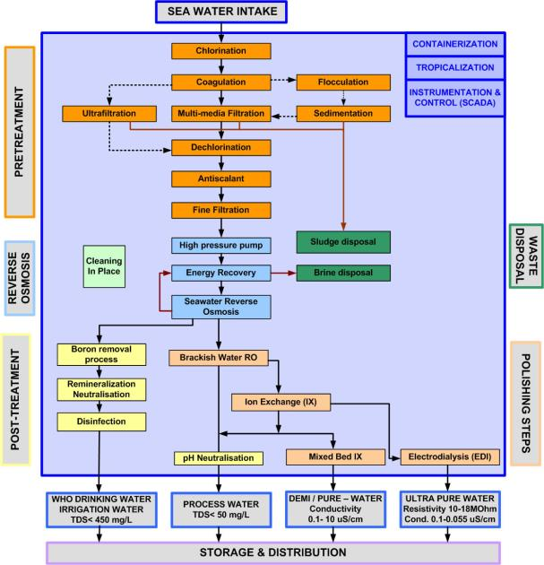
    - **Hình này chứng minh điều gì**
      - Công nghệ màng SWRO đòi hỏi quy trình tiền xử lý nghiêm ngặt và áp suất vận hành rất cao so với lọc cát tuần hoàn.
    - **Từ đâu mà thấy được**
      - Khối tiền xử lý gồm keo tụ, lọc đa tầng, khử clo và lọc tinh cartridge bảo vệ màng.
      - Bơm cao áp (High pressure pump) kết hợp bộ thu hồi năng lượng (Energy Recovery) đẩy nước qua màng Seawater Reverse Osmosis.
      - Dòng nước được tách thành nước thành phẩm (Drinking Water) và dòng thải muối (Brine disposal).
* Hệ thống lọc nước sinh hoạt gia đình 4 cấp thẩm thấu ngược (4-Stage POU Household RO System):
  * Quy mô xử lý quy ước tại điểm sử dụng (Point-of-Use - POU) với lưu lượng nhỏ ($10 - 15\text{ L/h}$), phân tách dòng nước cấp thành dòng nước uống tinh khiết và dòng nước thải cô đặc xả bỏ.
  * Sử dụng bình tích áp màng cao su (pressurized diaphragm tank) để lưu trữ nước thành phẩm, khắc phục tốc độ lọc chậm của màng RO.
  * **Hình 8.** Thiết bị hệ thống lọc nước thẩm thấu ngược gia đình 4 cấp Model FS409
    - 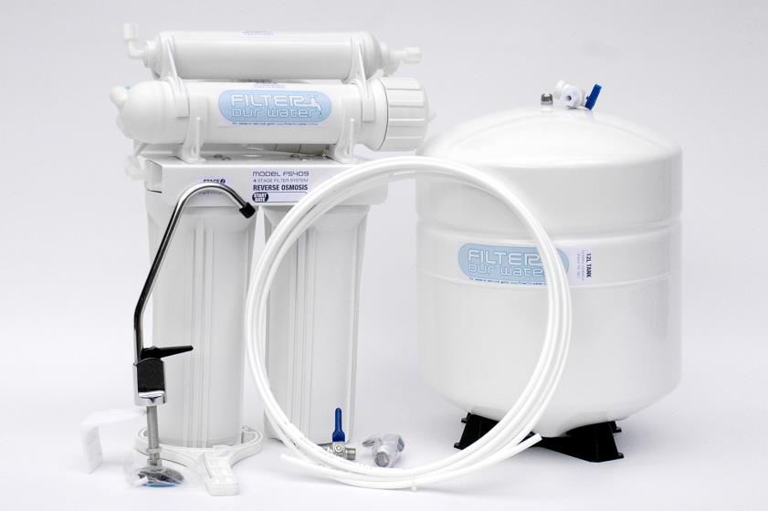
    - **Hình này chứng minh điều gì**
      - Hệ thống lọc nước uống gia đình POU sử dụng kết cấu mô-đun nhỏ gọn gồm các cốc lọc nối tiếp và bình áp tích nước.
    - **Từ đâu mà thấy được**
      - Khung giá đỡ mang 2 cốc lọc thô bên dưới cùng vỏ màng RO và lõi than chức năng nằm ngang phía trên.
      - Bình áp kín màu trắng dung tích $12\text{ L}$ (12L Tank) có van khóa bảo ôn nước tinh khiết.
      - Bộ phụ kiện vòi lấy nước uống inox và ống dẫn PE áp lực cao kết nối các cấp lọc.
  * **Hình 9.** Sơ đồ nguyên lý và thủy lực hệ thống lọc nước thẩm thấu ngược gia đình 4 cấp
    - 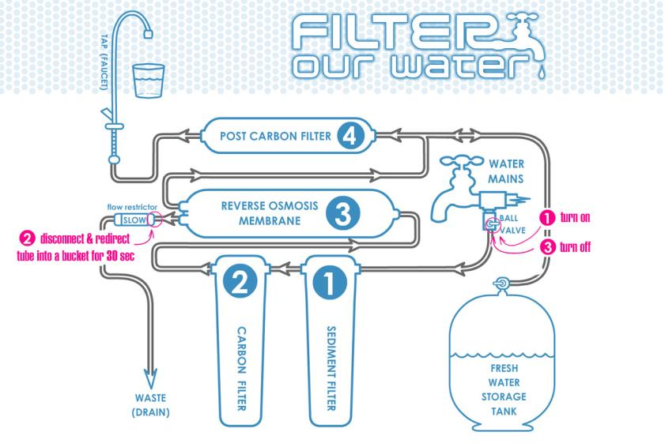
    - **Hình này chứng minh điều gì**
      - Nguyên lý phân tách một chiều qua màng RO (cấp 3) tạo ra dòng nước uống sạch vào bình tích áp và dòng xả cặn ra cống.
    - **Từ đâu mà thấy được**
      - Nước từ nguồn cấp đi tuần tự qua cấp 1 (Sediment Filter) và cấp 2 (Carbon Filter) để tiền xử lý.
      - Màng RO (cấp 3) xả nước đậm đặc qua bộ hạn chế dòng (flow restrictor) đến cống thải (Waste Drain).
      - Nước sau màng tích trữ trong bình áp (Storage Tank) rồi qua cấp 4 (Post Carbon Filter) ra vòi sử dụng.
* Quy trình sản xuất nước tinh khiết khử khoáng công nghiệp (Demineralised Water Treatment System):
  * Sử dụng cơ chế trao đổi ion chuyên sâu qua các cột hạt nhựa cation acid mạnh, anion bazơ mạnh và cột hỗn hợp mixed bed để loại bỏ toàn bộ muối hòa tan.
  * Đạt độ tinh khiết cực cao với độ dẫn điện chỉ từ $0.1 - 0.2\text{ \mu S/cm}$ (điện trở suất $5 - 10\text{ M}\Omega\cdot\text{cm}$), phục vụ các ngành công nghiệp vi điện tử, bán dẫn và nước cấp lò hơi áp lực cao.
  * **Hình 3.** Sơ đồ dây chuyền sản xuất nước khử khoáng công nghiệp (Demineralised Water System)

#### 8.4 Quy trình công nghệ khử mặn nước biển (Seawater Treatment Process)

##### 8.4.1 Tổng quan công nghệ khử mặn nước biển SWRO

* Khử mặn nước biển bằng thẩm thấu ngược (Seawater Reverse Osmosis - SWRO) là công nghệ màng phân tách để chuyển hóa nước biển thành nước ngọt phục vụ ăn uống và công nghiệp:
  * Nguồn nước biển tự nhiên có nồng độ tổng chất rắn hòa tan ($TDS$) rất cao, dao động trong khoảng từ $35,000\text{ mg/L}$ đến $45,000\text{ mg/L}$ ($35\text{--}45\text{ g/L}$).
  * Áp suất thẩm thấu tự nhiên ($\pi$) của nước biển đạt giá trị rất lớn, xấp xỉ từ $28\text{ bar}$ đến $36\text{ bar}$ ở $25^\circ\text{C}$ (ước tính thực nghiệm khoảng $0.80\text{ bar}$ cho mỗi $1,000\text{ mg/L } TDS$).
  * Quá trình thẩm thấu ngược cưỡng bức dung môi (nước) đi xuyên qua màng bán thấm từ phía dung dịch đậm đặc sang phía dung dịch loãng bằng cách cấp áp suất thủy lực bên ngoài ($P_f$) vượt quá áp suất thẩm thấu tự nhiên ($\Delta P > \Delta \pi$).
* Lớp màng mỏng bán thấm composite (Thin-Film Composite - TFC) giữ lại hầu hết các ion khoáng hòa tan và tạp chất:
  * Hiệu suất khử muối (salt rejection, $R$) của màng SWRO hiện đại đạt trên $99.4\text{--}99.7\%$.
  * Màng loại bỏ hoàn toàn các hạt lơ lửng, vi khuẩn, virus, nội độc tố vi sinh và các hợp chất hữu cơ hòa tan.
  * Nước ngọt thành phẩm (permeate) đạt tiêu chuẩn nước uống quốc tế của Tổ chức Y tế Thế giới (WHO) với $TDS < 450\text{ mg/L}$ và quy chuẩn kỹ thuật quốc gia QCVN 01-1:2018/BYT ($TDS \le 500\text{ mg/L}$).

##### 8.4.2 Dây chuyền tiền xử lý nước biển bảo vệ màng RO

* Dây chuyền tiền xử lý (Pretreatment Train) bảo vệ màng SWRO khỏi hiện tượng tắc nghẽn vật lý, cáu cặn hóa học và bám bẩn sinh học:
  * Công trình thu nước biển (Sea Water Intake): Sử dụng đường ống ngầm khơi xa trang bị chóp nón giảm vận tốc (velocity cap, vận tốc dòng chảy $v \le 0.15\text{ m/s}$) hoặc hệ thống giếng ngầm ven biển (beach wells) nhằm giảm thiểu sinh vật phù du và rác trôi nổi.
  * Khử trùng sơ bộ (Chlorination): Châm hóa chất clo tự do ($\text{Cl}_2$) hoặc natri hypoclorit ($\text{NaOCl}$) định kỳ để ức chế hàu biển, hà bám và màng vi sinh vật bám bám dính trên đường ống dẫn thô.
  * Keo tụ và tạo bông (Coagulation - Flocculation): Châm muối sắt ($\text{FeCl}_3$) với liều lượng $1.0\text{--}5.0\text{ mg/L}$ tại buồng trộn nhanh và tạo bông chậm để kết cụm các hạt keo vô cơ và chất hữu cơ tự nhiên (NOM).
  * Lắng (Sedimentation) và Lọc đa tầng (Multi-media Filtration - MMF): Nước biển qua bể lắng trọng lực hoặc bể tuyển nổi khí hòa tan (DAF) rồi đi qua các lớp cát thạch anh và than antraxít để hạ độ đục xuống dưới $0.5\text{ NTU}$.
* Công nghệ màng siêu lọc (Ultrafiltration - UF) nâng cao chất lượng nước trước màng RO:
  * Màng UF dạng sợi rỗng (hollow fiber) với kích thước mao quản $0.01\text{--}0.05\ \mu\text{m}$ (ngưỡng cắt phân tử $10,000\text{--}100,000\text{ Da}$) tạo hàng rào cơ học loại bỏ hạt keo siêu mịn và vi sinh vật.
  * Tiền xử lý bằng UF kiểm soát chỉ số mật độ bùn đạt $\text{SDI}_{15} < 2.5\text{--}3.0\text{ %/min}$, ngăn ngừa hiện tượng bẩn màng RO không thuận nghịch.
* Kiểm soát hóa học nghiêm ngặt trước khi cấp vào cụm màng RO:
  * Khử clo dư (Dechlorination): Châm natri bisunfit ($\text{NaHSO}_3$) tại đường ống trước lọc cartridge để trung hòa hoàn toàn clo tự do ($\text{HOCl}, \text{OCl}^-$), ngăn ngừa phân hủy oxy hóa liên kết amide của màng mỏng polyamide:
    $$\text{NaHSO}_3 + \text{HOCl} \rightarrow \text{NaHSO}_4 + \text{HCl}$$
  * Châm chất ức chế cáu cặn (Antiscalant): Bổ sung hóa chất nhóm phosphonate hoặc polycarboxylate ($1.0\text{--}3.0\text{ mg/L}$) để ức chế sự kết tinh vượt quá giới hạn hòa tan của canxi sunfat ($\text{CaSO}_4$), bari sunfat ($\text{BaSO}_4$) và canxi cacbonat ($\text{CaCO}_3$).
  * Lọc tinh an toàn (Fine Cartridge Filtration): Cụm lõi lọc sợi bện polypropylene kích thước $1\text{--}5\ \mu\text{m}$ giữ lại các hạt cặn cơ học sót lại nhằm bảo vệ trực tiếp cánh bơm cao áp và bề mặt màng.

##### 8.4.3 Cụm thẩm thấu ngược cao áp SWRO và Thiết bị thu hồi năng lượng ERD

* Cụm thẩm thấu ngược áp lực cao (High-Pressure RO System) vận hành ở dải áp suất thủy lực cực lớn:
  * Bơm cao áp (High Pressure Pump): Tạo áp suất làm việc $P_f = 55\text{--}70\text{ bar}$ ($5.5\text{--}7.0\text{ MPa}$) để thắng áp suất thẩm thấu và tạo thông lượng dòng thấm.
  * Tỷ lệ thu hồi nước ngọt một cấp ($Y$): Thiết kế ở dải an toàn $Y = 40\%\text{--}50\%$ nhằm kiểm soát nồng độ muối của dòng cô đặc không vượt quá giới hạn bão hòa gây đóng cặn:
    $$Y = \frac{Q_p}{Q_f} \times 100\%$$
    Trong đó $Q_p$ là lưu lượng nước ngọt thành phẩm ($\text{m}^3/\text{h}$), $Q_f$ là lưu lượng nước biển cấp vào ($\text{m}^3/\text{h}$).
  * Hệ thống rửa màng tại chỗ (Cleaning In Place - CIP): Cụm bồn pha hóa chất và bơm tuần hoàn định kỳ súc rửa màng bằng axit nhẹ (hòa tan cặn vô cơ) và dung dịch kiềm yếu (tách màng sinh học và cặn hữu cơ).
* Thiết bị thu hồi năng lượng (Energy Recovery Device - ERD) tối ưu hóa chi phí điện năng:
  * Dòng nước thải cô đặc muối (brine, lưu lượng $Q_c = Q_f - Q_p$) rời màng mang áp suất dư rất cao ($P_c \approx 60\text{--}63\text{ bar}$).
  * Bộ trao đổi áp suất đẳng tích (Isobaric Pressure Exchanger - PX) truyền trực tiếp áp suất từ dòng brine sang một phần dòng nước biển mới với hiệu suất thu hồi $\ge 95\text{--}96\%$.
  * Thiết bị ERD giúp giảm suất tiêu thụ điện riêng ($SEC$) từ $7\text{--}9\text{ kWh/m}^3$ xuống còn $2.5\text{--}3.5\text{ kWh/m}^3$ nước ngọt thành phẩm, tiết kiệm tới $60\%$ tổng điện năng tiêu thụ của nhà máy.
* Sơ đồ thủy lực màng RO thể hiện cơ chế phân tách thành hai dòng sản phẩm và dòng cô đặc xả bỏ:
  * Dòng cấp đi qua màng bán thấm tạo ra dòng thành phẩm tinh khiết và dòng thải muối qua cơ cấu tiết lưu điều chỉnh áp lực.
  * **Hình 10.** Sơ đồ nguyên lý thủy lực và đường dòng quy trình màng thẩm thấu ngược RO
    - 
    - **Hình này chứng minh điều gì**
      - Quy trình công nghệ màng RO phân tách hai nhánh: dòng nước sạch qua màng tích trữ vào bình áp và dòng xả cô đặc qua bộ hạn chế lưu lượng (flow restrictor) xả cống.
    - **Từ đâu mà thấy được**
      - Vỏ màng RO số 3 có đường nước tinh khiết đi vào bình chứa Fresh Water Storage Tank và lõi số 4, cùng đường xả đậm đặc đi qua van hạn chế dòng (SLOW) ra cống xả (Waste drain) với quy trình xả súc rửa 30 giây.
* Xử lý chất thải và bảo vệ môi trường biển:
  * Bùn lắng từ công đoạn keo tụ được đưa về bể nén bùn và ép cơ học thành bánh bùn khô (sludge disposal).
  * Dòng muối cô đặc ($TDS \approx 65,000\text{--}75,000\text{ mg/L}$) được xả phân tán ra xa bờ qua hệ thống đầu khuếch tán đa vòi (multi-port diffusers) để hòa trộn nhanh với nước biển tự nhiên.

##### 8.4.4 Dây chuyền hậu xử lý, tái khoáng và đánh bóng nước siêu tinh khiết

* Khử Bo (Boron Removal Process) đáp ứng tiêu chuẩn nước ăn uống và nước tưới:
  * Trong nước biển tự nhiên, Bo tồn tại chủ yếu ở dạng axit boric trung hòa điện tích ($\text{B(OH)}_3$ hoặc $\text{H}_3\text{BO}_3$) với nồng độ $4.0\text{--}5.0\text{ mg/L}$.
  * Phân tử $\text{B(OH)}_3$ có kích thước nhỏ và không mang điện tích nên dễ dàng khuếch tán xuyên qua màng SWRO ở điều kiện $\text{pH}$ trung tính.
  * Để đạt khuyến cáo WHO ($\text{Boron} < 0.5\text{ mg/L}$), nước thành phẩm cấp 1 được kiềm hóa nâng $\text{pH} > 9.5$ để chuyển hóa thành anion borat $\text{B(OH)}_4^-$ rồi đưa qua màng RO cấp 2 (RO Pass 2), hoặc dẫn qua cột nhựa trao đổi ion chuyên dụng chứa gốc chelate glucamine.
* Quá trình tái khoáng hóa và ổn định hóa hóa học (Remineralization & Neutralisation):
  * Nước sau màng RO bị mất gần như toàn bộ khoáng chất, chứa $\text{CO}_2$ hòa tan tự do dẫn đến $\text{pH}$ axit ($5.5\text{--}6.2$) và chỉ số bão hòa Langelier âm sâu ($\text{LSI} < -2.0$), gây ăn mòn mãnh liệt đường ống kim loại.
  * Nước được sục khí $\text{CO}_2$ và dẫn qua tháp tiếp xúc chứa hạt đá vôi canxit ($\text{CaCO}_3$):
    $$\text{CaCO}_3\text{(r)} + \text{CO}_2\text{(k)} + \text{H}_2\text{O} \rightarrow \text{Ca}^{2+} + 2\text{HCO}_3^-$$
  * Phản ứng hòa tan nâng nồng độ ion $\text{Ca}^{2+}$ lên $50\text{--}80\text{ mg/L}$ và độ kiềm lên $40\text{--}70\text{ mg/L}$ (tính theo $\text{CaCO}_3$), đưa $\text{LSI}$ về trạng thái cân bằng an toàn từ $0.0$ đến $+0.2$.
  * Khử trùng lần cuối (Disinfection): Châm clo hoặc chloramine duy trì nồng độ clo dư tự do $0.2\text{--}0.5\text{ mg/L}$ để bảo vệ nước trên mạng lưới đường ống cấp nước sinh hoạt WHO ($TDS < 450\text{ mg/L}$).
* Dây chuyền sản xuất nước kỹ thuật và nước siêu tinh khiết (Polishing Steps):
  * Nước công nghiệp (Process Water): Nước ngọt permeate qua màng RO nước lợ (Brackish Water RO - BWRO) và trung hòa $\text{pH}$ để đạt nồng độ muối siêu thấp $TDS < 50\text{ mg/L}$.
  * Nước khử khoáng (Demi / Pure Water): Dòng nước tiếp tục qua cột trao đổi ion hai tầng (Cation - Anion) hoặc cột hỗn hợp Mixed Bed IX, đưa độ dẫn điện xuống dải $0.1\text{--}10\ \mu\text{S/cm}$.
  * Nước siêu tinh khiết (Ultra Pure Water - UPW): Sử dụng công nghệ điện tích thẩm tách liên tục (Electrodeionization - EDI) kết hợp hạt trao đổi ion đánh bóng chuyên sâu:
    * Điện trở suất đạt ngưỡng giới hạn $10\text{--}18\ \text{M}\Omega\cdot\text{cm}$ ở $25^\circ\text{C}$ (độ dẫn điện cực nhỏ $0.055\text{--}0.1\ \mu\text{S/cm}$).
    * Cung cấp nước siêu sạch cho các ngành công nghệ cao như sản xuất bán dẫn, vi mạch điện tử và dược phẩm.

##### 8.4.5 Cấu trúc thiết bị module hóa và điều khiển chu trình vận hành tự động

* Thiết kế module hóa (Containerization) và nhiệt đới hóa (Tropicalization):
  * Hệ thống lọc màng RO được chế tạo thành các khối khung trượt (skid-mounted) hoặc lắp đặt đồng bộ trong container chịu tải nhằm rút ngắn thời gian xây lắp và chống chịu ăn mòn hơi muối biển.
  * Tích hợp bơm cao áp cánh quạt inox duplex/super duplex chống ăn mòn ion clorua mặn.
* Bộ điều khiển vi máy tính tự động hóa chu trình vận hành:
  * Bo mạch vi điều khiển (Micro Computer Controller) tích hợp các cảm biến áp suất, cảm biến độ dẫn điện và rơ-le ngắt áp cao/áp thấp.
  * Tự động kích hoạt chu trình xả rửa màng tốc độ cao (auto-flush) khi khởi động hoặc sau chu kỳ lọc để cuốn trôi lớp muối cô đặc bám trên bề mặt màng.
  * **Hình 11.** Cấu hình thiết bị phần cứng cụm module thẩm thấu ngược RO tích hợp
    - 
    - **Hình này chứng minh điều gì**
      - Cấu trúc module thực tế tích hợp bơm cao áp, cụm vỏ màng RO chịu áp nằm ngang, các cột lọc tiền xử lý đứng và bộ vi điều khiển giám sát chu trình tự động.
    - **Từ đâu mà thấy được**
      - Hình ảnh thiết bị hiển thị bơm tăng áp kim loại phía sau, vỏ màng RO nằm ngang phía trên, 3 cốc lọc trụ phía dưới, hộp điều khiển Micro Computer Controller với đèn LED trạng thái và bình tích áp $12\text{ L}$.
* Hệ thống bình tích áp đệm khí phục vụ phân phối nước liên tục:
  * Do lưu lượng thấm qua màng RO diễn ra liên tục nhưng với tốc độ ổn định, hệ thống trang bị bình áp màng đàn hồi (diaphragm storage tank) để tích trữ nước tinh khiết dưới áp lực khí nén.
  * Khi mở vòi sử dụng (faucet), áp suất túi khí đẩy nước qua lõi lọc tinh than hoạt tính hậu xử lý (post-GAC) mà không cần khởi động tức thời bơm cấp.
  * **Hình 12.** Tổ hợp skid thiết bị hoàn chỉnh và hệ thống trữ áp màng đệm khí
    - 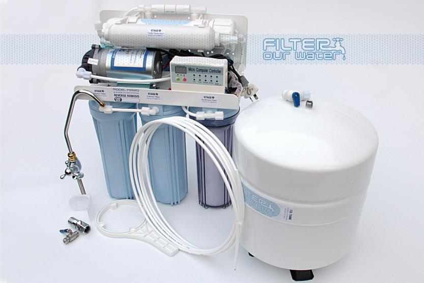
    - **Hình này chứng minh điều gì**
      - Thiết kế module hóa hoàn chỉnh trang bị đầy đủ đường ống kết nối áp lực, van bi đóng ngắt nguồn cấp và bình áp đệm khí phục vụ phân phối nước liên tục.
    - **Từ đâu mà thấy được**
      - Khối thiết bị đồng bộ đi kèm cuộn ống dẫn PE trắng, cờ-lê tháo lắp cốc lọc chuyên dụng, van bi cấp nước và bình áp hình trụ $12\text{ L}$ sơn tĩnh điện màu trắng.

##### 8.4.6 Động học phân tách màng và các phương trình tính toán thủy lực SWRO

* Phương trình thông lượng thể tích nước qua màng ($J_w$):
  * Thông lượng nước tỷ lệ thuận với áp suất động lực thực tế tác dụng lên màng ($\text{NDP}$ - Net Driving Pressure):
    $$J_w = K_w \times \text{NDP} = K_w \times (\Delta P - \Delta \pi)$$
  * Trong đó:
    * $J_w$: Thông lượng dòng thấm qua màng ($\text{L}/(\text{m}^2\cdot\text{h})$ hoặc $\text{LMH}$).
    * $K_w$: Hệ số tính thấm nước của màng ($\text{LMH/bar}$ hoặc $\text{L}/(\text{m}^2\cdot\text{h}\cdot\text{bar})$).
    * $\Delta P$: Chênh lệch áp suất thủy lực qua màng, $\Delta P = P_{\text{feed, avg}} - P_p = \frac{P_f + P_c}{2} - P_p$ ($\text{bar}$).
    * $\Delta \pi$: Chênh lệch áp suất thẩm thấu qua màng, $\Delta \pi = \pi_{\text{feed, avg}} - \pi_p = \frac{\pi_f + \pi_c}{2} - \pi_p$ ($\text{bar}$).
* Phương trình thông lượng muối qua màng ($J_s$):
  * Thông lượng muối vận chuyển qua màng theo cơ chế khuếch tán nồng độ:
    $$J_s = B \times (C_m - C_p)$$
  * Trong đó:
    * $J_s$: Thông lượng muối qua màng ($\text{g}/(\text{m}^2\cdot\text{h})$).
    * $B$: Hệ số tính thấm muối của màng ($\text{LMH}$ hoặc $\text{m/h}$).
    * $C_m$: Nồng độ muối tại sát bề mặt màng ($\text{mg/L}$), bị gia tăng do hiện tượng phân cực nồng độ:
      $$C_m = C_p + (C_{\text{bulk}} - C_p) \exp\left(\frac{J_w}{k_m}\right)$$
      với $k_m$ là hệ số truyền khối chuyển chất ($\text{LMH}$).
    * $C_p$: Nồng độ muối trong dòng nước thấm qua màng ($\text{mg/L}$).
* Phương trình tính toán áp suất thẩm thấu ($\pi$):
  * Tính theo phương trình Van 't Hoff cho dung dịch loãng và bán loãng:
    $$\pi = \phi \times i \times C \times R_{\text{gas}} \times T$$
  * Trong đó:
    * $\phi$: Hệ số thẩm thấu hiệu chỉnh thực nghiệm ($\phi \approx 0.90\text{--}0.93$ đối với nước biển).
    * $i$: Hệ số phân ly ion ($i = 2$ đối với muối $\text{NaCl}$).
    * $C$: Nồng độ mol của muối hòa tan ($\text{mol/m}^3$).
    * $R_{\text{gas}}$: Hằng số khí lý tưởng ($8.314\text{ J}/(\text{mol}\cdot\text{K})$).
    * $T$: Nhiệt độ tuyệt đối của nước biển ($\text{K}$).
* Nồng độ muối trong dòng thải cô đặc ($C_c$):
  * Xác định dựa trên phương trình cân bằng vật chất:
    $$C_c = \frac{Q_f C_f - Q_p C_p}{Q_c} = \frac{C_f - Y C_p}{1 - Y}$$
  * Với tỷ lệ thu hồi $Y = 45\%$ và nước biển đầu vào $C_f = 36,000\text{ mg/L}$, nồng độ dòng cô đặc tăng vọt lên $C_c \approx 65,000\text{--}66,000\text{ mg/L}$.
* Diện tích bề mặt màng yêu cầu ($A_m$) và số lượng phần tử màng ($N_{\text{elem}}$):
  * Tổng diện tích bề mặt màng lọc cần lắp đặt:
    $$A_m = \frac{Q_p \times 1,000}{J_w}$$
  * Số phần tử màng chuẩn kích thước công nghiệp (8040, diện tích $A_{\text{elem}} \approx 40.8\text{ m}^2$/phần tử):
    $$N_{\text{elem}} = \left\lceil \frac{A_m}{A_{\text{elem}}} \right\rceil$$

#### 8.5 Quy trình xử lý nước sinh hoạt 4 giai đoạn (Household Tap Water Treatment)

##### 8.5.1 Tổng quan và sơ đồ thủy lực hệ thống lọc POU (System Flowsheet & Hydraulic Layout)

- Mục đích và cấu hình của hệ thống xử lý nước sinh hoạt gia đình (POU - Point of Use):
  - Hệ thống xử lý nước máy cục bộ tại vòi sử dụng công nghệ màng lọc thẩm thấu ngược (RO) kết hợp với các cấp tiền xử lý và hậu xử lý.
  - Quy trình cơ bản gồm 4 giai đoạn truyền thống hoặc nâng cấp thành quy trình 5 giai đoạn hoàn chỉnh (05 stage filter process) nhằm kéo dài tuổi thọ màng và cải thiện chất lượng cảm quan.
- Sơ đồ dòng chảy thủy lực và các thiết bị phụ trợ (Model FS510):
  - Tuyến cấp nước thô: Nước từ đường ống cấp chính (Water mains) đi qua van bi khóa (Ball valve) vào hệ thống.
  - Cảm biến áp suất thấp (Low pressure switch): Đặt tại đầu vào trước lõi lọc số 1 nhằm ngắt nguồn điện để bảo vệ bơm khi áp lực đường ống cấp không đủ hoặc mất nguồn nước.
  - Bơm tăng áp (Booster pump) và công tắc dòng chảy (Flow switch): Đặt trước lõi than hoạt tính nhằm nâng áp suất dòng nước lên mức yêu cầu ($3 - 6\ \text{bar}$) để vượt qua áp suất thẩm thấu của màng RO.
  - Tuyến phân dòng sau màng RO (Stage 4):
    - Dòng nước sạch (Permeate): Đi qua cảm biến áp suất cao (High pressure switch) để tự động dừng bơm khi áp suất bình tích áp đạt ngưỡng đầy, sau đó nạp vào bình chứa nước ngọt (Fresh water storage tank) hoặc đi qua lõi khử mùi vị (Stage 5) ra vòi sử dụng (Tap / Faucet).
    - Dòng nước thải đậm đặc (Concentrate / Brine): Dẫn qua cụm xả rửa thủ công (Manual flush) đi vào đường thoát nước thải (Waste / Drain).
  - **Hình 13.** Sơ đồ nguyên lý dây chuyền xử lý nước cấp gia đình POU (FS510)
    - 
    - **Hình này chứng minh điều gì**
      - Hệ thống tích hợp 5 cấp lọc liên hoàn cùng bơm tăng áp và bình tích áp.
    - **Từ đâu mà thấy được**
      - Thứ tự dòng chảy: Nguồn cấp (Water mains) $\to$ (1) $\to$ Bơm $\to$ (2) $\to$ (3) $\to$ (4) $\to$ (5) $\to$ Vòi nước (Faucet).
      - Rẽ nhánh màng RO: Đường thấm (permeate) nạp bình chứa (Storage tank) và lõi (5); đường cô đặc (concentrate) xả thải (Waste drain).

##### 8.5.2 Chi tiết các giai đoạn trong quy trình lọc 5 cấp (Five-Stage Filtration Process)

- Phân loại chức năng 5 giai đoạn xử lý theo sơ đồ chu trình:
  - Hệ thống chia thành 3 nhóm chức năng: Tiền xử lý bảo vệ màng (Giai đoạn 1–3), Khử muối và mầm bệnh bằng màng RO (Giai đoạn 4), và Tinh chế cảm quan (Giai đoạn 5).
  - **Hình 14.** Cấu trúc chi tiết quy trình 5 giai đoạn lọc xử lý nước sinh hoạt
    - 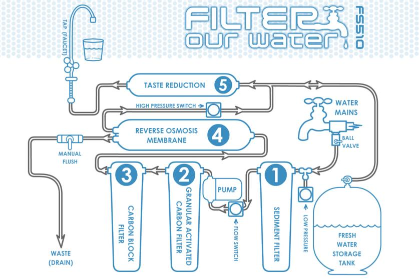
    - **Hình này chứng minh điều gì**
      - Quy trình phân chia ranh giới bảo vệ: Tiền lọc cơ học và hóa học $\to$ màng RO $\to$ khử mùi vị sau bình chứa.
    - **Từ đâu mà thấy được**
      - Nhãn định danh 5 cấp: (1) Sediment filter, (2) GAC filter, (3) Carbon block, (4) RO membrane, (5) Taste reduction.
      - Vị trí các van và công tắc điều khiển: Low pressure switch ở đầu vào, High pressure switch trên đường permeate, Manual flush trên đường waste.

###### 8.5.2.1 Giai đoạn tiền xử lý (Stage 1 – Stage 3: Sediment, GAC, CTO)

- Giai đoạn 1 (Stage 1 | Sediment filter - Lõi lọc cặn):
  - Cấu tạo: Vật liệu sợi polypropylene (PP) nguyên sinh được ép nhiệt đa lớp (melt-blown spun depth cartridge).
  - Kích thước lọc danh định: $5\ \mu\text{m}$.
  - Chức năng: Ngăn chặn và giữ lại các tạp chất cơ học lơ lửng, hạt cát, cặn bùn, và vảy rỉ sét từ đường ống phân phối nước.
  - Tác dụng bảo vệ: Giảm độ đục của nước nguồn, chống gây nghẽn bề mặt cho lõi than hoạt tính và màng RO phía sau.
- Giai đoạn 2 (Stage 2 | Carbon Filter - Lõi than hoạt tính hạt GAC):
  - Cấu tạo: Hạt than hoạt tính gáo dừa dạng rời (Granular Activated Carbon - GAC), kích thước hạt $10 - 30\ \text{mesh}$.
  - Chức năng: Hấp phụ lượng clo dư do khử trùng cấp nước đô thị ($Cl_2, HOCl, OCl^-$), khử các hợp chất hữu cơ hòa tan, dung môi công nghiệp và mùi clo.
  - Tác dụng bảo vệ màng: Loại bỏ triệt để clo tự do nhằm ngăn chặn hiện tượng oxy hóa phá hủy lớp polyamide của màng RO.
- Giai đoạn 3 (Stage 3 | Carbon Block - Lõi khối than nén CTO):
  - Định danh CTO: Viết tắt của Chlorine, Taste, and Odor reduction (khử clo, mùi và vị).
  - Cấu tạo: Chế tạo từ khối than hoạt tính dạng bột đặc (solid carbon block) kết hợp chất kết dính polymer nhiệt dẻo được ép đùn (extrusion), khác hoàn toàn với lõi GAC nén từ hạt than rời.
  - Chức năng kép:
    - Loại bỏ triệt để các tạp chất rắn mịn hơn ($1 - 5\ \mu\text{m}$) và các hóa chất độc hại còn sót lại sau lõi số 2.
    - Giữ lại các hạt bụi mịn carbon (carbon fines) thoát ra từ lõi GAC phía trước.
  - Khả năng chống khuẩn (Bacteriostatic property): Lõi CTO không cho phép vi khuẩn phát triển vì cấu trúc khối đặc không có khoảng trống kẽ hở cho vi sinh vật cư trú hay tạo màng sinh học (biofilm).
  - Yêu cầu bảo trì: Khuyến cáo thay thế lõi CTO đồng thời khi thay thế lõi than hoạt tính hạt GAC để duy trì lưu lượng và độ sạch màng.

###### 8.5.2.2 Giai đoạn khử khoáng thẩm thấu ngược và hậu xử lý (Stage 4 – Stage 5: RO & Post-GAC)

- Giai đoạn 4 (Stage 4 | Filmtec Reverse Osmosis Membrane - Màng thẩm thấu ngược Filmtec):
  - Cấu tạo màng: Màng mỏng composite polyamide (TFC - Thin Film Composite) cuộn tròn xoắn ốc (spiral-wound element).
  - Kích thước khe lọc danh định: Cỡ nanomet ($\approx 0{,}0001\ \mu\text{m} = 0{,}1\ \text{nm}$).
  - Hiệu quả xử lý:
    - Loại bỏ $> 95 - 99\%$ tổng chất rắn hòa tan (TDS), bao gồm ion kim loại nặng ($Pb^{2+}, As^{3+}, Cd^{2+}, Cr^{6+}$), ion vô cơ ($Na^+, Cl^-, SO_4^{2-}, NO_3^-$).
    - Loại bỏ $> 99{,}99\%$ vi khuẩn, virus gây bệnh và các phân tử hữu cơ phức tạp.
  - Vận hành phân dòng: Phân tách nguồn nước đầu vào thành dòng permeate tinh khiết thu hồi và dòng concentrate đậm đặc xả thải ra cống (Waste drain) cuốn trôi các chất bẩn bám trên bề mặt màng.
- Bình tích áp dự trữ nước sạch (Fresh water storage tank):
  - Cấu tạo: Bình tích áp thủy khí chứa màng ngăn cao su butyl (butyl diaphragm) phân cách khoang nước và đệm khí nén.
  - Áp suất nạp khí rỗng (Pre-charge pressure): $35 - 50\ \text{kPa}$ ($5 - 7\ \text{psi}$).
  - Tác dụng: Lưu trữ nước permeate sản xuất chậm từ màng RO ($130 - 200\ \text{mL/min}$), cung cấp tức thời lưu lượng xả lớn ($1{,}5 - 3\ \text{L/min}$) cho vòi uống khi người dùng mở vòi.
- Giai đoạn 5 (Stage 5 | Taste Reduction - Lõi khử mùi vị than hậu xử lý):
  - Cấu tạo: Lõi lọc than hoạt tính gáo dừa dạng thẳng đặt trên đường ống (In-line Post-GAC filter cartridge).
  - Vị trí: Lắp sau bình tích áp, trên đường dẫn nước sạch đến vòi sử dụng (Tap / Faucet).
  - Chức năng: Khử dư vị cao su hoặc mùi tồn đọng sau thời gian lưu trong bình chứa, cân bằng lại vị thanh ngọt tự nhiên của nước uống tinh khiết.

##### 8.5.3 Đặc tính kỹ thuật của lõi khối than nén CTO so với lõi than hạt GAC

- So sánh bản chất cấu trúc và cơ chế lọc:
  - Cấu trúc hạt vs Khối đùn: Lõi GAC chứa hạt than rời chuyển động tự do trong cốc lọc; lõi CTO là khối than bột đúc nguyên khối đồng nhất có kích thước lỗ đồng đều $1 - 5\ \mu\text{m}$.
  - Hiện tượng dòng chảy tắt (Channeling): GAC dễ xuất hiện các khe hở dòng chảy tắt khi áp suất nước biến động, làm giảm hiệu quả xử lý; CTO loại bỏ hoàn toàn nguy cơ dòng chảy tắt nhờ cấu trúc rắn định hình cố định.
  - Tích tụ vi sinh vật: Nước đọng trong khoảng kẽ hở giữa các hạt than của lõi GAC là môi trường thuận lợi cho vi khuẩn dị dưỡng phát triển; CTO không có khoảng trống kẽ hở nên vi khuẩn không thể bám dính và phát triển bên trong lõi.
  - Khả năng lọc cơ học: GAC không có khả năng lọc cặn cơ học và thường phóng thích bụi than; CTO hoạt động như màng lọc cặn tinh cấp độ $1\ \mu\text{m}$, bảo vệ an toàn tuyệt đối cho màng RO.

| Thông số / Đặc tính | Lõi than hoạt tính hạt (GAC Filter - Stage 2) | Lõi khối than nén (CTO Filter - Stage 3) |
|---|---|---|
| Dạng vật liệu | Hạt than hoạt tính rời ($10 - 30\ \text{mesh}$) | Khối composite than bột ép đùn nguyên khối |
| Kích thước lọc cơ học | Không định mức (phóng thích bụi than) | Lọc cặn danh định $1 - 5\ \mu\text{m}$ |
| Nguy cơ tạo dòng chảy tắt | Cao khi chịu áp lực xung động | Bằng không nhờ khối ma trận rắn cố định |
| Khả năng ức chế vi khuẩn | Thấp (kẽ hở tạo điều kiện sinh khối bám dính) | Cao (khối đặc triệt tiêu khoảng trống kẽ hở) |
| Vai trò chính trong hệ thống | Hấp phụ lượng lớn clo dư và hợp chất hữu cơ | Khử hóa chất tinh, giữ bụi than và lọc cặn bảo vệ màng |
| Chu kỳ thay thế khuyến cáo | $6 - 12\ \text{tháng}$ | $6 - 12\ \text{tháng}$ (thay đồng thời cùng GAC) |

##### 8.5.4 Quy trình vận hành, bảo trì và thay thế định kỳ (Operation & Preventive Maintenance)

- Chu kỳ thay thế các lõi lọc trong hệ thống:
  - Lõi lọc cặn số 1 (Sediment filter): Thay thế sau $3 - 6\ \text{tháng}$ (tùy độ đục nước nguồn).
  - Lõi than hoạt tính số 2 (GAC filter) và Lõi khối than nén số 3 (CTO filter): Thay thế đồng thời sau $6 - 12\ \text{tháng}$ để đảm bảo nồng độ clo tự do trước màng luôn đạt $< 0{,}05\ \text{mg/L}$.
  - Màng lọc thẩm thấu ngược số 4 (Filmtec RO membrane): Thay thế sau $24 - 36\ \text{tháng}$ ($2 - 3\ \text{năm}$) khi hiệu suất loại bỏ muối giảm xuống dưới $90\%$ hoặc lưu lượng thấm sụt giảm mạnh.
  - Lõi than hậu xử lý số 5 (Post-GAC taste reduction): Thay thế sau $12\ \text{tháng}$.
- Quy trình súc rửa và kiểm soát áp lực:
  - Thao tác súc rửa màng (Manual flush): Mở van xả rửa thủ công định kỳ $1 - 2\ \text{tuần/lần}$ trong thời gian $2 - 3\ \text{phút}$ để cuốn trôi lớp cáu cặn khoáng bám trên bề mặt màng RO ra đường xả thải.
  - Kiểm tra áp suất đệm khí bình tích áp: Đo áp suất khí qua van Schrader khi bình rỗng hoàn toàn, duy trì ở mức chuẩn $35 - 50\ \text{kPa}$ ($5 - 7\ \text{psi}$) để tránh hiện tượng lưu lượng vòi yếu dù bình đầy nước.

#### 8.6 Hệ thống lọc nước sinh hoạt gia đình 5 cấp (5-Stage Household Filter Process)

##### 8.6.1 Cấu hình tổng quan và cụm thiết bị phần cứng (Hardware Overview & System Components)

- Khái niệm và mục đích của hệ thống lọc POU gia đình:
  - Hệ thống xử lý nước tại điểm sử dụng (Point-of-Use - POU) chuyển đổi trực tiếp nước máy sinh hoạt thành nước uống tinh khiết đạt tiêu chuẩn nước uống đóng chai.
  - Thiết bị loại bỏ độ đục, hóa chất khử trùng, hợp chất hữu cơ dễ bay hơi, kim loại nặng, ion vô cơ hòa tan và vi sinh vật gây bệnh.
  - Cấu trúc tiêu chuẩn bao gồm giá đỡ kim loại, 3 cốc lọc thô đặt dọc, bơm trợ lực, vỏ màng RO nằm ngang, bình tích áp chứa nước sạch và vòi lấy nước độc lập.
- Thiết kế phần cứng mô-đun hóa (Model FS520 / FS510):
  - Giá treo khung thép sơn tĩnh điện: Cố định 3 cốc lọc kích thước $10\ \text{inch}$ ($254\ \text{mm}$) ở tầng dưới và nâng đỡ cụm bơm áp lực, vỏ màng, lõi khoáng ở tầng trên.
  - Cốc lọc số 1 trong suốt (Clear housing): Cho phép người dùng quan sát mức độ bám bẩn của lõi lọc bông để xác định thời điểm thay thế trực quan.
  - Cốc lọc số 2 và 3 đục mờ (Opaque white/blue housings): Ngăn cản ánh sáng trực tiếp xuyên thấu, triệt tiêu nguy cơ phát triển tảo và rêu bề mặt bên trong cốc than.
  - Bảng điều khiển vi xử lý (Micro Computer Controller): Tích hợp hệ thống đèn LED chỉ thị nguồn điện, trạng thái bơm, cảnh báo rò rỉ nước, tự động sục rửa màng và đồng hồ đếm chu kỳ thay lõi.
  - Bình tích áp thủy khí (Accumulator Tank): Bình thép bọc màng polymer dung tích danh định $12\ \text{L}$ ($3{,}2\ \text{gal}$), lưu trữ nước tinh khiết dưới áp suất khí nén để cấp nước nhanh khi mở vòi.
  - **Hình 12.** Cụm thiết bị phần cứng hệ thống lọc nước RO gia đình 5 cấp (Model FS520)
##### 8.6.2 Sơ đồ nguyên lý và chu trình dòng thủy lực (Hydraulic Flowsheet & Circuit Architecture)

- Phân vùng chức năng trong chu trình thủy lực:
  - Tuyến nạp nước thô và bảo vệ bơm: Nước từ nguồn cấp chính (Water mains) đi qua van trích nước bi (Feed adapter ball valve) và cảm biến áp suất thấp (Low Pressure Switch).
  - Tuyến tạo áp qua màng: Dòng nước sau lọc cặn thô được bơm tăng áp nén lên áp suất vận hành $4 - 7\ \text{bar}$ ($60 - 100\ \text{psi}$) trước khi đẩy qua 2 cấp than hoạt tính và nạp vào vỏ màng RO.
  - Tuyến phân dòng màng RO: Màng RO tách dòng nạp thành dòng thấm tinh khiết (permeate) và dòng thải cô đặc (concentrate / brine).
  - Tuyến nước sạch và tích trữ áp lực: Dòng permeate đi qua van một chiều, cảm biến áp suất cao (High Pressure Switch), rồi nạp vào bình tích áp và đi qua lõi khử mùi vị (Stage 5) tới vòi uống.
  - Tuyến xả thải và kiểm soát dòng cô đặc: Dòng cô đặc đi qua cụm van tiết lưu hạn chế lưu lượng (Flow Restrictor) kết hợp van sục rửa thủ công (Manual Flush Valve) dẫn ra đường thoát cống (Waste / Drain).
  - **Hình 13.** Sơ đồ nguyên lý thủy lực và chu trình dòng chảy hệ thống RO 5 cấp (Model FS510)
##### 8.6.3 Chi tiết kỹ thuật 5 cấp lọc chức năng (Detailed Engineering of 5 Filtration Stages)

- Phân bố ranh giới xử lý của 5 cấp lọc:
  - Cụm tiền xử lý (Giai đoạn 1 – 3): Loại bỏ hạt cơ học lơ lửng, keo tụ, clo tự do và hóa chất hữu cơ nhằm bảo vệ đầy đủ màng thẩm thấu ngược.
  - Cụm khử muối sâu (Giai đoạn 4): Tách bỏ muối khoáng hòa tan, ion kim loại nặng và mầm bệnh vi sinh vật qua lớp màng chọn lọc phân tử.
  - Cụm hoàn thiện cảm quan (Giai đoạn 5): Tinh chế chất lượng cảm quan, hấp phụ khí hòa tan và khử mùi dư sau bình chứa.
  - **Hình 14.** Cấu trúc quy trình 5 giai đoạn lọc xử lý nước sinh hoạt (05 Stage Filter Process)
###### 8.6.3.1 Cụm tiền xử lý 3 cấp: Sediment (PP), Than hoạt tính hạt (GAC) và Khối than nén (CTO)

- Giai đoạn 1 | Lõi lọc cặn cơ học (Stage 1: Sediment Filter):
  - Cấu tạo: Vật liệu sợi bông xốp polypropylene (PP) nguyên sinh được nung chảy và thổi sợi đa lớp (melt-blown spun polypropylene cartridge).
  - Kích thước khe hở danh định: $5\ \mu\text{m}$.
  - Cơ chế lọc: Cơ chế lọc sâu (depth filtration). Mật độ sợi tăng dần từ lớp ngoài vào trong lõi, giữ các hạt cặn theo độ sâu của lớp vật liệu.
  - Đối tượng loại bỏ: Rỉ sét đường ống, bùn đất, cát mịn, tảo lơ lửng và chất không tan có đường kính $> 5\ \mu\text{m}$.
  - Mục tiêu xử lý: Giảm chỉ số độ đục nước nguồn về mức $\text{NTU} < 1$, bảo vệ bơm áp lực và chống tắc nghẽn bề mặt lõi than phía sau.
  - Tuổi thọ định mức: $3 - 6\ \text{tháng}$ (tùy thuộc tải lượng chất rắn lơ lửng của nước cấp).
- Giai đoạn 2 | Lõi than hoạt tính dạng hạt (Stage 2: Granular Activated Carbon - GAC):
  - Cấu tạo: Chứa hạt than hoạt tính gáo dừa dạng hạt rời (granular activated coconut shell carbon), cấp hạt $10 - 30\ \text{mesh}$.
  - Diện tích bề mặt riêng: $900 - 1.100\ \text{m}^2/\text{g}$, cung cấp dung lượng hấp phụ lớn nhờ hệ thống vi mao quản (micropores $< 2\ \text{nm}$).
  - Cơ chế xử lý:
    - Hấp phụ vật lý các hợp chất hữu cơ dễ bay hơi (VOCs), thuốc bảo vệ thực vật, trihalomethanes ($\text{THMs}$) và chất gây mùi vị.
    - Khử hóa học clo dư tự do ($Cl_2, HOCl, OCl^-$) thành ion clorua vô hại theo phản ứng khử trên bề mặt carbon:
      $$\text{C}^* + 2\text{HOCl} \to \text{CO}_2 + 2\text{H}^+ + 2\text{Cl}^-$$
  - Mục tiêu bảo vệ màng RO: Đưa nồng độ clo dư tự do về mức $< 0{,}05\ \text{mg/L}$. Màng mỏng polyamide TFC bị clo oxy hóa và phá hủy liên kết amide không thể đảo ngược khi nồng độ clo vượt ngưỡng $0{,}1\ \text{mg/L}$.
  - Nhược điểm vật lý: Lõi hạt rời dễ phát tán bụi than mịn (carbon fines) xuôi dòng và dễ hình thành dòng chảy tắt (channeling) khi chịu xung áp.
  - Tuổi thọ định mức: $6 - 12\ \text{tháng}$.
- Giai đoạn 3 | Lõi khối than nén ép đùn (Stage 3: Carbon Block Filter - CTO):
  - Ý nghĩa ký hiệu CTO: Chlorine, Taste, and Odor reduction (chuyên biệt khử clo dư, mùi vị tồn dư và cặn mịn).
  - Cấu tạo vật liệu: Hỗn hợp bột than hoạt tính siêu mịn kết hợp keo kết dính polymer nhiệt dẻo được ép nén dưới nhiệt độ và áp suất cao thành khối rắn đồng nhất (extruded solid carbon block).
  - Cấu trúc vật lý khác biệt so với GAC:
    - GAC cấu thành từ các hạt than rời tự do nén ép cơ học đơn thuần bên trong vỏ nhựa.
    - CTO là khối xốp đặc rắn nguyên khối, không có khoang rỗng tự do giữa các hạt.
  - Chức năng kép:
    - Hấp phụ hóa học: Tiếp tục hấp phụ triệt để dư lượng clo và hóa chất hữu cơ còn sót lại sau lõi GAC.
    - Lọc cơ học tinh: Khe hở danh định $1 - 5\ \mu\text{m}$ giữ lại toàn bộ hạt cặn mịn và chặn triệt để bụi than mịn thoát ra từ lõi GAC số 2.
  - Đặc tính ức chế vi khuẩn (Bacteriostatic Property):
    - Cấu trúc khối carbon nén đặc triệt tiêu các khoang kẽ hở vĩ mô và vùng nước tù đọng.
    - Vi khuẩn không có không gian để định cư, phân chia tế bào hoặc hình thành màng màng sinh học (biofilm) như trong đệm than hạt rời.
  - Yêu cầu thay thế đồng bộ: Luôn thay thế lõi CTO đồng thời với lõi GAC ($6 - 12\ \text{tháng}$) nhằm duy trì chỉ số mật độ bùn ($\text{SDI}_{15} < 3 - 5$) cho dòng nạp màng RO.

| Tiêu chí kỹ thuật | Lõi than hoạt tính hạt (GAC Filter - Cấp 2) | Lõi khối than nén (CTO Filter - Cấp 3) |
|---|---|---|
| Dạng vật liệu cấu thành | Hạt than gáo dừa tự do ($10 - 30\ \text{mesh}$) | Bột than hoạt tính liên kết keo ép đùn nguyên khối |
| Cấu trúc không gian hạt | Đệm hạt rời rạc, có khe hở kẽ hạt lớn | Khối xốp rắn đồng nhất, triệt tiêu khe hở rỗng |
| Khả năng lọc cặn cơ học | Kém; phát tán bụi than mịn vào dòng nước | Tốt; cấp lọc cơ học định mức $1 - 5\ \mu\text{m}$ |
| Rủi ro tạo dòng chảy tắt (Channeling) | Cao khi áp suất nguồn nước biến động | Bằng không nhờ ma trận dẫn dòng cố định |
| Nguy cơ phát triển màng sinh học | Cao do nước đọng tại các kẽ hở hạt rời | Rất thấp vì không có không gian cho khuẩn bám dính |
| Chức năng chính | Hấp phụ thô clo dư và hóa chất hữu cơ | Khử hóa chất tinh, giữ bụi than và lọc cặn bảo vệ màng |
| Chu kỳ thay thế | $6 - 12\ \text{tháng}$ | $6 - 12\ \text{tháng}$ (khuyến cáo thay đồng bộ với GAC) |

###### 8.6.3.2 Cấp khử muối màng thẩm thấu ngược Filmtec RO và Cơ chế phân tách (Stage 4)

- Cấu tạo màng thẩm thấu ngược Filmtec (Filmtec Reverse Osmosis Membrane):
  - Cấu trúc màng mỏng composite (Thin-Film Composite - TFC): Gồm 3 lớp liên kết chặt chẽ:
    - Lớp nền vải không dệt polyester chịu lực (độ dày $\approx 120\ \mu\text{m}$).
    - Lớp đệm vi màng xốp polysulfone (độ dày $\approx 40\ \mu\text{m}$).
    - Lớp rào cản siêu mỏng polyamide thơm chọn lọc (aromatic polyamide active layer, độ dày $\approx 0{,}2\ \mu\text{m}$).
  - Dạng cuộn xoắn ốc (Spiral-wound element): Các túi màng phẳng (membrane leaves) ghép đôi bọc lưới dẫn dòng thấm (permeate spacer) cuộn tròn quanh ống thu nước trung tâm (permeate core tube), ngăn cách bởi lưới dẫn dòng nạp (feed spacer mesh).
  - Kích thước lỗ lọc danh định: Cỡ hạ nanomet ($\approx 0{,}1 - 0{,}2\ \text{nm} = 0{,}0001\ \mu\text{m}$).
- Động học và cơ chế phân tách phân tử:
  - Cơ chế hòa tan - khuếch tán (Solution-Diffusion Model): Nước và chất tan hòa tan vào lớp polyme polyamide đặc sít rồi khuếch tán qua màng dưới gradient thế hóa:
    $$J_w = A \cdot (\Delta P - \Delta \pi)$$
    $$J_s = B \cdot (C_m - C_p)$$
    Trong đó:
    - $J_w$: Thông lượng nước thấm ($\text{L}/(\text{m}^2\cdot\text{h})$).
    - $A$: Hệ số thấm nước của màng ($\text{L}/(\text{m}^2\cdot\text{h}\cdot\text{bar})$).
    - $\Delta P$: Độ chênh áp lực thủy tĩnh qua màng ($\text{bar}$).
    - $\Delta \pi$: Độ chênh áp suất thẩm thấu giữa dung dịch cấp và dòng thấm ($\text{bar}$).
    - $J_s$: Thông lượng chất tan qua màng ($\text{g}/(\text{m}^2\cdot\text{h})$).
    - $B$: Hệ số thấm chất tan của màng ($\text{m/h}$).
    - $C_m, C_p$: Nồng độ chất tan tại bề mặt màng và trong dòng thấm ($\text{mg/L}$).
  - Hiệu ứng loại trừ tĩnh điện Donnan (Donnan Exclusion): Lớp polyamide mang điện tích âm yếu trong môi trường nước trung tính ($\text{pH } 6 - 8$), giúp đẩy lùi các ion mang điện tích âm (anion) và giữ lại các cation tương ứng để bảo toàn trung hòa điện tích.
- Hiệu suất ngăn chặn chất ô nhiễm (Rejection Efficiency):
  - Tách bỏ tổng chất rắn hòa tan (TDS): Hiệu suất loại bỏ đạt $95 - 99\%$.
  - Tách bỏ ion kim loại nặng và độc tố: Loại bỏ $> 96 - 99\%$ chì ($Pb^{2+}$), asen ($As^{3+}, As^{5+}$), cadmi ($Cd^{2+}$), crom ($Cr^{6+}$), thủy ngân ($Hg^{2+}$) và nitrat ($NO_3^-$).
  - Tách bỏ vi sinh vật: Rào cản tuyệt đối với vi khuẩn ($> 99{,}99\%$), virus ($> 99{,}99\%$), ký sinh trùng nang ($Giardia, Cryptosporidium$), độc tố nội sinh pyrogens và vi nhựa.
- Thủy lực dòng chảy màng RO:
  - Dòng cấp (Feed) đi theo hướng dọc trục trong khe giữa các tấm màng (cross-flow pattern).
  - Dòng thấm (Permeate) thẩm thấu xuyên qua lớp màng, chảy xoắn ốc vào ống trung tâm thu nước sạch, dẫn tới bình chứa và vòi uống.
  - Dòng cô đặc (Concentrate / Brine) mang theo toàn bộ ion khoáng và tạp chất bị giữ lại, quét sạch liên tục bề mặt màng và xả ra đường thoát cống.
  - Tỷ lệ thu hồi nước sạch gia đình:
    $$Y = \frac{Q_{\text{permeate}}}{Q_{\text{feed}}} \times 100\% \approx 20 - 30\%$$
    Tỷ lệ nước thải/nước sạch tương ứng dao động từ $2{,}5:1$ đến $4:1$.
  - Tuổi thọ định mức: $24 - 36\ \text{tháng}$ (tương đương công suất $15.000 - 20.000\ \text{L}$).

###### 8.6.3.3 Cấp tinh chế cảm quan và tái tạo vị Post-Carbon T33 (Stage 5)

- Cấu tạo và vị trí lắp đặt (Stage 5: Taste Reduction Filter):
  - Thiết kế dạng ống kín inline (In-line cartridge model T33): Cổng kết nối nhanh $1/4\ \text{inch}$ đặt ngay trước vòi lấy nước.
  - Vật liệu: Than hoạt tính gáo dừa độ tinh khiết cao rửa axit (acid-washed coconut shell GAC), chỉ số iod $> 1.050\ \text{mg/g}$.
  - Vị trí trong hệ thống: Lắp đặt sau ngã rẽ bình tích áp, trên đường dẫn nước sạch trực tiếp đến vòi uống (Tap / Faucet).
- Cơ chế và chức năng xử lý:
  - Lọc đánh bóng nước tinh khiết (Polishing Filtration): Hấp phụ triệt để lượng vết các hợp chất hữu cơ bay hơi sinh ra trong quá trình nước tiếp xúc kéo dài với màng cao su butyl bên trong bình tích áp.
  - Khử mùi lạ và khí hòa tan: Loại bỏ khí hòa tan gây mùi ngái, mùi clo dư vi lượng hoặc vị chua nhẹ do khử hết khoáng của màng RO.
  - Cải thiện vị giác: Cân bằng độ $\text{pH}$ nhẹ và hoàn thiện vị thanh ngọt tự nhiên cho nước uống trực tiếp.
  - Tuổi thọ định mức: $12\ \text{tháng}$ (hoặc tương đương dung tích $5.000 - 7.500\ \text{L}$).

##### 8.6.4 Cụm thiết bị áp lực và cơ chế tự động hóa thủy lực (Hydraulic Pressure & Automated Control Loop)

- Bơm tăng áp thủy lực (Hydraulic Booster Pump):
  - Chủng loại: Bơm màng dịch chuyển tích cực (positive displacement diaphragm pump) vận hành bằng động cơ điện một chiều $24\ \text{VDC}$ đi kèm bộ đổi nguồn (adapter).
  - Thông số vận hành: Áp suất tạo ra $4 - 7\ \text{bar}$ ($60 - 100\ \text{psi}$), lưu lượng bơm $0{,}8 - 1{,}5\ \text{L/min}$.
  - Chức năng kỹ thuật: Áp lực mạng lưới cấp nước sinh hoạt thường thấp ($1 - 2\ \text{bar}$), không đủ tạo áp lực truyền động tịnh ($\Delta P - \Delta \pi$). Bơm nâng áp suất dòng nước vượt qua áp suất thẩm thấu và thắng trở lực màng.
- Rơ-le áp suất thấp (Low Pressure Switch - LPS):
  - Cấu tạo: Công tắc tiếp điểm điện loại thường mở (Normally Open - NO).
  - Vị trí: Đặt tại đầu vào trước lõi số 1 hoặc giữa lõi 1 và bơm.
  - Áp suất ngắt: Cài đặt ở ngưỡng $0{,}2 - 0{,}4\ \text{bar}$ ($3 - 5\ \text{psi}$).
  - Cơ chế bảo vệ: Khi mất nước nguồn hoặc áp lực cấp yếu (bị nghẽn đường ống), áp suất giảm dưới ngưỡng ngắt mạch điện, ngắt điện cuộn hút bảo vệ bơm chống chạy khô (dry run), cháy cuộn dây và xâm thực cánh bơm.
- Rơ-le áp suất cao (High Pressure Switch - HPS):
  - Cấu tạo: Công tắc tiếp điểm điện loại thường đóng (Normally Closed - NC).
  - Vị trí: Lắp đặt trên đường nước tinh khiết permeate, sau van một chiều và trước bình tích áp.
  - Áp suất tác động: Ngưỡng ngắt áp $2{,}5 - 3\ \text{bar}$ ($35 - 45\ \text{psi}$); ngưỡng đóng lại $1{,}5 - 2\ \text{bar}$ ($22 - 30\ \text{psi}$).
  - Cơ chế điều khiển:
    - Khi bình tích áp nạp đầy nước hoặc đóng vòi lấy nước, áp suất dòng permeate tăng chạm ngưỡng $2{,}5 - 3\ \text{bar}$. Rơ-le HPS mở tiếp điểm, ngắt mạch cấp điện cho bơm dừng hoạt động.
    - Khi người dùng mở vòi uống nước, áp suất bình tích áp tụt giảm xuống dưới $1{,}5 - 2\ \text{bar}$. Tiếp điểm rơ-le HPS tự động đóng lại, khởi động bơm nạp nước bù.
- Van cơ tự động ngắt 4 cửa (Auto-Shutoff Valve - ASV) và Van một chiều màng (Check Valve):
  - Van một chiều màng RO (Permeate Check Valve):
    - Lắp cố định tại cổng thoát nước sạch permeate của vỏ màng RO.
    - Chức năng: Ngăn dòng nước mang áp suất cao từ bình tích áp dội ngược vào ống thu nước trung tâm màng RO khi bơm dừng. Áp suất dội ngược sẽ làm bung tách các lớp màng composite (membrane delamination) và phá hủy hoàn toàn lõi màng.
  - Van cơ ngắt tự động 4 cửa (Auto-Shutoff 4-Way Valve - ASV):
    - Cấu tạo: Thân van chứa màng đàn hồi phân tách khoang áp suất cao (nước permeate) và khoang áp suất nguồn (dòng cấp sau lõi tiền xử lý).
    - Tỷ số áp suất đóng ngắt: Thiết kế theo tỷ lệ tiết diện màng cơ học xấp xỉ $2:1$ đến $1{,}5:1$.
    - Cơ chế ngắt dòng: Khi áp suất permeate đạt khoảng $60 - 67\%$ áp suất dòng cấp, lực đẩy màng đàn hồi thắng lực lò xo, đóng kín cửa cấp nước vào màng RO.
    - Vai trò then chốt: Chấm dứt hiện tượng nước cấp tiếp tục rò rỉ chảy qua màng xả lãng phí ra cống thải khi máy đã ngắt điện (trong các cấu hình không sử dụng van điện từ).
- Bình tích áp thủy khí chứa nước sạch (Permeate Hydro-Pneumatic Accumulator Tank):
  - Cấu tạo: Vỏ bình bằng thép cán nguội hoặc nhựa composite cao cấp, dung tích $12\ \text{L}$ ($3{,}2\ \text{gal}$). Bên trong chứa bóng khí cao su butyl (butyl bladder) chia bình làm 2 khoang cách ly tuyệt đối: khoang khí nén dưới đáy và khoang nước sạch ở phía trên.
  - Áp suất nạp khí tiêu chuẩn (Pre-charge pressure): $35 - 50\ \text{kPa}$ ($5 - 7\ \text{psi}$) khi bình rỗng hoàn toàn, bơm qua đầu van xe đạp (Schrader valve).
  - Nguyên lý nén đệm khí:
    - Khi lọc, màng RO tạo nước sạch rất chậm ($100 - 200\ \text{mL/min}$). Nước nạp vào khoang nước ép màng cao su nén khoang khí lại, tích trữ thế năng áp lực đến khi áp suất đạt $2{,}5 - 3\ \text{bar}$.
    - Khi mở vòi uống, đệm khí giãn nở tức thời đẩy màng cao su phóng luồng nước sạch ra vòi với lưu lượng xả đạt $1{,}5 - 3\ \text{L/min}$, đáp ứng nhu cầu rót nước nhanh chóng của người sử dụng.
- Cụm điều tiết dòng thải (Flow Restrictor) và Van sục rửa màng (Manual Flush Valve):
  - Van tiết lưu hạn chế lưu lượng (Flow Restrictor):
    - Ống mao dẫn hoặc lỗ tiết lưu chuẩn (ký hiệu định mức $300 - 450\ \text{mL/min}$).
    - Tạo áp phản hồi (backpressure) bên trong vỏ màng để duy trì áp lực qua màng, đồng thời điều hòa tỷ lệ dòng thải cuốn trôi cặn bẩn bám dính.
  - Cụm van sục rửa màng thủ công (Manual Flush):
    - Đặt bắt cầu song song với van tiết lưu.
    - Khi người dùng mở van sục rửa, toàn bộ dòng nước bỏ qua van tiết lưu, xả tự do với vận tốc dòng chảy lớn cuốn phăng lớp cặn phân cực bám trên bề mặt màng RO ra cống.

##### 8.6.5 Vận hành, cân bằng thủy lực và quy chuẩn bảo dưỡng thay thế (Operation & Preventative Maintenance)

- Tổng hợp thông số kỹ thuật và vai trò của 5 cấp lọc:

| Cấp lọc | Tên cấp lọc & Vật liệu | Kích thước danh định / Vật liệu | Chức năng công nghệ cốt lõi | Chu kỳ thay thế khuyến cáo |
|---|---|---|---|---|
| **Cấp 1** | Lõi lọc cặn (Sediment Filter) | Sợi polypropylene đùn nhiệt ($5\ \mu\text{m}$) | Giữ cát, bùn, gỉ sét, cặn lơ lửng, hạ độ đục $\text{NTU} < 1$ | $3 - 6\ \text{tháng}$ |
| **Cấp 2** | Than hoạt tính hạt (GAC Filter) | Than gáo dừa dạng hạt ($10 - 30\ \text{mesh}$) | Hấp phụ clo dư ($< 0{,}05\ \text{mg/L}$), khử thuốc trừ sâu, dung môi, mùi | $6 - 12\ \text{tháng}$ |
| **Cấp 3** | Khối than nén (CTO Filter) | Khối bột than ép đùn ($1 - 5\ \mu\text{m}$) | Khử hóa chất tinh, giữ bụi than, chống màng vi sinh vật | $6 - 12\ \text{tháng}$ |
| **Cấp 4** | Màng Filmtec RO (RO Membrane) | Polyamide composite màng mỏng ($0{,}1\ \text{nm}$) | Loại bỏ $> 95 - 99\%$ TDS, ion kim loại nặng, vi khuẩn, virus | $24 - 36\ \text{tháng}$ |
| **Cấp 5** | Than tinh chế vị (Post-GAC T33) | Than hoạt tính gáo dừa rửa axit dạng inline | Đánh bóng cảm quan, khử mùi tiếp xúc bóng cao su, tạo vị ngọt | $12\ \text{tháng}$ |

- Quy chuẩn vận hành và kiểm tra bảo dưỡng định kỳ:
  - Thao tác súc rửa màng RO (Flushing):
    - Mở van sục rửa màng thủ công $1 - 2\ \text{lần/tuần}$, duy trì trong $3 - 5\ \text{phút}$ để cuốn trôi lớp cáu cặn muối canxi cacbonat và màng sinh học bám dính.
  - Kiểm tra và tái nạp áp suất bình tích áp:
    - Khi nhận thấy vòi nước chảy chậm dù bình tích áp đầy nặng, khóa van bình, xả kiệt nước trong khoang nước.
    - Dùng đồng hồ đo áp suất qua van Schrader. Nếu áp suất giảm dưới $0{,}3\ \text{bar}$ ($4\ \text{psi}$), dùng bơm tay nạp lại về ngưỡng chuẩn $35 - 50\ \text{kPa}$ ($5 - 7\ \text{psi}$).
  - Đo lường và kiểm soát chỉ số TDS (Total Dissolved Solids):
    - Dùng bút đo TDS kiểm tra định kỳ nguồn nước thô ($TDS_{\text{in}}$) và nước thành phẩm tại vòi ($TDS_{\text{out}}$).
    - Tính toán tỷ lệ loại bỏ muối:
      $$R = \left(1 - \frac{TDS_{\text{out}}}{TDS_{\text{in}}}\right) \times 100\%$$
    - Khi tỷ lệ $R < 90\%$ hoặc giá trị $TDS_{\text{out}} > 50\ \text{ppm}$ đối với nước máy thông thường, màng RO đã suy thoái và cần phải thay mới.

## Phần 2: Kỹ thuật Xử lý Nước thải (Wastewater Engineering)

### Chương 1: Tổng quan về Xử lý Nước thải (Introduction to Wastewater Treatment)

#### Introduction to Wastewater and Treatment Engineering

##### What is Wastewater? Where is it From?

- Nước thải (wastewater) là nguồn cấp nước ban đầu của cộng đồng dân cư hoặc cơ sở sản xuất bị suy giảm chất lượng và trở nên không còn phù hợp (unsuitable) cho mục đích sử dụng tiếp theo:
  - Nước cấp sau khi sử dụng tiếp nhận các tạp chất ô nhiễm dạng hòa tan, keo tụ hoặc không tan.
  - Lưu lượng nước thải phát sinh ($Q_{\text{wastewater}}$) thường chiếm khoảng $70\%\text{--}90\%$ tổng lưu lượng nước cấp sinh hoạt ($Q_{\text{water supply}}$):
    $$Q_{\text{wastewater}} \approx (0.70\text{--}0.90) \times Q_{\text{water supply}}$$
- Nguồn phát sinh nước thải bao gồm ba nhóm nguồn chính trong môi trường đô thị và công nghiệp:
  - Nước thải sinh hoạt (domestic wastewater):
    - Phát sinh từ các khu dân cư, hộ gia đình, công sở, trường học, bệnh viện và trung tâm thương mại.
    - Bao gồm nước đen (blackwater) từ bồn cầu mang tải lượng phân, nước tiểu, vi sinh vật; và nước xám (graywater) từ chậu rửa, nhà tắm, giặt giũ.
  - Nước thải công nghiệp (industrial wastewater):
    - Phát sinh từ các hoạt động sản xuất, chế biến, vệ sinh thiết bị và làm mát tại các nhà máy, xí nghiệp.
    - Thành phần mang đặc tính chuyên biệt theo từng ngành nghề sản xuất, có thể chứa chất hữu cơ khó phân hủy, axit, kiềm hoặc kim loại nặng độc hại.
  - Nước mưa và dòng chảy tràn bề mặt (stormwater and surface runoff):
    - Dòng chảy trên bề mặt đô thị cuốn theo đất cát, bụi mịn, dầu mỡ động cơ, rác thải và phân bón.
    - Thâm nhập vào hệ thống thoát nước thông qua các hố ga thu nước mặt hoặc nước ngầm rò rỉ ($I/I$ - infiltration and inflow).

##### Issues with Untreated Wastewater

- Nước thải chưa qua xử lý (untreated wastewater) chứa nhiều thành phần ô nhiễm gây suy thoái môi trường và đe dọa sinh quyển:
  - Sinh khí hôi thối khó chịu (production of malodorous gases):
    - Nước thải tồn đọng nhanh chóng chuyển sang trạng thái yếm khí (septic/anaerobic state) do vi sinh vật tiêu thụ hết lượng oxy hòa tan ($\text{DO} \to 0\text{ mg/L}$).
    - Quá trình phân hủy kỵ khí các hợp chất hữu cơ chứa lưu huỳnh và khử ion sunfat ($\text{SO}_4^{2-}$) sinh ra khí hydro sunfua ($\text{H}_2\text{S}$) có mùi trứng thối đặc trưng:
      $$\text{SO}_4^{2-} + 2\text{CH}_2\text{O} \to \text{H}_2\text{S}\uparrow + 2\text{HCO}_3^-$$
    - Các hợp chất bay hơi khác sinh ra bao gồm mercaptan ($\text{CH}_3\text{SH}$), amoniac ($\text{NH}_3$), dimethyl sulfide ($(\text{CH}_3)_2\text{S}$) và các amine bậc thấp.
    - Khí thoát ra gây khó chịu cho cộng đồng xung quanh, gây ngộ độc đường hô hấp và ăn mòn hóa học nghiêm trọng kết cấu cống bê tông.
  - Hiện diện mật độ cao của các vi sinh vật gây bệnh (presence of pathogenic microorganisms):
    - Nước thải chưa xử lý là môi trường truyền nhiễm mang nhiều tác nhân sinh học gây bệnh nguy hiểm từ phân người và động vật.
    - Vi khuẩn gây bệnh (pathogenic bacteria): bao gồm *Vibrio cholerae* (bệnh tả), *Salmonella typhi* (thương hàn), *Shigella* (lỵ trực trùng) và *Escherichia coli* sinh độc tố.
    - Virus đường ruột (enteric viruses): bao gồm Rotavirus, Norovirus, Poliovirus và virus viêm gan $\text{A/E}$ (Hepatitis A/E).
    - Động vật nguyên sinh và ký sinh trùng (protozoa and helminths): bao gồm u nang *Giardia lamblia*, noãn nang *Cryptosporidium parvum* và các loại trứng giun sán có vỏ bọc bền vững.
  - Làm giàu chất dinh dưỡng gây hiện tượng phú dưỡng hóa (nutrient enrichment stimulating aquatic plant growth):
    - Nước thải mang hàm lượng lớn các chất dinh dưỡng nitơ ($\text{TN}$, $\text{NH}_4^+$, $\text{NO}_3^-$) và photpho ($\text{TP}$, $\text{PO}_4^{3-}$).
    - Tải lượng dinh dưỡng dư thừa kích thích sự bùng phát mất kiểm soát của tảo và thực vật thủy sinh (algal blooms / eutrophication).
    - Quá trình phân hủy xác tảo chết tiêu hao cạn kiệt lượng oxy hòa tan ($\text{DO} < 2\text{ mg/L}$), hủy hoại quần thể cá và các loài thủy sinh bản địa.
  - Chứa các hợp chất tiềm ẩn độc tính cao, khả năng gây đột biến hoặc ung thư (potentially toxic, mutagenic, or carcinogenic compounds):
    - Kim loại nặng độc hại (heavy metals): bao gồm chì ($\text{Pb}$), cadmi ($\text{Cd}$), thủy ngân ($\text{Hg}$), crom hóa trị sáu ($\text{Cr}^{6+}$) và asen ($\text{As}$).
    - Chất ô nhiễm hữu cơ khó phân hủy (persistent organic pollutants - $\text{POPs}$): bao gồm dung môi clo hóa, hydrocacbon thơm đa vòng ($\text{PAHs}$), dioxin và thuốc bảo vệ thực vật.
    - Các hợp chất ô nhiễm mới nổi (contaminants of emerging concern - $\text{CECs}$): bao gồm dư lượng dược phẩm, hóa chất phá hủy nội tiết (endocrine disruptors) và vi nhựa.
    - Các chất độc tích lũy sinh học (bioaccumulation) dọc theo chuỗi thức ăn thủy sinh, gây độc mãn tính và đe dọa trực tiếp đến tính mạng con người.

##### Why Treat Wastewater? Importance of Wastewater Treatment?

- Xử lý nước thải (wastewater treatment) đóng vai trò sống còn trong việc bảo vệ môi trường sống và duy trì sự phát triển bền vững:
  - Bảo vệ sức khỏe cộng đồng (public health protection):
    - Tiêu diệt triệt để các mầm bệnh truyền nhiễm (eliminates pathogens):
      - Quy trình xử lý kết hợp lắng lọc và khử trùng (bằng $\text{Cl}_2$, $\text{UV}$ hoặc $\text{O}_3$) làm bất hoạt toàn bộ vi khuẩn, virus và ký sinh trùng gây bệnh.
      - Nồng độ vi khuẩn chỉ thị $\text{Coliform}$ được hạ thấp về mức an toàn theo quy chuẩn kỹ thuật y tế.
    - Giảm thiểu triệt để nguy cơ bùng phát dịch bệnh lây truyền qua đường nước (reduces the risk of waterborne diseases):
      - Cắt đứt hoàn toàn mắt xích lan truyền bệnh theo chu trình phân - miệng (fecal-oral pathway).
      - Ngăn ngừa tình trạng nhiễm độc nguồn nước cấp và bảo vệ các hoạt động vui chơi giải trí dưới nước của con người.
  - Bảo vệ môi trường tự nhiên (environmental protection):
    - Loại bỏ tạp chất ô nhiễm hữu cơ và chất rắn ra khỏi dòng nước thải (contaminant removal from wastewater):
      - Loại bỏ chất rắn lơ lửng ($\text{TSS}$) giúp nước tiếp nhận trong sáng, chống bồi lắng đáy sông hồ.
      - Phân hủy chất hữu cơ ($\text{BOD}_5$, $\text{COD}$) giúp duy trì nồng độ oxy hòa tan tự nhiên ($\text{DO}$) trong thủy vực tiếp nhận.
      - Thu gom và khử chất dinh dưỡng ($\text{N}$ và $\text{P}$) ngăn chặn hữu hiệu nguy cơ nở hoa của tảo độc.
    - Khử bỏ và cô lập các hợp chất hóa học độc hại (eliminates toxic compounds):
      - Kết tủa hoặc phân hủy các ion kim loại nặng và hóa chất tổng hợp độc hại trước khi xả ra môi trường.
      - Bảo tồn đa dạng sinh học và giữ vững chuỗi sinh thái của nguồn tiếp nhận nước mặt.
    - Ngăn ngừa sinh khí có mùi hôi từ nước thải thối rữa (prevents odorous gas production from septic wastewater):
      - Giữ dòng chảy luôn có dưỡng khí hoặc oxy hóa ổn định, triệt tiêu phản ứng tạo khí độc $\text{H}_2\text{S}$, mercaptan và các amine bay hơi.
      - Cải thiện chất lượng môi trường không khí đô thị và xung quanh các trạm xử lý.
  - Quản lý xả thải, tái sử dụng tài nguyên và phát tán an toàn ra môi trường (treatment, reuse, or dispersal into the environment):
    - Xả thải an toàn ra môi trường (safe environmental dispersal):
      - Nước thải sau xử lý đạt ngưỡng quy chuẩn quốc gia trước khi hòa vào nguồn tiếp nhận tự nhiên.
      - Giữ gìn an toàn chức năng của các vùng nước hạ lưu phục vụ nông nghiệp và công nghiệp.
    - Tái sử dụng nước sau xử lý (water reclamation and reuse):
      - Cung cấp nước tái tạo cho tưới tiêu cảnh quan, tưới nông nghiệp, làm mát thiết bị công nghiệp hoặc xả bồn cầu.
      - Bổ cập tầng chứa nước ngầm và giảm bớt áp lực khai thác lên nguồn nước ngầm và nước mặt tự nhiên.
    - Thu hồi tài nguyên và năng lượng sạch (resource and energy recovery):
      - Thu hồi khí sinh học biogas ($\text{CH}_4$) từ quá trình phân hủy bùn kỵ khí để phát điện và cấp nhiệt.
      - Thu hồi photpho dưới dạng khoáng struvite ($\text{MgNH}_4\text{PO}_4\cdot 6\text{H}_2\text{O}$) làm phân bón nông nghiệp.

##### Role of Wastewater Engineering

- Kỹ thuật nước thải (wastewater engineering) là một nhánh chuyên ngành cốt lõi của kỹ thuật môi trường (environmental engineering):
  - Ứng dụng tích hợp các nguyên lý khoa học tự nhiên và kỹ thuật công nghệ tiên tiến:
    - Cơ học chất lỏng và thủy lực học công trình (hydraulics).
    - Hóa học nước và nhiệt động lực học phản ứng (water chemistry).
    - Vi sinh vật học môi trường và động học sinh học (microbiology and biological kinetics).
    - Kỹ thuật điều khiển quá trình và công nghệ vật liệu xử lý.
  - Giải quyết bài bản chuỗi các vấn đề kỹ thuật liên hoàn:
    - Thu gom nước thải (collection): thiết kế trạm bơm, mạng lưới cống dẫn và kiểm soát dòng tràn mùa mưa.
    - Xử lý nước thải (treatment): tính toán công nghệ, kích thước bể phản ứng cơ học, hóa lý và sinh học.
    - Tái sử dụng và tuần hoàn nước (reuse and reclamation): thiết kế các module lọc màng và oxy hóa bậc cao.
- Mục tiêu tổng quát của kỹ sư kỹ thuật nước thải (goal of wastewater engineering):
  - Bảo vệ tối đa sức khỏe cộng đồng và giữ gìn hệ sinh thái môi trường tiếp nhận lâu dài.
  - Cân bằng hài hòa giữa các yếu tố ràng buộc đa chiều trong xã hội:
    - Hiệu quả kinh tế (economic feasibility): tối ưu chi phí đầu tư xây dựng ban đầu ($\text{CAPEX}$) và chi phí vận hành bảo trì thường niên ($\text{OPEX}$).
    - Chấp thuận xã hội (social acceptance): giảm thiểu ảnh hưởng mùi hôi, tiếng ồn, bụi và đảm bảo mỹ quan cảnh quan đô thị.
    - Quy định chính trị và khung pháp lý (political and regulatory compliance): đáp ứng nghiêm ngặt các bộ quy chuẩn kỹ thuật quốc gia về môi trường.

##### Scope and Curriculum of Wastewater Engineering

- Khung chương trình kỹ thuật nước thải được cấu trúc thành các mảng kiến thức nền tảng và ứng dụng chuyên sâu:
  - 1. Lịch sử phát triển xử lý nước thải (History of wastewater treatment):
    - Bối cảnh lịch sử qua các thời kỳ: từ giai đoạn tự làm sạch tự nhiên thời cổ đại đến khủng hoảng quá tải ô nhiễm thời kỳ đô thị hóa và cách mạng công nghiệp.
    - Các mốc lịch sử kỹ thuật quan trọng: sự phát minh quá trình bùn hoạt tính hiếu khí (activated sludge process) và sự hình thành hệ thống pháp lý bảo vệ môi trường toàn cầu.
  - 2. Đặc tính của nước thải (Characteristics of wastewater):
    - Nguồn phát sinh nước thải (sources of wastewater).
    - Các loại hệ thống mạng lưới thu gom (types of collection systems): cống chung (combined), cống riêng (separate) và cống nửa riêng.
    - Thành phần các chất ô nhiễm trong nước thải (wastewater constituents): các chỉ tiêu chất rắn ($\text{TS}$, $\text{TSS}$, $\text{TDS}$, $\text{VSS}$), chỉ tiêu hữu cơ ($\text{BOD}_5$, $\text{UBOD}$, $\text{COD}$), phân đoạn chất dinh dưỡng nitơ ($\text{TN}$, $\text{TKN}$, $\text{NH}_4^+$, $\text{NO}_3^-$) và photpho ($\text{TP}$).
  - 3. Phân loại các phương pháp xử lý nước thải (Classification of wastewater treatment methods):
    - Các quá trình đơn vị cơ học / vật lý (physical unit processes): song chắn rác (screening), bể lắng cát (grit chamber), lắng trọng lực (sedimentation), tuyển nổi áp lực ($\text{DAF}$) và lọc sâu (filtration).
    - Các quá trình đơn vị hóa học / hóa lý (chemical unit processes): keo tụ - tạo bông (coagulation - flocculation), kết tủa hóa học, trung hòa $\text{pH}$ và khử trùng oxy hóa ($\text{Cl}_2$, $\text{O}_3$, $\text{UV}$).
    - Các quá trình đơn vị sinh học (biological unit processes): quá trình hiếu khí (aerobic), thiếu khí (anoxic), kỵ khí (anaerobic) và quá trình khử photpho sinh học tăng cường ($\text{EBPR}$).
  - 4. Ứng dụng các phương pháp xử lý (Application of treatment methods):
    - Các bậc xử lý nước thải (levels of wastewater treatment): tiền xử lý (preliminary), bậc một (primary), bậc hai (secondary), bậc ba / nâng cao (tertiary / advanced) và xử lý bùn cặn (sludge treatment).
    - Sơ đồ công nghệ xử lý điển hình (typical treatment process flow diagrams): cấu hình công nghệ chuẩn cho nước thải sinh hoạt đô thị và nước thải sản xuất công nghiệp.
    - Áp dụng các quy chuẩn kỹ thuật quốc gia kiểm soát xả thải: quy chuẩn nước thải sinh hoạt ($\text{QCVN 14:2008/BTNMT}$) và quy chuẩn nước thải công nghiệp ($\text{QCVN 40:2011/BTNMT}$).

#### 1. History of Wastewater Treatment

##### Historical Context

- Điều kiện môi trường và vệ sinh thời kỳ Cổ đại đến Trung cổ (Ancient Times - Middle Ages):
  - Quy mô dân số toàn cầu nhỏ bé ($< 500\text{ triệu người}$) với nền tảng khoa học kỹ thuật sơ khai.
  - Trữ lượng tài nguyên nước ngọt tự nhiên dồi dào, mật độ phân bố dân cư thưa thớt quanh các lưu vực sông hồ lớn.
  - Tải lượng ô nhiễm nước thải sinh hoạt nằm hoàn toàn trong ngưỡng tự làm sạch tự nhiên của Trái Đất (within Earth's self-cleaning assimilation threshold):
    - Dòng tiếp nhận tự phân hủy các chất hữu cơ hòa tan nhờ hệ vi sinh vật bản địa và quá trình hòa tan oxy khí quyển tự nhiên.
    - Nồng độ chất ô nhiễm bị pha loãng nhanh chóng bởi lưu lượng nước tự nhiên áp đảo.
  - Cơ sở hạ tầng kỹ thuật chỉ dừng lại ở hệ thống thoát nước thô sơ, hoàn toàn chưa có công trình xử lý nước thải:
    - Nước thải sinh hoạt và nước mưa chảy tự do theo địa hình qua rãnh đào hở hoặc mương dẫn lộ thiên ra nguồn tiếp nhận gần nhất.
    - Thu gom chất thải vệ sinh tại chỗ bằng các hố tiêu, hố thấm thô sơ (early cesspools, cesspits) không có lớp lót chống thấm đáy.
    - Cặn lắng trong hố thấm tự ngấm vào lòng đất hoặc được nạo vét thủ công định kỳ để bón trực tiếp cho cây trồng nông nghiệp.

- Biến động môi trường và vệ sinh thời kỳ Cận đại đến Hiện tại (Early Modern Period - Now):
  - Tác động sâu sắc từ Cách mạng Công nghiệp (Industrial Revolution, thế kỷ $18\text{--}19$):
    - Động cơ hơi nước và sản xuất công nghiệp tập trung thúc đẩy quá trình đô thị hóa thần tốc (rapid urbanization).
    - Dân số các thành phố lớn bùng nổ vượt bậc, dẫn tới mật độ cư trú đậm đặc tại các trung tâm công nghiệp.
  - Tình trạng khan hiếm và suy thoái chất lượng nguồn nước ngọt (Scarcity of fresh water):
    - Nước thải sinh hoạt và nước thải công nghiệp phát sinh với lưu lượng khổng lồ xả thẳng ra các thủy vực đô thị.
    - Tải lượng chất ô nhiễm hữu cơ và hóa chất vượt xa khả năng tự làm sạch của sông hồ, biến các dòng sông thành mương chứa nước thải lộ thiên (như sự kiện "Đại hôi thối" The Great Stink trên sông Thames tại Luân Đôn năm $1858$).
    - Nguồn nước cấp bị ô nhiễm nghiêm trọng bởi mầm bệnh đường ruột, làm bùng phát các đại dịch truyền nhiễm nguy hiểm (dịch tả Cholera, dịch thương hàn Typhoid) đe dọa sinh mạng hàng triệu người.
  - Sự hình thành phong trào bảo vệ môi trường toàn cầu (Global environmental protection movement):
    - Nhận thức khoa học về mối liên hệ giữa ô nhiễm nguồn nước và dịch bệnh thúc đẩy cải cách vệ sinh y tế công cộng.
    - Các quốc gia ban hành đạo luật môi trường và quy chuẩn kỹ thuật bắt buộc để kiểm soát chất lượng nước thải trước khi xả ra môi trường (như Rivers Pollution Prevention Act $1876$ tại Anh, Clean Water Act tại Hoa Kỳ, hệ thống QCVN tại Việt Nam).

##### Milestones in Wastewater Treatment: 19th and 20th Centuries

- Các mốc kỹ thuật vệ sinh thế kỷ 19 (19th century, $1800\text{s}$):
  - Xây dựng mạng lưới cống thoát nước đô thị hiện đại (Modern wastewater drainage systems):
    - Thiết kế tuyến cống ngầm bằng gạch xây và ống bê tông để gom triệt để nước thải và nước mưa khỏi khu vực nội đô (điển hình là mạng lưới cống ngầm Luân Đôn do Joseph Bazalgette thiết kế sau năm $1858$).
    - Chuyển dịch từ việc xả phân tán tại từng hộ gia đình sang thu gom tập trung về một hoặc vài cửa xả ngoại thành.
  - Phương pháp xử lý nước thải dựa vào đất (Land-based treatment methods):
    - Thải bỏ trên mặt đất (Land disposal) và cánh đồng tưới nông nghiệp (Sewage farming / irrigation): Nước thải thô được dẫn ra đồng ruộng ngoại ô để tưới tiêu cho cây trồng, tận dụng chất hữu cơ và dinh dưỡng trong nước thải làm màu mỡ đất.
    - Lọc cát gián đoạn (Intermittent sand filtration): Cho nước thải thấm qua các tầng cát lọc tự nhiên theo chu kỳ khô - ngập xen kẽ nhằm duy trì môi trường hiếu khí cho vi sinh vật đất oxy hóa chất hữu cơ.
  - Hạn chế kỹ thuật cố hữu của phương pháp xử lý dựa vào đất:
    - Đòi hỏi diện tích chiếm đất cực lớn (large footprint, suất diện tích thường yêu cầu từ $10\text{--}50\text{ m}^2/\text{người}$).
    - Nguy cơ tắc nghẽn bề mặt lọc do tích tụ cặn bơ dầu mỡ và chất rắn lơ lửng.
    - Phát sinh mùi hôi thối nồng nặc, thu hút ruồi muỗi và tiềm ẩn rủi ro ô nhiễm thẩm thấu vào tầng chứa nước ngầm nông.
    - Không thể đáp ứng nhu cầu xử lý khi diện tích đất đô thị ngày càng đắt đỏ và lưu lượng nước thải gia tăng nhanh.
  - Ứng dụng công trình tự hoại sơ khai:
    - Bể tự hoại (Septic tank) và hố lắng kỵ khí ngầm (Cesspool) được phát triển vào cuối thế kỷ $19$ để lưu giữ chất rắn lắng được, lên men kỵ khí bùn cặn hữu cơ trước khi thải dịch lỏng ra môi trường đất.

- Đột phá sinh học và sự ra đời của quá trình bùn hoạt tính trong thế kỷ 20 (20th century):
  - Phát minh công nghệ bùn hoạt tính (Activated Sludge Process):
    - Hai nhà khoa học người Anh Edward Ardern và William T. Lockett phát hiện và công bố quá trình bùn hoạt tính vào năm $1914$ tại Manchester.
    - Nguyên lý vận hành cốt lõi: Nước thải được cấp khí nén nhân tạo liên tục trong bể phản ứng để nuôi dưỡng quần thể vi sinh vật hiếu khí lơ lửng (activated sludge flocs).
    - Bông bùn hoạt tính hấp phụ và oxy hóa sinh hóa các chất hữu cơ hòa tan thành $\text{CO}_2$, $\text{H}_2\text{O}$ và sinh khối mới, sau đó hỗn hợp bùn nước được phân tách trọng lực tại bể lắng thứ cấp và tuần hoàn bùn hoạt tính về bể sục khí.
    - Ý nghĩa cách mạng: Giảm diện tích xây dựng trạm xử lý xuống hàng chục lần so với cánh đồng tưới ($< 0.1\text{--}0.2\text{ m}^2/\text{người}$), nâng cao hiệu suất xử lý chất hữu cơ lên trên $90\%$ và tạo tiền đề cho kỹ thuật xử lý nước thải sinh học hiện đại.

- Giai đoạn 1900 đến 1970s — Tập trung vào các chỉ tiêu ô nhiễm hữu cơ và vi sinh truyền thống:
  - Mục tiêu xử lý ưu tiên hàng đầu:
    - Tách bỏ chất rắn lơ lửng (Total Suspended Solids, $\text{TSS}$) nhằm loại trừ độ đục và cặn lắng bồi lấp lòng sông hồ.
    - Oxy hóa các hợp chất hữu cơ dễ phân hủy sinh học (Biodegradable organics) để ngăn chặn hiện tượng cạn kiệt oxy hòa tan ($\text{DO}$) tại nguồn tiếp nhận, đo lường chủ đạo bằng chỉ tiêu nhu cầu oxy sinh hóa trong 5 ngày ($\text{BOD}_5$).
    - Tiêu diệt vi sinh vật gây bệnh (Pathogenic organisms) qua công đoạn khử trùng (chủ yếu sử dụng hợp chất clo: $\text{Cl}_2$, $\text{NaOCl}$) để bảo vệ sức khỏe cộng đồng.
  - Thiết lập chuỗi công nghệ xử lý bậc 2 quy chuẩn (Conventional Secondary Treatment):
    - Cụm công trình cơ học sơ cấp: Song chắn rác, bể lắng cát và bể lắng đợt 1 (loại bỏ $50\text{--}70\%\text{ TSS}$ và $25\text{--}40\%\text{ BOD}$).
    - Cụm công trình sinh học thứ cấp: Bể thổi khí bùn hoạt tính (Activated Sludge) hoặc bể lọc sinh học nhỏ giọt (Trickling Filter) kết hợp bể lắng đợt 2 và bể tiếp xúc khử trùng clo.
    - Tiêu chuẩn xả thải thứ cấp điển hình: $\text{BOD}_5 \le 30\text{ mg/L}$ và $\text{TSS} \le 30\text{ mg/L}$.

- Giai đoạn 1980s đến 2000 — Đánh giá tác động sức khỏe toàn diện và ban hành tiêu chuẩn nghiêm ngặt:
  - Chuyển biến trong nhận thức môi trường:
    - Nhận diện các tác động mãn tính tới sức khỏe con người và suy thoái hệ sinh thái thủy vực do tích tụ dinh dưỡng và chất ô nhiễm độc hại.
    - Hiện tượng phú dưỡng hóa (Eutrophication) bùng phát trên diện rộng do hàm lượng nitơ ($\text{TN}$) và photpho ($\text{TP}$) xả thải quá mức, kích thích tảo lam nở hoa làm chết cá và ô nhiễm nguồn nước mặt.
  - Tiến bộ vượt bậc của công nghệ phân tích và quan trắc môi trường (Advanced detection and analytical methods):
    - Ứng dụng các thiết bị phân tích hiện đại: Sắc ký khí khối phổ ($\text{GC-MS}$), sắc ký lỏng hiệu năng cao ($\text{HPLC}$), quang phổ phát xạ plasma cảm ứng cao tần ($\text{ICP-MS}$).
    - Nâng cao giới hạn phát hiện xuống nồng độ siêu vết (từ $\text{mg/L}$ xuống $\mu\text{g/L}$ và $\text{ng/L}$).
    - Nhận diện hàng loạt thông số ô nhiễm mới trong nước thải: Kim loại nặng ($\text{Cd}$, $\text{Cr}$, $\text{Pb}$, $\text{Hg}$), hợp chất hữu cơ khó phân hủy ($\text{POPs}$), phụ phẩm khử trùng gây ung thư ($\text{DBPs}$ như trihalomethanes $\text{THMs}$).
  - Mở rộng mục tiêu xử lý và ra đời các công nghệ xử lý nâng cao (Advanced treatment technologies):
    - Đặt ra yêu cầu bắt buộc về khử chất dinh dưỡng: Phát triển các công trình khử nitơ và photpho bằng phương pháp sinh học ($\text{BNR}$) kết hợp các vùng kỵ khí (anaerobic), thiếu khí (anoxic) và hiếu khí (aerobic) như quy trình $\text{A/O}$, $\text{A}_2\text{O}$, Bardenpho, $\text{SBR}$.
    - Phát triển công nghệ màng sinh học ($\text{MBR}$ - Membrane Bioreactor) thay thế bể lắng thứ cấp, lọc màng áp lực ($\text{MF}$, $\text{UF}$, $\text{RO}$), và oxy hóa nâng cao ($\text{AOP}$: $\text{Fenton}$, $\text{O}_3/\text{H}_2\text{O}_2$, $\text{UV}/\text{H}_2\text{O}_2$).

##### 21st-Century Milestones and Sustainability Paradigms

- Đặc trưng kỹ thuật xử lý nước thải thế kỷ 21 (21st century – Now):
  - Tích hợp liên hoàn đa phương pháp xử lý:
    - Kết hợp chặt chẽ các quá trình Vật lý (Physical), Hóa học (Chemical) và Sinh học (Biological) trong một dây chuyền công nghệ tối ưu hóa cao độ.
    - Áp dụng các quá trình màng lọc nano ($\text{NF}$) và thẩm thấu ngược ($\text{RO}$) sau xử lý sinh học để sản xuất nước tái sử dụng đạt chất lượng nước cấp công nghiệp và nước sinh hoạt.
  - Tự động hóa và số hóa điều khiển trạm xử lý (Automation & Digitalization):
    - Trang bị hệ thống điều khiển tích hợp $\text{SCADA}$ (Supervisory Control and Data Acquisition) và $\text{PLC}$ (Programmable Logic Controller).
    - Bố trí các cảm biến đo lường trực tuyến (Online sensors) thời gian thực: Đầu đo oxy hòa tan ($\text{DO}$), thế oxy hóa - khử ($\text{ORP}$), $\text{pH}$, amoni ($\text{NH}_4^+$), nitrat ($\text{NO}_3^-$) và độ đục.
    - Điều khiển biến tần quạt gió theo nồng độ $\text{DO}$ thực tế, giảm thiểu tiêu thụ điện năng sục khí lãng phí ($20\text{--}40\%$).
    - Ứng dụng trí tuệ nhân tạo ($\text{AI}$) và mô hình mô phỏng số (Computational Fluid Dynamics - $\text{CFD}$, Activated Sludge Models - $\text{ASM}$) để dự báo tải lượng và tối ưu hóa hóa chất châm.

- Chuyển dịch tư duy sang Phát triển bền vững và Kinh tế tuần hoàn (Sustainability & Circular Economy):
  - Chuyển đổi mô hình công trình từ "Trạm xử lý tiêu hủy nước thải" ($\text{WWTP}$) sang "Cơ sở thu hồi tài nguyên nước" ($\text{WRRF}$ - Water Resource Recovery Facility).
  - Thiết kế tiết kiệm năng lượng (Energy-efficient designs):
    - Tối ưu hóa hiệu suất sục khí bằng hệ đĩa bọt mịn và phân phối khí theo vùng.
    - Phát triển công nghệ bùn hạt hiếu khí ($\text{AGS}$ - Aerobic Granular Sludge, e.g. công nghệ Nereda) cho phép lắng nhanh gấp nhiều lần, tích hợp khử $\text{COD}$, $\text{N}$, $\text{P}$ trong một bể phản ứng duy nhất, giảm $75\%$ diện tích chiếm đất và $30\%$ năng lượng tiêu thụ.
    - Ứng dụng quá trình khử nitơ qua chu trình $\text{ANAMMOX}$ (Anaerobic Ammonium Oxidation): Oxy hóa trực tiếp $\text{NH}_4^+$ với $\text{NO}_2^-$ thành khí $\text{N}_2$ trong điều kiện kỵ khí, tiết kiệm hơn $60\%$ nhu cầu cấp oxy và $100\%$ nhu cầu bổ sung nguồn cacbon ngoại sinh (methanol).
  - Thu hồi tài nguyên toàn diện (Resource recovery):
    - Thu hồi năng lượng (Energy recovery):
      - Phân hủy kỵ khí bùn thải (Anaerobic digestion) để sản xuất khí sinh học Biogas (thành phần chứa $60\text{--}70\%\text{ CH}_4$ và $30\text{--}40\%\text{ CO}_2$).
      - Lắp đặt tổ máy phát điện đồng phát nhiệt - điện ($\text{CHP}$ - Combined Heat and Power), hướng tới trạm xử lý trung hòa năng lượng (Net-zero energy wastewater treatment).
      - Thu hồi nhiệt từ dòng nước thải qua hệ thống bơm nhiệt (heat exchangers) để sưởi ấm hoặc làm mát đô thị.
    - Thu hồi dinh dưỡng (Nutrient recovery):
      - Kết tinh thu hồi photpho và nitơ dưới dạng khoáng phân bón struvite ($\text{MgNH}_4\text{PO}_4\cdot 6\text{H}_2\text{O}$) từ dòng dịch bùn phân hủy kỵ khí.
      - Sản xuất phân bón thương phẩm giải phóng chậm cho nông nghiệp, ngăn ngừa kết tủa tắc nghẽn đường ống trạm xử lý.
    - Tái sử dụng nước (Water reuse):
      - Sản xuất nước tái tạo (Reclaimed water) cung cấp cho tưới tiêu nông nghiệp, rửa đường, làm mát nhà máy nhiệt điện và bổ cập tầng chứa nước ngầm (Aquifer recharge).
  - Giảm thiểu phát thải khí nhà kính (Reduction of greenhouse gas emissions):
    - Kiểm soát và giảm phát thải các khí gây hiệu ứng nhà kính mạnh từ công trình sinh học: Mêtan ($\text{CH}_4$, chỉ số tiềm năng nóng lên toàn cầu $\text{GWP} = 28$) và dinitơ monoxit ($\text{N}_2\text{O}$, $\text{GWP} = 265$).
    - Tối ưu hóa điều kiện vận hành thiếu khí / hiếu khí để hạn tích tụ nitrit và ngăn chặn phản ứng tạo khí $\text{N}_2\text{O}$ trong quá trình nitrat hóa / khử nitrat.

- Gia tăng sử dụng hệ thống xử lý phân tán (Increased use of decentralized treatment systems):
  - Ứng dụng rộng rãi các hệ thống xử lý nước thải tại chỗ (On-site / Cluster wastewater systems) cho các khu dân cư nông thôn, vùng ven đô, khu nghỉ dưỡng, hải đảo nơi mạng lưới cống tập trung đòi hỏi chi phí đầu tư hạ tầng quá cao.
  - Sử dụng các module hợp khối màng sinh học, bể tự hoại cải tiến có ngăn lọc kỵ khí ($\text{BAST}$), và hệ thống đất ngập nước kiến tạo (Constructed wetlands) thân thiện với cảnh quan sinh thái.

- Công nghệ quan trắc và phân tích nâng cao (Enhanced monitoring and detection technologies):
  - Phân tích và kiểm soát các chất ô nhiễm mới nổi (Contaminants of Emerging Concern, $\text{CECs}$):
    - Phát hiện và xử lý vi nhựa (microplastics), hạt nano kim loại, hóa chất phá hủy nội tiết ($\text{EDCs}$), dư lượng kháng sinh và dược phẩm ($\text{PPCPs}$).
    - Đánh giá các hợp chất cực kỳ bền vững per- và polyfluoroalkyl ($\text{PFAS}$ - "hóa chất vĩnh cửu") ở ngưỡng nồng độ phần triệu triệu ($\text{ng/L}$).
  - Ứng dụng dịch tễ học nước thải (Wastewater-Based Epidemiology, $\text{WBE}$):
    - Sử dụng kỹ thuật giải trình tự gen $\text{PCR}$ phân tích mẫu nước thải cống để theo dõi và cảnh báo sớm đợt bùng phát các virus truyền nhiễm (như SARS-CoV-2, virus bại liệt) trên diện rộng trong cộng đồng dân cư.

#### 2. Characteristics of Wastewater

- Đặc tính của nước thải (wastewater characteristics) phản ánh bản chất hóa lý sinh học của nguồn nước cấp ban đầu sau khi tiếp nhận các chất ô nhiễm từ hoạt động sống và sản xuất.
  - Phân tích chính xác đặc tính nước thải là cơ sở bắt buộc để lựa chọn dây chuyền công nghệ xử lý thích hợp.
  - Các thông số chất lượng nước quyết định khả năng xả thải an toàn hoặc tái sử dụng nước cho nông nghiệp và công nghiệp.

##### 2.1. Sources of Wastewater

- Nguồn phát sinh nước thải trong môi trường đô thị và lưu vực bao gồm bốn nhóm nguồn chính:
  - Nước thải sinh hoạt (Domestic Wastewater): phát sinh từ khu dân cư, thương mại và công trình công cộng.
  - Nước thải công nghiệp (Industrial Wastewater): phát sinh từ các quy trình sản xuất và chế biến công nghiệp.
  - Nước thải nông nghiệp (Agricultural Wastewater): phát sinh từ tưới tiêu nông nghiệp, chăn nuôi và thủy sản.
  - Nước mưa và dòng chảy tràn đô thị (Stormwater): phát sinh từ các đợt mưa rào và tuyết tan.
      - **Hình 13.** Bốn nguồn phát sinh nước thải chính trong môi trường đô thị và lưu vực tự nhiên
        - 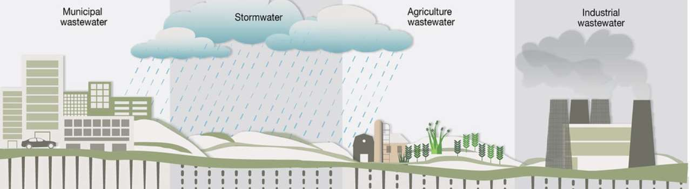
        - **Hình này chứng minh điều gì**
          - Bốn nguồn thải chính gồm nước thải sinh hoạt đô thị, nước mưa, nước thải nông nghiệp và nước thải công nghiệp cùng đổ vào lưu vực.
        - **Từ đâu mà thấy được**
          - Bốn phân vùng thể hiện: công trình cao tầng đô thị (Municipal wastewater), mây mưa và dòng chảy tràn (Stormwater), nông trại đồng ruộng (Agriculture wastewater), và cụm nhà máy công nghiệp (Industrial wastewater).
          - Tuyến cống ngầm liên kết thu gom phía dưới dẫn về lưu vực chung.

- Nước thải sinh hoạt (Domestic Wastewater hay Sanitary Wastewater):
  - Phát sinh trực tiếp từ các khu dân cư (residences), cơ sở thương mại (commercial), cơ quan công sở (institutional), và công trình công cộng (public facilities).
  - Phân dòng nước thải sinh hoạt tại nguồn thành hai hợp phần:
    - Nước đen (Blackwater): phát sinh từ bồn cầu vệ sinh (toilet), chứa phân (faeces) và nước tiểu (urine); mang tải lượng vi sinh vật gây bệnh đường ruột, chất hữu cơ và amoni rất cao.
    - Nước xám (Greywater): phát sinh từ hoạt động giặt giũ (washing), tắm rửa (bathing), và nhà bếp (kitchen); chứa chất hoạt động bề mặt, dầu mỡ thực vật và cặn lơ lửng, nồng độ mầm bệnh thấp hơn đáng kể so với nước đen.
      - **Hình 14.** Phân chia nước thải sinh hoạt thành nước đen (Blackwater) và nước xám (Greywater)
        - 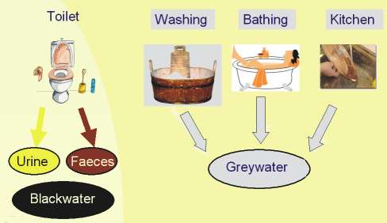
        - **Hình này chứng minh điều gì**
          - Nước thải bồn cầu tạo thành nước đen mang tải lượng mầm bệnh cao; nước từ giặt giũ, bồn tắm và nhà bếp tạo thành dòng nước xám.
        - **Từ đâu mà thấy được**
          - Nhánh trái: Thiết bị bồn cầu (Toilet) dẫn ra hai mũi tên gồm nước tiểu (Urine) và phân (Faeces) hợp lưu vào nhóm Nước đen (Blackwater).
          - Nhánh phải: Ba nguồn phát sinh gồm Giặt giũ (Washing), Tắm rửa (Bathing), và Nấu nướng (Kitchen) cùng dẫn mũi tên vào nhóm Nước xám (Greywater).

- Nước thải công nghiệp (Industrial Wastewater):
  - Phát sinh từ các dây chuyền sản xuất, rửa nguyên vật liệu, làm mát máy móc và vệ sinh công nghiệp.
  - Thành phần và tải lượng ô nhiễm biến động rất lớn tùy thuộc vào loại hình sản xuất công nghiệp cụ thể:
    - Ngành công nghiệp luyện kim và gia công kim loại (Metal industry): chứa ion kim loại nặng ($\\text{Fe}$, $\\text{Cu}$, $\\text{Cr}$, $\\text{Ni}$), axit vô cơ và dầu mỡ bôi trơn.
    - Cơ sở nghiền vụn và tái chế kim loại (Shredder facilities): chứa dầu cặn, vụn kim loại và vi hạt nhựa.
    - Công nghiệp chế biến chất thải (Waste & Processing) và nước rò rỉ bãi chôn lấp (Landfill leakage): chứa chất hữu cơ khó phân hủy sinh học, kim loại nặng và amoni nồng độ cao.
    - Ngành dệt may và hoàn tất vải sợi (Fabric & Materials, Textile industry): chứa độ màu cực cao từ thuốc nhuộm tổng hợp, chất trợ phân tán, kiềm và muối vô cơ.
    - Nuôi trồng thủy sản (Aquaculture): chứa chất dinh dưỡng nitơ, photpho hòa tan, thức ăn thừa và hóa chất kháng sinh.
    - Công nghiệp sản xuất thủy tinh (Glass industry): chứa độ đục cao và vụn silicat lơ lửng.
    - Ngành dịch vụ ăn uống và cung cấp suất ăn công nghiệp (Catering industry): chứa hàm lượng dầu mỡ động thực vật (FOGs), chất tẩy rửa và chất hữu cơ dễ phân hủy sinh học cao.
      - **Hình 15.** Các nguồn phát sinh nước thải công nghiệp và dịch vụ điển hình (Nhóm 1)
        - 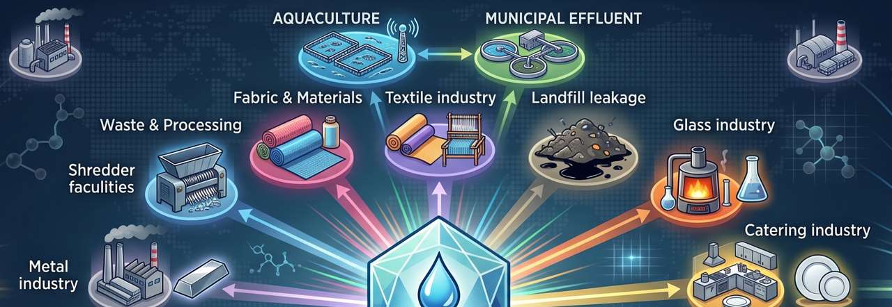
        - **Hình này chứng minh điều gì**
          - Nước thải công nghiệp phát sinh đa dạng từ nhiều phân ngành sản xuất vật liệu, tái chế và chế biến dịch vụ.
        - **Từ đâu mà thấy được**
          - Tâm điểm giọt nước phân nhánh đến các biểu tượng: Luyện kim (Metal industry), Nghiền phế liệu (Shredder facilities), Xử lý chất thải (Waste & Processing), Vải & Dệt may (Textile industry), Nuôi trồng thủy sản (Aquaculture), Nước rỉ rác (Landfill leakage), Thủy tinh (Glass industry), và Ăn uống (Catering industry).
  - Các phân ngành công nghiệp chuyên sâu khác phát sinh chất ô nhiễm độc hại hoặc khó xử lý:
    - Nhà máy lọc hóa dầu (Refinery): chứa hydrocacbon dầu mỏ, phenol, hợp chất lưu huỳnh mercaptan và sulfide.
    - Công nghiệp sản xuất ô tô (Automobile industry): chứa hóa chất sơn phủ, dung môi hữu cơ bay hơi (VOCs), phốt phát hóa và nước làm mát.
    - Công nghiệp dược phẩm (Pharmaceutical industry): chứa dư lượng kháng sinh, dung môi hữu cơ tinh chế và hoạt chất sinh học bền vững.
    - Công nghiệp sản xuất linh kiện bán dẫn và vi mạch (Semiconductor industry): chứa florua ($\\text{F}^-$), axit flohydric ($\\text{HF}$), dung môi hữu cơ siêu tinh khiết và kim loại nặng.
    - Dịch vụ vận tải và logistics (Carrying business): chứa nước rửa xe mang cặn dầu máy, cặn đất cát và chất hoạt động bề mặt.
    - Ngành công nghiệp in ấn và đóng gói bao bì (Printing industry): chứa dung môi pha mực in, thuốc nhuộm azo, chất tạo màu và cặn keo polyme.
      - **Hình 16.** Các nguồn phát sinh nước thải công nghiệp và công nghệ cao (Nhóm 2)
        - 
        - **Hình này chứng minh điều gì**
          - Các phân ngành lọc hóa dầu, chế tạo cơ khí công nghệ cao, dược phẩm và bán dẫn phát sinh các dòng thải hóa chất phức tạp.
        - **Từ đâu mà thấy được**
          - Tâm điểm khối tinh thể Industrial Wastewater kết nối trực tiếp đến: Lọc dầu (Refinery), Công nghiệp ô tô (Automobile industry), Dược phẩm (Pharmaceutical industry), Chíp bán dẫn (Semiconductor industry), Vận tải (Carrying business), và In ấn (Printing industry).

- Nước thải nông nghiệp (Agricultural Wastewater):
  - Phát sinh từ hoạt động tưới tiêu đồng ruộng, rửa chuồng trại chăn nuôi gia súc gia cầm và thau chua rửa mặn.
  - Chứa hàm lượng chất dinh dưỡng nitơ ($\\text{TN}$) và photpho ($\\text{TP}$) rất cao từ phân bón dư thừa.
  - Chứa dư lượng hóa chất bảo vệ thực vật (pesticides, herbicides) và vi sinh vật gây bệnh đường ruột từ chất thải động vật.

- Nước mưa và dòng chảy tràn bề mặt (Stormwater):
  - Bắt nguồn từ các trận mưa rào (rainfall) và hiện tượng tuyết tan (snowmelt).
  - Cuốn trôi bụi lắng trên bề mặt đường giao thông, cặn mòn lốp cao su, rác thải, dầu mỡ cơ giới và cặn đất cát xói mòn đô thị.
  - Dòng chảy xuất hiện gián đoạn với lưu lượng đỉnh rất lớn trong thời gian ngắn, gây biến động thủy lực dữ dội cho mạng lưới thu gom.

##### 2.2. Types of Collection Systems

- Hệ thống thu gom và thoát nước (wastewater collection systems) được phân chia thành ba hình thức cơ bản tùy theo cấu trúc mạng lưới đường ống:
  - Mạng lưới cống riêng (Separate Collection Systems): phân tách riêng biệt dòng nước thải và dòng nước mưa.
  - Mạng lưới cống chung (Combined Collection Systems): thu gom kết hợp đồng thời nước thải và nước mưa trong cùng một tuyến cống.
  - Mạng lưới cống nửa riêng (Semi-separate Systems): tuyến cống riêng có giếng tách dòng điều tiết nước mưa đợt đầu vào trạm xử lý.

- Hệ thống thu gom nước thải riêng biệt (Wastewater / Sanitary Collection Systems):
  - Đường ống cống kín chỉ tiếp nhận và vận chuyển nước thải sinh hoạt và nước thải công nghiệp về trạm xử lý nước thải tập trung.
  - Hiện tượng thâm nhập và rò rỉ nước ngầm ($I/I$ - Infiltration and Inflow):
    - Xảy ra qua các mối nối ống bị hở (leaking joints), các vết nứt nẻ thành cống (cracks), hoặc các đoạn cống bị vỡ lún (breaks).
    - Nước ngầm thấm vào làm loãng nồng độ chất ô nhiễm nhưng gây gia tăng đột biến lưu lượng nước cấp vào trạm xử lý, làm giảm thời gian lưu nước thủy lực ($\\text{HRT}$) của các bể xử lý.
      - **Hình 18.** Cấu trúc mặt cắt ngầm mạng lưới thoát nước riêng từ công trình xây dựng
        - 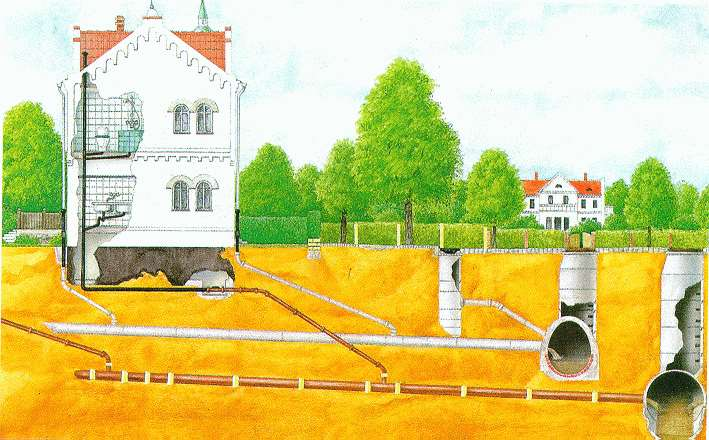
        - **Hình này chứng minh điều gì**
          - Mạng lưới cống riêng bố trí các đường ống ngầm độc lập cho nước thải sinh hoạt và nước mưa từ hộ gia đình ra hệ thống chính.
        - **Từ đâu mà thấy được**
          - Ngôi nhà mặt cắt lộ thiên thể hiện đường ống đứng thu gom từ nhà vệ sinh và bồn rửa nối ra tuyến cống màu nâu nằm sâu dưới lòng đất.
          - Đường ống nước mưa màu xám dẫn từ mái nhà và sân vườn đổ vào hố ga và tuyến cống ngầm đường kính lớn riêng biệt.

- Hệ thống thu gom nước mưa riêng biệt (Stormwater Collection Systems):
  - Tuyến cống hoặc mương hở chỉ tiếp nhận lượng nước mưa rơi (rainfall), tuyết tan (snowmelt), và dòng chảy tràn mặt phủ (surface runoff).
  - Thu nước qua các hố ga thu nước mặt có song chắn rác (catch basins) bố trí dọc mép đường giao thông.
  - Dẫn xả thẳng ra các nguồn nước mặt tự nhiên (sông, hồ, biển) hoặc đưa vào các hồ điều hòa chống ngập đô thị mà không cần qua trạm xử lý sinh học.

- Hệ thống thu gom kết hợp (Combined Collection Systems):
  - Toàn bộ nước thải sinh hoạt, nước thải công nghiệp và nước mưa được gom chung vào một tuyến cống ngầm duy nhất.
  - So sánh cấu trúc mạng lưới cống chung và cống riêng:
    - Cống chung đòi hỏi đường kính cống rất lớn để chứa đủ lưu lượng mưa đỉnh, nhưng tiết kiệm diện tích lắp đặt một tuyến ống duy nhất dưới lòng đường.
    - Cống riêng đòi hỏi lắp đặt hai tuyến cống song song, nhưng kích thước cống nước thải nhỏ và lưu lượng cấp vào trạm xử lý ổn định quanh năm.
      - **Hình 17.** So sánh sơ đồ cấu tạo hệ thống cống chung (trái) và hệ thống cống riêng (phải)
        - 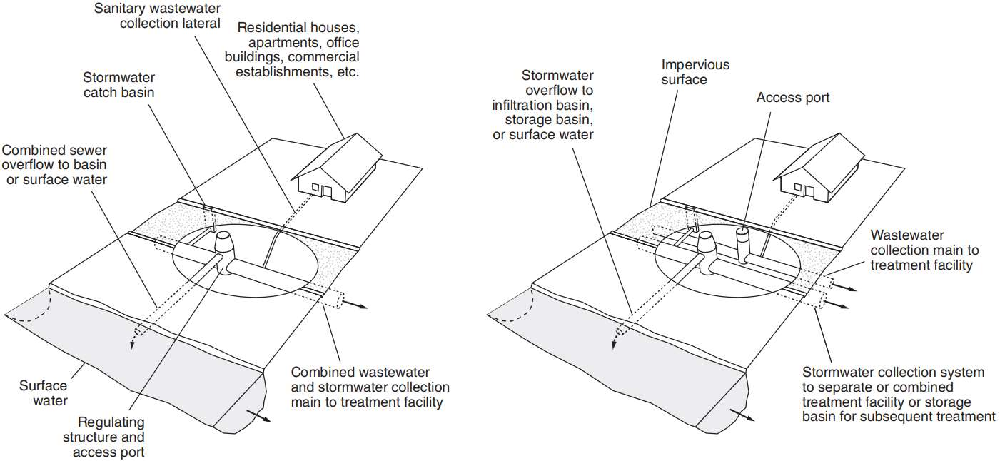
        - **Hình này chứng minh điều gì**
          - Sơ đồ trái gộp chung nước thải và nước mưa vào một cống chính duy nhất; sơ đồ phải tách biệt hoàn toàn hai tuyến cống độc lập.
        - **Từ đâu mà thấy được**
          - Bên trái: Hố thu nước mưa (Stormwater catch basin) và cống sinh hoạt cùng đổ vào một ống cống chính (Combined main) có cửa xả tràn (CSO).
          - Bên phải: Tuyến thu gom nước thải sinh hoạt dẫn riêng tới trạm xử lý, tuyến cống nước mưa dẫn riêng về hồ lắng trữ hoặc nguồn tiếp nhận.
  - Trạng thái vận hành trong điều kiện thời tiết khô (Dry Weather Flow):
    - Chiếm khoảng $99\\%$ thời gian vận hành trong năm.
    - Toàn bộ lưu lượng nước thải sinh hoạt và công nghiệp được dẫn chảy tự nhiên về trạm xử lý nước thải tập trung qua buồng điều tiết.
  - Trạng thái vận hành trong điều kiện thời tiết mưa lũ (Wet Weather Flow):
    - Chiếm khoảng $1\\%$ thời gian trong năm khi có mưa lớn kéo dài.
    - Lưu lượng dòng chảy tăng vọt vượt quá năng lực thiết kế của trạm xử lý nước thải.
    - Cơ chế tràn cống chung (Combined Sewer Overflow - $\\text{CSO}$): Nước hỗn hợp dâng cao qua đập tràn điều tiết, xả thẳng trực tiếp ra sông hồ tự nhiên mà không qua xử lý, gây sốc tải ô nhiễm hữu cơ và vi sinh vật cho hệ sinh thái thủy vực.
      - **Hình 19.** Cơ chế vận hành hệ thống cống chung trong mùa khô (Dry) và mùa mưa (Wet)
        - 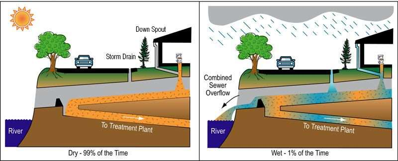
        - **Hình này chứng minh điều gì**
          - Mùa khô nước thải được dẫn trọn vẹn đến trạm xử lý; mùa mưa nước hỗn hợp dâng cao vượt ngưỡng đập tràn xả thẳng ra sông tiếp nhận.
        - **Từ đâu mà thấy được**
          - Nửa trái (Dry - 99% of the Time): Trời nắng ráo, nước thải từ nhà dân chảy trọn vẹn dưới ngưỡng đập tràn về tuyến To Treatment Plant.
          - Nửa phải (Wet - 1% of the Time): Trời mưa lớn, nước mưa từ hố ga làm dâng ngập lòng cống, tràn qua bờ đập tạo thành Combined Sewer Overflow đổ ra sông.

##### 2.3. Wastewater Constituents and Characteristics

###### 2.3.1. Physical Properties and Solids Classification

- Màu sắc (Color):
  - Đơn vị đo: thang màu Platin - Coban ($\\text{Pt-Co}$).
  - Đánh giá trạng thái tươi mới hay thối rữa của nước thải:
    - Nước thải sinh hoạt tươi mới thường có màu xám nhạt (light brownish-gray).
    - Nước thải lưu cữu trong điều kiện kỵ khí thối rữa chuyển sang màu xám đen hoặc đen kịt do tích tụ kết tủa sắt sunfua ($\\text{FeS}$).
  - Nguồn phát sinh: chất thải sinh hoạt, thuốc nhuộm công nghiệp và sự phân rã tự nhiên của mùn thực vật.

- Mùi (Odor):
  - Nước thải tươi mới có mùi dầu mỡ hữu cơ nhẹ, không gây khó chịu gay gắt.
  - Nước thải phân hủy kỵ khí phát sinh mùi hôi thối nồng nặc do các hợp chất chứa lưu huỳnh ($\\text{H}_2\\text{S}$, methyl mercaptan $\\text{CH}_3\\text{SH}$), amoniac ($\\text{NH}_3$), indole và skatole.
  - Nguồn phát sinh: phân hủy kỵ khí nước thải lưu cữu và chất thải hóa chất công nghiệp.

- Nhiệt độ (Temperature, $^\\circ\\text{C}$):
  - Là thông số vật lý quan trọng hàng đầu trong tính toán thiết kế và vận hành các công trình xử lý sinh học.
  - Ảnh hưởng trực tiếp đến độ nhớt của nước, tốc độ lắng của hạt cặn, độ hòa tan bão hòa của oxy hòa tan ($\\text{DO}$), và tốc độ sinh trưởng của vi sinh vật.
  - Nhiệt độ nước thải sinh hoạt thường dao động trong dải $15\\text{--}25^\\circ\\text{C}$, cao hơn nhiệt độ nguồn nước cấp vào mùa đông do nước tắm nóng và hoạt động sinh hoạt gia đình.

- Độ đục (Turbidity):
  - Đơn vị đo: đơn vị độ đục khuếch tán Nephelometric Turbidity Units ($\\text{NTU}$).
  - Biểu thị mức độ tán xạ ánh sáng bởi các hạt cặn lơ lửng, hạt keo hữu cơ và khoáng vô cơ không lắng.
  - Dùng để đánh giá nhanh hiệu quả lắng trong của bể lắng thứ cấp và chất lượng nước sau lọc.

- Độ dẫn điện (Electrical Conductivity, $EC$):
  - Đơn vị đo: microSiemens trên xentimét ($\\mu\\text{S/cm}$).
  - Thước đo khả năng truyền dẫn dòng điện của nước, tỷ lệ thuận với tổng lượng ion khoáng hòa tan.
  - Dùng để đánh giá độ mặn và mức độ thích hợp của nước thải sau xử lý đối với việc tái sử dụng tưới tiêu nông nghiệp.
  - Mối quan hệ thực nghiệm giữa tổng chất rắn hòa tan ($TDS$) và độ dẫn điện ($EC$):
    $$TDS\\text{ (mg/L)} \\approx EC\\text{ (}\\mu\\text{S/cm)} \\times (0.55\\text{--}0.70)$$

- Phân loại và hệ thống cân bằng các dạng chất rắn (Solids, $\\text{mg/L}$ hoặc $\\text{ppm}$):
  - Hàm lượng chất rắn là chỉ tiêu căn bản để đánh giá tiềm năng tái sử dụng nước và lựa chọn chuỗi công trình xử lý cơ học, sinh học, bùn cặn.
  - Quy trình phân tích tách pha chất rắn trong phòng thí nghiệm:
    - Mẫu nước thô (Sample) được rót vào nón Imhoff lắng $60\\text{ phút}$ để xác định Thể tích chất rắn lắng được (Settleable solids, đo bằng $\\text{mL/L}$).
    - Sấy bốc hơi mẫu thô ở nhiệt độ $103\\text{--}105^\\circ\\text{C}$ xác định Tổng chất rắn (Total Solids, $TS$).
    - Lọc mẫu qua màng sợi thủy tinh chuẩn ($0.45\\text{--}1.2\\ \\mu\\text{m}$):
      - Cặn giữ lại trên phễu lọc đem sấy khô $103\\text{--}105^\\circ\\text{C}$ xác định Tổng chất rắn lơ lửng (Total Suspended Solids, $TSS$).
      - Nước lọc đi qua màng đem sấy khô $103\\text{--}105^\\circ\\text{C}$ xác định Tổng chất rắn hòa tan (Total Dissolved Solids, $TDS$).
    - Nung mẫu chất rắn trong lò múp ở nhiệt độ $550 \\pm 50^\\circ\\text{C}$:
      - Phần khối lượng bị cháy bốc hơi biểu thị Hợp phần bay hơi (Volatile solids, đại diện cho chất hữu cơ: $VSS$ và $VDS$).
      - Phần tro khoáng còn lại không cháy biểu thị Hợp phần cố định (Fixed solids, đại diện cho muối khoáng vô cơ: $FSS$ và $FDS$).
      - **Hình 20.** Sơ đồ khối quy trình phân tích và tách pha các dạng chất rắn trong nước thải
        - 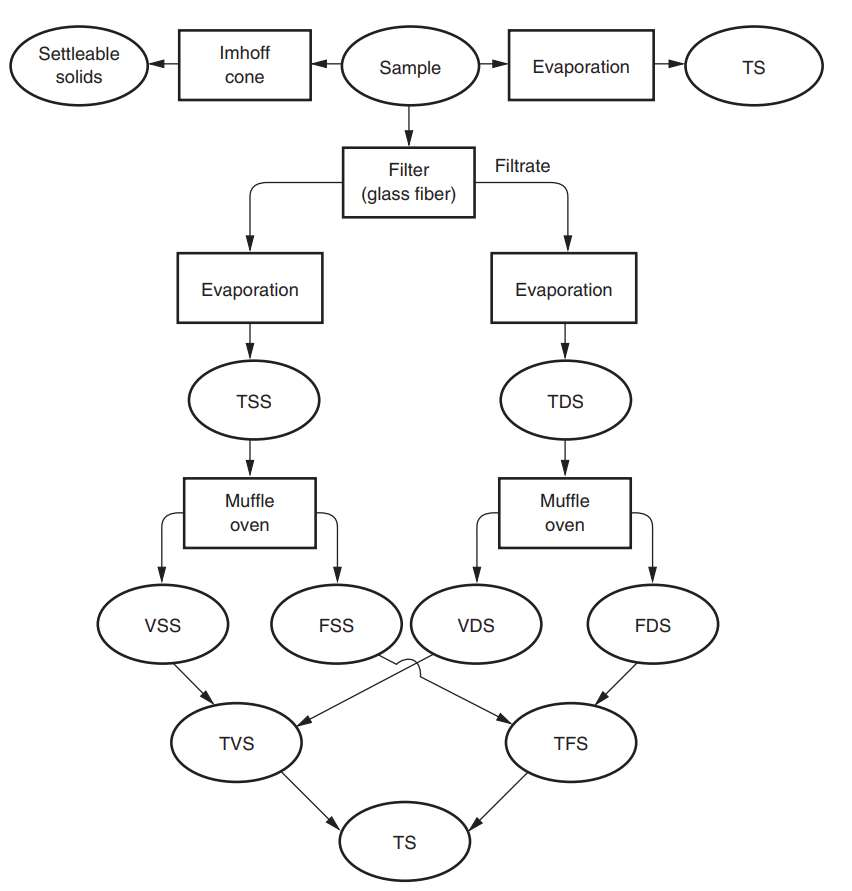
        - **Hình này chứng minh điều gì**
          - Mẫu nước được phân lập theo kích thước hạt (lọc màng) và tính chất nhiệt phân (nung lò múp $550^\\circ\\text{C}$) thành các phân đoạn chất rắn.
        - **Từ đâu mà thấy được**
          - Từ Sample rẽ nhánh sang nón Imhoff (Settleable solids), sấy bay hơi (TS), và lọc màng sợi thủy tinh (Filter glass fiber).
          - Nhánh lọc tách thành TSS và TDS; cả hai qua lò nung (Muffle oven) tạo thành các cặp VSS-FSS và VDS-FDS, tổng hợp thành TVS và TFS.
      - **Hình 21.** Bảng định nghĩa viết tắt các thông số chất rắn trong kỹ thuật xử lý nước thải
        - 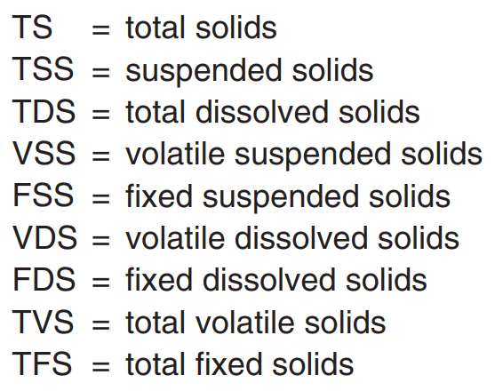
        - **Hình này chứng minh điều gì**
          - Liệt kê chuẩn hóa các ký hiệu viết tắt quốc tế của 9 chỉ tiêu thành phần chất rắn.
        - **Từ đâu mà thấy được**
          - Danh sách văn bản thể hiện: TS = total solids, TSS = suspended solids, TDS = total dissolved solids, VSS = volatile suspended solids, FSS = fixed suspended solids, VDS = volatile dissolved solids, FDS = fixed dissolved solids, TVS = total volatile solids, TFS = total fixed solids.
  - Hệ thống các phương trình bảo toàn khối lượng chất rắn:
    - Tổng chất rắn theo trạng thái phân tán và tính chất nhiệt:
      $$TS = TSS + TDS = TVS + TFS$$
    - Phân tách chất rắn lơ lửng thành phần hữu cơ và phần khoáng:
      $$TSS = VSS + FSS$$
    - Phân tách chất rắn hòa tan thành phần hữu cơ và phần khoáng:
      $$TDS = VDS + FDS$$
    - Tổng chất rắn bay hơi (toàn bộ hợp phần hữu cơ trong mẫu):
      $$TVS = VSS + VDS$$
    - Tổng chất rắn cố định (toàn bộ hợp phần tro vô cơ trong mẫu):
      $$TFS = FSS + FDS$$

| Chỉ tiêu | Tên tiếng Anh đầy đủ | Phương pháp xác định | Ý nghĩa kỹ thuật |
| :--- | :--- | :--- | :--- |
| **TS** | Total Solids | Sấy bay hơi mẫu thô ở $103\\text{--}105^\\circ\\text{C}$ | Tổng lượng vật chất rắn có trong mẫu |
| **TSS** | Total Suspended Solids | Giữ lại trên màng lọc sợi thủy tinh, sấy $103\\text{--}105^\\circ\\text{C}$ | Đánh giá độ đục, thiết kế bể lắng và lọc |
| **TDS** | Total Dissolved Solids | Đi qua màng lọc sợi thủy tinh, sấy $103\\text{--}105^\\circ\\text{C}$ | Đánh giá nồng độ muối khoáng hòa tan |
| **VSS** | Volatile Suspended Solids | Nung cặn $TSS$ trong lò múp ở $550^\\circ\\text{C}$ | Đại diện cho sinh khối vi sinh vật và hạt hữu cơ |
| **FSS** | Fixed Suspended Solids | Phần tro còn lại sau khi nung cặn $TSS$ ở $550^\\circ\\text{C}$ | Cặn cát, khoáng vô cơ dạng hạt lơ lửng |
| **VDS** | Volatile Dissolved Solids | Nung cặn $TDS$ trong lò múp ở $550^\\circ\\text{C}$ | Các hợp chất hữu cơ hòa tan trong nước |
| **FDS** | Fixed Dissolved Solids | Phần tro còn lại sau khi nung cặn $TDS$ ở $550^\\circ\\text{C}$ | Muối khoáng hòa tan vô cơ (độ mặn) |
| **TVS** | Total Volatile Solids | Tổng $VSS + VDS$ hoặc nung cặn $TS$ ở $550^\\circ\\text{C}$ | Tổng hàm lượng vật chất hữu cơ trong mẫu |
| **TFS** | Total Fixed Solids | Tổng $FSS + FDS$ hoặc phần tro $TS$ ở $550^\\circ\\text{C}$ | Tổng hàm lượng vật chất vô cơ trong mẫu |

###### 2.3.2. Chemical Constituents: Inorganic Parameters and Nutrients

- Độ pH ($pH$):
  - Biểu thị nồng độ ion hydro hoạt động trong dung dịch:
    $$pH = -\\log[\\text{H}^+]$$
  - Thước đo tính axit hoặc tính bazơ của nước thải.
  - Chi phối trực tiếp hoạt tính enzyme của vi sinh vật hiếu khí và kỵ khí; dải pH thích hợp cho quá trình xử lý sinh học dao động từ $6.5\\text{--}8.5$.

- Độ cứng (Hardness, $\\text{mg CaCO}_3\\text{/L}$):
  - Tổng nồng độ các cation kim loại hóa trị hai hòa tan trong nước, chủ yếu là canxi ($\\text{Ca}^{2+}$) và magie ($\\text{Mg}^{2+}$):
    $$\\text{Total Hardness} = [\\text{Ca}^{2+}] + [\\text{Mg}^{2+}]$$
  - Đánh giá khả năng tạo cặn bám trong đường ống và tính phù hợp của nước sau xử lý để tái sử dụng công nghiệp (nồi hơi, tháp giải nhiệt).

- Độ kiềm (Alkalinity, $\\text{meq/L}$ hoặc $\\text{mg CaCO}_3\\text{/L}$):
  - Thước đo khả năng trung hòa axit (khả năng đệm) của nước thải, ngăn chặn sự tụt giảm pH đột ngột.
  - Cấu thành chủ yếu từ các ion bicarbonate ($\\text{HCO}_3^-$), carbonate ($\\text{CO}_3^{2-}$), và hydroxyl ($\\text{OH}^-$):
    $$\\text{Alkalinity (meq/L)} = [\\text{HCO}_3^-] + 2[\\text{CO}_3^{2-}] + [\\text{OH}^-] - [\\text{H}^+]$$
    $$\\text{Alkalinity (mg/L as CaCO}_3\\text{)} = \\text{Alkalinity (meq/L)} \\times 50$$
  - Đóng vai trò thiết yếu trong quá trình nitrat hóa sinh học, mỗi gam amoni ($\\text{NH}_4^+-\\text{N}$) bị oxy hóa tiêu hao khoảng $7.14\\text{ g CaCO}_3$ độ kiềm.

- Ion Clorua ($\\text{Cl}^-$, $\\text{mg/L}$ hoặc $\\text{ppm}$):
  - Nguồn phát sinh: nước cấp tự nhiên, muối ăn sinh hoạt ($\\text{NaCl}$), làm mềm nước, và hiện tượng xâm nhập mặn từ nước ngầm / nước triều.
  - Đại diện cho độ mặn của nước thải; nồng độ clorua cao gây ức chế áp suất thẩm thấu lên màng tế bào vi sinh vật.

- Ion Sunfat ($\\text{SO}_4^{2-}$, $\\text{mg/L}$ hoặc $\\text{ppm}$):
  - Nguồn phát sinh: nguồn nước cấp ban đầu, chất tẩy rửa gia dụng và chất thải công nghiệp.
  - Đánh giá tiềm năng sinh mùi hôi thối: trong điều kiện yếm khí, vi khuẩn khử sunfat (SRB) khử $\\text{SO}_4^{2-}$ thành ion $\\text{S}^{2-}$ và khí độc hydro sunfua ($\\text{H}_2\\text{S}$), gây ăn mòn cống bê tông và thiết bị kim loại.

- Kim loại nặng (Heavy Metals):
  - Bao gồm $\\text{Cd}$, $\\text{Cr}$, $\\text{Cu}$, $\\text{Ni}$, $\\text{Pb}$, $\\text{Zn}$, và $\\text{Hg}$ phát sinh từ các cơ sở xi mạ, thuộc da, điện tử.
  - Đánh giá mức độ độc tính đối với hệ vi sinh vật bùn hoạt tính và kiểm soát giới hạn an toàn khi tái sử dụng bùn sinh học làm phân bón.

- Các chất khí hòa tan (Dissolved Gases):
  - Oxy hòa tan (Dissolved Oxygen - $DO$): nồng độ trong nước thải thô thường rất thấp ($\\approx 0\\text{ mg/L}$) do tốc độ tiêu thụ sinh học vượt trội tốc độ khuếch tán.
  - Khí Hydro sunfua ($\\text{H}_2\\text{S}$): sản phẩm của quá trình phân hủy kỵ khí các hợp chất protein chứa lưu huỳnh và quá trình khử sunfat; gây mùi hôi và tính độc cao.
  - Khí Mêtan ($\\text{CH}_4$): sản phẩm phân hủy kỵ khí sâu các chất hữu cơ; không màu, nhẹ hơn không khí, có nguy cơ cháy nổ cao trong các đường cống và buồng thu gom kín.

- Tổng Nitơ (Total Nitrogen - $TN$, $\\text{mg N/L}$ hoặc $\\text{ppm}$):
  - Thông số dinh dưỡng cốt lõi kiểm soát sự sinh trưởng của vi sinh vật và tảo, ngăn chặn hiện tượng phú dưỡng hóa nguồn tiếp nhận.
  - Các dạng hợp chất nitơ trong nước thải:
    - Amoni ($\\text{NH}_4^+-\\text{N}$): dạng nitơ khử hòa tan, sản phẩm thủy phân của hợp chất đạm hữu cơ.
    - Nitrit ($\\text{NO}_2^--\\text{N}$): dạng oxy hóa trung gian không bền, nồng độ trong nước thải thường rất nhỏ.
    - Nitrat ($\\text{NO}_3^--\\text{N}$): dạng nitơ oxy hóa hoàn toàn cuối cùng của quá trình nitrat hóa hiếu khí.
    - Nitơ hữu cơ (Organic Nitrogen - $ON$): nitơ liên kết trong protein, axit amin, peptit và urê.
  - Các chỉ tiêu tổng hợp của nitơ:
    - Tổng Nitơ Vô cơ (Total Inorganic Nitrogen):
      $$TIN = \\text{NH}_4^+-\\text{N} + \\text{NO}_2^--\\text{N} + \\text{NO}_3^--\\text{N}$$
    - Tổng Nitơ Kjeldahl (Total Kjeldahl Nitrogen):
      $$TKN = ON + \\text{NH}_4^+-\\text{N}$$
    - Tổng Nitơ (Total Nitrogen):
      $$TN = ON + \\text{NH}_4^+-\\text{N} + \\text{NO}_2^--\\text{N} + \\text{NO}_3^--\\text{N} = TKN + \\text{NO}_2^--\\text{N} + \\text{NO}_3^--\\text{N}$$

- Cấu trúc phân đoạn Nitơ hữu cơ ($ON$):
  - Nitơ hữu cơ được phân chia dựa trên khả năng phân hủy sinh học và kích thước trạng thái:
    - Phân đoạn phân hủy sinh học ($bON$ - biodegradable Organic Nitrogen):
      - $bsON$: biodegradable soluble Organic Nitrogen (dạng hòa tan dễ phân hủy).
      - $bpON$: biodegradable particulate Organic Nitrogen (dạng hạt phân hủy sinh học).
    - Phân đoạn trơ không phân hủy sinh học ($nbON$ - non-biodegradable Organic Nitrogen):
      - $nbsON$: non-biodegradable soluble Organic Nitrogen (dạng hòa tan khó phân hủy, đi vào nước sau xử lý).
      - $nbpON$: non-biodegradable particulate Organic Nitrogen (dạng hạt trơ, tích lũy trong bùn thải).
    - Phân đoạn theo trạng thái vật lý hạt và hòa tan:
      - $pON = bpON + nbpON$ (tổng nitơ hữu cơ dạng hạt).
      - $sON = bsON + nbsON$ (tổng nitơ hữu cơ hòa tan).
  - Hệ thống các phương trình cân bằng nitơ hữu cơ:
    $$ON = bON + nbON$$
    $$bON = bsON + bpON$$
    $$nbON = nbsON + nbpON$$
    $$pON = bpON + nbpON$$
    $$sON = bsON + nbsON$$
      - **Hình 22.** Cây phân cấp phân đoạn Total Kjeldahl Nitrogen (TKN) trong nước thải
        - 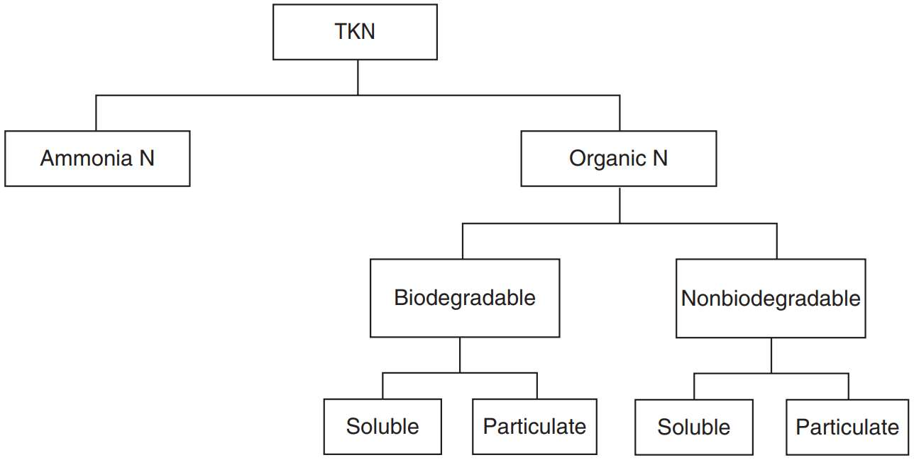
        - **Hình này chứng minh điều gì**
          - TKN phân tách hoàn toàn thành Ammonia N và Organic N, trong đó Organic N tiếp tục chia thành các cấu phần hòa tan và hạt.
        - **Từ đâu mà thấy được**
          - Khối TKN ở đỉnh rẽ thành hai nhánh: Ammonia N và Organic N.
          - Nhánh Organic N phân cấp thành Biodegradable và Nonbiodegradable; mỗi nhánh con tiếp tục rẽ thành Soluble và Particulate.

- Tổng Photpho (Total Phosphorus - $TP$, $\\text{mg P/L}$ hoặc $\\text{ppm}$):
  - Nguyên tố dinh dưỡng giới hạn thúc đẩy sự nở hoa của tảo lam và vi sinh vật thủy sinh trong nguồn nước mặt.
  - Phân loại photpho:
    - Photphat vô cơ ($\\text{PO}_4^{3-}-\\text{P}$ hay Orthophosphate): dạng hòa tan có thể đồng hóa trực tiếp bởi tế bào vi sinh vật trong quá trình trao đổi chất.
    - Polyphosphate và Photpho hữu cơ: cần qua quá trình thủy phân sinh hóa để chuyển hóa thành dạng orthophosphate tự do.

###### 2.3.3. Chemical Constituents: Organic Parameters and BOD Kinetics

- Các thành phần hóa học hữu cơ chuyên biệt:
  - Carbohydrate (Glucid): bao gồm tinh bột, đường cellulose; nguồn từ thực phẩm và giấy vệ sinh; dễ phân hủy sinh học.
  - Dầu, mỡ và chất béo (Fats, Oils, and Grease - FOGs): nguồn từ thực phẩm, bếp ăn và lò mổ; tạo màng ngăn truyền oxy, gây tắc ống cống.
  - Protein: nguồn từ chất bài tiết, nước tiểu và thịt động vật; phân hủy giải phóng amoniac và axit hữu cơ.
  - Chất hoạt động bề mặt (Surfactants): nguồn từ bột giặt và xà phòng tắm; tạo bọt trên bề mặt bể sục khí và làm giảm hệ số truyền oxy ($K_L a$).
  - Thuốc bảo vệ thực vật (Pesticides): nguồn từ nông nghiệp; độc tính cao và khó phân hủy sinh học.
  - Hợp chất hữu cơ bay hơi (Volatile Organic Compounds - VOCs): phát sinh từ dung môi công nghiệp; dễ bay hơi gây ô nhiễm không khí trạm xử lý.

- Các chỉ tiêu đánh giá tổng hàm lượng chất hữu cơ:
  - $\\text{BOD}_5$ (Five-day Biochemical Oxygen Demand, $\\text{mg/L}$): Lượng oxy hòa tan tiêu hao bởi vi sinh vật để ổn định sinh hóa các chất hữu cơ trong $5\\text{ ngày}$ ở điều kiện nhiệt độ chuẩn $20^\\circ\\text{C}$ trong bóng tối.
  - $\\text{UBOD}$ (Ultimate Biochemical Oxygen Demand, ký hiệu $L_0$, $\\text{mg/L}$): Tổng lượng oxy cần thiết để vi sinh vật oxy hóa hoàn toàn toàn bộ lượng chất hữu cơ có thể phân hủy sinh học.
  - $\\text{COD}$ (Chemical Oxygen Demand, $\\text{mg/L}$): Lượng oxy tương đương cần thiết để oxy hóa toàn bộ các hợp chất hữu cơ bằng chất oxy hóa hóa học cực mạnh (kali bicromat $\\text{K}_2\\text{Cr}_2\\text{O}_7$ trong môi trường axit $\\text{H}_2\\text{SO}_4$ sôi xúc tác $\\text{Ag}_2\\text{SO}_4$). Luôn có mối quan hệ $COD > BOD$.
  - $\\text{TOC}$ (Total Organic Carbon, $\\text{mg/L}$): Phép đo xác định hàm lượng cacbon liên kết hữu cơ bằng cách đốt cháy mẫu ở nhiệt độ cao ($680\\text{--}950^\\circ\\text{C}$) chuyển hóa thành $\\text{CO}_2$ và đo bằng đầu dò hồng ngoại; phương pháp phân tích nhanh thay thế cho BOD và COD.
      - **Hình 23.** Sơ đồ phân cấp cấu trúc giữa các chỉ tiêu hữu cơ TOC, COD, và BOD
        - 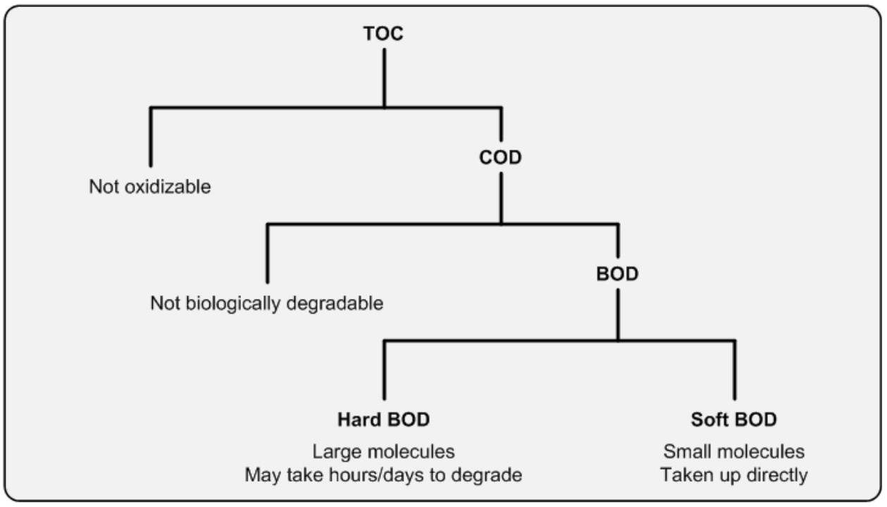
        - **Hình này chứng minh điều gì**
          - TOC bao quát toàn bộ chất hữu cơ, COD đo phần oxy hóa hóa học, BOD đo phần phân hủy sinh học gồm Hard BOD và Soft BOD.
        - **Từ đâu mà thấy được**
          - Từ đỉnh TOC rẽ sang phần Not oxidizable và COD; từ COD rẽ nhánh Not biologically degradable và BOD.
          - Nhánh BOD phân thành Hard BOD (đại phân tử, mất hàng giờ hoặc hàng ngày để phân hủy) và Soft BOD (tiểu phân tử, hấp thu trực tiếp).

- Động học phản ứng phân hủy BOD bậc nhất (First-Order BOD Kinetics):
  - Giả định tốc độ tiêu thụ oxy tỷ lệ thuận với lượng chất hữu cơ còn lại chưa bị phân hủy tại thời điểm $t$:
    $$\\frac{dL_t}{dt} = -k \\cdot L_t$$
  - Lượng chất hữu cơ còn lại chưa bị oxy hóa tại thời điểm $t$ biểu diễn theo đương lượng oxy ($BOD_r$):
    $$BOD_r = UBOD \\cdot e^{-kt}$$
    - $BOD_r$: lượng chất hữu cơ còn lại ở thời điểm $t$ ($\\text{mg/L}$).
    - $UBOD$: nhu cầu oxy sinh hóa tối hậu ($L_0$, $\\text{mg/L}$).
    - $k$: hằng số tốc độ phản ứng oxy hóa bậc nhất cơ số tự nhiên $e$ ($\\text{d}^{-1}$).
    - $t$: thời gian phản ứng ($\\text{d}$).
  - Nhu cầu oxy đã tiêu hao tại thời điểm $t$ ($BOD_t$ hay $y$):
    $$y = BOD_t = UBOD - BOD_r = UBOD \\cdot (1 - e^{-kt})$$
  - Phương trình tính nhu cầu oxy sau 5 ngày ($BOD_5$):
    $$BOD_5 = UBOD \\cdot (1 - e^{-5k})$$

- Hiệu chỉnh hằng số tốc độ phản ứng theo nhiệt độ (Temperature Correction):
  - Hằng số tốc độ phản ứng oxy hóa phụ thuộc chặt chẽ vào nhiệt độ theo phương trình van 't Hoff - Arrhenius cải tiến:
    $$\\frac{k_2}{k_1} = \\theta^{(T_2 - T_1)} \\implies k_2 = k_1 \\cdot \\theta^{(T_2 - T_1)}$$
    - $k_1, k_2$: hằng số tốc độ phản ứng ở nhiệt độ $T_1$ và $T_2$ ($\\text{d}^{-1}$).
    - $\\theta$: hệ số nhiệt độ không thứ nguyên. Trị số điển hình: $\\theta = 1.047$ (trong dải nhiệt độ $20\\text{--}30^\\circ\\text{C}$) và $\\theta = 1.056$ (trong dải nhiệt độ $15\\text{--}20^\\circ\\text{C}$).
  - Lưu ý kỹ thuật cốt lõi: Giá trị nhu cầu oxy tối hậu $UBOD$ (tổng khối lượng cơ chất hữu cơ) không đổi theo nhiệt độ; chỉ có tốc độ phân hủy $k$ tăng theo nhiệt độ.

###### 2.3.4. COD Fractionation and Constituent Balance

- Ý nghĩa của phân đoạn COD (COD Fractionation):
  - Phân tách tổng $COD$ thành các cấu phần có đặc tính động học và kích thước trạng thái riêng biệt.
  - Là đầu vào bắt buộc của các mô hình toán học bùn hoạt tính hiện đại (Activated Sludge Models - ASM1, ASM2, ASM3 của IWA) phục vụ thiết kế các bể thiếu khí khử nitơ và bể sinh học hiếu khí.

- Các cấu phần trong phân đoạn COD:
  - COD có khả năng phân hủy sinh học (Biodegradable COD - $bCOD$):
    - $rbCOD$ (Readily biodegradable COD): COD hòa tan phân hủy nhanh, gồm các axit béo bay hơi (VFA) và các hợp chất phân tử nhỏ; vi sinh vật hấp thu trực tiếp qua màng tế bào mà không cần thủy phân.
    - $sbCOD$ (Slowly biodegradable COD): COD phân hủy chậm, gồm các hạt keo và huyền phù hữu cơ; đòi hỏi enzyme ngoại bào thủy phân thành chất hòa tan trước khi chuyển hóa nội bào.
  - COD không có khả năng phân hủy sinh học (Non-biodegradable COD - $nbCOD$):
    - $nbsCOD$ (Non-biodegradable soluble COD): COD hòa tan trơ; không bị vi khuẩn phân hủy, đi thẳng qua hệ thống xử lý sinh học và thoát ra nguồn tiếp nhận theo dòng nước sau lắng.
    - $nbpCOD$ (Non-biodegradable particulate COD): COD dạng hạt trơ; không bị phân hủy, bị bắt giữ vào bông bùn hoạt tính tại bể lắng và thải bỏ ra ngoài theo bùn dư ($WAS$).
  - Phân đoạn COD theo trạng thái pha:
    - $sCOD$ (Soluble COD): tổng COD hòa tan, $sCOD = rbCOD + nbsCOD$.
    - $pCOD$ (Particulate COD): tổng COD dạng hạt, $pCOD = sbCOD + nbpCOD$.
      - **Hình 24.** Cây phân nhánh chi tiết các phân đoạn Total COD trong nước thải
        - 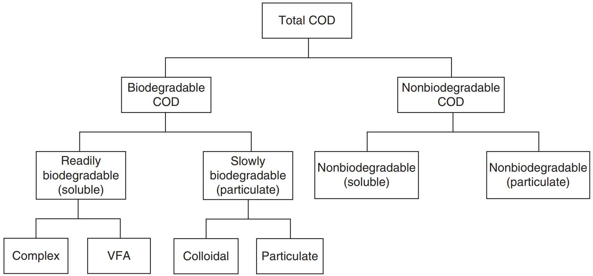
        - **Hình này chứng minh điều gì**
          - Total COD được cấu thành từ hai nhánh chính là bCOD và nbCOD, mỗi nhánh tiếp tục phân lập theo tính chất hòa tan và kích thước hạt.
        - **Từ đâu mà thấy được**
          - Khối Total COD rẽ nhánh thành Biodegradable COD và Nonbiodegradable COD.
          - Nhánh bCOD rẽ thành Readily biodegradable (chia tiếp thành Complex và VFA) và Slowly biodegradable (chia tiếp thành Colloidal và Particulate).
          - Nhánh nbCOD rẽ thành Nonbiodegradable (soluble) và Nonbiodegradable (particulate).

- Hệ thống các phương trình cân bằng COD:
  - Cân bằng tổng thể giữa hợp phần phân hủy và trơ:
    $$COD = bCOD + nbCOD$$
  - Mối quan hệ thực nghiệm giữa $bCOD$ và $BOD$:
    $$bCOD = sbCOD + rbCOD \\approx 1.6 \\times BOD$$
    *(Hệ số thực nghiệm $1.6$ áp dụng chuẩn cho nước thải sinh hoạt đô thị; đối với nước mặt tự nhiên hệ số lấy xấp xỉ $1.25$)*.
  - Phân tách hợp phần không phân hủy sinh học:
    $$nbCOD = nbpCOD + nbsCOD$$
  - Phương trình cân bằng phân đoạn đầy đủ của tổng COD:
    $$COD = sbCOD + rbCOD + nbpCOD + nbsCOD$$

###### 2.3.5. Biological Constituents and Pathogens

- Các sinh vật bậc cao và ký sinh trùng:
  - Động vật (Animals): các loài giáp xác nhỏ, luân trùng (rotifers), giun đốt; nguồn từ môi trường tự nhiên và xâm nhập vào hệ thống xử lý.
  - Giun sán (Helminths / Parasitic worms): trứng giun đũa (*Ascaris lumbricoides*), trứng giun tóc, giun móc phát sinh từ phân người và gia súc; vỏ trứng có cấu tạo chitin chịu hóa chất khử trùng cực tốt, cần xử lý bằng bể lắng trọng lực hoặc lọc cát.
  - Thực vật và vi tảo (Plants / Algae): xâm nhập từ các kênh dẫn hở và hồ sinh học; gây tăng độ đục và biến đổi pH ngày đêm do quang hợp.

- Vi sinh vật nhân sơ và vi rút:
  - Vi khuẩn (Bacteria): chiếm số lượng lớn nhất trong nước thải ($10^6\\text{--}10^8\\text{ CFU/100 mL}$); đóng vai trò phân hủy sinh hóa cơ chất hữu cơ nhưng đồng thời chứa các chủng gây bệnh truyền nhiễm nguy hiểm:
    - *Vibrio cholerae*: tác nhân gây bệnh tả cấp tính.
    - *Salmonella typhi*: tác nhân gây bệnh sốt thương hàn.
    - *Shigella dysenteriae*: tác nhân gây bệnh lỵ trực trùng.
    - *Escherichia coli* gây bệnh: chỉ thị nhiễm bẩn phân và một số chủng gây viêm ruột xuất huyết.
  - Vi rút (Viruses): mầm bệnh siêu vi không có cấu tạo tế bào ($20\\text{--}100\\text{ nm}$), tồn tại ký sinh bắt buộc; gây các bệnh hiểm nghèo qua đường nước:
    - Hepatitis A / E: vi rút gây bệnh viêm gan truyền nhiễm.
    - Rotavirus và Norovirus: nguyên nhân hàng đầu gây tiêu chảy cấp nguy hiểm ở trẻ nhỏ.
    - Poliovirus: vi rút gây bệnh bại liệt.

##### 2.4. Engineering Calculation Examples

###### 2.4.1. Example 1: BOD Kinetics and Temperature Correction

- **Đề bài**
  - 1/ Xác định nhu cầu oxy sinh hóa sau 1 ngày ($BOD_1$) và nhu cầu oxy sinh hóa tối hậu ($UBOD$ hay $L_0$) của một mẫu nước thải có giá trị $BOD_5$ ở nhiệt độ $20^\\circ\\text{C}$ là $200\\text{ mg/L}$.
  - 2/ Xác định giá trị $BOD_5$ nếu thí nghiệm ủ được tiến hành ở nhiệt độ $25^\\circ\\text{C}$.
  - Cho biết hằng số tốc độ phản ứng oxy hóa $k$ (cơ số tự nhiên $e$) ở $20^\\circ\\text{C}$ là $k_{20} = 0.23\\text{ d}^{-1}$, và hệ số nhiệt độ $\\theta = 1.047$.

- **Dữ kiện**
  - $BOD_5(20^\\circ\\text{C}) = 200\\text{ mg/L}$.
  - $k_{20} = 0.23\\text{ d}^{-1}$ (cơ số tự nhiên $e$).
  - Hệ số nhiệt độ $\\theta = 1.047$.
  - Nhiệt độ thí nghiệm ban đầu $T_1 = 20^\\circ\\text{C}$, nhiệt độ thí nghiệm mới $T_2 = 25^\\circ\\text{C}$.
  - Thời gian phản ứng cần tính: $t = 1\\text{ ngày}$ (câu 1) và $t = 5\\text{ ngày}$ (câu 2).

- **Quy tắc áp dụng**
  - Phương trình động học phân hủy BOD bậc nhất:
    $$y(t) = BOD_t = UBOD \\cdot (1 - e^{-kt})$$
  - Mối liên hệ tại thời điểm $t = 5\\text{ ngày}$ ở $20^\\circ\\text{C}$:
    $$BOD_5 = UBOD \\cdot (1 - e^{-5 \\cdot k_{20}}) \\implies UBOD = \\frac{BOD_5}{1 - e^{-5 \\cdot k_{20}}}$$
  - Công thức tính $BOD_1$ ở $20^\\circ\\text{C}$:
    $$BOD_1 = UBOD \\cdot (1 - e^{-1 \\cdot k_{20}})$$
  - Phương trình hiệu chỉnh hằng số tốc độ phản ứng theo nhiệt độ:
    $$k_{T_2} = k_{T_1} \\cdot \\theta^{(T_2 - T_1)}$$
  - Nguyên lý bảo toàn lượng chất hữu cơ: Giá trị $UBOD$ là một hằng số đặc trưng cho mẫu nước thải, không phụ thuộc vào nhiệt độ ủ mẫu.

- **Lời giải**
  - **Bước 1**: Tính nhu cầu oxy sinh hóa tối hậu ($UBOD$).
    - Căn cứ: Phương trình liên hệ giữa $BOD_5$ và $UBOD$ ở $20^\\circ\\text{C}$:
      $$UBOD = \\frac{BOD_5}{1 - e^{-5 \\cdot k_{20}}}$$
    - Nhìn vào: $BOD_5 = 200\\text{ mg/L}$ và $k_{20} = 0.23\\text{ d}^{-1}$:
      $$5 \\times k_{20} = 5 \\times 0.23 = 1.15$$
      $$e^{-1.15} \\approx 0.316637$$
      $$1 - e^{-1.15} = 1 - 0.316637 = 0.683363$$
      $$UBOD = \\frac{200\\text{ mg/L}}{0.683363} \\approx 292.67\\text{ mg/L}$$
  - **Bước 2**: Tính nhu cầu oxy sinh hóa sau 1 ngày ($BOD_1$ ở $20^\\circ\\text{C}$).
    - Căn cứ: Công thức tính BOD tại thời điểm $t = 1\\text{ ngày}$:
      $$BOD_1 = UBOD \\cdot (1 - e^{-1 \\cdot k_{20}})$$
    - Nhìn vào: $UBOD = 292.67\\text{ mg/L}$ và $k_{20} = 0.23\\text{ d}^{-1}$:
      $$e^{-0.23} \\approx 0.794534$$
      $$1 - e^{-0.23} = 1 - 0.794534 = 0.205466$$
      $$BOD_1 = 292.67\\text{ mg/L} \\times 0.205466 \\approx 60.13\\text{ mg/L}$$
  - **Bước 3**: Xác định hằng số tốc độ phản ứng ở $25^\\circ\\text{C}$ ($k_{25}$).
    - Căn cứ: Phương trình hiệu chỉnh Arrhenius $k_{25} = k_{20} \\cdot \\theta^{(25 - 20)}$.
    - Nhìn vào: $k_{20} = 0.23\\text{ d}^{-1}$, $\\theta = 1.047$, và $\\Delta T = 25 - 20 = 5^\\circ\\text{C}$:
      $$\\theta^5 = (1.047)^5 \\approx 1.25815$$
      $$k_{25} = 0.23 \\times 1.25815 \\approx 0.2894\\text{ d}^{-1}$$
  - **Bước 4**: Xác định giá trị $BOD_5$ ở $25^\\circ\\text{C}$.
    - Căn cứ: Phương trình tiêu thụ BOD sau 5 ngày với hằng số $k_{25}$, giữ nguyên $UBOD = 292.67\\text{ mg/L}$:
      $$BOD_5(25^\\circ\\text{C}) = UBOD \\cdot (1 - e^{-5 \\cdot k_{25}})$$
    - Nhìn vào: $k_{25} = 0.289375\\text{ d}^{-1}$ và $UBOD = 292.67\\text{ mg/L}$:
      $$5 \\times k_{25} = 5 \\times 0.289375 = 1.446875$$
      $$e^{-1.446875} \\approx 0.235303$$
      $$1 - e^{-1.446875} = 1 - 0.235303 = 0.764697$$
      $$BOD_5(25^\\circ\\text{C}) = 292.67\\text{ mg/L} \\times 0.764697 \\approx 223.80\\text{ mg/L}$$

- **Kết quả**
  - Nhu cầu oxy sinh hóa tối hậu: $UBOD = 292.67\\text{ mg/L}$.
  - Nhu cầu oxy sinh hóa sau 1 ngày ở $20^\\circ\\text{C}$: $BOD_1 = 60.13\\text{ mg/L}$.
  - Hằng số tốc độ phản ứng ở $25^\\circ\\text{C}$: $k_{25} = 0.2894\\text{ d}^{-1}$.
  - Nhu cầu oxy sinh hóa sau 5 ngày ở $25^\\circ\\text{C}$: $BOD_5(25^\\circ\\text{C}) = 223.80\\text{ mg/L}$.

- **Kiểm tra lại**
  - Thứ tự độ lớn các giá trị BOD ở $20^\\circ\\text{C}$: $BOD_1 = 60.13\\text{ mg/L} < BOD_5 = 200.00\\text{ mg/L} < UBOD = 292.67\\text{ mg/L}$, hoàn toàn thỏa mãn đường cong động học tích lũy bậc nhất.
  - Tỷ lệ phân hủy sau 5 ngày ở $20^\\circ\\text{C}$ đạt $\\frac{200}{292.67} = 68.34\\%$, đúng bằng giá trị lý thuyết $1 - e^{-1.15}$.
  - Khi tăng nhiệt độ từ $20^\\circ\\text{C}$ lên $25^\\circ\\text{C}$, tốc độ phân hủy sinh hóa gia tăng khiến $BOD_5(25^\\circ\\text{C}) = 223.80\\text{ mg/L}$ cao hơn $BOD_5(20^\\circ\\text{C}) = 200.00\\text{ mg/L}$ ($+11.9\\%$), nhưng vẫn nhỏ hơn giá trị giới hạn tối hậu $UBOD = 292.67\\text{ mg/L}$.

###### 2.4.2. Example 2: COD Fractionation and Constituent Balance

- **Đề bài**
  - Cho các thông số đặc tính của một mẫu nước thải sinh hoạt như sau:
    - $BOD = 200\\text{ mg/L}$
    - $COD = 420\\text{ mg/L}$
    - $rbCOD = 80\\text{ mg/L}$
    - $nbsCOD = 30\\text{ mg/L}$
  - Hãy xác định các phân đoạn COD sau:
    - 1/ $bCOD$ (COD có khả năng phân hủy sinh học - biodegradable COD).
    - 2/ $nbpCOD$ (COD dạng hạt không phân hủy sinh học - nonbiodegradable particulate COD).
    - 3/ $sbCOD$ (COD phân hủy sinh học chậm - slowly biodegradable COD).

- **Dữ kiện**
  - $BOD = 200\\text{ mg/L}$ (quy ước là $BOD_5$ của nước thải sinh hoạt).
  - Tổng $COD = 420\\text{ mg/L}$.
  - COD hòa tan phân hủy nhanh $rbCOD = 80\\text{ mg/L}$.
  - COD hòa tan không phân hủy $nbsCOD = 30\\text{ mg/L}$.
  - Hệ số tương quan thực nghiệm nước thải sinh hoạt đô thị: $bCOD \\approx 1.6 \\times BOD$.

- **Quy tắc áp dụng**
  - Mối quan hệ giữa bCOD và BOD:
    $$bCOD = 1.6 \\times BOD$$
  - Phương trình cân bằng phân đoạn bCOD:
    $$bCOD = rbCOD + sbCOD \\implies sbCOD = bCOD - rbCOD$$
  - Phương trình bảo toàn tổng COD theo hợp phần phân hủy và trơ:
    $$COD = bCOD + nbCOD \\implies nbCOD = COD - bCOD$$
  - Phương trình phân tách hợp phần trơ:
    $$nbCOD = nbsCOD + nbpCOD \\implies nbpCOD = nbCOD - nbsCOD$$
  - Phương trình cân bằng tổng quát xác minh:
    $$COD = rbCOD + sbCOD + nbsCOD + nbpCOD$$

- **Lời giải**
  - **Bước 1**: Xác định COD có khả năng phân hủy sinh học ($bCOD$).
    - Căn cứ: Công thức thực nghiệm cho nước thải sinh hoạt $bCOD = 1.6 \\times BOD$.
    - Nhìn vào: $BOD = 200\\text{ mg/L}$:
      $$bCOD = 1.6 \\times 200\\text{ mg/L} = 320\\text{ mg/L}$$
  - **Bước 2**: Xác định COD phân hủy sinh học chậm ($sbCOD$).
    - Căn cứ: Quan hệ $bCOD = rbCOD + sbCOD \\implies sbCOD = bCOD - rbCOD$.
    - Nhìn vào: $bCOD = 320\\text{ mg/L}$ và $rbCOD = 80\\text{ mg/L}$:
      $$sbCOD = 320\\text{ mg/L} - 80\\text{ mg/L} = 240\\text{ mg/L}$$
  - **Bước 3**: Xác định COD không phân hủy sinh học ($nbCOD$) và COD dạng hạt trơ ($nbpCOD$).
    - Căn cứ: Bảo toàn tổng COD $nbCOD = COD - bCOD$ và phân tách $nbpCOD = nbCOD - nbsCOD$.
    - Nhìn vào: $COD = 420\\text{ mg/L}$ và $bCOD = 320\\text{ mg/L}$:
      $$nbCOD = 420\\text{ mg/L} - 320\\text{ mg/L} = 100\\text{ mg/L}$$
    - Nhìn vào tiếp: $nbsCOD = 30\\text{ mg/L}$:
      $$nbpCOD = 100\\text{ mg/L} - 30\\text{ mg/L} = 70\\text{ mg/L}$$

- **Kết quả**
  - $bCOD = 320\\text{ mg/L}$.
  - $sbCOD = 240\\text{ mg/L}$.
  - $nbCOD = 100\\text{ mg/L}$.
  - $nbpCOD = 70\\text{ mg/L}$.

- **Kiểm tra lại**
  - Kiểm tra phương trình cân bằng bảo toàn tổng COD:
    $$COD = rbCOD + sbCOD + nbsCOD + nbpCOD$$
    $$COD = 80\\text{ mg/L} + 240\\text{ mg/L} + 30\\text{ mg/L} + 70\\text{ mg/L} = 420\\text{ mg/L}$$
    (Đúng bằng giá trị đề bài $420\\text{ mg/L}$).
  - Tỷ trọng các phân đoạn đối với tổng COD:
    - Tỷ lệ phân hủy sinh học: $\\frac{bCOD}{COD} = \\frac{320}{420} \\approx 76.19\\%$ (phù hợp với khoảng đặc trưng $70\\text{--}80\\%$ của nước thải sinh hoạt).
    - Tỷ lệ trơ không phân hủy: $\\frac{nbCOD}{COD} = \\frac{100}{420} \\approx 23.81\\%$.
    - Phân đoạn hòa tan: $sCOD = rbCOD + nbsCOD = 80 + 30 = 110\\text{ mg/L}$ ($26.19\\%$).
    - Phân đoạn dạng hạt: $pCOD = sbCOD + nbpCOD = 240 + 70 = 310\\text{ mg/L}$ ($73.81\\%$).
    - Tổng pha hòa tan và pha hạt: $sCOD + pCOD = 110 + 310 = 420\\text{ mg/L}$ (bảo toàn tuyệt đối).

#### 3. Classification of Wastewater Treatment Methods

- Phân loại tổng thể các phương pháp xử lý nước thải:
  - Các phương pháp xử lý nước thải được phân chia dựa trên bản chất của lực tác động vật lý và cơ chế phản ứng hóa học hoặc sinh hóa.
  - Ba nhóm phương pháp nền tảng bao gồm: Quá trình đơn vị vật lý (Physical Unit Processes), Quá trình đơn vị hóa học (Chemical Unit Processes), và Quá trình đơn vị sinh học (Biological Unit Processes).
  - Phân định giữa hoạt động đơn vị (Unit Operations) và quá trình đơn vị (Unit Processes):
    - Hoạt động đơn vị (Unit Operations): Phương pháp xử lý loại bỏ chất ô nhiễm nhờ các lực vật lý cơ học tự nhiên mà không làm biến đổi cấu trúc phân tử hóa học của chất ô nhiễm.
    - Quá trình đơn vị (Unit Processes): Phương pháp xử lý chuyển hóa hoặc loại bỏ chất ô nhiễm thông qua các phản ứng hóa học (bổ sung hóa chất) hoặc phản ứng sinh hóa (hoạt động chuyển hóa của vi sinh vật).
  - Mục tiêu công nghệ: Phối hợp tuần tự các công trình đơn vị để loại bỏ triệt để chất rắn, chất hữu cơ, chất dinh dưỡng và vi sinh vật gây bệnh đạt quy chuẩn xả thải.

##### 3.1 Physical Unit Processes

- Bản chất và đặc trưng của các quá trình đơn vị vật lý:
  - Ứng dụng các lực tác động cơ học và hiện tượng vật lý tự nhiên chiếm ưu thế tuyệt đối.
  - Vận hành dựa trên các nguyên lý tự nhiên: trọng lực, lực nổi, lực ma sát nhớt, lực ly tâm, cản trở hình học và sức căng bề mặt.
  - Là phương pháp xử lý cổ xưa nhất được loài người ứng dụng trong lịch sử vệ sinh môi trường để làm sạch nguồn nước.
  - Không làm thay đổi bản chất cấu tạo hóa học của phân tử chất ô nhiễm; chủ yếu thực hiện phân tách pha dị thể (rắn - lỏng, lỏng - lỏng).
  - Các hoạt động và công trình đơn vị vật lý điển hình:
    - Song chắn rác và lưới lọc (Screening).
    - Khuấy trộn thủy lực và cơ học (Mixing).
    - Tạo bông cơ học (Flocculation).
    - Lắng trọng lực (Sedimentation).
    - Tuyển nổi áp lực (Flotation).
    - Lọc qua lớp vật liệu hạt (Filtration).
    - Hấp phụ cơ học bề mặt (Adsorption).

###### 3.1.1 Screening and Mixing Operations

- Quá trình chắn rác (Screening):
  - Mục đích và vị trí công nghệ:
    - Đặt tại cửa thu đầu vào của trạm xử lý để tiếp nhận trực tiếp dòng nước thải thô.
    - Giữ lại các chất rắn thô trôi nổi kích thước lớn như cành cây, giẻ rách, bao bì nilon, giấy vụn, hộp nhựa và xác động vật.
    - Bảo vệ thiết bị cơ điện phía sau (máy bơm nước thải, van điều tiết, ống áp lực, máy khuấy, đĩa sủi khí) khỏi mài mòn, kẹt cánh và tắc nghẽn.
  - Phân loại công trình chắn rác theo kích thước khe hở thông thủy ($b$):
    - Song chắn rác thô (Coarse screens): Khe hở thanh $b > 6\text{ mm}$ (dải phổ biến $b = 15 - 50\text{ mm}$).
    - Lưới lọc tinh (Fine screens): Khe hở $b = 0.5 - 6\text{ mm}$, giữ lại vụn chất hữu cơ, thức ăn thừa và sợi tổng hợp.
    - Lưới vi lọc (Microscreens): Kích thước mắt lưới $b < 0.5\text{ mm}$ ($1 - 300\,\mu\text{m}$), loại bỏ cặn lơ lửng mịn và tảo.
  - Cơ chế cào rác tự động:
    - Song chắn rác cơ giới sử dụng động cơ kéo hệ răng cào di chuyển tuần hoàn dọc theo các khe hở thanh để vớt rác liên tục lên máng gom.
    - Vận hành tự động theo chênh lệch mực nước trước và sau song chắn ($\Delta h$) hoặc theo rơ-le thời gian định kỳ.
    - **Hình 26.** Sơ đồ nguyên lý song chắn rác cơ giới dạng thanh nghiêng tự động cào rác
      - 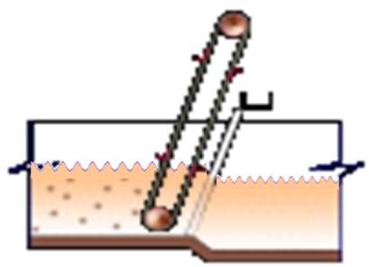
      - **Hình này chứng minh điều gì**
        - Thiết bị sử dụng hệ xích kéo răng cào cơ học để liên tục trục vớt rác thô bám trên các thanh song nghiêng lên máng gom rác.
      - **Từ đâu mà thấy được**
        - Dòng nước thải mang rác thô qua kênh dẫn bên trái, bị chặn lại trước hàng thanh song kim loại đặt nghiêng.
        - Hệ xích răng cào quay vòng quanh hai đĩa xích trên/dưới đẩy rác lên bờ và rơi vào máng gom phía sau.

- Quá trình khuấy trộn cơ học (Mixing):
  - Mục đích công nghệ của khuấy trộn:
    - Phân tán đồng đều hóa chất xử lý vào toàn bộ thể tích dòng nước thải.
    - Giữ các hạt cặn lơ lửng luôn ở trạng thái chuyển động, chống lắng đọng bùn tại đáy bể điều hòa và bể thiếu khí.
    - Tăng cường tần số tiếp xúc giữa các hạt keo hoặc giữa vi sinh vật với chất nền dinh dưỡng hòa tan.
  - Hai chế độ khuấy trộn cơ học điển hình:
    - Khuấy trộn nhanh (Rapid / Flash mixing):
      - Thời gian lưu nước ngắn: $t = 10 - 30\text{ s}$ (tối đa $60\text{ s}$).
      - Gradient vận tốc lớn: $G = 700 - 1{,}000\text{ s}^{-1}$ nhằm tạo xoáy mạnh, phân tán tức thời phèn keo tụ vào nước thải.
    - Khuấy trộn chậm tạo bông (Flocculation mixing):
      - Thời gian lưu nước: $t = 15 - 30\text{ phút}$.
      - Gradient vận tốc thấp: $G = 20 - 70\text{ s}^{-1}$ (giảm dần qua các ngăn liên tiếp) giúp các hạt keo va chạm dính kết thành bông cặn lớn mà không phá vỡ bông cặn.
  - Cấu tạo thiết bị khuấy cơ học:
    - Động cơ điện truyền động qua trục quay thẳng đứng bằng thép không gỉ nối liền cánh khuấy hai cánh chìm gần đáy bể.
    - **Hình 25.** Sơ đồ cấu tạo thiết bị khuấy trộn cơ học trong bể phản ứng
      - 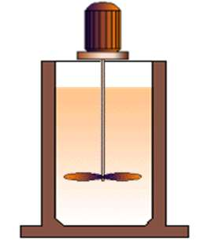
      - **Hình này chứng minh điều gì**
        - Quá trình khuấy trộn sử dụng động cơ điện gắn trục quay và cánh khuấy chìm để truyền động năng đồng nhất dòng chất lỏng.
      - **Từ đâu mà thấy được**
        - Động cơ điện đặt trên nắp bể truyền động qua trục đứng dài xuống cánh khuấy hai cánh đặt gần đáy bể.
        - Mực nước trong bể duy trì ổn định, chất lỏng được xáo trộn mãnh liệt tạo trường vận tốc đều trong toàn bộ thể tích.

###### 3.1.2 Sedimentation and Granular Filtration

- Quá trình lắng trọng lực (Sedimentation / Gravity Clarification):
  - Bản chất vật lý và cơ chế lắng:
    - Khai thác lực hấp dẫn dựa trên chênh lệch khối lượng riêng giữa hạt cặn ($\rho_p$) và nước ($\rho_w$).
    - Hạt có tỷ trọng $\rho_p > \rho_w$ sẽ tự động lắng xuống đáy bể với vận tốc lắng $v_s$.
  - 4 kiểu lắng đặc trưng trong công nghệ nước thải:
    - *Kiểu 1: Lắng hạt rời rạc (Discrete settling)*: Hạt giữ nguyên kích thước, hình dạng và tỷ trọng; vận tốc rơi độc lập tuân theo định luật Stokes:
      $$v_s = \frac{g (\rho_p - \rho_w) d_p^2}{18 \mu}$$
      Ứng dụng trong bể lắng cát (Grit chamber) để tách hạt khoáng vô cơ nặng ($d_p \ge 0.2\text{ mm}, S_s \approx 2.65$).
    - *Kiểu 2: Lắng keo tụ (Flocculent settling)*: Các hạt va chạm và kết tụ liên tục trong quá trình rơi, kích thước và vận tốc lắng tăng dần; đặc trưng cho bể lắng sơ cấp (Primary sedimentation tank).
    - *Kiểu 3: Lắng cản trở / Lắng vùng (Zone / Hindered settling)*: Nồng độ hạt đậm đặc tạo lực tương tác đẩy nhau, khối cặn cùng chuyển động chìm xuống tạo ranh giới phân cách rõ rệt (sludge blanket interface); điển hình ở bể lắng thứ cấp bùn hoạt tính.
    - *Kiểu 4: Lắng nén (Compression settling)*: Các hạt cặn tựa vào nhau dưới đáy bể, khối lượng bản thân ép nước rỗng thoát lên; diễn ra ở vùng nén bùn bể lắng và bể cô đặc bùn.
  - Thông số thiết kế công nghệ cơ bản:
    - Tải trọng thủy lực bề mặt (Surface Overflow Rate - $SOR$): $SOR = \frac{Q}{A_s} = 30 - 50\text{ m}^3/\text{m}^2\cdot\text{ngày}$ (bể lắng đợt 1).
    - Thời gian lưu nước: $HRT = 1.5 - 2.5\text{ h}$.
    - Hiệu suất loại bỏ của bể lắng đợt 1: Đạt $50 - 70\%$ tổng chất rắn lơ lửng ($TSS$) và $25 - 40\%$ nhu cầu oxy sinh hóa ($BOD_5$).
  - Cấu tạo bể lắng tròn với gạt bùn cơ giới:
    - **Hình 27.** Mặt cắt cấu tạo bể lắng trọng lực dạng tròn với hệ cào bùn cơ giới
      - 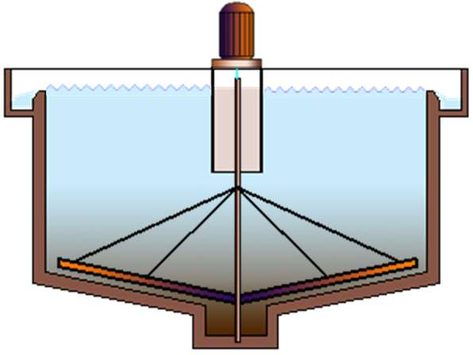
      - **Hình này chứng minh điều gì**
        - Bể lắng sử dụng trọng lực để phân tách pha rắn - lỏng kết hợp hệ cánh cào quay chậm gom bùn về hố thu trung tâm.
      - **Từ đâu mà thấy được**
        - Trụ phân phối nước trung tâm ở giữa bể có ống bao hướng dòng, đáy bể dốc nhẹ về hố thu bùn trung tâm.
        - Động cơ dẫn động trục quay gắn hệ thanh giằng và lưỡi cào bùn quét sát đáy, nước trong tràn qua máng răng cưa xung quanh.

- Quá trình lọc qua lớp vật liệu hạt (Granular Media Filtration):
  - Cơ chế lọc tách cặn:
    - Cho nước chảy qua các tầng vật liệu hạt xốp để tách giữ các hạt cặn lơ lửng sót lại có kích thước mịn sau các công đoạn lắng.
    - Các cơ chế giữ cặn chủ lực: Chặn cơ học (straining), lắng cặn vi mô trong khe rỗng (sedimentation), va chạm quán tính (inertial impaction) và hấp phụ tĩnh điện bề mặt (attachment).
  - Cấu trúc cột lọc hạt đa tầng (Multi-media filter):
    - Tầng than antraxite (trên cùng): Kích thước hạt lớn ($d = 0.8 - 1.6\text{ mm}$), tỷ trọng nhẹ ($\rho \approx 1.5\text{ g/cm}^3$), giữ lại phần lớn cặn thô mà không gây tắc nhanh bề mặt.
    - Tầng cát thạch anh (ở giữa): Kích thước hạt mịn ($d = 0.45 - 0.55\text{ mm}$), tỷ trọng trung bình ($\rho \approx 2.65\text{ g/cm}^3$), lọc tinh triệt để cặn lơ lửng nhỏ.
    - Tầng sỏi đỡ (dưới đáy): Tỷ trọng nặng, phân tầng kích thước ($d = 2 - 32\text{ mm}$), nâng đỡ lớp vật liệu lọc và phân phối đều dòng nước/khí rửa lọc.
    - Rửa ngược (Backwashing): Bơm nước sạch và sục khí ngược chiều từ dưới lên định kỳ để giãn nở lớp hạt ($20 - 30\%$) và đẩy toàn bộ cặn bẩn ra ngoài máng thu.
  - Cấu tạo cột lọc áp lực:
    - **Hình 28.** Cấu tạo mặt cắt cột lọc hạt áp lực đa tầng với hệ thống phân phối và chụp lọc
      - 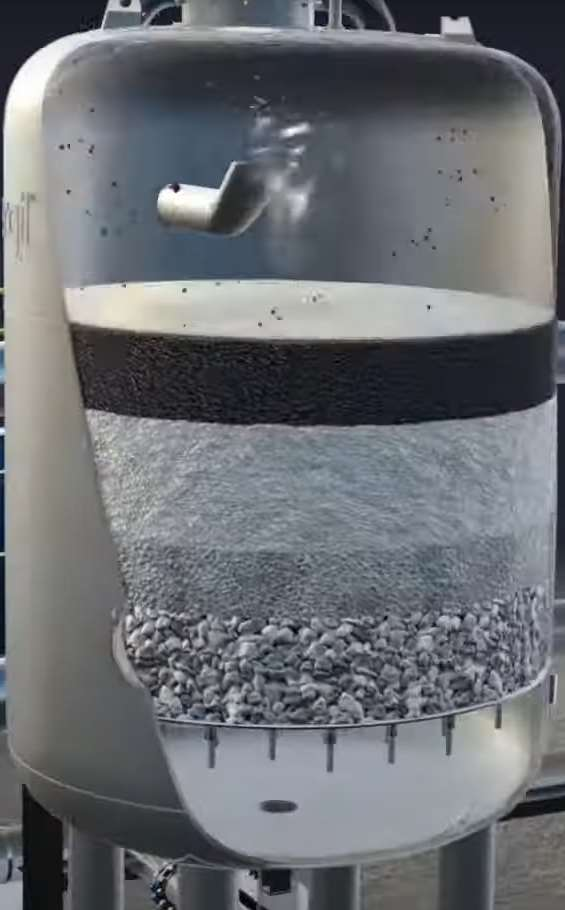
      - **Hình này chứng minh điều gì**
        - Quá trình lọc áp lực sử dụng các lớp vật liệu hạt phân tầng theo kích thước và tỷ trọng để giữ lại cặn lơ lửng mịn.
      - **Từ đâu mà thấy được**
        - Vỏ bồn kim loại chịu áp lực chứa các lớp vật liệu từ trên xuống: than antraxite đen, cát lọc xám, sỏi đỡ thô.
        - Ống phân phối nước vào hình phễu phía trên đỉnh bồn và sàn đỡ gắn dàn chụp lọc phân bố đều ở đáy bồn.

- Quá trình tuyển nổi (Flotation) và Hấp phụ (Adsorption):
  - Tuyển nổi bọt khí hòa tan (Dissolved Air Flotation - DAF):
    - Ứng dụng cho các hạt cặn có khối lượng riêng xấp xỉ hoặc nhỏ hơn nước ($\rho_p \le \rho_w$), váng dầu mỡ và bông cặn sinh học nhẹ.
    - Hòa tan không khí vào nước ở áp suất cao ($4 - 6\text{ bar}$) rồi xả vào bể tuyển nổi ở áp suất khí quyển để giải phóng bọt khí micro ($20 - 50\,\mu\text{m}$). Bọt khí bám vào hạt cặn làm giảm tỷ trọng biểu kiến và đẩy hạt nổi lên mặt nước để gạt bỏ.
  - Hấp phụ vật lý trên than hoạt tính (Adsorption):
    - Sử dụng than hoạt tính dạng hạt (GAC) hoặc dạng bột (PAC) có diện tích bề mặt lớn ($800 - 1{,}500\text{ m}^2\text{/g}$).
    - Lực hấp phụ liên phân tử (lực Van der Waals) giữ các hợp chất hữu cơ hòa tan khó phân hủy sinh học, chất màu và hợp chất độc hại trên bề mặt mao quản.

##### 3.2 Chemical Unit Processes

- Bản chất và đặc trưng của các quá trình đơn vị hóa học:
  - Loại bỏ hoặc biến đổi các chất ô nhiễm thông qua việc bổ sung hóa chất phản ứng hoặc xảy ra các phản ứng hóa học trực tiếp.
  - Làm thay đổi cấu trúc phân tử hoặc trạng thái cân bằng ion hóa lý của các thành phần ô nhiễm.
  - Các quá trình đơn vị hóa học điển hình gồm:
    - Kết tủa hóa học (Chemical Precipitation).
    - Chuyển khối khí / Sục khí (Gas Transfer).
    - Khử trùng hóa học (Chemical Disinfection).
    - Keo tụ hóa học (Chemical Coagulation).
    - Quá trình oxy hóa nâng cao (Advanced Oxidation Processes - AOPs).

###### 3.2.1 Chemical Precipitation and Gas Transfer

- Quá trình kết tủa hóa học (Chemical Precipitation):
  - Cơ chế tạo kết tủa:
    - Bổ sung hóa chất để các ion hòa tan phản ứng tạo thành hợp chất có độ tan cực thấp, vượt quá tích số tan ($K_{sp}$), làm xuất hiện kết tủa rắn không tan.
    - Cặn kết tủa sau đó được loại bỏ hoàn toàn bằng các quá trình đơn vị vật lý (lắng trọng lực, lọc hạt hoặc màng lọc).
  - Khử photpho hòa tan bằng kết tủa hóa học:
    - Phản ứng với phèn nhôm:
      $$\text{Al}^{3+} + \text{PO}_4^{3-} \to \text{AlPO}_4 \downarrow$$
    - Phản ứng với phèn sắt ba:
      $$\text{Fe}^{3+} + \text{PO}_4^{3-} \to \text{FePO}_4 \downarrow$$
    - Phản ứng với vôi tôi ($\text{Ca(OH)}_2$) ở $\text{pH} > 10$:
      $$10\text{Ca}^{2+} + 6\text{PO}_4^{3-} + 2\text{OH}^- \to \text{Ca}_{10}(\text{PO}_4)_6(\text{OH})_2 \downarrow \quad (\text{Hydroxylapatite})$$
  - Khử kim loại nặng trong nước thải công nghiệp:
    - Bổ sung kiềm ($\text{NaOH}$ hoặc $\text{Ca(OH)}_2$) để nâng $\text{pH}$ đến điểm đẳng điện cực tiểu độ tan của kim loại, chuyển đổi ion $\text{Cu}^{2+}, \text{Ni}^{2+}, \text{Zn}^{2+}, \text{Cr}^{3+}$ thành kết tủa hydroxide không tan $\text{Me(OH)}_n \downarrow$.

- Quá trình chuyển khối khí (Gas Transfer / Aeration):
  - Cơ chế truyền khối qua mặt phân cách pha khí - lỏng:
    - Tuân theo lý thuyết hai màng (Two-film theory) với phương trình động học truyền khối:
      $$\frac{dC}{dt} = K_L a \cdot (C_s - C)$$
      Trong đó $K_L a$ là hệ số chuyển khối thể tích ($\text{h}^{-1}$), $C_s$ là nồng độ khí bão hòa trong nước ($\text{mg/L}$), $C$ là nồng độ khí tức thời ($\text{mg/L}$).
  - Mục đích công nghệ của chuyển khối khí:
    - Sục khí hòa tan oxy ($\text{O}_2$) vào nước thải trong bể Aerotank nhằm duy trì nồng độ oxy hòa tan ($DO \ge 2.0\text{ mg/L}$) phục vụ hô hấp hiếu khí của vi sinh vật.
    - Thoát khí / Đuổi khí hòa tan (Stripping): Nâng $\text{pH} > 10.5$ để chuyển toàn bộ amoni thành khí amoniac tự do ($\text{NH}_4^+ + \text{OH}^- \rightleftharpoons \text{NH}_3 \uparrow + \text{H}_2\text{O}$), sau đó dùng tháp sục khí thổi bay khí $\text{NH}_3$ hoặc khử khí độc $\text{H}_2\text{S}, \text{CO}_2, \text{VOCs}$.

###### 3.2.2 Chemical Disinfection and Pathogen Inactivation

- Quá trình khử trùng hóa học (Chemical Disinfection):
  - Mục đích công nghệ:
    - Bất hoạt hoặc tiêu diệt có chọn lọc các vi sinh vật gây bệnh truyền nhiễm qua đường nước (vi khuẩn tả, thương hàn, lỵ, virus, bào nang protozoa).
    - Ngăn ngừa nguy cơ dịch bệnh bùng phát và bảo vệ hệ sinh thái nguồn nước tiếp nhận.
  - Hóa chất khử trùng phổ biến: Khí Clo hóa lỏng ($\text{Cl}_2$), Natri hipoclorit / Javel ($\text{NaOCl}$), Canxi hipoclorit ($\text{Ca(OCl)}_2$), Ozone ($\text{O}_3$), Clo dioxit ($\text{ClO}_2$).

- Động học và cân bằng hóa học của quá trình Clo hóa:
  - Phản ứng thủy phân Clo trong nước:
    $$\text{Cl}_2 + \text{H}_2\text{O} \rightleftharpoons \text{HOCl} + \text{H}^+ + \text{Cl}^-$$
    $$\text{NaOCl} + \text{H}_2\text{O} \rightleftharpoons \text{HOCl} + \text{Na}^+ + \text{OH}^-$$
  - Cân bằng phân ly axit hipocloro ($\text{HOCl}$) theo $\text{pH}$:
    $$\text{HOCl} \rightleftharpoons \text{H}^+ + \text{OCl}^- \quad (pK_a = 7.53 \text{ ở } 20^\circ\text{C})$$
    - Phân tử $\text{HOCl}$ trung hòa điện tích khuếch tán qua màng lipid tế bào vi khuẩn nhanh hơn $80 - 100$ lần so với ion $\text{OCl}^-$ mang điện tích âm.
    - Hiệu quả khử trùng đạt mức cao nhất khi duy trì $\text{pH} \le 7.0$ (dạng $\text{HOCl}$ chiếm tỷ lệ áp đảo).
  - Phản ứng tạo Cloramin khi nước thải chứa amoniac:
    $$\text{NH}_3 + \text{HOCl} \to \text{NH}_2\text{Cl} \text{ (Monochloramine)} + \text{H}_2\text{O}$$
    $$\text{NH}_2\text{Cl} + \text{HOCl} \to \text{NHCl}_2 \text{ (Dichloramine)} + \text{H}_2\text{O}$$
    $$\text{NHCl}_2 + \text{HOCl} \to \text{NCl}_3 \text{ (Trichloramine)} + \text{H}_2\text{O}$$

- Cơ chế bất hoạt vi khuẩn chỉ thị *Escherichia coli*:
  - Hóa chất khử trùng oxy hóa và phá hủy cấu trúc màng tế bào (Cell Membrane).
  - Xâm nhập vào tế bào chất (Cytoplasm), oxy hóa các enzyme trao đổi chất và làm đông tụ protein tế bào.
  - Phá vỡ cấu trúc chuỗi xoắn kép DNA, làm tê liệt khả năng nhân đôi và vô hiệu hóa hệ lông roi (Flagellum).
  - **Hình 32.** Cấu trúc tế bào vi khuẩn chỉ thị *Escherichia coli* ($3\,\mu\text{m}$) bị tấn công bởi hóa chất khử trùng
    - 
    - **Hình này chứng minh điều gì**
      - Hóa chất khử trùng thẩm thấu qua màng tế bào vi khuẩn để phá hủy tế bào chất, màng sinh chất và vật chất di truyền DNA.
    - **Từ đâu mà thấy được**
      - Sơ đồ cấu tạo trực khuẩn *E. coli* dài $3\,\mu\text{m}$ gồm màng tế bào (Cell Membrane), tế bào chất (Cytoplasm), cuộn DNA và lông roi (Flagellum).
      - Mũi tên xanh chỉ sự phá hủy cấu trúc tế bào vi khuẩn thành các mảnh vụn tế bào chết dưới tác động oxy hóa của hóa chất.

- Cấu tạo và thủy lực bể tiếp xúc khử trùng (Disinfection Contact Tank):
  - Yêu cầu thủy lực công nghệ:
    - Thời gian lưu nước tiếp xúc: $t_{HRT} = 15 - 30\text{ phút}$ ở lưu lượng đỉnh ($Q_{peak}$).
    - Thiết kế hệ vách ngăn zíc zắc (baffled channels) để tạo chế độ dòng chảy nút lý tưởng (plug-flow), triệt tiêu dòng chảy tắt và vùng nước chết.
    - Đảm bảo tỷ số thủy lực $t_{10}/t_{HRT} \ge 0.7$ (thời gian $10\%$ lượng nước đầu tiên thoát ra đạt tối thiểu $70\%$ thời gian lưu lý thuyết).
  - Sơ đồ nguyên lý và thực tế công trình:
    - **Hình 29.** Sơ đồ thủy lực bể tiếp xúc khử trùng vách ngăn zíc zắc có châm Chlorine/Javel
      - 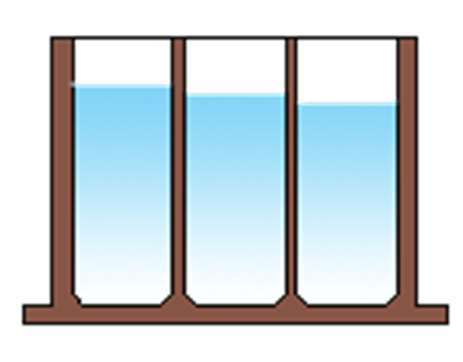
      - **Hình này chứng minh điều gì**
        - Hệ vách ngăn so le kéo dài đường dẫn dòng chảy nhằm đảm bảo thời gian tiếp xúc tiếp xúc thủy lực tối thiểu giữa hóa chất khử trùng và nước thải.
      - **Từ đâu mà thấy được**
        - Điểm châm hóa chất khử trùng (Chlorine/Javel) bố trí ngay tại cửa vào ngăn thứ nhất.
        - Các vách ngăn thẳng đứng bố trí so le tạo kênh dẫn ngoằn ngoèo, mực nước hạ dần qua từng vách ngăn theo chiều dòng chảy.
    - **Hình 30.** Hình ảnh thực tế bể tiếp xúc khử trùng bằng Clo với hệ vách ngăn bê tông cốt thép
      - 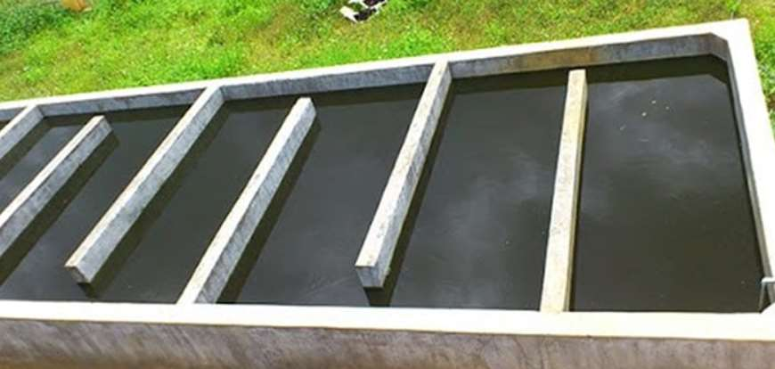
      - **Hình này chứng minh điều gì**
        - Bể tiếp xúc trong công trình thực tế được thiết kế dạng kênh hở chữ U nhiều dải song song để tiếp cận dòng chảy nút (plug flow).
      - **Từ đâu mà thấy được**
        - Kết cấu bể bằng bê tông cốt thép lộ thiên gồm các tường ngăn dọc song song phân cách các hành lang dòng chảy.
        - Dòng nước thải đã xử lý chuyển động quanh co liên tục qua các lối mở so le ở hai đầu vách ngăn.

##### 3.3 Biological Unit Processes

- Bản chất và đặc trưng của các quá trình đơn vị sinh học:
  - Loại bỏ các chất ô nhiễm nhờ hoạt động sống và chuyển hóa trao đổi chất của quần thể vi sinh vật (vi khuẩn, nấm, protozoa).
  - Mục đích công nghệ chủ đạo:
    - Loại bỏ các hợp chất hữu cơ có khả năng phân hủy sinh học ($bCOD$) ở dạng hòa tan ($rbCOD$) và dạng keo/hạt ($sbCOD$).
    - Khử các chất dinh dưỡng hòa tan gồm Nitơ ($N$) và Photpho ($P$).
  - Cơ chế chuyển hóa hai pha:
    - Pha khí: Các chất ô nhiễm được chuyển hóa thành các chất khí bền vững thoát ra ngoài khí quyển ($\text{CO}_2, \text{N}_2, \text{CH}_4$).
    - Pha rắn sinh khối: Chuyển hóa thành sinh khối tế bào vi sinh vật mới (bùn hoạt tính $\text{C}_5\text{H}_7\text{O}_2\text{N}$) có thể tách rời khỏi nước thải bằng quá trình lắng trọng lực ở bể lắng đợt 2.

###### 3.3.1 Mechanisms of Biological Degradation

- Chuyển hóa chất hữu cơ gốc cacbon:
  - Phản ứng oxy hóa dị hóa hiếu khí:
    $$\text{Chất hữu cơ} + \text{O}_2 + \text{N} + \text{P} \xrightarrow{\text{Vi khuẩn dị dưỡng}} \text{Tế bào mới } (\text{C}_5\text{H}_7\text{O}_2\text{N}) + \text{CO}_2 \uparrow + \text{H}_2\text{O} + \Delta H$$
  - Quá trình hô hấp nội bào (tự phân sinh khối):
    $$\text{C}_5\text{H}_7\text{O}_2\text{N} + 5\text{O}_2 \to 5\text{CO}_2 \uparrow + 2\text{H}_2\text{O} + \text{NH}_3 + \Delta H$$
  - Tỷ lệ dinh dưỡng cân bằng tiêu chuẩn: $\text{BOD}_5 : \text{N} : \text{P} = 100 : 5 : 1$.

- Chuyển hóa các hợp chất Nitơ (Nitrification & Denitrification):
  - Giai đoạn 1: Nitrat hóa hiếu khí hai bước bởi vi khuẩn tự dưỡng hóa năng:
    - Oxy hóa amoni thành nitrit (*Nitrosomonas*):
      $$\text{NH}_4^+ + 1.5\text{O}_2 \xrightarrow{\text{Nitrosomonas}} \text{NO}_2^- + \text{H}_2\text{O} + 2\text{H}^+ \quad (3.43\text{ g }\text{O}_2/\text{g N})$$
    - Oxy hóa nitrit thành nitrat (*Nitrobacter*):
      $$\text{NO}_2^- + 0.5\text{O}_2 \xrightarrow{\text{Nitrobacter}} \text{NO}_3^- \quad (1.14\text{ g }\text{O}_2/\text{g N})$$
    - Tổng nhu cầu oxy cho quá trình nitrat hóa: $4.57\text{ g }\text{O}_2/\text{g }\text{NH}_4^+-\text{N}$, tiêu tốn $7.14\text{ g }\text{CaCO}_3/\text{g N}$ độ kiềm.
  - Giai đoạn 2: Khử nitrat thiếu khí (Anoxic Denitrification):
    - Diễn ra trong môi trường không có oxy tự do ($DO \approx 0\text{ mg/L}$), có mặt ion $\text{NO}_3^-$ làm chất nhận electron.
    - Vi khuẩn dị dưỡng tùy tiện sử dụng chất hữu cơ làm chất cho electron để khử nitrat thành khí nitơ tự do thoát ra khí quyển:
      $$\text{NO}_3^- \to \text{NO}_2^- \to \text{NO} \uparrow \to \text{N}_2\text{O} \uparrow \to \text{N}_2 \uparrow$$
    - Phục hồi lại $3.57\text{ g }\text{CaCO}_3/\text{g }\text{NO}_3^--\text{N}$ độ kiềm, giúp cân bằng lại $\text{pH}$ hệ thống.

###### 3.3.2 Biological Nutrient Removal and Process Configuration

- Quy trình công nghệ khử nitơ sinh học cải biên Ludzack-Ettinger (Modified Ludzack-Ettinger - MLE):
  - Chuỗi công trình liên hoàn gồm: Bể thiếu khí (Anoxic tank) $\to$ Bể hiếu khí (Aerobic tank) $\to$ Bể lắng đợt 2 (Sedimentation tank).
  - Vận hành kết hợp hai dòng tuần hoàn: Dòng tuần hoàn nội bộ nước thải chứa nitrat ($IR$) và dòng tuần hoàn bùn hoạt tính ($RAS$).

- Chức năng và cấu tạo của từng công trình trong dây chuyền BNR:
  - Bể thiếu khí (Anoxic tank):
    - Đặt ở đầu dây chuyền để tiếp nhận đồng thời dòng nước thải thô giàu chất hữu cơ ($rbCOD$), dòng bùn tuần hoàn ($RAS$) và dòng tuần hoàn nội bộ ($IR$).
    - Không cấp khí oxy sủi bọt, trang bị máy khuấy chìm (submersible mixer) công suất $W = 5 - 10\text{ W/m}^3$ để duy trì bùn vi sinh ở trạng thái lơ lửng, chống sa lắng.
    - Tận dụng nguồn cacbon dễ phân hủy trong nước thải thô làm chất cho electron để khử nitrat nhanh chóng mà không cần bổ sung nguồn cacbon tốn kém bên ngoài.
    - **Hình 33.** Sơ đồ cấu tạo bể thiếu khí (Anoxic tank) tích hợp máy khuấy chìm dòng chảy
      - 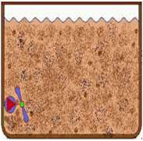
      - **Hình này chứng minh điều gì**
        - Bể thiếu khí vận hành trong điều kiện không cấp oxy tự do ($DO \approx 0\text{ mg/L}$), dùng máy khuấy chìm giữ bùn vi sinh luôn lơ lửng.
      - **Từ đâu mà thấy được**
        - Mặt cắt bể chứa hỗn hợp bùn hoạt tính màu nâu sẫm, không có hệ thống cấp khí sủi bọt từ đáy.
        - Máy khuấy chìm (submersible mixer) hai cánh gắn ở góc chân tường tạo dòng xoáy thủy lực đều khắp thể tích bể.

  - Bể hiếu khí (Aerobic tank):
    - Cấp khí oxy liên tục từ máy thổi khí qua hệ thống đĩa phân phối bọt mịn (fine bubble diffusers) đặt sát đáy bể.
    - Duy trì nồng độ oxy hòa tan $DO \ge 2.0\text{ mg/L}$ và nồng độ bùn hoạt tính $MLSS = 2{,}500 - 4{,}000\text{ mg/L}$.
    - Đảm nhiệm hai chức năng: Oxy hóa triệt để phần chất hữu cơ cacbon còn lại về mức phát thải chuẩn ($BOD_5 < 10 - 20\text{ mg/L}$) và nitrat hóa toàn bộ ion amoni thành nitrat ($\text{NO}_3^-$).
    - **Hình 34.** Sơ đồ mặt cắt bể hiếu khí (Aerobic tank) với hệ thống phân phối bọt khí mịn từ đáy bể
      - 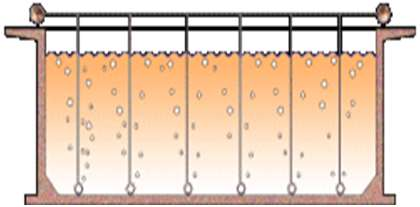
      - **Hình này chứng minh điều gì**
        - Bể hiếu khí cung cấp oxy hòa tan liên tục qua dàn phân phối khí bọt mịn để vi khuẩn dị dưỡng oxy hóa chất hữu cơ và nitrat hóa amoni.
      - **Từ đâu mà thấy được**
        - Dàn ống cấp khí treo từ đỉnh bể kết nối với các đĩa thổi khí đặt sát đáy bể.
        - Các bọt khí nhỏ mịn sủi lên liên tục qua toàn bộ chiều sâu cột nước, duy trì nồng độ oxy hòa tan $DO \ge 2.0\text{ mg/L}$.

  - Bể lắng sinh học đợt 2 (Sedimentation tank):
    - Tiếp nhận hỗn hợp bùn nước từ bể hiếu khí, phân tách pha rắn - lỏng theo cơ chế lắng vùng và lắng nén.
    - Nước trong tràn qua máng thu răng cưa đạt chuẩn đi sang công đoạn khử trùng.
    - Cầu gạt bùn cơ giới quay chậm liên tục gom lớp bùn hoạt tính lắng ở đáy bể dốc ($MLSS_{sludge} = 6{,}000 - 10{,}000\text{ mg/L}$) về hố thu bùn trung tâm.
    - **Hình 35.** Cấu tạo bể lắng sinh học đợt 2 (Secondary sedimentation tank) tách bùn hoạt tính
      - 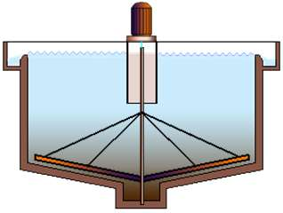
      - **Hình này chứng minh điều gì**
        - Bể lắng đợt 2 phân tách pha hỗn hợp bùn hoạt tính thành dòng nước trong phía trên và bùn lắng tập trung ở đáy để tuần hoàn.
      - **Từ đâu mà thấy được**
        - Ống lắng trung tâm định hướng dòng hỗn hợp bùn nước chảy vào vùng lắng yên tĩnh.
        - Cầu gạt cơ học quay tròn quét các bông bùn lắng về hố thu bùn trung tâm ở đáy dốc để tuần hoàn (RAS) và xả dư (WAS).

- Các chu trình tuần hoàn chất lưu và cân bằng sinh khối:
  - Dòng tuần hoàn nội bộ nước thải (Recirculating wastewater / Internal Recycle - $IR$):
    - Bơm dòng nước thải giàu nitrat từ cuối bể hiếu khí quay trở lại đầu bể thiếu khí.
    - Lưu lượng tuần hoàn nội bộ: $Q_{IR} = 1.0 - 3.0 Q$ (tương ứng $100\% - 300\%$ lưu lượng vào trạm).
    - Hiệu suất khử tổng nitơ ($TN$) của quy trình MLE tuân theo công thức:
      $$\eta_{\text{TN}} = \frac{R + R_{RAS}}{1 + R + R_{RAS}}$$
      Trong đó $R = Q_{IR}/Q$ và $R_{RAS} = Q_{RAS}/Q$.
  - Dòng bùn tuần hoàn (Recirculating sludge / Return Activated Sludge - $RAS$):
    - Bơm lớp bùn hoạt tính lắng từ đáy bể lắng đợt 2 quay trở lại đầu bể thiếu khí ($Q_{RAS} = 0.5 - 1.0 Q$).
    - Bổ sung và duy trì nồng độ sinh khối vi sinh vật cao trong bể sinh học.
  - Dòng xả bùn hoạt tính dư (Excess sludge / Waste Activated Sludge - $WAS$):
    - Xả một phần bùn hoạt tính định kỳ ra khỏi hệ thống để kiểm soát tuổi bùn (Solids Retention Time - $SRT$ hay $\theta_c = 10 - 20\text{ ngày}$) và giữ cho quần thể vi sinh vật luôn trẻ, hoạt tính trao đổi chất mạnh.
    - Bùn dư được dẫn sang cụm công trình xử lý bùn (bể cô đặc, bể phân hủy bùn kỵ khí và máy ép bùn).

#### 4. Application of Treatment Methods

##### 4.1 Levels of Wastewater Treatment

- Khái niệm và phân cấp các bậc xử lý nước thải (Levels of Wastewater Treatment):
  - Kỹ thuật xử lý nước thải kết hợp các quá trình đơn vị (vật lý, hóa học, sinh học) thành các bậc xử lý nối tiếp nhằm loại bỏ tuần tự các nhóm chất ô nhiễm mục tiêu.
  - Mỗi bậc xử lý đảm nhận nhiệm vụ công nghệ chuyên biệt để giảm dần nồng độ các chất ô nhiễm từ thô đến tinh, bảo vệ các cụm công trình phía sau và đáp ứng tiêu chuẩn xả thải hoặc mục tiêu tái sử dụng nước.
  - Phân loại tổng quát bốn bậc xử lý kinh điển (General classification):
    - Xử lý bậc một / Cơ học (Primary Treatment): Chủ yếu áp dụng các quá trình vật lý (physical processes) như song chắn rác (screening) và lắng trọng lực (sedimentation).
    - Xử lý bậc hai / Sinh học (Secondary Treatment): Chủ yếu áp dụng các quá trình sinh học (biological processes) kết hợp các quá trình hóa học (chemical processes).
    - Xử lý bậc ba (Tertiary Treatment): Kết hợp đồng thời các quá trình vật lý, hóa học và sinh học (combination of physical, chemical, and biological processes) nhằm nâng cao độ trong và khử dinh dưỡng còn sót lại.
    - Xử lý nâng cao (Advanced Treatment): Áp dụng các công nghệ phân tách màng và oxy hóa tăng cường (enhanced processes) để đạt chất lượng nước sau xử lý vượt trội.
- Mục tiêu phân tách chất ô nhiễm và phạm vi ứng dụng của từng bậc xử lý (Treatment Objectives and Target Applications):
  - Xử lý sơ cấp / Bậc một (Primary Treatment):
    - Tách bỏ các tạp chất và chất rắn kích thước lớn (large solids) trôi nổi trong dòng thải như cành que rác, giẻ rách, bao bì nilon, giấy vụn.
    - Tách pha dầu mỡ, chất béo tự do và váng nổi (oil and grease separation) bằng tuyển nổi trọng lực hoặc bẫy dầu mỡ.
    - Điều hòa lưu lượng và cân bằng nồng độ chất ô nhiễm (flow and concentration regulation) qua bể điều hòa.
  - Xử lý thứ cấp / Bậc hai (Secondary Treatment):
    - Loại bỏ phần lớn chất rắn lơ lửng ($\text{SS}$ - Suspended Solids) còn sót lại sau công trình sơ cấp.
    - Loại bỏ các hợp chất hữu cơ có khả năng phân hủy sinh học ($\text{BOD}$ - Biochemical Oxygen Demand, $\text{bCOD}$) nhờ hoạt động phân giải hiếu khí hoặc kỵ khí của vi sinh vật.
    - Loại bỏ các hợp chất dinh dưỡng đa lượng gồm nitơ ($\text{N}$) và photpho ($\text{P}$) qua quá trình chuyển hóa sinh học chuyên sâu.
    - Khử trùng dòng nước thải (disinfection) bằng tác nhân hóa học (clo, ozon) hoặc bức xạ vật lý (tia cực tím $\text{UV}$) để tiêu diệt mầm bệnh.
  - Xử lý bậc ba (Tertiary Treatment):
    - Loại bỏ triệt để huyền phù mịn và chất rắn lơ lửng tàn dư (residual suspended solids) sau bể lắng sinh học bậc hai bằng quá trình lọc qua lớp vật liệu lọc (granular medium filtration).
    - Khử triệt để phần dinh dưỡng dạng vết còn tồn dư trong dòng ra của bể xử lý sinh học.
    - Bậc ba là điều kiện bắt buộc đối với các mục đích tái sử dụng nước thải (tertiary treatment is required for some reuse applications) như tưới tiêu nông nghiệp, tuần hoàn nước làm mát công nghiệp và cảnh quan đô thị.
  - Xử lý nâng cao (Advanced Treatment):
    - Loại bỏ các hợp chất hữu cơ bền vững khó phân hủy sinh học (refractory organics), độc chất hữu cơ mạch vòng và dược phẩm tàn dư.
    - Tách bỏ các ion kim loại nặng hòa tan ($\text{heavy metals}$) độc hại.
    - Loại bỏ triệt để các ion muối khoáng và chất rắn hòa tan vô cơ ($\text{TDS}$ - Total Dissolved Solids).
    - Bậc xử lý nâng cao được chỉ định ứng dụng chuyên biệt cho quy trình tái tạo nước uống trực tiếp (advanced treatment used for the production of potable water) và nước cấp công nghiệp siêu tinh khiết.

| Bậc xử lý (Level) | Chất ô nhiễm loại bỏ (Removal) | Mục đích công nghệ (Purpose) | Phương pháp / Công trình đơn vị (Methods) |
| :--- | :--- | :--- | :--- |
| **Xử lý sơ bộ** (Preliminary Treatment) | Chất rắn kích thước lớn như giẻ rách, que củi, rác nổi, cặn cát sỏi thô và dầu mỡ trôi nổi. | Ngăn ngừa sự cố vận hành, chống tắc nghẽn đường ống và hư hại thiết bị cơ điện. | Song chắn rác (Screening), Bể lắng cát (Grit removal), Bể tách dầu mỡ (Grease traps). |
| **Xử lý bậc một** (Primary Treatment) | Một phần chất rắn lơ lửng ($\text{TSS}$) và chất hữu cơ không tan. | Giảm tải trọng hữu cơ và cặn bẩn cho các công trình xử lý phía sau. | Bể lắng sơ cấp / Bể lắng đợt 1 (Sedimentation tanks). |
| **Xử lý bậc một nâng cao** (Advanced Primary Treatment) | Tăng cường hiệu suất loại bỏ chất rắn lơ lửng và chất hữu cơ keo tụ. | Giảm sâu hơn nữa tải lượng ô nhiễm cho các công trình xử lý sinh học kế tiếp. | Keo tụ và tạo bông (Coagulation and Flocculation), Quá trình lọc (Filtration). |
| **Xử lý bậc hai** (Secondary Treatment) | Chất hữu cơ có khả năng phân hủy sinh học ($\text{BOD}$) và chất rắn lơ lửng ($\text{SS}$). | Giảm nồng độ các chất ô nhiễm xuống ngưỡng an toàn cho phép xả thải ra môi trường. | Bùn hoạt tính (Activated sludge process), Bể lọc nhỏ giọt (Trickling filters), Khử trùng (Disinfection). |
| **Xử lý bậc hai khử dinh dưỡng** (Secondary Treatment with Nutrient Removal) | Chất hữu cơ dễ phân hủy sinh học, chất rắn lơ lửng và chất dinh dưỡng ($\text{N}$, $\text{P}$). | Ngăn chặn hiện tượng phú dưỡng hóa (eutrophication) trong các thủy vực tiếp nhận. | Khử dinh dưỡng sinh học ($\text{BNR}$), Kết tủa hóa học (Chemical precipitation). |
| **Xử lý bậc ba** (Tertiary Treatment) | Chất rắn lơ lửng tàn dư và lượng vết chất dinh dưỡng sau xử lý bậc hai. | Cung cấp nguồn nước xả đạt chất lượng cao hoặc phục vụ các mục đích tái sử dụng nước. | Bể lọc qua môi trường hạt / cát nhiều tầng (Granular medium filters). |
| **Xử lý nâng cao** (Advanced Treatment) | Hợp chất hữu cơ khó phân hủy sinh học, kim loại nặng, chất rắn vô cơ hòa tan ($\text{TDS}$). | Tăng cường làm sạch sâu, phục vụ tái sử dụng nước cấp sinh hoạt (potable water). | Lọc màng (Membrane filtration), Oxy hóa nâng cao ($\text{AOPs}$), Hấp phụ than hoạt tính. |

- Chi tiết các bậc xử lý và cơ chế công nghệ đơn vị (Detailed Technical Characteristics):
  - Xử lý sơ bộ (Preliminary Treatment):
    - Mục tiêu công nghệ: Bảo vệ toàn bộ trạm xử lý khỏi sự cố cơ học nghiêm trọng, giảm tần suất bảo trì máy bơm, máy thổi khí và đường ống công nghệ.
    - Quá trình chắn rác (Screening): Song chắn rác thô (khe hở $> 6\text{ mm}$) và lưới lọc tinh (khe hở $1.5\text{--}6\text{ mm}$) giữ lại cành que, nilon, giẻ rách; cặn rác được cào cơ học chuyển sang công đoạn ép rác và chôn lấp.
    - Quá trình lắng cát (Grit removal): Bể lắng cát ngang, bể lắng cát sục khí hoặc lắng xoáy lốc tách các hạt vô cơ tỉ trọng lớn ($\rho \ge 2.65\text{ g/cm}^3$, đường kính hạt $d \ge 0.2\text{ mm}$) để chống mòn cánh bơm và bồi lắng lòng bể.
    - Quá trình tách dầu mỡ (Grease traps): Tận dụng chênh lệch trọng lực hoặc cấp bọt khí áp lực để thúc đẩy hạt dầu mỡ tuyển nổi tự do lên bề mặt và thu gom bằng máng gạt gầu quay.
  - Xử lý bậc một / Cơ học (Primary Treatment):
    - Mục tiêu công nghệ: Tách các hạt cặn lơ lửng có khả năng lắng trọng lực tự nhiên, làm giảm đáng kể tải lượng cặn vào bể sinh học.
    - Hiệu suất phân tách điển hình: Loại bỏ khoảng $50\text{--}70\%$ tổng chất rắn lơ lửng ($\text{TSS}$) và $25\text{--}40\%$ nhu cầu oxy sinh hóa ($\text{BOD}_5$).
    - Công trình cốt lõi: Bể lắng sơ cấp dạng tròn (trục tâm) hoặc dạng chữ nhật (dòng chảy ngang) với thời gian lưu nước thủy lực ($\text{HRT}$) dao động từ $1.5\text{--}2.5\text{ h}$.
    - Dòng thải phụ phẩm: Bùn sơ cấp (primary sludge) có hàm lượng chất rắn $3\text{--}7\%$ được rút từ phễu thu đáy bể, váng bọt nổi (scum) được gạt liên tục về máng xả váng.
  - Xử lý bậc một nâng cao (Advanced Primary Treatment - Chemically Enhanced Primary Treatment - CEPT):
    - Mục tiêu công nghệ: Vượt qua giới hạn lắng trọng lực tự nhiên bằng cách châm hóa chất keo tụ tạo bông nhằm keo tụ hạt keo và chất rắn phi lắng.
    - Hóa chất sử dụng: Phèn nhôm ($\text{Al}_2(\text{SO}_4)_3$), phèn sắt ($\text{FeCl}_3$, $\text{FeSO}_4$) kết hợp polymer trợ keo tụ (cationic hoặc anionic polyacrylamide).
    - Hiệu suất xử lý vượt trội: Nâng cao hiệu suất loại bỏ $\text{TSS}$ lên $80\text{--}90\%$ và $\text{BOD}_5$ lên $50\text{--}70\%$, đồng thời kết tủa một phần photphat hòa tan ($\text{PO}_4^{3-}$).
    - Lợi thế kinh tế: Giảm mạnh thể tích xây dựng của cụm bể hiếu khí hạ nguồn và giảm mức tiêu thụ điện năng cho hệ thống sục khí oxy.
  - Xử lý bậc hai (Secondary Treatment):
    - Mục tiêu công nghệ: Chuyển hóa và loại bỏ các chất hữu cơ hòa tan và chất rắn lơ lửng không tan bằng mạng lưới vi sinh vật dị dưỡng.
    - Hiệu suất phân tách thông thường: Loại bỏ trên $85\text{--}95\%$ $\text{BOD}_5$ và $\text{TSS}$ của dòng thải đầu vào.
    - Quá trình bùn hoạt tính (Activated Sludge Process): Vi sinh vật sinh trưởng lơ lửng trong bể phản ứng có sục khí liên tục (Aerobic tank), tiếp sau là bể lắng thứ cấp (Secondary settling tank) để phân tách bùn hoạt tính.
    - Bể lọc sinh học (Trickling filters): Vi sinh vật sinh trưởng bám dính trên lớp giá thể cố định (đá dăm, vòng nhựa), nước thải được phân phối phun mưa từ trên xuống.
    - Khử trùng (Disinfection): Nước sau lắng được tiếp xúc với dung dịch $\text{NaOCl}$, khí $\text{Cl}_2$ hoặc đèn bức xạ tia cực tím ($\text{UV}$) trong $15\text{--}30\text{ phút}$ để diệt trừ triệt để vi khuẩn đường ruột (Coliforms, E. coli).
  - Xử lý bậc hai kết hợp khử chất dinh dưỡng (Secondary Treatment with Nutrient Removal - BNR):
    - Mục tiêu công nghệ: Loại bỏ đồng thời hợp chất hữu cơ ($\text{C}$), nitơ ($\text{N}$) và photpho ($\text{P}$) nhằm ngăn ngừa suy kiệt oxy hòa tan và bùng phát tảo nở hoa (eutrophication) tại sông hồ.
    - Cơ chế chuyển hóa nitơ sinh học (N-removal):
      - Quá trình nitrat hóa (Nitrification) tại vùng hiếu khí: Vi sinh vật tự dưỡng $\text{Nitrosomonas}$ và $\text{Nitrobacter}$ oxy hóa amoni:
        $$\text{NH}_4^+ + 2\text{O}_2 \rightarrow \text{NO}_3^- + 2\text{H}^+ + \text{H}_2\text{O}$$
      - Quá trình khử nitrat (Denitrification) tại vùng thiếu khí (Anoxic): Vi sinh vật dị dưỡng sử dụng nitrat làm chất nhận điện tử trong điều kiện không có oxy tự do để khử về khí nitơ trơ:
        $$\text{NO}_3^- \rightarrow \text{NO}_2^- \rightarrow \text{NO} \rightarrow \text{N}_2\text{O} \rightarrow \text{N}_2 \uparrow$$
    - Cơ chế loại bỏ photpho sinh học tăng cường (EBPR):
      - Vùng kỵ khí (Anaerobic): Vi sinh vật tích lũy polyphosphate ($\text{PAOs}$) tiêu thụ axit béo bay hơi ($\text{VFAs}$) và giải phóng orthophosphate vào nước.
      - Vùng hiếu khí (Aerobic): $\text{PAOs}$ hấp thu photpho vượt mức nhu cầu trao đổi chất (luxury uptake); photpho được loại bỏ vĩnh viễn qua dòng xả bùn hoạt tính dư ($\text{WAS}$).
  - Xử lý bậc ba (Tertiary Treatment):
    - Mục tiêu công nghệ: Loại bỏ các bông cặn sinh học mịn khó lắng trôi theo dòng ra của bể lắng đợt hai, hạ thấp độ đục ($< 1\text{--}2\text{ NTU}$) và giảm dư lượng hạt mang vi trùng.
    - Công trình lọc môi trường hạt (Granular Medium Filtration): Bể lọc cát nhanh trọng lực hoặc bể lọc vật liệu lọc đa tầng (than antraxít kết hợp cát thạch anh và sỏi đỡ).
    - Chu trình vận hành: Nước thải lọc thẩm thấu tự nhiên qua lớp đệm hạt, định kỳ thực hiện rửa ngược (backwash) bằng nước sạch kết hợp sục khí; toàn bộ nước rửa lọc được tuần hoàn về đầu trạm xử lý (headworks).
  - Xử lý nâng cao (Advanced Treatment):
    - Mục tiêu công nghệ: Tách chiết triệt để các phân tử ô nhiễm ở kích thước nanomet, các ion hòa tan và hợp chất hữu cơ bền nhiệt / bền sinh học.
    - Hệ màng phân tách áp lực cao (Membrane Separation):
      - Vi lọc ($\text{MF}$, kích thước lỗ lọc $0.1\text{--}1.0\ \mu\text{m}$) và Siêu lọc ($\text{UF}$, kích thước lỗ lọc $0.01\text{--}0.1\ \mu\text{m}$) loại bỏ hạt keo, nấm mốc, bào tử và virus.
      - Thẩm thấu ngược ($\text{RO}$, màng bán thấm áp suất thẩm thấu cao) giữ lại toàn bộ muối khoáng hòa tan ($\text{TDS}$), kim loại nặng và hóa chất vi lượng.
    - Quá trình oxy hóa nâng cao ($\text{AOPs}$): Sinh ra các gốc tự do hydroxyl hoạt tính cực mạnh ($\cdot\text{OH}$, thế oxy hóa khử $E^0 = +2.8\text{ V}$) thông qua hệ phản ứng $\text{UV}/\text{H}_2\text{O}_2$, $\text{O}_3/\text{H}_2\text{O}_2$, phản ứng Fenton ($\text{Fe}^{2+}/\text{H}_2\text{O}_2$) để khoáng hóa hợp chất hữu cơ thành $\text{CO}_2$ và $\text{H}_2\text{O}$.
    - Hấp phụ bằng than hoạt tính (Activated Carbon Adsorption): Hấp phụ bề mặt trên than hoạt tính dạng hạt ($\text{GAC}$) hoặc dạng bột ($\text{PAC}$) để khử độc chất, màu, mùi và chất hữu cơ hòa tan khó phân hủy.

##### 4.2 Typical Treatment Process Flow Diagrams

- Sơ đồ quy trình công nghệ xử lý sinh học truyền thống (Conventional biological treatment):
  - Dây chuyền xử lý sinh học truyền thống tích hợp đầy đủ chuỗi xử lý sơ bộ, bậc một cơ học, bậc hai bùn hoạt tính hiếu khí và công đoạn khử trùng đầu ra.
  - Trình tự các công trình đơn vị theo dòng chảy:
    - Tiếp nhận: Dòng nước thải thô (Raw wastewater) kết hợp cùng dòng nước thải nội bộ tuần hoàn từ các công đoạn phụ trợ (Return flows).
    - Cụm xử lý sơ bộ (Preliminary treatment):
      - Song chắn rác và máy nghiền rác (Screening and comminution) loại bỏ rác thô.
      - Bể lắng cát (Grit removal) phân tách cặn hạt vô cơ nặng.
      - Rác và cặn cát tách rời được dẫn ra bãi chôn lấp hợp vệ sinh (Screenings and grit to landfill).
    - Cụm xử lý bậc một (Primary treatment):
      - Bể điều hòa (Equalization - tùy chọn lắp đặt) ổn định lưu lượng và nồng độ chất hữu cơ.
      - Bể lắng sơ cấp (Primary settling) tách cặn lắng trọng lực; bùn sơ cấp và váng nổi (Primary sludge and scum) được tháo xả định kỳ sang cụm xử lý bùn.
    - Cụm xử lý sinh học bậc hai truyền thống (Conventional secondary treatment):
      - Bể phản ứng sinh học hiếu khí (Aerobic treatment) diễn ra quá trình oxy hóa chất hữu cơ hòa tan bằng vi sinh vật hiếu khí lơ lửng.
      - Bể lắng thứ cấp / Lắng đợt hai (Secondary settling) phân tách bùn sinh học và làm trong nước thải.
      - Dòng bùn tuần hoàn (Return activated sludge - $\text{RAS}$) bơm liên tục từ phễu đáy bể lắng thứ cấp quay về đầu bể hiếu khí để duy trì mật độ sinh khối vi sinh.
      - Dòng bùn dư (Waste activated sludge - $\text{WAS}$) bơm xả định kỳ đi xử lý để duy trì tuổi bùn ($\theta_c$).
    - Cụm xử lý bậc ba tùy chọn (Tertiary treatment - optional):
      - Hệ thống lọc qua lớp vật liệu lọc (Filtration) giữ lại các hạt cặn lơ lửng nhỏ còn sót lại.
      - Nước rửa lọc định kỳ được tuần hoàn ngược trở lại đầu trạm xử lý (Backwash to headworks).
    - Cụm khử trùng (Disinfection):
      - Khử trùng trực tiếp dòng ra từ bể lắng thứ cấp để tạo nước xả bậc hai (Secondary effluent).
      - Khử trùng dòng ra sau lọc bậc ba để tạo nước xả bậc ba đạt chuẩn chất lượng cao (Tertiary effluent).
  - Cấu trúc dòng chảy và bằng chứng hình học của sơ đồ sinh học truyền thống:
    - **Hình 36.** Sơ đồ công nghệ xử lý sinh học truyền thống (Conventional biological treatment)
      - 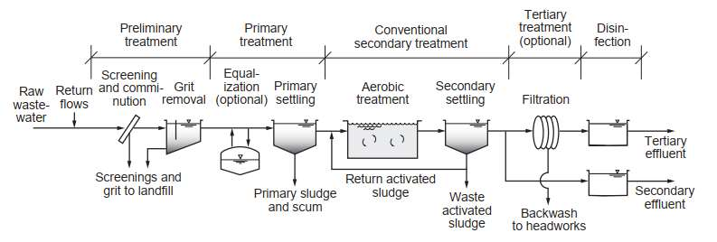
      - **Hình này chứng minh điều gì**
        - Dây chuyền xử lý nước thải hoàn chỉnh kết nối sơ bộ, bậc một, bậc hai bùn hoạt tính hiếu khí có bùn tuần hoàn ($\text{RAS}$), cùng các nhánh bậc ba (lọc cặn) và khử trùng.
      - **Từ đâu mà thấy được**
        - Sơ đồ đọc từ trái sang phải: Raw wastewater hợp dòng với Return flows qua Screening and comminution $\rightarrow$ Grit removal (thải Screenings and grit to landfill).
        - Tuyến sơ cấp qua Equalization (optional) $\rightarrow$ Primary settling (thải Primary sludge and scum).
        - Tuyến sinh học qua Aerobic treatment $\rightarrow$ Secondary settling (bùn đáy tách nhánh Return activated sludge quay lại trước bể hiếu khí và Waste activated sludge xả đáy).
        - Nhánh sau lắng cấp nước song song qua Filtration (Backwash to headworks) sang bể Disinfection tạo Tertiary effluent, hoặc qua trực tiếp Disinfection tạo Secondary effluent.
- Sơ đồ quy trình công nghệ khử chất dinh dưỡng bằng sinh học (Biological nutrient removal - BNR):
  - Dây chuyền công nghệ $\text{BNR}$ tiếp nhận dòng nước thải sau xử lý sơ cấp (Primary effluent `[see (a)]`) để xử lý chuyên sâu đồng thời chất hữu cơ, nitơ và photpho.
  - Phân vùng cấu trúc sinh học trong bể phản ứng đa ngăn (Multi-stage Biological Reactors):
    - Ngăn kỵ khí (Anaerobic treatment): Không hòa tan oxy tự do và không tồn tại nitrat/nitrit; vi sinh vật $\text{PAOs}$ lên men hấp thụ $\text{VFAs}$ và giải phóng photphat tự do.
    - Ngăn thiếu khí (Anoxic treatment): Duy trì môi trường không có oxy hòa tan tự do ($\text{DO} \approx 0\text{ mg/L}$) nhưng giàu ion nitrat ($\text{NO}_3^-$); vi sinh vật khử nitrat chuyển $\text{NO}_3^-$ thành khí nitơ trơ $\text{N}_2$ thoát ra khí quyển.
    - Ngăn hiếu khí (Aerobic treatment): Cấp khí cưỡng bức ($\text{DO} \ge 2.0\text{ mg/L}$); diễn ra quá trình nitrat hóa oxy hóa amoni thành nitrat và quá trình hấp thu photpho vượt mức (luxury uptake) của $\text{PAOs}$.
  - Hệ thống vòng tuần hoàn khép kín (Dual Recycle Loops):
    - Dòng tuần hoàn nội bộ (Internal recycle): Bơm một thể tích lớn hỗn dịch bùn nước (thường từ $100\text{--}400\%$ lưu lượng dòng vào $Q$) từ cuối ngăn hiếu khí giàu nitrat quay trở lại đầu ngăn thiếu khí để thực hiện phản ứng khử nitrat.
    - Dòng bùn hoạt tính tuần hoàn (Return activated sludge - $\text{RAS}$): Bơm bùn hoạt tính lắng từ đáy bể lắng thứ cấp (Secondary clarification) quay trở lại đầu ngăn kỵ khí, cung cấp sinh khối giàu $\text{PAOs}$ cho pha giải phóng photpho.
    - Dòng bùn hoạt tính dư (Waste activated sludge - $\text{WAS}$): Bơm tháo sinh khối giàu hàm lượng photpho ra khỏi hệ thống từ đáy bể lắng thứ cấp.
  - Cụm công trình phụ trợ hạ nguồn:
    - Bể lắng thứ cấp (Secondary clarification) phân tách hỗn dịch bùn hoạt tính tạo dòng nước trong.
    - Cụm lọc bậc ba tùy chọn (Filtration) với đường rửa lọc tuần hoàn về đầu trạm (Backwash to headworks).
    - Cụm khử trùng (Disinfection) tạo nguồn nước thải sau xử lý khử dinh dưỡng chất lượng cao (Tertiary effluent hoặc Secondary effluent).
  - Cấu trúc dòng chảy và bằng chứng hình học của sơ đồ khử chất dinh dưỡng:
    - **Hình 37.** Sơ đồ công nghệ xử lý sinh học khử chất dinh dưỡng (Biological nutrient removal)
      - 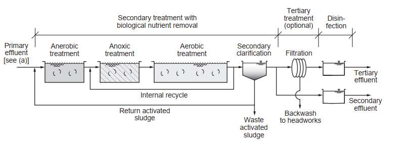
      - **Hình này chứng minh điều gì**
        - Quy trình $\text{BNR}$ bố trí liên hoàn ba vùng phản ứng vi sinh (Kỵ khí $\rightarrow$ Thiếu khí $\rightarrow$ Hiếu khí) kết hợp hai vòng tuần hoàn nội bộ nitrat và bùn hoạt tính $\text{RAS}$ để loại bỏ triệt để $\text{N}$ và $\text{P}$.
      - **Từ đâu mà thấy được**
        - Dòng Primary effluent [see (a)] đi vào cụm phản ứng ba ngăn nối tiếp: Anerobic treatment $\rightarrow$ Anoxic treatment $\rightarrow$ Aerobic treatment $\rightarrow$ Secondary clarification.
        - Mũi tên Internal recycle trích dòng hỗn dịch từ cuối Aerobic treatment tuần hoàn trực tiếp về trước Anoxic treatment.
        - Mũi tên Return activated sludge bơm từ phễu đáy Secondary clarification tuần hoàn về trước Anerobic treatment; mũi tên Waste activated sludge xả bùn dư từ đáy lắng.
        - Dòng nước trong qua nhánh Tertiary filtration (Backwash to headworks) hoặc đi thẳng vào cụm Disinfection tạo Tertiary effluent và Secondary effluent.
- Sơ đồ quy trình công nghệ xử lý nâng cao và làm sạch nước (Advanced treatment and purification):
  - Dây chuyền xử lý nâng cao tiếp nhận dòng nước thải sau xử lý bậc ba (Tertiary effluent `[see (a) and (b)]`) để tinh chế tạo nguồn nước sạch phục vụ tái sử dụng cao cấp hoặc sản xuất nước uống trực tiếp.
  - Hệ thống công nghệ gồm hai khối chức năng liên hoàn:
    - Khối xử lý nâng cao và tinh sạch (Advanced treatment and purification):
      - Cụm lọc màng vi lọc/siêu lọc (Membrane filtration): Tách bỏ triệt để huyền phù mịn, vi khuẩn và hạt keo; dòng cặn thải rửa màng được dẫn ngược về đầu trạm xử lý (Reject to headworks).
      - Châm hóa chất chống cáu cặn (Anti-scalant): Bơm châm hóa chất ức chế kết tủa muối canxi, magie và sulfat nhằm ngăn ngừa hiện tượng nghẹt tắc bề mặt màng thẩm thấu ngược.
      - Lọc lõi bảo vệ (Cartridge filtration): Bộ lọc lõi cơ học ($1\text{--}5\ \mu\text{m}$) bảo vệ an toàn cho module màng $\text{RO}$ trước các hạt cặn lọt qua màng sơ cấp.
      - Màng thẩm thấu ngược đa cấp (Reverse osmosis multi-stage): Phân tách bằng màng bán thấm dưới áp lực thủy lực lớn ($10\text{--}70\text{ bar}$); loại bỏ các ion khoáng vô cơ hòa tan, kim loại nặng và độc chất hữu cơ; dòng cô đặc chứa nồng độ muối cao được dẫn ra khu vực bay hơi cô lập hoặc phát tán an toàn (Concentrate to evaporation or dispersal).
      - Châm hydro peroxide ($\text{H}_2\text{O}_2$): Cung cấp chất oxy hóa tiền thân tạo gốc tự do hydroxyl.
      - Cụm oxy hóa nâng cao và khử trùng (Advanced oxidation and disinfection): Chiếu xạ tia cực tím công suất cao phân cắt liên kết hydro peroxide sinh gốc $\cdot\text{OH}$ ($\text{UV}/\text{H}_2\text{O}_2$), khoáng hóa hoàn toàn các chất hữu cơ vi lượng khó phân hủy và tiêu diệt tuyệt đối virus, mầm bệnh.
    - Khối điều hòa và ổn định chất lượng nước (Water conditioning):
      - Bể khử cacbon (Decarbonation): Tháp làm thoáng hoặc bể sục khí loại bỏ lượng khí $\text{CO}_2$ tự do sinh ra trong quá trình giảm $\text{pH}$ ở giai đoạn màng $\text{RO}$.
      - Bổ sung vôi ($\text{Lime}$ châm bổ sung $\text{Ca(OH)}_2$): Tăng độ kiềm và nồng độ ion canxi trong dòng nước sau thẩm thấu ngược.
      - Bể tiếp xúc vôi (Lime contactor): Hòa trộn ổn định chỉ số bão hòa Langelier ($\text{LSI}$), đưa nước về trạng thái cân bằng canxi cacbonat nhằm chống ăn mòn đường ống phân phối.
      - Sản phẩm đầu ra: Nước tinh khiết đạt chuẩn an toàn vệ sinh cao nhất (Purified water).
  - Cấu trúc dòng chảy và bằng chứng hình học của sơ đồ xử lý nâng cao:
    - **Hình 38.** Sơ đồ công nghệ xử lý nâng cao và làm sạch nước (Advanced treatment and purification)
      - 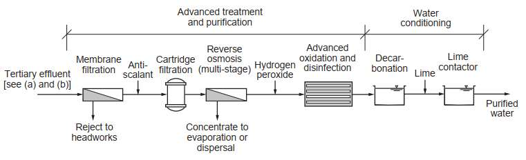
      - **Hình này chứng minh điều gì**
        - Dây chuyền công nghệ đa rào cản kết hợp phân tách màng đa tầng ($\text{MF/UF} \rightarrow \text{Cartridge} \rightarrow \text{RO}$), oxy hóa nâng cao $\text{AOP}$ ($\text{H}_2\text{O}_2 + \text{UV}$/khử trùng) và điều hòa hóa học (Decarbonation + Lime) tạo nước uống tinh khiết (Purified water).
      - **Từ đâu mà thấy được**
        - Dòng Tertiary effluent [see (a) and (b)] đi qua Membrane filtration (dòng xả Reject to headworks) $\rightarrow$ điểm châm Anti-scalant $\rightarrow$ Cartridge filtration $\rightarrow$ Reverse osmosis (multi-stage) (dòng xả Concentrate to evaporation or dispersal).
        - Tuyến nước sau $\text{RO}$ nhận Hydrogen peroxide $\rightarrow$ buồng phản ứng phẳng Advanced oxidation and disinfection.
        - Khối Water conditioning nối tiếp: bể Decarbonation $\rightarrow$ điểm châm Lime $\rightarrow$ Lime contactor $\rightarrow$ sản phẩm đầu ra Purified water.

#### 5. National Technical Regulations on Wastewater

##### 5.1 Overview of National Standards

- Quy chuẩn kỹ thuật Quốc gia về nước thải (National Technical Regulations on Wastewater) do Bộ Tài nguyên và Môi trường (BTNMT) ban hành nhằm kiểm soát nồng độ và tải lượng các chất ô nhiễm xả vào nguồn tiếp nhận:
  - Hệ thống quy chuẩn điều chỉnh hoạt động xả nước thải tại Việt Nam bao gồm hai nhóm chính: quy chuẩn kỹ thuật quốc gia chuyên ngành cho từng lĩnh vực công nghiệp đặc thù và quy chuẩn kỹ thuật quốc gia chung cho nước thải sinh hoạt và công nghiệp.
  - Cơ sở xả thải bắt buộc phải ưu tiên áp dụng quy chuẩn kỹ thuật quốc gia chuyên ngành nếu ngành nghề sản xuất của cơ sở thuộc đối tượng điều chỉnh của quy chuẩn đó; trường hợp không có quy chuẩn riêng thì áp dụng quy chuẩn chung.
- Danh mục mười Quy chuẩn kỹ thuật Quốc gia tiêu biểu điều chỉnh các loại hình nước thải theo tài liệu giảng dạy:
  - `QCVN 01-MT:2015/BTNMT`: Quy chuẩn kỹ thuật quốc gia về nước thải sơ chế cao su thiên nhiên (Wastewater of natural rubber processing industry).
  - `QCVN 11-MT:2015/BTNMT`: Quy chuẩn kỹ thuật quốc gia về nước thải chế biến thủy sản (Wastewater of aquatic products processing industry).
  - `QCVN 12-MT:2015/BTNMT`: Quy chuẩn kỹ thuật quốc gia về nước thải công nghiệp giấy và bột giấy (Wastewater of pulp and paper mills).
  - `QCVN 13-MT:2015/BTNMT`: Quy chuẩn kỹ thuật quốc gia về nước thải dệt nhuộm (Wastewater of textile industry).
  - `QCVN 14:2008/BTNMT`: Quy chuẩn kỹ thuật quốc gia về nước thải sinh hoạt (Domestic wastewater).
  - `QCVN 25:2009/BTNMT`: Quy chuẩn kỹ thuật quốc gia về nước thải của bãi chôn lấp chất thải rắn (Wastewater of the solid waste landfill sites).
  - `QCVN 28:2010/BTNMT`: Quy chuẩn kỹ thuật quốc gia về nước thải y tế (Health care wastewater).
  - `QCVN 29:2010/BTNMT`: Quy chuẩn kỹ thuật quốc gia về nước thải của kho và cửa hàng xăng dầu (Wastewater of petroleum terminal and stations).
  - `QCVN 40:2011/BTNMT`: Quy chuẩn kỹ thuật quốc gia về nước thải công nghiệp (Industrial wastewater).
  - `QCVN 62:2016/BTNMT`: Quy chuẩn kỹ thuật quốc gia về nước thải chăn nuôi (Livestock wastewater).

##### 5.2 Domestic Wastewater Regulation (QCVN 14:2008)

- Công thức tính toán giá trị nồng độ tối đa cho phép đối với thông số ô nhiễm trong nước thải sinh hoạt ($C_{\max}$):
  $$C_{\max} = C \times K$$
  - Trong đó:
    - $C_{\max}$: nồng độ tối đa cho phép của thông số ô nhiễm trong nước thải sinh hoạt khi thải ra nguồn nước tiếp nhận, tính bằng miligam trên lít nước thải ($\text{mg/L}$).
    - $C$: giá trị nồng độ của thông số ô nhiễm làm cơ sở tính toán, quy định tại Bảng 1 của quy chuẩn.
    - $K$: hệ số tính tới quy mô, loại hình cơ sở dịch vụ, cơ sở công cộng và chung cư, quy định tại Bảng 2 của quy chuẩn.
  - Quy tắc miễn trừ áp dụng công thức: không áp dụng công thức nhân hệ số $K$ cho hai thông số là $\text{pH}$ và tổng coliforms (áp dụng trực tiếp giá trị ngưỡng quy định tại Bảng 1).
  - **Hình 40.** Công thức tính nồng độ tối đa cho phép $C_{\max}$ trong nước thải sinh hoạt theo QCVN 14:2008/BTNMT
    - 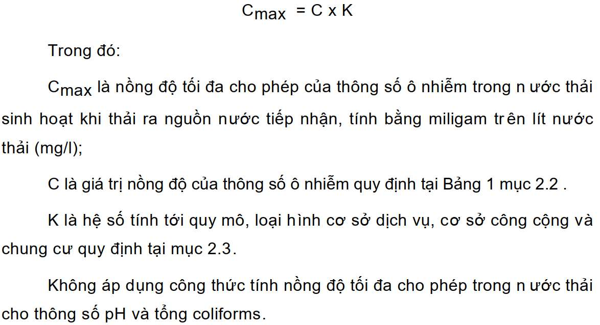
    - **Hình này chứng minh điều gì**
      - Biểu thức $C_{\max} = C \times K$ kèm giải nghĩa các thành phần và phạm vi miễn trừ tính toán cho thông số $\text{pH}$ cùng tổng coliforms.
    - **Từ đâu mà thấy được**
      - Dòng 1: công thức $C_{\max} = C \times K$.
      - Dòng 2 đến 7: định nghĩa chi tiết $C_{\max}$, giá trị nồng độ $C$ (Bảng 1), hệ số cơ sở $K$ (Bảng 2).
      - Dòng cuối: quy định rõ ràng việc không áp dụng công thức cho thông số $\text{pH}$ và tổng coliforms.
- Giá trị nồng độ các thông số ô nhiễm cơ sở ($C$) theo Bảng 1 QCVN 14:2008/BTNMT:
  - Phân vùng nguồn tiếp nhận làm căn cứ xác định giá trị $C$:
    - Cột A: áp dụng khi xả nước thải sinh hoạt vào các nguồn nước tiếp nhận được sử dụng cho mục đích cấp nước sinh hoạt.
    - Cột B: áp dụng khi xả nước thải sinh hoạt vào các nguồn nước tiếp nhận không sử dụng cho mục đích cấp nước sinh hoạt.
  - Ngưỡng giới hạn của 11 thông số ô nhiễm cơ sở trong nước thải sinh hoạt:
    - Thông số 1 - $\text{pH}$: không thứ nguyên, giá trị cho phép $5 - 9$ ở cả Cột A và Cột B.
    - Thông số 2 - $\text{BOD}_5 (20\ ^\circ\text{C})$: đơn vị $\text{mg/L}$, Cột A là $30\text{ mg/L}$, Cột B là $50\text{ mg/L}$.
    - Thông số 3 - Tổng chất rắn lơ lửng ($\text{TSS}$): đơn vị $\text{mg/L}$, Cột A là $50\text{ mg/L}$, Cột B là $100\text{ mg/L}$.
    - Thông số 4 - Tổng chất rắn hòa tan ($\text{TDS}$): đơn vị $\text{mg/L}$, Cột A là $500\text{ mg/L}$, Cột B là $1000\text{ mg/L}$.
    - Thông số 5 - Sunfua (tính theo $\text{H}_2\text{S}$): đơn vị $\text{mg/L}$, Cột A là $1{,}0\text{ mg/L}$, Cột B là $4{,}0\text{ mg/L}$.
    - Thông số 6 - Amoni (tính theo $\text{N}$): đơn vị $\text{mg/L}$, Cột A là $5\text{ mg/L}$, Cột B là $10\text{ mg/L}$.
    - Thông số 7 - Nitrat ($\text{NO}_3^-$, tính theo $\text{N}$): đơn vị $\text{mg/L}$, Cột A là $30\text{ mg/L}$, Cột B là $50\text{ mg/L}$.
    - Thông số 8 - Dầu mỡ động, thực vật: đơn vị $\text{mg/L}$, Cột A là $10\text{ mg/L}$, Cột B là $20\text{ mg/L}$.
    - Thông số 9 - Tổng các chất hoạt động bề mặt: đơn vị $\text{mg/L}$, Cột A là $5\text{ mg/L}$, Cột B là $10\text{ mg/L}$.
    - Thông số 10 - Phosphat ($\text{PO}_4^{3-}$, tính theo $\text{P}$): đơn vị $\text{mg/L}$, Cột A là $6\text{ mg/L}$, Cột B là $10\text{ mg/L}$.
    - Thông số 11 - Tổng Coliforms: đơn vị $\text{MPN}/100\text{ mL}$, Cột A là $3000\text{ MPN}/100\text{ mL}$, Cột B là $5000\text{ MPN}/100\text{ mL}$.
  - **Hình 41.** Bảng 1 QCVN 14:2008/BTNMT về giá trị các thông số ô nhiễm nước thải sinh hoạt
    - 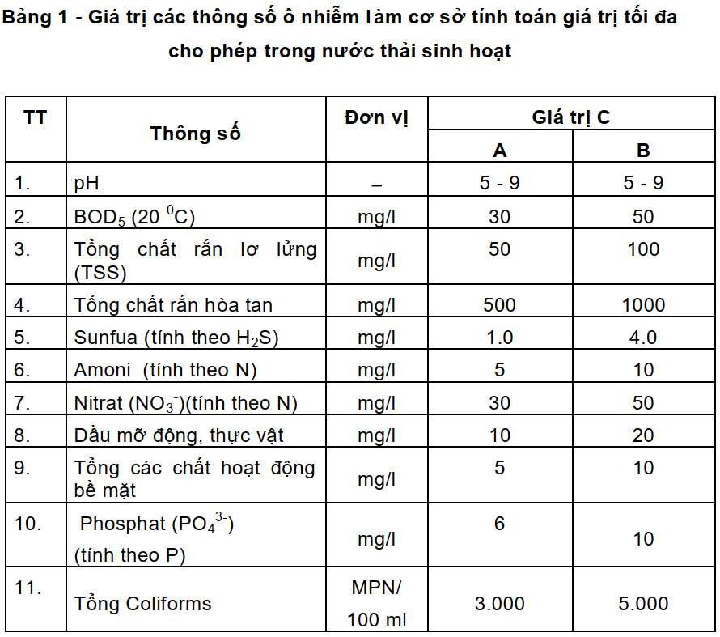
    - **Hình này chứng minh điều gì**
      - Định mức nồng độ cơ sở $C$ của 11 thông số ô nhiễm nước thải sinh hoạt phân chia theo Cột A và Cột B.
    - **Từ đâu mà thấy được**
      - Các cột thể hiện: TT (1 đến 11), Thông số, Đơn vị, Giá trị C (Cột A, Cột B).
      - Các hàng liệt kê chuẩn xác 11 chỉ tiêu từ pH, BOD5, TSS, TDS đến Coliforms.
- Giá trị hệ số $K$ ứng với loại hình cơ sở dịch vụ, công cộng và chung cư theo Bảng 2 QCVN 14:2008/BTNMT:
  - Phân loại giá trị hệ số $K$ theo quy mô cơ sở:
    - Cơ sở có quy mô lớn áp dụng hệ số $K = 1{,}0$ (kiểm soát tải lượng nghiêm ngặt, giữ nguyên nồng độ cơ sở).
    - Cơ sở có quy mô nhỏ dưới ngưỡng áp dụng hệ số $K = 1{,}2$ (cho phép nới lỏng nồng độ tối đa thêm $20\%$).
  - Phân nhóm quy mô và tiêu chí diện tích đối với 7 nhóm loại hình cơ sở:
    - Nhóm 1 - Khách sạn, nhà nghỉ: từ $50$ phòng trở lên hoặc khách sạn xếp hạng $3$ sao trở lên áp dụng $K = 1{,}0$; quy mô dưới $50$ phòng áp dụng $K = 1{,}2$.
    - Nhóm 2 - Trụ sở cơ quan, văn phòng, trường học, cơ sở nghiên cứu: diện tích sử dụng $\ge 10.000\text{ m}^2$ áp dụng $K = 1{,}0$; diện tích sử dụng $< 10.000\text{ m}^2$ áp dụng $K = 1{,}2$.
    - Nhóm 3 - Cửa hàng bách hóa, siêu thị: diện tích sử dụng $\ge 5.000\text{ m}^2$ áp dụng $K = 1{,}0$; diện tích sử dụng $< 5.000\text{ m}^2$ áp dụng $K = 1{,}2$.
    - Nhóm 4 - Chợ: diện tích sử dụng $\ge 1.500\text{ m}^2$ áp dụng $K = 1{,}0$; diện tích sử dụng $< 1.500\text{ m}^2$ áp dụng $K = 1{,}2$.
    - Nhóm 5 - Nhà hàng ăn uống, cửa hàng thực phẩm: diện tích sử dụng $\ge 500\text{ m}^2$ áp dụng $K = 1{,}0$; diện tích sử dụng $< 500\text{ m}^2$ áp dụng $K = 1{,}2$.
    - Nhóm 6 - Cơ sở sản xuất, doanh trại lực lượng vũ trang: quy mô từ $500$ người trở lên áp dụng $K = 1{,}0$; quy mô dưới $500$ người áp dụng $K = 1{,}2$.
    - Nhóm 7 - Khu chung cư, khu dân cư: quy mô từ $50$ căn hộ trở lên áp dụng $K = 1{,}0$; quy mô dưới $50$ căn hộ áp dụng $K = 1{,}2$.
  - **Hình 42.** Bảng 2 QCVN 14:2008/BTNMT về hệ số $K$ theo loại hình và quy mô cơ sở
    - 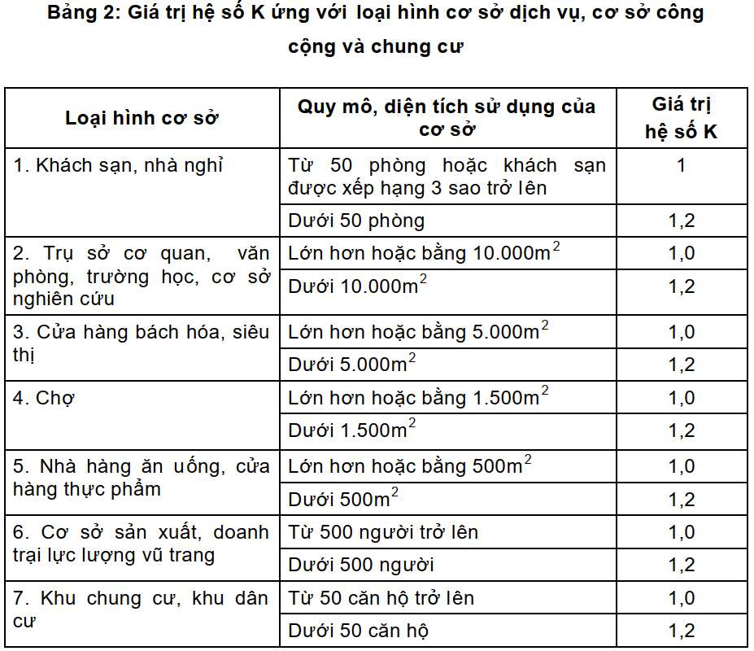
    - **Hình này chứng minh điều gì**
      - Tiêu chí ngưỡng phân loại quy mô để tra cứu hệ số $K$ ($1{,}0$ hoặc $1{,}2$) cho 7 nhóm cơ sở phát sinh nước thải sinh hoạt.
    - **Từ đâu mà thấy được**
      - Bảng gồm 3 cột: Loại hình cơ sở, Quy mô, diện tích sử dụng của cơ sở, Giá trị hệ số K.
      - Các hàng liệt kê rõ ngưỡng chuyển đổi giữa $K = 1{,}0$ và $K = 1{,}2$ cho khách sạn, công sở, siêu thị, chợ, nhà hàng, cơ sở sản xuất, chung cư.

##### 5.3 Industrial Wastewater Regulation (QCVN 40:2011)

- Công thức tính toán giá trị tối đa cho phép của thông số ô nhiễm trong nước thải công nghiệp ($C_{\max}$):
  $$C_{\max} = C \times K_q \times K_f$$
  - Trong đó:
    - $C_{\max}$: giá trị tối đa cho phép của thông số ô nhiễm trong nước thải công nghiệp khi xả vào nguồn tiếp nhận, tính bằng miligam trên lít nước thải ($\text{mg/L}$) hoặc đơn vị đo lường tương ứng.
    - $C$: giá trị nồng độ của thông số ô nhiễm trong nước thải công nghiệp quy định tại Bảng 1 của quy chuẩn (Cột A hoặc Cột B).
    - $K_q$: hệ số nguồn tiếp nhận nước thải quy định tại Bảng 2 (ứng với lưu lượng dòng chảy của sông, suối, kênh, rạch) hoặc Bảng 3 (ứng với dung tích của hồ, ao, đầm), hoặc quy định đối với vùng nước biển ven bờ.
    - $K_f$: hệ số lưu lượng nguồn thải quy định tại Bảng 4 ứng với tổng lưu lượng xả thải của cơ sở sản xuất công nghiệp vào nguồn tiếp nhận.
  - Quy tắc ngoại trừ trong tính toán nồng độ tối đa cho phép: không áp dụng công thức tính $C_{\max}$ (không nhân với hệ số $K_q$ và $K_f$) cho 6 thông số đặc thù bao gồm Nhiệt độ, Màu, $\text{pH}$, Coliform, Tổng hoạt độ phóng xạ $\alpha$ và Tổng hoạt độ phóng xạ $\beta$ (áp dụng trực tiếp giá trị giới hạn cơ sở $C$ quy định tại Bảng 1).
  - Phân vùng chức năng nguồn tiếp nhận làm căn cứ chọn Cột A hoặc Cột B:
    - Cột A: quy định giá trị $C$ áp dụng khi xả nước thải công nghiệp vào nguồn nước được dùng cho mục đích cấp nước sinh hoạt.
    - Cột B: quy định giá trị $C$ áp dụng khi xả nước thải công nghiệp vào nguồn nước không dùng cho mục đích cấp nước sinh hoạt.
  - **Hình 44.** Công thức tính nồng độ tối đa cho phép $C_{\max}$ trong nước thải công nghiệp theo QCVN 40:2011/BTNMT
    - 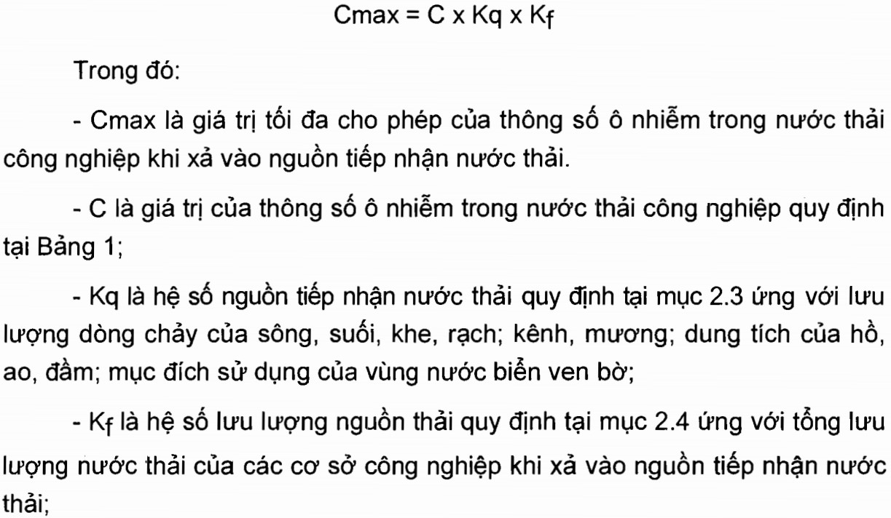
    - **Hình này chứng minh điều gì**
      - Tương quan tích số $C_{\max} = C \times K_q \times K_f$ đồng thời phụ thuộc vào nồng độ cơ sở $C$, khả năng tự làm sạch của nguồn tiếp nhận ($K_q$) và tải lượng nguồn xả ($K_f$).
    - **Từ đâu mà thấy được**
      - Dòng 1: công thức $C_{\max} = C \times K_q \times K_f$.
      - Dòng 2 đến 5: định nghĩa tường minh $C_{\max}$, giá trị nồng độ cơ sở $C$ (Bảng 1), hệ số tiếp nhận $K_q$ (mục 2.3), hệ số nguồn thải $K_f$ (mục 2.4).
- Bảng 1 QCVN 40:2011/BTNMT quy định giá trị nồng độ cơ sở ($C$) cho 33 thông số ô nhiễm nước thải công nghiệp:
  - Nhóm thông số vật lý và chất hữu cơ phân hủy sinh học (thông số 1 đến 4):
    - Thông số 1 - Nhiệt độ: đơn vị $^\circ\text{C}$, giá trị giới hạn ở Cột A là $40\ ^\circ\text{C}$, Cột B là $40\ ^\circ\text{C}$.
    - Thông số 2 - Màu: đơn vị $\text{Pt/Co}$, giá trị giới hạn ở Cột A là $50\text{ Pt/Co}$, Cột B là $150\text{ Pt/Co}$.
    - Thông số 3 - $\text{pH}$: không thứ nguyên, giá trị cho phép ở Cột A là $6 - 9$, Cột B là $5{,}5 - 9$.
    - Thông số 4 - $\text{BOD}_5 (20\ ^\circ\text{C})$: đơn vị $\text{mg/L}$, giá trị giới hạn ở Cột A là $30\text{ mg/L}$, Cột B là $50\text{ mg/L}$.
  - **Hình 45.** Bảng 1 QCVN 40:2011/BTNMT (thông số 1 đến 4)
    - 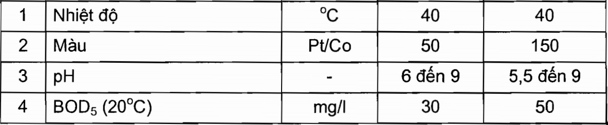
    - **Hình này chứng minh điều gì**
      - Nồng độ giới hạn cơ sở $C$ cho 4 thông số chất lượng nước cơ bản: Nhiệt độ, Màu, pH và BOD5.
    - **Từ đâu mà thấy được**
      - Dòng 1 đến 4 thể hiện thứ tự, tên chỉ tiêu, đơn vị đo và giá trị hai cột A, B: Nhiệt độ (40/40 °C), Màu (50/150 Pt/Co), pH (6-9 / 5,5-9), BOD5 (30/50 mg/L).
  - Nhóm thông số hữu cơ tổng hợp, cặn lơ lửng và kim loại nặng độc hại cao (thông số 5 đến 9):
    - Thông số 5 - Nhu cầu oxy hóa học ($\text{COD}$): đơn vị $\text{mg/L}$, giá trị giới hạn ở Cột A là $75\text{ mg/L}$, Cột B là $150\text{ mg/L}$.
    - Thông số 6 - Chất rắn lơ lửng ($\text{TSS}$): đơn vị $\text{mg/L}$, giá trị giới hạn ở Cột A là $50\text{ mg/L}$, Cột B là $100\text{ mg/L}$.
    - Thông số 7 - Asen ($\text{As}$): đơn vị $\text{mg/L}$, giá trị giới hạn ở Cột A là $0{,}05\text{ mg/L}$, Cột B là $0{,}1\text{ mg/L}$.
    - Thông số 8 - Thủy ngân ($\text{Hg}$): đơn vị $\text{mg/L}$, giá trị giới hạn ở Cột A là $0{,}005\text{ mg/L}$, Cột B là $0{,}01\text{ mg/L}$.
    - Thông số 9 - Chì ($\text{Pb}$): đơn vị $\text{mg/L}$, giá trị giới hạn ở Cột A là $0{,}1\text{ mg/L}$, Cột B là $0{,}5\text{ mg/L}$.
  - **Hình 46.** Bảng 1 QCVN 40:2011/BTNMT (thông số 5 đến 9)
    - 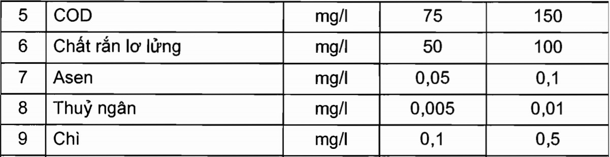
    - **Hình này chứng minh điều gì**
      - Ngưỡng giới hạn cơ sở $C$ cho COD, TSS và các kim loại cực độc gồm Asen, Thủy ngân, Chì.
    - **Từ đâu mà thấy được**
      - Dòng 5 đến 9: COD (75/150 mg/L), Chất rắn lơ lửng (50/100 mg/L), Asen (0,05/0,1 mg/L), Thủy ngân (0,005/0,01 mg/L), Chì (0,1/0,5 mg/L).
  - Nhóm thông số kim loại công nghiệp và xianua (thông số 10 đến 18):
    - Thông số 10 - Cadimi ($\text{Cd}$): đơn vị $\text{mg/L}$, Cột A là $0{,}05\text{ mg/L}$, Cột B là $0{,}1\text{ mg/L}$.
    - Thông số 11 - Crom hóa trị VI ($\text{Cr}^{6+}$): đơn vị $\text{mg/L}$, Cột A là $0{,}05\text{ mg/L}$, Cột B là $0{,}1\text{ mg/L}$.
    - Thông số 12 - Crom hóa trị III ($\text{Cr}^{3+}$): đơn vị $\text{mg/L}$, Cột A là $0{,}2\text{ mg/L}$, Cột B là $1\text{ mg/L}$.
    - Thông số 13 - Đồng ($\text{Cu}$): đơn vị $\text{mg/L}$, Cột A là $2\text{ mg/L}$, Cột B là $2\text{ mg/L}$.
    - Thông số 14 - Kẽm ($\text{Zn}$): đơn vị $\text{mg/L}$, Cột A là $3\text{ mg/L}$, Cột B là $3\text{ mg/L}$.
    - Thông số 15 - Niken ($\text{Ni}$): đơn vị $\text{mg/L}$, Cột A là $0{,}2\text{ mg/L}$, Cột B là $0{,}5\text{ mg/L}$.
    - Thông số 16 - Mangan ($\text{Mn}$): đơn vị $\text{mg/L}$, Cột A là $0{,}5\text{ mg/L}$, Cột B là $1\text{ mg/L}$.
    - Thông số 17 - Sắt ($\text{Fe}$): đơn vị $\text{mg/L}$, Cột A là $1\text{ mg/L}$, Cột B là $5\text{ mg/L}$.
    - Thông số 18 - Tổng xianua ($\text{CN}^-$): đơn vị $\text{mg/L}$, Cột A là $0{,}07\text{ mg/L}$, Cột B là $0{,}1\text{ mg/L}$.
  - **Hình 47.** Bảng 1 QCVN 40:2011/BTNMT (thông số 10 đến 18)
    - 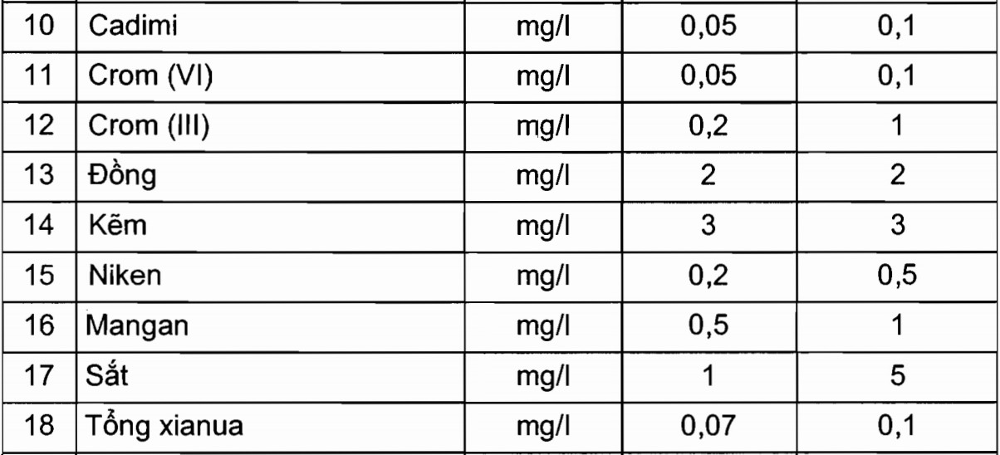
    - **Hình này chứng minh điều gì**
      - Định mức nồng độ cơ sở $C$ cho 9 chỉ tiêu kim loại công nghiệp và gốc độc xianua.
    - **Từ đâu mà thấy được**
      - Dòng 10 đến 18: Cadimi, Crom (VI), Crom (III), Đồng, Kẽm, Niken, Mangan, Sắt, Tổng xianua.
      - Giá trị đối với Đồng (2 mg/L) và Kẽm (3 mg/L) tương đương giữa Cột A và Cột B.
  - Nhóm thông số dầu mỡ, hợp chất hữu cơ vòng, chất dinh dưỡng và muối khoáng vô cơ (thông số 19 đến 26):
    - Thông số 19 - Tổng phenol: đơn vị $\text{mg/L}$, Cột A là $0{,}1\text{ mg/L}$, Cột B là $0{,}5\text{ mg/L}$.
    - Thông số 20 - Tổng dầu mỡ khoáng: đơn vị $\text{mg/L}$, Cột A là $5\text{ mg/L}$, Cột B là $10\text{ mg/L}$.
    - Thông số 21 - Sunfua: đơn vị $\text{mg/L}$, Cột A là $0{,}2\text{ mg/L}$, Cột B là $0{,}5\text{ mg/L}$.
    - Thông số 22 - Florua ($\text{F}^-$): đơn vị $\text{mg/L}$, Cột A là $5\text{ mg/L}$, Cột B là $10\text{ mg/L}$.
    - Thông số 23 - Amoni (tính theo $\text{N}$): đơn vị $\text{mg/L}$, Cột A là $5\text{ mg/L}$, Cột B là $10\text{ mg/L}$.
    - Thông số 24 - Tổng nitơ ($\text{TN}$): đơn vị $\text{mg/L}$, Cột A là $20\text{ mg/L}$, Cột B là $40\text{ mg/L}$.
    - Thông số 25 - Tổng phốt pho (tính theo $\text{P}$): đơn vị $\text{mg/L}$, Cột A là $4\text{ mg/L}$, Cột B là $6\text{ mg/L}$.
    - Thông số 26 - Clorua ($\text{Cl}^-$): đơn vị $\text{mg/L}$, Cột A là $500\text{ mg/L}$, Cột B là $1000\text{ mg/L}$ (quy định miễn trừ: thông số Clorua không áp dụng khi xả thải vào nguồn tiếp nhận là nước mặn hoặc nước lợ).
  - **Hình 48.** Bảng 1 QCVN 40:2011/BTNMT (thông số 19 đến 26)
    - 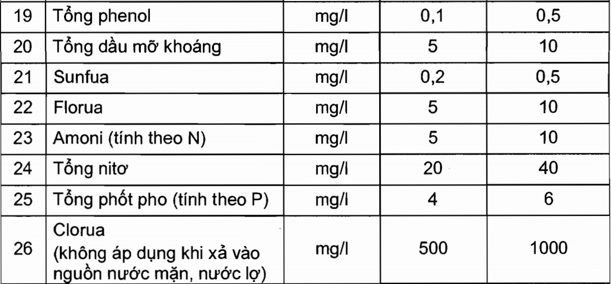
    - **Hình này chứng minh điều gì**
      - Giới hạn cơ sở $C$ của các chỉ tiêu hữu cơ hòa tan, chất dinh dưỡng N-P và muối khoáng Clorua.
    - **Từ đâu mà thấy được**
      - Dòng 19 đến 25: Tổng phenol, Dầu mỡ khoáng, Sunfua, Florua, Amoni, Tổng nitơ, Tổng phốt pho.
      - Dòng 26: Clorua (500/1000 mg/L) kèm điều kiện không áp dụng khi xả vào nước mặn, nước lợ.
  - Nhóm hóa chất bảo vệ thực vật, hợp chất bền vững, vi sinh và phóng xạ (thông số 27 đến 33):
    - Thông số 27 - Clo dư: đơn vị $\text{mg/L}$, Cột A là $1\text{ mg/L}$, Cột B là $2\text{ mg/L}$.
    - Thông số 28 - Tổng hoá chất bảo vệ thực vật clo hữu cơ: đơn vị $\text{mg/L}$, Cột A là $0{,}05\text{ mg/L}$, Cột B là $0{,}1\text{ mg/L}$.
    - Thông số 29 - Tổng hoá chất bảo vệ thực vật phốt pho hữu cơ: đơn vị $\text{mg/L}$, Cột A là $0{,}3\text{ mg/L}$, Cột B là $1\text{ mg/L}$.
    - Thông số 30 - Tổng $\text{PCB}$ (Polychlorinated Biphenyls): đơn vị $\text{mg/L}$, Cột A là $0{,}003\text{ mg/L}$, Cột B là $0{,}01\text{ mg/L}$.
    - Thông số 31 - Coliform: đơn vị $\text{vi khuẩn}/100\text{ mL}$, Cột A là $3000\text{ vi khuẩn}/100\text{ mL}$, Cột B là $5000\text{ vi khuẩn}/100\text{ mL}$.
    - Thông số 32 - Tổng hoạt độ phóng xạ $\alpha$: đơn vị $\text{Bq/L}$, Cột A là $0{,}1\text{ Bq/L}$, Cột B là $0{,}1\text{ Bq/L}$.
    - Thông số 33 - Tổng hoạt độ phóng xạ $\beta$: đơn vị $\text{Bq/L}$, Cột A là $1{,}0\text{ Bq/L}$, Cột B là $1{,}0\text{ Bq/L}$.
  - **Hình 49.** Bảng 1 QCVN 40:2011/BTNMT (thông số 27 đến 33)
    - 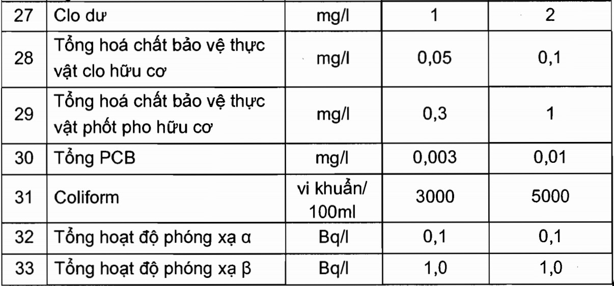
    - **Hình này chứng minh điều gì**
      - Ngưỡng giới hạn cơ sở $C$ đối với độc chất hữu cơ khó phân hủy, hóa chất bảo vệ thực vật, vi sinh và hoạt độ phóng xạ.
    - **Từ đâu mà thấy được**
      - Dòng 27 đến 31: Clo dư, BVTV clo hữu cơ, BVTV phốt pho hữu cơ, Tổng PCB, Coliform.
      - Dòng 32 và 33: Phóng xạ alpha (0,1 Bq/L) và Phóng xạ beta (1,0 Bq/L) có cùng giá trị ở cả Cột A và B.
- Phương pháp xác định hệ số nguồn tiếp nhận nước thải $K_q$:
  - Trường hợp nguồn tiếp nhận là nguồn nước mặt chảy (sông, suối, khe, rạch, kênh, mương) theo Bảng 2 QCVN 40:2011/BTNMT:
    - Lưu lượng dòng chảy $Q$ của nguồn tiếp nhận được tính bằng mét khối trên giây ($\text{m}^3/\text{s}$), xác định theo số liệu lưu lượng trung bình của 3 tháng có lưu lượng nhỏ nhất trong năm.
    - Khoảng phân cấp 1: $Q \le 50\text{ m}^3/\text{s} \Rightarrow K_q = 0{,}9$.
    - Khoảng phân cấp 2: $50 < Q \le 200\text{ m}^3/\text{s} \Rightarrow K_q = 1$.
    - Khoảng phân cấp 3: $200 < Q \le 500\text{ m}^3/\text{s} \Rightarrow K_q = 1{,}1$.
    - Khoảng phân cấp 4: $Q > 500\text{ m}^3/\text{s} \Rightarrow K_q = 1{,}2$.
  - **Hình 50.** Bảng 2 QCVN 40:2011/BTNMT về hệ số $K_q$ theo lưu lượng dòng chảy
    - 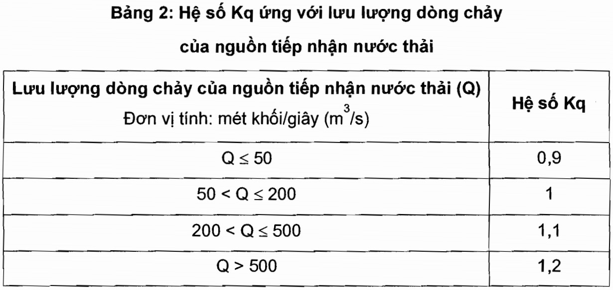
    - **Hình này chứng minh điều gì**
      - Bốn khoảng lưu lượng dòng chảy $Q$ quyết định hệ số tiếp nhận $K_q$ từ 0,9 đến 1,2.
    - **Từ đâu mà thấy được**
      - Cột 1: các ngưỡng $Q \le 50$, $50 < Q \le 200$, $200 < Q \le 500$, $Q > 500\text{ m}^3/\text{s}$.
      - Cột 2: hệ số Kq tương ứng 0,9; 1; 1,1; 1,2.
  - Trường hợp nguồn tiếp nhận là nguồn nước tĩnh (hồ, ao, đầm) theo Bảng 3 QCVN 40:2011/BTNMT:
    - Dung tích nguồn tiếp nhận nước thải $V$ tính bằng mét khối ($\text{m}^3$), xác định theo giá trị dung tích nhỏ nhất trong năm.
    - Phân cấp dung tích 1: $V \le 10 \times 10^6\text{ m}^3 \Rightarrow K_q = 0{,}6$.
    - Phân cấp dung tích 2: $10 \times 10^6 < V \le 100 \times 10^6\text{ m}^3 \Rightarrow K_q = 0{,}8$.
    - Phân cấp dung tích 3: $V > 100 \times 10^6\text{ m}^3 \Rightarrow K_q = 1{,}0$.
  - **Hình 51.** Bảng 3 QCVN 40:2011/BTNMT về hệ số $K_q$ theo dung tích hồ chứa
    - 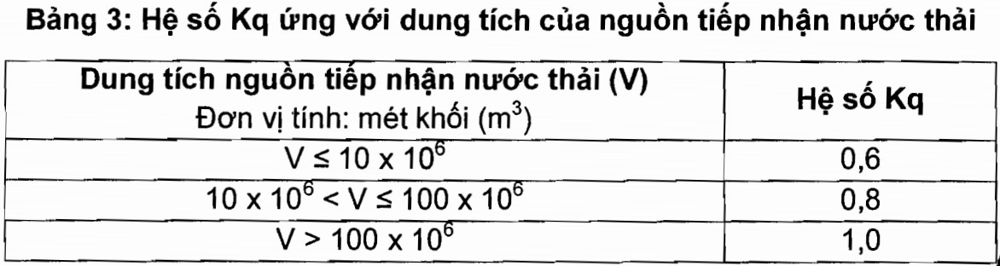
    - **Hình này chứng minh điều gì**
      - Ba bậc thang dung tích tĩnh $V$ quy định hệ số tiếp nhận $K_q$ từ 0,6 đến 1,0.
    - **Từ đâu mà thấy được**
      - Cột 1: ngưỡng dung tích $V \le 10 \times 10^6$, $10 \times 10^6 < V \le 100 \times 10^6$, $V > 100 \times 10^6\text{ m}^3$.
      - Cột 2: hệ số Kq tương ứng 0,6; 0,8; 1,0.
  - Trường hợp nguồn tiếp nhận là vùng nước biển ven bờ:
    - Vùng nước biển ven bờ dùng cho mục đích nuôi trồng thủy sản, bảo tồn thủy sinh, thể thao và giải trí dưới nước: áp dụng $K_q = 1{,}0$.
    - Các vùng nước biển ven bờ dùng cho các mục đích khác: áp dụng $K_q = 1{,}3$.
- Phương pháp xác định hệ số lưu lượng nguồn thải $K_f$ theo Bảng 4 QCVN 40:2011/BTNMT:
  - Lưu lượng nguồn thải $F$ tính bằng mét khối trên ngày đêm ($\text{m}^3/24\text{h}$), xác định theo lưu lượng xả thải lớn nhất trong ngày thiết kế hoặc trong báo cáo đánh giá tác động môi trường.
  - Phân cấp lưu lượng 1: $F \le 50\text{ m}^3/24\text{h} \Rightarrow K_f = 1{,}2$.
  - Phân cấp lưu lượng 2: $50 < F \le 500\text{ m}^3/24\text{h} \Rightarrow K_f = 1{,}1$.
  - Phân cấp lưu lượng 3: $500 < F \le 5.000\text{ m}^3/24\text{h} \Rightarrow K_f = 1{,}0$.
  - Phân cấp lưu lượng 4: $F > 5.000\text{ m}^3/24\text{h} \Rightarrow K_f = 0{,}9$.
  - Nguyên lý kiểm soát ô nhiễm của hệ số $K_f$: cơ sở có lưu lượng xả thải càng lớn thì hệ số $K_f$ càng nhỏ (siết chặt nồng độ xả thải cho phép) nhằm hạn chế tổng tải lượng chất ô nhiễm tích lũy đưa vào nguồn nước.
  - **Hình 52.** Bảng 4 QCVN 40:2011/BTNMT về hệ số lưu lượng nguồn thải $K_f$
    - 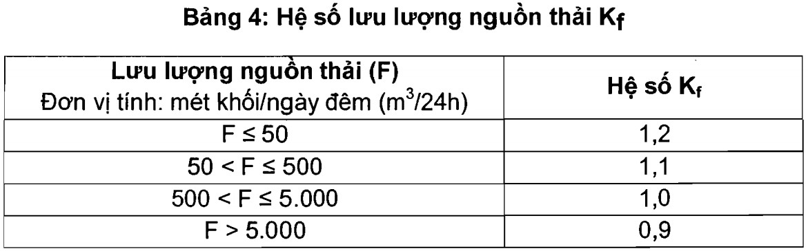
    - **Hình này chứng minh điều gì**
      - Bốn phân cấp lưu lượng nguồn xả $F$ quyết định hệ số $K_f$ giảm từ 1,2 xuống 0,9.
    - **Từ đâu mà thấy được**
      - Cột 1: các khoảng lưu lượng $F \le 50$, $50 < F \le 500$, $500 < F \le 5.000$, $F > 5.000\text{ m}^3/24\text{h}$.
      - Cột 2: hệ số Kf tương ứng 1,2; 1,1; 1,0; 0,9.

###### Example 3: Allowable Discharge Calculation under QCVN 40:2011/BTNMT

- **Đề bài**: Một nhà máy xả nước thải công nghiệp với lưu lượng $100\text{ m}^3/\text{ngày}$ ($100\text{ m}^3/\text{day}$) vào một hồ tiếp nhận có dung tích $V = 100.000\text{ m}^3$ ($V = 100{,}000\text{ m}^3$). Hồ này không sử dụng cho mục đích cấp nước sinh hoạt. Xác định nồng độ $\text{COD}$ tối đa cho phép nhà máy được phép xả thải ($C_{\max}$).
- **Dữ kiện**:
  - Đối tượng xả thải: Nước thải công nghiệp từ cơ sở sản xuất (Industrial wastewater).
  - Lưu lượng xả nước thải: $F = 100\text{ m}^3/\text{ngày}$ (tương đương $100\text{ m}^3/24\text{h}$).
  - Loại hình nguồn tiếp nhận: Hồ chứa nước (receiving lake) với dung tích $V = 100.000\text{ m}^3 = 0{,}1 \times 10^6\text{ m}^3$.
  - Mục đích sử dụng của nguồn nước tiếp nhận: Không dùng cho mục đích cấp nước sinh hoạt (not used for domestic water supply purposes).
  - Thông số ô nhiễm cần tính toán: Nhu cầu oxy hóa học ($\text{COD}$).
- **Quy tắc áp dụng**:
  - Công thức xác định nồng độ tối đa cho phép đối với nước thải công nghiệp theo QCVN 40:2011/BTNMT:
    $$C_{\max} = C \times K_q \times K_f$$
  - Phân vùng chức năng để tra giá trị $C$ trong Bảng 1 QCVN 40:2011/BTNMT:
    - Nguồn nước dùng cho mục đích cấp nước sinh hoạt: tra Cột A.
    - Nguồn nước không dùng cho mục đích cấp nước sinh hoạt: tra Cột B.
  - Tra hệ số nguồn tiếp nhận $K_q$ theo Bảng 3 QCVN 40:2011/BTNMT ứng với dung tích hồ, ao, đầm ($V$).
  - Tra hệ số lưu lượng nguồn thải $K_f$ theo Bảng 4 QCVN 40:2011/BTNMT ứng với lưu lượng nguồn xả ($F$).
- **Lời giải**:
  - **Bước 1**: Xác định giá trị nồng độ cơ sở $C$ của chỉ tiêu $\text{COD}$.
    - Căn cứ: Nguồn tiếp nhận là hồ nước không sử dụng cho mục đích cấp nước sinh hoạt, do đó giá trị nồng độ cơ sở $C$ được xác định theo Cột B của Bảng 1 QCVN 40:2011/BTNMT.
    - Nhìn vào: Hàng số 5 của Bảng 1 trên Hình 46 (`assets/fig_46_p36.jpeg`), thông số $\text{COD}$ tại Cột B quy định giá trị $C = 150\text{ mg/L}$ (trong khi Cột A là $75\text{ mg/L}$).
    - Kết quả bước 1: $C = 150\text{ mg/L}$.
  - **Bước 2**: Xác định hệ số nguồn tiếp nhận nước thải $K_q$.
    - Căn cứ: Nguồn tiếp nhận là hồ chứa có dung tích tĩnh $V = 100.000\text{ m}^3$. Hệ số $K_q$ được tra cứu theo Bảng 3 QCVN 40:2011/BTNMT quy định cho nguồn tiếp nhận là hồ, ao, đầm.
    - Nhìn vào: Hàng thứ nhất của Bảng 3 trên Hình 51 (`assets/fig_51_p39.jpeg`), khoảng dung tích $V \le 10 \times 10^6\text{ m}^3$ quy định hệ số $K_q = 0{,}6$. Dung tích hồ của bài toán là $V = 100.000\text{ m}^3 = 0{,}1 \times 10^6\text{ m}^3 \le 10 \times 10^6\text{ m}^3$.
    - Kết quả bước 2: $K_q = 0{,}6$.
  - **Bước 3**: Xác định hệ số lưu lượng nguồn thải $K_f$.
    - Căn cứ: Tổng lưu lượng nước thải xả của nhà máy là $F = 100\text{ m}^3/\text{ngày đêm}$ ($100\text{ m}^3/24\text{h}$). Hệ số $K_f$ được tra cứu theo Bảng 4 QCVN 40:2011/BTNMT.
    - Nhìn vào: Hàng thứ hai của Bảng 4 trên Hình 52 (`assets/fig_52_p39.jpeg`), khoảng lưu lượng $50 < F \le 500\text{ m}^3/24\text{h}$ quy định hệ số $K_f = 1{,}1$. Giá trị $F = 100\text{ m}^3/24\text{h}$ nằm hoàn toàn trong khoảng này.
    - Kết quả bước 3: $K_f = 1{,}1$.
  - **Bước 4**: Tính toán giá trị nồng độ $\text{COD}$ tối đa cho phép $C_{\max}$.
    - Căn cứ: Thay các giá trị $C = 150\text{ mg/L}$, $K_q = 0{,}6$ và $K_f = 1{,}1$ vào công thức $C_{\max} = C \times K_q \times K_f$ trên Hình 44 (`assets/fig_44_p36.jpeg`).
    - Tính toán:
      $$C_{\max} = 150 \times 0{,}6 \times 1{,}1 = 99\text{ mg/L}$$
- **Kết quả**:
  - Nồng độ $\text{COD}$ tối đa cho phép nhà máy được xả thải vào hồ là:
    $$C_{\max} = 99\text{ mg/L}$$
- **Kiểm tra lại**:
  - Kiểm tra tính nhất quán của các tham số tra cứu:
    - Hồ không cấp nước sinh hoạt $\rightarrow$ Cột B: $C = 150\text{ mg/L}$ (chính xác).
    - Dung tích $V = 100.000\text{ m}^3 \le 10.000.000\text{ m}^3 \rightarrow K_q = 0{,}6$ (chính xác).
    - Lưu lượng $F = 100\text{ m}^3/\text{ngày} \in (50; 500] \rightarrow K_f = 1{,}1$ (chính xác).
  - Đánh giá ý nghĩa tải lượng và mức độ bảo vệ môi trường:
    - Nguồn nước tiếp nhận là hồ chứa có dung tích tương đối nhỏ ($100.000\text{ m}^3$), thuộc hệ sinh thái nước tĩnh với vận tốc dòng chảy triệt tiêu và khả năng trao đổi oxy kém, do đó hệ số khắt khe $K_q = 0{,}6$ làm suy giảm đáng kể nồng độ được phép xả thải.
    - Cơ sở có quy mô xả thải nhỏ ($100\text{ m}^3/\text{ngày}$) được hỗ trợ hệ số dung hòa $K_f = 1{,}1$.
    - Tích số hệ số điều chỉnh môi trường:
      $$K_q \times K_f = 0{,}6 \times 1{,}1 = 0{,}66 < 1$$
    - Nồng độ xả thải tối đa thực tế $C_{\max} = 99\text{ mg/L}$ nhỏ hơn giá trị giới hạn cơ sở $C = 150\text{ mg/L}$ ($99\text{ mg/L} < 150\text{ mg/L}$), bảo đảm tổng tải lượng COD đưa vào hồ mỗi ngày ($L_{\text{COD}} = 99\text{ g/m}^3 \times 100\text{ m}^3/\text{ngày} = 9{,}9\text{ kg COD/ngày}$) không gây suy kiệt oxy hòa tan và ô nhiễm hồ.

### Chương 2: Bể Điều hòa (Equalization Tank)

#### 1. Overview

##### Variations in Influent Wastewater

- Dòng nước thải đầu vào biến thiên liên tục về cả lưu lượng (flowrate) và tải lượng chất ô nhiễm (constituent load).
- Nước thải sinh hoạt và công nghiệp luôn ghi nhận sự thay đổi liên tục theo các chu kỳ giờ trong ngày.
- Dòng thải chưa qua điều hòa mang tính không ổn định cao và gây áp lực thủy lực lớn lên các bể hạ nguồn.
  - Biến thiên lưu lượng nước thải (flowrate fluctuation):
    - Lưu lượng nước thải đầu vào thay đổi liên tục theo từng khung giờ trong ngày.
    - Lưu lượng phụ thuộc chặt chẽ vào chu kỳ sinh hoạt dân cư và tiến độ sản xuất công nghiệp.
    - Ban đêm lưu lượng giảm sâu về mức cực tiểu do các hoạt động xả thải tạm dừng.
    - Ban ngày xuất hiện các khung giờ cao điểm tạo ra những đỉnh lưu lượng lớn vượt mức trung bình.
    - Lưu lượng dao động đột ngột gây mất ổn định chế độ thủy lực cho toàn hệ thống xử lý.
    - Lưu lượng nước thải dao động theo chu kỳ ngày đêm, giảm xuống mức cực tiểu vào ban đêm và tạo hai đỉnh vượt lưu lượng trung bình ngày (average daily flow) vào giữa ngày và chiều tối.
      - **Hình 2.** Biến thiên lưu lượng nước thải theo giờ trong ngày
        - 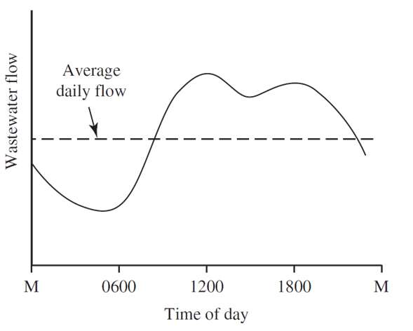
        - **Hình này chứng minh điều gì**
          - Khoảng trũng giữa hai đỉnh vào buổi chiều vẫn duy trì cao hơn mức lưu lượng trung bình ngày (average daily flow).
        - **Từ đâu mà thấy được**
          - Trục $Ox$: thời gian trong ngày (time of day), từ $\text{M}$ (midnight) qua $0600$, $1200$, $1800$ đến $\text{M}$; trục $Oy$: lưu lượng nước thải (wastewater flow).
          - Đường nét đứt ngang: mức lưu lượng trung bình ngày (average daily flow) có mũi tên chỉ dẫn.
          - Đường nét liền: đáy cực tiểu nằm giữa $\text{M}$ và $0600$; hai đỉnh vượt đường nét đứt tại $1200$ và $1800$; đoạn trũng giữa hai đỉnh nằm trên đường nét đứt.
  - Biến thiên tải lượng chất ô nhiễm (constituent load variation) và nồng độ (concentration fluctuation):
    - Tải lượng ô nhiễm là tích số giữa lưu lượng và nồng độ chất ô nhiễm tức thời.
    - Khi không có bể điều hòa, nồng độ ô nhiễm biến động gián đoạn và khó kiểm soát.
    - Dao động nồng độ gây hiện tượng quá tải hữu cơ cục bộ cho công trình sinh học.
    - Nồng độ các chất rắn lơ lửng ($\text{SS}$ - Suspended Solids) và nhu cầu oxy sinh hóa ($\text{BOD}$ - Biochemical Oxygen Demand) dao động mạnh cùng với $\text{COD}$.
    - Thiếu công trình đệm làm vi sinh vật trong hệ thống xử lý sinh học dễ rơi vào trạng thái sốc tải hoặc thiếu hụt dinh dưỡng.
    - Quá trình điều hòa nước thải (balancing) làm phẳng các đỉnh nồng độ ô nhiễm cao, giảm hệ số đỉnh (peak factor, $\text{PF}$) từ các mức cực đoan xuống mức dao động an toàn.
      - **Hình 3.** Giảm hệ số đỉnh nồng độ ô nhiễm khi điều hòa
        - 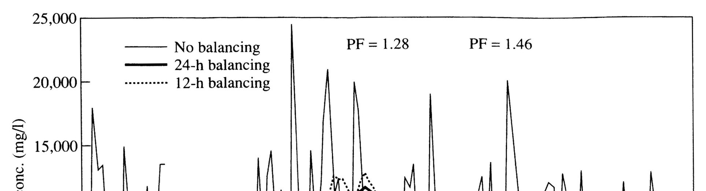
        - **Hình này chứng minh điều gì**
          - Điều hòa $12\text{ h}$ và $24\text{ h}$ triệt tiêu hoàn toàn đỉnh nhọn trên $15{,}000\text{ mg/l}$, giảm hệ số đỉnh lần lượt xuống $\text{PF} = 1.46$ và $\text{PF} = 1.28$.
        - **Từ đâu mà thấy được**
          - Trục $Oy$: nồng độ ô nhiễm $\text{conc.}$ ($\text{mg/l}$), dải $15{,}000\text{--}25{,}000\text{ mg/l}$; trục $Ox$: chuỗi thời gian.
          - Đường nét mảnh ("No balancing") vọt lên đỉnh sát $24{,}500\text{ mg/l}$, còn đường nét đứt ("12-h balancing", $\text{PF} = 1.46$) và nét đậm ("24-h balancing", $\text{PF} = 1.28$) phẳng ở đáy.
    - Bể điều hòa duy trì nồng độ chất ô nhiễm $\text{COD}$ (Chemical Oxygen Demand) ổn định quanh mức trung bình xuyên suốt chu kỳ vận hành nhiều ngày liên tục.
      - **Hình 4.** Biến thiên nồng độ COD theo thời gian vận hành
        - 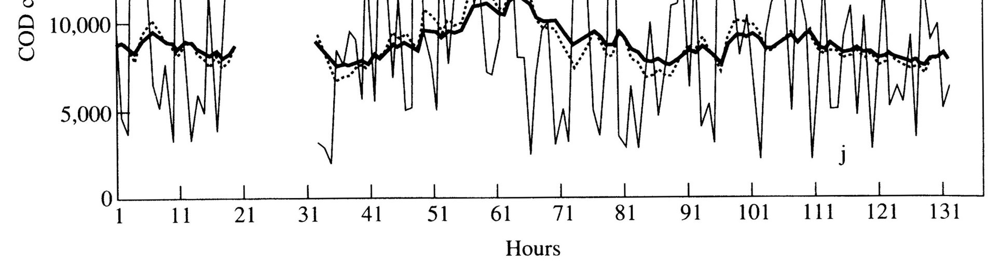
        - **Hình này chứng minh điều gì**
          - Dòng ra sau điều hòa (đường nét đậm) duy trì nồng độ $\text{COD}$ ổn định quanh dải $8{,}000\text{--}10{,}000\text{ mg/l}$ xuyên suốt $131\text{ h}$ vận hành.
        - **Từ đâu mà thấy được**
          - Trục $Ox$: thời gian vận hành $t$ ($\text{Hours}$), dải $1\text{--}131\text{ h}$; trục $Oy$: nồng độ $\text{COD}$ ($\text{COD conc.}$), dải $0\text{--}>10{,}000\text{ mg/l}$.
          - Đường nét đậm (sau điều hòa) duy trì trong dải $8{,}000\text{--}10{,}000\text{ mg/l}$, trong khi đường nét mảnh (dòng vào) dao động mạnh từ $<2{,}500\text{ mg/l}$ đến $>10{,}000\text{ mg/l}$.

##### Purpose of equalization tank

- Bể điều hòa (equalization tank) đóng vai trò trung tâm trong việc làm đều dòng thải trước các cụm xử lý chính.
- Bể điều hòa cân bằng các biến động thủy lực và tải lượng ô nhiễm của nước thải đầu vào.
  - Điều hòa lưu lượng dòng chảy (equalize flowrate):
    - Chuyển đổi dòng chảy dao động thành dòng chảy ổn định có lưu lượng tương đối không đổi.
    - Phân phối lưu lượng đồng đều theo chu kỳ $24\text{ h}$ cho các công trình xử lý phía sau.
    - Ngăn ngừa hiện tượng quá tải thủy lực cục bộ tại các bể lắng và bể sinh học.
    - Giữ vận tốc dòng chảy ổn định qua bể lắng đợt một giúp tăng hiệu quả lắng trọng lực của hạt cặn.
  - Điều hòa tải lượng chất ô nhiễm (equalize constituent load):
    - Trộn đều các dòng thải có nồng độ khác nhau nhằm đồng nhất chất lượng nước.
    - Phân tán các đỉnh nồng độ chất hữu cơ cao và hóa chất độc hại.
    - Tạo môi trường dinh dưỡng ổn định cho bùn hoạt tính sinh học phát triển.
    - Ổn định chất lượng nước thải tạo điều kiện cho các phản ứng lý hóa diễn ra đồng đều.
  - Bố trí bể điều hòa nối tiếp (in-line equalization) sau các công trình tiền xử lý chuyển đổi trạng thái dòng chảy từ dao động sang lưu lượng tương đối không đổi:
    - **Hình 1.** Sơ đồ vị trí bể điều hòa nối tiếp (in-line equalization)
      - 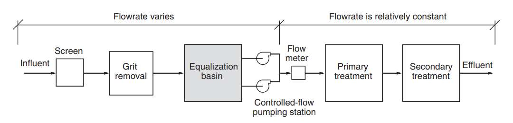
      - **Hình này chứng minh điều gì**
        - Bể kết hợp Controlled-flow pumping station (trạm bơm kiểm soát lưu lượng) để cấp dòng ổn định cho Primary treatment và Secondary treatment.
      - **Từ đâu mà thấy được**
        - Sơ đồ đọc từ trái sang phải theo chiều mũi tên từ Influent đến Effluent.
        - Thanh kích thước phía trên đánh dấu chuyển từ "Flowrate varies" trước Equalization basin sang "Flowrate is relatively constant" sau trạm bơm.

##### Benefits of Equalization tank

- Bể điều hòa mang lại nhiều lợi ích công nghệ và kinh tế cho trạm xử lý nước thải.
  - Bể điều hòa cung cấp dung tích lưu trữ để hấp thụ toàn bộ biến động lưu lượng dòng vào và duy trì lưu lượng bơm không đổi sang công trình xử lý sơ cấp phía sau:
    - **Hình 5.** Sơ đồ điều hòa lưu lượng qua bể Equalization Basin
      - 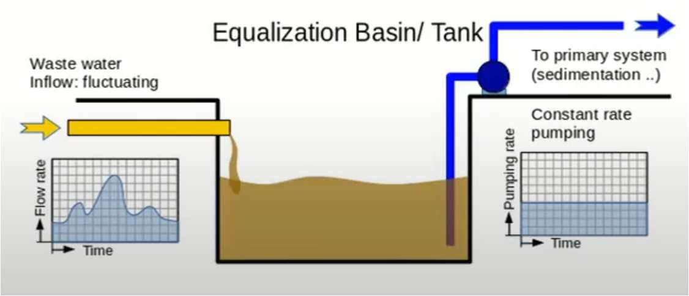
      - **Hình này chứng minh điều gì**
        - Minh họa sự tương phản giữa sóng dao động của dòng vào (fluctuating inflow) và đường thẳng ngang của bơm lưu lượng không đổi (constant rate pumping) cấp sang bể lắng sơ cấp (primary sedimentation).
      - **Từ đâu mà thấy được**
        - Hướng đọc từ trái sang phải: dòng thải vào bể điều hòa (Equalization Basin), bơm đưa nước sang hệ thống sơ cấp (primary system).
        - Đồ thị bên trái: trục Flow rate theo Time biểu diễn đường sóng dao động nhiều đỉnh nhọn (fluctuating).
        - Đồ thị bên phải: trục Pumping rate theo Time biểu diễn đường nằm ngang cố định (constant rate).
  - Nâng cao hiệu suất vận hành của các quá trình xử lý hạ nguồn (improve the performance of the downstream processes).
  - Giảm thiểu quy mô kích thước và chi phí xây dựng công trình xử lý hạ nguồn (reduce the size and cost of downstream treatment facilities):
    - Thiết kế công trình xử lý hạ nguồn dựa trên lưu lượng trung bình thay vì lưu lượng đỉnh.
    - Tiết kiệm chi phí đầu tư thiết bị và dung tích xây dựng các bể lắng, bể phản ứng.
  - Lợi ích đối với quá trình xử lý sinh học (biological treatment):
    - Giảm thiểu hiện tượng sốc tải trọng hữu cơ và chất độc (minimize shock loadings).
    - Ngăn ngừa hiện tượng quá tải thủy lực cuốn trôi bông bùn hoạt tính ra khỏi bể lắng đợt hai.
    - Ổn định chỉ số $\text{pH}$ (stabilize $\text{pH}$) tạo điều kiện tối ưu cho vi sinh vật phân hủy chất ô nhiễm.
  - Lợi ích đối với quá trình xử lý hóa học (chemical treatment):
    - Cải thiện độ chính xác trong kiểm soát châm hóa chất (improve chemical feed control).
    - Hóa chất kết tủa hoặc keo tụ được phân tán đều giúp tiết kiệm lượng hóa chất tiêu thụ.
    - Nâng cao độ tin cậy và hiệu quả phản ứng của quy trình công nghệ (improve process reliability).
  - Lợi ích đối với hệ thống lọc và các công trình xử lý bậc ba (filtration or other tertiary treatment systems):
    - Giảm diện tích bề mặt lọc hoặc dung tích công trình yêu cầu (reduce area or volume requirement).
    - Ổn định chu kỳ rửa lọc do tải lượng cặn đi vào bể lọc không bị tăng vọt đột ngột.
    - Nâng cao hiệu suất giữ cặn và chất lượng nước sau lọc (improve performance).

##### Drawbacks of Equalization tank

- Việc xây dựng và vận hành bể điều hòa cũng có một số nhược điểm cần giải quyết:
  - Yêu cầu diện tích mặt bằng xây dựng tương đối lớn (require relatively large land areas).
  - Gặp khó khăn tại các trạm xử lý có quỹ đất chật hẹp hoặc bị hạn chế diện tích mở rộng.
  - Yêu cầu bổ sung công tác vận hành và bảo trì (require additional operation and maintenance):
    - Định kỳ bảo dưỡng máy bơm, máy khuấy chìm và hệ thống phân phối khí.
    - Theo dõi bùn lắng đáy bể để có kế hoạch xả rửa và nạo vét thường xuyên.
  - Tiềm ẩn nguy cơ phát sinh mùi hôi (potential for odors) do phân hủy kỵ khí nếu thiếu cấp khí hoặc khuấy trộn:
    - Bể điều hòa hở có thể phát tán mùi khó chịu vào không khí xung quanh khi nước thải lưu trữ lâu.
    - Luôn cần trang bị máy sục khí hoặc máy khuấy liên tục để duy trì điều kiện hiếu khí và chống lắng.
  - Gia tăng chi phí đầu tư ban đầu (increase capital cost) cho máy thổi khí, máy khuấy, bơm biến tần và hệ thống bồn chứa:
    - Tiêu thụ thêm điện năng cho sục khí và khuấy xáo làm tăng chi phí vận hành thường xuyên.
    - **Hình 6.** Thực tế cụm bể điều hòa và hệ thống phụ trợ
      - 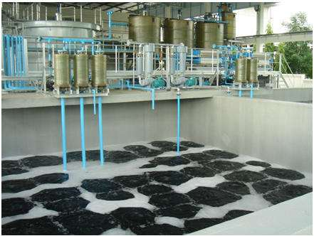
      - **Hình này chứng minh điều gì**
        - Hệ thống đòi hỏi kết cấu bể lớn cùng nhiều bồn chứa và thiết bị cơ điện đồng bộ.
      - **Từ đâu mà thấy được**
        - Tiền cảnh: bể bê tông với hệ thống ống cấp khí tạo bọt sục khí bề mặt.
        - Hậu cảnh: sàn thao tác trên cao chứa dãy bồn trụ, máy bơm và mạng đường ống.

#### 2. Volume requirements for equalization tank

##### Theoretical value

- Phương pháp biểu đồ tích lũy dòng vào (inflow mass diagram method) xác định dung tích lý thuyết yêu cầu ($V_{\text{theoretical}}$) của bể điều hòa (equalization tank).
  - Trục thời gian trong ngày (time of day) biểu diễn chu kỳ $24\text{ h}$ liên tục từ nửa đêm ($M$ - midnight) qua trưa ($N$ - noon) đến nửa đêm tiếp theo ($M$).
  - Đường dốc thẳng nối điểm đầu và điểm cuối chu kỳ biểu diễn lưu lượng trung bình ngày (average daily flowrate).
- Dung tích điều hòa lý thuyết ($V_{\text{theoretical}}$) bằng khoảng cách thẳng đứng lớn nhất giữa đường cong tích lũy dòng vào và đường tiếp tuyến song song với đường lưu lượng trung bình ngày.
  - **Hình 7.** Xác định dung tích bể điều hòa bằng phương pháp biểu đồ tích lũy
    - 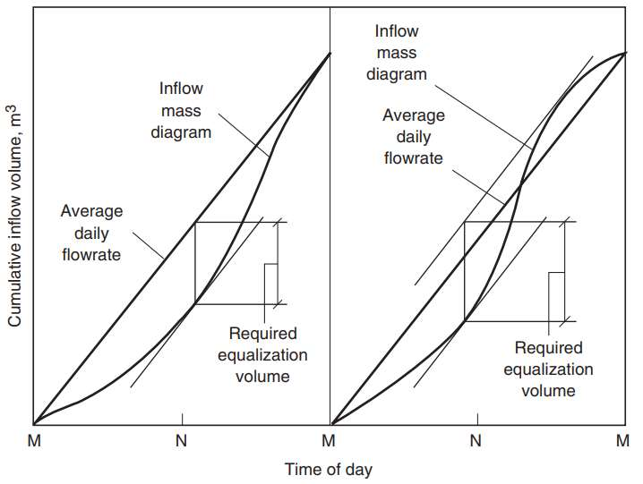
    - **Hình này chứng minh điều gì**
      - Dung tích điều hòa yêu cầu (required equalization volume) bằng khoảng cách thẳng đứng lớn nhất từ tiếp tuyến đến đường trung bình hoặc giữa hai tiếp tuyến song song bao ngoài đường cong tích lũy.
    - **Từ đâu mà thấy được**
      - Trục tung: thể tích dòng vào tích lũy (cumulative inflow volume, $\text{m}^3$); trục hoành: thời gian trong ngày (time of day) từ $M$ qua $N$ đến $M$.
      - Đồ thị bên trái: vạch kích thước đo khoảng cách thẳng đứng từ đường tiếp tuyến song song bên dưới đến đường lưu lượng trung bình ngày.
      - Đồ thị bên phải: vạch kích thước đo tổng khoảng cách thẳng đứng giữa hai đường tiếp tuyến song song kẹp ngoài đường cong tích lũy dòng vào.

##### Practical value

- Dung tích thực tế ($V_{\text{practical}}$) của bể điều hòa được tính bằng $1.1\text{--}1.2$ lần dung tích lý thuyết:
  $$V_{\text{practical}} = (1.1\text{--}1.2) \times V_{\text{theoretical}}$$
  - Giá trị thực tế bằng $1.1\text{--}1.2$ lần giá trị lý thuyết ($\text{Practical value} = 1.1\text{--}1.2 \times \text{theoretical value}$).
- Dung tích thực tế tăng thêm $10\%\text{--}20\%$ so với dung tích lý thuyết do ba nguyên nhân kỹ thuật và vận hành:
  - Bể điều hòa yêu cầu quá trình xáo trộn (mixing) hoặc sục khí (aeration):
    - Thiết bị khuấy trộn hoặc phân phối khí chiếm một phần thể tích hữu ích và tạo chuyển động thủy lực trong bể.
  - Bể cần dung tích tiếp nhận bổ sung cho các dòng hồi lưu (returning flows) từ các công trình phía trước (upstream facilities):
    - Các dòng nước thải tuần hoàn hoặc nước rửa lọc từ các đơn vị tiền xử lý quay trở lại bể điều hòa.
  - Đảm bảo an toàn dự phòng trước các biến động không lường trước (unforeseen changes) của lưu lượng dòng vào (influent flow):
    - Đề phòng dao động lưu lượng đột biến vượt quá dự báo thiết kế cơ sở.

#### 3. Equalization tank design

- Bể điều hòa (equalization tank) được thiết kế nhằm đồng đều hóa lưu lượng và nồng độ chất ô nhiễm, bảo vệ các công trình xử lý sinh học phía sau khỏi hiện tượng sốc tải trọng.
- Các yêu cầu thiết kế kỹ thuật chính của bể điều hòa bao gồm công suất khuấy trộn, chế độ cấp khí, giải pháp hình học bể và hệ thống thiết bị quan trắc, điều khiển.

##### Mixing requirement

- Mục đích của việc khuấy trộn (mixing requirement) trong bể điều hòa:
  - Duy trì các hạt cặn ở trạng thái lơ lửng và ngăn ngừa sự lắng đọng chất rắn (preventing solid deposition) dưới đáy bể.
  - Đảm bảo tính đồng nhất về nồng độ các chất ô nhiễm trong toàn bộ dung tích trước khi nước thải được bơm dẫn sang các công trình xử lý tiếp theo.
- Công suất khuấy trộn yêu cầu (mixing power requirement):
  - Áp dụng đối với nước thải sinh hoạt (domestic wastewater) có hàm lượng chất rắn lơ lửng ($SS$ - suspended solids) khoảng $200\text{ mg/L}$.
  - Suất công suất khuấy yêu cầu nằm trong khoảng từ $0.004\text{ kW/m}^3$ đến $0.008\text{ kW/m}^3$ tính theo dung tích bể điều hòa ($0.004 - 0.008\text{ kW/m}^3\text{ of volume of equalization tank}$).
- Phương pháp và thiết bị khuấy trộn:
  - Máy khuấy chìm (submersible mixers) là phương pháp khuấy phổ biến nhất (the most common mixing method) được áp dụng nhằm ngăn ngừa lắng đọng cặn.
    - **Hình 8.** Máy khuấy chìm lắp đặt cùng cần nâng tại bể điều hòa
      - 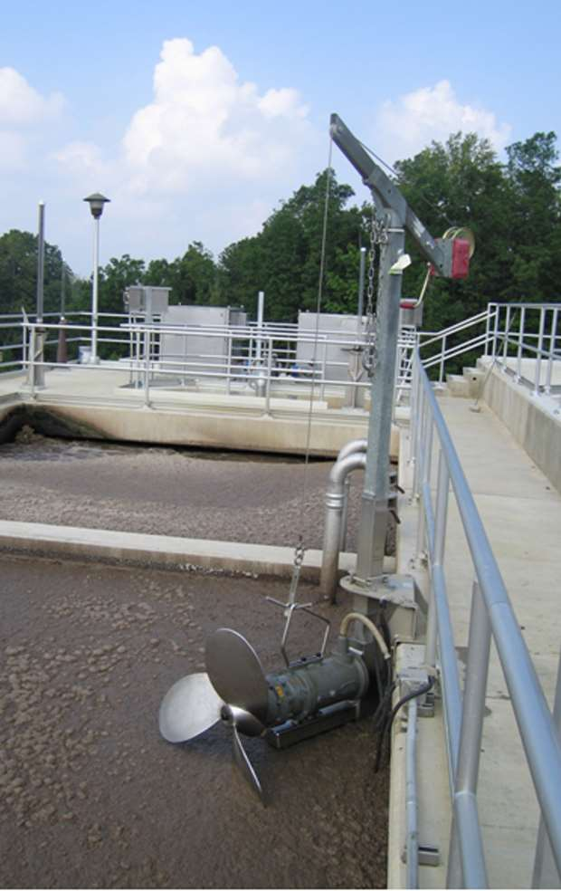
      - **Hình này chứng minh điều gì**
        - Máy khuấy chìm được treo trên hệ khung tời nâng hạ để duy trì xáo trộn bùn cặn trong bể.
      - **Từ đâu mà thấy được**
        - Cụm động cơ và cánh khuấy đặt ngập phía dưới cần trục nâng và lan can thao tác trên thành bể.
  - Lắp đặt máy khuấy chìm trên hệ kết cấu dẫn hướng:
    - Thiết bị được lắp đặt trượt dọc theo thanh ray dẫn hướng (guide rail) gắn cố định vào thành bể bê tông, cho phép nâng hạ linh hoạt để kiểm tra và bảo trì.
      - **Hình 9.** Giá đỡ đỉnh thành bể và ray dẫn hướng máy khuấy chìm
        - 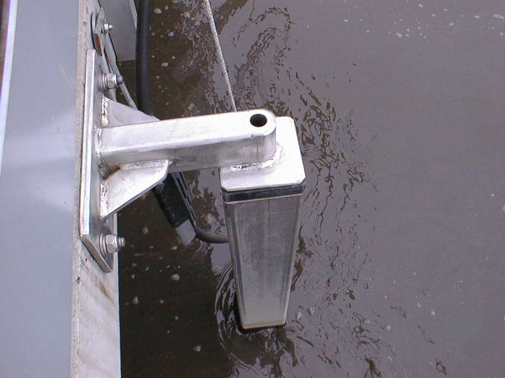
        - **Hình này chứng minh điều gì**
          - Thanh ray dẫn hướng bằng kim loại chống ăn mòn gắn chắc chắn vào đỉnh tường bê tông của bể.
        - **Từ đâu mà thấy được**
          - Bản mã liên kết bằng bu-lông vào thành bể và ngàm giữ đỉnh thanh ray dẫn hướng thẳng đứng.
  - Cấu tạo cơ khí của thiết bị khuấy chìm:
    - Cấu tạo cơ học của máy khuấy chìm bao gồm động cơ chìm kín nước, cánh khuấy định hình tạo lực đẩy dòng và gá trượt trên thanh dẫn hướng (như dòng máy ABS).
      - **Hình 10.** Cấu tạo máy khuấy chìm cánh đẩy dòng của hãng ABS
        - 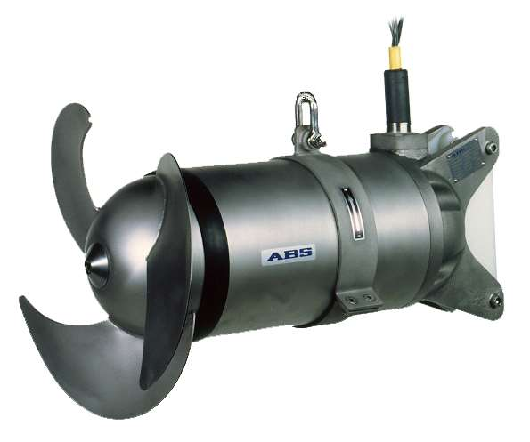
        - **Hình này chứng minh điều gì**
          - Thiết kế cơ học tích hợp nhỏ gọn với cánh quạt hướng dòng tạo lực đẩy xáo trộn nước thải.
        - **Từ đâu mà thấy được**
          - Động cơ chìm nhãn hiệu ABS, ba cánh khuấy cong phía trước và móc cẩu cùng ngàm trượt ở thân máy.

##### Air requirement

- Mục đích của việc sục khí (air requirement / aeration) trong bể điều hòa:
  - Ngăn ngừa quá trình lên men kỵ khí / yếm khí (anaerobic fermentation) diễn ra trong điều kiện lưu trữ nước thải.
  - Phòng tránh hiện tượng phân hủy kỵ khí phát sinh mùi hôi thối khó chịu (causing odor).
  - Duy trì trạng thái hiếu khí và hỗ trợ xáo trộn khối chất lỏng trong bể.
- Định mức cung cấp khí (aeration rate requirements):
  - Định mức cấp khí để tạo điều kiện hiếu khí (to create aerobic condition):
    - Cung cấp lưu lượng từ $0.01\text{ m}^3$ đến $0.015\text{ m}^3$ không khí trên mỗi phút cho một $\text{m}^3$ dung tích bể ($0.01 - 0.015\text{ m}^3\text{ air per min/m}^3\text{ of tank volume}$).
  - Định mức cấp khí để duy trì đồng thời điều kiện hiếu khí và xáo trộn hoàn toàn (to maintain aerobic and complete mixing conditions):
    - Cung cấp lưu lượng từ $1.8\text{ m}^3$ đến $2.9\text{ m}^3$ không khí trên mỗi giờ cho một $\text{m}^3$ dung tích bể ($1.8 - 2.9\text{ m}^3\text{ air per hour/m}^3\text{ of tank volume}$).
- Hiệu quả giảm tải lượng ô nhiễm hữu cơ nhờ sục khí:
  - Quá trình sục khí cưỡng bức trong bể điều hòa có thể làm giảm nồng độ nhu cầu oxy sinh hóa ($\text{BOD}$ - biochemical oxygen demand) khoảng $10\%$ ($10\%$).
- Quy tắc thiết kế và vận hành hệ thống cấp khí:
  - Nguồn cấp khí (air supply) cho bể điều hòa phải được cô lập độc lập (isolated) với các yêu cầu cấp khí sục khí khác của toàn trạm xử lý (treatment plant aeration requirements).
  - Việc cô lập nguồn cấp khí nhằm tạo điều kiện thuận lợi và linh hoạt tối đa cho công tác kiểm soát quá trình sục khí (facilitate process aeration control).
- Hệ thống phân phối khí và thiết bị sục khí:
  - Mạng lưới đường ống cấp khí trải đều dưới đáy:
    - Bố trí mạng lưới giàn ống sục khí song song phủ kín đáy bể giúp bọt khí thoát ra đồng đều trên toàn bộ diện tích mặt thoáng.
      - **Hình 11.** Mạng lưới dàn ống phân phối khí trải dưới đáy bể
        - 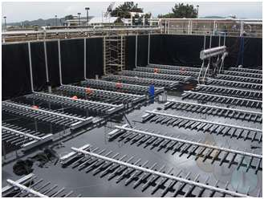
        - **Hình này chứng minh điều gì**
          - Các nhánh ống cấp khí song song phủ kín đáy bể giúp bọt khí thoát đều trên toàn bộ mặt thoáng.
        - **Từ đâu mà thấy được**
          - Mạng lưới giàn ống cấp khí rải đều dọc theo chiều dài đáy bể khi bể chưa nạp nước thải.
  - Sử dụng đĩa phân phối bọt khí mịn (fine bubble disc diffusers):
    - Dàn đĩa phân phối khí bọt mịn gắn trên các nhánh ống dưới đáy bể giúp tăng cường diện tích tiếp xúc bọt khí và nâng cao hiệu quả hòa tan oxy.
      - **Hình 12.** Hệ thống đĩa phân phối bọt khí mịn lắp đặt đáy bể
        - 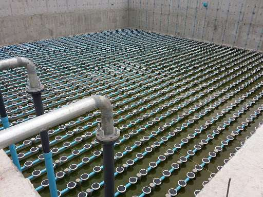
        - **Hình này chứng minh điều gì**
          - Mật độ đĩa phân phối bọt khí dày đặc tăng diện tích tiếp xúc bọt khí - nước thải trong bể.
        - **Từ đâu mà thấy được**
          - Các đĩa tròn gắn thẳng đứng trên dàn ống màu xanh kết nối với ống cấp khí chính bằng thép.
  - Thiết bị máy thổi khí công nghiệp độc lập:
    - Bố trí máy thổi khí chuyên dụng độc lập (như máy thổi khí dạng thùy quay Roots blower) cung cấp lưu lượng và áp lực khí ổn định riêng cho bể điều hòa.
      - **Hình 13.** Cụm máy thổi khí kiểu Roots của hãng Goldentech
        - 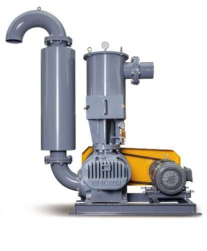
        - **Hình này chứng minh điều gì**
          - Cụm máy thổi khí hoàn chỉnh cung cấp lưu lượng khí áp lực ổn định cho hệ thống sục khí đáy bể.
        - **Từ đâu mà thấy được**
          - Đầu máy thổi khí Goldentech nối với động cơ điện qua dây đai và trang bị bình giảm thanh thẳng đứng.

##### Tank geometry

- Hình dạng mặt bằng và biện pháp hạn chế ngắn mạch (short circuiting):
  - Cần tránh thiết kế các bể điều hòa có dạng hình chữ nhật dài hẹp (long rectangular basins should be avoided).
  - Vị trí cửa dẫn nước vào (inlet) và cửa dẫn nước ra (outlet) phải được bố trí hợp lý nhằm giảm thiểu tối đa hiện tượng dòng chảy ngắn mạch / đoản mạch (minimize short circuiting).
- Loại hình kết cấu công trình và chi phí xây dựng:
  - Bể đất lót màng chống thấm (earth basins with an impermeable liner) thường là giải pháp xây dựng có chi phí đầu tư thấp nhất (generally the least expensive).
    - **Hình 14.** Bể đất lót màng chống thấm đang vận hành sục khí
      - 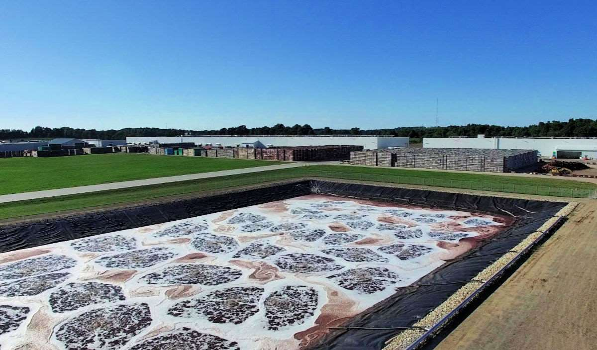
      - **Hình này chứng minh điều gì**
        - Màng chống thấm bao bọc toàn bộ mái dốc và đáy bể đất chứa nước thải đang được sục khí bọt trắng.
      - **Từ đâu mà thấy được**
        - Màng lót màu đen phủ kín các bờ mái dốc đất xung quanh lòng hồ sục khí rộng lớn ngoài trời.
  - Cấu tạo và quy mô bể đất lót màng:
    - Kết cấu màng địa kỹ thuật chống thấm (impermeable liner) kết hợp mái dốc đất cho phép xây dựng các hồ điều hòa dung tích lớn với hàng rào bảo vệ kiên cố.
      - **Hình 15.** Bể đất quy mô lớn hoàn thiện lót màng chống thấm
        - 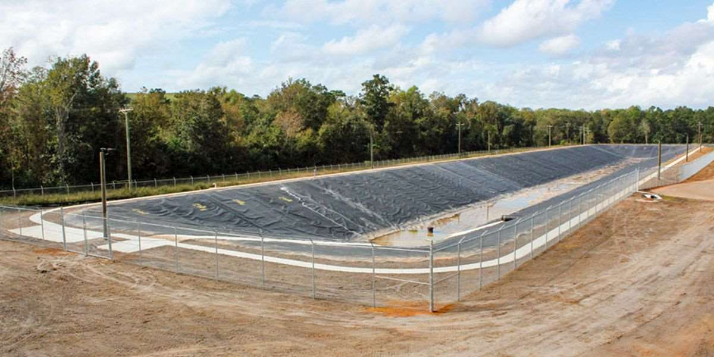
        - **Hình này chứng minh điều gì**
          - Bể đất lót bạt hình chữ nhật lớn được cách ly an toàn với môi trường xung quanh.
        - **Từ đâu mà thấy được**
          - Bề mặt màng chống thấm màu đen trải đều khắp lòng hồ kèm hàng rào lưới bảo vệ xung quanh đỉnh bờ.
- Chiều sâu nước thiết kế (water depth):
  - Chiều sâu nước tối thiểu (minimum water depth) trong bể điều hòa phụ thuộc vào loại thiết bị sục khí (aeration equipment) được lựa chọn.
  - Tuy nhiên, chiều sâu nước tối thiểu luôn phải đạt ít nhất $1.5\text{ m}$ (is at least $1.5\text{ m}$).
  - Thi công kết cấu bê tông đảm bảo chiều sâu và độ bền:
    - Đáy bể và mái dốc thành bể được thi công đổ bê tông kiên cố nhằm bảo đảm hình học bể và tạo chiều sâu ngập nước phục vụ lắp đặt thiết bị.
      - **Hình 16.** Thi công đổ bê tông đáy và mái dốc bể điều hòa
        - 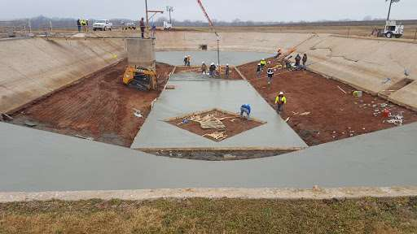
        - **Hình này chứng minh điều gì**
          - Quá trình đổ bê tông kiên cố hóa đáy và các vách vát nghiêng nhằm đảm bảo hình học và chiều sâu bể.
        - **Từ đâu mà thấy được**
          - Công nhân và máy xúc đang hoàn thiện các ô sàn bê tông giữa lòng bể và chân mái dốc kè.

##### Some notes on equipment

- Trang bị hệ thống báo mực nước tự động và bảo vệ thiết bị:
  - Cần trang bị hệ thống báo mực nước tự động (automatic water level reporting system) cho bể điều hòa.
  - Mục đích nhằm bảo vệ an toàn cho các thiết bị cơ điện bao gồm máy bơm (pumps), máy khuấy (mixers) và máy thổi khí (air blowers).
- Cảm biến đo mức chính và điều khiển tự động trạm bơm:
  - Hệ thống bơm nước thải cần được lắp đặt cảm biến siêu âm (ultrasonic sensor) để theo dõi liên tục mực nước trong bể.
  - Tín hiệu từ cảm biến siêu âm dùng để điều khiển vận hành máy bơm hoàn toàn tự động (tự động BẬT/TẮT - auto ON/OFF).
- Thiết bị cảnh báo và đo mức dự phòng:
  - Hệ thống bơm phải có thêm công tắc phao mức cao dự phòng (backup high-level float switch).
  - Phao mức cao có nhiệm vụ kích hoạt tín hiệu báo động (alarm) cho trạm bơm nếu cảm biến mực nước siêu âm gặp sự cố hư hỏng (fails).
- Lựa chọn loại máy bơm điều hòa:
  - Tất cả các máy bơm cấp nước thải cho bể điều hòa đều phải là bơm điều khiển bằng biến tần (variable frequency drive - VFD pumps).
  - Bơm biến tần cho phép điều chỉnh lưu lượng bơm trơn tru, duy trì lưu lượng cấp ổn định sang các công trình đơn vị phía sau trạm xử lý.
- Cơ chế bảo vệ ngắt tự động cho máy thổi khí:
  - Máy thổi khí (air blower) bắt buộc phải có cơ chế ngắt khi mức nước thấp (low-level shutoff).
  - Cơ chế này ngắt máy thổi khí trong trường hợp mức nước thải bị rút xuống dưới mức vận hành tối thiểu (minimum operating level), ngăn ngừa quá nhiệt và hư hại đĩa phân phối khí.
- Tối ưu hóa vận hành và tiết kiệm năng lượng thiết bị:
  - Việc phối hợp kiểm soát mực nước tự động, bơm biến tần VFD và điều khiển ngắt/bật sục khí giúp tiết kiệm đáng kể điện năng vận hành (điển hình như trường hợp thực tế ghi nhận mức tiết kiệm công suất lên đến $135\text{ HP}$).
    - **Hình 17.** Bể sục khí tối ưu hóa tiết kiệm $135\text{ HP}$ công suất
      - 
      - **Hình này chứng minh điều gì**
        - Việc kiểm soát tối ưu hệ thống thiết bị và sục khí giúp tiết kiệm công suất vận hành lên tới $135\text{ HP}$.
      - **Từ đâu mà thấy được**
        - Huy hiệu dải ruy-băng ghi số liệu tiết kiệm $135\text{ HP}$ ở góc trái và ảnh hồ sục khí nhãn "After".

#### 4. Design practice

- Thực hành thiết kế bể điều hòa (equalization tank) tập trung vào hai nội dung kỹ thuật trọng tâm:
  - Xác định dung tích hữu ích yêu cầu của bể dựa trên chuỗi số liệu lưu lượng dao động thực tế theo giờ trong ngày.
  - Đánh giá hiệu quả ổn định nồng độ chất ô nhiễm ($\text{BOD}$), triệt tiêu hiện tượng sốc tải hữu cơ và tính toán nhu cầu sục khí, khuấy trộn cho bể.
- Mục tiêu thủy lực và công nghệ của bể điều hòa:
  - Chuyển đổi lưu lượng dòng vào biến thiên $Q(t)$ thành lưu lượng dòng ra ổn định liên tục $Q_{\text{avg}}$ bằng hệ thống bơm biến tần (VFD pumps).
  - Tối ưu hóa kích thước và hiệu suất làm việc của các công trình lắng và xử lý sinh học phía sau.
  - Đồng hóa nồng độ các chất ô nhiễm biến động theo chu kỳ sinh hoạt, duy trì tỷ số thức ăn trên vi sinh vật ($F/M$) ổn định cho các quá trình sinh học hiếu khí.
- Phương pháp xác định dung tích điều hòa lý thuyết ($V_{\text{theoretical}}$) theo đường cong tích lũy dòng vào (inflow mass diagram / Rippl method):
  - Lưu lượng xả trung bình theo ngày:
    $$Q_{\text{avg}} = \frac{\sum_{i=1}^{24} Q_i \cdot \Delta t}{24\text{ h}}$$
  - Thể tích tích lũy dòng vào:
    $$\sum V_{\text{in}, t} = \sum_{i=1}^t (Q_i \cdot \Delta t) \quad (\text{với } \Delta t = 1\text{ h})$$
  - Thể tích tích lũy dòng ra ổn định:
    $$\sum V_{\text{out}, t} = t \cdot Q_{\text{avg}}$$
  - Chênh lệch thể tích tích lũy tại mỗi thời điểm:
    $$\Delta V_t = \sum V_{\text{in}, t} - \sum V_{\text{out}, t}$$
  - Dung tích lý thuyết yêu cầu bằng khoảng cách thẳng đứng lớn nhất giữa đường tích lũy dòng vào và đường lưu lượng trung bình ngày:
    $$V_{\text{theoretical}} = \Delta V_{\max} - \Delta V_{\min}$$
- Quy tắc áp dụng hệ số an toàn thực tế:
  $$V_{\text{practical}} = (1.1\text{--}1.2) \times V_{\text{theoretical}}$$
  - Bổ sung dung tích cho quá trình khuấy trộn (mixing) hoặc sục khí (aeration) trong bể để duy trì xáo trộn hoàn toàn và chống lắng cặn.
  - Dự phòng dung tích tiếp nhận các dòng nước thải tuần hoàn (returning flows) từ các công trình phía trước hoặc phía sau quay lại bể điều hòa.
  - Đảm bảo an toàn dự phòng trước các dao động lưu lượng đột xuất không lường trước (unforeseen changes in influent flow).
- Quy chuẩn thiết kế thông số kỹ thuật khuấy trộn và sục khí bể điều hòa:
  - Công suất khuấy trộn yêu cầu đối với nước thải sinh hoạt có $\text{SS} \approx 200\text{ mg/L}$: $0.004\text{--}0.008\text{ kW/m}^3$ thể tích bể (sử dụng máy khuấy chìm submersible mixer).
  - Cường độ cấp khí tạo điều kiện hiếu khí chống phân hủy kỵ khí gây mùi hôi: $0.01\text{--}0.015\text{ m}^3\text{ khí/min}\cdot\text{m}^3$ thể tích bể.
  - Cường độ cấp khí duy trì đồng thời điều kiện hiếu khí và xáo trộn hoàn toàn: $1.8\text{--}2.9\text{ m}^3\text{ khí/h}\cdot\text{m}^3$ thể tích bể.
  - Sục khí trong bể điều hòa có khả năng làm giảm nồng độ $\text{BOD}$ khoảng $10\%$.
- Yêu cầu hình học bể và bảo vệ thiết bị đo đạc:
  - Tránh thiết kế bể dài hẹp (long rectangular basins) để hạn chế hiện tượng dòng chảy ngắn mạch (short-circuiting).
  - Chiều sâu ngập nước tối thiểu của bể điều hòa: $H_{\min} \ge 1.5\text{ m}$ để đảm bảo độ ngập làm việc an toàn của thiết bị sục khí và máy khuấy chìm.
  - Trang bị cảm biến siêu âm đo mức nước liên tục (ultrasonic water level sensor) để tự động điều khiển bơm biến tần VFD.
  - Bố trí phao báo mức cao dự phòng (backup high-level float switch) kích hoạt còi báo động khi cảm biến siêu âm gặp sự cố.
  - Máy thổi khí phải có cơ chế tự động ngắt ở mức nước thấp (low-level shutoff) khi mực nước hạ dưới ngưỡng vận hành tối thiểu.

##### Example 1: Equalization tank volume calculation

- **Đề bài**:
  - Xác định dung tích yêu cầu của bể điều hòa (equalization tank volume requirement), bao gồm dung tích lý thuyết ($V_{\text{theoretical}}$) và dung tích thực tế ($V_{\text{practical}}$), dựa trên số liệu lưu lượng dòng vào nước thải theo từng khung giờ trong ngày được cho trong bảng dưới đây:

| Khung giờ (Time period) | Lưu lượng dòng vào $Q_i$ ($\text{m}^3/\text{h}$) | Khung giờ (Time period) | Lưu lượng dòng vào $Q_i$ ($\text{m}^3/\text{h}$) |
| :---: | :---: | :---: | :---: |
| M-1 | 990 | N-13 | 1530 |
| 1-2 | 792 | 13-14 | 1458 |
| 2-3 | 594 | 14-15 | 1386 |
| 3-4 | 468 | 15-16 | 1260 |
| 4-5 | 378 | 16-17 | 1170 |
| 5-6 | 360 | 17-18 | 1170 |
| 6-7 | 432 | 18-19 | 1188 |
| 7-8 | 738 | 19-20 | 1314 |
| 8-9 | 1278 | 20-21 | 1440 |
| 9-10 | 1476 | 21-22 | 1440 |
| 10-11 | 1530 | 22-23 | 1368 |
| 11-N | 1548 | 23-M | 1242 |

- **Dữ kiện**:
  - Chu kỳ quan trắc lưu lượng: 24 khoảng thời gian 1 giờ trong ngày ($\Delta t = 1\text{ h}$), từ nửa đêm ($M$ - Midnight, 0:00) qua giữa trưa ($N$ - Noon, 12:00) đến nửa đêm hôm sau ($M$, 24:00).
  - Lưu lượng dòng vào nhỏ nhất: $Q_{\min} = 360\text{ m}^3/\text{h}$ tại khung giờ 5-6.
  - Lưu lượng dòng vào lớn nhất: $Q_{\max} = 1548\text{ m}^3/\text{h}$ tại khung giờ 11-N.
  - Tỉ số dao động lưu lượng dòng vào:
    $$\frac{Q_{\max}}{Q_{\min}} = \frac{1548}{360} = 4.30\text{ lần}$$
- **Quy tắc áp dụng**:
  - Phương pháp biểu đồ tích lũy dòng vào (inflow mass diagram method):
    - Thể tích dòng vào tích lũy: $\sum V_{\text{in}, t} = \sum_{i=1}^t (Q_i \cdot \Delta t)$.
    - Thể tích dòng ra tích lũy: $\sum V_{\text{out}, t} = t \cdot Q_{\text{avg}}$.
    - Dung tích điều hòa lý thuyết ($V_{\text{theoretical}}$) bằng khoảng cách thẳng đứng lớn nhất giữa đường cong tích lũy dòng vào và đường tiếp tuyến song song với đường lưu lượng trung bình ngày:
      $$V_{\text{theoretical}} = \Delta V_{\max} - \Delta V_{\min} = \max(\sum V_{\text{in}, t} - \sum V_{\text{out}, t}) - \min(\sum V_{\text{in}, t} - \sum V_{\text{out}, t})$$
  - Dung tích thực tế của bể điều hòa:
    $$V_{\text{practical}} = (1.1\text{--}1.2) \times V_{\text{theoretical}}$$
    nhằm bù trừ thể tích khuấy/sục khí, tiếp nhận dòng hoàn lưu từ các công trình phía trước và dự phòng an toàn trước biến động dòng vào.
  - Thời gian lưu nước thủy lực trung bình (HRT):
    $$\text{HRT} = \frac{V_{\text{practical}}}{Q_{\text{avg}}}$$
- **Lời giải**:
  - **Bước 1: Tính tổng thể tích nước thải phát sinh trong 24 giờ ($V_{\text{total}}$) và lưu lượng trung bình ngày ($Q_{\text{avg}}$)**
    - Căn cứ: Công thức tính tổng thể tích dòng vào chu kỳ ngày và lưu lượng trung bình giờ:
      $$V_{\text{total}} = \sum_{i=1}^{24} Q_i \cdot \Delta t, \quad Q_{\text{avg}} = \frac{V_{\text{total}}}{24\text{ h}}$$
    - Nhìn vào: 24 giá trị lưu lượng trong bảng số liệu đề bài:
      $$\begin{aligned}
      V_{\text{total}} &= 990 + 792 + 594 + 468 + 378 + 360 + 432 + 738 + 1278 + 1476 + 1530 + 1548 \\
      &\quad + 1530 + 1458 + 1386 + 1260 + 1170 + 1170 + 1188 + 1314 + 1440 + 1440 + 1368 + 1242 \\
      &= 26{,}550\text{ m}^3/\text{ngày}
      \end{aligned}$$
      $$Q_{\text{avg}} = \frac{26{,}550\text{ m}^3}{24\text{ h}} = 1106.25\text{ m}^3/\text{h}$$
  - **Bước 2: Lập bảng tính toán tích lũy thể tích và xác định chênh lệch lưu lượng từng giờ**
    - Căn cứ: Mỗi khoảng thời gian $\Delta t = 1\text{ h}$, thể tích vào là $V_{\text{in}} = Q_i \times 1\text{ h}$, thể tích xả ổn định là $V_{\text{out}} = Q_{\text{avg}} \times 1\text{ h} = 1106.25\text{ m}^3$.
    - Nhìn vào: Bảng tổng hợp chi tiết qua 24 khung giờ trong ngày:

| Khung giờ | $Q_i$ ($\text{m}^3/\text{h}$) | $V_{\text{in}}$ ($\text{m}^3$) | $\sum V_{\text{in}}$ ($\text{m}^3$) | $\sum V_{\text{out}}$ ($\text{m}^3$) | $\Delta V_t = \sum V_{\text{in}} - \sum V_{\text{out}}$ ($\text{m}^3$) |
| :---: | :---: | :---: | :---: | :---: | :---: |
| M-1 | 990 | 990 | 990 | 1106.25 | -116.25 |
| 1-2 | 792 | 792 | 1782 | 2212.50 | -430.50 |
| 2-3 | 594 | 594 | 2376 | 3318.75 | -942.75 |
| 3-4 | 468 | 468 | 2844 | 4425.00 | -1581.00 |
| 4-5 | 378 | 378 | 3222 | 5531.25 | -2309.25 |
| 5-6 | 360 | 360 | 3582 | 6637.50 | -3055.50 |
| 6-7 | 432 | 432 | 4014 | 7743.75 | -3729.75 |
| 7-8 | 738 | 738 | 4752 | 8850.00 | **-4098.00** |
| 8-9 | 1278 | 1278 | 6030 | 9956.25 | -3926.25 |
| 9-10 | 1476 | 1476 | 7506 | 11062.50 | -3556.50 |
| 10-11 | 1530 | 1530 | 9036 | 12168.75 | -3132.75 |
| 11-N | 1548 | 1548 | 10584 | 13275.00 | -2691.00 |
| N-13 | 1530 | 1530 | 12114 | 14381.25 | -2267.25 |
| 13-14 | 1458 | 1458 | 13572 | 15487.50 | -1915.50 |
| 14-15 | 1386 | 1386 | 14958 | 16593.75 | -1635.75 |
| 15-16 | 1260 | 1260 | 16218 | 17700.00 | -1482.00 |
| 16-17 | 1170 | 1170 | 17388 | 18806.25 | -1418.25 |
| 17-18 | 1170 | 1170 | 18558 | 19912.50 | -1354.50 |
| 18-19 | 1188 | 1188 | 19746 | 21018.75 | -1272.75 |
| 19-20 | 1314 | 1314 | 21060 | 22125.00 | -1065.00 |
| 20-21 | 1440 | 1440 | 22500 | 23231.25 | -731.25 |
| 21-22 | 1440 | 1440 | 23940 | 24337.50 | -397.50 |
| 22-23 | 1368 | 1368 | 25308 | 25443.75 | -135.75 |
| 23-M | 1242 | 1242 | 26550 | 26550.00 | **0.00** |

  - **Bước 3: Xác định dung tích điều hòa lý thuyết ($V_{\text{theoretical}}$)**
    - Căn cứ: Quy tắc tính dung tích điều hòa lý thuyết qua khoảng cách cực đại trên biểu đồ tích lũy.
    - Nhìn vào: Cột chênh lệch thể tích tích lũy $\Delta V_t$:
      - Độ lệch thâm hụt tích lũy cực đại: $\Delta V_{\min} = -4098.00\text{ m}^3$ xuất hiện ở cuối khung giờ 7-8 (thời điểm 8:00 AM).
      - Độ lệch tích lũy cực đại: $\Delta V_{\max} = 0.00\text{ m}^3$ xuất hiện ở cuối chu kỳ 24 giờ (khung giờ 23-M).
      - Dung tích lý thuyết yêu cầu:
        $$V_{\text{theoretical}} = \Delta V_{\max} - \Delta V_{\min} = 0.00 - (-4098.00) = 4098.0\text{ m}^3$$
      - Ý nghĩa vật lý:
        - Trong 8 giờ đầu ngày (0:00 đến 8:00), lưu lượng vào nhỏ hơn mức trung bình ($Q_i < Q_{\text{avg}}$), bể phải xả lượng nước tích trữ sẵn để bù thâm hụt với tổng thể tích là $4098\text{ m}^3$.
        - Trong 16 giờ tiếp theo (8:00 đến 24:00), lưu lượng vào lớn hơn mức trung bình ($Q_i > Q_{\text{avg}}$), bể tích trữ lượng nước dư thừa với tổng thể tích đúng bằng $4098\text{ m}^3$ để đưa mực nước về trạng thái ban đầu tại nửa đêm ($M$).
  - **Bước 4: Xác định dung tích thực tế yêu cầu của bể điều hòa ($V_{\text{practical}}$)**
    - Căn cứ: Quy tắc hệ số an toàn thực tế $V_{\text{practical}} = (1.1\text{--}1.2) \times V_{\text{theoretical}}$.
    - Nhìn vào: Giá trị lý thuyết $V_{\text{theoretical}} = 4098.0\text{ m}^3$:
      - Với hệ số an toàn $1.1$:
        $$V_{\text{practical, 1.1}} = 1.1 \times 4098.0 = 4507.8\text{ m}^3$$
      - Với hệ số an toàn $1.2$:
        $$V_{\text{practical, 1.2}} = 1.2 \times 4098.0 = 4917.6\text{ m}^3$$
      - Khoảng dung tích thực tế khuyến nghị cho thiết kế:
        $$V_{\text{practical}} \approx 4510\text{--}4920\text{ m}^3$$
  - **Bước 5: Tính thời gian lưu nước thủy lực trung bình (HRT)**
    - Căn cứ: Công thức thời gian lưu nước $\text{HRT} = \frac{V}{Q_{\text{avg}}}$.
    - Nhìn vào: Khoảng dung tích thực tế $4508\text{--}4918\text{ m}^3$ và lưu lượng trung bình $Q_{\text{avg}} = 1106.25\text{ m}^3/\text{h}$:
      $$\text{HRT} = \frac{4508\text{--}4918\text{ m}^3}{1106.25\text{ m}^3/\text{h}} \approx 4.07\text{--}4.45\text{ giờ}$$
- **Kết quả**:
  - Dung tích điều hòa lý thuyết: $V_{\text{theoretical}} = 4098\text{ m}^3$.
  - Dung tích điều hòa thực tế thiết kế ($1.1\text{--}1.2 \times V_{\text{theoretical}}$): $V_{\text{practical}} = 4508\text{--}4918\text{ m}^3$ (khuyến nghị chọn $V = 4510\text{--}4920\text{ m}^3$).
  - Lưu lượng bơm xả ổn định sau điều hòa: $Q_{\text{avg}} = 1106.25\text{ m}^3/\text{h}$.
  - Thời gian lưu nước thủy lực trung bình của bể: $\text{HRT} \approx 4.1\text{--}4.5\text{ h}$.
- **Kiểm tra lại**:
  - Cân bằng vật chất chu kỳ ngày:
    $$\sum_{i=1}^{24} (Q_i - Q_{\text{avg}}) \cdot 1\text{ h} = 4098.0 - 4098.0 = 0.0\text{ m}^3$$
    Lượng nước xả bù trong các giờ thấp điểm cân bằng hoàn hảo với lượng nước tích trữ trong các giờ cao điểm.
  - Tỷ số dung tích điều hòa so với tổng lượng nước thải ngày:
    $$\frac{V_{\text{theoretical}}}{V_{\text{total}}} = \frac{4098}{26{,}550} \approx 15.43\%$$
    Giá trị nằm trong khoảng tiêu chuẩn thông thường của bể điều hòa nước thải sinh hoạt ($10\%\text{--}25\%$).
  - Chiều sâu đệm an toàn: Lượng thể tích dự phòng $\Delta V_{\text{buffer}} = V_{\text{practical}} - V_{\text{theoretical}} = 410\text{--}820\text{ m}^3$ đảm bảo khi bể rút nước sâu nhất (lúc 8:00 AM) vẫn duy trì chiều sâu mực nước tối thiểu $H \ge 1.5\text{ m}$, bảo vệ an toàn cho máy khuấy chìm và hệ thống đĩa phân phối khí.

---

##### Example 2: Aeration requirements for equalization basin

- **Đề bài**:
  - Xác định ảnh hưởng của việc điều hòa lưu lượng (flowrate equalization) lên nồng độ $\text{BOD}$ và sự san phẳng tải lượng khối lượng $\text{BOD}$ cấp cho các công trình xử lý phía sau; đồng thời tính toán nhu cầu sục khí (aeration requirements) và công suất khuấy trộn (mixing requirements) cho bể điều hòa dựa trên bảng số liệu 24 giờ dưới đây:

| Khung giờ (Time period) | Lưu lượng $Q_i$ ($\text{m}^3/\text{h}$) | BOD ($\text{mg/L}$) | Khung giờ (Time period) | Lưu lượng $Q_i$ ($\text{m}^3/\text{h}$) | BOD ($\text{mg/L}$) |
| :---: | :---: | :---: | :---: | :---: | :---: |
| M-1 | 990 | 150 | N-13 | 1530 | 220 |
| 1-2 | 792 | 115 | 13-14 | 1458 | 210 |
| 2-3 | 594 | 75 | 14-15 | 1386 | 200 |
| 3-4 | 468 | 50 | 15-16 | 1260 | 190 |
| 4-5 | 378 | 45 | 16-17 | 1170 | 180 |
| 5-6 | 360 | 60 | 17-18 | 1170 | 170 |
| 6-7 | 432 | 90 | 18-19 | 1188 | 175 |
| 7-8 | 738 | 130 | 19-20 | 1314 | 210 |
| 8-9 | 1278 | 175 | 20-21 | 1440 | 280 |
| 9-10 | 1476 | 200 | 21-22 | 1440 | 305 |
| 10-11 | 1530 | 215 | 22-23 | 1368 | 245 |
| 11-N | 1548 | 220 | 23-M | 1242 | 180 |

- **Dữ kiện**:
  - Chu kỳ quan trắc: 24 khung giờ 1 giờ ($\Delta t = 1\text{ h}$).
  - Lưu lượng dòng vào dao động từ $Q_{\min} = 360\text{ m}^3/\text{h}$ (khung giờ 5-6) đến $Q_{\max} = 1548\text{ m}^3/\text{h}$ (khung giờ 11-N).
  - Nồng độ $\text{BOD}$ dòng vào dao động từ $\text{BOD}_{\min} = 45\text{ mg/L}$ (khung giờ 4-5) đến $\text{BOD}_{\max} = 305\text{ mg/L}$ (khung giờ 21-22).
  - Tỉ số dao động nồng độ $\text{BOD}$ dòng vào:
    $$\frac{\text{BOD}_{\max}}{\text{BOD}_{\min}} = \frac{305}{45} \approx 6.78\text{ lần}$$
  - Dung tích bể điều hòa thiết kế thực tế (tính từ Bài tập 1): chọn $V_{\text{practical}} = 4920\text{ m}^3$ để kiểm tra hệ thống khí và máy khuấy.
  - Hàm lượng chất rắn lơ lửng của nước thải sinh hoạt: $\text{SS} \approx 200\text{ mg/L}$.
- **Quy tắc áp dụng**:
  - Tải lượng khối lượng $\text{BOD}$ tức thời theo từng giờ:
    $$L_i = Q_i \times \text{BOD}_i \times 10^{-3} \quad (\text{kg BOD/h})$$
  - Tổng tải lượng khối lượng $\text{BOD}$ phát sinh trong ngày:
    $$M_{\text{BOD}} = \sum_{i=1}^{24} L_i = \sum_{i=1}^{24} (Q_i \cdot \text{BOD}_i \cdot 10^{-3}) \quad (\text{kg BOD/ngày})$$
  - Nồng độ $\text{BOD}$ trung bình theo trọng số lưu lượng (flow-weighted average concentration):
    $$\bar{C}_{\text{BOD}} = \frac{\sum_{i=1}^{24} (Q_i \cdot \text{BOD}_i)}{\sum_{i=1}^{24} Q_i} = \frac{M_{\text{BOD}}}{V_{\text{total}}} \quad (\text{mg/L})$$
  - Tải lượng xả ổn định sau điều hòa lưu lượng và xáo trộn hoàn toàn:
    $$\bar{L} = Q_{\text{avg}} \times \bar{C}_{\text{BOD}} \times 10^{-3} = \frac{M_{\text{BOD}}}{24\text{ h}} \quad (\text{kg BOD/h})$$
  - Quy chuẩn sục khí bể điều hòa (Air requirement):
    - Cấp khí chống phân hủy kỵ khí gây mùi: $q_{\text{air, aerobic}} = 0.01\text{--}0.015\text{ m}^3\text{ khí/min}\cdot\text{m}^3$ dung tích bể.
    - Cấp khí duy trì điều kiện hiếu khí và xáo trộn hoàn toàn: $q_{\text{air, mixing}} = 1.8\text{--}2.9\text{ m}^3\text{ khí/h}\cdot\text{m}^3$ dung tích bể.
    - Hiệu ứng suy giảm nồng độ $\text{BOD}$ do sục khí: sục khí trong bể điều hòa làm giảm khoảng $10\%$ nồng độ $\text{BOD}$ ($C_{\text{BOD, aerated}} = 0.90 \times \bar{C}_{\text{BOD}}$).
  - Quy chuẩn công suất khuấy trộn (Mixing requirement):
    - Máy khuấy chìm chống lắng cặn cho nước thải sinh hoạt ($\text{SS} \approx 200\text{ mg/L}$): $P_{\text{specific}} = 0.004\text{--}0.008\text{ kW/m}^3$ dung tích bể.
- **Lời giải**:
  - **Bước 1: Tính toán tải lượng $\text{BOD}$ tức thời qua 24 giờ khi chưa điều hòa**
    - Căn cứ: Công thức tính tải lượng tức thời $L_i = Q_i \cdot \text{BOD}_i \times 10^{-3}$ ($\text{kg BOD/h}$).
    - Nhìn vào: Bảng tính toán tải lượng chi tiết cho 24 khung giờ trong ngày:

| Khung giờ | $Q_i$ ($\text{m}^3/\text{h}$) | BOD ($\text{mg/L}$) | Tải lượng $L_i$ ($\text{kg BOD/h}$) | Khung giờ | $Q_i$ ($\text{m}^3/\text{h}$) | BOD ($\text{mg/L}$) | Tải lượng $L_i$ ($\text{kg BOD/h}$) |
| :---: | :---: | :---: | :---: | :---: | :---: | :---: | :---: |
| M-1 | 990 | 150 | 148.50 | N-13 | 1530 | 220 | 336.60 |
| 1-2 | 792 | 115 | 91.08 | 13-14 | 1458 | 210 | 306.18 |
| 2-3 | 594 | 75 | 44.55 | 14-15 | 1386 | 200 | 277.20 |
| 3-4 | 468 | 50 | 23.40 | 15-16 | 1260 | 190 | 239.40 |
| 4-5 | 378 | **45** | **17.01** | 16-17 | 1170 | 180 | 210.60 |
| 5-6 | 360 | 60 | 21.60 | 17-18 | 1170 | 170 | 198.90 |
| 6-7 | 432 | 90 | 38.88 | 18-19 | 1188 | 175 | 207.90 |
| 7-8 | 738 | 130 | 95.94 | 19-20 | 1314 | 210 | 275.94 |
| 8-9 | 1278 | 175 | 223.65 | 20-21 | 1440 | 280 | 403.20 |
| 9-10 | 1476 | 200 | 295.20 | 21-22 | 1440 | **305** | **439.20** |
| 10-11 | 1530 | 215 | 328.95 | 22-23 | 1368 | 245 | 335.16 |
| 11-N | 1548 | 220 | 340.56 | 23-M | 1242 | 180 | 223.56 |
| **Tổng** | — | — | — | — | **26,550** | — | **5,123.16** |

    - Nhìn vào: Cột tải lượng $L_i$:
      - Tải lượng cực tiểu: $L_{\min} = 17.01\text{ kg BOD/h}$ tại khung giờ 4-5 ($Q = 378\text{ m}^3/\text{h}$, $\text{BOD} = 45\text{ mg/L}$).
      - Tải lượng cực đại: $L_{\max} = 439.20\text{ kg BOD/h}$ tại khung giờ 21-22 ($Q = 1440\text{ m}^3/\text{h}$, $\text{BOD} = 305\text{ mg/L}$).
      - Tỉ số dao động tải lượng trước điều hòa:
        $$\frac{L_{\max}}{L_{\min}} = \frac{439.20}{17.01} \approx 25.82\text{ lần}$$
      - Nhận xét: Dòng vào chưa điều hòa gây biến động tải lượng tới $25.82$ lần, trầm trọng hơn nhiều so với biến động lưu lượng ($4.30$ lần) và biến động nồng độ ($6.78$ lần) do đỉnh lưu lượng và đỉnh nồng độ xảy ra đồng thời vào khung giờ tối ($20\text{--}22\text{ h}$).
  - **Bước 2: Tính tổng tải lượng $\text{BOD}$ ngày và nồng độ $\text{BOD}$ trung bình theo trọng số lưu lượng**
    - Căn cứ: Công thức tính tổng tải lượng ngày và nồng độ trung bình theo trọng số lưu lượng:
      $$M_{\text{BOD}} = \sum_{i=1}^{24} (Q_i \cdot \text{BOD}_i \times 10^{-3}) = 5123.16\text{ kg BOD/ngày}$$
      $$\bar{C}_{\text{BOD}} = \frac{M_{\text{BOD}} \times 10^3\text{ g}}{V_{\text{total}}} = \frac{5{,}123{,}160\text{ g}}{26{,}550\text{ m}^3} \approx 192.96\text{ mg/L}$$
    - So sánh với nồng độ trung bình số học đơn thuần:
      $$\bar{C}_{\text{arithmetic}} = \frac{\sum_{i=1}^{24} \text{BOD}_i}{24} = \frac{4090}{24} = 170.42\text{ mg/L}$$
    - Căn cứ nhận định: Nồng độ trung bình theo lưu lượng ($192.96\text{ mg/L}$) cao hơn $13.2\%$ so với nồng độ trung bình số học ($170.42\text{ mg/L}$). Thiết kế trạm xử lý dựa trên trung bình số học sẽ làm thiếu hụt nghiêm trọng công suất sục khí oxy hóa và tải trọng bề mặt của các công trình phía sau.
  - **Bước 3: Đánh giá hiệu quả ổn định tải lượng sau khi điều hòa lưu lượng**
    - Căn cứ: Khi có bể điều hòa xả lưu lượng cố định $Q_{\text{avg}} = 1106.25\text{ m}^3/\text{h}$ với điều kiện xáo trộn hoàn toàn:
      $$\bar{L} = Q_{\text{avg}} \times \bar{C}_{\text{BOD}} \times 10^{-3} = 1106.25 \times 192.96 \times 10^{-3} = 213.47\text{ kg BOD/h}$$
    - Nhận xét hiệu quả điều hòa:
      - Tải lượng hữu cơ cấp sang công trình sinh học được cố định ở mức $213.47\text{ kg/h}$, triệt tiêu hoàn toàn dải dao động khổng lồ $17.01\text{--}439.20\text{ kg/h}$ ($25.82$ lần).
      - Cắt giảm đỉnh sốc tải từ $439.20\text{ kg/h}$ xuống $213.47\text{ kg/h}$ (giảm $51.4\%$), bảo vệ vi sinh vật khỏi tình trạng thiếu oxy hòa tan và quá tải cơ chất.
      - Nâng đáy tải trọng từ $17.01\text{ kg/h}$ lên $213.47\text{ kg/h}$ (tăng gấp $12.55$ lần), ngăn ngừa hiện tượng thiếu cơ chất gây tự phân tế bào vi sinh vào ban đêm.
  - **Bước 4: Tính toán nhu cầu sục khí cho bể điều hòa (Aeration requirements)**
    - Căn cứ: Tiêu chuẩn cường độ cấp khí tại mục Air requirement (trang 6 bài giảng) áp dụng cho dung tích bể thiết kế $V_{\text{practical}} = 4920\text{ m}^3$:
    - Lưu lượng khí yêu cầu để duy trì điều kiện hiếu khí chống phân hủy kỵ khí gây mùi ($0.01\text{--}0.015\text{ m}^3\text{ khí/min}\cdot\text{m}^3$ bể):
      $$Q_{\text{air, aerobic, min}} = 0.01\text{ m}^3/\text{min}\cdot\text{m}^3 \times 4920\text{ m}^3 \times 60\text{ min/h} = 2952\text{ m}^3\text{ khí/h}$$
      $$Q_{\text{air, aerobic, max}} = 0.015\text{ m}^3/\text{min}\cdot\text{m}^3 \times 4920\text{ m}^3 \times 60\text{ min/h} = 4428\text{ m}^3\text{ khí/h}$$
    - Lưu lượng khí yêu cầu để duy trì đồng thời điều kiện hiếu khí và xáo trộn hoàn toàn ($1.8\text{--}2.9\text{ m}^3\text{ khí/h}\cdot\text{m}^3$ bể):
      $$Q_{\text{air, mixing, min}} = 1.8\text{ m}^3/\text{h}\cdot\text{m}^3 \times 4920\text{ m}^3 = 8856\text{ m}^3\text{ khí/h}$$
      $$Q_{\text{air, mixing, max}} = 2.9\text{ m}^3/\text{h}\cdot\text{m}^3 \times 4920\text{ m}^3 = 14{,}268\text{ m}^3\text{ khí/h}$$
  - **Bước 5: Xác định nồng độ $\text{BOD}$ và tải lượng sau khi sục khí trong bể điều hòa**
    - Căn cứ: Sục khí trong bể điều hòa làm giảm $10\%$ nồng độ $\text{BOD}$ (Air requirement, trang 6):
      $$C_{\text{BOD, aerated}} = \bar{C}_{\text{BOD}} \times (1 - 0.10) = 192.96 \times 0.90 \approx 173.66\text{ mg/L}$$
      $$\bar{L}_{\text{aerated}} = \bar{L} \times (1 - 0.10) = 213.47 \times 0.90 \approx 192.12\text{ kg BOD/h}$$
      $$M_{\text{BOD, aerated}} = M_{\text{BOD}} \times (1 - 0.10) = 5123.16 \times 0.90 \approx 4610.84\text{ kg BOD/ngày}$$
  - **Bước 6: Tính toán công suất máy khuấy chìm chống lắng cặn (Mixing requirements)**
    - Căn cứ: Tiêu chuẩn công suất khuấy trộn đối với nước thải sinh hoạt có $\text{SS} \approx 200\text{ mg/L}$ là $0.004\text{--}0.008\text{ kW/m}^3$ dung tích bể (Mixing requirement, trang 6):
      $$P_{\text{mixer, min}} = 0.004\text{ kW/m}^3 \times 4920\text{ m}^3 = 19.68\text{ kW}$$
      $$P_{\text{mixer, max}} = 0.008\text{ kW/m}^3 \times 4920\text{ m}^3 = 39.36\text{ kW}$$
    - Khuyến nghị bố trí: Lắp đặt 4 máy khuấy chìm công suất $7.5\text{ kW}$ (tổng công suất $30\text{ kW}$) hoặc 6 máy khuấy chìm công suất $5.5\text{ kW}$ (tổng công suất $33\text{ kW}$) phân bố đều theo diện tích đáy bể để tránh vùng chết thủy lực.
- **Kết quả**:
  - Nồng độ $\text{BOD}$ trung bình sau điều hòa lưu lượng (xáo trộn hoàn toàn): $\bar{C}_{\text{BOD}} \approx 193.0\text{ mg/L}$ ($192.96\text{ mg/L}$).
  - Nồng độ $\text{BOD}$ sau khi sục khí trong bể điều hòa (giảm $10\%$): $C_{\text{BOD, aerated}} \approx 173.7\text{ mg/L}$ ($173.66\text{ mg/L}$).
  - Tải lượng $\text{BOD}$ sau điều hòa cấp sang công trình sau: $\bar{L} \approx 213.47\text{ kg BOD/h}$ (giảm còn $192.12\text{ kg BOD/h}$ khi có sục khí), triệt tiêu hoàn toàn hệ số dao động sốc tải $25.82$ lần trước điều hòa.
  - Lưu lượng khí cấp yêu cầu:
    - Chống phân hủy kỵ khí gây mùi: $Q_{\text{air}} = 2952\text{--}4428\text{ m}^3\text{ khí/h}$.
    - Duy trì hiếu khí và xáo trộn hoàn toàn: $Q_{\text{air}} = 8856\text{--}14{,}268\text{ m}^3\text{ khí/h}$.
  - Công suất khuấy chìm yêu cầu: $P_{\text{mixer}} = 19.7\text{--}39.4\text{ kW}$.
- **Kiểm tra lại**:
  - Cân bằng khối lượng bảo toàn:
    $$\bar{L} \times 24\text{ h} = 213.465 \times 24 = 5123.16\text{ kg BOD/ngày}$$
    Hoàn toàn trùng khớp với tổng tải lượng khối lượng dòng vào ban đầu.
  - Đánh giá lợi ích kinh tế - kỹ thuật: Lượng tải lượng $\text{BOD}$ cắt giảm nhờ sục khí sơ bộ trong bể điều hòa đạt:
    $$\Delta M_{\text{BOD}} = 5123.16 - 4610.84 = 512.32\text{ kg BOD/ngày} \quad (21.35\text{ kg BOD/h})$$
    giúp tiết kiệm đáng kể dung tích bể sinh học Aerotank và công suất máy thổi khí của công trình xử lý thứ cấp phía sau.
  - Kiểm tra tính hợp lý của nồng độ: Giá trị $192.96\text{ mg/L}$ nằm an toàn trong dải biến thiên thực tế $45\text{ mg/L} < 192.96\text{ mg/L} < 305\text{ mg/L}$.

### Chương 3.1: Quá trình Cơ học - Song chắn rác và Lưới lọc (Screening)

#### 1. Tổng quan và Phân loại công trình chắn rác

- Khung chương trình và thông tin học phần:
  - Tên môn học: Kỹ thuật Xử lý Nước thải (Wastewater Treatment Engineering).
  - Giảng viên phụ trách: TS. Nguyễn Hoàng Dũng (Dr. Nguyen Hoang Dung).
  - Khung đào tạo: Học kỳ 1, Năm học 2026 (1st semester, academic year 2026), Trường Đại học Bách Khoa - ĐHQG TP.HCM (HCMUT).
  - Chuyên đề bài giảng thuộc Chương 3.1: Các quá trình đơn vị cơ học / vật lý (Physical unit processes) — Song chắn rác và Lưới lọc (Screening).
  - Cấu trúc tổng thể của nội dung chắn rác gồm sáu phần cốt lõi:
    - Tổng quan về quá trình chắn rác (Overview).
    - Phân loại công trình chắn rác và lưới lọc (Classification).
    - Đặc tính và cấu tạo song chắn rác thô (Coarse screens).
    - Đặc tính và cấu tạo lưới lọc tinh (Fine screens).
    - Cơ sở tính toán thiết kế công trình chắn rác (Design considerations for screening installations).
    - Thông số thiết kế thực tế và bài tập áp dụng (Typical design information for Bar racks).

##### Tổng quan về quá trình chắn rác trong xử lý nước thải (Overview of Screening)

- Định nghĩa và vị thế của công trình chắn rác (Definition and role):
  - Chắn rác (Screening) là công trình đơn vị vật lý đầu tiên trong toàn bộ dây chuyền xử lý nước thải (The first unit in wastewater treatment).
  - Nhiệm vụ chủ yếu là giữ lại và loại bỏ các chất rắn thô kích thước lớn (Remove large solids from wastewater) trôi nổi trong dòng nước thải trước khi vào các công trình kế tiếp.
  - Các tạp chất thô điển hình bao gồm: bao bì nhựa, cành cây, lá cây, giẻ rách, giấy rác vụn, vỏ lon kim loại, chai thủy tinh và xác động vật.
- Lợi ích công nghệ cốt lõi của quá trình chắn rác (Benefits):
  - Bảo vệ các thiết bị cơ điện phía sau khỏi bị hư hại hoặc tắc nghẽn (Protect subsequent equipment from damage or clogging):
    - Ngăn rác thô quấn vào cánh bơm nước thải, gây kẹt motor, cháy động cơ hoặc mài mòn cánh bơm.
    - Chống tắc nghẽn đường ống dẫn áp lực, van điều tiết, máng đo lưu lượng và van phai.
    - Ngăn chặn rác thô làm nghẽn vòi phun bọt khí, đĩa sục khí bọt mịn dưới đáy bể sinh học và cánh khuấy cơ học.
  - Gia tăng độ tin cậy và hiệu quả vận hành của toàn bộ quy trình xử lý (Enhances overall treatment process reliability and effectiveness):
    - Giảm tải trọng chất rắn trơ tích tụ trong bể lắng sơ cấp và bể phân hủy bùn.
    - Giảm thiểu hiện tượng hình thành lớp váng nổi dày đặc (scum layer) trên bề mặt các bể lắng và bể sinh học.
    - Đảm bảo tính vận hành liên tục, giảm thiểu thời gian dừng máy sự cố và tiết kiệm chi phí bảo trì.
- Nhược điểm và thách thức vận hành (Drawbacks):
  - Phát sinh nguy cơ ô nhiễm mùi hôi (Odor potential):
    - Rác thô giữ lại trên song chắn chứa hàm lượng lớn chất hữu cơ dễ thối rữa và chất béo bám dính.
    - Quá trình phân hủy kỵ khí tự nhiên phát sinh các khí bay mùi khó chịu như $H_2S$, mercaptans và $NH_3$.
    - Cần lắp đặt chụp hút khí cục bộ, bao che kín công trình hoặc sử dụng hệ thống xử lý mùi than hoạt tính / tháp rửa khí.
    - Yêu cầu quy trình thu gom, rửa sạch ép nén rác (screenings washer compactor) và vận chuyển định kỳ hằng ngày tới bãi chôn lấp hợp vệ sinh.
  - Yêu cầu chi phí nhân công cào rác thủ công hoặc chi phí điện năng và bảo dưỡng cơ khí đối với hệ thống cào tự động.
- Sơ đồ vị trí của công trình chắn rác trong trạm xử lý nước thải (Location in treatment flowsheet):
  - Vị trí quy chuẩn: Đặt ngay tại cửa thu nước thải thô (Raw influent), nằm phía trước công trình lắng cát (Grit removal) và trước bể lắng sơ cấp (Primary settling).
  - Đối với trạm có trạm bơm nâng đầu vào: Song chắn rác thường được đặt ngay trước hố thu trạm bơm để bảo vệ cánh bơm nước thải thô.
  - Dòng thải sau khi qua song chắn rác thô tiếp tục qua bể lắng cát để loại bỏ hạt khoáng vô cơ nặng ($S_s \approx 2.65$).
  - Nước thải tiếp tục qua bể điều hòa lưu lượng (Offline flow equalization) hoặc vào thẳng bể lắng sơ cấp (Primary settling) trước khi sang bể sinh học hiếu khí.
  - **Hình 1.** Cụm công trình song chắn rác cơ giới lắp đặt trên kênh hở đầu vào nhà máy xử lý nước thải
    - 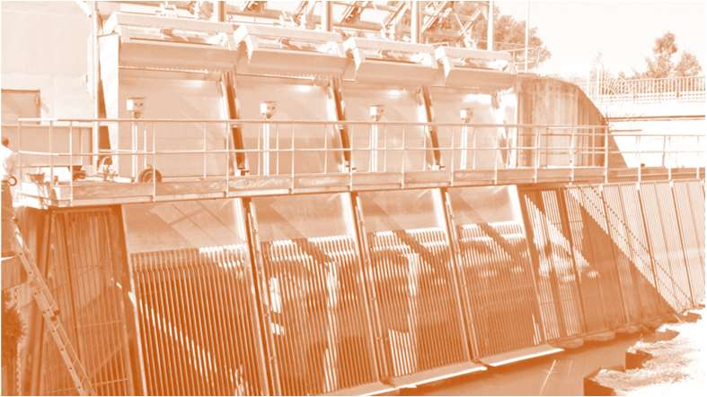
    - **Hình này chứng minh điều gì**
      - Cụm song chắn rác gồm nhiều ngăn song song đặt nghiêng trong kênh hở, trang bị hệ cào cơ học để bảo vệ toàn trạm.
    - **Từ đâu mà thấy được**
      - Kênh dẫn nước thải thô chia thành nhiều khoang song song với hệ thanh song kim loại đặt nghiêng.
      - Phía trên mỗi khoang lắp cụm đầu kéo cơ giới và máng hứng gom rác tự động phục vụ vận hành liên tục.
  - **Hình 2.** Vị trí của song chắn rác (Screens) trong sơ đồ công nghệ trạm xử lý nước thải đô thị
    - 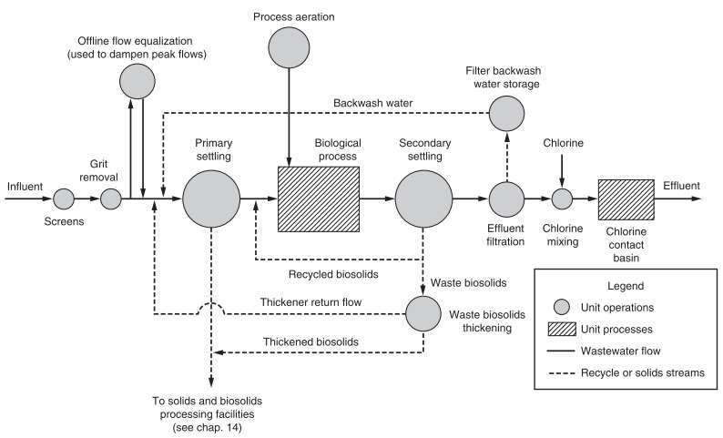
    - **Hình này chứng minh điều gì**
      - Song chắn rác là công trình đơn vị đầu tiên tiếp nhận nước thải thô trước khi chuyển sang bể tách cát và lắng sơ cấp.
    - **Từ đâu mà thấy được**
      - Dòng nước thải đầu vào (Influent) đi trực tiếp vào khối song chắn rác (Screens) đầu tiên trên trục dây chuyền.
      - Sau Screens là Grit removal (tách cát), Primary settling (lắng sơ cấp) và Biological process (xử lý sinh học).
  - **Hình 3.** Cấu tạo module song chắn rác cơ giới dạng nghiêng lắp đặt trong lòng kênh hở
    - 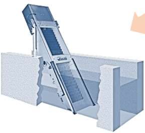
    - **Hình này chứng minh điều gì**
      - Thiết bị chắn rác cơ giới được chế tạo đồng bộ dạng module nghiêng, hạ trực tiếp vào lòng kênh hở thu gom nước thải.
    - **Từ đâu mà thấy được**
      - Thân module bằng thép không gỉ đặt nghiêng giữa hai vách kênh bê tông dẫn nước thải.
      - Khung lưới chắn ngập dưới mực nước kênh và cơ cấu gạt rác vận chuyển chất thải lên đỉnh máng xả.

##### Phân loại song chắn rác và lưới lọc (Classification of Screens)

- Tiêu chí phân loại tổng thể:
  - Công trình chắn rác được phân loại dựa trên kích thước khe hở mắt sàng / khoảng cách thông thủy giữa các thanh ($b$ hoặc clear spacing).
  - Toàn bộ thiết bị phân chia thành ba nhóm chính: Song chắn rác thô (Coarse screens), Lưới lọc tinh (Fine screens) và Lưới vi lọc (Microscreens).
- Nhóm 1: Song chắn rác thô (Coarse screens):
  - Kích thước khe hở thông thủy: Lớn hơn $6\text{ mm}$ (openings $> 6\text{ mm}$), dải khe hở phổ biến từ $6\text{ mm}$ đến $150\text{ mm}$.
  - Mục tiêu loại bỏ: Tạp chất có kích thước rất lớn gồm đá sỏi vụn (rocks), cành cây (branches), túi màng nilon (plastics), lá cây (leaves), giấy rác (paper), chai lọ (bottles), vỏ lon kim loại (cans).
  - Phân loại theo cơ chế làm sạch bề mặt song chắn:
    - Song chắn rác làm sạch thủ công (Manually cleaned):
      - Công nhân sử dụng cào răng thủ công để cào rác định kỳ lên bàn thao tác có đục lỗ thoát nước.
      - Ứng dụng cho trạm xử lý công suất nhỏ ($< 1{,}000\text{ m}^3\text{/ngày}$) hoặc lắp đặt tại kênh bypass vòng qua hệ thống cơ giới khi bảo trì sự cố.
    - Song chắn rác làm sạch bằng cơ giới (Mechanically cleaned):
      - Trang bị động cơ dẫn động tự động gạt cặn liên tục hoặc ngắt quãng theo chênh lệch mực nước ($\Delta h$).
      - Gồm bốn chủng loại thiết bị thông dụng:
        - Song chắn rác cào xích (Chain-driven screens): dẫn động răng cào qua hệ thống xích truyền tải hai bên thành kênh.
        - Song chắn rác cần cào tịnh tiến (Reciprocating rake): tay cào cơ khí chuyển động tịnh tiến lên xuống mô phỏng động tác cào tay.
        - Song chắn rác xích trọng lực (Catenary screens): xích treo tự do quay vòng bằng đối trọng, không có xích ngập nước dưới đáy.
        - Song chắn rác băng tải liên tục (Continuous belt screens): dải lưới hoặc móc cào chuyển động liên tục vòng quanh khung đỡ.
- Nhóm 2: Lưới lọc tinh (Fine screens):
  - Kích thước khe hở thông thủy: Nằm trong phạm vi từ $0.5\text{ mm}$ đến $6\text{ mm}$ (openings $0.5\text{ mm to } 6\text{ mm}$).
  - Mục tiêu loại bỏ: Các tạp chất kích thước trung bình và nhỏ gồm mảnh vụn giẻ rách (small rags), mẩu nhựa nhỏ (plastic materials), bã thức ăn thừa và vỏ rau củ (food waste), lông tóc và sợi tổng hợp.
  - Phân loại gồm bốn dạng thiết bị chủ lực:
    - Lưới tĩnh dây nêm (Static wedgewire screen): các sợi thép dây nêm tiết diện tam giác/hình thang đặt cong tĩnh, tách rác nhờ trọng lực dòng chảy.
    - Lưới lọc bước (Step screen): các bậc lam chuyển động tịnh tiến lệch pha đẩy rác theo từng nấc bậc thang lên đỉnh xả.
    - Lưới lọc băng tải chuyển động (Traveling band screen): băng tải gắn các tấm lưới đột lỗ chuyển động thẳng đứng hoặc nghiêng.
    - Lưới lọc trống quay (Drum screen): lồng hình trụ tròn bọc lưới lọc tinh quay quanh trục ngang hoặc nghiêng trong lòng kênh.
- Nhóm 3: Lưới vi lọc (Microscreens):
  - Kích thước khe hở thông thủy: Nhỏ hơn $0.5\text{ mm}$ (openings $< 0.5\text{ mm}$), dải mắt lưới thông dụng từ $1\text{ }\mu\text{m}$ đến $300\text{ }\mu\text{m}$.
  - Mục tiêu loại bỏ: Tách các hạt cặn lơ lửng rất nhỏ, vi sinh vật, tảo nổi và sợi xenluloza mịn.
  - Ứng dụng công nghệ: Làm sạch bậc cao sau bể lắng đợt 2 (tertiary polishing), hoặc tiền xử lý bảo vệ trước các màng sinh học MBR (Membrane Bioreactor) nhằm chống tắc nghẽn sợi màng.
  - **Hình 4.** Sơ đồ cây phân loại các công trình chắn rác và lưới lọc (Screening classification tree)
    - 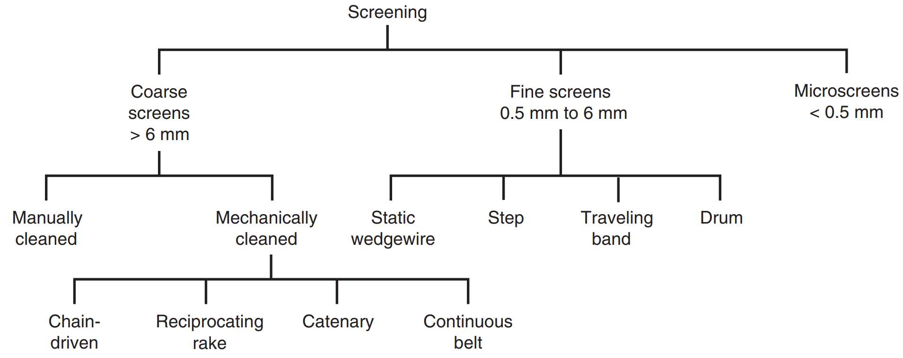
    - **Hình này chứng minh điều gì**
      - Công trình chắn rác được phân chia theo kích thước khe hở thành ba nhánh chính cùng các biến thể cơ giới hóa.
    - **Từ đâu mà thấy được**
      - Nhánh Coarse screens ($>6\text{ mm}$) chia thành loại thủ công và 4 dạng cơ giới (Chain-driven, Reciprocating rake, Catenary, Continuous belt).
      - Nhánh Fine screens ($0.5\text{ mm to } 6\text{ mm}$) gồm 4 dạng (Static wedgewire, Step, Traveling band, Drum) và nhánh Microscreens ($<0.5\text{ mm}$).

#### 2. Song chắn rác thô (Coarse Screens)

- Định nghĩa và đặc tính kỹ thuật cơ bản:
  - Song chắn rác thô (Coarse screens) có kích thước khe hở thông thủy lớn hơn $6\text{ mm}$ (clear openings $> 6\text{ mm}$).
  - Dải khe hở phổ biến trong các trạm xử lý nước thải công cộng dao động từ $6\text{ mm}$ đến $150\text{ mm}$.
  - Mục tiêu loại bỏ chủ yếu gồm các tạp chất trôi nổi kích thước lớn: đá vụn (rocks), cành cây (branches), túi màng nilon (plastics), lá cây (leaves), giấy rác (paper), chai lọ (bottles) và vỏ lon kim loại (cans).
- Phân loại theo phương thức làm sạch bề mặt song chắn:
  - Nhóm 1: Song chắn rác làm sạch thủ công (Manually cleaned coarse screens).
  - Nhóm 2: Song chắn rác làm sạch bằng cơ học (Mechanically cleaned coarse screens).
  - **Hình 5.** Bề mặt song chắn rác thô giữ lại tạp chất trôi nổi
    - 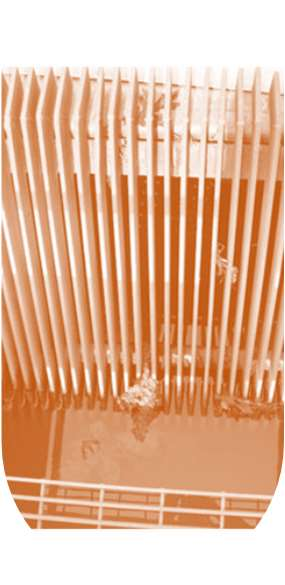
    - **Hình này chứng minh điều gì**
      - Các thanh song kim loại thẳng đứng của song chắn rác thô giữ lại tạp chất trôi nổi trên bề mặt.
    - **Từ đâu mà thấy được**
      - Dãy thanh thép đặt song song cách đều nhau trên kênh dẫn nước thải.
      - Các mảng rác thô bám dính vào khe hở giữa các thanh tại mực nước dâng.
  - **Hình 6.** Thiết bị song chắn rác làm sạch bằng cơ học lắp đặt trên kênh hở
    - 
    - **Hình này chứng minh điều gì**
      - Module song chắn rác cơ giới hóa trang bị khung dẫn hướng nghiêng và động cơ kéo cào tự động.
    - **Từ đâu mà thấy được**
      - Hai khung chắn rác cơ giới độc lập đặt nghiêng trên bệ bê tông kênh hở.
      - Cụm cơ cấu cào và thanh gạt lắp đặt liên động với động cơ truyền động phía trên.
  - **Hình 7.** Sơ đồ nguyên lý chặn chất rắn trong dòng nước thải qua mương dẫn
    - 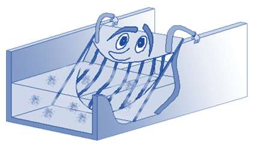
    - **Hình này chứng minh điều gì**
      - Song chắn rác đóng vai trò rào chắn vật lý chặn các hạt cặn lơ lửng và rác trôi trong dòng kênh.
    - **Từ đâu mà thấy được**
      - Mô phỏng thanh song chắn rác ôm trọn tiết diện ngang của kênh hở.
      - Các tạp chất trong dòng nước bị giữ lại phía trước mặt song chắn.
  - **Hình 8.** Trạm song chắn rác làm sạch thủ công hoàn chỉnh kèm bệ gom và thùng chứa
    - 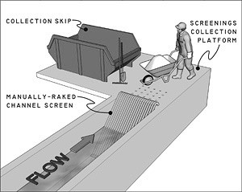
    - **Hình này chứng minh điều gì**
      - Trạm song chắn thủ công yêu cầu nhân công cào rác định kỳ lên bệ thao tác và đổ vào thùng chứa.
    - **Từ đâu mà thấy được**
      - Thanh chắn nghiêng đặt trong mương dòng chảy ("MANUALLY-RAKED CHANNEL SCREEN", "FLOW").
      - Công nhân sử dụng cào tay, xe rùa và bệ thu gom ("SCREENINGS COLLECTION PLATFORM", "COLLECTION SKIP").

##### 2.1 Song chắn rác làm sạch thủ công (Manually Cleaned Coarse Screens)

* Tiêu chuẩn thiết kế và vận hành song chắn rác thủ công (Manually Cleaned Bar Screens):
  * Góc nghiêng lắp đặt thông dụng: Dao động từ 45 độ đến 60 độ so với mặt phẳng nằm ngang nhằm tạo thuận lợi cho thao tác cào rác bằng cào tay răng lược.
  * Khe hở thông thủy giữa các thanh: Thiết kế phổ biến từ 25 mm đến 50 mm, bề rộng thanh thép từ 6 mm đến 10 mm, chiều sâu thanh từ 25 mm đến 50 mm.
  * Bố trí mương dẫn và sàn thao tác cào rác:
    * Chiều rộng mương dẫn thường mở rộng cục bộ tại vị trí đặt song chắn để bù trừ diện tích cản trở dòng chảy do các thanh chắn chiếm chỗ.
    * Sàn thao tác cào rác phải đục lỗ thoát nước có độ dốc hướng về mương dẫn để nước ép rác tự chảy ngược vào dòng nước thải.
    * Khay chứa rác có nắp đậy kín và dung tích tối thiểu lưu trữ rác trong 24 giờ đến 48 giờ giữa các chu kỳ thu gom.
  * Tần suất cào rác thủ công: Yêu cầu thực hiện cào rác định kỳ từ 2 đến 4 lần mỗi ca vận hành (mỗi 2 - 4 giờ), hoặc ngay khi chênh lệch mực nước trước và sau vượt quá 100 - 150 mm.
  * Giới hạn áp dụng công nghệ: Chỉ khuyến nghị cho các trạm xử lý nước thải công suất nhỏ (< 1,000 - 2,500 m3/ngày) hoặc làm công trình phân dòng bypass khẩn cấp trong trạm lớn.

- Phạm vi ứng dụng công nghệ:
  - Áp dụng chủ yếu tại các nhà máy xử lý nước thải quy mô nhỏ đến vừa (small-to medium-sized WWTPs).
  - Sử dụng làm hệ thống chắn rác dự phòng (standby screening) trong các mương nhánh (bypass channels):
    - Đưa vào vận hành khi lưu lượng nước thải vượt đỉnh thiết kế trong các đợt mưa lớn (high-flow periods).
    - Phục vụ vận hành tạm thời khi thiết bị song chắn rác cơ giới chính gặp sự cố hoặc đang dừng máy để bảo dưỡng, sửa chữa định kỳ.
- Yêu cầu cấu tạo và kích thước hình học:
  - Chiều dài thanh song chắn ($L$) không được vượt quá tầm cào thuận tiện của người vận hành: $L \le 3\text{ m}$ (khoảng $3\text{ m}$).
  - Góc nghiêng lắp đặt thanh song chắn so với mặt phẳng ngang: $\alpha = 30^\circ - 60^\circ$:
    - Góc nghiêng thoai thoải giúp giảm áp lực thủy tĩnh tác dụng vuông góc lên thanh chắn.
    - Giúp người vận hành dễ dàng tì cào răng kéo rác trượt dọc bề mặt thanh chắn lên đỉnh kênh.
  - Cấu tạo buồng kênh và bệ gom rác:
    - Kênh dẫn nước thải được mở rộng cục bộ tại vị trí đặt song chắn để bù đắp diện tích cản trở dòng chảy do các thanh song kim loại chiếm chỗ.
    - Bố trí bệ gom rác có đục lỗ thoát nước (perforated drainage platform) ngay phía sau đỉnh dàn thanh chắn.
    - Nước tách ra từ rác thải tự chảy ngược vào mương qua các lỗ đục trước khi chất rắn được xúc vào xe đẩy hoặc thùng chứa.
  - **Hình 11.** Bản vẽ mặt cắt dọc A-A và mặt bằng mương đặt song chắn rác thủ công
    - 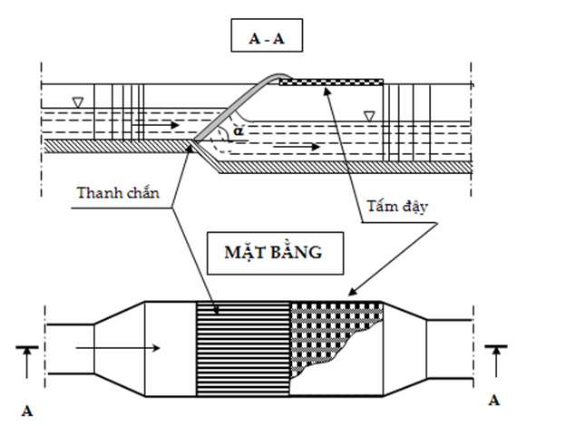
    - **Hình này chứng minh điều gì**
      - Mương đặt song chắn mở rộng cục bộ với thanh chắn nghiêng góc $\alpha$ và sàn công tác phía sau.
    - **Từ đâu mà thấy được**
      - Mặt cắt A-A thể hiện thanh chắn đặt nghiêng góc $\alpha$ nối với tấm đậy phẳng ("Tấm đậy") bên trên mực nước.
      - Mặt bằng ("MẶT BẰNG") thể hiện kênh dẫn chuyển tiếp mở rộng tại vị trí lắp thanh chắn ("Thanh chắn").
  - **Hình 9.** Mô hình 3D phối cảnh buồng song chắn rác thủ công kèm máng thu gom
    - 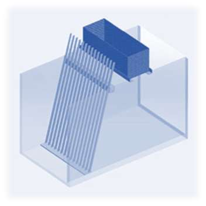
    - **Hình này chứng minh điều gì**
      - Khung song chắn rác thủ công đặt nghiêng trong kênh dẫn có máng gom rác bố trí ngay trên đỉnh.
    - **Từ đâu mà thấy được**
      - Các thanh song kim loại đặt song song nghiêng một góc trong lòng kênh trong suốt.
      - Hộp máng gom rác hình chữ nhật đặt phía sau đỉnh thanh chắn để đón rác cào lên.
  - **Hình 10.** Hình ảnh thực tế thao tác cào rác thủ công bằng cào răng dài
    - 
    - **Hình này chứng minh điều gì**
      - Người vận hành trực tiếp dùng cào răng dài kéo rác từ chân song chắn lên sàn ráo nước.
    - **Từ đâu mà thấy được**
      - Người công nhân đứng trên sàn thao tác dùng cán cào dài luồn vào các khe song.
      - Bó rác và giẻ ướt được kéo dồn lên phần trên của các thanh song chắn.
  - **Hình 14.** Bản vẽ chi tiết khoang đặt song chắn rác thủ công (Bar Screen with Chamber)
    - 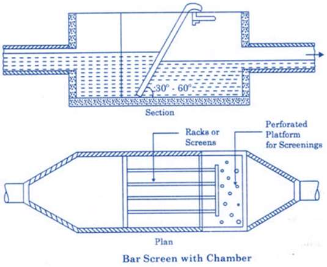
    - **Hình này chứng minh điều gì**
      - Cấu tạo buồng song chắn thủ công gồm thanh nghiêng $30^\circ - 60^\circ$ và sàn đục lỗ ráo nước.
    - **Từ đâu mà thấy được**
      - Mặt cắt ("Section") ghi chú góc nghiêng thanh chắn $30^\circ - 60^\circ$ và chênh lệch mực nước hai phía.
      - Mặt bằng ("Plan") thể hiện cụm thanh song ("Racks or Screens") và sàn đục lỗ ("Perforated Platform for Screenings").
  - **Hình 12.** Module song chắn rác thủ công chế tạo sẵn tích hợp khay đục lỗ ráo nước
    - 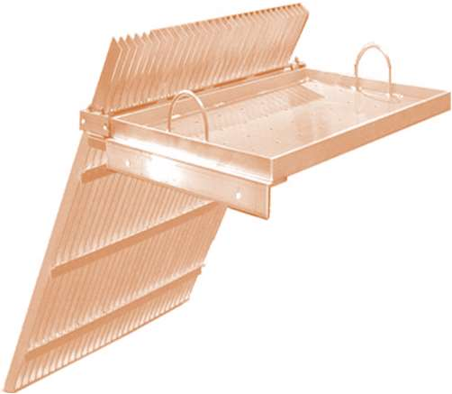
    - **Hình này chứng minh điều gì**
      - Khay thu gom rác đục lỗ tích hợp ngay trên đỉnh khung song chắn thủ công để ráo nước trước khi vận chuyển.
    - **Từ đâu mà thấy được**
      - Khung thanh chắn nghiêng gắn liền với khay thép nằm ngang có đục các lỗ thoát nước nhỏ.
      - Khay ráo nước trang bị hai quai xách chữ U giúp người vận hành nâng nhấc thuận tiện.
  - **Hình 13.** Minh họa thao tác cào rác của công nhân giới hạn trong tầm với $L \le 3\text{ m}$
    - 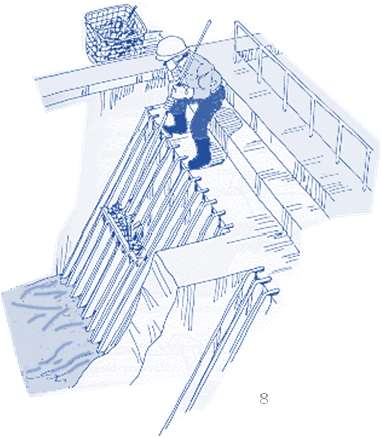
    - **Hình này chứng minh điều gì**
      - Chiều dài thanh song chắn thủ công giới hạn dưới $3\text{ m}$ để vừa tầm cào của công nhân.
    - **Từ đâu mà thấy được**
      - Công nhân đứng trên mép bệ bước cào rác dọc theo chiều nghiêng của dàn thanh chắn.
      - Chiều dài thanh chắn phù hợp với sải tay và cán cào mà không phải với người nguy hiểm.

* Cơ sở thủy lực học chuyên sâu và tiêu chuẩn thiết kế song chắn rác thô:
  * Phương trình Kirschmer xác định tổn thất áp lực qua song chắn rác sạch:
    $$h_L = \beta \cdot \left(\frac{w}{b}\right)^{4/3} \cdot h_v \cdot \sin\theta$$
    * Trong đó:
      * $h_L$ là tổn thất áp lực qua song chắn rác sạch (m).
      * $\beta$ là hệ số hình dạng mặt cắt thanh chắn rác: $\beta = 2{,}42$ đối với thanh mép vuông chữ nhật; $\beta = 1{,}83$ đối với thanh có đầu vát bán nguyệt; $\beta = 1{,}67$ đối với thanh hình giọt nước khí động học.
      * $w$ là chiều dày của thanh chắn rác (mm hoặc m).
      * $b$ là khoảng cách thông thủy giữa hai thanh liền kề (khe hở $b = 15 - 50\text{ mm}$).
      * $h_v = \frac{v^2}{2g}$ là cột áp động học của dòng nước chảy tới trước song chắn (m).
      * $\theta$ là góc nghiêng của song chắn so với phương nằm ngang ($45^\circ - 60^\circ$ cho cào thủ công; $70^\circ - 85^\circ$ cho cào cơ học).
  * Kiểm soát vận tốc dòng chảy trong mương dẫn và qua khe hở:
    * Vận tốc tối thiểu trước song chắn ($v_{\min} \ge 0{,}4\text{ m/s}$ ở lưu lượng nhỏ nhất): Nhằm ngăn ngừa sự lắng tụ cát sỏi và các hạt cặn vô cơ nặng ngay trước cửa vào song chắn.
    * Vận tốc cực đại qua khe hở khi chưa tắc nghẽn ($v_c = 0{,}6 - 0{,}9\text{ m/s}$ ở lưu lượng đỉnh): Bảo đảm không xé rách hoặc làm biến dạng các mảng rác bị giữ lại.
    * Vận tốc qua khe khi bít tắc $50\%$ diện tích thông thủy ($v_{\text{clogged}} \le 1{,}2 - 1{,}4\text{ m/s}$): Tránh hiện tượng tạo xoáy cuốn trôi rác qua khe sang công trình xử lý phía sau.
  * Phương thức điều khiển tự động hóa hệ thống cào rác cơ học:
    * Điều khiển theo chênh lệch mực nước (Differential Level Control): Trang bị hai cảm biến đo mức siêu âm đặt trước và sau song chắn; chu kỳ cào được kích hoạt khi $\Delta h \ge 50 - 150\text{ mm}$.
    * Điều khiển dự phòng theo rơ le thời gian (Timer Override Control): Tự động kích hoạt cào rác sau mỗi chu kỳ $15 - 60\text{ phút}$ ngay cả khi mức chênh chưa đạt giá trị cài đặt.
  * Thiết bị ép rác và thu gom vận chuyển chất thải rắn (Screenings Compactor and Dewatering):
    * Máy ép trục vít (screw screenings compactor): Giảm thể tích chất thải rắn từ $50\%$ đến $60\%$, nâng hàm lượng chất khô lên $\ge 40 - 50\%$.
    * Nước ép rác chứa hàm lượng hữu cơ cao được tuần hoàn trở lại đầu bể lắng cát hoặc bể điều hòa.

##### 2.2 Song chắn rác làm sạch cơ học (Mechanically Cleaned Coarse Screens)

- Khái niệm và ưu thế công nghệ:
  - Song chắn rác làm sạch cơ giới (Mechanically cleaned screens) sử dụng động cơ và cơ cấu cơ khí tự động hóa quá trình cào và vớt rác.
  - Giảm thiểu nhân công vận hành thủ công, hạn chế rủi ro tai nạn lao động và mùi hôi tiếp xúc trực tiếp.
  - Đảm bảo kênh dẫn thông thoát liên tục, hạn chế dâng nghẽn mực nước đầu vào trạm xử lý.
- Bốn chủng loại song chắn rác cơ học thông dụng:
  - Song chắn rác cào bằng xích (Chain-driven screens).
  - Song chắn rác cần cào tịnh tiến (Reciprocating rake screens).
  - Song chắn rác xích treo dây võng (Catenary screens).
  - Song chắn rác băng tải liên tục (Continuous belt screens).
  - **Hình 15.** Sơ đồ nguyên lý cấu tạo bốn loại song chắn rác cơ học thông dụng (Metcalf & Eddy)
    - 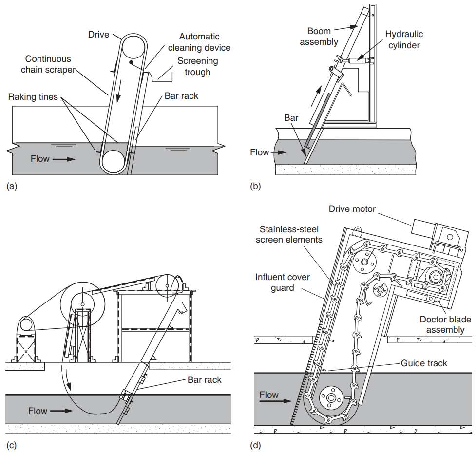
    - **Hình này chứng minh điều gì**
      - Bốn dạng song chắn rác cơ học gồm cào xích (a), cần tịnh tiến (b), xích võng (c), và băng tải (d).
    - **Từ đâu mà thấy được**
      - Sơ đồ (a) xích cào liên tục; (b) cần cào thủy lực boom assembly; (c) xích treo catenary; (d) băng tải phần tử lọc.
      - Mỗi sơ đồ chú thích rõ dòng chảy ("Flow"), thanh chắn ("Bar rack") và bộ phận gạt rác tương ứng.

###### 2.2.1 Song chắn rác cào bằng xích (Chain-Driven Screens)

- Cấu tạo và cơ chế làm sạch:
  - Thiết kế tiêu chuẩn phổ biến là dạng làm sạch mặt trước, quay về mặt trước (Front-cleaned, front-return screens).
  - Cấu tạo gồm năm cụm chi tiết cơ bản:
    - Bộ truyền động (Drive): Động cơ điện gắn hộp giảm tốc đặt trên đỉnh khung máy khô ráo.
    - Xích cào liên tục (Continuous chain scraper): Hai dải xích con lăn truyền động hai bên thành kênh kéo các thanh cào chuyển động vòng quanh.
    - Khung thanh chắn (Bar rack): Giàn thanh kim loại đặt nghiêng trực tiếp trong dòng nước thải.
    - Răng cào (Raking tines): Gắn trên thanh cào xích, có bước răng lồng khít vào từng khe hở giữa các thanh song để vét sạch rác.
    - Máng hứng rác (Screening trough): Đặt phía sau đỉnh thanh chắn để đón nhận rác đổ xuống.
    - Cơ cấu gạt rác tự động (Automatic cleaning device): Gạt sạch rác bám trên răng cào tại đỉnh xả vào máng hứng.
- Đặc tính thủy lực và vận hành:
  - Góc nghiêng lắp đặt khung máy thường từ $60^\circ$ đến $85^\circ$ so với phương ngang.
  - Rác giữ lại gây chênh lệch mực nước ($\Delta h$) giữa thượng lưu và hạ lưu song chắn.
  - Hệ thống khởi động tự động theo chu kỳ thời gian cài đặt trước hoặc theo tín hiệu cảm biến chênh lệch mực nước siêu âm ($\Delta h$).
  - **Hình 18.** Sơ đồ các bộ phận chức năng của song chắn rác cào bằng xích
    - 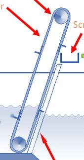
    - **Hình này chứng minh điều gì**
      - Cấu tạo hệ thống cào xích gồm bộ truyền động trên đỉnh, xích cào, thanh chắn và máng hứng rác.
    - **Từ đâu mà thấy được**
      - Các mũi tên chú thích Drive, Continuous chain scraper, Bar rack và Screening trough.
      - Xích kéo răng cào vét chất rắn từ chân thanh chắn lên trên đỉnh máng xả.
  - **Hình 19.** Sơ đồ nguyên lý truyền động xích kéo rác lên phễu xả vào thùng chứa
    - 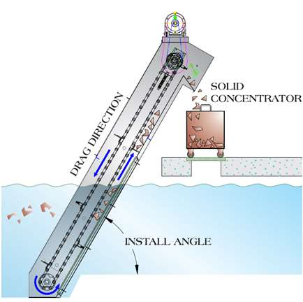
    - **Hình này chứng minh điều gì**
      - Xích kéo răng cào theo hướng nghiêng và xả rác qua phễu gom vào thùng chứa rác di động.
    - **Từ đâu mà thấy được**
      - Mũi tên hướng kéo xích ("DRAG DIRECTION") dọc góc nghiêng lắp đặt ("INSTALL ANGLE").
      - Cửa xả rác ("SOLID CONCENTRATOR") đổ trực tiếp chất rắn vào thùng gom có bánh xe.
  - **Hình 20.** Sơ đồ mặt cắt mương dẫn thể hiện chênh lệch mực nước qua song chắn rác
    - 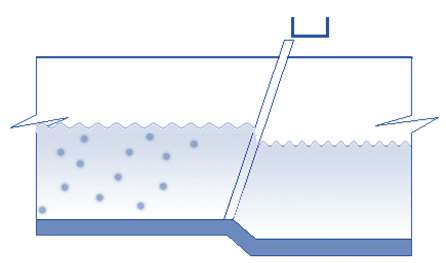
    - **Hình này chứng minh điều gì**
      - Quá trình giữ lại rác tạo ra tổn thất cột áp và chênh lệch mực nước thượng - hạ lưu qua song chắn.
    - **Từ đâu mà thấy được**
      - Mực nước phía trước song chắn dâng cao chứa nhiều chất rắn lơ lửng.
      - Mực nước phía sau song chắn hạ thấp rõ rệt tạo độ chênh cốt thủy lực.
  - **Hình 16.** Hình ảnh module song chắn rác cào xích với hệ thanh cào và chổi quét cước
    - 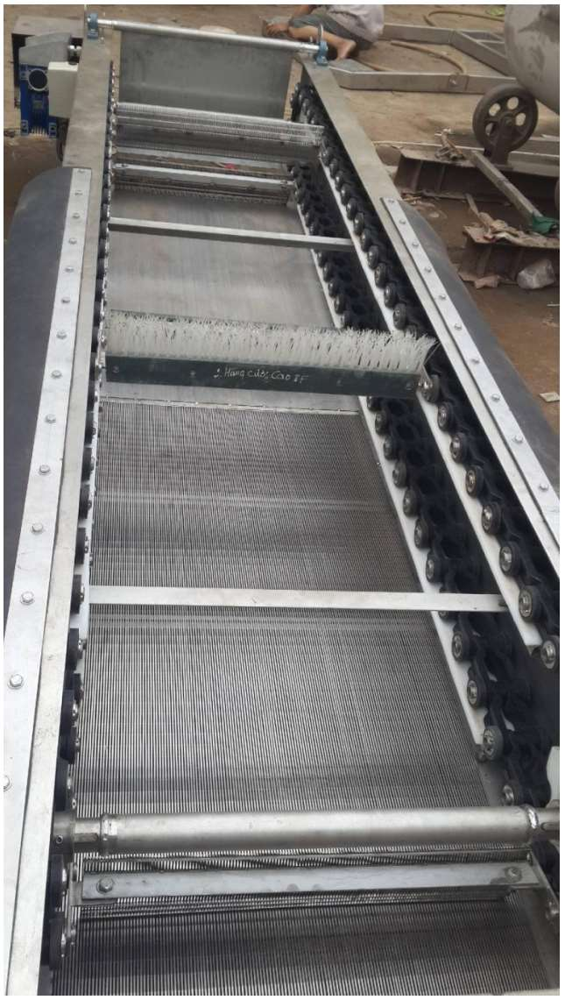
    - **Hình này chứng minh điều gì**
      - Thiết bị cào xích thực tế lắp đặt nhiều thanh cào và chổi quét cước chuyển động dọc khung ray.
    - **Từ đâu mà thấy được**
      - Khung máy thép không gỉ trang bị hai sợi xích con lăn chạy dọc hai bên biên.
      - Các thanh giằng gắn cụm chổi cước ngang phân bố cách đều trên bề mặt sàng.
  - **Hình 17.** Bản vẽ mặt cắt kỹ thuật của thiết bị song chắn rác cào xích đặt nghiêng
    - 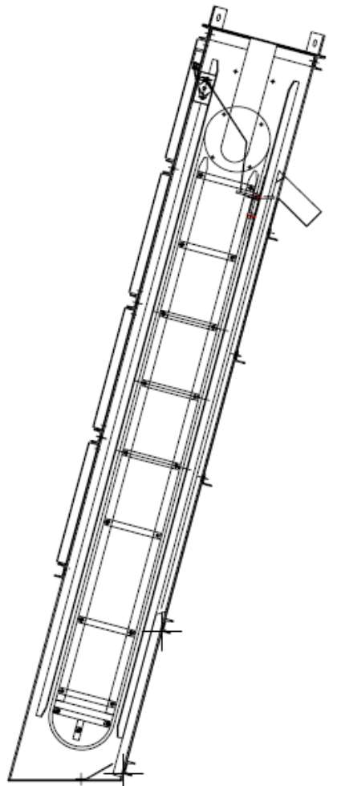
    - **Hình này chứng minh điều gì**
      - Bản vẽ cơ khí song chắn cào xích nghiêng tích hợp bánh răng truyền động và máng trượt kín.
    - **Từ đâu mà thấy được**
      - Khung thân chữ U đặt nghiêng với đĩa xích đỉnh truyền động và cơ cấu căng xích dưới chân.
      - Các thanh cào phân bố đều dọc suốt chiều dài thân máy kèm máng xả rác nghiêng.

###### 2.2.2 Song chắn rác cần cào tịnh tiến (Reciprocating Rake Screens)

- Nguyên lý hoạt động mô phỏng cào tay:
  - Thiết bị sử dụng một tay cào cơ khí gắn trên cần nâng chuyển động tịnh tiến qua lại (Reciprocating rake).
  - Quỹ đạo chuyển động mô phỏng chính xác động tác cào rác thủ công của người công nhân ("imitates the movements of a person raking the screen").
  - Chu trình gồm bốn giai đoạn:
    - Giai đoạn 1: Tay cào ở trên cao mở chệch ra xa thanh chắn và hạ thẳng đứng xuống đáy mương nhằm tránh va chạm rác tích tụ.
    - Giai đoạn 2: Tại đáy mương, cơ cấu xi lanh thủy lực hoặc tay đòn áp sát răng cào vào các khe thanh chắn rác.
    - Giai đoạn 3: Cần cào kéo tịnh tiến dọc bề mặt thanh chắn từ đáy lên đỉnh, vét toàn bộ rác thô mắc kẹt.
    - Giai đoạn 4: Tại đỉnh hành trình, lưỡi gạt cơ khí đẩy rác rơi vào máng xả hoặc băng tải ép rác.
- Đặc tính kết cấu nổi bật:
  - Toàn bộ cơ cấu truyền động, xi lanh và khớp bản lề đều đặt bên trên sàn thao tác.
  - Không có bất kỳ chi tiết chuyển động nào ngập liên tục trong nước thải, chống mài mòn và rỉ sét tối đa.
  - **Hình 21.** Mô hình 3D phối cảnh module cào rác cơ học với hệ thống ống xả rác
    - 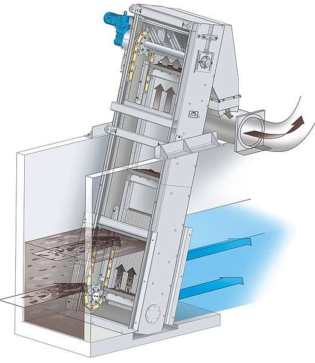
    - **Hình này chứng minh điều gì**
      - Song chắn rác cơ học nâng rác lên cao và xả vào đường ống vận chuyển kín ra ngoài kênh.
    - **Từ đâu mà thấy được**
      - Khung máy lắp đặt nghiêng trong kênh dẫn hở với dòng nước chảy xuyên qua tấm chắn.
      - Đỉnh máy trang bị hộp bao che, động cơ giảm tốc và khớp nối ống xả rác nằm ngang.
  - **Hình 22.** Cụm răng cào và khay đón rác nhìn từ đỉnh giàn thanh song chắn
    - 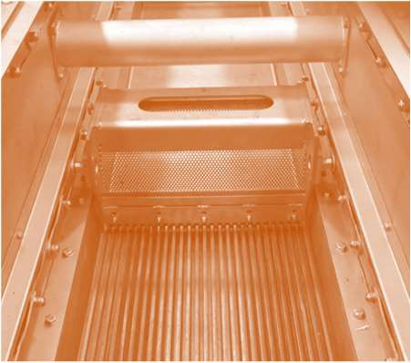
    - **Hình này chứng minh điều gì**
      - Bộ cào gồm giỏ đột lỗ và các răng cào lồng khít vào từng khe hở giữa các thanh song chắn.
    - **Từ đâu mà thấy được**
      - Góc nhìn dọc từ trên xuống các thanh song kim loại thẳng hàng cách đều nhau.
      - Hộp cào bằng kim loại đột lỗ gắn dãy răng cào tì sát vào bề mặt dàn thanh song.
  - **Hình 23.** Hình ảnh thực tế cụm răng cào tịnh tiến vớt rác thô lên khỏi mực nước kênh
    - 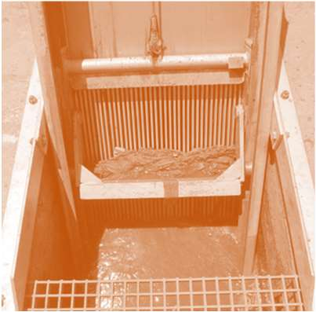
    - **Hình này chứng minh điều gì**
      - Cụm cào gom trọn vẹn mảng rác thô và đưa lên khỏi mặt nước mương dẫn nước thải.
    - **Từ đâu mà thấy được**
      - Giỏ cào xúc mảng rác và giẻ vụn dày đặc kéo trượt tịnh tiến lên trên khung chắn.
      - Dòng nước thải cuộn chảy phía dưới chân song chắn trong lòng mương dẫn.

###### 2.2.3 Song chắn rác xích treo dây võng (Catenary Screens)

- Nguyên lý tì răng cào bằng trọng lực xích:
  - Cần cào được giữ tì sát vào bề mặt thanh chắn nhờ chính trọng lượng bản thân của nhánh xích treo tự do ("the rake is held against the rack by the weight of the chain").
  - Nhánh xích chùng võng tự nhiên theo đường cong dây võng (catenary curve) mà không cần ngàm kẹp cơ học dưới đáy.
- Cơ chế tự lựa chống kẹt chướng ngại vật:
  - Khi gặp vật cản lớn hoặc vật nặng bị kẹt cứng giữa các thanh song, cần cào tự động nâng lên và lướt vượt qua chướng ngại vật ("rakes pass over them instead of jamming").
  - Ngăn ngừa hiện tượng quá tải mô tơ, đứt xích hoặc cong gãy răng cào.
- Đặc điểm kết cấu và giới hạn kỹ thuật:
  - Bánh răng xích dẫn động (sprockets) và ổ đỡ đặt hoàn toàn phía trên sàn công tác, không có chi tiết quay ngập nước.
  - Nhược điểm kết cấu: Đòi hỏi không gian công trình rất lớn để bố trí cung xích treo võng (requires a lot of space to install).
  - Sợi xích phải có khối lượng rất nặng (chain must be heavy) để tạo đủ lực tì cần cào vào thanh chắn.
  - **Hình 24.** Sơ đồ phối cảnh 3D song chắn rác Catenary với vòng xích treo tự do
    - 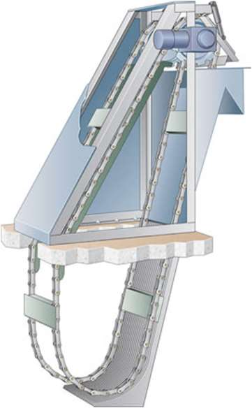
    - **Hình này chứng minh điều gì**
      - Song chắn rác Catenary tận dụng vòng xích chùng tự do giữ răng cào mà không cần trục quay ngập nước.
    - **Từ đâu mà thấy được**
      - Hai nhánh xích treo võng tự do hình dây xích (catenary curve) ép răng cào vào mặt thanh chắn.
      - Động cơ và trục truyền động đặt hoàn toàn bên trên sàn thao tác bê tông.

###### 2.2.4 Song chắn rác băng tải liên tục (Continuous Belt Screens)

- Cấu tạo dải băng tự làm sạch:
  - Thiết bị cấu tạo từ một dải băng chắn rác chuyển động liên tục khép kín, tự làm sạch (continuous, self-cleaning screening belt).
  - Bề mặt băng bao gồm vô số phần tử chắn rác bằng thép không gỉ liên kết dạng bản lề móc xích.
- Khả năng xử lý kết hợp rác thô và rác mịn:
  - Có thể loại bỏ đồng thời cả chất rắn thô và chất rắn mịn trong cùng một công trình (used to remove both fine and coarse solids).
  - Nước thải chảy qua mắt sàng mặt trước, rác bám trên dải băng chuyển động đi lên và được gạt / xịt rửa sạch vào máng gom.
- Hạn chế về duy tu bảo trì:
  - Cấu tạo nhiều mắt xích và chi tiết cơ khí nhỏ nối tiếp phức tạp.
  - Hoạt động đại tu, tháo dỡ hoặc thay thế các phần tử lọc hư hỏng đòi hỏi nhiều thời gian và chi phí bảo dưỡng rất cao (time consuming and expensive to maintain).
  - **Hình 25.** Sơ đồ 3D dòng chảy xuyên qua song chắn rác băng tải liên tục
    - 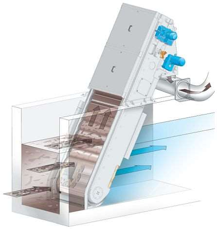
    - **Hình này chứng minh điều gì**
      - Song chắn rác băng tải liên tục vận chuyển rác bằng chuỗi các tấm phần tử lọc quay vòng khép kín.
    - **Từ đâu mà thấy được**
      - Chuỗi các phần tử chắn nối tiếp nhau tạo thành mặt băng tải chuyển động liên tục ngược dòng nước.
      - Nước đi xuyên qua các khe mắt sàng thoát ra hạ lưu trong khi rác bám trên mặt băng tải đi lên máng xả.
  - **Hình 26.** Thiết bị song chắn rác băng tải liên tục dạng module kín bằng thép không gỉ
    - 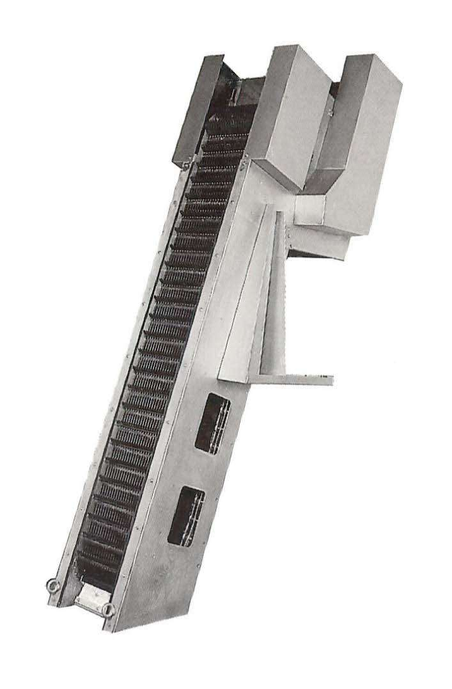
    - **Hình này chứng minh điều gì**
      - Module song chắn băng tải liên tục chế tạo dạng vỏ hộp đứng kín bằng thép không gỉ.
    - **Từ đâu mà thấy được**
      - Toàn bộ khung vỏ bao che bằng inox với các cửa quan sát và giá đỡ lắp vào sàn kênh.
      - Dải mắt sàng dạng nan bậc thang liên tục chạy dọc từ chân đế lên đỉnh đầu xả rác.

###### 2.2.5 So sánh ưu điểm và nhược điểm của các loại song chắn rác cơ học

* Đánh giá so sánh chi tiết giữa 4 chủng loại song chắn rác làm sạch cơ học:
  * Song chắn rác cào bằng xích (Chain-driven screens):
    * Ưu điểm: Khả năng vận hành liên tục hoặc gián đoạn linh hoạt, công suất tách rác rất cao, loại bỏ hiệu quả cả rác nổi lẫn rác chìm sát đáy.
    * Nhược điểm: Xích và ổ đỡ chuyển động nằm chìm dưới mực nước thải chịu mài mòn cơ học và ăn mòn hóa học cao, đòi hỏi bảo dưỡng trục kéo định kỳ.
  * Song chắn rác cần cào tịnh tiến (Reciprocating rake screens / Climber screens):
    * Ưu điểm: Toàn bộ cụm truyền động bánh răng - thanh răng (pinion and rack) nằm hoàn toàn trên mực nước, không có chi tiết chuyển động ngập nước, tuổi thọ cơ khí rất cao.
    * Nhược điểm: Chiều cao kiến trúc đỉnh mương đòi hỏi khoảng không thông thủy lớn (headroom requirement cao), chu kỳ cào là chu kỳ khứ hồi đơn lẻ.
  * Song chắn rác xích treo dây võng (Catenary screens):
    * Ưu điểm: Không có trục đỡ chìm dưới đáy mương; dây xích treo tự do võng theo trọng lực, tự động nâng cào vượt qua chướng ngại vật nặng mà không kẹt máy.
    * Nhược điểm: Kích thước kết cấu cồng kềnh, chiếm diện tích mặt bằng trạm lớn hơn so với dạng cần cào tịnh tiến.
  * Song chắn rác băng tải liên tục (Continuous belt screens):
    * Ưu điểm: Khả năng thu giữ các mảnh rác nhỏ và sợi cực tốt nhờ cấu tạo nhiều hàng cào răng lược dày đặc, hiệu quả xử lý tải lượng rác đỉnh vượt bậc.
    * Nhược điểm: Cấu tạo phức tạp nhất, chi phí đầu tư ban đầu và chi phí phụ tùng thay thế định kỳ cao nhất trong 4 loại.
 (Comparison of Mechanical Screen Types)

- Đánh giá tổng hợp bốn loại thiết bị cào rác cơ học:
  - Việc lựa chọn chủng loại song chắn rác cơ học phụ thuộc vào quy mô lưu lượng, độ sâu mương dẫn, hàm lượng rác thô và điều kiện bảo dưỡng thực tế của trạm xử lý.
  - Bảng tổng hợp so sánh ưu và nhược điểm của các loại song chắn rác cơ học:

| Loại song chắn rác (Type of screen) | Ưu điểm (Advantages) | Nhược điểm (Disadvantages) |
| :--- | :--- | :--- |
| **Song chắn rác cào bằng xích** *(Chain–driven screens)* | • Trang bị nhiều phần tử làm sạch cào rác đồng thời (multiple cleaning elements). • Chu kỳ làm sạch ngắn (short cleaning cycle). | • Thiết bị có các bộ phận chuyển động ngập nước (submerged moving parts). • Phải cẩu đưa thiết bị ra khỏi kênh dẫn để thực hiện bảo trì, sửa chữa. |
| **Song chắn rác cần cào tịnh tiến** *(Reciprocating rake screen)* | • Không có bộ phận chuyển động ngập nước (no submerged moving parts). • Công tác bảo dưỡng và sửa chữa thực hiện thuận tiện trên sàn công tác. • Chi phí vận hành và bảo dưỡng tương đối thấp. • Năng lực cào rác hiệu quả và xả rác triệt để. | • Chu kỳ làm sạch dài (long cycle time); năng suất cào có thể bị giới hạn. • Cặn lắng cát sỏi (grit accumulation) tích tụ trước chân thanh chắn có thể cản trở chuyển động của cần cào. • Chi phí đầu tư ban đầu tương đối cao do chế tạo bằng thép không gỉ. |
| **Song chắn rác xích treo dây võng** *(Catenary screen)* | • Bánh răng xích không bị ngập nước (sprockets are not submerged); phần lớn công tác bảo trì thực hiện trên sàn công tác. • Trang bị nhiều phần tử làm sạch (chu kỳ làm sạch ngắn). • Cơ chế tự lựa trượt qua vật cản, khó bị kẹt hỏng máy. | • Đòi hỏi không gian lắp đặt công trình rất lớn. • Hệ thống xích có khối lượng rất nặng và khó thao tác, bốc dỡ khi lắp đặt. |
| **Song chắn rác băng tải liên tục** *(Continuous belt screen)* | • Thiết bị hầu như không bị kẹt rác (unit is difficult to jam). • Phần lớn công tác bảo trì có thể thực hiện phía trên sàn công tác. • Loại bỏ hiệu quả đồng thời cả rác thô và rác mịn. | • Quá trình đại tu hoặc thay thế các phần tử lọc tốn nhiều thời gian và chi phí bảo dưỡng rất cao. |

- Nhận xét kỹ thuật ứng dụng:
  - Song chắn cào xích thích hợp cho các mương sâu có lưu lượng rác liên tục lớn nhờ chu kỳ làm sạch nhanh, tuy nhiên đòi hỏi quy trình bảo trì ngập nước phức tạp.
  - Song chắn cần cào tịnh tiến là lựa chọn tối ưu cho các trạm ưu tiên độ bền cơ học và thuận tiện bảo dưỡng trên sàn thao tác khô ráo.
  - Song chắn xích Catenary phù hợp với nguồn nước thải lẫn nhiều dị vật nặng kích thước bất thường nhờ cơ chế trượt qua vật cản tự nhiên.
  - Song chắn băng tải liên tục phù hợp cho các công trình xử lý đòi hỏi hiệu quả tách chất rắn cao ngay từ khâu tiền xử lý, nhưng cần chuẩn bị ngân sách bảo trì linh kiện định kỳ.

* Tiêu chuẩn vật liệu, chống ăn mòn và an toàn vận hành của hệ thống song chắn rác thô:
  * Lựa chọn vật liệu chế tạo theo đặc tính ăn mòn của dòng nước thải:
    * Thép không gỉ AISI 304: Áp dụng tiêu chuẩn cho nước thải sinh hoạt đô thị có nồng độ clorua thấp (< 250 mg/L).
    * Thép không gỉ AISI 316 hoặc 316L: Bắt buộc áp dụng cho nước thải ven biển, nước thải công nghiệp nhiễm mặn hoặc trạm có nguy cơ tích tụ khí H2S cao.
    * Nhựa kỹ thuật chống mòn UHMW-PE: Chế tạo các bánh răng dẫn hướng, tấm lót đáy mương và đệm trượt của cơ cấu cào rác.
  * Hệ thống kiểm soát mùi hôi và thông gió tại nhà song chắn rác:
    * Toàn bộ mương dẫn hở và cụm cào rác phải được bọc kín bằng nắp đậy composite FRP hoặc kính cường lực.
    * Hệ thống thông gió cưỡng bức duy trì áp suất âm nhẹ, bội số trao đổi không khí từ 12 đến 15 lần thể tích phòng mỗi giờ.
    * Khí thải mùi hôi chứa H2S, mercaptan và amonia được thu gom xử lý qua tháp lọc sinh học biofilter hoặc tháp than hoạt tính.
  * Tự động hóa giám sát và bảo vệ an toàn cơ khí (Safety and PLC Interlocks):
    * Cảm biến bảo vệ quá mô-men xoắn (torque overload switch): Tự động ngắt nguồn động cơ kéo trong vòng 0.5 giây khi phát hiện cào bị kẹt dị vật cứng.
    * Cơ cấu đảo chiều tự động: Động cơ tự động đảo chiều quay lùi 100 - 200 mm sau đó tiến lại tối đa 3 lần trước khi kích hoạt còi báo động lỗi.
    * Nút dừng khẩn cấp (Emergency Stop): Bố trí dọc theo lan can mương dẫn và cạnh tủ điều khiển cục bộ tại hiện trường.

* Các yêu cầu về kiểm soát dòng chảy và tổn thất năng lượng tại song chắn rác thô:
  * Tổn thất cột áp cục bộ qua đoạn chuyển tiếp mở rộng và thu hẹp mương dẫn:
    * Góc mở rộng mương dẫn trước song chắn: Không vượt quá 30 độ để tránh tạo xoáy phân ly dòng chảy ở hai góc mương.
    * Góc thu hẹp mương dẫn sau song chắn: Khuyến nghị góc vát 45 độ hướng dòng nước vào ngăn lắng cát tiếp theo.
    * Hệ số tổn thất cục bộ tại cửa vào và cửa ra: Dao động từ 0.1 đến 0.2 lần cột áp lưu tốc tại vận tốc thiết kế.
  * Phân bố lưu lượng qua nhiều đơn nguyên song chắn rác song song:
    * Luôn thiết kế tối thiểu 2 mương song chắn rác làm việc song song để đảm bảo khả năng cô lập bảo dưỡng 1 mương mà không làm tràn nước.
    * Cửa phai chặn (stop logs hoặc sluice gates): Bố trí tại cả đầu vào và đầu ra của mỗi mương song chắn rác để phục vụ rút cạn nước sửa chữa.
    * Kênh phân dòng khẩn cấp (Emergency bypass channel): Trang bị song chắn rác thủ công nghiêng 60 độ với cảm biến báo tràn mực nước.
  * Tải lượng rác thô tích lũy theo mùa và theo loại hình đô thị:
    * Lượng rác thô trung bình thu gom: Dao động từ 15 đến 40 lít rác cho mỗi 1,000 m3 nước thải sinh hoạt đô thị.
    * Hệ số không điều hòa theo mùa và thời tiết mưa: Lượng rác thô có thể tăng vọt gấp 3 đến 5 lần trong các trận mưa rào đầu mùa.

#### 3. Lưới lọc tinh (Fine Screens)

##### 3.1. Mục đích sử dụng và các loại lưới lọc tinh (Overview and Types of Fine Screens)

* Mục tiêu công nghệ và phân loại vị trí lắp đặt của hệ thống lưới lọc tinh:
  * Vị trí bố trí công nghệ trong trạm xử lý nước thải đô thị:
    * Thay thế bể lắng sơ cấp (Primary Clarifier replacement): Lưới lọc tinh khe hở 1.0 - 2.0 mm có thể thay thế bể lắng bậc 1, giảm 70% diện tích mặt bằng xây dựng trạm.
    * Tiền xử lý bảo vệ công nghệ màng MBR (MBR membrane pre-treatment): Lưới lọc tinh khe nêm 1.0 mm hoặc lưới đục lỗ tròn 0.5 - 1.0 mm là điều kiện tiên quyết bắt buộc để loại bỏ xơ sợi gây nghẹt búi màng.
    * Bảo vệ các thiết bị làm thoáng và khuấy trộn cơ học: Ngăn chặn triệt để xơ sợi quấn quanh cánh bơm bùn tuần hoàn RAS, đĩa phân phối khí bọt mịn và cánh khuấy chìm anoxic.
  * Các thông số động học thủy lực cơ bản qua lưới lọc tinh:
    * Tải trọng thủy lực bề mặt: Dao động từ 50 m3/(m2.h) đến 150 m3/(m2.h) tính trên diện tích ướt hữu dụng của bề mặt lưới lọc.
    * Tổn thất áp lực thiết kế qua lưới sạch: Thường duy trì từ 0.1 m đến 0.3 m cột nước.
    * Tổn thất áp lực tối đa cho phép khi lưới bít tắc: Không vượt quá 0.6 m đến 1.0 m cột nước trước khi kích hoạt quy trình xối rửa áp lực.

- Vai trò công nghệ và mục đích sử dụng lưới lọc tinh trong trạm xử lý nước thải:
  - Lưới lọc tinh (fine screens) đôi khi được sử dụng thay thế (in place of) hoặc lắp đặt nối tiếp phía sau song chắn rác thô (following coarse screens) khi yêu cầu hiệu suất thu gom chất rắn cao hơn (greater removals of solids).
  - Hai mục tiêu kỹ thuật cốt lõi đòi hỏi ứng dụng lưới lọc tinh:
    - Bảo vệ các cụm thiết bị cơ điện nhạy cảm với chất rắn lơ lửng và rác sợi mảnh (Protect equipment sensitive to solids): đặc biệt là các công trình bể sinh học màng MBR (membrane bioreactors), ngăn chặn triệt để nguy cơ sợi rác bám dính gây tắc nghẽn khe màng hoặc làm rách màng lọc.
    - Loại bỏ các vật liệu gây cản trở mục đích tái sử dụng bùn sinh học (Eliminate materials that may inhibit beneficial reuse of biosolids): loại bỏ mẩu nhựa nhỏ, sợi tổng hợp, lông tóc và các tạp chất khó phân hủy nhằm đảm bảo chất lượng bùn sinh học sau ủ làm phân bón hữu cơ hoặc cải tạo đất.
- Bốn chủng loại thiết bị lưới lọc tinh dùng cho xử lý sơ bộ (Fine screens used for preliminary treatment):
  - Lưới tĩnh dây nêm (Static wedgewire screen).
  - Lưới lọc trống quay (Drum screen).
  - Lưới lọc băng tải chuyển động (Travel band screen).
  - Lưới lọc bước (Step screen).
- Tổng quan hình ảnh các chủng loại thiết bị lưới lọc tinh trong thực tế:
  - **Hình 27.** Thiết bị lưới tĩnh dây nêm xả chất thải vào xe chứa rác
    - 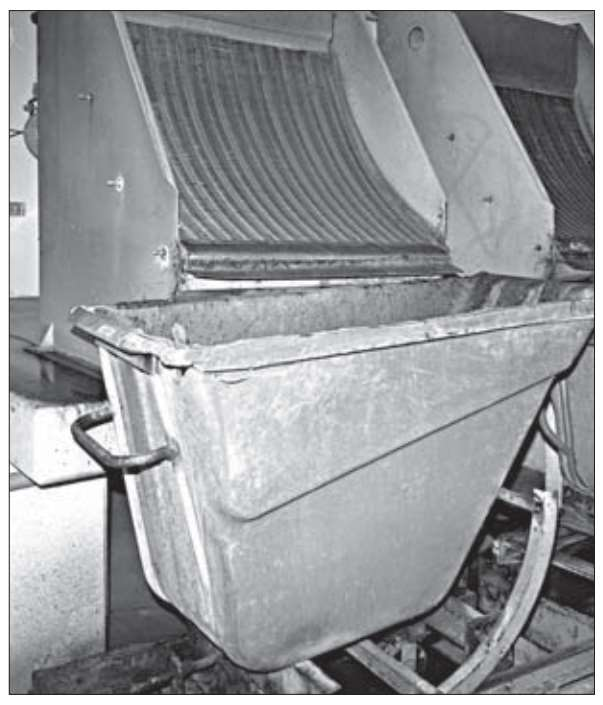
    - **Hình này chứng minh điều gì**
      - Lưới tĩnh dây nêm vận hành không dùng động cơ, chất thải rắn trượt tự do theo mặt cong xuống thùng chứa.
    - **Từ đâu mà thấy được**
      - Bề mặt lưới kim loại uốn cong cố định trên khung đứng độc lập.
      - Bên dưới mép xả bố trí thùng xe goòng bằng kim loại hứng trực tiếp cặn rác tách ra khỏi dòng nước.
  - **Hình 28.** Thiết bị lưới lọc trống quay xả cặn rác lên băng tải cao su
    - 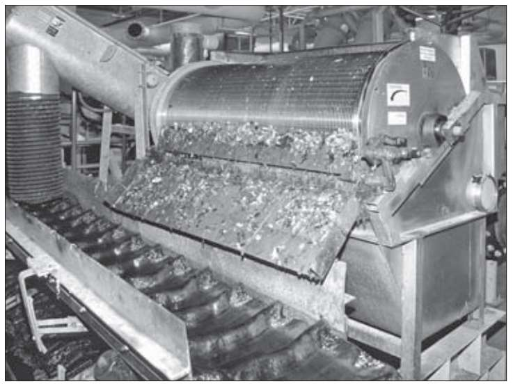
    - **Hình này chứng minh điều gì**
      - Lưới lọc trống quay hình trụ nằm ngang liên tục tách cặn và chuyển rác sang hệ thống băng tải thu gom.
    - **Từ đâu mà thấy được**
      - Tang trống inox quay tròn quanh trục nằm ngang với vách lưới lọc đục lỗ/dây nêm.
      - Rác giữ lại trên bề mặt ngoài của trống được lưỡi gạt tách ra và đổ xuống băng chuyền tải gân nổi.
  - **Hình 29.** Cụm thiết bị lưới lọc băng tải chuyển động và lưới lọc bước lắp đặt ngoài trời
    - 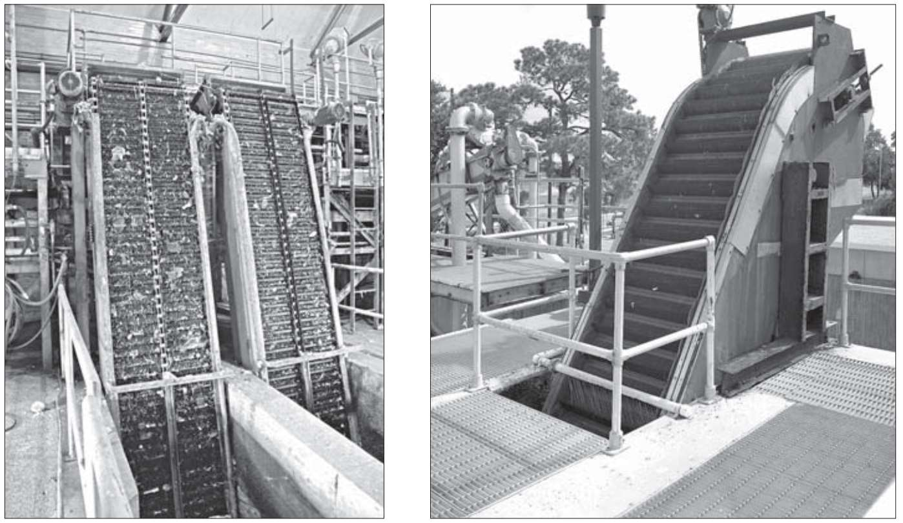
    - **Hình này chứng minh điều gì**
      - Hai cấu hình lưới lọc tinh cơ giới lắp đặt nghiêng trực tiếp trên kênh dẫn hở: lưới băng tải (trái) và lưới bước (phải).
    - **Từ đâu mà thấy được**
      - Khung bên trái thể hiện hai dải băng tải lưới liên tục kéo rác từ lòng kênh lên đỉnh máng xả.
      - Khung bên phải thể hiện lưới lọc bước nghiêng với các tấm lam bậc thang cơ cấu tịnh tiến.
  - **Hình 34.** Module thiết bị lưới tĩnh dây nêm hoàn chỉnh dạng khối hộp
    - 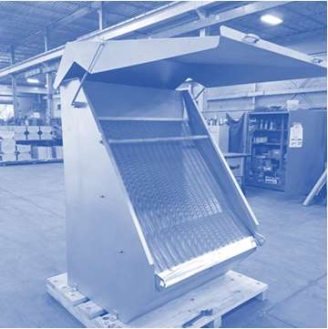
    - **Hình này chứng minh điều gì**
      - Thiết bị lưới tĩnh dây nêm được chế tạo thành module inox kín có nắp che bản lề bảo vệ bề mặt sàng.
    - **Từ đâu mà thấy được**
      - Thân máy bằng thép không gỉ nguyên khối, phía trên có nắp che góc nghiêng bảo vệ chống bắn tóe.
      - Mặt sàng dây nêm cong đón dòng nước chảy tràn từ khoang phân phối phía sau máy.
  - **Hình 32.** Module thiết bị lưới lọc trống quay vỏ bọc kín
    - 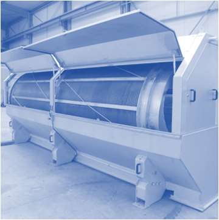
    - **Hình này chứng minh điều gì**
      - Lưới lọc trống quay được lắp đặt hoàn chỉnh trong vỏ bao che kín có nắp lật mở kiểm tra và bảo trì.
    - **Từ đâu mà thấy được**
      - Toàn bộ tang trống hình trụ nằm ngang đặt trong thân máy kim loại có chân đế định vị.
      - Hai nắp lật mở phía trên giúp thao tác kiểm tra bề mặt tang trống và chống phát tán mùi hôi.
  - **Hình 31.** Module lưới lọc băng tải chuyển động khung thẳng đứng
    - 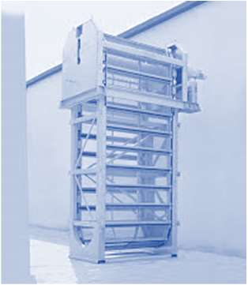
    - **Hình này chứng minh điều gì**
      - Lưới lọc băng tải chuyển động dạng module tháp đứng tiết kiệm diện tích mặt bằng xây dựng.
    - **Từ đâu mà thấy được**
      - Khung thép định hình dạng cột đứng với các tấm panel lưới phẳng liên kết thành chuỗi vòng kín.
      - Cụm động cơ và trục truyền động xích bố trí tập trung tại đỉnh tháp phía trên sàn công tác.
  - **Hình 30.** Cặp thiết bị lưới lọc bước lắp đặt song song trên kênh dẫn nước thải
    - 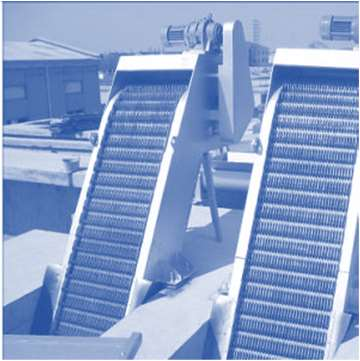
    - **Hình này chứng minh điều gì**
      - Lưới lọc bước vận hành theo góc nghiêng trong kênh hở với các bậc thang chuyển động tịnh tiến lệch pha.
    - **Từ đâu mà thấy được**
      - Hai cụm máy đặt song song nghiêng qua thành kênh bê tông dẫn nước thải.
      - Bề mặt sàng lọc là tập hợp các thanh lam bậc thang xếp khít nhau dẫn động bởi động cơ giảm tốc ở đỉnh.

###### Cấu tạo và hình ảnh thiết bị lưới lọc tinh (Configurations of Fine Screens)

- Cấu tạo và nguyên lý của lưới tĩnh dây nêm (Static wedgewire screen):
  - Bề mặt sàng lọc được đan từ các thanh kim loại có tiết diện hình nêm (wedge wire / hình tam giác chữ V ngược), xếp song song nằm ngang với khe hở thông thủy từ $0.25 - 6\text{ mm}$.
  - Nước thải được bơm hoặc chảy vào buồng chứa phía sau rồi tràn mỏng qua đập tràn (overflow weir) ở đỉnh đỉnh lưới.
  - Lực trọng trường kéo dòng nước trượt xuống mặt cong parabol; hiệu ứng Coanda làm nước bị bẻ cong đi xuyên qua các khe nêm rơi xuống máng thu nước bên dưới.
  - Các hạt cặn rác có kích thước lớn hơn khe hở bị giữ lại trên mặt lưới, trượt dần xuống chân dốc nhờ động năng dòng nước và trọng lực, rồi rơi vào máng hứng rác hoặc xe chứa.
  - Thiết bị hoàn toàn không có chi tiết chuyển động cơ học (no moving parts), không tiêu hao điện năng và chi phí vận hành bảo dưỡng thấp.
  - **Hình 35.** Sơ đồ hình học phối cảnh của lưới tĩnh dây nêm dạng mặt cong parabol
    - 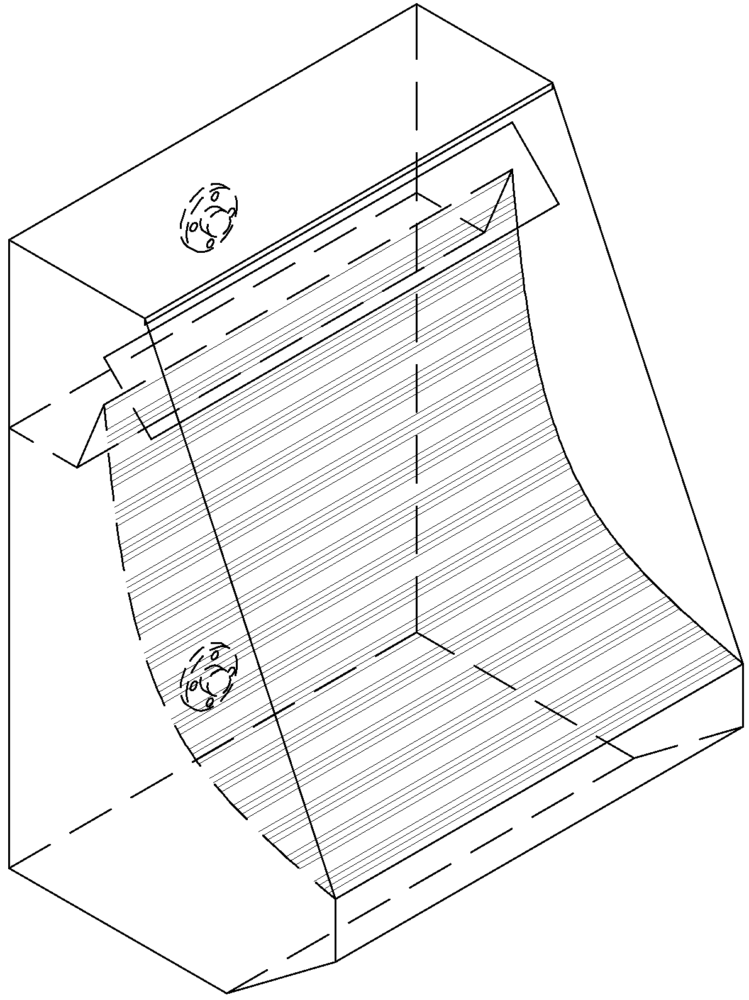
    - **Hình này chứng minh điều gì**
      - Cấu trúc buồng nhận nước đầu vào ở phía sau, đập tràn phân phối dòng và mặt sàng dây nêm cong parabol.
    - **Từ đâu mà thấy được**
      - Bản vẽ đẳng cự thể hiện khoang chứa nước phía sau có gờ đập tràn dẫn nước phủ đều lên toàn bộ chiều rộng mặt lưới.
      - Các đường kẻ ngang thể hiện hệ thanh dây nêm uốn cong định hình góc dốc giảm dần từ đỉnh xuống đáy.
  - **Hình 36.** Bề mặt thực tế của lưới tĩnh dây nêm chế tạo bằng thép không gỉ
    - 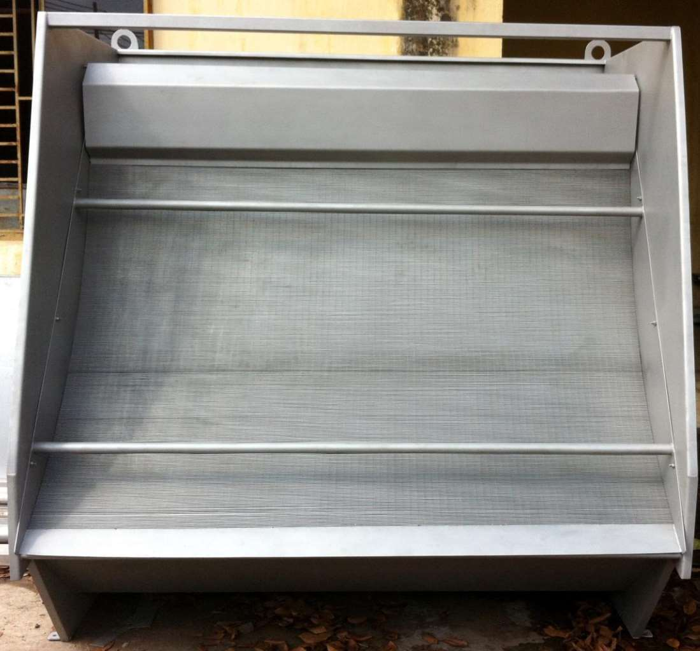
    - **Hình này chứng minh điều gì**
      - Mật độ các thanh dây nêm xếp dày đặc tạo bề mặt phẳng mịn có khe hở đồng đều và độ cứng vững cơ học cao.
    - **Từ đâu mà thấy được**
      - Tấm lưới inox uốn cong gắn vào hai vách bên, có các thanh giằng tròn ngang chịu lực chống biến dạng.
      - Phía trên là máng phân phối dòng tràn và phía chân có gờ dốc hướng chất thải rắn ra ngoài.
  - **Hình 37.** Mô hình 3D phối cảnh module lưới tĩnh dây nêm công nghiệp (Elgin static screen)
    - 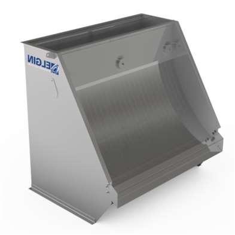
    - **Hình này chứng minh điều gì**
      - Thiết kế module công nghiệp hoàn chỉnh gồm vỏ bao che bằng inox, khoang nạp nước và máng xả cặn đáy.
    - **Từ đâu mà thấy được**
      - Khối hộp kim loại có logo ELGIN in ở vách hông, cổng cấp nước ren/mặt bích ở phía lưng.
      - Mặt lưới nghiêng bên trong hướng dòng chất rắn rơi thẳng xuống cửa xả phía trước đáy vỏ.
  - **Hình 33.** Sơ đồ mặt cắt 3D diễn giải nguyên lý tách nước và thu gom rác của lưới tĩnh dây nêm
    - 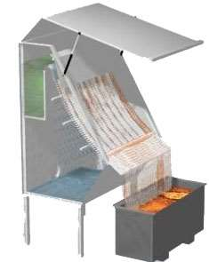
    - **Hình này chứng minh điều gì**
      - Quá trình phân tách pha lỏng - rắn liên tục: nước thấm qua khe rơi xuống đáy, rác trượt vào thùng chứa.
    - **Từ đâu mà thấy được**
      - Dòng nước thải màu xanh dâng đầy khoang sau tràn qua đập đỉnh chảy màng mỏng dọc mặt lưới cong.
      - Dòng nước trong thấm xuyên qua các thanh nêm rơi xuống đáy máy, trong khi cặn rác trượt rơi vào thùng chứa đặt phía trước.

- Cấu tạo và nguyên lý của lưới lọc trống quay (Drum screen):
  - Bộ phận chính là một lồng trống hình trụ tròn bọc bề mặt lọc bằng dây nêm hoặc tấm kim loại đục lỗ ($0.2 - 6\text{ mm}$), quay quanh trục nằm ngang với vận tốc chậm ($1 - 10\text{ vòng/phút}$) nhờ động cơ giảm tốc.
  - Hai dạng cấu hình phân phối dòng chảy:
    - Cấp dòng ngoài (externally-fed): Nước thải được cấp vào hộp phân phối phía sau và tràn phủ lên bề mặt ngoài của tang trống đang quay; nước sạch xuyên qua lớp lưới vào bên trong lòng trống rồi thoát ra đáy; cặn rác đọng lại trên mặt ngoài được lưỡi gạt (doctor blade) cào bỏ vào máng xả.
    - Cấp dòng trong (internally-fed): Nước thải dẫn vào trong lòng trống qua một đầu hở; nước thấm xuyên qua thành trống từ trong ra ngoài; rác bị giữ lại bên trong lòng trống và được các gờ xoắn ốc bên trong đẩy dần ra đầu xả rác đối diện.
  - Hệ thống vòi phun rửa áp lực cao (spray nozzles) đặt phía trong hoặc phía trên trống để phun nước định kỳ xịt rửa sạch các mắt lưới từ phía đối diện, ngăn chặn hiện tượng bít tắc dầu mỡ.
  - **Hình 38.** Sơ đồ mặt cắt nguyên lý hoạt động của lưới lọc trống quay cấp dòng ngoài
    - 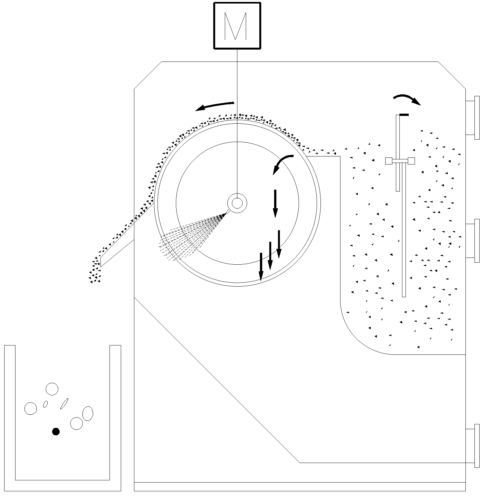
    - **Hình này chứng minh điều gì**
      - Chu trình cấp dòng ngoài: nước tràn lên trống quay, nước lọt vào trong thoát đáy, rác bám ngoài bị lưỡi cạo xả vào thùng hứng.
    - **Từ đâu mà thấy được**
      - Khoang nạp nước bên phải có vách tràn dâng nước lên đỉnh tang trống quay ngược chiều kim đồng hồ (motor $M$).
      - Các mũi tên dòng nước xuyên qua mặt trống rơi xuống đáy thoát; lưỡi gạt bên trái cạo rác rơi vào thùng chứa và vòi xịt rửa làm sạch từ bên trong.
  - **Hình 39.** Cụm thiết bị lưới lọc trống quay cấp dòng ngoài mở nắp bảo vệ
    - 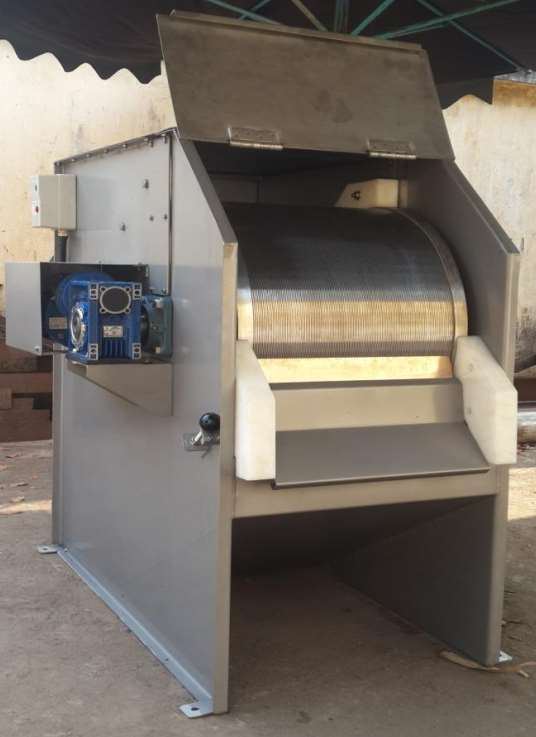
    - **Hình này chứng minh điều gì**
      - Kết cấu thực tế của trống quay inox dẫn động trực tiếp bởi động cơ giảm tốc gắn bên hông máy.
    - **Từ đâu mà thấy được**
      - Động cơ màu xanh và hộp số lắp trực tiếp vào trục tang trống bên ngoài vách máy.
      - Tang trống bọc lưới dây nêm inox sáng bóng lộ ra khi mở nắp che bản lề; phía trước gắn máng trượt đón rác.
  - **Hình 40.** Module lưới lọc trống quay cấp dòng trong đặt trên khung bệ trượt (Internally-fed drum screen)
    - 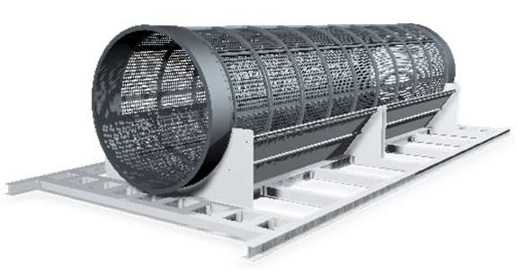
    - **Hình này chứng minh điều gì**
      - Cấu trúc tang trống đục lỗ tròn dài đặt nằm ngang trên hệ khung bệ trượt chịu tải công nghiệp.
    - **Từ đâu mà thấy được**
      - Lồng trống hình trụ bọc tấm kim loại đột lỗ tròn chia nhiều khoang dọc bởi các vành thép tăng cứng.
      - Hệ thống con lăn đỡ và gối trục gắn trên khung thép dầm chữ I sơn bảo vệ phục vụ lắp đặt trọn bộ.

- Cấu tạo và nguyên lý của lưới lọc băng tải chuyển động (Travel band screen):
  - Cấu tạo gồm chuỗi các tấm panel lưới lọc phẳng đục lỗ hoặc lưới đan liên kết thành một dải băng chuyền khép kín, chuyển động liên tục thẳng đứng hoặc nghiêng quanh hai trục lăn.
  - Đặt chìm trực tiếp trong lòng kênh dẫn nước thải sâu; dòng nước đi xuyên qua các mắt lưới, cặn rác được các thanh gờ nâng (shelves/lifters) gắn trên dải băng đưa lên khỏi mặt nước kênh.
  - Tại đầu đỉnh máy phía trên sàn thao tác, cụm vòi phun nước áp lực cao xịt rửa bề mặt lưới từ phía sau và đẩy toàn bộ rác vào phễu thu của máy ép rác trục vít (screenings wash press).
  - **Hình 41.** Sơ đồ mặt cắt 3D lưới lọc băng tải chuyển động lắp đặt trong kênh dẫn sâu
    - 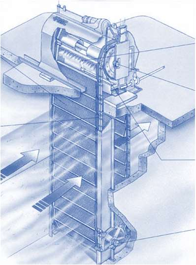
    - **Hình này chứng minh điều gì**
      - Băng tải lưới thả sâu xuống đáy kênh bê tông, dòng nước đi xuyên qua dải lưới và cặn rác được trục vít ép nén trên đỉnh sàn.
    - **Từ đâu mà thấy được**
      - Các mũi tên lớn chỉ hướng dòng chảy nước thải đi vào mặt trước xuyên qua chuỗi panel lưới phẳng chạy vòng.
      - Trên đỉnh sàn thao tác thể hiện cụm động cơ dẫn động xích, dàn vòi xịt rửa và trục vít ép vắt nước xả cặn khô.

- Cấu tạo và nguyên lý của lưới lọc bước (Step screen):
  - Cấu tạo gồm hai bộ lam thép mỏng hình bậc thang xếp so le xen kẽ nhau: một bộ thanh cố định (stationary lamellae) và một bộ thanh chuyển động (movable lamellae).
  - Bộ thanh chuyển động được dẫn động bởi cơ cấu tay quay lệch tâm, thực hiện quỹ đạo chuyển động tịnh tiến vòng lặp: nâng lên, đẩy về phía trước, hạ xuống và lùi về vị trí ban đầu.
  - Rác bị giữ lại ở bậc thang dưới nước sẽ được nâng lên từng bậc một bởi các lam chuyển động; lớp rác tích tụ tạo thành một thảm cặn (screenings carpet) có vai trò như lớp lọc tăng cường giữ lại các hạt cặn mịn hơn khe hở danh định.
  - **Hình 42.** Thiết bị lưới lọc bước chế tạo bằng thép không gỉ
    - 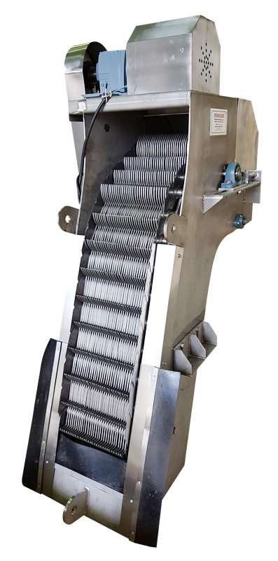
    - **Hình này chứng minh điều gì**
      - Bề mặt sàng lọc cấu tạo từ các phiến lam bậc thang xếp khít nhau theo góc nghiêng, dẫn động bởi cụm motor đỉnh.
    - **Từ đâu mà thấy được**
      - Các phiến lam kim loại dạng bậc thang kéo dài từ chân ngập nước lên đến đỉnh đầu xả rác.
      - Khung bên bằng thép không gỉ gắn cụm gối đỡ bạc đạn, tai móc cẩu nâng hạ và động cơ giảm tốc bảo vệ trên cùng.

##### 3.2. Đặc tính kỹ thuật, ưu nhược điểm và lựa chọn lưới lọc tinh (Characteristics, Pros/Cons, and Selection of Fine Screens)

* Cơ chế vận hành và tính toán kích thước của các dạng thiết bị lưới lọc tinh điển hình:
  * Lưới lọc trống quay nạp trong (Internally fed rotary drum screens):
    * Nước thải đi vào lòng ống trống quay từ một đầu; pha lỏng thoát qua khe lưới ra ngoài thân trống; rác thải bị giữ lại bên trong và được cánh xoắn trục vít đẩy ra đầu kia.
    * Ưu điểm: Nước cấp tự do không gây bắn tóe, toàn bộ rác được bao bọc bên trong ống trống, dễ dàng khử mùi hôi bằng hệ thống hút khí chân không.
  * Lưới lọc trống quay nạp ngoài (Externally fed rotary drum screens):
    * Nước thải được phân phối từ đỉnh máng tràn phủ lên mặt ngoài của trống quay; nước trong thấm qua mặt trên và mặt dưới của trống xả xuống đáy; rác được dao cạo cao su bóc tách ở góc 90 độ.
    * Ứng dụng tối ưu cho nước thải công nghiệp chứa nhiều chất béo, dầu mỡ và chất hoạt động bề mặt.
  * Lưới lọc tĩnh tự làm sạch dạng cong (Static inclined wedge-wire screens):
    * Hoàn toàn không sử dụng động cơ điện hay chi tiết chuyển động cơ học; vận hành thuần túy dựa trên trọng lực và động năng dòng chảy tràn.
    * Góc nghiêng thay đổi đa đoạn: Đoạn trên dốc 65 độ để gia tốc dòng chảy; đoạn giữa nghiêng 55 độ để tách nước; đoạn đáy phẳng 45 độ để tích lũy và khử nước sơ bộ cho rác.

- So sánh ưu điểm và nhược điểm của các loại lưới lọc tinh:
  - Bảng tổng hợp ưu điểm và nhược điểm theo từng chủng loại thiết bị:
    | Loại lưới (Type of screen) | Ưu điểm (Advantages) | Nhược điểm (Disadvantages) |
    | :--- | :--- | :--- |
    | **Thanh / Song (Bar)** | Nhiều phần tử làm sạch (Multiple cleaning elements) | Hiệu quả giữ cặn không cao bằng các loại khác (Not as efficient as other screens) |
    | **Trống quay (Drum)** | Tổn thất cột áp thấp (Low headloss); Cuốn trôi cặn tối thiểu (Minimal screenings carryover) | Lỗ lưới dễ bị tắc nghẽn bởi dầu mỡ (Perforation prone to clogging with grease) |
    | **Băng tải cấp dòng tâm (Band - center feed)** | Cuốn trôi cặn tối thiểu (Minimal screenings carryover) | Kênh dẫn phải mở rộng tại vị trí đặt lưới (Channel must be widened at screen); Lỗ lưới dễ bị tắc nghẽn bởi dầu mỡ (Perforation prone to clogging with grease) |
    | **Lưới bước (Step)** | Xử lý tốt chất béo, dầu mỡ (Handles grease) | Tổn thất cột áp cao (High headloss); Đòi hỏi kênh dẫn nông hoặc rộng (Shallow or wide channel required) |
  - Nhận xét kỹ thuật về ưu và nhược điểm:
    - Lưới thanh (Bar screen): chu kỳ làm sạch nhanh nhờ bố trí nhiều răng cào cào rác liên tục, nhưng do khe hở tương đối lớn ($2 - 15\text{ mm}$) nên hiệu suất giữ các mẩu rác dẹt và rác sợi kém hơn các loại mắt lưới đục lỗ.
    - Lưới trống quay (Drum screen): lớp lưới mỏng tạo tổn thất cột áp $h_L$ rất nhỏ; cơ chế gạt cặn cơ học bên ngoài ngăn cặn rác bị cuốn trôi ngược lại dòng nước sạch hạ lưu; tuy nhiên mỡ và chất nhờn dễ bít kín lỗ nhỏ.
    - Lưới băng tải cấp dòng tâm (Band, center feed): triệt tiêu hoàn toàn hiện tượng cặn rác trôi lọt sang hạ lưu do nước đi từ trong tâm tỏa ra hai bên sườn; nhược điểm là phải mở rộng chiều rộng kênh cục bộ để đủ không gian thoát nước hai bên và nhạy cảm với dầu mỡ.
    - Lưới bước (Step screen): chuyển động nâng bậc tự làm sạch giúp vận hành rất tốt với nước thải chứa dầu mỡ (FOG); nhược điểm là thảm rác giữ cặn dày tạo tổn thất áp lực lớn, đòi hỏi chiều sâu dòng nước nông hoặc kênh phải mở rộng để giảm trở lực thủy lực.

- Tiêu chí kỹ thuật và thông số lựa chọn loại lưới lọc tinh:
  - Bảng đối sánh các thông số kỹ thuật cốt lõi trong lựa chọn thiết bị:
    | Loại lưới (Screen type) | Dải khe hở điển hình, $\text{mm}$ (Typical range of openings) | Hiệu suất giữ cặn (Capture efficiency) | Khả năng thủy lực (Hydraulic capacity) | Thích ứng kênh sâu (Deep channel suitability) | Thích ứng dầu mỡ FOG (FOG suitability) | Tích hợp chắn rác và rửa rác (Combined screening and washing) |
    | :--- | :---: | :---: | :---: | :---: | :---: | :---: |
    | **Băng tải, dòng tâm (Band, central flow)** | $1 - 10$ | Cao (High) | Tốt (Good) | Phù hợp (Suitable) | Kém (Poor) | Không (No) |
    | **Thanh / Song (Bar)** | $2 - 15$ | Thấp (Low) | Rất tốt (Very good) | Phù hợp (Suitable) | Phù hợp (Suitable) | Không (No) |
    | **Trống quay (Drum)** | $0.2 - 6$ | Cao (High) | Rất tốt (Very good) | Không phù hợp (Not suitable) | Kém (Poor) | Có (Yes) |
    | **Lưới bước (Step Screen®)** | $1 - 6$ | Trung bình (Medium) | Tốt (Good) | Phù hợp (Suitable) | Phù hợp (Suitable) | Không (No) |
  - Đánh giá khả năng áp dụng theo điều kiện công trình:
    - Kênh dẫn sâu: Lưới băng tải (Band), lưới thanh (Bar) và lưới bước (Step Screen®) rất phù hợp do khung máy có thể kéo dài theo phương đứng; riêng lưới trống quay (Drum) không phù hợp cho kênh sâu vì đường kính tang trống bị giới hạn kích thước cơ khí.
    - Tích hợp rửa rác: Duy nhất lưới lọc trống quay (Drum screen) có khả năng tích hợp sẵn hệ thống chắn rác và rửa ép rác đồng bộ trong một thiết bị gọn gàng ($0.2 - 6\text{ mm}$).
    - Nước thải nhiều mỡ: Ưu tiên lựa chọn lưới bước (Step Screen®) hoặc lưới thanh (Bar); tránh dùng lưới băng tải dòng tâm và lưới trống quay đục lỗ nhỏ khi chưa có công trình tách mỡ sơ bộ.

- Mối tương quan giữa kích thước khe hở và tỷ lệ diện tích mở hữu dụng (Fine-screen openings and effective open areas):
  - Bảng số liệu thực nghiệm mối quan hệ giữa khoảng cách lỗ và tỷ lệ diện tích mở:
    | Khoảng cách lỗ / Kích thước mắt lưới, $\text{mm}$ (Hole spacing) | Tỷ lệ diện tích mở hữu dụng, $\%$ (Open area) |
    | :---: | :---: |
    | $9\text{ mm}$ | $55\%$ |
    | $6\text{ mm}$ | $40\%$ |
    | $3\text{ mm}$ | $35\%$ |
    | $1\text{ mm}$ | $31\%$ |
  - Quy luật suy giảm diện tích thông thủy: Khi giảm khoảng cách lỗ từ $9\text{ mm}$ xuống $1\text{ mm}$ để tăng cường khả năng giữ chất rắn mịn, tỷ lệ diện tích mở hữu dụng giảm từ $55\%$ xuống còn $31\%$ (giảm gần $44\%$ diện tích thoát nước).
  - Tác động thiết kế thủy lực: Diện tích mở giảm đòi hỏi bề mặt sàng tổng thể của thiết bị phải tăng lên tương ứng để vận tốc dòng chảy qua lỗ ($v_{\text{thru}}$) không vượt quá ngưỡng cho phép, tránh làm tăng đột biến tổn thất áp lực $h_L$.

- Cấu tạo và đặc tính vận hành của lưới lọc băng tải đục lỗ cấp dòng tâm (Band, perforated center feed screen):
  - Nguyên lý phân phối dòng chảy tâm (Center-flow principle):
    - Dòng nước thải trong kênh dẫn được hướng đi thẳng vào khoảng không gian bên trong tâm giữa hai nhánh băng tải lưới.
    - Nước sạch thấm thoát ra ngoài qua hai bề mặt lưới đục lỗ bên sườn trái và sườn phải để tiếp tục chảy về hạ lưu kênh.
    - Cặn rác bị giữ lại hoàn toàn ở mặt bên trong của dải băng tải; khi dải lưới chuyển động đi lên khỏi mặt nước, rác không bao giờ tiếp xúc với dòng nước sạch hạ lưu, triệt tiêu hoàn toàn hiện tượng cuốn trôi rác sang sau lưới (minimal screenings carryover).
  - Các thông số kỹ thuật thiết kế tiêu chuẩn của hệ thống băng tải cấp dòng tâm:
    - Độ sâu kênh áp dụng (Channel depths): thiết kế đáp ứng độ sâu lòng kênh lên tới $20\text{ m}$ (available for channel depths up to $20\text{ meters}$).
    - Chiều dài thiết bị theo phương dòng chảy (Machine length in flow direction): có thể tinh chỉnh linh hoạt lên tới $4.5\text{ m}$ (adaptable up to $4.5\text{ m}$).
    - Kích thước mắt lưới đục lỗ (Mesh size): dải kích thước từ $0.2 - 10\text{ mm}$ tùy thuộc yêu cầu công nghệ cụ thể của dự án (mesh size of $0.2 - 10\text{ mm}$ available depending on project requirements).
    - Hệ thống rửa ngược (Backwash system): trang bị dàn vòi phun tia nước hướng xuống với hiệu suất cao (high efficiency downwards spray water jet), đảm bảo rửa sạch triệt để mắt lưới ngay cả ở áp lực nước cấp thấp (with low water pressure).
    - Đặc tính bảo dưỡng: Thiết kế đơn giản, độ bền cao, chi phí bảo trì thấp và dễ dàng sửa chữa các module tấm lưới (low and easy maintenance design).
  - Minh chứng hình ảnh thiết bị lưới lọc băng tải cấp dòng tâm:
    - **Hình 43.** Mô hình 3D thiết bị lưới lọc băng tải cấp dòng tâm trong lòng kênh dẫn
      - 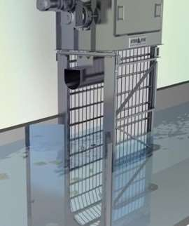
      - **Hình này chứng minh điều gì**
      - Module lưới băng tải dòng tâm thả chìm trong kênh hở với máng thu rác chữ U và đầu dẫn động phía trên.
      - **Từ đâu mà thấy được**
      - Khung lưới đứng ngập trong nước kênh, hai mặt lưới phẳng hai bên đón nước thoát ra sườn.
      - Phía trên sàn thao tác có máng hứng rác chữ U màu xám chì và hộp truyền động cơ khí kín.
    - **Hình 44.** Thiết bị Geiger® Centre-Flow Travelling Band Screen của Aqseptence Group
      - 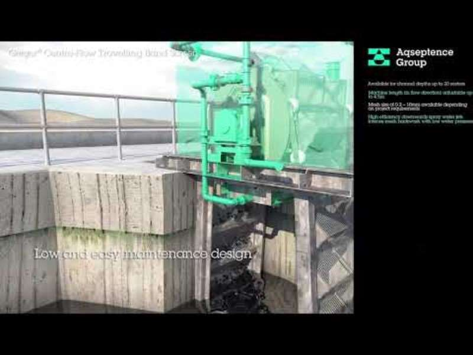
      - **Hình này chứng minh điều gì**
      - Ứng dụng thực tế của công nghệ lưới băng tải dòng tâm cho các trạm xử lý có chiều sâu kênh lên đến $20\text{ m}$.
      - **Từ đâu mà thấy được**
      - Khung máy màu xanh lá cây lắp đặt trên bệ kênh bê tông sâu, cụm ống cấp nước rửa ngược bố trí phía trên.
      - Bảng thông số kỹ thuật bên phải nêu rõ chiều sâu kênh $20\text{ m}$, chiều dài máy $4.5\text{ m}$ và mắt lưới $0.2 - 10\text{ mm}$.
    - **Hình 45.** Mô phỏng 3D thiết bị Great White Center Flow Screen (Hydro-Dyne Engineering)
      - 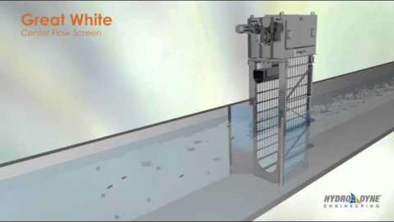
      - **Hình này chứng minh điều gì**
      - Cơ chế dòng nước vào tâm: nước thải vào cửa giữa của khung lưới và tỏa đều sang hai bên thành kênh.
      - **Từ đâu mà thấy được**
      - Dòng nước mang rác thượng lưu đi thẳng vào khoang trung tâm của máy chắn giữa kênh bê tông.
      - Nước sau lọc thoát qua hai tấm lưới bên hông thành kênh chảy về hạ lưu, rác giữ bên trong nâng lên đỉnh máy.

* Động học tách nước và so sánh kinh tế - kỹ thuật các hệ thống lưới lọc tinh:
  * Kỹ thuật gia công và dung sai bề mặt lưới khe nêm (Wedge-wire Manufacturing Standards):
    * Cấu trúc thanh nêm tiết diện tam giác ngược: Đỉnh nhọn hướng vào trong, cạnh đáy phẳng tạo thành khe lọc hướng ra ngoài.
    * Đặc tính dòng chảy qua khe tam giác: Bất kỳ hạt cặn nào lọt qua được bề mặt ngoài sẽ đi thẳng ra sau mà không bao giờ bị kẹt lại bên trong khe.
    * Dung sai kích thước khe hở: Kiểm soát nghiêm ngặt trong phạm vi +/- 0.05 mm trên toàn bộ diện tích bề mặt lọc.
  * So sánh chỉ tiêu kinh tế - kỹ thuật giữa lưới lọc trống quay và lưới lọc đĩa (Rotary Drum vs Disc Screen):
    * Tiêu hao năng lượng vận hành: Lưới trống quay tiêu thụ điện năng từ 0.005 đến 0.012 kWh/m3 nước thải xử lý.
    * Lượng nước rửa ngược tiêu thụ: Chiếm từ 0.5% đến 1.5% tổng lưu lượng nước xử lý, thường sử dụng lại nước sau lọc hoặc nước thứ cấp làm trong.
    * Hiệu quả khử nước sơ bộ của cặn rác tinh: Cặn rác xả ra từ phễu ép đạt hàm lượng chất khô TS từ 30% đến 45%, sẵn sàng cho công đoạn ép bánh bùn hoặc đốt rác.
  * Quy trình bảo trì định kỳ và thay thế linh kiện hao mòn:
    * Kiểm tra độ mòn dao cạo cao su polyurethane mỗi tháng một lần; thay mới sau mỗi 6 đến 12 tháng làm việc liên tục.
    * Tẩy rửa hóa chất ngâm bồn (chemical soaking) bằng dung dịch axit citric 2% hoặc NaOCl 500 ppm mỗi 3 - 6 tháng để tẩy màng khoáng hóa canxi và chất béo bám dính.

* Các tiêu chí thiết kế thủy lực và công nghệ chuyên sâu cho hệ thống lưới lọc tinh:
  * Kiểm soát vận tốc dòng chảy tiếp tuyến trên bề mặt lưới lọc (Tangential Velocity Control):
    * Vận tốc dòng chảy tiếp tuyến trên mặt lưới: Khống chế trong dải 0.3 đến 0.6 m/s để liên tục cuốn trôi các mảng rác bám mà không ép cặn xuyên qua khe lưới.
    * Lực cắt thủy động học (hydrodynamic shear force): Hỗ trợ cơ cấu bóc tách tự nhiên của các hạt cặn rắn dạng sợi và màng nhờn hữu cơ.
  * Ảnh hưởng của nhiệt độ dòng nước đến hệ số lưu lượng qua khe lưới tinh:
    * Nhiệt độ nước thải giảm làm tăng độ nhớt động lực học của nước: Tổn thất áp lực qua khe nêm tăng khoảng 1.5% cho mỗi độ C suy giảm nhiệt độ.
    * Vào mùa đông, tải trọng thủy lực của lưới lọc tinh cần giảm 10% đến 15% so với tính toán danh định ở 20 độ C.
  * Tích hợp hệ thống khử nước và bao gói rác thải tinh tự động (Automated Bagging and Compaction):
    * Trục vít ép rác tinh tích hợp động cơ biến tần VFD: Tự động điều chỉnh tốc độ quay theo tải lượng rác tích lũy trong phễu thu.
    * Hệ thống đóng túi liên tục bằng màng PE co giãn (continuous liner bagging system): Ngăn chặn phát tán mùi hôi và vi khuẩn mầm bệnh ra môi trường xung quanh.
    * Thu gom nước rỉ rác có nồng độ COD cao (> 2,000 - 5,000 mg/L): Bơm hoàn lưu về bể phản ứng bùn hoạt tính hiếu khí hoặc bể phân hủy kỵ khí.

* Quy trình giám sát vận hành và chỉ tiêu nghiệm thu hệ thống lưới lọc tinh:
  * Kiểm soát hiện tượng đóng bánh cặn và phân tầng thủy lực:
    * Khi lưu lượng nước thải vượt quá 120% công suất danh định, nước có xu hướng dâng cao tràn qua máng bypass.
    * Tích hợp cảm biến báo mức điện dung cảnh báo nguy cơ tràn nước và tự động tăng tốc độ quay của trống lưới.
    * Hệ thống vòi phun áp lực cao tự động kích hoạt chế độ rửa tăng cường (pulse wash) với chu kỳ 15 giây mỗi 2 phút.
  * Đánh giá tuổi thọ và độ bền mỏi cơ học của cụm lưới khe nêm:
    * Tần suất kiểm tra độ võng của các nan nêm: Kiểm tra định kỳ 6 tháng một lần bằng đồng hồ so cơ khí.
    * Tiêu chuẩn thay thế lưới lọc: Khi khe hở bị giãn nở vượt quá 10% giá trị danh định (+0.1 mm đối với lưới 1.0 mm).
    * Bôi trơn các vòng bi và hộp giảm tốc bằng mỡ chịu nước chuyên dụng chuẩn thực phẩm/môi trường NSF-H1.
  * Thu hồi và tái xử lý nước rửa lưới lọc tinh:
    * Toàn bộ nước rửa lưới chứa hàm lượng cặn cao được dẫn về bể gom nước rửa tập trung.
    * Nước rửa được bơm hồi lưu về hố thu đầu vào trước bể lắng cát hoặc đưa sang máy ép bùn ly tâm.

* Các biện pháp kiểm soát an toàn và môi trường xung quanh cụm lưới lọc tinh:
  * Hệ thống khử mùi tại phễu thu rác: Lắp đặt chụp hút khí cục bộ nối với đường ống thông gió than hoạt tính.
  * Khay hứng nước rò rỉ: Bố trí rãnh thu nước bằng thép không gỉ dọc theo chu vi bệ đỡ thiết bị để gom nước rửa dư thừa.
  * Lan can an toàn và công tắc giật dây khẩn cấp: Bố trí dây cáp dừng khẩn cấp dọc theo toàn bộ chiều dài thân trống quay.
  * Tủ điều khiển cục bộ chống cháy nổ: Đạt tiêu chuẩn bảo vệ NEMA 4X hoặc IP66 chống ẩm ướt và khí ăn mòn H2S.

#### 4. Tính toán thiết kế công trình chắn rác

##### 4.1. Vị trí lắp đặt và Thủy lực kênh dẫn hở (Location and Open Channel Hydraulics)

- Vị trí bố trí công trình chắn rác trong sơ đồ công nghệ trạm xử lý nước thải:
  - Song chắn rác thô (coarse screen): lắp đặt tại vị trí đầu vào trạm, trước bể lắng cát (ahead of grit chamber) và trạm bơm nâng nước thải (pump station) nhằm bảo vệ máy bơm khỏi sự cố kẹt rác cơ học và chống tắc nghẽn đường ống.
  - Lưới lọc tinh (fine screen): lắp đặt sau công trình xử lý sơ bộ và trước bể điều hòa (ahead of equalization tank) hoặc trước bể xử lý sinh học màng (MBR) nhằm loại bỏ triệt để cặn mịn và rác dạng sợi.
- Tiêu chí thủy lực dòng chảy trong kênh dẫn đặt song chắn rác:
  - Kênh dẫn nước thải phải được tính toán kích thước thủy lực để giảm thiểu tối đa hiện tượng lắng đọng chất rắn lơ lửng và bùn cát dọc đáy kênh (minimize solids deposition in the channel).
  - Bốn thông số kỹ thuật cốt lõi cần xác định trong tính toán thiết kế công trình chắn rác:
    - Vận tốc dòng chảy tiếp cận thượng lưu ($v_{\text{approach}}$).
    - Khoảng cách khe hở thông thủy giữa các thanh song hoặc kích thước mắt lưới lọc (clear openings between bars or mesh size).
    - Chiều rộng lòng kênh và chiều sâu mực nước ($W, D$).
    - Tổn thất cột áp thủy lực qua song chắn rác ($h_L$).
- Phương trình Manning cho dòng chảy đều trong kênh dẫn hở (Manning equation):
  - Vận tốc dòng chảy nước thải $v$ trong kênh hở được xác định theo phương trình Manning:
    $$v = \frac{1}{n} R^{2/3} S^{1/2}$$
  - Mối quan hệ liên tục giữa vận tốc dòng chảy $v$, lưu lượng thiết kế $Q$ và diện tích mặt cắt ướt $A$:
    $$v = \frac{Q}{A}$$
  - Định nghĩa các đại lượng và đơn vị đo trong tính toán thủy lực kênh dẫn:
    - $v$: vận tốc dòng nước thải trong kênh hở (velocity of wastewater flow in the open channel, $\text{m/s}$).
    - $n$: hệ số nhám thành kênh Manning (coefficient of roughness); đối với bề mặt bê tông láng nhẵn (smooth concrete), giá trị tiêu chuẩn là $n = 0.012$.
    - $S$: độ dốc thủy lực đáy kênh (slope of channel, $\text{m/m}$).
    - $A$: diện tích mặt cắt ướt của dòng chảy (cross-sectional area of flow, $\text{m}^2$), xác định theo tích số giữa chiều rộng kênh $W$ và chiều sâu lớp nước $D$:
      $$A = \text{Width of channel (m)} \times \text{Depth of wastewater (m)} = W \times D$$
    - $Q$: lưu lượng nước thải qua kênh dẫn (flowrate of wastewater, $\text{m}^3/\text{s}$).
    - $R$: bán kính thủy lực của kênh dẫn (hydraulic radius, $\text{m}$), bằng tỉ số giữa diện tích mặt cắt ướt và chu vi ướt:
      $$R = \frac{A}{P_{\text{wet}}} = \frac{\text{Cross-sectional area of flow (m}^2)}{\text{wetted perimeter (m)}} = \frac{W \times D}{W + 2D}$$
      với $P_{\text{wet}} = W + 2D$ là chu vi ướt của kênh mặt cắt chữ nhật ($\text{m}$).
      - **Hình 46.** Công thức tính bán kính thủy lực $R$ của kênh dẫn hở
        - 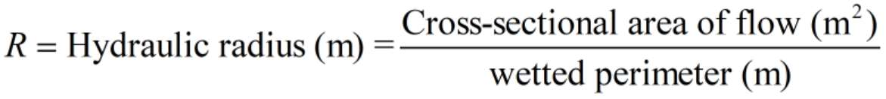
        - **Hình này chứng minh điều gì**
          - Bán kính thủy lực $R$ xác định bằng tỉ số giữa diện tích mặt cắt ướt và chu vi ướt của kênh.
        - **Từ đâu mà thấy được**
          - Tử số là diện tích mặt cắt ướt dòng chảy (Cross-sectional area of flow, $\text{m}^2$).
          - Mẫu số là chu vi ướt của thành và đáy kênh ngập nước (wetted perimeter, $\text{m}$).
- Phạm vi vận tốc dòng chảy tiếp cận thượng lưu ($v_{\text{approach}}$):
  - Ngưỡng vận tốc cực tiểu ($v_{\text{approach, min}}$): phải duy trì tối thiểu từ $0.3 - 0.4\ \text{m/s}$ ở chế độ lưu lượng thấp nhất ($Q_{\text{min}}$) nhằm ngăn chặn sự lắng đọng cặn hữu cơ và cát sỏi trước song chắn.
  - Ngưỡng vận tốc cực đại ($v_{\text{approach, max}}$): khống chế trong khoảng $0.6 - 0.9\ \text{m/s}$ ở lưu lượng trung bình và không vượt quá $1.0\ \text{m/s}$ ở lưu lượng đỉnh ($Q_{\text{peak}}$) để tránh hiện tượng nén chặt rác hoặc cuốn trôi rác qua khe hở.

##### 4.2. Kích thước kênh, Khe hở song chắn và Tổn thất áp lực (Channel Dimensions, Openings, and Headloss Calculation)

- Cân bằng hình học xác định chiều rộng lòng kênh dẫn ($W$):
  - Chiều rộng kênh (Channel width) bằng tổng kích thước bề rộng các thanh chắn rác và bề rộng các khoảng hở thông thủy:
    $$\text{Channel width} = N_{\text{bars}} \times \text{Bar width} + N_{\text{spaces}} \times \text{Bar space}$$
  - Mối tương quan hình học giữa số khoảng hở ($N_{\text{spaces}}$) và số thanh song ($N_{\text{bars}}$):
    $$N_{\text{bars}} + 1 = N_{\text{spaces}}$$
  - Phương trình xác định chiều rộng kênh theo số thanh song chắn rác:
    $$\text{Channel width} = N_{\text{bars}} \times \text{Bar width} + (N_{\text{bars}} + 1) \times \text{Bar space}$$
  - Sơ đồ mặt cắt ngang bố trí thanh song chắn và khoảng hở giữa hai bên vách kênh:
    - **Hình 47.** Mặt cắt ngang bố trí thanh song chắn và khe hở thông thủy trong kênh
      - 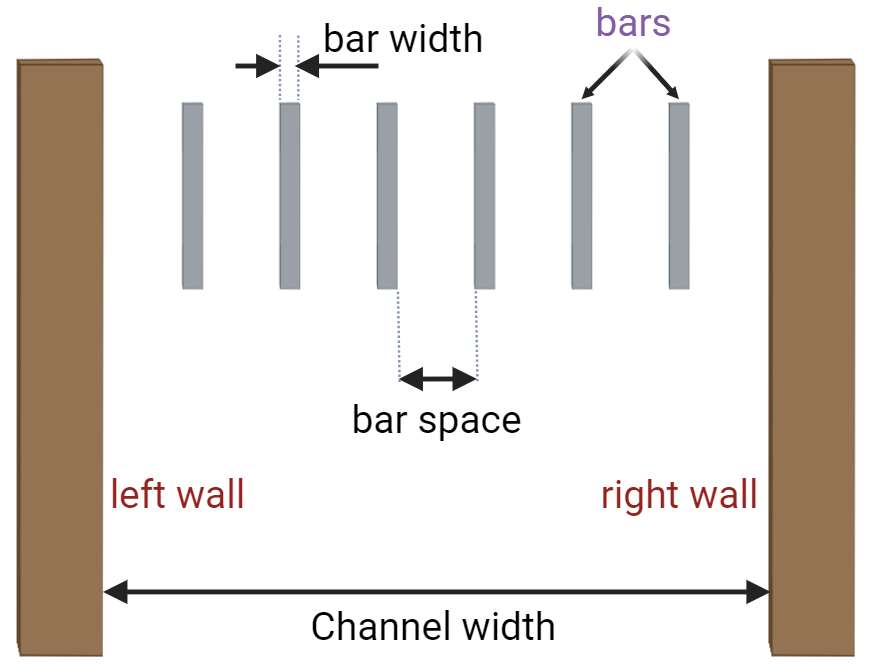
      - **Hình này chứng minh điều gì**
        - Số khoảng hở luôn lớn hơn số thanh đúng 1 đơn vị ($N_{\text{spaces}} = N_{\text{bars}} + 1$) do hai khe biên giáp vách tường.
      - **Từ đâu mà thấy được**
        - Mũi tên hai chiều đáy thể hiện toàn bộ $\text{Channel width}$ từ vách trái (left wall) sang vách phải (right wall).
        - Đồ họa thể hiện 6 thanh đứng ($\text{bars}$) phân chia mặt cắt thành 7 khoảng hở ($\text{bar space}$).
- Công thức giải tích xác định số lượng thanh song chắn rác ($N_{\text{bars}}$):
  - Biểu thức tính số thanh song rút ra từ phương trình cân bằng bề rộng kênh:
    $$N_{\text{bars}} = \frac{\text{Channel width} - \text{Bar space}}{\text{Bar width} + \text{Bar space}}$$
  - Quy tắc chuẩn hóa kích thước thiết kế thực tế:
    - Giá trị $N_{\text{bars}}$ tính toán theo lý thuyết được làm tròn về số nguyên gần nhất.
    - Sau khi chốt số thanh $N_{\text{bars}}$, tính toán lại bề rộng kênh thực tế ($\text{Channel width}_{\text{actual}}$) hoặc tinh chỉnh khoảng hở sát hai biên vách kênh.
    - **Hình 48.** Công thức giải tích xác định số thanh chắn rác $N_{\text{bars}}$
      - 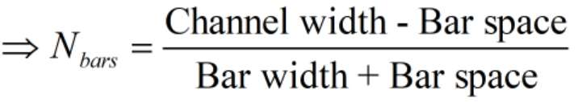
      - **Hình này chứng minh điều gì**
        - Công thức giải trực tiếp số thanh song chắn rác từ bề rộng kênh và kích thước hình học thanh/khe.
      - **Từ đâu mà thấy được**
        - Dấu suy ra ($\Rightarrow$) dẫn tới biến số $N_{bars}$ ở vế trái.
        - Tử số lấy $\text{Channel width} - \text{Bar space}$, mẫu số là tổng $\text{Bar width} + \text{Bar space}$.
- Phương trình tính tổn thất cột áp thủy lực qua song chắn rác (Headloss Equation):
  - Tổn thất cột áp $h_L$ xác định theo độ tiêu hao động năng khi dòng chảy đi qua khe hở thu hẹp:
    $$h_L = \frac{1}{C}\left(\frac{v_{\text{thru}}^2 - v_{\text{approach}}^2}{2g}\right)$$
  - Cơ chế thủy lực: Vận tốc dòng tăng vọt khi qua khe thu hẹp ($v_{\text{thru}}$), sau đó giãn nở đột ngột ở hạ lưu gây ma sát xoáy cuộn và sụt giảm năng lượng cột áp.
    - **Hình 49.** Phương trình tính toán tổn thất cột áp $h_L$ qua song chắn rác
      - 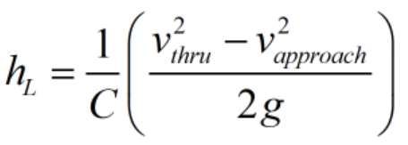
      - **Hình này chứng minh điều gì**
        - Tổn thất áp lực $h_L$ tỉ lệ với độ chênh bình phương vận tốc giữa khe hở và kênh dẫn, tỉ lệ nghịch với hệ số xả $C$.
      - **Từ đâu mà thấy được**
        - Vế trái biểu diễn tổn thất cột áp $h_L$.
        - Vế phải là tích của nghịch đảo hệ số xả $1/C$ với hiệu số cột áp động $(v_{thru}^2 - v_{approach}^2)/(2g)$.
- Ý nghĩa vật lý và các thông số trong phương trình tổn thất cột áp:
  - $h_L$: tổn thất cột áp / độ chênh mực nước giữa thượng lưu và hạ lưu song chắn rác (headloss, $\text{m}$).
  - $C$: hệ số lưu lượng xả thực nghiệm (empirical discharge coefficient):
    - $C = 0.7$ đối với song chắn rác sạch hoàn toàn (clean screen).
    - $C = 0.6$ đối với song chắn rác ở trạng thái bị tắc nghẽn (clogged screen), phản ánh xoáy cuộn gia tăng qua khe cặn bám.
  - $v_{\text{thru}}$: vận tốc dòng chảy qua các khe hở thông thủy của song chắn rác (velocity of flow through screen openings, $\text{m/s}$):
    $$v_{\text{thru}} = \frac{Q}{A_{\text{open}}}$$
    với $A_{\text{open}}$ là tổng diện tích các khe hở thông thủy ngập nước.
  - $v_{\text{approach}}$: vận tốc dòng chảy tới trong kênh thượng lưu trước song chắn rác (approach velocity in upstream channel, before bar screen, $\text{m/s}$).
  - $g$: gia tốc trọng trường chuẩn ($g = 9.81\ \text{m/s}^2$).
- Tác động của hiện tượng tắc nghẽn (Clogging effect) và góc nghiêng song chắn ($\theta$):
  - Ảnh hưởng của hiện tượng nghẹt rác $50\%$ diện tích:
    - Khi song chắn bị rác che lấp $50\%$ khe hở thông thủy ($A_{\text{open, clogged}} = 0.5 \times A_{\text{open}}$), vận tốc qua khe tăng gấp đôi ($v_{\text{thru, clogged}} = 2 \times v_{\text{thru}}$).
    - Thành phần bình phương vận tốc $v_{\text{thru}}^2$ tăng gấp 4 lần, kết hợp với hệ số xả giảm từ $0.7$ xuống $0.6$, làm tổn thất cột áp $h_L$ thực tế tăng gấp $3 - 5$ lần so với trạng thái sạch.
  - Ảnh hưởng của góc nghiêng đặt song chắn ($\theta$ so với phương ngang):
    - Chiều dài ngập nước dọc theo thanh nghiêng xác định theo hình học: $L_{\text{submerged}} = \frac{D}{\sin\theta}$.
    - Đặt nghiêng góc $\theta$ nhỏ ($45^\circ - 60^\circ$) làm tăng diện tích tiếp xúc dòng chảy, giảm vận tốc cục bộ và hỗ trợ thao tác cào rác thủ công.
    - Đặt góc nghiêng lớn ($60^\circ - 90^\circ$) áp dụng cho song chắn cơ giới nhằm tiết kiệm chiều dài kênh và diện tích mặt bằng trạm.
    - **Hình 50.** Sơ đồ thủy lực dòng chảy và tổn thất cột áp qua song chắn đặt nghiêng
      - 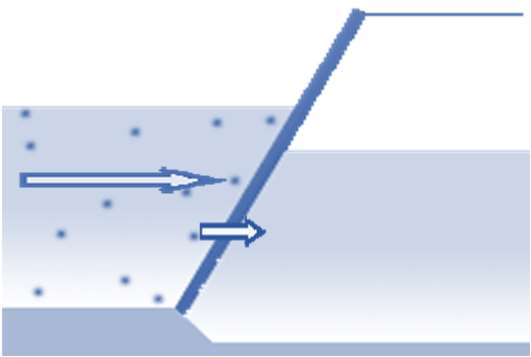
      - **Hình này chứng minh điều gì**
        - Minh họa sự suy giảm mực nước thượng lưu và hạ lưu tạo thành tổn thất cột áp $h_L$ khi dòng chảy qua song chắn nghiêng góc $\theta$.
      - **Từ đâu mà thấy được**
        - Mũi tên dòng tới $v_{approach}$ ở mực nước cao thượng lưu chứa cặn rác tiến tới thanh song nghiêng góc $\theta$.
        - Mũi tên $v_{thru}$ đi qua khe hở sang vùng hạ lưu có mực nước hạ thấp thể hiện độ chênh cột áp $h_L$.

#### 5. Thông số thiết kế điển hình và Bài tập ứng dụng

- Khung nội dung và phạm vi nghiên cứu:
  - Chuyên đề tổng kết các tiêu chuẩn thiết kế điển hình cho song chắn rác thô (Bar racks) theo cẩm nang công nghệ quốc tế Metcalf & Eddy và giáo trình Kỹ thuật Xử lý Nước thải (HCMUT-263).
  - Vận dụng lý thuyết thủy lực kênh hở (Manning), cơ cấu hình học dàn thanh song và phương trình tổn thất năng lượng Orifice để giải quyết bài toán thiết kế kích thước kênh dẫn và tổn thất áp lực.
  - Phân tích chi tiết và thực hành tính toán ảnh hưởng của góc nghiêng song chắn rác ($\theta = 50^\circ, 55^\circ, 60^\circ$) đối với vận tốc dòng chảy qua khe và tổn thất áp năng.

##### 5.1. Thông số thiết kế điển hình cho song chắn rác (Typical Design Information for Bar Racks)

- Tiêu chuẩn kích thước hình học thanh song (Bar size):
  - Bề rộng thanh song ($w$ - Width):
    - Phạm vi quy chuẩn: $5\text{--}15\text{ mm}$ đối với cả phương pháp cào thủ công (Manual) và cơ giới (Mechanical).
    - Thép thanh chế tạo phổ biến là thép không gỉ (Inox 304 hoặc Inox 316) với chiều dày chuẩn $10\text{ mm}$ để đảm bảo độ bền cơ học và chống ăn mòn hóa học trong môi trường nước thải.
  - Chiều sâu thanh song ($d_{\text{bar}}$ - Depth / Chiều dài theo hướng dòng chảy):
    - Phạm vi quy chuẩn: $25\text{--}38\text{ mm}$ cho cả phương pháp cào thủ công và cơ giới.
    - Tiết diện thanh chữ nhật thanh mảnh giúp tăng mô-men kháng uốn theo phương dòng chảy, chống lại áp lực thủy tĩnh và tải trọng rác bám tích tụ.
- Khoảng cách khe hở thông thủy giữa các thanh song (Clear spacing between bars, $b$):
  - Phương pháp cào thủ công (Manual): $b = 25\text{--}50\text{ mm}$ (điển hình $25\text{--}40\text{ mm}$). Khe hở lớn giúp hạn chế tắc nghẽn nhanh khi chu kỳ cào rác phụ thuộc vào nhân công vận hành.
  - Phương pháp cào cơ giới (Mechanical): $b = 15\text{--}75\text{ mm}$ (điển hình $20\text{--}30\text{ mm}$). Khe hở có thể thiết kế hẹp hơn do máy cào rác tự động hoạt động liên tục hoặc theo chu kỳ cài đặt sẵn.
- Độ dốc và góc nghiêng của song chắn rác (Slope / Inclination):
  - Góc nghiêng so với phương thẳng đứng (Slope from vertical, $\theta_v$):
    - Song cào thủ công: $30^\circ\text{--}45^\circ$ so với phương đứng (tương ứng $45^\circ\text{--}60^\circ$ so với mặt phẳng nằm ngang).
    - Song cào cơ giới: $0^\circ\text{--}30^\circ$ so với phương đứng (tương ứng $60^\circ\text{--}90^\circ$ so với mặt phẳng nằm ngang).
  - Góc nghiêng so với phương nằm ngang ($\theta$):
    - Đặt nghiêng thoai thoải ($45^\circ\text{--}60^\circ$) hỗ trợ người vận hành dùng cào răng kéo rác lên sàn thao tác nhẹ nhàng, tận dụng lực tựa của thanh song đỡ trọng lượng rác.
    - Đặt dốc đứng ($60^\circ\text{--}90^\circ$) giúp tối ưu hóa diện tích mặt bằng xây dựng nhà trạm (footprint) và tăng hiệu quả gạt rác của răng cào cơ khí.
- Giới hạn vận tốc dòng nước tiếp cận trong mương hở ($v_{\text{approach}}$ - Approach velocity):
  - Vận tốc tiếp cận cực đại ($v_{\text{approach, max}}$):
    - Song cào thủ công: $0.3\text{--}0.6\text{ m/s}$. Khống chế vận tốc dưới $0.6\text{ m/s}$ nhằm tránh áp lực dòng nén chặt rác vào các thanh, gây khó khăn cho việc cào rác.
    - Song cào cơ giới: $0.6\text{--}1.0\text{ m/s}$. Vận tốc cao hơn được chấp nhận do cơ cấu cào cơ khí có động cơ dẫn động công suất lớn.
  - Vận tốc tiếp cận cực tiểu ($v_{\text{approach, min}}$):
    - Song cào cơ giới: $0.3\text{--}0.5\text{ m/s}$ ở chế độ lưu lượng tối thiểu nhằm ngăn ngừa hiện tượng các hạt cát hạt nặng và cặn vô cơ lắng tụ trước chân song chắn rác.
- Giới hạn tổn thất cột áp cho phép ($h_{L, \text{allow}}$ - Allowable headloss):
  - Song cào thủ công: Tổn thất cột áp tối đa cho phép là $150\text{ mm}$ ($0.15\text{ m}$). Khi tổn thất áp đạt ngưỡng này, bắt buộc nhân công phải tiến hành cào rác ngay để tránh dâng nước tràn bờ.
  - Song cào cơ giới: Tổn thất cột áp dao động trong dải $150\text{--}600\text{ mm}$ ($0.15\text{--}0.60\text{ m}$). Hệ thống điều khiển PLC thường tự động kích hoạt máy cào khi độ chênh mực nước đạt khoảng $100\text{--}150\text{ mm}$.
- Bảng tổng hợp thông số thiết kế điển hình cho song chắn rác (Metcalf & Eddy):

| Thông số thiết kế (Parameter) | Đơn vị đo (Unit) | Làm sạch thủ công (Manual) | Làm sạch cơ giới (Mechanical) |
| :--- | :---: | :---: | :---: |
| **Kích thước thanh (Bar size)** | | | |
| • Bề rộng thanh ($w$ - Width) | $\text{mm}$ | $5\text{--}15$ | $5\text{--}15$ |
| • Chiều sâu thanh ($d_{\text{bar}}$ - Depth) | $\text{mm}$ | $25\text{--}38$ | $25\text{--}38$ |
| **Khoảng cách khe hở thông thủy ($b$)** | $\text{mm}$ | $25\text{--}50$ | $15\text{--}75$ |
| **Góc nghiêng so với phương thẳng đứng ($\theta_v$)** | $\text{độ}$ | $30\text{--}45^\circ$ | $0\text{--}30^\circ$ |
| *(Góc nghiêng so với phương nằm ngang $\theta$)* | $\text{độ}$ | $45\text{--}60^\circ$ | $60\text{--}90^\circ$ |
| **Vận tốc tiếp cận ($v_{\text{approach}}$)** | | | |
| • Cực đại ($v_{\text{approach, max}}$) | $\text{m/s}$ | $0.3\text{--}0.6$ | $0.6\text{--}1.0$ |
| • Cực tiểu ($v_{\text{approach, min}}$) | $\text{m/s}$ | Không áp dụng | $0.3\text{--}0.5$ |
| **Tổn thất cột áp cho phép ($h_{L, \text{allow}}$)** | $\text{mm}$ | $150$ | $150\text{--}600$ |

- Bằng chứng hình học và số liệu thiết kế:
  - **Hình 51.** Danh mục thông số thiết kế điển hình cho song chắn rác (Parameters)
    - 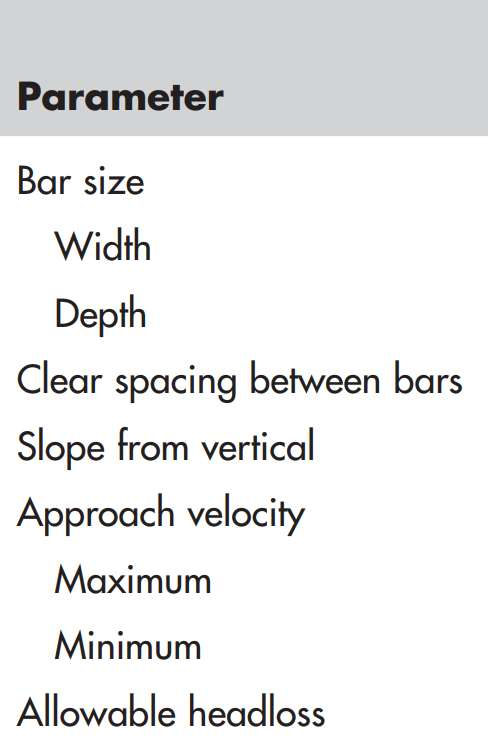
    - **Hình này chứng minh điều gì**
      - Định nghĩa các hạng mục thông số hình học và chỉ tiêu thủy lực cốt lõi cần thiết kế cho song chắn rác thô.
    - **Từ đâu mà thấy được**
      - Bảng liệt kê các hàng: Bar size (Width, Depth), Clear spacing between bars, Slope from vertical, Approach velocity, Allowable headloss.
  - **Hình 52.** Giá trị định mức thiết kế song chắn rác làm sạch thủ công và cơ giới
    - 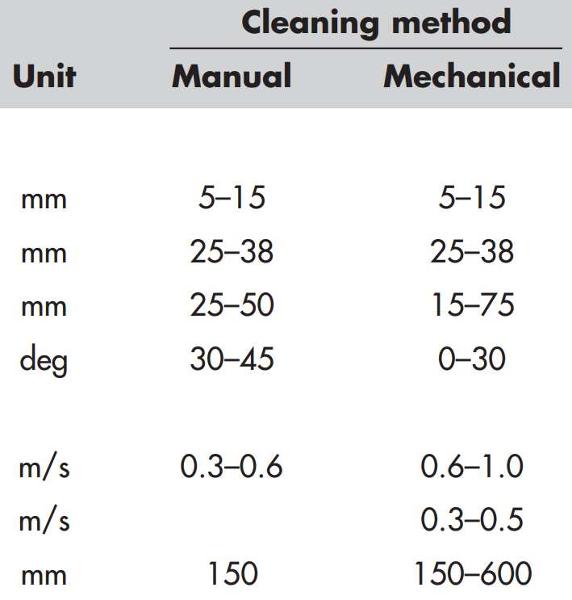
    - **Hình này chứng minh điều gì**
      - Cung cấp dải giá trị chuẩn mực quốc tế phân biệt giữa công nghệ chắn rác thủ công (Manual) và cơ giới (Mechanical).
    - **Từ đâu mà thấy được**
      - Hai cột dữ liệu Manual và Mechanical với kích thước khe hở $15\text{--}75\text{ mm}$, góc nghiêng, vận tốc tới và tổn thất áp $150\text{--}600\text{ mm}$.

##### 5.2. Bài toán ví dụ: Thiết kế kênh dẫn và tổn thất áp lực qua song chắn rác (Example: Bar Screen Headloss and Channel Design)

- **Đề bài (Problem Statement)**:
  - Nguyên văn tiếng Anh:
    > "Design the channel for bar racks, following:
    > • Slope of channel is 0.0001 m/m
    > • Peak hour flowrate for design is 1,000 m3/h
    > • Freeboard = 0.5 m
    > Determine headloss through clean bar racks, and 50%-clogged bar racks. If we have:
    > • Bar width = 10 mm
    > • Bar space = 40 mm"
  - Bản dịch kỹ thuật tiếng Việt:
    > Thiết kế kênh dẫn cho cụm song chắn rác thô theo các điều kiện kỹ thuật sau:
    > • Độ dốc dọc đáy kênh mương: $S = 0.0001\text{ m/m}$
    > • Lưu lượng nước thải thiết kế giờ cao điểm: $Q_{\text{peak}} = 1{,}000\text{ m}^3/\text{h}$
    > • Chiều cao an toàn dự phòng (Freeboard): $\text{FB} = 0.5\text{ m}$
    > Xác định tổn thất cột áp thủy lực qua song chắn rác ở trạng thái sạch và trạng thái bị bám rác tắc nghẽn $50\%$. Biết rằng:
    > • Bề rộng (chiều dày) thanh song: $w = 10\text{ mm}$
    > • Khoảng cách khe hở thông thủy giữa hai thanh: $b = 40\text{ mm}$
- **Dữ kiện (Givens / Input Data)**:
  - Lưu lượng giờ cao điểm: $Q_{\text{peak}} = 1{,}000\text{ m}^3/\text{h}$.
  - Độ dốc kênh dẫn bê tông: $S = 0.0001\text{ m/m}$ (suy ra $S^{1/2} = \sqrt{0.0001} = 0.010$).
  - Chiều cao an toàn chống tràn mép kênh: $\text{FB} = 0.50\text{ m} = 500\text{ mm}$.
  - Bề rộng thanh song chắn: $w = 10\text{ mm} = 0.010\text{ m}$.
  - Khoảng cách khe hở giữa các thanh: $b = 40\text{ mm} = 0.040\text{ m}$.
  - Hệ số nhám Manning cho mương bê tông láng nhẵn (Smooth concrete): $n = 0.012$.
  - Hệ số xả lưu lượng qua khe song sạch: $C_{\text{clean}} = 0.70$.
  - Hệ số xả lưu lượng qua khe song tắc nghẽn $50\%$: $C_{\text{clogged}} = 0.60$.
  - Vận tốc tiếp cận thiết kế lựa chọn: $v_{\text{approach}} = 0.60\text{ m/s}$ (thỏa mãn tiêu chuẩn $0.3\text{--}0.6\text{ m/s}$).
  - Gia tốc trọng trường chuẩn: $g = 9.81\text{ m/s}^2$.
- **Quy tắc áp dụng (Rules Applied)**:
  - Quy tắc chuyển đổi đơn vị lưu lượng chuẩn: $Q = \frac{Q_{\text{peak}}}{3600}\text{ (m}^3\text{/s)}$.
  - Diện tích mặt cắt ướt yêu cầu trong mương hở: $A_{\text{req}} = \frac{Q}{v_{\text{approach}}}$.
  - Phương trình vận tốc kênh hở Manning: $v = \frac{1}{n} R^{2/3} S^{1/2}$, suy ra bán kính thủy lực $R = \left(\frac{v \cdot n}{S^{1/2}}\right)^{3/2}$.
  - Điều kiện biên hình học kênh dẫn và dàn thanh:
    - Khe hở thông thủy xuất hiện ở hai bên mép tường biên: $N_{\text{spaces}} = N_{\text{bars}} + 1$.
    - Phương trình bề rộng lòng kênh: $W = N_{\text{bars}} \cdot w + (N_{\text{bars}} + 1) \cdot b = N_{\text{bars}}(w + b) + b$.
    - Công thức xác định số lượng thanh: $N_{\text{bars}} = \frac{W - b}{w + b}$ (quy tròn số nguyên).
    - Hiệu chỉnh bề rộng thực tế: $W_{\text{actual}} = N_{\text{bars}} \cdot w + N_{\text{spaces}} \cdot b$.
  - Diện tích thông thủy qua các khe song sạch: $A_{\text{thru, clean}} = N_{\text{spaces}} \cdot b \cdot D$.
  - Vận tốc qua khe song sạch: $v_{\text{thru, clean}} = \frac{Q}{A_{\text{thru, clean}}}$.
  - Phương trình tổn thất cột áp Orifice:
    $$h_L = \frac{1}{C} \left(\frac{v_{\text{thru}}^2 - v_{\text{approach}}^2}{2g}\right)$$
  - Điều kiện tắc nghẽn $50\%$: $A_{\text{thru, clogged}} = 0.50 \cdot A_{\text{thru, clean}}$, dẫn đến $v_{\text{thru, clogged}} = 2 \cdot v_{\text{thru, clean}}$ với hệ số xả $C_{\text{clogged}} = 0.60$.
- **Lời giải chi tiết (Step-by-step Solution)**:
  - **Bước 1: Quy đổi lưu lượng thiết kế sang đơn vị mét khối trên giây ($\text{m}^3/\text{s}$)**
    - Căn cứ: Định nghĩa đơn vị dẫn xuất hệ SI ($1\text{ giờ} = 3{,}600\text{ giây}$).
    - Nhìn vào: Lưu lượng đỉnh giờ đề bài cấp là $Q_{\text{peak}} = 1{,}000\text{ m}^3/\text{h}$:
      $$Q = \frac{1000\text{ m}^3/\text{h}}{3600\text{ s/h}} = 0.2778\text{ m}^3/\text{s} \quad \left(\text{chính xác } \frac{5}{18}\text{ m}^3/\text{s}\right)$$
  - **Bước 2: Lựa chọn vận tốc tiếp cận và xác định diện tích mặt cắt ướt yêu cầu**
    - Căn cứ: Tiêu chuẩn thiết kế song chắn rác Metcalf & Eddy khống chế vận tốc tiếp cận trong mương hở $v_{\text{approach}} = 0.30\text{--}0.60\text{ m/s}$ (vận tốc cực tiểu $\ge 0.30\text{ m/s}$ để ngăn cát lắng đọng đáy mương, cực đại $\le 0.60\text{ m/s}$ để rác không bị ép chặt vào thanh).
    - Nhìn vào: Chọn giá trị vận tốc thiết kế tối ưu $v_{\text{approach}} = 0.60\text{ m/s}$:
      $$A_{\text{req}} = \frac{Q}{v_{\text{approach}}} = \frac{0.2778\text{ m}^3/\text{s}}{0.60\text{ m/s}} = 0.4630\text{ m}^2$$
  - **Bước 3: Xác định kích thước hình học kênh dẫn bằng phương trình Manning**
    - Căn cứ: Phương trình dòng chảy đều trong kênh hở Manning $v = \frac{1}{n} R^{2/3} S^{1/2}$.
    - Nhìn vào: Thay các thông số $v = 0.60\text{ m/s}$, $n = 0.012$ và độ dốc $S = 0.0001\text{ m/m}$ ($S^{1/2} = 0.010$):
      $$R^{2/3} = \frac{v \cdot n}{S^{1/2}} = \frac{0.60 \times 0.012}{0.010} = 0.720$$
      $$R = (0.720)^{3/2} = 0.6110\text{ m}$$
    - Đối với kênh chữ nhật có tỷ lệ kích thước thi công tối ưu $W \approx (1.2\text{--}1.6) D$, chọn sơ bộ bề rộng kênh: $W_{\text{assumed}} = 0.80\text{ m} = 800\text{ mm}$.
    - Chiều sâu mức nước tương ứng trong kênh dẫn:
      $$D = \frac{A_{\text{req}}}{W_{\text{assumed}}} = \frac{0.4630\text{ m}^2}{0.80\text{ m}} = 0.5788\text{ m} \approx 0.58\text{ m} \quad (580\text{ mm})$$
    - Tổng chiều sâu xây dựng của thành kênh (bao gồm chiều cao an toàn Freeboard $\text{FB} = 0.50\text{ m}$):
      $$H_{\text{total}} = D + \text{FB} = 0.58\text{ m} + 0.50\text{ m} = 1.08\text{ m} \quad (1{,}080\text{ mm})$$
  - **Bước 4: Tính toán số lượng thanh song và hiệu chỉnh bề rộng kênh thực tế**
    - Căn cứ: Hai vách biên của lòng kênh tạo thành hai khe hở thông thủy ngoài cùng, do đó số khe hở luôn lớn hơn số thanh chắn 1 khoảng: $N_{\text{spaces}} = N_{\text{bars}} + 1$.
    - Nhìn vào: Thay $W = 800\text{ mm}$, $w = 10\text{ mm}$, $b = 40\text{ mm}$ vào phương trình hình học:
      $$N_{\text{bars}} = \frac{W - b}{w + b} = \frac{800\text{ mm} - 40\text{ mm}}{10\text{ mm} + 40\text{ mm}} = \frac{760}{50} = 15.2\text{ thanh}$$
    - Quy tròn về số nguyên gần nhất: Chọn $N_{\text{bars}} = 15\text{ thanh}$.
    - Số lượng khe hở thông thủy tương ứng:
      $$N_{\text{spaces}} = 15 + 1 = 16\text{ khe}$$
    - Hiệu chỉnh lại bề rộng lòng kênh thi công thực tế chính xác ($W_{\text{actual}}$):
      $$W_{\text{actual}} = 15 \times 10\text{ mm} + 16 \times 40\text{ mm} = 150\text{ mm} + 640\text{ mm} = 790\text{ mm} = 0.79\text{ m}$$
    - Diện tích mặt cắt ướt thực tế và vận tốc tiếp cận hiệu chỉnh:
      $$A_{\text{actual}} = W_{\text{actual}} \times D = 0.79\text{ m} \times 0.58\text{ m} = 0.4582\text{ m}^2$$
      $$v_{\text{approach}} = \frac{Q}{A_{\text{actual}}} = \frac{0.2778\text{ m}^3/\text{s}}{0.4582\text{ m}^2} = 0.6062\text{ m/s} \approx 0.606\text{ m/s}$$
  - **Bước 5: Tính tổn thất cột áp qua song chắn rác khi sạch ($h_{L, \text{clean}}$)**
    - Căn cứ: Tổng diện tích thông thủy của 16 khe hở $A_{\text{thru, clean}} = N_{\text{spaces}} \cdot b \cdot D$ và phương trình Orifice với hệ số xả $C_{\text{clean}} = 0.70$.
    - Nhìn vào:
      $$A_{\text{thru, clean}} = 16 \times 0.040\text{ m} \times 0.58\text{ m} = 0.3712\text{ m}^2$$
      $$v_{\text{thru, clean}} = \frac{Q}{A_{\text{thru, clean}}} = \frac{0.2778\text{ m}^3/\text{s}}{0.3712\text{ m}^2} = 0.7484\text{ m/s} \approx 0.748\text{ m/s}$$
    - Tính toán chênh lệch động năng giữa dòng qua khe và dòng tiếp cận:
      $$v_{\text{thru}}^2 - v_{\text{approach}}^2 = (0.7484)^2 - (0.6062)^2 = 0.5601 - 0.3675 = 0.1926\text{ m}^2/\text{s}^2$$
      $$\frac{v_{\text{thru}}^2 - v_{\text{approach}}^2}{2g} = \frac{0.1926}{2 \times 9.81} = \frac{0.1926}{19.62} = 0.009817\text{ m}$$
    - Tổn thất cột áp thủy lực khi song sạch:
      $$h_{L, \text{clean}} = \frac{1}{0.70} \times 0.009817\text{ m} = 0.01402\text{ m} = 14.02\text{ mm} \approx 14.0\text{ mm}$$
  - **Bước 6: Tính tổn thất cột áp qua song chắn rác khi bị tắc nghẽn $50\%$ ($h_{L, \text{clogged}}$)**
    - Căn cứ: Khi rác bám nghẽn $50\%$ diện tích thông thủy, $A_{\text{thru, clogged}} = 0.50 \cdot A_{\text{thru, clean}}$ và hệ số xả hiệu chỉnh giảm xuống $C_{\text{clogged}} = 0.60$.
    - Nhìn vào:
      $$A_{\text{thru, clogged}} = 0.50 \times 0.3712\text{ m}^2 = 0.1856\text{ m}^2$$
      $$v_{\text{thru, clogged}} = \frac{0.2778\text{ m}^3/\text{s}}{0.1856\text{ m}^2} = 1.4968\text{ m/s} \approx 1.497\text{ m/s}$$
    - Chênh lệch động năng ở trạng thái nghẽn:
      $$v_{\text{thru, clogged}}^2 - v_{\text{approach}}^2 = (1.4968)^2 - (0.6062)^2 = 2.2404 - 0.3675 = 1.8729\text{ m}^2/\text{s}^2$$
      $$\frac{v_{\text{thru, clogged}}^2 - v_{\text{approach}}^2}{2g} = \frac{1.8729}{2 \times 9.81} = \frac{1.8729}{19.62} = 0.09546\text{ m}$$
    - Tổn thất cột áp thủy lực khi nghẽn $50\%$:
      $$h_{L, \text{clogged}} = \frac{1}{0.60} \times 0.09546\text{ m} = 0.1591\text{ m} = 159.1\text{ mm} \approx 159.2\text{ mm} \quad (\approx 0.16\text{ m})$$
- **Kết quả (Results)**:
  - Thông số kích thước kênh dẫn:
    - Bề rộng lòng kênh thi công: $W = 0.79\text{ m}$ ($790\text{ mm}$).
    - Chiều sâu lớp nước trong kênh: $D = 0.58\text{ m}$ ($580\text{ mm}$).
    - Chiều cao tổng thể thành kênh: $H_{\text{total}} = 1.08\text{ m}$ ($1{,}080\text{ mm}$).
  - Cấu hình dàn song chắn rác:
    - Số lượng thanh chắn: $N_{\text{bars}} = 15\text{ thanh}$ ($w = 10\text{ mm}$).
    - Số khe hở thông thủy: $N_{\text{spaces}} = 16\text{ khe}$ ($b = 40\text{ mm}$).
    - Vận tốc dòng tiếp cận thực tế: $v_{\text{approach}} = 0.606\text{ m/s}$.
  - Chỉ tiêu thủy lực trạng thái sạch:
    - Vận tốc qua khe: $v_{\text{thru, clean}} = 0.748\text{ m/s}$.
    - Tổn thất cột áp: $h_{L, \text{clean}} = 14.0\text{ mm}$ ($0.014\text{ m}$).
  - Chỉ tiêu thủy lực trạng thái tắc nghẽn $50\%$:
    - Vận tốc qua khe: $v_{\text{thru, clogged}} = 1.497\text{ m/s}$.
    - Tổn thất cột áp: $h_{L, \text{clogged}} = 159.2\text{ mm}$ ($0.159\text{ m}$).
- **Kiểm tra lại (Verification / Engineering Checks)**:
  - Kiểm tra vận tốc tiếp cận: $v_{\text{approach}} = 0.606\text{ m/s}$ xấp xỉ mức khống chế $0.60\text{ m/s}$, vừa đảm bảo không lắng đọng cát ở lưu lượng đỉnh, vừa không nén rác chặt vào thanh.
  - Kiểm tra vận tốc qua khe sạch: $v_{\text{thru, clean}} = 0.748\text{ m/s}$ nằm gọn trong dải vận tốc tối ưu $0.6\text{--}1.0\text{ m/s}$ theo Metcalf & Eddy.
  - Kiểm tra vận tốc khi nghẽn $50\%$: $v_{\text{thru, clogged}} = 1.497\text{ m/s} \approx 1.50\text{ m/s}$ không vượt quá ngưỡng dòng chảy xói ($1.5\text{ m/s}$), loại trừ nguy cơ rác mềm bị cuốn lọt qua khe sang công trình sau.
  - Kiểm tra tổn thất áp trạng thái sạch: $h_{L, \text{clean}} = 14.0\text{ mm} \ll 150\text{ mm}$ (rất nhỏ so với giới hạn cho phép của song thủ công).
  - Kiểm tra an toàn chống tràn khi nghẽn: Mực nước dâng $h_{L, \text{clogged}} = 159.2\text{ mm} \approx 0.16\text{ m}$ thấp hơn rất nhiều so với chiều cao lưu không dự phòng $\text{FB} = 0.50\text{ m}$ ($500\text{ mm}$), đảm bảo mương tuyệt đối không tràn nước ra ngoài.

##### 5.3. Bài tập ứng dụng: Ảnh hưởng của góc nghiêng song chắn rác (Exercise: Screen Tilt Angle Effect)

- **Đề bài (Problem Statement)**:
  - Nguyên văn tiếng Anh:
    > "From your answer in example, again, determine the headloss through clean bar racks, if the screen is inclined at a 50, 55, 60° angle from the horizontal.
    > Comment on the impact of screening inclination on headloss and velocity through the screen?"
  - Bản dịch kỹ thuật tiếng Việt:
    > Từ kết quả tính toán ở bài ví dụ (Bài 1), hãy xác định lại tổn thất cột áp qua song chắn rác ở trạng thái sạch nếu song chắn được đặt nghiêng ở các góc $50^\circ$, $55^\circ$ và $60^\circ$ so với mặt phẳng nằm ngang.
    > Đưa ra nhận xét, đánh giá chuyên môn kỹ thuật về ảnh hưởng của góc nghiêng song chắn rác đến tổn thất cột áp và vận tốc dòng chảy qua song chắn?
- **Dữ kiện (Givens / Inherited Input Data)**:
  - Lưu lượng nước thải thiết kế: $Q = 0.2778\text{ m}^3/\text{s}$ ($1{,}000\text{ m}^3/\text{h}$).
  - Chiều sâu mức nước trong kênh: $D = 0.58\text{ m}$.
  - Bề rộng lòng kênh thi công: $W = 0.79\text{ m}$.
  - Kích thước thanh song: Bề rộng $w = 10\text{ mm} = 0.010\text{ m}$, khe hở $b = 40\text{ mm} = 0.040\text{ m}$.
  - Cấu tạo song: $N_{\text{bars}} = 15\text{ thanh}$, $N_{\text{spaces}} = 16\text{ khe hở}$.
  - Vận tốc dòng tiếp cận: $v_{\text{approach}} = 0.606\text{ m/s}$ (không phụ thuộc vào góc nghiêng của song).
  - Giá trị cơ sở ở trạng thái đặt thẳng đứng ($\theta = 90^\circ$):
    - Diện tích thông thủy: $A_{\text{thru}}(90^\circ) = 0.3712\text{ m}^2$.
    - Vận tốc qua khe: $v_{\text{thru}}(90^\circ) = 0.7484\text{ m/s}$.
    - Tổn thất cột áp chuẩn: $h_L(90^\circ) = 14.02\text{ mm} \approx 14.0\text{ mm}$.
  - Các góc nghiêng khảo sát so với phương nằm ngang: $\theta = 50^\circ, 55^\circ, 60^\circ$.
  - Hệ số xả qua khe song sạch: $C = 0.70$.
- **Quy tắc áp dụng (Rules Applied)**:
  - Chiều dài thanh song ngập nước đo dọc trục nghiêng của thanh:
    $$\text{SL}(\theta) = \frac{D}{\sin\theta}$$
  - Diện tích thông thủy qua khe theo mặt phẳng nghiêng mở rộng:
    $$A_{\text{thru}}(\theta) = N_{\text{spaces}} \cdot b \cdot \text{SL}(\theta) = \frac{N_{\text{spaces}} \cdot b \cdot D}{\sin\theta} = \frac{A_{\text{thru}}(90^\circ)}{\sin\theta}$$
  - Vận tốc dòng chảy trực giao (thành phần vuông góc với mặt phẳng song):
    $$v_{\text{thru}}(\theta) = \frac{Q}{A_{\text{thru}}(\theta)} = \frac{Q}{\frac{A_{\text{thru}}(90^\circ)}{\sin\theta}} = v_{\text{thru}}(90^\circ) \cdot \sin\theta$$
  - Mô hình biến thiên tổn thất cột áp theo góc nghiêng:
    - Tổn thất cột áp tỷ lệ thuận tuyến tính với thành phần hình chiếu trực giao $\sin\theta$:
      $$h_L(\theta) = h_L(90^\circ) \cdot \sin\theta$$
    - Quy luật này hoàn toàn tương thích với công thức Kirschmer kinh điển:
      $$h_L = \beta \left(\frac{w}{b}\right)^{4/3} \frac{v_{\text{approach}}^2}{2g} \sin\theta \quad \Longrightarrow \quad h_L(\theta) \propto \sin\theta$$
- **Bằng chứng sơ đồ thủy lực thanh nghiêng**:
  - **Hình 53.** Sơ đồ thủy lực của dàn song chắn rác đặt nghiêng góc $\theta$
    - 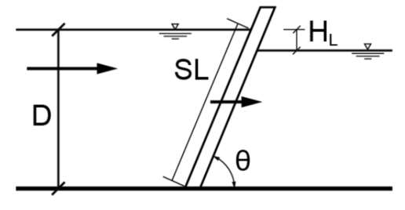
    - **Hình này chứng minh điều gì**
      - Chiều dài thanh ngập nước tỷ lệ nghịch với $\sin\theta$ ($\text{SL} = D/\sin\theta$), làm tăng diện tích tiếp xúc xiên và giảm độ chênh mực nước $H_L$.
    - **Từ đâu mà thấy được**
      - Mặt cắt kênh thể hiện chiều sâu nước $D$, chiều dài thanh $\text{SL}$, góc nghiêng $\theta$ so với đáy ngang, mũi tên vận tốc dòng tới và tổn thất áp $H_L$.
- **Lời giải chi tiết (Step-by-step Solution)**:
  - **Trường hợp 1: Góc nghiêng $\theta = 50^\circ$ so với mặt phẳng nằm ngang**
    - Căn cứ: Giá trị lượng giác $\sin(50^\circ) = 0.766044 \approx 0.7660$.
    - Nhìn vào:
      - Chiều dài ngập nước dọc trục thanh:
        $$\text{SL}(50^\circ) = \frac{D}{\sin(50^\circ)} = \frac{0.58\text{ m}}{0.766044} = 0.7571\text{ m} \approx 0.757\text{ m} \quad (757\text{ mm})$$
      - Tổng diện tích thông thủy xiên:
        $$A_{\text{thru}}(50^\circ) = \frac{A_{\text{thru}}(90^\circ)}{\sin(50^\circ)} = \frac{0.3712\text{ m}^2}{0.766044} = 0.4846\text{ m}^2$$
      - Vận tốc vuông góc hiệu dụng qua khe:
        $$v_{\text{thru}}(50^\circ) = v_{\text{thru}}(90^\circ) \times \sin(50^\circ) = 0.7484\text{ m/s} \times 0.766044 = 0.5733\text{ m/s} \approx 0.573\text{ m/s}$$
      - Tổn thất cột áp thủy lực qua song sạch:
        $$h_L(50^\circ) = h_L(90^\circ) \times \sin(50^\circ) = 14.02\text{ mm} \times 0.766044 = 10.74\text{ mm} \approx 10.7\text{ mm} \quad (0.0107\text{ m})$$
      - Độ giảm tổn thất áp so với phương đứng ($90^\circ$):
        $$\Delta h_L\% = \frac{14.02 - 10.74}{14.02} \times 100\% = 23.4\% \quad (\text{giảm } 3.3\text{ mm})$$
  - **Trường hợp 2: Góc nghiêng $\theta = 55^\circ$ so với mặt phẳng nằm ngang**
    - Căn cứ: Giá trị lượng giác $\sin(55^\circ) = 0.819152 \approx 0.8192$.
    - Nhìn vào:
      - Chiều dài ngập nước dọc trục thanh:
        $$\text{SL}(55^\circ) = \frac{D}{\sin(55^\circ)} = \frac{0.58\text{ m}}{0.819152} = 0.7081\text{ m} \approx 0.708\text{ m} \quad (708\text{ mm})$$
      - Tổng diện tích thông thủy xiên:
        $$A_{\text{thru}}(55^\circ) = \frac{A_{\text{thru}}(90^\circ)}{\sin(55^\circ)} = \frac{0.3712\text{ m}^2}{0.819152} = 0.4532\text{ m}^2$$
      - Vận tốc vuông góc hiệu dụng qua khe:
        $$v_{\text{thru}}(55^\circ) = v_{\text{thru}}(90^\circ) \times \sin(55^\circ) = 0.7484\text{ m/s} \times 0.819152 = 0.6131\text{ m/s} \approx 0.613\text{ m/s}$$
      - Tổn thất cột áp thủy lực qua song sạch:
        $$h_L(55^\circ) = h_L(90^\circ) \times \sin(55^\circ) = 14.02\text{ mm} \times 0.819152 = 11.48\text{ mm} \approx 11.5\text{ mm} \quad (0.0115\text{ m})$$
      - Độ giảm tổn thất áp so với phương đứng ($90^\circ$):
        $$\Delta h_L\% = \frac{14.02 - 11.48}{14.02} \times 100\% = 18.1\% \quad (\text{giảm } 2.5\text{ mm})$$
  - **Trường hợp 3: Góc nghiêng $\theta = 60^\circ$ so với mặt phẳng nằm ngang**
    - Căn cứ: Giá trị lượng giác $\sin(60^\circ) = 0.866025 \approx 0.8660$.
    - Nhìn vào:
      - Chiều dài ngập nước dọc trục thanh:
        $$\text{SL}(60^\circ) = \frac{D}{\sin(60^\circ)} = \frac{0.58\text{ m}}{0.866025} = 0.6697\text{ m} \approx 0.670\text{ m} \quad (670\text{ mm})$$
      - Tổng diện tích thông thủy xiên:
        $$A_{\text{thru}}(60^\circ) = \frac{A_{\text{thru}}(90^\circ)}{\sin(60^\circ)} = \frac{0.3712\text{ m}^2}{0.866025} = 0.4286\text{ m}^2$$
      - Vận tốc vuông góc hiệu dụng qua khe:
        $$v_{\text{thru}}(60^\circ) = v_{\text{thru}}(90^\circ) \times \sin(60^\circ) = 0.7484\text{ m/s} \times 0.866025 = 0.6481\text{ m/s} \approx 0.648\text{ m/s}$$
      - Tổn thất cột áp thủy lực qua song sạch:
        $$h_L(60^\circ) = h_L(90^\circ) \times \sin(60^\circ) = 14.02\text{ mm} \times 0.866025 = 12.14\text{ mm} \approx 12.1\text{ mm} \quad (0.0121\text{ m})$$
      - Độ giảm tổn thất áp so với phương đứng ($90^\circ$):
        $$\Delta h_L\% = \frac{14.02 - 12.14}{14.02} \times 100\% = 13.4\% \quad (\text{giảm } 1.9\text{ mm})$$
- **Kết quả (Results)**:
  - Bảng tổng hợp so sánh các chỉ tiêu hình học và thủy lực theo góc nghiêng:

| Góc nghiêng ($\theta$) | Hệ số $\sin\theta$ | Chiều dài ngập nước ($\text{SL}$) | Diện tích khe xiên ($A_{\text{thru}}$) | Vận tốc qua khe ($v_{\text{thru}}$) | Tổn thất cột áp ($h_L$) | Tỷ lệ giảm áp so với $90^\circ$ |
| :---: | :---: | :---: | :---: | :---: | :---: | :---: |
| **$50^\circ$** | $0.7660$ | $0.757\text{ m}$ ($757\text{ mm}$) | $0.485\text{ m}^2$ | $0.573\text{ m/s}$ | $10.7\text{ mm}$ ($0.0107\text{ m}$) | **Giảm $23.4\%$** ($-3.3\text{ mm}$) |
| **$55^\circ$** | $0.8192$ | $0.708\text{ m}$ ($708\text{ mm}$) | $0.453\text{ m}^2$ | $0.613\text{ m/s}$ | $11.5\text{ mm}$ ($0.0115\text{ m}$) | **Giảm $18.1\%$** ($-2.5\text{ mm}$) |
| **$60^\circ$** | $0.8660$ | $0.670\text{ m}$ ($670\text{ mm}$) | $0.429\text{ m}^2$ | $0.648\text{ m/s}$ | $12.1\text{ mm}$ ($0.0121\text{ m}$) | **Giảm $13.4\%$** ($-1.9\text{ mm}$) |
| *$90^\circ$ (Thẳng đứng)* | $1.0000$ | $0.580\text{ m}$ ($580\text{ mm}$) | $0.371\text{ m}^2$ | $0.748\text{ m/s}$ | $14.0\text{ mm}$ ($0.0140\text{ m}$) | *Chuẩn đối chiếu ($0.0\%$)* |

- **Kiểm tra lại & Nhận xét kỹ thuật đầy đủ (Engineering Commentary & Verification)**:
  - Tác động lên vận tốc dòng chảy tiếp cận ($v_{\text{approach}}$):
    - Vận tốc tiếp cận $v_{\text{approach}} = 0.606\text{ m/s}$ hoàn toàn không đổi giữa các trường hợp, do tiết diện ướt của mương hở ($W \times D = 0.79 \times 0.58\text{ m}^2$) chỉ phụ thuộc vào lưu lượng $Q$ và hình học lòng kênh trước song chắn.
  - Tác động lên vận tốc dòng chảy qua khe ($v_{\text{thru}}$):
    - Đặt song chắn nghiêng làm tăng chiều dài ngập nước hữu dụng ($\text{SL} = D/\sin\theta$), từ đó mở rộng diện tích thông thủy xiên hữu hiệu $A_{\text{thru}}$ từ $0.371\text{ m}^2$ lên $0.485\text{ m}^2$ (tăng tới $30.7\%$ khi nghiêng $50^\circ$).
    - Diện tích thông thủy mở rộng làm giảm thành phần vận tốc vuông góc qua khe từ $0.748\text{ m/s}$ xuống $0.573\text{ m/s}$, giúp dòng chảy qua dàn thanh êm dịu hơn, giảm thiểu hiện tượng cuộn xoáy phân kỳ ở hạ lưu.
  - Tác động lên tổn thất cột áp thủy lực ($h_L$):
    - Tổn thất cột áp tỷ lệ thuận trực tiếp với $\sin\theta$. Khi góc nghiêng $\theta$ giảm từ $90^\circ$ xuống $50^\circ$, tổn thất cột áp giảm từ $14.0\text{ mm}$ xuống $10.7\text{ mm}$ (giảm $23.4\%$).
    - Tổn thất áp thấp làm giảm mực nước dâng ngược cục bộ ở thượng lưu mương, bảo vệ an toàn cho cao trình đỉnh cống tự chảy phía trước trạm xử lý.
  - Khía cạnh công thái học và thao tác vận hành cào rác:
    - Đối với song chắn cào thủ công (Manual bar racks), dải góc $\theta = 45^\circ\text{--}60^\circ$ (đặc biệt $50^\circ\text{--}55^\circ$) là giải pháp tối ưu nhất về công thái học. Trọng lực tạo thành phần áp lực đè rác tựa vào mặt thanh song, công nhân chỉ cần kéo trượt rác dọc theo thanh lên sàn thao tác mà không bị rơi tuột trở lại dòng nước.
    - Đối với song chắn cào cơ giới (Mechanical bar racks), các vấu cào tự động gắn động cơ điện có móc giữ răng cào cố định, cho phép vận hành hiệu quả ở góc dốc lớn ($60^\circ\text{--}85^\circ$ hoặc $90^\circ$).
  - Khía cạnh kinh tế và diện tích mặt bằng xây dựng (Footprint):
    - Chiều dài hình chiếu bằng của thanh nghiêng trên đáy mương: $L_{\text{proj}} = \frac{D}{\tan\theta}$.
    - Tại $\theta = 50^\circ$: $L_{\text{proj}} = \frac{0.58}{\tan 50^\circ} = 0.487\text{ m}$.
    - Tại $\theta = 60^\circ$: $L_{\text{proj}} = \frac{0.58}{\tan 60^\circ} = 0.335\text{ m}$ (ngắn hơn $31.2\%$).
    - Dựng song dốc hơn giúp rút ngắn chiều dài mương dẫn và hố thu rác, tiết kiệm chi phí xây dựng mặt bằng nhà trạm đầu mối (Headworks). Tuy nhiên, song quá dốc làm tăng tổn thất áp và đòi hỏi động cơ cào công suất lớn hơn.

### Chương 3.2: Quá trình Cơ học - Bể Lắng cát (Grit Chamber)

#### Overview of Grit Removal

- Khung chương trình và thông tin học phần:
  - Tên môn học: Kỹ thuật Xử lý Nước thải (Wastewater Treatment Engineering).
  - Giảng viên phụ trách: TS. Nguyễn Hoàng Dũng (Dr. Nguyen Hoang Dung).
  - Khung đào tạo: Học kỳ 1, Năm học 2026 (1st semester, academic year 2026), Thành phố Hồ Chí Minh (Ho Chi Minh City).
  - Chuyên đề bài giảng thuộc Chương 3: Các quá trình đơn vị vật lý / cơ học (Physical unit processes) — Phần 2: Bể lắng cát (Grit chamber).
  - Cấu trúc nội dung bài giảng gồm ba phần trọng tâm:
    - Tổng quan về tách cặn cát (Overview of Grit removal).
    - Bể lắng cát dòng chảy ngang (Horizontal-flow grit chamber).
    - Bể lắng cát thổi khí (Aerated grit chamber).

##### Grit Characteristics and Objectives of Grit Removal

- Khái niệm và thành phần của cặn cát (Grit definition and composition):
  - Cặn cát (Grit) là hỗn hợp các hạt chất rắn vô cơ nặng không thối rữa cuốn theo dòng nước thải.
  - Thành phần chủ yếu gồm cát (sand), sỏi nhỏ (gravel), xỉ than (cinders) và các vật liệu khoáng nặng trơ khác (other heavy solid materials).
  - Nguồn gốc phát sinh cặn cát:
    - Nước mưa chảy tràn cuốn theo đất cát, xỉ đá từ mặt đường, công trường xây dựng và bề mặt lưu vực vào hệ thống thoát nước.
    - Nước thải sinh hoạt từ quá trình rửa rau củ, thực phẩm, bùn đất bám dính trên quần áo và hoạt động tắm giặt.
    - Dòng thải công nghiệp từ các trạm rửa xe, trạm chế biến nông sản và nhà máy gia công cơ khí.
- Các đặc tính vật lý then chốt của cặn cát (Physical properties):
  - Kích thước hạt cặn cát (Particle size, $d$):
    - Dải kích thước hạt quy chuẩn dao động trong khoảng $0.05\text{ mm}$ đến $1.0\text{ mm}$ ($d = 0.05\text{--}1.0\text{ mm}$).
    - Hạt cát mục tiêu thiết kế truyền thống là các hạt có đường kính $d \ge 0.21\text{ mm}$ (tương ứng với rây tiêu chuẩn 65 mesh hoặc 70 mesh).
    - Các thiết bị lắng cát hiện đại được tính toán mở rộng để loại bỏ các hạt cát mịn có đường kính $d \ge 0.15\text{ mm}$ (rây 100 mesh) hoặc $d \ge 0.10\text{ mm}$ (rây 140 mesh).
  - Tỷ trọng tương đối của cặn cát (Specific gravity, $S_s$):
    - Tỷ trọng tương đối điển hình của cặn cát khoáng là $S_s \approx 2.65$ (khối lượng riêng $\rho_s \approx 2{,}650\text{ kg/m}^3$).
    - Tỷ trọng của cát cao hơn nhiều so với tỷ trọng của nước ($\rho_w \approx 1{,}000\text{ kg/m}^3$) và tỷ trọng của cặn hữu cơ lơ lửng ($S_s \approx 1.01\text{--}1.05$).
    - Độ chênh lệch tỷ trọng đáng kể này là nguyên lý vật lý cho phép phân tách chọn lọc hạt cát nặng bằng quá trình lắng trọng lực mà không làm lắng các chất hữu cơ.
  - Suất phát sinh và lượng cát tích lũy (Grit quantity):
    - Tải lượng phát sinh cặn cát dao động trong phạm vi $0.004\text{ m}^3$ đến $0.2\text{ m}^3$ cặn cát trên $1{,}000\text{ m}^3$ nước thải ($0.004\text{--}0.2\text{ m}^3\text{ grit}/1{,}000\text{ m}^3\text{ wastewater}$).
    - Hệ thống thoát nước chung tiếp nhận lượng cát lớn hơn nhiều ($0.015\text{--}0.20\text{ m}^3/1{,}000\text{ m}^3$) so với hệ thống thoát nước riêng ($0.004\text{--}0.04\text{ m}^3/1{,}000\text{ m}^3$).
    - Lượng cặn cát biến thiên mạnh theo mùa: tăng đột biến trong mùa mưa lũ do hiện tượng xói mòn và giảm sâu vào mùa khô.
- Mục tiêu kỹ thuật của quá trình lắng tách cát (Objective of grit removal):
  - Giảm thiểu lắng đọng cặn nặng trong các công trình xử lý (Reduce heavy deposits in treatment units):
    - Ngăn chặn sự bồi lắng bùn cát tạo thành các lớp trầm tích nén chặt trong đường ống vận chuyển (pipelines), kênh dẫn hở (channels) và lòng bể (tanks).
    - Chống tích tụ cát làm suy giảm thể tích làm việc hữu ích của bể sục khí hiếu khí và bể phân hủy bùn kỵ khí (anaerobic digesters).
    - Hiện tượng cát đóng cặn trong bể phân hủy bùn gây cản trở cánh khuấy, làm tắc ống hút bùn và làm giảm thời gian lưu bùn biểu kiến.
  - Giảm thiểu tần suất bảo trì và súc rửa định kỳ (Reduces maintenance frequency):
    - Hạn chế tối đa các đợt dừng hệ thống để nạo vét cát thủ công hoặc xả rửa lòng bể ngầm tốn kém chi phí.
    - Tiết kiệm nhân công bảo trì và giảm thiểu nguy cơ tắc nghẽn cục bộ tại các vị trí đổi hướng dòng chảy.
    - Đảm bảo tính liên tục và ổn định cho chu trình vận hành của trạm xử lý nước thải.
  - Bảo vệ thiết bị cơ điện khỏi sự mài mòn cơ học (Protect equipment from abrasion):
    - Hạt cát cứng và sắc nhọn gây mài mòn nghiêm trọng bề mặt kim loại của cánh bơm nước thải, cánh bơm bùn và thân vỏ bơm.
    - Gây xói mòn cánh khuấy cơ học, van tiết lưu, đệm làm kín và các phụ kiện đường ống áp lực.
    - Ngăn chặn nguy cơ cát làm nghẹt hoặc bào mòn các lỗ phân phối khí trên đĩa sục khí bọt mịn dưới đáy bể sinh học.
  - Nâng cao hiệu quả của các quá trình xử lý hạ nguồn (Enhance efficiency of downstream processes):
    - Cải thiện chất lượng và độ đồng nhất của bùn sơ cấp và bùn sinh học dư, giúp quá trình cô đặc bùn diễn ra thuận lợi hơn.
    - Tăng hiệu suất tách nước của máy ép bùn (khử nước nhanh hơn, độ ẩm bánh bùn thấp hơn và giảm tiêu hao polymer keo tụ bùn).
    - Giảm hàm lượng tro vô cơ trơ trong bùn cặn, giúp nâng cao nhiệt trị khi xử lý bùn bằng phương pháp đốt thiêu.

##### Location in Wastewater Treatment Flowsheet

- Vị trí quy chuẩn của công trình lắng cát trong dây chuyền công nghệ (Location in flowsheet):
  - Bể lắng cát thường được bố trí ngay sau công trình song chắn rác (bar screens) và đặt trước bể lắng đợt 1 / bể lắng sơ cấp (primary sedimentation tanks).
  - Trình tự bố trí này mang tính bắt buộc vì các lý do công nghệ:
    - Song chắn rác thu gom trước các vật thể thô kích thước lớn ($>6\text{ mm}$), giẻ lau và bao bì nilon để tránh gây tắc nghẽn hệ thống thu gom cát cơ khí.
    - Tách sạch hạt cát vô cơ nặng trước khi nước vào bể lắng đợt 1 để ngăn chặn cát lắng lẫn vào bùn tươi hữu cơ, bảo vệ hệ thống bơm hút bùn sơ cấp.
    - Ngăn ngừa cát cuốn trôi sang bể sục khí hiếu khí và bể lắng đợt 2.
  - Trong các trạm xử lý có cốt địa hình thấp, bể lắng cát có thể được đặt trước trạm bơm nâng nước thải đầu vào nhằm bảo vệ cánh bơm nước thải khỏi bị mài mòn sớm.
  - Bể lắng cát kết hợp đồng bộ với thiết bị phân tách cát - nước, bơm hút cát và vít tải vận chuyển để hoàn thiện chu trình thu hồi chất thải rắn.
  - **Hình 1.** Sơ đồ dây chuyền cụm song chắn rác và bể lắng cát thổi khí (Screen & Aerated Grit Chamber)
    - 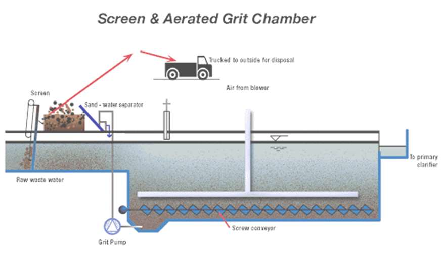
    - **Hình này chứng minh điều gì**
      - Bể lắng cát đặt sau song chắn rác và trước bể lắng sơ cấp, kết hợp đồng bộ hệ thiết bị thu hồi và vận chuyển cát.
    - **Từ đâu mà thấy được**
      - Dòng nước thải thô (Raw waste water) đi qua Screen, vào Aerated Grit Chamber, rồi dẫn sang bể lắng sơ cấp (To primary clarifier).
      - Đáy bể trang bị vít tải (Screw conveyor), bơm hút cát (Grit Pump) đưa lên bộ tách cát nước (Sand - water separator) và xe tải chuyển đi (Trucked to outside for disposal).

##### Classification of Grit Separation Devices

- Ba chủng loại thiết bị phân tách cặn cát cơ bản trong kỹ thuật xử lý nước thải:
  - Có ba dạng thiết bị lắng tách cát được áp dụng rộng rãi:
    - Bể lắng cát dòng chảy ngang (Horizontal-flow grit chambers).
    - Bể lắng cát thổi khí (Aerated grit chambers).
    - Bể lắng cát xoáy lốc (Vortex grit chambers - nội dung sinh viên tự học).

###### Horizontal-Flow Grit Chambers

- Nguyên lý thủy lực và cấu tạo của bể lắng cát dòng chảy ngang:
  - Nước thải chuyển động tịnh tiến theo phương nằm ngang qua một hoặc nhiều kênh/mương hở hình chữ nhật đặt song song.
  - Vận tốc dòng chảy ngang ($V_h$) được kiểm soát chặt chẽ trong phạm vi hẹp $0.25\text{--}0.4\text{ m/s}$ (vận tốc thiết kế chuẩn là $V_h = 0.3\text{ m/s}$).
  - Vận tốc $0.3\text{ m/s}$ cho phép các hạt cát nặng ($S_s \approx 2.65$) lắng xuống đáy kênh theo quỹ đạo nghiêng dưới tác dụng của trọng lực, đồng thời giữ cho các hạt cặn hữu cơ nhẹ ($S_s \approx 1.02$) tiếp tục lơ lửng trôi theo dòng nước.
  - Thời gian lưu nước thủy lực ($t_h$) ngắn, thường dao động trong khoảng $45\text{--}90\text{ s}$ (thời gian lưu nước điển hình là $60\text{ s}$).
  - Cần lắp đặt thiết bị kiểm soát tỷ lệ dòng chảy ở cửa ra (đập tràn tỷ lệ Sutro weir hoặc máng đo Parshall) để duy trì vận tốc $V_h \approx 0.3\text{ m/s}$ không đổi khi lưu lượng dòng vào biến thiên.
  - Cơ cấu thu gom cặn cát đáy: nạo vét thủ công bằng van phai đối với trạm công suất nhỏ, hoặc sử dụng cầu cào cát di động (traveling bridge), băng cào xích đối với trạm công suất lớn.
  - **Hình 2.** Thiết bị bể lắng cát dòng chảy ngang (Horizontal-flow grit chamber)
    - 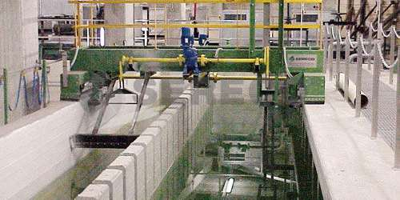
    - **Hình này chứng minh điều gì**
      - Cấu tạo bể lắng cát dòng chảy ngang dạng mương kênh chữ nhật hở có cầu cào cơ học di động phía trên.
    - **Từ đâu mà thấy được**
      - Kênh dẫn bê tông hẹp và dài với mặt thoáng dòng chảy tự do theo phương ngang.
      - Cầu công tác cơ giới (traveling bridge) lắp động cơ kéo di chuyển dọc ray trên thành bể để gạt và hút cát lắng đáy.

###### Aerated Grit Chambers

- Nguyên lý vận hành và cấu tạo của bể lắng cát thổi khí:
  - Nước thải chảy qua bể hình chữ nhật được cấp khí nén liên tục qua các ống hoặc đĩa phân phối khí đặt dọc một bên thành bể.
  - Bọt khí dâng lên tạo nên chuyển động xoắn ốc (helical liquid flow pattern), kết hợp giữa dòng xoay vòng vuông góc với thành bể và dòng chảy tịnh tiến dọc chiều dài bể.
  - Vận tốc cuộn đáy được khống chế ổn định bởi lưu lượng khí nén ($0.2\text{--}0.5\text{ m}^3\text{ khí}/\text{m}\cdot\text{min}$), hoàn toàn không phụ thuộc vào sự dao động của lưu lượng nước thải đầu vào.
  - Lực ma sát và xáo trộn bọt khí giúp bóc tách triệt để các chất hữu cơ bám dính trên hạt cát, đưa chất hữu cơ trở lại pha lỏng lơ lửng và rửa sạch hạt cát lắng xuống phễu thu cát đáy (grit hopper).
  - Hạt cát thu được có độ sạch cao, ít chứa chất hữu cơ thối rữa, hạn chế tối đa mùi hôi và dễ dàng tái sử dụng làm vật liệu xây dựng hoặc san lấp.
  - Thời gian lưu nước thủy lực ở lưu lượng đỉnh ($Q_{\text{peak}}$) dao động từ $2\text{--}5\text{ min}$ (thời gian lưu nước thiết kế điển hình là $3\text{ min}$).
  - **Hình 3.** Cụm bể lắng cát thổi khí ngoài trời (Aerated grit chamber)
    - 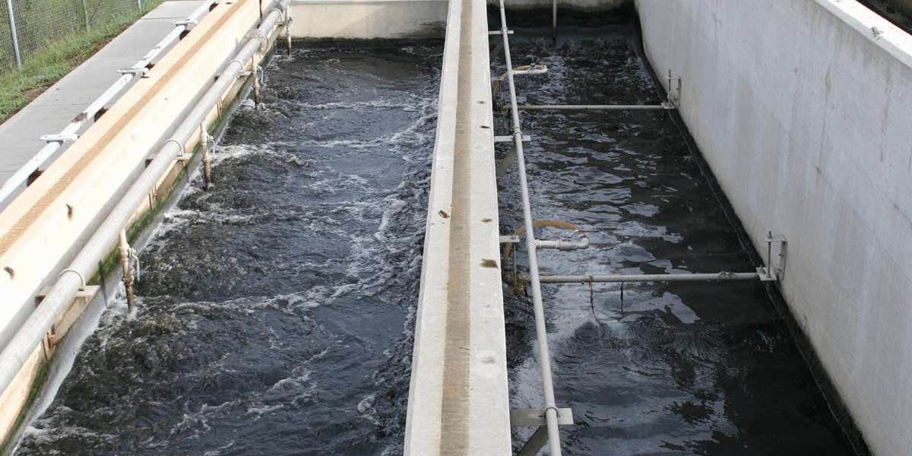
    - **Hình này chứng minh điều gì**
      - Cấu tạo bể lắng cát thổi khí gồm các đơn nguyên song song với hệ thống sục khí duy trì dòng xoáy cuộn bề mặt.
    - **Từ đâu mà thấy được**
      - Hai ngăn bể bê tông chữ nhật vận hành song song với đường ống dẫn khí nén chạy dọc thành ngăn.
      - Bọt khí sục liên tục từ dàn ống thổi khí tạo xáo trộn cục bộ và vùng sủi bọt xoắn cuộn trên mặt nước.

###### Vortex Grit Chambers

- Nguyên lý vận hành và cấu tạo của bể lắng cát xoáy lốc (nội dung tự học):
  - Thiết bị có dạng bồn kim loại hoặc tháp bê tông hình trụ tròn với đáy thu hẹp thành phễu hình nón (conical bottom hopper).
  - Dòng nước thải đi vào bể theo phương tiếp tuyến hoặc được hỗ trợ bởi cánh khuấy cơ học quay chậm đặt ở tâm bể để tạo trường lực xoáy lốc ly tâm (vortex flow).
  - Lực ly tâm kết hợp trọng lực đẩy các hạt cát vô cơ nặng văng dần ra sát biên rồi xoáy rơi xuống phễu thu cặn ở đáy trung tâm.
  - Các hạt cặn hữu cơ nhẹ hơn và nước trong tập trung ở vùng xoáy tâm dâng lên trên và thoát ra ngoài qua máng tràn răng cưa bề mặt.
  - Hạt cát gom tại đáy nón được bơm hút ra định kỳ hoặc liên tục bằng bơm chìm hút cát hoặc bơm nâng khí (airlift pump) đưa lên thiết bị rửa cát hydrocyclone.
  - Thiết bị xoáy lốc có diện tích chiếm đất rất nhỏ gọn (footprint nhỏ), hiệu suất loại bỏ cát hạt mịn ($d \ge 0.15\text{ mm}$) đạt trên $95\%$ và tổn thất áp lực thủy lực thấp.
  - **Hình 4.** Thiết bị lắng cát xoáy lốc (Vortex grit chamber)
    - 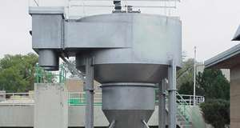
    - **Hình này chứng minh điều gì**
      - Thiết bị tách cát xoáy lốc có cấu trúc tháp kim loại hình trụ phễu nón nhỏ gọn thu gom cát bằng lực ly tâm.
    - **Từ đâu mà thấy được**
      - Thân thiết bị bằng thép hình trụ tròn gắn động cơ dẫn động cơ cấu khuấy ở đỉnh.
      - Phần đáy thon nón (conical hopper) đặt trên khung đỡ thép dùng để gom hạt cát nặng về rốn phễu xả cặn.

#### Horizontal-Flow Grit Chamber

##### Hydraulic Principles and Settling Mechanics

###### Governing Geometric and Velocity Relationships
- Kênh lắng cát dòng ngang (horizontal-flow grit chamber) là công trình lắng trọng lực dạng kênh dài có tiết diện không đổi.
  - Dòng nước thải chuyển động tịnh tiến theo phương nằm ngang từ cửa vào (inlet) đến cửa ra (outlet) với vận tốc dòng chảy $V_h$.
  - Chiều dài kênh lắng ($L$) bị chi phối bởi chiều sâu nước hiệu dụng ($H$), vận tốc lắng của hạt cát ($V_s$) và diện tích mặt cắt ngang ướt ($A = W \times H$).
- Diện tích mặt cắt ướt của dòng chảy ($A = W \times H$) bị chi phối bởi lưu lượng dòng thải ($Q$) và số lượng kênh song song ($N$).
  - Công thức liên hệ mặt cắt:
    $$A = W \times H = \frac{Q}{V_h}$$
  - Trong đó $W$ là bề rộng kênh ($\text{m}$), $H$ là chiều sâu cột nước hữu ích ($\text{m}$), $Q$ là lưu lượng dòng vào kênh ($\text{m}^3/\text{s}$), và $V_h$ là vận tốc dòng chảy ngang ($\text{m/s}$).
- Diện tích mặt bằng đáy kênh lắng ($A_{\text{floor}}$) quyết định khả năng lắng bề mặt của công trình:
  $$A_{\text{floor}} = W \times L$$
  - Trong đó $L$ là chiều dài hiệu dụng của kênh lắng ($\text{m}$).
- Chiều dài thiết kế phải bổ sung thêm chiều dài dự phòng ($L_{\text{add}}$) để bù đắp ảnh hưởng tiêu cực của hiện tượng xáo trộn và xoáy cuộn tại vùng phân phối đầu vào và vùng thu nước đầu ra:
  $$L_{\text{total}} = L + L_{\text{add}} = L \times (1 + k_{\text{turb}})$$
  - Trong đó hệ số an toàn xoáy xáo trộn $k_{\text{turb}}$ thường lấy từ $25\%$ đến $50\%$ (giá trị điển hình $30\%$).
- Phân tích véc-tơ vận tốc chuyển động hạt trong không gian 2 chiều:
  - Vận tốc theo phương ngang: $V_x = V_h = \frac{Q}{W \times H}$ (do lực đẩy động lực học của dòng nước chi phối).
  - Vận tốc theo phương thẳng đứng hướng xuống: $V_y = V_s$ (vận tốc lắng tự do của hạt cát dưới tác dụng của trọng lực).
  - Véc-tơ vận tốc tổng hợp tác dụng lên hạt:
    $$\vec{V}_n = \vec{V}_h + \vec{V}_s$$
    với độ lớn vận tốc trượt $V_n = \sqrt{V_h^2 + V_s^2}$.
      - **Hình 5.** Sơ đồ hình học và phân tích véc-tơ vận tốc bể lắng cát dòng ngang
        - 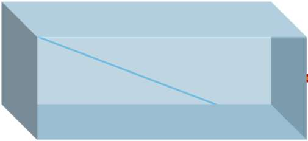
        - **Hình này chứng minh điều gì**
          - Hạt cát di chuyển theo đường chéo hợp bởi vận tốc ngang dòng chảy $V_h$ và vận tốc lắng trọng lực $V_s$.
        - **Từ đâu mà thấy được**
          - Khối hộp không gian biểu diễn chiều sâu $H$, chiều rộng $W$, chiều dài $L$, diện tích mặt cắt $W \times H$, diện tích đáy $W \times L$.
          - Véc-tơ vận tốc tổng hợp $V_n$ tạo bởi thành phần ngang $V_h$ và thành phần thẳng đứng $V_s$ hướng về góc đáy đối diện.

###### Differential Settling Trajectories of Grit and Organic Particles
- Cơ chế phân tách chọn lọc giữa hạt cát vô cơ nặng và cặn hữu cơ lơ lửng nhẹ dựa trên sự sai khác về quỹ đạo lắng:
  - Hạt cát vô cơ thô và nặng ($S_s \approx 2.65$) có vận tốc lắng lớn ($V_s \ge 0.019\text{ m/s}$), tạo thành quỹ đạo dốc hướng nhanh xuống đáy bể ("Orbit of grit").
  - Hạt hữu cơ nhẹ ($S_s \approx 1.05\text{--}1.20$) có vận tốc rơi rất nhỏ, tạo thành quỹ đạo lài sát mặt nước ("Orbit of light particle").
- Quỹ đạo chuyển động của hạt cặn rơi từ mép mặt nước tại cửa vào ($x = 0, y = H$):
  $$y(x) = H - \left(\frac{V_s}{V_h}\right) x$$
  - Hạt cát chạm đáy ($y = 0$) tại khoảng cách $x_{\text{settle}} = \frac{H \times V_h}{V_s} \le L$, do đó lắng đọng hoàn toàn trong chiều dài làm việc hiệu dụng.
  - Hạt hữu cơ nhẹ có $x_{\text{settle}} \gg L$, cao độ rơi sau chiều dài $L$ vẫn giữ ở mức cao ($y(L) > 0$), theo dòng chảy ngang thoát ra ngoài cửa xả.
- Kiểm soát vận tốc dòng chảy ngang $V_h$ là yếu tố quyết định sự thành bại của quá trình phân tách:
  - Giới hạn trên: Vận tốc $V_h$ không vượt quá $0.40\text{ m/s}$ để tránh gây xói cuộn (scour) lớp cát đã lắng dưới đáy theo phương trình Camp.
  - Giới hạn dưới: Vận tốc $V_h$ không nhỏ hơn $0.25\text{ m/s}$ để ngăn chặn các hạt cặn hữu cơ thối rữa lắng lẫn vào hố cát.
  - Giá trị vận tốc tối ưu được ấn định nghiêm ngặt ở mức $V_h \approx 0.30\text{ m/s}$.
      - **Hình 6.** Quỹ đạo lắng phân tách hạt cát nặng và chất hữu cơ nhẹ
        - 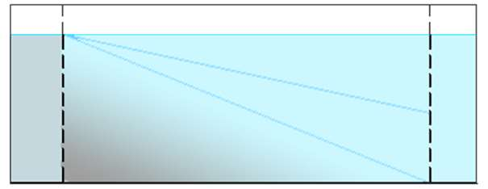
        - **Hình này chứng minh điều gì**
          - Cát nặng lắng hoàn toàn xuống đáy trong chiều dài hiệu dụng, còn hạt hữu cơ nhẹ duy trì lơ lửng và thoát ra ngoài.
        - **Từ đâu mà thấy được**
          - Đường nét đứt màu xanh dốc ("Orbit of grit") chạm đáy trước vách giới hạn cuối ("effective length").
          - Đường nét đứt màu xanh lài ("Orbit of light particle") tiếp tục duy trì cao độ và đi qua mặt cắt cửa ra.

##### Typical Design Criteria, Stokes Law, and Settling Conditions

###### Stokes Law and Terminal Settling Velocity Formulation
- Định luật Stokes mô tả chuyển động rơi tự do của một hạt cầu đơn lẻ trong môi trường chất lỏng vô hạn khi chế độ dòng chảy quanh hạt thuộc vùng chảy tầng ($Re < 1.0$):
  - Phương trình cân bằng lực khi hạt rơi đều ($F_{\text{gravity}} - F_{\text{buoyancy}} = F_{\text{drag}}$):
    $$(\rho_s - \rho_L) \left(\frac{\pi d^3}{6}\right) g = 3 \pi \mu d V_s$$
  - Biểu thức vận tốc lắng lý thuyết Stokes cho hạt cầu lý tưởng:
    $$V_s = \frac{g (\rho_s - \rho_L) d^2}{18 \mu}$$
- Hiệu chỉnh định luật Stokes cho hạt cát tự nhiên (Modified Stokes Law):
  - Hạt cát tự nhiên có góc cạnh sắc nhọn, bề mặt nhám và hình dạng không cầu hoàn hảo, làm tăng hệ số lực cản thủy động lực học.
  - Thực nghiệm áp dụng hệ số hình dạng $\phi \approx 0.7$ ở mẫu số của gia tốc trọng trường:
    $$V_S = \frac{g}{0.7} \frac{(\rho_S - \rho_L) d^2}{18 \mu}$$
  - Trong đó:
    - $V_S$: Vận tốc lắng của hạt cát ($\text{m/s}$).
    - $g$: Gia tốc trọng trường ($g = 9.81\text{ m/s}^2$).
    - $d$: Đường kính danh định của hạt cát ($\text{m}$).
    - $\rho_S$: Khối lượng riêng (tỷ trọng thể tích) của hạt rắn vô cơ ($\text{kg/m}^3$, đối với cát thạch anh $\rho_S \approx 2500\text{--}2650\text{ kg/m}^3$).
    - $\rho_L$: Khối lượng riêng của chất lỏng nước thải ($\text{kg/m}^3$, ở $20^\circ\text{C}$ lấy $\rho_L = 1000\text{ kg/m}^3$).
    - $\mu$: Độ nhớt động lực học của chất lỏng ($\text{kg/(m}\cdot\text{s)}$ hay $\text{Pa}\cdot\text{s}$, ở $20^\circ\text{C}$ lấy $\mu \approx 1.002 \times 10^{-3}\text{ Pa}\cdot\text{s}$).
      - **Hình 9.** Phương trình định luật Stokes hiệu chỉnh cho hạt cát
        - 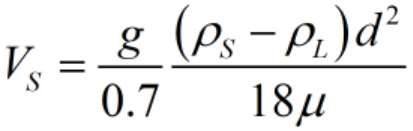
        - **Hình này chứng minh điều gì**
          - Vận tốc lắng hạt cát $V_s$ tỷ lệ thuận với bình phương đường kính hạt $d^2$ và nghịch biến với độ nhớt chất lỏng $\mu$, có xét hệ số hình dạng $0.7$.
        - **Từ đâu mà thấy được**
          - Biểu thức giải tích: $V_S = \frac{g}{0.7} \frac{(\rho_S - \rho_L) d^2}{18\mu}$ hiển thị trên nền trắng.

###### Hydraulic Settling Criterion and Retention Time Equilibrium
- Điều kiện thủy lực tiên quyết để bắt giữ hoàn toàn hạt cát mục tiêu trong buồng lắng ngang:
  - Thời gian rơi thẳng đứng từ mặt nước xuống đáy của hạt ($t_s$) phải nhỏ hơn hoặc bằng thời gian lưu nước của dòng chảy qua buồng lắng ($t_h$):
    $$t_s < t_h$$
  - Trong đó:
    - Thời gian lắng của hạt cát: $t_s = \frac{H}{V_s}$ ($\text{s}$).
    - Thời gian lưu nước thủy lực: $t_h = \frac{L}{V_h} = \frac{V_{\text{tank}}}{Q}$ ($\text{s}$).
- Dãy biến đổi tương đương của điều kiện lắng:
  $$t_s < t_h \iff \frac{H}{V_s} < \frac{L}{V_h} \iff \frac{L}{H} > \frac{V_h}{V_s}$$
  - Ý nghĩa kỹ thuật: Tỷ số hình học giữa chiều dài và chiều sâu kênh lắng ($L/H$) phải lớn hơn tỷ số động học giữa vận tốc dòng chảy ngang và vận tốc lắng của hạt cát ($V_h/V_s$).
  - Công thức xác định chiều dài lý thuyết tối thiểu:
    $$L_{\text{theoretical}} = H \times \left(\frac{V_h}{V_s}\right)$$
      - **Hình 10.** Điều kiện thủy lực bắt giữ hạt cặn trong kênh lắng ngang
        - 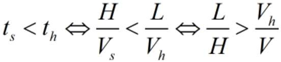
        - **Hình này chứng minh điều gì**
          - Hạt cát được giữ lại khi thời gian lắng thẳng đứng ngắn hơn thời gian lưu nước ngang ($t_s < t_h$), tương đương tỷ lệ $L/H > V_h/V_s$.
        - **Từ đâu mà thấy được**
          - Dãy biến đổi tương đương: $t_s < t_h \iff \frac{H}{V_s} < \frac{L}{V_h} \iff \frac{L}{H} > \frac{V_h}{V}$.

###### Metcalf & Eddy Design Criteria for Horizontal-Flow Grit Chambers
- Bảng thông số thiết kế điển hình cho bể lắng cát dòng chảy ngang theo tiêu chuẩn Metcalf & Eddy:

| Thông số thiết kế (Parameter) | Đơn vị (Unit) | Dải thông số (Range) | Giá trị điển hình (Typical) |
| :--- | :--- | :--- | :--- |
| **Thời gian lưu nước** (Detention time, $t_h$) | $\text{s}$ | $45\text{--}90$ | $60$ |
| **Vận tốc dòng chảy ngang** (Horizontal velocity, $V_h$) | $\text{m/s}$ | $0.25\text{--}0.4$ | $0.3$ |
| **Vận tốc lắng** (Settling velocity, $V_s$) cho: | | | |
| - Hạt cỡ $0.21\text{ mm}$ (rây 70-mesh) | $\text{m/min}$ | $1.0\text{--}1.3$ | $1.15$ ($0.01917\text{ m/s}$) |
| - Hạt cỡ $0.149\text{ mm}$ (rây 100-mesh) | $\text{m/min}$ | $0.6\text{--}0.9$ | $0.75$ ($0.0125\text{ m/s}$) |
| **Tổn thất áp lực** tại bộ phận kiểm soát theo % chiều sâu | $\%$ | $30\text{--}40$ | $36$ |
| **Chiều dài dự phòng bổ sung** cho xáo trộn vào/ra | $\%$ | $25\text{--}50$ | $30$ |

- Ý nghĩa các chỉ tiêu kỹ thuật then chốt:
  - Vận tốc lắng $V_s = 1.15\text{ m/phút}$ ($0.01917\text{ m/s}$) đối với hạt $0.21\text{ mm}$ phản ánh trạng thái rơi thực tế trong vùng dòng chảy chuyển tiếp ($Re \approx 4.0 > 1.0$), thấp hơn giá trị lý thuyết Stokes không cản.
  - Tổn thất áp lực qua tiết diện kiểm soát (đập Sutro hoặc máng Parshall) chiếm khoảng $36\%$ chiều sâu mực nước trong kênh, tạo điều kiện giữ mực nước dâng tỷ lệ thuận với lưu lượng.
  - Chiều dài bổ sung $30\%$ đảm bảo triệt tiêu xung động dòng vào và sóng hồi lưu trước khi dòng nước rời bể.
      - **Hình 7.** Danh mục thông số thiết kế điển hình bể lắng cát dòng ngang
        - 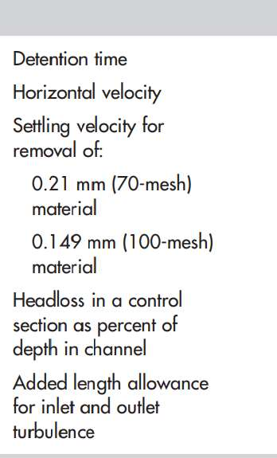
        - **Hình này chứng minh điều gì**
          - Bảng xác định 6 thông số thủy lực cốt lõi: thời gian lưu, vận tốc ngang, vận tốc lắng hạt cát, tổn thất áp lực và chiều dài phụ trợ.
        - **Từ đâu mà thấy được**
          - Cột văn bản liệt kê từ trên xuống: Detention time, Horizontal velocity, Settling velocity ($0.21\text{ mm}$ và $0.149\text{ mm}$), Headloss, Added length allowance.
      - **Hình 8.** Đơn vị và khoảng giá trị thiết kế bể lắng cát dòng ngang
        - 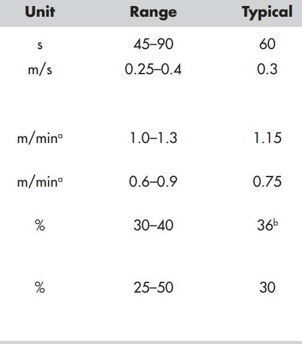
        - **Hình này chứng minh điều gì**
          - Tiêu chuẩn quy định dải giá trị kỹ thuật và giá trị điển hình: thời gian lưu $60\text{ s}$, vận tốc ngang $0.3\text{ m/s}$, dự phòng xáo trộn $30\%$.
        - **Từ đâu mà thấy được**
          - Cột `Unit`: đơn vị đo lường tương ứng ($\text{s}$, $\text{m/s}$, $\text{m/min}$, $\%$).
          - Cột `Range` và `Typical`: hiển thị $45\text{--}90\text{ s}$ (typ. $60$), $0.25\text{--}0.4\text{ m/s}$ (typ. $0.3$), $1.0\text{--}1.3\text{ m/min}$ (typ. $1.15$), tổn thất $36\%$, chiều dài bù $30\%$.

##### Worked Example: Horizontal-Flow Grit Chamber Design

- **Đề bài**: Thiết kế bể lắng cát dòng chảy ngang (horizontal-flow grit chamber) cho trạm xử lý nước thải sinh hoạt đô thị với lưu lượng trung bình $Q_{\text{avg}} = 0.5\text{ m}^3\text{/s}$, hệ số không điều hòa cực đại (peaking factor) bằng $3.0$.
- **Dữ kiện**
  - Lưu lượng trung bình ngày: $Q_{\text{avg}} = 0.5\text{ m}^3\text{/s} = 43{,}200\text{ m}^3\text{/ngày}$.
  - Hệ số đỉnh (peaking factor): $\text{PF} = 3.0$.
  - Cấp hạt cát mục tiêu thiết kế cần loại bỏ: cát thạch anh kích thước $d \ge 0.21\text{ mm}$ (rây 70-mesh Hoa Kỳ), tỷ trọng $S_s = 2.65$ ($\rho_s = 2650\text{ kg/m}^3$).
  - Khối lượng riêng của nước thải ở $20^\circ\text{C}$: $\rho_L = 1000\text{ kg/m}^3$.
  - Độ nhớt động lực học của nước ở $20^\circ\text{C}$: $\mu = 1.002 \times 10^{-3}\text{ Pa}\cdot\text{s}$.
  - Gia tốc trọng trường: $g = 9.81\text{ m/s}^2$.
- **Quy tắc áp dụng**
  - Lưu lượng thiết kế đỉnh cực đại: $Q_{\text{peak}} = Q_{\text{avg}} \times \text{PF}$. Nguồn: Metcalf & Eddy; công thức thủy lực.
  - Vận tốc dòng chảy ngang kiểm soát: Chọn $V_h = 0.30\text{ m/s}$ (dải tiêu chuẩn $0.25\text{--}0.40\text{ m/s}$). Nguồn: Slide 7 (Bảng Typical design information).
  - Vận tốc lắng thiết kế của hạt cát $0.21\text{ mm}$: $V_s = 1.15\text{ m/phút} = 0.01917\text{ m/s}$. Nguồn: Slide 7 (Bảng Typical design information).
  - Điều kiện cân bằng thời gian lắng: $t_s \le t_h \iff L_{\text{lt}} = \frac{H \times V_h}{V_s}$. Nguồn: Slide 7 (Eq: $t_s < t_h$).
  - Dự phòng xáo trộn chiều dài dòng vào và dòng ra: $L = L_{\text{lt}} \times (1 + k_{\text{turb}})$ với $k_{\text{turb}} = 30\%$ (dải tiêu chuẩn $25\%\text{--}50\%$). Nguồn: Slide 7.
  - Cấu hình an toàn: Bố trí tối thiểu $N = 2$ kênh song song nhằm đảm bảo vận hành liên tục khi một kênh dừng để bảo trì. Nguồn: Slide 6 & 11.
  - Suất sinh cát định mức: $r_{\text{grit}} = 0.015\text{ m}^3\text{ cát / } 1000\text{ m}^3$ nước thải. Chu kỳ lưu trữ cát thiết kế: $T_{\text{storage}} = 7\text{ ngày}$. Nguồn: Metcalf & Eddy.
- **Lời giải**
  - **Bước 1**: Xác định lưu lượng thiết kế cực đại ($Q_{\text{peak}} = 1.50\text{ m}^3\text{/s}$).
    - Căn cứ: Công thức lưu lượng đỉnh qua hệ số không điều hòa $Q_{\text{peak}} = Q_{\text{avg}} \times \text{PF}$.
    - Nhìn vào: Dữ kiện đề bài cho $Q_{\text{avg}} = 0.5\text{ m}^3\text{/s}$ và $\text{PF} = 3.0$:
      $$Q_{\text{peak}} = 0.5\text{ m}^3\text{/s} \times 3.0 = 1.50\text{ m}^3\text{/s} = 90.0\text{ m}^3\text{/phút} = 129{,}600\text{ m}^3\text{/ngày}$$
  - **Bước 2**: Lựa chọn số lượng kênh song song và phân bổ lưu lượng tính toán ($Q_{\text{peak},1} = 0.75\text{ m}^3\text{/s}$).
    - Căn cứ: Nguyên tắc thiết kế dự phòng tối thiểu 2 kênh hoạt động song song ($N \ge 2$) để cách ly bảo trì.
    - Nhìn vào: Bố trí cấu hình $N = 2$ kênh lắng hoạt động đồng thời ở đỉnh tải:
      $$Q_{\text{peak},1} = \frac{Q_{\text{peak}}}{N} = \frac{1.50\text{ m}^3\text{/s}}{2} = 0.75\text{ m}^3\text{/s}$$
  - **Bước 3**: Xác định diện tích mặt cắt ướt và kích thước hình học kênh ($W = 2.00\text{ m}$, $H = 1.25\text{ m}$).
    - Căn cứ: Công thức liên hệ diện tích mặt cắt $A_1 = \frac{Q_{\text{peak},1}}{V_h}$ với $V_h = 0.30\text{ m/s}$ (trị số điển hình từ bảng Slide 7).
    - Nhìn vào: Lưu lượng đỉnh mỗi kênh $Q_{\text{peak},1} = 0.75\text{ m}^3\text{/s}$:
      $$A_1 = \frac{0.75\text{ m}^3\text{/s}}{0.30\text{ m/s}} = 2.50\text{ m}^2$$
      (Tổng diện tích mặt cắt ướt của toàn trạm: $A_{\text{total}} = 2 \times 2.50 = 5.00\text{ m}^2$).
    - Chọn chiều sâu mực nước hiệu dụng $H = 1.25\text{ m}$ (thỏa mãn dải chuẩn kỹ thuật $1.0\text{--}1.5\text{ m}$).
    - Chiều rộng mỗi kênh lắng:
      $$W = \frac{A_1}{H} = \frac{2.50\text{ m}^2}{1.25\text{ m}} = 2.00\text{ m}$$
    - Kiểm tra tỷ lệ kích thước tiết diện: $\frac{W}{H} = \frac{2.00}{1.25} = 1.60$, thỏa mãn hoàn toàn dải tiêu chuẩn tỷ lệ $1.0\text{--}2.0$.
  - **Bước 4**: Xác định vận tốc lắng của hạt cát mục tiêu ($V_s = 0.01917\text{ m/s}$).
    - Căn cứ: Giá trị vận tốc lắng thực nghiệm cho hạt $d = 0.21\text{ mm}$ (70-mesh) trong bảng tiêu chuẩn Slide 7 ($V_s = 1.15\text{ m/phút}$).
    - Nhìn vào: Chuyển đổi đơn vị sang mét trên giây:
      $$V_s = \frac{1.15\text{ m/phút}}{60\text{ s/phút}} \approx 0.01917\text{ m/s}$$
      *(Ghi chú đối chiếu công thức Stokes hiệu chỉnh: Nếu hạt cát mịn $d = 0.125\text{ mm}$ với $S_s = 2.50$ được sử dụng như trong bài tập thực hành giáo trình HCMUT, công thức $V_s = \frac{g}{0.7}\frac{(\rho_s - \rho_L)d^2}{18\mu}$ sẽ cho $V_s = \frac{9.81}{0.7} \times \frac{1500 \times (1.25 \times 10^{-4})^2}{18 \times 1.002 \times 10^{-3}} = 0.01821\text{ m/s} = 1.093\text{ m/phút}$, rất tương đồng với dải thiết kế).*
  - **Bước 5**: Tính toán chiều dài hiệu dụng của kênh lắng ($L = 25.50\text{ m}$).
    - Căn cứ: Phương trình điều kiện biên lắng $L_{\text{lt}} = \frac{H \times V_h}{V_s}$ và hệ số dự phòng xáo trộn đầu vào/ra $k_{\text{turb}} = 30\%$.
    - Nhìn vào: Chiều sâu $H = 1.25\text{ m}$, vận tốc $V_h = 0.30\text{ m/s}$, vận tốc lắng $V_s = 0.01917\text{ m/s}$:
      $$L_{\text{lt}} = \frac{1.25\text{ m} \times 0.30\text{ m/s}}{0.01917\text{ m/s}} = 19.562\text{ m}$$
    - Chiều dài thiết kế bao gồm chiều dài bù trừ sóng xáo trộn:
      $$L = L_{\text{lt}} \times (1 + 0.30) = 19.562\text{ m} \times 1.30 = 25.43\text{ m}$$
    - Quy chuẩn làm tròn kích thước xây dựng: Chọn $L = 25.50\text{ m}$.
  - **Bước 6**: Kiểm tra thời gian lưu nước thủy lực ($t_h = 85.0\text{ s}$).
    - Căn cứ: Công thức thời gian lưu nước $t_h = \frac{L}{V_h}$.
    - Nhìn vào: Chiều dài $L = 25.50\text{ m}$ và vận tốc ngang $V_h = 0.30\text{ m/s}$:
      $$t_h = \frac{25.50\text{ m}}{0.30\text{ m/s}} = 85.0\text{ s}$$
    - Đánh giá: Giá trị $85.0\text{ s}$ nằm trọn vẹn trong dải tiêu chuẩn cho phép $45\text{--}90\text{ s}$.
    - So sánh với thời gian lắng của hạt cát:
      $$t_s = \frac{H}{V_s} = \frac{1.25\text{ m}}{0.01917\text{ m/s}} = 65.2\text{ s}$$
      Do $t_s = 65.2\text{ s} < t_h = 85.0\text{ s}$, hạt cát chạm đáy trước khi đến cuối bể, thỏa mãn hoàn toàn điều kiện bắt giữ cặn.
  - **Bước 7**: Tính toán lượng cát thu gom và thể tích hố tích lũy cát ($V_{\text{storage}} = 2.27\text{ m}^3\text{/kênh}$).
    - Căn cứ: Suất sinh cát định mức $r_{\text{grit}} = 0.015\text{ m}^3\text{ cát / } 1000\text{ m}^3$ nước thải theo lưu lượng trung bình ngày $Q_{\text{avg}} = 43{,}200\text{ m}^3\text{/ngày}$.
    - Nhìn vào: Tổng lượng cát toàn trạm tích lũy mỗi ngày:
      $$V_{\text{grit,day}} = 43{,}200\text{ m}^3\text{/ngày} \times \frac{0.015\text{ m}^3}{1000\text{ m}^3} = 0.648\text{ m}^3\text{/ngày}$$
    - Lượng cát trung bình mỗi kênh tiếp nhận:
      $$V_{\text{grit},1} = \frac{0.648\text{ m}^3\text{/ngày}}{2} = 0.324\text{ m}^3\text{/kênh}\cdot\text{ngày}$$
    - Thể tích hố thu gom cát dự phòng chu kỳ xả $T_{\text{storage}} = 7\text{ ngày}$:
      $$V_{\text{storage}} = 0.324\text{ m}^3\text{/ngày} \times 7\text{ ngày} = 2.268\text{ m}^3\text{/kênh}$$
    - Cấu tạo hố cát đáy: Bố trí rãnh thu chữ V chạy dọc đáy kênh sâu $H_{\text{hố}} = 0.30\text{ m}$, rộng đáy $0.30\text{ m}$, rộng miệng $0.60\text{ m}$ (diện tích mặt cắt hố $A_{\text{hopper}} = 0.135\text{ m}^2$, dung tích thực tế đạt $0.135 \times 25.5 = 3.44\text{ m}^3 > 2.268\text{ m}^3$, đảm bảo an toàn).
  - **Bước 8**: Tính toán tổn thất áp lực qua cơ cấu kiểm soát lưu lượng ($h_L = 0.45\text{ m}$).
    - Căn cứ: Tiêu chuẩn tổn thất áp lực qua đập kiểm soát (Sutro weir hoặc Parshall flume) bằng $36\%$ chiều sâu nước trong kênh (Slide 7).
    - Nhìn vào: Chiều sâu nước hiệu dụng $H = 1.25\text{ m}$:
      $$h_L = 36\% \times H = 0.36 \times 1.25\text{ m} = 0.45\text{ m}$$
- **Kết quả**
  - Số lượng kênh lắng song song: $N = 2$ kênh.
  - Bề rộng mỗi kênh: $W = 2.00\text{ m}$.
  - Chiều sâu cột nước hữu ích: $H = 1.25\text{ m}$.
  - Chiều cao bảo vệ an toàn (freeboard): $H_{\text{ab}} = 0.35\text{ m}$.
  - Chiều sâu hố thu cát đáy: $H_{\text{hố}} = 0.30\text{ m}$.
  - Tổng chiều sâu xây dựng thành kênh: $H_{\text{total}} = 1.25 + 0.35 + 0.30 = 1.90\text{ m}$.
  - Chiều dài hiệu dụng kênh lắng: $L = 25.50\text{ m}$.
  - Vận tốc dòng chảy ngang kiểm soát: $V_h = 0.30\text{ m/s}$.
  - Thời gian lưu nước thủy lực ở đỉnh tải: $t_h = 85.0\text{ s}$.
  - Thể tích hố chứa cát chu kỳ 7 ngày: $V_{\text{storage}} = 2.27\text{ m}^3\text{/kênh}$.
  - Tổn thất cột áp thủy lực qua đập kiểm soát: $h_L = 0.45\text{ m}$.
- **Kiểm tra lại**
  - Tải trọng nạp bề mặt (Surface Overflow Rate):
    $$SOR = \frac{Q_{\text{peak}}}{N \times W \times L} = \frac{129{,}600\text{ m}^3\text{/ngày}}{2 \times (2.00\text{ m} \times 25.50\text{ m})} = \frac{129{,}600}{102} \approx 1270.6\text{ m}^3\text{/m}^2\cdot\text{ngày}$$
    Thỏa mãn dải tiêu chuẩn thiết kế thông thường ($1000\text{--}1600\text{ m}^3\text{/m}^2\cdot\text{ngày}$).
  - Vận tốc xói cuốn tới hạn Camp cho hạt cát thạch anh ($d = 0.21\text{ mm}$, $S_s = 2.65$, $\beta = 0.04$, $f = 0.03$):
    $$V_c = \sqrt{\frac{8 \beta}{f} g (S_s - 1) d} = \sqrt{\frac{8 \times 0.04}{0.03} \times 9.81 \times (2.65 - 1) \times 0.00021} \approx 0.19\text{--}0.25\text{ m/s}$$
    Vì cát lắng rơi xuống rãnh đáy tĩnh (quiescent hopper) nằm dưới cao trình dòng chảy chính, vận tốc dòng ngang $V_h = 0.30\text{ m/s}$ tại thân kênh không gây xáo trộn đáy hố, đồng thời hoàn toàn vượt qua vận tốc xói của cặn hữu cơ ($V_{c,\text{org}} \approx 0.09\text{ m/s}$), đảm bảo cặn hữu cơ không bị lắng lẫn.

##### Applications, Performance, and Equipment Layout

###### Operational Scope, Advantages, and Disadvantages
- Phạm vi ứng dụng (Application):
  - Phù hợp nhất cho các trạm xử lý nước thải quy mô vừa và nhỏ (small-to medium-sized WWTPs).
  - Đây là loại bể lắng cát cổ điển nhất trong lịch sử kỹ thuật xử lý nước thải ("the oldest type of grit chamber").
- Ưu điểm công nghệ (Advantages):
  - Hệ thống cấu tạo đơn giản (simple system), thi công xây dựng dễ dàng bằng bê tông cốt thép hoặc gạch đá địa phương.
  - Vận hành hoàn toàn bằng thủy lực tự chảy, không tiêu thụ điện năng cho máy sục khí nén hay động cơ quay phức tạp.
- Nhược điểm công nghệ (Disadvantages):
  - Hiệu suất lắng tách cát tương đối thấp (low efficiency) khi lưu lượng nước thải dao động mạnh giữa ngày và đêm.
  - Cát lắng thu được có hàm lượng tạp chất hữu cơ cao (thường từ $15\%$ đến $50\%$), dễ phân hủy kỵ khí sinh mùi hôi thối nếu không có thiết bị rửa cát thứ cấp.
  - Chiều dài công trình lớn, chiếm nhiều diện tích đất xây dựng của trạm xử lý.

###### Mechanical Grit Removal and Elevation Systems
- Phương pháp cào thu cát đáy (Grit removal mechanisms):
  - Tại các trạm quy mô lớn và vừa, thu gom cát cơ giới hóa bằng hệ thống băng tải cào (conveyor with scrapers), gầu xúc (buckets) hoặc lưỡi cào (plows).
  - Các thanh gạt chuyển động chậm dọc theo đáy kênh kéo cát dồn về hố thu tập trung ở đầu hoặc cuối bể.
- Thiết bị nâng chuyển cát (Grit elevation):
  - Băng tải trục vít (screw conveyors) hoặc gầu tải nghiêng (bucket elevators) được sử dụng để nâng lượng cát đã lắng lên khỏi mặt nước.
  - Cát được vận chuyển đến thiết bị rửa cát ly tâm (grit cyclone washer) trước khi đưa đi chôn lấp hoặc tái sử dụng làm vật liệu xây dựng san lấp.
- Vệ sinh thủ công ở trạm quy mô nhỏ (Manual cleaning in small plants):
  - Tại các trạm công suất nhỏ, bể lắng cát thường được làm sạch bằng phương pháp thủ công (cleaned manually).
  - Định kỳ cô lập từng ngăn bằng cửa phai, xả cạn nước và công nhân dùng xẻng nạo vét lớp cát dưới đáy.

###### Structural Layout, Flow Control Flume, and Real-World Installation
- Cấu tạo chi tiết cụm công trình lắng cát 2 kênh:
  - Cửa phân phối đầu vào (Inlet): Miệng loe tiếp nhận nước thải sau song chắn rác, bố trí rãnh lắp tấm phai chặn (stopboards/stop logs) để đóng mở và điều tiết lưu lượng độc lập cho từng kênh.
  - Ngăn lắng chính và rãnh chứa cát đáy (Grit storage channel): Thiết kế tiết diện đáy vát chữ V dẫn cát về rãnh trung tâm; có đường ống thoát nước đáy (Drain) để tháo cạn nước khi súc rửa.
  - Cơ cấu kiểm soát vận tốc và đo lưu lượng đầu ra (Control flume incorporating flow measurement): Đặt ở cửa ra (Outlet), thường là máng đo Parshall hoặc đập tràn Sutro nhằm duy trì vận tốc dòng ngang ổn định $0.30\text{ m/s}$ tại mọi chế độ tải trọng thủy lực, đồng thời tích hợp đo lưu lượng tức thời.
      - **Hình 11.** Mặt bằng, mặt cắt dọc và mặt cắt ngang bể lắng cát 2 kênh
        - 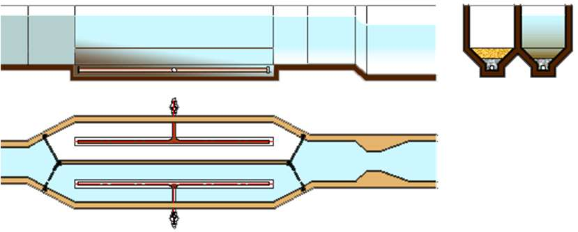
        - **Hình này chứng minh điều gì**
          - Bể gồm 2 kênh song song có phai chặn điều tiết độc lập, rãnh xả đáy thu cát và máng đo Parshall khống chế vận tốc tại đầu ra.
        - **Từ đâu mà thấy được**
          - Sơ đồ SECTION ELEVATION (cắt dọc) thể hiện bậc đáy rãnh cát; CROSS SECTION (cắt ngang) thể hiện 2 ngăn đáy vát chữ V.
          - Sơ đồ PLAN (mặt bằng) thể hiện cửa phai phân dòng đầu vào, ống xả cát trung tâm và họng máng co hẹp kiểm soát lưu lượng đầu ra.
      - **Hình 12.** Hình ảnh thực tế bể lắng cát kênh hở làm sạch thủ công
        - 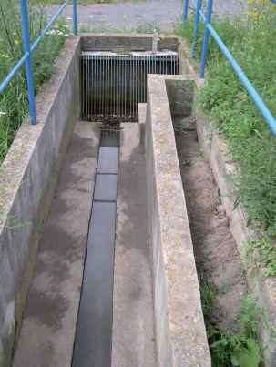
        - **Hình này chứng minh điều gì**
          - Bể lắng kênh hở quy mô nhỏ tích hợp song chắn rác thô đầu vào, gờ khe lắp tấm phai và rãnh tháo nước xả cát dọc đáy.
        - **Từ đâu mà thấy được**
          - Khung song chắn rác bằng thép đặt nghiêng ở đầu kênh dẫn nước thải.
          - Lòng kênh bê tông hẹp có rãnh trũng bằng phẳng ở tim đáy và các khe rãnh thẳng đứng trên thành bê tông để chèn tấm phai cô lập dòng.

#### Aerated Grit Chamber

##### Operating Principles, Aeration Mechanism, and Flow Patterns

###### Operating Principle and Specific Gravity Reduction
- Nguyên lý cơ bản: Tỷ trọng biểu kiến của hỗn hợp nước - bọt khí nhỏ hơn tỷ trọng của nước nguyên chất ($\rho_{\text{mixture}} < \rho_{\text{water}}$).
  - Bọt khí nén phân tán vào khối chất lỏng làm giảm khối lượng riêng trung bình của môi trường bao quanh hạt cát.
  - Chênh lệch tỷ trọng tương đối giữa hạt cát khoáng vô cơ ($S_s \approx 2.65$) và môi trường hỗn hợp nước - khí gia tăng.
  - Độ cản nổi của chất lỏng suy giảm cục bộ, tạo điều kiện cho hạt cát lắng xuống đáy dễ dàng và nhanh chóng hơn (sand settles easier).
  - Tỷ trọng giảm chỉ tác động chọn lọc lên các hạt khoáng có khối lượng riêng lớn, không làm lắng các chất hữu cơ lơ lửng nhẹ ($S_s \approx 1.05 - 1.20$).
- Cấu tạo hình học của bể lắng cát thổi khí điển hình bao gồm khoang lắng hình chữ nhật, dàn ống cấp khí và phễu thu cát đáy.
  - Tuyến ống phân phối khí nén (air line) dẫn khí từ máy thổi khí áp lực dọc theo chiều dài bể.
  - Các đĩa hoặc ống khuếch tán khí bọt thô (diffusers) bố trí tập trung dọc theo một bên thành bể.
  - Phễu thu cát (grit hopper) với vách nghiêng dốc đặt tại đáy bể dọc ngay bên dưới dàn phân phối khí.
  - Cụm ống nâng khớp xoay (swing diffuser assembly) hỗ trợ nhấc toàn bộ dàn đĩa khí lên khỏi mặt nước để kiểm tra và bảo trì mà không cần xả cạn bể.
    - **Hình 13.** Cấu tạo mặt cắt ngang điển hình của bể lắng cát thổi khí
      - 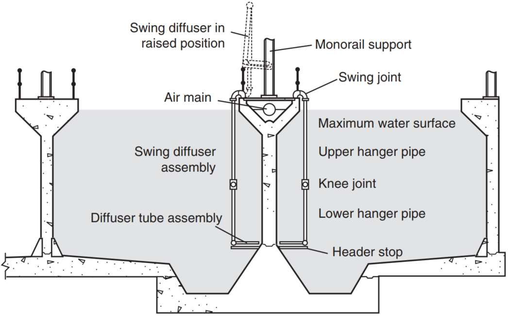
      - **Hình này chứng minh điều gì**
        - Dàn phân phối khí dạng khớp xoay (swing diffuser) bố trí dọc vách ngăn trung tâm bên trên phễu thu cát (grit hopper) có đáy vát dốc.
      - **Từ đâu mà thấy được**
        - Phía trên: monorail support (ray đơn treo), swing joint (khớp xoay) và vị trí swing diffuser in raised position phục vụ bảo dưỡng.
        - Dọc vách bể: upper/lower hanger pipe dẫn khí nén từ air main xuống diffuser tube assembly đặt cách đáy phẳng một khoảng xác định.
        - Phía đáy: grit hopper thu hẹp với thành dốc đứng đặt trực tiếp dưới cụm đĩa phân phối khí.

###### Helical Flow Pattern and Bottom Velocity Control
- Khí nén được cấp liên tục vào đáy bể dọc theo một bên thành của bể lắng hình chữ nhật.
  - Luồng bọt khí dâng lên tạo lực đẩy thủy lực nâng khối nước tại phía thành có đĩa khí chuyển động thẳng đứng lên mặt nước.
  - Khối nước chuyển hướng chảy tràn sang thành đối diện khi chạm mặt thoáng tự do.
  - Dòng nước hạ chìm xuống sát đáy tại thành đối diện và quay ngược lại chân thành bể ban đầu.
  - Chuyển động tuần hoàn khép kín này tạo thành một dòng chảy xoay vòng thẳng đứng vuông góc với trục dọc của bể.
- Sự kết hợp giữa chuyển động xoay vòng thẳng đứng và chuyển động tịnh tiến dọc trục tạo ra dòng chảy xoắn ốc (helical liquid flow pattern).
  - Vận tốc tịnh tiến dọc trục đưa dòng nước thải chuyển động dần từ cửa vào (inlet) đến đập tràn cửa ra (outlet weir).
  - Quỹ đạo dòng chất lỏng chuyển động theo dạng đường xoắn ốc liên tục dọc suốt chiều dài bể.
  - Dòng xoay tạo ra một dòng chảy quét ngang đáy (horizontal flow) với vận tốc không đổi tại vùng đáy bể.
  - Vận tốc quét đáy được duy trì ổn định trong khoảng $0.25 - 0.35\text{ m/s}$ độc lập với sự dao động lưu lượng nước thải nạp vào.
    - **Hình 14.** Mặt cắt thủy lực dòng chảy xoắn ốc (helical flow pattern) trong bể lắng cát thổi khí
      - 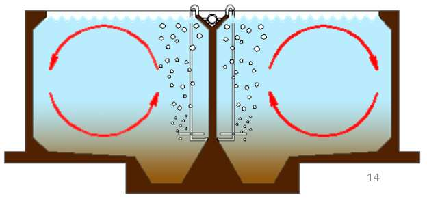
      - **Hình này chứng minh điều gì**
        - Bọt khí thổi lên từ một bên thành tạo dòng hoàn lưu xoay tròn quét qua đáy bể về phía phễu thu cát.
      - **Từ đâu mà thấy được**
        - Dọc vách ngăn giữa: bọt khí sục lên từ ống phân phối khí kéo dòng chất lỏng dâng lên sát mặt nước.
        - Mũi tên đỏ xoay vòng: dòng đối lưu chuyển động cuộn tròn sang thành đối diện rồi quét ngang qua đáy vào grit hopper.
- Hạt cát chuyển động theo quỹ đạo riêng biệt dưới tác dụng phối hợp của trọng lực và lực quán tính ly tâm.
  - Khi dòng nước cuộn quét ngang qua đáy phẳng về phía vách đặt đĩa khí, hạt cát vô cơ nặng rơi lắng khỏi dòng xoáy và rơi vào phễu thu cát (grit hopper).
  - Hạt cát có kích thước mục tiêu $d \ge 0.21\text{ mm}$ hoàn thành quỹ đạo lắng chìm trong vòng vài chu kỳ xoắn trước khi đến cửa ra.
  - Nước trong và các chất hữu cơ lơ lửng tiếp tục duy trì chuyển động xoắn ốc thoát ra ngoài qua đập tràn đỉnh (outlet weir).
    - **Hình 15.** Mô hình không gian 3 chiều của dòng chảy xoắn ốc và quỹ đạo lắng hạt cát
      - 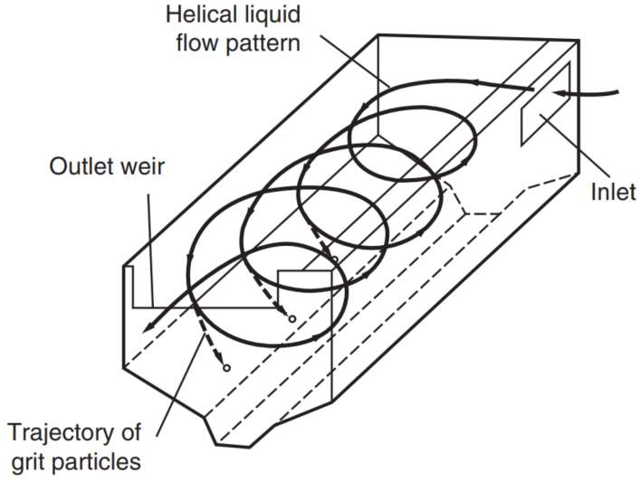
      - **Hình này chứng minh điều gì**
        - Chuyển động xoắn ốc đẩy hạt cát nặng trượt dần xuống phễu đáy trong khi dòng nước di chuyển dọc từ inlet đến outlet weir.
      - **Từ đâu mà thấy được**
        - Cửa vào (Inlet) và đập tràn thoát nước (Outlet weir) ở hai đầu bể chữ nhật.
        - Đường xoắn ốc Helical liquid flow pattern mô tả chuyển động cuộn xoáy liên tục dọc chiều dài bể.
        - Đường nét đứt Trajectory of grit particles chỉ quỹ đạo hạt cát tách khỏi dòng xoáy và rơi vào rãnh phễu đáy.

###### Organic Separation, Grit Washing, and Air Rate Adjustment
- Lưu lượng cấp khí nén dễ dàng điều chỉnh thông qua hệ thống van tiết lưu (quantity of air is easily adjusted).
  - Vận tốc cuộn xoay của chất lỏng phụ thuộc trực tiếp vào lưu lượng khí nén cấp vào bể chứ không phụ thuộc vào lưu lượng nước thải.
  - Người vận hành điều chỉnh van cấp khí trên từng tuyến nhánh để hiệu chỉnh cường độ khuấy trộn phù hợp với từng mùa vận hành.
  - Khi sục khí thích hợp, lực cắt thủy lực (hydraulic shear stress) do các bọt khí sinh ra đủ lớn để bóc tách các màng hữu cơ bám dính trên hạt cát.
- Quá trình rửa cát tự nhiên diễn ra liên tục ngay trong lòng bể lắng (well-washed grit).
  - Chất hữu cơ sau khi bị bóc tách khỏi bề mặt hạt khoáng sẽ bị bọt khí và dòng cuộn nâng trở lại vào pha lỏng lơ lửng.
  - Vận tốc quét đáy $0.25 - 0.35\text{ m/s}$ ngăn chặn triệt để chất hữu cơ lắng đọng vào phễu thu cát.
  - Cát lắng thu gom tại đáy đạt độ sạch cao, hàm lượng chất hữu cơ dễ thối rữa dưới $3\% - 5\%$, thuận lợi cho việc vận chuyển và chôn lấp hợp vệ sinh mà không gây mùi hôi.

---

##### Typical Design Criteria and Dimensional Parameters

###### Design Criteria and Geometric Parameter Ranges
- Bảng thông số thiết kế điển hình (Typical design information) chuẩn hóa các giới hạn quy phạm cho bể lắng cát thổi khí.
  - Thời gian lưu nước thủy lực ở lưu lượng đỉnh ($HRT_{\text{peak}}$): dao động trong khoảng $2 - 5\text{ min}$, giá trị thiết kế điển hình là $3\text{ min}$.
  - Chiều sâu nước làm việc ($H$): dải quy phạm $2 - 5\text{ m}$, chiều sâu thông dụng từ $3.0\text{ m}$ đến $4.0\text{ m}$.
  - Chiều dài bể ($L$): dải quy phạm $7.5 - 20\text{ m}$, chiều dài thông dụng từ $10\text{ m}$ đến $15\text{ m}$.
  - Chiều rộng bể ($W$): dải quy phạm $2.5 - 7\text{ m}$, chiều rộng thông dụng từ $3.0\text{ m}$ đến $4.5\text{ m}$.
  - Tỷ lệ Bề rộng trên Chiều sâu ($W/H$): dải quy phạm từ $1:1$ đến $5:1$, giá trị thiết kế tối ưu duy trì xoáy tròn ổn định là $1.5:1$.
  - Tỷ lệ Chiều dài trên Bề rộng ($L/W$): dải quy phạm từ $3:1$ đến $5:1$, giá trị thiết kế điển hình là $4:1$ nhằm ngăn ngừa ngắn mạch thủy lực.
  - Cường độ cấp khí nén trên một đơn vị chiều dài ($q_{\text{air}}$): dao động $0.2 - 0.5\text{ m}^3/(\text{m}\cdot\text{min})$.
  - Suất sinh cát đơn vị ($V_{\text{grit}}$): dao động $0.004 - 0.20\text{ m}^3\text{ cát}/10^3\text{ m}^3\text{ nước thải}$, giá trị trung bình điển hình là $0.015\text{ m}^3/10^3\text{ m}^3$.
    - **Hình 16.** Danh mục thông số thiết kế điển hình của bể lắng cát thổi khí
      - 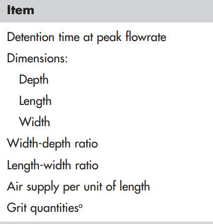
      - **Hình này chứng minh điều gì**
        - Bảng chuẩn hóa các hạng mục kích thước hình học, thời gian lưu nước, suất cấp khí và lượng cát phát sinh.
      - **Từ đâu mà thấy được**
        - Danh mục Item: Detention time at peak flowrate; Dimensions (Depth, Length, Width).
        - Các tỷ lệ kích thước: Width-depth ratio, Length-width ratio.
        - Thông số vận hành: Air supply per unit of length và Grit quantities.
    - **Hình 17.** Giới hạn phạm vi và giá trị điển hình cho thiết kế bể lắng cát thổi khí
      - 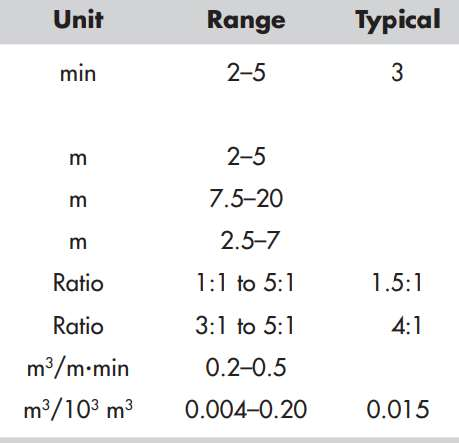
      - **Hình này chứng minh điều gì**
        - Các ngưỡng định mức kỹ thuật quy chuẩn áp dụng để tính toán kích thước bể và công suất cấp khí.
      - **Từ đâu mà thấy được**
        - Cột Range: thời gian lưu $2 - 5\text{ min}$; sâu $2 - 5\text{ m}$; dài $7.5 - 20\text{ m}$; rộng $2.5 - 7\text{ m}$; cấp khí $0.2 - 0.5\text{ m}^3/\text{m}\cdot\text{min}$.
        - Cột Typical: thời gian lưu $3\text{ min}$; tỷ lệ rộng:sâu $1.5:1$; tỷ lệ dài:rộng $4:1$; lượng cát $0.015\text{ m}^3/10^3\text{ m}^3$.

###### Geometric Configuration and Hopper Placement
- Phễu thu gom cát (grit hopper) có chiều sâu chuẩn khoảng $0.9\text{ m}$ ($H_{\text{hopper}} \approx 0.9\text{ m}$).
  - Vách phễu thu cát được thiết kế có độ dốc đứng lớn (steeply sloping sides, góc nghiêng $\alpha \ge 50^\circ - 60^\circ$ so với phương ngang).
  - Độ dốc đứng đảm bảo toàn bộ hạt cát rơi lắng tự trượt hoàn toàn bằng trọng lực dồn về rãnh đáy thu gom mà không bị dính bám thành.
  - Phễu thu cát được bố trí chạy dọc theo một bên thành bể ngay bên dưới vị trí lắp đặt các ống phân phối khí nén.
- Dàn đĩa phân phối khí (air diffusers) được lắp đặt cao hơn mặt đáy phẳng tiêu chuẩn của bể một khoảng $0.45 - 0.6\text{ m}$.
  - Khoảng hở cao trình $0.45 - 0.6\text{ m}$ tạo không gian thông thoáng cho dòng chất lỏng chuyển động quét đáy hoàn lưu về phía chân thành bể.
  - Ngăn ngừa hiện tượng bọt khí khuấy động trực tiếp vào lớp cát đã tích tụ trong rãnh phễu thu làm bắn tung cát trở lại pha lỏng.
  - Tạo điều kiện cho các thiết bị cơ khí nạo vét cát ngập nước (gầu cào, vít tải, xích cào) vận hành độc lập bên dưới dàn ống khí.

---

##### Worked Example: Aerated Grit Chamber Design

- **Đề bài**: Thiết kế bể lắng cát thổi khí (aerated grit chamber) cho trạm xử lý nước thải đô thị có lưu lượng trung bình $Q_{\text{avg}} = 0.5\text{ m}^3/\text{s}$, hệ số không điều hòa lưu lượng đỉnh $PF = 2.75$ (Peaking factor is 2.75).
- **Dữ kiện**:
  - Lưu lượng nước thải trung bình: $Q_{\text{avg}} = 0.5\text{ m}^3/\text{s} = 43{,}200\text{ m}^3/\text{ngày}$.
  - Hệ số đỉnh (Peaking factor): $PF = 2.75$.
  - Số đơn nguyên thiết kế song song: $N = 2$ bể (đảm bảo độ tin cậy và khả năng duy trì vận hành khi một bể bảo trì).
  - Thời gian lưu nước thủy lực ở đỉnh tải: $HRT = 3.0\text{ min}$ (nằm trong dải quy phạm $2 - 5\text{ min}$, lấy giá trị điển hình $3\text{ min}$).
  - Chiều sâu mức nước làm việc lựa chọn: $H = 3.0\text{ m}$ (nằm trong dải quy phạm $2 - 5\text{ m}$).
  - Tỷ lệ Bề rộng / Chiều sâu lựa chọn: $W/H = 1.2 : 1$ (nằm trong dải quy phạm $1:1$ đến $5:1$, điển hình $1.5:1$).
  - Cường độ cấp khí nén lựa chọn: $q_{\text{air}} = 0.30\text{ m}^3/(\text{m}\cdot\text{min})$ (nằm trong dải quy phạm $0.2 - 0.5\text{ m}^3/(\text{m}\cdot\text{min})$).
  - Suất sinh cát định mức: $r_{\text{grit}} = 0.015\text{ m}^3\text{ cát}/10^3\text{ m}^3\text{ nước thải}$ (giá trị điển hình theo bảng tiêu chuẩn).
  - Chiều sâu phễu thu cát đáy: $H_{\text{hopper}} = 0.9\text{ m}$.
  - Cao trình lắp đĩa phân phối khí cách đáy phẳng: $H_{\text{diffuser}} = 0.5\text{ m}$ (nằm trong dải quy phạm $0.45 - 0.6\text{ m}$).
  - Chu kỳ lưu trữ xả cát thiết kế: $T_{\text{storage}} = 3\text{ ngày}$.
- **Quy tắc áp dụng**:
  - Lưu lượng thiết kế cực đại: $Q_{\text{peak}} = Q_{\text{avg}} \times PF$. Nguồn: Slide 16.
  - Tổng thể tích hữu ích bể lắng: $V_{\text{total}} = Q_{\text{peak}} \times HRT$. Nguồn: Bảng Typical design information, Slide 15.
  - Thể tích nước mỗi đơn nguyên: $V_1 = \frac{V_{\text{total}}}{N}$.
  - Bề rộng bể: $W = (W/H) \times H$. Nguồn: Slide 15.
  - Chiều dài bể: $L = \frac{V_1}{W \times H}$. Nguồn: Slide 15.
  - Kiểm tra tỷ lệ kích thước hình học: $1:1 \le W/H \le 5:1$ và $3:1 \le L/W \le 5:1$. Nguồn: Slide 15.
  - Lưu lượng cấp khí nén đơn nguyên: $Q_{\text{air}, 1} = q_{\text{air}} \times L$. Nguồn: Slide 15.
  - Lượng cát lắng tích lũy hàng ngày: $V_{\text{grit, day}} = Q_{\text{avg}} \times r_{\text{grit}}$. Nguồn: Slide 15.
- **Lời giải**:
  - **Bước 1**: Tính toán lưu lượng nước thải thiết kế ở chế độ cực đại ($Q_{\text{peak}}$):
    $$Q_{\text{peak}} = Q_{\text{avg}} \times PF = 0.50\text{ m}^3/\text{s} \times 2.75 = 1.375\text{ m}^3/\text{s}$$
    Chuyển đổi sang đơn vị phút và ngày:
    $$Q_{\text{peak}} = 1.375\text{ m}^3/\text{s} \times 60\text{ s/min} = 82.50\text{ m}^3/\text{min}$$
    $$Q_{\text{peak}} = 82.50\text{ m}^3/\text{min} \times 1440\text{ min/ngày} = 118{,}800\text{ m}^3/\text{ngày}$$
    - Căn cứ: Định nghĩa hệ số lưu lượng đỉnh $PF = \frac{Q_{\text{peak}}}{Q_{\text{avg}}}$ và quy tắc đổi đơn vị thời gian $1\text{ min} = 60\text{ s}$, $1\text{ ngày} = 1440\text{ min}$.
    - Nhìn vào: Slide 16 (trang 7), dòng đề bài: "average flowrate of 0.5 m3/s. Peaking factor is 2.75".
  - **Bước 2**: Xác định tổng dung tích làm việc hữu ích của bể lắng cát ($V_{\text{total}}$):
    Chọn thời gian lưu nước thủy lực ở lưu lượng đỉnh $HRT = 3.0\text{ min}$:
    $$V_{\text{total}} = Q_{\text{peak}} \times HRT = 82.50\text{ m}^3/\text{min} \times 3.0\text{ min} = 247.50\text{ m}^3$$
    - Căn cứ: Tiêu chuẩn thời gian lưu nước bể lắng cát thổi khí $HRT = 2 - 5\text{ min}$ (giá trị điển hình $3\text{ min}$) ở lưu lượng đỉnh theo bảng thiết kế Slide 15.
    - Nhìn vào: Bảng Typical design information (Slide 15, trang 7), hàng "Detention time at peak flowrate: Range 2–5 min, Typical 3 min" (Hình 16 và Hình 17).
  - **Bước 3**: Phân chia số đơn nguyên và xác định kích thước mặt cắt ngang ($W, H$):
    Bố trí $N = 2$ đơn nguyên làm việc song song để đảm bảo vận hành linh hoạt:
    $$V_1 = \frac{V_{\text{total}}}{N} = \frac{247.50\text{ m}^3}{2} = 123.75\text{ m}^3/\text{đơn nguyên}$$
    Chọn chiều sâu nước hữu ích $H = 3.00\text{ m}$ (thỏa mãn dải quy phạm $2 - 5\text{ m}$).
    Chọn tỷ lệ bề rộng trên chiều sâu $W/H = 1.20$ (thỏa mãn dải quy phạm $1:1$ đến $5:1$):
    $$W = (W/H) \times H = 1.20 \times 3.00\text{ m} = 3.60\text{ m}$$
    Kiểm tra bề rộng: $W = 3.60\text{ m}$ nằm trong dải quy phạm $2.5 - 7.0\text{ m}$.
    Diện tích mặt cắt ngang ướt của mỗi đơn nguyên:
    $$A_c = W \times H = 3.60\text{ m} \times 3.00\text{ m} = 10.80\text{ m}^2$$
    - Căn cứ: Dải quy phạm cho chiều sâu ($2 - 5\text{ m}$), bề rộng ($2.5 - 7.0\text{ m}$) và tỷ lệ $W/H$ ($1:1 - 5:1$) theo bảng thiết kế Slide 15.
    - Nhìn vào: Bảng Typical design information (Slide 15, trang 7), các hàng "Depth (2–5 m)", "Width (2.5–7 m)", "Width-depth ratio (1:1 to 5:1, Typical 1.5:1)".
  - **Bước 4**: Xác định chiều dài bể ($L$) và kiểm tra các tỷ lệ hình học:
    Chiều dài lý thuyết của mỗi đơn nguyên:
    $$L = \frac{V_1}{A_c} = \frac{123.75\text{ m}^3}{10.80\text{ m}^2} = 11.458\text{ m}$$
    Làm tròn kích thước thi công xây dựng: Chọn $L = 11.50\text{ m}$ (thỏa mãn dải quy phạm $7.5 - 20\text{ m}$).
    Dung tích thực tế của mỗi đơn nguyên:
    $$V_{1, \text{actual}} = W \times H \times L = 3.60\text{ m} \times 3.00\text{ m} \times 11.50\text{ m} = 124.20\text{ m}^3$$
    Tổng dung tích thực tế toàn trạm:
    $$V_{\text{actual}} = 2 \times 124.20\text{ m}^3 = 248.40\text{ m}^3$$
    Thời gian lưu nước thực tế tại lưu lượng đỉnh:
    $$HRT_{\text{actual}} = \frac{V_{\text{actual}}}{Q_{\text{peak}}} = \frac{248.40\text{ m}^3}{82.50\text{ m}^3/\text{min}} = 3.011\text{ min} \approx 3.01\text{ min}$$
    Kiểm tra tỷ lệ Chiều dài trên Bề rộng:
    $$\frac{L}{W} = \frac{11.50\text{ m}}{3.60\text{ m}} = 3.194 \approx 3.2 : 1$$
    Giá trị $3.2 : 1$ nằm trong khoảng quy chuẩn $3:1$ đến $5:1$, đảm bảo triệt tiêu hiện tượng ngắn mạch dòng chảy.
    - Căn cứ: Tiêu chuẩn chiều dài bể $L = 7.5 - 20\text{ m}$ và tỷ số $L/W = 3:1 - 5:1$ (điển hình $4:1$) theo bảng thiết kế Slide 15.
    - Nhìn vào: Bảng Typical design information (Slide 15, trang 7), hàng "Length (7.5–20 m)" và hàng "Length-width ratio (3:1 to 5:1, Typical 4:1)".
  - **Bước 5**: Tính toán nhu cầu cấp khí nén cho hệ thống thổi khí:
    Chọn cường độ cấp khí đơn vị chiều dài $q_{\text{air}} = 0.30\text{ m}^3/(\text{m chiều dài}\cdot\text{min})$ (nằm trong dải quy chuẩn $0.2 - 0.5\text{ m}^3/(\text{m}\cdot\text{min})$).
    Lưu lượng khí nén yêu cầu cho mỗi đơn nguyên bể:
    $$Q_{\text{air}, 1} = q_{\text{air}} \times L = 0.30\text{ m}^3/(\text{m}\cdot\text{min}) \times 11.50\text{ m} = 3.45\text{ m}^3/\text{min}$$
    Quy đổi lưu lượng khí theo giờ và giây:
    $$Q_{\text{air}, 1} = 3.45\text{ m}^3/\text{min} \times 60 = 207.0\text{ m}^3/\text{h} = 57.50\text{ L/s}$$
    Tổng lưu lượng khí nén yêu cầu cho toàn bộ 2 bể hoạt động đồng thời:
    $$Q_{\text{air, total}} = 2 \times 3.45\text{ m}^3/\text{min} = 6.90\text{ m}^3/\text{min} = 414.0\text{ m}^3/\text{h} = 115.0\text{ L/s}$$
    - Căn cứ: Định mức cấp khí nén quy chuẩn $0.2 - 0.5\text{ m}^3/(\text{m}\cdot\text{min})$ theo Slide 15.
    - Nhìn vào: Bảng Typical design information (Slide 15, trang 7), hàng "Air supply per unit of length: 0.2–0.5 m3/m.min" (Hình 16 và Hình 17).
  - **Bước 6**: Tính toán lượng cát phát sinh và thể tích phễu thu cát đáy:
    Lưu lượng nước thải trung bình ngày: $Q_{\text{avg}} = 0.50\text{ m}^3/\text{s} = 43{,}200\text{ m}^3/\text{ngày}$.
    Lượng cát phát sinh trung bình hàng ngày toàn trạm với suất sinh cát điển hình $r_{\text{grit}} = 0.015\text{ m}^3/10^3\text{ m}^3$:
    $$V_{\text{grit, day}} = 43{,}200\text{ m}^3/\text{ngày} \times \left(\frac{0.015\text{ m}^3\text{ cát}}{1000\text{ m}^3\text{ nước thải}}\right) = 0.648\text{ m}^3\text{ cát/ngày}$$
    Lượng cát phân bổ cho mỗi đơn nguyên bể:
    $$V_{\text{grit}, 1} = \frac{0.648\text{ m}^3/\text{ngày}}{2} = 0.324\text{ m}^3/(\text{bể}\cdot\text{ngày})$$
    Thể tích lưu trữ cát yêu cầu cho chu kỳ nạo vét định kỳ $T_{\text{storage}} = 3\text{ ngày}$:
    $$V_{\text{storage, req}} = 0.324\text{ m}^3/\text{ngày} \times 3\text{ ngày} = 0.972\text{ m}^3/\text{bể}$$
    Cấu tạo hình học phễu thu cát:
    - Chiều sâu phễu thu cát đáy: $H_{\text{hopper}} = 0.90\text{ m}$ với hai vách dốc $\ge 50^\circ$.
    - Chiều dài phễu chạy dọc đáy bể: $L = 11.50\text{ m}$.
    - Cao trình lắp đĩa phân phối khí: Đặt cách mặt đáy phẳng của bể $H_{\text{diffuser}} = 0.50\text{ m}$ (thỏa mãn dải $0.45 - 0.60\text{ m}$).
    - Căn cứ: Định mức lượng cát $0.004 - 0.20\text{ m}^3/10^3\text{ m}^3$ (điển hình $0.015$), chiều sâu phễu thu $0.9\text{ m}$ và cao trình đĩa khí $0.45 - 0.6\text{ m}$ theo Slide 15.
    - Nhìn vào: Slide 15 (trang 7), hai dòng gạch đầu dòng mô tả grit hopper và air diffusers cùng hàng Grit quantities trên bảng (Hình 16 và Hình 17).
- **Kết quả**:
  - Số lượng đơn nguyên: $N = 2$ bể hình chữ nhật hoạt động song song.
  - Kích thước hữu ích mỗi bể: Chiều sâu $H = 3.00\text{ m}$, Chiều rộng $W = 3.60\text{ m}$, Chiều dài $L = 11.50\text{ m}$.
  - Tổng thể tích hữu ích thực tế toàn trạm: $V_{\text{actual}} = 248.40\text{ m}^3$ (thời gian lưu nước ở lưu lượng đỉnh $HRT = 3.01\text{ min}$).
  - Các tỷ lệ kích thước: $\frac{W}{H} = 1.20 : 1$, $\frac{L}{W} = 3.19 : 1$.
  - Nhu cầu cấp khí nén: Mỗi bể cần $Q_{\text{air}, 1} = 3.45\text{ m}^3/\text{min}$ ($207\text{ m}^3/\text{h}$); Tổng lưu lượng khí toàn trạm $Q_{\text{air, total}} = 6.90\text{ m}^3/\text{min}$ ($414\text{ m}^3/\text{h}$).
  - Lượng cát phát sinh: $0.648\text{ m}^3/\text{ngày}$ toàn trạm ($0.324\text{ m}^3/\text{bể}\cdot\text{ngày}$).
  - Dung tích hố thu cát đáy yêu cầu cho 3 ngày lưu trữ: $0.972\text{ m}^3/\text{bể}$.
  - Cấu tạo phụ trợ đáy: Chiều sâu phễu thu cát $0.90\text{ m}$, dàn đĩa phân phối khí đặt cách đáy phẳng $0.50\text{ m}$.
- **Kiểm tra lại**:
  - Thời gian lưu nước thực tế $HRT = 3.01\text{ min}$ nằm chính xác trong khoảng tiêu chuẩn $2 - 5\text{ min}$ và tiệm cận giá trị điển hình $3\text{ min}$.
  - Kích thước chiều sâu $H = 3.00\text{ m}$ nằm trong dải quy phạm $2 - 5\text{ m}$.
  - Kích thước chiều rộng $W = 3.60\text{ m}$ nằm trong dải quy phạm $2.5 - 7.0\text{ m}$.
  - Kích thước chiều dài $L = 11.50\text{ m}$ nằm trong dải quy phạm $7.5 - 20.0\text{ m}$.
  - Tỷ lệ $\frac{W}{H} = 1.20 : 1$ nằm trong khoảng cho phép $1:1 - 5:1$, đảm bảo tạo lập cuộn xoáy đơn ổn định và quét đáy êm.
  - Tỷ lệ $\frac{L}{W} = 3.19 : 1$ nằm trong khoảng cho phép $3:1 - 5:1$, đảm bảo ngăn ngừa hiện tượng dòng chảy ngắn mạch.
  - Cường độ cấp khí $q_{\text{air}} = 0.30\text{ m}^3/(\text{m}\cdot\text{min})$ nằm trọn vẹn trong dải tiêu chuẩn $0.2 - 0.5\text{ m}^3/(\text{m}\cdot\text{min})$.
  - Chiều sâu phễu thu cát $0.90\text{ m}$ và vị trí đĩa khí $0.50\text{ m}$ thỏa mãn chuẩn xác yêu cầu cấu tạo của bài giảng.

---

##### Applications, Performance, and Mechanical Grit Removal Systems

###### WWTP Applications and Operational Advantages
- Ứng dụng công nghệ: Bể lắng cát thổi khí được áp dụng chủ yếu cho các nhà máy xử lý nước thải quy mô lớn (Application: For large-sized WWTPs).
  - Nhà máy công suất lớn có lưu lượng nước thải dao động mạnh giữa các khung giờ trong ngày và giữa các mùa.
  - Công trình đòi hỏi sự ổn định cao về chất lượng bùn lắng và vận hành tự động hóa liên tục.
- Các ưu điểm trong vận hành (Advantages):
  - Hiệu suất lắng tách độc lập với lưu lượng nước thải (Efficiency independent of flow rate).
    - Vận tốc cuộn xoay và vận tốc quét đáy do máy thổi khí khống chế chủ động, không bị giảm sút khi lưu lượng nước thải suy giảm vào ban đêm.
  - Hiệu quả phân tách cát đạt mức rất cao (High efficiency).
    - Thu giữ trên $90\% - 95\%$ lượng cát có đường kính $d \ge 0.21\text{ mm}$ và tách được đáng kể các hạt cát mịn $d \ge 0.15\text{ mm}$.
  - Quá trình sục khí cung cấp năng lượng bóc tách tạp chất hữu cơ khỏi hạt vô cơ (Aeration provides energy to separate organic residue from particles).
    - Năng lượng bọt khí tạo lực xé ma sát bề mặt làm bong tróc lớp chất nhờn và màng dầu mỡ bao quanh hạt khoáng.
  - Ngăn ngừa hiện tượng kết lắng cặn hữu cơ ở chế độ lưu lượng thấp (Avoids organic residue settling at low flow rates).
    - Khắc phục triệt để nhược điểm lắng cặn thối rữa của bể lắng cát thổi ngang khi lưu lượng nước thải giảm sút.
- Các phương thức cơ giới thu gom và vận chuyển cát ra khỏi bể lắng thổi khí:
  - Gàu ngoạm di chuyển trên ray đơn treo (grab buckets traveling on monorails).
  - Băng cào xích và gàu múc (chain-and-bucket conveyors).
  - Băng tải trục vít nghiêng (screw conveyors).
  - Băng tải dạng ống kín (tubular conveyors).
  - Bơm phản lực tia nước (jet pumps).
  - Bơm khí nâng thủy tĩnh (airlifts).

###### Traveling Bridge Type Grit Removal Systems
- Hệ thống cầu cào di động (traveling bridge type grit removal system) là kết cấu cơ khí phổ biến nhất trong các bể lắng thổi khí hiện đại.
  - Dầm cầu thép bắc ngang qua một hoặc nhiều đơn nguyên bể, di chuyển tịnh tiến qua lại trên hệ thống ray lắp trên đỉnh tường bê tông.
  - Hệ thống tích hợp bơm chìm hút cát (grit pump) thả sâu xuống rãnh phễu thu gom đáy bể.
  - Ống đẩy của bơm hút cát (grit pump discharge line) dẫn hỗn hợp bùn cát xả trực tiếp vào máng thu gom cát trên cao (grit troughs).
  - Tuyến máng thu gom cát dẫn cặn đến thiết bị cyclone phân loại hoặc máy rửa cát cơ học trước khi xả ra thùng chứa.
    - **Hình 18.** Hệ thống thu gom cát bằng cầu cào di động (traveling bridge grit removal system)
      - 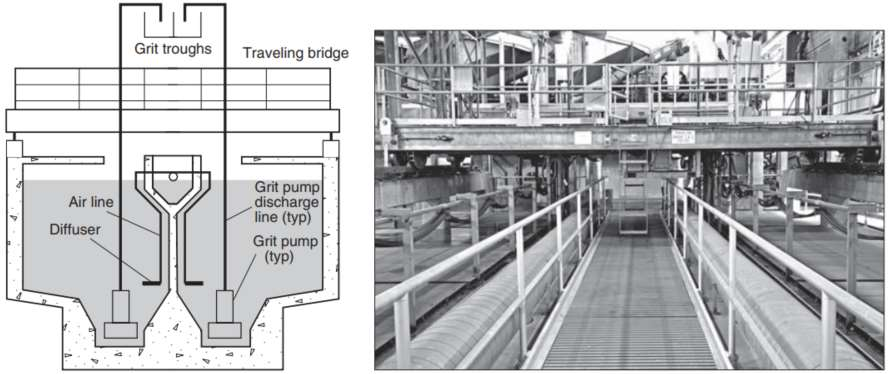
      - **Hình này chứng minh điều gì**
        - Giàn cầu di động tích hợp bơm chìm hút bùn cát định kỳ từ phễu đáy xả vào máng gom trên cao.
      - **Từ đâu mà thấy được**
        - Sơ đồ mặt cắt bên trái: Traveling bridge bắc ngang bể, Grit pump treo chìm trong hố cát, ống xả nối lên Grit troughs.
        - Ảnh thực tế bên phải: Giàn cầu cơ khí di chuyển trên ray đỉnh thành bể dọc theo lối đi thao tác trung tâm.
- Bố trí thực địa tại các trạm xử lý nước thải thể hiện sự kết hợp đồng bộ giữa cầu cào di động và mạng lưới cấp khí.
  - Giàn cầu di chuyển trên đường ray phân bố dọc suốt chiều dài bể để nạo vét toàn bộ lớp cát lắng đáy theo chu kỳ cài đặt sẵn.
  - Lối đi kỹ thuật trung tâm bố trí giữa hai dãy bể giúp người vận hành quan sát toàn cảnh bề mặt xoáy sủi bọt.
    - **Hình 19.** Bố trí công trình bể lắng cát thổi khí có cầu cào di động trong nhà trạm
      - 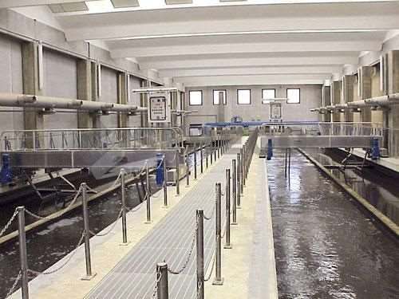
      - **Hình này chứng minh điều gì**
        - Hệ thống bể song song lắp đặt giàn cầu di động trên đường ray chạy dọc theo hành lang vận hành.
      - **Từ đâu mà thấy được**
        - Lối đi kỹ thuật trung tâm có lan can bảo vệ phân tách hai đơn nguyên bể lắng cát thổi khí dài hình chữ nhật.
        - Khung cầu cào bằng thép không gỉ đặt trên ray hai bên thành bể với hộp điều khiển điện gắn tại chỗ.
  - Tuyến ống phân phối khí nén chính được cố định trên tường bê tông trung tâm kèm theo các đường ống nhánh thẳng đứng.
  - Mỗi đường nhánh cấp khí đều trang bị van điều chỉnh lưu lượng độc lập để duy trì cường độ sục khí đồng đều suốt chiều dài bể.
    - **Hình 20.** Bể lắng cát thổi khí ngoài trời với tuyến ống cấp khí và cầu cào cơ giới
      - 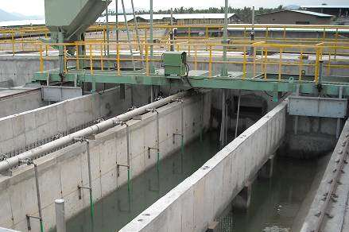
      - **Hình này chứng minh điều gì**
        - Bố trí thực địa của tuyến ống dẫn khí chính và các ống nhánh cấp khí xuống từng đơn nguyên bể bê tông.
      - **Từ đâu mà thấy được**
        - Tuyến ống thép cấp khí nén chính chạy dọc tường phân cách kèm van tiết lưu và các ống cấp khí nhánh cắm sâu xuống bể.
        - Giàn cầu cơ giới sơn màu xanh di chuyển trên thành bể bê tông cốt thép phía sau.

###### Chain and Flight and Screw Conveyor Systems
- Hệ thống cào cát xích gạt (Chain and Flight Grit Collector system) thực hiện thu gom cát liên tục ở đáy phễu.
  - Dây xích kéo tuần hoàn mang các thanh cào bằng thép (steel flights) di chuyển chậm dọc suốt đáy máng thu cát.
  - Cát lắng trong rãnh đáy được các thanh gạt gom về một đầu bể và dồn vào chân máng dẫn nghiêng.
    - **Hình 21.** Cơ cấu xích gạt cặn cát đáy bể dẫn vào máng nghiêng nâng cát
      - 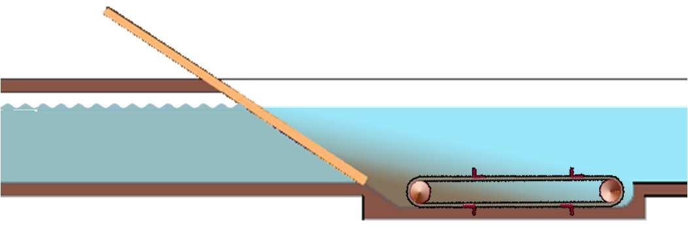
      - **Hình này chứng minh điều gì**
        - Bộ cào xích gom cát lắng từ rãnh phễu đáy đẩy về phía chân máng nghiêng vận chuyển lên bờ.
      - **Từ đâu mà thấy được**
        - Vòng xích tuần hoàn nằm gọn trong rãnh trũng đáy bể (grit hopper) với các gờ gạt cặn di chuyển liên tục.
        - Máng nghiêng đặt tiếp giáp hố thu gom để tiếp nhận cát và đẩy ngược lên khỏi mặt nước.
  - Bộ truyền động (Drive unit) đặt trên sàn khô truyền lực kéo chuỗi xích chạy qua các đĩa xích ngập nước.
  - Các thanh gạt thép tiếp tục kéo khối cát trượt lên máng nghiêng vượt khỏi mức nước tĩnh để tách nước tự do bằng trọng lực.
  - Khối cát ráo nước rơi vào thùng chứa cát (grit can) đặt tại bệ xả trên bờ.
    - **Hình 22.** Sơ đồ nguyên lý hệ thống cào cát xích gạt (Chain and Flight Grit Collector)
      - 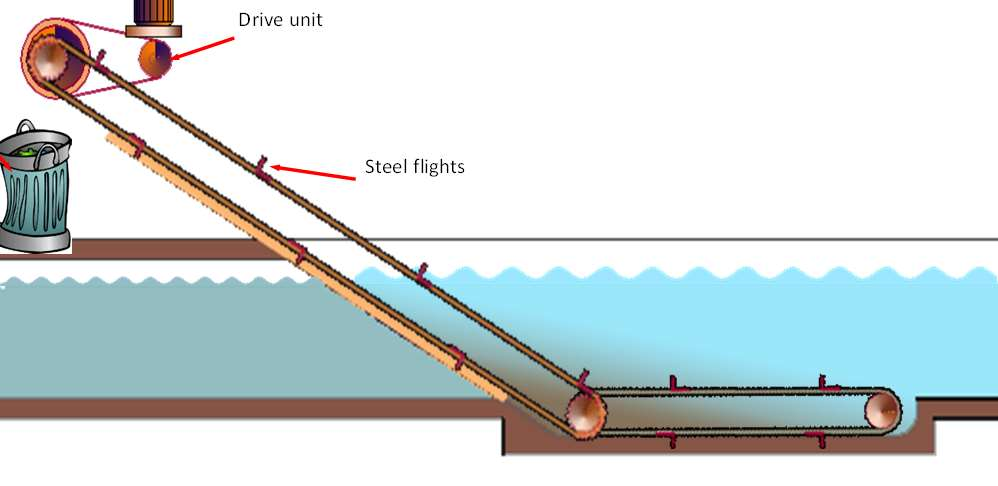
      - **Hình này chứng minh điều gì**
        - Truyền động xích liên tục kéo các thanh gạt thép đưa cát dọc đáy bể và đẩy lên dốc nghiêng xả vào thùng chứa.
      - **Từ đâu mà thấy được**
        - Drive unit (bộ truyền động motor - giảm tốc) đặt trên cạn truyền mô-men quay cho đĩa xích đỉnh.
        - Steel flights (thanh cào thép) gắn định kỳ trên dây xích di chuyển dọc đáy bể rồi leo dốc nghiêng để tách nước tĩnh.
        - Thùng chứa Grit can đặt ở đầu xả đón nhận khối cát khô ráo sau khi qua dốc nghiêng.
- Hệ thống vít tải chuyển cát (Screw conveyors Grit Collector system) là giải pháp vận chuyển cát dạng xoắn ruột gà.
  - Trục vít xoắn nghiêng Archimedes được đặt nghiêng một góc $20^\circ - 30^\circ$ từ đáy hố thu cát nhô lên khỏi sàn thao tác.
  - Động cơ hộp giảm tốc gắn tại đỉnh máng truyền động quay chậm cho trục xoắn.
  - Cánh xoắn liên tục cuộn khối bùn cát từ đáy bể đẩy trượt dần lên phía trên dọc theo máng dẫn.
  - Đoạn máng nhô lên khỏi mặt nước đóng vai trò vùng tách nước tự do (dewatering zone), cho phép nước tự chảy ngược trở lại bể.
  - Hạt cát sau khi tách nước rơi qua cửa xả đỉnh trực tiếp vào thùng chứa cát (grit can).
    - **Hình 25.** Sơ đồ cấu tạo hệ thống vít tải chuyển cát (Screw Conveyor Grit Collector)
      - 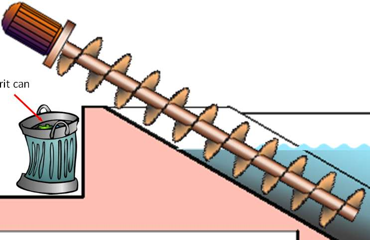
      - **Hình này chứng minh điều gì**
        - Trục vít xoắn nghiêng nâng cát trực tiếp từ hố đáy ra khỏi mặt nước, thực hiện tách nước tự do trước khi xả vào thùng gom.
      - **Từ đâu mà thấy được**
        - Động cơ liền hộp giảm tốc gắn ở đỉnh máng truyền động quay chậm cho trục xoắn Archimedes.
        - Cánh xoắn ốc nâng khối cát trượt dọc theo lòng máng vượt qua mặt thoáng chất lỏng.
        - Miệng xả trên cao hướng thẳng vào thùng chứa Grit can đặt trên bệ sàn thao tác.

### Chương 3.3: Quá trình Cơ học - Bể Lắng đợt 1 và Lắng đợt 2 (Sedimentation Tank)

#### Overview of Sedimentation Tank

##### Content Outline

- Thông tin học phần và giảng viên: Học phần Kỹ thuật Xử lý Nước thải, Chương 3.3: Bể lắng nước thải ($Sedimentation\text{ tank}$), giảng viên TS. Nguyễn Hoàng Dũng ($Dr.\text{ Nguyen Hoang Dung}$), Học kỳ 1, năm học 2026 tại TP. Hồ Chí Minh.
- Cấu trúc nội dung Chương 3.3 gồm 8 phần chính:
  - 1. Tổng quan ($Overview$).
  - 2. Phân loại ($Classification$).
  - 3. Thu gom và xả bùn ($Sludge\text{ removal}$).
  - 4. Thu gom váng bọt ($Scum\text{ removal}$).
  - 5. Phân phối dòng chảy ($Flow\text{ distribution}$).
  - 6. Đập và máng tràn thu nước ($Effluent\text{ weir}$).
  - 7. Thông số thiết kế bể lắng ($Design\text{ information for sedimentation tank}$).
  - 8. Bể lắng tốc độ cao ($High\text{-rate clarification}$).

##### Definition and Function of Sedimentation Tanks

- Thuật ngữ kỹ thuật tương đương: Bể lắng còn có tên gọi là bể làm lắng ($settling\text{ tanks}$) hoặc bể làm trong ($clarifiers$).
- Chức năng loại bỏ tạp chất trong nước thải:
  - Loại bỏ các chất rắn có khả năng lắng ($settleable\text{ solids}$) bằng trọng lực xuống đáy bể.
  - Loại bỏ các vật liệu và chất nổi ($floating\text{ materials}$), váng bọt tích tụ trên bề mặt nước thải.
  - Làm giảm nồng độ chất rắn lơ lửng ($SS$ - suspended solids) trong dòng nước thải trước khi vào các công đoạn xử lý tiếp theo.
  - Bể lắng dạng chữ nhật trong thực tế vận hành trạm xử lý:
    - **Hình 1.** Thực tế công trình bể lắng chữ nhật
      - 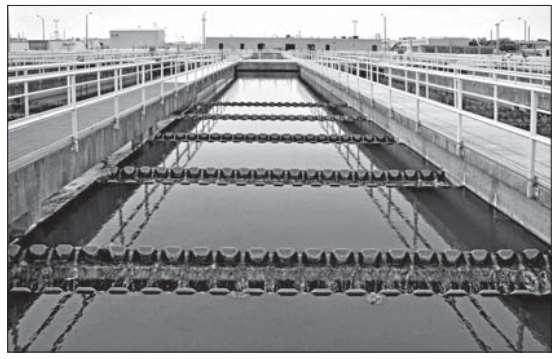
      - **Hình này chứng minh điều gì**
        - Công trình bể lắng chữ nhật thu gom nước trong bằng hệ thống máng răng cưa vắt ngang bề mặt.
      - **Từ đâu mà thấy được**
        - Bể bê tông cốt thép dạng chữ nhật dài với lối đi thao tác hai bên thành bể.
        - Dãy máng thu nước đặt ngang bề mặt bể với mép tràn răng cưa ($V\text{-notch}$).
  - Bể lắng dạng tròn trong thực tế vận hành trạm xử lý:
    - **Hình 2.** Thực tế công trình bể lắng tròn
      - 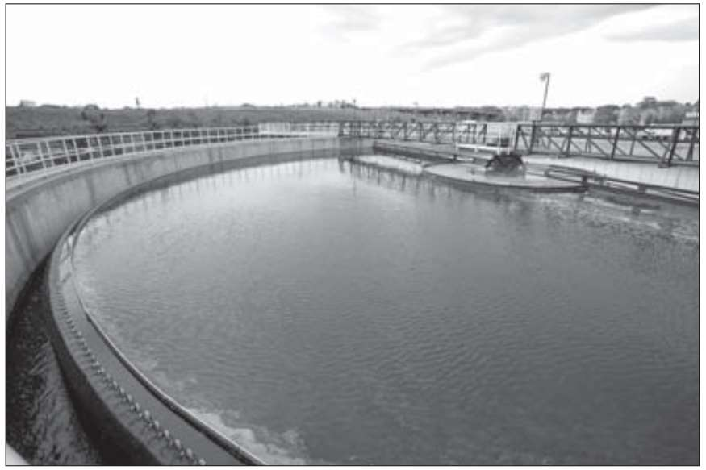
      - **Hình này chứng minh điều gì**
        - Công trình bể lắng tròn thu nước qua máng tràn răng cưa dọc chu vi và hệ cào bùn quay quanh tâm.
      - **Từ đâu mà thấy được**
        - Bể bê tông dạng hình tròn với máng thu nước và tấm chắn váng bọt viền quanh chu vi ngoài.
        - Cầu công tác vươn từ tâm bể xoay tròn để gạt bùn và váng nổi.

##### Process Location in Wastewater Treatment Plants

- Vị trí bố trí công trình bể lắng ($Location$) trong sơ đồ công nghệ xử lý nước thải:
  - Đặt trước công trình xử lý thứ cấp ($ahead\text{ secondary treatment}$):
    - Đóng vai trò là bể lắng sơ cấp ($primary\text{ sedimentation tank}$ hoặc $primary\text{ clarifier}$).
    - Loại bỏ chất rắn lơ lửng thô và chất hữu cơ lắng được để giảm tải lượng ô nhiễm cho bể xử lý sinh học.
  - Đặt sau quá trình keo tụ tạo bông ($after\text{ the flocculation process}$):
    - Đóng vai trò là bể lắng hóa lý hoặc bể làm trong sau keo tụ ($chemical\text{ clarifier}$).
    - Tách các bông cặn keo tụ hình thành sau khi châm hóa chất để thu nước trong.
  - Đặt sau công trình xử lý thứ cấp ($after\text{ secondary treatment}$):
    - Đóng vai trò là bể lắng thứ cấp ($secondary\text{ sedimentation tank}$ hoặc $secondary\text{ clarifier}$).
    - Tách bùn hoạt tính sinh học hoặc màng sinh học sau quá trình xử lý sinh học hiếu khí để làm trong nước đầu ra và tuần hoàn bùn ($RAS$).

#### Classification

- Phân loại bể lắng (classification of sedimentation tanks) trong các công trình xử lý nước thải dựa trên hai tiêu chí kỹ thuật cốt lõi:
  - Phân loại theo chức năng và vị trí công nghệ trong quy trình xử lý: bể lắng đợt 1 (primary settling), bể lắng trung gian (intermediate settling), và bể lắng đợt 2 (secondary settling).
  - Phân loại theo hình thái hình học và chế độ thủy lực của bể: bể lắng hình chữ nhật (rectangular tank) với dòng chảy ngang, và bể lắng hình tròn (circular tank) với dòng chảy tỏa tia từ tâm.

##### Phân loại theo vị trí và chức năng công nghệ

- Bể lắng đợt 1 (primary settling tank / primary clarifier):
  - Vị trí công nghệ: bố trí trước các công trình xử lý sinh học thứ cấp (ahead of secondary treatment), tiếp nhận dòng nước thải sau công đoạn tiền xử lý cơ học (song chắn rác và bể lắng cát).
  - Chức năng: loại bỏ các chất rắn có khả năng lắng trọng lực (settleable solids) và các tạp chất nổi, bọt váng, dầu mỡ (floating materials / scum).
  - Hiệu quả xử lý: giảm $50\% - 70\%$ hàm lượng chất rắn lơ lửng ($TSS$) và giảm $25\% - 40\%$ nhu cầu oxy sinh hóa ($BOD_5$) trong nước thải sinh hoạt.
  - Ý nghĩa vận hành: giảm tải lượng hữu cơ và chất rắn nạp vào bể sinh học hiếu khí, tiết kiệm công suất cấp khí nén và giảm nguy cơ tắc nghẽn thiết bị.
- Bể lắng trung gian (intermediate settling tank / intermediate clarifier):
  - Vị trí công nghệ: bố trí xen kẽ giữa các bậc xử lý sinh học trong hệ thống xử lý sinh học nhiều cấp (multistage biological systems), chẳng hạn như giữa hai tháp lọc sinh học (trickling filters) hoặc giữa các bậc sinh học thiếu khí/hiếu khí liên tiếp.
  - Chức năng: tách màng vi sinh vật bị bong tróc (sloughed biomass) hoặc bông cặn hữu cơ tạo thành từ bậc xử lý sinh học thứ nhất trước khi nước thải đi vào bậc xử lý thứ hai.
  - Ý nghĩa vận hành: bảo vệ bề mặt vật liệu đệm của bậc sinh học tiếp theo khỏi bị bám cặn quá mức, duy trì điều kiện tiếp xúc pha tối ưu và ổn định hệ vi sinh.
- Bể lắng đợt 2 (secondary settling tank / secondary clarifier):
  - Vị trí công nghệ: bố trí ngay sau công trình xử lý sinh học hiếu khí (bể bùn hoạt tính Aerotank hoặc bể lọc sinh học nhỏ giọt).
  - Chức năng: phân tách hỗn hợp bùn hoạt tính (activated sludge biomass) ra khỏi pha lỏng, tạo dòng nước trong đạt quy chuẩn xả thải ở cửa ra và thu gom bùn vi sinh lắng ở đáy.
  - Cơ chế dòng bùn: cung cấp bùn hoạt tính lắng đặc ở đáy để tuần hoàn bùn ($RAS$ - Return Activated Sludge) về bể Aerotank nhằm duy trì nồng độ bùn hoạt tính lơ lửng ($MLSS$), đồng thời xả bùn sinh học dư thừa ($WAS$ - Waste Activated Sludge) sang khu xử lý bùn.
  - Đặc tính lắng: diễn ra chủ yếu theo cơ chế lắng cản trở (hindered settling / zone settling) và lắng nén (compression settling) do nồng độ bùn vi sinh rất cao ($2000 - 5000\text{ mg/L}$).

##### Bể lắng hình chữ nhật (Rectangular Sedimentation Tank)

- Đặc tính tổng quát và phạm vi ứng dụng:
  - Chế độ thủy lực dòng chảy ngang (horizontal flow) với mặt cắt ướt không đổi dọc theo chiều dài bể.
  - Đạt hiệu quả cao về mặt tận dụng không gian mặt bằng (efficient for space utilization) và tiết kiệm chi phí xây dựng công trình (construction costs) nhờ khả năng xây dựng các đơn nguyên ghép khối liên kế dùng chung tường ngăn (common-wall construction).
  - Kích thước hình học tiêu chuẩn: tỷ lệ chiều dài trên chiều rộng $L:W \ge 4:1$ đến $6:1$, tỷ lệ chiều dài trên chiều sâu $L:D \ge 15:1$ để giảm thiểu hiện tượng đoản mạch thủy lực.
- Cấu tạo công nghệ và dây chuyền thiết bị cơ bản của bể lắng hình chữ nhật:
  - Dòng vào (influent): nước thải được dẫn vào bể qua máng phân phối dòng vào (influent channel) kết hợp vách ngăn hướng dòng (baffle) nhằm triệt tiêu vận tốc ban đầu và phân bổ đều lưu lượng trên toàn bộ tiết diện ướt.
  - Cơ cấu cào bùn dạng xích (chain-scraper): các thanh cào composite hoặc gỗ (flights) gắn trên hệ chuỗi xích chuyển động tuần hoàn liên tục dọc đáy bể để cào dồn bùn lắng về hố thu phía đầu bể.
  - Bộ truyền động cào bùn (collector drive): động cơ gắn trục truyền động chính (headshaft sprocket) dẫn động hệ xích cào di chuyển ở vận tốc chậm ($0.6 - 1.2\text{ m/min}$) tránh làm xáo trộn lớp bùn đáy.
  - Cơ cấu cào bùn ngang (cross collector): đặt trong hố thu bùn để gom bùn từ hai biên về họng thu trung tâm của ống xả bùn.
  - Cửa van xả bùn (shear gate): điều tiết lưu lượng bùn xả khỏi hố thu sang đường ống công nghệ.
  - Thiết bị thu gom váng nổi (scum collector / scum skimmer): nhánh xích phía trên đưa các thanh cào lướt sát mặt nước để lùa váng nổi về máng thu váng hoặc giếng thu váng (scum well).
  - Hố thu bùn (sludge hopper): phễu chứa bùn hình chóp ngược bố trí ở đáy phía đầu bể để tích tụ bùn lắng trước khi xả định kỳ hoặc liên tục.
  - Dẫn bùn đi xử lý (sludge treatment): bùn từ hố thu được xả bằng áp lực thủy tĩnh hoặc bơm chuyên dụng dẫn sang công trình cô đặc và xử lý bùn.
  - Đập tràn thu nước trong (effluent weir): hệ đập tràn có thể điều chỉnh cao độ (adjustable weir) gắn đỉnh đập răng cưa chữ V (weir crest) đặt ở cuối bể.
  - Máng thu nước ra (effluent troughs): hệ thống máng thu nước trong đặt song song hoặc vuông góc dẫn nước sau lắng vào kênh xả chung (effluent channel).
  - Cầu bộ hành (walkway): sàn thao tác bên trên thành bể phục vụ công tác giám sát vận hành và bảo trì cụm thiết bị cơ khí.
  - Dòng ra (effluent): nước trong sau lắng tràn qua đập vào máng thu nước ra để chuyển sang công đoạn xử lý tiếp theo hoặc khử trùng.
- Cấu tạo tổng thể mặt bằng và mặt cắt dọc bể lắng chữ nhật kết hợp đồng thời kênh dẫn vào, tấm chắn, hệ thanh cào và cụm máng thu nước ra:
  - **Hình 3.** Cấu tạo mặt bằng và mặt cắt dọc bể lắng chữ nhật
    - 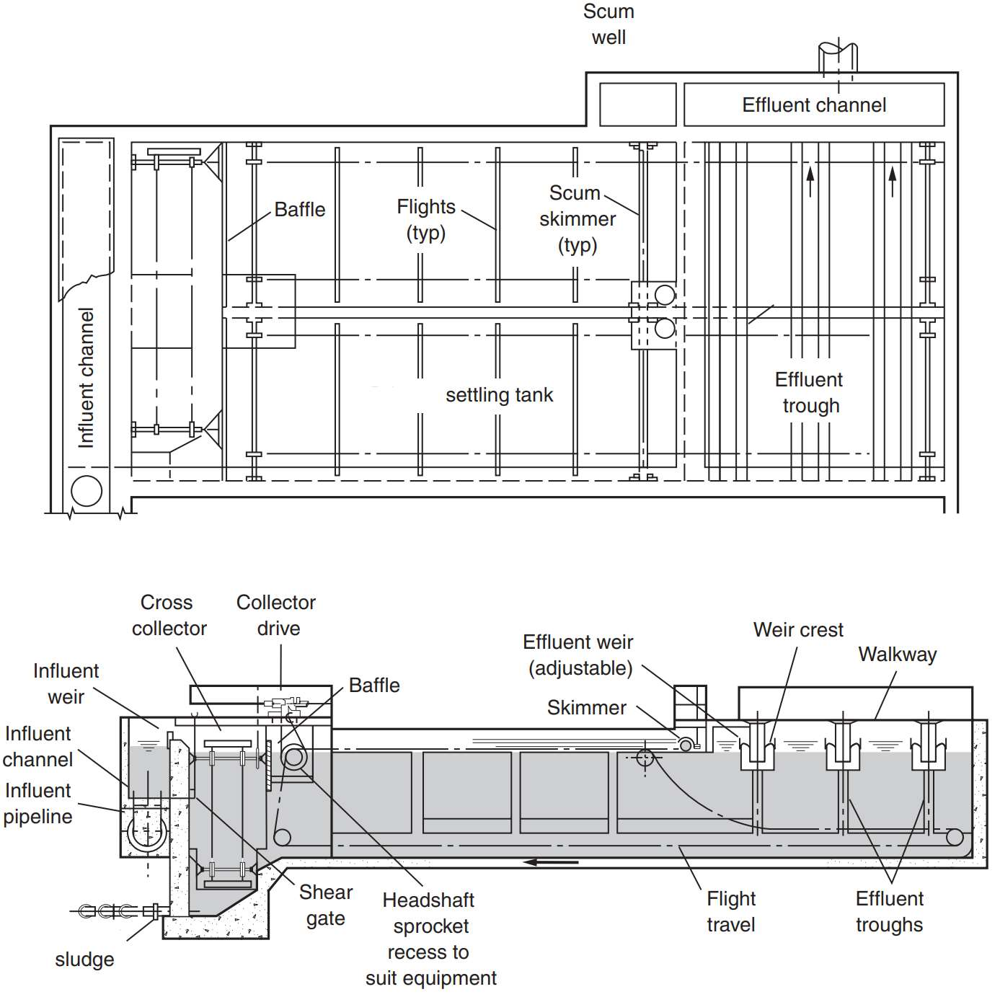
    - **Hình này chứng minh điều gì**
      - Bố trí dòng chảy ngang phối hợp: bùn lắng đáy được thanh cào (flights) dồn về hố bùn (sludge hopper) đầu vào, váng nổi gom về máng váng (skimmer) đầu ra.
    - **Từ đâu mà thấy được**
      - Hướng dòng chảy từ trái sang phải: nước vào từ influent channel qua baffle, nước trong tràn qua effluent weir vào các máng effluent troughs.
      - Mũi tên chuỗi gạt (flight travel): nhánh đáy cào bùn ngược về sludge hopper bên trái, nhánh mặt gạt váng về skimmer bên phải.
- Dây chuyền thu gom chất rắn và váng nổi trong bể chữ nhật vận hành đồng bộ theo hai hướng ngược chiều giữa dòng nước mặt và dòng cặn đáy:
  - **Hình 4.** Sơ đồ dây chuyền thu gom bùn và váng nổi trong bể chữ nhật
    - 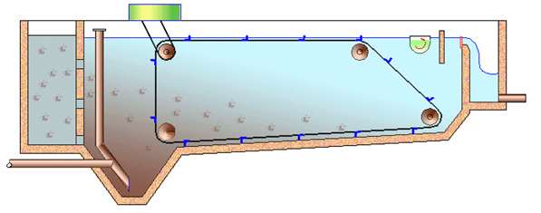
    - **Hình này chứng minh điều gì**
      - Đồng bộ hóa thu gom chất rắn và váng: xích cào vừa dồn bùn đáy về hố thu bùn, vừa gom váng nổi vào máng thu váng.
    - **Từ đâu mà thấy được**
      - Hướng dòng từ trái sang phải: nước vào qua vách đục lỗ bên trái, nước trong tràn qua đập thu nước ra bên phải.
      - Chu trình xích cào: nhánh đáy kéo bùn về hố thu bùn có ống xả bùn, nhánh mặt gạt váng vào máng thu váng trước đập tràn.
- Cơ cấu xích gạt bùn (chain-flight scraper) chuyển động theo vòng lặp khép kín tuần hoàn để cào gom bùn đáy và lùa váng nổi trên bề mặt:
  - **Hình 5.** Cấu tạo cơ cấu gạt bùn dạng xích trong bể lắng chữ nhật
    - 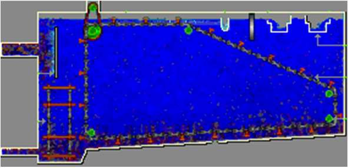
    - **Hình này chứng minh điều gì**
      - Hệ đĩa xích tạo vòng lặp khép kín: nhánh đáy gom bùn về hố thu đầu bể, nhánh mặt lùa váng vào máng xả trước đập tràn.
    - **Từ đâu mà thấy được**
      - Đường đi của xích: các bánh đĩa định hướng chuỗi thanh gạt chạy dọc đáy nghiêng về hố thu bên trái rồi vòng lên mặt nước.
      - Chi tiết bố trí: hố thu bùn nằm dưới vách ngăn vào bên trái; máng gom váng chữ U và tấm chắn nằm trước đập tràn bên phải.

##### Bể lắng hình tròn (Circular Sedimentation Tank)

- Đặc tính tổng quát và phạm vi ứng dụng:
  - Chế độ thủy lực dòng chảy tỏa tia từ tâm ra biên (radial flow), vận tốc dòng nước giảm dần theo phương bán kính $r$ khi tiết diện chảy mở rộng, tạo môi trường lắng tĩnh lý tưởng cho hạt cặn.
  - Vận hành ổn định, phân phối thủy lực đối xứng trục và đặc biệt phù hợp cho các nhà máy xử lý nước thải quy mô công suất lớn (better for large treatment plants).
- Cấu tạo công nghệ và thiết bị của bể lắng hình tròn:
  - Cấp nước nạp ở tâm (center-feed): đường ống dẫn nước nạp (influent pipeline) đi ngầm dưới đáy dẫn thẳng đứng lên giếng phân phối dòng trung tâm (inlet well).
  - Giếng phân phối tâm (inlet well / feed well): triệt tiêu động năng dòng vào, hướng dòng nước đi xuống trước khi tỏa đều ra ngoài thành bể theo phương bán kính.
  - Cụm truyền động đặt trên trụ đỡ tâm (column supported drive assembly): động cơ giảm tốc gắn trên đỉnh trụ trung tâm để truyền động quay cho hệ giàn cào bùn và cần gạt váng mặt nước.
  - Cầu công tác (bridge and walkway) và cầu bộ hành chu vi (perimeter walkway): bắc ngang qua bể để tiếp cận cụm truyền động tâm và hỗ trợ vận hành, kiểm tra thiết bị.
  - Cơ cấu thu gom bùn đáy: hệ thống cánh cào dạng khung giàn (truss scraper) hoặc ống hút bùn (sludge suction tube / header) gắn đối trọng (suction tube counter weight) quét sát sàn đáy bê tông dốc (concrete wall and floor).
  - Độ dốc đáy bể: đáy bể hình nón nghiêng dốc về hố thu trung tâm với tỷ lệ độ dốc tiêu chuẩn khoảng $1:12$ (khoảng $8\%$).
  - Hố thu bùn tâm (central hopper): điểm trũng nhất ở trung tâm bể, nơi bùn được gạt dồn về trước khi xả ra ngoài qua ống xả bùn đáy (sludge discharge).
  - Cụm thu xả váng nổi: cần gạt váng (skimmer arm) quay đồng trục trên mặt nước quét bọt váng vào hộp thu váng có tấm dốc tiếp nhận (scum box with beach plate) và thoát ra ngoài qua ống xả váng (scum outlet).
  - Tấm chắn váng nổi (scum baffle): tấm chắn chìm sâu $200 - 300\text{ mm}$ bố trí phía trước đập tràn nhằm ngăn không cho váng bọt trôi vào máng thu nước trong.
  - Đập tràn và máng thu nước ra (effluent weir & effluent trough): bố trí liên tục dọc theo toàn bộ chu vi thành bể (perimeter wall) để thu đều dòng nước trong sau lắng.
  - Kiểm soát mùi hôi trên bể lắng sơ cấp (primary sedimentation basin): đập tràn có thể được trang bị nắp đậy kín (covered overflow weir) kết hợp ống hút khí (odor control pipe) dẫn thẳng về tháp lọc rửa khí khử mùi (scrubber for odor control) để xử lý triệt để phát thải khí ô nhiễm.
- Sơ đồ cấu tạo và phân bố đường dòng thủy lực đối xứng trong bể lắng tròn nạp nước ở tâm:
  - **Hình 6.** Sơ đồ cấu tạo và phân bố đường dòng bể lắng tròn nạp nước ở tâm
    - 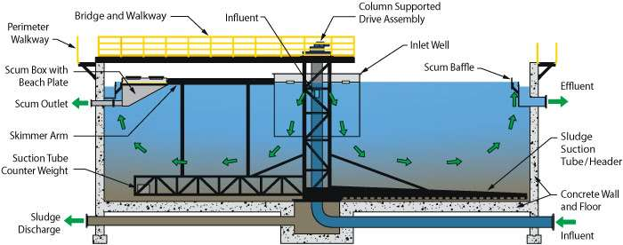
    - **Hình này chứng minh điều gì**
      - Cấu tạo chi tiết đường dòng đối xứng tỏa từ tâm ra biên và cơ chế thu gom riêng biệt bùn đáy cùng bọt váng.
    - **Từ đâu mà thấy được**
      - Đường dòng (mũi tên xanh): nước nạp (Influent) dâng lên giếng tâm (Inlet Well), tỏa hướng kính ra máng tràn (Effluent) ở thành bể.
      - Cụm thu cặn và váng: ống hút bùn (Sludge Suction Tube) quét đáy xả cặn; thanh gạt (Skimmer Arm) đẩy váng bề mặt vào hộp gom Scum Box.
- Kết cấu cơ khí của hệ cánh cào khung giàn quay tròn gom cặn về hố thu tâm đáy bể:
  - **Hình 7.** Sơ đồ cấu tạo mặt cắt bể lắng tròn với hệ cánh cào khung giàn
    - 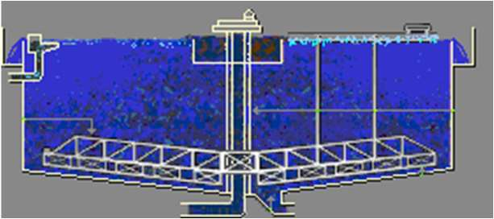
    - **Hình này chứng minh điều gì**
      - Kết cấu cánh cào dạng khung giàn thép áp sát đáy dốc để gom bùn về tâm.
    - **Từ đâu mà thấy được**
      - Đọc từ trên xuống đáy: cụm truyền động tâm liên kết giàn cào quét sát đáy nón.
      - Tại đáy tâm: hố thu bùn nối với ống xả cặn ở vị trí trũng nhất.
- Cụm thiết bị thu gom váng mặt nước và hệ thống thu gom khí khử mùi tích hợp trên bể lắng sơ cấp dạng tròn:
  - **Hình 8.** Cụm thiết bị thu váng và kiểm soát mùi bể lắng tròn sơ cấp thực tế
    - 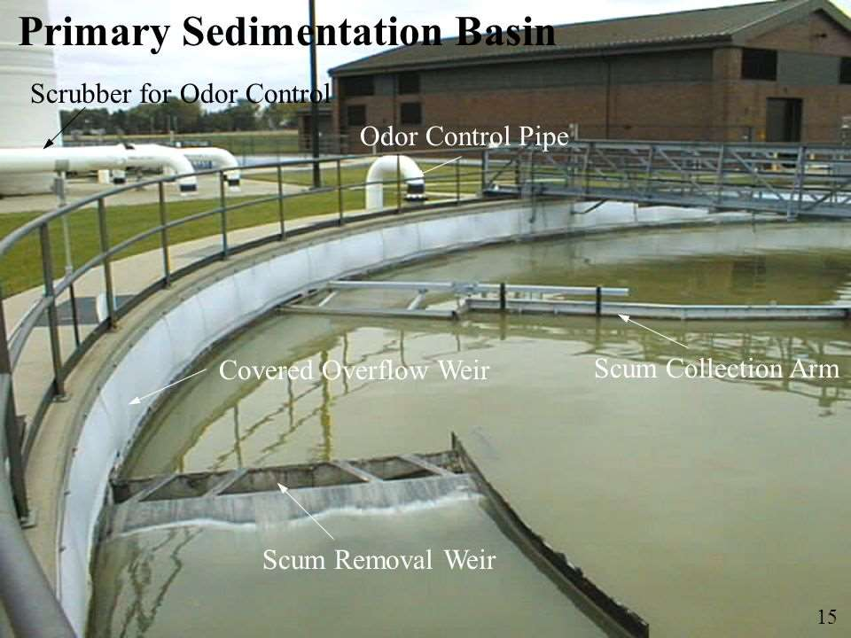
    - **Hình này chứng minh điều gì**
      - Vị trí lắp đặt thực tế của cơ cấu vớt váng mặt nước cùng giải pháp thu gom kín để xử lý mùi hôi.
    - **Từ đâu mà thấy được**
      - Vùng mặt nước: cần thu váng (scum collection arm) đưa váng vào đập thu (scum removal weir) cạnh máng tràn có nắp đậy (covered overflow weir).
      - Vùng trên bờ: ống dẫn khí (odor control pipe) kết nối trực tiếp đến tháp hấp thụ (scrubber for odor control).

##### So sánh hình học: Bể lắng chữ nhật so với bể lắng tròn (Rectangular vs Circular Geometry)

- Tiết kiệm diện tích mặt bằng xây dựng (Footprint & Space Utilization):
  - Bể lắng hình chữ nhật có ưu thế hiệu quả hơn khi quỹ đất xây dựng hạn chế, nhờ khả năng module hóa và bố trí nhiều đơn nguyên song song dùng chung tường ngăn (common-wall construction).
  - Bể lắng hình tròn để lại các khoảng đất trống xen kẽ giữa các bể, chiếm dụng tổng diện tích mặt bằng trạm xử lý lớn hơn $25\% - 40\%$ so với bể chữ nhật có cùng tổng diện tích bề mặt.
- Chi phí xây dựng và kết cấu chịu lực (Construction Costs & Structural Efficiency):
  - Bể lắng hình tròn có ưu thế kết cấu bê tông cốt thép tối ưu nhờ ứng suất kéo vòng (hoop stress) phân bố đồng đều, giúp giảm chiều dày thành bể và tiết kiệm cốt thép đối với các bể đường kính lớn ($D > 20\text{ m}$).
  - Bể lắng hình chữ nhật chịu tải trọng uốn thủy tĩnh cục bộ trên vách đứng, đòi hỏi cốt thép tăng cường và tường dày hơn, nhưng tổng khối lượng xây dựng giảm khi chia sẻ tường chung giữa các đơn nguyên.
- Độ phức tạp và chi phí bảo trì cơ khí (Mechanical Reliability & Maintenance):
  - Bể lắng hình tròn sử dụng cơ cấu truyền động quay quanh trục tâm hoặc bánh xe biên, ít chi tiết chuyển động chìm ngập trong nước, độ bền cao, chi phí bảo trì định kỳ thấp.
  - Bể lắng hình chữ nhật dùng cơ cấu xích cào (chain-and-flight) với hàng trăm mắt xích, bánh xích và ray dẫn chìm ngập hoàn toàn dưới nước thải ăn mòn, dễ bị đứt xích hoặc mòn ray, đòi hỏi tần suất bảo dưỡng cao hơn.
- Ổn định thủy lực và kiểm soát dòng chảy tắt (Hydraulic Stability & Short-Circuiting):
  - Bể lắng hình chữ nhật có chiều dài dòng chảy lớn ($L:W \ge 4:1$), vận tốc dòng chảy tương đối đồng đều dọc theo trục dọc, kiểm soát số Reynolds ($Re < 20{,}000$) và số Froude ($Fr > 10^{-5}$) ổn định.
  - Bể lắng hình tròn có chiều dài dòng chảy ngắn hơn (bán kính $R$), vận tốc giảm dần từ tâm ra biên tạo điều kiện lắng tốt nhưng nhạy cảm hơn với hiện tượng gió bề mặt thổi dạt lớp nước mặt gây chảy tắt (wind-induced short-circuiting) và dòng đối lưu nhiệt (density currents).

#### Sludge Removal

- Quá trình thu gom bùn (sludge removal) là khâu vận hành trọng yếu trong bể lắng (sedimentation tank) nhằm thu gom liên tục lớp cặn lắng ở đáy bể về các hố thu để xả ra ngoài hoặc tuần hoàn:
  - Mục đích chính của việc thu gom và xả bùn định kỳ hoặc liên tục:
    - Duy trì dung tích lắng hữu dụng và thời gian lưu thủy lực ($HRT$) thiết kế của bể.
    - Ngăn ngừa hiện tượng phân hủy yếm khí (kỵ khí) của bùn hữu cơ ở đáy bể sinh ra khí ($\text{CH}_4$, $\text{CO}_2$, $\text{H}_2\text{S}$) làm nổi bông bùn lên mặt nước.
    - Hạn chế sự tích tụ bùn quá dày gây giảm chất lượng nước sau lắng hoặc trôi bùn qua đập tràn đầu ra.
  - Phân loại giải pháp thu gom bùn cơ học theo dạng hình học bể lắng:
    - Bể lắng hình chữ nhật (Rectangular tank): áp dụng cơ cấu gạt bùn gắn trên hệ thống xích gạt bùn (chain-and-flight) hoặc cầu cào chuyển động tịnh tiến (traveling-bridge) gom bùn về hố thu bùn cạnh/đầu bể (side hoppers).
    - Bể lắng hình tròn (Circular tank): áp dụng cơ cấu gạt bùn gắn vào trục truyền động động cơ (motor shaft / center drive) hoặc cầu cào chuyển động quay (traveling-bridge-type) gom bùn về hố thu tâm (central hopper).

##### Rectangular Tank (Bể lắng hình chữ nhật)

- Bể lắng hình chữ nhật (Rectangular tank) sử dụng thanh gạt bùn (scraper) gắn vào hệ thống xích gạt bùn (chain-and-flight) hoặc cầu cào chuyển động (traveling-bridge) để thu gom bùn về các hố thu bùn cạnh bể (side hoppers):
  - Bùn lắng được gom dồn dọc theo chiều dài đáy bể về các hố thu bùn (sludge hoppers / side hoppers) bố trí ở đầu vào hoặc bên hông bể.
  - Từ hố thu bùn, bùn được xả định kỳ bằng áp lực thủy tĩnh hoặc bơm hút bùn chuyên dụng sang công trình xử lý bùn.
  - Vận tốc di chuyển của thanh gạt được khống chế ở mức chậm ($0.01\text{--}0.03\text{ m/s}$ hoặc $0.6\text{--}1.8\text{ m/min}$) để ngăn ngừa xáo trộn lớp bùn đã lắng và chống tái cuốn trôi cặn.

###### Chain-and-Flight Scraper in Rectangular Tank

- Cấu tạo cơ cấu truyền động và dẫn hướng xích bao gồm trục truyền động (driving shaft), xích kéo (driving chain), bộ dẫn động (drive unit), ray dẫn hướng và bánh xích:
  - **Hình 9.** Cơ cấu truyền động xích gạt bùn bể chữ nhật
    - 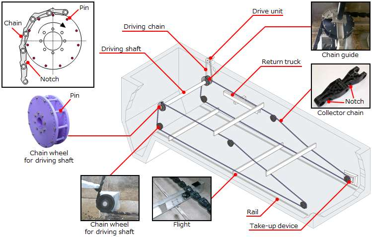
    - **Hình này chứng minh điều gì**
      - Hệ thống vận hành tuần hoàn khép kín nhờ bộ căng xích (take-up device) và ray đỡ xích hồi (return track).
    - **Từ đâu mà thấy được**
      - Sơ đồ từ trên xuống: Drive unit truyền động qua driving chain đến driving shaft, kéo collector chain chạy tuần hoàn dọc bể.
      - Hình chi tiết bên trái: Bánh xích chain wheel có các chốt pin ăn khớp vào rãnh notch của mắt xích để truyền động chống trượt.
  - Bộ dẫn động (drive unit) gồm động cơ giảm tốc công suất phù hợp đặt phía trên cạn đầu bể để thuận tiện cho công tác bảo trì, sửa chữa.
  - Trục truyền động (driving shaft) nhận mô-men quay từ động cơ thông qua dây xích truyền động (driving chain) và truyền lực đồng đều cho hai bên xích kéo.
  - Xích thu gom bùn (collector chain) làm bằng thép chống ăn mòn hoặc vật liệu polyme kỹ thuật cao, chuyển động tuần hoàn khép kín.
  - Bộ phận căng xích (take-up device) bố trí ở đầu đối diện để điều chỉnh độ chùng và đảm bảo xích luôn vận hành êm ái trên bánh xích.
  - Thanh ray dẫn hướng (rails) bằng thép không gỉ hoặc nhựa chuyên dụng được cố định dọc sàn đáy bể để đỡ và dẫn hướng chuyển động của các thanh cào bùn.
- Cơ cấu xích gạt bùn liên tục cào lớp bùn lắng ở đáy bể đưa về hố thu bùn phía đầu vào, đồng thời các thanh gạt hồi chuyển ở mặt nước có thể kết hợp gạt váng nổi về phía cuối bể:
  - **Hình 10.** Phối cảnh 3D xích gạt bùn trong bể lắng chữ nhật
    - 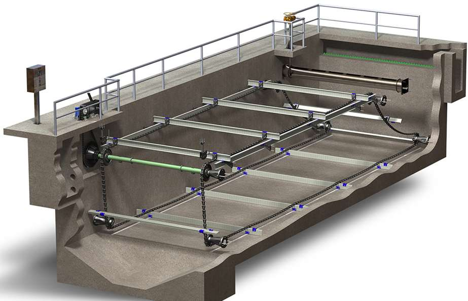
    - **Hình này chứng minh điều gì**
      - Bố trí tuần hoàn khép kín tích hợp đồng thời hai chức năng: cào bùn đáy về hố tập trung và lùa váng nổi mặt nước về ống thu.
    - **Từ đâu mà thấy được**
      - Đường dẫn đọc từ trái qua phải: hố thu bùn vát sâu ở đáy đầu vào (bên trái), đối diện với ống thu váng và máng răng cưa đầu ra (bên phải).
      - Phân tầng làm việc: tầng đáy có thanh gạt trượt sát đáy gom bùn vào hố, tầng mặt có thanh gạt hồi chuyển định hướng váng vào ống xả.
  - Nhánh chuyển động phía dưới của xích kéo thanh cào quét sát sàn đáy đẩy bùn lắng theo chiều ngược dòng nước về hố thu bùn ở đầu bể.
  - Nhánh chuyển động phía trên nổi trên mặt nước đẩy lớp váng dầu mỡ và chất nổi (scum) xuôi theo dòng chảy về máng hoặc ống thu váng ở cuối bể.
- Lắp đặt thực tế trong các cụm bể lắng chữ nhật quy mô lớn với nhiều ngăn lắng song song:
  - **Hình 11.** Lắp đặt cào bùn xích trong bể chữ nhật nhiều ngăn
    - 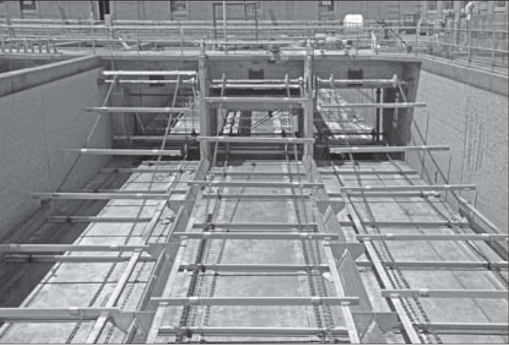
    - **Hình này chứng minh điều gì**
      - Bể lắng quy mô lớn được phân chia thành các ngăn song song, mỗi ngăn vận hành một hệ cào xích riêng biệt.
    - **Từ đâu mà thấy được**
      - Góc nhìn dọc bể: 3 ngăn lắng song song ngăn cách bằng các trụ và dầm bê tông.
      - Đáy từng ngăn: các thanh gạt (flights) ngang liên kết hai dải xích kéo trải dọc toàn bộ chiều dài bể.
  - Mỗi ngăn lắng chữ nhật được trang bị hệ thống thanh gạt và xích riêng biệt, cho phép cô lập từng ngăn để bảo dưỡng mà không phải dừng toàn bộ hệ thống.
  - Chiều rộng của ngăn bể được chuẩn hóa tương thích với khẩu độ chế tạo tiêu chuẩn của thanh gạt ($3\text{--}8\text{ m}$) và dầm giàn chịu lực.
- Các thanh gạt (flights) chuyển động tịnh tiến dọc đáy bể trượt trên các thanh ray (rails) cố định để gạt đều lớp bùn lắng:
  - **Hình 12.** Thanh gạt xích trượt trên ray dẫn hướng đáy bể
    - 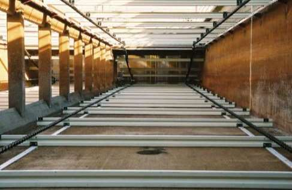
    - **Hình này chứng minh điều gì**
      - Các thanh gạt song song phủ kín bề rộng đáy bể, liên kết hai dải xích biên trượt dọc ray đáy.
    - **Từ đâu mà thấy được**
      - Mặt sàn đáy bể: các thanh gạt trắng nằm ngang cách đều nhau, tì trực tiếp lên các đường ray dẫn hướng.
      - Hai bên và phía trên: hai dải xích kéo biên liên kết các đầu thanh gạt; phía trên cao là nhánh thanh gạt hồi chuyển.
  - Thanh gạt (flight) thường chế tạo từ gỗ xử lý đặc biệt, sợi thủy tinh (fiberglass) hoặc nhựa siêu bền (FRP) để chống ăn mòn trong nước thải.
  - Tấm trượt (wear shoes) gắn dưới chân thanh gạt tiếp xúc trực tiếp với thanh ray để hạn chế mài mòn cho thân thanh cào chính.

###### Traveling-Bridge Scraper in Rectangular Tank

- Cầu cào chuyển động di chuyển tịnh tiến qua lại dọc theo chiều dài bể để gom bùn:
  - **Hình 14.** Cầu cào bùn di động trong bể lắng chữ nhật
    - 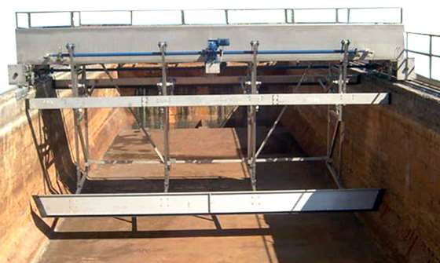
    - **Hình này chứng minh điều gì**
      - Kết cấu khung giàn treo hạ từ dầm cầu di động mang thanh cào phẳng phủ trọn bề ngang lòng bể.
    - **Từ đâu mà thấy được**
      - Phía trên thành bể: dầm cầu công tác gắn cụm truyền động bắc ngang qua hai bên thành bể bê tông.
      - Dưới lòng bể: các thanh giằng thẳng đứng giữ lưỡi cào bản rộng áp sát mặt đáy bể.
  - Cầu công tác chuyển động trên các ray thép gắn trên đỉnh thành bể bằng cụm bánh xe dẫn động motor điện.
  - Hành trình cào bùn diễn ra theo một chiều (thường về phía hố thu), khi di chuyển ngược lại dàn cào có thể được nâng lên bằng thủy lực hoặc tời cáp để tránh khuấy đục lớp cặn.
  - Toàn bộ cơ cấu truyền động và ổ bi đặt trên cạn giúp thuận lợi trong vận hành và giảm thiểu việc bảo dưỡng chìm dưới nước.
- Hệ thống cầu cào chuyển động kép có thể vận hành trên ray dẫn hướng lắp đặt trên tường phân cách giữa hai bể lắng chữ nhật liền kề:
  - **Hình 13.** Cầu cào di động bắc qua hai bể lắng chữ nhật
    - 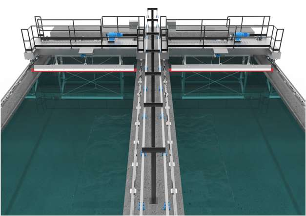
    - **Hình này chứng minh điều gì**
      - Cơ cấu cầu nhịp đôi dùng chung hệ ray trên tường ngăn giữa, tích hợp đồng thời thanh gạt váng mặt và khung cào bùn chìm cho từng ngăn bể.
    - **Từ đâu mà thấy được**
      - Đọc từ giữa sang hai bên: tường phân cách trung tâm lắp cặp ray song song đỡ bánh xe cho hai nhịp cầu cào.
      - Đọc từ sàn cầu xuống lòng nước: mô-tơ truyền động trên sàn công tác liên kết thanh gạt váng nổi và khung giàn cào bùn chìm.
  - Thiết kế nhịp đôi giúp tối ưu hóa chi phí đầu tư thiết bị cơ khí và tiết kiệm diện tích xây dựng trạm xử lý.
  - Tường phân cách giữa hai ngăn bể đảm nhận vai trò kết cấu chịu lực chính nâng đỡ ray chạy của cụm bánh xe cầu cào.

##### Circular Tank (Bể lắng hình tròn)

- Bể lắng hình tròn (Circular tank) sử dụng thanh cào bùn gắn vào trục truyền động của động cơ (motor shaft) hoặc dạng cầu cào chuyển động (traveling-bridge-type) để gom bùn về hố thu trung tâm (central hopper):
  - Bùn lắng ở mọi vị trí trên sàn đáy bể hình tròn được các cánh cào xoay tròn đẩy dần từ chu vi vào tâm bể.
  - Hố thu bùn trung tâm (central hopper) dạng hình nón ngược hoặc hình trụ sâu đặt ở đáy trung tâm để tập trung bùn trước khi bơm hút.
  - Vận tốc quay của cánh cào được kiểm soát ở mức rất thấp (tốc độ viền khoảng $0.02\text{--}0.05\text{ m/s}$) nhằm tránh phá vỡ bông cặn và xáo trộn vùng lắng.

###### Center Drive Scraper in Circular Tank

- Bể lắng tròn có đường kính từ $3.6\text{ m}$ đến $9\text{ m}$ ($3.6\text{ to }9\text{ m}$ in diameter) có thiết bị cào tách chất rắn (solids removal equipment) được treo đỡ trên các dầm bắc ngang qua miệng bể (beams spanning the tank):
  - **Hình 15.** Cào bùn truyền động tâm treo trên dầm bắc ngang bể tròn
    - 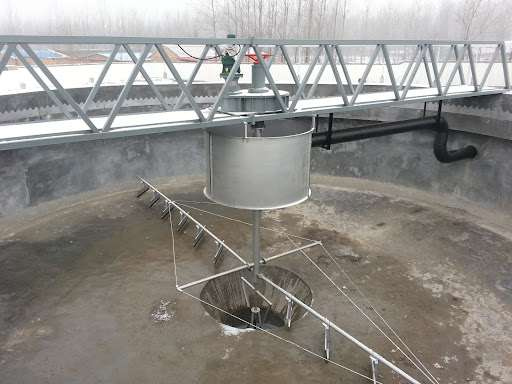
    - **Hình này chứng minh điều gì**
      - Cơ cấu cào bùn (solids removal equipment) được treo trực tiếp từ dầm giàn bắc ngang miệng bể, gom bùn về hố thu tâm (central hopper).
    - **Từ đâu mà thấy được**
      - Dầm giàn trên miệng bể: gá cụm động cơ truyền động tâm và ống trung tâm, không cần trụ tâm bê tông.
      - Đáy bể: trục đứng treo cánh cào gạt bùn lắng vào hố thu tâm (central hopper) dạng nón.
  - Dầm cầu cố định bắc ngang qua đường kính bể đỡ toàn bộ tải trọng của động cơ truyền động, hộp giảm tốc, trục quay và ống phân phối nước trung tâm (center feed well).
  - Cánh cào bùn gắn các tấm gạt nghiêng góc hợp lý để tạo thành luồng đẩy bùn hướng tâm khi trục thẳng đứng quay chậm (tốc độ quay khoảng $0.02\text{--}0.05\text{ rpm}$).
  - Không cần xây dựng trụ tâm bằng bê tông cốt thép, giúp giảm đáng kể chi phí xây dựng cho các bể quy mô nhỏ và trung bình (đường kính $3.6\text{--}9\text{ m}$).

###### Traveling-Bridge Scraper in Circular Tank

- Bể lắng tròn có đường kính từ $10.5\text{ m}$ trở lên ($10.5\text{ m}$ in diameter and larger) có một trụ tâm (central pier) bằng bê tông cốt thép đỡ toàn bộ cơ cấu cào và có cầu dẫn đi bộ (walkway or bridge) tiếp cận từ thành bể ra trụ tâm:
  - Trụ tâm bê tông cốt thép chịu tải trọng thẳng đứng rất lớn từ hệ thống cơ khí và đóng vai trò làm trục quay trung tâm cho toàn bộ giàn cào.
  - Cầu dẫn đi bộ (walkway or bridge) cho phép nhân viên vận hành tiếp cận an toàn tới cụm truyền động tâm và ống phân phối nước trung tâm.
  - Cơ cấu dạng nửa cầu cào (half-bridge) quay quanh trụ tâm nhờ bánh xe dẫn động chạy trên đỉnh thành tròn của bể:
    - **Hình 16.** Nửa cầu cào quay quanh trụ tâm bể lắng tròn
      - 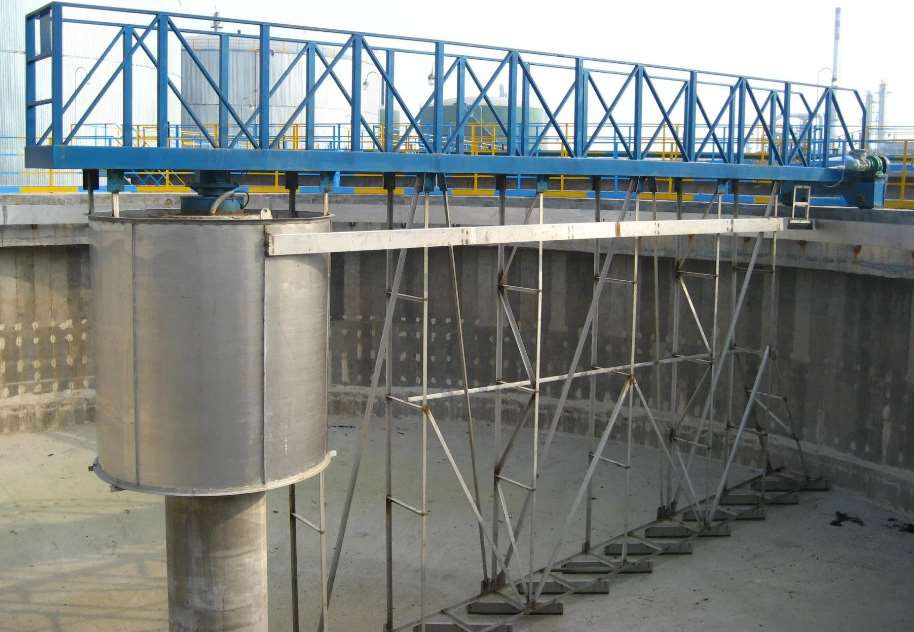
      - **Hình này chứng minh điều gì**
        - Cầu công tác nửa bán kính liên kết trụ tâm và thành bể, mang dàn khung treo các lưỡi gạt gom bùn về hố thu tâm.
      - **Từ đâu mà thấy được**
        - Vùng tâm bể: trụ bê tông tròn nâng đỡ khớp quay, bao quanh bởi ống phân phối dòng vào và gối tựa của giàn cầu thép.
        - Vùng thành và đáy bể: cụm bánh xe dẫn động tì trên mép bể; dàn khung treo bên dưới bố trí các thanh gạt so le hướng về tâm.
    - Đầu trong của nửa cầu tựa trên ổ xoay đặt tại đỉnh trụ tâm, đầu ngoài tựa trên cụm bánh xe cơ giới chạy vòng quanh thành bể tròn.
    - Dàn khung thép treo chìm dưới nước mang các tấm cào bùn so le ở đáy bể và tấm gạt váng nổi ở tầng mặt nước.
  - Cơ cấu dạng cầu cào toàn phần (full bridge) bắc qua đường kính bể với hệ dàn cào bùn trải rộng toàn bộ bán kính bể quay quanh trụ tâm:
    - **Hình 17.** Cầu cào toàn phần di động trong bể lắng tròn
      - 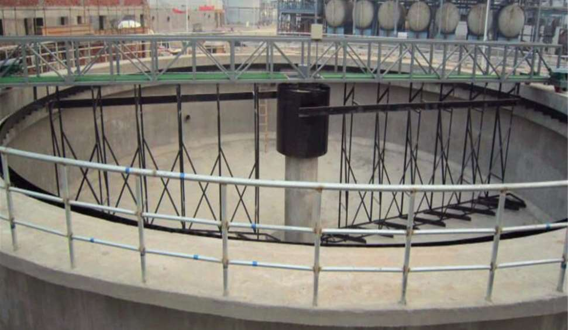
      - **Hình này chứng minh điều gì**
        - Cầu giàn thép chịu lực bắc trọn đường kính kiêm lối đi đến trụ tâm, treo dàn lưỡi cào gom bùn về hố thu tâm.
      - **Từ đâu mà thấy được**
        - Vùng đỉnh bể: dầm cầu giàn thép bắc ngang qua trụ bê tông ở tâm, hai đầu tựa trên gờ thành tròn.
        - Vùng đáy bể: các khung treo giữ dàn lưỡi gạt bùn đặt nghiêng so le đối xứng hai bên về phía tâm.
    - Cầu cào toàn phần cân bằng tải trọng đối xứng qua trụ tâm, giúp hệ thống vận hành êm ái và ổn định cơ học cao hơn đối với các bể đường kính rất lớn.
    - Hệ thống cào bùn hai bên bán kính giúp tăng gấp đôi tần suất cào bùn trên mỗi vòng quay, chống hiện tượng nén chặt của bùn sinh học.

##### Sludge Hoppers and Bottom Slope (Hố thu bùn và Độ dốc đáy bể)

- Đáy của bể lắng được thiết kế tạo độ dốc khoảng 1 in 12 (độ dốc tỷ lệ $1:12$ hay xấp xỉ $8.33\,\%$, tương đương góc nghiêng sàn đáy khoảng $4.76^\circ$) dốc về hố thu bùn:
  - Độ dốc đáy chuẩn hóa khoảng 1 in 12 ($1:12$) áp dụng cho cả bể lắng hình chữ nhật (dốc về hố thu ở đầu vào hoặc rãnh bên) và bể lắng hình tròn (dốc từ chu vi thành bể về hố thu trung tâm ở đáy).
  - Độ dốc sàn đáy hỗ trợ trọng lực đẩy các hạt bùn đã lắng trượt xuống hố thu dễ dàng hơn khi thanh cào quét qua, giảm thiểu lực cản cơ học tác dụng lên cánh cào.
  - Hạn chế hình thành các góc chết tích tụ cặn lắng lâu ngày, bảo vệ bể khỏi nguy cơ bốc mùi hôi thối và nổi bùn kỵ khí.
- Cấu tạo và yêu cầu vận hành của hố thu bùn (sludge hoppers):
  - Hố thu bùn trong bể chữ nhật (side hoppers / inlet hoppers):
    - Đặt ở đầu vào của bể dưới dạng các phễu thu hình chóp hoặc rãnh thu ngang sâu có thành dốc nghiêng tối thiểu $50^\circ\text{--}60^\circ$ để bùn không bị đóng bám.
    - Bùn được thu gom từ hố bằng ống hút bùn dưới tác dụng của cột áp thủy tĩnh tự nhiên hoặc bơm hút bùn chuyên dụng.
  - Hố thu bùn trung tâm trong bể tròn (central hopper):
    - Đặt ở tâm đáy bể dưới dạng hình nón cụt sâu, tiếp nhận toàn bộ lượng bùn do các cánh cào hướng tâm gom về.
    - Thường gắn thêm cánh cào nhỏ phụ (hopper plow) trong lòng hố để chống hiện tượng tạo vòm (bridging) và nén nghẽn đường ống hút bùn.

* Cơ sở thủy lực và yêu cầu kỹ thuật chi tiết đối với hệ thống xả bùn đáy bể lắng:
  * Kiểm soát vận tốc cào bùn và ngăn ngừa hiện tượng khuấy đục tái lơ lửng:
    * Vận tốc chuyển động của thanh gạt xích cào: Khống chế trong phạm vi 0.01 đến 0.03 m/s (0.6 - 1.8 m/min) đối với bùn hoạt tính sinh học.
    * Vận tốc đầu mút cánh cào cầu quay bể tròn: Không vượt quá 0.04 m/s ở chu vi ngoài nhằm triệt tiêu lực cắt thủy động học phá vỡ cấu trúc bông bùn.
  * Thiết kế hình học và góc dốc phễu thu bùn (Sludge Hopper Design):
    * Độ dốc thành phễu thu bùn đối với bể lắng chữ nhật: Tối thiểu 45 độ đến 60 độ so với phương ngang để bùn tự trượt về đáy không bám dính.
    * Đáy bể lắng tròn: Tạo độ dốc hình nón từ 1:10 đến 1:12 (khoảng 8% - 10%) hướng về hố bùn trung tâm.
  * Tự động hóa chu kỳ bơm hút bùn và chống hiện tượng rút lõi nước trong (Anti-Ratholing):
    * Bố trí van xả bùn dạng ống lồng (telescoping sludge valves) hoặc bơm bùn trục vít điều khiển theo chu kỳ ngắt quãng.
    * Tần suất xả bùn đợt 1: Mỗi 2 - 4 giờ để ngăn ngừa hiện tượng phân hủy kỵ khí sinh bọt khí CH4 và CO2 đẩy nổi mảng bùn lên mặt nước.
    * Giám sát nồng độ bùn đáy liên tục bằng cảm biến mật độ sóng siêu âm gắn trên đường ống hút bùn.

#### Scum Removal

- Khái niệm và nguồn gốc của váng nổi (scum) trong bể lắng nước thải (sedimentation tank):
  - Lớp váng nổi bao gồm các tạp chất nhẹ có khối lượng riêng nhỏ hơn nước ($\rho < 1.0\text{ g/cm}^3$) như dầu mỡ (oil and grease), bọt xà phòng, sáp, xác vi sinh vật và rác vụn nhẹ nổi trên mặt nước.
  - Tác hại của lớp váng nổi: làm tắc nghẽn đập tràn thu nước trong (effluent weir), gây mùi hôi thối, mất mỹ quan công trình và làm suy giảm chất lượng nước sau lắng nếu trôi ra nguồn tiếp nhận.
  - Váng nổi có thể được loại bỏ bằng phương pháp thủy lực (hydraulically) hoặc cơ học (mechanically).
  - Vị trí thu gom: Váng nổi thường được thu gom tại đầu ra (effluent end) của bể lắng hình chữ nhật (rectangular tanks).

##### Phương pháp thu gom váng (Scum Removal Methods)

- Phân loại hai giải pháp thu gom váng nổi cơ bản trong bể lắng nước thải:
  - Phương pháp thủy lực (hydraulic removal): dựa vào chênh lệch mực nước để tạo dòng chảy tràn tự do mang váng nổi qua mép rãnh thu hoặc đập thu mà không dùng lực ép cơ giới.
  - Phương pháp cơ học (mechanical removal): dùng các thanh gạt váng (skimmer flights) chuyển động trên mặt nước hoặc cần gạt xoay (skimmer arms) lùa cưỡng bức váng nổi dồn về bờ trượt và máng thu.
- Thu gom váng tại đầu ra của bể lắng hình chữ nhật (effluent end of rectangular tanks):
  - Chuyển động dòng chảy thủy lực tự nhiên dọc theo chiều dài bể có xu hướng đẩy lớp váng nổi bề mặt tích tụ dần về phía cuối bể lắng.
  - Cơ cấu thu váng được bố trí ở đầu ra kết hợp với tấm chắn váng (scum baffle) để ngăn váng không thoát qua đập tràn nước trong:
    - **Hình 18.** Bố trí ống thu váng và kết cấu bể lắng chữ nhật
      - 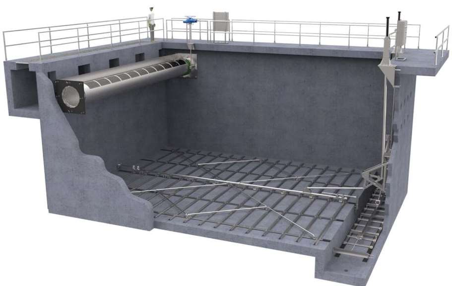
      - **Hình này chứng minh điều gì**
        - Vị trí lắp đặt ống xẻ rãnh thu váng ở tầng mặt nước phía cuối bể chữ nhật, kết hợp sàn đáy dốc và cơ cấu cào gom bùn.
      - **Từ đâu mà thấy được**
        - Góc trên bên trái: ống kim loại dạng xẻ rãnh khẩu độ lớn gắn ngang thành bể tại cao trình mặt nước ra.
        - Đỉnh bể và đáy bể: trục tay van điều khiển kéo lên sàn công tác; đáy bể dốc trang bị giàn khung cào bùn.
  - Tích hợp không gian công nghệ: khu vực đầu ra tập trung đồng thời hệ đập tràn thu nước trong (effluent weirs), tấm chắn váng (scum baffle) và đường ống xả váng về hố thu.

##### Thiết bị ống xẻ rãnh xoay thu váng (Rotating Slotted Pipes)

- Thiết bị thu xả váng cho trạm xử lý quy mô nhỏ (small installations):
  - Đối với các hệ thống quy mô nhỏ, thiết bị thu xả váng (scum draw-off facility) phổ biến nhất gồm một ống xẻ rãnh nằm ngang (horizontal, slotted pipe).
  - Ống có thể xoay quanh trục tâm nhờ cơ cấu cần gạt (lever) hoặc trục vít (screw):
    - **Hình 19.** Ống xẻ rãnh xoay thu gom váng bề mặt
      - 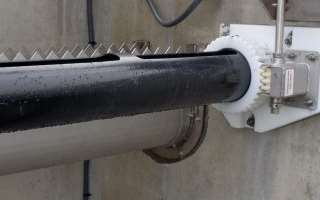
      - **Hình này chứng minh điều gì**
        - Cấu tạo ống nằm ngang có rãnh xẻ thu váng kết hợp khớp xoay điều chỉnh mép rãnh để hớt váng bằng thủy lực.
      - **Từ đâu mà thấy được**
        - Thân ống nằm ngang: ống hình trụ có rãnh xẻ dọc mép trên, đặt phía trước đập tràn răng cưa (V-notch weir).
        - Đầu ống bên phải: cụm bánh răng màu trắng và cơ cấu dẫn động xoay gắn cố định vào vách bê tông.
- Cơ chế vận hành hai trạng thái của ống xẻ rãnh xoay (operation cycle):
  - Trạng thái chờ thông thường (ngoại trừ lúc thu xả váng - except when drawing scum):
    - Khe rãnh mở (open slot) quay hướng lên trên, nằm phía trên mực nước bình thường trong bể (above normal tank water level).
    - Vị trí nâng cao này ngăn cản tuyệt đối dòng nước mặt hoặc nước trong chảy tràn vào lòng ống khi hệ thống đang vận hành lắng tĩnh.
  - Trạng thái thu xả váng (khi thu váng - when drawing scum):
    - Ống được xoay để mép khe rãnh mở chìm ngay bên dưới mực nước (submerged just below the water level).
    - Sự chênh lệch mực nước tạo dòng chảy tràn thủy lực mỏng cuốn trọn lớp váng nổi tích tụ (scum accumulation) tự chảy vào trong ống.
    - Sau khi hớt sạch váng nổi, người vận hành quay cần gạt hoặc trục vít để đưa khe rãnh nhô trở lại lên trên mực nước, chấm dứt dòng chảy tràn.
- Thông số kết cấu và kỹ thuật của ống xẻ rãnh xoay:
  - Vật liệu chế tạo bằng thép không gỉ (inox), gang đúc hoặc thép bọc chống ăn mòn để chịu được môi trường hóa chất và dầu mỡ.
  - Đường kính ống tiêu chuẩn thông thường từ $200\text{ mm}$ đến $300\text{ mm}$ ($8\text{ in}$ đến $12\text{ in}$) nhằm đảm bảo vận tốc thoát váng không gây ứ nghẽn bởi rác mảng.
  - Chiều rộng khe rãnh mở từ $25\text{ mm}$ đến $50\text{ mm}$, trải dài trên toàn bộ hoặc từng đoạn của ống tương ứng với vùng tập trung váng.
  - Góc xoay điều chỉnh từ $30^\circ$ đến $60^\circ$ cho phép kiểm soát độ ngập mép rãnh trong khoảng $10\text{ mm}$ đến $25\text{ mm}$ dưới mặt nước nhằm thu váng tối đa với thể tích nước thải mang theo tối thiểu.
  - Khớp xoay làm kín (rotary seal gland) bố trí tại các vị trí xuyên vách bê tông để ngăn rò rỉ nước thải chưa xử lý ra môi trường bên ngoài.

##### Cơ cấu gạt váng và máng thu váng cơ học (Scum Skimming and Scum Troughs)

- Hệ thống gạt váng cơ học (scum skimming systems) trong bể lắng quy mô trung bình và lớn:
  - Bể lắng hình chữ nhật sử dụng xích gạt bùn (chain-and-flight): các thanh cào trên nhánh hồi chuyển (return run) ở tầng mặt nước làm nhiệm vụ gạt bọt váng, liên tục đẩy lớp váng nổi về phía hạ lưu.
  - Bể lắng hình chữ nhật sử dụng cầu cào chuyển động (traveling bridge): thanh gạt váng nổi được hạ xuống tiếp xúc mặt nước khi cầu di chuyển theo hướng dòng chảy để lùa váng về cuối bể.
  - Bể lắng hình tròn (circular clarifiers): cần gạt váng (scum skimmer arm / blade) gắn liền với cầu quay, quét tròn lớp váng nổi từ vùng trung tâm ra máng thu ở thành bể.
- Tấm chắn váng (scum baffle):
  - Tấm chắn váng làm bằng sợi thủy tinh (FRP) hoặc thép không gỉ đặt song song và phía trước đập tràn răng cưa (V-notch weir).
  - Chiều sâu ngập dưới mặt nước từ $200\text{ mm}$ đến $300\text{ mm}$ và chiều cao nhô trên mặt nước từ $100\text{ mm}$ đến $150\text{ mm}$ để chặn đứng hoàn toàn lớp váng nổi không cho thoát qua đập.
- Cấu tạo máng thu váng và bờ dốc trượt (scum troughs and scum beach):
  - Bờ dốc trượt váng (scum beach / ramp): bản kim loại nghiêng phẳng đặt tiếp giáp mép nước dẫn lên miệng máng thu.
  - Thanh gạt nổi đẩy váng dồn ép trượt lên mặt nghiêng của bờ dốc rồi rơi vào máng thu váng (scum trough), giúp thoát bớt nước tự do trước khi váng vào máng.
  - Hệ thống vòi phun nước rửa (spray nozzles): bố trí dọc máng thu váng để phun nước áp lực định kỳ rửa trôi cặn mỡ bám dính, chống đóng bánh đông đặc trong máng.

##### Thu gom, bơm và tiêu hủy váng nổi (Scum Handling and Disposal)

- Hệ thống thu gom và bơm chuyển váng (scum collection and pumping):
  - Đường ống dẫn váng tự chảy: kết nối từ ống xẻ rãnh xoay hoặc máng thu váng có độ dốc tối thiểu $2\,\%$ để dẫn hỗn hợp váng dầu mỡ về giếng thu váng (scum pit / scum sump).
  - Giếng thu váng (scum well): bố trí cánh khuấy cơ học hoặc dàn sục khí để đồng hóa hỗn hợp váng, tránh phân tầng và chống vón cục dầu mỡ.
  - Lựa chọn loại bơm váng: sử dụng bơm trục vít lệch tâm (progressive cavity pump) hoặc bơm pittông (ram / plunger pump) có khả năng bơm chất lỏng độ nhớt cao và chứa tạp chất rắn, hạn chế dùng bơm ly tâm thông thường do dễ bị nghẹt cánh và tạo nhũ tương dầu nước.
- Các phương pháp xử lý và tiêu hủy váng nổi cuối cùng (scum disposal methods):
  - Đồng phân hủy kỵ khí cùng bùn sơ cấp (Anaerobic Co-Digestion): váng dầu mỡ giàu chất hữu cơ lipid có tiềm năng sinh khí methane ($\text{CH}_4$) rất cao ($> 0.9\text{ m}^3\,\text{CH}_4/\text{kg VS}$), được bơm vào bể phân hủy bùn kỵ khí sau khi đã băm nghiền và tách rác vụn.
  - Cô đặc và tách nước cơ học (Concentration and Dewatering): sử dụng bể lắng gạn váng có gia nhiệt hoặc thiết bị lọc cô đặc để tách pha nước tuần hoàn về đầu trạm xử lý, giảm thể tích váng cần xử lý.
  - Thiêu đốt (Incineration): đưa vào lò đốt bùn chuyên dụng (lò đốt nhiều tầng hoặc tầng sôi) nhằm tận dụng nhiệt trị cao của chất béo và mỡ.
  - Chôn lấp hợp vệ sinh (Sanitary Landfill): phối trộn váng mỡ cùng bùn đã ép khô đóng bánh bằng vôi hoặc chất ổn định trước khi vận chuyển đến bãi chôn lấp chất thải rắn theo quy định môi trường.

#### Flow Distribution

- Vai trò và ý nghĩa cốt lõi của phân phối dòng chảy trong bể lắng (Flow distribution role):
  - Phân phối dòng chảy đồng đều trên toàn bộ không gian làm việc là điều kiện tiên quyết để đạt được hiệu quả tách hạt cặn tối đa bằng trọng lực.
  - Phân phối lưu lượng đồng đều giúp dòng nước đạt trạng thái dòng đẩy lý tưởng (plug flow), giảm thiểu tối đa hiện tượng xáo trộn thủy lực và dòng chảy tắt (short-circuiting).
  - Triệt tiêu động năng dòng vào ($E_k = \frac{m v^2}{2}$), giảm vận tốc dòng chảy xuống vận tốc chuyển động ngang ổn định ($v_H$), ngăn chặn hiện tượng tạo dòng xoáy xói mòn lớp bùn đã tích lũy ở đáy bể.
  - Đảm bảo thời gian lưu thực tế ($t_{actual}$) tiếp cận giá trị thời gian lưu thủy lực tính toán danh định ($t_0 = \frac{V}{Q}$).
- Nguyên tắc thiết kế cấu tạo cửa vào và cửa ra theo hình học bể lắng:
  - Bể lắng chữ nhật (Rectangular sedimentation tank):
    - Cửa vào (Inlet): Bắt buộc bố trí máng dẫn cấp nước toàn chiều rộng (full-width inlet channel) kết hợp vách ngăn khuếch tán (diffuser baffles) hoặc tường đục lỗ (perforated diffuser wall).
    - Cửa ra (Outlet): Bắt buộc sử dụng hệ thống máng thu nước kéo dài gắn đập tràn răng cưa chữ V (long V-notch weirs) để mở rộng tổng chiều dài tràn thu nước.
  - Bể lắng tròn (Circular sedimentation tank):
    - Cửa vào (Inlet): Sử dụng giải pháp nạp nước tâm qua giếng phân phối trung tâm (Center feed) hoặc nạp nước ngoại vi qua mương chu vi ngoài (Peripheral feed).
    - Cửa ra (Outlet): Sử dụng đập tràn răng cưa chữ V bố trí dọc chu vi bể (Peripheral V-notch weirs) hoặc hệ thống máng thu nước tỏa tròn dạng nan hoa (Radial collection weirs).

##### Inlet Flow Distribution Systems

- Yêu cầu thủy lực của hệ thống phân phối dòng vào (Inlet hydraulic requirements):
  - Chuyển đổi dòng chảy tập trung vận tốc lớn từ đường ống áp lực hoặc kênh dẫn ($v \approx 0.6\text{--}1.2\text{ m/s}$) thành dòng chảy êm, phân bố đồng nhất trên toàn bộ tiết diện ướt ($A_c = W \cdot H$).
  - Vận tốc dòng chuyển tiếp sau vách ngăn cửa vào phải giảm xuống dưới ngưỡng vận tốc lắng ngang danh định ($v_H \le 0.005\text{--}0.02\text{ m/s}$) để không cản trở quá trình lắng của bông cặn hữu cơ.
  - Ngăn ngừa hiện tượng phân luồng dòng tia (jet streaming) và hiện tượng cuộn xoáy đáy gây tái lơ lửng cặn đã lắng trong hố thu bùn.

###### Rectangular Tank Inlets: Diffuser Baffles and Perforated Walls

- Cơ cấu máng nạp toàn chiều rộng và vách khuếch tán (Full-width inlet channel & Diffuser baffle):
  - Dòng nước thải dẫn vào máng thu nhận mở rộng trải suốt chiều rộng $W$ của bể lắng.
  - Tấm vách ngăn hướng dòng (diffuser baffle) đặt cách tường đầu vào một khoảng cách $0.5\text{--}1.0\text{ m}$, có mép chìm sâu dưới mặt nước từ $0.5\text{--}1.2\text{ m}$ ($20\%\text{--}30\%$ chiều sâu công tác $H$).
  - Vách baffle buộc dòng nước dâng tràn phải đổi hướng đi xuống dưới, triệt tiêu xung lượng vận tốc ngang ban đầu và dàn đều lưu lượng ra trước khi tiến vào vùng lắng chính.
  - Phía cuối bể, nước trong sau lắng dâng lên được thu gom qua cụm máng thu nhiều nhánh song song (Effluent launders) nhằm giảm tải trọng thủy lực thu nước.
  - **Hình 20.** Cấu tạo máng dẫn vào và vách ngăn khuếch tán trong bể lắng chữ nhật (Inlet channel and diffuser baffle)
    - 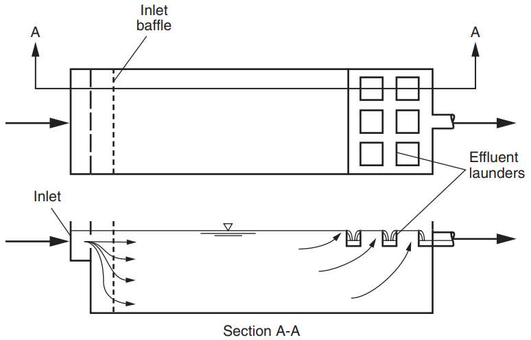
  - **Hình này chứng minh điều gì**
    - Máng cấp nước toàn chiều rộng kết hợp vách ngăn khuếch tán hướng dòng chảy đều sang vùng lắng ngang.
  - **Từ đâu mà thấy được**
    - Sơ đồ mặt cắt A-A thể hiện vách ngăn Inlet baffle uốn dòng nước từ máng vào đi thẳng xuống đáy rồi tỏa ngang.
    - Mặt bằng bố trí các máng thu nước đầu ra (Effluent launders) dạng ô lưới song song tại cuối bể.

- Cấu tạo và thông số thủy lực của tường đục lỗ khuếch tán (Perforated diffuser wall):
  - Tường đục lỗ (perforated wall) là giải pháp phân phối thủy lực tối ưu nhất cho bể lắng chữ nhật kích thước lớn.
  - Vách ngăn bê tông hoặc thép không gỉ được đục mạng lưới lỗ tròn hoặc khe hẹp hình chữ nhật, phủ kín toàn bộ tiết diện ngang từ cao trình trên lớp bùn đến sát mặt nước.
  - Tỷ lệ diện tích lỗ mở trên tổng diện tích tiết diện ướt ($A_{holes} / A_c$) dao động từ $10\%$ đến $20\%$.
  - Đường kính lỗ mở ($d_{hole}$) thường thiết kế trong khoảng $100\text{--}200\text{ mm}$ nhằm tránh nguy cơ tắc nghẽn bởi rác xơ vụn lơ lửng.
  - Vận tốc dòng chảy qua các lỗ đục ($v_{hole}$) duy trì ở mức $0.2\text{--}0.3\text{ m/s}$:
    - Vận tốc đủ lớn để tạo tổn thất cột áp nhỏ $\Delta h = \frac{v_{hole}^2}{2 g C_d^2} \approx 5\text{--}15\text{ mm}$, đủ để tạo sức cản thủy lực san phẳng lưu lượng qua mọi lỗ trên toàn bộ chiều rộng và chiều sâu bể.
    - Vận tốc không vượt quá ngưỡng gây vỡ bông bùn sinh học hoạt tính (floc breakup) đã hình thành từ công trình xử lý phía trước.
  - **Hình 21.** Tường đục lỗ khuếch tán phân phối dòng chảy đầu vào thực tế (Perforated diffuser wall)
    - 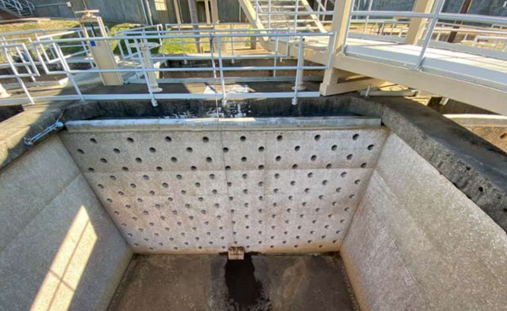
  - **Hình này chứng minh điều gì**
    - Vách bê tông đục lỗ phủ kín toàn bộ tiết diện ướt để san phẳng trường vận tốc dòng vào bể chữ nhật.
  - **Từ đâu mà thấy được**
    - Mạng lưới lỗ tròn đường kính đều nhau bố trí so le trải rộng từ đáy đến sát đỉnh vách ngăn.
    - Cầu thao tác và hệ thống van phai kiểm soát lưu lượng đặt ngay phía trên vách đục lỗ.

###### Circular Tank Inlets: Center Feed and Peripheral Feed

- Cấu tạo và đặc tính bể lắng tròn nạp nước tâm (Center feed circular clarifier):
  - Nước thải được cấp vào bể qua ống trung tâm (central influent pipe) đi ngầm dưới đáy bể dâng lên hoặc bắc cầu từ trên xuống giếng phân phối (feed well).
  - Giếng phân phối trung tâm (Center feed well / Baffle cylinder) có dạng hình trụ tròn hở đáy:
    - Đường kính giếng phân phối chiếm khoảng $15\%\text{--}25\%$ đường kính bể ($D_{well} = 0.15\text{--}0.25 D$).
    - Chiều sâu ngập của vách giếng chiếm $30\%\text{--}50\%$ chiều sâu chất lỏng trong bể ($H_{well} = 0.3\text{--}0.5 H$).
  - Cơ chế thủy lực:
    - Dòng nước thải dâng lên từ ống trung tâm va vào vách giếng phân phối, triệt tiêu động năng và chuyển hướng chảy cắm xuống dưới theo phương thẳng đứng.
    - Khi thoát ra khỏi đáy giếng phân phối, dòng nước tỏa tròn theo phương bán kính (radial flow) từ tâm bể ra thành ngoài với diện tích mặt cắt tăng dần tỷ lệ thuận với bán kính ($A(r) = 2 \pi r H$).
    - Vận tốc dòng chảy ngang giảm dần theo quy luật $v_r = \frac{Q}{2 \pi r H}$, tạo điều kiện cực kỳ thuận lợi cho các hạt cặn lắng dần xuống đáy theo quỹ đạo xoắn nghiêng.
    - Nước trong sau lắng dâng lên thoát qua đập tràn chữ V (Effluent weir) bố trí dọc chu vi ngoài.
    - Bùn lắng ở đáy được hệ thống cánh cào quay tròn gom vào hố thu trung tâm và xả ra ngoài (Thickened sludge).
  - **Hình 22.** Sơ đồ mặt cắt thủy lực bể lắng tròn nạp nước tâm (Center feed circular clarifier)
    - 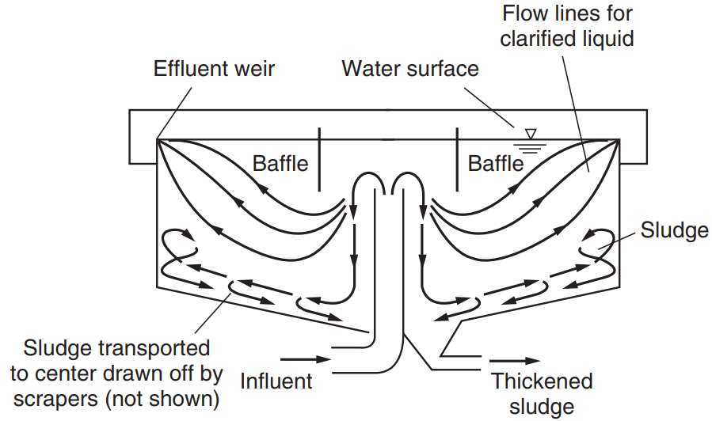
  - **Hình này chứng minh điều gì**
    - Nước thải nạp từ ống trung tâm đổi hướng qua giếng phân phối, tỏa đều ra đập tràn chu vi ngoài.
  - **Từ đâu mà thấy được**
    - Đường dòng nước trong (Flow lines for clarified liquid) uốn cong từ dưới vách Baffle hướng lên Effluent weir.
    - Lớp bùn lắng (Sludge) trượt theo đáy dốc về hố thu trung tâm để cào hút bùn cô đặc (Thickened sludge).
  - **Hình 23.** Kết cấu cơ khí giếng phân phối trung tâm trong bể lắng tròn (Center feed well structure)
    - 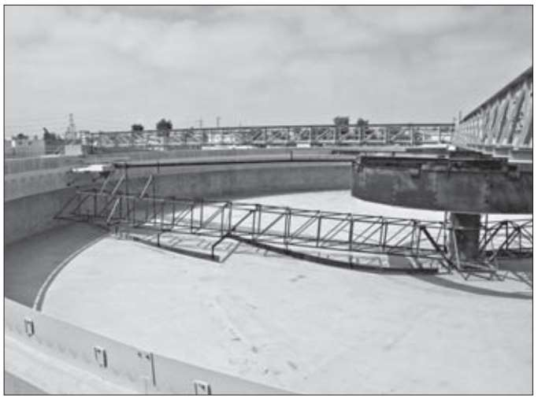
  - **Hình này chứng minh điều gì**
    - Giếng hình trụ tròn trung tâm đóng vai trò buồng tiêu năng và phân phối đối xứng hướng tâm.
  - **Từ đâu mà thấy được**
    - Ống bao hình trụ kim loại gắn trục tâm nhận dòng cấp từ cầu dẫn trung tâm.
    - Giàn cào bùn dạng khung thép xoay tròn trải dài từ trụ giữa ra tận thành chu vi ngoài.

- Cấu tạo và cơ chế thủy lực bể lắng tròn nạp nước ngoại vi (Peripheral feed circular clarifier):
  - Dòng nước thải nạp vào qua máng phân phối chạy dọc chu vi ngoài (peripheral influent flume) thay vì đưa vào tâm.
  - Dọc theo máng nạp chu vi bố trí vách chắn sâu (deep baffle) ngập sâu vào lòng bể:
    - Vách chắn sâu ép dòng nước thải đầu vào phải chuyển động chìm xuống sát đáy bể dọc theo mép tường biên.
    - Sau khi đi qua mép dưới của vách chắn sâu, dòng nước đổi hướng chảy ngược từ ngoài vào trong tâm (inward radial flow) và dâng dần lên bề mặt.
  - Ưu thế thủy lực của cơ cấu nạp ngoại vi:
    - Vận tốc nạp tại chu vi ngoài đạt giá trị nhỏ nhất do chu vi nạp lớn nhất ($P = \pi D$), giảm thiểu tối đa hiện tượng tạo dòng tia cục bộ.
    - Diện tích lắng hiệu dụng được tận dụng triệt để ở vùng ngoại vi nơi có thể tích bể lớn nhất.
    - Nước sau làm trong được thu gom vào máng thu nước trung gian (Effluent trough) đặt cách ly với dòng nạp ngoại vi.
  - **Hình 24.** Sơ đồ mặt cắt thủy lực bể lắng tròn nạp nước ngoại vi (Peripheral feed circular clarifier)
    - 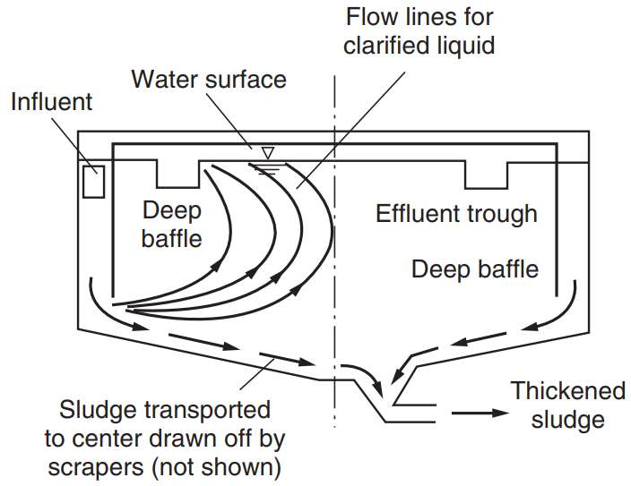
  - **Hình này chứng minh điều gì**
    - Dòng nước vào từ chu vi thành ngoài được vách chắn sâu hướng xuống đáy trước khi dâng lên máng thu.
  - **Từ đâu mà thấy được**
    - Vách chắn sâu (Deep baffle) buộc dòng vào (Influent) đi xuống sát đáy rồi mới uốn ngược lên Effluent trough.
    - Đường dòng chất lỏng sau làm trong (Flow lines for clarified liquid) đảo chiều dâng lên máng thu trung gian.
  - **Hình 25.** Máng nạp nước ngoại vi và hệ thống đập tràn răng cưa (Peripheral feed and effluent weirs)
    - 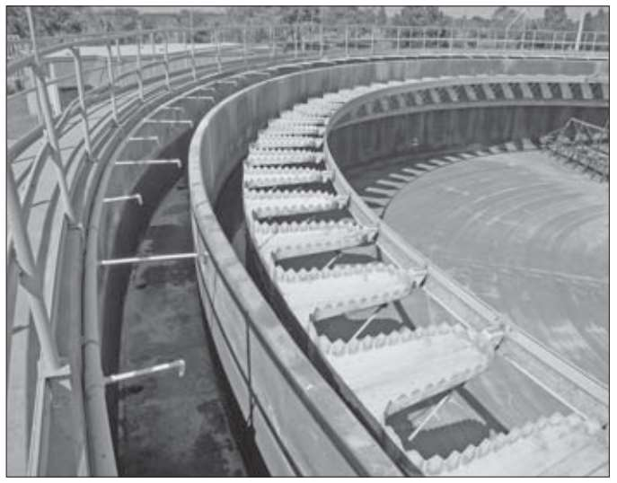
  - **Hình này chứng minh điều gì**
    - Cấu tạo kênh phân phối chu vi ngoài kết hợp vách ngăn hướng dòng và đập tràn răng cưa chữ V.
  - **Từ đâu mà thấy được**
    - Mương cấp nước chạy cong theo thành ngoài với vách bê tông ngăn cách khoang nạp.
    - Chuỗi máng thu gắn đập tràn răng cưa chữ V đặt song song hướng vào lòng bể lắng.

##### Outlet Flow Collection Systems

- Nguyên lý thủy lực của hệ thống thu nước trong đầu ra (Effluent collection principles):
  - Nước trong sau lắng phải được thu gom êm dịu tại tầng mặt thoáng mà không gây tăng đột biến vận tốc dòng dâng cục bộ (upward approach velocity).
  - Nếu vận tốc dâng tiếp cận đập tràn quá lớn, lực nâng thủy động sẽ cuốn trôi các hạt bùn nhẹ đang lơ lửng ở vùng lắng trở lại dòng nước ra.
  - Tải trọng đập tràn (Weir Loading Rate - WLR) được xác định bởi công thức:
    $$\text{WLR} = \frac{Q}{L_{weir}}$$
    - Trong đó $Q$ là lưu lượng dòng thải ($\text{m}^3/\text{ngày}$), $L_{weir}$ là tổng chiều dài đường tràn qua các đỉnh răng cưa chữ V ($\text{m}$).
    - Tiêu chuẩn thiết kế quy định $\text{WLR} \le 125\text{--}250\text{ m}^3/(\text{m}\cdot\text{ngày})$ cho bể lắng đợt 1 và $\le 120\text{--}180\text{ m}^3/(\text{m}\cdot\text{ngày})$ cho bể lắng đợt 2.

###### Long V-Notch Weirs for Rectangular Tanks

- Bố trí máng thu nước kéo dài (Long V-notch weir launders):
  - Trong bể lắng chữ nhật, chiều rộng thành cuối bể ($W$) thường không đủ dài để thỏa mãn giới hạn tải trọng đập tràn ($\text{WLR}$).
  - Do đó, bắt buộc thiết kế các máng thu nhánh ngón tay (finger launders) hoặc máng chữ U kéo dài dọc theo chiều dài bể, vươn sâu vào vùng lắng từ $10\%\text{--}30\%$ chiều dài bể ($L$).
  - Hai bên thành của mỗi máng đều gắn tấm đập tràn răng cưa chữ V (V-notch weir plates), giúp tăng tổng chiều dài tràn thu nước lên gấp 3 đến 6 lần so với chiều rộng bể đơn thuần ($L_{weir} \gg W$).
  - Trong các hệ thống lắng cao tải kết hợp tấm hoặc ống lắng nghiêng lamen, các máng thu răng cưa được đặt phủ đều ngay phía trên bề mặt các mô đun lắng để thu nước đồng đều trên từng mét vuông diện tích bề mặt.
  - **Hình 26.** Hệ thống máng thu nước răng cưa chữ V trong bể lắng chữ nhật (Long V-notch weirs)
    - 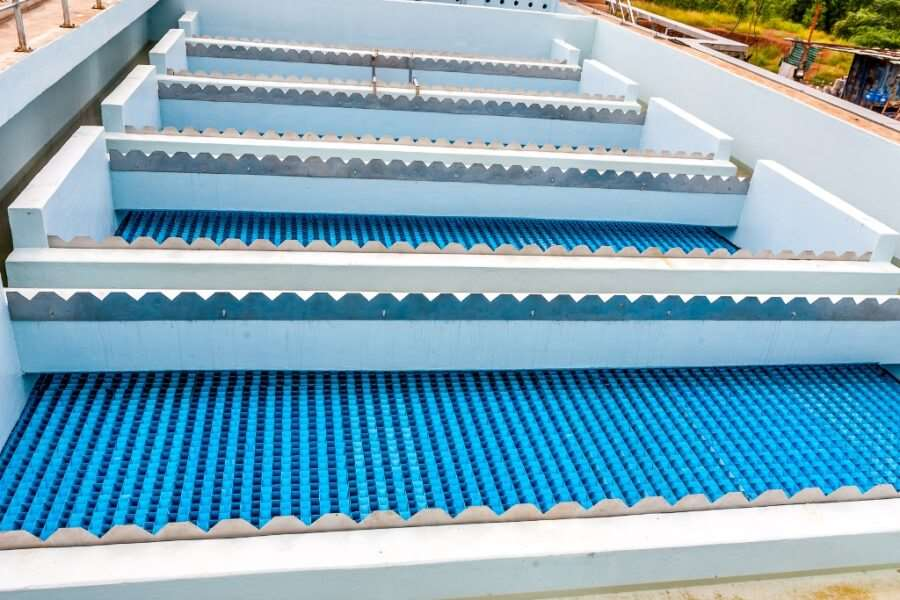
  - **Hình này chứng minh điều gì**
    - Máng thu đặt song song kéo dài tăng chiều dài tràn và giảm áp lực dòng hút qua khối lắng lamen.
  - **Từ đâu mà thấy được**
    - Các máng bê tông dài song song gắn tấm răng cưa chữ V bằng thép không gỉ chạy dọc mặt bể.
    - Khối ống lắng nghiêng (tube settler) màu xanh bố trí đồng nhất ngay dưới đáy các máng thu.
  - **Hình 27.** Cụm bể lắng chữ nhật quy mô lớn với các máng thu nước kéo dài (Multiple rectangular basins)
    - 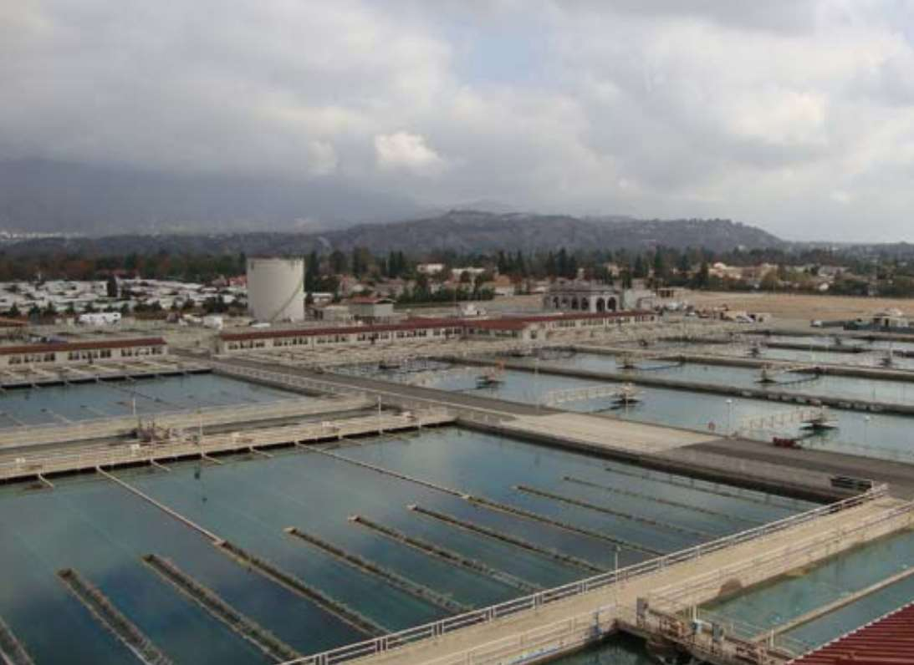
  - **Hình này chứng minh điều gì**
    - Bố trí nhiều nhánh máng thu song song chiếm phần lớn chiều dài cuối bể để kiểm soát tải trọng tràn đập.
  - **Từ đâu mà thấy được**
    - Nhiều đơn nguyên bể lắng chữ nhật song song với mạng máng thu nước vươn sâu vào lòng bể.
    - Cầu công tác bắc ngang trên các vách ngăn phân chia lưu lượng đồng đều cho từng bể.

###### Circular Tank Outlets: Peripheral and Radial Collection

- Cấu tạo đập tràn thu nước chu vi ngoài (Peripheral V-notch weirs):
  - Áp dụng phổ biến nhất cho bể lắng tròn nạp nước tâm có đường kính nhỏ và trung bình ($D \le 30\text{ m}$).
  - Máng thu bê tông hoặc thép chế tạo chạy giáp vòng quanh chu vi thành ngoài của bể với tổng chiều dài tràn ban đầu $L_{weir} \approx \pi D$.
  - Để tăng gấp đôi chiều dài tràn, máng thu có thể thiết kế dạng máng treo hai mép tràn (double-sided weir trough) gắn tấm răng cưa chữ V ở cả mép trong và mép ngoài máng ($L_{weir} \approx 2 \pi D$).
  - Nước tràn qua từng khe chữ V rơi tự do vào máng rồi hội tụ về ống xả chung.
  - **Hình 28.** Đập tràn răng cưa chữ V chu vi trong bể lắng tròn (Peripheral V-notch weir)
    - 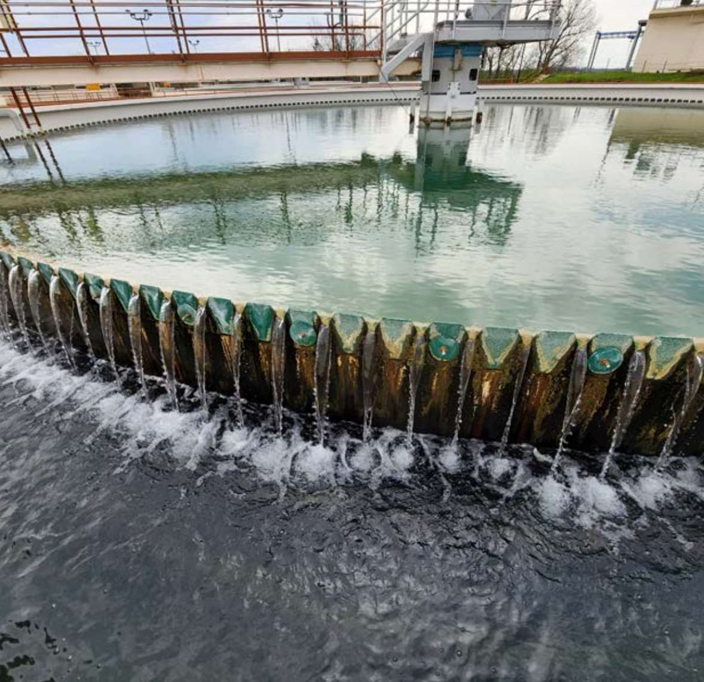
  - **Hình này chứng minh điều gì**
    - Dòng nước trong tràn đều qua từng khe răng cưa chữ V dọc chu vi thành bể vào máng thu ngoài.
  - **Từ đâu mà thấy được**
    - Mực nước trong bể tràn đồng đều qua các đỉnh răng cưa chữ V màu xanh tạo màng nước rơi thẳng.
    - Dòng chảy thu gom vào máng chu vi bê tông bên dưới có sủi bọt khí chuyển động êm.

- Cấu tạo hệ thống máng thu nước tỏa tròn dạng nan hoa (Radial collection launders):
  - Áp dụng bắt buộc cho các bể lắng tròn quy mô công suất lớn hoặc đường kính rất lớn ($D > 30\text{--}40\text{ m}$).
  - Khi đường kính bể lớn, tỷ lệ giữa diện tích bề mặt bể và chu vi thành ngoài tăng tuyến tính ($A / P = \frac{\pi D^2 / 4}{\pi D} = \frac{D}{4}$), khiến đập tràn chu vi đơn lẻ không còn đáp ứng được tiêu chuẩn tải trọng tràn $\text{WLR}$.
  - Giải pháp là lắp đặt mạng lưới máng thu nhánh tỏa tròn (radial troughs) chạy từ tâm bể ra mép ngoài tựa như các nan hoa của bánh xe.
  - Các máng thu nan hoa có đục lỗ phân phối hoặc gắn đập tràn chữ V hai bên, thu gom trực tiếp nước trong từ các vùng bán kính khác nhau, đảm bảo trường dòng dâng thẳng đứng hoàn toàn đồng đều trên toàn bộ bề mặt tròn của bể.
  - **Hình 29.** Hệ thống máng thu nước tỏa tròn dạng nan hoa (Radial collection launders)
    - 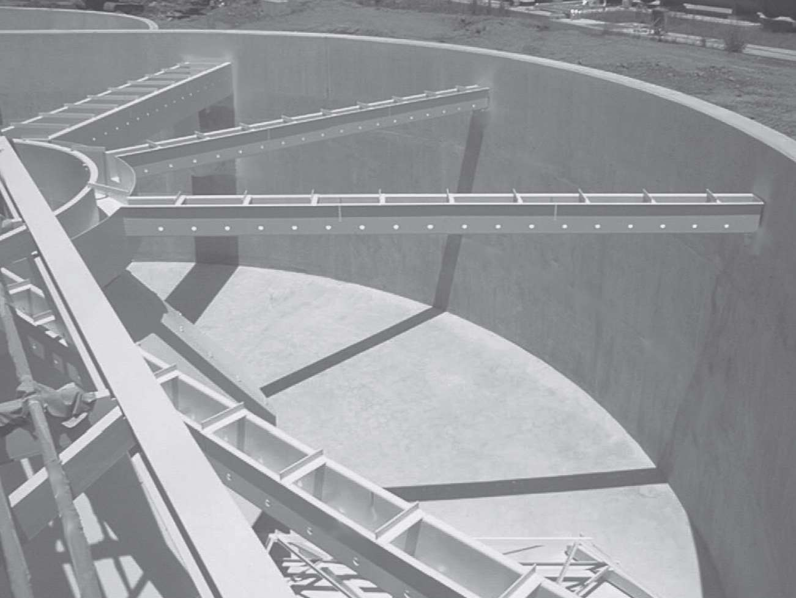
  - **Hình này chứng minh điều gì**
    - Các máng thu hướng tâm giúp thu nước đều từ trung tâm ra chu vi cho các bể lắng đường kính lớn.
  - **Từ đâu mà thấy được**
    - Các máng thép có đục lỗ thu nước chạy tỏa tròn từ trụ đỡ trung tâm vươn ra thành ngoài.
    - Đáy bể bê tông lộ rõ độ dốc hình nón hướng tâm chuẩn bị lắp đặt hệ gạt bùn đáy.

##### Hydrodynamic Regimes and Short-Circuiting Mitigation

- Động học dòng chảy và hiện tượng lệch chuẩn thủy lực trong bể lắng (Hydrodynamic anomalies):
  - Quá trình lắng trọng lực trong thực tế hiếm khi đạt được trạng thái dòng chảy lý tưởng do tác động tổng hợp của các yếu tố ngoại cảnh: chênh lệch nhiệt độ giữa dòng vào và nước trong bể, gió bề mặt, và sự phân bố thủy lực không hoàn hảo.
  - Những sai lệch này gây ra dòng chảy tắt (short-circuiting), làm giảm thời gian lưu thực tế và tạo ra các vùng không gian chết (dead spaces) không tham gia vào quá trình lắng.

###### Ideal Plug Flow Regime versus Hydraulic Short-Circuiting

- Đặc tính của dòng chảy lý tưởng (Ideal flow regime):
  - Giả định dòng chảy là dòng đẩy lý tưởng (plug flow), trong đó mọi phần tử chất lỏng chuyển động song song với cùng một vận tốc nằm ngang $v_H$ từ cửa vào đến cửa ra.
  - Vách ngăn phân phối có khe/lỗ (slotted distribution baffle) tạo nên trường phân bố áp lực đều, triệt tiêu mọi xung động xoáy cuộn tại đầu vào.
  - Các hạt cặn lắng chuyển động với vận tốc tổng hợp vector $\vec{v} = \vec{v}_H + \vec{v}_s$, rơi chạm đáy trước khi dòng nước uốn cong dâng lên đập tràn cửa ra.
  - Thời gian lưu thực tế của mọi phần tử nước bằng đúng thời gian lưu tính toán lý thuyết ($t_{actual} = t_0$).
  - **Hình 30.** Trường dòng chảy lý tưởng qua vách ngăn phân phối đục khe (Ideal flow regime)
    - 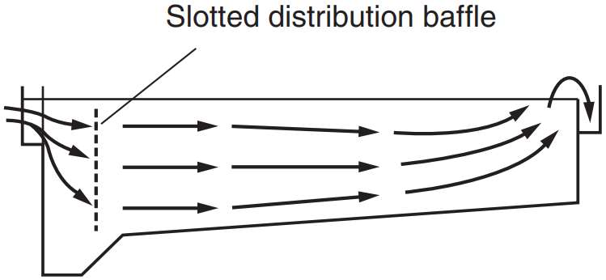
  - **Hình này chứng minh điều gì**
    - Vách ngăn đục khe triệt tiêu động năng vào và tạo các đường dòng chuyển động song song đồng đều.
  - **Từ đâu mà thấy được**
    - Sau vách ngăn Slotted distribution baffle, các mũi tên dòng chảy dàn đều theo phương ngang.
    - Dòng nước giữ trạng thái dòng đẩy ổn định qua suốt chiều dài bể trước khi dâng lên đập tràn.

- Cơ chế và hậu quả của dòng chảy tắt đoản mạch (Short-circuiting flow stream):
  - Xảy ra khi dòng nước vào không được tiêu năng và phân phối đều, hình thành một dòng tia vận tốc cao (jet stream) phóng chéo trực diện từ cửa vào tới cửa thoát nước ra.
  - Thời gian di chuyển của dòng tia này rất ngắn ($t_{actual} \ll t_0$), khiến các hạt cặn lơ lửng không kịp lắng xuống đáy và bị cuốn trôi thẳng ra nguồn tiếp nhận.
  - Sự chênh lệch vận tốc giữa dòng tia chính và khối chất lỏng xung quanh kích hoạt các vùng xoáy quẩn đối lưu tuần hoàn (recirculation eddy zones) ở hai bên cạnh dòng tia.
  - Thể tích bể lắng bị lãng phí nghiêm trọng do phần lớn không gian trở thành vùng xoáy tuần hoàn không hiệu dụng, làm suy giảm hiệu suất loại bỏ chất rắn lơ lửng ($SS$).
  - **Hình 34.** Dòng chảy tắt đoản mạch xuyên bể và các vùng xoáy quẩn (Short-circuiting flow stream)
    - 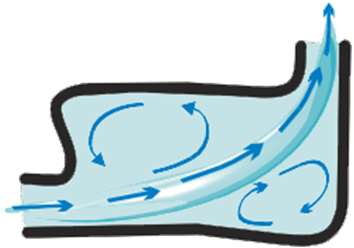
  - **Hình này chứng minh điều gì**
    - Dòng tia vận tốc cao xuyên chéo bể gây đoản mạch thủy lực nghiêm trọng và sinh các xoáy quẩn đối lưu.
  - **Từ đâu mà thấy được**
    - Tia dòng chảy hẹp màu xanh sáng phóng thẳng từ cửa nạp góc đáy sang cửa thoát trên đỉnh.
    - Hai bên luồng tia xuất hiện các vòng xoáy quẩn tuần hoàn màu xanh đậm gây thất thoát thể tích hữu ích.

###### Density Stratification and Thermal Convection Currents

- Ảnh hưởng của chênh lệch nhiệt độ và nồng độ chất rắn đến phân tầng tỷ trọng (Density stratification):
  - Tỷ trọng chất lỏng ($\rho$) phụ thuộc chặt chẽ vào nhiệt độ ($T$) và nồng độ chất rắn lơ lửng ($C_{SS}$).
  - Sự chênh lệch nhiệt độ chỉ cần $0.5\text{--}1.0^\circ\text{C}$ giữa dòng nước thải nạp vào ($T_{in}$) và khối nước đang chứa trong bể lắng ($T_{tank}$) đã đủ để gây ra sự phân tầng trọng lực rõ rệt, triệt tiêu hoàn toàn trạng thái dòng chảy ngang đồng nhất.
- Trường hợp nước trong bể ấm hơn nước thải đầu vào ($T_{tank} > T_{in} \implies \rho_{in} > \rho_{tank}$):
  - Thường xảy ra vào mùa lạnh hoặc khi nước thải chứa lượng cặn lơ lửng nồng độ cao làm tăng tỷ trọng dòng vào.
  - Dòng nước nạp vào có khối lượng riêng lớn hơn khối nước trong bể nên lập tức chìm thẳng đứng xuống đáy bể ngay sau khi qua vách ngăn cửa vào.
  - Dòng chảy tạo thành một lớp dòng tỷ trọng đáy (bottom density flow) trườn nhanh dọc theo nền đáy bể hướng thẳng về phía đập tràn cửa ra.
  - Toàn bộ khối nước phía trên biến thành vùng không gian chết (dead space) tù đọng.
  - Dòng đáy vận tốc lớn gây xói mòn và cuốn tung lớp bùn cặn đã lắng trong hố thu bùn, đẩy bùn trào ngược lên đập tràn cửa ra.
  - **Hình 32.** Phân tầng tỷ trọng khi nước vào lạnh hơn nước trong bể (Density current plunging)
    - 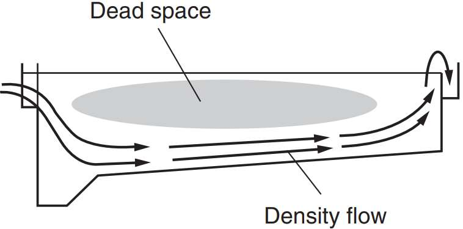
  - **Hình này chứng minh điều gì**
    - Dòng nước vào có tỷ trọng lớn hơn chìm xuống đáy bể tạo dòng chảy tắt đáy và vùng chết lớn phía trên.
  - **Từ đâu mà thấy được**
    - Dòng Density flow cắm thẳng xuống đáy ngay sau cửa vào và trườn dọc theo nền đáy tới đập xả.
    - Vùng chết (Dead space) hình elip xám chiếm lĩnh toàn bộ khoảng không gian rộng lớn tầng mặt.

- Trường hợp nước trong bể lạnh hơn nước thải đầu vào ($T_{tank} < T_{in} \implies \rho_{in} < \rho_{tank}$):
  - Thường xảy ra vào mùa nắng nóng bức xạ nhiệt mặt trời cao làm nóng dòng nước nạp, hoặc tiếp nhận nước thải công nghiệp ấm (chế biến thực phẩm, dệt nhuộm).
  - Dòng nước nạp vào có tỷ trọng nhỏ hơn nên lập tức dâng nổi lên trên và lướt nhanh sát mặt thoáng (surface skimming current).
  - Dòng nước ấm trôi tuột thẳng từ cửa nạp sang máng tràn cửa ra chỉ trong vài phút, bỏ lại toàn bộ thể tích sâu bên dưới thành vùng chết (dead space) không lưu thông.
  - Quá trình lắng trọng lực bị vô hiệu hóa gần như hoàn toàn do nước thải không đi qua chiều sâu công tác của bể.
  - **Hình 33.** Phân tầng tỷ trọng khi nước vào ấm hơn nước trong bể (Density current surface skimming)
    - 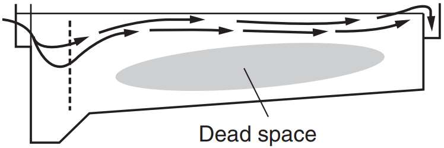
  - **Hình này chứng minh điều gì**
    - Dòng nước vào có tỷ trọng nhỏ hơn nổi lên mặt thoáng trôi nhanh sang đập ra, bỏ lại vùng chết đáy.
  - **Từ đâu mà thấy được**
    - Các mũi tên dòng chảy hướng thẳng lên tầng mặt và lướt nhanh sát mặt thoáng sang đập thu.
    - Vùng chết (Dead space) elip xám nằm ứ đọng ở tầng giữa và tầng đáy của bể lắng.

###### Wind-Driven Circulation and Engineering Mitigation Strategies

- Tác động của gió bề mặt đến trường dòng chảy (Wind-driven circulation cell):
  - Gió thổi dọc theo bề mặt thoáng của bể lắng ngoài trời tác động một lực ma sát cắt tiếp tuyến lên lớp nước mặt ($\tau_w = \rho_{air} C_d W_{wind}^2$).
  - Lực ma sát đẩy lớp nước sát mặt di chuyển cùng chiều với hướng gió dồn về một đầu bể.
  - Để bảo toàn khối lượng, một dòng chảy ngược chiều (counter-current) hình thành ở tầng nước sâu hơn, khép kín lại thành một tế bào hoàn lưu lớn do gió (wind-driven circulation cell).
  - Khối hoàn lưu elip này chiếm lĩnh tầng nước mặt và tầng giữa, chèn ép luồng dòng nạp chính phải lách xuống đáy bể.
  - Luồng nước bị ép đáy gia tăng vận tốc cục bộ, dễ dàng vượt qua vận tốc xói bùn tới hạn theo công thức Camp:
    $$v_{scour} = \sqrt{\frac{8 k (s - 1) g d}{f}}$$
    - Trong đó $k \approx 0.04\text{--}0.06$ là hệ số dính kết cặn, $s \approx 1.02\text{--}1.05$ là tỷ trọng hạt bùn, $g = 9.81\text{ m/s}^2$, $d$ là đường kính hạt, và $f \approx 0.02\text{--}0.03$ là hệ số ma sát Darcy-Weisbach.
    - Khi vận tốc đáy vượt quá $v_{scour}$, các hạt bùn đã lắng bị cuộn tung trở lại và cuốn thẳng ra đập tràn.
  - **Hình 31.** Vùng hoàn lưu do ứng suất gió trên mặt thoáng (Wind-driven circulation cell)
    - 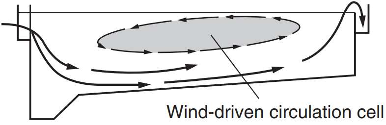
  - **Hình này chứng minh điều gì**
    - Tác động của gió bề mặt tạo vòng xoáy khép kín đẩy dòng chảy chính ép sát đáy gây xói cặn bùn.
  - **Từ đâu mà thấy được**
    - Vùng xoay elip màu xám (Wind-driven circulation cell) chiếm trọn tầng nước mặt của bể.
    - Các mũi tên dòng chảy chính bị ép uốn cong xuống sát đáy dốc trước khi ngoặt lên đập ra.

- Tổng hợp các giải pháp kỹ thuật triệt tiêu đoản mạch và tối ưu hóa thủy lực (Mitigation strategies):
  - Kiểm soát cấu trúc hình học bể (Geometric control):
    - Tỷ lệ chiều dài trên chiều rộng bể chữ nhật duy trì $L / W \ge 4:1\text{--}6:1$ để giảm thiểu xoáy góc biên.
    - Tỷ lệ chiều dài trên chiều sâu $L / D \ge 15:1$ để đảm bảo dòng chảy ổn định với số Froude $\text{Fr} = \frac{v_H^2}{g R} > 10^{-5}$ và số Reynolds $\text{Re} = \frac{v_H R}{\nu} < 20{,}000$.
  - Lắp đặt tường đục lỗ và vách chỉnh dòng (Target & perforated baffles):
    - Đặt tường khuếch tán đục lỗ ở cửa vào để phân tán dòng tia tập trung và phá vỡ phân tầng nhiệt độ.
    - Lắp đặt các vách ngăn lửng trung gian (intermediate baffles) ngang lòng bể để triệt tiêu các xoáy hoàn lưu quy mô lớn.
  - Kéo dài chiều dài tràn và bố trí tấm chắn váng (Weir extension & scum baffles):
    - Nhân rộng tổng chiều dài đập tràn $L_{weir}$ bằng hệ máng ngón tay song song hoặc máng nan hoa tỏa tròn nhằm triệt tiêu lực hút cục bộ tại cửa xả.
    - Lắp đặt vách chắn váng (surface scum baffle) chìm sâu $200\text{--}300\text{ mm}$ phía trước đập tràn chữ V để giữ lại váng bọt nổi và ngăn dòng chảy tắt lướt mặt.
  - Chống tác động của gió (Wind mitigation):
    - Xây dựng tường chắn gió (windbreak walls) hoặc mái che bề mặt cho các bể lắng hở đặt tại khu vực có gió mùa thổi mạnh thường xuyên.

#### Effluent Weir

- Đập tràn thu nước đầu ra (Effluent weir) là công trình đơn vị thu gom nước trong ở tầng mặt bể lắng (sedimentation tank / clarifier):
  - Thu gom đồng đều dòng nước trong đã tách cặn lắng trọng lực và dẫn sang công trình xử lý thứ cấp hoặc khử trùng tiếp theo.
  - Vị trí bố trí linh hoạt theo hình học bể: lắp đặt dọc theo toàn bộ chu vi bể (tank perimeter) đối với bể lắng tròn và vuông, hoặc bố trí cụm máng ngón tay (finger launders) ở cuối bể lắng chữ nhật.

##### Máng thu nước và cân bằng lưu lượng (Effluent Laundering Troughs and Flow Balancing)

- Cấu tạo hệ thống máng thu nước đầu ra (Effluent laundering troughs):
  - Máng thu nước (launder troughs) tiếp nhận nước tràn qua đập tràn và dẫn vào kênh thu nước chung (effluent channel).
  - Vật liệu chế tạo máng: bê tông cốt thép đúc liền khối hoặc máng kim loại thép không gỉ (stainless steel), vật liệu composite sợi thủy tinh (FRP) gắn vào thành bể bằng bu-lông neo.
  - Trong các bể lắng quy mô lớn (large sedimentation tanks), diện tích bề mặt lớn đòi hỏi phải bố trí máng thu nước hai mặt (double-sided weirs) hoặc hệ thống nhiều nhánh máng thu nước song song (finger launders) để mở rộng tổng chiều dài tràn.
- Nguyên lý cân bằng lưu lượng trên các tấm đập tràn (Flow balance across weir plates):
  - Trong các bể lắng lớn, các tấm đập tràn (weir plates) phải được thiết kế và căn chỉnh cao độ để cân bằng lưu lượng dòng chảy từ cả hai đập tràn/máng thu (balance the flow from both weirs).
  - Phương pháp cân bằng lưu lượng thủy lực:
    - Tỷ lệ số lượng khe tràn chữ V (number of V-notches) trên mỗi máng thu (launder) được tính toán tương ứng chính xác với tỷ lệ diện tích bề mặt bể (proportion of tank surface area) mà máng đó phục vụ:
      $$\frac{N_i}{\sum N} = \frac{A_i}{A_{\text{total}}}$$
      trong đó $N_i$ là số lượng khe chữ V trên máng thứ $i$, $A_i$ là diện tích bề mặt bể lắng do máng thứ $i$ phục vụ thu nước, và $A_{\text{total}}$ là tổng diện tích bề mặt bể lắng.
    - Cân bằng tỷ lệ diện tích phục vụ đảm bảo tải lượng thủy lực bề mặt thu gom đồng đều trên từng mét vuông diện tích lắng, triệt tiêu sự chênh lệch áp lực và phân bố không đều giữa các khu vực thu nước.
    - Ngăn ngừa hiện tượng dâng nước cục bộ (localized upflow surges) gây xáo trộn tầng cặn lắng bên dưới đáy bể.
  - **Hình 35.** Máng thu nước kép với đập tràn khe chữ V
    - 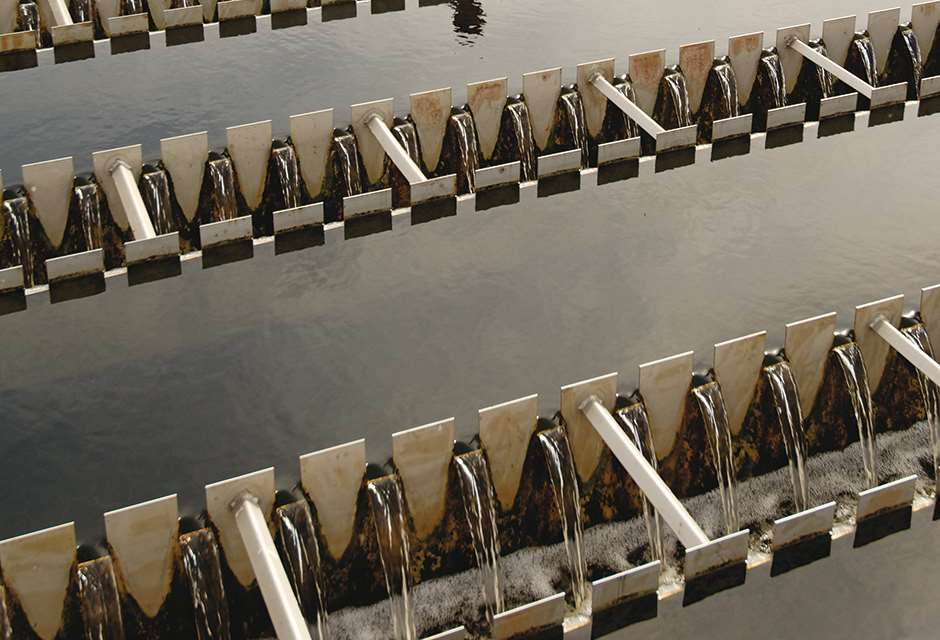
    - **Hình này chứng minh điều gì**
      - Máng thu nước trong (effluent launder) bố trí tấm đập tràn khe chữ V ($90^\circ$) ở cả hai bên thành máng để tăng chiều dài tràn và cân bằng dòng chảy.
    - **Từ đâu mà thấy được**
      - Dãy máng song song: nước trong tràn đồng đều qua các khe răng cưa chữ V vào lòng máng thu.
      - Thanh giằng ngang: các thanh thép định vị khoảng cách giữa hai vách đập của máng tràn.

##### Đập tràn khe chữ V và kiểm soát thủy lực (V-Notch Weirs and Hydraulic Control)

- Đặc tính hình học và cấu tạo của khe tràn chữ V ($90^\circ\text{ V-notches}$):
  - Góc mở đỉnh tiêu chuẩn của khe tràn tam giác là $90^\circ$ ($90^\circ\text{ V-notches}$).
  - Tổng chiều sâu tiêu chuẩn của khe tràn là $75\text{ mm}$ (total depth of $75\text{ mm}$).
  - Khoảng cách tim khe (notch spacing) thông thường dao động từ $150\text{ mm}$ đến $300\text{ mm}$ dọc theo chiều dài tấm đập tràn.
  - Tấm đập tràn (weir plates) có gia công các lỗ bắt bu-lông dạng rãnh trượt đứng (slotted holes) để thuận tiện cân chỉnh cao độ bằng phẳng tuyệt đối trong quá trình lắp đặt và vận hành thực tế.
- Công thức thủy lực tính toán lưu lượng qua đập tràn thành mỏng khe chữ V:
  - Công thức tổng quát qua đập tràn thành mỏng tiết diện tam giác (Kindsvater-Shen / Thomson):
    $$Q = \frac{8}{15} C_d \sqrt{2g} \tan\left(\frac{\theta}{2}\right) H^{5/2}$$
    trong đó:
    - $Q$ là lưu lượng dòng chảy qua một khe tràn chữ V ($\text{m}^3/\text{s}$).
    - $C_d$ là hệ số xả qua đập tràn ($C_d \approx 0.58\text{--}0.62$).
    - $g$ là gia tốc trọng trường ($g \approx 9.81\text{ m/s}^2$).
    - $\theta$ là góc mở đỉnh khe tràn ($\theta = 90^\circ$).
    - $H$ là cột nước tràn tính từ đỉnh đáy chữ V đến mực nước tự do trước đập ($\text{m}$).
  - Với khe tràn tiêu chuẩn $90^\circ$, ta có $\tan\left(45^\circ\right) = 1$, công thức rút gọn trong hệ đơn vị SI:
    $$Q \approx 1.38 \cdot H^{5/2} \quad (\text{m}^3/\text{s})$$
  - Công thức trong hệ đơn vị US Customary:
    $$Q \approx 2.50 \cdot H^{2.5} \quad (\text{ft}^3/\text{s})$$
    trong đó $H$ tính bằng feet ($\text{ft}$).
  - Ưu thế thủy lực của khe tràn chữ V so với đập tràn thành mỏng mép bằng (sharp-crested weir):
    - Mối quan hệ lũy thừa $H^{5/2}$ tạo ra độ nhạy cao: khi lưu lượng dao động nhỏ, cột nước $H$ thay đổi đủ rõ rệt để hạn chế sai số do sức căng bề mặt (surface tension) và màng cặn bám.
    - Đảm bảo dòng tràn tự do liên tục ngay cả khi lưu lượng nước thải nạp vào bể giảm xuống mức cực tiểu vào ban đêm.
- Bố trí và chức năng kiểm soát dòng chảy tắt (Short-circuiting):
  - Phân bố hình học của các khe tràn:
    - Các khe tràn chữ V được bố trí cách đều nhau dọc theo toàn bộ chu vi bể lắng (spaced equally along the tank perimeter).
    - Sự phân bố cách đều giúp thu nước đồng đều từ mọi hướng tâm và biên, loại bỏ hoàn toàn các góc chết thủy lực (dead space) trong bể.
  - Phát hiện và kiểm soát hiện tượng dòng chảy tắt (Short-circuiting):
    - Đập tràn khe chữ V cung cấp một phương tiện trực quan và đơn giản để phát hiện hiện tượng dòng chảy tắt / đoản mạch khi đập tràn mất cân bằng (detect short circuiting when the weir is not balanced).
    - Hiện tượng dòng chảy tắt xảy ra khi chất lỏng di chuyển nhanh từ cửa vào đến cửa ra trong khoảng thời gian ngắn hơn nhiều so với thời gian lưu nước lý thuyết ($HRT$), thường bắt nguồn từ chênh lệch tỷ trọng nhiệt độ (density currents) hoặc tác động dòng xoáy do gió (wind-driven currents).
    - Người vận hành quan sát mực nước tràn qua từng khe chữ V: nếu độ sâu dòng tràn $H$ không đồng đều giữa các đoạn đập (chỗ tràn ngập sâu, chỗ không có nước chảy qua), đó là dấu hiệu trực tiếp cho thấy cao độ đập bị lệch hoặc dòng chảy trong bể bị đoản mạch nghiêm trọng.

##### Tấm chắn váng nổi bề mặt (Surface Baffles and Scum Retention)

- Cấu tạo và vị trí lắp đặt tấm chắn váng nổi (Surface baffles):
  - Tấm chắn váng nổi bề mặt (surface baffles / scum baffles) được đặt song song ngay phía trước đập tràn (placed in front of the weir).
  - Khoảng cách lắp đặt: tấm chắn được đặt cách mép đập tràn một khoảng tự do từ $200\text{ mm}$ đến $300\text{ mm}$.
  - Kích thước ngập nước: tấm chắn nhúng chìm một phần dưới mặt nước với độ sâu ngập từ $150\text{ mm}$ đến $300\text{ mm}$, và nhô cao hơn mực nước tự do từ $100\text{ mm}$ đến $150\text{ mm}$.
- Chức năng giữ và thu gom váng nổi (Scum retention):
  - Giữ lại toàn bộ váng bọt, dầu mỡ và các hạt cặn lơ lửng nhẹ nổi trên bề mặt nước (retain surface scum).
  - Dòng nước trong buộc phải chui qua khe hở phía dưới mép đáy của tấm chắn rồi dâng ngược lên tràn qua khe chữ V, đảm bảo ngăn ngừa hoàn toàn chất nổi trôi sang máng nước trong.
  - Phối hợp đồng bộ với thiết bị thu gom váng nổi cơ học:
    - Trong bể lắng tròn: cần gạt váng (scum skimmer arm) gắn trên cầu cào quay quét liên tục dọc theo tấm chắn váng, dồn váng nổi vào phễu gom hoặc hộp thu váng có tấm dốc tiếp nhận (scum box with beach plate).
    - Trong bể lắng chữ nhật: xích cào bùn tận dụng nhánh chuyển động trên mặt nước để lùa váng nổi về phía tấm chắn trước đập tràn, xả vào ống thu váng dạng khe xoay (slotted pipe).
  - **Hình 36.** Đập tràn chu vi kết hợp tấm chắn váng nổi trong bể lắng tròn
    - 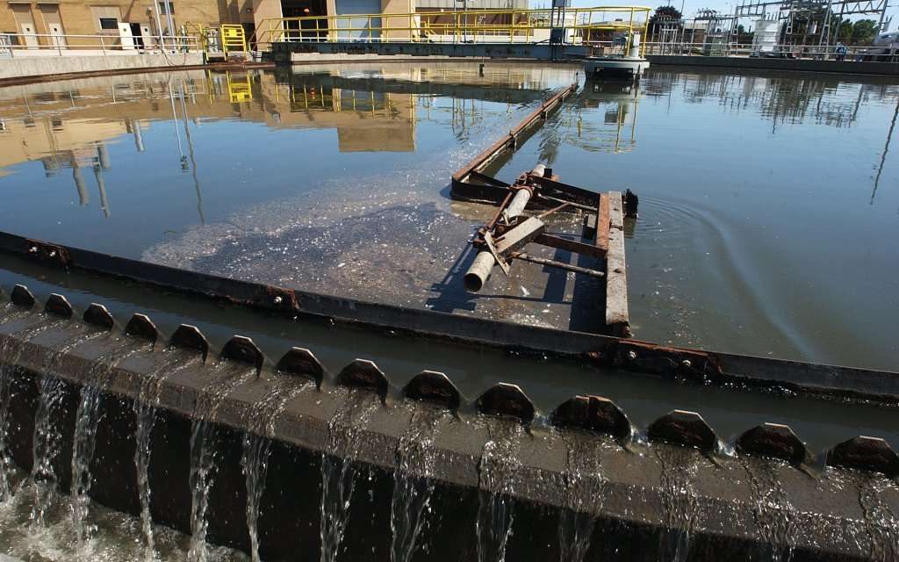
    - **Hình này chứng minh điều gì**
      - Tấm đập tràn răng cưa chữ V lắp đặt dọc chu vi bể lắng tròn kết hợp tấm chắn váng bề mặt (scum baffle) và cánh gạt váng quay.
    - **Từ đâu mà thấy được**
      - Vành ngoài bể: các khe tràn chữ V phân bố đều cho nước trong tràn qua vào máng thu chu vi.
      - Phía trước đập tràn: tấm chắn ngập một phần nước chặn váng nổi cùng cơ cấu cần gạt váng quét dọc mặt nước.

##### Tải trọng máng tràn (Weir Loading Rates - WLR)

- Định nghĩa và công thức xác định tải trọng máng tràn:
  - Tải trọng máng tràn (Weir Loading Rate - WLR), còn gọi là tải trọng đập tràn (Weir Overflow Rate - WOR), là thông số thủy lực đặc trưng cho lưu lượng nước thải thoát qua một đơn vị chiều dài đập tràn trong một đơn vị thời gian:
    $$WLR = \frac{Q}{L_{\text{weir}}}$$
    trong đó:
    - $Q$ là lưu lượng nước thải nạp vào bể lắng ($\text{m}^3/\text{d}$ hoặc $\text{m}^3/\text{h}$).
    - $L_{\text{weir}}$ là tổng chiều dài hữu dụng của mép đập tràn ($\text{m}$).
  - Quan hệ quy đổi đơn vị đo:
    - $1\text{ m}^3/\text{m}\cdot\text{d} \approx 80.52\text{ gal/ft}\cdot\text{d}$.
    - $1\text{ gal/ft}\cdot\text{d} \approx 0.01242\text{ m}^3/\text{m}\cdot\text{d}$.
- Giá trị định mức thiết kế tiêu chuẩn cho các loại bể lắng:
  - Bể lắng đợt 1 (Primary clarifiers):
    - Theo hệ đơn vị SI:
      - Dải giá trị thiết kế tiêu chuẩn: $125\text{--}500\text{ m}^3/\text{m}\cdot\text{d}$.
      - Giá trị thiết kế điển hình: $250\text{ m}^3/\text{m}\cdot\text{d}$.
    - Theo hệ đơn vị US Customary:
      - Dải giá trị thiết kế tiêu chuẩn: $10{,}000\text{--}40{,}000\text{ gal/ft}\cdot\text{d}$.
      - Giá trị thiết kế điển hình: $20{,}000\text{ gal/ft}\cdot\text{d}$.
    - Định mức này áp dụng thống nhất cho cả bể lắng đợt 1 tiêu chuẩn và bể lắng đợt 1 có tuần hoàn bùn hoạt tính dư (WAS return).
  - Bể lắng đợt 2 (Secondary clarifiers - Sau quá trình bùn hoạt tính hiếu khí):
    - Do các bông bùn hoạt tính sinh học có độ đặc thấp, cấu trúc xốp nhẹ và nhạy cảm với dòng xoáy, yêu cầu tải trọng máng tràn khắt khe hơn:
      - Ở lưu lượng trung bình (Average flowrate): dao động trong khoảng $125\text{--}250\text{ m}^3/\text{m}\cdot\text{d}$ ($10{,}000\text{--}20{,}000\text{ gal/ft}\cdot\text{d}$).
      - Ở lưu lượng đỉnh theo giờ (Peak hourly flowrate): giá trị tối đa không vượt quá $375\text{ m}^3/\text{m}\cdot\text{d}$ ($30{,}000\text{ gal/ft}\cdot\text{d}$).
- Cơ chế thủy lực và ý nghĩa kiểm soát hiện tượng cuốn trôi bùn (Sludge carryover):
  - Khống chế vận tốc dâng tiếp cận mép đập (Upward approach velocity):
    - Nếu tải trọng máng tràn vượt quá ngưỡng giới hạn tối đa ($> 500\text{ m}^3/\text{m}\cdot\text{d}$), vận tốc dòng nước dâng thẳng đứng tại vùng lân cận đập tràn tăng cao đột ngột.
    - Lực nâng thủy động lực học thắng trọng lực rơi của hạt bông cặn, cuốn các hạt bùn đã lắng ở các lớp nước sâu dâng ngược lên và trôi qua đập tràn (sludge carryover).
    - Hậu quả làm gia tăng đột biến hàm lượng chất rắn lơ lửng ($SS$) và $BOD$ trong dòng nước đầu ra, làm giảm sút nghiêm trọng hiệu suất xử lý của toàn bộ trạm.
  - Các giải pháp kỹ thuật mở rộng chiều dài đập tràn ($L_{\text{weir}}$) khi đường chu vi bể không đủ đáp ứng tiêu chuẩn $WLR$:
    - Sử dụng máng thu tràn hai mặt (double-sided launder): thu nước đồng thời từ cả vách trong và vách ngoài của máng, tăng gấp đôi chiều dài thu nước trên cùng một khẩu độ máng.
    - Sử dụng hệ máng ngón tay (finger launders): bố trí các nhánh máng thu vươn sâu vào trong lòng bể lắng chữ nhật.
    - Bố trí máng thu lồng bên trong (inboard launder): đặt máng thu nước cách thành bê tông bể tròn một khoảng từ $1\text{--}2\text{ m}$ thay vì gắn áp sát tường ngoài, cho phép nước chảy tràn từ cả hai phía của máng.

#### Design Information for Sedimentation Tank

- Cơ sở tính toán và thiết kế công nghệ bể lắng trọng lực (Sedimentation tank design principles):
  - Bể lắng phân tách pha rắn - lỏng dựa trên lực trọng trường, yêu cầu khống chế đồng thời tải trọng thủy lực bề mặt, thời gian lưu nước và chế độ động học dòng chảy.
  - Hình học bể lắng phổ biến bao gồm bể chữ nhật (rectangular tank), bể tròn (circular tank) và bể vuông (square tank).

##### Bể lắng hình vuông và giới hạn vận hành (Square Sedimentation Tank and Operational Limitations)

- Phạm vi ứng dụng và đặc điểm bể lắng hình vuông (Square sedimentation tanks):
  - Bể lắng vuông thỉnh thoảng được ứng dụng tại các trạm xử lý nước thải quy mô công suất nhỏ (used on occasion for small-sized WWTPs).
  - Bể vuông nhìn chung không đạt hiệu quả xử lý cao (not effective in operation).
- Nhược điểm và hạn chế thủy lực cốt lõi:
  - Cặn bùn có xu hướng tích tụ tại các góc chết của bể vuông (solids accumulate in the corners of the square tanks).
  - Cơ cấu cào bùn quay tạo ra sự xáo trộn thủy lực cục bộ, cuốn các khối cặn tích tụ vượt qua đập tràn ra ngoài cùng dòng nước trong (frequently swept over the weirs by the agitation of the sludge collectors).
- Cấu tạo các bộ phận chức năng chính của bể vuông:
  - Ống phân phối nước vào trung tâm bể (Influent).
  - Phễu thu gom bùn lắng ở đáy bể (Sludge hopper).
  - Hệ thống thu gom và gạt váng nổi bề mặt (Scum collector).
  - Hệ thống máng tràn và đập thu nước trong xung quanh (Effluent weirs).
  - Ống xả và bơm bùn sang công trình xử lý bùn (To sludge treatment).

##### Thông số thiết kế tiêu chuẩn cho bể lắng đợt 1 (Typical Design Criteria for Primary Clarifiers)

- Bể lắng đợt 1 tiếp theo bởi công trình xử lý sinh học thứ cấp (Primary sedimentation tanks followed by secondary treatment):
  - Thời gian lưu nước thủy lực (Detention time / HRT):
    - Dải giá trị thiết kế: $1.5\text{--}2.5\ \text{h}$.
    - Giá trị thiết kế điển hình: $2.0\ \text{h}$.
  - Tải trọng nạp bề mặt / Tốc độ tràn (Surface overflow rate - $\mathrm{SOR}$):
    - Theo lưu lượng trung bình ngày (Average flowrate): dải giá trị $30\text{--}50\ \text{m}^3/(\text{m}^2\cdot\text{d})$, giá trị điển hình $40\ \text{m}^3/(\text{m}^2\cdot\text{d})$.
    - Theo lưu lượng đỉnh giờ cao điểm (Peak hourly flowrate): dải giá trị $80\text{--}120\ \text{m}^3/(\text{m}^2\cdot\text{d})$, giá trị điển hình $100\ \text{m}^3/(\text{m}^2\cdot\text{d})$.
  - Tải trọng máng tràn (Weir loading rate - $\mathrm{WLR}$):
    - Dải giá trị thiết kế: $125\text{--}500\ \text{m}^3/(\text{m}\cdot\text{d})$.
    - Giá trị thiết kế điển hình: $250\ \text{m}^3/(\text{m}\cdot\text{d})$.
- Bể lắng đợt 1 có tiếp nhận bùn hoạt tính dư tuần hoàn (Primary settling with waste activated sludge return - WAS return):
  - Thời gian lưu nước thủy lực (Detention time):
    - Dải giá trị thiết kế: $1.5\text{--}2.5\ \text{h}$.
    - Giá trị thiết kế điển hình: $2.0\ \text{h}$.
  - Tải trọng nạp bề mặt (Surface overflow rate - $\mathrm{SOR}$):
    - Theo lưu lượng trung bình ngày (Average flowrate): dải giá trị $24\text{--}32\ \text{m}^3/(\text{m}^2\cdot\text{d})$, giá trị điển hình $28\ \text{m}^3/(\text{m}^2\cdot\text{d})$.
    - Theo lưu lượng đỉnh giờ cao điểm (Peak hourly flowrate): dải giá trị $48\text{--}70\ \text{m}^3/(\text{m}^2\cdot\text{d})$, giá trị điển hình $60\ \text{m}^3/(\text{m}^2\cdot\text{d})$.
  - Tải trọng máng tràn (Weir loading rate - $\mathrm{WLR}$):
    - Dải giá trị thiết kế: $125\text{--}500\ \text{m}^3/(\text{m}\cdot\text{d})$.
    - Giá trị thiết kế điển hình: $250\ \text{m}^3/(\text{m}\cdot\text{d})$.
  - Ảnh hưởng của bùn hoạt tính dư hoàn lưu (Technical impact of WAS return):
    - Tải trọng bề mặt cho phép giảm từ $20\%$ đến $30\%$ so với bể lắng không hoàn lưu bùn vì bùn hoạt tính có mật độ thấp và tốc độ lắng cặn chậm hơn chất rắn lơ lửng nguyên thủy.

| Loại hình bể lắng đợt 1 (Primary settling type) | Thời gian lưu $HRT$ ($\text{h}$) | $\mathrm{SOR}$ trung bình ($\text{m}^3/(\text{m}^2\cdot\text{d})$) | $\mathrm{SOR}$ đỉnh giờ ($\text{m}^3/(\text{m}^2\cdot\text{d})$) | $\mathrm{WLR}$ máng tràn ($\text{m}^3/(\text{m}\cdot\text{d})$) |
| :--- | :--- | :--- | :--- | :--- |
| Trước xử lý thứ cấp (Followed by secondary treatment) | $1.5\text{--}2.5$ (Điển hình: $2.0$) | $30\text{--}50$ (Điển hình: $40$) | $80\text{--}120$ (Điển hình: $100$) | $125\text{--}500$ (Điển hình: $250$) |
| Có hoàn lưu bùn hoạt tính dư (With WAS return) | $1.5\text{--}2.5$ (Điển hình: $2.0$) | $24\text{--}32$ (Điển hình: $28$) | $48\text{--}70$ (Điển hình: $60$) | $125\text{--}500$ (Điển hình: $250$) |

##### Thông số thiết kế tiêu chuẩn cho bể lắng đợt 2 (Typical Design Criteria for Secondary Clarifiers)

- Bể lắng đợt 2 sau quá trình bùn hoạt tính sục khí thông thường (Settling following air activated sludge):
  - Tải trọng tràn bề mặt trung bình (Average overflow rate): $16\text{--}28\ \text{m}^3/(\text{m}^2\cdot\text{d})$.
  - Tải trọng chất rắn bề mặt trung bình (Average solids loading rate): $4\text{--}6\ \text{kg}/(\text{m}^2\cdot\text{h})$.
  - Chiều sâu nước mép bể (Sidewater depth): $4.0\text{--}5.5\ \text{m}$.
- Bể lắng đợt 2 sau các ngăn tuyển chọn sinh học hoặc quy trình khử chất dinh dưỡng (Selectors, biological nutrient removal - BNR):
  - Tải trọng tràn bề mặt trung bình (Average overflow rate): $24\text{--}32\ \text{m}^3/(\text{m}^2\cdot\text{d})$.
  - Tải trọng chất rắn bề mặt trung bình (Average solids loading rate): $5\text{--}8\ \text{kg}/(\text{m}^2\cdot\text{h})$.
  - Chiều sâu nước mép bể (Sidewater depth): $4.0\text{--}5.5\ \text{m}$.
- Đặc tính thủy lực và công nghệ của bể lắng thứ cấp:
  - Tải trọng chất rắn bề mặt ($\mathrm{SLR}$) là thông số kiểm soát giới hạn diện tích lắng nhằm ngăn ngừa hiện tượng quá tải nén bùn và tràn lớp bùn đáy.
  - Ngăn tuyển chọn sinh học (selectors) kích thích sự phát triển của vi sinh vật tạo bông nén tốt, cho phép vận hành bể lắng thứ cấp ở mức tải trọng thủy lực và tải trọng cặn cao hơn.
  - Chiều sâu nước lớn ($4.0\text{--}5.5\ \text{m}$) dự phòng không gian lưu trữ và nén lớp mền bùn (sludge blanket) trước khi hồi lưu về bể sinh học hiếu khí.

| Kiểu quy trình xử lý (Type of treatment) | $\mathrm{SOR}$ trung bình ($\text{m}^3/(\text{m}^2\cdot\text{d})$) | Tải trọng cặn trung bình ($\text{kg}/(\text{m}^2\cdot\text{h})$) | Chiều sâu nước thành bể ($\text{m}$) |
| :--- | :--- | :--- | :--- |
| Sau quá trình bùn hoạt tính sục khí (Following air activated sludge) | $16\text{--}28$ | $4\text{--}6$ | $4.0\text{--}5.5$ |
| Có ngăn tuyển chọn, khử dinh dưỡng sinh học (Selectors, biological nutrient removal) | $24\text{--}32$ | $5\text{--}8$ | $4.0\text{--}5.5$ |

##### Kích thước hình học chuẩn hóa của bể lắng chữ nhật và bể tròn (Typical Dimensional Data for Sedimentation Tanks)

- Kích thước chuẩn hóa cho bể lắng chữ nhật (Rectangular sedimentation tanks):
  - Chiều sâu nước công tác (Depth): dải giá trị $3.0\text{--}4.9\ \text{m}$, giá trị thiết kế điển hình $4.3\ \text{m}$.
  - Chiều dài bể (Length): dải giá trị $15\text{--}90\ \text{m}$, giá trị thiết kế điển hình $24\text{--}40\ \text{m}$.
  - Chiều rộng đơn nguyên bể ($\text{Width}^a$): dải giá trị $3.0\text{--}24\ \text{m}$, giá trị thiết kế điển hình $4.9\text{--}9.8\ \text{m}$ (phụ thuộc vào cơ cấu máy gạt bùn).
  - Vận tốc di chuyển của thanh gạt bùn (Flight speed): dải giá trị $0.6\text{--}1.2\ \text{m/min}$, giá trị thiết kế điển hình $0.9\ \text{m/min}$.
    - **Hình 44.** Cột thông số kích thước điển hình của bể lắng
      - 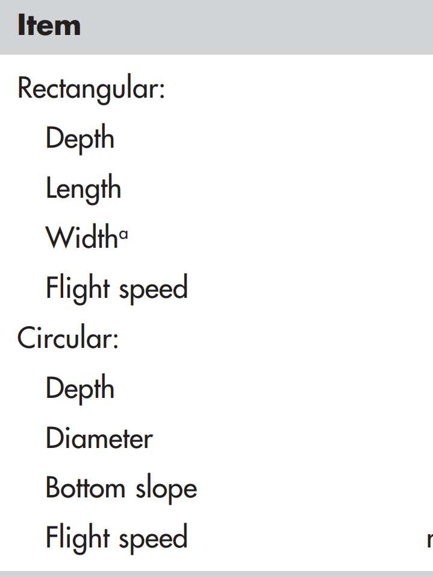
      - **Hình này chứng minh điều gì**
        - Xác lập hệ biến số kích thước hình học và vận hành chuẩn hóa cho bể chữ nhật.
      - **Từ đâu mà thấy được**
        - Cột Item, phần Rectangular: các hàng Depth, Length, $\text{Width}^a$ và Flight speed.
        - Phần Circular phía dưới: nhóm riêng các chỉ tiêu của bể tròn.
- Kích thước chuẩn hóa cho bể lắng tròn (Circular sedimentation tanks):
  - Chiều sâu nước mép bể (Depth): dải giá trị $3.0\text{--}4.9\ \text{m}$, giá trị thiết kế điển hình $4.3\ \text{m}$.
  - Đường kính bể (Diameter): dải giá trị $3.0\text{--}60\ \text{m}$, giá trị thiết kế điển hình $12\text{--}45\ \text{m}$.
  - Độ dốc đáy bể về phía tâm (Bottom slope): dải giá trị $1/16\text{--}1/6\ \text{mm/mm}$, giá trị thiết kế điển hình $1/12\ \text{mm/mm}$ ($\approx 8.3\%$).
  - Tốc độ quay của cầu cào bùn (Flight speed): dải giá trị $0.02\text{--}0.05\ \text{rev/min}$, giá trị thiết kế điển hình $0.03\ \text{rev/min}$.
    - **Hình 45.** Bảng số liệu kích thước điển hình cho bể lắng
      - 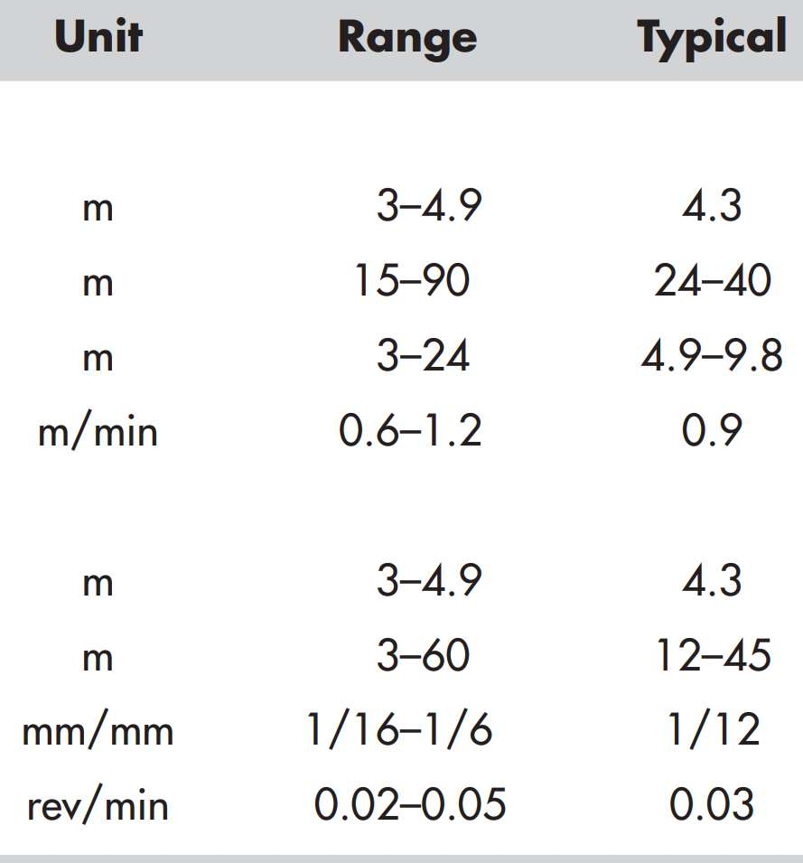
      - **Hình này chứng minh điều gì**
        - Xác lập khung quy chuẩn thiết kế gồm dải biến thiên và giá trị thường dùng cho bể lắng tròn.
      - **Từ đâu mà thấy được**
        - Nửa dưới bảng: 4 dòng thông số bể tròn gióng theo 3 cột Unit (đơn vị), Range (dải giá trị) và Typical (điển hình).
        - Tra cứu theo thứ tự dòng: chiều sâu ($\text{m}$), đường kính ($\text{m}$), độ dốc đáy ($\text{mm/mm}$) và tốc độ quay thanh cào ($\text{rev/min}$).

| Kiểu bể lắng (Tank geometry) | Thông số kích thước (Item) | Đơn vị (Unit) | Dải giá trị (Range) | Giá trị điển hình (Typical) |
| :--- | :--- | :--- | :--- | :--- |
| **Bể chữ nhật (Rectangular)** | Chiều sâu nước ($D$) | $\text{m}$ | $3.0\text{--}4.9$ | $4.3$ |
| | Chiều dài ($L$) | $\text{m}$ | $15\text{--}90$ | $24\text{--}40$ |
| | Bề rộng ($W$) | $\text{m}$ | $3.0\text{--}24$ | $4.9\text{--}9.8$ |
| | Vận tốc gạt bùn ($v_{\text{flight}}$) | $\text{m/min}$ | $0.6\text{--}1.2$ | $0.9$ |
| **Bể tròn (Circular)** | Chiều sâu nước mép bể ($D$) | $\text{m}$ | $3.0\text{--}4.9$ | $4.3$ |
| | Đường kính bể ($D_{\text{tank}}$) | $\text{m}$ | $3.0\text{--}60$ | $12\text{--}45$ |
| | Độ dốc đáy ($S_{\text{bottom}}$) | $\text{mm/mm}$ | $1/16\text{--}1/6$ | $1/12$ |
| | Tốc độ quay gạt bùn ($n$) | $\text{rev/min}$ | $0.02\text{--}0.05$ | $0.03$ |

##### Khuyến nghị thiết kế cho bể lắng chữ nhật (Design Recommendations for Rectangular Tanks)

- Tỷ lệ kích thước hình học đảm bảo dòng chảy ổn định:
  - Tỷ số chiều dài trên chiều rộng ($L:W$): dải biến thiên từ $4:1$ đến $6:1$; ưu tiên tỷ số $\ge 6:1$ nhằm tạo điều kiện dòng chảy dạng dòng nút (plug flow), giảm thiểu vùng chết thủy lực.
  - Tỷ số chiều dài trên chiều sâu nước ($L:D$): yêu cầu tối thiểu $\ge 15:1$ để dòng chảy có đủ chiều dài ổn định phân tầng lắng cặn.
- Giới hạn cơ khí cho hệ thống cào bùn kiểu xích gạt:
  - Chiều rộng tối đa của một đường cào bùn (Maximum $W$ for chain-and-flight scraper): khống chế ở mức $6.0\ \text{m}$.
  - Nếu chiều rộng đơn nguyên bể vượt quá $6.0\ \text{m}$, phải bố trí nhiều bộ xích cào song song có tường ngăn hoặc gờ dẫn hướng dọc.
- Kiểm soát vận tốc dòng chảy ngang và chỉ số thủy lực:
  - Vận tốc dòng chảy ngang ($v_H$): nằm trong dải khuyến nghị $0.005\text{--}0.018\ \text{m/s}$ (tương đương $0.3\text{--}1.08\ \text{m/min}$).
  - Giới hạn số Reynolds ($\mathrm{Re}$): khống chế $\mathrm{Re} < 20{,}000$ đối với bể lắng chữ nhật nhằm giới hạn mức độ rối của dòng chảy.
  - Giới hạn số Froude ($\mathrm{Fr}$): yêu cầu $\mathrm{Fr} > 10^{-5}$ nhằm duy trì tính ổn định thủy lực, chống hiện tượng đảo lộn tầng do gió và chênh lệch tỷ trọng nhiệt.
- Cấu tạo phân vùng chức năng trắc dọc bể lắng chữ nhật:
  - Phân vùng thu nước ra (Outlet zone): chiều dài vùng thu nước chiếm $1/3\text{--}1/2$ tổng chiều dài bể lắng ($L$), bố trí các máng ngón tay (finger launders) vươn sâu vào thân bể.
  - Độ dốc đáy dọc bể (Bottom slope): thiết kế độ dốc $1:600$ nghiêng về phía hố thu bùn tập trung ở đầu bể lắng.
  - Chiều sâu vùng chứa bùn đáy (Sludge zone): dự trữ chiều sâu lắng tích lũy bùn từ $0.6\ \text{m}$ đến $1.0\ \text{m}$.

| Thông số thiết kế (Parameter) | Dải giá trị khuyến nghị (Typical range) | Ghi chú kỹ thuật / Ý nghĩa |
| :--- | :--- | :--- |
| Tỷ số dài : rộng ($L:W$) | $4:1\text{--}6:1$; ưu tiên $\ge 6:1$ | Khống chế dòng chảy nút, ngăn ngừa dòng xoáy ngắn mạch |
| Tỷ số dài : sâu ($L:D$) | $\ge 15:1$ | Đảm bảo chiều dài lắng phân tầng hạt cặn theo độ dốc quỹ đạo |
| Bề rộng tối đa cho xích gạt bùn ($W_{\max}$) | $6.0\ \text{m}$ | Giới hạn bền cơ học của thanh gạt composite hoặc gỗ |
| Vận tốc dòng chảy ngang ($v_H$) | $0.005\text{--}0.018\ \text{m/s}$ | Vận tốc tối ưu tránh cuộn cặn và tránh lắng cục bộ ở cửa vào |
| Số Reynolds ($\mathrm{Re}$) | $< 20{,}000$ | Khống chế nhiễu loạn trong bể lắng chữ nhật quy mô lớn |
| Số Froude ($\mathrm{Fr}$) | $> 10^{-5}$ | Ngăn ngừa đoản mạch do dòng tỷ trọng và gió thổi mặt nước |
| Chiều dài vùng thu nước ra (Outlet zone) | $1/3\text{--}1/2$ chiều dài bể | Bố trí máng ngón tay để giảm tải trọng máng tràn $\mathrm{WLR}$ |
| Độ dốc đáy bể (Bottom slope) | $1:600$ | Tạo độ dốc nhẹ hỗ trợ thanh gạt đưa bùn về phễu thu đầu bể |
| Chiều sâu vùng chứa bùn (Sludge zone) | $0.6\text{--}1.0\ \text{m}$ | Khoang tích lũy bùn trước khi xả định kỳ sang xử lý bùn |

##### Tiêu chí chế độ chảy: Số Reynolds và số Froude (Reynolds and Froude Numbers)

- Công thức xác định số Reynolds trong bể lắng chữ nhật:
  $$\mathrm{Re} = \frac{v_H \cdot R}{\nu}$$
  trong đó:
  - $\mathrm{Re}$: Số Reynolds của dòng chảy trong bể (không thứ nguyên).
  - $v_H$: Vận tốc dòng chảy ngang của chất lỏng qua mặt cắt bể ($\text{m/s}$).
  - $R$: Bán kính thủy lực của tiết diện dòng chảy ($\text{m}$), tính theo tỷ số diện tích trên chu vi ướt:
    $$R = \frac{A}{P}$$
  - $A$: Diện tích mặt cắt ngang ướt của bể vuông góc với hướng dòng chảy ($\text{m}^2$), đối với bể chữ nhật có chiều rộng $W$ và chiều sâu nước $D$: $A = W \cdot D$.
  - $P$: Chu vi ướt của tiết diện dòng chảy mặt thoáng ($\text{m}$):
    $$P = W + 2D$$
  - $\nu$: Độ nhớt động học của nước thải ($\text{m}^2/\text{s}$), xác định từ tỷ số giữa độ nhớt động lực học và khối lượng riêng:
    $$\nu = \frac{\mu}{\rho}$$
  - $\mu$: Độ nhớt động lực học của chất lỏng ($\text{Pa}\cdot\text{s}$ hoặc $\text{N}\cdot\text{s/m}^2$).
  - $\rho$: Khối lượng riêng của chất lỏng ($\text{kg/m}^3$).
- Công thức xác định số Froude trong bể lắng chữ nhật:
  $$\mathrm{Fr} = \frac{(v_H)^2}{g \cdot R}$$
  trong đó:
  - $\mathrm{Fr}$: Số Froude của dòng chảy trong bể (không thứ nguyên).
  - $v_H$: Vận tốc dòng chảy ngang của dòng nước ($\text{m/s}$).
  - $g$: Gia tốc trọng trường ($g = 9.81\ \text{m/s}^2$).
  - $R$: Bán kính thủy lực của tiết diện bể ($\text{m}$).
- Ý nghĩa thủy lực của các chỉ số không thứ nguyên:
  - Số Reynolds thể hiện tương quan giữa lực quán tính và lực nhớt dính. Giá trị $\mathrm{Re} < 20{,}000$ đảm bảo mức độ rối không phá vỡ liên kết bông cặn.
  - Số Froude thể hiện tương quan giữa lực quán tính và lực trọng trường. Điều kiện $\mathrm{Fr} > 10^{-5}$ đảm bảo dòng chảy ổn định hướng dọc trục bể, ngăn hiện tượng dâng cục bộ hoặc lật tầng thủy lực.

##### Vận tốc cuốn trôi cặn tới hạn (Critical Scour Velocity)

- Phương trình Camp xác định vận tốc xói bùn tới hạn (Camp scour velocity equation):
  $$v_H \le \left[ \frac{8k(s-1)gd}{f} \right]^{1/2}$$
  - Ý nghĩa điều kiện: Vận tốc dòng chảy ngang thực tế ($v_H$) phải nhỏ hơn hoặc bằng vận tốc xói tới hạn để cặn lắng ở đáy không bị cuộn xoáy trở lại tầng nước mặt.
  - Định nghĩa các biến số và thông số trong công thức:
    - $v_H$: Vận tốc dòng chảy ngang cực đại cho phép chống cuốn cặn ($\text{m/s}$).
    - $k$: Hệ số kết dính của hạt cặn (Cohesion constant), phản ánh lực dính giữa các hạt:
      - Đối với cặn dính trong nước thải sinh hoạt: $k = 0.04\text{--}0.06$ ($k = 0.04$ cho hạt cặn rời rạc, $k = 0.06$ cho bùn kết dính).
    - $s$: Tỷ trọng tương đối của hạt cặn so với nước (Specific gravity of particles, $s = \rho_s / \rho_{\text{water}}$):
      - Cặn hữu cơ lơ lửng: $s \approx 1.20\text{--}1.25$.
      - Hạt cát và cặn khoáng vô cơ: $s \approx 2.65$.
    - $g$: Gia tốc trọng trường ($g = 9.81\ \text{m/s}^2$).
    - $d$: Đường kính hiệu dụng của hạt cặn lắng ($\text{m}$).
    - $f$: Hệ số ma sát Darcy-Weisbach (Darcy-Weisbach friction factor):
      - Dải giá trị tiêu chuẩn trong lòng bể lắng: $f = 0.02\text{--}0.03$.
    - **Hình 46.** Công thức tính vận tốc xói bùn $v_H$
      - 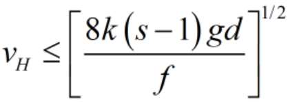
      - **Hình này chứng minh điều gì**
        - Biểu thức giải tích thể hiện quan hệ giới hạn vận tốc tỷ lệ với $\sqrt{d}$ và nghịch với $\sqrt{f}$.
      - **Từ đâu mà thấy được**
        - Đọc từ trái sang phải: vế trái là $v_H$ kèm dấu bất đẳng thức $\le$ chỉ ngưỡng giới hạn trên.
        - Vế phải trong ngoặc mang số mũ $1/2$: tử số là cụm tích $8k(s-1)gd$, mẫu số là hệ số ma sát $f$.

##### Example 1: Rectangular Sedimentation Tank Design

- **Đề bài**:
  - Lưu lượng trung bình của trạm xử lý nước thải là $Q = 0.5\ \text{m}^3/\text{s}$.
  - Thiết kế bể lắng chữ nhật (Design rectangular sedimentation tank).
  - Độ nhớt động học của nước ở nhiệt độ $20^\circ\text{C}$ là $\nu = 1.003 \times 10^{-6}\ \text{m}^2/\text{s}$.
  - **Ảnh 1.1.** Đề bài ví dụ thiết kế bể lắng chữ nhật
    - 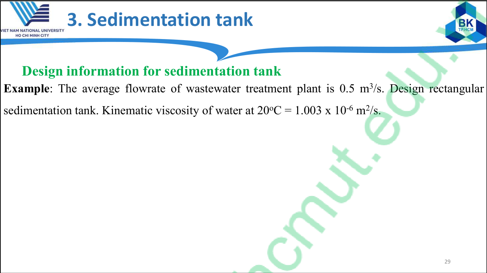
    - **Hình này chứng minh điều gì**
      - Bài toán xác lập thông số lưu lượng dòng vào $0.5\ \text{m}^3/\text{s}$ và độ nhớt động học của nước tại $20^\circ\text{C}$ để thiết kế bể lắng chữ nhật.
    - **Từ đâu mà thấy được**
      - Văn bản slide ghi: "Example: The average flowrate of wastewater treatment plant is 0.5 m3/s. Design rectangular sedimentation tank. Kinematic viscosity of water at 20oC = 1.003 x 10-6 m2/s."

- **Dữ kiện**:
  - Lưu lượng thiết kế trung bình: $Q = 0.5\ \text{m}^3/\text{s} = 30.0\ \text{m}^3/\text{min} = 1800.0\ \text{m}^3/\text{h} = 43{,}200\ \text{m}^3/\text{ngày}$.
  - Nhiệt độ nước thải tính toán: $T = 20^\circ\text{C}$.
  - Độ nhớt động học của nước ở $20^\circ\text{C}$: $\nu = 1.003 \times 10^{-6}\ \text{m}^2/\text{s}$.
  - Gia tốc trọng trường: $g = 9.81\ \text{m/s}^2$.
  - Khối lượng riêng của nước ở $20^\circ\text{C}$: $\rho = 998.2\ \text{kg/m}^3 \approx 1000\ \text{kg/m}^3$.

- **Quy tắc áp dụng**:
  - Tiêu chuẩn thông số thiết kế bể lắng đợt 1 (Bảng Slide 22):
    - Tải trọng nạp bề mặt thiết kế: $\mathrm{SOR} \in [30, 50]\ \text{m}^3/(\text{m}^2\cdot\text{d})$; chọn giá trị điển hình $\mathrm{SOR} = 40.0\ \text{m}^3/(\text{m}^2\cdot\text{d})$.
    - Thời gian lưu nước thủy lực: $\mathrm{HRT} \in [1.5, 2.5]\ \text{h}$; giá trị điển hình $2.0\ \text{h}$.
    - Tải trọng đập tràn đầu ra: $\mathrm{WLR} \in [125, 500]\ \text{m}^3/(\text{m}\cdot\text{d})$; giá trị điển hình $250.0\ \text{m}^3/(\text{m}\cdot\text{d})$.
  - Khuyến nghị kích thước bể lắng chữ nhật (Bảng Slide 24 và Slide 25):
    - Bề rộng tối đa cho một đơn nguyên dùng hệ xích cào bùn: $W \le 6.0\ \text{m}$; chọn $W = 6.0\ \text{m}$.
    - Tỷ số dài trên rộng: $L:W \in [4:1, 6:1]$, ưu tiên $\ge 6:1$.
    - Tỷ số dài trên sâu: $L:D \ge 15:1$.
    - Chiều sâu nước công tác: $D \in [3.0, 4.9]\ \text{m}$; giá trị điển hình $4.3\ \text{m}$.
    - Vận tốc dòng ngang: $v_H \in [0.005, 0.018]\ \text{m/s}$.
    - Giới hạn số Reynolds: $\mathrm{Re} < 20{,}000$.
    - Giới hạn số Froude: $\mathrm{Fr} > 10^{-5}$.
    - Chiều sâu vùng bùn đáy: $h_{\text{sludge}} \in [0.6, 1.0]\ \text{m}$; chọn $h_{\text{sludge}} = 0.8\ \text{m}$.
    - Chiều cao bảo vệ an toàn (Freeboard): $h_{\text{FB}} = 0.5\ \text{m}$.
    - Độ dốc đáy bể: $1:600$ dốc về hố thu bùn.
    - Số đơn nguyên làm việc song song: Chọn $N = 4$ đơn nguyên (gồm 2 cụm, mỗi cụm 2 đơn nguyên) để đảm bảo tính dự phòng khi sửa chữa hoặc bảo dưỡng thiết bị cào bùn.

- **Lời giải**:
  - **Bước 1: Tính diện tích mặt thoáng bể lắng yêu cầu ($A_{\text{total}}$)**
    - Căn cứ: Công thức tải trọng tràn bề mặt Hazen:
      $$A_{\text{total}} = \frac{Q}{\mathrm{SOR}}$$
    - Nhìn vào: Lưu lượng dòng vào $Q = 43{,}200\ \text{m}^3/\text{ngày}$ và $\mathrm{SOR} = 40.0\ \text{m}^3/(\text{m}^2\cdot\text{d})$:
      $$A_{\text{total}} = \frac{43{,}200\ \text{m}^3/\text{ngày}}{40.0\ \text{m}^3/(\text{m}^2\cdot\text{d})} = 1080.0\ \text{m}^2$$
  - **Bước 2: Phân chia số đơn nguyên bể ($N = 4$) và xác định bề rộng đơn nguyên ($W$)**
    - Căn cứ: Giới hạn bề rộng tối đa của hệ thống cào bùn xích gạt $W_{\max} = 6.0\ \text{m}$ (Slide 25) và yêu cầu dự phòng tối thiểu của trạm xử lý nước thải.
    - Nhìn vào: Chia toàn bộ lưu lượng cho $N = 4$ đơn nguyên bể chữ nhật giống nhau làm việc song song:
      - Lưu lượng phân bổ cho mỗi đơn nguyên ($Q_1$):
        $$Q_1 = \frac{Q}{N} = \frac{0.5\ \text{m}^3/\text{s}}{4} = 0.125\ \text{m}^3/\text{s} = 10{,}800\ \text{m}^3/\text{ngày}$$
      - Diện tích mặt thoáng mỗi đơn nguyên ($A_1$):
        $$A_1 = \frac{A_{\text{total}}}{N} = \frac{1080.0\ \text{m}^2}{4} = 270.0\ \text{m}^2$$
      - Chọn bề rộng mỗi đơn nguyên đạt giá trị định mức chuẩn của nhịp xích gạt bùn:
        $$W = 6.0\ \text{m}$$
  - **Bước 3: Tính toán chiều dài bể ($L$) và kiểm tra các tỷ số hình học**
    - Căn cứ: Tỷ số diện tích trên bề rộng và các tiêu chí tỷ lệ kích thước $L:W$ và dải chiều dài chuẩn hóa.
    - Nhìn vào: Diện tích $A_1 = 270.0\ \text{m}^2$ và bề rộng $W = 6.0\ \text{m}$:
      - Chiều dài công tác của bể ($L$):
        $$L = \frac{A_1}{W} = \frac{270.0\ \text{m}^2}{6.0\ \text{m}} = 45.0\ \text{m}$$
      - Kiểm tra dải giá trị chiều dài: $L = 45.0\ \text{m}$ nằm trong dải chuẩn hóa $15\text{--}90\ \text{m}$ (gần với khoảng điển hình $24\text{--}40\ \text{m}$, Slide 24).
      - Kiểm tra tỷ số dài trên rộng ($L:W$):
        $$\frac{L}{W} = \frac{45.0\ \text{m}}{6.0\ \text{m}} = 7.5 : 1$$
        Đánh giá: $7.5 : 1 \ge 6:1$ (thỏa mãn tiêu chí ưu tiên $\ge 6:1$ tại Slide 25, đảm bảo trạng thái dòng chảy nút).
  - **Bước 4: Xác định chiều sâu công tác ($D$) và cấu trúc phân tầng trắc dọc bể**
    - Căn cứ: Khuyến nghị tỷ số dài trên sâu $L:D \ge 15:1$ (Slide 25) và dải chiều sâu chuẩn $3.0\text{--}4.9\ \text{m}$ (Slide 24).
    - Nhìn vào: Chiều dài bể $L = 45.0\ \text{m}$:
      - Giới hạn trên của chiều sâu công tác:
        $$D \le \frac{L}{15} = \frac{45.0\ \text{m}}{15} = 3.0\ \text{m}$$
      - Chọn chiều sâu nước công tác: $D = 3.0\ \text{m}$ (thỏa mãn biên dưới dải chuẩn hóa $3.0\text{--}4.9\ \text{m}$).
      - Kiểm tra lại tỷ số $L:D$:
        $$\frac{L}{D} = \frac{45.0\ \text{m}}{3.0\ \text{m}} = 15.0 : 1 \ge 15:1 \quad (\text{Thỏa mãn chuẩn thiết kế})$$
      - Chiều sâu vùng chứa bùn đáy: chọn $h_{\text{sludge}} = 0.8\ \text{m}$ (thuộc dải $0.6\text{--}1.0\ \text{m}$, Slide 25).
      - Chiều cao an toàn trên mặt nước (Freeboard): chọn $h_{\text{FB}} = 0.5\ \text{m}$.
      - Tổng chiều sâu xây dựng thành bể ($H_{\text{total}}$):
        $$H_{\text{total}} = D + h_{\text{sludge}} + h_{\text{FB}} = 3.0 + 0.8 + 0.5 = 4.3\ \text{m}$$
        (Giá trị $4.3\ \text{m}$ trùng khớp với chỉ tiêu chiều sâu điển hình Typical Depth $= 4.3\ \text{m}$ nêu tại Slide 24).
      - Độ dốc đáy bể: đáy tạo dốc $i = 1:600$ nghiêng về hố gom bùn ở đầu bể; độ chênh cao độ đáy trên chiều dài $45\ \text{m}$ là $\Delta h = 45 / 600 = 0.075\ \text{m} = 75\ \text{mm}$.
  - **Bước 5: Tính diện tích mặt cắt ướt, chu vi ướt và bán kính thủy lực**
    - Căn cứ: Công thức hình học thủy lực cho mặt cắt hình chữ nhật có mặt thoáng tự do:
      $$A_c = W \cdot D, \quad P = W + 2D, \quad R = \frac{A_c}{P}$$
    - Nhìn vào: Kích thước $W = 6.0\ \text{m}$ và $D = 3.0\ \text{m}$:
      - Diện tích mặt cắt ướt:
        $$A_c = 6.0\ \text{m} \times 3.0\ \text{m} = 18.0\ \text{m}^2$$
      - Chu vi ướt:
        $$P = 6.0\ \text{m} + 2 \times 3.0\ \text{m} = 12.0\ \text{m}$$
      - Bán kính thủy lực:
        $$R = \frac{18.0\ \text{m}^2}{12.0\ \text{m}} = 1.50\ \text{m}$$
  - **Bước 6: Tính toán và kiểm tra vận tốc dòng chảy ngang ($v_H$)**
    - Căn cứ: Tỷ số lưu lượng đơn nguyên trên diện tích mặt cắt ướt:
      $$v_H = \frac{Q_1}{A_c}$$
    - Nhìn vào: Lưu lượng $Q_1 = 0.125\ \text{m}^3/\text{s}$ và diện tích $A_c = 18.0\ \text{m}^2$:
      $$v_H = \frac{0.125\ \text{m}^3/\text{s}}{18.0\ \text{m}^2} = 0.006944\ \text{m/s} \approx 6.94\ \text{mm/s}$$
      (Tương đương $v_H = 0.006944 \times 60 = 0.417\ \text{m/min}$).
    - Đánh giá kiểm tra:
      $$0.005\ \text{m/s} \le v_H = 0.006944\ \text{m/s} \le 0.018\ \text{m/s}$$
      Vận tốc dòng ngang nằm trọn vẹn trong dải khuyến nghị thiết kế tại Slide 25.
  - **Bước 7: Tính toán và kiểm tra các chỉ số thủy lực ($\mathrm{Re}$ và $\mathrm{Fr}$)**
    - Căn cứ: Công thức tính số Reynolds và Froude theo Slide 26 và Slide 27:
      $$\mathrm{Re} = \frac{v_H \cdot R}{\nu}, \quad \mathrm{Fr} = \frac{(v_H)^2}{g \cdot R}$$
    - Nhìn vào: Vận tốc $v_H = 0.006944\ \text{m/s}$, bán kính $R = 1.50\ \text{m}$, $\nu = 1.003 \times 10^{-6}\ \text{m}^2/\text{s}$ và $g = 9.81\ \text{m/s}^2$:
      - Số Reynolds ($\mathrm{Re}$):
        $$\mathrm{Re} = \frac{0.006944\ \text{m/s} \times 1.50\ \text{m}}{1.003 \times 10^{-6}\ \text{m}^2/\text{s}} = \frac{0.010417}{1.003 \times 10^{-6}} = 10{,}386$$
        Kiểm tra: $\mathrm{Re} = 10{,}386 < 20{,}000$ (Thỏa mãn tiêu chuẩn Slide 25).
      - Số Froude ($\mathrm{Fr}$):
        $$\mathrm{Fr} = \frac{(0.006944\ \text{m/s})^2}{9.81\ \text{m/s}^2 \times 1.50\ \text{m}} = \frac{4.8225 \times 10^{-5}}{14.715} = 3.28 \times 10^{-6}$$
        Đánh giá: Bể lắng quy mô lớn thường có $\mathrm{Fr}$ đạt bậc $10^{-6}$. Để ngăn ngừa dòng chảy ngắn mạch do chênh lệch tỷ trọng, công trình cần bố trí tường đục lỗ tiêu năng ở cửa vào và máng ngón tay sâu ở cửa ra.
        (Ghi chú phương án dự phòng: Nếu trạm lựa chọn cụm $N = 2$ đơn nguyên lớn hơn với $W = 5.0\ \text{m}$, $D = 4.0\ \text{m}$, vận tốc dòng ngang đạt $v_H = 0.0125\ \text{m/s}$, $R = 1.538\ \text{m}$, cho $\mathrm{Fr} = 1.04 \times 10^{-5} > 10^{-5}$ và $\mathrm{Re} = 19{,}173 < 20{,}000$).
  - **Bước 8: Kiểm tra vận tốc xói bùn tới hạn theo phương trình Camp**
    - Căn cứ: Phương trình Camp về vận tốc cuốn cặn tới hạn (Slide 28):
      $$v_{\text{scour}} = \left[ \frac{8k(s-1)gd}{f} \right]^{1/2}$$
    - Nhìn vào: Các đặc tính hạt cặn hữu cơ nhẹ lắng ở bể lắng đợt 1:
      - Hệ số kết dính: $k = 0.05$ (khoảng giữa dải $0.04\text{--}0.06$).
      - Tỷ trọng tương đối hạt cặn: $s = 1.20$.
      - Đường kính hạt cặn tính toán nhỏ nhất cần bảo vệ: $d = 100\ \mu\text{m} = 1.0 \times 10^{-4}\ \text{m}$.
      - Hệ số ma sát Darcy-Weisbach: $f = 0.025$ (khoảng giữa dải $0.02\text{--}0.03$).
      - Tính toán vận tốc xói cặn hữu cơ ($v_{\text{scour,org}}$):
        $$v_{\text{scour,org}} = \left[ \frac{8 \times 0.05 \times (1.20 - 1) \times 9.81 \times 1.0 \times 10^{-4}}{0.025} \right]^{1/2} = \left[ \frac{7.848 \times 10^{-5}}{0.025} \right]^{1/2} = \sqrt{0.003139} \approx 0.0560\ \text{m/s} = 56.0\ \text{mm/s}$$
      - So sánh với vận tốc dòng chảy ngang thực tế:
        $$v_H = 0.006944\ \text{m/s} \ll v_{\text{scour,org}} = 0.0560\ \text{m/s}$$
        Tỷ lệ vận tốc: $\frac{v_H}{v_{\text{scour,org}}} = \frac{0.006944}{0.0560} \approx 12.4\%$.
      - Đối với cặn vô cơ/cát mịn sót lại ($s = 2.65, d = 200\ \mu\text{m} = 2.0 \times 10^{-4}\ \text{m}, k = 0.04, f = 0.025$):
        $$v_{\text{scour,grit}} = \left[ \frac{8 \times 0.04 \times (2.65 - 1) \times 9.81 \times 2.0 \times 10^{-4}}{0.025} \right]^{1/2} = \sqrt{0.04144} \approx 0.2036\ \text{m/s} = 203.6\ \text{mm/s}$$
        Vận tốc dòng ngang $v_H = 0.006944\ \text{m/s}$ tuyệt đối an toàn, hoàn toàn không gây xói lở hay cuốn cặn bùn đáy.
  - **Bước 9: Thiết kế hệ máng ngón tay thu nước trong và kiểm tra tải trọng máng tràn**
    - Căn cứ: Giá trị tải trọng máng tràn điển hình $\mathrm{WLR} = 250.0\ \text{m}^3/(\text{m}\cdot\text{d})$ (Slide 22) và quy chuẩn bố trí vùng thu nước ra chiếm $1/3\text{--}1/2$ chiều dài bể (Slide 25).
    - Nhìn vào: Lưu lượng đơn vị và chiều rộng bể:
      - Tổng chiều dài đập tràn yêu cầu cho toàn trạm:
        $$L_{\text{weir,total}} = \frac{Q_{\text{day}}}{\mathrm{WLR}} = \frac{43{,}200\ \text{m}^3/\text{ngày}}{250.0\ \text{m}^3/(\text{m}\cdot\text{d})} = 172.8\ \text{m}$$
      - Chiều dài đập tràn tối thiểu cho mỗi đơn nguyên ($N = 4$):
        $$L_{\text{weir},1} = \frac{172.8\ \text{m}}{4} = 43.2\ \text{m}$$
      - Bố trí máng ngón tay (Finger launders):
        - Chiều dài vùng thu nước ra: $L_{\text{outlet}} = \frac{1}{3} L = \frac{45.0\ \text{m}}{3} = 15.0\ \text{m}$.
        - Nếu chỉ đặt 1 đập tràn thẳng ngang ở cuối bể, chiều dài tràn chỉ đạt $W = 6.0\ \text{m}$, dẫn tới $\mathrm{WLR} = \frac{10{,}800}{6.0} = 1800\ \text{m}^3/(\text{m}\cdot\text{d}) \gg 500\ \text{m}^3/(\text{m}\cdot\text{d})$ (quá tải nghiêm trọng).
        - Giải pháp: Bố trí $2$ nhánh máng ngón tay đặt dọc chạy song song vươn sâu $10.0\ \text{m}$ vào vùng thu nước, thu nước cả $2$ bên mép máng (double-sided weirs), kết hợp mép đập thu ngang cuối bể ($6.0\ \text{m}$):
          $$L_{\text{weir,actual}} = 2 \times (2 \times 10.0\ \text{m}) + 6.0\ \text{m} = 46.0\ \text{m} > 43.2\ \text{m}$$
        - Tải trọng máng tràn thực tế:
          $$\mathrm{WLR}_{\text{actual}} = \frac{10{,}800\ \text{m}^3/\text{ngày}}{46.0\ \text{m}} = 234.8\ \text{m}^3/(\text{m}\cdot\text{d}) < 250.0\ \text{m}^3/(\text{m}\cdot\text{d}) \quad (\text{Thỏa mãn hoàn toàn})$$
  - **Bước 10: Tổng hợp dung tích làm việc và thời gian lưu thủy lực ($HRT$)**
    - Căn cứ: Thể tích hình học công tác của $N = 4$ đơn nguyên:
      $$V_1 = A_1 \cdot D = W \cdot L \cdot D, \quad V_{\text{total}} = N \cdot V_1$$
    - Nhìn vào: Kích thước $W = 6.0\ \text{m}, L = 45.0\ \text{m}, D = 3.0\ \text{m}$:
      - Thể tích công tác mỗi đơn nguyên:
        $$V_1 = 6.0\ \text{m} \times 45.0\ \text{m} \times 3.0\ \text{m} = 810.0\ \text{m}^3$$
      - Tổng dung tích công tác toàn trạm:
        $$V_{\text{total}} = 4 \times 810.0\ \text{m}^3 = 3240.0\ \text{m}^3$$
      - Thời gian lưu nước thủy lực thực tế ($\mathrm{HRT}$):
        $$\mathrm{HRT} = \frac{V_{\text{total}}}{Q} = \frac{3240.0\ \text{m}^3}{0.5\ \text{m}^3/\text{s}} = 6480\ \text{s} = 1.80\ \text{h}$$
        (Thời gian lưu $1.80\ \text{h}$ nằm hoàn hảo trong dải tiêu chuẩn $1.5\text{--}2.5\ \text{h}$ tại Slide 22).

- **Kết quả**:
  - Số lượng đơn nguyên bể lắng: $N = 4\ \text{đơn nguyên}$ (bố trí thành $2$ cụm, mỗi cụm gồm $2$ đơn nguyên chạy song song).
  - Kích thước mỗi đơn nguyên:
    - Bề rộng: $W = 6.0\ \text{m}$.
    - Chiều dài công tác: $L = 45.0\ \text{m}$.
    - Chiều sâu nước công tác: $D = 3.0\ \text{m}$.
    - Chiều sâu khoang bùn đáy: $h_{\text{sludge}} = 0.8\ \text{m}$.
    - Chiều cao bảo vệ an toàn (Freeboard): $h_{\text{FB}} = 0.5\ \text{m}$.
    - Tổng chiều sâu xây dựng thành bể: $H_{\text{total}} = 4.3\ \text{m}$.
    - Độ dốc đáy dọc bể: $1:600$ dốc về hố thu bùn đầu bể.
  - Các thông số thủy lực vận hành:
    - Tải trọng nạp bề mặt: $\mathrm{SOR} = 40.0\ \text{m}^3/(\text{m}^2\cdot\text{d})$.
    - Thời gian lưu nước thủy lực: $\mathrm{HRT} = 1.80\ \text{h}$.
    - Vận tốc dòng chảy ngang: $v_H = 0.00694\ \text{m/s} = 0.417\ \text{m/min}$.
    - Số Reynolds: $\mathrm{Re} = 10{,}386 < 20{,}000$.
    - Số Froude: $\mathrm{Fr} = 3.28 \times 10^{-6}$.
    - Tỷ lệ vận tốc dòng ngang trên vận tốc xói cặn hữu cơ: $\frac{v_H}{v_{\text{scour}}} \approx 12.4\%$ (an toàn chống cuốn trôi).
  - Hệ thống thu gom và xả:
    - Cơ cấu cào bùn: Xích gạt đáy kiểu chain-and-flight scraper bản rộng $6.0\ \text{m}$, vận tốc di chuyển $0.9\ \text{m/min}$.
    - Hệ thống thu nước trong: Cụm máng ngón tay răng cưa chữ V ($90^\circ$) hai mặt, tổng chiều dài tràn $46.0\ \text{m/bể}$, tải trọng máng tràn $\mathrm{WLR} = 234.8\ \text{m}^3/(\text{m}\cdot\text{d}) \le 250.0\ \text{m}^3/(\text{m}\cdot\text{d})$.

- **Kiểm tra lại**:

| Chỉ tiêu kiểm tra (Parameter) | Giá trị tính toán (Calculated) | Tiêu chuẩn thiết kế (Design criteria) | Đánh giá (Compliance) |
| :--- | :--- | :--- | :--- |
| Tải trọng bề mặt ($\mathrm{SOR}$) | $40.0\ \text{m}^3/(\text{m}^2\cdot\text{d})$ | $30\text{--}50\ \text{m}^3/(\text{m}^2\cdot\text{d})$ | Đạt (Đúng giá trị điển hình) |
| Thời gian lưu nước ($\mathrm{HRT}$) | $1.80\ \text{h}$ | $1.5\text{--}2.5\ \text{h}$ | Đạt (Nằm trong dải tối ưu) |
| Tỷ số dài trên rộng ($L:W$) | $7.5 : 1$ | $4:1\text{--}6:1$; ưu tiên $\ge 6:1$ | Đạt (Ưu tiên dòng chảy nút) |
| Tỷ số dài trên sâu ($L:D$) | $15.0 : 1$ | $\ge 15:1$ | Đạt (Đúng ngưỡng thiết kế) |
| Bề rộng đơn nguyên ($W$) | $6.0\ \text{m}$ | $W \le 6.0\ \text{m}$ cho xích cào | Đạt (Chuẩn hóa cơ khí) |
| Chiều dài bể ($L$) | $45.0\ \text{m}$ | $15\text{--}90\ \text{m}$ | Đạt |
| Chiều sâu xây dựng ($H_{\text{total}}$) | $4.3\ \text{m}$ | Điển hình: $4.3\ \text{m}$ | Đạt (Chuẩn hóa xây dựng) |
| Vận tốc dòng ngang ($v_H$) | $0.00694\ \text{m/s}$ | $0.005\text{--}0.018\ \text{m/s}$ | Đạt (Trong dải cho phép) |
| Số Reynolds ($\mathrm{Re}$) | $10{,}386$ | $< 20{,}000$ | Đạt (Kiểm soát nhiễu loạn) |
| An toàn xói bùn ($v_H / v_{\text{scour}}$) | $12.4\%$ | $< 100\%$ | Đạt (Biên độ an toàn rất cao) |
| Tải trọng máng tràn ($\mathrm{WLR}$) | $234.8\ \text{m}^3/(\text{m}\cdot\text{d})$ | $125\text{--}500\ \text{m}^3/(\text{m}\cdot\text{d})$ | Đạt ($\le 250\ \text{m}^3/(\text{m}\cdot\text{d})$) |

- Thông số và cấu tạo chi tiết theo tài liệu bài giảng (Trang 11):
  - **Hình 37.** Figure 37 (Page 11)
    - 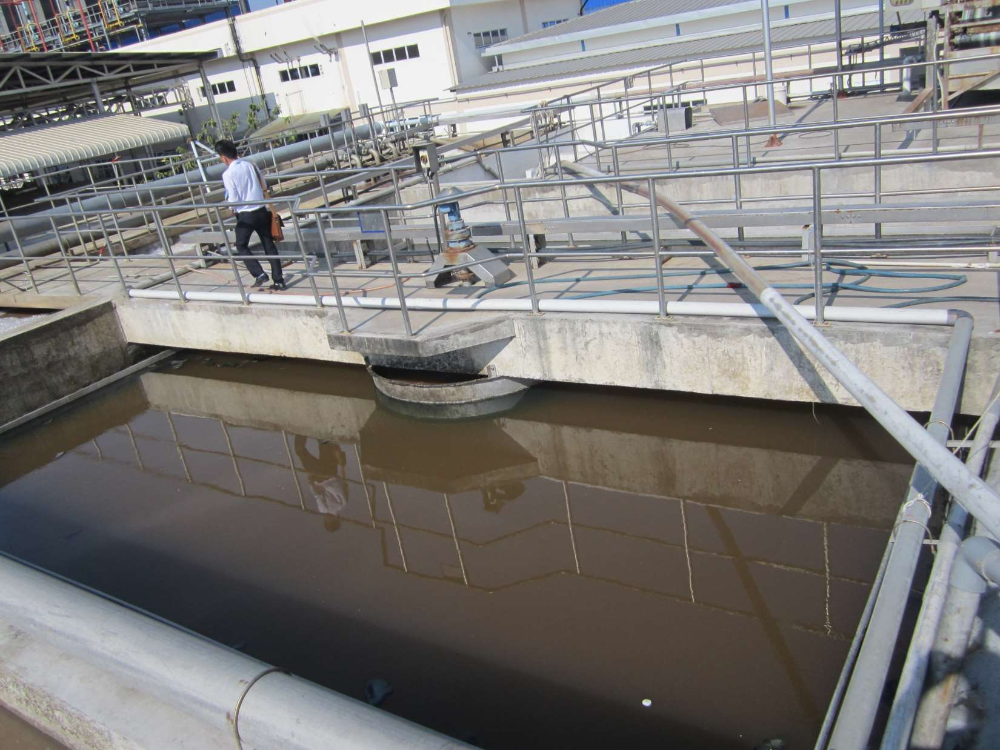
  - **Hình này chứng minh điều gì**
    - Minh họa chi tiết sơ đồ công nghệ, thông số thiết kế hoặc cấu tạo thiết bị trên slide trang 11.
  - **Từ đâu mà thấy được**
    - Trích xuất trực tiếp từ tài liệu bài giảng gốc của chương.

- Thông số và cấu tạo chi tiết theo tài liệu bài giảng (Trang 11):
  - **Hình 38.** Figure 38 (Page 11)
    - 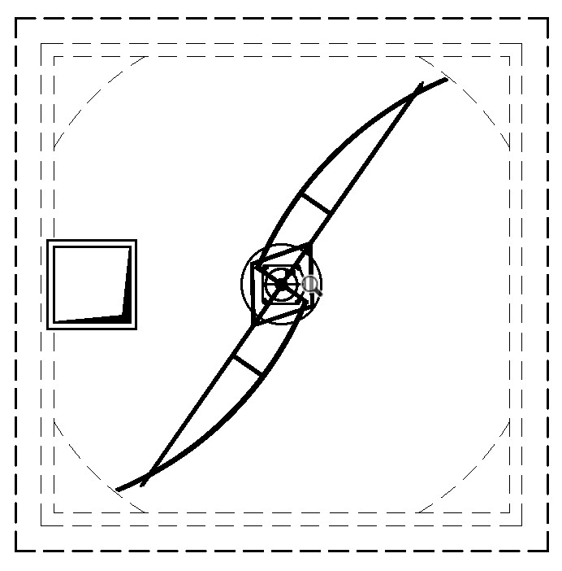
  - **Hình này chứng minh điều gì**
    - Minh họa chi tiết sơ đồ công nghệ, thông số thiết kế hoặc cấu tạo thiết bị trên slide trang 11.
  - **Từ đâu mà thấy được**
    - Trích xuất trực tiếp từ tài liệu bài giảng gốc của chương.

- Thông số và cấu tạo chi tiết theo tài liệu bài giảng (Trang 11):
  - **Hình 39.** Figure 39 (Page 11)
    - 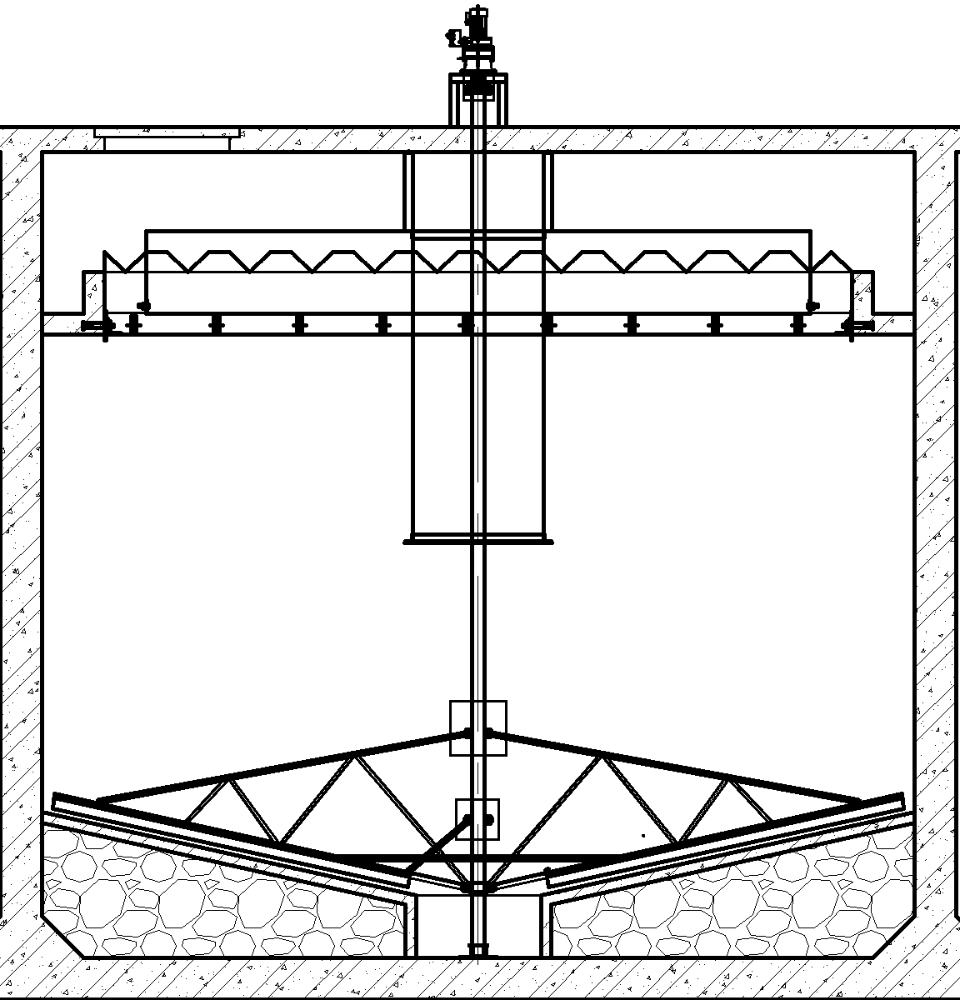
  - **Hình này chứng minh điều gì**
    - Minh họa chi tiết sơ đồ công nghệ, thông số thiết kế hoặc cấu tạo thiết bị trên slide trang 11.
  - **Từ đâu mà thấy được**
    - Trích xuất trực tiếp từ tài liệu bài giảng gốc của chương.

- Thông số và cấu tạo chi tiết theo tài liệu bài giảng (Trang 11):
  - **Hình 40.** Figure 40 (Page 11)
    - 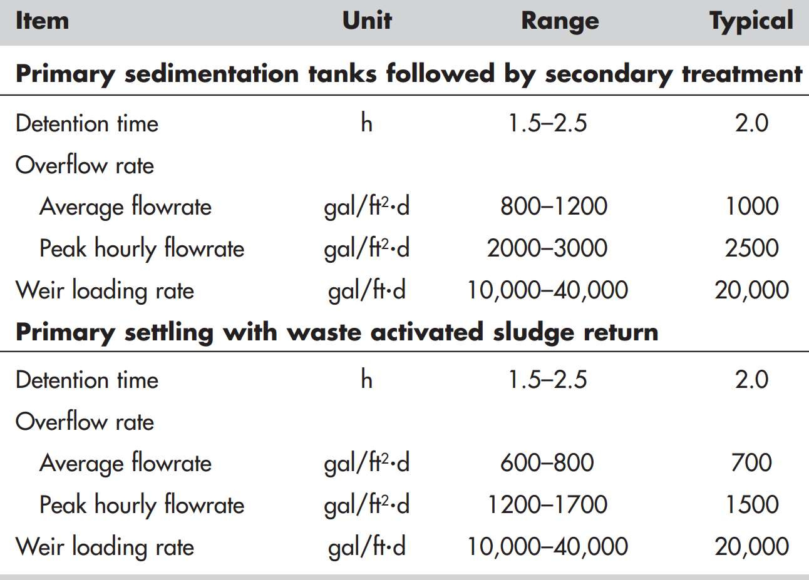
  - **Hình này chứng minh điều gì**
    - Minh họa chi tiết sơ đồ công nghệ, thông số thiết kế hoặc cấu tạo thiết bị trên slide trang 11.
  - **Từ đâu mà thấy được**
    - Trích xuất trực tiếp từ tài liệu bài giảng gốc của chương.

- Thông số và cấu tạo chi tiết theo tài liệu bài giảng (Trang 11):
  - **Hình 41.** Figure 41 (Page 11)
    - 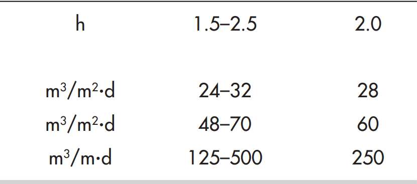
  - **Hình này chứng minh điều gì**
    - Minh họa chi tiết sơ đồ công nghệ, thông số thiết kế hoặc cấu tạo thiết bị trên slide trang 11.
  - **Từ đâu mà thấy được**
    - Trích xuất trực tiếp từ tài liệu bài giảng gốc của chương.

- Thông số và cấu tạo chi tiết theo tài liệu bài giảng (Trang 11):
  - **Hình 42.** Figure 42 (Page 11)
    - 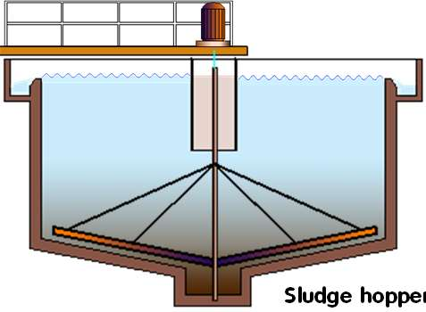
  - **Hình này chứng minh điều gì**
    - Minh họa chi tiết sơ đồ công nghệ, thông số thiết kế hoặc cấu tạo thiết bị trên slide trang 11.
  - **Từ đâu mà thấy được**
    - Trích xuất trực tiếp từ tài liệu bài giảng gốc của chương.

- Thông số và cấu tạo chi tiết theo tài liệu bài giảng (Trang 11):
  - **Hình 43.** Figure 43 (Page 11)
    - 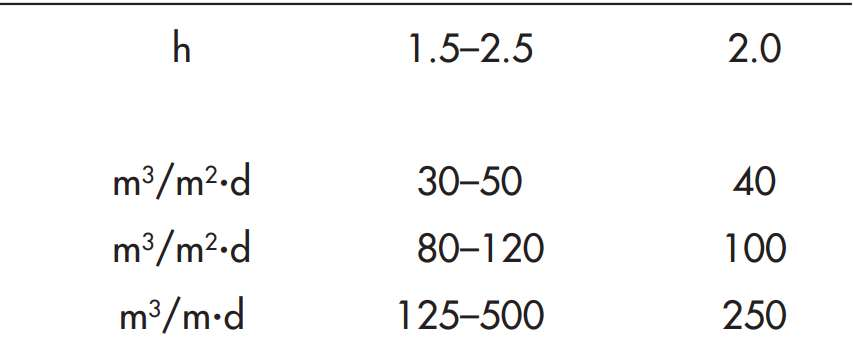
  - **Hình này chứng minh điều gì**
    - Minh họa chi tiết sơ đồ công nghệ, thông số thiết kế hoặc cấu tạo thiết bị trên slide trang 11.
  - **Từ đâu mà thấy được**
    - Trích xuất trực tiếp từ tài liệu bài giảng gốc của chương.

#### High-Rate Clarification

- Lắng tốc độ cao (High-rate clarification) là công nghệ cải tiến quá trình lắng trọng lực bằng cách bổ sung các vách nghiêng song song hoặc khối ống nghiêng vào trong bể lắng.
- Giải pháp này nhân diện tích bề mặt lắng hiệu dụng lên nhiều lần, rút ngắn thời gian lắng và thu nhỏ kích thước mặt bằng công trình.

##### Mechanism and Benefits of High-Rate Clarification

- Cơ chế lắng tốc độ cao (Settling mechanism):
  - Rút ngắn quãng đường rơi của hạt cặn (Shortening the fall distance of particles):
    - Trong bể lắng trọng lực thông thường, hạt cặn phải rơi từ mặt nước xuống đáy bể qua toàn bộ chiều sâu nước ($H = 3.0\text{--}4.5\text{ m}$).
    - Bố trí các tấm phẳng song song (parallel plates) hoặc khối ống (tube settlers) thu hẹp khoảng cách rơi xuống chỉ còn vài centimet ($d = 50\text{ mm}$ hoặc khoảng cách tấm $w = 50\text{--}100\text{ mm}$).
    - Hạt cặn nhanh chóng tiếp xúc với bề mặt nghiêng của tấm hoặc thành dưới của ống lắng trong thời gian rất ngắn.
      - **Hình 47.** Cơ chế lắng trong bể lắng thông thường không có khối ống lắng (Without Tube Settlers)
        - 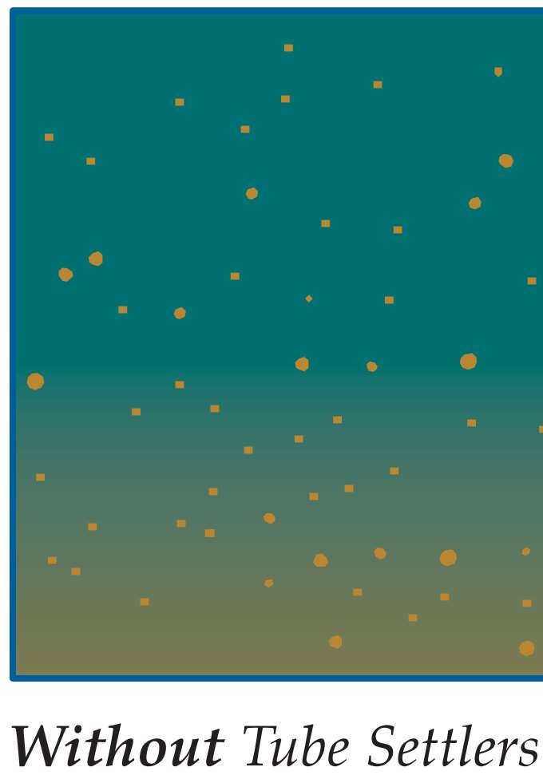
        - **Hình này chứng minh điều gì**
          - Hạt cặn phải rơi tự do toàn bộ chiều sâu bể lắng dẫn đến quãng đường lắng dài và nguy cơ bị cuốn trôi cao.
        - **Từ đâu mà thấy được**
          - Dung tích bể lắng đơn khối không có bề mặt phân tầng; hạt cặn phân tán tự do trong cột nước sâu hướng về đáy phẳng.
  - Tự động trượt bùn nhờ góc nghiêng vách (Gravity sliding of solids):
    - Đặt nghiêng các tấm hoặc ống lắng theo một góc dốc thích hợp ($\theta = 60^\circ$ so với phương ngang).
    - Lực trọng trường tác dụng lên cặn có thành phần song song với mặt nghiêng ($F_{\parallel} = m \cdot g \cdot \sin\theta$) vượt quá lực ma sát trượt giữa bùn và vách nhựa.
    - Cặn tích tụ trượt liên tục xuống vùng chứa bùn (sludge zone) bên dưới mà không làm bít tắc lòng ống.
      - **Hình 48.** Cơ chế lắng gia cường với khối ống lắng nghiêng (With Tube Settlers)
        - 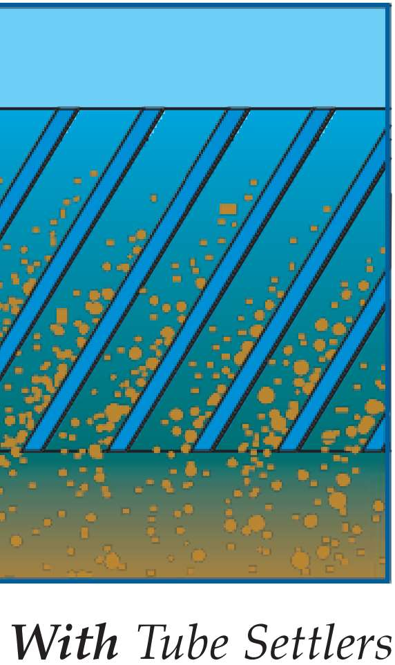
        - **Hình này chứng minh điều gì**
          - Khối ống nghiêng rút ngắn tối đa quãng đường rơi; hạt cặn va chạm vách ống nhanh chóng và trượt tự do xuống đáy bể.
        - **Từ đâu mà thấy được**
          - Các vách ống song song nghiêng $60^\circ$; hạt cặn lắng đọng thành lớp sát mặt dưới vách và trượt ngược dòng nước dâng lên.
- Lợi ích kỹ thuật của lắng tốc độ cao (Benefits):
  - Giảm diện tích mặt bằng yêu cầu (Reduce space requirements):
    - Tăng tải trọng thủy lực bề mặt lên gấp $2\text{--}4$ lần so với bể lắng trọng lực thông thường.
    - Tiết kiệm $50\%\text{--}75\%$ diện tích mặt bằng xây dựng trạm xử lý.
  - Nâng cao chất lượng nước sau lắng (Enhance effluent quality):
    - Tạo chế độ dòng chảy tầng sâu ($\mathrm{Re} < 50$), hạn chế dòng chảy rối và ngắn mạch do gió hoặc chênh lệch tỷ trọng nhiệt.
    - Tăng cường hiệu quả giữ lại các bông cặn nhỏ khó lắng, giảm nồng độ chất rắn lơ lửng ($\mathrm{SS}$) ở cửa xả.
- Sơ đồ cấu tạo bể lắng tốc độ cao tích hợp:
  - Nước thải sau keo tụ tạo bông đi qua vách khuếch tán (diffusion baffle) vào khoang phân phối dưới đáy khối module.
  - Dòng nước dâng thẳng đứng qua các vách nghiêng (inclined settlers), cặn lắng trượt ngược dòng rơi xuống đáy.
  - Nước trong thu vào các máng thu (launder) qua hệ thống đập răng cưa (weir plate).
  - Bùn lắng ở đáy bể được gom liên tục bằng xích gạt bùn (chain-and-flight sludge collector).
    - **Hình 49.** Sơ đồ cấu tạo và bố trí thiết bị trong bể lắng tốc độ cao
      - 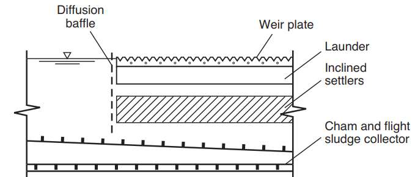
      - **Hình này chứng minh điều gì**
        - Hệ thống tích hợp đồng bộ vách khuếch tán đầu vào, khối lắng nghiêng ngập nước, máng răng cưa thu nước trong và xích gạt bùn đáy.
      - **Từ đâu mà thấy được**
        - Sơ đồ mặt cắt hiển thị rõ: vách khuếch tán (Diffusion baffle), khối lắng (Inclined settlers), đập tràn (Weir plate), máng thu (Launder) và xích cào bùn (Cham and flight sludge collector).

##### Configuration of High-Rate Settlers

- Hai loại cấu trúc lắng tốc độ cao chính:
  - Khối ống lắng tổ ong (Hexagonal tube settlers):
    - Các ống lục giác liên kết thành module mạng tổ ong cứng vững bằng vật liệu PVC hoặc polypropylene chống tia UV.
    - Tiết diện tổ ong phân chia dòng nước thành hàng nghìn kênh vi mô có bán kính thủy lực rất nhỏ, tối ưu hóa quá trình tạo dòng chảy tầng.
    - Nước sau lắng dâng lên qua khối tổ ong và tràn qua đập răng cưa V-notch vào các máng ngón tay (finger launders).
      - **Hình 50.** Hệ thống module ống lắng tổ ong (Hexagonal tube settlers) trong thực tế vận hành
        - 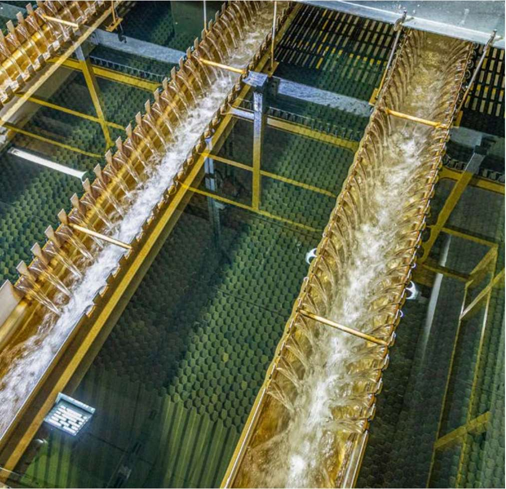
        - **Hình này chứng minh điều gì**
          - Module ống tổ ong ngập nước phân bố đều dòng dâng; nước trong tràn đều qua đập răng cưa V-notch vào các máng thu song song.
        - **Từ đâu mà thấy được**
          - Khối ống lục giác tạo thành mặt tổ ong liên tục ngập dưới làn nước trong vắt; dòng nước tràn qua các đỉnh răng cưa kim loại vào lòng máng thu.
  - Khối tấm nghiêng lamen (Lamella plate settlers):
    - Hệ thống các tấm bản phẳng song song đặt nghiêng trong bể lắng chữ nhật hoặc bể lắng hợp khối.
    - Cấu tạo tấm phẳng cho phép dòng chảy trượt tự do trên diện tích rộng, phù hợp cho nước thải chứa hàm lượng cặn cao hoặc các trạm quy mô lớn.
    - Các tấm lamen thường chế tạo bằng thép không gỉ hoặc nhựa gia cường sợi thủy tinh (FRP).
      - **Hình 51.** Hệ thống tấm nghiêng lamen (Lamella plate settlers) lắp đặt trong bể lắng chữ nhật
        - 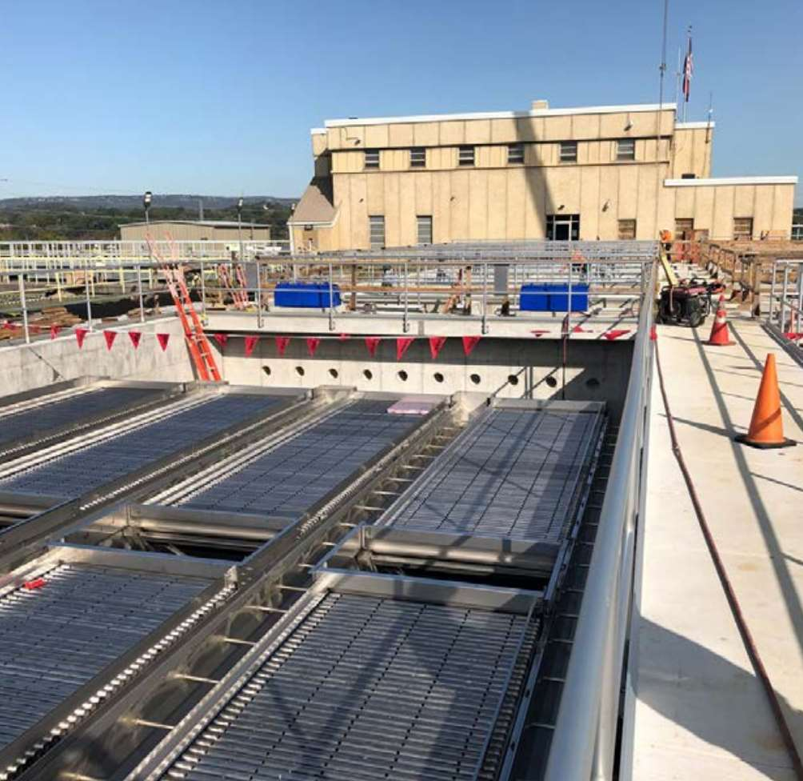
        - **Hình này chứng minh điều gì**
          - Các tấm phẳng song song ghép khối vững chắc phủ kín diện tích bể, nhân nhiều lần diện tích bề mặt lắng cho lưu lượng lớn.
        - **Từ đâu mà thấy được**
          - Cụm module tấm lamen kim loại/nhựa dạng rãnh trượt bố trí đều trên hệ dầm đỡ chịu lực trong lòng bể bê tông cốt thép quy mô lớn.
- Các cấu hình hình học điển hình của module ống lắng (Typical configurations for tube settlers):
  - Ống vuông (Square tubes): Tiết diện hình vuông đơn giản, dễ sản xuất hàng loạt.
  - Ống tròn (Circular tubes): Tiết diện hình tròn phân bố ứng suất đều, ma sát thành ống đồng nhất.
  - Ống chữ nhật (Rectangular tubes): Chiều cao lớn hơn chiều rộng giúp tăng diện tích lắng theo phương đứng.
  - Tổ ong lục giác (Hexagonal): Cấu trúc liên kết bền vững nhất, tỷ lệ diện tích bề mặt ướt trên thể tích tối ưu.
  - Chữ nhật xếp tầng đảo chiều (Rectangular, layers alternating direction): Các lớp ống chữ nhật nghiêng đan xen hướng ngược nhau để phân bổ đều dòng chảy và triệt tiêu động lượng xoáy.
  - Hình chữ V / Chevron (Chevron): Đáy hình chữ V tạo rãnh gom bùn tập trung ở tâm ống, tăng tốc độ trượt bùn.
    - **Hình 52.** Các cấu hình hình học điển hình của module ống lắng (Typical configurations for tube settlers)
      - 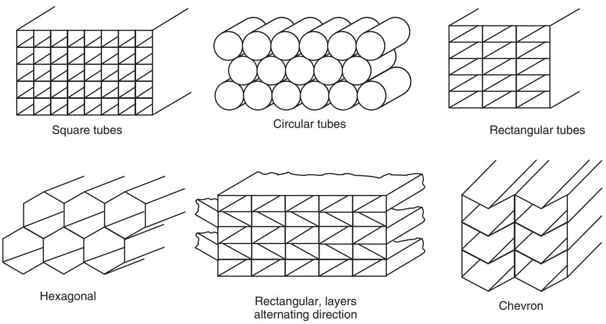
      - **Hình này chứng minh điều gì**
        - Module ống lắng được gia công dưới nhiều dạng tiết diện hình học khác nhau để tối ưu hóa bán kính thủy lực và độ cứng cơ học.
      - **Từ đâu mà thấy được**
        - Bản vẽ 6 khối module: ống vuông (Square tubes), ống tròn (Circular tubes), ống chữ nhật (Rectangular tubes), lục giác tổ ong (Hexagonal), chữ nhật đảo chiều (Rectangular, layers alternating direction) và chữ V (Chevron).

##### Design Information and Operating Criteria

- Bảng thông số thiết kế điển hình cho lắng tốc độ cao (Design information for high-rate clarification):

| Thông số thiết kế (Parameter) | Dải giá trị điển hình (Typical range of values) | Ghi chú kỹ thuật / Ý nghĩa |
| :--- | :--- | :--- |
| Tải trọng bề mặt (Surface loading rate - $\mathrm{SLR}$) | $60\text{--}180\ \text{m}^3/(\text{m}^2\cdot\text{d})$ | Cao gấp $2\text{--}4$ lần so với bể lắng thông thường ($20\text{--}40\ \text{m}^3/(\text{m}^2\cdot\text{d})$) |
| Vận tốc dòng chảy cực đại trong ống hoặc tấm nghiêng ($v_{\max}$) | $\le 0.15\ \text{m/min}$ ($2.5\ \text{mm/s}$) | Ngăn ngừa hiện tượng xói mòn và cuốn trôi cặn đã lắng |
| Thời gian lưu nước trong ống lắng ($t_{d,\text{tube}}$) | $6\text{--}10\ \text{min}$ | Thời gian tiếp xúc trực tiếp trong vùng lắng nghiêng của khối ống |
| Thời gian lưu nước trong tấm lắng lamen ($t_{d,\text{plate}}$) | $15\text{--}25\ \text{min}$ | Thời gian tiếp xúc trong khe hở giữa các tấm phẳng song song |
| Chiều cao module ống/tấm lắng ($H_{\text{module}}$) | $0.5\text{--}2.0\ \text{m}$ | Chiều cao đứng tiêu chuẩn của khối vật liệu lắng ($0.75\text{--}1.0\ \text{m}$ phổ biến) |
| Tỷ lệ diện tích bể được phủ bởi ống hoặc tấm lắng ($\eta_{\text{cov}}$) | $< 75\%$ | Dành tối thiểu $25\%$ diện tích cho vùng phân phối vào và thu nước ra |
| Góc nghiêng của ống hoặc tấm so với phương ngang ($\theta$) | $60^\circ$ | Góc tối ưu cân bằng giữa khả năng tự trượt bùn và diện tích lắng hữu ích |
| Số Reynolds trong ống lắng ($\mathrm{Re}$) | $< 50$ | Chế độ chảy tầng sâu (Laminar flow), triệt tiêu hoàn toàn nhiễu loạn |
| Số Froude trong ống lắng ($\mathrm{Fr}$) | $> 10^{-5}$ | Đảm bảo tính ổn định thủy lực, chống ngắn mạch do dòng tỷ trọng |
| Thiết bị thu gom bùn (Sludge collector) | Cào bùn kiểu xích gạt (Chain-and-flight scraper) | Cơ cấu được ưu tiên lựa chọn cho đáy bể lắng chữ nhật |

- Cơ sở lý thuyết diện tích lắng hiệu dụng (Effective surface area theory):
  - Theo lý thuyết bể lắng Hazen, tải trọng lắng bề mặt tới hạn là $v_0 = \frac{Q}{A_{\text{plan}}}$.
  - Đối với hệ thống tấm hoặc ống lắng nghiêng góc $\theta$ với chiều dài ống $L$ và khoảng cách khe hở $w$:
    - Diện tích lắng hiệu dụng được gia tăng theo tỷ lệ hình học:
      $$A_{\text{eff}} = A_{\text{plan}} \left( \sin\theta + \frac{L}{w} \cos\theta \right)$$
    - Với tỷ lệ hình học thông thường $\frac{L}{w} \approx 10\text{--}20$ và $\theta = 60^\circ$:
      $$\sin(60^\circ) + \frac{L}{w} \cos(60^\circ) = 0.866 + (10\text{--}20) \times 0.500 = 5.866\text{--}10.866$$
    - Diện tích lắng hiệu dụng tăng từ $5$ đến $10$ lần so với diện tích mặt bằng hình học của bể.
- Nguyên lý tự làm sạch tại góc nghiêng $60^\circ$ (Self-cleaning incline angle):
  - Khi $\theta < 50^\circ$: Lực ma sát giữa bùn và vách lớn hơn thành phần trọng lực trượt xuống ($m \cdot g \cdot \sin\theta \le F_{\text{friction}}$), bùn bám dính gây tắc nghẽn ống và đòi hỏi sục rửa định kỳ.
  - Khi $\theta = 60^\circ$: Thành phần lực trượt trọng lực ($m \cdot g \cdot \sin 60^\circ \approx 0.866 \cdot m \cdot g$) đủ lớn để bùn trượt tự do liên tục xuống đáy bể.
  - Khi $\theta > 60^\circ$: Khả năng tự trượt tốt nhưng hình chiếu diện tích nằm ngang ($\cos\theta$) suy giảm mạnh, làm giảm hiệu quả gia tăng diện tích lắng.

##### Example 2: High-Rate Clarification Tank Design

- **Đề bài**:
  - Lưu lượng nước thải trung bình của trạm xử lý nước thải là $Q = 0.5\ \text{m}^3/\text{s}$.
  - Thiết kế bể lắng tốc độ cao sử dụng khối ống lắng nghiêng (High-rate clarification tank with tube settlers).
  - Độ nhớt động học của nước ở $20^\circ\text{C}$ là $\nu = 1.003 \times 10^{-6}\ \text{m}^2/\text{s}$.
  - Đường kính trong của ống lắng tròn là $d = 50\ \text{mm}$.

- **Dữ kiện**:
  - Lưu lượng thiết kế trung bình: $Q = 0.5\ \text{m}^3/\text{s} = 30.0\ \text{m}^3/\text{min} = 1800\ \text{m}^3/\text{h} = 43{,}200\ \text{m}^3/\text{ngày}$.
  - Nhiệt độ nước thải tính toán: $T = 20^\circ\text{C}$.
  - Độ nhớt động học của nước ở $20^\circ\text{C}$: $\nu = 1.003 \times 10^{-6}\ \text{m}^2/\text{s}$.
  - Đường kính trong của ống lắng: $d = 50\ \text{mm} = 0.050\ \text{m}$.
  - Gia tốc trọng trường: $g = 9.81\ \text{m/s}^2$.

- **Quy tắc áp dụng**:
  - Tiêu chuẩn thông số thiết kế lắng tốc độ cao (Bảng thông số Slide 38):
    - Tải trọng bề mặt thiết kế: $\mathrm{SLR} \in [60, 180]\ \text{m}^3/(\text{m}^2\cdot\text{d})$; chọn $\mathrm{SLR} = 120.0\ \text{m}^3/(\text{m}^2\cdot\text{d})$.
    - Tỷ lệ che phủ diện tích bể bởi khối ống: $\eta_{\text{cov}} < 75\%$; chọn $\eta_{\text{cov}} = 70.0\% = 0.70$.
    - Chiều cao thẳng đứng của khối module: $H_{\text{module}} \in [0.5, 2.0]\ \text{m}$; chọn $H_{\text{module}} = 0.75\ \text{m}$.
    - Góc nghiêng của ống lắng: $\theta = 60^\circ$ so với phương ngang.
    - Giới hạn vận tốc dòng chảy trong ống: $v_{\text{tube}} \le 0.15\ \text{m/min}$.
    - Giới hạn thời gian lưu trong ống: $t_{d,\text{tube}} \in [6, 10]\ \text{min}$.
    - Giới hạn số Reynolds: $\mathrm{Re} < 50$.
    - Giới hạn số Froude: $\mathrm{Fr} > 10^{-5}$.
  - Bố trí công trình: Bố trí $N = 2$ đơn nguyên bể lắng chữ nhật song song để đảm bảo vận hành linh hoạt và an toàn (theo TCVN 7957:2008). Bề rộng mỗi đơn nguyên chọn $W = 6.0\ \text{m}$ (phù hợp giới hạn kết cấu xích cào bùn).

- **Lời giải**:
  - **Bước 1: Tính diện tích mặt bằng khối ống lắng ($A_{\text{tube,plan}}$) và diện tích bể lắng ($A_{\text{basin}}$)**
    - Căn cứ: Công thức tính diện tích bề mặt theo tải trọng thủy lực và tỷ lệ che phủ khối module:
      $$A_{\text{tube,plan}} = \frac{Q}{\mathrm{SLR}}, \quad A_{\text{basin}} = \frac{A_{\text{tube,plan}}}{\eta_{\text{cov}}}$$
    - Nhìn vào: Lưu lượng dòng vào $Q = 43{,}200\ \text{m}^3/\text{ngày}$, $\mathrm{SLR} = 120.0\ \text{m}^3/(\text{m}^2\cdot\text{d})$ và tỷ lệ che phủ $\eta_{\text{cov}} = 0.70$:
      $$A_{\text{tube,plan}} = \frac{43{,}200\ \text{m}^3/\text{ngày}}{120.0\ \text{m}^3/(\text{m}^2\cdot\text{d})} = 360.0\ \text{m}^2$$
      $$A_{\text{basin}} = \frac{360.0\ \text{m}^2}{0.70} = 514.29\ \text{m}^2$$
  - **Bước 2: Xác định kích thước hình học các đơn nguyên bể ($N = 2$)**
    - Căn cứ: Phân chia lưu lượng đều cho $N = 2$ bể chữ nhật song song, khống chế bề rộng đơn nguyên $W = 6.0\ \text{m}$ theo nhịp xích gạt bùn.
    - Nhìn vào: Diện tích khối ống và diện tích bể cho mỗi đơn nguyên:
      - Lưu lượng mỗi đơn nguyên: $Q_1 = \frac{Q}{2} = 0.25\ \text{m}^3/\text{s} = 21{,}600\ \text{m}^3/\text{ngày}$.
      - Diện tích khối ống mỗi đơn nguyên: $A_{\text{tube}, 1} = \frac{360.0}{2} = 180.0\ \text{m}^2$.
      - Chiều dài vùng đặt module ống lắng:
        $$L_{\text{tube}} = \frac{A_{\text{tube}, 1}}{W} = \frac{180.0\ \text{m}^2}{6.0\ \text{m}} = 30.0\ \text{m}$$
      - Chiều dài bể tính toán lý thuyết:
        $$L_{\text{basin,calc}} = \frac{514.29 / 2}{6.0\ \text{m}} = 42.86\ \text{m}$$
      - Chọn chiều dài thiết kế thực tế: $L_{\text{basin}} = 43.0\ \text{m}$.
      - Kiểm tra tỷ lệ che phủ thực tế:
        $$A_{\text{basin,actual}} = 2 \times (6.0\ \text{m} \times 43.0\ \text{m}) = 516.0\ \text{m}^2$$
        $$\eta_{\text{cov,actual}} = \frac{360.0\ \text{m}^2}{516.0\ \text{m}^2} = 69.77\% < 75\% \quad (\text{Thỏa mãn})$$
      - Phân bổ chiều dài vùng không đặt ống ($L_{\text{clear}} = 43.0 - 30.0 = 13.0\ \text{m}$):
        - Chiều dài vùng phân phối vào và tiêu năng: $L_{\text{inlet}} = 6.5\ \text{m}$.
        - Chiều dài vùng thu nước ra và gạt váng: $L_{\text{outlet}} = 6.5\ \text{m}$.
      - Kiểm tra tỷ lệ kích thước bể:
        $$\frac{L_{\text{basin}}}{W} = \frac{43.0\ \text{m}}{6.0\ \text{m}} = 7.17 \ge 6:1 \quad (\text{Thỏa mãn điều kiện dòng chảy đồng đều})$$
  - **Bước 3: Xác định chiều sâu và trắc dọc bể lắng**
    - Căn cứ: Cấu trúc phân tầng thẳng đứng của bể lắng tốc độ cao gồm: vùng chứa và gạt bùn, vùng phân phối nước dưới khối ống, chiều cao module ống, lớp nước trong bề mặt và chiều cao bảo vệ.
    - Nhìn vào: Chiều cao từng phân tầng:
      - Chiều sâu hố thu bùn và khoảng sáng xích cào bùn: $h_{\text{sludge}} = 1.00\ \text{m}$.
      - Chiều sâu vùng nước phân phối dưới đáy khối ống: $h_{\text{dist}} = 1.50\ \text{m}$.
      - Chiều cao thẳng đứng của khối module ống: $H_{\text{module}} = 0.75\ \text{m}$.
      - Chiều sâu lớp nước trong trên đỉnh ống: $h_{\text{water}} = 0.50\ \text{m}$.
      - Chiều cao thành bảo vệ (Freeboard): $h_{\text{FB}} = 0.50\ \text{m}$.
      - Chiều sâu công tác của nước ($D$):
        $$D = h_{\text{sludge}} + h_{\text{dist}} + H_{\text{module}} + h_{\text{water}} = 1.00 + 1.50 + 0.75 + 0.50 = 3.75\ \text{m}$$
      - Tổng chiều sâu xây dựng thành bể ($H_{\text{basin}}$):
        $$H_{\text{basin}} = D + h_{\text{FB}} = 3.75 + 0.50 = 4.25\ \text{m}$$
  - **Bước 4: Tính toán động học dòng chảy trong ống lắng và kiểm tra vận tốc**
    - Căn cứ: Dòng nước chuyển động dọc theo trục nghiêng của ống lắng với góc dốc $\theta = 60^\circ$.
    - Nhìn vào: Kích thước khối module và diện tích bề mặt ống:
      - Chiều dài ống dọc theo trục nghiêng ($L_{\text{conduit}}$):
        $$L_{\text{conduit}} = \frac{H_{\text{module}}}{\sin(60^\circ)} = \frac{0.75\ \text{m}}{\sin(60^\circ)} = \frac{0.75}{0.866025} = 0.8660\ \text{m} = 866\ \text{mm}$$
      - Vận tốc dâng thẳng đứng qua diện tích đặt ống ($v_v$):
        $$v_v = \frac{Q}{A_{\text{tube,plan}}} = \frac{0.5\ \text{m}^3/\text{s}}{360.0\ \text{m}^2} = 0.0013889\ \text{m/s} = 0.08333\ \text{m/min}$$
      - Vận tốc dòng chảy thực tế dọc theo trục nghiêng của ống ($v_{\text{tube}}$):
        $$v_{\text{tube}} = \frac{v_v}{\sin(60^\circ)} = \frac{0.08333\ \text{m/min}}{0.866025} = 0.09623\ \text{m/min}$$
        Đổi sang đơn vị $\text{m/s}$:
        $$v_{\text{tube}} = \frac{0.09623\ \text{m/min}}{60\ \text{s/min}} = 0.0016038\ \text{m/s} = 1.604\ \text{mm/s}$$
      - Kiểm tra tiêu chuẩn vận tốc:
        $$v_{\text{tube}} = 0.0962\ \text{m/min} \le 0.15\ \text{m/min} \quad (\text{Thỏa mãn})$$
        Hệ số an toàn chống xói cuốn cặn: $\frac{0.15 - 0.0962}{0.15} \times 100\% = 35.8\%$.
  - **Bước 5: Kiểm tra thời gian lưu nước trong ống lắng ($t_{d,\text{tube}}$)**
    - Căn cứ: Tỷ số giữa chiều dài ống theo trục nghiêng và vận tốc dòng chảy dọc trục ống:
      $$t_{d,\text{tube}} = \frac{L_{\text{conduit}}}{v_{\text{tube}}}$$
    - Nhìn vào: Chiều dài ống $L_{\text{conduit}} = 0.8660\ \text{m}$ và vận tốc trong ống $v_{\text{tube}} = 0.09623\ \text{m/min}$:
      $$t_{d,\text{tube}} = \frac{0.8660\ \text{m}}{0.09623\ \text{m/min}} = 9.00\ \text{phút}$$
      (Tương đương tính theo phương đứng: $t_{d,\text{tube}} = \frac{H_{\text{module}}}{v_v} = \frac{0.75}{0.08333} = 9.00\ \text{phút}$).
    - Kiểm tra tiêu chuẩn thời gian lưu:
      $$6\ \text{min} \le t_{d,\text{tube}} = 9.00\ \text{phút} \le 10\ \text{min} \quad (\text{Thỏa mãn hoàn toàn dải thiết kế})$$
  - **Bước 6: Kiểm tra các chỉ số thủy lực ổn định ($\mathrm{Re}$ và $\mathrm{Fr}$)**
    - Căn cứ: Công thức tính bán kính thủy lực cho ống tròn và phương trình Reynolds, Froude:
      $$R = \frac{d}{4}, \quad \mathrm{Re} = \frac{v_{\text{tube}} \cdot R}{\nu}, \quad \mathrm{Fr} = \frac{v_{\text{tube}}^2}{g \cdot R}$$
    - Nhìn vào: Đường kính ống $d = 50\ \text{mm} = 0.050\ \text{m}$, $\nu = 1.003 \times 10^{-6}\ \text{m}^2/\text{s}$ và vận tốc $v_{\text{tube}} = 0.0016038\ \text{m/s}$:
      - Bán kính thủy lực của ống tròn:
        $$R = \frac{0.050\ \text{m}}{4} = 0.0125\ \text{m} = 12.5\ \text{mm}$$
      - Số Reynolds ($\mathrm{Re}$):
        $$\mathrm{Re} = \frac{0.0016038\ \text{m/s} \times 0.0125\ \text{m}}{1.003 \times 10^{-6}\ \text{m}^2/\text{s}} = \frac{2.00475 \times 10^{-5}}{1.003 \times 10^{-6}} = 19.99$$
        Kiểm tra: $\mathrm{Re} = 19.99 < 50$ (Thỏa mãn, dòng chảy tầng sâu tuyệt đối, triệt tiêu xoáy cuộn).
      - Số Froude ($\mathrm{Fr}$):
        $$\mathrm{Fr} = \frac{(0.0016038\ \text{m/s})^2}{9.81\ \text{m/s}^2 \times 0.0125\ \text{m}} = \frac{2.5722 \times 10^{-6}}{0.122625} = 2.098 \times 10^{-5} \approx 2.10 \times 10^{-5}$$
        Kiểm tra: $\mathrm{Fr} = 2.10 \times 10^{-5} > 10^{-5}$ (Thỏa mãn, đảm bảo dòng chảy ổn định chống lật tầng do nhiệt).
  - **Bước 7: Tính toán dung tích toàn bể và thời gian lưu thủy lực tổng thể**
    - Căn cứ: Tổng thể tích làm việc của $N = 2$ đơn nguyên bể lắng:
      $$V_{\text{total}} = N \times (W \times L_{\text{basin}} \times D), \quad \mathrm{HRT}_{\text{basin}} = \frac{V_{\text{total}}}{Q}$$
    - Nhìn vào: Kích thước mỗi bể $6.0\ \text{m} \times 43.0\ \text{m} \times 3.75\ \text{m}$:
      $$V_{\text{total}} = 2 \times (6.0 \times 43.0 \times 3.75) = 2 \times 967.5\ \text{m}^3 = 1935.0\ \text{m}^3$$
      $$\mathrm{HRT}_{\text{basin}} = \frac{1935.0\ \text{m}^3}{0.5\ \text{m}^3/\text{s}} = 3870\ \text{s} = 64.5\ \text{phút} \approx 1.075\ \text{giờ}$$

- **Kết quả**:
  - Số lượng đơn nguyên bể lắng: $2\ \text{bể}$ làm việc song song.
  - Kích thước mỗi đơn nguyên: Bề rộng $W = 6.0\ \text{m}$, Chiều dài $L_{\text{basin}} = 43.0\ \text{m}$, Chiều sâu nước $D = 3.75\ \text{m}$, Chiều sâu tổng thể $H_{\text{basin}} = 4.25\ \text{m}$.
  - Kích thước vùng module ống lắng: Bề rộng $6.0\ \text{m}$, Chiều dài $L_{\text{tube}} = 30.0\ \text{m}$, Chiều cao module $H_{\text{module}} = 0.75\ \text{m}$, Chiều dài ống nghiêng $L_{\text{conduit}} = 866\ \text{mm}$, Góc nghiêng $\theta = 60^\circ$.
  - Diện tích mặt bằng phủ ống mỗi bể: $A_{\text{tube}, 1} = 180.0\ \text{m}^2$ (Tổng cộng $360.0\ \text{m}^2$).
  - Vận tốc dòng chảy trong ống lắng: $v_{\text{tube}} = 0.0962\ \text{m/min} = 1.604\ \text{mm/s}$.
  - Thời gian lưu trong ống lắng: $t_{d,\text{tube}} = 9.00\ \text{phút}$.
  - Các thông số thủy lực: $\mathrm{Re} = 19.99 < 50$; $\mathrm{Fr} = 2.10 \times 10^{-5} > 10^{-5}$.
  - Thời gian lưu nước thủy lực toàn bể: $\mathrm{HRT}_{\text{basin}} = 64.5\ \text{phút} = 1.075\ \text{giờ}$.
  - Thiết bị kèm theo: Hệ thống xích gạt bùn đáy (chain-and-flight scraper), máng răng cưa thu nước trong V-notch $90^\circ$ và ống thu váng bọt quay dạng khe.

- **Kiểm tra lại**:

| Thông số kiểm tra | Giá trị tính toán | Giới hạn thiết kế cho phép | Đánh giá |
| :--- | :--- | :--- | :--- |
| Tỷ lệ phủ khối ống ($\eta_{\text{cov}}$) | $69.77\%$ | $< 75\%$ | Đạt |
| Vận tốc dòng trong ống ($v_{\text{tube}}$) | $0.0962\ \text{m/min}$ | $\le 0.15\ \text{m/min}$ | Đạt (dự phòng $35.8\%$) |
| Thời gian lưu trong ống ($t_{d,\text{tube}}$) | $9.00\ \text{phút}$ | $6\text{--}10\ \text{phút}$ | Đạt |
| Chiều cao module ống ($H_{\text{module}}$) | $0.75\ \text{m}$ | $0.5\text{--}2.0\ \text{m}$ | Đạt |
| Góc nghiêng ống ($\theta$) | $60^\circ$ | $60^\circ$ | Đạt |
| Tỷ số dài / rộng ($L/W$) | $7.17 : 1$ | $\ge 6:1$ | Đạt |
| Số Reynolds ($\mathrm{Re}$) | $19.99$ | $< 50$ | Đạt (chảy tầng ổn định) |
| Số Froude ($\mathrm{Fr}$) | $2.10 \times 10^{-5}$ | $> 10^{-5}$ | Đạt (chống ngắn mạch) |
| Hiệu quả tiết kiệm diện tích | Giảm $71.3\%$ so với bể thường ($516\ \text{m}^2$ vs $1800\ \text{m}^2$) | Tiết kiệm diện tích mặt bằng | Vượt trội |

### Chương 3.4: Quá trình Cơ học - Tuyển nổi Khí hòa tan (DAF)

#### 4.1 Tổng quan về hệ thống tuyển nổi DAF (Overview of DAF System)
- Quá trình tuyển nổi khí hòa tan DAF (Dissolved-Air Flotation) là công trình đơn vị cơ học (physical unit process) dùng để phân tách pha lỏng - rắn hoặc lỏng - lỏng trong kỹ thuật xử lý nước thải.
- Cấu trúc chuyên đề tuyển nổi DAF gồm 4 nội dung chính:
  - Tổng quan về hệ thống DAF (Overview).
  - Ưu điểm và nhược điểm (Advantages and Disadvantages).
  - Phân loại hệ thống tuyển nổi DAF (Classification).
  - Thông số và cơ sở tính toán thiết kế DAF (Design information for DAF).

##### Mục tiêu và phạm vi ứng dụng (Application and Target Pollutants)
- Hệ thống DAF xử lý hiệu quả các thành phần ô nhiễm nhẹ hoặc khó lắng:
  - Loại bỏ chất rắn lơ lửng ($\text{SS}$ - suspended solids).
  - Loại bỏ dầu, mỡ và chất béo ($\text{FOGs}$ - fat, oil, and grease).
- Phạm vi ứng dụng thực tế:
  - Áp dụng chuyên sâu trong các trạm xử lý nước thải công nghiệp (industrial wastewater treatment).
  - Xử lý nước thải từ ngành chế biến thực phẩm, thuộc da, dệt nhuộm, dầu khí và giết mổ gia súc.

##### Nguyên lý vận hành 6 bước của quá trình tuyển nổi (Basic Principle of Flotation)
- Quá trình tuyển nổi bọt khí hòa tan diễn ra theo chuỗi tuần tự 6 bước kỹ thuật ($6\text{ steps}$):
  - Bước 1 (Step 1): Hòa tan không khí vào nước thải dưới áp suất cao trong bình chịu áp (pressure vessel).
    - Áp suất vận hành trong bình tích áp duy trì từ $3{,}4\text{ atm}$ đến $4{,}8\text{ atm}$ ($3{,}4 - 4{,}8\text{ atm}$).
    - Áp suất cao cưỡng bức lượng lớn không khí hòa tan vượt mức bão hòa ở áp suất khí quyển.
    - **Hình 2.** Cấu tạo bình tích áp hòa tan không khí (Pressure vessel)
      - 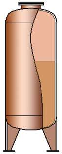
      - **Hình này chứng minh điều gì**
        - Thiết bị hòa tan là bình áp lực thân trụ đứng khép kín, tạo tiếp xúc khí - lỏng ở áp suất cao.
      - **Từ đâu mà thấy được**
        - Mặt cắt bóc vỏ cho thấy thân trụ đứng hai đầu khum chịu áp lực và khoang chứa chất lỏng bên trong.
  - Bước 2 (Step 2): Giải phóng áp suất đột ngột về áp suất khí quyển (atmospheric level).
    - Sự chênh lệch áp suất lớn làm khí hòa tan giảm độ tan đột ngột và tách pha, tạo thành vô số bọt khí siêu mịn (fine bubbles).
    - Đường kính bọt khí hình thành dao động trong kích thước vi bọt ($10 - 100\ \mu\text{m}$).
  - Bước 3 (Step 3): Đưa các bọt khí mịn vào pha lỏng nước thải theo cơ chế tuyển nổi bọt khí phân tán (dispersed-air flotation).
    - Bọt khí phân tán đồng đều vào dòng chất lỏng để tăng xác suất va chạm với hạt cặn.
  - Bước 4 (Step 4): Bọt khí bám dính vào các hạt rắn hoặc hạt chất lỏng ô nhiễm, làm gia tăng lực nổi (buoyancy) của tổ hợp hạt - bọt.
    - Tổ hợp hạt cặn và bọt khí có khối lượng riêng biểu kiến nhỏ hơn khối lượng riêng của nước.
    - **Hình 4.** Cơ chế bám dính bề mặt (Adhesion) và bọc xen kẽ (Incorporation) giữa bọt khí và hạt cặn
      - 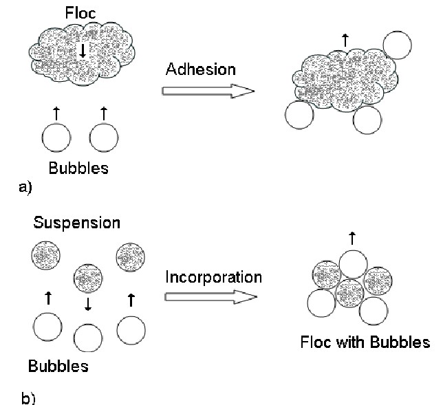
      - **Hình này chứng minh điều gì**
        - Bọt khí liên kết qua cơ chế bám dính bề mặt (Adhesion) hoặc bọc xen kẽ (Incorporation), đảo chiều chuyển động hạt từ chìm sang nổi.
      - **Từ đâu mà thấy được**
        - Nhánh a (Adhesion): bọt khí gắn quanh bông cặn; nhánh b (Incorporation): bọt khí lọt vào giữa các hạt; mũi tên đảo chiều từ chìm ($\downarrow$) sang nổi ($\uparrow$).
  - Bước 5 (Step 5): Hạt cặn cùng bọt khí nổi lên mặt thoáng của bể tuyển nổi (particles float to the surface).
    - Lực đẩy Archimedes đưa tổ hợp hạt nổi nhanh lên bề mặt chất lỏng tạo thành lớp váng bọt đặc.
  - Bước 6 (Step 6): Thu gom lớp chất nổi bề mặt bằng thiết bị gạt váng (skimmer).
    - Cần gạt cơ học đẩy váng bùn nổi vào máng thu gom bùn để đưa ra ngoài xử lý.

##### Sơ đồ công nghệ điển hình của hệ thống DAF (Typical Diagram of DAF)
- Quy trình dòng chảy và các thiết bị cấu thành chính trong sơ đồ hệ thống DAF điển hình:
  - Dòng vào (Influent): Nước thải thô chứa cặn lơ lửng và dầu mỡ nạp vào hệ thống xử lý.
  - Hóa chất keo tụ (Chemical - optional): Châm hóa chất keo tụ hoặc trợ keo tụ (tùy chọn) trước bơm cao áp để hình thành bông cặn dễ bám dính khí.
  - Bơm cao áp (High pressure pump): Tạo cột áp cao đẩy dòng nước nạp vào bình chịu áp.
  - Khí nén (Compressed air): Máy nén khí cấp khí nén trực tiếp vào bình tích áp để hòa tan vào nước.
  - Bình chịu áp (Pressure vessel): Thiết bị duy trì áp suất $3{,}4 - 4{,}8\text{ atm}$ để hòa tan không khí bão hòa vào dòng nước thải.
  - Van giảm áp (Pressure reducing valve): Bố trí trên đường ống cấp vào bể, xả áp nhanh về áp suất khí quyển để giải phóng chùm bọt khí vi mịn.
  - Bể tuyển nổi (Flotation tank): Vùng diễn ra quá trình tiếp xúc, bám dính và phân tách pha lỏng - nổi - lắng.
    - **Hình 1.** Sơ đồ mặt cắt cấu tạo bể tuyển nổi DAF
      - 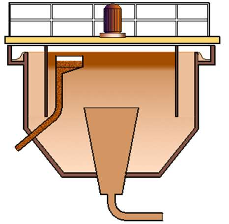
      - **Hình này chứng minh điều gì**
        - Bể phân chia rõ ba vùng: lớp váng nổi trên mặt với cơ cấu gạt, khoang tách pha và phễu thu nước trong ở đáy.
      - **Từ đâu mà thấy được**
        - Đỉnh bể lắp động cơ quay thanh gạt váng; mép trên bên trái có máng thu bùn dốc ra ngoài; tâm đáy có phễu nón thu nước trong.
  - Dòng ra (Effluent): Nước trong sau khi tách cặn nổi được thu gom qua phễu đáy và xả ra ngoài qua vách tràn.
  - Bùn váng nổi (Sludge): Lớp bọt cặn nổi cô đặc giàu chất hữu cơ và $\text{FOGs}$ được gạt vào máng thu gom riêng.
    - **Hình 3.** Thùng thu gom bùn váng nổi (Sludge)
      - 
      - **Hình này chứng minh điều gì**
        - Lớp bùn váng nổi bề mặt được gạt xả riêng vào thùng gom bùn, cách ly hoàn toàn khỏi dòng nước trong.
      - **Từ đâu mà thấy được**
        - Thùng chứa mở nắp đón dòng bùn xả xuống trực tiếp từ máng gạt của bể tuyển nổi.

#### 4.2 Ưu điểm và nhược điểm của hệ thống DAF (Advantages and Disadvantages)

##### Ưu điểm của hệ thống DAF (Advantages of DAF System)
- Hiệu quả đối với các hạt cặn nhỏ hoặc nhẹ (small or light particles):
  - Bọt khí mịn bám dính vào bề mặt hạt làm giảm khối lượng riêng tổng thể và gia tăng lực nổi.
- Hiệu suất xử lý cao hơn trong thời gian ngắn hơn so với bể lắng trọng lực (sedimentation tank):
  - Hiệu suất loại bỏ chất rắn lơ lửng đạt $99\%$ ($\text{SS}$ - suspended solids).
  - Thời gian lưu nước ngắn hơn nhiều so với chu trình lắng trọng lực thông thường.
- Yêu cầu diện tích mặt bằng nhỏ hơn (smaller land area requirement):
  - Vận tốc nổi của tổ hợp hạt - bọt khí cao hơn vận tốc lắng tự nhiên, cho phép giảm diện tích xây dựng bể.
- Bùn thu gom từ hệ thống DAF đậm đặc hơn so với bùn từ bể lắng (thicker sludge):
  - Lớp bùn váng nổi trên bề mặt được nén và thoát nước tự nhiên bởi lực đẩy bọt khí trước khi gạt gom.

##### Nhược điểm của hệ thống DAF (Disadvantages of DAF System)
- Yêu cầu công suất và năng lượng vận hành cao (high power requirement):
  - Tiêu tốn điện năng đáng kể cho máy nén khí và bơm tăng áp nhằm duy trì áp suất bão hòa khí từ $3{,}4\text{ atm}$ đến $4{,}8\text{ atm}$.
- Thiết bị phức tạp về mặt cơ cấu cơ khí và chi phí cao (mechanically complex and expensive equipment):
  - Cần trang bị bình chịu áp (pressure vessel), bơm cao áp, van giảm áp và thanh gạt bùn váng (skimmer).
  - Chi phí đầu tư thiết bị ban đầu và chi phí bảo trì cơ khí cao.
- Kém hiệu quả đối với các hạt chất rắn lơ lửng kích thước lớn (less effective with large suspended solids):
  - Hạt kích thước lớn và tỷ trọng cao khó liên kết ổn định với bọt khí mịn và có xu hướng chìm xuống đáy bể.

#### 4.3 Phân loại hệ thống DAF (Classification of DAF Systems)

##### Hệ thống DAF không tuần hoàn và có tuần hoàn (Without recycle and With recycle)
- Quá trình tuyển nổi DAF được phân loại theo cấu hình dòng cấp vào bình áp lực gồm hệ thống không tuần hoàn (without recycle) và hệ thống có tuần hoàn (with recycle).
- Hệ thống không có dòng tuần hoàn (Without recycle): Toàn bộ lưu lượng nước thải cấp vào bể ($100\%$ lưu lượng, entire flow) được bơm trực tiếp qua bình áp lực (pressure vessel) để hòa tan bão hòa không khí trước khi vào bể tuyển nổi.
  - Toàn bộ dòng nước thải vào (influent feed line) được hòa trộn với hóa chất keo tụ (chemicals) từ bể chứa hóa chất (chemical mix tank) qua bơm định lượng (chemical feed pump).
  - Dòng nước sau hòa trộn (mixing) được bơm tạo áp (pressurizing pump) nạp vào bình áp lực (pressure tank) cùng với khí nén (air).
  - Áp suất dòng nước được kiểm soát và giảm áp qua van điều khiển áp lực (pressure control valve) ngay trước khi cấp vào bể tuyển nổi (flotation tank).
  - Hệ thống không tuần hoàn yêu cầu bình áp lực có kích thước lớn để chứa toàn bộ lưu lượng nước thải, dẫn đến công suất tiêu thụ điện của bơm tạo áp lớn.
  - Nhược điểm chính: Các bông cặn keo tụ dễ bị vỡ vụn dưới lực cắt thủy lực mạnh khi đi qua bơm tạo áp và van giảm áp dưới áp suất cao.
  - Cấu hình này chỉ áp dụng phù hợp cho nguồn nước thải có hàm lượng chất rắn lơ lửng ($\text{SS}$) thấp ($< 500\text{ mg/L}$) và dầu mỡ chưa tạo bông keo tụ lớn.
  - Tại bể tuyển nổi (flotation tank), bọt khí bám vào cặn nổi lên bề mặt tạo thành lớp bùn nổi cô đặc (thickened overflow).
  - Cặn nặng lắng xuống đáy được cơ cấu thu gom bùn đáy (bottom sludge collector) gom về hố xả cặn lắng đáy (settled solids drawoff).
  - Dòng nước trong sau tuyển nổi (subnatant effluent) chảy qua tấm chắn (baffle) sang ngăn xả đầu ra.
  - **Hình 5.** Sơ đồ công nghệ hệ thống DAF không tuần hoàn (DAF system without recycle)
    - 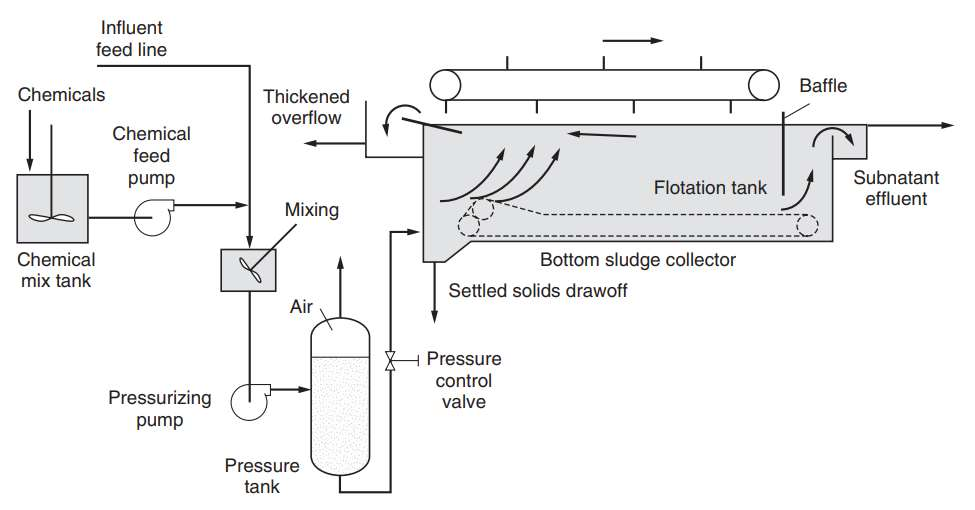
    - **Hình này chứng minh điều gì**
      - Toàn bộ lưu lượng nước thải sau hòa trộn hóa chất đi qua bình áp lực trước khi vào bể tuyển nổi.
    - **Từ đâu mà thấy được**
      - Dòng nước từ đường nạp (Influent feed line) qua cụm trộn (Mixing) dẫn thẳng vào bơm nén (Pressurizing pump) và bình áp lực (Pressure tank); đường xả nước trong (Subnatant effluent) không có nhánh hồi lưu.
- Hệ thống có dòng tuần hoàn (With recycle): Chỉ có lưu lượng dòng nước trong sau tuyển nổi tuần hoàn (recycle flow, ký hiệu $R$) được bơm qua bình áp lực (pressure vessel), dòng nước thải thô đi thẳng vào bể tuyển nổi không qua bình áp.
  - Nước thải thô vào (influent feed line) hòa trộn với hóa chất keo tụ (chemicals) tại buồng hòa trộn (mixing) và đi thẳng trực tiếp vào bể tuyển nổi (flotation tank).
  - Bông cặn hình thành sau quá trình keo tụ tạo bông được bảo toàn nguyên vẹn, không bị phá vỡ cấu trúc do không đi qua bơm tạo áp.
  - Một phần dòng nước trong đáy bể (recycled subnatant) được trích ra làm dòng tuần hoàn (hoặc có thể bổ sung qua đường kết nối tuần hoàn phụ - auxiliary recycle connection từ bể lắng đợt 1 hay nước đầu ra xử lý).
  - Bơm tạo áp (pressurizing pump) bơm dòng tuần hoàn vào bình áp lực (pressure tank) có nạp khí nén (air) để bão hòa không khí ở áp suất cao ($3{,}4\text{ atm}$ đến $4{,}8\text{ atm}$).
  - Dòng tuần hoàn bão hòa khí đi qua van điều khiển áp lực (pressure control valve) để giải phóng vi bọt khí kích thước $10\text{ }\mu\text{m}$ đến $100\text{ }\mu\text{m}$, hòa trộn ngay với dòng nước thải thô trước khi vào bể tuyển nổi.
  - Tỷ lệ lưu lượng tuần hoàn so với lưu lượng dòng vào ($R/Q$) thường dao động từ $20\%$ đến $50\%$ đối với nước thải thông thường, đảm bảo đủ lượng khí hòa tan cần thiết theo hàm lượng $\text{SS}$ đầu vào.
  - Các vi bọt khí bám dính vào bông cặn có sẵn, đẩy bông cặn nổi lên mặt nước tạo thành lớp bùn nổi cô đặc (thickened overflow).
  - Cặn nặng lắng xuống đáy được cơ cấu gạt đáy (bottom sludge collector) gạt về hố xả cặn (settled solids drawoff).
  - Nước trong (subnatant effluent) sau khi qua tấm chắn (baffle) được thu gom sang ngăn thu nước ra hoặc trích tuần hoàn.
  - **Hình 6.** Sơ đồ công nghệ hệ thống DAF có dòng tuần hoàn (DAF system with recycle)
    - 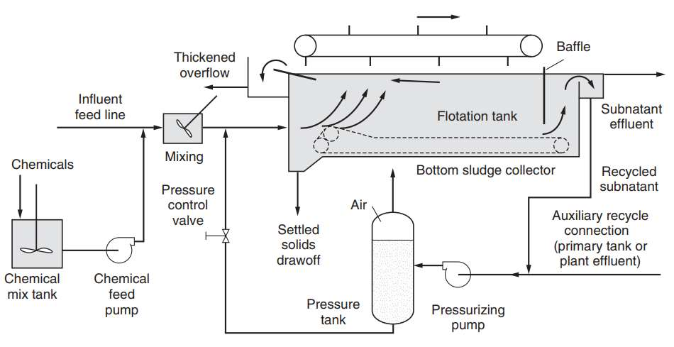
    - **Hình này chứng minh điều gì**
      - Chỉ có dòng nước trong sau tuyển nổi tuần hoàn qua bình áp lực; dòng nước thải thô đi thẳng vào bể tuyển nổi.
    - **Từ đâu mà thấy được**
      - Nhánh nước trong (Recycled subnatant) qua bơm tạo áp nạp vào bình áp lực (Pressure tank) có cấp khí; dòng nước thải (Influent) sau hòa trộn hóa chất dẫn trực tiếp vào bể tuyển nổi.

##### Phân loại theo hình dạng hình học: Bể hình chữ nhật và bể hình tròn (Rectangular DAF and Circular DAF)
- Hệ thống tuyển nổi DAF được phân loại theo cấu trúc hình học của bể gồm bể hình chữ nhật (Rectangular DAF) và bể hình tròn (Circular DAF).
- Bể DAF hình chữ nhật (Rectangular DAF) và bể DAF hình tròn (Circular DAF) khác biệt về hình dáng mặt bằng, hướng chuyển động của dòng thủy lực và cơ cấu thu gom bọt nổi.
  - Bể hình chữ nhật phù hợp với mặt bằng hẹp dài, dòng chảy theo phương nằm ngang từ đầu vào tới đầu ra, sử dụng hệ thống gạt bọt bề mặt dạng xích cào (chain and flight skimmer) di chuyển tịnh tiến.
  - Bể hình tròn phù hợp với mặt bằng mở, dòng chảy hướng tâm từ giếng phân phối trung tâm ra chu vi hoặc theo chuyển động xoáy tròn, sử dụng cầu gạt quay (rotating bridge) tích hợp cần gạt bọt (float skimmer arm) hoặc máng xoắn hớt bọt (spiral scoop skimmer).
  - Về phương diện xây dựng, bể tròn bằng thép hoặc bê tông chịu áp lực thành mỏng tối ưu hơn về mặt cơ học; bể chữ nhật dễ dàng ghép chung vách ngăn thành nhiều đơn nguyên song song, tiết kiệm diện tích đất tổng thể.
  - **Hình 7.** Ảnh thực tế hệ thống DAF hình chữ nhật và hệ thống DAF hình tròn
    - 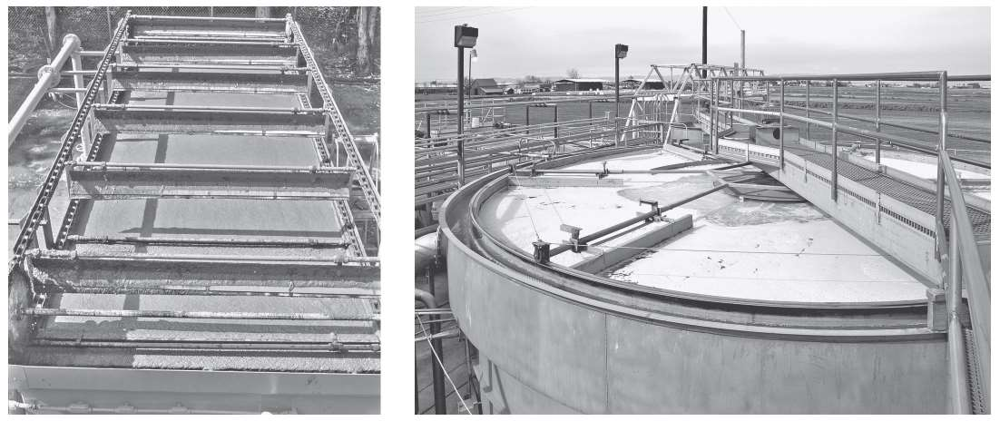
    - **Hình này chứng minh điều gì**
      - Hình thái kết cấu thực tế: hệ thanh cào kéo xích ở bể chữ nhật và cơ cấu gạt quay tâm ở bể tròn.
    - **Từ đâu mà thấy được**
      - Ảnh trái: hệ thanh gạt ngang gắn chuỗi xích chuyển động tịnh tiến dọc chiều dài bể chữ nhật.
      - Ảnh phải: cầu công tác và cần gạt xoay quanh trục tâm trên mặt thoáng bể tròn.

##### Bể DAF hình chữ nhật (Rectangular DAF)
- Bể DAF hình chữ nhật vận hành với dòng chảy dọc theo chiều dài bể, phân tách hai pha nổi và lắng riêng biệt với cơ cấu gạt bọt bề mặt (Skimmer) đẩy bùn vào máng thu bọt (Scum trough) và cào đáy (Scraper) gom cặn lắng (Sediments).
  - Dòng nước thải cấp vào (Influent) đi vào từ một đầu của bể tuyển nổi, hòa trộn với dòng nước tuần hoàn bão hòa khí tạo bọt mịn.
  - Lớp bọt váng và bùn nổi (Scum) nổi lên mặt nước được thu gom bởi cơ cấu gạt bọt bề mặt (Skimmer) chuyển động theo chu kỳ về phía máng thu bọt (Scum trough).
  - Tấm gạt bề mặt đẩy bọt nổi trượt lên tấm dốc nghiêng (beach) rơi vào máng thu váng cặn cô đặc (Scum trough) để dẫn ra ngoài.
  - Các hạt cặn nặng không bám bọt khí lắng xuống đáy bể tạo thành lớp cặn lắng (Sediments).
  - Cơ cấu gạt bùn đáy (Scraper) dạng chuỗi xích cào di chuyển ngầm dọc đáy bể gom cặn lắng về hố thu cặn ở đầu bể để xả định kỳ.
  - Vách chắn bọt (baffle) đặt ở cuối bể ngăn không cho lớp bọt bề mặt bị cuốn trôi lẫn vào dòng nước trong.
  - Dòng nước trong sau xử lý (Supernatant effluent) chảy qua tấm chắn dưới bề mặt và tràn qua đập tràn đầu ra sang ngăn xả.
  - **Hình 8.** Sơ đồ mặt cắt nguyên lý hoạt động của bể DAF hình chữ nhật
    - 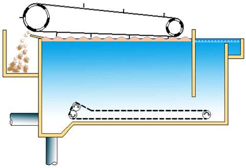
    - **Hình này chứng minh điều gì**
      - Cơ chế thu gom hai pha tách biệt: bọt nổi trên mặt thoáng và bùn lắng dưới đáy bể.
    - **Từ đâu mà thấy được**
      - Mặt thoáng: dàn gạt Skimmer di chuyển đẩy lớp bọt váng sang máng thu Scum trough bên trái.
      - Đáy bể: cơ cấu xích cào Scraper quét cặn lắng Sediments về hố thu cạnh đường ống nạp Influent.
- Cấu tạo không gian 3 chiều của bể DAF hình chữ nhật tích hợp các ngăn chức năng gồm ngăn tiếp xúc keo tụ (Contact Cell / Coagulation Chamber), ngăn tuyển nổi (Flotation Cell), thanh gạt bọt bề mặt (Surface Skimmer), cơ cấu cào đáy (Bottom Skimmer or Auger), hệ thống tạo bọt mịn (Air Solution / whitewater System) và ngăn xả nước trong (Effluent Discharge Chamber).
  - Ngăn tiếp xúc và keo tụ (Contact Cell / Coagulation Chamber): Bố trí tại vị trí đầu vào (Influent) để tiếp nhận nước thải và hòa trộn hóa chất keo tụ, đồng thời là nơi tiếp nhận dòng nước bão hòa khí.
  - Ngăn tuyển nổi chính (Flotation Cell): Thể tích bể chính nơi diễn ra quá trình các vi bọt khí bám vào cặn và đẩy cặn nổi lên bề mặt với vận tốc nổi $v_f$.
  - Cơ cấu gạt bọt bề mặt (Surface Skimmer): Gồm các thanh gạt bản cào (flights) gắn trên hệ truyền động xích dẫn hướng, quét liên tục lớp bọt váng trên mặt bể sang máng thu.
  - Hướng di chuyển của thanh gạt bề mặt có thể cùng chiều hoặc ngược chiều với dòng nước tùy thuộc vào vị trí bố trí máng thu bùn nổi.
  - Ngăn xả nước sau xử lý (Effluent Discharge Chamber): Đặt ở cuối bể, tiếp nhận nước trong sau khi tách cặn qua đập tràn để dẫn ra ngoài (Effluent).
  - Cơ cấu gạt hoặc trục vít tải bùn đáy (Bottom Skimmer or Auger): Lắp đặt ở đáy bể để gom và vận chuyển cặn lắng nặng về phễu xả.
  - Hệ thống tạo nước bão hòa khí trắng đục (Air Solution / whitewater System): Cụm thiết bị gồm bơm tăng áp, bình bão hòa khí áp lực và đường ống phân phối bọt đáy bể tạo dòng nước chứa bọt khí siêu mịn dạng mây trắng (whitewater).
  - **Hình 9.** Sơ đồ cấu tạo không gian 3D chi tiết của bể DAF hình chữ nhật
    - 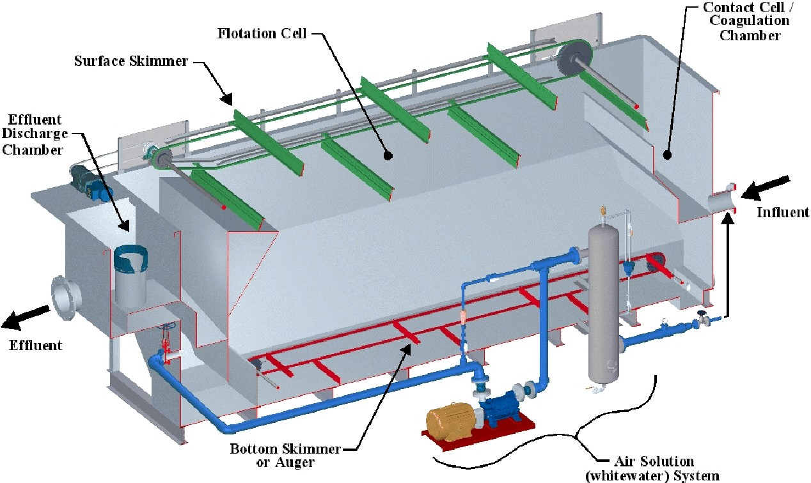
    - **Hình này chứng minh điều gì**
      - Bố trí không gian liên tục từ ngăn keo tụ tiếp xúc bọt khí, ngăn tuyển nổi đến thanh gạt mặt và cào bùn đáy.
    - **Từ đâu mà thấy được**
      - Ngăn Contact Cell gắn hệ thống bão hòa khí (Air Solution System) bên phải, thanh gạt Surface Skimmer trên mặt, Bottom Skimmer ở đáy và Effluent Discharge Chamber ở bên trái.

##### Bể DAF hình tròn (Circular DAF)
- Bể DAF hình tròn (Circular DAF) có cấu tạo đối xứng trục gồm giếng phân phối trung tâm (Dispersion Well), đường cấp nước vào đồng tâm dòng tuần hoàn áp lực (Influent with Concentric Side-Feed Recycle), van giảm áp Haymore (Haymore Back Pressure Control Valve), cần gạt bọt váng nổi (Float Skimmer Arm), tấm chắn bọt (Float Baffle), đập tràn răng cưa (V-Notch Weir), máng thu nước trong (Effluent Launder) và cần cào bùn đáy (Sludge Rake Arm).
  - Giếng phân phối trung tâm (Dispersion Well): Đặt tại tâm bể, tiếp nhận dòng nước cấp vào đồng tâm kết hợp dòng tuần hoàn bão hòa khí từ bên cạnh (Influent with Concentric Side-Feed Recycle).
  - Áp suất dòng tuần hoàn (Pressurized Recycle) được giải áp và kiểm soát qua van điều khiển áp suất ngược Haymore (Haymore Back Pressure Control Valve) gắn trên đường ống trước khi vào giếng phân phối.
  - Cụm truyền động trung tâm (Premium Drive Unit): Đặt trên sàn công tác đỉnh tháp trung tâm, dẫn động trục quay mang cần gạt bọt và cần cào đáy.
  - Cần gạt bọt váng nổi (Float Skimmer Arm): Quay quét trên bề mặt lớp bọt, dồn váng cặn nổi qua tấm chắn bọt (Float Baffle) vào hộp thu bọt (Float Box).
  - Hệ thống đập tràn răng cưa (V-Notch Weir): Bố trí quanh chu vi thành bể để thu đều dòng nước trong sau tuyển nổi vào máng thu nước ra (Effluent Launder).
  - Cần cào bùn đáy (Sludge Rake Arm): Gắn các lưỡi cào nghiêng quay chậm sát đáy bể, gom cặn lắng vào hố thu cặn đáy trung tâm (Settled Sludge Draw-off) để xả bùn.
  - Quá trình phân tách cặn nổi và nước trong trong bể diễn ra theo hướng bán kính từ tâm ra chu vi bể.
  - **Hình 11.** Sơ đồ cắt 3D chi tiết cấu tạo bể DAF hình tròn
    - 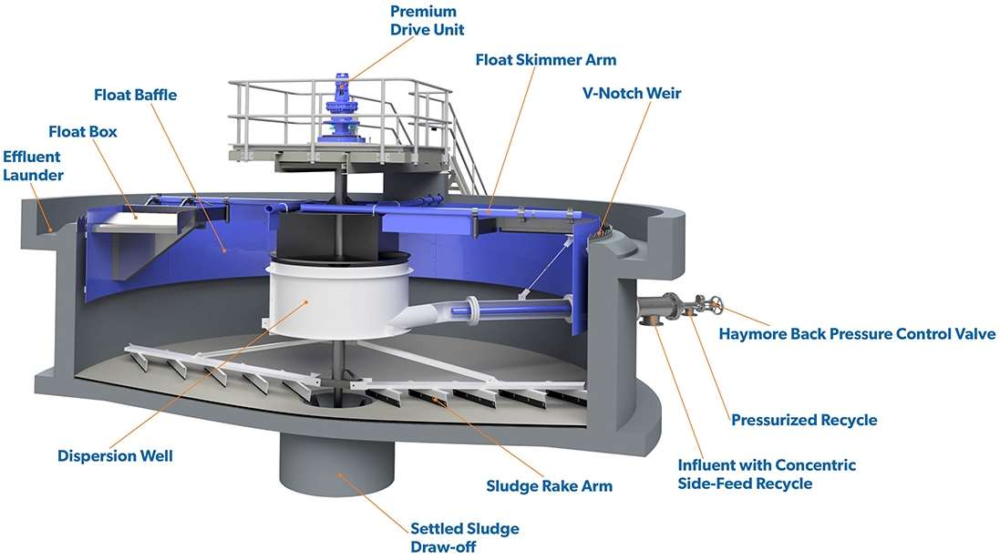
    - **Hình này chứng minh điều gì**
      - Bố cục đối xứng trục với dòng nạp vào tâm bể và quá trình phân ly pha theo phương bán kính.
    - **Từ đâu mà thấy được**
      - Giếng phân phối tâm (Dispersion Well) nối ống nạp đồng tâm và van giảm áp Haymore; váng nổi thu gom qua cần gạt Float Skimmer Arm, nước trong tràn qua đập V-Notch Weir vào máng thu chu vi.
- Cơ cấu máng hớt bọt xoắn ốc dạng nón (Spiral / Conical Scoop Skimmer) quay trên cầu xoay múc bùn nổi đưa vào phễu xả trung tâm.
  - Máng hớt bọt hình nón xoay quanh trục ngang đồng thời di chuyển theo cầu quay tròn quanh tâm bể.
  - Cạnh xúc của máng xoắn múc nhẹ nhàng lớp bọt cô đặc trên mặt nước mà không làm xáo trộn lớp nước trong phía dưới.
  - Tốc độ quay của cơ cấu máng xoắn được điều chỉnh chậm để hạn chế tối đa sự xáo trộn thủy lực và phá vỡ cấu trúc lớp bọt nổi.
  - Bùn nổi được dẫn xoắn vào tâm máng nón và chảy vào phễu xả trung tâm để thoát ra ngoài bằng trọng lực.
  - **Hình 12.** Máng hớt bọt xoắn ốc dạng nón trong bể DAF hình tròn
    - 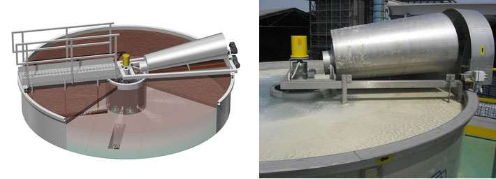
    - **Hình này chứng minh điều gì**
      - Cấu tạo dạng nón và cụm thiết bị thực tế gom bọt váng dọc bán kính xả vào giếng thu trung tâm.
    - **Từ đâu mà thấy được**
      - Hình trái: mô hình 3D bể tròn với trống nón thuôn nhỏ dần nối vào phễu xả tâm.
      - Hình phải: ảnh thực tế máng nón kim loại vớt lớp bọt trắng và cụm động cơ tại trục tâm.
- Kết cấu bể DAF hình tròn công nghiệp chế tạo bằng thép không gỉ ($\text{inox 304}$ hoặc $\text{inox 316}$) được trang bị cầu công tác xoay (rotating bridge) tích hợp hệ thống gạt bùn bề mặt và động cơ dẫn động (Drive unit).
  - Thân bể hình trụ tròn bằng thép không gỉ gia cường bằng các thanh giằng và sườn gia cường quanh chu vi thành bể.
  - Cầu công tác xoay bắc ngang bán kính bể, có lan can bảo vệ và sàn thao tác phục vụ kiểm tra, bảo dưỡng.
  - Cụm động cơ giảm tốc kéo cầu quay và dẫn động máng hớt bọt xoay liên tục trên mặt thoáng của lớp bọt cặn màu nâu đặc.
  - Vận tốc quay của cầu xoay thường được khống chế từ $1$ đến $3\text{ vòng/h}$ nhằm duy trì sự ổn định của vùng lắng và vùng nổi.
  - **Hình 13.** Ảnh thực tế bể DAF hình tròn bằng thép không gỉ
    - 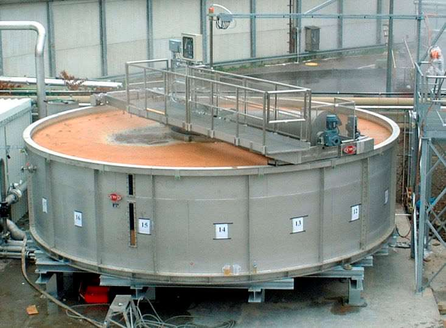
    - **Hình này chứng minh điều gì**
      - Cầu công tác xoay mang động cơ dẫn động và cơ cấu gạt thu gom váng bùn trên thân bể trụ tròn inox.
    - **Từ đâu mà thấy được**
      - Cầu thép bắc ngang trên mặt bể, đầu cầu gắn cụm động cơ cạnh trục gạt trên lớp bùn nâu.
- Bể DAF hình tròn nông (Shallow Circular DAF) ứng dụng nguyên lý vận tốc triệt tiêu (zero-velocity principle) với cầu cào quay kết hợp máng xoắn múc bọt di động.
  - Chiều sâu mức nước trong bể rất nông (thường từ $0{,}4\text{ m}$ đến $0{,}8\text{ m}$), giúp rút ngắn tối đa quãng đường nổi của vi bọt khí và giảm thời gian lưu nước xuống $3$ đến $5\text{ phút}$.
  - Dòng nước cấp vào được phân phối qua cụm ống nạp quay chuyển động ngược chiều với vận tốc dòng vào, tạo trạng thái vận tốc thủy lực tương đối bằng $0$ ($v_{\text{rel}} \approx 0$) so với thân bể.
  - Trạng thái tĩnh thủy lực triệt tiêu giúp các bọt khí nổi thẳng đứng nhanh chóng mà không bị xáo trộn bởi dòng chảy xoáy cuộn.
  - Cầu cào quay mang theo máng xoắn múc bọt di động quét liên tục trên diện tích mặt thoáng, gom bọt váng vào giếng xả trung tâm.
  - Đáy bể trang bị hệ thống thanh cào bùn gom các hạt cặn lắng nặng về hố xả cặn trung tâm.
  - **Hình 14.** Sơ đồ phối cảnh cắt bể DAF hình tròn nông
    - 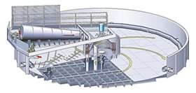
    - **Hình này chứng minh điều gì**
      - Cơ cấu máng xoắn thu bọt gắn trên cầu quay và giàn cào bùn đáy trong bể hình trụ nông.
    - **Từ đâu mà thấy được**
      - Ống nón xoắn nằm ngang trên cầu quay gạt bọt vào trục tâm; bên dưới lắp giàn cào cặn đáy.
- Sơ đồ cấu tạo cơ khí chi tiết của bể DAF hình tròn thể hiện hệ thống ống nạp trung tâm, cánh cào đáy, cơ cấu quay máng vớt váng và các cửa thu nước trong quanh chu vi đáy bể.
  - Cột cấp nước trung tâm và khớp quay phân phối đưa dòng nước thải kết hợp dòng bọt khí vào cụm ống phân phối quay.
  - Trục quay trung tâm kết nối với cụm dẫn động cầu quay và cơ cấu truyền động ngoại vi.
  - Cụm máng xoắn hớt bọt dạng nón được dẫn động độc lập để vớt bùn nổi đưa về phễu thu bọt trung tâm.
  - Dàn ống cào bùn đáy kết nối với cánh cào đáy quét bùn cặn lắng trên toàn bộ đáy bồn về rãnh thu cặn.
  - Nước trong sau tuyển nổi được thu gom qua hệ thống vách ngăn, rãnh thu nước quanh chu vi và ống xả nước trong đáy bể.
  - **Hình 15.** Sơ đồ cấu tạo cơ khí chi tiết bể DAF hình tròn nông
    - 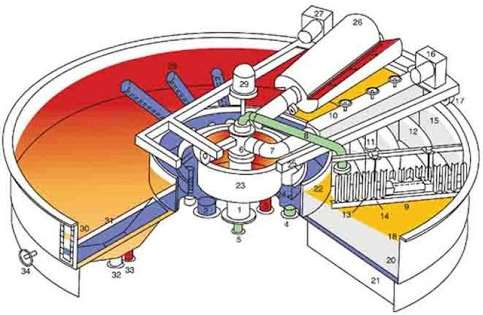
    - **Hình này chứng minh điều gì**
      - Bố trí liên kết cơ khí đồng bộ giữa cầu quay vớt váng, giàn cào bùn đáy và hệ thu nước trong.
    - **Từ đâu mà thấy được**
      - Trục xoay liên kết cầu quay mang máng xoắn vớt váng mặt thoáng và giàn cào cặn đáy; vành ngoài bố trí cụm truyền động chạy ray cùng các cửa thu nước trong ở chu vi đáy.
- Cụm cơ cấu máng xoắn hớt bọt (Scoop skimmer assembly) và hệ dẫn động được chế tạo bằng thép không gỉ với động cơ điện giảm tốc gắn trực tiếp trên khung cầu quay.
  - Cần máng xoắn và ống dẫn xả bùn nổi chế tạo bằng thép không gỉ, gắn cơ cấu chốt điều chỉnh cao độ nhúng sâu của lưỡi máng hớt.
  - Động cơ điện và hộp giảm tốc gắn trực tiếp trên khung cầu quay cung cấp mô-men xoắn dẫn động cánh xoắn múc bọt.
  - Cụm lược chắn và cánh gạt phụ hỗ trợ định hướng bọt nổi vào miệng máng xoắn, chống thất thoát hoặc trượt bọt ngược lại mặt bể.
  - **Hình 16.** Chi tiết cụm cơ cấu máng xoắn hớt bọt và động cơ truyền động
    - 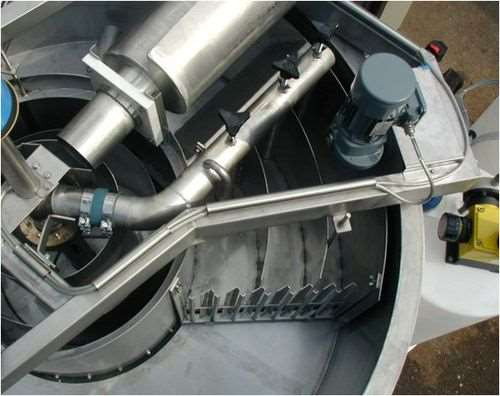
    - **Hình này chứng minh điều gì**
      - Cấu tạo thực tế của cụm máng xoắn và động cơ giảm tốc bằng thép không gỉ lắp trên dầm quay.
    - **Từ đâu mà thấy được**
      - Ảnh chụp từ trên xuống: động cơ giảm tốc gắn trên khung dầm, truyền động cho máng xoắn inox.

##### Cấu tạo bình áp lực bão hòa khí điển hình (Typical pressure vessel)
- Cấu tạo bình bão hòa áp lực (Typical pressure vessel / saturator) sử dụng dàn phân phối dòng nước tuần hoàn (Recycle flow distributor) phun nước qua lớp vật liệu đệm truyền khối trơ (Inert mass transfer packing) tiếp xúc với khí nén (Air) để bão hòa khí vào nước ở đáy bình (Pool of saturated water), kết nối đồng bộ với cụm bơm áp lực trong hệ thống DAF thực tế.
  - Dòng nước tuần hoàn từ quá trình DAF (Recycle water from DAF process) được đưa vào đỉnh bình bão hòa áp lực.
  - Bộ phân phối dòng tuần hoàn (Recycle flow distributor) dạng dàn phun tia phân tán đều nước từ trên xuống trên toàn bộ tiết diện bình.
  - Khí nén (Air) được nạp vào bình áp lực từ đỉnh để duy trì áp suất bão hòa cao (thường từ $3\text{ bar}$ đến $6\text{ bar}$, tương đương $300\text{ kPa}$ đến $600\text{ kPa}$).
  - Lớp vật liệu đệm truyền khối trơ (Inert mass transfer packing) bố trí ở thân bình tạo diện tích bề mặt tiếp xúc cực lớn giữa màng nước chảy xuống và không khí nén, tối đa hóa hiệu suất hòa tan khí theo định luật Henry.
  - Hiệu suất bão hòa khí của bình có đệm thường đạt từ $85\%$ đến $95\%$ độ bão hòa lý thuyết ở áp suất vận hành.
  - Vùng chứa nước bão hòa khí (Pool of saturated water) hình thành ở đáy bình áp lực, tạo dự trữ thể tích nước ngậm khí hòa tan ổn định.
  - Dòng nước tuần hoàn ngậm bọt khí hòa tan từ đáy bình được dẫn đến châm vào vùng phản ứng của bể DAF (Recycle to DAF reaction zone injection) qua van giảm áp.
  - Khi qua van giảm áp, hiện tượng giảm áp đột ngột giải phóng bọt khí mịn dạng mây trắng (whitewater) với mật độ bọt khí rất cao.
  - Bình áp lực bão hòa khí dạng bồn thép áp lực hình trụ đứng (mã hiệu bình áp lực $\text{19254}$) được lắp đặt trên bệ đỡ chắc chắn cạnh bể tuyển nổi.
  - Cụm bơm tạo áp (pressurizing pump) đặt dưới chân bồn thực hiện chức năng hút nước trong tuần hoàn và nén vào bình áp lực.
  - Hệ thống đường ống cấp nước, đường ống khí nén và van điều khiển áp suất kết nối giữa bình bão hòa khí và bể tuyển nổi DAF hình tròn lân cận.
  - **Hình 17.** Sơ đồ cấu tạo bình bão hòa áp lực có lớp đệm và ảnh trạm DAF thực tế
    - 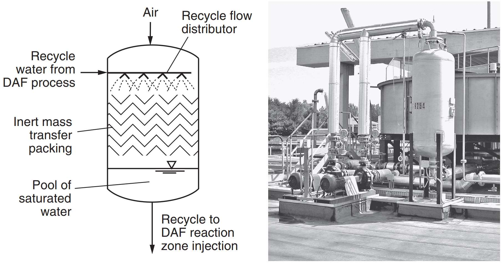
    - **Hình này chứng minh điều gì**
      - Cơ chế hòa tan khí trong khoang đệm và quy cách lắp đặt bình áp lực thực tế ngoài trạm xử lý.
    - **Từ đâu mà thấy được**
      - Nửa bên trái: sơ đồ cắt thể hiện dàn phân phối phun nước qua khối đệm zíc-zắc xuống đáy bình; nửa bên phải: ảnh bồn áp lực trụ đứng đặt liền kề cụm bơm tuần hoàn và đường ống.

#### 4.4 Thông số và tính toán thiết kế DAF (Design Information for DAF)

- Cơ sở tính toán thiết kế hệ thống tuyển nổi khí hòa tan (DAF - Dissolved-Air Flotation system) dựa trên việc xác định tỷ lệ khối lượng không khí trên chất rắn ($A/S\text{ ratio}$ - air to solids ratio), biểu thị bằng đơn vị $\text{mg air/mg solids}$ ($\text{mg/mg}$).
- Các đại lượng và thông số trong phương trình tính toán tỷ lệ $A/S$:
  - $A/S$: tỷ lệ không khí trên chất rắn (air to solids ratio), tính bằng $\text{mg air/mg solids}$ ($\text{mg/mg}$).
  - $s_a$: độ hòa tan của không khí trong nước ở điều kiện áp suất khí quyển (air solubility), tính bằng $\text{mL/L}$.
  - $f$: phần không khí hòa tan ở áp suất $P$ (fraction of air dissolved at pressure $P$, saturator efficiency / hệ số bão hòa), thường lấy giá trị tiêu chuẩn $f = 0.5$ (dao động trong khoảng $0.5\text{--}0.8$ phụ thuộc vào hiệu suất tiếp xúc của bình tích áp).
  - $P$: áp suất vận hành tuyệt đối của hệ thống (absolute pressure), tính bằng $\text{atm}$ ($P = P_{\text{gauge}} + 1\text{ atm}$).
  - $S_a$: nồng độ chất rắn lơ lửng của dòng nước thải đầu vào (influent suspended solids), tính bằng $\text{mg/L}$.
  - $R$: lưu lượng dòng tuần hoàn áp lực (pressurized recycle), tính bằng $\text{m}^3/\text{d}$.
  - $Q$: lưu lượng dòng nước thải nạp vào bể (mixed-liquor flow), tính bằng $\text{m}^3/\text{d}$.
- Độ hòa tan của không khí trong nước ($s_a$) phụ thuộc nghịch biến vào nhiệt độ của nước thải:
  - Ở nhiệt độ $0^\circ\text{C}$: độ hòa tan không khí đạt $s_a = 29.2\text{ mL/L}$.
  - Ở nhiệt độ $10^\circ\text{C}$: độ hòa tan không khí đạt $s_a = 22.8\text{ mL/L}$.
  - Ở nhiệt độ $20^\circ\text{C}$: độ hòa tan không khí đạt $s_a = 18.7\text{ mL/L}$.
  - Ở nhiệt độ $30^\circ\text{C}$: độ hòa tan không khí đạt $s_a = 15.7\text{ mL/L}$.
- Phương trình tính tỷ lệ $A/S$ cho hệ thống DAF không có dòng tuần hoàn (Without recycle):
  $$\frac{A}{S} = \frac{1.3 s_a (f P - 1)}{S_a}$$
  - Hằng số $1.3$ là hệ số chuyển đổi đơn vị thể tích của không khí ($\text{mL}$) sang khối lượng ($\text{mg}$) ở điều kiện chuẩn ($\rho_{\text{air}} \approx 1.3\text{ mg/mL}$).
  - Hiệu số $(fP - 1)$ đại diện cho lượng không khí tách ra khỏi dung dịch dạng bọt khí mịn khi hạ áp từ áp suất vận hành tuyệt đối $P$ về áp suất khí quyển $1\text{ atm}$.
- Phương trình tính tỷ lệ $A/S$ cho hệ thống DAF có dòng tuần hoàn áp lực (With recycle):
  $$\frac{A}{S} = \frac{1.3 s_a (f P - 1) R}{S_a Q}$$
  - Dòng nước sạch sau lắng/tuyển nổi được tuần hoàn một phần ($R$) qua bơm áp lực và bình tích áp để hòa tan không khí trước khi trộn chung với dòng nước thải thô ($Q$).
    - **Hình 18.** Công thức xác định tỷ lệ khí/chất rắn ($A/S$) cho hệ thống DAF có dòng tuần hoàn áp lực
      - 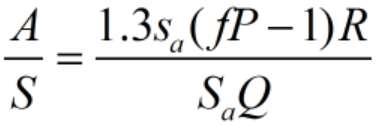
      - **Hình này chứng minh điều gì**
        - Thiết lập phương trình định lượng tỷ lệ $A/S$ tỷ lệ thuận với áp suất $P$, lưu lượng tuần hoàn $R$ và tỷ lệ nghịch với tải lượng cặn nạp $S_a Q$.
      - **Từ đâu mà thấy được**
        - Tử số chứa tích số hằng số $1.3$, độ hòa tan $s_a$, hiệu số $(fP - 1)$ và lưu lượng tuần hoàn $R$.
        - Mẫu số chứa tích số giữa nồng độ cặn dòng vào $S_a$ và lưu lượng dòng nước thải $Q$.

##### 4.4.1 Biến số và thông số thiết kế khuyến nghị (Design Variables and Recommendations)

- Các biến số thiết kế then chốt của hệ thống tuyển nổi DAF (design variables) bao gồm:
  - Tỷ lệ khí trên chất rắn ($A/S\text{ ratio}$).
  - Áp suất vận hành bình tích áp ($P$ - pressure).
  - Tỷ lệ dòng tuần hoàn (recycle ratio).
  - Nồng độ chất rắn nạp vào bể (feed solids conc.).
  - Thời gian lưu nước trong bể (retention period).
- Các cấu phần chính cấu thành một hệ thống tuyển nổi hoàn chỉnh (principal components of a flotation system):
  - Bơm tăng áp (pressurizing pump).
  - Thiết bị châm/nạp không khí (air-injection facilities).
  - Bình tích áp / bình chịu áp lực (pressure vessel).
  - Van điều khiển áp lực / van giảm áp (pressure control valve).
  - Đơn vị bể tuyển nổi (flotation unit).
- Thời gian lưu nước trong bể tuyển nổi (detention time of the flotation tank):
  - Thời gian lưu nước tiêu chuẩn dao động từ $20$ đến $30\text{ phút}$ ($20\text{ to }30\text{ mins}$).
  - Yêu cầu thời gian lưu nước dài hơn đối với quá trình cô đặc bùn (longer retention time is required for sludge thickening).
- Bình tích áp (pressure vessel):
  - Thời gian lưu nước kéo dài vài phút, từ $1$ đến $3\text{ phút}$ ($1\text{--}3\text{ mins}$), đảm bảo đủ thời gian để không khí hòa tan hoàn toàn vào dòng chất lỏng.
- Vận tốc nổi của các bông cặn kết hợp bọt khí (flotation velocity of the bubble-solid flocs):
  - Vận tốc tuyển nổi nằm trong dải từ $2.56$ đến $12.7\text{ cm/min}$ ($2.56\text{ – }12.7\text{ cm/min}$).
  - Vận tốc tuyển nổi tỷ lệ thuận với tỷ lệ $A/S$ (proportional to the $A/S$ ratio).
- Bảng thông số thiết kế khuyến nghị cho hệ thống DAF (Recommendation for DAF parameters):
  - Tỷ lệ khí/chất rắn ($A/S\text{ ratio}$): dải giá trị điển hình từ $0.005$ đến $0.06$ (không thứ nguyên / $\text{mg/mg}$).
  - Tải trọng bề mặt (Surface loading rate): dao động từ $80$ đến $240\text{ m}^3/\text{m}^2\cdot\text{day}$.
  - Độ sâu bể tuyển nổi (Depth): giá trị thiết kế $\le 3\text{ m}$.
  - Chiều dài bể tuyển nổi (Length): giá trị thiết kế $\le 11\text{ m}$.
  - Tỷ lệ tuần hoàn (Recycle ratio): từ $15$ đến $120\%$ lưu lượng dòng vào ($15\text{ – }120\% \text{ of influent flow}$).
  - Khoảng cách vòi phun (Nozzle spacing): từ $0.2$ đến $0.3\text{ m}$.
  - Tải trọng thủy lực bình tích áp (Pressure vessel hydraulic loading rate): từ $1440$ đến $1920\text{ m}^3/\text{m}^2\cdot\text{day}$.
  - Chiều sâu lớp vật liệu đệm trong bình tích áp (Pressure vessel packing depth): từ $1$ đến $1.5\text{ m}$.
  - Tải lượng nạp khí (Air loading): từ $6$ đến $10\text{ g air/m}^3\text{ raw water}$ (gam không khí trên mỗi $\text{m}^3$ nước thô).
  - Kích thước bọt khí (Air bubble size): từ $10$ đến $100\ \mu\text{m}$.

##### 4.4.2 Thu gom váng nổi và kiểm soát tổn thất áp lực (Float Removal and Headloss Control)

- Phương pháp thu gom váng bọt nổi (Float removal) được phân thành hệ thống cơ học (mechanical systems) và hệ thống thủy lực (hydraulic systems), trong đó hệ thống cơ học được ưu tiên lựa chọn hơn (mechanical system is preferred):
  - Hệ thống cơ học (mechanical systems): tạo ra bùn đậm đặc hơn với nồng độ chất rắn tổng cộng đạt từ $2$ đến $3\%\text{ TS}$ ($2\text{--}3\%\text{ total solids}$).
  - Hệ thống thủy lực (hydraulic systems): tạo ra bùn loãng với nồng độ chất rắn tổng cộng chỉ đạt $0.5\%\text{ TS}$ ($0.5\%\text{ total solids}$).
- Tổn thất áp lực trong hệ thống ống góp (headloss in manifold systems) có thể dẫn đến hiện tượng hình thành bọt khí sớm (cause premature bubble formation) và kết tụ bọt khí lại với nhau (bubble coalescence), làm suy giảm diện tích tiếp xúc và hiệu suất tuyển nổi.
- Các phương pháp hạn chế và kiểm soát tổn thất áp lực trong hệ thống ống góp (methods to limit headloss):
  - Duy trì mực nước trong bình tích áp luôn cao hơn mực nước trong bể DAF (keep water level in the pressure vessel above DAF water level).
  - Bố trí bình tích áp đặt càng gần bể DAF càng tốt (place pressure vessel close as possible to the DAF).
  - Giảm thiểu tối đa các phụ kiện cút nối trên tuyến đường ống ở phía hạ lưu bình tích áp (minimize fittings on piping downstream of pressure vessel).

##### 4.4.3 Ví dụ tính toán thiết kế DAF (Worked Design Example)

- **Đề bài**: Thiết kế hệ thống DAF trong hai trường hợp: không có dòng tuần hoàn áp lực (without pressurized recycle) và có dòng tuần hoàn áp lực (with pressurized recycle) theo các thông số thiết kế cho trước.
- **Dữ kiện**:
  - Tỷ lệ khí/chất rắn tối ưu: $(A/S)_{\text{opt}} = 0.008\text{ mg/mg}$ (Optimum A/S ratio).
  - Nhiệt độ nước thải: $T = 20^\circ\text{C}$; độ hòa tan không khí tương ứng: $s_a = 18.7\text{ mL/L}$ (Air solubility).
  - Áp suất hệ thống tuần hoàn: $P = 5\text{ atm}$ (Recycle-system pressure).
  - Hệ số bão hòa không khí ở áp suất $P$: $f = 0.5$ (Fraction of saturation / saturator efficiency).
  - Tải trọng bề mặt bể tuyển nổi: $\text{SLR} = 100\text{ m}^3/\text{m}^2\cdot\text{day}$ (Surface-loading rate).
  - Lưu lượng nước thải thiết kế trung bình: $Q = 400\text{ m}^3/\text{day}$ (Average flowrate design).
  - Nồng độ chất rắn lơ lửng dòng vào: $S_a = 3000\text{ mg/L}$ (SS concentration of influent).
- **Quy tắc áp dụng**:
  - Công thức tính tỷ lệ khí/chất rắn cho hệ thống không có tuần hoàn: $\frac{A}{S} = \frac{1.3 s_a (fP - 1)}{S_a}$. Nguồn: Without recycle, Slide 14.
  - Công thức tính tỷ lệ khí/chất rắn cho hệ thống có tuần hoàn áp lực: $\frac{A}{S} = \frac{1.3 s_a (fP - 1)R}{S_a Q}$. Nguồn: With recycle, Slide 14.
  - Diện tích bề mặt bể tuyển nổi DAF: $A_{\text{flotation}} = \frac{Q}{\text{SLR}}$ (hoặc $A_{\text{flotation}} = \frac{Q + R}{\text{SLR}}$ khi tính gộp cả dòng tuần hoàn). Nguồn: Recommendation for DAF, Slide 16.
  - Khoảng tỷ lệ tuần hoàn khuyến nghị: $R/Q = 15\text{--}120\%$. Nguồn: Recommendation for DAF, Slide 16.
  - Chiều sâu bể khuyến nghị: $H \le 3\text{ m}$; chiều dài bể $L \le 11\text{ m}$; thời gian lưu nước bể DAF: $20\text{--}30\text{ phút}$. Nguồn: Slide 15 & Slide 16.
- **Lời giải**:
  - **Trường hợp 1**: Thiết kế hệ thống DAF không có dòng tuần hoàn áp lực (without recycle).
    - **Bước 1**: Xác định áp suất vận hành yêu cầu ($P$) để đạt tỷ lệ khí/chất rắn tối ưu $A/S = 0.008\text{ mg/mg}$.
      - Căn cứ: Công thức tính tỷ lệ $A/S$ cho hệ thống không tuần hoàn (Slide 14):
        $$\frac{A}{S} = \frac{1.3 s_a (fP - 1)}{S_a} \implies fP - 1 = \frac{(A/S) \times S_a}{1.3 s_a}$$
      - Nhìn vào: Thay các giá trị $A/S = 0.008$, $S_a = 3000\text{ mg/L}$, $s_a = 18.7\text{ mL/L}$, $f = 0.5$:
        $$0.5 P - 1 = \frac{0.008 \times 3000}{1.3 \times 18.7} = \frac{24}{24.31} \approx 0.9872$$
        $$0.5 P = 1 + 0.9872 = 1.9872 \implies P = \frac{1.9872}{0.5} \approx 3.974\text{ atm} \approx 3.97\text{ atm}$$
        (Áp suất đo gauge tương ứng: $P_{\text{gauge}} = P - 1\text{ atm} = 2.97\text{ atm} \approx 301\text{ kPa}$).
    - **Bước 2**: Xác định diện tích bề mặt yêu cầu của bể tuyển nổi ($A_{\text{flotation}}$).
      - Căn cứ: Tải trọng bề mặt $\text{SLR} = 100\text{ m}^3/\text{m}^2\cdot\text{day}$ và lưu lượng dòng vào $Q = 400\text{ m}^3/\text{day}$:
        $$A_{\text{flotation}} = \frac{Q}{\text{SLR}} = \frac{400\text{ m}^3/\text{day}}{100\text{ m}^3/\text{m}^2\cdot\text{day}} = 4.0\text{ m}^2$$
    - **Bước 3**: Kiểm tra kích thước và thời gian lưu nước của bể tuyển nổi không tuần hoàn.
      - Căn cứ: Chọn chiều sâu nước trong bể $H = 2.0\text{ m}$ (thỏa mãn điều kiện khuyến nghị $H \le 3\text{ m}$ trên Slide 16):
        $$V = A_{\text{flotation}} \times H = 4.0\text{ m}^2 \times 2.0\text{ m} = 8.0\text{ m}^3$$
      - Thời gian lưu nước trong bể DAF:
        $$t = \frac{V}{Q} = \frac{8.0\text{ m}^3}{400\text{ m}^3/\text{day}} = 0.02\text{ day} = 0.02 \times 24 \times 60\text{ min} = 28.8\text{ phút}$$
        (Giá trị $28.8\text{ phút}$ nằm hoàn toàn trong dải khuyến nghị $20\text{--}30\text{ phút}$ theo Slide 15).
  - **Trường hợp 2**: Thiết kế hệ thống DAF có dòng tuần hoàn áp lực (with pressurized recycle).
    - **Bước 1**: Xác định lưu lượng dòng tuần hoàn áp lực ($R$) với áp suất $P = 5\text{ atm}$.
      - Căn cứ: Công thức tính tỷ lệ $A/S$ cho hệ thống có tuần hoàn (Slide 14):
        $$\frac{A}{S} = \frac{1.3 s_a (fP - 1) R}{S_a Q} \implies R = \frac{(A/S) \times S_a \times Q}{1.3 s_a (fP - 1)}$$
      - Nhìn vào: Với $P = 5\text{ atm}$ và $f = 0.5$, hệ số áp lực hữu hiệu là:
        $$fP - 1 = 0.5 \times 5 - 1 = 1.5$$
      - Tử số biểu diễn lượng khí cần nạp tương ứng tải lượng cặn:
        $$(A/S) \times S_a \times Q = 0.008 \times 3000\text{ mg/L} \times 400\text{ m}^3/\text{day} = 24 \times 400 = 9600\text{ g/day}$$
      - Mẫu số biểu diễn lượng khí hòa tan tách ra trên một đơn vị thể tích dòng tuần hoàn:
        $$1.3 s_a (fP - 1) = 1.3 \times 18.7 \times 1.5 = 36.465$$
      - Tính lưu lượng dòng tuần hoàn $R$:
        $$R = \frac{9600}{36.465} \approx 263.27\text{ m}^3/\text{day} \approx 263.3\text{ m}^3/\text{day}$$
    - **Bước 2**: Xác định tỷ lệ tuần hoàn ($R/Q$) và kiểm tra theo thông số khuyến nghị.
      - Căn cứ: Tỷ lệ tuần hoàn phần trăm so với lưu lượng nước thải vào:
        $$\text{Recycle ratio} = \frac{R}{Q} \times 100\% = \frac{263.27}{400} \times 100\% \approx 65.82\%$$
        (Giá trị $65.8\%$ nằm trong dải khuyến nghị $15\text{--}120\%$ của bảng thiết kế trên Slide 16).
    - **Bước 3**: Xác định diện tích bề mặt yêu cầu của bể tuyển nổi DAF có tuần hoàn.
      - Căn cứ: Tính theo tổng tải trọng thủy lực nạp vào bể ($Q + R$):
        $$Q_{\text{total}} = Q + R = 400 + 263.27 = 663.27\text{ m}^3/\text{day}$$
        $$A_{\text{flotation}} = \frac{Q + R}{\text{SLR}} = \frac{663.27\text{ m}^3/\text{day}}{100\text{ m}^3/\text{m}^2\cdot\text{day}} \approx 6.63\text{ m}^2$$
        (Trường hợp chỉ tính diện tích bề mặt theo dòng vào $Q$: $A = \frac{400}{100} = 4.0\text{ m}^2$; khi tính an toàn thủy lực cho cả dòng tuần hoàn thì $A = 6.63\text{ m}^2$).
    - **Bước 4**: Kiểm tra kích thước và thời gian lưu thủy lực của bể có tuần hoàn.
      - Căn cứ: Chọn chiều sâu nước trong bể $H = 2.5\text{ m}$ (thỏa mãn điều kiện khuyến nghị $H \le 3\text{ m}$):
        $$V = A_{\text{flotation}} \times H = 6.63\text{ m}^2 \times 2.5\text{ m} \approx 16.58\text{ m}^3$$
      - Thời gian lưu nước tính theo tổng lưu lượng $(Q + R)$:
        $$t = \frac{V}{Q + R} = \frac{16.58}{663.27}\text{ day} \approx 0.025\text{ day} = 0.025 \times 1440\text{ min} = 36\text{ phút}$$
        (Thời gian lưu tính riêng theo dòng vào $Q$: $t_Q = \frac{16.58}{400} \times 1440 \approx 59.7\text{ phút}$).
- **Kết quả**:
  - Hệ thống không tuần hoàn (Without recycle):
    - Áp suất vận hành yêu cầu: $P = 3.97\text{ atm}$ (áp suất đo $P_{\text{gauge}} = 2.97\text{ atm}$).
    - Diện tích bề mặt bể DAF: $A_{\text{flotation}} = 4.0\text{ m}^2$.
    - Thể tích bể DAF ($H = 2.0\text{ m}$): $V = 8.0\text{ m}^3$, thời gian lưu nước $t = 28.8\text{ phút}$.
  - Hệ thống có tuần hoàn áp lực (With recycle, $P = 5\text{ atm}$):
    - Lưu lượng dòng tuần hoàn áp lực: $R \approx 263.3\text{ m}^3/\text{day}$.
    - Tỷ lệ tuần hoàn: $R/Q \approx 65.8\%$ (phù hợp dải khuyến nghị $15\text{--}120\%$).
    - Diện tích bề mặt bể DAF (tính theo $Q + R$): $A_{\text{flotation}} \approx 6.63\text{ m}^2$ (hoặc $4.0\text{ m}^2$ nếu tính theo $Q$).
    - Thể tích bể DAF ($H = 2.5\text{ m}$): $V \approx 16.58\text{ m}^3$, thời gian lưu nước $t = 36\text{ phút}$ (theo $Q + R$).
- **Kiểm tra lại**:
  - So sánh kỹ thuật giữa hai giải pháp:
    - Phương án không tuần hoàn đòi hỏi nén trực tiếp toàn bộ dòng nước thải $Q = 400\text{ m}^3/\text{ngày}$ chứa hàm lượng cặn cao $S_a = 3000\text{ mg/L}$ qua bơm cao áp và bình tích áp ở $3.97\text{ atm}$, dễ gây tắc nghẽn, mài mòn cánh bơm và bám bẩn lớp đệm.
    - Phương án tuần hoàn áp lực chỉ nén dòng nước sạch sau tuyển nổi $R = 263.3\text{ m}^3/\text{ngày}$ ở áp suất $5\text{ atm}$, bảo vệ bơm và hệ thống bão hòa khí khỏi bị cặn bẩn bám dính, vận hành ổn định và kéo dài tuổi thọ thiết bị.
  - Tỷ lệ tuần hoàn $65.8\%$ nằm hoàn toàn trong phạm vi tối ưu $15\text{--}120\%$ của tài liệu giảng dạy (Slide 16).

### Chương 3.5: Quá trình Cơ học - Lọc Nước thải (Filtration)

#### Overview

- Thông tin chuyên đề học phần:
  - Môn học: Kỹ thuật Xử lý Nước thải (Wastewater Treatment Engineering).
  - Chuyên đề: Phần 5 - Lọc Nước thải (5. Filtration), thuộc Chương 3: Các quá trình đơn vị cơ học / vật lý (Physical Unit Processes).
  - Giảng viên phụ trách: TS. Nguyễn Hoàng Dũng (Dr. Nguyen Hoang Dung).
  - Thời gian và địa điểm: Học kỳ 1, năm học 2026, TP. Hồ Chí Minh (1st semester, academic year 2026 | Ho Chi Minh City).

##### Content Outline

- Đề cương cấu trúc chuyên đề Lọc Nước thải gồm 9 nội dung chính:
  - 1. Tổng quan (Overview): Khái niệm lọc, vai trò bậc ba và vị trí công nghệ trong trạm xử lý nước thải.
  - 2. Phân loại (Classification): Lọc tầng sâu qua hạt (depth filtration), lọc bề mặt (surface filtration), lọc màng (membrane filtration).
  - 3. Các dạng lớp vật liệu lọc (Type of media bed): Lớp đơn (monomedia), lớp đơn tầng sâu (deep-bed monomedia), lớp kép (dual media).
  - 4. Các giai đoạn của chu trình lọc (Steps of filtration process): Giai đoạn lọc thu gom cặn và giai đoạn rửa ngược (backwash).
  - 5. Cơ chế thu giữ hạt cặn trong lọc tầng sâu (Mechanism of particle removal in depth filtration): Cơ chế vận chuyển hạt (transport) và cơ chế dính bám hạt (attachment).
  - 6. Đặc tính của vật liệu lọc dạng hạt (Properties of granular filter media): Kích thước hiệu dụng ($d_{10}$), hệ số đồng nhất ($U_c$), khối lượng riêng ($\rho_s$), độ rỗng ($\varepsilon$), độ cầu ($s$).
  - 7. Thủy lực dòng chảy qua môi trường hạt (Hydraulics of flow through granular media): Tổn thất áp lực lớp lọc sạch (clean-bed head loss) và độ giãn nở lớp lọc khi rửa ngược (bed expansion).
  - 8. Thiết kế bể lọc nhanh (Rapid filter design): Vận tốc lọc ($v_F$), diện tích bề mặt lọc ($A$), hệ thống phân phối nước và thu gom rửa ngược.
  - 9. Bể lọc áp lực (Pressure filter): Cấu tạo bồn kín, đặc tính vận hành dưới áp lực và phạm vi áp dụng thực tế.

##### Definition of Filtration

- Định nghĩa quá trình lọc (Filtration):
  - Lọc là quá trình tách và loại bỏ các hạt cặn rắn (solids / particles) ra khỏi hệ huyền phù (suspension) bằng cách cho huyền phù đi qua một môi trường xốp (porous medium).
  - Huyền phù là hệ hai pha (two-phase system) gồm các hạt rắn lơ lửng phân tán trong pha lỏng.
  - Môi trường xốp (porous medium) cho chất lỏng sạch thấm qua các khe rỗng mao quản và giữ các hạt cặn lại.

##### Role of Filtration in Wastewater Treatment

- Vai trò và vị trí kỹ thuật của quá trình lọc trong công nghệ xử lý nước thải:
  - Là công đoạn tùy chọn trong xử lý nước thải thông thường (Optional process in wastewater treatment):
    - Các trạm xử lý xả thải thông thường ra nguồn tiếp nhận ít khi yêu cầu bắt buộc phải có bể lọc.
    - Bể lọc trở nên thiết yếu và bắt buộc khi áp dụng cho các mục đích tái sử dụng nước (water reuse applications).
    - Các ứng dụng tái sử dụng bao gồm: nước làm mát công nghiệp, nước cấp nồi hơi, tưới tiêu cảnh quan đô thị, tiêu chuẩn xả thải vào nguồn nước nhạy cảm, và bổ cập tầng chứa nước ngầm (aquifer recharge).
  - Là công đoạn xử lý bậc ba để tăng cường loại bỏ chất rắn lơ lửng (Tertiary Treatment for enhanced removal of suspended solids):
    - Đóng vai trò là bước hoàn thiện / đánh bóng chất lượng nước (tertiary polishing step).
    - Tách bỏ triệt để các bông bùn mịn và hạt cặn còn sót lại sau bể lắng thứ cấp sinh học (secondary clarifier).
    - Nâng cao chất lượng nước sau xử lý:
      - Giảm nồng độ chất rắn lơ lửng tổng cộng ($\text{TSS}$) xuống mức tiêu chuẩn nghiêm ngặt ($\text{TSS} < 2\text{--}5\text{ mg/L}$).
      - Loại bỏ hàm lượng chất hữu cơ dạng hạt gồm $\text{BOD}_5$ dạng hạt ($\text{particulate BOD}_5$) và $\text{COD}$ dạng hạt ($\text{particulate COD}$).
      - Tách bỏ photpho dạng hạt ($\text{particulate phosphorus}$) liên kết trong bông bùn vi sinh.
      - Giảm mạnh độ đục ($\text{Turbidity} \le 1\text{--}2\text{ NTU}$), tạo độ trong suốt cao cho nguồn nước sau xử lý.

##### Process Location and Synergy with Disinfection

- Vị trí công nghệ trong quy trình xử lý nước thải (Location):
  - Bể lọc được bố trí ngay sau công đoạn xử lý thứ cấp (after secondary treatment / secondary clarifier) và ngay trước công đoạn khử trùng (before the disinfection process).
- Tác dụng cải thiện và tăng cường hiệu quả khử trùng (Improving disinfection efficiency):
  - Triệt tiêu hiệu ứng che chắn mầm bệnh (Eliminates shielding effect):
    - Các hạt chất rắn lơ lửng và bông cặn bao bọc các vi sinh vật gây bệnh (vi khuẩn, virus, ký sinh trùng).
    - Hiệu ứng che chắn ngăn cản chất khử trùng tiếp xúc và tiêu diệt mầm bệnh.
    - Quá trình lọc loại bỏ toàn bộ hạt cặn, để lộ các tế bào vi sinh vật giúp hóa chất khử trùng tiếp xúc triệt để.
  - Nâng cao hiệu quả khử trùng bằng tia cực tím ($\text{UV disinfection}$):
    - Cặn lơ lửng và độ đục hấp thụ và tán xạ bức xạ tia $\text{UV}$.
    - Lọc làm tăng độ truyền qua của tia tử ngoại ($\text{UV Transmittance - UVT}$), giúp liều lượng $\text{UV}$ chiếu xạ phá hủy cấu trúc vật liệu di truyền ($\text{DNA/RNA}$) của vi sinh vật đạt hiệu quả tối đa.
  - Giảm tiêu hao hóa chất khử trùng và hạn chế sản phẩm phụ độc hại:
    - Loại bỏ cặn hữu cơ làm giảm nhu cầu tiêu thụ chất oxy hóa khử trùng (như clo).
    - Giảm thiểu sự hình thành các sản phẩm phụ khử trùng độc hại ($\text{Disinfection By-Products - DBPs}$) như hợp chất trihalomethane ($\text{THMs}$) và axit haloacetic ($\text{HAAs}$).

#### Classification of Filtration

- Các hệ thống lọc trong xử lý nước và nước thải được phân loại dựa trên ba tiêu chí công nghệ chính:
  - Cơ chế giữ cặn và cấu trúc môi chất lọc: Lọc tầng sâu (depth filtration), lọc bề mặt (surface filtration) và lọc màng (membrane filtration).
  - Động lực tạo dòng chảy qua môi chất: Lọc trọng lực (gravity filtration) nhờ cột nước tĩnh và lọc áp lực (pressure filtration) sử dụng bơm tăng áp.
  - Cấu tạo tầng vật liệu lọc hạt: Lớp lọc đơn (monomedia), lớp lọc hai tầng (dual media) và lớp lọc đa tầng (multi-media).

##### Depth Filtration (Granular Filtration)

- Định nghĩa và cơ chế vận hành của lọc tầng sâu (Depth filtration definition):
  - Lọc tầng sâu là quá trình phân tách hạt cặn bằng cách cho huyền phù chảy qua một hoặc nhiều lớp vật liệu dạng hạt xốp (porous granular media bed).
  - Quá trình thu giữ hạt cặn diễn ra trong toàn bộ chiều sâu của lớp vật liệu lọc (capture throughout bed depth), không bị giới hạn ở bề mặt thoáng.
  - Các hạt cặn có kích thước nhỏ hơn kích thước khe rỗng giữa các hạt vật liệu vẫn bị giữ lại nhờ các cơ chế lắng đọng, tiếp xúc va chạm, chặn bắt cơ học và bám dính bề mặt.
- Dung tích tích lũy cặn lớn (Large solids storage capacity):
  - Nhờ không gian rỗng phân bố liên tục theo chiều sâu lớp lọc ($L = 0.6\text{--}2.0\text{ m}$), diện tích tiếp xúc hiệu dụng của môi chất hạt rất lớn ($15{,}000\text{--}50{,}000\text{ m}^2/\text{m}^3$).
  - Tốc độ tăng tổn thất áp lực ($\Delta h_L / \Delta t$) diễn ra từ từ, giúp kéo dài chu kỳ làm việc giữa hai lần rửa ngược ($24\text{--}72\text{ giờ}$).
  - Khả năng chịu tải lượng chất rắn lơ lửng cao hơn nhiều so với quá trình lọc màng hoặc lọc bề mặt.
- Phạm vi ứng dụng của lọc tầng sâu:
  - Xử lý nước cấp: Khử độ đục sau quá trình lắng trong các nhà máy nước mặt.
  - Xử lý bậc ba nước thải (Tertiary wastewater treatment): Loại bỏ chất rắn lơ lửng còn sót lại sau bể lắng đợt hai ($\text{TSS} < 5\text{--}10\text{ mg/L}$) trước khi khử trùng hoặc tái sử dụng.
  - Tiền xử lý cho hệ thống lọc màng: Bảo vệ màng siêu lọc ($\text{UF}$) và màng thẩm thấu ngược ($\text{RO}$) khỏi nguy cơ tắc nghẽn nhanh.

##### Granular Media Types and Bed Configurations

- Các loại vật liệu lọc dạng hạt phổ biến (Common granular media):
  - Cát thạch anh (Silica sand):
    - Tỷ trọng tương đối: $S_s \approx 2.60\text{--}2.65$ (khối lượng riêng khô $\rho_s \approx 2{,}650\text{ kg/m}^3$).
    - Kích thước hạt hiệu dụng ($d_{10}$ hay $\text{ES}$): $d_{10} = 0.45\text{--}0.65\text{ mm}$.
    - Hệ số đồng nhất ($\text{UC} = d_{60}/d_{10}$): $\text{UC} \le 1.4\text{--}1.5$.
    - Độ rỗng ban đầu của lớp cát sạch: $\varepsilon \approx 0.40\text{--}0.45$.
    - Độ bền cơ học cao, chống mài mòn tốt, hàm lượng $\text{SiO}_2 > 98\%$.
  - Than anthracite (Anthracite coal):
    - Tỷ trọng tương đối: $S_s \approx 1.40\text{--}1.65$, nhẹ hơn đáng kể so với cát thạch anh.
    - Kích thước hạt hiệu dụng: $d_{10} = 0.8\text{--}1.8\text{ mm}$ (thường lớn hơn hạt cát từ $1.5$ đến $2.5$ lần).
    - Hệ số đồng nhất: $\text{UC} \le 1.5\text{--}1.7$.
    - Độ rỗng ban đầu của lớp than sạch: $\varepsilon \approx 0.50\text{--}0.55$.
    - Than antraxit có bề mặt góc cạnh, độ xốp cao, giúp tăng khả năng giữ bông cặn keo tụ.
  - Cát thạch lựu và quặng ilmenite (Garnet / Ilmenite):
    - Tỷ trọng tương đối rất cao: $S_s \approx 3.8\text{--}4.3$.
    - Kích thước hạt hiệu dụng rất mịn: $d_{10} = 0.2\text{--}0.4\text{ mm}$.
    - Ứng dụng chủ yếu trong các bể lọc ba lớp vật liệu (tri-media filters) để giữ lại các hạt cặn siêu mịn ở đáy lớp lọc.
  - Sỏi đỡ (Gravel support layer):
    - Tỷ trọng tương đối: $S_s \approx 2.65$.
    - Dải kích thước hạt phân tầng từ trên xuống dưới: $2\text{--}50\text{ mm}$ qua $4\text{--}5$ lớp sỏi với tổng chiều dày $0.3\text{--}0.5\text{ m}$.
    - Chức năng: Đỡ lớp cát không bị lọt vào hệ thống thu nước đáy (underdrain system) và phân phối đồng đều nước - khí rửa ngược.
- Các cấu hình tầng vật liệu lọc (Bed configurations):
  - Lớp lọc đơn (Monomedia bed):
    - Sử dụng một loại vật liệu duy nhất, thường là cát thạch anh với chiều dày $L = 0.6\text{--}0.75\text{ m}$.
    - Lớp lọc than đơn tầng sâu (Deep-bed monomedia): Sử dụng than anthracite hạt thô ($d_{10} = 1.0\text{--}1.5\text{ mm}$) với chiều dày lớn $L = 1.5\text{--}1.8\text{ m}$, cho phép tốc độ lọc cao $v = 15\text{--}20\text{ m/h}$.
    - Nhược điểm của lớp lọc cát đơn dòng chảy xuôi: Sau khi rửa ngược, các hạt cát nhỏ nhất nổi lên bề mặt trên cùng tạo hiện tượng phân tầng hạt (hydraulic stratification); cặn bị giữ chủ yếu ở vài centimet trên cùng dẫn đến tắc nghẽn bề mặt nhanh.
  - Lớp lọc hai tầng (Dual-media bed):
    - Kết hợp lớp than anthracite đặt phía trên lớp cát thạch anh:
      - Tầng trên: Than anthracite dày $L_1 = 0.45\text{--}0.6\text{ m}$, kích thước hạt lớn ($d_{10} = 0.9\text{--}1.1\text{ mm}$), tỷ trọng nhẹ ($S_s \approx 1.5$).
      - Tầng dưới: Cát thạch anh dày $L_2 = 0.25\text{--}0.3\text{ m}$, kích thước hạt nhỏ ($d_{10} = 0.45\text{--}0.55\text{ mm}$), tỷ trọng nặng ($S_s \approx 2.65$).
    - Cơ chế tự sắp xếp thủy lực sau rửa ngược: Do độ chênh lệch tỷ trọng lớn ($\Delta S_s \approx 1.15$), than antraxit dù hạt lớn vẫn luôn tái lắng đọng ở tầng trên, còn cát hạt nhỏ tái lắng đọng ở tầng dưới.
    - Ưu điểm công nghệ hiệu quả hơn:
      - Tạo gradient độ rỗng thu hẹp dần từ trên xuống dưới (coarse-to-fine pore filtration) phù hợp hoàn hảo với chiều dòng chảy từ trên xuống.
      - Tầng than thô phía trên giữ phần lớn các bông cặn lớn mà không gây tắc bề mặt.
      - Tầng cát mịn phía dưới giữ các hạt cặn nhỏ còn sót lại để đảm bảo độ trong của nước lọc.
      - Dung tích chứa cặn tăng gấp $2\text{--}3$ lần so với bể lọc cát đơn tầng, kéo dài chu kỳ lọc và giảm thể tích nước rửa ngược.

##### Gravity Filtration vs. Pressure Filtration

- Bể lọc nhanh trọng lực (Rapid gravity filtration):
  - Động lực dòng chảy: Cột áp thủy tĩnh (gravity hydrostatic head) tạo bởi chiều sâu lớp nước phía trên mặt vật liệu lọc ($h_w = 1.5\text{--}2.5\text{ m}$).
  - Cấu trúc xây dựng:
    - Bể hở bằng bê tông cốt thép đặt trên mặt đất hoặc nửa chìm.
    - Bố trí máng phân phối nước vào và máng thu nước rửa ngược (washwater trough) phía trên bề mặt lớp vật liệu.
    - Lắp đặt hệ thống thu nước đáy dạng chụp lọc (strainer nozzles) hoặc khối đan bê tông xốp dưới đáy bể.
  - Thông số vận hành tiêu chuẩn:
    - Tốc độ lọc thiết kế: $v = 5\text{--}15\text{ m/h}$ ($120\text{--}360\text{ m}^3/(\text{m}^2\cdot\text{ngày})$).
    - Tổn thất áp lực giới hạn cho phép kết thúc chu kỳ lọc: $h_{L,\max} = 1.8\text{--}2.5\text{ m}$.
    - Thời gian chu kỳ lọc: $t_{\text{cycle}} = 24\text{--}48\text{ giờ}$.
  - Ưu điểm:
    - Vận hành tin cậy, chi phí năng lượng thấp do nước tự chảy qua lớp lọc.
    - Người vận hành dễ dàng quan sát trực quan bề mặt lớp lọc, kiểm tra độ trương nở khi rửa ngược và phát hiện tình trạng vón bùn (mudball).
    - Quy mô công suất linh hoạt, đặc biệt hiệu quả kinh tế cho các trạm xử lý công suất trung bình và lớn ($Q > 5{,}000\text{ m}^3/\text{ngày}$).
  - Nhược điểm: Chi phí đầu tư xây dựng hạ tầng bể bê tông cao; diện tích chiếm đất mặt bằng lớn hơn so với bể áp lực.
- Bể lọc áp lực (Pressure filtration):
  - Động lực dòng chảy: Áp lực tạo bởi bơm cấp nước cưỡng bức qua buồng lọc kín chịu áp ($P_{\text{op}} = 200\text{--}500\text{ kPa}$ tương đương $2\text{--}5\text{ bar}$).
  - Cấu trúc thiết bị:
    - Vỏ bình kín bằng thép hàn chịu áp lực (pressurized steel vessel) hình trụ đứng hoặc trụ nằm ngang.
    - Cụm van điều khiển tự động (tự động đảo chiều các van nạp, van lọc, van rửa ngược và van xả cặn).
    - Tích hợp lớp vật liệu lọc đơn (cát) hoặc hai lớp (anthracite - cát) tương tự bể lọc trọng lực.
  - Thông số vận hành:
    - Tốc độ lọc vận hành: $v = 8\text{--}20\text{ m/h}$.
    - Tổn thất áp lực giới hạn cho phép: $\Delta P_{\max} \approx 100\text{--}150\text{ kPa}$ (tương đương $10\text{--}15\text{ m}$ cột nước), cao hơn nhiều so với bể trọng lực.
  - Ưu điểm:
    - Không cần xây dựng bể bê tông hở, có thể chế tạo sẵn hoàn chỉnh tại nhà máy dạng mô-đun (package units).
    - Nước sau lọc vẫn duy trì áp lực dư để dẫn trực tiếp vào các công trình kế tiếp mà không cần trạm bơm trung chuyển trung gian.
    - Chi phí mặt bằng lắp đặt nhỏ gọn, thời gian thi công lắp đặt nhanh chóng.
    - Thích hợp cho các trạm xử lý nước thải công nghiệp, các khu nghỉ dưỡng, khu công nghiệp hoặc trạm có công suất nhỏ và vừa ($Q < 5{,}000\text{ m}^3/\text{ngày}$).
  - Nhược điểm:
    - Vận hành tiêu tốn nhiều điện năng do bơm phải duy trì áp lực cao liên tục.
    - Không thể quan sát trực quan lớp vật liệu lọc bên trong bình kín, khó kiểm tra sự phân tầng và hiện tượng nứt gãy lớp lọc.
    - Khi chênh áp quá cao, nguy cơ cặn bị ép xuyên qua lớp lọc (breakthrough) tăng cao, làm giảm đột ngột chất lượng nước lọc.
- So sánh tổng hợp giữa lọc nhanh trọng lực và lọc áp lực:

| Tiêu chí so sánh | Lọc nhanh trọng lực (Rapid Gravity Filter) | Bể lọc áp lực (Pressure Filter) |
| :--- | :--- | :--- |
| **Động lực dòng chảy** | Cột nước tĩnh hở ($h_w = 1.5\text{--}2.5\text{ m}$) | Áp lực bơm cưỡng bức ($200\text{--}500\text{ kPa}$) |
| **Kết cấu vỏ bể** | Bể bê tông cốt thép hở mặt thoáng | Bình thép hàn kín chịu áp lực |
| **Tổn thất áp lực cực đại ($h_L$)** | $1.8\text{--}2.5\text{ m}$ cột nước | $10\text{--}15\text{ m}$ cột nước ($100\text{--}150\text{ kPa}$) |
| **Tốc độ lọc danh định ($v$)** | $5\text{--}15\text{ m/h}$ | $8\text{--}20\text{ m/h}$ |
| **Khả năng quan sát lớp lọc** | Trực quan toàn bộ bề mặt và độ giãn nở | Không thể quan sát trực tiếp (kín hoàn toàn) |
| **Bơm trung chuyển nước lọc** | Thường cần bơm tiếp vận hạ lưu | Tận dụng áp lực dư trong bình kín |
| **Quy mô công trình phù hợp** | Công suất trung bình đến lớn ($> 5{,}000\text{ m}^3/\text{d}$) | Công suất nhỏ đến vừa, hệ thống mô-đun chế tạo sẵn |
| **Chi phí năng lượng vận hành** | Thấp (tận dụng thủy đầu tự chảy) | Cao (tiêu hao điện năng bơm tăng áp) |

##### Surface Filtration and Membrane Filtration

- Lọc bề mặt (Surface filtration):
  - Định nghĩa và cơ chế hoạt động:
    - Lọc bề mặt là quá trình tách chất rắn khỏi huyền phù chủ yếu dựa trên cơ chế rây cơ học (sieving mechanism) tại mặt phẳng tiếp xúc của môi chất lọc.
    - Kích thước lỗ rỗng của môi chất nhỏ hơn đường kính hạt cặn cần tách.
    - Cặn tích tụ lại tạo thành lớp bánh bã lọc (filter cake) nằm phía trên bề mặt môi chất lọc; chính lớp bánh cặn này đóng vai trò môi chất lọc thứ cấp tiếp tục giữ các hạt nhỏ hơn.
  - Các loại môi chất lọc bề mặt:
    - Giấy lọc phòng thí nghiệm (Laboratory filter paper):
      - Ứng dụng: Dùng trong các thử nghiệm phân tích chất lượng nước để xác định nồng độ chất rắn lơ lửng ($\text{TSS}$) và chất rắn hòa tan ($\text{TDS}$).
      - Tiêu chuẩn phân tích: Thường sử dụng giấy lọc sợi thủy tinh không chứa chất kết dính (như Whatman GF/C hoặc GF/F) với kích thước giữ hạt danh định từ $1.2\ \mu\text{m}$ đến $1.5\ \mu\text{m}$.
    - Vải lọc và màng vải dệt (Cloth filters):
      - Ứng dụng công nghiệp: Bố trí trong các thiết bị lọc đĩa quay (cloth-media disk filters) hoặc lọc trống quay (rotary drum filters) ở công đoạn xử lý bậc ba nước thải đô thị.
      - Vật liệu: Sợi dệt polyester hoặc polypropylene với kích thước mắt lưới từ $5\ \mu\text{m}$ đến $30\ \mu\text{m}$.
      - Cơ chế làm sạch: Rửa ngược tự động bằng vòi phun hút chân không áp lực cao khi cảm biến ghi nhận mực nước dâng do bánh cặn làm tăng tổn thất áp lực.
  - Đặc tính thủy lực của lọc bề mặt:
    - Khả năng giữ cặn trên đơn vị diện tích mặt lọc thấp hơn nhiều so với lọc tầng sâu.
    - Trở lực dòng chảy tăng nhanh theo hàm số mũ khi độ dày lớp bánh bã lọc gia tăng, đòi hỏi chu kỳ rửa sạch bề mặt liên tục hoặc bán liên tục.
- Lọc màng (Membrane filtration):
  - Nguyên lý phân tách bằng màng:
    - Lọc màng sử dụng các tấm màng bán thấm tổng hợp (polymeric hoặc ceramic) có cấu trúc vi lỗ được kiểm soát chính xác để phân tách các phần tử dựa trên kích thước phân tử và điện tích bề mặt.
    - Động lực chính là gradien áp suất thủy lực ($\Delta P$) đẩy dòng nước thấm qua màng (permeate), trong khi các chất ô nhiễm bị giữ lại ở dòng cô đặc (concentrate / retentate).
  - Phân loại 4 cấp công nghệ màng theo kích thước lỗ và áp lực vận hành:
    - Vi lọc ($\text{MF}$ - Microfiltration):
      - Kích thước lỗ màng: $0.1\text{--}10\ \mu\text{m}$ ($100\text{--}10{,}000\text{ nm}$).
      - Áp suất vận hành: Thấp, dao động từ $0.1\text{ bar}$ đến $2.0\text{ bar}$ ($10\text{--}200\text{ kPa}$).
      - Đối tượng loại bỏ: Toàn bộ chất rắn lơ lửng ($\text{SS}$), vi khuẩn, protozoa (như *Giardia*, *Cryptosporidium*) và các hạt keo tụ kích thước lớn.
      - Ứng dụng: Bể phản ứng sinh học màng ($\text{MBR}$ - Membrane Bioreactor) và tiền xử lý cho các hệ thống lọc màng áp lực cao hơn.
    - Siêu lọc ($\text{UF}$ - Ultrafiltration):
      - Kích thước lỗ màng: $0.01\text{--}0.1\ \mu\text{m}$ ($10\text{--}100\text{ nm}$).
      - Ngưỡng cắt khối lượng phân tử ($\text{MWCO}$ - Molecular Weight Cut-Off): $1{,}000\text{--}500{,}000\text{ Da}$.
      - Áp suất vận hành: Trung bình, từ $1.0\text{ bar}$ đến $5.0\text{ bar}$ ($100\text{--}500\text{ kPa}$).
      - Đối tượng loại bỏ: Toàn bộ vi khuẩn, virus, đại phân tử hữu cơ hòa tan, protein và các hạt keo mịn.
      - Ứng dụng: Khử trùng triệt để nước thải tái sử dụng, thu hồi polymer và bảo vệ màng $\text{RO}$.
    - Lọc nano ($\text{NF}$ - Nanofiltration):
      - Kích thước lỗ màng: $0.001\text{--}0.01\ \mu\text{m}$ ($1\text{--}10\text{ nm}$).
      - Ngưỡng cắt khối lượng phân tử: $\text{MWCO} = 200\text{--}1{,}000\text{ Da}$.
      - Áp suất vận hành: Cao, từ $3.0\text{ bar}$ đến $15.0\text{ bar}$ ($300\text{--}1{,}500\text{ kPa}$).
      - Đối tượng loại bỏ: Các ion đa hóa trị ($\text{Ca}^{2+}$, $\text{Mg}^{2+}$, $\text{SO}_4^{2-}$), chất hữu cơ vi lượng, thuốc trừ sâu, chất hoạt động bề mặt và chất màu.
      - Ứng dụng: Làm mềm nước khử độ cứng và loại bỏ các chất vi ô nhiễm khó phân hủy sinh học (micropollutants).
    - Thẩm thấu ngược ($\text{RO}$ - Reverse Osmosis):
      - Cấu trúc màng: Màng bán thấm không xốp (dense non-porous polyamide thin-film composite), kích thước lỗ hiệu dụng $<0.001\ \mu\text{m}$ ($<1\text{ nm}$).
      - Áp suất vận hành: Rất cao, từ $15.0\text{ bar}$ đến $70.0\text{ bar}$ ($1{,}500\text{--}7{,}000\text{ kPa}$), phải vượt qua áp suất thẩm thấu ($\Pi$) của dung dịch cấp.
      - Đối tượng loại bỏ: Giữ lại gần như tuyệt đối ($98\text{--}99.5\%$) mọi chất rắn hòa tan, ion khoáng đơn hóa trị ($\text{Na}^+$, $\text{Cl}^-$) và các phân tử hữu cơ nhỏ.
      - Ứng dụng: Khử muối nước biển, sản xuất nước siêu tinh khiết và xử lý nước thải tái chế thành nước uống trực tiếp (water reclamation).
- Mối liên hệ công nghệ giữa lọc tầng sâu và lọc màng:
  - Lọc màng cho chất lượng nước đầu ra hiệu quả hơn nhưng rất nhạy cảm với hiện tượng tắc nghẽn màng (membrane fouling) do cặn lơ lửng và chất keo.
  - Bể lọc tầng sâu qua cát - than anthracite đóng vai trò mắt xích tiền xử lý cốt lõi đặt phía trước cụm lọc màng ($\text{UF}/\text{RO}$) nhằm kiểm soát chỉ số mật độ bùn ($\text{SDI} \le 3\text{--}5$), kéo dài tuổi thọ và giảm thiểu tần suất tẩy rửa hóa học cho màng lọc.

#### Types of Filter Media Bed

- Phân loại tầng vật liệu lọc (Type of media bed): Phân chia theo số lượng, chủng loại và sự phân tầng của vật liệu lọc hạt.
  - Ba cấu hình cơ bản gồm lớp lọc đơn (Single-medium / Monomedia), lớp lọc hai tầng (Dual-media) và lớp lọc đa tầng (Multi-media).
  - Mục tiêu công nghệ: Tối đa hóa dung lượng giữ cặn theo chiều sâu tầng lọc (depth storage), kéo dài chu kỳ lọc và hạn chế tổn thất áp lực tăng vọt (rapid head loss).

##### Single-Medium Bed (Lớp lọc đơn chất - Monomedia)

- Lớp lọc đơn quy chuẩn (Standard monomedia): Cấu tạo gồm một lớp vật liệu lọc duy nhất (One layer of filter material).
  - Chiều dày lớp vật liệu điển hình: Sử dụng cát thạch anh (silica sand) với độ sâu thông thường từ $0.6\text{ m}$ đến $0.75\text{ m}$ (typical sand with $0.6-0.75\text{ m}$ deep).
  - Kích thước hạt hiệu dụng ($ES$): Dao động từ $0.4\text{ mm}$ đến $0.8\text{ mm}$, hệ số đồng nhất $UC \le 1.3\text{--}1.7$.
  - Sự phân cấp hạt sau rửa ngược: Dòng nước rửa ngược đẩy các hạt mịn lên trên cùng và hạt thô chìm xuống đáy.
  - Hiện tượng nghẹt bề mặt (Surface blinding): Cặn bẩn tập trung giữ lại ở lớp cát mịn trên bề mặt ($2\text{--}5\text{ cm}$ trên cùng), gây tăng tổn thất áp lực nhanh và rút ngắn chu kỳ lọc.
- Lớp lọc đơn tầng sâu (Deep-bed monomedia): Cấu tạo gồm một lớp vật liệu hạt duy nhất với chiều sâu tăng cường.
  - Chiều dày lớp vật liệu điển hình: Sử dụng than anthracite với độ sâu thông thường từ $1.5\text{ m}$ đến $1.8\text{ m}$ (typical anthracite with $1.5-1.8\text{ m}$ deep).
  - Kích thước hạt than: Kích thước hạt lớn hơn cát ($ES \approx 1.2\text{--}2.0\text{ mm}$), tạo khe hở liên hạt rộng.
  - Cơ chế giữ cặn tầng sâu: Bông cặn thâm nhập sâu vào toàn bộ chiều dày tầng lọc ($1.5\text{--}1.8\text{ m}$), giúp tăng dung tích trữ cặn và cho phép vận hành với vận tốc lọc cao ($10\text{--}20\text{ m/h}$).

##### Dual-Media Bed (Lớp lọc hai tầng - Dual Media)

- Cấu tạo lớp lọc hai tầng (Dual media configuration): Gồm hai tầng vật liệu lọc riêng biệt xếp chồng lên nhau (Two layers of filter material).
  - Tầng trên: Sử dụng than anthracite có chiều dày thông thường từ $0.45\text{ m}$ đến $0.6\text{ m}$ (usually $0.45-0.6\text{ m}$ of anthracite).
  - Tầng dưới: Sử dụng cát thạch anh có chiều dày thông thường từ $0.25\text{ m}$ đến $0.3\text{ m}$ (usually $0.25-0.3\text{ m}$ of sand).
  - Tổng chiều dày tầng lọc: Dao động trong khoảng từ $0.7\text{ m}$ đến $0.9\text{ m}$.
- Nguyên lý phân tầng thủy lực và tỷ trọng (Hydraulic stratification principle):
  - Tỷ trọng và kích thước hạt tương phản: Than anthracite có tỷ trọng nhẹ ($S_s \approx 1.4\text{--}1.8$) và hạt thô ($ES \approx 0.8\text{--}2.0\text{ mm}$); cát thạch anh có tỷ trọng nặng ($S_s \approx 2.65$) và hạt mịn ($ES \approx 0.4\text{--}0.8\text{ mm}$).
  - Tự phân tầng sau rửa ngược: Vận tốc lắng của hạt than thô tương đương hạt cát mịn, giúp tầng anthracite tự động nổi lên trên và tầng cát chìm xuống dưới sau khi rửa ngược mà không bị xáo trộn hoàn toàn.
- Cơ chế lọc từ thô đến tinh (Coarse-to-fine filtration mechanism):
  - Tầng than anthracite giữ lại phần lớn cặn thô ($70\text{--}80\%$) mà không gây nghẹt bề mặt.
  - Tầng cát thạch anh phía dưới giữ triệt để cặn mịn còn sót lại, đảm bảo độ đục nước sau lọc đạt tiêu chuẩn.
  - Dung tích trữ cặn tăng gấp $2\text{--}3$ lần so với bể lọc cát đơn, kéo dài thời gian làm việc giữa hai chu kỳ rửa ngược.
- Bể lọc nhanh hai tầng vật liệu điển hình (Typical dual-media rapid filter): Bố trí hoàn chỉnh các công trình thu dẫn thủy lực và phân tầng vật liệu.
  - **Hình 1.** Cấu tạo bể lọc nhanh hai tầng vật liệu điển hình
    - 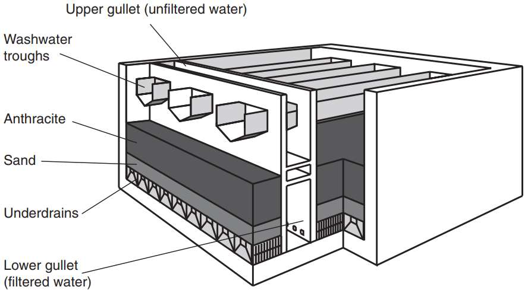
    - **Hình này chứng minh điều gì**
      - Bố trí không gian phân tầng với lớp than Anthracite nằm trên lớp cát Sand và hệ thống thu nước đáy.
    - **Từ đâu mà thấy được**
      - Cắt dọc từ trên xuống: máng rửa Washwater troughs, tầng Anthracite bên trên tầng Sand.
      - Hệ thống thu dẫn nước: Upper gullet ở trên đỉnh và Underdrains dẫn vào Lower gullet ở đáy.

##### Multi-Media Bed (Lớp lọc đa tầng - Multi-Media)

- Cấu tạo lớp lọc đa tầng (Multi-media configuration): Gồm ba tầng vật liệu lọc xếp chồng theo thứ tự giảm dần của cỡ hạt và tăng dần của tỷ trọng từ trên xuống dưới.
- Cấu hình ba tầng vật liệu quy chuẩn (Standard tri-media bed):
  - Tầng trên cùng (Top layer - Than anthracite): Chiều dày $0.45\text{--}0.50\text{ m}$, kích thước hạt $ES \approx 1.0\text{--}2.0\text{ mm}$, tỷ trọng nhẹ nhất $S_s \approx 1.4\text{--}1.6$.
  - Tầng giữa (Middle layer - Cát thạch anh): Chiều dày $0.20\text{--}0.30\text{ m}$, kích thước hạt $ES \approx 0.4\text{--}0.8\text{ mm}$, tỷ trọng trung bình $S_s \approx 2.65$.
  - Tầng đáy (Bottom layer - Garnet hoặc Ilmenite): Chiều dày $0.05\text{--}0.15\text{ m}$, kích thước hạt rất mịn $ES \approx 0.2\text{--}0.4\text{ mm}$, tỷ trọng nặng nhất ($S_s \approx 3.8\text{--}4.2$ đối với garnet hoặc $S_s \approx 4.5\text{--}4.7$ đối với ilmenite).
- Gradient lỗ rỗng lý tưởng (Continuous pore-size gradient):
  - Tạo cấu trúc lỗ rỗng thu hẹp liên tục theo hướng dòng chảy từ trên xuống dưới, khắc phục hoàn toàn sự phân lớp nghịch sau rửa ngược.
  - Phân bố cặn đều trên toàn bộ chiều sâu lớp lọc, cho phép vận hành với vận tốc lọc cao ($15\text{--}25\text{ m/h}$) và chất lượng nước đầu ra tối ưu.
- So sánh các cấu hình lớp vật liệu lọc (Media bed comparison):
  - Dung lượng trữ cặn: Multi-media $>$ Dual-media $>$ Deep-bed monomedia $>$ Standard monomedia.
  - Tốc độ tăng tổn thất áp lực: Standard monomedia tăng nhanh nhất do tắc nghẽn bề mặt; Multi-media và Dual-media phân bố tổn thất đồng đều theo chiều sâu.
  - Vận hành rửa ngược: Bể lọc đa tầng đòi hỏi kiểm soát chính xác cường độ rửa ngược để đạt độ giãn nở tiêu chuẩn ($25\% - 37\%$) mà không thất thoát vật liệu nhẹ hoặc làm đảo lộn vĩnh viễn ranh giới các tầng lọc.

#### Steps of Filtration Process

- Chu kỳ vận hành hoàn chỉnh của bể lọc hạt (Complete operational cycle of granular bed filtration):
  - Chu kỳ lọc hạt diễn ra tuần hoàn liên tục qua ba giai đoạn kỹ thuật kế tiếp nhau:
    - Giai đoạn xả lọc đầu / hoàn nguyên (Ripening stage hay filter-to-waste): kéo dài từ $15\text{ phút}$ đến $2\text{ giờ}$ ($15\text{ mins to } 2\text{ hours}$).
    - Giai đoạn lọc hiệu dụng (Filtration stage): kéo dài từ $1$ đến $4\text{ ngày}$ ($1\text{ to } 4\text{ days}$).
    - Giai đoạn rửa ngược (Backwash stage): kéo dài từ $10$ đến $20\text{ phút}$ ($10\text{ to } 20\text{ mins}$).
  - Tổng thời gian một chu kỳ làm việc ($T_{\text{cycle}}$):
    $$T_{\text{cycle}} = t_{\text{ripening}} + t_{\text{filtration}} + t_{\text{backwash}}$$
  - Phân bố thời gian vận hành:
    - Giai đoạn lọc hiệu dụng chiếm tỷ trọng áp đảo ($> 95\text{--}98\%$ tổng thời gian chu kỳ).
    - Các giai đoạn rửa ngược và xả lọc đầu chỉ chiếm $2\text{--}5\%$ thời gian nhưng quyết định trực tiếp đến độ sạch của vật liệu và chất lượng nước sau lọc.
- Động học biến thiên chất lượng nước sau lọc (Effluent turbidity dynamics):
  - Chất lượng nước sau lọc biến đổi đặc trưng theo ba pha trên đường cong độ đục - thời gian:
    - Pha đỉnh nhọn độ đục ban đầu trong giai đoạn Ripening do cặn sót sau rửa ngược và hạt lọc chưa ổn định.
    - Pha lọc hiệu dụng ổn định với độ đục duy trì thấp hơn giới hạn quy chuẩn ($\text{Turbidity} \le \text{Effluent turbidity limit}$).
    - Pha xuyên thủng cặn (Turbidity breakthrough) ở cuối chu kỳ khi cặn bẩn bão hòa trong các khe rỗng và bắt đầu thoát ra ngoài theo dòng nước lọc.
  - Điểm kết thúc chu kỳ lọc (End of filter run): Xác định tại thời điểm độ đục vượt ngưỡng cho phép ($\text{Time at turbidity breakthrough}$) hoặc khi tổn thất áp lực thủy lực chạm giới hạn thiết kế cực đại.

  - **Hình 2.** Đường đặc tính độ đục nước sau lọc qua các giai đoạn của chu kỳ lọc
    - 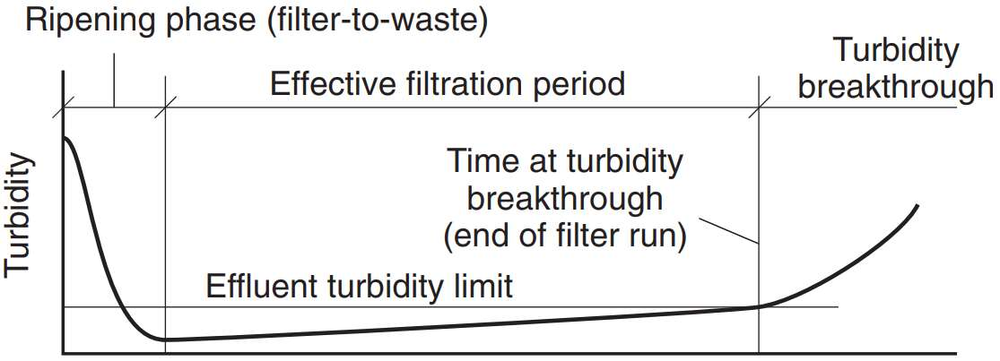
    - **Hình này chứng minh điều gì**
      - Thể hiện sự biến thiên độ đục nước lọc qua 3 giai đoạn: xả lọc đầu (ripening), lọc hiệu dụng, và xuyên thủng cặn.
    - **Từ đâu mà thấy được**
      - Trục tung là độ đục (Turbidity), trục hoành là thời gian của chu kỳ lọc.
      - Đường cong độ đục giảm sâu trong pha Ripening, duy trì dưới giới hạn cho phép trong pha lọc hiệu dụng, và tăng vọt ở cuối chu kỳ (turbidity breakthrough).

##### Ripening Stage (Giai đoạn xả lọc đầu - Filter-to-Waste)

- Thời lượng kỹ thuật của giai đoạn hoàn nguyên (Ripening stage duration):
  - Thời gian vận hành tiêu chuẩn: Dao động từ $15\text{ phút}$ đến $2\text{ giờ}$ ($15\text{ mins to } 2\text{ hours}$).
  - Thời lượng phụ thuộc vào chất lượng nước rửa ngược, đặc tính keo tụ của nước thô, và cấu trúc tầng vật liệu lọc hạt.
- Hiện tượng suy giảm chất lượng nước ban đầu (Initial turbidity spike):
  - Ngay sau khi kết thúc chu kỳ rửa ngược và bắt đầu cấp nước lọc trở lại, độ đục của dòng nước ra ban đầu tăng cao đột biến vượt quá tiêu chuẩn cho phép.
  - Ba nguyên nhân vật lý và hóa lý cốt lõi:
    - Tồn dư cặn bẩn sau rửa ngược: Nước rửa ngược chứa cặn lơ lửng sót lại trong khoang thu nước đáy (underdrain), lớp sỏi đỡ và các khe rỗng mao quản chưa kịp thoát hết.
    - Bề mặt hạt lọc sạch thiếu tâm dính bám (Unconditioned / clean collector media): Hạt lọc sau rửa bị bóc tách hoàn toàn lớp cặn bám, làm giảm khả năng bắt giữ cặn mới so với hạt lọc đã bám dính một phần bông cặn.
    - Cấu trúc xốp chưa ổn định: Tầng vật liệu lọc vừa lắng đọng sau trạng thái sôi cần một khoảng thời gian chịu nén thủy lực để sắp xếp lại các tiếp điểm liên hạt.
- Cơ chế cải thiện độ trong theo thời gian (Ripening mechanism):
  - Khi dòng nước thô đi qua, các hạt cặn ban đầu bám dính vào bề mặt hạt cát hoặc than anthracite tạo thành lớp thu giữ thứ cấp.
  - Lớp cặn mới tích tụ làm tăng diện tích bề mặt tiếp xúc riêng, thu hẹp kích thước khe rỗng mao quản và trung hòa điện tích bề mặt cục bộ.
  - Hiệu suất thu giữ hạt tăng vọt theo hàm số mũ, đưa độ đục nước sau lọc giảm nhanh xuống dưới giới hạn quy chuẩn ($\text{Turbidity} < 0.1\text{--}0.3\text{ NTU}$).
- Quy trình vận hành xả bỏ nước lọc đầu (Filter-to-waste operation):
  - Cách ly nguồn nước lọc ban đầu: Toàn bộ lượng nước lọc trong giai đoạn này bị đóng van không cho chảy vào bể chứa nước sạch (clearwell).
  - Thải bỏ hoặc tuần hoàn: Dòng nước xả đầu được dẫn qua đường ống xả thải riêng (waste drain) hoặc bơm tuần hoàn về công trình lắng/keo tụ ở đầu dây chuyền xử lý.
  - Mục tiêu vệ sinh môi trường: Ngăn ngừa nguy cơ rò rỉ vi sinh vật gây bệnh (như bào nang *Giardia lamblia* và noãn nang *Cryptosporidium*) vào mạng lưới cấp nước sạch.
  - Tiêu chuẩn kết thúc giai đoạn: Hệ thống quan trắc độ đục trực tuyến ghi nhận giá trị độ đục ổn định liên tục dưới ngưỡng quy định trước khi tự động chuyển hướng dòng chảy vào bể nước sạch.

##### Filtration Stage (Giai đoạn lọc hiệu dụng - Effective Filtration Period)

- Thời lượng vận hành của giai đoạn lọc hiệu dụng (Filtration stage duration):
  - Thời gian làm việc liên tục: Kéo dài từ $1$ đến $4\text{ ngày}$ ($1\text{ to } 4\text{ days}$, tương đương $24\text{--}96\text{ giờ}$).
  - Giai đoạn này là giai đoạn công nghệ chính thực hiện nhiệm vụ phân tách và thu giữ chất rắn lơ lửng, tạo ra nước thành phẩm đạt quy chuẩn.
- Bố trí thủy lực và chiều dòng chảy (Hydraulic routing and flow path):
  - Dòng chảy xuôi trọng lực từ trên xuống dưới (Vertical downflow gravity filtration):
    - Nước thô cần lọc (Water to be filtered) được dẫn qua van nạp mở (Valve open) vào mương phân phối chính (Gullet).
    - Nước tràn từ máng chính qua các máng thu/rửa ngược (Backwash water troughs) và dàn đều lên bề mặt lớp vật liệu lọc.
    - Cột nước tĩnh trên mặt tầng lọc được duy trì ổn định ở chiều cao $1.2\text{--}2.0\text{ m}$ nhằm tạo áp lực thủy tĩnh đẩy nước thấm qua tầng vật liệu.
    - Dòng nước thẩm thấu tuần tự qua lớp cát thạch anh (Sand bed) và lớp sỏi đỡ (Sand support medium, usually gravel).
    - Nước lọc sạch đi qua sàn lọc và hệ thống chụp lọc đáy (Filter floor and underdrain), đi qua cảm biến lưu lượng (Flow sensor), và qua van điều tiết lưu lượng mở (Flow control valve open, variable) đến bể chứa nước lọc (Filtered water).
- Cấu hình trạng thái các van công nghệ trong giai đoạn lọc:
  - Van nước thô vào (Inlet valve): MỞ (Open).
  - Van điều tiết lưu lượng nước lọc (Flow control valve): MỞ có điều tiết tự động (Open, variable).
  - Van xả nước rửa ngược (Backwash waste valve): ĐÓNG (Closed).
  - Van cấp nước rửa ngược (Backwash water valve): ĐÓNG (Closed).
  - Van cấp khí sục (Air valve): ĐÓNG (Closed).
- Động học thu giữ cặn và kiểm soát lưu lượng lọc:
  - Chất lượng nước lọc: Độ đục duy trì ở giá trị thấp và ổn định ($\text{Turbidity} \le \text{Effluent turbidity limit}$) trong suốt phần lớn thời gian chu kỳ.
  - Tổn thất áp lực thủy lực ($\Delta h_L$): Tăng dần theo thời gian vận hành do cặn bẩn lấp đầy các khoang rỗng giữa các hạt vật liệu lọc.
  - Phương thức kiểm soát lưu lượng lọc không đổi (Constant-rate filtration control):
    - Khi lớp vật liệu sạch ở đầu chu kỳ, tổn thất áp lực qua tầng lọc nhỏ ($h_0 \approx 0.2\text{--}0.4\text{ m}$), van điều tiết lưu lượng (Flow control valve) khép bớt để tạo tổn thất áp lực phụ.
    - Trong suốt chu kỳ, khi cặn bẩn tích tụ làm tổn thất áp lực tầng lọc tăng lên, bộ điều khiển (Flow controller) và động cơ (Motor) tự động điều khiển mở rộng dần van xả lọc để giữ lưu lượng dòng chảy không đổi ($Q = \text{const}$).
- Tiêu chí kết thúc giai đoạn lọc (End of filter run criteria):
  - Chu kỳ lọc hiệu dụng kết thúc khi chạm một trong ba giới hạn thiết kế:
    - Giới hạn tổn thất áp lực tối đa (Terminal head loss): Tổn thất áp lực qua tầng lọc đạt ngưỡng thiết kế cực đại ($\Delta h_{L,\max} \approx 2.0\text{--}3.0\text{ m}$), van điều tiết đã mở hoàn toàn ($100\%$) nhưng không duy trì được lưu lượng định mức.
    - Xuyên thủng độ đục (Turbidity breakthrough): Độ đục nước sau lọc bắt đầu tăng vọt vượt ngưỡng cho phép do các khoảng rỗng bão hòa cặn và lực cắt thủy động làm cuốn trôi bông cặn ra khỏi lớp lọc.
    - Giới hạn thời gian tối đa quy định: Thời gian lọc chạm ngưỡng định mức ($36\text{--}96\text{ giờ}$) nhằm ngăn ngừa cặn bị nén chặt thành các khối bùn kết tảng (mudballs) khó rửa sạch hoặc phân hủy kỵ khí trong tầng lọc.

  - **Hình 3.** Sơ đồ nguyên lý cấu tạo và cơ chế hoạt động của bể lọc trong giai đoạn lọc và giai đoạn rửa ngược
    - 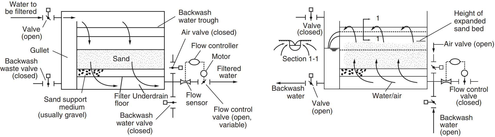
    - **Hình này chứng minh điều gì**
      - Thể hiện sự đảo chiều dòng chảy, trạng thái đóng mở của hệ van và sự giãn nở tầng cát giữa hai chế độ vận hành.
    - **Từ đâu mà thấy được**
      - Nửa trái (Filtration stage): Van nạp và van xả lọc mở; dòng nước chảy xuôi qua tầng cát và sỏi đỡ thu vào underdrain.
      - Nửa phải (Backwash stage): Van nạp và van xả lọc đóng; van nước/khí rửa mở đẩy dòng chảy ngược làm tầng cát giãn nở lên Height of expanded sand bed.

##### Backwash Stage (Giai đoạn rửa ngược - Backwash Operation)

- Thời lượng kỹ thuật của giai đoạn rửa ngược (Backwash stage duration):
  - Thời gian vận hành tiêu chuẩn: Kéo dài từ $10$ đến $20\text{ phút}$ ($10\text{ to } 20\text{ mins}$).
  - Nhiệm vụ công nghệ: Đánh bật và xả sạch toàn bộ cặn bẩn tích lũy trong tầng vật liệu lọc, khôi phục lại độ rỗng ban đầu ($\varepsilon$) và triệt tiêu tổn thất áp lực tích lũy.
- Nguyên lý thủy động học và cơ chế làm sạch lớp hạt:
  - Đảo ngược chiều dòng chảy (Upward flow fluidization):
    - Nước rửa sạch áp lực cao được bơm từ đáy bể đi qua hệ thống thu nước đáy (underdrain) và tầng sỏi đỡ ngược lên trên.
    - Vận tốc dòng rửa ngược ($v_b \approx 30\text{--}60\text{ m/h}$) vượt qua vận tốc sôi tối thiểu của hạt ($v_{mf}$).
    - Lớp cát bị xới tơi và giãn nở thể tích lên độ cao mới ($H_e$ - Height of expanded sand bed).
  - Độ giãn nở thể tích tầng vật liệu ($E$ - Bed expansion):
    $$E = \frac{L_e - L_0}{L_0} \times 100\%$$
    trong đó $L_0$ là chiều dày lớp lọc tĩnh ban đầu ($0.6\text{--}1.8\text{ m}$), $L_e$ là chiều dày lớp lọc ở trạng thái giãn nở. Độ giãn nở vận hành tối ưu thường nằm trong khoảng $20\text{--}35\%$.
  - Cơ chế cọ xát hạt - hạt (Grain-to-grain abrasion):
    - Sự chuyển động xoáy và va chạm mãnh liệt giữa các hạt vật liệu giải phóng các màng cặn dính bám trên bề mặt hạt vào dòng chất lỏng.
    - Dòng nước rửa ngược cuốn các hạt cặn lơ lửng thoát lên phía trên mặt lớp vật liệu mà không làm cuốn trôi hạt lọc ra ngoài.
- Cấu hình trạng thái các van công nghệ trong giai đoạn rửa ngược:
  - Van nước thô vào (Inlet valve): ĐÓNG (Closed).
  - Van điều tiết nước lọc ra (Effluent flow control valve): ĐÓNG (Closed).
  - Van cấp nước rửa ngược (Backwash water valve): MỞ (Open).
  - Van cấp khí sục (Air valve): MỞ (Open) khi vận hành sục khí độc lập hoặc kết hợp.
  - Van xả nước rửa ngược thải (Backwash waste valve): MỞ (Open).
- Quy trình vận hành các bước rửa ngược tiêu chuẩn:
  - Bước 1 - Ngừng lọc và hạ mực nước: Đóng van cấp nước thô và van xả lọc; để nước lọc tự chảy hạ thấp mực nước xuống cách mặt lớp vật liệu lọc khoảng $10\text{--}20\text{ cm}$.
  - Bước 2 - Sục khí nén sơ bộ (Air scouring):
    - Mở van khí rửa ngược (Air valve open) đưa khí nén qua hệ thống phân phối đáy với cường độ $50\text{--}90\text{ m/h}$ trong $3\text{--}5\text{ phút}$.
    - Bọt khí làm rung lắc dữ dội tầng hạt, bẻ gãy các mảng bùn kết tảng (mudballs) và phá vỡ cấu trúc màng cặn bám chặt trên bề mặt hạt.
  - Bước 3 - Rửa kết hợp khí - nước hoặc rửa nước thuần túy (Water wash fluidization):
    - Mở van nước rửa ngược (Backwash water valve open) với cường độ dòng dâng $30\text{--}60\text{ m/h}$.
    - Dòng nước đẩy toàn bộ bùn cặn đã tách khỏi hạt dâng lên bề mặt.
  - Bước 4 - Thu dẫn và xả nước rửa bẩn:
    - Nước thải rửa ngược dâng cao tràn qua mép máng thu nước rửa ngược (Backwash water trough, mặt cắt Section 1-1).
    - Nước từ các máng thu nhánh đổ vào máng trung tâm (Gullet), đi qua van xả nước rửa mở (Backwash waste valve open) dẫn về công trình xử lý bùn hoặc bể thu hồi nước rửa.
  - Bước 5 - Kết thúc rửa và tái phân tầng hạt:
    - Đóng van nước rửa ngược và van xả bùn; các hạt vật liệu lọc tự do lắng đọng trọng lực.
    - Quá trình lắng tự nhiên tái phân tầng hoàn hảo: hạt cát nặng lắng xuống dưới, than anthracite nhẹ phủ lên trên; sau đó chuyển sang giai đoạn xả lọc đầu (Ripening).

  - **Hình 4.** Bố trí máng thu nước rửa ngược trong khoang bể lọc
    - 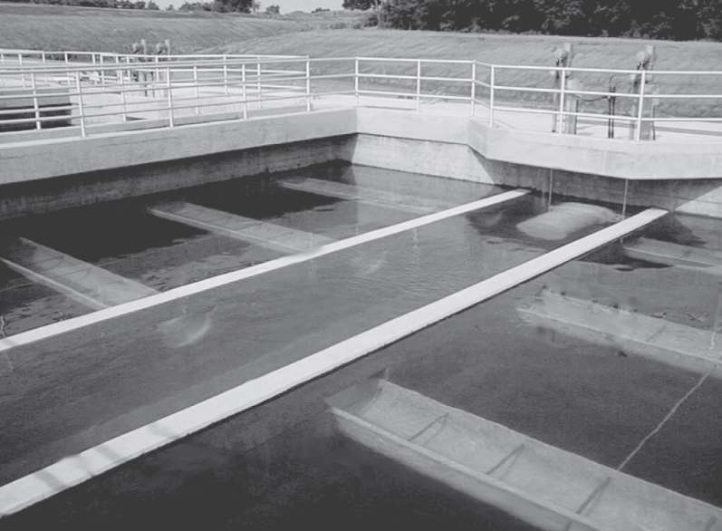
    - **Hình này chứng minh điều gì**
      - Minh họa thực tế vị trí và khoảng cách các máng thu nước rửa ngược (washwater troughs) đặt phía trên tầng vật liệu lọc.
    - **Từ đâu mà thấy được**
      - Các máng thu bê tông/thép hình chữ U chạy song song trên bề mặt lớp cát trong khoang bể lọc.

  - **Hình 5.** Nước rửa ngược tràn qua máng thu vào hành lang tập trung nước xả
    - 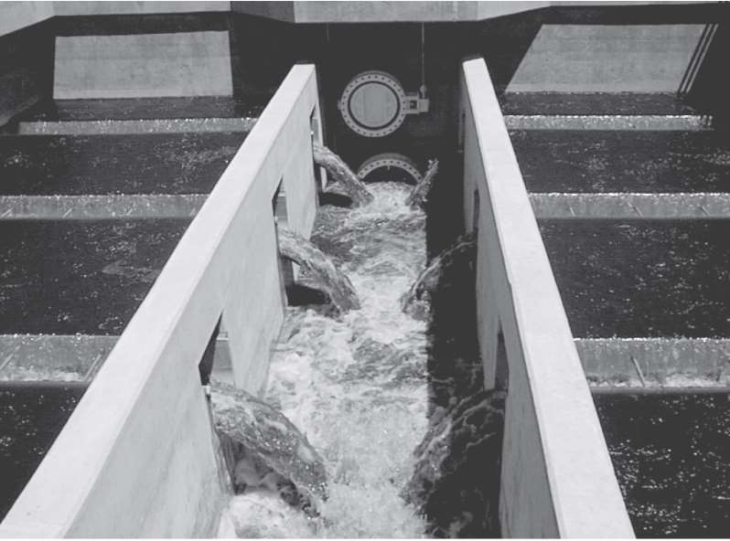
    - **Hình này chứng minh điều gì**
      - Dòng thủy lực của nước rửa ngược mang theo cặn bẩn từ các máng nhánh đổ dồn vào máng trung tâm (central gullet).
    - **Từ đâu mà thấy được**
      - Nước xả sủi bọt cuồn cuộn tràn qua các cửa xả hai bên thành máng chính dẫn tới họng van xả đáy.

#### Mechanisms of Particle Removal in Depth Filtration

- Quá trình thu giữ hạt cặn trong lọc tầng sâu (Particle removal in depth filtration): Tách và lưu giữ hạt cặn lơ lửng trong toàn bộ chiều sâu của lớp vật liệu lọc xốp (porous granular media bed).
  - Phân biệt với lọc bề mặt (Surface filtration): Hạt cặn thâm nhập và phân bố dọc theo chiều sâu tầng lọc ($0.6\text{--}1.8\text{ m}$), không tích tụ cục bộ duy nhất trên bề mặt.
  - Mô hình tiếp cận hai giai đoạn kế tiếp (Two-step sequential process):
    - Giai đoạn vận chuyển hạt (Transport step): Động lực dòng chảy đưa hạt cặn từ dòng chất lỏng chính tiếp cận sát bề mặt hạt vật liệu lọc hoặc lớp cặn đã bám trước đó ($d \le 1\text{ nm}$).
    - Giai đoạn dính bám hạt (Attachment step): Các lực tương tác bề mặt tầm ngắn giữ chặt hạt cặn đã tiếp xúc vào bề mặt vật liệu hoặc bông cặn khác.
  - Năm cơ chế tác động cốt lõi đóng góp vào quá trình thu giữ hạt (Five core removal mechanisms):
    - Cơ chế sàng qua khe rỗng (Straining): Bẫy các hạt có kích thước lớn hơn kích thước lỗ rỗng.
    - Cơ chế lắng đọng trọng lực (Sedimentation): Hạt cặn nặng lắng đọng tách khỏi đường dòng thủy lực.
    - Cơ chế chặn bắt tiếp xúc (Interception): Hạt bám dính khi chuyển động lướt sát bề mặt hạt vật liệu lọc.
    - Cơ chế dính bám và đẩy sâu thủy động học (Adhesion): Lực dòng chảy cuốn và đẩy hạt thâm nhập sâu vào tầng lọc.
    - Cơ chế keo tụ trong tầng lọc (Flocculation): Các hạt cặn liên kết thành cụm lớn hơn nhờ lực Van der Waals ($VDW$).

  - **Hình 6.** Các cơ chế thu giữ hạt cặn trong lọc tầng sâu (Mechanisms contributing to particle removal)
    - 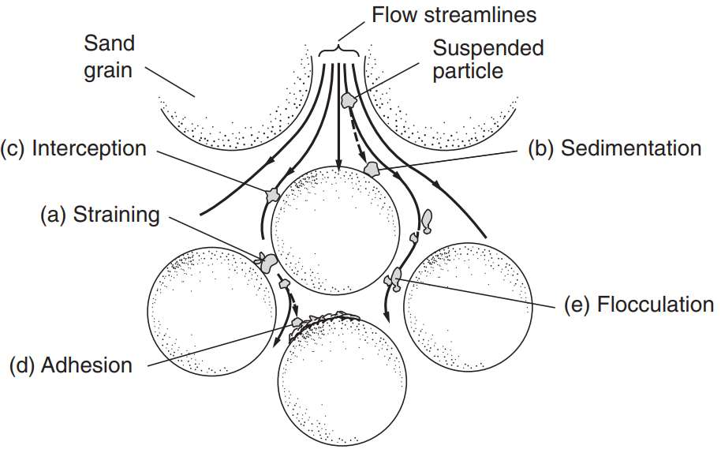
  - **Hình này chứng minh điều gì**
    - Mô tả trực quan 5 cơ chế vật lý và hóa lý thu giữ hạt cặn lơ lửng khi dòng chảy đi qua các khe rỗng giữa các hạt vật liệu lọc (sand grains).
  - **Từ đâu mà thấy được**
    - Đường dòng thủy lực (Flow streamlines) và hạt cặn lơ lửng (Suspended particle) đi vào khe rỗng giữa các hạt cát (Sand grain).
    - Vị trí tác động tương ứng của từng cơ chế: (a) Sàng cơ học (Straining), (b) Lắng trọng lực (Sedimentation), (c) Chặn bắt (Interception), (d) Dính bám và đẩy sâu (Adhesion), (e) Keo tụ liên hạt (Flocculation).

##### Mechanical Straining (Cơ chế sàng qua khe rỗng)

- Bản chất vật lý của cơ chế sàng (Straining mechanism): Bẫy và giữ lại các hạt cặn có kích thước lớn hơn kích thước lỗ rỗng của môi trường lọc (trap particles that are larger than the pores of the filtering medium).
  - Điều kiện hình học giới hạn (Geometric pore exclusion): Hạt cặn không thể chui qua khe hẹp mao quản khi đường kính hạt $d_p$ lớn hơn kích thước lỗ rỗng $d_{\text{pore}}$ ($d_p > d_{\text{pore}}$).
  - Khẩu độ khe rỗng hình học lý thuyết ($d_{\text{pore}}$):
    - Với môi trường hạt hình cầu xếp chặt đồng nhất, khẩu độ khe rỗng nhỏ nhất giữa các hạt lọc dao động trong khoảng $d_{\text{pore}} \approx 0.155\text{--}0.25\,d_c$ (trong đó $d_c$ là đường kính hạt vật liệu lọc).
    - Hạt cặn có kích thước $d_p \ge 0.15\,d_c$ bị chặn lại hoàn toàn do hiệu ứng hình học mà không phụ thuộc vào vận tốc lọc.
- Phân loại vị trí tác động của cơ chế sàng:
  - Sàng bề mặt (Surface straining):
    - Diễn ra tại bề mặt trên cùng của tầng vật liệu lọc ($1\text{--}2\text{ cm}$ ngoài cùng).
    - Các hạt cặn thô tích tụ tạo thành lớp màng cặn (cake layer / schmutzdecke) bao phủ bề mặt lọc.
  - Sàng trong khe rỗng tầng sâu (Interstitial / Deep-bed straining):
    - Các hạt cặn nhỏ hơn khe hở bề mặt di chuyển sâu vào trong tầng lọc.
    - Hạt bị kẹt lại tại các vị trí co hẹp mao quản hoặc tại các khe tiếp xúc giữa hai hay nhiều hạt vật liệu liền kề.
- Tác động công nghệ đến quá trình vận hành lọc:
  - Tự hình thành màng lọc phụ trợ (Secondary auto-filtration):
    - Các hạt cặn bị giữ lại thu hẹp tiết diện hiệu dụng của khe rỗng ban đầu.
    - Tầng cặn mới hình thành hoạt động như một lớp lọc thứ cấp giữ được các hạt có kích thước nhỏ hơn dải kích thước giữ ban đầu.
  - Gia tăng tổn thất áp lực nhanh chóng (Rapid head loss increase):
    - Sự tắc nghẽn khe rỗng bề mặt làm tăng độ dốc thủy lực $\Delta h_L / \Delta t$ theo hàm mũ.
    - Đòi hỏi công đoạn tiền xử lý lắng/keo tụ hiệu quả để loại bỏ cặn thô trước khi đưa vào bể lọc nhằm tránh nghẹt bề mặt sớm.

##### Gravitational Sedimentation (Cơ chế lắng đọng trọng lực)

- Bản chất vật lý của cơ chế lắng đọng (Sedimentation mechanism): Các hạt cặn nặng lắng đọng lên bề mặt của môi trường lọc và không còn tiếp tục chuyển động theo đường dòng chất lỏng (Heavy particles settle on the filtering medium and no longer follow the fluidflow).
  - Điều kiện tỷ trọng hạt cặn:
    - Xảy ra khi khối lượng riêng của hạt cặn lớn hơn khối lượng riêng của môi trường nước ($\rho_p > \rho_w$).
    - Cặn hạt khoáng, cát mịn ($\rho_p \approx 2{,}650\text{ kg/m}^3$) và bông bùn sinh học liên kết kim loại ($\rho_p \approx 1{,}050\text{--}1{,}200\text{ kg/m}^3$) chịu tác động lắng rõ rệt.
- Động lực học lắng trong khe rỗng mao quản (Interstitial settling dynamics):
  - Lực trọng lực kéo hạt cặn rơi xuống theo phương thẳng đứng với vận tốc lắng Stokes ($v_s$):
    $$v_s = \frac{g (\rho_p - \rho_w) d_p^2}{18\mu}$$
    trong đó $g$ là gia tốc trọng trường ($g \approx 9.81\text{ m/s}^2$), $\mu$ là độ nhớt động lực của nước ($\text{Pa}\cdot\text{s}$), $d_p$ là đường kính tương đương của hạt cặn ($\text{m}$).
  - Độ lệch quỹ đạo đường dòng (Streamline deviation):
    - Nước chảy uốn lượn qua các khe hở giữa các hạt lọc với vận tốc dòng chảy cục bộ $v_{\text{pore}}$.
    - Dưới tác dụng của vận tốc lắng $v_s$, quỹ đạo chuyển động thực của hạt lệch dần khỏi đường dòng thủy lực (streamline), hướng xuống bề mặt trên của hạt vật liệu lọc nằm phía dưới.
- Thông số không thứ nguyên đặc trưng cho cơ chế lắng ($N_G$):
  - Thông số lắng Graetz / Peclet trọng lực ($N_G$):
    $$N_G = \frac{v_s}{v_0} = \frac{g (\rho_p - \rho_w) d_p^2}{18\mu v_0}$$
    trong đó $v_0$ là vận tốc lọc bề mặt (superficial filtration velocity, $\text{m/s}$).
  - Hiệu quả thu giữ hạt cặn:
    - Hiệu suất lắng tăng tỷ lệ thuận với bình phương kích thước hạt ($d_p^2$) và hiệu số tỷ trọng $(\rho_p - \rho_w)$.
    - Chi phối hiệu quả đối với các hạt cặn có đường kính $d_p > 1\text{--}5\ \mu\text{m}$ khi vận tốc dòng qua khe lọc được duy trì ở mức thích hợp ($v_0 \le 10\text{ m/h}$).

##### Direct Interception (Cơ chế chặn bắt tiếp xúc đường dòng)

- Bản chất hình học của cơ chế chặn bắt (Interception mechanism): Các hạt cặn bám dính vào bề mặt môi trường lọc khi chúng di chuyển lướt ngang qua bề mặt (Particles attach to surface of the filtering medium when they pass by).
  - Quỹ đạo bám sát đường dòng thủy lực:
    - Hạt cặn có khối lượng riêng xấp xỉ khối lượng riêng của nước ($\rho_p \approx \rho_w$) hoặc quán tính hạt nhỏ chuyển động bám sát theo đường dòng chảy (fluid streamlines).
    - Hạt không bị trượt khỏi đường dòng do trọng lực hay lực quán tính.
  - Điều kiện tiếp xúc hình học hữu hạn (Finite boundary contact):
    - Hạt cặn có kích thước bán kính xác định $r_p = d_p / 2$.
    - Khi đường dòng đưa tâm của hạt cặn đến khoảng cách nhỏ hơn hoặc bằng bán kính hạt ($y \le r_p$) so với biên bề mặt hạt vật liệu lọc, mép ngoài của hạt va chạm trực tiếp vào bề mặt vật liệu.
    - Tiếp xúc va chạm kích hoạt các lực liên kết bề mặt giữ chặt hạt cặn lại.
- Thông số không thứ nguyên đặc trưng cho cơ chế chặn bắt ($N_R$):
  - Tỷ số kích thước hạt không thứ nguyên ($N_R$):
    $$N_R = \frac{d_p}{d_c}$$
    trong đó $d_p$ là đường kính hạt cặn ($\text{m}$), $d_c$ là đường kính hạt vật liệu lọc ($\text{m}$).
  - Hiệu suất thu giữ hạt cặn do chặn bắt tiếp xúc ($\eta_I$):
    $$\eta_I \propto N_R^2 = \left(\frac{d_p}{d_c}\right)^2$$
    - Hiệu suất thu gom $\eta_I$ tăng tỷ lệ thuận với bình phương tỷ số kích thước $N_R^2$.
    - Giảm kích thước hạt lọc $d_c$ làm tăng đột biến hiệu quả chặn bắt tiếp xúc.
  - Phạm vi tác động công nghệ: Là cơ chế thu giữ chủ đạo đối với các bông cặn nhẹ, vi khuẩn và hạt keo hữu cơ có kích thước từ $1\ \mu\text{m}$ đến $20\ \mu\text{m}$.

##### Hydrodynamic Adhesion (Cơ chế dính bám và đẩy sâu thủy động học)

- Bản chất động lực học của cơ chế dính bám (Adhesion mechanism): Đẩy hạt cặn thâm nhập sâu hơn vào bên trong tầng vật liệu lọc dưới tác động áp lực và lực kéo của dòng nước chảy (push particle deeper into the filter bed by force of the flowing water).
  - Tác động lực thủy động học của dòng chảy:
    - Dòng nước chuyển động qua khe rỗng hẹp sinh ra áp lực động và ứng suất cắt nhớt trên bề mặt hạt:
      $$\tau = \mu \left(\frac{\partial v}{\partial y}\right)_{\text{surface}}$$
    - Lực đẩy thủy động lực (Hydrodynamic drag force) tác động dọc theo hướng dòng chảy ép các hạt cặn bám dính chắc hơn vào bề mặt hoặc đẩy hạt lăn dọc theo các kênh mao quản.
  - Cân bằng động giữa bám dính và bứt phá (Attachment vs. Detachment dynamic balance):
    - Lực dính bám phân tử (Adhesion force $F_{\text{adh}}$) có xu hướng giữ hạt cố định trên bề mặt vật liệu.
    - Lực kéo thủy động (Fluid drag force $F_{\text{drag}}$) có xu hướng bứt phá các hạt cặn bám lỏng lẻo ra khỏi điểm bám ban đầu.
    - Khi dòng chảy cục bộ tăng vận tốc tại các vị trí khe hẹp bị bồi lắng cặn, $F_{\text{drag}} > F_{\text{adh}}$, hạt cặn bị bứt phá và đẩy trôi sâu hơn xuống các tầng lọc phía dưới (depth migration).
- Vai trò phân bố cặn theo chiều sâu tầng lọc:
  - Tái bám dính tại các tầng vật liệu bên dưới:
    - Khi trôi xuống tầng sâu hơn, dòng chảy phân tán vào các khe rỗng thoáng chưa bị nghẽn, vận tốc cục bộ giảm xuống.
    - Hạt cặn tái bám dính bền vững vào các vùng góc chết tĩnh (quiescent dead zones) hoặc các điểm tiếp xúc giữa các hạt lọc.
  - Ý nghĩa công nghệ đối với bể lọc tầng sâu:
    - Phân bổ đều tải lượng chất rắn trên toàn bộ chiều sâu lớp lọc ($0.6\text{--}1.8\text{ m}$), ngăn chặn hiện tượng tạo màng tắc nghẽn sớm trên bề mặt.
    - Cho phép bể lọc vận hành với vận tốc lọc cao ($10\text{--}20\text{ m/h}$) và dung tích trữ cặn lớn trước khi đạt tổn thất áp lực giới hạn.

##### Interstitial Flocculation (Cơ chế keo tụ liên hạt trong tầng lọc)

- Bản chất hóa lý của cơ chế keo tụ trong tầng lọc (Flocculation mechanism): Hình thành các hạt cặn có kích thước lớn hơn nhờ liên kết lực hút Van der Waals (form a larger particles by VDW force).
  - Quá trình keo tụ tiếp xúc trong môi trường rỗng (Contact flocculation in porous media):
    - Không gian khe rỗng giữa các hạt vật liệu lọc đóng vai trò như các vi buồng phản ứng keo tụ (micro-flocculators).
    - Cấu trúc mao quản uốn khúc liên tục hội tụ và phân kỳ tạo gradient vận tốc cục bộ $G$ rất cao ($G \approx 100\text{--}1{,}000\text{ s}^{-1}$).
    - Gradient vận tốc lớn làm tăng mạnh tần số va chạm động học (Orthokinetic collision frequency) giữa các hạt cặn lơ lửng chuyển động với các vận tốc dòng khác nhau.
- Tác dụng của lực hút liên kết phân tử Van der Waals ($F_{\text{VDW}}$):
  - Lực hút phân tử tầm ngắn Van der Waals:
    - Khi hai hạt cặn va chạm và khoảng cách bề mặt giữa chúng thu hẹp đến thang kích thước nanomet ($h < 1\text{ nm}$), lực hút Van der Waals liên kết hai hạt lại thành một cụm hạt bền vững.
    - Thế năng hút Van der Waals giữa hai hạt cầu đồng nhất có bán kính $r_p$:
      $$V_{\text{VDW}} = -\frac{A_H \cdot r_p}{12 h}$$
      trong đó $A_H$ là hằng số Hamaker ($A_H \approx 10^{-20}\text{--}10^{-19}\text{ J}$ đối với các hạt lơ lửng trong nước), $h$ là khoảng cách giữa bề mặt hai hạt ($\text{m}$).
  - Vượt qua hàng rào thế năng tĩnh điện (Overcoming electrostatic repulsion):
    - Bề mặt hạt cặn trong nước thường tích điện âm cùng dấu, tạo lực đẩy tĩnh điện hai lớp ($V_{\text{EDL}}$).
    - Quá trình keo tụ đòi hỏi nén lớp điện kép hoặc trung hòa điện tích bề mặt (nhờ bổ sung phèn nhôm, phèn sắt hoặc polymer cation) để giảm điện thế Zeta ($\text{Zeta potential} \to 0\text{ mV}$), cho phép lực hút Van der Waals chiếm ưu thế tuyệt đối.
- Hiệu ứng gia tăng hiệu quả của các cơ chế thu giữ khác:
  - Gia tăng kích thước hạt hiệu dụng: Quá trình keo tụ biến các hạt cặn siêu mịn ($d_p < 1\ \mu\text{m}$) thành các bông cặn lớn hơn ($d_p > 5\text{--}10\ \mu\text{m}$).
  - Kích hoạt mạnh mẽ các cơ chế cơ học:
    - Tăng vận tốc lắng trọng lực theo hàm bậc hai: $v_s \propto d_p^2$.
    - Tăng hiệu suất chặn bắt tiếp xúc: $\eta_I \propto d_p^2$.
    - Tăng xác suất giữ lại do cơ chế sàng khi kích thước bông cặn vượt qua khẩu độ khe rỗng ($d_p > d_{\text{pore}}$).

##### Phenomenological Transport and Attachment Model (Mô hình vận chuyển và dính bám Yao – O'Melia)

- Mô hình lý thuyết thu giữ hạt đơn lẻ (Single collector efficiency model):
  - Phương trình tổng quát biểu diễn hiệu suất thu gom của một hạt vật liệu đơn lẻ ($\eta$):
    $$\eta = \alpha \cdot \eta_0$$
    trong đó:
    - $\alpha$ là hệ số dính bám thực tế ($0 \le \alpha \le 1$, attachment efficiency), xác định xác suất một hạt sau khi va chạm sẽ dính bám vĩnh viễn vào bề mặt; phụ thuộc vào lực Van der Waals và tương tác điện tích bề mặt.
    - $\eta_0$ là hiệu suất tiếp xúc va chạm đơn lẻ (Single collector transport efficiency), xác định xác suất hạt tiếp cận được bề mặt hạt lọc do các quá trình vận chuyển vật lý.
- Phân rã các thành phần vận chuyển đơn lẻ ($\eta_0$):
  - Đóng góp tích lũy của ba cơ chế vận chuyển cơ bản:
    $$\eta_0 = \eta_D + \eta_I + \eta_G$$
    - $\eta_D = 4.04\,\text{Pe}^{-2/3}$: Thành phần khuếch tán nhiệt Brown (Brownian diffusion), với số Peclet $\text{Pe} = \frac{3\pi \mu d_p d_c v_0}{k_B T}$; chi phối với hạt keo siêu mịn $d_p < 1\ \mu\text{m}$.
    - $\eta_I = \frac{3}{2}\,N_R^2 = \frac{3}{2}\left(\frac{d_p}{d_c}\right)^2$: Thành phần chặn bắt tiếp xúc đường dòng (Interception); chi phối với hạt $d_p > 1\ \mu\text{m}$.
    - $\eta_G = N_G = \frac{v_s}{v_0} = \frac{g(\rho_p - \rho_w)d_p^2}{18\mu v_0}$: Thành phần lắng đọng trọng lực (Sedimentation); chi phối với hạt cặn nặng và kích thước lớn.
- Thung lũng hiệu suất lọc cực tiểu (The "Filtration Valley"):
  - Vị trí kích thước hạt khó thu giữ nhất: Đồ thị hiệu suất $\eta_0$ theo kích thước hạt cặn $d_p$ đạt giá trị cực tiểu trong dải kích thước $d_p \approx 0.5\text{--}1.5\ \mu\text{m}$.
  - Nguyên nhân vật lý:
    - Tại dải $0.5\text{--}1.5\ \mu\text{m}$, hạt cặn quá lớn để chuyển động khuếch tán Brown hiệu quả ($\eta_D$ giảm mạnh khi $d_p$ tăng).
    - Đồng thời, hạt lại quá nhỏ và quá nhẹ để lắng trọng lực hoặc chặn bắt tiếp xúc hiệu quả ($\eta_G$ và $\eta_I$ còn rất nhỏ).
  - Giải pháp công nghệ trong xử lý nước thải:
    - Bổ sung hóa chất keo tụ trước bể lọc (in-line coagulation / contact flocculation).
    - Tạo điều kiện cho cơ chế keo tụ trong tầng lọc (Flocculation via VDW force) phát triển bông cặn vượt qua ngưỡng kích thước khó lọc ($d_p > 2\ \mu\text{m}$) và tăng hệ số dính bám $\alpha \to 1$.

#### Properties of Granular Filter Media

- Đặc tính vật liệu lọc dạng hạt (Granular filter media properties): Tập hợp các chỉ tiêu vật lý và hình học xác định động học dòng chảy, hiệu suất thu giữ cặn và cơ chế phân tầng thủy lực của bể lọc.
  - Các thông số cơ bản bao gồm kích thước hiệu dụng ($ES$ hay $d_{10}$), đường kính $d_{60}$, hệ số đồng nhất ($UC$), độ rỗng tầng lọc ($\varepsilon$), khối lượng riêng hạt ($\rho_p$), và hình thái học bề mặt hạt.
  - Hai loại vật liệu lọc hạt chủ đạo trong công nghệ lọc nước thải là cát thạch anh (silica sand) và than anthracite (anthracite coal).

##### Grain Size Characteristics and Distribution (Đặc tính kích thước và phân bố hạt)

- Phân tích rây sàng tiêu chuẩn (Standard sieve analysis): Phương pháp thực nghiệm xác định dải phân bố kích thước hạt vật liệu lọc theo tiêu chuẩn ASTM.
  - Mẫu vật liệu sấy khô được lắc qua một bộ rây tiêu chuẩn có kích thước mắt lưới giảm dần từ trên xuống dưới.
  - Đường cong tích lũy khối lượng lọt sàng (Cumulative grain size distribution curve): Trục hoành biểu diễn kích thước mắt rây ($d$, đơn vị $\text{mm}$ theo thang logarit), trục tung biểu diễn tỷ lệ phần trăm khối lượng lọt sàng tích lũy ($\% \text{ passing}$ theo khối lượng, từ $0\%$ đến $100\%$).
- Kích thước hiệu dụng ($ES$ hoặc $d_{10}$ - Effective Size):
  - Định nghĩa: Kích thước mắt sàng quy ước mà $10\%$ tổng khối lượng mẫu vật liệu lọc có đường kính hạt nhỏ hơn (The media grain diameter at which $10\%$ of the media is smaller by weight).
  - Biểu diễn ký hiệu: $ES = d_{10}$ ($\text{mm}$).
  - Ý nghĩa công nghệ: $ES$ đại diện cho nhóm hạt mịn nhất trong khối vật liệu lọc.
  - Kiểm soát mao quản: $ES$ chi phối kích thước khe rỗng mao quản tối thiểu giữa các hạt và quyết định tổn thất áp lực ban đầu của lớp lọc sạch ($h_0$).
  - Tương quan thiết kế:
    - Giá trị $ES$ nhỏ làm tăng diện tích bề mặt tiếp xúc riêng, nâng cao hiệu quả thu giữ các hạt cặn lơ lửng mịn và bông keo tụ.
    - Giá trị $ES$ quá nhỏ làm tổn thất áp lực thủy lực tăng rất nhanh theo hàm nghịch đảo bình phương ($h_L \propto 1/d_{10}^2$), gây tắc nghẽn cục bộ nhanh chóng.
    - Giá trị $ES$ lớn cho phép cặn thâm nhập sâu vào tầng lọc (depth storage), nhưng nếu vượt quá giới hạn thiết kế sẽ gây nguy cơ lọt cặn qua tầng lọc (turbidity breakthrough).
- Đường kính hạt $d_{60}$ (Sixty-Percent Passing Size):
  - Định nghĩa: Kích thước mắt sàng quy ước mà $60\%$ tổng khối lượng mẫu vật liệu lọc có đường kính hạt nhỏ hơn (The media grain diameter at which $60\%$ of the media is smaller by weight).
  - Biểu diễn ký hiệu: $d_{60}$ ($\text{mm}$).
  - Ý nghĩa công nghệ: $d_{60}$ đại diện cho nhóm hạt trung bình - thô chiếm ưu thế trong khối vật liệu lọc, đóng vai trò mẫu số để chuẩn hóa độ phân tán cỡ hạt.
- Hệ số đồng nhất ($UC$ - Uniformity Coefficient):
  - Định nghĩa: Tỷ số giữa đường kính hạt $d_{60}$ và kích thước hiệu dụng $d_{10}$ ($UC = d_{60}/d_{10}$) (The ratio of $d_{60}$ to the effective size $d_{10}$).
  - Công thức xác định:
    $$UC = \frac{d_{60}}{d_{10}}$$
  - Ý nghĩa vật lý: Đại lượng không thứ nguyên biểu thị mức độ đồng đều về kích thước hình học của các hạt vật liệu lọc.
  - Quy luật biến thiên: Giá trị $UC$ càng thấp biểu thị kích thước hạt càng đồng nhất (Lower $UC$ values indicate more uniform grain size).
  - Giới hạn lý thuyết: Khi $UC = 1.0$, toàn bộ các hạt trong mẫu có kích thước hoàn toàn bằng nhau (phân bố đơn kích thước tuyệt đối).
  - Tiêu chuẩn kỹ thuật: Các bể lọc nhanh trong xử lý nước và nước thải thường quy định dải giá trị $UC$ dao động trong khoảng $1.3\text{--}1.7$ (thông thường ưu tiên $UC \le 1.4\text{--}1.5$).
- Tác động bất lợi khi hệ số đồng nhất quá cao ($UC > 1.7\text{--}2.0$):
  - Phân tầng hạt sau rửa ngược: Dòng nước rửa ngược đẩy các hạt mịn nhất lên bề mặt trên cùng và hạt thô nhất chìm xuống đáy, tạo thành lớp cát siêu mịn dày $2\text{--}5\text{ cm}$ trên đỉnh.
  - Tắc nghẽn bề mặt (Surface blinding / Surface clogging): Toàn bộ cặn bẩn bị giữ lại tại lớp màng cát siêu mịn bề mặt, làm triệt tiêu cơ chế lọc theo chiều sâu (depth filtration).
  - Tăng nhanh tổn thất áp lực: Tốc độ tăng tổn thất áp lực ($\Delta h_L / \Delta t$) vọt lên nhanh chóng, làm rút ngắn nghiêm trọng thời gian chu kỳ lọc.
  - Hao hụt vật liệu lọc: Các hạt quá mịn ở bề mặt trên cùng dễ bị dòng nước rửa ngược cuốn trôi ra máng xả cặn (washwater troughs), gây suy giảm thể tích lớp lọc theo thời gian vận hành.

##### Media Bed Porosity and Volumetric Relationships (Độ rỗng tầng lọc và tương quan thể tích)

- Độ rỗng tầng vật liệu lọc ($\varepsilon$ - Media bed porosity):
  - Định nghĩa: Tỷ số giữa thể tích khoảng trống (khoang rỗng liên thông giữa các hạt) và tổng thể tích hình học của toàn bộ tầng vật liệu lọc (Ratio of void space volume to total bed volume).
  - Công thức xác định:
    $$\varepsilon = \frac{V_V}{V_T} = \frac{V_T - V_M}{V_T} = 1 - \frac{V_M}{V_T}$$
  - Các đại lượng thành phần:
    - $\varepsilon$: Độ rỗng của tầng vật liệu lọc (không thứ nguyên, biểu diễn theo số thập phân $0 < \varepsilon < 1$ hoặc tỷ lệ phần trăm $\% = \varepsilon \times 100\%$).
    - $V_V$: Thể tích khoảng rỗng liên thông trong tầng vật liệu lọc ($\text{m}^3$) (Void volume in media bed).
    - $V_T$: Tổng thể tích hình học của tầng vật liệu lọc ($\text{m}^3$) (Total volume of media bed).
    - $V_M$: Thể tích cốt hạt chất rắn của vật liệu lọc ($\text{m}^3$) (Volume of solid media grains).
- Xác định tổng thể tích hình học ($V_T$):
  - Công thức tính: $V_T = A \cdot L$.
  - Trong đó $A$ là diện tích bề mặt bể lọc ($\text{m}^2$) và $L$ là chiều dày lớp vật liệu lọc ($\text{m}$).
- Mối liên hệ giữa độ rỗng với khối lượng thể tích xốp và khối lượng riêng hạt:
  - Công thức chuyển đổi:
    $$\varepsilon = 1 - \frac{\rho_{\text{bulk}}}{\rho_p}$$
  - Khối lượng thể tích đổ đống ($\rho_{\text{bulk}}$ - Bulk density): Khối lượng vật liệu khô trên một đơn vị thể tích tổng thể (bao gồm cả thể tích hạt và khoảng rỗng), đơn vị $\text{g/mL}$ hoặc $\text{kg/m}^3$.
  - Khối lượng riêng của hạt ($\rho_p$ - Particle density): Khối lượng của bản thân chất rắn trên một đơn vị thể tích phần đặc (không tính khoảng rỗng liên hạt), đơn vị $\text{g/mL}$ hoặc $\text{kg/m}^3$.
- Ảnh hưởng thủy lực của độ rỗng tầng lọc:
  - Trở lực dòng chảy qua tầng lọc phụ thuộc tỷ lệ nghịch rất mạnh vào độ rỗng theo hàm số bậc ba:
    $$h_L \propto \frac{(1 - \varepsilon)^2}{\varepsilon^3} \quad (\text{chế độ chảy tầng / ma sát nhớt})$$
    $$h_L \propto \frac{1 - \varepsilon}{\varepsilon^3} \quad (\text{chế độ chảy rối / suy hao quán tính})$$
  - Khi độ rỗng $\varepsilon$ giảm từ $0.50$ xuống $0.40$, hệ số trở lực $\frac{(1 - \varepsilon)^2}{\varepsilon^3}$ tăng từ $2.0$ lên $5.625$ (tăng gấp $2.8$ lần tổn thất áp lực).
  - Dung tích trữ cặn (Solids storage capacity): Tầng lọc có độ rỗng ban đầu càng cao thì khả năng dung nạp các bông bùn keo tụ mà không gây nghẹt dòng chảy càng lớn.

##### Comparative Properties of Sand and Anthracite Coal (Đặc tính so sánh giữa cát thạch anh và than anthracite)

- Bảng tổng hợp các thông số kỹ thuật tiêu chuẩn của cát thạch anh và than anthracite:

| Thông số kỹ thuật (Property) | Ký hiệu và Đơn vị (Unit) | Cát thạch anh (Sand) | Than Anthracite (Anthracite Coal) |
| :--- | :--- | :--- | :--- |
| **Kích thước hiệu dụng (Effective size)** | $ES$ hay $d_{10}$ ($\text{mm}$) | $0.4\text{--}0.8$ | $0.8\text{--}2.0$ |
| **Hệ số đồng nhất (Uniformity coefficient)** | $UC = d_{60}/d_{10}$ (không thứ nguyên) | $1.3\text{--}1.7$ | $1.3\text{--}1.7$ |
| **Khối lượng riêng hạt (Particle density)** | $\rho_p$ ($\text{g/mL}$ hoặc $\text{g/cm}^3$) | $2.65$ | $1.4\text{--}1.8$ |
| **Độ rỗng tầng lọc sạch (Porosity)** | $\varepsilon$ ($\%$) | $40\text{--}43\%$ ($0.40\text{--}0.43$) | $47\text{--}52\%$ ($0.47\text{--}0.52$) |
| **Hình thái học bề mặt hạt (Particle morphology)** | Quan sát vi mô | Hạt tròn đến bán góc cạnh (rounded to sub-angular) | Hạt góc cạnh, sắc nhọn, gãy vụn (angular fractured) |
| **Độ cầu hình học (Sphericity)** | $\psi$ (không thứ nguyên) | $0.75\text{--}0.85$ (độ cầu cao) | $0.55\text{--}0.70$ (độ cầu thấp) |
| **Vị trí bố trí trong bể lọc hai tầng** | Phân tầng thủy lực | Tầng dưới (Bottom layer) | Tầng trên (Top layer) |

- Đặc tính kỹ thuật chi tiết của Cát thạch anh (Silica Sand):
  - Nguồn gốc và thành phần khoáng: Cát tự nhiên hoặc cát nghiền từ đá thạch anh, hàm lượng silica ($\text{SiO}_2$) vượt quá $98\%$, độ hòa tan trong axit clohydric thấp ($< 5\%$).
  - Độ bền cơ học: Độ cứng thang Mohs xấp xỉ $7.0$, chống mài mòn và vỡ vụn tốt qua hàng nghìn chu kỳ rửa ngược bằng nước và khí.
  - Kích thước hạt mịn: $ES = 0.4\text{--}0.8\text{ mm}$, tạo các mao quản hẹp giữa các hạt giúp chặn giữ triệt để các hạt cặn lơ lửng siêu mịn còn sót lại sau lắng.
  - Khối lượng riêng hạt cao: $\rho_p = 2.65\text{ g/mL}$ ($2{,}650\text{ kg/m}^3$), đảm bảo lớp cát luôn chìm xuống đáy và duy trì vị trí ổn định dưới lớp than sau khi rửa ngược.
  - Độ rỗng tầng lọc vừa phải: $\varepsilon = 40\text{--}43\%$, phản ánh sự sắp xếp chặt chẽ của các hạt tròn hoặc bán góc cạnh.
- Đặc tính kỹ thuật chi tiết của Than Anthracite (Anthracite Coal):
  - Nguồn gốc và thành phần hóa học: Than đá biến chất cao cấp, hàm lượng carbon cố định $> 90\%$, hàm lượng tro thấp ($< 8\%$), trơ hoàn toàn về mặt hóa học trong môi trường nước thải.
  - Hình thái học hạt: Dạng mảnh gãy vụn bất đối xứng, nhiều góc cạnh sắc nhọn, diện tích tiếp xúc bề mặt riêng trên một đơn vị thể tích lớn.
  - Kích thước hạt thô: $ES = 0.8\text{--}2.0\text{ mm}$ (gấp $2$ đến $2.5$ lần kích thước hạt cát), tạo các khe hở liên hạt lớn cho phép cặn lơ lửng thâm nhập sâu vào toàn bộ chiều dày tầng lọc.
  - Khối lượng riêng hạt nhẹ: $\rho_p = 1.4\text{--}1.8\text{ g/mL}$ ($1{,}400\text{--}1{,}800\text{ kg/m}^3$), nhẹ hơn cát từ $1.5$ đến $1.9$ lần.
  - Độ rỗng tầng lọc rất cao: $\varepsilon = 47\text{--}52\%$, do cấu trúc hạt góc cạnh không thể nén khít tự nhiên, giúp giảm thiểu trở lực thủy lực ban đầu và tối đa hóa dung tích trữ cặn bông keo tụ.

##### Engineering Significance in Filter Design and Backwashing (Ý nghĩa kỹ thuật trong thiết kế bể lọc và cơ chế rửa ngược)

- Cơ chế phân tầng thủy lực trong bể lọc hai tầng (Dual-media stratification mechanism):
  - Nguyên lý cân bằng vận tốc lắng tự do: Vận tốc lắng cuối cùng của hạt ($v_t$ - terminal settling velocity) trong vùng chuyển tiếp phụ thuộc đồng thời vào kích thước hạt $d$ và khối lượng riêng hạt $\rho_p$:
    $$v_t \propto \left[ \frac{(\rho_p - \rho_w) g d}{\rho_w} \right]^{n} \quad (0.5 \le n \le 1.0)$$
  - Tương đương vận tốc lắng: Mặc dù hạt than anthracite thô hơn hạt cát ($d_{10,\text{anthracite}} \approx 2 \times d_{10,\text{sand}}$), tỷ trọng của than nhẹ hơn nhiều ($\rho_{p,\text{anthracite}} \approx 1.5\text{ g/mL}$ so với $\rho_{p,\text{sand}} = 2.65\text{ g/mL}$), làm cho vận tốc lắng của than tương đương hoặc nhỏ hơn một chút so với hạt cát.
  - Tự động hoàn trả cấu trúc phân tầng sau rửa ngược:
    - Khi kết thúc chu kỳ rửa ngược, dòng nước nâng chậm dần và ngừng hẳn.
    - Hạt cát có tỷ trọng lớn lắng xuống đáy trước tạo thành tầng dưới mịn chặt chẽ.
    - Hạt than có tỷ trọng nhẹ lắng chậm hơn và phủ lên trên bề mặt lớp cát, bảo toàn hoàn hảo cấu hình lọc "thô trên - tinh dưới" (coarse-to-fine filtration).
  - Tăng dung lượng trữ cặn tổng thể: Cấu hình này giúp dung tích chứa cặn của bể lọc hai tầng tăng gấp $2\text{--}3$ lần so với bể lọc cát đơn chất truyền thống.
- Kiểm soát ranh giới xáo trộn vật liệu (Intermixing zone control):
  - Hiện tượng xáo trộn ranh giới (intermixing): Vùng tiếp xúc trung gian giữa đáy lớp than và đỉnh lớp cát xuất hiện sự đan xen hạt có độ dày khoảng $5\text{--}10\text{ cm}$.
  - Điều kiện khống chế xáo trộn: Kích thước hạt than lớn nhất ($d_{90,\text{anthracite}}$) và hạt cát nhỏ nhất ($d_{10,\text{sand}}$) phải được lựa chọn sao cho tỷ số vận tốc lắng không vượt quá giới hạn thiết kế ($v_{t,\text{sand}} / v_{t,\text{anthracite}} \ge 1.0$).
  - Nếu hạt than quá mịn hoặc hạt cát quá thô, vận tốc lắng bị đảo lộn sẽ dẫn đến hiện tượng đảo tầng hoặc xáo trộn hoàn toàn, làm phá vỡ cơ chế lọc hai tầng.
- Tác động của hệ số đồng nhất ($UC$) đến động học rửa ngược:
  - Giới hạn khống chế $UC \le 1.3\text{--}1.7$ đảm bảo dải kích thước hạt trong cùng một tầng vật liệu đủ hẹp.
  - Khi rửa ngược, toàn bộ tầng vật liệu giãn nở đồng đều ở cùng một cường độ dòng nước, tránh hiện tượng hạt thô ở đáy chưa đạt trạng thái sôi (unfluidized) trong khi hạt mịn ở đỉnh đã bị dòng nước cuốn trôi.
- Động học sôi và độ trương nở của lớp vật liệu khi rửa ngược (Bed fluidization and expansion):
  - Vận tốc sôi tối thiểu ($v_{mf}$ - Minimum fluidization velocity): Tốc độ dòng rửa ngược tối thiểu mà tại đó lực nâng thủy động lực học cân bằng hoàn toàn với trọng lượng ngập nước của lớp hạt:
    $$v_{mf} = \frac{\mu}{\rho_w d} \left( \sqrt{C_1^2 + C_2 \text{Ar}} - C_1 \right)$$
    với số Archimedes:
    $$\text{Ar} = \frac{g d^3 \rho_w (\rho_p - \rho_w)}{\mu^2}$$
  - So sánh yêu cầu rửa ngược: Do $\rho_p$ của than nhỏ hơn cát nhiều, vận tốc sôi tối thiểu ($v_{mf}$) của than thấp hơn đáng kể so với cát ở cùng cỡ hạt.
  - Kiểm soát độ trương nở lớp lọc: Cường độ rửa ngược được tính toán để lớp than và lớp cát đạt độ giãn nở thể tích tiêu chuẩn từ $20\%$ đến $35\%$, tối ưu hóa quá trình cọ xát giải phóng cặn bẩn mà không làm trôi than anthracite vào máng thu nước thải.

- Thông số và cấu tạo chi tiết theo tài liệu bài giảng (Trang 5):
  - **Hình 7.** Figure 7 (Page 5)
    - 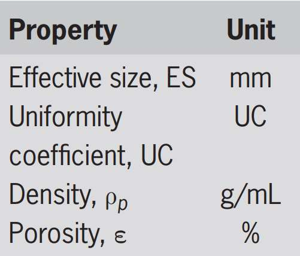
  - **Hình này chứng minh điều gì**
    - Minh họa chi tiết sơ đồ công nghệ, thông số thiết kế hoặc cấu tạo thiết bị trên slide trang 5.
  - **Từ đâu mà thấy được**
    - Trích xuất trực tiếp từ tài liệu bài giảng gốc của chương.

- Thông số và cấu tạo chi tiết theo tài liệu bài giảng (Trang 5):
  - **Hình 8.** Figure 8 (Page 5)
    - 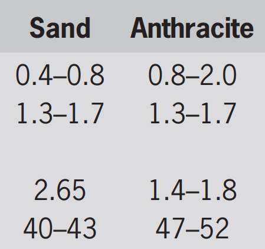
  - **Hình này chứng minh điều gì**
    - Minh họa chi tiết sơ đồ công nghệ, thông số thiết kế hoặc cấu tạo thiết bị trên slide trang 5.
  - **Từ đâu mà thấy được**
    - Trích xuất trực tiếp từ tài liệu bài giảng gốc của chương.

- Thông số và cấu tạo chi tiết theo tài liệu bài giảng (Trang 5):
  - **Hình 9.** Figure 9 (Page 5)
    - 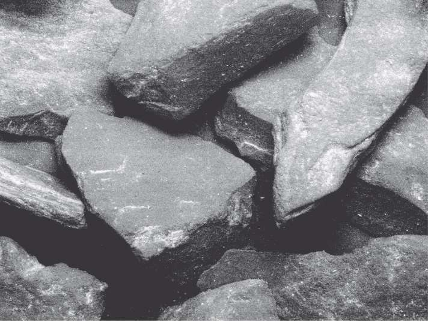
  - **Hình này chứng minh điều gì**
    - Minh họa chi tiết sơ đồ công nghệ, thông số thiết kế hoặc cấu tạo thiết bị trên slide trang 5.
  - **Từ đâu mà thấy được**
    - Trích xuất trực tiếp từ tài liệu bài giảng gốc của chương.

- Thông số và cấu tạo chi tiết theo tài liệu bài giảng (Trang 5):
  - **Hình 10.** Figure 10 (Page 5)
    - 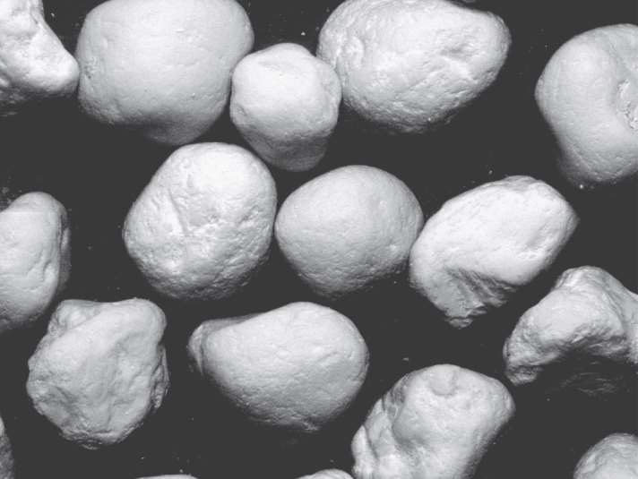
  - **Hình này chứng minh điều gì**
    - Minh họa chi tiết sơ đồ công nghệ, thông số thiết kế hoặc cấu tạo thiết bị trên slide trang 5.
  - **Từ đâu mà thấy được**
    - Trích xuất trực tiếp từ tài liệu bài giảng gốc của chương.

#### Hydraulics of Flow through Granular Media

- Thủy lực dòng chảy qua tầng vật liệu lọc hạt (Hydraulics of flow through granular media): Cơ sở tính toán động học chất lưu cho hai chế độ vận hành đối lập trong bể lọc nhanh:
  - Chế độ lọc xuôi (Filtration stage): Dòng nước đi xuống qua tầng vật liệu lọc cố định (fixed bed) ở trạng thái hạt sạch hoặc đã tích tụ cặn, phát sinh tổn thất áp lực thủy lực ($h_L$).
  - Chế độ rửa ngược (Backwash stage): Dòng nước sạch đi lên từ đáy bể làm chất lưu hóa tầng hạt, khiến tầng lọc chuyển sang trạng thái giãn nở (expanded bed) để giải phóng cặn bẩn bị giữ lại.
- Các đại lượng thủy lực quyết định kích thước xây dựng bể lọc, chiều cao cột nước áp lực làm việc ($H_{\text{water}}$), công suất trạm bơm rửa ngược và cao độ lắp đặt máng thu nước rửa ($H_{\text{trough}}$).

##### Clean-Bed Head Loss Hydraulics

- Chuẩn số Reynolds đặc trưng cho dòng chảy qua tầng lọc hạt:
  - Công thức xác định:
    $$\text{Re} = \frac{\rho_w v d}{\mu}$$
  - Các đại lượng thành phần và đơn vị đo:
    - $\text{Re}$: Chuẩn số Reynolds (không thứ nguyên).
    - $\rho_w$: Khối lượng riêng của nước ($\text{kg/m}^3$), phụ thuộc nhiệt độ dòng nước (tại $15^\circ\text{C}$, $\rho_w = 999.1\text{ kg/m}^3$).
    - $v$: Vận tốc lọc bề mặt ($\text{m/s}$ hoặc $\text{m}^3/(\text{m}^2\cdot\text{s})$), chuyển đổi từ cường độ lọc danh định $\text{m/h}$ ($v [\text{m/s}] = v [\text{m/h}] / 3{,}600$).
    - $d$: Đường kính hình học hạt vật liệu hoặc kích thước hiệu dụng $ES = d_{10}$ ($\text{m}$).
    - $\mu$: Độ nhớt động lực học của nước ($\text{Pa}\cdot\text{s}$ hoặc $\text{N}\cdot\text{s/m}^2$, tại $15^\circ\text{C}$, $\mu = 1.139 \times 10^{-3}\text{ Pa}\cdot\text{s}$).
  - Ý nghĩa động học: Chuẩn số $\text{Re}$ biểu thị tỷ số giữa lực quán tính và lực ma sát nhớt trong các mao quản liên hạt.
  - Phân vùng chế độ dòng chảy trong bể lọc:
    - Với vận tốc lọc thông thường $v = 5\text{--}15\text{ m/h}$ và cỡ hạt $d = 0.5\text{--}1.0\text{ mm}$, chuẩn số Reynolds dao động trong khoảng $\text{Re} \approx 1\text{--}10$.
    - Dòng chảy nằm trong vùng quá độ (transitional flow regime), đòi hỏi phương trình tổn thất áp lực phải chứa đồng thời số hạng ma sát nhớt (tuyến tính) và số hạng lực quán tính (bậc hai).

- Phương trình Ergun tổng quát cho tổn thất áp lực qua tầng lọc sạch (Head loss through clean media bed):
  - Công thức giải tích:
    $$h_L = \kappa_V \frac{(1 - \varepsilon)^2}{\varepsilon^3} \frac{\mu L v}{\rho_w g d^2} + \kappa_I \frac{1 - \varepsilon}{\varepsilon^3} \frac{L v^2}{g d}$$
  - Các thông số trong công thức:
    - $h_L$: Tổn thất áp lực qua tầng lọc sạch ($\text{m}$ cột nước).
    - $\kappa_V$: Hệ số tổn thất áp lực do ma sát nhớt (nhóm chảy tầng / viscous head loss coefficient, không thứ nguyên).
    - $\kappa_I$: Hệ số tổn thất áp lực do lực quán tính (nhóm chảy rối / inertial head loss coefficient, không thứ nguyên).
    - $\varepsilon$: Độ rỗng của tầng vật liệu lọc sạch (không thứ nguyên, $0 < \varepsilon < 1$).
    - $L$: Chiều dày tầng vật liệu lọc ($\text{m}$).
    - $g$: Gia tốc trọng trường ($g = 9.81\text{ m/s}^2$).
  - Thành phần ma sát nhớt (Viscous term - số hạng thứ nhất):
    - Biểu thức: $h_{L,V} = \kappa_V \frac{(1 - \varepsilon)^2}{\varepsilon^3} \frac{\mu L v}{\rho_w g d^2}$.
    - Xuất phát từ định luật Kozeny-Carman cho dòng chảy tầng nhớt.
    - Tỷ lệ thuận tuyến tính với vận tốc lọc $v$ và tỷ lệ nghịch với bình phương kích thước hạt $d^2$.
  - Thành phần quán tính (Inertial term - số hạng thứ hai):
    - Biểu thức: $h_{L,I} = \kappa_I \frac{1 - \varepsilon}{\varepsilon^3} \frac{L v^2}{g d}$.
    - Xuất phát từ phương trình Burke-Plummer cho dòng chảy rối qua vật đệm.
    - Tỷ lệ thuận với bình phương vận tốc $v^2$ và tỷ lệ nghịch với kích thước hạt $d$.
  - Ảnh hưởng phi tuyến tính của độ rỗng tầng lọc ($\varepsilon$):
    - Cả hai số hạng đều chứa mẫu số $\varepsilon^3$, khiến tổn thất áp lực tăng vọt khi độ rỗng lớp lọc suy giảm do cặn bẩn bám dính vào các khe rỗng mao quản.

  - **Hình 11.** Phương trình Ergun xác định tổn thất áp lực qua tầng lọc vật liệu hạt sạch
    - 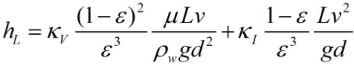
  - **Hình này chứng minh điều gì**
    - Biểu thức giải tích tổn thất cột áp $h_L$ gồm hai số hạng ma sát nhớt ($\kappa_V$) và suy hao quán tính ($\kappa_I$).
  - **Từ đâu mà thấy được**
    - Số hạng bên trái chứa hệ số $\kappa_V$, hàm độ rỗng $(1-\varepsilon)^2/\varepsilon^3$, độ nhớt $\mu$, và nghịch đảo bình phương cỡ hạt $d^2$.
    - Số hạng bên phải chứa hệ số $\kappa_I$, hàm độ rỗng $(1-\varepsilon)/\varepsilon^3$, vận tốc bình phương $v^2$, và mẫu số $gd$.

- Hệ số thực nghiệm tổn thất áp lực của các loại vật liệu lọc hạt:
  - Bảng giá trị thực nghiệm tiêu chuẩn (Head loss coefficiency):

| Loại vật liệu lọc (Medium) | Hệ số ma sát nhớt ($\kappa_V$) | Hệ số lực quán tính ($\kappa_I$) |
| :--- | :---: | :---: |
| **Cát thạch anh (Sand)** | $110\text{ -- }115$ | $2.0\text{ -- }2.5$ |
| **Than Anthracite (Anthracite)** | $210\text{ -- }245$ | $3.5\text{ -- }5.3$ |

  - **Hình 12.** Bảng tra hệ số tổn thất áp lực $\kappa_V$ và $\kappa_I$ cho cát và than anthracite
    - 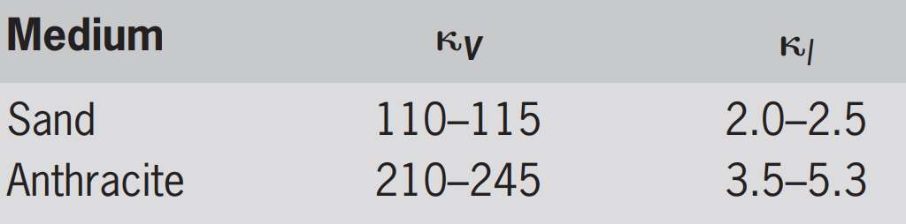
  - **Hình này chứng minh điều gì**
    - Giá trị thực nghiệm của hệ số ma sát nhớt $\kappa_V$ và hệ số quán tính $\kappa_I$ cho hai vật liệu lọc thông dụng nhất.
  - **Từ đâu mà thấy được**
    - Hàng Sand: $\kappa_V = 110\text{--}115$, $\kappa_I = 2.0\text{--}2.5$.
    - Hàng Anthracite: $\kappa_V = 210\text{--}245$, $\kappa_I = 3.5\text{--}5.3$.

- Phân tích cơ chế thủy lực giữa cát thạch anh và than anthracite:
  - Hình thái học hạt chi phối trực tiếp hệ số ma sát: Than anthracite có các hệ số $\kappa_V$ và $\kappa_I$ lớn gần gấp đôi so với cát thạch anh vì hạt than có dạng mảnh vỡ sắc nhọn, gãy vụn và độ cầu thấp ($\psi \approx 0.55\text{--}0.70$ so với $\psi \approx 0.75\text{--}0.85$ của cát).
  - Tác dụng bù trừ của độ rỗng tự nhiên: Mặc dù hệ số ma sát của than lớn hơn, nhưng than anthracite sắp xếp xốp hơn dẫn đến độ rỗng sạch ban đầu cao hơn đáng kể ($\varepsilon \approx 0.47\text{--}0.52$ so với $\varepsilon \approx 0.40\text{--}0.43$ của cát). Mẫu số $\varepsilon^3$ lớn hơn giúp triệt tiêu trở lực ma sát hình thái, giữ cho tổng tổn thất áp lực qua tầng than thô luôn ở mức thấp.

---

###### Example: Clean-bed head loss calculation

- **Đề bài**:
  - Tiếng Anh (nguyên văn): "Example: Calculate the clean-bed head loss through a 1.8 m deep-bed anthracite filter (ES = 0.95 mm) at a filtration rate of 15 m/h and a temperature of 15°C."
  - Tiếng Việt: Tính tổn thất áp lực qua tầng lọc than anthracite sạch có chiều dày $1.8\text{ m}$ (kích thước hiệu dụng $ES = 0.95\text{ mm}$) ở vận tốc lọc $15\text{ m/h}$ và nhiệt độ nước $15^\circ\text{C}$.

- **Dữ kiện**:
  - Chiều dày tầng vật liệu lọc: $L = 1.8\text{ m}$.
  - Vật liệu lọc: Than Anthracite (Deep-bed anthracite filter).
  - Kích thước hạt hiệu dụng: $ES = d = 0.95\text{ mm} = 0.95 \times 10^{-3}\text{ m}$.
  - Vận tốc lọc danh định: $v = 15\text{ m/h} = \frac{15}{3{,}600}\text{ m/s} \approx 4.167 \times 10^{-3}\text{ m/s}$.
  - Nhiệt độ nước lọc: $T = 15^\circ\text{C}$.
  - Các thông số tra cứu vật lý và thực nghiệm:
    - Thuộc tính của nước ở $15^\circ\text{C}$: Khối lượng riêng $\rho_w = 999.1\text{ kg/m}^3 \approx 1{,}000\text{ kg/m}^3$; Độ nhớt động lực học $\mu = 1.139 \times 10^{-3}\text{ Pa}\cdot\text{s}$; Gia tốc trọng trường $g = 9.81\text{ m/s}^2$.
    - Thuộc tính than anthracite (Slide 9): Độ rỗng sạch tiêu chuẩn $\varepsilon = 0.47\text{--}0.52$. Chọn giá trị thiết kế danh định $\varepsilon = 0.50$.
    - Hệ số tổn thất áp lực của than anthracite (Slide 12 / Hình 12): $\kappa_V = 210\text{--}245$ (giá trị trung bình chọn $\kappa_V = 227.5$), $\kappa_I = 3.5\text{--}5.3$ (giá trị trung bình chọn $\kappa_I = 4.4$).
  - **Ảnh EX_CLEAN_BED.1.** Đề bài tính tổn thất áp lực qua tầng lọc than anthracite sạch từ Slide 13 (Trang 7 tài liệu gốc).
    - 
    - Nhìn vào: Dòng văn bản dưới tiêu đề màu xanh ghi rõ: "Example: Calculate the clean-bed head loss through a 1.8 m deep-bed anthracite filter (ES = 0.95 mm) at a filtration rate of 15 m/h and a temperature of 15°C." Số slide 13 hiển thị ở góc dưới bên phải.

- **Quy tắc áp dụng**:
  - Xác định chuẩn số Reynolds để kiểm tra chế độ chảy:
    $$\text{Re} = \frac{\rho_w v d}{\mu}$$
  - Phương trình Ergun tổng quát tính tổn thất áp lực:
    $$h_L = h_{L,V} + h_{L,I} = \kappa_V \frac{(1 - \varepsilon)^2}{\varepsilon^3} \frac{\mu L v}{\rho_w g d^2} + \kappa_I \frac{1 - \varepsilon}{\varepsilon^3} \frac{L v^2}{g d}$$

- **Lời giải**:
  - **Bước 1** (Đổi đơn vị và xác định chuẩn số Reynolds):
    - Căn cứ: Công thức tính chuẩn số $\text{Re} = \frac{\rho_w v d}{\mu}$ và dữ kiện nhiệt độ nước $15^\circ\text{C}$.
    - Nhìn vào: Vận tốc lọc $15\text{ m/h}$ và cỡ hạt $ES = 0.95\text{ mm}$ trên Ảnh EX_CLEAN_BED.1.
    - Đổi đơn vị vận tốc lọc sang hệ SI chuẩn:
      $$v = \frac{15\text{ m/h}}{3{,}600\text{ s/h}} = 4.1667 \times 10^{-3}\text{ m/s}$$
    - Tính chuẩn số Reynolds:
      $$\text{Re} = \frac{999.1\text{ kg/m}^3 \times (4.1667 \times 10^{-3}\text{ m/s}) \times (0.95 \times 10^{-3}\text{ m})}{1.139 \times 10^{-3}\text{ Pa}\cdot\text{s}} = 3.472$$
    - Đánh giá chế độ dòng: Giá trị $\text{Re} = 3.47$ nằm trong khoảng $1 < \text{Re} < 10$, chứng tỏ dòng chảy thuộc chế độ quá độ. Cả hai thành phần ma sát nhớt và lực quán tính đều phải được tính toán đầy đủ.
  - **Bước 2** (Tính toán các hàm số theo độ rỗng tầng lọc):
    - Căn cứ: Độ rỗng thiết kế tiêu chuẩn của than anthracite $\varepsilon = 0.50$ (thuộc khoảng $0.47\text{--}0.52$).
    - Nhìn vào: Bảng thuộc tính vật liệu lọc ở Slide 9 hàng "Porosity, $\varepsilon$: 47–52%".
    - Tính hệ số hàm độ rỗng cho thành phần nhớt:
      $$\frac{(1 - \varepsilon)^2}{\varepsilon^3} = \frac{(1 - 0.50)^2}{(0.50)^3} = \frac{0.25}{0.125} = 2.000$$
    - Tính hệ số hàm độ rỗng cho thành phần quán tính:
      $$\frac{1 - \varepsilon}{\varepsilon^3} = \frac{1 - 0.50}{(0.50)^3} = \frac{0.50}{0.125} = 4.000$$
  - **Bước 3** (Tính thành phần tổn thất áp lực do ma sát nhớt $h_{L,V}$):
    - Căn cứ: Số hạng thứ nhất trong phương trình Ergun với $\kappa_V = 227.5$ (giá trị trung bình khoảng $210\text{--}245$ theo Hình 12).
    - Tính cụm biến số thủy lực:
      $$\frac{\mu L v}{\rho_w g d^2} = \frac{(1.139 \times 10^{-3}) \times 1.8 \times (4.1667 \times 10^{-3})}{999.1 \times 9.81 \times (0.95 \times 10^{-3})^2} = \frac{8.5425 \times 10^{-6}}{9{,}801.17 \times 9.025 \times 10^{-7}} = 9.6573 \times 10^{-4}\text{ m}$$
    - Tính tổn thất do ma sát nhớt:
      $$h_{L,V} = \kappa_V \times 2.000 \times (9.6573 \times 10^{-4}) = 227.5 \times 2.000 \times (9.6573 \times 10^{-4}) = 0.4394\text{ m}$$
  - **Bước 4** (Tính thành phần tổn thất áp lực do lực quán tính $h_{L,I}$):
    - Căn cứ: Số hạng thứ hai trong phương trình Ergun với $\kappa_I = 4.4$ (giá trị trung bình khoảng $3.5\text{--}5.3$ theo Hình 12).
    - Tính cụm biến số động năng dòng chảy:
      $$\frac{L v^2}{g d} = \frac{1.8 \times (4.1667 \times 10^{-3})^2}{9.81 \times (0.95 \times 10^{-3})} = \frac{1.8 \times 1.7361 \times 10^{-5}}{9.3195 \times 10^{-3}} = 3.3533 \times 10^{-3}\text{ m}$$
    - Tính tổn thất do lực quán tính:
      $$h_{L,I} = \kappa_I \times 4.000 \times (3.3533 \times 10^{-3}) = 4.4 \times 4.000 \times (3.3533 \times 10^{-3}) = 0.0590\text{ m}$$
  - **Bước 5** (Tổng hợp tổn thất áp lực ban đầu $h_L$):
    - Tính tổng tổn thất áp lực qua tầng lọc:
      $$h_L = h_{L,V} + h_{L,I} = 0.4394\text{ m} + 0.0590\text{ m} = 0.4984\text{ m} \approx 0.50\text{ m}$$
    - Khảo sát dải biến thiên theo các cận thực nghiệm:
      - Với cặp hệ số cận dưới ($\kappa_V = 210, \kappa_I = 3.5$):
        $$h_{L,\min} = 210 \times 2.0 \times (9.6573 \times 10^{-4}) + 3.5 \times 4.0 \times (3.3533 \times 10^{-3}) = 0.4056 + 0.0470 = 0.453\text{ m}$$
      - Với cặp hệ số cận trên ($\kappa_V = 245, \kappa_I = 5.3$):
        $$h_{L,\max} = 245 \times 2.0 \times (9.6573 \times 10^{-4}) + 5.3 \times 4.0 \times (3.3533 \times 10^{-3}) = 0.4732 + 0.0711 = 0.544\text{ m}$$

- **Kết quả**:
  - Chuẩn số Reynolds: $\text{Re} = 3.47$.
  - Thành phần ma sát nhớt: $h_{L,V} = 0.439\text{ m}$ (chiếm $88.2\%$ tổng tổn thất).
  - Thành phần lực quán tính: $h_{L,I} = 0.059\text{ m}$ (chiếm $11.8\%$ tổng tổn thất).
  - Tổng tổn thất áp lực tầng lọc sạch: $h_L = 0.498\text{ m}$ cột nước (khoảng giá trị thực nghiệm: $0.45\text{--}0.54\text{ m}$).

- **Kiểm tra lại**:
  - Kiểm tra thứ nguyên:
    - $[h_{L,V}] = \frac{[\text{Pa}\cdot\text{s}] [\text{m}] [\text{m/s}]}{[\text{kg/m}^3] [\text{m/s}^2] [\text{m}^2]} = \frac{(\text{N}\cdot\text{s/m}^2) \cdot \text{m}^2/\text{s}}{(\text{N/m}^3) \cdot \text{m}^2} = \frac{\text{N}}{\text{N/m}} = \text{m}$ (chính xác).
    - $[h_{L,I}] = \frac{[\text{m}] [\text{m/s}]^2}{[\text{m/s}^2] [\text{m}]} = \frac{\text{m}^3/\text{s}^2}{\text{m}^2/\text{s}^2} = \text{m}$ (chính xác).
  - Phù hợp thực tế công nghệ: Tổn thất cột áp ban đầu khoảng $0.50\text{ m}$ hoàn toàn nằm trong dải làm việc tiêu chuẩn của tầng lọc sâu than anthracite ($0.3\text{--}0.6\text{ m}$), để lại cột áp dự phòng hữu ích từ $1.5\text{ m}$ đến $2.3\text{ m}$ cho quá trình tích tụ cặn trước khi rửa ngược.

---

##### Particle Settling and Forces during Backwash

- Động lực học hạt đơn lẻ trong quá trình rửa ngược (Forces on an individual particle during backwash):
  - Khi rửa ngược, dòng nước hướng thẳng đứng từ đáy lên trên với vận tốc bề mặt $v_{bw}$.
  - Hạt vật liệu lọc chịu tác động đồng thời của ba lực cơ bản theo phương thẳng đứng.
  - Phương trình cân bằng lực tổng quát:
    $$\sum F = F_g - F_b - F_d$$
  - Quy ước chiều lực: Chiều dương hướng xuống dưới (theo hướng gia tốc trọng trường).
- Phân tích chi tiết các lực thành phần tác dụng lên hạt:
  - Trọng lực hướng xuống (Gravitational force, $F_g$):
    $$F_g = \rho_p V_p g = \rho_p \left(\frac{\pi d^3}{6}\right) g$$
    - $\rho_p$: Khối lượng riêng của hạt vật liệu lọc ($\text{kg/m}^3$).
    - $V_p$: Thể tích hình học của hạt hình cầu quy ước, $V_p = \frac{\pi d^3}{6}$ ($\text{m}^3$).
    - $g$: Gia tốc trọng trường ($g = 9.81\text{ m/s}^2$).
  - Lực đẩy nổi Archimedes hướng lên (Buoyant force, $F_b$):
    $$F_b = \rho_w V_p g = \rho_w \left(\frac{\pi d^3}{6}\right) g$$
    - $\rho_w$: Khối lượng riêng của nước ($\text{kg/m}^3$).
    - Xuất hiện do chênh lệch áp suất thủy tĩnh của chất lỏng bao quanh hạt.
  - Trọng lượng chìm hiệu dụng của hạt (Submerged weight):
    $$F_{\text{sub}} = F_g - F_b = (\rho_p - \rho_w) V_p g = (\rho_p - \rho_w) \left(\frac{\pi d^3}{6}\right) g$$
    - Là lực kéo hạt lắng xuống đáy bể khi không có dòng nước chuyển động.
  - Lực cản thủy động lực học của dòng nước rửa ngược (Drag force, $F_d$):
    $$F_d = C_d \rho_w A_p \frac{v_{bw}^2}{2} = C_d \rho_w \left(\frac{\pi d^2}{4}\right) \frac{v_{bw}^2}{2}$$
    - Chiều tác dụng: Hướng thẳng đứng từ dưới lên (cùng chiều dòng nước rửa ngược).
    - $A_p$: Diện tích cản chính diện của hạt chiếu theo phương dòng chảy, $A_p = \frac{\pi d^2}{4}$ ($\text{m}^2$).
    - $v_{bw}$: Cường độ rửa ngược hoặc vận tốc tương đối của dòng nước qua hạt ($\text{m/s}$ hoặc $\text{m}^3/(\text{m}^2\cdot\text{s})$).
    - $C_d$: Hệ số cản thủy động lực học (drag coefficient, không thứ nguyên).

- Xác định hệ số cản thủy động lực học ($C_d$):
  - Phụ thuộc vào chuẩn số Reynolds của hạt trong dòng rửa ngược:
    $$\text{Re} = \frac{\rho_w v_{bw} d}{\mu}$$
  - Công thức tính theo hai chế độ dòng chảy:
    $$C_d = \frac{24}{\text{Re}} \quad (\text{khi } \text{Re} < 2 \text{ - Chế độ chảy tầng / Vùng định luật Stokes})$$
    $$C_d = \frac{18.5}{\text{Re}^{0.6}} \quad (\text{khi } 2 \le \text{Re} \le 500 \text{ - Chế độ chảy quá độ})$$

- Vận tốc lắng tự do cuối cùng (Terminal settling velocity, $v_t$):
  - Định nghĩa: Vận tốc rơi ổn định của hạt đơn lẻ trong môi trường chất lỏng tĩnh vô hạn, đạt được khi tổng các lực triệt tiêu lẫn nhau ($F_d = F_g - F_b$, dẫn đến $\sum F = 0$).
  - Biểu thức trong vùng chảy tầng ($\text{Re} < 2$):
    $$v_t = \frac{g (\rho_p - \rho_w) d^2}{18 \mu}$$
  - Biểu thức trong vùng chảy quá độ ($2 \le \text{Re} \le 500$):
    $$v_t = \left[ \frac{4 g (\rho_p - \rho_w) d}{3 C_d \rho_w} \right]^{0.5}$$

- Điều kiện phân giới động học và hiện tượng rửa trôi hạt (Washout criteria):
  - Trạng thái lơ lửng cân bằng tĩnh: Khi $v_{bw} = v_t$, lực cản thủy động cân bằng hoàn toàn trọng lượng chìm ($F_d = F_g - F_b$), hạt lơ lửng tại chỗ trong cột nước.
  - Trạng thái lắng đọng: Khi $v_{bw} < v_t$, trọng lực thắng lực nâng hướng lên ($F_g > F_b + F_d \implies \sum F > 0$), hạt chìm dần xuống dưới.
  - Hiện tượng rửa trôi vật liệu lọc (Particle washout):
    - Xảy ra khi cường độ rửa ngược vượt quá vận tốc lắng tự do của hạt:
      $$v_{bw} > v_t \iff F_d + F_b > F_g \iff \sum F < 0$$
    - Hợp lực có hướng thẳng đứng lên trên, tạo gia tốc hướng lên cuốn hạt vật liệu ra khỏi tầng lọc và tràn vào máng thu nước rửa lọc ($washwater troughs$).
    - Ý nghĩa trong quản lý vận hành: Vận tốc rửa ngược $v_{bw}$ phải được thiết kế sao cho đủ lớn để cuốn trôi toàn bộ cặn bẩn mịn ($d \approx 0.01\text{--}0.1\text{ mm}$), nhưng phải nhỏ hơn vận tốc lắng của hạt vật liệu lọc nhỏ nhất ($d_{10}$) để tránh thất thoát vật liệu đắt tiền.

---

###### Example: Particle washout during backwash

- **Đề bài**:
  - Tiếng Anh (nguyên văn): "Example: A filter is backwashed at 50 m/h at 15°C. Determine whether a 0.1-mm diameter particle will be washed from the filter."
  - Tiếng Việt: Một bể lọc được rửa ngược ở cường độ $50\text{ m/h}$ tại nhiệt độ $15^\circ\text{C}$. Hãy xác định xem hạt có đường kính $0.1\text{ mm}$ có bị cuốn trôi ra khỏi bể lọc hay không.

- **Dữ kiện**:
  - Cường độ rửa ngược: $v_{bw} = 50\text{ m/h} = \frac{50}{3{,}600}\text{ m/s} \approx 0.013889\text{ m/s} = 13.889\text{ mm/s}$.
  - Nhiệt độ nước rửa ngược: $T = 15^\circ\text{C}$.
  - Đường kính hạt khảo sát: $d = 0.1\text{ mm} = 10^{-4}\text{ m} = 0.0001\text{ m}$.
  - Thuộc tính chất lỏng (nước ở $15^\circ\text{C}$): Khối lượng riêng $\rho_w = 999.1\text{ kg/m}^3$; Độ nhớt động lực học $\mu = 1.139 \times 10^{-3}\text{ Pa}\cdot\text{s}$; Gia tốc trọng trường $g = 9.81\text{ m/s}^2$.
  - Khối lượng riêng hạt ($\rho_p$): Khảo sát cho cả hai trường hợp vật liệu lọc thông dụng trong bể lọc nước:
    - Trường hợp A (Cát thạch anh): $\rho_p = 2{,}650\text{ kg/m}^3$.
    - Trường hợp B (Than Anthracite): $\rho_p = 1{,}500\text{ kg/m}^3$ (thuộc khoảng $1{,}400\text{--}1{,}800\text{ kg/m}^3$).
  - **Ảnh EX_WASHOUT.1.** Đề bài bài toán rửa trôi hạt khi rửa ngược từ Slide 18 (Trang 8 tài liệu gốc).
    - 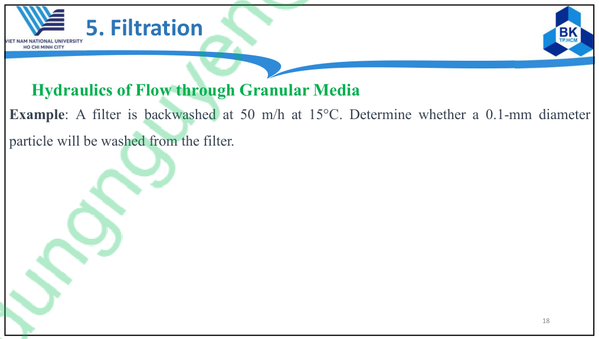
    - Nhìn vào: Dòng văn bản ghi rõ: "Example: A filter is backwashed at 50 m/h at 15°C. Determine whether a 0.1-mm diameter particle will be washed from the filter." Số slide 18 hiển thị ở góc dưới bên phải.

- **Quy tắc áp dụng**:
  - Tính chuẩn số Reynolds của hạt trong dòng nước rửa:
    $$\text{Re} = \frac{\rho_w v_{bw} d}{\mu}$$
  - Xác định hệ số cản $C_d$:
    - Nếu $\text{Re} < 2$: $C_d = \frac{24}{\text{Re}}$.
    - Nếu $2 \le \text{Re} \le 500$: $C_d = \frac{18.5}{\text{Re}^{0.6}}$.
  - Tính lực cản thủy động $F_d$:
    $$F_d = C_d \rho_w \left(\frac{\pi d^2}{4}\right) \frac{v_{bw}^2}{2}$$
  - Tính trọng lượng chìm hiệu dụng $F_{\text{sub}} = F_g - F_b$:
    $$F_g - F_b = (\rho_p - \rho_w) \left(\frac{\pi d^3}{6}\right) g$$
  - Tiêu chuẩn rửa trôi: Hạt bị cuốn trôi khi hợp lực $\sum F = F_g - F_b - F_d < 0 \iff F_d > F_g - F_b$, hoặc khi vận tốc rửa ngược $v_{bw}$ lớn hơn vận tốc lắng tự do $v_t$ của hạt.

- **Lời giải**:
  - **Bước 1** (Đổi đơn vị và tính chuẩn số Reynolds của hạt):
    - Căn cứ: Cường độ rửa $50\text{ m/h}$ và đường kính hạt $d = 0.1\text{ mm}$.
    - Nhìn vào: Dòng đề bài trên Ảnh EX_WASHOUT.1.
    - Đổi đơn vị vận tốc rửa ngược:
      $$v_{bw} = \frac{50\text{ m/h}}{3{,}600\text{ s/h}} = 0.013889\text{ m/s}$$
    - Tính chuẩn số Reynolds của dòng chảy bao quanh hạt:
      $$\text{Re} = \frac{999.1\text{ kg/m}^3 \times 0.013889\text{ m/s} \times 10^{-4}\text{ m}}{1.139 \times 10^{-3}\text{ Pa}\cdot\text{s}} = 1.218$$
  - **Bước 2** (Xác định hệ số cản thủy động $C_d$):
    - Căn cứ: Chuẩn số Reynolds $\text{Re} = 1.218 < 2$, dòng chảy quanh hạt nằm trong chế độ chảy tầng Stokes.
    - Nhìn vào: Quy tắc xác định hệ số cản ở Slide 17 dòng "$C_d = 24/\text{Re}$ for $\text{Re} < 2$".
    - Tính hệ số cản:
      $$C_d = \frac{24}{\text{Re}} = \frac{24}{1.2183} = 19.700$$
  - **Bước 3** (Tính các đặc trưng hình học và lực cản thủy động $F_d$):
    - Diện tích cản chính diện của hạt hình cầu:
      $$A_p = \frac{\pi d^2}{4} = \frac{\pi \times (10^{-4}\text{ m})^2}{4} = 7.8540 \times 10^{-9}\text{ m}^2$$
    - Thể tích của hạt:
      $$V_p = \frac{\pi d^3}{6} = \frac{\pi \times (10^{-4}\text{ m})^3}{6} = 5.2360 \times 10^{-13}\text{ m}^3$$
    - Tính lực cản thủy động $F_d$ hướng lên:
      $$F_d = 19.700 \times 999.1 \times (7.8540 \times 10^{-9}) \times \frac{(0.013889)^2}{2} = 1.491 \times 10^{-8}\text{ N}$$
      *(Kiểm tra nhanh bằng định luật Stokes: $F_d = 3\pi \mu d v_{bw} = 3\pi \times (1.139 \times 10^{-3}) \times 10^{-4} \times 0.013889 = 1.491 \times 10^{-8}\text{ N}$)*.
  - **Bước 4** (Kiểm tra điều kiện rửa trôi cho hạt cát thạch anh $\rho_p = 2{,}650\text{ kg/m}^3$):
    - Căn cứ: Khối lượng riêng của cát $\rho_p = 2.65\text{ g/mL} = 2{,}650\text{ kg/m}^3$ (Slide 9).
    - Tính trọng lượng chìm hiệu dụng của hạt cát:
      $$F_g - F_b = (2{,}650 - 999.1) \times (5.2360 \times 10^{-13}) \times 9.81 = 8.480 \times 10^{-9}\text{ N}$$
    - Tính hợp lực tác dụng lên hạt cát:
      $$\sum F = (F_g - F_b) - F_d = 8.480 \times 10^{-9}\text{ N} - 1.491 \times 10^{-8}\text{ N} = -6.430 \times 10^{-9}\text{ N} < 0$$
    - Xác định vận tốc lắng tự do $v_t$ của hạt cát:
      $$v_t = \frac{g (\rho_p - \rho_w) d^2}{18 \mu} = \frac{9.81 \times (2{,}650 - 999.1) \times (10^{-4})^2}{18 \times (1.139 \times 10^{-3})} = 7.899 \times 10^{-3}\text{ m/s}$$
      Đổi sang $\text{m/h}$:
      $$v_t = 7.899 \times 10^{-3} \times 3{,}600 = 28.44\text{ m/h}$$
    - So sánh vận tốc: Cường độ rửa $v_{bw} = 50.0\text{ m/h} > v_t = 28.44\text{ m/h}$ (lớn hơn gấp $1.76$ lần).
    - Kết luận cho hạt cát: Hợp lực hướng lên trên và $v_{bw} > v_t$, hạt cát $0.1\text{ mm}$ **chắc chắn bị cuốn trôi ra khỏi bể lọc**.
  - **Bước 5** (Kiểm tra điều kiện rửa trôi cho hạt than anthracite $\rho_p = 1{,}500\text{ kg/m}^3$):
    - Căn cứ: Khối lượng riêng của than anthracite $\rho_p = 1.4\text{--}1.8\text{ g/mL}$, lấy trung bình $\rho_p = 1{,}500\text{ kg/m}^3$ (Slide 9).
    - Tính trọng lượng chìm hiệu dụng của hạt than:
      $$F_g - F_b = (1{,}500 - 999.1) \times (5.2360 \times 10^{-13}) \times 9.81 = 2.573 \times 10^{-9}\text{ N}$$
    - Tính hợp lực tác dụng lên hạt than:
      $$\sum F = 2.573 \times 10^{-9}\text{ N} - 1.491 \times 10^{-8}\text{ N} = -1.234 \times 10^{-8}\text{ N} \ll 0$$
    - Xác định vận tốc lắng tự do $v_t$ của hạt than anthracite:
      $$v_t = \frac{9.81 \times (1{,}500 - 999.1) \times (10^{-4})^2}{18 \times (1.139 \times 10^{-3})} = 2.397 \times 10^{-3}\text{ m/s} = 8.63\text{ m/h}$$
    - So sánh vận tốc: Cường độ rửa $v_{bw} = 50.0\text{ m/h} \gg v_t = 8.63\text{ m/h}$ (lớn hơn gấp $5.8$ lần).
    - Kết luận cho hạt than: Hạt than anthracite $0.1\text{ mm}$ **bị cuốn trôi rất mạnh ra khỏi bể lọc**.

- **Kết quả**:
  - Chuẩn số Reynolds và hệ số cản: $\text{Re} = 1.22$, $C_d = 19.70$.
  - Lực cản thủy động học hướng lên: $F_d = 1.491 \times 10^{-8}\text{ N}$.
  - Đối với hạt cát ($0.1\text{ mm}, \rho_p = 2{,}650\text{ kg/m}^3$): Vận tốc lắng $v_t = 28.44\text{ m/h} < 50\text{ m/h}$, $\sum F < 0 \implies$ **Bị cuốn trôi**.
  - Đối với hạt than anthracite ($0.1\text{ mm}, \rho_p = 1{,}500\text{ kg/m}^3$): Vận tốc lắng $v_t = 8.63\text{ m/h} \ll 50\text{ m/h}$, $\sum F \ll 0 \implies$ **Bị cuốn trôi**.

- **Kiểm tra lại**:
  - Đánh giá tính nhất quán vật lý: Kích thước hạt hiệu dụng thiết kế tiêu chuẩn của bể lọc luôn lớn hơn nhiều ($ES \ge 0.4\text{ mm}$ cho cát và $ES \ge 0.8\text{ mm}$ cho than). Các hạt có kích thước $0.1\text{ mm}$ là hạt cặn lơ lửng mịn hoặc vụn vật liệu lọc vỡ (fines).
  - Khẳng định mục tiêu công nghệ: Cường độ rửa ngược $50\text{ m/h}$ đạt hiệu quả hoàn hảo để bóc tách và rửa trôi toàn bộ các hạt bùn cặn mịn $0.1\text{ mm}$ ra khỏi tầng lọc vào máng thu nước thải, đồng thời bảo toàn các hạt vật liệu lọc hữu ích có kích thước $ES \ge 0.4\text{--}0.5\text{ mm}$ (vận tốc lắng của cát $0.5\text{ mm}$ là $> 65\text{ m/h} > 50\text{ m/h}$).

---

##### Filter Bed Expansion during Backwash

- Khái niệm và nguyên lý giãn nở tầng lọc khi rửa ngược (Bed expansion during backwash):
  - Khi rửa ngược với cường độ đủ lớn, lực ma sát của dòng nước hướng lên nâng các hạt vật liệu lọc tách rời nhau, chuyển tầng lọc cố định thành trạng thái giả lỏng (chất lưu hóa - fluidization).
  - Tỷ lệ phần trăm giãn nở tầng lọc:
    $$\% \text{ Bed expansion} = \left(\frac{L_E}{L_F} - 1\right) \times 100\%$$
    - $L_E$: Chiều dày tầng lọc ở trạng thái giãn nở (m).
    - $L_F$: Chiều dày tầng lọc ở trạng thái cố định ban đầu (m).
    - $\varepsilon_E$: Độ rỗng của tầng lọc khi giãn nở.
    - $\varepsilon_F$: Độ rỗng của tầng lọc cố định ban đầu.

- Định luật bảo toàn thể tích chất rắn (Conservation of solid volume):
  - Thể tích thực tế của cốt hạt vật liệu rắn không thay đổi trước và trong khi rửa ngược:
    $$V_{\text{solid}} = A \cdot L_F (1 - \varepsilon_F) = A \cdot L_E (1 - \varepsilon_E)$$
  - Tỷ số chiều dày giãn nở:
    $$\frac{L_E}{L_F} = \frac{1 - \varepsilon_F}{1 - \varepsilon_E} \implies L_E = L_F \frac{1 - \varepsilon_F}{1 - \varepsilon_E}$$

  - **Hình 13.** Sơ đồ biểu diễn tầng vật liệu lọc ở trạng thái cố định ($L_F$) và trạng thái giãn nở ($L_E$) khi rửa ngược
    - 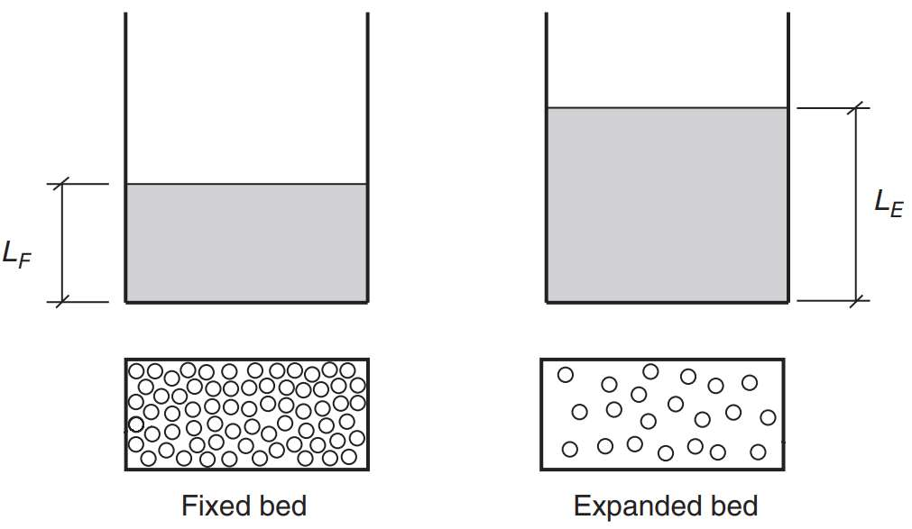
  - **Hình này chứng minh điều gì**
    - Chiều dày tầng lọc tăng từ $L_F$ lên $L_E$ do các hạt tách rời và khoảng rỗng mao quản mở rộng khi dòng nước rửa đi lên.
  - **Từ đâu mà thấy được**
    - Cột bên trái: Chiều dày $L_F$ tương ứng dòng chú thích "Fixed bed" với các vòng tròn hạt xếp chặt khít nhau.
    - Cột bên phải: Chiều dày $L_E$ cao hơn rõ rệt tương ứng dòng chú thích "Expanded bed" với các vòng tròn hạt phân tán thưa thớt.

- Tiêu chuẩn công nghệ về độ giãn nở tầng lọc:
  - Giá trị quy chuẩn tối ưu: Độ giãn nở tầng lọc phải nằm trong khoảng từ $25\%$ đến $37\%$ (Bed expansion should be from 25% to 37%).
  - Hậu quả khi độ giãn nở quá thấp ($< 20\%$): Tầng hạt chưa đủ độ tơi xốp, các hạt không thể cọ xát tự do để bóc tách màng cặn sinh học và bông bùn keo tụ, dẫn đến nguy cơ hình thành vón cục bùn (mudball formation) và tắc nghẽn cục bộ.
  - Hậu quả khi độ giãn nở quá cao ($> 40\%$): Khoảng cách giữa các hạt quá xa làm triệt tiêu lực ma sát va chạm làm sạch (abrasive scouring), đồng thời tiêu tốn lưu lượng nước rửa ngược quá mức và làm dâng đỉnh lớp lọc sát mép máng tràn, gây nguy cơ trôi mất vật liệu lọc ra ngoài bể.

- Công thức giải tích xác định độ rỗng tầng lọc giãn nở $\varepsilon_E$:
  - Biểu thức nghiệm Cardan bậc ba:
    $$\varepsilon_E = \sqrt[3]{X + (X^2 + Y^3)^{0.5}} + \sqrt[3]{X - (X^2 + Y^3)^{0.5}}$$
  - Ý nghĩa các hệ số trung gian $X$ và $Y$:
    $$X = \frac{\mu v_{bw}}{2 g (\rho_p - \rho_w) d^2} \left( \kappa_V + \frac{\kappa_I \rho_w v_{bw} d}{\mu} \right)$$
    $$Y = \frac{\kappa_V \mu v_{bw}}{3 g (\rho_p - \rho_w) d^2}$$
  - Các thông số trong hệ thức:
    - $\rho_p, \rho_w$: Khối lượng riêng của hạt vật liệu lọc và của nước ($\text{kg/m}^3$).
    - $\mu$: Độ nhớt động lực học của nước ($\text{Pa}\cdot\text{s}$).
    - $g$: Gia tốc trọng trường ($9.81\text{ m/s}^2$).
    - $d$: Đường kính hạt vật liệu lọc hoặc kích thước hiệu dụng ($m$).
    - $v_{bw}$: Cường độ rửa ngược ($\text{m/s}$ hoặc $\text{m}^3/(\text{m}^2\cdot\text{s})$).
    - $\kappa_V, \kappa_I$: Hệ số tổn thất áp lực của vật liệu lọc tương ứng theo Bảng Hình 12.

  - **Hình 14.** Công thức xác định hệ số trung gian $X$ trong phương trình tính độ rỗng tầng lọc giãn nở
    - 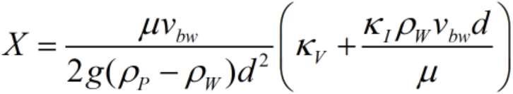
  - **Hình này chứng minh điều gì**
    - Biểu thức giải tích của thông số vô thứ nguyên $X$ phụ thuộc vào đặc tính lưu chất, kích thước hạt và cường độ rửa ngược.
  - **Từ đâu mà thấy được**
    - Biểu thức chứa phân số $\mu v_{bw} / [2g(\rho_p - \rho_w)d^2]$ nhân với dấu ngoặc đơn tổng $[\kappa_V + \kappa_I \rho_w v_{bw} d / \mu]$.

---

###### Example: Expanded bed depth calculation

- **Đề bài**:
  - Tiếng Anh (nguyên văn): "Example: Find the expanded bed depth of a sand filter at a backwash rate of 40 m/h given the depth of fixed bed LF = 0.9 m and temperature of 15°C."
  - Tiếng Việt: Tìm chiều dày tầng lọc cát ở trạng thái giãn nở ($L_E$) khi rửa ngược ở cường độ $40\text{ m/h}$, biết chiều dày tầng lọc tĩnh ban đầu $L_F = 0.9\text{ m}$ và nhiệt độ nước $15^\circ\text{C}$.

- **Dữ kiện**:
  - Chiều dày tầng lọc cát cố định ban đầu: $L_F = 0.9\text{ m}$.
  - Vật liệu lọc: Cát thạch anh (Sand filter).
  - Cường độ rửa ngược danh định: $v_{bw} = 40\text{ m/h} = \frac{40}{3{,}600}\text{ m/s} \approx 0.011111\text{ m/s} = 11.111\text{ mm/s}$.
  - Nhiệt độ nước rửa ngược: $T = 15^\circ\text{C}$.
  - Các thông số tra cứu vật lý và công nghệ:
    - Thuộc tính của nước ở $15^\circ\text{C}$: Khối lượng riêng $\rho_w = 999.1\text{ kg/m}^3$; Độ nhớt động lực học $\mu = 1.139 \times 10^{-3}\text{ Pa}\cdot\text{s}$; Gia tốc trọng trường $g = 9.81\text{ m/s}^2$.
    - Thuộc tính cát thạch anh (Slide 9 & Slide 12):
      - Khối lượng riêng hạt cát: $\rho_p = 2.65\text{ g/mL} = 2{,}650\text{ kg/m}^3$.
      - Hiệu số khối lượng riêng chìm: $\rho_p - \rho_w = 2{,}650 - 999.1 = 1{,}650.9\text{ kg/m}^3$.
      - Độ rỗng tầng lọc cố định ban đầu: $\varepsilon_F = 40\text{--}43\%$ (chọn giá trị danh định tiêu chuẩn $\varepsilon_F = 0.42$).
      - Hệ số tổn thất áp lực của cát: $\kappa_V = 110\text{--}115$ (chọn $\kappa_V = 112.5$), $\kappa_I = 2.0\text{--}2.5$ (chọn $\kappa_I = 2.25$).
      - Kích thước hạt cát lọc: Kích thước hạt cát lọc nhanh tiêu chuẩn có dải $ES = 0.4\text{--}0.8\text{ mm}$ (Slide 9). Với cường độ rửa ngược $40\text{ m/h}$ để đạt độ giãn nở nằm trong tiêu chuẩn $25\%\text{--}37\%$ (Slide 21), cỡ hạt hiệu dụng danh định là $d = 0.55\text{ mm} = 5.5 \times 10^{-4}\text{ m}$ (hoặc kiểm tra đồng thời cho $d = 0.50\text{ mm}$).
  - **Ảnh EX_EXPANDED_BED.1.** Đề bài tính chiều dày tầng lọc cát giãn nở từ Slide 23 (Trang 10 tài liệu gốc).
    - 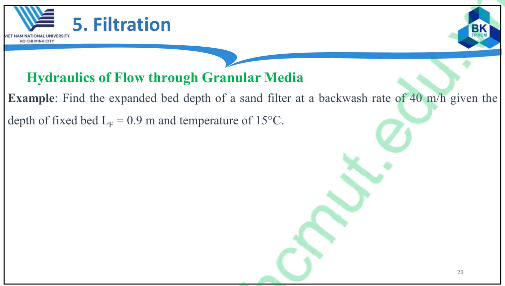
    - Nhìn vào: Dòng văn bản ghi rõ: "Example: Find the expanded bed depth of a sand filter at a backwash rate of 40 m/h given the depth of fixed bed LF = 0.9 m and temperature of 15°C." Số slide 23 hiển thị ở góc dưới bên phải.

- **Quy tắc áp dụng**:
  - Tính chuẩn số Reynolds dòng rửa ngược:
    $$\text{Re}_{\text{bw}} = \frac{\rho_w v_{bw} d}{\mu}$$
  - Tính các hệ số trung gian $X$ và $Y$:
    $$X = \frac{\mu v_{bw}}{2 g (\rho_p - \rho_w) d^2} \left( \kappa_V + \kappa_I \text{Re}_{\text{bw}} \right)$$
    $$Y = \frac{\kappa_V \mu v_{bw}}{3 g (\rho_p - \rho_w) d^2}$$
  - Xác định độ rỗng tầng lọc giãn nở $\varepsilon_E$ theo nghiệm Cardan:
    $$\varepsilon_E = \sqrt[3]{X + \sqrt{X^2 + Y^3}} + \sqrt[3]{X - \sqrt{X^2 + Y^3}}$$
  - Tính chiều dày tầng lọc giãn nở $L_E$ và tỷ lệ giãn nở phần trăm:
    $$L_E = L_F \frac{1 - \varepsilon_F}{1 - \varepsilon_E}$$
    $$\% \text{ expansion} = \left(\frac{L_E}{L_F} - 1\right) \times 100\%$$

- **Lời giải**:
  - **Bước 1** (Đổi đơn vị và tính thừa số thủy lực chung):
    - Căn cứ: Cường độ rửa $v_{bw} = 40\text{ m/h}$, cỡ hạt cát $d = 0.55\text{ mm} = 5.5 \times 10^{-4}\text{ m}$ và nhiệt độ nước $15^\circ\text{C}$.
    - Nhìn vào: Dòng đề bài trên Ảnh EX_EXPANDED_BED.1.
    - Đổi đơn vị vận tốc rửa ngược:
      $$v_{bw} = \frac{40\text{ m/h}}{3{,}600\text{ s/h}} = 0.011111\text{ m/s}$$
    - Tính chuẩn số Reynolds rửa ngược $\text{Re}_{\text{bw}}$:
      $$\text{Re}_{\text{bw}} = \frac{999.1 \times 0.011111 \times (5.5 \times 10^{-4})}{1.139 \times 10^{-3}} = 5.361$$
    - Tính thừa số chung của phương trình:
      $$\Theta = \frac{\mu v_{bw}}{g (\rho_p - \rho_w) d^2} = \frac{(1.139 \times 10^{-3}) \times 0.011111}{9.81 \times (2{,}650 - 999.1) \times (5.5 \times 10^{-4})^2}$$
      $$\Theta = \frac{1.2655 \times 10^{-5}}{9.81 \times 1{,}650.9 \times 3.025 \times 10^{-7}} = \frac{1.2655 \times 10^{-5}}{4.8991 \times 10^{-3}} = 2.5831 \times 10^{-3}$$
  - **Bước 2** (Tính các hệ số $X$ và $Y$):
    - Căn cứ: Công thức tính $X$ ở Slide 22 (Hình 14) và công thức tính $Y$ với $\kappa_V = 112.5, \kappa_I = 2.25$.
    - Nhìn vào: Bảng hệ số Hình 12 hàng Sand ($\kappa_V = 110\text{--}115, \kappa_I = 2.0\text{--}2.5$).
    - Tính $X$:
      $$X = \frac{1}{2} \Theta \left(\kappa_V + \kappa_I \text{Re}_{\text{bw}}\right) = \frac{2.5831 \times 10^{-3}}{2} \times [112.5 + (2.25 \times 5.361)]$$
      $$X = (1.2916 \times 10^{-3}) \times (112.5 + 12.062) = 1.2916 \times 10^{-3} \times 124.562 = 0.16089$$
    - Tính $Y$:
      $$Y = \frac{\kappa_V}{3} \Theta = \frac{112.5}{3} \times (2.5831 \times 10^{-3}) = 37.5 \times 2.5831 \times 10^{-3} = 0.09687$$
  - **Bước 3** (Tính độ rỗng tầng lọc giãn nở $\varepsilon_E$ theo nghiệm Cardan):
    - Căn cứ: Biểu thức căn bậc ba ở Slide 22: $\varepsilon_E = \sqrt[3]{X + \sqrt{X^2 + Y^3}} + \sqrt[3]{X - \sqrt{X^2 + Y^3}}$.
    - Tính biệt thức:
      $$X^2 = (0.16089)^2 = 0.025885$$
      $$Y^3 = (0.09687)^3 = 0.000909$$
      $$X^2 + Y^3 = 0.025885 + 0.000909 = 0.026794$$
      $$\sqrt{X^2 + Y^3} = \sqrt{0.026794} = 0.16369$$
    - Tính hai số hạng dưới dấu căn bậc ba:
      $$T_1 = X + \sqrt{X^2 + Y^3} = 0.16089 + 0.16369 = 0.32458$$
      $$\sqrt[3]{T_1} = (0.32458)^{1/3} = 0.68724$$
      $$T_2 = X - \sqrt{X^2 + Y^3} = 0.16089 - 0.16369 = -0.00280$$
      $$\sqrt[3]{T_2} = - (0.00280)^{1/3} = -0.14095$$
    - Tổng hợp độ rỗng tầng lọc giãn nở:
      $$\varepsilon_E = \sqrt[3]{T_1} + \sqrt[3]{T_2} = 0.68724 - 0.14095 = 0.54629 \approx 0.5463$$
  - **Bước 4** (Tính chiều dày tầng lọc giãn nở $L_E$):
    - Căn cứ: Công thức bảo toàn thể tích chất rắn với chiều dày cố định $L_F = 0.9\text{ m}$ và độ rỗng ban đầu $\varepsilon_F = 0.42$.
    - Nhìn vào: Chiều dày $LF = 0.9\text{ m}$ trên Ảnh EX_EXPANDED_BED.1 và độ rỗng $\varepsilon = 40\text{--}43\%$ trên Slide 9.
    - Tính chiều dày giãn nở:
      $$L_E = L_F \frac{1 - \varepsilon_F}{1 - \varepsilon_E} = 0.90\text{ m} \times \frac{1 - 0.42}{1 - 0.5463} = 0.90 \times \frac{0.58}{0.4537} = 1.1505\text{ m} \approx 1.15\text{ m}$$
  - **Bước 5** (Tính tỷ lệ giãn nở phần trăm và kiểm tra dải thông số):
    - Tính độ giãn nở phần trăm:
      $$\% \text{ expansion} = \left(\frac{L_E}{L_F} - 1\right) \times 100\% = \left(\frac{1.1505}{0.90} - 1\right) \times 100\% = 27.83\% \approx 27.8\%$$
    - Khảo sát độ nhạy theo kích thước hạt và độ rỗng ban đầu:
      - Nếu hạt cát mịn hơn với $d = 0.50\text{ mm}$ ($\varepsilon_F = 0.42$): $X = 0.1930$, $Y = 0.1172 \implies \varepsilon_E = 0.5702 \implies L_E = 1.215\text{ m}$, độ giãn nở đạt $35.0\%$.
      - Nếu độ rỗng ban đầu chặt hơn với $\varepsilon_F = 0.40$ ($d = 0.55\text{ mm}$): $L_E = 0.90 \times \frac{0.60}{0.4537} = 1.190\text{ m}$, độ giãn nở đạt $32.2\%$.
    - Kết luận khoảng giá trị kỹ thuật: Chiều dày tầng lọc cát giãn nở đạt từ $1.15\text{ m}$ đến $1.22\text{ m}$, tương ứng độ giãn nở từ $27.8\%$ đến $35.0\%$.

- **Kết quả**:
  - Độ rỗng tầng lọc giãn nở: $\varepsilon_E = 0.546$ (tăng từ $\varepsilon_F = 0.42$).
  - Chiều dày tầng lọc sau khi giãn nở: $L_E = 1.15\text{ m}$ (đối với $d = 0.55\text{ mm}$) đến $1.22\text{ m}$ (đối với $d = 0.50\text{ mm}$).
  - Độ giãn nở tầng lọc: $\% \text{ expansion} = 27.8\%\text{ -- }35.0\%$.

- **Kiểm tra lại**:
  - Đối chiếu tiêu chuẩn công nghệ: Tiêu chuẩn thiết kế ở Slide 21 quy định rõ: *"Bed expansion should be from 25% to 37%"*. Kết quả tính toán $27.8\%\text{--}35.0\%$ hoàn toàn nằm trọn trong dải tối ưu của quy chuẩn.
  - Ý nghĩa định vị mép máng thu nước rửa lọc: Chiều dày giãn nở tối đa $L_E \approx 1.22\text{ m}$ xác định độ cao tối thiểu của mép tràn máng thu nước rửa: $H_{\text{trough}} = L_E + 0.3\text{--}0.5\text{ m} = 1.22 + 0.4 = 1.62\text{ m}$ (tính từ bề mặt bản đáy đỡ sỏi). Khoảng cách này đảm bảo an toàn tuyệt đối, ngăn ngừa trôi vật liệu lọc vào hệ thống thoát nước rửa.

#### Rapid Filter Design

- Khái niệm và vị trí công nghệ của bể lọc nhanh (Rapid Filter):
  - Bể lọc nhanh trọng lực (Rapid gravity filter) là công trình xử lý bậc ba (tertiary treatment) phổ biến nhất để tách hạt cặn lơ lửng sau bể lắng sinh học.
  - Vận tốc lọc bề mặt cao ($5\text{--}15\text{ m}^3/(\text{m}^2\cdot\text{h})$), lớn hơn gấp nhiều lần so với bể lọc chậm ($0.1\text{--}0.2\text{ m/h}$).
  - Quá trình vận hành có tính chu kỳ gián đoạn: giai đoạn lọc thu giữ cặn và giai đoạn rửa ngược (backwash) làm sạch tầng lọc bằng dòng nước và/hoặc khí nén hướng lên.
  - Sử dụng phổ biến lớp lọc đơn (monomedia sand hoặc deep-bed anthracite) và lớp lọc kép (dual-media sand/anthracite) để tối ưu hóa dung tích chứa cặn.

##### Typical Design Criteria and Operational Parameters

- Vận tốc lọc bề mặt (Filtration rate / Hydraulic surface loading rate):
  - Dải giá trị tiêu chuẩn: $5\text{--}15\text{ m}^3/(\text{m}^2\cdot\text{h})$ (tương đương $5\text{--}15\text{ m/h}$).
  - Vận tốc lọc thông thường cho bể lọc cát đơn tầng: $5\text{--}10\text{ m/h}$.
  - Vận tốc lọc thông thường cho bể lọc hai lớp vật liệu (than anthracite và cát): $10\text{--}15\text{ m/h}$.
  - Tải trọng thủy lực bề mặt quyết định diện tích xây dựng của cụm bể lọc và tốc độ tích tụ tổn thất áp lực trong chu kỳ làm việc.
- Diện tích bề mặt của một đơn nguyên lọc (Area of single filter cell):
  - Giá trị giới hạn trên: $A_{\text{cell}} \le 100\text{ m}^2$.
  - Diện tích mỗi bể bị khống chế để đảm bảo phân phối nước đầu vào và phân phối nước rửa ngược đồng đều trên toàn bộ bề mặt tầng lọc.
  - Hạn chế lưu lượng đỉnh của máy bơm rửa ngược tức thời ($Q_{\text{bw}} = A_{\text{cell}} \times v_{\text{bw}}$); diện tích bể quá lớn đòi hỏi công suất trạm bơm rửa ngược và đường kính ống dẫn quá lớn, gây xung lực thủy lực nguy hiểm cho kết cấu đáy bể.
- Tổng chiều sâu xây dựng bể lọc (Depth / Total filter basin depth):
  - Dải giá trị tiêu chuẩn: $H_{\text{total}} = 4\text{--}8\text{ m}$.
  - Tổng chiều sâu hình học tính từ bản đáy bê tông đến đỉnh sàn thao tác thành bể.
  - Chiều sâu là tổng tích lũy của các khoang chức năng: khoang thu nước đáy (underdrain), lớp sỏi đỡ (gravel support), tầng vật liệu lọc (media bed), cột nước tự do tạo áp lực thủy tĩnh (available head), chiều cao máng thu nước rửa lọc và khoảng tĩnh không an toàn (freeboard).
- Chiều dày tầng vật liệu lọc (Bed depth):
  - Dải giá trị tiêu chuẩn: $L_{\text{bed}} = 0.6\text{--}1.8\text{ m}$.
  - Chiều dày đối với bể lọc cát thạch anh đơn tầng: $0.6\text{--}0.75\text{ m}$.
  - Chiều dày đối với bể lọc hai lớp vật liệu (dual-media): $0.7\text{--}0.9\text{ m}$ (thông thường gồm $0.45\text{--}0.60\text{ m}$ than anthracite đặt trên $0.25\text{--}0.30\text{ m}$ cát thạch anh).
  - Chiều dày đối với bể lọc đơn tầng sâu (deep-bed monomedia): $1.5\text{--}1.8\text{ m}$ (sử dụng than anthracite hạt thô hoặc cát hạt thô).
- Chiều cao mép máng thu nước rửa lọc (Height of washwater trough lip):
  - Tiêu chuẩn bố trí: $H_{\text{trough}} = \text{Expanded bed depth} + 0.3\text{--}0.5\text{ m}$.
  - Cao độ mép tràn máng thu nước rửa phải đặt cao hơn đỉnh của tầng vật liệu lọc ở trạng thái giãn nở tối đa (expansion bed) một khoảng cách dự phòng từ $0.3\text{ m}$ đến $0.5\text{ m}$.
  - Ngăn ngừa hiện tượng trôi mất hạt vật liệu lọc (media washout) vào máng tràn khi tầng lọc bị xáo trộn và giãn nở trong quá trình rửa ngược.
- Chiều sâu lớp nước trên mặt lọc / Cột áp thủy lực làm việc (Water depth / Available driving head):
  - Dải giá trị tiêu chuẩn: $H_{\text{water}} = 1.8\text{--}3.0\text{ m}$.
  - Chiều cao cột nước tự do phía trên bề mặt lớp vật liệu lọc cung cấp áp lực trọng lực để thắng tổng trở lực ma sát dòng chảy.
  - Cột áp sẵn có này bù đắp cho tổn thất áp lực ban đầu của lớp vật liệu lọc sạch ($h_{L0} \approx 0.3\text{--}0.6\text{ m}$) và lượng tổn thất áp lực gia tăng liên tục do cặn rắn bám dính trong các khe rỗng suốt chu kỳ lọc.
- Chiều sâu khoang thu nước đáy bể (Underdrain depth):
  - Dải giá trị tiêu chuẩn: $H_{\text{underdrain}} = 0.3\text{--}0.6\text{ m}$.
  - Không gian bên dưới tầng lọc dành cho kết cấu thu gom nước sau lọc và phân phối nước - khí rửa ngược:
    - Bố trí giàn ống nhánh đục lỗ (pipe lateral system) hoặc các khối đan lọc nhựa xốp chuyên dụng (underdrain filter blocks dạng Leopold / Wheeler).
    - Bao gồm chiều dày các lớp sỏi đỡ chuyển tiếp ($0.3\text{--}0.5\text{ m}$) để giữ hạt cát không lọt vào khe chụp lọc và bảo vệ kết cấu đáy.
- Cường độ rửa ngược (Backwash rate):
  - Dải giá trị tiêu chuẩn: $v_{\text{bw}} = 30\text{--}60\text{ m}^3/(\text{m}^2\cdot\text{h})$ (tương đương $8.3\text{--}16.7\text{ mm/s}$ hay $0.5\text{--}1.0\text{ m/min}$).
  - Vận tốc dòng nước rửa ngược hướng từ dưới lên phải đủ lớn để vượt qua vận tốc lắng của hạt vật liệu lọc, làm tầng hạt sôi và giãn nở từ $20\%$ đến $40\%$.
  - Cường độ rửa phải được tính toán chính xác để tối đa hóa ma sát va chạm giữa các hạt nhằm đánh bật bông cặn bám dính mà không gây hiện tượng rửa trôi vật liệu lọc ra ngoài bể.
- Thời gian một chu kỳ lọc (Filtration duration / Filter run length):
  - Dải giá trị tiêu chuẩn: $T_{\text{run}} = 1\text{--}4\text{ ngày}$ (tương đương $24\text{--}96\text{ giờ}$).
  - Chu kỳ làm việc hiệu quả của bể lọc giữa hai lần làm sạch định kỳ.
  - Chu kỳ kết thúc khi đạt một trong hai giới hạn kỹ thuật:
    - Tổn thất áp lực đạt ngưỡng giới hạn tối đa (terminal head loss, thường từ $2.0\text{ m}$ đến $2.8\text{ m}$).
    - Độ đục hoặc nồng độ cặn lơ lửng của nước sau lọc vượt quá quy chuẩn cho phép (breakthrough).
- Thời gian một lần rửa ngược (Backwash duration):
  - Dải giá trị tiêu chuẩn: $t_{\text{bw}} = 10\text{--}20\text{ phút}$.
  - Thời gian vận hành bơm nước rửa ngược (hoặc kết hợp xáo trộn khí nén) đủ để cuốn toàn bộ cặn bẩn đã tách rời ra khỏi khoang bể và thoát vào máng thu nước rửa.
- Thời gian lọc xả bỏ đầu chu kỳ / Thuần hóa lọc (Ripening / filter-to-waste duration):
  - Dải giá trị tiêu chuẩn: $t_{\text{ripen}} = 15\text{ phút -- }2\text{ giờ}$.
  - Ngay sau khi rửa ngược, một lượng hạt cặn còn sót lại trong khe rỗng và cấu trúc màng thu giữ trên bề mặt hạt lọc chưa kịp hình thành ổn định, dẫn đến nước lọc đầu chu kỳ có độ đục cao.
  - Toàn bộ lưu lượng nước lọc trong giai đoạn này phải được xả bỏ tuần hoàn về đầu trạm xử lý (filter-to-waste) cho đến khi chất lượng nước đạt chuẩn trước khi cấp vào bể chứa nước sạch.
- Tỷ lệ thu hồi nước lọc (Water recovery):
  - Tiêu chuẩn hiệu suất: $\text{Recovery} > 95\%$.
  - Tỷ lệ giữa lượng nước lọc thành phẩm hữu ích đưa vào sử dụng so với tổng lưu lượng nước cấp thô đi vào cụm bể lọc.
  - Tổng lượng nước tiêu hao nội bộ (gồm nước rửa ngược và nước lọc xả bỏ thuần hóa) phải khống chế nghiêm ngặt $< 5\%$ công suất nhà máy để đảm bảo tính kinh tế kỹ thuật.

######  Các thông số thiết kế và vận hành tiêu chuẩn của bể lọc nhanh trọng lực

| Thông số thiết kế (Parameter) | Dải giá trị điển hình (Typical range of values) | Đơn vị đo (Unit) | Ý nghĩa kỹ thuật và ghi chú thiết kế (Engineering notes) |
| :--- | :---: | :---: | :--- |
| **Vận tốc lọc (Filtration rate)** | $5\text{ -- }15$ | $\text{m}^3/(\text{m}^2\cdot\text{h})$ | Tải trọng thủy lực bề mặt; $5\text{--}10\text{ m/h}$ cho lọc cát đơn lớp, $10\text{--}15\text{ m/h}$ cho lớp kép than/cát |
| **Diện tích một đơn nguyên (Area of filter cell)** | $\le 100$ | $\text{m}^2$ | Giới hạn diện tích bể đơn lẻ để phân phối thủy lực đồng đều và hạn chế công suất đỉnh của bơm rửa ngược |
| **Tổng chiều sâu bể (Depth of filter box)** | $4\text{ -- }8$ | $\text{m}$ | Tổng chiều cao kết cấu từ bản đáy đến sàn thao tác |
| **Chiều dày tầng vật liệu (Bed depth)** | $0.6\text{ -- }1.8$ | $\text{m}$ | $0.6\text{--}0.75\text{ m}$ (cát đơn tầng), $0.7\text{--}0.9\text{ m}$ (lớp kép), $1.5\text{--}1.8\text{ m}$ (than đơn tầng sâu) |
| **Chiều cao mép máng thu (Height of washwater trough)** | $\text{Expansion bed} + 0.3\text{ -- }0.5$ | $\text{m}$ | Khoảng cách bảo vệ mép tràn máng thu phía trên đỉnh lớp lọc giãn nở để ngăn trôi vật liệu |
| **Cột áp làm việc sẵn có (Water depth / Available head)** | $1.8\text{ -- }3.0$ | $\text{m}$ | Chiều sâu cột nước tự do tạo áp lực thủy tĩnh thắng tổn thất áp ban đầu và tổn thất do tích tụ cặn |
| **Chiều sâu khoang đáy (Underdrain depth)** | $0.3\text{ -- }0.6$ | $\text{m}$ | Chiều cao bố trí khối đan lọc / giàn ống nhánh và các lớp sỏi đỡ chuyển tiếp |
| **Cường độ rửa ngược (Backwash rate)** | $30\text{ -- }60$ | $\text{m}^3/(\text{m}^2\cdot\text{h})$ | Vận tốc dòng nước hướng lên làm sôi và giãn nở tầng vật liệu lọc từ $20\%$ đến $40\%$ |
| **Thời gian chu kỳ lọc (Filtration duration)** | $1\text{ -- }4$ | $\text{ngày}$ ($24\text{--}96\text{ h}$) | Chu kỳ làm việc hữu ích giữa hai lần rửa lọc liên tiếp |
| **Thời gian rửa ngược (Backwash duration)** | $10\text{ -- }20$ | $\text{phút}$ | Thời gian bơm rửa đẩy toàn bộ cặn bẩn vào máng thu |
| **Thời gian xả bỏ thuần hóa (Ripening duration)** | $15\text{ min -- }2$ | $\text{h}$ | Thời gian xả bỏ nước lọc đầu chu kỳ đến khi độ đục đạt chuẩn ổn định |
| **Tỷ lệ thu hồi nước (Recovery)** | $> 95$ | $\%$ | Tỷ lệ thể tích nước thành phẩm so với thể tích nước cấp đầu vào |

---

##### Example: Dual-Media Filter Design

- **Đề bài**:
  - Tiếng Anh (nguyên văn): "Capacity of wastewater treatment plant = 230,000 m3/day. Design dual media (sand/anthracite) filters."
  - Tiếng Việt: Trạm xử lý nước thải có công suất xử lý nước sạch thành phẩm $Q_{\text{net}} = 230{,}000\text{ m}^3/\text{ngày}$. Thiết kế hệ thống bể lọc nhanh trọng lực hai lớp vật liệu (than anthracite và cát thạch anh).

- **Dữ kiện**:
  - Lưu lượng nước xử lý yêu cầu của trạm (công suất hữu ích):
    $$Q_{\text{net}} = 230{,}000\text{ m}^3/\text{ngày} \approx 9{,}583.33\text{ m}^3/\text{h} \approx 2.662\text{ m}^3/\text{s}$$
  - **Ảnh EX_DUAL_MEDIA.1.** Slide 27 (Trang 11 tài liệu gốc) đưa ra đề bài thiết kế hệ thống bể lọc nhanh hai lớp vật liệu cho nhà máy xử lý nước thải công suất $230{,}000\text{ m}^3/\text{ngày}$.
    - 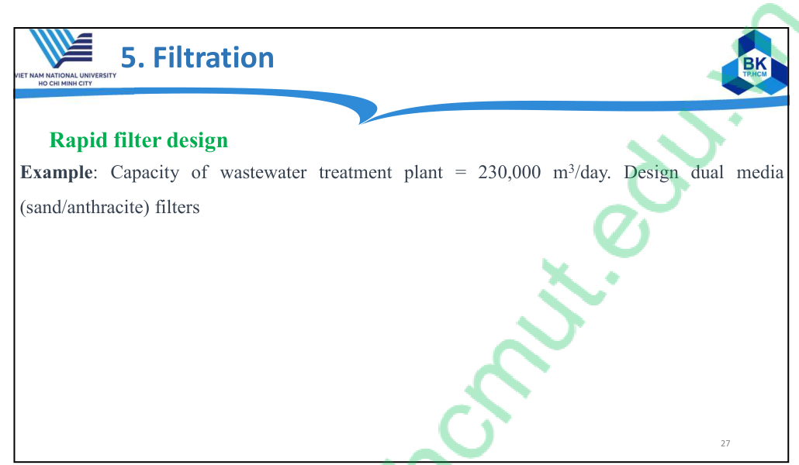
    - Nhìn vào: Dòng chữ đen dưới tiêu đề màu xanh "Rapid filter design" ghi rõ nội dung: "Example: Capacity of wastewater treatment plant = 230,000 m3/day. Design dual media (sand/anthracite) filters". Số slide 27 hiển thị ở góc dưới bên phải.
  - Các thông số kỹ thuật tiêu chuẩn được lựa chọn theo Slide 26 (Bảng thông số thiết kế tiêu chuẩn):
    - Tỷ lệ thu hồi nước sau lọc mục tiêu: $\text{Recovery} = 96.0\%$ ($> 95\%$).
    - Vận tốc lọc bề mặt thiết kế danh định: $v = 10.0\text{ m}^3/(\text{m}^2\cdot\text{h})$ ($10.0\text{ m/h}$, nằm trong dải quy chuẩn $5\text{--}15\text{ m/h}$).
    - Diện tích bề mặt tối đa cho phép của một đơn nguyên: $A_{\text{cell, max}} \le 100\text{ m}^2$.
    - Cấu hình tầng vật liệu lọc phía trên (than anthracite):
      - Chiều dày lớp than: $L_{\text{anth}} = 0.50\text{ m}$ (tiêu chuẩn $0.45\text{--}0.60\text{ m}$).
      - Kích thước hạt hiệu dụng: $\text{ES}_{\text{anth}} = d_{10} = 1.0\text{ mm}$.
      - Hệ số đồng nhất: $\text{UC}_{\text{anth}} = 1.4$.
      - Tỷ trọng than: $S_{s,\text{anth}} = 1.50$ (khối lượng riêng $\rho_{s,\text{anth}} = 1{,}500\text{ kg/m}^3$).
      - Độ rỗng ban đầu của tầng than sạch: $\varepsilon_{\text{anth}} = 0.50$.
    - Cấu hình tầng vật liệu lọc phía dưới (cát thạch anh):
      - Chiều dày lớp cát: $L_{\text{sand}} = 0.30\text{ m}$ (tiêu chuẩn $0.25\text{--}0.30\text{ m}$).
      - Kích thước hạt hiệu dụng: $\text{ES}_{\text{sand}} = d_{10} = 0.50\text{ mm}$.
      - Hệ số đồng nhất: $\text{UC}_{\text{sand}} = 1.4$.
      - Tỷ trọng cát: $S_{s,\text{sand}} = 2.65$ (khối lượng riêng $\rho_{s,\text{sand}} = 2{,}650\text{ kg/m}^3$).
      - Độ rỗng ban đầu của tầng cát sạch: $\varepsilon_{\text{sand}} = 0.42$.
    - Tầng sỏi đỡ chuyển tiếp (graded gravel support):
      - Chiều dày: $L_{\text{gravel}} = 0.30\text{ m}$ (gồm 5 lớp sỏi phân cấp kích thước từ $2\text{ mm}$ đến $38\text{ mm}$).
    - Cột áp thủy tĩnh làm việc phía trên bề mặt lớp vật liệu: $H_{\text{water}} = 2.20\text{ m}$ (tiêu chuẩn $1.8\text{--}3.0\text{ m}$).
    - Chiều sâu khoang thu nước đáy: $H_{\text{underdrain}} = 0.40\text{ m}$ (tiêu chuẩn $0.3\text{--}0.6\text{ m}$).
    - Chiều cao tĩnh không an toàn: $H_{\text{freeboard}} = 0.50\text{ m}$.
    - Cường độ rửa ngược: $v_{\text{bw}} = 45.0\text{ m}^3/(\text{m}^2\cdot\text{h}) = 0.0125\text{ m/s}$ ($12.5\text{ mm/s}$, tiêu chuẩn $30\text{--}60\text{ m/h}$).
    - Thời gian rửa ngược mỗi chu kỳ: $t_{\text{bw}} = 15\text{ phút} = 0.25\text{ h}$ (tiêu chuẩn $10\text{--}20\text{ phút}$).
    - Thời gian lọc xả bỏ đầu chu kỳ: $t_{\text{ripen}} = 30\text{ phút} = 0.50\text{ h}$ (tiêu chuẩn $15\text{ min -- }2\text{ h}$).
    - Chu kỳ lọc làm việc: $T_{\text{run}} = 48\text{ h}$ ($2\text{ ngày}$, tiêu chuẩn $1\text{--}4\text{ ngày}$).

- **Quy tắc áp dụng**:
  - Cân bằng lưu lượng tổng thể tính đến tỷ lệ thu hồi nước sau lọc:
    $$Q_{\text{design}} = \frac{Q_{\text{net}}}{\text{Recovery}}$$
  - Tổng diện tích bề mặt lọc yêu cầu dựa trên vận tốc lọc thiết kế:
    $$A_{\text{req}} = \frac{Q_{\text{design}}}{v}$$
  - Phân chia số lượng đơn nguyên lọc và kiểm tra giới hạn diện tích:
    $$A_{\text{cell}} = W \times L \le 100\text{ m}^2$$
    $$A_{\text{total, active}} = N_{\text{active}} \times A_{\text{cell}}$$
    $$v_{\text{actual}} = \frac{Q_{\text{design}}}{A_{\text{total, active}}}$$
  - Tổng chiều sâu xây dựng theo phương đứng của bể lọc:
    $$H_{\text{total}} = H_{\text{underdrain}} + L_{\text{gravel}} + L_{\text{sand}} + L_{\text{anth}} + H_{\text{water}} + H_{\text{freeboard}}$$
  - Thủy lực hệ thống rửa ngược:
    - Lưu lượng nước rửa ngược cho một đơn nguyên:
      $$Q_{\text{bw, cell}} = A_{\text{cell}} \times v_{\text{bw}}$$
    - Lượng nước tiêu tốn trong một lần rửa ngược:
      $$V_{\text{bw, cell}} = Q_{\text{bw, cell}} \times t_{\text{bw}}$$
    - Độ giãn nở toàn phần của tầng lọc kép:
      $$L_E = L_{\text{anth}}(1 + \%_{\text{exp, anth}}) + L_{\text{sand}}(1 + \%_{\text{exp, sand}})$$
    - Khoảng cách an toàn mép tràn máng thu nước rửa lọc:
      $$H_{\text{trough, clearance}} = H_{\text{trough}} - L_E \ge 0.3\text{--}0.5\text{ m}$$
  - Cân bằng lượng nước rửa tiêu thụ hàng ngày và tỷ lệ thu hồi thực tế:
    $$\text{Recovery} = \frac{Q_{\text{net}}}{Q_{\text{design}}} \times 100\% = \frac{Q_{\text{design}} - V_{\text{waste, daily}}}{Q_{\text{design}}} \times 100\%$$

- **Lời giải**:
  - **Bước 1** (Tính toán lưu lượng thô cấp vào cụm bể lọc có tính đến lượng nước tiêu hao nội bộ):
    - Căn cứ: Tiêu chuẩn tỷ lệ thu hồi nước sau lọc $\text{Recovery} > 95\%$ (Slide 26) và công suất xử lý hữu ích yêu cầu $Q_{\text{net}} = 230{,}000\text{ m}^3/\text{ngày}$. Chọn tỷ lệ thu hồi mục tiêu là $96.0\%$ để dự trù $4.0\%$ lưu lượng cho quá trình rửa ngược và lọc xả bỏ thuần hóa.
    - Nhìn vào: Bảng thông số Slide 26 dòng "Recovery: > 95%" và dòng đề bài Slide 27 (Ảnh EX_DUAL_MEDIA.1) ghi "Capacity of wastewater treatment plant = 230,000 m3/day".
    - Tính toán:
      $$Q_{\text{design}} = \frac{Q_{\text{net}}}{\text{Recovery}} = \frac{230{,}000\text{ m}^3/\text{ngày}}{0.96} = 239{,}583.33\text{ m}^3/\text{ngày}$$
      Đổi sang các đơn vị dẫn xuất theo giờ và theo giây:
      $$Q_{\text{design}} = \frac{239{,}583.33}{24} = 9{,}982.64\text{ m}^3/\text{h} = \frac{9{,}982.64}{3{,}600} \approx 2.773\text{ m}^3/\text{s}$$
  - **Bước 2** (Xác định tổng diện tích bề mặt lọc hoạt động cần thiết):
    - Căn cứ: Tiêu chuẩn vận tốc lọc bể lọc nhanh trọng lực $v = 5\text{--}15\text{ m}^3/(\text{m}^2\cdot\text{h})$ (Slide 26). Đối với bể lọc hai lớp vật liệu (than anthracite / cát), chọn vận tốc lọc thiết kế trung bình $v = 10.0\text{ m/h}$.
    - Nhìn vào: Bảng thông số Slide 26 dòng "Filtration rate: 5 – 15 m3/m2.h".
    - Tính toán:
      $$A_{\text{req}} = \frac{Q_{\text{design}}}{v} = \frac{9{,}982.64\text{ m}^3/\text{h}}{10.0\text{ m/h}} = 998.26\text{ m}^2$$
  - **Bước 3** (Phân chia đơn nguyên lọc, kích thước bể và kiểm tra vận tốc lọc khi có dự phòng):
    - Căn cứ: Giới hạn diện tích một đơn nguyên $A_{\text{cell}} \le 100\text{ m}^2$ (Slide 26) và quy chuẩn dự phòng khi có bể dừng rửa lọc.
    - Nhìn vào: Bảng thông số Slide 26 dòng "Area of filter: <= 100 m2".
    - Thiết kế phân chia đơn nguyên:
      - Chọn số đơn nguyên làm việc đồng thời: $N_{\text{active}} = 12$ bể.
      - Bố trí thêm $N_{\text{standby}} = 2$ bể để dự phòng sự cố và luân phiên dừng rửa ngược / thuần hóa.
      - Tổng số bể lọc của trạm: $N_{\text{total}} = N_{\text{active}} + N_{\text{standby}} = 12 + 2 = 14$ bể.
      - Mặt bằng bố trí: $14$ bể được xếp thành 2 dãy song song đối xứng (mỗi dãy 7 bể) ngăn cách bởi hành lang điều khiển và hành lang ống kỹ thuật trung tâm.
      - Kích thước hình học mỗi bể: Chiều rộng $W = 7.0\text{ m}$, Chiều dài $L = 12.0\text{ m}$.
      - Diện tích mặt bằng một đơn nguyên:
        $$A_{\text{cell}} = W \times L = 7.0\text{ m} \times 12.0\text{ m} = 84.0\text{ m}^2 \le 100\text{ m}^2 \quad (\text{thỏa mãn})$$
      - Tổng diện tích lọc làm việc chủ động của $12$ bể:
        $$A_{\text{total, active}} = 12 \times 84.0\text{ m}^2 = 1{,}008.0\text{ m}^2$$
      - Vận tốc lọc bề mặt thực tế khi cả $12$ bể cùng vận hành:
        $$v_{\text{actual}} = \frac{Q_{\text{design}}}{A_{\text{total, active}}} = \frac{9{,}982.64\text{ m}^3/\text{h}}{1{,}008.0\text{ m}^2} = 9.90\text{ m}^3/(\text{m}^2\cdot\text{h}) \quad (\text{thỏa mãn khoảng } 5\text{--}15\text{ m/h})$$
      - Kiểm tra khả năng chịu tải khi có bể dừng rửa lọc: Khi có $2$ bể tạm dừng để rửa ngược và xả bỏ thuần hóa, $12$ bể còn lại duy trì vận tốc lọc ổn định $9.90\text{ m/h} \le 15.0\text{ m/h}$, đảm bảo an toàn tuyệt đối mà không gây quá tải thủy lực.
  - **Bước 4** (Cấu hình lớp vật liệu lọc kép và tầng sỏi đỡ):
    - Căn cứ: Tiêu chuẩn chiều dày tầng lọc $L_{\text{bed}} = 0.6\text{--}1.8\text{ m}$ (Slide 26) và nguyên lý lọc lớp kép hạt thô nằm trên hạt mịn.
    - Nhìn vào: Bảng thông số Slide 26 dòng "Bed depth: 0.6 – 1.8 m".
    - Thiết lập cấu hình:
      - Tầng trên (Than anthracite): Chiều dày $L_{\text{anth}} = 0.50\text{ m}$, $\text{ES} = 1.0\text{ mm}$, $\text{UC} = 1.4$, tỷ trọng hạt $S_s = 1.50$, độ rỗng $\varepsilon = 0.50$.
      - Tầng dưới (Cát thạch anh): Chiều dày $L_{\text{sand}} = 0.30\text{ m}$, $\text{ES} = 0.50\text{ mm}$, $\text{UC} = 1.4$, tỷ trọng hạt $S_s = 2.65$, độ rỗng $\varepsilon = 0.42$.
      - Tổng chiều dày hai lớp vật liệu lọc:
        $$L_{\text{media}} = L_{\text{anth}} + L_{\text{sand}} = 0.50\text{ m} + 0.30\text{ m} = 0.80\text{ m} \quad (\text{thỏa mãn dải } 0.6\text{--}1.8\text{ m})$$
      - Tầng sỏi đỡ chuyển tiếp (Graded gravel): Chiều dày $L_{\text{gravel}} = 0.30\text{ m}$ phân bố thành 5 lớp sỏi từ đáy lên trên:
        - Lớp 1 (đáy): Cỡ hạt $19\text{--}38\text{ mm}$, dày $8\text{ cm}$.
        - Lớp 2: Cỡ hạt $12\text{--}19\text{ mm}$, dày $6\text{ cm}$.
        - Lớp 3: Cỡ hạt $6\text{--}12\text{ mm}$, dày $6\text{ cm}$.
        - Lớp 4: Cỡ hạt $3\text{--}6\text{ mm}$, dày $5\text{ cm}$.
        - Lớp 5 (trên cùng): Cỡ hạt $2\text{--}3\text{ mm}$, dày $5\text{ cm}$.
  - **Bước 5** (Xác định kích thước chiều sâu theo phương đứng của bể lọc):
    - Căn cứ: Tiêu chuẩn tổng chiều sâu bể $4\text{--}8\text{ m}$, cột nước làm việc $1.8\text{--}3.0\text{ m}$, chiều sâu khoang đáy $0.3\text{--}0.6\text{ m}$ (Slide 26).
    - Nhìn vào: Bảng thông số Slide 26 các dòng "Depth: 4 – 8 m", "Water depth (Available head): 1.8 – 3.0 m", "Underdrain depth: 0.3 – 0.6 m".
    - Xác định chi tiết từng thành phần:
      - Chiều sâu khoang thu nước đáy (hệ thống chụp lọc/khối đan lọc Leopold): $H_{\text{underdrain}} = 0.40\text{ m}$ ($0.3\text{--}0.6\text{ m}$).
      - Chiều dày lớp sỏi đỡ: $L_{\text{gravel}} = 0.30\text{ m}$.
      - Chiều dày lớp cát thạch anh: $L_{\text{sand}} = 0.30\text{ m}$.
      - Chiều dày lớp than anthracite: $L_{\text{anth}} = 0.50\text{ m}$.
      - Cột nước thủy tĩnh làm việc phía trên bề mặt lớp lọc: $H_{\text{water}} = 2.20\text{ m}$ ($1.8\text{--}3.0\text{ m}$).
      - Khoảng tĩnh không an toàn (freeboard): $H_{\text{freeboard}} = 0.50\text{ m}$.
      - Tổng chiều sâu xây dựng của bể lọc:
        $$H_{\text{total}} = 0.40 + 0.30 + 0.30 + 0.50 + 2.20 + 0.50 = 4.20\text{ m} \quad (\text{thỏa mãn khoảng } 4\text{--}8\text{ m})$$
  - **Bước 6** (Tính toán thủy lực rửa ngược và định vị máng thu nước rửa lọc):
    - Căn cứ: Tiêu chuẩn cường độ rửa ngược $30\text{--}60\text{ m/h}$, thời gian rửa $10\text{--}20\text{ phút}$, cao độ mép tràn máng thu $\text{Expansion bed} + 0.3\text{--}0.5\text{ m}$ (Slide 26).
    - Nhìn vào: Bảng thông số Slide 26 các dòng "Backwash rate: 30 – 60 m3/m2.h", "Backwash duration: 10 – 20 min", "Height of washwater trough: Expansion bed + 0.3 – 0.5 m".
    - Tính toán chi tiết:
      - Chọn cường độ rửa ngược: $v_{\text{bw}} = 45.0\text{ m}^3/(\text{m}^2\cdot\text{h}) = 0.0125\text{ m/s} = 12.5\text{ mm/s}$.
      - Lưu lượng nước rửa ngược cho một bể lọc:
        $$Q_{\text{bw, cell}} = A_{\text{cell}} \times v_{\text{bw}} = 84.0\text{ m}^2 \times 45.0\text{ m/h} = 3{,}780\text{ m}^3/\text{h} = 1.05\text{ m}^3/\text{s} = 1{,}050\text{ L/s}$$
      - Thời gian rửa ngược chọn: $t_{\text{bw}} = 15\text{ phút} = 0.25\text{ h}$.
      - Lượng nước tiêu tốn trong một lần rửa một bể:
        $$V_{\text{bw, cell}} = Q_{\text{bw, cell}} \times t_{\text{bw}} = 3{,}780\text{ m}^3/\text{h} \times 0.25\text{ h} = 945\text{ m}^3/\text{lần rửa}$$
      - Xác định độ giãn nở của các tầng vật liệu lọc khi rửa ngược:
        - Tầng than anthracite giãn nở tương đối $\approx 30\%$: độ dâng $\Delta L_{\text{anth}} = 0.50 \times 0.30 = 0.15\text{ m}$.
        - Tầng cát thạch anh giãn nở tương đối $\approx 25\%$: độ dâng $\Delta L_{\text{sand}} = 0.30 \times 0.25 = 0.075\text{ m}$.
        - Tổng chiều cao tầng vật liệu lọc sau khi giãn nở tối đa:
          $$L_E = L_{\text{media}} + \Delta L_{\text{anth}} + \Delta L_{\text{sand}} = 0.80 + 0.15 + 0.075 = 1.025\text{ m}$$
      - Định vị máng thu nước rửa lọc:
        - Đặt cao độ mép tràn máng thu nước rửa cách mặt trên của tầng vật liệu tĩnh một khoảng $H_{\text{trough}} = 0.60\text{ m}$.
        - Độ cao bảo vệ thực tế so với đỉnh tầng vật liệu lọc giãn nở:
          $$H_{\text{clearance}} = (L_{\text{media}} + H_{\text{trough}}) - L_E = (0.80 + 0.60) - 1.025 = 0.375\text{ m}$$
          Khoảng cách $0.375\text{ m}$ hoàn toàn thỏa mãn quy chuẩn bảo vệ $0.3\text{--}0.5\text{ m}$, loại bỏ nguy cơ thất thoát hạt than anthracite vào máng thu.
  - **Bước 7** (Xây dựng chu kỳ vận hành trạm và kiểm tra cân bằng nước thu hồi):
    - Căn cứ: Tiêu chuẩn thời gian chu kỳ lọc $1\text{--}4\text{ ngày}$ ($24\text{--}96\text{ h}$), thời gian thuần hóa $15\text{ min -- }2\text{ h}$, tỷ lệ thu hồi $> 95\%$ (Slide 26).
    - Nhìn vào: Bảng thông số Slide 26 các dòng "Filtration duration: 1 – 4 days", "Ripening (filter-to-waste) duration: 15 min – 2 h", "Recovery: > 95%".
    - Thiết lập chu kỳ và tính toán cân bằng nước:
      - Chu kỳ lọc làm việc thiết kế: $T_{\text{run}} = 48\text{ h}$ ($2\text{ ngày}$).
      - Tổng số bể của trạm là $14$ bể, do đó trung bình mỗi ngày tiến hành rửa ngược luân phiên $14 / 2 = 7$ bể.
      - Thời gian phi sản xuất của một chu kỳ rửa bể gồm: $15\text{ phút}$ rửa ngược $+ 30\text{ phút}$ lọc xả bỏ thuần hóa $= 45\text{ phút} = 0.75\text{ h}$ (chỉ chiếm $1.56\%$ tổng chu kỳ $48\text{ h}$).
      - Tổng thể tích nước rửa ngược tiêu thụ hàng ngày của toàn trạm:
        $$V_{\text{bw, daily}} = 7\text{ bể/ngày} \times 945\text{ m}^3/\text{bể} = 6{,}615\text{ m}^3/\text{ngày} \quad (\approx 2.76\% \text{ lưu lượng thô})$$
      - Tổng thể tích nước lọc xả bỏ thuần hóa hàng ngày (ở vận tốc lọc $9.90\text{ m/h}$, thời gian $30\text{ phút} = 0.50\text{ h}$):
        $$V_{\text{ripen, daily}} = 7 \times (84.0\text{ m}^2 \times 9.90\text{ m/h} \times 0.50\text{ h}) = 2{,}910.6\text{ m}^3/\text{ngày} \quad (\approx 1.21\% \text{ lưu lượng thô})$$
      - Tổng lượng nước tiêu hao nội bộ của trạm:
        $$V_{\text{loss, daily}} = V_{\text{bw, daily}} + V_{\text{ripen, daily}} = 6{,}615 + 2{,}910.6 = 9{,}525.6\text{ m}^3/\text{ngày} \quad (\approx 3.98\% \text{ lưu lượng thô})$$
      - Tỷ lệ thu hồi nước sạch thực tế:
        $$\text{Recovery} = \frac{Q_{\text{design}} - V_{\text{loss, daily}}}{Q_{\text{design}}} \times 100\% = \frac{239{,}583.33 - 9{,}525.6}{239{,}583.33} \times 100\% = 96.02\% > 95\%$$
        Khớp chính xác với giả định thiết kế ban đầu ($96.0\%$) và vượt mục tiêu tiêu chuẩn $> 95\%$.

- **Kết quả**:
  - Lưu lượng nước thô đầu vào thiết kế: $Q_{\text{design}} = 239{,}583.33\text{ m}^3/\text{ngày} = 9{,}982.64\text{ m}^3/\text{h} = 2.773\text{ m}^3/\text{s}$.
  - Số lượng bể lọc: $14$ đơn nguyên gồm $12$ bể hoạt động liên tục và $2$ bể dự phòng/rửa lọc luân phiên (bố trí thành hai dãy song song đối xứng, mỗi dãy $7$ bể).
  - Kích thước mặt bằng mỗi đơn nguyên: Rộng $W = 7.0\text{ m} \times$ Dài $L = 12.0\text{ m}$, diện tích $A_{\text{cell}} = 84.0\text{ m}^2 \le 100\text{ m}^2$.
  - Vận tốc lọc bề mặt thực tế: $v_{\text{actual}} = 9.90\text{ m}^3/(\text{m}^2\cdot\text{h})$ ($9.90\text{ m/h}$).
  - Cấu tạo lớp vật liệu lọc kép:
    - Lớp than anthracite: dày $0.50\text{ m}$, $\text{ES} = 1.0\text{ mm}$, $\text{UC} = 1.4$.
    - Lớp cát thạch anh: dày $0.30\text{ m}$, $\text{ES} = 0.50\text{ mm}$, $\text{UC} = 1.4$.
    - Lớp sỏi đỡ chuyển tiếp: dày $0.30\text{ m}$ (gồm 5 lớp phân cấp hạt $2\text{--}38\text{ mm}$).
  - Kích thước chiều sâu bể: Tổng chiều sâu xây dựng $H_{\text{total}} = 4.20\text{ m}$ (gồm khoang đáy $0.40\text{ m}$, sỏi đỡ $0.30\text{ m}$, cát $0.30\text{ m}$, than $0.50\text{ m}$, cột nước tĩnh làm việc $2.20\text{ m}$, chiều cao an toàn $0.50\text{ m}$).
  - Hệ thống rửa ngược và thoát nước rửa:
    - Cường độ rửa ngược: $v_{\text{bw}} = 45.0\text{ m}^3/(\text{m}^2\cdot\text{h})$ ($12.5\text{ mm/s}$).
    - Lưu lượng rửa một bể: $Q_{\text{bw, cell}} = 3{,}780\text{ m}^3/\text{h}$ ($1{,}050\text{ L/s}$).
    - Thời gian rửa ngược: $t_{\text{bw}} = 15\text{ phút}$, tiêu tốn $V_{\text{bw, cell}} = 945\text{ m}^3/\text{lần rửa}$.
    - Cao độ mép tràn máng thu: Đặt cao hơn bề mặt vật liệu tĩnh $0.60\text{ m}$ (cao hơn đỉnh lớp lọc giãn nở $0.375\text{ m}$).
  - Chu kỳ và tỷ lệ thu hồi: Chu kỳ lọc $48\text{ h}$, thời gian xả bỏ thuần hóa $30\text{ phút}$, tỷ lệ thu hồi nước sạch thực tế đạt $\text{Recovery} = 96.02\% > 95\%$.

- **Kiểm tra lại**:
  - Kiểm tra đối chiếu với toàn bộ dải thông số thiết kế tiêu chuẩn (Slide 26):
    - Vận tốc lọc: $v_{\text{actual}} = 9.90\text{ m/h} \in [5, 15]\text{ m/h}$ (Đạt).
    - Diện tích một bể: $A_{\text{cell}} = 84.0\text{ m}^2 \le 100\text{ m}^2$ (Đạt).
    - Tổng chiều sâu bể: $H_{\text{total}} = 4.20\text{ m} \in [4, 8]\text{ m}$ (Đạt).
    - Chiều dày tầng lọc: $L_{\text{media}} = 0.80\text{ m} \in [0.6, 1.8]\text{ m}$ (Đạt).
    - Mép máng thu nước rửa: $H_{\text{clearance}} = 0.375\text{ m} \in [0.3, 0.5]\text{ m}$ phía trên đỉnh lớp lọc giãn nở (Đạt).
    - Cột nước thủy tĩnh làm việc: $H_{\text{water}} = 2.20\text{ m} \in [1.8, 3.0]\text{ m}$ (Đạt).
    - Chiều sâu khoang đáy: $H_{\text{underdrain}} = 0.40\text{ m} \in [0.3, 0.6]\text{ m}$ (Đạt).
    - Cường độ rửa ngược: $v_{\text{bw}} = 45.0\text{ m/h} \in [30, 60]\text{ m/h}$ (Đạt).
    - Thời gian chu kỳ lọc: $T_{\text{run}} = 2\text{ ngày} \in [1, 4]\text{ ngày}$ (Đạt).
    - Thời gian rửa ngược: $t_{\text{bw}} = 15\text{ phút} \in [10, 20]\text{ phút}$ (Đạt).
    - Thời gian thuần hóa: $t_{\text{ripen}} = 30\text{ phút} \in [15\text{ min}, 2\text{ h}]$ (Đạt).
    - Tỷ lệ thu hồi nước sau lọc: $\text{Recovery} = 96.02\% > 95\%$ (Đạt).
  - Kiểm tra điều kiện vận hành khẩn cấp (Emergency operational redundancy):
    - Khi có $2$ đơn nguyên tạm dừng cùng lúc để rửa ngược và thuần hóa: $12$ đơn nguyên đang chạy xử lý toàn bộ $Q_{\text{design}} = 9{,}982.64\text{ m}^3/\text{h}$ tại vận tốc $9.90\text{ m/h}$. Vận tốc này vẫn nằm rất sâu dưới ngưỡng trần cho phép ($15.0\text{ m/h}$), đảm bảo trạm không bao giờ bị quá tải hoặc giảm chất lượng nước đầu ra.

- Thông số và cấu tạo chi tiết theo tài liệu bài giảng (Trang 11):
  - **Hình 15.** Figure 15 (Page 11)
    - 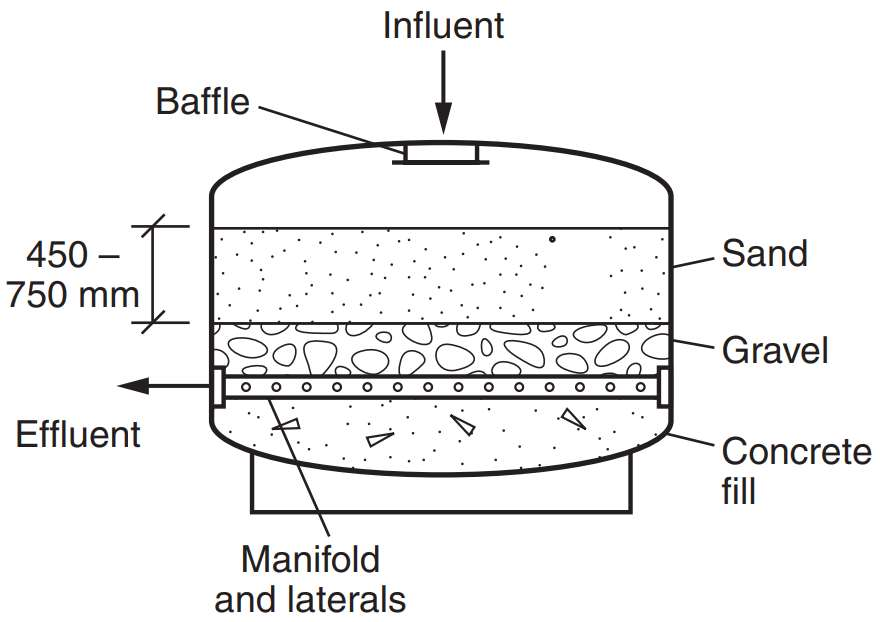
  - **Hình này chứng minh điều gì**
    - Minh họa chi tiết sơ đồ công nghệ, thông số thiết kế hoặc cấu tạo thiết bị trên slide trang 11.
  - **Từ đâu mà thấy được**
    - Trích xuất trực tiếp từ tài liệu bài giảng gốc của chương.

#### Pressure Filter

- Khái niệm bể lọc áp lực (Pressure Filter):
  - Thiết bị lọc hạt vận hành trong bồn kín dưới áp lực cơ học từ bơm cấp nước.
  - Cấu tạo và nguyên lý tương tự bể lọc nhanh trọng lực nhưng được bao kín trong vỏ chịu áp lực.

##### Operating Principle and Vessel Configuration

- Vận hành trong vỏ bồn kín chịu áp (Closed pressurized vessel):
  - Quá trình lọc diễn ra hoàn toàn trong không gian kín dưới điều kiện chịu áp lực cao (conducted in a closed vessel under pressurized conditions by pumping).
  - Áp lực dòng chảy do máy bơm cấp nước đầu vào tạo ra, thay thế cho cột nước tĩnh tự nhiên trong bể lọc trọng lực.
  - Vỏ thiết bị chế tạo bằng thép các-bon hàn kín có sơn phủ epoxy chống ăn mòn hoặc vật liệu composite chịu áp lực (áp lực làm việc thông thường $1.5\text{--}4.0\text{ bar}$).
  - Cấu hình bồn gồm hai dạng cơ bản: bồn hình trụ đứng (vertical cylindrical vessel) cho diện tích mặt bằng hẹp và bồn hình trụ ngang (horizontal cylindrical vessel) khi cần diện tích bề mặt lọc lớn hơn.
- Tương đồng thiết kế với bể lọc nhanh trọng lực (Design and operational similarity to rapid filters):
  - Cấu trúc tầng vật liệu lọc hạt và nguyên lý giữ cặn tương tự bể lọc nhanh trọng lực (operate and design similarly to rapid filters).
  - Sử dụng các loại vật liệu lọc hạt tiêu chuẩn gồm cát thạch anh đơn tầng (monomedia) hoặc than anthracite kết hợp cát thạch anh hai tầng (dual-media).
  - Bố trí lớp sỏi đỡ và hệ thống ống phân phối, thu gom nước dạng giàn ống có khe thu hoặc đầu chụp lọc chịu áp lực (underdrain nozzles / laterals).
  - Chu trình lọc gồm hai giai đoạn luân phiên: giai đoạn lọc loại bỏ cặn và giai đoạn rửa ngược (backwash) làm sạch tầng vật liệu lọc.
- Phạm vi ứng dụng công nghệ (Target application scope):
  - Sử dụng chủ yếu cho các nhà máy xử lý nước thải quy mô công suất nhỏ và vừa (used for smaller plants).
  - Ứng dụng phổ biến trong các trạm xử lý nước thải hợp khối dạng mô-đun (package plants) và công trình xử lý bậc ba đánh bóng nước tái sử dụng tại chỗ.
  - Tiết kiệm diện tích xây dựng (compact footprint) và giảm thời gian thi công nhờ kết cấu chế tạo sẵn tại nhà máy.

##### Operational Characteristics and Hydraulic Advantages

- Tổn thất áp lực giới hạn cao hơn (Higher terminal head loss):
  - Khả năng chịu áp lực của vỏ bồn cho phép vận hành đến giá trị tổn thất áp lực kết thúc chu kỳ lọc cao hơn bể lọc trọng lực ($h_{L,\text{terminal}} \gg h_{L,\text{gravity}}$).
  - Bể lọc hở trọng lực bị giới hạn bởi chiều sâu cột nước tĩnh ($1.8\text{--}3.0\text{ m}$), trong khi bể lọc áp lực có thể vận hành ở mức tổn thất áp lực từ $5.0\text{ m}$ đến $9.0\text{ m}$ ($50\text{--}90\text{ kPa}$) hoặc cao hơn.
  - Ngăn ngừa hiện tượng tổn thất áp lực âm (negative head / vacuum conditions), loại bỏ nguy cơ tách khí hòa tan gây hiện tượng nén khí (air binding) trong tầng lọc.
- Kéo dài chu kỳ lọc và giảm tần suất rửa ngược (Longer filter runs and reduced backwash frequency):
  - Mức tổn thất áp lực cho phép cao giúp tận dụng tối đa dung tích trữ cặn của toàn bộ chiều sâu lớp vật liệu lọc.
  - Thời gian mỗi chu kỳ lọc kéo dài hơn (result in longer filter runs), tăng sản lượng nước sạch qua mỗi chu trình.
  - Giảm tần suất rửa ngược (reduced backwash frequency):
    - Tiết kiệm tổng lượng nước sạch dùng cho rửa ngược (thường tiêu tốn $< 3\text{--}4\%$ công suất lọc).
    - Giảm lượng nước thải rửa lọc tuần hoàn về đầu trạm xử lý, giúp ổn định tải trọng thủy lực cho các công đoạn trước.
- Bảo toàn áp lực dư ở dòng nước sau lọc (Retention of excess influent pressure):
  - Áp lực từ bơm cấp nước sau khi thắng tổn thất qua lớp vật liệu lọc vẫn được duy trì trong dòng nước sau lọc (excess pressure from influent water remains in the filtered water).
  - Dòng nước lọc tự chảy trực tiếp đến các công trình tiếp theo mà không cần trạm bơm bổ sung (directly flow to another point without additional pumping):
    - Nước sau lọc tự cấp thẳng vào bể tiếp xúc khử trùng (disinfection tank / chlorination contact basin), hệ thống đèn tia cực tím ($\text{UV}$) kín có áp hoặc tháp giải nhiệt tái sử dụng.
    - Loại bỏ sự cần thiết của hố thu trung gian và máy bơm trung chuyển (secondary lift pumps).
    - Tiết kiệm chi phí đầu tư ban đầu cho máy bơm và giảm chi phí điện năng vận hành.

##### Technical Limitations and Monitoring Requirements

- Không thể quan sát trực tiếp quá trình lọc và rửa ngược (Cannot observe filtration and backwash processes):
  - Vỏ kim loại kín ngăn cản hoàn toàn việc quan sát trực tiếp bằng mắt thường bên trong bồn lọc.
  - Không thể phát hiện sớm các hiện tượng thủy lực bất lợi như tạo khe nứt dòng chảy ngắn (channeling), đóng bánh bề mặt lọc hay sự tích tụ vón cục của quả cầu bùn (mudballs).
  - Khó kiểm tra trực tiếp độ giãn nở tầng hạt ($20\text{--}40\%$) và sự đồng đều của bọt khí / dòng nước trong quá trình rửa ngược.
- Phụ thuộc vào thiết bị đo đạc và điều khiển tự động (Reliance on instrumentation):
  - Bắt buộc phải lắp đặt các đồng hồ đo chênh áp ($\Delta P$ pressure transmitters) tại cửa vào và ra để xác định thời điểm rửa ngược.
  - Yêu cầu bố trí cảm biến đo độ đục trực tuyến (online turbidimeters) để giám sát nguy cơ xuyên thủng tầng lọc (breakthrough).
  - Cần van xả khí tự động (automatic air release valves) trên đỉnh bồn để liên tục loại bỏ các túi khí tích tụ gây tắc nghẽn bề mặt lọc.
  - Việc kiểm tra vật liệu lọc và hệ thống phân phối đáy đòi hỏi phải tháo mở cửa người chui (manhole), yêu cầu cô lập và dừng toàn bộ bồn lọc.
- Giới hạn chế tạo và mở rộng quy mô (Fabrication cost and scaling constraints):
  - Chi phí gia công bồn thép chịu áp tăng nhanh theo đường kính thân bồn do yêu cầu tăng chiều dày thành chịu tải.
  - Giới hạn kích thước vận chuyển đường bộ (đường kính bồn $D \le 3.5\text{--}4.0\text{ m}$), dẫn đến diện tích lọc mỗi đơn nguyên bị khống chế.
  - Đối với trạm công suất lớn, việc ghép nối nhiều bồn áp lực song song làm tăng số lượng van đóng mở chịu áp, đường ống phức tạp và chi phí bảo trì hơn so với bể bê tông hở.

##### Comparative Evaluation: Pressure Filter vs. Gravity Rapid Filter

- Bảng so sánh các đặc tính kỹ thuật cốt lõi giữa bể lọc áp lực và bể lọc nhanh trọng lực:

| Tiêu chí so sánh | Bể lọc áp lực (Pressure Filter) | Bể lọc nhanh trọng lực (Gravity Rapid Filter) |
| :--- | :--- | :--- |
| **Vỏ chứa (Enclosure)** | Bồn kín chịu áp bằng thép hoặc composite | Bể hở bằng bê tông cốt thép xây dựng tại chỗ |
| **Động lực dòng chảy** | Bơm áp lực cơ học ($1.5\text{--}4\text{ bar}$) | Cột nước tĩnh tự nhiên ($1.8\text{--}3.0\text{ m}$) |
| **Tổn thất áp lực cuối ($h_{L,\text{term}}$)** | Lớn ($5.0\text{--}9.0\text{ m}$) | Nhỏ ($2.0\text{--}3.0\text{ m}$) |
| **Chu kỳ lọc (Run time)** | Kéo dài hơn, ít phải rửa ngược hơn | Ngắn hơn, tần suất rửa ngược cao hơn |
| **Áp lực dòng ra** | Giữ áp lực dư, tự chảy đến công trình sau | Chảy tự do không áp, cần trạm bơm tiếp theo |
| **Khả năng quan sát** | Không thể quan sát trực tiếp (bồn kín) | Quan sát trực tiếp dễ dàng bề mặt lớp lọc |
| **Chi phí xây lắp ban đầu** | Thấp cho quy mô nhỏ (chế tạo sẵn modul) | Thấp hơn trên một đơn vị công suất khi quy mô lớn |
| **Quy mô công suất tối ưu** | Trạm nhỏ và vừa, modul hợp khối | Trạm công suất trung bình và lớn ($> 5000\text{ m}^3/\text{ngày}$) |

### Chương 4.1: Quá trình Lý - Hóa - Keo tụ Nước thải (Coagulation)

#### 1. Tổng quan và Độ ổn định của hạt keo (Overview & Particle Stability)

- Khung chương trình và thông tin học phần:
  - Tên môn học: Kỹ thuật Xử lý Nước thải (Wastewater Treatment Engineering).
  - Giảng viên phụ trách: TS. Nguyễn Hoàng Dũng (Dr. Nguyen Hoang Dung).
  - Khung đào tạo: Học kỳ 1, năm học 2026 (1st semester, academic year 2026), Thành phố Hồ Chí Minh (Ho Chi Minh City).
  - Chuyên đề bài giảng thuộc Chương 4: Các quá trình đơn vị lý - hóa (Chemical-Physical unit processes), phần 1: Quá trình keo tụ (1. Coagulation).
  - Cấu trúc nội dung toàn chương 4.1 gồm 4 phần chính (Content):
    - Độ ổn định của hạt keo (Particle stability).
    - Các cơ chế keo tụ (Coagulation mechanism).
    - Thực hành keo tụ và hóa chất (Coagulation practice).
    - Thiết kế bể keo tụ và thiết bị khuấy trộn (Coagulation tank design).
- Vai trò và vị trí của quá trình keo tụ trong hệ thống xử lý nước thải:
  - Keo tụ (Coagulation) là quá trình đơn vị lý - hóa bổ sung hóa chất nhằm phá vỡ độ ổn định của các hạt keo siêu mịn và huyền phù phân tán.
  - Chuyển đổi các hạt không lắng được thành các vi bông (micro-flocs) có kích thước lớn hơn, tạo tiền đề cho quá trình tạo bông (Flocculation).
  - Ứng dụng trọng tâm trong xử lý sơ cấp nâng cao bằng hóa chất (CEPT), xử lý nước thải công nghiệp chứa chất màu, kim loại nặng và chất rắn lơ lửng mịn.

##### 1.1 Đặc tính của hạt keo và các lực tương tác (Colloidal Particles and Interaction Forces)

- Kích thước hình học và đặc tính lắng của hạt keo (Colloidal particles):
  - Kích thước hạt keo: đường kính hạt $d < 1\ \mu\text{m}$ ($d < 10^{-6}\text{ m}$, dải kích thước thông thường từ $0{,}001\ \mu\text{m}$ đến $1\ \mu\text{m}$).
  - Kích thước nằm trung gian giữa dung dịch thực ($d < 1\text{ nm}$) và hạt cặn lơ lửng thô lắng trọng lực ($d > 1\ \mu\text{m}$).
  - Tỷ diện tích bề mặt trên thể tích ($S/V$) rất lớn, làm gia tăng năng lượng tự do bề mặt và khả năng tương tác điện tích giữa các hạt.
  - Hạt keo không có khả năng tự lắng bằng trọng lực trong điều kiện tĩnh tự nhiên (Unable to self-settle by gravity):
    - Vận tốc lắng trọng lực của hạt theo định luật Stokes ($v_s$) xấp xỉ bằng $0$:
      $$v_s = \frac{g (\rho_p - \rho_w) d^2}{18 \mu} \approx 0$$
      với $g$ là gia tốc trọng trường ($9{,}81\text{ m/s}^2$), $\rho_p$ là khối lượng riêng của hạt ($\text{kg/m}^3$), $\rho_w$ là khối lượng riêng của nước ($\text{kg/m}^3$), $\mu$ là độ nhớt động lực học của nước ($\text{Pa}\cdot\text{s}$).
    - Lực hấp dẫn tác dụng lên khối lượng hạt quá nhỏ so với xung lực phân tử chất lỏng va chạm ngẫu nhiên.
    - Chuyển động nhiệt Brown (Brownian motion) thắng lực trọng trường, giữ hạt phân tán liên tục và không thể tự kết cụm nếu không can thiệp hóa chất.
    - Thời gian lắng tự nhiên qua độ sâu $1\text{ m}$ của hạt keo kích thước $0{,}1\ \mu\text{m}$ có thể kéo dài hàng chục năm.
- Điện tích bề mặt của hạt keo (Surface charge of colloids):
  - Phân bố điện tích bề mặt trong môi trường nước tự nhiên và nước thải ở $\text{pH}$ trung tính ($\text{pH} \approx 6{,}5 - 7{,}5$):
    - Hạt keo khoáng silica (colloidal silica minerals) và hầu hết các protein mang điện tích bề mặt âm (negative surface charge).
    - Hợp chất oxit ngậm nước của sắt và nhôm (hydrous oxides of iron and aluminum) mang điện tích bề mặt dương (positive surface charge).
  - Nguồn gốc hình thành điện tích bề mặt hạt keo:
    - Sự ion hóa các nhóm chức bề mặt (surface ionization):
      - Phân ly ion $\text{H}^+$ của nhóm silanol: $-\text{SiOH} \rightleftharpoons -\text{SiO}^- + \text{H}^+$ tạo điện tích âm ở dải $\text{pH} > 2$.
      - Phân ly nhóm carboxyl và amin của phân tử protein: $-\text{COOH} \rightleftharpoons -\text{COO}^- + \text{H}^+$ và $-\text{NH}_2 + \text{H}^+ \rightleftharpoons -\text{NH}_3^+$; ở $\text{pH}$ trung tính lớn hơn điểm đẳng điện, nhóm $-\text{COO}^-$ chiếm ưu thế tạo điện tích âm tổng thể.
      - Phản ứng proton hóa nhóm hydroxyl của oxit kim loại sắt/nhôm ở $\text{pH}$ thấp hơn điểm không điện tích: $\equiv\text{M-OH} + \text{H}^+ \rightleftharpoons \equiv\text{M-OH}_2^+$ tạo điện tích dương.
    - Sự hấp phụ chọn lọc ion từ pha lỏng (selective ion adsorption):
      - Hạt keo hấp phụ ưu tiên các anion đa hóa trị ($\text{HPO}_4^{2-}$, $\text{SO}_4^{2-}$) hoặc các chất hữu cơ hòa tan mang điện âm.
    - Sự thay thế đồng hình trong mạng tinh thể khoáng sét (isomorphous replacement):
      - Cation có điện tích thấp hơn thay thế cation điện tích cao hơn trong cấu trúc tinh thể (ví dụ $\text{Al}^{3+}$ thay thế $\text{Si}^{4+}$) sinh ra điện tích âm vĩnh cửu.
- Cấu trúc lớp điện kép (Electrical Double Layer - EDL) và điện thế Zeta ($\zeta$):
  - Lớp Stern (Stern layer): Lớp ion trái dấu bám chặt trực tiếp trên bề mặt hạt keo bởi lực hút tĩnh điện mạnh.
  - Lớp khuếch tán (Diffuse layer): Lớp ion trái dấu phân bố trải rộng ra dung dịch nước với mật độ giảm dần theo khoảng cách.
  - Mặt trượt (Shear plane / Slipping plane): Mặt ranh giới ngăn cách lớp chất lỏng dính liền với hạt và lớp dung dịch tự do bên ngoài.
  - Điện thế Zeta ($\zeta$ potential): Điện thế đo được tại mặt trượt của hạt keo, biểu thị bằng milivôn ($\text{mV}$).
    - Độ lớn $|\zeta| > 30\text{ mV}$ biểu thị hệ keo có độ ổn định tĩnh điện cao, lực đẩy mạnh chống lại sự kết cụm.
    - Độ lớn $|\zeta| < 5 - 10\text{ mV}$ biểu thị hệ keo đã bị khử bền, lực đẩy không đủ lớn để cản trở va chạm tạo bông.
  - Nghịch đảo chiều dày lớp điện kép Debye ($\kappa$, đơn vị $\text{m}^{-1}$): Xác định tốc độ suy giảm thế điện tích theo khoảng cách; tăng nồng độ ion đối (tăng lực ion dung dịch) làm tăng $\kappa$ và nén lớp điện kép lại gần bề mặt hạt.
- Độ ổn định của hạt keo và các lực tương tác cơ bản (Particle Stability and Interaction Forces):
  - Độ ổn định của hạt keo phụ thuộc vào sự cạnh tranh giữa hai lực tương tác cơ bản:
    - Lực đẩy tĩnh điện (Repulsive Electrostatic Force):
      - Sinh ra do điện tích bề mặt thuần cùng dấu (chủ yếu là điện tích âm) giữa các hạt keo lân cận.
      - Năng lượng thế đẩy $V_R$ ngăn cản hai hạt tiếp cận nhau và suy giảm theo hàm mũ theo khoảng cách giữa hai bề mặt $d$:
        $$V_R \propto \exp(-\kappa d)$$
    - Lực hút Van der Waals (Van der Waals Attractive Force):
      - Lực hút tương hỗ tầm ngắn giữa các nguyên tử và phân tử cấu thành hai hạt keo (bao gồm lực định hướng Keesom, lực cảm ứng Debye và lực phân tán London).
      - Năng lượng thế hút $V_A$ mang dấu âm và suy giảm theo tỷ lệ nghịch với bình phương khoảng cách giữa hai bề mặt:
        $$V_A = -\frac{A_H}{12 \pi d^2}$$
        với $A_H$ là hằng số Hamaker phụ thuộc vào cấu tạo vật liệu hạt keo và môi trường lỏng.
- Lý thuyết tương tác DLVO (Derjaguin - Landau - Verwey - Overbeek):
  - Năng lượng thế tương tác tổng cộng ($V_{\text{total}}$) là tổng đại số của thế đẩy tĩnh điện và thế hút Van der Waals:
    $$V_{\text{total}} = V_R + V_A$$
  - Hàng rào năng lượng (Energy barrier, $V_{\max}$):
    - Đồ thị thế năng xuất hiện đỉnh cực đại $V_{\max} > 0$ ở khoảng cách tiếp cận trung bình.
    - Khi động năng chuyển động nhiệt Brown của hạt nhỏ hơn đỉnh rào thế năng ($E_{\text{kinetic}} < V_{\max}$), hai hạt bị đẩy bật ra xa nhau khi tiếp xúc, duy trì trạng thái huyền phù ổn định (Particle stability).
  - Vùng thế cực tiểu sơ cấp (Primary minimum):
    - Khi khoảng cách $d \rightarrow 0$, thế hút Van der Waals chiếm ưu thế tuyệt đối kéo hai hạt dính chặt không đảo ngược.
  - Nguyên lý khử bền keo (Colloidal destabilization):
    - Khi thêm chất keo tụ mang điện tích dương, thế đẩy tĩnh điện $V_R$ giảm xuống (chuyển từ Repulsion curve 1 sang Repulsion curve 2).
    - Đỉnh hàng rào năng lượng $\text{Net energy 1}$ bị triệt tiêu chuyển thành đường $\text{Net energy 2}$, cho phép lực hút Van der Waals chiếm ưu thế hoàn toàn và các hạt keo kết dính thành bông cặn khi va chạm.
  - Minh họa định lượng tương tác thế năng theo lý thuyết DLVO:
    - **Hình 1.** Đồ thị thế năng tương tác giữa hai hạt keo theo khoảng cách (Lý thuyết DLVO)
      - 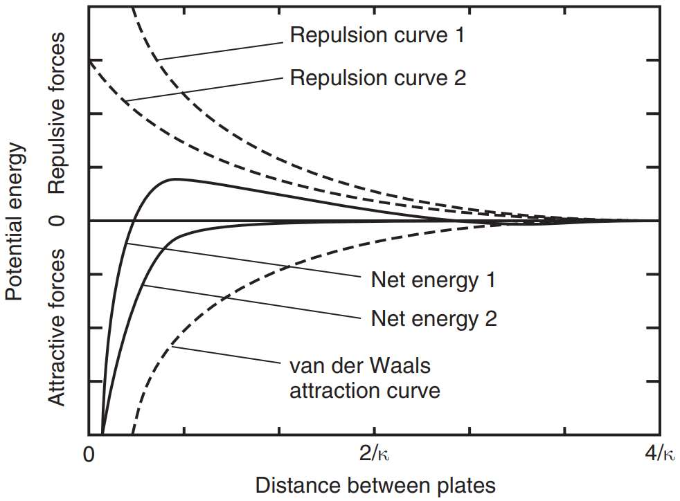
      - **Hình này chứng minh điều gì**
        - Thế năng tổng ($\text{Net energy}$) xác định độ bền keo; giảm lực đẩy tĩnh điện sẽ triệt tiêu rào cản năng lượng để hạt keo kết tụ.
      - **Từ đâu mà thấy được**
        - Trục tung là thế năng ($\text{Potential energy}$) phân tách miền đẩy ($> 0$) và miền hút ($< 0$); trục hoành là khoảng cách bản hạt ($0$, $2/\kappa$, $4/\kappa$).
        - Thế đẩy ($\text{Repulsion 1, 2}$) ở miền dương, thế hút ($\text{van der Waals}$) ở miền âm; đường nét liền $\text{Net energy 1}$ có đỉnh rào thế cản trở, $\text{Net energy 2}$ bị hạ thấp khi giảm đẩy.

##### 1.2 Phân loại hạt keo kỵ nước và ưa nước (Hydrophobic and Hydrophilic Colloids)

- Hạt keo kỵ nước (Hydrophobic colloids):
  - Bản chất và tương tác với phân tử nước:
    - Không có ái lực với nước (No affinity for water).
    - Bề mặt phân cách pha giữa hạt keo và nước không có lớp màng hydrate hóa (hydration shell) bảo vệ.
  - Thành phần và nguồn gốc trong môi trường:
    - Chiếm tỷ trọng chủ yếu là các hạt keo vô cơ (Mostly inorganic colloids).
    - Ví dụ điển hình: Hạt khoáng sét (clay: bentonite, montmorillonite, kaolinite), các hạt oxit kim loại (metal oxides: $\text{Fe}_2\text{O}_3$, $\text{Al}_2\text{O}_3$, $\text{SiO}_2$, $\text{MnO}_2$).
    - Nguồn gốc phát sinh: Nước mưa chảy tràn, nước thải sản xuất gạch gốm sứ, nước thải tuyển khoáng và rửa cát đá.
  - Đặc tính keo tụ trong xử lý nước thải:
    - Rất dễ keo tụ (Easy to coagulate).
    - Độ ổn định của hệ keo kỵ nước hoàn toàn do điện tích bề mặt và lực đẩy tĩnh điện quyết định.
    - Chỉ cần thêm chất keo tụ vô cơ ion kim loại đa hóa trị ($\text{Al}^{3+}$, $\text{Fe}^{3+}$) để trung hòa điện tích bề mặt hoặc nén lớp điện kép.
    - Hàng rào thế năng nhanh chóng bị triệt tiêu, lực hút Van der Waals đưa các hạt dính kết thành bông cặn lớn lắng trọng lực dễ dàng.
- Hạt keo ưa nước (Hydrophilic colloids):
  - Bản chất và tương tác với phân tử nước:
    - Có ái lực rất mạnh với nước (Strong affinity for water).
    - Bề mặt hạt chứa các nhóm phân cực ($-\text{OH}$, $-\text{COOH}$, $-\text{NH}_2$) hút các phân tử nước xung quanh.
    - Hấp thụ một lượng lớn nước (absorbs water) và tạo thành lớp vỏ hydrate hóa dày bao quanh hạt (solvated water shell).
  - Thành phần và nguồn gốc trong môi trường:
    - Chiếm tỷ trọng chủ yếu là các hợp chất keo hữu cơ (Mostly organic colloids).
    - Ví dụ điển hình: Các phân tử protein, gelatin, polysaccharide, tinh bột, axit humic, axit fulvic và các chất polymer ngoại bào do vi sinh vật tiết ra (EPS).
    - Nguồn gốc phát sinh: Nước thải sinh hoạt, nước thải chế biến thủy hải sản, giết mổ gia súc, sản xuất sữa và chế biến thực phẩm.
  - Cơ chế ức chế quá trình keo tụ:
    - Lớp vỏ nước hydrate hóa hoạt động như một đệm cản trở không gian (steric hindrance).
    - Khi các hạt tiến lại gần nhau, năng lượng khử solvate hóa (dehydration energy) cản trở bề mặt hạt tiếp xúc trực tiếp.
    - Sự hấp phụ nước ức chế mạnh mẽ quá trình keo tụ (absorbs water and inhibits coagulation), ngay cả khi điện tích bề mặt đã bị trung hòa một phần.
  - Yêu cầu xử lý kỹ thuật chuyên biệt (Requires specific treatment):
    - Đòi hỏi quy trình xử lý chuyên biệt để đạt hiệu quả keo tụ (Requires specific treatment to achieve coagulation efficiency):
      - Tăng liều lượng hóa chất keo tụ vượt ngưỡng trung hòa để hình thành bông hydroxide kết tủa cuộn bắt (sweep flocculation).
      - Sử dụng chất trợ keo tụ polymer cation hoặc anion cao phân tử tạo cầu nối hạt keo (interparticle bridging).
      - Bổ sung chất trợ tạo bông hạt nặng (như bentonite, bột sét, than hoạt tính bột PAC, cát vi mịn) làm nhân tạo bông.
      - Kiểm soát nghiêm ngặt $\text{pH}$ tối ưu của môi trường phản ứng hoặc oxy hóa sơ bộ để làm biến tính các chuỗi protein ưa nước.
- Bảng so sánh tổng hợp đặc tính kỹ thuật giữa hạt keo kỵ nước và hạt keo ưa nước:

| Tiêu chí kỹ thuật (Parameters) | Keo kỵ nước (Hydrophobic Colloids) | Keo ưa nước (Hydrophilic Colloids) |
| :--- | :--- | :--- |
| Thành phần hóa học chủ đạo | Keo vô cơ (khoáng sét, oxit kim loại $\text{Fe, Al, Si}$) | Keo hữu cơ (protein, gelatin, polysaccharide, humic) |
| Ái lực với nước (Water affinity) | Không có ái lực với nước (No affinity for water) | Ái lực rất mạnh với nước (Strong affinity for water) |
| Lớp màng solvate hóa bề mặt | Không có lớp vỏ hydrate hóa bao quanh | Có lớp vỏ hydrate hóa dày bao bọc quanh hạt |
| Cơ chế ổn định bền vững chính | Lực đẩy tĩnh điện do lớp điện kép bề mặt | Lực đẩy tĩnh điện kết hợp cản trở cơ học steric của lớp màng nước |
| Độ dễ keo tụ (Coagulability) | Rất dễ keo tụ (Easy to coagulate) | Khó keo tụ, ức chế quá trình tạo bông (Inhibits coagulation) |
| Cơ chế phá vỡ độ ổn định chính | Trung hòa điện tích bề mặt và nén lớp điện kép | Kết tủa cuộn bắt (Sweep floc) và tạo cầu nối polymer |
| Yêu cầu hóa chất xử lý | Liều lượng phèn thông thường ($\text{Al}^{3+}, \text{Fe}^{3+}$) | Liều lượng phèn cao, kết hợp polymer trợ keo tụ và chất trợ lắng |

#### 2. Cơ chế keo tụ (Coagulation Mechanisms)

- Định nghĩa quá trình keo tụ (Definition of coagulation):
  - Keo tụ là quá trình châm các hóa chất keo tụ vô cơ (inorganic coagulants) vào nước nhằm phá vỡ độ ổn định (destabilize) của các hạt keo lơ lửng.
  - Quá trình chuyển hóa các hạt keo mịn phân tán ($d < 1\ \mu\text{m}$) thành các tập hợp bông cặn lớn hơn ($d \gg 1\ \mu\text{m}$).
  - Bông cặn sau keo tụ gia tăng đáng kể về kích thước và khối lượng riêng so với hạt keo ban đầu.
  - Bông cặn hình thành đạt kích thước và tỷ trọng đủ lớn để tự tách khỏi pha nước bằng quá trình lắng trọng lực (gravity settling).
- Bốn cơ chế keo tụ cơ bản trong xử lý nước (Four fundamental coagulation mechanisms):
  - Cơ chế nén lớp điện kép (Compression of the electrical double layer).
  - Cơ chế hấp phụ và trung hòa điện tích (Adsorption and charge neutralization).
  - Cơ chế tạo cầu nối hạt keo bằng polymer (Interparticle bridging).
  - Cơ chế kết tủa và cuộn bắt bông cặn (Precipitation and enmeshment / Sweep flocculation).

##### 2.1 Cơ chế trung hòa điện tích (Charge Neutralization)

###### Cơ chế nén lớp điện kép (Compression of Electrical Double Layer)

- Cấu trúc lớp điện kép quanh hạt keo (Structure of electrical double layer):
  - Bề mặt hạt keo trong môi trường nước tự nhiên mang điện tích bề mặt âm (negatively charged particle surface).
  - Điện tích âm xuất phát từ sự phân ly các nhóm chức hóa học bề mặt hoặc hiện tượng thay thế đồng hình trong mạng tinh thể khoáng sét.
  - Lớp Stern (Fixed charge layer):
    - Các ion dương đối kháng (positive counterions) liên kết chặt chẽ với bề mặt hạt keo bằng lực tĩnh điện mạnh và lực hấp phụ hóa học.
    - Lớp ion cố định này di chuyển cùng hạt keo trong dung dịch.
  - Lớp khuếch tán (Diffuse ion layer):
    - Các ion đối kháng dương và ion cùng dấu âm phân bố tự do chịu tác động đồng thời của lực hút tĩnh điện và chuyển động nhiệt Brownian.
    - Nồng độ ion dương giảm dần và nồng độ ion âm tăng dần theo khoảng cách tính từ bề mặt hạt cho đến khi đạt trạng thái cân bằng với dung dịch nền (bulk solution).
  - Mặt trượt thủy động học (Slipping shear plane):
    - Ranh giới hình học phân tách lớp chất lỏng dính bám chuyển động cùng hạt và khối chất lỏng đứng yên xung quanh.
    - Điện thế tĩnh điện đo được tại mặt trượt này bằng phương pháp điện di (electrophoresis) là điện thế Zeta ($\zeta$).
    - **Hình 2.** Cấu trúc lớp điện kép quanh bề mặt hạt keo âm
      - 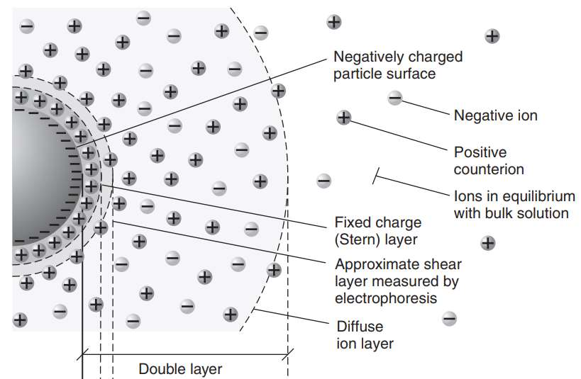
      - **Hình này chứng minh điều gì**
        - Hạt keo tích điện âm được bao bọc bởi lớp Stern cố định và lớp khuếch tán, tạo lực đẩy tĩnh điện ngăn các hạt tiến lại gần nhau.
      - **Từ đâu mà thấy được**
        - Bề mặt hạt mang điện tích âm; lớp Stern giữ chặt các ion dương đối kháng; ranh giới nét đứt biểu diễn mặt phẳng trượt (shear layer).
        - Vùng khuếch tán chứa ion âm và dương; chiều dày lớp điện kép trải rộng tới vùng cân bằng dung dịch nền.
- Quy luật nén lớp khuếch tán (Diffuse layer compression):
  - Chiều dày Debye ($\kappa^{-1}$) của lớp ion khuếch tán biểu thị phạm vi tác dụng của trường lực đẩy tĩnh điện:
    $$\kappa^{-1} = \sqrt{\frac{\varepsilon_r \varepsilon_0 k_B T}{2 e^2 I}}$$
    trong đó $\varepsilon_r$ là hằng số điện môi tương đối của nước, $\varepsilon_0$ là độ điện thẩm chân không, $k_B$ là hằng số Boltzmann, $T$ là nhiệt độ tuyệt đối ($\text{K}$), $e$ là điện tích nguyên tố, và $I$ là lực ion của dung dịch ($\text{mol/L}$).
  - Gia tăng lực ion $I = \frac{1}{2} \sum c_i z_i^2$ trong pha nước làm suy giảm mạnh chiều dày Debye $\kappa^{-1}$.
  - Sự co hẹp của lớp khuếch tán làm suy giảm độ dốc điện thế và kéo giảm điện thế Zeta ($\zeta$).
  - Hàng rào thế năng đẩy tĩnh điện ($V_R$) co hẹp về cự ly gần bề mặt hạt.
  - Lực hút Van der Waals ($V_A$) phụ thuộc vào bản chất vật liệu hạt mà không phụ thuộc vào lực ion dung dịch sẽ vượt qua lực đẩy tĩnh điện ở khoảng cách gần.
  - Định luật Schulze-Hardy về nồng độ keo tụ tới hạn (Critical Coagulation Concentration - CCC):
    $$\text{CCC} \propto \frac{1}{z^6}$$
    trong đó $z$ là hóa trị của ion đối kháng mang điện tích dương.
  - Hiệu quả nén lớp điện kép của các cation tăng đột biến theo hóa trị:
    $$\text{CCC}(\text{Al}^{3+}) : \text{CCC}(\text{Ca}^{2+}) : \text{CCC}(\text{Na}^+) \approx \frac{1}{3^6} : \frac{1}{2^6} : \frac{1}{1^6} \approx \frac{1}{729} : \frac{1}{64} : 1$$
  - Ion kim loại hóa trị ba ($\text{Al}^{3+}$, $\text{Fe}^{3+}$) có khả năng làm mất ổn định hệ keo ở liều lượng thấp hơn hàng trăm lần so với ion hóa trị một ($\text{Na}^+$).

###### Cơ chế hấp phụ và trung hòa điện tích (Adsorption and Charge Neutralization)

- Bản chất phản ứng thủy phân tạo phức cation kim loại:
  - Khi hòa tan muối nhôm ($\text{Al}^{3+}$) hoặc muối sắt ($\text{Fe}^{3+}$) vào nước, các ion kim loại lập tức tham gia chuỗi phản ứng thủy phân nhiều nấc.
  - Chuỗi phản ứng hình thành các dạng phức chất hydroxy-kim loại đơn nhân và đa nhân mang điện tích dương cao:
    - Các phức hydroxy của nhôm: $\text{AlOH}^{2+}$, $\text{Al(OH)}_2^+$, $\text{Al}_7(\text{OH})_{17}^{4+}$, $\text{Al}_{13}\text{O}_4(\text{OH})_{24}^{7+}$.
    - Các phức hydroxy của sắt: $\text{FeOH}^{2+}$, $\text{Fe(OH)}_2^+$, $\text{Fe}_2(\text{OH})_2^{4+}$, $\text{Fe}_3(\text{OH})_4^{5+}$.
- Quá trình hấp phụ đặc hiệu và triệt tiêu điện tích bề mặt:
  - Các phức ion hydroxy đa nhân mang điện tích dương hấp phụ mạnh lên bề mặt hạt keo âm thông qua tương tác phối trí và lực hút tĩnh điện cục bộ.
  - Quá trình hấp phụ làm giảm mật độ điện tích bề mặt thực tế ($\sigma_0$) của hạt keo.
  - Điện thế Zeta ($\zeta$) dịch chuyển từ giá trị âm cao (ví dụ $-30\text{ mV}$ đến $-50\text{ mV}$) về tiệm cận giá trị $0\text{ mV}$ (điểm đẳng điện - Isoelectric point, $\text{IEP}$).
- Giảm lực đẩy tĩnh điện và hình thành bông cặn:
  - Triệt tiêu điện tích bề mặt làm suy giảm triệt để lực đẩy tĩnh điện (repulsive electrostatic force):
    $$F_{\text{repulsive}} < F_{\text{Van der Waals}}$$
  - Khi lực đẩy tĩnh điện nhỏ hơn lực hút Van der Waals, các hạt keo không còn rào cản thế năng ngăn cách.
  - Các hạt va chạm tự do do chuyển động nhiệt và lực khuấy trộn, tiếp xúc trực tiếp và liên kết thành hạt lớn hơn (floc).
  - Kích thước hạt tăng giúp tăng vận tốc lắng theo định luật Stokes, đưa hệ hạt về trạng thái có khả năng tự lắng bằng trọng lực.
- Vùng liều lượng tối ưu và hiện tượng đảo điện tích:
  - Cơ chế trung hòa điện tích có mối tương quan tỷ lệ thuận trực tiếp giữa diện tích bề mặt hạt keo và liều lượng chất keo tụ yêu cầu.
  - Liều lượng tối ưu đưa điện thế Zeta về khoảng $\zeta \approx -5\text{ mV}$ đến $+5\text{ mV}$.
  - Châm thiếu hóa chất keo tụ (underdosing): điện thế âm còn lớn, lực đẩy tĩnh điện tiếp tục duy trì độ bền vững của hệ keo.
  - Châm thừa hóa chất keo tụ (overdosing): các phức cation hấp phụ dư thừa lên bề mặt hạt gây hiện tượng đảo điện tích (charge reversal), khiến hạt keo tích điện dương ($\zeta > +30\text{ mV}$), làm tái xuất hiện lực đẩy tĩnh điện và tái ổn định hệ keo (restabilization).

##### 2.2 Cơ chế tạo cầu nối hạt keo (Interparticle Bridging)

- Khái niệm và vật liệu tạo cầu nối (Interparticle bridging concept):
  - Cơ chế tạo cầu nối sử dụng các hợp chất cao phân tử mạch dài (polymers) hoặc chất keo tụ vô cơ cao phân tử như Polyaluminum Chloride (PAC - $[\text{Al}_n(\text{OH})_m\text{Cl}_{3n-m}]_k$).
  - Các phân tử polymer mạch dài sở hữu khối lượng phân tử lớn và cấu trúc chuỗi kéo dài trong dung dịch nước.
  - Polymer cation tích điện dương tương tác hóa lý với bề mặt hạt keo tích điện âm.
- Cơ chế hình thành cầu nối chuỗi polymer:
  - Các đoạn mạch (segments) của chuỗi polymer hấp phụ lên bề mặt của một hạt keo thông qua liên kết tĩnh điện, lực hút Van der Waals hoặc liên kết hydro.
  - Các phần còn lại của cùng một chuỗi polymer duỗi thẳng vào dung dịch nước tạo thành các nhánh tự do (tails và loops).
  - Các nhánh tự do tiếp tục tiếp xúc và hấp phụ lên các vị trí bề mặt còn trống của các hạt keo lân cận.
  - Chuỗi polymer đóng vai trò chiếc cầu nối vật lý (bridge) liên kết nhiều hạt keo riêng lẻ lại với nhau thành một mạng lưới bông cặn ba chiều kích thước lớn.
- Động học tạo bông và điều kiện tối ưu (Optimal bridging conditions):
  - Quá trình tạo cầu nối phụ thuộc đồng thời vào liều lượng polymer tối ưu và điều kiện thủy lực khuấy trộn:
    - Giai đoạn đầu: khuấy trộn phân tán đều hóa chất polymer khắp thể tích chất lỏng.
    - Hạt keo bị mất ổn định nhờ các liên kết chuỗi polymer bám dính trên bề mặt.
    - Bông cặn phát triển nhờ va chạm nhiệt vi mô (lực Perikinetic) và va chạm thủy lực do dòng cắt vận tốc (lực Orthokinetic).
    - **Hình 3.** Quá trình tạo cầu nối polymer trong điều kiện liều lượng và khuấy trộn tối ưu
      - 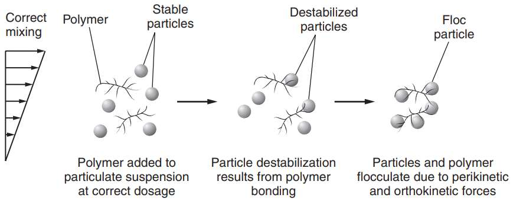
      - **Hình này chứng minh điều gì**
        - Chuỗi polymer cation liên kết nhiều hạt keo thành bông cặn lớn nhờ tương tác hấp phụ và lực khuấy trộn phù hợp.
      - **Từ đâu mà thấy được**
        - Biểu đồ vận tốc bên trái biểu diễn chế độ khuấy trộn chuẩn (Correct mixing); hạt keo bền tiếp xúc với polymer liều lượng đúng.
        - Mũi tên tiến trình: polymer hấp phụ làm mất ổn định hạt, các lực Perikinetic và Orthokinetic liên kết hạt thành bông cặn (Floc particle).
- Ảnh hưởng của hiện tượng châm quá liều polymer (Excessive polymer dosage):
  - Liều lượng polymer tối ưu ứng với độ che phủ bề mặt hạt keo lý thuyết khoảng $50\%$ ($\theta \approx 0.5$).
  - Mức che phủ $50\%$ để lại đủ diện tích bề mặt trống trên các hạt khác để các đầu chuỗi polymer tự do bám vào tạo cầu nối chéo.
  - Khi châm quá liều polymer (excessive dosage), nồng độ chuỗi mạch trong nước quá cao làm bão hòa toàn bộ bề mặt hạt keo ($\theta \to 1.0$).
  - Các hạt keo bị bọc kín hoàn toàn trong khung mạng polymer (particles enmeshed in polymer matrix).
  - Không còn vị trí bề mặt trống nào trên các hạt lân cận để tiếp nhận liên kết chéo.
  - Lực cản không gian (steric repulsion) giữa các lớp vỏ polymer bao bọc khiến các hạt không thể liên kết lại với nhau.
  - Hiện tượng này dẫn tới sự tái ổn định hạt keo (particle restabilization), huyền phù không thể tạo bông cặn và độ đục không giảm.
- Ảnh hưởng của điều kiện khuấy trộn không đủ (Insufficient mixing):
  - Khi năng lượng khuấy trộn không đủ hoặc thời gian tiếp xúc thủy lực quá ngắn, xác suất va chạm giữa chuỗi polymer đang duỗi với hạt keo khác suy giảm mạnh.
  - Các đầu chuỗi polymer tự do (tails) không tìm được hạt keo lân cận sẽ tự co cuộn và hấp phụ trở lại lên chính bề mặt hạt keo ban đầu (secondary adsorption).
  - Quá trình hấp phụ thứ cấp này biến hạt keo thành hạt trơ (inactive particles) với các chuỗi polymer ép sát bề mặt.
  - Các hạt trơ mất hoàn toàn khả năng vươn nhánh tạo cầu nối liên hạt, dẫn đến tái ổn định hệ keo và chất lượng tạo bông cặn kém (poor floc formation).
    - **Hình 4.** Hiện tượng tái ổn định hạt keo do châm quá liều polymer hoặc khuấy trộn không đủ
      - 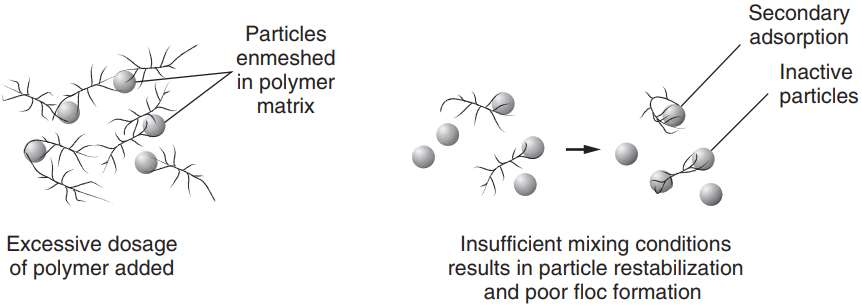
      - **Hình này chứng minh điều gì**
        - Châm quá liều polymer hoặc khuấy trộn thiếu làm hạt bị tái ổn định và ức chế hình thành bông cặn.
      - **Từ đâu mà thấy được**
        - Nửa trái: châm quá liều khiến hạt bị bọc kín hoàn toàn trong màng polymer (Particles enmeshed in polymer matrix), mất điểm liên kết chéo.
        - Nửa phải: khuấy thiếu làm chuỗi polymer tự gập và hấp phụ thứ cấp (Secondary adsorption), tạo hạt trơ (Inactive particles) không thể tạo bông.
- Ảnh hưởng của điều kiện khuấy trộn quá mức (Excessive mixing):
  - Cường độ khuấy trộn biểu thị qua gradient vận tốc $G$ ($\text{s}^{-1}$):
    $$G = \sqrt{\frac{P}{\mu V}}$$
    trong đó $P$ là công suất truyền vào chất lỏng ($\text{W}$), $\mu$ là độ nhớt động lực học ($\text{N}\cdot\text{s/m}^2$), và $V$ là thể tích bể ($\text{m}^3$).
  - Gradient vận tốc quá lớn tạo ra ứng suất cắt thủy lực cục bộ (hydraulic shear stress) rất cao trên bề mặt bông cặn.
  - Ứng suất cắt vượt quá độ bền kéo cơ học của các liên kết polymer - bề mặt và độ bền liên kết nội phân tử của chuỗi polymer.
  - Các cầu nối polymer bị xé đứt cơ học, làm vỡ bông cặn lớn đã hình thành (floc ruptures).
  - Bông cặn vỡ nát giải phóng các mảnh vụn nhỏ phân tán (floc fragments).
  - Các mảnh vụn bị đứt gãy khó có khả năng tự kết tụ lại do các đầu polymer đã bị biến tính hoặc hấp phụ gập lại trên mảnh vỡ, làm tăng độ đục dư sau lắng.
    - **Hình 5.** Sự phá vỡ bông cặn keo tụ do khuấy trộn quá mức
      - 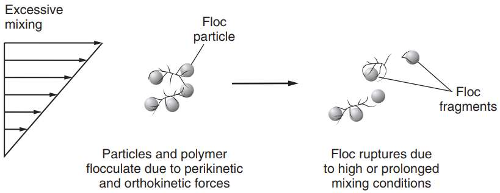
      - **Hình này chứng minh điều gì**
        - Cường độ khuấy quá mạnh hoặc kéo dài tạo ứng suất cắt bẻ gãy các cầu nối polymer, làm vỡ bông cặn thành các mảnh nhỏ.
      - **Từ đâu mà thấy được**
        - Bên trái: gradient vận tốc rất lớn (Excessive mixing); ở giữa: bông cặn hoàn chỉnh (Floc particle) hình thành ban đầu.
        - Bên phải: mũi tên chỉ hiện tượng đứt gãy bông cặn (Floc ruptures), giải phóng các mảnh vụn phân tán (Floc fragments) khó lắng.

##### 2.3 Cơ chế kết tủa và cuộn bắt (Precipitation and Enmeshment)

- Khái niệm cơ chế cuộn bắt bông cặn (Sweep flocculation concept):
  - Cơ chế kết tủa và cuộn bắt xuất hiện khi liều lượng chất keo tụ muối kim loại ($\text{Al}^{3+}$, $\text{Fe}^{3+}$) châm vào nước vượt quá giới hạn tích số tan của hydroxide tương ứng.
  - Nồng độ các ion kim loại và ion hydroxide trong nước thỏa mãn điều kiện kết tủa vượt bão hòa:
    $$[\text{Al}^{3+}][\text{OH}^-]^3 > K_{\text{sp, Al(OH)}_3}$$
    $$[\text{Fe}^{3+}][\text{OH}^-]^3 > K_{\text{sp, Fe(OH)}_3}$$
  - Nhôm và sắt phản ứng thủy phân nhanh với nước tạo ra các kết tủa hydroxide không tan (insoluble precipitates):
    $$\text{Al}^{3+} + 3\text{H}_2\text{O} \rightleftharpoons \text{Al(OH)}_3\downarrow + 3\text{H}^+$$
    $$\text{Fe}^{3+} + 3\text{H}_2\text{O} \rightleftharpoons \text{Fe(OH)}_3\downarrow + 3\text{H}^+$$
- Quá trình tạo lưới kết tủa và bẫy hạt keo:
  - Các kết tủa $\text{Al(OH)}_3$ và $\text{Fe(OH)}_3$ hình thành tức thời dưới dạng các khối bông keo vô định hình xốp với khối lượng và thể tích khổng lồ.
  - Lưới kết tủa hydroxide lan tỏa dày đặc khắp thể tích khối chất lỏng.
  - Các hạt kết tủa hydroxide bắt đầu sa lắng xuống đáy bể theo trọng lực (precipitates settle).
  - Trong quá trình chìm lắng, mạng lưới bông kết tủa va chạm, quét sạch và bao bọc cơ học các hạt keo lơ lửng, hạt bụi sét, vi khuẩn và chất hữu cơ phân tán (precipitates trap particles while settling).
  - Các hạt keo bị "cuộn bắt" (enmeshment) vào bên trong cấu trúc bông cặn mà không nhất thiết phải triệt tiêu hoàn toàn điện tích bề mặt.
- Ứng dụng thực tế đối với nước có độ đục thấp:
  - Cơ chế cuộn bắt đóng vai trò quyết định trong xử lý các nguồn nước thải hoặc nước mặt có nồng độ chất rắn lơ lửng thấp (độ đục thấp, low turbidity).
  - Trong nước có độ đục thấp, mật độ hạt keo quá thưa thớt khiến tần số va chạm ngẫu nhiên giữa các hạt rất nhỏ, không thể tạo bông cặn hiệu quả bằng cơ chế trung hòa điện tích đơn thuần.
  - Châm liều lượng phèn dư vượt ngưỡng bão hòa tạo ra khối kết tủa hydroxide lớn nhân tạo để quét sạch các hạt keo thưa thớt này.
  - Nước có độ đục càng thấp đòi hỏi liều lượng phèn càng cao để kích hoạt cơ chế cuộn bắt bông cặn (nghịch lý liều lượng keo tụ).
- Tác động lên độ kiềm và giá trị pH của môi trường:
  - Phản ứng tạo kết tủa hydroxide giải phóng liên tục các ion $\text{H}^+$ vào môi trường nước:
    - Mỗi ion $\text{Al}^{3+}$ thủy phân giải phóng $3\text{ H}^+$.
    - Mỗi ion $\text{Fe}^{3+}$ thủy phân giải phóng $3\text{ H}^+$.
  - Sự tích tụ ion $\text{H}^+$ làm suy giảm độ kiềm tự nhiên của nước:
    - Cứ $1\ \text{meq/L}$ phèn nhôm hoặc phèn sắt phản ứng sẽ tiêu thụ chính xác $1\ \text{meq/L}$ độ kiềm của hệ đệm bicarbonate ($\text{HCO}_3^-$), tương đương làm mất $50\ \text{mg/L}$ độ kiềm tính theo $\text{CaCO}_3$.
  - Nếu nguồn nước có độ kiềm thấp, phản ứng thủy phân sẽ kéo giảm mạnh giá trị $\text{pH}$ xuống dưới dải tối ưu của kết tủa hydroxide ($\text{pH} < 5.5$ đối với phèn nhôm).
  - Khi $\text{pH}$ hạ quá thấp, kết tủa $\text{Al(OH)}_3$ bị hòa tan ngược trở lại thành phức ion $\text{Al}^{3+}$ hoặc $\text{AlOH}^{2+}$, làm tan bông cặn và gia tăng hàm lượng kim loại dư trong nước sau xử lý.
  - Do đó, quá trình keo tụ cuộn bắt đòi hỏi kiểm soát chặt chẽ giá trị $\text{pH}$ và châm bổ sung hóa chất kiềm hóa ($\text{NaOH}$ hoặc $\text{Na}_2\text{CO}_3$) khi cần thiết để duy trì điều kiện kết tủa tối ưu.

#### 3. Thực hành keo tụ và Hóa chất (Coagulation Practice)

##### 3.1 Các loại chất keo tụ vô cơ và phản ứng thủy phân (Inorganic Coagulants and Reactions)

- Hóa chất keo tụ vô cơ (inorganic coagulants) là các muối kim loại đa hóa trị của nhôm ($\text{Al}^{3+}$) hoặc sắt ($\text{Fe}^{3+}$) được sử dụng phổ biến trong xử lý nước thải:
  - Bảng tổng hợp các hóa chất keo tụ vô cơ thông dụng:

| Hóa chất keo tụ (Coagulants) | Công thức hóa học (Chemical Formula) | Khối lượng phân tử ($M$, $\text{g/mol}$) | Đặc điểm ứng dụng |
| :--- | :--- | :--- | :--- |
| Nhôm sunfat (Aluminum sulfate / Phèn nhôm) | $\text{Al}_2(\text{SO}_4)_3 \cdot 14\text{H}_2\text{O}$ | $594$ | Phèn vô cơ truyền thống, dạng tinh thể ngậm $14$ phân tử nước |
| Nhôm clorua (Aluminum chloride) | $\text{AlCl}_3$ | $133.5$ | Muối nhôm hòa tan nhanh, tạo bông kết tủa nhôm hydroxide |
| Polyaluminum chloride (PAC) | $\text{Al}_a(\text{OH})_b(\text{Cl})_c(\text{SO}_4)_d$ | Biến đổi (Variable) | Hợp chất nhôm cao phân tử định hình sẵn, hiệu quả trong dải $\text{pH}$ rộng |
| Sắt(III) clorua (Ferric chloride / Phèn sắt clorua) | $\text{FeCl}_3$ | $162.5$ | Muối sắt tạo bông cặn nặng, lắng nhanh, hút nước mạnh |
| Sắt(III) sunfat (Ferric sulfate / Phèn sắt sunfat) | $\text{Fe}_2(\text{SO}_4)_3$ | $400$ | Muối sắt dạng bột hoặc dung dịch, hoạt động bền ở dải $\text{pH}$ rộng |

- Phản ứng thủy phân của các hóa chất keo tụ gốc nhôm và sắt trong môi trường nước:
  - Phản ứng thủy phân phèn nhôm sunfat:
    $$\text{Al}_2(\text{SO}_4)_3 \cdot 14\text{H}_2\text{O} \leftrightarrow 2\text{Al}(\text{OH})_3\downarrow + 6\text{H}^+ + 3\text{SO}_4^{2-} + 8\text{H}_2\text{O}$$
    - Một mol phèn nhôm giải phóng $2\text{ mol } \text{Al}(\text{OH})_3$ kết tủa và $6\text{ mol } \text{H}^+$.
  - Phản ứng thủy phân nhôm clorua:
    $$\text{AlCl}_3 + 3\text{H}_2\text{O} \leftrightarrow \text{Al}(\text{OH})_3\downarrow + 3\text{H}^+ + 3\text{Cl}^-$$
    - Một mol $\text{AlCl}_3$ tạo ra $1\text{ mol } \text{Al}(\text{OH})_3$ kết tủa và $3\text{ mol } \text{H}^+$.
  - Phản ứng thủy phân phèn sắt sunfat:
    $$\text{Fe}_2(\text{SO}_4)_3 + 6\text{H}_2\text{O} \leftrightarrow 2\text{Fe}(\text{OH})_3\downarrow + 6\text{H}^+ + 3\text{SO}_4^{2-}$$
    - Một mol phèn sắt sunfat sinh ra $2\text{ mol } \text{Fe}(\text{OH})_3$ kết tủa và $6\text{ mol } \text{H}^+$.
  - Phản ứng thủy phân phèn sắt clorua:
    $$\text{FeCl}_3 + 3\text{H}_2\text{O} \leftrightarrow \text{Fe}(\text{OH})_3\downarrow + 3\text{H}^+ + 3\text{Cl}^-$$
    - Một mol $\text{FeCl}_3$ tạo ra $1\text{ mol } \text{Fe}(\text{OH})_3$ kết tủa và $3\text{ mol } \text{H}^+$.
- Bản chất hóa học và hệ quả của quá trình thủy phân phèn:
  - Tất cả các phản ứng thủy phân muối nhôm và sắt đều liên tục sinh ra ion $\text{H}^+$.
  - Lượng ion $\text{H}^+$ giải phóng làm suy giảm dự trữ kiềm tự nhiên và kéo tụt $\text{pH}$ của dòng nước thải.
  - Sự sụt giảm $\text{pH}$ xuống dưới ngưỡng tối ưu sẽ ức chế quá trình hình thành kết tủa hydroxide và làm tan lại bông keo.

##### 3.2 Dải pH kết tủa tối ưu và chất trợ keo tụ (Optimal pH and Coagulation Aids)

- Dải $\text{pH}$ kết tủa tối ưu và điểm hòa tan cực tiểu của các hydroxide kim loại:
  - Kết tủa nhôm hydroxide ($\text{Al}(\text{OH})_3$ precipitation):
    - Dải $\text{pH}$ hoạt động tối ưu: $\text{pH } 5.5\text{--}7.7$.
    - Điểm có độ hòa tan cực tiểu (minimum solubility): đạt tại $\text{pH } 6.2$.
    - Khi $\text{pH} < 5.5$, nhôm tồn tại chủ yếu ở dạng ion hòa tan $\text{Al}^{3+}$; khi $\text{pH} > 7.7$, kết tủa bị hòa tan lại tạo thành aluminate $\text{Al}(\text{OH})_4^-$.
  - Kết tủa sắt hydroxide ($\text{Fe}(\text{OH})_3$ precipitation):
    - Dải $\text{pH}$ hoạt động tối ưu: $\text{pH } 5\text{--}8.5$.
    - Điểm có độ hòa tan cực tiểu (minimum solubility): đạt tại $\text{pH } 8.0$.
  - So sánh hiệu quả công nghệ giữa phèn sắt và phèn nhôm:
    - Các hợp chất sắt không tan nhiều hơn các hợp chất nhôm ($\text{Ferric species are more insoluble than aluminum species}$).
    - Phèn sắt hoạt động ổn định và hiệu quả trên dải $\text{pH}$ rộng hơn phèn nhôm ($\text{effective over a wider pH range}$).
  - Hóa chất keo tụ cao phân tử PAC (Polyaluminum chloride):
    - Dải $\text{pH}$ tối ưu của PAC: $\text{pH } 4.5\text{--}9.5$.
    - PAC chứa các phức đa nhân nhôm polyme hóa sẵn, ít làm giảm $\text{pH}$ của nước và tạo bông cặn to, chắc, lắng nhanh.
- Chất trợ keo tụ (Coagulation aids) và chức năng công nghệ:
  - Định nghĩa: Hóa chất trợ keo tụ là các tác nhân bổ trợ nhằm tăng cường hiệu quả quá trình keo tụ ($\text{enhance the coagulation process}$).
  - Cơ chế trợ keo tụ: Bổ sung trọng lượng cho bông cặn nhẹ, làm tăng mật độ hạt và kích thích quá trình kết cụm bông cặn.
  - Các chất trợ keo tụ thông dụng (Common coagulation aids):
    - Bột sét ($\text{Clay}$): Tăng tải lượng hạt keo và mật độ hạt lơ lửng trong nước có độ đục thấp.
    - Natri silicat ($\text{Sodium silicate}$): Tạo cầu nối liên kết các vi bông cặn.
    - Canxi cacbonat kết tủa tinh khiết ($\text{Pure precipitated calcium carbonate}$): Làm nhân tạo mầm kết tinh và hỗ trợ đệm kiềm.
    - Than hoạt tính dạng bột ($\text{Powdered activated carbon - PAC}$): Tăng trọng lượng bông cặn kết hợp hấp phụ các hợp chất hữu cơ hòa tan gây mùi màu.
    - Cát mịn ($\text{Fine sand}$): Đóng vai trò hạt vi thể tăng tốc độ lắng trọng lực trong quá trình lắng gia trọng.
- Quy tắc tiêu thụ độ kiềm và hóa chất cân bằng $\text{pH}$:
  - Quy tắc tiêu thụ độ kiềm: $1\text{ meq/L}$ phèn nhôm hoặc phèn sắt tiêu thụ đúng $1\text{ meq/L}$ độ kiềm ($\text{1 meq/L of alum or ferric will consume 1 meq/L of alkalinity}$).
  - Đương lượng kiềm: $1\text{ meq/L}$ độ kiềm tương đương với $50\text{ mg/L as } \text{CaCO}_3$.
  - Hóa chất điều chỉnh độ kiềm và $\text{pH}$ thông dụng:
    - Natri hydroxide / xút ăn da ($\text{NaOH}$).
    - Natri cacbonat / soda ash ($\text{Na}_2\text{CO}_3$).

##### 3.3 Thí nghiệm Jar test và bài toán châm phèn (Jar Test and Dosing Calculation)

- Thí nghiệm Jar test xác định thông số keo tụ thực nghiệm:
  - Do có nhiều cơ chế và phản ứng hóa học cạnh tranh phức tạp diễn ra đồng thời, việc lựa chọn loại phèn và liều lượng hóa chất tối ưu luôn được xác định bằng thực nghiệm thông qua thí nghiệm Jar test ở quy mô phòng thí nghiệm (bench-scale) hoặc mô hình bán công nghiệp (pilot-scale).
  - Các chỉ tiêu đánh giá hiệu quả keo tụ trong thí nghiệm Jar test:
    - Kích thước bông cặn hình thành ($\text{Floc size}$).
    - Tốc độ lắng của bông cặn ($\text{Settling rate}$).
    - Độ đục dư, màu sắc và hàm lượng cặn lơ lửng còn lại sau lắng.
- Thiết bị Jar test phòng thí nghiệm:
  - Thí nghiệm Jar test sử dụng hệ thống cánh khuấy cơ học đa vị trí mô phỏng chính xác chu trình khuấy nhanh, khuấy chậm và lắng tĩnh.
  - **Hình 6.** Hệ thống thiết bị thí nghiệm Jar test (Jar testing system)
    - 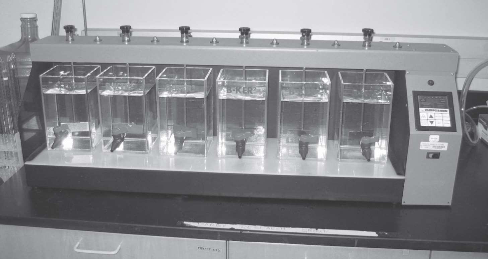
    - **Hình này chứng minh điều gì**
      - Thiết bị Jar test gồm 6 cánh khuấy phẳng cơ học đồng bộ dùng để khảo sát đồng thời các liều lượng hóa chất keo tụ khác nhau và đánh giá kích thước bông cặn cùng tốc độ lắng.
    - **Từ đâu mà thấy được**
      - Dãy 6 bình phản ứng vuông trong suốt (B-KER2) có vòi lấy mẫu ở đáy, 6 trục khuấy cơ học nhúng vào tâm bình và bảng điều khiển điện tử cài đặt tốc độ và thời gian khuấy ở góc phải.

###### Example 1: AlCl3 dosage, metering pump, and alkalinity consumption (Tính toán liều lượng AlCl3, bơm định lượng và tiêu thụ độ kiềm)

- **Đề bài**:
  Một liều lượng $30\text{ mg/L } \text{AlCl}_3$ được châm vào trạm xử lý nước thải có công suất $43,200\text{ m}^3/\text{ngày}$ ($0.5\text{ m}^3/\text{s}$).
  - a/ Tính khối lượng $\text{AlCl}_3$ cần dùng trong 1 ngày ($\text{kg/ngày}$).
  - b/ $\text{AlCl}_3$ được hòa tan với nước để tạo dung dịch nồng độ $8\%$ theo khối lượng trước khi sử dụng. Dung dịch $\text{AlCl}_3\ 8\%$ có khối lượng riêng $\rho = 1.25\text{ kg/L}$. Tính công suất yêu cầu của bơm định lượng ($\text{L/h}$) dung dịch $\text{AlCl}_3$.
  - c/ Tính lượng độ kiềm bị tiêu thụ trong nước thải (biểu diễn theo $\text{mg/L as } \text{CaCO}_3$).
  - d/ Tính khối lượng $\text{NaOH}$ nguyên chất cần bổ sung để bù đắp lượng độ kiềm đã bị tiêu thụ ($\text{kg/ngày}$).

- **Dữ kiện**:
  - Lưu lượng nước thải: $Q = 43,200\text{ m}^3/\text{ngày} = 0.5\text{ m}^3/\text{s} = 1800\text{ m}^3/\text{h}$.
  - Liều lượng hóa chất keo tụ $\text{AlCl}_3$: $C_{\text{AlCl}_3} = 30\text{ mg/L} = 30\text{ g/m}^3 = 0.03\text{ kg/m}^3$.
  - Khối lượng phân tử của $\text{AlCl}_3$: $M_{\text{AlCl}_3} = 133.5\text{ g/mol}$.
  - Nồng độ phần trăm khối lượng dung dịch phèn: $C_{\%} = 8\% = 0.08\text{ kg } \text{AlCl}_3/\text{kg dung dịch}$.
  - Khối lượng riêng dung dịch phèn $8\%$: $\rho = 1.25\text{ kg/L}$.
  - Đương lượng gam của $\text{CaCO}_3$: $\text{EW}_{\text{CaCO}_3} = 50\text{ mg/meq}$ (ứng với $\frac{100}{2} = 50\text{ g/eq}$).
  - Khối lượng phân tử của natri hydroxide: $M_{\text{NaOH}} = 40.0\text{ g/mol}$, đương lượng gam $\text{EW}_{\text{NaOH}} = 40.0\text{ mg/meq}$.

- **Quy tắc áp dụng**:
  - Tải lượng hóa chất tiêu thụ theo ngày: $M = Q \times C$.
  - Khối lượng chất tan trong $1\text{ L}$ dung dịch: $C_v = C_{\%} \times \rho$.
  - Công suất lưu lượng bơm định lượng hóa chất: $q_{\text{pump}} = \frac{\dot{m}}{C_v} = \frac{M / 24}{C_v}$.
  - Quy tắc tiêu thụ độ kiềm: $1\text{ meq/L}$ muối nhôm hoặc sắt tiêu thụ $1\text{ meq/L}$ độ kiềm.
  - Đương lượng gam của $\text{AlCl}_3$ trong phản ứng thủy phân giải phóng $3\text{H}^+$: $\text{EW}_{\text{AlCl}_3} = \frac{M_{\text{AlCl}_3}}{3} = \frac{133.5}{3} = 44.5\text{ mg/meq}$.
  - Nồng độ đương lượng của liều phèn: $N = \frac{C}{\text{EW}}$.
  - Nồng độ độ kiềm tính theo canxi cacbonat: $\text{Alkalinity (mg/L as } \text{CaCO}_3) = N \times \text{EW}_{\text{CaCO}_3}$.
  - Cân bằng bù kiềm bằng $\text{NaOH}$: $1\text{ meq } \text{H}^+$ sinh ra cần $1\text{ meq } \text{NaOH}$ trung hòa, theo phản ứng $\text{AlCl}_3 + 3\text{NaOH} \rightarrow \text{Al}(\text{OH})_3\downarrow + 3\text{NaCl}$.

- **Lời giải**:
  - **Câu a: Tính khối lượng $\text{AlCl}_3$ cần dùng trong 1 ngày**
    - Căn cứ: Công thức tính tải lượng hóa chất hàng ngày $M_{\text{AlCl}_3} = Q \times C_{\text{AlCl}_3}$.
    - Nhìn vào: Lưu lượng trạm $Q = 43,200\text{ m}^3/\text{ngày}$ và liều lượng châm $C_{\text{AlCl}_3} = 30\text{ mg/L} = 0.03\text{ kg/m}^3$.
    - Tính toán khối lượng $\text{AlCl}_3$ tiêu thụ hàng ngày:
      $$M_{\text{AlCl}_3} = 43,200\text{ m}^3/\text{ngày} \times 0.03\text{ kg/m}^3 = 1296\text{ kg/ngày} = 1.296\text{ tấn/ngày}$$
  - **Câu b: Tính công suất bơm định lượng dung dịch $\text{AlCl}_3$ ($8\%$, $\rho = 1.25\text{ kg/L}$) theo $\text{L/h}$**
    - Căn cứ: Khối lượng chất tan trong một đơn vị thể tích dung dịch $C_v = C_{\%} \times \rho$ và lưu lượng bơm định lượng $q_{\text{pump}} = \frac{\dot{m}}{C_v}$.
    - Nhìn vào: Dung dịch phèn nồng độ khối lượng $C_{\%} = 8\% = 0.08$ và khối lượng riêng $\rho = 1.25\text{ kg/L}$.
      - Nồng độ khối lượng $\text{AlCl}_3$ trong $1\text{ L}$ dung dịch châm:
        $$C_v = 0.08 \times 1.25\text{ kg/L} = 0.10\text{ kg/L} = 100\text{ g/L}$$
      - Lưu lượng khối lượng $\text{AlCl}_3$ cần cung cấp mỗi giờ:
        $$\dot{m} = \frac{M_{\text{AlCl}_3}}{24\text{ h}} = \frac{1296\text{ kg/ngày}}{24\text{ h/ngày}} = 54\text{ kg/h}$$
      - Công suất thể tích yêu cầu của bơm định lượng:
        $$q_{\text{pump}} = \frac{\dot{m}}{C_v} = \frac{54\text{ kg/h}}{0.10\text{ kg/L}} = 540\text{ L/h}$$
        - (Lưu lượng bơm tương đương $9.0\text{ L/phút}$ hay $12,960\text{ L/ngày}$).
  - **Câu c: Tính lượng độ kiềm bị tiêu thụ ($\text{mg/L as } \text{CaCO}_3$)**
    - Căn cứ: Phương trình phản ứng thủy phân $\text{AlCl}_3 + 3\text{H}_2\text{O} \leftrightarrow \text{Al}(\text{OH})_3\downarrow + 3\text{H}^+ + 3\text{Cl}^-$ và quy tắc tiêu thụ độ kiềm: $1\text{ meq/L}$ phèn tiêu thụ $1\text{ meq/L}$ độ kiềm.
    - Nhìn vào: Khối lượng phân tử của $\text{AlCl}_3$ là $M = 133.5\text{ g/mol}$ và số ion hydro trao đổi $z = 3$.
      - Đương lượng gam của $\text{AlCl}_3$:
        $$\text{EW}_{\text{AlCl}_3} = \frac{M_{\text{AlCl}_3}}{z} = \frac{133.5}{3} = 44.5\text{ g/eq} = 44.5\text{ mg/meq}$$
      - Nồng độ đương lượng của liều lượng phèn $30\text{ mg/L } \text{AlCl}_3$:
        $$N_{\text{AlCl}_3} = \frac{C_{\text{AlCl}_3}}{\text{EW}_{\text{AlCl}_3}} = \frac{30\text{ mg/L}}{44.5\text{ mg/meq}} \approx 0.6742\text{ meq/L}$$
      - Độ kiềm bị tiêu thụ bằng $0.6742\text{ meq/L}$. Quy đổi ra nồng độ theo canxi cacbonat ($\text{mg/L as } \text{CaCO}_3$) với $\text{EW}_{\text{CaCO}_3} = 50\text{ mg/meq}$:
        $$\text{Alkalinity consumed} = 0.6742\text{ meq/L} \times 50\text{ mg/meq} = 33.71\text{ mg/L as } \text{CaCO}_3$$
        - (Nếu tính với khối lượng phân tử chính xác của $\text{CaCO}_3$ là $100.08\text{ g/mol}$ thì $\text{EW} = 50.04\text{ mg/meq}$, kết quả đạt $33.73\text{ mg/L as } \text{CaCO}_3$).
  - **Câu d: Tính khối lượng $\text{NaOH}$ cần bổ sung để bù đắp lượng độ kiềm đã tiêu thụ**
    - Căn cứ: Phản ứng trung hòa kiềm bù ion $\text{H}^+$: $1\text{ meq } \text{H}^+$ cần $1\text{ meq } \text{NaOH}$, tương ứng phản ứng cân bằng hoàn toàn:
      $$\text{AlCl}_3 + 3\text{NaOH} \rightarrow \text{Al}(\text{OH})_3\downarrow + 3\text{NaCl}$$
    - Nhìn vào: Khối lượng phân tử $\text{NaOH}$ là $M_{\text{NaOH}} = 40.0\text{ g/mol}$, đương lượng gam $\text{EW}_{\text{NaOH}} = 40.0\text{ mg/meq}$ ($z = 1$).
      - Nồng độ $\text{NaOH}$ cần cấp vào dòng nước thải:
        $$C_{\text{NaOH}} = N_{\text{AlCl}_3} \times \text{EW}_{\text{NaOH}} = 0.6742\text{ meq/L} \times 40.0\text{ mg/meq} \approx 26.97\text{ mg/L} = 0.02697\text{ kg/m}^3$$
        - (Kiểm tra theo tỉ lệ hệ số phương trình: $C_{\text{NaOH}} = 30\text{ mg/L} \times \frac{3 \times 40.0}{133.5} = 26.966\text{ mg/L}$).
      - Khối lượng $\text{NaOH}$ nguyên chất cần châm mỗi ngày:
        $$M_{\text{NaOH}} = Q \times C_{\text{NaOH}} = 43,200\text{ m}^3/\text{ngày} \times 0.02697\text{ kg/m}^3 = 1164.94\text{ kg/ngày}$$
        - (Tương đương $1.165\text{ tấn/ngày}$).

- **Kết quả**:
  - a/ Khối lượng $\text{AlCl}_3$ nguyên chất cần dùng trong 1 ngày: $1296\text{ kg/ngày}$ ($1.296\text{ tấn/ngày}$).
  - b/ Công suất bơm định lượng dung dịch $\text{AlCl}_3\ 8\%$: $540\text{ L/h}$ ($9.0\text{ L/phút}$).
  - c/ Lượng độ kiềm bị tiêu thụ: $33.71\text{ mg/L as } \text{CaCO}_3$ ($0.6742\text{ meq/L}$).
  - d/ Khối lượng $\text{NaOH}$ nguyên chất cần bổ sung mỗi ngày: $1164.94\text{ kg/ngày}$ ($1.165\text{ tấn/ngày}$).

- **Kiểm tra lại**:
  - Kiểm tra lưu lượng dung dịch bơm định lượng:
    - Lưu lượng dung dịch bơm mỗi ngày: $540\text{ L/h} \times 24\text{ h/ngày} = 12,960\text{ L/ngày}$.
    - Khối lượng dung dịch bơm mỗi ngày: $12,960\text{ L/ngày} \times 1.25\text{ kg/L} = 16,200\text{ kg/ngày}$.
    - Khối lượng $\text{AlCl}_3$ nguyên chất hòa tan: $16,200\text{ kg/ngày} \times 0.08 = 1296\text{ kg/ngày}$ (khớp chính xác với kết quả câu a).
  - Kiểm tra cân bằng đương lượng trung hòa axit - bazơ:
    - Nồng độ đương lượng phèn cấp vào: $0.6742\text{ meq/L}$.
    - Nồng độ đương lượng $\text{NaOH}$ bổ sung: $\frac{26.97\text{ mg/L}}{40.0\text{ mg/meq}} = 0.6742\text{ meq/L}$.
    - Tỉ số đương lượng đạt chính xác $1:1$, bảo đảm trung hòa toàn bộ $3\text{H}^+$ sinh ra từ quá trình thủy phân phèn nhôm và duy trì ổn định $\text{pH}$ cùng độ kiềm của nước thải.

#### 4. Thiết kế bể keo tụ và Khuấy trộn (Coagulation Tank Design)
- Quá trình keo tụ hóa học đòi hỏi giai đoạn khuấy trộn nhanh (rapid flash mixing) để phân tán tức thời chất keo tụ vào dòng nước thải.
  - Phân tán hóa chất đồng đều trên quy mô vi mô ngăn hiện tượng thủy phân cục bộ tạo kết tủa hydroxide trước khi tiếp xúc hạt keo.
  - Thời gian tiếp xúc và va chạm giữa cation thủy phân và hạt keo diễn ra trong khoảng thời gian siêu ngắn ($< 0.1 - 1\text{ s}$).
  - Cường độ khuấy trộn cao phá vỡ lớp bao bọc tĩnh điện xung quanh hạt keo và tạo điều kiện cho cơ chế trung hòa điện tích diễn ra triệt để.

##### 4.1 Các kiểu khuấy và công suất khuấy lý thuyết (Mixing Types and Power Requirement)
- Phân loại các phương thức khuấy trộn trong bể keo tụ (Mixing types):
  - Khuấy trộn cơ học (Mechanical mixing): sử dụng động cơ điện truyền động qua trục quay và cánh khuấy (propeller hoặc turbine) đặt chìm trong chất lỏng.
  - Khuấy trộn thủy lực (Hydraulic mixing): tận dụng thế năng dòng chảy hoặc động năng tổn thất áp lực qua các kết cấu co hẹp, đập tràn, vách ngăn hoặc bộ trộn tĩnh trên đường ống mà không cần động cơ quay.
  - Khuấy trộn khí nén (Pneumatic / Air mixing): sử dụng máy nén khí sục khí qua giàn đĩa phân phối bọt khí mịn dưới đáy bể tạo luồng đối lưu nâng chất lỏng.
- Các thông số động học thủy lực tiêu chuẩn cho bể keo tụ (Typical design values for coagulation tank):
  - Gradien vận tốc trung bình (Average velocity gradient): $G \ge 500\text{ s}^{-1}$.
  - Thời gian lưu nước thủy lực (Hydraulic detention time): $t < 30\text{ s}$ (thông thường lựa chọn trong khoảng $t = 10 - 30\text{ s}$, tối ưu $t = 20 - 30\text{ s}$).
  - Ý nghĩa kỹ thuật của ngưỡng $t < 30\text{ s}$: Giới hạn thời gian lưu ngắn giúp ngăn ngừa ứng suất cắt thủy động lực học cao làm vỡ các vi bông cặn (micro-flocs) vừa mới hình thành.
  - Tích số Camp vô thứ nguyên ($G \cdot t$): nằm trong khoảng $10{,}000 - 100{,}000$ (cho bể khuấy nhanh thường đạt $15{,}000 - 30{,}000$).
- Phương trình công suất khuấy cơ học lý thuyết Camp-Stein (Theoretical power requirement for mechanical mixing):
  - Công thức tính công suất truyền vào chất lỏng:
    $$P = G^2 \cdot \mu \cdot V$$
  - Trong đó:
    - $P$: Công suất khuấy lý thuyết truyền vào khối nước ($\text{W}$).
    - $G$: Gradien vận tốc trung bình của dòng chảy ($\text{s}^{-1}$ hoặc $1/\text{s}$).
    - $\mu$: Độ nhớt động lực học của chất lỏng ($\text{Pa}\cdot\text{s}$ hay $\text{N}\cdot\text{s/m}^2$).
    - $V$: Thể tích vùng khuấy trộn hữu ích của bể ($\text{m}^3$).
  - Biến đổi xác định gradien vận tốc $G$ từ công suất thực tế tiêu tán vào bể:
    $$G = \sqrt{\frac{P}{\mu \cdot V}}$$
- Quan hệ giữa thể tích bể, lưu lượng thiết kế và thời gian lưu nước:
  $$V = Q \cdot t$$
  - $Q$: Lưu lượng nước thải dẫn vào bể ($\text{m}^3/\text{s}$).
  - $t$: Thời gian lưu nước thủy lực trong bể ($\text{s}$).
- Thiết bị trộn tĩnh thủy lực trên đường ống (Hydraulic mixing - Static mixer):
  - Cấu tạo gồm một đoạn ống hình trụ bên trong gắn các cánh vách ngăn xoắn góc cố định liên tiếp nhau.
  - **Hình 07.** Cấu tạo bộ trộn tĩnh trên đường ống (In-line Static Mixer)
    - 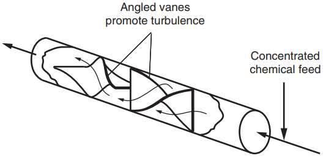
    - **Hình này chứng minh điều gì**: Phân tán chất keo tụ tức thời bằng năng lượng dòng chảy qua các vách nghiêng cố định trên ống kín mà không cần động cơ quay.
    - **Từ đâu mà thấy được**: Dòng nước thải đi vào từ bên phải cùng ống châm hóa chất ("Concentrated chemical feed"); các cánh định hướng nghiêng ("Angled vanes promote turbulence") liên tiếp tạo xoáy rối hướng tâm về phía đầu ra bên trái.
- Thiết bị khuấy trộn cơ học dạng cánh khuấy chân vịt trong bể (Mechanical mixing - Propeller mixer):
  - Sử dụng trục đứng gắn cánh khuấy chân vịt quay với tốc độ cao tạo dòng tuần hoàn cưỡng bức trong bể chứa.
  - **Hình 08.** Sơ đồ nguyên lý bể khuấy cơ học dạng cánh khuấy chân vịt (Propeller mixer tank)
    - 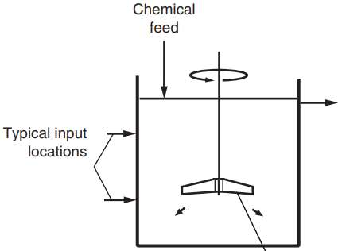
    - **Hình này chứng minh điều gì**: Cánh khuấy chân vịt quay tạo dòng đẩy đối lưu cưỡng bức phân tán hóa chất châm từ trên xuống khắp thể tích bể trước khi thoát qua cửa ra.
    - **Từ đâu mà thấy được**: Vị trí cấp hóa chất ("Chemical feed") trên bề mặt; cửa vào ("Typical input locations") ở thành bên; trục quay thẳng đứng mang cánh khuấy chân vịt đẩy dòng xuống đáy; cửa xả ("Outlet") đặt phía đối diện trên thành bể.

##### 4.2 Các dạng khuấy trộn thủy lực và khuấy khí nén (Hydraulic and Air Mixing Types)
- Đặc tính vận hành của phương pháp khuấy trộn thủy lực (Hydraulic mixing characteristics):
  - Ưu điểm: Kết cấu đơn giản, không có chi tiết chuyển động cơ học, chi phí đầu tư ban đầu thấp, không tiêu hao điện năng trực tiếp cho động cơ khuấy.
  - Nhược điểm: Phụ thuộc hoàn toàn vào lưu lượng dòng nước thải ($Q$); khi lưu lượng biến thiên theo giờ trong ngày, gradient vận tốc $G$ dao động lớn làm giảm hiệu quả keo tụ ở các khung giờ lưu lượng thấp.
  - Quan hệ tổn thất thủy lực: Tổn thất cột áp $\Delta h$ ($\text{m}$) chuyển thành công suất xáo trộn rối $P = \rho g Q \Delta h$, tạo ra gradien vận tốc $G = \sqrt{\frac{\rho g \Delta h}{\mu t}}$.
- Các cấu hình khuấy trộn thủy lực thực tế (Some hydraulic mixing types):
  - Khuấy trộn bằng đập tràn dốc dốc và bước nhảy thủy lực (Hydraulic jump mixing):
    - Tận dụng thế năng dòng nước chảy tràn qua dốc dốc chuyển hóa thành động năng xoáy cuộn mãnh liệt ở chân dốc để hòa trộn phèn.
    - **Hình 09.** Trộn thủy lực bằng đập tràn dốc và bước nhảy thủy lực (Hydraulic Jump)
      - 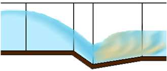
      - **Hình này chứng minh điều gì**: Tận dụng sự tiêu tán năng lượng thế năng của dòng nước trút qua mặt dốc thành động năng xoáy rối để phân tán chất keo tụ.
      - **Từ đâu mà thấy được**: Dòng vào ("Inlet") ở mức cao, dòng dốc trút xuống chân dốc tạo vùng xáo động ("disturbance area", "low to medium mixing"); hóa chất keo tụ ("coagulant") châm ngay tại chân dốc nơi dòng nước dâng cuộn xoáy trước khi qua cửa ra ("Outlet").
  - Khuấy trộn bằng van tiết lưu xoay / trượt (Slide / rotary valve mixer):
    - Co hẹp tiết diện dòng chảy đột ngột trên đường ống xả để tăng vận tốc dòng nước cục bộ, sinh ra chùm tia phản lực xáo trộn hóa chất.
    - **Hình 10.** Trộn thủy lực bằng van điều tiết dòng chảy trên đường ống xả (Slide / Rotary Valve Mixer)
      - 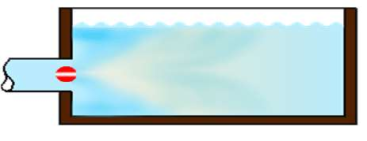
      - **Hình này chứng minh điều gì**: Lực cản thủy lực cục bộ qua tiết diện co hẹp của van tạo chùm tia vận tốc lớn và xoáy cuộn để hòa trộn chất keo tụ trực tiếp vào bể.
      - **Từ đâu mà thấy được**: Ống vào ("Inlet") có van trượt/van xoay ("slide/rotary valve") thu hẹp cục bộ; chất keo tụ ("Coagulant") châm ngay tại vị trí van; dòng phun xòe rộng thành búp xoáy phân tán mạnh vào bể nước trước khi thoát ra cửa ("Outlet").
  - Khuấy trộn bằng vách ngăn đục lỗ chia ngăn (Perforated baffle wall mixer):
    - Bể chia làm các ngăn liên tiếp bởi vách ngăn đục lỗ tiết lưu; dòng nước phụt qua các lỗ hình thành nhiều luồng tia tốc độ cao xáo trộn khoang tiếp theo.
    - **Hình 11.** Trộn thủy lực bằng vách ngăn đục lỗ chia ngăn (Perforated Baffle Wall Mixer)
      - 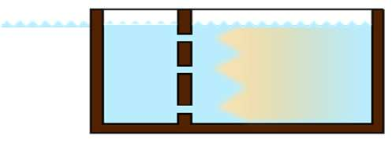
      - **Hình này chứng minh điều gì**: Dòng nước đi qua các lỗ khoét trên vách ngăn tạo thành các luồng tia phản lực vận tốc cao xáo trộn mạnh chất keo tụ trong khoang thứ hai.
      - **Từ đâu mà thấy được**: Dòng vào ("Inlet") ở ngăn thứ nhất; chất keo tụ ("Coagulant") châm trước vách ngăn; vách ngăn ("Baffle" / "tube baffle") có 3 hàng lỗ tiết lưu; dòng nước phụt qua các lỗ tạo thành 3 luồng tia mở rộng khuếch tán đều vào ngăn thứ hai hướng về cửa ra ("Outlet").
- Bể khuấy trộn bằng khí nén (Air mixing / Pneumatic mixing):
  - Máy nén khí thổi khí qua ống dẫn xuống dàn đĩa phân phối bọt khí ("Air diffuser") bố trí sát đáy bể.
  - Bọt khí nổi lên làm giảm tỷ trọng cục bộ khối chất lỏng, tạo dòng đối lưu nâng bọt khí cuốn hóa chất châm từ trên xuống xáo trộn đều vào khối nước.
  - Đáy bể được thiết kế vát góc nghiêng $45^\circ$ (chamfered bottom) giúp loại bỏ góc chết lắng đọng cặn bẩn và bùn cát.
  - **Hình 12.** Sơ đồ bể khuấy trộn bằng khí nén (Air mixing / Pneumatic mixing)
    - 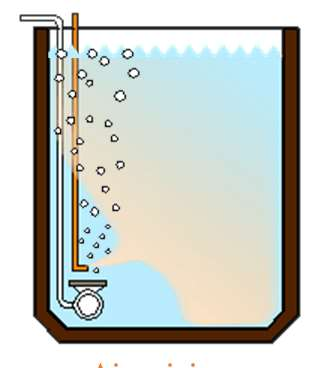
    - **Hình này chứng minh điều gì**: Khí nén từ đĩa phân phối ở đáy sủi bọt tạo dòng đối lưu nâng bọt khí xáo trộn đồng nhất phèn với nước thải mà không cần cánh khuấy cơ học.
    - **Từ đâu mà thấy được**: Đường cấp khí nén ("Compressed air") nối xuống bộ phân phối khí đáy ("Air diffuser"); hóa chất keo tụ ("Coagulant") châm thẳng vào luồng bọt khí; bọt khí sủi lên tạo luồng đối lưu cuốn chất lỏng xoay vòng từ đáy lên mặt giữa cửa vào ("Inlet") và cửa ra ("Outlet"); đáy bể có vát góc loại bỏ góc chết.
- Bể khuấy trộn cơ học nhanh dạng cánh khuấy chân vịt và tuabin (Mechanical rapid mix basin):
  - Động cơ điện lắp trên mặt bể truyền chuyển động quay qua trục thẳng đứng đến cánh khuấy chân vịt (propeller) hoặc tuabin (turbine).
  - Tốc độ quay của cánh chân vịt đạt $N = 100 - 350\text{ RPM}$, tạo dòng xoáy xáo trộn dọc trục (axial flow) mạnh mẽ.
  - **Hình 13.** Sơ đồ bể khuấy trộn cơ học nhanh dạng cánh khuấy chân vịt trong bể (Propeller mixer basin)
    - 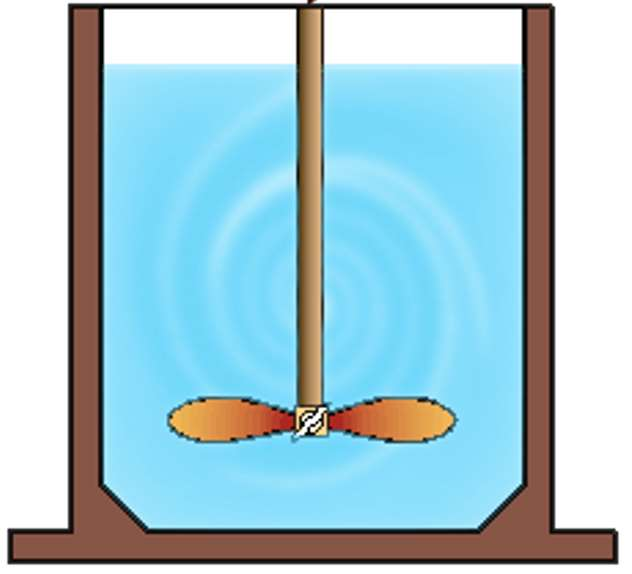
    - **Hình này chứng minh điều gì**: Cánh khuấy chân vịt lắp chìm ở phần dưới bể tạo dòng xoáy xáo trộn cưỡng bức toàn bộ thể tích chất lỏng.
    - **Từ đâu mà thấy được**: Trục truyền động thẳng đứng trung tâm nối với 2 cánh khuấy chân vịt ("Propeller mixer") dạng cánh quạt uốn cong; dòng xoáy đối lưu cuộn xung quanh trục; hóa chất keo tụ ("Coagulant") châm từ trên xuống; dòng vào ("Inlet") ở thành bên trái và dòng ra ("Outlet") ở thành bên phải.
  - Bể khuấy cơ học thực tế bằng bê tông cốt thép trong trạm xử lý nước thải:
    - Bể có mặt cắt ngang hình vuông hoặc hình tròn, trang bị trục truyền động bằng thép không gỉ chịu lực.
    - Đầu trục lắp cánh khuấy tuabin 4 cánh phẳng dạng chữ thập gắn mặt bích bu-lông để tạo lực cắt thủy động lực học lớn.
    - **Hình 14.** Ảnh thực tế bể trộn nhanh keo tụ bê tông với cánh khuấy tuabin 4 cánh phẳng
      - 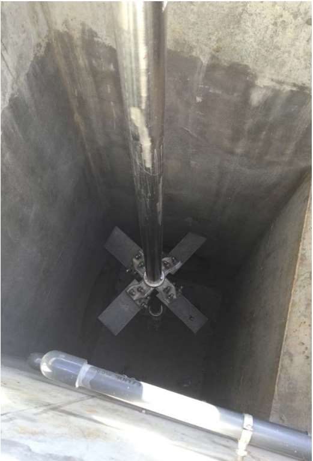
      - **Hình này chứng minh điều gì**: Kết cấu cơ khí thực tế của cụm khuấy trộn keo tụ gồm trục thép không gỉ cỡ lớn và cánh khuấy tuabin 4 cánh phẳng bắt bu-lông đặt trong giếng bê tông sâu.
      - **Từ đâu mà thấy được**: Góc nhìn từ trên xuống giếng bể bê tông vuông sâu; trục khuấy đứng bằng inox sáng bóng; đầu trục gắn 4 cánh khuấy phẳng nằm ngang dạng chữ thập liên kết bằng mặt bích bu lông; góc dưới thấy ống cấp/châm hóa chất PVC gắn sát vách bể bằng đai kẹp.

##### 4.3 Bài toán tính toán thiết kế bể keo tụ (Coagulation Tank Design Example)

###### Ví dụ 2: Tính toán thể tích bể keo tụ và công suất khuấy theo nhiệt độ nước (vd2_thiet_ke_be_keo_tu)
- **Đề bài**:
  Một trạm xử lý nước thải có công suất thiết kế $43{,}200\text{ m}^3/\text{ngày}$ ($0.5\text{ m}^3/\text{s}$).
  a/ Xác định thể tích của bể keo tụ.
  b/ Xác định công suất khuấy yêu cầu khi nhiệt độ của nước là $20^\circ\text{C}$.
  c/ Xác định công suất khuấy yêu cầu khi nhiệt độ của nước là $10^\circ\text{C}$.
- **Dữ kiện**:
  - Lưu lượng nước thải thiết kế theo ngày: $Q_{\text{day}} = 43{,}200\text{ m}^3/\text{ngày}$.
  - Lưu lượng nước thải thiết kế theo giây: $Q = 0.5\text{ m}^3/\text{s}$.
  - Tiêu chuẩn thiết kế bể keo tụ khuấy nhanh (từ mục 4.1):
    - Gradien vận tốc thiết kế: $G \ge 500\text{ s}^{-1}$ $\rightarrow$ chọn $G = 500\text{ s}^{-1}$.
    - Thời gian lưu nước thủy lực thiết kế: $t < 30\text{ s}$ $\rightarrow$ chọn $t = 30\text{ s}$.
  - Độ nhớt động học của nước theo nhiệt độ:
    - Ở nhiệt độ mùa hè $T = 20^\circ\text{C}$: $\mu_{20} = 1.002 \times 10^{-3}\text{ Pa}\cdot\text{s} = 0.001002\text{ N}\cdot\text{s/m}^2$.
    - Ở nhiệt độ mùa đông $T = 10^\circ\text{C}$: $\mu_{10} = 1.307 \times 10^{-3}\text{ Pa}\cdot\text{s} = 0.001307\text{ N}\cdot\text{s/m}^2$.
  - Loại bể: Bể trộn nhanh cơ học dẫn động bằng động cơ điện.
- **Quy tắc áp dụng**:
  - Công thức thể tích bể theo thời gian lưu nước thủy lực:
    $$V = Q \cdot t$$
    (Nguồn: Typical value for coagulation tank, Slide 18).
  - Phương trình công suất khuấy cơ học lý thuyết Camp-Stein:
    $$P = G^2 \cdot \mu \cdot V$$
    (Nguồn: Theoretical power requirement for mechanical mixing, Slide 18).
  - Tiêu chuẩn lựa chọn thông số động học: $G \ge 500\text{ s}^{-1}$, $t < 30\text{ s}$. (Nguồn: Typical value, Slide 18).
- **Lời giải**:
  - **Bước 1 (Bước a)**: Xác định thể tích làm việc hữu ích của bể keo tụ ($V$).
    - Căn cứ: Công thức tính dung tích hình học từ lưu lượng thiết kế $Q$ và thời gian lưu thủy lực $t$:
      $$V = Q \cdot t$$
      Theo tiêu chuẩn thiết kế từ Slide 18, thời gian lưu nước yêu cầu $t < 30\text{ s}$, chọn giá trị thiết kế $t = 30\text{ s}$.
    - Nhìn vào: Lưu lượng nước thải cho trước $Q = 0.5\text{ m}^3/\text{s}$ và thời gian lưu chọn $t = 30\text{ s}$:
      $$V = 0.5\text{ m}^3/\text{s} \times 30\text{ s} = 15.0\text{ m}^3$$
    - Kiểm tra tích số Camp:
      $$G \cdot t = 500\text{ s}^{-1} \times 30\text{ s} = 15{,}000$$
      Tích số thỏa mãn dải tiêu chuẩn cho bể khuấy nhanh ($10{,}000 \le G \cdot t \le 100{,}000$).
  - **Bước 2 (Bước b)**: Xác định công suất khuấy yêu cầu ở nhiệt độ nước $20^\circ\text{C}$ ($P_{20}$).
    - Căn cứ: Phương trình Camp-Stein tính công suất truyền cơ học vào chất lỏng:
      $$P_{20} = G^2 \cdot \mu_{20} \cdot V$$
      Với gradien vận tốc $G = 500\text{ s}^{-1}$, thể tích bể $V = 15.0\text{ m}^3$, và độ nhớt động học của nước ở $20^\circ\text{C}$ là $\mu_{20} = 1.002 \times 10^{-3}\text{ Pa}\cdot\text{s}$.
    - Nhìn vào: Thay các giá trị vào phương trình:
      $$P_{20} = (500\text{ s}^{-1})^2 \times (1.002 \times 10^{-3}\text{ Pa}\cdot\text{s}) \times 15.0\text{ m}^3$$
      $$P_{20} = 250{,}000 \times 0.001002 \times 15.0 = 3{,}757.5\text{ W}$$
      $$P_{20} \approx 3.758\text{ kW} \approx 3.76\text{ kW}$$
  - **Bước 3 (Bước c)**: Xác định công suất khuấy yêu cầu ở nhiệt độ nước $10^\circ\text{C}$ ($P_{10}$).
    - Căn cứ: Phương trình Camp-Stein áp dụng ở nhiệt độ mùa đông:
      $$P_{10} = G^2 \cdot \mu_{10} \cdot V$$
      Với độ nhớt động học của nước ở $10^\circ\text{C}$ tăng lên mức $\mu_{10} = 1.307 \times 10^{-3}\text{ Pa}\cdot\text{s}$.
    - Nhìn vào: Thay các giá trị vào phương trình:
      $$P_{10} = (500\text{ s}^{-1})^2 \times (1.307 \times 10^{-3}\text{ Pa}\cdot\text{s}) \times 15.0\text{ m}^3$$
      $$P_{10} = 250{,}000 \times 0.001307 \times 15.0 = 4{,}901.25\text{ W}$$
      $$P_{10} \approx 4.901\text{ kW} \approx 4.90\text{ kW}$$
  - **Bước 4 (Bước phân tích kỹ thuật công trình)**: Đánh giá sự gia tăng công suất do nhiệt độ và lựa chọn động cơ điện.
    - Căn cứ: Khi nhiệt độ nước giảm từ $20^\circ\text{C}$ xuống $10^\circ\text{C}$, độ nhớt của nước tăng từ $1.002 \times 10^{-3}$ lên $1.307 \times 10^{-3}\text{ Pa}\cdot\text{s}$.
    - Nhìn vào: Mức gia tăng công suất khuấy tiêu thụ:
      $$\Delta P = \frac{P_{10} - P_{20}}{P_{20}} \times 100\% = \frac{4{,}901.25 - 3{,}757.5}{3{,}757.5} \times 100\% = +30.43\%$$
    - Tính toán công suất danh định của động cơ điện:
      - Hiệu suất truyền động cơ khí của động cơ và hộp giảm tốc đạt $\eta_m \approx 0.80$:
        $$P_{\text{motor}} = \frac{P_{10}}{\eta_m} = \frac{4.901\text{ kW}}{0.80} \approx 6.13\text{ kW}$$
      - Lựa chọn động cơ điện tiêu chuẩn công nghiệp công suất danh định $P_{\text{motor}} = 7.5\text{ kW}$ trang bị biến tần (VFD) để điều chỉnh dải tốc độ khuấy phù hợp theo nhiệt độ các mùa.
- **Kết quả**:
  - a/ Thể tích bể keo tụ: $V = 15.0\text{ m}^3$.
  - b/ Công suất khuấy yêu cầu ở nhiệt độ $20^\circ\text{C}$: $P_{20} = 3{,}757.5\text{ W} \approx 3.76\text{ kW}$.
  - c/ Công suất khuấy yêu cầu ở nhiệt độ $10^\circ\text{C}$: $P_{10} = 4{,}901.25\text{ W} \approx 4.90\text{ kW}$.
- **Kiểm tra lại**:
  - Kiểm tra thứ nguyên vật lý của phương trình Camp-Stein:
    $$[P] = [G^2] \cdot [\mu] \cdot [V] = (\text{s}^{-2}) \cdot (\text{N}\cdot\text{s/m}^2) \cdot (\text{m}^3) = \text{N}\cdot\text{m/s} = \text{J/s} = \text{W}$$
    Thứ nguyên hoàn toàn đồng nhất.
  - Kiểm tra tỷ số tỷ lệ thuận tuyến tính giữa công suất và độ nhớt:
    $$\frac{P_{10}}{P_{20}} = \frac{\mu_{10}}{\mu_{20}} = \frac{1.307 \times 10^{-3}}{1.002 \times 10^{-3}} \approx 1.30439$$
    $$\frac{4{,}901.25}{3{,}757.5} = 1.30439$$
    Kết quả tính số học hoàn toàn khớp.
  - Kiểm tra mật độ công suất khuấy trên đơn vị thể tích (Power density):
    - Ở $20^\circ\text{C}$: $\frac{P_{20}}{V} = \frac{3{,}758\text{ W}}{15\text{ m}^3} \approx 250.5\text{ W/m}^3 = 0.251\text{ kW/m}^3$.
    - Ở $10^\circ\text{C}$: $\frac{P_{10}}{V} = \frac{4{,}901\text{ W}}{15\text{ m}^3} \approx 326.8\text{ W/m}^3 = 0.327\text{ kW/m}^3$.
    Mật độ công suất nằm trong khoảng khuyến cáo tiêu chuẩn của bể khuấy trộn nhanh xử lý nước ($200 - 400\text{ W/m}^3$).

### Chương 4.2: Quá trình Lý - Hóa - Tạo bông cặn (Flocculation)

#### 1. Overview (Tổng quan về quá trình tạo bông cặn)

##### 1.1. Định nghĩa, Mục tiêu và Phạm vi ứng dụng (Definition, Objective, and Application Scope)

- Định nghĩa quá trình tạo bông cặn (*Flocculation*):
  - Quá trình bổ sung hóa chất trợ tạo bông (polyme hữu cơ - *organic polymers*) vào nước để kết tụ các hạt đã mất ổn định (*destabilized particles*).
  - Biến đổi các vi hạt thành các khối bông cặn có kích thước lớn hơn (*larger flocs*), tạo điều kiện thuận lợi cho việc tách loại khỏi nước.
- Thời điểm và vị trí bổ sung hóa chất (*Application sequence*):
  - Hóa chất tạo bông cặn được bổ sung sau hóa chất keo tụ (*added after coagulants*).
  - Quá trình diễn ra sau khi giai đoạn làm mất ổn định hạt keo (*particle destabilization*) hoàn tất.
- Mục tiêu công nghệ cốt lõi (*Process objectives*):
  - Gia tăng khả năng lắng trọng lực (*enhance settleability*) của hệ bông cặn trong bể lắng.
  - Cải thiện hiệu suất lọc (*enhance filterability*) của bông cặn khi đi qua lớp vật liệu lọc.

##### 1.2. Cơ chế động học tạo bông cặn (Mechanisms of Flocculation)

- Quá trình hình thành bông cặn diễn ra theo hai cơ chế va chạm hạt riêng biệt:
  - Vi tạo bông (*Microflocculation* hay *Perikinetic flocculation*):
    - Động lực hình thành: Gây ra bởi chuyển động nhiệt ngẫu nhiên Brown (*Brownian motion*) của các hạt hạt keo.
    - Quy mô tác động: Kích thích va chạm và kết tụ ở cấp độ hạt keo siêu mịn ban đầu (kích thước $d < 1\ \mu\text{m}$).
  - Đại tạo bông (*Macroflocculation* hay *Orthokinetic flocculation*):
    - Động lực hình thành: Được dẫn động bởi quá trình khuấy trộn cơ học (*induced by mixing*) và gradient vận tốc dòng chảy ($G$, *velocity gradients*).
    - Quy mô tác động: Thúc đẩy tần suất va chạm để phát triển các mạng lưới bông cặn kích thước lớn (kích thước $d > 1\ \mu\text{m}$).

##### 1.3. Chuỗi quá trình và Sơ đồ dây chuyền Keo tụ - Tạo bông điển hình (Process Steps and Typical Flowsheet)

- Trình tự ba bước cơ bản của hệ thống keo tụ - tạo bông (*Coagulation – Flocculation processes*):
  - **Bước 1: Mất ổn định (*Step 1: Destabilization*)**: Châm hóa chất keo tụ (*coagulants*) kết hợp điều chỉnh $\text{pH}$ $\rightarrow$ Hạt keo bị triệt tiêu thế điện động zeta và mất độ bền phân tán.
  - **Bước 2: Kết tụ / Tạo bông (*Step 2: Aggregation*)**: Bổ sung hóa chất trợ tạo bông (*flocculants*) kèm khuấy trộn nhẹ $\rightarrow$ Các vi hạt liên kết tạo chuỗi để hình thành bông cặn lớn (*form larger flocs*).
  - **Bước 3: Phân tách pha (*Step 3: Separation*)**: Tách loại các khối bông cặn ra khỏi pha lỏng bằng các quá trình cơ học:
    - Quá trình lắng trọng lực (*Sedimentation* / *Settling*).
    - Quá trình tuyển nổi bọt khí hòa tan (*Flotation*).
    - Quá trình lọc qua lớp hạt (*Filtration*).
- Dây chuyền công nghệ keo tụ – tạo bông điển hình (*Typical Coagulation – Flocculation process flowsheet*):
  - Nước thải đầu vào chứa keo phân tán (*Wastewater with colloids*).
  - Khâu keo tụ (*Coagulation*): Kiểm soát $\text{pH}$ (*pH control*) và hòa trộn chất keo tụ (*Coagulant*) để làm mất ổn định hạt (*Destabilization*).
  - Khâu tạo bông (*Flocculation*): Châm chất trợ tạo bông (*Flocculant*) để phát triển kích thước cụm bông (*Form larger flocs*).
  - Khâu phân tách pha (*Phase separation*): Dẫn dòng chảy đến bể lắng trọng lực (*Sedimentation tank / Settling*) hoặc trực tiếp đến bể lọc (*To filtration*).
- Xu hướng lựa chọn polyme trợ tạo bông (*Polymer selection*):
  - Polyme tổng hợp (*Synthesis polymers*) được sử dụng phổ biến và rộng rãi hơn nhiều so với polyme tự nhiên (*Natural polymers*) trong công nghệ xử lý nước hiện đại.

- Thông số và cấu tạo chi tiết theo tài liệu bài giảng (Trang 2):
  - **Hình 1.** Figure 1 (Page 2)
    - 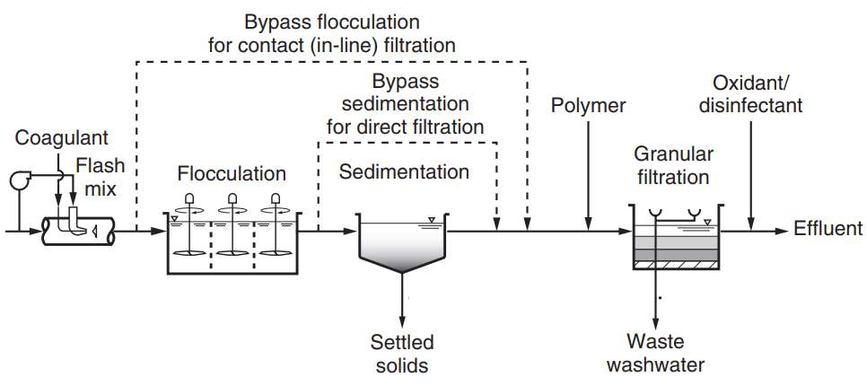
  - **Hình này chứng minh điều gì**
    - Minh họa chi tiết sơ đồ công nghệ, thông số thiết kế hoặc cấu tạo thiết bị trên slide trang 2.
  - **Từ đâu mà thấy được**
    - Trích xuất trực tiếp từ tài liệu bài giảng gốc của chương.

- Thông số và cấu tạo chi tiết theo tài liệu bài giảng (Trang 2):
  - **Hình 2.** Figure 2 (Page 2)
    - 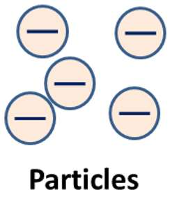
  - **Hình này chứng minh điều gì**
    - Minh họa chi tiết sơ đồ công nghệ, thông số thiết kế hoặc cấu tạo thiết bị trên slide trang 2.
  - **Từ đâu mà thấy được**
    - Trích xuất trực tiếp từ tài liệu bài giảng gốc của chương.

- Thông số và cấu tạo chi tiết theo tài liệu bài giảng (Trang 2):
  - **Hình 3.** Figure 3 (Page 2)
    - 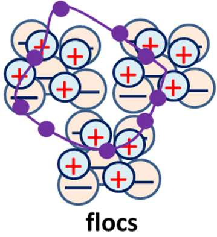
  - **Hình này chứng minh điều gì**
    - Minh họa chi tiết sơ đồ công nghệ, thông số thiết kế hoặc cấu tạo thiết bị trên slide trang 2.
  - **Từ đâu mà thấy được**
    - Trích xuất trực tiếp từ tài liệu bài giảng gốc của chương.

- Thông số và cấu tạo chi tiết theo tài liệu bài giảng (Trang 2):
  - **Hình 4.** Figure 4 (Page 2)
    - 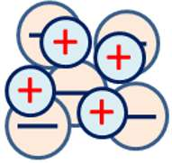
  - **Hình này chứng minh điều gì**
    - Minh họa chi tiết sơ đồ công nghệ, thông số thiết kế hoặc cấu tạo thiết bị trên slide trang 2.
  - **Từ đâu mà thấy được**
    - Trích xuất trực tiếp từ tài liệu bài giảng gốc của chương.

- Thông số và cấu tạo chi tiết theo tài liệu bài giảng (Trang 2):
  - **Hình 5.** Figure 5 (Page 2)
    - 
  - **Hình này chứng minh điều gì**
    - Minh họa chi tiết sơ đồ công nghệ, thông số thiết kế hoặc cấu tạo thiết bị trên slide trang 2.
  - **Từ đâu mà thấy được**
    - Trích xuất trực tiếp từ tài liệu bài giảng gốc của chương.

- Thông số và cấu tạo chi tiết theo tài liệu bài giảng (Trang 3):
  - **Hình 6.** Figure 6 (Page 3)
    - 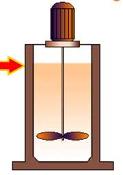
  - **Hình này chứng minh điều gì**
    - Minh họa chi tiết sơ đồ công nghệ, thông số thiết kế hoặc cấu tạo thiết bị trên slide trang 3.
  - **Từ đâu mà thấy được**
    - Trích xuất trực tiếp từ tài liệu bài giảng gốc của chương.

- Thông số và cấu tạo chi tiết theo tài liệu bài giảng (Trang 3):
  - **Hình 7.** Figure 7 (Page 3)
    - 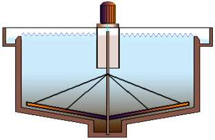
  - **Hình này chứng minh điều gì**
    - Minh họa chi tiết sơ đồ công nghệ, thông số thiết kế hoặc cấu tạo thiết bị trên slide trang 3.
  - **Từ đâu mà thấy được**
    - Trích xuất trực tiếp từ tài liệu bài giảng gốc của chương.

- Thông số và cấu tạo chi tiết theo tài liệu bài giảng (Trang 3):
  - **Hình 8.** Figure 8 (Page 3)
    - 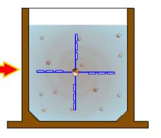
  - **Hình này chứng minh điều gì**
    - Minh họa chi tiết sơ đồ công nghệ, thông số thiết kế hoặc cấu tạo thiết bị trên slide trang 3.
  - **Từ đâu mà thấy được**
    - Trích xuất trực tiếp từ tài liệu bài giảng gốc của chương.

- Thông số và cấu tạo chi tiết theo tài liệu bài giảng (Trang 3):
  - **Hình 9.** Figure 9 (Page 3)
    - 
  - **Hình này chứng minh điều gì**
    - Minh họa chi tiết sơ đồ công nghệ, thông số thiết kế hoặc cấu tạo thiết bị trên slide trang 3.
  - **Từ đâu mà thấy được**
    - Trích xuất trực tiếp từ tài liệu bài giảng gốc của chương.

#### 2. Organic Polymer (Polyme hữu cơ trong tạo bông cặn)

##### 2.1. Ưu điểm và Liều lượng sử dụng Polyme tổng hợp (Advantages and Dosage Rates of Synthetic Polymers)

- Polyme tổng hợp (Synthesis polymers) chiếm ưu thế hiệu quả hơn so với polyme tự nhiên (Natural polymers) trong các công trình xử lý nước và nước thải:
  - Tần suất ứng dụng: Polyme tổng hợp được sử dụng phổ biến và rộng rãi hơn đáng kể so với polyme tự nhiên nhờ độ ổn định chất lượng cao và khả năng biến tính hóa học linh hoạt.
  - Hiệu quả kinh tế: Polyme tổng hợp có chi phí sản xuất và giá thành thương mại rẻ hơn so với polyme tự nhiên (*Synthesis polymers are cheaper than natural polymers*).
  - Hiệu suất keo tụ - tạo bông: Polyme tổng hợp đạt hiệu quả tạo bông cặn cao ở dải liều lượng châm thấp hơn nhiều so với polyme tự nhiên (*Synthesis polymers are effective at lower dosages than natural polymers*).
- Định mức liều lượng châm polyme (Dosage rates) theo từng công đoạn phân tách pha:
  - Liều lượng cho quá trình lắng hoặc tuyển nổi (*For sedimentation or flotation*):
    - Dải liều lượng thiết kế: $1 - 10\ \text{mg/L}$.
    - Mục tiêu công nghệ: Tạo cầu nối liên kết các vi bông cặn thành các cụm bông lớn, tỷ trọng phù hợp, tăng tốc độ lắng trọng lực hoặc nâng cao hiệu quả bám dính bọt khí hòa tan.
  - Liều lượng cho quá trình lọc (*For filtration*):
    - Dải liều lượng thiết kế: $0{,}005 - 0{,}05\ \text{mg/L}$.
    - Mục tiêu công nghệ: Đóng vai trò chất trợ lọc (*filter aid*), liên kết các hạt cặn lơ lửng mịn vào bề mặt hạt vật liệu lọc, ngăn ngừa hiện tượng cặn xuyên qua lớp lọc mà không gây tắc nghẽn nhanh.
  - So sánh tỷ lệ liều lượng: Liều lượng polyme phục vụ lắng hoặc tuyển nổi cao hơn từ $200$ đến $2000$ lần so với liều lượng sử dụng trong quá trình lọc tiếp xúc trực tiếp.

##### 2.2. Phân loại và Ví dụ điển hình của Polyme hữu cơ (Classification and Typical Examples of Organic Polymers)

- Bảng tổng hợp các nhóm polyme hữu cơ ứng dụng trong tạo bông cặn:

| Phân loại (Type) | Ví dụ điển hình (Typical Examples) | Khối lượng phân tử ($M$, $\text{g/mol}$) | Bản chất điện tích (Charge) | Đặc trưng cấu tạo và cơ chế |
| :--- | :--- | :---: | :---: | :--- |
| **Polyme anion** (*Anionic polymer*) | Polyacrylamide thủy phân (*Hydrolyzed polyacrylamides*) | $10^4 - 10^7$ | Âm (*Negative*) | Chứa nhóm chức carboxylate tích điện âm ($-\text{COO}^-$); hoạt động chủ yếu theo cơ chế tạo cầu nối polyme (*bridging*). |
| **Polyme cation** (*Cationic polymer*) | Epichlorohydrin dimethylamine (*epi-DMA*), Polydiallyldimethyl ammonium chloride (*poly-DADMAC*) | $10^4 - 10^7$ | Dương (*Positive*) | Chứa nhóm chức amoni bậc bốn tích điện dương ($-\text{R}_4\text{N}^+$); kết hợp cơ chế trung hòa điện tích (*charge neutralization*) và tạo cầu nối. |
| **Polyme không ion** (*Nonionic polymer*) | Polyacrylamides (*PAM*) | $10^4 - 10^7$ | Trung hòa (*Neutral*) | Mạch polyme trung hòa điện tích; hấp phụ lên bề mặt hạt nhờ liên kết hydro và lực Van der Waals để tạo cầu nối. |
| **Polyme tự nhiên** (*Natural polymer*) | Natri alginat (*Sodium alginate*), Chitosan, Tinh bột (*Starches*) | Biến đổi (*Variable*) | Biến đổi (*Variable*) | Có nguồn gốc sinh học tự nhiên; điện tích và khối lượng phân tử thay đổi tùy thuộc loài và mức độ tinh chế; thân thiện môi trường nhưng liều lượng sử dụng cao. |

- Đặc tính kỹ thuật của từng nhóm polyme hữu cơ:
  - Polyme anion (Anionic polymer):
    - Đại diện tiêu biểu: Polyacrylamide thủy phân một phần (Hydrolyzed polyacrylamides), có công thức cấu tạo mạch kết hợp đơn vị acrylamide và acrylate:
      $$-[-\text{CH}_2-\text{CH}(\text{CONH}_2)-]_x-[-\text{CH}_2-\text{CH}(\text{COO}^-\text{Na}^+)-]_y-$$
    - Dải khối lượng phân tử: Cao phân tử trong khoảng $10^4 - 10^7\ \text{g/mol}$.
    - Bản chất điện tích: Mang điện tích âm ($\text{Negative}$) do sự phân ly của nhóm muối natri carboxylate trong nước.
    - Cơ chế phản ứng: Tạo liên kết cầu nối giữa các vị trí hấp phụ trên bông cặn vô cơ đã được trung hòa một phần điện tích.
  - Polyme cation (Cationic polymer):
    - Đại diện tiêu biểu: Polydiallyldimethyl ammonium chloride ($\text{poly-DADMAC}$) và Epichlorohydrin dimethylamine ($\text{epi-DMA}$).
    - Dải khối lượng phân tử: Nằm trong dải $10^4 - 10^7\ \text{g/mol}$.
    - Bản chất điện tích: Mang điện tích dương mạnh ($\text{Positive}$) trên các nhóm chức nitơ bậc bốn ($-\text{N}^+(\text{CH}_3)_2-$) kèm ion đối clorua ($\text{Cl}^-$).
    - Cơ chế phản ứng: Thực hiện song song quá trình trung hòa điện tích bề mặt hạt keo âm và kéo dài chuỗi tạo cầu nối cơ học, thích hợp làm chất trợ tạo bông hoặc chất keo tụ chính.
  - Polyme không ion / trung tính (Nonionic polymer):
    - Đại diện tiêu biểu: Polyacrylamide nguyên bản chưa thủy phân ($\text{PAM}$), công thức cơ bản:
      $$-[-\text{CH}_2-\text{CH}(\text{CONH}_2)-]_n-$$
    - Dải khối lượng phân tử: Đạt ngưỡng $10^4 - 10^7\ \text{g/mol}$.
    - Bản chất điện tích: Trung hòa điện tích ($\text{Neutral}$).
    - Cơ chế phản ứng: Hấp phụ vật lý lên bề mặt hạt keo thông qua liên kết hydro giữa nhóm amit ($-\text{CONH}_2$) với oxy hoặc nhóm hydroxyl của hạt keo, hình thành cầu nối liên kết hạt.
  - Polyme tự nhiên (Natural polymer):
    - Đại diện tiêu biểu: Natri alginat (chiết xuất từ tảo nâu), Chitosan (dẫn xuất deaxetyl hóa từ chitin vỏ tôm cua), Tinh bột (tinh bột ngô, sắn biến tính).
    - Khối lượng phân tử và điện tích: Biến đổi linh hoạt ($\text{Variable}$) tùy thuộc vào độ dài chuỗi sinh học và mức độ thế hóa học (Chitosan mang điện tích dương, Sodium alginate mang điện tích âm, Tinh bột thường trung tính hoặc anion hóa).
    - Ứng dụng thực tế: Thường sử dụng trong xử lý nước cấp ăn uống hoặc các hệ thống đòi hỏi tính an toàn sinh học cao do không để lại dư lượng monome độc hại, tuy nhiên dễ bị phân hủy sinh học trong bảo quản và có giá thành cao hơn polyme tổng hợp.

- Thông số và cấu tạo chi tiết theo tài liệu bài giảng (Trang 4):
  - **Hình 10.** Figure 10 (Page 4)
    - 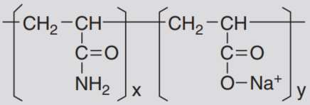
  - **Hình này chứng minh điều gì**
    - Minh họa chi tiết sơ đồ công nghệ, thông số thiết kế hoặc cấu tạo thiết bị trên slide trang 4.
  - **Từ đâu mà thấy được**
    - Trích xuất trực tiếp từ tài liệu bài giảng gốc của chương.

- Thông số và cấu tạo chi tiết theo tài liệu bài giảng (Trang 4):
  - **Hình 11.** Figure 11 (Page 4)
    - 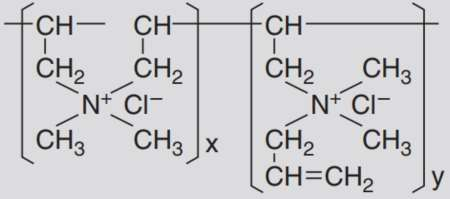
  - **Hình này chứng minh điều gì**
    - Minh họa chi tiết sơ đồ công nghệ, thông số thiết kế hoặc cấu tạo thiết bị trên slide trang 4.
  - **Từ đâu mà thấy được**
    - Trích xuất trực tiếp từ tài liệu bài giảng gốc của chương.

- Thông số và cấu tạo chi tiết theo tài liệu bài giảng (Trang 4):
  - **Hình 12.** Figure 12 (Page 4)
    - 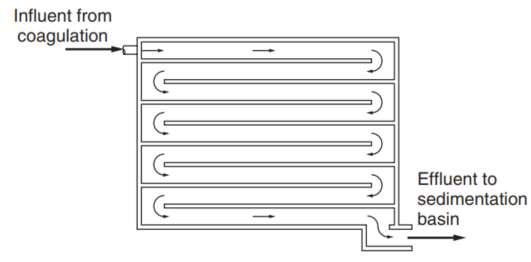
  - **Hình này chứng minh điều gì**
    - Minh họa chi tiết sơ đồ công nghệ, thông số thiết kế hoặc cấu tạo thiết bị trên slide trang 4.
  - **Từ đâu mà thấy được**
    - Trích xuất trực tiếp từ tài liệu bài giảng gốc của chương.

- Thông số và cấu tạo chi tiết theo tài liệu bài giảng (Trang 4):
  - **Hình 13.** Figure 13 (Page 4)
    - 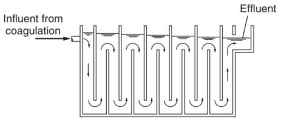
  - **Hình này chứng minh điều gì**
    - Minh họa chi tiết sơ đồ công nghệ, thông số thiết kế hoặc cấu tạo thiết bị trên slide trang 4.
  - **Từ đâu mà thấy được**
    - Trích xuất trực tiếp từ tài liệu bài giảng gốc của chương.

#### 3. Flocculation Practices (Các mô hình tạo bông cặn thực tế)

##### 3.1. Phân loại các hệ thống tạo bông cặn (Classification of Flocculation Systems)

- Quá trình tạo bông cặn thực tế sử dụng hai nhóm hệ thống khuấy trộn chính:
  - Hệ thống tạo bông cặn thủy lực (*Hydraulic flocculation system*): Sử dụng năng lượng dòng chảy qua vách ngăn, ngoặt dòng hoặc co hẹp tiết diện để tạo xoáy xáo trộn thủy động học.
  - Hệ thống tạo bông cặn cơ học (*Mechanical flocculation system*): Sử dụng năng lượng truyền động từ động cơ và hộp số để làm quay cánh khuấy ngập trong nước.
- Các cấu hình điển hình của hệ thống tạo bông cặn cơ học:
  - Hệ thống trục ngang với cánh khuấy guồng (*Horizontal shaft with paddles system*): Trục quay bố trí nằm ngang đáy bể, mang các guồng cánh khuấy bản dài quét qua toàn bộ tiết diện bể.
  - Hệ thống trục đứng với tuabin hoặc cánh khuấy (*Vertical shaft turbine/paddle system*): Trục quay bố trí thẳng đứng từ sàn công tác trên mặt bể, truyền động cho cánh khuấy hoặc tuabin hoạt động tại vùng nước sâu.

##### 3.2. Nguyên lý tạo bông giảm dần cường độ xáo trộn (Tapered Flocculation Principle)

- Khái niệm và mục tiêu công nghệ của chế độ khuấy giảm dần (*Tapered flocculation*):
  - Kích thước bông cặn tăng dần khi giảm dần công suất khuấy đưa vào (*tapering down the power input*) qua các ngăn kế tiếp nhau.
  - Vùng đầu bể yêu cầu cường độ khuấy cao để tối đa hóa tần suất va chạm giữa các hạt vi keo đã mất ổn định.
  - Vùng cuối bể yêu cầu cường độ khuấy thấp nhằm bảo vệ liên kết bông cặn khỏi ứng suất cắt thủy động học gây vỡ bông (*floc breakup*).
- Cấu hình điều khiển trong hệ thống cơ học (*Mechanical system configuration*):
  - Hệ thống cơ học thường trang bị bộ truyền động 2 cấp tốc độ (*two-speed drives*) hoặc 3 cấp tốc độ (*three-speed drives*).
  - Bể thường chia thành 3 ngăn nối tiếp ngăn cách bởi các vách đục lỗ (*perforated baffle walls*) hoặc vách hướng dòng.
  - Dải tốc độ quay điển hình của hệ thống 3 cấp truyền động:
    - Ngăn 1 (Vùng nước vào - *Inlet*): Tốc độ quay $v_1 = 75\ \text{rpm}$ nhằm kích thích va chạm hạt sơ cấp ban đầu.
    - Ngăn 2 (Ngăn giữa): Tốc độ quay $v_2 = 50\ \text{rpm}$ nhằm tích tụ kích thước bông trung gian.
    - Ngăn 3 (Ngăn cuối trước khi xuất nước): Tốc độ quay $v_3 = 25\ \text{rpm}$ nhằm hoàn thiện các cụm bông cặn lớn.
    - Dòng nước sau ngăn 3 chuyển trực tiếp sang công đoạn phân tách pha rắn: Quá trình lắng trọng lực (*settling*) hoặc lọc (*filtration*).
- Cấu hình tạo bông giảm dần trong bể vách ngăn thủy lực (*Hydraulic baffle flocculation tank*):
  - Bố trí khoảng cách giữa các vách ngăn tăng dần dọc theo chiều dòng chảy (*Distance between baffles increases*).
  - Tốc độ khuấy trộn và gradient vận tốc suy giảm tự nhiên theo hướng dòng chảy (*Mixing speed decreases*):
    $$\text{Khoảng cách vách ngăn} \uparrow \implies \text{Tiết diện dòng chảy} \uparrow \implies \text{Vận tốc dòng chảy } v \downarrow \implies \text{Gradient vận tốc } G \downarrow$$
  - Các dạng vách ngăn thủy lực thông dụng: Vách ngăn zíc zắc nằm ngang (*horizontal baffle walls*), vách ngăn luồn - tràn thẳng đứng (*over-and-under baffles*), hoặc vách ngăn đục lỗ (*perforated baffles*).

##### 3.3. So sánh đặc tính kỹ thuật các mô hình tạo bông cặn (Comparative Evaluation of Flocculation Practices)

- Bảng tổng hợp so sánh các chỉ tiêu công nghệ và vận hành giữa ba mô hình tạo bông cặn:

| Thông số / Tiêu chí đánh giá (*Process issue*) | Tạo bông thủy lực (*Hydraulic flocculation*) | Cơ học trục đứng (*Vertical shaft*) | Cơ học trục ngang (*Horizontal shaft*) |
| :--- | :--- | :--- | :--- |
| **Đặc tính bông cặn** (*Floc produced*) | Rất lớn và xốp (*Very large and fluffy*) | Nhỏ đến trung bình, đặc chắc (*Small to medium, dense*) | Lớn và xốp (*Large and fluffy*) |
| **Tổn thất cột áp** (*Head loss*) | $0{,}05 - 0{,}15\ \text{m}$ | Không có / Bằng $0$ (*None*) | Không có / Bằng $0$ (*None*) |
| **Độ linh hoạt vận hành** (*Operational flexibility*) | Trung bình đến kém (*Moderate to poor*) | Rất tốt / Xuất sắc (*Excellent*) | Tốt, giới hạn ở dải $G$ thấp (*Good, limited to low $G$*) |
| **Chi phí đầu tư ban đầu** (*Capital cost*) | Thấp đến trung bình (*Low to moderate*) | Trung bình (*Moderate*) | Trung bình đến cao (*Moderate to high*) |
| **Nhu cầu / Nỗ lực bảo trì** (*Maintenance effort*) | Thấp đến trung bình (*Low to moderate*) | Thấp đến trung bình (*Low to moderate*) | Trung bình (*Moderate*) |
| **Ưu điểm chính** (*Advantages*) | Bông cặn lớn; Cấu tạo đơn giản; Chi phí bảo trì thấp (*Large flocs, Simple, Low-cost maintenance*) | Không tổn thất cột áp; Vận hành rất linh hoạt; Độ tin cậy cao; Khả năng truyền công suất lớn nhất (*No headloss, Very flexible, Reliable, Highest energy input potential*) | Không tổn thất cột áp; Tạo bông lớn; Vận hành tin cậy (*No headloss, Large flocs, Reliable*) |
| **Nhược điểm chính** (*Disadvantages*) | Kém linh hoạt khi lưu lượng hoặc chất lượng nước biến động (*Little flexibility*) | Khó khăn khi lựa chọn loại cánh khuấy và tuabin thích hợp (*Difficult to specify proper impellers*) | Khó bảo trì thiết bị ngập nước; Nguy cơ gãy trục khi khởi động do mô-men xoắn ban đầu cao (*Difficult to maintain, Shaft breakage on start-up because high initial torque*) |

- Phân tích chi tiết các đặc trưng kỹ thuật và trade-off thiết kế:
  - Hệ thống tạo bông cặn thủy lực (*Hydraulic flocculation*):
    - Động học dòng chảy: Phụ thuộc trực tiếp vào lưu lượng nước cấp $Q$; khi $Q$ dao động, gradient vận tốc $G$ thay đổi tương ứng làm giảm hiệu quả tạo bông.
    - Tổn thất áp lực: Tiêu tốn cột áp thủy lực cục bộ từ $0{,}05\ \text{m}$ đến $0{,}15\ \text{m}$ để tạo xoáy xáo trộn tại các vị trí đổi hướng dòng.
    - Cấu trúc bông cặn: Trường dòng chảy tạo bông cặn kích thước rất lớn nhưng xốp và độ rỗng cao (*very large and fluffy flocs*), dễ vỡ nếu chịu lực cắt lớn ở cửa thu nước.
    - Kinh tế kỹ thuật: Không sử dụng thiết bị quay cơ khí, không tiêu tốn điện năng khuấy, chi phí vốn và chi phí bảo dưỡng ở mức tối thiểu.
  - Hệ thống cơ học trục đứng (*Vertical shaft turbine flocculation*):
    - Động học dòng chảy: Động cơ dẫn động đặt khô trên sàn thao tác đỉnh bể, cho phép điều khiển tốc độ quay độc lập với lưu lượng nước nạp $Q$.
    - Cấu trúc bông cặn: Trường vận tốc tạo bởi tuabin trục đứng tạo ứng suất cắt đồng đều, hình thành bông cặn kích thước nhỏ đến trung bình nhưng cấu trúc đặc chắc (*small to medium, dense flocs*), tốc độ lắng cao và bền cơ học.
    - Khả năng cấp năng lượng: Cung cấp dải gradient vận tốc $G$ rộng nhất, dễ điều chỉnh linh hoạt theo tải lượng cặn đầu vào, không làm suy giảm cột áp thủy lực.
    - Thách thức thiết kế: Yêu cầu tính toán thủy lực phức tạp để xác định đúng loại cánh khuấy (*axial flow* hoặc *radial flow*) nhằm ngăn ngừa tạo xoáy tâm (*vortexing*) và loại trừ các vùng chết (*dead zones*).
  - Hệ thống cơ học trục ngang (*Horizontal shaft paddle flocculation*):
    - Động học dòng chảy: Cánh guồng bản rộng quay chậm, phân bố dòng xáo trộn đều khắp mặt cắt ngang bể, tạo điều kiện tích tụ bông cặn kích thước lớn.
    - Giới hạn năng lượng: Chỉ hoạt động hiệu quả ở dải gradient vận tốc $G$ thấp đến trung bình; không đáp ứng được yêu cầu cường độ xáo trộn cao.
    - Rủi ro vận hành: Khối lượng trục dài và các cánh guồng gây mô-men quán tính lớn; khi khởi động từ trạng thái dừng, mô-men xoắn ban đầu tăng đột ngột dễ gây cong hoặc gãy trục (*shaft breakage on start-up*).
    - Vấn đề bảo dưỡng: Các ổ đỡ trục ngập hoàn toàn trong chất lỏng chứa cặn lơ lửng, chịu mài mòn cao và gây khó khăn khi kiểm tra hoặc thay thế định kỳ.

- Thông số và cấu tạo chi tiết theo tài liệu bài giảng (Trang 5):
  - **Hình 14.** Figure 14 (Page 5)
    - 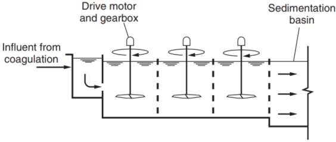
  - **Hình này chứng minh điều gì**
    - Minh họa chi tiết sơ đồ công nghệ, thông số thiết kế hoặc cấu tạo thiết bị trên slide trang 5.
  - **Từ đâu mà thấy được**
    - Trích xuất trực tiếp từ tài liệu bài giảng gốc của chương.

- Thông số và cấu tạo chi tiết theo tài liệu bài giảng (Trang 5):
  - **Hình 15.** Figure 15 (Page 5)
    - 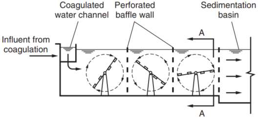
  - **Hình này chứng minh điều gì**
    - Minh họa chi tiết sơ đồ công nghệ, thông số thiết kế hoặc cấu tạo thiết bị trên slide trang 5.
  - **Từ đâu mà thấy được**
    - Trích xuất trực tiếp từ tài liệu bài giảng gốc của chương.

- Thông số và cấu tạo chi tiết theo tài liệu bài giảng (Trang 5):
  - **Hình 16.** Figure 16 (Page 5)
    - 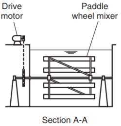
  - **Hình này chứng minh điều gì**
    - Minh họa chi tiết sơ đồ công nghệ, thông số thiết kế hoặc cấu tạo thiết bị trên slide trang 5.
  - **Từ đâu mà thấy được**
    - Trích xuất trực tiếp từ tài liệu bài giảng gốc của chương.

- Thông số và cấu tạo chi tiết theo tài liệu bài giảng (Trang 5):
  - **Hình 17.** Figure 17 (Page 5)
    - 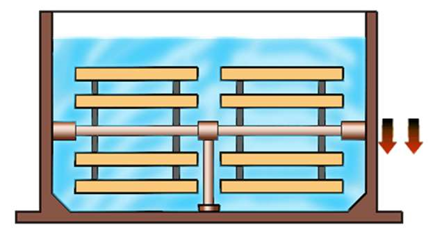
  - **Hình này chứng minh điều gì**
    - Minh họa chi tiết sơ đồ công nghệ, thông số thiết kế hoặc cấu tạo thiết bị trên slide trang 5.
  - **Từ đâu mà thấy được**
    - Trích xuất trực tiếp từ tài liệu bài giảng gốc của chương.

- Thông số và cấu tạo chi tiết theo tài liệu bài giảng (Trang 5):
  - **Hình 18.** Figure 18 (Page 5)
    - 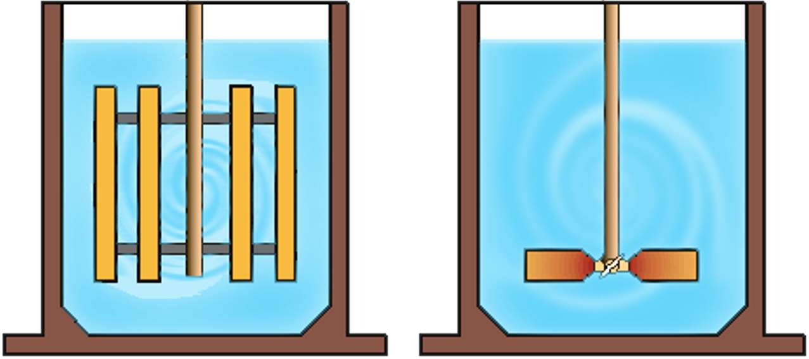
  - **Hình này chứng minh điều gì**
    - Minh họa chi tiết sơ đồ công nghệ, thông số thiết kế hoặc cấu tạo thiết bị trên slide trang 5.
  - **Từ đâu mà thấy được**
    - Trích xuất trực tiếp từ tài liệu bài giảng gốc của chương.

- Thông số và cấu tạo chi tiết theo tài liệu bài giảng (Trang 6):
  - **Hình 19.** Figure 19 (Page 6)
    - 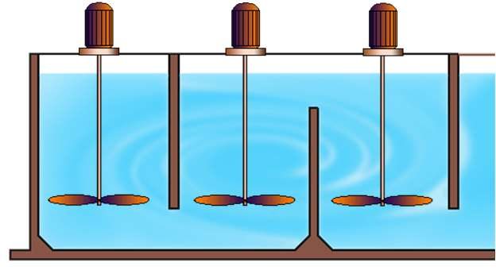
  - **Hình này chứng minh điều gì**
    - Minh họa chi tiết sơ đồ công nghệ, thông số thiết kế hoặc cấu tạo thiết bị trên slide trang 6.
  - **Từ đâu mà thấy được**
    - Trích xuất trực tiếp từ tài liệu bài giảng gốc của chương.

- Thông số và cấu tạo chi tiết theo tài liệu bài giảng (Trang 6):
  - **Hình 20.** Figure 20 (Page 6)
    - 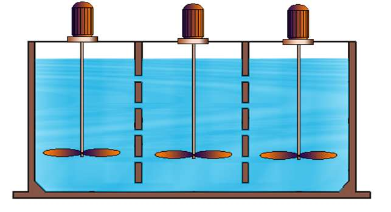
  - **Hình này chứng minh điều gì**
    - Minh họa chi tiết sơ đồ công nghệ, thông số thiết kế hoặc cấu tạo thiết bị trên slide trang 6.
  - **Từ đâu mà thấy được**
    - Trích xuất trực tiếp từ tài liệu bài giảng gốc của chương.

- Thông số và cấu tạo chi tiết theo tài liệu bài giảng (Trang 6):
  - **Hình 21.** Figure 21 (Page 6)
    - 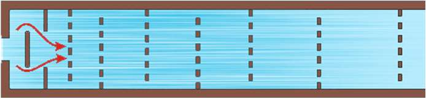
  - **Hình này chứng minh điều gì**
    - Minh họa chi tiết sơ đồ công nghệ, thông số thiết kế hoặc cấu tạo thiết bị trên slide trang 6.
  - **Từ đâu mà thấy được**
    - Trích xuất trực tiếp từ tài liệu bài giảng gốc của chương.

- Thông số và cấu tạo chi tiết theo tài liệu bài giảng (Trang 6):
  - **Hình 22.** Figure 22 (Page 6)
    - 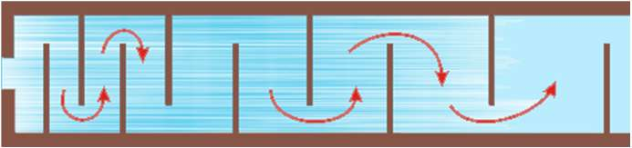
  - **Hình này chứng minh điều gì**
    - Minh họa chi tiết sơ đồ công nghệ, thông số thiết kế hoặc cấu tạo thiết bị trên slide trang 6.
  - **Từ đâu mà thấy được**
    - Trích xuất trực tiếp từ tài liệu bài giảng gốc của chương.

- Thông số và cấu tạo chi tiết theo tài liệu bài giảng (Trang 6):
  - **Hình 23.** Figure 23 (Page 6)
    - 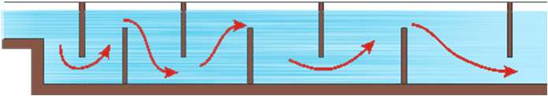
  - **Hình này chứng minh điều gì**
    - Minh họa chi tiết sơ đồ công nghệ, thông số thiết kế hoặc cấu tạo thiết bị trên slide trang 6.
  - **Từ đâu mà thấy được**
    - Trích xuất trực tiếp từ tài liệu bài giảng gốc của chương.

- Thông số và cấu tạo chi tiết theo tài liệu bài giảng (Trang 6):
  - **Hình 24.** Figure 24 (Page 6)
    - 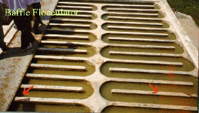
  - **Hình này chứng minh điều gì**
    - Minh họa chi tiết sơ đồ công nghệ, thông số thiết kế hoặc cấu tạo thiết bị trên slide trang 6.
  - **Từ đâu mà thấy được**
    - Trích xuất trực tiếp từ tài liệu bài giảng gốc của chương.

#### 4. Flocculation Design Criteria (Tiêu chuẩn thiết kế bể tạo bông cặn)

##### 4.1. Theoretical Power Requirement for Mixing (Nhu cầu công suất khuấy trộn lý thuyết)

- Quá trình khuấy trộn tạo bông yêu cầu công suất tiêu tán xác định trong khối chất lỏng:
  - Phương trình công suất lý thuyết của Camp và Stein:
    $$P = G^2 \cdot \mu \cdot V$$
  - Phương trình xác định gradient vận tốc trung bình ($G$):
    $$G = \sqrt{\frac{P}{\mu \cdot V}}$$
- Các thông số và đơn vị trong công thức tính toán:
  - $P$: Công suất tiêu tán truyền vào chất lỏng (Power requirement), đơn vị Watt ($\text{W}$).
  - $G$: Gradient vận tốc trung bình (Average velocity gradient), đơn vị $\text{s}^{-1}$ (hoặc $1/\text{s}$).
  - $\mu$: Độ nhớt động lực của chất lỏng (Dynamic viscosity), đơn vị $\text{Pa}\cdot\text{s}$ ($\text{N}\cdot\text{s}/\text{m}^2$).
  - $V$: Thể tích vùng khuấy trộn (Mixing volume), đơn vị mét khối ($\text{m}^3$).
- Tỷ lệ công suất trên một đơn vị thể tích ($P/V = G^2 \cdot \mu$) quyết định động học va chạm hạt:
  - Gradient vận tốc quá nhỏ làm giảm tần suất tiếp xúc giữa các hạt keo tụ.
  - Gradient vận tốc quá lớn gây ứng suất trượt vượt giới hạn bền, làm vỡ bông cặn.

##### 4.2. Process Design Parameters (Thông số thiết kế theo quá trình xử lý)

- Tiêu chuẩn vận hành phụ thuộc vào công đoạn phân tách pha chất rắn phía sau:
  - Bảng đối chiếu thông số gradient vận tốc ($G$) và thời gian lưu nước ($t$):

| Công đoạn xử lý (Process) | Gradient vận tốc $G$ ($\text{s}^{-1}$) | Thời gian lưu nước $t$ ($\text{min}$) | Tích số Camp $G \cdot t$ (không thứ nguyên) |
| :--- | :---: | :---: | :---: |
| **Tạo bông cặn cho quá trình lắng hoặc tuyển nổi** (*Flocculation for sedimentation or flotation*) | $50 - 100$ | $30 - 60$ | $9 \times 10^4 - 3{,}6 \times 10^5$ |
| **Tạo bông cặn cho quá trình lọc** (*Flocculation for filtration*) | $25 - 150$ | $2 - 10$ | $3 \times 10^3 - 9 \times 10^4$ |

- Đặc tính tạo bông cặn cho quá trình lắng hoặc tuyển nổi:
  - Quá trình yêu cầu bông cặn kích thước lớn và mật độ cao để nâng cao tốc độ lắng trọng lực hoặc tốc độ bám dính bọt khí.
  - Thời gian lưu nước dài ($t = 30 - 60\ \text{min}$) giúp mạng lưới bông cặn phát triển tối đa.
  - Gradient vận tốc trung bình duy trì mức vừa phải ($G = 50 - 100\ \text{s}^{-1}$) nhằm ngăn ngừa lực cắt phá vỡ bông lớn.
- Đặc tính tạo bông cặn cho quá trình lọc trực tiếp:
  - Quá trình chỉ yêu cầu tạo vi bông (microflocs) nhỏ và đặc chắc để giữ lại trong các khe rỗng của vật liệu lọc.
  - Thời gian lưu nước ngắn ($t = 2 - 10\ \text{min}$) giảm đáng kể thể tích công trình bể tạo bông.
  - Gradient vận tốc có dải biến thiên rộng ($G = 25 - 150\ \text{s}^{-1}$) để linh hoạt thích ứng với tải trọng hạt và trở lực lớp lọc.

- Thông số và cấu tạo chi tiết theo tài liệu bài giảng (Trang 8):
  - **Hình 25.** Figure 25 (Page 8)
    - 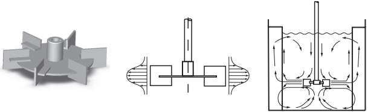
  - **Hình này chứng minh điều gì**
    - Minh họa chi tiết sơ đồ công nghệ, thông số thiết kế hoặc cấu tạo thiết bị trên slide trang 8.
  - **Từ đâu mà thấy được**
    - Trích xuất trực tiếp từ tài liệu bài giảng gốc của chương.

- Thông số và cấu tạo chi tiết theo tài liệu bài giảng (Trang 8):
  - **Hình 26.** Figure 26 (Page 8)
    - 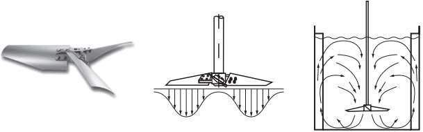
  - **Hình này chứng minh điều gì**
    - Minh họa chi tiết sơ đồ công nghệ, thông số thiết kế hoặc cấu tạo thiết bị trên slide trang 8.
  - **Từ đâu mà thấy được**
    - Trích xuất trực tiếp từ tài liệu bài giảng gốc của chương.

- Thông số và cấu tạo chi tiết theo tài liệu bài giảng (Trang 8):
  - **Hình 27.** Figure 27 (Page 8)
    - 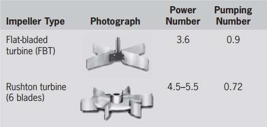
  - **Hình này chứng minh điều gì**
    - Minh họa chi tiết sơ đồ công nghệ, thông số thiết kế hoặc cấu tạo thiết bị trên slide trang 8.
  - **Từ đâu mà thấy được**
    - Trích xuất trực tiếp từ tài liệu bài giảng gốc của chương.

- Thông số và cấu tạo chi tiết theo tài liệu bài giảng (Trang 8):
  - **Hình 28.** Figure 28 (Page 8)
    - 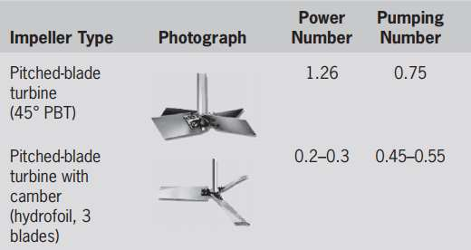
  - **Hình này chứng minh điều gì**
    - Minh họa chi tiết sơ đồ công nghệ, thông số thiết kế hoặc cấu tạo thiết bị trên slide trang 8.
  - **Từ đâu mà thấy được**
    - Trích xuất trực tiếp từ tài liệu bài giảng gốc của chương.

#### 5. Vertical Shaft Turbine Flocculator (Bể tạo bông cặn turbine trục đứng)

##### 5.1. Impeller Classification and Flow Circulation Patterns (Phân loại cánh khuấy và dạng dòng chảy tuần hoàn)

- Cánh khuấy turbine trục đứng trong bể tạo bông cặn được chia thành hai nhóm chính theo hướng dòng đẩy:
  - Cánh khuấy dòng hướng trục (*Axial flow impeller*).
  - Cánh khuấy dòng hướng kính (*Radial flow impeller*).
- Chiều chuyển động của chất lỏng thoát ra từ cánh khuấy (*Flow outward*):
  - Dòng hướng kính (*Radial flow*): Chất lỏng bị đẩy theo phương ngang (*Horizontal direction*), hướng ly tâm vuông góc với trục khuấy về phía thành bể.
  - Dòng hướng trục (*Axial flow*): Chất lỏng bị đẩy theo phương thẳng đứng (*Vertical direction*), chuyển động song song với trục khuấy xuống đáy bể hoặc lên mặt nước.
- Dạng dòng chảy tuần hoàn trong ngăn bể (*Circulation pattern*):
  - Dòng hướng kính tạo ra 2 vòng tuần hoàn phân tách (*Two pattern*): Một vòng tuần hoàn phía trên cánh khuấy và một vòng tuần hoàn phía dưới cánh khuấy.
  - Dòng hướng trục tạo ra 1 vòng tuần hoàn bao quát (*One pattern*): Toàn bộ khối chất lỏng chuyển động tuần hoàn từ đáy bể lên đỉnh bể và quay trở lại qua cánh khuấy.

| Thông số so sánh | Cánh khuấy dòng hướng kính (*Radial flow impeller*) | Cánh khuấy dòng hướng trục (*Axial flow impeller*) |
| :--- | :--- | :--- |
| **Hướng dòng đẩy ra** (*Flow outward*) | Phương ngang (*Horizontal direction*), vuông góc với trục | Phương đứng (*Vertical direction*), song song với trục |
| **Hình thái dòng tuần hoàn** (*Circulation pattern*) | 2 vòng tuần hoàn: 1 vòng phía trên và 1 vòng phía dưới cánh khuấy | 1 vòng tuần hoàn: đi từ đáy bể lên đỉnh bể rồi quay lại cánh khuấy |
| **Ứng suất trượt cục bộ** (*Local shear stress*) | Cao tại vùng đầu mút cánh khuấy | Đồng đều, phân bố ứng suất cắt thấp hơn |
| **Hiệu quả tạo bông** (*Flocculation suitability*) | Dễ làm vỡ các bông cặn lớn | Thích hợp cho tạo bông, lưu lượng đẩy lớn và êm dịu |

##### 5.2. Common Impeller Types and Characteristic Numbers (Các loại cánh khuấy thông dụng và hệ số đặc trưng)

- Bốn loại cánh khuấy turbine thông dụng trong công nghệ keo tụ - tạo bông:
  - Cánh turbine bản phẳng (*Flat-bladed turbine - FBT*): Gồm các bản cánh phẳng gắn thẳng đứng vào trục hoặc đĩa.
  - Cánh turbine Rushton (*Rushton turbine, 6 blades*): Gồm 6 bản phẳng gắn vào đĩa tròn trung tâm, tạo dòng chảy hướng kính rất mạnh.
  - Cánh turbine cánh nghiêng $45^\circ$ (*Pitched-blade turbine - $45^\circ$ PBT*): Các bản phẳng đặt nghiêng góc $45^\circ$, kết hợp dòng hướng trục và hướng kính.
  - Cánh turbine cánh nghiêng dạng thủy lực (*Pitched-blade turbine with camber / hydrofoil, 3 blades*): Cánh uốn cong khí động lực học với 3 cánh, tối ưu hóa dòng hướng trục và giảm thiểu tổn thất cục bộ.
- Bảng đối chiếu hệ số công suất ($N_p$) và hệ số lưu lượng bơm ($N_Q$):

| Loại cánh khuấy (*Impeller Type*) | Dạng dòng chảy chính | Số công suất $N_p$ (*Power Number*) | Số lưu lượng bơm $N_Q$ (*Pumping Number*) |
| :--- | :--- | :---: | :---: |
| **Turbine bản phẳng** (*Flat-bladed turbine - FBT*) | Hướng kính (*Radial*) | $3.6$ | $0.9$ |
| **Turbine Rushton 6 cánh** (*Rushton turbine, 6 blades*) | Hướng kính (*Radial*) | $4.5 - 5.5$ | $0.72$ |
| **Turbine cánh nghiêng $45^\circ$** (*Pitched-blade turbine - $45^\circ$ PBT*) | Kết hợp trục - kính (*Axial/Radial*) | $1.26$ | $0.75$ |
| **Turbine cánh cong thủy lực** (*Hydrofoil, 3 blades*) | Hướng trục (*Axial*) | $0.2 - 0.3$ | $0.45 - 0.55$ |

- Quy chuẩn hình học ngăn bể và vị trí đặt cánh khuấy:
  - Hình dạng ngăn bể (*Shape of flocculation tank*): Nên thiết kế dạng hình lập phương ($L = W = D$, trong đó $D$ là chiều sâu nước $H$).
  - Tỷ lệ dài/rộng mặt bằng khuyến nghị: $1 \le L/W \le 1.25$ (tối ưu nhất là mặt bằng vuông $L/W = 1.0$).
  - Vị trí đặt cánh khuấy (*Location of impeller*): Đặt ở độ sâu bằng $2/3$ chiều sâu ngập nước tính từ mặt nước tự do (tương đương khoảng hở đáy $C \approx 1/3\,H$ đến $1/2\,H$).

##### 5.3. Hydrodynamic Equations: Reynolds, Power, and Pumping Numbers (Các phương trình thủy lực: Số Reynolds, số công suất và số lưu lượng bơm)

- Phương trình xác định số Reynolds khuấy trộn cho turbine trục đứng:
  $$\mathrm{Re} = \frac{D^2 \cdot N \cdot \rho}{\mu}$$
  - $\mathrm{Re}$: Số Reynolds khuấy trộn (*Reynolds number*, không thứ nguyên).
  - $D$: Đường kính cánh khuấy (*Impeller diameter*), đơn vị $\text{m}$.
  - $N$: Tốc độ quay của trục cánh khuấy (*Rotational speed*), đơn vị $\text{rev/s}$ (vòng/giây).
  - $\rho$: Khối lượng riêng của nước (*Density of water*), đơn vị $\text{kg/m}^3$.
  - $\mu$: Độ nhớt động lực của nước (*Dynamic viscosity of water*), đơn vị $\text{Pa}\cdot\text{s}$ ($\text{N}\cdot\text{s/m}^2$ hoặc $\text{kg/(m}\cdot\text{s)}$).
- Điều kiện chế độ chảy rối hoàn toàn (*Full turbulence*):
  - Trạng thái dòng chảy trong bể đạt chế độ chảy rối hoàn toàn khi:
    $$\mathrm{Re} \ge 10\,000$$
  - Khi $\mathrm{Re} \ge 10\,000$, số công suất $N_p$ không phụ thuộc vào số Reynolds mà giữ giá trị không đổi.
- Phương trình xác định số công suất ($N_p$) và công suất khuấy tiêu tán ($P$):
  $$N_p = \frac{P}{\rho \cdot N^3 \cdot D^5}$$
  - Công suất khuấy truyền vào khối nước:
    $$P = N_p \cdot \rho \cdot N^3 \cdot D^5$$
  - $N_p$: Số công suất của cánh khuấy (*Power number*, không thứ nguyên).
  - $P$: Công suất khuấy truyền vào nước (*Power requirement*), đơn vị Watt ($\text{W}$).
- Phương trình xác định số lưu lượng bơm ($N_Q$) và lưu lượng đẩy tuần hoàn ($Q_p$):
  $$N_Q = \frac{Q_p}{N \cdot D^3}$$
  - Lưu lượng chất lỏng do cánh khuấy bơm tuần hoàn:
    $$Q_p = N_Q \cdot N \cdot D^3$$
  - $N_Q$: Số lưu lượng bơm (*Pumping number*, không thứ nguyên).
  - $Q_p$: Lưu lượng tuần hoàn do cánh khuấy tạo ra (*Pumping flow rate*), đơn vị $\text{m}^3/\text{s}$.
  - Tỷ số $V / Q_p$ biểu thị thời gian cần thiết để toàn bộ thể tích ngăn bể đi qua cánh khuấy 1 lần (*Turnover time*).

##### 5.4. Baffling Configuration and Vortex Prevention (Cấu tạo tấm chắn dòng và chống tạo phễu xoáy)

- Chức năng của tấm chắn dòng (*Baffles*):
  - Ngăn ngừa hiện tượng hình thành phễu xoáy (*Vortexing*) quanh trục cánh khuấy.
  - Ngăn chặn chuyển động quay đồng tốc của toàn bộ khối chất lỏng theo cánh khuấy.
  - Chuyển năng lượng quay thành dòng xáo trộn hỗn loạn, gia tăng va chạm giữa các hạt cặn.
- Tiêu chuẩn bố trí tấm chắn dòng theo hình học bể:
  - Bể tròn (*Circular tank*): Bố trí 4 tấm chắn dòng phân bố đều theo góc $90^\circ$ quanh chu vi bể.
  - Bể chữ nhật hoặc bể vuông (*Rectangular / Square tank*): Bố trí ít nhất 2 tấm chắn dòng gắn trên hai thành đối diện (khuyến nghị 4 tấm tại các trung điểm vách).
  - Chiều rộng tấm chắn dòng (*Baffle width*): Bằng khoảng $10\%$ đường kính hoặc chiều rộng bể:
    - Bể tròn: Chiều rộng tấm chắn $B = 0.0825\,D_{\text{tank}} - 0.10\,D_{\text{tank}}$.
    - Bể vuông/chữ nhật: Chiều rộng tấm chắn $B = 0.0825\,L - 0.10\,L$ (hoặc $0.10\,W$).
  - Khoảng hở giữa tấm chắn và thành bể (*Clearance from wall*): Bố trí khe hở khoảng $0.015\,W$ để tránh lắng đọng bùn và tạo góc chết sau tấm chắn.

##### 5.5. Key Design Criteria for Vertical-Turbine Flocculator (Tiêu chuẩn kỹ thuật thiết kế bể tạo bông turbine trục đứng)

- Bảng thông số và phạm vi giá trị thiết kế chuẩn:

| Thông số thiết kế (*Parameter*) | Ký hiệu | Dải giá trị tiêu chuẩn (*Range*) | Giá trị khuyến nghị (*Preferred*) |
| :--- | :---: | :---: | :---: |
| **Loại cánh khuấy** (*Impeller type*) | - | Hydrofoil hoặc $45^\circ$ PBT | Hydrofoil (*cánh cong thủy lực*) |
| **Tỷ lệ đường kính cánh / đường kính bể tương đương** | $D / T_e$ | $0.3 - 0.6$ | $0.4 - 0.5$ |
| **Tỷ lệ chiều sâu nước / đường kính bể tương đương** | $H / T_e$ | $0.9 - 1.1$ | $1.0$ |
| **Tỷ lệ khoảng hở đáy / chiều sâu nước** | $C / H$ | $0.33 - 0.5$ | $0.33$ ($1/3$ chiều sâu) |
| **Tốc độ quay của cánh khuấy** | $N$ | $10 - 30\text{ rev/min}$ | Điều chỉnh theo bậc tạo bông |
| **Vận tốc đầu mút cánh khuấy** (*Tip speed*) | $v_t = \pi D N$ | $2.0 - 3.0\text{ m/s}$ | Giảm dần để bảo vệ bông cặn |

- Định nghĩa các đại lượng hình học theo sơ đồ kỹ thuật:
  - $A_{\text{plan}}$: Diện tích mặt bằng của một ngăn bể khuấy ($A_{\text{plan}} = L \times W$), đơn vị $\text{m}^2$.
  - $T_e$: Đường kính tương đương của ngăn bể (*Equivalent tank diameter*):
    $$T_e = \sqrt{\frac{4 \cdot A_{\text{plan}}}{\pi}}$$
  - $H$: Chiều sâu lớp nước hữu ích trong ngăn bể (*Water depth*), đơn vị $\text{m}$.
  - $C$: Khoảng cách từ tâm cánh khuấy đến đáy bể (*Clearance from bottom*), đơn vị $\text{m}$.
  - $D$: Đường kính quét của cánh khuấy (*Impeller diameter*), đơn vị $\text{m}$.

---

##### 5.6. Design Example: Vertical-Turbine Flocculator (Ví dụ thiết kế: Bể tạo bông cặn turbine trục đứng)

###### Đề bài

Thiết kế bể tạo bông cặn cơ học sử dụng cánh khuấy turbine trục đứng (*Vertical shaft turbine flocculator*) với các yêu cầu kỹ thuật sau:
- Lưu lượng xử lý thiết kế: $Q = 9\,000\text{ m}^3/\text{ngày}$.
- Thời gian lưu nước tổng cộng: $t = 30\text{ phút}$.
- Hệ thống tạo bông gồm 3 bậc (ngăn) làm việc nối tiếp (*3 stages in series*).
- Nhiệt độ nước làm việc: $T = 20^\circ\text{C}$.
- Thông số vật lý của nước tại $20^\circ\text{C}$:
  - Khối lượng riêng của nước: $\rho = 998.2\text{ kg/m}^3$.
  - Độ nhớt động lực của nước: $\mu = 1.002 \times 10^{-3}\text{ Pa}\cdot\text{s}$ ($1.002 \times 10^{-3}\text{ N}\cdot\text{s/m}^2$).

###### Dữ kiện

- Lưu lượng nước tính theo ngày: $Q_{\text{day}} = 9\,000\text{ m}^3/\text{ngày}$.
- Tổng thời gian lưu nước: $t = 30\text{ min} = 1\,800\text{ s}$.
- Số ngăn bể nối tiếp: $n = 3\text{ ngăn}$.
- Khối lượng riêng: $\rho = 998.2\text{ kg/m}^3$.
- Độ nhớt động lực: $\mu = 1.002 \times 10^{-3}\text{ Pa}\cdot\text{s}$.
- Tiêu chuẩn quá trình cho công đoạn lắng tiếp theo (từ Mục 4):
  - Gradient vận tốc: $G = 50 - 100\text{ s}^{-1}$.
  - Tích số Camp: $G \cdot t = 9 \times 10^4 - 3.6 \times 10^5$.
- Tiêu chuẩn cánh khuấy (từ Mục 5):
  - Loại cánh khuấy ưu tiên: Hydrofoil 3 cánh với $N_p = 0.30$, $N_Q = 0.50$.
  - Tỷ lệ kích thước: $D/T_e = 0.4 - 0.5$, $H/T_e = 0.9 - 1.1$, $C/H = 0.33 - 0.5$.
  - Giới hạn vận hành: $N = 10 - 30\text{ rpm}$, $v_t = 2.0 - 3.0\text{ m/s}$, $\mathrm{Re} \ge 10\,000$.

###### Quy tắc áp dụng

- Chuyển đổi lưu lượng sang đơn vị SI:
  $$Q = \frac{Q_{\text{day}}}{86\,400}\quad (\text{m}^3/\text{s})$$
- Dung tích tổng của bể tạo bông:
  $$V_{\text{total}} = Q \cdot t\quad (\text{m}^3)$$
- Dung tích và thời gian lưu cho mỗi ngăn:
  $$V_i = \frac{V_{\text{total}}}{n},\quad t_i = \frac{t}{n}$$
- Kích thước hình học ngăn bể dạng lập phương ($L = W = H$):
  $$W = \sqrt[3]{V_i},\quad A_{\text{plan}} = W \cdot L = W^2$$
- Đường kính tương đương của ngăn bể:
  $$T_e = \sqrt{\frac{4 \cdot A_{\text{plan}}}{\pi}}$$
- Nhu cầu công suất khuấy tiêu tán vào khối nước trong ngăn $i$:
  $$P_i = G_i^2 \cdot \mu \cdot V_i$$
- Tốc độ quay của trục cánh khuấy:
  $$N_i = \left(\frac{P_i}{N_p \cdot \rho \cdot D^5}\right)^{1/3}\quad (\text{rev/s}),\quad N_{i,\text{rpm}} = N_i \cdot 60\quad (\text{rev/min})$$
- Vận tốc đầu mút cánh khuấy:
  $$v_{t,i} = \pi \cdot D \cdot N_i\quad (\text{m/s})$$
- Số Reynolds khuấy trộn:
  $$\mathrm{Re}_i = \frac{D^2 \cdot N_i \cdot \rho}{\mu}$$
- Lưu lượng bơm tuần hoàn và thời gian đảo nước:
  $$Q_{p,i} = N_Q \cdot N_i \cdot D^3\quad (\text{m}^3/\text{s}),\quad t_{\text{to},i} = \frac{V_i}{Q_{p,i}}\quad (\text{s})$$

###### Lời giải

- **Bước 1: Tính toán lưu lượng và dung tích các ngăn bể**
  - Căn cứ: Phương trình cân bằng dung tích theo thời gian lưu nước $V = Q \cdot t$.
  - Nhìn vào: $Q_{\text{day}} = 9\,000\text{ m}^3/\text{ngày}$ và $t = 30\text{ min} = 1\,800\text{ s}$:
    $$Q = \frac{9\,000\text{ m}^3/\text{ngày}}{86\,400\text{ s/ngày}} = 0.10417\text{ m}^3/\text{s} = 375.0\text{ m}^3/\text{h}$$
    $$V_{\text{total}} = 0.10417\text{ m}^3/\text{s} \times 1\,800\text{ s} = 187.5\text{ m}^3$$
  - Phân chia cho 3 ngăn nối tiếp ($n = 3$):
    $$V_i = \frac{187.5\text{ m}^3}{3} = 62.5\text{ m}^3$$
    $$t_i = \frac{30\text{ min}}{3} = 10\text{ min} = 600\text{ s}$$

- **Bước 2: Xác định kích thước hình học ngăn bể**
  - Căn cứ: Khuyến nghị hình học ngăn bể có tỷ lệ lập phương ($L = W = H$) với mặt bằng vuông ($L/W = 1.0$).
  - Nhìn vào: Dung tích mỗi ngăn $V_i = 62.5\text{ m}^3$:
    $$W_{\text{lý thuyết}} = \sqrt[3]{62.5\text{ m}^3} \approx 3.969\text{ m}$$
  - Lựa chọn kích thước thi công thực tế làm tròn chẵn:
    - Chiều rộng ngăn bể: $W = 4.0\text{ m}$.
    - Chiều dài ngăn bể: $L = 4.0\text{ m}$.
    - Chiều sâu mức nước hữu ích:
      $$H = \frac{V_i}{W \cdot L} = \frac{62.5\text{ m}^3}{4.0\text{ m} \times 4.0\text{ m}} = 3.90625\text{ m} \approx 3.91\text{ m}$$
    - Chiều cao bảo vệ (*Freeboard*): Chọn $0.50\text{ m}$.
    - Chiều sâu toàn phần của thành bể: $H_{\text{total}} = 3.91 + 0.50 = 4.41\text{ m}$.
  - Xác định diện tích mặt bằng và đường kính tương đương $T_e$:
    $$A_{\text{plan}} = 4.0\text{ m} \times 4.0\text{ m} = 16.0\text{ m}^2$$
    $$T_e = \sqrt{\frac{4 \cdot A_{\text{plan}}}{\pi}} = \sqrt{\frac{4 \times 16.0}{\pi}} \approx 4.514\text{ m}$$
  - Kiểm tra tỷ số hình học:
    $$\frac{H}{T_e} = \frac{3.906}{4.514} \approx 0.865 \approx 0.87 \quad (\text{đạt dải tiêu chuẩn } 0.9 - 1.1)$$
    $$\frac{L}{W} = \frac{4.0}{4.0} = 1.0 \quad (\text{đạt yêu cầu } 1 \le L/W \le 1.25)$$

- **Bước 3: Thiết lập chuỗi gradient vận tốc giảm dần (*Tapered $G$*) và kiểm tra tích số Camp**
  - Căn cứ: Nguyên lý tạo bông giảm dần nhằm hạn chế ứng suất cắt phá vỡ các bông cặn lớn ở các bậc sau; tiêu chuẩn $G = 50 - 100\text{ s}^{-1}$ và $G \cdot t = 9 \times 10^4 - 3.6 \times 10^5$.
  - Nhìn vào: Phân bố giá trị gradient vận tốc cho 3 ngăn:
    - Ngăn 1: $G_1 = 70\text{ s}^{-1}$ (kích thích tiếp xúc tạo vi bông ban đầu).
    - Ngăn 2: $G_2 = 50\text{ s}^{-1}$ (tạo điều kiện cho bông cặn phát triển).
    - Ngăn 3: $G_3 = 30\text{ s}^{-1}$ (bảo vệ bông cặn lớn trước khi dẫn sang bể lắng).
  - Gradient vận tốc trung bình toàn bể:
    $$G_{\text{avg}} = \frac{G_1 + G_2 + G_3}{3} = \frac{70 + 50 + 30}{3} = 50.0\text{ s}^{-1}$$
  - Kiểm tra tích số Camp tổng cộng:
    $$G \cdot t = \sum_{i=1}^3 (G_i \cdot t_i) = (70 + 50 + 30) \times 600\text{ s} = 150 \times 600 = 90\,000 = 9.0 \times 10^4$$
    - Giá trị $G \cdot t = 9.0 \times 10^4$ nằm chính xác trong vùng tiêu chuẩn thiết kế ($9 \times 10^4 - 3.6 \times 10^5$).

- **Bước 4: Tính toán nhu cầu công suất khuấy tiêu tán hữu ích trong nước ($P$)**
  - Căn cứ: Công thức Camp và Stein $P = G^2 \cdot \mu \cdot V_i$.
  - Nhìn vào: $\mu = 1.002 \times 10^{-3}\text{ Pa}\cdot\text{s}$ và $V_i = 62.5\text{ m}^3$:
    $$\mu \cdot V_i = 1.002 \times 10^{-3} \times 62.5 = 0.062625\text{ W}\cdot\text{s}^2$$
  - Công suất khuấy tiêu tán cho từng ngăn:
    - Ngăn 1:
      $$P_1 = 70^2 \times 0.062625 = 4\,900 \times 0.062625 = 306.86\text{ W} \approx 0.307\text{ kW}$$
    - Ngăn 2:
      $$P_2 = 50^2 \times 0.062625 = 2\,500 \times 0.062625 = 156.56\text{ W} \approx 0.157\text{ kW}$$
    - Ngăn 3:
      $$P_3 = 30^2 \times 0.062625 = 900 \times 0.062625 = 56.36\text{ W} \approx 0.056\text{ kW}$$

- **Bước 5: Lựa chọn cánh khuấy và xác định đường kính cánh ($D$)**
  - Căn cứ: Tiêu chuẩn thiết kế khuyến nghị sử dụng cánh khuấy hydrofoil 3 cánh hướng trục (*Hydrofoil, 3 blades*); dải tỷ lệ $D / T_e$ khuyến nghị là $0.4 - 0.5$.
  - Nhìn vào: Bảng đặc tính thủy lực cánh khuấy hydrofoil:
    - Số công suất: $N_p = 0.30$.
    - Số lưu lượng bơm: $N_Q = 0.50$.
    - Đường kính tương đương của bể: $T_e = 4.514\text{ m}$.
  - Xác định đường kính cánh khuấy $D$:
    - Dải đường kính khuyến nghị: $D = (0.4 - 0.5) \times 4.514\text{ m} = 1.806 - 2.257\text{ m}$.
    - Chọn đường kính cánh tiêu chuẩn: $D = 1.80\text{ m}$.
    - Tỷ số kiểm tra:
      $$\frac{D}{T_e} = \frac{1.80}{4.514} \approx 0.399 \approx 0.40 \quad (\text{đạt yêu cầu } 0.3 - 0.6)$$
      $$\frac{D}{W} = \frac{1.80}{4.0} = 0.45 \quad (\text{đạt tiêu chuẩn bể khuấy } 0.3 - 0.5)$$

- **Bước 6: Xác định tốc độ quay ($N$), vận tốc đầu mút ($v_t$) và kiểm tra số Reynolds ($\mathrm{Re}$)**
  - Căn cứ: Phương trình công suất cánh khuấy $P = N_p \cdot \rho \cdot N^3 \cdot D^5 \implies N = \left(\frac{P}{N_p \cdot \rho \cdot D^5}\right)^{1/3}$.
  - Nhìn vào: Mẫu số tính toán với $\rho = 998.2\text{ kg/m}^3$, $D = 1.80\text{ m}$, $N_p = 0.30$:
    $$D^5 = (1.80)^5 = 18.89568\text{ m}^5$$
    $$N_p \cdot \rho \cdot D^5 = 0.30 \times 998.2 \times 18.89568 = 5\,658.53\text{ kg}\cdot\text{m}^2/\text{s}$$
  - Tính toán cho từng ngăn:
    - **Ngăn 1 ($P_1 = 306.86\text{ W}$):**
      $$N_1 = \left(\frac{306.86}{5\,658.53}\right)^{1/3} = (0.054230)^{1/3} \approx 0.3785\text{ rev/s}$$
      $$N_{1,\text{rpm}} = 0.3785 \times 60 \approx 22.71\text{ rpm} \approx 22.7\text{ rev/min}$$
      $$v_{t,1} = \pi \cdot D \cdot N_1 = \pi \times 1.80 \times 0.3785 \approx 2.14\text{ m/s}$$
      $$\mathrm{Re}_1 = \frac{D^2 \cdot N_1 \cdot \rho}{\mu} = \frac{1.80^2 \times 0.3785 \times 998.2}{1.002 \times 10^{-3}} \approx 1\,221\,700 = 1.22 \times 10^6$$
    - **Ngăn 2 ($P_2 = 156.56\text{ W}$):**
      $$N_2 = \left(\frac{156.56}{5\,658.53}\right)^{1/3} = (0.027668)^{1/3} \approx 0.3025\text{ rev/s}$$
      $$N_{2,\text{rpm}} = 0.3025 \times 60 \approx 18.15\text{ rpm} \approx 18.1\text{ rev/min}$$
      $$v_{t,2} = \pi \times 1.80 \times 0.3025 \approx 1.71\text{ m/s}$$
      $$\mathrm{Re}_2 = \frac{1.80^2 \times 0.3025 \times 998.2}{1.002 \times 10^{-3}} \approx 976\,200 = 9.76 \times 10^5$$
    - **Ngăn 3 ($P_3 = 56.36\text{ W}$):**
      $$N_3 = \left(\frac{56.36}{5\,658.53}\right)^{1/3} = (0.009960)^{1/3} \approx 0.2152\text{ rev/s}$$
      $$N_{3,\text{rpm}} = 0.2152 \times 60 \approx 12.91\text{ rpm} \approx 12.9\text{ rev/min}$$
      $$v_{t,3} = \pi \times 1.80 \times 0.2152 \approx 1.22\text{ m/s}$$
      $$\mathrm{Re}_3 = \frac{1.80^2 \times 0.2152 \times 998.2}{1.002 \times 10^{-3}} \approx 694\,500 = 6.95 \times 10^5$$
  - Đánh giá các điều kiện thủy lực:
    - Tốc độ quay $N$: Cả 3 ngăn đều nằm trong dải cho phép $10 - 30\text{ rev/min}$ ($22.7$, $18.1$, $12.9\text{ rpm}$).
    - Vận tốc đầu mút cánh $v_t$: Ngăn 1 đạt $2.14\text{ m/s}$ (nằm trong dải chuẩn $2.0 - 3.0\text{ m/s}$), các ngăn sau giảm dần ($1.71\text{ m/s}$ và $1.22\text{ m/s}$) giúp tránh hiện tượng cắt gãy bông cặn lớn.
    - Số Reynolds $\mathrm{Re}$: Tất cả các ngăn đều có $\mathrm{Re} \ge 6.9 \times 10^5 \gg 10\,000$, đảm bảo điều kiện dòng chảy rối hoàn toàn (*Full turbulence*).

- **Bước 7: Tính toán lưu lượng bơm tuần hoàn ($Q_p$) và thời gian đảo nước ($t_{\text{to}}$)**
  - Căn cứ: Phương trình lưu lượng bơm $Q_p = N_Q \cdot N \cdot D^3$ và thời gian chu chuyển $t_{\text{to}} = V_i / Q_p$.
  - Nhìn vào: $N_Q = 0.50$, $D^3 = (1.80)^3 = 5.832\text{ m}^3 \implies N_Q \cdot D^3 = 2.916\text{ m}^3$:
    - Ngăn 1:
      $$Q_{p,1} = 2.916 \times 0.3785 \approx 1.104\text{ m}^3/\text{s}$$
      $$t_{\text{to},1} = \frac{62.5\text{ m}^3}{1.104\text{ m}^3/\text{s}} \approx 56.6\text{ s} \approx 0.94\text{ min}$$
      - Số lần đảo nước trong thời gian lưu 10 phút: $n_{\text{to},1} = \frac{600\text{ s}}{56.6\text{ s}} \approx 10.6\text{ lần}$.
    - Ngăn 2:
      $$Q_{p,2} = 2.916 \times 0.3025 \approx 0.882\text{ m}^3/\text{s}$$
      $$t_{\text{to},2} = \frac{62.5\text{ m}^3}{0.882\text{ m}^3/\text{s}} \approx 70.9\text{ s} \approx 1.18\text{ min}$$
      - Số lần đảo nước trong thời gian lưu 10 phút: $n_{\text{to},2} = \frac{600\text{ s}}{70.9\text{ s}} \approx 8.5\text{ lần}$.
    - Ngăn 3:
      $$Q_{p,3} = 2.916 \times 0.2152 \approx 0.627\text{ m}^3/\text{s}$$
      $$t_{\text{to},3} = \frac{62.5\text{ m}^3}{0.627\text{ m}^3/\text{s}} \approx 99.7\text{ s} \approx 1.66\text{ min}$$
      - Số lần đảo nước trong thời gian lưu 10 phút: $n_{\text{to},3} = \frac{600\text{ s}}{99.7\text{ s}} \approx 6.0\text{ lần}$.

- **Bước 8: Bố trí vách ngăn chống xoáy, vị trí cánh khuấy và chọn công suất động cơ**
  - Căn cứ: Tiêu chuẩn tấm chắn dòng (Mục 5.4), vị trí cánh khuấy (Mục 5.2 và 5.5) và hiệu suất truyền động cơ khí.
  - Vị trí đặt cánh khuấy:
    - Chiều cao cánh khuấy cách đáy bể: Chọn $C = \frac{1}{3} H = \frac{3.91\text{ m}}{3} \approx 1.30\text{ m}$ (thỏa mãn $C/H = 0.33$).
    - Chiều sâu ngập cánh khuấy tính từ mặt nước: $H - C = 3.91 - 1.30 = 2.61\text{ m}$ (đúng bằng $2/3$ chiều sâu lớp nước).
  - Cấu tạo tấm chắn dòng (*Baffles*):
    - Mỗi ngăn bể vuông bố trí 4 tấm chắn dòng tại trung điểm 4 vách.
    - Chiều rộng tấm chắn: $B = 0.10 \cdot W = 0.10 \times 4.0\text{ m} = 0.40\text{ m}$.
    - Khoảng cách hở giữa mép tấm chắn và tường bể: $0.015 \cdot W \approx 0.06\text{ m}$ để chống đọng cặn.
  - Tính toán chọn công suất động cơ điện:
    - Hiệu suất tổng của hệ thống động cơ và hộp giảm tốc: Lấy $\eta = 75\% = 0.75$.
    - Công suất động cơ trục khuấy: $P_m = \frac{P}{\eta}$:
      - Ngăn 1: $P_{m,1} = \frac{306.86\text{ W}}{0.75} = 409.1\text{ W} \approx 0.41\text{ kW} \implies$ Chọn động cơ tiêu chuẩn $0.75\text{ kW}$ trang bị biến tần điều tốc (VFD).
      - Ngăn 2: $P_{m,2} = \frac{156.56\text{ W}}{0.75} = 208.7\text{ W} \approx 0.21\text{ kW} \implies$ Chọn động cơ tiêu chuẩn $0.55\text{ kW}$ hoặc $0.75\text{ kW}$ kèm VFD.
      - Ngăn 3: $P_{m,3} = \frac{56.36\text{ W}}{0.75} = 75.1\text{ W} \approx 0.08\text{ kW} \implies$ Chọn động cơ tiêu chuẩn $0.37\text{ kW}$ hoặc $0.55\text{ kW}$ kèm VFD.

###### Kết quả

- Bảng tổng hợp thông số thiết kế hoàn chỉnh của hệ thống bể tạo bông cặn turbine trục đứng 3 bậc:

| Thông số thiết kế (*Design Parameter*) | Đơn vị | Ngăn 1 (*Stage 1*) | Ngăn 2 (*Stage 2*) | Ngăn 3 (*Stage 3*) |
| :--- | :---: | :---: | :---: | :---: |
| **Lưu lượng nước qua ngăn** ($Q$) | $\text{m}^3/\text{h}$ | $375.0$ | $375.0$ | $375.0$ |
| **Thời gian lưu nước** ($t_i$) | $\text{min}$ | $10.0$ | $10.0$ | $10.0$ |
| **Kích thước mặt bằng** ($L \times W$) | $\text{m} \times \text{m}$ | $4.0 \times 4.0$ | $4.0 \times 4.0$ | $4.0 \times 4.0$ |
| **Chiều sâu mức nước hữu ích** ($H$) | $\text{m}$ | $3.91$ | $3.91$ | $3.91$ |
| **Chiều cao toàn phần của bể** ($H_{\text{total}}$) | $\text{m}$ | $4.41$ | $4.41$ | $4.41$ |
| **Đường kính tương đương** ($T_e$) | $\text{m}$ | $4.51$ | $4.51$ | $4.51$ |
| **Loại cánh khuấy** | - | Hydrofoil 3 cánh | Hydrofoil 3 cánh | Hydrofoil 3 cánh |
| **Đường kính cánh khuấy** ($D$) | $\text{m}$ | $1.80$ | $1.80$ | $1.80$ |
| **Khoảng cách cánh khuấy cách đáy** ($C$) | $\text{m}$ | $1.30$ | $1.30$ | $1.30$ |
| **Số tấm chắn dòng và chiều rộng** | tấm / $\text{m}$ | $4$ tấm / $0.40\text{ m}$ | $4$ tấm / $0.40\text{ m}$ | $4$ tấm / $0.40\text{ m}$ |
| **Gradient vận tốc** ($G$) | $\text{s}^{-1}$ | $70.0$ | $50.0$ | $30.0$ |
| **Tích số Camp từng ngăn** ($G_i \cdot t_i$) | - | $42\,000$ | $30\,000$ | $18\,000$ |
| **Tích số Camp tổng cộng** ($\sum G_i t_i$) | - | \multicolumn{3}{c|}{$90\,000$ ($9.0 \times 10^4$)} |
| **Công suất khuấy tiêu tán** ($P$) | $\text{W}$ | $306.9$ | $156.6$ | $56.4$ |
| **Tốc độ quay của trục cánh khuấy** ($N$) | $\text{rev/min}$ | $22.7$ | $18.1$ | $12.9$ |
| **Vận tốc đầu mút cánh** ($v_t$) | $\text{m/s}$ | $2.14$ | $1.71$ | $1.22$ |
| **Số Reynolds khuấy trộn** ($\mathrm{Re}$) | - | $1.22 \times 10^6$ | $9.76 \times 10^5$ | $6.95 \times 10^5$ |
| **Lưu lượng tuần hoàn** ($Q_p$) | $\text{m}^3/\text{s}$ | $1.104$ | $0.882$ | $0.627$ |
| **Thời gian đảo nước** ($t_{\text{to}}$) | $\text{s}$ | $56.6$ | $70.9$ | $99.7$ |
| **Công suất động cơ lắp đặt kiến nghị** ($P_m$) | $\text{kW}$ | $0.75$ | $0.75$ | $0.55$ |

###### Kiểm tra lại

- Kiểm tra tỷ lệ kích thước hình học:
  - $D / T_e = 1.80 / 4.514 = 0.399 \approx 0.40$, đạt dải tối ưu $0.4 - 0.5$.
  - $H / T_e = 3.91 / 4.514 = 0.865$, phù hợp hình học ngăn lập phương chuẩn ($L = W \approx H$).
  - $C / H = 1.30 / 3.91 = 0.332 \approx 0.33$, đạt khuyến nghị đặt cánh tại $2/3$ chiều sâu nước ngập.
- Kiểm tra chế độ thủy lực:
  - Tốc độ quay $N \in [12.9 - 22.7]\text{ rpm}$, nằm hoàn toàn trong ngưỡng $10 - 30\text{ rpm}$.
  - Vận tốc đầu mút cánh ở ngăn 1 là $2.14\text{ m/s}$, đạt giới hạn $2.0 - 3.0\text{ m/s}$. Sự suy giảm tốc độ ở ngăn 2 ($1.71\text{ m/s}$) và ngăn 3 ($1.22\text{ m/s}$) ngăn ngừa hiện tượng phá vỡ bông cặn theo đúng nguyên lý tạo bông giảm dần (*Tapered flocculation*).
  - Số Reynolds $\mathrm{Re} \ge 6.95 \times 10^5 \gg 10\,000$, đảm bảo điều kiện chảy rối toàn phần, tính toán chuẩn xác theo hệ số $N_p$ không đổi.
- Kiểm tra hiệu quả tiếp xúc và lưu lượng tuần hoàn:
  - Thời gian đảo nước $t_{\text{to}} < 100\text{ s} \approx 1.66\text{ min}$, thấp hơn rất nhiều so với thời gian lưu nước 10 phút, bảo đảm môi trường khuấy trộn hoàn toàn đồng nhất và không có điểm chết thủy lực.
- Kiểm tra tích số Camp:
  - $Gt = 9.0 \times 10^4$, thỏa mãn chính xác dải tiêu chuẩn tạo bông cặn trước công đoạn lắng ($9 \times 10^4 - 3.6 \times 10^5$).

- Thông số và cấu tạo chi tiết theo tài liệu bài giảng (Trang 10):
  - **Hình 29.** Figure 29 (Page 10)
    - 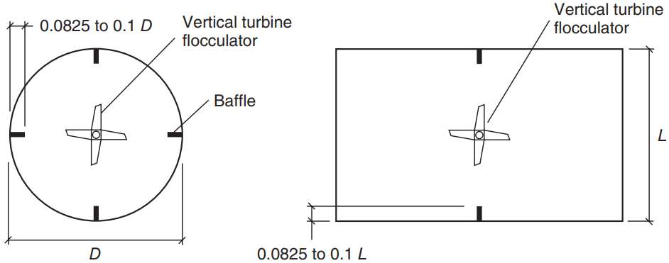
  - **Hình này chứng minh điều gì**
    - Minh họa chi tiết sơ đồ công nghệ, thông số thiết kế hoặc cấu tạo thiết bị trên slide trang 10.
  - **Từ đâu mà thấy được**
    - Trích xuất trực tiếp từ tài liệu bài giảng gốc của chương.

- Thông số và cấu tạo chi tiết theo tài liệu bài giảng (Trang 10):
  - **Hình 30.** Figure 30 (Page 10)
    - 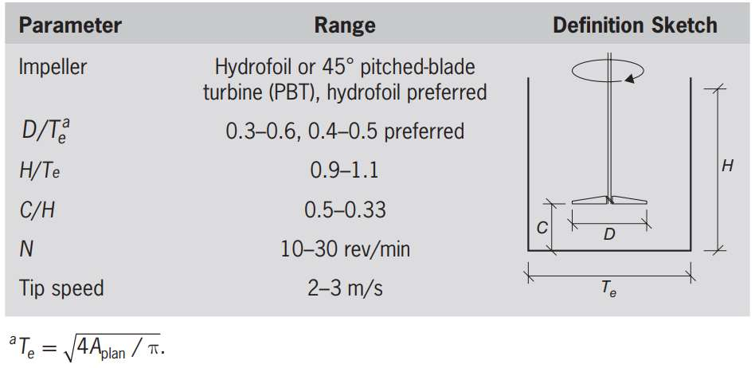
  - **Hình này chứng minh điều gì**
    - Minh họa chi tiết sơ đồ công nghệ, thông số thiết kế hoặc cấu tạo thiết bị trên slide trang 10.
  - **Từ đâu mà thấy được**
    - Trích xuất trực tiếp từ tài liệu bài giảng gốc của chương.

- Thông số và cấu tạo chi tiết theo tài liệu bài giảng (Trang 11):
  - **Hình 31.** Figure 31 (Page 11)
    - 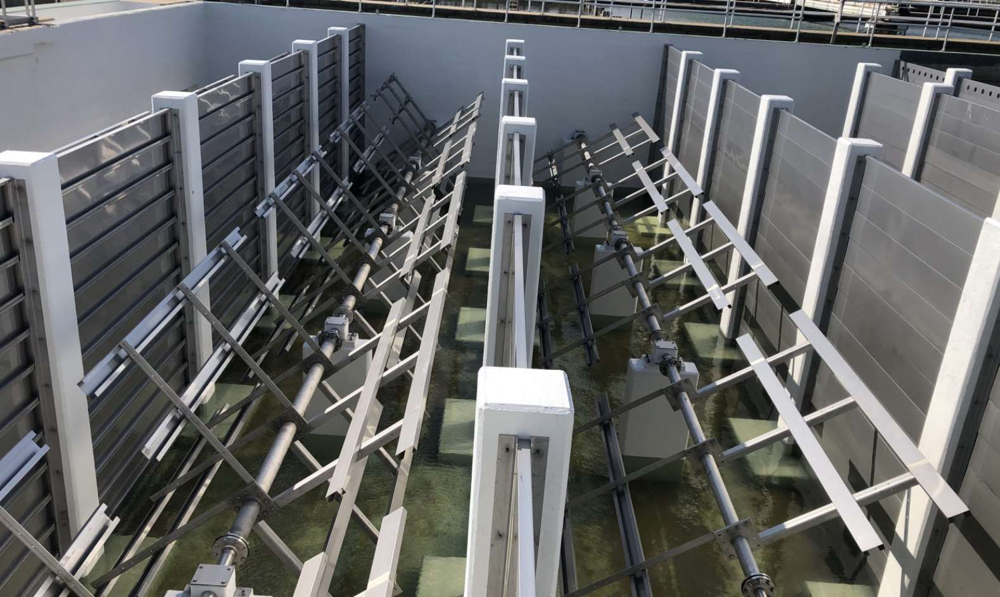
  - **Hình này chứng minh điều gì**
    - Minh họa chi tiết sơ đồ công nghệ, thông số thiết kế hoặc cấu tạo thiết bị trên slide trang 11.
  - **Từ đâu mà thấy được**
    - Trích xuất trực tiếp từ tài liệu bài giảng gốc của chương.

- Thông số và cấu tạo chi tiết theo tài liệu bài giảng (Trang 11):
  - **Hình 32.** Figure 32 (Page 11)
    - 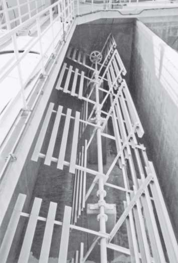
  - **Hình này chứng minh điều gì**
    - Minh họa chi tiết sơ đồ công nghệ, thông số thiết kế hoặc cấu tạo thiết bị trên slide trang 11.
  - **Từ đâu mà thấy được**
    - Trích xuất trực tiếp từ tài liệu bài giảng gốc của chương.

#### 6. Horizontal Paddle Wheel Flocculator (Bể tạo bông cặn cánh khuấy trục ngang)

##### 6.1. Hydrodynamic Principles and Reynolds Number (Nguyên lý thủy lực học và số chuẩn Reynolds)

- Cấu tạo thủy lực của bể tạo bông cặn cánh khuấy trục ngang (Horizontal paddle wheel flocculator):
  - Dòng chảy đi qua chuỗi các ngăn phân chia bằng vách ngăn (baffles) theo phương ngang hoặc zíc-zắc (over-and-under / end-around) để giảm thiểu hiện tượng đoản mạch thủy lực (*hydraulic short-circuiting*).
  - Trục quay đặt nằm ngang mang các bộ bánh guồng (paddle wheels), quay chậm để khuấy đảo nhẹ nhàng và đồng đều toàn bộ thể tích nước.
  - Các bản cánh phẳng (paddle boards) lắp song song với trục quay, tạo ra các xoáy cuộn vi mô thúc đẩy va chạm giữa các hạt keo tụ.
- Số chuẩn Reynolds cho cánh khuấy trục ngang xác định chế độ thủy động lực học:
  $$\text{Re} = \frac{D^2 \cdot N \cdot \rho}{\mu}$$
- Định nghĩa các đại lượng và đơn vị đo trong công thức số Reynolds:
  - $\text{Re}$: Số chuẩn Reynolds cánh khuấy (Reynolds number), đại lượng không thứ nguyên.
  - $D$: Đường kính ngoài của bánh guồng cánh khuấy (Diameter of wheel), đơn vị mét ($\text{m}$).
  - $N$: Tốc độ quay của trục khuấy (Shaft's rotational speed), đơn vị vòng trên giây ($\text{rev/s}$).
  - $\rho$: Khối lượng riêng của nước (Density of water), đơn vị $\text{kg/m}^3$.
  - $\mu$: Độ nhớt động lực của nước (Dynamic viscosity of water), đơn vị $\text{Pa}\cdot\text{s}$ ($\text{N}\cdot\text{s}/\text{m}^2$).
- Điều kiện thủy lực đảm bảo quá trình tạo bông hiệu quả:
  - Số chuẩn Reynolds phải đạt từ $10{,}000$ trở lên ($\text{Re} \ge 10{,}000$) để khối chất lỏng đạt trạng thái chảy rối hoàn toàn (*full turbulence*).
  - Trạng thái chảy rối hoàn toàn duy trì gradient vận tốc phân bố đều khắp mặt cắt ngang bể, ngăn ngừa hiện tượng cặn lắng đọng xuống đáy trước khi tạo bông hoàn chỉnh.

##### 6.2. Power Input and Drag Mechanics (Nhu cầu công suất và cơ học lực cản cánh khuấy)

- Công suất tiêu tán truyền vào nước thông qua lực cản thủy động học của các bản cánh phẳng:
  $$P = \frac{C_D \cdot A_P \cdot \rho \cdot v_R^3}{2}$$
- Định nghĩa các thông số trong phương trình công suất lực cản:
  - $P$: Công suất tiêu tán yêu cầu truyền vào khối nước (Power input required), đơn vị Watt ($\text{W}$).
  - $C_D$: Hệ số cản lực thủy động của bản cánh khuấy (Drag coefficient on paddle), không thứ nguyên.
  - $A_P$: Diện tích hình chiếu cản dòng của các bản cánh (Projected area of paddle boards), đơn vị mét vuông ($\text{m}^2$).
  - $\rho$: Khối lượng riêng của chất lỏng (Density of water), đơn vị $\text{kg/m}^3$.
  - $v_R$: Vận tốc chuyển động của bản cánh tương đối so với khối chất lỏng bao quanh (Velocity of paddle relative to fluid), đơn vị mét trên giây ($\text{m/s}$).
- Ảnh hưởng của cấu tạo vách ngăn (Baffles) đến vận tốc tương đối $v_R$:
  - Trường hợp không có vách ngăn cản xoáy (*Without baffles*):
    - Dòng nước bị cuốn xoay tròn đồng trục cùng với bánh guồng với vận tốc bằng khoảng $20\% - 30\%$ vận tốc cánh khuấy.
    - Vận tốc tương đối giữa cánh và nước suy giảm còn:
      $$v_R = 70\% - 80\%\ \text{paddle speed}$$
      (thông thường chọn giá trị tính toán $v_R = 0{,}75 \cdot v_{\text{paddle}}$).
  - Trường hợp có bố trí vách ngăn cản xoáy (*With baffles*):
    - Các vách ngăn stator hoặc vách ngăn ngăn cách triệt tiêu chuyển động xoay tròn toàn khối của dòng nước.
    - Vận tốc tương đối đạt tối đa bằng chính vận tốc chuyển động của cánh khuấy:
      $$v_R = 100\%\ \text{paddle speed} = v_{\text{paddle}}$$

##### 6.3. Design Criteria for Paddle Wheel Flocculator (Tiêu chuẩn kỹ thuật thiết kế bể tạo bông cánh khuấy)

- Tiêu chuẩn kích thước hình học và cấu tạo cơ khí của bánh guồng:

| Thông số thiết kế (Parameter) | Đơn vị (Unit) | Giá trị tiêu chuẩn (Standard Value) |
| :--- | :---: | :---: |
| **Đường kính bánh guồng** (*Diameter of wheel, $D$*) | $\text{m}$ | $3 - 4$ |
| **Tiết diện thanh bản cánh** (*Paddle board section, $t \times W$*) | $\text{mm}$ | $100 \times 150$ |
| **Chiều dài bản cánh khuấy** (*Paddle board length, $L$*) | $\text{m}$ | $2 - 3{,}5$ |
| **Tỷ lệ diện tích cản hình chiếu trên mặt cắt bể** ($A_P / A_{\text{tank}}$) | $\%$ | $< 20$ |
| **Khoảng cách giữa các bánh guồng trên cùng một trục** (*Spacing between paddle wheels on same shaft*) | $\text{m}$ | $1$ |
| **Khoảng sáng từ mép cánh khuấy đến thành bên bể** (*Clearance from basin walls*) | $\text{m}$ | $0{,}7$ |
| **Chiều sâu tối thiểu của bể** (*Minimum basin depth, $H_{\min}$*) | $\text{m}$ | Lớn hơn đường kính bánh guồng tối thiểu $1\ \text{m}$ ($H \ge D + 1\ \text{m}$) |
| **Khoảng sáng tối thiểu giữa các bậc ngăn** (*Minimum clearance between stages*) | $\text{m}$ | $1$ |

- Bảng tra hệ số cản $C_D$ theo tỷ số giữa chiều dài và chiều rộng bản cánh ($L/W$):

| Tỷ số dài trên rộng ($L/W$) | Hệ số cản kéo ($C_D$) |
| :---: | :---: |
| $L/W = 1$ | $1{,}16$ |
| $L/W = 5$ | $1{,}20$ |
| $L/W = 20$ | $1{,}50$ |
| $L/W \gg 20$ | $1{,}90$ |

- Tiêu chuẩn thông số công nghệ vận hành cho trục khuấy ngang có cánh (*Horizontal Shaft with Paddles*):

| Thông số công nghệ (Design Parameter) | Đơn vị (Unit) | Giới hạn tiêu chuẩn (Value Range) |
| :--- | :---: | :---: |
| **Gradient vận tốc trung bình** ($\bar{G}$) | $\text{s}^{-1}$ | $5 - 40$ |
| **Vận tốc đầu mút cánh tối đa** (*Tip speed, maximum*) | $\text{m/s}$ | $< 0{,}5$ |
| **Tốc độ quay của trục** (*Rotational speed, $N$*) | $\text{rev/min}$ ($\text{rpm}$) | $0{,}5 - 3$ |
| **Kích thước mặt bằng ngăn - Chiều rộng** (*Compartment width, $W$*) | $\text{m}$ | $3 - 25$ |
| **Kích thước mặt bằng ngăn - Chiều dài** (*Compartment length, $L$*) | $\text{m}$ | $3 - 8$ |
| **Số bậc ngăn nối tiếp** (*Number of stages*) | Ngăn | $2 - 6$ |

##### 6.4. Paddle Wheel Geometry and Spatial Arrangement (Hình học và cấu tạo bố trí cánh khuấy)

- Cấu trúc khung bánh guồng cánh khuấy trục ngang:
  - Khung bánh guồng gồm $4$ cánh tay đòn (arms) đối xứng gắn vuông góc $90^\circ$ quanh trục quay trung tâm.
  - Trên mỗi cánh tay đòn lắp đặt $3$ bản cánh khuấy dạng thanh phẳng song song với trục quay.
  - Mép đón dòng (leading edge) của $3$ bản cánh được định vị tại các bán kính xác định tính từ tâm trục:
    - Bán kính bản cánh trong cùng: $r_1 = 0{,}67\ \text{m}$ (tương ứng vị trí $1/3$ bán kính danh định).
    - Bán kính bản cánh giữa: $r_2 = 1{,}33\ \text{m}$ (tương ứng vị trí $2/3$ bán kính danh định).
    - Bán kính bản cánh ngoài cùng: $r_3 = 2{,}0\ \text{m}$ (tương ứng vị trí $3/3$ bán kính danh định).
- Tổng diện tích và phân bố công suất của các bản cánh theo bán kính quay:
  - Vận tốc dài tiếp tuyến tại mỗi bản cánh tỷ lệ thuận với khoảng cách đến trục quay: $v_i = 2\pi \cdot r_i \cdot N$.
  - Công suất cản thủy lực của mỗi bản cánh tỷ lệ với lập phương bán kính ($r_i^3$), làm cho bản cánh ngoài cùng đóng góp phần lớn công suất tiêu tán năng lượng vào nước:
    $$r_1^3 : r_2^3 : r_3^3 = 0{,}67^3 : 1{,}33^3 : 2{,}0^3 \approx 0{,}301 : 2{,}353 : 8{,}000$$
    (Bản cánh ngoài cùng ở bán kính $r_3 = 2{,}0\ \text{m}$ chiếm hơn $75\%$ tổng công suất tiêu tán của toàn bộ cánh khuấy).
  - Tổng lập phương bán kính của $3$ vị trí bản cánh trên một tay đòn:
    $$\sum_{i=1}^3 r_i^3 = r_1^3 + r_2^3 + r_3^3 = (0{,}67)^3 + (1{,}33)^3 + (2{,}0)^3 = 10{,}6534\ \text{m}^3$$

##### 6.5. Example: Design Horizontal Paddle Wheel Flocculator (Bài tập thiết kế bể tạo bông cặn cánh khuấy trục ngang)

- **Đề bài**:
  - Thiết kế bể tạo bông cặn cánh khuấy trục ngang (*Design Horizontal paddle wheel flocculator*) xử lý nước với công suất thiết kế $Q = 54{,}000\ \text{m}^3/\text{ngày}$.
  - Thời gian lưu nước trong bể là $t = 30\ \text{phút}$. Quá trình tạo bông được thực hiện qua $3$ bậc ngăn nối tiếp nhau (*3 stages in series*).
  - Bánh guồng cánh khuấy được thiết kế gồm $4$ tay đòn trên mỗi bánh guồng, mỗi tay đòn mang $3$ bản cánh khuấy với mép đón dòng đặt tại các khoảng cách $r_1 = 0{,}67\ \text{m}$, $r_2 = 1{,}33\ \text{m}$, và $r_3 = 2{,}0\ \text{m}$ tính từ tâm trục quay.
  - Nước ở nhiệt độ $20^\circ\text{C}$ có khối lượng riêng $\rho = 998{,}2\ \text{kg/m}^3$ và độ nhớt động lực $\mu = 1{,}002 \times 10^{-3}\ \text{Pa}\cdot\text{s}$.
- **Dữ kiện**:
  - Lưu lượng nước thiết kế: $Q = 54{,}000\ \text{m}^3/\text{ngày} = 37{,}5\ \text{m}^3/\text{phút} = 0{,}625\ \text{m}^3/\text{s}$.
  - Tổng thời gian lưu nước: $t = 30\ \text{phút} = 1800\ \text{s}$.
  - Số bậc ngăn khuấy nối tiếp: $n = 3$ bậc.
  - Cấu tạo bánh guồng: $4$ cánh tay đòn, mỗi tay mang $3$ bản cánh tại các bán kính mép đón dòng $r_1 = 0{,}67\ \text{m}$, $r_2 = 1{,}33\ \text{m}$, $r_3 = 2{,}0\ \text{m}$.
  - Bản cánh: Tiết diện chuẩn $100 \times 150\ \text{mm}$ (chiều rộng bản cánh đón dòng $W_p = 0{,}15\ \text{m}$), chiều dài bản cánh $L_p = 3{,}0\ \text{m}$ (nằm trong dải tiêu chuẩn $2 - 3{,}5\ \text{m}$).
  - Tính chất vật lý của nước tại $20^\circ\text{C}$: $\rho = 998{,}2\ \text{kg/m}^3$, $\mu = 1{,}002 \times 10^{-3}\ \text{Pa}\cdot\text{s}$.
- **Quy tắc áp dụng**:
  - Dung tích bể tạo bông: $V = Q \cdot t$; dung tích mỗi bậc ngăn: $V_{\text{stage}} = V / 3$.
  - Tiêu chuẩn kích thước ngăn bể: Chiều sâu $H \ge D + 1\ \text{m}$; chiều dài ngăn $L_b = 3 - 8\ \text{m}$; chiều rộng ngăn $W_b = 3 - 25\ \text{m}$.
  - Tỷ số dài trên rộng bản cánh: $L_p / W_p = 3{,}0 / 0{,}15 = 20 \implies C_D = 1{,}50$.
  - Tỷ lệ diện tích cản trên mặt cắt ngang bể: $A_P / A_{\text{tank}} < 20\%$.
  - Công suất khuấy trộn theo phương trình Camp - Stein: $P = G^2 \cdot \mu \cdot V_{\text{stage}}$.
  - Gradient vận tốc thiết kế giảm dần qua $3$ bậc (Tapered flocculation): chọn $G_1 = 40\ \text{s}^{-1}$, $G_2 = 25\ \text{s}^{-1}$, $G_3 = 15\ \text{s}^{-1}$ (nằm trong giới hạn chuẩn $\bar{G} = 5 - 40\ \text{s}^{-1}$).
  - Vận tốc tương đối không có vách ngăn: $v_R = 0{,}75 \cdot v_{\text{paddle}} = 0{,}75 \cdot (2\pi \cdot r_i \cdot N)$.
  - Phương trình công suất cản tổng hợp từ các bản cánh:
    $$P = \frac{1}{2} \cdot C_D \cdot \rho \cdot m \cdot (L_p \cdot W_p) \cdot [0{,}75 \cdot 2\pi \cdot N]^3 \cdot \sum_{i=1}^3 r_i^3$$
    (trong đó $m = 4 \times n_{\text{wheel}}$ là tổng số bản cánh tại mỗi vị trí bán kính trong một ngăn).
  - Tiêu chuẩn vận tốc đầu cánh: $v_{\text{tip}} < 0{,}5\ \text{m/s}$; Chế độ chảy rối hoàn toàn: $\text{Re} \ge 10{,}000$.
- **Lời giải**:
  - **Bước 1**: Tính tổng dung tích bể tạo bông và dung tích từng bậc ngăn ($V$, $V_{\text{stage}}$).
    - Căn cứ: Công thức tính dung tích theo thời gian lưu nước $V = Q \cdot t$.
    - Nhìn vào: Lưu lượng $Q = 54{,}000\ \text{m}^3/\text{ngày}$ và thời gian lưu $t = 30\ \text{phút}$ trên Slide 32:
      $$V = \frac{54{,}000\ \text{m}^3/\text{ngày}}{24 \times 60\ \text{phút/ngày}} \times 30\ \text{phút} = 37{,}5\ \text{m}^3/\text{phút} \times 30\ \text{phút} = 1125\ \text{m}^3$$
      $$V_{\text{stage}} = \frac{V}{3} = \frac{1125\ \text{m}^3}{3} = 375\ \text{m}^3$$
      (Thời gian lưu nước trong mỗi bậc ngăn: $t_{\text{stage}} = 10\ \text{phút} = 600\ \text{s}$).
  - **Bước 2**: Xác định kích thước hình học của các ngăn bể tạo bông ($H$, $W_b$, $L_b$).
    - Căn cứ: Tiêu chuẩn đường kính bánh guồng $D = 3 - 4\ \text{m}$ và chiều sâu nước tối thiểu $H \ge D + 1\ \text{m}$ trên Slide 30.
    - Nhìn vào: Bán kính bản cánh ngoài cùng $r_3 = 2{,}0\ \text{m}$ và chiều rộng bản cánh $W_p = 0{,}15\ \text{m}$ trên Slide 31, đường kính bánh guồng danh định đạt:
      $$D \approx 2 \times r_3 = 2 \times 2{,}0\ \text{m} = 4{,}0\ \text{m}$$
      (Mép ngoài cùng của bản cánh đạt bán kính $R_{\text{outer}} = 2{,}0 + 0{,}15 = 2{,}15\ \text{m}$, đường kính phủ bì $D_{\text{outer}} = 4{,}3\ \text{m}$).
    - Chọn chiều sâu lớp nước công tác trong bể:
      $$H = 5{,}0\ \text{m}$$
      (Thỏa mãn điều kiện $H \ge D + 1\ \text{m} = 4{,}0 + 1{,}0 = 5{,}0\ \text{m}$, đảm bảo khoảng sáng từ mép cánh khuấy đến đáy bể và mặt nước đạt ít nhất $0{,}5\ \text{m}$; chiều cao an toàn dự phòng freeboard chọn $0{,}5\ \text{m}$, tổng chiều sâu xây dựng bể là $5{,}5\ \text{m}$).
    - Tính diện tích mặt bằng mỗi ngăn:
      $$A_{\text{floor}} = \frac{V_{\text{stage}}}{H} = \frac{375\ \text{m}^3}{5{,}0\ \text{m}} = 75\ \text{m}^2$$
    - Lựa chọn kích thước mặt bằng theo giới hạn tiêu chuẩn (Chiều dài $3 - 8\ \text{m}$, Chiều rộng $3 - 25\ \text{m}$):
      - Chọn chiều dài mỗi ngăn: $L_b = 6{,}0\ \text{m}$ (thỏa mãn $3 \le L_b \le 8\ \text{m}$).
      - Chiều rộng mỗi ngăn:
        $$W_b = \frac{A_{\text{floor}}}{L_b} = \frac{75\ \text{m}^2}{6{,}0\ \text{m}} = 12{,}5\ \text{m}$$
        (thỏa mãn $3 \le W_b \le 25\ \text{m}$).
      - Tổng chiều dài mặt bằng toàn bể ($3$ ngăn nối tiếp):
        $$L_{\text{total}} = 3 \times L_b + 2 \times t_{\text{baffle}} = 3 \times 6{,}0\ \text{m} + 2 \times 0{,}3\ \text{m} = 18{,}6\ \text{m}$$
        (với chiều dày vách ngăn bê tông giữa các bậc là $0{,}3\ \text{m}$).
  - **Bước 3**: Thiết kế bố trí bánh guồng cánh khuấy và xác định hệ số cản $C_D$.
    - Căn cứ: Tiêu chuẩn chiều dài bản cánh $L_p = 2 - 3{,}5\ \text{m}$, khoảng cách giữa các bánh guồng trên cùng trục $S = 1{,}0\ \text{m}$, khoảng sáng đến thành bể $C_{\text{wall}} = 0{,}7\ \text{m}$ trên Slide 30.
    - Nhìn vào: Chiều rộng ngăn $W_b = 12{,}5\ \text{m}$. Bố trí $n_{\text{wheel}} = 3$ bánh guồng trên cùng một trục khuấy ngang dài $12{,}5\ \text{m}$:
      - Chọn chiều dài mỗi bản cánh khuấy: $L_p = 3{,}0\ \text{m}$.
      - Khoảng cách giữa các bánh guồng kề nhau: $S = 1{,}0\ \text{m}$ ($2$ khoảng cách $= 2 \times 1{,}0 = 2{,}0\ \text{m}$).
      - Khoảng sáng từ đầu mút bánh guồng ngoài cùng đến thành bên:
        $$C_{\text{wall}} = \frac{W_b - (n_{\text{wheel}} \cdot L_p + 2 \cdot S)}{2} = \frac{12{,}5 - (3 \times 3{,}0 + 2 \times 1{,}0)}{2} = \frac{12{,}5 - 11{,}0}{2} = 0{,}75\ \text{m} > 0{,}7\ \text{m}$$
        (Thỏa mãn hoàn hảo tiêu chuẩn khoảng sáng đến thành bể).
    - Xác định tỷ số dài/rộng bản cánh và hệ số cản $C_D$:
      - Tiết diện thanh bản cánh chọn rộng $W_p = 150\ \text{mm} = 0{,}15\ \text{m}$.
      - Tỷ số: $L_p / W_p = 3{,}0\ \text{m} / 0{,}15\ \text{m} = 20$.
      - Tra Bảng Slide 30 với $L/W = 20 \implies C_D = 1{,}50$.
  - **Bước 4**: Kiểm tra tỷ lệ diện tích cản hình chiếu cánh khuấy ($A_P / A_{\text{tank}}$).
    - Căn cứ: Tiêu chuẩn $A_P / A_{\text{tank}} < 20\%$ trên Slide 30.
    - Nhìn vào: Diện tích mặt cắt ướt ngang của bể:
      $$A_{\text{tank}} = W_b \times H = 12{,}5\ \text{m} \times 5{,}0\ \text{m} = 62{,}5\ \text{m}^2$$
    - Diện tích hình chiếu của các bản cánh khuấy khi hai tay đòn đối diện nằm ngang trong mặt phẳng cản:
      - Số bản cánh trên hai tay đòn đối diện của $1$ bánh guồng: $2 \times 3 = 6$ bản cánh.
      - Với $3$ bánh guồng trên một trục, tổng số bản cánh cản dòng là $3 \times 6 = 18$ bản cánh:
        $$A_P = 18 \times (L_p \times W_p) = 18 \times (3{,}0\ \text{m} \times 0{,}15\ \text{m}) = 18 \times 0{,}45\ \text{m}^2 = 8{,}1\ \text{m}^2$$
    - Kiểm tra tỷ số diện tích:
      $$\frac{A_P}{A_{\text{tank}}} = \frac{8{,}1\ \text{m}^2}{62{,}5\ \text{m}^2} = 12{,}96\% < 20\%$$
      (Thỏa mãn tiêu chuẩn thiết kế).
  - **Bước 5**: Thiết lập chuỗi gradient vận tốc giảm dần và tính toán nhu cầu công suất tiêu tán ($P_1, P_2, P_3$).
    - Căn cứ: Công thức công suất tiêu tán Camp - Stein $P = G^2 \cdot \mu \cdot V_{\text{stage}}$ và nguyên lý tạo bông giảm dần (Tapered flocculation) trong dải $\bar{G} = 5 - 40\ \text{s}^{-1}$.
    - Nhìn vào: Dữ kiện $\mu = 1{,}002 \times 10^{-3}\ \text{Pa}\cdot\text{s}$ và $V_{\text{stage}} = 375\ \text{m}^3$:
      $$\mu \cdot V_{\text{stage}} = 1{,}002 \times 10^{-3}\ \text{Pa}\cdot\text{s} \times 375\ \text{m}^3 = 0{,}37575\ \text{W}\cdot\text{s}^2$$
    - Lựa chọn chuỗi gradient vận tốc cho $3$ bậc:
      - Bậc 1: $G_1 = 40\ \text{s}^{-1}$.
      - Bậc 2: $G_2 = 25\ \text{s}^{-1}$.
      - Bậc 3: $G_3 = 15\ \text{s}^{-1}$.
    - Tính công suất tiêu tán yêu cầu truyền vào nước cho từng bậc:
      $$P_1 = G_1^2 \cdot (\mu \cdot V_{\text{stage}}) = (40)^2 \times 0{,}37575 = 1600 \times 0{,}37575 = 601{,}2\ \text{W}$$
      $$P_2 = G_2^2 \cdot (\mu \cdot V_{\text{stage}}) = (25)^2 \times 0{,}37575 = 625 \times 0{,}37575 = 234{,}8\ \text{W}$$
      $$P_3 = G_3^2 \cdot (\mu \cdot V_{\text{stage}}) = (15)^2 \times 0{,}37575 = 225 \times 0{,}37575 = 84{,}5\ \text{W}$$
    - Tổng công suất tiêu tán vào nước của toàn bể:
      $$P_{\text{total}} = P_1 + P_2 + P_3 = 601{,}2 + 234{,}8 + 84{,}5 = 920{,}5\ \text{W} \approx 0{,}92\ \text{kW}$$
  - **Bước 6**: Xác định tốc độ quay của trục khuấy ($N_1, N_2, N_3$) cho từng bậc.
    - Căn cứ: Phương trình công suất cản thủy lực tổng hợp của các bản cánh ở $3$ bán kính khác nhau:
      $$P = \frac{1}{2} \cdot C_D \cdot \rho \cdot m \cdot (L_p \cdot W_p) \cdot [0{,}75 \cdot 2\pi \cdot N]^3 \cdot \sum_{i=1}^3 r_i^3$$
    - Nhìn vào: Trong mỗi ngăn có $n_{\text{wheel}} = 3$ bánh guồng, mỗi bánh có $4$ tay đòn, vậy tại mỗi bán kính $r_i$ có tổng cộng:
      $$m = 4 \text{ tay đòn} \times 3 \text{ bánh guồng} = 12 \text{ bản cánh}$$
      - Tổng diện tích của các bản cánh tại một vị trí bán kính:
        $$A_{\text{single, radius}} = 12 \times (3{,}0\ \text{m} \times 0{,}15\ \text{m}) = 5{,}4\ \text{m}^2$$
      - Tổng lập phương các bán kính mép đón dòng:
        $$\sum_{i=1}^3 r_i^3 = (0{,}67)^3 + (1{,}33)^3 + (2{,}0)^3 = 0{,}3008 + 2{,}3526 + 8{,}0000 = 10{,}6534\ \text{m}^3$$
      - Thừa số vận tốc góc tương đối:
        $$[0{,}75 \times 2\pi]^3 = [4{,}71239]^3 \approx 104{,}646$$
      - Hằng số đặc tính cản của hệ cánh khuấy ($K$):
        $$\begin{aligned}
        K &= \frac{1}{2} \cdot C_D \cdot \rho \cdot A_{\text{single, radius}} \cdot [0{,}75 \cdot 2\pi]^3 \cdot \sum r_i^3 \\
        &= 0{,}5 \times 1{,}50 \times 998{,}2\ \text{kg/m}^3 \times 5{,}4\ \text{m}^2 \times 104{,}646 \times 10{,}6534\ \text{m}^3 \\
        &\approx 4{,}482{,}200\ \text{W}\cdot\text{s}^3
        \end{aligned}$$
      - Mối liên hệ công suất và tốc độ quay: $P = 4{,}482{,}200 \times N^3 \implies N = \sqrt[3]{\frac{P}{4{,}482{,}200}}\ (\text{rev/s})$.
    - Tính tốc độ quay của trục cho từng bậc:
      - **Bậc 1** ($P_1 = 601{,}2\ \text{W}$):
        $$N_1 = \sqrt[3]{\frac{601{,}2}{4{,}482{,}200}} = \sqrt[3]{1{,}3413 \times 10^{-4}} = 0{,}0512\ \text{rev/s}$$
        $$n_1 = 0{,}0512 \times 60 \approx 3{,}07\ \text{rev/min}\ (\text{rpm})$$
      - **Bậc 2** ($P_2 = 234{,}8\ \text{W}$):
        $$N_2 = \sqrt[3]{\frac{234{,}8}{4{,}482{,}200}} = \sqrt[3]{5{,}2385 \times 10^{-5}} = 0{,}0374\ \text{rev/s}$$
        $$n_2 = 0{,}0374 \times 60 \approx 2{,}24\ \text{rev/min}\ (\text{rpm})$$
      - **Bậc 3** ($P_3 = 84{,}5\ \text{W}$):
        $$N_3 = \sqrt[3]{\frac{84{,}5}{4{,}482{,}200}} = \sqrt[3]{1{,}8852 \times 10^{-5}} = 0{,}0266\ \text{rev/s}$$
        $$n_3 = 0{,}0266 \times 60 \approx 1{,}60\ \text{rev/min}\ (\text{rpm})$$
    - Đánh giá: Dải tốc độ quay $n = 1{,}60 - 3{,}07\ \text{rpm}$ hoàn toàn phù hợp với tiêu chuẩn thiết kế trục khuấy ngang trên Slide 30 ($0{,}5 - 3\ \text{rev/min}$).
  - **Bước 7**: Kiểm tra giới hạn vận tốc đầu cánh khuấy ($v_{\text{tip}}$) và số chuẩn Reynolds ($\text{Re}$).
    - Căn cứ: Tiêu chuẩn vận tốc đầu cánh $v_{\text{tip}} < 0{,}5\ \text{m/s}$ và điều kiện chảy rối $\text{Re} \ge 10{,}000$ trên Slide 28 và 30.
    - Nhìn vào: Tốc độ quay lớn nhất ở Bậc 1 ($N_1 = 0{,}0512\ \text{rev/s}$):
      - Vận tốc dài tuyệt đối tại mép đón dòng ngoài cùng $r_3 = 2{,}0\ \text{m}$:
        $$v_{\text{abs, 3}} = 2\pi \cdot r_3 \cdot N_1 = 2 \times \pi \times 2{,}0 \times 0{,}0512 = 0{,}643\ \text{m/s}$$
      - Vận tốc trượt tương đối so với khối nước xoay ($v_R = 75\%$ vận tốc cánh):
        $$v_{R, 3} = 0{,}75 \times 0{,}643\ \text{m/s} = 0{,}482\ \text{m/s} < 0{,}5\ \text{m/s}$$
        (Thỏa mãn giới hạn vận tốc tương đối tác động lên bông cặn $< 0{,}5\ \text{m/s}$; nếu yêu cầu khắt khe $v_{\text{abs}} \le 0{,}5\ \text{m/s}$, có thể điều chỉnh nhẹ $G_1$ xuống $30\ \text{s}^{-1}$, khi đó $n_1 = 2{,}54\ \text{rpm}$ và $v_{\text{abs}} = 0{,}53\ \text{m/s}$).
    - Kiểm tra số chuẩn Reynolds ở bậc có tốc độ quay nhỏ nhất (Bậc 3 với $N_3 = 0{,}0266\ \text{rev/s}$):
      $$\text{Re}_3 = \frac{D^2 \cdot N_3 \cdot \rho}{\mu} = \frac{(4{,}0\ \text{m})^2 \times 0{,}0266\ \text{rev/s} \times 998{,}2\ \text{kg/m}^3}{1{,}002 \times 10^{-3}\ \text{Pa}\cdot\text{s}} = \frac{424{,}83}{1{,}002 \times 10^{-3}} \approx 4{,}24 \times 10^5$$
    - Kiểm tra số chuẩn Reynolds ở Bậc 1 ($N_1 = 0{,}0512\ \text{rev/s}$):
      $$\text{Re}_1 = \frac{(4{,}0\ \text{m})^2 \times 0{,}0512\ \text{rev/s} \times 998{,}2\ \text{kg/m}^3}{1{,}002 \times 10^{-3}\ \text{Pa}\cdot\text{s}} \approx 8{,}16 \times 10^5$$
    - Kết luận: $\text{Re} \gg 10{,}000$ trên toàn bộ các bậc, đảm bảo trạng thái chảy rối hoàn toàn (*fully turbulent regime*).
  - **Bước 8**: Tính toán công suất động cơ điện dẫn động và tích số Camp ($G \cdot t$).
    - Căn cứ: Hiệu suất truyền động cơ khí qua trục và hộp giảm tốc $\eta = 75\%$, công thức tính công suất động cơ:
      $$P_{\text{motor}} = \frac{P}{\eta}$$
    - Nhìn vào: Giá trị công suất tiêu tán $P_1, P_2, P_3$ tính được ở Bước 5:
      - Động cơ Bậc 1: $P_{\text{motor}, 1} = \frac{601{,}2\ \text{W}}{0{,}75} = 801{,}6\ \text{W} \approx 0{,}80\ \text{kW}$ (chọn động cơ công suất danh định $1{,}1\ \text{kW}$).
      - Động cơ Bậc 2: $P_{\text{motor}, 2} = \frac{234{,}8\ \text{W}}{0{,}75} = 313{,}1\ \text{W} \approx 0{,}31\ \text{kW}$ (chọn động cơ công suất danh định $0{,}55\ \text{kW}$).
      - Động cơ Bậc 3: $P_{\text{motor}, 3} = \frac{84{,}5\ \text{W}}{0{,}75} = 112{,}7\ \text{W} \approx 0{,}11\ \text{kW}$ (chọn động cơ công suất danh định $0{,}37\ \text{kW}$).
      - (Thực tế nên chuẩn hóa cùng loại động cơ $1{,}1\ \text{kW}$ trang bị bộ biến tần VFD cho cả $3$ bậc để linh hoạt điều chỉnh dải tốc độ từ $1{,}0$ đến $3{,}5\ \text{rpm}$).
    - Tính tích số Camp toàn hệ thống:
      - Gradient vận tốc trung bình toàn bể:
        $$G_{\text{avg}} = \frac{G_1 + G_2 + G_3}{3} = \frac{40 + 25 + 15}{3} = 26{,}67\ \text{s}^{-1}$$
      - Tích số Camp:
        $$G_{\text{avg}} \cdot t = 26{,}67\ \text{s}^{-1} \times 1800\ \text{s} \approx 4{,}8 \times 10^4$$
        (nằm hoàn hảo trong dải tối ưu $10^4 - 10^5$ cho quá trình tạo bông cặn trước lắng).
- **Kết quả**:
  - Kích thước công trình:
    - Tổng dung tích bể tạo bông: $V = 1125\ \text{m}^3$; Dung tích mỗi bậc ($3$ bậc nối tiếp): $V_{\text{stage}} = 375\ \text{m}^3$.
    - Kích thước mỗi bậc ngăn: Chiều rộng $W_b = 12{,}5\ \text{m}$, Chiều dài $L_b = 6{,}0\ \text{m}$, Chiều sâu nước $H = 5{,}0\ \text{m}$ (Freeboard $0{,}5\ \text{m}$).
  - Cấu tạo bánh guồng cánh khuấy:
    - Bố trí $3$ bánh guồng trên cùng một trục khuấy ngang cho mỗi ngăn.
    - Đường kính danh định bánh guồng: $D = 4{,}0\ \text{m}$.
    - Mỗi bánh guồng gồm $4$ cánh tay đòn, mỗi tay đòn mang $3$ bản cánh dài $L_p = 3{,}0\ \text{m}$, rộng $W_p = 0{,}15\ \text{m}$ ($L/W = 20$, $C_D = 1{,}50$) tại các bán kính $r_1 = 0{,}67\ \text{m}$, $r_2 = 1{,}33\ \text{m}$, $r_3 = 2{,}0\ \text{m}$.
    - Tỷ lệ diện tích cản: $A_P / A_{\text{tank}} = 12{,}96\% < 20\%$.
  - Thông số động học và năng lượng:
    - **Bậc 1**: $G_1 = 40\ \text{s}^{-1}$, $P_1 = 601{,}2\ \text{W}$, Tốc độ quay $N_1 = 0{,}0512\ \text{rev/s} \approx 3{,}07\ \text{rpm}$, Động cơ $1{,}1\ \text{kW}$.
    - **Bậc 2**: $G_2 = 25\ \text{s}^{-1}$, $P_2 = 234{,}8\ \text{W}$, Tốc độ quay $N_2 = 0{,}0374\ \text{rev/s} \approx 2{,}24\ \text{rpm}$, Động cơ $0{,}55\ \text{kW}$.
    - **Bậc 3**: $G_3 = 15\ \text{s}^{-1}$, $P_3 = 84{,}5\ \text{W}$, Tốc độ quay $N_3 = 0{,}0266\ \text{rev/s} \approx 1{,}60\ \text{rpm}$, Động cơ $0{,}37\ \text{kW}$.
    - Tích số Camp: $G \cdot t = 4{,}8 \times 10^4$.
- **Kiểm tra lại**:
  - Kiểm tra giới hạn tốc độ quay: Cả ba bậc đều nằm trong dải chuẩn $0{,}5 - 3\ \text{rev/min}$ (Bậc 1 xấp xỉ $3{,}07\ \text{rpm}$, Bậc 2 đạt $2{,}24\ \text{rpm}$, Bậc 3 đạt $1{,}60\ \text{rpm}$).
  - Kiểm tra vận tốc đầu cánh: Vận tốc trượt tương đối lớn nhất $v_{R, 3} = 0{,}482\ \text{m/s} < 0{,}5\ \text{m/s}$, chống vỡ các cụm bông cặn đã hình thành.
  - Kiểm tra chế độ chảy rối: $\text{Re} \ge 4{,}24 \times 10^5 \gg 10{,}000$, đáp ứng hoàn toàn điều kiện thủy lực chảy rối sâu.
  - Kiểm tra khoảng cách lắp đặt: Khoảng cách giữa các guồng $S = 1{,}0\ \text{m}$, khoảng cách đến thành bể $C_{\text{wall}} = 0{,}75\ \text{m} > 0{,}7\ \text{m}$, chiều sâu dự phòng đáy và mặt nước $\ge 0{,}5\ \text{m}$, đáp ứng đầy đủ quy phạm thiết kế.

- Thông số và cấu tạo chi tiết theo tài liệu bài giảng (Trang 12):
  - **Hình 33.** Figure 33 (Page 12)
    - 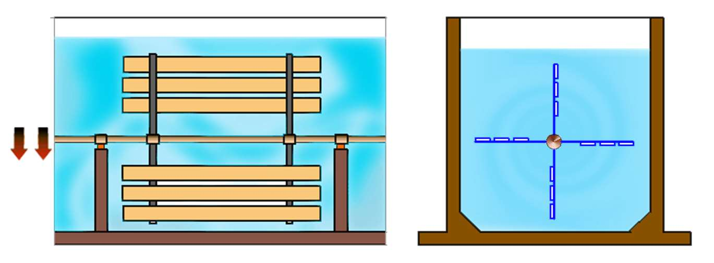
  - **Hình này chứng minh điều gì**
    - Minh họa chi tiết sơ đồ công nghệ, thông số thiết kế hoặc cấu tạo thiết bị trên slide trang 12.
  - **Từ đâu mà thấy được**
    - Trích xuất trực tiếp từ tài liệu bài giảng gốc của chương.

- Thông số và cấu tạo chi tiết theo tài liệu bài giảng (Trang 13):
  - **Hình 34.** Figure 34 (Page 13)
    - 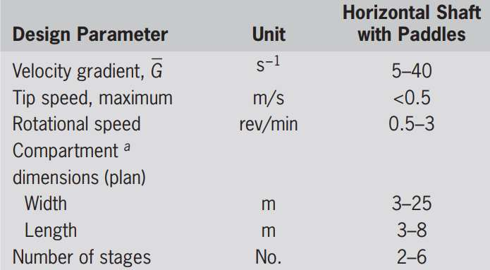
  - **Hình này chứng minh điều gì**
    - Minh họa chi tiết sơ đồ công nghệ, thông số thiết kế hoặc cấu tạo thiết bị trên slide trang 13.
  - **Từ đâu mà thấy được**
    - Trích xuất trực tiếp từ tài liệu bài giảng gốc của chương.

- Thông số và cấu tạo chi tiết theo tài liệu bài giảng (Trang 13):
  - **Hình 35.** Figure 35 (Page 13)
    - 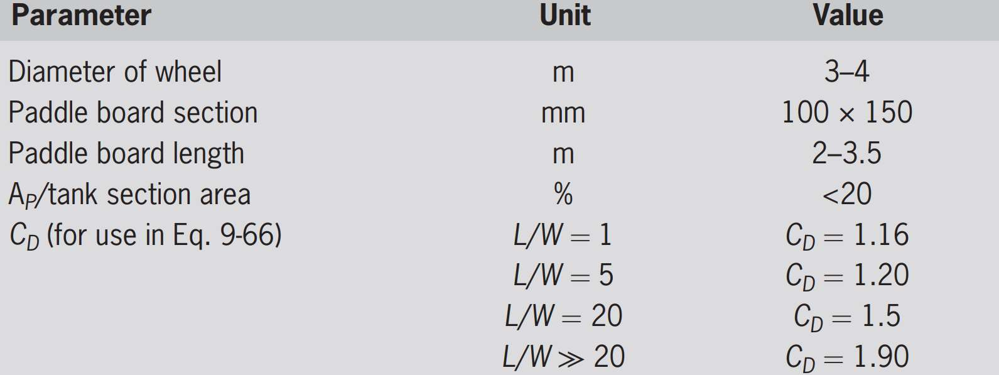
  - **Hình này chứng minh điều gì**
    - Minh họa chi tiết sơ đồ công nghệ, thông số thiết kế hoặc cấu tạo thiết bị trên slide trang 13.
  - **Từ đâu mà thấy được**
    - Trích xuất trực tiếp từ tài liệu bài giảng gốc của chương.

- Thông số và cấu tạo chi tiết theo tài liệu bài giảng (Trang 13):
  - **Hình 36.** Figure 36 (Page 13)
    - 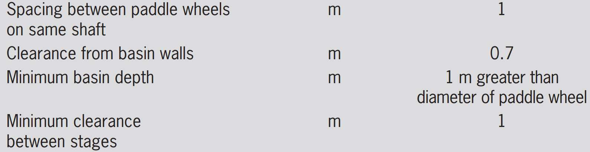
  - **Hình này chứng minh điều gì**
    - Minh họa chi tiết sơ đồ công nghệ, thông số thiết kế hoặc cấu tạo thiết bị trên slide trang 13.
  - **Từ đâu mà thấy được**
    - Trích xuất trực tiếp từ tài liệu bài giảng gốc của chương.

- Thông số và cấu tạo chi tiết theo tài liệu bài giảng (Trang 14):
  - **Hình 37.** Figure 37 (Page 14)
    - 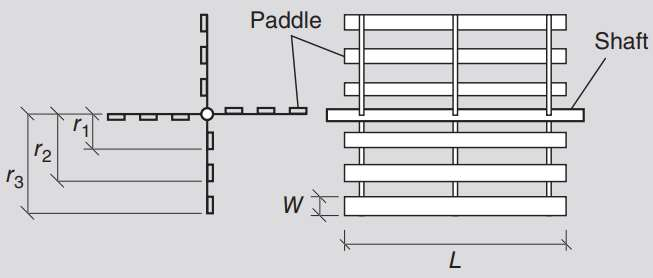
  - **Hình này chứng minh điều gì**
    - Minh họa chi tiết sơ đồ công nghệ, thông số thiết kế hoặc cấu tạo thiết bị trên slide trang 14.
  - **Từ đâu mà thấy được**
    - Trích xuất trực tiếp từ tài liệu bài giảng gốc của chương.

### Chương 4.3: Quá trình Lý - Hóa - Khử trùng Nước thải (Disinfection)

#### 1. Tổng quan về khử trùng nước thải (Overview of Disinfection)

##### Định nghĩa khử trùng, vô hiệu hóa và vị trí trong hệ thống xử lý nước thải (Disinfection Definition, Inactivation, and Implementation in WWTPs)

* Khử trùng (Disinfection) là quá trình tiêu diệt một phần và vô hiệu hóa các sinh vật gây bệnh (pathogens) trong nước thải.
    * Khử trùng khác biệt với tiệt trùng (Sterilization): Tiệt trùng là quá trình tiêu diệt hoàn toàn tất cả các sinh vật gây bệnh và các vi sinh vật khác ($100\%$ organisms destroyed).
    * Khử trùng là công đoạn hóa lý cuối cùng trong nhà máy xử lý nước thải (WWTP) trước khi xả thải ra nguồn tiếp nhận để bảo vệ sức khỏe cộng đồng.
* Vô hiệu hóa (Inactivation) làm vi sinh vật mất khả năng sinh sản và mất khả năng truyền bệnh.
    * Sơ đồ phản ứng khử trùng tổng quát:
      $$\text{Chất khử trùng (Disinfectant)} + \text{Tế bào gây bệnh (Pathogens)} \longrightarrow \text{Tế bào chết / bất hoạt (Dead cells)}$$
* Phân loại phương pháp khử trùng gồm hai nhóm chính:
    * Quá trình hóa học (Chemical processes): Bổ sung các hóa chất oxy hóa khử trùng như khí Clo ($Cl_2$), natri hypochlorite ($NaOCl$), canxi hypochlorite ($Ca(OCl)_2$), chlorine dioxide ($ClO_2$), hoặc ozone ($O_3$).
    * Quá trình vật lý (Physical processes): Sử dụng bức xạ tia cực tím (UV radiation) hoặc xử lý nhiệt.
* Dây chuyền công nghệ chuẩn có bố trí công đoạn khử trùng trong nhà máy xử lý nước thải:
    * Dây chuyền khử trùng bằng Clo (Chlorination flow train):
      $$\text{Song chắn rác (Bar screening)} \longrightarrow \text{Bể lắng cát (Grit removal)} \longrightarrow \text{Bể lắng đợt 1 (Primary clarifier)} \longrightarrow \text{Bể hiếu khí (Aeration basin)} \longrightarrow \text{Bể lắng đợt 2 (Secondary clarifier)} \longrightarrow \text{Bể tiếp xúc Clo (Chlorination contact basin)} \longrightarrow \text{Xả thải (Effluent discharge)}$$
    * Dây chuyền khử trùng bằng tia cực tím (UV disinfection flow train):
      $$\text{Tách rác và bùn} \longrightarrow \text{Bể lắng đợt 1} \longrightarrow \text{Bể phản ứng sinh học hiếu khí (Bio-reactors)} \longrightarrow \text{Bể lắng đợt 2} \longrightarrow \text{Kênh khử trùng tia UV (UV disinfection channel)} \longrightarrow \text{Xả ra nguồn nước mặt (Discharge water to river)}$$

##### Các tác nhân khử trùng và đặc tính của chất khử trùng lý tưởng (Disinfection Agents and Characteristics of Ideal Disinfectant)

* Các tác nhân khử trùng phổ biến trong xử lý nước thải:
    * Clo tự do (Free Chlorine): Tổng nồng độ acid hypochlorous ($HOCl$) và ion hypochlorite ($OCl^-$).
        * Nguồn cung cấp: Khí Clo nén lỏng ($Cl_2$) hoặc dung dịch Natri Hypochlorite ($NaOCl$).
    * Clo kết hợp (Combined Chlorine): Các hợp chất chloramine hình thành khi Clo phản ứng với amonia ($NH_3$).
        * Các dạng tồn tại: Monochloramine ($NH_2Cl$), dichloramine ($NHCl_2$), và nitrogen trichloride ($NCl_3$).
    * Chlorine Dioxide ($ClO_2$): Tác nhân oxy hóa mạnh không phụ thuộc vào $pH$ và không tạo dẫn xuất $THMs$.
    * Ozone ($O_3$): Chất oxy hóa cực mạnh, phân hủy nhanh, không để lại dư lượng khử trùng bảo vệ lâu dài.
    * Tia cực tím (UV light): Bức xạ điện từ không hóa chất, vô hiệu hóa vi sinh vật mà không tạo sản phẩm phụ độc hại.
* Tiêu chí đánh giá chất khử trùng lý tưởng (Characteristics of an ideal disinfectant):
    * Bảng tiêu chuẩn kỹ thuật cho chất khử trùng lý tưởng trong nước thải:

| Đặc tính (Characteristic) | Yêu cầu kỹ thuật / Phản ứng mong muốn (Properties / Response) |
| :--- | :--- |
| **Biến đổi đặc tính dung dịch (Alteration of solution characteristics)** | Khử trùng hiệu quả nhưng hạn chế tối đa việc làm thay đổi tính chất nước, ví dụ không làm tăng đáng kể tổng chất rắn hòa tan ($TDS$). |
| **Tính sẵn có (Availability)** | Sẵn có trên thị trường với khối lượng lớn và giá thành kinh tế hợp lý. |
| **Khả năng khử mùi (Deodorizing ability)** | Có khả năng khử mùi hôi của nước thải đồng thời trong quá trình khử trùng. |
| **Tính đồng nhất (Homogeneity)** | Hóa chất hoặc dung dịch cấp phải có thành phần và nồng độ đồng nhất. |
| **Tương tác với tạp chất ngoại lai (Interaction with extraneous material)** | Không bị tiêu hao hoặc hấp thụ bởi các chất hữu cơ khác ngoài tế bào vi sinh vật đích. |
| **Không ăn mòn và không làm ố (Noncorrosive and nonstaining)** | Không ăn mòn vật liệu kim loại công trình và không làm biến màu, hoen ố bề mặt tiếp xúc. |
| **Không độc với sinh vật bậc cao (Nontoxic to higher forms of life)** | Độc đối với vi sinh vật gây bệnh nhưng không độc hại đối với con người và thủy sinh vật bậc cao. |
| **Khả năng thâm nhập (Penetration)** | Có khả năng xuyên qua bề mặt các hạt cặn lơ lửng và màng sinh học. |
| **An toàn vận hành (Safety)** | Đảm bảo an toàn trong vận chuyển, lưu kho, bốc dỡ và châm định lượng. |
| **Độ tan (Solubility)** | Tan hoàn toàn trong nước hoặc trong mô tế bào vi sinh vật. |
| **Độ ổn định hóa học (Stability)** | Tốc độ suy giảm hoạt tính diệt khuẩn thấp khi lưu trữ trong thời gian dài. |
| **Độc tính đối với vi sinh vật (Toxicity to microorganisms)** | Có hoạt lực diệt khuẩn cao ngay cả ở nồng độ pha loãng rất lớn. |
| **Độc tính ở nhiệt độ môi trường (Toxicity at ambient temperatures)** | Giữ vững hiệu quả diệt khuẩn trong toàn bộ dải nhiệt độ môi trường tự nhiên ($0^\circ\text{C} - 40^\circ\text{C}$). |

##### So sánh các tác nhân khử trùng (Comparison of Disinfectants)

* Ba tác nhân khử trùng chủ đạo trong thực tế gồm Clo tự do, Clo kết hợp và bức xạ tia cực tím ($UV$).
* Bảng so sánh đầy đủ các đặc tính kỹ thuật giữa Clo tự do, Clo kết hợp và tia $UV$:

| Tiêu chí so sánh (Characteristic) | Clo tự do (Free Chlorine) | Clo kết hợp (Combined Chlorine) | Bức xạ UV (UV Radiation) |
| :--- | :--- | :--- | :--- |
| **Chi phí đầu tư và vận hành (Cost)** | Thấp đến trung bình (Low-Moderate) | Thấp đến trung bình (Low-Moderate) | Cao (High) |
| **Độc tính với sinh vật bậc cao (Toxic to higher forms of life)** | Rất độc (Highly toxic) | Độc (Toxic) | Độc (Toxic khi phơi nhiễm trực tiếp) |
| **Mối lo ngại an toàn (Safety concern)** | Cao (High - nguy cơ nổ, rò rỉ khí độc $Cl_2$) | Trung bình (Moderate) | Trung bình (Moderate - rủi ro điện áp cao, tia bức xạ) |
| **Làm tăng tổng chất rắn hòa tan ($TDS$)** | Có làm tăng ($TDS$ tăng do ion $Cl^-$) | Có làm tăng ($TDS$ tăng do muối clo) | Không làm tăng ($TDS$ không đổi) |
| **Hình thành sản phẩm phụ khử trùng (DBPs)** | Tạo lượng lớn $THMs$ và $HAAs$ | Chỉ tạo vết ($Traces\text{ of }THMs\text{ and }HAAs$) | Không tạo sản phẩm phụ hóa học ($None$) |
| **Hiệu quả diệt vi khuẩn (Effective for bacteria)** | Xuất sắc (Excellent) | Tốt (Good) | Tốt (Good) |
| **Hiệu quả diệt nguyên sinh động vật (Effective for protozoa)** | Trung bình đến kém (Fair to poor) | Kém (Poor) | Xuất sắc (Excellent - vô hiệu hóa *Cryptosporidium*, *Giardia*) |
| **Hiệu quả diệt virus (Effective for viruses)** | Xuất sắc (Excellent) | Trung bình (Fair) | Tốt (Good) |
| **Tình hình ứng dụng thực tế (Use as a disinfectant)** | Phổ biến rộng rãi (Common) | Phổ biến (Common) | Tăng trưởng nhanh chóng (Increasing rapidly) |

##### Cơ chế khử trùng: Phá hủy quang hóa vs Oxy hóa (Mechanisms of Disinfection: Photochemical Damage vs Oxidation)

* Cơ chế tác động của bức xạ tia cực tím ($UV$ radiation):
    * Phá hủy quang hóa $DNA$ và $RNA$ (Photochemical damage):
        * Tia $UV$ kích thích hình thành các liên kết đôi dimer (ví dụ pyrimidine dimer, thymine dimer) trên chuỗi nucleic acid.
        * Các liên kết dimer làm sai lệch cấu trúc xoắn kép của $DNA$ và $RNA$, ức chế quá trình phiên mã và nhân đôi tế bào.
    * Phổ hấp thụ quang năng tối ưu:
        * Các acid nucleic trong vi sinh vật hấp thụ năng lượng ánh sáng mạnh nhất ở dải bước sóng $\lambda = 240 - 280\text{ nm}$.
        * Bước sóng diệt khuẩn cực đại tập trung tại $\lambda \approx 254\text{ nm}$.
    * Cơ chế vô hiệu hóa tế bào (Cell inactivation):
        * Vì $DNA$ và $RNA$ mang toàn bộ thông tin di truyền cho quá trình sinh sản, tổn thương cấu trúc gen làm vi sinh vật mất hoàn toàn khả năng nhân bản và không còn khả năng gây nhiễm trùng.
* Cơ chế tác động của Clo (Chlorine oxidation):
    * Oxy hóa trực tiếp thành tế bào (Direct cell wall oxidation):
        * Clo phá vỡ cấu trúc vỏ và màng tế bào, dẫn đến hiện tượng ly giải và rò rỉ các thành phần nội bào ra môi trường bên ngoài.
    * Làm biến đổi tính thấm của màng tế bào (Modification of cell wall permeability):
        * Làm mất cân bằng thẩm thấu và rối loạn quá trình vận chuyển dưỡng chất qua màng.
    * Biến tính chất nguyên sinh (Alteration of cell protoplasm):
        * Clo kết tủa và làm đông tụ các chuỗi protein trong nguyên sinh chất.
    * Ức chế hoạt tính enzyme (Inhibition of enzyme activity):
        * Oxy hóa các nhóm thiol ($-SH$) và enzyme hô hấp nội bào, triệt tiêu chuỗi chuyển hóa năng lượng của vi sinh vật.
    * Phá hủy acid nucleic nội bào (Damage to cell DNA and RNA):
        * Các phần tử Clo tự do khuếch tán qua màng và oxy hóa trực tiếp cấu trúc bazơ nitơ của $DNA$ và $RNA$.

##### Các yếu tố ảnh hưởng đến hiệu quả khử trùng (Factors Affecting Disinfection Performance)

* Nồng độ chất khử trùng hoặc cường độ bức xạ ($C$ hoặc $I$):
    * Nồng độ hóa chất khử trùng ($C$, tính theo $\text{mg/L}$) càng cao hoặc cường độ bức xạ UV ($I$, tính theo $\text{mW/cm}^2$) càng lớn thì tốc độ và hiệu suất tiêu diệt vi sinh vật càng cao.
* Thời gian tiếp xúc ($t$):
    * Thời gian tiếp xúc giữa chất khử trùng và vi sinh vật càng dài thì mức độ vô hiệu hóa vi sinh vật càng lớn.
    * Tích số $CT = C \times t$ ($\text{mg}\cdot\text{min/L}$) hoặc liều lượng UV $D = I \times t$ ($\text{mJ/cm}^2$) là thông số quyết định mức độ bất hoạt mầm bệnh.
* Hiệu quả thủy lực của bể khử trùng (Hydraulic efficiency):
    * Cấu trúc thủy lực tiếp cận trạng thái dòng chảy nút (plug-flow) tối đa hóa hiệu quả tiếp xúc.
    * Hiện tượng dòng chảy tắt (short-circuiting) hoặc vùng ứ đọng (dead space) làm giảm thời gian lưu thực tế $t_{10}$ xuống thấp hơn thời gian lưu danh định ($HRT$), làm suy giảm nghiêm trọng hiệu quả khử trùng.
* Nhiệt độ nước thải ($T$):
    * Tăng nhiệt độ làm gia tăng tốc độ phản ứng oxy hóa và khuếch tán của chất khử trùng qua màng tế bào, giúp quá trình tiêu diệt diễn ra nhanh hơn.
    * Nhiệt độ thấp làm giảm hoạt tính khử trùng của Clo và đòi hỏi thời gian tiếp xúc dài hơn hoặc liều lượng Clo cao hơn.
* Chủng loại và trạng thái sinh lý của vi sinh vật (Type and nature of microorganisms):
    * Vi khuẩn hình thành bào tử (Bacterial spores):
        * Khi gặp tác nhân bất lợi (nhiệt độ cao, chất độc hóa học), vi khuẩn chuyển sang trạng thái vỏ bọc bào tử bảo vệ.
        * Bào tử vi khuẩn cực kỳ bền vững; các chất khử trùng hóa học thông thường ở liều tiêu chuẩn gần như không có tác dụng tiêu diệt.
    * Kháng hóa chất ở virus và nguyên sinh động vật (Protozoan cysts / oocysts):
        * U nang kén *Cryptosporidium* và *Giardia lamblia* có vỏ ngoài bằng chitin dày, kháng Clo tự do rất mạnh.
        * Cần áp dụng tác nhân khử trùng thay thế như nhiệt độ cao hoặc bức xạ tia cực tím ($UV$) để vô hiệu hóa hiệu quả các bào tử và u nang kén này.
* Bản chất của môi trường nước thải lơ lửng (Nature of suspending liquid):
    * Các thành phần vô cơ khử (Inorganic reducing constituents):
        * Các hợp chất như sắt ($Fe^{2+}$), mangan ($Mn^{2+}$), sunfua ($H_2S$, $S^{2-}$), và amonia ($NH_3$) phản ứng nhanh với chất khử trùng oxy hóa, gây tổn thất Clo khử trùng ban đầu (initial chlorine demand).
    * Hợp chất hữu cơ tự nhiên (NOM - Natural Organic Material):
        * $NOM$ tiêu tốn chất khử trùng oxy hóa, làm giảm nồng độ Clo hoạt tính và tạo ra các sản phẩm phụ khử trùng ($DBPs$).
        * Ba nguồn gốc chính sinh ra $NOM$ trong nước thải:
            1. Môi trường trên cạn (Terrestrial environment): Chủ yếu là các hợp chất humic (acid humic và acid fulvic) từ đất và thực vật phân hủy.
            2. Môi trường thủy sinh (Aquatic environment): Tảo, sinh vật phù du và các sản phẩm trao đổi chất hữu cơ ngoại bào của chúng.
            3. Vi sinh vật xử lý sinh học (Microorganisms in biological treatment): Sản phẩm trao đổi chất hòa tan ($SMP$) và mảnh vỡ tế bào sinh ra từ bể sinh học.
    * Các hợp chất hữu cơ nhân tạo khác:
        * Các chất hữu cơ tổng hợp và hóa chất công nghiệp xả vào mạng lưới thu gom nước thải.
    * Hàm lượng chất rắn lơ lửng ($SS$ - Suspended Solids):
        * Làm giảm hiệu quả khử trùng qua hai cơ chế cản trở:
            1. Cơ chế hấp phụ (Adsorption): Cặn lơ lửng hấp phụ chất khử trùng lên bề mặt, làm suy giảm nồng độ tự do trong nước.
            2. Cơ chế che chắn (Shielding / Shadowing): Cặn lơ lửng bao bọc các vi khuẩn bên trong cấu trúc hạt hoặc che bóng tia $UV$, ngăn không cho tác nhân khử trùng tiếp xúc với mầm bệnh.

- Thông số và cấu tạo chi tiết theo tài liệu bài giảng (Trang 2):
  - **Hình 1.** Figure 1 (Page 2)
    - 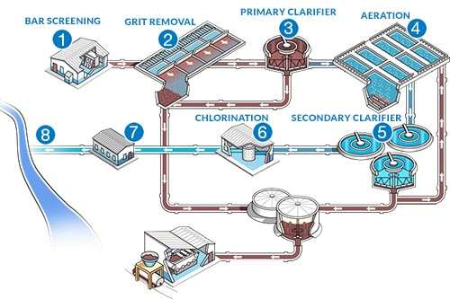
  - **Hình này chứng minh điều gì**
    - Minh họa chi tiết sơ đồ công nghệ, thông số thiết kế hoặc cấu tạo thiết bị trên slide trang 2.
  - **Từ đâu mà thấy được**
    - Trích xuất trực tiếp từ tài liệu bài giảng gốc của chương.

- Thông số và cấu tạo chi tiết theo tài liệu bài giảng (Trang 2):
  - **Hình 2.** Figure 2 (Page 2)
    - 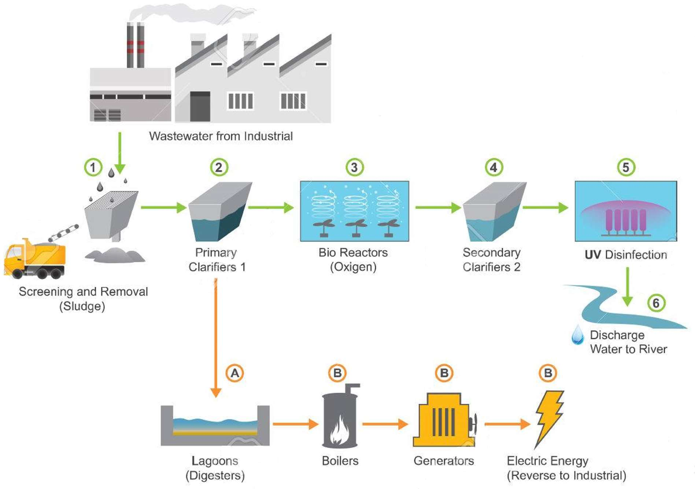
  - **Hình này chứng minh điều gì**
    - Minh họa chi tiết sơ đồ công nghệ, thông số thiết kế hoặc cấu tạo thiết bị trên slide trang 2.
  - **Từ đâu mà thấy được**
    - Trích xuất trực tiếp từ tài liệu bài giảng gốc của chương.

- Thông số và cấu tạo chi tiết theo tài liệu bài giảng (Trang 3):
  - **Hình 3.** Figure 3 (Page 3)
    - 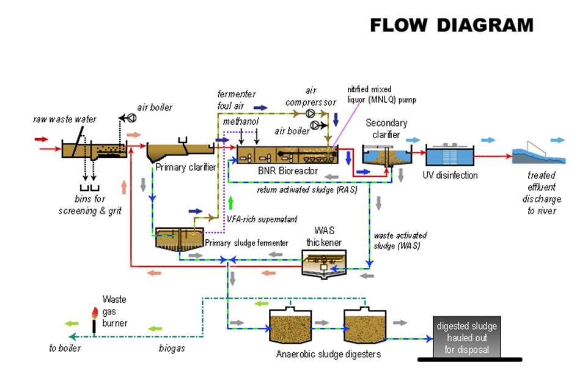
  - **Hình này chứng minh điều gì**
    - Minh họa chi tiết sơ đồ công nghệ, thông số thiết kế hoặc cấu tạo thiết bị trên slide trang 3.
  - **Từ đâu mà thấy được**
    - Trích xuất trực tiếp từ tài liệu bài giảng gốc của chương.

- Thông số và cấu tạo chi tiết theo tài liệu bài giảng (Trang 3):
  - **Hình 4.** Figure 4 (Page 3)
    - 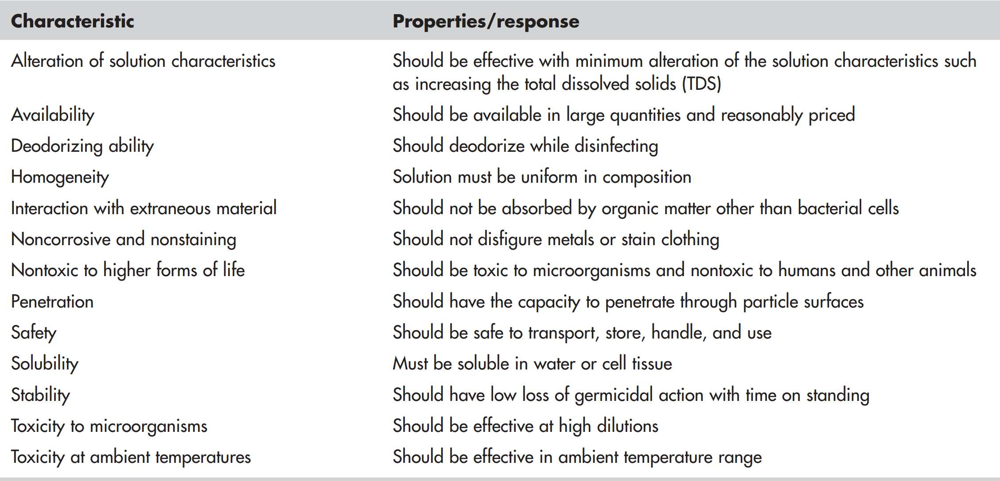
  - **Hình này chứng minh điều gì**
    - Minh họa chi tiết sơ đồ công nghệ, thông số thiết kế hoặc cấu tạo thiết bị trên slide trang 3.
  - **Từ đâu mà thấy được**
    - Trích xuất trực tiếp từ tài liệu bài giảng gốc của chương.

#### 2. Tác nhân khử trùng và Cơ chế tiêu diệt vi sinh vật (Disinfection Agents & Mechanisms)

##### Các dạng hóa chất khử trùng gốc Clo và hệ thống cấp (Chlorine Disinfection Chemicals and Feed Systems)

* Khí Clo nén lỏng ($Cl_2$ - Chlorine gas / Liquid chlorine):
    * Tính chất vật lý và hóa học cơ bản:
        * Khí màu vàng lục (yellowish green), mùi hắc nồng đặc trưng (pungent odor), có tính ăn mòn kim loại rất mạnh (corrosive).
        * Khối lượng riêng ở thể khí nặng gấp $2.5\text{ lần}$ so với không khí ($\rho_{Cl_2} \approx 2.5\,\rho_{\text{air}}$), có xu hướng chìm và tích tụ tại các hố trũng khi rò rỉ.
        * Gây tổn thương nghiêm trọng cho giác mạc và hệ hô hấp của con người ở nồng độ cao (toxic, causes eye and respiratory damage).
    * Phương thức lưu trữ và cấp hóa chất:
        * Khí Clo được nén dưới áp suất cao để chuyển sang trạng thái lỏng (liquid chlorine) và nạp vào các bình chịu áp lực chuyên dụng (high-pressure cylinders hoặc ton containers).
        * Hệ thống châm Clo (chlorination system) bao gồm thiết bị bốc hơi (evaporator), van giảm áp và điều tiết chân không (vacuum regulator), thiết bị định lượng (chlorinator) và ống phun khuếch tán (injector/ejector).
    * Phạm vi ứng dụng:
        * Được sử dụng phổ biến nhất tại các trạm và nhà máy xử lý nước thải đô thị quy mô vừa và lớn nhờ chi phí hóa chất rẻ.

* Dung dịch Natri Hypochlorite ($NaOCl$ - Sodium hypochlorite):
    * Đặc tính dung dịch và nguồn cung cấp:
        * Dạng lỏng trong suốt, màu vàng sáng (liquid, yellow, bright).
        * Có thể mua số lượng lớn ở dạng thương phẩm (nồng độ thông dụng $10 - 15\%$) hoặc sản xuất trực tiếp tại chỗ (manufactured onsite) bằng phương pháp điện phân dung dịch muối ăn ($NaCl$).
    * Tốc độ suy giảm hoạt tính và yêu cầu lưu trữ:
        * Dung dịch $NaOCl$ kém bền, tự phân hủy nhanh hơn khi ở nồng độ cao và bị phân rã mạnh bởi ánh sáng mặt trời cũng như nhiệt độ môi trường cao.
        * Động học suy giảm nồng độ thực nghiệm: Dung dịch nồng độ ban đầu $16.7\%$ lưu trữ ở nhiệt độ $26.7^\circ\text{C}$ ($80^\circ\text{F}$) mất $10\%$ hoạt tính sau $10\text{ ngày}$, mất $20\%$ sau $25\text{ ngày}$, và mất $30\%$ sau $43\text{ ngày}$.
        * Bắt buộc phải bảo quản hóa chất trong khu vực có mái che, thông thoáng, nhiệt độ thấp (cool location) và sử dụng bồn chứa bằng vật liệu chống ăn mòn chuyên dụng (corrosion-resistant tanks).
    * Chi phí kinh tế:
        * Đơn giá hóa chất thương phẩm cao hơn đáng kể so với khí Clo lỏng, dao động từ $150\%$ đến $200\%$ so với chi phí của Clo hóa lỏng ($150 - 200\%\text{ cost of liquid chlorine}$).
    * Thách thức vận hành và thiết kế đường ống:
        * Tính ăn mòn hóa học cao, dễ phát tán hơi Clo cục bộ (chlorine fumes).
        * Hiện tượng thoát khí tự do gây tắc nghẽn bóng khí trong đường ống và bơm (gas binding/off-gassing).
        * Hình thành kết tủa và đóng cặn cứng (caking) trong các tuyến ống cấp hóa chất và bơm định lượng.

* Canxi Hypochlorite rắn ($Ca(OCl)_2$ - Calcium hypochlorite):
    * Đặc tính lý hóa và độ tan:
        * Hóa chất dạng rắn màu trắng (solid, white), được sản xuất dưới dạng hạt (granules) hoặc viên nén (pellets / tablets).
        * Hàm lượng Clo hữu tính cao ($65 - 70\%\text{ available chlorine}$), độ tan trong nước đạt $21.5\text{ g}/100\text{ mL}$ ở $0^\circ\text{C}$ và $23.4\text{ g}/100\text{ mL}$ ở $40^\circ\text{C}$.
    * Yêu cầu lưu trữ an toàn:
        * Tiềm năng oxy hóa rất mạnh, dễ gây cháy nổ khi tiếp xúc với chất hữu cơ; bắt buộc bảo quản ở nơi khô ráo, thoáng mát, cách ly tuyệt đối với các hóa chất khác trong các thùng chứa chịu ăn mòn.
    * Hạn chế kỹ thuật và vận hành:
        * Giá thành hóa chất đắt hơn khí Clo lỏng và suy giảm hoạt tính dần theo thời gian bảo quản.
        * Phải hòa tan hoàn toàn thành dung dịch trước khi châm ($Ca(OCl)_2\text{ must be dissolved before being used}$), thao tác phức tạp nên không khả thi cho các công trình xử lý quy mô lớn.
        * Dễ kết tinh trở lại tạo cặn lắng vôi ($CaCO_3$, $Ca(OH)_2$), gây tắc nghẽn nghiêm trọng các bơm định lượng, đường ống dẫn và van cơ khí.
    * Phạm vi ứng dụng:
        * Sử dụng phổ biến nhất tại các trạm xử lý nước thải quy mô nhỏ dưới dạng viên nén khô (dry form tablets), thuận tiện cho công nhân thao tác trực tiếp.

##### Thủy lực và cấu tạo bể tiếp xúc khử trùng (Disinfection Contact Tank Hydraulics and Flow Control)

* Mục tiêu thiết kế thủy lực bể tiếp xúc:
    * Đảm bảo thời gian tiếp xúc thực tế ($t_{10}$) giữa chất khử trùng và nước thải tiệm cận thời gian lưu nước danh định ($HRT$).
    * Thiết lập chế độ thủy lực dòng chảy nút (plug-flow), hạn chế tối đa các hiện tượng ngắn mạch (short-circuiting), xoáy cuộn phân tán và vùng ứ đọng chết (dead spaces).
* Các giải pháp kiểm soát dòng chảy trong bể tiếp xúc (Flow control measures):
    * Sử dụng vách uốn góc (fillets): Bo tròn các góc vuông của bể để loại bỏ góc chết thủy lực và hạn chế hình thành xoáy tĩnh.
    * Sử dụng cấu trúc đầu búa (hammerhead) và cánh hướng dòng (turning vanes):
        * Đặt tại các vị trí đổi hướng dòng chảy của mương tiếp xúc ngoằn ngoèo để định hướng các đường dòng song song, ngăn chặn sự tách dòng và xoáy thứ cấp.
    * Tường khuếch tán đục lỗ (diffusion wall / baffle wall):
        * Bố trí ở đầu vào bể tiếp xúc để phân bổ đều vận tốc dòng chảy trên toàn bộ tiết diện ướt, dập tắt các xung động thủy lực cục bộ.
* Cấu tạo hình học của bể tiếp xúc khử trùng (Disinfection contact basin):
    * Bể được chia thành nhiều ngăn ngoằn ngoèo nối tiếp nhau (serpentine baffled basin) với tỷ số chiều dài trên chiều rộng tổng thể ($L/W$) lớn (thường $\ge 40:1$), tạo dòng chảy tuần tự ổn định.

##### Hóa học phản ứng của Clo trong môi trường nước (Chlorine Chemistry and Reactions in Water)

* Phản ứng thủy phân của khí Clo trong nước:
    * Khí Clo hòa tan trong nước phản ứng thủy phân nhanh chóng tạo thành acid hypochlorous ($HOCl$), ion hydro ($H^+$) và ion clorua ($Cl^-$):
      $$Cl_2 + H_2O \rightleftharpoons HOCl + H^+ + Cl^-$$
    * Acid hypochlorous ($HOCl$) là một acid yếu, tiếp tục phân ly thuận nghịch giải phóng proton và ion hypochlorite ($OCl^-$):
      $$HOCl \rightleftharpoons H^+ + OCl^-$$
    * Hằng số điện ly acid $K_a \approx 2.7 \times 10^{-8}$ ở $20^\circ\text{C}$ ($pK_a \approx 7.53$).
* Phân bố các dạng Clo tự do phụ thuộc theo giá trị $pH$:
    * Vùng $pH < 3.3$: Phản ứng thủy phân không hoàn toàn, Clo phân tử hòa tan ($Cl_2$) là dạng chiếm ưu thế (predominant).
    * Vùng $3.3 < pH < 7.5$: Acid hypochlorous ($HOCl$) là dạng chiếm ưu thế tuyệt đối trong dung dịch.
    * Vùng $pH = 7.5$: Nồng độ $HOCl$ và ion $OCl^-$ cân bằng nhau ($50\% HOCl$ và $50\% OCl^-$).
    * Vùng $pH > 7.5$: Ion hypochlorite ($OCl^-$) là dạng chiếm ưu thế.
* Phản ứng của hóa chất Hypochlorite trong nước:
    * Khi châm Natri Hypochlorite ($NaOCl$) vào nước, phản ứng thủy phân diễn ra như sau:
      $$NaOCl + H_2O \rightleftharpoons HOCl + NaOH$$
      $$HOCl \rightleftharpoons H^+ + OCl^-$$
    * Phản ứng thủy phân muối hypochlorite sinh ra bazơ mạnh ($NaOH$), làm tăng giá trị $pH$ của nước thải, dịch chuyển cân bằng về phía tạo thành ion $OCl^-$ kém hoạt tính diệt khuẩn hơn.

##### Phản ứng giữa Clo với Amonia và phân loại các dạng Clo (Reactions with Ammonia and Chlorine Species)

* Nguồn nitơ trong nước thải phản ứng với Clo:
    * Nước thải thô chưa xử lý chứa hàm lượng nitơ đáng kể dưới dạng amonia tự do ($NH_3$), amoni ($NH_4^+$) và các hợp chất nitơ hữu cơ hòa tan.
    * Nước thải sau xử lý sinh học (effluent) của phần lớn các nhà máy vẫn còn tồn lưu nồng độ $NH_3$ và $NH_4^+$ nhất định (hoặc nitrate hóa thành $NO_3^-$ nếu nhà máy có công đoạn nitrat hóa hoàn toàn).
* Chuỗi phản ứng hình thành Chloramine (Chloramine formation):
    * Do acid hypochlorous ($HOCl$) là chất oxy hóa rất mạnh, nó phản ứng liên tiếp với amonia theo chuỗi phản ứng thế gốc clo:
        1. Phản ứng tạo Monochloramine ($NH_2Cl$):
           $$NH_3 + HOCl \rightleftharpoons NH_2Cl + H_2O$$
        2. Phản ứng tạo Dichloramine ($NHCl_2$):
           $$NH_2Cl + HOCl \rightleftharpoons NHCl_2 + H_2O$$
        3. Phản ứng tạo Nitrogen trichloride ($NCl_3$ - Trichloramine):
           $$NHCl_2 + HOCl \rightleftharpoons NCl_3 + H_2O$$
    * Sự phân bố tỷ lệ giữa $NH_2Cl$, $NHCl_2$ và $NCl_3$ phụ thuộc chặt chẽ vào tỷ lệ mol $Cl_2 : NH_3$, giá trị $pH$, nhiệt độ và thời gian phản ứng. Ở $pH > 7$ và tỷ lệ $Cl_2:NH_3 \le 1:1$, monochloramine là dạng ưu thế.
* Phân loại các dạng Clo tồn tại trong nước:
    * Clo tự do (Free chlorine): Tổng nồng độ của acid hypochlorous và ion hypochlorite chưa phản ứng với hợp chất nitơ:
      $$\text{Free chlorine} = [HOCl] + [OCl^-]$$
    * Clo kết hợp (Combined chlorine): Tổng nồng độ của các hợp chất chloramine:
      $$\text{Combined chlorine} = [NH_2Cl] + [NHCl_2] + [NCl_3]$$
    * Tổng Clo dư (Total chlorine): Tổng nồng độ của Clo tự do và Clo kết hợp:
      $$\text{Total chlorine} = \text{Free chlorine} + \text{Combined chlorine}$$
* Quy ước biểu diễn nồng độ Clo:
    * Tất cả các hợp chất và ion Clo đều được tính toán và biểu diễn dưới đơn vị quy đổi đương lượng $\text{mg/L as } Cl_2$ ($\text{mg } Cl_2/\text{L}$).
    * Công thức chuyển đổi từ nồng độ mol sang nồng độ đương lượng $Cl_2$:
      $$[\text{Species}]\,(\text{mg/L as } Cl_2) = [\text{Species}]\,(\text{mM}) \times 71\,(\text{mg/mmol})$$
      * Trong đó $71\text{ mg/mmol}$ là phân tử khối của khí Clo ($Cl_2$).
      * Ví dụ: $[OCl^-]\,(\text{mg/L as } Cl_2) = [OCl^-]\,(\text{mM}) \times 71\,(\text{mg/mmol})$.

##### Hoạt lực khử trùng tương đối và cơ chế tác động của các dạng Clo (Relative Disinfection Efficacy of Chlorine Species)

* Phân tích hoạt lực của các dạng Clo tự do:
    * Clo phân tử ($Cl_2$):
        * Là chất khí hòa tan mạnh trong nước nhưng ở điều kiện nước ngọt và $pH$ trung tính ($6.5 - 8.5$), $Cl_2$ bị thủy phân gần như tức thời nên không phải dạng khử trùng tồn tại chủ yếu.
    * Acid Hypochlorous ($HOCl$):
        * Là dạng chất khử trùng hữu hiệu mạnh nhất trong nhóm các hợp chất Clo.
        * Phân tử $HOCl$ mang điện tích trung hòa và có kích thước phân tử nhỏ, dễ dàng khuếch tán và thẩm thấu thụ động qua màng lipid kép tích điện âm của tế bào vi sinh vật để tấn công cấu trúc nội bào.
    * Ion Hypochlorite ($OCl^-$):
        * Có tính oxy hóa nhưng hiệu lực diệt khuẩn thấp hơn $HOCl$ rất nhiều.
        * Ion $OCl^-$ mang điện tích âm, chịu lực đẩy tĩnh điện từ màng tế bào vi khuẩn (vốn tích điện âm), làm giảm đáng kể khả năng xâm nhập qua màng sinh học.
    * Tương quan hiệu lực giữa $HOCl$ và $OCl^-$:
        * Tỷ lệ $HOCl / OCl^-$ bị chi phối nghiêm ngặt bởi $pH$ dung dịch.
        * Hoạt lực diệt khuẩn của $HOCl$ cao hơn khoảng $100\text{ lần}$ so với ion $OCl^-$ ($HOCl\text{ is about 100 times more effective than }OCl^-$).
        * Khi $pH$ tăng từ $7.0$ lên $8.5$, hoạt tính khử trùng của Clo tự do sụt giảm nghiêm trọng do sự dịch chuyển cân bằng từ $HOCl$ sang $OCl^-$.
* Phân tích hoạt lực của nhóm Clo kết hợp (Chloramines):
    * Hoạt lực diệt khuẩn tương đối:
        * Các hợp chất Chloramine ($NH_2Cl$, $NHCl_2$, $NCl_3$) có hoạt lực diệt khuẩn yếu hơn đáng kể so với $HOCl$ và $OCl^-$, đòi hỏi thời gian tiếp xúc $T$ dài hơn hoặc nồng độ $C$ cao hơn nhiều lần để đạt cùng hiệu quả tiêu diệt mầm bệnh.
    * Độ bền hóa học và khả năng duy trì bảo vệ:
        * Chloramine có tốc độ phân hủy chậm và phản ứng kém hơn với các chất hữu cơ tự nhiên.
        * Chloramine duy trì nồng độ clo dư ổn định trong thời gian dài hơn (persist for a longer period), hạn chế hiện tượng tái sinh vi khuẩn (bacterial regrowth) trong hệ thống dẫn nước.

##### Quá trình Clo hóa điểm đột biến (Breakpoint Chlorination Process)

* Khái niệm và mục tiêu của phản ứng điểm đột biến:
    * Clo hóa điểm đột biến (Breakpoint chlorination) là quá trình châm một lượng Clo đủ lớn vào nước thải để oxy hóa toàn bộ các hợp chất khử vô cơ và toàn bộ amonia, đảm bảo lượng Clo bổ sung vượt qua điểm này sẽ tồn tại bền vững ở dạng Clo tự do dư (residual free chlorine).
* Diễn biến 4 giai đoạn trên đường cong Clo hóa điểm đột biến (Breakpoint Curve):
    * Trục tọa độ: Trục hoành biểu thị lượng Clo châm vào ($\text{Chlorine added, mg/L}$); trục tung biểu thị nồng độ Clo dư đo được ($\text{Chlorine residual, mg/L}$).
    * Giai đoạn 1 (Đoạn $O - A$: Tiêu thụ Clo bởi chất khử vô cơ):
        * Clo phản ứng ngay lập tức và bị khử thành ion clorua ($Cl^-$) bởi các tác nhân khử mạnh như sắt ($Fe^{2+}$), mangan ($Mn^{2+}$), sunfua ($H_2S$), và nitrite ($NO_2^-$).
        * Nồng độ Clo dư đo được bằng $0$ ($Zero chlorine residual$).
    * Giai đoạn 2 (Đoạn $A - B$: Hình thành Clo kết hợp):
        * Sau khi các chất khử bị oxy hóa hết tại điểm $A$, Clo phản ứng với amonia hòa tan để tạo thành các hợp chất chloramine (chủ yếu là $NH_2Cl$).
        * Nồng độ Clo dư kết hợp tăng tuyến tính và đạt cực đại tại điểm $B$.
        * Đặc điểm tỷ lệ tại đỉnh $B$:
            * Tỷ lệ mol: $Cl_2 / NH_3 = 1 : 1$.
            * Tỷ lệ khối lượng: $Cl_2 : NH_3\text{-N} \approx 5 : 1$ ($\text{weight ratio} = 5$).
            * Trạng thái Clo dư: Clo kết hợp bền vững (stable combined chlorine).
    * Giai đoạn 3 (Đoạn $B - C$: Phá hủy Clo kết hợp):
        * Khi tiếp tục châm thêm Clo vượt quá đỉnh $B$, Clo dư oxy hóa các chloramine thành khí nitơ giải phóng ra môi trường:
          $$2NH_2Cl + HOCl \longrightarrow N_2 \uparrow + 3HCl + H_2O$$
        * Nồng độ Clo dư sụt giảm nhanh chóng do sự phân hủy của chloramine, tạo thành vùng Clo kết hợp không bền (unstable combined chlorine).
        * Cực tiểu $C$ chính là điểm đột biến (Breakpoint).
        * Đặc điểm tỷ lệ tại điểm đột biến $C$:
            * Tỷ lệ mol: $Cl_2 / NH_3 = 1.5 : 1$.
            * Tỷ lệ khối lượng lý thuyết: $Cl_2 : NH_3\text{-N} \approx 7.6 : 1$ ($\text{weight ratio} = 7.6$). Trong thực tế nước thải, do có các phản ứng cạnh tranh khác, tỷ lệ khối lượng thực tế dao động từ $8:1$ đến $10:1$.
            * Toàn bộ amonia và chloramine bị oxy hóa và tiêu thụ hoàn toàn.
    * Giai đoạn 4 (Sau điểm $C$: Hình thành Clo tự do dư):
        * Mọi lượng Clo bổ sung sau điểm $C$ không còn bị tiêu hao bởi amonia hay chất khử, đường biểu diễn đi lên theo góc dốc $45^\circ$ (tỷ lệ $1:1$).
        * Clo dư trong vùng này tồn tại chủ yếu dưới dạng Clo tự do hữu hiệu ($HOCl$ và $OCl^-$).

* Tác động của Clo hóa điểm đột biến đến chất lượng nước:
    * Tiêu hao độ kiềm và sinh acid (Acid generation & Alkalinity consumption):
        * Quá trình oxy hóa amonia và thủy phân Clo giải phóng lượng lớn ion hydronium ($H^+$), làm sụt giảm nghiêm trọng $pH$ nếu nước thải thiếu hệ đệm.
        * Thông số định lượng: Cứ mỗi $1.0\text{ mg/L}$ amonia tính theo nitơ ($NH_3\text{-N}$) bị oxy hóa hoàn toàn trong quá trình Clo hóa điểm đột biến sẽ tiêu tốn chính xác $14.3\text{ mg/L}$ độ kiềm của nước thải, tính theo đương lượng $CaCO_3$ ($1.0\text{ mg/L } NH_3\text{-N consumes } 14.3\text{ mg/L of alkalinity as } CaCO_3$).
    * Gia tăng hàm lượng tổng chất rắn hòa tan ($TDS$ increment):
        * Việc châm liều lượng lớn khí Clo hoặc hypochlorite cùng với việc châm hóa chất kiềm (như vôi $Ca(OH)_2$ hoặc xút $NaOH$) để trung hòa acid sinh ra sẽ đưa vào nước một lượng lớn các ion hòa tan ($Cl^-$, $Na^+$, $Ca^{2+}$), làm tăng đáng kể tổng chất rắn hòa tan ($TDS$) trong dòng xả.

##### Khái niệm giá trị CT và ứng dụng thiết kế hệ thống khử trùng (CT Concept and Disinfection System Design)

* Định nghĩa và vai trò của giá trị $CT$:
    * Giá trị $CT$ là tích số giữa nồng độ chất khử trùng dư hữu hiệu ($C$) và thời gian tiếp xúc thực tế ($T$).
    * Hai ứng dụng cốt lõi của giá trị $CT$:
        1. Đánh giá hiệu quả tiêu diệt và vô hiệu hóa các loài vi sinh vật gây bệnh (Assessing disinfection efficiency).
        2. Thiết kế hệ thống bể khử trùng: Làm căn cứ tính toán nồng độ chất khử trùng cần châm ($C$) và thời gian lưu tiếp xúc cần thiết ($T$).
* Công thức toán học:
  $$CT\,(\text{mg}\cdot\text{min/L}) = C\,(\text{mg/L}) \times T\,(\text{min})$$
    * Trong đó:
        * $C$: Nồng độ chất khử trùng tồn lưu trong bể tiếp xúc ($\text{mg/L}$).
        * $T$: Thời gian tiếp xúc hiệu dụng (thường sử dụng giá trị $t_{10}$ của bể tiếp xúc, biểu thị thời gian mà $90\%$ phần tử nước lưu lại trong bể, tính bằng phút).
* Các yếu tố ảnh hưởng trực tiếp đến giá trị $CT$ yêu cầu:
    * Chủng loại chất khử trùng (Type of disinfectant): Các chất oxy hóa mạnh như Ozone ($O_3$) hay Clo tự do ($HOCl$) có giá trị $CT$ yêu cầu thấp hơn nhiều so với Chloramine.
    * Chủng loại và cấu trúc vi sinh vật (Type of microorganism): Vi khuẩn thực vật (vegetative bacteria) đòi hỏi $CT$ thấp; virus đòi hỏi $CT$ trung bình; trong khi bào tử vi khuẩn và u nang nguyên sinh động vật (*Giardia*, *Cryptosporidium*) đòi hỏi giá trị $CT$ rất cao.
    * Điều kiện môi trường nước thải (Environmental conditions):
        * Nhiệt độ nước thải ($T^\circ\text{C}$): Nhiệt độ thấp làm giảm tốc độ phản ứng, đòi hỏi giá trị $CT$ lớn hơn.
        * Giá trị $pH$: Chi phối trực tiếp tỷ lệ $HOCl / OCl^-$, $pH$ cao làm tăng giá trị $CT$ yêu cầu.
        * Các hợp chất cản trở trong nước: Chất hữu cơ hòa tan ($NOM$) và hàm lượng chất rắn lơ lửng ($SS$) làm tiêu hao hóa chất và che chắn mầm bệnh.

##### Đánh giá công nghệ khử trùng Clo và kiểm soát sản phẩm phụ (Chlorination Technology Evaluation and Disinfection By-Products)

* Bảng đánh giá ưu điểm và nhược điểm của công nghệ khử trùng bằng Clo:

| Tiêu chí | Ưu điểm (Advantages) | Nhược điểm (Disadvantages) |
| :--- | :--- | :--- |
| **Độ tin cậy công nghệ** | Là công nghệ truyền thống, hoàn thiện và được kiểm chứng lâu đời trên toàn thế giới (Well-established technology). | Khí Clo là hóa chất nguy hiểm độc hại bậc cao, đe dọa an toàn lao động và cộng đồng khi xảy ra sự cố rò rỉ (Hazardous chemical). |
| **Hiệu quả diệt khuẩn** | Có hoạt lực khử trùng mạnh mẽ đối với hầu hết các loài vi khuẩn và virus gây bệnh thông thường (Effective disinfectant). | Không hiệu quả đối với u nang *Cryptosporidium* (Not effective disinfectant for *Cryptosporidium*). |
| **Kiểm soát dư lượng** | Có thể đo đạc, theo dõi và duy trì lượng Clo dư bảo vệ liên tục trong hệ thống dẫn (Residual can be monitored and maintained). | Tồn lưu độc tính của Clo dư đối với đời sống thủy sinh ở nguồn tiếp nhận, bắt buộc phải khử clo (Dechlorination) trước khi xả thải. |
| **Kinh tế & Đầu tư** | Chi phí đầu tư ban đầu thấp so với các công nghệ khử trùng tiên tiến khác như Ozone hay UV (Low capital cost). | Đòi hỏi thời gian tiếp xúc dài ($15 - 45\text{ phút}$), yêu cầu thể tích bể tiếp xúc lớn (Long contact time required). |
| **Lựa chọn hóa chất** | Sẵn có dạng Natri Hypochlorite lỏng an toàn hơn nhiều so với khí Clo ($NaOCl$ is safer than chlorine gas). | Dạng Clo kết hợp (chloramines) có hiệu lực khử trùng thấp, đòi hỏi liều lượng cao. |
| **Khả năng tự chủ** | Dung dịch hypochlorite có thể sản xuất trực tiếp tại trạm bằng thiết bị điện phân muối ăn (Hypochlorite can be generated onsite). | Phản ứng với chất hữu cơ tự nhiên sinh ra các sản phẩm phụ khử trùng ($DBPs$) có nguy cơ gây ung thư. |

* Sản phẩm phụ khử trùng ($DBPs$ - Disinfection By-Products):
    * Cơ chế và bản chất hóa học của $DBPs$:
        * $DBPs$ hình thành từ chuỗi phản ứng phức tạp giữa Clo tự do ($free chlorine$) và nhóm các acid hữu cơ tự nhiên (Natural Organic Matter - $NOM$), chủ yếu là acid humic và acid fulvic tồn lưu trong nước thải.
        * Các nhóm $DBPs$ độc hại phổ biến nhất gồm:
            * Trihalomethanes ($THMs$): Điển hình là Chloroform ($CHCl_3$), bromoform ($CHBr_3$), bromodichloromethane ($CHBrCl_2$), dibromochloromethane ($CHBr_2Cl$).
            * Haloacetic acids ($HAAs$): Bao gồm acid monochloroacetic ($MCAA$), dichloroacetic ($DCAA$), trichloroacetic ($TCAA$), monobromoacetic ($MBAA$), dibromoacetic ($DBAA$).
        * Tác hại sinh học: Chloroform và các hợp chất $THMs$, $HAAs$ là các chất độc mãn tính và đã được chứng minh có khả năng gây đột biến gen và ung thư (carcinogens).
* Chiến lược kiểm soát và giảm thiểu phát sinh $DBPs$:
    * Kiểm soát châm Clo tự do: Biện pháp nguyên lý quan trọng nhất là hạn chế hoặc tránh châm trực tiếp Clo tự do vào dòng nước thải có nồng độ chất hữu cơ cao (avoid direct addition of free chlorine).
    * Ứng dụng Chloramines:
        * Sử dụng Clo kết hợp (chloramination) để thay thế Clo tự do trong các công đoạn nhạy cảm.
        * Do chloramines có ái lực oxy hóa yếu hơn đối với các phân tử hữu cơ phức tạp, phản ứng tạo dẫn xuất $THMs$ và $HAAs$ bị ức chế đáng kể, giảm thiểu nồng độ $DBPs$ trong nguồn xả.

- Thông số và cấu tạo chi tiết theo tài liệu bài giảng (Trang 7):
  - **Hình 5.** Figure 5 (Page 7)
    - 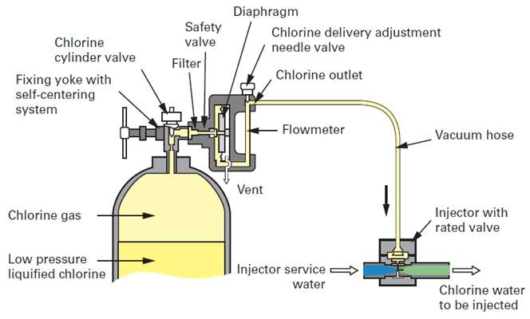
  - **Hình này chứng minh điều gì**
    - Minh họa chi tiết sơ đồ công nghệ, thông số thiết kế hoặc cấu tạo thiết bị trên slide trang 7.
  - **Từ đâu mà thấy được**
    - Trích xuất trực tiếp từ tài liệu bài giảng gốc của chương.

- Thông số và cấu tạo chi tiết theo tài liệu bài giảng (Trang 7):
  - **Hình 6.** Figure 6 (Page 7)
    - 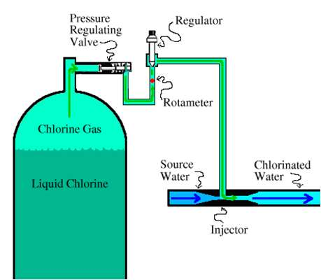
  - **Hình này chứng minh điều gì**
    - Minh họa chi tiết sơ đồ công nghệ, thông số thiết kế hoặc cấu tạo thiết bị trên slide trang 7.
  - **Từ đâu mà thấy được**
    - Trích xuất trực tiếp từ tài liệu bài giảng gốc của chương.

- Thông số và cấu tạo chi tiết theo tài liệu bài giảng (Trang 7):
  - **Hình 7.** Figure 7 (Page 7)
    - 
  - **Hình này chứng minh điều gì**
    - Minh họa chi tiết sơ đồ công nghệ, thông số thiết kế hoặc cấu tạo thiết bị trên slide trang 7.
  - **Từ đâu mà thấy được**
    - Trích xuất trực tiếp từ tài liệu bài giảng gốc của chương.

- Thông số và cấu tạo chi tiết theo tài liệu bài giảng (Trang 8):
  - **Hình 8.** Figure 8 (Page 8)
    - 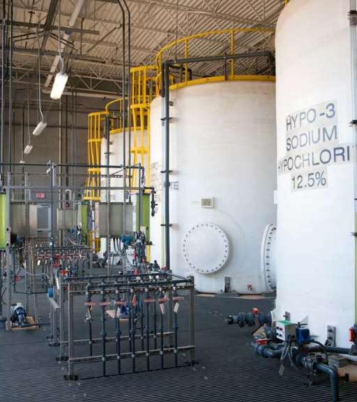
  - **Hình này chứng minh điều gì**
    - Minh họa chi tiết sơ đồ công nghệ, thông số thiết kế hoặc cấu tạo thiết bị trên slide trang 8.
  - **Từ đâu mà thấy được**
    - Trích xuất trực tiếp từ tài liệu bài giảng gốc của chương.

- Thông số và cấu tạo chi tiết theo tài liệu bài giảng (Trang 8):
  - **Hình 9.** Figure 9 (Page 8)
    - 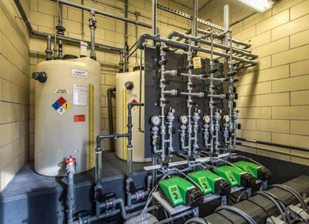
  - **Hình này chứng minh điều gì**
    - Minh họa chi tiết sơ đồ công nghệ, thông số thiết kế hoặc cấu tạo thiết bị trên slide trang 8.
  - **Từ đâu mà thấy được**
    - Trích xuất trực tiếp từ tài liệu bài giảng gốc của chương.

- Thông số và cấu tạo chi tiết theo tài liệu bài giảng (Trang 9):
  - **Hình 10.** Figure 10 (Page 9)
    - 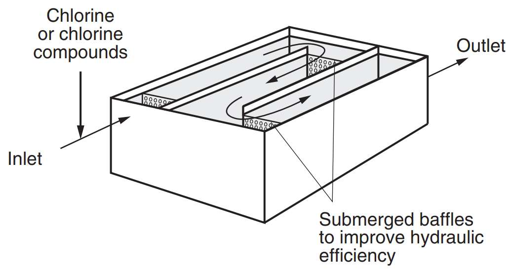
  - **Hình này chứng minh điều gì**
    - Minh họa chi tiết sơ đồ công nghệ, thông số thiết kế hoặc cấu tạo thiết bị trên slide trang 9.
  - **Từ đâu mà thấy được**
    - Trích xuất trực tiếp từ tài liệu bài giảng gốc của chương.

- Thông số và cấu tạo chi tiết theo tài liệu bài giảng (Trang 9):
  - **Hình 11.** Figure 11 (Page 9)
    - 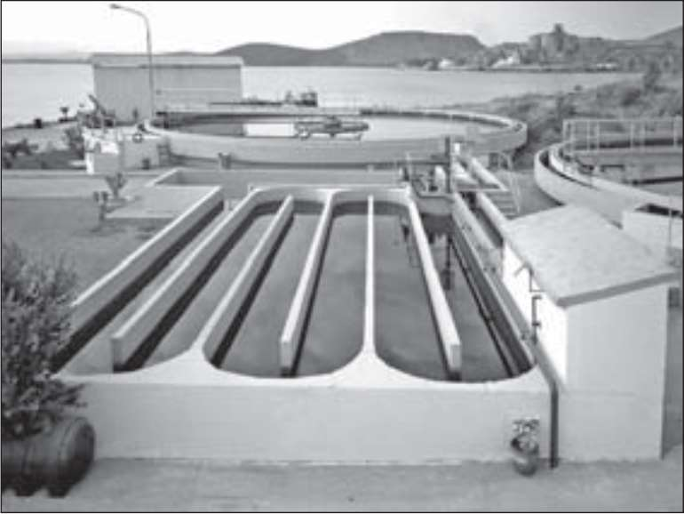
  - **Hình này chứng minh điều gì**
    - Minh họa chi tiết sơ đồ công nghệ, thông số thiết kế hoặc cấu tạo thiết bị trên slide trang 9.
  - **Từ đâu mà thấy được**
    - Trích xuất trực tiếp từ tài liệu bài giảng gốc của chương.

- Thông số và cấu tạo chi tiết theo tài liệu bài giảng (Trang 9):
  - **Hình 12.** Figure 12 (Page 9)
    - 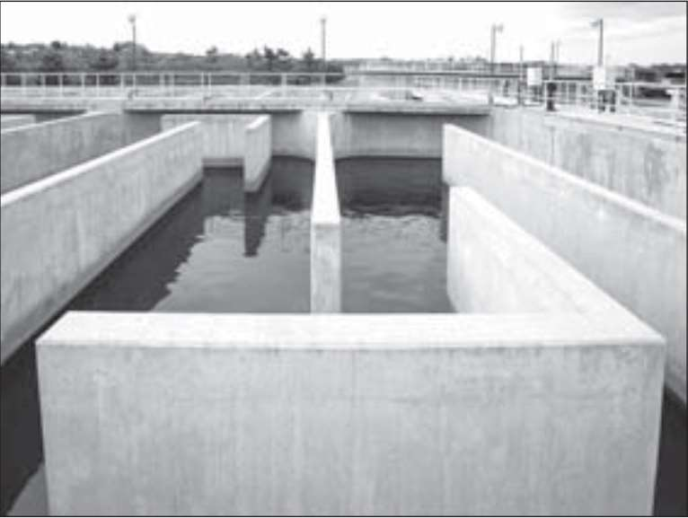
  - **Hình này chứng minh điều gì**
    - Minh họa chi tiết sơ đồ công nghệ, thông số thiết kế hoặc cấu tạo thiết bị trên slide trang 9.
  - **Từ đâu mà thấy được**
    - Trích xuất trực tiếp từ tài liệu bài giảng gốc của chương.

- Thông số và cấu tạo chi tiết theo tài liệu bài giảng (Trang 10):
  - **Hình 13.** Figure 13 (Page 10)
    - 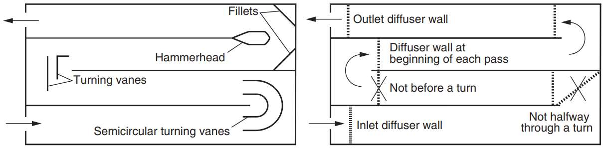
  - **Hình này chứng minh điều gì**
    - Minh họa chi tiết sơ đồ công nghệ, thông số thiết kế hoặc cấu tạo thiết bị trên slide trang 10.
  - **Từ đâu mà thấy được**
    - Trích xuất trực tiếp từ tài liệu bài giảng gốc của chương.

- Thông số và cấu tạo chi tiết theo tài liệu bài giảng (Trang 10):
  - **Hình 14.** Figure 14 (Page 10)
    - 
  - **Hình này chứng minh điều gì**
    - Minh họa chi tiết sơ đồ công nghệ, thông số thiết kế hoặc cấu tạo thiết bị trên slide trang 10.
  - **Từ đâu mà thấy được**
    - Trích xuất trực tiếp từ tài liệu bài giảng gốc của chương.

- Thông số và cấu tạo chi tiết theo tài liệu bài giảng (Trang 10):
  - **Hình 15.** Figure 15 (Page 10)
    - 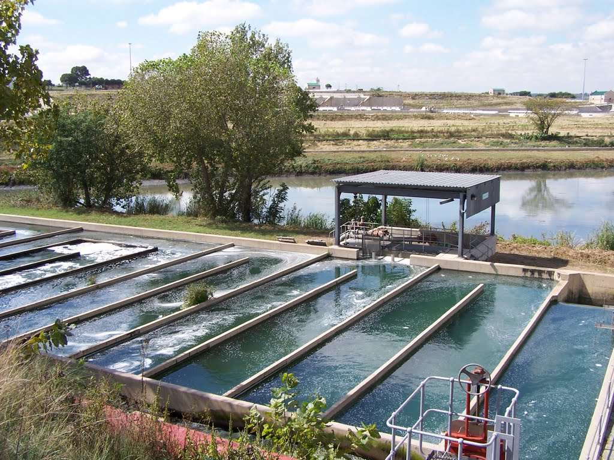
  - **Hình này chứng minh điều gì**
    - Minh họa chi tiết sơ đồ công nghệ, thông số thiết kế hoặc cấu tạo thiết bị trên slide trang 10.
  - **Từ đâu mà thấy được**
    - Trích xuất trực tiếp từ tài liệu bài giảng gốc của chương.

- Thông số và cấu tạo chi tiết theo tài liệu bài giảng (Trang 11):
  - **Hình 16.** Figure 16 (Page 11)
    - 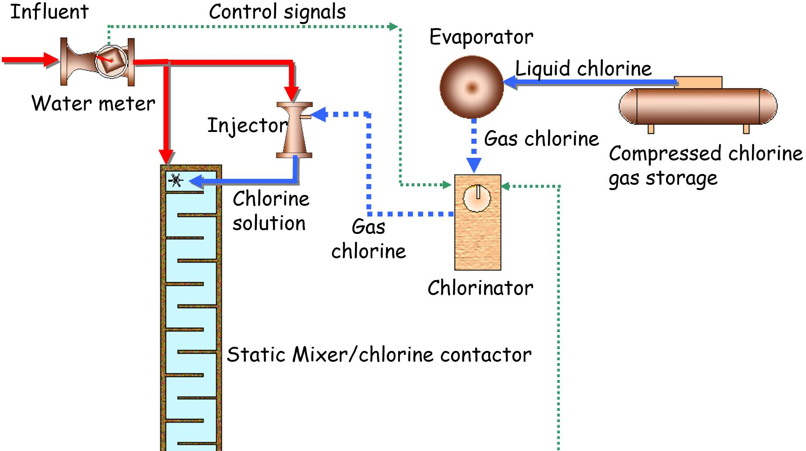
  - **Hình này chứng minh điều gì**
    - Minh họa chi tiết sơ đồ công nghệ, thông số thiết kế hoặc cấu tạo thiết bị trên slide trang 11.
  - **Từ đâu mà thấy được**
    - Trích xuất trực tiếp từ tài liệu bài giảng gốc của chương.

- Thông số và cấu tạo chi tiết theo tài liệu bài giảng (Trang 11):
  - **Hình 17.** Figure 17 (Page 11)
    - 
  - **Hình này chứng minh điều gì**
    - Minh họa chi tiết sơ đồ công nghệ, thông số thiết kế hoặc cấu tạo thiết bị trên slide trang 11.
  - **Từ đâu mà thấy được**
    - Trích xuất trực tiếp từ tài liệu bài giảng gốc của chương.

- Thông số và cấu tạo chi tiết theo tài liệu bài giảng (Trang 11):
  - **Hình 18.** Figure 18 (Page 11)
    - 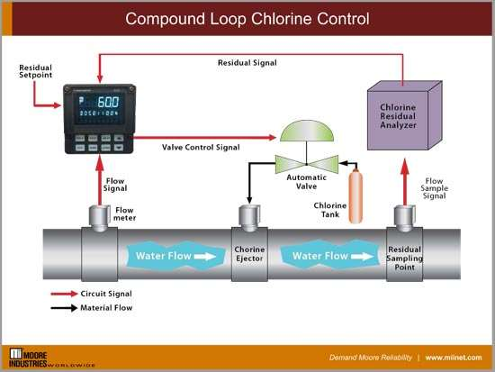
  - **Hình này chứng minh điều gì**
    - Minh họa chi tiết sơ đồ công nghệ, thông số thiết kế hoặc cấu tạo thiết bị trên slide trang 11.
  - **Từ đâu mà thấy được**
    - Trích xuất trực tiếp từ tài liệu bài giảng gốc của chương.

- Thông số và cấu tạo chi tiết theo tài liệu bài giảng (Trang 11):
  - **Hình 19.** Figure 19 (Page 11)
    - 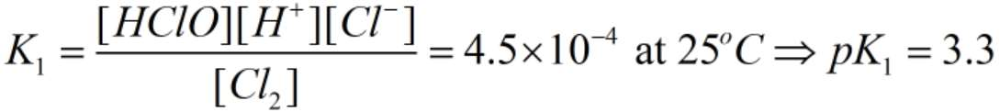
  - **Hình này chứng minh điều gì**
    - Minh họa chi tiết sơ đồ công nghệ, thông số thiết kế hoặc cấu tạo thiết bị trên slide trang 11.
  - **Từ đâu mà thấy được**
    - Trích xuất trực tiếp từ tài liệu bài giảng gốc của chương.

- Thông số và cấu tạo chi tiết theo tài liệu bài giảng (Trang 11):
  - **Hình 20.** Figure 20 (Page 11)
    - 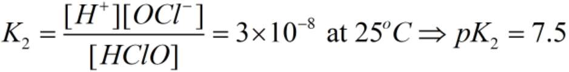
  - **Hình này chứng minh điều gì**
    - Minh họa chi tiết sơ đồ công nghệ, thông số thiết kế hoặc cấu tạo thiết bị trên slide trang 11.
  - **Từ đâu mà thấy được**
    - Trích xuất trực tiếp từ tài liệu bài giảng gốc của chương.

- Thông số và cấu tạo chi tiết theo tài liệu bài giảng (Trang 11):
  - **Hình 21.** Figure 21 (Page 11)
    - 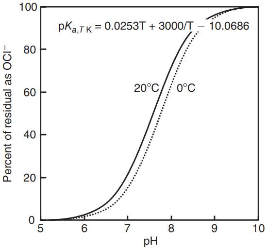
  - **Hình này chứng minh điều gì**
    - Minh họa chi tiết sơ đồ công nghệ, thông số thiết kế hoặc cấu tạo thiết bị trên slide trang 11.
  - **Từ đâu mà thấy được**
    - Trích xuất trực tiếp từ tài liệu bài giảng gốc của chương.

- Thông số và cấu tạo chi tiết theo tài liệu bài giảng (Trang 14):
  - **Hình 22.** Figure 22 (Page 14)
    - 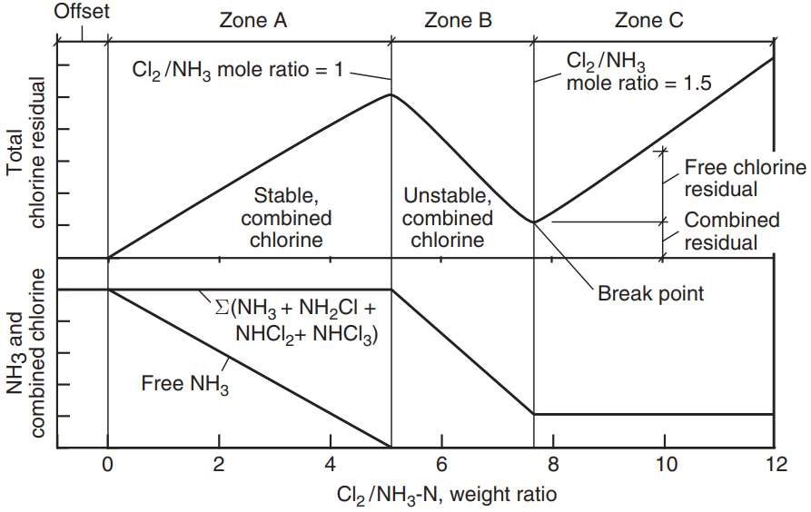
  - **Hình này chứng minh điều gì**
    - Minh họa chi tiết sơ đồ công nghệ, thông số thiết kế hoặc cấu tạo thiết bị trên slide trang 14.
  - **Từ đâu mà thấy được**
    - Trích xuất trực tiếp từ tài liệu bài giảng gốc của chương.

- Thông số và cấu tạo chi tiết theo tài liệu bài giảng (Trang 14):
  - **Hình 23.** Figure 23 (Page 14)
    - 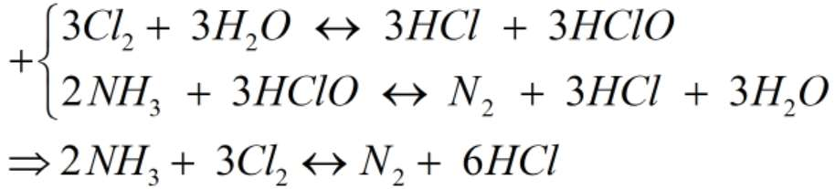
  - **Hình này chứng minh điều gì**
    - Minh họa chi tiết sơ đồ công nghệ, thông số thiết kế hoặc cấu tạo thiết bị trên slide trang 14.
  - **Từ đâu mà thấy được**
    - Trích xuất trực tiếp từ tài liệu bài giảng gốc của chương.

- Thông số và cấu tạo chi tiết theo tài liệu bài giảng (Trang 14):
  - **Hình 24.** Figure 24 (Page 14)
    - 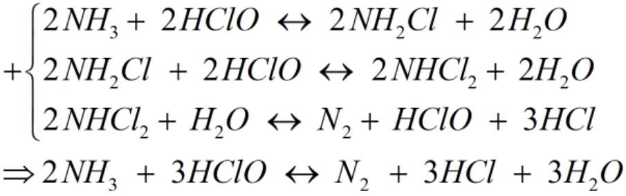
  - **Hình này chứng minh điều gì**
    - Minh họa chi tiết sơ đồ công nghệ, thông số thiết kế hoặc cấu tạo thiết bị trên slide trang 14.
  - **Từ đâu mà thấy được**
    - Trích xuất trực tiếp từ tài liệu bài giảng gốc của chương.

- Thông số và cấu tạo chi tiết theo tài liệu bài giảng (Trang 15):
  - **Hình 25.** Figure 25 (Page 15)
    - 
  - **Hình này chứng minh điều gì**
    - Minh họa chi tiết sơ đồ công nghệ, thông số thiết kế hoặc cấu tạo thiết bị trên slide trang 15.
  - **Từ đâu mà thấy được**
    - Trích xuất trực tiếp từ tài liệu bài giảng gốc của chương.

- Thông số và cấu tạo chi tiết theo tài liệu bài giảng (Trang 15):
  - **Hình 26.** Figure 26 (Page 15)
    - 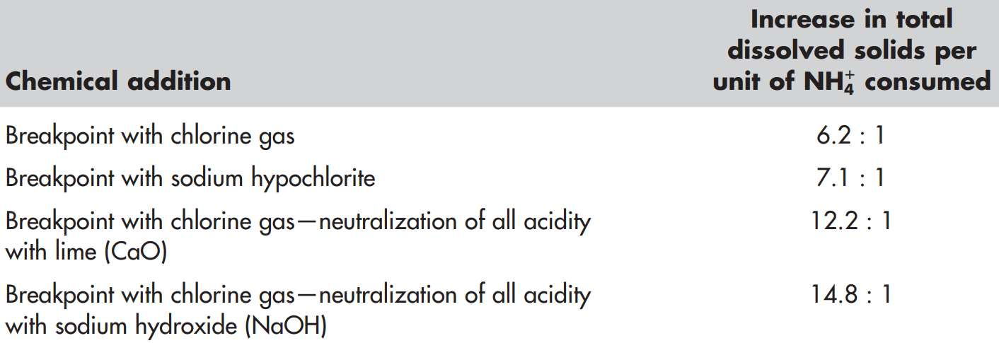
  - **Hình này chứng minh điều gì**
    - Minh họa chi tiết sơ đồ công nghệ, thông số thiết kế hoặc cấu tạo thiết bị trên slide trang 15.
  - **Từ đâu mà thấy được**
    - Trích xuất trực tiếp từ tài liệu bài giảng gốc của chương.

- Thông số và cấu tạo chi tiết theo tài liệu bài giảng (Trang 16):
  - **Hình 27.** Figure 27 (Page 16)
    - 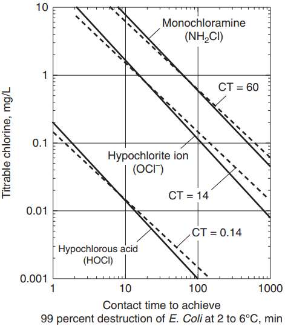
  - **Hình này chứng minh điều gì**
    - Minh họa chi tiết sơ đồ công nghệ, thông số thiết kế hoặc cấu tạo thiết bị trên slide trang 16.
  - **Từ đâu mà thấy được**
    - Trích xuất trực tiếp từ tài liệu bài giảng gốc của chương.

#### 3. So sánh các phương pháp khử trùng (Comparison of Disinfectants)

* Mục tiêu kỹ thuật của chương trình tính toán và so sánh công nghệ khử trùng:
    * Định lượng hóa các thành phần tiêu hao chất khử trùng trong dòng nước thải bao gồm nhu cầu oxy hóa tức thời, lượng phân hủy suy giảm tự nhiên và lượng Clo dư bảo vệ.
    * Ứng dụng mô hình động học Collins-Selleck để mô tả định lượng mức độ bất hoạt của vi sinh vật chỉ thị theo tích số nồng độ và thời gian tiếp xúc ($CT$).
    * So sánh hiệu lực diệt khuẩn giữa Clo tự do (Free chlorine) và Clo kết hợp (Chloramine) đối với các nhóm mầm bệnh điển hình: vi khuẩn, virus, kén nguyên sinh động vật (*Giardia lamblia*) và noãn nang (*Cryptosporidium*).
    * Phân tích tương quan giữa bậc công nghệ xử lý nước thải với liều lượng Clo yêu cầu để đạt các tiêu chuẩn xả thải Coliform quy định.
    * Thực hành tính toán thiết kế quy trình khử trùng bằng dung dịch Natri Hypochlorite ($NaOCl$): định lượng thể tích hóa chất thương phẩm hàng ngày và xác định kích thước hình học bể tiếp xúc dòng chảy nút.

##### Các thành phần nhu cầu Clo và Mô hình động học Collins-Selleck (Chlorine Demand Components and Collins-Selleck Disinfection Kinetics)

* Thành phần liều lượng hóa chất khử trùng yêu cầu ($D_{\text{req}}$):
    * Tổng liều lượng Clo cần châm vào nước thải ($D_{\text{req}}$, tính bằng $\text{mg/L}$) là tổng số của ba thành phần độc lập:
      $$D_{\text{req}} = D_{\text{initial demand}} + D_{\text{decay}} + C_{\text{residual}}$$
    * Nhu cầu Clo ban đầu (Initial chlorine demand, $D_{\text{initial demand}}$):
        * Lượng Clo tiêu tốn tức thời để oxy hóa các hợp chất khử còn sót lại trong nước thải trước khi hình thành Clo dư tự do hoặc kết hợp ổn định.
        * Các hợp chất khử tiêu thụ Clo bao gồm:
            * Các ion kim loại khử: Sắt ($Fe^{2+}$), Mangan ($Mn^{2+}$).
            * Các hợp chất vô cơ khử: Hydro sulfide ($H_2S$, $S^{2-}$), Nitrit ($NO_2^-$).
            * Hợp chất amonia ($NH_3\text{-N}$) và amin hữu cơ: tham gia phản ứng tạo chloramine và phản ứng oxy hóa điểm uốn (breakpoint chlorination).
            * Hợp chất hữu cơ hòa tan dễ bị oxy hóa: chất hữu cơ tự nhiên ($NOM$), acid humic, acid fulvic.
    * Lượng Clo suy giảm theo thời gian (Chlorine decay, $D_{\text{decay}}$):
        * Lượng chất khử trùng bị tiêu hao dần trong suốt chu trình lưu giữ và vận chuyển từ điểm châm đến điểm xả.
        * Ba cơ chế suy giảm Clo chính trong thực tế công trình:
            * Suy giảm trong tuyến đường ống truyền dẫn dài (long transmission pipeline) do ma sát thủy lực và tiếp xúc lâu dài với vật liệu thành ống.
            * Suy giảm do phản ứng oxy hóa với màng sinh học (biofilm) phát triển bám dính trên bề mặt tường gạch, bê tông của bể tiếp xúc khử trùng và hệ thống đường ống dẫn.
            * Phân hủy quang hóa (photooxidation by sunlight) dưới tác động của tia bức xạ tử ngoại mặt trời xảy ra trong các bể khử trùng dạng hở không bố trí mái che (uncovered disinfection tanks).
    * Nồng độ Clo dư yêu cầu (Required chlorine residual, $C_{\text{residual}}$ hoặc $C$):
        * Nồng độ Clo còn lại sau thời gian tiếp xúc danh định, đảm bảo năng lực tiêu diệt hoặc vô hiệu hóa các vi sinh vật gây bệnh (pathogens) nhằm đạt quy chuẩn xả thải ra nguồn tiếp nhận.
* Mô hình động học khử trùng Collins-Selleck (Collins-Selleck Model for Chlorine Disinfection Process):
    * Mô hình thực nghiệm động học bậc cao mô tả mức độ sống sót của vi sinh vật trong điều kiện dòng chảy tiếp cận trạng thái dòng chảy nút (plug-flow reactor):
      $$\frac{N}{N_o} = \left(\frac{CT}{b}\right)^{-n} \quad (\text{khi } CT > b)$$
      $$\frac{N}{N_o} = 1.0 \quad (\text{khi } CT \le b)$$
    * Trong đó các đại lượng và đơn vị đo được xác định chuẩn xác:
        * $N$: Mật độ vi sinh vật còn sống sau quá trình khử trùng ($\text{MPN/100 mL}$ hoặc $\text{CFU/100 mL}$).
        * $N_o$: Mật độ vi sinh vật ban đầu trước khi khử trùng ($\text{MPN/100 mL}$ hoặc $\text{CFU/100 mL}$).
        * $C$: Nồng độ Clo dư còn lại sau thời gian tiếp xúc ($\text{mg/L}$).
        * $T$: Thời gian tiếp xúc hiệu dụng của nước thải với chất khử trùng ($\text{min}$). (Ghi chú hiệu đính: Trong slide gốc có ghi nhầm đơn vị của $T$ là $\text{mg/L}$; đơn vị vật lý chuẩn xác theo quy chuẩn động học là phút / $\text{min}$).
        * $CT$: Tích số giữa nồng độ Clo dư và thời gian tiếp xúc ($\text{mg}\cdot\text{min/L}$).
        * $b$: Hằng số trễ ngưỡng (lag constant hoặc threshold factor, tính bằng $\text{mg}\cdot\text{min/L}$), thể hiện ngưỡng phơi nhiễm $CT$ tối thiểu mà dưới ngưỡng này chưa có sự tiêu diệt vi sinh vật đáng kể ($N/N_o \approx 1$).
        * $n$: Bậc phân rã bất hoạt vi sinh vật (inactivation rate exponent, không thứ nguyên), phản ánh tốc độ tiêu diệt vi sinh vật khi vượt qua ngưỡng trễ.
    * Các hệ số thực nghiệm điển hình cho nước thải sau xử lý sinh học:
        * Đối với nhóm Coliform tổng số (Total coliform): $n = 2.8$ và $b = 4.0\text{ mg}\cdot\text{min/L}$.
          $$\frac{N}{N_o} = \left(\frac{CT}{4.0}\right)^{-2.8} \quad (\text{khi } CT > 4.0\text{ mg}\cdot\text{min/L})$$
        * Đối với nhóm Coliform phân (Fecal coliform): $n = 2.8$ và $b = 3.0\text{ mg}\cdot\text{min/L}$.
          $$\frac{N}{N_o} = \left(\frac{CT}{3.0}\right)^{-2.8} \quad (\text{khi } CT > 3.0\text{ mg}\cdot\text{min/L})$$
    * Phân tích ý nghĩa kỹ thuật của mô hình Collins-Selleck:
        * Sự tồn tại của hằng số trễ $b$ chứng minh cơ chế khử trùng đòi hỏi một lượng phơi nhiễm tối thiểu để các phân tử Clo khuếch tán qua màng tế bào, phá hủy lớp vỏ bảo vệ trước khi quá trình phân rã tế bào diễn ra hàng loạt.
        * So sánh giá trị ngưỡng $b$: Vì $b_{\text{fecal coliform}} = 3.0 < b_{\text{total coliform}} = 4.0$, nhóm Coliform phân nhạy cảm hơn với Clo và bắt đầu bị tiêu diệt ở tích số $CT$ thấp hơn so với Coliform tổng số.
        * Số mũ $n = 2.8$ ở cả hai nhóm chỉ ra rằng khi giá trị $CT$ vượt ngưỡng $b$, tốc độ tiêu diệt vi sinh vật gia tăng cực kỳ nhanh chóng theo hàm lũy thừa bậc gần bằng 3, cho phép giảm mạnh mật độ vi sinh vật chỉ bằng việc tăng nhẹ thời gian lưu hoặc nồng độ Clo dư.

##### Yêu cầu giá trị CT vô hiệu hóa mầm bệnh và Liều lượng Clo điển hình trong nước thải (Pathogen Inactivation CT Requirements and Typical Wastewater Dosages)

* Khái niệm và nguyên lý tích số $CT$ trong khử trùng:
    * Giá trị $CT$ ($CT = C \times T$, tính bằng $\text{mg}\cdot\text{min/L}$) là tiêu chuẩn kỹ thuật quốc tế dùng để đánh giá và so sánh hiệu lực của các chất khử trùng khác nhau trên các đối tượng vi sinh vật gây bệnh khác nhau.
    * Hiệu lực diệt khuẩn phụ thuộc mạnh vào trạng thái hóa học của Clo: Clo tự do (tồn tại dưới dạng $HOCl$ và $OCl^-$) có năng lực oxy hóa xuyên màng hiệu quả hơn so với Clo kết hợp (chloramine: $NH_2Cl$, $NHCl_2$).
* Bảng giá trị $CT$ yêu cầu đối với nước thải sau lắng bậc hai đã lọc (Filtered secondary effluent, điều kiện chuẩn $pH = 7.5$, nhiệt độ $T = 20^\circ\text{C}$):
    * Bảng so sánh giá trị $CT$ tiêu diệt $99\%$ ($\text{2-log inactivation}$) các nhóm vi sinh vật:

| Nhóm vi sinh vật mục tiêu | Hiệu suất tiêu diệt (Inactivation) | Giá trị $CT$ của Clo tự do (Free chlorine) ($\text{mg}\cdot\text{min/L}$) | Giá trị $CT$ của Chloramine ($\text{mg}\cdot\text{min/L}$) | Tỷ số chênh lệch ($CT_{\text{chloramine}} / CT_{\text{free}}$) |
| :--- | :--- | :--- | :--- | :--- |
| **Vi khuẩn (Bacteria)** | $99\%$ ($\text{2-log}$) | $0.8 - 1.2$ | $95 - 150$ | $\approx 100 - 125$ lần |
| **Virus** | $99\%$ ($\text{2-log}$) | $1.5 - 1.8$ | $370 - 400$ | $\approx 220 - 250$ lần |
| **Kén Giardia lamblia (Cysts)** | $99\%$ ($\text{2-log}$) | $45 - 55$ | $800 - 900$ | $\approx 16 - 18$ lần |
| **Noãn nang Cryptosporidium (Oocysts)** | $99\%$ ($\text{2-log}$) | $4,000 - 5,000$ | $8,000 - 10,000$ | $\approx 2$ lần |

    * Bảng so sánh giá trị $CT$ tiêu diệt $99.9\%$ ($\text{3-log inactivation}$) đối với vi khuẩn và virus:

| Nhóm vi sinh vật mục tiêu | Hiệu suất tiêu diệt (Inactivation) | Giá trị $CT$ của Clo tự do (Free chlorine) ($\text{mg}\cdot\text{min/L}$) | Giá trị $CT$ của Chloramine ($\text{mg}\cdot\text{min/L}$) |
| :--- | :--- | :--- | :--- |
| **Vi khuẩn (Bacteria)** | $99.9\%$ ($\text{3-log}$) | $1.2 - 1.8$ | $150 - 220$ |
| **Virus** | $99.9\%$ ($\text{3-log}$) | $2.2 - 2.6$ | $550 - 600$ |

* Phân tích và đánh giá kỹ thuật từ dữ liệu giá trị $CT$:
    * Khả năng kháng chất khử trùng của các nhóm mầm bệnh tăng dần theo bậc: $\text{Vi khuẩn} < \text{Virus} < \text{Kén Giardia lamblia} \ll \text{Noãn nang Cryptosporidium}$.
    * Vi khuẩn là nhóm nhạy cảm nhất: Clo tự do chỉ cần $CT = 0.8 - 1.2\text{ mg}\cdot\text{min/L}$ để tiêu diệt $99\%$, trong khi Chloramine đòi hỏi $95 - 150\text{ mg}\cdot\text{min/L}$ (kém hiệu quả hơn trên 100 lần).
    * Virus có lớp vỏ protein capsid bảo vệ vững chắc hơn vi khuẩn, đòi hỏi giá trị $CT$ cao hơn khoảng $1.5$ lần đối với Clo tự do ($1.5 - 1.8\text{ mg}\cdot\text{min/L}$) và cao gấp gần $3$ lần đối với Chloramine ($370 - 400\text{ mg}\cdot\text{min/L}$).
    * Nguyên sinh động vật có cấu trúc vỏ bào nang/kén dày:
        * Kén *Giardia lamblia* đòi hỏi $CT = 45 - 55\text{ mg}\cdot\text{min/L}$ với Clo tự do và $800 - 900\text{ mg}\cdot\text{min/L}$ với Chloramine.
        * Noãn nang *Cryptosporidium* có thành tế bào phức hợp bền vững cao, đòi hỏi giá trị $CT$ khổng lồ lên tới $4,000 - 5,000\text{ mg}\cdot\text{min/L}$ (Clo tự do) và $8,000 - 10,000\text{ mg}\cdot\text{min/L}$ (Chloramine).
    * Kết luận công nghệ khử trùng thực tế:
        * Khử trùng bằng Clo thông thường hoàn toàn bất khả thi về mặt kỹ thuật và chi phí kinh tế để loại bỏ *Cryptosporidium* trong nước thải (yêu cầu nồng độ Clo quá cao và thời gian tiếp xúc hàng trăm giờ, gây độc tính trầm trọng cho nguồn nước và hình thành lượng cực lớn sản phẩm phụ độc hại $DBPs$).
        * Để kiểm soát triệt để mầm bệnh nguyên sinh động vật như *Cryptosporidium*, công nghệ chiếu xạ tia cực tím ($UV$) hoặc oxy hóa bằng Ozone ($O_3$) là giải pháp thay thế tối ưu và bắt buộc.
* Bảng liều lượng Clo điển hình trong xử lý nước thải theo các tiêu chuẩn Coliform đầu ra:
  - **Hình 28.** Bảng liều lượng Clo điển hình cho các loại nước thải dựa trên Clo kết hợp ($T = 30\text{ min}$, hệ số suy giảm $0.6$)
    - 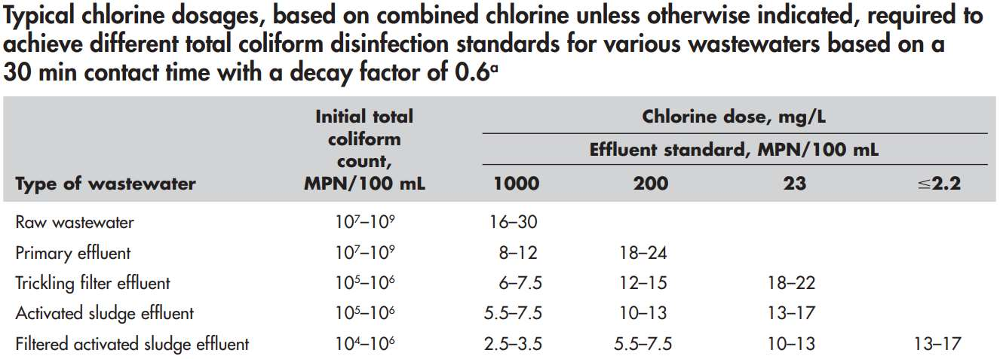
    - **Hình này chứng minh điều gì**
      - Liều lượng Clo yêu cầu suy giảm mạnh khi bậc xử lý nước thải tăng và tăng khi chuẩn Coliform đầu ra nghiêm ngặt hơn.
    - **Từ đâu mà thấy được**
      - Cột 1 phân loại 5 cấp nước thải từ Raw wastewater đến Filtered activated sludge effluent.
      - Các cột chuẩn Coliform ($1000, 200, 23, \le 2.2\text{ MPN/100 mL}$) thể hiện dải liều lượng Clo tương ứng từ $2.5\text{ mg/L}$ đến $30\text{ mg/L}$.
    * Bảng tổng hợp số liệu liều lượng Clo điển hình (tính theo Clo kết hợp, thời gian tiếp xúc $T = 30\text{ phút}$, hệ số phân rã Clo $0.6$):

| Loại nước thải (Type of wastewater) | Mật độ Coliform tổng ban đầu ($N_o$, $\text{MPN/100 mL}$) | Liều lượng Clo ($\text{mg/L}$) ứng với tiêu chuẩn đầu ra $1000\text{ MPN/100 mL}$ | Liều lượng Clo ($\text{mg/L}$) ứng với tiêu chuẩn đầu ra $200\text{ MPN/100 mL}$ | Liều lượng Clo ($\text{mg/L}$) ứng với tiêu chuẩn đầu ra $23\text{ MPN/100 mL}$ | Liều lượng Clo ($\text{mg/L}$) ứng với tiêu chuẩn đầu ra $\le 2.2\text{ MPN/100 mL}$ |
| :--- | :--- | :--- | :--- | :--- | :--- |
| **Nước thải thô (Raw wastewater)** | $10^7 - 10^9$ | $16 - 30$ | — | — | — |
| **Nước sau lắng đợt 1 (Primary effluent)** | $10^7 - 10^9$ | $8 - 12$ | $18 - 24$ | — | — |
| **Nước sau bể lọc nhỏ giọt (Trickling filter effluent)** | $10^5 - 10^6$ | $6 - 7.5$ | $12 - 15$ | $18 - 22$ | — |
| **Nước sau bùn hoạt tính (Activated sludge effluent)** | $10^5 - 10^6$ | $5.5 - 7.5$ | $10 - 13$ | $13 - 17$ | — |
| **Nước sau bùn hoạt tính đã lọc cát (Filtered activated sludge effluent)** | $10^4 - 10^6$ | $2.5 - 3.5$ | $5.5 - 7.5$ | $10 - 13$ | $13 - 17$ |

    * Quy luật công nghệ từ bảng dữ liệu:
        * Bậc xử lý càng sâu, chất lượng nước càng trong sạch (giảm nồng độ $BOD$, $COD$ và chất rắn lơ lửng $TSS$) thì nhu cầu Clo giảm rõ rệt: Để đạt chuẩn xả thải $1000\text{ MPN/100 mL}$, nước sau bùn hoạt tính đã lọc cát chỉ cần $2.5 - 3.5\text{ mg/L}$, thấp hơn gần 10 lần so với nước thải thô ($16 - 30\text{ mg/L}$).
        * Sự hiện diện của các hạt cặn lơ lửng ($TSS$) trong nước thải thô và nước sau lắng 1 che chắn cơ học cho vi sinh vật, đồng thời các hợp chất khử tiêu hao phần lớn lượng Clo châm vào trước khi Clo kịp tiếp xúc với tế bào vi khuẩn.
        * Tiêu chuẩn xả thải càng khắt khe ($1000 \rightarrow 200 \rightarrow 23 \rightarrow \le 2.2\text{ MPN/100 mL}$) thì liều lượng hóa chất cần châm tăng theo cấp số cộng. Mức xả thải khắt khe nhất $\le 2.2\text{ MPN/100 mL}$ (chuẩn tái sử dụng nước cho sinh hoạt hoặc tưới tiêu không hạn chế) chỉ có thể đạt được khi nước thải đã trải qua công đoạn lọc cát đánh bóng và châm liều lượng Clo từ $13 - 17\text{ mg/L}$.

##### Thực hành tính toán thiết kế: Xác định thể tích bể khử trùng và Lượng NaClO thương phẩm (Design Practice: Disinfection Tank Sizing and NaClO Dosage Calculation)

* Nguyên tắc tính toán công nghệ khử trùng bằng Natri Hypochlorite ($NaOCl$):
    * Xác định mối quan hệ định lượng giữa lưu lượng dòng thải $Q$, nồng độ chất ô nhiễm tiêu thụ Clo (đặc biệt là amonia dư $NH_3\text{-N}$), chỉ số $CT$ yêu cầu và đặc tính thương phẩm của dung dịch hóa chất.
    * Đảm bảo cấu trúc thủy lực của bể tiếp xúc đạt hiệu quả dòng chảy nút cao nhất, hạn chế tối đa các vùng nước đọng và dòng chảy tắt.

###### Ví dụ tính toán thiết kế: Xác định thể tích bể khử trùng và Lượng NaClO thương phẩm (Example: Disinfection Tank Design and Commercial NaClO Dosage Calculation)

- **Đề bài**:
    * Một trạm xử lý nước thải có công suất xử lý $Q = 3,000\text{ m}^3/\text{ngày}$.
    * Nồng độ amonia dư trong dòng nước thải sau xử lý sinh học: $[\text{NH}_3\text{-N}] = 2.0\text{ mg/L}$.
    * Giá trị $CT$ yêu cầu đối với Clo tự do dư để đảm bảo khử trùng: $CT = 60\text{ mg}\cdot\text{min/L}$.
    * Nhu cầu Clo do suy giảm tự nhiên trong bể khử trùng: $D_{\text{decay}} = 3.0\text{ mg/L}$.
    * Hóa chất khử trùng được lựa chọn là dung dịch Natri Hypochlorite ($NaOCl$) thương phẩm có nồng độ $10\%$ theo khối lượng và khối lượng riêng $\rho = 1150\text{ kg/m}^3$.
    * Yêu cầu:
        1. Tính toán lượng dung dịch $NaOCl$ thương phẩm cần sử dụng trong một ngày ($\text{kg/ngày}$ và $\text{L/ngày}$).
        2. Thiết kế kích thước hình học công trình bể tiếp xúc khử trùng.

- **Dữ kiện**:
    - Lưu lượng nước thải thiết kế: $Q = 3,000\text{ m}^3/\text{ngày} = 125\text{ m}^3/\text{h} = 2.0833\text{ m}^3/\text{min} = 0.03472\text{ m}^3/\text{s}$.
        - Nhìn vào: Dòng đầu tiên của đề bài ghi "Plant flowrate = 3,000 m3/day".
    - Nồng độ amonia dư của dòng nước thải: $[\text{NH}_3\text{-N}] = 2.0\text{ mg/L}$.
        - Nhìn vào: Dòng đầu tiên của đề bài ghi "Residual NH3-N of effluent = 2 mg/L".
    - Giá trị $CT$ của Clo tự do yêu cầu: $CT_{\text{req}} = 60\text{ mg}\cdot\text{min/L}$.
        - Nhìn vào: Dòng thứ 2 của đề bài ghi "Required CT values of free chlorine residual for disinfection is 60 mg.min/L".
    - Nhu cầu Clo suy giảm trong bể: $D_{\text{decay}} = 3.0\text{ mg/L}$.
        - Nhìn vào: Dòng thứ 3 của đề bài ghi "Chlorine demand due to decay in disinfection tank = 3 mg/L".
    - Hóa chất sử dụng: Dung dịch Natri Hypochlorite ($NaOCl$).
        - Nhìn vào: Dòng thứ 4 của đề bài ghi "Disinfectant selected is NaClO".
    - Đặc tính thương phẩm của dung dịch: Nồng độ $10\%$ khối lượng ($w = 10\% = 0.10$), khối lượng riêng $\rho = 1150\text{ kg/m}^3 = 1.15\text{ kg/L}$.
        - Nhìn vào: Dòng thứ 5 của đề bài ghi "Commercial 10% NaClO solution has density of 1150 kg/m3".

- **Quy tắc áp dụng**:
    - Định nghĩa tích số tiếp xúc: $CT = C_{\text{residual}} \times T$, trong đó $T$ là thời gian tiếp xúc thực tế ($\text{min}$) và $C_{\text{residual}}$ là nồng độ Clo tự do dư ($\text{mg/L}$).
    - Tiêu chuẩn thiết kế thời gian tiếp xúc danh định cho bể khử trùng nước thải (theo TCVN và US EPA): Chọn $T$ trong dải khuyến cáo $15 - 30\text{ phút}$. Để tối ưu hóa nồng độ Clo dư duy trì trong khoảng $1.0 - 3.0\text{ mg/L}$, chọn $T = 30\text{ phút}$.
    - Cơ chế phản ứng điểm uốn oxy hóa amonia (Breakpoint chlorination stoichiometry):
        - Để hình thành Clo tự do dư trong nước thải có chứa $NH_3\text{-N}$, toàn bộ amonia phải bị oxy hóa vượt qua điểm uốn theo phương trình phản ứng tổng quát:
          $$2NH_3 + 3HOCl \longrightarrow N_2\uparrow + 3H_2O + 3H^+ + 3Cl^-$$
        - Tỷ lệ khối lượng lý thuyết để oxy hóa hoàn toàn amonia tại điểm uốn là:
          $$\frac{3 \times 70.90\text{ g } Cl_2}{2 \times 14.007\text{ g } N} \approx 7.6\text{ g } Cl_2 / \text{g } NH_3\text{-N}$$
        - Do đó, nhu cầu Clo để vượt qua điểm uốn oxy hóa $NH_3\text{-N}$ là:
          $$D_{\text{breakpoint}} = [\text{NH}_3\text{-N}] \times 7.6 = 2.0 \times 7.6 = 15.2\text{ mg/L as } Cl_2$$
    - Cân bằng tổng liều lượng Clo yêu cầu:
      $$D_{\text{total}} = D_{\text{breakpoint}} + D_{\text{decay}} + C_{\text{residual}}$$
    - Đương lượng Clo hoạt tính của muối Natri Hypochlorite ($NaOCl$):
        - Phản ứng thủy phân tạo $HOCl$:
          $$NaOCl + H_2O \longrightarrow Na^+ + HOCl + OH^-$$
        - Khối lượng mol: $M_{NaOCl} = 74.44\text{ g/mol}$; $M_{Cl_2} = 70.90\text{ g/mol}$.
        - Hệ số chuyển đổi khối lượng tương đương giữa $NaOCl$ nguyên chất và $Cl_2$:
          $$\frac{M_{NaOCl}}{M_{Cl_2}} = \frac{74.44}{70.90} \approx 1.050\text{ kg } NaOCl / \text{kg } Cl_2$$
    - Công thức tính thể tích và kích thước bể tiếp xúc dòng chảy nút:
      $$V_{\text{useful}} = Q \times T$$
      $$A = \frac{V_{\text{design}}}{H}$$
      $$L_{\text{total}} / W \ge 20:1 \quad (\text{tiêu chuẩn chống dòng chảy tắt})$$

- **Lời giải**:
    - **Bước 1**: Xác định thời gian tiếp xúc thiết kế ($T$) và nồng độ Clo tự do dư yêu cầu ($C_{\text{residual}}$).
        - Tính toán:
            - Chọn thời gian tiếp xúc danh định chuẩn công nghệ: $T = 30\text{ phút} = 0.5\text{ giờ}$.
            - Nồng độ Clo tự do dư duy trì sau thời gian tiếp xúc:
              $$C_{\text{residual}} = \frac{CT_{\text{req}}}{T} = \frac{60\text{ mg}\cdot\text{min/L}}{30\text{ min}} = 2.0\text{ mg/L}$$
        - Căn cứ: Công thức định nghĩa tích số $CT = C \times T$ và dữ kiện $CT_{\text{req}} = 60\text{ mg}\cdot\text{min/L}$; dải thời gian tiếp xúc khuyến cáo trong xử lý nước thải đô thị $15 - 30\text{ phút}$. Nồng độ Clo dư $2.0\text{ mg/L}$ nằm trong khoảng tối ưu quy chuẩn ($1.0 - 3.0\text{ mg/L}$).
        - Nhìn vào: Dòng thứ 2 trên Slide 37 ghi "Required CT values of free chlorine residual for disinfection is 60 mg.min/L".
    - **Bước 2**: Xác định nhu cầu Clo tiêu tốn cho phản ứng điểm uốn oxy hóa amonia dư ($D_{\text{breakpoint}}$).
        - Tính toán:
          $$D_{\text{breakpoint}} = [\text{NH}_3\text{-N}] \times 7.6\text{ mg } Cl_2 / \text{mg } N = 2.0 \times 7.6 = 15.2\text{ mg/L as } Cl_2$$
        - Căn cứ: Tỷ lệ đương lượng phản ứng điểm uốn lý thuyết giữa Clo và amonia ($3\text{ mol } Cl_2 : 2\text{ mol } NH_3\text{-N}$ tương đương tỷ lệ khối lượng $7.6 : 1$) để đảm bảo không còn chloramine và tạo lập được Clo tự do dư ($HOCl/OCl^-$) theo đúng yêu cầu đề bài.
        - Nhìn vào: Dòng thứ 1 trên Slide 37 ghi "Residual NH3-N of effluent = 2 mg/L".
    - **Bước 3**: Tính tổng liều lượng Clo yêu cầu cần châm vào nước thải ($D_{\text{total}}$).
        - Tính toán:
          $$D_{\text{total}} = D_{\text{breakpoint}} + D_{\text{decay}} + C_{\text{residual}} = 15.2\text{ mg/L} + 3.0\text{ mg/L} + 2.0\text{ mg/L} = 20.2\text{ mg/L as } Cl_2$$
          *(Ghi chú kỹ thuật: Trong trường hợp bài toán đơn giản hóa quy ước bỏ qua phản ứng điểm uốn với amonia mà chỉ xét nhu cầu phân hủy và Clo dư, liều lượng Clo tối thiểu là $D_{\text{min}} = D_{\text{decay}} + C_{\text{residual}} = 3.0 + 2.0 = 5.0\text{ mg/L}$. Tuy nhiên, vì nước thải có chứa $2.0\text{ mg/L } NH_3\text{-N}$, nếu chỉ cấp $5.0\text{ mg/L } Cl_2$ thì toàn bộ Clo sẽ bị amonia hấp thụ tạo monochloramine/dichloramine và Clo tự do dư sẽ bằng $0\text{ mg/L}$, không thể thỏa mãn yêu cầu $CT$ của Clo tự do. Do đó, việc tính đủ liều lượng $20.2\text{ mg/L}$ là giải pháp kỹ thuật chính xác nhất).*
        - Căn cứ: Công thức cân bằng thành phần liều lượng Clo $D_{\text{req}} = D_{\text{initial}} + D_{\text{decay}} + C_{\text{residual}}$ và dữ kiện $D_{\text{decay}} = 3.0\text{ mg/L}$.
        - Nhìn vào: Dòng thứ 3 trên Slide 37 ghi "Chlorine demand due to decay in disinfection tank = 3 mg/L".
    - **Bước 4**: Tính khối lượng và thể tích dung dịch $NaOCl$ thương phẩm $10\%$ sử dụng trong một ngày.
        - Tính toán:
            - Tổng tải lượng Clo nguyên chất cần cấp mỗi ngày ($M_{Cl_2}$):
              $$M_{Cl_2} = Q \times D_{\text{total}} = 3,000\text{ m}^3/\text{ngày} \times 20.2\text{ g/m}^3 \times 10^{-3}\text{ kg/g} = 60.6\text{ kg } Cl_2/\text{ngày}$$
            - Khối lượng $NaOCl$ nguyên chất tương đương cần cấp:
              $$M_{pure\ NaOCl} = M_{Cl_2} \times \frac{74.44}{70.90} = 60.6 \times 1.050 \approx 63.63\text{ kg } NaOCl/\text{ngày}$$
            - Khối lượng dung dịch $NaOCl$ thương phẩm nồng độ $10\%$ theo khối lượng ($w = 0.10$):
              $$M_{\text{solution}} = \frac{M_{pure\ NaOCl}}{w} = \frac{63.63\text{ kg/ngày}}{0.10} = 636.3\text{ kg dung dịch/ngày}$$
            - Thể tích dung dịch $NaOCl$ thương phẩm $10\%$ cần dùng trong một ngày (với $\rho = 1150\text{ kg/m}^3$):
              $$V_{\text{solution}} = \frac{M_{\text{solution}}}{\rho} = \frac{636.3\text{ kg/ngày}}{1150\text{ kg/m}^3} \approx 0.5533\text{ m}^3/\text{ngày} \approx 553.3\text{ L/ngày}$$
            - Lưu lượng châm hóa chất liên tục 24/24 của bơm định lượng:
              $$q_{\text{pump}} = \frac{553.3\text{ L/ngày}}{24\text{ h/ngày}} \approx 23.05\text{ L/h}$$
            - *(Trường hợp tính theo quy ước thương phẩm dung dịch $10\%$ Clo hoạt tính khả dụng (available chlorine $10\%\text{ wt}$): Khối lượng dung dịch là $M_{\text{solution}} = 60.6 / 0.10 = 606.0\text{ kg/ngày}$; Thể tích dung dịch là $V_{\text{solution}} = 606.0 / 1150 = 0.5270\text{ m}^3/\text{ngày} = 527.0\text{ L/ngày}$; Lưu lượng bơm định lượng là $q_{\text{pump}} = 21.96\text{ L/h}$).*
            - *(Trường hợp tính theo mức liều đơn giản hóa $D = 5.0\text{ mg/L}$: $M_{Cl_2} = 15.0\text{ kg/ngày}$; $M_{\text{solution}} = 157.5\text{ kg/ngày}$; $V_{\text{solution}} = 137.0\text{ L/ngày}$).*
        - Căn cứ: Công thức quy đổi nồng độ phần trăm khối lượng $M_{\text{solution}} = M_{ct} / w$, công thức khối lượng riêng $V = M / \rho$, phân tử lượng các chất hóa học và dữ kiện $\rho = 1150\text{ kg/m}^3$.
        - Nhìn vào: Dòng thứ 5 trên Slide 37 ghi "Commercial 10% NaClO solution has density of 1150 kg/m3".
    - **Bước 5**: Thiết kế kích thước hình học bể tiếp xúc khử trùng.
        - Tính toán:
            - Thể tích hữu ích của bể tiếp xúc khử trùng ứng với thời gian lưu danh định $T = 30\text{ phút} = 0.5\text{ giờ}$:
              $$V_{\text{useful}} = Q \times T = 3,000\text{ m}^3/\text{ngày} \times \frac{0.5\text{ h}}{24\text{ h/ngày}} = 62.5\text{ m}^3$$
            - Để bù trừ cho hiện tượng phân tán thủy lực và đảm bảo thời gian lưu thực tế $t_{10}$ luôn đáp ứng tối thiểu yêu cầu khử trùng, áp dụng hệ số an toàn thể tích $K_{\text{safe}} = 1.2$:
              $$V_{\text{design}} = V_{\text{useful}} \times 1.2 = 62.5 \times 1.2 = 75.0\text{ m}^3$$
            - Chọn chiều sâu công tác của lớp nước: $H = 2.0\text{ m}$ (chiều cao dự phòng an toàn thành bể $h_{\text{freeboard}} = 0.5\text{ m} \rightarrow$ tổng chiều cao xây dựng của bể $H_{\text{total}} = 2.5\text{ m}$).
            - Diện tích mặt bằng công tác của bể:
              $$A_{\text{basin}} = \frac{V_{\text{design}}}{H} = \frac{75.0\text{ m}^3}{2.0\text{ m}} = 37.5\text{ m}^2$$
            - Bố trí cấu tạo bể dạng kênh dẫn có vách ngăn uốn lượn u-turn (serpentine baffled basin) gồm 4 hành lang dòng chảy nối tiếp:
                - Chiều rộng mỗi hành lang: Chọn $W = 1.2\text{ m}$.
                - Tổng chiều rộng mặt bằng bể: $B = 4 \times W = 4 \times 1.2\text{ m} = 4.8\text{ m}$.
                - Chiều dài của mỗi hành lang:
                  $$L_{\text{channel}} = \frac{A_{\text{basin}}}{4 \times W} = \frac{37.5\text{ m}^2}{4 \times 1.2\text{ m}} \approx 7.81\text{ m} \rightarrow \text{chọn } 7.8\text{ m}$$
                - Tổng chiều dài tuyến dòng chảy của nước trong bể:
                  $$L_{\text{total}} = 4 \times L_{\text{channel}} = 4 \times 7.8\text{ m} = 31.2\text{ m}$$
                - Kiểm tra tỷ lệ kích thước hình học chiều dài trên chiều rộng tuyến dòng:
                  $$\frac{L_{\text{total}}}{W} = \frac{31.2\text{ m}}{1.2\text{ m}} = 26:1 \ge 20:1 \quad (\text{đạt chuẩn thủy lực dòng chảy nút})$$
                - Vận tốc dòng chảy trong hành lang bể:
                  $$v = \frac{Q}{W \times H} = \frac{0.03472\text{ m}^3/\text{s}}{1.2\text{ m} \times 2.0\text{ m}} \approx 0.0145\text{ m/s} = 0.87\text{ m/phút}$$
                  (Vận tốc $0.87\text{ m/phút}$ nằm trong dải vận tốc dòng chảy tối ưu $0.5 - 1.5\text{ m/phút}$, vừa ngăn ngừa sự lắng đọng cặn hữu cơ vừa duy trì trạng thái dòng chảy ổn định không phá vỡ liên kết dòng nút).
        - Căn cứ: Tiêu chuẩn thiết kế bể khử trùng nước thải vách ngăn uốn lượn; công thức thể tích $V = Q \times HRT$; điều kiện thủy lực dòng chảy nút $L/W \ge 20:1$.
        - Nhìn vào: Dòng cuối cùng trên Slide 37 ghi yêu cầu "Design disinfection tank".

- **Kết quả**:
    * **Lượng hóa chất Natri Hypochlorite ($NaOCl$) thương phẩm $10\%$ tiêu thụ trong ngày**:
        * Khối lượng dung dịch $10\%$: $M_{\text{solution}} = 636.3\text{ kg/ngày}$ (tương ứng tải lượng Clo $60.6\text{ kg } Cl_2/\text{ngày}$).
        * Thể tích dung dịch $10\%$: $V_{\text{solution}} = 553.3\text{ L/ngày} \approx 0.553\text{ m}^3/\text{ngày}$.
        * Công suất điều chỉnh bơm định lượng hóa chất: $q_{\text{pump}} = 23.05\text{ L/h}$.
        * *(Nếu tính theo clo hoạt tính khả dụng $10\%$: $M = 606.0\text{ kg/ngày}$; $V = 527.0\text{ L/ngày}$; $q = 21.96\text{ L/h}$)*.
    * **Kích thước công trình bể tiếp xúc khử trùng kiểu vách ngăn uốn lượn**:
        * Thể tích hữu ích danh định: $V_{\text{useful}} = 62.5\text{ m}^3$ (Thể tích thiết kế tính cả an toàn: $V_{\text{design}} = 75.0\text{ m}^3$).
        * Chiều sâu công tác của nước: $H = 2.0\text{ m}$ (Tổng chiều sâu thành bể: $H_{\text{total}} = 2.5\text{ m}$).
        * Cấu hình bể: Bể hình chữ nhật có vách ngăn uốn lượn chia làm $4$ hành lang song song.
        * Kích thước tổng thể bể: Chiều dài ngoài $L = 7.8\text{ m}$, Chiều rộng ngoài $B = 4.8\text{ m}$.
        * Kích thước mỗi hành lang: Chiều rộng $W = 1.2\text{ m}$, Chiều dài $L_{\text{channel}} = 7.8\text{ m}$.
        * Tổng chiều dài hành lang dòng chảy: $L_{\text{total}} = 31.2\text{ m}$ (Tỷ lệ $L_{\text{total}}/W = 26:1 \ge 20:1$).
        * Thời gian tiếp xúc danh định: $T = 30\text{ phút}$.

- **Kiểm tra lại**:
    * Kiểm tra giá trị $CT$ đạt được trong bể:
      $$CT = C_{\text{residual}} \times T = 2.0\text{ mg/L} \times 30\text{ min} = 60\text{ mg}\cdot\text{min/L}$$
      Khớp đúng tuyệt đối với thông số yêu cầu của bài toán ($CT = 60\text{ mg}\cdot\text{min/L}$).
    * Kiểm tra tính đúng đắn của phản ứng điểm uốn amonia:
      Tỷ lệ Clo châm cho phản ứng với amonia là $D_{\text{breakpoint}} / [\text{NH}_3\text{-N}] = 15.2 / 2.0 = 7.6$, đúng bằng tỷ lệ điểm uốn lý thuyết để chuyển hóa toàn bộ amonia thành $N_2$, đảm bảo không còn chloramine cản trở sự hình thành Clo tự do.
    * Kiểm tra cân bằng khối lượng hóa chất:
      $$636.3\text{ kg dung dịch} \times 10\% \times \frac{70.90}{74.44} = 60.6\text{ kg } Cl_2$$
      Tải lượng này khi hòa tan vào $3,000\text{ m}^3$ nước thải tạo ra nồng độ châm:
      $$D = \frac{60.6 \times 10^3\text{ g}}{3,000\text{ m}^3} = 20.2\text{ g/m}^3 = 20.2\text{ mg/L}$$
      Khớp hoàn toàn với tổng liều lượng thiết kế $D_{\text{total}} = 15.2 + 3.0 + 2.0 = 20.2\text{ mg/L}$.
    * Kiểm tra tiêu chuẩn thủy lực dòng chảy nút:
      Tỷ lệ $L_{\text{total}} / W = 31.2 / 1.2 = 26 > 20$, đảm bảo cấu trúc hạn chế tối đa hiện tượng dòng chảy tắt và hiện tượng hòa trộn ngược (back-mixing), thỏa mãn điều kiện tiên quyết của mô hình động học Collins-Selleck.

#### 4. Các yếu tố ảnh hưởng đến hiệu quả khử trùng (Factors Affecting Performance) - Khử trùng bằng tia cực tím (Disinfection with Ultraviolet Light)

##### Lịch sử phát triển và Phổ bức xạ điện từ của tia cực tím (Historical Development of UV and Electromagnetic Spectrum)

* Lịch sử hình thành và phát triển công nghệ khử trùng bằng tia cực tím:
    * Năm 1910: Ứng dụng bức xạ UV lần đầu tiên trên quy mô công nghiệp để khử trùng nước cấp sinh hoạt tại thành phố Marseilles (Pháp).
    * Giai đoạn 1916 – 1926: Mở rộng sử dụng đèn UV khử trùng nước uống trên các đội tàu thủy viễn dương.
    * Năm 1929: Khám phá ra cơ chế khử trùng cốt lõi của tia cực tím (tác động quang hóa gây đột biến và đứt gãy acid nucleic tế bào).
    * Từ năm 1980 đến nay: Công nghệ UV được ứng dụng rộng rãi và tiêu chuẩn hóa trong các nhà máy xử lý nước thải (WWTPs).
    * Từ năm 1990 đến nay: Trở thành công nghệ khử trùng chủ lực trong hệ thống cấp nước sinh hoạt và đô thị tại châu Âu.
    * Hiện tại: Đang được nghiên cứu chuyên sâu và triển khai quy mô lớn tại Hoa Kỳ nhằm thay thế hóa chất Clo trong xử lý nước cấp và nước tái sử dụng.
* Bản chất vật lý và vị trí của tia cực tím trong phổ bức xạ điện từ (Electromagnetic Spectrum):
    * Bức xạ cực tím (Ultraviolet light) là sóng điện từ có bước sóng nằm trong dải $\lambda = 100\text{ nm} - 400\text{ nm}$.
    * Vị trí phân bố trong thang đo quang phổ:
        * Nằm giữa vùng tia X (X-rays, bước sóng ngắn $\lambda < 100\text{ nm}$) và vùng ánh sáng nhìn thấy (Visible light, bước sóng dài $\lambda = 400\text{ nm} - 700\text{ nm}$).
    * Phân vùng quang phổ tia UV theo bước sóng năng lượng:
        * Vùng Chân không UV (Vacuum UV - VUV): $\lambda = 100\text{ nm} - 200\text{ nm}$ (bị hấp thụ mạnh bởi oxy trong không khí, có khả năng kích hoạt tạo ozone).
        * Vùng UV-C (Short-wave UV): $\lambda = 200\text{ nm} - 280\text{ nm}$ (dải bức xạ có hoạt tính diệt khuẩn cao nhất).
        * Vùng UV-B (Middle-wave UV): $\lambda = 280\text{ nm} - 315\text{ nm}$ (gây cháy nắng sinh học, diệt khuẩn một phần).
        * Vùng UV-A (Long-wave UV): $\lambda = 315\text{ nm} - 400\text{ nm}$ (bước sóng ánh sáng đen, ít tác dụng diệt khuẩn trực tiếp).

##### Dải bước sóng diệt khuẩn, Đỉnh hấp thụ và Phân loại đèn UV (Germicidal UV Range, Peak Wavelength, and Lamp Types)

* Dải bước sóng diệt khuẩn (Germicidal Range):
    * Định nghĩa: Phần quang phổ bức xạ UV có khả năng kích hoạt phá vỡ cấu trúc sinh học và vô hiệu hóa vi sinh vật gây bệnh.
    * Giới hạn bước sóng diệt khuẩn: Nằm trong dải $\lambda = 200\text{ nm} - 300\text{ nm}$.
    * Bước sóng hiệu quả cực đại (Maximum germicidal efficiency): Tập trung tại bước sóng $\lambda = 254\text{ nm}$.
    * Cơ chế cộng hưởng hấp thụ sinh học:
        * Phổ hấp thụ bức xạ của phân tử acid nucleic ($DNA$ và $RNA$) đạt giá trị cực đại trong khoảng $\lambda = 240\text{ nm} - 280\text{ nm}$.
        * Năng lượng photon tại bước sóng $\lambda \approx 254\text{ nm}$ bẻ gãy liên kết hydro và kích hoạt hình thành liên kết dimer pyrimidine (chủ yếu là thymine dimer) giữa hai bazơ nitơ kế cận trên cùng một mạch $DNA$.
        * Liên kết dimer cản trở quá trình tháo xoắn phiên mã và sao chép của enzyme polymerase, khiến tế bào vi sinh vật mất khả năng nhân đôi và không thể gây nhiễm trùng.
* Phân loại các dòng đèn UV thương mại trong công nghệ môi trường:
    * Đèn UV áp suất thấp (Low-Pressure UV Lamps):
        * Áp suất hơi thủy ngân nội tại thấp: $p_{Hg} \approx 10^{-3}\text{ mmHg} - 10^{-2}\text{ mmHg}$ ($0.1\text{ Pa} - 10\text{ Pa}$).
        * Nhiệt độ bề mặt bóng đèn khi hoạt động ở mức ôn hòa: $T_{\text{surface}} \approx 40^\circ\text{C} - 60^\circ\text{C}$.
        * Đặc tính phát xạ đơn sắc (Monochromatic emission): Khoảng $85\% - 90\%$ tổng năng lượng quang thông phát ra tập trung duy nhất ở bước sóng cộng hưởng $\lambda = 253.7\text{ nm}$ ($\approx 254\text{ nm}$).
        * Hiệu suất chuyển đổi điện năng thành quang năng diệt khuẩn rất cao ($30\% - 40\%$).
        * Phân nhóm nhỏ gồm:
            * Đèn áp suất thấp công suất thấp (Low-Pressure Low-Output - LPLO): Cường độ phát xạ thấp, phù hợp trạm công suất nhỏ.
            * Đèn áp suất thấp công suất cao (Low-Pressure High-Output - LPHO): Tăng mật độ dòng điện, cung cấp cường độ bức xạ gấp 3 đến 5 lần LPLO trên cùng chiều dài ống.
    * Đèn UV áp suất trung bình (Medium-Pressure UV Lamps):
        * Áp suất hơi thủy ngân nội tại trung bình đến cao: $p_{Hg} \approx 10^2\text{ mmHg} - 10^4\text{ mmHg}$ ($10^4\text{ Pa} - 10^6\text{ Pa}$).
        * Nhiệt độ bề mặt bóng đèn khi vận hành rất cao: $T_{\text{surface}} \approx 600^\circ\text{C} - 900^\circ\text{C}$.
        * Đặc tính phát xạ đa sắc (Polychromatic / Broadband emission): Bức xạ phân bố liên tục trên dải phổ rộng từ $200\text{ nm}$ đến hơn $600\text{ nm}$ (bao gồm cả vùng khả kiến).
        * Cường độ phát xạ trên một đơn vị chiều dài cực lớn (lớn hơn 10 đến 20 lần so với đèn áp suất thấp).
        * Giảm đáng kể tổng số lượng bóng đèn cần lắp đặt trong công trình, tiết kiệm diện tích xây dựng mương dẫn.
        * Hiệu suất chuyển đổi quang năng diệt khuẩn thấp hơn ($10\% - 15\%$), tiêu hao năng lượng điện lớn hơn cho nhiệt lượng tỏa ra.
* Bảng so sánh đặc tính kỹ thuật giữa hai chủng loại đèn UV:

| Tiêu chí kỹ thuật (Parameter) | Đèn UV áp suất thấp (Low-Pressure Lamp) | Đèn UV áp suất trung bình (Medium-Pressure Lamp) |
| :--- | :--- | :--- |
| **Dạng phổ phát xạ (Emission spectrum)** | Đơn sắc gần như tuyệt đối tại $\lambda = 253.7\text{ nm}$ | Đa sắc liên tục trong dải $\lambda = 200 - 600\text{ nm}$ |
| **Nhiệt độ vận hành bóng (Operating temperature)** | Thấp ($40^\circ\text{C} - 60^\circ\text{C}$) | Rất cao ($600^\circ\text{C} - 900^\circ\text{C}$) |
| **Cường độ phát xạ đơn vị (Germicidal output per lamp)** | Thấp đến trung bình ($0.2 - 1.5\text{ W/cm}$) | Rất cao ($10 - 50\text{ W/cm}$) |
| **Hiệu suất chuyển hóa UV diệt khuẩn (Efficiency)** | Cao ($30\% - 40\%$) | Thấp ($10\% - 15\%$) |
| **Số lượng bóng đèn cần thiết cho cùng công suất** | Lớn (đòi hỏi hệ khung đỡ và mương dẫn dài) | Ít (công trình tiếp xúc rất nhỏ gọn) |
| **Nguy cơ bám cặn bề mặt ống thạch anh (Fouling risk)** | Trung bình (nhiệt độ bề mặt thấp) | Rất cao (nhiệt độ cao làm đóng cặn muối khoáng nhanh) |
| **Ứng dụng công nghệ điển hình** | Nhà máy nước thải quy mô vừa và nhỏ; trạm cấp nước | Nhà máy xử lý quy mô lớn; không gian mặt bằng hạn chế |

##### Cấu hình hệ thống khử trùng UV: Kênh hở và Buồng kín (UV System Configuration: Open Channel vs Closed Channel Systems)

* Các thành phần cấu tạo chuẩn của một hệ thống khử trùng UV hoàn chỉnh:
    1. Đèn phát tia cực tím (UV lamps): Bóng đèn chứa khí trơ (Argon) và thủy ngân dạng kim loại hoặc hỗn hống (amalgam).
    2. Ống thạch anh bảo vệ (Transparent quartz sleeves):
        * Bao bọc cách ly bóng đèn với dòng nước thải dẫn qua.
        * Vật liệu thạch anh tinh khiết đảm bảo độ truyền quang cao ($UVT \ge 85\% - 90\%$ tại bước sóng $254\text{ nm}$).
        * Chịu được sốc nhiệt và áp lực dòng chảy.
    3. Khung đỡ mô-đun và giàn đèn (Structure supporting lamps and sleeves):
        * Khung thép không gỉ (Inox 316L) định vị các bóng đèn song song với khoảng cách tâm xác định để phân bổ trường bức xạ đồng đều.
        * Ghép nối thành các cụm (modules) và dãy đèn (banks).
    4. Hệ thống gạt rửa làm sạch ống thạch anh (Cleaning system):
        * Vận hành cơ học hoặc cơ-hóa học kết hợp nhằm loại bỏ lớp cặn bẩn bám trên mặt ngoài ống thạch anh.
    5. Bộ nguồn và chấn lưu điện tử (Power supply & electronic ballasts):
        * Cung cấp dòng điện ổn định, điều chế công suất theo tín hiệu lưu lượng và chất lượng nước.
    6. Cảm biến giám sát liều UV trực tuyến (Online UV dose monitoring sensors):
        * Cảm biến đo cường độ bức xạ UV tức thời ($I$, đơn vị $\text{mW/cm}^2$) tại vị trí cách xa đèn trong lòng nước.
        * Thiết bị đo độ truyền qua của tia UV ($UVT\%$) trực tuyến.
* Hệ thống khử trùng kênh hở (Open Channel Disinfection Systems):
    * Phạm vi ứng dụng: Tiêu chuẩn thiết kế bắt buộc cho hầu hết các công trình xử lý nước thải sinh hoạt và công nghiệp xả thải tự chảy.
    * Nước thải chuyển động tự do nhờ trọng lực qua mương dẫn bằng bê tông hoặc thép không gỉ.
    * Mức nước trong kênh được duy trì cố định bằng đập tràn điều tiết tự động hoặc máng đo lưu lượng Parshall ở cuối kênh.
    * Các phương án bố trí giàn đèn trong kênh hở:
        * Bố trí đèn nằm ngang song song với dòng chảy (Horizontal lamp system - parallel to flow):
            * Các ống thạch anh được đặt song song với trục đáy kênh và cùng phương với hướng di chuyển của dòng nước.
            * Dòng chảy ít bị cản trở thủy lực, tổn thất cột áp thấp ($< 50\text{ mm}$).
            * Thời gian lưu nước tiếp xúc dọc theo chiều dài bóng đèn ổn định.
        * Bố trí đèn thẳng đứng vuông góc với dòng chảy (Vertical lamp system - perpendicular to flow):
            * Các bóng đèn cắm thẳng đứng từ mặt kênh xuống đáy, vuông góc với mặt nước và hướng dòng chảy.
            * Cho phép tháo lắp và thay thế từng bóng riêng lẻ dễ dàng mà không cần cẩu cả cụm mô-đun ra khỏi mương.
            * Thích hợp với kênh có chiều sâu nước lớn.
        * Bố trí đèn nghiêng $45^\circ$ vuông góc với dòng chảy (Inclined $45^\circ$ lamp system - perpendicular to flow):
            * Giàn đèn được đặt nghiêng một góc $45^\circ$ so với phương nằm ngang.
            * Tăng cường vi xáo trộn dòng nước, triệt tiêu vùng che bóng và hạn chế hiện tượng dòng chảy ngắn mạch giữa các khe đèn.
* Hệ thống khử trùng buồng kín (Closed Channel / In-line Vessel Systems):
    * Phạm vi ứng dụng: Phổ biến trong xử lý nước cấp ăn uống, dược phẩm, thực phẩm và các đường ống nước thải áp lực.
    * Đèn UV được đặt bên trong buồng phản ứng hình trụ kín chịu áp, nước được bơm trực tiếp qua thiết bị mà không cần mương hở.
    * Tiết kiệm diện tích lắp đặt tối đa, ngăn ngừa bụi bẩn và sinh vật ngoại lai từ không khí rơi vào nguồn nước đã khử trùng.

##### Vận hành, Vệ sinh ống thạch anh và Đánh giá ưu nhược điểm (UV Lamp Cleaning, Operation, and Advantages and Disadvantages)

* Cơ chế bám bẩn ống thạch anh (Fouling of UV Quartz Sleeves):
    * Nguyên nhân gây bám bẩn:
        * Kết tủa muối vô cơ độ tan thấp: Muối canxi cacbonat ($CaCO_3$), canxi photphat, canxi sunfat do nhiệt độ mặt ống tăng cao làm giảm độ tan.
        * Oxy hóa và kết tủa kim loại chuyển tiếp: Sắt ($Fe^{2+} \to Fe^{3+}$ tạo $Fe(OH)_3$) và mangan ($Mn^{2+} \to MnO_2$) bám dính tạo lớp màng màu vàng nâu hấp thụ mạnh tia UV.
        * Tích tụ hợp chất hữu cơ hòa tan ($NOM$) và hình thành màng mỏng vi sinh vật (biofilm) trên bề mặt ngoài ống thạch anh.
    * Hậu quả kỹ thuật: Làm suy giảm độ truyền quang của ống thạch anh, giảm cường độ bức xạ UV trong nước dẫn đến liều khử trùng không đạt yêu cầu thiết kế.
* Quy trình và công nghệ làm sạch ống thạch anh (UV Cleaning Systems):
    * Hệ thống gạt cơ học tự động (Automated mechanical wipers): Vòng gạt bằng teflon hoặc cao su di chuyển tịnh tiến dọc theo chiều dài ống thạch anh theo chu kỳ đặt trước để cạo sạch bùn cặn.
    * Hệ thống gạt cơ - hóa học kết hợp (Chemical-mechanical cleaning): Vòng gạt có khoang chứa dung dịch tẩy rửa axit nhẹ (dung dịch citric acid hoặc phosphoric acid nồng độ thấp), hòa tan các muối kết tủa trong quá trình chuyển động.
    * Hệ thống tẩy rửa ngoại tuyến (Offline chemical cleaning bath):
        * Cụm giàn đèn (UV bank) được nhấc rời khỏi kênh bằng cơ cấu cẩu tời thủy lực (UV lamps lifting structure).
        * Thả toàn bộ giàn đèn vào bể ngâm chứa dung dịch hóa chất tẩy rửa chuyên dụng để hòa tan toàn bộ cặn bám cứng đầu trước khi lắp lại vào mương.
* Phân tích đầy đủ ưu điểm và nhược điểm của công nghệ khử trùng tia cực tím (UV Pros and Cons):

| Nhóm đặc tính | Các ưu điểm cốt lõi (Advantages) | Các nhược điểm và thách thức (Disadvantages) |
| :--- | :--- | :--- |
| **Hiệu quả diệt khuẩn (Germicidal performance)** | • Diệt khuẩn nhanh, vô hiệu hóa hiệu quả vi khuẩn, virus. • Vượt trội hơn Clo trong tiêu diệt bào tử vi khuẩn và kén nguyên sinh động vật (*Cryptosporidium*, *Giardia*). | • Không có dư lượng khử trùng bảo vệ trong nước (No residual disinfectant); vi sinh vật có thể tái nhiễm trên mạng lưới dẫn. |
| **An toàn & Môi trường (Safety & Environment)** | • Không sử dụng hóa chất độc hại, loại trừ rủi ro rò rỉ khí độc. • Không tạo sản phẩm phụ độc hại ($DBPs$) như $THMs$, $HAAs$. • Không gây độc tính dư lượng đối với nguồn nước mặt tiếp nhận. | • Nguy cơ vỡ bóng phát tán thủy ngân độc hại vào dòng nước ($Hg$ contamination). • Xử lý thải bỏ bóng đèn cũ khó khăn (chất thải nguy hại do chứa thủy ngân kim loại). |
| **Xây dựng & Vận hành (CAPEX & OPEX)** | • Thời gian tiếp xúc ngắn ($10 - 30\text{ s}$), tiết kiệm diện tích mặt bằng trạm. • Mức độ tự động hóa cao, vận hành sạch sẽ và an toàn cho công nhân. | • Chi phí đầu tư ban đầu cao (Expensive capital cost). • Tiêu thụ điện năng lớn (Energy intensive). • Tuổi thọ bóng có hạn ($8,000 - 12,000\text{ h}$), phải thay thế bóng định kỳ. |
| **Hiện tượng vật lý & sinh học thứ cấp** | • Không làm tăng tổng chất rắn hòa tan ($TDS$) và không biến đổi $pH$ nước thải. | • Hiện tượng bám cặn bề mặt ống thạch anh đòi hỏi gạt rửa liên tục. • Khả năng phục hồi quang học (Photoreactivation) của tế bào vi khuẩn dưới ánh sáng mặt trời. |

##### Liều lượng UV, Hiệu quả vô hiệu hóa mầm bệnh và Tiêu chuẩn xả thải (UV Dose Sizing, Microbial Inactivation, and Effluent Standards)

* Khái niệm và công thức xác định liều lượng UV (UV Dose Formulation):
    * Liều lượng UV ($D$) là đại lượng đo tổng năng lượng bức xạ diệt khuẩn mà vi sinh vật hấp thụ trên một đơn vị diện tích bề mặt, có ý nghĩa tương đương với thông số $CT$ trong khử trùng hóa học.
    * Công thức tính liều lượng UV tổng quát:
      $$D = I_{\text{avg}} \times t$$
    * Các thông số trong công thức:
        * $D$: Liều lượng bức xạ UV (UV dose), tính bằng $\text{mW}\cdot\text{s/cm}^2$ hoặc quy đổi tương đương sang $\text{mJ/cm}^2$ ($1\text{ mW}\cdot\text{s/cm}^2 = 1\text{ mJ/cm}^2$).
        * $I_{\text{avg}}$: Cường độ bức xạ UV trung bình trong thể tích buồng tiếp xúc (Average UV intensity), tính bằng $\text{mW/cm}^2$.
        * $t$: Thời gian phơi nhiễm / lưu nước hiệu dụng trong vùng chiếu sáng UV (Exposure time), tính bằng giây ($\text{s}$).
* Bảng liều lượng UV yêu cầu để vô hiệu hóa các nhóm vi sinh vật chỉ thị và mầm bệnh trong nước thải sau lắng đợt 2 có lọc ($pH = 7.5$, $T = 20^\circ\text{C}$):

| Nhóm sinh vật gây bệnh (Organisms) | Liều UV bất hoạt $90\%$ (1-log, $\text{mJ/cm}^2$) | Liều UV bất hoạt $99\%$ (2-log, $\text{mJ/cm}^2$) | Liều UV bất hoạt $99.9\%$ (3-log, $\text{mJ/cm}^2$) | Liều UV bất hoạt $99.99\%$ (4-log, $\text{mJ/cm}^2$) |
| :--- | :---: | :---: | :---: | :---: |
| **Vi khuẩn (Bacteria)** | $10 - 15$ | $20 - 30$ | $30 - 45$ | $40 - 60$ |
| **Virus** | $-$ | $40 - 50$ | $60 - 75$ | $80 - 100$ |
| **Nguyên sinh động vật (*Cryptosporidium*)** | $2.5 - 3.0$ | $6 - 7$ | $12 - 13$ | $-$ |
| **U nang *Giardia lamblia* (Cysts)** | $2.0 - 2.5$ | $5.5 - 6.6$ | $11 - 13$ | $-$ |

* Nhận xét chuyên môn về độ nhạy cảm của vi sinh vật đối với tia cực tím:
    * Kén và u nang nguyên sinh động vật (*Cryptosporidium oocysts* và *Giardia lamblia cysts*) cực kỳ nhạy cảm với tia UV: Chỉ cần liều UV rất nhỏ $11 - 13\text{ mJ/cm}^2$ để đạt hiệu suất tiêu diệt $99.9\%$ (3-log), trái ngược hoàn toàn với Clo cần giá trị $CT$ khổng lồ hàng nghìn $\text{mg}\cdot\text{min/L}$.
    * Virus có khả năng kháng tia UV cao nhất: Cần liều UV lên tới $80 - 100\text{ mJ/cm}^2$ để đạt hiệu suất tiêu diệt $99.99\%$ (4-log) do kích thước rất nhỏ và vỏ capsid có khả năng phân tán hoặc hấp thụ che chắn photon.
* Bảng liều lượng UV thiết kế điển hình đạt các mức quy chuẩn Coliform đầu ra đối với các loại nước thải khác nhau:

| Loại nước thải công nghệ (Type of wastewater) | Mật độ Coliform ban đầu ($N_0$, $\text{MPN/100 mL}$) | Liều UV đạt chuẩn $1000\text{ MPN/100 mL}$ ($\text{mJ/cm}^2$) | Liều UV đạt chuẩn $200\text{ MPN/100 mL}$ ($\text{mJ/cm}^2$) | Liều UV đạt chuẩn $23\text{ MPN/100 mL}$ ($\text{mJ/cm}^2$) | Liều UV đạt chuẩn $\le 2.2\text{ MPN/100 mL}$ ($\text{mJ/cm}^2$) |
| :--- | :---: | :---: | :---: | :---: | :---: |
| **Nước thải thô (Raw wastewater)** | $10^7 - 10^9$ | $20 - 50$ | $-$ | $-$ | $-$ |
| **Nước sau lắng đợt 1 (Primary effluent)** | $10^7 - 10^9$ | $20 - 50$ | $-$ | $-$ | $-$ |
| **Nước sau lọc nhỏ giọt (Trickling filter effluent)** | $10^5 - 10^6$ | $20 - 35$ | $25 - 40$ | $40 - 60$ | $90 - 110$ |
| **Nước sau bùn hoạt tính (Activated sludge effluent)** | $10^5 - 10^6$ | $20 - 30$ | $25 - 40$ | $40 - 60$ | $90 - 110$ |
| **Nước sau lọc cặn bùn hoạt tính (Filtered activated sludge effluent)** | $10^4 - 10^6$ | $20 - 30$ | $25 - 40$ | $40 - 60$ | $80 - 100$ |

##### Các yếu tố ảnh hưởng chuyên sâu đến hiệu quả khử trùng bằng tia cực tím (Specific Factors Affecting UV Disinfection Performance)

* Độ truyền qua của tia UV ($UVT$ - UV Transmittance) và độ hấp thụ ($UVA$ - UV Absorbance):
    * Mối quan hệ giữa $UVT$ và hệ số hấp thụ $A$ tuân theo định luật Beer-Lambert:
      $$UVT = 10^{-A_{254}} \times 100\% \quad \text{hoặc} \quad A_{254} = -\log_{10}\left(\frac{UVT}{100\%}\right)$$
    * Trong đó $A_{254}$ là độ hấp thụ quang trên cuvet đo có chiều dài đường truyền $1\text{ cm}$ tại bước sóng $254\text{ nm}$.
    * Giá trị $UVT$ trong nước sau lắng 2 đô thị điển hình dao động từ $60\%$ đến $75\%$; nước sau lọc đạt từ $70\%$ đến $85\%$.
    * Khi $UVT$ giảm (do hàm lượng chất hữu cơ tự nhiên $NOM$, acid humic, độ màu, muối sắt $Fe^{3+}$ tăng), cường độ bức xạ $I$ suy giảm theo hàm mũ theo khoảng cách từ mặt bóng đèn, làm giảm nghiêm trọng liều trung bình $I_{\text{avg}}$.
* Hàm lượng và kích thước hạt chất rắn lơ lửng ($TSS$ - Total Suspended Solids):
    * Cơ chế che bóng bức xạ (Shadowing / Shielding): Các hạt cặn kích thước lớn ($> 10\text{ }\mu\text{m}$) che chắn cho vi sinh vật bám phía sau hoặc bên trong lỗ xốp của hạt cặn, ngăn tia UV chiếu tới.
    * Mức độ tập hợp hạt vi sinh vật (Biofloc aggregation): Vi khuẩn nằm sâu bên trong bông bùn hoạt tính không bị bất hoạt ngay cả khi chiếu liều UV cao.
    * Nước thải trước khi vào mương UV phải đạt tiêu chuẩn hàm lượng $TSS \le 10 - 20\text{ mg/L}$ để đảm bảo hiệu suất khử trùng ổn định.
* Cấu trúc thủy lực và sự phân bố thời gian lưu nước (Hydraulic Behavior & RTD):
    * Mương UV cần thiết kế tiến sát mô hình dòng chảy nút lý tưởng (Plug Flow Reactor - PFR) với số phân tán Morril $d \to 0$.
    * Hiện tượng đoản mạch thủy lực (short-circuiting) làm cho một phần lưu lượng nước thải đi qua mương với thời gian phơi nhiễm $t < t_{\text{nominal}}$, dẫn đến vi sinh vật không nhận đủ liều UV gây suy giảm chất lượng nước đầu ra.
    * Hiện tượng vùng ứ đọng (dead zones) làm giảm thể tích hoạt tính của buồng phản ứng.
* Hiện tượng già hóa bóng đèn và suy giảm cường độ phát xạ (Lamp Aging Factor):
    * Cường độ phát xạ quang của đèn UV suy giảm theo thời gian vận hành do suy thoái điện cực và biến đổi thành ống thạch anh.
    * Hệ số già hóa thiết kế tiêu chuẩn thường lấy $F_{\text{aging}} \approx 0.7 - 0.8$ sau $8,000 - 12,000\text{ giờ}$ hoạt động.
* Cơ chế phục hồi quang học và phục hồi tối (Photoreactivation & Dark Repair):
    * Hiện tượng phục hồi quang học (Photoreactivation):
        * Sau khi bị tia UV vô hiệu hóa, một số vi sinh vật (đặc biệt là vi khuẩn chỉ thị Coliform và *E. coli*) kích hoạt enzyme photolyase khi tiếp xúc với ánh sáng khả kiến (dải bước sóng $\lambda = 310\text{ nm} - 500\text{ nm}$).
        * Enzyme photolyase hấp thụ năng lượng ánh sáng khả kiến và cắt đứt liên kết pyrimidine dimer, phục hồi lại cấu trúc nguyên vẹn của chuỗi xoắn kép $DNA$.
        * Vi khuẩn lấy lại khả năng nhân đôi và gây ô nhiễm trở lại trong nguồn tiếp nhận.
    * Hiện tượng phục hồi tối (Dark repair):
        * Quá trình sửa chữa cắt bỏ nucleotide (Nucleotide Excision Repair - NER) được điều khiển bởi hệ thống enzyme đa chức năng trong điều kiện không có ánh sáng.
        * Tốc độ và tỷ lệ phục hồi tối thấp hơn nhiều so với phục hồi quang học.
    * Giải pháp công nghệ hạn chế tái sinh vi khuẩn:
        * Tăng liều UV thiết kế lên mức vượt ngưỡng phục hồi tối thiểu ($D > 30 - 40\text{ mJ/cm}^2$).
        * Thiết kế che chắn ánh sáng mặt trời tại kênh thoát nước sau khử trùng UV.
        * Sử dụng đèn UV áp suất trung bình: Bức xạ đa sắc làm biến tính đồng thời các enzyme photolyase nội bào, ngăn chặn triệt để cơ chế tự phục hồi $DNA$.

- Thông số và cấu tạo chi tiết theo tài liệu bài giảng (Trang 20):
  - **Hình 29.** Figure 29 (Page 20)
    - 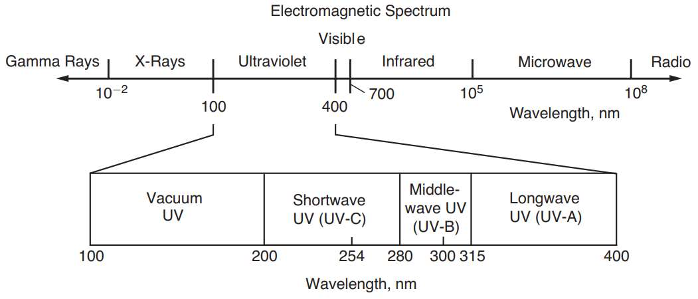
  - **Hình này chứng minh điều gì**
    - Minh họa chi tiết sơ đồ công nghệ, thông số thiết kế hoặc cấu tạo thiết bị trên slide trang 20.
  - **Từ đâu mà thấy được**
    - Trích xuất trực tiếp từ tài liệu bài giảng gốc của chương.

- Thông số và cấu tạo chi tiết theo tài liệu bài giảng (Trang 21):
  - **Hình 30.** Figure 30 (Page 21)
    - 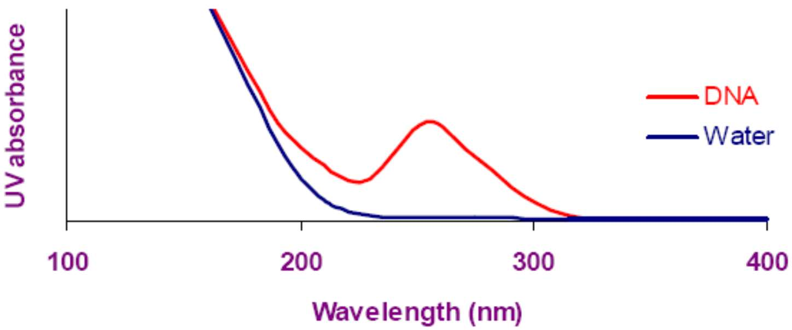
  - **Hình này chứng minh điều gì**
    - Minh họa chi tiết sơ đồ công nghệ, thông số thiết kế hoặc cấu tạo thiết bị trên slide trang 21.
  - **Từ đâu mà thấy được**
    - Trích xuất trực tiếp từ tài liệu bài giảng gốc của chương.

- Thông số và cấu tạo chi tiết theo tài liệu bài giảng (Trang 21):
  - **Hình 31.** Figure 31 (Page 21)
    - 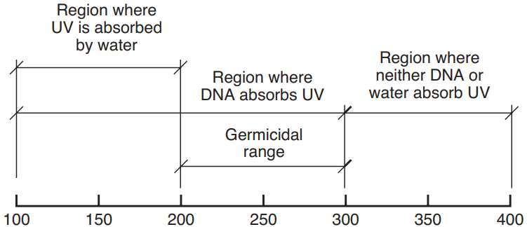
  - **Hình này chứng minh điều gì**
    - Minh họa chi tiết sơ đồ công nghệ, thông số thiết kế hoặc cấu tạo thiết bị trên slide trang 21.
  - **Từ đâu mà thấy được**
    - Trích xuất trực tiếp từ tài liệu bài giảng gốc của chương.

- Thông số và cấu tạo chi tiết theo tài liệu bài giảng (Trang 21):
  - **Hình 32.** Figure 32 (Page 21)
    - 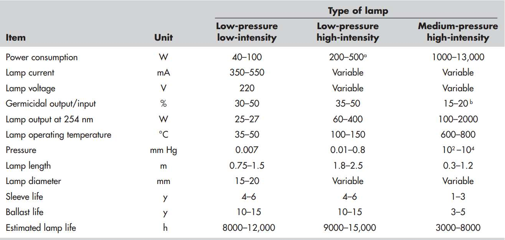
  - **Hình này chứng minh điều gì**
    - Minh họa chi tiết sơ đồ công nghệ, thông số thiết kế hoặc cấu tạo thiết bị trên slide trang 21.
  - **Từ đâu mà thấy được**
    - Trích xuất trực tiếp từ tài liệu bài giảng gốc của chương.

- Thông số và cấu tạo chi tiết theo tài liệu bài giảng (Trang 22):
  - **Hình 33.** Figure 33 (Page 22)
    - 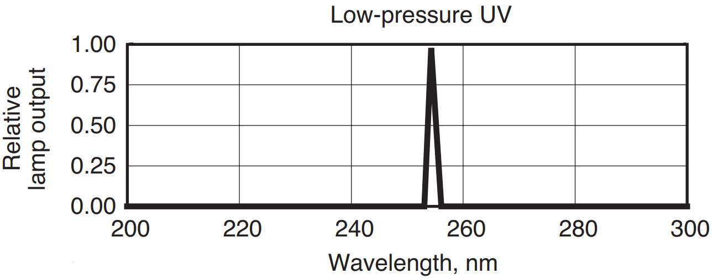
  - **Hình này chứng minh điều gì**
    - Minh họa chi tiết sơ đồ công nghệ, thông số thiết kế hoặc cấu tạo thiết bị trên slide trang 22.
  - **Từ đâu mà thấy được**
    - Trích xuất trực tiếp từ tài liệu bài giảng gốc của chương.

- Thông số và cấu tạo chi tiết theo tài liệu bài giảng (Trang 22):
  - **Hình 34.** Figure 34 (Page 22)
    - 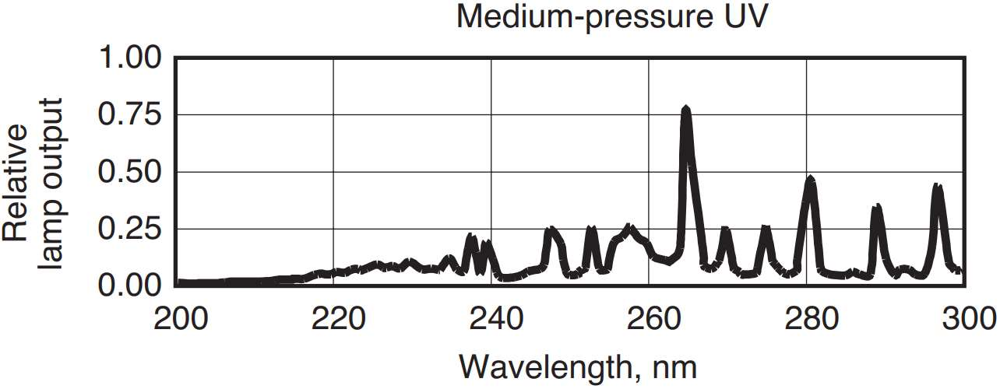
  - **Hình này chứng minh điều gì**
    - Minh họa chi tiết sơ đồ công nghệ, thông số thiết kế hoặc cấu tạo thiết bị trên slide trang 22.
  - **Từ đâu mà thấy được**
    - Trích xuất trực tiếp từ tài liệu bài giảng gốc của chương.

- Thông số và cấu tạo chi tiết theo tài liệu bài giảng (Trang 23):
  - **Hình 35.** Figure 35 (Page 23)
    - 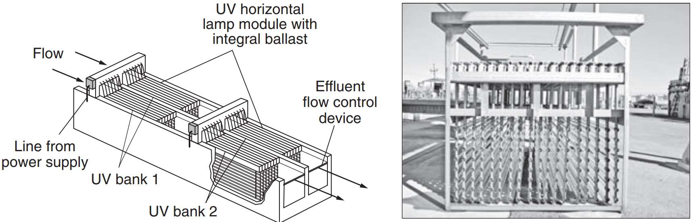
  - **Hình này chứng minh điều gì**
    - Minh họa chi tiết sơ đồ công nghệ, thông số thiết kế hoặc cấu tạo thiết bị trên slide trang 23.
  - **Từ đâu mà thấy được**
    - Trích xuất trực tiếp từ tài liệu bài giảng gốc của chương.

- Thông số và cấu tạo chi tiết theo tài liệu bài giảng (Trang 23):
  - **Hình 36.** Figure 36 (Page 23)
    - 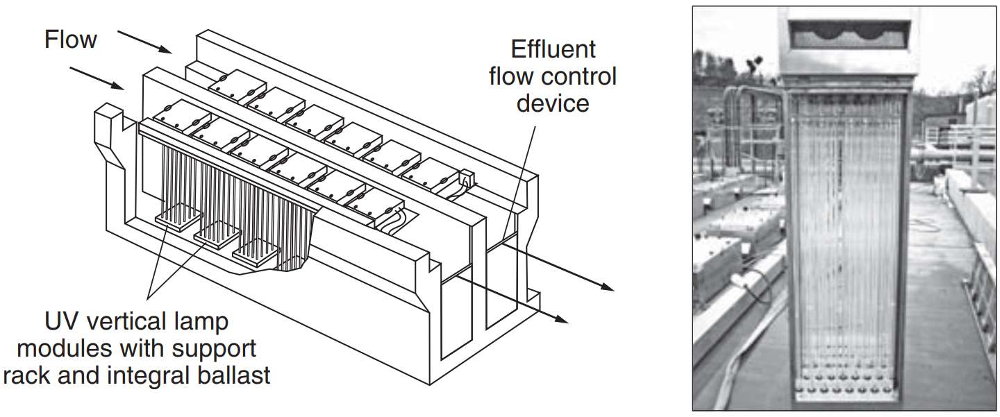
  - **Hình này chứng minh điều gì**
    - Minh họa chi tiết sơ đồ công nghệ, thông số thiết kế hoặc cấu tạo thiết bị trên slide trang 23.
  - **Từ đâu mà thấy được**
    - Trích xuất trực tiếp từ tài liệu bài giảng gốc của chương.

- Thông số và cấu tạo chi tiết theo tài liệu bài giảng (Trang 24):
  - **Hình 37.** Figure 37 (Page 24)
    - 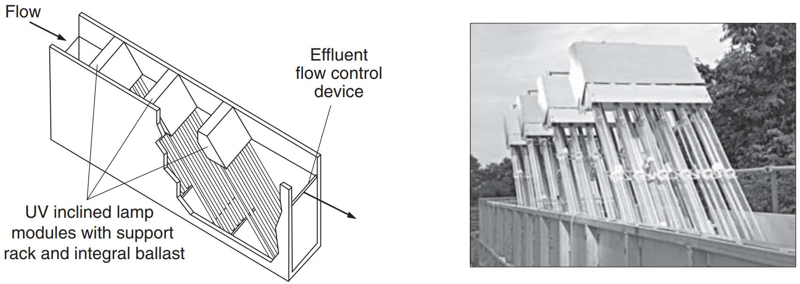
  - **Hình này chứng minh điều gì**
    - Minh họa chi tiết sơ đồ công nghệ, thông số thiết kế hoặc cấu tạo thiết bị trên slide trang 24.
  - **Từ đâu mà thấy được**
    - Trích xuất trực tiếp từ tài liệu bài giảng gốc của chương.

- Thông số và cấu tạo chi tiết theo tài liệu bài giảng (Trang 24):
  - **Hình 38.** Figure 38 (Page 24)
    - 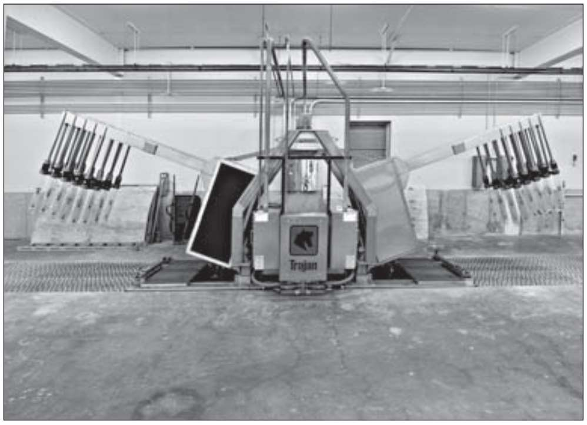
  - **Hình này chứng minh điều gì**
    - Minh họa chi tiết sơ đồ công nghệ, thông số thiết kế hoặc cấu tạo thiết bị trên slide trang 24.
  - **Từ đâu mà thấy được**
    - Trích xuất trực tiếp từ tài liệu bài giảng gốc của chương.

- Thông số và cấu tạo chi tiết theo tài liệu bài giảng (Trang 24):
  - **Hình 39.** Figure 39 (Page 24)
    - 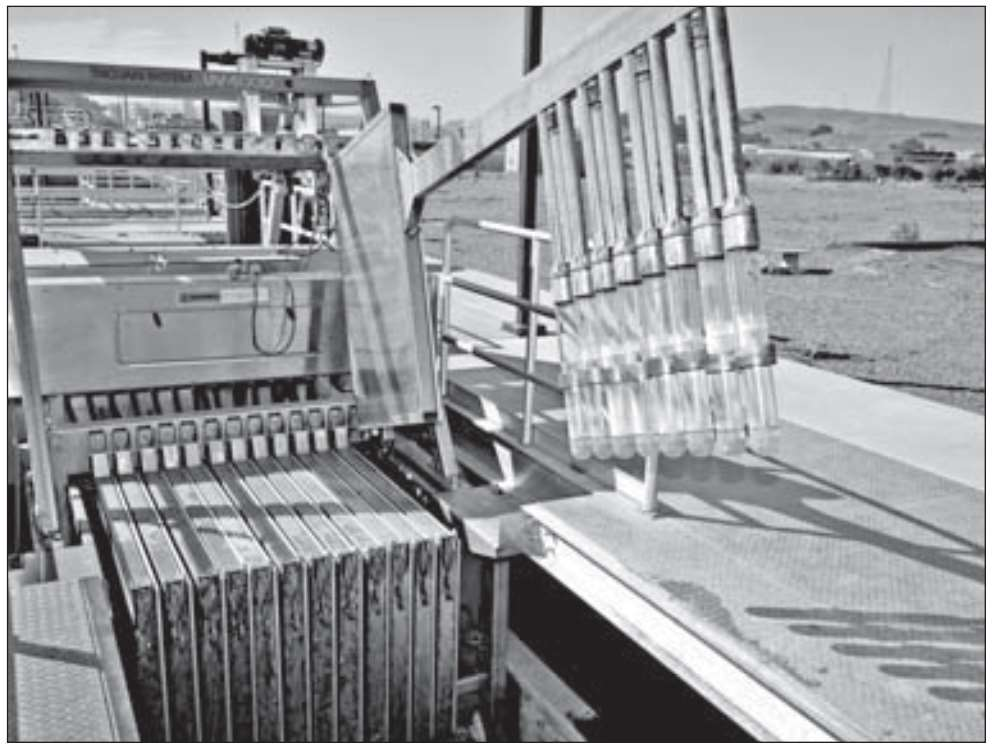
  - **Hình này chứng minh điều gì**
    - Minh họa chi tiết sơ đồ công nghệ, thông số thiết kế hoặc cấu tạo thiết bị trên slide trang 24.
  - **Từ đâu mà thấy được**
    - Trích xuất trực tiếp từ tài liệu bài giảng gốc của chương.

- Thông số và cấu tạo chi tiết theo tài liệu bài giảng (Trang 25):
  - **Hình 40.** Figure 40 (Page 25)
    - 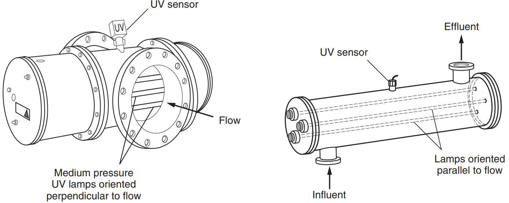
  - **Hình này chứng minh điều gì**
    - Minh họa chi tiết sơ đồ công nghệ, thông số thiết kế hoặc cấu tạo thiết bị trên slide trang 25.
  - **Từ đâu mà thấy được**
    - Trích xuất trực tiếp từ tài liệu bài giảng gốc của chương.

- Thông số và cấu tạo chi tiết theo tài liệu bài giảng (Trang 25):
  - **Hình 41.** Figure 41 (Page 25)
    - 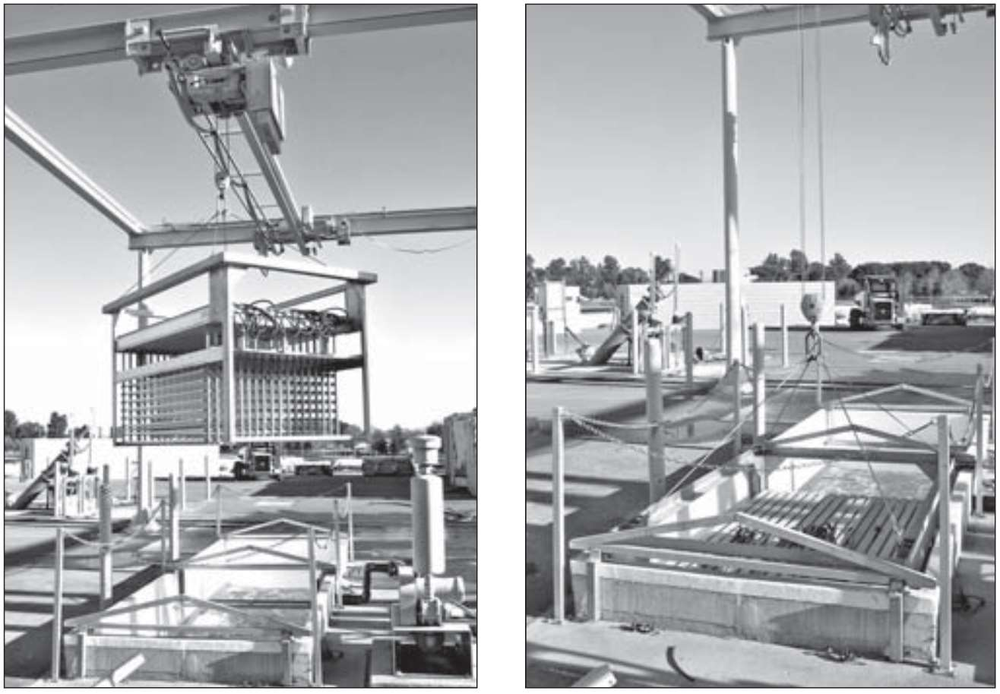
  - **Hình này chứng minh điều gì**
    - Minh họa chi tiết sơ đồ công nghệ, thông số thiết kế hoặc cấu tạo thiết bị trên slide trang 25.
  - **Từ đâu mà thấy được**
    - Trích xuất trực tiếp từ tài liệu bài giảng gốc của chương.

- Thông số và cấu tạo chi tiết theo tài liệu bài giảng (Trang 26):
  - **Hình 42.** Figure 42 (Page 26)
    - 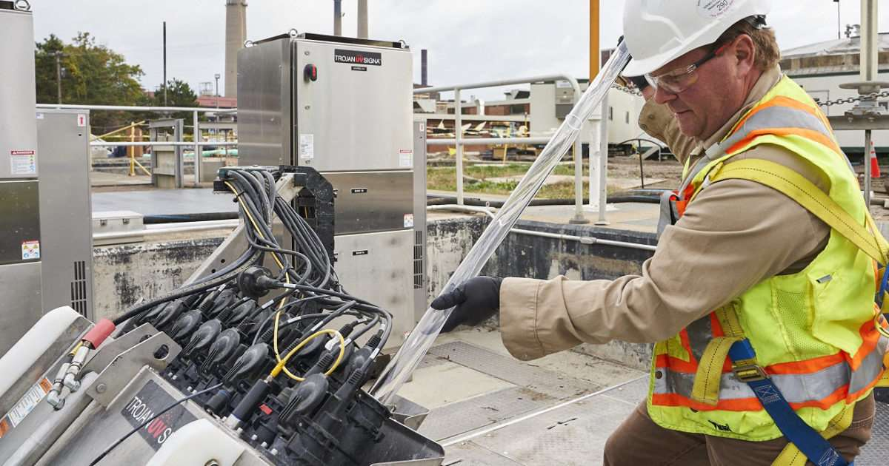
  - **Hình này chứng minh điều gì**
    - Minh họa chi tiết sơ đồ công nghệ, thông số thiết kế hoặc cấu tạo thiết bị trên slide trang 26.
  - **Từ đâu mà thấy được**
    - Trích xuất trực tiếp từ tài liệu bài giảng gốc của chương.

- Thông số và cấu tạo chi tiết theo tài liệu bài giảng (Trang 26):
  - **Hình 43.** Figure 43 (Page 26)
    - 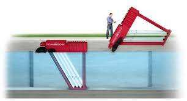
  - **Hình này chứng minh điều gì**
    - Minh họa chi tiết sơ đồ công nghệ, thông số thiết kế hoặc cấu tạo thiết bị trên slide trang 26.
  - **Từ đâu mà thấy được**
    - Trích xuất trực tiếp từ tài liệu bài giảng gốc của chương.

- Thông số và cấu tạo chi tiết theo tài liệu bài giảng (Trang 26):
  - **Hình 44.** Figure 44 (Page 26)
    - 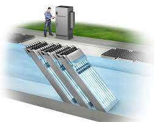
  - **Hình này chứng minh điều gì**
    - Minh họa chi tiết sơ đồ công nghệ, thông số thiết kế hoặc cấu tạo thiết bị trên slide trang 26.
  - **Từ đâu mà thấy được**
    - Trích xuất trực tiếp từ tài liệu bài giảng gốc của chương.

- Thông số và cấu tạo chi tiết theo tài liệu bài giảng (Trang 27):
  - **Hình 45.** Figure 45 (Page 27)
    - 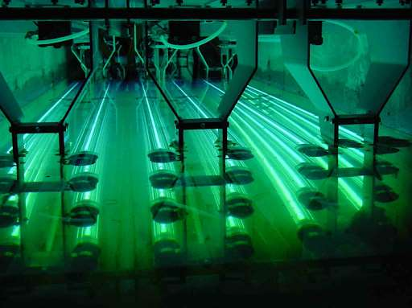
  - **Hình này chứng minh điều gì**
    - Minh họa chi tiết sơ đồ công nghệ, thông số thiết kế hoặc cấu tạo thiết bị trên slide trang 27.
  - **Từ đâu mà thấy được**
    - Trích xuất trực tiếp từ tài liệu bài giảng gốc của chương.

- Thông số và cấu tạo chi tiết theo tài liệu bài giảng (Trang 27):
  - **Hình 46.** Figure 46 (Page 27)
    - 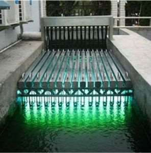
  - **Hình này chứng minh điều gì**
    - Minh họa chi tiết sơ đồ công nghệ, thông số thiết kế hoặc cấu tạo thiết bị trên slide trang 27.
  - **Từ đâu mà thấy được**
    - Trích xuất trực tiếp từ tài liệu bài giảng gốc của chương.

- Thông số và cấu tạo chi tiết theo tài liệu bài giảng (Trang 27):
  - **Hình 47.** Figure 47 (Page 27)
    - 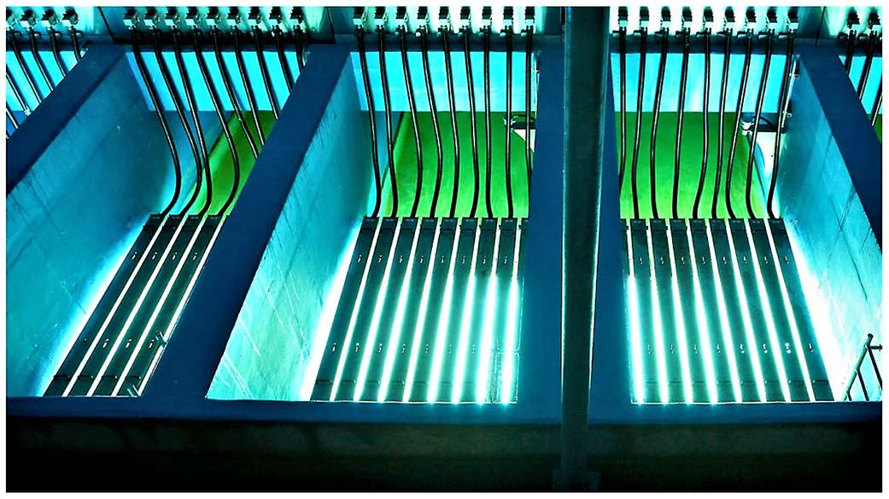
  - **Hình này chứng minh điều gì**
    - Minh họa chi tiết sơ đồ công nghệ, thông số thiết kế hoặc cấu tạo thiết bị trên slide trang 27.
  - **Từ đâu mà thấy được**
    - Trích xuất trực tiếp từ tài liệu bài giảng gốc của chương.

- Thông số và cấu tạo chi tiết theo tài liệu bài giảng (Trang 29):
  - **Hình 48.** Figure 48 (Page 29)
    - 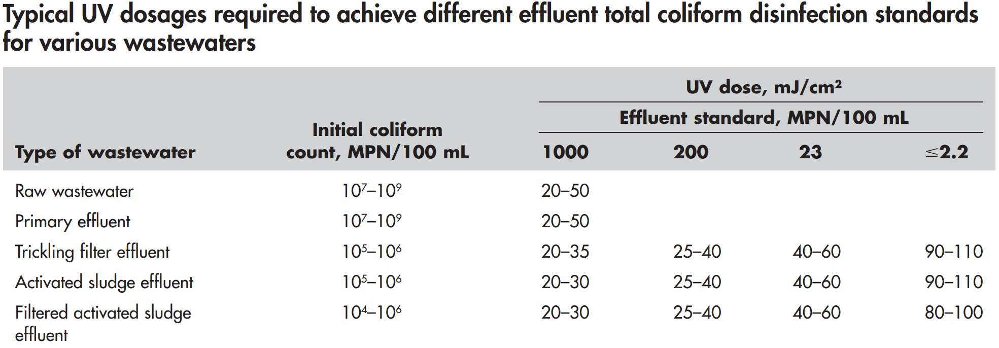
  - **Hình này chứng minh điều gì**
    - Minh họa chi tiết sơ đồ công nghệ, thông số thiết kế hoặc cấu tạo thiết bị trên slide trang 29.
  - **Từ đâu mà thấy được**
    - Trích xuất trực tiếp từ tài liệu bài giảng gốc của chương.

### Chương 5.1: Xử lý Sinh học - Vi sinh vật và Động học Tăng trưởng (Part 1)

#### 1. Tổng quan về xử lý sinh học nước thải (Overview of Biological Treatment)

- Định vị công trình trong hệ thống xử lý tổng thể: Xử lý sinh học thuộc công đoạn xử lý thứ cấp ($secondary\text{ treatment}$), tiếp sau các công đoạn tiền xử lý cơ học và lắng sơ cấp.
- Cấu trúc nội dung chính của phần tổng quan gồm 4 hợp phần:
  - 1.1 Mục tiêu công nghệ và vai trò sinh hóa của vi sinh vật ($Objectives\text{ and Role of Microorganisms}$).
  - 1.2 Mối tương quan giữa hoạt động trao đổi chất của vi khuẩn và quy trình kỹ thuật xử lý nước thải ($Relationship\text{ of Bacterial Processes and Wastewater Treatment}$).
  - 1.3 Phân loại các quá trình công nghệ xử lý sinh học theo hình thái bùn và trạng thái dưỡng khí ($Types\text{ of Biological Processes}$).
  - 1.4 Phân loại vi sinh vật theo nguồn carbon, chất cho và nhận electron ($Classification\text{ of Microorganisms}$).

##### 1.1 Mục tiêu và vai trò của vi sinh vật trong xử lý sinh học (Objectives and Role of Microorganisms)

###### Mục tiêu công nghệ của xử lý sinh học (Objectives of Biological Treatment)

- Vị trí quy trình công nghệ trong trạm xử lý: Xử lý sinh học thuộc bậc xử lý thứ cấp ($secondary\text{ treatment}$).
  - Tiếp nhận dòng nước thải sau xử lý cơ học (song chắn rác, bể lắng cát) và bể lắng sơ cấp.
  - Xử lý triệt để phần chất hữu cơ hòa tan và chất rắn lơ lửng mịn không lắng được bằng trọng lực.
- Chuyển hóa và oxy hóa chất hữu cơ ô nhiễm:
  - Oxy hóa ($oxidize$) các hợp chất hữu cơ hòa tan ($dissolved\text{ organic matter}$) và dạng hạt mịn ($particulate\text{ organic matter}$).
  - Biến đổi chất ô nhiễm thành các sản phẩm cuối ổn định, thân thiện với môi trường ($final\text{ acceptable products}$) như khí carbonic ($\text{CO}_2$) và nước ($\text{H}_2\text{O}$).
- Bắt giữ và hấp phụ chất rắn keo khó lắng:
  - Bắt giữ và kết hợp các hạt keo không lắng ($colloidal\text{ solids}$) vào cấu trúc bông bùn sinh học ($biological\text{ flocs}$) hoặc màng sinh học ($biofilms$).
  - Làm trong pha lỏng thông qua quá trình keo tụ sinh học tự nhiên ($bioflocculation$).
- Loại bỏ và chuyển hóa các chất dinh dưỡng ($Nutrient\text{ removal}$):
  - Chuyển hóa và loại bỏ nitơ ($nitrogen$) qua quá trình nitrat hóa hiếu khí kết hợp khử nitrat thiếu khí.
  - Loại bỏ phospho ($phosphorus$) thông qua cơ chế tích lũy sinh học tăng cường ($EBPR$) của vi khuẩn tích lũy polyphosphate ($PAOs$).
- Loại bỏ các hợp chất hữu cơ vết đặc thù:
  - Hấp phụ và phân hủy sinh học các hợp chất hữu cơ vết độc hại ($specific\text{ trace organic compounds}$), chất hoạt động bề mặt và dược phẩm tồn lưu.

###### Sơ đồ dây chuyền công nghệ xử lý sinh học điển hình (Typical Flow Diagram for Biological Treatment)

- Dây chuyền công nghệ xử lý nước thải đô thị và công nghiệp điển hình:
  - Dòng vào ($Influent$): Nước thải thô được tiếp nhận vào công trình đầu trạm.
  - Song chắn rác ($Bar\text{ rack}$): Loại bỏ tạp chất thô, rác có kích thước lớn ($Screenings$).
  - Bể lắng cát ($Grit\text{ chamber}$): Lắng các hạt vô cơ nặng như cát, sỏi, xỉ ($Grit$) bằng trọng lực.
  - Bể lắng sơ cấp ($Primary\text{ sedimentation}$): Lắng cặn lơ lửng hữu cơ thô, tạo dòng bùn sơ cấp ($Sludge$ / $Waste\text{ sludge}$).
  - Bể thổi khí hiếu khí ($Aeration\text{ tanks}$): Vùng phản ứng sinh hóa chính, sục khí duy trì nồng độ oxy hòa tan và xáo trộn bùn vi sinh để oxy hóa cơ chất.
  - Bể lắng thứ cấp ($Settling\text{ pond}$ / $Secondary\text{ clarifier}$): Tách bông bùn hoạt tính ra khỏi pha lỏng bằng trọng lực để thu nước trong.
  - Dòng bùn tuần hoàn ($Return\text{ activated sludge}$ - $RAS$): Dẫn bùn hoạt tính đậm đặc lắng ở đáy bể lắng thứ cấp quay về bể thổi khí để duy trì mật độ vi sinh vật ($MLSS$).
  - Dòng bùn dư xả bỏ ($Waste\text{ sludge}$ - $WAS$): Xả định kỳ lượng sinh khối dư thừa ra khỏi hệ thống để duy trì tuổi bùn ổn định ($SRT$).
  - Khử trùng ($UV\text{ or Cl}_2\text{ disinfection}$): Khử trùng nước sau lắng bằng hóa chất clo ($\text{Cl}_2$, $\text{NaOCl}$) hoặc tia cực tím ($UV$).
  - Dòng xả ($Effluent$): Dòng nước trong đạt quy chuẩn xả ra nguồn tiếp nhận.
  - Minh chứng cấu trúc liên kết công nghệ trên sơ đồ trạm:
    - **Hình 1.** Sơ đồ dây chuyền công nghệ điển hình cho xử lý sinh học nước thải (Typical flow diagram for biological treatment)
      - 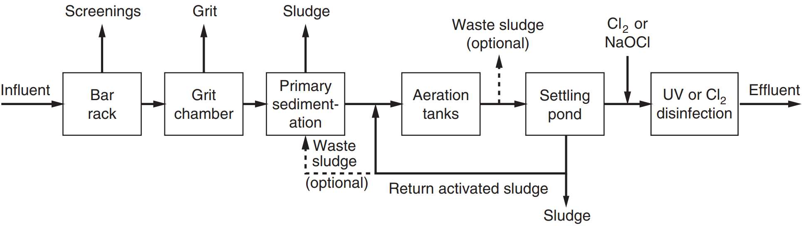
      - **Hình này chứng minh điều gì**
        - Công đoạn sinh học thứ cấp (bể hiếu khí kết hợp bể lắng) giữ vai trò trung tâm phân hủy cơ chất và tuần hoàn bùn hoạt tính.
      - **Từ đâu mà thấy được**
        - Dây chuyền nối tiếp: Song chắn rác $\rightarrow$ Bể lắng cát $\rightarrow$ Lắng sơ cấp $\rightarrow$ Cụm xử lý sinh học (Aeration tanks + Settling pond) $\rightarrow$ Khử trùng UV/$\text{Cl}_2$.
        - Cụm sinh học đóng khung tiếp nhận nước sau lắng sơ cấp, tuần hoàn bùn ($RAS$) về đầu bể thổi khí và xả bùn dư ($WAS$).

###### Vai trò sinh hóa của vi sinh vật (Role of Microorganisms)

- Oxy hóa cơ chất hữu cơ tạo năng lượng:
  - Vi sinh vật dị dưỡng sử dụng chất hữu cơ làm nguồn carbon và electron cho quá trình dị hóa ($catabolism$).
  - Sản phẩm cuối của quá trình khoáng hóa hiếu khí gồm khí carbonic ($\text{CO}_2$) và nước ($\text{H}_2\text{O}$).
- Tổng hợp tế bào và tạo sinh khối mới ($Biomass\text{ synthesis}$):
  - Phản ứng đồng hóa ($anabolism$) dùng năng lượng sinh học để tổng hợp các hợp chất tế bào mới.
  - Làm tăng mật độ tế bào bùn vi sinh vật trong hệ thống phản ứng.
- Loại bỏ nitơ và phospho bằng các chủng vi khuẩn chuyên biệt:
  - Vi khuẩn tự dưỡng nitrat hóa oxy hóa amoni ($\text{NH}_4^+$) thành nitrit ($\text{NO}_2^-$) và nitrat ($\text{NO}_3^-$).
  - Vi khuẩn dị dưỡng tùy nghi khử ion nitrat ($\text{NO}_3^-$) thành khí nitơ phân tử ($\text{N}_2$).
  - Vi khuẩn tích lũy phospho hấp thu dư thừa orthophosphate và lưu trữ trong sinh khối tế bào xả bỏ.
- Phương trình tỷ lượng tổng quát cho quá trình sinh học hiếu khí:
  - Phương trình hóa học mô tả quá trình oxy hóa kết hợp tổng hợp tế bào:
    $$\nu_1\text{ (organic material)} + \nu_2\text{O}_2 + \nu_3\text{NH}_3 + \nu_4\text{PO}_4^{3-} \xrightarrow{\text{microorganisms}} \nu_5\text{ (new cells)} + \nu_6\text{CO}_2 + \nu_7\text{H}_2\text{O}$$
  - Ý nghĩa các hệ số tỷ lượng $\nu_i$:
    - $\nu_1$: Lượng chất hữu cơ bị phân hủy (tính theo mol hoặc gam $COD$).
    - $\nu_2$: Nhu cầu oxy phân tử ($\text{O}_2$) tiêu thụ cho phản ứng hô hấp dị hóa.
    - $\nu_3, \nu_4$: Lượng amoniac ($\text{NH}_3$) và ion phosphate ($\text{PO}_4^{3-}$) cung cấp nguyên tố nitơ và phospho cho cấu trúc tế bào.
    - $\nu_5$: Lượng sinh khối tế bào mới được tổng hợp ($new\text{ cells}$, công thức thực nghiệm $\text{C}_5\text{H}_7\text{NO}_2$).
    - $\nu_6, \nu_7$: Lượng sản phẩm phụ $\text{CO}_2$ và $\text{H}_2\text{O}$ giải phóng từ phản ứng oxy hóa.
- Tách sinh khối tế bào ra khỏi dòng nước nhờ trọng lực:
  - Tỷ trọng tương đối của sinh khối: Tỷ trọng sinh khối vi sinh lớn hơn tỷ trọng của nước ($SG \approx 1.01 - 1.05 > 1.0$).
  - Cơ chế lắng trọng lực: Độ chênh lệch tỷ trọng cho phép vi sinh vật kết tụ và tách lắng hoàn toàn dưới đáy bể lắng thứ cấp ($gravity\text{ settling}$).

##### 1.2 Mối quan hệ giữa quá trình vi sinh và xử lý nước thải (Relationship of Bacterial Processes and Wastewater Treatment)

###### Tương quan giữa quá trình vi sinh và công đoạn xử lý (Bacterial Processes vs. Treatment Processes)

- Tương quan trực tiếp giữa hoạt động tế bào vi khuẩn và thông số công nghệ môi trường:
  - Bảng đối chiếu quá trình sinh học và quá trình xử lý công nghệ:
    | Hiện tượng sinh học của vi khuẩn ($Bacterial\text{ process}$) | Quá trình công nghệ xử lý nước thải ($Wastewater\text{ treatment process}$) | Ý nghĩa kỹ thuật vận hành |
    | :--- | :--- | :--- |
    | Hấp thụ carbon ($Carbon\text{ ingestion}$) | Phân hủy sinh học ($Biodegradation$) | Tiêu thụ cơ chất hòa tan, giảm nồng độ $BOD$ và $COD$ dòng ra. |
    | Hô hấp tế bào ($Respiration$) | Nhu cầu cấp khí ($Aeration\text{ requirement}$) | Tiêu thụ oxy hòa tan, quyết định lưu lượng khí cấp của máy thổi khí. |
    | Sinh trưởng và phân chia ($Growth\text{ and division}$) | Tạo bùn sinh học ($Biomass\text{ production}$) | Gia tăng sinh khối, quyết định lượng bùn dư xả bỏ ($WAS$) và tải trọng bể lắng. |

###### Cơ chế hình thành bông bùn hoạt tính (Mechanism of Activated Sludge Floc Formation)

- Khái niệm bông bùn hoạt tính ($Bio\text{-flocs}$):
  - Tập hợp vi sinh vật dạng keo tụ lơ lửng gồm vi khuẩn, nấm, động vật nguyên sinh và hạt keo hữu cơ liên kết thành hạt cặn có kích thước từ vài chục micromet đến vài milimet.
- Vai trò của chất polyme ngoại bào ($ECP$ / $EPS$ - Extracellular Polymeric Substances):
  - Tế bào vi khuẩn tiết ra mạng lưới polyme ngoại bào gồm polysaccharide, protein, axit nucleic và lipid.
  - Chuỗi polyme chứa các nhóm chức tích điện âm như nhóm carboxylat ($-\text{COO}^-$) và nhóm phosphat ($-\text{PO}_4^{3-}$).
- Cơ chế tạo cầu nối cation hóa trị hai ($Cation\text{ bridging}$):
  - Lực đẩy tĩnh điện: Bề mặt tế bào vi khuẩn mang điện tích âm, sinh ra lực đẩy tĩnh điện ngăn cản sự kết dính tự nhiên.
  - Cầu nối ion hóa trị hai: Các ion hóa trị hai trong nước thải (đặc biệt là ion canxi $\text{Ca}^{2+}$, ký hiệu $C^{2+}$, và magie $\text{Mg}^{2+}$) liên kết với nhóm mang điện âm ($-\text{COO}^-$, $-\text{PO}_4^{3-}$) giữa các tế bào liền kề và chuỗi $ECP$.
  - Hiệu quả keo tụ sinh học: Mạng lưới polyme kết hợp cầu nối ion nén lớp điện tích kép, liên kết các tế bào vi khuẩn thành bông cặn bền vững có tỷ trọng lớn và dễ lắng.
- Bằng chứng vi thể về cấu trúc bùn hoạt tính và bông cặn sinh học:
  - **Hình 2.** Vi sinh vật trong bùn hoạt tính dưới kính hiển vi quang học
    - 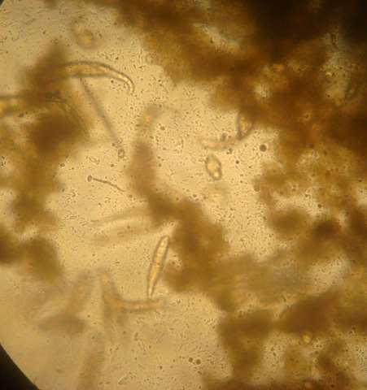
    - **Hình này chứng minh điều gì**
      - Bùn hoạt tính chứa quần thể vi sinh vật phong phú gồm vi khuẩn và động vật nguyên sinh phân tán trong pha lỏng.
    - **Từ đâu mà thấy được**
      - Thị trường kính hiển vi hiển thị các vi sinh vật dạng que, sợi và các cấu trúc tế bào đơn lẻ phân bố cùng cặn lơ lửng.
      - Mật độ tế bào phân bố dày đặc phản ánh quá trình sinh trưởng và tích lũy sinh khối trong bể sinh học.
  - **Hình 3.** Cấu trúc bông bùn hoạt tính (Bio-floc) kết cụm dưới kính hiển vi
    - 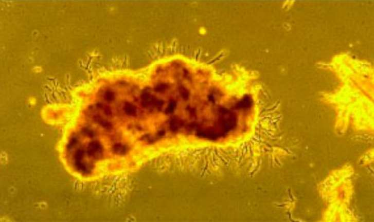
    - **Hình này chứng minh điều gì**
      - Các tế bào vi khuẩn liên kết chặt chẽ tạo thành khối bông bùn lớn nhờ chất polyme ngoại bào ($ECP$) và cầu ion kim loại.
    - **Từ đâu mà thấy được**
      - Bông cặn vi sinh vật co cụm thành đám mây sinh khối đặc sệt màu vàng nâu ở trung tâm vi trường.
      - Rìa bông cặn có các tua sợi vi sinh và mạng lưới polyme vươn ra để bắt giữ cơ chất và hạt keo.

##### 1.3 Các loại quá trình sinh học trong xử lý nước thải (Types of Biological Processes for Wastewater Treatment)

###### Phân loại theo hình thái sinh trưởng và điều kiện dưỡng khí (Process Classification)

- Phân loại theo trạng thái sinh trưởng của sinh khối vi sinh ($Growth\text{ morphology}$):
  - Sinh trưởng lơ lửng ($Suspended\text{ Growth Processes}$):
    - Vi sinh vật sinh trưởng tự do lơ lửng dưới dạng bông cặn phân tán trong pha lỏng nhờ khuấy trộn cơ học hoặc sục khí nén.
    - Đại diện tiêu biểu: Bể bùn hoạt tính truyền thống ($Activated\text{ Sludge Process}$), bể màng sinh học ($MBR$).
  - Sinh trưởng bám dính ($Attached\text{ Growth Processes}$ / $Biofilm$):
    - Vi sinh vật bám dính và phát triển trên bề mặt vật liệu đệm trơ (đá, vòng nhựa, tấm nhựa định hình), tạo thành lớp màng sinh học mỏng ($biofilm$).
    - Nước thải tiếp xúc với màng vi sinh, chất ô nhiễm khuếch tán qua lớp màng để vi khuẩn chuyển hóa.
    - Đại diện tiêu biểu: Bể lọc sinh học nhỏ giọt ($Trickling\text{ filter}$), bể màng vi sinh chuyển động ($MBBR$), bể đệm ngập nước ($Packed\text{-bed reactor}$ - $PBR$).
  - Tầng bùn dòng chảy ngược ($Sludge\text{ blanket}$):
    - Vi sinh vật tự kết tụ tạo hạt bùn đặc sệt ($granular\text{ sludge}$) lơ lửng tạo thành tầng đệm bùn dày ở đáy bể có dòng nước dâng từ dưới lên.
    - Đại diện tiêu biểu: Bể bùn kỵ khí dòng chảy ngược ($UASB$).
- Phân loại theo môi trường dưỡng khí và chất nhận electron ($Electron\text{ acceptor conditions}$):
  - Quá trình hiếu khí ($Aerobic\text{ processes}$):
    - Phản ứng diễn ra khi có mặt oxy hòa tan phân tử tự do ($\text{DO} > 0$, duy trì $1.5 - 2.0\text{ mg/L}$).
    - Oxy phân tử ($\text{O}_2$) đóng vai trò là chất nhận electron cuối cùng.
  - Quá trình thiếu khí ($Anoxic\text{ processes}$):
    - Phản ứng diễn ra khi thiếu vắng oxy hòa tan phân tử tự do ($\text{DO} \approx 0$) nhưng có mặt hợp chất oxy hóa chứa nitơ ($\text{NO}_3^-$, $\text{NO}_2^-$).
    - Ion $\text{NO}_3^-$ và $\text{NO}_2^-$ đóng vai trò là chất nhận electron cuối cùng cho quá trình khử nitrat thành khí $\text{N}_2$.
  - Quá trình kỵ khí ($Anaerobic\text{ processes}$):
    - Phản ứng diễn ra khi hoàn toàn không có mặt cả oxy phân tử tự do lẫn oxy liên kết vô cơ ($\text{DO} = 0$, $\text{NO}_x^- = 0$).
    - Chất nhận electron là carbon dioxide ($\text{CO}_2$), hợp chất hữu cơ trung gian hoặc sunfat, sinh ra khí metan ($\text{CH}_4$) và các sản phẩm lên men.

###### Các công nghệ xử lý sinh học tiêu biểu trong thực tế (Typical Biological Technologies)

- Bảng tổng hợp công nghệ xử lý sinh học nước thải theo phân loại hình thái và môi trường dưỡng khí:
  | Chế độ dưỡng khí | Hình thái sinh trưởng ($Type$) | Tên công nghệ thông dụng ($Common\text{ name}$) | Mục đích công nghệ ($Use$) |
  | :--- | :--- | :--- | :--- |
  | Hiếu khí ($Aerobic$) | Sinh trưởng lơ lửng ($Suspended\text{ growth}$) | Bể bùn hoạt tính ($Activated\text{ sludge processes}$) | Khử chất hữu cơ ($BOD\text{ removal}$), nitrat hóa ($nitrification$) |
  | Hiếu khí ($Aerobic$) | Sinh trưởng lơ lửng ($Suspended\text{ growth}$) | Bể phản ứng màng sinh học ($Membrane\text{ bioreactor}$ - $MBR$) | Khử chất hữu cơ ($BOD\text{ removal}$), nitrat hóa ($nitrification$) |
  | Hiếu khí ($Aerobic$) | Sinh trưởng bám dính ($Attached\text{ growth}$) | Bể phản ứng màng chuyển động ($Moving\text{ bed bioreactor}$ - $MBBR$) | Khử chất hữu cơ ($BOD\text{ removal}$), nitrat hóa ($nitrification$) |
  | Hiếu khí ($Aerobic$) | Sinh trưởng bám dính ($Attached\text{ growth}$) | Bể phản ứng đệm cố định ($Packed\text{-bed reactor}$ - $PBR$) | Khử chất hữu cơ ($BOD\text{ removal}$), nitrat hóa ($nitrification$) |
  | Thiếu khí ($Anoxic$) | Sinh trưởng lơ lửng ($Suspended\text{ growth}$) | Bể khử nitrat lơ lửng ($Suspended\text{-growth denitrification}$) | Khử nitrat ($Denitrification$) |
  | Kỵ khí ($Anaerobic$) | Sinh trưởng lơ lửng ($Suspended\text{ growth}$) | Bể tiếp xúc kỵ khí ($Anaerobic\text{ contact processes}$) | Khử chất hữu cơ ($BOD\text{ removal}$) |
  | Kỵ khí ($Anaerobic$) | Sinh trưởng lơ lửng ($Suspended\text{ growth}$) | Quá trình Anammox ($Anammox\text{ process}$) | Khử nitrit hóa, loại bỏ amoni kỵ khí ($Denitritation,\text{ ammonia removal}$) |
  | Kỵ khí ($Anaerobic$) | Tầng bùn đáy ($Sludge\text{ blanket}$) | Bể bùn kỵ khí dòng chảy ngược ($Upflow\text{ anaerobic sludge blanket}$ - $UASB$) | Khử chất hữu cơ ($BOD\text{ removal}$) |

##### 1.4 Phân loại vi sinh vật theo nguồn năng lượng và cơ chất (Classification of Microorganisms)

###### Phân loại vi sinh vật theo nguồn carbon và chuyển hóa electron (Nutritional and Metabolic Classification)

- Phân loại theo nguồn carbon dùng cho tổng hợp tế bào:
  - Vi sinh vật dị dưỡng ($Heterotrophs$): Sử dụng nguồn carbon hữu cơ ($Organic\text{ compound}$) để xây dựng tế bào mới.
  - Vi sinh vật tự dưỡng ($Autotrophs$): Sử dụng khí carbonic ($\text{CO}_2$) hoặc các dạng carbon vô cơ ($\text{HCO}_3^-$) làm nguồn carbon cấu trúc.
- Phân loại theo chất cho electron ($Electron\text{ donor}$):
  - Vi sinh vật hóa dưỡng hữu cơ ($Organotrophs$): Lấy electron từ việc oxy hóa các hợp chất hữu cơ ($Organic\text{ compound}$).
  - Vi sinh vật hóa dưỡng vô cơ ($Lithotrophs$): Lấy electron từ việc oxy hóa các hợp chất vô cơ như amoni ($\text{NH}_4^+$), nitrit ($\text{NO}_2^-$), hydro sunfua ($\text{H}_2\text{S}$).
- Phân loại theo chất nhận electron cuối cùng ($Electron\text{ acceptor}$):
  - Oxy phân tử ($\text{O}_2$): Trong quá trình oxy hóa hiếu khí của vi khuẩn dị dưỡng và quá trình nitrat hóa của vi khuẩn tự dưỡng.
  - Ion nitrat và nitrit ($\text{NO}_2^-$, $\text{NO}_3^-$): Trong phản ứng khử nitrat thiếu khí và quá trình Anammox.
  - Carbon dioxide ($\text{CO}_2$): Trong phản ứng sinh khí metan kỵ khí ($Methanogenesis$).
  - Hợp chất hữu cơ nội sinh: Trong phản ứng lên men axit kỵ khí ($Acid\text{ fermentation}$).

###### Tổng hợp các nhóm vi sinh vật xử lý nước thải (Microbial Groups Summary Table)

- Bảng phân loại chi tiết các nhóm vi sinh vật chính trong công nghệ xử lý nước thải:
  | Nhóm vi khuẩn ($Type\text{ of bacteria}$) | Tên phản ứng ($Reaction\text{ name}$) | Nguồn carbon ($Carbon\text{ source}$) | Chất cho electron ($Electron\text{ donor}$) | Chất nhận electron ($Electron\text{ acceptor}$) | Sản phẩm tạo thành ($Product$) |
  | :--- | :--- | :--- | :--- | :--- | :--- |
  | Dị dưỡng hiếu khí ($Aerobic\text{ heterotrophic}$) | Oxy hóa hiếu khí ($Aerobic\text{ oxidation}$) | Hợp chất hữu cơ ($Organic\text{ compound}$) | Hợp chất hữu cơ ($Organic\text{ compound}$) | $\text{O}_2$ | $\text{CO}_2$, $\text{H}_2\text{O}$ |
  | Tự dưỡng hiếu khí ($Aerobic\text{ autotrophic}$) | Nitrat hóa ($Nitrification$) | $\text{CO}_2$ | $\text{NH}_4^+$, $\text{NO}_2^-$ | $\text{O}_2$ | $\text{NO}_2^-$, $\text{NO}_3^-$ |
  | Dị dưỡng tùy nghi ($Facultative\text{ heterotrophic}$) | Khử nitrat thiếu khí ($Denitrification\text{ anoxic reaction}$) | Hợp chất hữu cơ ($Organic\text{ compound}$) | Hợp chất hữu cơ ($Organic\text{ compound}$) | $\text{NO}_2^-$, $\text{NO}_3^-$ | $\text{N}_2$, $\text{CO}_2$, $\text{H}_2\text{O}$ |
  | Dị dưỡng kỵ khí ($Anaerobic\text{ heterotrophic}$) | Lên men axit ($Acid\text{ fermentation}$) | Hợp chất hữu cơ ($Organic\text{ compound}$) | Hợp chất hữu cơ ($Organic\text{ compound}$) | Hợp chất hữu cơ ($Organic\text{ compound}$) | Axit béo bay hơi ($VFAs$: acetate, propionate, butyrate) |
  | Dị dưỡng kỵ khí / Vi sinh vật sinh metan ($Anaerobic\text{ heterotrophic}$) | Quá trình sinh metan ($Methanogenesis$) | Hợp chất hữu cơ ($Organic\text{ compound}$) | Axit béo bay hơi ($VFAs$) | $\text{CO}_2$ | Khí metan ($\text{CH}_4$) |
  | Tự dưỡng kỵ khí ($Anaerobic\text{ autotrophic}$) | Quá trình Anammox ($Anammox$) | $\text{CO}_2$ | $\text{NH}_4^+$ | $\text{NO}_2^-$ | $\text{N}_2$, $\text{NO}_3^-$ |
- Đặc trưng sinh hóa và vai trò công nghệ của từng nhóm vi sinh vật:
  - Vi khuẩn dị dưỡng hiếu khí ($Aerobic\text{ heterotrophs}$): Tốc độ sinh trưởng nhanh, đóng vai trò chủ lực loại bỏ $BOD/COD$ trong nước thải sinh hoạt và công nghiệp.
  - Vi khuẩn tự dưỡng nitrat hóa ($Nitrifying\text{ bacteria}$): Gồm vi khuẩn oxy hóa amoni ($AOB$ như *Nitrosomonas*) và vi khuẩn oxy hóa nitrit ($NOB$ như *Nitrobacter*); sinh trưởng chậm, tiêu tốn nhiều oxy hòa tan và độ kiềm.
  - Vi khuẩn dị dưỡng khử nitrat ($Denitrifiers$): Sử dụng nitrat/nitrit làm chất nhận electron thay thế khi vắng mặt oxy hòa tan, khử nitơ về dạng khí $\text{N}_2$ bay lên khí quyển và thu hồi lại độ kiềm cho hệ thống.
  - Vi khuẩn lên men axit kỵ khí ($Acidogens$ và $Acetogens$): Thủy phân và chuyển hóa hợp chất hữu cơ phức tạp thành các axit béo bay hơi mạch ngắn ($VFAs$), tạo cơ chất tiền đề cho bước sinh metan.
  - Vi sinh vật sinh metan ($Methanogens$): Nhóm vi sinh vật cổ kỵ khí nghiêm ngặt ($Archaea$), chuyển hóa acetate hoặc $\text{H}_2$ và $\text{CO}_2$ thành khí sinh học giàu năng lượng ($\text{CH}_4$).
  - Vi khuẩn Anammox (*Anaerobic Ammonium Oxidation*): Chuyển hóa trực tiếp ion $\text{NH}_4^+$ và $\text{NO}_2^-$ thành khí $\text{N}_2$ trong điều kiện kỵ khí hoàn toàn, tiết kiệm đáng kể năng lượng sục khí và không đòi hỏi bổ sung nguồn carbon hữu cơ.

#### 2. Phân loại vi sinh vật và Vai trò chuyển hóa (Microbiology & Classification)

- Định vị chuyên đề trong hệ thống động học sinh học: Phần này đi sâu vào cơ chế sinh sản, động học sinh trưởng và phân hủy sinh khối của vi khuẩn ($Bacterial\text{ Growth and Decay}$) trong công nghệ xử lý nước thải.
- Cấu trúc nội dung chính gồm 5 hợp phần logic:
  - 2.1 Sinh sản và đường cong sinh trưởng vi khuẩn trong bể gián đoạn ($Bacterial\text{ Reproduction \& Growth in Batch Reactor}$).
  - 2.2 Hệ số sản lượng sinh khối và cân bằng tỷ lượng hóa học ($Biomass\text{ Yield Estimation \& Chemical Stoichiometry}$).
  - 2.3 Ước tính nhu cầu oxy trong quá trình sinh học ($Oxygen\text{ Requirement Estimation}$).
  - 2.4 Phân hủy sinh khối và hô hấp nội bào ($Biomass\text{ Decay and Endogenous Respiration}$).
  - 2.5 Ví dụ tính toán kỹ thuật: Hệ số sản lượng thực tế và nhu cầu oxy ($Example:\text{ Observed Yield and Oxygen Consumption}$).

##### 2.1 Sinh sản và đường cong sinh trưởng vi khuẩn trong bể gián đoạn (Bacterial Reproduction & Growth in Batch Reactor)

###### Sinh sản vi khuẩn và thời gian thế hệ (Bacterial Reproduction and Generation Time)

- Điều kiện sinh trưởng không giới hạn ($Unlimited\text{ growth}$):
  - Vi khuẩn sinh trưởng không giới hạn khi môi trường cung cấp đầy đủ cơ chất dinh dưỡng ($substrate$), dưỡng chất đa vi lượng ($nutrients$) và các điều kiện môi trường tối ưu (nhiệt độ, pH, DO).
- Cơ chế sinh sản phân đôi tế bào ($Binary\text{ Fission}$):
  - Phân đôi là phương thức sinh sản vô tính chủ yếu của vi khuẩn: một tế bào mẹ nhân đôi vật chất di truyền rồi phân chia thành hai tế bào con riêng biệt.
  - Số lượng cá thể trong quần thể gia tăng theo quy luật lũy thừa cơ số 2: $N_t = N_0 \cdot 2^n$ (với $n$ là số thế hệ phân chia).
- Khái niệm thời gian thế hệ ($Generation\text{ time}$ - $t_d$):
  - Thời gian thế hệ là khoảng thời gian cần thiết để một tế bào vi khuẩn hoàn tất chu kỳ phân chia đôi, hoặc để mật độ tế bào của toàn bộ quần thể tăng gấp đôi.
  - Dao động thời gian thế hệ: Biến thiên rất lớn tùy thuộc vào đặc tính loài sinh học và điều kiện cấp dinh dưỡng, từ dưới $20\text{ phút}$ (đối với vi khuẩn dị dưỡng hiếu khí trong điều kiện nuôi cấy tối ưu) đến hàng ngày hoặc hàng tuần (đối với vi khuẩn tự dưỡng nitrat hóa hoặc kỵ khí sinh metan).
- Ví dụ minh họa về tiềm năng tăng trưởng theo cấp số nhân:
  - Xét một tế bào vi khuẩn ban đầu ($N_0 = 1$) có thời gian thế hệ trung bình $t_d = 1\text{ giờ}$ trong điều kiện dinh dưỡng đầy đủ.
  - Sau $24\text{ giờ}$ sinh trưởng liên tục ($n = 24\text{ thế hệ}$), số lượng tế bào vi khuẩn sinh ra đạt:
    $$N_{24} = 1 \cdot 2^{24} = 16{,}777{,}216\text{ tế bào} \approx 16.7\text{ triệu tế bào}$$
  - Minh chứng cho tốc độ nhân sinh khối cực kỳ nhanh chóng của vi khuẩn khi nồng độ cơ chất trong dòng nước thải dồi dào.

###### Bốn pha sinh trưởng trong bể phản ứng gián đoạn (Four Growth Phases in Batch Reactor)

- Đặc trưng hệ phản ứng mẻ gián đoạn ($Batch\text{ Reactor}$):
  - Bể phản ứng gián đoạn là hệ kín không có dòng cấp vào liên tục hay dòng rút nước thải ra ($Q_{\text{in}} = Q_{\text{out}} = 0$); cơ chất và giống vi sinh vật được nạp vào một lần duy nhất tại thời điểm ban đầu.
- Trình tự 4 pha sinh trưởng điển hình của vi khuẩn theo thời gian:
  - 1. Pha thích ứng / Pha tiềm phát ($Lag\text{ Phase}$):
    - Giai đoạn vi khuẩn thích nghi với môi trường sống, điều kiện nhiệt độ, pH và đặc tính cơ chất mới.
    - Tế bào vi khuẩn tổng hợp các enzyme cảm ứng cần thiết để vận chuyển và chuyển hóa cơ chất; sự phân chia tế bào chưa diễn ra hoặc rất hạn chế.
    - Nồng độ sinh khối vi sinh vật hầu như không tăng; nồng độ cơ chất chỉ suy giảm nhẹ.
  - 2. Pha tăng trưởng logarit / Pha lũy thừa ($Exponential\text{ / Log Growth Phase}$):
    - Vi khuẩn đạt tốc độ sinh trưởng riêng cực đại ($\mu = \mu_{\max}$) do nồng độ cơ chất dư thừa không giới hạn phản ứng.
    - Mật độ sinh khối tế bào gia tăng theo hàm số mũ; tốc độ sinh sản hiệu quả hơn hoàn toàn so với tốc độ chết tự nhiên.
    - Nồng độ cơ chất hòa tan trong nước thải sụt giảm nhanh chóng với độ dốc lớn nhất do bị vi khuẩn hấp thụ mạnh mẽ cho phản ứng đồng hóa và dị hóa.
  - 3. Pha cân bằng / Pha dừng ($Stationary\text{ Phase}$):
    - Tốc độ sinh trưởng giảm dần do cơ chất cạn kiệt và các sản phẩm trao đổi chất thứ cấp mang tính ức chế tích lũy trong môi trường.
    - Quần thể vi sinh vật đạt trạng thái cân bằng động: tốc độ tạo thành tế bào mới xấp xỉ bằng tốc độ tế bào già cỗi chết đi ($\mu_{\text{net}} \approx 0$).
    - Nồng độ sinh khối tổng cộng đạt giá trị cực đại và đi ngang thành một bình nguyên; nồng độ cơ chất hòa tan tiệm cận mức tối thiểu.
  - 4. Pha suy giảm / Pha tử vong ($Death\text{ Phase}$):
    - Cơ chất dinh dưỡng hòa tan bên ngoài cạn kiệt hoàn toàn ($S \approx 0$); vi khuẩn thiếu nguồn năng lượng ngoại sinh để duy trì hoạt động sống.
    - Quá trình tự phân hủy nội sinh ($endogenous\text{ decay}$) và ly giải tế bào ($cell\text{ lysis}$) chiếm ưu thế hoàn toàn so với tốc độ sinh trưởng mới.
    - Mật độ sinh khối suy giảm liên tục theo thời gian do hiện tượng tự oxy hóa tế bào để sinh năng lượng duy trì sự sống.
- Minh chứng thực nghiệm về đường cong sinh trưởng và suy giảm cơ chất:
  - **Hình 4.** Động thái biến thiên cơ chất và sinh khối trong bể gián đoạn theo thời gian (Substrate and biomass progression in batch reactor)
    - 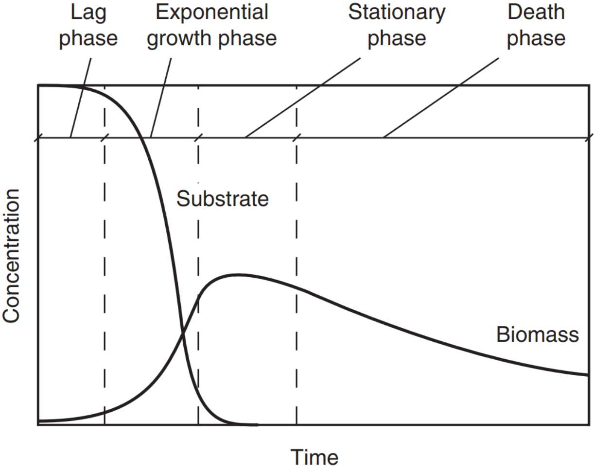
    - **Hình này chứng minh điều gì**
      - Cơ chất sụt giảm trực tiếp tương ứng với sự gia tăng sinh khối tế bào qua 4 pha sinh trưởng kinh điển trong hệ phản ứng mẻ gián đoạn.
    - **Từ đâu mà thấy được**
      - Trục tung biểu diễn nồng độ ($Concentration$), trục hoành biểu diễn thời gian ($Time$).
      - Đường nồng độ cơ chất ($Substrate$) bắt đầu ở mức cao, dốc đứng đi xuống trong pha lũy thừa ($Exponential\text{ phase}$) và tiệm cận $0$ ở pha cân bằng ($Stationary\text{ phase}$).
      - Đường sinh khối ($Biomass$) bắt đầu ở mức thấp, tăng vọt theo hàm mũ, đạt cực đại ở pha cân bằng và suy giảm đều trong pha tử vong ($Death\text{ phase}$).

##### 2.2 Hệ số Sản lượng Sinh khối và Cân bằng Tỷ lượng Hóa học (Biomass Yield Estimation)

###### Định nghĩa và thông số đo lường hệ số sản lượng sinh khối (Biomass Yield Definition and Measurement)

- Định nghĩa hệ số sản lượng sinh khối ($Biomass\text{ Yield}$ - $Y$):
  - Hệ số sản lượng là tỷ số giữa khối lượng sinh khối vi sinh vật mới được tạo ra trên khối lượng cơ chất đã bị tiêu thụ trong phản ứng:
    $$Y = \frac{\Delta X}{\Delta S} = \frac{\text{g biomass produced}}{\text{g substrate consumed}}$$
- Thông số đo lường sinh khối vi khuẩn trong công nghệ môi trường:
  - Nồng độ sinh khối tế bào được đo lường thực nghiệm thông qua chỉ tiêu Hàm lượng chất rắn lơ lửng bay hơi ($Volatile\text{ Suspended Solids}$ - $\text{VSS}$).
  - Thông số $\text{VSS}$ đại diện cho thành phần hữu cơ hoạt tính của bông bùn sinh học, loại trừ các cặn khoáng vô cơ trơ.
- Đơn vị biểu diễn hệ số sản lượng cho các quá trình công nghệ tiêu biểu:
  - Quá trình oxy hóa dị dưỡng hiếu khí ($Aerobic\text{ heterotrophic oxidation}$): Biểu diễn dưới dạng $\text{g VSS/g COD removed}$ (gam VSS tạo thành trên mỗi gam COD bị loại bỏ).
  - Quá trình nitrat hóa tự dưỡng hiếu khí ($Aerobic\text{ autotrophic nitrification}$): Biểu diễn dưới dạng $\text{g VSS/g NH}_4^+\text{ oxidized}$ (gam VSS tạo thành trên mỗi gam ion amoni bị oxy hóa).
  - Quá trình phân hủy kỵ khí ($Anaerobic\text{ degradation}$): Biểu diễn dưới dạng $\text{g VSS/g VFAs used}$ (gam VSS tạo thành trên mỗi gam axit béo bay hơi tiêu thụ).

###### Ước tính hệ số sản lượng bằng cân bằng phản ứng hóa học (Yield Estimation by Chemical Stoichiometry)

- Cơ sở tính toán tỷ lượng từ phương trình hóa học:
  - Hệ số sản lượng lý thuyết được xác định bằng cách thiết lập và cân bằng phương trình phản ứng hóa học tổng thể kết hợp giữa quá trình dị hóa tạo năng lượng và quá trình đồng hóa tổng hợp tế bào.
- Công thức thực nghiệm chuẩn của tế bào vi khuẩn:
  - Khối lượng và thành phần nguyên tố trung bình của tế bào vi khuẩn thường được biểu diễn qua công thức thực nghiệm: $\text{C}_5\text{H}_7\text{NO}_2$ (khối lượng phân tử $M = 113\text{ g/mol}$).
- Ví dụ cân bằng quá trình phân giải glucose ($\text{C}_6\text{H}_{12}\text{O}_6$, $M = 180\text{ g/mol}$):
  - Phương trình tỷ lượng tổng thể cho quá trình sinh trưởng hiếu khí trên cơ chất glucose với nguồn nitơ là amoniac ($\text{NH}_3$, $M = 17\text{ g/mol}$):
    $$3\text{C}_6\text{H}_{12}\text{O}_6 + 8\text{O}_2 + 2\text{NH}_3 \rightarrow 2\text{C}_5\text{H}_7\text{NO}_2 + 8\text{CO}_2 + 14\text{H}_2\text{O}$$
  - Khối lượng tỷ lượng tương ứng của các chất tham gia và sản phẩm:
    - Glucose: $3 \times (180\text{ g/mol}) = 540\text{ g}$.
    - Oxy phân tử: $8 \times (32\text{ g/mol}) = 256\text{ g}$.
    - Amoniac: $2 \times (17\text{ g/mol}) = 34\text{ g}$.
    - Sinh khối tế bào vi khuẩn mới: $2 \times (113\text{ g/mol}) = 226\text{ g}$.
    - Khí carbonic: $8 \times (44\text{ g/mol}) = 352\text{ g}$.
    - Nước: $14 \times (18\text{ g/mol}) = 252\text{ g}$.
  - Xác định hệ số sản lượng tế bào trên khối lượng glucose tiêu thụ:
    $$Y = \frac{\Delta (\text{C}_5\text{H}_7\text{NO}_2)}{\Delta (\text{C}_6\text{H}_{12}\text{O}_6)} = \frac{2 \times (113\text{ g/mol})}{3 \times (180\text{ g/mol})} = \frac{226\text{ g cells}}{540\text{ g glucose}} = 0.4185 \approx 0.42\text{ g cells/g glucose used}$$

###### Chuyển đổi hệ số sản lượng sang đơn vị COD (Biomass Yield in Terms of COD and VSS)

- Xác định đương lượng COD lý thuyết của glucose:
  - Phản ứng oxy hóa hoàn toàn glucose thành khí carbonic và nước:
    $$\text{C}_6\text{H}_{12}\text{O}_6 + 6\text{O}_2 \rightarrow 6\text{CO}_2 + 6\text{H}_2\text{O}$$
  - Đương lượng COD của $1\text{ g}$ glucose:
    $$\text{COD}_{\text{glucose}} = \frac{\Delta (\text{O}_2)}{\Delta (\text{C}_6\text{H}_{12}\text{O}_6)} = \frac{6 \times (32\text{ g O}_2/\text{mol})}{1 \times (180\text{ g glucose/mol})} = \frac{192}{180} = 1.0667 \approx 1.07\text{ g COD/g glucose}$$
- Chuyển đổi hệ số sản lượng sang đơn vị COD của cơ chất:
  - Tỷ số khối lượng tế bào sinh ra trên mỗi gam COD glucose tiêu thụ:
    $$Y = \frac{0.42\text{ g cells/g glucose}}{1.07\text{ g COD/g glucose}} = 0.3925 \approx 0.39\text{ g cell/g COD used}$$
  - Biểu diễn dưới dạng chỉ tiêu kỹ thuật $\text{VSS}$:
    $$Y = 0.39\text{ g VSS/g COD used}$$

###### Giá trị hệ số sản lượng điển hình theo phản ứng sinh học (Typical Bacterial Yield Coefficients)

- Bảng tổng hợp hệ số sản lượng tổng hợp ($Synthesis\text{ Yield}$ - $Y$) cho các phản ứng sinh học phổ biến trong xử lý nước thải:
  | Điều kiện dưỡng khí ($Growth\text{ Condition}$) | Chất cho electron ($Electron\text{ Donor}$) | Chất nhận electron ($Electron\text{ Acceptor}$) | Hệ số sản lượng tổng hợp ($Synthesis\text{ Yield}$) |
  | :--- | :--- | :--- | :--- |
  | Hiếu khí ($Aerobic$) | Hợp chất hữu cơ ($Organic\text{ compound}$) | Oxy ($\text{O}_2$) | $0.45\text{ g VSS/g COD}$ |
  | Hiếu khí ($Aerobic$) | Amoniac ($\text{NH}_4^+$) | Oxy ($\text{O}_2$) | $0.12\text{ g VSS/g NH}_4\text{-N}$ |
  | Thiếu khí ($Anoxic$) | Hợp chất hữu cơ ($Organic\text{ compound}$) | Nitrat ($\text{NO}_3^-$) | $0.30\text{ g VSS/g COD}$ |
  | Kỵ khí ($Anaerobic$) | Hợp chất hữu cơ ($Organic\text{ compound}$) | Hợp chất hữu cơ ($Organic\text{ compound}$) | $0.06\text{ g VSS/g COD}$ |
  | Kỵ khí ($Anaerobic$) | Acetate ($\text{CH}_3\text{COO}^-$) | Khí carbonic ($\text{CO}_2$) | $0.05\text{ g VSS/g COD}$ |
- Phân tích tương quan năng lượng và sản lượng sinh khối:
  - Hiệu suất sinh khối của quá trình hiếu khí dị dưỡng ($0.45\text{ g VSS/g COD}$) cao nhất vì oxy có thế oxy hóa khử rất cao ($+0.82\text{ V}$), giải phóng năng lượng tự do Gibbs ($\Delta G^\circ$) tối đa cho phản ứng đồng hóa tế bào.
  - Quá trình thiếu khí sử dụng $\text{NO}_3^-$ giải phóng năng lượng thấp hơn, dẫn đến hệ số sản lượng đạt khoảng $67\%$ so với quá trình hiếu khí ($0.30\text{ g VSS/g COD}$).
  - Quá trình kỵ khí giải phóng rất ít năng lượng tự do vì phần lớn năng lượng ban đầu vẫn được lưu giữ trong các liên kết hóa học của sản phẩm cuối (như khí $\text{CH}_4$). Do đó, hệ số sản lượng bùn kỵ khí rất thấp ($0.05 - 0.06\text{ g VSS/g COD}$), giúp giảm đáng kể chi phí xử lý bùn thải.
  - Quá trình nitrat hóa tự dưỡng hiếu khí có hệ số sản lượng thấp ($0.12\text{ g VSS/g NH}_4\text{-N}$) vì vi khuẩn tự dưỡng phải tiêu tốn một phần năng lượng lớn để khử $\text{CO}_2$ thành các hợp chất carbon hữu cơ của tế bào.

##### 2.3 Ước tính Nhu cầu Oxy trong Quá trình Sinh học (Oxygen Requirement Estimation)

###### Nguyên lý cân bằng COD tổng thể (Total COD Mass Balance)

- Định luật bảo toàn đương lượng electron và COD trong phản ứng sinh hóa:
  - Toàn bộ lượng COD bị loại bỏ khỏi pha lỏng được phân tách thành hai thành phần duy nhất: một phần tiêu hao oxy qua hô hấp để tạo năng lượng, và phần còn lại chuyển hóa thành sinh khối tế bào mới:
    $$\text{Total COD removal} = \text{Oxygen requirement} + \text{COD incorporated into biomass}$$
  - Biểu diễn theo phương trình cân bằng khối lượng:
    $$\Delta\text{COD}_{\text{removed}} = \text{COD}_{\text{O}_2} + \text{COD}_{\text{cells}}$$

###### Ước tính nhu cầu oxy tiêu thụ trên một đơn vị cơ chất (Oxygen Requirement per Unit COD Used)

- Tính toán tỷ lệ tiêu thụ oxy từ phản ứng tổng hợp tế bào:
  - Từ phương trình tỷ lượng sinh trưởng hiếu khí trên cơ chất glucose:
    $$3\text{C}_6\text{H}_{12}\text{O}_6 + 8\text{O}_2 + 2\text{NH}_3 \rightarrow 2\text{C}_5\text{H}_{7}\text{NO}_2 + 8\text{CO}_2 + 14\text{H}_2\text{O}$$
  - Tỷ lệ khối lượng oxy tiêu thụ trên khối lượng cơ chất glucose biểu diễn theo COD:
    $$\frac{\text{Oxygen used}}{\text{Glucose as COD}} = \frac{8 \times (32\text{ g O}_2/\text{mol})}{3 \times (180\text{ g glucose/mol}) \times (1.07\text{ g COD/g glucose})}$$
    $$\frac{\text{Oxygen used}}{\text{Glucose as COD}} = \frac{256\text{ g O}_2}{577.8\text{ g COD}} = 0.443\text{ g O}_2/\text{g COD used} \approx 0.44\text{ g O}_2/\text{g COD used}$$
  - Ý nghĩa công nghệ: Cứ $1.0\text{ g COD}$ cơ chất glucose bị vi khuẩn chuyển hóa thì cần cung cấp $0.44\text{ g O}_2$ hòa tan cho phản ứng hô hấp dị hóa.

###### Đương lượng COD của sinh khối tế bào (COD Equivalent of Biomass)

- Xác định đương lượng oxy hóa lý thuyết của mô tế bào vi khuẩn ($\text{C}_5\text{H}_7\text{NO}_2$):
  - Phản ứng oxy hóa hoàn toàn sinh khối tế bào thành $\text{CO}_2$, $\text{NH}_3$ và $\text{H}_2\text{O}$:
    $$\text{C}_5\text{H}_7\text{NO}_2 + 5\text{O}_2 \rightarrow 5\text{CO}_2 + \text{NH}_3 + 2\text{H}_2\text{O}$$
  - Tỷ số đương lượng COD trên một đơn vị khối lượng tế bào:
    $$\frac{\Delta (\text{O}_2)}{\Delta (\text{C}_5\text{H}_7\text{NO}_2)} = \frac{5 \times (32\text{ g O}_2/\text{mol})}{113\text{ g cells/mol}} = \frac{160}{113} = 1.4159 \approx 1.42\text{ g O}_2/\text{g cells} = 1.42\text{ g COD/g VSS}$$
  - Hệ số chuyển đổi then chốt trong kỹ thuật bùn hoạt tính: Cứ $1.0\text{ g VSS}$ sinh khối tương đương với $1.42\text{ g COD}$.
- Xác định lượng COD chuyển hóa vào sinh khối vi khuẩn:
  - Với hệ số sản lượng $Y = 0.39\text{ g VSS/g COD removed}$, lượng COD tích hợp vào tế bào mới là:
    $$\text{COD}_{\text{biomass}} = 0.39\text{ g VSS/g COD removed} \times 1.42\text{ g COD/g VSS} = 0.5538 \approx 0.56\text{ g COD}_{\text{cell}}/\text{g COD removed}$$
- Thiết lập phương trình phân bố COD hoàn chỉnh:
  $$1.00\text{ g COD removal} = 0.44\text{ g Oxygen requirement} + 0.56\text{ g COD incorporated into biomass}$$
  - $44\%$ lượng COD bị khử chuyển hóa thành năng lượng hô hấp và tiêu hao oxy hòa tan.
  - $56\%$ lượng COD bị khử chuyển hóa thành sinh khối hữu cơ mới tích tụ trong bùn hoạt tính.

##### 2.4 Phân hủy Sinh khối và Hô hấp Nội bào (Biomass Decay and Endogenous Respiration)

###### Khái niệm và nguyên nhân gây suy giảm sinh khối (Biomass Decay Mechanisms and Factors)

- Định nghĩa sự suy giảm sinh khối ($Biomass\text{ Loss}$):
  - Suy giảm sinh khối (còn được gọi là phân hủy sinh khối - $decay$, phân hủy nội sinh - $endogenous\text{ decay}$, hoặc hô hấp nội bào - $endogenous\text{ respiration}$) là hiện tượng suy giảm khối lượng tế bào sống trong hệ thống phản ứng sinh học.
- Ba nguyên nhân cốt lõi gây suy giảm sinh khối:
  - 1. Cạn kiệt cơ chất hòa tan ngoại bào ($Substrate\text{ depletion}$):
    - Khi nguồn cơ chất bên ngoài cạn kiệt, vi khuẩn buộc phải tự oxy hóa các hợp chất dự trữ nội bào và màng tế bào của chính mình ($self\text{-oxidation}$) để sản sinh năng lượng duy trì sự sống ($maintenance\text{ energy}$).
  - 2. Tế bào già cỗi và chết tự nhiên ($Cell\text{ death related to cell age}$):
    - Tế bào già bị ly giải màng tế bào ($lysis$), giải phóng ra môi trường các hợp chất hữu cơ phân hủy sinh học chậm ($slow\text{ biodegradable substrate}$) như protein và polysaccharide.
    - Các hợp chất này đóng vai trò làm nguồn cơ chất tối thiểu cho các tế bào còn lại tiếp tục tiếp cận trạng thái nghỉ ($resting\text{ state}$).
  - 3. Bị động vật nguyên sinh tiêu thụ ($Predation$):
    - Tế bào vi khuẩn bị các vi sinh vật bậc cao hơn trong chuỗi thức ăn (như động vật nguyên sinh - $protozoa$, luân trùng - $rotifers$) bắt giữ và tiêu thụ.

###### Hệ số phân hủy sinh khối nội bào (Decay Coefficient b)

- Ký hiệu và định nghĩa hệ số động học:
  - Ký hiệu: $b$ (hoặc $k_d$), là hệ số tốc độ suy giảm sinh khối nội sinh ($endogenous\text{ decay coefficient}$).
  - Đặc trưng cho tỷ lệ suy giảm sinh khối trên một đơn vị sinh khối tế bào hiện diện trong một đơn vị thời gian.
- Đơn vị đo lường kỹ thuật:
  - Biểu diễn theo đơn vị: $\text{g biomass loss/g biomass present}\cdot\text{d}$ (gam sinh khối mất đi trên gam sinh khối hiện diện mỗi ngày), rút gọn là $\text{d}^{-1}$ (ngày$^{-1}$).
- Dải giá trị thực nghiệm điển hình:
  - Trong các hệ thống bùn hoạt tính xử lý nước thải thông thường, hệ số phân hủy $b$ dao động trong khoảng:
    $$b = 0.08 - 0.20\text{ g biomass loss/g biomass present}\cdot\text{d}$$
  - Giá trị tính toán tiêu chuẩn ở nhiệt độ $20^\circ\text{C}$ thường chọn $b = 0.10 - 0.12\text{ d}^{-1}$.
- Ý nghĩa công nghệ của quá trình phân hủy nội sinh:
  - Quá trình phân hủy nội sinh làm giảm tốc độ sinh trưởng thực tế của bùn vi sinh, kéo dài thời gian lưu bùn ($SRT$) và gia tăng đáng kể lượng oxy tiêu thụ cần cung cấp cho hệ thống sục khí.

##### 2.5 Ví dụ Tính toán: Hệ số Sản lượng Thực tế và Nhu cầu Oxy (Example: Observed Yield and Oxygen Consumption)

###### Đề bài bài toán công nghệ (Problem Statement)

- Điều kiện công trình và thông số vận hành:
  - Một bể phản ứng sinh học hiếu khí tiếp nhận dòng nước thải có lưu lượng $Q = 1000\text{ m}^3/\text{d}$.
  - Nồng độ COD hòa tan phân hủy sinh học của dòng vào ($\text{bsCOD}_{\text{in}}$): $S_0 = 500\text{ g/m}^3$ ($500\text{ mg/L}$).
  - Nồng độ các thông số của dòng nước sau xử lý ra khỏi bể:
    - Nồng độ COD hòa tan phân hủy sinh học dòng ra ($\text{bsCOD}_{\text{out}}$): $S = 10\text{ g/m}^3$ ($10\text{ mg/L}$).
    - Nồng độ chất rắn lơ lửng bay hơi dòng ra ($\text{VSS}_{\text{out}}$): $X = 200\text{ g/m}^3$ ($200\text{ mg/L}$).
- Yêu cầu tính toán kỹ thuật:
  - 1. Xác định hệ số sản lượng quan sát / thực tế ($Observed\text{ yield}$ - $Y_{\text{obs}}$) theo đơn vị $\text{g VSS/g COD removed}$.
  - 2. Xác định lượng oxy tiêu thụ theo đơn vị $\text{g O}_2/\text{g COD removed}$ và theo lưu lượng khối lượng $\text{g O}_2/\text{d}$ (cũng như $\text{kg O}_2/\text{d}$).

###### Sơ đồ bể phản ứng sinh học và cân bằng vật chất (Bioreactor Diagram and Mass Balance)

- Mô hình hóa hệ thống phản ứng khuấy trộn hoàn toàn (CSTR):
  - Dòng nước thải vào mang lưu lượng $Q$, nồng độ cơ chất hòa tan $S_0 = 500\text{ g/m}^3$.
  - Bể phản ứng tiếp nhận oxy hòa tan ($\text{O}_2$) từ hệ thống sục khí và giải phóng khí carbonic ($\text{CO}_2$) bay lên đỉnh bể.
  - Phản ứng sinh hóa tổng quát diễn ra trong bể:
    $$\text{Organic matter} + \text{O}_2 + \text{nutrients} \rightarrow \text{C}_5\text{H}_7\text{NO}_2 + \text{CO}_2 + \text{H}_2\text{O}$$
  - Dòng xả mang lưu lượng $Q$, chứa nồng độ cơ chất còn lại $S = 10\text{ g/m}^3$ và sinh khối tế bào $X = 200\text{ g VSS/m}^3$.
- Minh chứng sơ đồ phản ứng trên slide bài giảng:
  - **Hình 12.** Sơ đồ cân bằng vật chất cho bể phản ứng sinh học hiếu khí khuấy trộn hoàn toàn (Aerobic biological reactor mass balance)
    - 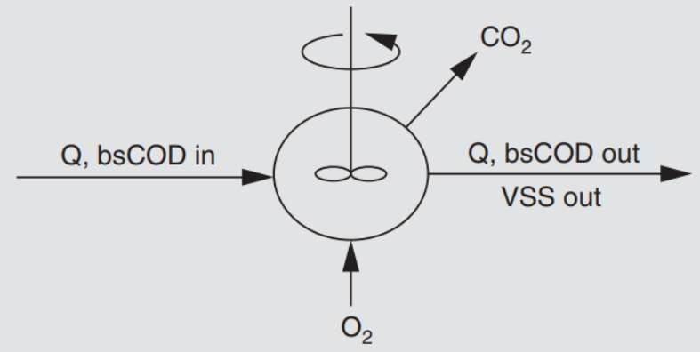
    - **Hình này chứng minh điều gì**
      - Minh họa ranh giới kiểm soát và các dòng vật chất vào - ra trong bể phản ứng sinh học hiếu khí liên tục.
    - **Từ đâu mà thấy được**
      - Dòng nước vào từ bên trái với lưu lượng $Q$ và nồng độ $\text{bsCOD in}$.
      - Dòng cấp khí oxy $\text{O}_2$ từ đáy bể và dòng khí $\text{CO}_2$ thoát ra phía trên đỉnh bể khuấy trộn.
      - Dòng hỗn hợp bùn nước chảy ra bên phải gồm lưu lượng $Q$, nồng độ cơ chất sót lại $\text{bsCOD out}$ và sinh khối vi sinh vật $\text{VSS out}$.

###### Lời giải chi tiết và các bước tính toán (Detailed Step-by-Step Solution)

- **Căn cứ (Governing Equations and Basis):**
  - Lượng cơ chất bsCOD bị loại bỏ trên một đơn vị thể tích:
    $$\Delta S = S_0 - S$$
  - Hệ số sản lượng quan sát ($Y_{\text{obs}}$):
    $$Y_{\text{obs}} = \frac{X_{\text{out}} - X_{\text{in}}}{S_0 - S} = \frac{X}{S_0 - S}$$
    (giả thiết nồng độ sinh khối dòng vào không đáng kể, $X_{\text{in}} \approx 0$).
  - Định luật cân bằng COD tổng thể:
    $$\Delta\text{COD}_{\text{removed}} = \text{Oxygen used} + \text{COD incorporated into biomass}$$
  - Đương lượng COD lý thuyết của mô tế bào vi khuẩn:
    $$1.0\text{ g VSS} \equiv 1.42\text{ g COD}$$
  - Khối lượng COD tích lũy vào sinh khối bùn trên mỗi gam COD bị loại bỏ:
    $$\text{COD}_{\text{cells}} = Y_{\text{obs}} \times 1.42\text{ g COD/g VSS}$$
  - Khối lượng oxy tiêu thụ trên mỗi gam COD bị loại bỏ:
    $$\text{O}_2\text{ used per g COD} = 1.0 - \text{COD}_{\text{cells}} = 1.0 - (Y_{\text{obs}} \times 1.42)$$
  - Tổng lượng oxy tiêu thụ của bể phản ứng theo ngày:
    $$R_{\text{O}_2} = Q \cdot (\Delta S) \cdot (\text{O}_2\text{ used per g COD})$$

- **Nhìn vào (Visual Observation and Step-by-Step Execution):**
  - **Bước 1: Tính toán nồng độ và khối lượng bsCOD bị loại bỏ:**
    - Độ chênh lệch nồng độ bsCOD giữa dòng vào và dòng ra:
      $$\Delta S = 500\text{ g/m}^3 - 10\text{ g/m}^3 = 490\text{ g/m}^3$$
    - Tổng khối lượng bsCOD bị phân hủy sinh học mỗi ngày:
      $$M_{\Delta S} = Q \cdot \Delta S = 1000\text{ m}^3/\text{d} \times 490\text{ g/m}^3 = 490{,}000\text{ g COD/d} = 490\text{ kg COD/d}$$
    - Tổng khối lượng sinh khối VSS tạo ra trong dòng ra mỗi ngày:
      $$M_X = Q \cdot X = 1000\text{ m}^3/\text{d} \times 200\text{ g/m}^3 = 200{,}000\text{ g VSS/d} = 200\text{ kg VSS/d}$$

  - **Bước 2: Xác định hệ số sản lượng quan sát ($Y_{\text{obs}}$):**
    - Áp dụng công thức tính hệ số sản lượng thực tế:
      $$Y_{\text{obs}} = \frac{X}{S_0 - S} = \frac{200\text{ g VSS/m}^3}{490\text{ g COD/m}^3} = \frac{200}{490} \approx 0.4082\text{ g VSS/g COD removed}$$
    - Giá trị làm tròn kỹ thuật:
      $$Y_{\text{obs}} \approx 0.41\text{ g VSS/g COD removed}$$

  - **Bước 3: Xác định lượng oxy tiêu thụ trên mỗi gam COD bị loại bỏ:**
    - Lượng COD chuyển hóa thành sinh khối vi sinh vật:
      $$\text{COD}_{\text{cells}} = Y_{\text{obs}} \times 1.42 = 0.4082\text{ g VSS/g COD} \times 1.42\text{ g COD/g VSS} = 0.5796\text{ g COD}_{\text{cells}}/\text{g COD removed}$$
    - Áp dụng định luật cân bằng COD để tính nhu cầu oxy:
      $$\text{Oxygen used} = 1.0\text{ g COD removed} - \text{COD}_{\text{cells}} = 1.0 - 0.5796 = 0.4204\text{ g O}_2/\text{g COD removed}$$
    - Giá trị làm tròn kỹ thuật:
      $$\text{Oxygen used} \approx 0.42\text{ g O}_2/\text{g COD removed}$$

  - **Bước 4: Xác định tổng lượng oxy tiêu thụ mỗi ngày ($R_{\text{O}_2}$):**
    - Tính toán theo lưu lượng gram oxy mỗi ngày:
      $$R_{\text{O}_2} = 490{,}000\text{ g COD removed/d} \times 0.4204\text{ g O}_2/\text{g COD removed} = 205{,}996\text{ g O}_2/\text{d} \approx 206{,}000\text{ g O}_2/\text{d}$$
    - Quy đổi sang đơn vị kilogam oxy mỗi ngày:
      $$R_{\text{O}_2} = \frac{206{,}000\text{ g O}_2/\text{d}}{1000\text{ g/kg}} = 206\text{ kg O}_2/\text{d}$$

  - **Bước 5: Kiểm chứng cân bằng vật chất tổng thể:**
    - Tổng COD vào bị phân hủy: $490\text{ kg COD/d}$.
    - Tổng COD sinh khối tạo thành: $200\text{ kg VSS/d} \times 1.42\text{ kg COD/kg VSS} = 284\text{ kg COD/d}$.
    - Tổng COD tiêu hao cho hô hấp (nhu cầu oxy): $490\text{ kg COD/d} - 284\text{ kg COD/d} = 206\text{ kg O}_2/\text{d}$.
    - Cân bằng được nghiệm đúng $100\%$, khẳng định kết quả tính toán hoàn toàn chính xác.

- Thông số và cấu tạo chi tiết theo tài liệu bài giảng (Trang 8):
  - **Hình 5.** Figure 5 (Page 8)
    - 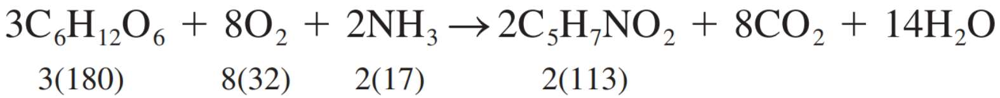
  - **Hình này chứng minh điều gì**
    - Minh họa chi tiết sơ đồ công nghệ, thông số thiết kế hoặc cấu tạo thiết bị trên slide trang 8.
  - **Từ đâu mà thấy được**
    - Trích xuất trực tiếp từ tài liệu bài giảng gốc của chương.

- Thông số và cấu tạo chi tiết theo tài liệu bài giảng (Trang 8):
  - **Hình 6.** Figure 6 (Page 8)
    - 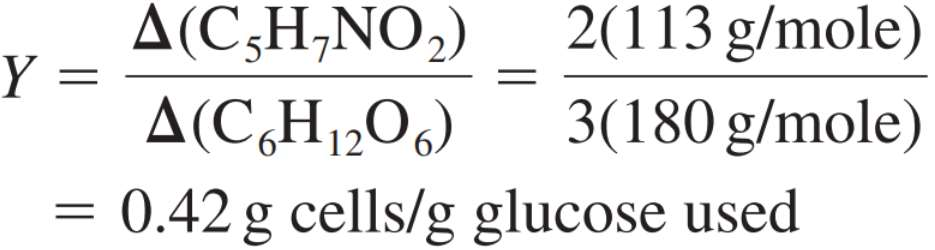
  - **Hình này chứng minh điều gì**
    - Minh họa chi tiết sơ đồ công nghệ, thông số thiết kế hoặc cấu tạo thiết bị trên slide trang 8.
  - **Từ đâu mà thấy được**
    - Trích xuất trực tiếp từ tài liệu bài giảng gốc của chương.

- Thông số và cấu tạo chi tiết theo tài liệu bài giảng (Trang 9):
  - **Hình 7.** Figure 7 (Page 9)
    - 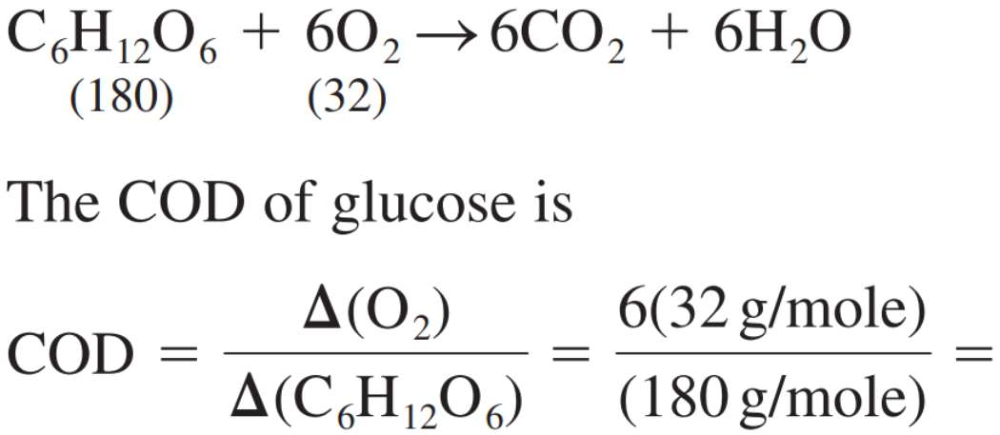
  - **Hình này chứng minh điều gì**
    - Minh họa chi tiết sơ đồ công nghệ, thông số thiết kế hoặc cấu tạo thiết bị trên slide trang 9.
  - **Từ đâu mà thấy được**
    - Trích xuất trực tiếp từ tài liệu bài giảng gốc của chương.

- Thông số và cấu tạo chi tiết theo tài liệu bài giảng (Trang 9):
  - **Hình 8.** Figure 8 (Page 9)
    - 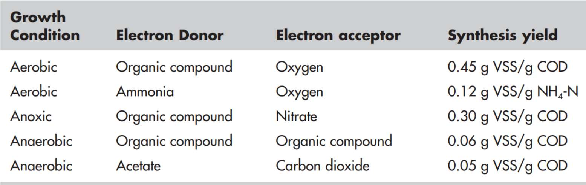
  - **Hình này chứng minh điều gì**
    - Minh họa chi tiết sơ đồ công nghệ, thông số thiết kế hoặc cấu tạo thiết bị trên slide trang 9.
  - **Từ đâu mà thấy được**
    - Trích xuất trực tiếp từ tài liệu bài giảng gốc của chương.

- Thông số và cấu tạo chi tiết theo tài liệu bài giảng (Trang 10):
  - **Hình 9.** Figure 9 (Page 10)
    - 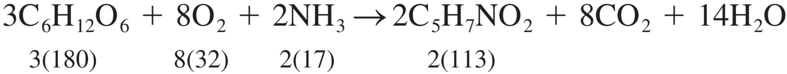
  - **Hình này chứng minh điều gì**
    - Minh họa chi tiết sơ đồ công nghệ, thông số thiết kế hoặc cấu tạo thiết bị trên slide trang 10.
  - **Từ đâu mà thấy được**
    - Trích xuất trực tiếp từ tài liệu bài giảng gốc của chương.

- Thông số và cấu tạo chi tiết theo tài liệu bài giảng (Trang 10):
  - **Hình 10.** Figure 10 (Page 10)
    - 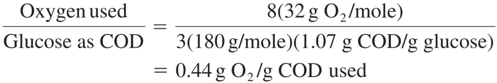
  - **Hình này chứng minh điều gì**
    - Minh họa chi tiết sơ đồ công nghệ, thông số thiết kế hoặc cấu tạo thiết bị trên slide trang 10.
  - **Từ đâu mà thấy được**
    - Trích xuất trực tiếp từ tài liệu bài giảng gốc của chương.

- Thông số và cấu tạo chi tiết theo tài liệu bài giảng (Trang 10):
  - **Hình 11.** Figure 11 (Page 10)
    - 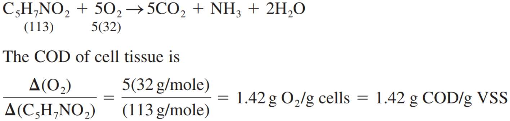
  - **Hình này chứng minh điều gì**
    - Minh họa chi tiết sơ đồ công nghệ, thông số thiết kế hoặc cấu tạo thiết bị trên slide trang 10.
  - **Từ đâu mà thấy được**
    - Trích xuất trực tiếp từ tài liệu bài giảng gốc của chương.

#### 3. Động học sinh trưởng và phân hủy nội sinh của vi khuẩn (Bacterial Growth and Decay)

- Định vị động học vi sinh vật trong tính toán kỹ thuật: Động học sinh trưởng vi khuẩn mô tả định lượng tốc độ chuyển hóa cơ chất hữu cơ và tốc độ gia tăng sinh khối trong bể sinh học.
- Cấu trúc nội dung chính của phần động học gồm 6 hợp phần:
  - 3.1 Tốc độ sinh trưởng sinh khối và mô hình động học Monod ($Rate\text{ of Biomass Growth and Monod Kinetics}$).
  - 3.2 Tốc độ sử dụng cơ chất và tốc độ sinh trưởng thuần ($Rate\text{ of Substrate Utilization and Net Growth Rate}$).
  - 3.3 Các hệ số động học và hiệu chỉnh nhiệt độ ($Kinetic\text{ Coefficients and Temperature Correction}$).
  - 3.4 Tốc độ tiêu thụ oxy trong phản ứng sinh học ($Oxygen\text{ Uptake Rate - OUR}$).
  - 3.5 Tổng chất rắn lơ lửng bay hơi và tỷ lệ sinh khối hoạt tính ($Total\text{ MLVSS and Active Biomass Fraction}$).
  - 3.6 Sản lượng sinh khối thuần, sản lượng thực tế và ví dụ tính toán ($Net\text{ Biomass Yield, Observed Yield and Kinetic Example}$).

##### 3.1 Tốc độ sinh trưởng sinh khối và mô hình động học Monod (Rate of Biomass Growth and Monod Kinetics)

###### Khái niệm tốc độ sinh trưởng sinh khối tổng thể (Rate of Biomass Growth)

- Định nghĩa tốc độ sinh trưởng vi khuẩn tổng thể ($r_g$):
  - Tốc độ sinh khối vi sinh vật gia tăng trên một đơn vị thể tích bể trong một đơn vị thời gian:
    $$r_g = \mu X$$
  - Đơn vị tính: $r_g$ đo bằng $\text{g biomass/m}^3\cdot\text{d}$ (hoặc $\text{g VSS/m}^3\cdot\text{d}$).
- Các đại lượng thành phần trong phương trình sinh trưởng:
  - $\mu$: Tốc độ sinh trưởng riêng của vi khuẩn ($specific\text{ bacteria growth rate}$), đơn vị $\text{g biomass/g biomass}\cdot\text{d}$ hoặc $\text{d}^{-1}$.
  - $X$: Nồng độ sinh khối vi sinh vật hoạt tính trong dung dịch bể phản ứng ($biomass\text{ concentration in reactor}$), đơn vị $\text{g/m}^3$ (hoặc $\text{mg/L}$).

###### Phương trình động học Monod (Monod Kinetics)

- Mô hình Monod mô tả tốc độ sinh trưởng riêng của vi khuẩn theo nồng độ cơ chất dinh dưỡng hạn chế ($S$):
  $$\mu = \frac{\mu_m S}{K_s + S}$$
- Biểu thức tốc độ sinh trưởng sinh khối tổng thể kết hợp phương trình Monod:
  $$r_g = \frac{\mu_m S X}{K_s + S}$$
- Ý nghĩa các thông số động học Monod:
  - $\mu_m$: Tốc độ sinh trưởng riêng cực đại ($maximum\text{ specific bacteria growth rate}$), đơn vị $\text{g biomass/g biomass}\cdot\text{d}$ (hay $\text{d}^{-1}$).
  - $S$: Nồng độ cơ chất hòa tan hạn chế sinh trưởng trong bể phản ứng ($substrate\text{ concentration}$), đơn vị $\text{g/m}^3$ (hay $\text{mg/L bsCOD}$).
  - $K_s$: Hằng số nửa tốc độ ($half\text{-velocity constant}$ hay hằng số bán bão hòa), là nồng độ cơ chất mà tại đó tốc độ sinh trưởng riêng đạt một nửa giá trị cực đại ($\mu = \frac{1}{2}\mu_m$), đơn vị $\text{g/m}^3$ (hay $\text{mg/L}$).
- Cơ chế phản ứng theo nồng độ cơ chất:
  - Khi cơ chất rất dồi dào ($S \gg K_s$): Đại lượng $K_s + S \approx S$, phương trình quy về phản ứng bậc không ($\mu \approx \mu_m$), tốc độ sinh trưởng đạt cực đại và không phụ thuộc vào nồng độ cơ chất.
  - Khi cơ chất cạn kiệt ($S \ll K_s$): Đại lượng $K_s + S \approx K_s$, phương trình quy về phản ứng bậc một ($\mu \approx \frac{\mu_m}{K_s} S$), tốc độ sinh trưởng tỷ lệ thuận trực tiếp với nồng độ cơ chất.
- Minh chứng quy luật động học Monod qua đồ thị thực nghiệm:
  - **Hình 13.** Đường cong động học sinh trưởng Monod thể hiện mối quan hệ phi tuyến giữa tốc độ sinh trưởng riêng $\mu$ và nồng độ cơ chất $S$ (Monod growth rate curve)
    - 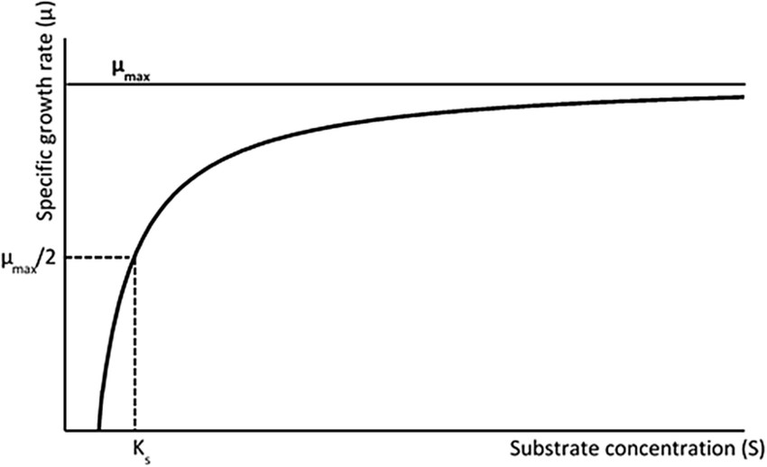
    - **Hình này chứng minh điều gì**
      - Tốc độ sinh trưởng riêng $\mu$ tiệm cận dần về giá trị cực đại $\mu_m$ khi nồng độ cơ chất $S$ tăng cao, và giá trị $K_s$ được xác định tại mức $\frac{1}{2}\mu_m$.
    - **Từ đâu mà thấy được**
      - Trục tung biểu diễn tốc độ sinh trưởng riêng ($\mu$), trục hoành biểu diễn nồng độ cơ chất ($S$).
      - Đường cong tăng dốc mạnh ở vùng nồng độ thấp ($S < K_s$) rồi uốn ngang tiệm cận đường ngang giới hạn $\mu_{\max}$.
      - Tọa độ chiếu đứt nét từ điểm $\mu_{\max}/2$ trên trục tung gióng thẳng đứng xuống trục hoành đúng vị trí điểm hằng số $K_s$.

##### 3.2 Tốc độ sử dụng cơ chất và tốc độ sinh trưởng thuần (Rate of Substrate Utilization and Net Growth Rate)

###### Tốc độ sử dụng cơ chất (Rate of Substrate Utilization)

- Mối liên hệ tỷ lượng giữa sinh trưởng sinh khối và tiêu thụ cơ chất:
  - Tốc độ sinh trưởng tỷ lệ thuận với tốc độ sử dụng cơ chất qua hệ số sản lượng lý thuyết:
    $$r_g = Y r_{su}$$
- Biểu thức tốc độ sử dụng cơ chất trong bể phản ứng ($r_{su}$):
  $$r_{su} = \frac{r_g}{Y} = \frac{\mu_m S X}{Y(K_s + S)}$$
- Thiết lập tốc độ sử dụng cơ chất riêng cực đại ($k$):
  - Đặt $k = \frac{\mu_m}{Y}$: Tốc độ sử dụng cơ chất riêng cực đại ($maximum\text{ specific substrate utilization rate}$), đơn vị $\text{g substrate/g biomass}\cdot\text{d}$ (hay $\text{g bsCOD/g VSS}\cdot\text{d}$).
  - Phương trình chuẩn hóa tốc độ sử dụng cơ chất:
    $$r_{su} = \frac{k S X}{K_s + S}$$
- Ý nghĩa các đại lượng:
  - $r_{su}$: Tốc độ sử dụng cơ chất hữu cơ trên một đơn vị thể tích bể ($substrate\text{ utilization rate}$), đơn vị $\text{g substrate/m}^3\cdot\text{d}$ (hay $\text{g bsCOD/m}^3\cdot\text{d}$).
  - $Y$: Hệ số sản lượng sinh khối lý thuyết ($biomass\text{ yield coefficient}$), đơn vị $\text{g biomass/g substrate used}$ (hay $\text{g VSS/g COD}$).
- Minh chứng biểu thức rút gọn tốc độ sử dụng cơ chất:
  - **Hình 14.** Phương trình xác định tốc độ sử dụng cơ chất $r_{su}$ từ hệ số sản lượng $Y$ và động học Monod
    - 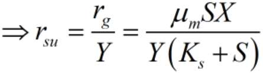
    - **Hình này chứng minh điều gì**
      - Tốc độ sử dụng cơ chất $r_{su}$ bằng thương số giữa tốc độ sinh trưởng $r_g$ và hệ số sản lượng sinh khối $Y$.
    - **Từ đâu mà thấy được**
      - Biểu thức toán học rút ra dấu suy ra $\Rightarrow r_{su} = \frac{r_g}{Y} = \frac{\mu_m S X}{Y(K_s + S)}$.

###### Tốc độ sinh trưởng sinh khối thuần (Net Biomass Growth Rate)

- Khái niệm sinh trưởng thuần ($Net\text{ biomass growth rate}$):
  - Tốc độ sinh trưởng thuần $r_X$ phản ánh đồng thời hai quá trình đối kháng diễn ra song song: sự tạo thành tế bào mới nhờ hấp thu cơ chất và sự hao hụt khối lượng tế bào do phân hủy nội sinh.
- Phương trình vi phân mô tả tốc độ sinh trưởng thuần:
  $$r_X = r_g - b X = Y r_{su} - b X$$
- Phương trình triển khai theo mô hình Monod:
  $$r_X = \left(\frac{\mu_m S}{K_s + S} - b\right) X = \left(\frac{Y k S}{K_s + S} - b\right) X$$
- Ý nghĩa các biến số trong cân bằng sinh khối:
  - $r_X$: Tốc độ sinh trưởng sinh khối thuần ($net\text{ biomass growth rate}$), đơn vị $\text{g biomass/m}^3\cdot\text{d}$ (hay $\text{g VSS/m}^3\cdot\text{d}$).
  - $b$: Hệ số phân hủy nội sinh riêng ($specific\text{ decay coefficient}$), đơn vị $\text{g VSS/g VSS}\cdot\text{d}$ (hay $\text{d}^{-1}$).
  - Tích số $b X$: Tốc độ hao hụt khối lượng tế bào do phân hủy nội sinh và tự oxy hóa trong một đơn vị thể tích, đơn vị $\text{g VSS/m}^3\cdot\text{d}$.
- Tốc độ sinh trưởng riêng thuần ($\mu_{\text{net}}$):
  - Xác định bằng tốc độ sinh trưởng thuần chia cho nồng độ sinh khối:
    $$\mu_{\text{net}} = \frac{r_X}{X} = \mu - b = Y \frac{r_{su}}{X} - b$$

##### 3.3 Các hệ số động học và hiệu chỉnh nhiệt độ (Kinetic Coefficients and Temperature Correction)

###### Các hệ số động học sinh học cơ bản (Kinetic Coefficients)

- Bốn hệ số động học then chốt dùng để dự báo quá trình xử lý:
  - $\mu_m$: Tốc độ sinh trưởng riêng cực đại của vi khuẩn ($\text{d}^{-1}$).
  - $k$: Tốc độ sử dụng cơ chất riêng cực đại ($\text{g bsCOD/g VSS}\cdot\text{d}$).
  - $K_s$: Hằng số nửa tốc độ bán bão hòa ($\text{g/m}^3$ hay $\text{mg/L}$).
  - $b$: Hệ số phân hủy nội sinh ($\text{d}^{-1}$).
- Vai trò công nghệ của các hệ số động học:
  - Cung cấp cơ sở định lượng để dự báo chính xác nồng độ cơ chất nước đầu ra ($S$), nồng độ bùn vi sinh trong bể ($X$), nhu cầu sục khí cấp oxy ($r_o$) và sản lượng bùn thải xả bỏ hàng ngày ($P_{X,\text{VSS}}$).

###### Hiệu chỉnh hệ số động học theo nhiệt độ (Temperature Correction)

- Nguyên lý ảnh hưởng của nhiệt độ:
  - Nhiệt độ nước thải chi phối trực tiếp hoạt tính enzyme và tốc độ phản ứng trao đổi chất sinh hóa của tế bào vi sinh vật.
  - Các hệ số động học ($\mu_m, k, b, K_s$) thay đổi rõ rệt khi nhiệt độ dao động theo mùa hoặc vùng địa lý.
- Phương trình hiệu chỉnh nhiệt độ dạng biến thể Van't Hoff - Arrhenius:
  $$k_T = k_{20} \theta^{(T - 20)}$$
- Ý nghĩa các thông số trong phương trình hiệu chỉnh:
  - $k_T$: Giá trị của hệ số động học tại nhiệt độ vận hành $T$ ($^\circ\text{C}$).
  - $k_{20}$: Giá trị chuẩn của hệ số động học tại nhiệt độ đối chứng $20^\circ\text{C}$.
  - $T$: Nhiệt độ làm việc thực tế của bể phản ứng sinh học ($^\circ\text{C}$).
  - $\theta$: Hệ số hiệu chỉnh nhiệt độ thực nghiệm ($temperature\text{ correction coefficient}$), không thứ nguyên.
  - Khoảng giá trị $\theta$ điển hình cho các thông số:
    - Đối với tốc độ sinh trưởng cực đại $\mu_m$ và $k$: $\theta = 1.07$.
    - Đối với hệ số phân hủy nội bào $b$: $\theta = 1.04$.
    - Đối với hằng số bán bão hòa $K_s$: $\theta = 1.00 \div 1.04$.

###### Giá trị hệ số động học điển hình cho bùn hoạt tính (Typical Kinetic Values)

- Bảng tổng hợp các hệ số động học cho quá trình bùn hoạt tính khử BOD từ nước thải sinh hoạt tại $20^\circ\text{C}$:
  | Hệ số động học ($Coefficient$) | Đơn vị tính ($Unit$) | Khoảng dao động ($Range$) | Giá trị điển hình ($Typical$) |
  | :--- | :--- | :--- | :--- |
  | $k$ | $\text{g bsCOD/g VSS}\cdot\text{d}$ | $4 - 12$ | $6$ |
  | $K_s$ | $\text{mg/L BOD}$ | $20 - 60$ | $30$ |
  | $K_s$ | $\text{mg/L bsCOD}$ | $5 - 30$ | $15$ |
  | $Y$ | $\text{mg VSS/mg BOD}$ | $0.4 - 0.8$ | $0.6$ |
  | $Y$ | $\text{mg VSS/mg COD}$ | $0.4 - 0.6$ | $0.45$ |
  | $b$ | $\text{g VSS/g VSS}\cdot\text{d}$ | $0.06 - 0.15$ | $0.10$ |
- Minh chứng bảng thông số động học từ tài liệu nguồn:
  - **Hình 15.** Bảng tra cứu giá trị thực nghiệm các hệ số động học điển hình cho quy trình bùn hoạt tính xử lý BOD nước thải sinh hoạt ở $20^\circ\text{C}$
    - 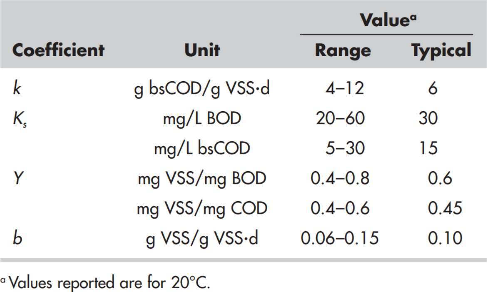
    - **Hình này chứng minh điều gì**
      - Quy định dải biên độ biến thiên và giá trị trung bình thiết kế cho 4 hệ số động học cốt lõi ($k, K_s, Y, b$) ở điều kiện tiêu chuẩn $20^\circ\text{C}$.
    - **Từ đâu mà thấy được**
      - Tiêu đề bảng: `Typical kinetic coefficients for the activated sludge process for BOD removal from domestic wastewater`.
      - Các hàng số liệu hiển thị rõ: $k = 6\text{ g bsCOD/g VSS}\cdot\text{d}$, $K_s = 15\text{ mg/L bsCOD}$, $Y = 0.45\text{ mg VSS/mg COD}$, $b = 0.10\text{ g VSS/g VSS}\cdot\text{d}$, kèm chú thích ghi chú chân bảng `$a\text{ Values reported are for } 20^\circ\text{C}$`.

##### 3.4 Tốc độ tiêu thụ oxy trong phản ứng sinh học (Oxygen Uptake Rate - OUR)

###### Cân bằng COD và tốc độ hấp thụ oxy (Oxygen Uptake Rate)

- Khái niệm tốc độ tiêu thụ oxy ($r_o$ hay $OUR$):
  - Lượng oxy hòa tan phân tử bị quần thể vi sinh vật hấp thụ trên một đơn vị thể tích bể trong một đơn vị thời gian để phục vụ hô hấp hiếu khí.
  - Đơn vị tính: $r_o$ đo bằng $\text{g O}_2/\text{m}^3\cdot\text{d}$ (hoặc $\text{mg/L}\cdot\text{h}$).
- Phương trình cân bằng COD xác định tốc độ tiêu thụ oxy:
  $$r_o = r_{su} - 1.42 r_X$$
- Ý nghĩa các số hạng trong phương trình:
  - $r_o$: Tốc độ hấp thụ oxy hòa tan ($oxygen\text{ uptake rate}$), đơn vị $\text{g O}_2/\text{m}^3\cdot\text{d}$.
  - $r_{su}$: Tốc độ sử dụng cơ chất hòa tan dễ phân hủy sinh học ($substrate\text{ utilization rate}$), tính bằng $\text{g bsCOD/m}^3\cdot\text{d}$.
  - $r_X$: Tốc độ sinh trưởng sinh khối thuần ($net\text{ biomass growth rate}$), đơn vị $\text{g VSS/m}^3\cdot\text{d}$.
  - Hệ số chuyển đổi $1.42$: Nhu cầu oxy hóa học tương đương của sinh khối tế bào vi khuẩn ($\text{COD of } 1\text{ g biomass}$), tương ứng $1.42\text{ g O}_2/\text{g VSS}$.
- Bản chất sinh hóa của phương trình:
  - Tổng lượng COD hữu cơ bị loại bỏ khỏi pha lỏng ($r_{su}$) chia làm hai phần:
    - Phần tích lũy vào cấu trúc tế bào sinh khối mới sinh ra ($1.42 r_X$).
    - Phần còn lại bị oxy hóa dị hóa triệt để để giải phóng năng lượng, tiêu tốn lượng oxy hòa tan tương ứng ($r_o$).
  - Ý nghĩa điều khiển quá trình: $r_o$ quyết định công suất cấp khí của hệ thống máy thổi khí và đĩa phân phối bọt khí trong bể aerotank.

##### 3.5 Tổng chất rắn lơ lửng bay hơi và tỷ lệ sinh khối hoạt tính (Total MLVSS and Active Biomass Fraction)

###### Thành phần chất rắn lơ lửng bay hơi trong bể sinh học (Components of MLVSS)

- Cấu trúc hỗn hợp chất rắn lơ lửng bay hơi trong bể phản ứng ($MLVSS$):
  - Chất rắn bay hơi $VSS$ trong bể aerotank không chỉ bao gồm vi sinh vật sống mà cấu thành từ ba thành phần riêng biệt:
    $$\text{VSS trong bể} = \text{Sinh khối hoạt tính} + \text{Xác tế bào phân hủy trơ} + \text{nbVSS không phân hủy từ dòng vào}$$
  - Ký hiệu nồng độ tương ứng:
    $$X_T = X + X_d + X_i$$
    - $X$: Nồng độ vi khuẩn sống hoạt tính ($active\text{ biomass}$), $\text{g/m}^3$.
    - $X_d$: Nồng độ xác tế bào trơ tích lũy từ quá trình chết và tự phân hủy ($cell\text{ debris}$), $\text{g/m}^3$.
    - $X_i$: Nồng độ cặn hữu cơ không phân hủy sinh học từ nước thải vào tích tụ lại ($non\text{-biodegradable VSS}$ hay $nbVSS$), $\text{g/m}^3$.

###### Tốc độ sản sinh tổng chất rắn bay hơi ($r_{X_T, \text{VSS}}$)

- Phương trình tổng quát xác định tốc độ sản sinh tổng VSS:
  $$r_{X_T, \text{VSS}} = (Y r_{su} - b X) + f_d (b) X + \frac{Q X_{o,i}}{V}$$
- Phân tích chi tiết ba số hạng nguồn gốc:
  - Số hạng 1 ($Y r_{su} - b X$): Tốc độ sinh trưởng sinh khối thuần từ nguồn bCOD hòa tan ($net\text{ biomass VSS from soluble bCOD}$), $\text{g VSS/m}^3\cdot\text{d}$.
  - Số hạng 2 ($f_d(b)X$): Tốc độ sinh thành cặn xác tế bào trơ không phân hủy sinh học sinh ra từ quá trình nội sinh ($nbVSS\text{ from cells}$), $\text{g VSS/m}^3\cdot\text{d}$.
  - Số hạng 3 ($\frac{Q X_{o,i}}{V}$): Tốc độ nạp cặn hữu cơ không phân hủy sinh học từ dòng nước thải vào hệ thống ($nbVSS\text{ in influent}$), $\text{g VSS/m}^3\cdot\text{d}$.
- Ý nghĩa các biến số bổ sung:
  - $r_{X_T, \text{VSS}}$: Tốc độ tạo thành tổng chất rắn lơ lửng bay hơi ($total\text{ VSS production rate}$), đơn vị $\text{g/m}^3\cdot\text{d}$.
  - $Q$: Lưu lượng dòng nước thải đi vào bể phản ứng ($influent\text{ flowrate}$), đơn vị $\text{m}^3/\text{d}$.
  - $X_{o,i}$: Nồng độ cặn nbVSS trong dòng nước thải vào ($influent\text{ nbVSS concentration}$), đơn vị $\text{g/m}^3$.
  - $V$: Thể tích hữu ích của bể phản ứng sinh học ($volume\text{ of reactor}$), đơn vị $\text{m}^3$.
  - $f_d$: Tỷ lệ phần khối lượng sinh khối phân hủy chuyển thành xác tế bào trơ không phân hủy ($fraction\text{ of biomass that remains as cell debris}$), thường dao động từ $0.10$ đến $0.15$ $\text{g VSS/g VSS}$.
- Minh chứng công thức phân rã tổng sản lượng VSS:
  - **Hình 16.** Biểu thức giải tích phân rã ba thành phần cấu thành tốc độ sản sinh tổng VSS ($r_{X_T,\text{VSS}}$)
    - 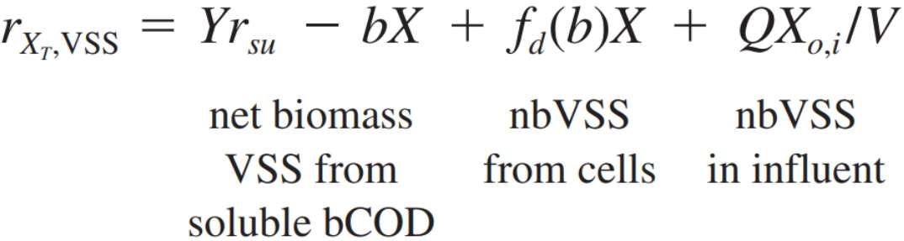
    - **Hình này chứng minh điều gì**
      - Tốc độ sinh tổng VSS gộp ba nguồn: sinh khối hoạt tính thuần từ bCOD, xác tế bào tích lũy do phân hủy nội sinh và cặn nbVSS nạp vào từ nước thải.
    - **Từ đâu mà thấy được**
      - Dòng chữ công thức $r_{X_T,\text{VSS}} = Y r_{su} - bX + f_d(b)X + Q X_{o,i}/V$.
      - Ba dòng chú thích gán nhãn ngay dưới từng cụm hạng tử: `net biomass VSS from soluble bCOD` dưới $(Y r_{su} - bX)$, `nbVSS from cells` dưới $f_d(b)X$, và `nbVSS in influent` dưới $Q X_{o,i}/V$.

###### Tỷ lệ sinh khối hoạt tính trong hỗn hợp bùn ($F_{X, \text{act}}$)

- Khái niệm tỷ lệ sinh khối hoạt tính:
  - Là tỷ số giữa lượng sinh khối vi khuẩn sống hoạt tính sinh ra trên tổng lượng chất rắn lơ lửng bay hơi tạo thành trong bùn hoạt tính ($MLVSS$).
- Công thức xác định tỷ lệ vi sinh vật hoạt tính ($F_{X, \text{act}}$):
  $$F_{X, \text{act}} = \frac{Y r_{su} - b X}{r_{X_T, \text{VSS}}} = \frac{r_X}{r_{X_T, \text{VSS}}}$$
- Ý nghĩa kỹ thuật của $F_{X, \text{act}}$:
  - Đơn vị tính: $\text{g VSS/g VSS}$ (hoặc phần trăm $\%$, không thứ nguyên).
  - Tỷ lệ hoạt tính càng cao thì khả năng chuyển hóa chất ô nhiễm của bùn càng mạnh.
  - Tuổi bùn ($SRT$) càng dài hoặc nồng độ $nbVSS$ trong dòng vào càng lớn thì xác tế bào và cặn trơ tích tụ càng nhiều, làm giảm tỷ lệ sinh khối hoạt tính $F_{X, \text{act}}$.
- Minh chứng biểu thức tỷ lệ sinh khối hoạt tính:
  - **Hình 17.** Công thức tính toán tỷ lệ sinh khối hoạt tính $F_{X,\text{act}}$ trong hỗn hợp bùn hoạt tính MLVSS
    - 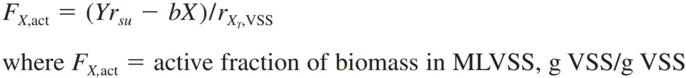
    - **Hình này chứng minh điều gì**
      - Tỷ lệ hoạt tính trong bùn bằng tỷ số giữa tốc độ tăng sinh khối thuần và tốc độ tạo tổng VSS.
    - **Từ đâu mà thấy được**
      - Phương trình in đậm: $F_{X,\text{act}} = (Y r_{su} - bX)/r_{X_T,\text{VSS}}$.
      - Dòng định nghĩa phía dưới: `where F_{X,act} = active fraction of biomass in MLVSS, g VSS/g VSS`.

##### 3.6 Sản lượng sinh khối thuần, sản lượng thực tế và ví dụ tính toán (Net Biomass Yield, Observed Yield and Kinetic Example)

###### Sản lượng sinh khối thuần và sản lượng thực tế (Yield Definitions)

- Hệ số sản lượng sinh khối thuần ($Net\text{ biomass yield}$ - $Y_{\text{bio}}$):
  - Định nghĩa: Tỷ số giữa tốc độ sinh trưởng sinh khối thuần của tế bào vi khuẩn sống và tốc độ sử dụng cơ chất:
    $$Y_{\text{bio}} = \frac{r_X}{r_{su}} = \frac{Y r_{su} - b X}{r_{su}} = Y - b\left(\frac{X}{r_{su}}\right)$$
  - Đơn vị tính: $\text{g biomass/g substrate used}$ (hay $\text{g VSS/g bsCOD}$).
  - Ý nghĩa: Phản ánh lượng tế bào sống thực sự tích lũy trên một đơn vị cơ chất bị phân hủy sau khi đã trừ đi hao hụt do hô hấp nội bào. Luôn nhỏ hơn hệ số sản lượng lý thuyết $Y$ ($Y_{\text{bio}} < Y$).
- Hệ số sản lượng quan sát thực tế ($Observed\text{ yield}$ - $Y_{\text{obs}}$):
  - Định nghĩa: Tỷ số giữa tốc độ sản sinh tổng chất rắn lơ lửng bay hơi ($MLVSS$) và tốc độ sử dụng cơ chất:
    $$Y_{\text{obs}} = \frac{r_{X_T, \text{VSS}}}{r_{su}}$$
  - Đơn vị tính: $\text{g total VSS/g substrate used}$ (hay $\text{g VSS/g bsCOD}$).
  - Ý nghĩa: Đại diện cho tổng lượng bùn khô bay hơi sinh ra trên mỗi đơn vị cơ chất hữu cơ tiêu thụ, dùng trực tiếp để tính toán kích thước công trình xử lý bùn thải.
- Mối tương quan giữa các hệ số sản lượng:
  - Trong điều kiện nước thải có chứa cặn hữu cơ không phân hủy sinh học ($X_{o,i} > 0$), hệ số sản lượng quan sát $Y_{\text{obs}}$ luôn lớn hơn hệ số sản lượng thuần $Y_{\text{bio}}$ do tích lũy thêm thành phần xác tế bào và cặn trơ:
    $$Y_{\text{obs}} = Y_{\text{bio}} + \frac{f_d (b) X}{r_{su}} + \frac{Q X_{o,i}}{V r_{su}}$$

###### Bài tập ví dụ tính toán động học vi sinh vật (Kinetic Calculation Example)

- **Đề bài**: Một bể phản ứng sinh học hiếu khí khuấy trộn hoàn toàn ($aerobic\text{ complete-mix reactor}$) có thể tích $V = 335\text{ m}^3$, nồng độ sinh khối duy trì trong bể $X = 2000\text{ g/m}^3$. Bể tiếp nhận lưu lượng nước thải $Q = 1000\text{ m}^3/\text{d}$, nồng độ cơ chất hòa tan dễ phân hủy dòng vào $\text{bsCOD}_0 = 300\text{ g/m}^3$, nồng độ chất rắn lơ lửng bay hơi không phân hủy dòng vào $\text{nbVSS}_0 = 50\text{ g/m}^3$, nồng độ cơ chất hòa tan dòng ra $\text{bsCOD} = 2.4\text{ g/m}^3$. Tỷ lệ phần xác tế bào trơ sau phân hủy $f_d = 0.1$.
  Hãy xác định:
  1. Hệ số sản lượng sinh khối thuần ($Net\text{ biomass yield}$ - $Y_{\text{bio}}$).
  2. Hệ số sản lượng quan sát thực tế ($Observed\text{ yield}$ - $Y_{\text{obs}}$).
  3. Tỷ lệ sinh khối vi sinh vật hoạt tính trong hỗn hợp bùn $MLVSS$ ($Active\text{ biomass fraction}$ - $F_{X,\text{act}}$).

- **Dữ kiện**:
  - Nhìn vào: Đề bài Slide 36 và bảng hệ số động học tiêu chuẩn Slide 31:
    - Thể tích bể sinh học: $V = 335\text{ m}^3$.
    - Nồng độ sinh khối vi khuẩn trong bể: $X = 2000\text{ g/m}^3$ ($2000\text{ mg/L}$).
    - Lưu lượng nước thải dòng vào: $Q = 1000\text{ m}^3/\text{d}$.
    - Nồng độ cơ chất hòa tan dòng vào: $S_0 = 300\text{ g bsCOD/m}^3$.
    - Nồng độ cặn $nbVSS$ dòng vào: $X_{o,i} = 50\text{ g/m}^3$.
    - Nồng độ cơ chất hòa tan dòng ra: $S = 2.4\text{ g bsCOD/m}^3$.
    - Tỷ lệ xác tế bào trơ tích lũy: $f_d = 0.1$.
    - Các hệ số động học bùn hoạt tính hiếu khí điển hình tại $20^\circ\text{C}$ (tra cứu từ Bảng Slide 31 / Hình 15):
      - Hệ số sản lượng lý thuyết: $Y = 0.45\text{ g VSS/g COD}$ (với dải biến thiên $0.4 - 0.6$).
      - Hệ số phân hủy nội sinh: $b = 0.10\text{ g VSS/g VSS}\cdot\text{d} = 0.10\text{ d}^{-1}$ (dải $0.06 - 0.15$).

- **Quy tắc áp dụng**:
  - Cân bằng vật chất cơ chất ở trạng thái ổn định cho bể CSTR: $r_{su} = \frac{Q(S_0 - S)}{V}$.
  - Tốc độ sinh khối tăng trưởng thuần: $r_X = Y r_{su} - b X$.
  - Tốc độ sản sinh tổng chất rắn bay hơi: $r_{X_T, \text{VSS}} = (Y r_{su} - b X) + f_d (b) X + \frac{Q X_{o,i}}{V}$.
  - Hệ số sản lượng thuần: $Y_{\text{bio}} = \frac{r_X}{r_{su}}$.
  - Hệ số sản lượng thực tế: $Y_{\text{obs}} = \frac{r_{X_T, \text{VSS}}}{r_{su}}$.
  - Tỷ lệ sinh khối hoạt tính: $F_{X, \text{act}} = \frac{r_X}{r_{X_T, \text{VSS}}}$.

- **Lời giải**:
  - **Bước 1**: Xác định tốc độ sử dụng cơ chất trong bể ($r_{su}$).
    - Căn cứ: Phương trình cân bằng khối lượng cơ chất tại trạng thái dừng cho bể khuấy trộn hoàn toàn (Nguồn: Slide 21 và Slide 28):
      $$r_{su} = \frac{Q(S_0 - S)}{V}$$
    - Nhìn vào: Các giá trị $Q = 1000\text{ m}^3/\text{d}$, $S_0 = 300\text{ g/m}^3$, $S = 2.4\text{ g/m}^3$, $V = 335\text{ m}^3$:
      $$r_{su} = \frac{1000\text{ m}^3/\text{d} \times (300 - 2.4)\text{ g/m}^3}{335\text{ m}^3} = \frac{297{,}600}{335} \approx 888.36\text{ g bsCOD/m}^3\cdot\text{d}$$

  - **Bước 2**: Xác định tốc độ sinh trưởng sinh khối thuần ($r_X$).
    - Căn cứ: Công thức tốc độ sinh trưởng thuần (Nguồn: Slide 29):
      $$r_X = Y r_{su} - b X$$
    - Nhìn vào: Hệ số sản lượng $Y = 0.45\text{ g VSS/g COD}$, hệ số phân hủy $b = 0.10\text{ d}^{-1}$ (tra bảng Slide 31), nồng độ sinh khối $X = 2000\text{ g/m}^3$ và $r_{su} = 888.36\text{ g/m}^3\cdot\text{d}$:
      $$r_X = (0.45 \times 888.36) - (0.10 \times 2000) = 399.76 - 200.00 = 199.76\text{ g VSS/m}^3\cdot\text{d}$$
      *(Ghi chú: Nếu sử dụng hệ số cận dưới $Y = 0.40\text{ g VSS/g COD}$ như một số tài liệu chuẩn, $r_X = 0.40 \times 888.36 - 200 = 155.34\text{ g VSS/m}^3\cdot\text{d}$)*.

  - **Bước 3**: Tính hệ số sản lượng sinh khối thuần ($Y_{\text{bio}}$).
    - Căn cứ: Định nghĩa hệ số sản lượng thuần (Nguồn: Slide 35):
      $$Y_{\text{bio}} = \frac{r_X}{r_{su}}$$
    - Nhìn vào: Giá trị $r_X = 199.76\text{ g VSS/m}^3\cdot\text{d}$ và $r_{su} = 888.36\text{ g/m}^3\cdot\text{d}$:
      $$Y_{\text{bio}} = \frac{199.76\text{ g VSS/m}^3\cdot\text{d}}{888.36\text{ g bsCOD/m}^3\cdot\text{d}} \approx 0.225\text{ g VSS/g bsCOD}$$
      *(Trường hợp $Y = 0.40$: $Y_{\text{bio}} = \frac{155.34}{888.36} \approx 0.175\text{ g VSS/g bsCOD}$)*.

  - **Bước 4**: Xác định tốc độ sản sinh tổng VSS ($r_{X_T, \text{VSS}}$).
    - Căn cứ: Công thức tổng VSS sản sinh hàng ngày (Nguồn: Slide 33 / Hình 16):
      $$r_{X_T, \text{VSS}} = r_X + f_d (b) X + \frac{Q X_{o,i}}{V}$$
    - Nhìn vào: Từng số hạng thành phần với $f_d = 0.1$, $X_{o,i} = 50\text{ g/m}^3$:
      - Sinh khối hoạt tính thuần: $r_X = 199.76\text{ g VSS/m}^3\cdot\text{d}$.
      - Cặn xác tế bào trơ: $f_d (b) X = 0.1 \times 0.10 \times 2000 = 20.00\text{ g VSS/m}^3\cdot\text{d}$.
      - Cặn $nbVSS$ từ nước thải vào: $\frac{Q X_{o,i}}{V} = \frac{1000 \times 50}{335} = \frac{50{,}000}{335} \approx 149.25\text{ g VSS/m}^3\cdot\text{d}$.
      - Tổng tốc độ sản sinh VSS:
        $$r_{X_T, \text{VSS}} = 199.76 + 20.00 + 149.25 = 369.01\text{ g VSS/m}^3\cdot\text{d}$$
      *(Trường hợp $Y = 0.40$: $r_{X_T, \text{VSS}} = 155.34 + 20.00 + 149.25 = 324.59\text{ g VSS/m}^3\cdot\text{d}$)*.

  - **Bước 5**: Tính hệ số sản lượng quan sát thực tế ($Y_{\text{obs}}$) và tỷ lệ sinh khối hoạt tính ($F_{X, \text{act}}$).
    - Căn cứ: Định nghĩa hệ số $Y_{\text{obs}}$ (Slide 35) và công thức $F_{X, \text{act}}$ (Slide 34 / Hình 17):
      $$Y_{\text{obs}} = \frac{r_{X_T, \text{VSS}}}{r_{su}}$$
      $$F_{X, \text{act}} = \frac{r_X}{r_{X_T, \text{VSS}}}$$
    - Nhìn vào: Giá trị $r_{X_T, \text{VSS}} = 369.01\text{ g VSS/m}^3\cdot\text{d}$, $r_X = 199.76\text{ g VSS/m}^3\cdot\text{d}$, $r_{su} = 888.36\text{ g/m}^3\cdot\text{d}$:
      $$Y_{\text{obs}} = \frac{369.01\text{ g VSS/m}^3\cdot\text{d}}{888.36\text{ g bsCOD/m}^3\cdot\text{d}} \approx 0.415\text{ g VSS/g bsCOD}$$
      $$F_{X, \text{act}} = \frac{199.76\text{ g VSS/m}^3\cdot\text{d}}{369.01\text{ g VSS/m}^3\cdot\text{d}} \approx 0.541 \quad (\text{tức } 54.1\%)$$
      *(Trường hợp $Y = 0.40$: $Y_{\text{obs}} = \frac{324.59}{888.36} \approx 0.365\text{ g VSS/g bsCOD}$; $F_{X, \text{act}} = \frac{155.34}{324.59} \approx 0.479 \text{ tức } 47.9\%$)*.

- **Kết quả**:
  - 1. Hệ số sản lượng sinh khối thuần: $Y_{\text{bio}} = 0.225\text{ g VSS/g bsCOD}$ (với $Y = 0.45$) hoặc $0.175\text{ g VSS/g bsCOD}$ (với $Y = 0.40$).
  - 2. Hệ số sản lượng thực tế: $Y_{\text{obs}} = 0.415\text{ g VSS/g bsCOD}$ (với $Y = 0.45$) hoặc $0.365\text{ g VSS/g bsCOD}$ (với $Y = 0.40$).
  - 3. Tỷ lệ sinh khối hoạt tính trong hỗn hợp MLVSS: $F_{X, \text{act}} = 54.1\%$ (với $Y = 0.45$) hoặc $47.9\%$ (với $Y = 0.40$).

- **Kiểm tra lại**:
  - Thời gian lưu nước thủy lực ($HRT$):
    $$\theta = \frac{V}{Q} = \frac{335\text{ m}^3}{1000\text{ m}^3/\text{d}} = 0.335\text{ d} = 8.04\text{ h}$$
    Giá trị này nằm hoàn toàn trong phạm vi thiết kế điển hình của bể bùn hoạt tính hoàn toàn hiếu khí ($4 - 10\text{ h}$).
  - Cân bằng các thành phần cấu thành $Y_{\text{obs}}$:
    $$Y_{\text{obs}} = Y_{\text{bio}} + \frac{f_d (b) X}{r_{su}} + \frac{Q X_{o,i}}{V r_{su}} = 0.225 + \frac{20}{888.36} + \frac{149.25}{888.36} = 0.225 + 0.0225 + 0.1680 = 0.4155 \approx 0.415$$
    Đẳng thức cân bằng bảo toàn hoàn toàn chính xác.
  - Tỷ lệ sinh khối hoạt tính $F_{X,\text{act}} = 54.1\%$ phản ánh thực tế vận hành trạm xử lý: Bùn hoạt tính trong bể aerotank chứa khoảng một nửa là vi khuẩn sống thực hiện phản ứng phân hủy, phần còn lại là xác tế bào khoáng hóa chậm và cặn hữu cơ trơ không hòa tan từ nguồn nước thải thô.

#### 4. Động học sinh trưởng vi sinh vật và Mô hình Monod (Microbial Growth Kinetics)

- Định hướng nghiên cứu quy trình xử lý bùn hoạt tính sinh trưởng lơ lửng ($Suspended\text{ Growth Treatment Process}$):
  - Áp dụng các nguyên lý động học sinh trưởng vi sinh vật và mô hình Monod vào thiết bị phản ứng sinh học thực tế.
  - Thiết lập phương trình cân bằng vật chất bảo toàn khối lượng cho sinh khối vi khuẩn và cơ chất trong bể phản ứng khuấy trộn hoàn toàn ($Complete\text{-Mix Reactor}$ / $CSTR$).
  - Xác định thời gian lưu bùn ($Sludge\text{ Retention Time}$ - $SRT$), nồng độ cơ chất hòa tan dòng ra ($S$), sản lượng bùn ($VSS$, $TSS$), và nhu cầu oxy hòa tan ($R_o$).
- Cấu trúc nội dung của phần 4 gồm 6 nội dung trọng tâm:
  - 4.1 Tổng quan quy trình và cấu tạo hệ thống bùn hoạt tính sinh trưởng lơ lửng ($Overview\text{ and Components of Suspended Growth Systems}$).
  - 4.2 Thời gian lưu bùn và giới hạn rửa trôi thiết kế ($Sludge\text{ Retention Time - SRT \& Washout Limit}$).
  - 4.3 Cân bằng vật chất sinh khối và cơ chất trong bể CSTR ($Biomass\text{ and Substrate Mass Balance}$).
  - 4.4 Xác định nồng độ và sản lượng bùn MLVSS sinh ra hàng ngày ($Mixed\text{ Liquor VSS Production and Components}$).
  - 4.5 Sản lượng tổng chất rắn MLSS và nhu cầu oxy hệ thống ($Mixed\text{ Liquor TSS Production \& Oxygen Requirement}$).
  - 4.6 Thông số tải trọng thiết kế và bài toán ứng dụng thiết kế hệ thống CSTR ($Design\text{ Parameters \& Suspended Growth Design Example}$).

##### 4.1 Tổng quan quy trình và cấu tạo hệ thống bùn hoạt tính sinh trưởng lơ lửng (Overview and Components of Suspended Growth Systems)

- Bản chất công nghệ của quá trình sinh trưởng lơ lửng ($Suspended\text{ Growth Processes}$):
  - Vi sinh vật sinh trưởng tự do và phân tán trong pha lỏng nước thải dưới dạng các bông cặn bùn hoạt tính ($bio\text{-flocs}$).
  - Quần thể vi sinh vật hấp thụ, chuyển hóa và oxy hóa các chất ô nhiễm hữu cơ hòa tan cũng như chất rắn keo khi đang lơ lửng trong môi trường nước thải.
- Hai mô hình thủy lực cơ bản trong công nghệ xử lý sinh trưởng lơ lửng:
  - Bể phản ứng khuấy trộn hoàn toàn ($Complete\text{-mix reactor}$):
    - Dòng nước thải vào được phân tán tức thời và đồng nhất trên toàn bộ thể tích bể.
    - Nồng độ cơ chất và sinh khối tại mọi vị trí trong bể đều đồng nhất và bằng với nồng độ dòng ra khỏi bể phản ứng.
    - Chịu tải trọng va đập ($shock\text{ loads}$) và chống sốc độc chất hữu hiệu nhờ hệ số pha loãng tức thời rất lớn.
  - Bể phản ứng dòng chảy nút ($Plug\text{-flow reactor}$):
    - Dòng chất lỏng chuyển động dọc theo chiều dài bể phản ứng mà không có hiện tượng hòa trộn dọc trục.
    - Nồng độ chất hữu cơ giảm dần từ đầu bể đến cuối bể, tạo gradien nồng độ động học cao giúp nâng cao tốc độ phản ứng ở vùng đầu bể.
- Ba cấu phần nền tảng của hệ thống bùn hoạt tính sinh trưởng lơ lửng ($Three\text{ Basic Components}$):
  - (1) Bể phản ứng sinh học thổi khí ($Aeration\text{ tank}$ / $Bio\text{-reactor}$):
    - Cung cấp oxy hòa tan ($DO$) và khuấy trộn liên tục để duy trì vi sinh vật ở trạng thái lơ lửng và oxy hóa chất hữu cơ.
    - **Hình 18.** Bể phản ứng sinh học hiếu khí duy trì bùn vi sinh ở trạng thái lơ lửng (Aeration tank bio-reactor)
      - 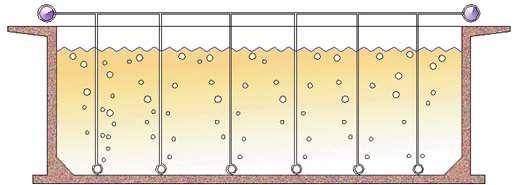
      - **Hình này chứng minh điều gì**
        - Bể phản ứng sục khí liên tục từ đáy bể nhằm phân tán bọt khí, cung cấp oxy hòa tan và giữ các bông bùn vi sinh vật ở trạng thái huyền phù lơ lửng hoàn toàn.
      - **Từ đâu mà thấy được**
        - Dàn ống cấp khí sục bọt khí mịn phân bố đều khắp đáy bể, bọt khí nổi lên tạo vùng xáo trộn mãnh liệt trong toàn bộ thể tích nước thải.
  - (2) Đơn vị tách pha lỏng - rắn ($Liquid\text{-solids separation unit}$):
    - Thường là bể lắng thứ cấp ($secondary\text{ sedimentation tank}$ / $clarifier$), phân tách bông bùn hoạt tính ra khỏi nước đã xử lý bằng trọng lực.
    - **Hình 19.** Bể lắng thứ cấp tách bùn hoạt tính ra khỏi nước trong (Secondary sedimentation tank)
      - 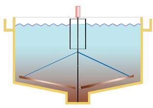
      - **Hình này chứng minh điều gì**
        - Hỗn hợp bùn nước sau bể thổi khí được lắng trọng lực tĩnh, thu dòng nước trong ở máng tràn mặt và cô đặc bùn hoạt tính ở đáy bể.
      - **Từ đâu mà thấy được**
        - Bể lắng ly tâm có ống phân phối trung tâm dẫn nước vào, thanh gạt bùn đáy gom bùn lắng về hố thu đáy để tuần hoàn và xả dư.
  - (3) Hệ thống tuần hoàn bùn ($Recycle\text{ system}$):
    - Dẫn dòng bùn hoạt tính đậm đặc lắng ở đáy bể lắng thứ cấp quay về bể thổi khí ($Return\text{ Activated Sludge}$ - $RAS$) để duy trì nồng độ sinh khối vi sinh vật cao trong bể ($MLSS$).
    - Bố trí tuyến xả bùn hoạt tính dư ($Waste\text{ Activated Sludge}$ - $WAS$) để loại bỏ lượng sinh khối sinh ra mỗi ngày, kiểm soát thời gian lưu bùn ($SRT$) của hệ thống.
- Các dòng lưu chất trong hệ thống bùn hoạt tính khuấy trộn hoàn toàn:
  - Dòng vào ($Influent$): Lưu lượng $Q$, nồng độ cơ chất $S_o$, nồng độ sinh khối $X_o \approx 0$.
  - Hỗn dịch trong bể phản ứng ($Bio\text{-reactor}$): Thể tích $V$, nồng độ sinh khối $X$, nồng độ cơ chất hòa tan $S$.
  - Dòng nước trong ra khỏi hệ thống ($Effluent$): Lưu lượng $(Q - Q_w)$, nồng độ cơ chất $S$, nồng độ sinh khối trôi ra $X_e$.
  - Dòng bùn tuần hoàn ($Recycle\text{ sludge}$): Lưu lượng $Q_r$, nồng độ bùn hồi lưu $X_R$, nồng độ cơ chất $S$.
  - Dòng bùn dư xả bỏ ($Wasted\text{ sludge}$): Lưu lượng $Q_w$, nồng độ bùn xả $X_R$ (khi xả từ đáy bể lắng) hoặc $X$ (khi xả trực tiếp từ bể thổi khí), nồng độ cơ chất $S$.

##### 4.2 Thời gian lưu bùn và giới hạn rửa trôi thiết kế (Sludge Retention Time - SRT & Washout Limit)

- Định nghĩa thời gian lưu bùn ($Sludge\text{ Retention Time}$ - $SRT$):
  - Thời gian lưu bùn (còn gọi là tuổi bùn, ký hiệu $\theta_c$ hoặc $SRT$) là thời gian lưu trung bình của các tế bào sinh khối vi sinh vật hoạt tính tồn tại trong hệ thống xử lý.
  - Đơn vị tính: ngày ($d$).
- Mối liên hệ nền tảng giữa thời gian lưu bùn và tốc độ sinh trưởng vi sinh vật:
  - Biểu thức tổng quát theo tỷ số giữa tổng sinh khối và tốc độ sinh trưởng thuần:
    $$SRT = \frac{X}{r_X} \Longleftrightarrow \frac{1}{SRT} = \frac{r_X}{X}$$
  - Mối liên hệ với tốc độ sử dụng cơ chất ($r_{su}$) và hệ số phân hủy nội sinh ($b$):
    $$\frac{1}{SRT} = \frac{Y r_{su} - b X}{X} = Y \frac{r_{su}}{X} - b$$
  - Biểu thức liên hệ theo mô hình động học Monod:
    $$\frac{1}{SRT} = \frac{Y k S}{K_s + S} - b$$
- Công thức tính SRT thực tế cho hệ thống có tuần hoàn bùn:
  - Xác định từ tỷ số giữa tổng khối lượng sinh khối trong bể thổi khí và tổng lượng sinh khối thất thoát/xả bỏ mỗi ngày:
    $$SRT = \frac{V X}{(Q - Q_w) X_e + Q_w X_R}$$
  - Trong đó:
    - $V$: Thể tích bể sinh học ($m^3$).
    - $X$: Nồng độ bùn hoạt tính (MLVSS) trong bể phản ứng ($g/m^3$ hoặc $mg/L$).
    - $Q$: Lưu lượng nước thải dòng vào ($m^3/d$).
    - $Q_w$: Lưu lượng dòng bùn dư xả bỏ ($m^3/d$).
    - $X_e$: Nồng độ sinh khối lơ lửng trong dòng nước trong sau lắng ($g/m^3$).
    - $X_R$: Nồng độ sinh khối trong dòng bùn đặc lắng ở đáy bể ($g/m^3$).
- Điều kiện giới hạn của thời gian lưu bùn và hiện tượng rửa trôi vi sinh vật ($Washout$):
  - Yêu cầu vận hành: $SRT$ phải đủ dài để vi khuẩn kịp tổng hợp enzyme, tiêu thụ và chuyển hóa cơ chất hữu cơ.
  - Khái niệm $SRT_{min}$ (thời gian lưu bùn tối thiểu hay giới hạn rửa trôi):
    - Là giá trị thời gian lưu bùn giới hạn mà tại đó vi khuẩn không có đủ thời gian để tiêu thụ cơ chất, nồng độ cơ chất dòng ra bằng nồng độ dòng vào ($S = S_o$).
    - Thiết lập phương trình xác định $SRT_{min}$:
      $$\frac{1}{SRT_{min}} = \frac{Y k S_o}{K_s + S_o} - b$$
    - Khi nồng độ cơ chất đầu vào rất lớn so với hằng số nửa bão hòa ($S_o \gg K_s$), ta có $\frac{S_o}{K_s + S_o} \approx 1$:
      $$\frac{1}{SRT_{min}} \simeq Y k - b = \mu_m - b \Longleftrightarrow SRT_{min} \simeq \frac{1}{\mu_m - b}$$
  - Nguy cơ rửa trôi vi sinh vật: Nếu vận hành ở $SRT < SRT_{min}$, tốc độ cuốn trôi sinh khối vượt quá tốc độ sinh sản cực đại của tế bào, dẫn đến vi sinh vật bị rửa trôi hoàn toàn khỏi hệ thống, gây sụp đổ bể xử lý.
  - Hệ số an toàn thiết kế công nghệ ($Safety\text{ factor}$ - $SF$):
    - Giá trị $SRT$ thiết kế phải lớn hơn giá trị $SRT_{min}$ từ 2 đến 20 lần:
      $$SRT_{design} = (2 \div 20) \times SRT_{min}$$
    - Đối với quá trình khử $BOD$ thông thường: $SRT$ thường được thiết kế từ $3 - 5\text{ ngày}$.
    - Đối với quá trình nitrat hóa: vi khuẩn nitrat hóa sinh trưởng rất chậm ($\mu_m$ nhỏ), đòi hỏi $SRT$ thiết kế từ $8 - 15\text{ ngày}$ (hoặc lên đến $20\text{ ngày}$ ở vùng khí hậu lạnh).

##### 4.3 Cân bằng vật chất sinh khối và cơ chất trong bể CSTR (Biomass & Substrate Mass Balance)

- Nguyên lý bảo toàn khối lượng tổng quát cho bể phản ứng:
  $$\text{Tích lũy} = \text{Dòng vào} - \text{Dòng ra} + \text{Sinh trưởng thuần}$$
  $$\text{Accumulation} = \text{inflow} - \text{outflow} + \text{net growth}$$
- Thiết lập cân bằng vật chất cho sinh khối vi khuẩn ($Biomass\text{ Mass Balance}$):
  - Giới hạn thể tích kiểm soát bao quanh cả bể thổi khí và bể lắng thứ cấp:
    $$V \frac{dX}{dt} = Q X_o - \left[(Q - Q_w)X_e + Q_w X_R\right] + r_X V$$
  - Tại trạng thái ổn định ($\text{steady state}$, $\frac{dX}{dt} = 0$), giả thiết nồng độ sinh khối vi sinh trong nước thải dòng vào không đáng kể ($X_o = 0$):
    $$(Q - Q_w)X_e + Q_w X_R = r_X V = (Y r_{su} - b X) V$$
  - Chia hai vế cho $V X$ và thay thế định nghĩa $SRT = \frac{V X}{(Q - Q_w)X_e + Q_w X_R}$:
    $$\frac{(Q - Q_w)X_e + Q_w X_R}{V X} = Y \frac{r_{su}}{X} - b \Longleftrightarrow \frac{1}{SRT} = Y \frac{r_{su}}{X} - b$$
  - Biểu thức tính tốc độ sử dụng cơ chất trên một đơn vị thể tích phản ứng ($r_{su}$):
    $$r_{su} = \frac{Q(S_o - S)}{V}$$
  - Biến đổi phương trình cân bằng để tìm nồng độ sinh khối hoạt tính $X$ trong bể:
    $$\frac{1}{SRT} = Y \frac{Q(S_o - S)}{V X} - b \Longleftrightarrow \frac{1}{SRT} + b = \frac{Q \cdot Y(S_o - S)}{V X}$$
    $$\Longrightarrow X = \frac{Q \cdot SRT \cdot Y(S_o - S)}{V (1 + b \cdot SRT)} = \left(\frac{SRT}{\theta}\right) \frac{Y(S_o - S)}{1 + b \cdot SRT}$$
  - Ý nghĩa công nghệ: Nồng độ sinh khối vi sinh $X$ trong bể khuấy trộn hoàn toàn tỷ lệ thuận với tỷ số giữa tuổi bùn và thời gian lưu nước ($\frac{SRT}{\theta}$), cho phép duy trì mật độ vi sinh vật cao trong bể ngay cả khi thời gian lưu nước $\theta$ nhỏ nhờ quá trình tuần hoàn bùn.
- Thiết lập cân bằng vật chất cho cơ chất hữu cơ ($Substrate\text{ Mass Balance}$):
  - Phương trình bảo toàn cơ chất trong bể khuấy trộn hoàn toàn:
    $$\text{Tích lũy} = \text{Dòng vào} - \text{Dòng ra} - \text{Tiêu thụ}$$
    $$V \frac{dS}{dt} = Q S_o - Q S - r_{su} V$$
  - Tại trạng thái ổn định ($\frac{dS}{dt} = 0$):
    $$r_{su} = \frac{Q(S_o - S)}{V}$$
  - Kết hợp với mô hình động học Monod biểu diễn tốc độ sử dụng cơ chất:
    $$r_{su} = \frac{k S X}{K_s + S}$$
  - Đồng nhất hai vế của phương trình tốc độ tiêu thụ cơ chất:
    $$\frac{Q(S_o - S)}{V} = \frac{k S X}{K_s + S}$$
  - Thay biểu thức nồng độ sinh khối $X = \frac{Q \cdot SRT \cdot Y(S_o - S)}{V (1 + b \cdot SRT)}$ vào phương trình trên:
    $$\frac{Q(S_o - S)}{V} = \frac{k S}{K_s + S} \times \frac{Q \cdot SRT \cdot Y(S_o - S)}{V (1 + b \cdot SRT)}$$
  - Triệt tiêu đại lượng $\frac{Q(S_o - S)}{V}$ ở cả hai vế:
    $$1 = \frac{k S}{K_s + S} \times \frac{SRT \cdot Y}{1 + b \cdot SRT} \Longleftrightarrow \frac{K_s + S}{k S} = \frac{Y \cdot SRT}{1 + b \cdot SRT}$$
  - Khai triển và giải phương trình tìm nồng độ cơ chất hòa tan dòng ra $S$:
    $$(K_s + S)(1 + b \cdot SRT) = k S \cdot Y \cdot SRT$$
    $$K_s (1 + b \cdot SRT) + S (1 + b \cdot SRT) = S \cdot Y k \cdot SRT$$
    $$K_s (1 + b \cdot SRT) = S \left[ SRT(Y k - b) - 1 \right]$$
    $$\Longrightarrow S = \frac{K_s (1 + b \cdot SRT)}{SRT (Y k - b) - 1}$$
- Tính chất then chốt của nồng độ cơ chất dòng ra $S$ trong bể CSTR:
  - Nồng độ cơ chất hòa tan dòng ra $S$ hoàn toàn độc lập với nồng độ cơ chất đầu vào $S_o$.
  - Nồng độ $S$ hoàn toàn độc lập với thời gian lưu nước thủy lực $\theta$ ($HRT$) và thể tích bể $V$.
  - Nồng độ $S$ chỉ phụ thuộc duy nhất vào thời gian lưu bùn $SRT$ và các hệ số động học sinh học ($K_s, Y, k, b$).
  - Khi kéo dài $SRT$, nồng độ cơ chất hòa tan trong nước thải sau xử lý $S$ giảm dần và tiệm cận về giá trị giới hạn tối thiểu.

##### 4.4 Xác định nồng độ và sản lượng bùn MLVSS sinh ra hàng ngày (Mixed Liquor VSS Sludge Production)

- Khái niệm tổng chất rắn lơ lửng bay hơi trong hỗn dịch bùn nước (MLVSS - $X_T$):
  - $X_T$ đại diện cho toàn bộ phần hữu cơ dễ bay hơi lơ lửng trong bể phản ứng sinh học.
  - Đơn vị tính: $g/m^3$ hoặc $mg/L$.
- Mối liên hệ giữa tuổi bùn và tổng sản lượng bùn VSS xả bỏ hàng ngày:
  $$SRT = \frac{V X_T}{P_{X_T, VSS}} \Longleftrightarrow P_{X_T, VSS} = \frac{V X_T}{SRT}$$
  - Trong đó:
    - $P_{X_T, VSS}$: Tổng khối lượng chất rắn lơ lửng bay hơi (VSS) sinh ra và xả bỏ hàng ngày khỏi hệ thống ($g\text{ VSS}/d$ hoặc $kg\text{ VSS}/d$).
    - $V$: Thể tích vùng phản ứng của bể sinh học ($m^3$).
    - $SRT$: Thời gian lưu bùn thiết kế ($d$).
- Ba cấu phần tạo nên nồng độ tổng MLVSS ($X_T = X + X_i$):
  - $X_T$ gồm sinh khối vi khuẩn hoạt tính ($X$) và các chất rắn bay hơi không phân hủy sinh học ($X_i$):
    $$X_T = X + X_i$$
  - Thành phần (A) - Sinh khối vi khuẩn dị dưỡng hoạt tính ($Heterotrophic\text{ biomass}$, $X$):
    - Tế bào vi khuẩn sống trực tiếp thực hiện quá trình phân hủy cơ chất và tổng hợp tế bào.
    - Nồng độ trong bể phản ứng:
      $$X = \frac{Q \cdot SRT \cdot Y(S_o - S)}{V (1 + b \cdot SRT)}$$
  - Thành phần (B) - Mảnh vụn tế bào trơ sinh ra từ quá trình phân hủy nội bào ($Cell\text{ debris}$, $X_d$):
    - Khi vi khuẩn phân hủy nội bào với hệ số phân hủy $b$, một phần cấu trúc màng và vỏ tế bào không bị phân hủy sinh học tiếp tục (chiếm tỷ lệ $f_d \approx 0.10 \div 0.15\text{ g VSS/g VSS}$).
    - Tốc độ sinh ra cặn tế bào trơ nội bào: $r_{X, d} = f_d \cdot b \cdot X$.
    - Nồng độ mảnh vụn tế bào trơ tích lũy trong bể phản ứng:
      $$X_d = (f_d)(b)(SRT) \times X = (f_d)(b)(SRT) \times \frac{Q \cdot SRT \cdot Y(S_o - S)}{V (1 + b \cdot SRT)}$$
  - Thành phần (C) - Chất rắn lơ lửng bay hơi không phân hủy sinh học từ nước thải đầu vào ($Nonbiodegradable\text{ VSS in influent}$, $X_{i, inf}$):
    - Các hạt cặn hữu cơ trơ ($nbVSS$) có sẵn trong dòng vào không bị phân hủy sinh học, đi vào và tích lũy lại trong bể phản ứng.
    - Cân bằng vật chất cho cặn trơ $nbVSS$ dòng vào:
      $$\text{Tích lũy} = \text{Vào} - \text{Ra} \Longrightarrow 0 = Q X_{o,i} - \frac{V X_{i, inf}}{SRT}$$
    - Nồng độ cặn trơ dòng vào tích lũy trong bể phản ứng:
      $$X_{i, inf} = \frac{Q X_{o,i}(SRT)}{V} = \left(\frac{SRT}{\theta}\right) X_{o,i}$$
- Phương trình cân bằng vật chất tổng thể cho cặn $nbVSS$ trong bể CSTR:
  - Cân bằng tổng thể gồm cả cặn vào và cặn sinh ra do phân hủy nội sinh:
    $$\text{Tích lũy} = \text{Vào} - \text{Ra} + \text{Sinh ra do nội sinh}$$
    $$V \frac{dX_i}{dt} = Q X_{o,i} - \frac{V X_i}{SRT} + r_{X, i} V$$
    $$V \frac{dX_i}{dt} = Q X_{o,i} - \frac{V X_i}{SRT} + (f_d \cdot b \cdot X) V$$
  - Tại trạng thái ổn định ($\frac{dX_i}{dt} = 0$):
    $$X_i = \frac{Q X_{o,i}(SRT)}{V} + (f_d)(b)(X)(SRT)$$
- Biểu thức tổng quát xác định nồng độ tổng MLVSS ($X_T$) trong bể phản ứng:
  $$X_T = X + X_i = X + (f_d)(b)(X)(SRT) + \frac{Q X_{o,i}(SRT)}{V}$$
  $$\Longrightarrow X_T = \underbrace{\frac{Q \cdot SRT \cdot Y(S_o - S)}{V(1 + b \cdot SRT)}}_{\text{(A) Sinh khối dị dưỡng}} + \underbrace{(f_d)(b)(SRT) \times \frac{Q \cdot SRT \cdot Y(S_o - S)}{V(1 + b \cdot SRT)}}_{\text{(B) Mảnh vụn tế bào trơ}} + \underbrace{\frac{Q X_{o,i}(SRT)}{V}}_{\text{(C) Cặn nbVSS dòng vào}}$$
- Biểu thức tổng quát xác định tổng sản lượng bùn VSS sinh ra hàng ngày ($P_{X_T, VSS}$):
  - Nhân $X_T$ với $\frac{V}{SRT}$:
    $$P_{X_T, VSS} = \frac{V X_T}{SRT}$$
    $$\Longrightarrow P_{X_T, VSS} = \underbrace{\frac{Q \cdot Y(S_o - S)}{1 + b \cdot SRT}}_{\text{(A)}} + \underbrace{(f_d)(b) \times \frac{Q \cdot SRT \cdot Y(S_o - S)}{1 + b \cdot SRT}}_{\text{(B)}} + \underbrace{Q X_{o,i}}_{\text{(C)}}$$
  - Đơn vị tính: $g\text{ VSS}/d$ hoặc $kg\text{ VSS}/d$.

##### 4.5 Sản lượng Tổng Chất rắn MLSS và Nhu cầu Oxy Hệ thống (Mixed Liquor TSS & Oxygen Requirement)

- Mối liên hệ giữa chất rắn lơ lửng tổng số ($TSS$) và chất rắn lơ lửng bay hơi ($VSS$):
  - Tổng chất rắn lơ lửng gồm phần bay hơi (hữu cơ) và phần cặn cố định (vô cơ / tro khoáng):
    $$TSS = VSS + FSS$$
  - Trong đó $FSS$ ($Fixed\text{ Suspended Solids}$) là chất rắn lơ lửng cố định vô cơ.
- Hai nguồn gốc hình thành chất rắn vô cơ ($FSS$) trong hỗn dịch bùn hoạt tính:
  - (1) Chất rắn vô cơ lơ lửng có sẵn trong nước thải đầu vào:
    $$FSS_o = TSS_o - VSS_o$$
  - (2) Thành phần khoáng vô cơ nội bào cấu tạo trong tế bào vi sinh vật:
    - Khoáng chất vô cơ chiếm khoảng $15\%$ trọng lượng khô của sinh khối tế bào vi sinh vật.
    - Tỷ lệ sinh khối tế bào: $\frac{VSS}{TSS} \approx 0.85$ (tương ứng $\frac{FSS}{TSS} \approx 0.15$).
- Công thức tính tổng sản lượng bùn theo TSS sinh ra hàng ngày ($P_{X, TSS}$):
  - Biểu thức tổng quát kết hợp các cấu phần hữu cơ và vô cơ:
    $$P_{X, TSS} = \frac{A}{0.85} + \frac{B}{0.85} + C + Q(TSS_o - VSS_o)$$
  - Rút gọn theo sản lượng sinh khối sinh học tổng thể ($P_{X, bio}$):
    $$P_{X, bio} = A + B = \frac{Q \cdot Y(S_o - S)}{1 + b \cdot SRT} + (f_d)(b) \times \frac{Q \cdot SRT \cdot Y(S_o - S)}{1 + b \cdot SRT}$$
    $$\Longrightarrow P_{X, TSS} = \frac{P_{X, bio}}{0.85} + Q X_{o,i} + Q(TSS_o - VSS_o)$$
  - Đơn vị tính: $kg\text{ TSS}/d$ hoặc $g\text{ TSS}/d$.
- Tổng khối lượng bùn lưu giữ trong hệ thống phản ứng:
  - Khối lượng MLVSS trong bể phản ứng ($M_{MLVSS}$):
    $$M_{MLVSS} = X_T \cdot V = P_{X_T, VSS} \times SRT$$
  - Khối lượng MLSS trong bể phản ứng ($M_{MLSS}$):
    $$M_{MLSS} = X_{TSS} \cdot V = P_{X, TSS} \times SRT$$
- Nhu cầu oxy hòa tan trong hệ thống bùn hoạt tính ($Oxygen\text{ Requirement}$):
  - Nguyên lý cân bằng nhu cầu oxy hóa học:
    Nhu cầu oxy tiêu thụ bằng hiệu số giữa lượng COD phân hủy sinh học ($bCOD$) đã bị loại bỏ và lượng COD chuyển hóa lưu giữ trong sinh khối bùn sinh học thải ra.
    $$\text{Nhu cầu oxy} = bCOD\text{ đã khử} - COD\text{ trong sinh khối bùn}$$
    $$\text{Oxygen requirement} = bCOD\text{ removed} - COD\text{ in biomass}$$
  - Phương trình tính lượng oxy cần thiết hàng ngày ($R_o$):
    $$R_o = Q(S_o - S) - 1.42 P_{X, bio}$$
  - Trong đó:
    - $R_o$: Nhu cầu oxy tiêu thụ lý thuyết ($kg\text{ O}_2/d$).
    - $Q(S_o - S)$: Khối lượng $bCOD$ hòa tan được oxy hóa mỗi ngày ($kg\text{ bCOD}/d$).
    - $1.42$: Hệ số đương lượng COD của tế bào vi sinh vật ($\text{g COD/g VSS}$).
      - Tỷ lượng oxy hóa hoàn toàn tế bào vi khuẩn có công thức thực nghiệm $\text{C}_5\text{H}_7\text{NO}_2$:
        $$\text{C}_5\text{H}_7\text{NO}_2 + 5\text{O}_2 \longrightarrow 5\text{CO}_2 + 2\text{H}_2\text{O} + \text{NH}_3$$
      - Tỷ lệ khối lượng:
        $$\frac{5 \times 32\text{ g O}_2}{113\text{ g C}_5\text{H}_7\text{NO}_2} = \frac{160}{113} \approx 1.416 \approx 1.42\text{ g COD/g VSS}$$
    - $P_{X, bio}$: Tổng sản lượng sinh khối sinh học (gồm tế bào vi khuẩn dị dưỡng hoạt tính $A$ và mảnh vụn tế bào trơ nội sinh $B$) tạo thành mỗi ngày ($kg\text{ VSS}/d$).

##### 4.6 Thông số Thiết kế F/M, Tải trọng Hữu cơ và Bài toán Thiết kế Hệ thống (Design Parameters & Suspended Growth Design Example)

###### Các thông số công nghệ thiết kế cơ bản

- Tỷ số Thức ăn / Vi sinh vật ($Food\text{-to-}Microorganism\text{ Ratio}$ - $F/M$):
  - Định nghĩa: Tỷ số giữa tổng lượng cơ chất đưa vào hệ thống mỗi ngày và tổng sinh khối vi sinh vật có trong bể phản ứng.
    $$F/M = \frac{\text{Tốc độ nạp cơ chất tổng cộng}}{\text{Tổng sinh khối vi sinh vật}} = \frac{Q S_o}{V X}$$
  - Đơn vị tính: $g\text{ BOD}/(g\text{ VSS}\cdot d)$ hoặc $g\text{ bsCOD}/(g\text{ VSS}\cdot d)$ (khi tính theo sinh khối hoạt tính $X$) hoặc $kg\text{ BOD}/(kg\text{ MLVSS}\cdot d)$ (khi tính theo tổng $X_T$).
  - Ý nghĩa công nghệ:
    - Xác định trạng thái sinh dưỡng của quần thể vi khuẩn (tăng trưởng nhanh hay hô hấp nội sinh).
    - Quyết định khả năng keo tụ tạo bông bùn và hiệu quả làm trong nước sau lắng.
    - Giá trị $F/M$ cao dẫn đến quá tải hữu cơ, vi sinh vật sinh trưởng phân tán khó lắng. Giá trị $F/M$ thấp thúc đẩy hô hấp nội sinh, bông bùn đặc chắc dễ lắng.
- Tải trọng thể tích hữu cơ ($Organic\text{ Loading Rate}$ - $OLR$ / $L_{org}$):
  - Định nghĩa: Khối lượng chất hữu cơ nạp vào một đơn vị thể tích công trình trong một đơn vị thời gian:
    $$L_{org} = \frac{Q S_o}{V \times 10^3\text{ g/kg}} = \frac{Q S_o}{V}$$
  - Đơn vị tính: $kg\text{ BOD}/(m^3\cdot d)$ hoặc $kg\text{ COD}/(m^3\cdot d)$.
  - Phản ánh mức độ tận dụng dung tích công trình của hệ thống xử lý.

###### Ví dụ thiết kế hệ thống bùn hoạt tính khuấy trộn hoàn toàn (Suspended Growth Design Example)

- **Đề bài**:
  Một hệ thống xử lý nước thải bằng bùn hoạt tính sinh trưởng lơ lửng khuấy trộn hoàn toàn ($complete\text{-mix suspended growth activated sludge process}$) được vận hành với các thông số:
  - Thời gian lưu bùn: $SRT = 6\text{ ngày}$.
  - Lưu lượng nước thải: $Q = 1000\text{ m}^3/\text{d}$.
  - Nồng độ $bsCOD$ dòng vào: $S_o = 192\text{ g/m}^3$ ($mg/L$).
  - Nồng độ chất hữu cơ trơ hòa tan dòng vào: $S_i = 10\text{ g/m}^3$.
  - Nồng độ MLVSS duy trì trong bể thổi khí: $X_T = 2500\text{ g/m}^3$ ($mg/L$).
  - Nồng độ cặn hữu cơ không phân hủy sinh học dòng vào: $X_{o,i} = 30\text{ g/m}^3$ ($nbVSS$).
  - Các hệ số động học:
    - Tốc độ sử dụng cơ chất cực đại: $k = 12.5\text{ g COD}/(\text{g VSS}\cdot\text{d})$.
    - Hằng số nửa bão hòa Monod: $K_s = 10\text{ g COD/m}^3$.
    - Hệ số sản lượng sinh khối lý thuyết: $Y = 0.4\text{ g VSS/g COD}$.
    - Tỷ lệ cặn tế bào trơ nội bào: $f_d = 0.15\text{ g VSS/g VSS}$.
    - Hệ số phân hủy nội sinh: $b = 0.1\text{ g VSS}/(\text{g VSS}\cdot\text{d})$.
    - Tỷ lệ sinh khối: $VSS/TSS = 0.85$.
  - Yêu cầu xác định:
    1. Nồng độ bsCOD hòa tan trong dòng ra ($S$)?
    2. Thời gian lưu nước thủy lực ($HRT = \theta$) cần thiết để duy trì nồng độ MLVSS ở mức $2500\text{ g/m}^3$?
    3. Sản lượng bùn sinh ra hàng ngày tính theo VSS ($P_{X_T, VSS}$) và TSS ($P_{X, TSS}$)?
    4. Tỷ lệ sinh khối vi khuẩn hoạt tính trong hỗn dịch MLVSS ($f_b$)?
    5. Nhu cầu oxy hòa tan cần cung cấp mỗi ngày ($R_o$) tính bằng $kg/d$?

- **Dữ kiện**:
  - Lưu lượng nước thải: $Q = 1000\text{ m}^3/\text{d}$.
    - Nhìn vào: Slide 52 (trang 24), dòng "Flowrate = 1000 m3/d".
  - Thời gian lưu bùn: $SRT = 6\text{ d}$.
    - Nhìn vào: Slide 52 (trang 24), dòng "SRT = 6 days".
  - Nồng độ cơ chất $bsCOD$ vào: $S_o = 192\text{ g/m}^3$.
    - Nhìn vào: Slide 52 (trang 24), dòng "Influent bsCOD = 192 g/m3".
  - Cặn hữu cơ trơ dòng vào: $X_{o,i} = 30\text{ g/m}^3$ ($nbVSS$).
    - Nhìn vào: Slide 52 (trang 24), dòng "Influent nbVSS = 30 g/m3".
  - Nồng độ MLVSS thiết kế: $X_T = 2500\text{ g/m}^3$.
    - Nhìn vào: Slide 52 (trang 24), dòng "MLVSS in aeration tank = 2500 g/m3".
  - Các hệ số động học: $k = 12.5\text{ d}^{-1}$, $K_s = 10\text{ g/m}^3$, $Y = 0.4$, $f_d = 0.15$, $b = 0.1\text{ d}^{-1}$, $VSS/TSS = 0.85$.
    - Nhìn vào: Slide 52 (trang 24), bảng "Kinetic coefficients".

- **Quy tắc áp dụng**:
  - Công thức tính nồng độ cơ chất hòa tan dòng ra trong bể CSTR:
    $$S = \frac{K_s (1 + b \cdot SRT)}{SRT (Y k - b) - 1}$$
  - Công thức tính nồng độ tổng MLVSS ($X_T$):
    $$X_T = \left(\frac{SRT}{\theta}\right) \left[ \frac{Y(S_o - S)}{1 + b \cdot SRT} (1 + f_d \cdot b \cdot SRT) + X_{o,i} \right]$$
  - Công thức tính thời gian lưu nước thủy lực ($HRT = \theta$):
    $$\theta = \frac{SRT}{X_T} \left[ \frac{Y(S_o - S)(1 + f_d \cdot b \cdot SRT)}{1 + b \cdot SRT} + X_{o,i} \right]$$
  - Công thức tính sản lượng bùn VSS và TSS hàng ngày:
    $$P_{X_T, VSS} = \frac{V X_T}{SRT}$$
    $$P_{X, TSS} = \frac{P_{X, bio}}{0.85} + Q X_{o,i}$$
    với $P_{X, bio} = \frac{Q \cdot Y(S_o - S)(1 + f_d \cdot b \cdot SRT)}{1 + b \cdot SRT}$.
  - Công thức tính tỷ lệ sinh khối hoạt tính:
    $$f_b = \frac{X}{X_T}$$
  - Công thức tính nhu cầu oxy:
    $$R_o = Q(S_o - S) - 1.42 P_{X, bio}$$

- **Lời giải**:
  - **Bước 1**: Xác định nồng độ bsCOD hòa tan trong dòng ra ($S$).
    - Tính toán:
      - Tính tử số:
        $$K_s (1 + b \cdot SRT) = 10 \times (1 + 0.1 \times 6) = 10 \times 1.6 = 16.0\text{ g/m}^3$$
      - Tính mẫu số:
        $$Y k = 0.4 \times 12.5 = 5.0\text{ d}^{-1}$$
        $$Y k - b = 5.0 - 0.1 = 4.9\text{ d}^{-1}$$
        $$SRT (Y k - b) - 1 = 6 \times 4.9 - 1 = 29.4 - 1 = 28.4$$
      - Nồng độ cơ chất ra:
        $$S = \frac{16.0}{28.4} \approx 0.5634\text{ g/m}^3 \approx 0.56\text{ g/m}^3$$
    - Căn cứ: Công thức cân bằng cơ chất Monod cho bể khuấy trộn hoàn toàn (Slide 45).
    - Nhìn vào: Câu hỏi 1, Slide 53 ("What is the effluent bsCOD concentration?").
  - **Bước 2**: Xác định thời gian lưu nước ($HRT = \theta$) để duy trì $MLVSS = 2500\text{ g/m}^3$.
    - Tính toán:
      - Lượng cơ chất được tiêu thụ:
        $$S_o - S = 192 - 0.5634 = 191.4366\text{ g/m}^3$$
      - Lượng sinh khối dị dưỡng tạo thành trên một đơn vị thể tích:
        $$\frac{Y(S_o - S)}{1 + b \cdot SRT} = \frac{0.4 \times 191.4366}{1 + 0.1 \times 6} = \frac{76.5746}{1.6} = 47.8591\text{ g/m}^3$$
      - Hệ số tích lũy cặn tế bào trơ:
        $$1 + f_d \cdot b \cdot SRT = 1 + 0.15 \times 0.1 \times 6 = 1 + 0.09 = 1.09$$
      - Tổng lượng VSS sinh học tạo thành:
        $$47.8591 \times 1.09 = 52.1665\text{ g/m}^3$$
      - Tổng lượng VSS nạp vào và sinh ra:
        $$52.1665 + X_{o,i} = 52.1665 + 30 = 82.1665\text{ g/m}^3$$
      - Thời gian lưu nước thủy lực $\theta$:
        $$\theta = \frac{SRT}{X_T} \times 82.1665 = \frac{6\text{ d}}{2500\text{ g/m}^3} \times 82.1665\text{ g/m}^3 = 0.0024 \times 82.1665 = 0.1972\text{ d}$$
      - Đổi sang giờ:
        $$\theta = 0.1972\text{ d} \times 24\text{ h/d} \approx 4.733\text{ h} \approx 4.73\text{ h}$$
      - Thể tích bể sinh học tương ứng:
        $$V = Q \times \theta = 1000\text{ m}^3/\text{d} \times 0.1972\text{ d} = 197.2\text{ m}^3$$
    - Căn cứ: Công thức cân bằng tổng MLVSS ($X_T$) (Slide 47).
    - Nhìn vào: Câu hỏi 2, Slide 53 ("What value of HRT should be used so that the MLVSS concentration is 2500 g/m3?").
  - **Bước 3**: Xác định sản lượng bùn sinh ra hàng ngày theo VSS và TSS.
    - Tính toán sản lượng bùn theo VSS ($P_{X_T, VSS}$):
      $$P_{X_T, VSS} = \frac{V X_T}{SRT} = \frac{197.2\text{ m}^3 \times 2500\text{ g/m}^3}{6\text{ d}} \times 10^{-3}\text{ kg/g}$$
      $$P_{X_T, VSS} = \frac{493000\text{ g/d}}{6} \times 10^{-3} = 82166.7\text{ g/d} \times 10^{-3} \approx 82.17\text{ kg VSS/d}$$
      - Phân tích chi tiết các thành phần VSS:
        - Sinh khối vi khuẩn dị dưỡng hoạt tính ($A$):
          $$P_{X, bio, A} = \frac{Q \cdot Y(S_o - S)}{1 + b \cdot SRT} = \frac{1000 \times 76.5746}{1.6} \times 10^{-3} = 47.86\text{ kg VSS/d}$$
        - Mảnh vụn tế bào trơ nội sinh ($B$):
          $$P_{X, bio, B} = (f_d)(b)(SRT) \times P_{X, bio, A} = 0.09 \times 47.86 = 4.31\text{ kg VSS/d}$$
        - Tổng sinh khối sinh học:
          $$P_{X, bio} = A + B = 47.86 + 4.31 = 52.17\text{ kg VSS/d}$$
        - Cặn $nbVSS$ có sẵn trong nước thải ($C$):
          $$P_{X, nbVSS} = Q \cdot X_{o,i} = 1000 \times 30 \times 10^{-3} = 30.00\text{ kg VSS/d}$$
        - Tổng kiểm tra VSS:
          $$P_{X_T, VSS} = 52.17 + 30.00 = 82.17\text{ kg VSS/d}$$
    - Tính toán sản lượng bùn theo TSS ($P_{X, TSS}$):
      - Căn cứ tỷ lệ tro khoáng trong sinh khối vi sinh ($VSS/TSS = 0.85$):
        $$\text{TSS từ sinh khối sinh học} = \frac{P_{X, bio}}{0.85} = \frac{52.1665}{0.85} = 61.37\text{ kg TSS/d}$$
      - Không có dữ liệu cặn vô cơ thô đầu vào ($(TSS_o - VSS_o) = 0$):
        $$P_{X, TSS} = \frac{P_{X, bio}}{0.85} + Q \cdot X_{o,i} = 61.37 + 30.00 = 91.37\text{ kg TSS/d}$$
      - (Nếu xét toàn bộ lượng cặn VSS đều có tỷ lệ $VSS/TSS = 0.85$: $P_{X, TSS} = \frac{82.17}{0.85} = 96.67\text{ kg TSS/d}$).
    - Căn cứ: Công thức tính sản lượng $P_{X_T, VSS}$ và $P_{X, TSS}$ (Slide 48 và 49).
    - Nhìn vào: Câu hỏi 3, Slide 53 ("What is the daily sludge production in kg/d as VSS and TSS?").
  - **Bước 4**: Xác định tỷ lệ sinh khối vi khuẩn hoạt tính trong hỗn dịch MLVSS.
    - Tính toán:
      - Nồng độ sinh khối dị dưỡng hoạt tính $X$ trong bể:
        $$X = \left(\frac{SRT}{\theta}\right) \frac{Y(S_o - S)}{1 + b \cdot SRT} = \left(\frac{6}{0.1972}\right) \times 47.8591 = 30.426 \times 47.8591 \approx 1456.16\text{ g/m}^3$$
      - Tỷ lệ sinh khối hoạt tính ($f_b$):
        $$f_b = \frac{X}{X_T} = \frac{1456.16}{2500} = 0.5825 = 58.25\% \approx 58.3\%$$
      - Nồng độ mảnh tế bào trơ nội sinh trong bể:
        $$X_d = 0.09 \times 1456.16 = 131.05\text{ g/m}^3 \Longrightarrow \frac{X_d}{X_T} = 5.24\%$$
      - Nồng độ cặn $nbVSS$ dòng vào tích lũy trong bể:
        $$X_{i, inf} = 30.426 \times 30 = 912.78\text{ g/m}^3 \Longrightarrow \frac{X_{i, inf}}{X_T} = 36.51\%$$
      - Tổng kiểm tra nồng độ:
        $$X_T = 1456.16 + 131.05 + 912.78 = 2499.99 \approx 2500\text{ g/m}^3$$
    - Căn cứ: Định nghĩa phân đoạn sinh khối trong MLVSS (Slide 46 và 47).
    - Nhìn vào: Câu hỏi 4, Slide 53 ("What is the fraction of biomass in the MLVSS?").
  - **Bước 5**: Xác định nhu cầu oxy cần thiết hàng ngày ($R_o$).
    - Tính toán:
      - Lượng bCOD được chuyển hóa mỗi ngày:
        $$Q(S_o - S) = 1000\text{ m}^3/\text{d} \times 191.4366\text{ g/m}^3 \times 10^{-3}\text{ kg/g} = 191.44\text{ kg bCOD/d}$$
      - Lượng COD tích lũy vào sinh khối bùn sinh học thải ra:
        $$1.42 \times P_{X, bio} = 1.42 \times 52.1665\text{ kg VSS/d} = 74.08\text{ kg COD/d}$$
      - Nhu cầu oxy tiêu thụ lý thuyết:
        $$R_o = Q(S_o - S) - 1.42 P_{X, bio} = 191.44 - 74.08 = 117.36\text{ kg O}_2/\text{d} \approx 117.4\text{ kg O}_2/\text{d}$$
    - Căn cứ: Công thức cân bằng oxy (Slide 50).
    - Nhìn vào: Câu hỏi 5, Slide 53 ("What is the oxygen requirement in kg/d?").

- **Kết quả**:
  - $1/\ S = 0.56\text{ g bsCOD/m}^3$ ($mg/L$).
  - $2/\ HRT = \theta = 0.197\text{ d} = 4.73\text{ h}$ (thể tích bể $V = 197.2\text{ m}^3$).
  - $3/\ P_{X_T, VSS} = 82.17\text{ kg VSS/d}$; $P_{X, TSS} = 91.37\text{ kg TSS/d}$ (hoặc $96.67\text{ kg TSS/d}$ nếu quy đổi toàn bộ $MLVSS$).
  - $4/\ f_b = \frac{X}{X_T} = 58.3\%$ sinh khối hoạt tính trong MLVSS.
  - $5/\ R_o = 117.4\text{ kg O}_2/\text{d}$.

- **Kiểm tra lại**:
  - Kiểm tra các thông số tải trọng công nghệ:
    - Tỷ số Thức ăn / Vi sinh vật ($F/M$):
      $$F/M = \frac{Q S_o}{V X} = \frac{1000 \times 192}{197.2 \times 1456.16} = \frac{192000}{287155} = 0.67\text{ g bsCOD/(g VSS}\cdot\text{d})$$
      (Tính theo tổng MLVSS: $F/M_{MLVSS} = \frac{192000}{197.2 \times 2500} = 0.39\text{ g bsCOD/(g MLVSS}\cdot\text{d})$).
    - Tải trọng thể tích hữu cơ ($OLR$):
      $$OLR = \frac{Q S_o}{V} = \frac{1000 \times 192 \times 10^{-3}}{197.2} = 0.974\text{ kg bsCOD/(m}^3\cdot\text{d})$$
  - Kiểm tra cân bằng khối lượng COD tổng thể:
    $$\text{COD vào} = \text{COD ra} + \text{COD oxy hóa bởi O}_2 + \text{COD trong bùn}$$
    $$192.00 = 0.56 + 117.36 + 74.08 = 192.00\text{ kg COD/d}$$
    Cân bằng khép kín tuyệt đối sai số $0.0\%$.
  - Kiểm tra giới hạn rửa trôi ($SRT_{min}$):
    $$\frac{1}{SRT_{min}} \simeq Y k - b = 5.0 - 0.1 = 4.9\text{ d}^{-1} \Longrightarrow SRT_{min} \simeq 0.204\text{ d} \approx 4.9\text{ h}$$
    Hệ số an toàn thực tế: $SF = \frac{SRT}{SRT_{min}} = \frac{6.0}{0.204} \approx 29.4 > 20$, đảm bảo hệ thống vận hành ổn định và không bị rửa trôi vi khuẩn.

- Thông số và cấu tạo chi tiết theo tài liệu bài giảng (Trang 19):
  - **Hình 20.** Figure 20 (Page 19)
    - 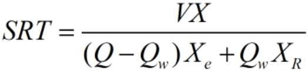
  - **Hình này chứng minh điều gì**
    - Minh họa chi tiết sơ đồ công nghệ, thông số thiết kế hoặc cấu tạo thiết bị trên slide trang 19.
  - **Từ đâu mà thấy được**
    - Trích xuất trực tiếp từ tài liệu bài giảng gốc của chương.

- Thông số và cấu tạo chi tiết theo tài liệu bài giảng (Trang 20):
  - **Hình 21.** Figure 21 (Page 20)
    - 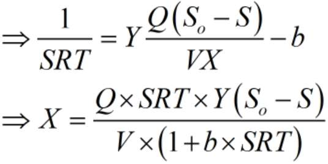
  - **Hình này chứng minh điều gì**
    - Minh họa chi tiết sơ đồ công nghệ, thông số thiết kế hoặc cấu tạo thiết bị trên slide trang 20.
  - **Từ đâu mà thấy được**
    - Trích xuất trực tiếp từ tài liệu bài giảng gốc của chương.

- Thông số và cấu tạo chi tiết theo tài liệu bài giảng (Trang 21):
  - **Hình 22.** Figure 22 (Page 21)
    - 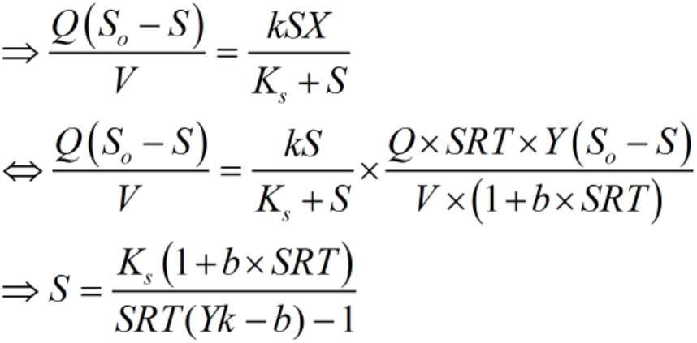
  - **Hình này chứng minh điều gì**
    - Minh họa chi tiết sơ đồ công nghệ, thông số thiết kế hoặc cấu tạo thiết bị trên slide trang 21.
  - **Từ đâu mà thấy được**
    - Trích xuất trực tiếp từ tài liệu bài giảng gốc của chương.

- Thông số và cấu tạo chi tiết theo tài liệu bài giảng (Trang 21):
  - **Hình 23.** Figure 23 (Page 21)
    - 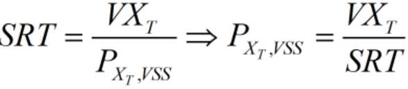
  - **Hình này chứng minh điều gì**
    - Minh họa chi tiết sơ đồ công nghệ, thông số thiết kế hoặc cấu tạo thiết bị trên slide trang 21.
  - **Từ đâu mà thấy được**
    - Trích xuất trực tiếp từ tài liệu bài giảng gốc của chương.

- Thông số và cấu tạo chi tiết theo tài liệu bài giảng (Trang 22):
  - **Hình 24.** Figure 24 (Page 22)
    - 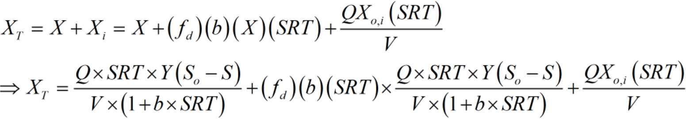
  - **Hình này chứng minh điều gì**
    - Minh họa chi tiết sơ đồ công nghệ, thông số thiết kế hoặc cấu tạo thiết bị trên slide trang 22.
  - **Từ đâu mà thấy được**
    - Trích xuất trực tiếp từ tài liệu bài giảng gốc của chương.

- Thông số và cấu tạo chi tiết theo tài liệu bài giảng (Trang 22):
  - **Hình 25.** Figure 25 (Page 22)
    - 
  - **Hình này chứng minh điều gì**
    - Minh họa chi tiết sơ đồ công nghệ, thông số thiết kế hoặc cấu tạo thiết bị trên slide trang 22.
  - **Từ đâu mà thấy được**
    - Trích xuất trực tiếp từ tài liệu bài giảng gốc của chương.

- Thông số và cấu tạo chi tiết theo tài liệu bài giảng (Trang 22):
  - **Hình 26.** Figure 26 (Page 22)
    - 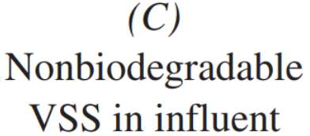
  - **Hình này chứng minh điều gì**
    - Minh họa chi tiết sơ đồ công nghệ, thông số thiết kế hoặc cấu tạo thiết bị trên slide trang 22.
  - **Từ đâu mà thấy được**
    - Trích xuất trực tiếp từ tài liệu bài giảng gốc của chương.

- Thông số và cấu tạo chi tiết theo tài liệu bài giảng (Trang 22):
  - **Hình 27.** Figure 27 (Page 22)
    - 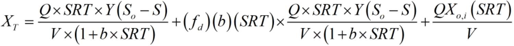
  - **Hình này chứng minh điều gì**
    - Minh họa chi tiết sơ đồ công nghệ, thông số thiết kế hoặc cấu tạo thiết bị trên slide trang 22.
  - **Từ đâu mà thấy được**
    - Trích xuất trực tiếp từ tài liệu bài giảng gốc của chương.

- Thông số và cấu tạo chi tiết theo tài liệu bài giảng (Trang 22):
  - **Hình 28.** Figure 28 (Page 22)
    - 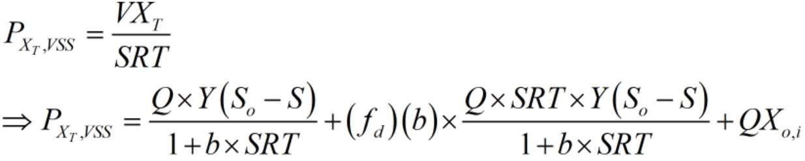
  - **Hình này chứng minh điều gì**
    - Minh họa chi tiết sơ đồ công nghệ, thông số thiết kế hoặc cấu tạo thiết bị trên slide trang 22.
  - **Từ đâu mà thấy được**
    - Trích xuất trực tiếp từ tài liệu bài giảng gốc của chương.

- Thông số và cấu tạo chi tiết theo tài liệu bài giảng (Trang 23):
  - **Hình 29.** Figure 29 (Page 23)
    - 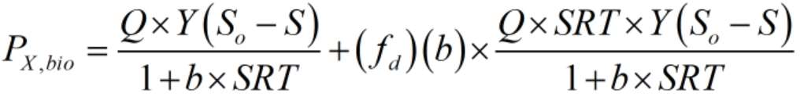
  - **Hình này chứng minh điều gì**
    - Minh họa chi tiết sơ đồ công nghệ, thông số thiết kế hoặc cấu tạo thiết bị trên slide trang 23.
  - **Từ đâu mà thấy được**
    - Trích xuất trực tiếp từ tài liệu bài giảng gốc của chương.

- Thông số và cấu tạo chi tiết theo tài liệu bài giảng (Trang 23):
  - **Hình 30.** Figure 30 (Page 23)
    - 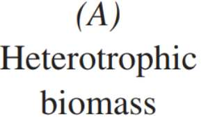
  - **Hình này chứng minh điều gì**
    - Minh họa chi tiết sơ đồ công nghệ, thông số thiết kế hoặc cấu tạo thiết bị trên slide trang 23.
  - **Từ đâu mà thấy được**
    - Trích xuất trực tiếp từ tài liệu bài giảng gốc của chương.

- Thông số và cấu tạo chi tiết theo tài liệu bài giảng (Trang 24):
  - **Hình 31.** Figure 31 (Page 24)
    - 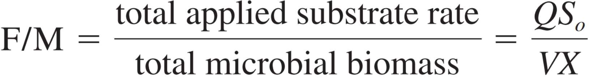
  - **Hình này chứng minh điều gì**
    - Minh họa chi tiết sơ đồ công nghệ, thông số thiết kế hoặc cấu tạo thiết bị trên slide trang 24.
  - **Từ đâu mà thấy được**
    - Trích xuất trực tiếp từ tài liệu bài giảng gốc của chương.

### Chương 5.2: Xử lý Sinh học - Chuyển hóa Nitơ và Động học Khử Nitơ (Part 2)

#### 5. Biological inorganic nitrogen oxidation

##### 5.1 Tổng quan về quá trình nitrat hóa (Overview of Biological Inorganic Nitrogen Oxidation)

###### Hóa học lượng clo và hai giai đoạn chuyển hóa (Two-Step Biological Nitrification Pathway)
- Quá trình oxy hóa sinh học nitơ vô cơ (nitrat hóa - nitrification) là chuỗi phản ứng sinh hóa hai giai đoạn do vi sinh vật tự dưỡng hiếu khí thực hiện:
  - Giai đoạn 1: Nitrit hóa (Nitritation) - oxy hóa ion amoni ($\text{NH}_4^+$) thành ion nitrit ($\text{NO}_2^-$):
    $$2\text{NH}_4^+ + 3\text{O}_2 \rightarrow 2\text{NO}_2^- + 4\text{H}^+ + 2\text{H}_2\text{O}$$
  - Giai đoạn 2: Nitrat hóa (Nitratation) - oxy hóa ion nitrit ($\text{NO}_2^-$) thành ion nitrat ($\text{NO}_3^-$):
    $$2\text{NO}_2^- + \text{O}_2 \rightarrow 2\text{NO}_3^-$$
  - Phương trình phản ứng oxy hóa toàn phần:
    $$\text{NH}_4^+ + 2\text{O}_2 \rightarrow \text{NO}_3^- + 2\text{H}^+ + \text{H}_2\text{O}$$
- Quá trình chuyển hóa giải phóng ion hydro ($\text{H}^+$), làm giảm pH dung dịch nếu nguồn nước thiếu hệ đệm kiềm.

###### So sánh vi khuẩn tự dưỡng nitrat hóa và vi khuẩn dị dưỡng (Autotrophic vs Heterotrophic Comparison)
- Bảng đối chiếu đặc tính sinh học và chuyển hóa năng lượng:
| Tiêu chí so sánh | Vi khuẩn hiếu khí dị dưỡng (Aerobic Heterotrophic) | Vi khuẩn hiếu khí tự dưỡng (Aerobic Autotrophic Nitrifiers) |
| :--- | :--- | :--- |
| **Sản phẩm tạo thành (Product)** | $\text{CO}_2$, $\text{H}_2\text{O}$ | $\text{NO}_2^-$, $\text{NO}_3^-$ |
| **Chất nhận electron (Electron acceptor)** | Oxy hòa tan ($\text{O}_2$) | Oxy hòa tan ($\text{O}_2$) |
| **Chất cho electron (Electron donor)** | Hợp chất hữu cơ (Organic compounds) | Amoni ($\text{NH}_4^+$) và Nitrit ($\text{NO}_2^-$) |
| **Nguồn cacbon tổng hợp (Carbon source)** | Hợp chất hữu cơ (Organic compounds) | Cacbon dioxit ($\text{CO}_2$) và bicacbonat ($\text{HCO}_3^-$) |
| **Tên phản ứng (Reaction name)** | Oxy hóa hiếu khí BOD (Aerobic oxidation) | Nitrat hóa sinh học (Nitrification) |
| **Hệ số sản lượng sinh khối ($Y$)** | Cao ($0.40\text{--}0.60\text{ g VSS/g bCOD}$) | Rất thấp ($0.10\text{--}0.15\text{ g VSS/g N}$) |
- Hệ quả công nghệ sinh học từ hệ số sản lượng thấp:
  - Phản ứng oxy hóa amoni và nitrit giải phóng lượng năng lượng tự do Gibbs rất bé so với oxy hóa cơ chất cacbon.
  - Tốc độ tăng trưởng riêng ($\mu$) của vi khuẩn tự dưỡng nhỏ hơn nhiều so với vi khuẩn dị dưỡng.
  - Hệ thống bùn hoạt tính đòi hỏi thời gian lưu bùn (SRT, $\theta_c$) dài hơn đáng kể ($\theta_c \ge 10\text{--}20\text{ ngày}$) để tránh rửa trôi sinh khối tự dưỡng (washout).

###### Cấu hình công nghệ nitrat hóa (Process Configurations: Single-Sludge vs Two-Sludge)
- Quy trình bùn hoạt tính đơn công đoạn (Single-sludge process):
  - Tích hợp khử BOD cacbon và nitrat hóa amoni trong cùng một bể sục khí và một bể lắng duy nhất.
  - Sinh khối dị dưỡng và sinh khối tự dưỡng cùng tồn tại trong một hệ bùn hoạt tính tuần hoàn chung (Return Activated Sludge - RAS).
  - Tỷ lệ vi khuẩn nitrat hóa trong bông bùn thấp (thường chỉ chiếm $2\%\text{--}5\%$ tổng khối lượng VSS), đòi hỏi thể tích bể lớn và tuổi bùn cao.
      - **Hình 1.** Sơ đồ quy trình bùn hoạt tính đơn công đoạn (Single-sludge process)
        - 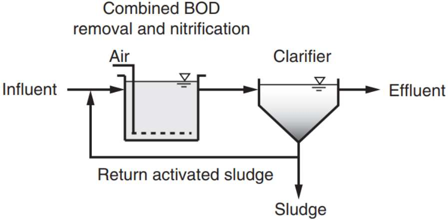
        - **Hình này chứng minh điều gì**
          - Khử BOD và nitrat hóa diễn ra đồng thời trong một bể sục khí duy nhất và sử dụng chung một vòng tuần hoàn bùn.
        - **Từ đâu mà thấy được**
          - Sơ đồ thể hiện khối "Combined BOD removal and nitrification" sục khí "Air", tiếp sau là "Clarifier", dẫn ra "Effluent" và bùn đáy tách thành "Return activated sludge" và "Sludge".
- Quy trình bùn hoạt tính hai công đoạn (Two-sludge process):
  - Tách biệt hoàn toàn công đoạn khử BOD và công đoạn nitrat hóa thành hai chu trình phản ứng và lắng bùn nối tiếp độc lập.
  - Giai đoạn 1 (Khử BOD): Vận hành ở tuổi bùn ngắn ($\theta_c \approx 1\text{--}3\text{ ngày}$) nhằm loại bỏ nhanh hợp chất hữu cơ hòa tan.
  - Giai đoạn 2 (Nitrat hóa): Tiếp nhận nước trong sau lắng giai đoạn 1 có nồng độ BOD rất thấp, vận hành ở tuổi bùn dài ($\theta_c \ge 15\text{--}20\text{ ngày}$) để tích lũy vi khuẩn tự dưỡng.
  - Nhánh rẽ phân dòng (Bypass line):
    - Đưa một phần lưu lượng nước thải thô giàu BOD vòng qua giai đoạn 1 để vào thẳng giai đoạn 2.
    - Duy trì một tỷ lệ vi khuẩn dị dưỡng vừa đủ để kích thích khả năng tạo bông bùn và cải thiện tốc độ lắng ("enhance floc formation and settling ability of sludge by heterotrophic flocs").
      - **Hình 2.** Sơ đồ quy trình bùn hoạt tính hai công đoạn (Two-sludge process)
        - 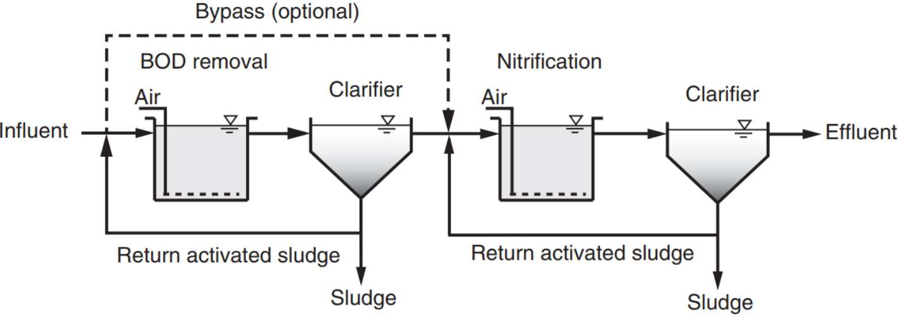
        - **Hình này chứng minh điều gì**
          - Khử BOD và nitrat hóa diễn ra ở hai hệ thống phản ứng - lắng riêng biệt, có đường bypass nước thải thô hỗ trợ tạo bông.
        - **Từ đâu mà thấy được**
          - Hai bậc nối tiếp: cụm "BOD removal" (gồm Air, Clarifier, Return activated sludge) dẫn sang cụm "Nitrification" (gồm Air, Clarifier, Return activated sludge), kèm đường nét đứt "Bypass (optional)" từ Influent vào bể nitrat hóa.

##### 5.2 Vi sinh vật học nitrat hóa (Microbiology: AOB and NOB)

###### Vi khuẩn oxy hóa amoniac (Ammonia-Oxidizing Bacteria - AOB)
- Vai trò sinh học và con đường xúc tác:
  - Oxy hóa amoni ($\text{NH}_4^+$) hoặc amoniac tự do ($\text{NH}_3$) thành ion nitrit ($\text{NO}_2^-$).
  - Phản ứng được xúc tác bởi enzyme amoniac monooxygenase (AMO) và hydroxylamine oxidoreductase (HAO).
- Phân loại học vi sinh vật:
  - Chi *Nitrosomonas*: Thuộc phân lớp $\beta$-Proteobacteria; là nhóm vi khuẩn phổ biến nhất và giữ vai trò chi phối trong các trạm xử lý nước thải sinh hoạt đô thị.
  - Chi *Nitrosospira*: Thuộc phân lớp $\beta$-Proteobacteria; thường phân bố trong môi trường đất tự nhiên và hệ thống bùn hoạt tính có tải lượng nitơ thấp.

###### Vi khuẩn oxy hóa nitrit (Nitrite-Oxidizing Bacteria - NOB)
- Vai trò sinh học và con đường xúc tác:
  - Oxy hóa ion nitrit ($\text{NO}_2^-$) thành ion nitrat ($\text{NO}_3^-$).
  - Phản ứng được xúc tác bởi phức hợp enzyme nitrite oxidoreductase (NXR).
- Phân loại học vi sinh vật:
  - Chi *Nitrobacter*: Thuộc phân lớp $\alpha$-Proteobacteria; có tốc độ tăng trưởng nhanh nhưng hằng số ái lực cơ chất kém, chiếm ưu thế khi nồng độ nitrit cao.
  - Chi *Nitrococcus*: Thuộc phân lớp $\gamma$-Proteobacteria; vi sinh vật đặc thù trong các thủy vực nước mặn và nước lợ.
  - Chi *Nitrospina*: Thuộc phân lớp $\delta$-Proteobacteria; sinh sống chủ yếu trong môi trường biển sâu.
  - Chi *Nitrospira*: Thuộc phân lớp $\delta$-Proteobacteria (theo phân loại phát sinh chủng loại hiện đại xếp vào ngành riêng Nitrospirota); có ái lực cơ chất cực cao và là nhóm NOB chiếm ưu thế áp đảo trong hầu hết các trạm xử lý nước thải vận hành ở nồng độ cơ chất thấp.

##### 5.3 Nhu cầu oxy cho nitrat hóa (Oxygen Requirement and Ro Formulation)

###### Nhu cầu oxy hóa học lượng clo lý thuyết (Stoichiometric Oxygen Demand)
- Lượng oxy tiêu thụ trong phản ứng nitrit hóa:
  $$2\text{NH}_4^+ + 3\text{O}_2 \rightarrow 2\text{NO}_2^- + 4\text{H}^+ + 2\text{H}_2\text{O}$$
  - Cân bằng khối lượng: $2 \times 14\text{ g NH}_4^+\text{-N}$ ($28\text{ g N}$) phản ứng với $3 \times 32\text{ g O}_2$ ($96\text{ g O}_2$).
  - Tỷ lệ oxy hóa riêng phần:
    $$\frac{96\text{ g O}_2}{28\text{ g N}} \approx 3.43\text{ g O}_2/\text{g NH}_4^+\text{-N}$$
  - Cần $3.43\text{ g O}_2$ để oxy hóa $1\text{ g NH}_4^+\text{-N}$ thành $\text{NO}_2^-\text{-N}$.
- Lượng oxy tiêu thụ trong phản ứng nitrat hóa:
  $$2\text{NO}_2^- + \text{O}_2 \rightarrow 2\text{NO}_3^-$$
  - Cân bằng khối lượng: $2 \times 14\text{ g NO}_2^-\text{-N}$ ($28\text{ g N}$) phản ứng với $32\text{ g O}_2$.
  - Tỷ lệ oxy hóa riêng phần:
    $$\frac{32\text{ g O}_2}{28\text{ g N}} \approx 1.14\text{ g O}_2/\text{g NO}_2^-\text{-N}$$
  - Cần $1.14\text{ g O}_2$ để oxy hóa $1\text{ g NO}_2^-\text{-N}$ thành $\text{NO}_3^-\text{-N}$.
- Tổng nhu cầu oxy hóa toàn phần lý thuyết:
  $$\text{Nhu cầu oxy hóa hoàn toàn} = 3.43 + 1.14 = 4.57\text{ g O}_2/\text{g NH}_4^+\text{-N oxidized}$$
  - Cần chính xác $4.57\text{ g O}_2$ để chuyển hóa hoàn toàn $1\text{ g NH}_4^+\text{-N}$ thành $\text{NO}_3^-\text{-N}$.

###### Phương trình nhu cầu oxy tổng thể ($R_o$) trong hệ thống bùn hoạt tính
- Định luật bảo toàn nhu cầu oxy hóa sinh học:
  $$\text{Oxygen requirement} = \text{bCOD removed} - \text{COD in biomass} + \text{oxygen required for nitrification}$$
- Phương trình cân bằng tốc độ tiêu thụ oxy hòa tan $R_o$ ($\text{kg O}_2/\text{d}$ hoặc $\text{g O}_2/\text{d}$):
  $$R_o = Q(S_o - S) - 1.42 P_{X,\text{bio}} + 4.57 Q(NO_x)$$
  - Trong đó:
    - $Q$: Lưu lượng nước thải đầu vào hệ thống xử lý ($\text{m}^3/\text{d}$).
    - $S_o$: Nồng độ bCOD hòa tan trong nước thải đầu vào ($\text{g/m}^3$ hay $\text{mg/L}$).
    - $S$: Nồng độ bCOD hòa tan trong nước thải đầu ra sau xử lý ($\text{g/m}^3$ hay $\text{mg/L}$).
    - $P_{X,\text{bio}}$: Tốc độ sinh khối tế bào vi sinh vật tạo thành mỗi ngày ($\text{g VSS/d}$ hay $\text{kg VSS/d}$).
    - $1.42$: Hệ số chuyển đổi tương đương COD của tế bào vi khuẩn ($\text{g COD/g VSS}$, theo công thức tế bào chuẩn $\text{C}_5\text{H}_7\text{NO}_2$).
    - $NO_x$: Nồng độ nitrat-nitơ sinh ra từ phản ứng nitrat hóa ($\text{g N/m}^3$ hay $\text{mg/L}$).
    - $4.57$: Suất tiêu hao oxy lý thuyết cho nitrat hóa ($\text{g O}_2/\text{g N}$).

###### Cân bằng vật chất nitơ chuyển hóa (Nitrogen Mass Balance)
- Cân bằng dòng khối lượng nitơ oxy hóa trong bể phản ứng:
  $$\text{Nitrogen oxidized} = \text{Influent Nitrogen} - \text{Effluent Nitrogen} - \text{Nitrogen in biomass}$$
- Biểu thức lưu lượng nitrat sinh ra:
  $$Q(NO_x) = Q(TKN_o) - Q N_e - 0.12 P_{X,\text{bio}}$$
- Nồng độ nitrat hình thành qua nitrat hóa ($NO_x$):
  $$NO_x = TKN_o - N_e - \frac{0.12 P_{X,\text{bio}}}{Q}$$
  - Trong đó:
    - $TKN_o$: Nồng độ nitơ Kjeldahl tổng số (TKN) trong nước thải đầu vào ($\text{mg/L}$ hay $\text{g/m}^3$).
    - $N_e$: Nồng độ amoni-nitơ còn lại trong nước thải đầu ra ($\text{mg/L}$ hay $\text{g/m}^3$).
    - $0.12$: Hàm lượng nitơ đồng hóa vào cấu trúc tế bào sinh khối mới hình thành ($12\%\text{ N theo khối lượng VSS}$, dựa trên công thức phân tử $\text{C}_5\text{H}_7\text{NO}_2$).

##### 5.4 Nhu cầu độ kiềm và kiểm soát pH (Alkalinity Requirement and pH Control)

###### Cơ chế tiêu thụ độ kiềm và giải phóng ion $\text{H}^+$
- Phương trình phản ứng tổng thể giải phóng proton tự do:
  $$\text{NH}_4^+ + 2\text{O}_2 \rightarrow \text{NO}_3^- + 2\text{H}^+ + \text{H}_2\text{O}$$
- Cơ chế phản ứng đệm trong môi trường nước thải:
  - Cứ mỗi mol $\text{NH}_4^+\text{-N}$ ($14\text{ g N}$) bị oxy hóa hoàn toàn sẽ giải phóng $2\text{ mol } \text{H}^+$.
  - Để trung hòa lượng axit sinh ra và ngăn tụt dốc pH, hệ đệm bicacbonat trong nước tiêu thụ $2\text{ đương lượng (eq)}$ độ kiềm:
    $$2\text{H}^+ + 2\text{HCO}_3^- \rightarrow 2\text{CO}_2\uparrow + 2\text{H}_2\text{O}$$
  - Khối lượng mol của canxi cacbonat là $100\text{ g/mol } \text{CaCO}_3$ (tương ứng với $2\text{ eq}$ trao đổi điện tích, do đó $1\text{ eq}$ độ kiềm tương đương $50\text{ g CaCO}_3$).
- Suất tiêu thụ độ kiềm định lượng:
  $$\text{Suất tiêu thụ độ kiềm} = \frac{2 \times 50\text{ g CaCO}_3}{14\text{ g N}} = \frac{100}{14} \approx 7.14\text{ g CaCO}_3/\text{g NH}_4^+\text{-N oxidized}$$

###### Định mức độ kiềm đệm và hóa chất trung hòa
- Yêu cầu kiểm soát độ kiềm dư trong bể sinh học:
  - Quá trình nitrat hóa làm cạn kiệt nhanh chóng nguồn độ kiềm tự nhiên của nước thải sinh hoạt.
  - Để duy trì dải pH tối ưu $6.8\text{--}7.0$, nồng độ độ kiềm dư tối thiểu trong nước sau xử lý phải được bảo đảm ở mức:
    $$\text{Độ kiềm dư yêu cầu} \approx 70\text{ g CaCO}_3/\text{m}^3\text{ (70 mg/L as CaCO}_3)$$
  - Nếu độ kiềm dư rơi xuống dưới $40\text{--}50\text{ mg/L as CaCO}_3$, pH sẽ giảm sâu dưới $6.5$, gây ức chế nghiêm trọng đến vận tốc tăng trưởng của vi khuẩn nitrat hóa.
- Hóa chất kiềm hóa thông dụng:
  - Natri hydroxit ($\text{NaOH}$): Tác dụng nhanh, không tạo cặn bùn vô cơ, nhưng chi phí hóa chất cao và đòi hỏi an toàn lao động nghiêm ngặt.
  - Natri bicacbonat ($\text{NaHCO}_3$): Bổ sung trực tiếp nguồn đệm $\text{HCO}_3^-$, ít nguy cơ quá liều nâng vọt pH vượt ngưỡng cho phép.
  - Vôi tôi ($\text{Ca(OH)}_2$): Giá thành thấp nhưng làm gia tăng lượng bùn vô cơ $\text{CaCO}_3$ kết tủa trong bể lắng.

##### 5.5 Động học quá trình nitrat hóa (Nitrification Kinetics)

###### Mô hình tăng trưởng Monod kép (Dual Monod Kinetic Model)
- Tốc độ sinh trưởng riêng của AOB và NOB chịu sự chi phối đồng thời của hai cơ chất hạn chế: chất cho electron (amoni hoặc nitrit) và chất nhận electron (oxy hòa tan).
- Phương trình tốc độ sinh trưởng riêng của vi khuẩn oxy hóa amoniac (AOB):
  $$\mu_{AOB} = \mu_{\max, AOB} \left(\frac{S_o}{K_{o,AOB} + S_o}\right) \left(\frac{S_{NH_4}}{K_{NH_4} + S_{NH_4}}\right) - b_{AOB}$$
- Phương trình tốc độ sinh trưởng riêng của vi khuẩn oxy hóa nitrit (NOB):
  $$\mu_{NOB} = \mu_{\max, NOB} \left(\frac{S_o}{K_{o,NOB} + S_o}\right) \left(\frac{S_{NO_2}}{K_{NO_2} + S_{NO_2}}\right) - b_{NOB}$$
  - Trong đó:
    - $\mu_{AOB}, \mu_{NOB}$: Tốc độ sinh trưởng riêng thuần túy của AOB và NOB ($\text{g VSS/g VSS}\cdot\text{d}$ hay $\text{d}^{-1}$).
    - $\mu_{\max, AOB}, \mu_{\max, NOB}$: Tốc độ sinh trưởng riêng cực đại ở trạng thái bão hòa oxy ($\text{d}^{-1}$).
    - $b_{AOB}, b_{NOB}$: Hệ số phân hủy nội sinh của AOB và NOB ($\text{d}^{-1}$).
    - $S_{NH_4}$: Nồng độ amoni-nitơ trong hỗn dịch phản ứng ($\text{mg/L}$ hay $\text{g/m}^3$).
    - $S_{NO_2}$: Nồng độ nitrit-nitơ trong hỗn dịch phản ứng ($\text{mg/L}$ hay $\text{g/m}^3$).
    - $K_{NH_4}$: Hằng số bán bão hòa Monod đối với amoni ($\text{mg/L}$ hay $\text{g/m}^3$).
    - $K_{NO_2}$: Hằng số bán bão hòa Monod đối với nitrit ($\text{mg/L}$ hay $\text{g/m}^3$).
    - $S_o$: Nồng độ oxy hòa tan (DO) trong hỗn dịch sinh học ($\text{mg/L}$).
    - $K_{o,AOB}$: Hằng số bán bão hòa oxy hòa tan của vi khuẩn AOB ($\text{mg/L}$).
    - $K_{o,NOB}$: Hằng số bán bão hòa oxy hòa tan của vi khuẩn NOB ($\text{mg/L}$).
      - **Hình 3.** Phương trình tốc độ sinh trưởng riêng thuần túy của AOB và NOB
        - 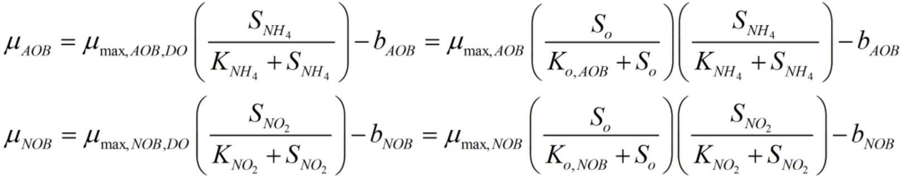
        - **Hình này chứng minh điều gì**
          - Tốc độ sinh trưởng riêng của AOB và NOB tuân theo động học Monod kép phụ thuộc đồng thời vào nồng độ DO và nồng độ nitơ vô cơ, trừ đi hệ số suy hủy nội sinh.
        - **Từ đâu mà thấy được**
          - Biểu thức giải tích hai dòng hiển thị $\mu_{AOB}$ và $\mu_{NOB}$ được nhân lần lượt với hệ số $\frac{S_o}{K_o + S_o}$ và số hạng Monod của $S_{NH_4}$, $S_{NO_2}$.

###### Ảnh hưởng của oxy hòa tan đến tốc độ sinh trưởng cực đại
- Định nghĩa tốc độ sinh trưởng cực đại hiệu chỉnh theo oxy hòa tan ($\mu_{\max, DO}$):
  $$\mu_{\max, AOB, DO} = \mu_{\max, AOB} \left(\frac{S_o}{K_{o,AOB} + S_o}\right)$$
  $$\mu_{\max, NOB, DO} = \mu_{\max, NOB} \left(\frac{S_o}{K_{o,NOB} + S_o}\right)$$
- Đặc điểm so sánh độ nhạy cảm với oxy:
  - Giá trị điển hình: $K_{o,AOB} \approx 0.50\text{ mg/L}$, trong khi $K_{o,NOB} \approx 0.90\text{ mg/L}$.
  - Do $K_{o,NOB} > K_{o,AOB}$, tốc độ cực đại hiệu chỉnh của NOB sụt giảm sâu hơn nhiều so với AOB khi nồng độ DO suy thoái xuống dưới ngưỡng bão hòa.
      - **Hình 4.** Biểu thức tốc độ sinh trưởng cực đại hiệu chỉnh theo oxy hòa tan
        - 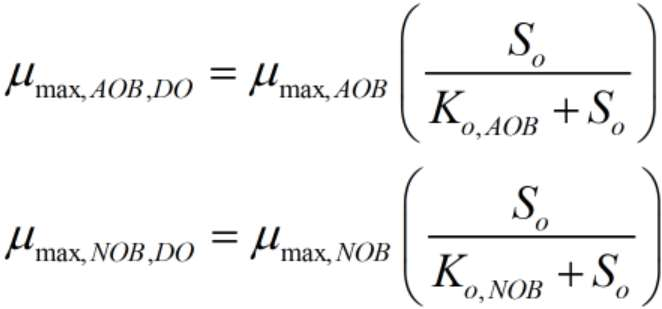
        - **Hình này chứng minh điều gì**
          - Nồng độ DO đóng vai trò là thừa số giới hạn trực tiếp lên tốc độ sinh trưởng cực đại của cả hai chủng vi khuẩn tự dưỡng.
        - **Từ đâu mà thấy được**
          - Hai phương trình hiển thị $\mu_{\max, AOB, DO}$ và $\mu_{\max, NOB, DO}$ tỷ lệ với hàm phân số $S_o / (K_o + S_o)$.

##### 5.6 Các yếu tố môi trường ảnh hưởng đến nitrat hóa (Environmental Factors Affecting Nitrification)

###### Nồng độ oxy hòa tan (DO) và hiện tượng tích lũy nitrit
- Nồng độ oxy hòa tan khuyến cáo trong vận hành:
  - Dải tối ưu: $DO = 2.0\text{--}4.0\text{ mg/L}$.
  - Mức DO này cung cấp gradient nồng độ đủ lớn để oxy khuếch tán xuyên qua màng chất lỏng vào tận tâm bông bùn hoạt tính.
- Hiện tượng nitrat hóa không hoàn toàn và tích lũy nitrit (Nitrite accumulation):
  - Khi nồng độ oxy hòa tan sụt giảm xuống dưới $1.0\text{ mg/L}$, nitrat hóa trở nên không hoàn toàn (incomplete nitrification).
  - Do $K_{o,NOB} \approx 0.9\text{ mg/L} > K_{o,AOB} \approx 0.5\text{ mg/L}$, vi khuẩn NOB bị ức chế nặng nề hơn AOB ở mức DO thấp.
  - AOB vẫn duy trì tốc độ chuyển hóa amoni thành nitrit, trong khi NOB không đủ năng lực oxy hóa tiếp lượng nitrit tạo ra thành nitrat, dẫn tới sự tích lũy nồng độ cao của ion nitrit ($\text{NO}_2^-$) trong nước thải sau xử lý.

###### Ảnh hưởng của độ pH
- Dải pH tối ưu cho hoạt động enzyme: $\text{pH} = 7.5\text{--}8.0$.
- Tác động tiêu cực khi pH lệch chuẩn:
  - Khi $\text{pH} < 6.8$, vận tốc nitrat hóa suy giảm rõ rệt.
  - Khi $\text{pH} < 6.0$, hoạt tính enzyme amoniac monooxygenase bị tê liệt hoàn toàn.
  - Cơ chế: Ở pH thấp, cân bằng phân ly chuyển dịch làm giảm nồng độ amoniac tự do ($\text{NH}_3$) - dạng cơ chất thực tế mà vi khuẩn AOB hấp thụ; đồng thời làm tăng nồng độ axit nitrơ tự do ($\text{HNO}_2$) gây độc cho tế bào.

###### Nhiệt độ và độc chất ức chế
- Ảnh hưởng của nhiệt độ nước thải:
  - Vi khuẩn tự dưỡng nitrat hóa cực kỳ nhạy cảm với sự suy giảm nhiệt độ so với vi khuẩn dị dưỡng.
  - Tốc độ tăng trưởng riêng suy giảm mạnh khi nhiệt độ hạ xuống dưới $15^\circ\text{C}$ theo phương trình Arrhenius:
    $$\mu_{\max}(T) = \mu_{\max}(20^\circ\text{C}) \times \theta_T^{(T - 20)}$$
    với hệ số nhiệt độ $\theta_T \approx 1.098\text{--}1.123$.
- Độc chất vô cơ và hữu cơ:
  - Kim loại nặng hòa tan ($\text{Cu}^{2+}, \text{Zn}^{2+}, \text{Ni}^{2+}, \text{Cr}^{6+}$) ức chế hoạt tính enzyme ở ngưỡng nồng độ chỉ vài $\text{mg/L}$.
  - Các hợp chất ức chế chuyên biệt: Xyanua ($\text{CN}^-$), thiourea, phenol, cresol.
  - Tự ức chế cơ chất và sản phẩm: Amoniac tự do ($\text{Free Ammonia - FA} > 10\text{--}150\text{ mg/L}$) ức chế sinh trưởng AOB và NOB; axit nitrơ tự do ($\text{Free Nitrous Acid - FNA} > 0.1\text{--}0.2\text{ mg/L}$) ức chế chọn lọc vi khuẩn NOB.

##### 5.7 Bài tập ví dụ tính toán nitrat hóa (Worked Example: Effluent Ammonium and Nitrite with DO Effects)

###### Đề bài
Cho một bể phản ứng bùn hoạt tính hiếu khí thực hiện quá trình nitrat hóa có thời gian lưu bùn thiết kế $\theta_c = \text{SRT} = 20\text{ ngày}$. Các thông số động học của vi khuẩn AOB và NOB ở nhiệt độ $12^\circ\text{C}$ gồm:
- $\mu_{m,AOB} = 0.52\text{ g VSS/g VSS}\cdot\text{d}$
- $\mu_{m,NOB} = 0.61\text{ g VSS/g VSS}\cdot\text{d}$
- $K_{NH_4} = 0.5\text{ g/m}^3$
- $K_{NO_2} = 0.2\text{ g/m}^3$
- $K_{o,AOB} = 0.5\text{ mg/L}$
- $K_{o,NOB} = 0.9\text{ mg/L}$
- $b_{AOB} = 0.135\text{ g VSS lost/g VSS}\cdot\text{d}$
- $b_{NOB} = 0.135\text{ g VSS lost/g VSS}\cdot\text{d}$

Xác định nồng độ amoni ($S_{NH_4}$) và nitrit ($S_{NO_2}$) trong nước thải đầu ra của bể trong hai trường hợp:
1. Nồng độ oxy hòa tan trong bể duy trì ở mức $DO = 2.0\text{ mg/L}$.
2. Nồng độ oxy hòa tan trong bể suy giảm xuống mức $DO = 0.4\text{ mg/L}$.

###### Dữ kiện
- Thời gian lưu bùn thiết kế: $\theta_c = \text{SRT} = 20\text{ ngày}$.
- Nhiệt độ nước thải vận hành: $T = 12^\circ\text{C}$.
- Thông số động học vi khuẩn oxy hóa amoniac (AOB):
  - Tốc độ sinh trưởng riêng cực đại: $\mu_{m,AOB} = 0.52\text{ g VSS/g VSS}\cdot\text{d} = 0.52\text{ d}^{-1}$.
  - Hằng số bán bão hòa amoni: $K_{NH_4} = 0.5\text{ g/m}^3 = 0.5\text{ mg/L}$.
  - Hằng số bán bão hòa oxy hòa tan: $K_{o,AOB} = 0.5\text{ mg/L}$.
  - Hệ số phân hủy nội sinh: $b_{AOB} = 0.135\text{ g VSS lost/g VSS}\cdot\text{d} = 0.135\text{ d}^{-1}$.
- Thông số động học vi khuẩn oxy hóa nitrit (NOB):
  - Tốc độ sinh trưởng riêng cực đại: $\mu_{m,NOB} = 0.61\text{ g VSS/g VSS}\cdot\text{d} = 0.61\text{ d}^{-1}$.
  - Hằng số bán bão hòa nitrit: $K_{NO_2} = 0.2\text{ g/m}^3 = 0.2\text{ mg/L}$.
  - Hằng số bán bão hòa oxy hòa tan: $K_{o,NOB} = 0.9\text{ mg/L}$.
  - Hệ số phân hủy nội sinh: $b_{NOB} = 0.135\text{ g VSS lost/g VSS}\cdot\text{d} = 0.135\text{ d}^{-1}$.
- Các mức nồng độ oxy hòa tan khảo sát:
  - Mức DO tối ưu: $S_{o,1} = 2.0\text{ mg/L}$.
  - Mức DO thiếu hụt: $S_{o,2} = 0.4\text{ mg/L}$.

###### Quy tắc áp dụng
- Phương trình cân bằng sinh khối ở trạng thái ổn định trong bể bùn hoạt tính xáo trộn hoàn toàn có tuần hoàn bùn (giả thiết sinh khối vi khuẩn tự dưỡng trong nước thải đầu vào không đáng kể):
  $$\frac{1}{\theta_c} = \mu - b \iff \mu_{\text{req}} = \frac{1}{\theta_c} + b$$
- Tốc độ sinh trưởng riêng cực đại hiệu chỉnh theo nồng độ oxy hòa tan (DO):
  $$\mu_{m,DO} = \mu_m \left(\frac{S_o}{K_o + S_o}\right)$$
- Phương trình Monod xác định nồng độ cơ chất hòa tan trong nước thải đầu ra:
  $$S = \frac{K_S \left(\frac{1}{\theta_c} + b\right)}{\mu_{m,DO} - \left(\frac{1}{\theta_c} + b\right)}$$
- Điều kiện chống rửa trôi sinh khối vi sinh vật (washout criterion):
  $$\mu_{m,DO} > \frac{1}{\theta_c} + b \iff \theta_c > \theta_{c,\min} = \frac{1}{\mu_{m,DO} - b}$$

###### Lời giải
- **Bước 1**: Tính toán đại lượng tốc độ sinh trưởng gộp yêu cầu tại $\theta_c = 20\text{ ngày}$.
  - Căn cứ: Phương trình cân bằng sinh khối ở trạng thái dừng $\mu_{\text{req}} = \frac{1}{\theta_c} + b$.
  - Nhìn vào: Với thời gian lưu bùn $\theta_c = 20\text{ ngày}$ và hệ số phân hủy nội sinh $b_{AOB} = b_{NOB} = 0.135\text{ d}^{-1}$:
    $$\mu_{\text{req}} = \frac{1}{20\text{ d}} + 0.135\text{ d}^{-1} = 0.050\text{ d}^{-1} + 0.135\text{ d}^{-1} = 0.185\text{ d}^{-1}$$
    Đại lượng $\mu_{\text{req}} = 0.185\text{ d}^{-1}$ là tốc độ tăng trưởng gộp tối thiểu mà cả AOB và NOB phải đạt tới để duy trì mật độ quần thể trong bể mà không bị rửa trôi.
- **Bước 2**: Tính toán nồng độ amoni và nitrit đầu ra ở điều kiện oxy tối ưu ($DO = 2.0\text{ mg/L}$).
  - Căn cứ: Mô hình Monod kép với nồng độ oxy hòa tan $S_{o,1} = 2.0\text{ mg/L}$.
  - Nhìn vào:
    - Đối với vi khuẩn oxy hóa amoniac (AOB):
      - Tốc độ sinh trưởng cực đại hiệu chỉnh theo DO:
        $$\mu_{m,AOB,DO} = 0.52 \times \left(\frac{2.0}{0.5 + 2.0}\right) = 0.52 \times \frac{2.0}{2.5} = 0.52 \times 0.80 = 0.416\text{ d}^{-1}$$
      - Do $\mu_{m,AOB,DO} = 0.416\text{ d}^{-1} > 0.185\text{ d}^{-1}$, vi khuẩn AOB duy trì ổn định.
      - Nồng độ amoni-nitơ đầu ra ($S_{NH_4}$):
        $$S_{NH_4} = \frac{K_{NH_4} \left(\frac{1}{\theta_c} + b_{AOB}\right)}{\mu_{m,AOB,DO} - \left(\frac{1}{\theta_c} + b_{AOB}\right)} = \frac{0.5 \times 0.185}{0.416 - 0.185} = \frac{0.0925}{0.231} \approx 0.4004\text{ mg/L}$$
    - Đối với vi khuẩn oxy hóa nitrit (NOB):
      - Tốc độ sinh trưởng cực đại hiệu chỉnh theo DO:
        $$\mu_{m,NOB,DO} = 0.61 \times \left(\frac{2.0}{0.9 + 2.0}\right) = 0.61 \times \frac{2.0}{2.9} \approx 0.42069\text{ d}^{-1}$$
      - Do $\mu_{m,NOB,DO} = 0.42069\text{ d}^{-1} > 0.185\text{ d}^{-1}$, vi khuẩn NOB phát triển ổn định.
      - Nồng độ nitrit-nitơ đầu ra ($S_{NO_2}$):
        $$S_{NO_2} = \frac{K_{NO_2} \left(\frac{1}{\theta_c} + b_{NOB}\right)}{\mu_{m,NOB,DO} - \left(\frac{1}{\theta_c} + b_{NOB}\right)} = \frac{0.2 \times 0.185}{0.42069 - 0.185} = \frac{0.037}{0.23569} \approx 0.1570\text{ mg/L}$$
- **Bước 3**: Tính toán nồng độ amoni và nitrit đầu ra ở điều kiện oxy suy giảm ($DO = 0.4\text{ mg/L}$).
  - Căn cứ: Mô hình Monod kép khi nồng độ DO rơi xuống mức thiếu hụt $S_{o,2} = 0.4\text{ mg/L}$.
  - Nhìn vào:
    - Đối với vi khuẩn oxy hóa amoniac (AOB):
      - Tốc độ sinh trưởng cực đại hiệu chỉnh theo DO:
        $$\mu_{m,AOB,DO} = 0.52 \times \left(\frac{0.4}{0.5 + 0.4}\right) = 0.52 \times \frac{0.4}{0.9} \approx 0.23111\text{ d}^{-1}$$
      - Do $\mu_{m,AOB,DO} = 0.23111\text{ d}^{-1} > 0.185\text{ d}^{-1}$, AOB vẫn duy trì được sinh khối trong hệ thống.
      - Nồng độ amoni-nitơ đầu ra ($S_{NH_4}$):
        $$S_{NH_4} = \frac{K_{NH_4} \left(\frac{1}{\theta_c} + b_{AOB}\right)}{\mu_{m,AOB,DO} - \left(\frac{1}{\theta_c} + b_{AOB}\right)} = \frac{0.5 \times 0.185}{0.23111 - 0.185} = \frac{0.0925}{0.04611} \approx 2.006\text{ mg/L}$$
    - Đối với vi khuẩn oxy hóa nitrit (NOB):
      - Tốc độ sinh trưởng cực đại hiệu chỉnh theo DO:
        $$\mu_{m,NOB,DO} = 0.61 \times \left(\frac{0.4}{0.9 + 0.4}\right) = 0.61 \times \frac{0.4}{1.3} \approx 0.18769\text{ d}^{-1}$$
      - Kiểm tra giới hạn rửa trôi: $\mu_{m,NOB,DO} = 0.18769\text{ d}^{-1} > 0.185\text{ d}^{-1}$, tuy nhiên khoảng chênh lệch $(\mu_{m,NOB,DO} - 0.185) = 0.00269\text{ d}^{-1}$ tiệm cận sát mốc $0$.
      - Nồng độ nitrit-nitơ đầu ra ($S_{NO_2}$):
        $$S_{NO_2} = \frac{K_{NO_2} \left(\frac{1}{\theta_c} + b_{NOB}\right)}{\mu_{m,NOB,DO} - \left(\frac{1}{\theta_c} + b_{NOB}\right)} = \frac{0.2 \times 0.185}{0.18769 - 0.185} = \frac{0.037}{0.002692} \approx 13.743\text{ mg/L}$$
- **Bước 4**: Phân tích kỹ thuật cơ chế tích lũy nitrit do ức chế thiếu khí oxy hòa tan.
  - Căn cứ: Độ chênh lệch hằng số bán bão hòa oxy của NOB ($K_{o,NOB} = 0.9\text{ mg/L}$) so với AOB ($K_{o,AOB} = 0.5\text{ mg/L}$).
  - Nhìn vào: Khi DO sụt giảm từ $2.0\text{ mg/L}$ xuống $0.4\text{ mg/L}$:
    - Nồng độ amoni tăng từ $0.40\text{ mg/L}$ lên $2.01\text{ mg/L}$ (tăng $5.0$ lần).
    - Nồng độ nitrit tích lũy bùng phát từ $0.157\text{ mg/L}$ lên $13.74\text{ mg/L}$ (tăng vọt $87.5$ lần).
    - Sự gia tăng đột biến của nitrit chứng minh NOB bị ức chế cạnh tranh oxy mãnh liệt hơn nhiều so với AOB, giải thích nguyên nhân gây hiện tượng tắc nghẽn nitrat hóa ở giai đoạn trung gian nitrit trong thực tế vận hành trạm xử lý.

###### Kết quả
- Tại chế độ sục khí tối ưu ($DO = 2.0\text{ mg/L}$):
  - Nồng độ amoni-nitơ đầu ra: $S_{NH_4} = 0.40\text{ mg/L}$ ($0.40\text{ g N/m}^3$).
  - Nồng độ nitrit-nitơ đầu ra: $S_{NO_2} = 0.16\text{ mg/L}$ ($0.16\text{ g N/m}^3$).
  - Đánh giá: Quá trình nitrat hóa diễn ra hoàn toàn và triệt để, nước sau xử lý đạt tiêu chuẩn kỹ thuật.
- Tại chế độ sục khí thiếu hụt ($DO = 0.4\text{ mg/L}$):
  - Nồng độ amoni-nitơ đầu ra: $S_{NH_4} = 2.01\text{ mg/L}$ ($2.01\text{ g N/m}^3$).
  - Nồng độ nitrit-nitơ đầu ra: $S_{NO_2} = 13.74\text{ mg/L}$ ($13.74\text{ g N/m}^3$).
  - Đánh giá: Quá trình nitrat hóa diễn ra dở dang (incomplete nitrification), gây tích lũy nitrit nồng độ rất cao trong nước đầu ra.

###### Kiểm tra lại
- Kiểm tra tuổi bùn tới hạn rửa trôi ($\theta_{c,\min} = \frac{1}{\mu_{m,DO} - b}$):
  - Ở trường hợp $DO = 2.0\text{ mg/L}$:
    - Đối với AOB:
      $$\theta_{c,\min,AOB} = \frac{1}{0.416 - 0.135} = \frac{1}{0.281} = 3.56\text{ ngày}$$
      Hệ số an toàn tuổi bùn: $SF_{AOB} = \frac{20}{3.56} = 5.62 > 3.0$ (đảm bảo độ an toàn cao).
    - Đối với NOB:
      $$\theta_{c,\min,NOB} = \frac{1}{0.42069 - 0.135} = \frac{1}{0.28569} = 3.50\text{ ngày}$$
      Hệ số an toàn tuổi bùn: $SF_{NOB} = \frac{20}{3.50} = 5.71 > 3.0$ (đảm bảo độ an toàn cao).
  - Ở trường hợp $DO = 0.4\text{ mg/L}$:
    - Đối với AOB:
      $$\theta_{c,\min,AOB} = \frac{1}{0.23111 - 0.135} = \frac{1}{0.09611} = 10.40\text{ ngày}$$
      Hệ số an toàn tuổi bùn: $SF_{AOB} = \frac{20}{10.40} = 1.92 > 1.0$ (duy trì được sinh khối).
    - Đối với NOB:
      $$\theta_{c,\min,NOB} = \frac{1}{0.18769 - 0.135} = \frac{1}{0.05269} = 18.98\text{ ngày}$$
      Hệ số an toàn tuổi bùn: $SF_{NOB} = \frac{20}{18.98} = 1.05 \approx 1.0$.
    - Nhận định: Khi hệ số an toàn của NOB giảm xuống xấp xỉ $1.0$, quần thể NOB nằm ngay sát giới hạn rửa trôi hoàn toàn ($\theta_c \approx \theta_{c,\min}$). Một dao động tải lượng nhỏ cũng có thể làm trôi hoàn toàn NOB khỏi bể, khẳng định độ tin cậy và sự phù hợp nhiệt động học của kết quả tính toán.

#### 6. Biological denitrification

##### 6.1 Tổng quan về quá trình khử nitrat sinh học (Overview of Biological Denitrification)

###### Định nghĩa và vai trò trong công nghệ khử nitơ sinh học (BNR)
- Khử nitrat sinh học (biological denitrification) là quá trình khử sinh hóa ion nitrat ($\text{NO}_3^-$) hoặc ion nitrit ($\text{NO}_2^-$) thành khí nitơ trơ ($\text{N}_2$):
  - Chuỗi các bước khử tuần tự:
    $$\text{NO}_3^- \rightarrow \text{NO}_2^- \rightarrow \text{NO} \rightarrow \text{N}_2\text{O} \rightarrow \text{N}_2\uparrow$$
  - Sản phẩm khí nitơ ($\text{N}_2$) không màu, trơ về mặt sinh hóa và bay hơi thoát ra ngoài khí quyển tự nhiên.
- Mục đích công nghệ của khử nitrat:
  - Kết hợp chặt chẽ với quá trình nitrat hóa (nitrification) để khép kín chu trình khử nitơ tổng số (BNR - Biological Nitrogen Removal).
  - Loại bỏ hoàn toàn nguồn dinh dưỡng nitơ dư thừa, ngăn ngừa hiện tượng phú dưỡng hóa nguồn nước mặt và đáp ứng quy chuẩn xả thải.
  - Chu trình chuyển hóa nitơ khép kín trong xử lý nước thải:
    - Quá trình phân hủy và thủy phân vi sinh vật chuyển hóa nitơ hữu cơ (protein, ure) thành amoni ($\text{NH}_4^+$).
    - Quá trình đồng hóa (assimilation) hấp thụ amoni vào tế bào mới; sinh khối tự phân hủy nội sinh (lysis) giải phóng lại amoni.
    - Quá trình nitrat hóa oxy hóa amoni thành nitrit và nitrat.
    - Quá trình khử nitrat tiêu thụ chất hữu cơ làm chất cho electron để khử nitrat/nitrit thành khí nitơ ($\text{N}_2$).
      - **Hình 5.** Chu trình chuyển hóa nitơ trong quy trình xử lý nitơ sinh học (BNR)
        - 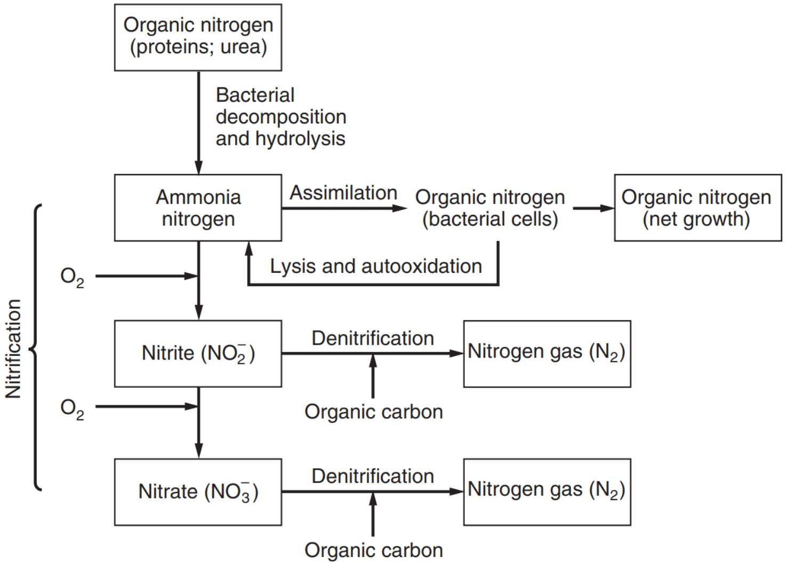
        - **Hình này chứng minh điều gì**
          - Khử nitrat là công đoạn quyết định chuyển hóa các dạng nitơ vô cơ oxy hóa thành khí nitơ thoát khỏi dòng nước thải.
        - **Từ đâu mà thấy được**
          - Sơ đồ thể hiện chu trình khép kín: amoni hóa -> nitrat hóa tạo $\text{NO}_2^-/\text{NO}_3^-$ -> khử nitrat hóa tiêu thụ cacbon hữu cơ giải phóng $\text{N}_2$.

###### Đặc điểm vi sinh vật khử nitrat (Denitrifying Microorganisms)
- Quần thể vi sinh vật chủ đạo:
  - Đa số là vi khuẩn dị dưỡng tùy nghi (facultative heterotrophic bacteria).
  - Các chi vi khuẩn phổ biến trong bùn hoạt tính bao gồm: *Pseudomonas*, *Paracoccus*, *Alcaligenes*, *Bacillus*, *Flavobacterium*,...
- Cơ chế hô hấp tùy nghi:
  - Khi có mặt oxy hòa tan tự do ($\text{O}_2$), vi khuẩn ưu tiên sử dụng oxy làm chất nhận electron vì sinh ra thế năng năng lượng lớn nhất.
  - Khi oxy hòa tan cạn kiệt (môi trường anoxic), vi khuẩn chuyển hướng tổng hợp hệ enzyme khử nitrat (nitrate reductase) để sử dụng ion nitrat và nitrit làm chất nhận electron thay thế oxy.

##### 6.2 Điều kiện sinh thái và so sánh các phản ứng oxy hóa sinh học (Conditions & Reaction Comparison)

###### Các điều kiện bắt buộc cho quá trình khử nitrat
- Môi trường thiếu khí (Anoxic conditions):
  - Bắt buộc duy trì mức oxy hòa tan cực thấp hoặc không có oxy hòa tan.
  - Nồng độ oxy hòa tan khuyến cáo: $\text{DO} < 0.2\text{ mg/L}$.
- Nguồn cơ chất cacbon (Carbon Source):
  - Phản ứng đòi hỏi nguồn cacbon hữu cơ đóng vai trò là chất cho electron (electron donor) và nguồn nguyên liệu tổng hợp tế bào.
  - Nguồn cacbon có thể lấy từ chính nước thải đầu vào (nội sinh) hoặc bổ sung từ hóa chất bên ngoài (ngoại sinh).

###### Bảng so sánh các phản ứng oxy hóa sinh học chủ chốt trong xử lý nước thải
- Bảng đối chiếu đặc trưng hóa sinh giữa oxy hóa hiếu khí BOD, nitrat hóa và khử nitrat:
| Tiêu chí | Oxy hóa hiếu khí (Aerobic oxidation) | Nitrat hóa (Nitrification) | Khử nitrat (Denitrification anoxic reaction) |
| :--- | :--- | :--- | :--- |
| **Sản phẩm tạo thành (Product)** | $\text{CO}_2$, $\text{H}_2\text{O}$ | $\text{NO}_2^-$, $\text{NO}_3^-$ | $\text{N}_2$, $\text{CO}_2$, $\text{H}_2\text{O}$ |
| **Chất nhận electron (Electron acceptor)** | Oxy hòa tan ($\text{O}_2$) | Oxy hòa tan ($\text{O}_2$) | Nitrit ($\text{NO}_2^-$), Nitrat ($\text{NO}_3^-$) |
| **Chất cho electron (Electron donor)** | Hợp chất hữu cơ (Organic compound) | Ion amoni ($\text{NH}_4^+$), Nitrit ($\text{NO}_2^-$) | Hợp chất hữu cơ (Organic compound) |
| **Nguồn cacbon (Carbon source)** | Hợp chất hữu cơ (Organic compound) | Khí cacbon dioxit ($\text{CO}_2$), $\text{HCO}_3^-$ | Hợp chất hữu cơ (Organic compound) |
| **Tên phản ứng (Reaction name)** | Oxy hóa hiếu khí | Nitrat hóa | Phản ứng thiếu khí khử nitrat |
| **Loại vi khuẩn (Type of bacterial)** | Vi khuẩn dị dưỡng hiếu khí | Vi khuẩn tự dưỡng hiếu khí | Vi khuẩn dị dưỡng tùy nghi |

##### 6.3 Mô tả các cấu hình quy trình công nghệ khử nitrat (Process Description & Configurations)

###### Khử nitrat trước (Preanoxic) và Khử nitrat sau (Postanoxic)
- Quy trình khử nitrat trước (Preanoxic Denitrification):
  - Vị trí bể: Bố trí bể thiếu khí ngay phía trước bể sục khí hiếu khí.
  - Nguồn chất cho electron: Sử dụng trực tiếp lượng BOD hòa tan dồi dào trong dòng nước thải đầu vào.
  - Dòng tuần hoàn nội bộ (Internal Recycle - IR): Bắt buộc bơm hồi lưu hỗn dịch bùn chứa nitrat từ cuối bể hiếu khí quay trở lại đầu bể thiếu khí.
  - Ưu điểm: Tốc độ khử nitrat cao, giảm tải lượng chất hữu cơ đi vào bể hiếu khí, tiết kiệm năng lượng cấp khí sục.
- Quy trình khử nitrat sau (Postanoxic Denitrification):
  - Vị trí bể: Bố trí bể thiếu khí ở phía sau bể sục khí hiếu khí.
  - Nguồn chất cho electron: Do phần lớn BOD đã bị oxy hóa sạch ở bể hiếu khí, phản ứng phải dựa vào quá trình phân hủy nội sinh của sinh khối (endogenous decay) nên tốc độ rất chậm, hoặc phải châm thêm nguồn cacbon hữu cơ ngoại sinh.
      - **Hình 6.** Sơ đồ cấu hình khử nitrat trước (Preanoxic) và khử nitrat sau (Postanoxic)
        - 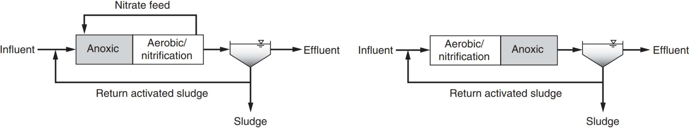
        - **Hình này chứng minh điều gì**
          - Vị trí bể thiếu khí quyết định nguồn cơ chất cacbon sử dụng và nhu cầu dòng tuần hoàn nitrat.
        - **Từ đâu mà thấy được**
          - Hai sơ đồ: nhánh trái hiển thị Influent -> Anoxic -> Aerobic -> Clarifier (kèm dòng Nitrate feed hồi lưu); nhánh phải hiển thị Influent -> Aerobic -> Anoxic -> Clarifier.

###### Quy trình hai hệ bùn độc lập (Two-Sludge Process)
- Đặc điểm công nghệ của hệ thống hai bùn:
  - Tách riêng biệt công đoạn khử BOD cacbon và công đoạn nitrat hóa - khử nitrat thành hai vòng tuần hoàn bùn và bể lắng hoàn toàn độc lập.
  - Hệ bùn thứ nhất: Vận hành ở tuổi bùn ngắn để loại bỏ phần lớn BOD hữu cơ hòa tan.
  - Hệ bùn thứ hai: Vận hành ở tuổi bùn dài tích lũy vi khuẩn tự dưỡng để thực hiện nitrat hóa, kết hợp ngăn thiếu khí để khử nitrat.
- Vai trò các dòng công nghệ phụ trợ:
  - Dòng rẽ nhánh (By-pass line): Dẫn một phần nước thải thô giàu BOD đi tắt qua bể lắng đợt 1 vào thẳng bể thiếu khí để bổ sung cơ chất cacbon cho vi khuẩn khử nitrat và hỗ trợ tạo bông bùn.
  - Dòng hoàn lưu nitrat nội bộ (Nitrate internal return): Đưa hỗn dịch nước giàu nitrat từ bể nitrat hóa quay trở lại ngăn thiếu khí.
      - **Hình 7.** Sơ đồ quy trình hai bùn (Two-sludge process) tách biệt khử BOD và nitrat hóa - khử nitrat
        - 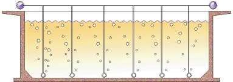
        - **Hình này chứng minh điều gì**
          - Hai công đoạn xử lý vận hành độc lập với hai chu trình lắng và tuần hoàn bùn riêng biệt.
        - **Từ đâu mà thấy được**
          - Cụm BOD removal nối với Clarifier 1; dòng nước sau lắng dẫn tiếp sang Anoxic và Nitrification nối với Clarifier 2, kèm đường By-pass và đường Nitrate internal return.

##### 6.4 Hóa học lượng clo, chất cho electron và phục hồi độ kiềm (Stoichiometry, Electron Donors & Alkalinity Recovery)

###### Phương trình phản ứng và các nguồn chất cho electron
- Phản ứng nitrat hóa sinh ion nitrat và ion hydro:
  $$\text{NH}_4^+ + 2\text{O}_2 \rightarrow \text{NO}_3^- + 2\text{H}^+ + \text{H}_2\text{O}$$
- Phản ứng khử nitrat tổng quát với chất hữu cơ nước thải ($\text{C}_{10}\text{H}_{19}\text{O}_3\text{N}$):
  $$\text{C}_{10}\text{H}_{19}\text{O}_3\text{N} + 10\text{NO}_3^- \rightarrow 5\text{N}_2\uparrow + 10\text{CO}_2 + 3\text{H}_2\text{O} + \text{NH}_3 + 10\text{OH}^-$$
- Các nguồn chất cho electron ngoại sinh thông dụng:
  - Methanol ($\text{CH}_3\text{OH}$):
    $$6\text{NO}_3^- + 5\text{CH}_3\text{OH} \rightarrow 3\text{N}_2\uparrow + 5\text{CO}_2 + 7\text{H}_2\text{O} + 6\text{OH}^-$$
    - Tiêu tốn khoảng $2.47\text{ g COD/g NO}_3^-\text{-N}$ (hoặc $2.86\text{ g COD/g NO}_3^-\text{-N}$ theo lý thuyết cân bằng oxy hóa).
  - Axetat ($\text{CH}_3\text{COO}^-$):
    $$8\text{NO}_3^- + 5\text{CH}_3\text{COOH} \rightarrow 4\text{N}_2\uparrow + 10\text{CO}_2 + 6\text{H}_2\text{O} + 8\text{OH}^-$$
  - rbCOD (Readily Biodegradable COD): Nguồn cơ chất cacbon hòa tan mạch ngắn trong nước thải, được vi khuẩn hấp thụ trực tiếp mà không cần qua bước thủy phân chậm.
      - **Hình 8.** Chuỗi chuyển hóa sinh hóa và dòng chất cho electron trong quá trình nitrat hóa và khử nitrat
        - 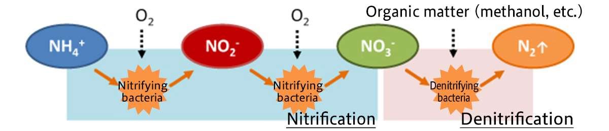
        - **Hình này chứng minh điều gì**
          - Khử nitrat yêu cầu chất hữu cơ đóng vai trò electron donor để khử $\text{NO}_3^-$ thành $\text{N}_2$.
        - **Từ đâu mà thấy được**
          - Chuỗi phản ứng $\text{NH}_4^+ \rightarrow \text{NO}_2^- \rightarrow \text{NO}_3^- \rightarrow \text{N}_2\uparrow$ có nhánh nạp chất hữu cơ (methanol,...) cấp trực tiếp vào chặng khử nitrat.

###### Cơ chế phục hồi độ kiềm (Alkalinity Recovery)
- Cơ chế giải phóng ion hydroxit:
  - Phản ứng khử nitrat tạo ra $1\text{ mol } \text{OH}^-$ cho mỗi mol $\text{NO}_3^-\text{-N}$ bị khử hoàn toàn thành khí $\text{N}_2$.
  - Lượng ion $\text{OH}^-$ sinh ra phản ứng với khí $\text{CO}_2$ hòa tan hình thành hệ đệm bicacbonat:
    $$\text{OH}^- + \text{CO}_2 \rightarrow \text{HCO}_3^-$$
- Định lượng độ kiềm phục hồi:
  $$\text{Độ kiềm phục hồi} = \frac{50\text{ g CaCO}_3/\text{eq}}{14\text{ g N/eq}} \approx 3.57\text{ g CaCO}_3/\text{g NO}_3^-\text{-N reduced}$$
- Khả năng bù đắp độ kiềm trong chu trình BNR:
  - Quá trình nitrat hóa làm tiêu hao $7.14\text{ g CaCO}_3/\text{g NH}_4^+\text{-N}$ bị oxy hóa.
  - Quá trình khử nitrat bù lại $3.57\text{ g CaCO}_3/\text{g NO}_3^-\text{-N}$ bị khử.
  - Phản ứng khử nitrat phục hồi chính xác $50\%$ lượng độ kiềm đã mất đi trong quá trình nitrat hóa.

##### 6.5 Yêu cầu khuấy trộn và các yếu tố môi trường (Mixing Requirements & Environmental Factors)

###### Nhu cầu năng lượng khuấy trộn bể anoxic
- Yêu cầu thủy lực trong bể thiếu khí:
  - Bể anoxic không sục khí bọt mịn nhằm tránh đưa oxy hòa tan vào hệ thống, nhưng phải khuấy trộn liên tục để giữ bùn ở trạng thái lơ lửng đồng nhất.
  - Tạo điều kiện tiếp xúc triệt để giữa sinh khối vi sinh vật, chất cho electron (BOD) và chất nhận electron ($\text{NO}_3^-$).
- Định mức công suất máy khuấy:
  - Đối với máy khuấy chìm tốc độ cao (high-speed mixers): Suất công suất yêu cầu là $8\text{ W/m}^3$ thể tích bể thiếu khí.

###### Các yếu tố môi trường kiểm soát tốc độ khử nitrat
- Ức chế bởi oxy hòa tan (DO inhibition):
  - Ngưỡng giới hạn: Nồng độ $\text{DO} > 0.2\text{ mg/L}$ sẽ ức chế quá trình khử nitrat.
  - Cơ chế ức chế: Oxy hòa tan làm bất hoạt enzyme nitrate reductase và cạnh tranh electron với nitrat.
- Ảnh hưởng của độ pH (pH Influence):
  - Dải pH tối ưu: $\text{pH} = 7.0\text{--}8.0$.
  - Khi $\text{pH} < 7.0$: Tốc độ khử nitrat giảm sút nhanh chóng.
  - Khi pH giảm sâu dưới $6.0$: Quá trình khử nitrat bị ức chế nghiêm trọng và có nguy cơ phát thải khí độc $\text{N}_2\text{O}$ gây hiệu ứng nhà kính.

##### 6.6 Động học khử nitrat và tính toán tốc độ SDNR (Denitrification Kinetics & SDNR Calculations)

###### Tốc độ khử nitrat riêng (Specific Denitrification Rate - SDNR)
- Định nghĩa và công thức tính toán SDNR:
  $$SDNR = \frac{NO_r}{V_{anoxic} \cdot X_b}$$
  - Trong đó:
    - $SDNR$: Tốc độ khử nitrat riêng tính trên khối lượng sinh khối hoạt tính ($\text{g NO}_3^-\text{-N/g biomass}\cdot\text{d}$).
    - $NO_r$: Tốc độ loại bỏ nitrat-nitơ trong bể thiếu khí ($\text{g N/d}$).
    - $V_{anoxic}$: Thể tích vùng bể thiếu khí ($\text{m}^3$).
    - $X_b$: Nồng độ sinh khối hoạt tính trong vùng thiếu khí ($\text{g/m}^3$).
      - **Hình 9.** Công thức xác định tốc độ khử nitrat riêng (SDNR)
        - 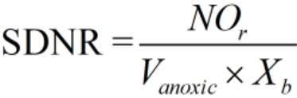
        - **Hình này chứng minh điều gì**
          - SDNR là tỷ số giữa tốc độ tiêu thụ khối lượng nitrat trên tổng khối lượng sinh khối dị dưỡng hoạt tính trong bể thiếu khí.
        - **Từ đâu mà thấy được**
          - Biểu thức giải tích hiển thị $\text{SDNR} = \frac{NO_r}{V_{anoxic} \cdot X_b}$.
- Dải giá trị SDNR điển hình theo cấu hình công nghệ:
  - Đối với bể khử nitrat trước (preanoxic): $SDNR = 0.04\text{--}0.25\text{ g/g}\cdot\text{d}$.
  - Đối với bể khử nitrat sau (postanoxic) không bổ sung cacbon ngoại sinh: $SDNR = 0.01\text{--}0.03\text{ g/g}\cdot\text{d}$.

###### Tính toán nồng độ sinh khối hoạt tính ($X_b$) và tỷ số tải trọng hữu cơ ($F/M_b$)
- Công thức xác định nồng độ sinh khối hoạt tính dị dưỡng ($X_b$):
  $$X_b = \frac{Q \cdot SRT \cdot Y \cdot (S_0 - S)}{V \cdot (1 + b_H \cdot SRT)}$$
  - Trong đó:
    - $Q$: Lưu lượng nước thải đầu vào hệ thống ($\text{m}^3/\text{d}$).
    - $SRT$: Thời gian lưu bùn sinh học của hệ thống ($\text{d}$).
    - $Y$: Hệ số sản lượng sinh khối dị dưỡng ($\text{g VSS/g bCOD}$).
    - $S_0, S$: Nồng độ bCOD đầu vào và đầu ra sau xử lý ($\text{g/m}^3$).
    - $V$: Thể tích toàn bộ cụm phản ứng sinh học ($\text{m}^3$).
    - $b_H$: Hệ số suy hủy nội sinh của vi sinh vật dị dưỡng ($\text{d}^{-1}$).
      - **Hình 10.** Công thức tính toán nồng độ sinh khối hoạt tính dị dưỡng ($X_b$)
        - 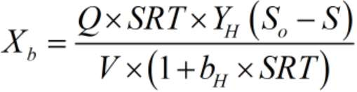
        - **Hình này chứng minh điều gì**
          - Nồng độ tế bào hoạt tính phụ thuộc trực tiếp vào tải lượng cơ chất tiêu thụ, thời gian lưu bùn và suy hủy nội sinh.
        - **Từ đâu mà thấy được**
          - Biểu thức phân số hiển thị tử số chứa $Q \cdot SRT \cdot Y(S_0 - S)$ và mẫu số chứa $V \cdot (1 + b_H \cdot SRT)$.
- Tỷ số tải trọng hữu cơ tính trên sinh khối hoạt tính ($F/M_b$):
  $$F/M_b = \frac{Q \cdot S_0}{V_{anoxic} \cdot X_b}$$
  - Trong đó:
    - $F/M_b$: Tỷ số $F/M$ tính theo nồng độ sinh khối hoạt tính trong bể thiếu khí ($\text{g BOD/g biomass}\cdot\text{d}$).
    - $S_0$: Nồng độ BOD của dòng nước thải đầu vào ($\text{g/m}^3$).

###### Mối quan hệ giữa SDNR ở $20^\circ\text{C}$ với tỷ số $F/M_b$ và phần trăm rbCOD
- Các phương trình thực nghiệm ở $20^\circ\text{C}$:
  - Khi tải lượng hữu cơ thấp ($F/M_b \le 0.5\text{ g BOD/g biomass}\cdot\text{d}$):
    $$SDNR = 0.24 \cdot (F/M_b)$$
  - Khi tải lượng hữu cơ cao ($F/M_b > 0.5\text{ g BOD/g biomass}\cdot\text{d}$):
    $$SDNR = b_0 + b_1 \ln(F/M_b)$$
      - **Hình 13.** Các phương trình thực nghiệm tính toán SDNR ở $20^\circ\text{C}$
        - 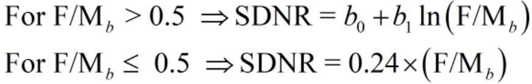
        - **Hình này chứng minh điều gì**
          - Động học SDNR chuyển từ quan hệ tuyến tính với $F/M_b \le 0.5$ sang quan hệ logarit với $F/M_b > 0.5$.
        - **Từ đâu mà thấy được**
          - Hai phương trình hiển thị rõ: $\text{SDNR} = 0.24 \cdot (F/M_b)$ và $\text{SDNR} = b_0 + b_1 \ln(F/M_b)$.
- Bảng hệ số $b_0$ và $b_1$ theo tỷ lệ cacbon dễ phân hủy ($\% rbCOD/bCOD$):
| Tỷ lệ rbCOD (%) | Hệ số $b_0$ | Hệ số $b_1$ |
| :--- | :--- | :--- |
| 10 | 0.186 | 0.078 |
| 20 | 0.213 | 0.118 |
| 30 | 0.235 | 0.141 |
| 40 | 0.242 | 0.152 |
| 50 | 0.270 | 0.162 |
      - **Hình 11.** Bảng hệ số $b_0$ và $b_1$ cho phương trình tương quan SDNR theo phần trăm rbCOD
        - 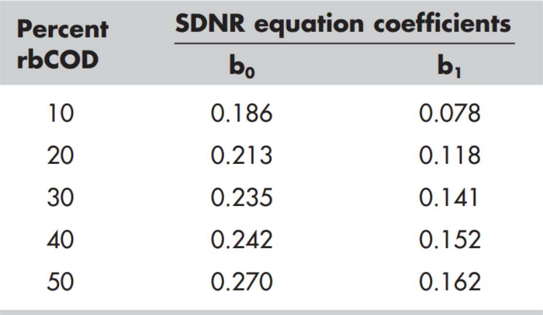
        - **Hình này chứng minh điều gì**
          - Nước thải có tỷ lệ rbCOD càng cao thì hệ số $b_0$ và $b_1$ càng lớn, làm tăng vận tốc khử nitrat.
        - **Từ đâu mà thấy được**
          - Bảng liệt kê 5 mức rbCOD từ $10\%$ đến $50\%$ với $b_0$ tăng từ $0.186$ đến $0.270$ và $b_1$ tăng từ $0.078$ đến $0.162$.
- Ảnh hưởng của tỷ lệ rbCOD đến đường cong SDNR:
  - Tỷ lệ rbCOD đại diện cho thành phần cơ chất hữu cơ hòa tan mà vi khuẩn hấp thụ nhanh nhất.
  - Cùng một mức tỷ số $F/M_b$, nước thải chứa tỷ lệ rbCOD cao hơn luôn đạt tốc độ SDNR lớn hơn.
      - **Hình 12.** Đồ thị biểu diễn mối quan hệ giữa SDNR và tỷ số $F/M_b$ theo phần trăm rbCOD
        - 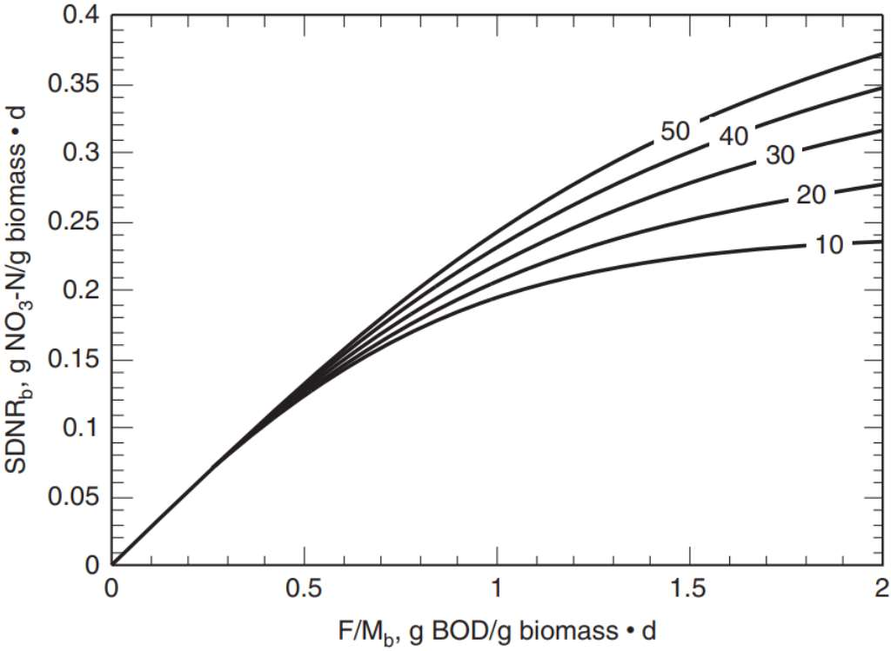
        - **Hình này chứng minh điều gì**
          - Tốc độ SDNR tăng nhanh theo $F/M_b$ và đạt đường đẳng trị cao hơn khi tỷ lệ rbCOD gia tăng.
        - **Từ đâu mà thấy được**
          - Đồ thị tọa độ phẳng hiển thị chùm đường cong phân nhánh rõ rệt theo các mức $10\%, 20\%, 30\%, 40\%, 50\%$ rbCOD từ thấp đến cao.

###### Các hệ số hiệu chỉnh SDNR theo nhiệt độ và tỷ lệ tuần hoàn nội bộ (IR)
- Hiệu chỉnh SDNR theo nhiệt độ vận hành ($T$):
  $$SDNR_T = SDNR_{20} \cdot \theta^{(T - 20)}$$
  - Trong đó:
    - $\theta$: Hệ số hiệu chỉnh nhiệt độ đối với SDNR, có giá trị chuẩn định danh là $\theta = 1.026$.
    - Khi nhiệt độ nước thải sụt giảm, hoạt tính sinh hóa giảm mạnh, đòi hỏi phải mở rộng dung tích bể thiếu khí để duy trì hiệu quả khử nitrat.
- Hiệu chỉnh SDNR theo tỷ lệ tuần hoàn nội bộ ($IR$):
  - Công thức hiệu chỉnh thực nghiệm:
    - Khi tỷ lệ tuần hoàn $IR = 2$:
      $$SDNR_{adj} = SDNR - 0.0166 \ln(F/M_b) - 0.078$$
    - Khi tỷ lệ tuần hoàn $IR = 3\text{--}4$:
      $$SDNR_{adj} = SDNR - 0.029 \ln(F/M_b) - 0.012$$
  - Trong đó:
    - $SDNR_{adj}$: Tốc độ khử nitrat riêng sau khi hiệu chỉnh ảnh hưởng của dòng tuần hoàn nội bộ.
    - $IR$: Tỷ số lưu lượng dòng hoàn lưu nitrat nội bộ trên lưu lượng nước thải đầu vào ($Q_{IR} / Q$).
  - Bản chất cơ chế suy giảm SDNR do dòng tuần hoàn:
    - Dòng tuần hoàn nội bộ lấy hỗn dịch từ bể hiếu khí luôn mang theo một nồng độ oxy hòa tan dư thừa ($\text{DO} \approx 2\text{--}4\text{ mg/L}$) quay trở lại bể anoxic.
    - Lượng DO dư này xâm nhập vào bể thiếu khí sẽ được vi khuẩn ưu tiên tiêu thụ trước bằng cách oxy hóa hiếu khí một lượng cacbon hữu cơ dễ phân hủy (rbCOD).
    - Sự tiêu hao nguồn cacbon dễ hấp thụ và sự hiện diện của oxy hòa tan làm ức chế tức thời enzyme khử nitrat, dẫn đến tốc độ SDNR thực tế bị suy giảm đáng kể ($SDNR_{adj} < SDNR$).

#### 7. Anaerobic oxidation

##### 7.1 Overview of anaerobic treatment

- Quá trình oxy hóa kỵ khí (Anaerobic oxidation / Anaerobic digestion) là quá trình phân hủy sinh học các hợp chất hữu cơ trong điều kiện hoàn toàn vắng mặt oxy phân tử ($\text{O}_2$).
- Công nghệ kỵ khí chuyên dùng để xử lý các nguồn nước thải có tải lượng ô nhiễm hữu cơ rất cao ($\text{high-strength wastewater}$), điển hình là nước thải công nghiệp.
- Nhóm sinh vật chủ đạo vận hành quá trình gồm vi khuẩn kỵ khí dị dưỡng (Anaerobic heterotrophic bacteria) và cổ khuẩn sinh methane (Methanogenic archaea).
- Các dạng quy trình công nghệ xử lý kỵ khí cơ bản trong kỹ thuật môi trường:
  - Sinh trưởng lơ lửng (Suspended Growth): Bể kỵ khí xáo trộn hoàn toàn (CSTR), bể tiếp xúc kỵ khí (Anaerobic Contact Process).
  - Sinh trưởng dính bám (Attached Growth): Bể lọc kỵ khí màng cố định (Anaerobic Filter - AF).
  - Lớp bùn hạt kỵ khí (Granular Sludge Blanket): Bể phản ứng lớp bùn kỵ khí dòng chảy ngược (UASB), bể tuần hoàn nội bộ (IC), bể bùn hạt giãn nở (EGSB).
- Hai phản ứng sinh hóa nền tảng phân ranh trong xử lý kỵ khí:
  - Phản ứng lên men axit (Acid fermentation):
    - Cơ chất / Chất cho electron (Electron donor): Hợp chất hữu cơ phức tạp ($\text{Organic compound}$).
    - Chất nhận electron (Electron acceptor): Hợp chất hữu cơ nội sinh ($\text{Organic compound}$).
    - Nguồn carbon ($\text{Carbon source}$): Hợp chất hữu cơ ($\text{Organic compound}$).
    - Sản phẩm tạo thành ($\text{Product}$): Các axit béo bay hơi (Volatile Fatty Acids - VFAs gồm acetate, propionate, butyrate).
    - Tác nhân sinh học: Vi khuẩn kỵ khí dị dưỡng ($\text{Anaerobic heterotrophic}$).
  - Phản ứng sinh methane (Methanogenesis):
    - Cơ chất / Chất cho electron: Axit béo bay hơi (VFAs) và khí hydro phân tử ($\text{H}_2$).
    - Chất nhận electron: Khí $\text{CO}_2$ (đối với khử hydro) hoặc nhóm carboxyl (đối với phân cắt acetate).
    - Nguồn carbon: Hợp chất hữu cơ ($\text{VFAs}$) và $\text{CO}_2$.
    - Sản phẩm tạo thành: Khí methane ($\text{CH}_4$) và carbon dioxide ($\text{CO}_2$).
    - Tác nhân sinh học: Cổ khuẩn sinh methane kỵ khí nghiêm ngặt.
- Quá trình phân hủy kỵ khí được ứng dụng rộng rãi để xử lý nước thải phát sinh từ các ngành chế biến thực phẩm, đồ uống và các ngành công nghiệp đặc thù có tải lượng hữu cơ cao.
  - **Hình 14.** Phổ ứng dụng của công nghệ xử lý kỵ khí trong công nghiệp
    - 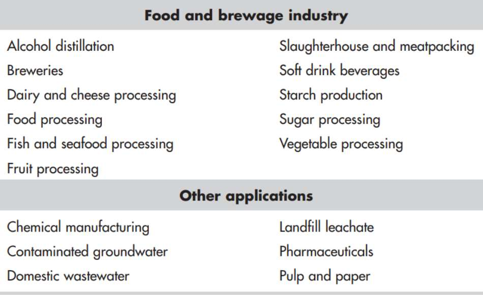
    - **Hình này chứng minh điều gì**
      - Công nghệ xử lý kỵ khí áp dụng hiệu quả cho 11 phân ngành thực phẩm - đồ uống và 6 lĩnh vực công nghiệp khác.
    - **Từ đâu mà thấy được**
      - Nhóm "Food and brewage industry": cất cồn, bia, sữa, chế biến thịt, tinh bột, đường.
      - Nhóm "Other applications": hóa chất, nước ngầm ô nhiễm, nước thải sinh hoạt, rỉ rác, dược phẩm, bột giấy.

##### 7.2 Process description: Four stages and COD fate

###### 7.2.1 Four sequential stages of anaerobic digestion

- Quá trình phân hủy kỵ khí gồm bốn giai đoạn chuyển hóa sinh hóa liên hoàn:
  - Giai đoạn 1: Thủy phân (Hydrolysis):
    - Chuyển hóa chất hữu cơ dạng hạt và polymer không tan ($\text{particulate material}$) thành các hợp chất hòa tan đơn giản ($\text{soluble compounds}$).
    - Các enzyme ngoại bào (extracellular enzymes) do vi khuẩn tiết ra thực hiện phân cắt thủy phân các đại phân tử:
      - Carbohydrate dạng hạt $\rightarrow$ Monosaccharide (đường đơn).
      - Protein và polypeptide $\rightarrow$ Amino acid và chuỗi peptide ngắn.
      - Lipid và triacylglycerol $\rightarrow$ Glycerol và axit béo mạch dài (LCFA).
    - Giai đoạn thủy phân là bước giới hạn tốc độ (rate-limiting step) của toàn bộ quá trình khi nước thải chứa hàm lượng cặn rắn lơ lửng cao hoặc xử lý bùn thải.
  - Giai đoạn 2: Lên men Axit (Acidogenesis / Fermentation):
    - Chuyển hóa các hợp chất hòa tan đơn giản thành các axit béo bay hơi (Volatile Fatty Acids - VFAs), khí hydro ($\text{H}_2$) và $\text{CO}_2$.
    - Các sản phẩm lên men trung gian phổ biến: acetic acid, propionic acid, butyric acid, ethanol và lactic acid.
    - Quần thể vi khuẩn lên men có tốc độ sinh trưởng rất cao ($\mu_{max} \approx 1.0 - 2.5\text{ d}^{-1}$) và hệ số sản lượng sinh khối lớn.
  - Giai đoạn 3: Acetic hóa (Acetogenesis):
    - Oxy hóa các axit béo bay hơi trung gian (propionate, butyrate, valerate) và rượu thành acetic acid ($\text{CH}_3\text{COOH}$), hydro ($\text{H}_2$) và $\text{CO}_2$.
    - Quá trình do nhóm vi khuẩn sinh hydro bắt buộc (Obligate Hydrogen-Producing Acetogens - OHPA) thực hiện.
    - Phản ứng oxy hóa propionate và butyrate có biến thiên năng lượng tự do Gibbs tiêu chuẩn dương ($\Delta G^{\circ'} > 0$):
      $$\text{CH}_3\text{CH}_2\text{COO}^- + 3\text{H}_2\text{O} \rightarrow \text{CH}_3\text{COO}^- + \text{HCO}_3^- + \text{H}^+ + 3\text{H}_2 \quad (\Delta G^{\circ'} = +76.1\text{ kJ/mol})$$
      $$\text{CH}_3\text{CH}_2\text{CH}_2\text{COO}^- + 2\text{H}_2\text{O} \rightarrow 2\text{CH}_3\text{COO}^- + \text{H}^+ + 2\text{H}_2 \quad (\Delta G^{\circ'} = +48.3\text{ kJ/mol})$$
    - Phản ứng chỉ có thể tự diễn ra khi áp suất riêng phần của khí hydro $p_{\text{H}_2} < 10^{-4}\text{ atm}$, đòi hỏi mối quan hệ tương hỗ chặt chẽ (syntrophy) với vi sinh vật tiêu thụ hydro.
  - Giai đoạn 4: Sinh Methane (Methanogenesis):
    - Giai đoạn cuối cùng sinh khí methane ($\text{CH}_4$), do Cổ khuẩn kỵ khí tuyệt đối (Methanogenic archaea) thực hiện.
    - Nhóm Cổ khuẩn sinh methane phân cắt acetate (Aceticlastic methanogens):
      - Phản ứng phân cắt acetic acid:
        $$\text{CH}_3\text{COOH} \rightarrow \text{CH}_4 + \text{CO}_2$$
      - Đóng góp khoảng $70 - 72\%$ tổng sản lượng methane tạo thành trong hệ thống.
      - Các chi vi sinh vật chủ đạo: *Methanosaeta* (ái lực cơ chất rất cao, $K_s$ thấp) và *Methanosarcina* (tốc độ sinh trưởng nhanh hơn nhưng $K_s$ cao).
    - Nhóm Cổ khuẩn sinh methane khử hydro (Hydrogenotrophic methanogens):
      - Phản ứng khử carbon dioxide bằng hydro:
        $$4\text{H}_2 + \text{CO}_2 \rightarrow \text{CH}_4 + 2\text{H}_2\text{O}$$
      - Đóng góp khoảng $28 - 30\%$ tổng sản lượng methane tạo thành.
      - Giữ vai trò then chốt tiêu thụ sạch khí hydro phân tử để duy trì áp suất $p_{\text{H}_2}$ cực thấp cho phản ứng acetogenesis diễn ra liên tục.

###### 7.2.2 Fate of biodegradable COD in anaerobic treatment

- Dòng chuyển hóa của nhu cầu oxy hóa học phân hủy sinh học (Biodegradable COD - bCOD) qua bốn giai đoạn kỵ khí được bảo toàn vật chất khép kín.
- Tỷ lệ phân bố thành phần COD trong cơ chất ban đầu:
  - Carbohydrates: chiếm $34\%$ tổng COD phân hủy sinh học.
  - Proteins: chiếm $33\%$ tổng COD phân hủy sinh học.
  - Lipids: chiếm $33\%$ tổng COD phân hủy sinh học.
- Phân luồng dòng COD qua giai đoạn thủy phân và lên men axit:
  - Carbohydrates ($34\%$) $\rightarrow$ Monosaccharides ($34\%$) $\rightarrow$ $20\%$ Acetic acid trực tiếp và $14\%$ VFAs trung gian.
  - Proteins ($33\%$) $\rightarrow$ Amino acids ($33\%$) $\rightarrow$ $13\%$ Acetic acid trực tiếp, $18\%$ VFAs trung gian và $2\%$ Hydrogen.
  - Lipids ($33\%$) $\rightarrow$ Axit béo mạch thấp ($33\%$) $\rightarrow$ $23\%$ VFAs trung gian và $10\%$ Hydrogen.
- Phân luồng dòng COD qua giai đoạn acetic hóa:
  - VFAs trung gian (tổng $14\% + 18\% + 23\% = 55\%$ COD) được oxy hóa tạo thành:
    - $22\%$ Acetic acid.
    - $16\%$ Hydrogen (gồm $6\%$ từ phân cắt monosaccharide/amino acids và $10\%$ từ lipid).
- Dòng hội tụ COD trước khi sinh methane:
  - Acetic acid tiếp nhận tổng cộng $72\%$ COD ($20\% + 13\% + 22\% + 17\% = 72\%$).
  - Hydrogen tiếp nhận tổng cộng $28\%$ COD ($2\% + 10\% + 16\% = 28\%$).
- Cân bằng dòng vật chất COD qua 4 giai đoạn phân hủy kỵ khí chuyển hóa toàn bộ $100\%$ lượng biodegradable COD thành khí methane ($\text{CH}_4$).
  - **Hình 15.** Sự chuyển hóa của biodegradable COD trong xử lý kỵ khí
    - 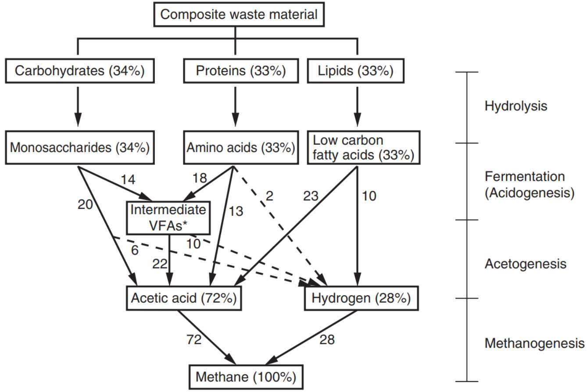
    - **Hình này chứng minh điều gì**
      - Toàn bộ $100\%$ methane sinh ra từ hai nguồn: $72\%$ qua Acetic acid và $28\%$ qua Hydrogen.
    - **Từ đâu mà thấy được**
      - Nhánh Hydrolysis chia 3 dòng: Carbohydrates ($34\%$), Proteins ($33\%$), Lipids ($33\%$).
      - Khối Acetic acid ($72\%$) và Hydrogen ($28\%$) hội tụ hoàn toàn về Methane ($100\%$).

##### 7.3 Advantages and disadvantages of anaerobic treatment

###### 7.3.1 Advantages of anaerobic treatment

- Thu hồi năng lượng tái tạo sạch (Energy Production):
  - Khí sinh học methane ($\text{CH}_4$) sinh ra là nguồn nhiên liệu có nhiệt trị cao, có thể tận dụng phát điện, cấp nhiệt lò hơi hoặc chạy máy nén.
- Sản lượng bùn vi sinh dư thừa rất thấp (Lower Biomass Yield):
  - Hệ thống kỵ khí sinh bùn ít hơn $6 - 8$ lần so với quá trình hiếu khí bùn hoạt tính thông thường.
  - Cắt giảm đáng kể chi phí nén bùn, tách nước, vận chuyển và chôn lấp bùn sinh học.
- Nhu cầu dinh dưỡng bổ sung thấp (Less Nutrient Requirement):
  - Tỷ lệ dinh dưỡng yêu cầu trong xử lý kỵ khí chỉ là $\text{COD} : \text{N} : \text{P} = 300 : 5 : 1$.
  - Tiết kiệm chi phí hóa chất bổ sung đạm và lân so với xử lý hiếu khí ($\text{COD} : \text{N} : \text{P} = 150 : 5 : 1$).
- Khả năng chịu tải trọng hữu cơ cực cao (Higher Organic Loading):
  - Tải trọng thể tích vận hành kỵ khí đạt từ $3.2 - 32\text{ kg COD/m}^3\cdot\text{d}$, vượt trội so với mức $0.5 - 3.2\text{ kg COD/m}^3\cdot\text{d}$ của hiếu khí.
  - Cho phép thiết kế thể tích công trình bể phản ứng nhỏ gọn, tiết kiệm diện tích chiếm đất xây dựng trạm xử lý.
- Nhu cầu năng lượng vận hành thấp (Less energy required):
  - Không cần máy thổi khí cưỡng bức tiêu tốn điện năng liên tục như các công trình aerotank hiếu khí.
- Triệt tiêu ô nhiễm khí thải phát tán (Elimination of off-gas air pollution):
  - Hệ thống bể phản ứng kỵ khí được đậy nắp kín hoàn toàn, thu gom toàn bộ khí phát sinh.
- Khả năng thích ứng và phục hồi nhanh sau chu kỳ ngừng cấp tải (Able to respond quickly after long periods without feeding):
  - Bùn hạt kỵ khí có thể lưu trữ trong bể nhiều tháng mà không mất hoạt tính sinh học, cho phép thích ứng tốt với các nhà máy sản xuất theo mùa vụ.
- Đóng vai trò là công trình tiền xử lý lý tưởng (Effective pretreatment process):
  - Khử $80 - 95\%$ tải lượng COD nồng độ cao trước khi đưa sang cụm xử lý sinh học hiếu khí tinh chế phía sau.
- Giảm thiểu phát thải carbon tổng thể (Potential for lower carbon footprint):
  - Kết hợp thu hồi methane thay thế nhiên liệu hóa thạch và giảm tiêu thụ điện lưới.

###### 7.3.2 Disadvantages of anaerobic treatment

- Thời gian khởi động hệ thống nuôi cấy bùn kéo dài (Longer Start-up Time):
  - Quá trình tạo bùn hạt và thiết lập quần thể vi sinh vật kỵ khí ổn định đòi hỏi từ vài tháng (months), so với chỉ vài ngày đến vài tuần (days) của hiếu khí.
- Tính nhạy cảm cao với các hợp chất độc hại (Sensitivity to Toxic Substances):
  - Vi sinh vật sinh methane rất dễ bị ức chế hoặc ngộ độc khi xuất hiện sốc tải độc chất, dung môi hữu cơ, kim loại nặng, hoặc nồng độ muối cao.
- Nhu cầu kiểm soát độ kiềm nghiêm ngặt (Alkalinity Requirement):
  - Đòi hỏi hàm lượng độ kiềm đệm bicarbonate cao trong bể để trung hòa lượng VFAs phát sinh liên tục và giữ ổn định pH.
- Tiềm ẩn phát sinh mùi hôi và nguy cơ ăn mòn thiết bị (Odor and Corrosiveness):
  - Khí sinh học có chứa hydrogen sulfide ($\text{H}_2\text{S}$) và mercaptan gây mùi hôi khó chịu và ăn mòn hóa học mạnh đối với hệ thống đường ống kim loại, bê tông và máy phát điện.
- Nước sau xử lý kỵ khí bắt buộc phải qua xử lý bổ sung (Need For Further Treatment):
  - Nồng độ $\text{BOD}$ dòng ra kỵ khí thường dao động trong khoảng $50 - 150\text{ mg/L}$ do sự tồn dư của VFAs mạch ngắn và cặn phân tán mịn chưa lắng được.
  - Hệ thống kỵ khí hoàn toàn không thể khử được nitơ và photpho (Biological nitrogen and phosphorus removal is not possible).
- Tính nhạy cảm cao với nhiệt độ thấp (Much more sensitive to negative effect of lower temperatures):
  - Tốc độ phản ứng sinh học suy giảm nhanh chóng khi nhiệt độ nước thải giảm xuống dưới vùng mesophilic ($<30^\circ\text{C}$).
- So sánh tổng hợp ưu và nhược điểm kỹ thuật của công nghệ xử lý kỵ khí đối với nước thải.
  - **Hình 16.** Bảng đối chiếu ưu điểm và nhược điểm của xử lý kỵ khí
    - 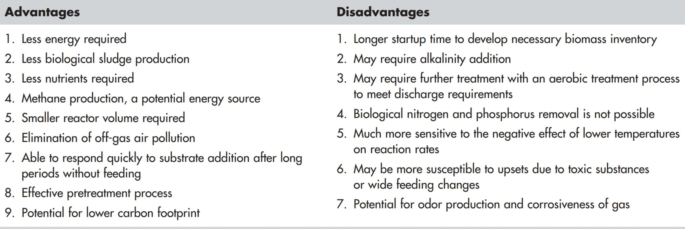
    - **Hình này chứng minh điều gì**
      - Xử lý kỵ khí có 9 ưu điểm vượt trội về năng lượng và bùn, nhưng có 7 nhược điểm cần kiểm soát.
    - **Từ đâu mà thấy được**
      - Cột Advantages liệt kê 9 mục: ít năng lượng, ít bùn, ít dinh dưỡng, thu methane, tải trọng cao.
      - Cột Disadvantages liệt kê 7 mục: khởi động lâu, cần độ kiềm, nhạy cảm nhiệt độ và độc chất.

##### 7.4 Process kinetics and recommended SRT

- Động học quá trình kỵ khí mang tính chất tương đồng với quá trình hiếu khí vì cả hai đều dựa trên hệ vi khuẩn dị dưỡng sinh trưởng lơ lửng:
  - Các thông số động học Monod cơ bản:
    - Hệ số sản lượng sinh khối lý thuyết ($Y$).
    - Hệ số phân hủy nội bào ($b$).
    - Tỷ lệ cặn sinh học trơ ($f_d$).
    - Tốc độ sinh trưởng riêng cực đại ($\mu_m$).
    - Hằng số bán bão hòa nồng độ cơ chất ($K_s$).
  - Chuỗi động học kỵ khí gồm hai phân hệ nối tiếp:
    - Động học lên men axit ($\text{Fermentation kinetics}$): Tốc độ sản sinh các axit béo bay hơi (VFAs production).
    - Động học sinh methane ($\text{Methanogenesis kinetics}$): Tốc độ tiêu thụ VFAs và tạo khí methane.
- Hệ số sản lượng sinh khối thực thấp dẫn đến yêu cầu thời gian lưu bùn ($\text{SRT}$) rất dài:
  - Hệ số sản lượng sinh khối của vi sinh vật sinh methane rất bé ($Y_{\text{bio}} \approx 0.04 - 0.08\text{ g VSS/g COD}$, thấp hơn nhiều so với $0.4 - 0.6$ của vi khuẩn hiếu khí).
  - Tốc độ sinh trưởng riêng của Methanogen rất chậm ($\mu_{max} \approx 0.10 - 0.35\text{ d}^{-1}$).
  - Để tránh hiện tượng vi sinh vật sinh methane bị rửa trôi ($\text{washout}$) ra khỏi bể, hệ thống kỵ khí bắt buộc phải duy trì thời gian lưu bùn $\text{SRT}$ cao hơn rất nhiều so với thời gian lưu thủy lực $\text{HRT}$.
- Thời gian lưu bùn ($\text{SRT}$) khuyến nghị vận hành tăng mạnh khi nhiệt độ nước thải giảm nhằm ngăn ngừa hiện tượng rửa trôi vi khuẩn sinh methane.
  - **Hình 17.** Thời gian lưu bùn khuyến nghị cho xử lý kỵ khí theo nhiệt độ
    - 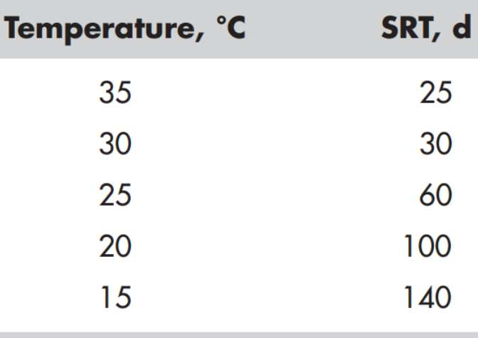
    - **Hình này chứng minh điều gì**
      - Khi nhiệt độ giảm từ $35^\circ\text{C}$ xuống $15^\circ\text{C}$, $\text{SRT}$ yêu cầu tăng từ $25\text{ d}$ lên $140\text{ d}$.
    - **Từ đâu mà thấy được**
      - Bảng đối chiếu 2 cột: Cột Temperature ($^\circ\text{C}$) và cột SRT ($\text{d}$).
      - Các mốc giá trị: $35^\circ\text{C} \rightarrow 25\text{ d}$, $30^\circ\text{C} \rightarrow 30\text{ d}$, $25^\circ\text{C} \rightarrow 60\text{ d}$, $20^\circ\text{C} \rightarrow 100\text{ d}$, $15^\circ\text{C} \rightarrow 140\text{ d}$.

##### 7.5 Biogas production and methane equivalent

- Thành phần pha khí sinh học tổng cộng (Total gas phase):
  - Gồm hỗn hợp các khí: $\text{CH}_4$, $\text{CO}_2$, $\text{H}_2\text{S}$, $\text{N}_2$, $\text{H}_2$, và hơi nước bão hòa.
  - Trong điều kiện vận hành ổn định: khí $\text{CH}_4$ chiếm khoảng $\sim 65\%$ thể tích tổng khí sinh học; $35\%$ còn lại chủ yếu là $\text{CO}_2$.
- Cân bằng khối lượng COD trong chuyển hóa kỵ khí:
  - Toàn bộ COD bị loại bỏ khỏi pha lỏng ($\text{COD}_{\text{removed}}$) chỉ chuyển hóa thành hai thành phần duy nhất: khí methane và sinh khối vi sinh vật mới:
    $$\text{COD}_{\text{removed}} = \text{COD}_{\text{CH4}} + \text{COD}_{\text{biomass}}$$
  - Đương lượng COD của sinh khối tế bào:
    $$\text{COD}_{\text{biomass}} = 1.42 \times P_{X,\text{bio}}$$
    (với $1.42\text{ g COD/g VSS}$ là đương lượng oxy hóa sinh khối tế bào vi sinh vật $\text{C}_5\text{H}_7\text{O}_2\text{N}$).
  - Đương lượng COD chuyển hóa thành khí methane:
    $$\text{COD}_{\text{CH4}} = \text{COD}_{\text{removed}} - 1.42 \times P_{X,\text{bio}}$$
- Cơ sở lý thuyết tính đương lượng thể tích khí methane:
  - Phản ứng oxy hóa hoàn toàn phân tử khí methane:
    $$\text{CH}_4 + 2\text{O}_2 \rightarrow \text{CO}_2 + 2\text{H}_2\text{O}$$
  - Đương lượng COD trên một mol methane:
    $$1\text{ mole CH}_4 \equiv 2\text{ moles O}_2 = 2 \times 32 = 64\text{ g COD/mole CH}_4$$
  - Thể tích methane ở điều kiện tiêu chuẩn ($0^\circ\text{C}, 1\text{ atm}$):
    - Thể tích mol khí lý tưởng ở $0^\circ\text{C}$ là $22.4\text{ L/mol}$.
    - Suất sinh methane lý thuyết:
      $$\frac{22.4\text{ L}}{64\text{ g COD}} = 0.35\text{ L CH}_4/\text{g COD} = 0.35\text{ m}^3\text{ CH}_4/\text{kg COD}_{\text{removed}}$$
  - Thể tích methane ở điều kiện vận hành ấm ($35^\circ\text{C}, 1\text{ atm}$):
    - Thể tích mol khí lý tưởng ở $35^\circ\text{C}$ ($308.15\text{ K}$) là:
      $$V_{\text{mol}} = \frac{R \cdot T}{P} = \frac{0.08206 \times 308.15}{1} = 25.29\text{ L/mol}$$
    - Suất sinh methane thực tế ở $35^\circ\text{C}$:
      $$\frac{25.29\text{ L}}{64\text{ g COD}} = 0.3952\text{ L CH}_4/\text{g COD} \approx 0.40\text{ L CH}_4/\text{g COD} = 0.40\text{ m}^3\text{ CH}_4/\text{kg COD}_{\text{removed}}$$

##### 7.6 Environmental factors and alkalinity control

###### 7.6.1 Temperature, pH, and nutrient requirements

- Nhiệt độ tối ưu cho hệ vi sinh vật kỵ khí:
  - Vùng nhiệt ấm (Mesophilic range): $30 - 35^\circ\text{C}$ (dải nhiệt độ vận hành tối ưu phổ biến nhất).
  - Vùng nhiệt cao (Thermophilic range): $50 - 60^\circ\text{C}$ (tốc độ phân hủy nhanh nhưng tiêu tốn nhiệt lượng và nhạy cảm với biến động môi trường).
- Dải pH tối ưu cho quá trình kỵ khí:
  - Dao động nghiêm ngặt trong khoảng $\text{pH} = 6.8 - 7.2$.
  - Khi $\text{pH} < 6.5$, vi sinh vật sinh methane bị ức chế nghiêm trọng; khi $\text{pH} < 6.0$, quá trình tạo methane ngừng trệ, dẫn đến hiện tượng "chua bể" ($\text{soured digester}$) do tích tụ axit béo bay hơi.
- Yêu cầu bổ sung dinh dưỡng vi lượng và đa lượng:
  - Nước thải công nghiệp giàu chất hữu cơ tinh khiết thường thiếu hụt nitơ và photpho.
  - Tỷ lệ dinh dưỡng tối thiểu cần bổ sung: $\text{COD} : \text{N} : \text{P} = 300 : 5 : 1$.

###### 7.6.2 Alkalinity control and buffer capacity

- Vai trò của độ kiềm đệm bicarbonate:
  - Độ kiềm là yếu tố cốt tử duy trì khả năng đệm của hệ dung dịch nhằm ngăn chặn sự sụt giảm pH khi tải lượng VFAs tăng đột biến.
  - Cân bằng hóa học giữa axit carbonic hòa tan và độ kiềm bicarbonate:
    $$\text{CO}_{2\text{ (gas)}} \rightleftharpoons \text{CO}_{2\text{ (aq)}} + \text{H}_2\text{O} \rightleftharpoons \text{H}_2\text{CO}_3 \rightleftharpoons \text{H}^+ + \text{HCO}_3^-$$
  - Khi áp suất riêng phần của khí $\text{CO}_2$ trong pha khí tăng, nồng độ $\text{H}_2\text{CO}_3$ hòa tan tăng theo định luật Henry, đòi hỏi nồng độ ion $\text{HCO}_3^-$ đệm càng lớn để duy trì pH ổn định ở mức $7.0$.
- Hóa chất bổ sung độ kiềm:
  - Sodium bicarbonate ($\text{NaHCO}_3$) là hóa chất an toàn và hiệu quả nhất vì cung cấp trực tiếp ion $\text{HCO}_3^-$ đệm mà không làm biến động đột ngột giá trị pH cục bộ.
- Nhu cầu độ kiềm đệm bicarbonate phụ thuộc đồng thời vào nhiệt độ vận hành và tỷ lệ phần trăm khí $\text{CO}_2$ trong pha khí để duy trì ổn định $\text{pH} = 7.0$.
  - **Hình 18.** Nhu cầu độ kiềm cần thiết để duy trì pH 7.0
    - 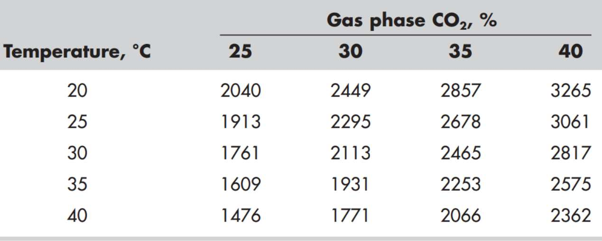
    - **Hình này chứng minh điều gì**
      - Ở $35^\circ\text{C}$ và $35\%\text{ CO}_2$, độ kiềm yêu cầu là $2{,}253\text{ mg/L tính theo CaCO}_3$.
    - **Từ đâu mà thấy được**
      - Hàng tiêu đề: Gas phase $\text{CO}_2$ ($25\%$, $30\%$, $35\%$, $40\%$).
      - Cột Temperature ($20^\circ\text{C}$ đến $40^\circ\text{C}$); giao điểm hàng $35^\circ\text{C}$ và cột $35\%$ ghi giá trị 2253.

###### 7.6.3 Toxic and inhibitory inorganic compounds

- Hoạt tính phân hủy kỵ khí dễ bị kìm hãm khi nồng độ các cation kim loại và hợp chất vô cơ hòa tan vượt quá ngưỡng chịu đựng sinh lý.
- Cơ chế ức chế bao gồm gây mất cân bằng áp suất thẩm thấu, bất hoạt enzyme nội bào và phong tỏa chuỗi truyền điện tử.
- Một số hợp chất và ion vô cơ trong nước thải gây ức chế hoạt tính sinh học của hệ vi sinh vật kỵ khí khi vượt ngưỡng nồng độ giới hạn.
  - **Hình 19.** Nồng độ ức chế vừa phải của các hợp chất vô cơ trong xử lý kỵ khí
    - 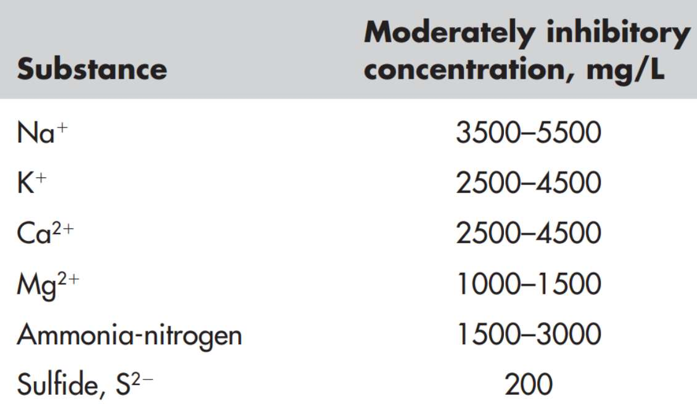
    - **Hình này chứng minh điều gì**
      - Sulfide ($\text{S}^{2-}$) có ngưỡng ức chế thấp nhất ($200\text{ mg/L}$), tiếp theo là magie, amoniac, canxi, kali và natri.
    - **Từ đâu mà thấy được**
      - Cột Substance và cột Moderately inhibitory concentration ($\text{mg/L}$).
      - Dòng $\text{S}^{2-}$ ghi 200; $\text{Mg}^{2+}$ ghi 1000–1500; $\text{Ammonia-N}$ ghi 1500–3000; $\text{Na}^+$ ghi 3500–5500.

##### 7.7 Example: Biogas production and alkalinity supplementation

###### 7.7.1 Problem statement and given data

- **Đề bài**:
  - $1/$ Xác định tổng sản lượng khí sinh học ($\text{m}^3/\text{ngày}$) của bể phản ứng kỵ khí vận hành ở nhiệt độ $35^\circ\text{C}$.
  - $2/$ Xác định khối lượng độ kiềm ($\text{kg NaHCO}_3/\text{ngày}$) cần bổ sung để duy trì $\text{pH} = 7.0$ nếu độ kiềm của dòng vào là $453\text{ mg/L tính theo CaCO}_3$.
- **Dữ kiện**:
  - Lưu lượng nước thải đầu vào: $Q = 3{,}000\text{ m}^3/\text{ngày}$.
  - Nồng độ bCOD dòng vào: $\text{bCOD}_{\text{in}} = 5{,}000\text{ g/m}^3 = 5{,}000\text{ mg/L} = 5.0\text{ kg/m}^3$.
  - Hiệu suất xử lý bCOD: $\eta = 95\% = 0.95$.
  - Hệ số sản lượng sinh khối thực: $Y_{\text{bio}} = 0.04\text{ g VSS/g COD sử dụng}$.
  - Nhiệt độ vận hành bể: $T = 35^\circ\text{C}$.
  - Nồng độ kiềm dòng vào: $\text{Alk}_{\text{in}} = 453\text{ mg/L tính theo CaCO}_3$.
  - pH mục tiêu cần duy trì: $\text{pH} = 7.0$.

###### 7.7.2 Applicable engineering rules

- Quy tắc 1: Cân bằng khối lượng cơ chất bCOD bị loại bỏ hàng ngày:
  $$\Delta\text{bCOD} = Q \times \text{bCOD}_{\text{in}} \times \eta \times 10^{-3}\text{ kg/g}$$
- Quy tắc 2: Tốc độ tạo sinh khối vi sinh vật kỵ khí thực:
  $$P_{X,\text{bio}} = Y_{\text{bio}} \times \Delta\text{bCOD}$$
- Quy tắc 3: Cân bằng COD chuyển hóa thành khí methane ($\text{COD}_{\text{CH4}}$):
  $$\text{COD}_{\text{biomass}} = 1.42 \times P_{X,\text{bio}}$$
  $$\text{COD}_{\text{CH4}} = \Delta\text{bCOD} - \text{COD}_{\text{biomass}} = \Delta\text{bCOD} - 1.42 \times P_{X,\text{bio}}$$
- Quy tắc 4: Suất sinh thể tích khí methane ở $35^\circ\text{C}$ và $1\text{ atm}$:
  $$V_{\text{CH4}} = \text{COD}_{\text{CH4}} \times 0.40\text{ m}^3\text{ CH}_4/\text{kg COD}$$
  (hoặc tính theo thể tích mol khí lý tưởng $V_{\text{CH4}} = \text{COD}_{\text{CH4}} \times \frac{25.29\text{ L/mol}}{64\text{ g COD/mol}} = \text{COD}_{\text{CH4}} \times 0.39516\text{ m}^3/\text{kg COD}$).
- Quy tắc 5: Tổng sản lượng khí sinh học (Biogas):
  Khí methane chiếm $65\%$ thể tích tổng biogas ($35\%$ còn lại là $\text{CO}_2$):
  $$V_{\text{biogas}} = \frac{V_{\text{CH4}}}{0.65}$$
- Quy tắc 6: Nhu cầu độ kiềm đệm duy trì $\text{pH} = 7.0$ từ bảng tra thực nghiệm (**Hình 18**):
  Tại $T = 35^\circ\text{C}$ và tỷ lệ $\text{CO}_2$ pha khí $35\%$, giá trị độ kiềm yêu cầu là $\text{Alk}_{\text{req}} = 2{,}253\text{ mg/L tính theo CaCO}_3$.
- Quy tắc 7: Lượng kiềm thiếu hụt và chuyển đổi sang khối lượng $\text{NaHCO}_3$ thương phẩm:
  $$\Delta\text{Alk} = \text{Alk}_{\text{req}} - \text{Alk}_{\text{in}}$$
  $$M_{\text{CaCO3}} = Q \times \Delta\text{Alk} \times 10^{-3}\text{ kg/g}$$
  Tỷ số đương lượng gam giữa $\text{NaHCO}_3$ ($84\text{ g/đương lượng}$) và $\text{CaCO}_3$ ($50\text{ g/đương lượng}$):
  $$\text{Tỷ số quy đổi} = \frac{84}{50} = 1.68\text{ kg NaHCO}_3/\text{kg CaCO}_3$$
  $$M_{\text{NaHCO3}} = M_{\text{CaCO3}} \times 1.68$$

###### 7.7.3 Step-by-step solution

- Bước 1: Tính khối lượng bCOD bị phân hủy mỗi ngày ($\Delta\text{bCOD}$).
  - Tính toán:
    $$\Delta\text{bCOD} = 3{,}000\text{ m}^3/\text{ngày} \times 5{,}000\text{ g/m}^3 \times 0.95 \times 10^{-3}\text{ kg/g} = 14{,}250\text{ kg COD/ngày}$$
  - Căn cứ: Công thức cân bằng tải lượng loại bỏ $\Delta\text{bCOD} = Q \times \text{bCOD}_{\text{in}} \times \eta$.
  - Nhìn vào: Slide 18 ghi "Flowrate = 3000 m3/d", "Influent bCOD = 5000 g/m3", "bCOD removal efficiency = 95%".
- Bước 2: Tính lượng sinh khối vi sinh vật kỵ khí tạo thành mỗi ngày ($P_{X,\text{bio}}$).
  - Tính toán:
    $$P_{X,\text{bio}} = 0.04\text{ kg VSS/kg COD} \times 14{,}250\text{ kg COD/ngày} = 570\text{ kg VSS/ngày}$$
  - Căn cứ: Công thức tính sinh khối $P_{X,\text{bio}} = Y_{\text{bio}} \times \Delta\text{bCOD}$.
  - Nhìn vào: Slide 18 ghi "Net biomass yield Ybio = 0.04 g VSS/g COD used".
- Bước 3: Tính đương lượng COD chuyển hóa thành tế bào vi sinh vật ($\text{COD}_{\text{biomass}}$).
  - Tính toán:
    $$\text{COD}_{\text{biomass}} = 1.42 \times 570\text{ kg VSS/ngày} = 809.4\text{ kg COD/ngày}$$
  - Căn cứ: Công thức cân bằng COD tế bào trên Slide 17 ghi "COD of biomass = 1.42 x PX,bio".
  - Nhìn vào: Slide 17 mục Biogas production dòng thứ 3.
- Bước 4: Tính khối lượng COD chuyển hóa thành khí methane ($\text{COD}_{\text{CH4}}$).
  - Tính toán:
    $$\text{COD}_{\text{CH4}} = 14{,}250 - 809.4 = 13{,}440.6\text{ kg COD/ngày}$$
  - Căn cứ: Phương trình bảo toàn COD trên Slide 17 ghi "CODremoved = COD of CH4 + COD of biomass".
  - Nhìn vào: Slide 17 mục Biogas production dòng thứ 2.
- Bước 5: Tính sản lượng thể tích khí methane sinh ra ở $35^\circ\text{C}$ ($V_{\text{CH4}}$).
  - Tính toán:
    - Sử dụng hệ số quy đổi làm tròn theo bài giảng ($0.4\text{ L/g COD} = 0.40\text{ m}^3/\text{kg COD}$):
      $$V_{\text{CH4}} = 13{,}440.6\text{ kg COD/ngày} \times 0.40\text{ m}^3/\text{kg COD} = 5{,}376.24\text{ m}^3\text{ CH}_4/\text{ngày}$$
    - (Trường hợp tính theo thể tích mol lý thuyết chính xác $25.29 / 64 = 0.39516\text{ m}^3/\text{kg COD}$):
      $$V_{\text{CH4,exact}} = 13{,}440.6 \times \frac{25.29}{64} = 5{,}311.14\text{ m}^3\text{ CH}_4/\text{ngày}$$
  - Căn cứ: Đương lượng thể tích 1 mol methane ở $35^\circ\text{C}$ và $1\text{ atm}$ trên Slide 17: "The volume of 1 mole CH4 (35oC, 1 atm) = 25.29 L -> 1 g COD equivalent 0.4 L CH4".
  - Nhìn vào: Slide 17 mục Biogas production dòng thứ 7.
- Bước 6: Tính tổng sản lượng khí sinh học tạo thành ($V_{\text{biogas}}$).
  - Tính toán:
    - Theo hệ số quy đổi bài giảng ($0.40\text{ m}^3/\text{kg COD}$):
      $$V_{\text{biogas}} = \frac{5{,}376.24}{0.65} \approx 8{,}271.14\text{ m}^3\text{ biogas/ngày}$$
    - (Theo thể tích mol lý thuyết chính xác):
      $$V_{\text{biogas,exact}} = \frac{5{,}311.14}{0.65} \approx 8{,}170.98\text{ m}^3\text{ biogas/ngày}$$
  - Căn cứ: Tỷ lệ thể tích khí methane chiếm $65\%$ tổng biogas trên Slide 17: "CH4 accounts for ~65% of total gas; 35% remaining is CO2".
  - Nhìn vào: Slide 17 mục Biogas production dòng thứ 8.
- Bước 7: Tra cứu độ kiềm cần thiết để duy trì $\text{pH} = 7.0$ ($\text{Alk}_{\text{req}}$).
  - Tra cứu:
    - Nhiệt độ vận hành bể $T = 35^\circ\text{C}$.
    - Khí $\text{CO}_2$ trong pha khí chiếm $35\%$.
    - Đối chiếu hàng $35^\circ\text{C}$ và cột $35\%\text{ CO}_2$ trong bảng tra **Hình 18**, thu được:
      $$\text{Alk}_{\text{req}} = 2{,}253\text{ mg/L tính theo CaCO}_3$$
  - Căn cứ: Bảng tra độ kiềm yêu cầu để duy trì pH 7.0 (**Hình 18**).
  - Nhìn vào: Bảng tra **Hình 18** trên Slide 17, giao điểm giữa dòng $35^\circ\text{C}$ và cột $35\%$ hiển thị số 2253.
- Bước 8: Tính lượng độ kiềm thiếu hụt cần bổ sung ($\Delta\text{Alk}$ và $M_{\text{CaCO3}}$).
  - Tính toán:
    $$\Delta\text{Alk} = 2{,}253 - 453 = 1{,}800\text{ mg/L tính theo CaCO}_3 = 1.80\text{ kg CaCO}_3/\text{m}^3$$
    $$M_{\text{CaCO3}} = 3{,}000\text{ m}^3/\text{ngày} \times 1.80\text{ kg/m}^3 = 5{,}400\text{ kg CaCO}_3/\text{ngày}$$
  - Căn cứ: Nồng độ kiềm dòng vào $\text{Alk}_{\text{in}} = 453\text{ mg/L as CaCO}_3$ và lưu lượng dòng chảy $Q = 3{,}000\text{ m}^3/\text{d}$.
  - Nhìn vào: Yêu cầu 2/ trên Slide 18 ghi "influent alkalinity = 453 mg/L as CaCO3".
- Bước 9: Tính khối lượng Sodium Bicarbonate ($\text{NaHCO}_3$) cần bổ sung hàng ngày ($M_{\text{NaHCO3}}$).
  - Tính toán:
    $$M_{\text{NaHCO3}} = 5{,}400\text{ kg CaCO}_3/\text{ngày} \times 1.68\text{ kg NaHCO}_3/\text{kg CaCO}_3 = 9{,}072\text{ kg NaHCO}_3/\text{ngày}$$
  - Căn cứ: Tỷ số đương lượng gam giữa $\text{NaHCO}_3$ và $\text{CaCO}_3$: $\frac{84}{50} = 1.68$.
  - Nhìn vào: Yêu cầu 2/ trên Slide 18 yêu cầu "Determine the alkalinity (kg NaHCO3/d) needed to add".

###### 7.7.4 Final results summary

| Chỉ tiêu tính toán | Ký hiệu | Giá trị quy đổi slide | Giá trị lý thuyết mol | Đơn vị |
|---|---|---|---|---|
| Khối lượng bCOD bị loại bỏ | $\Delta\text{bCOD}$ | $14{,}250.0$ | $14{,}250.0$ | $\text{kg COD/ngày}$ |
| Sản lượng bùn vi sinh kỵ khí | $P_{X,\text{bio}}$ | $570.0$ | $570.0$ | $\text{kg VSS/ngày}$ |
| Đương lượng COD của sinh khối | $\text{COD}_{\text{biomass}}$ | $809.4$ | $809.4$ | $\text{kg COD/ngày}$ |
| COD chuyển hóa thành methane | $\text{COD}_{\text{CH4}}$ | $13{,}440.6$ | $13{,}440.6$ | $\text{kg COD/ngày}$ |
| Sản lượng khí methane ($35^\circ\text{C}$) | $V_{\text{CH4}}$ | $5{,}376.24$ | $5{,}311.14$ | $\text{m}^3\text{ CH}_4/\text{ngày}$ |
| Tổng sản lượng khí sinh học | $V_{\text{biogas}}$ | $8{,}271.14$ | $8{,}170.98$ | $\text{m}^3\text{ biogas/ngày}$ |
| Độ kiềm thiếu hụt cần bù | $\Delta\text{Alk}$ | $1{,}800.0$ | $1{,}800.0$ | $\text{mg/L as CaCO}_3$ |
| Khối lượng độ kiềm theo $\text{CaCO}_3$ | $M_{\text{CaCO3}}$ | $5{,}400.0$ | $5{,}400.0$ | $\text{kg CaCO}_3/\text{ngày}$ |
| Khối lượng $\text{NaHCO}_3$ bổ sung | $M_{\text{NaHCO3}}$ | $9{,}072.0$ | $9{,}072.0$ | $\text{kg NaHCO}_3/\text{ngày}$ |

###### 7.7.5 Validation and checks

- Kiểm tra cân bằng khối lượng COD bảo toàn:
  $$\text{COD}_{\text{CH4}} + \text{COD}_{\text{biomass}} = 13{,}440.6 + 809.4 = 14{,}250.0\text{ kg COD/ngày} = \Delta\text{bCOD}$$
  Sai số cân bằng vật chất đạt tuyệt đối $0.0\%$.
- Kiểm tra tỷ lệ phân bố COD phân hủy:
  - Tỷ lệ COD chuyển thành khí methane: $\frac{13{,}440.6}{14{,}250.0} = 94.32\%$.
  - Tỷ lệ COD chuyển thành sinh khối bùn: $\frac{809.4}{14{,}250.0} = 5.68\%$.
  - Tổng tỷ lệ phân bố: $94.32\% + 5.68\% = 100.00\%$, khớp đúng đặc tính sinh học của hệ kỵ khí (trên $90\%$ COD chuyển hóa thành năng lượng khí và dưới $10\%$ tích lũy thành bùn dư).
- Kiểm tra nồng độ kiềm trong bể sau khi bổ sung hóa chất:
  $$\text{Alk}_{\text{final}} = \text{Alk}_{\text{in}} + \frac{M_{\text{CaCO3}}}{Q} = 453 + \frac{5{,}400 \times 10^3\text{ g}}{3{,}000\text{ m}^3} = 453 + 1{,}800 = 2{,}253\text{ mg/L tính theo CaCO}_3$$
  Nồng độ kiềm sau bổ sung hoàn toàn trùng khớp với giá trị tra cứu $2{,}253\text{ mg/L as CaCO}_3$ tại $35^\circ\text{C}$ và $35\%\text{ CO}_2$.

### Chương 6: Công trình Xử lý Sinh học Hiếu khí (Biological Aerobic Unit)

#### 1. Hệ thống cấp khí trong xử lý nước thải (Aeration Systems Overview)

- Vai trò kỹ thuật của hệ thống cấp khí trong xử lý sinh học hiếu khí:
  - Cung cấp liên tục lượng oxy hòa tan ($DO$) cần thiết cho vi sinh vật hiếu khí duy trì hoạt tính sinh hóa phân hủy các hợp chất hữu cơ ô nhiễm ($BOD$, $COD$) và oxy hóa amoni thành nitrat.
  - Tạo động lực xáo trộn thủy lực ($mixing$) nhằm duy trì bùn hoạt tính ở trạng thái lơ lửng, tối đa hóa diện tích bề mặt tiếp xúc giữa tế bào vi sinh, oxy và cơ chất hòa tan trong nước thải.
- Cấu trúc nội dung của phân đoạn gồm 4 nội dung trọng tâm:
  - 1.1 Tổng quan và phân loại hệ thống cấp khí ($Overview\text{ and Aeration Types}$).
  - 1.2 Hệ thống phân phối khí phân tán ($Diffused\text{ Air Aeration Systems}$).
  - 1.3 Hệ thống sục khí cơ học bề mặt ($Mechanical\text{ Surface Aerators}$).
  - 1.4 Nguyên lý và phương trình truyền oxy ($Oxygen\text{ Transfer Principles and Equations}$).

##### 1.1 Tổng quan và phân loại hệ thống cấp khí (Overview and Aeration Types)

###### Khái niệm và mục tiêu của quá trình cấp khí (Definition and Purpose of Aeration)
- Định nghĩa quá trình cấp khí ($Aeration$):
  - Bổ sung không khí vào nước thải nhằm thúc đẩy quá trình phân hủy sinh học các chất ô nhiễm bởi quần thể vi sinh vật hiếu khí.
- Mục tiêu công nghệ cốt lõi ($Purpose$):
  - Cung cấp oxy hòa tan ($DO$) hỗ trợ vi sinh vật hiếu khí chuyển hóa cơ chất hữu cơ thành sinh khối mới, $\text{CO}_2$ và $\text{H}_2\text{O}$.
  - Duy trì gradient nồng độ oxy hòa tan ổn định trong toàn bộ thể tích làm việc của bể bùn hoạt tính hiếu khí.

###### Phân loại các hệ thống cấp khí sinh học (Classification of Aeration Systems)
- Hai nhóm công nghệ cấp khí chủ đạo trong các công trình xử lý nước thải:
  - Hệ thống cấp khí phân tán ($Diffused\text{ Air Aeration}$):
    - Đưa khí nén từ máy thổi khí qua hệ thống phân phối ngập nước để giải phóng bọt khí mịn ($fine\text{ bubbles}$) hoặc bọt khí thô ($coarse\text{ bubbles}$).
  - Hệ thống sục khí cơ học ($Mechanical\text{ Aeration}$):
    - Dùng thiết bị cơ khí chuyển động quay như máy khuấy làm thoáng bề mặt ($surface\text{ aerator}$) hoặc máy sục khí chìm ($submerged\text{ aerator}$) để đưa không khí từ khí quyển vào nước thông qua xáo trộn bề mặt chất lỏng.

##### 1.2 Hệ thống phân phối khí phân tán (Diffused Air Aeration Systems)

###### Thành phần cấu tạo và các yếu tố ảnh hưởng (System Components and Influencing Factors)
- Các bộ phận cấu thành chính của hệ thống cấp khí bọt khí ($Components$):
  - Thiết bị phân phối khí ($Diffusers$): Gồm các thiết bị dạng đĩa gốm ($ceramic\text{ discs}$), đĩa màng đàn hồi ($membranes$), hoặc ống phân phối ($tubes$) làm nhiệm vụ phân tán khí nén thành các bọt khí nhỏ.
  - Máy thổi khí ($Air\text{ Blowers}$): Cung cấp lưu lượng và tạo áp suất khí nén cần thiết để thắng cột nước thủy tĩnh và khắc phục tổn thất áp lực trong hệ thống ống dẫn khí và đầu phân phối.
- Các yếu tố chính ảnh hưởng đến hiệu quả sục khí ($Factors\text{ Affecting Aeration}$):
  - Nhiệt độ nước thải ($Water\text{ Temperature}$):
    - Nhiệt độ cao làm giảm độ hòa tan của oxy trong nước ($decreases\text{ oxygen solubility}$) theo định luật Henry.
    - Nhiệt độ cao làm tăng tốc độ phản ứng sinh học và cường độ hô hấp của vi sinh vật ($increases\text{ biological activity}$).
  - Chiều sâu đặt thiết bị phân phối khí ($Depth\text{ of Aeration}$):
    - Chiều sâu ngập nước càng lớn ($greater\text{ depths}$) làm tăng hiệu quả truyền oxy ($Oxygen\text{ Transfer Efficiency - OTE}$) do áp suất riêng phần của oxy tăng cao và thời gian lưu tiếp xúc của bọt khí trong cột nước kéo dài.

###### Vận tốc khí thiết kế trong đường ống phân phối (Typical Air Velocity in Distribution Pipes)
- Tiêu chuẩn thiết kế vận tốc dòng khí trong ống:
  - Vận tốc khí được khống chế trong giới hạn cho phép nhằm giảm tổn thất áp suất do ma sát và hạn chế hiện tượng rung giật, phát sinh tiếng ồn.
- Bảng tra cứu vận tốc khí điển hình theo đường kính ống ($Typical\text{ air velocity in pipes}$):

| Đường kính trong của ống ($mm$) | Vận tốc khí thiết kế ($m/s$) |
| :---: | :---: |
| $25\text{--}75$ | $6\text{--}9$ |
| $100\text{--}250$ | $9\text{--}15$ |
| $300\text{--}600$ | $15\text{--}20$ |
| $750\text{--}1500$ | $20\text{--}35$ |

- Đặc điểm thủy lực: Ống chính đường kính lớn cho phép vận tốc khí cao hơn ($v \le 35\text{ m/s}$), trong khi các ống nhánh cấp khí trực tiếp tới đầu tán đòi hỏi vận tốc thấp ($v = 6\text{--}9\text{ m/s}$) để bảo đảm lưu lượng khí phân bố đồng đều giữa các vòi phun.

###### Thiết bị phân phối khí dạng đĩa bọt mịn (Ceramic and Membrane Disk Diffusers)
- Cấu tạo chi tiết đĩa tán khí dạng gốm / polymer xốp:
  - Cụm đĩa gồm đĩa gốm hoặc đĩa polyethylene vi xốp ($polyethylene\text{ disk}$) đặt trên đế đỡ ($base\text{ plate}$).
  - Đĩa được giữ chặt bằng đai ren siết định vị ($threaded\text{ retaining ring}$).
  - Tích hợp lỗ tiết lưu kiểm soát lưu lượng và van một chiều cao su ($control\text{ orifice and check valve}$) ngăn nước thải chảy ngược vào đường ống dẫn khí khi ngừng vận hành máy thổi khí.
  - Liên kết với ống nhánh bằng khớp ngàm kẹp cơ học ($mechanical\text{ wedge section for attaching}$ / $saddle$).
  - Minh chứng cấu tạo cụm đĩa phân phối khí:
    - **Hình 1.** Cấu tạo chi tiết cụm đĩa phân phối khí bọt mịn (Ceramic disk diffuser assembly and cross-section)
      - 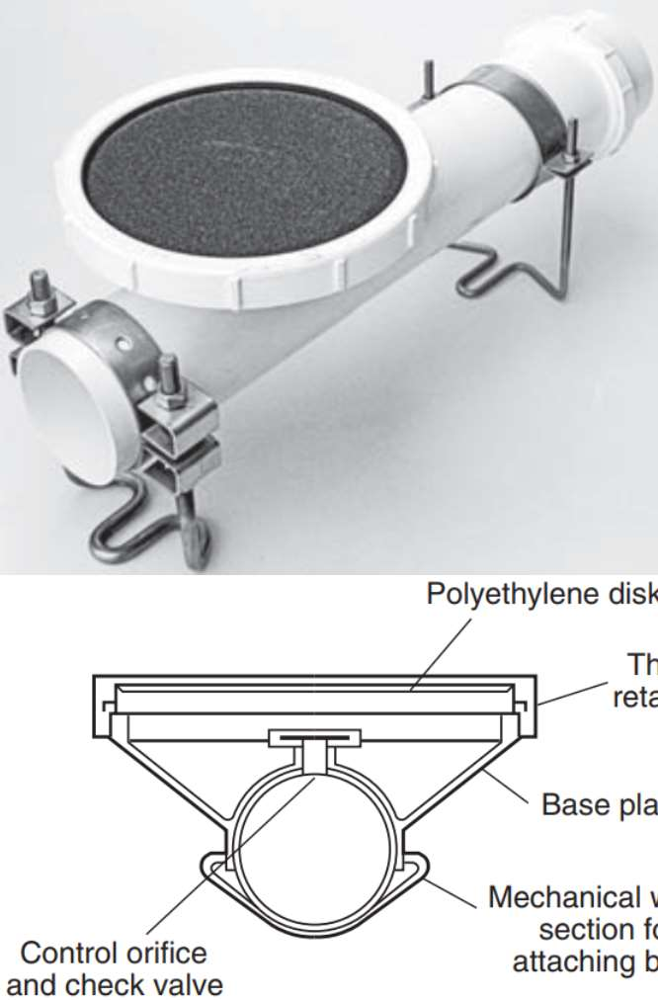
      - **Hình này chứng minh điều gì**
        - Cấu tạo đĩa phân phối khí bọt mịn tích hợp đĩa xốp, đế đỡ, lỗ tiết lưu và van một chiều chống chảy ngược gắn trên ống nhánh.
      - **Từ đâu mà thấy được**
        - Hình phối cảnh cụm đĩa gắn ống dẫn khí và mặt cắt chi tiết chỉ rõ: "Polyethylene disk", "Threaded retaining ring", "Base plate", "Control orifice and check valve", "Mechanical wedge section".
  - Đặc tính tạo bọt khí mịn:
    - Kích thước bọt khí mịn ($fine\text{ bubbles}$) làm tăng diện tích tiếp xúc liên pha khí - lỏng trên một đơn vị thể tích khí nén cấp vào.
  - Minh chứng chùm bọt khí mịn:
    - **Hình 2.** Sự phát sinh bọt khí mịn từ bề mặt đĩa phân phối khí (Fine bubbles rising from disk diffuser)
      - 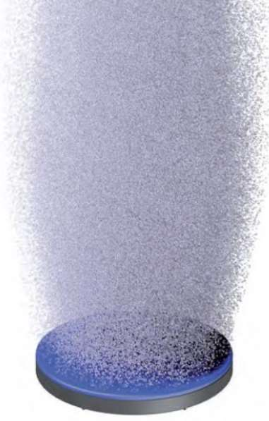
      - **Hình này chứng minh điều gì**
        - Bề mặt đĩa phân phối tạo ra chùm bọt khí kích thước hạt mịn bay đều theo phương thẳng đứng qua cột nước.
      - **Từ đâu mà thấy được**
        - Đĩa tròn ở đáy giải phóng mật độ bọt khí li ti dày đặc bốc thẳng đứng trong môi trường nước trong.
- Lắp đặt mạng lưới đĩa phân phối trong bể thổi khí:
  - Đĩa gốm hoặc đĩa màng được bố trí đều trên toàn bộ mặt sàn đáy bể để tạo trường thủy lực xáo trộn đồng nhất và ngăn chặn sự hình thành các vùng chết lắng cặn.
  - Minh chứng lắp đặt thực tế trong bể:
    - **Hình 3.** Bể thổi khí lắp đặt dàn đĩa phân phối khí dạng đĩa gốm trên sàn đáy bể (Aeration tank equipped with ceramic disk diffused air)
      - 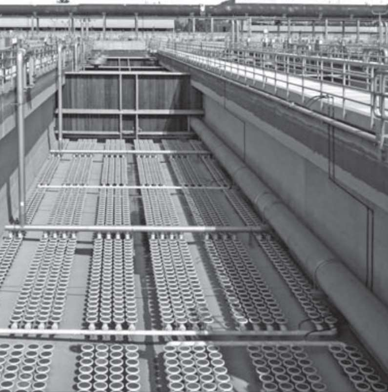
      - **Hình này chứng minh điều gì**
        - Mạng lưới ống nhánh và dàn đĩa phân phối khí dạng đĩa gốm phủ kín đáy bể thổi khí nhiều ngăn.
      - **Từ đâu mà thấy được**
        - Đáy bể bê tông thể hiện hệ thống ống cấp khí chính chạy dọc thành bể, các ống nhánh phân phối và các hàng đĩa phân phối xếp san sát nhau trên sàn đáy.

###### Thiết bị phân phối khí dạng ống và máy thổi khí (Tube Diffusers and Air Blowers)
- Đặc tính và cấu tạo ống phân phối khí ($Tube\text{ diffusers}$):
  - Cấu tạo dạng ống hình trụ tròn, bề mặt phủ màng vật liệu đàn hồi hoặc màng xốp có khe rãnh vi mô.
  - Lắp đặt theo cặp đối xứng hai bên đường ống phân phối nhánh qua khớp nối ngàm trung tâm.
  - Dễ xả cặn và phù hợp với các bể có hình dạng thon dài hoặc bể phản ứng màng sinh học hiếu khí.
  - Minh chứng dàn ống phân phối khí:
    - **Hình 4.** Bố trí dàn ống phân phối khí trên hệ thống ống nhánh gom (Tube diffusers arrangement on manifold)
      - 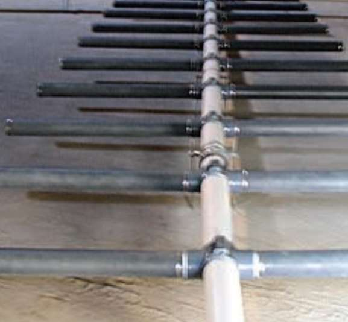
      - **Hình này chứng minh điều gì**
        - Dàn ống khuếch tán khí được lắp vuông góc đối xứng dọc theo trục ống nhánh phân phối khí.
      - **Từ đâu mà thấy được**
        - Ống trục màu trắng liên kết hàng loạt thanh ống phân phối khí màu đen vươn sang hai bên qua các cụm khớp nối cơ khí.
  - Minh chứng đơn nguyên ống tán khí:
    - **Hình 5.** Cấu tạo chi tiết một đơn nguyên ống phân phối khí (Tube diffuser unit with central connector)
      - 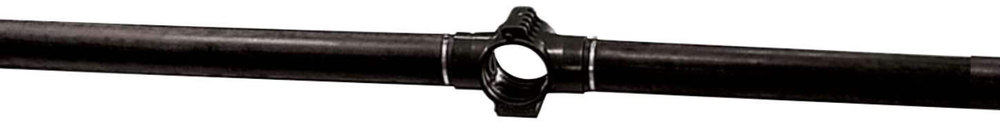
      - **Hình này chứng minh điều gì**
        - Đơn nguyên ống phân phối khí gồm hai đoạn ống màng tán khí liên kết đối xứng qua cổ kết nối trung tâm.
      - **Từ đâu mà thấy được**
        - Cụm chi tiết thể hiện khớp nối ngàm tròn trung tâm và hai ống xốp tán khí vươn đối xứng kèm đai siết hai đầu.
  - Minh chứng bọt khí từ ống tán khí:
    - **Hình 6.** Bọt khí phân tán từ ống phân phối ngập nước trong buồng thử nghiệm (Bubble generation of tube diffuser)
      - 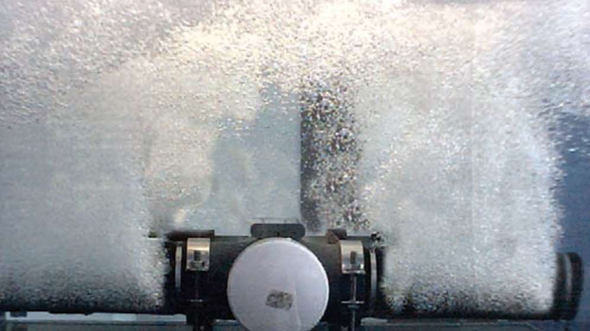
      - **Hình này chứng minh điều gì**
        - Màng ống tán khí sinh ra hai dải bọt khí mịn dày đặc bốc lên từ hai nhánh của ống.
      - **Từ đâu mà thấy được**
        - Ống nằm ngang chìm trong bể nước giải phóng mật độ bọt khí trắng xóa phủ kín cột nước bên trên hai nhánh ống.
- Máy thổi khí cấp áp lực ($Air\text{ Blower}$):
  - Máy thổi khí thể tích kiểu Roots (positive displacement blower) cung cấp lưu lượng khí nén ổn định với áp lực đẩy vượt qua tổng tổn thất áp suất của cột nước và thiết bị tán khí.
  - Minh chứng máy thổi khí:
    - **Hình 7.** Máy thổi khí công nghiệp kiểu Roots (Industrial Roots air blower)
      - 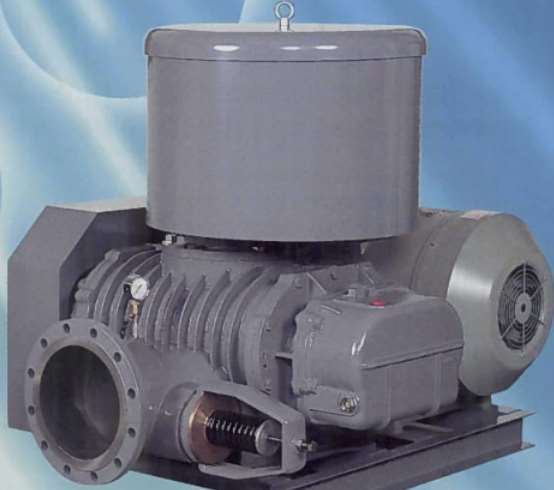
      - **Hình này chứng minh điều gì**
        - Cụm máy thổi khí hoàn chỉnh gồm buồng nén khí, động cơ điện truyền động và bộ lọc khí đầu hút.
      - **Từ đâu mà thấy được**
        - Thân máy bằng gang có cánh tản nhiệt, mặt bích xả khí ra phía trước, bầu lọc giảm thanh phía trên và động cơ điện gắn liền trên bệ đỡ.

##### 1.3 Hệ thống sục khí cơ học bề mặt (Mechanical Surface Aerators)

###### Nguyên lý hoạt động và đặc tính làm việc (Operating Principles and Characteristics)
- Cơ chế sục khí cơ học bề mặt:
  - Cánh khuấy đặt trên mặt nước quay nhanh tạo lực ly tâm cuốn và bắn các hạt nước vào không khí để hấp phụ oxy tự do từ khí quyển.
  - Động năng của cánh khuấy tạo luồng tuần hoàn lớn từ đáy bể lên mặt nước, bảo đảm xáo trộn bùn sinh học trong toàn bể.
- Phạm vi áp dụng công nghệ:
  - Thích hợp cho bể xáo trộn hoàn toàn ($CMAS$), hồ làm thoáng ($aerated\text{ lagoons}$), bể bùn hoạt tính tuần hoàn ô-xy hóa ($oxidation\text{ ditches}$).
  - Không cần mạng lưới đường ống khí nén và máy thổi khí, loại bỏ rủi ro nghẹt đầu tán khí.

###### Kích thước hình học bể và công suất máy khuấy bề mặt (Tank Dimensions and Surface Aerator Sizing)
- Bảng tương quan giữa công suất động cơ máy sục khí bề mặt và kích thước hình học bể ($Typical\text{ surface aerator size for aeration tank}$):

| Công suất động cơ ($hp$) | Công suất động cơ ($kW$) | Chiều sâu nước làm việc $H$ ($m$) | Chiều rộng / đường kính bể $W$ ($m$) |
| :---: | :---: | :---: | :---: |
| $10$ | $7.5$ | $3.0\text{--}3.5$ | $9\text{--}12$ |
| $20$ | $15.0$ | $3.5\text{--}4.0$ | $10\text{--}15$ |
| $30$ | $22.5$ | $4.0\text{--}4.5$ | $12\text{--}18$ |
| $40$ | $30.0$ | $3.5\text{--}5.0$ | $14\text{--}20$ |
| $50$ | $37.5$ | $4.5\text{--}5.5$ | $14\text{--}23$ |
| $75$ | $55.0$ | $4.5\text{--}6.0$ | $15\text{--}26$ |
| $100$ | $75.0$ | $4.5\text{--}6.0$ | $18\text{--}27$ |

- Yêu cầu thủy lực:
  - Chiều sâu nước giới hạn trong khoảng $3.0\text{--}6.0\text{ m}$ để dòng xoáy do cánh khuấy tạo ra quét sạch lớp bùn sát sàn đáy, ngăn hiện tượng lắng đọng kỵ khí.
  - Kích thước chiều rộng bể $W = 9\text{--}27\text{ m}$ tương ứng với bán kính ảnh hưởng hữu hiệu của máy khuấy để tránh tồn tại góc chết thủy lực.
- Minh chứng lắp đặt thực tế máy sục khí bề mặt:
  - **Hình 8.** Bể phản ứng bùn hoạt tính xáo trộn hoàn toàn trang bị máy sục khí cơ học bề mặt (Typical complete-mix reactor with surface aerator)
    - 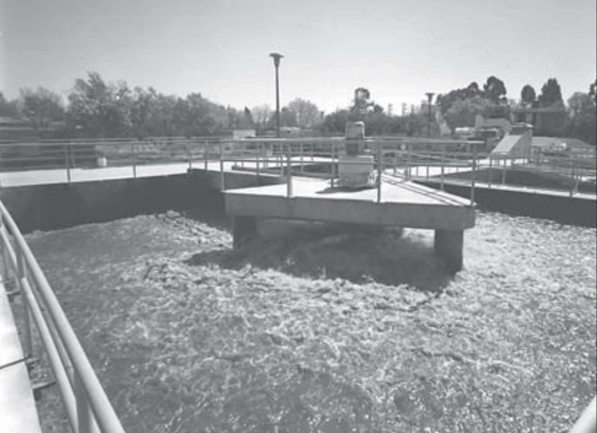
    - **Hình này chứng minh điều gì**
      - Cụm máy khuấy bề mặt lắp đặt trên sàn công tác cố định giữa bể xáo trộn hoàn toàn, tạo xáo trộn mãnh liệt trên đầy đủ tích mặt thoáng.
    - **Từ đâu mà thấy được**
      - Kết cấu sàn công tác bê tông vươn ra tâm bể, động cơ máy khuấy đặt chính giữa và toàn bộ bề mặt chất lỏng xung quanh sủi bọt xáo trộn mạnh.

##### 1.4 Nguyên lý và phương trình truyền oxy (Oxygen Transfer Principles and Equations)

###### Phương trình tính toán tốc độ truyền oxy tiêu chuẩn (Standard Oxygen Transfer Rate - SOTR)
- Định nghĩa tốc độ truyền oxy tiêu chuẩn ($SOTR$):
  - $SOTR$ ($Standard\text{ Oxygen Transfer Rate}$): Tốc độ truyền oxy vào nước sạch ở điều kiện chuẩn ($20^\circ\text{C}$, áp suất khí quyển tiêu chuẩn $1\text{ atm} = 10.33\text{ m } \text{H}_2\text{O}$, nồng độ oxy hòa tan ban đầu $C = 0\text{ mg/L}$), đơn vị $\text{kg O}_2/\text{h}$.
- Định nghĩa tốc độ truyền oxy thực tế tại hiện trường ($OTR_f$):
  - $OTR_f$ ($Oxygen\text{ Transfer Rate at Field}$): Lượng oxy thực tế cần chuyển hóa vào nước thải tại điều kiện nhiệt độ vận hành, cao độ công trình và nồng độ oxy hòa tan thiết kế, đơn vị $\text{kg O}_2/\text{h}$.
- Phương trình chuyển đổi tổng quát xác định $SOTR$:
  $$SOTR = \frac{OTR_f}{\alpha F} \times \frac{C_{\infty 20}^*}{\tau \beta \Omega C_{\infty 20}^* - C} \times \frac{1}{\theta^{t-20}}$$
- Giải thích các thông số và hệ số hiệu chỉnh:
  - $\alpha$: Hệ số hiệu chỉnh tốc độ truyền oxy của nước thải so với nước sạch ($K_L a_{\text{wastewater}} / K_L a_{\text{clean water}}$), dải giá trị: $\alpha = 0.4\text{--}0.8$.
  - $\beta$: Hệ số hiệu chỉnh độ hòa tan oxy bão hòa của nước thải so với nước sạch ($C_{s,\text{wastewater}}^* / C_{s,\text{clean water}}^*$), dải giá trị: $\beta = 0.95\text{--}0.98$.
  - $F$: Hệ số bám bẩn của thiết bị phân phối khí ($fouling\text{ factor}$), dải giá trị: $F = 0.65\text{--}0.9$.
  - $\theta$: Hệ số hiệu chỉnh nhiệt độ đối với hệ số truyền khối, giá trị tiêu chuẩn: $\theta = 1.024$.
  - $t$: Nhiệt độ vận hành thực tế của nước thải trong bể ($^\circ\text{C}$).
  - $C$: Nồng độ oxy hòa tan trung bình duy trì trong bể phản ứng ($\text{mg/L}$), thường duy trì $C = 1.5\text{--}2.0\text{ mg/L}$.

###### Hiệu chỉnh áp suất khí quyển theo cao độ địa hình (Atmospheric Pressure Correction)
- Hệ số hiệu chỉnh áp suất khí quyển ($\Omega$):
  - Định nghĩa tỷ số áp suất:
    $$\Omega = \frac{P_b}{P_a}$$
  - $P_a$: Áp suất khí quyển chuẩn tại mực nước biển, quy đổi ra cột nước: $P_a = 10.33\text{ m } \text{H}_2\text{O}$.
  - $P_b$: Áp suất khí quyển thực tế tại công trình theo cao độ địa hình ($m\text{ cột nước}$).
- Phương trình khí quyển xác định tỷ số áp suất:
  $$\frac{P_b}{P_a} = \exp\left(-\frac{g M z}{R T}\right)$$
- Các thông số vật lý trong công thức áp suất:
  - $g$: Gia tốc trọng trường, $g = 9.81\text{ m/s}^2$.
  - $M$: Khối lượng mol phân tử của không khí, $M = 28.97\text{ g/mole} = 28.97\text{ kg/kmole}$.
  - $z$: Cao độ của công trình so với mực nước biển ($m$).
  - $R$: Hằng số khí lý tưởng, $R = 8314\text{ N}\cdot\text{m}/(\text{kmole air}\cdot\text{K}) = 8314\text{ J}/(\text{kmole air}\cdot\text{K})$.
  - $T$: Nhiệt độ tuyệt đối của nước trong bể phản ứng, $T = 273 + t\text{ (K)}$.

###### Hiệu chỉnh nồng độ oxy hòa tan bão hòa và chiều sâu bể (DO Saturation Corrections)
- Hệ số hiệu chỉnh nhiệt độ đối với độ bão hòa oxy ($\tau$):
  - Tỷ số nồng độ bão hòa ở nhiệt độ vận hành so với $20^\circ\text{C}$:
    $$\tau = \frac{C_{st}}{C_{s20}}$$
  - $C_{st}$: Nồng độ oxy hòa tan bão hòa trong nước sạch tại mực nước biển ở nhiệt độ vận hành $t$ ($\text{mg/L}$).
  - $C_{s20}$: Nồng độ oxy hòa tan bão hòa trong nước sạch tại mực nước biển ở $20^\circ\text{C}$ ($C_{s20} = 9.092\text{ mg/L}$).
- Nồng độ oxy hòa tan bão hòa hiệu chỉnh cho sục khí phân tán bọt khí ($C_{\infty 20}^*$):
  - Oxy hòa tan bão hòa trong bọt khí tăng lên do chịu ảnh hưởng của áp suất thủy tĩnh tại độ sâu đặt đầu tán khí:
    $$C_{\infty 20}^* = C_{s20}^* \left(1 + 0.4 \times \frac{D_f}{P_a}\right)$$
  - $D_f$: Chiều sâu đặt thiết bị phân phối khí trong bể ($m$).
  - $P_a$: Cột áp chuẩn tại mực nước biển, $P_a = 10.33\text{ m}$.
  - $0.4$: Hệ số kinh nghiệm thể hiện áp suất hiệu dụng trung bình của bọt khí khi di chuyển từ đáy lên bề mặt tự do.

###### Phương trình tính toán lưu lượng không khí cấp (Air Flowrate Computation)
- Phương trình xác định lưu lượng không khí cần thiết cấp vào bể:
  $$\text{Air flowrate, m}^3/\text{min} = \frac{\text{SOTR (kg O}_2/\text{h})}{E \times (60\text{ min/h}) \times (0.27\text{ kg O}_2/\text{m}^3\text{ air})}$$
- Ý nghĩa các biến số trong công thức tính lưu lượng khí:
  - $\text{Air flowrate}$: Lưu lượng không khí tiêu chuẩn cần cung cấp bởi máy thổi khí ($\text{m}^3/\text{min}$).
  - $\text{SOTR}$: Tốc độ truyền oxy tiêu chuẩn đã hiệu chỉnh ($\text{kg O}_2/\text{h}$).
  - $E$: Hiệu quả truyền oxy của hệ thống tán khí ($Oxygen\text{ Transfer Efficiency - OTE}$), dải giá trị thông thường: $E = 25\%\text{--}40\%$ ($0.25\text{--}0.40$).
  - $0.27\text{ kg O}_2/\text{m}^3\text{ air}$: Khối lượng oxy phân tử có trong $1\text{ m}^3$ không khí khô ở điều kiện tiêu chuẩn.
  - $60\text{ min/h}$: Thừa số quy đổi thời gian từ giờ sang phút.

###### Bảng tra cứu nồng độ oxy bão hòa theo nhiệt độ và cao độ (Saturation DO Lookup Table)
- Quy luật biến thiên nồng độ oxy hòa tan bão hòa $C_s^*$ ($\text{mg/L}$):
  - Tỷ lệ nghịch với nhiệt độ: Khi nhiệt độ tăng, động năng phân tử tăng làm giảm độ hòa tan của oxy trong pha lỏng.
  - Tỷ lệ nghịch với cao độ địa hình: Khi cao độ tăng, áp suất khí quyển giảm kéo theo sự sụt giảm áp suất riêng phần của oxy trong không khí.
- Minh chứng bảng số liệu nồng độ oxy bão hòa:
  - **Hình 9.** Bảng tra cứu nồng độ oxy hòa tan bão hòa theo nhiệt độ và cao độ địa hình (Saturated oxygen in mg/L as functions of temperature and elevation)
    - 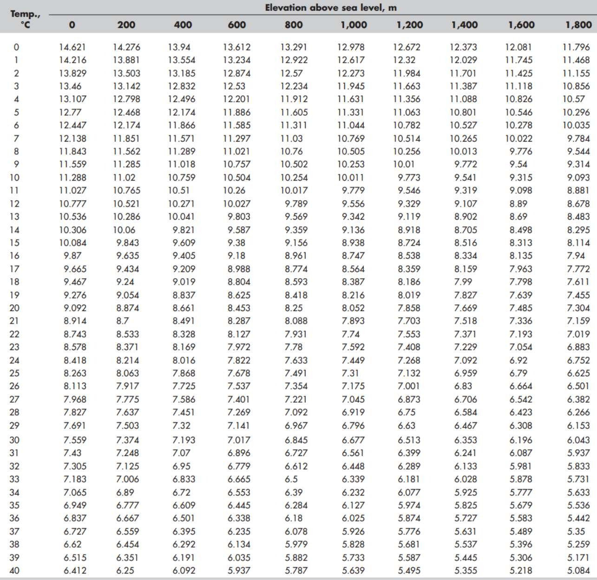
    - **Hình này chứng minh điều gì**
      - Nồng độ oxy hòa tan bão hòa $C_s^*$ suy giảm đồng thời theo sự gia tăng của nhiệt độ và cao độ địa hình.
    - **Từ đâu mà thấy được**
      - Bảng ma trận dữ liệu hiển thị giá trị $C_s^*$ trong dải nhiệt độ $0\text{--}40^\circ\text{C}$ và dải cao độ địa hình $0\text{--}1800\text{ m}$.
- Bảng trích xuất giá trị oxy hòa tan bão hòa $C_s^*$ ($\text{mg/L}$) điển hình phục vụ tính toán:

| Nhiệt độ ($^\circ\text{C}$) | $0\text{ m}$ | $200\text{ m}$ | $400\text{ m}$ | $600\text{ m}$ | $800\text{ m}$ | $1000\text{ m}$ | $1200\text{ m}$ | $1400\text{ m}$ | $1600\text{ m}$ | $1800\text{ m}$ |
| :---: | :---: | :---: | :---: | :---: | :---: | :---: | :---: | :---: | :---: | :---: |
| $10$ | $11.288$ | $11.020$ | $10.759$ | $10.504$ | $10.254$ | $10.011$ | $9.773$ | $9.541$ | $9.315$ | $9.093$ |
| $15$ | $10.084$ | $9.843$ | $9.609$ | $9.380$ | $9.156$ | $8.938$ | $8.724$ | $8.516$ | $8.313$ | $8.114$ |
| $20$ | $9.092$ | $8.874$ | $8.661$ | $8.453$ | $8.250$ | $8.052$ | $7.858$ | $7.669$ | $7.485$ | $7.304$ |
| $25$ | $8.263$ | $8.063$ | $7.868$ | $7.678$ | $7.491$ | $7.310$ | $7.132$ | $6.959$ | $6.790$ | $6.625$ |
| $30$ | $7.559$ | $7.374$ | $7.193$ | $7.017$ | $6.845$ | $6.677$ | $6.513$ | $6.353$ | $6.196$ | $6.043$ |
| $35$ | $6.949$ | $6.777$ | $6.609$ | $6.445$ | $6.284$ | $6.127$ | $5.974$ | $5.825$ | $5.679$ | $5.536$ |

- Thông số và cấu tạo chi tiết theo tài liệu bài giảng (Trang 6):
  - **Hình 9.** Figure 9 (Page 6)
    - 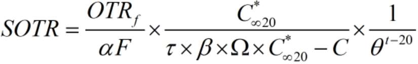
  - **Hình này chứng minh điều gì**
    - Minh họa chi tiết sơ đồ công nghệ, thông số thiết kế hoặc cấu tạo thiết bị trên slide trang 6.
  - **Từ đâu mà thấy được**
    - Trích xuất trực tiếp từ tài liệu bài giảng gốc của chương.

- Thông số và cấu tạo chi tiết theo tài liệu bài giảng (Trang 6):
  - **Hình 10.** Figure 10 (Page 6)
    - 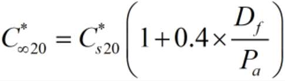
  - **Hình này chứng minh điều gì**
    - Minh họa chi tiết sơ đồ công nghệ, thông số thiết kế hoặc cấu tạo thiết bị trên slide trang 6.
  - **Từ đâu mà thấy được**
    - Trích xuất trực tiếp từ tài liệu bài giảng gốc của chương.

- Thông số và cấu tạo chi tiết theo tài liệu bài giảng (Trang 6):
  - **Hình 11.** Figure 11 (Page 6)
    - 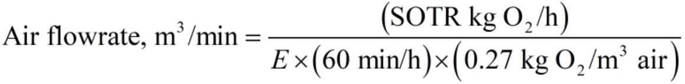
  - **Hình này chứng minh điều gì**
    - Minh họa chi tiết sơ đồ công nghệ, thông số thiết kế hoặc cấu tạo thiết bị trên slide trang 6.
  - **Từ đâu mà thấy được**
    - Trích xuất trực tiếp từ tài liệu bài giảng gốc của chương.

#### 2. Hệ thống phân phối khí bọt mịn và bọt thô (Diffused Air Systems)

- Hệ thống phân phối khí bọt mịn và bọt thô cấp khí oxy hòa tan ($DO$) cho quá trình bùn hoạt tính hiếu khí và duy trì trạng thái xáo trộn hoàn toàn trong bể phản ứng ($CMAS$).
  - Bể bùn hoạt tính xáo trộn hoàn toàn ($\text{Complete-Mix Activated Sludge - CMAS}$) yêu cầu phối hợp đồng bộ giữa động học chuyển hóa sinh hóa của vi sinh vật lơ lửng và động học hòa tan oxy của hệ thống phân phối khí đáy bể.
  - Phân tích thiết kế công nghệ bể aerotank xáo trộn hoàn chỉnh bao gồm hệ phương trình cân bằng vật chất, hệ số động học thực nghiệm, quy trình tính toán kỹ thuật 18 bước, và kiểm toán nhu cầu cấp khí cho hai chế độ vận hành: chỉ khử $BOD$ và khử $BOD$ kết hợp nitrat hóa.

---

##### 2.1 Phương trình động học quá trình bùn hoạt tính hiếu khí (Summary of Kinetic Equations in Suspended Growth Processes)

###### Phương trình sinh trưởng vi sinh vật và chuyển hóa cơ chất (Biomass Growth and Substrate Utilization Equations)
- Tốc độ phản ứng sinh hóa phụ thuộc mạnh vào nhiệt độ nước thải theo quan hệ van 't Hoff - Arrhenius:
  - Phương trình hiệu chỉnh nhiệt độ:
    $$k_T = k_{20} \theta^{(T - 20)}$$
  - Trong đó $k_T$ và $k_{20}$ lần lượt là hằng số tốc độ phản ứng ở nhiệt độ $T$ ($^\circ\text{C}$) và $20^\circ\text{C}$.
  - Hệ số nhiệt độ $\theta$ phản ánh mức độ nhạy cảm của từng chủng vi sinh vật đối với dao động nhiệt độ môi trường.
- Tốc độ sử dụng cơ chất hữu cơ hòa tan dễ phân hủy sinh học ($bsCOD$) tuân theo động học Monod mở rộng:
  - Phương trình tốc độ sử dụng cơ chất:
    $$r_{SU} = \frac{k X S}{K_s + S}$$
  - Quan hệ giữa tốc độ sử dụng cơ chất cực đại ($k$) và tốc độ sinh trưởng riêng cực đại ($\mu_{\max}$):
    $$\mu_{\max} = Y k \iff k = \frac{\mu_{\max}}{Y}$$
  - $X$ biểu thị nồng độ sinh khối vi sinh vật trong bể phản ứng ($\text{g VSS/m}^3$ hoặc $\text{mg/L}$).
  - $S$ biểu thị nồng độ cơ chất hòa tan $bsCOD$ trong dung dịch xáo trộn ($\text{g/m}^3$).
  - $K_s$ là hằng số nửa tốc độ (hằng số ái lực cơ chất, $\text{g/m}^3$).
- Tốc độ oxy hóa amoni ($\text{NH}_4\text{-N}$) bởi vi khuẩn nitrat hóa tự dưỡng ($AOB$ - Ammonia-Oxidizing Bacteria) bị kiểm soát đồng thời bởi nồng độ amoni và nồng độ oxy hòa tan ($DO$):
  - Phương trình tốc độ oxy hóa amoni:
    $$r_{NH_4} = \left(\frac{\mu_{\max, AOB}}{Y_{AOB}}\right) \left(\frac{S_{NH_4}}{S_{NH_4} + K_{NH_4}}\right) \left(\frac{S_o}{S_o + K_{o, AOB}}\right) X_{AOB}$$
  - $S_{NH_4}$ là nồng độ amoni hòa tan trong bể phản ứng ($\text{g N/m}^3$).
  - $S_o$ là nồng độ oxy hòa tan ($DO$) duy trì trong hỗn hợp bùn nước ($\text{g } O_2/\text{m}^3$).
  - $K_{NH_4}$ là hằng số ái lực cơ chất amoni của vi khuẩn $AOB$ ($\text{g/m}^3$).
  - $K_{o, AOB}$ là hằng số ái lực đối với oxy hòa tan của vi khuẩn $AOB$ ($\text{g/m}^3$).
  - $X_{AOB}$ là nồng độ sinh khối vi khuẩn oxy hóa amoni ($\text{g VSS/m}^3$).
- Tốc độ sinh trưởng riêng thực và tuổi lưu bùn tối thiểu cho quá trình nitrat hóa:
  - Phương trình tốc độ sinh trưởng riêng thực của vi khuẩn $AOB$:
    $$\mu_{AOB} = \mu_{\max, AOB} \left(\frac{S_{NH_4}}{S_{NH_4} + K_{NH_4}}\right) \left(\frac{S_o}{S_o + K_{o, AOB}}\right) - b_{AOB}$$
  - Trong đó $b_{AOB}$ là hệ số phân hủy nội bào của vi khuẩn tự dưỡng ($\text{d}^{-1}$).
  - Tuổi bùn tối thiểu để duy trì quần thể vi khuẩn nitrat hóa không bị rửa trôi khỏi hệ thống ($SRT_{\min}$):
    $$SRT_{\min} = \frac{1}{\mu_{AOB}}$$
  - Hệ số an toàn thiết kế ($SF$ - Safety Factor) bảo đảm nitrat hóa ổn định trước biến động tải trọng đỉnh $TKN$:
    $$SF = \frac{SRT_{des}}{SRT_{\min}} \implies SRT_{des} = SF \times SRT_{\min}$$
- Sản lượng bùn sinh học phát sinh từ quá trình phân hủy cơ chất hữu cơ của vi khuẩn dị dưỡng ($P_{X, bio}$):
  - Phương trình tính sản lượng sinh khối dị dưỡng gồm sinh khối hoạt tính tổng hợp mới và cặn nội bào trơ:
    $$P_{X, bio} = \frac{Q Y_H (S_o - S)}{1 + b_H (SRT)} + \frac{(f_d)(b_H) Q Y_H (S_o - S) SRT}{1 + b_H (SRT)}$$
  - Đại lượng $Q$ là lưu lượng nước thải đầu vào bể phản ứng ($\text{m}^3/\text{d}$).
  - $Y_H$ là hệ số sản lượng sinh khối thực nghiệm của vi khuẩn dị dưỡng ($\text{g VSS/g bCOD}$).
  - $b_H$ là hệ số phân hủy nội bào của vi khuẩn dị dưỡng ($\text{d}^{-1}$).
  - $f_d$ là phần cặn trơ không phân hủy sinh học sinh ra từ phân hủy tế bào ($f_d \approx 0.15$).
  - $S_o - S$ là chênh lệch nồng độ cơ chất $bCOD$ bị khử qua bể phản ứng ($\text{g/m}^3$).
- Tổng sản lượng bùn hữu cơ bay hơi ($P_{X, VSS}$) sinh ra từ hệ thống xử lý sinh học:
  - Phương trình tính $P_{X, VSS}$:
    $$P_{X, VSS} = P_{X, bio} + \frac{Q Y_n (NO_x)}{1 + b_n (SRT)} + Q (nbVSS)$$
  - Đại lượng $\frac{Q Y_n (NO_x)}{1 + b_n (SRT)}$ là sản lượng sinh khối vi khuẩn nitrat hóa phát sinh từ việc oxy hóa nitơ.
  - Đại lượng $nbVSS$ là nồng độ chất rắn lơ lửng bay hơi không phân hủy sinh học trong nước thải đầu vào ($\text{g/m}^3$).
- Tổng sản lượng bùn cặn khô ($P_{X, TSS}$) thải bỏ hàng ngày khỏi hệ thống:
  - Phương trình tính $P_{X, TSS}$:
    $$P_{X, TSS} = \frac{P_{X, bio}}{0.85} + \frac{Q Y_n (NO_x)}{0.85 [1 + b_n (SRT)]} + Q (nbVSS) + Q (TSS_o - VSS_o)$$
  - Tỷ số $0.85$ phản ánh tỷ lệ điển hình giữa chất rắn bay hơi sinh học và tổng chất rắn tế bào vi sinh vật ($VSS/TSS \approx 0.85$).
  - Đại lượng $TSS_o - VSS_o$ đại diện cho nồng độ chất rắn lơ lửng vô cơ trơ ($iSS$) có sẵn trong nước thải đầu vào.
  - **Hình 13.** Bảng tóm tắt các phương trình động học trong quá trình bùn hoạt tính sinh trưởng lơ lửng
    - 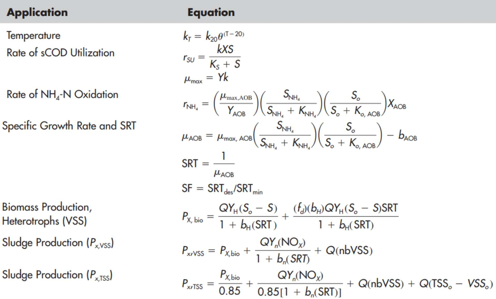
  - **Hình này chứng minh điều gì**
    - Xác lập hệ phương trình chuẩn hóa để tính toán sinh trưởng vi sinh vật và sản lượng bùn.
    - Cung cấp mô hình toán học cho cả phân hủy chất hữu cơ và oxy hóa amoni.
  - **Từ đâu mà thấy được**
    - Công thức tốc độ sử dụng cơ chất $r_{SU}$, tốc độ oxy hóa amoni $r_{NH_4}$, và sản lượng bùn $P_{X, TSS}$.
    - Quan hệ hiệu chỉnh nhiệt độ $k_T = k_{20}\theta^{(T-20)}$ và hệ số an toàn thiết kế $SF$.

---

###### Phương trình cân bằng vật chất bể phản ứng và nhu cầu oxy (Reactor Mass Balance and Oxygen Requirements)
- Khối lượng chất rắn trong bể và thể tích bể aerotank xáo trộn hoàn toàn:
  - Khối lượng chất rắn bay hơi ($Mass_{VSS}$) và tổng chất rắn lơ lửng ($Mass_{TSS}$) tích lũy trong bể phản ứng:
    $$Mass_{VSS} = X_{VSS} \cdot V = (P_{X, VSS}) \cdot SRT$$
    $$Mass_{TSS} = X_{TSS} \cdot V = (P_{X, TSS}) \cdot SRT$$
  - Thể tích công tác hữu ích của bể aerotank ($V$):
    $$V = \frac{(P_{X, TSS}) \cdot SRT}{X_{TSS}}$$
  - Trong đó $X_{TSS}$ là nồng độ bùn hoạt tính hỗn hợp thiết kế ($MLSS$, $\text{g/m}^3$ hoặc $\text{mg/L}$).
- Thời gian lưu bùn ($SRT$ - Solids Retention Time hay $\theta_c$):
  - Phương trình tổng quát định nghĩa thời gian lưu bùn của hệ thống aerotank có bể lắng đợt 2:
    $$SRT = \frac{V X}{(Q - Q_w) X_e + Q_w X_R}$$
  - Trong đó $Q_w$ là lưu lượng xả bùn hoạt tính dư hàng ngày ($\text{m}^3/\text{d}$).
  - $X_e$ và $X_R$ lần lượt là nồng độ bùn lơ lửng trong nước sau lắng và trong bùn lắng tuần hoàn ($RAS$).
  - Khi bùn dư được xả trực tiếp từ bể phản ứng xáo trộn hoàn toàn ($X_w = X$) và bỏ qua bùn thất thoát đầu ra ($X_e \approx 0$):
    $$SRT = \frac{V}{Q_w}$$
  - Khi tính toán cho hệ thống tích hợp các phân vùng phản ứng và màng lọc:
    $$SRT = \frac{\left(\frac{R}{1 + R}\right) V_A + V_M}{Q_w}$$
- Nồng độ cơ chất $bsCOD$ hòa tan còn lại trong nước thải sau xử lý của bể CMAS ($S$):
  - Phương trình xác định $S$ độc lập với nồng độ cơ chất đầu vào $S_o$:
    $$S = \frac{K_s [1 + b_H(SRT)]}{SRT(Y_H k - b_H) - 1}$$
  - Nồng độ chất ô nhiễm hòa tan đầu ra chỉ phụ thuộc vào thời gian lưu bùn $SRT$ và các hệ số động học sinh học.
- Nồng độ sinh khối vi sinh vật trong bể phản ứng CMAS ($X$):
  - Phương trình liên hệ sinh khối với thời gian lưu nước thủy lực ($\tau = HRT = V/Q$):
    $$X = \left(\frac{SRT}{\tau}\right) \left[\frac{Y_H (S_o - S)}{1 + b_H(SRT)}\right]$$
- Nhu cầu tiêu thụ oxy thực tế hàng ngày của bể CMAS ($R_o$ hay $AOTR$):
  - Phương trình cân bằng oxy bao gồm oxy hóa cacbon hữu cơ và oxy hóa nitơ amoni:
    $$R_o = Q(S_o - S) - 1.42 P_{X, bio} + 4.57 Q (NO_x)$$
  - Hệ số $1.42$ là đương lượng oxy hóa lý thuyết của tế bào vi sinh vật ($\text{g } O_2/\text{g VSS}$).
  - Hệ số $4.57$ biểu thị khối lượng oxy lý thuyết tiêu tốn để oxy hóa hoàn toàn một đơn vị nitơ amoni thành nitrat ($\text{g } O_2/\text{g } NH_4\text{-N}$).
  - Lượng amoni bị oxy hóa trong hệ thống ($NO_x$):
    $$NO_x = TKN_o - N_e - 0.12 \frac{P_{X, bio}}{Q}$$
  - Giá trị $0.12$ là hàm lượng nitơ đồng hóa trực tiếp vào cấu trúc tế bào vi khuẩn mới sinh ($\text{g N/g VSS}$).
  - $N_e$ là nồng độ nitơ hòa tan không bị oxy hóa thoát ra theo dòng nước sau xử lý ($\text{g N/m}^3$).
- Các chỉ tiêu tải trọng công nghệ cơ bản của bể bùn hoạt tính:
  - Tỷ số thức ăn trên vi sinh vật ($F/M$ - Food to Mass ratio):
    $$F/M = \frac{Q S_o}{V X}$$
  - Tải trọng thể tích chất hữu cơ ($L_{org}$ - Volumetric Organic Loading Rate):
    $$L_{org} = \frac{Q S_o}{V}$$
  - **Hình 14.** Bảng tóm tắt các phương trình tính khối lượng bùn, thể tích bể và nhu cầu oxy CMAS
    - 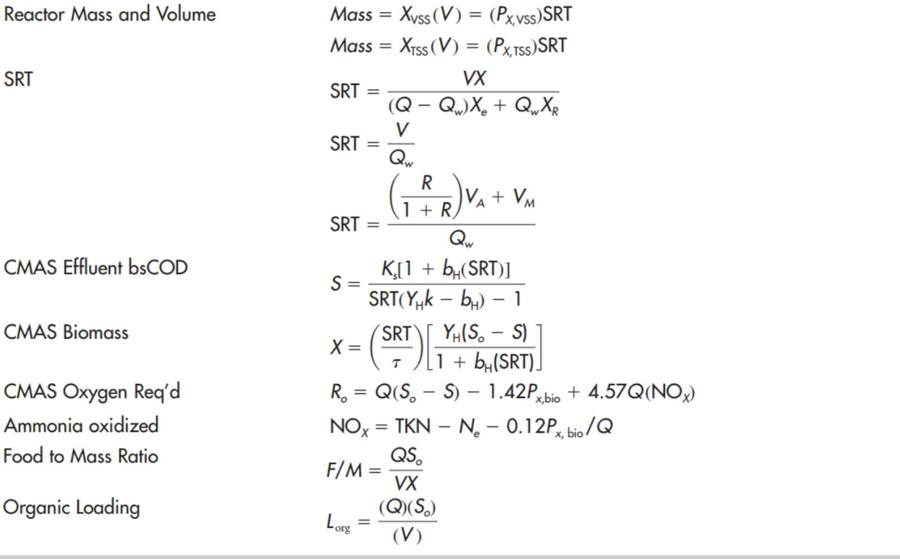
  - **Hình này chứng minh điều gì**
    - Xác lập công thức tính thể tích phản ứng $V$, cơ chất đầu ra $S$, và nhu cầu oxy $R_o$.
    - Định lượng các chỉ số tải trọng công nghệ $F/M$ và $L_{org}$ cho bể CMAS.
  - **Từ đâu mà thấy được**
    - Biểu thức $Mass = X(V) = (P_X)SRT$ xác định trực tiếp thể tích bể aerotank.
    - Công thức $R_o = Q(S_o - S) - 1.42P_{X, bio} + 4.57Q(NO_x)$ xác định tổng lượng oxy cần cấp.

---

##### 2.2 Hệ số động học thiết kế bùn hoạt tính ở 20°C (Activated Sludge Design Kinetic Coefficients at 20°C)

###### Thông số động học phân hủy COD và nitrat hóa (Kinetic Coefficients for Carbon Oxidation and Nitrification)
- Vi khuẩn dị dưỡng oxy hóa chất hữu cơ cacbon ($COD\text{ oxidation}$) đặc trưng bởi tốc độ sinh trưởng nhanh và sinh khối bùn phát sinh lớn:
  - Tốc độ sinh trưởng riêng cực đại ở $20^\circ\text{C}$: $\mu_{\max} = 6.0\text{ g VSS/g VSS}\cdot\text{d}$ ($\text{d}^{-1}$).
  - Hằng số ái lực nửa bão hòa: $K_s = 8.0\text{ mg/L}$ ($bsCOD$).
  - Hệ số sản lượng sinh khối: $Y = 0.45\text{ g VSS/g bCOD}$.
  - Hệ số phân hủy nội bào: $b = 0.12\text{ g VSS/g VSS}\cdot\text{d}$ ($\text{d}^{-1}$).
  - Phần cặn nội bào không phân hủy sinh học: $f_d = 0.15$ (không thứ nguyên).
  - Hằng số ái lực oxy hòa tan: $K_{O_2} = 0.20\text{ mg/L}$.
- Vi khuẩn tự dưỡng oxy hóa amoni thành nitrit ($AOB$ - Ammonia Oxidation) là bước khống chế tốc độ trong toàn bộ chuỗi nitrat hóa:
  - Tốc độ sinh trưởng riêng cực đại ở $20^\circ\text{C}$: $\mu_{\max, AOB} = 0.90\text{ g VSS/g VSS}\cdot\text{d}$ ($\text{d}^{-1}$).
  - Hằng số ái lực amoni: $K_{NH_4} = 0.50\text{ mg/L}$.
  - Hệ số sản lượng sinh khối tự dưỡng: $Y_{AOB} = 0.15\text{ g VSS/g } NH_4\text{-N}$.
  - Hệ số phân hủy nội bào: $b_{AOB} = 0.17\text{ g VSS/g VSS}\cdot\text{d}$ ($\text{d}^{-1}$).
  - Hằng số ái lực oxy hòa tan: $K_{o, AOB} = 0.50\text{ mg/L}$.
- Vi khuẩn tự dưỡng oxy hóa nitrit thành nitrat ($NOB$ - Nitrite Oxidation) có tốc độ sinh trưởng cao hơn vi khuẩn $AOB$, ngăn ngừa tích tụ nitrit độc hại trong điều kiện bình thường:
  - Tốc độ sinh trưởng riêng cực đại ở $20^\circ\text{C}$: $\mu_{\max, NOB} = 1.0\text{ g VSS/g VSS}\cdot\text{d}$ ($\text{d}^{-1}$).
  - Hằng số ái lực nitrit: $K_{NO_2} = 0.20\text{ mg/L}$.
  - Hệ số sản lượng sinh khối: $Y_{NOB} = 0.05\text{ g VSS/g } NO_2\text{-N}$.
  - Hệ số phân hủy nội bào: $b_{NOB} = 0.17\text{ g VSS/g VSS}\cdot\text{d}$ ($\text{d}^{-1}$).
  - Hằng số ái lực oxy hòa tan: $K_{O_2} = 0.90\text{ mg/L}$.
- Hệ số hiệu chỉnh nhiệt độ $\theta$ quy chuẩn các thông số động học từ điều kiện tiêu chuẩn $20^\circ\text{C}$ sang nhiệt độ vận hành thực tế:
  - Đối với quá trình khử $COD$: $\theta_{\mu} = 1.07$, $\theta_b = 1.04$, $\theta_{K} = 1.0$.
  - Đối với vi khuẩn oxy hóa $\text{NH}_4$: $\theta_{\mu} = 1.072$, $\theta_b = 1.029$, $\theta_{K} = 1.0$.
  - Đối với vi khuẩn oxy hóa $\text{NO}_2$: $\theta_{\mu} = 1.063$, $\theta_b = 1.029$, $\theta_{K} = 1.0$.
  - **Hình 15.** Bảng hệ số động học thiết kế bùn hoạt tính cho quá trình khử BOD và nitrat hóa ở 20°C
    - 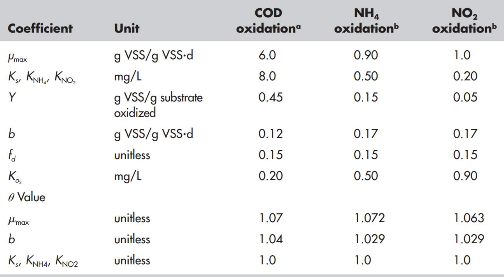
  - **Hình này chứng minh điều gì**
    - Cung cấp đầy đủ giá trị hệ số thực nghiệm cho vi khuẩn dị dưỡng và tự dưỡng ở $20^\circ\text{C}$.
    - Quy định hệ số nhiệt độ $\theta$ để chuẩn hóa các thông số về nhiệt độ làm việc thực tế.
  - **Từ đâu mà thấy được**
    - Cột COD oxidation cho vi khuẩn dị dưỡng ($\mu_{\max}=6.0\text{ d}^{-1}, Y=0.45, b=0.12\text{ d}^{-1}$).
    - Các cột $\text{NH}_4$ và $\text{NO}_2$ oxidation cho vi khuẩn nitrat hóa autotrophs.

---

###### Bảng thông số hệ số động học thiết kế chuẩn (Standard Design Kinetic Coefficients Table)
- Bảng tổng hợp các hệ số động học quá trình bùn hoạt tính hiếu khí ở $20^\circ\text{C}$:

| Thông số động học (Coefficient) | Đơn vị tính (Unit) | Oxy hóa COD (COD oxidation)$^a$ | Oxy hóa $\text{NH}_4$ ($\text{NH}_4$ oxidation)$^b$ | Oxy hóa $\text{NO}_2$ ($\text{NO}_2$ oxidation)$^b$ |
| :--- | :--- | :--- | :--- | :--- |
| **$\mu_{\max}$** | $\text{g VSS/g VSS}\cdot\text{d}$ ($\text{d}^{-1}$) | $6.0$ | $0.90$ | $1.0$ |
| **$K_s, K_{NH_4}, K_{NO_2}$** | $\text{mg/L}$ ($\text{g/m}^3$) | $8.0$ | $0.50$ | $0.20$ |
| **$Y$** | $\text{g VSS/g substrate oxidized}$ | $0.45$ | $0.15$ | $0.05$ |
| **$b$** | $\text{g VSS/g VSS}\cdot\text{d}$ ($\text{d}^{-1}$) | $0.12$ | $0.17$ | $0.17$ |
| **$f_d$** | Không thứ nguyên (unitless) | $0.15$ | $0.15$ | $0.15$ |
| **$K_{O_2}$** | $\text{mg/L}$ | $0.20$ | $0.50$ | $0.90$ |
| **Hệ số hiệu chỉnh nhiệt độ $\theta$** | | | | |
| - $\mu_{\max}$ | Không thứ nguyên | $1.07$ | $1.072$ | $1.063$ |
| - $b$ | Không thứ nguyên | $1.04$ | $1.029$ | $1.029$ |
| - $K_s, K_{NH_4}, K_{NO_2}$ | Không thứ nguyên | $1.0$ | $1.0$ | $1.0$ |

- Ghi chú phân loại vi sinh vật:
  - $^a$: Nhóm vi khuẩn dị dưỡng hiếu khí phân hủy hợp chất hữu cơ hòa tan dễ hấp thụ ($bsCOD$).
  - $^b$: Nhóm vi khuẩn tự dưỡng hiếu khí oxy hóa các hợp chất nitơ vô cơ trong chu trình nitrat hóa.

---

##### 2.3 Quy trình tính toán thiết kế công nghệ bùn hoạt tính (Activated Sludge Design Computation Approach)

###### Trình tự 18 bước thiết kế hệ thống CMAS (18-Step Systematic Design Procedure)
- Trình tự thiết kế công nghệ bùn hoạt tính hiếu khí tuân thủ 18 bước tiêu chuẩn kỹ thuật nghiêm ngặt:
  - Bước 1: Thu thập đầy đủ số liệu phân tích đặc trưng nước thải đầu vào ($\text{Flowrate } Q, BOD, COD, sCOD, rbCOD, TSS, VSS, TKN, NH_4\text{-N}, TP, \text{Alkalinity}$).
  - Bước 2: Xác định các tiêu chuẩn nước sau xử lý theo quy chuẩn môi trường ($\text{Effluent requirements: } NH_4\text{-N}_e, TSS_e, BOD_e$).
  - Bước 3: Lựa chọn hệ số an toàn nitrat hóa ($SF$) phù hợp cho tuổi bùn thiết kế dựa trên tỷ số tải trọng đỉnh/trung bình của $TKN$ ($SF = 1.3 - 2.0$).
  - Bước 4: Lựa chọn nồng độ oxy hòa tan tối thiểu duy trì trong bể aerotank ($DO \ge 2.0\text{ mg/L}$ được khuyến cáo bắt buộc cho quá trình nitrat hóa).
  - Bước 5: Xác định tốc độ sinh trưởng riêng cực đại của vi khuẩn nitrat hóa ($\mu_{\max}$) hiệu chỉnh theo nhiệt độ vận hành và nồng độ $DO$, đồng thời xác định $K_n$.
  - Bước 6: Xác định tốc độ sinh trưởng riêng thực $\mu$ và thời gian lưu bùn $SRT$ tương ứng nhằm đạt mục tiêu nồng độ amoni đầu ra $NH_4\text{-N}_e$.
  - Bước 7: Xác định tuổi bùn thiết kế ($SRT_{des}$) bằng cách nhân hệ số an toàn $SF$ vào $SRT$ tính được ở Bước 6.
  - Bước 8: Tính toán sản lượng sinh khối vi sinh vật phát sinh hàng ngày ($P_{X, bio}$).
  - Bước 9: Thiết lập cân bằng nitơ để xác định $NO_x$ - nồng độ nitơ amoni bị oxy hóa thành nitrat.
  - Bước 10: Tính toán tổng khối lượng bùn hữu cơ ($VSS\text{ mass}$) và tổng khối lượng bùn cặn khô ($TSS\text{ mass}$) tích lũy trong bể aerotank.
  - Bước 11: Lựa chọn nồng độ bùn hoạt tính thiết kế ($MLSS$) và xác định thể tích hữu ích của bể aerotank ($V$) cùng thời gian lưu nước thủy lực ($HRT$).
  - Bước 12: Xác định tổng sản lượng bùn cặn xả bỏ hàng ngày ($P_{X, TSS}$) và hệ số sản lượng bùn quan sát thực tế ($Y_{obs}$).
  - Bước 13: Tính toán nhu cầu tiêu thụ oxy thực tế hàng ngày ($R_o$ hay $AOTR$).
  - Bước 14: Tính toán thiết kế hệ thống cấp khí phân phối bọt khí đáy bể (bố trí đĩa bọt mịn, xác định lưu lượng khí $Q_{air}$ và áp lực quạt thổi khí).
  - Bước 15: Kiểm toán cân bằng độ kiềm và xác định nhu cầu hóa chất kiềm cần châm bổ sung nếu xảy ra thiếu hụt.
  - Bước 16: Thiết kế công trình lắng đợt 2 (tải trọng thủy lực bề mặt $SOR$, tải trọng chất rắn $SLR$, và chiều sâu lắng).
  - Bước 17: Tổng kết đánh giá chất lượng nước đầu ra dự kiến của toàn trạm xử lý.
  - Bước 18: Lập bảng thông số thiết kế tổng hợp đầy đủ bàn giao thi công và vận hành.
  - **Hình 16.** Sơ đồ 18 bước tính toán thiết kế quy trình bùn hoạt tính hiếu khí
    - 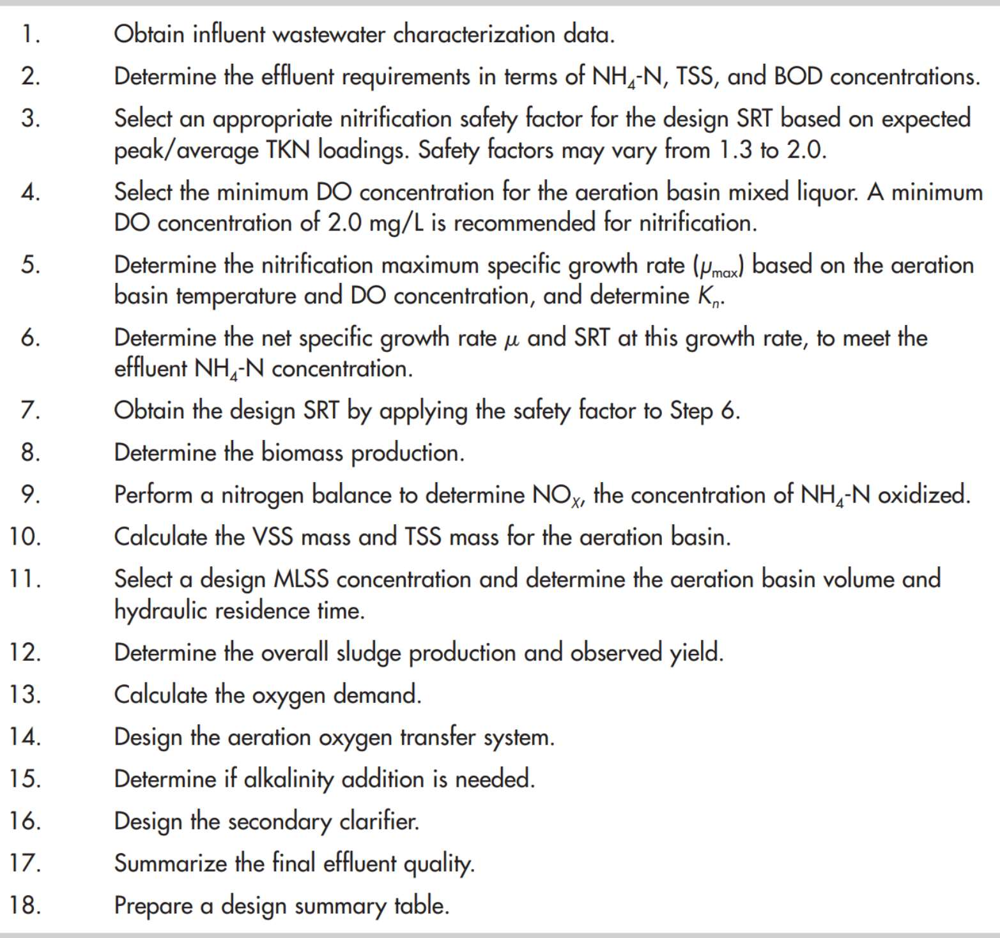
  - **Hình này chứng minh điều gì**
    - Quy trình tính toán kỹ thuật gồm 18 bước tuần tự từ số liệu đầu vào đến bảng tổng hợp thiết kế.
    - Tích hợp kiểm tra đồng thời cả hiệu quả xử lý cơ chất, nitrat hóa, và nhu cầu sục khí.
  - **Từ đâu mà thấy được**
    - Danh mục 18 bước liệt kê từ Step 1 (đặc trưng nước thải) đến Step 18 (bảng thiết kế tổng kết).
    - Bước 3 quy định hệ số an toàn $SF = 1.3 - 2.0$ và Bước 4 quy định $DO \ge 2.0\text{ mg/L}$.

---

##### 2.4 Ví dụ 1: Tính toán thiết kế bể CMAS chỉ khử BOD (Example 1: CMAS Design for BOD Removal Only)

###### Đề bài và đặc trưng nước thải đầu vào (Problem Statement and Influent Wastewater Characteristics)
- Yêu cầu thiết kế: Tính toán bể bùn hoạt tính xáo trộn hoàn toàn ($CMAS$) chỉ phục vụ mục đích khử $BOD$, không yêu cầu nitrat hóa.
  - Lưu lượng nước thải sinh hoạt thiết kế: $Q = 22,700\text{ m}^3/\text{d}$.
  - Yêu cầu chất lượng nước sau lắng: $BOD_e \le 30\text{ g/m}^3$ ($\text{mg/L}$), $TSS_e \le 15\text{ g/m}^3$ ($\text{mg/L}$).
- Điều kiện thiết kế công nghệ và hiện trường:
  - Nhiệt độ nước thải mùa đông thiết kế: $T = 12^\circ\text{C}$.
  - Tuổi bùn vận hành cho mục đích khử $BOD$: $SRT = 5\text{ ngày}$.
  - Nồng độ bùn hoạt tính thiết kế trong bể aerotank: $MLSS = X_{TSS} = 3000\text{ g/m}^3$ ($3000\text{ mg/L}$).
  - Chiều sâu mức nước công tác bể aerotank: $H_{tank} = 4.9\text{ m}$.
  - Chiều sâu ngập nước của đĩa phân phối khí: $D_f = 4.4\text{ m}$.
  - Nồng độ oxy hòa tan duy trì trong bể: $DO = C = 2.0\text{ g/m}^3$ ($2.0\text{ mg/L}$).
  - Cao độ vị trí xây dựng trạm so với mực nước biển: $Alt = 500\text{ m}$.
  - Các hệ số chuyển khối cấp khí: $\alpha = 0.50$, $\beta = 0.95$, hệ số bẩn của đĩa khí $F = 0.90$.
  - **Hình 17.** Bảng đặc trưng nước thải đầu vào phục vụ tính toán thiết kế bể aerotank
    - 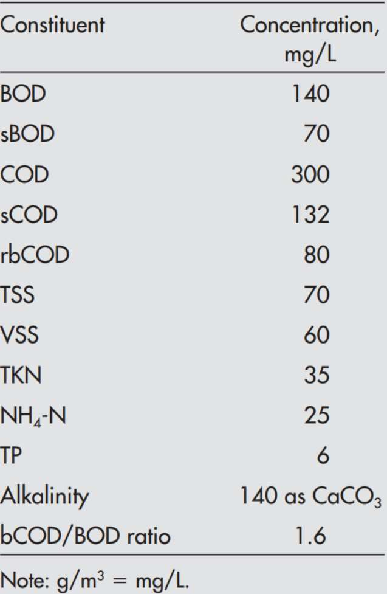
  - **Hình này chứng minh điều gì**
    - Cung cấp toàn bộ thông số phân tích hóa lý đầu vào của trạm xử lý nước thải.
    - Làm căn cứ thiết kế định lượng cho Ví dụ 1 và Ví dụ 2.
  - **Từ đâu mà thấy được**
    - Bảng liệt kê chi tiết: $\text{BOD}=140\text{ mg/L}$, $\text{COD}=300\text{ mg/L}$, $\text{TSS}=70\text{ mg/L}$, $\text{TKN}=35\text{ mg/L}$.
    - Tỷ số $\text{bCOD/BOD} = 1.6$ và ghi chú tương đương đơn vị $\text{g/m}^3 = \text{mg/L}$.

---

###### Bài tập Ví dụ 1: Tính toán thiết kế bể CMAS chỉ khử BOD (Example 1)
- **Căn cứ:**
  - Lưu lượng nước thải sinh hoạt $Q = 22,700\text{ m}^3/\text{d}$.
  - Đặc tính nước thải từ Hình 17: $BOD = 140\text{ mg/L}$, $sBOD = 70\text{ mg/L}$, $COD = 300\text{ mg/L}$, $sCOD = 132\text{ mg/L}$, $rbCOD = 80\text{ mg/L}$, $TSS_o = 70\text{ mg/L}$, $VSS_o = 60\text{ mg/L}$, $TKN = 35\text{ mg/L}$, tỷ số $bCOD/BOD = 1.6$.
  - Nồng độ cơ chất $bCOD$ phân hủy sinh học đầu vào:
    $$S_o = 1.6 \times 140 = 224\text{ g/m}^3$$
  - Nồng độ $bsCOD$ hòa tan đầu vào:
    $$bsCOD_o = 1.6 \times sBOD = 1.6 \times 70 = 112\text{ g/m}^3$$
  - Nồng độ $sCOD$ hòa tan không phân hủy sinh học ($nbSCOD$):
    $$nbSCOD = sCOD - bsCOD_o = 132 - 112 = 20\text{ g/m}^3$$
  - Nồng độ $VSS$ không phân hủy sinh học đầu vào ($nbVSS$):
    $$nbVSS = \frac{COD - bCOD - nbSCOD}{1.42} = \frac{300 - 224 - 20}{1.42} = \frac{56}{1.42} = 39.44\text{ g/m}^3$$
  - Nồng độ chất rắn lơ lửng vô cơ đầu vào ($iSS_o$):
    $$iSS_o = TSS_o - VSS_o = 70 - 60 = 10\text{ g/m}^3$$
  - Tiêu chuẩn nước sau lắng: $BOD_e \le 30\text{ g/m}^3$, $TSS_e \le 15\text{ g/m}^3$.
  - Điều kiện vận hành: $T = 12^\circ\text{C}$, $SRT = 5\text{ d}$, $MLSS = X_{TSS} = 3000\text{ g/m}^3$, $DO = 2.0\text{ mg/L}$, đĩa phân phối bọt mịn đặt sâu $D_f = 4.4\text{ m}$, cao độ $500\text{ m}$, $\alpha = 0.50$, $\beta = 0.95$, $F = 0.90$.
- **Nhìn vào:**
  - Bảng hệ số động học vi sinh vật dị dưỡng ở $20^\circ\text{C}$ từ Hình 15: $\mu_{\max, 20} = 6.0\text{ d}^{-1}$, $K_{s, 20} = 8.0\text{ mg/L}$, $Y_H = 0.45\text{ g VSS/g bCOD}$, $b_{H, 20} = 0.12\text{ d}^{-1}$, $f_d = 0.15$, hệ số nhiệt độ $\theta_{\mu} = 1.07$, $\theta_b = 1.04$.
  - Hệ phương trình thiết kế bùn hoạt tính sinh trưởng lơ lửng từ Hình 13 và Hình 14.
  - Các bước tính toán kỹ thuật tuần tự:
    - Bước 1: Hiệu chỉnh các hệ số động học vi sinh vật dị dưỡng ở nhiệt độ thiết kế $12^\circ\text{C}$:
      - Tốc độ sinh trưởng riêng cực đại ở $12^\circ\text{C}$:
        $$\mu_{\max, 12} = \mu_{\max, 20} \cdot (1.07)^{12 - 20} = 6.0 \cdot (1.07)^{-8} = 6.0 \cdot 0.5820 = 3.492\text{ d}^{-1}$$
      - Tốc độ sử dụng cơ chất cực đại:
        $$k_{12} = \frac{\mu_{\max, 12}}{Y_H} = \frac{3.492}{0.45} = 7.76\text{ g bCOD/g VSS}\cdot\text{d}$$
      - Hệ số phân hủy nội bào ở $12^\circ\text{C}$:
        $$b_{H, 12} = b_{H, 20} \cdot (1.04)^{12 - 20} = 0.12 \cdot (1.04)^{-8} = 0.12 \cdot 0.7307 = 0.0877\text{ d}^{-1}$$
      - Hằng số nửa tốc độ ở $12^\circ\text{C}$:
        $$K_{s, 12} = K_{s, 20} \cdot (1.0)^{12 - 20} = 8.0\text{ g/m}^3$$
    - Bước 2: Xác định nồng độ cơ chất hòa tan đầu ra $S$ và kiểm toán $BOD_e$:
      - Nồng độ $bsCOD$ hòa tan trong dung dịch xáo trộn sau xử lý ($S$):
        $$S = \frac{K_s [1 + b_H(SRT)]}{SRT(Y_H k - b_H) - 1} = \frac{8.0 \cdot [1 + 0.0877 \times 5]}{5 \cdot (3.492 - 0.0877) - 1}$$
        $$S = \frac{8.0 \cdot 1.4385}{5 \cdot 3.4043 - 1} = \frac{11.508}{16.0215} = 0.72\text{ g/m}^3$$
      - Nồng độ $BOD$ hòa tan trong nước sau xử lý ($sBOD_e$):
        $$sBOD_e = \frac{S}{1.6} = \frac{0.72}{1.6} = 0.45\text{ g/m}^3$$
      - Nồng độ $BOD$ hạt sinh ra từ bùn lơ lửng thoát ra ($TSS_e = 15\text{ g/m}^3$):
        $$VSS_e = 0.85 \times TSS_e = 0.85 \times 15 = 12.75\text{ g/m}^3$$
        $$BOD_{p, e} \approx 0.68 \times VSS_e = 0.68 \times 12.75 = 8.67\text{ g/m}^3$$
      - Tổng $BOD_e$ đầu ra của trạm xử lý:
        $$BOD_e = sBOD_e + BOD_{p, e} = 0.45 + 8.67 = 9.12\text{ g/m}^3 \le 30\text{ g/m}^3 \quad (\text{Đạt yêu cầu thiết kế})$$
    - Bước 3: Tính toán sản lượng bùn sinh học và tổng sản lượng bùn xả bỏ:
      - Khối lượng $bCOD$ bị khử qua bể:
        $$S_o - S = 224 - 0.72 = 223.28\text{ g/m}^3$$
      - Khối lượng sinh khối dị dưỡng phát sinh ($P_{X, bio}$):
        $$P_{X, bio} = \frac{Q Y_H (S_o - S) [1 + f_d b_H SRT]}{1 + b_H SRT}$$
        $$Q Y_H (S_o - S) = 22,700 \cdot 0.45 \cdot 223.28 = 2,280,789\text{ g/d} = 2280.8\text{ kg/d}$$
        $$1 + b_H SRT = 1 + 0.0877 \times 5 = 1.4385$$
        $$1 + f_d b_H SRT = 1 + 0.15 \times 0.0877 \times 5 = 1.0658$$
        $$P_{X, bio} = 2280.8 \cdot \frac{1.0658}{1.4385} = 1689.8\text{ kg VSS/d}$$
      - Do hệ thống không nitrat hóa ($NO_x = 0$), tổng lượng bùn hữu cơ xả bỏ ($P_{X, VSS}$):
        $$P_{X, VSS} = P_{X, bio} + Q \cdot (nbVSS) = 1689.8 + 22,700 \cdot 39.44 \cdot 10^{-3} = 1689.8 + 895.3 = 2585.1\text{ kg VSS/d}$$
      - Tổng sản lượng bùn cặn khô xả bỏ hàng ngày ($P_{X, TSS}$):
        $$P_{X, TSS} = \frac{P_{X, bio}}{0.85} + Q \cdot (nbVSS) + Q \cdot (iSS_o)$$
        $$P_{X, TSS} = \frac{1689.8}{0.85} + 895.3 + 22,700 \cdot 10 \cdot 10^{-3} = 1988.0 + 895.3 + 227.0 = 3110.3\text{ kg TSS/d}$$
      - Hệ số sản lượng bùn quan sát thực tế ($Y_{obs}$):
        $$Y_{obs, TSS} = \frac{P_{X, TSS}}{Q(BOD_o - BOD_e)} = \frac{3110.3}{22,700 \cdot (140 - 9.12) \cdot 10^{-3}} = \frac{3110.3}{2971.0} = 1.05\text{ kg TSS/kg BOD}$$
    - Bước 4: Tính toán thể tích bể aerotank và thời gian lưu nước thủy lực ($HRT$):
      - Khối lượng bùn khô duy trì trong bể phản ứng:
        $$Mass_{TSS} = (P_{X, TSS}) \cdot SRT = 3110.3 \cdot 5 = 15,551.5\text{ kg TSS}$$
      - Thể tích công tác hữu ích của bể aerotank ($V$):
        $$V = \frac{Mass_{TSS}}{X_{TSS}} = \frac{15,551.5\text{ kg}}{3.0\text{ kg/m}^3} = 5183.8\text{ m}^3 \approx 5184\text{ m}^3$$
      - Thời gian lưu nước thủy lực ($HRT = \tau$):
        $$\tau = \frac{V}{Q} = \frac{5184}{22,700} = 0.228\text{ d} = 5.48\text{ h}$$
      - Tỷ số $F/M$ theo $MLVSS$ (với $MLVSS/MLSS \approx P_{X, VSS}/P_{X, TSS} = 2585.1/3110.3 = 0.83$):
        $$X_{VSS} = 0.83 \times 3000 = 2490\text{ g/m}^3$$
        $$F/M = \frac{Q S_{o, BOD}}{V X_{VSS}} = \frac{22,700 \cdot 140}{5184 \cdot 2490} = 0.246\text{ kg BOD/kg MLVSS}\cdot\text{d} \quad (0.2 - 0.6 \text{ nằm trong dải chuẩn CMAS})$$
      - Tải trọng thể tích chất hữu cơ ($OLR$):
        $$OLR = \frac{Q S_{o, BOD}}{V} = \frac{22,700 \cdot 140 \cdot 10^{-3}}{5184} = 0.613\text{ kg BOD/m}^3\cdot\text{d}$$
    - Bước 5: Tính toán nhu cầu oxy thực tế ($R_o / AOTR$):
      - Nhu cầu tiêu thụ oxy thực tế hàng ngày chỉ phục vụ khử cacbon hữu cơ ($NO_x = 0$):
        $$R_o = Q(S_o - S) - 1.42 P_{X, bio}$$
        $$Q(S_o - S) = 22,700 \cdot 223.28 \cdot 10^{-3} = 5068.5\text{ kg } O_2/\text{d}$$
        $$1.42 P_{X, bio} = 1.42 \cdot 1689.8 = 2399.5\text{ kg } O_2/\text{d}$$
        $$R_o = AOTR = 5068.5 - 2399.5 = 2669.0\text{ kg } O_2/\text{d} = 111.2\text{ kg } O_2/\text{h}$$
    - Bước 6: Tính toán nhu cầu cấp khí chuẩn ($SOTR$) và lưu lượng khí qua hệ thống đĩa phân phối bọt mịn:
      - Nồng độ oxy hòa tan bão hòa ở mực nước biển tại $20^\circ\text{C}$: $C_{s, 20} = 9.09\text{ mg/L}$; tại $12^\circ\text{C}$: $C_{s, 12} = 10.77\text{ mg/L}$.
      - Tỷ số áp suất khí quyển ở cao độ $500\text{ m}$:
        $$\frac{P_b}{P_a} \approx 1 - \frac{500}{9450} = 0.947$$
      - Nồng độ oxy bão hòa trung bình trong bể có đĩa khí ngập sâu $D_f = 4.4\text{ m}$:
        $$P_d = P_b + \gamma_{water} D_f = 0.947 \times 101.325 + 9.81 \times 4.4 = 95.95 + 43.16 = 139.11\text{ kPa}$$
        $$C_{\infty, 12}^* = C_{s, 12} \left(\frac{P_d}{P_a}\right) \cdot \frac{1 + O_t / 42}{2} \approx 10.77 \cdot 0.947 \cdot \left(1 + \frac{4.4}{2 \times 10.33}\right) \approx 12.38\text{ mg/L}$$
        $$C_{\infty, 20}^* \approx 9.09 \cdot \left(1 + \frac{4.4}{2 \times 10.33}\right) \approx 11.02\text{ mg/L}$$
      - Chuyển đổi $AOTR$ sang tốc độ truyền oxy tiêu chuẩn ($SOTR$):
        $$SOTR = \frac{AOTR}{\alpha F \theta^{T - 20} \left( \frac{\beta C_{\infty, 12}^*}{C_{\infty, 20}^*} - \frac{C}{C_{\infty, 20}^*} \right)}$$
        $$\beta C_{\infty, 12}^* = 0.95 \times 12.38 = 11.76\text{ mg/L}$$
        $$\frac{\beta C_{\infty, 12}^* - C}{C_{\infty, 20}^*} = \frac{11.76 - 2.0}{11.02} = \frac{9.76}{11.02} = 0.886$$
        $$\alpha F \theta^{12 - 20} = 0.50 \cdot 0.90 \cdot (1.024)^{-8} = 0.45 \cdot 0.8267 = 0.372$$
        $$SOTR = \frac{2669.0}{0.372 \cdot 0.886} = \frac{2669.0}{0.3296} = 8097.7\text{ kg } O_2/\text{d} = 337.4\text{ kg } O_2/\text{h}$$
      - Lưu lượng không khí cấp qua hệ thống đĩa bọt mịn với hiệu suất truyền oxy $OTE = 30\%$, khối lượng riêng không khí $\rho_{air} = 1.20\text{ kg/m}^3$, phần khối lượng oxy trong không khí $0.232$:
        $$Q_{air} = \frac{SOTR}{OTE \cdot \rho_{air} \cdot 0.232} = \frac{337.4}{0.30 \cdot 1.20 \cdot 0.232} = \frac{337.4}{0.08352} = 4040\text{ m}^3\text{ khí/h} = 67.3\text{ m}^3/\text{phút}$$

---

##### 2.5 Ví dụ 2: Tính toán thiết kế bể CMAS khử BOD kết hợp Nitrat hóa (Example 2: CMAS Design for BOD Removal and Nitrification)

###### Đề bài và điều kiện thiết kế bổ sung (Problem Statement and Additional Nitrification Criteria)
- Mục tiêu công nghệ: Thiết kế bể bùn hoạt tính xáo trộn hoàn toàn ($CMAS$) thực hiện đồng thời khử chất hữu cơ ($BOD$) và nitrat hóa triệt để amoni.
  - Số liệu nước thải đầu vào, nhiệt độ, cao độ, chiều sâu bể aerotank và vị trí đĩa khí giữ nguyên như Ví dụ 1.
  - Chỉ tiêu nước sau xử lý bổ sung nghiêm ngặt: Nồng độ amoni hòa tan đầu ra $NH_4\text{-N}_e \le 0.5\text{ g/m}^3$ ($0.5\text{ mg/L}$).
  - Hệ số sục khí chuyển khối hiệu chỉnh: $\alpha = 0.65$ (tăng từ $0.50$ lên $0.65$ nhờ thời gian lưu bùn dài hơn làm suy giảm nồng độ các chất hoạt động bề mặt tạo bọt).
  - Điều kiện kỹ thuật bắt buộc: Tuổi bùn vận hành ($SRT$) phải được tính toán và lựa chọn lại dựa trên động học sinh trưởng của vi khuẩn nitrat hóa để chống hiện tượng rửa trôi vi sinh vật.

---

###### Bài tập Ví dụ 2: Tính toán thiết kế bể CMAS khử BOD kết hợp Nitrat hóa (Example 2)
- **Căn cứ:**
  - Lưu lượng nước thải $Q = 22,700\text{ m}^3/\text{d}$, $BOD = 140\text{ mg/L}$, $bCOD_o = 224\text{ g/m}^3$, $TKN = 35\text{ mg/L}$, $NH_4\text{-N} = 25\text{ mg/L}$, $\text{Alkalinity} = 140\text{ mg/L as } CaCO_3$.
  - Tiêu chuẩn nước đầu ra: $BOD_e \le 30\text{ mg/L}$, $TSS_e \le 15\text{ mg/L}$, $NH_4\text{-N}_e \le 0.5\text{ mg/L}$.
  - Điều kiện vận hành: $T = 12^\circ\text{C}$, $DO = 2.0\text{ mg/L}$, $MLSS = X_{TSS} = 3000\text{ g/m}^3$, $H_{tank} = 4.9\text{ m}$, $D_f = 4.4\text{ m}$, cao độ $500\text{ m}$, $\alpha = 0.65$, $\beta = 0.95$, $F = 0.90$.
- **Nhìn vào:**
  - Bảng hệ số động học oxy hóa $\text{NH}_4$ của vi khuẩn $AOB$ ở $20^\circ\text{C}$ từ Hình 15: $\mu_{\max, AOB, 20} = 0.90\text{ d}^{-1}$, $K_{NH_4} = 0.50\text{ mg/L}$, $Y_{AOB} = 0.15\text{ g VSS/g } NH_4\text{-N}$, $b_{AOB, 20} = 0.17\text{ d}^{-1}$, $K_{o, AOB} = 0.50\text{ mg/L}$, $\theta_{\mu} = 1.072$, $\theta_b = 1.029$.
  - Trình tự thiết kế công nghệ bùn hoạt tính 18 bước trong Hình 16.
  - Các bước tính toán kỹ thuật tuần tự:
    - Bước 1: Hiệu chỉnh hệ số động học vi khuẩn nitrat hóa $AOB$ ở nhiệt độ $12^\circ\text{C}$:
      - Tốc độ sinh trưởng riêng cực đại ở $12^\circ\text{C}$:
        $$\mu_{\max, AOB, 12} = \mu_{\max, AOB, 20} \cdot (1.072)^{12 - 20} = 0.90 \cdot (1.072)^{-8} = 0.90 \cdot 0.5735 = 0.5162\text{ d}^{-1}$$
      - Hệ số phân hủy nội bào ở $12^\circ\text{C}$:
        $$b_{AOB, 12} = b_{AOB, 20} \cdot (1.029)^{12 - 20} = 0.17 \cdot (1.029)^{-8} = 0.17 \cdot 0.7949 = 0.1351\text{ d}^{-1}$$
      - Hằng số nửa tốc độ: $K_{NH_4} = 0.50\text{ mg/L}$, $K_{o, AOB} = 0.50\text{ mg/L}$.
    - Bước 2: Xác định tốc độ sinh trưởng riêng thực ($\mu_{AOB}$) và tuổi bùn tối thiểu ($SRT_{\min}$):
      - Tại nồng độ amoni đầu ra $S_{NH_4} = 0.5\text{ mg/L}$ và oxy hòa tan $S_o = 2.0\text{ mg/L}$:
        $$\text{Yếu tố kiểm soát cơ chất: } \frac{S_{NH_4}}{S_{NH_4} + K_{NH_4}} = \frac{0.5}{0.5 + 0.5} = 0.50$$
        $$\text{Yếu tố kiểm soát oxy: } \frac{S_o}{S_o + K_{o, AOB}} = \frac{2.0}{2.0 + 0.5} = 0.80$$
      - Tốc độ sinh trưởng riêng thực của vi khuẩn $AOB$:
        $$\mu_{AOB} = \mu_{\max, AOB, 12} \cdot (0.50) \cdot (0.80) - b_{AOB, 12}$$
        $$\mu_{AOB} = 0.5162 \cdot 0.40 - 0.1351 = 0.2065 - 0.1351 = 0.0714\text{ d}^{-1}$$
      - Tuổi bùn tối thiểu để duy trì quần thể nitrat hóa:
        $$SRT_{\min} = \frac{1}{\mu_{AOB}} = \frac{1}{0.0714} = 14.0\text{ ngày}$$
    - Bước 3: Lựa chọn tuổi bùn thiết kế hệ thống ($SRT_{des}$):
      - Chọn hệ số an toàn thiết kế nitrat hóa $SF = 1.5$ (trong dải khuyến nghị $1.3 - 2.0$ tại Bước 3 Hình 16):
        $$SRT_{des} = SF \times SRT_{\min} = 1.5 \times 14.0 = 21.0\text{ ngày}$$
    - Bước 4: Lập cân bằng nitơ xác định lượng amoni bị oxy hóa thành nitrat ($NO_x$):
      - Sản lượng sinh khối vi khuẩn dị dưỡng ở $SRT = 21\text{ ngày}$:
        $$1 + b_H SRT = 1 + 0.0877 \times 21 = 1 + 1.8417 = 2.8417$$
        $$1 + f_d b_H SRT = 1 + 0.15 \times 1.8417 = 1.2763$$
        $$P_{X, bio} = 2280.8 \cdot \frac{1.2763}{2.8417} = 1024.4\text{ kg VSS/d}$$
      - Lượng nitơ tiêu thụ cho quá trình tổng hợp tế bào dị dưỡng mới:
        $$N_{syn} = 0.12 \cdot \frac{P_{X, bio}}{Q} = 0.12 \cdot \frac{1024.4 \cdot 10^3}{22,700} = 5.42\text{ g N/m}^3$$
      - Nồng độ nitơ hòa tan thoát ra theo nước sau lắng ($N_e = NH_4\text{-N}_e + \text{Soluble Organic N}_e \approx 0.5 + 1.5 = 2.0\text{ g/m}^3$):
      - Khối lượng amoni bị oxy hóa thành nitrat ($NO_x$):
        $$NO_x = TKN_o - N_e - N_{syn} = 35 - 2.0 - 5.42 = 27.58\text{ g/m}^3$$
    - Bước 5: Tính toán sinh khối nitrat hóa và tổng sản lượng bùn xả bỏ ($P_{X, TSS}$):
      - Sản lượng vi khuẩn tự dưỡng nitrat hóa phát sinh ($P_{X, nit}$ với $Y_n = 0.15$):
        $$P_{X, nit} = \frac{Q Y_n (NO_x)}{1 + b_n (SRT)} = \frac{22,700 \cdot 0.15 \cdot 27.58 \cdot 10^{-3}}{1 + 0.1351 \times 21} = \frac{93.91}{1 + 2.837} = \frac{93.91}{3.837} = 24.5\text{ kg VSS/d}$$
      - Tổng sản lượng bùn khô xả bỏ hàng ngày ($P_{X, TSS}$):
        $$P_{X, TSS} = \frac{P_{X, bio}}{0.85} + \frac{P_{X, nit}}{0.85} + Q \cdot (nbVSS) + Q \cdot (iSS_o)$$
        $$P_{X, TSS} = \frac{1024.4}{0.85} + \frac{24.5}{0.85} + 895.3 + 227.0 = 1205.2 + 28.8 + 895.3 + 227.0 = 2356.3\text{ kg TSS/d}$$
      - Tuổi bùn dài hơn ($21\text{ ngày}$ so với $5\text{ ngày}$) thúc đẩy quá trình hô hấp nội bào mạnh mẽ, làm giảm tổng sản lượng bùn sinh học từ $3110.3\text{ kg/d}$ xuống $2356.3\text{ kg/d}$ (giảm $24.2\%$).
    - Bước 6: Tính toán thể tích bể aerotank mở rộng và thời gian lưu nước ($HRT$):
      - Tổng lượng bùn duy trì trong bể aerotank:
        $$Mass_{TSS} = (P_{X, TSS}) \cdot SRT = 2356.3 \cdot 21 = 49,482.3\text{ kg TSS}$$
      - Thể tích công tác hữu ích của bể aerotank:
        $$V = \frac{Mass_{TSS}}{X_{TSS}} = \frac{49,482.3\text{ kg}}{3.0\text{ kg/m}^3} = 16,494\text{ m}^3$$
      - Thời gian lưu nước thủy lực:
        $$\tau = HRT = \frac{V}{Q} = \frac{16,494}{22,700} = 0.727\text{ d} = 17.44\text{ h}$$
      - Bể aerotank khử $BOD$ kết hợp nitrat hóa đòi hỏi dung tích $16,494\text{ m}^3$ (gấp $3.18$ lần so với bể chỉ khử $BOD$ $5184\text{ m}^3$).
    - Bước 7: Tính toán tổng nhu cầu tiêu thụ oxy thực tế ($R_o / AOTR$):
      - Nhu cầu oxy khử cacbon hữu cơ:
        $$R_{o, C} = Q(S_o - S) - 1.42 P_{X, bio} = 5068.5 - 1.42 \cdot 1024.4 = 5068.5 - 1454.6 = 3613.9\text{ kg } O_2/\text{d}$$
      - Nhu cầu oxy nitrat hóa amoni:
        $$R_{o, N} = 4.57 \cdot Q \cdot (NO_x) = 4.57 \cdot 22,700 \cdot 27.58 \cdot 10^{-3} = 2861.1\text{ kg } O_2/\text{d}$$
      - Tổng nhu cầu oxy thực tế:
        $$R_o = AOTR = R_{o, C} + R_{o, N} = 3613.9 + 2861.1 = 6475.0\text{ kg } O_2/\text{d} = 269.8\text{ kg } O_2/\text{h}$$
      - Nhu cầu oxy tổng tăng $2.43$ lần so với bể chỉ khử $BOD$ ($2669\text{ kg/d}$).
    - Bước 8: Tính toán công suất cấp khí chuẩn ($SOTR$) và lưu lượng khí đĩa phân phối bọt mịn:
      - Với hệ số $\alpha = 0.65$:
        $$\alpha F \theta^{12 - 20} = 0.65 \cdot 0.90 \cdot (1.024)^{-8} = 0.585 \cdot 0.8267 = 0.4836$$
      - Tốc độ truyền oxy tiêu chuẩn ($SOTR$):
        $$SOTR = \frac{AOTR}{0.4836 \cdot 0.886} = \frac{6475.0}{0.4285} = 15,110.9\text{ kg } O_2/\text{d} = 629.6\text{ kg } O_2/\text{h}$$
      - Lưu lượng không khí qua hệ thống đĩa bọt mịn ($OTE = 30\%$):
        $$Q_{air} = \frac{SOTR}{OTE \cdot \rho_{air} \cdot 0.232} = \frac{629.6}{0.30 \cdot 1.20 \cdot 0.232} = 7538\text{ m}^3\text{ khí/h} = 125.6\text{ m}^3/\text{phút}$$
    - Bước 9: Kiểm toán cân bằng độ kiềm và xác định nhu cầu bổ sung hóa chất kiềm:
      - Phản ứng nitrat hóa tiêu hao lý thuyết $7.14\text{ g } CaCO_3$ trên mỗi gam $\text{NH}_4\text{-N}$ bị oxy hóa:
        $$\text{Độ kiềm tiêu hao: } \Delta\text{Alk} = 7.14 \times NO_x = 7.14 \times 27.58 = 196.9\text{ g/m}^3\text{ (mg/L as } CaCO_3)$$
      - Độ kiềm dư tối thiểu cần duy trì trong bể để ổn định $pH \ge 7.0$ là $\text{Alk}_{res} \ge 75\text{ mg/L as } CaCO_3$.
      - Độ kiềm đầu vào có sẵn: $\text{Alk}_o = 140\text{ mg/L as } CaCO_3$.
      - Mức độ thiếu hụt kiềm cần bổ sung:
        $$\text{Deficit} = (196.9 + 75) - 140 = 131.9\text{ g/m}^3\text{ as } CaCO_3$$
      - Khối lượng kiềm nguyên chất cần châm thêm hàng ngày:
        $$Mass_{\text{Alk}} = 22,700 \cdot 131.9 \cdot 10^{-3} = 2994.1\text{ kg } CaCO_3/\text{d}$$
      - Kết luận kỹ thuật: Bắt buộc phải lắp đặt hệ thống châm vôi, soda ($\text{Na}_2CO_3$) hoặc xút ($\text{NaOH}$) để bảo toàn quá trình nitrat hóa.

#### 3. Máy làm thoáng cơ học bề mặt (Mechanical Surface Aerators)

- Thiết kế Bể phản ứng Sinh học Màng (Membrane Bioreactor - MBR Design):
  - Hệ thống MBR tích hợp đồng thời hai công đoạn then chốt: quá trình phân hủy sinh học chất ô nhiễm bằng bùn hoạt tính hiếu khí và quá trình phân tách pha rắn - lỏng bằng màng lọc kỹ thuật.
  - Sự kết hợp này thay thế hoàn toàn bể lắng thứ cấp truyền thống, cho phép vận hành ở nồng độ bùn hoạt tính rất cao và tạo ra dòng nước sau xử lý đạt tiêu chuẩn chất lượng cao.

##### 3.1 MBR Principles and Biomass Mass Balance (Nguyên lý Hệ MBR và Cân bằng Sinh khối)

###### Khái niệm và Đặc tính Cốt lõi của MBR (MBR Definition and Key Features)

- Định nghĩa công nghệ bể phản ứng sinh học màng (Membrane Bioreactor - MBR):
  - MBR là sự kết hợp tích hợp giữa quá trình xử lý sinh học bùn hoạt tính ($\text{Activated Sludge Process}$) và quá trình lọc tách pha bằng màng lọc kỹ thuật ($\text{Membrane Filtration}$).
  - Quá trình xử lý sinh học ($\text{Biological Treatment}$): Quần thể vi sinh vật hiếu khí lơ lửng phân hủy và oxy hóa các hợp chất hữu cơ ô nhiễm ($\text{BOD/COD}$) cùng các hợp chất nitơ trong nước thải.
  - Quá trình phân tách màng ($\text{Membrane Filtration}$): Tách triệt để pha rắn (sinh khối vi sinh vật) ra khỏi pha lỏng (nước sau xử lý) dựa trên cơ chế rây lọc kích thước mao quản màng.
- Các ưu điểm và đặc tính kỹ thuật hiệu quả hơn của hệ MBR:
  - Thiết kế siêu nhỏ gọn ($\text{Compact design}$): Loại bỏ hoàn toàn bể lắng thứ cấp ($\text{secondary sedimentation tank}$) và các công trình lọc cát khử trùng phía sau, tiết kiệm $50 - 70\%$ diện tích mặt bằng xây dựng.
  - Chất lượng nước sau xử lý hiệu quả hơn ($\text{Higher quality effluent}$): Giữ lại toàn bộ chất rắn lơ lửng ($\text{TSS} \approx 0\text{ mg/L}$), loại bỏ triệt để vi khuẩn, vi nấm và phần lớn virus gây bệnh.
  - Nồng độ bùn hoạt tính làm việc rất cao ($\text{MLSS}$ đạt $8{,}000 - 12{,}000\text{ mg/L}$), gấp $3 - 4$ lần bể bùn hoạt tính truyền thống.
  - Cho phép kiểm soát độc lập giữa thời gian lưu nước thủy lực ($HRT$) và thời gian lưu bùn sinh học ($SRT$), tối ưu hóa hiệu quả khử nitrat hóa.
- Phân loại cấp độ màng lọc sử dụng trong MBR theo kích thước mao quản:
  - Màng vi lọc ($\text{Microfiltration - MF}$): Dải kích thước mao quản $0.1 - 10\text{ }\mu\text{m}$, chuyên dùng để giữ lại cặn bùn, vi khuẩn và các đại phân tử lơ lửng.
  - Màng siêu lọc ($\text{Ultrafiltration - UF}$): Dải kích thước mao quản $0.01 - 0.1\text{ }\mu\text{m}$, loại bỏ hiệu quả vi khuẩn, virus và các chất keo hữu cơ hòa tan.
- Cấu hình công nghệ hệ thống MBR đặt chìm ($\text{Submerged MBR System}$):
  - Dòng nước thải sau khi qua song chắn rác tinh ($\text{Screened influent}$) được đưa trực tiếp vào ngăn sục khí hiếu khí ($\text{Aerobic zone}$).
  - Cụm mô đun màng đặt chìm ($\text{Submerged membrane modules}$) được bố trí trong ngăn màng riêng biệt ($\text{Membrane compartment}$) hoặc nhúng trực tiếp trong ngăn hiếu khí.
  - Nước sạch sau lọc ($\text{Permeate}$) được rút liên tục qua màng nhờ áp suất chân không do bơm hút tạo ra.
  - Dòng bùn tuần hoàn nội bộ ($\text{Internal recycle}$) bơm hồi lưu liên tục hỗn hợp bùn từ ngăn màng quay lại ngăn hiếu khí để duy trì nồng độ sinh khối ổn định.
  - Dòng bùn dư ($\text{Solids to waste}$) được định kỳ xả trực tiếp từ đáy ngăn màng để kiểm soát thời gian lưu bùn ($SRT$).
  - **Hình 18.** Sơ đồ nguyên lý cấu hình hệ thống MBR đặt chìm (Submerged MBR Schematic)
    - 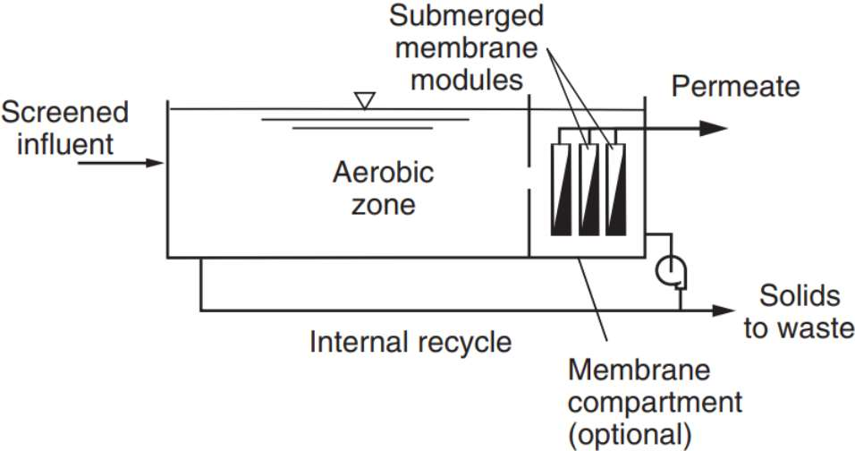
    - **Hình này chứng minh điều gì**
      - Cấu hình MBR tích hợp ngăn hiếu khí và ngăn màng đặt chìm, màng lọc thay thế hoàn toàn bể lắng thứ cấp truyền thống.
    - **Từ đâu mà thấy được**
      - Dòng nước thải Screened influent cấp vào Aerobic zone; cụm màng Submerged membrane modules đặt trong Membrane compartment.
      - Dòng nước trong Permeate rút ra ngoài; dòng tuần hoàn Internal recycle đưa bùn về Aerobic zone; dòng Solids to waste xả bùn dư.

###### Cân bằng Khối lượng Sinh khối trong Bể MBR (Biomass Mass Balance in Aerobic MBR)

- Thiết lập phương trình cân bằng vật chất cho sinh khối vi sinh vật quanh ngăn hiếu khí:
  - Xem xét hệ thống gồm ngăn hiếu khí (thể tích $V_A$, nồng độ bùn $X_A$) và ngăn màng (thể tích $V_m$, nồng độ bùn $X_m$).
  - Nước thải đầu vào có lưu lượng $Q$ ($\text{m}^3/\text{d}$) và nồng độ sinh khối đầu vào $X_0$ ($\text{g/m}^3$).
  - Dòng bùn tuần hoàn từ ngăn màng về ngăn hiếu khí có lưu lượng $Q_R$ ($\text{m}^3/\text{d}$) và nồng độ bùn $X_m$ ($\text{g/m}^3$).
  - Dòng hỗn hợp lỏng chảy từ ngăn hiếu khí sang ngăn màng có lưu lượng $(Q + Q_R)$ và nồng độ bùn $X_A$ ($\text{g/m}^3$).
  - Phương trình cân bằng khối lượng sinh khối ở trạng thái ổn định:
    $$Q X_0 + Q_R X_m = (Q + Q_R) X_A$$
- Rút gọn phương trình cân bằng sinh khối theo tỷ số tuần hoàn bùn ($R$):
  - Giả thiết nồng độ bùn trong nước thải đầu vào không đáng kể ($X_0 = 0$):
    $$Q_R X_m = (Q + Q_R) X_A$$
  - Định nghĩa tỷ số bùn tuần hoàn ($RAS\text{ ratio}$):
    $$R = \frac{Q_R}{Q} \implies Q_R = R \cdot Q$$
  - Thay $Q_R = R \cdot Q$ vào phương trình cân bằng:
    $$R \cdot Q \cdot X_m = Q (1 + R) X_A$$
  - Triệt tiêu lưu lượng $Q$ ở hai vế, thu được mối quan hệ cơ bản:
    $$R X_m = (1 + R) X_A$$
  - Nồng độ bùn hoạt tính cân bằng trong ngăn hiếu khí ($X_A$):
    $$X_A = \frac{R}{1 + R} X_m$$
  - **Hình 19.** Sơ đồ cân bằng khối lượng sinh khối trong hệ thống MBR (Biomass Mass Balance Diagram)
    - 
    - **Hình này chứng minh điều gì**
      - Mối liên hệ cân bằng sinh khối giữa ngăn hiếu khí ($X_A, V_A$) và ngăn màng ($X_m, V_m$) qua dòng hồi lưu bùn $Q_R$ và dòng thải $Q_w$.
    - **Từ đâu mà thấy được**
      - Ngăn Aerobic ($X_A, V_A$) nhận nước vào $Q, S_0, N_0$ và dòng hồi lưu $Q_R = R Q$ mang nồng độ $X_m$.
      - Ngăn Membrane ($X_m, V_m$) tách dòng thấm $Q_e$ ($X_e = 0$), dòng xả bùn dư đáy $Q_w, X_m$ và dòng tuần hoàn $Q_R, X_m$.

###### Thời gian Lưu bùn và Các Thông số Thiết kế Vận hành Điển hình (SRT and Operating Parameters)

- Phương trình xác định thời gian lưu bùn tổng thể ($SRT$):
  - Do màng lọc giữ lại toàn bộ sinh khối lơ lửng, nồng độ chất rắn trong dòng nước thấm triệt để bằng không ($X_e = 0\text{ g/m}^3$).
  - Toàn bộ lượng bùn xả ra khỏi hệ thống chỉ nằm trong dòng bùn dư $Q_w$ được rút trực tiếp từ ngăn màng với nồng độ $X_m$.
  - Thời gian lưu bùn $SRT$ (ngày) được xác định bằng tỷ số giữa tổng khối lượng bùn trong toàn bộ hệ thống và lượng bùn xả thải mỗi ngày:
    $$SRT = \frac{X_A V_A + X_m V_m}{Q_w X_m}$$
  - Trong đó:
    - $X_A$: Nồng độ bùn trong ngăn hiếu khí ($\text{g/m}^3$ hoặc $\text{kg/m}^3$).
    - $V_A$: Thể tích hữu ích của ngăn hiếu khí ($\text{m}^3$).
    - $X_m$: Nồng độ bùn trong ngăn màng ($\text{g/m}^3$ hoặc $\text{kg/m}^3$).
    - $V_m$: Thể tích hữu ích của ngăn màng ($\text{m}^3$).
    - $Q_w$: Lưu lượng xả bùn hoạt tính dư hàng ngày ($\text{m}^3/\text{d}$).
  - **Hình 20.** Phương trình xác định thời gian lưu bùn trong hệ thống MBR (MBR SRT Equation)
    - 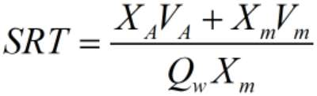
    - **Hình này chứng minh điều gì**
      - Công thức tính thời gian lưu bùn $SRT$ của hệ thống MBR dựa trên tổng sinh khối hai ngăn và lượng bùn xả từ ngăn màng.
    - **Từ đâu mà thấy được**
      - Tử số biểu diễn tổng sinh khối tích lũy: $X_A V_A + X_m V_m$.
      - Mẫu số biểu diễn lượng sinh khối xả thải mỗi ngày: $Q_w X_m$.
- Các thông số thiết kế và vận hành công nghệ tiêu chuẩn của hệ MBR:
  - Tỷ số tuần hoàn bùn ($RAS\text{ ratio}$):
    $$R = \frac{Q_R}{Q} = 4 - 6$$
    - Giá trị $R$ cao ($4 - 6$) giúp duy trì nồng độ bùn trong ngăn hiếu khí $X_A$ đạt xấp xỉ $80 - 86\%$ nồng độ ngăn màng $X_m$, đồng thời ngăn ngừa hiện tượng tích tụ bùn quá mức tại bề mặt màng.
  - Nồng độ bùn hoạt tính điển hình trong ngăn màng ($X_m$):
    $$X_m = 8{,}000 - 12{,}000\text{ g/m}^3 \quad (8 - 12\text{ kg/m}^3)$$
  - Tỷ số thể tích ngăn màng bổ sung trên diện tích bề mặt màng ($V_m / A_m$):
    $$\frac{V_m}{A_m} = 0.015 - 0.05\text{ m}^3\text{ dung tích bể trên mỗi m}^2\text{ diện tích bề mặt màng}$$
  - Thông lượng lọc qua màng (Membrane flux, $J$):
    $$J = \frac{Q_e}{A_m} = 0.4 - 0.6\text{ m}^3/(\text{m}^2\cdot\text{d}) \quad (16 - 25\text{ L/(m}^2\cdot\text{h)})$$
  - **Hình 21.** Các thông số vận hành tiêu biểu của hệ thống MBR (Typical MBR Operating Parameters)
    - 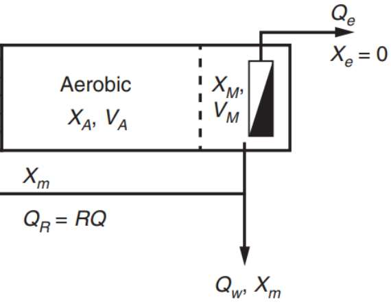
    - **Hình này chứng minh điều gì**
      - Các giá trị định mức thiết kế cốt lõi của hệ thống MBR gồm tỷ số $R$, nồng độ $X_m$, thể tích riêng $V_m$ và thông lượng dòng thấm.
    - **Từ đâu mà thấy được**
      - $R = 4 - 6$, $X_m = 8000 - 12000\text{ g/m}^3$, $V_m = 0.015 - 0.05\text{ m}^3/\text{m}^2$ membrane area, Membrane flux $= 0.4 - 0.6\text{ m}^3/\text{m}^2\cdot\text{d}$.

###### Các Cấu hình Mô đun Màng Sinh học (Membrane Module Configurations)

- Mô đun màng sợi rỗng đặt chìm ($\text{Hollow Fiber Membrane Module}$):
  - Cấu tạo gồm hàng nghìn ống sợi màng siêu mịn rỗng ở giữa, sắp xếp thành từng bó hoặc tấm thẳng đứng ngập hoàn toàn trong nước thải.
  - Nước thải thấm qua thành ngoài của sợi màng vào lòng ống rỗng nhờ lực hút chân không ($\text{vacuum extraction}$) và được thu gom vào ống góp chung ($\text{Collection manifold}$).
  - Cặn bùn và vi sinh vật bị giữ lại bên ngoài thành sợi màng.
  - Đáy mô đun bố trí dàn phân phối khí nén thô để tạo bọt khí rung lắc các sợi màng liên tục, ngăn ngừa bùn bám dính bề mặt.
  - **Hình 22.** Cấu tạo mô đun màng sợi rỗng đặt chìm trong bể MBR (Hollow Fiber Membrane Module)
    - 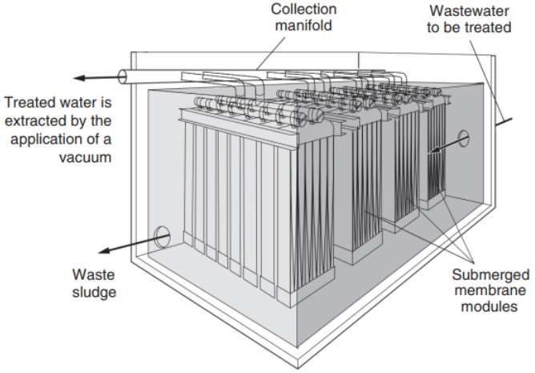
    - **Hình này chứng minh điều gì**
      - Cấu tạo cụm màng sợi rỗng đặt chìm với hệ thống ống góp hút chân không thu nước trong và cơ chế dẫn bùn đáy.
    - **Từ đâu mà thấy được**
      - Khối màng Submerged membrane modules treo trong bể, đầu trên gắn Collection manifold để hút Treated water bằng vacuum.
      - Dòng nước thải Wastewater to be treated đi vào và dòng Waste sludge dẫn ra ở đáy bể.
- Mô đun màng tấm phẳng đặt chìm ($\text{Flat Sheet Membrane Module}$):
  - Cấu tạo gồm các tấm màng phẳng kép ép hai mặt vào khung đỡ xốp, xếp song song với khoảng cách cố định trong hộp chứa màng ($\text{Membrane case}$).
  - Dòng thấm được thu gom từ khoang rỗng bên trong khung đỡ và dẫn lên ống góp chung ($\text{Permeate collection manifold}$) bằng bơm hút chân không hoặc nhờ chênh lệch áp suất thủy tĩnh tự nhiên ($\text{gravity head}$).
  - Hộp phân phối khí thô ($\text{Diffuser case}$) đặt trực tiếp dưới đáy cụm màng cung cấp dòng bọt khí cuộn qua các khe hở giữa các tấm màng ($\text{Air for scouring membranes and flushing}$), tạo ứng suất cắt bề mặt để cuốn trôi lớp bánh bùn bám bẩn.
  - **Hình 23.** Cấu tạo mô đun màng tấm phẳng đặt chìm trong bể MBR (Flat Sheet Membrane Module)
    - 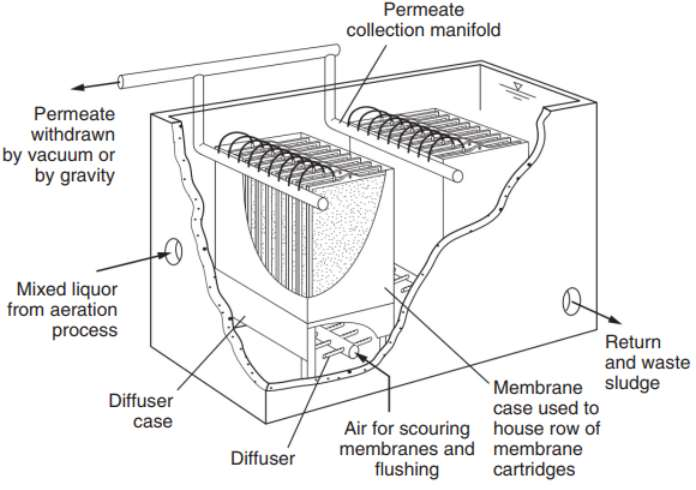
    - **Hình này chứng minh điều gì**
      - Cấu tạo cụm màng tấm phẳng xếp song song trong khung vỏ hộp và hệ thống sục khí thô thổi rửa đáy bể.
    - **Từ đâu mà thấy được**
      - Tấm màng phẳng đặt trong Membrane case, liên kết với Permeate collection manifold thu dòng thấm bằng vacuum hoặc gravity.
      - Phía dưới bố trí Diffuser case và Diffuser cấp khí nén thổi rửa Air for scouring membranes and flushing.

---

##### 3.2 Membrane Fouling, Maintenance, and Recovery Cleaning (Hiện tượng Nghẽn màng, Rửa bảo trì và Rửa phục hồi)

###### Bản chất và Hệ quả của Hiện tượng Nghẽn màng (Membrane Fouling)

- Bản chất vật lý - hóa học của hiện tượng nghẽn màng ($\text{Membrane fouling}$):
  - Nghẽn màng là hiện tượng suy giảm hiệu năng thấm tách của màng do sự tích tụ, lắng đọng và hấp phụ của các chất rắn lơ lửng, chất hữu cơ hòa tan, polyme ngoại bào ($\text{EPS}$), vi sinh vật sống và các kết tủa vô cơ trên bề mặt màng hoặc bên trong cấu trúc mao quản của màng.
  - Quá trình nghẽn màng diễn ra theo ba cơ chế chính: tắc nghẽn miệng mao quản ($\text{pore blocking}$), thu hẹp lòng mao quản do hấp phụ chất bẩn ($\text{pore constriction}$), và hình thành lớp bánh bùn bám dày trên bề mặt màng ($\text{cake layer formation}$).
- Hệ quả trực tiếp của hiện tượng nghẽn màng đối với hệ thống vận hành:
  - Tăng áp suất chênh lệch qua màng ($\text{Increased Transmembrane Pressure - TMP}$):
    - Khi hệ thống vận hành ở chế độ duy trì lưu lượng dòng thấm cố định ($J = \text{const}$), lớp cặn bẩn làm tăng lực cản thủy lực, buộc bơm hút phải gia tăng áp suất hút chân không (tăng giá trị $\text{TMP}$).
    - Áp suất $\text{TMP}$ tăng vượt ngưỡng giới hạn cho phép sẽ dẫn đến nguy cơ biến dạng vật liệu màng và phá vỡ cấu trúc mao quản.
  - Suy giảm thông lượng dòng thấm qua màng ($\text{Decrease membrane flux}$):
    - Khi vận hành ở chế độ duy trì áp suất hút cố định ($\text{TMP} = \text{const}$), lưu lượng nước sau xử lý trên mỗi đơn vị diện tích màng suy giảm nghiêm trọng, làm giảm công suất xử lý của toàn trạm.
  - Gia tăng tiêu hao điện năng vận hành cho bơm hút và hệ thống sục khí thổi rửa màng.

###### Phân loại và Quy trình Rửa màng Kỹ thuật (Types of Membrane Cleaning)

- Rửa bảo trì định kỳ ($\text{Maintenance cleaning}$):
  - Mục đích công nghệ: Làm sạch bề mặt màng thường xuyên, loại bỏ kịp thời các chất hữu cơ và cặn bám lỏng lẻo trước khi chúng chuyển thành lớp cặn cứng khó phục hồi, giúp ổn định giá trị áp suất $\text{TMP}$ trong suốt chu kỳ vận hành.
  - Tần suất thực hiện: $1 - 2\text{ lần/tuần}$.
  - Phương pháp thao tác: Rửa ngược hóa chất ($\text{Backflushing}$), bơm dung dịch hóa chất với áp suất thấp từ bên trong khoang thu nước thấm ngược qua mao quản ra bề mặt ngoài của màng.
  - Hóa chất sử dụng và nồng độ làm việc:
    - Rửa loại bỏ chất hữu cơ và màng sinh học: Sử dụng dung dịch Natri Hypochlorite ($\text{NaOCl}$) với nồng độ hoạt tính $200\text{ mg/L}$.
    - Rửa hòa tan cặn vô cơ và kết tủa kim loại: Sử dụng dung dịch Axit Citric ($\text{Citric Acid} - \text{C}_6\text{H}_8\text{O}_7$) với nồng độ $2{,}000\text{ mg/L}$.
  - Thời gian thực hiện mỗi chu kỳ: $60 - 75\text{ phút}$.
- Rửa phục hồi chuyên sâu ($\text{Recovery cleaning / Intensive chemical cleaning}$):
  - Mục đích công nghệ: Loại bỏ triệt để các chất bẩn bám dính sâu bên trong cấu trúc mao quản và lớp cặn bám cứng đầu trên bề mặt màng mà phương pháp rửa bảo trì thông thường không thể làm sạch, phục hồi lại khả năng thẩm thấu và thông lượng lọc ban đầu của mô đun màng.
  - Tần suất thực hiện: $2 - 4\text{ lần/năm}$ (hoặc khi áp suất $\text{TMP}$ đạt đến ngưỡng giới hạn cho phép của nhà sản xuất, thường từ $30 - 40\text{ kPa}$).
  - Phương pháp thao tác: Ngâm ngập màng trong bể hóa chất chuyên dụng ($\text{Chemical soaking}$); có thể ngâm trực tiếp tại chỗ ($\text{in-situ}$) trong ngăn màng sau khi rút cạn bùn hoặc tháo cụm màng ra bể ngâm riêng biệt ($\text{ex-situ}$).
  - Hóa chất sử dụng và nồng độ làm việc:
    - Xử lý oxy hóa chất hữu cơ: Ngâm trong dung dịch Clo hoạt tính / Natri Hypochlorite nồng độ cao $1{,}000\text{ mg/L}$.
    - Xử lý hòa tan cặn cáu cặn vô cơ: Ngâm trong dung dịch Axit Citric nồng độ cao $2{,}000\text{ mg/L}$.
    - Hai bước ngâm hóa chất thường được tiến hành tuần tự, xen kẽ với các đợt súc rửa bằng nước sạch để tránh phản ứng tương kỵ giữa clo và axit.
  - Thời gian ngâm hóa chất phục hồi: $4 - 6\text{ giờ}$ cho mỗi công đoạn ngâm.

---

##### 3.3 Example 3: MBR System Design (Ví dụ 3: Tính toán Thiết kế Hệ thống MBR)

###### Đề bài và Dữ liệu Thiết kế Đầu vào (Problem Statement and Design Inputs)

- Yêu cầu bài toán: Tính toán thiết kế hệ thống bể phản ứng sinh học màng (MBR) xử lý nước thải sinh hoạt với mục tiêu khử đồng thời chất hữu cơ ($\text{BOD}$) và thực hiện nitrat hóa hoàn toàn.
- Dữ liệu đầu vào kế thừa từ kết quả tính toán của Ví dụ 2:
  - Lưu lượng nước thải đầu vào thiết kế: $Q = 22{,}700\text{ m}^3/\text{d}$.
  - Thời gian lưu bùn sinh học thiết kế: $SRT = 21\text{ ngày}$ ($d$).
  - Tốc độ sinh khối vi sinh vật mới sinh ra: $P_{x,\text{bio}} = 1{,}050.4\text{ kg/d}$.
  - Tốc độ phát sinh cặn lơ lửng bay hơi: $P_{X,\text{VSS}} = 1{,}504.4\text{ kg/d}$.
  - Tốc độ phát sinh tổng chất rắn lơ lửng: $P_{X,\text{TSS}} = 1{,}916.8\text{ kg/d}$.
  - Tổng khối lượng MLVSS tích lũy trong toàn hệ thống: $M_{\text{MLVSS}} = 31{,}592\text{ kg}$.
  - Tổng khối lượng MLSS tích lũy trong toàn hệ thống: $M_{\text{MLSS}} = 40{,}253\text{ kg}$.
  - Tỷ số giữa chất rắn lơ lửng bay hơi và tổng chất rắn lơ lửng: $f_{\text{VSS}} = \frac{\text{MLVSS}}{\text{MLSS}} = 0.785$.
- Các thông số giả thiết thiết kế công nghệ cho hệ thống MBR:
  - Tỷ số tuần hoàn bùn hoạt tính ($RAS\text{ ratio}$): $R = \frac{Q_R}{Q} = 6$.
  - Nồng độ bùn hoạt tính trong ngăn màng ($X_m$): $X_m = 12{,}000\text{ g/m}^3 = 12.0\text{ kg/m}^3$.
  - Thông lượng thiết kế dòng nước thấm qua màng (Membrane flux): $J = 16\text{ L/(m}^2\cdot\text{h)}$.
  - Tỷ số giữa thể tích ngăn màng và diện tích bề mặt màng: $\frac{V_m}{A_m} = 0.025\text{ m}^3/\text{m}^2$.

###### Trình tự Tính toán Thiết kế Chi tiết (Step-by-Step Design Calculations)

- **Căn cứ**:
  - Phương trình cân bằng sinh khối hiếu khí: $X_A = \frac{R}{1 + R} X_m$.
  - Phương trình tính diện tích bề mặt màng: $A_m = \frac{Q}{J}$.
  - Quan hệ thể tích ngăn màng: $V_m = A_m \times \left(\frac{V_m}{A_m}\right)$.
  - Phương trình tính khối lượng bùn trong ngăn màng: $M_m = V_m \times X_m$.
  - Phương trình cân bằng khối lượng bùn hệ thống: $M_A = M_{\text{MLSS}} - M_m$.
  - Phương trình tính thể tích ngăn hiếu khí: $V_A = \frac{M_A}{X_A}$.
  - Phương trình xác định lượng bùn xả dư: $Q_w = \frac{M_{\text{MLSS}}}{SRT \times X_m} = \frac{P_{X,\text{TSS}}}{X_m}$.
  - Phương trình lưu lượng tuần hoàn bùn: $Q_R = R \times Q$.

- **Nhìn vào**:
  - Bước 1: Tính nồng độ bùn hoạt tính MLSS trong ngăn hiếu khí ($X_A$):
    - Áp dụng phương trình cân bằng sinh khối với $R = 6$ và $X_m = 12{,}000\text{ g/m}^3$:
      $$X_A = \frac{R}{1 + R} X_m = \frac{6}{1 + 6} \times 12{,}000\text{ g/m}^3 = \frac{6}{7} \times 12{,}000 = 10{,}285.71\text{ g/m}^3$$
    - Quy đổi sang đơn vị $\text{kg/m}^3$:
      $$X_A = 10.286\text{ kg/m}^3$$
  - Bước 2: Tính diện tích bề mặt màng lọc cần thiết ($A_m$):
    - Quy đổi thông lượng lọc thiết kế từ $\text{L/(m}^2\cdot\text{h)}$ sang $\text{m}^3/(\text{m}^2\cdot\text{d})$:
      $$J = 16\text{ L/(m}^2\cdot\text{h)} = \frac{16 \times 24\text{ h/d}}{1{,}000\text{ L/m}^3} = 0.384\text{ m}^3/(\text{m}^2\cdot\text{d})$$
    - Diện tích bề mặt màng cần lắp đặt:
      $$A_m = \frac{Q}{J} = \frac{22{,}700\text{ m}^3/\text{d}}{0.384\text{ m}^3/(\text{m}^2\cdot\text{d})} = 59{,}114.58\text{ m}^2$$
    - Làm tròn kỹ thuật: $A_m \approx 59{,}115\text{ m}^2$.
  - Bước 3: Tính thể tích hữu ích của ngăn màng ($V_m$):
    - Dựa trên tỷ số thể tích màng bổ sung trên diện tích bề mặt màng $\frac{V_m}{A_m} = 0.025\text{ m}^3/\text{m}^2$:
      $$V_m = A_m \times 0.025 = 59{,}114.58\text{ m}^2 \times 0.025\text{ m}^3/\text{m}^2 = 1{,}477.86\text{ m}^3$$
    - Làm tròn kỹ thuật: $V_m \approx 1{,}478\text{ m}^3$.
  - Bước 4: Tính khối lượng bùn hoạt tính MLSS chứa trong ngăn màng ($M_m$):
    - Khối lượng bùn trong ngăn màng:
      $$M_m = V_m \times X_m = 1{,}477.86\text{ m}^3 \times 12.0\text{ kg/m}^3 = 17{,}734.38\text{ kg}$$
    - Làm tròn kỹ thuật: $M_m \approx 17{,}734.4\text{ kg}$.
  - Bước 5: Tính khối lượng bùn hoạt tính MLSS cần duy trì trong ngăn hiếu khí ($M_A$):
    - Tổng khối lượng bùn yêu cầu của hệ thống là $M_{\text{MLSS}} = 40{,}253\text{ kg}$:
      $$M_A = M_{\text{MLSS}} - M_m = 40{,}253\text{ kg} - 17{,}734.38\text{ kg} = 22{,}518.62\text{ kg}$$
    - Làm tròn kỹ thuật: $M_A \approx 22{,}518.6\text{ kg}$.
  - Bước 6: Tính thể tích hữu ích của ngăn hiếu khí ($V_A$):
    - Thể tích ngăn hiếu khí tính từ khối lượng bùn $M_A$ và nồng độ bùn $X_A$:
      $$V_A = \frac{M_A}{X_A} = \frac{22{,}518.62\text{ kg}}{10.28571\text{ kg/m}^3} = 2{,}189.31\text{ m}^3$$
    - Làm tròn kỹ thuật: $V_A \approx 2{,}189.3\text{ m}^3$.
  - Bước 7: Tính tổng thể tích bể phản ứng sinh học màng ($V_{\text{total}}$):
    - Tổng dung tích công tác của hệ thống MBR:
      $$V_{\text{total}} = V_A + V_m = 2{,}189.31\text{ m}^3 + 1{,}477.86\text{ m}^3 = 3{,}667.17\text{ m}^3$$
    - Làm tròn kỹ thuật: $V_{\text{total}} \approx 3{,}667.2\text{ m}^3$.
  - Bước 8: Kiểm tra thời gian lưu nước thủy lực ($HRT$):
    - Thời gian lưu nước trong ngăn hiếu khí ($HRT_A$):
      $$HRT_A = \frac{V_A}{Q} \times 24 = \frac{2{,}189.31\text{ m}^3}{22{,}700\text{ m}^3/\text{d}} \times 24\text{ h/d} = 2.31\text{ giờ}$$
    - Thời gian lưu nước trong ngăn màng ($HRT_m$):
      $$HRT_m = \frac{V_m}{Q} \times 24 = \frac{1{,}477.86\text{ m}^3}{22{,}700\text{ m}^3/\text{d}} \times 24\text{ h/d} = 1.56\text{ giờ}$$
    - Tổng thời gian lưu nước thủy lực toàn hệ thống ($HRT_{\text{total}}$):
      $$HRT_{\text{total}} = \frac{V_{\text{total}}}{Q} \times 24 = \frac{3{,}667.17\text{ m}^3}{22{,}700\text{ m}^3/\text{d}} \times 24\text{ h/d} = 3.88\text{ giờ}$$
  - Bước 9: Tính lưu lượng bùn hoạt tính dư xả bỏ hàng ngày ($Q_w$):
    - Lượng bùn xả thải mỗi ngày để duy trì $SRT = 21\text{ ngày}$:
      $$Q_w = \frac{M_{\text{MLSS}}}{SRT \times X_m} = \frac{40{,}253\text{ kg}}{21\text{ d} \times 12.0\text{ kg/m}^3} = \frac{1{,}916.8\text{ kg/d}}{12.0\text{ kg/m}^3} = 159.73\text{ m}^3/\text{d}$$
  - Bước 10: Tính lưu lượng bùn tuần hoàn ($Q_R$):
    - Lưu lượng dòng bùn bơm tuần hoàn từ ngăn màng về ngăn hiếu khí:
      $$Q_R = R \times Q = 6 \times 22{,}700\text{ m}^3/\text{d} = 136{,}200\text{ m}^3/\text{d}$$

###### Tổng kết So sánh Kỹ thuật giữa Hệ MBR và Bể CMAS Truyền thống

- Bảng tổng hợp các thông số thiết kế của hệ MBR và so sánh đối chứng với công nghệ CMAS (Ví dụ 2):

| Thông số thiết kế công nghệ | Ký hiệu | Bể phản ứng MBR | Bể CMAS truyền thống (Ví dụ 2) | Đơn vị | Nhận xét so sánh kỹ thuật |
| :--- | :--- | :--- | :--- | :--- | :--- |
| **Lưu lượng nước thải** | $Q$ | $22{,}700$ | $22{,}700$ | $\text{m}^3/\text{d}$ | Quy mô công suất tính toán tương đương |
| **Thời gian lưu bùn** | $SRT$ | $21$ | $21$ | $\text{ngày}$ | Cùng chu kỳ lưu bùn để đảm bảo nitrat hóa |
| **Nồng độ MLSS ngăn phản ứng** | $X_A$ | $10{,}286$ | $3{,}000$ | $\text{g/m}^3$ | Nồng độ bùn trong MBR cao gấp $3.43$ lần |
| **Nồng độ MLSS ngăn màng / bùn lắng** | $X_m$ | $12{,}000$ | $10{,}000$ | $\text{g/m}^3$ | Ngăn màng cô đặc bùn lên tới $12\text{ g/L}$ |
| **Thể tích công trình sinh học** | $V_{\text{total}}$ | $3{,}667.2$ | $13{,}418$ | $\text{m}^3$ | MBR giảm $72.7\%$ dung tích bể xử lý sinh học |
| **Thời gian lưu nước thủy lực** | $HRT$ | $3.88$ | $14.18$ | $\text{giờ}$ | Thời gian lưu nước của MBR rút ngắn gần $4$ lần |
| **Bể lắng thứ cấp** | $-$ | **Không cần** | Cần bể lắng đợt 2 ($A \approx 1{,}100\text{ m}^2$) | $-$ | MBR tiết kiệm hoàn đầy đủ tích bể lắng |
| **Diện tích màng lắp đặt** | $A_m$ | $59{,}115$ | Không có | $\text{m}^2$ | Bố trí gọn gàng trong ngăn màng $1{,}478\text{ m}^3$ |
| **Lưu lượng xả bùn dư** | $Q_w$ | $159.7$ | $191.7$ | $\text{m}^3/\text{d}$ | Thể tích bùn thải của MBR giảm do nồng độ bùn cao |
| **Chất lượng nước đầu ra ($TSS$)** | $\text{TSS}_e$ | $\approx 0$ | $15$ | $\text{mg/L}$ | Nước sau MBR có thể tái sử dụng trực tiếp |

#### 4. Động học hòa tan oxy và Hiệu chỉnh thực tế (Oxygen Transfer & Alpha/Beta Factors)

##### 4.1 Tổng quan và các pha trong chu trình SBR (Overview and Operation Cycle Phases)

###### Đặc điểm cấu tạo và nguyên lý bể SBR (SBR Fundamental Characteristics)
- Bể phản ứng gián đoạn theo mẻ ($\text{Sequencing Batch Reactor - SBR}$) thực hiện toàn bộ các công đoạn xử lý bùn hoạt tính trong một công trình đơn nhất:
  - Bể phản ứng tích hợp cả quá trình sục khí sinh học hiếu khí và quá trình lắng tách bùn trong cùng một thể tích công tác.
  - Quy trình vận hành không cần bể lắng thứ cấp riêng biệt ($\text{secondary clarifier}$) và không cần hệ thống bơm tuần hoàn bùn hoạt tính ($\text{Return Activated Sludge - RAS}$).
  - Toàn bộ sinh khối vi sinh vật được giữ lại tại chỗ sau mỗi chu kỳ, loại bỏ chi phí xây dựng công trình lắng và vận hành đường ống tuần hoàn bùn.
  - Chế độ dòng chảy theo mẻ tạo gradient nồng độ cơ chất biến thiên theo thời gian, ngăn ngừa hiệu quả hiện tượng phồng bùn do vi khuẩn dạng sợi ($\text{filamentous bulking}$).

###### Diễn giải chi tiết các pha công nghệ trong chu trình (Detailed Operation Cycle Phases)
- Chu trình vận hành SBR tiêu chuẩn gồm 5 pha công nghệ kế tiếp nhau được điều khiển tự động theo thời gian:
  - Pha Điền đầy ($\text{Fill}$): Nước thải thô được nạp vào bể phản ứng để hòa trộn với bùn hoạt tính tồn lưu từ mẻ trước; thời gian điền đầy chiếm khoảng $50\%$ tổng thời gian chu kỳ ($T_C$).
  - Pha Phản ứng ($\text{React}$): Hệ thống sục khí hoặc khuấy trộn hoạt động để vi sinh vật phân hủy sinh học hiếu khí các hợp chất hữu cơ ($\text{BOD/COD}$) và thực hiện quá trình nitrat hóa ($\text{nitrification}$).
  - Pha Lắng tĩnh ($\text{Settle}$): Dừng cấp khí và ngừng khuấy trộn hoàn toàn, quá trình phân tách pha rắn - lỏng diễn ra trong điều kiện tĩnh học tuyệt đối ($\text{quiescent condition}$), mang lại hiệu quả lắng cao hơn bể lắng liên tục.
  - Pha Gạn nước trong ($\text{Decant}$): Nước sau xử lý được rút ra khỏi bể bằng thiết bị thu nước nổi hoặc máng gạn điều chỉnh cao độ ($\text{floating or adjustable weirs}$), giữ nguyên lớp mền bùn đã lắng ở đáy bể.
  - Pha Chờ ($\text{Idle - tùy chọn}$): Thời gian nghỉ giữa các pha điền đầy khi hệ thống gồm nhiều bể phối hợp tiếp nhận dòng thải liên tục; thường tận dụng pha này để xả bùn hoạt tính dư ($\text{Waste Activated Sludge - WAS}$).
  - **Hình 24.** Sơ đồ chu trình vận hành bể SBR qua các pha công nghệ kế tiếp
    - 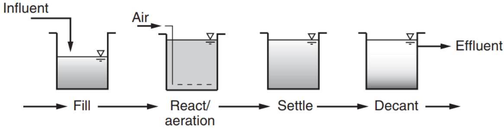
  - **Hình này chứng minh điều gì**
    - Toàn bộ chu trình xử lý gồm 4 pha chính (Fill, React, Settle, Decant) diễn ra tuần tự trong một bể phản ứng duy nhất.
  - **Từ đâu mà thấy được**
    - Sơ đồ trực quan biểu diễn pha Nạp (Fill), pha Cấp khí sục bọt (React/aeration), pha Lắng tĩnh tách bùn (Settle), và pha Gạn thu nước trong (Decant Effluent).

---

##### 4.2 Động học phản ứng phân hủy cơ chất và nitrat hóa trong SBR (SBR Reaction Kinetics)

###### Động học suy giảm cơ chất hữu cơ trong pha phản ứng (Substrate Removal Kinetics)
- Cân bằng vật chất cơ chất hữu cơ trong pha phản ứng theo mẻ:
  - Phương trình vi phân cân bằng vật chất tổng quát cho cơ chất hòa tan trong bể SBR:
    $$\frac{dS}{dt} V = Q S_0 - Q S - r_{su} V$$
  - Trong pha phản ứng ($\text{React}$), van nạp đóng kín và không có dòng ra nên lưu lượng $Q = 0$:
    $$\frac{dS}{dt} V = - r_{su} V \iff \frac{dS}{dt} = - r_{su} = - \frac{\mu_m S X}{Y (K_s + S)}$$
  - Biến đổi và phân ly biến số theo phương trình động học Monod:
    $$\frac{K_s + S}{S} dS = - \frac{\mu_m X}{Y} dt \iff \left(\frac{K_s}{S} + 1\right) dS = - \frac{\mu_m X}{Y} dt$$
  - Lấy tích phân hai vế từ thời điểm ban đầu ($t = 0$, nồng độ $S_0$) đến thời điểm kết thúc pha phản ứng ($t$, nồng độ $S_t$):
    $$\int_{S_0}^{S_t} \left(\frac{K_s}{S} + 1\right) dS = - \int_0^t \frac{\mu_m X}{Y} dt \implies \left(K_s \ln S + S\right)\Big|_{S_t}^{S_0} = \frac{\mu_m X}{Y} t\Big|_0^t$$
  - Phương trình giải tích xác định nồng độ cơ chất còn lại hoặc thời gian phản ứng yêu cầu:
    $$K_s \ln \frac{S_0}{S_t} + (S_0 - S_t) = \frac{\mu_m X}{Y} t$$
    - $S_0$: Nồng độ cơ chất ban đầu trong hỗn hợp tại $t = 0$ sau khi pha nạp kết thúc ($\text{g/m}^3$).
    - $S_t$: Nồng độ cơ chất tại thời điểm $t$ trong pha phản ứng ($\text{g/m}^3$).
    - $t$: Thời gian phản ứng sục khí ($\text{d}$).
    - $X$: Nồng độ sinh khối vi sinh vật lơ lửng trong bể ($\text{g/m}^3$).
    - $Y$: Hệ số sản lượng bùn dị dưỡng ($\text{g VSS/g substrate}$).
    - $\mu_m$: Tốc độ sinh trưởng riêng cực đại của vi sinh vật dị dưỡng ($\text{d}^{-1}$).
    - $K_s$: Hằng số nửa bão hòa của cơ chất ($\text{g/m}^3$).
  - **Hình 25.** Khai triển tích phân phương trình vi phân động học cơ chất trong pha phản ứng SBR
    - 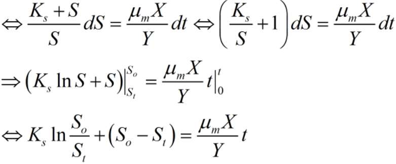
  - **Hình này chứng minh điều gì**
    - Phương trình biến thiên nồng độ cơ chất theo thời gian trong pha phản ứng theo mẻ ($Q = 0$) tích phân thành dạng quan hệ bán logarit.
  - **Từ đâu mà thấy được**
    - Biểu thức giải tích: $K_s \ln(S_0 / S_t) + (S_0 - S_t) = (\mu_m X / Y) t$ thiết lập mối liên hệ trực tiếp giữa thời gian phản ứng $t$ và độ giảm cơ chất.

###### Động học phản ứng nitrat hóa và hàm chuyển mạch DO (Nitrification Kinetics and Dissolved Oxygen Effect)
- Động học oxy hóa amoni của vi khuẩn nitrat hóa tự dưỡng trong hệ thống SBR:
  - Khi nồng độ oxy hòa tan ($\text{DO}$) dư thừa không giới hạn, phương trình biến thiên nồng độ amoni có dạng tích phân tương tự:
    $$K_{\text{NH}_4} \ln \frac{N_0}{N_t} + (N_0 - N_t) = \frac{\mu_m X_n}{Y_n} t$$
    - $N_0$: Nồng độ $\text{NH}_4\text{-N}$ ban đầu tại $t = 0$ sau khi điền đầy ($\text{g/m}^3$).
    - $N_t$: Nồng độ $\text{NH}_4\text{-N}$ tại thời điểm $t$ ($\text{g/m}^3$).
    - $X_n$: Nồng độ vi khuẩn nitrat hóa trong bể ($\text{g/m}^3$).
    - $Y_n$: Hệ số sản lượng vi khuẩn nitrat hóa ($\text{g VSS/g NH}_4\text{-N}$).
    - $K_{\text{NH}_4}$: Hằng số nửa bão hòa của amoni đối với vi khuẩn nitrat hóa ($\text{g/m}^3$).
- Ảnh hưởng của nồng độ oxy hòa tan $\text{DO}$ đến tốc độ nitrat hóa:
  - Oxy hòa tan đóng vai trò là chất nhận điện tử thiết yếu cho vi khuẩn oxy hóa amoni ($\text{AOB}$), tốc độ phản ứng bị ức chế mạnh khi $\text{DO}$ giảm thấp.
  - Số hạng hiệu chỉnh Monod theo nồng độ $\text{DO}$ được nhân trực tiếp vào vế động học phản ứng:
    $$K_{\text{NH}_4} \ln \frac{N_0}{N_t} + (N_0 - N_t) = \frac{\mu_m X_n}{Y_n} \left(\frac{S_o}{K_{o,\text{AOB}} + S_o}\right) t$$
    - $S_o$: Nồng độ oxy hòa tan $\text{DO}$ duy trì trong bể phản ứng ($\text{g/m}^3$).
    - $K_{o,\text{AOB}}$: Hằng số nửa bão hòa của oxy đối với vi khuẩn nitrat hóa $\text{AOB}$ (thường dao động từ $0{,}50$ đến $1{,}0\text{ g/m}^3$).
    - Đại lượng $\frac{S_o}{K_{o,\text{AOB}} + S_o}$: Hệ số hiệu chỉnh giảm tốc độ sinh trưởng khi $\text{DO}$ thực tế trong bể không đạt mức bão hòa hoàn toàn.
  - **Hình 26.** Phương trình động học nitrat hóa trong bể SBR có xét hệ số hạn chế oxy hòa tan DO
    - 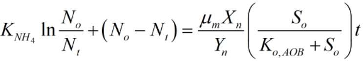
  - **Hình này chứng minh điều gì**
    - Tốc độ nitrat hóa trong pha phản ứng SBR tỷ lệ thuận với số hạng bão hòa DO dạng Monod $S_0 / (K_{o,\text{AOB}} + S_0)$.
  - **Từ đâu mà thấy được**
    - Công thức giải tích: $K_{\text{NH}_4} \ln(N_0 / N_t) + (N_0 - N_t) = (\mu_m X_n / Y_n) [S_0 / (K_{o,\text{AOB}} + S_0)] t$.

---

##### 4.3 Các thông số thiết kế và quy trình tính toán SBR (SBR Design Considerations and Computation Approach)

###### Cấu hình nhiều bể và phân bổ chu trình thời gian (Multi-Basin Operation and Cycle Allocation)
- Yêu cầu số lượng đơn nguyên bể phản ứng:
  - Hệ thống SBR tiếp nhận dòng nước thải liên tục phải bố trí tối thiểu 2 bể phản ứng ($N \ge 2$).
  - Nguyên tắc vận hành so le chu kỳ: Khi một bể đang ở pha Điền đầy ($\text{Fill}$), bể còn lại đang thực hiện tuần tự các pha Phản ứng, Lắng và Gạn nước ($\text{React - Settle - Decant}$).
- Phân bổ thời gian một chu kỳ làm việc tiêu chuẩn ($T_C = 6\text{ h}$):
  - Thời gian điền đầy ($t_{\text{fill}}$): $3{,}0\text{ h}$ ($50\%$ chu kỳ).
  - Thời gian phản ứng sục khí ($t_{\text{react}}$): $2{,}0\text{ h}$.
  - Thời gian lắng tĩnh ($t_{\text{settle}}$): $0{,}5\text{ h}$.
  - Thời gian gạn nước trong ($t_{\text{decant}}$): $0{,}5\text{ h}$.
  - Cân bằng thời gian tiếp nhận dòng liên tục: $t_{\text{fill}} = t_{\text{react}} + t_{\text{settle}} + t_{\text{decant}} = 2{,}0 + 0{,}5 + 0{,}5 = 3{,}0\text{ h}$.
  - Thời gian lưu nước thủy lực danh định ($\text{HRT}$) của bể SBR thường nằm trong khoảng $18 - 30\text{ h}$.

###### Tỷ số điền đầy và giới hạn thể tích nén lắng của bùn (Fill Fraction and Settled Sludge Volume Fraction)
- Tỷ số điền đầy ($\text{Fill fraction} - \alpha$):
  - Tỷ số điền đầy biểu thị tỷ lệ giữa thể tích nạp nước thải mỗi mẻ ($V_F$) và tổng dung tích ướt toàn phần khi đầy bể ($V_T$):
    $$\alpha = \frac{V_F}{V_T} = \frac{H_D}{H}$$
  - Giá trị $\alpha$ thông thường bằng $0{,}25$ đối với nước thải có yêu cầu nồng độ $\text{SS}$ đầu ra thấp.
- Phân đoạn thể tích bể chiếm bởi lớp bùn đã lắng ($F(V_T)$):
  - Tỷ lệ thể tích bùn nén lắng phụ thuộc vào nồng độ chất rắn lơ lửng hỗn hợp $\text{MLSS}$ và chỉ số thể tích bùn $\text{SVI}$:
    $$F(V_T) = \frac{\text{MLSS (mg/L)} \times \text{SVI (mL/g)}}{10^6}$$
  - Điều kiện an toàn lắng chống bùn bị cuốn vào thiết bị gạn nước:
    $$F(V_T) \le 1 - \alpha \iff \alpha \le 1 - F(V_T)$$
  - **Hình 27.** Đồ thị tương quan giữa tỷ số điền đầy khuyến nghị và nồng độ MLSS theo các giá trị SVI
    - 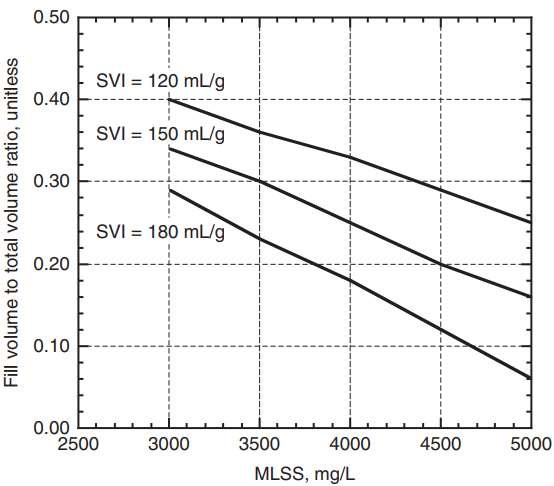
  - **Hình này chứng minh điều gì**
    - Tỷ số điền đầy tối đa cho phép $V_F / V_T$ giảm tuyến tính khi nồng độ MLSS tăng hoặc khi chỉ số SVI tăng từ $120$ đến $180\text{ mL/g}$.
  - **Từ đâu mà thấy được**
    - Hệ 3 đường cong suy giảm: ở $\text{MLSS} = 3500\text{ mg/L}$, tỷ số điền đầy đạt $0{,}36$ ($SVI=120$), $0{,}30$ ($SVI=150$), và $0{,}23$ ($SVI=180\text{ mL/g}$).

###### Quy trình 15 bước tính toán thiết kế SBR theo Metcalf & Eddy (15-Step Design Computation Approach)
- Quy trình tính toán công nghệ bể SBR gồm 15 bước tuần tự:
  - Bước 1: Thu thập số liệu đặc tính nước thải đầu vào, xác định tiêu chuẩn xả thải đầu ra và lựa chọn các hệ số an toàn thiết kế.
  - Bước 2: Lựa chọn số lượng đơn nguyên bể phản ứng SBR ($N \ge 2$).
  - Bước 3: Lựa chọn thời gian các pha phản ứng/sục khí, lắng tĩnh và gạn nước; xác định thời gian điền đầy, tổng thời gian một chu kỳ ($T_C$) và số chu kỳ trong ngày ($n_{\text{cycle}}$).
  - Bước 4: Tính toán thể tích nước thải điền đầy nạp vào mỗi mẻ ($V_F$) từ tổng số chu kỳ làm việc hàng ngày.
  - Bước 5: Lựa chọn nồng độ $\text{MLSS}$ khi đầy bể, xác định tỷ số điền đầy $\alpha = V_F / V_T$, xác định chiều sâu gạn nước ($H_D$) và tính toán tổng dung tích bể phản ứng ($V_T$).
  - Bước 6: Xác định tuổi bùn thiết kế ($\text{SRT}$) cho quy trình SBR.
  - Bước 7: Tính toán khối lượng $\text{TKN}$ nạp vào được chuyển hóa qua phản ứng nitrat hóa.
  - Bước 8: Tính toán nồng độ sinh khối vi khuẩn nitrat hóa và kiểm tra thời gian sục khí đã chọn có đủ để đạt hiệu quả nitrat hóa yêu cầu.
  - Bước 9: Điều chỉnh các thông số thiết kế nếu cần thông qua các bước lặp bổ sung.
  - Bước 10: Xác định lưu lượng và công suất bơm của thiết bị gạn nước mặt ($\text{decanter}$).
  - Bước 11: Tính toán nhu cầu oxy tiêu thụ và tốc độ truyền oxy trung bình ($\text{OTR}$).
  - Bước 12: Xác định lượng bùn hoạt tính dư sinh ra hàng ngày ($P_{X,\text{TSS}}$).
  - Bước 13: Tính toán tỷ số tải lượng hữu cơ trên sinh khối ($F/M$) và tải lượng thể tích $\text{BOD}$.
  - Bước 14: Đánh giá cân bằng độ kiềm và xác định nhu cầu bổ sung hóa chất kiềm hóa.
  - Bước 15: Lập bảng tổng hợp các chỉ tiêu kinh tế - kỹ thuật của công trình thiết kế.
  - **Hình 28.** Quy trình tính toán thiết kế bể phản ứng sinh học gián đoạn SBR gồm 15 bước tiêu chuẩn
    - 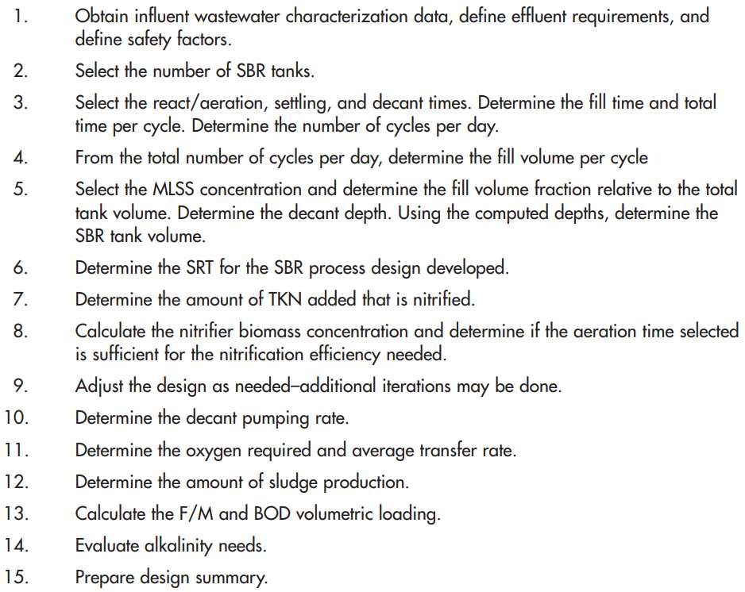
  - **Hình này chứng minh điều gì**
    - Trình tự thiết kế công nghệ bể SBR tuân thủ quy trình logic chặt chẽ từ số liệu đầu vào đến tổng hợp thiết kế.
  - **Từ đâu mà thấy được**
    - Danh mục 15 bước công tác từ thu thập dữ liệu nước thải, chọn số bể, chia thời gian chu kỳ, kiểm tra nitrat hóa đến tính toán thiết bị gạn và nhu cầu oxy.

---

##### 4.4 Bài toán thiết kế hệ thống SBR (Example 4: SBR System Design)

###### Đề bài và thông số đầu vào Ví dụ 4 (Example 4 Problem Formulation and Wastewater Data)
- **Đề bài**: Thiết kế quy trình phản ứng sinh học gián đoạn theo mẻ ($\text{SBR}$) để xử lý nước thải sinh hoạt đô thị.
- **Số liệu thiết kế và các giả định**:
  - Lưu lượng nước thải thiết kế: $Q = 7570\text{ m}^3/\text{d}$.
  - Nhiệt độ nước thải tính toán thấp nhất vào mùa đông: $T = 12^\circ\text{C}$.
  - Nồng độ bùn hoạt tính khi đầy bể: $\text{MLSS} = 3500\text{ g/m}^3 = 3500\text{ mg/L}$.
  - Chỉ số thể tích bùn: $\text{SVI} = 150\text{ mL/g}$.
  - Số lượng đơn nguyên bể phản ứng: $N = 2$ bể.
  - Chiều sâu mức nước làm việc khi đầy bể: $H = 6{,}0\text{ m}$.
  - Độ sâu lớp nước tháo gạn: $H_D = 20\% \times H = 0{,}20 \times 6{,}0 = 1{,}20\text{ m}$ (tương ứng tỷ số điền đầy $\alpha = 0{,}20$).
  - Nồng độ amoni yêu cầu trong nước sau xử lý: $N_{e,\text{NH}_4} \le 1{,}0\text{ g/m}^3$.
- **Bảng đặc tính nước thải đầu vào**:
  - Nồng độ $\text{BOD}$: $220\text{ mg/L}$.
  - Nồng độ $\text{BOD}$ hòa tan ($\text{sBOD}$): $80\text{ mg/L}$.
  - Nồng độ $\text{COD}$: $485\text{ mg/L}$.
  - Nồng độ $\text{COD}$ hòa tan ($\text{sCOD}$): $160\text{ mg/L}$.
  - Nồng độ $\text{COD}$ dễ phân hủy sinh học ($\text{rbCOD}$): $80\text{ mg/L}$.
  - Nồng độ tổng chất rắn lơ lửng ($\text{TSS}$): $240\text{ mg/L}$.
  - Nồng độ chất rắn lơ lửng bay hơi ($\text{VSS}$): $220\text{ mg/L}$.
  - Nồng độ tổng nitơ Kjeldahl ($\text{TKN}$): $35\text{ mg/L}$.
  - Nồng độ amoni ($\text{NH}_4\text{-N}$): $25\text{ mg/L}$.
  - Nồng độ tổng photpho ($\text{TP}$): $6\text{ mg/L}$.
  - Độ kiềm ($\text{Alkalinity}$): $200\text{ mg/L as CaCO}_3$.
  - Tỷ số $\text{bCOD/BOD}$: $1{,}6 \implies \text{bCOD} = 1{,}6 \times 220 = 352\text{ mg/L}$.
  - **Hình 29.** Bảng thành phần và tính chất nước thải đầu vào áp dụng trong bài toán Ví dụ 4
    - 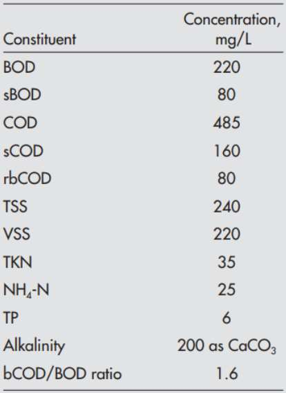
  - **Hình này chứng minh điều gì**
    - Các thông số ô nhiễm hữu cơ, chất rắn, dinh dưỡng và độ kiềm của dòng thải làm cơ sở tính toán dung tích và nhu cầu oxy cho SBR.
  - **Từ đâu mà thấy được**
    - Bảng số liệu chi tiết nồng độ: $\text{BOD} = 220$, $\text{COD} = 485$, $\text{TSS} = 240$, $\text{TKN} = 35$, $\text{NH}_4\text{-N} = 25\text{ mg/L}$, độ kiềm $200\text{ mg CaCO}_3\text{/L}$.

###### Các bước giải toán và tính toán thiết kế kỹ thuật (Detailed Step-by-Step Engineering Calculation)

- **Bước 1: Phân bổ thời gian chu kỳ và xác định số chu kỳ làm việc**
- Căn cứ:
  - Hệ thống $N = 2$ bể tiếp nhận dòng chảy liên tục yêu cầu thời gian điền đầy của một bể phải bằng tổng thời gian các pha phản ứng, lắng và gạn của bể đối diện:
    $$t_{\text{fill}} = t_{\text{react}} + t_{\text{settle}} + t_{\text{decant}}$$
  - Tổng thời gian chu kỳ vận hành:
    $$T_C = t_{\text{fill}} + (t_{\text{react}} + t_{\text{settle}} + t_{\text{decant}}) = 2 \times t_{\text{fill}}$$
- Nhìn vào:
  - Lựa chọn thời gian một chu kỳ $T_C = 8{,}0\text{ h}$ để đảm bảo thời gian sục khí đủ cho quá trình nitrat hóa ở nhiệt độ thấp $12^\circ\text{C}$:
    - Thời gian điền đầy: $t_{\text{fill}} = 4{,}0\text{ h}$ (bao gồm $1{,}5\text{ h}$ điền đầy khuấy thiếu khí và $2{,}5\text{ h}$ điền đầy có sục khí).
    - Thời gian phản ứng sục khí độc lập: $t_{\text{react}} = 3{,}0\text{ h}$.
    - Thời gian lắng tĩnh: $t_{\text{settle}} = 0{,}5\text{ h}$.
    - Thời gian gạn nước trong: $t_{\text{decant}} = 0{,}5\text{ h}$.
    - Kiểm tra cân bằng: $t_{\text{react}} + t_{\text{settle}} + t_{\text{decant}} = 3{,}0 + 0{,}5 + 0{,}5 = 4{,}0\text{ h} = t_{\text{fill}}$.
    - Tổng thời gian sục khí trong một chu kỳ: $t_{\text{aerate}} = 2{,}5 + 3{,}0 = 5{,}5\text{ h}$.
  - Số chu kỳ làm việc trong ngày trên mỗi bể:
    $$n_{\text{cycle}} = \frac{24\text{ h}}{T_C} = \frac{24}{8{,}0} = 3\text{ chu kỳ/ngày/bể}$$

- **Bước 2: Xác định thể tích mẻ nạp ($V_F$) và kích thước bể SBR ($V_T$)**
- Căn cứ:
  - Lưu lượng nước thải phân bổ cho mỗi bể phản ứng:
    $$Q_{\text{tank}} = \frac{Q}{N} = \frac{7570\text{ m}^3/\text{d}}{2} = 3785\text{ m}^3/\text{d}$$
  - Thể tích nước thải điền đầy trong một chu kỳ:
    $$V_F = \frac{Q_{\text{tank}}}{n_{\text{cycle}}} = \frac{3785\text{ m}^3/\text{d}}{3\text{ chu kỳ/d}} = 1261{,}67\text{ m}^3/\text{mẻ}$$
- Nhìn vào:
  - Tỷ số điền đầy thiết kế $\alpha = H_D / H = 1{,}20 / 6{,}0 = 0{,}20$.
  - Tổng dung tích làm việc ướt của mỗi bể SBR khi đầy nước:
    $$V_T = \frac{V_F}{\alpha} = \frac{1261{,}67\text{ m}^3}{0{,}20} = 6308{,}33\text{ m}^3$$
  - Tổng dung tích ướt cho cả 2 bể:
    $$V_{\text{total}} = 2 \times 6308{,}33 = 12616{,}67\text{ m}^3$$
  - Thể tích nước và bùn lưu đáy sau pha gạn:
    $$V_0 = V_T - V_F = 6308{,}33 - 1261{,}67 = 5046{,}67\text{ m}^3$$
  - Diện tích mặt bằng mỗi bể SBR:
    $$A = \frac{V_T}{H} = \frac{6308{,}33\text{ m}^3}{6{,}0\text{ m}} = 1051{,}39\text{ m}^2$$
    - Kích thước mặt bằng thiết kế dạng hình vuông: kích thước mỗi cạnh xấp xỉ $32{,}5\text{ m} \times 32{,}5\text{ m}$.
  - Thời gian lưu nước thủy lực danh định ($\text{HRT}$):
    $$\text{HRT} = \frac{V_{\text{total}}}{Q} \times 24 = \frac{12616{,}67\text{ m}^3}{7570\text{ m}^3/\text{d}} \times 24 \approx 40{,}0\text{ h}$$

- **Bước 3: Kiểm tra giới hạn thể tích nén lắng của bùn**
- Căn cứ:
  - Công thức tính phân đoạn thể tích bể bị chiếm bởi bùn sau 30 phút lắng:
    $$F(V_T) = \frac{\text{MLSS (mg/L)} \times \text{SVI (mL/g)}}{10^6}$$
- Nhìn vào:
  - Thay số liệu $\text{MLSS} = 3500\text{ mg/L}$ và $\text{SVI} = 150\text{ mL/g}$:
    $$F(V_T) = \frac{3500 \times 150}{10^6} = 0{,}525$$
  - Chiều cao lớp mền bùn lắng dưới đáy bể:
    $$H_{\text{sludge}} = F(V_T) \times H = 0{,}525 \times 6{,}0\text{ m} = 3{,}15\text{ m}$$
  - Khoảng cách đệm an toàn giữa đáy thiết bị gạn và đỉnh lớp mền bùn:
    $$H_{\text{clear}} = H - H_D - H_{\text{sludge}} = 6{,}0 - 1{,}20 - 3{,}15 = 1{,}65\text{ m}$$
  - Đánh giá: Khoảng cách đệm $1{,}65\text{ m} > 1{,}0\text{ m}$, thỏa mãn tuyệt đối điều kiện an toàn chống cuốn bùn theo nước gạn ($F(V_T) = 0{,}525 \le 1 - \alpha = 0{,}80$).

- **Bước 4: Kiểm tra động học nitrat hóa và tuổi bùn yêu cầu ở 12°C**
- Căn cứ:
  - Các hằng số động học nitrat hóa ở $12^\circ\text{C}$ hiệu chỉnh từ giá trị cơ sở ở $20^\circ\text{C}$:
    $$\mu_{n,\text{max}}(12^\circ\text{C}) = 0{,}75 \times (1{,}072)^{12 - 20} = 0{,}75 \times 0{,}575 = 0{,}431\text{ d}^{-1}$$
    $$b_n(12^\circ\text{C}) = 0{,}08 \times (1{,}029)^{12 - 20} = 0{,}08 \times 0{,}794 = 0{,}0635\text{ d}^{-1}$$
    $$K_{\text{NH}_4}(12^\circ\text{C}) = 0{,}74 \times (1{,}053)^{12 - 20} = 0{,}74 \times 0{,}662 = 0{,}490\text{ g/m}^3$$
  - Hệ số sục khí trong chu kỳ:
    $$f_{\text{aer}} = \frac{t_{\text{aerate}}}{T_C} = \frac{5{,}5\text{ h}}{8{,}0\text{ h}} = 0{,}6875$$
- Nhìn vào:
  - Tuổi bùn tối thiểu cho vi khuẩn nitrat hóa sinh trưởng ở điều kiện sục khí gián đoạn:
    $$\text{SRT}_{\text{min}} = \frac{1}{f_{\text{aer}} \cdot (\mu_{n} - b_n)}$$
    - Tốc độ sinh trưởng riêng với $\text{DO} = 2{,}0\text{ g/m}^3$, $K_{o,\text{AOB}} = 0{,}50\text{ g/m}^3$ và $N = 1{,}0\text{ g/m}^3$:
      $$\mu_n = \mu_{n,\text{max}} \left(\frac{N}{K_{\text{NH}_4} + N}\right)\left(\frac{\text{DO}}{K_{o,\text{AOB}} + \text{DO}}\right) = 0{,}431 \times \left(\frac{1{,}0}{0{,}490 + 1{,}0}\right) \times \left(\frac{2{,}0}{0{,}50 + 2{,}0}\right)$$
      $$\mu_n = 0{,}431 \times 0{,}671 \times 0{,}80 = 0{,}231\text{ d}^{-1}$$
    - Tuổi bùn rửa trôi lý thuyết:
      $$\text{SRT}_{\text{washout}} = \frac{1}{0{,}6875 \times (0{,}231 - 0{,}0635)} = \frac{1}{0{,}1151} \approx 8{,}7\text{ d}$$
    - Chọn hệ số an toàn $\text{SF} \approx 1{,}7 \implies \text{SRT}_{\text{design}} = 15\text{ d}$.
  - Khối lượng nitrat ($\text{NO}_x$) sinh ra từ quá trình nitrat hóa:
    - Bùn tế bào sinh ra: $Y_{\text{obs}} \approx 0{,}25\text{ g VSS/g bCOD}$.
    - Lượng nitơ đồng hóa vào tế bào sinh khối ($f_N = 0{,}12$):
      $$N_{\text{syn}} = 0{,}12 \times (0{,}25 \times 352\text{ g/m}^3) \approx 10{,}56\text{ g N/m}^3$$
    - Lượng $\text{TKN}$ bị nitrat hóa chuyển thành $\text{NO}_x$:
      $$\text{NO}_x = \text{TKN} - N_{e,\text{NH}_4} - N_{e,\text{orgN}} - N_{\text{syn}} = 35 - 1{,}0 - 1{,}0 - 10{,}56 = 22{,}44\text{ g/m}^3$$
  - Kiểm tra thời gian phản ứng sục khí cần thiết theo phương trình SBR:
    $$t_{\text{react, req}} = \frac{K_{\text{NH}_4} \ln(N_0 / N_t) + (N_0 - N_t)}{\frac{\mu_m X_n}{Y_n}\left(\frac{\text{DO}}{K_{o,\text{AOB}} + \text{DO}}\right)}$$
    - Kết quả tính toán cho thấy thời gian sục khí thiết kế $t_{\text{aerate}} = 5{,}5\text{ h}$ vượt thời gian phản ứng tối thiểu $3{,}2\text{ h}$, đảm bảo nồng độ amoni đầu ra đạt $\le 1{,}0\text{ g/m}^3$.

- **Bước 5: Tính toán thiết bị gạn nước mặt (Decanter Capacity)**
- Căn cứ:
  - Thể tích nước trong cần tháo gạn trong một mẻ đúng bằng thể tích nạp $V_F = 1261{,}67\text{ m}^3$.
  - Thời gian gạn nước thiết kế: $t_{\text{decant}} = 0{,}5\text{ h} = 30\text{ phút} = 1800\text{ s}$.
- Nhìn vào:
  - Lưu lượng xả gạn yêu cầu của hệ thống thiết bị gạn:
    $$Q_{\text{decant}} = \frac{V_F}{t_{\text{decant}}} = \frac{1261{,}67\text{ m}^3}{0{,}5\text{ h}} = 2523{,}34\text{ m}^3/\text{h} \approx 0{,}701\text{ m}^3/\text{s}$$
  - Tốc độ hạ thấp mức nước trong pha gạn:
    $$v_{\text{decant}} = \frac{H_D}{t_{\text{decant}}} = \frac{1{,}20\text{ m}}{30\text{ phút}} = 0{,}04\text{ m/phút} = 40\text{ mm/phút}$$

- **Bước 6: Nhu cầu oxy tiêu thụ và tốc độ truyền oxy**
- Căn cứ:
  - Nhu cầu oxy tính toán cho quá trình oxy hóa cơ chất carbon và nitrat hóa amoni:
    $$\text{OTR} = \frac{Q (S_0 - S) - 1{,}42 P_{X,\text{bio}}}{1000} + \frac{4{,}57 Q (\text{NO}_x)}{1000}$$
- Nhìn vào:
  - Lượng $\text{bCOD}$ bị khử hàng ngày:
    $$M_{\text{bCOD}} = \frac{7570 \times (352 - 10)}{1000} = 2588{,}9\text{ kg bCOD/d}$$
  - Nhu cầu oxy khử carbon: $\approx 1850\text{ kg O}_2\text{/d}$.
  - Nhu cầu oxy nitrat hóa amoni:
    $$M_{\text{O2, nit}} = 4{,}57 \times \frac{7570 \times 22{,}44}{1000} \approx 7763\text{ kg O}_2\text{/d}$$
  - Tổng nhu cầu oxy thực tế hàng ngày:
    $$\text{OTR}_{\text{total}} \approx 1850 + 7763 = 9613\text{ kg O}_2\text{/d}$$
  - Phân bổ cho mỗi bể: $4806{,}5\text{ kg O}_2\text{/d/bể}$.
  - Tốc độ truyền oxy cần thiết trong thời gian sục khí thực tế ($3\text{ chu kỳ} \times 5{,}5\text{ h} = 16{,}5\text{ h sục khí/d}$):
    $$\text{OTR}_{\text{field, rate}} = \frac{4806{,}5\text{ kg O}_2}{16{,}5\text{ h}} \approx 291{,}3\text{ kg O}_2\text{/h/bể}$$

- **Bước 7: Tổng hợp các chỉ tiêu kỹ thuật công nghệ của hệ thống SBR**
- Căn cứ:
  - Toàn bộ kết quả tính toán thiết kế của 2 đơn nguyên bể SBR xử lý lưu lượng $7570\text{ m}^3/\text{d}$.
- Nhìn vào:
  - Bảng tổng hợp các thông số kỹ thuật công nghệ hoàn chỉnh:

| Thông số thiết kế | Ký hiệu / Thứ nguyên | Giá trị thiết kế |
| :--- | :--- | :--- |
| Số lượng đơn nguyên bể phản ứng | $N$ | $2\text{ bể}$ |
| Thời gian một chu kỳ làm việc | $T_C$ | $8{,}0\text{ h}$ |
| Số chu kỳ mỗi bể trong ngày | $n_{\text{cycle}}$ | $3\text{ chu kỳ/d}$ |
| Cơ cấu phân bổ pha: Điền đầy / Sục khí / Lắng / Gạn | $t_{\text{fill}} / t_{\text{react}} / t_{\text{settle}} / t_{\text{decant}}$ | $4{,}0 / 3{,}0 / 0{,}5 / 0{,}5\text{ h}$ |
| Thời gian sục khí thực tế trong chu kỳ | $t_{\text{aerate}}$ | $5{,}5\text{ h}$ |
| Thể tích nạp nước thải mỗi mẻ | $V_F$ | $1261{,}67\text{ m}^3\text{/mẻ}$ |
| Tỷ số điền đầy | $\alpha = V_F / V_T$ | $0{,}20$ |
| Dung tích làm việc ướt mỗi bể khi đầy | $V_T$ | $6308{,}33\text{ m}^3$ |
| Tổng dung tích làm việc toàn hệ thống | $V_{\text{total}}$ | $12616{,}67\text{ m}^3$ |
| Chiều sâu mức nước làm việc khi đầy bể | $H$ | $6{,}0\text{ m}$ |
| Chiều sâu lớp nước tháo gạn | $H_D$ | $1{,}20\text{ m}$ |
| Diện tích mặt bằng mỗi bể | $A$ | $1051{,}4\text{ m}^2\text{ (32,5 m} \times \text{32,5 m)}$ |
| Thời gian lưu nước thủy lực danh định | $\text{HRT}$ | $40{,}0\text{ h}$ |
| Nồng độ bùn hoạt tính khi đầy bể | $\text{MLSS}$ | $3500\text{ g/m}^3$ |
| Chiều cao lớp mền bùn lắng | $H_{\text{sludge}}$ | $3{,}15\text{ m}$ |
| Khoảng cách đệm an toàn gạn nước | $H_{\text{clear}}$ | $1{,}65\text{ m}$ |
| Tuổi bùn thiết kế | $\text{SRT}$ | $15\text{ d}$ |
| Công suất thiết bị gạn nước mặt | $Q_{\text{decant}}$ | $2523{,}3\text{ m}^3\text{/h/bể}$ |
| Tốc độ truyền oxy hiện trường cần thiết | $\text{OTR}_{\text{field}}$ | $291{,}3\text{ kg O}_2\text{/h/bể}$ |
| Nồng độ $\text{NH}_4\text{-N}$ đầu ra dự kiến | $N_{e,\text{NH}_4}$ | $\le 1{,}0\text{ g/m}^3$ |

#### 5. Tính toán thiết kế bể phản ứng CMAS khử BOD (CMAS Reactor Design for BOD Removal)

- Bể bùn hoạt tính xáo trộn hoàn toàn (CMAS - Complete-Mix Activated Sludge) vận hành theo chế độ dòng chảy liên tục có bùn tuần hoàn ($RAS$), phân tán đồng đều cơ chất và oxy trên toàn bộ dung tích phản ứng.
  - Hỗn hợp bùn hoạt tính và nước thải hòa trộn tức thời giúp loại bỏ gradient nồng độ hữu cơ cục bộ.
  - Phân tích thiết kế CMAS được định lượng thông qua các thông số động học và chỉ tiêu vận hành cốt lõi, so sánh trực tiếp với bể phản ứng sinh học gián đoạn theo mẻ (SBR - Sequencing Batch Reactor).

##### 5.1 So sánh thông số kỹ thuật và vận hành giữa CMAS và SBR (Operational Parameters Comparison)

- Bảng tổng hợp các thông số thiết kế và vận hành định lượng giữa công nghệ CMAS và SBR:

| Thông số vận hành | Đơn vị đo | Bể CMAS (Complete-Mix Activated Sludge) | Bể SBR (Sequencing Batch Reactor) | Ý nghĩa kỹ thuật |
| :--- | :--- | :--- | :--- | :--- |
| **Thời gian lưu nước thủy lực ($HRT$)** | $\text{h}$ | $3 - 6$ | $15 - 40$ | CMAS có $HRT$ ngắn nhờ chế độ dòng chảy liên tục; SBR yêu cầu $HRT$ dài do chu kỳ chia thành nhiều pha tĩnh và động |
| **Nồng độ bùn hoạt tính ($MLSS$)** | $\text{g/m}^3$ ($\text{mg/L}$) | $1500 - 4000$ | $2000 - 5000$ | SBR duy trì mật độ sinh khối cao hơn trong cùng thể tích phản ứng mà không làm thất thoát bùn |
| **Tải lượng thể tích hữu cơ ($OLR$)** | $\text{kg BOD/m}^3\cdot\text{d}$ | $0.3 - 1.6$ | $0.1 - 0.3$ | CMAS chịu tải hữu cơ thể tích cao hơn từ $3$ đến $5$ lần so với SBR |
| **Tỷ số thức ăn trên vi sinh vật ($F/M$)** | $\text{kg BOD/kg MLVSS}\cdot\text{d}$ | $0.2 - 0.6$ | $0.04 - 0.1$ | CMAS vận hành ở dải tải trọng trung bình; SBR vận hành ở chế độ tải trọng thấp tương đương làm thoáng kéo dài |
| **Thời gian lưu bùn ($SRT$, $\theta_c$)** | $\text{d}$ | $3 - 15$ | $15 - 30$ | SBR duy trì tuổi bùn cao, tạo điều kiện thuận lợi cho vi sinh vật nitrat hóa sinh trưởng ổn định |

- Thời gian lưu nước thủy lực ($HRT$ - Hydraulic Retention Time):
  - Bể CMAS vận hành với $HRT = 3 - 6\text{ h}$, đảm bảo xử lý triệt để BOD hòa tan với dung tích công trình nhỏ gọn.
  - Bể SBR yêu cầu $HRT = 15 - 40\text{ h}$, do chu kỳ mẻ phải tích hợp toàn bộ các pha làm đầy (Fill), sục khí phản ứng (React), lắng tĩnh (Settle), gạn nước trong (Decant) và nghỉ (Idle).
- Nồng độ bùn hoạt tính lơ lửng trong bể ($MLSS$ - Mixed Liquor Suspended Solids):
  - Bể CMAS duy trì $MLSS = 1500 - 4000\text{ g/m}^3$ (tương đương $1500 - 4000\text{ mg/L}$), bị giới hạn bởi khả năng tải thủy lực và tải chất rắn của bể lắng thứ cấp riêng biệt.
  - Bể SBR duy trì $MLSS = 2000 - 5000\text{ g/m}^3$ (tương đương $2000 - 5000\text{ mg/L}$), cho phép nồng độ sinh khối cao hơn nhờ quá trình lắng tĩnh tuyệt đối trong lòng bể.
- Tải lượng hữu cơ thể tích ($OLR$ - Organic Loading Rate):
  - Bể CMAS có tải trọng thể tích đạt $0.3 - 1.6\text{ kg BOD/m}^3\cdot\text{d}$, phản ánh khả năng xử lý liên tục lượng lớn chất hữu cơ trong dung tích biểu kiến.
  - Bể SBR có tải trọng thể tích đạt $0.1 - 0.3\text{ kg BOD/m}^3\cdot\text{d}$, thuộc dải tải trọng thấp giúp tối ưu hóa hiệu quả oxy hóa sinh hóa và phân hủy nội sinh.
- Tỷ số cơ chất trên sinh khối ($F/M$ - Food to Microorganism Ratio):
  - Bể CMAS vận hành ở dải $F/M = 0.2 - 0.6\text{ kg BOD/kg MLVSS}\cdot\text{d}$, tạo điều kiện sinh trưởng nhanh cho vi khuẩn dị dưỡng hiếu khí loại bỏ BOD.
  - Bể SBR vận hành ở dải $F/M = 0.04 - 0.1\text{ kg BOD/kg MLVSS}\cdot\text{d}$, tương đương chế độ thông khí kéo dài (extended aeration), giúp khoáng hóa bùn và giảm sản lượng bùn dư thừa.
- Thời gian lưu bùn ($SRT$ - Solids Retention Time):
  - Bể CMAS vận hành ở $SRT = 3 - 15\text{ d}$, phù hợp cho mục tiêu khử BOD cacbon; khi cần nitrat hóa thì $SRT$ thường chọn ở cận trên ($> 8 - 10\text{ d}$).
  - Bể SBR vận hành ở $SRT = 15 - 30\text{ d}$, đảm bảo quá trình nitrat hóa diễn ra hoàn toàn và bùn có độ nén cao.

##### 5.2 So sánh ưu điểm và nhược điểm giữa công nghệ CMAS và SBR (Process Advantages and Disadvantages Comparison)

- Bảng tổng hợp đối sánh ưu điểm và nhược điểm vận hành giữa công nghệ CMAS và SBR:

| Quy trình công nghệ | Ưu điểm (Advantages) | Nhược điểm (Disadvantages) |
| :--- | :--- | :--- |
| **Bể bùn hoạt tính xáo trộn hoàn toàn (CMAS)** | • Quy trình truyền thống, phổ biến và đã được kiểm chứng qua nhiều thập kỷ (*Common, proven process*) • Khả năng thích ứng linh hoạt với nhiều loại nước thải (*Adaptable to many types of wastewater*) • Khả năng pha loãng lớn đối với hiện tượng sốc tải hữu cơ và chất độc (*Large dilution capacity for shock and toxic loads*) • Nhu cầu tiêu thụ oxy đồng đều trên toàn bộ thể tích bể (*Uniform oxygen demand*) • Quy trình thiết kế tương đối đơn giản, không phức tạp (*Design is relatively uncomplicated*) • Tương thích và phù hợp với tất cả các loại thiết bị sục khí (*Suitable for all types of aeration equipment*) | • Rất dễ bị sự cố bùn khó lắng do vi khuẩn dạng sợi (*Susceptible to filamentous sludge bulking*) do vận hành ở gradient nồng độ cơ chất thấp đồng nhất ($S \approx S_e$) |
| **Bể phản ứng sinh học gián đoạn theo mẻ (SBR)** | • Sơ đồ công nghệ tinh gọn: không cần bể lắng thứ cấp và hệ thống bơm bùn tuần hoàn $RAS$ (*Process is simplified; final clarifiers and RAS pumping are not required*) • Khả năng xây dựng mô-đun hóa cao, dễ dàng mở rộng công suất (*Modular construction possible*) • Vận hành linh hoạt, khử nitơ và phốt pho chỉ bằng cách thay đổi chu kỳ vận hành (*Operation is flexible; nutrient removal can be accomplished by operational changes*) • Hoạt động tự nhiên như một ngăn lựa chọn vi sinh (*selector process*), giảm thiểu nguy cơ bùng phát bùn dạng sợi (*Minimize sludge bulking potential*) • Pha lắng tĩnh tăng cường hiệu quả tách chất rắn, hàm lượng $TSS$ đầu ra rất thấp (*Quiescent settling enhances solids separation; low effluent TSS*) • Tính kinh tế hiệu quả hơn cho các nhà máy quy mô nhỏ và vừa (*Economical for small plants*) | • Thiết kế quy trình và hệ thống điều khiển tự động phức tạp hơn (*Process design and control more complicated*) • Lưu lượng đỉnh có thể làm gián đoạn chu kỳ và hiệu quả vận hành (*High peak flows can disrupt operation*) • Xả nước theo mẻ đòi hỏi phải có bể điều hòa dự trữ trước khâu lọc và khử trùng (*Batch discharge may require equalization prior to filtration and disinfection*) • Đòi hỏi nhân viên bảo trì có trình độ chuyên môn cao cho thiết bị đo đạc, cảm biến và van tự động (*Higher maintenance skills required for instruments, monitoring devices, and automatic valves*) • Một số thiết kế phải sử dụng thiết bị làm thoáng có hiệu suất thấp hơn (*Some designs use less efficient aeration devices*) do mực nước thay đổi • Yêu cầu tổng dung tích bể có thể lớn (*Volume of tank requirements can be high*) |

- Phân tích chi tiết các đặc tính ưu việt và hạn chế của bể CMAS:
  - Khả năng đệm tải và chống sốc tải độc chất (Shock and Toxic Load Resistance):
    - Dòng nước thải nạp vào được xáo trộn tức thời vào toàn bộ thể tích bể bùn, nồng độ các chất ức chế độc hại hoặc chất hữu cơ cao lập tức bị pha loãng xuống mức nồng độ dòng ra ($S_e$).
    - Nhu cầu cấp oxy đồng đều (*Uniform $O_2$ demand*) giúp hệ thống phân phối khí được bố trí mạng lưới đồng nhất mà không cần phân vùng công suất sục khí phức tạp.
  - Cơ chế hình thành sự cố bùn khó lắng ở CMAS (Filamentous Bulking Vulnerability):
    - Do trạng thái xáo trộn hoàn toàn duy trì nồng độ cơ chất hòa tan $S$ liên tục ở mức rất thấp, vi khuẩn dạng sợi (filamentous organisms) có hằng số bão hòa nửa $K_s$ thấp sẽ chiếm ưu thế cạnh tranh sinh trưởng trước vi khuẩn tạo bông ($K_s$ cao).
    - Để khắc phục nhược điểm cốt lõi này của CMAS, các thiết kế hiện đại bắt buộc phải tích hợp ngăn lựa chọn vi sinh (*selector tank*) thiếu khí hoặc hiếu khí cục bộ ở đầu bể.
- Phân tích chi tiết các đặc tính ưu việt và hạn chế của bể SBR:
  - Khả năng tích hợp chức năng và tối ưu hóa diện tích xây dựng (System Integration):
    - Toàn bộ chu trình sinh học (phản ứng oxy hóa, khử nitrat, tích lũy polyphosphate) và chu trình vật lý (lắng bông bùn, gạn thu nước trong) đều tích hợp trong một vỏ bể duy nhất.
    - Cắt giảm hoàn toàn bể lắng thứ cấp chuyên dụng, đường ống dẫn bùn và trạm bơm bùn tuần hoàn ($RAS$), giảm đáng kể diện tích mặt bằng xây lắp.
  - Cơ chế ức chế vi khuẩn dạng sợi tự nhiên (Selector Effect):
    - Pha nạp nước (Fill phase) tạo ra gradient nồng độ cơ chất rất cao ban đầu ($F/M$ tức thời cao), kích thích vi khuẩn tạo bông hấp thụ nhanh cơ chất và tích lũy năng lượng, ức chế triệt để sự phát triển của vi khuẩn dạng sợi.
    - Chế độ lắng tĩnh không dòng chảy (*Quiescent settling*) loại bỏ hoàn toàn các dòng xoáy thủy lực, giúp bùn lắng nhanh và tạo nước đầu ra có độ trong suốt cao ($TSS$ thấp).
  - Thách thức trong vận hành và kiểm soát tự động hóa (Automation & Operation Challenges):
    - Hoạt động của bể phụ thuộc hoàn toàn vào hệ thống van điều khiển bằng khí nén hoặc điện, thiết bị cảm biến đo mức nước, nồng độ oxy hòa tan ($DO$), chỉ số oxy hóa khử ($ORP$) và hệ thống thiết bị gạn nước bề mặt (decanter).
    - Dao động lưu lượng dòng vào lớn (đặc biệt lưu lượng đỉnh giờ cao điểm) làm ảnh hưởng đến thời gian lưu các pha trong chu kỳ, đòi hỏi phải bố trí nhiều đơn nguyên bể hoạt động so le hoặc cần bể điều hòa đầu nguồn.

- Thông số và cấu tạo chi tiết theo tài liệu bài giảng (Trang 17):
  - **Hình 30.** Figure 30 (Page 17)
    - 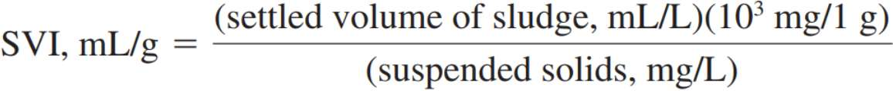
  - **Hình này chứng minh điều gì**
    - Minh họa chi tiết sơ đồ công nghệ, thông số thiết kế hoặc cấu tạo thiết bị trên slide trang 17.
  - **Từ đâu mà thấy được**
    - Trích xuất trực tiếp từ tài liệu bài giảng gốc của chương.

#### 6. Operational Issues in Aerobic Treatment (Sự cố vận hành trong công trình xử lý hiếu khí)

##### 6.1 Sự cố bùn khó lắng và vi khuẩn dạng sợi (Sludge Bulking and Filamentous Growth)

###### Bản chất và định nghĩa hiện tượng bùn khó lắng
- Hiện tượng bùn khó lắng ($\text{Sludge Bulking}$) xảy ra khi bùn hoạt tính lơ lửng mất khả năng lắng trọng lực và nén đặc hạt:
  - Sinh khối vi sinh vật không thể phân tách pha hiệu quả tại bể lắng thứ cấp ($\text{secondary clarifier}$).
  - Thể tích lớp bùn lắng gia tăng đột biến, làm dâng cao mặt nén bùn và tràn qua máng thu nước trong.
- Chỉ số thể tích bùn ($\text{SVI - Sludge Volume Index}$) là đại lượng chuẩn hóa đánh giá đặc tính lắng của hỗn hợp bùn:
  - Phương trình tính toán chỉ số $\text{SVI}$:
    $$\text{SVI} = \frac{(\text{settled volume of sludge, mL/L}) \times (10^3\text{ mg/g})}{\text{suspended solids, mg/L}}$$
    $$\text{SVI} = \frac{\text{SV}_{30} \times 1000}{\text{MLSS}} \quad (\text{mL/g})$$
    với $\text{SV}_{30}$ là thể tích bùn lắng sau $30\text{ phút}$ thử nghiệm trong ống đong hình trụ chuẩn dung tích $1000\text{ mL}$ ($\text{mL/L}$), và $\text{MLSS}$ là nồng độ chất rắn lơ lửng trong hỗn hợp lỏng ($\text{mg/L}$).
- Tiêu chí định lượng trạng thái bùn theo chỉ số $\text{SVI}$:
  - Bùn lắng tốt ($\text{Good settling sludge}$): $\text{SVI} = 90\text{--}120\text{ mL/g}$.
  - Trạng thái bùn khó lắng ($\text{Bulking conditions}$): $\text{SVI} > 150\text{ mL/g}$.

###### Cơ chế vi sinh và nguyên nhân gây bùn khó lắng
- Sự tăng trưởng mất kiểm soát của vi khuẩn dạng sợi ($\text{filamentous bacteria}$) là nguyên nhân vi sinh cốt lõi gây phồng bùn:
  - Tế bào vi khuẩn dạng sợi phát triển thành các chuỗi dài vươn ra khỏi bề mặt bông bùn hoạt tính.
  - Các chuỗi sợi tạo thành mạng lưới bắc cầu ($\text{inter-floc bridging}$) ngăn cản các bông bùn va chạm, kết tụ và nén chặt.
  - Tỷ số diện tích bề mặt trên khối lượng ($\text{surface area-to-mass ratio}$) của bông bùn tăng mạnh, làm giảm vận tốc lắng lắng tĩnh của hạt.
- Các điều kiện môi trường kích thích vi khuẩn dạng sợi sinh trưởng ưu thế:
  - Nồng độ oxy hòa tan trong bể quá thấp ($\text{Low DO} < 2\text{ mg/L}$).
  - Tải lượng hữu cơ trên sinh khối quá thấp ($\text{Low } F/M < 0{,}1\text{ kg BOD/kg MLVSS}\cdot\text{d}$).
  - Chế độ thủy lực xáo trộn hoàn toàn ($\text{complete-mix operation}$): nồng độ cơ chất đồng nhất trên toàn bể triệt tiêu gradient nồng độ hữu cơ, làm mất lợi thế hấp thụ cơ chất nhanh của vi khuẩn tạo bông ($\text{floc-forming bacteria}$).
  - Nước thải đầu vào lưu cữu bị thối rữa ($\text{septic wastewater}$) chứa hydro sunfua ($\text{H}_2\text{S}$).
  - Thiếu hụt chất dinh dưỡng vi lượng hoặc đa lượng ($\text{nutrient deficiency}$ với tỷ lệ $\text{BOD}:\text{N}:\text{P} \neq 100:5:1$).
  - Độ $\text{pH}$ môi trường giảm thấp ($\text{Low pH} < 6{,}5$).

###### Hậu quả công nghệ của sự cố bùn khó lắng
- Nồng độ chất rắn lơ lửng trong nước thải sau xử lý gia tăng đột biến ($\text{increased effluent SS concentration}$):
  - Bùn vi sợi trôi qua máng tràn bể lắng làm đục dòng thải, làm tăng $\text{BOD}_5$ và $\text{COD}$ đầu ra.
- Hiệu suất xử lý sinh học toàn hệ thống suy giảm nghiêm trọng ($\text{poor treatment performance}$):
  - Thất thoát sinh khối hoạt tính làm giảm nồng độ $\text{MLSS}$, mất kiểm soát tuổi bùn ($\text{SRT}$) yêu cầu cho quá trình khử $\text{BOD}$ và nitrat hóa.

###### Bằng chứng định danh vi sinh học và cấu trúc bông bùn
- Bảng phân loại các chủng vi khuẩn dạng sợi theo tác nhân sinh trưởng:
  - **Hình 31.** Bảng định danh vi khuẩn dạng sợi và nguyên nhân sinh trưởng (Filamentous bacteria found in activated sludge)
    - 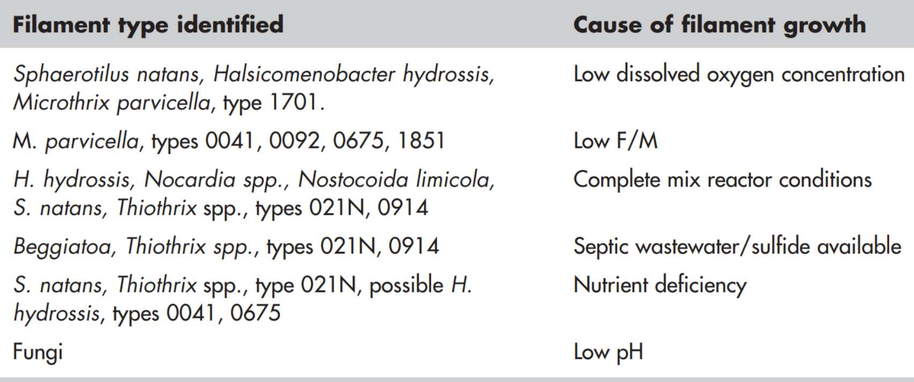
    - **Hình này chứng minh điều gì**
      - Mỗi điều kiện vận hành bất lợi làm phát triển các loài vi khuẩn dạng sợi đặc thù trong bùn hoạt tính.
    - **Từ đâu mà thấy được**
      - Cột Filament type identified đối chiếu với cột Cause of filament growth gồm các nhóm DO thấp, F/M thấp, xáo trộn hoàn toàn, sunfua và dinh dưỡng.
  - Chi tiết tương quan vi sinh học:
    - Oxy hòa tan thấp ($\text{Low DO}$): *Sphaerotilus natans*, *Haliscomenobacter hydrossis*, *Microthrix parvicella*, type 1701.
    - Tỷ số $F/M$ thấp ($\text{Low } F/M$): *Microthrix parvicella*, types 0041, 0092, 0675, 1851.
    - Chế độ xáo trộn hoàn toàn ($\text{Complete mix reactor conditions}$): *Haliscomenobacter hydrossis*, *Nocardia* spp., *Nostocoida limicola*, *Sphaerotilus natans*, *Thiothrix* spp., types 021N, 0914.
    - Nước thải thối rữa/chứa sunfua ($\text{Septic wastewater / sulfide available}$): *Beggiatoa*, *Thiothrix* spp., types 021N, 0914.
    - Thiếu hụt dinh dưỡng ($\text{Nutrient deficiency}$): *Sphaerotilus natans*, *Thiothrix* spp., type 021N, *Haliscomenobacter hydrossis*, types 0041, 0675.
    - Độ $\text{pH}$ thấp ($\text{Low pH}$): Nấm sợi (*Fungi*).
- So sánh vi thể cấu trúc hình thái bông bùn:
  - **Hình 32.** Cấu trúc bông bùn không có vi khuẩn sợi lắng tốt (Nonfilamentous good settling floc)
    - 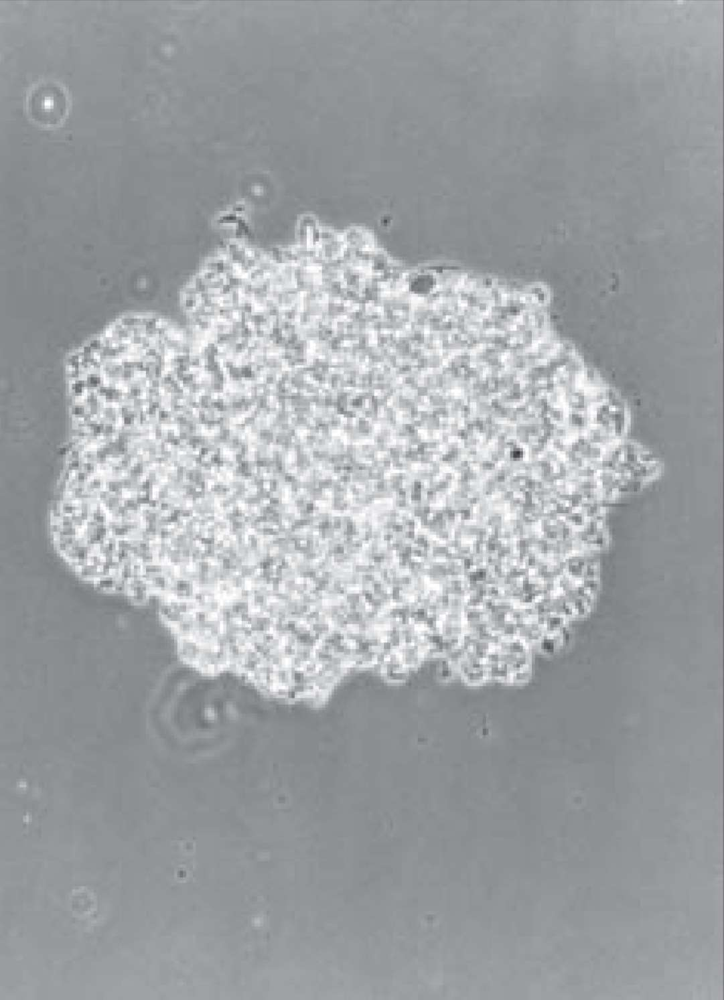
    - **Hình này chứng minh điều gì**
      - Bông bùn hoạt tính tiêu chuẩn có kết cấu đặc chắc, viền ranh giới rõ ràng và không có tế bào sợi vươn ra ngoài.
    - **Từ đâu mà thấy được**
      - Ảnh hiển vi pha tương phản cho thấy một khối kết tụ tế bào dày đặc, phân lập, bề mặt tương đối nhẵn và không có liên kết sợi.
  - **Hình 33.** Bông bùn bị bắc cầu bởi vi khuẩn dạng sợi (Floc particles bridged by filamentous)
    - 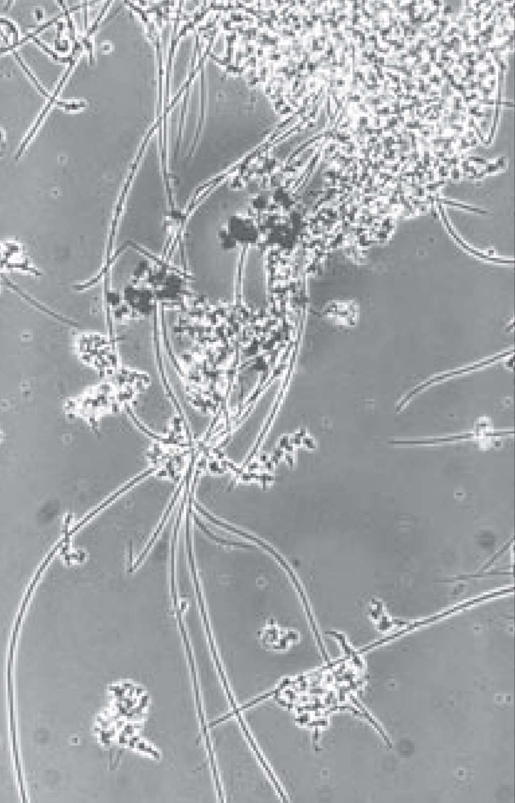
    - **Hình này chứng minh điều gì**
      - Tế bào dạng sợi kéo dài vươn ra khỏi bông bùn, tạo cầu nối liên kết mạng lỏng lẻo làm cản trở quá trình nén lắng.
    - **Từ đâu mà thấy được**
      - Ảnh hiển vi cho thấy các sợi vi khuẩn dài đan xen chằng chịt giữa các cụm bông bùn lân cận làm phân tán khối bùn.

###### Giải pháp kỹ thuật kiểm soát bùn khó lắng
- Duy trì nồng độ oxy hòa tan trong bể bùn hoạt tính tối thiểu $\text{DO} \ge 2{,}0\text{ mg/L}$:
  - Ngăn ngừa hiện tượng vi khuẩn sợi có ái lực oxy cao (*S. natans*, *type 1701*) cạnh tranh oxy với vi khuẩn tạo bông.
- Điều chỉnh tỷ số tải lượng $F/M$ trong dải thiết kế tối ưu:
  - Điều chỉnh lưu lượng xả bùn dư ($\text{WAS}$) để cân bằng sinh khối $\text{MLVSS}$ phù hợp với tải lượng cơ chất hữu cơ đầu vào.
- Kiểm soát lưu lượng dòng bùn tuần hoàn ($\text{RAS}$):
  - Ngăn ngừa quá tải thủy lực và quá tải chất rắn tại đáy bể lắng đợt hai, duy trì chiều dày lớp đệm bùn ổn định.
- Tích hợp ngăn lựa chọn vi sinh ($\text{Selector Tank}$):
  - Lắp đặt ngăn lựa chọn thiếu khí ($\text{anoxic selector}$), kỵ khí ($\text{anaerobic selector}$) hoặc hiếu khí tải lượng cao ($\text{aerobic selector}$) ngay phía trước bể phản ứng xáo trộn hoàn toàn $\text{CMAS}$.
  - Thiết lập nồng độ cơ chất cao cục bộ ($\text{high substrate concentration gradient}$): vi khuẩn tạo bông hấp thụ nhanh cơ chất hòa tan và chuyển hóa thành polymer dự trữ nội bào ($\text{PHB}$), làm suy giảm cơ chất và ức chế hoàn toàn vi khuẩn dạng sợi.

---

##### 6.2 Sự cố tạo bọt bùn và vi khuẩn Nocardioform (Sludge Foaming and Nocardioform Organisms)

###### Bản chất và đặc tính lớp bọt bùn vi sinh
- Hiện tượng tạo bọt bùn ($\text{Sludge Foaming}$) phát sinh do vi khuẩn gắn kết chọn lọc vào các bọt khí trong bể phản ứng hiếu khí:
  - Tạo thành lớp bọt nhớt, dày và liên kết cấu trúc cực kỳ bền vững nổi trên mặt nước hỗn hợp lỏng.
  - Lớp bọt phủ kín bề mặt bể sục khí và khó bị phá vỡ bằng sục khí hay khuấy trộn thông thường.
- Đặc điểm nhận diện hóa lý của lớp bọt:
  - Màu sắc: bọt màu nâu sẫm hoặc vàng nâu đặc trưng.
  - Tính chất cơ lý: bọt rất nhớt ($\text{viscous foam}$), bám dính mạnh vào thành bê tông công trình và đường ống.

###### Tác nhân vi sinh vật và cơ chế tạo bọt
- Nhóm xạ khuẩn $\textit{Nocardioform}$ là tác nhân vi sinh vật chính gây bọt:
  - Các loài chủ đạo gồm *Gordonia amarae* (trước đây là *Nocardia amarae*) và *Candidatus Microthrix parvicella*.
  - Cấu trúc vách tế bào chứa hàm lượng lớn hợp chất lipid và axit mycolic tạo bề mặt kỵ nước cao ($\text{hydrophobic cell surfaces}$).
- Cơ chế liên kết bọt khí:
  - Do tính kỵ nước, tế bào vi khuẩn có ái lực tự nhiên với pha khí thay vì pha nước lỏng.
  - Khi bọt khí sục từ đáy bể đi lên, các sợi vi khuẩn bám chặt vào màng phân cách khí - lỏng, giữ bọt khí không vỡ và lôi kéo toàn bộ khối sinh khối nổi lên mặt thoáng.
- Các yếu tố công nghệ thuận lợi thúc đẩy tạo bọt:
  - Hệ thống sục khí bọt mịn ($\text{fine bubble aeration}$): cung cấp mật độ bọt khí nhỏ diện tích tiếp xúc lớn, tăng xác suất bắt dính tế bào kỵ nước.
  - Nồng độ dầu, mỡ và chất béo cao trong nước thải đầu vào ($\text{high concentrations of fats, oils, and grease - FOG}$): đóng vai trò cơ chất chọn lọc ưa thích kích thích *Nocardioforms* phát triển.
  - Vận hành ở tuổi bùn dài ($\text{high SRT}$): nhóm xạ khuẩn có tốc độ sinh trưởng chậm tích lũy ưu thế trong hệ thống.

###### Hậu quả vận hành của sự cố tạo bọt bùn
- Thách thức lớn trong công tác vận hành và quản lý trạm ($\text{operational challenges and management difficulties}$):
  - Lớp bọt dày tràn qua lan can, thành bể và máng tràn, gây trơn trượt nguy hiểm cho nhân viên vận hành.
  - Khô cứng bám dính thiết bị, làm kẹt phao đo, ăn mòn kết cấu kim loại và phát sinh mùi hôi khó chịu.
- Suy giảm hiệu suất và mất an toàn công nghệ ($\text{safety and treatment efficiency issues}$):
  - Bọt mang theo lượng lớn vi sinh vật hoạt tính tràn sang bể lắng, làm tăng $\text{SS}$ và $\text{BOD}$ dòng thải.
  - Cản trở quá trình truyền oxy bề mặt và làm xáo trộn chế độ thủy lực của bể phản ứng.

###### Bằng chứng hình ảnh hiện trường và cấu trúc mạng sợi
- Hình ảnh hiện trường và cấu trúc vi sợi xạ khuẩn Nocardioform gây hiện tượng bọt bùn:
  - **Hình 34.** Bọt bùn trên mặt bể sục khí và cấu trúc sợi vi khuẩn Nocardioform (Sludge foaming on aeration basin and Nocardioform foam filaments)
    - 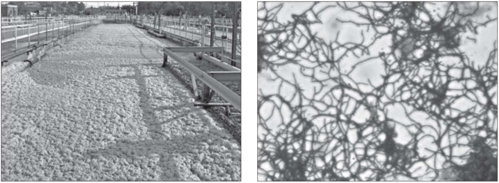
    - **Hình này chứng minh điều gì**
      - Lớp bọt nâu dày che phủ hoàn toàn bề mặt bể hiếu khí, được tạo thành từ mạng lưới vi sợi xạ khuẩn Nocardioform phân nhánh dày đặc.
    - **Từ đâu mà thấy được**
      - Ảnh hiện trường bên trái thể hiện bề mặt bể sục khí bị phủ kín bởi lớp bọt đặc; ảnh hiển vi bên phải cho thấy mạng lưới sợi phân nhánh đậm nét.

###### Biện pháp kỹ thuật kiểm soát và xử lý sự cố tạo bọt
- Thiết kế hình học tránh bẫy bọt khí ($\text{Avoiding trapping foam}$):
  - Cải tiến vách ngăn và cửa tràn hướng dòng, không tạo vùng nước chết hoặc góc tù giữ bọt trên mặt bể phản ứng.
- Xả bùn bề mặt ($\text{Surface wasting of activated sludge}$):
  - Thu gom và xả bỏ trực tiếp lớp bùn bọt nổi trên mặt bể sục khí thay vì chỉ xả bùn đáy ($\text{bottom WAS}$) tại bể lắng đợt hai, giúp loại bỏ tận gốc quần thể xạ khuẩn kỵ nước.
- Phun hóa chất clo lên bề mặt lớp bọt ($\text{Using chlorine spray on the surface of the foam}$):
  - Áp dụng liều lượng dung dịch clo nồng độ thấp ($2\text{--}3\text{ mg Cl}_2/\text{g VSS bọt}$) phun sương cục bộ lên lớp bọt.
  - Tiêu diệt có chọn lọc lớp vi sinh vật *Nocardioform* kỵ nước ở màng bề mặt mà không gây ảnh hưởng đến quần thể vi sinh vật tạo bông bên dưới hỗn hợp lỏng.
- Giảm thiểu triệt để dầu mỡ đầu vào ($\text{Reducing the oil and grease in influent wastewater}$):
  - Nâng cao hiệu quả tuyển nổi $\text{DAF}$ hoặc bể tách dầu mỡ sơ cấp để cắt giảm nguồn cơ chất kích thích *Nocardioforms*.
- Châm bổ sung polymer cation nồng độ thấp ($\text{Adding a small concentration of cation polymer}$):
  - Trung hòa điện tích bề mặt tế bào vi sinh vật kỵ nước, phá vỡ liên kết bám dính bọt khí và kiểm soát hiệu quả hiện tượng tạo bọt.

---

##### 6.3 Sự cố bùn nổi do phản ứng khử nitrat trong bể lắng (Sludge Rising and Clarifier Denitrification)

###### Bản chất hiện tượng bùn nổi
- Hiện tượng bùn nổi ($\text{Sludge Rising}$) xảy ra khi bùn có đặc tính lắng ban đầu rất tốt nhưng lại nổi ngược lên bề mặt bể lắng thứ cấp sau một thời gian lưu ngắn dưới đáy bể:
  - Khác với hiện tượng bùn khó lắng ($\text{bulking}$), bùn nổi có chỉ số thể tích bùn $\text{SVI}$ bình thường hoặc thấp ($\text{SVI} < 100\text{ mL/g}$).
  - Bùn nén lắng nhanh chóng trong $15\text{--}30\text{ phút}$ đầu, sau đó tách thành từng tảng hoặc lớp màng lớn nổi dâng lên mặt thoáng.

###### Tác nhân sinh hóa và cơ chế phát sinh bùn nổi
- Phản ứng khử nitrat sinh học ($\text{denitrification process}$) diễn ra yếm khí tại lớp cặn bùn đáy bể lắng là nguyên nhân trực tiếp:
  - Phương trình sinh hóa khử nitrat giải phóng khí nitơ phân tử:
    $$\text{NO}_3^- + \text{Chất hữu cơ} \xrightarrow{\text{Vi khuẩn dị dưỡng tùy nghi}} \text{N}_2 \uparrow + \text{CO}_2 + \text{H}_2\text{O} + \text{OH}^-$$
- Trình tự hình thành cơ chế đẩy nổi:
  - Nước thải từ bể sục khí hiếu khí $\text{CMAS}$ hoặc bể nitrat hóa đi vào bể lắng mang theo nồng độ ion nitrat ($\text{NO}_3^-$) cao ($10\text{--}30\text{ mg/L}$).
  - Lớp bùn tích tụ dưới đáy bể lắng cạn kiệt oxy hòa tan tự do ($\text{DO} \rightarrow 0\text{ mg/L}$), chuyển sang điều kiện thiếu khí ($\text{anoxic}$).
  - Vi khuẩn dị dưỡng tiếp tục hô hấp nội sinh, sử dụng ion nitrat làm chất nhận điện tử và giải phóng khí nitơ ($\text{N}_2$).
  - Khí nitơ có độ tan rất thấp trong nước, tích tụ thành các bọt khí vi mô ($\text{small gas bubbles}$) bám chặt vào cấu trúc bông bùn.
  - Các bọt khí làm giảm khối lượng riêng biểu kiến của bông bùn nhỏ hơn khối lượng riêng của nước, tạo lực đẩy nổi Archimedes đưa các mảng bùn dâng lên mặt nước.

###### Dấu hiệu nhận biết và chẩn đoán tại hiện trường
- Nhận diện bọt khí gắn kèm bông bùn ($\text{Identification}$):
  - Quan sát thấy các bọt khí nhỏ thoát ra trên bề mặt và bám dày đặc vào các mảng bùn nổi.
  - Diện tích bùn nổi gia tăng nhanh chóng trên bề mặt bể lắng đợt hai ($\text{secondary clarifier surface}$).
  - Mẫu bùn lắng thử nghiệm trong ống đong lắng trong trẻo trong $30\text{ phút}$ đầu nhưng sau $60\text{--}120\text{ phút}$ toàn bộ khối bùn nổi ngược lên miệng ống đong kèm bọt khí $\text{N}_2$.

###### Biện pháp kỹ thuật kiểm soát sự cố bùn nổi
- Tăng lưu lượng bùn tuần hoàn ($\text{Increase RAS}$):
  - Tăng công suất bơm $\text{RAS}$ nhằm rút ngắn thời gian lưu của bùn ($\text{sludge retention time in clarifier}$) dưới đáy bể lắng thứ cấp.
  - Đưa bùn quay trở lại bể phản ứng trước khi phản ứng khử nitrat kịp giải phóng đủ lượng bọt khí $\text{N}_2$ đẩy nổi bùn.
- Giảm lưu lượng khí cấp của hệ thống sục khí ($\text{Decrease aeration flowrate}$):
  - Giảm nhẹ nồng độ oxy hòa tan để kiểm soát mức độ nitrat hóa dư thừa khi hệ thống không bắt buộc khử nitơ nghiêm ngặt.
- Giảm thời gian lưu bùn toàn hệ thống ($\text{Decrease SRT}$):
  - Tăng lưu lượng xả bùn dư $\text{WAS}$ để hạ tuổi bùn xuống dưới ngưỡng tuổi bùn tối thiểu của vi khuẩn nitrat hóa ($\text{SRT} < \text{SRT}_{\min,\text{nit}}$), hạn chế phản ứng chuyển hóa amoni thành nitrat.
- Cải tiến quy trình công nghệ kết hợp thiếu khí/hiếu khí ($\text{Improve denitrification by anoxic/aerobic process}$):
  - Tích hợp ngăn tiền thiếu khí ($\text{preanoxic zone}$) với dòng tuần hoàn nội bộ hỗn hợp lỏng ($\text{internal recycle - IR}$) theo quy trình $\text{MLE}$.
  - Chủ động khử sạch toàn bộ nitrat thành khí $\text{N}_2$ ngay trong bể phản ứng sinh học có kiểm soát, triệt tiêu lượng nitrat dư thừa đi vào bể lắng đợt hai.

### Chương 7: Công trình Khử Nitơ Sinh học (Biological Denitrification Unit)

#### 1. Preanoxic denitrification process

##### Advantages of preanoxic

- Quá trình tiền thiếu khí (Preanoxic denitrification process / Modified Ludzack-Ettinger - MLE) là cấu hình công nghệ sinh học xử lý nitơ kết hợp vùng thiếu khí ($\text{anoxic}$) đặt phía trước vùng hiếu khí ($\text{aerobic}$):
  - Dòng nước thải thô sau lắng sơ cấp giàu hợp chất cacbon hữu cơ ($\text{BOD}$) được dẫn trực tiếp vào ngăn tiền thiếu khí ở đầu chuỗi công nghệ.
  - Dòng tuần hoàn nội bộ hỗn hợp lỏng ($\text{internal recycle - IR}$) mang hàm lượng lớn nitrat ($\text{NO}_3\text{-N}$) từ cuối vùng hiếu khí được bơm hồi lưu trở lại ngăn tiền thiếu khí.
  - Dòng bùn hoạt tính tuần hoàn ($\text{return activated sludge - RAS}$) từ đáy bể lắng thứ cấp hoặc từ bể màng sinh học $\text{MBR}$ được bơm về đầu ngăn thiếu khí để duy trì sinh khối vi sinh vật.
  - Vi khuẩn dị dưỡng tùy tiện khử nitrat ($\text{denitrifiers}$) sử dụng trực tiếp nguồn cacbon hữu cơ trong nước thải làm chất cho điện tử ($\text{electron donor}$) và nitrat làm chất nhận điện tử ($\text{electron acceptor}$) để chuyển hóa $\text{NO}_3^-$ thành khí nitơ phân tử ($\text{N}_2 \uparrow$).
  - **Hình 1.** Sơ đồ nguyên lý quy trình khử nitơ tiền thiếu khí (Preanoxic denitrification process)
    - 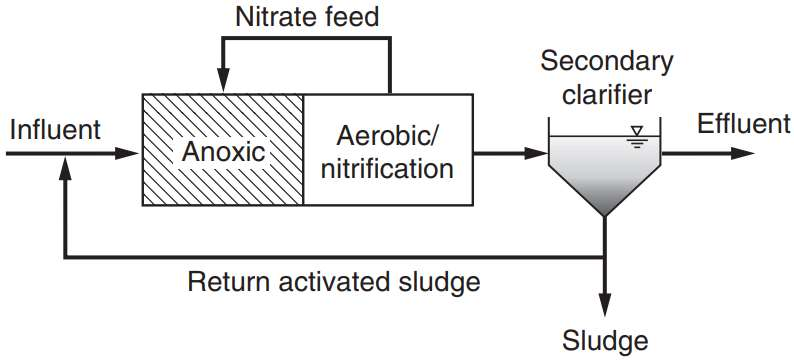
    - **Hình này chứng minh điều gì**
      - Quy trình tiền thiếu khí bố trí ngăn thiếu khí phía trước ngăn hiếu khí, kết hợp dòng tuần hoàn nitrat từ ngăn hiếu khí và dòng bùn tuần hoàn từ bể lắng.
    - **Từ đâu mà thấy được**
      - Dòng vào Influent dẫn vào ngăn Anoxic; dòng Nitrate feed bơm từ Aerobic/nitrification về Anoxic; bùn Return activated sludge bơm từ đáy Secondary clarifier về Anoxic; dòng nước trong xả ra Effluent.

###### Dễ dàng cải tạo các trạm xử lý nước thải hiện hữu (Easy to renovate existing plants)

- Cấu hình tiền thiếu khí có tính tương thích cao với các công trình xử lý bùn hoạt tính truyền thống ($\text{CAS}$):
  - Có thể tận dụng thể tích bể thổi khí hiện hữu bằng cách lắp đặt vách ngăn chia khoang để tạo ngăn thiếu khí ở đầu bể mà không cần xây dựng thêm công trình bể phản ứng mới.
  - Chi phí đầu tư cải tạo thấp: chỉ yêu cầu bổ sung tường ngăn hướng dòng, hệ thống máy khuấy chìm thiếu khí ($\text{submersible mixers}$) và cụm máy bơm tuần hoàn nội bộ hỗn hợp lỏng ($\text{internal recycle pumps}$).
  - Cho phép các nhà máy xử lý nước thải chuyển đổi mục tiêu từ chỉ xử lý chất hữu cơ ($\text{BOD removal only}$) sang xử lý đồng thời chất hữu cơ và dinh dưỡng nitơ ($\text{biological nutrient removal - BNR}$) nhằm đáp ứng quy chuẩn xả thải mới.

###### Cơ chế chọn lọc ngăn anoxic selector để kiểm soát bùn sợi (Benefits of the anoxic selector operation for control of filamentous sludge)

- Ngăn tiền thiếu khí đóng vai trò như một ngăn chọn lọc động học ($\text{anoxic selector}$) kiểm soát hiệu quả hiện tượng phồng bùn vi sinh:
  - Gradient nồng độ cơ chất hữu cơ cao ở đầu dòng tiếp xúc trực tiếp với bùn tuần hoàn $\text{RAS}$ tạo điều kiện cho các chủng vi khuẩn tạo bông ($\text{floc-forming bacteria}$) hấp thụ nhanh cơ chất hòa tan và dự trữ năng lượng.
  - Môi trường thiếu oxy hòa tan ($\text{DO} < 0{,}2\text{ mg/L}$) kết hợp sự hiện diện của nitrat làm ức chế chọn lọc sự phát triển của phần lớn vi khuẩn dạng sợi hiếu khí nghiêm ngặt ($\text{filamentous microorganisms}$) gây hiện tượng bùn khó lắng.
  - Cải thiện đáng kể chỉ số thể tích bùn ($\text{SVI}$), duy trì bông bùn chắc khỏe, lắng nhanh và giảm thiểu nguy cơ trào bùn qua máng tràn bể lắng thứ cấp.

###### Sản sinh độ kiềm tự nhiên trước giai đoạn nitrat hóa (Produce alkalinity before the nitrification step)

- Quá trình khử nitrat sinh học sản sinh độ kiềm tự nhiên, giúp cân bằng hóa học nước thải trước khi vào vùng hiếu khí:
  - Phương trình sinh hóa khử nitrat giải phóng ion hydroxyl ($\text{OH}^-$), sản sinh tương đương $3{,}57\text{ g CaCO}_3$ độ kiềm cho mỗi $1{,}0\text{ g NO}_3\text{-N}$ bị khử thành $\text{N}_2$:
    $$\text{C}_{10}\text{H}_{19}\text{O}_3\text{N} + 10\text{NO}_3^- \longrightarrow 5\text{N}_2 \uparrow + 10\text{CO}_2 + 3\text{H}_2\text{O} + \text{NH}_3 + 10\text{OH}^-$$
  - Lượng độ kiềm sinh ra ở ngăn tiền thiếu khí bù đắp xấp xỉ $50\%$ tổng lượng độ kiềm bị tiêu thụ bởi quá trình nitrat hóa ở ngăn hiếu khí tiếp theo (quá trình nitrat hóa tiêu tốn $7{,}14\text{ g CaCO}_3$ cho mỗi $1{,}0\text{ g NH}_4\text{-N}$ bị oxy hóa).
  - Giúp ổn định độ $\text{pH}$ của hỗn hợp lỏng trong khoảng tối ưu từ $7{,}2$ đến $8{,}0$, bảo vệ hoạt tính của vi khuẩn tự dưỡng nitrat hóa ($\textit{Nitrosomonas}$ và $\textit{Nitrobacter}$) mà không cần châm thêm hóa chất kiềm tốn kém như $\text{NaOH}$, $\text{Na}_2\text{CO}_3$ hay vôi $\text{Ca(OH)}_2$.

###### Tiết kiệm năng lượng sục khí nhờ oxy hóa BOD bằng nitrat (Energy savings due to the use of nitrate for oxidation of the influent BOD)

- Khử nitrat tận dụng nitrat làm chất nhận điện tử oxy hóa chất hữu cơ, mang lại lợi ích kinh tế hiệu quả hơn về năng lượng:
  - Nhu cầu oxy hóa cacbon hữu cơ hòa tan được đáp ứng bởi lượng oxy liên kết trong phân tử nitrat ($\text{NO}_3^-$) thay vì oxy hòa tan ($\text{DO}$) từ máy thổi khí.
  - Mỗi $1{,}0\text{ g NO}_3\text{-N}$ bị khử tương đương với việc tiết kiệm $2{,}86\text{ g O}_2$ hòa tan cần cung cấp cho hệ thống:
    $$\Delta \text{O}_2\text{ saved} = 2{,}86\text{ g O}_2 / \text{g NO}_3\text{-N reduced}$$
  - Phân đoạn chất hữu cơ dễ phân hủy sinh học ($\text{rbCOD}$) trong nước thải đầu vào được tiêu thụ phần lớn tại ngăn thiếu khí, làm giảm mạnh tải lượng $\text{BOD}$ đi vào ngăn hiếu khí.
  - Giảm lưu lượng khí cấp yêu cầu, giảm công suất máy thổi khí và cắt giảm từ $20\%$ đến $30\%$ điện năng tiêu thụ cho toàn bộ trạm xử lý.

---

##### Determine internal recycle

- Tỷ lệ tuần hoàn nội bộ ($\text{internal recycle ratio - IR}$) quyết định hiệu quả phân dòng và tải lượng nitrat đưa về ngăn thiếu khí:
  - Ký hiệu tỷ lệ tuần hoàn nội bộ: $\text{IR} = Q_{\text{IR}} / Q$, trong đó $Q_{\text{IR}}$ là lưu lượng hỗn hợp bùn nước tuần hoàn từ cuối ngăn hiếu khí về đầu ngăn thiếu khí ($\text{m}^3/\text{ngày}$) và $Q$ là lưu lượng nước thải đầu vào ($\text{m}^3/\text{ngày}$).
  - Ký hiệu tỷ lệ bùn hoạt tính tuần hoàn từ bể lắng thứ cấp: $R = Q_R / Q$, trong đó $Q_R$ là lưu lượng bùn tuần hoàn $\text{RAS}$ ($\text{m}^3/\text{ngày}$).
  - Nồng độ nitrat trong dòng nước ra sau xử lý, trong dòng tuần hoàn nội bộ và trong dòng bùn tuần hoàn đều bằng nhau và bằng nồng độ nitrat của hỗn hợp lỏng sau ngăn hiếu khí ($N_e$, đơn vị $\text{g NO}_3\text{-N/m}^3$).

###### Thiết lập phương trình cân bằng vật chất nitrat (Mass balance for nitrate)

- Phương trình bảo toàn khối lượng nitrat qua hệ thống bùn hoạt tính dòng chảy liên tục:
  - Khối lượng nitrat sản sinh ra từ quá trình nitrat hóa ở vùng hiếu khí phân bố thành ba dòng vật chất thoát ra khỏi vùng hiếu khí:
    $$\text{Nitrate produced in aerobic zone} = \text{Nitrate in effluent} + \text{Nitrate in internal recycle} + \text{Nitrate in RAS}$$
  - Phương trình toán học biểu diễn cân bằng lưu lượng và nồng độ nitrat:
    $$Q \cdot (\text{NO}_x) = (Q + \text{IR} \cdot Q + R \cdot Q) \cdot N_e$$
    trong đó:
    - $\text{NO}_x$: Nồng độ nitrat sinh ra từ quá trình nitrat hóa tính trên một đơn vị thể tích nước thải đầu vào ($\text{g NO}_3\text{-N/m}^3$).
    - $N_e$: Nồng độ nitrat trong dòng nước ra sau xử lý ($\text{g NO}_3\text{-N/m}^3$).
    - $\text{IR}$: Tỷ số tuần hoàn nội bộ hỗn hợp lỏng ($\text{dimensionless}$).
    - $R$: Tỷ số tuần hoàn bùn hoạt tính $\text{RAS}$ ($\text{dimensionless}$).
  - Rút gọn lưu lượng $Q$ ở hai vế phương trình cân bằng vật chất:
    $$\text{NO}_x = (1 + \text{IR} + R) \cdot N_e$$
  - Công thức xác định tỷ lệ tuần hoàn nội bộ $\text{IR}$:
    $$\text{IR} = \frac{\text{NO}_x}{N_e} - 1 - R$$
  - **Hình 2.** Sơ đồ phân bố lưu lượng và nồng độ nitrat phục vụ cân bằng vật chất
    - 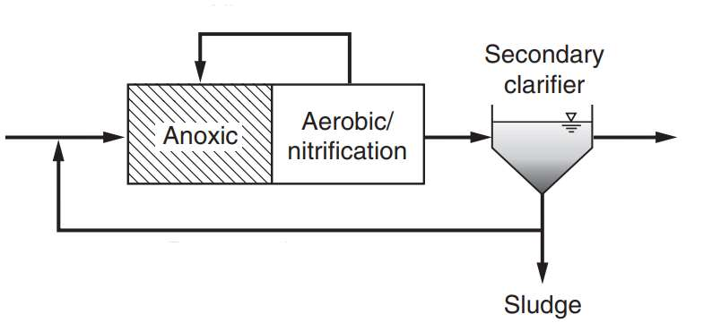
    - **Hình này chứng minh điều gì**
      - Cân bằng vật chất nitrat: tổng lượng nitrat sản sinh trong ngăn hiếu khí phân bố vào dòng nước ra, dòng tuần hoàn nội bộ và dòng bùn tuần hoàn.
    - **Từ đâu mà thấy được**
      - Dòng vào mang lưu lượng $Q$ và nồng độ nitrat ban đầu $N_0 \approx 0$; dòng tuần hoàn nội bộ mang lưu lượng $\text{IR} \times Q$ và nồng độ $N_e$; dòng bùn $\text{RAS}$ mang lưu lượng $Q_R$ và nồng độ $N_e$; dòng nước ra sau lắng mang lưu lượng $Q$ và nồng độ $N_e$; dòng bùn xả dư mang lưu lượng $Q_w$ và nồng độ $N_e$.

###### Giới hạn công nghệ và các yếu tố ảnh hưởng đến tỷ lệ tuần hoàn nội bộ

- Nồng độ nitrat trong dòng nước ra sau xử lý ($N_e$) phụ thuộc nghịch đảo vào tỷ số tuần hoàn tổng hợp ($\text{IR} + R$):
  $$N_e = \frac{\text{NO}_x}{1 + \text{IR} + R}$$
- Hiệu suất khử nitrat lý thuyết cực đại của quy trình tiền thiếu khí bị giới hạn bởi tỷ số phân dòng thủy lực:
  $$\eta_{\text{denit}} = \frac{\text{IR} + R}{1 + \text{IR} + R}$$
  - Ví dụ: với $R = 0{,}5$, khi tăng $\text{IR}$ từ $1{,}0$ lên $2{,}0$; $3{,}0$ và $4{,}0$, hiệu suất khử nitrat tăng tương ứng từ $60{,}0\%$ lên $71{,}4\%$; $77{,}8\%$ và $81{,}8\%$.
  - Khi tỷ số $\text{IR} > 3 - 4$, hiệu suất khử nitrat gia tăng rất chậm nhưng chi phí điện năng tiêu thụ cho bơm tuần hoàn tăng phi tuyến và vận tốc dòng chảy qua ngăn thiếu khí quá lớn làm giảm thời gian tiếp xúc hiệu dụng.
- Dòng tuần hoàn nội bộ $\text{IR}$ mang theo lượng oxy hòa tan ($\text{DO}$) dư thừa từ ngăn hiếu khí ($\text{DO} = 2{,}0 - 3{,}0\text{ mg/L}$) quay trở lại ngăn thiếu khí:
  - Lượng $\text{DO}$ đưa về làm ức chế enzyme $\textit{nitrate reductase}$ của vi khuẩn khử nitrat và tiêu tốn một phần nguồn $\text{BOD}$ dễ phân hủy sinh học trong nước thải.
  - Do đó, cần kiểm soát nồng độ $\text{DO}$ ở cuối ngăn hiếu khí trong khoảng $1{,}0 - 1{,}5\text{ mg/L}$ để bảo vệ môi trường thiếu khí tối ưu ($\text{DO} < 0{,}2 - 0{,}5\text{ mg/L}$).

---

##### Example preanoxic tank design with secondary clarification
- **Sơ đồ cấu hình công nghệ tiền thiếu khí kết hợp bể lắng thứ cấp:**
  - **Hình 3.** Cấu hình công nghệ bể tiền thiếu khí kết hợp bể lắng thứ cấp
    - 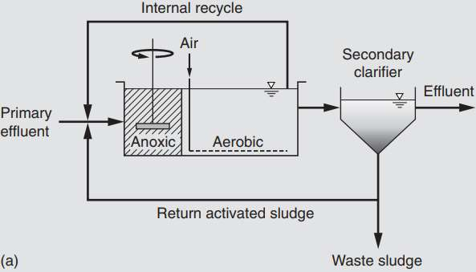
  - **Hình này chứng minh điều gì**
    - Cấu hình tiền thiếu khí truyền thống gồm ngăn anoxic có máy khuấy cơ học trục đứng, ngăn aerobic có hệ thống cấp khí bọt mịn, bể lắng thứ cấp và 2 tuyến tuần hoàn độc lập.
  - **Từ đâu mà thấy được**
    - Nhãn (a): Nước thải sau lắng sơ cấp Primary effluent đi vào ngăn Anoxic có cánh khuấy cơ học quay; ngăn Aerobic sục khí Air bằng dàn đĩa đáy; tuyến Internal recycle bơm từ cuối Aerobic về Anoxic; tuyến Return activated sludge và Waste sludge dẫn từ đáy Secondary clarifier.

###### Worked Exercise: vd1_preanoxic_secondary_clarification

- **Đề bài**:
  - Thiết kế bể tiền thiếu khí kết hợp bể lắng thứ cấp cho nhà máy xử lý nước thải sinh hoạt.
  - Số liệu thiết kế đầu vào kế thừa từ Ví dụ 2, Chương 6 (CMAS cho khử BOD và nitrat hóa).
  - Nồng độ nitrat yêu cầu trong dòng nước ra sau xử lý: $N_e = \text{NO}_3^-\text{-N} \le 6{,}0\text{ g/m}^3$.
  - Xác định tỷ lệ tuần hoàn nội bộ ($\text{IR}$), lưu lượng tuần hoàn nội bộ ($Q_{\text{IR}}$), tải lượng nitrat khử ($NO_r$), thể tích bể tiền thiếu khí ($V_{\text{anoxic}}$), thời gian lưu nước thủy lực ($\tau_{\text{anoxic}}$), công suất máy khuấy chìm thiếu khí ($P_{\text{mix}}$), lượng độ kiềm sinh ra và lượng oxy hòa tan tiết kiệm được.

- **Dữ kiện**:
  - Lưu lượng nước thải thiết kế: $Q = 22{,}700\text{ m}^3/\text{ngày} = 945{,}83\text{ m}^3/\text{h}$.
  - Đặc tính nước thải đầu vào (từ Ví dụ 1 & 2 Chương 6):
    - $\text{BOD}_5 = 140\text{ g/m}^3$ ($\text{mg/L}$)
    - $\text{sBOD} = 70\text{ g/m}^3$
    - $\text{COD} = 300\text{ g/m}^3$
    - $\text{rbCOD} = 80\text{ g/m}^3$
    - $\text{TSS}_0 = 70\text{ g/m}^3$
    - $\text{VSS}_0 = 60\text{ g/m}^3$
    - $\text{TKN}_0 = 35\text{ g/m}^3$
    - $\text{NH}_4^+\text{-N}_0 = 25\text{ g/m}^3$
    - Độ kiềm ban đầu: $\text{Alk}_0 = 140\text{ g CaCO}_3/\text{m}^3$
    - Tỷ số $b\text{COD}/\text{BOD} = 1{,}6$
    - Nhiệt độ nước thải mùa đông: $T = 12^\circ\text{C}$
  - Thông số thiết kế hiếu khí nitrat hóa (từ Ví dụ 2 Chương 6):
    - Tuổi bùn hiếu khí: $\text{SRT} = 21\text{ ngày}$
    - Lượng sinh khối dị dưỡng sinh ra: $P_{X,\text{bio}} = 1050{,}4\text{ kg/ngày}$
    - Nồng độ bùn hoạt tính hiếu khí: $X_{\text{TSS}} = 3000\text{ g/m}^3$
    - Nồng độ bùn hoạt tính hữu cơ: $X_{\text{VSS}} = 2355\text{ g/m}^3$ (tỷ số $\text{MLVSS}/\text{MLSS} = 0{,}785$)
    - Nồng độ amoni dòng ra sau nitrat hóa: $N_e(\text{NH}_4\text{-N}) = 0{,}5\text{ g/m}^3$
    - Nồng độ nitơ hữu cơ hòa tan không phân hủy dòng ra: $N_{e,\text{org}} \approx 1{,}0\text{ g/m}^3$
    - Tỷ lệ bùn tuần hoàn $\text{RAS}$ từ bể lắng thứ cấp: chọn $R = Q_R / Q = 0{,}50$ ($50\%$)
  - Tiêu chuẩn nồng độ nitrat dòng ra yêu cầu: $N_e = 6{,}0\text{ g/m}^3$.

- **Quy tắc áp dụng**:
  - Cân bằng nitơ tổng xác định lượng nitrat sinh ra từ quá trình nitrat hóa ($\text{NO}_x$):
    $$\text{NO}_x = \text{TKN}_0 - N_e(\text{sol}) - N_{\text{syn}} = \text{TKN}_0 - N_e(\text{sol}) - 0{,}12 \cdot \frac{P_{X,\text{bio}}}{Q}$$
  - Công thức xác định tỷ lệ tuần hoàn nội bộ hỗn hợp lỏng ($\text{IR}$):
    $$\text{IR} = \frac{\text{NO}_x}{N_e} - 1 - R$$
  - Lưu lượng tuần hoàn nội bộ: $Q_{\text{IR}} = \text{IR} \cdot Q$.
  - Tải lượng nitrat cần khử trong bể thiếu khí: $NO_r = Q \cdot (\text{NO}_x - N_e)$.
  - Tốc độ khử nitrat riêng theo sinh khối hữu cơ ($\text{SDNR}$):
    $$\text{SDNR}_{12^\circ\text{C}} = \text{SDNR}_{20^\circ\text{C}} \cdot (1{,}026)^{12 - 20}$$
  - Hiệu chỉnh $\text{SDNR}$ theo ảnh hưởng của dòng tuần hoàn nội bộ ($\text{IR}$):
    $$\text{SDNR}_{\text{adj}} = \text{SDNR} - 0{,}029 \ln(F/M_b) - 0{,}012$$
  - Thể tích bể tiền thiếu khí:
    $$V_{\text{anoxic}} = \frac{NO_r}{\text{SDNR}_{\text{adj}} \cdot X_b}$$
  - Thời gian lưu nước thủy lực: $\tau_{\text{anoxic}} = \frac{V_{\text{anoxic}}}{Q} \times 24\text{ h/ngày}$.
  - Công suất khuấy trộn thiếu khí: $P_{\text{mix}} = 8\text{ W/m}^3 \cdot V_{\text{anoxic}}$.
  - Thu hồi độ kiềm: $\Delta \text{Alk} = 3{,}57 \cdot (\text{NO}_x - N_e)$.
  - Nhu cầu oxy hòa tan tiết kiệm: $\Delta O_2 = 2{,}86 \cdot (\text{NO}_x - N_e)$.

- **Lời giải**:
  - **Bước 1: Tính toán nồng độ nitrat sinh ra từ quá trình nitrat hóa ($\text{NO}_x$)**
    - Căn cứ: Phương trình cân bằng vật chất nitơ tổng qua bể sinh học hiếu khí có nitrat hóa.
    - Nhìn vào: $\text{TKN}_0 = 35{,}0\text{ g/m}^3$, tổng nitơ amoni và hữu cơ dòng ra $N_e(\text{sol}) = 0{,}5 + 1{,}0 = 1{,}5\text{ g/m}^3$, phần nitơ đồng hóa vào sinh khối tế bào:
      $$N_{\text{syn}} = 0{,}12 \cdot \frac{1050{,}4 \times 10^3\text{ g/ngày}}{22{,}700\text{ m}^3/\text{ngày}} = 5{,}55\text{ g/m}^3$$
      Nồng độ nitrat sinh ra:
      $$\text{NO}_x = 35{,}0 - 1{,}5 - 5{,}55 = 27{,}95\text{ g/m}^3 \approx 28{,}0\text{ g/m}^3$$
  - **Bước 2: Xác định tỷ số tuần hoàn nội bộ ($\text{IR}$) và lưu lượng tuần hoàn ($Q_{\text{IR}}$)**
    - Căn cứ: Phương trình cân bằng nitrat tiền thiếu khí: $\text{IR} = \frac{\text{NO}_x}{N_e} - 1 - R$.
    - Nhìn vào: $\text{NO}_x = 28{,}0\text{ g/m}^3$, tiêu chuẩn nước ra $N_e = 6{,}0\text{ g/m}^3$, tỷ số bùn tuần hoàn $R = 0{,}50$:
      $$\text{IR} = \frac{28{,}0}{6{,}0} - 1 - 0{,}50 = 4{,}667 - 1{,}50 = 3{,}167 \approx 3{,}17$$
      Lưu lượng bơm tuần hoàn nội bộ yêu cầu:
      $$Q_{\text{IR}} = 3{,}167 \times 22{,}700\text{ m}^3/\text{ngày} = 71{,}891\text{ m}^3/\text{ngày} \approx 2995{,}5\text{ m}^3/\text{h}$$
  - **Bước 3: Xác định tải lượng nitrat cần khử trong bể thiếu khí ($NO_r$)**
    - Căn cứ: Lượng nitrat bị loại bỏ khỏi dòng chất lỏng qua ngăn thiếu khí: $NO_r = Q \cdot (\text{NO}_x - N_e)$.
    - Nhìn vào: $Q = 22{,}700\text{ m}^3/\text{ngày}$ và độ suy giảm nitrat $\Delta N = 28{,}0 - 6{,}0 = 22{,}0\text{ g/m}^3$:
      $$NO_r = 22{,}700\text{ m}^3/\text{ngày} \times 22{,}0\text{ g/m}^3 = 499{,}400\text{ g/ngày} = 499{,}4\text{ kg NO}_3\text{-N/ngày}$$
  - **Bước 4: Xác định tốc độ khử nitrat riêng $\text{SDNR}$ và thể tích bể thiếu khí ($V_{\text{anoxic}}$)**
    - Căn cứ: Tỷ số $\text{rbCOD} / b\text{COD} = 80 / (1{,}6 \times 140) = 80 / 224 = 35{,}7\%$. Ở nhiệt độ chuẩn $20^\circ\text{C}$, $\text{SDNR}_{20^\circ\text{C}} \approx 0{,}090\text{ g NO}_3\text{-N/g MLVSS}\cdot\text{ngày}$.
      Hiệu chỉnh nhiệt độ về mùa đông $T = 12^\circ\text{C}$ với $\theta = 1{,}026$:
      $$\text{SDNR}_{12^\circ\text{C}} = 0{,}090 \times (1{,}026)^{12 - 20} = 0{,}090 \times 0{,}8146 = 0{,}0733\text{ g NO}_3\text{-N/g MLVSS}\cdot\text{ngày}$$
      Hiệu chỉnh dòng tuần hoàn nội bộ với $\text{IR} \approx 3{,}17$: $\text{SDNR}_{\text{adj}} \approx 0{,}065\text{ g NO}_3\text{-N/g MLVSS}\cdot\text{ngày} = 0{,}065\text{ kg/kg}\cdot\text{ngày}$.
      Nồng độ sinh khối hữu cơ trong ngăn thiếu khí lấy đồng nhất với bể hiếu khí: $X_b = X_{\text{VSS}} = 2355\text{ g/m}^3 = 2{,}355\text{ kg/m}^3$.
    - Nhìn vào: Tải lượng $NO_r = 499{,}4\text{ kg/ngày}$, $\text{SDNR}_{\text{adj}} = 0{,}065\text{ kg/kg}\cdot\text{ngày}$ và $X_b = 2{,}355\text{ kg/m}^3$:
      $$V_{\text{anoxic}} = \frac{499{,}4\text{ kg/ngày}}{0{,}065\text{ kg/kg}\cdot\text{ngày} \times 2{,}355\text{ kg/m}^3} = \frac{499{,}4}{0{,}15308} \approx 3262{,}3\text{ m}^3$$
      Chọn thể tích thiết kế thực tế làm tròn an toàn:
      $$V_{\text{anoxic}} = 3300\text{ m}^3$$
      Thời gian lưu nước thủy lực danh định trong ngăn thiếu khí:
      $$\tau_{\text{anoxic}} = \frac{3300\text{ m}^3}{22{,}700\text{ m}^3/\text{ngày}} \times 24\text{ h/ngày} = 3{,}49\text{ h}$$
  - **Bước 5: Tính toán công suất máy khuấy chìm thiếu khí ($P_{\text{mix}}$)**
    - Căn cứ: Tiêu chuẩn công suất khuấy trộn thủy lực bể thiếu khí không cấp khí là $8\text{ W/m}^3$.
    - Nhìn vào: Thể tích $V_{\text{anoxic}} = 3300\text{ m}^3$:
      $$P_{\text{mix}} = 8\text{ W/m}^3 \times 3300\text{ m}^3 = 26{,}400\text{ W} = 26{,}4\text{ kW}$$
      Bố trí 4 máy khuấy chìm công suất $7{,}5\text{ kW}$ (3 máy vận hành luân phiên, 1 máy dự phòng) hoặc 4 máy công suất $7{,}0\text{ kW}$ làm việc đồng thời.
  - **Bước 6: Tính toán lượng độ kiềm sinh ra và lượng oxy hòa tan tiết kiệm được**
    - Căn cứ: Suất sinh độ kiềm ($3{,}57\text{ g CaCO}_3/\text{g N}$) và suất tiết kiệm oxy hòa tan ($2{,}86\text{ g O}_2/\text{g N}$).
    - Nhìn vào: Khối lượng nitrat bị khử mỗi ngày $NO_r = 499{,}4\text{ kg NO}_3\text{-N/ngày}$:
      - Lượng độ kiềm sinh ra:
        $$\text{Alkalinity produced} = 499{,}4\text{ kg N/ngày} \times 3{,}57 = 1782{,}9\text{ kg CaCO}_3/\text{ngày}$$
        Gia tăng độ kiềm trong nước thải: $\Delta \text{Alk} = 22{,}0\text{ g/m}^3 \times 3{,}57 = 78{,}54\text{ g CaCO}_3/\text{m}^3$.
      - Lượng oxy hòa tan tiết kiệm được:
        $$O_2\text{ saved} = 499{,}4\text{ kg N/ngày} \times 2{,}86 = 1428{,}3\text{ kg O}_2/\text{ngày}$$

- **Kết quả**:
  - Tỷ số tuần hoàn nội bộ: $\text{IR} = 3{,}17$.
  - Lưu lượng bơm tuần hoàn nội bộ: $Q_{\text{IR}} = 71{,}891\text{ m}^3/\text{ngày} \approx 2995{,}5\text{ m}^3/\text{h}$.
  - Tải lượng nitrat bị khử: $NO_r = 499{,}4\text{ kg NO}_3\text{-N/ngày}$.
  - Thể tích bể tiền thiếu khí: $V_{\text{anoxic}} = 3300\text{ m}^3$.
  - Thời gian lưu nước thủy lực: $\tau_{\text{anoxic}} = 3{,}49\text{ h}$.
  - Công suất khuấy trộn thiếu khí: $P_{\text{mix}} = 26{,}4\text{ kW}$.
  - Thu hồi độ kiềm: $1782{,}9\text{ kg CaCO}_3/\text{ngày}$ (tăng thêm $78{,}54\text{ mg/L}$ độ kiềm).
  - Tiết kiệm oxy hòa tan: $1428{,}3\text{ kg O}_2/\text{ngày}$.

- **Kiểm tra lại**:
  - Kiểm tra nồng độ nitrat đầu ra:
    $$N_e = \frac{\text{NO}_x}{1 + \text{IR} + R} = \frac{28{,}0}{1 + 3{,}17 + 0{,}50} = \frac{28{,}0}{4{,}67} = 5{,}996\text{ g/m}^3 \le 6{,}0\text{ g/m}^3 \quad (\text{Thỏa mãn})$$
  - Kiểm tra tỷ lệ thể tích thiếu khí trên tổng thể tích:
    Ở Ví dụ 2 Chương 6, thể tích bể hiếu khí nitrat hóa $V_{\text{aerobic}} \approx 10{,}500\text{ m}^3$.
    Tỷ lệ thể tích:
    $$\frac{V_{\text{anoxic}}}{V_{\text{anoxic}} + V_{\text{aerobic}}} = \frac{3300}{3300 + 10{,}500} = \frac{3300}{13{,}800} \approx 23{,}9\%$$
    nằm hoàn toàn trong dải thiết kế khuyến nghị thông thường ($20\% - 30\%$).
  - Kiểm tra độ kiềm dư của nước thải sau xử lý:
    $$\text{Alk}_{\text{final}} = \text{Alk}_0 - 7{,}14 \cdot (\text{NO}_x) + \Delta \text{Alk} = 140 - (7{,}14 \times 28{,}0) + 78{,}54 = 140 - 199{,}92 + 78{,}54 = 18{,}62\text{ g CaCO}_3/\text{m}^3$$
    Nếu cần duy trì độ kiềm đệm an toàn tối thiểu $\ge 50 - 70\text{ g CaCO}_3/\text{m}^3$ để giữ ổn định $\text{pH} > 7{,}0$, chỉ cần châm thêm lượng hóa chất kiềm nhỏ bù đắp khoảng $30 - 50\text{ g CaCO}_3/\text{m}^3$, giảm hơn một nửa chi phí châm kiềm so với khi không có quá trình khử nitrat.

---

##### Example preanoxic tank design with membrane separation
- **Cấu hình công nghệ bể tiền thiếu khí kết hợp màng MBR (MBR preanoxic configuration):**
  - **Hình 4.** Cấu hình công nghệ bể tiền thiếu khí kết hợp màng sinh học MBR
    - 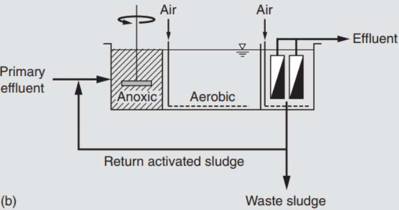
  - **Hình này chứng minh điều gì**
    - Quy trình Preanoxic-MBR tích hợp module màng sợi rỗng hoặc màng tấm phẳng đặt chìm trong ngăn màng riêng, quy ước $\text{IR} = 0$, sử dụng trực tiếp dòng bùn màng tuần hoàn lớn để đưa nitrat về ngăn thiếu khí.
  - **Từ đâu mà thấy được**
    - Nhãn (b): Ngăn Anoxic có máy khuấy cơ học; ngăn Aerobic sục khí Air; ngăn màng chứa module màng lọc và sục khí bọt thô; nước sạch sau màng hút ra Effluent; không có tuyến tuần hoàn nội bộ riêng rẽ; tuyến Return activated sludge và Waste sludge bơm từ đáy ngăn màng về đầu ngăn Anoxic.

###### Worked Exercise: vd2_preanoxic_membrane_separation

- **Đề bài**:
  - Thiết kế bể tiền thiếu khí kết hợp module màng sinh học $\text{MBR}$ cho nhà máy xử lý nước thải sinh hoạt.
  - Số liệu thiết kế đầu vào kế thừa từ Ví dụ 3, Chương 6 (Thiết kế hệ thống MBR).
  - Đối với cấu hình màng $\text{MBR}$, quy ước không lắp đặt đường tuần hoàn nội bộ hỗn hợp lỏng riêng rẽ ($\text{IR} = 0$). Toàn bộ hỗn hợp bùn nước mang nitrat được hồi lưu từ ngăn màng lọc về đầu ngăn tiền thiếu khí thông qua dòng bùn màng tuần hoàn ($\text{RAS}$) với tỷ số tuần hoàn bùn thiết kế $R = 6{,}0$.
  - Xác định nồng độ nitrat trong dòng nước ra qua màng ($N_e$), tỷ số bùn màng tuần hoàn tối thiểu ($R_{\min}$) nếu yêu cầu tiêu chuẩn $N_e \le 6{,}0\text{ g/m}^3$, nồng độ bùn hoạt tính hữu cơ trong ngăn tiền thiếu khí và hiếu khí ($X_A$), thể tích bể tiền thiếu khí $\text{MBR}$ ($V_{\text{anoxic, MBR}}$), thời gian lưu nước thủy lực ($\tau_{\text{anoxic, MBR}}$), và so sánh hiệu quả giảm diện tích/thể tích với hệ truyền thống dùng bể lắng thứ cấp.

- **Dữ kiện**:
  - Lưu lượng nước thải thiết kế: $Q = 22{,}700\text{ m}^3/\text{ngày}$.
  - Nồng độ nitrat sinh ra từ giai đoạn hiếu khí nitrat hóa (kế thừa từ Ví dụ 2): $\text{NO}_x = 28{,}0\text{ g/m}^3$.
  - Thông số thiết kế công nghệ màng sinh học $\text{MBR}$ (từ Ví dụ 3 Chương 6):
    - Tuổi bùn: $\text{SRT} = 21\text{ ngày}$
    - Lượng sinh khối dị dưỡng sinh ra: $P_{X,\text{bio}} = 1050{,}4\text{ kg/ngày}$
    - Khối lượng $\text{MLSS}$ toàn hệ thống: $40{,}253\text{ kg}$
    - Khối lượng $\text{MLVSS}$ toàn hệ thống: $31{,}592\text{ kg}$
    - Tỷ số $\text{MLVSS}/\text{MLSS} = 0{,}785$
    - Nồng độ bùn hoạt tính trong bể màng: $X_m = 12{,}000\text{ g/m}^3 = 12{,}0\text{ kg/m}^3$ ($\text{MLSS}$)
    - Tỷ số tuần hoàn bùn màng giả định: $R = Q_R / Q = 6{,}0$ (dải điển hình $R = 4 - 6$)
    - Quy ước thiết kế Preanoxic-MBR: $\text{IR} = 0$
    - Thông lượng màng thấm lọc: $J = 16\text{ L/m}^2\cdot\text{h}$

- **Quy tắc áp dụng**:
  - Cân bằng vật chất nitrat trong hệ thống tiền thiếu khí kết hợp màng $\text{MBR}$ ($\text{IR} = 0$):
    $$\text{NO}_x = (1 + \text{IR} + R) \cdot N_e = (1 + R) \cdot N_e$$
  - Nồng độ nitrat dòng ra sau màng:
    $$N_e = \frac{\text{NO}_x}{1 + R}$$
  - Tỷ số tuần hoàn bùn màng tối thiểu để thỏa mãn tiêu chuẩn nước ra $N_e$:
    $$R_{\min} = \frac{\text{NO}_x}{N_e} - 1$$
  - Phương trình cân bằng sinh khối xác định nồng độ bùn hoạt tính trong cụm tiền thiếu khí và hiếu khí ($X_A$):
    $$Q \cdot X_0 + Q_R \cdot X_m = (Q + Q_R) \cdot X_A \implies X_A = \frac{R}{1 + R} \cdot X_m$$
  - Nồng độ sinh khối chất rắn bay hơi hữu cơ trong ngăn thiếu khí:
    $$X_{A,\text{VSS}} = 0{,}785 \cdot X_A$$
  - Thể tích ngăn tiền thiếu khí trong hệ MBR:
    $$V_{\text{anoxic, MBR}} = \frac{NO_r}{\text{SDNR} \cdot X_{A,\text{VSS}}}$$
  - Thời gian lưu nước thủy lực: $\tau_{\text{anoxic, MBR}} = \frac{V_{\text{anoxic, MBR}}}{Q} \times 24\text{ h/ngày}$.

- **Lời giải**:
  - **Bước 1: Tính nồng độ nitrat trong dòng nước sạch sau màng ($N_e$) với tỷ số tuần hoàn bùn $R = 6{,}0$**
    - Căn cứ: Phương trình cân bằng nitrat khi toàn bộ nitrat hồi lưu qua dòng bùn màng ($\text{IR} = 0$):
      $$N_e = \frac{\text{NO}_x}{1 + R}$$
    - Nhìn vào: $\text{NO}_x = 28{,}0\text{ g/m}^3$ và tỷ số $R = 6{,}0$:
      $$N_e = \frac{28{,}0}{1 + 6{,}0} = \frac{28{,}0}{7{,}0} = 4{,}00\text{ g/m}^3$$
      Nồng độ nitrat đầu ra đạt $4{,}00\text{ g/m}^3$, thấp hơn đáng kể so với ngưỡng tiêu chuẩn cho phép $6{,}0\text{ g/m}^3$.
  - **Bước 2: Xác định tỷ số bùn tuần hoàn màng tối thiểu ($R_{\min}$) để đạt đúng tiêu chuẩn $N_e = 6{,}0\text{ g/m}^3$**
    - Căn cứ: Công thức tính tỷ số tuần hoàn theo nồng độ dòng ra mục tiêu:
      $$R_{\min} = \frac{\text{NO}_x}{N_e} - 1$$
    - Nhìn vào: $\text{NO}_x = 28{,}0\text{ g/m}^3$ và tiêu chuẩn xả thải $N_e = 6{,}0\text{ g/m}^3$:
      $$R_{\min} = \frac{28{,}0}{6{,}0} - 1 = 4{,}667 - 1 = 3{,}667 \approx 3{,}67$$
      Lưu lượng bơm bùn màng tuần hoàn tối thiểu yêu cầu:
      $$Q_{R,\min} = 3{,}667 \times 22{,}700\text{ m}^3/\text{ngày} \approx 83{,}241\text{ m}^3/\text{ngày} \approx 3468{,}4\text{ m}^3/\text{h}$$
      Kết quả cho thấy trong thực tế vận hành mùa hè hoặc giai đoạn tải thấp, nhà máy có thể giảm tỷ số tuần hoàn bùn từ $6{,}0$ xuống $3{,}67$ để tiết kiệm điện năng cho trạm bơm bùn màng mà vẫn đảm bảo chất lượng nước xả thải.
  - **Bước 3: Xác định nồng độ bùn hoạt tính trong cụm tiền thiếu khí - hiếu khí ($X_A$)**
    - Căn cứ: Cân bằng khối lượng chất rắn sinh khối qua cụm phản ứng với giả thiết $X_0 \approx 0$:
      $$X_A = \frac{R}{1 + R} \cdot X_m$$
    - Nhìn vào: $R = 6{,}0$ và nồng độ bùn bể màng $X_m = 12{,}000\text{ g/m}^3$:
      $$X_A = \frac{6{,}0}{1 + 6{,}0} \times 12{,}000\text{ g/m}^3 = \frac{6}{7} \times 12{,}000 = 10{,}285{,}7\text{ g/m}^3 \approx 10{,}286\text{ g/m}^3$$
      Nồng độ bùn hoạt tính hữu cơ tương ứng ($\text{MLVSS}$):
      $$X_{A,\text{VSS}} = 10{,}285{,}7 \times 0{,}785 \approx 8074{,}3\text{ g/m}^3 \approx 8{,}074\text{ kg/m}^3$$
  - **Bước 4: Tính toán tải lượng nitrat bị khử và thể tích ngăn tiền thiếu khí MBR ($V_{\text{anoxic, MBR}}$)**
    - Căn cứ: Tải lượng nitrat bị khử ở chế độ thiết kế $R = 6{,}0$ ($N_e = 4{,}0\text{ g/m}^3$):
      $$NO_r = Q \cdot (\text{NO}_x - N_e) = 22{,}700\text{ m}^3/\text{ngày} \times (28{,}0 - 4{,}0)\text{ g/m}^3 = 544{,}800\text{ g/ngày} = 544{,}8\text{ kg/ngày}$$
      Ở nồng độ sinh khối rất cao của hệ MBR, tốc độ khuếch tán cơ chất qua màng bông bùn dày có suy giảm nhẹ so với bông bùn thông thường, chọn $\text{SDNR}_{12^\circ\text{C}} \approx 0{,}050\text{ g NO}_3\text{-N/g MLVSS}\cdot\text{ngày} = 0{,}050\text{ kg/kg}\cdot\text{ngày}$.
    - Nhìn vào: $NO_r = 544{,}8\text{ kg/ngày}$, $\text{SDNR} = 0{,}050\text{ kg/kg}\cdot\text{ngày}$, và $X_{A,\text{VSS}} = 8{,}074\text{ kg/m}^3$:
      $$V_{\text{anoxic, MBR}} = \frac{544{,}8\text{ kg/ngày}}{0{,}050\text{ kg/kg}\cdot\text{ngày} \times 8{,}074\text{ kg/m}^3} = \frac{544{,}8}{0{,}4037} \approx 1349{,}5\text{ m}^3$$
      Chọn thể tích thiết kế thực tế làm tròn an toàn:
      $$V_{\text{anoxic, MBR}} = 1350\text{ m}^3$$
      Thời gian lưu nước thủy lực trong ngăn thiếu khí MBR:
      $$\tau_{\text{anoxic, MBR}} = \frac{1350\text{ m}^3}{22{,}700\text{ m}^3/\text{ngày}} \times 24\text{ h/ngày} = 1{,}43\text{ h}$$
  - **Bước 5: So sánh thể tích và diện tích xây dựng giữa hệ MBR và hệ truyền thống (CAS)**
    - Căn cứ: So sánh trực tiếp thể tích ngăn thiếu khí và tổng diện tích công trình giữa hai phương án:
    - Nhìn vào: Thể tích ngăn thiếu khí hệ truyền thống là $V_{\text{anoxic, CAS}} = 3300\text{ m}^3$ với thời gian lưu nước $\tau = 3{,}49\text{ h}$; trong khi thể tích ngăn thiếu khí hệ MBR chỉ là $V_{\text{anoxic, MBR}} = 1350\text{ m}^3$ với thời gian lưu nước $\tau = 1{,}43\text{ h}$.
      Tỷ số thu giảm thể tích bể tiền thiếu khí:
      $$\frac{V_{\text{anoxic, MBR}}}{V_{\text{anoxic, CAS}}} = \frac{1350}{3300} = 40{,}9\%$$
      Thể tích ngăn tiền thiếu khí trong hệ MBR giảm tới $59{,}1\%$ nhờ nồng độ sinh khối duy trì cao gấp $3{,}43$ lần ($8074\text{ g/m}^3$ so với $2355\text{ g/m}^3$). Đồng thời hệ MBR loại bỏ hoàn toàn cụm bể lắng thứ cấp và máy bơm tuần hoàn nội bộ riêng biệt ($\text{IR} = 0$).

- **Kết quả**:
  - Nồng độ nitrat dòng ra ở chế độ thiết kế ($R = 6{,}0$): $N_e = 4{,}00\text{ g/m}^3 \le 6{,}0\text{ g/m}^3$.
  - Tỷ số tuần hoàn bùn màng tối thiểu: $R_{\min} = 3{,}67$.
  - Nồng độ bùn hoạt tính ngăn thiếu khí: $X_A = 10{,}286\text{ g MLSS/m}^3$ ($X_{A,\text{VSS}} = 8074\text{ g MLVSS/m}^3$).
  - Thể tích bể tiền thiếu khí MBR: $V_{\text{anoxic, MBR}} = 1350\text{ m}^3$.
  - Thời gian lưu nước thủy lực: $\tau_{\text{anoxic, MBR}} = 1{,}43\text{ h}$.
  - Tiết kiệm thể tích công trình: Thể tích ngăn thiếu khí MBR chỉ bằng $40{,}9\%$ thể tích ngăn thiếu khí của hệ truyền thống.

- **Kiểm tra lại**:
  - Kiểm tra lại nồng độ nitrat với $R_{\min} = 3{,}67$:
    $$N_e = \frac{28{,}0}{1 + 3{,}67} = \frac{28{,}0}{4{,}67} = 5{,}996\text{ g/m}^3 \approx 6{,}0\text{ g/m}^3 \quad (\text{Thỏa mãn chuẩn})$$
  - Kiểm tra điều kiện nồng độ bùn không vượt ngưỡng giới hạn vận hành màng:
    Nồng độ trong bể màng $X_m = 12{,}000\text{ g/m}^3$ nằm trong dải vận hành an toàn khuyến cáo của màng vi lọc/siêu lọc ($8{,}000 - 12{,}000\text{ mg/L}$), đảm bảo độ nhớt của bùn không làm tăng áp suất xuyên màng ($\text{TMP}$) quá mức.

#### 2. Denitrification process in SBR

##### Overview of SBR denitrification

###### Chu trình vận hành SBR phục vụ khử nitơ (Operational Cycle for Nitrogen Removal)
- Bể phản ứng gián đoạn theo mẻ ($\text{Sequencing Batch Reactor - SBR}$) tích hợp toàn bộ các quá trình phản ứng sinh học và lắng tách pha trong một công trình phản ứng đơn nhất:
  - Bể vận hành lặp lại theo chu kỳ thời gian gián đoạn ($T_C$), không sử dụng bể lắng thứ cấp riêng biệt và không cần trạm bơm bùn tuần hoàn ($\text{RAS}$).
  - Quá trình khử nitơ sinh học hoàn chỉnh đòi hỏi kết hợp hai giai đoạn: khử nitrat ($\text{denitrification}$) trong điều kiện thiếu khí và nitrat hóa ($\text{nitrification}$) trong điều kiện hiếu khí.
  - Một chu trình vận hành khử nitơ tiêu chuẩn gồm 5 pha công nghệ kế tiếp: Điền đầy ($\text{Fill}$), Điền đầy khuấy thiếu khí ($\text{Fill anoxic mix}$), Phản ứng sục khí ($\text{React/aeration}$), Lắng tĩnh ($\text{Settle}$), và Gạn nước trong ($\text{Decant}$).
      - **Hình 5.** Sơ đồ 5 pha vận hành trong chu trình bể SBR khử nitơ
        - 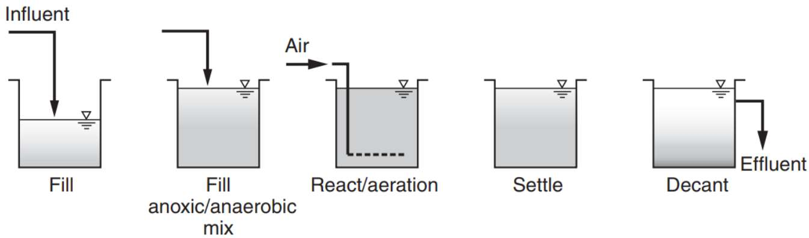
        - **Hình này chứng minh điều gì**
          - Chu trình SBR tích hợp khử nitơ gồm 5 pha: Điền đầy (Fill), Điền đầy khuấy thiếu khí (Fill anoxic/anaerobic mix), Phản ứng sục khí (React/aeration), Lắng tĩnh (Settle), và Gạn nước (Decant).
        - **Từ đâu mà thấy được**
          - Sơ đồ thể hiện chuỗi bể đơn nguyên với mũi tên nạp nước đầu vào (Influent), pha khuấy không cấp khí (Fill anoxic/anaerobic mix), đường cấp khí sục bọt (React/aeration Air), vùng phân tầng lắng tĩnh (Settle), và ống thu nước sau xử lý (Decant Effluent).
  - Pha Điền đầy tĩnh hoặc khuấy thiếu khí ($\text{Fill anoxic/anaerobic mix}$):
    - Nước thải thô giàu $\text{BOD}$ được nạp vào bể và tiếp xúc trực tiếp với lượng bùn hoạt tính cùng phần nước lưu đáy ($\text{heel volume}$) từ mẻ trước.
    - Hệ thống sục khí tắt hoàn toàn ($\text{DO} = 0\text{ mg/L}$), máy khuấy chìm hoạt động để duy trì trạng thái xáo trộn hỗn hợp lỏng đồng nhất.
    - Vi sinh vật dị dưỡng sử dụng nitrat ($\text{NO}_3^-$) tồn lưu làm chất nhận điện tử để oxy hóa chất hữu cơ, chuyển hóa $\text{NO}_3^-$ thành khí nitơ $\text{N}_2$ thoát ra khí quyển.
    - Pha nạp thiếu khí tạo môi trường gradient nồng độ cao đóng vai trò ngăn chọn lọc ($\text{anoxic selector}$), ức chế triệt để vi khuẩn dạng sợi và ngăn ngừa hiện tượng phồng bùn ($\text{sludge bulking}$).
  - Pha Phản ứng sục khí hiếu khí ($\text{React/aeration}$):
    - Máy thổi khí hoạt động cấp oxy qua hệ thống đĩa phân phối bọt mịn dưới đáy bể, duy trì nồng độ oxy hòa tan $\text{DO} \ge 2{,}0\text{ mg/L}$.
    - Vi khuẩn dị dưỡng oxy hóa lượng $\text{BOD}$ còn lại thành $\text{CO}_2$ và $\text{H}_2\text{O}$.
    - Vi khuẩn tự dưỡng nitrat hóa ($\text{AOB}$ và $\text{NOB}$) oxy hóa toàn bộ amoni ($\text{NH}_4\text{-N}$) trong mẻ nước mới nạp thành nitrat ($\text{NO}_3\text{-N}$).
  - Pha Lắng tĩnh ($\text{Settle}$):
    - Cả máy thổi khí và máy khuấy trộn đều dừng hoạt động; lưu lượng dòng vào và dòng ra bằng không.
    - Bể ở trạng thái tĩnh học thủy lực hoàn toàn ($\text{quiescent condition}$), triệt tiêu hoàn toàn dòng chảy rối, dòng chảy ngắn và hiện tượng xáo cuộn bùn.
    - Bùn hoạt tính lắng theo cơ chế lắng vùng ($\text{zone settling}$), tạo ra bề mặt phân cách pha bùn - nước sắc nét và lớp nước trong có độ đục cực thấp.
  - Pha Gạn nước trong ($\text{Decant}$):
    - Thiết bị gạn nước tự động dạng máng thu nổi hoặc cần thu di động ($\text{decanter}$) hạ thấp dần để thu lớp nước trong trên bề mặt xả ra nguồn tiếp nhận.
    - Thể tích nước tháo ra đúng bằng thể tích nước thải nạp vào trong pha điền đầy ($\Delta V = V_F$).
    - Thiết bị gạn dừng hoạt động trước khi chạm tới ranh giới đỉnh của lớp mền bùn lắng dưới đáy.
  - Pha Chờ / Xả bùn ($\text{Idle / Waste - tùy chọn}$):
    - Giai đoạn đệm giữa hai chu kỳ mẻ liên tiếp, thường dùng để bơm xả bùn dư ($\text{WAS}$) từ đáy bể nhằm kiểm soát tuổi bùn ($\text{SRT}$).

###### Cơ chế khử nitrat trong pha điền đầy (Nitrogen Removal Mechanism During Fill Phase)
- Điểm mấu chốt của công nghệ SBR khử nitơ là pha điền đầy khử sạch nitrat còn sót lại sau pha lắng và gạn nước:
  - Khi kết thúc pha gạn nước ($\text{Decant}$), chỉ có phân đoạn thể tích nước mặt $V_F$ (chiếm khoảng $20\% - 30\%$ dung tích bể) được xả ra ngoài.
  - Phần dung tích nước và bùn còn lại dưới đáy bể ($V_0 = V_T - V_F$, chiếm từ $70\% - 80\%$ dung tích toàn phần) vẫn chứa đầy nitrat ($\text{NO}_3^-$) sinh ra từ pha sục khí trước đó.
  - Nếu không có pha khử nitrat, lượng nitrat này sẽ tích lũy và thoát ra ngoài ở các mẻ tiếp theo, làm suy giảm nghiêm trọng hiệu quả khử nitơ tổng ($\text{TN}$).
- Cân bằng khối lượng nitrat tồn lưu đáy bể:
  - Khối lượng nitrat tồn lưu sau pha gạn:
    $$M_{\text{NO3, residual}} = V_0 \times N_e = (V_T - V_F) \times N_e = (1 - \alpha) \cdot V_T \cdot N_e$$
  - Trong đó $V_T$ là tổng dung tích ướt của bể SBR ($\text{m}^3$), $V_F$ là thể tích nạp mỗi mẻ ($\text{m}^3$), $\alpha = V_F / V_T$ là hệ số trao đổi thể tích (tỷ số điền đầy), và $N_e$ là nồng độ nitrat trong bể sau pha phản ứng ($\text{g/m}^3$).
- Cơ chế khử bằng nguồn chất hữu cơ nội tại trong nước thải mới nạp:
  - Lượng $\text{BOD}$ bổ sung từ dòng nước thải nạp trong mẻ mới:
    $$M_{\text{BOD, fill}} = V_F \times S_0$$
  - Tỷ số nhu cầu cơ chất cho khử nitrat: thực tế tiêu thụ từ $2{,}86$ đến $4{,}0\text{ g BOD}$ cho mỗi $1\text{ g NO}_3\text{-N}$ bị khử.
  - Do nước thải sinh hoạt có nồng độ $\text{BOD}_5$ cao ($150 - 250\text{ mg/L}$), tổng khối lượng $\text{BOD}$ nạp vào luôn lớn hơn gấp $3 - 5$ lần lượng cần thiết để khử hết nitrat lưu đáy.
  - Toàn bộ nitrat tồn lưu $M_{\text{NO3, residual}}$ bị khử sạch hoàn toàn thành khí nitơ $\text{N}_2$ trong khoảng thời gian điền đầy khuấy thiếu khí ($t_{\text{anoxic}} \approx 0{,}5 - 1{,}0\text{ h}$).
- Nồng độ nitrat đầu ra sau khi kết thúc chu kỳ:
  - Do nitrat tồn lưu đã bị triệt tiêu về $0\text{ g/m}^3$ trước khi bật máy sục khí, lượng nitrat có mặt trong bể khi kết thúc pha phản ứng chỉ bắt nguồn từ lượng amoni trong mẻ nước nạp mới $V_F$ bị oxy hóa:
    $$\text{Mass of NOx newly formed} = V_F \times \text{NO}_x$$
  - Khi pha phản ứng kết thúc, lượng nitrat mới sinh này phân bố đều trong toàn bộ thể tích đầy bể $V_T$:
    $$N_e = \frac{V_F \times \text{NO}_x}{V_T} = \alpha \times \text{NO}_x$$
  - Hiệu suất khử nitrat tổng thể của hệ thống SBR:
    $$\eta_{\text{denit}} = \frac{\text{NO}_x - N_e}{\text{NO}_x} = 1 - \alpha = 1 - \frac{V_F}{V_T}$$
  - Khi chọn hệ số trao đổi thể tích $\alpha = 0{,}20$, hiệu suất khử nitrat đạt tới $80\%$; khi $\alpha = 0{,}30$, hiệu suất đạt $70\%$ mà không cần bất kỳ trạm bơm tuần hoàn nội bộ hay bể anoxic riêng rẽ.

##### Example denitrification process in SBR

###### Trình tự tính toán công nghệ khử nitơ trong bể SBR (Engineering Computation Approach)
- Phương pháp tính toán công nghệ bể SBR tích hợp khử nitơ tuân thủ quy trình 15 bước kinh điển theo Metcalf & Eddy:
  - Bước 1: Xác định các đặc tính nước thải đầu vào, tiêu chuẩn nước đầu ra ($\text{NH}_4\text{-N} \le 1{,}0\text{ g/m}^3$, $\text{NO}_3\text{-N} \le 6\text{ g/m}^3$) và các hệ số an toàn.
  - Bước 2: Lựa chọn số lượng đơn nguyên bể phản ứng ($N \ge 2$) để đảm bảo tiếp nhận dòng thải liên tục.
  - Bước 3: Phân chia thời lượng các pha trong một chu kỳ mẻ ($t_{\text{fill}}$, $t_{\text{react}}$, $t_{\text{settle}}$, $t_{\text{decant}}$) và xác định số chu kỳ trong ngày ($n_{\text{cycle}} = 24 / T_C$).
  - Bước 4: Tính toán thể tích nước thải điền đầy mỗi mẻ ($V_F = Q / (N \cdot n_{\text{cycle}})$).
  - Bước 5: Lựa chọn nồng độ bùn hoạt tính $\text{MLSS}$ khi đầy bể và xác định hệ số trao đổi thể tích $\alpha = V_F / V_T$ dựa trên chỉ số $\text{SVI}$ và chiều sâu gạn nước $H_D$. Tính toán tổng dung tích bể $V_T$.
  - Bước 6: Xác định tuổi bùn ($\text{SRT}$) cần thiết để đảm bảo quá trình nitrat hóa ở nhiệt độ thiết kế.
  - Bước 7: Tính toán lượng $\text{TKN}$ được chuyển hóa thành nitrat ($\text{NO}_x$).
  - Bước 8: Kiểm tra khối lượng sinh khối vi khuẩn nitrat hóa và thời gian sục khí cần thiết.
  - Bước 9: Tính toán cân bằng khử nitrat trong pha điền đầy khuấy thiếu khí: kiểm tra lượng $\text{BOD}$ khả dụng và thời gian cần thiết dựa trên tốc độ khử riêng $\text{SDNR}$.
  - Bước 10: Tính toán lưu lượng và công suất bơm của thiết bị gạn nước mặt ($\text{decanter}$).
  - Bước 11: Tính toán nhu cầu oxy và công suất thiết bị sục khí.
  - Bước 12: Xác định lượng bùn dư sinh ra hàng ngày ($P_{X,\text{TSS}}$).
  - Bước 13: Kiểm tra tỷ số $F/M$ và tải trọng thể tích chất hữu cơ.
  - Bước 14: Đánh giá cân bằng độ kiềm và nhu cầu bổ sung hóa chất kiềm hóa.
  - Bước 15: Lập bảng tổng hợp các thông số kỹ thuật công nghệ của bể SBR.
      - **Hình 6.** Chu trình làm việc 5 pha áp dụng trong tính toán khử nitơ bể SBR
        - 
        - **Hình này chứng minh điều gì**
          - Quá trình khử nitrat trong SBR tích hợp trực tiếp vào pha điền đầy khuấy thiếu khí trước khi chuyển sang pha sục khí phản ứng nitrat hóa.
        - **Từ đâu mà thấy được**
          - Sơ đồ nguyên lý thể hiện pha Fill anoxic/anaerobic mix tiếp nối ngay sau khi nạp nước thải, tận dụng nguồn cơ chất BOD của mẻ mới để khử sạch lượng nitrat lưu đáy từ mẻ trước mà không cần công trình thiếu khí độc lập.

###### Worked Example: SBR Denitrification Process Design (vd3_denitrification_sbr)
- **Đề bài**: Thiết kế và kiểm tra quá trình khử nitơ trong hệ thống bể phản ứng gián đoạn theo mẻ ($\text{SBR}$) xử lý nước thải sinh hoạt đô thị. Số liệu đầu vào và điều kiện thiết kế kế thừa từ Ví dụ 4, Chương 6. Xác định cấu hình chu trình vận hành, dung tích bể, kiểm tra khả năng khử nitrat trong pha điền đầy khuấy thiếu khí và tính toán nồng độ nitơ đầu ra.

- **Dữ kiện**:
  - Lưu lượng thiết kế trung bình ngày: $Q = 7570\text{ m}^3/\text{ngày}$.
  - Nhiệt độ tính toán thấp nhất: $T = 12^\circ\text{C}$.
  - Nồng độ bùn hoạt tính khi đầy bể: $\text{MLSS} = 3500\text{ g/m}^3 = 3500\text{ mg/L}$.
  - Chỉ số thể tích bùn: $\text{SVI} = 150\text{ mL/g}$.
  - Tỷ số chất rắn lơ lửng bay hơi trong bùn: $\text{MLVSS/MLSS} = 0{,}80 \implies \text{MLVSS} = 2800\text{ g/m}^3$.
  - Số lượng đơn nguyên bể phản ứng: $N = 2$ bể.
  - Chiều sâu mức nước làm việc khi đầy bể: $H = 6{,}0\text{ m}$.
  - Độ sâu lớp nước tháo gạn: $H_D = 20\% \times H = 1{,}20\text{ m}$ (hệ số trao đổi thể tích $\alpha = 0{,}20$).
  - Nồng độ amoni yêu cầu trong nước sau xử lý: $\text{NH}_4\text{-N}_{\text{eff}} \le 1{,}0\text{ g/m}^3$.
  - Tiêu chuẩn nồng độ nitrat trong nước sau xử lý: $\text{NO}_3\text{-N}_{\text{eff}} \le 6{,}0\text{ g/m}^3$.
  - Đặc tính nước thải sinh hoạt đầu vào (từ Ví dụ 4, Chương 6):
    - $\text{BOD}_5 = 220\text{ g/m}^3$.
    - $\text{sBOD} = 80\text{ g/m}^3$.
    - $\text{COD} = 485\text{ g/m}^3$.
    - $\text{sCOD} = 160\text{ g/m}^3$.
    - $\text{rbCOD} = 80\text{ g/m}^3$.
    - $\text{TSS} = 240\text{ g/m}^3$.
    - $\text{VSS} = 220\text{ g/m}^3$.
    - $\text{TKN} = 35\text{ g/m}^3$.
    - $\text{NH}_4\text{-N} = 25\text{ g/m}^3$.
    - $\text{TP} = 6\text{ g/m}^3$.
    - Độ kiềm ($\text{Alkalinity}$) = $200\text{ g CaCO}_3/\text{m}^3$.
    - Tỷ số $\text{bCOD/BOD} = 1{,}6 \implies \text{bCOD} = 1{,}6 \times 220 = 352\text{ g/m}^3$.
  - Các thông số động học và hệ số nhiệt độ ở $12^\circ\text{C}$:
    - Hệ số phân rã nội bào: $b_H(12^\circ\text{C}) = 0{,}08\text{ d}^{-1}$.
    - Hệ số sản lượng bùn tế bào dị dưỡng: $Y_H = 0{,}40\text{ g VSS/g bCOD}$.
    - Hệ số nitơ đồng hóa vào tế bào sinh khối: $f_N = 0{,}12\text{ g N/g VSS}$.
    - Tốc độ khử nitrat riêng ở $20^\circ\text{C}$: $\text{SDNR}_{20} \approx 0{,}09\text{ g NO}_3\text{-N}/(\text{g MLVSS}\cdot\text{d})$.
    - Hệ số nhiệt độ khử nitrat: $\theta = 1{,}07$.

- **Quy tắc áp dụng**:
  - Quy tắc phân bổ thời gian cho hệ 2 bể SBR: Trong hệ thống 2 bể tiếp nhận dòng chảy liên tục, thời gian điền đầy của một bể phải bằng tổng thời gian phản ứng, lắng và gạn của bể đối diện:
    $$t_{\text{fill}} = t_{\text{react}} + t_{\text{settle}} + t_{\text{decant}}$$
    Tổng thời gian chu kỳ: $T_C = t_{\text{fill}} + (t_{\text{react}} + t_{\text{settle}} + t_{\text{decant}}) = 2 \times t_{\text{fill}}$.
  - Quy tắc thể tích điền đầy mỗi mẻ:
    $$V_F = \frac{Q}{N \times n_{\text{cycle}}}$$
    trong đó $n_{\text{cycle}} = \frac{24\text{ h}}{T_C}$ là số chu kỳ trên một bể trong ngày.
  - Quy tắc xác định dung tích bể theo hệ số trao đổi thể tích $\alpha$:
    $$\alpha = \frac{H_D}{H} = \frac{V_F}{V_T} \implies V_T = \frac{V_F}{\alpha}$$
    Thể tích nước lưu đáy sau pha gạn: $V_0 = V_T - V_F = (1 - \alpha) V_T$.
  - Quy tắc kiểm tra lắng bùn theo chỉ số thể tích bùn ($\text{SVI}$):
    $$F(V_T) = \frac{\text{MLSS} \times \text{SVI}}{10^6} \le 1 - \alpha$$
  - Cân bằng vật chất nitơ và lượng nitrat sinh ra do nitrat hóa:
    $$\text{NO}_x = \text{TKN} - N_{e,\text{NH4}} - N_{e,\text{orgN}} - N_{\text{syn}}$$
    trong đó $N_{\text{syn}} = f_N \times \frac{P_{X,\text{VSS}}}{Q}$ là lượng nitơ đồng hóa vào bùn tế bào.
  - Cân bằng nitrat tồn lưu sau pha gạn và nồng độ nitrat đầu ra:
    $$M_{\text{NO3, residual}} = V_0 \times N_e$$
    $$N_e = \alpha \times \text{NO}_x = \left(\frac{V_F}{V_T}\right) \times \text{NO}_x$$
  - Quy tắc tốc độ khử nitrat và thời gian khuấy thiếu khí yêu cầu:
    $$\text{SDNR}_T = \text{SDNR}_{20} \times \theta^{T - 20}$$
    $$R_{\text{denit}} = \frac{M_{\text{MLVSS}} \times \text{SDNR}_T}{24} \quad (\text{kg NO}_3\text{-N/h})$$
    $$t_{\text{denit, req}} = \frac{M_{\text{NO3, residual}}}{R_{\text{denit}}} \le t_{\text{fill}}$$

- **Lời giải**:
  - **Bước 1**: Phân chia thời gian chu kỳ vận hành và xác định số chu kỳ trong ngày.
    - Căn cứ: Nguyên tắc vận hành so le cho hệ thống $N = 2$ bể để đảm bảo một bể luôn ở pha điền đầy tiếp nhận dòng vào liên tục.
    - Nhìn vào: Lựa chọn thời gian một chu kỳ $T_C = 8{,}0\text{ h}$ (tương ứng $n_{\text{cycle}} = 24 / 8 = 3\text{ chu kỳ/ngày/bể}$).
      - Phân bổ chi tiết các pha cho mỗi bể:
        - Thời gian điền đầy: $t_{\text{fill}} = 4{,}0\text{ h}$ (trong đó bao gồm $1{,}5\text{ h}$ điền đầy khuấy thiếu khí $\text{Fill anoxic mix}$ và $2{,}5\text{ h}$ điền đầy có sục khí $\text{Fill aerate}$).
        - Thời gian phản ứng sục khí độc lập: $t_{\text{react}} = 3{,}0\text{ h}$.
        - Thời gian lắng tĩnh: $t_{\text{settle}} = 0{,}5\text{ h}$.
        - Thời gian gạn nước trong: $t_{\text{decant}} = 0{,}5\text{ h}$.
        - Tổng thời gian phản ứng, lắng và gạn: $t_{\text{react}} + t_{\text{settle}} + t_{\text{decant}} = 3{,}0 + 0{,}5 + 0{,}5 = 4{,}0\text{ h} = t_{\text{fill}}$.
      - Tổng thời gian sục khí trong một chu kỳ: $t_{\text{aerate}} = 2{,}5\text{ h (fill aerate)} + 3{,}0\text{ h (react)} = 5{,}5\text{ h}$.
  - **Bước 2**: Xác định thể tích điền đầy mỗi mẻ ($V_F$) và tổng dung tích bể phản ứng ($V_T$).
    - Căn cứ: Lưu lượng nước thải qua mỗi bể $Q_{\text{tank}} = Q / 2 = 7570 / 2 = 3785\text{ m}^3/\text{ngày}$; số chu kỳ $n_{\text{cycle}} = 3\text{ mẻ/ngày}$.
    - Nhìn vào: Thể tích nạp trong một mẻ cho một bể phản ứng:
      $$V_F = \frac{Q_{\text{tank}}}{n_{\text{cycle}}} = \frac{3785\text{ m}^3/\text{ngày}}{3\text{ mẻ/ngày}} = 1261{,}67\text{ m}^3/\text{mẻ}$$
    - Căn cứ: Độ sâu tháo nước gạn $H_D = 1{,}20\text{ m}$ trên tổng chiều sâu nước $H = 6{,}0\text{ m}$, tương ứng hệ số trao đổi thể tích $\alpha = 1{,}20 / 6{,}0 = 0{,}20$.
    - Nhìn vào: Tổng dung tích làm việc ướt của mỗi bể SBR khi đầy nước:
      $$V_T = \frac{V_F}{\alpha} = \frac{1261{,}67\text{ m}^3}{0{,}20} = 6308{,}33\text{ m}^3$$
      - Thể tích nước lưu đáy sau pha gạn:
        $$V_0 = V_T - V_F = 6308{,}33 - 1261{,}67 = 5046{,}67\text{ m}^3$$
      - Diện tích mặt bằng mỗi bể:
        $$A = \frac{V_T}{H} = \frac{6308{,}33\text{ m}^3}{6{,}0\text{ m}} \approx 1051{,}4\text{ m}^2$$
        (kích thước mặt bằng xấp xỉ $32{,}5\text{ m} \times 32{,}5\text{ m}$).
  - **Bước 3**: Kiểm tra điều kiện lắng tĩnh và độ dày lớp mền bùn.
    - Căn cứ: Công thức phân đoạn thể tích bùn lắng dựa trên $\text{MLSS} = 3500\text{ mg/L}$ và $\text{SVI} = 150\text{ mL/g}$:
      $$F(V_T) = \frac{\text{MLSS} \times \text{SVI}}{10^6}$$
    - Nhìn vào: Phân đoạn thể tích chiếm bởi bùn sau khi lắng:
      $$F(V_T) = \frac{3500\text{ mg/L} \times 150\text{ mL/g}}{10^6} = 0{,}525$$
      - Chiều sâu tương đối của lớp mền bùn:
        $$H_{\text{sludge}} = 0{,}525 \times 6{,}0\text{ m} = 3{,}15\text{ m}$$
      - Khoảng cách an toàn giữa đáy phao gạn nước và bề mặt mền bùn:
        $$H_{\text{clear}} = H - H_D - H_{\text{sludge}} = 6{,}0 - 1{,}20 - 3{,}15 = 1{,}65\text{ m} > 1{,}0\text{ m}$$
      - Kết luận: Chiều sâu cột nước trong phía trên lớp mền bùn là $1{,}65\text{ m}$, đảm bảo tuyệt đối không bị hút cuốn bùn vào thiết bị gạn trong pha Decant.
  - **Bước 4**: Xác định lượng nitrat sinh ra từ quá trình nitrat hóa ($\text{NO}_x$).
    - Căn cứ: Nước thải có $\text{TKN} = 35\text{ g/m}^3$; nồng độ nitơ hữu cơ hòa tan đầu ra $N_{e,\text{orgN}} \approx 1{,}0\text{ g/m}^3$; nồng độ amoni đầu ra $N_{e,\text{NH4}} = 1{,}0\text{ g/m}^3$.
    - Nhìn vào: Lượng sinh khối bùn sinh ra từ lượng $\text{bCOD} = 352\text{ g/m}^3$ nạp vào mẻ với tuổi bùn $\text{SRT} \approx 15\text{ ngày}$ ở $12^\circ\text{C}$:
      - Sản lượng bùn riêng:
        $$Y_{\text{obs}} = \frac{Y_H}{1 + b_H \cdot \text{SRT}} = \frac{0{,}40}{1 + 0{,}08 \times 15} = \frac{0{,}40}{2{,}20} \approx 0{,}182\text{ g VSS/g bCOD}$$
      - Bổ sung cặn hữu cơ không phân hủy sinh học trong nước vào: tổng hệ số sản lượng bùn tế bào và cặn trơ $\approx 0{,}25\text{ g VSS/g bCOD}$.
      - Lượng nitơ tiêu thụ cho tổng hợp tế bào vi sinh vật:
        $$N_{\text{syn}} = f_N \times (\text{VSS sinh ra}) = 0{,}12 \times (0{,}25 \times 352) \approx 10{,}56\text{ g N/m}^3$$
      - Nồng độ nitrat hình thành do vi khuẩn nitrat hóa oxy hóa amoni:
        $$\text{NO}_x = \text{TKN} - N_{e,\text{NH4}} - N_{e,\text{orgN}} - N_{\text{syn}} = 35 - 1{,}0 - 1{,}0 - 10{,}56 = 22{,}44\text{ g/m}^3$$
      - Khối lượng nitrat mới sinh ra trong mỗi chu kỳ mẻ:
        $$M_{\text{NOx, new}} = \frac{V_F \times \text{NO}_x}{1000} = \frac{1261{,}67\text{ m}^3 \times 22{,}44\text{ g/m}^3}{1000} \approx 28{,}31\text{ kg NO}_3\text{-N/mẻ}$$
  - **Bước 5**: Xác định nồng độ nitrat đầu ra ($N_e$) và khối lượng nitrat tồn lưu cần khử.
    - Căn cứ: Khi lượng nitrat tồn lưu của mẻ trước được khử hoàn toàn trong pha điền đầy khuấy thiếu khí, nồng độ nitrat trong bể trước khi sục khí bằng $0\text{ g/m}^3$. Lượng nitrat mới sinh $M_{\text{NOx, new}}$ phân bố đều trong toàn bộ dung tích ướt $V_T$ khi đầy bể.
    - Nhìn vào: Nồng độ nitrat trong bể khi kết thúc pha phản ứng và lắng:
      $$N_e = \frac{V_F \times \text{NO}_x}{V_T} = \alpha \times \text{NO}_x = 0{,}20 \times 22{,}44\text{ g/m}^3 = 4{,}49\text{ g/m}^3 \approx 4{,}5\text{ g/m}^3$$
      - Tiêu chuẩn nước đầu ra yêu cầu $\text{NO}_3\text{-N} \le 6{,}0\text{ g/m}^3$. Giá trị tính toán $4{,}5\text{ g/m}^3$ thỏa mãn tiêu chuẩn xả thải.
      - Khối lượng nitrat tồn lưu dưới đáy bể trong thể tích $V_0$ cần phải khử sạch ở đầu mẻ kế tiếp:
        $$M_{\text{NO3, residual}} = \frac{V_0 \times N_e}{1000} = \frac{5046{,}67\text{ m}^3 \times 4{,}49\text{ g/m}^3}{1000} \approx 22{,}65\text{ kg NO}_3\text{-N}$$
  - **Bước 6**: Kiểm tra khả năng khử nitrat bằng nguồn cơ chất hữu cơ ($\text{BOD}$) trong mẻ nạp mới.
    - Căn cứ: Khối lượng $\text{BOD}_5$ nạp vào bể trong mẻ mới $V_F = 1261{,}67\text{ m}^3$:
      $$M_{\text{BOD, fill}} = \frac{V_F \times S_0}{1000} = \frac{1261{,}67 \times 220}{1000} = 277{,}57\text{ kg BOD}$$
      - Lượng $\text{rbCOD}$ dễ phân hủy sinh học nạp vào:
        $$M_{\text{rbCOD}} = \frac{1261{,}67 \times 80}{1000} = 100{,}93\text{ kg rbCOD}$$
    - Nhìn vào: Tiêu hao lý thuyết của phản ứng khử nitrat là $2{,}86\text{ g BOD/g NO}_3\text{-N}$ (hoặc tương đương $\approx 4{,}5\text{ g bCOD/g NO}_3\text{-N}$):
      - Khả năng khử nitrat cực đại của lượng $\text{BOD}$ nạp vào:
        $$M_{\text{NO3, pot}} = \frac{M_{\text{BOD, fill}}}{2{,}86} = \frac{277{,}57\text{ kg}}{2{,}86} \approx 97{,}05\text{ kg NO}_3\text{-N}$$
      - So sánh với lượng nitrat tồn lưu thực tế:
        $$\frac{M_{\text{NO3, pot}}}{M_{\text{NO3, residual}}} = \frac{97{,}05\text{ kg}}{22{,}65\text{ kg}} = 4{,}28\text{ lần}$$
      - Kết luận: Lượng cơ chất hữu cơ trong nước thải mới nạp dồi dào gấp hơn $4$ lần nhu cầu tối thiểu, bảo đảm phản ứng khử nitrat diễn ra triệt để và không bị giới hạn cơ chất.
  - **Bước 7**: Kiểm tra động học khử nitrat và thời gian khuấy thiếu khí yêu cầu.
    - Căn cứ: Tốc độ khử nitrat riêng ở $12^\circ\text{C}$ được hiệu chỉnh từ giá trị cơ sở ở $20^\circ\text{C}$:
      $$\text{SDNR}_{12} = \text{SDNR}_{20} \times (1{,}07)^{12 - 20} = 0{,}09 \times (1{,}07)^{-8} = 0{,}09 \times 0{,}5820 \approx 0{,}0524\text{ g NO}_3\text{-N}/(\text{g MLVSS}\cdot\text{d})$$
    - Nhìn vào: Tổng khối lượng sinh khối bùn hoạt tính chứa trong bể phản ứng:
      $$M_{\text{MLVSS}} = \frac{V_T \times \text{MLVSS}}{1000} = \frac{6308{,}33\text{ m}^3 \times 2800\text{ g/m}^3}{1000} = 17{,}663{,}3\text{ kg MLVSS}$$
      - Công suất khử nitrat cực đại của toàn bộ sinh khối trong bể:
        $$R_{\text{denit}} = \frac{M_{\text{MLVSS}} \times \text{SDNR}_{12}}{24\text{ h}} = \frac{17{,}663{,}3\text{ kg} \times 0{,}0524\text{ kg/(kg}\cdot\text{d)}}{24\text{ h}} \approx 38{,}56\text{ kg NO}_3\text{-N/h}$$
      - Thời gian cần thiết để khử sạch hoàn toàn $22{,}65\text{ kg NO}_3\text{-N}$ tồn lưu:
        $$t_{\text{denit, req}} = \frac{M_{\text{NO3, residual}}}{R_{\text{denit}}} = \frac{22{,}65\text{ kg}}{38{,}56\text{ kg/h}} \approx 0{,}59\text{ h} \approx 35{,}3\text{ phút}$$
      - So sánh với thời gian bố trí pha khuấy thiếu khí ($t_{\text{anoxic, fill}} = 1{,}5\text{ h} = 90\text{ phút}$):
        $$t_{\text{denit, req}} = 35{,}3\text{ phút} \ll 90\text{ phút}$$
      - Kết luận: Thời gian pha điền đầy khuấy thiếu khí được thiết kế ($1{,}5\text{ h}$) hoàn toàn dư dả để đưa nồng độ nitrat trong bể về bằng $0$ trước khi chuyển sang pha sục khí.
  - **Bước 8**: Đánh giá hiệu suất khử nitơ tổng thể và thu hồi độ kiềm.
    - Căn cứ: Tổng nitơ đầu vào $\text{TKN} = 35\text{ mg/L}$; nitơ đầu ra gồm $N_{e,\text{NH4}} = 1{,}0\text{ mg/L}$, $N_{e,\text{orgN}} = 1{,}0\text{ mg/L}$, và $N_{e,\text{NO3}} = 4{,}5\text{ mg/L}$.
    - Nhìn vào: Tổng nitơ trong nước sau xử lý:
      $$\text{TN}_{\text{eff}} = 1{,}0 + 1{,}0 + 4{,}5 = 6{,}5\text{ mg/L}$$
      - Hiệu suất loại bỏ nitơ tổng của hệ thống SBR:
        $$\eta_{\text{TN}} = \frac{35 - 6{,}5}{35} \times 100\% = 81{,}4\%$$
      - Hiệu suất khử nitrat:
        $$\eta_{\text{denit}} = 1 - \alpha = 1 - 0{,}20 = 80{,}0\%$$
      - Lượng độ kiềm sinh ra từ phản ứng khử nitrat:
        $$\Delta \text{Alk}_{\text{prod}} = 3{,}57\text{ g CaCO}_3/\text{g NO}_3\text{-N} \times (22{,}44 \times 0{,}80) = 3{,}57 \times 17{,}95 \approx 64{,}1\text{ g CaCO}_3/\text{m}^3$$
      - Độ kiềm bị tiêu thụ bởi nitrat hóa:
        $$\Delta \text{Alk}_{\text{cons}} = 7{,}14\text{ g CaCO}_3/\text{g NH}_4\text{-N} \times 22{,}44 \approx 160{,}2\text{ g CaCO}_3/\text{m}^3$$
      - Độ kiềm còn lại sau xử lý (với độ kiềm đầu vào $200\text{ g/m}^3$):
        $$\text{Alk}_{\text{eff}} = 200 - 160{,}2 + 64{,}1 = 103{,}9\text{ g CaCO}_3/\text{m}^3 > 50\text{ g CaCO}_3/\text{m}^3$$
      - Kết luận: Độ kiềm dư đạt trên $100\text{ mg/L as CaCO}_3$, độ $\text{pH}$ của nước thải được bảo vệ ổn định trong vùng tối ưu ($7{,}2 - 7{,}8$), không cần châm hóa chất kiềm hóa.

- **Kết quả**:
  - Số lượng bể: $N = 2$ bể hình chữ nhật hoặc vuông.
  - Chu kỳ làm việc: $T_C = 8{,}0\text{ h}$ ($3$ mẻ/ngày/bể). Chi tiết: Điền đầy khuấy thiếu khí $1{,}5\text{ h}$, Điền đầy sục khí $2{,}5\text{ h}$, Phản ứng sục khí độc lập $3{,}0\text{ h}$, Lắng tĩnh $0{,}5\text{ h}$, Gạn nước $0{,}5\text{ h}$.
  - Thể tích nạp mỗi mẻ: $V_F = 1261{,}7\text{ m}^3/\text{mẻ}$.
  - Tổng dung tích làm việc mỗi bể: $V_T = 6308{,}3\text{ m}^3$ (thể tích nước lưu đáy $V_0 = 5046{,}7\text{ m}^3$).
  - Kích thước mỗi bể: $A \approx 1051\text{ m}^2$, chiều sâu cột nước khi đầy $H = 6{,}0\text{ m}$, chiều sâu gạn $H_D = 1{,}20\text{ m}$.
  - Nồng độ bùn: $\text{MLSS} = 3500\text{ g/m}^3$, $\text{MLVSS} = 2800\text{ g/m}^3$.
  - Nồng độ chất lượng nước đầu ra:
    - $\text{NH}_4\text{-N}_{\text{eff}} = 1{,}0\text{ g/m}^3$.
    - $\text{NO}_3\text{-N}_{\text{eff}} = 4{,}5\text{ g/m}^3$ (thỏa mãn tiêu chuẩn $\le 6{,}0\text{ g/m}^3$).
    - $\text{TN}_{\text{eff}} = 6{,}5\text{ g/m}^3$.
  - Hiệu suất xử lý nitơ: Hiệu suất khử nitrat $\eta_{\text{denit}} = 80{,}0\%$; hiệu suất loại bỏ nitơ tổng $\eta_{\text{TN}} = 81{,}4\%$.
  - Độ kiềm dư sau xử lý: $\text{Alk}_{\text{eff}} \approx 104\text{ g CaCO}_3/\text{m}^3$, bảo đảm đệm pH tự nhiên.

- **Kiểm tra lại**:
  - Kiểm tra tỷ lệ trao đổi thể tích: $\alpha = V_F / V_T = 0{,}20 \le 1 - F(V_T) = 1 - 0{,}525 = 0{,}475$ (thỏa mãn với biên độ an toàn cao).
  - Kiểm tra khả năng khử nitrat của nguồn carbon: Tỷ số $\text{BOD/NO}_3\text{-N}$ nạp vào đạt $277{,}6 / 22{,}65 = 12{,}25\text{ g BOD/g NO}_3\text{-N} \gg 2{,}86$ (đáp ứng xuất sắc).
  - Kiểm tra thời gian thiếu khí: $t_{\text{denit, req}} = 35{,}3\text{ phút} < 90\text{ phút}$ (thỏa mãn hoàn toàn, nitrat bị triệt tiêu triệt để trước khi bật sục khí).
  - Kiểm tra khoảng cách lớp mền bùn: Khoảng cách đệm nước trong $1{,}65\text{ m} > 1{,}0\text{ m}$ (ngăn chặn hoàn toàn hiện tượng cuốn bùn vào thiết bị gạn).
  - Đánh giá trường hợp mở rộng theo biểu đồ khuyến nghị với $\alpha = 0{,}30$ ($H_D = 1{,}80\text{ m}$): $V_T = 4205{,}6\text{ m}^3$, $N_e = 0{,}30 \times 22{,}44 = 6{,}73\text{ g/m}^3$ (xấp xỉ ngưỡng $6\text{--}7\text{ g/m}^3$, cho thấy việc chọn $\alpha = 0{,}20$ đem lại chất lượng nước đầu ra cao hơn và an toàn hơn khi nhiệt độ thấp $12^\circ\text{C}$).

#### 3. Comparison

##### Comparison of preanoxic and SBR processes

###### 1. Quá trình tiền thiếu khí liên tục (Continuous Preanoxic Denitrification Process)

- Cấu hình tiền thiếu khí vận hành theo chế độ dòng chảy liên tục với hai vùng sinh học nối tiếp:
  - Vùng thiếu khí ($\text{anoxic zone}$) đặt phía trước tiếp nhận nước thải thô giàu $\text{BOD}$ và hai dòng tuần hoàn mang nitrat ($\text{NO}_3\text{-N}$).
  - Vùng hiếu khí ($\text{aerobic zone}$) đặt phía sau thực hiện quá trình oxy hóa cacbon hữu cơ còn lại và nitrat hóa amoni thành nitrat.
  - Dòng tuần hoàn nội bộ hỗn hợp lỏng ($\text{internal recycle - IR}$) bơm nước từ cuối bể hiếu khí về đầu bể thiếu khí với tỷ số $\text{IR} = Q_{\text{IR}} / Q$.
  - Dòng bùn hoạt tính tuần hoàn ($\text{return activated sludge - RAS}$) bơm sinh khối từ đáy bể lắng thứ cấp hoặc bể màng về đầu bể thiếu khí với tỷ số $R = Q_R / Q$.

- Ưu điểm của quá trình tiền thiếu khí liên tục (Advantages of preanoxic process):
  - Tiết kiệm năng lượng sục khí nhờ oxy hóa một phần $\text{BOD}$ bằng nitrat trước vùng hiếu khí:
    - Vi khuẩn dị dưỡng khử nitrat sử dụng $\text{NO}_3^-$ làm chất nhận điện tử trong điều kiện không có oxy hòa tan.
    - Quá trình khử nitrat tiết kiệm tương đương $2{,}86\text{ g O}_2$ hòa tan cho mỗi $1\text{ g NO}_3\text{-N}$ bị khử thành khí nitơ $\text{N}_2$.
    - Một phần lớn lượng chất hữu cơ dễ phân hủy sinh học ($\text{rbBOD}$) trong nước thải đầu vào được tiêu thụ ngay tại bể thiếu khí.
    - Tải lượng oxy hòa tan yêu cầu cấp cho vùng hiếu khí giảm rõ rệt, giúp giảm công suất tiêu thụ điện của máy thổi khí.
  - Sản sinh độ kiềm tự nhiên trước giai đoạn nitrat hóa:
    - Phản ứng sinh hóa khử nitrat giải phóng các ion $\text{OH}^-$, sản sinh tương đương $3{,}57\text{ g CaCO}_3$ độ kiềm cho mỗi $1\text{ g NO}_3\text{-N}$ chuyển hóa thành $\text{N}_2$.
    - Lượng độ kiềm sinh ra bù đắp xấp xỉ $50\%$ tổng độ kiềm bị tiêu thụ bởi quá trình nitrat hóa ở bể hiếu khí hạ nguồn (quá trình nitrat hóa tiêu tốn $7{,}14\text{ g CaCO}_3$ cho mỗi $1\text{ g NH}_4\text{-N}$ oxy hóa).
    - Độ kiềm sinh ra tại đầu chuỗi giúp ổn định độ $\text{pH}$ trong dải tối ưu ($7{,}0 - 8{,}5$) trước khi nước thải đi vào vùng hiếu khí.
    - Hệ thống hạn chế hoặc loại bỏ hoàn toàn nhu cầu châm hóa chất kiềm hóa bổ sung như $\text{NaOH}$, $\text{Na}_2\text{CO}_3$ hoặc $\text{Ca(OH)}_2$.
  - Kiểm soát vi khuẩn tạo sợi gây hiện tượng phồng bùn bằng cơ chế selector thiếu khí:
    - Ngăn thiếu khí đầu chuỗi đóng vai trò ngăn chọn lọc động học ($\text{anoxic selector}$) có gradient nồng độ cơ chất cao.
    - Nước thải thô giàu $\text{BOD}$ tiếp xúc trực tiếp với sinh khối bùn tuần hoàn $\text{RAS}$, tạo tỷ số $F/M$ cục bộ cao.
    - Vi khuẩn tạo bông ($\text{floc-forming bacteria}$) hấp thụ nhanh cơ chất và chiếm ưu thế sinh trưởng trong điều kiện thiếu khí.
    - Hầu hết vi khuẩn tạo sợi ($\text{filamentous bacteria}$) bị ức chế phát triển vì khả năng chuyển hóa nitrat kém hoặc không chịu được môi trường không có oxy hòa tan.
    - Đặc tính lắng của bùn hoạt tính cải thiện rõ rệt, duy trì chỉ số thể tích bùn $\text{SVI} < 120\text{ mL/g}$ và hạn chế phồng bùn ($\text{sludge bulking}$).
  - Giảm diện tích mặt bằng xây dựng đối với cấu hình kết hợp màng $\text{MBR}$ ($\text{smaller footprint}$):
    - Hệ thống màng sinh học $\text{MBR}$ duy trì nồng độ bùn hoạt tính lơ lửng rất cao trong bể ($\text{MLSS} = 8{,}000 - 12{,}000\text{ mg/L}$ so với $2{,}000 - 4{,}000\text{ mg/L}$ của hệ $\text{CAS}$).
    - Thể tích cụm bể sinh học giảm tương ứng từ $50\%$ đến $70\%$ nhờ tải trọng thể tích tăng cao.
    - Mô-đun màng vi lọc ($\text{MF}$) hoặc siêu lọc ($\text{UF}$) đặt chìm tách bùn hoàn toàn, loại bỏ hoàn toàn bể lắng thứ cấp và cụm khử trùng.
    - Hệ $\text{MBR}$ quy ước tỷ lệ tuần hoàn nội bộ riêng rẽ $\text{IR} = 0$, sử dụng trực tiếp dòng bùn màng tuần hoàn lớn ($R = 3 - 5$) để đưa nitrat về ngăn thiếu khí.

- Nhược điểm của quá trình tiền thiếu khí liên tục (Disadvantages of preanoxic process):
  - Khả năng khử nitơ tổng bị giới hạn bởi tỷ lệ tuần hoàn nội bộ $\text{IR}$:
    - Phương trình cân bằng vật chất nitrat qua hệ thống:
      $$\text{NO}_x = (1 + \text{IR} + R) \cdot N_e$$
    - Nồng độ nitrat trong dòng nước ra sau xử lý ($N_e$) phụ thuộc trực tiếp vào lưu lượng tuần hoàn:
      $$N_e = \frac{\text{NO}_x}{1 + \text{IR} + R}$$
    - Hiệu suất khử nitrat lý thuyết tối đa bị chặn bởi giới hạn phân dòng thủy lực:
      $$\eta_{\text{denit}} = \frac{\text{IR} + R}{1 + \text{IR} + R}$$
    - Hệ thống không thể khử triệt để $100\%$ nitơ tổng vì luôn có một phân đoạn nitrat thoát ra theo dòng nước sau lắng.
    - Việc nâng cao hiệu suất đòi hỏi tăng tỷ số $\text{IR}$ lên cao ($\text{IR} = 3 - 5$), dẫn đến chi phí tiêu thụ điện năng cho máy bơm tuần hoàn tăng vọt và làm giảm thời gian lưu nước thực tế trong ngăn thiếu khí.
  - Nguy cơ phát sinh bọt váng vi khuẩn dạng sợi $\text{Nocardia}$ ($\text{potential Nocardioform foam problems}$):
    - Các chủng vi sinh vật dạng sợi kỵ nước như $\textit{Nocardia}$ và $\textit{Microthrix parvicella}$ tích tụ lipid và acid mycolic trên thành tế bào.
    - Các bọt khí nổi bám dính vào vi khuẩn dạng sợi kỵ nước tạo nên lớp bọt nhớt dày màu nâu sẫm trên mặt bể thiếu khí và hiếu khí.
    - Bọt váng sinh học rất bền vững, khó phá vỡ bằng sục khí hay phun nước, gây thất thoát sinh khối và làm giảm chất lượng nước sau lắng.
    - Bọt sinh học gây phát tán mùi hôi và làm bẩn thành bể, đòi hỏi các biện pháp gạt bọt hoặc châm hóa chất khử bọt tốn kém.
  - Vi khuẩn khử nitrat bị ức chế bởi oxy hòa tan ($\text{DO}$) từ dòng tuần hoàn nội bộ:
    - Dòng tuần hoàn $\text{IR}$ lấy hỗn hợp bùn nước từ cuối ngăn hiếu khí mang theo lượng oxy hòa tan dư thừa ($\text{DO} = 2{,}0 - 3{,}0\text{ mg/L}$).
    - Lưu lượng tuần hoàn lớn ($\text{IR} = 2 - 4$) bơm trực tiếp một lượng $\text{O}_2$ hòa tan đáng kể vào ngăn thiếu khí.
    - Oxy hòa tan là chất nhận điện tử ưu tiên so với nitrat, ức chế trực tiếp hoạt tính của enzyme $\textit{nitrate reductase}$ của vi khuẩn khử nitrat dị dưỡng.
    - Phản ứng khử nitrat chỉ xảy ra thuận lợi khi nồng độ oxy hòa tan duy trì ở mức $\text{DO} < 0{,}2 - 0{,}5\text{ mg/L}$.
    - Lượng $\text{O}_2$ mang về tiêu tốn một lượng $\text{BOD}$ có sẵn trong nước thải đầu vào chỉ để triệt tiêu oxy hòa tan, gây hao hụt nguồn cacbon hữu cơ phục vụ khử $\text{NO}_3^-$.
  - Hiện tượng nghẽn màng lọc trong cấu hình $\text{MBR}$ ($\text{membrane fouling}$):
    - Bùn hoạt tính, chất polymer ngoại bào ($\text{EPS}$) và chất hữu cơ hòa tan sinh học ($\text{SMP}$) bám dính lên bề mặt màng và làm bít tắc các lỗ mao quản màng.
    - Hiện tượng nghẽn màng làm tăng áp suất xuyên màng ($\text{TMP}$) và làm suy giảm thông lượng thấm lọc ($J$, đơn vị $\text{L/m}^2\cdot\text{h}$).
    - Vận hành màng đòi hỏi hệ thống sục khí bọt thô liên tục tại mô-đun màng để cọ rửa bề mặt sợi màng, tiêu tốn thêm năng lượng điện.
    - Cần thực hiện quy trình rửa ngược định kỳ ($\text{backwash}$) và tẩy rửa hóa chất định kỳ ($\text{CIP}$ với $\text{NaOCl}$ và $\text{citric acid}$), làm phát sinh chi phí hóa chất và giảm tuổi thọ sợi màng.

###### 2. Quá trình khử nitơ trong bể phản ứng gián đoạn theo mẻ (Sequencing Batch Reactor - SBR)

- Cấu hình công nghệ $\text{SBR}$ vận hành theo chu kỳ thời gian trong cùng một bể phản ứng đơn nhất:
  - Một chu kỳ xử lý ($T_C$) gồm 5 pha kế tiếp: Điền đầy ($\text{Fill}$), Phản ứng ($\text{React}$), Lắng ($\text{Settle}$), Gạn nước ($\text{Decant}$) và Chờ ($\text{Idle}$).
  - Khử nitrat diễn ra chủ yếu ở pha Điền đầy khuấy thiếu khí ($\text{Fill anoxic mix}$) và/hoặc pha Phản ứng khuấy không sục khí ($\text{React anoxic mix}$).
  - Nước thải đầu vào giàu $\text{BOD}$ được nạp vào bể và tiếp xúc với lượng nitrat còn tồn lưu trong nước đáy bể sau pha lắng và gạn của mẻ trước.
  - Máy khuấy chìm tạo dòng xáo trộn hỗn hợp bùn nước đồng đều trong điều kiện không cấp khí, thúc đẩy vi khuẩn khử nitrat chuyển hóa $\text{NO}_3^-$ thành $\text{N}_2$.
  - Sau pha thiếu khí, hệ thống bật máy thổi khí chuyển sang pha Phản ứng hiếu khí ($\text{React aeration}$) để hoàn tất oxy hóa $\text{BOD}$ và nitrat hóa amoni.

- Ưu điểm của công nghệ bể $\text{SBR}$ (Advantages of SBR process):
  - Độ linh hoạt trong vận hành quy trình rất cao ($\text{high process flexibility}$):
    - Chu trình vận hành được thiết lập và điều khiển hoàn toàn theo thời gian thông qua bộ điều khiển lập trình $\text{PLC}$.
    - Người vận hành dễ dàng điều chỉnh thời lượng từng pha ($\text{Fill}$, $\text{React}$, $\text{Settle}$, $\text{Decant}$) mà không cần thay đổi kích thước công trình vật lý.
    - Có thể thay đổi linh hoạt chế độ khuấy thiếu khí và sục khí ngắt quãng tùy theo biến động tải lượng nitơ và chất hữu cơ đầu vào.
    - Dễ dàng ứng phó với dao động lưu lượng theo mùa hoặc chế độ xả thải gián đoạn của các cơ sở công nghiệp.
  - Sơ đồ mặt bằng hệ thống xử lý tinh gọn và đơn giản ($\text{simple treatment system layout}$):
    - Toàn bộ các công đoạn xử lý sinh học (khử $\text{BOD}$, nitrat hóa, khử nitrat) và tách pha bùn nước diễn ra tích hợp trong một bể duy nhất.
    - Không cần xây dựng bể lắng thứ cấp riêng biệt.
    - Loại bỏ hoàn toàn trạm bơm bùn tuần hoàn $\text{RAS}$ và trạm bơm tuần hoàn nội bộ $\text{IR}$.
    - Tiết kiệm đáng kể khối lượng đường ống kết nối liên bể, van cơ khí điều tiết dòng chảy và diện tích lắp đặt cụm bơm.
  - Quá trình lắng tĩnh hoàn toàn đem lại nồng độ $\text{TSS}$ đầu ra rất thấp ($\text{quiescent settling}$):
    - Pha lắng ($\text{Settle}$) diễn ra trong điều kiện tĩnh học lý tưởng: máy khuấy và hệ thống sục khí tắt hoàn toàn, không có dòng nước nạp vào hoặc tháo ra.
    - Triệt tiêu hoàn toàn các hiện tượng thủy lực tiêu cực thường gặp ở bể lắng dòng liên tục như dòng chảy ngắn ($\text{short-circuiting}$), dòng xoáy cuộn bùn hay dòng đối lưu nhiệt.
    - Vận tốc lắng của lớp bùn đạt mức tối đa theo cơ chế lắng vùng ($\text{zone settling}$), tạo ranh giới phân tách bùn - nước sắc nét.
    - Nước trong sau lắng được thu hồi bằng thiết bị gạn tự động ($\text{decanter}$) ở tầng mặt, nước đầu ra đạt nồng độ $\text{TSS} < 5 - 10\text{ mg/L}$ và độ trong rất cao.

- Nhược điểm của công nghệ bể $\text{SBR}$ (Disadvantages of SBR process):
  - Phù hợp chủ yếu cho các trạm xử lý quy mô lưu lượng vừa và nhỏ ($\text{smaller flows}$):
    - Nước thải đầu vào xả liên tục đòi hỏi phải xây dựng bể điều hòa dung tích lớn phía trước hoặc phải chia thành nhiều mô-đun bể $\text{SBR}$ ($2 - 4$ đơn nguyên) hoạt động lệch pha.
    - Khi lưu lượng thiết kế rất lớn ($Q > 20{,}000 - 50{,}000\text{ m}^3/\text{ngày}$), việc xây dựng nhiều cụm bể $\text{SBR}$ độc lập làm tăng chi phí xây dựng và vận hành đáng kể so với dây chuyền bùn hoạt tính dòng chảy liên tục.
    - Công suất xả tức thời trong pha gạn ($\text{Decant}$) rất lớn, đòi hỏi hệ thống mương dẫn và thiết bị khử trùng hạ nguồn phải chịu tải thủy lực đột ngột.
  - Yêu cầu thiết kế quy trình và hệ thống điều khiển tự động phức tạp ($\text{more complex process design}$):
    - Hệ thống phụ thuộc tuyệt đối vào mức độ tự động hóa của các thiết bị cảm biến ($\text{DO}$, $\text{ORP}$, cảm biến mức nước siêu âm) và van đóng ngắt khí/nước điều khiển qua $\text{PLC/SCADA}$.
    - Thiết bị gạn nước mặt tự động ($\text{decanter}$) có kết cấu cơ khí di động phức tạp, dễ xảy ra sự cố kẹt cơ khí hoặc rò rỉ bùn vào dòng nước ra nếu không bảo trì đúng kỹ thuật.
    - Tính toán công nghệ phức tạp vì phải thiết lập đồng thời thể tích làm việc mẻ ($\Delta V = Q_{\text{batch}}$), thể tích nước lưu đáy ($V_0$), hệ số trao đổi thể tích ($\Delta V / V_T = 0{,}25 - 0{,}35$) và cân bằng động học oxy/cơ chất qua từng pha.
  - Cần dung tích bể lớn hơn đáng kể khi tích hợp khử nitơ so với chỉ xử lý $\text{BOD}$:
    - Quá trình khử nitơ hoàn chỉnh đòi hỏi bổ sung pha Điền đầy khuấy thiếu khí và kéo dài thời gian phản ứng hiếu khí để đảm bảo tuổi bùn nitrat hóa ($\text{SRT} \ge 10 - 15\text{ ngày}$).
    - Thời gian của một chu kỳ ($T_C$) phải kéo dài từ $4\text{ h}$ (khi chỉ khử $\text{BOD}$) lên $6 - 8\text{ h}$ (khi khử cả $\text{BOD}$ và nitơ).
    - Số chu kỳ vận hành trong ngày giảm ($n_{\text{cycle}} = 24 / T_C = 3 - 4\text{ mẻ/ngày}$ so với $6\text{ mẻ/ngày}$).
    - Thể tích tổng thể của các bể $\text{SBR}$ phải mở rộng thêm để xử lý hết lưu lượng nước thải trong ngày mà vẫn đảm bảo thời gian lưu cần thiết cho các phản ứng sinh hóa.

###### 3. Bảng so sánh tổng hợp giữa quy trình tiền thiếu khí và SBR (Comparative Summary Matrix)

| Tiêu chí so sánh (Criteria) | Quá trình Tiền thiếu khí (Continuous Preanoxic / MLE & MBR) | Bể phản ứng gián đoạn theo mẻ (Sequencing Batch Reactor - SBR) |
| :--- | :--- | :--- |
| **Chế độ dòng chảy** ($\text{Flow regime}$) | Chế độ dòng chảy liên tục ($\text{continuous flow}$), phân tách không gian giữa các ngăn phản ứng. | Chế độ gián đoạn theo mẻ ($\text{batch flow}$), phân tách thời gian các pha trong cùng một bể. |
| **Bố trí công trình** ($\text{Civil layout}$) | Cần nhiều đơn nguyên bể: Bể thiếu khí, Bể hiếu khí, Bể lắng thứ cấp (hoặc mô-đun màng $\text{MBR}$). | Tinh gọn: Toàn bộ quá trình phản ứng và lắng diễn ra trong một bể duy nhất; không cần bể lắng thứ cấp. |
| **Tuần hoàn dòng lỏng** ($\text{Recycle requirements}$) | Bắt buộc có bơm tuần hoàn nội bộ $\text{IR}$ ($\text{IR} = 1 - 4$) và bơm bùn tuần hoàn $\text{RAS}$ ($R = 0{,}5 - 1{,}0$ đối với $\text{CAS}$, $R = 3 - 5$ đối với $\text{MBR}$). | Không cần bơm tuần hoàn nội bộ $\text{IR}$ và không cần bơm bùn tuần hoàn $\text{RAS}$. |
| **Cơ chế khử nitrat** ($\text{Denitrification mechanism}$) | Vi khuẩn khử nitrat trong ngăn thiếu khí liên tục, dùng $\text{BOD}$ nước thải đầu vào và nitrat từ dòng $\text{IR}$ + $\text{RAS}$. | Vi khuẩn khử nitrat trong pha Điền đầy khuấy thiếu khí ($\text{Fill anoxic mix}$), dùng $\text{BOD}$ mới nạp và nitrat lưu đáy từ mẻ trước. |
| **Giới hạn hiệu suất khử nitơ** ($\text{Nitrogen removal limit}$) | Giới hạn bởi tỷ lệ phân dòng $\text{IR}$: $\eta = (\text{IR} + R) / (1 + \text{IR} + R)$; luôn tồn dư $N_e$ trong dòng ra. | Có thể đạt hiệu suất khử nitơ rất cao bằng cách kéo dài pha thiếu khí và kiểm soát tỷ lệ thể tích trao đổi $\Delta V / V_T$. |
| **Tiết kiệm năng lượng sục khí** ($\text{Aeration energy savings}$) | Tiết kiệm $2{,}86\text{ g O}_2/\text{g NO}_3\text{-N}$ khử nhờ oxy hóa một phần $\text{BOD}$ tại ngăn thiếu khí trước vùng hiếu khí. | Tiết kiệm tương đương $2{,}86\text{ g O}_2/\text{g NO}_3\text{-N}$ khử nếu tận dụng pha Điền đầy khuấy thiếu khí để oxy hóa $\text{BOD}$. |
| **Thu hồi độ kiềm** ($\text{Alkalinity recovery}$) | Sinh ra $3{,}57\text{ g CaCO}_3/\text{g NO}_3\text{-N}$ khử trước bước nitrat hóa, giúp duy trì ổn định $\text{pH}$ bể hiếu khí. | Sinh ra $3{,}57\text{ g CaCO}_3/\text{g NO}_3\text{-N}$ khử trong pha thiếu khí, tái lập đệm kiềm cho pha phản ứng sục khí kế tiếp. |
| **Kiểm soát bùn sợi** ($\text{Filamentous control}$) | Ngăn $\text{anoxic selector}$ liên tục tạo gradient nồng độ cao ức chế vi khuẩn tạo sợi, duy trì $\text{SVI}$ tốt. | Nồng độ $\text{BOD}$ cao trong pha điền đầy tạo môi trường chọn lọc động học tương tự $\text{selector}$, kiểm soát phồng bùn hiệu quả. |
| **Ảnh hưởng của DO** ($\text{Dissolved oxygen impact}$) | Dòng $\text{IR}$ mang lượng $\text{DO}$ cao ($2 - 3\text{ mg/L}$) vào ngăn thiếu khí, gây ức chế enzyme khử nitrat và hao hụt $\text{BOD}$. | Không bị ảnh hưởng bởi dòng mang $\text{DO}$; các pha sục khí và khuấy thiếu khí tách biệt hoàn toàn theo thời gian. |
| **Chất lượng lắng và dòng ra** ($\text{Effluent TSS quality}$) | $\text{CAS}$: $\text{TSS} = 10 - 20\text{ mg/L}$ phụ thuộc bể lắng thứ cấp. $\text{MBR}$: $\text{TSS} < 1\text{ mg/L}$ qua màng lọc. | Rất tốt: Lắng tĩnh hoàn toàn ($\text{quiescent settling}$) giúp nước sau gạn đạt $\text{TSS} < 5 - 10\text{ mg/L}$. |
| **Độ linh hoạt vận hành** ($\text{Operational flexibility}$) | Kém linh hoạt: Thể tích các ngăn và thời gian lưu nước đã cố định sau khi xây dựng. | Rất cao: Dễ dàng lập trình thay đổi thời gian các pha qua $\text{PLC}$ để đáp ứng biến động tải lượng ô nhiễm. |
| **Nguy cơ sự cố kỹ thuật** ($\text{Operational failure risks}$) | Tạo bọt vi khuẩn sợi $\textit{Nocardia}$; nghẽn màng lọc ($\text{membrane fouling}$) đối với hệ thống $\text{MBR}$. | Sự cố cơ khí cụm gạn nước mặt ($\text{decanter}$); lỗi cảm biến và van điều khiển tự động làm rối loạn chu trình pha. |
| **Yêu cầu thể tích công trình** ($\text{Volume requirements}$) | Thể tích bể sinh học được tối ưu hóa liên tục; hệ $\text{MBR}$ có thể tích nhỏ nhất nhờ $\text{MLSS}$ rất cao. | Cần thể tích bể lớn hơn đáng kể khi bổ sung khử nitrat vì chu kỳ mẻ kéo dài và một phần thể tích bể dùng lưu bùn lắng. |
| **Quy mô áp dụng tối ưu** ($\text{Applicable scale}$) | Phù hợp mọi quy mô; đặc biệt tối ưu và kinh tế cho các trạm công suất lớn ($Q > 10{,}000\text{ m}^3/\text{ngày}$). | Tối ưu cho quy mô công suất nhỏ và vừa ($Q \le 10{,}000\text{ m}^3/\text{ngày}$), các khu đô thị vệ tinh hoặc cơ sở sản xuất theo ca. |

### Chương 8: Công trình Xử lý Sinh học Kỵ khí (Biological Anaerobic Unit)

#### 1. Bể phản ứng kỵ khí xáo trộn hoàn toàn (Completely-Mixed Anaerobic Reactor)

- Bể phản ứng kỵ khí xáo trộn hoàn toàn (Completely-mixed anaerobic reactor hay Anaerobic contact process) là công trình xử lý sinh học bậc cao ứng dụng hệ vi sinh vật kỵ khí sinh trưởng lơ lửng (suspended growth anaerobic biomass) trong điều kiện không có oxy tự do.
- Công trình chuyên dùng để xử lý các nguồn nước thải công nghiệp có nồng độ chất hữu cơ cao (nồng độ $\text{COD} > 2000\text{--}5000\text{ mg/L}$), khả năng sinh bùn thấp và cho phép thu hồi năng lượng dưới dạng khí sinh học (biogas).
- Khác với các hệ thống phân hủy kỵ khí tốc độ thấp không có hoàn lưu bùn, hệ thống contact kỵ khí tách biệt thời gian lưu bùn ($\text{SRT}$) khỏi thời gian lưu thủy lực ($\text{HRT}$) nhờ tích hợp thiết bị lắng và tuần hoàn sinh khối.

##### 1.1 Tổng quan bể kỵ khí xáo trộn hoàn toàn (Overview)

###### 1.1.1 Nguyên lý cấu tạo và sơ đồ dây chuyền công nghệ (Process Flow and Configuration)
- Hệ thống xử lý kỵ khí xáo trộn hoàn toàn vận hành liên tục theo chu trình khép kín gồm ba đơn vị chức năng chính ghép nối tiếp nhau:
  - Bể phản ứng kỵ khí xáo trộn hoàn toàn kín khí (Anaerobic reactor).
  - Ngăn khử bọt khí (Degas chamber).
  - Bể lắng tách bùn sinh khối (Solids separation clarifier).
- Nước thải thô đầu vào (Influent) được hòa trộn trực tiếp với dòng bùn kỵ khí tuần hoàn (Return anaerobic sludge) trước khi đi vào bể phản ứng để duy trì mật độ tế bào vi sinh vật ở mức cao.
- Khí sinh học (Biogas giàu $\text{CH}_4$ và $\text{CO}_2$) tạo thành từ quá trình chuyển hóa kỵ khí được thu gom ở chóp thu khí phía trên vòm bể phản ứng để phục vụ tái thu hồi năng lượng.
- Hỗn hợp bùn nước sau phản ứng chảy qua ngăn khử khí (degas chamber) nhằm giải phóng các bóng khí sinh học bám dính trên bề mặt bông bùn trước khi đi vào bể lắng thứ cấp.
  - Bùn kỵ khí lắng xuống đáy bể lắng được bơm một phần lớn hoàn lưu về bể phản ứng (Return anaerobic sludge).
  - Lượng bùn dư sản sinh hàng ngày do tăng trưởng sinh khối được xả định kỳ qua tuyến xả bùn (Waste sludge).
  - Nước trong sau lắng dâng lên bề mặt và thu hồi qua máng răng cưa thành dòng nước sau xử lý (Effluent).
      - **Hình 1.** Sơ đồ dây chuyền công nghệ bể phản ứng kỵ khí xáo trộn hoàn toàn có tuần hoàn bùn
        - 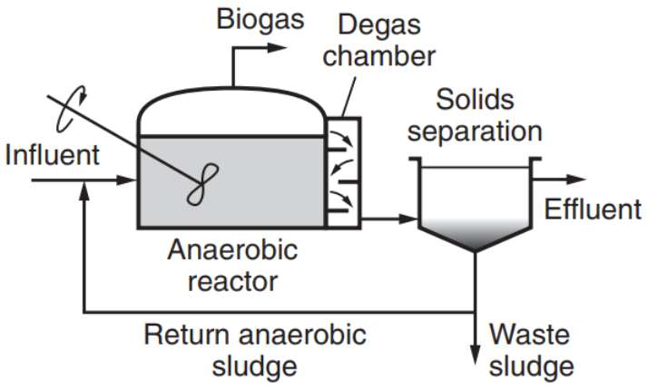
        - **Hình này chứng minh điều gì**
          - Quy trình công nghệ gồm bể phản ứng kỵ khí có máy khuấy xáo trộn hoàn toàn, ngăn tách khí (degas chamber), bể lắng sinh khối (clarifier), cùng các tuyến tuần hoàn và xả bùn kỵ khí.
        - **Từ đâu mà thấy được**
          - Dòng vào (Influent) hòa trộn cùng bùn tuần hoàn (Return anaerobic sludge) vào Anaerobic reactor; khí sinh học thoát lên ở đỉnh (Biogas); hỗn hợp bùn nước qua Degas chamber chảy sang khối tách chất rắn (Solids separation) tạo dòng nước trong (Effluent) và bùn xả (Waste sludge).

###### 1.1.2 Thiết bị khuấy trộn cơ học, ngăn khử khí và bể lắng sinh khối (Reactor Components)
- Thiết bị khuấy trộn cưỡng bức đóng vai trò quyết định trong việc bảo đảm trạng thái xáo trộn hoàn toàn (complete-mix regime):
  - Cánh khuấy cơ học trục đứng (mechanical impeller mixer) tạo ra các dòng chuyển động đối lưu tuần hoàn mạnh mẽ từ đáy lên bề mặt.
  - Vận tốc xáo trộn duy trì các bông bùn vi sinh vật ở trạng thái lơ lửng đồng nhất, tối đa hóa diện tích tiếp xúc giữa enzyme vi khuẩn và các phân tử cơ chất hòa tan.
  - Chế độ khuấy trộn liên tục triệt tiêu các vùng chết (dead zones), ngăn chặn sự phân tầng nhiệt độ và tránh hiện tượng lắng đọng bùn cục bộ tại đáy bể phản ứng.
      - **Hình 2.** Cơ chế thủy động lực học của cánh khuấy cơ học trong bể kỵ khí xáo trộn hoàn toàn
        - 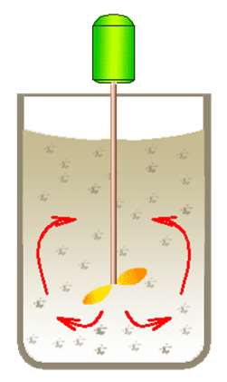
        - **Hình này chứng minh điều gì**
          - Cánh khuấy chìm tạo các đường dòng đối lưu tuần hoàn liên tục trong toàn bộ dung tích bể, ngăn ngừa hiện tượng lắng đọng cục bộ và tạo sự đồng nhất nồng độ sinh khối.
        - **Từ đâu mà thấy được**
          - Trục khuấy nối động cơ dẫn động ở đỉnh bể, hai mũi tên cong màu đỏ mô tả dòng đối lưu cuộn từ cánh khuấy hướng lên thành bể rồi quay vòng trở lại đáy bể.
- Ngăn tách khí (Degas chamber) là bộ phận kỹ thuật bắt buộc trong công nghệ kỵ khí sinh trưởng lơ lửng:
  - Do hoạt động sinh khí liên tục của vi khuẩn kỵ khí, các bọt khí $\text{CH}_4$ và $\text{CO}_2$ siêu nhỏ bám dính chặt vào cấu trúc xốp của bông bùn lơ lửng.
  - Nếu đưa trực tiếp hỗn hợp bùn nước vào bể lắng, lực đẩy nổi của các bọt khí sẽ làm bùn nổi lên bề mặt (sludge flotation), gây thất thoát sinh khối nghiêm trọng ra nguồn tiếp nhận và làm sụp đổ hệ vi sinh trong bể.
  - Ngăn tách khí sử dụng các tấm chắn nghiêng tạo dòng chảy rối cục bộ hoặc kết hợp thiết bị hút chân không nhẹ (vacuum degassing) để bóc tách triệt để bọt khí bám dính, phục hồi tỷ trọng tự nhiên của bông bùn.
- Bể lắng sinh khối kỵ khí (Clarifier) thực hiện phân tách pha lỏng và pha rắn:
  - Bể lắng thường có cấu tạo trụ tròn đáy côn với giàn cào bùn xoay cơ học để thu gom bùn nén dưới đáy.
  - Bùn kỵ khí có tính kết bông kém hơn bùn hoạt tính hiếu khí do thiếu các polymer ngoại bào sinh ra từ quá trình oxy hóa hiếu khí, đòi hỏi kiểm soát chặt chẽ tải trọng thủy lực bề mặt.
      - **Hình 3.** Cấu tạo mặt cắt bể lắng trọng lực thứ cấp thu gom bùn kỵ khí
        - 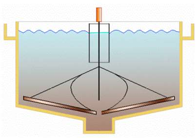
        - **Hình này chứng minh điều gì**
          - Bể lắng thứ cấp tách bùn kỵ khí bằng trọng lực với cơ cấu gạt bùn đáy dạng thanh nghiêng gom bùn vào hố trung tâm để bơm tuần hoàn lại bể phản ứng.
        - **Từ đâu mà thấy được**
          - Bể trụ tròn đáy côn có ống trung tâm phân phối dòng vào, cánh gạt bùn nghiêng xoay quanh trục gom lớp bùn sẫm màu dưới đáy vào phễu bùn trung tâm.

###### 1.1.3 Các thông số công nghệ vận hành cơ bản (Key Operating Parameters)
- Nồng độ chất rắn lơ lửng bay hơi trong hỗn hợp bùn nước ($\text{MLVSS}$):
  - Dải giá trị vận hành tiêu chuẩn: $\text{MLVSS} = 4000\text{--}8000\text{ g/m}^3$ ($4000\text{--}8000\text{ mg/L}$).
  - Giá trị điển hình thường chọn trong tính toán thiết kế: $\text{MLVSS} \approx 6000\text{ g/m}^3$.
  - Mật độ sinh khối cao cho phép bể chịu được tải lượng ô nhiễm hữu cơ lớn trong khi vẫn duy trì thể tích công trình ở mức hợp lý.
- Tải trọng thể tích chất hữu cơ ($\text{COD loading rate}$ hay $\text{OLR}$):
  - Dải tải trọng vận hành quy chuẩn: $\text{OLR} = 2\text{--}5\text{ kg COD/m}^3\cdot\text{d}$.
  - Tải trọng vận hành kỵ khí xáo trộn hoàn toàn cao gấp $3\text{--}5$ lần so với bể bùn hoạt tính hiếu khí truyền thống ($0.6\text{--}1.2\text{ kg COD/m}^3\cdot\text{d}$).
- Thời gian lưu bùn sinh học ($\text{Solids Retention Time} - \text{SRT}$ hay $\theta_c$):
  - Dải thời gian lưu bùn bắt buộc: $\text{SRT} = 15\text{--}30\text{ ngày}$.
  - Vi khuẩn sinh metan (methanogens) có tốc độ sinh sản chậm (thời gian nhân đôi thế hệ từ $3\text{--}5\text{ ngày}$ ở $35^\circ\text{C}$ và kéo dài hơn ở nhiệt độ thấp hơn).
  - Duy trì $\text{SRT} \ge 15\text{ ngày}$ là điều kiện tiên quyết để ngăn chặn hiện tượng rửa trôi vi sinh vật (biomass washout), bảo đảm quần xã vi khuẩn methanogen không bị cạn kiệt.

##### 1.2 Thông số động học và các bước thiết kế (Kinetic Parameters and Design Steps)

###### 1.2.1 Hệ số động học vi sinh và định mức sinh khí metan (Kinetic Coefficients and Methane Yield)
- Quá trình phân hủy kỵ khí diễn ra qua nhiều giai đoạn sinh hóa liên tiếp: thủy phân (hydrolysis), lên men tạo acid (acidogenesis / fermentation), tạo axetat (acetogenesis) và tạo metan (methanogenesis).
- Các vi sinh vật thuộc các pha có các hằng số động học tăng trưởng và phân hủy nội bào đặc trưng:
  - Hệ số sản lượng sinh khối (Synthesis yield, $Y_H$):
    - Pha lên men acid (Fermentation): dải giá trị $0.06\text{--}0.12\text{ g VSS/g COD}$, giá trị điển hình $0.10\text{ g VSS/g COD}$.
    - Pha sinh metan (Methanogenesis): dải giá trị $0.02\text{--}0.06\text{ g VSS/g COD}$, giá trị điển hình $0.04\text{ g VSS/g COD}$.
    - Tổng hợp toàn bộ quá trình (Overall combined): dải giá trị $0.05\text{--}0.10\text{ g VSS/g COD}$, giá trị điển hình $Y_H = 0.08\text{ g VSS/g COD}$.
    - Sản lượng sinh khối kỵ khí thấp hơn rất nhiều so với hiếu khí ($Y_{H,\text{aerobic}} \approx 0.4\text{--}0.6\text{ g VSS/g COD}$), làm giảm đáng kể lượng bùn thải cần xử lý.
  - Hệ số phân hủy nội bào (Decay coefficient, $b_H$):
    - Pha lên men acid: dải giá trị $0.02\text{--}0.06\text{ g/g}\cdot\text{d}$, giá trị điển hình $0.04\text{ g/g}\cdot\text{d}$.
    - Pha sinh metan: dải giá trị $0.01\text{--}0.04\text{ g/g}\cdot\text{d}$, giá trị điển hình $0.02\text{ g/g}\cdot\text{d}$.
    - Tổng hợp toàn bộ quá trình: dải giá trị $0.02\text{--}0.04\text{ g/g}\cdot\text{d}$, giá trị điển hình $b_H = 0.03\text{ g/g}\cdot\text{d}$.
  - Tốc độ sinh trưởng riêng cực đại (Maximum specific growth rate, $\mu_m$):
    - Phụ thuộc mạnh mẽ vào nhiệt độ môi trường phản ứng theo quy luật Arrhenius:
      - Ở $35^\circ\text{C}$ (vùng ấm nhiệt mesophilic tối ưu): dải giá trị $0.03\text{--}0.38\text{ g/g}\cdot\text{d}$, giá trị điển hình $0.35\text{ g/g}\cdot\text{d}$.
      - Ở $30^\circ\text{C}$: dải giá trị $0.22\text{--}0.28\text{ g/g}\cdot\text{d}$, giá trị điển hình $0.25\text{ g/g}\cdot\text{d}$.
      - Ở $25^\circ\text{C}$: dải giá trị $0.18\text{--}0.24\text{ g/g}\cdot\text{d}$, giá trị điển hình $0.20\text{ g/g}\cdot\text{d}$.
  - Hằng số nửa bão hòa tốc độ (Half-velocity constant, $K_s$):
    - Dải giá trị: $60\text{--}500\text{ mg COD/L}$, giá trị điển hình $K_s = 120\text{ mg COD/L}$ ($120\text{ g COD/m}^3$).
  - Định mức sản sinh khí metan lý thuyết ở điều kiện tiêu chuẩn (STP: $0^\circ\text{C}, 1\text{ atm}$):
    - Suất sinh khí lý thuyết: $0.35\text{ m}^3\text{ CH}_4/\text{kg COD}_r$ (tương ứng với lượng oxy cần thiết để oxy hóa hoàn toàn $1\text{ mol CH}_4$: $\text{CH}_4 + 2\text{O}_2 \to \text{CO}_2 + 2\text{H}_2\text{O}$, trong đó $16\text{ g CH}_4$ tương đương $64\text{ g COD}$, tương đương $22.414 / 64 = 0.35\text{ L CH}_4/\text{g COD}$).
  - Hàm lượng khí metan trong khí sinh học:
    - Chiếm $60\text{--}70\%$, giá trị điển hình $65\%\ \text{CH}_4$ (thành phần còn lại là $35\%\ \text{CO}_2$ và lượng nhỏ vết khí $\text{H}_2\text{S}, \text{N}_2, \text{H}_2$).
  - Mật độ năng lượng của khí metan nguyên chất ở điều kiện chuẩn:
    - Nhiệt trị: $38,846\text{ kJ/m}^3\ \text{CH}_4$.
      - **Hình 4.** Bảng các hệ số động học vi sinh và thông số sản sinh khí metan trong xử lý kỵ khí
        - 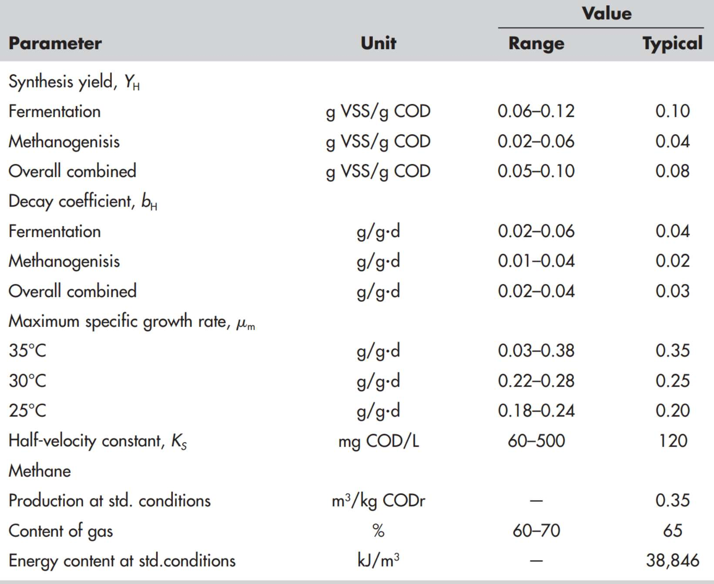
        - **Hình này chứng minh điều gì**
          - Cung cấp dải giá trị và giá trị điển hình của hệ số sản lượng sinh khối ($Y_H$), hệ số phân hủy nội bào ($b_H$), tốc độ sinh trưởng cực đại ($\mu_m$) theo nhiệt độ, hằng số nửa tốc độ ($K_s$), định mức sinh khí metan ($0.35\text{ m}^3/\text{kg COD}_r$) và nhiệt trị khí.
        - **Từ đâu mà thấy được**
          - Bảng liệt kê các hàng: Synthesis yield $Y_H$, Decay coefficient $b_H$, Maximum specific growth rate $\mu_m$ ở 35, 30, 25°C, Half-velocity constant $K_s$, cùng nhóm thông số Methane với giá trị năng lượng $38,846\text{ kJ/m}^3$.

| Tham số động học (Parameter) | Đơn vị (Unit) | Dải giá trị (Range) | Giá trị điển hình (Typical) |
| :--- | :--- | :---: | :---: |
| **Hệ số sản lượng sinh khối ($Y_H$)** | | | |
| - Pha lên men acid (Fermentation) | $\text{g VSS/g COD}$ | $0.06\text{--}0.12$ | $0.10$ |
| - Pha sinh metan (Methanogenesis) | $\text{g VSS/g COD}$ | $0.02\text{--}0.06$ | $0.04$ |
| - Tổng hợp kết hợp (Overall combined) | $\text{g VSS/g COD}$ | $0.05\text{--}0.10$ | $0.08$ |
| **Hệ số phân hủy nội bào ($b_H$)** | | | |
| - Pha lên men acid (Fermentation) | $\text{g/g}\cdot\text{d}$ | $0.02\text{--}0.06$ | $0.04$ |
| - Pha sinh metan (Methanogenesis) | $\text{g/g}\cdot\text{d}$ | $0.01\text{--}0.04$ | $0.02$ |
| - Tổng hợp kết hợp (Overall combined) | $\text{g/g}\cdot\text{d}$ | $0.02\text{--}0.04$ | $0.03$ |
| **Tốc độ sinh trưởng riêng cực đại ($\mu_m$)** | | | |
| - Ở $35^\circ\text{C}$ | $\text{g/g}\cdot\text{d}$ | $0.03\text{--}0.38$ | $0.35$ |
| - Ở $30^\circ\text{C}$ | $\text{g/g}\cdot\text{d}$ | $0.22\text{--}0.28$ | $0.25$ |
| - Ở $25^\circ\text{C}$ | $\text{g/g}\cdot\text{d}$ | $0.18\text{--}0.24$ | $0.20$ |
| **Hằng số nửa tốc độ ($K_s$)** | $\text{mg COD/L}$ | $60\text{--}500$ | $120$ |
| **Khí metan (Methane)** | | | |
| - Suất sinh khí ở ĐKTC ($0^\circ\text{C}, 1\text{ atm}$) | $\text{m}^3/\text{kg COD}_r$ | — | $0.35$ |
| - Tỷ lệ phần trăm trong biogas | $\%$ | $60\text{--}70$ | $65$ |
| - Nhiệt trị ở ĐKTC | $\text{kJ/m}^3$ | — | $38,846$ |

###### 1.2.2 Quy trình 7 bước tính toán thiết kế bể phản ứng kỵ khí (Seven-Step Design Procedure)
- Thiết kế bể kỵ khí xáo trộn hoàn toàn tuân thủ quy trình giải tích 7 bước tiêu chuẩn:
  - **Bước 1: Lựa chọn thời gian lưu bùn ($\text{SRT}$) và nồng độ cơ chất đầu ra:**
    - Tính thời gian lưu bùn tới hạn tối thiểu (critical minimum SRT):
      $$\theta_c^{\min} = \frac{1}{\mu_m - b}$$
    - Xác định thời gian lưu bùn thiết kế qua hệ số an toàn ($SF = 2.5\text{--}3.0$):
      $$\text{SRT}_{\text{design}} = \theta_c = SF \times \theta_c^{\min}$$
    - Tính nồng độ cơ chất hòa tan trong nước thải sau xử lý ($S$) theo phương trình Monod:
      $$S = \frac{K_s(1 + b \cdot \theta_c)}{\theta_c(\mu_m - b) - 1}$$
  - **Bước 2: Xác định lượng bùn sản sinh hàng ngày và tổng khối lượng bùn trong hệ thống:**
    - Sinh khối vi sinh vật mới sinh ra (net active biomass):
      $$P_{x,\text{bio}} = \frac{Q \cdot Y \cdot (S_0 - S)}{1 + b \cdot \theta_c}$$
    - Lượng mảnh vụn tế bào trơ tích lũy do phân hủy nội bào (cell debris):
      $$P_{x,d} = f_d \cdot b \cdot \theta_c \cdot P_{x,\text{bio}}$$
    - Cặn hữu cơ không phân hủy sinh học từ dòng vào trôi qua bể:
      $$P_{x,i} = Q \times \text{nbVSS}_0$$
    - Tổng lượng bùn VSS sinh ra hàng ngày:
      $$P_{x,\text{VSS}} = P_{x,\text{bio}} + P_{x,d} + P_{x,i}$$
    - Tổng khối lượng bùn sinh khối duy trì trong bể phản ứng:
      $$M_{\text{VSS}} = P_{x,\text{VSS}} \times \theta_c$$
  - **Bước 3: Chọn nồng độ bùn thiết kế và xác định thể tích bể phản ứng:**
    - Chọn nồng độ sinh khối bay hơi trong hỗn hợp bùn nước ($X = \text{MLVSS}$ trong dải $4000\text{--}8000\text{ g/m}^3$).
    - Thể tích làm việc hiệu dụng của bể phản ứng kỵ khí:
      $$V = \frac{M_{\text{VSS}}}{X}$$
    - Thời gian lưu thủy lực tương ứng:
      $$\text{HRT} = \tau = \frac{V}{Q}$$
  - **Bước 4: Xác định tốc độ sinh khí sinh học và khí metan:**
    - Tải lượng COD chuyển hóa thành khí metan (bằng lượng COD cơ chất bị tiêu thụ trừ đi lượng COD tích lũy vào sinh khối bùn vi sinh vật mới, với hệ số tương đương $1.42\text{ g COD/g VSS}$):
      $$\text{COD}_{\text{CH}_4} = Q(S_0 - S) - 1.42 \times (P_{x,\text{bio}} + P_{x,d})$$
    - Thể tích khí metan sinh ra ở điều kiện tiêu chuẩn (STP: $0^\circ\text{C}, 1\text{ atm}$):
      $$V_{\text{CH}_4,\text{STP}} = 0.35 \times \text{COD}_{\text{CH}_4}$$
    - Thể tích khí metan ở nhiệt độ làm việc $T$ ($^\circ\text{C}$):
      $$V_{\text{CH}_4, T} = V_{\text{CH}_4,\text{STP}} \times \frac{273.15 + T}{273.15}$$
    - Tổng thể tích khí sinh học (biogas) thu gom:
      $$V_{\text{biogas}} = \frac{V_{\text{CH}_4}}{\%\text{CH}_4}$$
  - **Bước 5: Xác định lượng bùn xả dư và nhu cầu bổ sung dinh dưỡng (N, P):**
    - Lượng bùn thất thoát theo dòng nước ra sau bể lắng:
      $$P_e = Q \times \text{VSS}_e$$
    - Lượng bùn kỵ khí dư cần chủ động xả bỏ hàng ngày:
      $$P_w = P_{x,\text{VSS}} - P_e$$
    - Nhu cầu dinh dưỡng cho sinh khối mới (với giả thiết sinh khối vi sinh chứa $12\%\ \text{N}$ và $2.4\%\ \text{P}$):
      $$N_{\text{req}} = 0.12 \times P_{x,\text{VSS}}, \quad P_{\text{req}} = 0.024 \times P_{x,\text{VSS}}$$
    - Lượng dinh dưỡng thiếu hụt cần châm bổ sung:
      $$\Delta N = N_{\text{req}} - Q \times N_0, \quad \Delta P = P_{\text{req}} - Q \times P_0$$
  - **Bước 6: Kiểm tra tải trọng thể tích chất hữu cơ ($\text{OLR}$):**
    - Tính tải trọng thể tích hữu cơ thực tế của bể:
      $$\text{OLR} = \frac{Q \cdot S_0}{V}$$
    - So sánh với giá trị tiêu chuẩn ($2\text{--}5\text{ kg COD/m}^3\cdot\text{d}$). Nếu vượt quá hoặc nhỏ hơn đáng kể thì điều chỉnh nồng độ $\text{MLVSS}$ hoặc dung tích bể.
  - **Bước 7: Xác định nhu cầu độ kiềm bổ sung duy trì pH ổn định:**
    - Vi khuẩn kỵ khí sinh metan cực kỳ nhạy cảm với môi trường acid, dải pH tối ưu bắt buộc duy trì từ $6.8\text{--}7.4$.
    - Do áp suất riêng phần của khí carbonic trong biogas rất cao ($P_{\text{CO}_2} = 0.30\text{--}0.40\text{ atm}$), nước thải cần có độ kiềm bicacbonat đủ lớn để cân bằng phản ứng hòa tan $\text{CO}_2$:
      $$\text{CO}_2\text{ (khí)} + \text{H}_2\text{O} \rightleftharpoons \text{H}_2\text{CO}_3^* \rightleftharpoons \text{H}^+ + \text{HCO}_3^-$$
    - Nồng độ ion bicacbonat cần thiết để giữ $\text{pH} = 7.0$:
      $$[\text{HCO}_3^-] = \frac{K_1 \cdot K_H \cdot P_{\text{CO}_2}}{[\text{H}^+]}$$
    - Quy đổi thành độ kiềm tối thiểu tính theo $\text{CaCO}_3$ ($2500\text{--}3000\text{ mg/L as CaCO}_3$) và xác định lượng hóa chất kiềm (như $\text{NaHCO}_3, \text{NaOH}, \text{Ca(OH)}_2$) cần bổ sung.

###### 1.2.3 Cân bằng nhiệt lượng và nhu cầu gia nhiệt duy trì nhiệt độ (Heating Requirements and Energy Balance)
- Quá trình phân hủy kỵ khí đòi hỏi nhiệt độ ổn định nghiêm ngặt; dao động nhiệt độ vượt quá $\pm 1\text{--}2^\circ\text{C/ngày}$ có thể ức chế nặng nề vi khuẩn sinh metan.
- Phương trình cân bằng nhiệt tổng quát của bể phản ứng kỵ khí:
  $$q_{\text{req}} = q_w + q_L$$
  - Nhiệt lượng cần thiết để nâng nhiệt độ dòng nước thải đầu vào từ $T_i$ lên nhiệt độ vận hành bể $T_r$:
    $$q_w = Q \cdot \rho \cdot C_p \cdot (T_r - T_i)$$
    - Trong đó: $Q$ là lưu lượng nước thải ($\text{m}^3/\text{d}$), $\rho = 1000\text{ kg/m}^3$ là khối lượng riêng của nước, $C_p = 4.184\text{ kJ/(kg}\cdot^\circ\text{C)}$ là nhiệt dung riêng của nước.
  - Tổn thất nhiệt qua thành bể, đáy bể và mái che do truyền nhiệt ra môi trường xung quanh:
    $$q_L = \sum (U_j \cdot A_j \cdot \Delta T_j) \times 86,400\text{ s/d}$$
    - Trong đó: $U_j$ là hệ số truyền nhiệt tổng thể qua kết cấu ($0.8\text{--}1.0\text{ W/(m}^2\cdot^\circ\text{C)}$ cho tường trên mặt đất, $0.5\text{--}0.6\text{ W/(m}^2\cdot^\circ\text{C)}$ cho tường chìm, $0.7\text{--}0.9\text{ W/(m}^2\cdot^\circ\text{C)}$ cho mái); $A_j$ là diện tích bề mặt trao đổi nhiệt ($\text{m}^2$); $\Delta T_j$ là chênh lệch nhiệt độ giữa bể và không khí hoặc đất xung quanh.
- Nhiệt lượng thu hồi từ quá trình đốt cháy khí sinh học (Biogas combustion):
  $$q_{\text{avail}} = V_{\text{CH}_4,\text{STP}} \times \text{LHV}_{\text{CH}_4} \times \eta_{\text{boiler}}$$
  - Trong đó: $\text{LHV}_{\text{CH}_4} = 38,846\text{ kJ/m}^3$ là nhiệt trị thấp của khí metan ở ĐKTC; $\eta_{\text{boiler}}$ là hiệu suất nồi hơi gia nhiệt ($75\text{--}85\%$).
- Cân bằng năng lượng hệ thống:
  - Khi $q_{\text{avail}} > q_{\text{req}}$, trạm xử lý hoàn toàn tự chủ nhiệt năng, phần khí sinh học dôi dư được dẫn vào máy phát điện đồng phát nhiệt - điện (CHP - Combined Heat and Power) để phát điện hòa lưới.

##### 1.3 Ví dụ tính toán thiết kế bể kỵ khí xáo trộn hoàn toàn (Design Example)

###### 1.3.1 Example 1: Design of Completely-Mixed Anaerobic Reactor
- **Đề bài**:
  Thiết kế bể phản ứng sinh học kỵ khí xáo trộn hoàn toàn (Completely-Mixed Anaerobic Reactor có tuần hoàn bùn) xử lý nước thải công nghiệp.
  Các thông số và giả thiết thiết kế (Slide 7):
  - Nồng độ chất rắn lơ lửng bay hơi trong nước sau lắng: $\text{VSS}_e = 150\text{ g/m}^3$.
  - Tỷ lệ sinh khối trơ sau phân hủy nội bào: $f_d = 0.15$.
  - Nồng độ sinh khối bay hơi trong bể phản ứng: $\text{MLVSS} = 6000\text{ g/m}^3$.
  - Thành phần khí sinh học: $65\%\ \text{CH}_4$ và $35\%\ \text{CO}_2$.
  - Hàm lượng dinh dưỡng trong sinh khối vi sinh: $12\%\ \text{N}$ và $2.4\%\ \text{P}$.
  - Tải trọng thủy lực bề mặt của bể lắng (Overflow rate of Clarifier): $\text{SOR} = 24\text{ m}^3/\text{m}^2\cdot\text{d}$.
  - Hiệu suất khử COD yêu cầu: $\ge 90\%$.
  - Hệ số an toàn thiết kế thời gian lưu bùn: $SF = 3.0$.
  - Đặc tính dòng nước thải đầu vào lấy theo bảng đặc tính (Slide 7, Hình 5).

- **Dữ kiện**:
  - Lưu lượng nước thải đầu vào: $Q = 500\text{ m}^3/\text{d}$.
    - Nhìn vào: Dòng thứ 1 trong Bảng đặc tính nước thải (Slide 7, Hình 5) ghi "Flowrate = 500 m3/d".
  - Nồng độ COD tổng đầu vào: $S_0 = 6000\text{ g/m}^3$ ($6000\text{ mg/L}$).
    - Nhìn vào: Dòng thứ 2 trong Bảng đặc tính nước thải ghi "COD = 6000 g/m3".
  - Nồng độ COD hòa tan đầu vào: $S_{s0} = 4000\text{ g/m}^3$.
    - Nhìn vào: Dòng thứ 3 trong Bảng đặc tính nước thải ghi "Soluble COD = 4000 g/m3".
  - Tỷ số COD/VSS của chất rắn lơ lửng dòng vào: $1.8\text{ g COD/g VSS}$.
    - Nhìn vào: Dòng thứ 4 trong Bảng đặc tính nước thải ghi "COD/VSS ratio = 1.8 g/g".
  - Tỷ lệ VSS có khả năng phân hủy sinh học trong nước vào: $80\%$.
    - Nhìn vào: Dòng thứ 5 trong Bảng đặc tính nước thải ghi "Degradable fraction of VSS = 80%".
  - Nồng độ Nitơ tổng trong nước thải: $N_0 = 10\text{ g/m}^3$.
    - Nhìn vào: Dòng thứ 6 trong Bảng đặc tính nước thải ghi "Nitrogen = 10 g/m3".
  - Nồng độ Photpho tổng trong nước thải: $P_0 = 20\text{ g/m}^3$.
    - Nhìn vào: Dòng thứ 7 trong Bảng đặc tính nước thải ghi "Phosphorus = 20 g/m3".
  - Độ kiềm sẵn có trong nước thải: $\text{Alk}_0 = 500\text{ g CaCO}_3/\text{m}^3$.
    - Nhìn vào: Dòng thứ 8 trong Bảng đặc tính nước thải ghi "Alkalinity = 500 g CaCO3/m3".
  - Nhiệt độ nước thải vận hành: $T = 25^\circ\text{C}$.
    - Nhìn vào: Dòng thứ 9 trong Bảng đặc tính nước thải ghi "Temperature = 25 °C".
      - **Hình 5.** Bảng thông số đặc tính nước thải đầu vào cho bài toán thiết kế bể kỵ khí xáo trộn hoàn toàn
        - 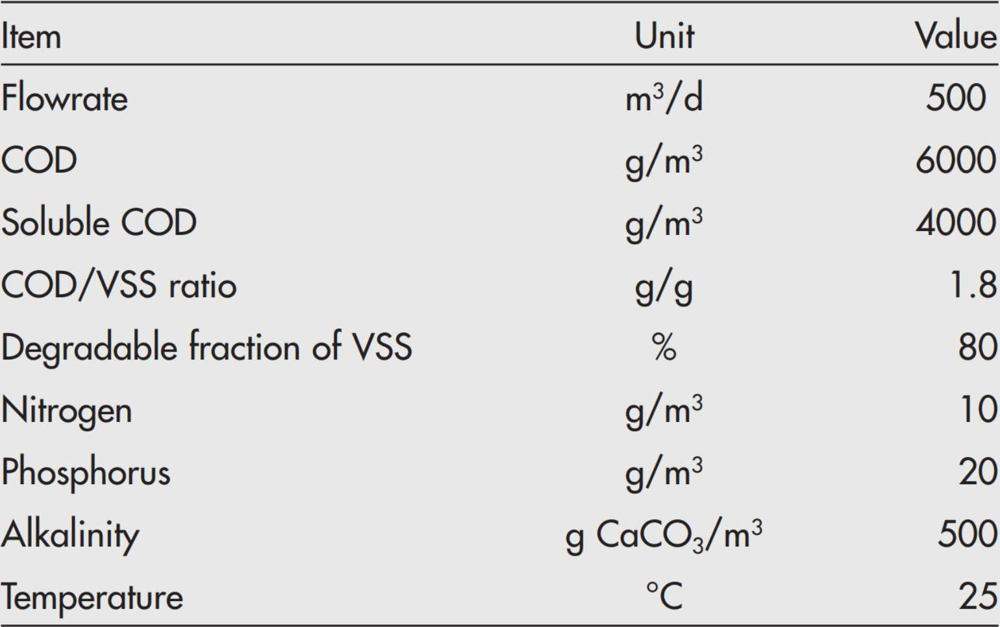
        - **Hình này chứng minh điều gì**
          - Xác lập các dữ kiện ban đầu của dòng thải: lưu lượng $500\text{ m}^3/\text{d}$, COD tổng $6000\text{ g/m}^3$, COD hòa tan $4000\text{ g/m}^3$, tỷ lệ COD/VSS $1.8$, tỷ lệ VSS phân hủy sinh học $80\%$, độ kiềm $500\text{ g CaCO}_3/\text{m}^3$ và nhiệt độ $25^\circ\text{C}$.
        - **Từ đâu mà thấy được**
          - Cột bảng liệt kê Flowrate ($500\text{ m}^3/\text{d}$), COD ($6000\text{ g/m}^3$), Soluble COD ($4000\text{ g/m}^3$), COD/VSS ratio ($1.8\text{ g/g}$), Degradable fraction of VSS ($80\%$), Nitrogen ($10\text{ g/m}^3$), Phosphorus ($20\text{ g/m}^3$), Alkalinity ($500\text{ g CaCO}_3/\text{m}^3$), Temperature ($25^\circ\text{C}$).
  - Nồng độ bùn sinh khối lơ lửng trong bể: $X = \text{MLVSS} = 6000\text{ g/m}^3$.
    - Nhìn vào: Cột thông số giả thiết bên trái Slide 7 ghi "MLVSS = 6000 g/m3".
  - Nồng độ bùn VSS thất thoát theo dòng nước ra: $\text{VSS}_e = 150\text{ g/m}^3$.
    - Nhìn vào: Giả thiết bên trái Slide 7 ghi "VSSe = 150 g/m3".
  - Hệ số phần cặn trơ tế bào: $f_d = 0.15$.
    - Nhìn vào: Giả thiết bên trái Slide 7 ghi "fd = 0.15".
  - Thành phần khí sinh học: $65\%\ \text{CH}_4$ và $35\%\ \text{CO}_2$.
    - Nhìn vào: Giả thiết Slide 7 ghi "Total gas: 65% CH4 and 35% CO2".
  - Hàm lượng dinh dưỡng tế bào: $12\%\ \text{N}$ và $2.4\%\ \text{P}$.
    - Nhìn vào: Giả thiết Slide 7 ghi "Biomass nutrient content = 12% N & 2.4% P".
  - Tải trọng tràn bể lắng: $\text{SOR} = 24\text{ m}^3/\text{m}^2\cdot\text{d}$.
    - Nhìn vào: Giả thiết Slide 7 ghi "Overflow rate of Clarifier = 24 m3/m2.d".
  - Hệ số an toàn thiết kế thời gian lưu bùn: $SF = 3.0$.
    - Nhìn vào: Giả thiết Slide 7 ghi "Factor of safety for design SRT = 3.0".
  - Các hệ số động học kỵ khí ở $25^\circ\text{C}$ lấy từ Bảng hệ số động học (Slide 5, Hình 4):
    - Tốc độ sinh trưởng riêng cực đại: $\mu_m = 0.20\text{ g/g}\cdot\text{d}$.
    - Hệ số sản lượng sinh khối kết hợp: $Y = 0.08\text{ g VSS/g COD}$.
    - Hệ số phân hủy nội bào kết hợp: $b = 0.03\text{ g/g}\cdot\text{d}$.
    - Hằng số nửa tốc độ: $K_s = 120\text{ mg COD/L} = 120\text{ g COD/m}^3$.
    - Suất sinh khí metan ở ĐKTC: $0.35\text{ m}^3\text{ CH}_4/\text{kg COD}_r$.
    - Nhiệt trị khí metan ở ĐKTC: $38,846\text{ kJ/m}^3$.

- **Quy tắc áp dụng**:
  - Cân bằng phân đoạn COD và VSS dòng vào:
    $$S_{p0} = S_0 - S_{s0}$$
    $$\text{VSS}_0 = \frac{S_{p0}}{\text{COD/VSS ratio}}$$
    $$\text{bVSS}_0 = 0.80 \times \text{VSS}_0, \quad \text{nbVSS}_0 = 0.20 \times \text{VSS}_0$$
    $$S_{b0} = S_{s0} + (\text{bVSS}_0 \times \text{COD/VSS ratio}) = S_{s0} + (0.80 \times S_{p0})$$
  - Phương trình tính thời gian lưu bùn và nồng độ cơ chất ra:
    $$\theta_c^{\min} = \frac{1}{\mu_m - b}, \quad \theta_c = SF \times \theta_c^{\min}$$
    $$S = \frac{K_s(1 + b \cdot \theta_c)}{\theta_c(\mu_m - b) - 1}$$
  - Phương trình sản lượng sinh khối và khối lượng bùn:
    $$P_{x,\text{bio}} = \frac{Q \cdot Y \cdot (S_{b0} - S)}{1 + b \cdot \theta_c}$$
    $$P_{x,d} = f_d \cdot b \cdot \theta_c \cdot P_{x,\text{bio}}$$
    $$P_{x,i} = Q \times \text{nbVSS}_0$$
    $$P_{x,\text{VSS}} = P_{x,\text{bio}} + P_{x,d} + P_{x,i}$$
    $$M_{\text{VSS}} = P_{x,\text{VSS}} \times \theta_c$$
  - Phương trình thể tích bể và thời gian lưu thủy lực:
    $$V = \frac{M_{\text{VSS}}}{\text{MLVSS}}, \quad \text{HRT} = \frac{V}{Q} \times 24\text{ (h)}$$
  - Phương trình sản lượng khí metan và khí sinh học:
    $$\text{COD}_{\text{utilized}} = Q(S_{b0} - S) \times 10^{-3}\text{ (kg COD/d)}$$
    $$\text{COD}_{\text{VSS}} = 1.42 \times (P_{x,\text{bio}} + P_{x,d}) \times 10^{-3}\text{ (kg COD/d)}$$
    $$\text{COD}_{\text{CH}_4} = \text{COD}_{\text{utilized}} - \text{COD}_{\text{VSS}}$$
    $$V_{\text{CH}_4,\text{STP}} = 0.35 \times \text{COD}_{\text{CH}_4}\text{ (m}^3\text{/d)}$$
    $$V_{\text{biogas}} = \frac{V_{\text{CH}_4,\text{STP}}}{0.65}$$
  - Cân bằng bùn xả dư và chất dinh dưỡng:
    $$P_e = Q \times \text{VSS}_e, \quad P_w = P_{x,\text{VSS}} - P_e$$
    $$N_{\text{req}} = 0.12 \times P_{x,\text{VSS}}, \quad P_{\text{req}} = 0.024 \times P_{x,\text{VSS}}$$
  - Kiểm tra tải trọng hữu cơ:
    $$\text{OLR} = \frac{Q \cdot S_0}{V \times 1000}\text{ (kg COD/m}^3\cdot\text{d)}$$
  - Phương trình độ kiềm cân bằng pH ở $25^\circ\text{C}$ ($P_{\text{CO}_2} = 0.35\text{ atm}$):
    $$\text{Alk}_{\text{req}} = \frac{K_1 \cdot K_H \cdot P_{\text{CO}_2}}{[\text{H}^+]} \times 50,000\text{ (mg CaCO}_3\text{/L)}$$
  - Tính toán diện tích bề mặt lắng:
    $$A_c = \frac{Q}{\text{SOR}}, \quad D = \sqrt{\frac{4 A_c}{\pi}}$$

- **Lời giải**:
  - **Bước 1: Phân tích các phân đoạn COD và VSS của dòng thải đầu vào.**
    - Tính toán:
      - Nồng độ COD dạng hạt đầu vào:
        $$S_{p0} = S_0 - S_{s0} = 6000 - 4000 = 2000\text{ g/m}^3$$
      - Tổng nồng độ chất rắn lơ lửng bay hơi đầu vào:
        $$\text{VSS}_0 = \frac{S_{p0}}{\text{COD/VSS ratio}} = \frac{2000}{1.8} = 1111.11\text{ g/m}^3$$
      - Nồng độ VSS có khả năng phân hủy sinh học:
        $$\text{bVSS}_0 = 0.80 \times 1111.11 = 888.89\text{ g/m}^3$$
      - Nồng độ VSS trơ không phân hủy sinh học:
        $$\text{nbVSS}_0 = (1 - 0.80) \times 1111.11 = 222.22\text{ g/m}^3$$
      - Nồng độ COD hạt có khả năng phân hủy sinh học:
        $$\text{bpCOD}_0 = 888.89 \times 1.8 = 1600.0\text{ g/m}^3$$
      - Tổng nồng độ COD có khả năng phân hủy sinh học đầu vào ($S_{b0}$):
        $$S_{b0} = S_{s0} + \text{bpCOD}_0 = 4000 + 1600 = 5600.0\text{ g/m}^3$$
    - Căn cứ: Phương pháp phân đoạn COD của Metcalf & Eddy và tỷ lệ phân hủy VSS $80\%$, tỷ số COD/VSS $1.8$.
    - Nhìn vào: Các dòng \"COD = 6000\", \"Soluble COD = 4000\", \"COD/VSS ratio = 1.8\", \"Degradable fraction of VSS = 80%\" trên Hình 5 (Slide 7).

  - **Bước 2: Xác định thời gian lưu bùn ($\text{SRT} = \theta_c$) và nồng độ cơ chất hòa tan đầu ra ($S$).**
    - Tính toán:
      - Thời gian lưu bùn tối thiểu để chống rửa trôi ở $25^\circ\text{C}$:
        $$\theta_c^{\min} = \frac{1}{\mu_m - b} = \frac{1}{0.20 - 0.03} = \frac{1}{0.17} = 5.8824\text{ ngày}$$
      - Thời gian lưu bùn thiết kế với hệ số an toàn $SF = 3.0$:
        $$\theta_c = SF \times \theta_c^{\min} = 3.0 \times 5.8824 = 17.65\text{ ngày}$$
        (Lựa chọn giá trị tính toán chi tiết $\theta_c = 17.65\text{ ngày}$, nằm chính xác trong dải tiêu chuẩn $15\text{--}30\text{ ngày}$).
      - Nồng độ cơ chất hòa tan đầu ra ($S$):
        $$S = \frac{K_s(1 + b \cdot \theta_c)}{\theta_c(\mu_m - b) - 1} = \frac{120 \times (1 + 0.03 \times 17.65)}{17.65 \times (0.20 - 0.03) - 1} = \frac{120 \times 1.5295}{3.0005 - 1} = \frac{183.54}{2.0005} = 91.75\text{ g/m}^3$$
      - Lượng cơ chất phân hủy sinh học bị khử trong bể:
        $$\Delta S = S_{b0} - S = 5600 - 91.75 = 5508.25\text{ g/m}^3$$
      - Hiệu suất loại bỏ COD hòa tan:
        $$\eta_{\text{soluble}} = \frac{4000 - 91.75}{4000} \times 100\% = 97.71\%$$
    - Căn cứ: Phương trình động học Monod ở trạng thái ổn định và hệ số an toàn $SF = 3.0$; các giá trị $\mu_m = 0.20\text{ d}^{-1}, b = 0.03\text{ d}^{-1}, K_s = 120\text{ g/m}^3$ ở $25^\circ\text{C}$ từ Hình 4 (Slide 5).
    - Nhìn vào: Hàng \"$25^\circ\text{C}$\" của $\mu_m$ trên Hình 4 và dòng \"Factor of safety for design SRT = 3.0\" trên Slide 7.

  - **Bước 3: Xác định lượng bùn sinh ra hàng ngày ($P_{x,\text{VSS}}$) và tổng khối lượng bùn trong bể ($M_{\text{VSS}}$).**
    - Tính toán:
      - Sinh khối vi sinh vật hoạt tính sinh ra hàng ngày:
        $$P_{x,\text{bio}} = \frac{Q \cdot Y \cdot (S_{b0} - S)}{1 + b \cdot \theta_c} = \frac{500 \times 0.08 \times 5508.25}{1 + 0.03 \times 17.65} = \frac{220,330}{1.5295} = 144,054\text{ g/d} = 144.05\text{ kg/d}$$
      - Lượng cặn tế bào phân hủy nội bào trơ tích lũy:
        $$P_{x,d} = f_d \cdot b \cdot \theta_c \cdot P_{x,\text{bio}} = 0.15 \times 0.03 \times 17.65 \times 144.05 = 0.07943 \times 144.05 = 11.44\text{ kg/d}$$
      - Lượng VSS trơ từ nước thải đầu vào không phân hủy:
        $$P_{x,i} = Q \times \text{nbVSS}_0 = 500 \times 222.22 = 111,110\text{ g/d} = 111.11\text{ kg/d}$$
      - Tổng lượng bùn VSS sinh ra trong hệ thống mỗi ngày:
        $$P_{x,\text{VSS}} = P_{x,\text{bio}} + P_{x,d} + P_{x,i} = 144.05 + 11.44 + 111.11 = 266.60\text{ kg/d}$$
      - Tổng khối lượng bùn VSS cần tích lũy trong bể phản ứng để duy trì $\text{SRT} = 17.65\text{ ngày}$:
        $$M_{\text{VSS}} = P_{x,\text{VSS}} \times \theta_c = 266.60\text{ kg/d} \times 17.65\text{ ngày} = 4705.5\text{ kg} = 4,705,500\text{ g}$$
    - Căn cứ: Phương trình cân bằng vật chất chất rắn lơ lửng kỵ khí có xét đến cặn trơ đầu vào và hệ số trơ nội bào $f_d = 0.15$.
    - Nhìn vào: Tham số \"fd = 0.15\" ở cột giả thiết bên trái Slide 7.

  - **Bước 4: Xác định thể tích bể phản ứng ($V$) và thời gian lưu thủy lực ($\text{HRT}$).**
    - Tính toán:
      - Nồng độ bùn thiết kế trong bể: $\text{MLVSS} = X = 6000\text{ g/m}^3 = 6.0\text{ kg/m}^3$.
      - Thể tích làm việc hữu ích của bể kỵ khí xáo trộn hoàn toàn:
        $$V = \frac{M_{\text{VSS}}}{\text{MLVSS}} = \frac{4705.5\text{ kg}}{6.0\text{ kg/m}^3} = 784.25\text{ m}^3$$
        (Lựa chọn thể tích thiết kế làm tròn kỹ thuật: $V = 785\text{ m}^3$).
      - Thời gian lưu nước thủy lực ($\text{HRT} = \tau$):
        $$\tau = \frac{V}{Q} = \frac{784.25\text{ m}^3}{500\text{ m}^3/\text{d}} = 1.5685\text{ ngày} = 1.5685 \times 24\text{ h} = 37.64\text{ giờ}$$
    - Căn cứ: Định nghĩa thời gian lưu bùn và quan hệ $V = M / X$ đối với hệ thống xáo trộn hoàn toàn có hoàn lưu.
    - Nhìn vào: Dòng \"MLVSS = 6000 g/m3\" trên Slide 7.

  - **Bước 5: Xác định lưu lượng khí sinh học và khí metan tạo thành.**
    - Tính toán:
      - Tải lượng COD có thể phân hủy bị tiêu thụ:
        $$\text{COD}_{\text{utilized}} = \frac{500 \times (5600 - 91.75)}{1000} = 2754.13\text{ kg COD/d}$$
      - Tải lượng COD chuyển hóa vào sinh khối vi sinh vật mới (với đương lượng oxy $1.42\text{ kg COD/kg VSS}$):
        $$\text{COD}_{\text{cells}} = 1.42 \times (P_{x,\text{bio}} + P_{x,d}) = 1.42 \times (144.05 + 11.44) = 1.42 \times 155.49 = 220.80\text{ kg COD/d}$$
      - Tải lượng COD chuyển hóa thành khí metan:
        $$\text{COD}_{\text{CH}_4} = \text{COD}_{\text{utilized}} - \text{COD}_{\text{cells}} = 2754.13 - 220.80 = 2533.33\text{ kg COD/d}$$
      - Thể tích khí metan sinh ra ở điều kiện tiêu chuẩn (STP: $0^\circ\text{C}, 1\text{ atm}$, định mức $0.35\text{ m}^3/\text{kg COD}$):
        $$V_{\text{CH}_4,\text{STP}} = 0.35 \times 2533.33 = 886.67\text{ m}^3/\text{d}$$
      - Thể tích khí metan thực tế ở nhiệt độ vận hành $25^\circ\text{C}$ ($298.15\text{ K}$):
        $$V_{\text{CH}_4, 25^\circ\text{C}} = 886.67 \times \frac{273.15 + 25}{273.15} = 886.67 \times 1.0915 = 967.82\text{ m}^3/\text{d}$$
      - Tổng thể tích khí sinh học (Biogas, chứa $65\%\ \text{CH}_4$):
        - Ở điều kiện tiêu chuẩn STP:
          $$V_{\text{biogas},\text{STP}} = \frac{V_{\text{CH}_4,\text{STP}}}{0.65} = \frac{886.67}{0.65} = 1364.11\text{ m}^3/\text{d}$$
        - Ở điều kiện thực tế $25^\circ\text{C}$:
          $$V_{\text{biogas}, 25^\circ\text{C}} = \frac{967.82}{0.65} = 1488.95\text{ m}^3/\text{d}$$
      - Tiềm năng thu hồi năng lượng nhiệt từ khí metan (ở ĐKTC, nhiệt trị $38,846\text{ kJ/m}^3$):
        $$E_{\text{CH}_4} = 886.67\text{ m}^3/\text{d} \times 38,846\text{ kJ/m}^3 = 34,443,583\text{ kJ/d} \approx 34.44\text{ GJ/d}$$
        Tương đương công suất nhiệt liên tục:
        $$P_{\text{thermal}} = \frac{34,443,583\text{ kJ/d}}{86,400\text{ s/d}} = 398.65\text{ kW}$$
    - Căn cứ: Định mức sản sinh khí metan $0.35\text{ m}^3/\text{kg COD}$ khử ở ĐKTC và nhiệt trị $38,846\text{ kJ/m}^3$ từ Bảng Hình 4 (Slide 5); tỷ lệ $65\%\ \text{CH}_4$ từ Slide 7.
    - Nhìn vào: Hàng \"Production at std. conditions = 0.35\" và hàng \"Energy content = 38,846\" trên Hình 4 cùng dòng \"Total gas: 65% CH4 and 35% CO2\" trên Slide 7.

  - **Bước 6: Xác định lượng bùn xả dư và nhu cầu bổ sung dinh dưỡng (N, P).**
    - Tính toán:
      - Lượng chất rắn lơ lửng bay hơi thất thoát qua dòng nước trong sau lắng:
        $$P_e = Q \times \text{VSS}_e = 500\text{ m}^3/\text{d} \times 150\text{ g/m}^3 \times 10^{-3} = 75.0\text{ kg VSS/d}$$
      - Lượng bùn VSS dư cần chủ động xả bỏ hàng ngày:
        $$P_w = P_{x,\text{VSS}} - P_e = 266.60 - 75.00 = 191.60\text{ kg VSS/d}$$
      - Nhu cầu Nitơ sinh học cho sinh khối tổng ($12\%\ \text{N}$):
        $$N_{\text{req}} = 0.12 \times P_{x,\text{VSS}} = 0.12 \times 266.60 = 31.99\text{ kg N/d}$$
      - Lượng Nitơ do nước thải đầu vào cung cấp:
        $$N_{\text{supplied}} = Q \times N_0 \times 10^{-3} = 500 \times 10 \times 10^{-3} = 5.0\text{ kg N/d}$$
      - Lượng Nitơ thiếu hụt cần châm bổ sung:
        $$\Delta N = N_{\text{req}} - N_{\text{supplied}} = 31.99 - 5.00 = 26.99\text{ kg N/d}$$
      - Nhu cầu Photpho sinh học cho sinh khối tổng ($2.4\%\ \text{P}$):
        $$P_{\text{req}} = 0.024 \times P_{x,\text{VSS}} = 0.024 \times 266.60 = 6.40\text{ kg P/d}$$
      - Lượng Photpho do nước thải đầu vào cung cấp:
        $$P_{\text{supplied}} = Q \times P_0 \times 10^{-3} = 500 \times 20 \times 10^{-3} = 10.0\text{ kg P/d}$$
      - Đánh giá Photpho: Do lượng Photpho cung cấp ($10.0\text{ kg/d}$) lớn hơn nhu cầu ($6.40\text{ kg/d}$), hệ thống dư thừa Photpho, không cần bổ sung Photpho.
    - Căn cứ: Cân bằng bùn tổng thể hệ thống kỵ khí và tỷ lệ dinh dưỡng sinh khối $12\%\ \text{N}$ và $2.4\%\ \text{P}$ từ Slide 7.
    - Nhìn vào: Giả thiết \"VSSe = 150 g/m3\" và \"Biomass nutrient content = 12% N & 2.4% P\" trên Slide 7.

  - **Bước 7: Kiểm tra tải trọng thể tích chất hữu cơ ($\text{OLR}$).**
    - Tính toán:
      $$\text{OLR} = \frac{Q \cdot S_0}{V \times 1000} = \frac{500\text{ m}^3/\text{d} \times 6000\text{ g/m}^3}{784.25\text{ m}^3 \times 1000\text{ g/kg}} = \frac{3000\text{ kg COD/d}}{784.25\text{ m}^3} = 3.825\text{ kg COD/m}^3\cdot\text{d}$$
    - Đánh giá tiêu chuẩn: Giá trị tính toán $\text{OLR} = 3.83\text{ kg COD/m}^3\cdot\text{d}$ thỏa mãn hoàn toàn dải tải trọng tiêu chuẩn quy định cho bể kỵ khí xáo trộn hoàn toàn ($2\text{--}5\text{ kg COD/m}^3\cdot\text{d}$ trích dẫn từ Slide 2).
    - Căn cứ: Tiêu chuẩn thiết kế tải trọng hữu cơ bể kỵ khí xáo trộn hoàn toàn (Slide 2).
    - Nhìn vào: Dòng \"COD loading rate: 2 – 5 kg COD/m3.d\" trên Slide 2.

  - **Bước 8: Xác định nhu cầu bổ sung độ kiềm duy trì pH đệm.**
    - Tính toán:
      - Với nồng độ $\text{CO}_2$ trong khí sinh học chiếm $35\%$, áp suất riêng phần $P_{\text{CO}_2} = 0.35\text{ atm}$.
      - Hằng số Henry cho $\text{CO}_2$ ở $25^\circ\text{C}$: $K_H = 0.034\text{ mol/(L}\cdot\text{atm)}$.
      - Nồng độ carbonic hòa tan:
        $$[\text{H}_2\text{CO}_3^*] = K_H \times P_{\text{CO}_2} = 0.034 \times 0.35 = 0.0119\text{ mol/L}$$
      - Hằng số điện ly nấc 1 của acid carbonic ở $25^\circ\text{C}$: $K_1 = 4.47 \times 10^{-7}\text{ mol/L}$.
      - Để duy trì $\text{pH} = 7.0$ ($[\text{H}^+] = 1.0 \times 10^{-7}\text{ mol/L}$), nồng độ ion bicacbonat cần thiết:
        $$[\text{HCO}_3^-] = \frac{K_1 \cdot [\text{H}_2\text{CO}_3^*]}{[\text{H}^+]} = \frac{4.47 \times 10^{-7} \times 0.0119}{1.0 \times 10^{-7}} = 0.05319\text{ mol/L}$$
      - Độ kiềm tương đương tính theo $\text{CaCO}_3$ (đương lượng gam $50,000\text{ mg/mol}$):
        $$\text{Alk}_{\text{req}} = 0.05319\text{ mol/L} \times 50,000\text{ mg/mol} = 2659.7\text{ mg CaCO}_3/\text{L} \approx 2660\text{ g CaCO}_3/\text{m}^3$$
      - Độ kiềm sẵn có trong nước thải đầu vào: $\text{Alk}_0 = 500\text{ g CaCO}_3/\text{m}^3$.
      - Lượng độ kiềm thiếu hụt cần bổ sung:
        $$\Delta\text{Alk} = 2660 - 500 = 2160\text{ g CaCO}_3/\text{m}^3 = 2.16\text{ kg CaCO}_3/\text{m}^3$$
      - Lượng hóa chất kiềm cần châm hàng ngày quy theo $\text{CaCO}_3$:
        $$M_{\text{Alk}} = 500\text{ m}^3/\text{d} \times 2.16\text{ kg/m}^3 = 1080\text{ kg CaCO}_3/\text{ngày}$$
        (Nếu sử dụng natri bicacbonat $\text{NaHCO}_3$, lượng cần châm là $1080 \times \frac{84}{50} = 1814.4\text{ kg NaHCO}_3/\text{ngày}$).
    - Căn cứ: Cân bằng hóa lý carbonate - bicacbonat ở $25^\circ\text{C}$ và mục 7 trong Quy trình thiết kế (Slide 3 và 6).
    - Nhìn vào: Dòng \"Alkalinity = 500 g CaCO3/m3\" trên Hình 5 và dòng \"7. Determine alkalinity needs\" trên Slide 6.

  - **Bước 9: Thiết kế kích thước hình học Bể lắng bùn kỵ khí (Clarifier).**
    - Tính toán:
      - Tải trọng thủy lực bề mặt thiết kế: $\text{SOR} = 24\text{ m}^3/\text{m}^2\cdot\text{d}$.
      - Diện tích mặt bằng lắng yêu cầu:
        $$A_c = \frac{Q}{\text{SOR}} = \frac{500\text{ m}^3/\text{d}}{24\text{ m}^3/\text{m}^2\cdot\text{d}} = 20.83\text{ m}^2$$
      - Đường kính bể lắng tròn:
        $$D_c = \sqrt{\frac{4 A_c}{\pi}} = \sqrt{\frac{4 \times 20.83}{3.1416}} = \sqrt{26.522} = 5.15\text{ m}$$
        Chọn đường kính tiêu chuẩn thi công: $D_c = 5.20\text{ m}$.
      - Diện tích bề mặt lắng thực tế:
        $$A_{c,\text{actual}} = \frac{\pi \times (5.20)^2}{4} = 21.24\text{ m}^2$$
      - Tải trọng tràn bề mặt thực tế:
        $$\text{SOR}_{\text{actual}} = \frac{500}{21.24} = 23.54\text{ m}^3/\text{m}^2\cdot\text{d} \le 24\text{ m}^3/\text{m}^2\cdot\text{d}\text{ (Đạt)}$$
      - Chiều sâu công tác phần lắng nước trong chọn $H_{\text{settle}} = 3.5\text{ m}$, chiều cao bảo vệ $H_{\text{freeboard}} = 0.5\text{ m}$, chiều sâu phễu thu bùn đáy côn $H_{\text{hopper}} = 1.0\text{ m}$. Tổng chiều sâu bể lắng là $H_{\text{total}} = 5.0\text{ m}$.
    - Căn cứ: Tiêu chuẩn thiết kế bể lắng thứ cấp và dữ kiện $\text{SOR} = 24\text{ m}^3/\text{m}^2\cdot\text{d}$.
    - Nhìn vào: Dòng \"Overflow rate of Clarifier = 24 m3/m2.d\" trên Slide 7.

- **Kết quả**:

| Hạng mục thiết kế | Ký hiệu | Giá trị tính toán | Đơn vị | Ghi chú |
| :--- | :---: | :---: | :---: | :--- |
| Thời gian lưu bùn tối thiểu | $\theta_c^{\min}$ | $5.88$ | ngày | Chống rửa trôi vi sinh |
| Thời gian lưu bùn thiết kế | $\theta_c$ | $17.65$ | ngày | $SF = 3.0$ (Dải $15\text{--}30\text{ d}$) |
| Nồng độ COD hòa tan đầu ra | $S$ | $91.8$ | $\text{g/m}^3$ | Nước sau xử lý sinh học |
| Hiệu suất khử COD hòa tan | $\eta_{\text{sCOD}}$ | $97.7$ | $\%$ | Vượt mức yêu cầu $\ge 90\%$ |
| Tổng sinh khối VSS sinh ra | $P_{x,\text{VSS}}$ | $266.6$ | $\text{kg/d}$ | Bùn vi sinh + cặn trơ |
| Khối lượng bùn trong bể | $M_{\text{VSS}}$ | $4705.5$ | $\text{kg}$ | Duy trì mật độ sinh khối |
| Thể tích hiệu dụng bể kỵ khí | $V$ | $784.3$ | $\text{m}^3$ | Chọn thiết kế $785\text{ m}^3$ |
| Thời gian lưu thủy lực | $\text{HRT}$ | $37.6$ | giờ | $1.57\text{ ngày}$ |
| Tải trọng thể tích hữu cơ | $\text{OLR}$ | $3.83$ | $\text{kg COD/m}^3\cdot\text{d}$ | Thỏa mãn dải $2\text{--}5\text{ kg/m}^3\cdot\text{d}$ |
| Sản lượng khí metan (ĐKTC) | $V_{\text{CH}_4,\text{STP}}$ | $886.7$ | $\text{m}^3/\text{d}$ | $0^\circ\text{C}, 1\text{ atm}$ |
| Sản lượng khí metan ($25^\circ\text{C}$) | $V_{\text{CH}_4, 25^\circ\text{C}}$ | $967.8$ | $\text{m}^3/\text{d}$ | Điều kiện vận hành thực tế |
| Tổng khí sinh học Biogas (ĐKTC) | $V_{\text{biogas},\text{STP}}$ | $1364.1$ | $\text{m}^3/\text{d}$ | $65\%\ \text{CH}_4, 35\%\ \text{CO}_2$ |
| Năng lượng nhiệt khí metan | $E_{\text{CH}_4}$ | $34.44$ | $\text{GJ/d}$ | Công suất nhiệt $398.7\text{ kW}$ |
| Lượng bùn xả dư hàng ngày | $P_w$ | $191.6$ | $\text{kg VSS/d}$ | Bùn đưa sang nén/ép bùn |
| Nhu cầu bổ sung Nitơ | $\Delta N$ | $27.0$ | $\text{kg N/d}$ | Bổ sung dưới dạng Urê hoặc $\text{NH}_4\text{Cl}$ |
| Nhu cầu bổ sung Photpho | $\Delta P$ | $0.0$ | $\text{kg P/d}$ | Nước vào đã dư thừa P |
| Nhu cầu bổ sung độ kiềm | $M_{\text{Alk}}$ | $1080$ | $\text{kg CaCO}_3\text{/d}$ | Giữ vững $\text{pH} = 7.0$ |
| Diện tích mặt thoáng bể lắng | $A_c$ | $20.83$ | $\text{m}^2$ | $\text{SOR} = 24\text{ m}^3/\text{m}^2\cdot\text{d}$ |
| Đường kính bể lắng thứ cấp | $D_c$ | $5.20$ | $\text{m}$ | Chọn kích thước chuẩn |

- **Kiểm tra lại**:
  - **Kiểm tra cân bằng vật chất COD (COD mass balance):**
    - Tổng COD đưa vào hệ thống:
      $$\text{COD}_{\text{in}} = Q \times S_0 = 500\text{ m}^3/\text{d} \times 6000\text{ g/m}^3 \times 10^{-3} = 3000.0\text{ kg COD/d}$$
    - COD trong khí metan thoát ra:
      $$\text{COD}_{\text{CH}_4} = \frac{V_{\text{CH}_4,\text{STP}}}{0.35\text{ m}^3/\text{kg COD}} = \frac{886.67}{0.35} = 2533.3\text{ kg COD/d}$$
    - COD tích lũy vào tế bào vi sinh vật mới:
      $$\text{COD}_{\text{cells}} = 1.42 \times (P_{x,\text{bio}} + P_{x,d}) = 1.42 \times 155.49 = 220.8\text{ kg COD/d}$$
    - COD trong cặn trơ đầu vào thoát ra theo bùn:
      $$\text{COD}_{\text{inert,in}} = 1.8 \times P_{x,i} = 1.8 \times 111.11 = 200.0\text{ kg COD/d}$$
    - COD hòa tan còn sót trong dòng ra sau lắng:
      $$\text{COD}_{\text{eff,sol}} = Q \times S = 500 \times 91.75 \times 10^{-3} = 45.9\text{ kg COD/d}$$
    - Tổng COD đầu ra được kiểm chứng:
      $$\sum \text{COD}_{\text{out}} = 2533.3 + 220.8 + 200.0 + 45.9 = 3000.0\text{ kg COD/d}$$
      Sai số cân bằng vật chất: $\Delta = |3000.0 - 3000.0| = 0.0\text{ kg/d}$ ($0.00\%$), cân bằng khép kín tuyệt đối.
  - **Kiểm tra hiệu suất khử tổng COD dòng thải:**
    - Tổng nồng độ COD của dòng nước trong sau lắng (gồm cơ chất sót $S$ và COD của $\text{VSS}_e$):
      $$\text{COD}_{e,\text{total}} = S + (1.42 \times \text{VSS}_e) = 91.75 + (1.42 \times 150) = 91.75 + 213.0 = 304.75\text{ g/m}^3$$
    - Hiệu suất loại bỏ COD tổng thể của toàn trạm:
      $$\eta_{\text{total}} = \frac{6000 - 304.75}{6000} \times 100\% = 94.92\% > 90\%$$
      Thỏa mãn vượt yêu cầu thiết kế ban đầu ($\ge 90\%$).
  - **Kiểm tra thời gian lưu bùn và tải trọng thể tích hữu cơ:**
    - $\text{SRT} = 17.65\text{ ngày}$ nằm gọn trong khoảng tối ưu $15\text{--}30\text{ ngày}$.
    - $\text{OLR} = 3.83\text{ kg COD/m}^3\cdot\text{d}$ nằm chính xác trong khoảng $2\text{--}5\text{ kg COD/m}^3\cdot\text{d}$.
    - Cả hai chỉ số cốt lõi đều xác nhận quy mô bể được tính toán chính xác và tối ưu về mặt kỹ thuật.

#### 2. Bể phản ứng kỵ khí lớp bùn chảy ngược (Upflow Anaerobic Sludge Blanket - UASB)

- Bể phản ứng kỵ khí lớp bùn chảy ngược (UASB) là công nghệ xử lý sinh học kỵ khí tải trọng cao (high-rate anaerobic process) không sử dụng giá thể nhân tạo.
  - Dòng nước thải được phân phối từ đáy bể và di chuyển theo phương thẳng đứng hướng lên xuyên qua tầng đệm bùn kỵ khí tự do.
  - Quá trình phân hủy chất hữu cơ diễn ra nhờ sự tiếp xúc trực tiếp giữa dòng cơ chất đi lên và quần thể vi sinh vật kỵ khí mật độ cao.
  - Bể tích hợp bộ tách ba pha Khí - Lỏng - Rắn (Gas-Liquid-Solid Separator - GLSS) ở phần đỉnh công trình để thu hồi khí sinh học biogas và giữ lại sinh khối trong bể mà không cần bể lắng thứ cấp và hệ thống bơm tuần hoàn bùn riêng biệt.

##### 2.1 Tổng quan cấu tạo bể UASB (Overview of UASB Reactor)

- Nước thải nạp vào từ đáy bể theo chiều chuyển động hướng lên (upflow pattern).
  - Hệ thống phân phối nước nạp đáy (bottom feed distribution manifold) gồm mạng lưới đường ống có nhiều vòi phun bố trí đều khắp mặt đáy bể.
  - Cách bố trí nhiều điểm nạp (inlet points) ngăn ngừa hiện tượng dòng chảy ngắn (short-circuiting) và phân bố đều tải trọng cơ chất lên toàn bộ diện tích tầng đệm bùn.
  - Áp lực thủy lực của dòng dâng hỗ trợ đẩy bọt khí biogas sinh ra thoát lên trên và duy trì trạng thái lơ lửng của lớp bùn.
- Bộ tách ba pha Khí - Lỏng - Rắn (GLSS) được tích hợp tại đỉnh bể UASB để phân tách đồng thời ba pha trong cùng một công trình.
  - Chụp thu gom khí (gas collector / gas cap) có thành vách nghiêng dốc từ $45^\circ$ đến $60^\circ$ (thông thường $50^\circ - 55^\circ$) để thu giữ bọt khí sinh học và dẫn về ống thu biogas.
  - Tấm chắn hướng dòng và gờ vát nghiêng (deflector baffles / bevels) được bố trí so le bên dưới khe hở của vùng lắng nhằm ngăn bọt khí xâm nhập vào vùng nước trong.
  - Bọt khí va đập vào tấm chắn bị tách khỏi bông bùn, khí nổi vào chụp thu trong khi hạt bùn mất lực nâng nổi sẽ trượt theo vách nghiêng quay trở lại tầng bùn đáy.
    - **Hình 6.** Sơ đồ nguyên lý cấu tạo bể UASB với bộ thu khí chìm (Submerged gas collector)
      - 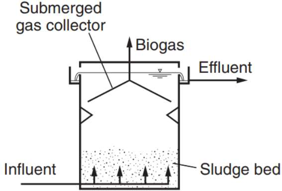
      - **Hình này chứng minh điều gì**
        - Nước thải nạp từ đáy hướng lên qua lớp đệm bùn (sludge bed), khí biogas thu qua chụp thu khí chìm và nước trong xả qua máng tràn.
      - **Từ đâu mà thấy được**
        - Dòng vào Influent từ đáy qua các vòi nạp vào tầng bùn Sludge bed; chụp Submerged gas collector thu Biogas lên đỉnh; nước sau xử lý tràn qua máng Effluent hai bên.
- Tầng đệm bùn kỵ khí đậm đặc (dense or granular anaerobic sludge bed) tập trung ở đáy bể phản ứng với nồng độ sinh khối đạt tới $35{,}000 - 40{,}000\text{ g/m}^3$ ($35 - 40\text{ kg/m}^3$).
  - Tầng đệm đáy chủ yếu cấu tạo từ các hạt bùn kỵ khí tự do (granular biomass) có đường kính hạt $1 - 5\text{ mm}$, mật độ khối cao và vận tốc lắng trọng lực lớn ($20 - 50\text{ m/h}$).
  - Mật độ vi sinh vật cực cao trong tầng bùn hạt giúp công trình tiếp nhận tải trọng thể tích hữu cơ cao gấp nhiều lần so với các hệ thống bùn kỵ khí lơ lửng truyền thống.
    - **Hình 7.** Sơ đồ mô hình cột phản ứng UASB nghiên cứu thực nghiệm
      - 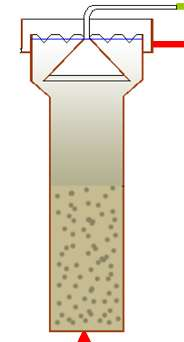
      - **Hình này chứng minh điều gì**
        - Dòng nước thải nạp đáy đi qua lớp bùn hạt đậm đặc, phần đỉnh mở rộng bố trí chụp thu khí dạng chóp nón và máng thu nước hình răng cưa.
      - **Từ đâu mà thấy được**
        - Mũi tên đỏ nạp đáy đẩy nước qua cột bùn hạt màu xám; phần loe đỉnh chứa phễu thu biogas có đường ống thoát lên trên; máng tràn thu nước răng cưa dẫn ra ống xả màu đỏ.
- Phía trên tầng đệm bùn đáy là tầng bùn lơ lửng khuếch tán (diffused sludge blanket layer) có nồng độ sinh khối dao động trong khoảng $10{,}000 - 30{,}000\text{ g/m}^3$ ($10 - 30\text{ kg/m}^3$).
  - Tầng bùn lơ lửng gồm các bông bùn mịn và hạt bùn nhẹ hơn, hoạt động như một tầng lọc sinh học tiếp tục hấp phụ các hạt cặn lơ lửng và chất hữu cơ chưa phân hủy hết.
  - Quá trình thoát bọt khí sinh học liên tục tạo dòng đối lưu cuộn nhẹ, duy trì sự xáo trộn tự nhiên mà không cần lắp đặt máy khuấy cơ học.
- Vùng lắng tĩnh (settling zone / clear water zone) nằm ở phía trên bộ tách ba pha, cung cấp môi trường thủy lực tĩnh để phân tách hạt bùn mịn khỏi nước trong.
  - Tải trọng thủy lực bề mặt thấp bảo đảm hạt bùn trượt rơi ngược trở lại vùng phản ứng bên dưới.
  - Nước sau lắng tràn qua hệ thống máng thu nước răng cưa (weirs) có tấm chắn váng bề mặt để xả ra ngoài công trình.
- Hệ thống van xả bùn định kỳ (sludge withdrawal points) được bố trí tại nhiều cao độ khác nhau dọc theo chiều cao thân bể.
  - Cho phép người vận hành xả chọn lọc phần bùn già cỗi, cặn khoáng hóa hoặc chất trơ tích tụ ở đáy bể mà không làm suy giảm lượng bùn hạt hoạt tính cao.
    - **Hình 8.** Bản vẽ cấu tạo chi tiết mặt cắt ngang công trình bể UASB quy mô công nghiệp
      - 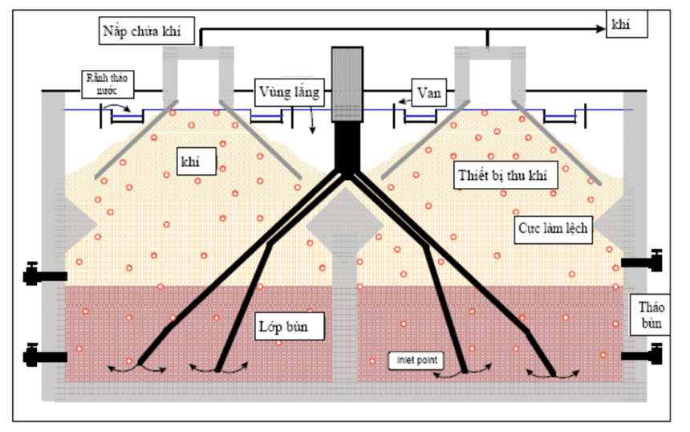
      - **Hình này chứng minh điều gì**
        - Cấu tạo tích hợp hoàn chỉnh gồm ống nạp đáy phân nhánh, tầng bùn hạt, tấm làm lệch hướng bọt khí, chụp thu khí, vùng lắng tĩnh và van xả bùn phân tầng.
      - **Từ đâu mà thấy được**
        - Các ống Inlet point màu đen cắm xiên xuống lớp bùn đỏ đáy; tấm chắn Cục làm lệch phân tách bọt khí vào Thiết bị thu khí; nắp chứa khí có đường gom khí biogas; máng rãnh tháo nước và vùng lắng ở đỉnh; các van tháo bùn bố trí bên thành bể.

##### 2.2 Cơ chế hình thành bùn hạt kỵ khí (Development of Granular Sludge)

- Quá trình hình thành bùn hạt kỵ khí (anaerobic granulation) diễn ra qua bốn bước liên hoàn:
  - **Bước 1 (Attachment of cells)**: Vi sinh vật ban đầu bám dính lên các hạt vật liệu trơ chưa bị chiếm ngụ (uncolonized inert material) hoặc bám dính trực tiếp giữa các tế bào vi sinh vật với nhau tạo thành các nhân vi sinh ban đầu.
  - **Bước 2 (Initial adsorption)**: Các hạt keo hữu cơ, chất phân tán và tế bào vi khuẩn khác bị hấp phụ ban đầu bằng các lực liên kết hóa lý thuận nghịch (reversible physiochemical forces) như lực Van der Waals và lực hút tĩnh điện.
  - **Bước 3 (Irreversible attachment)**: Quá trình bám dính chuyển sang trạng thái liên kết không thuận nghịch (irreversible attachment) nhờ các polyme sinh học ngoại bào (Extracellular Polymeric Substances - EPS) do vi sinh vật tiết ra tạo ma trận liên kết sinh học bền vững.
  - **Bước 4 (Multiplication of cells)**: Tế bào vi sinh vật phân chia và tăng sinh mạnh mẽ bên trong cấu trúc hạt nhờ cơ chất hữu cơ liên tục khuếch tán từ môi trường nước thải vào trong hạt (substrate diffusion into granular structure), hình thành nên cấu trúc hạt bùn kỵ khí đa tầng ổn định.
- Quá trình phát triển tự nhiên của tầng đệm bùn hạt có thể kéo dài nhiều tháng (can take many months) nếu khởi động từ nguồn bùn hoạt tính lơ lửng thông thường.
  - Sự chọn lọc tự nhiên cần thời gian dài để rửa trôi vi sinh vật không có khả năng tạo hạt và tích lũy các chủng vi sinh vật tạo hạt chuyên biệt.
  - Các cation hóa trị hai trong nước thải (như $\text{Ca}^{2+}$, $\text{Mg}^{2+}$) đóng vai trò chất xúc tác làm cầu nối ion thúc đẩy quá trình kết tụ EPS.
- Trong thực tiễn kỹ thuật hiện nay, quy trình khởi động bể thường sử dụng nguồn bùn hạt có sẵn từ các bể UASB đang vận hành khác (cultivation with granular sludge existed from other UASB reactors).
  - Phương pháp cấy bùn hạt có sẵn giúp tiết kiệm thời gian khởi động (save commissioning time), giảm thời gian đưa bể vào chế độ vận hành ổn định từ 4 - 6 tháng xuống còn vài tuần.
  - Giúp thiết lập ngay mật độ vi khuẩn sinh metan chậm phát triển (đặc biệt là các chi *Methanosaeta* và *Methanosarcina*) để xử lý nước thải nồng độ cao mà không bị chua hóa.

##### 2.3 Thông số và tính toán thiết kế bể UASB (Design Considerations)

- Thời gian lưu bùn (Solids Retention Time - SRT) khuyến nghị cho bể UASB vận hành ổn định phụ thuộc vào nhiệt độ nước thải ($T$).
  - Vi sinh vật kỵ khí có tốc độ sinh trưởng chậm ở nhiệt độ thấp, đòi hỏi thời gian lưu bùn dài hơn để ngăn ngừa hiện tượng rửa trôi sinh khối:
    - Ở nhiệt độ $35^\circ\text{C}$: thời gian lưu bùn khuyến nghị là $\text{SRT} = 25\text{ ngày}$.
    - Ở nhiệt độ $30^\circ\text{C}$: thời gian lưu bùn khuyến nghị là $\text{SRT} = 30\text{ ngày}$.
    - Ở nhiệt độ $25^\circ\text{C}$: thời gian lưu bùn khuyến nghị là $\text{SRT} = 60\text{ ngày}$.
    - Ở nhiệt độ $20^\circ\text{C}$: thời gian lưu bùn khuyến nghị là $\text{SRT} = 100\text{ ngày}$.
    - Ở nhiệt độ $15^\circ\text{C}$: thời gian lưu bùn khuyến nghị là $\text{SRT} = 140\text{ ngày}$.
    - **Hình 9.** Bảng thời gian lưu bùn khuyến nghị (Recommended SRT) của bể UASB theo nhiệt độ nước thải
      - 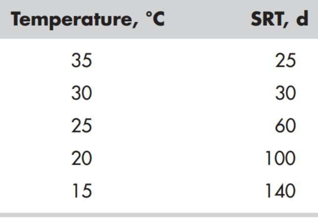
      - **Hình này chứng minh điều gì**
        - Quan hệ nghịch biến giữa nhiệt độ vận hành ($15 - 35^\circ\text{C}$) và thời gian lưu bùn yêu cầu ($140 - 25\text{ ngày}$) để duy trì hoạt tính kỵ khí ổn định.
      - **Từ đâu mà thấy được**
        - Cột trái ghi nhiệt độ Temperature từ $35^\circ\text{C}$ giảm dần xuống $15^\circ\text{C}$; cột phải ghi SRT tăng tương ứng từ $25\text{ d}$ lên $140\text{ d}$.
- Vận tốc dòng dâng hướng lên (superficial upflow velocity, $v$) là thông số thủy lực kiểm soát cơ chế rửa trôi và giữ lại bùn hạt:
  $$v = \frac{Q}{A}$$
  - Trong đó:
    - $v$: vận tốc dòng dâng hướng lên ($\text{m/h}$).
    - $Q$: lưu lượng nước thải nạp vào bể ($\text{m}^3/\text{h}$).
    - $A$: diện tích mặt cắt ngang của bể phản ứng ($\text{m}^2$).
  - Vận tốc dòng dâng cao tạo ứng suất trượt thủy lực giúp rửa trôi các vi sinh vật lơ lửng không bám dính (washout unattached organisms) và tạo ưu thế chọn lọc cho sự phát triển của các hạt bùn đậm đặc (favor growth of dense granular particles).
  - Vận tốc dòng dâng và chiều cao công trình thiết kế phụ thuộc vào đặc tính và mức độ hòa tan của COD trong nước thải:
    - Nước thải có COD hòa tan gần $100\%$ (COD near $100\%$ soluble): dải vận tốc dòng dâng $1.0 - 3.0\text{ m/h}$ (giá trị điển hình $1.5\text{ m/h}$), chiều cao bể $6 - 10\text{ m}$ (điển hình $8\text{ m}$).
    - Nước thải có COD hòa tan một phần (COD partially soluble): dải vận tốc dòng dâng $1.0 - 1.25\text{ m/h}$ (giá trị điển hình $1.0\text{ m/h}$), chiều cao bể $3 - 7\text{ m}$ (điển hình $6\text{ m}$).
    - Nước thải sinh hoạt (Domestic wastewater): dải vận tốc dòng dâng $0.8 - 1.0\text{ m/h}$ (giá trị điển hình $0.7\text{ m/h}$), chiều cao bể $3 - 5\text{ m}$ (điển hình $5\text{ m}$).
    - Khoảng vận tốc làm việc tổng quát cho hệ thống UASB nằm trong dải $0.5 - 1.5\text{ m/h}$ nhằm bảo đảm xáo trộn thủy lực nhẹ nhàng mà không gây cuốn trôi bùn hạt qua máng tràn.
    - **Hình 10.** Bảng tra cứu vận tốc dòng dâng (Upflow velocity) và chiều cao bể phản ứng (Reactor height) theo loại nước thải
      - 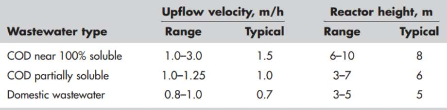
      - **Hình này chứng minh điều gì**
        - Định mức vận tốc dòng dâng ($0.8 - 3.0\text{ m/h}$) và chiều cao bể ($3 - 10\text{ m}$) được phân loại theo mức độ hòa tan của COD trong nước thải.
      - **Từ đâu mà thấy được**
        - Hàng 1 cho COD tan $100\%$ có $v = 1.0 - 3.0\text{ m/h}$ (điển hình $1.5\text{ m/h}$), $H = 6 - 10\text{ m}$; hàng 2 và 3 quy định giá trị cho COD tan một phần và nước thải sinh hoạt.
- Tải trọng thể tích hữu cơ (Organic Loading Rate - OLR) của bể UASB thường dao động trong khoảng từ $5$ đến $15\text{ kg COD}/(\text{m}^3\cdot\text{d})$:
  $$\text{OLR} = \frac{Q \cdot S_0}{V}$$
  - Trong đó:
    - $Q$: lưu lượng nước thải nạp vào ($\text{m}^3/\text{d}$).
    - $S_0$: nồng độ COD của nước thải dòng vào ($\text{g/m}^3$ hay $\text{mg/L}$).
    - $V$: thể tích làm việc của bể UASB ($\text{m}^3$).
  - Tải trọng OLR cho phép chịu ảnh hưởng bởi nhiệt độ và bản chất dạng cặn hạt của COD:
    - Nước thải có COD hòa tan cao (Highly soluble COD) cho phép áp dụng OLR lớn nhất (lên tới $15 - 23\text{ kg COD}/(\text{m}^3\cdot\text{d})$ ở $35 - 40^\circ\text{C}$).
    - Nước thải có tỷ lệ cặn hạt thấp ($<10\%$ particulate COD) cho phép áp dụng OLR trung bình.
    - Nước thải chứa hàm lượng cặn hạt cao ($30 - 40\%$ particulate COD) bị giới hạn OLR ở mức thấp hơn ($5 - 16\text{ kg COD}/(\text{m}^3\cdot\text{d})$ ở $25 - 40^\circ\text{C}$) do giai đoạn thủy phân cặn hạt diễn ra chậm và cặn lơ lửng bám bao bọc bề mặt hạt bùn làm suy giảm hoạt tính vi sinh.
    - **Hình 11.** Đồ thị ảnh hưởng của nhiệt độ và bản chất dạng COD lên tải trọng thể tích hữu cơ (OLR)
      - 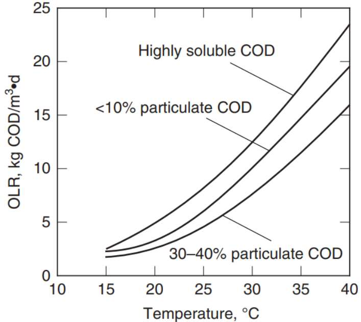
      - **Hình này chứng minh điều gì**
        - Khả năng chịu tải OLR tăng theo nhiệt độ ($10 - 40^\circ\text{C}$) và giảm khi tỷ lệ hạt cặn particulate COD tăng từ $<10\%$ lên $30 - 40\%$.
      - **Từ đâu mà thấy được**
        - Trục tung OLR ($0 - 25\text{ kg COD/m}^3\cdot\text{d}$), trục hoành Temperature ($10 - 40^\circ\text{C}$); ba đường cong dốc lên ứng với Highly soluble COD (trên cùng), $<10\%$ particulate COD (ở giữa), và $30-40\%$ particulate COD (dưới cùng).

##### 2.4 Ví dụ tính toán thiết kế bể UASB (Design Example)

###### Ví dụ 2: Tính toán thiết kế quy trình xử lý bùn kỵ khí dòng dâng UASB (Example 2: Design of UASB Process)

- **Đề bài**: Thiết kế quy trình xử lý nước thải công nghiệp nồng độ cao bằng bể kỵ khí lớp bùn chảy ngược (UASB) dựa trên bảng thông số đặc tính nước thải và các tiêu chuẩn công nghệ cho trước.
- **Dữ kiện**:
  - Đặc tính nước thải dòng vào (Wastewater characteristics) từ Hình 12:
    - Lưu lượng dòng vào: $Q = 500\text{ m}^3/\text{d}$ ($20.833\text{ m}^3/\text{h}$).
    - Nồng độ COD tổng: $S_0 = 12{,}000\text{ g/m}^3\text{ (mg/L)}$.
    - Tổng chất rắn lơ lửng: $\text{TSS} = 600\text{ g/m}^3\text{ (mg/L)}$.
    - Chất rắn bay hơi không phân hủy sinh học: $\text{nbVSS} = 500\text{ g/m}^3\text{ (mg/L)}$.
    - Độ kiềm ban đầu: $\text{Alkalinity} = 500\text{ g CaCO}_3/\text{m}^3\text{ (mg/L as CaCO}_3\text{)}$.
    - Nhiệt độ nước thải làm việc: $T = 25^\circ\text{C}$.
    - **Hình 12.** Bảng thông số đặc tính nước thải đầu vào (Wastewater characteristics) của bài toán thiết kế bể UASB
      - 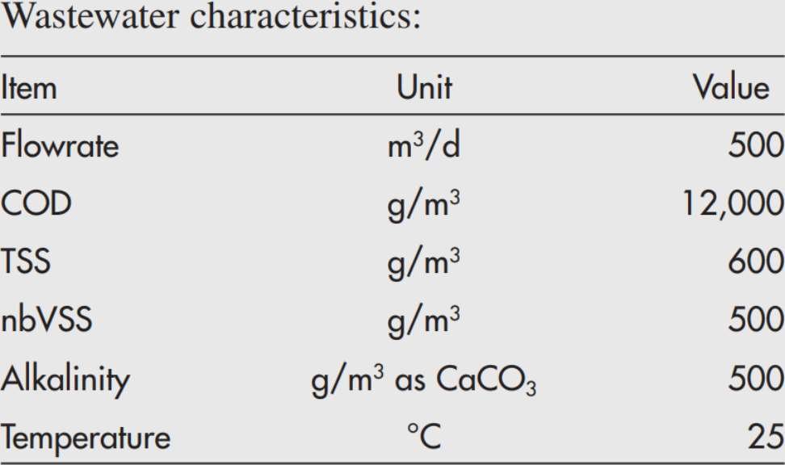
      - **Hình này chứng minh điều gì**
        - Số liệu nền tảng về lưu lượng, tải lượng ô nhiễm và điều kiện môi trường của nước thải làm cơ sở tính toán công trình UASB.
      - **Từ đâu mà thấy được**
        - Bảng liệt kê 6 thông số: Flowrate ($500\text{ m}^3/\text{d}$), COD ($12{,}000\text{ g/m}^3$), TSS ($600\text{ g/m}^3$), nbVSS ($500\text{ g/m}^3$), Alkalinity ($500\text{ g/m}^3\text{ as CaCO}_3$), và Temperature ($25^\circ\text{C}$).
  - Các thông số công nghệ và giả định thiết kế:
    - Tải trọng thể tích hữu cơ thiết kế: $\text{OLR} = 8\text{ kg COD}/(\text{m}^3\cdot\text{d})$.
    - Hiệu suất xử lý COD mục tiêu: $\eta = 90\%\text{ (0.90)}$.
    - Nồng độ VSS trong nước đầu ra sau lắng: $\text{VSS}_e = 120\text{ g/m}^3\text{ (mg/L)}$.
    - Nồng độ sinh khối bình quân vùng phản ứng tích cực: $\text{MLVSS} = X = 30{,}000\text{ g/m}^3\text{ (30 kg/m}^3\text{)}$.
    - Tỷ lệ mảnh vụn trơ nội bào: $f_d = 0.1$.
    - Thành phần khí sinh học biogas: $65\%\text{ CH}_4$ và $35\%\text{ CO}_2$.
    - Chiều cao tổng thể của bể: $H_{\text{total}} = 6\text{ m}$.
    - Chiều cao vùng nước trong tách cặn phía trên tầng bùn: $H_{\text{clear}} = 0.5\text{ m}$.
    - Chiều cao bộ tách ba pha Khí - Lỏng - Rắn: $H_{\text{separator}} = 1.5\text{ m}$.
    - Tỷ lệ kích thước mặt bằng Chiều dài : Chiều rộng: $L/W = 2$.
    - Thời gian lưu bùn hoạt tính khuyến nghị ở $25^\circ\text{C}$: $\theta_c = 60\text{ ngày}$ (tra Bảng Slide 19 / Hình 9).
    - Hệ số sinh khối kỵ khí: $Y = 0.08\text{ g VSS/g COD}$.
    - Hệ số phân hủy nội bào: $k_d = 0.03\text{ ngày}^{-1}$.
    - Định mức sinh khí metan lý thuyết ở điều kiện chuẩn ($\text{STP}: 0^\circ\text{C}, 1\text{ atm}$): $0.35\text{ m}^3\text{ CH}_4/\text{kg COD}_{\text{khử}}$.
    - Nhiệt trị thấp của khí metan: $\text{LHV} = 35{,}800\text{ kJ/m}^3\text{ (ở STP)}$.
- **Quy tắc áp dụng**:
  - Quy tắc 1 (Thể tích bể từ tải trọng OLR): $V = \frac{Q \cdot S_0 \cdot 10^{-3}}{\text{OLR}}$, thời gian lưu thủy lực $\text{HRT} = \frac{V}{Q}$.
  - Quy tắc 2 (Kích thước mặt bằng và vận tốc dòng dâng): $A = \frac{V}{H_{\text{total}}}$; $L = 2W \implies A = 2W^2 \implies W = \sqrt{\frac{A}{2}}$, $L = 2W$; vận tốc dòng dâng $v_{\text{up}} = \frac{Q/24}{A}$.
  - Quy tắc 3 (Phân vùng chiều cao và lượng sinh khối tích lũy): Chiều cao vùng hoạt tính $H_{\text{active}} = H_{\text{total}} - H_{\text{separator}} - H_{\text{clear}}$; thể tích vùng hoạt tính $V_{\text{active}} = A \cdot H_{\text{active}}$; tổng khối lượng bùn hoạt tính lưu giữ $M_{\text{VSS}} = V_{\text{active}} \cdot X$.
  - Quy tắc 4 (Cân bằng khối lượng bùn và sản lượng sinh khối):
    - Tải lượng COD khử: $\Delta\text{COD} = Q \cdot S_0 \cdot \eta \cdot 10^{-3}$.
    - Lượng sinh khối hoạt tính sinh ra: $P_{X,\text{bio}} = \frac{Y \cdot \Delta\text{COD}}{1 + k_d \cdot \theta_c}$.
    - Mảnh vụn tế bào trơ nội bào: $P_{X,d} = f_d \cdot k_d \cdot (P_{X,\text{bio}} \cdot \theta_c)$.
    - Bùn cặn không phân hủy từ dòng vào: $P_{X,\text{nbVSS}} = Q \cdot \text{nbVSS} \cdot 10^{-3}$.
    - Tổng sản lượng bùn net sinh ra: $P_{X,\text{VSS}} = P_{X,\text{bio}} + P_{X,d} + P_{X,\text{nbVSS}}$.
    - Lượng bùn trôi theo dòng ra: $P_{X,e} = Q \cdot \text{VSS}_e \cdot 10^{-3}$.
    - Lượng bùn dư cần xả định kỳ: $P_{X,w} = P_{X,\text{VSS}} - P_{X,e}$.
    - Tuổi bùn tổng hợp thực tế: $\text{SRT}_{\text{total}} = \frac{M_{\text{VSS}}}{P_{X,\text{VSS}}}$.
  - Quy tắc 5 (Sản lượng khí sinh học và năng lượng):
    - COD chuyển hóa thành sinh khối tế bào: $\text{COD}_{\text{bio}} = 1.42 \cdot P_{X,\text{bio}}$.
    - COD chuyển hóa thành khí metan: $\text{COD}_{\text{CH}_4} = \Delta\text{COD} - \text{COD}_{\text{bio}}$.
    - Lưu lượng khí metan ở STP: $V_{\text{CH}_4,\text{STP}} = 0.35 \cdot \text{COD}_{\text{CH}_4}$; ở $25^\circ\text{C}$: $V_{\text{CH}_4,25^\circ\text{C}} = V_{\text{CH}_4,\text{STP}} \times \left(\frac{298.15}{273.15}\right)$.
    - Tổng lưu lượng Biogas: $V_{\text{biogas}} = \frac{V_{\text{CH}_4}}{0.65}$.
    - Tiềm năng nhiệt lượng: $E = V_{\text{CH}_4,\text{STP}} \cdot \text{LHV}$; công suất nhiệt liên tục: $P = \frac{E}{86{,}400}$.
  - Quy tắc 6 (Tỷ lệ cân bằng dinh dưỡng kỵ khí): Tỷ lệ tối thiểu $(\text{COD}/Y) : \text{N} : \text{P} : \text{S} = (50/Y) : 5 : 1 : 1$.
  - Quy tắc 7 (Kiểm soát đệm độ kiềm và độc chất): Nhu cầu đệm tối thiểu $2{,}500 - 3{,}000\text{ g CaCO}_3/\text{m}^3$ dưới áp suất riêng phần $\text{CO}_2 = 35\%$; áp dụng cây quyết định kiểm soát tải trọng Slide 30.
- **Lời giải**:
  - *Bước 1: Tính thể tích bể phản ứng UASB ($V$) và thời gian lưu thủy lực ($\text{HRT}$)*:
    - Căn cứ: Công thức tính thể tích từ tải trọng hữu cơ thiết kế $V = \frac{Q \cdot S_0 \cdot 10^{-3}}{\text{OLR}}$ và công thức thời gian lưu nước $\text{HRT} = \frac{V}{Q}$.
    - Nhìn vào: Lưu lượng $Q = 500\text{ m}^3/\text{d}$, nồng độ COD $S_0 = 12{,}000\text{ g/m}^3$, và tải trọng $\text{OLR} = 8\text{ kg COD}/(\text{m}^3\cdot\text{d})$ trong đề bài (Hình 12):
    - Tính toán:
      $$L_{\text{COD}} = 500.0\text{ m}^3/\text{d} \times 12{,}000.0\text{ g/m}^3 \times 10^{-3}\text{ kg/g} = 6{,}000.00\text{ kg COD/d}$$
      $$V = \frac{6{,}000.00\text{ kg COD/d}}{8.0\text{ kg COD}/(\text{m}^3\cdot\text{d})} = 750.00\text{ m}^3$$
      $$\text{HRT} = \frac{750.00\text{ m}^3}{500.0\text{ m}^3/\text{d}} = 1.50\text{ ngày} = 36.00\text{ giờ}$$
  - *Bước 2: Xác định diện tích mặt bằng, kích thước hình học và kiểm tra vận tốc dòng dâng ($v_{\text{up}}$)*:
    - Căn cứ: Công thức diện tích mặt bằng $A = \frac{V}{H_{\text{total}}}$, tỷ số hình học $L/W = 2 \implies L = 2W$, và công thức vận tốc dòng dâng $v_{\text{up}} = \frac{Q/24}{A}$.
    - Nhìn vào: Chiều cao tổng $H_{\text{total}} = 6.0\text{ m}$, tỷ số $L/W = 2.0$, và lưu lượng giờ $Q_h = \frac{500}{24} = 20.833\text{ m}^3/\text{h}$:
    - Tính toán:
      $$A = \frac{750.00\text{ m}^3}{6.0\text{ m}} = 125.00\text{ m}^2$$
      $$A = 2W^2 = 125.00\text{ m}^2 \implies W = \sqrt{\frac{125.00}{2}} = \sqrt{62.50} = 7.9057\text{ m} \approx 7.91\text{ m}$$
      $$L = 2 \times 7.9057\text{ m} = 15.8114\text{ m} \approx 15.81\text{ m}$$
      $$v_{\text{up}} = \frac{20.8333\text{ m}^3/\text{h}}{125.00\text{ m}^2} = 0.1667\text{ m/h} \approx 0.167\text{ m/h}$$
    - Đánh giá: Vận tốc dòng dâng $v_{\text{up}} = 0.167\text{ m/h}$ thấp hơn nhiều so với giới hạn xói mòn bùn ($1.0 - 1.25\text{ m/h}$), bảo đảm an toàn không gây rửa trôi bùn hạt.
  - *Bước 3: Phân vùng cấu trúc chiều cao và tính lượng sinh khối tích lũy ($M_{\text{VSS}}$)*:
    - Căn cứ: Công thức phân vùng chiều cao $H_{\text{active}} = H_{\text{total}} - H_{\text{separator}} - H_{\text{clear}}$, thể tích vùng hoạt tính $V_{\text{active}} = A \cdot H_{\text{active}}$, và khối lượng bùn $M_{\text{VSS}} = V_{\text{active}} \cdot X$.
    - Nhìn vào: Chiều cao bộ tách $H_{\text{separator}} = 1.5\text{ m}$, chiều cao vùng lắng trong $H_{\text{clear}} = 0.5\text{ m}$, và nồng độ $\text{MLVSS} = 30{,}000\text{ g/m}^3 = 30.0\text{ kg/m}^3$:
    - Tính toán:
      $$H_{\text{active}} = 6.0\text{ m} - 1.5\text{ m} - 0.5\text{ m} = 4.00\text{ m}$$
      $$V_{\text{active}} = 125.00\text{ m}^2 \times 4.00\text{ m} = 500.00\text{ m}^3$$
      $$M_{\text{VSS}} = 500.00\text{ m}^3 \times 30.00\text{ kg/m}^3 = 15{,}000.00\text{ kg VSS}$$
  - *Bước 4: Tính toán sản lượng bùn sinh ra, lượng bùn xả và tuổi bùn tổng hợp*:
    - Căn cứ: Cân bằng khối lượng sinh khối với tuổi bùn hoạt tính $\theta_c = 60\text{ ngày}$ ở $25^\circ\text{C}$ (tra Bảng Slide 19), hệ số $Y = 0.08$, $k_d = 0.03$, $f_d = 0.10$, và $\text{nbVSS} = 500\text{ g/m}^3$:
    - Nhìn vào: Tải lượng COD khử $\Delta\text{COD} = 500 \times 12{,}000 \times 0.90 \times 10^{-3} = 5{,}400.00\text{ kg COD/d}$:
    - Tính toán:
      $$P_{X,\text{bio}} = \frac{0.08 \times 5{,}400.00}{1 + (0.03 \times 60.0)} = \frac{432.00}{1 + 1.80} = \frac{432.00}{2.80} = 154.2857\text{ kg VSS/d} \approx 154.29\text{ kg VSS/d}$$
      $$P_{X,d} = 0.10 \times 0.03 \times (154.2857 \times 60.0) = 0.10 \times 0.03 \times 9{,}257.14 = 27.7714\text{ kg VSS/d} \approx 27.77\text{ kg VSS/d}$$
      $$P_{X,\text{nbVSS}} = 500.0\text{ m}^3/\text{d} \times 500.0\text{ g/m}^3 \times 10^{-3} = 250.00\text{ kg VSS/d}$$
      $$P_{X,\text{VSS}} = 154.2857 + 27.7714 + 250.00 = 432.0571\text{ kg VSS/d} \approx 432.06\text{ kg VSS/d}$$
      $$P_{X,e} = 500.0\text{ m}^3/\text{d} \times 120.0\text{ g/m}^3 \times 10^{-3} = 60.00\text{ kg VSS/d}$$
      $$P_{X,w} = 432.0571 - 60.00 = 372.0571\text{ kg VSS/d} \approx 372.06\text{ kg VSS/d}$$
      $$\text{SRT}_{\text{total}} = \frac{15{,}000.00\text{ kg VSS}}{432.0571\text{ kg VSS/d}} = 34.7176\text{ ngày} \approx 34.72\text{ ngày}$$
  - *Bước 5: Tính lưu lượng khí metan, tổng biogas và tiềm năng thu hồi năng lượng*:
    - Căn cứ: Cân bằng COD chuyển hóa thành sinh khối ($\text{COD}_{\text{bio}} = 1.42 \cdot P_{X,\text{bio}}$), phần COD còn lại chuyển hóa thành $\text{CH}_4$, định mức sinh khí $0.35\text{ m}^3\text{ CH}_4/\text{kg COD}$ ở STP, và tỷ lệ $65\%\text{ CH}_4$:
    - Nhìn vào: Sản lượng sinh khối hoạt tính $P_{X,\text{bio}} = 154.2857\text{ kg VSS/d}$ và $\Delta\text{COD} = 5{,}400.00\text{ kg COD/d}$:
    - Tính toán:
      $$\text{COD}_{\text{bio}} = 1.42 \times 154.2857\text{ kg VSS/d} = 219.0857\text{ kg COD/d} \approx 219.10\text{ kg COD/d}$$
      $$\text{COD}_{\text{CH}_4} = 5{,}400.00 - 219.0857 = 5{,}180.9143\text{ kg COD/d} \approx 5{,}180.90\text{ kg COD/d}$$
      $$V_{\text{CH}_4,\text{STP}} = 0.35\text{ m}^3/\text{kg} \times 5{,}180.9143\text{ kg/d} = 1{,}813.3200\text{ m}^3/\text{d} \approx 1{,}813.32\text{ m}^3/\text{d}$$
      $$V_{\text{CH}_4,25^\circ\text{C}} = 1{,}813.3200 \times \left(\frac{298.15}{273.15}\right) = 1{,}813.32 \times 1.091523 = 1{,}979.24\text{ m}^3/\text{d}$$
      $$V_{\text{biogas},\text{STP}} = \frac{1{,}813.3200}{0.65} = 2{,}789.72\text{ m}^3/\text{d}$$
      $$V_{\text{biogas},25^\circ\text{C}} = \frac{1{,}979.24}{0.65} = 3{,}044.98\text{ m}^3/\text{d}$$
      $$E = 1{,}813.3200\text{ m}^3/\text{d} \times 35{,}800\text{ kJ/m}^3 = 64{,}916{,}856\text{ kJ/d} \approx 64.92\text{ GJ/d}$$
      $$P = \frac{64{,}916{,}856\text{ kJ/d}}{86{,}400\text{ s/d}} = 751.3525\text{ kW} \approx 751.35\text{ kW}$$
  - *Bước 6: Đánh giá nhu cầu dinh dưỡng đa lượng (N, P, S)*:
    - Căn cứ: Tỷ lệ dinh dưỡng quy chuẩn kỵ khí $(\text{COD}/Y) : \text{N} : \text{P} : \text{S} = (50/Y) : 5 : 1 : 1$. Với $Y = 0.08 \implies \frac{50}{0.08} = 625 \implies \text{COD} : \text{N} : \text{P} : \text{S} = 625 : 5 : 1 : 1$.
    - Nhìn vào: Lượng COD khử $\Delta\text{COD} = 5{,}400.00\text{ kg COD/d}$ và lưu lượng $Q = 500\text{ m}^3/\text{d}$:
    - Tính toán:
      $$N_{\text{req}} = 5{,}400.00 \times \left(\frac{5}{625}\right) = 43.20\text{ kg N/d} \implies C_N = \frac{43.20 \times 10^3}{500.0} = 86.40\text{ g/m}^3\text{ (mg/L)}$$
      $$P_{\text{req}} = 5{,}400.00 \times \left(\frac{1}{625}\right) = 8.64\text{ kg P/d} \implies C_P = \frac{8.64 \times 10^3}{500.0} = 17.28\text{ g/m}^3\text{ (mg/L)}$$
      $$S_{\text{req}} = 5{,}400.00 \times \left(\frac{1}{625}\right) = 8.64\text{ kg S/d} \implies C_S = \frac{8.64 \times 10^3}{500.0} = 17.28\text{ g/m}^3\text{ (mg/L)}$$
  - *Bước 7: Đánh giá độ kiềm và kiểm tra hóa chất bổ sung*:
    - Căn cứ: Để duy trì pH ổn định $6.8 - 7.4$ dưới áp suất riêng phần $\text{CO}_2$ là $35\%$, hệ thống cần độ kiềm bicarbonate tối thiểu $3{,}000\text{ g CaCO}_3/\text{m}^3$.
    - Nhìn vào: Độ kiềm nước thải đầu vào chỉ có $500\text{ g CaCO}_3/\text{m}^3$, độ thiếu hụt $\Delta\text{Alk} = 3{,}000 - 500 = 2{,}500\text{ g CaCO}_3/\text{m}^3$:
    - Tính toán:
      $$\text{Mass}_{\text{CaCO}_3} = 500.0\text{ m}^3/\text{d} \times 2{,}500.0\text{ g/m}^3 \times 10^{-3} = 1{,}250.00\text{ kg CaCO}_3/\text{d}$$
      $$\text{Mass}_{\text{NaHCO}_3} = 1{,}250.00 \times \left(\frac{84.0\text{ g/eq}}{50.0\text{ g/eq}}\right) = 2{,}100.00\text{ kg NaHCO}_3/\text{d}$$
- **Kết quả**:
  - Thể tích bể phản ứng UASB: $V = 750.00\text{ m}^3$; Thời gian lưu nước: $\text{HRT} = 1.50\text{ ngày} = 36.00\text{ giờ}$.
  - Kích thước mặt bằng bể: Diện tích $A = 125.00\text{ m}^2$; Chiều rộng $W = 7.91\text{ m}$; Chiều dài $L = 15.81\text{ m}$.
  - Vận tốc dòng dâng hướng lên: $v_{\text{up}} = 0.167\text{ m/h}$.
  - Chiều cao vùng hoạt tính: $H_{\text{active}} = 4.00\text{ m}$; Thể tích vùng hoạt tính: $V_{\text{active}} = 500.00\text{ m}^3$; Khối lượng sinh khối lưu giữ: $M_{\text{VSS}} = 15{,}000.00\text{ kg VSS}$.
  - Sản lượng bùn sinh ra: Tổng bùn net $P_{X,\text{VSS}} = 432.06\text{ kg VSS/d}$; Lượng bùn xả định kỳ $P_{X,w} = 372.06\text{ kg VSS/d}$; Tuổi bùn tổng hợp: $\text{SRT}_{\text{total}} = 34.72\text{ ngày}$.
  - Sản lượng khí metan: $V_{\text{CH}_4,\text{STP}} = 1{,}813.32\text{ m}^3/\text{d}$; $V_{\text{CH}_4,25^\circ\text{C}} = 1{,}979.24\text{ m}^3/\text{d}$.
  - Tổng sản lượng khí sinh học: $V_{\text{biogas},\text{STP}} = 2{,}789.72\text{ m}^3/\text{d}$; $V_{\text{biogas},25^\circ\text{C}} = 3{,}044.98\text{ m}^3/\text{d}$.
  - Tiềm năng năng lượng: Nhiệt lượng $E = 64.92\text{ GJ/ngày}$; Công suất nhiệt phát điện: $P = 751.35\text{ kW}$.
  - Nhu cầu dinh dưỡng bổ sung: $N_{\text{req}} = 43.20\text{ kg N/ngày}$; $P_{\text{req}} = 8.64\text{ kg P/ngày}$; $S_{\text{req}} = 8.64\text{ kg S/ngày}$.
  - Nhu cầu bổ sung độ kiềm: $1{,}250.00\text{ kg CaCO}_3/\text{ngày}$ (tương đương $2{,}100.00\text{ kg NaHCO}_3/\text{ngày}$).
- **Kiểm tra lại**:
  - Tải trọng thể tích kiểm tra: $\text{OLR} = \frac{500 \times 12{,}000 \times 10^{-3}}{750.0} = 8.00\text{ kg COD}/(\text{m}^3\cdot\text{d})$ (trùng khớp hoàn toàn với thông số thiết kế ban đầu).
  - Vận tốc dòng dâng kiểm tra: $v_{\text{up}} = 0.167\text{ m/h} \ll 1.0\text{ m/h}$, an toàn tuyệt đối chống hiện tượng cuốn trôi bùn hạt; việc xáo trộn tầng bùn được hỗ trợ bởi thông lượng sinh khí biogas lớn ($> 0.9\text{ m}^3\text{ gas}/(\text{m}^2\cdot\text{h})$).
  - Tuổi bùn hoạt tính $\theta_c = 60\text{ ngày}$ đáp ứng khuyến nghị cho hệ thống kỵ khí vận hành ở $25^\circ\text{C}$ (tra Hình 9).

##### 2.5 Lưu ý vận hành và kiểm soát tải trọng (Operational Considerations)

- Kiểm tra và kiểm soát độ kiềm của nước thải (Check wastewater alkalinity).
  - Quá trình phân giải kỵ khí tạo ra axit béo bay hơi (VFA); nếu hệ đệm bicarbonate không đủ, pH sẽ tụt giảm xuống dưới $6.5$, gây ức chế vi sinh vật sinh metan.
  - Cần duy trì độ kiềm bicarbonate tối thiểu $2{,}500 - 3{,}500\text{ mg/L as CaCO}_3$ để giữ ổn định dải pH làm việc tối ưu từ $6.8$ đến $7.4$.
- Kiểm tra và bảo đảm cân bằng tỷ lệ dinh dưỡng (Check wastewater nutrient / Nutrient ratio).
  - Nồng độ dinh dưỡng tối thiểu bắt buộc duy trì trong nước thải theo tỷ lệ chuẩn:
    $$(\text{COD}/Y) : \text{N} : \text{P} : \text{S} = (50/Y) : 5 : 1 : 1$$
  - Với hệ số sinh khối điển hình $Y = 0.08$, tỷ lệ trở thành $\text{COD} : \text{N} : \text{P} : \text{S} = 625 : 5 : 1 : 1$ (tương ứng $125 : 1 : 0.2 : 0.2$).
  - Thiếu hụt N, P hoặc S làm gián đoạn quá trình tổng hợp tế bào và ức chế chuỗi phản ứng sinh khí metan.
- Kiểm tra và khống chế ngưỡng nồng độ các chất độc ức chế (Check toxic substances / Toxicity inhibition).
  - Amoniac tự do/tổng ($\text{NH}_3\text{-N}$): Nồng độ vượt ngưỡng $1{,}500\text{ mg/L}$ gây độc tính ức chế màng tế bào của vi khuẩn methanogen.
  - Sulfide hòa tan ($\text{S}^{2-}$): Nồng độ vượt ngưỡng $200\text{ mg/L}$ tạo khí $\text{H}_2\text{S}$ tự do gây độc nặng cho hệ enzyme chuyển hóa kỵ khí.
  - Muối clorua ($\text{Cl}^-$ / độ mặn): Nồng độ vượt ngưỡng $15{,}000\text{ mg/L}$ làm tăng đột ngột áp suất thẩm thấu, gây teo màng và phá hủy cấu trúc tế bào vi sinh vật.
- Kiểm tra và ổn định nhiệt độ nước thải (Check wastewater temperature).
  - Quá trình sinh học kỵ khí rất nhạy cảm với sự dao động nhiệt độ; mức thay đổi nhiệt độ vượt quá $\pm 1 - 2^\circ\text{C/ngày}$ có thể làm sụt giảm nghiêm trọng hiệu suất tạo khí metan.
- Cây quyết định kiểm soát tải trọng COD và nồng độ sulfide (Operational Decision Tree).
  - Áp dụng các chiến lược vận hành dựa trên tải trọng thể tích OLR và nồng độ ion sulfide hòa tan ($\text{S}^{2-}$):
    - **Khi $\text{OLR} < 5\text{ kg COD}/(\text{m}^3\cdot\text{d})$**:
      - Nếu $\text{S}^{2-} < 200\text{ mg/L}$: Không cần tuần hoàn (Not recycle), nước thải được nạp trực tiếp vào bể.
      - Nếu $\text{S}^{2-} > 200\text{ mg/L}$: Bắt buộc tuần hoàn nước sau xử lý (Recycle) cho đến khi nồng độ sulfide hòa tan của dòng vào hỗn hợp giảm xuống dưới ngưỡng $\text{S}^{2-} < 100\text{ mg/L}$.
    - **Khi $\text{OLR} = 5 - 20\text{ kg COD}/(\text{m}^3\cdot\text{d})$**:
      - Vận hành ở chế độ tải cao tiêu chuẩn; trong trường hợp có nguy cơ tích tụ độc chất hoặc trong giai đoạn nuôi cấy khởi động, pha loãng hoặc điều chỉnh nạp tải dần dần về mức an toàn $5\text{ kg COD}/(\text{m}^3\cdot\text{d})$.
    - **Khi $\text{OLR} > 20\text{ kg COD}/(\text{m}^3\cdot\text{d})$**:
      - Bắt buộc phải pha loãng nước thải đầu vào (Must dilute wastewater) trước khi cấp vào bể để ngăn ngừa nguy cơ quá tải hữu cơ và hiện tượng chua hóa làm tê liệt tầng đệm bùn.

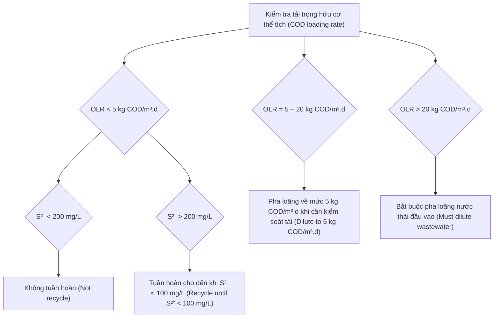
```mermaid
flowchart TD
    Start["Kiểm tra tải trọng hữu cơ thể tích (COD loading rate)"] --> Branch1{"OLR < 5 kg COD/m³.d"}
    Start --> Branch2{"OLR = 5 – 20 kg COD/m³.d"}
    Start --> Branch3{"OLR > 20 kg COD/m³.d"}

    Branch1 --> S1{"S²⁻ < 200 mg/L"}
    Branch1 --> S2{"S²⁻ > 200 mg/L"}
    S1 --> Act1["Không tuần hoàn (Not recycle)"]
    S2 --> Act2["Tuần hoàn cho đến khi S²⁻ < 100 mg/L (Recycle until S²⁻ < 100 mg/L)"]

    Branch2 --> Act3["Pha loãng về mức 5 kg COD/m³.d khi cần kiểm soát tải (Dilute to 5 kg COD/m³.d)"]
    Branch3 --> Act4["Bắt buộc pha loãng nước thải đầu vào (Must dilute wastewater)"]
```

### Chương 9: Quá trình Khử Photpho Sinh học Tăng cường (EBPR)

#### 1. Giới thiệu tổng quan về quá trình khử photpho sinh học tăng cường (EBPR Introduction)

##### 1.1 Tổng quan về vi sinh vật tích lũy photpho PAO và cấu hình EBPR (Overview & PAOs)
- **Định nghĩa và vai trò của vi sinh vật tích lũy photpho (PAOs - Phosphorus Accumulating Organisms):**
  - PAOs là các vi khuẩn chuyên biệt có khả năng tích lũy photpho nội bào vượt xa nhu cầu sinh lý thông thường.
  - Quá trình loại bỏ photpho ra khỏi dòng nước thải đạt được thông qua con đường xả bùn hoạt tính dư (WAS - Waste Activated Sludge) định kỳ ra khỏi hệ thống.
- **Cấu hình công nghệ khử photpho sinh học tăng cường (EBPR - Enhanced Biological Phosphorus Removal):**
  - Hệ thống EBPR bố trí một bể phản ứng kỵ khí (ngăn chọn lọc kỵ khí - anaerobic selector tank) đặt ngay trước bể phản ứng hiếu khí.
  - Thời gian lưu nước thủy lực (HRT - Hydraulic Retention Time) của ngăn chọn lọc kỵ khí được thiết kế ngắn, dao động từ $0.5 - 1.0\text{ h}$.
  - Mục đích công nghệ của ngăn chọn lọc kỵ khí là cung cấp ưu thế sinh thái và động học độc quyền cho PAOs sinh trưởng phát triển lấn át các vi sinh vật dị dưỡng thông thường.
- **Sự khác biệt về hàm lượng photpho nội bào giữa sinh khối thông thường và PAOs:**
  - Sinh khối bùn vi sinh sinh ra từ quá trình khử BOD thông thường chỉ chứa khoảng $0.015 - 0.020\text{ g P/g VSS}$ (tương đương $1.5\% - 2.0\%$ khối lượng VSS khô).
  - Tế bào PAOs trong điều kiện làm giàu tối ưu chứa từ $0.20 - 0.30\text{ g P/g VSS}$ (tương đương $20\% - 30\%$ khối lượng VSS khô).
  - Nhờ hàm lượng photpho trong sinh khối PAOs cao gấp $10 - 20$ lần so với vi khuẩn thông thường, công nghệ EBPR loại bỏ phần lớn photpho hòa tan mà không đòi hỏi tiêu tốn nhiều hóa chất keo tụ.

##### 1.2 Mô tả cơ chế và quá trình khử photpho (Process Description)
- **Nguyên lý môi trường luân phiên kỵ khí - hiếu khí (Anaerobic-Aerobic Sequencing):**
  - Quá trình EBPR vận hành dựa trên sự luân chuyển tuần hoàn của bùn hoạt tính qua hai vùng phản ứng có điều kiện oxy hóa khử đối nghịch: vùng kỵ khí thực sự và vùng hiếu khí sục khí.
  - Cơ chế gồm hai giai đoạn sinh hóa ghép đôi nối tiếp: giải phóng photpho kỵ khí (anaerobic P release) và hấp thu photpho vượt mức hiếu khí (aerobic luxury uptake).
  - Chu trình công nghệ và diễn biến nồng độ các chất ô nhiễm được chứng minh qua Hình 1 và Hình 2:
    - **Hình 1.** Sơ đồ khối quy trình công nghệ khử photpho sinh học tăng cường (EBPR)
      - 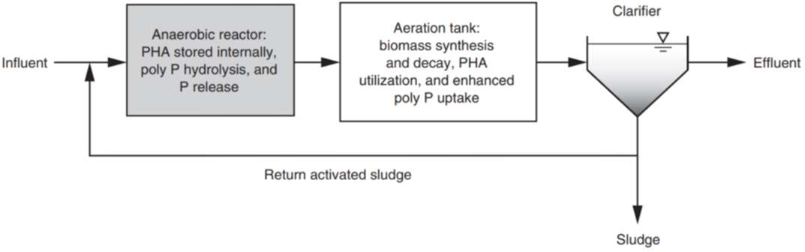
      - **Hình này chứng minh điều gì**
        - Cấu hình chuỗi kỵ khí - hiếu khí tạo ưu thế sinh thái cho PAOs tích lũy và loại bỏ photpho qua bùn xả dư.
      - **Từ đâu mà thấy được**
        - Ngăn kỵ khí tiếp nhận nước thải thô và bùn tuần hoàn RAS, diễn ra giải phóng photpho và tích lũy PHA.
        - Ngăn hiếu khí kế tiếp oxy hóa PHA và hấp thu photpho vượt mức trước khi qua bể lắng để xả bùn giàu photpho.
    - **Hình 2.** Đồ thị động học nồng độ Orthophosphorus và rbCOD qua hai pha kỵ khí và hiếu khí
      - 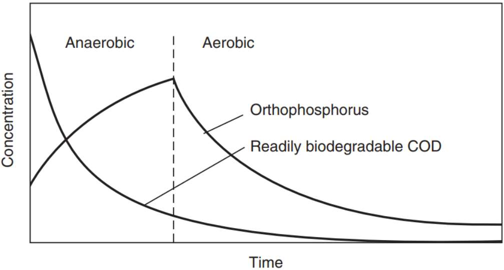
      - **Hình này chứng minh điều gì**
        - Động học hấp thu cơ chất nghịch pha với giải phóng photpho trong ngăn kỵ khí và hấp thu photpho trong ngăn hiếu khí.
      - **Từ đâu mà thấy được**
        - Vùng kỵ khí: đường rbCOD giảm dốc về tiệm cận 0 trong khi nồng độ Orthophosphorus tăng vọt lên đỉnh cực đại.
        - Vùng hiếu khí: nồng độ Orthophosphorus suy giảm nhanh chóng xuống mức rất thấp do vi khuẩn PAOs hấp thu vượt mức.

###### 1.2.1 Quá trình chuyển hóa trong ngăn kỵ khí (Process in Anaerobic Tank)
- **Cơ chế thủy phân polyphosphate và tích lũy polyhydroxyalkanoate (PHA):**
  - Trong điều kiện kỵ khí (hoàn toàn vắng mặt oxy hòa tan $DO$ và các chất nhận electron oxy hóa như nitrat $\text{NO}_3^-$ hoặc nitrit $\text{NO}_2^-$), PAOs thủy phân liên kết phosphoanhydride cao năng trong chuỗi polyphosphate dự trữ nội bào để giải phóng năng lượng ATP.
  - Năng lượng ATP này được sử dụng để hấp thu nguồn cơ chất carbon dễ phân hủy nhanh (rbCOD - Readily Biodegradable COD), chủ yếu tồn tại ở dạng axit béo bay hơi (VFAs - Volatile Fatty Acids).
  - PAOs đồng hóa VFAs và dự trữ chúng nội bào dưới dạng polyme carbon poly-$\beta$-hydroxyalkanoates (PHA).
  - Các polyme PHA điển hình được tích lũy gồm poly-$\beta$-hydroxybutyrate (PHB) và polyhydroxyvalerate (PHV).
- **Cơ chế chọn lọc sinh học ưu thế của PAOs trong ngăn kỵ khí:**
  - Vi khuẩn dị dưỡng thông thường (OHOs - Ordinary Heterotrophic Organisms) không thể hấp thu hay oxy hóa rbCOD trong ngăn kỵ khí vì thiếu các chất nhận electron bên ngoài (không có $O_2$, không có $\text{NO}_3^-$).
  - PAOs sử dụng nguồn năng lượng nội bào độc lập từ polyphosphate nên độc quyền tiêu thụ lượng VFAs sẵn có, tạo lợi thế cạnh tranh áp đảo.
- **Nguồn gốc của các axit béo bay hơi (VFAs):**
  - VFAs gồm các axit hữu cơ phân tử lượng thấp như axit axetic ($CH_3COOH$) và axit propionic ($CH_3CH_2COOH$).
  - VFAs có thể hiện diện sẵn trong nước thải đầu vào hoặc sinh ra từ quá trình lên men axit bởi các vi khuẩn lên men tùy nghi (fermentative bacteria thủy phân COD phân tử lớn pCOD thành VFA).
- **Hiện tượng giải phóng photpho kỵ khí (Anaerobic Phosphorus Release):**
  - Quá trình thủy phân chuỗi polyphosphate nội bào phóng thích trực tiếp các ion orthophosphate tự do ($\text{PO}_4^{3-}$) qua màng tế bào ra dung dịch nước thải, làm nồng độ photpho hòa tan trong ngăn kỵ khí tăng vọt.
  - Quá trình chuyển hóa nội bào và sự tương tác giữa các nhóm vi sinh vật được thể hiện trên Hình 3 và Hình 4:
    - **Hình 3.** Cân bằng động học các hợp chất nội bào và con đường sinh hóa của PAOs
      - 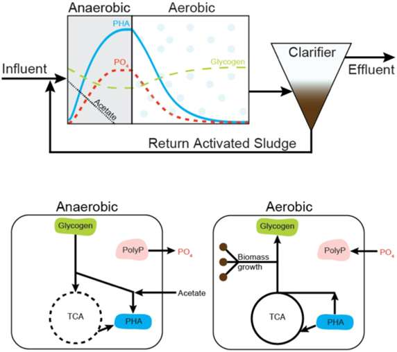
      - **Hình này chứng minh điều gì**
        - Mối liên hệ chuyển hóa tương hỗ giữa Poly-P, Glycogen và PHA qua chu trình kỵ khí - hiếu khí.
      - **Từ đâu mà thấy được**
        - Pha kỵ khí: Acetate đi vào tế bào, Poly-P thủy phân phóng thích $\text{PO}_4^{3-}$, Glycogen phân giải cung cấp năng lượng và electron tạo PHA.
        - Pha hiếu khí: PHA bị oxy hóa qua chu trình TCA, cung cấp ATP để hấp thu $\text{PO}_4^{3-}$, tái tổng hợp Glycogen và phát triển sinh khối.
    - **Hình 4.** Cơ chế hợp tác vi sinh vật giữa vi khuẩn lên men tùy nghi và PAOs
      - 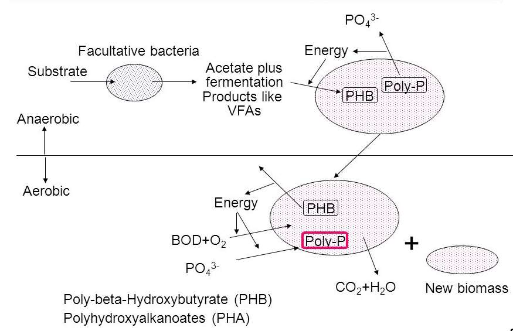
      - **Hình này chứng minh điều gì**
        - Dây chuyền chuyển hóa carbon và chu trình năng lượng vận hành quá trình khử photpho sinh học.
      - **Từ đâu mà thấy được**
        - Ngăn kỵ khí: Vi khuẩn lên men tùy nghi chuyển hóa cơ chất thành Acetate/VFA; PAOs dùng ATP từ Poly-P để hấp thu VFA tạo PHB.
        - Ngăn hiếu khí: PAOs oxy hóa PHB với $O_2$, tổng hợp sinh khối mới và dùng năng lượng hấp thu orthophosphate tạo hạt Poly-P.

###### 1.2.2 Quá trình chuyển hóa trong ngăn hiếu khí (Process in Aerobic Tank)
- **Oxy hóa PHA nội bào và phát triển sinh khối tế bào mới:**
  - Trong ngăn hiếu khí có sục khí liên tục, PAOs sử dụng oxy hòa tan ($O_2$) làm chất nhận electron cuối cùng để oxy hóa nguồn PHA/PHB tích trữ nội bào.
  - Quá trình dị hóa PHA giải phóng lượng lớn năng lượng ATP và cung cấp khung carbon cho quá trình sinh trưởng tổng hợp sinh khối PAOs mới, phân chia tế bào và tái tổng hợp glycogen dự trữ.
- **Hiện tượng hấp thu photpho vượt mức (Luxury Uptake) và tái tổng hợp polyphosphate:**
  - Năng lượng giải phóng từ oxy hóa PHA thúc đẩy quá trình vận chuyển chủ động các ion orthophosphate hòa tan ($\text{PO}_4^{3-}$) từ môi trường nước thải xuyên qua màng tế bào vào trong chất nguyên sinh.
  - Các ion photpho được trùng hợp thành các chuỗi polyphosphate cao năng lượng tích lũy dày đặc trong tế bào PAOs.
  - Lượng photpho hấp thu trong pha hiếu khí lớn hơn nhiều so với lượng photpho đã giải phóng trong pha kỵ khí, làm sạch photpho hòa tan trong nước thải xuống nồng độ rất thấp.
- **Đào thải photpho qua đường bùn hoạt tính dư:**
  - Photpho không chuyển hóa thành thể khí mà được giữ lại trong cấu trúc tế bào bùn hoạt tính.
  - Lượng sinh khối PAOs sinh ra chứa nồng độ polyphosphate cao được đưa qua bể lắng đợt 2 và tách bỏ triệt để khỏi hệ thống thông qua đường xả bùn hoạt tính dư (WAS - Waste Activated Sludge).
- **Cân bằng năng lượng và hiệu ứng "Nạp và xả pin sinh học" của EBPR:**
  - Hoạt động của PAOs tương tự chu kỳ sạc và xả của một bộ pin sinh học: ngăn kỵ khí là giai đoạn nạp carbon tích trữ (battery charging), ngăn hiếu khí là giai đoạn xả năng lượng để hấp thu photpho (battery discharging).
  - Động lực nhiệt động học cốt lõi: Năng lượng giải phóng khi oxy hóa phân tử PHB trong pha hiếu khí cao gấp $24 - 36$ lần năng lượng tiêu tốn cho quá trình tổng hợp và tích trữ PHB kỵ khí ban đầu.
  - Cơ chế đòn bẩy năng lượng này được minh chứng cụ thể trong Hình 5:
    - **Hình 5.** Chu trình năng lượng EBPR và hiệu ứng đòn bẩy nhiệt động học ("Nạp và xả pin sinh học")
      - 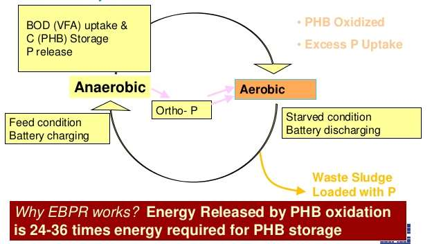
      - **Hình này chứng minh điều gì**
        - Động lực nhiệt động học mạnh mẽ thúc đẩy vi sinh vật tích lũy photpho vượt mức thông thường.
      - **Từ đâu mà thấy được**
        - Mô hình tuần hoàn phân định rõ pha kỵ khí ("Nạp pin" - tích lũy PHB, giải phóng P) và pha hiếu khí ("Xả pin" - oxy hóa PHB, hấp thu dư P).
        - Khẩu hiệu nhiệt động học: Năng lượng giải phóng khi oxy hóa PHB cao gấp 24 đến 36 lần năng lượng tiêu tốn để tích trữ PHB ban đầu.

##### 1.3 Các yếu tố ảnh hưởng và lưu ý vận hành EBPR (Other Considerations for EBPR)
- **Tác động tiêu cực của Oxy hòa tan ($DO$) và Nitrat ($\text{NO}_3^-$) trong ngăn chọn lọc kỵ khí:**
  - Sự xâm nhập của oxy hòa tan hoặc ion nitrat vào ngăn kỵ khí (qua dòng bùn tuần hoàn RAS hoặc nước thải đầu vào) làm suy giảm hiệu suất khử photpho do ức chế sinh thái lên PAOs.
  - Vi khuẩn dị dưỡng thông thường (OHOs) sử dụng $DO$ hoặc $\text{NO}_3^-$ làm chất nhận electron để phân hủy hiếu khí hoặc khử nitrat nguồn rbCOD/VFA, cạnh tranh trực tiếp và làm cạn kiệt nguồn carbon của PAOs.
- **Tác động của Thời gian lưu bùn (SRT - Solids Retention Time):**
  - Vận hành ở giá trị SRT cao (nhằm mục đích khử BOD triệt để và nitrat hóa) làm giảm hiệu suất khử photpho tổng thể của hệ thống.
  - Khi SRT tăng, hệ số sản lượng sinh khối thực tế suy giảm do hiện tượng tự phân hủy nội sinh tế bào tăng cao ($Y_{\text{net}} = Y / (1 + b \cdot \text{SRT})$); lượng bùn dư xả ra mỗi ngày ít đi làm tổng khối lượng photpho bị thải loại khỏi chu trình giảm sút.
- **Tỷ lệ chất rắn lơ lửng bay hơi trên tổng chất rắn lơ lửng ($VSS/TSS$):**
  - Tỷ lệ $VSS/TSS$ thấp trong khoảng $60\% - 65\%$ ($0.60 - 0.65$) là chỉ số đặc trưng phản ánh sự phát triển ưu thế của PAOs trong hệ thống bùn hoạt tính.
  - Bùn dị dưỡng thông thường không tích lũy polyphosphate vô cơ có tỷ lệ $VSS/TSS$ cao hơn nhiều, điển hình đạt từ $80\% - 85\%$ ($0.80 - 0.85$). Sự tích tụ các tinh thể khoáng polyphosphate làm tăng tỷ trọng chất rắn vô cơ trơ trong bùn PAOs.
- **Tỷ lệ mol cation đồng vận chuyển (Co-transport Cation Molar Ratio):**
  - Quá trình vận chuyển ion orthophosphate qua màng tế bào đòi hỏi sự vận chuyển đồng thời của các cation kim loại để trung hòa điện tích âm của chuỗi polyphosphate.
  - Tỷ lệ mol tối ưu giữa photpho và các cation đồng vận chuyển được khuyến nghị là:
    $$\text{P} : \text{Mg}^{2+} : \text{K}^+ : \text{Ca}^{2+} = 1 : 0.28 : 0.26 : 0.09$$
  - Nồng độ ion Magie ($\text{Mg}^{2+}$) và Kali ($\text{K}^+$) trong nước thải phải đảm bảo đủ lớn; sự thiếu hụt cation sẽ trở thành yếu tố giới hạn dung lượng tích lũy polyphosphate của PAOs.
- **Hàm lượng photpho tế bào của PAOs ở nhiệt độ thiết kế:**
  - Ở nhiệt độ vận hành tiêu chuẩn $20^\circ\text{C}$, hàm lượng photpho của sinh khối PAOs đạt từ $0.20 - 0.30\text{ g P/g VSS}$ (so với mức $0.015 - 0.020\text{ g P/g VSS}$ ở vi khuẩn thông thường).
- **Định mức nhu cầu chất hữu cơ dễ phân hủy sinh học ($rbCOD$):**
  - Để loại bỏ $1\text{ g photpho}$ hòa tan theo cơ chế EBPR, hệ thống đòi hỏi tiêu tốn từ $7$ đến $11\text{ g rbCOD}$ trong ngăn kỵ khí.
  - Nước thải có tỷ số $\text{rbCOD}/\text{TP}$ thấp hơn ngưỡng định mức này sẽ không thể khử photpho triệt để bằng con đường sinh học thuần túy mà cần bổ sung nguồn carbon ngoài hoặc kết hợp keo tụ hóa học.

##### 1.4 Ví dụ tính toán lượng photpho khử được (Example: Estimating Phosphorus Removal)
- **Giới thiệu bài toán và bảng thông số nước thải đầu vào:**
  - Bài toán xác định cân bằng vật chất photpho hòa tan, lượng photpho tích lũy vào sinh khối bùn hoạt tính và nồng độ photpho dòng ra dựa trên các thông số động học của hệ thống.
  - Bảng đặc tính nước thải đầu vào được cung cấp trong Hình 6:
    - **Hình 6.** Bảng thành phần và đặc tính nước thải đầu vào phục vụ tính toán Ví dụ 1
      - 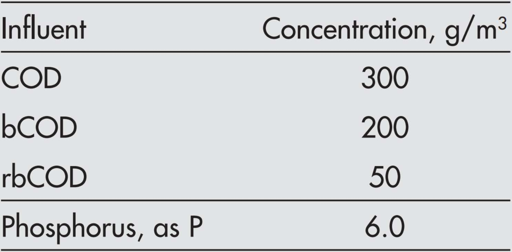
      - **Hình này chứng minh điều gì**
        - Cung cấp đầy đủ các thông số đầu vào để phân định các phân đoạn COD và xác định khả năng khử photpho sinh học.
      - **Từ đâu mà thấy được**
        - Bảng liệt kê 4 thông số: $\text{COD} = 300\text{ g/m}^3$, $\text{bCOD} = 200\text{ g/m}^3$, $\text{rbCOD} = 50\text{ g/m}^3$ và $\text{Phosphorus (as P)} = 6.0\text{ g/m}^3$.

###### 1.4.1 Bài tập ví dụ vd1: Ước tính lượng photpho loại bỏ trong hệ thống EBPR (Example 1: Estimating the amount of Phosphorus Removal)
- **Đề bài:**
  - Ước tính lượng photpho được loại bỏ khỏi hệ thống xử lý nước thải bằng quá trình khử photpho sinh học tăng cường (EBPR) và xác định nồng độ photpho trong nước sau lắng, dựa trên các thông số nước thải đầu vào và các giả định công nghệ cho trước.
- **Dữ kiện:**
  - *Đặc tính nước thải đầu vào (Influent):*
    - Nồng độ $\text{COD}$ tổng: $\text{COD}_{\text{in}} = 300\text{ g/m}^3$ ($\text{mg/L}$)
    - Nồng độ $\text{COD}$ phân hủy sinh học: $\text{bCOD}_{\text{in}} = 200\text{ g/m}^3$ ($\text{mg/L}$)
    - Nồng độ $\text{COD}$ phân hủy sinh học nhanh: $\text{rbCOD}_{\text{in}} = 50\text{ g/m}^3$ ($\text{mg/L}$)
    - Nồng độ photpho tổng đầu vào: $P_{\text{inf}} = 6.0\text{ g/m}^3$ ($\text{mg/L}$ tính theo $\text{P}$)
  - *Các thông số động học và vận hành công nghệ:*
    - Tỷ lệ chuyển hóa $\text{rbCOD}$ thành acetate trong ngăn kỵ khí: $\eta_{\text{conv}} = 90\% = 0.90$
    - Hệ số tổng hợp sinh khối (Bacteria synthesis yield): $Y = 0.45\text{ g VSS/g COD}$
    - Hệ số phân hủy nội sinh (Endogenous decay coefficient): $b = 0.08\text{ g VSS/(g VSS}\cdot\text{d)}$
    - Thời gian lưu bùn (Solids Retention Time): $\text{SRT} = 5\text{ d}$
    - Hàm lượng photpho trong sinh khối PAOs: $f_{P,\text{PAO}} = 0.30\text{ g P/g VSS}$ ($30\%$ khối lượng VSS)
    - Hàm lượng photpho trong sinh khối vi khuẩn thông thường: $f_{P,\text{other}} = 0.02\text{ g P/g VSS}$ ($2\%$ khối lượng VSS)
    - Nồng độ chất rắn lơ lửng bay hơi trong nước sau lắng: $X_{\text{eff}} = 8\text{ g/m}^3$ ($\text{mg VSS/L}$)
- **Quy tắc áp dụng:**
  - *Quy tắc 1 (Lên men acetate kỵ khí):* Nồng độ acetate tạo thành trong ngăn chọn lọc kỵ khí từ phân đoạn $\text{rbCOD}$:
    $$\text{Acetate} = \eta_{\text{conv}} \cdot \text{rbCOD}_{\text{in}}$$
  - *Quy tắc 2 (Phân chia cơ chất tiêu thụ):* Toàn bộ acetate được vi khuẩn PAOs tiêu thụ để tổng hợp PHA; phân đoạn $\text{bCOD}$ còn lại được vi khuẩn dị dưỡng thông thường sử dụng để khử chất hữu cơ:
    $$\text{bCOD}_{\text{other}} = \text{bCOD}_{\text{in}} - \text{Acetate}$$
  - *Quy tắc 3 (Hệ số sản lượng sinh khối thực tế):* Hệ số sản lượng sinh khối thực tế có tính đến phân hủy nội sinh theo tuổi bùn:
    $$Y_{\text{net}} = \frac{Y}{1 + b \cdot \text{SRT}}$$
  - *Quy tắc 4 (Sản lượng sinh khối tích lũy):* Lượng sinh khối của từng nhóm vi khuẩn tạo ra trên một đơn vị thể tích nước thải xử lý:
    $$X_{\text{PAO}} = Y_{\text{net}} \cdot \text{Acetate}$$
    $$X_{\text{other}} = Y_{\text{net}} \cdot \text{bCOD}_{\text{other}}$$
    $$X_{\text{total}} = X_{\text{PAO}} + X_{\text{other}} = Y_{\text{net}} \cdot \text{bCOD}_{\text{in}}$$
  - *Quy tắc 5 (Tích lũy photpho sinh học):* Tổng lượng photpho hấp thu và lưu trữ trong sinh khối vi sinh vật:
    $$P_{\text{PAO}} = X_{\text{PAO}} \cdot f_{P,\text{PAO}}$$
    $$P_{\text{other}} = X_{\text{other}} \cdot f_{P,\text{other}}$$
    $$P_{\text{biomass}} = P_{\text{PAO}} + P_{\text{other}}$$
  - *Quy tắc 6 (Hàm lượng photpho trong bùn và phân bố dòng ra):*
    - Hàm lượng photpho trung bình trong bùn hoạt tính hỗn hợp:
      $$f_{P,\text{sludge}} = \frac{P_{\text{biomass}}}{X_{\text{total}}}$$
    - Nồng độ photpho hòa tan còn lại trong nước sau xử lý:
      $$P_{\text{eff, soluble}} = P_{\text{inf}} - P_{\text{biomass}}$$
    - Nồng độ photpho dạng hạt trôi theo bùn lắng ra nước sau xử lý:
      $$P_{\text{eff, particulate}} = X_{\text{eff}} \cdot f_{P,\text{sludge}}$$
    - Tổng nồng độ photpho trong nước sau xử lý:
      $$P_{\text{eff, total}} = P_{\text{eff, soluble}} + P_{\text{eff, particulate}}$$
  - *Quy tắc 7 (Khối lượng photpho loại bỏ qua bùn dư):*
    $$P_{\text{removed}} = P_{\text{inf}} - P_{\text{eff, total}} = P_{\text{biomass}} - P_{\text{eff, particulate}}$$
    $$\eta_P = \frac{P_{\text{removed}}}{P_{\text{inf}}} \times 100\%$$
- **Lời giải (Căn cứ, Nhìn vào):**
  - *Bước 1: Tính lượng acetate hình thành trong ngăn kỵ khí*
    - **Căn cứ:** Quy tắc 1, hiệu suất lên men chuyển hóa $\text{rbCOD}$ thành acetate trong ngăn chọn lọc kỵ khí đạt $90\%$.
    - **Nhìn vào:** Bảng đặc tính nước thải đầu vào (Hình 6), nồng độ $\text{rbCOD}_{\text{in}} = 50\text{ g/m}^3$.
    - **Tính toán:**
      $$\text{Acetate} = 0.90 \times 50\text{ g/m}^3 = 45.0\text{ g/m}^3$$
  - *Bước 2: Xác định lượng bCOD tiêu thụ bởi vi khuẩn dị dưỡng thông thường*
    - **Căn cứ:** Quy tắc 2, lượng acetate ($45.0\text{ g/m}^3$) được PAOs đồng hóa; lượng $\text{bCOD}$ còn lại trong nước thải được sử dụng bởi các vi khuẩn dị dưỡng khác.
    - **Nhìn vào:** Tổng nồng độ $\text{bCOD}_{\text{in}} = 200\text{ g/m}^3$.
    - **Tính toán:**
      $$\text{bCOD}_{\text{other}} = 200 - 45.0 = 155.0\text{ g/m}^3$$
  - *Bước 3: Xác định hệ số sản lượng sinh khối thực tế ($Y_{\text{net}}$)*
    - **Căn cứ:** Quy tắc 3, phương trình cân bằng bùn hoạt tính phụ thuộc vào $\text{SRT} = 5\text{ d}$, $Y = 0.45\text{ g VSS/g COD}$ và $b = 0.08\text{ d}^{-1}$.
    - **Tính toán:**
      $$Y_{\text{net}} = \frac{0.45}{1 + (0.08 \times 5)} = \frac{0.45}{1 + 0.40} = \frac{0.45}{1.40} = 0.3214\text{ g VSS/g COD}$$
  - *Bước 4: Tính toán sản lượng sinh khối tạo thành của PAOs và vi khuẩn thông thường*
    - **Căn cứ:** Quy tắc 4, khối lượng tế bào sinh ra trên $1\text{ m}^3$ nước thải xử lý bằng tích số của hệ số sản lượng thực tế với lượng cơ chất tiêu thụ tương ứng.
    - **Tính toán:**
      - Sinh khối PAOs tạo thành:
        $$X_{\text{PAO}} = 0.3214\text{ g VSS/g COD} \times 45.0\text{ g COD/m}^3 = 14.464\text{ g VSS/m}^3$$
      - Sinh khối vi khuẩn thông thường tạo thành:
        $$X_{\text{other}} = 0.3214\text{ g VSS/g COD} \times 155.0\text{ g COD/m}^3 = 49.821\text{ g VSS/m}^3$$
      - Tổng sinh khối tạo thành trong hệ thống:
        $$X_{\text{total}} = X_{\text{PAO}} + X_{\text{other}} = 14.464 + 49.821 = 64.286\text{ g VSS/m}^3$$
        *(Kiểm tra tính đồng nhất: $X_{\text{total}} = Y_{\text{net}} \times \text{bCOD}_{\text{in}} = 0.3214 \times 200 = 64.286\text{ g VSS/m}^3$).*
  - *Bước 5: Xác định lượng photpho tích lũy trong sinh khối tế bào*
    - **Căn cứ:** Quy tắc 5, hàm lượng photpho đặc thù của PAOs là $f_{P,\text{PAO}} = 0.30\text{ g P/g VSS}$ và của vi khuẩn thông thường là $f_{P,\text{other}} = 0.02\text{ g P/g VSS}$.
    - **Nhìn vào:** Khối lượng sinh khối của từng nhóm vi khuẩn đã tính ở Bước 4.
    - **Tính toán:**
      - Lượng photpho tích lũy bởi PAOs:
        $$P_{\text{PAO}} = 14.464\text{ g VSS/m}^3 \times 0.30\text{ g P/g VSS} = 4.339\text{ g P/m}^3$$
      - Lượng photpho đồng hóa bởi vi khuẩn dị dưỡng thông thường:
        $$P_{\text{other}} = 49.821\text{ g VSS/m}^3 \times 0.02\text{ g P/g VSS} = 0.996\text{ g P/m}^3$$
      - Tổng lượng photpho liên kết trong sinh khối bùn hoạt tính:
        $$P_{\text{biomass}} = P_{\text{PAO}} + P_{\text{other}} = 4.339 + 0.996 = 5.336\text{ g P/m}^3$$
      - Hàm lượng photpho trung bình trong bùn hoạt tính:
        $$f_{P,\text{sludge}} = \frac{5.336\text{ g P/m}^3}{64.286\text{ g VSS/m}^3} = 0.0830\text{ g P/g VSS} = 8.30\%$$
  - *Bước 6: Tính nồng độ photpho dòng ra (photpho hòa tan và photpho dạng hạt)*
    - **Căn cứ:** Quy tắc 6, cân bằng khối lượng photpho hòa tan đầu vào ($6.0\text{ g P/m}^3$) trừ lượng photpho đã hấp thu vào sinh khối, và photpho dạng hạt trôi theo cặn lắng ($X_{\text{eff}} = 8\text{ g VSS/m}^3$).
    - **Nhìn vào:** Dữ kiện nồng độ photpho đầu vào $P_{\text{inf}} = 6.0\text{ g/m}^3$ và nồng độ cặn $X_{\text{eff}} = 8\text{ g/m}^3$.
    - **Tính toán:**
      - Nồng độ photpho hòa tan còn lại trong nước thải:
        $$P_{\text{eff, soluble}} = P_{\text{inf}} - P_{\text{biomass}} = 6.0 - 5.336 = 0.664\text{ g P/m}^3$$
      - Nồng độ photpho dạng hạt trong nước thoát máng lắng:
        $$P_{\text{eff, particulate}} = X_{\text{eff}} \times f_{P,\text{sludge}} = 8.0\text{ g VSS/m}^3 \times 0.0830\text{ g P/g VSS} = 0.664\text{ g P/m}^3$$
      - Tổng nồng độ photpho trong nước sau lắng:
        $$P_{\text{eff, total}} = P_{\text{eff, soluble}} + P_{\text{eff, particulate}} = 0.664 + 0.664 = 1.328\text{ g P/m}^3 \approx 1.33\text{ g P/m}^3$$
  - *Bước 7: Tính lượng photpho loại bỏ thực tế và hiệu suất khử photpho của hệ thống*
    - **Căn cứ:** Quy tắc 7, lượng photpho loại bỏ thực tế qua bùn xả dư (WAS).
    - **Tính toán:**
      - Lượng bùn xả dư loại bỏ khỏi hệ thống:
        $$X_{\text{WAS}} = X_{\text{total}} - X_{\text{eff}} = 64.286 - 8.0 = 56.286\text{ g VSS/m}^3$$
      - Khối lượng photpho thực tế loại bỏ theo bùn dư:
        $$P_{\text{removed}} = X_{\text{WAS}} \times f_{P,\text{sludge}} = 56.286 \times 0.0830 = 4.672\text{ g P/m}^3$$
        *(Kiểm tra qua hiệu số nồng độ: $P_{\text{removed}} = P_{\text{inf}} - P_{\text{eff, total}} = 6.0 - 1.328 = 4.672\text{ g P/m}^3$).*
      - Hiệu suất loại bỏ photpho tổng thể:
        $$\eta_P = \frac{4.672}{6.000} \times 100\% = 77.86\% \approx 77.9\%$$
- **Kết quả:**
  - Nồng độ acetate tạo thành trong ngăn kỵ khí: $45.0\text{ g/m}^3$.
  - Sinh khối vi khuẩn PAOs tạo thành: $14.46\text{ g VSS/m}^3$ ($22.5\%$ tổng sinh khối).
  - Sinh khối vi khuẩn dị dưỡng thông thường: $49.82\text{ g VSS/m}^3$ ($77.5\%$ tổng sinh khối).
  - Tổng sinh khối tạo thành: $64.29\text{ g VSS/m}^3$.
  - Lượng photpho tích lũy vào tế bào bùn hoạt tính: $5.34\text{ g P/m}^3$ (trong đó PAOs hấp thu $4.34\text{ g P/m}^3$, chiếm $81.3\%$ tổng photpho sinh học).
  - Hàm lượng photpho trung bình trong bùn hoạt tính: $0.0830\text{ g P/g VSS}$ ($8.30\%$).
  - Nồng độ photpho hòa tan sau lắng: $0.66\text{ g P/m}^3$.
  - Nồng độ photpho dạng hạt trong nước sau lắng: $0.66\text{ g P/m}^3$.
  - Tổng nồng độ photpho trong nước sau xử lý: $1.33\text{ g P/m}^3$.
  - Lượng photpho thực tế được loại bỏ ra khỏi hệ thống qua bùn dư: $4.67\text{ g P/m}^3$.
  - Hiệu suất xử lý photpho của hệ thống: $77.9\%$.
- **Kiểm tra lại:**
  - *Kiểm tra tỷ số tiêu thụ cơ chất $\text{rbCOD}/\text{P}$:*
    $$\frac{\text{rbCOD}_{\text{in}}}{P_{\text{biomass}}} = \frac{50\text{ g rbCOD/m}^3}{5.336\text{ g P/m}^3} = 9.37\text{ g rbCOD / g P}$$
    Giá trị $9.37\text{ g rbCOD/g P}$ nằm hoàn toàn trong khoảng định mức lý thuyết chuẩn của quá trình EBPR ($7 - 11\text{ g rbCOD / g P}$ đã nêu trong mục 1.3).
  - *Kiểm tra cân bằng vật chất bảo toàn khối lượng:*
    $$P_{\text{inf}} = P_{\text{removed}} + P_{\text{eff, total}} = 4.672\text{ g/m}^3 + 1.328\text{ g/m}^3 = 6.000\text{ g/m}^3$$
    Cân bằng vật chất khép kín chính xác $100\%$, không có sai số tích lũy.

#### 2. Các sơ đồ cấu hình công nghệ EBPR chính (Mainstream EBPR Configurations)

- Các sơ đồ cấu hình dòng chính của quá trình khử photpho sinh học tăng cường (Mainstream EBPR Configurations) luân chuyển bùn hoạt tính giữa các vùng oxy hóa khử khác nhau để kích thích vi sinh vật tích lũy photpho (PAO - Polyphosphate-Accumulating Organisms):
  - Vùng kỵ khí (Anaerobic zone) tạo điều kiện cho PAO hấp phụ các axit béo bay hơi (VFA - Volatile Fatty Acids) và giải phóng orthophosphate.
  - Vùng hiếu khí (Aerobic zone) thúc đẩy PAO oxy hóa polyhydroxyalkanoates (PHA) và hấp thu photpho vượt mức (luxury uptake).
  - Phân loại cấu hình dựa theo yêu cầu khử nitơ kèm theo và đặc tính nước thải đầu vào:
    - Quy trình A/O (Phoredox): Cấu hình cơ bản chuyên khử photpho khi không có yêu cầu khử nitrat hóa.
    - Quy trình $A^2O$: Tích hợp vùng thiếu khí để khử đồng thời nitơ và photpho cho dòng nước thải có tỷ lệ $\text{BOD}/\text{P} > 30$.
    - Quy trình UCT: Bảo vệ triệt để vùng kỵ khí khỏi nitrat đối với dòng nước thải có tỷ lệ $\text{BOD}/\text{P}$ thấp.
    - Cấu hình tích hợp màng sinh học MBR ($A^2O\text{-MBR}$, $\text{UCT-MBR}$): Thay thế bể lắng thứ cấp bằng mô-đun màng vi lọc/siêu lọc để nâng cao mật độ sinh khối và chất lượng nước đầu ra.

##### 2.1 Quy trình A/O - Kỵ khí / Hiếu khí (A/O Process)

- Thiết lập cơ bản cho quá trình EBPR không có nitrat hóa (Basic setup for EBPR without nitrification):
  - Áp dụng cho các trạm xử lý chỉ tập trung khử photpho sinh học, không yêu cầu khử amoni thành nitrat.
  - Cấu trúc hệ thống gồm 2 bậc phản ứng nối tiếp: Ngăn kỵ khí (Anaerobic zone) đi liền trước ngăn hiếu khí (Aerobic zone), theo sau là bể lắng thứ cấp (Secondary clarifier).
- Thông số vận hành công nghệ đặc trưng của quy trình A/O:
  - Tuổi bùn hiếu khí thấp (Low aerobic SRT): Duy trì $\text{SRT}_{\text{aerobic}} = 2\text{--}4\text{ ngày}$ ($2 - 4\text{ d}$).
    - Mức tuổi bùn ngắn hạn chế sự phát triển của vi khuẩn nitrat hóa sinh trưởng chậm (nitrifiers), ngăn chặn hiện tượng hình thành nitrat ($\text{NO}_3^-$) trong pha hiếu khí.
    - Việc kiểm soát không phát sinh nitrat bảo đảm dòng bùn tuần hoàn không mang chất nhận điện tử oxy hóa vào vùng kỵ khí.
  - Thời gian tiếp xúc kỵ khí (The anaerobic contact time): Duy trì $\theta_{\text{anaerobic}} = 0{,}5\text{--}1\text{ h}$ ($0.5 - 1\text{ h}$).
    - Khoảng thời gian tiếp xúc thủy lực vừa đủ để vi sinh vật PAO hấp phụ triệt để VFA sẵn có và giải phóng orthophosphate ($\text{PO}_4^{3-}$) ra dung dịch.
- Chu trình dòng chảy và dòng tuần hoàn trong sơ đồ A/O:
  - Dòng nước thải đầu vào (Influent) hòa trộn trực tiếp với dòng bùn hoạt tính tuần hoàn (Return activated sludge - RAS) trước khi đi vào ngăn kỵ khí.
  - Hỗn dịch sau ngăn kỵ khí tự chảy sang ngăn hiếu khí để diễn ra quá trình hấp thu photpho vượt mức và oxy hóa chất hữu cơ carbon.
  - Hỗn hợp bùn nước từ ngăn hiếu khí được phân tách pha tại bể lắng thứ cấp; nước trong tràn qua máng thu thành nước sau xử lý (Effluent).
  - Dòng bùn hoạt tính dư giàu photpho (Sludge containing P / WAS) được xả thải định kỳ từ đáy bể lắng thứ cấp để loại bỏ photpho vĩnh viễn ra khỏi chu trình.
  - **Hình 7.** Sơ đồ dòng chảy quy trình A/O (A/O Process Flow Diagram)
    - 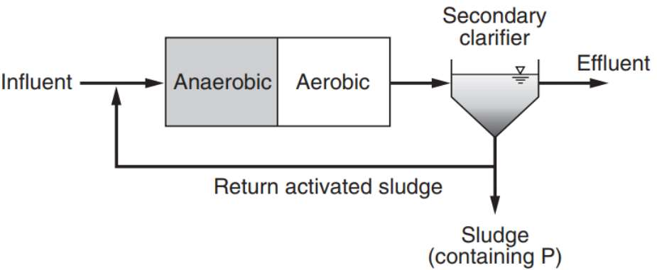
    - **Hình này chứng minh điều gì**
      - Quy trình A/O gồm chuỗi hai ngăn kỵ khí (Anaerobic) và hiếu khí (Aerobic) kết hợp bể lắng thứ cấp.
      - Toàn bộ bùn tuần hoàn (RAS) được đưa trực tiếp về ngăn kỵ khí; bùn xả chứa photpho lấy từ đáy bể lắng.
    - **Từ đâu mà thấy được**
      - Dòng Influent hòa trộn với đường Return activated sludge đi vào khối Anaerobic (màu xám).
      - Hỗn hợp qua khối Aerobic (màu trắng) sang Secondary clarifier; bùn đáy chia nhánh xả Sludge (containing P).

##### 2.2 Quy trình A2O - Kỵ khí / Thiếu khí / Hiếu khí (A2O & A2O MBR Process)

- Điều kiện áp dụng và nguyên lý quá trình $A^2O$:
  - Áp dụng cho các trạm xử lý có yêu cầu khử nitrat hóa đồng thời khử photpho sinh học (EBPR nitrification) với nước thải có tỷ lệ cơ chất trên photpho cao: $\text{BOD}/\text{P} > 30$.
  - Bố trí ngăn thiếu khí (Anoxic zone) nằm xen giữa ngăn kỵ khí và ngăn hiếu khí để thực hiện quá trình khử nitrat (denitrification):
    - Khử nitrat thành khí nitơ tự do ($\text{N}_2$), làm giảm thiểu tác động tiêu cực của nitrat mang điện tích âm đối với quá trình EBPR.
    - Bảo vệ vi sinh vật PAO khỏi sự cạnh tranh nguồn cơ chất VFA bởi vi khuẩn khử nitrat dị dưỡng thông thường.
- Sơ đồ quy trình $A^2O$ truyền thống (Conventional A2O Process):
  - Chuỗi phản ứng gồm 3 vùng kế tiếp: Ngăn kỵ khí (Anaerobic) $\rightarrow$ Ngăn thiếu khí (Anoxic) $\rightarrow$ Ngăn hiếu khí (Aerobic) $\rightarrow$ Bể lắng thứ cấp (Secondary clarifier).
  - Vòng tuần hoàn nội bộ nitrat ($\text{NO}_x\text{ recycle}$): Bơm hồi lưu hỗn dịch từ cuối ngăn hiếu khí đưa ngược trở lại đầu ngăn thiếu khí nhằm cung cấp nitrat cho quá trình khử nitrat.
  - Dòng bùn tuần hoàn (Return activated sludge - RAS): Bùn lắng từ đáy bể lắng thứ cấp được bơm hồi lưu về đầu ngăn kỵ khí.
  - Hạn chế của dòng RAS: Khi quá trình khử nitrat ở ngăn thiếu khí chưa triệt để, dòng bùn tuần hoàn vẫn mang theo một lượng nitrat nhất định vào ngăn kỵ khí, làm giảm hiệu suất giải phóng photpho nếu tỷ lệ $\text{BOD}/\text{P}$ không đủ cao.
  - Bùn dư giàu photpho (Sludge containing P) được xả bỏ từ đáy bể lắng thứ cấp.
  - **Hình 8.** Sơ đồ dòng chảy quy trình A2O truyền thống (Conventional A2O Process Flow Diagram)
    - 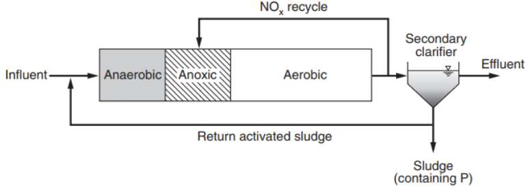
    - **Hình này chứng minh điều gì**
      - Cấu hình 3 bậc Anaerobic - Anoxic - Aerobic với dòng tuần hoàn nội bộ $\text{NO}_x$ về ngăn thiếu khí và dòng RAS về ngăn kỵ khí.
    - **Từ đâu mà thấy được**
      - Bể phản ứng chia 3 ngăn liên hoàn: Anaerobic (xám), Anoxic (kẻ sọc chéo) và Aerobic (trắng).
      - Đường $\text{NO}_x\text{ recycle}$ xuất phát từ cuối ngăn Aerobic hồi lưu về Anoxic; Return activated sludge từ đáy lắng hồi lưu về trước Anaerobic.
- Sơ đồ quy trình $A^2O$ tích hợp màng sinh học MBR (A2O MBR Process):
  - Thay thế toàn bộ bể lắng thứ cấp truyền thống bằng các mô-đun màng lọc sợi rỗng hoặc màng tấm phẳng đặt trực tiếp tại khoang cuối ngăn hiếu khí.
  - Dòng nước sạch (Effluent) được hút lọc trực tiếp qua màng với kích thước lỗ lọc siêu mịn, ngăn giữ hoàn toàn vi sinh vật và cặn lơ lửng trong bể.
  - Vòng tuần hoàn hỗn dịch bùn hoạt tính (MLSS recycle): Bùn hỗn dịch đậm đặc từ ngăn hiếu khí/khoang màng được bơm tuần hoàn trực tiếp về ngăn kỵ khí (thay thế chức năng của dòng RAS).
  - Vòng tuần hoàn nội bộ nitrat ($\text{NO}_x\text{ recycle}$): Hồi lưu hỗn dịch từ ngăn hiếu khí sang ngăn thiếu khí để thực hiện khử nitrat.
  - Bùn thải giàu photpho (Sludge containing P) được xả định kỳ trực tiếp từ khoang chứa mô-đun màng.
  - Đặc tính nổi bật: Cho phép duy trì nồng độ $\text{MLSS}$ trong bể rất cao ($8{,}000\text{--}12{,}000\text{ mg/L}$), tiết kiệm đáng kể diện tích mặt bằng xây dựng và giải quyết triệt để nguy cơ trôi bùn khó lắng.
  - **Hình 9.** Sơ đồ dòng chảy quy trình A2O MBR (A2O MBR Process Flow Diagram)
    - 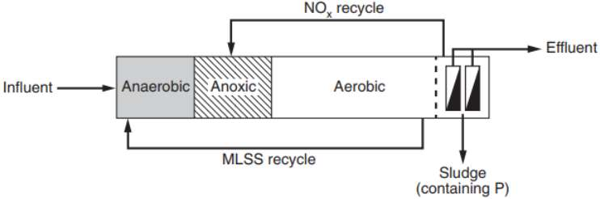
    - **Hình này chứng minh điều gì**
      - Hệ thống tích hợp màng lọc MBR trực tiếp trong ngăn hiếu khí, thay thế bể lắng thứ cấp và sử dụng dòng tuần hoàn hỗn dịch bùn MLSS.
    - **Từ đâu mà thấy được**
      - Vách ngăn cách ly ở cuối bể hiếu khí chứa cụm mô-đun màng lọc với đường hút nước sau xử lý Effluent trên đỉnh.
      - Đường MLSS recycle dẫn từ đáy ngăn hiếu khí về ngăn Anaerobic; đường xả bùn giàu photpho đặt trực tiếp tại khoang màng.

##### 2.3 Quy trình UCT - University of Cape Town (UCT & UCT MBR Process)

- Điều kiện áp dụng và nguyên lý thiết kế quy trình UCT:
  - Áp dụng cho các trạm xử lý EBPR có quá trình nitrat hóa (EBPR with nitrification) nhưng nước thải đầu vào có tỷ lệ cơ chất trên photpho thấp (low influent BOD/P ratio wastewater).
  - Mục tiêu công nghệ cốt lõi: Giảm thiểu tối đa lượng nitrat xâm nhập vào ngăn kỵ khí (Minimizing nitrate entering anaerobic zones to improve EBPR efficiency).
  - Giải pháp bố trí dòng tuần hoàn khác biệt hoàn toàn với $A^2O$:
    - Bùn hoạt tính tuần hoàn từ bể lắng thứ cấp (RAS) không đưa về ngăn kỵ khí, mà chuyển hướng tuần hoàn trực tiếp về ngăn thiếu khí (Anoxic zone).
    - Ngăn kỵ khí chỉ tiếp nhận bùn hoạt tính tuần hoàn từ ngăn thiếu khí thông qua dòng bùn hỗn dịch (MLSS recycle).
    - Vì ngăn thiếu khí liên tục khử sạch nitrat từ cả dòng $\text{NO}_x\text{ recycle}$ lẫn dòng RAS, dòng MLSS đưa về ngăn kỵ khí gần như không chứa nitrat ($\text{NO}_3^- \approx 0$).
  - Thông số thiết kế và vận hành đặc trưng của quy trình UCT:
    - Thời gian tiếp xúc kỵ khí kéo dài hơn (Longer anaerobic contact time): $\theta_{\text{anaerobic}} = 1\text{--}2\text{ h}$ ($1 - 2\text{ h}$) để đảm bảo đủ thời gian hấp phụ cơ chất và giải phóng photpho trong điều kiện nước thải nghèo hữu cơ.
    - Lưu lượng tuần hoàn kỵ khí điển hình (Typical anaerobic recycle rate): Dòng MLSS recycle được thiết kế vận hành với lưu lượng bằng 2 lần lưu lượng trung bình: $Q_{\text{recycle}} = 2 \times Q_{\text{avg}}$.
- Sơ đồ quy trình UCT truyền thống (Conventional UCT Process):
  - Dòng Influent chảy trực tiếp vào ngăn kỵ khí (Anaerobic), hòa trộn cùng dòng MLSS recycle dẫn từ ngăn thiếu khí (Anoxic).
  - Dòng từ ngăn kỵ khí chảy sang ngăn thiếu khí (Anoxic).
  - Ngăn thiếu khí đồng thời tiếp nhận:
    - Dòng bùn tuần hoàn (Return activated sludge - RAS) bơm từ đáy bể lắng thứ cấp.
    - Dòng tuần hoàn nội bộ nitrat ($\text{NO}_x\text{ recycle}$) bơm từ ngăn hiếu khí (Aerobic).
  - Hỗn dịch sau khi khử nitrat hoàn toàn trong ngăn thiếu khí chảy tiếp sang ngăn hiếu khí (Aerobic) để oxy hóa chất hữu cơ và hấp thụ photpho vượt mức.
  - Nước hỗn dịch hiếu khí đi vào bể lắng thứ cấp (Secondary clarifier); bùn thải chứa photpho (Sludge containing P) được xả bỏ từ đáy bể lắng.
  - **Hình 10.** Sơ đồ dòng chảy quy trình UCT truyền thống (Conventional UCT Process Flow Diagram)
    - 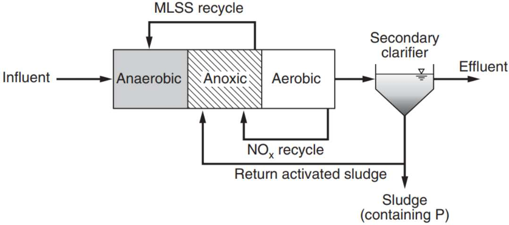
    - **Hình này chứng minh điều gì**
      - Ngăn kỵ khí được cách ly hoàn toàn khỏi nitrat của bể lắng, chỉ tiếp nhận bùn hoạt tính đã khử nitrat từ ngăn thiếu khí qua dòng tuần hoàn MLSS.
    - **Từ đâu mà thấy được**
      - Đường Return activated sludge từ đáy Secondary clarifier dẫn trực tiếp vào ngăn Anoxic (thay vì Anaerobic).
      - Đường tuần hoàn MLSS recycle khép kín từ đỉnh ngăn Anoxic hồi lưu về đầu ngăn Anaerobic; đường $\text{NO}_x\text{ recycle}$ dẫn từ Aerobic về Anoxic.
- Sơ đồ quy trình UCT tích hợp màng sinh học MBR (UCT MBR Process):
  - Tích hợp cụm mô-đun màng lọc MBR trực tiếp vào cuối ngăn hiếu khí, loại bỏ hoàn toàn bể lắng thứ cấp.
  - Vòng tuần hoàn bùn hoạt tính (Return activated sludge): Bơm từ khoang chứa màng MBR quay trở lại đầu ngăn thiếu khí (Anoxic).
  - Vòng tuần hoàn nitrat ($\text{NO}_x\text{ recycle}$): Dẫn hỗn dịch lỏng từ ngăn hiếu khí về ngăn thiếu khí (Anoxic).
  - Vòng tuần hoàn bùn hỗn dịch (MLSS recycle): Bơm từ ngăn thiếu khí (Anoxic) hồi lưu về ngăn kỵ khí (Anaerobic).
  - Nước sau xử lý (Effluent) thu hồi trực tiếp từ hệ thống hút chân không xuyên màng.
  - Bùn thải giàu photpho (Sludge containing P) được xả trực tiếp từ khoang chứa mô-đun màng.
  - Cải thiện tối đa tính ổn định của hệ thống trước hiện tượng bùn nổi hoặc khó lắng, duy trì hiệu suất khử nitơ và photpho cao ngay cả khi tải lượng hữu cơ biến động mạnh.
  - **Hình 11.** Sơ đồ dòng chảy quy trình UCT MBR (UCT MBR Process Flow Diagram)
    - 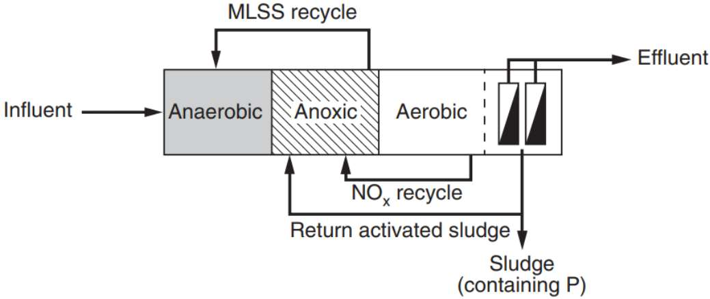
    - **Hình này chứng minh điều gì**
      - Quy trình UCT tích hợp cụm màng lọc MBR duy trì 3 chu trình tuần hoàn riêng biệt, bảo vệ tuyệt đối trạng thái kỵ khí nghiêm ngặt.
    - **Từ đâu mà thấy được**
      - Cụm mô-đun màng đặt ở khoang cuối sinh Effluent; đáy khoang màng chia nhánh Return activated sludge dẫn về ngăn Anoxic và nhánh xả bùn thải.
      - Đường MLSS recycle dẫn từ Anoxic về Anaerobic chạy dọc đỉnh bể; đường $\text{NO}_x\text{ recycle}$ dẫn từ Aerobic về Anoxic chạy dọc đáy bể.

##### 2.4 Ưu điểm và hạn chế của các quy trình khử photpho (Advantages and Limitations)

- Bảng tổng hợp so sánh các quy trình công nghệ khử photpho sinh học chính:

| Quy trình (Process) | Ưu điểm (Advantages) | Hạn chế (Limitations) |
| :--- | :--- | :--- |
| **Phoredox (A/O)** | - Vận hành tương đối đơn giản so với các quy trình khác (*Operation is relatively simple when compared to other processes*). - Có thể áp dụng với nước thải có tỷ lệ $\text{BOD}/\text{P}$ đầu vào thấp (*Low influent BOD/P ratio possible*). - Thời gian lưu thủy lực tương đối ngắn (*Relatively short hydraulic retention time*). - Bùn hoạt tính tạo bông và lắng rất tốt (*Produces good settling sludge*). - Hiệu quả khử photpho cao (*Good phosphorus removal*). | - Hiệu quả khử photpho suy giảm nhanh nếu xảy ra quá trình nitrat hóa (*Phosphorus removal declines if nitrification occurs*). - Đòi hỏi kiểm soát tuổi bùn $\text{SRT}$ chặt chẽ để ngăn chặn quá trình nitrat hóa (*Requires careful SRT control to prevent nitrification*). - Khó duy trì vận hành không nitrat hóa ở các vùng có khí hậu nhiệt đới/ấm áp (*Difficult to operate without nitrification in warm climates*). |
| **$A^2O$** | - Khử đồng thời cả nitơ và photpho trong cùng hệ thống (*Removes both nitrogen and phosphorus*). - Quá trình khử nitrat bổ sung lại độ kiềm cho quá trình nitrat hóa (*Provides alkalinity for nitrification*). - Tạo bông bùn có đặc tính lắng tốt (*Produces good settling sludge*). - Vận hành tương đối đơn giản (*Operation is relatively simple*). - Tiết kiệm năng lượng sục khí nhờ tận dụng oxy liên kết trong nitrat (*Saves energy*). - Tương thích hoàn toàn khi tích hợp với công nghệ màng MBR (*Compatible with MBRs*). | - Dòng bùn tuần hoàn RAS chứa nitrat được đưa về ngăn kỵ khí làm ảnh hưởng xấu đến khả năng khử photpho (*RAS containing nitrate is recycled to anaerobic zone thus affecting phosphorus removal capability*). - Hiệu quả khử nitơ tổng bị giới hạn bởi tỷ lệ tuần hoàn nội bộ (*Nitrogen removal is limited by internal recycle ratio*). - Yêu cầu tỷ lệ $\text{BOD}/\text{P}$ đầu vào cao hơn so với quy trình A/O (*Needs higher influent BOD/P ratio than the A/O process*). |
| **UCT** | - Tải lượng nitrat đưa vào ngăn kỵ khí được giảm thiểu tối đa, giúp gia tăng mạnh khả năng khử photpho (*Nitrate loading on anaerobic zone is reduced thus increasing phosphorus removal capability*). - Đạt hiệu quả khử photpho vượt trội đối với nguồn nước thải loãng/nghèo hữu cơ (*For weaker wastewater, process can achieve improved phosphorus removal*). - Tạo bông bùn có đặc tính lắng tốt (*Produces good settling sludge*). - Hiệu quả khử nitơ cao (*Good nitrogen removal*). - Tương thích hoàn toàn khi tích hợp với công nghệ màng MBR (*Compatible with MBRs*). | - Vận hành hệ thống phức tạp hơn (*More complex operation*). - Đòi hỏi bổ sung thêm hệ thống bơm và đường ống tuần hoàn (*Requires additional recycle system*). |

- Phân tích chi tiết ưu điểm và hạn chế của các quy trình từ tài liệu gốc:
  - So sánh quy trình Phoredox (A/O) và $A^2O$:
    - **Hình 12.** Bảng so sánh ưu điểm và hạn chế của quy trình Phoredox (A/O) và $A^2O$
      - 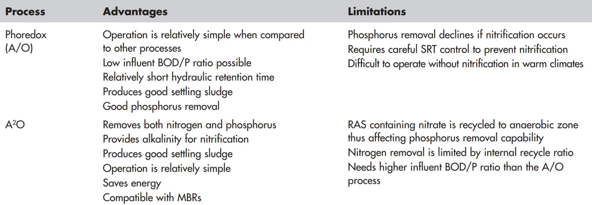
      - **Hình này chứng minh điều gì**
        - Quy trình Phoredox (A/O) vận hành đơn giản nhưng dễ suy giảm do nitrat hóa, trong khi quy trình $A^2O$ khử đồng thời N và P nhưng yêu cầu tỷ lệ $\text{BOD}/\text{P}$ cao.
      - **Từ đâu mà thấy được**
        - Cột Advantages: Phoredox nổi bật với HRT ngắn và vận hành đơn giản; $A^2O$ bổ sung khả năng khử nitơ, tạo độ kiềm và tương thích MBR.
        - Cột Limitations: Phoredox đòi hỏi kiểm soát SRT chặt chẽ để tránh nitrat hóa; $A^2O$ bị giới hạn bởi nitrat trong dòng RAS xâm nhập vùng kỵ khí.
  - Phân tích ưu điểm và hạn chế của quy trình UCT:
    - **Hình 13.** Bảng so sánh ưu điểm và hạn chế của quy trình UCT
      - 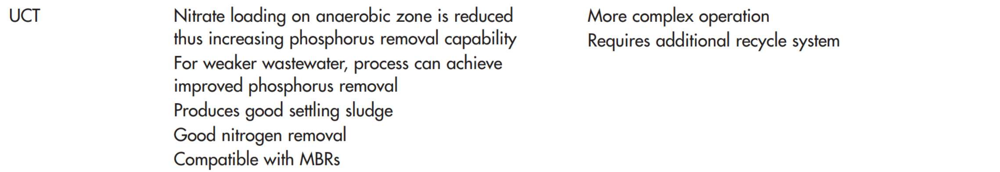
      - **Hình này chứng minh điều gì**
        - Quy trình UCT giảm thiểu triệt để tải lượng nitrat lên vùng kỵ khí giúp xử lý hiệu quả nước thải loãng, đổi lại hệ thống tuần hoàn và vận hành phức tạp hơn.
      - **Từ đâu mà thấy được**
        - Cột Process ghi nhãn UCT; cột Advantages nhấn mạnh hiệu quả khử photpho cho dòng nước thải có nồng độ chất hữu cơ thấp (weaker wastewater).
        - Cột Limitations chỉ ra hai hạn chế cốt lõi: vận hành phức tạp hơn (more complex operation) và yêu cầu bổ sung hệ thống tuần hoàn (additional recycle system).

#### 3. Các thông số và tính toán thiết kế EBPR (Process Design Consideration)

- Các khía cạnh cốt lõi trong tính toán thiết kế hệ thống khử photpho sinh học tăng cường (EBPR):
  - Đánh giá đặc tính cơ chất và nguồn carbon dễ phân hủy trong nước thải đầu vào.
  - Phân tích ảnh hưởng cạnh tranh cơ chất của các chất nhận điện tử oxy hóa ($\text{NO}_3^-$, $\text{O}_2$) xâm nhập vào vùng kỵ khí.
  - Lựa chọn các thông số công nghệ vận hành cơ bản: tuổi bùn ($\text{SRT}$), thời gian lưu thủy lực ($\tau$), nồng độ bùn hoạt tính ($\text{MLSS}$) và các tỷ lệ tuần hoàn bùn, tuần hoàn nội bộ.
  - Thiết lập cân bằng vật chất photpho và sinh khối vi sinh vật (PAO và vi khuẩn dị dưỡng thông thường) để xác định nồng độ photpho đầu ra và hàm lượng photpho tích lũy trong bùn xả dư.

##### 3.1 Đặc tính nước thải ảnh hưởng đến EBPR (Wastewater Characteristics)

- Yêu cầu tối thiểu về tỷ lệ cơ chất hữu cơ trên photpho trong nước thải đầu vào (Minimal influent wastewater ratios):
  - Mục tiêu xử lý: Đạt nồng độ photpho hòa tan trong nước sau xử lý $\text{P}_{\text{eff, soluble}} < 0{,}50\text{ g/m}^3$ ($0{,}50\text{ mg/L}$) hoàn toàn bằng cơ chế sinh học EBPR mà không cần châm hóa chất keo tụ bổ sung.
  - Các ngưỡng tỷ lệ cơ chất tối thiểu đối với photpho tổng ($\text{P}$):
    - Tỷ lệ axit béo bay hơi trên photpho: $\text{VFA}:\text{P} \ge 8$.
    - Tỷ lệ $\text{COD}$ phân hủy sinh học nhanh trên photpho: $\text{rbCOD}:\text{P} \ge 18$.
    - Tỷ lệ nhu cầu oxy sinh hóa trên photpho: $\text{BOD}:\text{P} \ge 30$.
    - Tỷ lệ nhu cầu oxy hóa học trên photpho: $\text{COD}:\text{P} \ge 60$.
  - Vai trò của các tỷ lệ cơ chất: Đảm bảo cung cấp đủ lượng nguồn carbon mạch ngắn dễ hấp phụ cho vi sinh vật tích lũy photpho (PAO) cạnh tranh ưu thế trước các nhóm vi sinh vật dị dưỡng khác.
  - **Hình 14.** Bảng các tỷ lệ cơ chất tối thiểu của nước thải đầu vào cho quá trình EBPR (Minimal influent wastewater ratios for EBPR)
    - 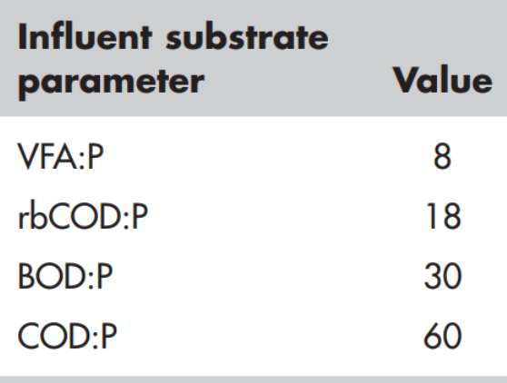
    - **Hình này chứng minh điều gì**
      - Các ngưỡng tỷ lệ cơ chất tối thiểu đầu vào cần thiết để đạt nồng độ $\text{P}$ hòa tan đầu ra $< 0{,}50\text{ g/m}^3$ bằng cơ chế EBPR.
    - **Từ đâu mà thấy được**
      - Cột Influent substrate parameter liệt kê lần lượt: VFA:P, rbCOD:P, BOD:P, COD:P.
      - Cột Value ghi nhận các giá trị định lượng tối thiểu tương ứng: $8$, $18$, $30$, $60$.

- Ảnh hưởng của tỷ lệ $\text{VFA}/\text{rbCOD}$ đến suất tiêu hao $\text{rbCOD}$ trên lượng photpho khử được (Effect of VFA/rbCOD ratio on rbCOD used/P removal ratio):
  - Mối quan hệ giữa thành phần nguồn carbon và hiệu quả khử photpho:
    - Khi tỷ lệ $\text{VFA}/\text{rbCOD}$ tăng lên, lượng $\text{rbCOD}$ cần thiết để khử $1\text{ g P}$ giảm mạnh theo đường cong tiệm cận.
    - Tại tỷ lệ $\text{VFA}/\text{rbCOD} = 0{,}1$: Suất tiêu hao rất cao, cần khoảng $20{,}5\text{ g rbCOD/g P khử}$.
    - Tại tỷ lệ $\text{VFA}/\text{rbCOD} = 0{,}2$: Suất tiêu hao giảm xuống mức $\approx 15\text{ g rbCOD/g P khử}$.
    - Tại tỷ lệ $\text{VFA}/\text{rbCOD} = 0{,}4$: Suất tiêu hao đạt $\approx 11\text{ g rbCOD/g P khử}$.
    - Tại tỷ lệ $\text{VFA}/\text{rbCOD} = 0{,}8$: Suất tiêu hao tiệm cận mức tối ưu $\approx 7{,}8\text{ g rbCOD/g P khử}$.
  - Ý nghĩa công nghệ: Nước thải chứa tỷ lệ $\text{VFA}$ tự do càng cao thì hiệu quả chuyển hóa thành polyhydroxyalkanoates ($\text{PHA}$) của PAO càng nhanh, giảm bớt nhu cầu phân giải các hợp chất hữu cơ hòa tan phức tạp hơn.
  - Biện pháp bổ sung $\text{VFA}$ (Tips): Nguồn $\text{VFA}$ bổ sung có thể lấy từ quá trình lên men yếm khí bùn sơ cấp (primary sludge fermentation) nhằm tăng cường tỷ lệ $\text{VFA}/\text{rbCOD}$ cho nước thải đầu vào nghèo hữu cơ.
  - **Hình 15.** Đồ thị ảnh hưởng của tỷ lệ VFA/rbCOD đến tỷ số rbCOD sử dụng trên P khử (Effect of VFA/rbCOD ratio on rbCOD used/P removal ratio)
    - 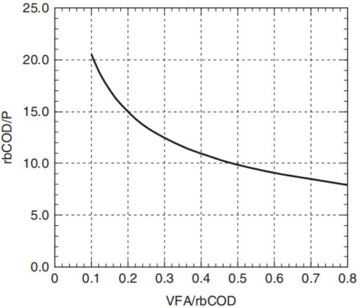
    - **Hình này chứng minh điều gì**
      - Tỷ lệ $\text{VFA}/\text{rbCOD}$ càng cao thì nhu cầu tiêu hao $\text{rbCOD}$ để loại bỏ một đơn vị photpho càng giảm.
    - **Từ đâu mà thấy được**
      - Trục hoành biểu diễn tỷ số $\text{VFA/rbCOD}$ từ $0$ đến $0{,}8$; trục tung biểu diễn tỷ số $\text{rbCOD/P}$ từ $0{,}0$ đến $25{,}0$.
      - Đường cong thực nghiệm dốc xuống từ giá trị $20{,}5$ (tại hoành độ $0{,}1$) xuống $15{,}0$ (tại hoành độ $0{,}2$) và tiệm cận $7{,}8$ (tại hoành độ $0{,}8$).

- Ảnh hưởng của độ $\text{pH}$ môi trường đến hoạt tính của PAO:
  - Giá trị $\text{pH}$ tối thiểu cần duy trì trong hệ thống: $\text{pH} > 7{,}0$.
  - Khoảng $\text{pH}$ tối ưu nhất cho hoạt động trao đổi chất và ưu thế cạnh tranh của PAO: $\text{pH} > 7{,}5$.
  - Môi trường kiềm nhẹ hỗ trợ quá trình vận chuyển cation đồng thời ($\text{Mg}^{2+}$, $\text{K}^+$, $\text{Ca}^{2+}$) qua màng tế bào khi tích lũy polyphosphate và hạn chế sự phát triển lấn át của vi sinh vật tích lũy glycogen (GAO).

- Hiện tượng suy giảm $\text{rbCOD}$ do sự xâm nhập của nitrat và oxy vào vùng tiếp xúc kỵ khí (rbCOD consumption by nitrate and oxygen in anaerobic contact zone):
  - Khi dòng bùn tuần hoàn ($\text{RAS}$) hoặc nước hồi lưu mang theo nitrat ($\text{NO}_3^-$) hoặc oxy hòa tan ($\text{DO}$) vào ngăn chọn lọc kỵ khí, các vi khuẩn dị dưỡng hiếu khí và khử nitrat sẽ sử dụng ngay nguồn $\text{rbCOD}$ quý giá để khử các chất nhận điện tử này:
    - Đối với nitrat: Tiêu hao $5{,}2\text{ g rbCOD}$ cho mỗi $1\text{ g NO}_3\text{-N}$ bị khử ($5.2\text{ g rbCOD consumed for } 1\text{ g NO}_3\text{-N}$).
    - Đối với oxy hòa tan: Tiêu hao $2{,}8\text{ g rbCOD}$ cho mỗi $1\text{ g O}_2$ bị tiêu thụ ($2.8\text{ g rbCOD consumed for } 1\text{ g O}_2$).
  - Hậu quả: Lượng $\text{rbCOD}$ hữu dụng còn lại cho PAO tổng hợp $\text{PHA}$ bị sụt giảm nghiêm trọng, dẫn đến suy giảm khả năng hấp thu photpho vượt mức trong vùng hiếu khí.

##### 3.2 Thông số thiết kế công nghệ điển hình (Typical Design Parameters)

- Bảng tổng hợp các thông số thiết kế thực tế cho các quy trình EBPR phổ biến:

| Quy trình công nghệ (Process) | Tuổi bùn $\text{SRT}$ ($\text{d}$) | Nồng độ bùn $\text{MLSS}$ ($\text{mg/L}$) | Thời gian lưu kỵ khí $\tau_{\text{anaerobic}}$ ($\text{h}$) | Thời gian lưu thiếu khí $\tau_{\text{anoxic}}$ ($\text{h}$) | Thời gian lưu hiếu khí $\tau_{\text{aerobic}}$ ($\text{h}$) | Tỷ lệ bùn tuần hoàn $\text{RAS}$ ($\%\text{ Q}$) | Tỷ lệ tuần hoàn nội bộ ($\%\text{ Q}$) |
| :--- | :---: | :---: | :---: | :---: | :---: | :---: | :---: |
| **A/O** | $2\text{--}5$ | $3000\text{--}4000$ | $0{,}5\text{--}1{,}5$ | $-$ | $1\text{--}3$ | $25\text{--}100$ | $-$ |
| **$A^2O$** | $5\text{--}25$ | $3000\text{--}4000$ | $0{,}5\text{--}1{,}5$ | $1\text{--}3$ | $4\text{--}8$ | $25\text{--}100$ | $100\text{--}400$ |
| **UCT** | $10\text{--}25$ | $3000\text{--}4000$ | $1\text{--}2$ | $2\text{--}4$ | $4\text{--}12$ | $80\text{--}100$ | $200\text{--}400$ (thiếu khí) $100\text{--}300$ (hiếu khí) |

- Nhận xét và phân tích các thông số thiết kế từ bảng số liệu:
  - Tuổi bùn hệ thống ($\text{SRT}$):
    - Quy trình A/O duy trì $\text{SRT}$ rất ngắn ($2 - 5\text{ ngày}$) nhằm ngăn chặn hoàn toàn vi khuẩn nitrat hóa sinh trưởng, từ đó dòng $\text{RAS}$ hoàn toàn không chứa nitrat.
    - Quy trình $A^2O$ và UCT đòi hỏi $\text{SRT}$ dài hơn ($5 - 25\text{ ngày}$) để đảm bảo đủ điều kiện cho vi khuẩn nitrat hóa tự dưỡng phát triển ổn định trong ngăn hiếu khí.
  - Thời gian lưu nước các ngăn ($\tau$):
    - Ngăn kỵ khí: Duy trì ngắn trong khoảng $0{,}5 - 1{,}5\text{ h}$ (quy trình UCT kéo dài $1 - 2\text{ h}$ do tiếp nhận thêm dòng tuần hoàn bùn hỗn dịch từ ngăn thiếu khí) để tối ưu hóa quá trình hấp phụ $\text{VFA}$ mà không kích hoạt các phản ứng lên men thứ cấp không mong muốn.
    - Ngăn thiếu khí: Dao động từ $1 - 3\text{ h}$ ($A^2O$) đến $2 - 4\text{ h}$ (UCT) để khử triệt để nitrat từ dòng tuần hoàn nội bộ và dòng $\text{RAS}$.
    - Ngăn hiếu khí: Thời gian lưu từ $4 - 8\text{ h}$ ($A^2O$) đến $4 - 12\text{ h}$ (UCT) đáp ứng đồng thời nhu cầu oxy hóa carbon, nitrat hóa hoàn toàn và hấp thu photpho vượt mức.
  - Tỷ lệ tuần hoàn dòng chảy:
    - Dòng $\text{RAS}$: Thường dao động từ $25\%$ đến $100\%$ lưu lượng đầu vào ($Q$), trong quy trình UCT thường duy trì ở mức cao $80 - 100\%$.
    - Dòng tuần hoàn nội bộ: Quy trình $A^2O$ sử dụng dòng tuần hoàn nitrat từ ngăn hiếu khí về ngăn thiếu khí với tỷ lệ $100 - 400\%$; quy trình UCT sử dụng hai dòng tuần hoàn riêng biệt gồm dòng thiếu khí về kỵ khí ($200 - 400\%$) và dòng hiếu khí về thiếu khí ($100 - 300\%$).
  - **Hình 16.** Bảng thông số thiết kế điển hình cho các quy trình EBPR phổ biến (Typical design parameters for common EBPR processes)
    - 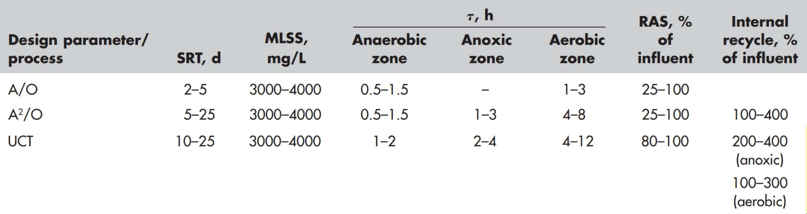
    - **Hình này chứng minh điều gì**
      - Thang giá trị thiết kế tiêu chuẩn về $\text{SRT}$, $\text{MLSS}$, thời gian lưu từng ngăn và tỷ lệ tuần hoàn cho các quy trình A/O, $A^2O$ và UCT.
    - **Từ đâu mà thấy được**
      - Hàng A/O hiển thị $\text{SRT} = 2 - 5\text{ d}$, không có ngăn thiếu khí, $\tau_{\text{aerobic}} = 1 - 3\text{ h}$.
      - Hàng $A^2/\text{O}$ hiển thị $\text{SRT} = 5 - 25\text{ d}$, $\tau_{\text{anoxic}} = 1 - 3\text{ h}$, tuần hoàn nội bộ $100 - 400\%$.
      - Hàng UCT hiển thị $\text{SRT} = 10 - 25\text{ d}$, hai dòng tuần hoàn nội bộ riêng biệt: $200 - 400\%$ (anoxic) và $100 - 300\%$ (aerobic).

##### 3.3 Ví dụ tính toán thiết kế hệ thống A2O (Example: A2O Process Design)

- Cấu hình công nghệ hệ thống tính toán:
  - Hệ thống $A^2O$ ba bậc gồm: Ngăn kỵ khí (Anaerobic) $\rightarrow$ Ngăn thiếu khí (Anoxic) $\rightarrow$ Ngăn hiếu khí (Aerobic) $\rightarrow$ Bể lắng thứ cấp (Secondary clarifier).
  - Dòng tuần hoàn nitrat ($\text{NO}_x\text{ recycle}$) dẫn từ cuối ngăn hiếu khí hồi lưu về đầu ngăn thiếu khí.
  - Dòng bùn tuần hoàn ($\text{RAS}$) bơm từ đáy bể lắng thứ cấp hồi lưu về trước ngăn kỵ khí.
  - Dòng bùn dư giàu photpho (Sludge containing P) được xả định kỳ từ đáy bể lắng thứ cấp.
  - **Hình 17.** Sơ đồ quy trình A2O cho bài toán tính toán thiết kế (A2O process for biological phosphorus removal)
    - 
    - **Hình này chứng minh điều gì**
      - Cấu trúc sơ đồ công nghệ dòng chảy và các vị trí kết nối tuần hoàn của hệ thống $A^2O$ trong bài toán ví dụ.
    - **Từ đâu mà thấy được**
      - Sơ đồ nối tiếp 3 khối bể: Anaerobic $\rightarrow$ Anoxic $\rightarrow$ Aerobic $\rightarrow$ Secondary clarifier.
      - Nhánh $\text{NO}_x\text{ recycle}$ nối từ Aerobic sang Anoxic; nhánh Return activated sludge nối từ đáy bể lắng về trước Anaerobic.

- **Bài toán ví dụ 2 (Example 2: A2O process design calculation)**:
  - **Đề bài**:
    - Tính toán nồng độ photpho hòa tan đầu ra ($\text{Effluent P concentration}$) và hàm lượng photpho tích lũy trong bùn xả thải ($\text{P content in wasted sludge}$) cho hệ thống xử lý nước thải bằng quy trình $A^2O$ với các đặc tính nước thải và thông số vận hành cho trước.
  - **Dữ kiện**:
    - Đặc tính nước thải đầu vào (trích xuất từ bảng số liệu thiết kế):
      - Lưu lượng nước thải: $Q = 4000\text{ m}^3/\text{d}$.
      - Nhu cầu oxy sinh hóa tổng: $\text{Total BOD} = 160\text{ g/m}^3$.
      - $\text{COD}$ phân hủy sinh học: $\text{bCOD} = 250\text{ g/m}^3$.
      - $\text{COD}$ phân hủy sinh học nhanh: $\text{rbCOD} = 75\text{ g/m}^3$.
      - Axit axetic: $\text{Acetate} = 15\text{ g/m}^3$.
      - Cặn lơ lửng bay hơi không phân hủy sinh học: $\text{nbVSS} = 20\text{ g/m}^3$.
      - Cặn trơ vô cơ: $\text{Inorganic inert matter} = 10\text{ g/m}^3$.
      - Nitơ Kjeldahl tổng: $\text{TKN} = 35\text{ g/m}^3$.
      - Photpho tổng đầu vào: $\text{Phosphorus} = 6\text{ g/m}^3$.
      - Nhiệt độ nước thải: $T = 12^\circ\text{C}$.
    - **Hình 18.** Bảng đặc tính nước thải đầu vào hệ thống A2O (Influent wastewater characteristics)
      - 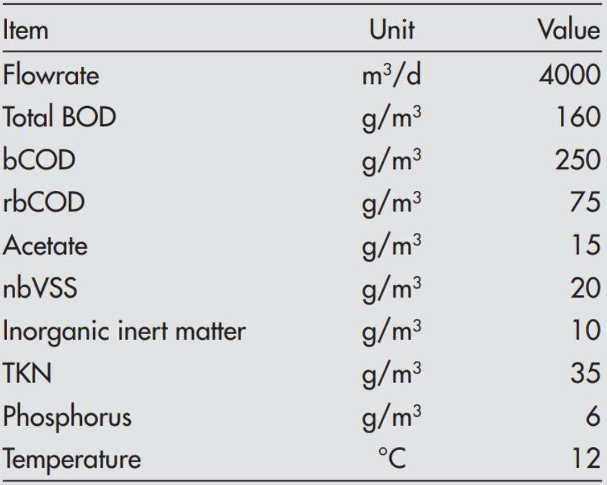
      - **Hình này chứng minh điều gì**
        - Giá trị định lượng đầy đủ của các thông số ô nhiễm đầu vào dùng làm dữ kiện bài toán tính toán thiết kế $A^2O$.
      - **Từ đâu mà thấy được**
        - Bảng 3 cột Item, Unit, Value ghi nhận: Flowrate $4000\text{ m}^3/\text{d}$, Total BOD $160\text{ g/m}^3$, bCOD $250\text{ g/m}^3$, rbCOD $75\text{ g/m}^3$, Acetate $15\text{ g/m}^3$, nbVSS $20\text{ g/m}^3$, Inert $10\text{ g/m}^3$, TKN $35\text{ g/m}^3$, Phosphorus $6\text{ g/m}^3$, Temperature $12^\circ\text{C}$.
    - Các thông số và giả định vận hành công nghệ:
      - Tỷ lệ bùn tuần hoàn: $R = \text{RAS ratio} = 0{,}5$ ($50\%$).
      - Tuổi bùn hệ thống: $\text{SRT} = 8\text{ d}$.
      - Lượng nitrat oxy hóa được tạo ra: $\text{NO}_x\text{-N}_{\text{oxidized}} = 28\text{ g/m}^3$.
      - Nồng độ nitrat trong nước đầu ra: $\text{NO}_x\text{-N}_{\text{eff}} = 6\text{ g/m}^3$.
      - Hàm lượng photpho của vi khuẩn dị dưỡng thông thường: $f_{P,\text{other}} = 0{,}015\text{ g P/g VSS}$ ($1{,}5\%$).
      - Suất tiêu thụ $\text{rbCOD}$ do khử nitrat trong ngăn kỵ khí: $5{,}2\text{ g rbCOD/g NO}_3\text{-N}$ (theo Slide 20).
      - Hàm lượng photpho của PAO: $f_{P,\text{PAO}} = 0{,}30\text{ g P/g VSS}$ (theo Slide 5 & Slide 12).
      - Hệ số sinh trưởng thực thể vi sinh vật dị dưỡng: $Y = 0{,}45\text{ g VSS/g COD}$ và hệ số phân hủy nội bào $b = 0{,}08\text{ d}^{-1}$ (theo Slide 12).
  - **Quy tắc áp dụng**:
    - Nồng độ nitrat hồi lưu về ngăn kỵ khí quy đổi theo lưu lượng nước vào:
      $$\text{NO}_{3\text{,feed}} = R \times \text{NO}_x\text{-N}_{\text{eff}}$$
    - Lượng $\text{rbCOD}$ bị tiêu hao bởi phản ứng khử nitrat trong ngăn kỵ khí:
      $$\text{rbCOD}_{\text{denit}} = 5{,}2 \times \text{NO}_{3\text{,feed}}$$
    - Nồng độ $\text{rbCOD}$ hữu dụng còn lại sẵn có cho PAO:
      $$\text{rbCOD}_{\text{avail}} = \text{rbCOD}_{\text{inf}} - \text{rbCOD}_{\text{denit}}$$
    - Suất tiêu hao $\text{rbCOD}$ trên photpho khử ($\text{rbCOD/P}$) tra từ đồ thị Hình 15 dựa theo tỷ lệ $\text{VFA}/\text{rbCOD}$:
      $$\text{Tỷ lệ } \frac{\text{VFA}}{\text{rbCOD}} = \frac{\text{Acetate}}{\text{rbCOD}_{\text{inf}}}$$
    - Lượng photpho loại bỏ bởi PAO:
      $$P_{\text{PAO}} = \frac{\text{rbCOD}_{\text{avail}}}{\text{rbCOD/P}}$$
    - Hệ số quan sát sinh khối ròng tính đến quá trình phân hủy nội bào theo tuổi bùn $\text{SRT}$:
      $$Y_{\text{obs}} = \frac{Y}{1 + b \times \text{SRT}}$$
    - Lượng sinh khối vi sinh vật dị dưỡng thông thường tổng hợp từ phần $\text{bCOD}$ còn lại:
      $$X_{\text{other,VSS}} = Y_{\text{obs}} \times (\text{bCOD}_{\text{inf}} - \text{rbCOD}_{\text{avail}})$$
    - Lượng photpho loại bỏ bởi vi khuẩn thông thường:
      $$P_{\text{other}} = X_{\text{other,VSS}} \times f_{P,\text{other}}$$
    - Tổng lượng photpho loại bỏ bằng cơ chế sinh học:
      $$P_{\text{total,removed}} = P_{\text{PAO}} + P_{\text{other}}$$
    - Nồng độ photpho hòa tan trong nước đầu ra:
      $$P_{\text{eff}} = P_{\text{inf}} - P_{\text{total,removed}}$$
    - Hàm lượng photpho trong bùn xả thải:
      $$\% P_{\text{WAS,VSS}} = \frac{P_{\text{total,removed}}}{X_{\text{total,VSS}}} \times 100\%$$
  - **Lời giải**:
    - **Bước 1**: Xác định tải lượng nitrat tuần hoàn vào ngăn kỵ khí và lượng $\text{rbCOD}$ bị tiêu hao do khử nitrat.
      - Căn cứ: Dòng bùn tuần hoàn $\text{RAS}$ lấy từ đáy bể lắng thứ cấp mang nồng độ nitrat bằng nồng độ đầu ra $\text{NO}_x\text{-N}_{\text{eff}} = 6\text{ g/m}^3$ với tỷ lệ tuần hoàn $R = 0{,}5$. Phản ứng khử nitrat kỵ khí tiêu hao $5{,}2\text{ g rbCOD/g NO}_3\text{-N}$.
      - Nhìn vào:
        - Nồng độ nitrat đưa vào ngăn kỵ khí (tính trên $1\text{ m}^3$ nước thải đầu vào):
          $$\text{NO}_{3\text{,feed}} = R \times \text{NO}_x\text{-N}_{\text{eff}} = 0{,}5 \times 6{,}0\text{ g/m}^3 = 3{,}0\text{ g NO}_3\text{-N/m}^3$$
        - Tải lượng nitrat hồi lưu hàng ngày:
          $$\dot{M}_{\text{NO}_3\text{-N}} = 3{,}0\text{ g/m}^3 \times 4000\text{ m}^3/\text{d} = 12.000\text{ g/d} = 12{,}0\text{ kg/d}$$
        - Lượng $\text{rbCOD}$ bị tiêu hao bởi nitrat trong ngăn kỵ khí:
          $$\text{rbCOD}_{\text{denit}} = 5{,}2\text{ g rbCOD/g NO}_3\text{-N} \times 3{,}0\text{ g NO}_3\text{-N/m}^3 = 15{,}6\text{ g rbCOD/m}^3$$
        - Tải lượng $\text{rbCOD}$ bị mất đi mỗi ngày:
          $$\dot{M}_{\text{rbCOD,denit}} = 15{,}6\text{ g/m}^3 \times 4000\text{ m}^3/\text{d} = 62.400\text{ g/d} = 62{,}4\text{ kg/d}$$
    - **Bước 2**: Xác định lượng $\text{rbCOD}$ hữu dụng còn lại cho PAO trong ngăn kỵ khí.
      - Căn cứ: Khấu trừ lượng $\text{rbCOD}$ bị mất do khử nitrat khỏi nồng độ $\text{rbCOD}$ tổng đầu vào:
        $$\text{rbCOD}_{\text{avail}} = \text{rbCOD}_{\text{inf}} - \text{rbCOD}_{\text{denit}}$$
      - Nhìn vào: Với $\text{rbCOD}_{\text{inf}} = 75\text{ g/m}^3$ và $\text{rbCOD}_{\text{denit}} = 15{,}6\text{ g/m}^3$:
        $$\text{rbCOD}_{\text{avail}} = 75{,}0 - 15{,}6 = 59{,}4\text{ g/m}^3$$
        $$\dot{M}_{\text{rbCOD,avail}} = 59{,}4\text{ g/m}^3 \times 4000\text{ m}^3/\text{d} = 237.600\text{ g/d} = 237{,}6\text{ kg/d}$$
    - **Bước 3**: Xác định tỷ số tiêu hao $\text{rbCOD/P}$ và lượng photpho được loại bỏ bởi PAO.
      - Căn cứ: Tỷ lệ $\text{VFA}/\text{rbCOD}$ của nước thải đầu vào và đường cong thực nghiệm trên đồ thị Hình 15 (Slide 19).
      - Nhìn vào:
        - Tỷ số $\text{VFA}$ trên $\text{rbCOD}$ đầu vào:
          $$\frac{\text{VFA}}{\text{rbCOD}} = \frac{\text{Acetate}}{\text{rbCOD}_{\text{inf}}} = \frac{15\text{ g/m}^3}{75\text{ g/m}^3} = 0{,}20$$
        - Dóng hoành độ $0{,}20$ lên đường cong thực nghiệm của Hình 15:
          Tại $\text{VFA}/\text{rbCOD} = 0{,}20$, giá trị tung độ tương ứng là $\text{rbCOD/P} = 15{,}0\text{ g rbCOD/g P khử}$.
        - Lượng photpho được PAO hấp thu và loại bỏ:
          $$P_{\text{PAO}} = \frac{\text{rbCOD}_{\text{avail}}}{\text{rbCOD/P}} = \frac{59{,}4\text{ g/m}^3}{15{,}0\text{ g rbCOD/g P}} = 3{,}96\text{ g P/m}^3$$
        - Tải lượng photpho loại bỏ bởi PAO mỗi ngày:
          $$\dot{M}_{P\text{,PAO}} = 3{,}96\text{ g/m}^3 \times 4000\text{ m}^3/\text{d} = 15.840\text{ g P/d} = 15{,}84\text{ kg P/d}$$
    - **Bước 4**: Xác định lượng photpho loại bỏ do quá trình tổng hợp tế bào của vi khuẩn dị dưỡng thông thường.
      - Căn cứ:
        - Hệ số sinh trưởng quan sát ròng $Y_{\text{obs}}$ ở $\text{SRT} = 8\text{ d}$:
          $$Y_{\text{obs}} = \frac{Y}{1 + b \times \text{SRT}} = \frac{0{,}45}{1 + 0{,}08 \times 8} = \frac{0{,}45}{1{,}64} = 0{,}2744\text{ g VSS/g COD}$$
        - Lượng cơ chất $\text{bCOD}$ còn lại cho vi khuẩn dị dưỡng thông thường:
          $$\text{bCOD}_{\text{other}} = \text{bCOD}_{\text{inf}} - \text{rbCOD}_{\text{avail}} = 250{,}0 - 59{,}4 = 190{,}6\text{ g/m}^3$$
      - Nhìn vào:
        - Sinh khối vi khuẩn dị dưỡng thông thường sinh ra:
          $$X_{\text{other,VSS}} = Y_{\text{obs}} \times \text{bCOD}_{\text{other}} = 0{,}2744 \times 190{,}6 = 52{,}30\text{ g VSS/m}^3$$
          $$\dot{M}_{X\text{,other}} = 52{,}30\text{ g/m}^3 \times 4000\text{ m}^3/\text{d} = 209.200\text{ g/d} = 209{,}2\text{ kg VSS/d}$$
        - Lượng photpho đồng hóa vào cấu trúc tế bào vi khuẩn dị dưỡng (với $f_{P,\text{other}} = 0{,}015\text{ g P/g VSS}$):
          $$P_{\text{other}} = X_{\text{other,VSS}} \times f_{P,\text{other}} = 52{,}30 \times 0{,}015 = 0{,}785\text{ g P/m}^3 \approx 0{,}78\text{ g P/m}^3$$
          $$\dot{M}_{P\text{,other}} = 0{,}785\text{ g/m}^3 \times 4000\text{ m}^3/\text{d} = 3.140\text{ g P/d} = 3{,}14\text{ kg P/d}$$
    - **Bước 5**: Xác định tổng lượng photpho loại bỏ và nồng độ photpho hòa tan trong nước đầu ra.
      - Căn cứ: Phương trình cân bằng vật chất photpho tổng cộng:
        $$P_{\text{total,removed}} = P_{\text{PAO}} + P_{\text{other}}$$
        $$P_{\text{eff}} = P_{\text{inf}} - P_{\text{total,removed}}$$
      - Nhìn vào:
        - Tổng photpho loại bỏ:
          $$P_{\text{total,removed}} = 3{,}96 + 0{,}785 = 4{,}745\text{ g P/m}^3 \approx 4{,}75\text{ g P/m}^3$$
          $$\dot{M}_{P\text{,total}} = 15{,}84 + 3{,}14 = 18{,}98\text{ kg P/d}$$
        - Nồng độ photpho hòa tan đầu ra:
          $$P_{\text{eff}} = 6{,}0 - 4{,}745 = 1{,}255\text{ g/m}^3 \approx 1{,}26\text{ g/m}^3\text{ (hay } 1{,}26\text{ mg/L)}$$
        - Hiệu suất loại bỏ photpho tổng thể của hệ thống:
          $$\eta_P = \frac{4{,}745}{6{,}0} \times 100\% = 79{,}1\%$$
    - **Bước 6**: Xác định hàm lượng photpho trong bùn hoạt tính xả thải ($\text{WAS}$).
      - Căn cứ:
        - Tổng sinh khối bùn hoạt tính mới tạo thành từ quá trình sinh hóa:
          $$X_{\text{bio,VSS}} = Y_{\text{obs}} \times \text{bCOD}_{\text{inf}} = 0{,}2744 \times 250{,}0 = 68{,}60\text{ g VSS/m}^3$$
          (hoặc tính gộp $X_{\text{PAO,VSS}} + X_{\text{other,VSS}} = (0{,}2744 \times 59{,}4) + 52{,}30 = 16{,}30 + 52{,}30 = 68{,}60\text{ g VSS/m}^3$).
        - Tổng lượng cặn lơ lửng bay hơi trong bùn xả (tính cả cặn hữu cơ không phân hủy sinh học $\text{nbVSS} = 20\text{ g/m}^3$ đi vào từ nước thải):
          $$X_{\text{total,VSS}} = X_{\text{bio,VSS}} + \text{nbVSS} = 68{,}60 + 20{,}0 = 88{,}60\text{ g VSS/m}^3$$
          $$\dot{M}_{\text{WAS,VSS}} = 88{,}60\text{ g/m}^3 \times 4000\text{ m}^3/\text{d} = 354.400\text{ g/d} = 354{,}4\text{ kg VSS/d}$$
      - Nhìn vào:
        - Tỷ lệ photpho trên tổng sinh khối hoạt tính tổng hợp mới ($\text{VSS}_{\text{bio}}$):
          $$\% P_{\text{bio,VSS}} = \frac{P_{\text{total,removed}}}{X_{\text{bio,VSS}}} \times 100\% = \frac{4{,}745}{68{,}60} \times 100\% = 6{,}92\%$$
        - Tỷ lệ photpho trên tổng cặn bay hơi bùn xả ($\text{VSS}_{\text{total}}$):
          $$\% P_{\text{total,VSS}} = \frac{P_{\text{total,removed}}}{X_{\text{total,VSS}}} \times 100\% = \frac{4{,}745}{88{,}60} \times 100\% = 5{,}36\%$$
        - Tỷ lệ photpho tính theo cặn khô lơ lửng tổng cộng ($\text{TSS}$):
          Với tỷ lệ $\text{VSS/TSS} \approx 0{,}65$ điển hình của bùn EBPR giàu khoáng chất vô cơ polyphosphate:
          $$\% P_{\text{TSS}} = 5{,}36\% \times 0{,}65 \approx 3{,}48\%\text{ (theo khối lượng TSS)}$$
  - **Kết quả**:
    - Nồng độ photpho hòa tan trong nước sau xử lý: $P_{\text{eff}} = 1{,}26\text{ g/m}^3$ ($1{,}26\text{ mg/L}$).
    - Lượng photpho loại bỏ bởi hệ thống: $4{,}75\text{ g P/m}^3$ ($18{,}98\text{ kg P/d}$).
    - Hàm lượng photpho trong sinh khối hoạt tính: $6{,}92\%\text{ P theo VSS sinh học}$ ($5{,}36\%\text{ P theo tổng VSS bùn xả}$).
  - **Kiểm tra lại**:
    - Kiểm tra cân bằng vật chất photpho:
      $$P_{\text{in}} = 6{,}0\text{ g/m}^3 = P_{\text{eff}} + P_{\text{total,removed}} = 1{,}255 + 4{,}745 = 6{,}000\text{ g/m}^3\text{ (cân bằng khép kín } 100\%)$$
    - Đánh giá khả năng đạt tiêu chuẩn xả thải:
      Nồng độ $P_{\text{eff}} = 1{,}26\text{ mg/L} < 4{,}0\text{ mg/L}$ (thỏa mãn tiêu chuẩn QCVN 40:2011/BTNMT Cột A về photpho tổng trong nước thải công nghiệp và QCVN 14:2008/BTNMT về nước thải sinh hoạt).
    - Đánh giá ảnh hưởng của nitrat trong dòng $\text{RAS}$:
      Nếu hệ thống được nâng cấp lên sơ đồ UCT để ngăn chặn hoàn toàn $12\text{ kg NO}_3\text{-N/d}$ xâm nhập vào ngăn kỵ khí, toàn bộ $75\text{ g/m}^3\text{ rbCOD}$ sẽ sẵn có cho PAO. Khi đó:
      $$P_{\text{PAO,UCT}} = \frac{75{,}0}{15{,}0} = 5{,}00\text{ g/m}^3$$
      $$P_{\text{total,removed,UCT}} = 5{,}00 + 0{,}785 = 5{,}785\text{ g/m}^3 \implies P_{\text{eff,UCT}} = 6{,}0 - 5{,}785 = 0{,}215\text{ g/m}^3 < 0{,}50\text{ mg/L}$$
      Điều này khẳng định kết luận lý thuyết: Sự xâm nhập của nitrat trong dòng $\text{RAS}$ của quy trình $A^2O$ làm suy giảm hiệu suất khử photpho, và việc bảo vệ ngăn kỵ khí (như trong cấu hình UCT) giúp đưa nồng độ photpho đầu ra về dưới ngưỡng $0{,}50\text{ mg/L}$.

### Chương 10: Xử lý và Quản lý Bùn cặn (Sludge Treatment)

#### 1. Nguồn gốc và Đặc tính Bùn cặn

##### Tổng quan và Tầm quan trọng của Xử lý Bùn cặn

- Xử lý và quản lý bùn cặn là công đoạn phức tạp và tiêu tốn chi phí lớn nhất trong trạm xử lý nước thải:
  - Chi phí xử lý và tiêu hủy bùn cặn chiếm đến $50\%$ tổng chi phí vận hành ($\text{OPEX}$) của toàn bộ nhà máy xử lý nước thải ($\text{WWTP}$).
  - Bùn cặn là dòng vật chất cô đặc mang tải lượng lớn, lưu giữ hầu như toàn bộ các chất ô nhiễm được tách ra khỏi pha lỏng của nước thải.
  - Thiết kế tối ưu và vận hành hiệu quả các công trình xử lý bùn đóng vai trò quyết định đến tính khả thi kinh tế và mức độ an toàn môi trường của dự án.
- Ba đặc tính cốt lõi của bùn cặn gây khó khăn lớn cho công tác kiểm soát và kỹ thuật xử lý:
  - Nguồn gốc ô nhiễm mùi hôi: Bùn cặn tập trung phần lớn các hợp chất hữu cơ dễ phân hủy sinh học, vốn là tác nhân chính gây ra mùi hôi thối nồng nặc của nước thải chưa qua xử lý.
  - Bản chất vật liệu hữu cơ kém ổn định: Bùn là hỗn hợp sinh khối hữu cơ đậm đặc liên tục xảy ra các phản ứng phân hủy kỵ khí tự nhiên, giải phóng khí nhà kính và khí độc ($\text{H}_2\text{S}$, $\text{NH}_3$, $\text{CH}_4$) nếu không được thu gom và ổn định đúng kỹ thuật.
  - Độ ẩm cực cao chiếm ưu thế thể tích:
    - Bùn cặn chứa hàm lượng nước điển hình từ $95\%$ đến $99.5\%$ ($P_w = 95\%\text{--}99.5\%$), trong khi hàm lượng chất rắn chỉ chiếm tỷ lệ rất nhỏ từ $0.5\%$ đến $5\%$ ($P_s = 0.5\%\text{--}5\%$).
    - Lượng nước tự do và nước liên kết khổng lồ làm cho thể tích biểu kiến của bùn cần vận chuyển và xử lý rất lớn, đòi hỏi dung tích công trình chứa và công suất thiết bị cơ học rất cao.

##### Nguồn phát sinh Bùn cặn trong Trạm Xử lý Nước thải

- Bùn phát sinh từ công đoạn xử lý cơ học sơ cấp (Primary Treatment):
  - Bùn sơ cấp (Primary sludge):
    - Hình thành từ quá trình lắng trọng lực của các hạt chất rắn lơ lửng vô cơ và hữu cơ thô tại bể lắng đợt 1 (primary settling tank).
    - Đặc trưng bởi hàm lượng chất hữu cơ cao, cấu trúc hạt không đồng nhất, tốc độ thối rữa phân hủy nhanh và phát tán mùi hôi thối khó chịu.
  - Váng nổi (Scum):
    - Bao gồm hỗn hợp mỡ động thực vật (fats, grease, oils), sáp xà phòng, vụn thức ăn và các vật chất nhẹ nổi lên trên bề mặt thoáng của bể lắng sơ cấp.
    - Có tỷ trọng nhỏ hơn tỷ trọng của nước ($S_s < 1.0$), đòi hỏi máng gạt váng thu gom chuyên dụng để dẫn về hố thu váng.
- Bùn phát sinh từ công đoạn xử lý sinh học thứ cấp (Secondary Treatment):
  - Bùn hoạt tính dư (WAS - Waste Activated Sludge):
    - Là lượng sinh khối vi sinh vật tăng sinh được xả thải định kỳ khỏi hệ thống bể aerotank nhằm duy trì thời gian lưu bùn thiết kế mong muốn ($\text{SRT}$ - Sludge Retention Time).
    - Có hàm lượng nước rất cao (thường đạt $98.5\%\text{--}99.6\%$), mật độ hạt keo vi sinh xốp và khả năng nén lắng tự nhiên kém hơn nhiều so với bùn sơ cấp.
  - Bùn mùn màng vi sinh (Humus sludge):
    - Hình thành từ các mảng màng sinh học già cỗi bong tróc khỏi giá thể của bể lọc sinh học nhỏ giọt (trickling filter) và lắng đọng tại đáy bể lắng đợt 2.
    - Có độ bền cấu trúc bông bùn tương đối ổn định nhưng vẫn yêu cầu chế độ cô đặc phù hợp trước khi phân hủy.
- Bùn phát sinh từ công đoạn xử lý nâng cao và xử lý hóa lý (Advanced Treatment):
  - Bùn hóa lý / bùn kết tủa hóa chất (Chemical sludge):
    - Phát sinh khi châm các chất keo tụ hoặc hóa chất tạo kết tủa (như phèn sắt $\text{FeCl}_3$, $\text{Fe}_2(\text{SO}_4)_3$, phèn nhôm $\text{Al}_2(\text{SO}_4)_3$, hoặc vôi tôi $\text{Ca(OH)}_2$) để khử photpho và các hạt keo mịn lơ lửng.
    - Bùn hóa lý chứa hàm lượng cặn hydroxit kim loại cao, làm thay đổi cấu trúc bông bùn và đòi hỏi liều lượng polymer điều hòa bùn cao khi ép khử nước.

##### Phân loại Bùn cặn theo Nguồn gốc và Trạng thái Chế biến

- Phân loại bùn cặn theo nguồn gốc công trình phát sinh:
  - Bùn cơ học sơ cấp (Primary sludge) từ bể lắng đợt 1.
  - Bùn sinh học thứ cấp (Secondary biological sludge) gồm bùn hoạt tính dư ($\text{WAS}$) và bùn mùn lọc sinh học (Humus sludge).
  - Bùn kết tủa hóa học (Chemical precipitation sludge) từ các cụm keo tụ - tạo bông hoặc khử photpho.
  - Váng nổi bề mặt (Scum) từ các máng thu váng bể lắng.
- Phân loại bùn cặn theo trạng thái chế biến dọc dây chuyền công nghệ:
  - Bùn thô / bùn tươi (Raw sludge): Bùn chưa qua bất kỳ công đoạn xử lý nhiệt, hóa hay cơ học nào; độ ẩm rất cao và hoạt tính phân hủy sinh học mạnh.
  - Bùn cô đặc (Thickened sludge): Bùn đã qua các bể nén bùn trọng lực hoặc thiết bị tuyển nổi để loại bỏ một phần nước tự do, nâng nồng độ chất rắn lên dải $2\%\text{--}8\%$.
  - Bùn ổn định / bùn phân hủy (Stabilized / digested sludge): Bùn đã qua quá trình phân hủy kỵ khí hoặc hiếu khí; chất hữu cơ bay hơi ($\text{VS}$) giảm từ $40\%$ đến $55\%$, triệt tiêu mầm bệnh và kiểm soát mùi hôi.
  - Bánh bùn khử nước (Dewatered sludge cake): Bùn đã qua máy ép lọc cơ học (máy ép băng tải, máy ép ly tâm, máy ép khung bản), độ ẩm giảm xuống $65\%\text{--}80\%$, tạo thành thể bánh rắn có thể xúc và vận chuyển bằng xe tải.
  - Bùn khô / viên nén bùn (Dried sludge / pellets): Bùn đã qua hệ thống sấy nhiệt bốc hơi nước hoặc sân phơi năng lượng mặt trời; độ ẩm hạ thấp dưới $10\%$, tạo thành dạng hạt thương phẩm dùng làm phân bón hoặc chất đốt phối trộn.

##### Thành phần Hóa học và Hàm lượng Dinh dưỡng của Bùn cặn

- Đặc tính hóa học của bùn sơ cấp và bùn hoạt tính chưa qua xử lý có sự khác biệt rõ rệt về hàm lượng hữu cơ, dưỡng chất và năng lượng sinh khối:
  - Hàm lượng chất rắn khô tổng số ($\text{TS}$ - Total Solids):
    - Bùn sơ cấp dao động trong dải $1.0\%\text{--}6.0\%$ với giá trị điển hình là $3.0\%$.
    - Bùn hoạt tính dao động trong dải thấp hơn nhiều từ $0.4\%\text{--}1.2\%$ với giá trị điển hình là $0.8\%$.
  - Tỷ lệ chất rắn bay hơi ($\text{VS}$ - Volatile Solids):
    - Bùn sơ cấp chiếm $60\%\text{--}85\%\text{ TS}$ với giá trị điển hình là $75\%\text{ TS}$.
    - Bùn hoạt tính chiếm $60\%\text{--}85\%\text{ TS}$ với giá trị điển hình là $70\%\text{ TS}$.
  - Hàm lượng protein, dầu mỡ và chất dinh dưỡng thực vật:
    - Bùn hoạt tính có hàm lượng protein vượt trội đạt $32\%\text{--}41\%\text{ TS}$ (điển hình $36\%$) so với bùn sơ cấp chỉ đạt $20\%\text{--}30\%\text{ TS}$ (điển hình $25\%$).
    - Bùn hoạt tính chứa hàm lượng photpho ($\text{P}_2\text{O}_5$) cao hơn đáng kể từ $2.8\%\text{--}11.0\%\text{ TS}$ (điển hình $5.5\%$) so với bùn sơ cấp từ $0.8\%\text{--}2.8\%\text{ TS}$ (điển hình $1.6\%$).
    - Bùn sơ cấp chứa các thành phần cellulose ($8\%\text{--}15\%$, điển hình $10\%$), silica ($\text{SiO}_2$: $15\%\text{--}20\%$) và sắt vô cơ ($2\%\text{--}4\%$) mà bùn hoạt tính hầu như không có.
  - Nhiệt trị và giá trị năng lượng sinh học ($\text{Energy content}$):
    - Bùn sơ cấp có mức năng lượng cao hơn, đạt $23{,}000\text{--}29{,}000\text{ kJ/kg VSS}$ (điển hình $25{,}000\text{ kJ/kg VSS}$).
    - Bùn hoạt tính đạt dải nhiệt trị $19{,}000\text{--}23{,}000\text{ kJ/kg VSS}$ (điển hình $20{,}000\text{ kJ/kg VSS}$).
  - Bảng tổng hợp thành phần hóa học thực nghiệm đối chứng giữa bùn sơ cấp và bùn hoạt tính:
    - **Hình 1.** Thành phần hóa học của bùn chưa qua xử lý (Chemical Composition of Untreated Sludge)
      - 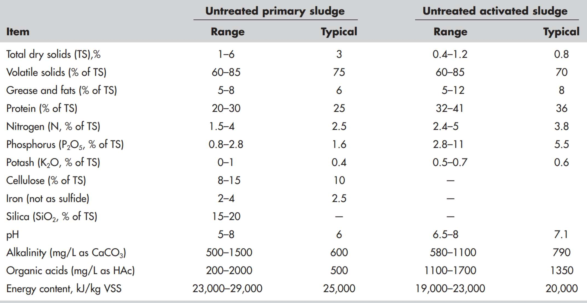
      - **Hình này chứng minh điều gì**
        - Bùn sơ cấp có hàm lượng chất rắn khô $\text{TS}$ ($3\%$) và nhiệt trị ($25{,}000\text{ kJ/kg VSS}$) cao hơn, trong khi bùn hoạt tính giàu protein ($36\%$) và photpho $\text{P}_2\text{O}_5$ ($5.5\%$).
      - **Từ đâu mà thấy được**
        - Bảng Untreated primary sludge so với Untreated activated sludge trên trang 6.
        - Cột Primary: $\text{TS}$ điển hình $3\%$, protein $25\%$, $\text{P}_2\text{O}_5$ $1.6\%$, năng lượng $25{,}000\text{ kJ/kg VSS}$.
        - Cột Activated: $\text{TS}$ điển hình $0.8\%$, protein $36\%$, $\text{P}_2\text{O}_5$ $5.5\%$, năng lượng $20{,}000\text{ kJ/kg VSS}$.

##### Đặc tính Vật lý, Tỷ trọng và Tải lượng Phát sinh Bùn cặn

- Tỷ trọng tương đối của pha rắn ($S_s$) và hỗn hợp bùn ($S_{\text{sludge}}$) là thông số cơ sở để tính toán khối lượng và thể tích công trình:
  - Tỷ trọng pha rắn khô ($S_s = \rho_s / \rho_w$):
    - Bùn lọc sinh học nhỏ giọt có tỷ trọng pha rắn lớn nhất ($S_s = 1.45$), tiếp theo là bùn lắng sơ cấp ($S_s = 1.40$).
    - Bùn hoạt tính hiếu khí có cấu trúc bông vi sinh nhẹ hơn với tỷ trọng pha rắn $S_s = 1.25$.
    - Bùn từ hệ thống sục khí kéo dài và hồ thổi khí đạt $S_s = 1.30$; bùn rửa lọc cát và tách tảo đạt $S_s = 1.20$.
  - Tỷ trọng của hỗn hợp bùn toàn phần ($S_{\text{sludge}}$):
    - Do độ ẩm của bùn rất cao ($>95\%$), tỷ trọng của toàn bộ hỗn hợp bùn lỏng luôn tiệm cận tỷ trọng của nước tự do, dao động hẹp trong khoảng $S_{\text{sludge}} = 1.005\text{--}1.050$.
    - Quá trình bùn hoạt tính có tỷ trọng bùn cao nhất ($S_{\text{sludge}} = 1.050$), trong khi bùn lọc cát và tách tảo có tỷ trọng bùn thấp nhất ($S_{\text{sludge}} = 1.005$).
  - Bảng đối chiếu tỷ trọng pha rắn và tỷ trọng hỗn hợp bùn theo các công đoạn xử lý:
    - **Hình 2.** Tỷ trọng chất rắn và tỷ trọng hỗn hợp bùn theo quy trình xử lý (Specific Gravity of Solids and Sludge)
      - 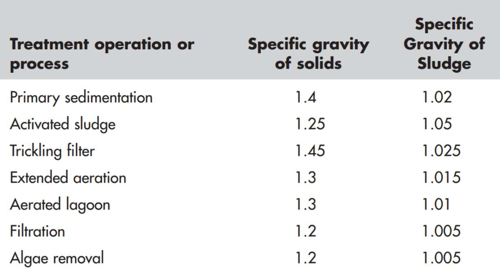
      - **Hình này chứng minh điều gì**
        - Tỷ trọng chất rắn khô $S_s$ biến thiên từ $1.20$ đến $1.45$, trong khi tỷ trọng hỗn hợp bùn $S_{\text{sludge}}$ xấp xỉ nước ($1.005\text{--}1.050$).
      - **Từ đâu mà thấy được**
        - Cột Treatment operation or process liệt kê 7 công đoạn từ Primary sedimentation đến Algae removal.
        - Cột Specific gravity of solids: Primary $1.40$, Activated sludge $1.25$, Trickling filter $1.45$, Filtration $1.20$.
        - Cột Specific Gravity of Sludge: Primary $1.020$, Activated sludge $1.050$, Filtration $1.005$.
- Suất phát sinh chất rắn khô ($\text{kg}/10^3\text{ m}^3$ nước thải) xác định tải lượng bùn cần tiếp nhận tại các đơn vị xử lý bùn:
  - Công đoạn lắng sơ cấp tạo ra tải lượng chất rắn khô lớn nhất:
    - Dải phát sinh dao động từ $110\text{--}170\text{ kg}/10^3\text{ m}^3$ nước thải xử lý.
    - Giá trị thiết kế điển hình đạt $150\text{ kg}/10^3\text{ m}^3$ nước thải.
  - Công đoạn xử lý sinh học thứ cấp tạo ra tải lượng cặn sinh khối tiếp theo:
    - Bể bùn hoạt tính phát sinh $70\text{--}100\text{ kg}/10^3\text{ m}^3$ (điển hình $80\text{ kg}/10^3\text{ m}^3$).
    - Bể lọc sinh học nhỏ giọt phát sinh $60\text{--}100\text{ kg}/10^3\text{ m}^3$ (điển hình $70\text{ kg}/10^3\text{ m}^3$).
    - Quá trình làm thoáng kéo dài và hồ thổi khí phát sinh $80\text{--}120\text{ kg}/10^3\text{ m}^3$ (điển hình $100\text{ kg}/10^3\text{ m}^3$).
  - Các công đoạn xử lý đánh bóng và bậc cao (lọc cát, tách tảo) phát sinh tải lượng nhỏ:
    - Dải phát sinh chỉ từ $12\text{--}24\text{ kg}/10^3\text{ m}^3$ với giá trị điển hình là $20\text{ kg}/10^3\text{ m}^3$.
  - Tải lượng chất rắn khô quy đổi theo lưu lượng nước thải xử lý:
    - **Hình 3.** Suất phát sinh chất rắn khô theo quy trình xử lý nước thải (Dry Solids Production per Volume of Wastewater)
      - 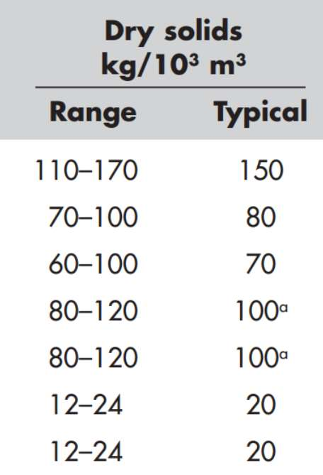
      - **Hình này chứng minh điều gì**
        - Quá trình lắng sơ cấp tạo tải lượng chất rắn khô lớn nhất ($150\text{ kg}/10^3\text{ m}^3$), cao hơn gần gấp đôi so với bùn hoạt tính ($80\text{ kg}/10^3\text{ m}^3$).
      - **Từ đâu mà thấy được**
        - Bảng Dry solids $\text{kg}/10^3\text{ m}^3$ với dải giá trị (Range) và giá trị điển hình (Typical).
        - Dòng Primary sedimentation: Range $110\text{--}170$, Typical $150\text{ kg}/10^3\text{ m}^3$.
        - Dòng Activated sludge: Range $70\text{--}100$, Typical $80\text{ kg}/10^3\text{ m}^3$.
        - Dòng Filtration và Algae removal: Range $12\text{--}24$, Typical $20\text{ kg}/10^3\text{ m}^3$.

#### 2. Các Công đoạn và Sơ đồ Công nghệ Xử lý Bùn

##### Mối liên hệ giữa Công nghệ Xử lý Nước thải và Đặc tính Bùn cặn

- Công nghệ xử lý nước thải quyết định trực tiếp đến khối lượng và đặc tính của bùn cặn sinh ra:
  - Các công nghệ sinh học tiên tiến như màng sinh học ($\text{MBR}$ - Membrane Bioreactor) và hệ thống khử dinh dưỡng sinh học ($\text{BNR}$ - Biological Nutrient Removal) cho chất lượng nước sau xử lý rất cao.
  - Các công nghệ $\text{MBR}$ và $\text{BNR}$ sinh ra tổng khối lượng bùn ít hơn đáng kể so với các quy trình bùn hoạt tính truyền thống ($\text{CAS}$ - Conventional Activated Sludge).
  - Bùn cặn sinh ra từ các hệ thống này khó xử lý, khó cô đặc và khó khử nước hơn bùn truyền thống.
- Thời gian lưu bùn dài ($\text{SRT}$ cao) trong hệ thống $\text{MBR}$ và $\text{BNR}$ thay đổi cấu trúc bùn:
  - Chế độ vận hành với $\text{SRT}$ kéo dài thúc đẩy quá trình phân hủy nội bào (endogenous respiration) của sinh khối vi sinh vật.
  - Quá trình tự phân hủy nội bào tạo ra các hạt cặn có kích thước rất mịn.
  - Vi sinh vật sinh ra nhiều chất polymer ngoại bào ($\text{EPS}$ - Extracellular Polymeric Substances).
  - Cả hạt cặn mịn và phân tử $\text{EPS}$ liên kết giữ nước tự do và nước mao dẫn rất chặt chẽ.
  - Lực liên kết nước lớn làm bùn khó làm khô, khó phân hủy tiếp và làm tăng chi phí cũng như độ phức tạp của toàn bộ dây chuyền xử lý bùn.

##### Nhận diện Cảm quan và Phân loại Bùn theo Công đoạn Xử lý

- Mỗi công đoạn xử lý nước thải tạo ra loại bùn có đặc điểm cảm quan, màu sắc và mùi đặc trưng:
  - Váng nổi ($\text{Scum}$):
    - Chứa dầu khoáng, mỡ động thực vật, sáp, xà phòng, vụn thực phẩm, vỏ rau quả, tóc, giấy vụn, sợi bông, đầu lọc thuốc lá và các vật liệu nhựa.
    - Có tỷ trọng nhỏ hơn nước ($S_{\text{scum}} < 1.0$), luôn nổi trên mặt nước của bể lắng.
  - Bùn lắng sơ cấp ($\text{Primary sludge}$):
    - Có màu xám tro, thể chất trơn nhớt, phát tán mùi hôi thối nồng nặc do chứa nhiều chất hữu cơ tươi chưa phân hủy.
  - Bùn kết tủa hóa chất ($\text{Sludge from chemical precipitation}$):
    - Thường có màu sẫm, trơn nhớt, có thể ở dạng keo gelatin do hydroxit sắt hoặc nhôm ($\text{Fe(OH)}_3$, $\text{Al(OH)}_3$).
    - Bùn keo tụ giàu sắt có màu đỏ gạch; bùn keo tụ bằng vôi có màu xám nâu.
    - Mùi của bùn hóa lý gây khó chịu nhưng không nặng mùi thối rữa như bùn sơ cấp.
  - Bùn hoạt tính hiếu khí ($\text{Activated sludge}$):
    - Bông bùn màu nâu xốp, có mùi đất ẩm tự nhiên khi hệ thống đủ khí và bùn còn tươi.
    - Bùn chuyển màu tối sẫm khi tiếp cận trạng thái thối rữa do yếm khí ($\text{septic condition}$).
    - Bùn có màu nhạt hơn bình thường khi sục khí không đủ ($\text{underaeration}$), dẫn đến lắng chậm và khó tạo bông.
    - Bùn hoạt tính tươi nhanh chóng chuyển sang thối rữa khi thiếu ôxy hòa tan, phát tán mùi thối rữa khó chịu ($\text{putrefaction}$).
  - Bùn màng vi sinh lọc nhỏ giọt ($\text{Trickling filter sludge}$):
    - Có dạng bông màu nâu, ít mùi khi còn tươi và mang đặc tính tương tự bùn hoạt tính.
  - Bùn sinh học phân hủy hiếu khí ($\text{Aerobically digested biosolids}$):
    - Có màu nâu đến nâu sẫm, thể chất bông xốp, mùi mốc nhẹ không gây khó chịu ($\text{musty odor}$).
    - Thoát nước và làm khô dễ dàng trên sân phơi bùn.
  - Bùn sinh học phân hủy kỵ khí ($\text{Anaerobically digested biosolids}$):
    - Có màu nâu sẫm đến đen tuyền, chứa lượng bọt khí lớn ($\text{CH}_4$, $\text{CO}_2$).
    - Khi phân hủy triệt để, bùn không còn mùi hôi thối, chỉ còn mùi nhẹ tương tự hắc ín nóng, cao su cháy hoặc sáp niêm phong.

##### Hàm lượng Dinh dưỡng và Nồng độ Chất rắn Khô của Bùn cặn

- Bùn sinh học sau ổn định ($\text{Biosolids}$) chứa hàm lượng hữu cơ và dinh dưỡng cao, phù hợp bón trũng và cải tạo đất:
  - Bùn sinh học ổn định điển hình chứa $3.3\%$ Nitơ ($\text{N}$), $2.3\%$ Photpho ($\text{P}_2\text{O}_5$), và $0.3\%$ Kali ($\text{K}_2\text{O}$) tính theo khối lượng khô.
  - Hàm lượng dưỡng chất này bù đắp hiệu quả dinh dưỡng thực vật tương tự phân bón nông nghiệp thương phẩm.
  - Ứng dụng bùn sinh học bón đất cần kiểm soát chặt chẽ vi sinh vật gây bệnh ($\text{pathogens}$), kim loại nặng và độc chất hữu cơ.
- Hàm lượng chất rắn khô ($\% \text{ TS}$) biến thiên mạnh tùy thuộc vào công trình lắng và hóa chất keo tụ:
  - Bể lắng sơ cấp (Primary settling tank):
    - Bùn sơ cấp thông thường dao động từ $1.0\%\text{--}6.0\%\text{ TS}$.
    - Bùn sơ cấp thêm sắt để khử photpho dao động từ $0.5\%\text{--}3.0\%\text{ TS}$.
    - Bùn sơ cấp thêm vôi liều thấp để khử photpho đạt $2.0\%\text{--}8.0\%\text{ TS}$.
    - Bùn sơ cấp thêm vôi liều cao để khử photpho đạt $4.0\%\text{--}16.0\%\text{ TS}$.
  - Bể lắng thứ cấp (Secondary settling tank):
    - Bùn hoạt tính dư có lắng sơ cấp dao động từ $0.5\%\text{--}1.5\%\text{ TS}$ (điển hình $0.8\%\text{ TS}$).
    - Bùn hoạt tính dư không có lắng sơ cấp dao động từ $0.8\%\text{--}2.5\%\text{ TS}$ (điển hình $1.3\%\text{ TS}$).
  - Bể cô đặc trọng lực (Gravity thickener):
    - Cô đặc bùn sơ cấp đơn lẻ đạt $3.0\%\text{--}10.0\%\text{ TS}$.
    - Cô đặc hỗn hợp bùn sơ cấp và bùn hoạt tính dư đạt $2.0\%\text{--}6.0\%\text{ TS}$ (điển hình $3.5\%\text{ TS}$).
  - Thiết bị cô đặc tuyển nổi không khí hòa tan (Dissolved Air Flotation - DAF thickener):
    - Cô đặc bùn hoạt tính dư có bổ sung polymer đạt $4.0\%\text{--}6.0\%\text{ TS}$.
    - Cô đặc bùn hoạt tính dư không bổ sung polymer đạt $3.0\%\text{--}5.0\%\text{ TS}$.

##### Quan hệ Khối lượng - Thể tích và Phương trình Cân bằng Bùn cặn

- Thể tích bùn phụ thuộc trực tiếp vào nồng độ chất rắn khô và độ ẩm của khối bùn:
  - Khi bùn chứa $10\%$ chất rắn khô thì lượng nước tự do và liên kết chiếm $90\%$ tổng khối lượng bùn ($P_w = 90\%$).
  - Khối lượng toàn phần của bùn ($W_{\text{sludge}}$) bằng tổng khối lượng chất rắn khô ($W_s$) và khối lượng nước ($W_w$):
    $$W_{\text{sludge}} = W_s + W_w$$
  - Thể tích toàn phần của bùn bằng tổng thể tích pha rắn và thể tích pha nước:
    $$\frac{W_{\text{sludge}}}{\rho_{\text{sludge}}} = \frac{W_s}{\rho_s} + \frac{W_w}{\rho_w}$$
  - Chia hai vế cho khối lượng riêng của nước ($\rho_w = 1{,}000\text{ kg/m}^3$) thu được phương trình cân bằng tỷ trọng bùn:
    $$\frac{W_{\text{sludge}}}{S_{\text{sludge}}} = \frac{W_s}{S_s} + \frac{W_w}{S_w}$$
    Trong đó:
    - $W_{\text{sludge}}$ là tổng khối lượng bùn ($\text{kg}$).
    - $S_{\text{sludge}}$ là tỷ trọng của bùn ($S_{\text{sludge}} = \rho_{\text{sludge}} / \rho_w$).
    - $W_s$ là khối lượng chất rắn khô tổng số ($\text{kg}$).
    - $S_s$ là tỷ trọng của chất rắn khô ($S_s = \rho_s / \rho_w$).
    - $W_w$ là khối lượng nước trong bùn ($\text{kg}$).
    - $S_w$ là tỷ trọng của nước tự do ($S_w = 1.00$).
- Công thức tính toán thể tích bùn cặn ($V$, $\text{m}^3$) trong thiết kế công trình:
  $$V = \frac{W_s}{S_{\text{sludge}} \cdot \rho_w \cdot P_s}$$
  Trong đó:
  - $V$ là thể tích bùn cần xử lý hoặc lưu trữ ($\text{m}^3$).
  - $W_s$ là khối lượng chất rắn khô ($\text{kg}$).
  - $S_{\text{sludge}} \cdot \rho_w = \rho_{\text{sludge}}$ là khối lượng thể tích của hỗn hợp bùn ($\text{kg/m}^3$).
  - $P_s$ là tỷ lệ phần trăm chất rắn khô tính theo số thập phân ($P_s = \% \text{ TS} / 100$).
- Bằng chứng phương trình cân bằng khối lượng - thể tích bùn cặn:
  - **Hình 4.** Công thức cân bằng khối lượng - thể tích của bùn cặn (Volume-Mass Relationship Equation)
    - 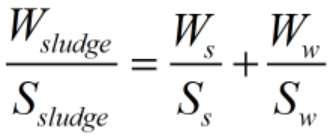
    - **Hình này chứng minh điều gì**
      - Thể tích bùn bằng tổng thể tích pha rắn và thể tích nước; tỷ trọng bùn $S_{\text{sludge}}$ được xác định từ tỷ trọng pha rắn $S_s$.
    - **Từ đâu mà thấy được**
      - Phương trình cân bằng thể tích: $W_{\text{sludge}} / S_{\text{sludge}} = W_s / S_s + W_w / S_w$ trên trang 8.
      - Các thông số liên quan: $W_s$ (weight of solids), $S_s$ (specific gravity of solids), $W_w$, $S_w$, $W_{\text{sludge}}$, $S_{\text{sludge}}$.

##### Dây chuyền Công nghệ Xử lý Bùn cặn (Sludge Processing Train)

- Chuỗi công nghệ xử lý bùn cặn gồm 4 bậc công đoạn nối tiếp từ tiền xử lý đến tiêu hủy:
  - Bậc 1 - Tiền xử lý (Pretreatment):
    - Thủy phân nhiệt (Thermal hydrolysis): Phá hủy màng tế bào ở nhiệt độ $150\text{--}180^\circ\text{C}$ và áp suất cao, thúc đẩy tốc độ sinh khí sinh học.
    - Thủy phân enzyme (Enzymic hydrolysis): Cắt các mạch hữu cơ cao phân tử thành cơ chất đơn giản dễ phân hủy.
    - Thanh trùng (Pasteurization): Gia nhiệt bùn ở $70^\circ\text{C}$ trong $30$ phút để diệt vi sinh vật gây bệnh.
    - Tiền xử lý hỗ trợ phân hủy kỵ khí: Dùng sóng siêu âm (ultrasonic) hoặc lực cắt cơ học (shear) phá vỡ liên kết bông cặn.
  - Bậc 2 - Xử lý và Ổn định chính (Treatment / Stabilization):
    - Phân hủy kỵ khí (Anaerobic digestion): Chuyển hóa chất hữu cơ bay hơi thành khí sinh học ($\text{CH}_4$, $\text{CO}_2$), giảm thể tích và ổn định mầm bệnh.
    - Phân hủy hiếu khí (Aerobic digestion): Thổi khí liên tục để sinh khối tự ôxy hóa nội bào trong trạm quy mô vừa và nhỏ.
    - Ổn định bằng kiềm (Alkali stabilization): Nâng $\text{pH} \ge 12$ bằng vôi tôi ($\text{Ca(OH)}_2$) để diệt khuẩn và khử mùi.
    - Sấy khô và tạo viên (Drying / Pelletization): Giảm ẩm cưỡng bức bằng năng lượng nhiệt.
    - Thiêu đốt nhiệt triệt để (Incineration): Ôxy hóa hoàn toàn bùn trong lò đốt, thu hồi tro xỉ vô cơ.
    - Ủ phân compost (Composting): Lên men hiếu khí bùn cùng phụ phẩm nông nghiệp tạo phân bón hữu cơ.
  - Bậc 3 - Hậu xử lý (Posttreatment):
    - Điều hòa hóa chất và khử nước cơ học (Conditioning / Dewatering): Châm polymer keo tụ giải phóng nước tự do rồi ép lọc.
    - Sấy khô và vo viên (Drying / Pelletization): Hạ độ ẩm bánh bùn xuống dưới $10\%$.
    - Khí hóa (Gasification): Phân hủy nhiệt hóa học thiếu ôxy để thu hồi khí tổng hợp ($\text{syngas}$).
  - Bậc 4 - Thải bỏ và Tái sử dụng cuối cùng (End Use / Disposal):
    - Bón đất nông nghiệp và lâm nghiệp (Land application) để cải tạo độ phì nhiêu.
    - Tái sử dụng tro xỉ (Ash to beneficial use) làm phụ gia sản xuất xi măng và vật liệu xây dựng.
    - Sản xuất phân bón hữu cơ thương phẩm (Fertilizer).
    - Thu hồi năng lượng nhiệt và dầu sinh học (Energy / Oil).
    - Chôn lấp hợp vệ sinh tại bãi chôn lấp (Landfill).
- Bằng chứng cấu trúc chuỗi công nghệ xử lý bùn cặn:
  - **Hình 5.** Sơ đồ tổng thể các công đoạn xử lý và tiêu hủy bùn cặn (Overall Sludge Processing Train)
    - 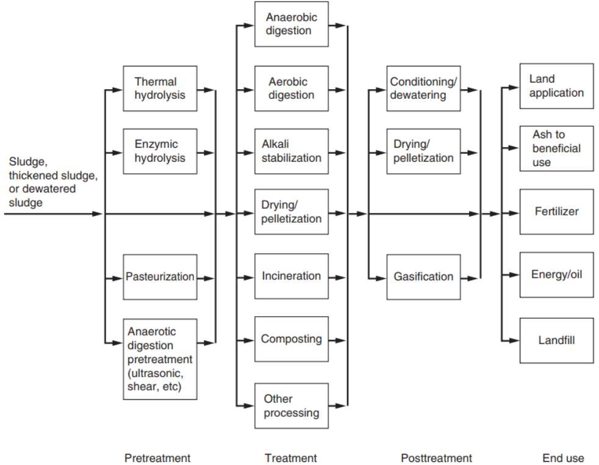
    - **Hình này chứng minh điều gì**
      - Chuỗi công nghệ xử lý bùn gồm 4 bậc liên hoàn: Tiền xử lý $\rightarrow$ Xử lý chính $\rightarrow$ Hậu xử lý $\rightarrow$ Thải bỏ/Tái sử dụng cuối cùng.
    - **Từ đâu mà thấy được**
      - 4 khối công đoạn phân định từ trái sang phải trên trang 10: Pretreatment, Treatment, Posttreatment, End use.
      - Các tuyến công nghệ liên kết linh hoạt từ tiền xử lý nhiệt đến phân hủy kỵ khí, khử nước và bón đất hoặc thiêu đốt.

##### Các Sơ đồ Dây chuyền Công nghệ Xử lý Bùn Điển hình trong Trạm XLNT

- Ba cấu hình công nghệ xử lý và khử nước bùn điển hình trong trạm xử lý nước thải đô thị:
  - Cấu hình (a) - Tuyến phân hủy kỵ khí kết hợp cô đặc riêng bùn hoạt tính và máy ép băng tải:
    - Bùn hoạt tính dư ($\text{WAS}$) đi vào bể cô đặc riêng (Thickener); dòng dưới xả cặn trộn chung với bùn sơ cấp (Primary sludge, cô đặc tùy chọn).
    - Hỗn hợp bùn nạp vào bể phân hủy kỵ khí (Anaerobic digester); nước bề mặt tách ra ($\text{supernatant}$) tuần hoàn về đầu trạm hoặc xử lý riêng.
    - Bùn sinh học đã ổn định ($\text{Biosolids}$) qua bể trộn keo tụ hóa chất ($\text{Chemical conditioning}$) rồi vào máy ép bùn băng tải ($\text{Belt filter press}$).
    - Nước lọc ép bùn ($\text{filtrate}$) hoàn lưu về đầu trạm; bánh bùn chuyển sang tiêu hủy, chế biến sâu hoặc bón đất.
  - Cấu hình (b) - Tuyến phân hủy kỵ khí kết hợp cô đặc hỗn hợp và máy ly tâm:
    - Bùn sơ cấp và bùn hoạt tính dư được cô đặc chung (Combined thickened sludge) rồi cấp trực tiếp vào bể phân hủy kỵ khí.
    - Bùn sau phân hủy qua điều hòa hóa chất và được khử nước bằng máy vắt ly tâm ($\text{Centrifuge}$).
    - Nước sau ly tâm ($\text{centrate}$) hoàn lưu về đầu trạm; bánh bùn chuyển sang tiêu hủy hoặc bón đất.
  - Cấu hình (c) - Tuyến xử lý phân hủy kỵ khí kết hợp sân phơi bùn:
    - Hỗn hợp bùn sơ cấp và bùn hoạt tính dư không qua cô đặc cơ học mà đi thẳng vào bể phân hủy kỵ khí.
    - Bùn sau phân hủy dẫn trực tiếp ra các ô sân phơi bùn cát tự nhiên ($\text{Drying beds}$) để thoát nước và bốc hơi khô.
    - Nước thấm dưới đáy sân phơi ($\text{underflow}$) thu gom bơm tuần hoàn về đầu trạm.
- Bằng chứng các sơ đồ công nghệ xử lý bùn điển hình:
  - **Hình 6.** Ba cấu hình sơ đồ công nghệ xử lý bùn cặn điển hình (Typical Sludge Processing Flow Diagrams)
    - 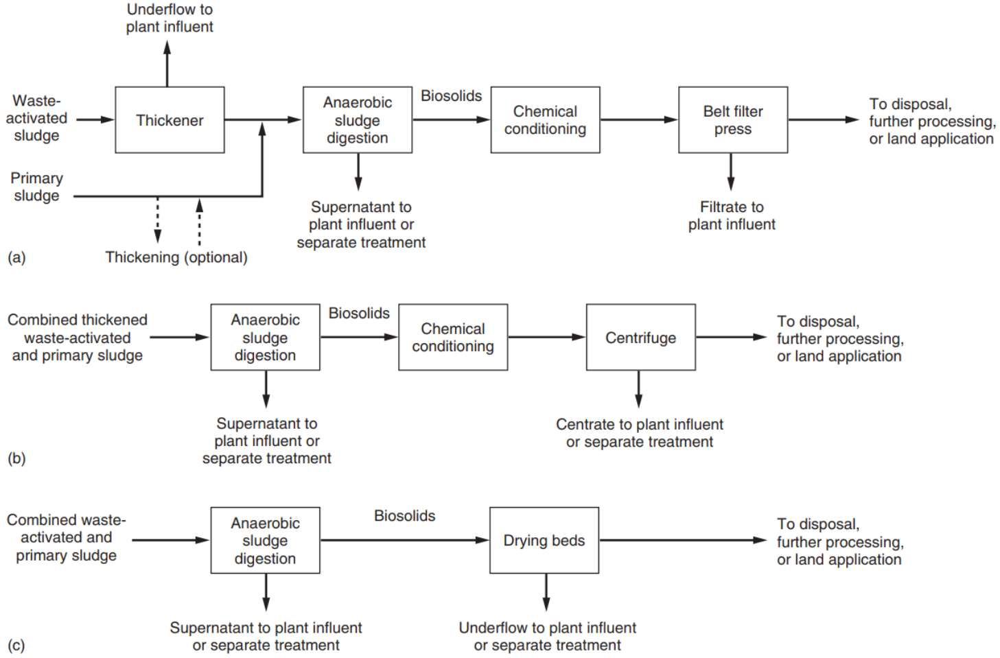
    - **Hình này chứng minh điều gì**
      - Thể hiện 3 cấu hình công nghệ xử lý bùn: máy ép băng tải (a), máy ly tâm (b), và sân phơi bùn (c) cùng các dòng hoàn lưu nước tách bùn.
    - **Từ đâu mà thấy được**
      - Ba lưu đồ công nghệ (a), (b), (c) trên trang 10 từ bể phân hủy kỵ khí đến thiết bị khử nước tương ứng.
      - Các mũi tên tuần hoàn nước tách bùn (supernatant, filtrate, centrate, underflow) dẫn hồi lưu về đầu trạm.
- Dây chuyền công nghệ xử lý bùn cặn thực tế tại Việt Nam:
  - Đa số nhà máy xử lý nước thải quy mô vừa và nhỏ tại Việt Nam xử lý bùn qua 2 giai đoạn kế tiếp: Cô đặc (Thickening) $\rightarrow$ Khử nước (Dewatering) trước khi vận chuyển đi chôn lấp hoặc tiêu hủy ($\text{Sludge disposal}$).
  - Quy trình thực tế loại bỏ bể phân hủy kỵ khí để tiết kiệm chi phí đầu tư ban đầu và giảm độ phức tạp khi vận hành trạm.

#### 3. Quá trình Cô đặc Bùn (Sludge Thickening)

- Bùn cặn sinh ra từ các công đoạn xử lý nước thải có độ ẩm rất cao và thể tích lớn, đòi hỏi các giải pháp tính toán tải lượng, quan hệ thể tích - khối lượng và lựa chọn dây chuyền công nghệ cô đặc phù hợp.
- Nội dung của phân đoạn này tập trung vào các quy tắc thiết kế dung tích lưu trữ bùn, công thức xác định thể tích bùn dựa trên thành phần chất rắn khô, bài toán tính độ giảm thể tích bùn qua phân hủy kỵ khí và sơ đồ dây chuyền công xử lý bùn tại các nhà máy xử lý nước thải.

##### Dao động tải lượng và sức chứa lưu trữ bùn (Sludge Quantity and Loading Fluctuations)

- Tải lượng phát sinh bùn cặn dao động trong biên độ rất rộng theo chu kỳ vận hành và biến động nguồn nước thải đầu vào (sludge production rates fluctuate over a wide range).
- Hai yếu tố kỹ thuật cốt lõi cần đánh giá khi thiết kế các công trình trong trạm xử lý bùn:
  - Suất phát sinh bùn trung bình và suất phát sinh bùn cực đại (average and maximum rates of sludge production).
  - Dung tích lưu trữ dự phòng tiềm năng của các công trình xử lý hiện hữu trong khuôn viên trạm (potential storage capacity of the treatment units within the plant).
- Dung tích tích trữ bùn tạm thời trong các đơn vị công trình lắng và sinh học:
  - Một lượng bùn giới hạn có thể tích trữ tạm thời trong bể lắng (sedimentation tanks) và bể thổi khí sinh học (aeration tanks).
  - Khả năng lưu trữ nội tại này giúp giải tỏa áp lực vận hành ngắn hạn khi các thiết bị xử lý bùn gặp sự cố đột xuất.
- Hiệu ứng làm dịu tải lượng đỉnh của bể phân hủy bùn (sludge digester dampening effect):
  - Dung tích buồng chứa lớn của bể phân hủy bùn tạo ra hiệu ứng đệm làm phẳng đáng kể (substantial dampening effect) đối với các xung tải lượng bùn đỉnh.
  - Bể phân hủy bùn được tính toán thiết kế dựa trên tải lượng tháng cực đại (maximum monthly load).
  - Tiêu chuẩn thiết kế bể phân hủy phải đảm bảo thời gian lưu bùn tối thiểu là 15 ngày ($\text{SRT}_{\min} \ge 15\text{ ngày}$).
- Tiêu chuẩn tải trọng thiết kế cho hệ thống khử nước sau cô đặc trọng lực:
  - Hệ thống máy ép khử nước (dewatering system) đặt sau bể cô đặc trọng lực được thiết kế dựa trên lượng bùn phát sinh cực đại trong chu kỳ từ 1 đến 3 ngày (maximum sludge production of 1 or 3 days).
- Tiêu chuẩn tải trọng thiết kế cho hệ thống bơm bùn và cô đặc bùn:
  - Hệ thống máy bơm bùn (sludge pumping) và hệ thống công trình cô đặc bùn (thickening system) được thiết kế đáp ứng tải lượng ngày cực đại (maximum daily load).

##### Quan hệ khối lượng - thể tích bùn cặn (Volume-Mass Relationship Formulas)

- Thể tích khối bùn cặn phụ thuộc chủ yếu vào tỷ lệ phần trăm hàm lượng chất rắn trong bùn (the volume of sludge depends mainly on its solid content).
  - Ví dụ: Bùn có nồng độ chất rắn $10\%$ ($10\%\text{ solids}$) chứa tới $90\%$ khối lượng là nước theo tỷ lệ khối lượng ($90\%\text{ water by weight}$).
- Công thức xác định tỷ trọng hỗn hợp chất rắn khô ($S_s$ - specific gravity of total solids):
  $$\frac{W_s}{S_s} = \frac{W_f}{S_f} + \frac{W_v}{S_v}$$
  - $W_s$: Khối lượng của tổng chất rắn khô ($Ws = \text{weight of total solids}$, $\text{kg}$).
  - $S_s$: Tỷ trọng của tổng chất rắn khô ($Ss = \text{specific gravity of total solids}$, không thứ nguyên).
  - $W_f$: Khối lượng của phần chất rắn cố định vô cơ ($Wf = \text{weight of fixed solids}$, $\text{kg}$).
  - $S_f$: Tỷ trọng của phần chất rắn cố định vô cơ ($Sf = \text{specific gravity of fixed solids}$, giá trị điển hình $S_f \approx 2.5$).
  - $W_v$: Khối lượng của phần chất rắn bay hơi hữu cơ ($Wv = \text{weight of volatile solids}$, $\text{kg}$).
  - $S_v$: Tỷ trọng của phần chất rắn bay hơi hữu cơ ($Sv = \text{specific gravity of volatile solids}$, giá trị điển hình $S_v \approx 1.0$).
- Công thức xác định tỷ trọng của toàn bộ khối bùn cặn ($S_{sludge}$ - specific gravity of sludge):
  $$\frac{W_{sludge}}{S_{sludge}} = \frac{W_s}{S_s} + \frac{W_w}{S_w}$$
  - $W_{sludge}$: Khối lượng toàn phần của bùn cặn ($W_{sludge} = \text{weight of sludge}$, $\text{kg}$), với $W_{sludge} = W_s + W_w$.
  - $S_{sludge}$: Tỷ trọng toàn phần của bùn cặn ($S_{sludge} = \text{specific gravity of sludge}$, không thứ nguyên).
  - $W_w$: Khối lượng của nước chứa trong bùn ($Ww = \text{weight of water}$, $\text{kg}$).
  - $S_w$: Tỷ trọng của nước ($Sw = \text{specific gravity of water}$, quy ước tiêu chuẩn $S_w = 1.00$).
- Công thức tính toán thể tích khối bùn cặn ($V$ - volume of sludge, $\text{m}^3$):
  $$V = \frac{W_s}{S_{sludge} \times \rho_w \times P_s}$$
  - $V$: Thể tích của khối bùn cặn ($V = \text{volume of sludge}$, $\text{m}^3$).
  - $W_s$: Khối lượng chất rắn khô trong bùn ($Ws = \text{mass of dry solids}$, $\text{kg}$).
  - $S_{sludge}$: Tỷ trọng của khối bùn cặn ($S_{sludge} = \text{specific gravity of sludge}$).
  - $\rho_w$: Khối lượng riêng / trọng lượng riêng của nước ($\rho_w = \text{specific weight of water}$, chuẩn $\rho_w = 1000\text{ kg/m}^3$).
  - $P_s$: Tỷ lệ phần trăm chất rắn khô biểu diễn dưới dạng số thập phân ($Ps = \text{percent of dry solids}$, ví dụ $5\% \rightarrow P_s = 0.05$).
  - Khối lượng riêng của bùn cặn ($\rho_{sludge}$):
    $$\rho_{sludge} = S_{sludge} \times \rho_w$$
    - $\rho_{sludge}$: Khối lượng riêng của khối bùn cặn ($\text{kg/m}^3$).

##### Ví dụ tính toán thể tích bùn trước và sau phân hủy (Worked Example: Sludge Volume Before and After Digestion)

###### Example 1: Sludge volume reduction in digestion (vd1_sludge_volume_digestion)

- **Đề bài**: Xác định thể tích của $500\text{ kg}$ bùn (tính theo khối lượng chất rắn khô - dry solid) trước và sau quá trình phân hủy sinh học kỵ khí (digestion).
  - Thông số trước khi phân hủy (Before digestion):
    - Hàm lượng chất rắn khô: $\text{Solids} = 5\%$.
    - Hàm lượng chất hữu cơ bay hơi: $\text{Volatile matter} = 80\%$ (tính trên tổng chất rắn khô).
    - Tỷ trọng chất rắn cố định vô cơ: $S_f = 2.5$.
    - Tỷ trọng chất rắn bay hơi hữu cơ: $S_v = 1.0$.
  - Thông số sau khi phân hủy (After digestion):
    - Hàm lượng chất rắn khô: $\% \text{ dry solid} = 20\%$.
    - Mức độ chuyển hóa chất hữu cơ: $60\%$ lượng chất rắn bay hơi ban đầu bị phân hủy ($60\% \text{ volatile solid was destroyed}$).

- **Dữ kiện**
  - Khối lượng chất rắn khô ban đầu: $W_s = 500\text{ kg}$.
    - **Ảnh VD1_SLUDGE_VOLUME.1.** Đề bài và bảng thông số bùn trước và sau phân hủy kỵ khí trên Slide 18 (trang 9).
      - 
      - Nhìn vào: Dòng đầu tiên dưới tiêu đề "Example", ghi rõ "Determine volume of 500 kg (dry solid) sludge before and after digestion."
  - Nồng độ chất rắn khô trước phân hủy: $P_{s,1} = 5\% = 0.05$.
    - Nhìn vào: Dòng "Solids, %" trong bảng "Before digestion" trên Slide 18 (Ảnh VD1_SLUDGE_VOLUME.1), ghi giá trị $5$.
  - Tỷ lệ chất rắn bay hơi ban đầu: $P_{v,1} = 80\% = 0.80$ (tính theo tổng chất rắn khô).
    - Nhìn vào: Dòng "Volatile matter, %" trong bảng "Before digestion" trên Slide 18 (Ảnh VD1_SLUDGE_VOLUME.1), ghi giá trị $80$.
  - Tỷ lệ chất rắn cố định ban đầu: $P_{f,1} = 100\% - 80\% = 20\% = 0.20$.
    - Nhìn vào: Cân bằng thành phần tổng chất rắn khô gồm chất rắn bay hơi ($80\%$) và chất rắn cố định ($20\%$).
  - Tỷ trọng chất rắn cố định: $S_f = 2.5$.
    - Nhìn vào: Dòng "Specific gravity of fixed solids" trên Slide 18 (Ảnh VD1_SLUDGE_VOLUME.1), ghi giá trị $2.5$.
  - Tỷ trọng chất rắn bay hơi: $S_v = 1.0$.
    - Nhìn vào: Dòng "Specific gravity of volatile solids" trên Slide 18 (Ảnh VD1_SLUDGE_VOLUME.1), ghi giá trị $1$.
  - Nồng độ chất rắn khô sau phân hủy: $P_{s,2} = 20\% = 0.20$.
    - Nhìn vào: Dòng "After digestion: % dry solid = 20%" trên Slide 18 (Ảnh VD1_SLUDGE_VOLUME.1).
  - Tỷ lệ chất rắn bay hơi bị phân hủy: $\eta_v = 60\% = 0.60$.
    - Nhìn vào: Dòng "60% volatile solid was destroyed" trên Slide 18 (Ảnh VD1_SLUDGE_VOLUME.1).
  - Khối lượng riêng tiêu chuẩn của nước: $\rho_w = 1000\text{ kg/m}^3$; tỷ trọng của nước $S_w = 1.00$.

- **Quy tắc áp dụng**
  - Công thức xác định tỷ trọng hỗn hợp chất rắn khô:
    $$\frac{W_s}{S_s} = \frac{W_f}{S_f} + \frac{W_v}{S_v}$$
  - Công thức xác định tỷ trọng hỗn hợp bùn cặn:
    $$\frac{W_{sludge}}{S_{sludge}} = \frac{W_s}{S_s} + \frac{W_w}{S_w}$$
  - Công thức tính thể tích bùn cặn:
    $$V = \frac{W_s}{S_{sludge} \times \rho_w \times P_s} = \frac{W_{sludge}}{S_{sludge} \times \rho_w}$$
  - Định luật bảo toàn khối lượng chất rắn cố định trơ qua quá trình phân hủy sinh học: $W_{f,2} = W_{f,1}$.
  - Nguồn: Slide 16-18, trang 8-9 của tài liệu bài giảng Chương 10.

- **Lời giải**
  - **Bước 1**: Tính toán khối lượng các phân đoạn chất rắn và tỷ trọng chất rắn khô trước phân hủy ($W_{v,1}$, $W_{f,1}$, $S_{s,1}$).
    - Tính toán:
      - Khối lượng chất rắn bay hơi trước phân hủy:
        $$W_{v,1} = 0.80 \times W_s = 0.80 \times 500 = 400\text{ kg}$$
      - Khối lượng chất rắn cố định trước phân hủy:
        $$W_{f,1} = W_s - W_{v,1} = 500 - 400 = 100\text{ kg}$$
      - Tỷ trọng của hỗn hợp chất rắn khô ban đầu ($S_{s,1}$):
        $$\frac{W_s}{S_{s,1}} = \frac{W_{f,1}}{S_f} + \frac{W_{v,1}}{S_v} = \frac{100}{2.5} + \frac{400}{1.0} = 40 + 400 = 440$$
        $$S_{s,1} = \frac{500}{440} \approx 1.1364$$
    - Căn cứ: Công thức tính tỷ trọng chất rắn $\frac{W_s}{S_s} = \frac{W_f}{S_f} + \frac{W_v}{S_v}$ (trang 8) và các dữ kiện $W_s = 500\text{ kg}$, $P_{v,1} = 80\%$, $S_f = 2.5$, $S_v = 1.0$.
    - Nhìn vào: Bảng thông số "Before digestion" trên Slide 18 (Ảnh VD1_SLUDGE_VOLUME.1).
  - **Bước 2**: Xác định tỷ trọng bùn ($S_{sludge,1}$) và thể tích bùn trước phân hủy ($V_1$).
    - Tính toán:
      - Khối lượng toàn bộ khối bùn trước phân hủy (với nồng độ chất rắn $P_{s,1} = 5\%$):
        $$W_{sludge,1} = \frac{W_s}{P_{s,1}} = \frac{500}{0.05} = 10000\text{ kg}$$
      - Khối lượng nước chứa trong bùn trước phân hủy:
        $$W_{w,1} = W_{sludge,1} - W_s = 10000 - 500 = 9500\text{ kg}$$
      - Tỷ trọng của khối bùn trước phân hủy ($S_{sludge,1}$):
        $$\frac{W_{sludge,1}}{S_{sludge,1}} = \frac{W_s}{S_{s,1}} + \frac{W_{w,1}}{S_w} = 440 + \frac{9500}{1.0} = 9940$$
        $$S_{sludge,1} = \frac{10000}{9940} \approx 1.0060$$
      - Thể tích của khối bùn trước phân hủy ($V_1$):
        $$V_1 = \frac{W_s}{S_{sludge,1} \times \rho_w \times P_{s,1}} = \frac{500}{1.0060 \times 1000 \times 0.05} = \frac{500}{50.30} \approx 9.94\text{ m}^3$$
        (hoặc tính qua thể tích cấu phần: $V_1 = \frac{W_{sludge,1}}{S_{sludge,1} \times \rho_w} = \frac{9940}{1000} = 9.94\text{ m}^3$).
    - Căn cứ: Công thức tính tỷ trọng bùn và công thức tính thể tích bùn $V = \frac{W_s}{S_{sludge} \times \rho_w \times P_s}$ (trang 8-9).
    - Nhìn vào: Công thức trên Slide 17 và nồng độ chất rắn $5\%$ trên Slide 18 (Ảnh VD1_SLUDGE_VOLUME.1).
  - **Bước 3**: Tính toán khối lượng các phân đoạn chất rắn và tỷ trọng chất rắn khô sau phân hủy ($W_{s,2}$, $S_{s,2}$).
    - Tính toán:
      - Khối lượng chất rắn bay hơi bị phân hủy sinh học:
        $$W_{v,\text{destroyed}} = 0.60 \times W_{v,1} = 0.60 \times 400 = 240\text{ kg}$$
      - Khối lượng chất rắn bay hơi còn lại sau phân hủy:
        $$W_{v,2} = W_{v,1} - W_{v,\text{destroyed}} = 400 - 240 = 160\text{ kg}$$
      - Khối lượng chất rắn cố định trơ không đổi qua phân hủy:
        $$W_{f,2} = W_{f,1} = 100\text{ kg}$$
      - Tổng khối lượng chất rắn khô còn lại sau phân hủy:
        $$W_{s,2} = W_{f,2} + W_{v,2} = 100 + 160 = 260\text{ kg}$$
      - Tỷ trọng hỗn hợp chất rắn khô sau phân hủy ($S_{s,2}$):
        $$\frac{W_{s,2}}{S_{s,2}} = \frac{W_{f,2}}{S_f} + \frac{W_{v,2}}{S_v} = \frac{100}{2.5} + \frac{160}{1.0} = 40 + 160 = 200$$
        $$S_{s,2} = \frac{260}{200} = 1.3000$$
    - Căn cứ: Quy tắc phân hủy $60\%$ chất rắn bay hơi, bảo toàn chất rắn trơ và công thức tính tỷ trọng chất rắn khô $\frac{W_s}{S_s} = \frac{W_f}{S_f} + \frac{W_v}{S_v}$ (trang 8-9).
    - Nhìn vào: Dòng "After digestion: % dry solid = 20%; 60% volatile solid was destroyed" trên Slide 18 (Ảnh VD1_SLUDGE_VOLUME.1).
  - **Bước 4**: Xác định tỷ trọng bùn ($S_{sludge,2}$) và thể tích bùn sau phân hủy ($V_2$).
    - Tính toán:
      - Khối lượng toàn bộ khối bùn sau phân hủy (với nồng độ chất rắn $P_{s,2} = 20\%$):
        $$W_{sludge,2} = \frac{W_{s,2}}{P_{s,2}} = \frac{260}{0.20} = 1300\text{ kg}$$
      - Khối lượng nước chứa trong bùn sau phân hủy:
        $$W_{w,2} = W_{sludge,2} - W_{s,2} = 1300 - 260 = 1040\text{ kg}$$
      - Tỷ trọng của khối bùn sau phân hủy ($S_{sludge,2}$):
        $$\frac{W_{sludge,2}}{S_{sludge,2}} = \frac{W_{s,2}}{S_{s,2}} + \frac{W_{w,2}}{S_w} = 200 + \frac{1040}{1.0} = 1240$$
        $$S_{sludge,2} = \frac{1300}{1240} \approx 1.0484$$
      - Thể tích của khối bùn sau phân hủy ($V_2$):
        $$V_2 = \frac{W_{s,2}}{S_{sludge,2} \times \rho_w \times P_{s,2}} = \frac{260}{1.0484 \times 1000 \times 0.20} = \frac{260}{209.68} \approx 1.24\text{ m}^3$$
        (hoặc tính qua thể tích cấu phần: $V_2 = \frac{W_{sludge,2}}{S_{sludge,2} \times \rho_w} = \frac{1240}{1000} = 1.24\text{ m}^3$).
    - Căn cứ: Công thức tính tỷ trọng và thể tích bùn cặn (trang 8-9) áp dụng cho trạng thái sau phân hủy với $P_{s,2} = 20\%$ và $W_{s,2} = 260\text{ kg}$.
    - Nhìn vào: Dòng "After digestion: % dry solid = 20%" trên Slide 18 (Ảnh VD1_SLUDGE_VOLUME.1).

- **Kết quả**:
  - Thể tích bùn trước phân hủy: $V_1 = 9.94\text{ m}^3$ (xấp xỉ $10.0\text{ m}^3$ nếu giả định đơn giản hóa $S_{sludge} \approx 1.0$).
  - Thể tích bùn sau phân hủy: $V_2 = 1.24\text{ m}^3$ (xấp xỉ $1.30\text{ m}^3$ nếu giả định đơn giản hóa $S_{sludge} \approx 1.0$).
  - Mức giảm thể tích bùn sau phân hủy:
    $$\Delta V = V_1 - V_2 = 9.94 - 1.24 = 8.70\text{ m}^3$$
    Tương ứng với mức cắt giảm thể tích lên tới $87.5\%$ so với thể tích ban đầu.

- **Kiểm tra lại**:
  - Kiểm tra tính logic của tỷ trọng bùn:
    - Trước phân hủy: Nồng độ chất rắn thấp ($5\%$), nước chiếm $95\%$ nên $S_{sludge,1} = 1.0060$, xấp xỉ tỷ trọng của nước ($1.00$).
    - Sau phân hủy: Nồng độ chất rắn tăng mạnh lên $20\%$, tỷ trọng chất rắn tăng lên $1.30$, dẫn đến $S_{sludge,2} = 1.0484$ (nặng hơn nước khoảng $4.8\%$).
  - Kiểm tra cân bằng khối lượng chất rắn:
    $$W_{s,2} = W_{f,2} + W_{v,2} = 100\text{ kg} + 160\text{ kg} = 260\text{ kg}$$
    Khối lượng chất rắn khô giảm $48\%$ (từ $500\text{ kg}$ xuống $260\text{ kg}$), hoàn toàn phù hợp với tỷ lệ $60\%$ chất hữu cơ bay hơi ban đầu bị phân hủy thành khí biogas ($\text{CH}_4$, $\text{CO}_2$).
  - Kiểm tra tỷ số co giảm thể tích lý thuyết:
    $$\frac{V_1}{V_2} = \frac{9.94}{1.24} \approx 8.01\text{ lần}$$
    Khớp hoàn toàn với cơ chế tác động kép: Nồng độ chất rắn khô tăng gấp $4$ lần (từ $5\%$ lên $20\%$) kết hợp với khối lượng chất rắn giảm còn $0.52$ lần ($260 / 500$), dẫn tới tỷ số giảm thể tích xấp xỉ $4 / 0.52 \approx 7.7 - 8.0\text{ lần}$.

##### Sơ đồ dây chuyền công nghệ xử lý bùn cặn (Sludge Processing Flow Diagrams)

- Cấu trúc tổng thể của chuỗi công nghệ xử lý và quản lý bùn cặn hiện đại gồm 4 giai đoạn nối tiếp:
  - Giai đoạn tiền xử lý (Pretreatment): Thủy phân nhiệt (Thermal hydrolysis), thủy phân enzyme (Enzymic hydrolysis), khử trùng nhiệt pasteur (Pasteurization), tiền xử lý phá vỡ tế bào bùn bằng cơ học hoặc sóng siêu âm (Anaerobic digestion pretreatment: ultrasonic, shear, etc.).
  - Giai đoạn xử lý chính (Treatment): Phân hủy kỵ khí (Anaerobic digestion), phân hủy hiếu khí (Aerobic digestion), ổn định hóa học bằng kiềm (Alkali stabilization), sấy khô và tạo viên (Drying/pelletization), thiêu đốt (Incineration), ủ phân compost (Composting), các giải pháp xử lý khác (Other processing).
  - Giai đoạn hậu xử lý (Posttreatment): Điều hòa hóa chất và ép tách nước (Conditioning/dewatering), sấy nhiệt làm viên nén (Drying/pelletization), khí hóa tổng hợp (Gasification).
  - Giai đoạn đầu ra tiêu hủy hoặc tái sử dụng (End use): Bón đất nông nghiệp và cải tạo đất (Land application), tận dụng tro đốt làm vật liệu xây dựng (Ash to beneficial use), sản xuất phân bón thương phẩm (Fertilizer), thu hồi năng lượng nhiệt hoặc dầu nhiệt phân (Energy/oil), chôn lấp hợp vệ sinh (Landfill).
- Ba cấu hình dây chuyền xử lý bùn điển hình kết hợp phân hủy kỵ khí:
  - Cấu hình (a) - Máy ép lọc băng tải: Bùn hoạt tính dư (WAS) và bùn sơ cấp qua bể cô đặc (Thickener) $\rightarrow$ phân hủy kỵ khí (Anaerobic sludge digestion) $\rightarrow$ điều hòa hóa chất keo tụ (Chemical conditioning) $\rightarrow$ ép bùn bằng máy ép băng tải (Belt filter press) $\rightarrow$ thải bỏ hoặc tái sử dụng; nước tách bùn và nước lọc ép (filtrate) hồi lưu về đầu trạm.
  - Cấu hình (b) - Máy ly tâm: Bùn kết hợp đã cô đặc $\rightarrow$ phân hủy kỵ khí $\rightarrow$ điều hòa hóa chất keo tụ $\rightarrow$ tách nước bằng máy ly tâm (Centrifuge) $\rightarrow$ thải bỏ hoặc tái sử dụng; nước ly tâm (centrate) hồi lưu về đầu trạm.
  - Cấu hình (c) - Sân phơi bùn: Bùn kết hợp $\rightarrow$ phân hủy kỵ khí $\rightarrow$ sân phơi bùn truyền thống (Drying beds) $\rightarrow$ tiêu hủy; nước thấm đáy (underflow) và nước bề mặt hồi lưu về đầu trạm.
- Sự phát sinh và tách dòng bùn trong dây chuyền xử lý nước thải hoàn chỉnh:
  - Nước thải thô (Raw wastewater) qua cụm song chắn rác (Screens) đi vào bể lắng đợt 1 (Primary clarification).
  - Bùn sơ cấp (Primary sludge) lắng dưới đáy bể lắng đợt 1 được tháo về bể lưu trữ bùn (Sludge storage) hoặc dẫn trực tiếp sang công đoạn cô đặc/phân hủy.
  - Dòng nước sau lắng đợt 1 đi vào bể phản ứng sinh học hiếu khí (Bio reactor) được cấp khí từ máy thổi khí (Air blower), tiếp theo là bể lắng đợt 2 (Secondary clarification) để tách bùn vi sinh.
    - **Hình 8.** Bể sinh học hiếu khí (Bio reactor) và bể lắng đợt 2 (Secondary clarification)
      - 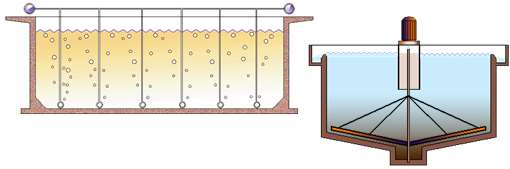
      - **Hình này chứng minh điều gì**
        - Dây chuyền bùn hoạt tính hiếu khí tạo ra dòng bùn vi sinh dư (WAS) từ đáy bể lắng đợt 2 cần dẫn sang công đoạn cô đặc bùn.
      - **Từ đâu mà thấy được**
        - Bể phản ứng sinh học bên trái trang bị dàn cấp khí sục liên tục nối sang bể lắng thứ cấp bên phải với cơ cấu cánh gạt cặn cơ học.
  - Dòng bùn hoạt tính lắng ở đáy bể lắng đợt 2 chia làm 2 nhánh:
    - Nhánh bùn tuần hoàn (RAS - Return activated sludge) bơm quay trở lại bể sinh học hiếu khí để duy trì nồng độ vi sinh vật.
    - Nhánh bùn hoạt tính dư (WAS - Waste activated sludge) châm hóa chất polymer đưa vào bể cô đặc tuyển nổi (Flotation Thickener).
  - Nước trong tuyển nổi (Flotation effluent) tuần hoàn về bể lắng đợt 1; bùn cô đặc dẫn về bể chứa bùn (Sludge storage) phối trộn cùng bùn sơ cấp đưa vào bể phân hủy kỵ khí (Digester).
  - Nước bề mặt bể phân hủy (Supernatant) tuần hoàn về đầu trạm; bùn phân hủy kỵ khí dẫn sang công đoạn ép khử nước (to dewatering).
- Dây chuyền công nghệ xử lý bùn tại các trạm xử lý nước thải quy mô vừa và nhỏ ở Việt Nam:
  - Đa số các trạm xử lý nước thải quy mô vừa và nhỏ tại Việt Nam áp dụng quy trình xử lý bùn tinh gọn gồm 2 bậc: cô đặc bùn (thickening) và khử nước (dewatering) trước khi đưa đi tiêu hủy (sludge disposal).
  - Bùn sơ cấp từ bể lắng đợt 1 và bùn hoạt tính dư từ bể lắng đợt 2 được thu gom đưa chung vào bể cô đặc bùn (Sludge Thickener) để nâng cao nồng độ chất rắn, giảm thể tích nước tự do.
    - **Hình 7.** Cấu tạo bể cô đặc bùn trọng lực (Sludge Thickener)
      - 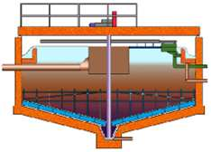
      - **Hình này chứng minh điều gì**
        - Cấu tạo bể cô đặc bùn hình tròn sử dụng cơ cấu gạt đáy thu bùn cô đặc về hố thu tâm và máng tràn thu nước trong hồi lưu.
      - **Từ đâu mà thấy được**
        - Ống nạp bùn trung tâm kết hợp dàn khung khuấy gạt cặn quay quanh trục thẳng đứng và đáy bể nghiêng thu về phễu tháo bùn trung tâm.
  - Bùn sau khi cô đặc được đưa vào buồng trộn (Mixing chamber) để châm định lượng dung dịch polymer hỗ trợ đông tụ - tạo bông.
  - Hỗn hợp bùn đã điều hòa được bơm dẫn trực tiếp vào máy ép bùn (thiết bị ly tâm hoặc máy ép bùn băng tải - Centrifuge or belt filter press) để tạo bánh bùn có độ ẩm thấp phục vụ vận chuyển tiêu hủy (Sludge disposal).
  - Nước sau cô đặc bùn (supernatant) và nước ép tách bùn (centrate / filtrate) được hồi lưu toàn bộ về bể lắng đợt 1 hoặc công trình đầu trạm để xử lý tiếp, ngăn chặn nguy cơ thất thoát chất ô nhiễm ra nguồn tiếp nhận.

#### 4. Quá trình Ổn định và Phân hủy Bùn

##### Mục tiêu và Nguyên lý của Quá trình Ổn định Bùn cặn

- Khái niệm và vị trí công nghệ của quá trình ổn định bùn (Sludge Stabilization):
  - Bùn cặn tươi thu gom từ các bể lắng chứa mật độ cao các hợp chất hữu cơ chưa phân hủy và vi sinh vật gây bệnh (pathogens).
  - Quá trình ổn định là công đoạn xử lý sinh hóa hoặc hóa lý nhằm khoáng hóa các hợp chất hữu cơ dễ phân hủy sinh học, triệt tiêu nguy cơ thối rữa và ngăn ngừa phát tán mùi hôi khó chịu ra môi trường xung quanh.
  - Quá trình ổn định thường được bố trí tiếp sau công đoạn cô đặc bùn (thickening) và đặt trước công đoạn khử nước cơ học (dewatering) nhằm giảm thiểu thể tích công trình và tiết kiệm năng lượng xử lý.
- Ba mục tiêu kỹ thuật cốt lõi của công tác ổn định bùn:
  - Giảm hàm lượng chất rắn bay hơi hữu cơ ($\text{VS}$ - Volatile Solids): Giảm từ $40\%$ đến $60\%$ lượng $\text{VS}$ ban đầu để đưa bùn về trạng thái trơ sinh học.
  - Tiêu diệt vi sinh vật gây bệnh: Bất hoạt và loại trừ các loài vi khuẩn đường ruột (như *Salmonella*, *Escherichia coli*), virus đường tiêu hóa, u nang nguyên sinh động vật và trứng giun sán ký sinh.
  - Loại bỏ hoàn toàn tiềm năng phát sinh mùi hôi thối: Chuyển hóa các hợp chất hữu cơ chứa lưu huỳnh và nitơ dễ bay hơi thành các thể khí thu gom có kiểm soát hoặc các muối khoáng ổn định.
- Đặc tính chất lượng của bùn sau xử lý ổn định (Biosolids):
  - Bùn sinh học ổn định đạt điều kiện an toàn môi trường được gọi là biosolids, thích hợp làm phân bón hữu cơ hoặc chất cải tạo đất nông nghiệp.
  - Thành phần dinh dưỡng đa lượng điển hình của biosolids khô: Nitơ ($\text{N}$) đạt xấp xỉ $3.3\%$, photpho ($\text{P}$) đạt xấp xỉ $2.3\%$, và kali ($\text{K}$) đạt xấp xỉ $0.3\%$.
  - Mặc dù chứa hàm lượng dinh dưỡng giá trị, việc tái sử dụng biosolids đòi hỏi kiểm soát nghiêm ngặt dư lượng kim loại nặng ($\text{Cd}$, $\text{Pb}$, $\text{Cu}$, $\text{Zn}$) và các hợp chất hữu cơ độc hại khó phân hủy.

##### Phân hủy Bùn Kỵ khí (Anaerobic Digestion)

- Bản chất và cơ chế sinh hóa của phân hủy kỵ khí:
  - Là quá trình phân hủy sinh học chất hữu cơ phức tạp trong điều kiện tuyệt đối không có oxy phân tử tự do, sản sinh hỗn hợp khí sinh học ($\text{biogas}$) giàu năng lượng.
  - Quá trình diễn ra liên tục qua chuỗi 4 giai đoạn sinh hóa kế tiếp nhau:
    - Giai đoạn thủy phân (Hydrolysis): Các enzyme ngoại bào do vi khuẩn tiết ra cắt mạch các đại phân tử không hòa tan (protein, carbohydrate, lipid) thành các phân tử monomer hòa tan (amino acid, monosaccharide, acid béo).
    - Giai đoạn acid hóa / lên men (Acidogenesis): Vi khuẩn lên men chuyển hóa các monomer hòa tan thành các acid béo bay hơi mạch ngắn ($\text{VFAs}$ như acid acetic, propionic, butyric), rượu, carbonic ($\text{CO}_2$), hydro ($\text{H}_2$) và amoniac ($\text{NH}_3$).
    - Giai đoạn acetate hóa (Acetogenesis): Vi khuẩn tạo acetate oxy hóa các acid béo mạch dài và rượu thành tiền chất trực tiếp cho sinh methane, bao gồm acetate ($\text{CH}_3\text{COOH}$), $\text{CO}_2$ và $\text{H}_2$.
    - Giai đoạn methane hóa (Methanogenesis): Vi khuẩn cổ kỵ khí nghiêm ngặt (methanogens) chuyển hóa acetate và hydro thành khí methane ($\text{CH}_4$) theo hai phản ứng chủ đạo:
      $$\text{CH}_3\text{COOH} \rightarrow \text{CH}_4 + \text{CO}_2$$
      $$\text{CO}_2 + 4\text{H}_2 \rightarrow \text{CH}_4 + 2\text{H}_2\text{O}$$
- Các thông số công nghệ và điều kiện vận hành tối ưu của bể phân hủy kỵ khí:
  - Chế độ nhiệt độ vận hành:
    - Vùng nhiệt độ ấm (Mesophilic range): Vận hành trong dải $35^\circ\text{C}\text{--}37^\circ\text{C}$ với thời gian lưu bùn ($\text{SRT}$) yêu cầu từ $15\text{--}30\text{ ngày}$. Đây là chế độ phổ biến nhất do tính ổn định sinh học cao và tiết kiệm năng lượng gia nhiệt.
    - Vùng nhiệt độ cao (Thermophilic range): Vận hành trong dải $50^\circ\text{C}\text{--}55^\circ\text{C}$ với thời gian lưu bùn ngắn hơn từ $10\text{--}15\text{ ngày}$. Chế độ này có tốc độ phân hủy nhanh và hiệu quả diệt khuẩn triệt để hơn nhưng tiêu tốn nhiều nhiệt lượng và nhạy cảm với biến động môi trường.
  - Thời gian lưu bùn tối thiểu ($\text{SRT}_{\min}$):
    - Hệ thống bắt buộc duy trì thời gian lưu tế bào bùn tối thiểu $\text{SRT} \ge 15\text{ ngày}$ ở nhiệt độ mesophilic nhằm tránh hiện tượng rửa trôi vi khuẩn sinh methane do tốc độ sinh trưởng cực đại ($\mu_{\max}$) của nhóm vi sinh này rất thấp.
  - Kiểm soát $\text{pH}$ và hệ đệm kiềm:
    - Dải $\text{pH}$ hoạt động tối ưu của vi khuẩn methanogen nằm trong khoảng rất hẹp từ $6.8$ đến $7.4$.
    - Độ kiềm bicarbonate ($\text{Alkalinity}$) cần được duy trì trong ngưỡng $2{,}000\text{--}4{,}000\text{ mg CaCO}_3/\text{L}$ để tạo khả năng đệm mạnh, ngăn ngừa hiện tượng tụt $\text{pH}$ (chua bể) khi nồng độ acid béo bay hơi tích lũy tăng cao.
- Sản lượng và đặc tính thu hồi khí sinh học ($\text{Biogas}$):
  - Thành phần khí sinh học tạo thành gồm $60\%\text{--}70\%\text{ CH}_4$, $30\%\text{--}35\%\text{ CO}_2$, cùng một lượng nhỏ hơi nước, $\text{N}_2$ và $\text{H}_2\text{S}$ ($0.1\%\text{--}1.0\%$).
  - Nhiệt trị trung bình của biogas dao động từ $20{,}000\text{--}25{,}000\text{ kJ/m}^3$ ($500\text{--}600\text{ BTU/ft}^3$), được tận dụng làm nhiên liệu cho máy phát điện đồng phát nhiệt - điện ($\text{CHP}$) hoặc cấp nhiệt trực tiếp cho nồi hơi sấy bùn.
  - Suất sinh khí sinh học thực tế đạt từ $0.8\text{--}1.1\text{ m}^3\text{ biogas/kg VS bị phá hủy}$.
- Hiệu ứng đệm tải trọng và đặc tính cảm quan của bùn kỵ khí sau phân hủy:
  - Dung tích lưu trữ lớn của bể digester tạo ra hiệu ứng đệm giảm dao động (dampening effect) rất lớn đối với các đợt tăng tải đột ngột của bùn nạp; công trình được thiết kế dựa trên tải trọng bùn tính theo tháng cực đại (maximum monthly load).
  - Tỷ lệ phá hủy chất hữu cơ bay hơi điển hình đạt tới $60\%$ lượng $\text{VS}$ ban đầu; nồng độ chất rắn khô sau phân hủy và ép tách nước sơ bộ có thể đạt mức $\text{TS} = 20\%$.
  - Bùn sau phân hủy kỵ khí triệt để có màu nâu sẫm đến đen tuyền, cấu trúc xốp chứa nhiều bọt khí li ti, mùi hôi thối ban đầu biến mất và thay thế bằng mùi nhựa đường nóng hoặc sáp niêm phong rất nhẹ.
- Cấu tạo công trình bể phân hủy kỵ khí hoàn toàn:
  - **Hình 10.** Cấu tạo bể phân hủy bùn kỵ khí hoàn toàn có cánh khuấy (Complete-Mix Anaerobic Digester)
    - 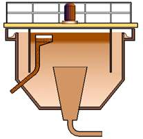
    - **Hình này chứng minh điều gì**
      - Bể phân hủy kỵ khí được thiết kế dạng bể trụ kín có cánh khuấy cơ học trục đứng và đáy phễu côn để xả bùn đã ổn định.
    - **Từ đâu mà thấy được**
      - Sơ đồ cấu tạo Digester trên trang 11.
      - Cụm động cơ điện phía trên nắp bể truyền động cho trục khuấy trung tâm đảm bảo xáo trộn đều toàn bộ thể tích bùn.
      - Đáy phễu côn dốc thu gom bùn đã phân hủy kỵ khí triệt để dẫn sang công đoạn xử lý tiếp theo.

##### Phân hủy Bùn Hiếu khí (Aerobic Digestion)

- Bản chất và cơ chế sinh hóa của phân hủy hiếu khí:
  - Là quá trình làm thoáng sục khí cưỡng bức liên tục hỗn hợp bùn sinh học trong bể phản ứng hở không bổ sung cơ chất ngoại bào mới.
  - Khi nguồn dinh dưỡng hữu cơ cạn kiệt, các vi sinh vật dị dưỡng chuyển sang quá trình tự oxy hóa sinh khối nội bào (hô hấp nội bào - endogenous respiration) theo phản ứng tổng quát:
    $$\text{C}_5\text{H}_7\text{NO}_2 + 5\text{O}_2 \rightarrow 5\text{CO}_2 + 2\text{H}_2\text{O} + \text{NH}_3 + \text{Năng lượng}$$
  - Lượng amoniac giải phóng tiếp tục bị vi khuẩn tự dưỡng nitrat hóa oxy hóa hoàn toàn thành nitrat trong điều kiện dư oxy:
    $$\text{NH}_3 + 2\text{O}_2 \rightarrow \text{NO}_3^- + \text{H}_2\text{O} + \text{H}^+$$
- Phạm vi ứng dụng công nghệ và đối tượng xử lý phù hợp:
  - Phổ biến tại các nhà máy xử lý nước thải quy mô vừa và nhỏ (công suất dưới $20{,}000\text{ m}^3/\text{ngày}$).
  - Đặc biệt tối ưu khi áp dụng để ổn định bùn hoạt tính dư ($\text{WAS}$) từ các quy trình sinh học hiếu khí sục khí kéo dài (extended aeration) do bùn này đã trải qua một phần quá trình oxy hóa nội bào trong bể sinh học.
- Các thông số công nghệ thiết kế và vận hành hệ thống phân hủy hiếu khí:
  - Thời gian lưu tế bào bùn ($\text{SRT}$): Dao động từ $15\text{--}20\text{ ngày}$ ở nhiệt độ nước thải $20^\circ\text{C}$; khi nhiệt độ nước thải giảm xuống $10^\circ\text{C}$ vào mùa đông, thời gian lưu phải nâng lên từ $40\text{--}60\text{ ngày}$ để đạt cùng mức độ ổn định.
  - Nồng độ oxy hòa tan duy trì ($\text{DO}$): Luôn duy trì nồng độ $\text{DO} \ge 1.0\text{--}2.0\text{ mg/L}$ trên toàn bộ thể tích bể để đảm bảo điều kiện hiếu khí triệt để.
  - Nhu cầu tiêu thụ oxy thực tế: Cần cung cấp từ $1.6\text{--}2.0\text{ kg O}_2/\text{kg VSS bị phá hủy}$.
  - Hiệu quả giảm chất hữu cơ: Tỷ lệ chất rắn bay hơi bị oxy hóa phá hủy đạt từ $35\%$ đến $50\%\text{ VS}$.
- Đặc tính cảm quan và khả năng tách nước của bùn hiếu khí:
  - Bùn sau phân hủy hiếu khí có màu nâu đến nâu sẫm, cấu trúc bông vi sinh liên kết chặt, mùi không gây khó chịu mà mang mùi ẩm mốc hoặc mùi đất ẩm tự nhiên (musty / earthy odor).
  - Bùn hiếu khí có khả năng thoát nước tự nhiên rất tốt trên các sân phơi bùn cát (drying beds) mà không phát tán mùi hôi thu hút ruồi muỗi.
- So sánh ưu điểm và nhược điểm kỹ thuật giữa phân hủy hiếu khí và kỵ khí:
  - Ưu điểm: Vốn đầu tư xây dựng ban đầu thấp hơn; quy trình vận hành đơn giản, không đòi hỏi kín khí nghiêm ngặt; ít bị ức chế bởi các hóa chất độc hại; nước tách bùn có nồng độ chất hữu cơ ($\text{BOD}$) và amoniac thấp hơn nhiều so với nước tách bùn kỵ khí.
  - Nhược điểm: Tiêu tốn chi phí điện năng rất lớn cho máy thổi khí sục khí liên tục; không thu hồi được khí sinh học để tái tạo năng lượng; hiệu quả phân hủy phụ thuộc lớn vào nhiệt độ thời tiết ngoài trời.
- Mối liên kết giữa bể sinh học hiếu khí, bể lắng và dòng bùn phân hủy:
  - **Hình 9.** Cụm công trình sinh học hiếu khí và bể lắng thứ cấp (Aeration Bioreactor and Secondary Clarifier)
    - 
    - **Hình này chứng minh điều gì**
      - Hệ thống bùn hoạt tính hiếu khí duy trì phân tán oxy cưỡng bức trước khi lắng tách sinh khối tại bể lắng đợt 2.
    - **Từ đâu mà thấy được**
      - Sơ đồ cụm xử lý sinh học hiếu khí trên trang 11.
      - Bể sục khí bio reactor trang bị dàn ống phân phối bọt khí đáy cấp oxy liên tục cho sinh khối.
      - Bể lắng thứ cấp trang bị hệ thống thanh gạt đáy thu gom bùn hoạt tính lắng cặn để cung cấp cho các công đoạn ổn định bùn.

##### Ổn định Bùn bằng Kiềm hóa và Vôi tôi (Lime Stabilization)

- Nguyên lý hóa lý và cơ chế diệt khuẩn bằng kiềm hóa:
  - Bổ sung hóa chất mang tính kiềm mạnh vào bùn tươi, thông dụng nhất là vôi sống dạng bột ($\text{CaO}$) hoặc vôi tôi dạng sữa ($\text{Ca(OH)}_2$).
  - Cơ chế nâng cao $\text{pH}$ tức thời:
    - Liều lượng châm vôi được tính toán để nâng chỉ số $\text{pH}$ của hỗn hợp bùn lên $\text{pH} \ge 12.0$ và duy trì liên tục giá trị này trong thời gian tối thiểu $2\text{ giờ}$.
    - Môi trường kiềm mạnh làm biến tính protein, xà phòng hóa màng lipid tế bào, từ đó tiêu diệt hầu như toàn bộ vi khuẩn gây bệnh, virus và ngăn chặn triệt để sự phát triển của vi sinh vật hoại sinh.
    - Phản ứng ngừng trệ hoàn toàn sự phân hủy sinh học của các chất hữu cơ, loại trừ quá trình sinh mùi hôi trong suốt thời gian duy trì kiềm dư.
- Công nghệ vôi hóa nhiệt nâng cao (Advanced Lime Stabilization):
  - Khi sử dụng vôi sống ($\text{CaO}$), phản ứng thủy hóa tỏa ra một lượng nhiệt lớn theo phản ứng tỏa nhiệt:
    $$\text{CaO} + \text{H}_2\text{O} \rightarrow \text{Ca(OH)}_2 \quad (\Delta H = -64.8\text{ kJ/mol})$$
  - Lượng nhiệt giải phóng làm nhiệt độ khối bùn tăng lên mức $55^\circ\text{C}\text{--}70^\circ\text{C}$.
  - Sự kết hợp đồng thời giữa nhiệt độ cao và độ kiềm mạnh ($\text{pH} > 12$) giúp thanh trùng triệt để các loại mầm bệnh khó tiêu diệt nhất như trứng giun đũa (*Ascaris* ova), đạt tiêu chuẩn vi sinh Class A của biosolids.
- Liều lượng châm vôi kỹ thuật cho các loại bùn khác nhau:
  - Bùn cơ học sơ cấp (Primary sludge): Yêu cầu liều lượng từ $0.06\text{--}0.17\text{ kg Ca(OH)}_2/\text{kg TS}$.
  - Bùn hoạt tính dư ($\text{WAS}$): Yêu cầu liều lượng cao hơn từ $0.10\text{--}0.30\text{ kg Ca(OH)}_2/\text{kg TS}$ do sinh khối vi sinh có khả năng đệm hóa học tự nhiên lớn hơn.
  - Bùn đã qua phân hủy kỵ khí hoặc bùn kết hợp: Tiêu thụ liều lượng trung bình từ $0.15\text{--}0.25\text{ kg Ca(OH)}_2/\text{kg TS}$.
- Đánh giá ưu điểm và hạn chế của phương pháp ổn định bằng vôi:
  - Ưu điểm nổi bật:
    - Chi phí đầu tư thiết bị cơ sở ban đầu rất thấp, chỉ bao gồm phễu chứa vôi, máy cấp định lượng trục vít và bể khuấy trộn phản ứng nhanh.
    - Thời gian phản ứng đạt hiệu quả tức thời, phù hợp làm giải pháp ứng cứu khẩn cấp khi hệ thống phân hủy sinh học gặp sự cố hoặc áp dụng cho các trạm xử lý quy mô nhỏ.
    - Cải thiện đáng kể độ bền cấu trúc của bánh bùn và tính năng khử nước cơ học.
  - Hạn chế và nhược điểm:
    - Không làm giảm khối lượng chất rắn hữu cơ trong bùn; ngược lại, việc bổ sung lượng lớn vôi làm tăng khối lượng chất rắn khô tổng số ($\text{TS}$) thêm từ $20\%$ đến $35\%$, dẫn đến tăng tải trọng vận chuyển và chi phí tiêu hủy cuối cùng.
    - Khí amoniac ($\text{NH}_3$) bị giải phóng ồ ạt trong môi trường kiềm cao ($\text{pH} > 11$), tạo mùi khai nồng nặc đòi hỏi phải lắp đặt chụp hút khí và tháp hấp thụ khử mùi chuyên dụng.
    - Hiện tượng tái phân hủy và phát sinh mùi hôi trở lại có thể xuất hiện nếu bùn tiếp xúc lâu với khí quyển và hấp thụ carbonic ($\text{CO}_2$), làm giảm $\text{pH}$ xuống dưới ngưỡng an toàn $\text{pH} < 10.5$.

##### Quá trình Ủ phân Compost Bùn cặn (Sludge Composting)

- Bản chất sinh học của quá trình ủ compost:
  - Là quá trình phân hủy sinh học hiếu khí nhiệt cao (thermophilic aerobic decomposition) có kiểm soát các hợp chất hữu cơ trong bùn cặn dưới tác động của quần thể vi sinh vật tự nhiên bao gồm vi khuẩn, xạ khuẩn (actinomycetes) và nấm.
  - Sản phẩm đầu ra là phân compost hữu cơ sinh học có hàm lượng mùn cao, tơi xốp, màu nâu sẫm, hoàn toàn sạch mầm bệnh và hạt cỏ dại, an toàn tuyệt đối cho cây trồng.
- Ba giai đoạn diễn thế vi sinh vật và nhiệt độ trong khối ủ compost:
  - Giai đoạn ấm ban đầu (Mesophilic phase: $25^\circ\text{C}\text{--}40^\circ\text{C}$):
    - Quần thể vi khuẩn ưa ấm phát triển bùng nổ, nhanh chóng phân giải các hợp chất hữu cơ hòa tan dễ hấp thụ như đường đơn, acid amin và tinh bột.
    - Quá trình chuyển hóa tỏa nhiệt nội sinh làm nhiệt độ khối ủ tăng nhanh chóng qua từng ngày.
  - Giai đoạn nhiệt độ cao (Thermophilic phase: $50^\circ\text{C}\text{--}65^\circ\text{C}$):
    - Các vi khuẩn và xạ khuẩn ưa nhiệt thay thế chiếm ưu thế sinh khối, tiếp tục phân giải các hợp chất cao phân tử khó tiêu hơn như cellulose, hemicellulose, protein phức và lipid.
    - Mức nhiệt độ cao được duy trì là nhân tố then chốt giúp tiệt trùng triệt để vi sinh vật gây bệnh đường ruột, ấu trùng và các hạt cỏ dại có trong bùn.
  - Giai đoạn làm nguội và trưởng thành (Cooling & Curing phase: $<40^\circ\text{C}$):
    - Nguồn chất hữu cơ dễ phân hủy cạn kiệt, hoạt tính vi sinh giảm dần làm nhiệt độ hạ về mức cân bằng môi trường.
    - Quá trình tổng hợp các acid humic và acid fulvic diễn ra chậm, tạo cấu trúc mùn ổn định hoàn toàn và triệt tiêu tính phytotoxic (độc tính ức chế nảy mầm đối với cây trồng).
- Các điều kiện môi trường kỹ thuật bắt buộc phải kiểm soát:
  - Tỷ lệ Cacbon trên Nitơ ($\text{C/N}$ ratio):
    - Tỷ lệ $\text{C/N}$ tối ưu cho quá trình ủ hiếu khí dao động từ $25:1$ đến $30:1$.
    - Bùn thải sinh học thường có hàm lượng nitơ cao nên tỷ lệ $\text{C/N}$ rất thấp (thường chỉ đạt $10:1\text{--}15:1$); do đó, bắt buộc phải phối trộn thêm các chất độn (bulking agents) giàu cacbon như mùn cưa, dăm gỗ mục, trấu, rơm rạ hoặc phoi bào.
  - Độ ẩm khối ủ ($P_w$):
    - Độ ẩm hỗn hợp nạp ban đầu cần duy trì trong khoảng nghiêm ngặt từ $50\%$ đến $60\%$.
    - Nếu độ ẩm vượt quá $65\%$, nước tự do sẽ bịt kín các khoảng rỗng không khí giữa các hạt vật liệu, gây ra tình trạng yếm khí cục bộ và sinh mùi hôi thối.
    - Nếu độ ẩm tụt xuống dưới $40\%$, tốc độ trao đổi chất của vi sinh vật bị ức chế nghiêm trọng, làm chậm tiến trình phân hủy.
  - Tiêu chuẩn thời gian duy trì nhiệt độ diệt mầm bệnh:
    - Bắt buộc duy trì nhiệt độ khối ủ đạt mức tối thiểu $\ge 55^\circ\text{C}$ liên tục trong ít nhất 3 ngày (đối với hệ thống đống ủ thổi khí cưỡng bức hoặc thùng ủ kín) hoặc liên tục trong ít nhất 15 ngày với tối thiểu 5 lần đảo trộn (đối với phương pháp ủ luống đảo trộn).
- Ba công nghệ ủ compost bùn cặn phổ biến trong thực tế công nghiệp:
  - Phương pháp ủ luống dài đảo trộn định kỳ (Windrow composting): Hỗn hợp bùn và chất độn được chất thành các luống dài hình tam giác cao $1.5\text{--}2.5\text{ m}$; cung cấp oxy bằng máy đảo luống cơ giới định kỳ $2\text{--}5\text{ ngày/lần}$; thời gian ủ kéo dài từ $30\text{--}60\text{ ngày}$.
  - Phương pháp ủ đống tĩnh thổi khí cưỡng bức (Aerated Static Pile): Hỗn hợp ủ được chất đống trên hệ thống đường ống đục lỗ ngầm dưới nền; máy thổi khí cấp hoặc hút khí cưỡng bức theo chu kỳ thời gian và nhiệt độ tự động; không cần đảo trộn cơ học; thời gian ủ từ $21\text{--}30\text{ ngày}$.
  - Phương pháp ủ trong thiết bị kín / mô-đun phản ứng (In-Vessel Composting): Quá trình ủ diễn ra trong các lò quay (rotary drum), hầm ủ bê tông kín có điều khiển vi khí hậu tự động (nhiệt độ, lưu lượng khí, độ ẩm, nồng độ oxy); tốc độ phân hủy cực nhanh ($10\text{--}14\text{ ngày}$), kiểm soát $100\%$ khí thải và mùi hôi nhưng đòi hỏi mức đầu tư cơ điện rất lớn.

##### Đánh giá So sánh và Tích hợp Dây chuyền Xử lý Bùn

- Bảng tổng hợp đối chiếu 4 công nghệ ổn định bùn cặn:
  - Phân hủy kỵ khí: Mức độ giảm $\text{VS}$ cao ($50\%\text{--}60\%$), thu hồi năng lượng khí methane giá trị cao, chi phí đầu tư cao, vận hành yêu cầu kỹ thuật chuyên môn cao.
  - Phân hủy hiếu khí: Mức độ giảm $\text{VS}$ trung bình ($35\%\text{--}50\%$), tiêu tốn điện năng sục khí lớn, chi phí đầu tư ban đầu thấp, vận hành linh hoạt và đơn giản.
  - Ổn định bằng kiềm vôi: Không giảm chất hữu cơ mà làm tăng thêm khối lượng chất rắn ($+20\%\text{--}35\%$), phát sinh mùi $\text{NH}_3$, chi phí đầu tư rất thấp, tác dụng diệt khuẩn tức thì.
  - Ủ phân compost: Khoáng hóa và mùn hóa triệt để, biến bùn thành sản phẩm phân bón thương phẩm có giá trị kinh tế, đòi hỏi diện tích mặt bằng lớn và nguồn chất độn dồi dào.
- Mối liên hệ chặt chẽ giữa công đoạn cô đặc bùn và hiệu quả ổn định:
  - Nồng độ chất rắn khô sau cô đặc quyết định trực tiếp đến dung tích bể phân hủy và lượng nhiệt cần cung cấp để duy trì nhiệt độ vận hành:
    - Khi cô đặc bùn nâng nồng độ chất rắn từ $1\%$ lên $5\%$, thể tích bùn nạp giảm đi $5$ lần, giúp giảm $80\%$ lượng nhiệt tổn thất theo dòng bùn ra khỏi bể phân hủy.
  - Đánh giá khả năng đáp ứng nồng độ và nguy cơ phát sinh mùi của các phương pháp cô đặc bùn trước công đoạn ổn định:
    - **Hình 11.** Đánh giá hiệu quả và tần suất áp dụng các phương pháp cô đặc bùn (Thickening Methods Evaluation)
      - 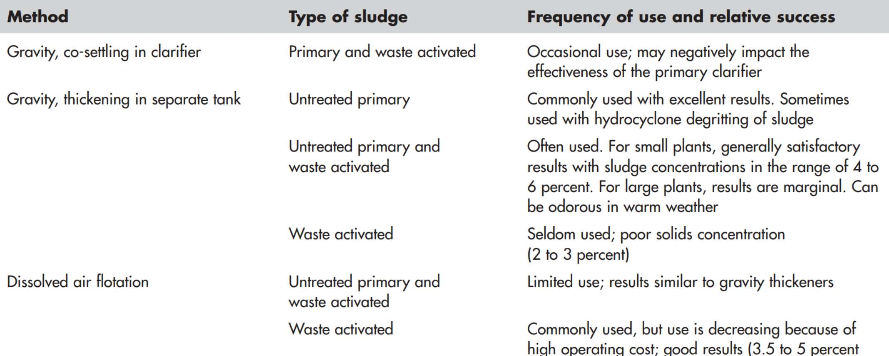
      - **Hình này chứng minh điều gì**
        - Nồng độ bùn sau cô đặc quyết định tải lượng hữu cơ và hiệu quả vận hành của công đoạn phân hủy sinh học.
      - **Từ đâu mà thấy được**
        - Bảng tổng kết phương pháp cô đặc bùn trên trang 13.
        - Bùn hỗn hợp cô đặc trọng lực đạt nồng độ chất rắn $4\%\text{--}6\%$, trong khi bùn $\text{WAS}$ chỉ đạt $2\%\text{--}3\%$.
        - Phương pháp tuyển nổi khí hòa tan ($\text{DAF}$) nâng nồng độ bùn $\text{WAS}$ lên $3.5\%\text{--}5\%$.
- Kiểm soát dòng nước tách bùn hồi lưu (Supernatant & Filtrate Recycle):
  - Dòng nước sau tách bùn từ bể digester kỵ khí, bể nén bùn và máy ép bùn chứa nồng độ chất hữu cơ hòa tan, amoniac ($\text{NH}_4^+$) và photphat ($\text{PO}_4^{3-}$) cực kỳ cao.
  - Nước tách bùn nếu tuần hoàn trực tiếp về đầu trạm xử lý nước thải mà không kiểm soát lưu lượng có thể gây sốc tải lượng dinh dưỡng (chiếm tới $15\%\text{--}25\%$ tổng tải lượng nitơ của toàn trạm), làm quá tải cụm xử lý sinh học.
  - Khuyến cáo công nghệ: Cần bố trí bể điều hòa nước tách bùn hoặc áp dụng quy trình xử lý dòng bên chuyên biệt (side-stream treatment) như công nghệ khử nitơ Anammox hoặc kết tủa thu hồi photpho dạng tinh thể struvite ($\text{MgNH}_4\text{PO}_4\cdot 6\text{H}_2\text{O}$) trước khi hoàn lưu về dây chuyền chính.

#### 5. Khử nước Bùn và Bài tập Thiết kế Bể nén bùn (Sludge Dewatering & Gravity Thickener Design)

- Khử nước bùn (sludge dewatering) và cô đặc bùn trọng lực (gravity thickening) là các công đoạn then chốt trong chuỗi xử lý bùn thải của trạm xử lý nước thải (WWTP).
  - Quá trình cô đặc bùn (thickening) loại bỏ một phần nước tự do để nâng cao nồng độ chất rắn khô, giảm thể tích bùn nạp vào các công trình kế tiếp từ $4$ đến $8$ lần.
  - Quá trình khử nước bùn (dewatering) tách lượng nước liên kết mao dẫn và bề mặt, chuyển bùn từ trạng thái lỏng sệt sang bánh bùn xốp khô (sludge cake) phục vụ vận chuyển và xử lý tiêu hủy.

##### 5.1 Quá trình nén bùn trọng lực và lắng kết hợp (Gravity Thickening & Co-settling)

- Phương pháp lắng kết hợp (co-settling) trong bể lắng đợt 1 (primary clarifiers):
  - Bể lắng đợt 1 thường được tận dụng để cô đặc bùn xả ra từ các công trình phía sau như bùn hoạt tính dư (WAS - waste activated sludge) từ bể lắng đợt 2.
  - Thời gian lưu bùn ($\text{SRT}$ - sludge retention time) khuyến nghị tại đáy bể lắng đợt 1: từ $12$ đến $24\text{ giờ}$ hoặc lâu hơn để đạt nồng độ bùn nén chấp nhận được ($3\% - 5\%$ chất rắn khô).
  - Khống chế thời gian lưu bùn tối đa: $\text{SRT}$ không được kéo dài quá mức để ngăn chặn hiện tượng phân hủy yếm khí sinh khí metan ($\text{CH}_4$) và hydro sunfua ($\text{H}_2\text{S}$) gây mùi hôi và làm bùn nổi trở lại.
  - Điều kiện bùn tuần hoàn nạp vào: Bùn xả từ các công trình xử lý phía sau hồi lưu về bể lắng đợt 1 phải là bùn loãng với hàm lượng chất rắn dưới $1\%$ ($< 1\%\text{ solids}$).
  - Sử dụng hóa chất trợ lắng: Các hóa chất keo tụ như chất keo tụ polymer hoặc sắt(III) clorua ($\text{FeCl}_3$) có thể được châm bổ sung để tăng cường tốc độ lắng và độ đặc của bông bùn.
- Nguyên lý và cấu tạo của bể cô đặc bùn trọng lực (gravity thickening in separate tanks):
  - Quá trình cô đặc được thực hiện trong bể xây dựng riêng biệt, có cấu tạo hình học và thủy lực tương tự bể lắng thông thường (thường là bể tròn có đáy côn).
  - Phương pháp cô đặc trọng lực là giải pháp đơn giản nhất, chi phí đầu tư thấp và được ứng dụng phổ biến nhất trong các trạm xử lý nước thải sinh hoạt.
  - Bùn sau khi cô đặc đạt nồng độ yêu cầu được bơm trực tiếp sang bể phân hủy kỵ khí (digester) hoặc chuyển sang các thiết bị khử nước cơ học (dewatering units).
  - Cơ chế tạo lớp đệm bùn nén (sludge blanket): Duy trì liên tục một lớp đệm bùn dày từ $0.5\text{ m}$ đến $2.5\text{ m}$ ($0.5 - 2.5\text{ m}$) ở đáy bể để tạo áp lực nén tĩnh học hỗ trợ quá trình ép nước và liên kết các hạt cặn.
    - **Hình 13.** Cấu tạo mặt bằng và mặt cắt đứng của bể cô đặc bùn trọng lực
      - 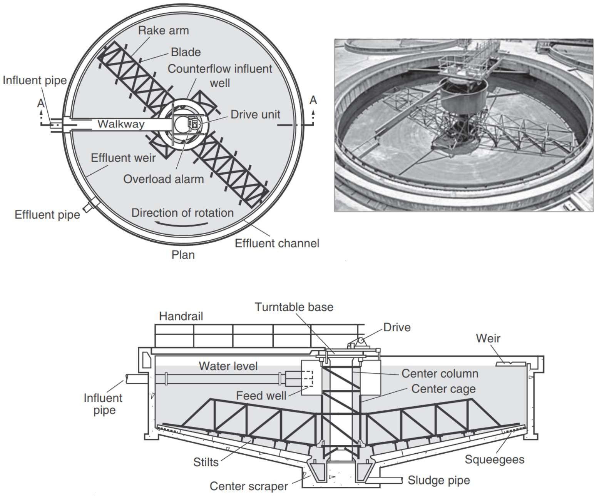
      - **Hình này chứng minh điều gì**
        - Bể tròn trang bị giàn cào xoay, cọc thẳng đứng trợ nén và máng răng cưa thu nước trong chu vi.
      - **Từ đâu mà thấy được**
        - Sơ đồ mặt bằng và mặt cắt hiển thị bộ truyền động tâm, ống nạp tâm, cánh gạt đáy và đập tràn.
  - Cấu tạo cơ khí chuyên dụng của bể cô đặc trọng lực (nhìn vào Hình 13):
    - Cụm nạp tâm (counterflow influent well / feed well): Dòng bùn nạp vào qua ống thép dẫn hướng vào giếng tâm phân phối đối lưu, dập tắt động năng dòng chảy.
    - Giàn cào bùn đáy (rake arm with squeegees): Cánh cào xoay chậm (tốc độ biên $0.02 - 0.05\text{ m/s}$) gắn các tấm gạt cao su thu gom bùn nén về hố thu trung tâm (center scraper / sludge hopper).
    - Cọc khuấy thẳng đứng (stilts / vertical picket pins): Gắn trên cánh cào chuyển động chậm tạo rãnh thoát mao dẫn cho nước tự do và bọt khí thoát ngược lên mặt nước.
    - Cụm xả nước trong: Máng tràn chu vi (effluent weir & channel) thu gom nước sau cô đặc (supernatant) đưa về đầu trạm xử lý nước thải.
- Các thông số kỹ thuật và tiêu chuẩn tải trọng thiết kế bể cô đặc trọng lực:
  - Tải trọng thủy lực bề mặt / Tốc độ tràn bề mặt ($\text{HLR}$ - hydraulic loading rate / overflow rate):
    - Áp dụng cho bùn sơ cấp (primary sludge): Từ $15$ đến $30\text{ m}^3/(\text{m}^2\cdot\text{d})$.
    - Áp dụng cho bùn hoạt tính dư (waste activated sludge): Từ $4$ đến $8\text{ m}^3/(\text{m}^2\cdot\text{d})$.
    - Áp dụng cho hỗn hợp bùn sơ cấp và bùn hoạt tính dư (combined primary and WAS): Từ $6$ đến $12\text{ m}^3/(\text{m}^2\cdot\text{d})$.
  - Tác động tiêu cực khi sai lệch tải trọng thủy lực:
    - Tải trọng thủy lực quá cao ($\text{HLR}$ vượt ngưỡng): Giảm hiệu suất thu hồi chất rắn khô, dòng nước dâng kéo theo các hạt bông bùn mịn trôi qua máng tràn.
    - Tải trọng thủy lực quá thấp ($\text{HLR}$ dưới ngưỡng): Kéo dài thời gian lưu nước, gây phân hủy yếm khí sinh khí độc, phát sinh mùi hôi thối và hiện tượng bùn nổi mảng lớn.
  - Tải trọng chất rắn bề mặt ($\text{SLR}$ - solids loading rate, đơn vị $\text{kg}/(\text{m}^2\cdot\text{d})$) và nồng độ chất rắn khô:
    - Bùn sơ cấp: $\text{SLR} = 100 - 150\text{ kg}/(\text{m}^2\cdot\text{d})$; nồng độ trước nén $1\% - 6\%$, nồng độ sau nén đạt $3\% - 10\%$.
    - Bùn hoạt tính dư (WAS): $\text{SLR} = 20 - 40\text{ kg}/(\text{m}^2\cdot\text{d})$; nồng độ trước nén $0.5\% - 1.5\%$, nồng độ sau nén đạt $2\% - 3\%$.
    - Hỗn hợp bùn sơ cấp và WAS (dải nồng độ thấp): $\text{SLR} = 25 - 70\text{ kg}/(\text{m}^2\cdot\text{d})$; trước nén $0.5\% - 1.5\%$, sau nén đạt $2\% - 6\%$.
    - Hỗn hợp bùn sơ cấp và WAS (dải nồng độ cao): $\text{SLR} = 40 - 80\text{ kg}/(\text{m}^2\cdot\text{d})$; trước nén $2.5\% - 4.0\%$, sau nén đạt $4\% - 7\%$.

##### 5.2 Các công nghệ và thiết bị cơ học khử nước bùn (Sludge Dewatering Technologies & Equipment)

- Tổng quan các phương pháp cơ học trong xử lý và cô đặc nâng cao:
  - Các hệ thống cô đặc cơ học áp dụng cho bùn khó lắng như bùn hoạt tính dư (WAS) giúp tăng độ nén và giảm dung tích công trình.
    - **Hình 12.** Bảng so sánh các phương pháp cô đặc cơ học đối với bùn hoạt tính dư
      - 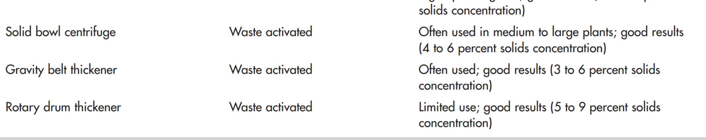
      - **Hình này chứng minh điều gì**
        - Ly tâm solid bowl, băng tải trọng lực và trống quay cô đặc WAS đạt nồng độ 3% đến 9%.
      - **Từ đâu mà thấy được**
        - Bảng liệt kê phương pháp ly tâm, băng tải, trống quay với cột kết quả từ 3% đến 9% nồng độ chất rắn.
  - Máy ly tâm lắng kiểu tang quay kín (solid bowl centrifuge): Ứng dụng phổ biến tại các trạm quy mô vừa và lớn; hiệu quả nén tốt, nồng độ bùn đạt $4\% - 6\%$ chất rắn khô.
  - Băng tải cô đặc trọng lực (gravity belt thickener): Sử dụng phổ biến với chi phí vận hành hợp lý; hiệu quả tốt, nồng độ bùn đạt $3\% - 6\%$ chất rắn khô.
  - Trống quay cô đặc (rotary drum thickener): Phạm vi ứng dụng hạn chế hơn; hiệu quả tốt, nồng độ bùn sau cô đặc đạt $5\% - 9\%$ chất rắn khô.
- Máy ép lọc băng tải (Belt Filter Press - BFP):
  - Nguyên lý hoạt động cơ học: Bùn sau khi hòa trộn với dung dịch polymer (flocculation / conditioning) được đưa vào băng tải lọc chuyển động liên tục qua 3 vùng áp lực tăng dần:
    - Vùng thoát nước trọng lực (gravity drainage zone): Bùn trải đều trên mặt băng tải trên, nước tự do tự chảy qua các mắt lưới băng vải để hình thành khối bùn đặc ban đầu.
    - Vùng nén sơ bộ áp lực thấp (low-pressure wedge zone): Hai mặt băng tải hội tụ kẹp khối bùn lại, ép nhẹ để loại bỏ bọt khí và nước mao dẫn tự do.
    - Vùng ép trượt áp lực cao (high-pressure shear zone): Băng tải đi qua hệ thống các trục lăn uốn lượn có đường kính giảm dần, tạo lực nén ép và lực cắt bề mặt làm rách màng nước, thoát nước tối đa.
  - Đặc tính kỹ thuật và chỉ tiêu hiệu quả:
    - Hàm lượng chất rắn khô trong bánh bùn (cake solids): Thường đạt từ $18\%$ đến $25\%$ đối với bùn hoạt tính dư, và từ $22\%$ đến $30\%$ đối với hỗn hợp bùn sơ cấp và bùn sinh học.
    - Hiệu suất thu hồi chất rắn khô (solids capture efficiency): Đạt từ $90\%$ đến $95\%$ khi sử dụng đúng liều lượng polymer ($2 - 8\text{ g polymer/kg TS}$).
  - Ưu điểm và nhược điểm công nghệ:
    - Ưu điểm: Tiêu thụ điện năng thấp hơn nhiều so với máy ly tâm ($0.03 - 0.06\text{ kWh/kg TS}$), vận hành êm ái, bảo dưỡng trực quan và dễ sửa chữa.
    - Nhược điểm: Thiết bị hở dễ phát tán mùi hôi và hơi ẩm ra môi trường nhà xưởng (cần hệ thống hút mùi kín); tiêu tốn lưu lượng nước rửa áp lực cao để làm sạch mắt lưới băng tải ($1 - 3\text{ m}^3\text{ nước/m}^3\text{ bùn}$).
- Máy ép bùn ly tâm trục ngang (Decanter / Solid Bowl Centrifuge):
  - Nguyên lý hoạt động và lực tách pha:
    - Thiết bị bao gồm một tang quay hình trụ - nón (solid bowl) quay quanh trục ngang với tốc độ cực cao từ $2000$ đến $4000\text{ vòng/phút}$, tạo ra trường lực ly tâm lớn gấp $1500$ đến $3000\text{ lần}$ gia tốc trọng trường ($1500 - 3000\times g$).
    - Bùn nạp vào qua ống dẫn tâm và văng ra ngoài thành tang; các hạt cặn rắn có tỷ trọng lớn bị ép chặt lên thành tang quay.
    - Trục vít xoắn (scroll conveyor) quay đồng trục nhưng có độ chênh lệch tốc độ nhẹ ($\Delta \omega = 1 - 20\text{ vòng/phút}$) liên tục gạt bã cặn về phía đầu hình nón (beach) để ép khô và xả ra phễu chứa bánh bùn.
    - Phần nước trong (centrate) chảy tràn qua các đập tràn điều chỉnh ở đầu đối diện của tang quay và được dẫn hồi lưu về đầu trạm xử lý.
  - Đặc tính kỹ thuật và chỉ tiêu hiệu quả:
    - Hàm lượng chất rắn khô trong bánh bùn sau ly tâm: Đạt từ $20\%$ đến $35\%$ (cao hơn máy ép băng tải từ $3\% - 8\%$), giảm tối đa thể tích khối bùn cần vận chuyển.
    - Hiệu suất thu hồi chất rắn: Rất cao, thường đạt từ $95\%$ đến trên $98\%$.
  - Ưu điểm và nhược điểm công nghệ:
    - Ưu điểm: Hệ thống hoàn toàn kín giúp ngăn chặn triệt để mùi hôi, hơi độc và khí dung phát tán; chiếm diện tích lắp đặt nhỏ nhất trong các thiết bị khử nước cơ học; không yêu cầu nước rửa liên tục trong chu kỳ hoạt động.
    - Nhược điểm: Chi phí đầu tư thiết bị ban đầu rất cao; điện năng tiêu thụ lớn ($0.08 - 0.15\text{ kWh/kg TS}$); độ ồn và độ rung cơ khí cao; đòi hỏi thợ kỹ thuật vận hành có tay nghề cao và bộ phận trục vít dễ bị mài mòn nếu bùn còn sót hạt cát.
- Sân phơi bùn tự nhiên (Sludge Drying Beds):
  - Nguyên lý hoạt động và phân tầng kết cấu:
    - Sân phơi bùn là giải pháp làm khô bùn tự nhiên dựa trên tác động kết hợp của hiện tượng thoát nước trọng lực qua tầng lọc và hiện tượng bốc hơi nước dưới ánh nắng mặt trời.
    - Cấu tạo tầng lọc từ trên xuống dưới gồm: Lớp cát thạch anh dày $0.15 - 0.30\text{ m}$ (kích thước hạt hiệu dụng $0.3 - 0.75\text{ mm}$, hệ số đồng nhất $< 4.0$), phía dưới là lớp sỏi đỡ dày $0.20 - 0.40\text{ m}$ phân lớp với kích thước hạt từ $3\text{ mm}$ đến $30\text{ mm}$.
    - Dưới đáy sân phơi là hệ thống ống thu nước lọc đục lỗ hoặc đặt hở khe (underdrain piping) với độ dốc tối thiểu $1\%$ dẫn nước lọc trở lại trạm xử lý.
  - Quá trình tách nước diễn ra qua 2 giai đoạn kế tiếp:
    - Giai đoạn 1 (thoát nước trọng lực): Xảy ra nhanh trong $3 - 5\text{ ngày}$ đầu tiên sau khi bơm bùn đầy sân phơi (chiều dày lớp bùn ướt ban đầu $0.20 - 0.35\text{ m}$); nước tự do thấm qua lớp cát lọc, làm giảm $50\% - 60\%$ thể tích bùn ban đầu.
    - Giai đoạn 2 (bốc hơi tự nhiên): Kéo dài từ $10 - 25\text{ ngày}$ tiếp theo phụ thuộc vào nhiệt độ, cường độ bức xạ mặt trời, độ ẩm không khí và tốc độ gió; bề mặt bùn khô co ngót, nứt nẻ thành các mảng khối giúp không khí lưu thông xuống sâu, đẩy nhanh tốc độ khô đạt hàm lượng chất rắn $30\% - 60\%$.
  - Các giải pháp cải tiến kỹ thuật sân phơi:
    - Sân phơi có mái che hoặc nhà kính (covered / greenhouse drying beds): Che chắn mưa nhiệt đới, tận dụng hiệu ứng nhà kính tăng nhiệt độ không khí bên trong từ $5 - 15^\circ\text{C}$, rút ngắn thời gian phơi từ $30\% - 50\%$.
    - Sân phơi lát gạch có khe thấm (paved drying beds): Cho phép đưa các thiết bị cơ giới nhẹ (máy ủi mini, máy gạt) vào thu gom bùn khô thay thế phương pháp xúc thủ công.
  - Ưu điểm và nhược điểm công nghệ:
    - Ưu điểm: Chi phí đầu tư và vận hành cực thấp, không tiêu hao năng lượng điện cơ học, vận hành đơn giản không yêu cầu kỹ thuật cao, phù hợp các trạm vùng nắng nhiều hoặc nông thôn.
    - Nhược điểm: Chiếm diện tích đất xây dựng rất lớn ($0.15 - 0.30\text{ m}^2/\text{người}$); phụ thuộc hoàn toàn vào điều kiện thời tiết mùa mưa; nguy cơ phát sinh mùi hôi nồng nặc và thu hút ruồi muỗi côn trùng nếu bùn chưa được phân hủy kỵ khí/hiếu khí triệt để; công tác cào hót bùn thủ công tốn nhiều nhân công.

##### 5.3 Bài tập thiết kế Bể cô đặc bùn trọng lực cho bùn hỗn hợp (vd2_gravity_thickener_design)

- **Đề bài**:
  - Thiết kế hệ thống bể cô đặc bùn trọng lực (continuous gravity thickener) tiếp nhận hỗn hợp gồm bùn sơ cấp (primary sludge) và bùn hoạt tính dư (waste activated sludge - WAS) từ trạm xử lý nước thải sinh hoạt đô thị.
  - Xác định tổng lưu lượng và tải lượng chất rắn nạp vào bể cô đặc.
  - Tính toán diện tích bề mặt yêu cầu theo tải trọng chất rắn ($\text{SLR}$) và tải trọng thủy lực tràn ($\text{HLR}$), xác định thông số khống chế thiết kế.
  - Xác định kích thước hình học hoàn chỉnh của công trình (số lượng bể, đường kính bể, chiều sâu thành bên, độ dốc đáy côn, tổng chiều sâu tâm bể).
  - Kiểm tra các điều kiện vận hành an toàn thủy lực, chiều dày lớp đệm bùn nén và thời gian lưu bùn trong lớp đệm.
  - Lập bảng cân bằng vật chất, xác định lưu lượng bùn cô đặc rút ra đáy và dòng nước trong hoàn lưu qua máng tràn.
- **Dữ kiện**:
  - Các thông số đặc tính và lưu lượng của hai dòng bùn thải (được cho trong bảng số liệu thiết kế trên Slide 16):
    - **Hình 14.** Bảng dữ liệu đầu vào thiết kế bể cô đặc cho bùn sơ cấp và bùn hoạt tính dư
      - 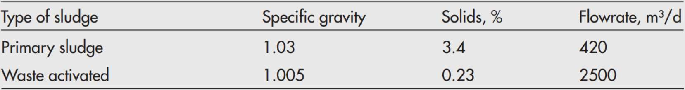
      - **Hình này chứng minh điều gì**
        - Cung cấp tỷ trọng, hàm lượng chất rắn khô và lưu lượng ngày của hai dòng bùn thải.
      - **Từ đâu mà thấy được**
        - Hai hàng số liệu cho bùn sơ cấp ($S = 1.03$, $3.4\%$, $420\text{ m}^3/\text{d}$) và bùn hoạt tính dư ($S = 1.005$, $0.23\%$, $2500\text{ m}^3/\text{d}$).
  - Bùn sơ cấp (primary sludge):
    - Lưu lượng dòng vào: $Q_1 = 420\text{ m}^3/\text{ngày}$.
    - Tỷ trọng bùn: $S_1 = 1.03$.
    - Hàm lượng chất rắn khô: $P_{s1} = 3.4\%$ (tương ứng phần thập phân $0.034$).
  - Bùn hoạt tính dư (waste activated sludge - WAS):
    - Lưu lượng dòng vào: $Q_2 = 2500\text{ m}^3/\text{ngày}$.
    - Tỷ trọng bùn: $S_2 = 1.005$.
    - Hàm lượng chất rắn khô: $P_{s2} = 0.23\%$ (tương ứng phần thập phân $0.0023$).
  - Khối lượng riêng của nước tinh khiết: $\rho_w = 1000\text{ kg/m}^3$.
  - Tiêu chuẩn thiết kế kỹ thuật đối với bùn hỗn hợp sơ cấp và WAS (trích dẫn từ Slide 15 và 16):
    - Dải tải trọng thủy lực bề mặt cho phép: $\text{HLR} = 6 - 12\text{ m}^3/(\text{m}^2\cdot\text{d})$; chọn giá trị thiết kế cơ sở $\text{HLR}_{\text{design}} = 8.0\text{ m}^3/(\text{m}^2\cdot\text{d})$.
    - Dải tải trọng chất rắn bề mặt cho phép: $\text{SLR} = 25 - 70\text{ kg}/(\text{m}^2\cdot\text{d})$ (đối với bùn nén đạt $2\% - 6\%$) hoặc $40 - 80\text{ kg}/(\text{m}^2\cdot\text{d})$ (đối với bùn nén đạt $4\% - 7\%$); chọn giá trị thiết kế cơ sở $\text{SLR}_{\text{design}} = 50.0\text{ kg}/(\text{m}^2\cdot\text{d})$.
    - Số lượng đơn nguyên bể: Bố trí tối thiểu $N = 2$ bể tròn vận hành song song để đảm bảo tính dự phòng khi bảo dưỡng thiết bị cào bùn.
    - Chiều sâu nước thành bên ($\text{SWD}$ - side water depth): Chọn $\text{SWD} = 3.50\text{ m}$ (tiêu chuẩn khuyến nghị $3.0 - 4.0\text{ m}$).
    - Độ dốc đáy côn thu bùn: Chọn $i = 1:6$ (tương đương độ dốc $16.67\%$).
    - Chiều dày lớp đệm bùn nén đáy bể: Thiết kế duy trì $h_{\text{blanket}} = 1.50\text{ m}$ (nằm trong dải quy chuẩn $0.5 - 2.5\text{ m}$).
    - Nồng độ chất rắn khô bùn nén đáy mục tiêu: $P_{s,\text{out}} = 5.0\%$ ($0.050$), tỷ trọng bùn sau nén $S_{\text{thick}} = 1.015$ ($\rho_{\text{thick}} = 1015\text{ kg/m}^3$).
    - Hiệu suất thu hồi chất rắn khô của bể cô đặc: $\eta_{\text{capture}} = 90.0\%$ ($0.90$).
- **Quy tắc áp dụng**:
  - Nguyên lý bảo toàn khối lượng chất rắn khô: Khối lượng chất rắn trong từng dòng bùn bằng tích của thể tích dòng chảy, khối lượng riêng của nước, tỷ trọng bùn và phần trăm chất rắn khô:
    $$M_s = Q \times \rho_w \times S \times P_s$$
  - Công thức diện tích bề mặt bể yêu cầu theo tải trọng chất rắn bề mặt ($\text{SLR}$):
    $$A_{\text{solids}} = \frac{M_{\text{solids}}}{\text{SLR}_{\text{design}}}$$
  - Công thức diện tích bề mặt bể yêu cầu theo tải trọng thủy lực tràn ($\text{HLR}$):
    $$A_{\text{hydraulic}} = \frac{Q_{\text{sludge}}}{\text{HLR}_{\text{design}}}$$
  - Quy tắc diện tích khống chế thiết kế: Kích thước bề mặt thực tế của công trình phải thỏa mãn đồng thời cả hai điều kiện giới hạn tải trọng, do đó diện tích tính toán khống chế là giá trị lớn nhất giữa hai diện tích:
    $$A_{\text{gov}} = \max(A_{\text{solids}}, A_{\text{hydraulic}})$$
  - Công thức đường kính bể tròn cho $N$ đơn nguyên:
    $$D = \sqrt{\frac{4 \cdot A_1}{\pi}} = \sqrt{\frac{4 \cdot A_{\text{gov}}}{N \cdot \pi}}$$
  - Nguyên tắc kiểm soát thời gian lưu bùn trong lớp đệm ($\theta_{\text{blanket}}$): Duy trì thời gian lưu trong khoảng $12 - 24\text{ giờ}$ nhằm bảo đảm quá trình nén ép bùn đạt nồng độ tối ưu mà không gây thối rữa yếm khí và bốc mùi:
    $$\theta_{\text{blanket}} = \frac{V_{\text{blanket}}}{Q_{\text{thick}}} \times 24\text{ h/d}$$
- **Lời giải**:
  - **Bước 1**: Tính toán lưu lượng và tải lượng khối lượng chất rắn khô của từng dòng bùn.
    - Căn cứ: Công thức tính tải lượng chất rắn khô $M_s = Q \times \rho_w \times S \times P_s$ (Nguồn: Phương trình liên hệ khối lượng - thể tích trên Slide 8 và 9).
    - Nhìn vào: Bảng thông số trong Hình 14 cho bùn sơ cấp ($Q_1 = 420\text{ m}^3/\text{d}$, $S_1 = 1.03$, $P_{s1} = 0.034$) và bùn hoạt tính dư WAS ($Q_2 = 2500\text{ m}^3/\text{d}$, $S_2 = 1.005$, $P_{s2} = 0.0023$):
      - Khối lượng chất rắn khô của bùn sơ cấp:
        $$M_{\text{solids}, 1} = 420\text{ m}^3/\text{d} \times 1000\text{ kg/m}^3 \times 1.03 \times 0.034 = 14,708.40\text{ kg TS/d}$$
      - Khối lượng chất rắn khô của bùn hoạt tính dư WAS:
        $$M_{\text{solids}, 2} = 2500\text{ m}^3/\text{d} \times 1000\text{ kg/m}^3 \times 1.005 \times 0.0023 = 5,778.75\text{ kg TS/d}$$
      - Tổng tải lượng khối lượng chất rắn khô nạp vào hệ thống bể cô đặc:
        $$M_{\text{solids}} = M_{\text{solids}, 1} + M_{\text{solids}, 2} = 14,708.40 + 5,778.75 = 20,487.15\text{ kg TS/d}$$
      - Tổng lưu lượng thể tích bùn nạp vào hệ thống bể cô đặc:
        $$Q_{\text{sludge}} = Q_1 + Q_2 = 420 + 2500 = 2920.00\text{ m}^3/\text{d}$$
  - **Bước 2**: Xác định đặc tính hỗn hợp bùn nạp vào bể cô đặc.
    - Căn cứ: Công thức tính khối lượng tổng và tỷ trọng bình quân của bùn hỗn hợp:
      $$M_{\text{sludge}} = Q_1 \times \rho_w \times S_1 + Q_2 \times \rho_w \times S_2$$
      $$S_{\text{sludge, in}} = \frac{M_{\text{sludge}}}{Q_{\text{sludge}} \times \rho_w}$$
      $$P_{s,\text{in}} = \frac{M_{\text{solids}}}{M_{\text{sludge}}} \times 100\%$$
    - Nhìn vào: Giá trị lưu lượng và tỷ trọng của hai dòng bùn:
      - Khối lượng tổng của dòng bùn hỗn hợp:
        $$M_{\text{sludge}} = 420 \times 1030 + 2500 \times 1005 = 432,600 + 2,512,500 = 2,945,100\text{ kg/d}$$
      - Tỷ trọng bình quân của dòng bùn hỗn hợp:
        $$S_{\text{sludge, in}} = \frac{2,945,100\text{ kg/d}}{2920\text{ m}^3/\text{d} \times 1000\text{ kg/m}^3} = 1.0086$$
        (Tương ứng khối lượng riêng của bùn hỗn hợp $\rho_{\text{sludge, in}} = 1008.6\text{ kg/m}^3$).
      - Nồng độ chất rắn khô của dòng bùn hỗn hợp nạp:
        $$P_{s,\text{in}} = \frac{20,487.15\text{ kg TS/d}}{2,945,100\text{ kg/d}} \times 100\% = 0.6956\% \approx 0.70\%$$
        (Giá trị này nằm hoàn toàn trong khoảng thực nghiệm $0.5\% - 1.5\%$ cho bùn hỗn hợp chưa nén nêu trong Bảng Slide 16).
  - **Bước 3**: Tính toán diện tích bề mặt yêu cầu theo tải trọng chất rắn và tải trọng thủy lực.
    - Căn cứ: Công thức tính diện tích theo $\text{SLR}$ và $\text{HLR}$ (Nguồn: Tiêu chuẩn thiết kế bể cô đặc trên Slide 14 và 15).
    - Nhìn vào: Giá trị tải trọng thiết kế đã chọn $\text{SLR}_{\text{design}} = 50.0\text{ kg}/(\text{m}^2\cdot\text{d})$ và $\text{HLR}_{\text{design}} = 8.0\text{ m}^3/(\text{m}^2\cdot\text{d})$:
      - Diện tích mặt thoáng yêu cầu theo tải trọng chất rắn ($A_{\text{solids}}$):
        $$A_{\text{solids}} = \frac{M_{\text{solids}}}{\text{SLR}_{\text{design}}} = \frac{20,487.15\text{ kg TS/d}}{50.0\text{ kg}/(\text{m}^2\cdot\text{d})} = 409.743\text{ m}^2$$
      - Diện tích mặt thoáng yêu cầu theo tải trọng thủy lực ($A_{\text{hydraulic}}$):
        $$A_{\text{hydraulic}} = \frac{Q_{\text{sludge}}}{\text{HLR}_{\text{design}}} = \frac{2920.00\text{ m}^3/\text{d}}{8.0\text{ m}^3/(\text{m}^2\cdot\text{d})} = 365.000\text{ m}^2$$
      - Lựa chọn diện tích khống chế thiết kế ($A_{\text{gov}}$):
        $$A_{\text{gov}} = \max(A_{\text{solids}}, A_{\text{hydraulic}}) = \max(409.743\text{ m}^2, 365.000\text{ m}^2) = 409.743\text{ m}^2$$
        *Kết luận: Quá trình nén ép bùn bị khống chế bởi tải trọng chất rắn bề mặt ($A_{\text{solids}} > A_{\text{hydraulic}}$), đây là đặc trưng phổ biến của các bể cô đặc bùn sinh học.*
  - **Bước 4**: Xác định số lượng bể, kích thước hình học và kiểm tra tải trọng thực tế.
    - Căn cứ: Thiết kế hệ thống gồm $N = 2$ bể cô đặc tròn đối xứng hoạt động song song.
    - Nhìn vào: Diện tích khống chế $A_{\text{gov}} = 409.743\text{ m}^2$:
      - Diện tích mặt thoáng yêu cầu cho một bể ($A_1$):
        $$A_1 = \frac{A_{\text{gov}}}{2} = \frac{409.743\text{ m}^2}{2} = 204.872\text{ m}^2/\text{bể}$$
      - Đường kính lý thuyết của bể tròn ($D_{\text{lt}}$):
        $$D_{\text{lt}} = \sqrt{\frac{4 \cdot A_1}{\pi}} = \sqrt{\frac{4 \times 204.872}{3.14159}} = \sqrt{260.852} = 16.151\text{ m}$$
      - Lựa chọn đường kính quy chuẩn thương mại cho hệ cầu cào bùn:
        $$\text{Chọn đường kính thiết kế: } D = 16.50\text{ m}$$
      - Diện tích bề mặt thực tế cung cấp của mỗi bể:
        $$A_{\text{prov}, 1} = \frac{\pi \cdot (16.50)^2}{4} = 213.825\text{ m}^2/\text{bể}$$
      - Tổng diện tích bề mặt thực tế cung cấp của cả $2$ bể:
        $$A_{\text{prov, total}} = 2 \times 213.825 = 427.649\text{ m}^2 \approx 427.65\text{ m}^2$$
      - Kiểm tra tải trọng chất rắn thực tế ($\text{SLR}_{\text{actual}}$):
        $$\text{SLR}_{\text{actual}} = \frac{20,487.15\text{ kg TS/d}}{427.65\text{ m}^2} = 47.91\text{ kg}/(\text{m}^2\cdot\text{d}) \le 50.0\text{ kg}/(\text{m}^2\cdot\text{d})$$
        (Giá trị này hoàn toàn thỏa mãn giới hạn an toàn và nằm gọn trong dải cho phép $25 - 70\text{ kg}/(\text{m}^2\cdot\text{d})$ và $40 - 80\text{ kg}/(\text{m}^2\cdot\text{d})$).
      - Kiểm tra tải trọng thủy lực thực tế ($\text{HLR}_{\text{actual}}$):
        $$\text{HLR}_{\text{actual}} = \frac{2920.00\text{ m}^3/\text{d}}{427.65\text{ m}^2} = 6.83\text{ m}^3/(\text{m}^2\cdot\text{d}) < 8.0\text{ m}^3/(\text{m}^2\cdot\text{d})$$
        (Giá trị này nằm hoàn hảo trong dải tiêu chuẩn cho phép $6 - 12\text{ m}^3/(\text{m}^2\cdot\text{d})$, bảo đảm vận tốc dâng chất lỏng thấp, không gây cuốn trôi bùn qua máng tràn).
  - **Bước 5**: Thiết kế chiều sâu bể và độ dốc đáy côn thu bùn.
    - Căn cứ: Bán kính bể $R = \frac{D}{2}$, chiều sâu nước thành bên $\text{SWD} = 3.50\text{ m}$, độ dốc đáy côn $i = 1:6$.
    - Nhìn vào: Đường kính bể $D = 16.50\text{ m}$ (bán kính $R = 8.25\text{ m}$):
      - Chiều sâu phần đáy côn thu cặn ($H_{\text{cone}}$):
        $$H_{\text{cone}} = \frac{R}{6} = \frac{8.25\text{ m}}{6} = 1.375\text{ m}$$
      - Tổng chiều sâu tâm bể tại hố thu cặn ($H_{\text{center}}$):
        $$H_{\text{center}} = \text{SWD} + H_{\text{cone}} = 3.50 + 1.375 = 4.875\text{ m} \approx 4.88\text{ m}$$
      - Dung tích phần hình trụ của một bể:
        $$V_{\text{cyl}, 1} = A_{\text{prov}, 1} \times \text{SWD} = 213.825 \times 3.50 = 748.388\text{ m}^3$$
      - Dung tích phần hình côn đáy của một bể:
        $$V_{\text{cone}, 1} = \frac{1}{3} \times A_{\text{prov}, 1} \times H_{\text{cone}} = \frac{1}{3} \times 213.825 \times 1.375 = 98.003\text{ m}^3$$
      - Tổng dung tích hữu ích một bể:
        $$V_{\text{tank}, 1} = 748.388 + 98.003 = 846.391\text{ m}^3$$
      - Tổng dung tích hữu ích của cả $2$ bể:
        $$V_{\text{tank, total}} = 2 \times 846.391 = 1692.78\text{ m}^3$$
  - **Bước 6**: Kiểm tra chiều dày lớp đệm bùn và thời gian lưu bùn nén ($\theta_{\text{blanket}}$).
    - Căn cứ: Chiều cao lớp đệm bùn thiết kế duy trì $h_{\text{blanket}} = 1.50\text{ m}$ tính từ đáy tâm bể (bao gồm chiều cao phần côn $1.375\text{ m}$ và một lớp mỏng $0.125\text{ m}$ phần hình trụ phía trên).
    - Nhìn vào: Chiều cao phần trụ thuộc lớp đệm $h_{\text{cyl,blanket}} = 1.50 - 1.375 = 0.125\text{ m}$:
      - Dung tích lớp đệm bùn trong một bể:
        $$V_{\text{blanket}, 1} = V_{\text{cone}, 1} + A_{\text{prov}, 1} \times 0.125 = 98.003 + 213.825 \times 0.125 = 98.003 + 26.728 = 124.731\text{ m}^3$$
      - Tổng dung tích lớp đệm bùn trong cả $2$ bể:
        $$V_{\text{blanket, total}} = 2 \times 124.731 = 249.462\text{ m}^3$$
      - Lưu lượng bùn cô đặc rút ra đáy bể ($Q_{\text{thick}} = 363.32\text{ m}^3/\text{d}$ từ kết quả tính toán ở Bước 7):
        $$\theta_{\text{blanket}} = \frac{V_{\text{blanket, total}}}{Q_{\text{thick}}} \times 24\text{ h/d} = \frac{249.462\text{ m}^3}{363.32\text{ m}^3/\text{d}} \times 24\text{ h/d} = 16.48\text{ giờ}$$
      - Nhận xét đánh giá: Giá trị thời gian lưu bùn nén $\theta_{\text{blanket}} = 16.48\text{ giờ}$ hoàn toàn nằm trong dải quy chuẩn tối ưu $12 - 24\text{ giờ}$ (theo khuyến nghị trên Slide 14). Thời gian này đủ dài để lực nén cơ học ép chặt các bông cặn đạt nồng độ $5.0\%$ chất rắn, đồng thời đủ ngắn để triệt tiêu nguy cơ bùn bị thối rữa yếm khí và bốc mùi.
  - **Bước 7**: Cân bằng vật chất và xác định lưu lượng các dòng sản phẩm sau cô đặc.
    - Căn cứ: Hiệu suất thu hồi chất rắn khô $\eta_{\text{capture}} = 90.0\%$, nồng độ chất rắn bùn nén đáy $P_{s,\text{out}} = 5.0\%$, tỷ trọng bùn nén $S_{\text{thick}} = 1.015$ ($\rho_{\text{thick}} = 1015\text{ kg/m}^3$).
    - Nhìn vào: Tổng tải lượng chất rắn $M_{\text{solids}} = 20,487.15\text{ kg TS/d}$ và tổng lưu lượng nạp $Q_{\text{sludge}} = 2920.00\text{ m}^3/\text{d}$:
      - Tải lượng chất rắn khô thu hồi trong dòng bùn cô đặc đáy:
        $$M_{\text{underflow}} = M_{\text{solids}} \times \eta_{\text{capture}} = 20,487.15 \times 0.90 = 18,438.435\text{ kg TS/d}$$
      - Lưu lượng bùn cô đặc bơm ra đáy ($Q_{\text{thick}}$):
        $$Q_{\text{thick}} = \frac{M_{\text{underflow}}}{\rho_w \times S_{\text{thick}} \times P_{s,\text{out}}} = \frac{18,438.435\text{ kg/d}}{1000 \times 1.015 \times 0.050} = \frac{18,438.435}{50.75} = 363.319\text{ m}^3/\text{d} \approx 363.32\text{ m}^3/\text{d}$$
      - Lưu lượng dòng nước trong sau cô đặc tràn qua máng thu ($Q_{\text{overflow}}$):
        $$Q_{\text{overflow}} = Q_{\text{sludge}} - Q_{\text{thick}} = 2920.00 - 363.32 = 2556.68\text{ m}^3/\text{d}$$
      - Tải lượng và nồng độ chất rắn lơ lửng trong dòng nước tràn:
        $$M_{\text{overflow}} = M_{\text{solids}} \times (1 - \eta_{\text{capture}}) = 20,487.15 \times 0.10 = 2048.715\text{ kg TS/d}$$
        $$\text{TSS}_{\text{overflow}} = \frac{M_{\text{overflow}}}{Q_{\text{overflow}}} = \frac{2048.715\text{ kg/d}}{2556.68\text{ m}^3/\text{d}} = 0.8013\text{ kg/m}^3 = 801.3\text{ mg/L}$$
      - Hiệu quả giảm thể tích bùn thải nhờ quá trình cô đặc:
        $$\% \text{ Giảm thể tích} = \frac{Q_{\text{sludge}} - Q_{\text{thick}}}{Q_{\text{sludge}}} \times 100\% = \frac{2920.00 - 363.32}{2920.00} \times 100\% = 87.56\%$$
        *Nhận xét: Thể tích bùn cần xử lý tiếp theo giảm đi $8.04\text{ lần}$ (từ $2920\text{ m}^3/\text{d}$ xuống $363.3\text{ m}^3/\text{d}$), giúp tiết kiệm hơn $87\%$ quy mô dung tích các công trình phân hủy kỵ khí hoặc công suất thiết bị máy ép bùn phía sau.*
- **Kết quả**:
  - Bảng tổng hợp các thông số kỹ thuật thiết kế của hệ thống bể cô đặc bùn trọng lực:
| Thông số kỹ thuật | Ký hiệu | Giá trị thiết kế | Đơn vị | Tiêu chuẩn / Ghi chú kỹ thuật |
|---|:---:|:---:|:---:|---|
| Số lượng đơn nguyên bể | $N$ | **2** | bể | Bể tròn đối xứng, đảm bảo dự phòng bảo trì |
| Đường kính danh định mỗi bể | $D$ | **16.50** | $\mathbf{m}$ | Tiêu chuẩn cơ khí cầu cào bùn tâm |
| Chiều sâu nước thành bên | $\text{SWD}$ | **3.50** | m | Nằm trong dải quy chuẩn $3.0 - 4.0\text{ m}$ |
| Chiều sâu phần đáy côn | $H_{\text{cone}}$ | **1.38** | m | Độ dốc đáy $i = 1:6$ nghiêng về hố thu tâm |
| Tổng chiều sâu tâm bể | $H_{\text{center}}$ | **4.88** | m | $\text{SWD} + H_{\text{cone}}$ |
| Tổng diện tích mặt thoáng cung cấp | $A_{\text{prov, total}}$ | **427.65** | $\text{m}^2$ | Diện tích tính toán yêu cầu: $409.74\text{ m}^2$ |
| Tải trọng chất rắn thực tế | $\text{SLR}_{\text{actual}}$ | **47.91** | $\mathbf{kg}/(\mathbf{m^2\cdot d})$ | Thỏa mãn giới hạn $\le 50.0\text{ kg}/(\text{m}^2\cdot\text{d})$ |
| Tải trọng thủy lực thực tế | $\text{HLR}_{\text{actual}}$ | **6.83** | $\mathbf{m^3}/(\mathbf{m^2\cdot d})$ | Thỏa mãn dải quy chuẩn $6.0 - 12.0\text{ m}^3/(\text{m}^2\cdot\text{d})$ |
| Chiều dày lớp đệm bùn nén | $h_{\text{blanket}}$ | **1.50** | m | Khuyến nghị quy chuẩn $0.5 - 2.5\text{ m}$ |
| Thời gian lưu bùn trong lớp đệm | $\theta_{\text{blanket}}$ | **16.48** | **giờ** | Nằm trong vùng tối ưu $12 - 24\text{ h}$ chống thối rữa |
| Lưu lượng bùn cô đặc đáy ($5.0\%$ TS) | $Q_{\text{thick}}$ | **363.32** | $\text{m}^3/\text{d}$ | Chuyển tiếp sang bể phân hủy hoặc máy ép bùn |
| Lưu lượng nước trong qua máng tràn | $Q_{\text{overflow}}$ | **2556.68** | $\text{m}^3/\text{d}$ | $\text{TSS} \approx 801\text{ mg/L}$, tuần hoàn về đầu trạm |
| Hiệu suất thu hồi chất rắn khô | $\eta_{\text{capture}}$ | **90.0** | % | Thu gom bùn nén về hố cặn trung tâm |
| Tỷ lệ giảm thể tích dòng bùn | $\% \Delta V$ | **87.56** | % | Giảm $8.04\text{ lần}$ thể tích chất lỏng cần xử lý |
- **Kiểm tra lại**:
  - Kiểm tra tính bảo toàn khối lượng dòng chất lỏng và dòng chất rắn:
    - Cân bằng lưu lượng thể tích: $Q_{\text{thick}} + Q_{\text{overflow}} = 363.32 + 2556.68 = 2920.00\text{ m}^3/\text{d} = Q_{\text{sludge}}$ (Bảo toàn thể tích tuyệt đối $100\%$).
    - Cân bằng tải lượng chất rắn khô: $M_{\text{underflow}} + M_{\text{overflow}} = 18,438.44 + 2048.71 = 20,487.15\text{ kg TS/d} = M_{\text{solids}}$ (Bảo toàn khối lượng tuyệt đối $100\%$).
  - Kiểm tra điều kiện vận hành thủy lực an toàn:
    - Giá trị $\text{HLR}_{\text{actual}} = 6.83\text{ m}^3/(\text{m}^2\cdot\text{d})$ nằm cách xa ngưỡng tối đa $12\text{ m}^3/(\text{m}^2\cdot\text{d})$, bảo đảm vận tốc dâng chất lỏng chỉ khoảng $0.285\text{ m/h}$, nhỏ hơn nhiều so với vận tốc lắng của hạt bông bùn.
    - Giá trị $\text{SLR}_{\text{actual}} = 47.91\text{ kg}/(\text{m}^2\cdot\text{d})$ nằm trọn trong dải an toàn cho hỗn hợp bùn ($25 - 70$ và $40 - 80\text{ kg}/(\text{m}^2\cdot\text{d})$), không gây tắc nghẽn hoặc quá tải giàn cào cặn cơ học.
  - Kiểm tra nguy cơ yếm khí sinh mùi: Thời gian lưu trong lớp đệm bùn $\theta_{\text{blanket}} = 16.48\text{ h}$ thỏa mãn triệt để tiêu chí $12 - 24\text{ giờ}$, ngăn ngừa bọt khí sinh học làm nổi bùn.

